# سفر شرکت خود را در شبکه Bitcoin آغاز کنید

قابلیت‌های عملی Bitcoin و Lightning Network را کشف کنید و ببینید چگونه می‌توانند، درست مانند اینترنت، **عملیات کسب‌وکار شما را متحول کنند**. از سرمایه دیجیتال تا پرداخت‌های سریع، اقتصادی و مقیاس‌پذیر، Bitcoin طیف وسیعی از **موارد استفاده برای کسب‌وکارها** را ارائه می‌دهد.

در طول این راهنما، شما یاد خواهید گرفت که چگونه Bitcoin را به عنوان یک شبکه پولی جهانی، جهانی و بومی اینترنت درک کنید. با ویژگی‌های بنیادی منحصر به فرد خود، **Bitcoin بهبودهای قابل توجهی نسبت به شبکه‌های ارزی سنتی ارائه می‌دهد**. شما کشف خواهید کرد که چرا و چگونه می‌توان از Bitcoin برای موارد استفاده مالی کلاسیک مانند ذخیره سرمایه و سیستم‌های پرداخت بهره برد. علاوه بر این، این راهنما شامل نحوه کسب و نگهداری Bitcoin، از جمله الزامات حسابداری و مالی مرتبط، و همچنین پیاده‌سازی راه‌حل‌های پرداخت Bitcoin ساده یا در مقیاس بزرگ خواهد بود.

چه شما یک **کسب‌وکار کوچک یا یک شرکت بزرگ** باشید، ادغام Bitcoin در عملیات روزانه شما می‌تواند شرکت شما را **مقاوم‌تر، پربارتر و رقابتی‌تر** کند. هر شرکت مبتنی بر اینترنت به یک شرکت متمرکز بر Bitcoin تبدیل خواهد شد و این دوره اطمینان می‌دهد که شما آماده‌اید. بخش‌های اولیه اصول عملکرد Bitcoin را مرور می‌کنند، بنابراین حتی اگر مبتدی باشید، دانش پایه‌ای لازم برای پیشرفت را کسب خواهید کرد. یادگیری اصول اختراع Satoshi همیشه ایده خوبی است، چه قبل یا بعد از ورود به BIZ101.

+++

# مقدمه

<partId>326cf945-5d3f-4d86-8c3e-4d1c35959799</partId>

## بررسی کلی دوره

<chapterId>1be42be9-4080-49f5-b5b2-6b531dd55f5f</chapterId>

به دوره BIZ101 خوش آمدید! سفر شرکت خود را در شبکه Bitcoin با این دوره آموزشی جامع آغاز کنید - دریچه‌ای به درک چگونگی تحول عملیات تجاری سنتی توسط Bitcoin و Lightning Network. این دوره برای خرده‌فروشان، کارآفرینان، مدیران و تصمیم‌گیرندگان شرکتی طراحی شده است که مایل به کشف قابلیت‌های عملی Bitcoin به عنوان یک شبکه پولی جهانی و بومی اینترنت و یک وسیله قدرتمند ارزش Exchange هستند.

در طول دوره، با اصول بنیادی که Bitcoin و Lightning Network را به‌طور خاص تحول‌آفرین می‌سازند، آشنا خواهید شد. شما خواهید آموخت که چگونه این فناوری‌ها طیفی از موارد استفاده را ارائه می‌دهند، از ذخیره‌سازی سرمایه دیجیتال تا پرداخت‌های سریع، اقتصادی و مقیاس‌پذیر، و چگونه بهبودهای حیاتی نسبت به سیستم‌های سنتی ارز و پرداخت ارائه می‌دهند. دوره BIZ101 نظریه اقتصادی را با کاربردهای دنیای واقعی متصل می‌کند و روشن می‌سازد که چگونه تمرکززدایی می‌تواند وابستگی به واسطه‌ها را کاهش دهد و بر محدودیت‌های ذاتی در سیستم‌های قدیمی غلبه کند.

این دوره با بررسی دقیق ارزهای متعارف و مکانیزم‌های پرداخت آغاز می‌شود و با بررسی چگونگی عملکرد ارز به عنوان یک شبکه برای تسهیل تجارت، پس‌انداز و تخصص اقتصادی، پایه‌گذاری می‌شود. سپس به فناوری پشت Bitcoin و نوآوری‌های معرفی شده توسط Lightning Network می‌پردازیم و نقش‌های آن‌ها در تسهیل تراکنش‌های بی‌وقفه، امن و تقریباً آنی که می‌تواند به کسب‌وکارهایی با اندازه‌های مختلف خدمت کند را آشکار می‌کنیم. سپس به بخش‌های عملی این دوره می‌پردازیم، با بخشی درباره نگهداری بیت‌کوین به عنوان خزانه‌داری شروع کرده و با بخش نهایی درباره پذیرش Bitcoin به عنوان یک وسیله پرداخت به پایان می‌رسیم.

چه شما نماینده یک شرکت کوچک باشید یا یک شرکت بزرگ، این دوره هدف دارد تا شما را با دانش لازم برای ادغام Bitcoin در عملیات روزانه‌تان مجهز کند و به این ترتیب مقاومت، کارایی و مزیت رقابتی شرکت شما را افزایش دهد. همان‌طور که Bitcoin به تغییر شکل چشم‌انداز اقتصادی ادامه می‌دهد، درک این فناوری‌های پیشگام نه تنها یک گزینه بلکه یک ضرورت استراتژیک است. آماده باشید تا با محتوای بینش‌افزا، مثال‌های عملی و راهنمایی‌های استراتژیک درگیر شوید که به شما امکان می‌دهد دنیای در حال تحول Bitcoin را هدایت و از آن بهره‌برداری کنید!

آماده‌اید تا به دنیای Bitcoin برای کسب‌وکارها وارد شوید؟ بزن بریم!

# ارز، سیستم‌های پرداخت، و Bitcoin

<partId>d9bd0e21-8488-44e0-af55-6d0b934f83c2</partId>

## ارزهای سنتی

<chapterId>785e095c-6811-4ca2-ba46-fe38291432d4</chapterId>

### ارزها شبکه هستند

ارزها اساساً شبکه‌هایی هستند که انتقال کارآمد ارزش را امکان‌پذیر می‌سازند.

بدون ارز، افراد باید به **معامله پایاپای** متکی باشند، سیستمی که در آن کالاها یا خدمات به‌طور مستقیم مبادله می‌شوند. معامله پایاپای غیرعملی است زیرا نیاز به "تلاقی دوگانه خواسته‌ها" دارد - هر دو طرف باید همزمان خواهان چیزی باشند که دیگری ارائه می‌دهد. به عنوان مثال، اگر کشاورزی با گندم اضافی بخواهد کفش، باید کفاشی پیدا کند که به‌طور خاص به گندم نیاز داشته باشد. این امر نادر و ناکارآمد است. علاوه بر این، **با n محصول در یک اقتصاد پایاپای، حدود ~n(n−1)/2 نرخ Exchange مورد نیاز است** که سیستمی بسیار پیچیده و دست و پاگیر ایجاد می‌کند. به عنوان مثال، این امر نیاز به بیش از ~124,000 نرخ Exchange برای فقط 500 محصول دارد.

ارز این فرآیند را با عمل به عنوان یک واسطه ساده می‌کند و **شبکه‌ای ایجاد می‌کند که تعداد نرخ‌های Exchange را به n کاهش می‌دهد** —یکی برای هر محصول نسبت به ارز. این امر معاملات را بسیار ساده‌تر می‌کند و **به افراد امکان می‌دهد کالاها و خدمات را بدون نیاز به خواسته‌های متقابل در همان زمان مبادله کنند**. به جای مبادله مستقیم گندم با کفش، کشاورز می‌تواند گندم خود را برای ارز بفروشد و بعداً از آن ارز برای خرید کفش یا هر چیز دیگری که نیاز دارد استفاده کند.

معرفی ارز به عنوان یک شبکه نه تنها تجارت را تسهیل می‌کند بلکه امکان **تقسیم کار و تخصص** را نیز فراهم می‌آورد. با وجود یک واسطه قابل اعتماد مانند Exchange، افراد و جوامع دیگر نیازی به تولید همه چیزهایی که مصرف می‌کنند ندارند. در عوض، می‌توانند بر روی آنچه که بهترین انجام می‌دهند تمرکز کنند و کارایی و کیفیت را افزایش دهند. یک کشاورز می‌تواند در کشت محصولات تخصص پیدا کند، یک کفاش در ساخت کفش و یک سازنده در ساخت خانه‌ها. سپس این متخصصان می‌توانند کالاها و خدمات خود را از طریق ارز Exchange مبادله کنند و از تخصص یکدیگر بهره‌مند شوند. این تخصص باعث **بهره‌وری و نوآوری** می‌شود، زیرا افراد مهارت‌های خود را بهبود می‌بخشند و روش‌های جدیدی در زمینه‌های خود توسعه می‌دهند.

ماهیت شبکه‌ای ارز مزایای قابل توجه اضافی به همراه دارد. اولاً، عضویت در شبکه ارز **بیشتر از خارج بودن از آن سودمند است**. استاندارد مشترک شبکه تجارت را تسهیل می‌کند و به افراد امکان می‌دهد فعالیت‌های اقتصادی خود را حتی **در فواصل دور** هماهنگ کنند. به عنوان مثال، یک تاجر در یک شهر می‌تواند با استفاده از همان ارز با خریداری در شهر دیگر کالا مبادله کند و رشد اقتصادی و همکاری را در مناطق وسیع ترویج دهد.

یکی دیگر از مزایای مهم ارز، توانایی آن در **اجازه دادن به مبادلات معوق** است. در مبادله کالا به کالا، معاملات فوری هستند؛ یک کالا به صورت همزمان با کالای دیگری مبادله می‌شود. اما ارز امکان **پس‌انداز—افراد می‌توانند ارزش را برای استفاده در آینده ذخیره کنند** را فراهم می‌کند. این یک جهش بزرگ به جلو برای برنامه‌ریزی اقتصادی، سرمایه‌گذاری و انباشت ثروت است که همگی زندگی شرکت‌کنندگان در شبکه را بهبود می‌بخشند.

در نتیجه، ارزها شبکه‌هایی هستند که برای انتقال کارآمد ارزش طراحی شده‌اند. آنها بر محدودیت‌های مبادله کالا به کالا غلبه می‌کنند، تجارت را ساده می‌سازند و فرصت‌هایی برای هماهنگی و پس‌انداز ایجاد می‌کنند. درست مانند هر شبکه‌ای، ارزش یک ارز به پذیرش گسترده و کاربرد آن بستگی دارد—در نهایت، بهترین ارز پیروز می‌شود.

### یک ارز خوب چیست؟

یک ارز خوب دارای چندین ویژگی اساسی است که آن را برای تسهیل ارزش Exchange مؤثر می‌سازد. در اینجا توضیح مختصری از هر یک آمده است:

- **امن**: یک ارز باید در برابر سرقت یا دسترسی غیرمجاز محافظت شود تا کاربران بتوانند با اطمینان آن را نگه‌داری و انتقال دهند. امنیت برای ایجاد اعتماد در سیستم بسیار مهم است.

- **ضد جعل**: یک ارز باید بسیار دشوار یا غیرممکن برای جعل باشد. این امر تضمین می‌کند که هر واحد معتبر است، ارزش خود را حفظ می‌کند و از تورمی که توسط واحدهای جعلی وارد گردش می‌شود جلوگیری می‌کند. به عنوان مثال، در طول تاریخ، طلا نه تنها به خاطر زیبایی و کمیابی‌اش ارزشمند بوده است، بلکه به این دلیل که تولید آن به شدت سخت است. برخلاف اسکناس‌های کاغذی یا ورودی‌های دیجیتال، نمی‌توانید به سادگی "طلا بسازید" - باید از زمین استخراج شود. این کمیابی طبیعی و دشواری تولید به طلا کم

- **کمیاب**: یک ارز خوب باید دارای Supply محدود یا انتشار کنترل‌شده باشد. کمیابی تضمین می‌کند که ارزش آن در طول زمان حفظ شود و از تولید بیش از حد که قدرت خرید را کاهش می‌دهد، جلوگیری می‌کند. به عنوان مثال، برخی از قبایل بومی آمریکا از مهره‌ها به عنوان شکلی از ارز استفاده می‌کردند. در ابتدا، تولید این مهره‌ها Hard بود و کمیابی و ارزش آن‌ها را حفظ می‌کرد. اما زمانی که تاجران اروپایی شروع به تولید انبوه و اشباع بازار با مهره‌ها کردند، نایابی آن‌ها از بین رفت. با افزایش Supply، مهره

- بدون مجوز**: در گذشته، ارزهایی مانند سکه‌های طلا و نقره اغلب توسط افراد خصوصی، مقامات محلی یا بازرگانانی که به مواد خام دسترسی داشتند، ضرب می‌شدند. این سیستم گاهی تحت توافق‌نامه‌ها یا مجوزهایی که توسط پادشاهان یا حاکمان اعطا می‌شد، عمل می‌کرد. با گذشت زمان، پادشاهان و دولت‌ها این فرآیند را متمرکز کردند تا کنترل بیشتری بر ثبات اقتصادی، مالیات و سیستم پولی داشته باشند. یکی از نمونه‌های معروف، **تالر** است، یک سکه نقره‌ای که اولین بار در سال 1518 در **دره یوآخیمستال** (امروزه یاکیموف در جمهوری چک) توسط معدنچیان و مقامات محلی ضرب شد. نام "تالر" از کلمه آلمانی **"Thal"** به معنای "دره" گرفته شده است. این سکه‌ها که به خاطر نقره با کیفیت بالا شناخته می‌شدند، به طور گسترده‌ای در سراسر اروپا به گردش درآمدند. با گذشت زمان، این اصطلاح از نظر زبانی و جغرافیایی تکامل یافت و در نهایت به نام "دلار" تبدیل شد که در ایالات متحده برای ارز آن به کار گرفته شد.

در عصر مدرن، ارزها تحت سیستم سینیورژ به طور کامل مجاز شدند، به این معنی که تنها نهادهای مجاز—مانند بانک‌های مرکزی یا خزانه‌داری‌ها—می‌توانند سکه ضرب کنند یا اسکناس چاپ کنند. افراد دیگر به طور قانونی مجاز به تولید ارز نیستند، که این امر کنترل متمرکز بر انتشار آن و Supply را تضمین می‌کند.

امروز، اصل درآمد ضرب پول توسط ارز دیجیتال Bitcoin به چالش کشیده شده است، که بدون کنترل متمرکز عمل می‌کند. Bitcoin یک سیستم "بدون نیاز به مجوز" است که در آن هر کسی می‌تواند بدون درخواست مجوز در استفاده از ارز شرکت کند و از طریق Mining، آن را ایجاد کند. این تمرکززدایی، انحصار انتشار را از دولت‌ها می‌گیرد و سوالاتی را درباره بازگشت احتمالی به سیستم‌های ارزی رقابتی بازار آزاد مطرح می‌کند.

- **واحد حساب**: یک ارز باید یک معیار استاندارد برای مقایسه ارزش کالاها و خدمات فراهم کند. این امر تجارت را ساده می‌کند و قیمت‌گذاری را در معاملات شفاف و سازگار می‌سازد.

- **با دوام**: یک ارز باید در برابر سایش و پارگی در طول زمان مقاومت کند. ارزهای فیزیکی، مانند سکه‌ها یا اسکناس‌ها، باید در برابر آسیب مقاومت کنند، در حالی که ارزهای دیجیتال باید به‌طور ایمن ذخیره شوند بدون خطر از دست رفتن داده‌ها.

- **قابل حمل**: یک ارز باید به راحتی قابل حمل و استفاده باشد، به طوری که تجارت در فواصل مختلف را ممکن سازد. این امر می‌تواند از طریق قابلیت حمل فیزیکی (سکه‌ها یا اسکناس‌های سبک) یا سیستم‌های انتقال دیجیتال محقق شود.

- **قابل تقسیم**: یک ارز باید به واحدهای کوچکتر تقسیم شود تا معاملات با اندازه‌های مختلف را تسهیل کند. این انعطاف‌پذیری تضمین می‌کند که هم برای خریدهای کوچک و هم برای تجارت در مقیاس بزرگ عملی است.

- **قابل تعویض**: تمام واحدهای یک ارز باید قابل تعویض و دارای ارزش برابر باشند. به عنوان مثال، یک اسکناس یک دلاری باید معادل هر اسکناس یک دلاری دیگر باشد. این یکنواختی، عدالت و سادگی در معاملات را تضمین می‌کند.

- **قابل شناسایی**: یک ارز باید به راحتی قابل تشخیص و قابل اعتماد باشد. ارزهای فیزیکی این امر را از طریق طراحی‌های منحصر به فرد و ویژگی‌های امنیتی به دست می‌آورند، در حالی که ارزهای دیجیتال ممکن است به پروتکل‌های تأیید متکی باشند. این امر پذیرش گسترده را تضمین می‌کند و خطر تقلب را کاهش می‌دهد.

این ویژگی‌ها یک ارز را برای تسهیل تجارت و ذخیره ارزش در یک اقتصاد عملی، قابل اعتماد و کارآمد می‌سازند.

### تکامل سیستم‌های ارزی

**از سکه‌ها تا اسکناس: افزایش کارایی و قابلیت حمل**

گذار از سکه‌ها به پول کاغذی نشان‌دهنده بهبود قابل توجهی در **قابلیت حمل** و کارایی بود. سکه‌ها که از فلزات گرانبهایی مانند طلا یا نقره ساخته می‌شدند، به دلیل ارزش ذاتی خود ارزشمند بودند. با این حال، آن‌ها سنگین بودند، حمل و نقل آن‌ها در مقادیر زیاد دشوار بود و در معرض فرسودگی یا سرقت قرار داشتند. پول کاغذی با معرفی یک واسطه سبک، استاندارد و قابل حمل که ارزش را نمایندگی می‌کرد نه اینکه آن را در خود داشته باشد، شبکه‌های ارزی را متحول کرد. این نوآوری به اقتصادها اجازه داد تا با تسهیل تجارت در مسافت‌های طولانی و کاهش چالش‌های لجستیکی استفاده از کالاهای فیزیکی به عنوان پول، مقیاس‌پذیر شوند.

پول کاغذی همچنین مقیاس‌پذیری را افزایش داد. به جای تکیه بر Supply محدود فلزات گرانبها، اقتصادها می‌توانستند پایه پولی خود را از طریق ارزهای نماینده گسترش دهند، که در ابتدا توسط ذخایر و بعدها توسط اعتماد به نهادهای صادرکننده پشتیبانی می‌شد. این تغییر راه را برای سیستم‌های مالی پیچیده‌تر و به هم پیوسته‌تر هموار کرد.

**از پول کاغذی به پول الکترونیکی: گسترش دسترسی و سرعت**

انتقال از پول کاغذی به پول الکترونیکی شبکه ارزی را با افزایش دسترسی و سرعت بهبود بخشید. با ظهور سیستم‌های بانکی، کارت‌های اعتباری و تراکنش‌های دیجیتال، پول نه تنها **قابل حمل** بلکه تقریباً **فوری** شد. انتقالات الکترونیکی نیاز به Exchange فیزیکی را از بین برد و امکان انجام تراکنش‌ها در فواصل طولانی در عرض چند ثانیه را فراهم کرد.

این تغییر همچنین دسترسی به ارز را دموکراتیزه کرد. سیستم‌های بانکی و پرداخت الکترونیکی موانع ورود برای افراد و کسب‌وکارها را کاهش دادند و امکان مشارکت در اقتصاد جهانی را فراهم کردند. سرعت و راحتی پول الکترونیکی شبکه‌های تجاری را گسترش داد و مدل‌های کسب‌وکار جدیدی را ایجاد کرد که در یک سیستم مبتنی بر کاغذ غیرممکن بود.

این شبکه‌های مدرن ارزی با یک نقطه ضعف قابل توجه همراه بودند: **کمبود قابلیت حسابرسی و شفافیت در مدیریت پول Supply** که اغلب منجر به تورم کنترل‌نشده و از دست رفتن اعتماد به سیستم‌های متمرکز می‌شود. به عنوان مثال، بیش از ۲۰٪ از تمام دلارهای در گردش ایالات متحده تنها در چهار سال گذشته چاپ شده‌اند. این وسوسه مداوم برای صدور بیشتر ارز—که در نتیجه آن ارزش نگهداری شده توسط دارندگان فعلی کاهش می‌یابد—تا حد زیادی به یک نقص سیستماتیک نسبت داده می‌شود: سیاستمداران اغلب تشویق می‌شوند تا از تصمیمات سخت بودجه‌ای اجتناب کنند و به جای آن، چالش‌ها را به دولت‌های آینده موکول کنند و "توپ را به جلو بیندازند."

**از ارز متمرکز به ارز غیرمتمرکز: تقویت اعتماد و حاکمیت**

امروزه، ظهور Bitcoin به عنوان یک ارز غیرمتمرکز نمایانگر جهش بعدی در شبکه‌های ارزی است. پول الکترونیکی سنتی به مقامات متمرکز، مانند بانک‌ها یا دولت‌ها، برای مدیریت و تأیید تراکنش‌ها متکی است. در حالی که این سیستم‌ها مؤثر هستند، اما در برابر ناکارآمدی‌ها، سانسور و نقاط شکست واحد آسیب‌پذیرند. ارزهای غیرمتمرکز با **توزیع اعتماد و حذف واسطه‌ها** این ویژگی‌های شبکه را بهبود می‌بخشند. این همچنین به این معناست که پول می‌تواند **سریع‌تر** و **ارزان‌تر** حرکت کند، زیرا هیچ مرحله تأییدیه‌ای وجود ندارد. در نهایت، هیچ انسانی نمی‌تواند وسوسه شود که برنامه زمانی ارز Bitcoin و Supply را تغییر دهد، زیرا این برنامه توسط نرم‌افزار اجرا می‌شود.

در سیستم‌های غیرمتمرکز، تراکنش‌ها توسط یک شبکه جهانی از شرکت‌کنندگان با استفاده از فناوری Blockchain تأیید می‌شوند که امنیت، شفافیت و مقاومت را تضمین می‌کند. این ساختار خطر تقلب را به حداقل می‌رساند، وابستگی به مقامات مرکزی را کاهش می‌دهد و به افراد قدرت می‌دهد تا کنترل بیشتری بر امور مالی خود داشته باشند. با حذف موانع جغرافیایی و نهادی، ارزهای غیرمتمرکز یک سیستم پولی واقعاً جهانی و فراگیر ارائه می‌دهند.

**تکامل شبکه‌های ارزی**

هر مرحله در تکامل شبکه‌های ارزی ویژگی‌های کلیدی را بهبود بخشیده است: قابلیت حمل، مقیاس‌پذیری، دسترسی، سرعت، امنیت و اعتماد. سکه‌ها جای خود را به پول کاغذی دادند تا قابلیت حمل و کارایی بهتری داشته باشند. پول کاغذی به پول الکترونیکی تبدیل شد و دسترسی جهانی و تراکنش‌های فوری را ممکن ساخت. اکنون، Bitcoin در حال بازتعریف اعتماد و امنیت است و یک سیستم پولی باز و مقاوم ایجاد می‌کند. این پیشرفت تاریخی نشان‌دهنده تلاش مداوم بشریت برای ایجاد شبکه‌های بهتر برای ارزش Exchange است، هر تکرار بر محدودیت‌های قبلی غلبه کرده و از آن فراتر می‌رود.

بهترین شبکه احتمالاً برنده خواهد شد.

## سیستم‌های پرداخت سنتی

<chapterId>1306196c-1e8a-454b-8e11-6887ecb3d8b4</chapterId>

سیستم‌های پرداخت روش‌ها و زیرساخت‌هایی هستند که انتقال وجوه بین دو طرف را ممکن می‌سازند—معمولاً بین پرداخت‌کننده (مانند یک مصرف‌کننده) و دریافت‌کننده (مانند یک کسب‌وکار). این تراکنش‌ها می‌توانند در محیط‌های مختلفی رخ دهند: یک مصرف‌کننده که به یک فروشنده محلی پرداخت می‌کند، یک کسب‌وکار که فاکتورها را با یک تأمین‌کننده تسویه می‌کند، یا حتی افرادی که به یکدیگر پول انتقال می‌دهند. درک سیستم‌های پرداخت شامل بررسی انواع مختلف روش‌های پرداخت، ویژگی‌های آن‌ها و موارد استفاده آن‌ها در زمینه‌های تجارت به مصرف‌کننده (B2C) و تجارت به تجارت (B2B) است.

### انواع رایج روش‌های پرداخت

1. **نقد:** ارز فیزیکی که به‌طور مستقیم بین دو طرف مبادله می‌شود.

2. **چک‌ها:** اسناد کاغذی که به بانک دستور می‌دهند مبلغ مشخصی را از حساب پرداخت‌کننده به دریافت‌کننده پرداخت کند.

3. **انتقالات بانکی:** انتقال الکترونیکی وجوه بین بانک‌ها که اغلب برای مبالغ بزرگتر و پرداخت‌های بین‌المللی استفاده می‌شود.

4. **کارت‌های پرداخت (اعتباری/دبیت):** کارت‌های پلاستیکی یا دیجیتالی که به یک شبکه کارت متصل هستند و امکان انتقال وجوه از حساب بانکی دارنده کارت (یا خط اعتباری) به یک تاجر را فراهم می‌کنند.

5. **کیف پول دیجیتال و پرداخت‌های موبایلی:** برنامه‌ها یا دستگاه‌هایی که اطلاعات پرداخت را ذخیره می‌کنند (مانند Apple Pay، WeChatPay، AliPay، PayPal)، و انتقال سریع و اغلب بدون تماس را امکان‌پذیر می‌سازند.

**استفاده در B2C و B2B:**

- **B2C (Business-to-Consumer):**
    - مصرف‌کنندگان اغلب از پول نقد، کارت‌ها و کیف‌پول‌های دیجیتال برای خریدهای روزمره—مانند مواد غذایی، خرید آنلاین، یا خدماتی مانند درخواست خودرو—استفاده می‌کنند.
    - سرعت، راحتی و هزینه‌های پایین (برای مصرف‌کننده) اغلب از اولویت‌های اصلی هستند.
    - پرداخت‌های بدون تماس و موبایلی به دلیل سهولت استفاده، در این فضا به طور فزاینده‌ای محبوب هستند.

- **B2B (تجارت به تجارت):**
    - کسب‌وکارها معمولاً برای پرداخت به تأمین‌کنندگان، تسویه صورت‌حساب‌های بزرگ یا مدیریت پرداخت‌های مکرر به انتقالات بانکی، چک‌ها و سیستم‌های صدور فاکتور متکی هستند.
    - تمرکز اغلب بر ردیابی، مستندسازی و توانایی مدیریت مقادیر بزرگتر تراکنش‌ها است.
    - استفاده از کارت وجود دارد اما به دلیل هزینه‌های بالاتر و محدودیت‌های تراکنش کمتر رایج است. راه‌حل‌های دیجیتال مانند پلتفرم‌های پرداخت یکپارچه در حال ظهور هستند تا فرآیندهای حساب‌های دریافتنی/پرداختنی را ساده و خودکار کنند.

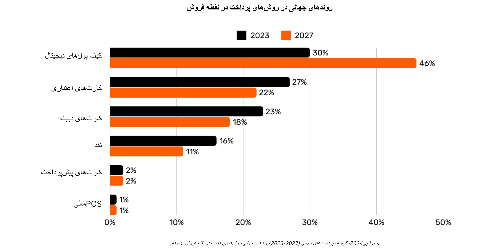

*گرافیک: روندهای جهانی در روش‌های پرداخت نقطه‌فروش (POS) (2023-2027)، گزارش پرداخت‌های جهانی 2024، Worldpay.*

### پیچیدگی پشت یک پرداخت ساده با کارت

هنگامی که مشتری از کارت اعتباری در یک فروشگاه استفاده می‌کند، کارت توسط دستگاه POS خوانده می‌شود که داده‌های تراکنش را به صورت امن به بانک پذیرنده‌ی فروشنده ارسال می‌کند. پذیرنده این اطلاعات را به شبکه کارت مربوطه (مثلاً ویزا یا مسترکارت) ارسال می‌کند که سپس درخواست را به صادرکننده—بانکی که کارت مشتری را ارائه داده است—ارسال می‌کند. صادرکننده حساب یا خط اعتباری مشتری را بررسی کرده و مجوز را از طریق شبکه و پذیرنده ارسال می‌کند و به فروشنده اجازه می‌دهد پرداخت را بپذیرد.

این تراکنش به ظاهر ساده در واقع شامل بیش از ۱۵ مرحله، ۷ واسطه، و به طور متوسط بین ۴۸ ساعت تا ۵ روز طول می‌کشد تا فروشنده وجوه را دریافت کند. در روزهای بعد، فرآیند تسویه و تصفیه انجام می‌شود. شبکه کارت تراکنش‌های روز را تجمیع کرده و تبادل وجوه بین پذیرنده و صادرکننده را هماهنگ می‌کند. یک بانک مرکزی دقت و ثبات این تسویه‌های بین‌بانکی را تضمین می‌کند. در نهایت، حساب بانکی فروشنده مبلغ خالص (پس از کسر کارمزدها) را که از پذیرنده اعتبار گرفته شده، دریافت می‌کند و بدین ترتیب چرخه تراکنش کامل می‌شود.

به طور کلی، این فرآیند پیچیده، زمان‌بر و پرهزینه است برای چیزی که باید عمل ساده انتقال ارزش از یک طرف به طرف دیگر باشد.

### مقایسه روش‌های پرداخت

| Payment Method                 | Authorization Needed?           | Transaction Approval Time (Merchant View) | Settlement Speed (Funds Fully Settled)         | Finality (Ease of Reversal)              | Number of Intermediaries       | Typical Fees (to Payee)            |
| ------------------------------ | ------------------------------- | ----------------------------------------- | ---------------------------------------------- | ---------------------------------------- | ------------------------------ | ---------------------------------- |
| **Cash**                       | No                              | Immediate (Physical Exchange)             | Immediate (No Settlement Delay)                | High (Irreversible Once Paid)            | None                           | None                               |
| **Checks**                     | Yes (Bank Clearing)             | Acceptance at Deposit (Not Guaranteed)    | Several Days (Check Clearing Process)          | Medium (Can Bounce/Stop Before Clearing) | Bank                           | **Low to Medium** (Bank Fees)      |
| **Wire Transfers**             | Yes (Bank/Network)              | Confirmation Within Hours                 | Same-Day or Next-Day (Domestic)                | High (Usually Irreversible Once Sent)    | Banks, Payment Networks        | **Medium**(Fixed/Percentage)       |
| **Payment Cards**              | Yes (Card Issuer Authorization) | Seconds to Minutes (Authorization Code)   | A Few Days (Interbank Settlement)              | Medium (Chargebacks Possible)            | Issuer, Acquirer, Card Network | **Variable (1-3% of Transaction)** |
| **Digital Wallets/Mobile Pay** | Yes (Wallet Provider/Bank)      | Seconds (Instant Confirmation)            | Typically 1-2 Days (Depends on Funding Source) | Medium (Refund/Dispute Possible)         | Banks, Wallet Operators        | **Low to Medium (Varies)**         |

### محدودیت‌های راه‌حل‌های موجود

صنعت پرداخت‌های سنتی نمایانگر اقتصادی سالانه به ارزش تقریبی ۲۲۰۰ میلیارد دلار است که تقریباً یک دهم تولید ناخالص داخلی ایالات متحده یا برابر با تولید ناخالص داخلی فرانسه می‌باشد. از آنجا که ارزها به عنوان شبکه‌های دارای مجوز عمل می‌کنند، رقابت محدودی وجود دارد که این "خدمت" را بیشتر شبیه به یک مالیات تحمیل شده بر اقتصاد مولد می‌کند. علاوه بر بارهای هزینه‌ای که ایجاد می‌کند، محدودیت‌های دیگری نیز وجود دارد که در زیر به آن‌ها اشاره شده است.

| Limitation                       | Explanation                                                                                                                                                                                                                        | Impact                                                                                               |
| -------------------------------- | ---------------------------------------------------------------------------------------------------------------------------------------------------------------------------------------------------------------------------------- | ---------------------------------------------------------------------------------------------------- |
| High Card Fees                   | Interchange fees (~0.3%), network fees (fixed or 0.3%-1%), terminal/PSP subscriptions, and bank margins (0.5%-1.7%) add up to a substantial cost—like a global “tax” on productive sectors, amounting to trillions of dollars.     | Raises merchant costs, reducing margins and potentially driving up consumer prices.                  |
| Very Slow Final Settlement       | Settlement of funds can take up to 5 days, slowing the flow of money and overall economic activity.                                                                                                                                | Delays liquidity for merchants and reduces the speed of economic circulation.                        |
| Fraud                            | E-commerce channels are heavily targeted by fraud, contributing to significant losses (e.g., $28 billion). Chargebacks could reach ~$174 billion globally by 2024. Managing these disputes consumes time and causes mental strain. | Increased operational costs, complex fraud prevention measures, and diminished customer trust.       |
| Cart Abandonment                 | Additional security steps (one-time codes, two-factor authentication under PSD2) introduce friction at checkout.                                                                                                                   | Higher checkout complexity leads to increased cart abandonment and lost sales.                       |
| High Minimum Transaction Amounts | Minimum spend thresholds on cards can force merchants and consumers into inconvenient pricing or purchase conditions, discouraging small-value transactions.                                                                       | Reduced customer satisfaction and flexibility, potentially limiting impulse or low-value purchases.  |
| Slow Pre-Authorization           | Current systems cannot handle transactions at millisecond speeds or support continuous, real-time payment flows.                                                                                                                   | Limits use cases that require instant or streaming payments, restricting innovation and scalability. |
| Need for a Bank/Card Account     | Access to these payment methods requires a linked bank or card account, automatically excluding those without such accounts.                                                                                                       | Limits financial inclusion, reducing access for unbanked or underbanked populations.                 |
| Repeated Online Account Creation | Users often must create multiple online accounts, leading to fatigue, reduced convenience, and increased exposure of personal data.                                                                                                | Deteriorates user experience, raises privacy concerns, and increases risk of data breaches.          |
| Foreign Exchange (FX) Fees       | Lack of a universal unit of account forces costly currency conversions for cross-border transactions.                                                                                                                              | Adds extra costs for international commerce, making global transactions less affordable.             |

همان‌طور که از پرداخت به ازای هر دقیقه برای تماس‌های صوتی به استفاده از ارتباطات مبتنی بر IP تقریباً رایگان حرکت کردیم، ظهور شبکه‌های بازتر و کارآمدتر می‌تواند پرداخت‌ها را بازتعریف کند، هزینه‌ها و واسطه‌ها را کاهش دهد و مدل‌های کسب‌وکار جدیدی را تقویت کند.

## Bitcoin برای کسب و کار: یک ارز نوظهور

<chapterId>4488fe33-663f-41a3-a668-e9ca2fb7122e</chapterId>

**Bitcoin چیست؟**

Bitcoin یک **سیستم ارز دیجیتال همتا به همتا Exchange** (پول الکترونیکی) است. اصطلاح "Bitcoin" به اجزای زیر اشاره دارد:

- یک **پروتکل کامپیوتری** که ارزش Exchange را در اینترنت بدون واسطه‌ها، بدون نیاز به مجوز و به صورت مستعار تسهیل می‌کند. این پروتکل از اصول رمزنگاری پیشرفته استفاده می‌کند.
- **شبکه فیزیکی** از ماشین‌هایی که به اینترنت متصل هستند (گره‌ها، ماینرها و غیره) که توسط افراد و کسب‌وکارها اداره می‌شوند و یک سیستم غیرمتمرکز را تشکیل می‌دهند (بدون مرجع مرکزی یا نقطه کنترل واحد).
- **واحد حساب** درون سیستم. هرگز بیش از 21 میلیون بیت‌کوین وجود نخواهد داشت. هر Bitcoin به 100 میلیون واحد به نام "ساتوشی" تقسیم می‌شود که به افتخار خالق ناشناس آن نام‌گذاری شده است.

با هم، آنها Bitcoin را به یک **دارایی حامل** و یک ارز دیجیتال **بدون صادرکننده** تبدیل می‌کنند. Ownership تنها با نگه‌داشتن **کلید رمزنگاری خصوصی** ایمن می‌شود و کنترل کامل را **بدون واسطه‌ها یا طرف‌های ثالث مورد اعتماد** اعطا می‌کند. هنگامی که منتقل می‌شود، **نهایی بودن** Ownership فوری است: دارنده جدید به طور کامل آن را مالک می‌شود بدون اینکه به یک مرجع مرکزی برای حفاظت یا تبدیل‌پذیری متکی باشد. تراکنش‌ها **غیرقابل تغییر** هستند—پس از ثبت در Blockchain، نمی‌توان آنها را تغییر داد یا حذف کرد.

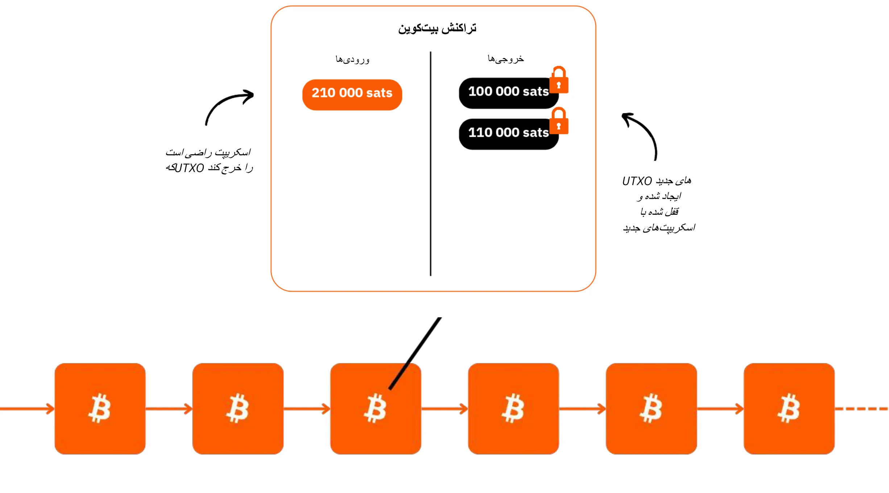

Bitcoin دارای یک سیاست پولی ثابت است، با **سقف ۲۱ میلیون بیت‌کوین** که از این تعداد، حدود ~۱۹.۸ میلیون بیت‌کوین تاکنون توزیع شده است. این امر آن را **ضد تورمی** می‌کند، به طوری که ارزش آن با گذشت زمان افزایش می‌یابد زیرا کاربران پس‌اندازها و بهره‌وری‌های خود را در آن ذخیره می‌کنند.

ویژگی‌های فنی آن از طلا و دلار ترکیب شده فراتر می‌رود و آن را به سخت‌ترین دارایی مالی ساخته شده تبدیل می‌کند. Bitcoin هم ذخیره ارزش و هم واسطه‌ای برای Exchange است، ارزی در حال شکل‌گیری. تصور کنید انتقال ارزش از خزانه یک شرکت به شرکت دیگر به سرعت، بدون واسطه‌ها، با هزینه کم، بدون تقلب، ۲۴/۷ و بدون دخالت هیچ شخص ثالثی انجام شود.

Bitcoin به طور مؤثری ارزش را حفظ می‌کند زیرا Ledger آن ضد دستکاری است. ارزش آن به دلیل Supply نادر و محدود، همراه با افزایش تعداد فرصت‌های Exchange، که ناشی از افزایش تعداد کاربران است، افزایش می‌یابد.

Bitcoin مخرب است زیرا ما را تشویق می‌کند تا مفاهیمی در ریاضیات، رمزنگاری، اقتصاد و تاریخ را بیاموزیم که هرگز به ما آموزش داده نشده بود. در حالی که اغلب به عنوان پیچیده تلقی می‌شود، در واقع یک نوآوری است که از طریق تمرین و آزمایش قابل دسترسی است.

Bitcoin ما را به چالش می‌کشد تا ماهیت خود پول را بازنگری کنیم. آیا می‌توانید توضیح دهید که پول واقعاً چیست؟ یک کارمند حقوق‌بگیر یا کارآفرین ممکن است ۵۰,۰۰۰ تا ۱۰۰,۰۰۰ ساعت از زندگی خود را صرف کسب درآمد کند، اما چند نفر **حتی ۱۰۰ ساعت را به درک بهتر آن و حفظ آن اختصاص می‌دهند**؟ Bitcoin ما را تشویق می‌کند تا دلایل اساسی نیازمان به پول و دیدگاه زمانی‌مان را زیر سوال ببریم. آیا پول برای تجملات فوری است یا برای مقاومت بلندمدت؟ اگر دارایی‌ای داشتیم که ارزش آن افزایش می‌یافت و به ما اجازه می‌داد خریدهایمان را به تأخیر بیندازیم، چه انتخاب‌هایی می‌کردیم؟ چه گفتگوهایی را می‌خواستیم ۲۰ یا ۳۰ سال بعد با خودمان داشته باشیم؟

**کارت شناسایی Bitcoin**

- **سن:** ۱۵ سال (۳ ژانویه ۲۰۰۹)
- ارزش روزانه **Exchange:** ۱۰ میلیارد دلار (> CAC40)
- **ارزش بازار:** ۱.۸ تریلیون دلار (> متا، ویزا، نقره ; < اپل، گوگل، طلا)
- **کاربران:** ~100 تا 200 میلیون (1-2% از جمعیت جهانی)
- **نوسان:** ذاتاً هیچ (1 Bitcoin = 1 Bitcoin)، بسیار بالا به صورت خارجی (در مبادلات ارز فیات)
- **عملکرد:** اولین تراکنش در $0.0009; اکنون $100,000 (x100 میلیون)
- **دسترسی شبکه (زمان کارکرد):** ۱۰۰٪ از سال ۲۰۱۳
- **مرده اعلام شده یا مورد انتقاد:** ماهی یک بار

**یک شگفتی از همکاری انسانی:**

- کاملاً **متن‌باز**
- **نهاد حقوقی:** هیچ کدام
- **مدیر عامل:** هیچکدام
- سرمایه‌گذاری سرمایه‌گذاری خطرپذیر: هیچ‌کدام
- **بازاریابی:** هیچکدام
- **تحقیق و توسعه:** مبتنی بر داوطلبان
- **حاکمیت:** توسط کاربران
- **مدل اقتصادی نوآورانه:** ایجاد بلاک توسط کارمزدهای تراکنش (بر اساس مزایده) یارانه داده می‌شود

برای اطلاعات بیشتر در مورد Bitcoin، تاریخچه آن، نحوه کارکرد و استفاده از آن، همچنین پیشنهاد می‌کنم این دوره جامع دیگر را دنبال کنید:

https://planb.network/courses/2b7dc507-81e3-4b70-88e6-41ed44239966

## معرفی Lightning Network

<chapterId>c095c7ad-5469-4c7b-9510-b6c0b86244e7</chapterId>

**رعد و برق چیست؟**

Lightning Network **یک پروتکل و یک شبکه** است که تراکنش‌های Bitcoin را با حداقل تعامل با Blockchain اصلی Bitcoin تسهیل می‌کند. در اینجا نحوه کار آن آمده است:

- **راه‌اندازی اولیه:** وجوه در Blockchain اصلی قفل (اسکرو) می‌شوند تا یک کانال پرداخت بین 2 طرف ایجاد شود.
- **شبکه پرداخت:** یک شبکه از کانال‌های پرداخت بین چندین طرف، یک شبکه پرداخت را تشکیل می‌دهد (مسیر‌یابی و اتصال).
- معاملات off-chain:** معاملات بین طرفین انجام می‌شود اما **بلافاصله در Bitcoin اصلی Blockchain (**"off-chain"**) منتشر نمی‌شود.
- تسویه‌های On-Chain: **تنها** **تراز نهایی** تراکنش‌های یک کانال در Bitcoin اصلی Blockchain (**"On-Chain"**) منتشر می‌شود، که این امر اجازه می‌دهد تا در این میان تراکنش‌های متعددی انجام شود. این تجمیع پرداخت‌های متعدد باعث کاهش تراکم و در نتیجه کاهش هزینه‌ها در مقایسه با انجام تراکنش‌های متعدد On-Chain می‌شود.
- بستن کانال: یک کاربر می‌تواند کانال خود را در هر زمان ببندد و با انتشار آخرین وضعیت تراکنش، Bitcoin خود را بازپس گیرد. این اصل تراکنش‌ها است که **قابل انتشار** در هر لحظه اما **منتشر نشده** تا زمانی که لازم باشد، هستند. خروج (بستن کانال) می‌تواند یک‌جانبه (توسط هر یک از دو طرف در هر زمان تصمیم‌گیری شود) یا به صورت توافقی (که منجر به کاهش هزینه‌های On-Chain می‌شود) باشد.

این رویکرد از کندی و پیچیدگی انجام هر تراکنش به‌طور مستقیم بر روی Bitcoin اصلی Blockchain جلوگیری می‌کند، تنها مانده‌های نهایی را ثبت کرده و امنیت آن را حفظ می‌کند. Lightning Network یک Layer "بر روی" Bitcoin است اما به آن متصل باقی می‌ماند.

**یک شبکه پرداخت جهانی**

پروتکل یک **شبکه** از ماشین‌ها ایجاد می‌کند که در آن کانال‌ها یک سیستم پرداخت جهانی را تشکیل می‌دهند. این نودها می‌توانند به‌صورت آزادانه توسط افراد یا کسب‌وکارها اداره شوند و این شبکه را به‌طور کامل باز می‌کند.

Lightning Network ارزش فوری Exchange را با سرعت نور ممکن می‌سازد. این مانند یک پروتکل ایمیل است که به پرداخت‌ها اعمال می‌شود: یک شبکه پرداخت نسل بعدی. این به طور اساسی نحوه حرکت "پول" را تغییر می‌دهد و آن را به اندازه انتقال داده در اینترنت آزاد و سریع می‌کند.

**مزایای کلیدی:**

- **سرعت:** تراکنش‌های فوری.
- **هزینه‌های پایین:** هزینه‌های بسیار کمتر در مقایسه با شبکه‌های بانکی سنتی.
- **سهولت پذیرش:** کسب‌وکارها می‌توانند به سرعت با استفاده از یک اپلیکیشن گوشی هوشمند یا یک دکمه پرداخت در وب‌سایت خود، پرداخت‌های Lightning را بپذیرند.

زیرساخت لایتنینگ از نظر سرعت، هزینه و بهره‌وری انرژی از سیستم‌های پرداخت سنتی پیشی می‌گیرد. با افزایش پذیرش توسط بازرگانان، این حرکت شتاب بیشتری خواهد گرفت: اگر پرداخت‌ها بتوانند شبکه بین‌بانکی محصور را دور بزنند، چرا همچنان درصد قابل توجهی از درآمد را به واسطه‌های امروزی واگذار کنیم؟

**موارد استفاده بی‌نهایت:**

کاربردهای لایتنینگ بسیار فراتر از کارمزدهای پایین و سرعت است. با ارائه یک مسیر پرداخت کاملاً رایگان و فوری، فرصت‌های گسترده‌ای را در سراسر اقتصاد ایجاد می‌کند.

**تقویت قابلیت‌های Exchange توسط Bitcoin:**

رعد نقش Bitcoin را به عنوان "رسانه‌ای از Exchange" تقویت می‌کند. با افزایش فرکانس و آزادی تراکنش‌ها، عملکرد اصلی پول را تقویت می‌کند: تسهیل مبادلات اقتصادی و ایجاد ارزش برای همه شرکت‌کنندگان.

ظهور آینده "اقتصاد ماشین‌های هوشمند" نیازمند یک سیستم پرداخت فوق‌العاده سریع و با فرکانس بالا خواهد بود، استاندارد فنی که تنها Lightning می‌تواند برآورده کند. این امر امکان ایجاد کالاها و خدمات بیشتری را فراهم می‌کند. با محدود ماندن Bitcoin's Supply، قدرت خرید هر واحد افزایش خواهد یافت. Bitcoin و Lightning با گسترش شبکه‌هایشان قوی‌تر می‌شوند.

رعد نگاهی اجمالی به آینده‌ای ارائه می‌دهد که در آن تمام کسب‌وکارهایی که به اینترنت متکی شده‌اند، به Bitcoin نیز متکی خواهند شد.

**پرداخت‌های Bitcoin بر روی لایتنینگ: یک مورد استفاده معمولی برای بازرگانان**

Lightning Network به دلیل سرعت و نهایی بودن پرداخت، برای پرداخت‌های Bitcoin در فروشگاه‌های فیزیکی یا آنلاین ایده‌آل است.

- **سرعت:** لایتنینگ (~500 میلی‌ثانیه تا چند ثانیه) به‌طور قابل‌توجهی سریع‌تر از شبکه اصلی Bitcoin است، جایی که تأیید تراکنش‌ها ممکن است حدود 30 دقیقه طول بکشد. برای خریدهای بزرگ (بیش از 1,000 دلار)، ممکن است هنوز شبکه اصلی Bitcoin ترجیح داده شود، زیرا سرعت کمتر حیاتی است. با این حال، این جزئیات اغلب از دید کاربر عادی پنهان می‌مانند، زیرا برنامه‌ها این تصمیمات را به‌طور یکپارچه در پس‌زمینه مدیریت می‌کنند.
- **نهایی بودن:** هنگامی که پرداختی در لایتنینگ انجام می‌شود، نهایی است. هیچ امکانی برای بازپرداخت توسط اشخاص ثالث یا اختلافات مرتبط با تقلب وجود ندارد.
- **هزینه‌ها:** هزینه‌های تراکنش در Lightning Network حداقل است و توسط کاربر پرداخت می‌شود، نه فروشنده. فروشندگان تنها در صورتی هزینه‌ای متحمل می‌شوند که بعداً نیاز به انتقال Bitcoin خود به شبکه یا سرویس دیگری داشته باشند.

**کارت شناسایی رعد و برق**

- **اختراع:** 2015
- **راه‌اندازی:** ۲۰۱۶
- **سن:** ۷ سال (اولین تراکنش: ۲۸ دسامبر ۲۰۱۷)
- **توانایی فنی شبکه:** در مقیاس بزرگ می‌تواند ۱,۰۰۰ برابر بیشتر از سیستم‌های سنتی تراکنش‌های فوری را مدیریت کند.
- **اندازه‌های تراکنش:** از اندازه‌های بزرگ تا ۱,۰۰۰ برابر کوچکتر از سیستم‌های سنتی متغیر است.
- **سرعت تراکنش:** تا 100 برابر سریع‌تر.
- **هزینه‌ها:** تا ۹۰٪ کمتر.
- **نهایی بودن پرداخت:** تقریباً آنی (اغلب ~500 میلی‌ثانیه، گاهی چند ثانیه).
- **مصرف انرژی:** ~8% از سیستم پولی سنتی جهانی.
- **ویژگی‌ها:**
    - همتا به همتا
    - یونیورسال
    - بدون مجوز
    - حریم خصوصی خوب
    - امنیت اثبات‌شده
    - دسترس‌پذیری بالا (زمان کارکرد عالی)
    - قابل کنترل و سازگار

برای اطلاعات بیشتر در مورد عملکرد فنی Lightning Network، پیشنهاد می‌کنم این دوره جامع دیگر را نیز دنبال کنید:

https://planb.network/courses/34bd43ef-6683-4a5c-b239-7cb1e40a4aeb

# Bitcoin در خزانه‌داری

<partId>bf45c1e8-af97-4b6b-af42-2866f493b14d</partId>

## سود، سرمایه، و کلیدهای تاب‌آوری کسب‌وکار

<chapterId>656ad88f-3c27-4054-a94e-b29727009b8e</chapterId>

### یک شرکت سالم

**آینده نامشخص است** و کسب‌وکارها باید با تمرکز واضح بر کسب سود و حفظ سرمایه، این عدم قطعیت را مدیریت کنند. بر اساس اقتصاد اتریشی، **سودها نشانه نهایی سلامت یک شرکت هستند**—آن‌ها نشان می‌دهند که کسب‌وکار به طور کارآمد نیازهای مصرف‌کننده را برآورده می‌کند. بدون سود، یک شرکت نمی‌تواند خود را حفظ کند، چه برسد به رشد. برای اینکه یک کسب‌وکار سالم بماند، نه تنها باید generate سود کسب کند بلکه باید به آینده نیز بیندیشد، **سرمایه را برای سرمایه‌گذاری‌ها و چالش‌های آینده ذخیره کند**.

حفظ سرمایه برای کسب‌وکارها حیاتی است زیرا به آن‌ها اجازه می‌دهد در یک بازار غیرقابل پیش‌بینی تطبیق پیدا کرده و فرصت‌ها را به دست آورند. این شامل ایجاد تعادل بین سرمایه‌گذاری مجدد درآمدها برای رشد و حفظ یک حاشیه مالی برای مقابله با رکودهای احتمالی است. اقتصاد اتریشی بر اهمیت **"ترجیح زمانی"** تأکید دارد، به این معنا که کسب‌وکارها باید با دقت تصمیم بگیرند که چقدر باید به بازدهی فوری اولویت دهند در مقابل سرمایه‌گذاری برای موفقیت بلندمدت. یک شرکت سالم پایه مالی خود را قوی نگه می‌دارد و انعطاف‌پذیری را در زمان‌های خوب و بد تضمین می‌کند.

سیگنال‌های بازار مانند قیمت‌ها و رقابت، کسب‌وکارها را در تصمیم‌گیری‌های هوشمندانه درباره تخصیص منابع راهنمایی می‌کنند. با گوش دادن به این سیگنال‌ها، شرکت‌ها می‌توانند از دام گسترش بیش از حد یا سرمایه‌گذاری‌های ضعیف، به‌ویژه آن‌هایی که تحت تأثیر عوامل مصنوعی مانند اعتبار آسان هستند، اجتناب کنند. تخصیص نادرست منابع نه تنها سلامت شرکت را به خطر می‌اندازد بلکه توانایی آن در خدمت‌رسانی مؤثر به مشتریان را نیز کاهش می‌دهد.

در نهایت، حفظ یک کسب‌وکار سالم به معنای باقی ماندن در حالت تطبیق‌پذیری، اتخاذ تصمیمات مالی محتاطانه و همیشه داشتن نگاهی به آینده است. **با تمرکز بر سود، حفظ سرمایه و پاسخ به سیگنال‌های بازار، کسب‌وکارها—بزرگ یا کوچک—می‌توانند حتی در مواجهه با عدم قطعیت نیز شکوفا شوند**.

### آیا سرمایه دارای فضیلت است؟

**چگونه سرمایه به طور کلی به تصویر کشیده می‌شود**

بیایید دوباره کشف کنیم که سرمایه واقعاً چیست—اصطلاحی که اغلب در جامعه ما به اشتباه درک شده و به طور منفی تلقی می‌شود.

در نظریه اقتصادی سنتی (کینزی)، سرمایه اغلب به صورت ساده به عنوان یک انبار همگن از دارایی‌های فیزیکی یا مالی دیده می‌شود که عمدتاً برای تحریک تقاضای کل از طریق سرمایه‌گذاری استفاده می‌شود. این اغلب با تمرکز ثروت و قدرت اقتصادی که در دست یک اقلیت کوچک است، مرتبط می‌شود. در شرایطی که شکاف‌های ثروت همچنان در حال گسترش است، بسیاری سرمایه را به عنوان نمادی از نابرابری اقتصادی می‌بینند، به ویژه زمانی که به نظر می‌رسد ثروت انباشته شده هیچ سودی برای اکثریت ندارد.

"سرمایه" اغلب به عنوان ابزاری برای استثمار به تصویر کشیده می‌شود و این دیدگاه به شدت بر جنبش‌های مختلفی که سرمایه را ذاتاً مخالف منافع کارگران می‌دانند، تأثیر گذاشته است. اما آیا این درست است؟ یا ممکن است این دیدگاه توسط:

۱. عدم درک مکانیسم‌های اقتصادی (حتی توسط خود اقتصاددانان)؟

۲. مداخله‌گرایی دولت و دستکاری بازار؟

۳. سردرگمی بین سرمایه‌داری رفاقتی و سرمایه‌داری بازار آزاد؟

۴. چارچوب‌بندی رسانه‌ها از بحران‌های اقتصادی؟

۵. تمایل به راه‌حل‌های سریع و عدالت اجتماعی فوری؟

۶. عادی‌سازی فرهنگی گفتار ضدسرمایه‌داری؟

خوشبختانه، Bitcoin ما را وادار می‌کند تا همه چیز را دوباره بررسی کنیم و این تصورات پیش‌فرض را به چالش بکشیم. یک مکتب فکری وجود دارد—مکتب اقتصاد اتریشی—که می‌تواند این مسائل را روشن کند و به ما کمک کند تا ماهیت واقعی سرمایه را بازنگری کنیم.

**یکی بود یکی نبود**

بیایید با یک داستان کوتاه شروع کنیم:

"در یک جزیره کوچک و متروکه، یک ماهیگیر تنها زندگی می‌کند. هر روز، او ساعت‌ها وقت صرف می‌کند تا با دستان خالی ماهی بگیرد، فعالیتی که بخش زیادی از زمان و انرژی او را مصرف می‌کند. یک روز، او ایده‌ای به ذهنش می‌رسد: ساختن یک نیزه که به او اجازه می‌دهد به‌طور مؤثرتری ماهی بگیرد. اما او می‌داند که این کار نیاز به فداکاری دارد.

قبل از شروع به ساخت نیزه، ماهیگیر تصمیم می‌گیرد مقداری ماهی کنار بگذارد تا در طول فرآیند ساخت، خود را تأمین کند. او برای چند روز کمتر از حد معمول می‌خورد و به اندازه کافی ماهی ذخیره می‌کند تا بر روی پروژه‌اش تمرکز کند. این ماهی ذخیره شده نمایانگر **سرمایه** اوست، یک ذخیره کوچک که به او امکان می‌دهد هدفش را دنبال کند.

در حالی که او زمان خود را به ساخت نیزه اختصاص می‌دهد، به ذخایر خود متکی است و با میل خود برخی از راحتی‌های فوری خود را به تأخیر می‌اندازد (بازتابی از **ترجیح زمانی** او). پس از چند روز کار Hard، او یک نیزه محکم را تکمیل می‌کند.

با نیزه، او اکنون می‌تواند ماهی‌ها را بسیار سریع‌تر و با تلاش کمتری بگیرد. او دیگر نیازی ندارد که مانند قبل خود را خسته کند و حتی شروع به انباشتن مازاد ماهی می‌کند. این مازاد امکانات جدیدی را فراهم می‌کند: او می‌تواند آن را ذخیره کند، به اشتراک بگذارد، یا در پروژه‌های دیگر در جزیره سرمایه‌گذاری کند. با به تأخیر انداختن مصرف فوری و استفاده از سرمایه‌اش، ماهیگیر به طور قابل توجهی کارایی و چشم‌اندازهای آینده خود را بهبود بخشیده است.

این داستان نقش اساسی سرمایه، صبر و دوراندیشی را در ساختن آینده‌ای بهتر نشان می‌دهد—مفاهیمی که در رشد اقتصادی و پیشرفت انسانی مرکزی هستند.

### مکتب اقتصاد اتریشی و دیدگاه آن درباره سرمایه

مکتب اقتصاد اتریشی به نام بنیان‌گذاران و مشارکت‌کنندگان اولیه‌اش که اصالتاً اهل اتریش بودند، نام‌گذاری شده است. این نام باقی ماند و از آن زمان، این مکتب به شدت با اندیشه لیبرال کلاسیک مرتبط شده است که بر آزادی فردی، بازارهای آزاد و حداقل مداخله دولت تأکید دارد.

**دیدگاه اتریشی درباره سرمایه**

در دیدگاه اتریشی، سرمایه به شدت با ایده به تعویق انداختن مصرف برای ساخت ابزارها یا منابع تولیدی که تولید آینده را افزایش می‌دهند، مرتبط است. این فرآیند که به عنوان انباشت سرمایه شناخته می‌شود، در نظریه اقتصادی اتریشی نقش مرکزی دارد. نکات کلیدی Elements این دیدگاه عبارتند از:

- **ترجیح زمانی و مصرف به تأخیر افتاده**: افراد به طور طبیعی ترجیح می‌دهند اکنون مصرف کنند تا بعداً، اما ممکن است مصرف را به تأخیر بیندازند اگر انتظار پاداش‌های بیشتری در آینده داشته باشند. با پس‌انداز امروز، منابع می‌توانند در کالاهای سرمایه‌ای (ابزار، ماشین‌آلات، زیرساخت‌ها) سرمایه‌گذاری شوند که بهره‌وری را در طول زمان بهبود می‌بخشند. جوامع یا افرادی که ترجیح زمانی کمتری دارند، بیشتر پس‌انداز می‌کنند و در پروژه‌های بلندمدت سرمایه‌گذاری می‌ک

- **سرمایه به عنوان محرک تولید آینده**: کالاهای سرمایه‌ای به عنوان ابزارهای واسطه‌ای در نظر گرفته می‌شوند که برای تولید کالاهای نهایی مصرفی استفاده می‌شوند. با انباشت سرمایه، کارآفرینان می‌توانند بهره‌وری را افزایش داده و در آینده ثروت بیشتری ایجاد کنند. به عنوان مثال، به جای تولید فوری کالاهای مصرفی، ممکن است منابع برای ساخت کارخانه‌ها یا ماشین‌آلات استفاده شوند. اگرچه این امر مصرف کوتاه‌مدت را کاهش می‌دهد، اما کارایی حاصل، امکان تولید و رفاه بیشتر را در آینده فرا

- **تولید غیرمستقیم و کارایی**: اقتصاددانان اتریشی، مانند اویگن بوم-باورک، به ایده تولید غیرمستقیم اشاره کردند - فرآیندهای تولید طولانی‌تر و پیچیده‌تر که شامل مراحل متعدد است. اگرچه این فرآیندها زمان‌بر هستند، اما در نهایت نتایج کارآمدتر و پربارتری به همراه دارند، مانند ساخت یک کارخانه اره‌کشی برای فرآوری چوب به جای جمع‌آوری دستی الوار.

- **نرخ بهره به عنوان سیگنال‌ها**: از دیدگاه اتریشی، نرخ بهره به طور طبیعی ترجیحات زمانی افراد را منعکس می‌کند. نرخ‌های بالا نشان‌دهنده ترجیح برای مصرف فوری است، در حالی که نرخ‌های پایین تشویق به پس‌انداز و سرمایه‌گذاری بلندمدت می‌کند. هنگامی که بانک‌های مرکزی به طور مصنوعی نرخ بهره را دستکاری می‌کنند، این سیگنال‌های طبیعی را تحریف می‌کنند که منجر به تخصیص نادرست منابع و سرمایه‌گذاری‌های ناپایدار (سرمایه‌گذاری نادرست) می‌شود.

**دو شکل سرمایه در اقتصادهای مدرن**

در چارچوب سیستم پولی مبتنی بر بدهی که در آن فعالیت می‌کنیم، **نوع دومی از سرمایه وجود دارد**: سرمایه‌ای که به صورت آنی ایجاد می‌شود زمانی که یک بانک از طریق مکانیزم ساده اعتباری وام ایجاد می‌کند. این شامل ایجاد نقدینگی از هیچ است، جایی که بانک پولی را قرض می‌دهد که در واقع از قبل در اختیار ندارد بلکه بر اساس وعده بازپرداخت ایجاد می‌کند.

از یک سو، سرمایه "اتریشی" نتیجه پس‌انداز واقعی است، فرآیندی که شامل تصمیمات اقتصادی سنجیده و فداکاری دقیق می‌شود. از سوی دیگر، سرمایه‌ای که از طریق ایجاد پول مبتنی بر بدهی تولید می‌شود، یک ساختار فوری و مصنوعی است. این دو نوع سرمایه، اگرچه **در استفاده برای تأمین مالی پروژه‌ها به‌طور سطحی مشابه هستند، اما در ماهیت به‌طور اساسی متفاوت‌اند**.

این دو شکل سرمایه هرگز نباید با هم اشتباه گرفته شوند، اما در یک سیستم مبتنی بر بدهی، اغلب این‌گونه هستند، **سیگنال‌های اقتصادی را تحریف می‌کنند** و به‌طور مکرر به سرمایه‌گذاری نادرست منجر می‌شوند. این سوءتفاهم روشن می‌کند که چرا سرمایه‌داری اغلب مورد انتقاد ناعادلانه قرار می‌گیرد.

**مسئله کلیدی با کینزی‌گرایی**

سیاست‌های کینزی، که به‌طور گسترده توسط نخبگان جهانی پذیرفته شده‌اند، نرخ‌های بهره را دستکاری کرده و از طریق بدهی، تقاضا را تحریک می‌کنند. این امر منابع را به سمت پروژه‌های کوتاه‌مدت و ناپایدار سوق می‌دهد، چرخه‌های اقتصادی را تقویت کرده و رشد واقعی که بر پایه پس‌انداز سالم و سرمایه‌گذاری‌های مولد استوار است را به تأخیر می‌اندازد. رهبران کسب‌وکار این سیاست مضر را از نزدیک مشاهده می‌کنند، زیرا شرکت‌های سالم به سمت خریدهای بیش از حد ارزش‌گذاری شده در جستجوی بازدهی‌های متورم سوق داده می‌شوند و رشد ارگانیک و پایدار را تضعیف می‌کنند.

در چنین محیطی، سرمایه "سالم" که با دقت توسط کارآفرینان پس‌انداز شده است، چگونه می‌تواند با سرمایه "ناسالم" که به‌طور مصنوعی ایجاد شده است، رقابت کند؟ علاوه بر این، گسترش یک‌جانبه پول Supply قدرت خرید سرمایه سالم را کاهش می‌دهد و باعث تشدید سردرگمی اقتصادی و نارضایتی اجتماعی می‌شود.

**روزنه‌ای از امید: Bitcoin**

Bitcoin راهی برای انباشت و حفظ سرمایه در بلندمدت بدون فرسایش ناشی از تورم پولی ارائه می‌دهد. به عنوان یک ذخیره ارزش، به کسب‌وکارها امکان می‌دهد تا با مقاومت، سرمایه‌گذاری‌های آینده را برنامه‌ریزی کنند، سلطه سیستم‌های مبتنی بر بدهی را به چالش بکشند و بازگشتی به انباشت سرمایه واقعی و مولد را ترویج دهند.

### بیشتر درباره مکتب اقتصادی اتریش

**مکتب اقتصاد اتریشی** یک سنت فکری اقتصادی است که به بازارهای آزاد، آزادی فردی و اهمیت عمل انسانی در فرآیندهای اقتصادی ارزش می‌نهد. این مکتب از مداخله دولت، به‌ویژه در پول و بازارها، انتقاد می‌کند و استدلال می‌کند که افراد، با هدایت ترجیحات ذهنی خود، بهترین قضاوت‌کنندگان منافع خود هستند.

**شخصیت‌های کلیدی مکتب اتریشی**

- **کارل منگر**: بنیان‌گذار مکتب اتریشی، منگر نظریه ارزش ذهنی را توسعه داد که بیان می‌کند ارزش کالاها به ترجیحات فردی بستگی دارد نه به هزینه‌های تولید.

- **لودویگ فن میزس**: یکی از ارکان مکتب اتریش، میزس پراکسیولوژی (نظریه عمل انسانی) را معرفی کرد و کتاب _عمل انسانی_ را نوشت که نقدی عمیق بر سوسیالیسم و برنامه‌ریزی مرکزی است.

- **فریدریش هایک**: هایک که شاگرد میزس بود، در سال ۱۹۷۴ به خاطر کارهایش در زمینه دانش غیرمتمرکز و خودجوشی بازار، جایزه نوبل اقتصاد را دریافت کرد. او در کتاب خود _راهی به سوی بردگی_ به شدت از کنترل متمرکز انتقاد کرد.

- **مورای روتبارد**: شاگرد میزس و مدافع سرسخت لیبرترینیسم، روتبارد نظریه آنارکو-کاپیتالیسم را توسعه داد و جامعه‌ای بدون دولت را تصور کرد که توسط قراردادهای داوطلبانه اداره می‌شود. کتاب او _انسان، اقتصاد و دولت_ یک اثر برجسته در اقتصاد اتریشی است.

**سایر اقتصاددانان تأثیرگذار**

- **میلتون فریدمن**: در حالی که به طور مستقیم با مکتب اتریش مرتبط نیست، فریدمن از بسیاری از ایده‌های طرفدار بازار و لیبرال حمایت کرد. سیاست پول‌گرایانه او با اندیشه اتریشی متفاوت است اما در نقد خود از مداخله بیش از حد دولت در اقتصاد با آنها مشترک است.

- **فردریک باستیا**: یک اقتصاددان فرانسوی قرن نوزدهم، باستیا با آثار خود در مورد تجارت آزاد و پیامدهای ناپیدای سیاست‌های اقتصادی بر مکتب اتریشی تأثیر گذاشت. مقاله او _آنچه دیده می‌شود و آنچه دیده نمی‌شود_ یک متن بنیادی در لیبرالیسم اقتصادی است.

*انتساب: موسسه لودویگ فون میزس*

**مشارکت‌ها و ایده‌های اصلی**

این متفکران ایده‌ای را شکل دادند که مداخله دولت بازارها را تحریف می‌کند و آزادی اقتصادی برای شکوفایی و هماهنگی هماهنگ اقدامات انسانی ضروری است. دیدگاه‌های آن‌ها بر اهمیت تصمیم‌گیری غیرمتمرکز و خطرات کنترل متمرکز در سیستم‌های اقتصادی تأکید می‌کند.

برای اطلاعات بیشتر در این زمینه:

https://planb.network/courses/d955dd28-b7c6-4ba2-a123-d932e21d148f

https://planb.network/courses/9d1bde6a-33e5-45dd-b7c0-94da72e45b11

https://planb.network/courses/d07b092b-fa9a-4dd7-bf94-0453e479c7df

## نگهداری Bitcoin در خزانه

<chapterId>89622a40-d14f-4c37-a075-8e7e1731ec26</chapterId>

### چالش‌های خزانه‌داری یک شرکت

خزانه جایی است که در آن اشیای گرانبها قرار داده می‌شوند. یک شرکت سالم به‌طور مناسب سرمایه‌گذاری شده است تا بتواند با عدم‌قطعیت‌های آینده مقابله کند و سرمایه‌گذاری‌های خود را برنامه‌ریزی کند. امروزه، بخشی از مازاد خزانه در دارایی‌های مالی که به‌عنوان "Liquid" بسیار معتبر شناخته می‌شوند، مانند اوراق قرضه، سپرده‌های مدت‌دار و غیره قرار داده می‌شود.

برای یک افق زمانی بسیار طولانی، برخی شرکت‌ها از دارایی‌های غیرنقدی مانند املاک و مستغلات استفاده می‌کنند بدون اینکه از خطرات خاصی آگاه باشند:

- نقدینگی ناکافی در صورت بروز بحران
- در نهایت بازدهی نسبتاً کم پس از کسر هزینه‌ها
- بازدهی که از تورم واقعی، یعنی پول Supply (~7% در سال، به زیر مراجعه کنید) پیشی نمی‌گیرد،
- خطر پنهانی که املاک و مستغلات بخشی از عملکرد "پس‌انداز" خود را به نفع دارایی‌هایی مانند Bitcoin از دست بدهد. در نتیجه، ممکن است به "ارزش استفاده" نزدیک‌تر شود: فراهم کردن سرپناه.

بیایید به سرعت محیطی که کسب‌وکارها در آن فعالیت می‌کنند را مرور کنیم.

**تورم واقعی**: برخلاف میل به مأموریت خود، بانک‌های مرکزی هدف تورم سالانه ۲٪ را تعیین می‌کنند، به این معنی که ارزش ارز در طول ۲۰ سال ۴۰٪ کاهش می‌یابد. با افزودن دوره‌های تورم بیشتر، مشخص می‌شود که شرکت‌ها نمی‌توانند تنها از ارز برای ذخیره ثمرات کار خود استفاده کنند. آنها باید استراتژی‌های مالی پیچیده‌ای را اجرا کنند که به‌طور ضروری با مجموعه‌ای از ریسک‌ها همراه است. این استراتژی‌ها به‌وضوح **برای کسب‌وکارهای بسیار کوچک غیرقابل دسترس** هستند، که از قبل به شدت درگیر فعالیت‌های اصلی خود هستند.

**تورم پنهان**: در یک سیستم پولی مبتنی بر بدهی و ذخیره جزئی که توسط بانک‌های مرکزی پشتیبانی می‌شود، **پول کلی Supply به طور متوسط سالانه حدود ۷٪ رشد می‌کند** (مثلاً M1 در منطقه یورو یا ایالات متحده). این بدان معناست که "سهم شما از کیک" تنها در چند سال به نصف کاهش می‌یابد—مگر اینکه دسترسی ویژه‌ای به جریان مالی داشته باشید و بتوانید با استفاده از اهرم و خرید سریع دارایی‌ها با "قیمت‌های قدیمی" قبل از اینکه پول تازه ایجاد شده آنها را بالا ببرد، به رشد ادامه دهید. این اثر کانتیلون است که تا حدی انتقال ثروت به افراد مرفه‌تر را توضیح می‌دهد، در حالی که "سرمایه" به اشتباه به عنوان مقصر شناخته می‌شود (به مقدمه ما در مورد سرمایه در بالا مراجعه کنید).

**ریسک‌های طرف مقابل**: سیستم مالی فعلی پرخطر است و ممکن است همیشه به "پول خود" دسترسی نداشته باشید. بدون ایجاد تصویر یک خانه کارت‌ها، باید اذعان کرد که مؤسسات مالی سودها را خصوصی‌سازی و زیان‌ها را در کوچک‌ترین بحران اجتماعی‌سازی می‌کنند. در یک سیستم پول "کتبی" (پولی که در Ledger ثبت شده است)، پول در بانک صرفاً یک "ادعا" است؛ شما واقعاً مالک آن نیستید و خود بانک‌ها نیز "آن را ندارند" (ذخایر کسری). این پول به نوعی واقعاً جادویی است. برخی از بانک‌های معتبر که زمانی به Bitcoin می‌خندیدند، امروز دیگر وجود ندارند، مانند کردیت سوئیس.

این عدم اعتماد باعث احیای مجدد دارایی‌های «حامل» مانند طلا می‌شود (حتی اگر ایمن‌سازی، حمل و نقل و تقسیم آن پیچیده باشد، و غیره) و البته Bitcoin، تازه‌وارد.

### Bitcoin به عنوان یک دارایی مالی

Bitcoin یک جایگزین رادیکال ارائه می‌دهد. این **یک دارایی حامل است، بدون صادرکننده مرکزی**، تقریباً غیرقابل توقیف است و از اثرات شبکه‌ای بهره‌مند می‌شود. کاربران "واقعی" Bitcoin انتخاب می‌کنند که از آن برای ذخیره دستاوردهای خود استفاده کنند، زیرا به عنوان یک ذخیره ارزش مقاوم در برابر سانسور و تورم دیده می‌شود. به لطف اثر شبکه‌ای که توسط قانون متکالف نشان داده شده است، هر کاربر جدید متقاعد شده ارزش شبکه را افزایش می‌دهد؛ با افزایش تعداد شرکت‌کنندگان، سودمندی Bitcoin به صورت تصاعدی افزایش می‌یابد. این مدل آن را به شکلی متمایز و امیدوارکننده از سرمایه تبدیل می‌کند که بر اساس پذیرش و اعتماد کاربران ساخته شده است.

Bitcoin **پرجمعیت‌ترین دارایی Liquid در جهان** است که به صورت 24/7 بدون وقفه فعالیت می‌کند، برخلاف بازارهای مالی سنتی که ساعات تعطیلی و "قطع‌کننده‌های مدار" دارند. این نقدینگی به کاربران اجازه می‌دهد تا در هر لحظه بیت‌کوین بخرند یا بفروشند، چه در واکنش به اخبار خوب و چه بد (مثلاً پرتاب موشک، جنگ‌ها، و غیره).

در طول بیش از یک دهه، Bitcoin رشد سالانه متوسط بیش از 60% را نشان داده است. این عملکرد منحصر به فرد به دارندگان بلندمدت اجازه داده است تا سرمایه اولیه خود را حفظ کنند، برخلاف سایر ابزارها.

با این حال، چندین عامل کلیدی وجود دارد که باید در نظر داشت:

اولاً، **عملکرد گذشته تضمینی برای نتایج آینده نیست**. تا زمانی که Bitcoin **امن و غیرمتمرکز** باقی بماند، می‌توان به طور معقولی امیدوار بود که افزایش قیمت سالانه‌ای بیش از 20% در سال برای دهه آینده داشته باشد، که آن را به یک ابزار خزانه‌داری قابل قبول تبدیل می‌کند.

دوم، Bitcoin تاکنون **چرخه‌های ۴ ساله** را تجربه کرده است، به این معنی که با یک افق زمانی بیش از ۴ سال، این شرط همیشه سودآور بوده است. برای کسانی که Bitcoin را به عنوان یک سرمایه‌گذاری می‌بینند، یک افق کوتاه‌مدت (<۴ سال) می‌تواند پرخطر باشد.

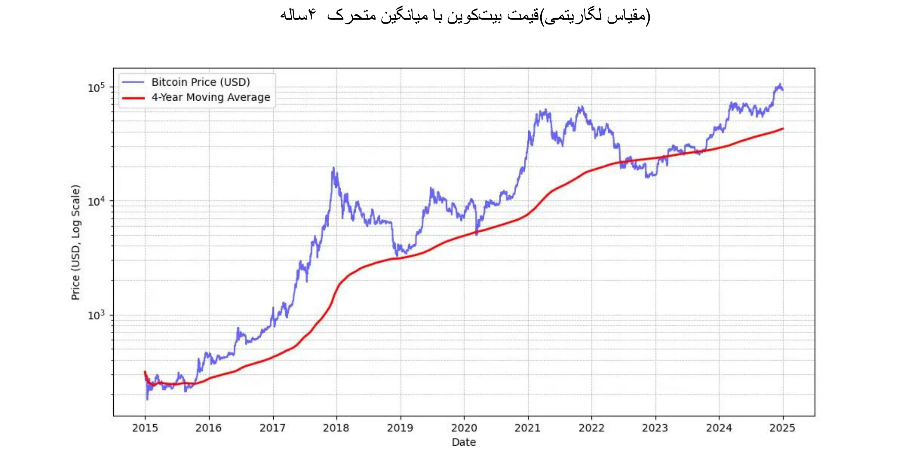

*مایکل سیلور: "بهترین سیگنال قیمت Bitcoin میانگین متحرک ساده ۴ ساله است."* به نمودار بالا مراجعه کنید.

علاوه بر این، توصیه می‌شود که میزان مواجهه فرد با Bitcoin **متناسب** با سطح درک او باشد. همچنین مهم است که عجله نکنید یا سعی نکنید بازار را به طور کامل زمان‌بندی کنید.

در نهایت، Bitcoin به عنوان یک دارایی **نوسان‌دار** در نظر گرفته می‌شود. به طور دقیق، قیمت آن به واحدهای پول فیات بیان می‌شود. بخشی از این نوسان طبیعی است برای یک دارایی که هنوز جوان است، اما همچنین توسط حضور سفته‌بازانی که از آن به عنوان یک ذخیره ارزش بلندمدت استفاده نمی‌کنند و به دنبال سودهای سریع هستند، تشدید می‌شود. علاوه بر این، معاملات اهرمی (استفاده از وجوه قرضی برای افزایش موقعیت‌های معاملاتی) حرکات قیمتی صعودی و نزولی را تشدید می‌کند و مانع از این می‌شود که Bitcoin مسیر صعودی مستقیمی را دنبال کند. این منجر به نوسانات برجسته‌تری می‌شود، اما با گذشت زمان، با رشد پایه کاربران متعهد، به نظر می‌رسد این نوسان در حال تثبیت است. به طور خلاصه، **غیرممکن است که دارایی با عملکرد بالایی مانند Bitcoin بدون نوسان داشته باشید**، اما قطعاً می‌توانید دارایی‌هایی با عملکرد کمتر و نوسان کمتر داشته باشید.

### Bitcoin توسط وال استریت پذیرفته شد

پذیرش Bitcoin توسط مؤسسات مالی، موقعیت آن را در بازار جهانی بیشتر تقویت می‌کند.

اظهارات اخیر **بلک‌راک** بر پتانسیل Bitcoin به عنوان یک دارایی ذخیره ارزش و ابزاری برای تنوع‌بخشی به پورتفولیو تأکید دارد. این غول نهادی جهانی اخیراً پیشنهاد کرده است که **رشد کاربران Bitcoin از اینترنت** یا تلفن‌های همراه پیشی گرفته است، که به‌ویژه توسط **تغییرات جمعیتی و نسلی** و همچنین افزایش بی‌اعتمادی به مؤسسات مالی سنتی (!) هدایت می‌شود. به دلیل ماهیت کمیاب، غیرحاکمیتی و غیرمتمرکز آن، برخی سرمایه‌گذاران Bitcoin را به عنوان یک گزینه پناهگاه امن **در زمان‌های بی‌ثباتی مالی و پولی**، ترس یا رویدادهای ژئوپلیتیکی مخرب می‌بینند.

**صندوق‌های قابل معامله Spot Bitcoin** که در ژانویه 2024 راه‌اندازی شدند، موفقیت فوق‌العاده‌ای داشته‌اند—**موفق‌ترین** راه‌اندازی ETF در تاریخ—با نزدیک به 20 میلیارد دلار ورودی خالص از ژانویه تا نوامبر. این تقریباً چهار برابر بهتر از دومین راه‌اندازی موفق ETF، یعنی Nasdaq-100 QQQ است. این ETF‌ها دسترسی آسان‌تر و تنظیم‌شده‌تری به Bitcoin فراهم می‌کنند که **مشروعیت بیشتری** به آن بخشیده و جذب سرمایه نهادی قابل توجهی را به دنبال داشته است.

صندوق‌های قابل معامله در بورس (ETF) Bitcoin با اختلاف زیادی در زمینه **پذیرش نهادی** پیشتاز هستند—و از ده صندوق ETF با سریع‌ترین رشد پیشی گرفته‌اند—چه از نظر تعداد نهادهای درگیر و چه از نظر اندازه دارایی‌های تحت مدیریت (AUM). موفقیت این صندوق‌های Bitcoin نشان‌دهنده تقاضای رو به رشد برای ابزارهای سرمایه‌گذاری مرتبط با دارایی‌های دیجیتال است و به این ترتیب جایگاه Bitcoin را در چشم‌انداز مالی سنتی تثبیت می‌کند.

Bitcoin اکنون در **بازار** "ذخیره ارزش" فعالیت می‌کند. از نظر مقیاس تنها قطره‌ای در دریاست: حدود ۱,۸۰۰ میلیارد دلار در مقایسه با ۱۸,۰۰۰ میلیارد دلار طلا یا ۵۰۰,۰۰۰ میلیارد دلار املاک و مستغلات. با این حال، سهم بازار حدود ۰.۱٪ آن فضای زیادی برای رشد فراهم می‌کند، به ویژه با توجه به اینکه رقبای آن در جذب کاربران جدید دچار مشکل هستند.

| Ticker  | 1D Flow (M USD) | 1W Flow (M USD) | 1M Flow (M USD) | 3M Flow (M USD) | YTD Flow (M USD) |
| ------- | --------------- | --------------- | --------------- | --------------- | ---------------- |
| **Sum** | +457.19         | +1,507.95       | +2,888.01       | +3,672.29       | **+20,262.94**   |
| IBIT    | +393.40         | +750.91         | +1,536.47       | +3,821.37       | +22,460.44       |
| FBTC    | +14.81          | +372.40         | +627.16         | +458.71         | +10,266.69       |
| ARKB    | +11.51          | +163.26         | +295.92         | -3.88           | +2,647.32        |
| BITB    | +12.93          | +146.50         | +263.30         | +97.46          | +2,262.69        |
| HODL    | +5.75           | +38.77          | +94.54          | +100.39         | +682.03          |
| BRRR    | +1.92           | +4.72           | +17.76          | +20.54          | +540.19          |
| EZBC    | +11.79          | +17.53          | +39.29          | +47.48          | +439.45          |
| BTC     | .00             | -3.13           | +36.59          | +419.18         | +419.18          |
| BTCO    | +6.43           | +19.25          | +47.30          | +56.41          | +394.82          |
| BTCW    | .00             | +2.84           | +6.04           | +146.69         | +217.47          |
| YBIT    | -1.34           | -10.26          | +5.06           | +13.81          | +76.30           |
| DEFI    | .00             | .00             | .00             | -2.03           | -1.79            |
| GBTC    | .00             | +5.16           | -81.42          | -1503.84        | -20,141.85       |

*20 میلیارد دلار در 10 ماه: صندوق‌های قابل معامله Bitcoin در کمتر از یک سال به چیزی دست یافتند که صندوق‌های قابل معامله طلا در 5 سال به آن رسیدند. منبع: جریان‌های سرمایه‌گذاری صندوق‌ها به دلار آمریکا. ترمینال بلومبرگ، Bloomberg L.P., 2024.*

### Bitcoin در جعبه‌ابزار شرکت

پذیرش رو به رشد Bitcoin در ایالات متحده همچنین در حال تأثیرگذاری بر ذهنیت‌ها در سایر نقاط جهان است، به ویژه در میان متخصصان مدیریت ثروت که دیگر نمی‌توانند از گنجاندن آن در میان ابزارهای خود صرف نظر کنند — به خصوص زمانی که محصولات مالی سنتی عملکرد ضعیفی دارند یا با دوره‌های دشواری مواجه هستند. تنها بانک‌های سنتی به نظر می‌رسد که هنوز می‌توانند از نادیده گرفتن آن صرف نظر کنند.

از دیدگاه صرفاً مالی، Bitcoin به عنوان یک دارایی تنوع‌بخش شناخته می‌شود. این دارایی نه تنها با سایر کلاس‌های دارایی همبستگی ندارد، بلکه به نظر می‌رسد در دوره‌های تزریق نقدینگی جدید نیز رشد می‌کند—به نظر می‌رسد که یک دوره دیگر با کاهش نرخ بهره توسط بانک مرکزی اروپا، فدرال رزرو و چین در حال آغاز است.

به طور خلاصه، برای رایج‌ترین مورد استفاده—سرمایه‌گذاری خزانه اضافی برای حداقل یک دوره چهار ساله—Bitcoin به‌طور کامل مناسب است. ارزش دارد که آن را با استراتژی ورود تدریجی ترکیب کنید: سرمایه‌گذاری مبالغ ثابت در فواصل منظم برای هموار کردن نقطه ورود یا خروج.

موارد استفاده دیگر، Bitcoin را به یک دارایی استراتژیک خزانه‌داری تبدیل می‌کنند، برای مثال:

- توانایی ارسال **وثیقه** یا نقدینگی به صورت ۲۴/۷
- قابلیت انتقال به خزانه‌داری شرکت دیگر **به‌سرعت، در هر زمان**
- پوشش ریسک **ارز خارجی Exchange**
- پرداخت به **تأمین‌کننده**‌ای که آن را می‌پذیرد، به‌ویژه در شرایط اضطراری

### آیا Bitcoin بیش از حد گران است؟

شما مجبور نیستید دقیقاً 1 Bitcoin بخرید، زیرا Bitcoin به زیرواحدهایی به نام ساتوشی تقسیم می‌شود که به افتخار خالق ناشناس آن نام‌گذاری شده‌اند. یک Bitcoin برابر با **100 میلیون ساتوشی** است و به کاربران اجازه می‌دهد حتی **بسیار کوچک‌ترین کسری از یک Bitcoin** را خرید، فروش یا معامله کنند. در واقع، در کد منبع Bitcoin، تمام تراکنش‌ها به ساتوشی محاسبه می‌شوند و اصطلاح "Bitcoin" تنها در "کوین‌بیس"، تراکنش ویژه‌ای که ماینرها برای دریافت پاداش خود ایجاد می‌کنند، ظاهر می‌شود.

علاوه بر این، مجموع 21 میلیون بیت‌کوین—یا **2.1 کوادریلیون ساتوشی**—می‌تواند به‌طور کارآمد توسط یک عدد صحیح 64 بیتی نمایش داده شود. این بدان معناست که علیرغم قیمت بالای هر Bitcoin کامل، به لطف قابلیت تقسیم‌پذیری آن، همچنان برای طیف وسیعی از سرمایه‌گذاران قابل دسترسی است. بنابراین، برای مشارکت در شبکه یا سرمایه‌گذاری در این دارایی دیجیتال، نیازی به خرید یک Bitcoin کامل ندارید.

بیایید به خاطر داشته باشیم که ارزش بازار نسبتاً پایین آن در مقایسه با دارایی‌های دیگر مانند سهام، طلا یا املاک و مستغلات، ظرفیت آن برای افزایش ارزش را دست‌نخورده باقی می‌گذارد. با نفوذ هنوز بسیار کم (حدود ۱٪ از جمعیت جهانی)، تصور می‌شود که ما تنها در ابتدای صعود آن هستیم. این امر آن را **نامتقارن‌ترین شرط‌بندی نسل ما** می‌سازد: اکنون احتمال بسیار کمی وجود دارد که در این مرحله به صفر برسد و احتمال قوی وجود دارد که به رشد خود ادامه دهد.

### تصمیم تخصیص خزانه شرکتی در Bitcoin

فرآیند **تصمیم‌گیری** برای سرمایه‌گذاری در Bitcoin به شدت تحت تأثیر موقعیت شما در شرکت خواهد بود. اگر شما **مالک اکثریت هستید، آزادید** تا وجوه اضافی خزانه را بر اساس قضاوت خود تخصیص دهید. برعکس، اگر شما یک شریک یا سهامدار در یک ساختار تصمیم‌گیری جمعی هستید، باید از طریق مشورت‌های مشترک اقدام کنید که می‌تواند مسائل را پیچیده کند.

در سناریوی دوم، هماهنگ‌سازی دیدگاه‌های مختلف ضروری می‌شود، زیرا تا حد زیادی **به درک هر یک از ذینفعان از دارایی Bitcoin بستگی دارد**. همان‌طور که گفته می‌شود: "Bitcoin همه چیزهایی است که مردم درباره کامپیوترها نمی‌دانند، همراه با همه چیزهایی که درباره پول نمی‌فهمند." حتی اگر یک شریک تلاش کرده باشد تا Bitcoin را به‌طور کامل درک کند، انتقال این دانش به دیگران می‌تواند چالش‌برانگیز باشد. در چنین مواردی، **توصیه می‌شود که یک منبع خارجی وارد شود** تا از شناسایی بیش از حد ایده با یک فرد جلوگیری شود، که می‌تواند مقاومت generate را ایجاد کند.

در حال حاضر، سناریوی تصمیم‌گیری توسط مالک اکثریت، نماینده‌ترین حالت در میان شرکت‌هایی است که Bitcoin را در اختیار دارند. در اینجا چند مثال واقعی آورده شده است:

- **حرفه‌ای‌های مستقل**: مشاوران، پزشکان یا وکلا که بخشی از خزانه‌داری بلندمدت خود را در Bitcoin سرمایه‌گذاری می‌کنند. به طور کلی، این حرفه‌ای‌ها از قبل حساب‌های پس‌انداز یا سپرده مدت‌دار با بازدهی ناچیز دارند.
- **مدیران بخش فناوری**: مدیری که شرکت خود را فروخته و بخشی از عواید آن را از شرکت هلدینگ شخصی خود چند سال پیش در Bitcoin سرمایه‌گذاری کرده است. امروز، آن‌ها از وضعیت مالی راحتی برخوردارند و در سرمایه‌گذاری‌های جدید مشارکت می‌کنند.
- **صاحبان کسب‌وکارهای بسیار کوچک**: کارآفرینان در خدمات، کشاورزی یا صنایع دستی که به پتانسیل Bitcoin پی برده‌اند و بخشی از خزانه خود را به آن اختصاص می‌دهند. انگیزه اصلی آن‌ها در تنوع‌بخشی و آزادی‌ای است که فراهم می‌کند.
- **شرکت‌های سهامی عام** مانند MicroStrategy با تبدیل بخش قابل توجهی از خزانه‌داری شرکتی خود به Bitcoin، پیشگامی را در تغییر جهانی استراتژی‌های تخصیص سرمایه شرکتی نشان داده‌اند. تا پاییز 2024، شرکت‌های متعددی از این روند پیروی کرده بودند و این روند را بیشتر به رسمیت شناختند.

فهرست به‌روزرسانی شده شرکت‌هایی که بیشترین بیت‌کوین را در خزانه‌داری نگهداری می‌کنند، همراه با مبالغ نگهداری شده را در این وب‌سایت مشاهده کنید: [BitcoinTreasuries.net](https://bitcointreasuries.net/).
### مالیات Bitcoin نگهداری شده توسط کسب‌وکارها

برای کسب‌وکارهایی که به‌عنوان نهادهای قانونی جداگانه ساختار نیافته‌اند—مانند مالکیت‌های انحصاری یا سایر نهادهای غیرمؤسسه‌ای—مالیات بر معاملات Bitcoin اغلب مشابه با روشی است که برای افراد اعمال می‌شود. در بسیاری از موارد، همان قوانینی که بر سود سرمایه یا درآمد حاکم است، اعمال می‌شود، درست همان‌طور که اگر یک فرد Bitcoin را می‌فروخت. به‌عنوان مثال، در برخی کشورها، ممکن است سود به‌عنوان بخشی از درآمد شخصی کارآفرین در نظر گرفته شود که مشمول **طبقات مالیات بر درآمد شخصی** است.

با این حال، **کسب‌وکارهای ثبت‌شده**—که مشمول مالیات بر درآمد شرکت‌ها هستند—اغلب از چارچوب مالیاتی مطلوب‌تری بهره‌مند می‌شوند. برخلاف افراد، که ممکن است با محدودیت‌هایی در جبران سود و زیان در کلاس‌های دارایی مختلف مواجه شوند، شرکت‌ها معمولاً می‌توانند سود یا زیان تحقق‌یافته در معاملات Bitcoin را مستقیماً در حساب‌های سود و زیان سالانه خود ادغام کنند. این می‌تواند به موقعیت مالیاتی انعطاف‌پذیرتر و گاهی اوقات مطلوب‌تر منجر شود.

نرخ‌ها و روش‌های مالیاتی خاص به‌طور قابل‌توجهی بر اساس حوزه قضایی متفاوت است. به‌عنوان مثال، در فرانسه و بسیاری از کشورهای غربی، شرکت‌ها ممکن است با نرخ‌های مالیات شرکتی حدود ۲۵٪ مواجه شوند که می‌تواند کمتر از مالیات‌های ثابت باشد که افراد بر سود سرمایه‌گذاری می‌پردازند.

به دلیل این تفاوت‌ها، **برخی از صاحبان کسب‌وکار تصمیم می‌گیرند که Bitcoin را از طریق ساختارهای شرکتی خود خریداری و نگهداری کنند**، زیرا این کار می‌تواند **فرصت‌های برنامه‌ریزی مالیاتی کارآمدتری** را فراهم کند. همان‌طور که همیشه توصیه می‌شود، مشورت با یک متخصص مالیاتی که با قوانین حوزه(های) مربوطه آشنا است، برای اطمینان از رعایت قوانین و بهینه‌سازی استراتژی مالیاتی ضروری است.

## چگونه Bitcoin را به دست آوریم

<chapterId>1e6dbaf5-581a-49a4-8f37-3728e77bda17</chapterId>

### سه روش اکتساب

سه راه برای به دست آوردن Bitcoin وجود دارد:

- در Exchange برای کالاها یا خدمات:

از آنجا که Bitcoin به عنوان یک واسطه برای Exchange عمل می‌کند، می‌توان یک اقتصاد چرخشی را تصور کرد. اگرچه این امر امروزه غیرمعمول است، اما کسب‌وکارهای بیشتری شروع به پذیرش پرداخت‌های Bitcoin کرده‌اند—چرا کسب‌وکار شما نه؟ (به فصل بعدی ما مراجعه کنید)

- **Mining Bitcoin:**

این شامل کسب پاداش از طریق راه‌اندازی ماشین‌های Mining می‌شود. برای کسب‌وکارهای غیرتخصصی، این امر نسبتاً حاشیه‌ای باقی می‌ماند. شما می‌توانید از طریق واسطه‌هایی که محاسبات، شبکه و نگهداری را به شما می‌فروشند یا اجاره می‌دهند، مشارکت کنید. اگر مالک ماشین‌ها هستید، می‌توانید آن‌ها را به عنوان دارایی‌های قابل استهلاک حساب کنید. در مقیاس بزرگ، باید بازگشت سرمایه را با دقت محاسبه کنید زیرا بازار بسیار رقابتی است و نیاز به پیش‌بینی خوب هزینه‌ها، به‌ویژه برق دارد.

برای کسب اطلاعات بیشتر درباره روش‌های Mining، می‌توانید [به بخش "Mining" در آموزش‌های ما مراجعه کنید](https://planb.network/tutorials/mining).

- خرید **Bitcoin:**

این تا کنون رایج‌ترین روش است که یا از طریق مبادلات همتا به همتا یا، به طور معمول‌تر، در پلتفرم‌های معاملاتی تخصصی انجام می‌شود. اما هنگام خرید Bitcoin به عنوان دارایی خزانه‌داری شرکتی، شرکت‌ها باید با استانداردهای نظارتی قوی و رویه‌های شناخت مشتری (KYC) مطابقت داشته باشند. هنگامی که آن را در پلتفرم‌های معاملاتی تخصصی خریداری می‌کنند، معمولاً از کسب‌وکارها خواسته می‌شود اطلاعات دقیق شرکت، از جمله اسناد شناسایی، صورت‌های مالی و اثبات Address را ارائه دهند تا الزامات KYC و مبارزه با پول‌شویی (AML) را برآورده کنند.

برای یادگیری نحوه باز کردن یک حساب تجاری و استفاده از آن برای خرید، فروش و انتقال بیت‌کوین‌ها، می‌توانید این دو آموزش که به‌طور خاص برای کسب‌وکارها طراحی شده‌اند و نسخه‌های شرکتی پلتفرم‌های Kraken و Bitfinex را پوشش می‌دهند، بررسی کنید:

https://planb.network/tutorials/business/others/bitfinex-pro-c8ef7476-5f60-4205-935e-a545ced0022a

https://planb.network/tutorials/business/others/kraken-pro-07b1c16c-d517-4bf7-9a78-b42dc0f21785

برای کسب اطلاعات بیشتر در مورد روش‌های کسب بیت‌کوین از طریق Exchange یا همتا به همتا، می‌توانید [بخش "Exchange" در آموزش‌های ما را مشاوره کنید](https://planb.network/tutorials/exchange).

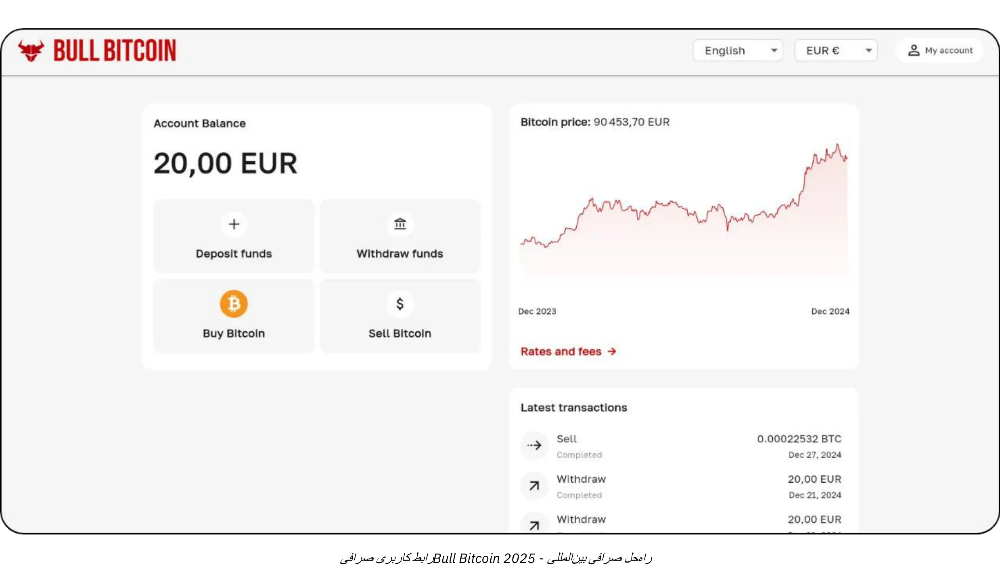

### به چه قیمتی؟

همان‌طور که قبلاً ذکر شد، پیش‌بینی قیمت آینده Bitcoin نه تنها غیرممکن است، بلکه قیمت در کوتاه‌مدت نیز بسیار نوسان دارد. به‌طور تاریخی، یک استراتژی قابل‌اعتماد این بوده است که به‌تدریج در فواصل منظم انباشت کنید و افق زمانی چهار سال یا بیشتر را حفظ کنید.

### چقدر باید بخرید؟

به طور متناقض، احتمالاً بهتر است با یک خرید بسیار کوچک شروع کنید بدون اینکه بیش از حد به آن فکر کنید. یک مبلغ کوچک (مانند صد یورو یا دلار) به شما آسیب جدی نمی‌زند و تجربه عملی به شما بسیار بیشتر و سریع‌تر از هر مقدار مطالعه آموزش می‌دهد.

همان‌طور که قبلاً گفته شد، عاقلانه است که فقط نقدینگی اضافی را که برای چندین سال به آن نیاز نخواهید داشت، سرمایه‌گذاری کنید. هر استراتژی که به‌خوبی درک نشده باشد، خطر قرار دادن شما در موقعیت دشواری را به همراه دارد، اگر ناگهان نیاز به نقد کردن سرمایه در زمان نامناسبی داشته باشید.

علاوه بر شروع کوچک، برای خزانه‌داری‌های شرکتی مفید است که یک استراتژی تخصیص سنجیده را اتخاذ کنند. در یک سوی طیف، برخی شرکت‌ها مانند MicroStrategy، رویکردی افراطی اتخاذ کرده‌اند و بخش قابل توجهی از وجوه مازاد خزانه‌داری خود را به Bitcoin اختصاص داده‌اند که نشان‌دهنده اعتقاد قوی نهادی است. در مقابل، یک استراتژی محافظه‌کارانه‌تر و شاید منطقی‌تر ممکن است شامل تخصیص حدود 5٪ از خزانه‌داری شرکتی به Bitcoin باشد، که تعادل بین سودهای بالقوه با مدیریت ریسک و نیازهای نقدینگی را حفظ می‌کند.

این طیف را به عنوان یک مقیاس تجسم کنید، از حداقل مواجهه، که اطمینان حاصل می‌کند شرکت نقدینگی کافی برای نیازهای عملیاتی خود را حفظ می‌کند، تا یک موضع تهاجمی که هدف آن بهره‌برداری از افزایش ارزش بلندمدت پیش‌بینی‌شده Bitcoin است. در حالی که تخصیص تهاجمی ممکن است بازدهی بالاتری داشته باشد، تخصیص متعادل به کاهش نوسانات کمک می‌کند و اطمینان می‌دهد که پایه مالی شرکت همچنان امن باقی می‌ماند و در عین حال از پتانسیل نوآورانه Bitcoin در عملیات خزانه‌داری خود بهره‌مند می‌شود.

### چند وقت یکبار؟

هیچ قانون Hard وجود ندارد. تلاش برای زمان‌بندی بازار با جستجوی "افت‌ها" می‌تواند کمتر مؤثر و استرس‌زا‌تر از خرید در فواصل منظم باشد. حتی سرمایه‌گذاران با تجربه گاهی اشتباه می‌کنند. رفتن "همه‌جانبه" به یکباره می‌تواند یک شمشیر دو لبه باشد.

در واقع، پتانسیل افزایش ارزش Bitcoin به گونه‌ای است که حتی اگر تنها چند سال بعد شروع کنید، احتمالاً همچنان شاهد سودهای بلندمدت خواهید بود. درست است که احتمالاً نوسانات عمده قیمت با گذشت زمان کاهش می‌یابد. با این حال، به عنوان یک ارز کاهش‌دهنده، Bitcoin به گونه‌ای طراحی شده است که به طور مؤثر ارزش را ذخیره کند و بازتاب‌دهنده افزایش بهره‌وری کاربرانش باشد. برای مقایسه: ما در حال حاضر در "مرحله راه‌اندازی" Bitcoin هستیم، ارزی که در حال شکل‌گیری است و هنوز هیچ‌کس ارزش واقعی آن را نمی‌داند. بعدها، شاید در ۲۰ یا ۴۰ سال، زمانی که در "مرحله کروز" پایدار قرار دارد، ممکن است به طرز شگفت‌انگیزی پایدار باشد و با افزایش بهره‌وری جامعه به طور پیوسته رشد کند.

صنعت املاک و مستغلات اغلب تکرار می‌کند که "همیشه زمان مناسبی برای خرید است"، فراموش می‌کند که اگر املاک و مستغلات کارکرد خود را به عنوان ذخیره ارزش از دست بدهد و به دارایی‌هایی مانند Bitcoin تغییر کند، قیمت‌ها می‌توانند به ارزش کاربردی خود (پناهگاه) نزدیک‌تر شوند. در مقابل، Bitcoin هیچ هدفی جز ذخیره ارزش ندارد، که می‌تواند به این معنا باشد که "همیشه زمان مناسبی برای خرید است." آینده نشان خواهد داد.

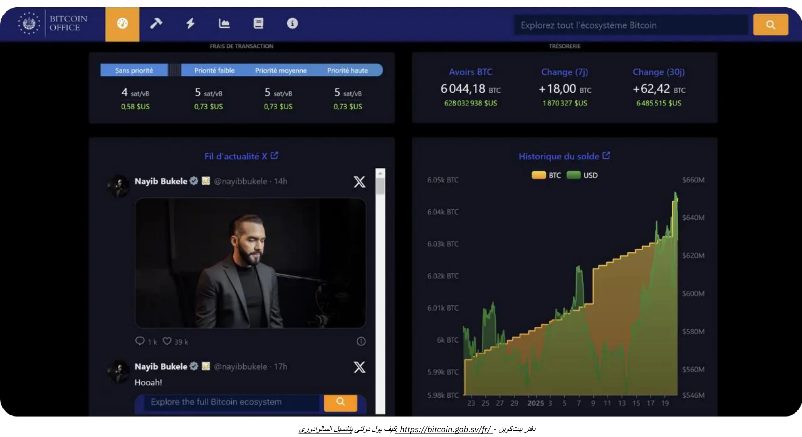

*اعتبار: [Bitcoin Office](https://Bitcoin.gob.sv/)*

### به چه شکلی خریداری کنیم؟ (روش‌های نگهداری)

شما به صورت فیزیکی مالک Bitcoin نیستید. در عوض، شما یک کلید رمزنگاری دارید که به شما اجازه می‌دهد Ownership برخی یا تمام واحدهای حساب خود را به یک یا چند کلید رمزنگاری دیگر منتقل کنید. همه این‌ها بر روی Bitcoin Blockchain اتفاق می‌افتد که در ده‌ها هزار نود در سراسر جهان تکرار شده است.

این کلید رمزنگاری یک عدد تصادفی بسیار بزرگ است. برای ساده‌سازی تجربه کاربری، اغلب به صورت دنباله‌ای از ۱۲ یا ۲۴ کلمه نمایش داده می‌شود. این کلمات می‌توانند بر روی دستگاه فیزیکی به نام "Hardware Wallet" بارگذاری شوند. اما توجه داشته باشید که بیت‌کوین‌ها "داخل" این دستگاه نیستند؛ این دستگاه صرفاً ابزاری برای امضای رمزنگاری تراکنش‌ها و پخش آن‌ها به شبکه است. آنچه واقعاً اهمیت دارد، ۱۲ یا ۲۴ کلمه است که باید به صورت امن نگهداری شوند.

این منجر به مسئله حضانت می‌شود: نگه‌داشتن Bitcoin به معنای نگه‌داشتن کلید(ها) است. یا خودتان آن‌ها را نگه می‌دارید، یا وظیفه را به یک شخص ثالث واگذار می‌کنید. همچنین راه‌حل‌های میانی وجود دارد. بیایید رایج‌ترین سناریوها را بررسی کنیم:

- **خود حضانتی:**

این گزینه‌ای است که توسط علاقه‌مندان واقعی Bitcoin توصیه می‌شود، زیرا با طراحی اصلی Bitcoin همخوانی دارد. شما به عنوان بانک خود عمل می‌کنید: هیچ خطری از سوی شخص ثالث برای کلاهبرداری از شما وجود ندارد، اما شما مسئول ایمن‌سازی کلید(ها) هستید. شما به صورت ۲۴/۷ به وجوه خود دسترسی کامل دارید. در یک محیط کسب‌وکار، اگر چندین نفر ممکن است نیاز به انجام تراکنش داشته باشند، به ابزارها و رویه‌های مناسب برای مدیریت دسترسی و امنیت نیاز خواهید داشت.

- **حضانت شخص ثالث:**

به عنوان مثال، یک Exchange یا یک سرویس خرید می‌تواند یک حساب برای شما ایجاد کند، ارز سنتی شما را به Bitcoin تبدیل کند و آن را به نمایندگی از شما با استفاده از سیستم‌های امنیتی خود نگه دارد. اکثر این خدمات به شما اجازه می‌دهند بیت‌کوین‌های خود را به یک Wallet منتقل کنید که در آنجا تنها شما کلید را در اختیار دارید. تا زمانی که این کار را انجام ندهید، واقعاً مالک بیت‌کوین‌ها نیستید؛ شما به وعده آن‌ها برای بازپرداخت اعتماد می‌کنید. این شامل متعادل‌سازی ریسک‌های امنیتی (آن‌ها در مقابل شما) و ریسک طرف مقابل (آن‌ها ممکن است شکست بخورند یا ناپدید شوند) می‌شود. برخی کسب‌وکارها این را قابل قبول می‌دانند، اگرچه به طور کلی برای ذخیره‌سازی بلندمدت یا برای 100% تخصیص شما توصیه نمی‌شود. خدمات نگهداری ممکن است هزینه‌های ذخیره‌سازی نیز دریافت کنند.

- **"کاغذ Bitcoin" (ETFها یا ETPها):**

این‌ها ابزارهای مالی سنتی هستند که کسری از Bitcoin را نمایندگی می‌کنند و عملکرد قیمتی آن را تکرار می‌کنند. نهادی که پشت این محصول است به‌طور نظری Bitcoin زیرساختی را خریداری و نگهداری می‌کند. مشارکت‌ها و برداشت‌های شما به ارز سنتی (مثلاً دلار یا یورو) انجام می‌شود، نه به Bitcoin. به‌جز برخی محصولات که اجازه برداشت در Bitcoin واقعی را می‌دهند (برای جلوگیری از رویداد مالیاتی در برخی حوزه‌های قضایی)، این ابزارها شامل هزینه‌های مدیریت سالانه هستند. در اینجا، شما به امنیت نهاد متکی هستید و با ریسک طرف مقابل مواجه می‌شوید (برای مثال، اگر دولتی تصمیم بگیرد تمام Bitcoin نگهداری شده به‌صورت نهادی را مصادره کند، همان‌طور که در سال ۱۹۳۳ با طلا تحت فرمان اجرایی ۶۱۰۲ ایالات متحده اتفاق افتاد). مزیت اصلی آن‌ها دسترسی آسان است، زیرا از طریق کانال‌های مالی سنتی توزیع می‌شوند. آن‌ها نیاز به تأمین کلیدهای رمزنگاری را دور می‌زنند اما هیچ‌یک از ویژگی‌های ذاتی Bitcoin را ارائه نمی‌دهند: شما نمی‌توانید از شبکه Bitcoin به‌صورت ۲۴/۷ برای انتقال آزادانه ارزش بدون اجازه استفاده کنید. آن‌ها فقط عملکرد مالی را تکرار می‌کنند، نه عملکرد یا حاکمیت Bitcoin خود را.

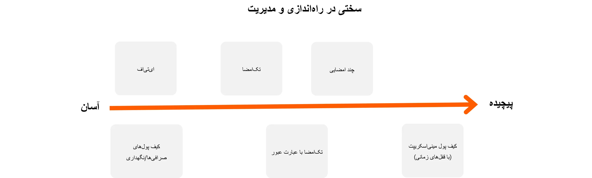

علاوه بر این، شکلی که در آن Bitcoin را نگه می‌دارید به طور قابل توجهی بر اقدامات امنیتی مورد نیاز برای حفاظت از خزانه‌داری شرکت شما تأثیر می‌گذارد. چه خود نگهداری را انتخاب کنید، با استفاده از کیف پول‌های سخت‌افزاری تک‌امضایی یا چندامضایی و غیره برای حفظ کنترل مستقیم بر کلیدهای خود، یا این وظیفه را به خدمات نگهداری شخص ثالث یا ETFها واگذار کنید، هر گزینه دارای پروفایل ریسک خاص خود است. به عنوان مثال، خود نگهداری دسترسی کامل ارائه می‌دهد اما نیازمند پروتکل‌های امنیتی داخلی دقیق است، در حالی که راه‌حل‌های شخص ثالث بار مدیریت را کاهش می‌دهند اما با هزینه ریسک طرف مقابل. برای توضیح بیشتر تفاوت‌ها، این نمودار مدل امنیتی هر نوع نگهداری را نشان می‌دهد و به شما کمک می‌کند تا رویکردی را انتخاب کنید که به بهترین وجه با نیازهای سازمان شما مطابقت دارد:

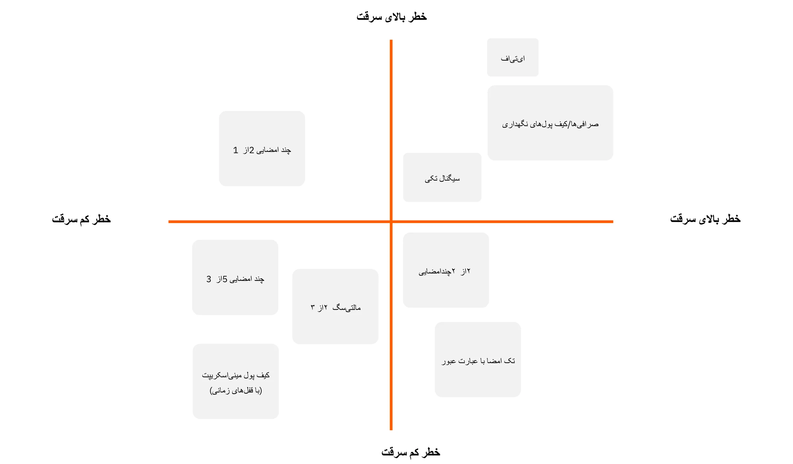

### از چه کسی بخریم؟

اگر گزینه "کاغذ Bitcoin" را انتخاب کنید، به مؤسسات مالی مانند بانک‌ها یا بورس‌های آنلاین مراجعه خواهید کرد.

اگر تصمیم بگیرید که Bitcoin واقعی را از طریق یک بازار (Exchange) یا یک کارگزار خریداری کنید، چندین دسته اصلی دارید:

- **پلتفرم‌های بزرگ بین‌المللی یا خارجی:**

نمونه‌ها شامل Kraken، Coinbase، یا Binance هستند که به‌طور تاریخی توسط بسیاری از افراد استفاده شده‌اند. برخی با مشکلاتی مواجه شده‌اند و ارائه یک توصیه واضح دشوار است. یک توصیه: اگر از آن‌ها استفاده می‌کنید، بیت‌کوین‌های خود را بیشتر از زمان لازم در آنجا نگه ندارید.

- **ارائه‌دهندگان خدمات تنظیم‌شده (ارائه‌دهندگان خدمات دارایی دیجیتال ثبت‌شده):**

به عنوان مثال، در فرانسه پلتفرم‌هایی مانند Paymium (Exchange) یا BullBitcoin (کارگزار) به خاطر داشتن علاقه‌مندان واقعی Bitcoin در رأس خود شناخته شده‌اند و سابقه‌ای قوی ساخته‌اند. در ایالات متحده، ارائه‌دهندگان خدماتی مانند River یا Swann وجود دارند. به طور کلی، بررسی شجره‌نامه ارائه‌دهنده مهم است: شهرت، سابقه، محبوبیت در جامعه Bitcoin، و اینکه آیا رهبری آن‌ها با ارزش‌های اصلی Bitcoin همسو است یا خیر.

**Exchange در مقابل کارگزار:**

- یک **Exchange** به شما اجازه می‌دهد سفارش‌های خرید را با قیمتی که انتخاب می‌کنید ثبت کنید، اما باید منتظر بمانید تا قیمت بازار و فروشندگان همسو شوند تا اجرا شود.
- یک **کارگزار** به شما یک قیمت ثابت ارائه می‌دهد و می‌تواند معامله را سریع‌تر انجام دهد.

فراتر از هزینه‌ها و سرعت اجرا—که اگر به بلندمدت (چندین سال) فکر می‌کنید اهمیت کمتری دارند—یک کسب‌وکار باید همچنین در نظر بگیرد:

- **کاربر Interface:** آیا پلتفرم کاربرپسند است؟
- **ویژگی‌های حسابداری:** حداقل، قابلیت صادرات تاریخچه تراکنش‌ها در فرمت .CSV.
- **حضانت و امنیت:** آیا پلتفرم بیت‌کوین‌ها را به نمایندگی از شما نگه می‌دارد، یا Ownership را به شما منتقل می‌کند؟ تنظیمات امنیتی آن‌ها چگونه است؟ آیا آن‌ها "قفل‌های برداشت" یا محدودیت‌های دیگری برای برداشت دارند؟
- **پشتیبانی مشتری:** کیفیت، پاسخگویی و کمک شخصی‌سازی‌شده، به‌ویژه زمانی که تازه شروع کرده‌اید.
- **شهرت و اخلاق:** قابل اعتماد بودن و ارزش‌های پلتفرم.
- **پشتیبانی از خریدهای مکرر:** اگر قصد دارید با خریدهای زمان‌بندی‌شده به مرور زمان Bitcoin را جمع‌آوری کنید.

# راه‌حل‌های پرداخت Bitcoin سفارشی برای هر کسب‌وکار

<partId>b2c8af88-6bfc-49b1-ad84-4c292c713b55</partId>

## پذیرش Bitcoin به عنوان پرداخت

<chapterId>99af1203-bc84-4acc-9780-f733e7998335</chapterId>

اول، مهم است که بفهمیم Bitcoin یک اختلال در همان مقیاس اینترنت است.

در روزهای اولیه، شبکه اینترنت امکان حذف واسطه‌ها از کانال‌های ارتباطی را فراهم کرد و سپس این زیرساخت به برنامه‌های بی‌شماری که قبلاً غیرقابل تصور بودند منجر شد. امروزه کدام کسب‌وکاری حضور آنلاین ندارد؟

Bitcoin زیرساختی از اعتماد است که اولین کاربرد آن حذف واسطه‌ها از ذخیره‌سازی و Exchange ارزش—پول است. کاربردهای دیگری که در حال حاضر غیرقابل تصور هستند بر روی این زیرساخت ظهور خواهند کرد. حضور اولیه شما در اینجا معادل داشتن یک وب‌سایت است: درگاهی برای پرداخت‌ها و تبادلات ارزش همتا به همتا.

اکنون، دیدگاه یک کسب‌وکار عملی را در نظر بگیرید که فعالیت اصلی آن هیچ ارتباطی با Bitcoin ندارد. چرا ممکن است تصمیم بگیرد پرداخت‌های Bitcoin را بپذیرد؟

- ساخت خزانه **Bitcoin:**

مقاله قبلی ما درباره خرید Bitcoin را ببینید. چه به دلیل اعتقاد و چه به عنوان یک استراتژی تنوع‌بخشی، برخی از حرفه‌ای‌ها انتخاب می‌کنند که پرداخت‌های Bitcoin را بپذیرند. برخی از بیت‌کوینرها استدلال می‌کنند که هرچه یک شرکت کمتر به مسائل مالی تمایل داشته باشد—به این معنا که نه زمان و نه ابزار لازم برای انجام مانورهای مالی پیچیده را دارد—**اهمیت بیشتری پیدا می‌کند که آن کسب‌وکار به سخت‌ترین شکل پول موجود پرداخت شود**. با انجام این کار، شرایط برابر می‌شود و حتی به کسب‌وکارهای کوچک و محدود از نظر زمانی اجازه می‌دهد تا بدون گرفتار شدن در بازی‌های مالی، ارزش خود را حفظ کنند.

- دستیابی به یک جمعیت‌شناسی جدید:

تعداد کاربران Bitcoin در حال افزایش است و آن‌ها قدرت خرید قابل توجهی دارند. آن‌ها به طور طبیعی به سمت کسب‌وکارهایی که ارز آن‌ها را می‌پذیرند، جذب خواهند شد. علاوه بر این، از آنجا که این اولین ارز جهانی و بومی اینترنت است، می‌توانید مشتریان بین‌المللی که در حال عبور هستند را نیز جذب کنید.

- افزایش دید:

با فهرست کردن کسب‌وکار خود در پلتفرم‌هایی مانند BTCmap.org، به عنوان مثال. در حال حاضر تنها تعداد کمی از کسب‌وکارها Bitcoin را می‌پذیرند، بنابراین تبلیغات دهان به دهان به نفع شما عمل می‌کند. این همچنین شما را از رقبایتان متمایز می‌کند.

- **هزینه‌های کمتر:**

پرداخت‌های فوری Bitcoin بر روی Lightning Network انجام می‌شوند. **هزینه‌ها حداقل هستند و توسط خریدار پرداخت می‌شوند**. هیچ هزینه‌ای برای ترمینال پرداخت، هیچ شکست در تأیید پرداخت و هیچ تقلبی وجود ندارد. در مقایسه، صنعت پرداخت (کارت‌ها، ترمینال‌ها، انتقال‌ها، PSPها و غیره) سالانه حدود ۲.۲ تریلیون دلار در سطح جهانی هزینه دارد. به این مبلغ، بازپرداخت‌ها و تقلب را اضافه کنید، و در مجموع، تقریباً یک دهم معادل تولید ناخالص داخلی ایالات متحده از کسب‌وکارهای مولد در سراسر جهان فقط برای انتقال ارزش "کسر" می‌شود. صرف نظر از کسب‌وکار شما، هزینه‌های مالی باری هستند که باید بهینه‌سازی شوند و در برخی موارد، هزینه‌های بالا می‌توانند مدل‌های کسب‌وکار خاصی را خفه کنند.

- **آزادی و بدون نیاز به مجوز، ۲۴/۷:**

نیازی به درخواست اجازه برای استفاده از Bitcoin نیست. هر کسی می‌تواند ظرف چند دقیقه با استفاده از یک اپلیکیشن گوشی هوشمند در اقتصاد شرکت کند. شما می‌توانید در هر زمان، بدون محدودیت‌های زمانی یا تأخیر، از هر فرد یا کسب‌وکاری پرداختی ارسال یا دریافت کنید.

- از شبکه Bitcoin برای مزایای آن استفاده کنید:

شما ملزم به نگهداری پرداخت‌های خود در فرم Bitcoin نیستید—به‌ویژه اگر نیاز به پرداخت به تأمین‌کنندگان یا واریز مالیات بر ارزش افزوده دارید. برخی خدمات می‌توانند تمام یا بخشی از پرداخت‌های Bitcoin شما را با پرداخت کارمزد به ارز دلخواه شما (مثلاً یورو به IBAN شما) تبدیل کنند. در این سناریو، مزیت پذیرش Bitcoin ممکن است در جذب کاربران جدید یا مزایای ذاتی Bitcoin (مانند کارمزدهای کمتر، عملیات شبانه‌روزی و عدم ریسک تقلب یا بازپرداخت) باشد.

### کدام راه‌حل پرداخت را باید انتخاب کنید؟

شروع پذیرش پرداخت‌های Bitcoin نسبتاً آسان است. برای انتخاب راه‌حل مناسب، ویژگی‌های تراکنش‌هایی که انجام می‌دهید را در نظر بگیرید: میانگین مبلغ پرداخت، فرکانس تراکنش، و اینکه آیا پرداخت‌ها را در یک محیط فیزیکی، آنلاین یا هر دو قبول خواهید کرد.

ذهنیت شما به عنوان یک تاجر نیز مهم است. آیا در حال اجرای یک آزمایش ساده هستید، یا پیش‌بینی می‌کنید که Bitcoin به یک منبع درآمد قابل توجه و مکرر تبدیل شود؟ اگر مورد دوم است، به یک تنظیمات قوی، جامع و قابل تنظیم نیاز خواهید داشت.

فراموش نکنید که نقش‌های مختلف کارکنان خود و مکان‌های آن‌ها را در نظر بگیرید. در هر سناریویی، به یاد داشته باشید که باید بتوانید تمام اطلاعات لازم را به حسابدار خود ارائه دهید و فرآیند حسابداری را ساده کنید.

برای ساده‌سازی فرآیند تصمیم‌گیری، چهار پروفایل کسب‌وکار متمایز تعریف کرده‌ایم. جداول زیر ویژگی‌های کلیدی و راه‌حل‌های پرداخت پیشنهادی برای هر پروفایل را نشان می‌دهند.

### پروفایل‌های کسب‌وکار

#### پروفایل ۱ – مبتدی

| Attribute                        | The Starter                                                                                                                                |
| -------------------------------- | ------------------------------------------------------------------------------------------------------------------------------------------ |
| **State of Mind**                | "trying my first physical payment", "taking a tip for my online content", "targeting very small revenue"                                   |
| **Transaction Frequency**        | "first transaction in order to learn", "taking payment once in a while"                                                                    |
| **Business Type Examples**       | Creative economy (content creators, blogs, articles, etc.), occasional tips, one-off in-person product sales, associations, one-off events |
| **Payment Type**                 | Generally a few cents to a few euros/dollars; under ~300 euros/dollars per item                                                            |
| **Settings Complexity**          | None                                                                                                                                       |
| **Example Recommended Solution** | A custodial Lightning wallet like Wallet of Satoshi or a non-custodial wallet like Phoenix                                                 |
| **Merchant Interface**           | Simple Bitcoin Lightning wallet: an app on a mobile phone                                                                                  |
| **Customer Interface**           | Bitcoin QR payment code, scanned via the customer’s personal wallet                                                                        |
| **Fees**                         | Customer pays Bitcoin Lightning fees plus any applicable app fees                                                                          |
| **Point of Sale Device**         | Free smartphone app or an option for a physical terminal (e.g. Bitcoinize)                                                                 |
| **Management and Roles**         | Single app management; minimal role differentiation                                                                                        |
| **Accounting Exports**           | Basic transaction history lists                                                                                                            |
| **API**                          | No                                                                                                                                         |

#### پروفایل ۲ – ضروری

| Attribute                        | The Essential                                                                                                                              |
| -------------------------------- | ------------------------------------------------------------------------------------------------------------------------------------------ |
| **State of Mind**                | "I accept Bitcoin in my business but I do not expect meaningful volume"                                                                    |
| **Transaction Frequency**        | Few transactions per month                                                                                                                 |
| **Business Type Examples**       | Bars, restaurants, semi-regular sales of fresh or directly sourced products, multiple stores under one owner, creative economy for artists |
| **Payment Type**                 | Generally ranging from a few euros/dollars to a few hundred per item; under ~300 per item and under ~3,000 per month                       |
| **Settings Complexity**          | Minimal (mobile app)                                                                                                                       |
| **Example Recommended Solution** | Swiss Bitcoin Pay                                                                                                                          |
| **Merchant Interface**           | Simple Bitcoin Lightning wallet: an app on a mobile phone; simple invoicing with minimal details                                           |
| **Customer Interface**           | Bitcoin QR payment code, scanned via the customer's personal wallet                                                                        |
| **Fees**                         | Typically <1% for sending to a Bitcoin address, and <1.5% for converting to fiat                                                           |
| **Point of Sale Device**         | Free smartphone app or an option for a physical terminal (e.g. Bitcoinize)                                                                 |
| **Management and Roles**         | Option for a sell-only role for employees; online dashboard for administration                                                             |
| **Accounting Exports**           | CSV export with complete transaction details                                                                                               |
| **API**                          | Yes                                                                                                                                        |

#### پروفایل ۳ – حرفه‌ای

| Attribute                        | The Professional                                                                                                                                       |
| -------------------------------- | ------------------------------------------------------------------------------------------------------------------------------------------------------ |
| **State of Mind**                | - A payment method like any other for my e-commerce - Or joint management for a group of businesses ready for higher volumes                           |
| **Transaction Frequency**        | Multiple transactions per day                                                                                                                          |
| **Business Type Examples**       | E-commerce sites with moderate volume, small marketplaces, groups of physical stores (e.g., Click & Collect), SME operations                           |
| **Payment Type**                 | Generally ranging from a few euros/dollars to a few hundred; no set payment size limit; less than 250,000 per year                                     |
| **Settings Complexity**          | Light to fully featured (local or cloud hosting), often requires an e-commerce storefront                                                              |
| **Example Recommended Solution** | BTCPay Server for e-commerce and/or physical environments; ZapRite, Musqet or PayWithFlash for checkout, Be-BOP for an integrated e-store             |
| **Merchant Interface**           | Website (mobile and desktop) with invoice editing, shopping cart options, and payment button creation; automated invoicing with e-commerce integration |
| **Customer Interface**           | Bitcoin QR payment code, scanned via the customer's personal wallet                                                                                    |
| **Fees**                         | Mix of free open-source backend and paid Lightning hosting/service fees; front-end fees include Bitcoin Lightning fees and <1.5% conversion fees       |
| **Point of Sale Device**         | Website store, optional physical display (e.g. iPad showing the site or Bitcoin terminal)                                                              |
| **Management and Roles**         | Fully featured store with multiple admin roles; employees and customers interact with the system                                                       |
| **Accounting Exports**           | CSV export with complete transaction details                                                                                                           |
| **API**                          | Yes                                                                                                                                                    |

#### پروفایل ۴ – شرکت

| Attribute                        | The Enterprise                                                                                                                                  |
| -------------------------------- | ----------------------------------------------------------------------------------------------------------------------------------------------- |
| **State of Mind**                | - A strategic payment method for the business - With some development to integrate into the service platform as per specific specifications     |
| **Transaction Frequency**        | Unlimited, high-frequency transactions                                                                                                          |
| **Business Type Examples**       | Mid-sized enterprises, IT service companies, large corporations, major marketplaces                                                             |
| **Payment Type**                 | Any size or volume                                                                                                                              |
| **Settings Complexity**          | Medium to high, depending on the choice of architecture                                                                                         |
| **Example Recommended Solution** | Custom-made architecture or orchestration of SaaS-hosted solutions, potentially using third-party LSP (*Lightning Service Provider*) services   |
| **Merchant Interface**           | Fully customized front-end and back-end interfaces fully integrated into the business’s workflows and processes                                 |
| **Customer Interface**           | Ranging from a Bitcoin QR payment code to a fully custom UI and/or API integration                                                              |
| **Fees**                         | Combination of internal development and third-party fees; customer pays Bitcoin Lightning fees plus any transaction fees from service providers |
| **Point of Sale Device**         | Custom-designed solutions tailored to the enterprise environment                                                                                |
| **Management and Roles**         | Fully customized roles across sales, administration, devops, accounting, and finance                                                            |
| **Accounting Exports**           | Fully customized accounting exports                                                                                                             |
| **API**                          | Yes                                                                                                                                             |

در فصل‌های بعدی، هر پروفایل کسب‌وکار و راه‌حل‌های متناسب با هر یک از آن‌ها را به تفصیل شرح خواهیم داد.

## استارتر

<chapterId>7edda53d-5b9f-432a-8493-115de8c94a67</chapterId>

پروفایل Starter برای کسب‌وکارها، خالقان محتوا و افرادی طراحی شده است که مایلند پرداخت‌های Bitcoin را بدون تعهد منابع یا تخصص قابل‌توجهی کاوش کنند. این پروفایل معمولاً برای کسانی است که حجم بسیار کمی از تراکنش‌ها (شاید چند انعام، کمک مالی یا فروش گاه‌به‌گاه) را مدیریت می‌کنند و به دنبال یک معرفی ساده و سبک به اکوسیستم Bitcoin و Lightning Network هستند. ارزش کلیدی رویکرد Starter در راه‌اندازی حداقلی آن نهفته است: در اکثر موارد، تنها چیزی که نیاز است، یک گوشی هوشمند یا تبلت مجهز به Wallet سازگار با Lightning پایه است.

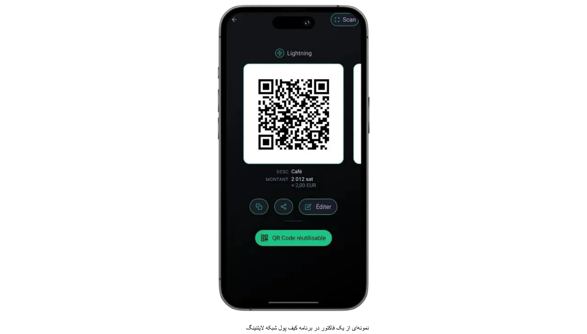

یکی از ویژگی‌های بارز این پروفایل تمرکز آن بر پرداخت‌های کم‌حجم است که به ندرت از چند صد یورو یا دلار در ماه تجاوز می‌کند. این مقیاس متواضع آن را به انتخابی عالی برای هر کسی که می‌خواهد بازار را با Bitcoin آزمایش کند، بدون پیچیدگی‌های ذاتی در استقرارهای با حجم بالا، تبدیل می‌کند. علاوه بر این، امکان یادگیری عملی فوری را فراهم می‌کند؛ زیرا فشارهای عملیاتی کمتری وجود دارد و ریسک‌های مالی کوچکتر هستند، اشتباهات می‌توانند محدود شوند و درس‌ها به سرعت آموخته می‌شوند. از هنرمندانی که صنایع دستی دست‌ساز خود را در نمایشگاه‌های آخر هفته می‌فروشند تا گروه‌های غیرانتفاعی که کمک‌های مالی یک‌باره می‌پذیرند، کاربران در این دسته اغلب بر دسترسی و سهولت استفاده به جای قابلیت‌های پیشرفته تأکید می‌کنند.

دو تنظیم رایج Wallet برای پروفایل Starter شامل تصمیم‌گیری بین راه‌حل‌های حضانتی و غیرحضانتی است. یک Wallet حضانتی (مانند Wallet از Satoshi یا Blink) به یک سرویس شخص ثالث اجازه می‌دهد تا کلیدهای خصوصی و عملیات پشتیبان را مدیریت کند و بدین ترتیب مسئولیت‌های فنی کاربر را کاهش می‌دهد. این ترتیب به‌ویژه برای کسانی که ارزش راحتی را بالاتر از همه چیز می‌دانند و ساده‌ترین فرآیند ورود را می‌خواهند، جذاب است. از سوی دیگر، کیف‌پول‌های لایتنینگ غیرحضانتی (مانند Phoenix یا Breez) کلیدهای خصوصی و کنترل کامل را در دست صاحب کسب‌وکار قرار می‌دهند و در Exchange استقلال و حریم خصوصی بیشتری را با کمی تلاش اولیه بیشتر ارائه می‌دهند. در هر صورت، رابط‌های مدرن معمولاً به قدری کاربرپسند هستند که هر کسی می‌تواند وظایف اساسی (تولید کد QR، وارد کردن مبلغ پرداخت و تأیید تراکنش‌ها) را در عرض چند دقیقه انجام دهد.

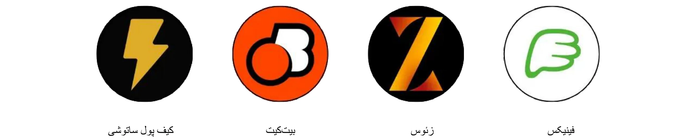

اگرچه نگرانی‌های امنیتی ممکن است زمانی که تراکنش‌ها کوچک هستند کمتر فوری به نظر برسند، اما همچنان ضروری است که اقدامات حفاظتی پایه‌ای را به کار گیریم. حتی یک گوشی هوشمند یا تبلت که برای دریافت پرداخت‌های Bitcoin استفاده می‌شود باید با رمز عبور یا امنیت بیومتریک قفل شود و رویه‌های پشتیبان‌گیری (از پیگیری اطلاعات ورود برای یک Wallet حضانتی تا حفاظت از عبارت seed برای یک غیرحضانتی) باید به‌طور جدی گرفته شوند. اعضای کارکنانی که در محیط فیزیکی با تراکنش‌ها سر و کار دارند، از دانستن اصول اولیه بهره‌مند خواهند شد: چگونه برنامه را باز کنند، چگونه یک کد QR به مشتری ارائه دهند و چگونه بررسی کنند که آیا پرداخت واقعاً رسیده است یا خیر.

حسابداری و گزارش‌دهی، در حالی که تحت پروفایل Starter نسبتاً ساده است، همچنان نیاز به توجه دقیق دارد. اگرچه حجم تراکنش‌ها ممکن است کم باشد، حفظ سوابق دقیق از بروز سردرگمی در آینده جلوگیری می‌کند و در صورت حسابرسی مالی یا ارائه اظهارنامه‌های مالیاتی به شفافیت کمک می‌کند. بسیاری از برنامه‌های Wallet به کاربران امکان می‌دهند تا تاریخچه تراکنش‌های پایه را به صورت فایل CSV صادر کنند؛ برای یک کسب‌وکار کوچک یا یک کارآفرین تنها، ذخیره منظم این فایل‌ها می‌تواند تطبیق حساب‌ها را بسیار آسان‌تر کند. همچنین عاقلانه است که ارزش تقریبی فیات (برای مثال، به یورو یا دلار) را در لحظه دریافت هر تراکنش پیگیری کنید. از آنجا که قیمت Bitcoin می‌تواند نوسان داشته باشد، داشتن سابقه‌ای از نرخ‌های تبدیل برای حسابداری و رعایت مالیات بسیار ارزشمند است.

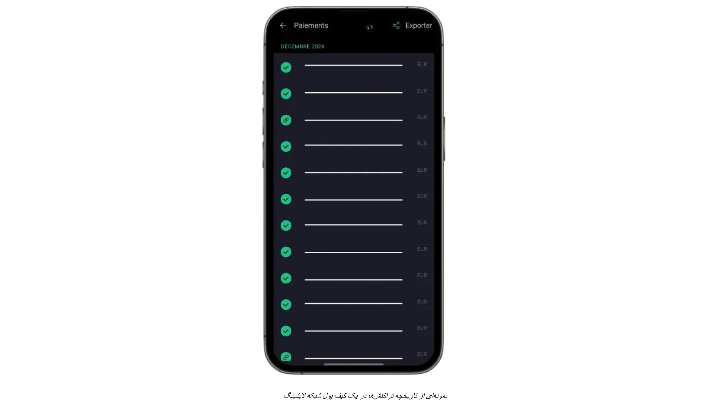

برای کسب‌وکارهایی که می‌خواهند پرداخت‌های فیزیکی یا حضوری خود را با کمک‌های آنلاین یا انعام‌ها تکمیل کنند، اکنون ادغام یک دکمه انعام Lightning یا ویجت کمک مالی در یک وب‌سایت یا وبلاگ به‌سادگی امکان‌پذیر است. پلتفرم‌هایی مانند BTCPay Server دکمه‌های پرداختی را ارائه می‌دهند که به‌راحتی قابل پیکربندی هستند، در حالی که برخی از خدمات رسانه‌های اجتماعی و پخش زنده از قبل از انعام‌های Lightning با آدرس‌ها پشتیبانی می‌کنند. در نتیجه، حتی یک کسب‌وکار نوپا می‌تواند شبکه‌ای کوچک اما جهانی از حامیان ایجاد کند. در همین حال، کسانی که ترجیح می‌دهند Bitcoin را در بلندمدت نگه ندارند، می‌توانند تبدیل جزئی یا خودکار به ارز فیات را با استفاده از کیف‌پول‌های حضانتی خاص یا خدمات شخص ثالث بررسی کنند. اگرچه این گزینه شامل هزینه‌های اضافی و تعهدات احتمالی KYC است، اما به کسب‌وکارها کمک می‌کند تا از نوسانات نرخ Exchange دوری کنند و جریان‌های مالی موجود خود را با کمترین اختلال حفظ کنند.

یک مورد استفاده ساده نشان می‌دهد که چگونه همه این Elements با هم ترکیب می‌شوند. تصور کنید یک صنعتگر محلی که مرباهای خانگی را در بازار کشاورزان شنبه می‌فروشد. با داشتن یک تلفن که یک Wallet لایتنینگ حضانتی را اجرا می‌کند، قیمت هر شیشه را به یورو تعیین می‌کند؛ وقتی مشتری درخواست پرداخت با Bitcoin می‌کند، فروشنده به سرعت مبلغ معادل فیات را وارد می‌کند و برنامه به طور خودکار Sats مورد نیاز را محاسبه می‌کند. کد QR حاصل توسط Wallet مشتری اسکن می‌شود، پرداخت در عرض چند ثانیه انجام می‌شود و صنعتگر بلافاصله می‌داند که تراکنش موفقیت‌آمیز بوده است. در پایان روز، هرگونه جزئیات تراکنش می‌تواند برای نگهداری سوابق صادر شود و موجودی روز می‌تواند به طور کامل یا جزئی به یک پلتفرم Exchange ارسال شود تا به ارز فیات تبدیل شود.

با متعادل‌سازی ابزارهای کاربرپسند، حداقل نیازهای سخت‌افزاری، و نگهداری سوابق ساده، راه‌حل‌های Starter ملزومات را بدون غرق کردن کسب‌وکارهای تازه‌وارد ارائه می‌دهند. در صورتی که حجم تراکنش‌ها افزایش یابد و نیازهای عملیاتی یک کسب‌وکار تکامل یابد، ارتقاء به دسته‌های پیشرفته‌تر که در فصل‌های آینده به تفصیل آمده است، به یک پیشرفت طبیعی تبدیل می‌شود.

برای آموزش‌های دقیق در مورد کیف‌پول‌های توصیه‌شده و تنظیمات اولیه، لطفاً به راهنماهای زیر مراجعه کنید:

**کیف‌پول‌ها/گره‌های LN خود حضانتی:**

https://planb.network/tutorials/wallet/mobile/phoenix-0f681345-abff-4bdc-819c-4ae800129cdf

https://planb.network/tutorials/wallet/mobile/bitkit-a7224674-85c4-4045-9baf-37018d89550c

https://planb.network/tutorials/wallet/mobile/breez-46a6867b-c74b-45e7-869c-10a4e0263c06

https://planb.network/tutorials/wallet/mobile/blixt-04b319cf-8cbe-4027-b26f-840571f2244f

https://planb.network/tutorials/wallet/mobile/zeus-embedded-advanced-3e89603c-501d-439c-8691-d4a0d0de459b

**کیف‌پول‌های LN نگهداری:**

https://planb.network/tutorials/wallet/mobile/wallet-of-satoshi-39149d86-e42b-4e8f-ae9f-7e061e7784f7

https://planb.network/tutorials/wallet/mobile/blink-7ea5f5a4-e728-4ff9-b3f9-cf20aa6fc2bd

## ضروریات

<chapterId>89be421f-f7df-4bcc-a9e4-df96e39ef249</chapterId>

پروفایل Essential برای کسب‌وکارهای کوچک و متوسط، که ممکن است کارمندانی داشته باشند، مناسب است و می‌خواهند Bitcoin را به‌راحتی و به‌سرعت بپذیرند بدون اینکه نیاز به دانش فنی پیشرفته داشته باشند، در حالی که همچنان سیستمی کامل‌تر و حرفه‌ای‌تر از یک Wallet ساده داشته باشند. این دسته‌بندی اغلب به رستوران‌ها، کافه‌ها، بارها یا فروشگاه‌های خرده‌فروشی کوچک که هر ماه تنها تعداد کمی پرداخت Bitcoin دارند، اما خواهان یک Interface هستند که هم ساده و هم به اندازه کافی قوی باشد تا عملیات روزمره را بدون وقفه مدیریت کند، اعمال می‌شود.

برخلاف پروفایل Starter، کسب‌وکارهای Essential معمولاً پرداخت‌های Bitcoin را به عنوان بخشی مداوم از جریان درآمد خود در نظر می‌گیرند و نه صرفاً یک آزمایش. آن‌ها هنوز در حجم تراکنش‌های نسبتاً پایین فعالیت می‌کنند، اما فرکانس به اندازه‌ای است که صاحبان و کارکنان از یک سیستم ساختارمند و قابل اعتماد بهره‌مند شوند. در عین حال، پروفایل Essential همچنان بر سادگی تمرکز دارد؛ در حالی که داشبوردهای کاربردی و مدیریت نقش محدود را فراهم می‌کند، نیازی به منابع IT تخصصی یا یکپارچگی‌های پیچیده ندارد.

توصیه‌های فناوری در این بخش اغلب بر روی **Swiss Bitcoin Pay** متمرکز است، یک راه‌حل ساده برای پذیرش پرداخت‌های Bitcoin توسط بازرگانان. این سیستم دارای یک اپلیکیشن PoS کاربرپسند است که نیاز به تخصص فنی برای کارکنان ندارد. برخلاف کیف‌پول‌های استاندارد Bitcoin، این سیستم تنها بر دریافت پرداخت‌ها تمرکز دارد و به کارکنان اجازه می‌دهد بدون خطرات امنیتی از دستگاه استفاده کنند. چندین اپلیکیشن PoS می‌توانند به یک حساب متصل شوند و بر روی تبلت‌ها، صندوق‌ها، گوشی‌های هوشمند یا از طریق نسخه وب برای کامپیوترها قابل استفاده هستند و از اندروید و iOS پشتیبانی می‌کنند. همچنین می‌توانید منویی با اقلامی که می‌فروشید و قیمت‌های مربوطه ایجاد کنید، که به کارمند اجازه می‌دهد به سادگی یک سبد از اقلام را برای مشتری در PoS انتخاب کرده و سپس مبلغ کل را شارژ کند.

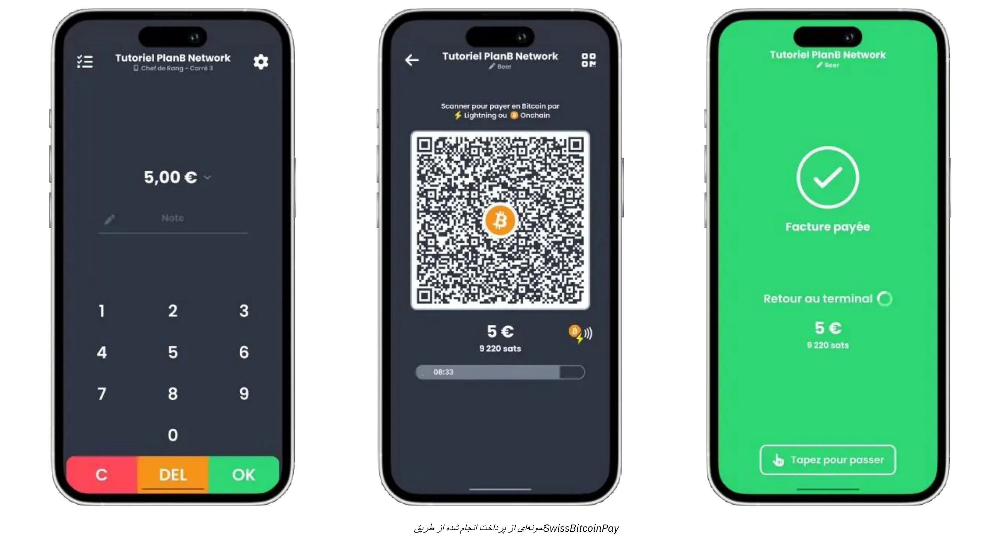

پرداخت‌ها می‌توانند یا در Bitcoin به یک Address خاص برداشت شوند یا به ارز فیات تبدیل شده و روزانه به یک حساب بانکی واریز شوند. Swiss Bitcoin Pay فرآیند را خودکار می‌کند و پرداخت‌های Bitcoin و Lightning Network را بدون دخالت دستی مدیریت می‌کند. وجوه حداکثر به مدت 24 ساعت قبل از انتقال نگهداری می‌شوند. در حالی که به طور کامل غیر حضانتی مانند BTCPay Server نیست، تعادل بین راحتی و امنیت را حفظ می‌کند و نیازی به KYC ندارد.

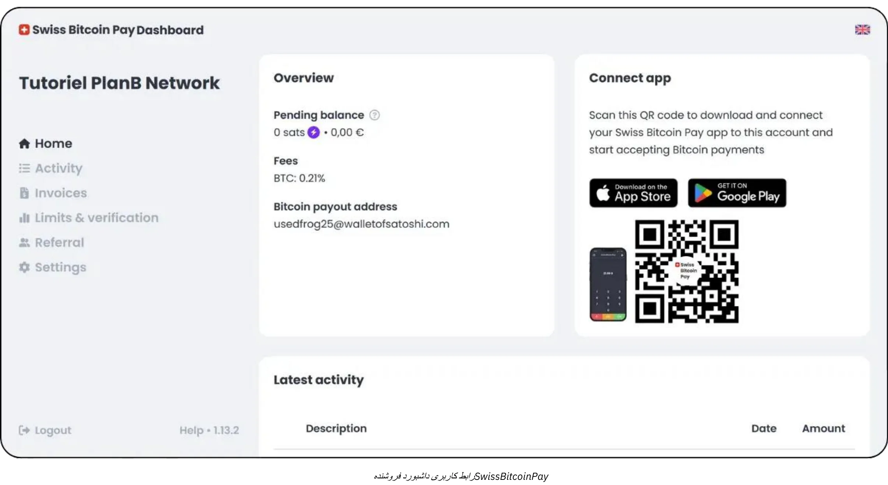

هزینه‌ها رقابتی هستند: 0.21% برای سال اول، سپس 1% برای پرداخت‌های Bitcoin و 1.5% برای پرداخت‌های تبدیل ارز فیات، شامل هزینه‌های تراکنش Bitcoin. Swiss Bitcoin Pay یک راه‌حل میانه عملی بین راه‌حل‌های حضانتی مانند Open Node و سیستم‌های پیچیده خودمیزبان مانند BTCPay Server ارائه می‌دهد و اولویت را به سادگی، امنیت و استقلال مالی می‌دهد.

این نوع تنظیم به کسب‌وکارهای حضوری امکان می‌دهد تا فاکتورهای پرداخت generate را به‌سرعت پردازش کنند، کدهای QR را به مشتریان خود ارائه دهند و تراکنش‌های Lightning یا On-Chain را با کمترین اصطکاک بپذیرند. کارکنان تنها به یک آموزش کوتاه نیاز دارند تا این پرداخت‌ها را مدیریت کنند، در حالی که مدیران می‌توانند به یک داشبورد آنلاین وارد شوند تا فروش روزانه را تطبیق دهند و به گزارش‌های پایه دسترسی پیدا کنند. دسترسی به یک کنسول مدیریتی ساده‌شده همچنین به مؤسسات کوچکتر کمک می‌کند تا درآمدهای فیات و کریپتو را از یک Interface پیگیری کنند، و بدین ترتیب سردرگمی را کاهش داده و زمان صرف‌شده برای حسابداری دستی را کم کنند.

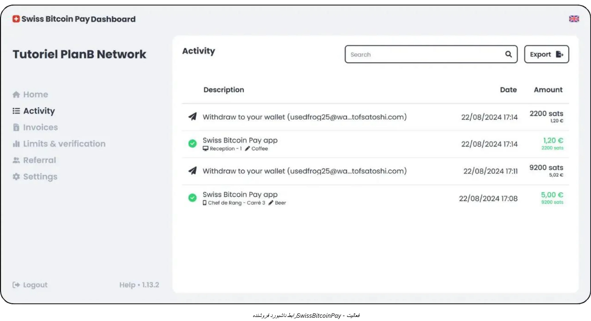

یکی دیگر از مزایای کلیدی رویکرد Essential تأکید بر استقرار سریع و حداقل اختلال است. راه‌حل‌هایی مانند Swiss Bitcoin Pay می‌توانند در عرض چند ساعت به جای روزها یا هفته‌ها راه‌اندازی شوند. برای مالک یا مدیر یک رستوران نسبتاً شلوغ، به عنوان مثال، هدف نهایی این است که پذیرش Bitcoin را بدون ایجاد تأخیر در صندوق یا سردرگمی در میان کارکنان ادغام کند. هنگامی که POS پیکربندی شد، مدیر می‌تواند به سادگی دستورالعمل‌های سریعی در مورد نمایش Invoice و تأیید اینکه پرداخت انجام شده است به کارکنان ارائه دهد. در بهترین حالت، تراکنش مشتری تقریباً بلافاصله از طریق Lightning Network تأیید می‌شود و پنل مدیریتی کسب‌وکار به طور همزمان یک پرداخت جدید را در زمان واقعی ثبت می‌کند.

اگرچه پروفایل Essential نیاز به سیستم‌های حسابداری بسیار پیچیده ندارد، اما همچنان عاقلانه است که سوابق تراکنش‌ها را به‌درستی نگهداری کنید. ابزارهایی مانند Swiss Bitcoin Pay قابلیت‌های صادرات CSV را ارائه می‌دهند که به مدیران امکان می‌دهد ارزش معادل فیات هر فروش Bitcoin را ثبت کرده و آن را در کنار سایر منابع درآمدی پیگیری کنند. این سطح از مستندسازی برای اکثر کسب‌وکارهای کوچک کافی است و درک ابتدایی از نرخ‌های Exchange به تسهیل در ارائه مالیات و نظارت کلی مالی کمک خواهد کرد.

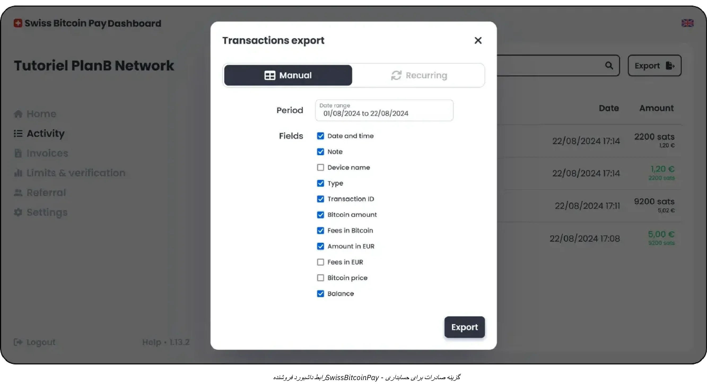

مناسب‌ترین راه‌حل ترکیبی برای پروفایل شما احتمالاً Swiss Bitcoin Pay است:

https://planb.network/tutorials/business/point-of-sale/swiss-bitcoin-pay-2-a78b057e-ed11-47ac-860c-71019fcb451a

راه‌حل دیگری که پیاده‌سازی آن آسان است، اما با این اشکال که ۱۰۰٪ حضانتی است، Open Node می‌باشد:

https://planb.network/tutorials/business/point-of-sale/open-node-e69a0c1c-47f7-4932-8494-e6f26c3c9784

اگر آماده‌اید که دست به کار شوید و کنترل کامل بر فرآیند داشته باشید، نرم‌افزار BTCPay Server یک گزینه عالی است. با این حال، عیب اصلی BTCPay Server این است که راه‌اندازی و مدیریت آن زمان‌بر است و به سطح خاصی از تخصص فنی نیاز دارد، اما می‌توانید راهنماهای ما را دنبال کنید:

https://planb.network/tutorials/business/point-of-sale/btcpay-server-928eb01e-824b-4b57-a3e8-8727633beddc

در نهایت، به عنوان مکملی برای نقاط فروش فیزیکی، می‌توانید راه‌اندازی [یک Bitcoinize PoS](https://bitcoinize.com/) را در نظر بگیرید.

## حرفه‌ای

<chapterId>4d5dfa50-c4d0-481c-ab95-1863a898750e</chapterId>

پروفایل حرفه‌ای برای کسب‌وکارهایی طراحی شده است که از پرداخت‌های گاه‌به‌گاه یا کم‌حجم Bitcoin فراتر رفته‌اند و اکنون به دنبال زیرساختی قوی برای مدیریت تراکنش‌های روزانه متعدد هستند. این شرکت‌ها اغلب در چندین کانال فعالیت می‌کنند (شاید یک مکان خرده‌فروشی، یک وب‌سایت تجارت الکترونیک اختصاصی و حتی فروش موبایلی) و بنابراین به راه‌حل‌های پرداختی نیاز دارند که بتوانند به‌طور یکپارچه در جریان‌های کاری موجود آن‌ها ادغام شوند. در بسیاری از موارد، شرکت‌ها در این سطح از سیستم‌های نقطه‌فروش، پلتفرم‌های مدیریت سفارش آنلاین و عملیات پشتیبانی استفاده می‌کنند که نیازمند رویکردی قابل‌اعتماد و مقیاس‌پذیر است.

یکی از ویژگی‌های تعیین‌کننده‌ی تاجر حرفه‌ای، نیاز به **ویژگی‌های پیشرفته** و **راه‌حل‌های قابل تنظیم** است که حتی با افزایش حجم تراکنش‌ها، کارایی را حفظ می‌کنند. برخلاف کاربران ضروری که ممکن است به یک ابزار ساده که به‌خوبی در یک اپلیکیشن گوشی هوشمند جا می‌گیرد راضی باشند، کسب‌وکارهای حرفه‌ای معمولاً خواهان ویژگی‌هایی مانند سفارشی‌سازی دقیق Invoice، داشبوردهای گزارش‌دهی پیشرفته و توانایی اختصاص چندین نقش مدیریتی هستند.

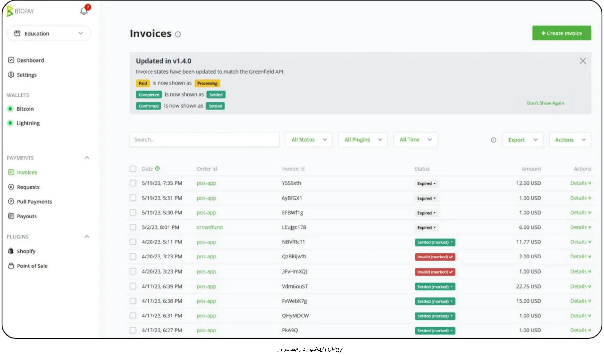

به عنوان مثال، یک گروه رستوران ممکن است اعضای کارکنانی داشته باشد که به صدور فاکتور و مدیریت موجودی اختصاص داده شده‌اند، در حالی که یک تیم جداگانه نظارت بر فهرست محصولات و کمپین‌های بازاریابی را بر عهده دارد. در این محیط، یک راه‌حل پرداخت Bitcoin باید به‌طور منظم با این ساختارهای سازمانی از پیش موجود هماهنگ شود.

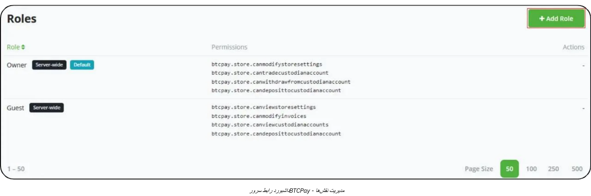

در مورد فناوری و ابزارها، راه‌حل‌هایی مانند **BTCPay Server** اغلب هسته‌ی یک تنظیمات حرفه‌ای را تشکیل می‌دهند. BTCPay Server یک پلتفرم متن‌باز است که می‌تواند به صورت محلی یا از طریق میزبانی ابری مستقر شود و گزینه‌های یکپارچه‌سازی گسترده‌ای برای وب‌سایت‌ها و پلتفرم‌های تجارت الکترونیک ارائه می‌دهد. با اجرای نمونه‌ی خود، کسب‌وکارها کنترل بالایی بر هر جنبه از جریان پرداخت، از صفحات پرداخت خودکار تولید شده تا اعلان‌هایی که فرآیندهای داخلی را پس از تأیید پرداخت فعال می‌کنند، حفظ می‌کنند.

علاوه بر این، ابزارهایی مانند [Zaprite](https://zaprite.com/) یا [Musqet](https://musqet.tech/) می‌توانند تجربه پرداخت را بهبود بخشند و امکان سفارشی‌سازی دقیق‌تری را فراهم کنند (از انتخاب‌های برندینگ تا قابلیت‌های گزارش‌دهی پیشرفته). کسانی که ترجیح می‌دهند یک محیط خرده‌فروشی آنلاین همه‌جانبه داشته باشند، ممکن است به سمت [Be-BOP](https://be-bop.io/) گرایش پیدا کنند، یک راه‌حل فروشگاه الکترونیکی که برای تسهیل پرداخت‌های Bitcoin طراحی شده است بدون اینکه استفاده آسان را قربانی کند.

پیاده‌سازی این فناوری‌ها در یک محیط حرفه‌ای به معنای توجه دقیق به **پیچیدگی عملیاتی** است. جریان‌های کاری صدور فاکتور خودکار، نمایش چند ارزی و همگام‌سازی با سیستم‌های موجود موجودی، همگی از ویژگی‌های یک پلتفرم به خوبی یکپارچه شده هستند. توانایی صادرات دقیق داده‌های تراکنش (چه به صورت فایل‌های CSV، تماس‌های مستقیم API یا فرمت‌های سفارشی) به کسب‌وکارها کمک می‌کند تا فروش Bitcoin را به طور کارآمد با سایر جریان‌های درآمدی تطبیق دهند.

مدیریت امنیت و نقش‌ها یکی دیگر از ملاحظات اساسی برای کاربران حرفه‌ای است. با افزایش تراکنش‌های روزانه Bitcoin، کنترل دسترسی به عملکردهای مدیریتی به یک اقدام ضروری برای کاهش ریسک تبدیل می‌شود. در بسیاری از راه‌حل‌ها، مدیران می‌توانند سطوح مختلفی از مجوزها را اختصاص دهند (شاید برخی از کارکنان را به مشاهده تاریخچه تراکنش‌ها و تولید فاکتورها محدود کنند، در حالی که به دیگران اجازه مدیریت موجودی یا پیکربندی تنظیمات سیستم‌گسترده را بدهند...). این ساختار سلسله‌مراتبی نه تنها از داده‌های حساس محافظت می‌کند بلکه با روشن کردن مسئولیت هر بخش از زیرساخت پرداخت برای کارکنان، عملیات را ساده‌تر می‌کند.

وقتی صحبت از مثال‌های دنیای واقعی می‌شود، یک فروشگاه تجارت الکترونیک متوسط که در لوازم جانبی فناوری تخصص دارد را در نظر بگیرید. این شرکت می‌تواند BTCPay Server را در فروشگاه آنلاین موجود خود ادغام کند و به‌طور خودکار آدرس‌های پرداخت Bitcoin را در هنگام پرداخت ایجاد کند. مشتریان با اسکن یک Lightning یا On-Chain Address خریدهای خود را تکمیل می‌کنند و پلتفرم فروشگاه بلافاصله پرداخت را تأیید می‌کند. همزمان، یک سیستم داخلی وضعیت سفارش را به‌روزرسانی کرده و اعلان‌های ارسال را فعال می‌کند. به لطف ویژگی‌های گزارش‌دهی پیشرفته، تیم مالی می‌تواند به‌راحتی فروش روزانه Bitcoin را بررسی کند، یک Ledger تلفیقی برای حسابرسی صادر کند و ارزش هرگونه دارایی BTC که شرکت تصمیم به نگهداری آن دارد را پیگیری کند.

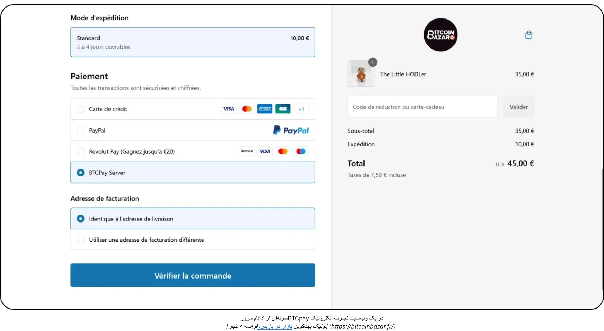

*[اعتبار: فروشگاه Bitcoin بازار در پاریس، فرانسه.](https://bitcoinbazar.fr/)*

برای بررسی عمیق‌تر جزئیات پیاده‌سازی و کاوش در تنظیمات عملی BTCPay Server، به دوره زیر مراجعه کنید:

https://planb.network/courses/6fc12131-e464-4515-9d3f-9255365d5fa1

## اینترپرایز

<chapterId>80fb2659-81ca-4a11-b492-72c7ae5774f9</chapterId>

پروفایل Enterprise در رأس پیاده‌سازی‌های پرداخت Bitcoin قرار دارد و به‌طور خاص برای شرکت‌های بزرگ، بازارهای عمده و کسب‌وکارهای معتبر که به راه‌حل‌های کاملاً سفارشی نیاز دارند، طراحی شده است. برخلاف پیاده‌سازی‌های کوچک‌تر یا در سطح متوسط، عملیات در سطح Enterprise پرداخت‌های Bitcoin را در یک طیف گسترده از جریان‌های کاری و سیستم‌ها ادغام می‌کند، از دستگاه‌های نقطه‌فروش در محل گرفته تا فروشگاه‌های تجارت الکترونیک، پلتفرم‌های حسابداری پشتیبان و چارچوب‌های ERP پیچیده.

در این مقیاس، هدف کلی صرفاً پذیرش Bitcoin نیست، بلکه انجام این کار به گونه‌ای است که **کاملاً با فرآیندهای اصلی سازمان همسو باشد**. این همسویی ممکن است نیاز به توسعه نرم‌افزارهای تخصصی داشته باشد، خواه راه‌حل به‌طور کامل سفارشی باشد یا از طریق زیرساخت مبتنی بر SaaS که توسط *ارائه‌دهندگان خدمات لایتنینگ* (LSPs) شخص ثالث پشتیبانی می‌شود، هماهنگ شود. چنین LSPهایی می‌توانند حجم بالای تراکنش‌ها و پیکربندی‌های پیچیده شبکه‌ای را که فراتر از ظرفیت ابزارهای متعارف آماده به کار هستند، مدیریت کنند. بنابراین معماری حاصل شامل مجموعه گسترده‌ای از ملاحظات فنی و تجاری است، از یکپارچه‌سازی‌های مبتنی بر API تا قابلیت‌های پیشرفته مدیریت خزانه‌داری.

در یک بستر سازمانی، پیچیدگی عملیاتی به‌ویژه برجسته می‌شود. یک شرکت بزرگ ممکن است نیاز داشته باشد تا چندین بخش (فروش، بازاریابی، DevOps، مالی و حسابداری) را با مسئولیت‌ها و نیازهای داده‌ای متمایز هماهنگ کند. در این سناریو، یک پلتفرم پرداخت Bitcoin باید مدیریت نقش بسیار دقیق ارائه دهد، به‌طوری‌که هر بخش بتواند دقیقاً به عملکردهای مرتبط با وظایف خود دسترسی داشته باشد و در عین حال کنترل دقیق بر امنیت و یکپارچگی داده‌ها حفظ شود. به همان اندازه ضروری است که ظرفیت سفارشی‌سازی جریان‌های کاری وجود داشته باشد: برای مثال، پرداخت‌های ورودی ممکن است به‌روزرسانی‌هایی در سیستم‌های موجودی ایجاد کنند، اعلان‌های خودکار به مدیران فروش ارسال کنند و ورودی‌های Ledger را برای تیم مالی به‌روزرسانی کنند، همه این‌ها به‌صورت لحظه‌ای. دستگاه‌های نقطه‌فروش خود به‌طور معمول برای محیط سازمانی سفارشی‌سازی می‌شوند، با رابط‌های نرم‌افزاری سفارشی که با برندینگ و نیازهای عملیاتی شرکت مطابقت دارند.

**امنیت** برای کسب‌وکارهای در مقیاس سازمانی بسیار مهم است. حجم بالای تراکنش‌ها و مقادیر بالقوه بزرگ Bitcoin نیازمند زیرساختی قوی است که قادر به دفاع در برابر حملات مخرب یا تهدیدات داخلی باشد. بهترین روش‌ها اغلب شامل پیکربندی‌های خزانه با امضای چندگانه و قفل‌های زمانی، کدهای به دقت بررسی‌شده و پایبندی دقیق به چارچوب‌های قانونی مربوطه می‌باشد. علاوه بر این، رعایت مقررات مالی محلی و بین‌المللی می‌تواند برای حفظ شهرت و مجوز فعالیت شرکت ضروری باشد.

توسعه **سفارشی** درگیر در ایجاد یا یکپارچه‌سازی یک راه‌حل پرداخت Bitcoin در سطح سازمانی فراتر از کدنویسی چند ویژگی برنامه است. این معمولاً نیاز به طراحی معماری، پروتکل‌های تست دقیق، و یک استقرار ساختاریافته دارد که ممکن است شامل چندین مرحله باشد (برنامه‌های آزمایشی اولیه، آزمایش‌های محدود بازار، و در نهایت استقرار جهانی).

در بخش حسابداری، تراکنش‌های با فرکانس بالا نیاز به **صادرات کاملاً سفارشی** و گاهی همگام‌سازی در زمان واقعی با نرم‌افزار مالی شرکت دارند. کسب‌وکارهای بزرگ ممکن است به راه‌حل‌های برنامه‌ریزی منابع سازمانی (ERP) مانند SAP یا Oracle متکی باشند که به نوبه خود باید به طور یکپارچه با داده‌های پرداخت Bitcoin کار کنند. برای تسهیل این امر، APIهای پلتفرم انتخابی باید پیچیده و انعطاف‌پذیر باشند و به تیم‌های IT آزادی ایجاد داشبوردهای گزارش‌دهی سفارشی، اجرای فرآیندهای تطبیق خودکار و خلاصه‌های مالی روزانه یا حتی ساعتی generate را بدهند.

یک سناریوی معمولی در یک شرکت بزرگ ممکن است شامل یک بازار تجارت الکترونیک بزرگ باشد که هر روز هزاران تراکنش را می‌پذیرد. فراتر از صرفاً فهرست کردن Bitcoin به عنوان یک گزینه پرداخت، این بازار می‌تواند هر جنبه‌ای از تجربه کاربری را سفارشی کند، از نحوه نمایش جریان پرداخت Bitcoin در وب‌سایت مشتری‌محور تا نحوه مدیریت بازپرداخت‌ها، برگشت هزینه‌ها یا حل اختلافات در بخش پشتی. یک تیم اختصاصی DevOps، با همکاری بخش‌های مالی و حقوقی، بر نگهداری مداوم، وصله‌های امنیتی و به‌روزرسانی‌های انطباق نظارت خواهد داشت. اگر شرکت تصمیم بگیرد بخشی از درآمد Bitcoin خود را حفظ کند، یک سیستم خزانه‌داری داخلی دارایی‌های Bitcoin شرکت را در کنار ذخایر ارز سنتی پیگیری خواهد کرد.

برای اطمینان از استقرار روان و امن در سطح سازمانی، اکثر سازمان‌ها از ارائه‌دهندگان خدمات تخصصی یا تیم‌های توسعه داخلی با تجربه در ادغام‌های Bitcoin و Lightning Network استفاده می‌کنند. این فرآیند معمولاً با ارزیابی نیازهای عمیق (پوشش زیرساخت فنی، الزامات انطباق و مسیر مشتری مطلوب) آغاز می‌شود و به دنبال آن طراحی معماری‌ای که می‌تواند حجم بالای ترافیک را مدیریت کند، انجام می‌شود. بسته به دامنه پروژه، ممکن است به یک تیم چند رشته‌ای متشکل از کنترل‌کنندگان مالی، تحلیل‌گران امنیتی و مهندسان نرم‌افزار تکیه کنید. به‌طور جایگزین، تعداد فزاینده‌ای از شرکت‌های مشاوره تخصصی می‌توانند شما را از مفهوم‌سازی اولیه تا راه‌اندازی نهایی راهنمایی کنند و در وظایفی مانند ارزیابی راه‌حل‌های SaaS-hosted، پیکربندی *ارائه‌دهندگان خدمات لایتنینگ* و سفارشی‌سازی رابط‌های کاربری کمک کنند. با همکاری با کارشناسان حوزه، سازمان‌ها می‌توانند ریسک‌های مرتبط با اجرای پرداخت‌های بزرگ‌مقیاس را کاهش دهند و به راه‌حلی دست یابند که نه تنها قوی و منطبق باشد بلکه به اندازه کافی انعطاف‌پذیر باشد تا رشد آینده را نیز در بر گیرد.

## راه‌حل‌های پرداخت Bitcoin: گزینه‌ها و روندها

<chapterId>59ff43a1-98e2-4a81-af3e-9654bdd60952</chapterId>

همیشه برای هر دسته از راه‌حل‌ها، مبادله‌هایی وجود دارد. به عنوان مثال، در "مرحله آزمایشی" اولیه، کیف‌پول‌های پیشنهادی به گونه‌ای طراحی شده‌اند که از نظر کاربر Interface تا حد ممکن ساده باشند، اما به صورت (**امانی**) میزبانی می‌شوند. این بدان معناست که وجوه توسط ارائه‌دهنده اپ کنترل می‌شود. با این حال، اصول Bitcoin تشویق به حرکت به سمت Ownership کامل وجوه توسط کاربر (**غیرامانی**) می‌کند. در این حالت، توصیه می‌شود که به محض انجام اولین فروش‌ها به دسته بعدی ارتقا دهید—به طور اساسی، زمانی که تأیید شد که مشتریانی دارید که مایل به پرداخت در Bitcoin هستند.

یکی از مزایای کلیدی Bitcoin توانایی انتقال وجوه به دلخواه است که **تغییر ارائه‌دهندگان** یا اجزای راه‌حل شما را بسیار آسان می‌کند. علاوه بر این، تمام برنامه‌ها و راه‌حل‌ها خود به سرعت در حال تکامل هستند. به عنوان مثال، به Bitcoinize توجه کنید که اکنون یک ترمینال فیزیکی نقطه فروش (POS) ارائه می‌دهد که با بسیاری از برنامه‌های موجود در بازار ادغام می‌شود، راه‌حلی که تا چند ماه پیش وجود نداشت.

### به دنبال راه حلی برای ایجاد فروشگاه و پذیرش هر دو پرداخت سنتی و Bitcoin هستید؟

اگر از صفر شروع می‌کنید—بدون فروشگاه، بدون نرم‌افزار مدیریت محصول و بدون سیستم نقطه‌فروش (POS)—چند گزینه پیش رو دارید:

- **برون‌سپاری:** شما می‌توانید ایجاد یک وب‌سایت با گزینه‌های خرید را برون‌سپاری کنید و سپس قابلیت‌های پرداخت Bitcoin را در کنار راه‌حل‌های سنتی درون‌فروشگاهی اضافه کنید.

- **راه‌حل‌های ساده:** به‌طور جایگزین، می‌توانید از پلتفرم‌هایی مانند Accessing.app برای انجام آن به‌صورت خودکار استفاده کنید. مزایای کلیدی شامل:
    - راه‌اندازی سریع و مقرون‌به‌صرفه یک فروشگاه آنلاین یا فیزیکی.
    - مناسب برای کسب‌وکارهای فصلی، رویدادها، رستوران‌ها یا فروشگاه‌های خرده‌فروشی.
    - تعریف و مدیریت محصولات برای فروش فیزیکی و آنلاین.
    - پردازش پرداخت فیات (مثلاً یورو، دلار) از طریق حساب Stripe خودتان.
    - پردازش پرداخت Bitcoin از طریق حساب Bitcoin Pay سوئیسی خودتان.

### پیشرفت پذیرش پرداخت‌های لایتنینگ چگونه است؟

در حالی که Lightning Network بهره‌وری برتر و هزینه‌های کمتری ارائه می‌دهد، پذیرش آن هنوز در مراحل اولیه خود است. به جای تمرکز بر محدودیت‌های فعلی، ارزش دارد که به یاد بیاوریم چگونه تحولات زیرساختی تاریخی شکل گرفتند:

- وقتی خودروها برای اولین بار ظاهر شدند، به اندازه کافی خودرو وجود نداشت تا ساخت جاده‌ها توجیه شود، و به اندازه کافی جاده وجود نداشت تا مالکیت خودروها توجیه شود.
- وقتی برق معرفی شد، مشتریان کافی برای توجیه ساخت شبکه‌های برق وجود نداشت و شبکه‌های کافی برای جذب مشتریان وجود نداشت.

زیرساخت‌های جدید موفق می‌شوند زیرا کارآمدتر هستند و پذیرندگان اولیه به آن‌ها می‌پیوندند زیرا از مزایای ملموس بهره‌مند می‌شوند. در اینجا مشاهداتی درباره Lightning Network در سال 2024 آمده است:

- **تراکنش‌های فوق‌العاده سریع:** تراکنش‌ها اغلب تقریباً به صورت آنی (<500ms) انجام می‌شوند و نرخ شکست بسیار پایینی دارند.

- **حرفه‌ای‌سازی شبکه:** بازیگران بزرگتر در حال تضمین نقدینگی در سراسر شبکه هستند، در حالی که افراد به طور عمده از مسیریابی پرداخت‌ها دست کشیده‌اند و اکنون بیشتر "گره‌های لبه" را اجرا می‌کنند.

- **تجربه کاربری بهبود یافته:** اپلیکیشن‌های موبایل برای کاربران فردی به طور قابل توجهی بهبود یافته‌اند. ویژگی‌هایی مانند برش، فاکتورهای استاتیک Bolt12 و پرداخت‌های بدون تأیید (0-conf) به طور گسترده در دسترس هستند و تعاملات را بدون مشکل می‌سازند. مسائل مربوط به سازگاری (مانند بسته شدن اجباری) دیگر نگرانی‌های عمده‌ای نیستند.

- **مدیریت پیشرفته نود و کانال:** هم راه‌حل‌های فردی و هم حرفه‌ای پیشرفت کرده‌اند. به عنوان مثال، سرور BTCPay اکنون از پلاگین‌های متعددی برای اتصال به سایر ارائه‌دهندگان (PSPها، رمپ‌های ورود/خروج و غیره) پشتیبانی می‌کند. ارائه‌دهندگان زیرساخت جدید، مانند LightSpark و Alby Hub، نیز وارد مرحله تولید شده‌اند.

- **رشد پذیرش توسط بازرگانان:** بازرگانانی مانند BitRefill گزارش می‌دهند که پرداخت‌های Bitcoin در میان کاربران فعال آن‌ها افزایش یافته است و یک تغییر واضح به سمت Bitcoin نسبت به Lightning مشاهده می‌شود. علاوه بر این، کارمزدهای بسیار پایین Lightning آن را به گزینه‌ی ترجیحی برای پرداخت‌های کوچک (به‌طور متوسط €32 در هر تراکنش) تبدیل کرده است.

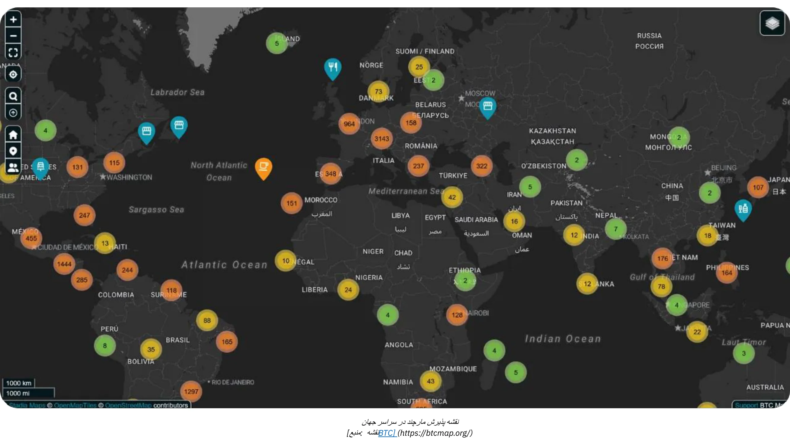

*[منبع: BTC Map](https://btcmap.org/)*

- **معیارهای شبکه:** تعداد کل کانال‌ها و Bitcoin قفل شده در Lightning ثابت باقی می‌ماند، با تقریباً 20,000 نود، 5,200 BTC و 60,000 کانال. با این حال، این تنها بخشی از شبکه را نشان می‌دهد و به چرخش در میان شرکت‌کنندگان اشاره دارد، با تعداد کمتری از افراد و مشارکت بیشتر حرفه‌ای‌ها.

- **رعد به عنوان پلی بین شبکه‌ها:** کارایی و دسترسی Lightning Network قبلاً آن را به عنوان پلی به شبکه‌های متصل دیگر (مانند FediMint، Liquid، و غیره) قرار داده است.

**بازگشت Wallet**

Bitcoin و Lightning Network در حال تکمیل **انقلاب دیجیتال Wallet** هستند. خدمات وب جدید اکنون امکان **تراکنش‌ها بدون نیاز به ایجاد حساب کاربری** را فراهم می‌کنند—Wallet شما به هویت شما تبدیل می‌شود! با پروتکل‌هایی مانند **Nostr Wallet Connect (NWC)** و **LN-URL-AUTH**، کیف پول‌ها می‌توانند به‌طور یکپارچه کاربران را احراز هویت کنند و تراکنش‌ها را بدون حساب‌های سنتی امکان‌پذیر سازند. روزهای خستگی از حساب‌های کاربری برای خریدهای ساده یا اشتراک‌ها به پایان رسیده است. دیگر نیازی به ارائه اطلاعات شخصی یا پرداختی که ممکن است هک شده و در وب تاریک به فروش برسد نیست، همان‌طور که رویدادهای اخیر به ما یادآوری می‌کنند.

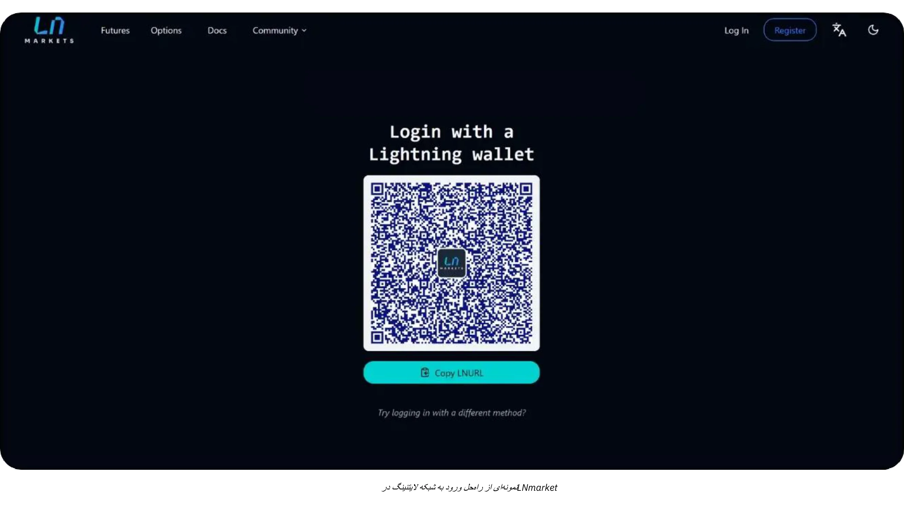

بازرگانان فردا این نوآوری را خواهند پذیرفت و تجربه‌ای امن‌تر و روان‌تر (با یک کلیک) را به مشتریان ارائه خواهند داد که همچنین به حریم خصوصی آن‌ها احترام می‌گذارد.

# Bitcoin حسابداری

<partId>d49d7595-a189-4e2b-bd60-c19e8e717aa2</partId>

## اصول اساسی برای حسابداری Bitcoin در کسب و کار

<chapterId>84063061-ffdb-4b1f-b20b-588ffb146877</chapterId>

محتوای زیر صرفاً برای اهداف آموزشی ارائه شده است و نباید به عنوان مشاوره مالی یا حسابداری در نظر گرفته شود. به شدت توصیه می‌شود که کسب‌وکارها و افراد با یک حسابدار یا کارشناس حقوقی واجد شرایط که با مقررات ارزهای دیجیتال در حوزه قضایی خاص خود آشنا است، مشورت کنند قبل از انجام هر گونه اقدام.

### مفاهیم کلیدی حسابداری Bitcoin

**هر تراکنش Bitcoin باید ثبت شود و ممکن است منجر به یک رویداد مالیاتی شود**

در سطح جهانی، Bitcoin اغلب به عنوان یک دارایی دیجیتال و نه به عنوان یک ارز طبقه‌بندی می‌شود. این تمایز به طور قابل توجهی بر نحوه حسابداری Bitcoin در کسب‌وکارها تأثیر می‌گذارد و بر تعهدات مالیاتی، گزارش‌دهی مالی و الزامات انطباق تأثیرگذار است. کسب‌وکارهایی که Bitcoin را به عنوان یک روش پرداخت می‌پذیرند یا از آن به عنوان یک ابزار خزانه‌داری استفاده می‌کنند، باید این ظرافت‌های نظارتی را درک کنند.

مهم‌ترین پیامد که باید در نظر داشت این است که در اکثر حوزه‌های قضایی، کسب، فروش، معامله یا استفاده از Bitcoin برای خرید، معمولاً **یک رویداد مالیاتی** ایجاد می‌کند و سودها مشمول مالیات بر عایدی سرمایه می‌شوند.

جنبه دیگری از حسابداری Bitcoin تمایز بین دو نوع سود سرمایه است:

- **سود/زیان نهفته:** سود یا زیان تحقق‌نیافته بر اساس ارزش Bitcoin که در پایان یک دوره حسابداری نگهداری می‌شود.
- **سود/زیان مؤثر:** سود یا زیان تحقق‌یافته زمانی که Bitcoin در طول سال مالی فروخته یا مبادله می‌شود.

این محاسبات به شدت وابسته به این است که آیا Bitcoin برای سرمایه‌گذاری بلندمدت نگهداری می‌شود یا برای استفاده عملیاتی کوتاه‌مدت. علاوه بر این، کسب‌وکارها باید روش‌های حسابداری خود را با ساختارهای مالیاتی محلی هماهنگ کنند، زیرا مقررات به طور قابل توجهی در کشورهای مختلف متفاوت است.

حسابداری برای کسب‌وکارهایی که Bitcoin نگه می‌دارند تا حدی پیچیده است زیرا هر تراکنش باید به دقت پیگیری شود تا سود یا زیان تحقق‌یافته یا تحقق‌نیافته محاسبه شود. برای هر فروشی که با پذیرش Bitcoin به عنوان یک شکل پرداخت انجام می‌دهید، یا هر بار که Bitcoin می‌خرید یا می‌فروشید، باید ثبت کنید:

- زمان خاص
- قیمت فروش (به ارز فیات)
- قیمت هزینه Bitcoin (قیمتی که Bitcoin در ابتدا با آن خریداری شد).

این به شما اجازه می‌دهد تا بعداً بتوانید تفاوت را برای تعیین سود یا زیان محاسبه کنید.

**مثال:** یک کسب‌وکار 1 BTC را به قیمت $30,000 خریداری می‌کند. بعداً، 0.5 BTC را به قیمت $20,000 می‌فروشد. برای محاسبه سود یا زیان، کسب‌وکار باید:

- زمان، قیمت فیات و مقدار Bitcoin خریداری شده را ثبت کرده‌ام.
- زمان، قیمت فروش فیات و مقدار Bitcoin فروخته شده را ثبت کرده‌ام.
- هزینه فروش Bitcoin را تعیین کنید: 0.5 BTC: $30,000 ÷ 2 = $15,000.
- قیمت فروش را با قیمت هزینه مقایسه کنید: ۲۰,۰۰۰ دلار (قیمت فروش) - ۱۵,۰۰۰ دلار (قیمت هزینه) = ۵,۰۰۰ دلار سود.
- دارایی‌های Bitcoin را با قیمت جدید به‌روز کنید.

این فرآیند باید برای هر تراکنش تکرار شود و ماهیت نوسانی قیمت Bitcoin نگهداری سوابق را حتی دشوارتر می‌کند.

**چگونه کار می‌کرد اگر Bitcoin یک ارز بود؟**

اگر Bitcoin به عنوان یک ارز در نظر گرفته شود، کسب‌وکارها آن را مانند هر ارز دیگری در سیستم حسابداری خود مدیریت می‌کنند. به جای پیگیری مبنای هزینه و سودهای تحقق‌یافته/تحقق‌نیافته برای هر تراکنش، دارایی‌های Bitcoin به سادگی در یک حساب ارزی ثبت می‌شود. در پایان هر دوره گزارش‌دهی، ارزش تمام دارایی‌های ارزی، از جمله Bitcoin، با استفاده از نرخ فعلی Exchange به ارز حسابداری (مثلاً USD یا EUR) تبدیل می‌شود.

**مثال به‌روزرسانی‌شده اگر Bitcoin به‌عنوان یک ارز شناخته شود:**

- یک کسب‌وکار 1 BTC نگه می‌دارد زمانی که Bitcoin به ارزش $30,000 است. بعداً، کسب‌وکار از 0.5 BTC برای پرداخت استفاده می‌کند زمانی که Bitcoin به ارزش $40,000 است.
- کسب‌وکار **سود یا زیان تحقق‌یافته** را محاسبه نمی‌کند. در عوض، تراکنش به صورت زیر ثبت می‌شود:
    - پرداخت: $20,000 (0.5 BTC × $40,000).
    - باقیمانده Bitcoin: 0.5 BTC، اکنون به ارزش $20,000 (به‌روزرسانی شده با نرخ فعلی Exchange).

**مزیت کلیدی اگر Bitcoin به عنوان یک ارز شناخته شود:**

- کسب‌وکار فقط نیاز دارد معادل فیات دارایی‌های Bitcoin خود را به‌صورت دوره‌ای تنظیم کند (مثلاً برای گزارش‌های ماهانه یا سالانه)، درست مانند یورو، ین یا سایر ارزهایی که در اختیار دارد.
- این امر نیاز به ردیابی مبنای هزینه در سطح تراکنش را از بین می‌برد و حسابداری را ساده می‌کند، به ویژه برای کسب‌وکارهایی که تراکنش‌های مکرر Bitcoin دارند.

این رویکرد حسابداری Bitcoin را بسیار ساده‌تر می‌کند، بارهای اداری را کاهش می‌دهد و با نحوه برخورد با سایر ارزها همسو می‌شود، به شرطی که Bitcoin به طور کامل به عنوان چنین در اصطلاحات قانونی و نظارتی شناخته شود. ما هنوز به آنجا نرسیده‌ایم.

### تفاوت‌های بین حسابداری فردی و شرکتی Bitcoin

رویکرد قانونی و حسابداری Bitcoin بین افراد و شرکت‌ها به‌طور قابل‌توجهی متفاوت است. برای افراد، سود حاصل از معاملات Bitcoin ممکن است مشمول مالیات بر درآمد شود که اغلب با نرخ بالاتری است. در مقابل، شرکت‌ها ممکن است از نرخ‌های مالیاتی شرکتی پایین‌تر بهره‌مند شوند اما باید به استانداردهای سخت‌گیرانه‌تری در حسابداری پایبند باشند.

برای کسب‌وکارها، Bitcoin می‌تواند بسته به استفاده مورد نظر تحت حساب‌های مختلف طبقه‌بندی شود:

- **دارایی‌های ثابت:** برای Bitcoin که به‌عنوان یک سرمایه‌گذاری استراتژیک بلندمدت نگهداری می‌شود.
- **سهام:** برای Bitcoin که در فرآیندهای تولید استفاده می‌شود (یک مورد استفاده نادر، به عنوان مثال این مورد برای معامله‌گران حرفه‌ای است).
- **وجه نقد یا حساب‌های خزانه‌داری:** برای Bitcoin که به عنوان دارایی Liquid نگهداری می‌شود، عمدتاً برای معاملات عملیاتی یا مدیریت خزانه‌داری کوتاه‌مدت.

انتخاب طبقه‌بندی به فعالیت و استراتژی شرکت بستگی دارد و پیامدهایی برای گزارش‌دهی مالی و تعهدات مالیاتی دارد. همیشه مقررات محلی را بررسی کنید، زیرا این طبقه‌بندی‌ها ممکن است در هر کشور متفاوت باشد.

### چارچوب قانونی

شناسایی و برخورد قانونی با Bitcoin بسته به حوزه قضایی متفاوت است. برخی کشورها، مانند السالوادور، Bitcoin را به عنوان پول قانونی به رسمیت شناخته‌اند که استفاده از آن در معاملات را ساده‌تر می‌کند اما گزارش‌دهی مالی بین‌المللی را پیچیده‌تر می‌سازد. دیگران Bitcoin را به عنوان یک دارایی دیجیتال تحت قوانین خاص مالیاتی و حسابداری تلقی می‌کنند.

در اکثر کشورها، Bitcoin به عنوان یک دارایی دیجیتال دسته‌بندی می‌شود و نحوه برخورد با آن توسط استانداردهای حسابداری عمومی تعیین می‌گردد. کسب‌وکارها باید معاملات Bitcoin را به صورت زیر حساب کنند:

- **ثبت سود/زیان سرمایه‌ای:** کسب‌وکارها باید سود یا زیان تحقق‌یافته را در نتایج مالی خود لحاظ کنند.
- **ارزش‌گذاری سود/زیان نهفته:** سود یا زیان تحقق‌نیافته اغلب باید گزارش شود اما ممکن است به طور مستقیم بر درآمد مشمول مالیات تأثیر نگذارد.
- **رعایت استانداردهای حسابداری:** کسب‌وکارها باید تراکنش‌های Bitcoin را در رویه‌های استاندارد دفترداری ادغام کنند و شفافیت و دقت را تضمین نمایند.

رویکرد حسابداری Bitcoin با توجه به جغرافیا متفاوت است:

- ایالات متحده: **IRS، Bitcoin را به عنوان دارایی، مشابه با سهام، اوراق قرضه یا املاک و مستغلات طبقه‌بندی می‌کند.** این طبقه‌بندی به این معناست که هر معامله‌ای که شامل ارز دیجیتال باشد، مانند کسب، فروش، معامله یا حتی استفاده از آن برای خرید، می‌تواند یک رویداد مشمول مالیات ایجاد کند و سودها مشمول مالیات بر عایدی سرمایه می‌شوند.
- **اتحادیه اروپا:** کشورهای عضو معمولاً Bitcoin را به عنوان یک دارایی سفته‌بازی در نظر می‌گیرند تا یک ارز کاربردی. بنابراین، سودها اغلب مشمول مالیات بر عایدی سرمایه می‌شوند.
- **آسیا:** کشورهایی مانند سنگاپور و ژاپن چارچوب‌های نظارتی پیشرفته‌ای را اتخاذ کرده‌اند که معاملات Bitcoin را در زمینه‌های خاص به‌طور مطلوبی در نظر می‌گیرند. اما Bitcoin به‌طور کلی به عنوان **دارایی‌های نامشهود** حساب می‌شود و در تاریخ گزارش‌گیری به ارزش منصفانه اندازه‌گیری می‌شود و تغییرات در سود یا زیان شناسایی می‌شود.

درک مقررات در کشور محل فعالیت شما و تطبیق روش‌های حسابداری با آن‌ها ضروری است.

### چالش‌ها در تکامل مقررات

سرعت سریع نوآوری در ارزهای دیجیتال اغلب از چارچوب‌های نظارتی پیشی می‌گیرد. از زمان شناسایی Bitcoin به عنوان یک دارایی دیجیتال، مقررات جهانی به‌روزرسانی‌های تدریجی داشته‌اند، اما همچنان شکاف‌هایی وجود دارد:

- **کمبود رویه قضایی:** تعداد کمی از پرونده‌های حقوقی به روشن‌سازی رویه‌های خاص حسابداری پرداخته‌اند و فضای تفسیر را باز گذاشته‌اند.
- **مباحثات جاری:** مسائلی مانند نحوه مالیات‌دهی به زیان‌های نهفته در بسیاری از حوزه‌های قضایی همچنان حل‌نشده باقی مانده‌اند.
- **پیچیدگی فرامرزی:** شرکت‌هایی که به صورت بین‌المللی فعالیت می‌کنند با چالش‌هایی در تطبیق استانداردهای حسابداری ملی متفاوت مواجه هستند.

با وجود این چالش‌ها، مواضع فعال بسیاری از کشورها پایه‌ای محکم برای کسب‌وکارها فراهم می‌کند تا Bitcoin را در عملیات خود بگنجانند. به‌روزرسانی‌های مداوم و هماهنگی بین‌المللی برای پیچیدگی‌های نوظهور Address در حسابداری ارزهای دیجیتال ضروری خواهد بود.

### طبقه‌بندی Bitcoin در صورت‌های مالی

طبقه‌بندی Bitcoin در صورت‌های مالی بسته به حوزه قضایی و استفاده مورد نظر آن در یک کسب‌وکار متفاوت است. به طور کلی، Bitcoin به عنوان یک دارایی دیجیتال در نظر گرفته می‌شود، مشابه موجودی، سرمایه‌گذاری یا ارز، اما با ویژگی‌های منحصربه‌فردی که بر نحوه حسابداری آن تأثیر می‌گذارد.

- **دارایی دیجیتال یا دارایی نامشهود**: بسیاری از حوزه‌های قضایی، از جمله فرانسه و اتحادیه اروپا، Bitcoin را به عنوان یک دارایی دیجیتال یا نامشهود طبقه‌بندی می‌کنند نه به عنوان پول قانونی. این طبقه‌بندی نیازمند آن است که کسب‌وکارها Bitcoin را به شکلی متفاوت از ارزهای فیات حساب کنند.
- **موجودی**: اگر فعالیت اصلی یک کسب‌وکار شامل تجارت Bitcoin باشد، مانند صرافی‌های ارز دیجیتال یا کارگزاران، Bitcoin به عنوان موجودی طبقه‌بندی می‌شود. در این صورت، ارزیابی بر اساس استانداردهای حسابداری موجودی انجام می‌شود.
- **سرمایه‌گذاری مالی**: شرکت‌هایی که Bitcoin را به عنوان یک دارایی بلندمدت نگه می‌دارند، ممکن است آن را به عنوان یک سرمایه‌گذاری مالی طبقه‌بندی کنند. به عنوان مثال، در ایالات متحده، کسب‌وکارها می‌توانند Bitcoin را تحت دستورالعمل‌های هیئت استانداردهای حسابداری مالی (FASB) حساب کنند و کاهش ارزش‌ها را زمانی که ارزش‌های بازار کاهش می‌یابد، شناسایی کنند.

**پیامدهای طبقه‌بندی :**

- دارایی‌های بلندمدت اغلب نیاز به آزمون کاهش ارزش و استهلاک دارند.
- فعالیت‌های معاملاتی فعال یا مرتبط با پرداخت نیاز به پیگیری مداوم سود و زیان تحقق‌یافته و تحقق‌نیافته دارند.

### روش‌های ارزش‌گذاری

روش‌های ارزش‌گذاری تکنیک‌های حسابداری هستند که برای تعیین مبنای هزینه Bitcoin استفاده می‌شوند، که برای محاسبه دقیق سود یا زیان در طول معاملات ضروری است. به طور کلی، بهتر است **همیشه ارزش به‌روز هزینه‌های نگهداری فعلی Bitcoin** را در سیستم حسابداری حفظ کنید. این کار شفافیت، تطابق با مقررات مالیاتی را تضمین می‌کند و از عقب ماندن زمانی که نیاز به انجام محاسبات است، جلوگیری می‌کند.

- **اولین ورودی، اولین خروجی (FIFO)**: در حوزه‌هایی مانند استرالیا و هند رایج است، این روش Bitcoin را بر اساس هزینه اولیه خرید ارزش‌گذاری می‌کند. این می‌تواند بسیار **پیچیده** شود زیرا ممکن است نیاز باشد که هر بخش از Bitcoin را به‌طور جداگانه هنگام فروش پیگیری کنید.
- **هزینه متوسط ​​وزنی (WAC)**: اغلب به دلیل **سادگی** آن برای معاملات با حجم بالا ترجیح داده می‌شود، همانطور که در کشورهایی مانند ایالات متحده مشاهده می‌شود.

توصیه می‌شود که یک دفتر کار دقیق برای پیگیری هزینه‌های Bitcoin **از لحظه‌ای که یک شرکت شروع به خرید Bitcoin یا پذیرش آن به عنوان پرداخت می‌کند** نگهداری شود تا از ثبت سوابق دقیق و سازمان‌یافته اطمینان حاصل شود. همین ملاحظه باید در اولویت باشد هنگام انتخاب یک راه‌حل نرم‌افزاری برای پذیرش پرداخت Bitcoin یا خرید Bitcoin.

### حسابداری معاملات در خرده‌فروشی و تجارت الکترونیک

خرده‌فروشان باید برای هر تراکنش نرخ Bitcoin به فیات Exchange را ثبت کنند. به عنوان مثال، در بسیاری از کشورها، کسب‌وکارها از نرخ Exchange در زمان فروش برای محاسبه مالیات بر ارزش افزوده استفاده می‌کنند.

کسب‌وکارها باید اطمینان حاصل کنند که هر ابزار **پرداخت**ی که استفاده می‌کنند، قابلیت‌های زیر را فراهم می‌کند:

- generate و Invoice با مبلغ فیات محلی (یورو، دلار، پوند)، که شامل مالیات بر ارزش افزوده یا سایر مالیات‌های محلی است، معادل Bitcoin، تاریخ و زمان، نرخ Bitcoin Exchange و منبع Exchange و غیره.
- صدور تمامی رسیدهای پرداخت، حداقل در قالب .csv، با تمامی اطلاعات فوق، به‌گونه‌ای که حسابدار بتواند به‌راحتی آن‌ها را پردازش کند.
- در حالت ایده‌آل، ثبت سوابق ارزش به‌روز شده مبنای هزینه برای Bitcoin فعلی که در خزانه نگهداری می‌شود، داشته باشید.

### چالش‌ها

- **نوسان**: قیمت Bitcoin به طور قابل توجهی نوسان دارد و این امر باعث ایجاد مشکلاتی در ارزش‌گذاری دارایی‌ها و پیش‌بینی نتایج مالی آینده می‌شود.
- **بررسی نظارتی**: در کشورهایی مانند چین، وضعیت محدود Bitcoin استفاده از آن به عنوان دارایی خزانه را محدود می‌کند.
- **ابهام نظارتی**: چشم‌انداز نظارتی در حال تغییر Bitcoin اغلب کسب‌وکارها را در حالت بلاتکلیفی قرار می‌دهد. به عنوان مثال، تغییرات در سیاست‌های مالیاتی، مانند آنچه در هند یا ایالات متحده رخ می‌دهد، می‌تواند به‌طور ناگهانی بر رویه‌های حسابداری تأثیر بگذارد.
- **ریسک‌های مدیریت نادرست**: طبقه‌بندی نادرست یا عدم نظارت بر تراکنش‌های Bitcoin می‌تواند منجر به مشکلات انطباق، جریمه‌ها یا آسیب به شهرت شود.
- **خطرات بازآموزی**: نگهداری بخش قابل توجهی از خزانه شرکت در Bitcoin، کسب‌وکار را در معرض زیان‌های احتمالی ناشی از کاهش قیمت قرار می‌دهد. این موضوع می‌تواند پیامدهای جدی داشته باشد، به‌ویژه اگر چنین کاهش‌هایی زمانی رخ دهد که پرداخت‌ها به تأمین‌کنندگان، کارکنان یا مالیات‌ها سررسید شده باشد. علاوه بر این، ممکن است مالک شرکت مسئول شناخته شود که می‌تواند منجر به جریمه یا مسائل قانونی دیگر، مانند اتهامات سوءاستفاده از دارایی‌های شرکت شود.

## ابزارها و نرم‌افزارهای حسابداری

<chapterId>e7b31be5-1176-4835-944e-3cba1b7040fa</chapterId>

وقتی یک شرکت تصمیم می‌گیرد Bitcoin را در حسابداری خود ادغام کند، ابزارها و نرم‌افزارهای تخصصی مختلفی جمع‌آوری و پردازش داده‌ها را ساده می‌کنند. از جمله راه‌حل‌های شناخته‌شده می‌توان به [CoinTracker](https://www.cointracker.io/)، [Waltio](https://www.waltio.com/)، [Cryptio](https://cryptio.co/)، [Koinly](https://koinly.io/)، [TokenTax](https://tokentax.co/)، و [ZenLedger](https://zenledger.io/) اشاره کرد. این پلتفرم‌ها عمدتاً بر چهار جنبه تمرکز دارند:

- جمع‌آوری خودکار داده‌ها؛
- تبدیل این داده‌ها به فرمت‌های سازگار با نرم‌افزارهای حسابداری عمومی‌تر (QuickBooks، Xero، ERP)؛
- محاسبه تعهدات مالیاتی؛
- دسته‌بندی تراکنش.

آن‌ها اغلب مکملی خردمندانه برای سازمان‌های بزرگ با کیف‌پول‌ها و دارایی‌های متعدد در پلتفرم‌ها یا صرافی‌های مختلف هستند.

با این حال، یک فایل ساده `.csv` که شامل تاریخچه تراکنش‌ها باشد، اغلب برای اکثر کسب‌وکارهای کوچک کافی است. هدف این است که برای هر پرداخت، تاریخ، مبلغ، ارزش معادل به یورو/دلار و آدرس‌های مرتبط Bitcoin را مستند کنیم. اکثر راه‌حل‌های پرداخت Bitcoin (BTCPay Server، Swiss Bitcoin Pay و غیره) یا پلتفرم‌های Exchange (Bitfinex، Kraken، Coinbase و غیره) از قبل مکانیزمی برای صادرات تاریخچه تراکنش‌ها ارائه می‌دهند. با ارائه این فایل به یک حسابدار، امکان ساده‌سازی ورود داده‌ها و تمایز واضح جریان‌های ورودی و خروجی مرتبط با Bitcoin فراهم می‌شود.

برای کسانی که خودشان Bitcoin را نگهداری می‌کنند، مدیریت UTXOها (*خروجی‌های تراکنش خرج‌نشده*) یک گام مهم است. برچسب‌گذاری صحیح UTXO به ردیابی منشاء هر قطعه BTC کمک می‌کند، تراکنش‌های مربوط به فعالیت‌های حرفه‌ای را از هزینه‌های شخصی متمایز می‌کند و قابلیت ردیابی برای اهداف قانونی یا مالیاتی را تسهیل می‌کند. بیشتر نرم‌افزارهای خوب Bitcoin Wallet به شما اجازه می‌دهند تا Wallet خود را با استفاده از فایل پشتیبان (یا xpub خود، بسته به تنظیمات شما) وارد کرده و UTXOها را بر اساس منشاء یا مقصد آن‌ها برچسب‌گذاری کنید. برای کمک به شما، در اینجا یک آموزش کامل اختصاص داده شده به این تمرین ارائه شده است:

https://planb.network/tutorials/privacy/on-chain/utxo-labelling-d997f80f-8a96-45b5-8a4e-a3e1b7788c52

در نهایت، چه شما یک تاجر کوچک باشید یا یک کسب‌وکار با سابقه‌تر، امکان **تسویه یک Invoice در Bitcoin** وجود دارد. کلید این کار مستندسازی صحیح تراکنش است. اگر از یک Wallet خود نگهداری پرداخت می‌کنید، ایده‌آل است که یک تراکنش generate کنید و شماره Invoice و هدف پرداخت را در برچسب‌های خود یادداشت کنید. اگر ترجیح می‌دهید Invoice را از طریق یک Exchange تسویه کنید، همچنین گزینه‌ای برای صادرات رسید یا تاریخچه تراکنش برای درج در سوابق حسابداری خود خواهید داشت. این شفافیت، ردیابی و گزارش‌دهی تمامی عملیات BTC شما را ساده‌تر خواهد کرد.

## مثال‌های حسابداری عملی Bitcoin

<chapterId>763f6f20-9181-495a-bf7d-b405899e65ec</chapterId>

### مورد استفاده ۱: فروشگاه خرده‌فروشی تبدیل پرداخت‌های Bitcoin به یورو

**سناریو**: یک نانوایی کوچک Bitcoin را به عنوان روش پرداخت می‌پذیرد اما بلافاصله تمام Bitcoin دریافت شده را به یورو تبدیل می‌کند تا از نوسانات ارزهای دیجیتال در امان بماند.

**مثال**:

- نرخ تبدیل **Bitcoin**: 1 Bitcoin = €40,000.
- **تراکنش 1**: مشتری چندین شیرینی به قیمت ۲۰ یورو خریداری می‌کند.
    - معادل Bitcoin: (20 / 40,000) = 0.0005 Bitcoin = 50,000 ساتوشی.
    - کارمزد تبدیل: ۱.۵٪ (€۲۰ × ۰.۰۱۵) = €۰.۳۰.
    - خالص دریافتی: €20 - €0.30 = €19.70.
- **تراکنش 2**: مشتری قهوه‌ای به قیمت ۵ یورو خریداری می‌کند.
    - معادل Bitcoin: (5 / 40,000) = 0.000125 Bitcoin = 12,500 ساتوشی.
    - کارمزد تبدیل: ۱.۵٪ (€5 × 0.015) = €0.075.
    - خالص دریافتی: €5 - €0.075 = €4.925.

**خلاصه تراکنش‌ها**:

- **مجموع فروش**: €25.
- **کل هزینه‌ها**: €0.375.
- **یورو خالص دریافت شده**: €24.625.

**پیامدهای حسابداری**:

- مجموع فروش (€25) را به عنوان درآمد ثبت کنید.
- کسر هزینه‌های تبدیل (€0.375) به عنوان یک هزینه.
- هیچ دارایی Bitcoin در ترازنامه ظاهر نمی‌شود زیرا تمام مبالغ بلافاصله تبدیل شدند.

### مورد استفاده ۲: فروشگاه خرده‌فروشی حفظ ۵۰٪ از پرداخت‌های Bitcoin

**سناریو**: همان نانوایی تصمیم می‌گیرد 50% از پرداخت‌های Bitcoin را به عنوان دارایی خزانه نگه دارد، در حالی که 50% دیگر را به یورو تبدیل می‌کند.

**مثال**:

- نرخ تبدیل **Bitcoin**: 1 Bitcoin = €40,000.
- **تراکنش از مشتری**: مشتری شیرینی به مبلغ €50 خریداری می‌کند.
    - معادل Bitcoin: (50 / 40,000) = 0.00125 Bitcoin = 125,000 ساتوشی.
    - تبدیل (50%): €25 ارزش Bitcoin = 0.000625 Bitcoin = 62,500 ساتوشی.
        - هزینه تبدیل: ۱.۵٪ (€۲۵ × ۰.۰۱۵) = €۰.۳۷۵.
        - خالص دریافتی به یورو: €25 - €0.375 = €24.625.
    - نگه‌داری شده در Bitcoin (50%): 62,500 ساتوشی = 0.000625 Bitcoin.

**خلاصه تراکنش‌ها**:

- **مجموع فروش**: €50.
- **هزینه‌ها**: €0.375.
- **یورو خالص دریافت شده**: €24.625.
- **Bitcoin نگهداری‌شده**: ۶۲,۵۰۰ ساتوشی.

**پیامدهای حسابداری**:

- مجموع فروش ثبت شده (€50) به عنوان درآمد.
- کسر هزینه‌های تبدیل (€0.375) به عنوان یک هزینه.
- Bitcoin نگهداری شده (62,500 ساتوشی) به عنوان یک دارایی دیجیتال در ترازنامه ظاهر می‌شود.
- سود تحقق‌نیافته: اگر ارزش‌گذاری Bitcoin در پایان سال مالی بالاتر یا پایین‌تر باشد، سود یا زیان تحقق‌نیافته‌ای وجود خواهد داشت که در یادداشت‌های مالی افشا می‌شود اما به عنوان درآمد تحقق نمی‌یابد.

### مورد استفاده ۳: حفظ خدمات حرفه‌ای Bitcoin برای سرمایه‌گذاری بلندمدت

**سناریو**: یک طراح گرافیک فریلنسر Bitcoin را به عنوان پرداخت قبول می‌کند و تمام Bitcoin دریافت شده را به عنوان یک سرمایه‌گذاری بلندمدت نگه می‌دارد.

**مثال**:

- نرخ تبدیل Bitcoin در پرداخت: 1 Bitcoin = €30,000.
- **تراکنش از مشتری**: مشتری برای خدمات به ارزش €3,000 پرداخت می‌کند.
    - معادل Bitcoin: (3,000 / 30,000) = 0.1 Bitcoin = 10,000,000 ساتوشی.
- **ارزیابی پایان سال**:
    - نرخ تبدیل Bitcoin در پایان سال: 1 Bitcoin = €35,000.
    - ارزش‌گذاری Bitcoin Holding: 0.1 Bitcoin × €35,000 = €3,500.
    - سود تحقق‌نیافته: €3,500 - €3,000 = €500.

**خلاصه تراکنش‌ها**:

- **کل درآمد شناسایی‌شده**: €3,000.
- **Bitcoin Holding**: 0.1 Bitcoin به ارزش €3,500 در ترازنامه.
- **سود تحقق‌نیافته**: €500 که در یادداشت‌های مالی افشا شده اما به عنوان درآمد تحقق نیافته است.

**پیامدهای حسابداری**:

- درآمد رکورد شده (€3,000) در زمان ارائه خدمات.
- Bitcoin نگهداری شده (0.1) به ارزش €3,500 در ترازنامه.
- سودهای تحقق‌نیافته پیگیری می‌شوند اما در صورت‌های سود/زیان لحاظ نمی‌شوند.

### مورد استفاده ۴: مالک کسب‌وکار ۵۰٪ از Bitcoin را پس از افزایش قیمت می‌فروشد

**سناریو**: یک صاحب کسب‌وکار سه خرید Bitcoin در طول سال انجام می‌دهد، Bitcoin را به عنوان یک دارایی نگه می‌دارد و ۵۰٪ آن را پس از افزایش قابل توجه قیمت می‌فروشد.

**مثال**:

- خریدها از مشتریان **Bitcoin**:
    - خرید 1: €2,000 با نرخ €20,000/BTC = 0.1 Bitcoin = 10,000,000 ساتوشی.
    - خرید 2: €3,000 با €25,000/BTC = 0.12 Bitcoin = 12,000,000 ساتوشی.
    - خرید 3: €5,000 با €30,000/BTC = 0.1667 Bitcoin = 16,670,000 ساتوشی.
- **مجموع Bitcoin نگهداری شده**: 0.3867 Bitcoin = 38,670,000 ساتوشی.

- **ارزیابی پایان سال**:
    - Bitcoin قیمت در پایان سال: €40,000/BTC.
    - ارزش کل: 0.3867 Bitcoin × €40,000 = €15,468.
    - سود تحقق‌نیافته: €15,468 - €10,000 (هزینه کل) = €5,468.

- فروش 50% از **Bitcoin**:
    - Bitcoin فروخته شده: 0.19335 Bitcoin.
    - عایدات فروش: 0.19335 Bitcoin × €40,000 = €7,734.
    - مبنای هزینه (میانگین وزنی):
        - هزینه کل: €2,000 + €3,000 + €5,000 = €10,000.
        - میانگین قیمت وزنی: €10,000 / 0.3867 Bitcoin = €25,850/BTC.
        - هزینه فروش Bitcoin: 0.19335 Bitcoin × €25,850 = €4,999.
    - سود تحقق‌یافته: €7,734 - €4,999 = €2,735.

**خلاصه تراکنش‌ها**:

- **Bitcoin باقی‌مانده**: 0.19335 Bitcoin به ارزش €7,734 (با نرخ €40,000/BTC).
- **سود تحقق‌یافته**: €2,735 در صورت سود و زیان گنجانده شده است.
- **سود تحقق‌نیافته**: €5,468 که در یادداشت‌های مالی افشا شده است (شامل ارزش تحقق‌نیافته باقی‌مانده Bitcoin).

**پیامدهای حسابداری**:

- درآمد حاصل از فروش (€7,734) را ثبت کنید.
- هزینه Bitcoin فروخته شده (€4,999) را کسر کنید تا سود تحقق یافته محاسبه شود.
- Bitcoin نگهداری شده (0.19335) در ترازنامه به ارزش €7,734 ظاهر می‌شود.
- سودهای تحقق‌نیافته به مبلغ €5,468 بر روی Bitcoin نگهداری‌شده در یادداشت‌های مالی افشا شده است.

# بخش نهایی

<partId>f6ca8d01-a4f3-449b-ac9f-c5fba9a69178</partId>

## این دوره را ارزیابی کنید

<chapterId>0fe8c49e-b7f8-46f7-9c42-b8a9a99a7b46</chapterId>

<isCourseReview>true</isCourseReview>

## امتحان نهایی

<chapterId>40a0f18c-bdc9-45b2-8dea-15f7e574230e</chapterId>

<isCourseExam>true</isCourseExam>

## نتیجه‌گیری

<chapterId>5503c23e-3a90-4a23-8d89-75e3cc1ee53e</chapterId>

<isCourseConclusion>true</isCourseConclusion>

