# अपनी कंपनी की यात्रा को Bitcoin नेटवर्क पर शुरू करें

Bitcoin और Lightning Network की व्यावहारिक क्षमताओं को जानें, और देखें कि कैसे, इंटरनेट की तरह, ये आपके **व्यापार संचालन को बदल सकते हैं**। डिजिटल पूंजी से लेकर तेज़, किफायती और स्केलेबल भुगतान तक, Bitcoin **व्यवसायों के लिए कई उपयोगी विकल्प** प्रदान करता है।

इस गाइड में, आप Bitcoin को एक वैश्विक, सार्वभौमिक और इंटरनेट-आधारित मौद्रिक नेटवर्क के रूप में समझना सीखेंगे। अपने अनूठे मूलभूत गुणों के साथ, **Bitcoin पारंपरिक मुद्रा नेटवर्क्स से काफी बेहतर सुधार प्रदान करता है**। आप जानेंगे कि क्यों और कैसे Bitcoin का उपयोग पूंजी संचय और भुगतान प्रणालियों जैसे पारंपरिक वित्तीय उपयोगों के लिए किया जा सकता है। इसके अलावा, यह गाइड Bitcoin को प्राप्त करने और रखने से जुड़ी लेखा और वित्तीय आवश्यकताओं के साथ-साथ सरल या बड़े पैमाने पर Bitcoin भुगतान समाधानों को लागू करने के बारे में भी बताएगी।

चाहे आप एक **छोटा व्यवसाय हो या बड़ा कॉर्पोरेशन**, Bitcoin को अपने दैनिक कार्यों में शामिल करने से आपकी कंपनी **मजबूत, उत्पादक और प्रतिस्पर्धी** बन सकती है। हर इंटरनेट-आधारित कंपनी एक Bitcoin-उन्मुख कंपनी बन जाएगी, और यह कोर्स सुनिश्चित करता है कि आप तैयार हैं। शुरुआती भाग Bitcoin के संचालन के मूल सिद्धांतों को दोहराते हैं, इसलिए यदि आप शुरुआत कर रहे हैं, तो भी आपको आगे बढ़ने के लिए आवश्यक बुनियादी ज्ञान मिलेगा। Satoshi के आविष्कार की बुनियादी बातें सीखना हमेशा एक अच्छा विचार है, चाहे BIZ101 में गोता लगाने से पहले या बाद में।

+++
# परिचय

<partId>326cf945-5d3f-4d86-8c3e-4d1c35959799</partId>

## अपनी कंपनी को Bitcoin पर ऑनबोर्ड करें

<chapterId>1be42be9-4080-49f5-b5b2-6b531dd55f5f</chapterId>

अपनी कंपनी के सफर को Bitcoin नेटवर्क पर इस व्यापक ट्रेनिंग कोर्स के साथ शुरू करें - यह Bitcoin और Lightning Network को समझने का एक द्वार है जो पारंपरिक बिजनेस ऑपरेशंस को क्रांतिकारी बना सकता है। यह कोर्स रिटेलर्स, उद्यमियों, मैनेजर्स और कॉर्पोरेट निर्णयकर्ताओं के लिए डिज़ाइन किया गया है जो Bitcoin की प्रैक्टिकल क्षमताओं को एक ग्लोबल, इंटरनेट-नेटिव मॉनेटरी नेटवर्क और वैल्यू Exchange के मजबूत साधन के रूप में एक्सप्लोर करना चाहते हैं।

कोर्स के दौरान, आपको Bitcoin और Lightning Network को खास तौर पर क्रांतिकारी बनाने वाले बुनियादी सिद्धांतों से परिचित कराया जाएगा। आप सीखेंगे कि ये टेक्नोलॉजी डिजिटल पूंजी भंडारण से लेकर तेज़, किफायती और स्केलेबल भुगतानों तक कैसे कई उपयोग के मामले पेश करती हैं, और कैसे ये पारंपरिक मुद्रा और भुगतान प्रणालियों से बेहतर हैं। BIZ101 कोर्स आर्थिक सिद्धांतों को वास्तविक दुनिया के उपयोग से जोड़ता है, यह समझाते हुए कि विकेंद्रीकरण मध्यस्थों पर निर्भरता कैसे कम कर सकता है और पुरानी प्रणालियों की सीमाओं को कैसे दूर कर सकता है।

कोर्स की शुरुआत पारंपरिक मुद्राओं और भुगतान तंत्रों के विस्तृत विश्लेषण से होती है, जहां यह समझाया जाता है कि कैसे मुद्रा एक नेटवर्क के रूप में काम करके व्यापार, बचत और आर्थिक विशेषज्ञता को संभव बनाती है। इसके बाद, हम Bitcoin के पीछे की तकनीक और Lightning Network द्वारा लाई गई नवाचारों पर गहराई से चर्चा करेंगे, जो सभी आकार के व्यवसायों के लिए सहज, सुरक्षित और लगभग तुरंत होने वाले लेन-देन को सुगम बनाते हैं। फिर हम इस कोर्स के व्यावहारिक हिस्सों में जाएँगे, जिसकी शुरुआत बिटकॉइन को ट्रेजरी के रूप में रखने वाले भाग से होगी, और अंत में Bitcoin को भुगतान के साधन के रूप में स्वीकार करने पर एक अंतिम भाग होगा।

चाहे आप एक छोटे उद्यम का प्रतिनिधित्व करते हों या बड़े कॉर्पोरेट का, यह कोर्स आपको Bitcoin को अपने दैनिक कार्यों में शामिल करने का ज्ञान देने का लक्ष्य रखता है, जिससे आपकी कंपनी की सहनशक्ति, दक्षता और प्रतिस्पर्धात्मक बढ़त बढ़े। जैसे-जैसे Bitcoin आर्थिक परिदृश्य को बदल रहा है, इन क्रांतिकारी तकनीकों को समझना केवल एक विकल्प नहीं बल्कि एक रणनीतिक ज़रूरत है। ज्ञानवर्धक सामग्री, व्यावहारिक उदाहरणों और रणनीतिक मार्गदर्शन के साथ जुड़ने के लिए तैयार हो जाइए, जो आपको Bitcoin की बदलती दुनिया में नेविगेट करने और उसका लाभ उठाने में सक्षम बनाएगा!

# मुद्रा, भुगतान प्रणालियाँ, और Bitcoin

<partId>d9bd0e21-8488-44e0-af55-6d0b934f83c2</partId>

## पारंपरिक मुद्राएँ

<chapterId>785e095c-6811-4ca2-ba46-fe38291432d4</chapterId>

### मुद्राएँ नेटवर्क हैं

मुद्राएँ मूल रूप से ऐसे नेटवर्क हैं जो मूल्य के कुशल Exchange को संभव बनाते हैं।

मुद्रा के बिना, लोगों को **वस्तु विनिमय (बार्टर)** पर निर्भर रहना पड़ता है, यानी सीधे सामान या सेवाओं का आदान-प्रदान। बार्टर व्यवस्था व्यावहारिक नहीं है क्योंकि इसमें "दोहरे संयोग की ज़रूरत" होती है—दोनों पक्षों को एक ही समय में एक-दूसरे की पेशकश की चीज़ चाहिए होनी चाहिए। मिसाल के तौर पर, अगर एक किसान के पास अतिरिक्त गेहूं है और उसे जूते चाहिए, तो उसे ऐसे मोची की तलाश करनी होगी जिसे खासतौर पर गेहूं की ज़रूरत हो। यह दुर्लभ और अक्षम है। इसके अलावा, **एक बार्टर अर्थव्यवस्था में अगर n उत्पाद हैं, तो ~n(n−1)/2 Exchange दरों की ज़रूरत होती है**, जिससे एक बेहद जटिल और भारी-भरकम व्यवस्था बनती है। उदाहरण के लिए, सिर्फ 500 उत्पादों के लिए ~124,000 से ज़्यादा Exchange दरों की आवश्यकता होगी।

मुद्रा यह काम आसान बना देती है, एक बिचौलिए की तरह काम करके। यह **एक ऐसा नेटवर्क बनाती है जो Exchange दरों की संख्या घटाकर 'n' कर देती** —हर उत्पाद की सिर्फ एक दर मुद्रा के मुकाबले होती है। इससे लेन-देन काफी सरल हो जाता है और **लोगों को सामान और सेवाओं का आदान-प्रदान करने में मदद मिलती है, भले ही एक-दूसरे की चीज़ों की ज़रूरत एक ही समय में न हो**।  

जैसे, किसान को सीधे गेहूं के बदले जूते लेने की ज़रूरत नहीं। वह अपना गेहूं बेचकर पहले मुद्रा कमा सकता है और बाद में उस मुद्रा से जूते या कोई और ज़रूरी चीज़ खरीद सकता है।

मुद्रा को एक नेटवर्क के रूप में पेश करने से न केवल व्यापार आसान होता है, बल्कि **श्रम विभाजन और विशेषज्ञता** भी संभव हो पाती है। Exchange के एक भरोसेमंद माध्यम के साथ, व्यक्तियों और समुदायों को अब वो सब कुछ उत्पादित करने की ज़रूरत नहीं होती जो वे उपभोग करते हैं। बल्कि, वे अपने सबसे अच्छे काम पर ध्यान केंद्रित कर सकते हैं, जिससे दक्षता और गुणवत्ता बढ़ती है। एक किसान फसल उगाने में, एक मोची जूते बनाने में, और एक बिल्डर घर बनाने में विशेषज्ञता हासिल कर सकता है। ये विशेषज्ञ फिर Exchange के ज़रिए अपने माल और सेवाओं का आदान-प्रदान कर सकते हैं, और एक-दूसरे की विशेषज्ञता का फायदा उठा सकते हैं। यह विशेषज्ञता **उत्पादकता और नवाचार** को बढ़ावा देती है, क्योंकि लोग अपने-अपने क्षेत्रों में अपने कौशल को निखारते हैं और नई विधियाँ विकसित करते हैं।

मुद्रा का नेटवर्क स्वरूप अतिरिक्त महत्वपूर्ण फायदे लाता है। पहला, मुद्रा नेटवर्क का हिस्सा होना **इससे बाहर होने से ज़्यादा फायदेमंद है**। नेटवर्क का साझा मानक व्यापार को आसान बनाता है, जिससे लोग **बड़ी दूरियों के पार** भी अपनी आर्थिक गतिविधियों को समन्वित कर पाते हैं। उदाहरण के लिए, एक शहर का व्यापारी दूसरे शहर के खरीदार के साथ उसी मुद्रा का इस्तेमाल करके सामान की अदला-बदली कर सकता है, जिससे बड़े क्षेत्रों में आर्थिक विकास और सहयोग बढ़ता है।

मुद्रा का एक और बड़ा फायदा यह है कि यह **भविष्य में लेन-देन की सुविधा देती है**। बार्टर सिस्टम में तुरंत लेन-देन होता है; एक चीज़ के बदले दूसरी चीज़ तुरंत मिल जाती है। लेकिन मुद्रा की मदद से **बचत होती है—लोग अपनी कमाई को भविष्य के लिए जमा कर सकते हैं**। यह आर्थिक योजना, निवेश और धन जमा करने में बड़ी प्रगति है, जो सभी लोगों की ज़िंदगी को बेहतर बनाती है।

आखिर में, करेंसी यानी मुद्राएं एक नेटवर्क होती हैं जो वैल्यू को आसानी से ट्रांसफर करने के लिए बनाई गई हैं। ये बार्टर सिस्टम की कमियों को दूर करती हैं, व्यापार को आसान बनाती हैं, और समन्वय व बचत के नए अवसर पैदा करती हैं। किसी भी नेटवर्क की तरह, किसी करेंसी की वैल्यू इसके व्यापक इस्तेमाल और उपयोगिता पर निर्भर करती है—और अंत में, सबसे बेहतर करेंसी ही जीतती है।

### एक अच्छी करेंसी क्या होती है?

एक अच्छी मुद्रा में कई ज़रूरी गुण होते हैं जो इसे मूल्य Exchange को सुगम बनाने में प्रभावी बनाते हैं। यहाँ हर एक की संक्षिप्त व्याख्या दी गई है:

- **सुरक्षित**: एक मुद्रा को चोरी या अनधिकृत पहुंच से बचाया जाना चाहिए, ताकि उपयोगकर्ता इसे भरोसे के साथ रख और ट्रांसफर कर सकें। सिस्टम में भरोसा बनाने के लिए सुरक्षा बेहद जरूरी है।
- **नकली से सुरक्षित**: एक मुद्रा को नकली बनाना बेहद मुश्किल या नामुमकिन होना चाहिए। इससे यह सुनिश्चित होता है कि हर नोट असली है, अपनी कीमत बनाए रखता है, और नकली नोटों के चलन में आने से मुद्रास्फीति को रोकता है। उदाहरण के लिए, इतिहास में सोना न सिर्फ़ अपनी खूबसूरती और दुर्लभता के लिए, बल्कि इसलिए भी मूल्यवान रहा है क्योंकि इसे बनाना बेहद Hard होता है। कागज़ के नोटों या डिजिटल एंट्रीज़ के विपरीत, आप सोना बस "बना" नहीं सकते—इसे धरती से खनन करना पड़ता है। यह प्राकृतिक कमी और उत्पादन की कठिनाई ने सोने को मूल्य के भरोसेमंद भंडार और प्रामाणिकता के मानक के रूप में अपनी स्थिति बनाए रखने में मदद की है।
- **दुर्लभ**: एक अच्छी मुद्रा का Supply सीमित या नियंत्रित होना चाहिए। दुर्लभता यह सुनिश्चित करती है कि समय के साथ उसका मूल्य बना रहे, जिससे अधिक उत्पादन से होने वाली क्रय शक्ति की कमी को रोका जा सके। उदाहरण के लिए, कुछ मूल अमेरिकी जनजातियों ने मोतियों को मुद्रा के रूप में इस्तेमाल किया था। शुरुआत में, ये मोती Hard बनाने में मुश्किल होते थे, जिससे उनकी दुर्लभता और मूल्य बना रहता था। लेकिन जब यूरोपीय व्यापारियों ने बड़े पैमाने पर मोतियों का उत्पादन करके बाजार में भरमार कर दी, तो उनकी दुर्लभता खत्म हो गई। जैसे-जैसे Supply बढ़ता गया, मोतियों की क्रय शक्ति घटती गई, जिससे वे मूल्य संचय का विश्वसनीय साधन नहीं रह गए।
- **बिना अनुमति वाला (Permissionless)**: पहले के समय में, सोने और चांदी के सिक्के अक्सर निजी व्यक्तियों, स्थानीय अधिकारियों या व्यापारियों द्वारा ढाले जाते थे, जिनके पास कच्चा माल उपलब्ध होता था। यह प्रणाली कभी-कभी राजाओं या शासकों द्वारा दिए गए समझौतों या लाइसेंस के तहत चलती थी। समय के साथ, राजाओं और सरकारों ने आर्थिक स्थिरता, कराधान और मौद्रिक प्रणाली पर अधिक नियंत्रण पाने के लिए इस प्रक्रिया को केंद्रीकृत कर दिया।  

एक प्रसिद्ध उदाहरण है **थैलर**, एक चांदी का सिक्का जो पहली बार 1518 में **जोआचिमस्थल घाटी** (आज का चेक गणराज्य का जाखिमोव) में स्थानीय खनिकों और अधिकारियों द्वारा ढाला गया था। "थैलर" नाम जर्मन शब्द **"थाल"** से आया है, जिसका अर्थ है "घाटी"। ये सिक्के, अपनी उच्च-गुणवत्ता वाली चांदी के लिए जाने जाते थे, और यूरोप भर में व्यापक रूप से प्रचलित हो गए। समय के साथ, यह शब्द भाषाई और भौगोलिक रूप से विकसित हुआ, और अंततः "डॉलर" नाम का जन्म हुआ, जिसे संयुक्त राज्य अमेरिका ने अपनी मुद्रा के रूप में अपनाया।

आधुनिक युग में, मुद्राएँ पूरी तरह से अनुमति-आधारित हो गईं सिक्का ढलाई प्रणाली (सीजनियोरेज सिस्टम) के तहत, यानी सिर्फ अधिकृत संस्थाएँ—जैसे केंद्रीय बैंक या राजकोष—ही सिक्के ढाल सकते थे या नोट छाप सकते थे। अब व्यक्तियों को कानूनी तौर पर मुद्रा बनाने की इजाज़त नहीं है, जिससे इसके जारी करने और Supply पर केंद्रीय नियंत्रण सुनिश्चित होता है।

आज, सरकारी मुद्रा जारी करने के सिद्धांत को Bitcoin क्रिप्टोकरेंसी चुनौती दे रही है, जो बिना किसी केंद्रीय नियंत्रण के काम करती है। Bitcoin एक "परमिशनलेस" सिस्टम है जहाँ कोई भी बिना अनुमति लिए इस करेंसी का इस्तेमाल कर सकता है, और Mining के ज़रिए इसे बना भी सकता है। यह विकेंद्रीकरण सरकारों के मुद्रा जारी करने के एकाधिकार को खत्म कर देता है, जिससे फ्री-मार्केट कॉम्पिटिटिव करेंसी सिस्टम की वापसी के बारे में सवाल उठ रहे हैं।

- **खाते की इकाई**: एक मुद्रा को सामान और सेवाओं के मूल्य की तुलना करने के लिए एक मानक माप प्रदान करना चाहिए। इससे व्यापार सरल हो जाता है और लेन-देन में मूल्य निर्धारण पारदर्शी और सुसंगत बनता है।
- **टिकाऊ**: एक मुद्रा को समय के साथ घिसावट और टूट-फूट को झेलने में सक्षम होना चाहिए। भौतिक मुद्राएँ, जैसे सिक्के या नोट, नुकसान से बचने में सक्षम होने चाहिए, जबकि डिजिटल मुद्राओं को डेटा हानि के जोखिम के बिना सुरक्षित रूप से संग्रहीत रहना चाहिए।
- **पोर्टेबल (आसानी से ले जाने योग्य)**: एक मुद्रा को आसानी से ले जाने और इस्तेमाल करने योग्य होना चाहिए, ताकि दूर-दराज के इलाकों में भी व्यापार किया जा सके। यह फिजिकल पोर्टेबिलिटी (हल्के सिक्के या नोट) या डिजिटल ट्रांसफर सिस्टम के जरिए हासिल किया जा सकता है।
- **विभाज्य**: एक मुद्रा को छोटी इकाइयों में विभाजित किया जाना चाहिए ताकि अलग-अलग आकार के लेन-देन आसानी से हो सकें। यह लचीलापन यह सुनिश्चित करता है कि यह छोटी खरीदारी और बड़े पैमाने के व्यापार दोनों के लिए व्यावहारिक हो।
- **फंजिबल (Fungible)**: किसी भी मुद्रा के सभी यूनिट एक-दूसरे के बदले होने चाहिए और उनका मूल्य समान होना चाहिए। जैसे, एक डॉलर का नोट किसी भी दूसरे डॉलर के नोट के बराबर होना चाहिए। यह एकरूपता लेन-देन में निष्पक्षता और सरलता सुनिश्चित करती है।
- **पहचानने योग्य**: एक मुद्रा को आसानी से पहचाना जा सके और भरोसेमंद होना चाहिए। भौतिक मुद्राएँ इसे अनूठे डिज़ाइन और सुरक्षा सुविधाओं के माध्यम से हासिल करती हैं, जबकि डिजिटल मुद्राएँ सत्यापन प्रोटोकॉल पर निर्भर कर सकती हैं। इससे व्यापक स्वीकृति सुनिश्चित होती है और धोखाधड़ी का जोखिम कम होता है।

ये ख़ासियतें एक मुद्रा को व्यापार को आसान बनाने और अर्थव्यवस्था में मूल्य संचय करने के लिए व्यावहारिक, भरोसेमंद और कारगर बनाती हैं।

### मुद्रा प्रणालियों का विकास

**सिक्कों से कागज़ी मुद्रा तक: दक्षता और पोर्टेबिलिटी बढ़ाना**

सिक्कों से कागज़ के पैसे में बदलाव **आसानी से ले जाने की क्षमता** और कार्यक्षमता में एक बड़ा सुधार था। सोने या चांदी जैसी कीमती धातुओं से बने सिक्के अपने असली मूल्य की वजह से मूल्यवान थे। हालांकि, वे भारी होते थे, बड़ी मात्रा में ले जाने में मुश्किल होती थी, और घिसावट या चोरी का शिकार हो सकते थे। कागज़ के पैसों ने मुद्रा प्रणाली में क्रांति ला दी क्योंकि ये हल्के, मानकीकृत और आसानी से ले जाने योग्य होते थे जो मूल्य को रखने की बजाय उसका प्रतिनिधित्व करते थे। इस नवाचार ने अर्थव्यवस्थाओं को बढ़ने में मदद की क्योंकि इससे लंबी दूरी के व्यापार को आसान बनाया और भौतिक वस्तुओं को पैसे के रूप में इस्तेमाल करने की लॉजिस्टिक चुनौतियों को कम किया।

कागज़ के पैसों ने मुद्रा को और बड़े पैमाने पर इस्तेमाल करने की सुविधा दी। कीमती धातुओं की सीमित Supply पर निर्भर रहने के बजाय, अर्थव्यवस्थाएँ प्रतिनिधि मुद्राओं के ज़रिए अपना मौद्रिक आधार बढ़ा सकती थीं, जिन्हें पहले रिज़र्व्स और बाद में जारी करने वाले संस्थानों पर भरोसे से समर्थन मिलता था। इस बदलाव ने ज़्यादा जटिल और आपस में जुड़े हुए वित्तीय तंत्रों का रास्ता साफ़ कर दिया।

**कागज़ से डिजिटल पैसे तक: पहुंच और स्पीड बढ़ाना**  

(Note: The translation maintains the original meaning while adapting it to colloquial Hindi. "Electronic Money" is translated as "डिजिटल पैसे" (Digital Money) for better relatability, and "Expanding Accessibility and Speed" is phrased naturally as "पहुंच और स्पीड बढ़ाना.")

कागजी मुद्रा से इलेक्ट्रॉनिक मुद्रा की तरफ बढ़ने से करेंसी नेटवर्क और भी बेहतर हो गया, क्योंकि इससे पहुंच और स्पीड बढ़ गई। बैंकिंग सिस्टम, क्रेडिट कार्ड्स और डिजिटल लेन-देन के बढ़ने के साथ, पैसा सिर्फ **पोर्टेबल** ही नहीं बल्कि लगभग **तुरंत** उपलब्ध होने लगा। इलेक्ट्रॉनिक ट्रांसफर ने भौतिक Exchange की जरूरत खत्म कर दी, जिससे सेकंडों में लंबी दूरी के लेन-देन होने लगे।

यह बदलाव ने मुद्रा तक पहुंच को भी सबके लिए आसान बना दिया। इलेक्ट्रॉनिक बैंकिंग और भुगतान प्रणालियों ने व्यक्तियों और व्यवसायों के लिए प्रवेश की बाधाओं को कम किया, जिससे वैश्विक अर्थव्यवस्था में भागीदारी संभव हुई। इलेक्ट्रॉनिक पैसे की तेजी और सुविधा ने व्यापार नेटवर्क का विस्तार किया और नए बिजनेस मॉडल को बढ़ावा दिया जो कागज-आधारित प्रणाली में असंभव होते।

ये आधुनिक मुद्रा नेटवर्क एक बड़ी खामी के साथ आए: **पैसे Supply के प्रबंधन में ऑडिट करने और पारदर्शिता की कमी**, जिसकी वजह से अक्सर बेलगाम मुद्रास्फीति और केंद्रीकृत प्रणालियों में भरोसे का नुकसान होता है। उदाहरण के लिए, पिछले चार सालों में अमेरिकी डॉलर का 20% से ज़्यादा हिस्सा छापा गया है। मुद्रा जारी करने का ये लगातार का लालच—जिससे मौजूदा धारकों के पैसे की कीमत कम होती है—इसकी मुख्य वजह एक सिस्टम की खामी है: राजनेताओं को अक्सर मुश्किल बजटीय फैसलों से बचने के लिए प्रोत्साहित किया जाता है, और वो "कैन को रोड पर लात मारकर" आगे बढ़ा देते हैं यानी मुश्किलों को अगली सरकारों के लिए छोड़ देते हैं।

**केंद्रीकृत से विकेंद्रीकृत मुद्रा तक: भरोसा और संप्रभुता को मजबूत करना**

आज, Bitcoin डिसेंट्रलाइज्ड करेंसी का उभार करेंसी नेटवर्क्स में अगली बड़ी छलांग को दर्शाता है। पारंपरिक इलेक्ट्रॉनिक पैसा केंद्रीय अधिकारियों, जैसे बैंक या सरकारों, पर निर्भर करता है लेन-देन को मैनेज और वेरिफाई करने के लिए। हालांकि ये सिस्टम प्रभावी हैं, लेकिन ये अक्षमताओं, सेंसरशिप और सिंगल पॉइंट ऑफ फेल्योर के प्रति संवेदनशील होते हैं। डिसेंट्रलाइज्ड करेंसी इन नेटवर्क प्रॉपर्टीज़ को **ट्रस्ट को डिस्ट्रीब्यूट करके और बिचौलियों को हटाकर** बेहतर बनाती है। इसका मतलब यह भी है कि पैसा **तेज़** और **सस्ते** में ट्रांसफर हो सकता है, क्योंकि कोई अथॉराइज़ेशन स्टेप्स नहीं होते। आखिरकार, कोई इंसान Bitcoin करेंसी के Supply शेड्यूल को बदलने का लालच नहीं कर सकता, यह सॉफ्टवेयर द्वारा लागू किया गया है।

विकेंद्रित प्रणालियों में, लेन-देन को Blockchain तकनीक का उपयोग करके दुनिया भर के प्रतिभागियों के नेटवर्क द्वारा सत्यापित किया जाता है, जिससे सुरक्षा, पारदर्शिता और लचीलापन सुनिश्चित होता है। यह संरचना धोखाधड़ी के जोखिम को कम करती है, केंद्रीय प्राधिकरणों पर निर्भरता घटाती है, और व्यक्तियों को अपने वित्त पर अधिक नियंत्रण देती है। भौगोलिक और संस्थागत बाधाओं को खत्म करके, विकेंद्रित मुद्राएँ एक वास्तव में वैश्विक और समावेशी मौद्रिक प्रणाली प्रदान करती हैं।

**मुद्रा नेटवर्क का विकास**

मुद्रा नेटवर्क के विकास के हर चरण ने महत्वपूर्ण गुणों को बेहतर बनाया है: पोर्टेबिलिटी (आसान ले जाने की क्षमता), स्केलेबिलिटी (बड़े पैमाने पर काम करने की क्षमता), एक्सेसिबिलिटी (सुलभता), स्पीड (गति), सुरक्षा, और भरोसा।  

सिक्कों ने बेहतर पोर्टेबिलिटी और कार्यक्षमता के लिए कागज़ी मुद्रा को रास्ता दिया। कागज़ी मुद्रा इलेक्ट्रॉनिक मनी में बदल गई, जिससे वैश्विक पहुंच और तुरंत लेनदेन संभव हुआ। अब, Bitcoin भरोसे और सुरक्षा को नए सिरे से परिभाषित कर रहा है, एक खुला और मजबूत मौद्रिक प्रणाली बना रहा है।  

यह ऐतिहासिक प्रगति मानवता की Exchange (मूल्य) के लिए बेहतर नेटवर्क बनाने की निरंतर प्रेरणा को दर्शाती है, जहां हर नया चरण पिछली सीमाओं को पार करता है।

सबसे अच्छा नेटवर्क ही जीतेगा।

## पारंपरिक भुगतान प्रणालियाँ

<chapterId>1306196c-1e8a-454b-8e11-6887ecb3d8b4</chapterId>

भुगतान प्रणालियाँ वे तरीके और ढाँचे हैं जो दो पक्षों के बीच धन के हस्तांतरण को सक्षम बनाते हैं—आमतौर पर भुगतानकर्ता (जैसे कोई ग्राहक) और प्राप्तकर्ता (जैसे कोई व्यवसाय) के बीच। ये लेन-देन विभिन्न स्थितियों में हो सकते हैं: कोई ग्राहक किसी स्थानीय दुकानदार को भुगतान कर रहा हो, कोई व्यवसाय किसी आपूर्तिकर्ता के चालान का निपटान कर रहा हो, या यहाँ तक कि व्यक्ति एक-दूसरे को पैसे भेज रहे हों। भुगतान प्रणालियों को समझने के लिए विभिन्न प्रकार के भुगतान तरीकों, उनकी विशेषताओं और व्यवसाय-से-ग्राहक (B2C) तथा व्यवसाय-से-व्यवसाय (B2B) संदर्भों में उनके उपयोग के मामलों को देखना शामिल है।

### भुगतान के सामान्य तरीके

1. **नकद (Cash):** दो पक्षों के बीच सीधे आदान-प्रदान की जाने वाली भौतिक मुद्रा।

2. **चेक:** बैंक को दिए गए कागज़ी दस्तावेज़ जो भुगतानकर्ता के खाते से एक निर्धारित राशि भुगतान प्राप्तकर्ता को देने का निर्देश देते हैं।

3. **वायर ट्रांसफर:** बैंकों के बीच इलेक्ट्रॉनिक तरीके से पैसे ट्रांसफर करना, जो आमतौर पर बड़ी रकम और विदेशी भुगतान के लिए इस्तेमाल होता है।

4. **पेमेंट कार्ड (क्रेडिट/डेबिट):** प्लास्टिक या डिजिटल कार्ड जो किसी कार्ड नेटवर्क से जुड़े होते हैं, जिससे कार्डधारक के बैंक खाते (या क्रेडिट लाइन) से मर्चेंट को पैसे ट्रांसफर किए जा सकते हैं।

5. **डिजिटल वॉलेट और मोबाइल पेमेंट्स:** पेमेंट जानकारी स्टोर करने वाले एप्लिकेशन या डिवाइस (जैसे Apple Pay, WeChatPay, AliPay, PayPal), जो तेज़ और अक्सर कॉन्टैक्टलेस ट्रांसफर की सुविधा देते हैं।

**B2C और B2B में उपयोग:**

- **बी2सी (बिजनेस-टू-कंज्यूमर):**

(नोट: "B2C" को हिंदी में "बी2सी" लिखा जाता है, जो "बिजनेस-टू-कंज्यूमर" का संक्षिप्त रूप है। यह व्यवसायों और सीधे ग्राहकों के बीच लेन-देन को दर्शाता है।)
    - ग्राहक अक्सर रोज़मर्रा की खरीदारी के लिए नकद, कार्ड और डिजिटल वॉलेट का इस्तेमाल करते हैं—जैसे कि किराने का सामान, ऑनलाइन शॉपिंग, या राइड-हेलिंग जैसी सेवाएँ।
    - स्पीड, सुविधा, और कम फीस (ग्राहक के लिए) अक्सर मुख्य प्राथमिकताएं होती हैं।
    - इस स्पेस में कॉन्टैक्टलेस और मोबाइल पेमेंट्स का इस्तेमाल बढ़ रहा है क्योंकि ये इस्तेमाल करने में आसान हैं।
- **B2B (बिजनेस-टू-बिजनेस):**
    - व्यापार आमतौर पर सप्लायर्स को पेमेंट करने, बड़े बिल चुकाने या रेगुलर पेमेंट्स हैंडल करने के लिए वायर ट्रांसफर, चेक और इनवॉइसिंग सिस्टम का इस्तेमाल करते हैं।
    - अक्सर ध्यान ट्रेसबिलिटी (पता लगाने की क्षमता), डॉक्युमेंटेशन (कागज़ात), और बड़े लेन-देन के मूल्यों को संभालने की क्षमता पर होता है।
    - कार्ड का उपयोग तो होता है, लेकिन अधिक शुल्क और लेनदेन सीमा के कारण यह कम आम है। एकीकृत भुगतान प्लेटफॉर्म जैसे डिजिटल समाधान, प्राप्य/देय खातों की प्रक्रियाओं को सुव्यवस्थित और स्वचालित करने के लिए उभर रहे हैं।

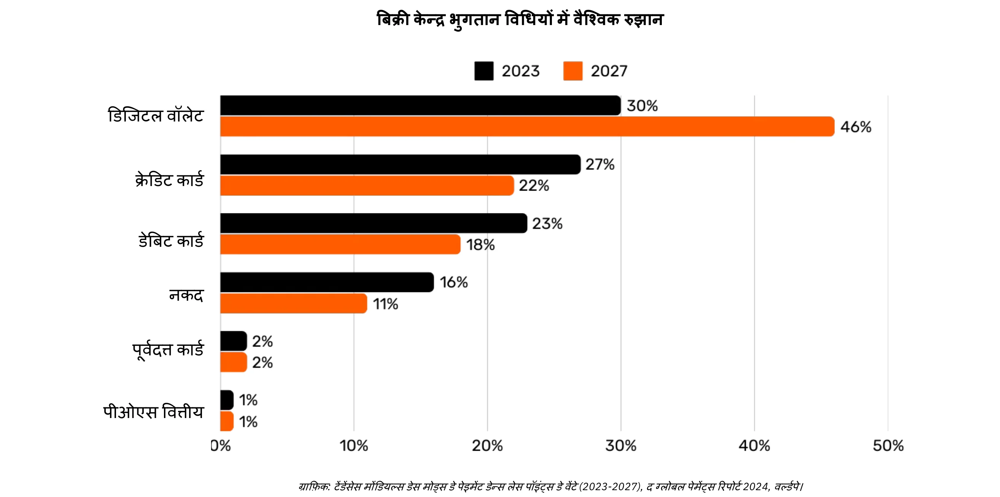

*ग्राफिक: पॉइंट-ऑफ-सेल (POS) भुगतान विधियों में वैश्विक रुझान (2023-2027), द ग्लोबल पेमेंट्स रिपोर्ट 2024, वर्ल्डपे।*

### एक साधारण कार्ड पेमेंट के पीछे की जटिलता

जब कोई ग्राहक दुकान पर क्रेडिट कार्ड का इस्तेमाल करता है, तो POS टर्मिनल कार्ड को पढ़ता है और ट्रांजैक्शन डेटा को मर्चेंट के अक्वायरिंग बैंक तक सुरक्षित तरीके से भेजता है। अक्वायरर यह जानकारी संबंधित कार्ड नेटवर्क (जैसे कि Visa या Mastercard) को भेजता है, जो फिर इस रिक्वेस्ट को इश्यूअर—यानी वह बैंक जिसने ग्राहक का कार्ड जारी किया है—तक पहुँचाता है। इश्यूअर ग्राहक के अकाउंट या क्रेडिट लाइन की जाँच करता है और नेटवर्क व अक्वायरर के जरिए अथॉराइज़ेशन वापस भेजता है, जिससे मर्चेंट को पेमेंट स्वीकार करने की अनुमति मिल जाती है।

यह साधारण सा लगने वाला लेन-देन असल में 15 से ज़्यादा चरणों, 7 बिचौलियों को शामिल करता है, और व्यापारी को पैसे मिलने में औसतन 48 घंटे से 5 दिन लगते हैं। अगले कुछ दिनों में, एक क्लीयरिंग और सेटलमेंट प्रक्रिया होती है। कार्ड नेटवर्क दिन के सभी लेन-देन को जमा करता है और एक्वायरर और इश्यूअर के बीच पैसों के आदान-प्रदान को समन्वित करता है। एक केंद्रीय बैंक इन इंटरबैंक सेटलमेंट्स की सटीकता और स्थिरता सुनिश्चित करता है। आखिरकार, व्यापारी के बैंक खाते में एक्वायरर से शुद्ध राशि (फीस घटाकर) जमा हो जाती है, जिससे लेन-देन का चक्र पूरा होता है।

कुल मिलाकर, यह प्रक्रिया जटिल, समय लेने वाली और महंगी है, जबकि यह तो बस एक पक्ष से दूसरे पक्ष तक मूल्य पहुँचाने का साधारण काम होना चाहिए।

### तुलना भुगतान विधियाँ

| भुगतान विधि                       | क्या प्राधिकरण आवश्यक है?      | लेनदेन स्वीकृति समय (व्यापारी दृष्टिकोण)     | निपटान गति (पूरी तरह निपटाए गए धन)          | अंतिमता (रद्द करने में आसानी)                 | मध्यस्थों की संख्या           | सामान्य शुल्क (लाभार्थी के लिए)       |
| --------------------------------- | ----------------------------- | ------------------------------------------- | ------------------------------------------- | -------------------------------------------- | ----------------------------- | ----------------------------------- |
| **नकद**                           | नहीं                          | तात्कालिक (भौतिक विनिमय)                    | तात्कालिक (कोई निपटान विलंब नहीं)            | उच्च (भुगतान के बाद अपरिवर्तनीय)              | कोई नहीं                       | कोई नहीं                            |
| **चेक**                           | हाँ (बैंक समाशोधन)            | जमा पर स्वीकृति (गारंटी नहीं)                | कई दिन (समाशोधन प्रक्रिया)                   | मध्यम (समाशोधन से पहले अस्वीकृत/रद्द किया जा सकता है) | बैंक                         | **कम से मध्यम** (बैंक शुल्क)        |
| **बैंक ट्रांसफ़र**                 | हाँ (बैंक/नेटवर्क)            | कुछ घंटों में पुष्टि                          | उसी दिन या अगले दिन (घरेलू)                   | उच्च (भेजने के बाद सामान्यतः अपरिवर्तनीय)     | बैंक, भुगतान नेटवर्क            | **मध्यम** (निश्चित/प्रतिशत)         |
| **भुगतान कार्ड**                   | हाँ (जारीकर्ता की अनुमति)     | कुछ सेकंड से मिनट (प्राधिकरण कोड)             | कुछ दिन (अंतरबैंक निपटान)                     | मध्यम (चार्जबैक संभव)                        | जारीकर्ता, अधिग्रहक, कार्ड नेटवर्क | **परिवर्ती (लेनदेन का 1-3%)**     |
| **डिजिटल वॉलेट/मोबाइल भुगतान**     | हाँ (वॉलेट प्रदाता/बैंक)      | सेकंड (तात्कालिक पुष्टि)                     | सामान्यतः 1-2 दिन (फंडिंग स्रोत पर निर्भर)    | मध्यम (रिफंड/विवाद संभव)                     | बैंक, वॉलेट ऑपरेटर             | **कम से मध्यम (परिवर्ती)**          |

### मौजूदा समाधानों की सीमाएँ

पारंपरिक भुगतान उद्योग लगभग 2,200 अरब डॉलर की सालाना अर्थव्यवस्था का प्रतिनिधित्व करता है, जो संयुक्त राज्य अमेरिका के सकल घरेलू उत्पाद (GDP) का लगभग दसवां हिस्सा या फ्रांस के GDP के बराबर है। चूंकि मुद्राएं अनुमति-आधारित नेटवर्क की तरह काम करती हैं, इसलिए इसमें प्रतिस्पर्धा सीमित होती है, जिससे यह "सेवा" उत्पादक अर्थव्यवस्था पर लगाए गए टैक्स जैसी हो जाती है। इसके द्वारा पैदा किए गए खर्चे के अलावा, कुछ और सीमाएं भी हैं, जैसा कि नीचे बताया गया है।

| सीमा                               | विवरण                                                                                                                                              | प्रभाव                                                                                   |
| ---------------------------------- | -------------------------------------------------------------------------------------------------------------------------------------------------- | ---------------------------------------------------------------------------------------- |
| उच्च कार्ड शुल्क                   | इंटरचेंज शुल्क (~0.3%), नेटवर्क शुल्क (स्थिर या 0.3%-1%), टर्मिनल/PSP सब्सक्रिप्शन और बैंक मार्जिन (0.5%-1.7%) मिलकर एक बड़ा खर्च बनाते हैं।        | व्यापारियों के लिए लागत बढ़ती है, लाभांश घटता है, और उपभोक्ताओं के लिए कीमतें बढ़ सकती हैं। |
| बहुत धीमा अंतिम निपटान             | धन का निपटान 5 दिन तक लग सकता है, जिससे नकदी प्रवाह और समग्र आर्थिक गतिविधि धीमी होती है।                                                          | व्यापारियों की तरलता में देरी, अर्थव्यवस्था की गति घटती है।                                |
| धोखाधड़ी                           | ऑनलाइन चैनल धोखेबाज़ों द्वारा भारी रूप से लक्षित होते हैं, जिससे बड़ी हानि होती है (जैसे $28 अरब)। चार्जबैक 2024 तक $174 अरब तक पहुँच सकते हैं।     | परिचालन लागत बढ़ती है, जटिल रोकथाम उपाय आवश्यक, ग्राहक विश्वास घटता है।                    |
| कार्ट परित्याग                      | अतिरिक्त सुरक्षा चरण (वन-टाइम कोड, PSD2 के अनुसार दो-कारक प्रमाणीकरण) भुगतान में घर्षण उत्पन्न करते हैं।                                            | भुगतान में जटिलता बढ़ने से कार्ट परित्याग और बिक्री में गिरावट होती है।                     |
| उच्च न्यूनतम राशि                   | कार्ड द्वारा लगाए गए न्यूनतम खर्च की शर्तें छोटे लेनदेन को हतोत्साहित करती हैं।                                                                    | ग्राहक संतुष्टि और लचीलापन घटता है, छोटे या आवेगपूर्ण खरीद सीमित होती है।                   |
| धीमा प्राधिकरण                      | मौजूदा सिस्टम मिलीसेकंड गति वाले लेनदेन या सतत/रीयल-टाइम भुगतान का समर्थन नहीं कर सकते।                                                           | त्वरित भुगतान/स्ट्रीमिंग उपयोग मामलों को सीमित करता है, नवाचार और विस्तारशीलता को रोकता है।  |
| बैंक खाता/कार्ड की आवश्यकता         | इन विधियों तक पहुँच के लिए बैंक खाता या कार्ड आवश्यक है, जिससे बिना बैंक वाले लोग स्वतः ही बाहर हो जाते हैं।                                       | वित्तीय समावेशन सीमित होता है, गैर-बैंक/अल्प-बैंक आबादी का बहिष्कार होता है।               |
| बार-बार ऑनलाइन खाता बनाना           | उपयोगकर्ताओं को कई ऑनलाइन खाते बनाने पड़ते हैं, जिससे थकान, असुविधा और व्यक्तिगत डेटा जोखिम बढ़ता है।                                              | उपयोगकर्ता अनुभव घटता है, गोपनीयता चिंताएँ बढ़ती हैं, डेटा उल्लंघन का जोखिम बढ़ता है।        |
| मुद्रा विनिमय शुल्क                 | एक सार्वभौमिक लेखांकन इकाई की कमी से सीमा-पार लेनदेन के लिए महँगे रूपांतरण लगते हैं।                                                              | अंतर्राष्ट्रीय व्यापार में अतिरिक्त लागत जुड़ती है, वैश्विक लेनदेन कम किफायती बनते हैं।       |

जैसे हमने वॉइस कॉल के लिए मिनट के हिसाब से पैसे देने से आगे बढ़कर लगभग मुफ़्त आईपी-आधारित संचार का इस्तेमाल शुरू किया, वैसे ही अधिक खुले और कुशल नेटवर्क के उभरने से भुगतान प्रणाली को नए सिरे से परिभाषित किया जा सकता है। इससे लागत कम होगी, बिचौलिये घटेंगे और नए बिज़नेस मॉडल को बढ़ावा मिलेगा।

## जीडब्ल्यू-43 बिज़नेस के लिए : एक उभरती हुई मुद्रा

<chapterId>4488fe33-663f-41a3-a668-e9ca2fb7122e</chapterId>

**Bitcoin क्या है?**

Bitcoin एक **पीयर-टू-पीयर डिजिटल करेंसी Exchange सिस्टम** (इलेक्ट्रॉनिक कैश) है। "Bitcoin" शब्द निम्नलिखित घटकों को संदर्भित करता है:

- एक कंप्यूटर प्रोटोकॉल जो इंटरनेट पर बिना किसी बिचौलिए के, बिना अनुमति के, और छद्म नाम से मूल्य Exchange को सुगम बनाता है। यह उन्नत क्रिप्टोग्राफिक सिद्धांतों का उपयोग करता है।
- एक **भौतिक नेटवर्क** जो इंटरनेट से जुड़े मशीनों (नोड्स, माइनर्स, वगैरह) का बना होता है, जिसे व्यक्तियों और व्यवसायों द्वारा चलाया जाता है, और यह एक विकेंद्रीकृत सिस्टम बनाता है (जिसमें कोई केंद्रीय अधिकार या नियंत्रण का एकल बिंदु नहीं होता)।
- सिस्टम में **लेखा इकाई**। कभी भी 21 मिलियन से ज़्यादा बिटकॉइन नहीं होंगे। हर Bitcoin को 10 करोड़ यूनिट्स में बाँटा जा सकता है, जिन्हें "सातोशी" कहते हैं - यह नाम इसके गुमनाम रचनाकार के सम्मान में रखा गया है।

साथ मिलकर वे Bitcoin को एक **वाहक संपत्ति** और एक डिजिटल मुद्रा बनाते हैं **जिसका कोई जारीकर्ता नहीं है**। Ownership को सिर्फ **निजी क्रिप्टोग्राफ़िक कुंजी** रखने से सुरक्षित किया जाता है, जो पूरा नियंत्रण देता है **बिना किसी बिचौलिए या भरोसेमंद तीसरे पक्ष के**। जब इसे ट्रांसफर किया जाता है, तो Ownership का **फाइनैलिटी** तुरंत होता है: नया धारक इसका पूरा मालिक बन जाता है, बिना किसी केंद्रीय प्राधिकरण पर सुरक्षा या परिवर्तनीयता के भरोसे के। लेन-देन **अपरिवर्तनीय** होते हैं—एक बार Blockchain पर दर्ज हो जाने के बाद, उन्हें बदला या हटाया नहीं जा सकता।

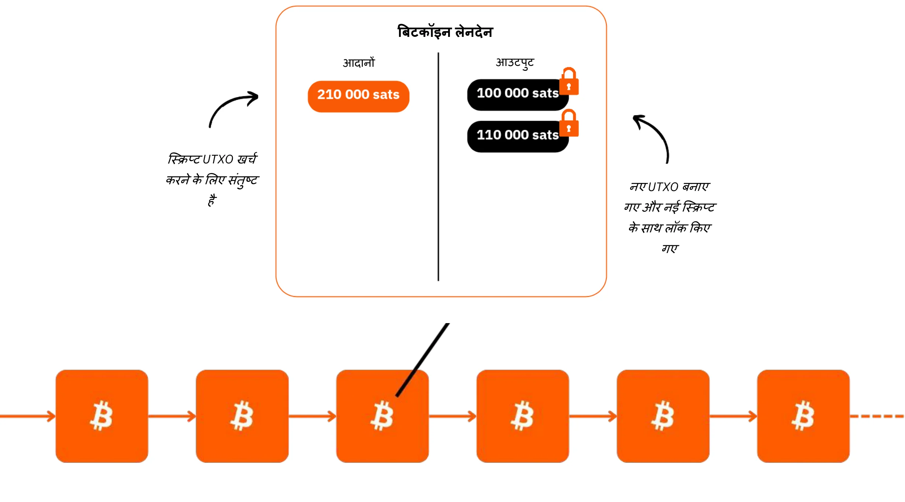

Bitcoin का मौद्रिक नीति फिक्स्ड है, जिसमें **कुल 21 मिलियन बिटकॉइन की सीमा** है, जिनमें से ~19.8 मिलियन पहले ही वितरित किए जा चुके हैं। यह इसे **डिफ्लेशनरी** बनाता है, क्योंकि समय के साथ इसकी वैल्यू बढ़ती जाती है जब यूजर्स इसमें अपनी बचत और उत्पादकता के लाभ को स्टोर करते हैं।

इसकी तकनीकी विशेषताएँ सोने और डॉलर को मिलाकर भी ज़्यादा हैं, जिससे यह अब तक का सबसे मज़बूत वित्तीय संपत्ति बन गया है। Bitcoin मूल्य संचय का साधन होने के साथ-साथ Exchange का माध्यम भी है, जो एक बन रही मुद्रा है। कल्पना कीजिए कि आप एक कंपनी के खज़ाने से दूसरी कंपनी के खज़ाने में मूल्य तेज़ी से ट्रांसफर कर सकते हैं, बिना किसी बिचौलिए के, न्यूनतम लागत पर, धोखाधड़ी के बिना, 24/7, और बिना किसी तीसरे पक्ष के शामिल हुए।

Bitcoin अपनी वैल्यू को बरकरार रखता है क्योंकि इसका Ledger छेड़छाड से सुरक्षित है। इसकी कीमत Supply की दुर्लभ और सीमित संख्या के कारण बढ़ती है, साथ ही Exchange के मौकों में वृद्धि हो रही है जो यूजर्स की बढ़ती संख्या से प्रेरित है।

Bitcoin बहुत ही अलग है क्योंकि ये हमें गणित, क्रिप्टोग्राफी, अर्थशास्त्र और इतिहास के ऐसे कॉन्सेप्ट्स सीखने के लिए प्रेरित करता है जो हमें कभी पढ़ाए ही नहीं गए। हालांकि इसे अक्सर जटिल समझा जाता है, लेकिन असल में ये एक ऐसा नवाचार है जिसे प्रैक्टिस और एक्सपेरिमेंटेशन से आसानी से समझा जा सकता है।

Bitcoin हमें पैसे की असली प्रकृति पर फिर से विचार करने के लिए चुनौती देता है। क्या आप बता सकते हैं कि पैसा वास्तव में क्या है? एक नौकरीपेशा या उद्यमी अपने जीवन के 50,000 से 100,000 घंटे पैसा कमाने में बिता सकता है, लेकिन कितने लोग **इसे बेहतर ढंग से समझने और इसे सुरक्षित रखने के लिए 100 घंटे भी समर्पित करते हैं**? Bitcoin हमें पैसे की ज़रूरत के पीछे के मूल कारणों और हमारे समय के दृष्टिकोण पर सवाल उठाने के लिए प्रोत्साहित करता है। क्या पैसा तुरंत विलासिता के लिए है या लंबे समय तक टिकने की क्षमता के लिए? अगर हमारे पास एक ऐसी संपत्ति हो जो मूल्यवर्धित होती हो और हमें खरीदारी में देरी करने की अनुमति देती हो, तो हम क्या चुनाव करेंगे? 20 या 30 साल बाद हम अपने आप से क्या बातचीत करना चाहेंगे?

**जीडब्ल्यू-61 पहचान पत्र**

- **उम्र:** 15 साल (3 जनवरी, 2009)
- रोज़ाना Exchange की वैल्यू: **$10 बिलियन (CAC40 से ज़्यादा)**
- **मार्केट कैपिटलाइज़ेशन:** $1.8 ट्रिलियन (> मेटा, वीज़ा, सिल्वर ; < एप्पल, गूगल, गोल्ड)
- **उपयोगकर्ता:** ~100 से 200 मिलियन (वैश्विक आबादी का 1-2%)
- **अस्थिरता:** अंदरूनी तौर पर बिल्कुल नहीं (1 Bitcoin = 1 Bitcoin), बाहरी तौर पर बहुत ज्यादा (फिएट करेंसी एक्सचेंज में)
- **परफॉर्मेंस:** पहला ट्रांजैक्शन $0.0009 पर हुआ; अब $100,000 (x100 मिलियन)
- **नेटवर्क उपलब्धता (अपटाइम):** 2013 से 100%
- **मृत घोषित या आलोचना की गई:** महीने में एक बार

**इंसानी सहयोग का एक अद्भुत नमूना:**

- पूरी तरह से **ओपन-सोर्स**
- **कानूनी इकाई:** कोई नहीं
- **CEO:** कोई नहीं
- **वेंचर कैपिटल निवेश:** कोई नहीं
- **मार्केटिंग:** कोई नहीं
- **R&D:** स्वयंसेवक-संचालित
- **गवर्नेंस:** यूजर्स द्वारा
- **नवाचारिक आर्थिक मॉडल:** ब्लॉक निर्माण का खर्च लेन-देन शुल्क (नीलामी-आधारित) से पूरा किया जाता है

Bitcoin के बारे में अधिक जानकारी, इसका इतिहास, यह कैसे काम करता है, और इसके उपयोग के लिए, मैं यह अन्य विस्तृत कोर्स भी फॉलो करने का सुझाव देता हूँ:

https://planb.network/courses/2b7dc507-81e3-4b70-88e6-41ed44239966
## जीडब्ल्यू-65 का परिचय

<chapterId>c095c7ad-5469-4c7b-9510-b6c0b86244e7</chapterId>

**बिजली क्या है?**

Lightning Network **एक प्रोटोकॉल और नेटवर्क** है जो Bitcoin लेनदेन को Bitcoin के मुख्य Blockchain के साथ न्यूनतम संपर्क में सुविधाजनक बनाता है। यहां बताया गया है कि यह कैसे काम करता है:

- **शुरुआती सेटअप:** मुख्य Blockchain पर फंड लॉक (एस्क्रो) किए जाते हैं ताकि 2 पार्टियों के बीच एक पेमेंट चैनल स्थापित किया जा सके।
- **भुगतान नेटवर्क:** कई पक्षों के बीच भुगतान चैनलों का एक जाल भुगतान नेटवर्क बनाता है (रूटिंग और इंटरकनेक्शन)।
- जीडब्ल्यू-71 **लेन-देन:** लेन-देन पार्टियों के बीच होते हैं लेकिन **तुरंत प्रकाशित नहीं** होते जीडब्ल्यू-72 के मुख्य जीडब्ल्यू-70 (**"जीडब्ल्यू-71"**) पर।
- **जीडब्ल्यू-74 सेटलमेंट्स:** सिर्फ **एक चैनल के लेन-देन का फाइनल बैलेंस** ही जीडब्ल्यू-75 मेन जीडब्ल्यू-73 (**"जीडब्ल्यू-74"**) पर पब्लिश किया जाता है, जिससे बीच में कई लेन-देन हो सकते हैं। कई पेमेंट्स को बंडल करने से कंजेशन कम होता है और इस तरह कई जीडब्ल्यू-74 ट्रांजैक्शन करने की तुलना में फीस कम हो जाती है।
- **चैनल बंद करना:** कोई भी यूज़र कभी भी अपना चैनल बंद कर सकता है और Bitcoin वापस ले सकता है, बस लेटेस्ट ट्रांजैक्शन स्टेट पब्लिश करके। यही सिद्धांत है कि ट्रांजैक्शन **"कभी भी पब्लिश किए जा सकते हैं, लेकिन जरूरत पड़ने तक 'अनपब्लिश'"** रहते हैं। चैनल से बाहर निकलना (चैनल बंद करना) एकतरफा हो सकता है (2 में से कोई भी पार्टी कभी भी फैसला कर सकती है) या आपसी सहमति से (जिससे On-Chain फीस कम लगेगी)।

यह तरीका Bitcoin के मुख्य Blockchain पर हर लेन-देन को सीधे करने की धीमी गति और जटिलता से बचाता है, केवल अंतिम बैलेंस रिकॉर्ड करता है और इसकी सुरक्षा बनाए रखता है। Lightning Network, Bitcoin के ऊपर एक Layer है लेकिन इससे जुड़ा रहता है।

**एक वैश्विक भुगतान नेटवर्क**

यह प्रोटोकॉल मशीनों का एक **नेटवर्क** बनाता है जहां चैनल्स एक यूनिवर्सल पेमेंट सिस्टम बनाते हैं। यह नोड्स व्यक्तियों या व्यवसायों द्वारा स्वतंत्र रूप से चलाए जा सकते हैं, जिससे यह एक पूरी तरह से खुला नेटवर्क बन जाता है।

Lightning Network, Exchange को लाइट की स्पीड से इंस्टेंट वैल्यू देता है। यह पेमेंट्स पर लागू एक ईमेल प्रोटोकॉल जैसा है: एक नेक्स्ट-जेनरेशन पेमेंट नेटवर्क। यह "पैसे" के ट्रांसफर के तरीके को पूरी तरह बदल देता है, इसे इंटरनेट पर डेटा ट्रांसमिशन की तरह फ्री और फास्ट बना देता है।

**मुख्य फायदे:**

- **स्पीड:** तुरंत लेन-देन।
- **कम फीस:** पारंपरिक बैंकिंग नेटवर्क की तुलना में बहुत कम लागत।
- **अपनाने में आसानी:** व्यवसाय सिर्फ एक स्मार्टफोन ऐप या अपनी वेबसाइट पर एक पे बटन का उपयोग करके जल्दी से लाइटनिंग भुगतान स्वीकार करने के लिए तैयार हो सकते हैं।

लाइटनिंग इंफ्रास्ट्रक्चर स्पीड, कॉस्ट और एनर्जी एफिशिएंसी के मामले में पारंपरिक पेमेंट सिस्टम्स को पीछे छोड़ देता है। जैसे-जैसे मर्चेंट्स इसको अपनाएंगे, इसकी रफ्तार और तेज होगी: अगर पेमेंट्स बैंकों के जाल से बचकर सीधे हो सकते हैं, तो आज के बिचौलियों को अपनी कमाई का बड़ा हिस्सा क्यों देना जारी रखें?

**अनंत उपयोग के मामले:**

बिजली के ऐप्लिकेशन सिर्फ कम फीस और तेज़ी से कहीं ज़्यादा आगे तक जाते हैं। एक बिल्कुल मुफ़्त और तुरंत पेमेंट सिस्टम देकर, यह पूरी इकॉनमी में बड़े मौके खोल देता है।

**Bitcoin की Exchange क्षमताओं को बढ़ाना:**

बिजली Bitcoin की भूमिका को "Exchange का माध्यम" और बढ़ा देती है। लेन-देन की आवृत्ति और स्वतंत्रता को बढ़ाकर, यह पैसे के मुख्य कार्य को मजबूत करती है: सभी भागीदारों के लिए आर्थिक लेन-देन और मूल्य सृजन को सुगम बनाना।

"स्मार्ट मशीन इकोनॉमी" के भविष्य में उभरने के लिए एक अति-तेज़, हाई-फ्रीक्वेंसी पेमेंट सिस्टम की ज़रूरत होगी, जिसका टेक्निकल स्टैंडर्ड सिर्फ़ लाइटनिंग ही पूरा कर सकता है। इससे ज़्यादा सामान और सेवाएं बनाने में मदद मिलेगी। जबकि Bitcoin का Supply अभी भी सीमित है, हर यूनिट की खरीदारी क्षमता बढ़ेगी। Bitcoin और लाइटनिंग एक साथ और मज़बूत होते जाते हैं क्योंकि उनके नेटवर्क का विस्तार होता है।

बिजली एक झलक दिखाती है उस भविष्य की जहाँ सारे बिजनेस जो इंटरनेट-आधारित हो चुके हैं, वो Bitcoin-आधारित भी हो जाएंगे।

**Bitcoin भुगतान लाइटनिंग पर: एक आम व्यापारी का उपयोग मामला**

Lightning Network, Bitcoin पेमेंट्स के लिए बिल्कुल सही है, चाहे फिजिकल स्टोर हो या ऑनलाइन, क्योंकि यह तेज़ है और पेमेंट फाइनल हो जाता है।

- **स्पीड:** लाइटनिंग (~500ms से कुछ सेकंड्स) Bitcoin मेन नेटवर्क से काफी तेज़ है, जहाँ ट्रांजैक्शन्स को कन्फर्म होने में लगभग 30 मिनट लग सकते हैं। बड़े खरीदारी (जो $1,000 से काफी ज़्यादा हो) के लिए, Bitcoin मेन नेटवर्क अभी भी बेहतर हो सकता है, क्योंकि वहाँ स्पीड उतनी महत्वपूर्ण नहीं होती। हालाँकि, ये डिटेल्स आम यूज़र से अक्सर छिपी रहती हैं, क्योंकि ऐप्लिकेशन्स ये फैसले बैकग्राउंड में खुद-ब-खुद हैंडल कर लेती
- **फाइनैलिटी:** एक बार लाइटनिंग पर पेमेंट हो जाए, तो वो फाइनल होता है। तीसरे पक्ष द्वारा चार्जबैक या फ्रॉड से जुड़े विवाद की कोई संभावना नहीं होती।
- **कीमत:**
Lightning Network पर लेन-देन की फीस बहुत कम है और यह यूज़र द्वारा दी जाती है, मर्चेंट द्वारा नहीं। मर्चेंट्स को तभी फीस देनी पड़ती है जब वे बाद में अपने Bitcoin को किसी दूसरे नेटवर्क या सर्विस पर ट्रांसफर करना चाहते हैं।

**बिजली पहचान पत्र**

- **आविष्कार:** 2015
- **लॉन्च:** २०१६
- **उम्र:** 7 साल (पहला लेन-देन: 28 दिसंबर, 2017)
- **नेटवर्क तकनीकी क्षमता:** बड़े पैमाने पर यह पारंपरिक सिस्टम्स की तुलना में 1,000 गुना ज्यादा तुरंत लेन-देन संभाल सकता है।
- **लेन-देन का आकार:** पारंपरिक प्रणालियों की तुलना में 1,000 गुना छोटे से लेकर बहुत बड़े तक हो सकते हैं।
- **ट्रांजैक्शन स्पीड:** 100 गुना तेज़।
- **फीस:** 90% तक कम।
- **भुगतान की अंतिमता:** लगभग तुरंत (अक्सर ~500 मिलीसेकंड, कभी-कभी कुछ सेकंड)।
- **ऊर्जा की खपत:** ~8% पारंपरिक वैश्विक मौद्रिक प्रणाली की तुलना में।
- **विशेषताएँ:**
    - पीयर-टू-पीयर (साथी से साथी)
    - यूनिवर्सल
    - बिना अनुमति के
    - अच्छी गोपनीयता
    - भरोसेमंद सुरक्षा
    - उच्च उपलब्धता (बेहतरीन अपटाइम)
    - नियंत्रणीय और अनुकूलनीय

Lightning Network के टेक्निकल कामकाज के बारे में और जानकारी के लिए, मैं यह दूसरा विस्तृत कोर्स फॉलो करने का सुझाव देता हूँ:

https://planb.network/courses/34bd43ef-6683-4a5c-b239-7cb1e40a4aeb
# जीडब्ल्यू-98 ट्रेजरी में

<partId>bf45c1e8-af97-4b6b-af42-2866f493b14d</partId>

## मुनाफा, पूंजी, और व्यापार में मजबूती की चाबियाँ

<chapterId>656ad88f-3c27-4054-a94e-b29727009b8e</chapterId>

### एक स्वस्थ कंपनी

**भविष्य अनिश्चित है**, और व्यवसायों को इस अनिश्चितता में मुनाफा कमाने और पूंजी को सुरक्षित रखने पर स्पष्ट ध्यान देते हुए आगे बढ़ना चाहिए। ऑस्ट्रियन इकोनॉमिक्स के अनुसार, **मुनाफा किसी कंपनी के स्वास्थ्य का सबसे बड़ा संकेतक होता है**—यह दिखाता है कि व्यवसाय उपभोक्ताओं की जरूरतों को कुशलता से पूरा कर रहा है। बिना मुनाफे के, कोई कंपनी खुद को बनाए नहीं रख सकती, बढ़ने की तो बात ही छोड़ दें। एक स्वस्थ व्यवसाय के लिए सिर्फ generate मुनाफा कमाना ही काफी नहीं है, बल्कि आगे की सोचना भी जरूरी है, **भविष्य के निवेश और चुनौतियों के लिए पूंजी को जमा करना**।

**पूंजी सुरक्षा** बहुत ज़रूरी है क्योंकि यह कंपनियों को अप्रत्याशित बाज़ार में ढलने और मौकों का फायदा उठाने की सुविधा देती है। इसमें मुनाफे को दोबारा निवेश करके बढ़ने और संभावित मंदी का सामना करने के लिए वित्तीय बफर बनाए रखने के बीच संतुलन बनाना शामिल है। ऑस्ट्रियन इकोनॉमिक्स **"समय प्राथमिकता"** के महत्व पर जोर देती है, यानी कंपनियों को सावधानी से तय करना होता है कि तुरंत रिटर्न पर कितना ध्यान देना है और लंबे समय की सफलता के लिए कितना निवेश करना है। एक स्वस्थ कंपनी अपनी वित्तीय बुनियाद को मजबूत रखती है, ताकि अच्छे और बुरे दोनों वक्त में लचीलापन बना रहे।

बाजार के संकेत जैसे कीमतें और प्रतिस्पर्धा, व्यवसायों को संसाधन आवंटन के बारे में सही निर्णय लेने में मदद करते हैं। इन संकेतों पर ध्यान देकर, कंपनियां खुद को ज़्यादा फैलाने या खराब निवेश करने के जाल से बच सकती हैं—खासकर वो निवेश जो आसान क्रेडिट जैसे कृत्रिम कारकों से प्रभावित होते हैं। संसाधनों का गलत आवंटन न सिर्फ कंपनी की सेहत को खतरे में डालता है, बल्कि ग्राहकों को प्रभावी ढंग से सेवा देने की उसकी क्षमता को भी कम कर देता है।

आखिरकार, एक स्वस्थ व्यापार बनाए रखने का मतलब है लचीला बने रहना, समझदार वित्तीय फैसले लेना, और हमेशा भविष्य पर नजर रखना। **मुनाफे पर ध्यान केंद्रित करके, पूंजी को सुरक्षित रखते हुए, और बाजार के संकेतों पर प्रतिक्रिया देकर, व्यवसाय—चाहे बड़े हों या छोटे—अनिश्चितता के बीच भी फल-फूल सकते हैं**।

### क्या पूंजी में कोई गुण होता है?

**पूंजी को आमतौर पर कैसे दिखाया जाता है**

आइए, फिर से जानें कि पूंजी वास्तव में क्या है—एक ऐसा शब्द जिसे अक्सर हमारे समाज में गलत समझा जाता है और नकारात्मक रूप से देखा जाता है।

पारंपरिक आर्थिक सिद्धांत (कीन्सियन) में, पूंजी को अक्सर सरल शब्दों में भौतिक या वित्तीय संपत्ति के एक समरूप भंडार के रूप में देखा जाता है, जिसका मुख्य उपयोग निवेश के माध्यम से कुल मांग को उत्तेजित करने के लिए किया जाता है। यह अक्सर धन के संकेंद्रण और एक छोटे से अभिजात वर्ग द्वारा धारित आर्थिक शक्ति से जुड़ा होता है। ऐसे संदर्भ में जहां धन की खाई लगातार चौड़ी हो रही है, कई लोग पूंजी को आर्थिक असमानता के प्रतीक के रूप में देखते हैं, खासकर जब संचित धन बहुसंख्यकों को कोई लाभ प्रदान नहीं करता प्रतीत होता है।

"पूंजी" को अक्सर शोषण के एक हथियार के रूप में दिखाया जाता है, और यह नज़रिया उन तमाम आंदोलनों को गहराई से प्रभावित कर चुका है जो पूंजी को मजदूरों के हितों के खिलाफ समझते हैं। लेकिन क्या यह सच है? या फिर यह धारणा इन वजहों से विकृत हो सकती है:

1. आर्थिक तंत्रों की समझ की कमी (जिसमें अर्थशास्त्रियों की भी समझ शामिल है)?

2. सरकारी हस्तक्षेप और बाजार में हेराफेरी?

3. क्या दोस्त-दारू पूंजीवाद और आज़ाद बाज़ार पूंजीवाद में उलझन हो रही है?

4. मीडिया का आर्थिक संकटों को दिखाने का तरीका?

5. जल्दी समाधान और तुरंत सामाजिक न्याय की चाहत?

6. पूंजीवाद-विरोधी बयानबाजी का सांस्कृतिक सामान्यीकरण?

किस्मत से, Bitcoin हमें सब कुछ दोबारा सोचने और इन पहले से बनी धारणाओं को चुनौती देने के लिए मजबूर करता है। एक विचारधारा है—ऑस्ट्रियन स्कूल ऑफ इकोनॉमिक्स—जो इन मुद्दों पर रोशनी डाल सकती है और हमें पूंजी की असली प्रकृति पर फिर से विचार करने में मदद कर सकती है।

**एक समय की बात है**

चलो एक छोटी कहानी से शुरुआत करते हैं:

"एक छोटे से सुनसान द्वीप पर एक अकेला मछुआरा रहता है। हर दिन, वह घंटों अपने हाथों से मछलियाँ पकड़ने में बिताता है, यह काम उसका ज्यादातर समय और ताकत खा जाता है। एक दिन, उसके दिमाग में एक ख्याल आता है: एक भाला बनाने का जिससे वह ज्यादा आसानी से मछलियाँ पकड़ सके। लेकिन वह जानता है कि इसके लिए एक कुर्बानी देनी पड़ेगी।"

भाला बनाने से पहले, मछुआरा कुछ मछलियाँ अलग रखने का फैसला करता है ताकि वह निर्माण प्रक्रिया के दौरान अपना पेट भर सके। वह कुछ दिनों तक सामान्य से कम खाता है, अपने प्रोजेक्ट पर ध्यान केंद्रित करने के लिए पर्याप्त मछली बचा लेता है। यह बचाई हुई मछली उसकी **पूँजी** है, एक छोटा सा रिजर्व जो उसे अपने लक्ष्य को पाने में मदद करता है।

जब वह भाला बनाने में अपना समय लगाता है, तो वह अपने संचय पर निर्भर करता है, और अपनी तात्कालिक सुविधा को जानबूझकर टाल देता है (यह उसकी **समय प्राथमिकता** को दर्शाता है)। कई दिनों तक Hard पर काम करने के बाद, वह एक मजबूत भाला बना लेता है।

भाला मिलने से अब वह मछलियाँ बहुत तेज़ी से और कम मेहनत में पकड़ सकता है। उसे पहले की तरह खुद को थकाने की ज़रूरत नहीं पड़ती और अब तो वह अतिरिक्त मछलियाँ भी जमा करने लगा है। यह अतिरिक्त भंडार उसके लिए नए रास्ते खोल देता है: वह इसे स्टोर कर सकता है, बाँट सकता है या द्वीप पर अन्य प्रोजेक्ट्स में निवेश कर सकता है। तुरंत खपत को टालकर और अपनी पूँजी का सही इस्तेमाल करके, मछुआरे ने अपनी कार्यक्षमता और भविष्य की संभावनाओं को काफी बेहतर बना लिया है।

यह कहानी पूंजी, धैर्य और दूरदर्शिता की मूलभूत भूमिका को दिखाती है जो एक बेहतर भविष्य बनाने के लिए ज़रूरी हैं - ये ऐसे सिद्धांत हैं जो आर्थिक विकास और मानव प्रगति के केंद्र में होते हैं।

### ऑस्ट्रियन स्कूल ऑफ इकोनॉमिक्स और पूंजी की उसकी दृष्टि

ऑस्ट्रियन स्कूल ऑफ इकॉनॉमिक्स का नाम इसके संस्थापकों और शुरुआती योगदानकर्ताओों के नाम पर रखा गया है, जो मूल रूप से ऑस्ट्रिया से थे। यह नाम चलन में आ गया, और यह स्कूल क्लासिकल लिबरल विचारधारा से जुड़ गया, जो व्यक्तिगत स्वतंत्रता, मुक्त बाजार और न्यूनतम सरकारी हस्तक्षेप पर जोर देता है।

**ऑस्ट्रियाई नज़रिया पूंजी पर**  

(Note: "Capital" is translated as "पूंजी," which is the common Hindi term for economic capital. The phrase "ऑस्ट्रियाई नज़रिया" directly means "Austrian Perspective," maintaining the context of the Austrian School of Economics.)

ऑस्ट्रियाई नज़रिए में, पूंजी का मतलब है भविष्य में उत्पादन बढ़ाने के लिए उपभोग को टालकर उपकरण या उत्पादक संसाधन बनाना। यह प्रक्रिया, जिसे पूंजी संचय कहते हैं, ऑस्ट्रियाई आर्थिक सिद्धांत का केंद्र है। इस दृष्टिकोण के मुख्य Elements बिंदु हैं:

- **समय की प्राथमिकता और टाली गई खपत**: लोग स्वाभाविक रूप से भविष्य के बजाय अभी खपत करना पसंद करते हैं, लेकिन अगर उन्हें भविष्य में बड़े फायदे की उम्मीद हो तो वे खपत को टाल सकते हैं। आज बचत करके, संसाधनों को पूंजीगत वस्तुओं (उपकरण, मशीनें, बुनियादी ढांचे) में निवेश किया जा सकता है जो समय के साथ उत्पादकता बढ़ाते हैं। जिन समाजों या व्यक्तियों की समय प्राथमिकता कम होती है, वे अधिक बचत करते हैं और दीर्घकालिक परियोजनाओं में निवेश करते हैं, जिससे सतत विकास को बढ़ावा मिलता है।
- **भविष्य के उत्पादन का चालक के रूप में पूंजी**: पूंजीगत वस्तुओं को अंतिम उपभोक्ता वस्तुओं के उत्पादन में इस्तेमाल होने वाले मध्यवर्ती उपकरण के रूप में देखा जाता है। पूंजी का संचय करके, उद्यमी उत्पादकता बढ़ा सकते हैं और भविष्य में अधिक धन का सृजन कर सकते हैं। उदाहरण के लिए, तुरंत उपभोक्ता वस्तुओं का उत्पादन करने के बजाय, संसाधनों का उपयोग कारखानों या मशीनों के निर्माण में किया जा सकता है। हालांकि इससे अल्पकालिक उपभोग कम हो जाता है, लेकिन इससे प्राप्त दक्षता भविष्य में अधिक उत्पादन और समृद्धि की संभावना पैदा करती है।
- **अप्रत्यक्ष उत्पादन और दक्षता**: ऑस्ट्रियाई अर्थशास्त्रियों, जैसे यूजेन बोम-बावर्क, ने अप्रत्यक्ष उत्पादन के विचार पर जोर दिया—यानी लंबी और जटिल उत्पादन प्रक्रियाएँ जिनमें कई चरण शामिल होते हैं। हालांकि इन प्रक्रियाओं में समय लगता है, लेकिन अंततः ये ज्यादा कुशल और उत्पादक परिणाम देती हैं। जैसे, लकड़ी को हाथ से इकट्ठा करने के बजाय एक लकड़ी काटने की मशीन (सॉमिल) बनाना।
- **ब्याज दरें संकेत के रूप में**: ऑस्ट्रियाई नज़रिए में, ब्याज दरें स्वाभाविक रूप से लोगों की समय-प्राथमिकताओं को दर्शाती हैं। उच्च दरें तात्कालिक खपत की प्राथमिकता दिखाती हैं, जबकि कम दरें बचत और दीर्घकालिक निवेश को प्रोत्साहित करती हैं। जब केंद्रीय बैंक ब्याज दरों को कृत्रिम रूप से नियंत्रित करते हैं, तो ये प्राकृतिक संकेत विकृत हो जाते हैं, जिससे संसाधनों का गलत आवंटन और अस्थायी निवेश (मालइन्वेस्टमेंट) होता है।

**आधुनिक अर्थव्यवस्थाओं में पूंजी के दो रूप**

जिस कर्ज़ा-आधारित मौद्रिक प्रणाली के तहत हम काम करते हैं, **उसमें एक दूसरी तरह की पूंजी भी मौजूद है**: वो जो तुरंत पैदा हो जाती है जब कोई बैंक एक साधारण क्रेडिट मैकेनिज़्म के ज़रिए लोन बनाता है। इसमें "एक्स निहिलो" (खाली जगह से) तरलता का सृजन होता है, जहाँ बैंक वो पैसा उधार देता है जो उसके पास पहले से मौजूद नहीं होता, बल्कि वादा-भरोसे पर बनाया जाता है।

एक तरफ, "ऑस्ट्रियन" पूंजी असली बचत का नतीजा है, जिसमें सोच-समझकर आर्थिक फैसले लेने और सावधानी से कुर्बानी देने की प्रक्रिया शामिल है। दूसरी तरफ, कर्ज़-आधारित पैसे के निर्माण से पैदा हुई पूंजी एक झटपट और नकली चीज़ है। ये दोनों तरह की पूंजियाँ, **हालाँकि दिखने में प्रोजेक्ट्स को फंड देने में एक जैसी लगती हैं, लेकिन असल में इनकी प्रकृति बिल्कुल अलग है**।

इन दो प्रकार की पूंजी को कभी भी एक ही समझना नहीं चाहिए, लेकिन एक कर्ज-आधारित प्रणाली में, ये अक्सर एक ही मान ली जाती हैं, **जिससे आर्थिक संकेत विकृत हो जाते हैं** और अक्सर गलत निवेश होता है। यह गलतफहमी यह समझाती है कि पूंजीवाद को अक्सर अनुचित आलोचना क्यों मिलती है।

**केन्सवाद की मुख्य समस्या**

केन्सियन नीतियाँ, जिन्हें वैश्विक अभिजात वर्ग ने बड़े पैमाने पर अपना लिया है, ब्याज दरों में हेरफेर करती हैं और कर्ज़ के ज़रिए मांग को बढ़ावा देती हैं। इससे संसाधन अल्पकालिक, अस्थायी परियोजनाओं की ओर बहने लगते हैं, जिससे आर्थिक चक्र और तेज़ हो जाते हैं और वास्तविक विकास जो स्वस्थ बचत और उत्पादक निवेश पर आधारित होता है, उसमें देरी होती है। व्यापारिक नेताओं को यह हानिकारक नीति सीधे दिखाई देती है जब स्वस्थ कंपनियों को अतिरंजित रिटर्न की चाह में अधिक मूल्य वाले अधिग्रहणों में धकेला जाता है, जिससे जैविक और स्थायी विकास कमज़ोर होता है।

ऐसे माहौल में, "स्वस्थ" पूंजी—जिसे उद्यमियों ने मेहनत से बचाई है—कैसे प्रतिस्पर्धा कर सकती है कृत्रिम रूप से बनाई गई "अस्वस्थ" पूंजी से? इसके अलावा, पैसे Supply के एकतरफा विस्तार से सुदृढ़ पूंजी की क्रय शक्ति कम होती है, जिससे आर्थिक भटकाव और सामाजिक असंतोष और बढ़ जाता है।

**उम्मीद की एक किरण: Bitcoin**  

(Note: The translation maintains the original formatting and special characters while conveying the essence of the phrase in colloquial Hindi. "Bitcoin" is retained as it appears to be a code or identifier.)

Bitcoin लंबे समय तक पूंजी जमा करने और सुरक्षित रखने का एक तरीका प्रदान करता है, जिसमें मुद्रास्फीति के कारण होने वाली कमी नहीं होती। मूल्य के संचय के रूप में, यह व्यवसायों को भविष्य के निवेशों की योजना लचीले ढंग से बनाने में सक्षम बनाता है, जिससे कर्ज-आधारित प्रणालियों का वर्चस्व चुनौती मिलती है और वास्तविक, उत्पादक पूंजी संचय की ओर वापसी को बढ़ावा मिलता है।

### ऑस्ट्रियन स्कूल ऑफ इकोनॉमिक्स के बारे में और जानकारी

**ऑस्ट्रियन स्कूल ऑफ इकोनॉमिक्स** आर्थिक विचारों की एक ऐसी परंपरा है जो मुक्त बाजार, व्यक्तिगत स्वतंत्रता और आर्थिक प्रक्रियाओं में मानवीय कार्रवाई के महत्व को सर्वोपरि मानती है। यह सरकारी हस्तक्षेप, खासकर पैसे और बाजारों में, की आलोचना करता है और तर्क देता है कि व्यक्ति, अपनी व्यक्तिपरक पसंद के आधार पर, अपने हितों के सबसे अच्छे निर्णायक होते हैं।

**ऑस्ट्रियन स्कूल के प्रमुख व्यक्ति**

- **कार्ल मेंगर**: ऑस्ट्रियन स्कूल के संस्थापक, मेंगर ने व्यक्तिपरक मूल्य (सब्जेक्टिव वैल्यू) का सिद्धांत विकसित किया, जो कहता है कि किसी वस्तु की कीमत उसके उत्पादन लागत पर नहीं, बल्कि लोगों की पसंद और ज़रूरतों पर निर्भर करती है।
- **लुडविग वॉन मिसेस**: ऑस्ट्रियन स्कूल की नींव रखने वाले, मिसेस ने प्रैक्सियोलॉजी (मानव क्रिया का सिद्धांत) पेश किया और _ह्यूमन एक्शन_ जैसी किताब लिखी, जो समाजवाद और केंद्रीय योजना की गहरी आलोचना है।
- **फ्रेडरिक हायेक**: माइसेस का शिष्य, हायेक को 1974 में अर्थशास्त्र का नोबेल पुरस्कार मिला, विकेंद्रीकृत ज्ञान और बाजार की स्वतःस्फूर्तता पर उनके काम के लिए। अपनी किताब _द रोड टू सर्फडम_ में, उन्होंने केंद्रीकृत नियंत्रण की जमकर आलोचना की।
- **मरे रोथबार्ड**: माइसेस के शिष्य और लिबर्टेरियनिज़म के कट्टर समर्थक, रोथबार्ड ने एनार्को-कैपिटलिज़म के सिद्धांत को विकसित किया, जिसमें उन्होंने स्वैच्छिक अनुबंधों द्वारा संचालित एक राज्यविहीन समाज की कल्पना की। उनकी पुस्तक *मैन, इकॉनमी, एंड स्टेट* ऑस्ट्रियन इकोनॉमिक्स में एक मौलिक कार्य है।

**अन्य प्रभावशाली अर्थशास्त्री**

- **मिल्टन फ्रीडमैन**: हालांकि वो ऑस्ट्रियन स्कूल से सीधे जुड़े नहीं थे, फ्रीडमैन ने कई प्रो-मार्केट और उदारवादी विचारों का समर्थन किया। उनकी मुद्रावादी नीति ऑस्ट्रियन विचारधारा से अलग है, लेकिन अर्थव्यवस्था में अत्यधिक सरकारी हस्तक्षेप की आलोचना में वे उनसे सहमत थे।
- **फ्रेडरिक बास्टियाट**: 19वीं सदी के एक फ्रांसीसी अर्थशास्त्री, बास्टियाट ने मुक्त व्यापार और आर्थिक नीतियों के अनदेखे परिणामों पर अपने कार्यों के जरिए ऑस्ट्रियन स्कूल को प्रभावित किया। उनका निबंध _जो दिखता है और जो नहीं दिखता_ आर्थिक उदारवाद का एक मूलभूत ग्रंथ है।

*श्रेय: लुडविग वॉन मिसेस संस्थान*

**मुख्य योगदान और विचार**

ये विचारकों ने यह विचार दिया कि सरकारी हस्तक्षेप बाज़ारों को बिगाड़ता है और आर्थिक स्वतंत्रता समृद्धि और मानवीय कार्यों के सामंजस्यपूर्ण समन्वय के लिए ज़रूरी है। उनकी अंतर्दृष्टि विकेंद्रीकृत निर्णय लेने के महत्व और आर्थिक प्रणालियों में केंद्रीकृत नियंत्रण के ख़तरों को उजागर करती है।

इस विषय पर अधिक जानकारी के लिए:

https://planb.network/courses/d955dd28-b7c6-4ba2-a123-d932e21d148f
https://planb.network/courses/9d1bde6a-33e5-45dd-b7c0-94da72e45b11
https://planb.network/courses/d07b092b-fa9a-4dd7-bf94-0453e479c7df
## जीडब्ल्यू-106 को ट्रेजरी में रखना

<chapterId>89622a40-d14f-4c37-a075-8e7e1731ec26</chapterId>

### कंपनी के ट्रेजरी की चुनौतियाँ

खजाना वह जगह है जहाँ कीमती चीज़ें रखी जाती हैं। एक स्वस्थ कंपनी ठीक से पूँजीकृत होती है ताकि वह भविष्य की अनिश्चितताओं का सामना कर सके और अपने निवेश की योजना बना सके। आजकल, अतिरिक्त खजाने का कुछ हिस्सा वित्तीय संपत्तियों में लगाया जाता है जिन्हें बेहद "जीडब्ल्यू-107" माना जाता है, जैसे बॉन्ड, टर्म डिपॉजिट, वगैरह।

बहुत लंबे समय के लिए, कुछ कंपनियाँ रियल एस्टेट जैसी अलिक्विड (तरल न होने वाली) संपत्तियों का इस्तेमाल करती हैं, बिना कुछ खतरों को समझे:

- संकट की स्थिति में तरलता की कमी
- आखिरकार, फीस काटने के बाद कमाई काफी कम ही रहती है।
- एक ऐसा रिटर्न जो असली मुद्रास्फीति से आगे नहीं बढ़ता, यानी पैसे Supply की मुद्रास्फीति (~7% सालाना, नीचे देखें)
- अच्छी तरह छिपा हुआ खतरा कि रियल एस्टेट अपने "बचत" वाले काम का कुछ हिस्सा Bitcoin जैसी संपत्तियों के फायदे में खो दे। इसका नतीजा यह हो सकता है कि यह अपने "इस्तेमाल की कीमत" के करीब वापस आ जाए: यानी सिर्फ छत मुहैया कराने तक सीमित हो जाए।

चलो जल्दी से उस माहौल पर नज़र डालते हैं जिसमें व्यवसाय काम करते हैं।

**असली मुद्रास्फीति**: अपने जनादेश के खिलाफ जाकर, केंद्रीय बैंक 2% सालाना मुद्रास्फीति को लक्ष्य बनाते हैं, जिसका मतलब है कि 20 साल में मुद्रा की कीमत 40% तक गिर जाती है। अगर इसमें और ज्यादा मुद्रास्फीति के दौर को जोड़ दें, तो साफ हो जाता है कि कंपनियां अपने मेहनत के फल को सिर्फ मुद्रा में जमा करके नहीं रख सकतीं। उन्हें जटिल वित्तीय रणनीतियाँ अपनानी पड़ती हैं, जिनके साथ कई तरह के जोखिम भी जुड़े होते हैं। ये रणनीतियाँ **छोटे-छोटे व्यवसायों के लिए बिल्कुल पहुँच से बाहर** होती हैं, जो पहले से ही अपने मुख्य कामों में व्यस्त रहते हैं।

**छुपी हुई मुद्रास्फीति**: एक कर्ज-आधारित, आंशिक-रिजर्व मौद्रिक प्रणाली में, जिसे केंद्रीय बैंकों द्वारा समर्थित किया जाता है, **कुल पैसा Supply हर साल औसतन लगभग 7% बढ़ता है** (जैसे, यूरोजोन या अमेरिका में M1)। इसका मतलब है कि कुछ ही सालों में आपके "हिस्से का केक" आधा रह जाता है—जब तक कि आपको वित्तीय स्रोतों तक विशेष पहुंच न हो और आप लीवरेज का उपयोग करके और नए पैसे के बाजार में आने से पहले "पुरानी कीमतों" पर संपत्तियां खरीदकर अपनी वृद्धि जारी न रख सकें। यह कैंटिलॉन प्रभाव है, जो आंशिक रूप से धन के अधिक संपन्न लोगों की ओर स्थानांतरण को समझाता है, जबकि "पूंजी" को गलत तरीके से दोषी ठहराया जाता है (ऊपर हमारा पूंजी पर परिचय देखें)।

**काउंटरपार्टी रिस्क्स**: मौजूदा वित्तीय प्रणाली जोखिम भरी है, और हो सकता है कि आपको हमेशा "आपके पैसे" तक पहुंच न मिले। बिना किसी जुमले के, यह मानना होगा कि वित्तीय संस्थाएं मुनाफे को प्राइवेटाइज कर देती हैं और नुकसान को सोशलाइज कर देती हैं, थोड़ी सी भी मुसीबत आने पर। "स्क्रिप्चरल" मनी (Ledger में दर्ज पैसे) की प्रणाली में, बैंक में रखा पैसा सिर्फ एक "क्लेम" है; आपका असल में उस पर मालिकाना हक नहीं होता, और बैंकों के पास भी वह पैसा "नहीं होता" (फ्रैक्शनल रिजर्व्स)। एक तरह से, यह पैसा सचमुच जादुई है। कुछ प्रतिष्ठित बैंक जो कभी Bitcoin का मजाक उड़ाते थे, आज मौजूद नहीं हैं, जैसे क्रेडिट सुइस।

यह अविश्वास सोने जैसी "वाहक" संपत्तियों (हालांकि इसे सुरक्षित करना, परिवहन करना और विभाजित करना आदि जटिल है) में एक पुनरुत्थान शुरू करता है और, निश्चित रूप से, नवागंतुक Bitcoin को भी।

### जीडब्ल्यू-114 एक वित्तीय संपत्ति के रूप में

Bitcoin एक बिल्कुल अलग विकल्प पेश करता है। यह **एक बेयरर एसेट है, जिसका कोई केंद्रीय जारीकर्ता नहीं**, इसे जब्त करना लगभग असंभव है, और यह नेटवर्क इफेक्ट से फायदा उठाता है। "असली" Bitcoin उपयोगकर्ता इसे अपनी मेहनत की कमाई को स्टोर करने के लिए चुनते हैं, क्योंकि इसे सेंसरशिप और मुद्रास्फीति दोनों के खिलाफ मूल्य संचय का एक साधन माना जाता है। मेटकॉफ़ के नियम द्वारा दिखाए गए नेटवर्क इफेक्ट के कारण, हर नया आश्वस्त उपयोगकर्ता नेटवर्क के मूल्य को बढ़ाता है; जैसे-जैसे भाग लेने वालों की संख्या बढ़ती है, Bitcoin की उपयोगिता चरघातांक रूप से बढ़ती है। यह मॉडल इसे एक विशिष्ट और आशाजनक पूंजी का रूप बनाता है, जो उपयोगकर्ता अपनाने और विश्वास पर बनाया गया है।

Bitcoin दुनिया का **सबसे Liquid एसेट है**, जो 24/7 बिना रुके चलता है, जबकि पारंपरिक फाइनेंशियल मार्केट्स के क्लोजिंग आवर्स और "सर्किट ब्रेकर्स" होते हैं। यह लिक्विडिटी यूजर्स को किसी भी पल बिटकॉइन खरीदने या बेचने की सुविधा देती है, चाहे अच्छी खबर हो या बुरी (जैसे, मिसाइल लॉन्च, युद्ध, वगैरह)।

एक दशक से भी ज़्यादा समय में, Bitcoin ने 60% से अधिक की औसत सालाना वृद्धि दिखाई है। यह अनोखा प्रदर्शन लंबे समय तक रखने वालों को अपनी शुरुआती पूंजी बचाने में मदद करता है, जो कि दूसरे निवेशों के मुकाबले काफी अलग है।

हालांकि, कुछ अहम बातें ध्यान में रखनी चाहिए:

पहले तो, **पिछला प्रदर्शन भविष्य के नतीजों की गारंटी नहीं देता**। जब तक Bitcoin **सुरक्षित और विकेंद्रीकृत** बना रहता है, अगले एक दशक तक हर साल 20% से ज़्यादा की कीमत वृद्धि की उम्मीद करना बिल्कुल वाजिब है, जिससे यह एक भरोसेमंद खज़ाने का साधन बन जाता है।

दूसरा, Bitcoin ने अब तक **4-साल के चक्र** का अनुभव किया है, यानी 4 साल से ज्यादा के समय सीमा में यह दांव हमेशा फायदेमंद रहा है। जो लोग Bitcoin को निवेश के तौर पर देखते हैं, उनके लिए कम समय सीमा (<4 साल) जोखिम भरी हो सकती है।

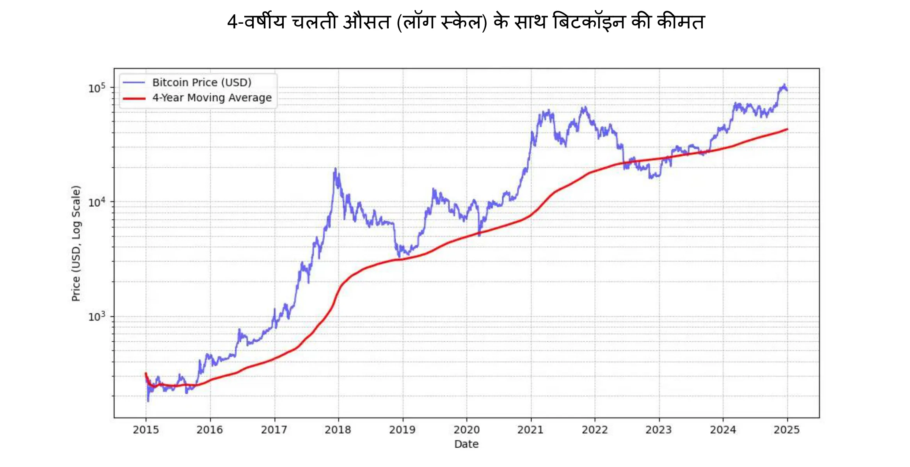

*माइकल सेलर: "सबसे अच्छा Bitcoin प्राइस सिग्नल 4 साल का सिंपल मूविंग एवरेज है।"* ऊपर दिए गए चार्ट को देखें।

इसके अलावा, Bitcoin के संपर्क में आने को अपनी समझ के **अनुपात** में रखने की सलाह दी जाती है। साथ ही, जल्दबाजी न करना या बाजार को पूरी तरह से समय पर भांपने की कोशिश न करना भी महत्वपूर्ण है।

आखिरकार, Bitcoin को **अस्थिर** माना जाता है। सटीक शब्दों में, फिएट मनी की इकाइयों में इसकी कीमत उतार-चढ़ाव भरी है। यह अस्थिरता आंशिक रूप से एक नए एसेट के लिए स्वाभाविक है, लेकिन सट्टेबाजों की मौजूदगी से यह और बढ़ जाती है जो इसे दीर्घकालिक मूल्य संचय के बजाय त्वरित मुनाफे के लिए इस्तेमाल करते हैं। इसके अलावा, लीवरेज्ड ट्रेडिंग (ट्रेडिंग पोजीशन बढ़ाने के लिए उधार लिए गए फंड्स का उपयोग) कीमतों में ऊपर और नीचे दोनों तरफ के मूवमेंट को तेज कर देती है, जिससे Bitcoin एक सीधे ऊपर की ओर बढ़ने वाले रास्ते से भटक जाता है। इससे और ज्यादा स्पष्ट उतार-चढ़ाव होते हैं, लेकिन समय के साथ, जब प्रतिबद्ध यूजर्स की संख्या बढ़ती है, यह अस्थिरता स्थिर होती दिख रही है। संक्षेप में, **Bitcoin जितना हाई-परफॉर्मेंस वाला एसेट बिना अस्थिरता के होना असंभव है**, लेकिन आप कम अस्थिरता वाले कम परफॉर्मेंस वाले एसेट्स तो खरीद ही सकते हैं।

### वॉल स्ट्रीट द्वारा Bitcoin अपनाया गया

वित्तीय संस्थानों द्वारा Bitcoin को अपनाने से वैश्विक बाजार में इसकी स्थिति और मजबूत हो गई है।

**ब्लैकरॉक** के हालिया बयानों में **Bitcoin** को एक मूल्य संचय संपत्ति और पोर्टफोलियो विविधीकरण उपकरण के रूप में इसकी संभावना को उजागर किया गया है। इस वैश्विक संस्थागत दिग्गज ने हाल ही में सुझाव दिया कि **Bitcoin का उपयोगकर्ता विकास इंटरनेट या मोबाइल फोनों की तुलना में तेजी से बढ़ रहा है**, जिसमें **जनसांख्यिकीय और पीढ़ीगत बदलाव** तथा पारंपरिक वित्तीय संस्थानों में बढ़ती अविश्वास (!) प्रमुख कारक हैं। अपनी दुर्लभ, गैर-सरकारी और विकेंद्रीकृत प्रकृति के कारण, कुछ निवेशक Bitcoin को **राजकोषीय और मौद्रिक अस्थिरता**, डर या विघटनकारी भू-राजनीतिक घटनाओं के समय में एक सुरक्षित विकल्प के रूप में देखते हैं।

**स्पॉट Bitcoin ETFs**, जनवरी 2024 में लॉन्च हुए, ने जबरदस्त सफलता हासिल की है—यह इतिहास का **सबसे सफल** ETF लॉन्च है—जनवरी से नवंबर तक लगभग $20 बिलियन का नेट इनफ्लो हुआ है। यह अगले सबसे सफल ETF लॉन्च, नैस्डैक-100 QQQ, से लगभग चार गुना बेहतर है। ये ETFs Bitcoin तक आसान और अधिक विनियमित पहुंच प्रदान करते हैं, जिसने इसे **और भी अधिक वैधता** दी है और संस्थागत पूंजी का एक बड़ा प्रवाह आकर्षित किया है।

Bitcoin ETF **संस्थागत अपनाव** के मामले में बड़े अंतर से आगे हैं—चाहे संस्थाओं की संख्या हो या प्रबंधन के तहत संपत्ति (AUM) का आकार—यह शीर्ष दस सबसे तेजी से बढ़ने वाले ETFs को पीछे छोड़ देते हैं। Bitcoin ETFs की यह सफलता डिजिटल संपत्तियों से जुड़े निवेश वाहनों की बढ़ती मांग को दर्शाती है, जिससे पारंपरिक वित्तीय परिदृश्य में Bitcoin की स्थिति और मजबूत होती है।

Bitcoin अब "स्टोर ऑफ वैल्यू" **मार्केट** में खेल रहा है। पैमाने के मामले में यह सिर्फ एक बूंद के बराबर है: सोने के 18,000 बिलियन डॉलर या रियल एस्टेट के 500,000 बिलियन डॉलर की तुलना में महज 1,800 बिलियन डॉलर। हालांकि, इसका लगभग 0.1% मार्केट शेयर इसे विकास के लिए भारी जगह देता है, खासकर जबकि इसके प्रतिस्पर्धी नए उपयोगकर्ताओं को आकर्षित करने में संघर्ष कर रहे हैं।

| टिकर       | प्रवाह 1दिन (मिलियन USD) | प्रवाह 1सप्ताह (मिलियन USD) | प्रवाह 1माह (मिलियन USD) | प्रवाह 3माह (मिलियन USD) | प्रवाह YTD (मिलियन USD) |
| ----------- | ------------------------- | ---------------------------- | ------------------------- | ------------------------- | ------------------------ |
| **योग**     | +457.19                   | +1,507.95                    | +2,888.01                 | +3,672.29                 | **+20,262.94**           |
| IBIT        | +393.40                   | +750.91                      | +1,536.47                 | +3,821.37                 | +22,460.44               |
| FBTC        | +14.81                    | +372.40                      | +627.16                   | +458.71                   | +10,266.69               |
| ARKB        | +11.51                    | +163.26                      | +295.92                   | -3.88                     | +2,647.32                |
| BITB        | +12.93                    | +146.50                      | +263.30                   | +97.46                    | +2,262.69                |
| HODL        | +5.75                     | +38.77                       | +94.54                    | +100.39                   | +682.03                  |
| BRRR        | +1.92                     | +4.72                        | +17.76                    | +20.54                    | +540.19                  |
| EZBC        | +11.79                    | +17.53                       | +39.29                    | +47.48                    | +439.45                  |
| bTC         | 0.00                      | -3.13                        | +36.59                    | +419.18                   | +419.18                  |
| BTCO        | +6.43                     | +19.25                       | +47.30                    | +56.41                    | +394.82                  |
| BTCW        | 0.00                      | +2.84                        | +6.04                     | +146.69                   | +217.47                  |
| YBIT        | -1.34                     | -10.26                       | +5.06                     | +13.81                    | +76.30                   |
| DEFI        | 0.00                      | 0.00                         | 0.00                      | -2.03                     | -1.79                    |
| GBTC        | 0.00                      | +5.16                        | -81.42                    | -1,503.84                 | -20,141.85               |

*10 महीने में 20 अरब डॉलर: Bitcoin ETF ने सिर्फ़ 1 साल से भी कम समय में वो हासिल कर लिया जिसमें गोल्ड ETF को 5 साल लग गए थे। स्रोत: फंड निवेश प्रवाह (USD में)। ब्लूमबर्ग टर्मिनल, ब्लूमबर्ग एल.पी., 2024।*

### कंपनी टूलकिट में Bitcoin

अमेरिका में Bitcoin को अपनाने का बढ़ता चलन दुनिया के अन्य हिस्सों में भी मानसिकता को प्रभावित कर रहा है, खासकर वेल्थ मैनेजमेंट प्रोफेशनल्स के बीच जो अब इसे अपने टूल्स की सूची में शामिल न करने का जोखिम नहीं उठा सकते - खास तौर पर जब पारंपरिक वित्तीय उत्पाद अंडरपरफॉर्म कर रहे हैं या मुश्किल दौर से गुजर रहे हैं। सिर्फ पारंपरिक बैंक ही अभी भी इसे नज़रअंदाज़ करने की हैसियत रखते हैं।

वित्तीय नजरिए से, Bitcoin को एक विविधीकरण संपत्ति माना जाता है। यह न सिर्फ अन्य संपत्ति वर्गों से असंबद्ध है, बल्कि नई तरलता इंजेक्शन के दौरान इसमें और भी बढ़ोतरी दिखाई देती है—ऐसा ही एक और दौर ECB, फेड और चीन द्वारा ब्याज दरों में कमी के साथ शुरू होता दिख रहा है।

संक्षेप में, सबसे आम उपयोग—चार साल या उससे अधिक समय के लिए अतिरिक्त खजाने को निवेश करने के लिए—Bitcoin बिल्कुल सही फिट बैठता है। इसे धीरे-धीरे प्रवेश करने की रणनीति के साथ जोड़ना फायदेमंद होगा: नियमित अंतराल पर निश्चित रकम निवेश करके प्रवेश या निकास के समय को सुचारू बनाया जा सकता है।

Bitcoin के अन्य उपयोग के मामले इसे एक रणनीतिक खजाना संपत्ति बनाते हैं, जैसे कि:

- 24/7 **कोलैटरल** या लिक्विडिटी पोस्ट करने में सक्षम होना
- किसी दूसरी कंपनी के ट्रेजरी में **जल्दी, कभी भी** ट्रांसफर कर पाना
- विदेशी मुद्रा **Exchange जोखिम** के खिलाफ बचाव करना
- एक **सप्लायर** को भुगतान करना जो इसे स्वीकार करता है, खासकर आपातकालीन स्थितियों में

### क्या Bitcoin बहुत महंगा है?

आपको ठीक 1 Bitcoin खरीदने की ज़रूरत नहीं है, क्योंकि Bitcoin को सतोशी नामक छोटी इकाइयों में बाँटा जा सकता है, जिसका नाम इसके गुमनाम निर्माता के सम्मान में रखा गया है। एक Bitcoin **100 मिलियन सतोशी** के बराबर होता है, जिससे उपयोगकर्ता **Bitcoin का बहुत छोटा हिस्सा** भी खरीद, बेच या व्यापार कर सकते हैं। असल में, Bitcoin के सोर्स कोड में, सभी लेन-देन सतोशी में ही गिने जाते हैं, और "Bitcoin" शब्द सिर्फ "कॉइनबेस" में दिखाई देता है, जो एक खास लेन-देन होता है जिसे माइनर्स अपने इनाम के रूप में पाने के लिए बनाते हैं।

इसके अलावा, कुल 21 मिलियन बिटकॉइन—या **2.1 क्वाड्रिलियन सतोशी**—को एक 64-बिट इंटीजर द्वारा कुशलता से दर्शाया जा सकता है। इसका मतलब है कि Bitcoin की प्रति यूनिट कीमत अधिक होने के बावजूद, इसकी विभाज्यता के कारण यह निवेशकों की एक विस्तृत श्रृंखला के लिए सुलभ बना हुआ है। इसलिए, आपको नेटवर्क में भाग लेने या इस डिजिटल संपत्ति में निवेश करने के लिए एक पूरा Bitcoin खरीदने की आवश्यकता नहीं है।

याद रखें कि अन्य संपत्तियों जैसे शेयरों, सोने या रियल एस्टेट की तुलना में इसकी कुल मार्केट कैपिटलाइज़ेशन काफी कम है, जिससे इसकी कीमत बढ़ने की संभावना अभी बरकरार है। अभी भी इसका प्रवेश बहुत कम है (लगभग वैश्विक आबादी का 1%), ऐसा माना जाता है कि हम इसके उदय की शुरुआत में ही हैं। यह इसे **हमारी पीढ़ी का सबसे असममित दांव** बनाता है: अब इसके शून्य पर पहुंचने की संभावना बहुत कम है, और इसके लगातार आगे बढ़ने की मजबूत संभावना है।

### जीडब्ल्यू-141 में कॉर्पोरेट ट्रेजरी आवंटित करने का फैसला

Bitcoin में निवेश करने का **निर्णय लेने की प्रक्रिया** कंपनी में आपकी स्थिति पर बहुत हद तक निर्भर करेगी। अगर आप **बहुमत के मालिक हैं, तो आप स्वतंत्र हैं** अतिरिक्त कोष को अपने विवेकानुसार आवंटित करने के लिए। वहीं, अगर आप सामूहिक निर्णय लेने वाली संरचना में एक साझेदार या शेयरधारक हैं, तो आपको संयुक्त विचार-विमर्श से गुजरना होगा, जो चीजों को जटिल बना सकता है।

इस दूसरे परिदृश्य में, अलग-अलग नज़रियों को मिलाना बहुत ज़रूरी हो जाता है, क्योंकि यह काफी हद तक **हर हितधारक की Bitcoin परिसंपत्ति की समझ पर निर्भर करता है**। जैसा कि कहावत है: "Bitcoin वह सब कुछ है जो लोग कंप्यूटर्स के बारे में नहीं जानते, और उन सब चीज़ों का मेल है जो वे पैसे के बारे में नहीं समझते।" भले ही एक साझेदार ने Bitcoin को पूरी तरह से समझने की कोशिश की हो, लेकिन इस ज्ञान को दूसरों तक पहुँचाना मुश्किल हो सकता है। ऐसे मामलों में, **किसी बाहरी स्रोत को शामिल करना सलाह दिया जाता है** ताकि इस विचार को किसी एक व्यक्ति से ज़्यादा न जोड़ा जाए, जिससे generate प्रतिरोध पैदा हो सकता है।

फिलहाल, जीडब्ल्यू-145 रखने वाली कंपनियों में बहुमत वाले मालिक का फैसला लेना सबसे आम बात है। यहां कुछ असली उदाहरण हैं:

- **स्वतंत्र पेशेवर**: सलाहकार, स्वास्थ्य सेवा प्रदाता, या वकील जो अपने लंबी अवधि के निवेश का एक हिस्सा Bitcoin में लगाते हैं। आमतौर पर, ये पेशेवर पहले से ही बचत या सावधि जमा खाते रखते हैं जिन पर मामूली रिटर्न मिलता है।
- **टेक-सेक्टर के कार्यकारी**: एक कार्यकारी जिसने अपनी कंपनी बेच दी और कुछ साल पहले अपने निजी होल्डिंग कंपनी से मिले मुनाफ़े का एक हिस्सा Bitcoin में निवेश किया। आज, उनकी आर्थिक स्थिति मज़बूत है और वे नए उद्यमों में फिर से निवेश कर रहे हैं।
- **बहुत छोटे व्यवसायों के मालिक** : सेवाओं, कृषि या शिल्प उद्योगों में काम करने वाले उद्यमी जिन्होंने Bitcoin की संभावना को समझा है और अपने खजाने का एक हिस्सा इसमें निवेश करते हैं। उनका मुख्य उद्देश्य विविधीकरण और इससे मिलने वाली आजादी है।
- **सार्वजनिक रूप से कारोबार करने वाली कंपनियाँ** जैसे कि माइक्रोस्ट्रैटेजी ने अपने कॉर्पोरेट ट्रेजरी का एक बड़ा हिस्सा Bitcoin में बदलकर एक मिसाल कायम की है, जो कॉर्पोरेट पूंजी आवंटन रणनीतियों में वैश्विक बदलाव को दर्शाता है। 2024 की गिरते-गिरते, कई अन्य कंपनियों ने भी इसी राह पर चलना शुरू कर दिया, जिससे इस ट्रेंड को और भी ज्यादा वैधता मिली।

उन कंपनियों की अद्यतन सूची देखें जो सबसे अधिक बिटकॉइन नकदी के रूप में रखती हैं, साथ ही रखी गई राशि, इस साइट पर: [BitcoinTreasuries.net](https://bitcointreasuries.net/).
### व्यवसायों द्वारा रखे गए Bitcoin पर कराधान

ऐसे व्यवसाय जो अलग कानूनी संस्थाओं के रूप में संरचित नहीं हैं—जैसे कि एकल स्वामित्व या अन्य गैर-निगमित संस्थाएं—Bitcoin लेनदेन पर कराधान अक्सर व्यक्तियों पर लागू होने वाले नियमों के समान होता है। कई मामलों में, पूंजीगत लाभ या आय पर लागू होने वाले वही नियम होते हैं, जैसे कि कोई व्यक्ति Bitcoin बेच रहा हो। उदाहरण के लिए, कुछ देशों में लाभ को उद्यमी की व्यक्तिगत आय का हिस्सा माना जा सकता है, जो **व्यक्तिगत आयकर स्लैब** के अधीन होगा।

हालांकि, **निगमित व्यवसाय**—जो कॉर्पोरेट आयकर के अधीन होते हैं—अक्सर एक अधिक अनुकूल कर ढांचे का लाभ उठाते हैं। व्यक्तियों के विपरीत, जिन्हें विभिन्न परिसंपत्ति वर्गों में लाभ और हानि की भरपाई पर प्रतिबंधों का सामना करना पड़ सकता है, निगम आमतौर पर Bitcoin लेनदेन पर प्राप्त लाभ या हानि को सीधे अपने वार्षिक लाभ-हानि खातों में समेट सकते हैं। इससे एक अधिक लचीला और कभी-कभी अधिक फायदेमंद कर स्थिति बन सकती है।

टैक्स की दरें और नियम हर जगह अलग-अलग होते हैं। जैसे, फ्रांस और कई पश्चिमी देशों में कंपनियों पर करीब 25% का कॉर्पोरेट टैक्स लग सकता है, जो अक्सर निवेश से होने वाली कमाई पर लगने वाले व्यक्तिगत फ्लैट-रेट टैक्स से कम होता है।

इन अंतरों के कारण, **कुछ व्यवसाय मालिक अपनी कंपनी के माध्यम से Bitcoin खरीदने और रखने का विकल्प चुनते हैं**, क्योंकि ऐसा करने से **कर योजना के अधिक कुशल अवसर** मिल सकते हैं। हमेशा की तरह, यह सलाह दी जाती है कि संबंधित क्षेत्राधिकार(क्षेत्राधिकारों) के नियमों से परिचित एक कर पेशेवर से सलाह लें ताकि अनुपालन सुनिश्चित किया जा सके और कर रणनीति को अनुकूलित किया जा सके।

## Bitcoin हासिल करने का तरीका क्या है?

<chapterId>1e6dbaf5-581a-49a4-8f37-3728e77bda17</chapterId>

### अधिग्रहण के तीन तरीके

Bitcoin हासिल करने के तीन तरीके हैं:

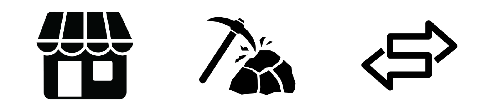

- Exchange में सामान या सेवाओं के लिए:

चूंकि Bitcoin, Exchange के माध्यम के रूप में काम करता है, इसलिए एक चक्रीय अर्थव्यवस्था की कल्पना करना संभव है। हालांकि यह आज भी असामान्य है, लेकिन अधिक से अधिक व्यवसाय Bitcoin भुगतान स्वीकार करने लगे हैं—आपका क्यों नहीं? (हमारा अगला अध्याय देखें)

- जीडब्ल्यू-160 जीडब्ल्यू-159:

इसमें Mining मशीनों को चलाकर इनाम कमाना शामिल है। गैर-विशेषीकृत व्यवसायों के लिए, यह अपेक्षाकृत कम महत्वपूर्ण है। आप बिचौलियों के माध्यम से भाग ले सकते हैं जो आपको कंप्यूटिंग, नेटवर्क और रखरखाव सेवाएं बेचेंगे या किराए पर देंगे। अगर आपके पास मशीनें हैं, तो आप उन्हें मूल्यह्रास योग्य संपत्ति के रूप में दर्ज कर सकते हैं। बड़े पैमाने पर, आपको निवेश पर रिटर्न की सावधानी से गणना करनी होगी क्योंकि बाजार अत्यधिक प्रतिस्पर्धी है और खर्चों, विशेष रूप से बिजली की लागत का अच्छा अनुमान लगाने की आवश्यकता होती है।

Mining के तरीकों के बारे में अधिक जानने के लिए, आप [हमारे ट्यूटोरियल्स में "Mining" सेक्शन देख सकते हैं](https://planb.network/tutorials/mining)।

- Bitcoin खरीदना:

यह अब तक का सबसे आम तरीका है, जो या तो पीयर-टू-पीयर एक्सचेंज के जरिए किया जाता है या, ज्यादातर मामलों में, विशेष ट्रेडिंग प्लेटफॉर्म पर। लेकिन जब कंपनियां Bitcoin को अपने कॉर्पोरेट ट्रेजरी एसेट के रूप में हासिल करती हैं, तो उन्हें मजबूत नियामक मानकों और 'नो-योर-कस्टमर' (KYC) प्रक्रियाओं का पालन करना होता है। जब वे इसे विशेष ट्रेडिंग प्लेटफॉर्म पर खरीदते हैं, तो व्यवसायों को आमतौर पर KYC और एंटी-मनी लॉन्ड्रिंग (AML) आवश्यकताओं को पूरा करने के लिए विस्तृत कंपनी जानकारी प्रदान करनी होती है, जिसमें पहचान दस्तावेज़, वित्तीय विवरण और Address का प्रमाण शामिल होता है।

बिटकॉइन खरीदने, बेचने और ट्रांसफर करने के लिए बिज़नेस अकाउंट कैसे खोलें और उसे इस्तेमाल करें, यह सीखने के लिए आप ये दो ट्यूटोरियल देख सकते हैं जो खासकर बिज़नेस के लिए बनाए गए हैं, जिनमें Kraken और Bitfinex प्लेटफॉर्म्स के कॉर्पोरेट वर्जन को कवर किया गया है:

https://planb.network/tutorials/business/others/bitfinex-pro-c8ef7476-5f60-4205-935e-a545ced0022a
https://planb.network/tutorials/business/others/kraken-pro-07b1c16c-d517-4bf7-9a78-b42dc0f21785
बिटकॉइन हासिल करने के तरीकों के बारे में अधिक जानने के लिए, जैसे कि Exchange या पीयर-टू-पीयर के जरिए, आप [हमारे ट्यूटोरियल्स में "Exchange" सेक्शन देख सकते हैं](https://planb.network/tutorials/exchange)।

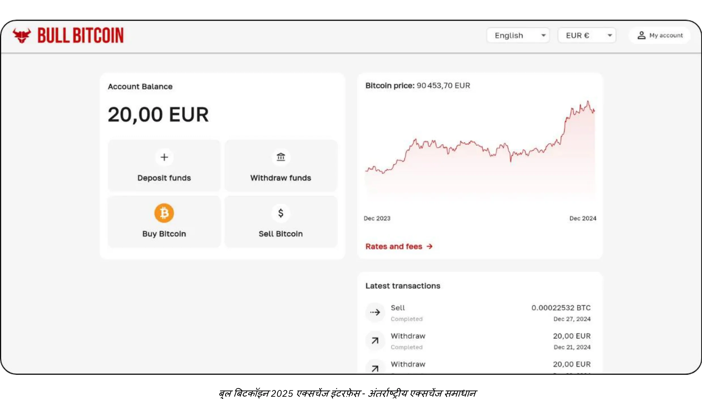

### किस कीमत पर?

जैसा कि पहले बताया गया है, Bitcoin का भविष्य का भाव अनुमान लगाना न सिर्फ नामुमकिन है, बल्कि छोटी अवधि में इसकी कीमत में काफी उतार-चढ़ाव भी होता है। पिछले अनुभवों के आधार पर, एक भरोसेमंद तरीका यह रहा है कि नियमित अंतराल पर धीरे-धीरे इकट्ठा करते रहें और चार साल या उससे ज्यादा का समय सीमा रखें।

### आपको कितना खरीदना चाहिए?

अजीब लगेगा, लेकिन सबसे अच्छा तरीका यही है कि बिना ज्यादा सोचे एक छोटी सी खरीदारी से शुरुआत करें। थोड़ी सी रकम (जैसे सौ यूरो या डॉलर) से आपको कोई बड़ा नुकसान नहीं होगा, और प्रैक्टिकल अनुभव आपको किताबें पढ़ने से कहीं ज्यादा तेजी से और बेहतर सिखाएगा।

जैसा पहले बताया गया है, यह समझदारी है कि आप सिर्फ उसी अतिरिक्त नकदी को निवेश करें जिसकी आपको कई सालों तक जरूरत नहीं होगी। अगर आप किसी ऐसे समय पर अचानक पैसे निकालने के लिए मजबूर हो जाते हैं जब बाजार की स्थिति खराब हो, तो कोई भी ऐसी निवेश रणनीति जिसे आप ठीक से समझते नहीं हैं, आपको मुश्किल में डाल सकती है।

छोटी शुरुआत करने के अलावा, कॉर्पोरेट ट्रेजरी के लिए एक मापी हुई आवंटन रणनीति अपनाना भी फायदेमंद हो सकता है। एक तरफ, माइक्रोस्ट्रैटेजी जैसी कुछ कंपनियों ने अपने अतिरिक्त ट्रेजरी फंड का एक बड़ा हिस्सा Bitcoin में लगाकर एक चरम रुख अपनाया है, जो उनके मजबूत संस्थागत विश्वास को दर्शाता है। वहीं दूसरी ओर, एक अधिक रूढ़िवादी और युक्तिसंगत रणनीति में कॉर्पोरेट ट्रेजरी का लगभग 5% हिस्सा Bitcoin में आवंटित करना शामिल हो सकता है, जिससे संभावित लाभ, जोखिम प्रबंधन और तरलता की आवश्यकताओं के बीच संतुलन बनाया जा सके।

इस स्पेक्ट्रम को एक पैमाने के रूप में देखें, जहां एक तरफ न्यूनतम एक्सपोजर है जो कंपनी को परिचालन जरूरतों के लिए पर्याप्त लिक्विडिटी बनाए रखने की सुविधा देता है, और दूसरी तरफ एक आक्रामक रुख है जो Bitcoin की अपेक्षित दीर्घकालिक मूल्य वृद्धि का लाभ उठाने पर केंद्रित है। हालांकि आक्रामक आवंटन से उच्च रिटर्न मिल सकता है, लेकिन एक संयमित आवंटन अस्थिरता को कम करने में मदद करता है। यह सुनिश्चित करता है कि कंपनी की वित्तीय नींव सुरक्षित रहे, साथ ही ट्रेजरी ऑपरेशन्स में Bitcoin के नवाचारी संभावित का लाभ भी मिलता रहे।

### कितनी बार?

कोई Hard नियम नहीं है। बाजार में "डिप्स" ढूंढकर टाइमिंग करने की कोशिश करना, नियमित अंतराल पर खरीदारी करने से कम प्रभावी और ज्यादा तनावपूर्ण हो सकता है। अनुभवी निवेशक भी कभी-कभी गलती कर बैठते हैं। एक ही बार में "ऑल-इन" हो जाना दोधारी तलवार जैसा हो सकता है।

असल में, Bitcoin की संभावित सराहना इतनी है कि अगर आप कुछ साल बाद भी शुरू करें, तो भी आपको लंबे समय में फायदा होने की संभावना है। सच है, समय के साथ बड़े मूल्य उतार-चढ़ाव की तीव्रता कम हो सकती है। हालाँकि, एक अपस्फीति मुद्रा के रूप में, Bitcoin को मूल्य को प्रभावी ढंग से संग्रहीत करने और इसके उपयोगकर्ताओं की उत्पादकता वृद्धि को दर्शाने के लिए डिज़ाइन किया गया है। एक उदाहरण देने के लिए: हम वर्तमान में Bitcoin के "लॉन्च चरण" में हैं, एक बनने वाली मुद्रा, और अभी कोई इसके उचित मूल्य को नहीं जानता। बाद में, शायद 20 या 40 साल में, जब यह एक स्थिर "क्रूज़ चरण" में होगी, तो यह अविश्वसनीय रूप से स्थिर हो सकती है और समाज की उत्पादकता वृद्धि के साथ लगातार बढ़ सकती है।

रियल एस्टेट इंडस्ट्री अक्सर दोहराती है कि "खरीदने का हमेशा सही समय होता है," यह भूलकर कि अगर रियल एस्टेट की वैल्यू स्टोर करने की क्षमता खत्म हो जाए—और लोग Bitcoin जैसी चीज़ों में निवेश करने लगें—तो कीमतें उसके यूटिलिटी वैल्यू (रहने की जगह) के करीब आ सकती हैं। वहीं Bitcoin का कोई और मकसद नहीं है सिवाय वैल्यू स्टोर करने के, जिसका मतलब हो सकता है कि "इसे खरीदने का हमेशा सही समय होता है।" भविष्य ही बताएगा।

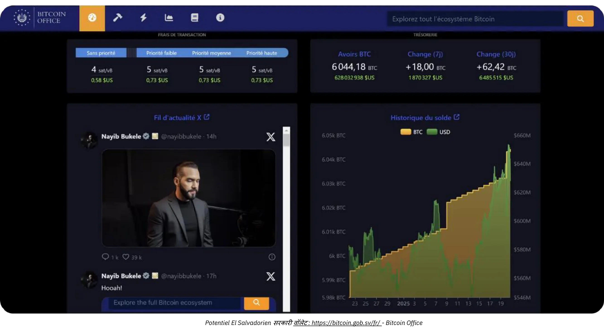

*क्रेडिट: [जीडब्ल्यू-173 ऑफिस](https://Bitcoin.gob.sv/)*

### किस रूप में खरीदें? (संरक्षण के तरीके)

तुम्हारे पास Bitcoin का भौतिक स्वामित्व नहीं है। बल्कि, तुम्हारे पास एक क्रिप्टोग्राफिक कुंजी है जो तुम्हें अपने खाते की कुछ या सभी Ownership इकाइयों को एक या अधिक अन्य क्रिप्टोग्राफिक कुंजियों में ट्रांसफर करने की अनुमति देती है। यह सब Bitcoin Blockchain पर होता है, जो दुनिया भर में हजारों नोड्स पर प्रतिलिपि बनाकर रखा गया है।

यह क्रिप्टोग्राफ़िक कुंजी एक बेहद बड़ी रैंडम संख्या है। यूज़र अनुभव को आसान बनाने के लिए, इसे अक्सर 12 या 24 शब्दों के क्रम के रूप में दिखाया जाता है। इन शब्दों को "Hardware Wallet" नामक एक फिजिकल डिवाइस पर लोड किया जा सकता है। हालाँकि, समझ लें कि बिटकॉइन इस डिवाइस के "अंदर" नहीं होते; यह सिर्फ़ ट्रांजैक्शन्स को क्रिप्टोग्राफ़िक रूप से साइन करने और नेटवर्क पर भेजने का एक टूल है। असली मायने रखने वाली चीज़ वो 12 या 24 शब्द हैं, जिन्हें सुरक्षित रखना बेहद ज़रूरी है।

इससे कस्टडी का मुद्दा सामने आता है: Bitcoin को रखने का मतलब है चाबी(यों) को रखना। या तो आप खुद उन्हें संभालते हैं, या फिर किसी तीसरे पक्ष को यह काम सौंप देते हैं। इसके बीच के भी कुछ विकल्प होते हैं। आइए सबसे आम परिदृश्यों पर नज़र डालें:

- **अपना खुद का कस्टडी (Self-Custody):**

(Note: "Self-custody" is often used in the context of managing one's own digital assets like cryptocurrencies without relying on third parties. In Hindi, it can be loosely translated as "अपने पास रखना" or "स्वयं संभालना," but in a tech/finance context, "अपना खुद का कस्टडी" is more commonly understood.)

यह विकल्प असली Bitcoin के दीवानों द्वारा सुझाया गया है, क्योंकि यह Bitcoin के मूल डिज़ाइन से मेल खाता है। आप खुद अपना बैंक बन जाते हैं: किसी तीसरे पक्ष के धोखा देने का कोई खतरा नहीं है, लेकिन आपकी ज़िम्मेदारी है कि आप अपनी चाबी(यों) को सुरक्षित रखें। आपको अपने फंड्स तक 24/7 पूरी पहुंच मिलती है। बिज़नेस सेटिंग में, अगर कई लोगों को लेन-देन करने की ज़रूरत पड़ सकती है, तो आपको एक्सेस और सुरक्षा को मैनेज करने के लिए सही टूल्स और प्रक्रियाओं की ज़रूरत होगी।

- **तीसरे पक्ष की हिरासत:**

उदाहरण के लिए, एक Exchange या खरीद सेवा आपके लिए एक खाता बना सकती है, आपकी पारंपरिक मुद्रा को Bitcoin में बदल सकती है, और अपनी सुरक्षा प्रणालियों का उपयोग करके आपकी ओर से इसे रख सकती है। ऐसी अधिकांश सेवाएं आपको अपने बिटकॉइन्स को Wallet में निकालने की अनुमति देती हैं, जहां केवल आपके पास चाबी होती है। जब तक आप ऐसा नहीं करते, तब तक आप वास्तव में बिटकॉइन्स के मालिक नहीं होते; आप उनके वादे पर निर्भर होते हैं कि वे आपको वापस भुगतान करेंगे। इसमें सुरक्षा जोखिम (उनका बनाम आपका) और प्रतिपक्ष जोखिम (वे विफल हो सकते हैं या गायब हो सकते हैं) का संतुलन शामिल है। कुछ व्यवसायों को यह स्वीकार्य लगता है, हालांकि यह आमतौर पर दीर्घकालिक भंडारण या आपके आवंटन के 100% के लिए सलाह नहीं दी जाती है। कस्टडी सेवाएं भंडारण शुल्क भी ले सकती हैं।

- **"पेपर जीडब्ल्यू-183" (ईटीएफ या ईटीपी):**

ये पारंपरिक वित्तीय उपकरण हैं जो Bitcoin के अंशों को दर्शाते हैं और इसकी कीमत के प्रदर्शन को दोहराते हैं। इस उत्पाद के पीछे संस्था सैद्धांतिक रूप से अंतर्निहित Bitcoin को खरीदकर रखती है। आपके योगदान और निकासी पारंपरिक मुद्रा (जैसे डॉलर या यूरो) में की जाती है, Bitcoin में नहीं। कुछ उत्पादों को छोड़कर जो वास्तविक Bitcoin में निकासी की अनुमति देते हैं (कुछ क्षेत्राधिकारों में कर योग्य घटना से बचने के लिए), इन उपकरणों में वार्षिक प्रबंधन शुल्क शामिल होता है। यहाँ, आप संस्था की सुरक्षा पर निर्भर करते हैं और प्रतिपक्ष जोखिम का सामना करते हैं (उदाहरण के लिए, अगर कोई सरकार संस्थागत रूप से रखे गए सभी Bitcoin को जब्त करने का फैसला करती है, जैसा कि 1933 में अमेरिकी कार्यकारी आदेश 6102 के तहत सोने के साथ हुआ था)। इनका मुख्य लाभ आसान पहुँच है, क्योंकि ये पारंपरिक वित्तीय चैनलों के माध्यम से वितरित किए जाते हैं। ये क्रिप्टोग्राफिक कुंजियों को सुरक्षित करने की आवश्यकता से बचते हैं, लेकिन Bitcoin के अंतर्निहित गुणों में से कोई भी प्रदान नहीं करते हैं: आप Bitcoin नेटवर्क का उपयोग 24/7 बिना अनुमति के मूल्य को स्वतंत्र रूप से स्थानांतरित करने के लिए नहीं कर सकते। ये केवल वित्तीय प्रदर्शन को दोहराते हैं, Bitcoin की कार्यक्षमता या संप्रभुता को नहीं।

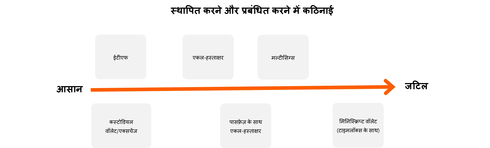

इसके अलावा, जिस तरह से आप Bitcoin को होल्ड करते हैं, वह आपके कॉर्पोरेट ट्रेजरी को सुरक्षित रखने के लिए जरूरी सिक्योरिटी उपायों को प्रभावित करता है। चाहे आप सेल्फ-कस्टडी चुनें, जैसे कि सिंगल-सिग्नेचर या मल्टी-सिग्नेचर हार्डवेयर वॉलेट्स आदि का इस्तेमाल करके अपनी कीज पर सीधा कंट्रोल रखें, या फिर इस काम को थर्ड-पार्टी कस्टडी सर्विसेज या ETFs को सौंप दें, हर विकल्प का अपना रिस्क प्रोफाइल होता है। मिसाल के तौर पर, सेल्फ-कस्टडी में आपको पूरी एक्सेस मिलती है, लेकिन इसके लिए सख्त इंटरनल सिक्योरिटी प्रोटोकॉल्स की जरूरत होती है, वहीं थर्ड-पार्टी सॉल्यूशंस मैनेजमेंट का बोझ कम करते हैं, लेकिन इसमें काउंटरपार्टी रिस्क होता है। इन अंतरों को और स्पष्ट करने के लिए, यह ग्राफ हर कस्टडी टाइप के सिक्योरिटी मॉडल को दिखाता है, जिससे आप अपने ऑर्गेनाइजेशन की जरूरतों के हिसाब से सबसे सही तरीका चुन सकते हैं :

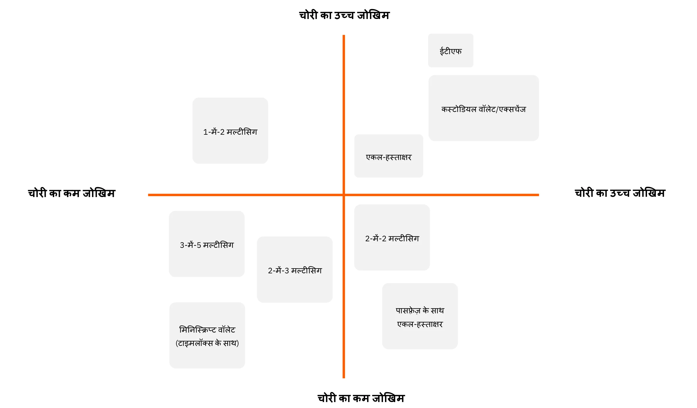

### किससे खरीदें?

अगर आप "पेपर Bitcoin" चुनते हैं, तो आपको बैंक या ऑनलाइन स्टॉक एक्सचेंज जैसी वित्तीय संस्थाओं की तरफ रुख करना होगा।

अगर आप असली Bitcoin खरीदने का फैसला करते हैं, तो आपके पास मार्केटप्लेस (Exchange) या ब्रोकर के जरिए कई मुख्य विकल्प होते हैं:

- **बड़े अंतरराष्ट्रीय या विदेशी प्लेटफॉर्म:**

उदाहरण के लिए Kraken, Coinbase, या Binance, जिन्हें कई लोगों ने पहले इस्तेमाल किया है। कुछ को समस्याएँ आई हैं, और साफ़ सलाह देना मुश्किल है। एक सुझाव: अगर आप इन्हें इस्तेमाल करते हैं, तो अपने बिटकॉइन वहाँ ज़रूरत से ज़्यादा देर तक न छोड़ें।

- **नियमित सेवा प्रदाता (पंजीकृत डिजिटल संपत्ति सेवा प्रदाता):**

(नोट: मैंने मूल अंग्रेजी टेक्स्ट के फॉर्मेटिंग को बरकरार रखते हुए अनुवाद किया है, जैसा कि आपने निर्देश दिया था। हिंदी में यह शब्दावली आमतौर पर क्रिप्टोकरेंसी/ब्लॉकचेन से जुड़े विनियमित संस्थानों के लिए प्रयोग होती है।)

उदाहरण के लिए, फ्रांस में पेमियम (Exchange) या बुलबिटकॉइन (ब्रोकर) जैसे प्लेटफॉर्म्स के बारे में जाना जाता है कि उनके संचालन में सच्चे Bitcoin के प्रशंसक हैं और उन्होंने एक मजबूत ट्रैक रिकॉर्ड बनाया है। अमेरिका में आपके पास रिवर या स्वान जैसे सेवा प्रदाता हैं। सामान्य तौर पर, प्रदाता की पृष्ठभूमि की जांच करना महत्वपूर्ण है: उनकी प्रतिष्ठा, ट्रैक रिकॉर्ड, Bitcoin समुदाय में लोकप्रियता, और क्या उनका नेतृत्व Bitcoin के मूल मूल्यों के साथ संरेखित है।

**जीडब्ल्यू-191 बनाम ब्रोकर:**

- एक **Exchange** आपको अपनी चुनी हुई कीमत पर खरीदारी के ऑर्डर देने की अनुमति देता है, लेकिन आपको एक्जीक्यूशन के लिए तब तक इंतज़ार करना होगा जब तक मार्केट कीमत और विक्रेता मेल नहीं खाते।
- एक **ब्रोकर** आपको एक तय कीमत देता है और लेन-देन जल्दी पूरा कर सकता है।

फीस और एक्जीक्यूशन स्पीड के अलावा—जो लॉन्ग टर्म (कई सालों) के लिए कम मायने रखते हैं—एक बिजनेस को ये भी ध्यान में रखना चाहिए:

- **यूज़र Interface:** क्या यह प्लेटफॉर्म यूज़र-फ्रेंडली है?
- **लेखांकन सुविधाएँ:** कम से कम, लेन-देन इतिहास को .CSV फॉर्मेट में एक्सपोर्ट करने की क्षमता होनी चाहिए।
- **कस्टडी और सुरक्षा:** क्या प्लेटफॉर्म आपकी तरफ से बिटकॉइन रखता है, या फिर वह Ownership को आपके पास ट्रांसफर कर देता है? उनकी सुरक्षा व्यवस्था क्या है? क्या उनके पास "विथड्रॉल लॉक्स" या कोई अन्य निकासी की पाबंदियाँ हैं?
- **ग्राहक सहायता:** गुणवत्ता, तुरंत जवाब देने की क्षमता, और व्यक्तिगत सहायता, खासकर जब आप शुरुआत कर रहे हों।
- **प्रतिष्ठा और चरित्र:** प्लेटफॉर्म की विश्वसनीयता और मूल्य।
- **रिकरिंग खरीदारी के लिए सपोर्ट:** अगर आप Bitcoin को समय के साथ नियमित खरीद के जरिए जमा करना चाहते हैं।

# हर व्यापार के लिए बिल्कुल सटीक Bitcoin भुगतान समाधान

<partId>b2c8af88-6bfc-49b1-ad84-4c292c713b55</partId>

## Bitcoin को भुगतान के रूप में लेना

<chapterId>99af1203-bc84-4acc-9780-f733e7998335</chapterId>

सबसे पहले, यह समझना ज़रूरी है कि Bitcoin इंटरनेट जितना ही बड़ा बदलाव लाने वाला है।

शुरुआती दिनों में, इंटरनेट नेटवर्क ने संचार के रास्तों से बिचौलियों को हटाना संभव बना दिया, और फिर इस बुनियादी ढाँचे ने अनगिनत ऐसे अनुप्रयोगों को जन्म दिया जिनकी पहले कल्पना भी नहीं की जा सकती थी। आज, ऐसा कौन सा व्यवसाय है जिसकी ऑनलाइन मौजूदगी नहीं है?

जीडब्ल्यू-200 एक भरोसे का ढांचा है, जिसका पहला उपयोग स्टोरेज और जीडब्ल्यू-199 से बिचौलियों को हटाना है - यानी पैसे की लेन-देन से। इस ढांचे पर अभी अनदेखे कई और उपयोग सामने आएंगे। यहां आपकी शुरुआती मौजूदगी एक वेबसाइट होने जैसी है: पीयर-टू-पीयर भुगतान और मूल्य विनिमय का एक द्वार।

अब, एक व्यावहारिक व्यवसाय के नज़रिए से सोचिए जिसका मुख्य काम Bitcoin से कोई लेना-देना नहीं है। वह Bitcoin में भुगतान क्यों स्वीकार करेगा?

- **Bitcoin ट्रेजरी बनाना:**

हमारा Bitcoin खरीदने पर पिछला लेख देखें। चाहे विश्वास के कारण हो या विविधीकरण की रणनीति के तहत, कुछ पेशेवर Bitcoin में भुगतान स्वीकार करना चुनते हैं। कुछ बिटकॉइनर्स का तर्क है कि जितना कम वित्तीय रूप से सक्षम कोई कंपनी हो—यानी उसके पास न तो समय होता है और न ही जटिल वित्तीय चालें चलने के औजार—**उस व्यवसाय के लिए उतना ही ज़रूरी हो जाता है कि उसे उपलब्ध सबसे मज़बूत मुद्रा में भुगतान मिले**। ऐसा करने से मैदान समतल हो जाता है, जिससे छोटे और समय की कमी वाले उद्यम भी वित्तीय खेलों में फंसे बिना मूल्य बचा पाते हैं।

- **नया समूह तक पहुँचना:**

Bitcoin यूजर्स की संख्या बढ़ रही है, और उनकी खरीदारी करने की क्षमता भी काफी ज्यादा है। वे स्वाभाविक रूप से उन्हीं बिजनेस की तरफ आकर्षित होंगे जो उनकी करेंसी स्वीकार करते हैं। इसके अलावा, चूंकि यह पहली यूनिवर्सल, इंटरनेट-नेटिव करेंसी है, आप विदेशी ग्राहकों को भी आकर्षित कर सकते हैं जो यहाँ से गुजरते हैं।

- **दृश्यता बढ़ाना:**  

(Note: The phrase "Increasing Visibility" is translated to "दृश्यता बढ़ाना" in Hindi, which is a direct and colloquial way to express the idea of enhancing visibility. The formatting and special characters, such as the asterisks (**), are preserved as per the instruction.)

अपने बिज़नेस को BTCmap.org जैसे प्लेटफॉर्म्स पर लिस्ट करके, उदाहरण के लिए। फिलहाल बहुत कम बिज़नेस Bitcoin स्वीकार करते हैं, तो मुँह-ज़बानी प्रचार आपके फायदे में काम करता है। यह आपको आपके प्रतिस्पर्धियों से अलग भी खड़ा करता है।

- **कम फीस:**

(Note: The translation "कम फीस" is a direct and colloquial way to say "Lower Fees" in Hindi, commonly used in everyday conversations and informal contexts.)

तुरंत Bitcoin भुगतान Lightning Network पर होते हैं। **फीस नाममात्र की होती है और खरीदार द्वारा भरी जाती है**। कोई पेमेंट टर्मिनल फीस नहीं, कोई पेमेंट अथॉराइज़ेशन फेल्योर नहीं, और कोई फ्रॉड नहीं। तुलना करें तो, पेमेंट इंडस्ट्री (कार्ड्स, टर्मिनल्स, ट्रांसफर्स, PSPs, वगैरह) की वैश्विक लागत लगभग $2.2 ट्रिलियन सालाना है। इसमें चार्जबैक और फ्रॉड जोड़ दें, तो कुल मिलाकर दुनिया भर के उत्पादक व्यवसायों से मूल्य ट्रांसफर करने के लिए अमेरिकी GDP का लगभग दसवां हिस्सा "छीन" लिया जाता है। आपका व्यवसाय चाहे जो भी हो, वित्तीय फीस एक बोझ है जिसे ऑप्टिमाइज़ किया जाना चाहिए, और कुछ मामलों में, उच्च फीस कुछ बिजनेस मॉडल्स को दबा सकती है।

- "आज़ादी और बिना इजाज़त, 24/7:"

Bitcoin का इस्तेमाल करने के लिए इजाज़त माँगने की कोई ज़रूरत नहीं है। कोई भी स्मार्टफोन ऐप की मदद से मिनटों में अर्थव्यवस्था का हिस्सा बन सकता है। आप कभी भी, किसी से भी—चाहे व्यक्ति हो या व्यापार—भुगतान भेज या प्राप्त कर सकते हैं, बिना किसी समय सीमा या देरी के।

- **Bitcoin नेटवर्क का फायदा उठाएं:**

आपको अपने भुगतान Bitcoin फॉर्म में रखने की ज़रूरत नहीं है—खासकर अगर आपको आपूर्तिकर्ताओं को भुगतान करना है या VAT जमा करना है। कुछ सेवाएं आपके Bitcoin भुगतान के पूरे या कुछ हिस्से को आपकी पसंद की करेंसी में बदल सकती हैं (जैसे, यूरो को आपके IBAN में) एक फीस के बदले। इस स्थिति में, Bitcoin स्वीकार करने का फायदा नए उपयोगकर्ताओं को आकर्षित करने में हो सकता है या फिर Bitcoin के अपने फायदों में (जैसे कम फीस, 24/7 ऑपरेशन, और धोखाधड़ी या चार्जबैक का कोई जोखिम नहीं)।

### आपको कौन सा भुगतान समाधान चुनना चाहिए?

Bitcoin पेमेंट्स स्वीकारना शुरू करना काफी आसान है। सही समाधान चुनने के लिए, आपके द्वारा की जाने वाली ट्रांजैक्शन्स की खासियतों पर गौर करें: औसत पेमेंट रकम, ट्रांजैक्शन की बारंबारता, और क्या आप फिजिकल सेटिंग में, ऑनलाइन, या दोनों तरीकों से पेमेंट्स स्वीकार करेंगे।

एक व्यापारी के तौर पर आपका माइंडसेट भी मायने रखता है। क्या आप सिर्फ एक साधारण टेस्ट चला रहे हैं, या फिर आप Bitcoin को एक बड़ा और लगातार आय का स्रोत बनते देख रहे हैं? अगर दूसरा विकल्प है, तो आपको एक मजबूत, व्यापक और कस्टमाइज़ेबल सेटअप की जरूरत पड़ेगी।

अपने कर्मचारियों की विभिन्न भूमिकाओं और उनके स्थानों को ध्यान में रखना न भूलें। किसी भी स्थिति में, याद रखें कि आपको अपने अकाउंटेंट को सभी आवश्यक जानकारी प्रदान करने और लेखा प्रक्रिया को सुव्यवस्थित करने में सक्षम होना चाहिए।

फैसला लेने की प्रक्रिया को आसान बनाने के लिए, हमने चार अलग-अलग बिज़नेस प्रोफाइल तय किए हैं। नीचे दी गई टेबल्स हर प्रोफाइल की मुख्य खासियत और सुझाए गए पेमेंट सॉल्यूशन्स को बताती हैं।

### व्यापार प्रोफाइल्स

#### प्रोफाइल 1 – शुरुआत करने वाला

| विशेषता                               | शुरुआती                                                                                                                                   |
| ------------------------------------- | ------------------------------------------------------------------------------------------------------------------------------------------ |
| **मानसिकता**                         | "अपना पहला भौतिक भुगतान आज़माना", "अपने ऑनलाइन कंटेंट के लिए टिप प्राप्त करना", "बहुत ही छोटे राजस्व को लक्ष्य बनाना"                         |
| **लेनदेन की आवृत्ति**                 | "सीखने के लिए पहला लेनदेन", "कभी-कभी एक भुगतान प्राप्त करना"                                                                                |
| **गतिविधियों के प्रकार के उदाहरण**    | रचनात्मक अर्थव्यवस्था (सामग्री निर्माता, ब्लॉग, लेख आदि), कभी-कभी टिप, व्यक्तिगत बिक्री, संघ, एकल कार्यक्रम                                     |
| **भुगतान का प्रकार**                  | आमतौर पर कुछ सेंट से लेकर कुछ यूरो/डॉलर; प्रति आइटम लगभग 300 यूरो/डॉलर से कम                                                                 |
| **सेटिंग्स की जटिलता**                | कोई नहीं                                                                                                                                   |
| **अनुशंसित समाधान का उदाहरण**         | कस्टोडियल लाइटनिंग वॉलेट जैसे Wallet of Satoshi या नॉन-कस्टोडियल वॉलेट जैसे Phoenix                                                        |
| **व्यापारी इंटरफ़ेस**                  | सरल बिटकॉइन लाइटनिंग वॉलेट: एक मोबाइल एप्लिकेशन                                                                                            |
| **ग्राहक इंटरफ़ेस**                    | बिटकॉइन भुगतान का QR कोड, जिसे ग्राहक के व्यक्तिगत वॉलेट से स्कैन किया जाता है                                                                 |
| **शुल्क**                             | ग्राहक बिटकॉइन लाइटनिंग लेनदेन शुल्क और ऐप द्वारा लगाए जाने वाले किसी भी शुल्क का भुगतान करता है                                               |
| **प्वाइंट ऑफ़ सेल डिवाइस**            | निःशुल्क मोबाइल ऐप या भौतिक टर्मिनल विकल्प (जैसे Bitcoinize)                                                                                |
| **प्रबंधन और भूमिकाएँ**                | एकल एप्लिकेशन द्वारा प्रबंधन; भूमिकाओं का न्यूनतम विभेदन                                                                                     |
| **लेखा निर्यात**                       | लेनदेन इतिहास की बुनियादी सूची                                                                                                             |
| **API**                               | नहीं                                                                                                                                       |

#### प्रोफाइल 2 – ज़रूरी

| विशेषता                            | आवश्यक                                                                                                                               |
| ---------------------------------- | ------------------------------------------------------------------------------------------------------------------------------------ |
| **मानसिकता**                      | "मैं अपने व्यवसाय में बिटकॉइन स्वीकार करता हूँ, लेकिन महत्वपूर्ण मात्रा की अपेक्षा नहीं करता"                                           |
| **लेनदेन की आवृत्ति**              | प्रति माह कुछ लेनदेन                                                                                                                 |
| **गतिविधियों के प्रकार के उदाहरण** | बार, रेस्तरां, ताज़ा उत्पादों या स्थानीय बिक्री की अर्ध-नियमित बिक्री, एक ही मालिक के कई स्टोर, कलाकारों के लिए रचनात्मक अर्थव्यवस्था |
| **भुगतान का प्रकार**               | आमतौर पर कुछ यूरो/डॉलर से लेकर कुछ सौ यूरो/डॉलर तक; प्रति आइटम 300 से कम और प्रति माह 3,000 से कम                                      |
| **सेटिंग्स की जटिलता**             | न्यूनतम (मोबाइल एप्लिकेशन)                                                                                                           |
| **अनुशंसित समाधान का उदाहरण**      | Swiss Bitcoin Pay                                                                                                                    |
| **व्यापारी इंटरफ़ेस**               | सरल बिटकॉइन लाइटनिंग वॉलेट: मोबाइल ऐप; न्यूनतम विवरण के साथ सरल बिलिंग                                                                 |
| **ग्राहक इंटरफ़ेस**                 | बिटकॉइन भुगतान का QR कोड, जिसे ग्राहक के व्यक्तिगत वॉलेट से स्कैन किया जाता है                                                           |
| **शुल्क**                          | बिटकॉइन पते पर भेजने के लिए आम तौर पर <1%; फिएट में रूपांतरण के लिए <1.5%                                                              |
| **प्वाइंट ऑफ़ सेल डिवाइस**         | निःशुल्क मोबाइल ऐप या भौतिक टर्मिनल विकल्प (जैसे Bitcoinize)                                                                         |
| **प्रबंधन और भूमिकाएँ**             | कर्मचारियों के लिए केवल बिक्री-भूमिका का विकल्प; प्रशासन के लिए ऑनलाइन डैशबोर्ड                                                         |
| **लेखा निर्यात**                    | लेनदेन का पूर्ण विवरण सहित CSV निर्यात                                                                                                 |
| **API**                             | हाँ                                                                                                                                |

#### प्रोफाइल 3 – द पेशेवर

| विशेषता                             | पेशेवर                                                                                                                                   |
| ----------------------------------- | ---------------------------------------------------------------------------------------------------------------------------------------- |
| **मानसिकता**                        | मेरा ई-कॉमर्स अन्य किसी भुगतान की तरह — या उच्च मात्रा के लिए तैयार कंपनियों के समूह हेतु संयुक्त प्रबंधन                                   |
| **लेनदेन की आवृत्ति**                | प्रति दिन कई लेनदेन                                                                                                                     |
| **गतिविधियों के प्रकार के उदाहरण**   | मध्यम मात्रा वाले ई-कॉमर्स साइट, छोटे मार्केटप्लेस, फिजिकल स्टोर समूह (जैसे क्लिक एंड कलेक्ट), लघु और मध्यम उद्योग                        |
| **भुगतान का प्रकार**                 | आमतौर पर कुछ यूरो/डॉलर से लेकर कुछ सौ तक; भुगतान आकार की कोई सीमा नहीं; प्रति वर्ष 250,000 से कम                                          |
| **सेटिंग्स की जटिलता**               | हल्के से लेकर पूर्ण-विशेषताओं तक (स्थानीय या क्लाउड होस्टिंग), अक्सर ई-कॉमर्स स्टोर की आवश्यकता                                             |
| **अनुशंसित समाधान का उदाहरण**        | BTC Pay Server ई-कॉमर्स और/या भौतिक वातावरण के लिए; ZapRite, Musqet या PayWithFlash चेकआउट के लिए, Be-BOP एकीकृत स्टोर के लिए             |
| **व्यापारी इंटरफ़ेस**                 | वेबसाइट (मोबाइल और डेस्कटॉप) इनवॉइस संपादन, कार्ट विकल्प और पेमेंट बटन निर्माण के साथ; ई-कॉमर्स इंटीग्रेशन के साथ स्वचालित बिलिंग           |
| **ग्राहक इंटरफ़ेस**                   | बिटकॉइन भुगतान का QR कोड, जिसे ग्राहक के व्यक्तिगत वॉलेट से स्कैन किया जाता है                                                               |
| **शुल्क**                            | ओपन-सोर्स बैकएंड निःशुल्क + Lightning होस्टिंग/सेवा शुल्क; ग्राहक शुल्क में बिटकॉइन लाइटनिंग शुल्क और <1.5% रूपांतरण शुल्क शामिल             |
| **प्वाइंट ऑफ़ सेल डिवाइस**           | ऑनलाइन स्टोर, वैकल्पिक भौतिक डिस्प्ले (जैसे वेबसाइट दिखाने वाला iPad या बिटकॉइन टर्मिनल)                                                  |
| **प्रबंधन और भूमिकाएँ**               | पूरी तरह कार्यात्मक स्टोर, जिसमें कई प्रशासक भूमिकाएँ; कर्मचारी और ग्राहक दोनों सिस्टम से इंटरैक्ट करते हैं                                   |
| **लेखा निर्यात**                      | लेनदेन का पूर्ण विवरण सहित CSV निर्यात                                                                                                    |
| **API**                              | हाँ                                                                                                                                      |

#### प्रोफाइल 4 – एंटरप्राइज़

| विशेषता                             | उद्यम                                                                                                                                    |
| ----------------------------------- | ---------------------------------------------------------------------------------------------------------------------------------------- |
| **मानसिकता**                        | कंपनी के लिए एक रणनीतिक भुगतान साधन — सटीक विशिष्टताओं के अनुसार सेवा प्लेटफ़ॉर्म में एकीकरण हेतु विकसित                                       |
| **लेनदेन की आवृत्ति**                | असीमित, उच्च आवृत्ति वाले लेनदेन                                                                                                         |
| **गतिविधियों के प्रकार के उदाहरण**   | मध्यम आकार की कंपनियाँ, आईटी सेवा कंपनियाँ, बड़ी कंपनियाँ, बड़े बाज़ार                                                                     |
| **भुगतान का प्रकार**                 | कोई भी राशि या मात्रा                                                                                                                     |
| **सेटिंग्स की जटिलता**               | मध्यम से उच्च, चुनी गई आर्किटेक्चर पर निर्भर                                                                                              |
| **अनुशंसित समाधान का उदाहरण**        | कस्टम आर्किटेक्चर या SaaS समाधानों का संयोजन, जिसमें तृतीय-पक्ष LSP (*Lightning Service Provider*) सेवाएँ शामिल हो सकती हैं                 |
| **व्यापारी इंटरफ़ेस**                 | फ्रंट-एंड और बैक-एंड इंटरफ़ेस पूरी तरह से कस्टमाइज़, कंपनी के वर्कफ़्लो और प्रक्रियाओं में एकीकृत                                          |
| **ग्राहक इंटरफ़ेस**                   | साधारण बिटकॉइन QR कोड से लेकर पूरी तरह से कस्टम उपयोगकर्ता इंटरफ़ेस और/या API इंटीग्रेशन तक                                                |
| **शुल्क**                            | आंतरिक विकास लागत और तृतीय-पक्ष शुल्क का संयोजन; ग्राहक बिटकॉइन लाइटनिंग शुल्क और संभावित सेवा प्रदाता शुल्क का भुगतान करता है                 |
| **प्वाइंट ऑफ़ सेल डिवाइस**           | कंपनी के वातावरण के अनुसार तैयार किए गए कस्टम समाधान                                                                                        |
| **प्रबंधन और भूमिकाएँ**               | बिक्री, प्रशासन, DevOps, लेखांकन और वित्त के लिए पूरी तरह से कस्टम भूमिकाएँ                                                                |
| **लेखा निर्यात**                      | पूरी तरह से कस्टम लेखा निर्यात                                                                                                             |
| **API**                              | हाँ                                                                                                                                       |

अगले अध्यायों में, हम हर बिज़नेस प्रोफाइल और उनके लिए बनाए गए समाधानों के बारे में विस्तार से बताएँगे।

## शुरुआती

<chapterId>7edda53d-5b9f-432a-8493-115de8c94a67</chapterId>

स्टार्टर प्रोफाइल उन बिजनेस, क्रिएटर्स और इंडिविजुअल्स के लिए डिज़ाइन किया गया है जो Bitcoin पेमेंट्स को बिना ज्यादा रिसोर्सेज या एक्सपर्टीज के एक्सप्लोर करना चाहते हैं। ये वो लोग होते हैं जो बहुत कम ट्रांजैक्शन्स (शायद कुछ टिप्स, डोनेशन्स या कभी-कभार सेल्स) हैंडल करते हैं और Bitcoin और Lightning Network इकोसिस्टम का एक सिंपल, लाइटवेट इंट्रोडक्शन चाहते हैं। स्टार्टर अप्रोच की मुख्य खासियत इसका मिनिमल सेटअप है: ज्यादातर मामलों में, बस एक स्मार्टफोन या टैबलेट चाहिए जिसमें बेसिक लाइटनिंग-कंपैटिबल Wallet हो।

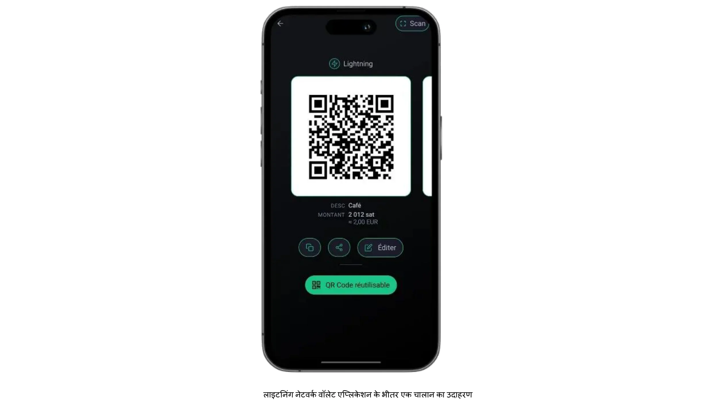

इस प्रोफाइल की खास बात यह है कि यह कम रकम वाले भुगतानों पर फोकस करती है, जो महीने में कुछ सौ यूरो या डॉलर से ज़्यादा नहीं होते। यह छोटा स्केल इसे Bitcoin के साथ मार्केट टेस्ट करने के लिए बेहतरीन विकल्प बनाता है, बिना बड़े पैमाने के डिप्लॉयमेंट की उलझनों के। साथ ही, यह तुरंत प्रैक्टिकल सीखने का मौका देता है; क्योंकि ऑपरेशनल प्रेशर कम होते हैं और पैसों का दांव छोटा होता है, गलतियों को सीमित रखा जा सकता है और सबक जल्दी सीखे जा सकते हैं। वीकेंड फेयर में हस्तनिर्मित सामान बेचने वाले कलाकारों से लेकर एक-बार के दान स्वीकार करने वाले गैर-लाभकारी समूहों तक, इस श्रेणी के यूज़र्स अक्सर एडवांस्ड फंक्शनलिटीज़ से ज़्यादा आसानी और यूज़र-फ्रेंडली होने पर ज़ोर देते हैं।

स्टार्टर प्रोफाइल के लिए Wallet के दो सबसे आम सेटअप में कस्टोडियल और नॉन-कस्टोडियल सॉल्यूशंस के बीच चुनाव करना शामिल है। एक कस्टोडियल Wallet (जैसे Satoshi का Wallet या ब्लिंक) किसी तीसरी पार्टी की सेवा को प्राइवेट कीज़ और बैकएंड ऑपरेशंस मैनेज करने देता है, जिससे यूज़र की तकनीकी ज़िम्मेदारियाँ कम हो जाती हैं। यह व्यवस्था उन लोगों के लिए खासकर आकर्षक है जो सुविधा को सबसे ऊपर रखते हैं और सबसे सरल ऑनबोर्डिंग चाहते हैं। वहीं, नॉन-कस्टोडियल लाइटनिंग वॉलेट्स (जैसे फीनिक्स या ब्रीज़) प्राइवेट कीज़ और पूरा कंट्रोल बिज़नेस ओनर के हाथ में देते हैं, जिससे Exchange में ज़्यादा स्वायत्तता और प्राइवेसी मिलती है, हालांकि इसमें शुरुआती मेहनत थोड़ी ज़्यादा लगती है। दोनों ही मामलों में, आधुनिक इंटरफेस आमतौर पर इतने यूज़र-फ्रेंडली होते हैं कि कोई भी ज़रूरी काम (QR कोड जनरेट करना, पेमेंट अमाउंट डालना, और ट्रांजैक्शन्स कन्फर्म करना) कुछ ही मिनटों में कर सकता है।

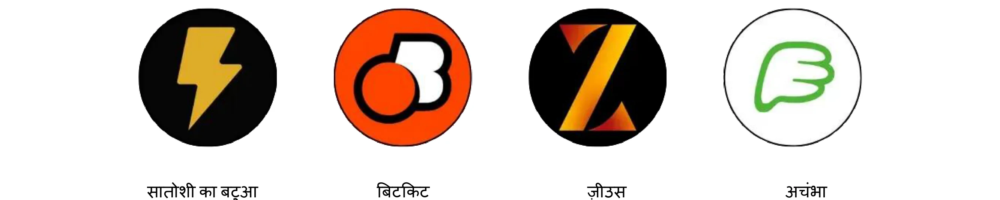

हालांकि छोटे लेन-देन में सुरक्षा की चिंता कम जरूरी लग सकती है, फिर भी बुनियादी सुरक्षा उपाय लागू करना बेहद जरूरी है। Bitcoin भुगतान प्राप्त करने के लिए इस्तेमाल किए जाने वाले एक स्मार्टफोन या टैबलेट को भी पासवर्ड या बायोमेट्रिक सुरक्षा से लॉक किया जाना चाहिए, और बैकअप प्रक्रियाओं (कस्टोडियल Wallet के लिए लॉगिन क्रेडेंशियल्स को ट्रैक करने से लेकर नॉन-कस्टोडियल seed के लिए फ्रेज को सुरक्षित रखने तक) को गंभीरता से लेना चाहिए। भौतिक रूप से लेन-देन संभालने वाले स्टाफ सदस्यों को मूल बातें जानने से फायदा होगा: ऐप कैसे खोलें, ग्राहक को QR कोड कैसे दिखाएं, और यह कैसे जांचें कि भुगतान वास्तव में आ गया है या नहीं।

स्टार्टर प्रोफाइल के तहत अकाउंटिंग और रिपोर्टिंग अपेक्षाकृत सरल है, फिर भी इस पर सावधानी से विचार करना ज़रूरी है। हालांकि लेन-देन की संख्या कम हो सकती है, लेकिन सटीक रिकॉर्ड रखने से भविष्य में भ्रम से बचा जा सकता है और वित्तीय ऑडिट या टैक्स फाइलिंग के मामले में पारदर्शिता बनाए रखने में मदद मिलती है। कई Wallet एप्लिकेशन उपयोगकर्ताओं को बेसिक ट्रांजैक्शन हिस्ट्री को CSV फाइल के रूप में एक्सपोर्ट करने की सुविधा देते हैं; एक छोटे उद्यम या एकल उद्यमी के लिए, इन फाइलों को नियमित रूप से सेव करने से अकाउंट्स को मैच करना काफी आसान हो जाता है।  

यह भी समझदारी है कि प्रत्येक लेन-देन के समय उसका अनुमानित फिएट वैल्यू (जैसे यूरो या डॉलर में) ट्रैक किया जाए। चूंकि Bitcoin की कीमत में उतार-चढ़ाव हो सकता है, इसलिए कन्वर्ज़न रेट्स का रिकॉर्ड रखना बुककीपिंग और टैक्स कंप्लायंस के लिए बेहद मूल्यवान होता है।

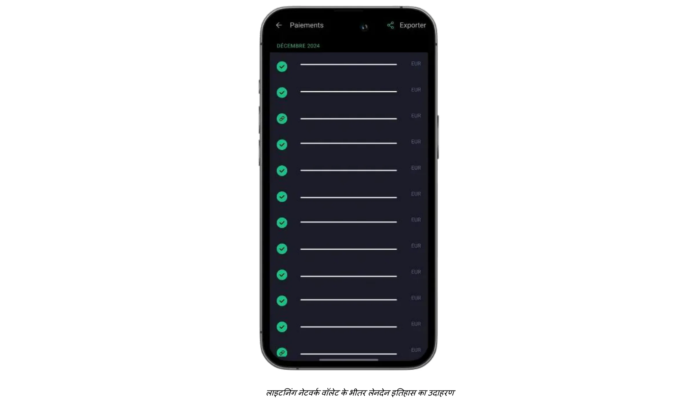

उन व्यवसायों के लिए जो अपने फिजिकल या इन-पर्सन पेमेंट्स को ऑनलाइन डोनेशन या टिप्स के साथ बढ़ाना चाहते हैं, अब वेबसाइट या ब्लॉग में लाइटनिंग टिप बटन या डोनेशन विजेट जोड़ना बेहद आसान हो गया है। प्लेटफॉर्म्स जैसे BTCPay Server आसानी से कॉन्फ़िगर होने वाले पेमेंट बटन ऑफर करते हैं, वहीं कुछ सोशल मीडिया और लाइवस्ट्रीम सर्विसेज पहले से ही लाइटनिंग टिप्स को एड्रेस के साथ सपोर्ट करती हैं। इस तरह, एक छोटा सा स्टार्टर एंटरप्राइज़ भी वैश्विक स्तर पर संरक्षकों (patrons) का नेटवर्क बना सकता है। वहीं, जो लोग Bitcoin को लॉन्ग-टर्म होल्ड नहीं करना चाहते, वे कुछ कस्टोडियल वॉलेट्स या थर्ड-पार्टी सर्विसेज का उपयोग करके इसे आंशिक या ऑटोमैटिक रूप से फिएट करेंसी में कन्वर्ट कर सकते हैं। हालांकि इस विकल्प में अतिरिक्त फीस और संभावित KYC (नो योर कस्टमर) जिम्मेदारियां शामिल हैं, लेकिन यह व्यवसायों को Exchange की कीमतों में उतार-चढ़ाव से बचाता है और उनके मौजूदा फाइनेंशियल वर्कफ्लो को न्यूनतम व्यवधान के साथ बनाए रखने में मदद करता है।

एक साधारण उदाहरण से समझते हैं कि ये सारे Elements कैसे काम करते हैं। सोचिए एक स्थानीय कारीगर जो शनिवार के किसान बाजार में घर की बनी जैम बेचता है। उसके पास एक फोन है जिसमें कस्टोडियल लाइटनिंग Wallet चल रहा है, वो हर जार की कीमत यूरो में सेट करता है; जब कोई ग्राहक Bitcoin में भुगतान करना चाहता है, तो व्यापारी जल्दी से उसकी फिएट करेंसी की रकम डालता है, और ऐप अपने आप Sats की गणना कर देता है। ग्राहक का Wallet इससे बने QR कोड को स्कैन करता है, भुगतान सेकंडों में हो जाता है, और कारीगर को तुरंत पता चल जाता है कि लेन-देन सफल हुआ। दिन के अंत में, सारे लेन-देन का ब्यौरा रिकॉर्ड रखने के लिए निकाला जा सकता है, और दिन भर की कमाई का पूरा या कुछ हिस्सा Exchange प्लेटफॉर्म पर भेजकर फिएट करेंसी में बदला जा सकता है।

स्टार्टर समाधान यूजर-फ्रेंडली टूल्स, कम से कम हार्डवेयर जरूरतें, और सीधे-साधे रिकॉर्डकीपिंग को संतुलित करके नए व्यवसायों को बिना अभिभूत किए बुनियादी सुविधाएं प्रदान करते हैं। अगर लेन-देन की मात्रा बढ़ती है और व्यवसाय की परिचालन आवश्यकताएं विकसित होती हैं, तो आगे के अध्याय में विस्तार से बताए गए अधिक उन्नत श्रेणियों में अपग्रेड करना एक स्वाभाविक प्रगति हो जाती है।

अनुशंसित वॉलेट्स और बेसिक सेटअप के डिटेल्ड ट्यूटोरियल्स के लिए, कृपया निम्नलिखित गाइड्स देखें:

**स्व-संरक्षित LN वॉलेट/नोड्स:**

https://planb.network/tutorials/wallet/mobile/phoenix-0f681345-abff-4bdc-819c-4ae800129cdf
https://planb.network/tutorials/wallet/mobile/bitkit-a7224674-85c4-4045-9baf-37018d89550c
https://planb.network/tutorials/wallet/mobile/breez-46a6867b-c74b-45e7-869c-10a4e0263c06
https://planb.network/tutorials/wallet/mobile/blixt-04b319cf-8cbe-4027-b26f-840571f2244f
https://planb.network/tutorials/wallet/mobile/zeus-embedded-advanced-3e89603c-501d-439c-8691-d4a0d0de459b
**हिरासत वाले LN वॉलेट्स:**

https://planb.network/tutorials/wallet/mobile/wallet-of-satoshi-39149d86-e42b-4e8f-ae9f-7e061e7784f7
https://planb.network/tutorials/wallet/mobile/blink-7ea5f5a4-e728-4ff9-b3f9-cf20aa6fc2bd
## ज़रूरी

<chapterId>89be421f-f7df-4bcc-a9e4-df96e39ef249</chapterId>

एसेंशियल प्रोफाइल छोटे और मध्यम आकार के व्यवसायों के लिए उपयुक्त है, जिनमें कर्मचारी हो सकते हैं, और जो बिना उन्नत तकनीकी ज्ञान के आसानी और जल्दी से Bitcoin स्वीकार करना चाहते हैं, जबकि एक साधारण Wallet से अधिक पूर्ण और पेशेवर सिस्टम चाहते हैं। यह श्रेणी अक्सर रेस्तरां, कैफे, बार, या छोटे रिटेल दुकानों पर लागू होती है जो हर महीने केवल कुछ ही Bitcoin भुगतान प्राप्त करते हैं, लेकिन एक Interface चाहते हैं जो सीधा और मजबूत हो ताकि दैनिक कार्यों को बिना रुकावट के संभाल सके।

स्टार्टर प्रोफाइल के विपरीत, एसेंशियल बिज़नेस आमतौर पर Bitcoin भुगतानों को एक प्रयोग की बजाय अपनी आय का नियमित हिस्सा मानते हैं। हालांकि उनका लेन-देन का स्तर अभी भी कम होता है, लेकिन इतनी बारिशिकता ज़रूर होती है कि मालिकों और कर्मचारियों को एक संरचित और भरोसेमंद सिस्टम का फायदा मिलता है। साथ ही, एसेंशियल प्रोफाइल सादगी पर ही केंद्रित रहता है; इसमें हेंडी डैशबोर्ड और सीमित भूमिका प्रबंधन की सुविधा तो होती है, लेकिन विशेष आईटी संसाधनों या जटिल इंटीग्रेशन की ज़रूरत नहीं होती।

इस सेगमेंट में टेक्नोलॉजी की सिफारिशें अक्सर **Swiss Bitcoin Pay** पर केंद्रित होती हैं, जो व्यापारियों के लिए Bitcoin भुगतान स्वीकार करने का एक सरल समाधान है। इसमें एक यूजर-फ्रेंडली PoS ऐप शामिल है, जिसके लिए कर्मचारियों को कोई तकनीकी ज्ञान की आवश्यकता नहीं होती। सामान्य Bitcoin वॉलेट्स के विपरीत, यह सिर्फ भुगतान प्राप्त करने पर केंद्रित है, जिससे कर्मचारी बिना किसी सुरक्षा जोखिम के डिवाइस का उपयोग कर सकते हैं। एक ही अकाउंट से कई PoS ऐप्स जुड़ सकते हैं, जो टैबलेट, रजिस्टर, स्मार्टफोन या कंप्यूटर के लिए वेब वर्जन पर इस्तेमाल किए जा सकते हैं, और यह Android और iOS को सपोर्ट करता है। आप अपने बेचे जाने वाले आइटम्स और उनकी कीमतों के साथ एक मेनू भी बना सकते हैं, जिससे कर्मचारी PoS पर ग्राहक के लिए आइटम्स की बस्केट सिलेक्ट करके टोटल चार्ज कर सकते हैं।

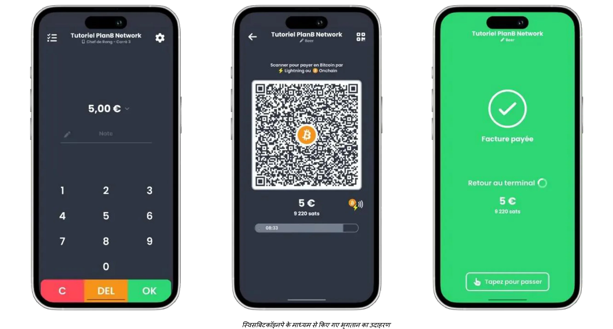

भुगतान या तो Bitcoin से किसी विशिष्ट Address में निकाले जा सकते हैं या फिर फिएट करेंसी में बदलकर रोज़ाना बैंक खाते में जमा किए जा सकते हैं। स्विस Bitcoin Pay इस प्रक्रिया को स्वचालित करता है, जिसमें Bitcoin और Lightning Network भुगतान बिना किसी मैन्युअल हस्तक्षेप के संभाले जाते हैं। ट्रांसफर से पहले फंड अधिकतम 24 घंटे तक रोके जाते हैं। हालांकि यह BTCPay Server की तरह पूरी तरह से नॉन-कस्टोडियल नहीं है, लेकिन यह सुविधा और सुरक्षा के बीच संतुलन बनाता है, और इसमें KYC की आवश्यकता नहीं होती।

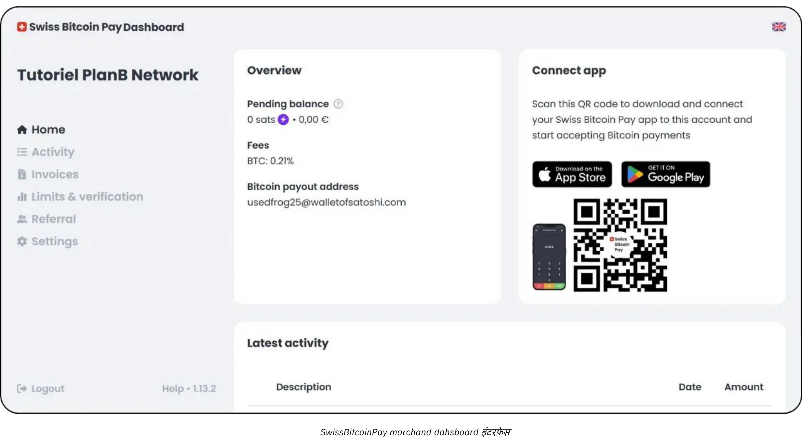

फीस प्रतिस्पर्धी हैं: पहले साल के लिए 0.21%, फिर Bitcoin भुगतानों के लिए 1% और फिएट कन्वर्जन भुगतानों के लिए 1.5%, जिसमें Bitcoin लेनदेन लागत भी शामिल है। स्विस Bitcoin पे, ओपन नोड जैसे कस्टोडियल समाधान और BTCPay सर्वर जैसे जटिल सेल्फ-होस्टेड सिस्टम के बीच एक व्यावहारिक मध्यम मार्ग प्रदान करता है, जो सरलता, सुरक्षा और वित्तीय स्वायत्तता को प्राथमिकता देता है।

इस तरह का सेटअप ऑफलाइन व्यवसायों को generate भुगतान इनवॉइस जल्दी बनाने, ग्राहकों को QR कोड दिखाने और Lightning या On-Chain लेनदेन आसानी से स्वीकार करने में सक्षम बनाता है। स्टाफ को इन भुगतानों को संभालने के लिए बस थोड़ी सी ट्रेनिंग की जरूरत होती है, जबकि मैनेजर ऑनलाइन डैशबोर्ड में लॉग इन करके दैनिक बिक्री का हिसाब लगा सकते हैं और बेसिक रिपोर्ट्स एक्सेस कर सकते हैं। सरल एडमिन कंसोल की उपलब्धता छोटे व्यवसायों को एक ही Interface से फिएट और क्रिप्टो दोनों राजस्व ट्रैक करने में मदद करती है, जिससे कन्फ्यूजन कम होता है और मैन्युअल बुककीपिंग में लगने वाला समय घटता है।

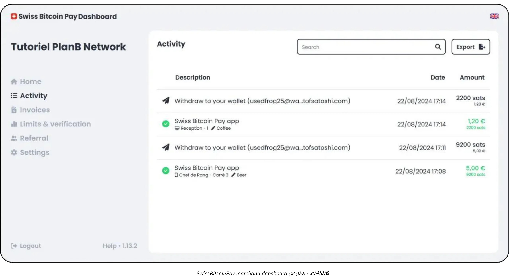

एसेंशियल तरीके का एक और बड़ा फायदा है तेजी से डिप्लॉयमेंट और कम से कम रुकावट पर जोर देना। जैसे कि स्विस Bitcoin पे जैसे सॉल्यूशन्स को दिनों या हफ्तों की जगह कुछ घंटों में सेट अप किया जा सकता है। उदाहरण के लिए, एक मामूली भीड़ वाले रेस्टोरेंट के मालिक या मैनेजर के लिए, Bitcoin को बिना चेकआउट काउंटर पर देरी या स्टाफ में कन्फ्यूजन पैदा किए एकीकृत करना ही अंतिम लक्ष्य होता है। एक बार पीओएस कॉन्फिगर हो जाने पर, मैनेजर बस कर्मचारियों को Invoice दिखाने और पेमेंट क्लीयर होने की पुष्टि करने के लिए जल्दी से निर्देश दे सकता है। बेस्ट केस सिनेरियो में, Lightning Network के जरिए कस्टमर का ट्रांजैक्शन लगभग तुरंत कन्फर्म हो जाता है, और बिजनेस का एडमिनिस्ट्रेटिव पैनल रियल टाइम में एक नया पेमेंट रजिस्टर कर देता है।

हालांकि एसेंशियल प्रोफाइल को बहुत उन्नत अकाउंटिंग सिस्टम की जरूरत नहीं होती, फिर भी सही लेन-देन रिकॉर्ड रखना समझदारी है। स्विस Bitcoin पे जैसे टूल्स में CSV एक्सपोर्ट फंक्शन होते हैं, जिससे मैनेजर्स हर Bitcoin सेल का फिएट-इक्विवैलेंट वैल्यू कैप्चर कर सकते हैं और दूसरे इनकम सोर्सेज के साथ ट्रैक कर सकते हैं। यह डॉक्युमेंटेशन लेवल ज्यादातर छोटे बिजनेस के लिए काफी है, और Exchange रेट्स की बेसिक समझ टैक्स फाइलिंग और जनरल फाइनेंशियल ओवरसाइट में मदद करेगी।

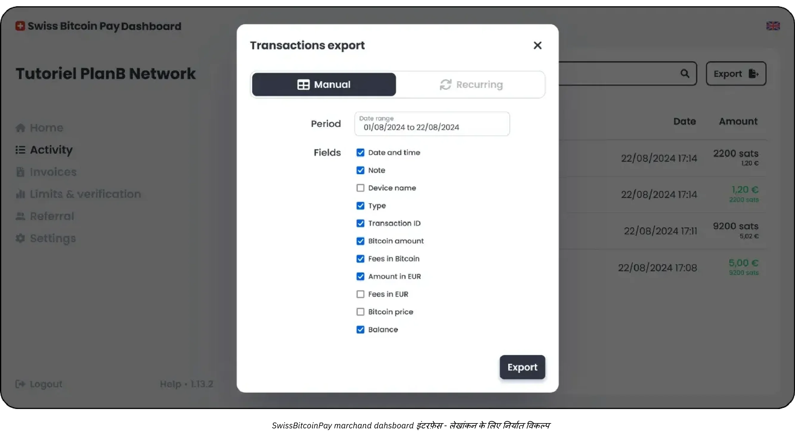

आपके प्रोफाइल के लिए सबसे उपयुक्त हाइब्रिड समाधान संभवतः स्विस Bitcoin पे है:

https://planb.network/tutorials/business/point-of-sale/swiss-bitcoin-pay-2-a78b057e-ed11-47ac-860c-71019fcb451a
एक और आसानी से लागू करने वाला समाधान, लेकिन जिसमें 100% कस्टोडियल होने की कमी है, वह है ओपन नोड:

https://planb.network/tutorials/business/point-of-sale/open-node-e69a0c1c-47f7-4932-8494-e6f26c3c9784
अगर आप हाथ गंदे करने के लिए तैयार हैं और प्रक्रिया पर पूरा नियंत्रण चाहते हैं, तो BTCPay Server सॉफ्टवेयर एक बेहतरीन विकल्प है। हालांकि, BTCPay Server का सबसे बड़ा नुकसान यह है कि इसकी सेटअप और प्रबंधन प्रक्रिया समय लेने वाली है और इसमें तकनीकी विशेषज्ञता की जरूरत होती है, लेकिन आप हमारे गाइड्स को फॉलो कर सकते हैं:

https://planb.network/tutorials/business/point-of-sale/btcpay-server-928eb01e-824b-4b57-a3e8-8727633beddc
आखिरकार, भौतिक बिक्री बिंदुओं के लिए एक पूरक के रूप में, आप [एक बिटकॉइनाइज़ पीओएस](https://bitcoinize.com/) सेट अप करने पर विचार कर सकते हैं।

## प्रोफेशनल

<chapterId>4d5dfa50-c4d0-481c-ab95-1863a898750e</chapterId>

पेशेवर प्रोफाइल उन व्यवसायों के लिए है जो कभी-कभार या कम मात्रा वाले Bitcoin भुगतानों से आगे बढ़ चुके हैं और अब एक मजबूत बुनियादी ढांचे की तलाश में हैं जो दैनिक कई लेन-देन संभाल सके। ये कंपनियां अक्सर कई चैनलों पर काम करती हैं (शायद एक रिटेल स्थान, एक समर्पित ई-कॉमर्स वेबसाइट, और यहां तक कि मोबाइल बिक्री भी) और इसलिए उन्हें भुगतान समाधानों की आवश्यकता होती है जो उनके मौजूदा वर्कफ़्लो में सहजता से एकीकृत हो सकें। कई मामलों में, इस स्तर के उद्यम पहले से ही पॉइंट-ऑफ-सेल सिस्टम, ऑनलाइन ऑर्डर प्रबंधन प्लेटफॉर्म और बैक-ऑफिस संचालन प्रबंधित करते हैं जिनके लिए एक विश्वसनीय, स्केलेबल दृष्टिकोण की आवश्यकता होती है।

पेशेवर व्यापारी की एक खास पहचान है **एडवांस्ड फीचर्स** और **कस्टमाइज़ेबल सॉल्यूशंस** की ज़रूरत, जो ट्रांजैक्शन की मात्रा बढ़ने पर भी कार्यक्षमता बनाए रखें। एसेंशियल यूज़र्स के विपरीत, जो सिर्फ एक स्मार्टफोन ऐप पर चलने वाले सरल टूल से संतुष्ट हो सकते हैं, वहीं पेशेवर बिज़नेस को अक्सर Invoice की डिटेल्ड कस्टमाइज़ेशन, सोफिस्टिकेटेड रिपोर्टिंग डैशबोर्ड और मल्टीपल एडमिनिस्ट्रेटिव रोल्स असाइन करने जैसी सुविधाएँ चाहिए होती हैं।

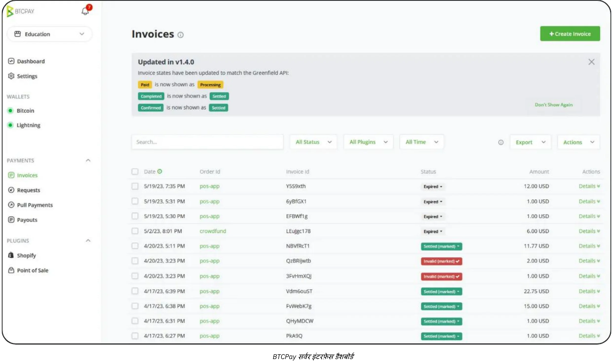

उदाहरण के लिए, एक रेस्टोरेंट ग्रुप में इनवॉइसिंग और स्टॉक मैनेजमेंट के लिए अलग स्टाफ हो सकता है, जबकि प्रोडक्ट लिस्टिंग और मार्केटिंग कैंपेन पर एक अलग टीम नज़र रखती है। ऐसे माहौल में, Bitcoin पेमेंट सॉल्यूशन को इन पहले से मौजूद संगठनात्मक ढाँचों के साथ बिल्कुल फिट बैठना चाहिए।

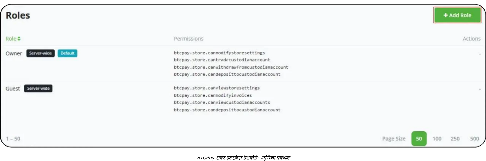

टेक्नोलॉजी और टूल्स की बात करें तो, **BTC पे सर्वर** जैसे सॉल्यूशन्स अक्सर एक प्रोफेशनल सेटअप का मुख्य हिस्सा होते हैं। BTC पे सर्वर एक ओपन-सोर्स प्लेटफॉर्म है जिसे आप ऑन-प्रिमाइसेस या क्लाउड होस्टिंग के जरिए डिप्लॉय कर सकते हैं और यह वेबसाइट्स और ई-कॉमर्स प्लेटफॉर्म्स के लिए कई इंटीग्रेशन ऑप्शन्स ऑफर करता है। अपना खुद का इंस्टेंस चलाकर, बिज़नेसेस पेमेंट फ्लो के हर पहलू पर पूरा कंट्रोल रख सकते हैं - ऑटोमैटिक जेनरेट की गई चेकआउट पेजेस से लेकर उन नोटिफिकेशन्स तक जो पेमेंट कन्फर्म होने पर इंटरनल प्रोसेसेस को ट्रिगर करते हैं।

इसके अलावा, [Zaprite](https://zaprite.com/) या [Musqet](https://musqet.tech/) जैसे टूल चेकआउट अनुभव को और बेहतर बना सकते हैं, जिससे ब्रांडिंग विकल्पों से लेकर उन्नत रिपोर्टिंग क्षमताओं तक अधिक विस्तृत कस्टमाइज़ेशन संभव होता है। जो लोग एक ऑल-इन-वन ऑनलाइन रिटेल वातावरण पसंद करते हैं, वे [Be-BOP](https://be-bop.io/) की ओर आकर्षित हो सकते हैं, जो एक ई-स्टोर समाधान है जो Bitcoin भुगतानों को सुविधाजनक बनाने के लिए बनाया गया है, बिना उपयोग में आसानी से समझौता किए।

इन टेक्नोलॉजी को प्रोफेशनल सेटिंग में लागू करने का मतलब है **ऑपरेशनल कॉम्प्लेक्सिटी** पर खास ध्यान देना। ऑटोमेटेड इनवॉइसिंग वर्कफ्लो, मल्टी-करेंसी डिस्प्ले, और मौजूदा इन्वेंटरी सिस्टम के साथ सिंक्रोनाइज़ेशन - ये सभी एक अच्छी तरह से इंटीग्रेटेड प्लेटफॉर्म की पहचान हैं। ट्रांजैक्शन डेटा को सटीकता से एक्सपोर्ट करने की क्षमता (चाहे वो CSV फाइल्स के रूप में हो, डायरेक्ट API कॉल्स, या कस्टमाइज़्ड फॉर्मेट) बिज़नेसेस को Bitcoin सेल्स को दूसरे रेवेन्यू स्ट्रीम्स के साथ आसानी से मैच करने में मदद करती है।

सुरक्षा और भूमिका प्रबंधन पेशेवर उपयोगकर्ताओं के लिए एक और महत्वपूर्ण विचार है। जैसे-जैसे दैनिक Bitcoin लेनदेन जमा होते हैं, प्रशासनिक कार्यों तक पहुंच को नियंत्रित करना जोखिम कम करने का एक आवश्यक उपाय बन जाता है। कई समाधानों में, प्रशासक विभिन्न स्तर की अनुमतियां दे सकते हैं (जैसे कुछ कर्मचारियों को केवल लेनदेन इतिहास देखने और चालान बनाने की अनुमति देना, जबकि दूसरों को इन्वेंट्री प्रबंधित करने या सिस्टम-व्यापी सेटिंग्स कॉन्फ़िगर करने का अधिकार देना...)। यह पदानुक्रमित संरचना न केवल संवेदनशील डेटा की सुरक्षा करती है, बल्कि यह भी स्पष्ट करके संचालन को सुगम बनाती है कि भुगतान बुनियादी ढांचे के प्रत्येक हिस्से की जिम्मेदारी किस स्टाफ सदस्य पर है।

असली दुनिया के उदाहरणों की बात करें, तो एक मध्यम आकार के ई-कॉमर्स स्टोर पर विचार करें जो टेक्नोलॉजी एक्सेसरीज़ में माहिर है। कंपनी अपने मौजूदा ऑनलाइन स्टोरफ्रंट में BTC पे सर्वर को इंटीग्रेट कर सकती है, जो चेकआउट के दौरान Bitcoin पेमेंट एड्रेस ऑटोमैटिक जनरेट करेगा। ग्राहक Lightning या On-Chain Address स्कैन करके अपनी खरीदारी पूरी करते हैं, और स्टोर का प्लेटफॉर्म तुरंत पेमेंट कन्फर्म कर देता है। साथ ही, एक इंटरनल सिस्टम ऑर्डर स्टेटस अपडेट करता है और शिपिंग नोटिफिकेशन ट्रिगर करता है। एडवांस्ड रिपोर्टिंग फीचर्स की वजह से, फाइनेंस टीम आसानी से दैनिक Bitcoin सेल्स की समीक्षा कर सकती है, ऑडिटिंग के लिए कंसोलिडेटेड Ledger एक्सपोर्ट कर सकती है, और कंपनी द्वारा रखे गए किसी भी BTC होल्डिंग्स के वैल्यू को ट्रैक कर सकती है।

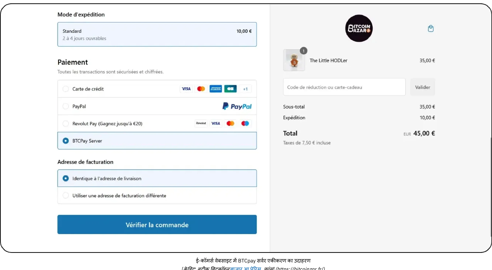

*[क्रेडिट: Bitcoin बाज़ार की दुकान, पेरिस, फ्रांस।](https://bitcoinbazar.fr/)*

BTC Pay Server के इम्प्लीमेंटेशन डिटेल्स को गहराई से समझने और प्रैक्टिकल कॉन्फ़िगरेशन सीखने के लिए निम्नलिखित कोर्स देखें:

https://planb.network/courses/6fc12131-e464-4515-9d3f-9255365d5fa1
## एंटरप्राइज़

<chapterId>80fb2659-81ca-4a11-b492-72c7ae5774f9</chapterId>

एंटरप्राइज़ प्रोफाइल Bitcoin पेमेंट इम्प्लीमेंटेशन के सबसे ऊपर है, जो खासतौर पर बड़े कॉर्पोरेट्स, मुख्य मार्केटप्लेस और स्थापित बिज़नेसेज़ के लिए बनाया गया है जिन्हें पूरी तरह कस्टमाइज़्ड सॉल्यूशन्स चाहिए। छोटे या मिड-लेवल डिप्लॉयमेंट्स से अलग, एंटरप्राइज़-लेवल ऑपरेशन्स Bitcoin पेमेंट्स को काम के विभिन्न तरीकों और सिस्टम्स के साथ जोड़ते हैं - जैसे कि ऑन-साइट पॉइंट-ऑफ-सेल डिवाइसेज़, ई-कॉमर्स स्टोरफ्रंट्स, बैक-ऑफिस अकाउंटिंग प्लेटफॉर्म्स, और एडवांस्ड ERP फ्रेमवर्क्स।

इस स्तर पर, मुख्य लक्ष्य सिर्फ Bitcoin को स्वीकार करना नहीं है, बल्कि इसे **संगठन के मूल प्रक्रियाओं के साथ पूरी तरह से जोड़कर** करना है। इस जुड़ाव के लिए विशेष सॉफ्टवेयर डेवलपमेंट की जरूरत पड़ सकती है, चाहे वह पूरी तरह कस्टम-बिल्ट सॉल्यूशन हो या फिर तीसरे पक्ष के *लाइटनिंग सर्विस प्रोवाइडर्स* (LSPs) द्वारा समर्थित SaaS-आधारित इंफ्रास्ट्रक्चर के जरिए ऑर्केस्ट्रेट किया गया हो। ऐसे LSPs हाई ट्रांजैक्शन वॉल्यूम और कॉम्प्लेक्स नेटवर्क कॉन्फिगरेशन को हैंडल कर सकते हैं, जो पारंपरिक रेडीमेड टूल्स की क्षमता से बाहर होते हैं। इस तरह, परिणामी आर्किटेक्चर में API-ड्रिवेन इंटीग्रेशन से लेकर एडवांस्ड ट्रेजरी मैनेजमेंट क्षमताओं तक तकनीकी और बिजनेस के कई पहलू शामिल होते हैं।

एंटरप्राइज़ के संदर्भ में, ऑपरेशनल कॉम्प्लेक्सिटी खास तौर पर ज़्यादा हो जाती है। एक बड़ी कंपनी को कई डिपार्टमेंट्स (सेल्स, मार्केटिंग, डेवॉप्स, फाइनेंस, और अकाउंटिंग) को मैनेज करना पड़ सकता है, जहाँ हर एक की अलग ज़िम्मेदारियाँ और डेटा की ज़रूरतें होती हैं। ऐसे में, Bitcoin पेमेंट प्लेटफॉर्म को बेहद डिटेल्ड रोल मैनेजमेंट ऑफर करना चाहिए, ताकि हर डिपार्टमेंट सिर्फ उन्हीं फंक्शन्स तक पहुँच सके जो उनके काम से जुड़े हों, और साथ ही सिक्योरिटी और डेटा इंटिग्रिटी पर सख्त कंट्रोल बना रहे। उतना ही ज़रूरी है वर्कफ्लो को कस्टमाइज़ करने की क्षमता: मिसाल के तौर पर, इनबाउंड पेमेंट्स से इन्वेंटरी सिस्टम में अपडेट हो सकते हैं, सेल्स मैनेजर्स को ऑटोमेटेड नोटिफिकेशन भेजे जा सकते हैं, और फाइनेंस टीम के लिए Ledger एंट्रीज़ रियल टाइम में अपडेट हो सकती हैं। पॉइंट-ऑफ-सेल डिवाइसेज़ भी अक्सर एंटरप्राइज़ एनवायरनमेंट के हिसाब से कस्टमाइज़ होते हैं, जिनमें कंपनी की ब्रांडिंग और ऑपरेशनल ज़रूरतों के मुताबिक सॉफ्टवेयर इंटरफेस होते हैं।

**सुरक्षा** बड़े पैमाने के व्यवसायों के लिए सबसे ज़रूरी है। बड़ी मात्रा में लेन-देन और संभावित रूप से बड़ी रकम Bitcoin के लिए एक मज़बूत ढांचे की ज़रूरत होती है जो दुर्भावनापूर्ण हमलों या अंदरूनी खतरों से बचा सके। सबसे अच्छे तरीकों में अक्सर मल्टी-सिग्नेचर वाली टाइमलॉक ट्रेजरी सेटअप, अच्छी तरह ऑडिट की गई कोडबेस, और संबंधित नियामक ढांचे का सख्ती से पालन शामिल होता है। इसके अलावा, स्थानीय और अंतरराष्ट्रीय वित्तीय नियमों का पालन कंपनी की प्रतिष्ठा और काम करने के लाइसेंस को बनाए रखने के लिए अहम हो सकता है।

**कस्टम डेवलपमेंट** जो एक एंटरप्राइज़-ग्रेड Bitcoin पेमेंट सॉल्यूशन बनाने या इंटीग्रेट करने में शामिल होता है, वो सिर्फ कुछ एप्लिकेशन फीचर्स कोड करने से कहीं आगे की चीज़ है। इसमें आमतौर पर आर्किटेक्चरल डिज़ाइन, पूरी तरह से टेस्टिंग प्रोटोकॉल, और एक स्ट्रक्चर्ड रोल-आउट की ज़रूरत होती है जो कई चरणों में फैला हो सकता है (शुरुआती पायलट प्रोग्राम, लिमिटेड मार्केट टेस्ट, और आखिरकार ग्लोबल डिप्लॉयमेंट)।

लेखांकन के मामले में, हाई-फ्रीक्वेंसी लेनदेन को **पूरी तरह से कस्टमाइज्ड एक्सपोर्ट्स** की जरूरत होती है और कभी-कभी कॉर्पोरेट फाइनेंस सॉफ्टवेयर के साथ रियल-टाइम सिंक्रोनाइजेशन की भी। बड़े व्यवसाय एंटरप्राइज रिसोर्स प्लानिंग (ERP) सॉल्यूशंस जैसे SAP या Oracle पर निर्भर कर सकते हैं, जिन्हें Interface पेमेंट डेटा के साथ सीधे Bitcoin इंटीग्रेट होना चाहिए। इसे सुगम बनाने के लिए, चुने गए प्लेटफॉर्म के API परिष्कृत और लचीले होने चाहिए, ताकि IT टीम्स कस्टम रिपोर्टिंग डैशबोर्ड बना सकें, ऑटोमेटेड रिकॉन्सिलिएशन प्रक्रियाएं लागू कर सकें, और generate डेली या हर घंटे की फाइनेंशियल समरी तैयार कर सकें।

एक आम एंटरप्राइज़ परिदृश्य में एक बड़ा ई-कॉमर्स मार्केटप्लेस शामिल हो सकता है जो हर दिन हजारों लेन-देन को संभालता है। Bitcoin को सिर्फ एक भुगतान विकल्प के रूप में सूचीबद्ध करने के बजाय, यह मार्केटप्लेस यूजर अनुभव के हर पहलू को अनुकूलित कर सकता है - चाहे वह Bitcoin भुगतान प्रक्रिया कस्टमर-फेसिंग वेबसाइट पर कैसे दिखती हो, या फिर बैकएंड पर रिफंड्स, चार्जबैक्स या विवाद निपटान कैसे प्रबंधित किए जाते हों। एक समर्पित डेवऑप्स टीम, वित्त और कानूनी विभागों के साथ मिलकर, निरंतर रखरखाव, सुरक्षा पैच और अनुपालन अपडेट्स की देखरेख करेगी। अगर कंपनी अपनी Bitcoin आय का एक हिस्सा रखने का फैसला करती है, तो एक आंतरिक ट्रेजरी सिस्टम कंपनी के Bitcoin होल्डिंग्स को पारंपरिक मुद्रा भंडार के साथ ट्रैक करेगा।

एंटरप्राइज़ लेवल पर स्मूथ और सिक्योर डिप्लॉयमेंट सुनिश्चित करने के लिए, ज़्यादातर संगठन विशेषज्ञ सर्विस प्रोवाइडर्स या इन-हाउस डेवलपमेंट टीम्स को हायर करते हैं जिन्हें Bitcoin और Lightning Network इंटीग्रेशन का अनुभव होता है। प्रक्रिया आमतौर पर एक डिटेल्ड नीड्स असेसमेंट (जिसमें टेक्निकल इंफ्रास्ट्रक्चर, कंप्लायंस रिक्वायरमेंट्स और कस्टमर जर्नी शामिल होती है) से शुरू होती है, फिर एक आर्किटेक्चर डिज़ाइन किया जाता है जो हाई-वॉल्यूम थ्रूपुट हैंडल कर सके।  

प्रोजेक्ट स्कोप के आधार पर, आप एक मल्टी-डिसिप्लिनरी टीम पर निर्भर कर सकते हैं जिसमें फाइनेंशियल कंट्रोलर्स, सिक्योरिटी एनालिस्ट्स और सॉफ्टवेयर इंजीनियर्स शामिल हों। वैकल्पिक रूप से, कई स्पेशलाइज्ड कंसल्टिंग फर्म्स आपको इनिशियल कंसेप्टुअलाइजेशन से लेकर फाइनल रोल-आउट तक गाइड कर सकती हैं, और SaaS-होस्टेड सॉल्यूशंस का मूल्यांकन, *लाइटनिंग सर्विस प्रोवाइडर्स* को कॉन्फ़िगर करने और फ्रंट-एंड इंटरफेस को कस्टमाइज़ करने जैसे टास्क्स में मदद कर सकती हैं।  

डोमेन एक्सपर्ट्स के साथ पार्टनरशिप करके, एंटरप्राइज़ेज़ बड़े पैमाने पर पेमेंट इम्प्लीमेंटेशन से जुड़े रिस्क्स को कम कर सकते हैं और एक ऐसा सॉल्यूशन हासिल कर सकते हैं जो न सिर्फ़ रोबस्ट और कंप्लायंट हो, बल्कि फ्यूचर ग्रोथ के लिए फ्लेक्सिबल भी हो।

## जीडब्ल्यू-305 भुगतान समाधान: विकल्प और रुझान

<chapterId>59ff43a1-98e2-4a81-af3e-9654bdd60952</chapterId>

हर एक समाधान के श्रेणी के अपने फायदे और नुकसान होते हैं। उदाहरण के लिए, शुरुआती "ट्रायल फेज़" में, सुझाए गए वॉलेट्स को यूज़र Interface के लिए जितना हो सके सरल बनाया गया है, लेकिन वे होस्टेड (**कस्टोडियल**) होते हैं। इसका मतलब है कि फंड्स ऐप प्रोवाइडर के कंट्रोल में होते हैं। हालाँकि, Bitcoin की भावना यूज़र द्वारा फंड्स के पूर्ण Ownership (**सेल्फ-कस्टोडियल**) की तरफ बढ़ने को प्रोत्साहित करती है। इस मामले में, जैसे ही पहली सेल्स हो जाती हैं—यानी जब यह पुष्टि हो जाती है कि आपके पास Bitcoin में भुगतान करने को तैयार ग्राहक हैं—तो अगली श्रेणी में अपग्रेड करने की सलाह दी जाती है।

Bitcoin का एक प्रमुख फायदा यह है कि इसमें आप फंड्स को मर्जी से मूव कर सकते हैं, जिससे **प्रोवाइडर्स या सॉल्यूशन के कॉम्पोनेंट्स बदलना बेहद आसान** हो जाता है। इसके अलावा, सभी ऐप्स और सॉल्यूशन्स भी तेजी से विकसित हो रहे हैं। उदाहरण के लिए, Bitcoinize को ही लें, जो अब मार्केट में मौजूद कई ऐप्लिकेशन्स के साथ इंटीग्रेट होने वाला एक फिजिकल पॉइंट ऑफ सेल (POS) टर्मिनल प्रदान करता है - यह सॉल्यूशन कुछ महीने पहले तक मौजूद ही नहीं था।

### क्या आप एक स्टोर बनाने और पारंपरिक तथा Bitcoin दोनों भुगतान स्वीकार करने का समाधान ढूंढ रहे हैं?

अगर आप शुरुआत कर रहे हैं—कोई दुकान नहीं, कोई प्रोडक्ट मैनेजमेंट सॉफ्टवेयर नहीं, और कोई पॉइंट-ऑफ-सेल (POS) सिस्टम नहीं—तो आपके पास कुछ विकल्प हैं:

- **आउटसोर्सिंग:** आप शॉपिंग विकल्पों वाली वेबसाइट बनाने का काम आउटसोर्स कर सकते हैं और फिर पारंपरिक इन-स्टोर समाधानों के साथ-साथ Bitcoin पेमेंट सुविधाएँ भी जोड़ सकते हैं।
- **सरल समाधान:** वैकल्पिक रूप से, आप इसे खुद करने के लिए Accessing.app जैसे प्लेटफॉर्म का उपयोग कर सकते हैं। मुख्य लाभों में शामिल हैं:
    - जल्दी और सस्ते में ऑनलाइन या फिजिकल स्टोर सेट करना।
    - मौसमी व्यवसायों, इवेंट्स, रेस्तरां, या रिटेल दुकानों के लिए उपयुक्त।
    - फिजिकल और ऑनलाइन दोनों तरह की बिक्री के लिए प्रोडक्ट्स को डिफाइन और मैनेज करना।
    - अपने खुद के स्ट्राइप अकाउंट के जरिए फिएट पेमेंट प्रोसेसिंग (जैसे यूरो, डॉलर)।
    - जीडब्ल्यू-312 भुगतान प्रोसेसिंग आपके खुद के स्विसबिटकॉइनपे खाते के जरिए।

### "लाइटनिंग पेमेंट अपनाने की प्रगति कैसी चल रही है?"

Lightning Network बेहतर कार्यक्षमता और कम फीस देता है, लेकिन अभी इसका इस्तेमाल शुरुआती दौर में ही है। मौजूदा सीमाओं पर ध्यान देने के बजाय, यह याद रखना ज़रूरी है कि ऐतिहासिक बुनियादी ढांचे के बदलाव कैसे हुए थे:

- जब पहली बार गाड़ियाँ आईं, तब इतनी गाड़ियाँ नहीं थीं कि सड़कें बनाना सही लगे, और न ही इतनी सड़कें थीं कि गाड़ी खरीदना सही लगे।
- जब बिजली शुरू की गई थी, तब ग्रिड बनाने के लिए पर्याप्त ग्राहक नहीं थे, और न ही ग्राहकों को आकर्षित करने के लिए पर्याप्त ग्रिड थे।

नई इंफ्रास्ट्रक्चर सफल होती है क्योंकि वह ज्यादा कारगर होती है, और शुरुआती अपनाने वाले इसमें शामिल होते हैं क्योंकि उन्हें ठोस फायदे मिलते हैं। 2024 में Lightning Network के बारे में यहां कुछ निरीक्षण दिए गए हैं:

- **अल्ट्रा-फास्ट ट्रांजैक्शन्स:** ट्रांजैक्शन्स अक्सर लगभग तुरंत होते हैं (<500ms) और इनमें फेल होने की दर बेहद कम होती है।
- **नेटवर्क पेशेवरकरण:** बड़े खिलाड़ी नेटवर्क भर में लिक्विडिटी सुनिश्चित कर रहे हैं, जबकि व्यक्तियों ने ज्यादातर भुगतान रूट करना बंद कर दिया है और अब मुख्य रूप से "एज नोड्स" चलाते हैं।
- **उपयोगकर्ता अनुभव में सुधार:** व्यक्तिगत उपयोगकर्ताओं के लिए मोबाइल ऐप्स में काफी सुधार हुआ है। स्प्लिसिंग, स्थिर Bolt12 इनवॉइस, और जीरो-कन्फर्मेशन पेमेंट्स (0-conf) जैसी सुविधाएं अब आसानी से उपलब्ध हैं, जिससे इंटरैक्शन बेहद सहज हो गया है। इंटरऑपरेबिलिटी की समस्याएं (जैसे फोर्स-क्लोज) अब बड़ी चिंता का विषय नहीं रह गई हैं।
- **नोड और चैनल प्रबंधन में सुधार:** व्यक्तिगत और पेशेवर दोनों समाधानों में प्रगति हुई है। उदाहरण के लिए, BTC पे सर्वर अब अन्य प्रदाताओं (PSPs, ऑन/ऑफ रैम्प्स, आदि) से जुड़ने के लिए कई प्लगइन्स का समर्थन करता है। नए इंफ्रास्ट्रक्चर प्रदाता, जैसे कि LightSpark और Alby Hub, भी उत्पादन में शामिल हो रहे हैं।
- **व्यापारी अपनाने में वृद्धि:** BitRefill जैसे व्यापारियों के सक्रिय उपयोगकर्ताओं में Bitcoin भुगतानों में वृद्धि देखी जा रही है, जहाँ स्पष्ट रूप से Lightning की तुलना में Bitcoin को प्राथमिकता दी जा रही है। साथ ही, Lightning के अत्यंत कम शुल्क (औसतन €32 प्रति लेन-देन) के कारण छोटे भुगतानों के लिए यह पसंदीदा विकल्प बना हुआ है।

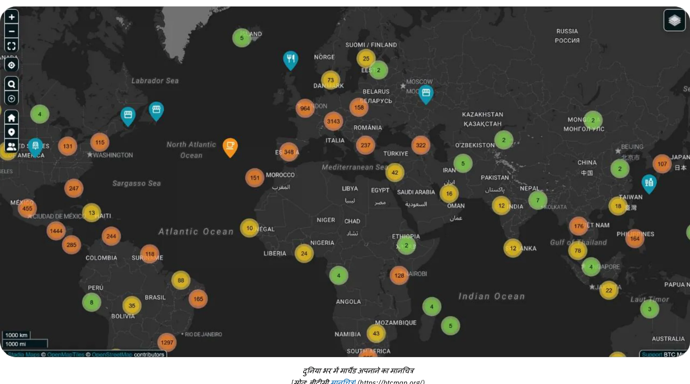

*[स्रोत: बीटीसी मैप](https://btcmap.org/)*

- **नेटवर्क मेट्रिक्स:** लाइटनिंग पर कुल चैनल्स और Bitcoin लॉक की संख्या स्थिर बनी हुई है, जिसमें लगभग 20,000 नोड्स, 5,200 BTC, और 60,000 चैनल्स शामिल हैं। हालांकि, यह नेटवर्क का सिर्फ एक हिस्सा दिखाता है और इसमें भाग लेने वालों के बीच बदलाव देखने को मिलता है, जहां कम व्यक्ति और ज्यादा पेशेवर लोग शामिल हो रहे हैं।
- **नेटवर्क्स के बीच एक पुल के रूप में लाइटनिंग:** Lightning Network की कुशलता और उपलब्धता ने इसे पहले से ही अन्य जुड़े हुए नेटवर्क्स (जैसे, FediMint, Liquid, आदि) के लिए एक पुल के रूप में स्थापित कर दिया है।

**Wallet की वापसी**  

(Note: "Wallet" is retained as a model name/number, which is common in Hindi translations for technical/brand terms.)

Bitcoin और Lightning Network **डिजिटल Wallet क्रांति** को पूरा कर रहे हैं। नई वेब सेवाएं अब **बिना अकाउंट बनाए लेन-देन** की सुविधा देती हैं—आपका Wallet ही आपकी पहचान बन जाता है! **Nostr Wallet Connect (NWC)** और **LN-URL-AUTH** जैसे प्रोटोकॉल की मदद से, वॉलेट्स बिना पारंपरिक अकाउंट के यूजर्स को सहजता से प्रमाणित कर सकते हैं और लेन-देन सक्षम कर सकते हैं। छोटे-मोटे खरीदारी या सब्सक्रिप्शन के लिए अकाउंट फटीग के दिन अब लद गए। निजी या भुगतान संबंधी जानकारी देने की जरूरत नहीं, जो अक्सर हैक होकर डार्क वेब पर बिकने का खतरा बनती है—जैसा कि हाल की घटनाओं ने हमें बार-बार याद दिलाया है।

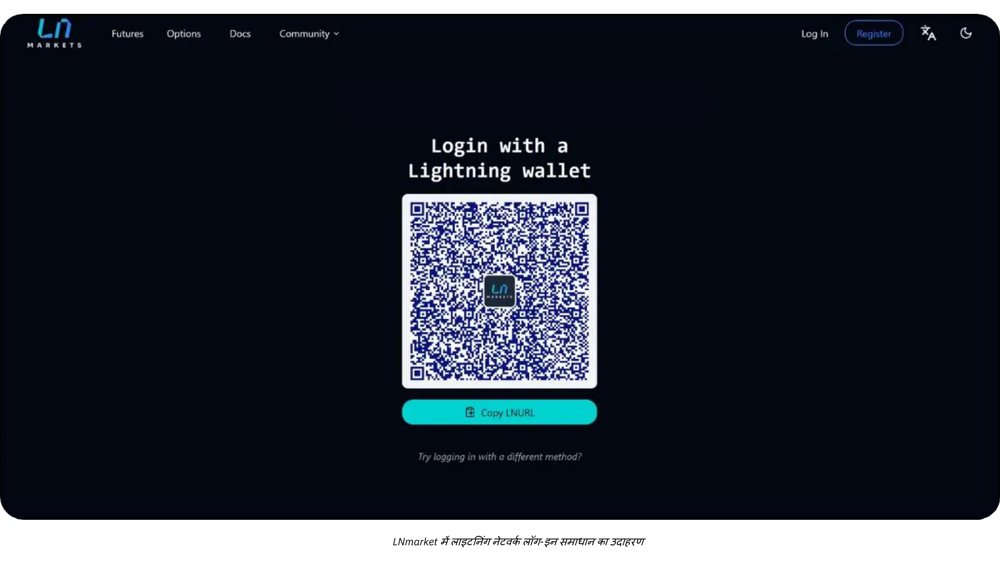

कल के व्यापारी इस नवाचार को अपनाएंगे, जो ग्राहकों को एक सुरक्षित, अधिक सहज (वन-क्लिक) अनुभव प्रदान करेगा और साथ ही उनकी गोपनीयता का भी सम्मान करेगा।

# जीडब्ल्यू-324 एकाउंटिंग

<partId>d49d7595-a189-4e2b-bd60-c19e8e717aa2</partId>

## व्यवसाय में लेखांकन Bitcoin के मूलभूत सिद्धांत

<chapterId>84063061-ffdb-4b1f-b20b-588ffb146877</chapterId>

यह सामग्री केवल शैक्षिक उद्देश्यों के लिए है और इसे वित्तीय या लेखा सलाह के रूप में नहीं माना जाना चाहिए। किसी भी कार्रवाई से पहले, व्यवसायों और व्यक्तियों को अपने विशिष्ट क्षेत्राधिकार में क्रिप्टोकरेंसी विनियमों से परिचित एक योग्य लेखाकार या कानूनी विशेषज्ञ से परामर्श करने की दृढ़ता से सलाह दी जाती है।

### जीडब्ल्यू-326 एकाउंटिंग के मुख्य कॉन्सेप्ट्स

**किसी भी Bitcoin लेन-देन को रिकॉर्ड किया जाना चाहिए और यह कर योग्य घटना का कारण बन सकता है**

वैश्विक स्तर पर, Bitcoin को अक्सर एक मुद्रा नहीं बल्कि एक डिजिटल एसेट के रूप में वर्गीकृत किया जाता है। यह अंतर व्यवसायों में Bitcoin के लेखांकन पर महत्वपूर्ण प्रभाव डालता है, जिससे टैक्स दायित्व, वित्तीय रिपोर्टिंग और अनुपालन आवश्यकताएं प्रभावित होती हैं। जो व्यवसाय Bitcoin को भुगतान के तरीके के रूप में स्वीकार करते हैं या इसे ट्रेजरी टूल के रूप में उपयोग करते हैं, उन्हें इन नियामक बारीकियों को समझना चाहिए।

**सबसे महत्वपूर्ण नतीजा** जो ध्यान में रखना चाहिए वो यह है कि, ज़्यादातर क्षेत्राधिकारों में, Bitcoin कमाने, बेचने, ट्रेड करने या खरीदारी करने के लिए इस्तेमाल करने से, आमतौर पर **एक कर योग्य घटना** बनती है और मुनाफ़े पर कैपिटल गेन्स टैक्स लगता है।

Bitcoin एकाउंटिंग का एक और पहलू है दो तरह के कैपिटल गेन्स में फर्क करना:

- **अव्यक्त लाभ/हानि:** लेखा अवधि के अंत में Bitcoin के मूल्य पर आधारित अवास्तविक लाभ या हानि।
- **प्रभावी लाभ/हानि:** वित्तीय वर्ष के दौरान Bitcoin को बेचने या एक्सचेंज करने पर वास्तविक लाभ या हानि।

ये गणना इस बात पर बहुत निर्भर करती है कि Bitcoin को लंबी अवधि के निवेश के लिए रखा गया है या फिर छोटी अवधि के परिचालन उपयोग के लिए। इसके अलावा, व्यवसायों को अपने लेखा पद्धतियों को स्थानीय कर ढांचे के साथ मेल खाना चाहिए, क्योंकि नियम देश के हिसाब से काफी अलग-अलग होते हैं।

Bitcoin रखने वाले व्यापारों का हिसाब-किताब थोड़ा पेचीदा होता है क्योंकि हर लेन-देन का बारीकी से रिकॉर्ड रखना पड़ता है ताकि असली या कागजी मुनाफा/नुकसान की गणना हो सके। हर बार जब आप Bitcoin को भुगतान के रूप में स्वीकार करके कोई बिक्री करते हैं, या Bitcoin खरीदते/बेचते हैं, तो आपको ये रिकॉर्ड करना होगा:

- विशेष समय
- बिक्री मूल्य (फिएट करेंसी में)
- जीडब्ल्यू-335 की लागत मूल्य (वह कीमत जिस पर जीडब्ल्यू-335 को शुरू में खरीदा गया था)।

इससे आप बाद में फायदा या नुकसान निकालने के लिए अंतर का हिसाब लगा पाएंगे।

**उदाहरण:** एक व्यापारी 1 BTC $30,000 में खरीदता है। बाद में, वह 0.5 BTC $20,000 में बेचता है। लाभ या हानि की गणना करने के लिए, व्यापारी को यह करना होगा:

- समय, Bitcoin की फिएट लागत मूल्य और मात्रा दर्ज की गई है
- Bitcoin का समय, फिएट सेल प्राइस और बेची गई मात्रा रिकॉर्ड कर ली है।
- Bitcoin की बिक्री की लागत निर्धारित करें: 0.5 BTC: $30,000 ÷ 2 = $15,000.
- बिक्री मूल्य और लागत मूल्य की तुलना करें: $20,000 (बिक्री मूल्य) - $15,000 (लागत मूल्य) = $5,000 का मुनाफा।
- Bitcoin होल्डिंग्स को नए कॉस्ट प्राइस के साथ अपडेट करें।

हर लेन-देन के लिए यह प्रक्रिया दोहरानी पड़ती है, और Bitcoin की कीमत का उतार-चढ़ाव रिकॉर्ड रखने को और भी पेचीदा बना देता है।

**अगर Bitcoin एक करेंसी होता तो यह कैसे काम करता?**

अगर Bitcoin को एक करेंसी की तरह माना जाए, तो बिज़नेस इसे अपने अकाउंटिंग सिस्टम में किसी भी दूसरी करेंसी की तरह मैनेज करेंगे। हर ट्रांजैक्शन के लिए कॉस्ट बेसिस और रियलाइज़्ड/अनरियलाइज़्ड प्रॉफिट्स को ट्रैक करने की बजाय, Bitcoin होल्डिंग्स को बस एक करेंसी अकाउंट में रिकॉर्ड किया जाएगा। हर रिपोर्टिंग पीरियड के अंत में, Bitcoin समेत सभी करेंसी होल्डिंग्स की वैल्यू को करंट Exchange रेट का इस्तेमाल करके अकाउंटिंग करेंसी (जैसे USD या EUR) में कन्वर्ट कर दिया जाएगा।

**अपडेटेड उदाहरण अगर Bitcoin को एक करेंसी के रूप में मान्यता दी गई हो:**  

*(नोट: "Bitcoin" को उसी तरह छोड़ दें, क्योंकि यह एक कोड/नाम है जिसका अनुवाद नहीं होता।)*

- एक बिज़नेस के पास 1 BTC है जब Bitcoin की कीमत $30,000 है। बाद में, बिज़नेस 0.5 BTC का इस्तेमाल एक पेमेंट के लिए करता है जब Bitcoin की कीमत $40,000 हो जाती है।
- व्यापार **नहीं** करता है वास्तविक लाभ या हानि की गणना। इसके बजाय, लेन-देन को इस तरह दर्ज किया जाता है:
    - भुगतान: $20,000 (0.5 BTC × $40,000)।
    - Bitcoin का बचा हुआ बैलेंस: 0.5 BTC, जिसकी कीमत अभी $20,000 है (Exchange की मौजूदा दर पर अपडेट किया गया)।

**Bitcoin को मुद्रा के रूप में मान्यता मिलने का मुख्य फायदा:**

- व्यापार को बस अपने Bitcoin होल्डिंग्स के फिएट इक्विवैलेंट को समय-समय पर एडजस्ट करना होगा (जैसे, मासिक या सालाना रिपोर्ट्स के लिए), बिल्कुल यूरो, येन या दूसरी करेंसीज़ की तरह जो उसके पास होती हैं।
- इससे लेन-देन के स्तर पर लागत-आधार ट्रैकिंग की जरूरत खत्म हो जाती है और हिसाब-किताब आसान हो जाता है, खासकर उन व्यवसायों के लिए जो अक्सर Bitcoin लेन-देन करते हैं।

यह तरीका Bitcoin अकाउंटिंग को काफी सरल बना देगा, प्रशासनिक बोझ को कम करेगा, और दूसरी करेंसी के ट्रीटमेंट के साथ मेल खाएगा, अगर Bitcoin को कानूनी और रेगुलेटरी तौर पर पूरी तरह मान्यता मिल जाए। लेकिन अभी हम वहां नहीं पहुंचे हैं।

### व्यक्तिगत और कॉर्पोरेट Bitcoin लेखांकन के बीच अंतर

Bitcoin का कानूनी और लेखा उपचार व्यक्तियों और कंपनियों के बीच काफी अलग होता है। व्यक्तियों के लिए, Bitcoin लेनदेन से होने वाले लाभ पर आयकर लग सकता है, जो अक्सर ज्यादा दर पर होता है। वहीं, कंपनियों को कॉर्पोरेट टैक्स की संभावित कम दरों का फायदा मिल सकता है, लेकिन उन्हें सख्त बहीखाता मानकों का पालन करना होता है।

व्यवसायों के लिए, Bitcoin को इसके इस्तेमाल के मकसद के हिसाब से अलग-अलग खातों में वर्गीकृत किया जा सकता है:

- **स्थिर संपत्ति:** Bitcoin को दीर्घकालिक रणनीतिक निवेश के रूप में रखा गया है।
- **स्टॉक्स:** जीडब्ल्यू-356 जो प्रोडक्शन प्रोसेस में इस्तेमाल होता है (यह एक दुर्लभ केस है, जैसे कि प्रोफेशनल ट्रेडर्स के लिए)।
- **नकद या ट्रेजरी खाते:** Bitcoin के लिए जो Liquid परिसंपत्ति के रूप में रखे गए हैं, मुख्य रूप से परिचालन लेनदेन या अल्पकालिक ट्रेजरी प्रबंधन के लिए।

वर्गीकरण का चुनाव कंपनी की गतिविधि और रणनीति पर निर्भर करता है, जिसका वित्तीय रिपोर्टिंग और कर दायित्वों पर प्रभाव पड़ता है। हमेशा स्थानीय नियमों की जाँच करें, क्योंकि ये वर्गीकरण देश के अनुसार अलग-अलग हो सकते हैं।

### कानूनी ढांचा

Bitcoin के कानूनी मान्यता और उपचार अलग-अलग क्षेत्रों में भिन्न होते हैं। कुछ देशों, जैसे कि एल साल्वाडोर, ने Bitcoin को कानूनी मुद्रा के रूप में मान्यता दी है, जिससे लेन-देन में इसका उपयोग आसान हो गया है, लेकिन अंतरराष्ट्रीय वित्तीय रिपोर्टिंग जटिल हो गई है। अन्य देश Bitcoin को एक डिजिटल संपत्ति मानते हैं, जिस पर विशेष कर और लेखा नियम लागू होते हैं।

ज्यादातर देशों में, Bitcoin को डिजिटल एसेट की श्रेणी में रखा जाता है, और इसका लेखा-जोखा सामान्य लेखा मानकों के अनुसार किया जाता है। व्यवसायों को Bitcoin के लेन-देन का हिसाब इस प्रकार रखना चाहिए:

- **कैपिटल गेन/लॉस रिकॉर्ड करना:**  
व्यवसायों को अपने वित्तीय नतीजों में रियलाइज़्ड गेन या लॉस का हिसाब रखना ज़रूरी होता है।
- **गुप्त लाभ/हानि मूल्यांकन:** अक्सर अवास्तविक लाभ या हानि की रिपोर्टिंग करनी पड़ती है, लेकिन यह सीधे कर योग्य आय को प्रभावित नहीं कर सकता।
- **लेखा मानकों का पालन:** व्यवसायों को Bitcoin लेन-देन को मानक बहीखाता प्रथाओं में शामिल करना चाहिए, जिससे पारदर्शिता और सटीकता सुनिश्चित हो।

Bitcoin अकाउंटिंग का तरीका जगह के हिसाब से अलग-अलग होता है:

- **संयुक्त राज्य अमेरिका:** IRS, Bitcoin को **संपत्ति के रूप में वर्गीकृत करता है, जैसे शेयर, बॉन्ड या रियल एस्टेट**। इस वर्गीकरण का मतलब है कि क्रिप्टोकरेंसी से जुड़ा कोई भी लेन-देन, जैसे कमाना, बेचना, ट्रेड करना या खरीदारी के लिए इस्तेमाल करना, एक कर योग्य घटना बना सकता है और मुनाफे पर कैपिटल गेन टैक्स लग सकता है।
- **यूरोपीय संघ:** सदस्य देश आमतौर पर Bitcoin को एक सट्टा संपत्ति की तरह मानते हैं, न कि एक कामकाजी मुद्रा के रूप में। इसलिए, इससे होने वाले मुनाफे पर अक्सर पूंजीगत लाभ कर लगता है।
- **एशिया:** सिंगापुर और जापान जैसे देशों ने प्रगतिशील नियामक ढांचे अपनाए हैं, जो विशिष्ट संदर्भों में Bitcoin लेनदेन को अनुकूल रूप से देखते हैं। लेकिन Bitcoin को आमतौर पर **अमूर्त संपत्ति** के रूप में माना जाता है, और इसे रिपोर्टिंग तिथि पर उचित मूल्य पर मापा जाता है, जिसमें परिवर्तन लाभ या हानि में मान्यता प्राप्त होते हैं।

यह ज़रूरी है कि आप अपने काम करने वाले देश के नियमों को समझें और अपने लेखा पद्धतियों को उसी के अनुसार ढालें।

### नियामक विकास में चुनौतियाँ

क्रिप्टोकरेंसी में इनोवेशन की रफ़्तार इतनी तेज़ है कि रेगुलेटरी फ्रेमवर्क्स पीछे छूट जाते हैं। Bitcoin को डिजिटल एसेट के तौर पर मान्यता मिलने के बाद से ग्लोबल रेगुलेशन्स में धीरे-धीरे अपडेट्स हुए हैं, लेकिन कुछ कमियाँ अभी भी बाकी हैं:

- **कानूनी सिद्धांतों की कमी:** कुछ ही कानूनी मामलों ने विशिष्ट लेखा पद्धतियों को स्पष्ट किया है, जिससे व्याख्या का स्थान बना रहता है।
- चल रही बहसें: कई देशों में अभी भी छुपे हुए नुकसान (latent losses) पर टैक्स नियमों को लेकर मतभेद बरकरार हैं।
- **क्रॉस-बॉर्डर जटिलता:** अंतरराष्ट्रीय स्तर पर काम करने वाली कंपनियों को अलग-अलग देशों के लेखा मानकों में सामंजस्य बिठाने में चुनौतियों का सामना करना पड़ता है।

इन चुनौतियों के बावजूद, कई देशों की सक्रिय नीतियाँ व्यवसायों को Bitcoin को अपने संचालन में शामिल करने के लिए एक मजबूत आधार प्रदान करती हैं। क्रिप्टोकरेंसी लेखांकन में Address की उभरती जटिलताओं के लिए निरंतर अपडेट और अंतरराष्ट्रीय समन्वय आवश्यक होगा।

### वित्तीय विवरणों में Bitcoin का वर्गीकरण

Bitcoin का वित्तीय विवरणों में वर्गीकरण अलग-अलग क्षेत्राधिकारों में भिन्न होता है और व्यवसाय में इसके उपयोग के इरादे पर निर्भर करता है। मोटे तौर पर, Bitcoin को एक डिजिटल संपत्ति के रूप में माना जाता है, जैसे कि इन्वेंट्री, निवेश, या मुद्रा, लेकिन इसकी कुछ खास विशेषताएं हैं जो इसके लेखांकन उपचार को प्रभावित करती हैं।

- **डिजिटल एसेट या अमूर्त संपत्ति**: कई क्षेत्राधिकार, जिनमें फ्रांस और यूरोपीय संघ शामिल हैं, Bitcoin को कानूनी मुद्रा के बजाय एक डिजिटल या अमूर्त संपत्ति के रूप में वर्गीकृत करते हैं। इस वर्गीकरण के तहत व्यवसायों को Bitcoin का हिसाब फिएट मुद्राओं से अलग तरीके से करना होता है।
- **इन्वेंटरी**: अगर किसी व्यापार का मुख्य काम Bitcoin का व्यापार करना है, जैसे कि क्रिप्टोकरेंसी एक्सचेंज या ब्रोकर्स, तो Bitcoin को इन्वेंटरी में गिना जाता है। ऐसे में, इसकी वैल्यूएशन इन्वेंटरी अकाउंटिंग स्टैंडर्ड्स के अनुसार की जाती है।
- **वित्तीय निवेश**: जो कंपनियां Bitcoin को दीर्घकालिक संपत्ति के रूप में रखती हैं, वे इसे वित्तीय निवेश के रूप में वर्गीकृत कर सकती हैं। उदाहरण के लिए, अमेरिका में, व्यवसाय वित्तीय लेखा मानक बोर्ड (FASB) के दिशानिर्देशों के तहत Bitcoin को लेखांकन में शामिल कर सकते हैं, और बाजार मूल्य गिरने पर हानि को मान्यता दे सकते हैं।

**वर्गीकरण के प्रभाव :**

- लॉन्ग-टर्म होल्डिंग्स में अक्सर इम्पेयरमेंट टेस्टिंग और अमॉर्टाइज़ेशन की ज़रूरत पड़ती है।
- एक्टिव ट्रेडिंग या पेमेंट से जुड़ी गतिविधियों में रियलाइज़्ड और अनरियलाइज़्ड गेन व लॉस की लगातार ट्रैकिंग जरूरी होती है।

### मूल्यांकन के तरीके

वैल्यूएशन मेथड्स (मूल्यांकन विधियाँ) एकाउंटिंग टेक्नीक्स हैं जिनका उपयोग Bitcoin का कॉस्ट बेसिस (लागत आधार) निर्धारित करने के लिए किया जाता है। यह ट्रांजैक्शन्स के दौरान गेन या लॉस की सटीक गणना के लिए जरूरी है। आमतौर पर, अकाउंटिंग सिस्टम में **Bitcoin होल्डिंग्स की करंट कॉस्ट वैल्यू को हमेशा अपडेटेड रखना** सबसे अच्छा होता है। इससे पारदर्शिता बनी रहती है, टैक्स नियमों का पालन होता है और जब गणना करनी होती है तो पीछे नहीं रह जाते।

- **पहले आओ, पहले जाओ (FIFO)**: ऑस्ट्रेलिया और भारत जैसे देशों में आमतौर पर इस्तेमाल होने वाली यह विधि Bitcoin की कीमत उसकी सबसे पहली खरीद लागत के आधार पर तय करती है। यह काफी **पेचीदा** हो सकता है क्योंकि जब भी बिक्री होती है, तो Bitcoin के हर हिस्से को अलग-अलग ट्रैक करना पड़ सकता है।
- **वेटेड एवरेज कॉस्ट (WAC)**: अक्सर **सरलता** के कारण बड़ी मात्रा में लेन-देन के लिए पसंद किया जाता है, जैसा कि अमेरिका जैसे देशों में देखा जाता है।

यह बेहद सलाह दी जाती है कि Bitcoin की लागत का विस्तृत हिसाब रखने वाली एक वर्कबुक बनाए रखें **जिस क्षण से कोई कंपनी Bitcoin खरीदना शुरू करती है या भुगतान के रूप में इसे स्वीकार करती है** ताकि सटीक और व्यवस्थित रिकॉर्ड-कीपिंग सुनिश्चित हो सके। Bitcoin भुगतान स्वीकार करने या Bitcoin खरीदने के लिए सॉफ्टवेयर समाधान चुनते समय सिर्फ यही ध्यान में रखना सबसे ज़रूरी है।

### रिटेल और ई-कॉमर्स में लेन-देन का हिसाब

रिटेलर्स को हर लेन-देन के लिए Bitcoin से फिएट करेंसी (Exchange) की दर रिकॉर्ड करनी होगी। मिसाल के तौर पर, कई देशों में बिजनेस VAT कैलकुलेट करने के लिए सेल के समय की Exchange दर का इस्तेमाल करते हैं।

व्यवसायों को यह सुनिश्चित करना चाहिए कि वे जो भी **भुगतान** टूल्स का उपयोग कर रहे हैं, वे निम्नलिखित क्षमताएँ प्रदान करें:

- जीडब्ल्यू-380 और जीडब्ल्यू-382 स्थानीय फिएट राशि (यूरो, डॉलर, पाउंड) के साथ, वह वैट या अन्य स्थानीय कर, जीडब्ल्यू-381 निर्धारित समतुल्य, तारीख और समय, जीडब्ल्यू-381 जीडब्ल्यू-379 दर और जीडब्ल्यू-379 स्रोत आदि
- सभी भुगतान रसीदों को निर्यात करें, कम से कम .csv फॉर्मेट में, ऊपर दी गई सभी जानकारी के साथ, ताकि अकाउंटेंट आसानी से उन्हें प्रोसेस कर सके।
- आदर्श रूप से, ट्रेजरी में रखे गए वर्तमान Bitcoin की लागत-आधार (cost-basis) के अपडेटेड मूल्य का रिकॉर्ड रखना चाहिए।

### चुनौतियाँ

- **अस्थिरता**: Bitcoin की कीमत में काफी उतार-चढ़ाव होता है, जिससे होल्डिंग्स का मूल्यांकन करने और भविष्य के वित्तीय परिणामों का अनुमान लगाने में मुश्किलें आती हैं।
- **नियामक जांच**: चीन जैसे देशों में, Bitcoin की प्रतिबंधित स्थिति इसे खजाना संपत्ति के रूप में इस्तेमाल करने पर सीमा लगाती है।
- **रेगुलेटरी अनिश्चितता** : Bitcoin का बदलता हुआ नियामक माहौल अक्सर व्यवसायों को अनिश्चितता में छोड़ देता है। उदाहरण के लिए, टैक्स पॉलिसी में बदलाव, जैसे कि भारत या अमेरिका में हुए, रातों-रात अकाउंटिंग प्रैक्टिस पर असर डाल सकते हैं।
- **गलत प्रबंधन के जोखिम** : Bitcoin लेनदेन को सही ढंग से वर्गीकृत न करना या निगरानी में असफल होने से अनुपालन संबंधी समस्याएं, जुर्माना या प्रतिष्ठा को नुकसान हो सकता है।
- **दोबारा योग्यता जोखिम**: कंपनी की खजाने का एक बड़ा हिस्सा Bitcoin में रखने से कीमतों में गिरावट के कारण नुकसान होने का खतरा रहता है। इसके गंभीर परिणाम हो सकते हैं, खासकर अगर ऐसी गिरावट तब हो जब आपूर्तिकर्ताओं, कर्मचारियों या करों का भुगतान करना हो। इसके अलावा, कंपनी के मालिक को जिम्मेदार ठहराया जा सकता है, जिसके परिणामस्वरूप जुर्माना या अन्य कानूनी समस्याएं हो सकती हैं, जैसे कंपनी की संपत्ति के दुरुपयोग के आरोप।

## लेखा उपकरण और सॉफ्टवेयर

<chapterId>e7b31be5-1176-4835-944e-3cba1b7040fa</chapterId>

जब कोई कंपनी Bitcoin को अपने अकाउंटिंग में शामिल करने का फैसला करती है, तो डेटा के संग्रह और प्रोसेसिंग को आसान बनाने के लिए विभिन्न टूल्स और विशेष सॉफ्टवेयर मौजूद हैं। इनमें सबसे प्रसिद्ध समाधान हैं [CoinTracker](https://www.cointracker.io/), [Waltio](https://www.waltio.com/), [Cryptio](https://cryptio.co/), [Koinly](https://koinly.io/), [TokenTax](https://tokentax.co/), और [ZenLedger](https://zenledger.io/)। ये प्लेटफॉर्म मुख्य रूप से चार पहलुओं पर ध्यान केंद्रित करते हैं:

- स्वचालित डेटा संग्रह;
- इस डेटा को अधिक सामान्य एकाउंटिंग सॉफ्टवेयर (क्विकबुक्स, जीरो, ईआरपी) के साथ संगत फॉर्मेट में बदलना;
- टैक्स दायित्वों की गणना;
- लेन-देन का वर्गीकरण।

वे अक्सर बड़े संगठनों के लिए एक समझदार पूरक होते हैं जिनके पास कई वॉलेट और विभिन्न प्लेटफॉर्म या एक्सचेंजों पर संपत्तियां होती हैं।

हालांकि, ज्यादातर छोटे व्यवसायों के लिए लेन-देन का इतिहास वाली एक साधारण `.csv` फाइल ही काफी होती है। मकसद यह है कि हर भुगतान की तारीख, रकम, यूरो/डॉलर में उसकी समतुल्य वैल्यू, और संबंधित Bitcoin पतों को दर्ज किया जाए। अधिकांश Bitcoin भुगतान समाधान (जैसे BTC Pay Server, Swiss Bitcoin Pay, वगैरह) या Exchange प्लेटफॉर्म (जैसे Bitfinex, Kraken, Coinbase, वगैरह) पहले से ही लेन-देन का इतिहास एक्सपोर्ट करने का विकल्प देते हैं। अकाउंटेंट को यह फाइल देकर डेटा एंट्री को आसान बनाया जा सकता है और Bitcoin से जुड़े आने-जाने वाले लेन-देन को साफ तौर पर अलग किया जा सकता है।

जो लोग अपने Bitcoin को खुद संभालते हैं, उनके लिए UTXOs (*Unspent Transaction Outputs*) का प्रबंधन करना एक महत्वपूर्ण कदम है। सही UTXO लेबलिंग से हर BTC टुकड़े की उत्पत्ति का पता लगाने में मदद मिलती है, पेशेवर गतिविधि से जुड़े लेन-देन को निजी खर्चों से अलग करने में आसानी होती है, और कानूनी या कर उद्देश्यों के लिए ट्रेसबिलिटी सुगम होती है। ज्यादातर अच्छे Bitcoin Wallet सॉफ़्टवेयर आपको अपनी बैकअप फ़ाइल (या आपके सेटअप के आधार पर xpub) का उपयोग करके अपने Wallet को इम्पोर्ट करने और UTXOs को उनकी उत्पत्ति या गंतव्य के आधार पर टैग करने की सुविधा देते हैं। आपकी मदद के लिए, यहाँ इस प्रैक्टिस पर समर्पित एक पूर्ण ट्यूटोरियल दिया गया है:

https://planb.network/tutorials/privacy/on-chain/utxo-labelling-d997f80f-8a96-45b5-8a4e-a3e1b7788c52
आखिरकार, चाहे आप एक छोटे व्यापारी हों या एक स्थापित बिजनेस, **Invoice को Bitcoin में सेटल करना** संभव है। मुख्य बात यह है कि लेन-देन को ठीक से डॉक्यूमेंट करें। अगर आप सेल्फ-कस्टडी Wallet से पेमेंट करते हैं, तो आदर्श तरीका यह है कि generate में लेन-देन को नोट करें जिसमें Invoice नंबर और पेमेंट का उद्देश्य आपके लेबल्स में दर्ज हो। अगर आप Invoice को Exchange के जरिए सेटल करना पसंद करते हैं, तो आपके पास रसीद या लेन-देन इतिहास को एक्सपोर्ट करके अपने अकाउंटिंग रिकॉर्ड्स में शामिल करने का विकल्प भी होगा। यह पारदर्शिता आपके सभी BTC ऑपरेशन्स को ट्रैक और रिपोर्ट करने में आसानी लाएगी।

## प्रैक्टिकल Bitcoin अकाउंटिंग उदाहरण

<chapterId>763f6f20-9181-495a-bf7d-b405899e65ec</chapterId>

### उपयोग मामला 1: रिटेल स्टोर Bitcoin भुगतानों को यूरो में बदलना

**परिदृश्य**: एक छोटी बेकरी Bitcoin को भुगतान के तरीके के रूप में स्वीकार करती है, लेकिन क्रिप्टोकरेंसी की अस्थिरता से बचने के लिए प्राप्त सभी Bitcoin को तुरंत यूरो में बदल देती है।

**उदाहरण**:

- **जीडब्ल्यू-403 रूपांतरण दर**: 1 जीडब्ल्यू-403 = €40,000।
- **लेन-देन 1**: ग्राहक ने कई पेस्ट्री €20 में खरीदीं।
    - जीडब्ल्यू-404 का बराबर: (20 / 40,000) = 0.0005 जीडब्ल्यू-404 = 50,000 सातोशिस।
    - कन्वर्जन फी: 1.5% (€20 × 0.015) = €0.30.
    - प्राप्त राशि: €20 - €0.30 = €19.70।
- **लेन-देन 2**: ग्राहक ने €5 में कॉफी खरीदी।
    - जीडब्ल्यू-405 का बराबर: (5 / 40,000) = 0.000125 जीडब्ल्यू-405 = 12,500 सातोशिस।
    - कन्वर्जन फीस: 1.5% (€5 × 0.015) = €0.075।
    - नेट प्राप्त: €5 - €0.075 = €4.93।

**लेन-देन का सारांश**:

- **कुल बिक्री**: €25
- **कुल फीस**: €0.375.
- **नेट यूरो प्राप्त**: €24.625।

**लेखांकन प्रभाव**:

- कुल बिक्री (€25) को राजस्व के रूप में रिकॉर्ड करें।
- कन्वर्जन फीस (€0.375) को खर्च के रूप में काट लें।
- बैलेंस शीट पर Bitcoin होल्डिंग्स नहीं दिखाई देती हैं क्योंकि सारी रकम तुरंत कन्वर्ट कर दी गई थी।

### उपयोग मामला 2: रिटेल स्टोर Bitcoin भुगतानों का 50% बरकरार रखता है

**परिदृश्य**: वही बेकरी Bitcoin भुगतान का 50% हिस्सा खजाने की संपत्ति के रूप में रखने का फैसला करती है, जबकि बाकी 50% को यूरो में बदल देती है।

**उदाहरण**:

- **जीडब्ल्यू-409 कन्वर्जन रेट**: 1 जीडब्ल्यू-409 = €40,000।
- **ग्राहक से लेन-देन**: ग्राहक ने €50 में पेस्ट्री खरीदी।
    - जीडब्ल्यू-410 का बराबर: (50 / 40,000) = 0.00125 जीडब्ल्यू-410 = 125,000 सातोशिस।
    - कन्वर्जन (50%): €25 के बराबर Bitcoin = 0.000625 Bitcoin = 62,500 सातोशिस।
        - कन्वर्जन फीस: 1.5% (€25 × 0.015) = €0.375।
        - यूरो में प्राप्त शुद्ध राशि: €25 - €0.375 = €24.625।
    - Bitcoin में रखा गया (50%): 62,500 सातोशी = 0.000625 Bitcoin।

**सारांश**:

- **कुल बिक्री**: 50 यूरो
- **फीस**: €0.375.
- **नेट यूरो प्राप्त**: €24.625
- **जीडब्ल्यू-413 रिटेन्ड**: 62,500 सातोशी।

**लेखांकन प्रभाव**:  

(Note: The term "Accounting Implications" is translated to "लेखांकन प्रभाव" in Hindi, which directly conveys the impact or consequences related to accounting. The formatting with bold and colon is preserved as per the original text.)

- कुल बिक्री (€50) को राजस्व के रूप में दर्ज करें।
- कन्वर्जन फीस (€0.375) को खर्च के रूप में काट लो।
- रिटेन्ड जीडब्ल्यू-414 (62,500 सातोशी) बैलेंस शीट पर एक डिजिटल एसेट के रूप में दिखाई देता है।
- अनियोजित लाभ: यदि वित्तीय वर्ष के अंत में Bitcoin का मूल्यांकन अधिक या कम होता है, तो एक अनियोजित लाभ या हानि होगी जो वित्तीय नोट्स में दिखाई जाएगी लेकिन आय के रूप में प्राप्त नहीं होगी।

### उपयोग मामला 3: पेशेवर सेवा Bitcoin को दीर्घकालिक निवेश के लिए रखना

**सीनारियो**: एक फ्रीलांस ग्राफिक डिज़ाइनर Bitcoin को पेमेंट के रूप में स्वीकार करता है और प्राप्त सभी Bitcoin को लॉन्ग-टर्म इन्वेस्टमेंट के तौर पर रखता है।

**उदाहरण**:

- **Bitcoin का भुगतान पर रूपांतरण दर**: 1 Bitcoin = €30,000.
- **ग्राहक से लेन-देन**: ग्राहक ने €3,000 की सेवाओं के लिए भुगतान किया।
    - जीडब्ल्यू-419 समतुल्य: (3,000 / 30,000) = 0.1 जीडब्ल्यू-419 = 10,000,000 सातोशिस।
- **साल-अंत मूल्यांकन**:
    - Bitcoin का वर्ष-अंत परिवर्तन दर: 1 Bitcoin = €35,000.
    - Bitcoin होल्डिंग का मूल्यांकन: 0.1 Bitcoin × €35,000 = €3,500.
    - अनियोजित लाभ: €3,500 - €3,000 = €500।

**सारांश**:

- **कुल मान्य राजस्व**: €3,000।
- **जीडब्ल्यू-422 होल्डिंग**: बैलेंस शीट पर 0.1 जीडब्ल्यू-422 जिसकी कीमत €3,500 है।
- **अनियोजित लाभ**: €500 वित्तीय नोट्स में दर्शाया गया है लेकिन आय के रूप में प्राप्त नहीं हुआ।

**लेखा प्रभाव**:

- सर्विस के समय रिकॉर्ड राजस्व (€3,000) दर्ज करें।
- जीडब्ल्यू-423 रिटेन्ड (0.1) बैलेंस शीट पर €3,500 की वैल्यू पर है।
- अनियोजित लाभों को ट्रैक किया जाता है लेकिन लाभ/हानि विवरण में शामिल नहीं किया जाता।

### केस 4: व्यापार मालिक कीमत बढ़ने के बाद Bitcoin का 50% बेचता है

**परिदृश्य**: एक व्यवसायी साल में तीन Bitcoin खरीदारियाँ करता है, Bitcoin को एक संपत्ति के रूप में रखता है, और कीमत में भारी बढ़ोतरी के बाद 50% बेच देता है।

**उदाहरण**:

- ग्राहकों से खरीदारी **(Bitcoin)**
    - खरीद 1: €2,000 में €20,000/BTC की दर से = 0.1 Bitcoin = 10,000,000 सातोशी।
    - खरीद 2: €3,000 में €25,000/BTC = 0.12 Bitcoin = 12,000,000 सातोशिस।
    - खरीद 3: €5,000 की कीमत पर €30,000/BTC = 0.1667 Bitcoin = 16,670,000 सातोशी।
- **कुल Bitcoin होल्ड किया गया**: 0.3867 Bitcoin = 38,670,000 सातोशिस।
- **साल-अंत मूल्यांकन**:
    - Bitcoin की साल के अंत में कीमत: €40,000/BTC।
    - कुल मूल्य: 0.3867 Bitcoin × €40,000 = €15,468
    - अनियोजित लाभ: €15,468 - €10,000 (कुल लागत) = €5,468।
- **Bitcoin का 50% बिक्री**
    - जीडब्ल्यू-434 बिका: 0.19335 जीडब्ल्यू-434.
    - बिक्री से आमदनी: 0.19335 Bitcoin × €40,000 = €7,734
    - कॉस्ट बेसिस (वेटेड एवरेज):
        - कुल लागत: €2,000 + €3,000 + €5,000 = €10,000।
        - वेटेड एवरेज प्राइस: €10,000 / 0.3867 Bitcoin = €25,850/BTC.
        - Bitcoin की बिक्री की लागत: 0.19335 Bitcoin × €25,850 = €4,999.
    - असली मुनाफा: €7,734 - €4,999 = €2,735.

**सारांश**:

- **Bitcoin बचा हुआ**: 0.19335 Bitcoin की कीमत €7,734 (€40,000/BTC की दर से)।
- **असली मुनाफा**: आय विवरण में शामिल €2,735।
- **अनियोजित लाभ**: वित्तीय नोट्स में €5,468 का खुलासा (शेष Bitcoin का अनियोजित मूल्य शामिल है)।

**लेखांकन प्रभाव**:

- बिक्री से मिली रकम (€7,734) को आमदनी के तौर पर दर्ज करें।
- Bitcoin की बिक्री की कीमत (€4,999) को घटाकर प्राप्त लाभ की गणना करें।
- बैलेंस शीट पर Bitcoin (0.19335) रिटेन किया गया है जिसकी वैल्यू €7,734 है।
- वित्तीय नोट्स में दर्ज Bitcoin पर अप्राप्त लाभ €5,468।

# निष्कर्ष

<partId>f6ca8d01-a4f3-449b-ac9f-c5fba9a69178</partId>

## इस कोर्स का मूल्यांकन करें

<chapterId>0fe8c49e-b7f8-46f7-9c42-b8a9a99a7b46</chapterId>

<isCourseReview>true</isCourseReview>
## अंतिम परीक्षा

<chapterId>40a0f18c-bdc9-45b2-8dea-15f7e574230e</chapterId>

<isCourseExam>true</isCourseExam>
## समापन

<chapterId>5503c23e-3a90-4a23-8d89-75e3cc1ee53e</chapterId>

<isCourseConclusion>true</isCourseConclusion>

