# Bitcoin 네트워크에서 귀사의 여정을 시작하세요

Bitcoin과 Lightning Network의 실용적인 기능을 살펴보고, 인터넷과 마찬가지로 비즈니스 운영을 어떻게 **혁신**할 수 있는지 알아보세요. 디지털 자본부터 빠르고 경제적이며 확장 가능한 결제까지, Bitcoin은 광범위한 **비즈니스 사용 사례**를 제공합니다.

이 가이드를 통해 글로벌, 범용, 인터넷 네이티브 통화 네트워크인 Bitcoin을 이해하는 방법을 배우실 수 있습니다. 고유한 기본 특성을 지닌 **Bitcoin은 기존 통화 네트워크에 비해 상당한 개선점을 제공합니다**. 자본 저장 및 결제 시스템과 같은 전통적인 금융 사용 사례에 Bitcoin을 활용해야 하는 이유와 방법을 알아볼 수 있습니다. 또한, 이 가이드에서는 관련 회계 및 재정 요건을 포함해 Bitcoin을 획득하고 보유하는 방법과 간단한 또는 대규모 Bitcoin 결제 솔루션을 구현하는 방법도 다룹니다.

중소기업이든 대기업이든 상관없이 Bitcoin을 일상 업무에 통합하면 회사의 회복력, 생산성, 경쟁력을 높일 수 있습니다. 모든 인터넷 기반 기업은 Bitcoin을 지향하는 기업이 될 것이며, 이 과정을 통해 준비할 수 있습니다. 초기 섹션에서는 Bitcoin 운영의 기본 사항을 요약하므로 초보자라도 진행에 필요한 기초 지식을 습득할 수 있습니다. BIZ101을 시작하기 전이나 후에 Satoshi의 기초를 배우는 것은 언제나 좋은 생각입니다.

+++
# 소개

<partId>326cf945-5d3f-4d86-8c3e-4d1c35959799</partId>

## Bitcoin에 귀사를 온보딩하세요

<chapterId>1be42be9-4080-49f5-b5b2-6b531dd55f5f</chapterId>

Bitcoin와 Lightning Network가 기존 비즈니스 운영을 어떻게 혁신할 수 있는지 이해하는 관문인 이 종합 교육 과정을 통해 Bitcoin 네트워크에서 귀사의 여정을 시작하세요. 이 과정은 글로벌 인터넷 네이티브 화폐 네트워크이자 강력한 가치 수단인 Exchange의 실질적인 기능을 살펴보고자 하는 소매업체, 기업가, 관리자, 기업 의사결정권자를 위해 마련되었습니다.

이 과정을 통해 Bitcoin과 Lightning Network를 혁신적으로 변화시키는 기본 원칙을 소개합니다. 이러한 기술이 디지털 자본 저장부터 빠르고 경제적이며 확장 가능한 결제에 이르기까지 다양한 사용 사례를 제공하는 방법과 기존 통화 및 결제 시스템에 비해 어떻게 중요한 개선점을 제공하는지 배우게 됩니다. BIZ101 과정은 경제 이론과 실제 적용 사례를 연결하여 탈중앙화가 어떻게 중개자에 대한 의존성을 줄이고 기존 시스템에 내재된 한계를 극복할 수 있는지 설명합니다.

이 과정은 기존 통화와 결제 메커니즘을 자세히 살펴보는 것으로 시작하여 통화가 무역, 저축, 경제 전문화를 가능하게 하는 네트워크로서 어떻게 기능하는지 살펴봄으로써 기초를 다집니다. 이어서 Bitcoin의 기반이 되는 기술과 Lightning Network이 도입한 혁신을 살펴보고, 모든 규모의 비즈니스에 서비스를 제공할 수 있는 원활하고 안전하며 거의 즉각적인 거래를 촉진하는 데 있어 Bitcoin의 역할을 밝힙니다. 그런 다음 비트코인을 자산으로 보유하는 부분부터 시작하여 Bitcoin을 결제 수단으로 받아들이는 마지막 부분까지 이 과정의 실용적인 부분을 살펴볼 것입니다.

이 과정은 중소기업이든 대기업이든 상관없이 Bitcoin를 일상 업무에 통합하여 회사의 복원력, 효율성 및 경쟁력을 강화할 수 있는 지식을 갖추도록 하는 것을 목표로 합니다. Bitcoin가 계속해서 경제 환경을 재편함에 따라 이러한 획기적인 기술을 이해하는 것은 단순한 선택이 아니라 전략적 필수 요소입니다. 진화하는 Bitcoin의 세계를 탐색하고 활용할 수 있는 통찰력 있는 콘텐츠, 실용적인 사례, 전략적 지침에 참여할 준비를 하세요!

# 통화, 결제 시스템 및 Bitcoin

<partId>d9bd0e21-8488-44e0-af55-6d0b934f83c2</partId>

## 기존 통화

<chapterId>785e095c-6811-4ca2-ba46-fe38291432d4</chapterId>

### 통화는 네트워크입니다

통화는 근본적으로 가치의 효율적인 Exchange을 가능하게 하는 네트워크입니다.

화폐가 없으면 개인은 상품이나 서비스를 직접 교환하는 시스템인 **물물교환**에 의존해야 합니다. 물물교환은 양쪽 당사자가 동시에 상대방이 제공하는 것을 원해야 하는 '욕구의 이중 일치'가 필요하기 때문에 비실용적입니다. 예를 들어, 밀이 남는 농부가 신발을 원한다면 밀이 특별히 필요한 제화공을 찾아야 합니다. 이는 드물고 비효율적입니다. 또한, **물물교환 경제에서 n개의 상품이 있을 경우, ~n(n-1)/2 Exchange의 비율**이 필요하므로 매우 복잡하고 번거로운 시스템이 만들어집니다. 예를 들어 500개의 상품에 대해 ~124,000개 이상의 Exchange 요금이 필요합니다.

통화는 중개자 역할을 함으로써 이를 단순화하여 **Exchange 환율의 수를 통화 대비 각 상품에 대해 하나씩 n**으로 줄이는 네트워크를 생성합니다. 이를 통해 거래가 훨씬 더 간단해지고 **사람들이 서로의 필요를 동시에 요구하지 않고도 상품과 서비스를 거래할 수 있게 됩니다**. 농부는 밀을 신발로 직접 교환하는 대신 밀을 화폐로 판매하고 나중에 그 화폐로 신발이나 필요한 다른 물건을 구매할 수 있습니다.

네트워크로서의 화폐의 도입은 무역을 촉진할 뿐만 아니라 **분업과 전문화**를 가능하게 합니다. Exchange라는 신뢰할 수 있는 매개체를 통해 개인과 커뮤니티는 더 이상 소비하는 모든 것을 생산할 필요가 없습니다. 대신 자신이 가장 잘하는 일에 집중하여 효율성과 품질을 높일 수 있습니다. 농부는 농작물 재배에, 제화공은 신발 제작에, 건축업자는 주택 건설에 전문화할 수 있습니다. 이러한 전문가들은 화폐를 통해 상품과 서비스를 Exchange화하여 서로의 전문성을 활용할 수 있습니다. 이러한 전문화는 사람들이 각자의 분야에서 기술을 연마하고 새로운 방법을 개발함으로써 **생산성과 혁신**을 촉진합니다.

통화의 네트워크 특성은 또 다른 중요한 이점을 가져다줍니다. 첫째, 통화 네트워크의 일부가 되는 것이 네트워크 외부에 있는 것보다 **더 유리합니다**. 네트워크의 공유 표준은 거래를 촉진하여 개인이 **먼 거리에 있더라도 경제 활동을 조정할 수 있게 해줍니다**. 예를 들어, 한 도시의 상인이 같은 통화를 사용해 다른 도시의 구매자와 상품을 거래할 수 있어 넓은 지역의 경제 성장과 협력을 촉진할 수 있습니다.

화폐의 또 다른 중요한 장점은 **연기된 교환을 허용**하는 기능입니다. 물물교환에서는 거래가 즉각적으로 이루어지며, 한 재화가 다른 재화로 실시간으로 교환됩니다. 하지만 화폐를 사용하면 개인이 나중에 사용할 수 있도록 가치를 저장할 수 있습니다. 이는 경제 계획, 투자, 부의 축적을 위한 큰 도약을 의미하며, 네트워크 참여자들의 삶을 향상시킵니다.

결론적으로 통화는 가치를 효율적으로 이동시키기 위해 고안된 네트워크입니다. 물물교환의 한계를 극복하고, 거래를 단순화하며, 조정과 저축의 기회를 창출합니다. 다른 네트워크와 마찬가지로 통화의 가치는 광범위한 채택과 활용도에 따라 달라지며, 궁극적으로 최고의 통화가 승리합니다.

### 좋은 화폐란 무엇인가요?

좋은 화폐는 가치 Exchange를 촉진하는 데 효과적인 몇 가지 필수 속성을 가지고 있습니다. 각 특성에 대한 간략한 설명은 다음과 같습니다:

- 보안**: 화폐는 도난이나 무단 액세스로부터 보호되어야 하며, 사용자가 안심하고 화폐를 보유하고 전송할 수 있어야 합니다. 보안은 시스템에 대한 신뢰를 구축하는 데 매우 중요합니다.
- 위조 방지**: 화폐는 위조가 극도로 어렵거나 불가능해야 합니다. 이를 통해 모든 단위가 진짜임을 보장하고 가치를 유지하며 가짜 단위의 유통으로 인한 인플레이션을 방지할 수 있습니다. 예를 들어, 역사적으로 금은 그 아름다움과 희귀성뿐만 아니라 생산에 엄청난 비용이 들기 때문에 높은 가치를 인정받아 왔습니다. 종이 지폐나 디지털 화폐와 달리 금은 그냥 '만들 수 있는' 것이 아니라 땅에서 채굴해야만 합니다. 이러한 자연적인 희소성과 생산의 어려움 덕분에 금은 신뢰할 수 있는 가치 저장 수단이자 진품의 기준으로서 그 지위를 유지할 수 있었습니다.
- 희소**: 좋은 통화는 발행량이 제한적이거나 발행량이 통제되어야 합니다. 희소성은 시간이 지나도 그 가치가 보존되도록 하여 구매력을 약화시키는 과잉 생산을 방지합니다. 예를 들어, 일부 아메리카 원주민 부족은 구슬을 화폐의 한 형태로 사용했습니다. 처음에 이 구슬은 Hard로 생산되어 희소성과 가치를 유지했습니다. 하지만 유럽 상인들이 구슬을 대량 생산하여 시장에 넘쳐나기 시작하면서 구슬의 희소성은 사라졌습니다. Supply의 가격이 치솟으면서 구슬은 구매력을 잃었고, 신뢰할 수 있는 가치 저장 수단으로서의 역할이 약화되었습니다.
- 무허가**: 과거에는 금화나 은화와 같은 화폐는 원자재에 접근할 수 있는 개인, 지방 당국 또는 상인이 주조하는 경우가 많았습니다. 이 시스템은 때때로 왕이나 통치자가 부여한 계약이나 면허에 따라 운영되었습니다. 시간이 지남에 따라 왕과 정부는 이 과정을 중앙 집중화하여 경제 안정, 세금, 통화 시스템을 더욱 강력하게 통제했습니다. 유명한 예로 1518년 **요아힘스탈 계곡**(현대 체코의 야치모프)에서 지역 광부와 당국에 의해 처음 주조된 은화인 **탈러**를 들 수 있습니다. "탈러"라는 이름은 "계곡"을 뜻하는 독일어 "탈"**에서 유래했습니다 고품질 은으로 유명한 이 동전은 유럽 전역에서 널리 유통되었습니다. 시간이 지나면서 이 용어는 언어적, 지리적으로 진화하여 결국 미국에서 화폐로 채택된 "달러"라는 이름으로 발전했습니다.

현대에 들어서면서 화폐는 중앙은행이나 재무부와 같은 공인된 기관만이 주조하거나 지폐를 인쇄할 수 있는 주조권 제도에 따라 완전히 허가되었습니다. 개인은 더 이상 법적으로 화폐를 발행할 수 없으므로 화폐 발행과 Supply에 대한 중앙 통제가 보장됩니다.

오늘날 중앙집중식 통제 없이 운영되는 Bitcoin 암호화폐가 시뇨리지의 원칙에 도전하고 있습니다. Bitcoin은 '무허가' 시스템으로, 누구나 허가를 받지 않고도 통화를 사용할 수 있으며, Mining을 통해 통화를 만드는 데 참여할 수 있습니다. 이러한 탈중앙화는 정부의 발행 독점권을 없애고 자유 시장 경쟁 통화 시스템으로 돌아갈 수 있는 가능성을 제기합니다.

- 계정 단위**: 통화는 상품과 서비스의 가치를 비교할 수 있는 표준 척도를 제공해야 합니다. 이는 거래를 단순화하고 거래 전반에 걸쳐 투명하고 일관된 가격을 책정할 수 있게 합니다.
- 내구성**: 화폐는 시간이 지남에 따라 마모를 견뎌야 합니다. 동전이나 지폐와 같은 실물 화폐는 손상에 강해야 하고, 디지털 화폐는 데이터 손실 위험 없이 안전하게 보관할 수 있어야 합니다.
- 휴대성**: 화폐는 운반과 사용이 쉬워야 하며, 원거리에서도 거래가 가능해야 합니다. 이는 물리적 휴대성(가벼운 동전이나 지폐) 또는 디지털 전송 시스템을 통해 달성할 수 있습니다.
- 분할 가능**: 통화는 다양한 규모의 거래를 용이하게 하기 위해 더 작은 단위로 나눌 수 있어야 합니다. 이러한 유연성은 소액 구매와 대규모 거래 모두에 실용성을 보장합니다.
- 대체 가능**: 화폐의 모든 단위는 상호 교환이 가능하고 가치가 동일해야 합니다. 예를 들어, 1달러 지폐는 다른 1달러 지폐와 동등해야 합니다. 이러한 통일성은 거래의 공정성과 단순성을 보장합니다.
- 인식 가능**: 통화는 쉽게 식별할 수 있고 신뢰할 수 있어야 합니다. 실물 화폐는 고유한 디자인과 보안 기능을 통해 이를 달성하지만, 디지털 화폐는 인증 프로토콜에 의존할 수 있습니다. 이를 통해 광범위한 수용을 보장하고 사기의 위험을 줄일 수 있습니다.

이러한 특성으로 인해 통화는 무역을 촉진하고 경제의 가치를 저장하는 데 실용적이고 신뢰할 수 있으며 효율적입니다.

### 통화 시스템 진화

**동전부터 지폐까지: 효율성 및 휴대성 향상**

동전에서 지폐로의 전환은 **휴대성**과 효율성이 크게 개선된 것을 의미합니다. 금이나 은과 같은 귀금속으로 만들어진 동전은 본질적인 가치로 인해 가치가 있었습니다. 하지만 무겁고 대량으로 운반하기 어려웠으며 마모되거나 도난당할 위험이 있었습니다. 지폐는 가치를 담는 대신 가치를 나타내는 가볍고 표준화된 휴대 가능한 매체를 도입함으로써 통화 네트워크에 혁신을 가져왔습니다. 이러한 혁신을 통해 장거리 무역이 쉬워지고 실물 상품을 화폐로 사용하는 데 따르는 물류 문제를 줄여 경제의 규모를 확장할 수 있었습니다.

지폐는 또한 확장성을 향상시켰습니다. 경제는 한정된 귀금속에 의존하는 대신 처음에는 준비금에 의해, 나중에는 발행 기관에 대한 신뢰로 뒷받침되는 대표 통화를 통해 통화 기반을 확장할 수 있었습니다. 이러한 변화는 더 복잡하고 상호 연결된 금융 시스템을 위한 길을 열었습니다.

**종이 화폐에서 전자 화폐로: 접근성 및 속도 확장**

지폐에서 전자 화폐로의 전환은 접근성과 속도를 높여 통화 네트워크를 더욱 개선했습니다. 은행 시스템, 신용카드, 디지털 거래의 등장으로 화폐는 단순히 **휴대성**을 넘어 거의 **즉시성**을 갖추게 되었습니다. 전자 송금은 물리적 Exchange의 필요성을 제거하여 먼 거리에서도 단 몇 초 만에 거래가 이루어질 수 있게 되었습니다.

이러한 변화는 또한 통화에 대한 접근성을 민주화했습니다. 전자 뱅킹 및 결제 시스템은 개인과 기업의 진입 장벽을 낮추어 글로벌 경제에 참여할 수 있게 했습니다. 전자 화폐의 속도와 편리함은 무역 네트워크를 확장하고 종이 기반 시스템에서는 불가능했을 새로운 비즈니스 모델을 육성했습니다.

이러한 현대 통화 네트워크는 **통화 관리의 감사 가능성과 투명성 부족**이라는 중대한 단점을 안고 있으며, 이는 종종 통제되지 않는 인플레이션과 중앙 집중식 시스템에 대한 신뢰 상실을 초래합니다. 예를 들어, 지난 4년 동안에만 전체 유통되는 미국 달러의 20% 이상이 인쇄되었습니다. 더 많은 화폐를 발행하여 현재 보유자의 가치를 떨어뜨리려는 이러한 지속적인 유혹은 주로 정치인들이 어려운 예산 결정을 피하고 대신 "깡통을 걷어차서" 미래 행정부로 문제를 미루려는 인센티브를 받는다는 시스템적 결함에서 기인합니다

**중앙화된 통화에서 탈중앙화된 통화로: 신뢰와 주권 강화**

오늘날 Bitcoin 탈중앙화 화폐의 등장은 통화 네트워크의 다음 도약을 의미합니다. 기존의 전자 화폐는 거래를 관리하고 검증하기 위해 은행이나 정부와 같은 중앙화된 기관에 의존합니다. 이러한 시스템은 효과적이기는 하지만 비효율성, 검열, 단일 장애 지점에 취약합니다. 탈중앙화 화폐는 **신뢰를 분산하고 중개자를 제거**함으로써 이러한 네트워크 특성을 개선합니다. 또한 인증 단계가 없기 때문에 돈이 훨씬 더 빠르고 저렴하게 이동할 수 있다는 의미이기도 합니다. 마지막으로 어떤 인간도 Bitcoin 통화 Supply 일정을 변경하려는 유혹을 받을 수 없으며, 이는 소프트웨어에 의해 강제됩니다.

탈중앙화 시스템에서는 Blockchain 기술을 사용하는 글로벌 참여자 네트워크가 거래를 검증하여 보안, 투명성, 복원력을 보장합니다. 이러한 구조는 사기의 위험을 최소화하고 중앙 당국에 대한 의존도를 줄이며 개인이 자신의 재정을 더 잘 통제할 수 있게 해줍니다. 탈중앙화 통화는 지리적, 제도적 장벽을 제거함으로써 진정한 글로벌 포용적 통화 시스템을 제공합니다.

**통화 네트워크의 진화**

통화 네트워크의 진화 단계마다 휴대성, 확장성, 접근성, 속도, 보안, 신뢰와 같은 주요 속성이 개선되었습니다. 동전은 더 나은 휴대성과 효율성을 위해 지폐로 대체되었습니다. 종이 화폐는 전자 화폐로 진화하여 전 세계 어디서나 접근하고 즉시 거래할 수 있게 되었습니다. 이제 Bitcoin는 신뢰와 보안을 재정의하여 개방적이고 탄력적인 통화 시스템을 만들고 있습니다. 이러한 역사적 발전은 Exchange의 가치를 위해 더 나은 네트워크를 만들기 위한 인류의 지속적인 노력을 강조하며, 매번 반복될 때마다 이전의 한계를 뛰어넘고 있습니다.

최고의 네트워크가 승리할 가능성이 높습니다.

## 기존 결제 시스템

<chapterId>1306196c-1e8a-454b-8e11-6887ecb3d8b4</chapterId>

결제 시스템은 일반적으로 지불자(예: 소비자)와 수취인(예: 기업) 간의 자금 이체를 가능하게 하는 방법 및 인프라입니다. 이러한 거래는 소비자가 지역 판매자에게 결제하거나, 기업이 공급업체와 송장을 정산하거나, 개인이 서로에게 송금하는 등 다양한 환경에서 발생할 수 있습니다. 결제 시스템을 이해하려면 기업과 소비자(B2C) 및 기업과 기업 간(B2B) 맥락에서 다양한 유형의 결제 방법과 그 특성, 사용 사례를 살펴봐야 합니다.

### 일반적인 결제 수단 유형

1. **현금: ** 두 당사자 간에 직접 교환하는 실물 화폐.

2. **수표:** 은행에 지급인의 계좌에서 수취인에게 지정된 금액을 지급하도록 지시하는 종이 문서입니다.

3. **전신 송금: ** 은행 간 전자 자금 이체로, 고액 및 해외 결제에 자주 사용됩니다.

4. **결제 카드(신용/직불): ** 카드 네트워크에 연결된 플라스틱 또는 디지털 카드로, 카드 소유자의 은행 계좌(또는 신용 한도)에서 판매자에게 자금을 이체할 수 있습니다.

5. **디지털 지갑 및 모바일 결제: ** 결제 정보를 저장하는 애플리케이션 또는 장치(예: Apple Pay, WeChatPay, 알리페이, 페이팔)로, 비접촉 방식으로 빠르게 송금할 수 있는 경우가 많습니다.

**B2C 및 B2B에서 사용:**

- B2C(기업-소비자 간 거래):**
    - 소비자들은 식료품, 온라인 쇼핑, 차량 호출과 같은 서비스 등 일상적인 구매를 할 때 현금, 카드, 디지털 지갑을 자주 사용합니다.
    - 속도, 편의성, 저렴한 수수료(소비자 입장에서는)가 가장 중요한 우선 순위인 경우가 많습니다.
    - 비접촉식 및 모바일 결제는 사용 편의성 때문에 이 분야에서 점점 더 인기를 얻고 있습니다.
- B2B(기업 간 거래):**
    - 기업은 일반적으로 공급업체에 대금을 지급하거나, 고액의 청구서를 정산하거나, 반복 결제를 처리할 때 송금, 수표, 인보이스 시스템에 의존합니다.
    - 추적성, 문서화, 더 큰 거래 가치를 처리할 수 있는 기능에 중점을 두는 경우가 많습니다.
    - 카드 사용은 존재하지만 높은 수수료와 거래 한도 때문에 일반화되지 않는 경향이 있습니다. 통합 결제 플랫폼과 같은 디지털 솔루션이 등장하여 매출채권/매출금 프로세스를 간소화하고 자동화하고 있습니다.

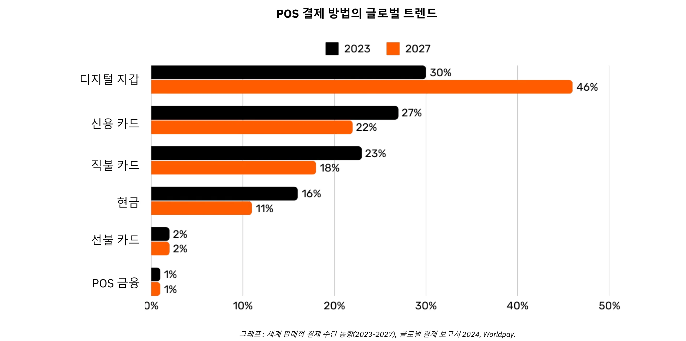

*그래픽: POS(Point-of-Sale) 결제 수단의 글로벌 트렌드(2023-2027), 글로벌 결제 보고서 2024, Worldpay*

### 간단한 카드 결제 이면의 복잡성

고객이 상점에서 신용카드를 사용하면 POS 단말기가 카드를 읽고 거래 데이터를 판매자의 매입 은행으로 안전하게 전송합니다. 매입 은행은 이 정보를 관련 카드 네트워크(예: 비자 또는 마스터카드)로 전달하고, 해당 네트워크는 고객 카드를 제공한 은행인 발급사에 요청을 전달합니다. 발급사는 고객의 계좌 또는 신용 한도를 확인한 후 네트워크와 매입사를 통해 승인서를 다시 전송하여 판매자가 결제를 수락할 수 있도록 합니다.

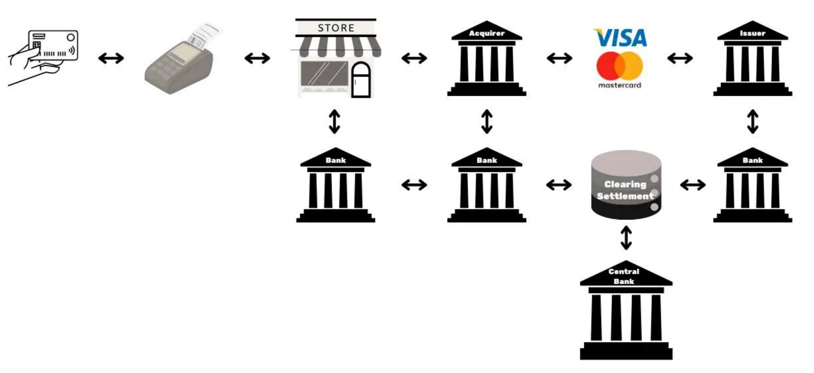

간단해 보이는 이 거래에는 실제로 15개 이상의 단계와 7개의 중개업체가 관여하며 판매자가 자금을 수령하는 데 평균 48시간에서 5일이 걸립니다. 다음 날에는 청산 및 정산 프로세스가 진행됩니다. 카드 네트워크는 당일의 거래를 집계하고 매입자와 발행자 간의 자금 교환을 조정합니다. 중앙 은행은 이러한 은행 간 결제의 정확성과 안정성을 보장합니다. 결국 판매자의 은행 계좌는 매입자로부터 수수료를 제외한 순 금액을 입금받으며 거래 라이프사이클이 완료됩니다.

전반적으로 이 프로세스는 한 당사자에서 다른 당사자로 가치를 이동하는 단순한 행위여야 하는데도 복잡하고 시간이 많이 걸리며 비용도 많이 듭니다.

### 결제 방법 비교

| 결제 방법 | 승인 필요 여부           | 거래 승인 시간(판매자 보기) | 결제 속도(자금이 완전히 정산됨) | 최종성(취소 용이성) | 중개자 수 | 일반적인 수수료(수취인에게) |

| ------------------------------ | ------------------------------- | ----------------------------------------- | ---------------------------------------------- | ---------------------------------------- | ------------------------------ | ---------------------------------- |

**현금** | 아니요 | 즉시(물리적 Exchange) | 즉시(결제 지연 없음) | 높음(결제 후 취소 불가) | 없음 | 없음 | 없음

**수표** | 예(은행 청산) | 입금 시 수락(보증되지 않음) | 며칠(수표 청산 프로세스) | 중간(청산 전 반송/중단 가능) | 은행 | **중간에서 낮음**(은행 수수료) |

**유선 송금** | 예(은행/네트워크) | 몇 시간 내 확인 | 당일 또는 익일(국내) | 높음(보통 송금 후 취소 불가) | 은행, 결제 네트워크 | **중간**(고정/퍼센트) | 송금 방법

| 결제 카드** | 예(카드 발급사 승인) | 수초~수분(승인 코드) | 며칠(은행 간 결제) | 중간(지불 거절 가능) | 발급사, 매입자, 카드 네트워크 | **가변(거래의 1-3%)** **

**디지털 지갑/모바일 결제** | 예(Wallet 사업자/은행) | 초(즉시 확인) | 보통 1~2일(자금 출처에 따라 다름) | 중간(환불/분쟁 가능) | 은행, Wallet 사업자 | **낮음에서 중간(다양함)** |

### 기존 솔루션의 한계

전통적인 결제 산업의 연간 경제 규모는 약 2,200억 달러로, 이는 미국 GDP의 약 10분의 1에 해당하거나 프랑스 GDP와 맞먹는 규모입니다. 통화는 허가된 네트워크로 기능하기 때문에 경쟁이 제한되어 있어 이 '서비스'는 생산적 경제에 부과되는 세금과 비슷합니다. 비용 부담 외에도 아래와 같이 몇 가지 다른 제한 사항이 있습니다.

| 제한 사항 | 설명 | 영향 | 영향

| -------------------------------- | ---------------------------------------------------------------------------------------------------------------------------------------------------------------------------------------------------------------------------------- | ---------------------------------------------------------------------------------------------------- |

| 높은 카드 수수료 | 환전 수수료(~0.3%), 네트워크 수수료(고정 또는 0.3%-1%), 단말기/PSP 가입비, 은행 마진(0.5%-1.7%)은 생산 부문에 대한 글로벌 '세금'과 같은 상당한 비용으로 합산되어 수조 달러에 달합니다.     | 판매자 비용이 증가하여 마진이 줄어들고 잠재적으로 소비자 가격이 상승할 수 있습니다.                  |

| 최종 정산이 매우 느림 | 자금 정산에 최대 5일이 소요되어 자금의 흐름과 전반적인 경제 활동이 느려질 수 있습니다.                                                                                                                                | 판매자의 유동성을 지연시키고 경제 순환 속도를 떨어뜨립니다.                        |

| 사기 | 이커머스 채널은 사기의 주요 표적이 되고 있으며, 이로 인해 280억 달러에 달하는 막대한 손실이 발생하고 있습니다. 지불 거절은 2024년까지 전 세계적으로 약 1,740억 달러에 달할 것으로 예상됩니다. 이러한 분쟁을 관리하는 데는 많은 시간이 소요되고 정신적 부담이 발생합니다. | 운영 비용 증가, 복잡한 사기 방지 조치, 고객 신뢰도 하락.       |

| 장바구니 이탈 | 추가 보안 단계(일회성 코드, PSD2의 2단계 인증)로 인해 결제 시 마찰이 발생합니다.                                                                                                                   | 결제 복잡성이 높아지면 카트 이탈률과 매출 손실이 증가합니다.                       |

| 높은 최소 거래 금액 | 카드의 최소 지출 한도는 판매자와 소비자에게 불편한 가격이나 구매 조건을 강요하여 소액 거래를 억제할 수 있습니다.                                                                       | 고객 만족도와 유연성을 떨어뜨려 충동 구매나 저가 구매를 제한할 수 있습니다.  |

| 느린 사전 승인 속도 | 현재 시스템은 밀리초 단위의 속도로 거래를 처리하거나 지속적인 실시간 결제 흐름을 지원할 수 없습니다.                                                                                                                   | 즉각적인 결제 또는 스트리밍 결제가 필요한 사용 사례를 제한하여 혁신과 확장성을 제한합니다. |

| 은행/카드 계좌가 필요함 | 이러한 결제 수단을 사용하려면 연결된 은행 또는 카드 계좌가 있어야 하며, 계좌가 없는 사람은 자동으로 제외됩니다.                                                                                                       | 금융 포용성을 제한하여 은행 계좌가 없거나 은행 이용이 어려운 사람들의 접근성을 떨어뜨립니다.                 |

| 반복적인 온라인 계정 생성 | 사용자가 여러 개의 온라인 계정을 만들어야 하는 경우가 많아 피로감, 편의성 저하, 개인 데이터 노출 증가로 이어집니다.                                                                                                | 사용자 환경이 저하되고 개인정보 보호 문제가 제기되며 데이터 유출 위험이 증가합니다.          |

| 해외 Exchange(외환) 수수료 | 범용 계정 단위가 없어 국경 간 거래 시 비용이 많이 드는 통화 변환을 해야 합니다.                                                                                                                              | 국제 상거래에 추가 비용이 발생하여 글로벌 거래의 경제성이 떨어집니다.             |

음성 통화료를 분 단위로 지불하던 방식에서 거의 무료에 가까운 IP 기반 통신을 사용하게 된 것처럼, 보다 개방적이고 효율적인 네트워크의 출현은 비용과 중개자를 줄이고 새로운 비즈니스 모델을 육성하여 지불 방식을 재정의할 수 있습니다.

## 비즈니스용 Bitcoin: 신흥 통화

<chapterId>4488fe33-663f-41a3-a668-e9ca2fb7122e</chapterId>

**Bitcoin란 무엇인가요?

Bitcoin은 **P2P 디지털 통화 Exchange 시스템**(전자 현금)입니다. "Bitcoin"이라는 용어는 다음 구성 요소를 의미합니다:

- 인터넷에서 중개자 없이, 허가 없이, 익명으로 가치 Exchange을 전송할 수 있는 컴퓨터 프로토콜**입니다. 고급 암호화 원칙을 사용합니다.
- 개인과 기업이 운영하는 인터넷에 연결된 기계(노드, 채굴기 등)의 물리적 네트워크**로, 중앙 권한이나 단일 제어 지점이 없는 탈중앙화된 시스템을 형성합니다.
- 시스템 내 계정**의 단위입니다. 비트코인은 2,100만 개를 초과하여 존재하지 않습니다. 각 Bitcoin은 익명의 창시자를 기리기 위해 '사토시'라고 불리는 1억 개 단위로 나눌 수 있습니다.

이 두 가지가 합쳐져 Bitcoin은 **보유자 자산**이자 **발행자가 없는** 디지털 화폐가 됩니다. Ownership은 **개인 암호화 키**를 보유함으로써만 보호되며, **중개자나 신뢰할 수 있는 제3자 없이** 완전한 통제권을 부여합니다. Ownership은 양도 시 즉시 **완결성**이 발생하며, 새로운 소유자는 보호 또는 전환을 위해 중앙 기관에 의존하지 않고 완전히 소유할 수 있습니다. 거래는 **변경 불가능**하며, Blockchain에 기록되면 변경하거나 삭제할 수 없습니다.

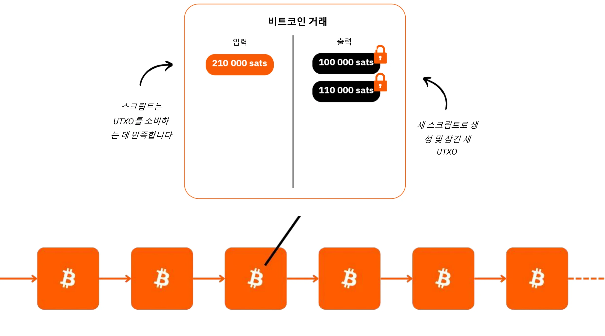

Bitcoin는 **한도가 2100만 비트코인**으로 고정된 통화 정책을 가지고 있으며, 이 중 약 1980만 비트코인이 이미 배포되었습니다. 따라서 사용자가 저축과 생산성 향상을 저장하면 시간이 지남에 따라 가치가 상승하는 **디플레이션**이 발생합니다.

기술적 특징은 금과 달러를 합친 것보다 뛰어나며, 지금까지 만들어진 금융 자산 중 가장 어려운 자산입니다. Bitcoin는 가치 저장 수단인 동시에 현재 개발 중인 통화인 Exchange의 매개체이기도 합니다. 중개자 없이, 최소한의 비용으로, 사기 없이, 24시간 연중무휴로, 제3자의 개입 없이 한 회사의 재무부에서 다른 회사로 가치를 신속하게 이전한다고 상상해 보세요.

Bitcoin은 Ledger이 변조되지 않기 때문에 가치를 효과적으로 보존할 수 있습니다. 희귀하고 한정된 Supply과 사용자 수 증가에 따른 Exchange의 기회 증가로 인해 그 가치는 더욱 높아집니다.

Bitcoin는 우리가 배운 적 없는 수학, 암호학, 경제학, 역사 분야의 개념을 배우도록 장려한다는 점에서 파괴적인 혁신입니다. 종종 복잡하다고 인식되지만, 사실 연습과 실험을 통해 접근 가능한 혁신입니다.

Bitcoin은 돈의 본질 자체에 대해 다시 생각해보게 합니다. 돈이란 과연 무엇인지 설명해 주시겠어요? 샐러리맨이나 기업가는 인생에서 5만~10만 시간을 돈을 버는 데 소비하지만, 돈을 더 잘 이해하고** 보존하는 데 100시간이라도 투자하는 사람은 얼마나 될까요? Bitcoin은 우리가 돈을 필요로 하는 근본적인 이유와 현세적 관점에 대해 질문하도록 독려합니다. 돈은 즉각적인 사치를 위한 것인가, 아니면 장기적인 회복력을 위한 것인가? 구매를 미룰 수 있는 자산이 있다면 우리는 어떤 선택을 할까요? 20년 또는 30년 후 우리 자신과 어떤 대화를 나누고 싶을까요?

**Bitcoin 신분증**

- 나이:** 15세(2009년 1월 3일)
- 일일 Exchange 가치:** 100억 달러(> CAC40)
- 시가총액:** 1.8조 달러(> 메타, 비자, 실버, < 애플, 구글, 골드)
- 사용자:** ~1억~2억 명(전 세계 인구의 1~2%)
- 변동성: ** 본질적으로 없음(1Bitcoin = 1Bitcoin), 외부적으로 매우 높음(법정화폐 거래소 기준)
- 실적:** 첫 거래 0.0009달러, 현재 100,000달러(x100백만)
- 네트워크 가용성(가동 시간):** 2013년 이후 100%
- 사망 또는 비판 선언:** 한 달에 한 번

**인간 협력의 경이로움:**

- 완전 **오픈 소스**
- 법인:** 없음
- CEO:** 없음
- 벤처 캐피탈 투자:** 없음
- 마케팅:** 없음
- R&D:** 자원 봉사자 중심
- 거버넌스:** 사용자에 의한
- 혁신적인 경제 모델:** 블록 생성은 거래 수수료로 보조됩니다(경매 기반)

Bitcoin의 역사, 작동 방식 및 사용법에 대한 자세한 내용은 이 다른 종합 강좌를 참조하세요:

https://planb.network/courses/2b7dc507-81e3-4b70-88e6-41ed44239966
## Lightning Network 소개

<chapterId>c095c7ad-5469-4c7b-9510-b6c0b86244e7</chapterId>

**라이트닝이란 무엇인가요?

Lightning Network은 Bitcoin의 메인 Blockchain과의 상호작용을 최소화하면서 Bitcoin 트랜잭션을 촉진하는 **프로토콜이자 네트워크**입니다. 작동 방식은 다음과 같습니다:

- 초기 설정: ** 자금은 기본 Blockchain에 잠겨(에스크로) 두 당사자 간의 결제 채널을 설정합니다.
- 결제 네트워크:** 여러 당사자 간의 결제 채널 웹이 결제 네트워크(라우팅 및 상호 연결)를 형성합니다.
- off-chain 거래: ** 당사자 간에 거래가 발생하지만 Bitcoin의 메인 Blockchain(**"off-chain"**)에 **즉시 게시되지는 않습니다**.
- On-Chain 정산: **채널 거래의 **최종 잔액**만 Bitcoin 메인 Blockchain(**"On-Chain**")에 게시되므로 그동안 수많은 거래가 발생할 수 있습니다. 이렇게 여러 번의 결제를 묶어두면 혼잡도가 줄어들어 많은 On-Chain 거래를 할 때보다 수수료가 낮아집니다.
- 채널 폐쇄: ** 사용자는 언제든지 채널을 폐쇄하고 최신 트랜잭션 상태를 게시하여 Bitcoin을 되찾을 수 있습니다. 트랜잭션은 언제든지 "게시 가능"이지만, 필요할 때까지는 "게시되지 않음"**이 원칙입니다. 종료(채널 폐쇄)는 일방적(언제든지 두 당사자 중 한 명이 결정)이거나 상호 결정(On-Chain 수수료를 낮추는 결과)할 수 있습니다

이 접근 방식은 모든 거래를 Bitcoin의 메인 Blockchain에서 직접 수행하는 속도 저하와 복잡성을 피하고 최종 잔액만 기록하며 보안을 유지합니다. Lightning Network은 Bitcoin의 '위'에 있는 Layer이지만 Bitcoin에 고정된 상태로 유지됩니다.

**글로벌 결제 네트워크**

이 프로토콜은 채널이 범용 결제 시스템을 형성하는 기계의 **네트워크**를 생성합니다. 이러한 노드는 개인이나 기업이 자유롭게 운영할 수 있어 완전히 개방된 네트워크가 됩니다.

Lightning Network는 빛의 속도로 즉각적인 가치를 실현하는 Exchange을 지원합니다. 이메일 프로토콜을 결제에 적용한 차세대 결제 네트워크입니다. '돈'이 이동하는 방식을 근본적으로 변화시켜 인터넷에서 데이터를 전송하는 것만큼이나 자유롭고 빠르게 만들어줍니다.

**주요 이점:**

- 속도:** 즉각적인 거래.
- 저렴한 수수료:** 기존 은행 네트워크에 비해 훨씬 저렴한 비용.
- 도입의 용이성: ** 기업은 스마트폰 앱이나 웹사이트의 결제 버튼만으로 빠르게 Lightning 결제를 수락하도록 설정할 수 있습니다.

Lightning 인프라는 속도, 비용, 에너지 효율성 측면에서 기존 결제 시스템보다 월등히 뛰어납니다. 가맹점 채택이 증가함에 따라 이러한 추세는 더욱 가속화될 것입니다. 결제가 은행 간 네트워크를 우회할 수 있다면 왜 오늘날의 중개업체에 수익의 상당 부분을 계속 포기해야 할까요?

**무한한 사용 사례:**

라이트닝의 활용 범위는 저렴한 수수료와 빠른 속도를 훨씬 뛰어넘습니다. 완전 무료의 즉각적인 결제 레일을 제공함으로써 경제 전반에 걸쳐 막대한 기회를 열어줍니다.

**Bitcoin의 Exchange 기능 강화:**

라이트닝은 "Exchange의 매개체"로서 Bitcoin의 역할을 증폭시킵니다 거래의 빈도와 자유도를 높임으로써 화폐의 주요 기능인 모든 참여자의 경제적 교환과 가치 창출을 촉진하는 기능을 강화합니다.

향후 '스마트 머신 경제'의 부상으로 초고속, 고빈도 결제 시스템이 필요하게 될 것이며, 이는 라이트닝만이 충족할 수 있는 기술 표준입니다. 이를 통해 더 많은 상품과 서비스를 창출할 수 있습니다. Bitcoin의 Supply가 한정되어 있기 때문에 각 유닛의 구매력이 높아질 것입니다. Bitcoin과 라이트닝은 네트워크가 확장됨에 따라 함께 성장합니다.

라이트닝은 인터넷 기반이 된 모든 비즈니스가 Bitcoin 기반이 될 미래를 엿볼 수 있게 해줍니다.

**Bitcoin 라이트닝 결제: 일반적인 판매자 사용 사례**

Lightning Network는 빠른 속도와 결제 완료로 인해 오프라인 또는 온라인 스토어에서 Bitcoin 결제에 이상적입니다.

- 속도: 라이트닝(~500밀리초~수초)은 거래 확인까지 약 30분이 걸리는 Bitcoin 메인 네트워크보다 훨씬 빠릅니다. 고액 구매(1,000달러 이상)의 경우 속도가 덜 중요하기 때문에 Bitcoin 메인 네트워크를 선호할 수 있습니다. 그러나 애플리케이션이 백그라운드에서 이러한 결정을 원활하게 처리하기 때문에 일반 사용자에게는 이러한 세부 사항이 잘 드러나지 않는 경우가 많습니다.
- 최종성: ** Lightning에서 결제가 완료되면 결제가 완료된 것입니다. 제3자에 의한 지불 거절이나 사기 관련 분쟁이 발생할 가능성이 없습니다.
- 수수료: ** Lightning Network의 거래 수수료는 최소이며 판매자가 아닌 사용자가 지불합니다. 판매자는 나중에 Bitcoin을 다른 네트워크나 서비스로 이전해야 하는 경우에만 수수료가 발생합니다.

**라이트닝 신분증**

- 발명:** 2015
- 출시:** 2016
- 나이:** 7세(첫 거래: 2017년 12월 28일)
- 네트워크 기술력: ** 대규모로 기존 시스템보다 1,000배 더 많은 인스턴트 트랜잭션을 처리할 수 있습니다.
- 트랜잭션 크기:** 기존 시스템보다 최대 1,000배까지 작습니다.
- 트랜잭션 속도: ** 최대 100배 빨라졌습니다.
- 수수료:** 최대 90% 저렴합니다.
- 결제 완료 시간: ** 거의 즉각적(보통 ~500밀리초, 때로는 몇 초)입니다.
- 에너지 소비량: ** 기존 글로벌 통화 시스템의 ~8%.
- 특징:**
    - 피어 투 피어
    - 유니버설
    - 무허가
    - 우수한 개인 정보 보호
    - 검증된 보안
    - 고가용성(뛰어난 가동 시간)
    - 제어 가능 및 적응성

Lightning Network의 기술적 작동 방식에 대한 자세한 내용은 이 다른 종합 강좌를 참조하시기 바랍니다:

https://planb.network/courses/34bd43ef-6683-4a5c-b239-7cb1e40a4aeb
# Bitcoin 재무부

<partId>bf45c1e8-af97-4b6b-af42-2866f493b14d</partId>

## 수익, 자본, 비즈니스 회복탄력성의 열쇠

<chapterId>656ad88f-3c27-4054-a94e-b29727009b8e</chapterId>

### 건강한 회사

**미래는 불확실하며**, 기업은 수익 창출과 자본 보존에 중점을 두고 이러한 불확실성을 헤쳐 나가야 합니다. 오스트리아 경제학에 따르면 **이익은 기업의 건전성을 나타내는 궁극적인 신호**로, 기업이 소비자의 요구를 효율적으로 충족하고 있음을 보여줍니다. 이익이 없으면 기업은 성장은커녕 유지조차 할 수 없습니다. 기업이 건전성을 유지하려면 generate 이익뿐만 아니라 **미래 투자와 도전을 위해 자본을 축적**하는 등 앞을 내다보는 사고도 필요합니다.

**자본 보존**은 예측할 수 없는 시장에서 기업이 적응하고 기회를 포착할 수 있도록 해주기 때문에 매우 중요합니다. 여기에는 성장을 위한 수익 재투자와 잠재적인 경기 침체를 극복할 수 있는 재정적 완충 장치 유지 사이의 균형을 맞추는 것이 포함됩니다. 오스트리아 경제학에서는 '시간 선호도'의 중요성을 강조하는데, 이는 기업이 장기적인 성공을 위한 투자 대비 즉각적인 수익의 우선순위를 신중하게 결정해야 한다는 의미입니다. 건강한 기업은 재무 기반을 튼튼하게 유지하여 좋은 시기나 나쁜 시기 모두에서 유연성을 확보할 수 있습니다.

가격 및 경쟁과 같은 시장 신호는 기업이 자원 배분에 대한 현명한 결정을 내릴 수 있도록 안내합니다. 이러한 신호에 귀를 기울이면 기업은 과도한 확장이나 잘못된 투자, 특히 쉬운 신용과 같은 인위적인 요소의 영향을 받는 함정을 피할 수 있습니다. 리소스를 잘못 할당하면 회사의 건전성이 위태로워질 뿐만 아니라 고객에게 효과적으로 서비스를 제공할 수 있는 능력도 저하됩니다.

궁극적으로 건강한 비즈니스를 유지한다는 것은 적응력을 유지하고, 신중한 재정적 선택을 하며, 항상 미래를 주시하는 것을 의미합니다. **수익에 집중하고, 자본을 보존하고, 시장 신호에 대응함으로써 규모에 관계없이 모든 비즈니스는 불확실성 속에서도 번창할 수 있습니다**.

### 자본에는 미덕이 있나요?

**일반적으로 자본이 묘사되는 방식**

우리 사회에서 흔히 오해되고 부정적으로 인식되는 용어인 자본의 진정한 의미를 재발견해 봅시다.

전통적인 경제 이론(케인즈주의)에서 자본은 주로 투자를 통해 총수요를 자극하는 데 사용되는 물리적 또는 금융 자산의 동질적인 재고로 단순화된 용어로 이해되는 경우가 많습니다. 자본은 종종 부의 집중과 소수 엘리트가 보유한 경제력과 관련이 있습니다. 부의 격차가 계속 벌어지는 상황에서, 특히 축적된 부가 다수에게 아무런 혜택을 제공하지 않는 것처럼 보일 때 많은 사람들은 자본을 경제적 불평등의 상징으로 간주합니다.

'자본'은 종종 착취의 도구로 묘사되며, 이러한 관점은 자본이 본질적으로 노동자의 이익과 반대되는 것으로 보는 다양한 운동에 깊은 영향을 미쳤습니다. 하지만 이것이 사실일까요? 아니면 이러한 인식이 왜곡된 것일까요?

1. 경제 메커니즘에 대한 이해 부족(경제학자 자신도 포함)?

2. 정부 개입주의와 시장 조작?

3. 정실 자본주의와 자유 시장 자본주의의 혼동?

4. 미디어의 경제 위기 프레임?

5. 빠른 해결과 즉각적인 사회 정의에 대한 열망이 있으신가요?

6. 반자본주의 수사의 문화적 정상화?

다행히도 Bitcoin은 모든 것을 다시 생각하게 하고 이러한 선입견에 도전하게 합니다. 이러한 문제를 밝히고 자본의 진정한 본질을 재고하는 데 도움을 줄 수 있는 오스트리아 경제학파라는 학파가 존재합니다.

**옛날 옛적에**

짧은 이야기부터 시작하겠습니다:

"작은 무인도에는 한 고독한 어부가 살고 있습니다. 그는 매일 맨손으로 물고기를 잡는 데 많은 시간과 에너지를 소비합니다. 어느 날 그는 보다 효율적으로 낚시를 할 수 있는 창을 만들어야겠다는 생각을 하게 됩니다. 하지만 이를 위해서는 희생이 필요하다는 것을 알고 있습니다.

어부는 창 제작을 시작하기 전에 창을 만드는 동안 몸을 지탱하기 위해 물고기를 몇 마리 남겨두기로 결정합니다. 그는 며칠 동안 평소보다 적게 먹으며 프로젝트에 집중할 수 있을 만큼의 물고기를 모았습니다. 이렇게 절약한 물고기는 목표를 달성할 수 있는 작은 예비 자금인 '자본'을 의미합니다.

창을 만드는 데 시간을 할애하는 동안, 그는 예비비에 의존하며 당장의 안락함을 기꺼이 미룹니다(**시간 선호도**를 반영한 결과). 며칠간의 Hard 작업 끝에 그는 튼튼한 창을 완성합니다.

이제 그는 창을 사용하여 훨씬 더 빠르고 적은 노력으로 물고기를 잡을 수 있습니다. 그는 더 이상 이전처럼 지칠 필요가 없으며 심지어 잉여 물고기를 축적하기 시작합니다. 이 잉여는 저장하거나 공유하거나 섬의 다른 프로젝트에 투자할 수 있는 새로운 가능성을 열어줍니다. 즉각적인 소비를 미루고 자본을 활용함으로써 어부는 효율성과 미래 전망을 크게 개선했습니다."

이 이야기는 경제 성장과 인류 진보의 핵심 개념인 더 나은 미래를 건설하는 데 있어 자본, 인내, 선견지명의 근본적인 역할을 설명합니다.

### 오스트리아 경제학파와 자본에 대한 비전

오스트리아 경제학파는 오스트리아 출신인 설립자와 초기 공헌자들의 이름을 따서 명명되었습니다. 이 이름은 그대로 이어져 개인의 자유, 자유 시장, 최소한의 국가 개입을 강조하는 고전적 자유주의 사상과 밀접한 관련이 있는 학교가 되었습니다.

**자본에 대한 오스트리아인의 관점**

오스트리아의 관점에서 자본은 미래의 생산을 향상시키는 도구나 생산적 자원을 구축하기 위해 소비를 연기한다는 개념과 깊은 관련이 있습니다. 자본 축적으로 알려진 이 과정은 오스트리아 경제 이론의 핵심입니다. 이 관점의 주요 Elements는 다음과 같습니다:

- 시간 선호도와 이연 소비**: 개인은 당연히 나중에 소비하는 것보다 지금 소비하는 것을 선호하지만, 미래에 더 큰 보상을 기대한다면 소비를 미루는 것을 선택할 수 있습니다. 지금 저축하면 시간이 지남에 따라 생산성을 향상시키는 자본재(도구, 기계, 인프라)에 자원을 투자할 수 있습니다. 시간 선호도가 낮은 사회나 개인은 더 많이 저축하고 장기 프로젝트에 투자하여 지속 가능한 성장을 촉진합니다.
- 미래 생산의 원동력으로서의 자본**: 자본재는 최종 소비재를 생산하는 데 사용되는 중간 도구로 간주됩니다. 기업가는 자본을 축적함으로써 생산성을 향상시키고 미래에 더 많은 부를 창출할 수 있습니다. 예를 들어, 당장 소비재를 생산하는 대신 공장이나 기계를 짓는 데 자원을 사용할 수 있습니다. 이렇게 하면 단기적으로는 소비가 줄어들지만, 결과적으로 효율성이 높아져 나중에 더 많은 생산과 번영을 이룰 수 있습니다.
- 간접 생산과 효율성**: 유겐 뵘-바웨르크와 같은 오스트리아의 경제학자들은 여러 단계를 거치는 더 길고 복잡한 생산 공정인 간접 생산의 개념을 강조했습니다. 이러한 과정은 시간이 걸리지만 궁극적으로 더 효율적이고 생산적인 결과를 가져오는데, 예를 들어 손으로 통나무를 모으는 대신 제재소를 건설하여 목재를 가공하는 것이 그 예입니다.
- 신호로서의 금리**: 오스트리아의 관점에서 금리는 개인의 시간 선호도를 자연스럽게 반영합니다. 높은 금리는 즉각적인 소비를 선호하는 반면, 낮은 금리는 저축과 장기 투자를 장려합니다. 중앙은행이 금리를 인위적으로 조작하면 이러한 자연스러운 신호가 왜곡되어 자원이 잘못 배분되고 지속 불가능한 투자(잘못된 투자)로 이어집니다.

*현대 경제에서 자본의 두 가지 형태****

우리가 운영하는 부채 기반 통화 시스템의 틀 안에는 **두 번째 유형의 자본**이 존재하는데, 이는 은행이 단순한 신용 메커니즘을 통해 대출을 생성할 때 순간적으로 생성되는 자본입니다. 여기에는 은행이 실제로 보유하고 있지 않은 돈을 미리 빌려주는 대신 상환 약속을 바탕으로 유동성을 창출하는 '무(無)유동성'이 포함됩니다.

한편으로 "오스트리아식" 자본은 신중한 경제적 결정과 세심한 희생을 수반하는 실제 저축의 결과물입니다. 반면에 부채를 기반으로 한 화폐의 창출을 통해 생성된 자본은 즉각적이고 인위적인 구조입니다. 이 두 가지 유형의 자본은 **표면적으로는 프로젝트 자금 조달에 사용된다는 점에서 유사하지만**, 근본적으로 그 성격이 다릅니다.

이 두 가지 형태의 자본은 결코 혼동되어서는 안 되지만, 부채 기반 시스템에서는 종종 혼동되어 **경제 신호를 왜곡**하고 종종 잘못된 투자로 이어집니다. 이러한 오해는 자본주의가 종종 부당한 비판을 받는 이유를 설명해 줍니다

**케인즈주의의 핵심 쟁점**

글로벌 엘리트들이 널리 채택하고 있는 케인즈주의 정책은 금리를 조작하고 부채를 통해 수요를 자극합니다. 이는 자원이 단기적이고 지속 불가능한 프로젝트로 흘러가도록 유도하여 경기 사이클을 증폭시키고 건전한 저축과 생산적인 투자에 기반한 진정한 성장을 지연시킵니다. 비즈니스 리더들은 건전한 기업들이 부풀려진 수익을 추구하기 위해 고평가된 인수에 뛰어들면서 유기적이고 지속 가능한 성장을 저해하는 이 해로운 정책을 직접 목격하고 있습니다.

이러한 환경에서 기업가들이 정성껏 저축한 '건전한' 자본이 어떻게 인위적으로 만들어진 '불건전한' 자본과 경쟁할 수 있을까요? 또한, 화폐의 일방적인 팽창은 건전한 자본의 구매력을 약화시켜 경제적 혼란과 사회적 불만을 악화시킵니다.

**희망의 빛: Bitcoin**

Bitcoin는 화폐 인플레이션으로 인한 침식 없이 장기적으로 자본을 축적하고 보존할 수 있는 방법을 제공합니다. 가치 저장 수단으로서 기업이 탄력적으로 미래 투자를 계획하고 부채 중심 시스템의 지배에 도전하며 진정한 생산적 자본 축적으로의 복귀를 촉진할 수 있도록 지원합니다.

### 오스트리아 경제학파에 대해 자세히 알아보기

오스트리아 경제학파**는 자유 시장, 개인의 자유, 경제 과정에서 인간 행동의 중요성을 중시하는 경제 사상의 전통입니다. 특히 화폐와 시장에 대한 국가의 개입을 비판하며, 개인이 주관적인 선호에 따라 자신의 이익을 가장 잘 판단할 수 있다고 주장합니다.

*오스트리아 학교의 주요 인물** **

- 칼 멩거**: 오스트리아 학파의 창시자인 멩거는 상품의 가치가 생산 비용보다는 개인의 선호도에 따라 달라진다고 주장하는 주관적 가치 이론을 개발했습니다.
- 루트비히 폰 미제스**: 오스트리아 학파의 초석이 된 미제스는 프락시올로지(인간 행동 이론)를 도입하고 사회주의와 중앙 계획에 대한 심오한 비판을 담은 <인간 행동>을 저술했습니다.
- 프리드리히 하이에크**: 미제스의 제자인 하이에크는 분산된 지식과 시장의 자발성에 관한 연구로 1974년 노벨 경제학상을 수상했습니다. 그는 저서 <노예로 가는 길>에서 중앙집권적 통제를 강하게 비판했습니다.
- 머레이 로스바드**: 미제스의 제자이자 자유주의의 확고한 옹호자인 로스바드는 자발적 계약에 의해 지배되는 국가 없는 사회를 구상하며 무정부주의 자본주의 이론을 발전시켰습니다. 그의 저서 _인간, 경제, 국가_는 오스트리아 경제학에서 중요한 저작입니다.

**기타 영향력 있는 경제학자**

- 밀턴 프리드먼**: 프리드먼은 오스트리아 학파와 직접적인 연관은 없지만 많은 친시장 및 자유주의 사상을 지지했습니다. 그의 통화주의 정책은 오스트리아 학파의 생각과는 다르지만, 경제에 대한 과도한 국가 개입에 대한 비판을 공유했습니다.
- 프레데릭 바스티아트**: 19세기 프랑스 경제학자인 바스티아는 자유무역과 경제 정책의 보이지 않는 결과에 관한 연구로 오스트리아 학파에 영향을 미쳤습니다. 그의 에세이 _보이는 것과 보이지 않는 것_은 경제 자유주의의 기본 텍스트입니다.

*저작자 표시: 루트비히 폰 미제스 연구소*

**핵심 기여 및 아이디어**

이 사상가들은 국가 개입이 시장을 왜곡하고 경제적 자유가 번영과 인간 행동의 조화로운 조정을 위해 필수적이라는 생각을 형성했습니다. 이들의 통찰력은 탈중앙화된 의사 결정의 중요성과 경제 시스템에서 중앙 집중식 통제의 위험성을 강조합니다.

이 주제에 대한 자세한 내용을 확인하세요:

https://planb.network/courses/d955dd28-b7c6-4ba2-a123-d932e21d148f
https://planb.network/courses/9d1bde6a-33e5-45dd-b7c0-94da72e45b11
https://planb.network/courses/d07b092b-fa9a-4dd7-bf94-0453e479c7df
## Bitcoin 재무부 보유

<chapterId>89622a40-d14f-4c37-a075-8e7e1731ec26</chapterId>

### 기업 재무의 과제

재무는 소중한 것을 보관하는 곳입니다. 건강한 기업은 적절한 자본을 보유하여 미래의 불확실성에 대처하고 투자를 계획할 수 있습니다. 요즘에는 잉여금의 일부를 채권, 정기예금 등 'Liquid'이 높은 것으로 알려진 금융 자산에 투자합니다.

일부 기업에서는 부동산과 같은 비유동성 자산을 위험성을 인지하지 못한 채 장기적으로 사용하는 경우가 있습니다:

- 위기 발생 시 유동성 부족
- 수수료를 공제하고 나면 궁극적으로 수익률이 다소 낮아집니다
- 실질 인플레이션을 능가하지 않는 수익률, 즉 Supply(연간 약 7%, 아래 참조)의 수익률입니다
- 부동산이 Bitcoin와 같은 자산의 이익을 위해 '저축' 기능의 일부를 잃을 수 있는 숨겨진 위험이 있습니다. 결과적으로 부동산은 '사용 가치'인 주거지 제공에 더 가깝게 되돌아갈 수 있습니다.

비즈니스가 운영되는 환경을 간단히 살펴보겠습니다.

**실질 인플레이션**: 놀랍게도 중앙은행은 연간 2%의 인플레이션을 목표로 하고 있으며, 이는 20년간 40%의 통화 가치 하락을 의미합니다. 인플레이션이 더 두드러진 시기를 더하면 기업이 노동의 결실을 저장하기 위해 통화만으로는 불가능하다는 것이 분명해집니다. 기업은 반드시 다양한 위험을 수반하는 복잡한 재무 전략을 실행해야 합니다. 이러한 전략은 핵심 활동에 이미 많은 시간을 할애하고 있는 아주 작은 규모의 기업에게는 명백히 '접근하기 어려운' 전략입니다.

**숨겨진 인플레이션**: 중앙은행이 지원하는 부채 기반의 부분 준비금 통화 시스템에서는 **전체 통화량이 연평균 약 7%씩 증가**합니다(예: 유로존이나 미국의 M1). 즉, 새로 창출된 화폐로 인해 자산 가격이 상승하기 전에 '이전 가격'으로 자산을 빠르게 레버리지하고 매수하여 계속 성장할 수 있는 특권층이 아니라면, 불과 몇 년 만에 '파이의 몫'이 절반으로 줄어든다는 뜻입니다. 이것이 바로 부유층으로의 부의 이전을 부분적으로 설명하는 칸티용 효과이며, '자본'이 그 원인으로 잘못 지목되고 있습니다(위의 자본에 대한 소개 참조).

**거래 상대방 위험**: 현재의 금융 시스템은 위험하며, "내 돈"에 항상 접근하지 못할 수도 있습니다 카드의 집을 떠올리지 않더라도, 금융 기관은 사소한 위기에도 이익을 사유화하고 손실을 사회화한다는 사실을 인정해야 합니다. "성경적" 화폐(Ledger에 기록된 화폐) 시스템에서 은행에 있는 돈은 단지 "청구권"일 뿐이며, 여러분은 실제로 그것을 소유하지 않으며 은행 자체도 그것을 "가지고 있지 않다"(부분 준비금). 이 돈은 어떤 면에서 정말 마법과도 같습니다. 한때 Bitcoin을 조롱했던 일부 유명 은행은 오늘날 더 이상 존재하지 않습니다(예: 크레디트스위스).

이러한 신뢰 부족으로 인해 금과 같은 '무기명' 자산(보안, 운송, 분할 등이 복잡함에도 불구하고)은 물론 새로 등장한 Bitcoin이 다시 부활하기 시작했습니다.

### 금융 자산으로서의 Bitcoin

Bitcoin는 근본적인 대안을 제시합니다. 중앙 발행자가 없는 무기명 자산이며**, 압류가 거의 불가능하고 네트워크 효과의 이점을 누릴 수 있습니다. "진정한" Bitcoin 사용자는 검열과 인플레이션에 강한 가치 저장 수단으로 여겨지기 때문에 노동의 결실을 저장하는 데 이를 사용합니다. 멧칼프의 법칙으로 설명되는 네트워크 효과 덕분에 새로운 확신을 가진 사용자가 늘어날 때마다 네트워크의 가치가 증가하며, 참여자가 늘어날수록 Bitcoin의 효용은 기하급수적으로 증가합니다. 이 모델은 사용자의 채택과 신뢰를 기반으로 하는 독특하고 유망한 형태의 자본입니다.

Bitcoin은 폐장 시간과 "서킷 브레이커"가 있는 기존 금융 시장과 달리 24시간 내내 중단 없이 운영되는 **세계에서 가장 많은 Liquid 자산**입니다 이러한 유동성 덕분에 사용자는 좋은 소식이든 나쁜 소식(예: 미사일 발사, 전쟁 등)이든 언제든 비트코인을 사고 팔 수 있습니다.

10년 동안 Bitcoin은 연평균 60% 이상의 성장률을 보였습니다. 이러한 독특한 성과 덕분에 장기 보유자는 다른 상품과 달리 초기 자본을 보존할 수 있었습니다.

하지만 명심해야 할 몇 가지 핵심 요소가 있습니다:

첫째, **과거의 성과가 미래의 결과를 보장하지는 않습니다**. Bitcoin가 **안전하고 탈중앙화된 상태로 유지되는 한**, 향후 10년간 매년 20% 이상의 가격 상승을 합리적으로 기대할 수 있으므로 실행 가능한 자산 관리 도구가 될 수 있습니다.

둘째, Bitcoin은 지금까지 **4년 주기**를 경험했으며, 이는 4년 이상의 기간 동안 항상 수익이 발생했음을 의미합니다. Bitcoin을 투자로 보는 사람들에게는 단기적인 기간(4년 미만)은 위험할 수 있습니다.

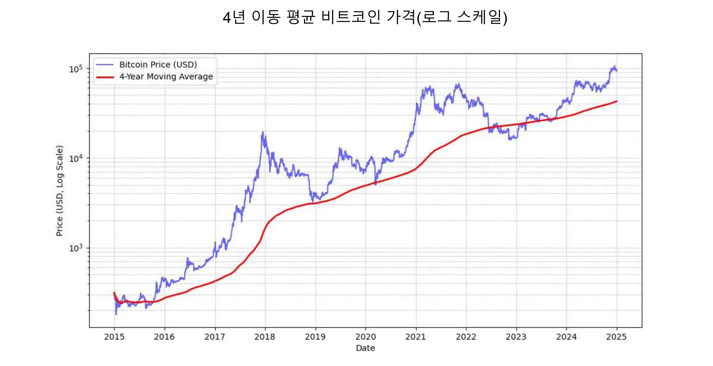

*마이클 세일러: "가장 좋은 Bitcoin 가격 신호는 4년 단순 이동 평균입니다."* 위 차트 참조.

또한 Bitcoin에 대한 노출은 자신의 이해 수준에 **비례**하여 유지하는 것이 좋습니다. 또한 서두르거나 시장 타이밍을 완벽하게 맞추려고 하지 않는 것이 중요합니다.

마지막으로 Bitcoin은 **휘발성**으로 간주됩니다. 정확히 말하자면, 법정화폐 단위로 표시되는 가격입니다. 이러한 변동성의 일부는 아직 젊은 자산의 경우 자연스러운 것이지만, 장기적인 가치 저장 수단으로 사용하지 않고 빠른 이익을 추구하는 투기꾼의 존재로 인해 증폭되기도 합니다. 또한 레버리지 거래(차입 자금을 사용해 거래 포지션을 늘리는 것)는 가격 상승과 하락을 모두 강조하여 Bitcoin이 곧은 상승 경로를 따르지 못하게 합니다. 이로 인해 변동성이 더 두드러지지만 시간이 지남에 따라 약정 사용자 기반이 증가함에 따라 이러한 변동성은 안정화되고 있는 것으로 보입니다. 요약하자면, 변동성이 없는 Bitcoin과 같은 고성능 자산을 보유하는 것은 **불가능하지만**, 변동성이 적은 자산을 훨씬 더 낮은 성능으로 보유할 수 있는 것은 분명합니다.

### 월스트리트에서 채택한 Bitcoin

금융 기관의 Bitcoin 채택으로 글로벌 시장에서의 입지가 더욱 강화되었습니다.

블랙록**의 최근 성명은 가치 저장 자산 및 포트폴리오 다각화 도구로서 Bitcoin의 잠재력을 강조합니다. 이 글로벌 기관은 최근 **Bitcoin의 사용자 증가율이 인터넷**이나 휴대폰의 증가율을 앞지르고 있으며, 이는 특히 **인구학적 및 세대적 변화**와 기존 금융 기관에 대한 불신 증가(!)에 힘입은 결과라고 밝혔습니다. 희소성, 비주권적, 탈중앙화 특성으로 인해 일부 투자자들은 Bitcoin을 **재정 및 통화 불안정**, 공포 또는 파괴적인 지정학적 사건 발생 시 안전한 피난처로 간주합니다.

2024년 1월에 출시된 **스팟 Bitcoin ETF**는 1월부터 11월까지 약 200억 달러의 순유입을 기록하며 역사상 가장 성공적인 ETF 출시라는 경이로운 성공을 거뒀습니다. 이는 다음으로 많이 출시된 ETF인 나스닥-100 QQQ보다 약 4배 높은 수치입니다. 이러한 ETF는 Bitcoin에 대한 보다 쉽고 규제된 접근을 제공하여 Bitcoin을 더욱 합법화했고 기관 자본의 상당한 유입을 이끌어냈습니다.

Bitcoin ETF는 참여 기관 수나 운용자산(AUM) 규모 면에서 가장 빠르게 성장하는 상위 10개 ETF를 능가하는 **기관 채택률**에서 큰 격차로 선두를 달리고 있습니다. 이러한 Bitcoin ETF의 성공은 디지털 자산과 연계된 투자 수단에 대한 수요가 증가하고 있음을 보여주며, 전통적인 금융 환경에서 Bitcoin의 입지를 공고히 하고 있습니다.

Bitcoin는 이제 "가치 저장 수단" **시장**에서 활약하고 있습니다. 금의 18,000억 달러나 부동산의 5,000억 달러에 비해 규모 면에서 보면 약 1,800억 달러에 불과합니다. 그러나 약 0.1%의 시장 점유율은 경쟁사들이 신규 사용자 유치에 어려움을 겪고 있다는 점을 감안하면 엄청난 성장 여지를 제공합니다.

| 티커 | 1D 흐름 (M USD) | 1W 흐름 (M USD) | 1M 흐름 (M USD) | 3M 흐름 (M USD) | YTD 흐름 (M USD) |

| ------- | --------------- | --------------- | --------------- | --------------- | ---------------- |

| **합계** | +457.19 | +1,507.95 | +2,888.01 | +3,672.29 | **+20,262.94**| |

| 아이비트 | +393.40 | +750.91 | +1,536.47 | +3,821.37 | +22,460.44 |

| 비트코인 | +14.81 | +372.40 | +627.16 | +458.71 | +10,266.69 |

| arkb | +11.51 | +163.26 | +295.92 | -3.88 | +2,647.32 |

| 비트비 | +12.93 | +146.50 | +263.30 | +97.46 | +2,262.69 |

| gw-130 | +5.75 | +38.77 | +94.54 | +100.39 | +682.03 |

| brrr | +1.92 | +4.72 | +17.76 | +20.54 | +540.19 |

| ezbc | +11.79 | +17.53 | +39.29 | +47.48 | +439.45 |

| 비트코인 | .00 | -3.13 | +36.59 | +419.18 | +419.18 |

| 비티코 | +6.43 | +19.25 | +47.30 | +56.41 | +394.82 |

| 비트코인 | .00 | +2.84 | +6.04 | +146.69 | +217.47 |

| ybit | -1.34 | -10.26 | +5.06 | +13.81 | +76.30 |

| defi | .00 | .00 | .00 | -2.03 | -1.79 |

| 비트코인 | .00 | +5.16 | -81.42 | -1503.84 | -20,141.85 |

*10개월 만에 200억 달러: Bitcoin ETF는 금 ETF가 5년이 걸렸던 것을 1년도 안 되는 기간에 달성했습니다. 출처: 펀드 투자금 흐름(USD). 블룸버그 터미널, 블룸버그 L.P., 2024*

### 회사 툴킷의 Bitcoin

미국에서 Bitcoin의 채택이 증가함에 따라 전 세계 다른 지역, 특히 전통적인 금융 상품의 실적이 저조하거나 어려운 시기에 직면한 자산 관리 전문가들의 사고방식에도 영향을 미치고 있으며, 더 이상 이를 다양한 도구에 포함시키지 않을 수 없는 상황입니다. 전통적인 은행들만이 여전히 이를 무시할 여유가 있는 것 같습니다.

순전히 재무적 관점에서 보면 Bitcoin는 분산 자산으로 인식되고 있습니다. 다른 자산군과 상관관계가 없을 뿐만 아니라 새로운 유동성이 투입되는 기간 동안 번창하는 것으로 보이며, 이러한 시기는 유럽중앙은행, 연준, 중국의 금리 인하로 시작되고 있는 것으로 보입니다.

요약하면, 가장 일반적인 사용 사례인 최소 4년의 기간 동안 초과 자금을 투자하는 경우 PW-135가 완벽하게 적합합니다. 점진적 진입 전략과 결합하여 일정한 간격으로 고정 금액을 투자하여 진입 또는 청산 시점을 부드럽게 하는 것이 좋습니다.

예를 들어 Bitcoin은 다른 사용 사례에서 전략적 재무 자산으로 활용되고 있습니다:

- 담보** 또는 유동성을 연중무휴 24시간 게시할 수 있어야 합니다
- 다른 회사의 자금으로 **언제든 빠르게** 이체할 수 있습니다
- 외화 Exchange 리스크**에 대한 헤징
- 특히 긴급 상황에서 이를 수락하는 **공급자**에게 지불하기

### Bitcoin이 너무 비쌉니까?

Bitcoin는 익명의 창시자를 기리기 위해 사토시라는 하위 단위로 나눌 수 있기 때문에 정확히 1 Bitcoin를 구매할 필요는 없습니다. 1 Bitcoin는 **1억 사토시**에 해당하므로 사용자는 Bitcoin의 아주 작은 부분까지도 구매, 판매 또는 거래할 수 있습니다. 실제로 Bitcoin의 소스 코드 내에서 모든 거래는 사토시로 계산되며, 채굴자가 보상을 받기 위해 생성하는 특수 거래인 '코인베이스'에서만 "Bitcoin"라는 용어가 등장합니다.

게다가 총 2100만 비트코인, 즉 **2.1조 사토시**는 64비트 정수로 효율적으로 표현할 수 있습니다. 즉, 전체 Bitcoin당 가격이 높지만 분할이 가능하기 때문에 다양한 투자자들이 접근할 수 있습니다. 따라서 네트워크에 참여하거나 이 디지털 자산에 투자하기 위해 Bitcoin 전체를 구매할 필요는 없습니다.

주식, 금, 부동산 등 다른 자산에 비해 상대적으로 낮은 총 시가총액으로 인해 상승 여력이 남아 있다는 점을 기억하세요. 아직 보급률이 매우 낮기 때문에(전 세계 인구의 약 1%) 이제 막 상승의 시작 단계에 접어든 것으로 여겨집니다. 따라서 우리 세대의 가장 비대칭적인 내기라고 할 수 있습니다. 현재 시점에서 0으로 떨어질 확률은 매우 낮고 계속 상승할 확률은 매우 높습니다.

### Bitcoin에서 기업 재무부 할당 결정

Bitcoin 투자에 대한 **의사 결정 과정**은 회사 내 귀하의 지위에 따라 크게 영향을 받습니다. 귀하가 **대주주**인 경우, 귀하는 자신의 판단에 따라 초과 자금을 자유롭게 **배분**할 수 있습니다. 반대로 공동 의사결정 구조 내의 파트너 또는 주주인 경우 공동 심의를 거쳐야 하므로 문제가 복잡해질 수 있습니다.

이 두 번째 시나리오에서는 Bitcoin 자산에 대한 각 이해관계자의 이해도에 따라 크게 달라지기 때문에 다양한 관점을 조율하는 것이 필수적입니다**. 이런 속담이 있듯이 "Bitcoin는 사람들이 컴퓨터에 대해 모르는 모든 것과 돈에 대해 이해하지 못하는 모든 것을 결합한 것이다." 한 파트너가 Bitcoin를 완전히 이해하기 위해 노력했더라도 이 지식을 다른 파트너에게 전달하는 것은 어려울 수 있습니다. 이러한 경우, 한 개인과 너무 밀접하게 연관된 아이디어가 generate의 저항을 불러일으킬 수 있으므로 외부 리소스**를 활용하는 것이 좋습니다.

현재 Bitcoin를 보유한 기업 중에서는 대주주가 결정을 내리는 시나리오가 가장 대표적인 사례입니다. 다음은 몇 가지 실제 사례입니다:

- 독립 전문가**: 컨설턴트, 의료 종사자 또는 변호사로서 장기 자산의 일부를 Bitcoin에 투자하는 사람들입니다. 일반적으로 이러한 전문직 종사자들은 이미 수익률이 낮은 저축 예금이나 정기 예금 계좌를 보유하고 있습니다.
- 기술 분야 임원**: 몇 년 전 회사를 매각하고 개인 지주회사에서 얻은 수익금의 일부를 Bitcoin에 투자한 임원. 현재 그들은 편안한 재정 상황을 누리며 새로운 벤처에 재투자하고 있습니다.
- 매우 작은 사업체의 소유주** : 서비스, 농업 또는 공예 산업에 종사하는 기업가로서 Bitcoin의 잠재력을 이해하고 자산의 일부를 여기에 할당하는 기업가. 이들의 주요 동기는 다각화와 그것이 제공하는 자유에 있습니다
- 마이크로스트레티지와 같은 상장 기업**은 기업 자산의 상당 부분을 Bitcoin로 전환하여 선례를 남겼으며, 이는 기업 자본 배분 전략의 전 세계적인 변화를 보여줍니다. 2024년 가을까지 수많은 다른 기업들도 이를 따르면서 이러한 추세가 더욱 정당화되었습니다.

### 기업이 보유한 Bitcoin에 대한 과세

개인 사업자 또는 기타 비법인 사업체와 같이 별도의 법인으로 구성되지 않은 사업체의 경우, Bitcoin 거래에 대한 과세는 개인에게 적용되는 처우를 반영하는 경우가 많습니다. 대부분의 경우 개인이 Bitcoin을 판매할 때와 마찬가지로 자본 이득 또는 소득에 적용되는 동일한 규정이 적용됩니다. 예를 들어, 일부 국가에서는 수익이 기업가의 개인 소득의 일부로 간주되어 **개인 소득세 과세 구간**이 적용될 수 있습니다.

그러나 법인세 과세 대상인 **법인 사업체**는 종종 더 유리한 세금 체계의 혜택을 받습니다. 여러 자산 클래스 간 손익 상계에 제한을 받을 수 있는 개인과 달리 법인은 일반적으로 Bitcoin 거래에서 실현된 손익을 연간 손익 계정에 직접 통합할 수 있습니다. 이를 통해 보다 유연하고 때로는 더 유리한 세금 포지션을 취할 수 있습니다.

구체적인 세율과 처우는 관할 지역에 따라 크게 다릅니다. 예를 들어, 프랑스와 많은 서구 국가에서는 법인에 약 25%의 법인세율이 적용될 수 있으며, 이는 개인이 투자 수익에 대해 납부하는 정액세보다 낮을 수 있습니다.

이러한 차이점 때문에 **일부 비즈니스 소유자는 **보다 효율적인 세금 계획 기회를 제공할 수 있기 때문에** 기업 구조를 통해 Bitcoin을 구매하여 보유하는 것을 선택하기도 합니다. 항상 그렇듯이 관련 관할권의 규정을 잘 알고 있는 세무 전문가와 상의하여 규정을 준수하고 세금 전략을 최적화하는 것이 좋습니다.

## Bitcoin 획득 방법

<chapterId>1e6dbaf5-581a-49a4-8f37-3728e77bda17</chapterId>

### 세 가지 획득 방법

Bitcoin를 획득하는 방법은 세 가지가 있습니다:

- 상품 또는 서비스의 경우 Exchange에서:**

Bitcoin은 Exchange의 매개체 역할을 하기 때문에 순환 경제를 상상할 수 있습니다. 아직은 흔하지 않지만 점점 더 많은 기업이 Bitcoin 결제를 받아들이기 시작하고 있는데, 귀사도 예외는 아닐까요? (다음 장 참조)

- Mining Bitcoin:**

여기에는 Mining 머신을 운영하여 보상을 얻는 것이 포함됩니다. 비전문 기업의 경우, 이는 상대적으로 미미한 수준입니다. 컴퓨팅, 네트워크 및 유지보수를 판매하거나 임대하는 중개업체를 통해 참여할 수 있습니다. 기계를 소유하고 있다면 감가상각 자산으로 회계 처리할 수 있습니다. 대규모의 경우 경쟁이 치열하고 비용, 특히 전기료를 잘 예측해야 하므로 투자 수익을 신중하게 계산해야 합니다.

Mining 방법에 대해 자세히 알아보려면 [튜토리얼의 'Mining' 섹션을 참조하세요](https://planb.network/tutorials/mining).

- Bitcoin 구매하기:**

이는 P2P 거래소나 전문 거래 플랫폼을 통해 이루어지는 가장 일반적인 방법입니다. 그러나 기업 재무 자산으로 Bitcoin를 취득할 때 기업은 강력한 규제 기준과 고객알기제도(KYC) 절차를 준수해야 합니다. 전문 거래 플랫폼에서 구매할 때 기업은 일반적으로 KYC 및 자금세탁방지(AML) 요건을 충족하기 위해 신분증, 재무제표, Address 증명을 포함한 자세한 회사 정보를 제공해야 합니다.

비즈니스 계정을 개설하고 이를 사용하여 비트코인을 구매, 판매, 송금하는 방법을 알아보려면 기업용으로 특별히 설계된 크라켄과 비트파이넥스 플랫폼의 기업 버전 튜토리얼 2개를 확인하시기 바랍니다:

https://planb.network/tutorials/business/others/bitfinex-pro-c8ef7476-5f60-4205-935e-a545ced0022a
https://planb.network/tutorials/business/others/kraken-pro-07b1c16c-d517-4bf7-9a78-b42dc0f21785
Exchange 또는 P2P를 통해 비트코인을 획득하는 방법에 대해 자세히 알아보려면 [튜토리얼의 "Exchange" 섹션을 참조하세요](https://planb.network/tutorials/exchange).

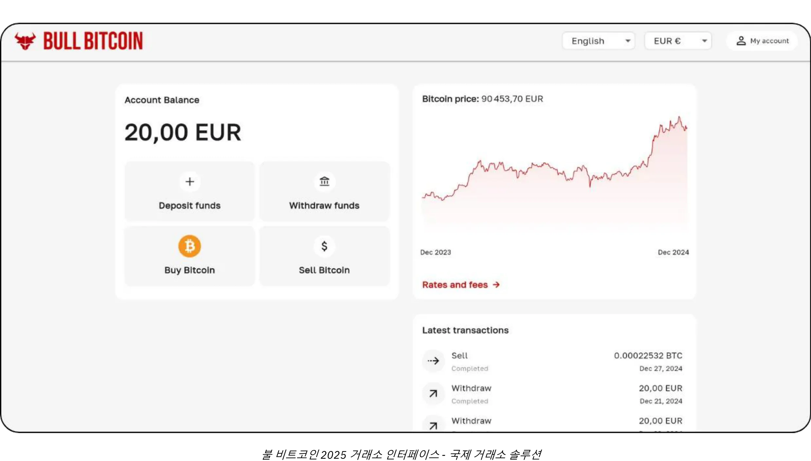

### 어떤 대가를 치르나요?

앞서 언급했듯이 Bitcoin의 미래 가격을 예측하는 것은 불가능할 뿐만 아니라 단기적으로도 가격 변동성이 매우 큽니다. 역사적으로 신뢰할 수 있는 전략은 일정한 간격으로 점진적으로 적립하고 4년 이상의 기간을 유지하는 것이었습니다.

### 얼마를 구매해야 하나요?

직관적으로 생각해보면, 너무 많이 생각하지 말고 아주 작은 금액부터 시작하는 것이 가장 좋습니다. 100유로 또는 달러와 같은 작은 금액은 크게 해를 끼치지 않으며, 직접 경험해 보면 어떤 책을 읽는 것보다 훨씬 더 빨리, 훨씬 더 많은 것을 배울 수 있습니다.

앞서 말씀드린 것처럼 몇 년 동안 필요하지 않을 정도의 유동성만 투자하는 것이 현명합니다. 전략을 제대로 이해하지 못하면 나쁜 시기에 갑자기 현금화해야 할 때 곤란한 상황에 처할 위험이 있습니다.

소규모로 시작하는 것 외에도 기업 재무부에서는 신중한 자산 배분 전략을 채택하는 것이 유용합니다. 한편으로는 MicroStrategy와 같은 일부 기업은 기관의 강력한 신념을 반영하여 초과 보유 자금의 상당 부분을 Bitcoin에 투자하는 극단적인 접근 방식을 취하고 있습니다. 반대로, 보다 보수적이고 합리적인 전략은 기업 자금의 약 5% 정도를 Bitcoin에 할당하여 잠재적 이익과 위험 관리 및 유동성 요구 사항의 균형을 맞추는 것입니다.

이 스펙트럼을 최소한의 노출로 회사가 운영상 필요한 유동성을 충분히 확보하는 것부터 Bitcoin의 예상되는 장기 가치 상승을 활용하기 위한 공격적인 포지션까지 규모에 따라 시각화할 수 있습니다. 공격적인 배분은 더 높은 수익을 가져올 수 있지만, 적당한 배분은 변동성을 완화하여 회사의 재무 기반을 안전하게 유지하면서 재무 운영 내에서 Bitcoin의 혁신적인 잠재력을 활용할 수 있도록 합니다.

### 얼마나 자주?

Hard 규칙은 없습니다. "하락장"을 찾아서 시장 타이밍을 맞추려고 하면 단순히 일정한 간격으로 매수하는 것보다 효과도 떨어지고 스트레스도 더 커질 수 있습니다. 노련한 투자자도 때때로 실수할 수 있습니다. 한 번에 '올인'하는 것은 양날의 검이 될 수 있습니다.

실제로 Bitcoin의 잠재적 가치 상승은 몇 년 후에 시작하더라도 장기적인 상승을 기대할 수 있을 정도입니다. 물론 시간이 지남에 따라 큰 폭의 가격 변동은 줄어들 가능성이 높습니다. 하지만 디플레이션 통화로서 Bitcoin은 가치를 효과적으로 저장하고 사용자의 생산성 향상을 반영하도록 설계되었습니다. 비유하자면, 현재 Bitcoin은 '출시 단계'에 있는 화폐로, 아직 그 공정 가치는 아무도 모릅니다. 나중에, 아마도 20년 또는 40년 후 안정적인 '순항 단계'에 접어들면 사회의 생산성 향상에 따라 엄청나게 안정적이고 꾸준히 성장할 수 있습니다.

부동산 업계에서는 부동산이 가치 저장소로서의 기능을 상실하면(Bitcoin와 같은 자산으로 이동하면) 가격이 효용 가치(쉼터)에 가깝게 회복될 수 있다는 사실을 잊은 채 "항상 구매하기 좋은 시기"라는 말을 반복하곤 합니다. 반면 Bitcoin는 가치 저장 외에 다른 용도가 없으므로 "항상 구매하기 좋은 시기"라는 의미일 수 있습니다 미래가 말해줄 것입니다.

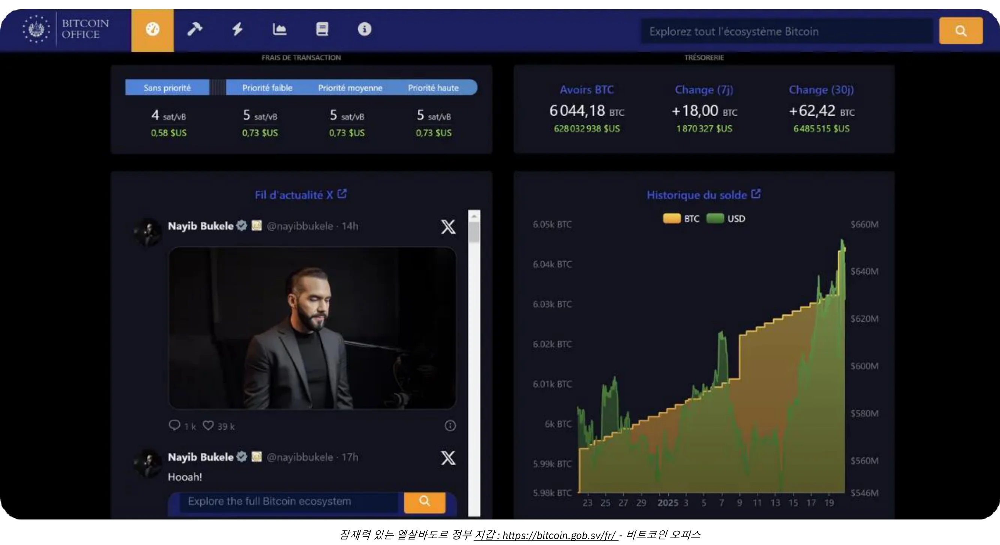

*크레딧: [Bitcoin 사무실](https://Bitcoin.gob.sv/)*

### 어떤 형태로 구매하나요? (보관 방법)

귀하는 Bitcoin을 물리적으로 소유하지 않습니다. 대신, 계정 단위의 일부 또는 전부의 Ownership를 하나 이상의 다른 암호화 키로 전송할 수 있는 암호화 키를 보유하게 됩니다. 이 모든 작업은 전 세계 수만 개의 노드에 복제된 Bitcoin Blockchain에서 이루어집니다.

이 암호화 키는 매우 큰 난수입니다. 사용자 경험을 단순화하기 위해 12개 또는 24개의 단어로 구성된 시퀀스로 표시되는 경우가 많습니다. 이러한 단어는 "Hardware Wallet"이라는 물리적 장치에 로드할 수 있습니다 그러나 비트코인은 이 장치 "내부"에 있는 것이 아니라 거래를 암호로 서명하고 네트워크에 브로드캐스트하는 도구일 뿐이라는 점을 이해하시기 바랍니다. 진정으로 중요한 것은 보안이 유지되어야 하는 12개 또는 24개의 단어입니다.

이는 양육권 문제로 이어집니다. Bitcoin을 보유한다는 것은 열쇠를 가지고 있다는 것을 의미합니다. 직접 보유하거나 제3자에게 위임할 수 있습니다. 중간 해결책도 있습니다. 가장 일반적인 시나리오를 살펴봅시다:

- 자기 관리:**

이 옵션은 Bitcoin의 원래 설계와 일치하기 때문에 진정한 Bitcoin 애호가들이 추천하는 옵션입니다. 사용자가 직접 은행 역할을 수행하므로 제3자가 사기를 칠 위험은 없지만 키 보안에 대한 책임은 사용자에게 있습니다. 24시간 내내 자금에 액세스할 수 있습니다. 비즈니스 환경에서 여러 사람이 거래해야 하는 경우, 액세스 및 보안을 관리하기 위한 적절한 도구와 절차가 필요합니다.

- 타사 보관:**

예를 들어, Exchange 또는 구매 서비스는 계정을 생성하고 기존 통화를 Bitcoin로 변환한 다음 보안 시스템을 사용하여 사용자를 대신하여 보관할 수 있습니다. 이러한 서비스 대부분은 본인만 키를 가지고 있는 Wallet로 비트코인을 출금할 수 있습니다. 출금하기 전까지는 비트코인을 실제로 소유한 것이 아니며, 비트코인을 돌려준다는 약속에 의존하게 됩니다. 여기에는 보안 위험(상대방의 위험과 여러분의 위험)과 거래상대방 위험(실패하거나 사라질 수 있음)의 균형을 맞추는 것이 포함됩니다. 일부 기업에서는 이러한 방식을 허용하기도 하지만 일반적으로 장기 보관이나 할당량의 100%를 보관하는 것은 권장하지 않습니다. 보관 서비스에서는 보관 수수료를 부과할 수도 있습니다.

- "종이 Bitcoin"(ETF 또는 ETP):**

이는 Bitcoin의 일부분을 나타내는 전통적인 금융 상품으로, 가격 성능을 모방합니다. 이 상품의 배후에 있는 기관은 이론적으로 기초자산인 Bitcoin를 매수하여 보유합니다. 입출금은 Bitcoin가 아닌 기존 통화(예: 달러 또는 유로)로 이루어집니다. 실제 Bitcoin로 인출할 수 있는 특정 상품을 제외하고(일부 관할권에서는 과세 대상 이벤트를 피하기 위해), 이러한 상품에는 연간 관리 수수료가 부과됩니다. 여기에서는 기관의 보안에 의존하고 거래상대방 위험에 직면하게 됩니다(예: 1933년 미국 행정명령 6102호에 따라 정부가 금의 경우처럼 기관이 보유한 모든 Bitcoin를 압류하기로 결정한 경우). 전통적인 금융 채널을 통해 유통되기 때문에 접근이 쉽다는 것이 주요 이점입니다. 암호키를 보호할 필요는 없지만 Bitcoin의 고유한 특성인 24시간 연중무휴로 Bitcoin 네트워크를 사용하여 허가 없이 자유롭게 가치를 이동할 수 없다는 점은 전혀 제공하지 않습니다. Bitcoin 자체의 기능이나 주권이 아닌 재무 성과만 복제할 수 있습니다.

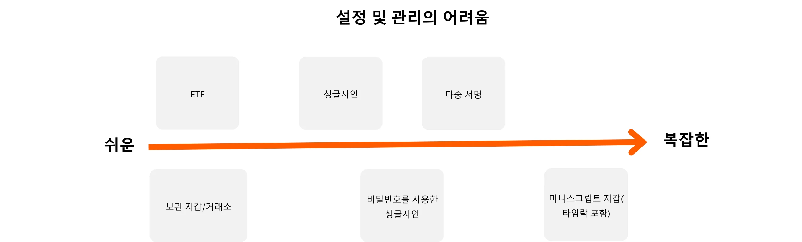

또한 Bitcoin를 보유하는 형태는 기업 자금을 보호하는 데 필요한 보안 조치에 큰 영향을 미칩니다. 키를 직접 관리하기 위해 단일 서명 또는 다중 서명 하드웨어 지갑 등을 사용하는 셀프 커스터디를 선택하든, 타사 커스터디 서비스 또는 ETF에 이 작업을 위임하든, 각 옵션에는 고유한 위험 프로필이 있습니다. 예를 들어, 자체 커스터디는 전체 액세스 권한을 제공하지만 엄격한 내부 보안 프로토콜이 요구되는 반면, 타사 솔루션은 거래 상대방 위험을 감수하는 대신 관리 부담을 줄여줍니다. 이 그래프는 각 보관 유형에 대한 보안 모델을 간략하게 설명하여 조직의 요구 사항에 가장 적합한 접근 방식을 선택할 수 있도록 도와줍니다:

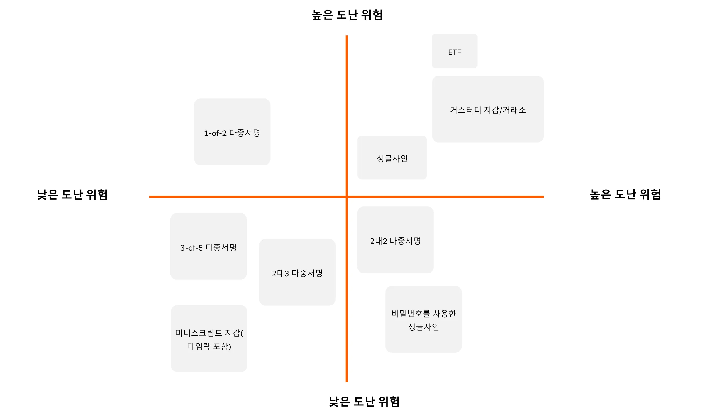

### 구매처는 어디인가요?

'종이 Bitcoin'을 선택하면 은행이나 온라인 증권 거래소와 같은 금융 기관을 이용하게 됩니다.

마켓플레이스(Exchange) 또는 브로커를 통해 실제 Bitcoin을 구매하는 경우 몇 가지 주요 카테고리가 있습니다:

- 대규모 국제 또는 해외 플랫폼:**

예를 들어 크라켄, 코인베이스, 바이낸스 등은 역사적으로 많은 개인이 사용하는 거래소입니다. 일부는 문제가 발생하여 명확한 추천을 하기는 어렵습니다. 한 가지 조언을 드리자면, 이러한 서비스를 사용한다면 비트코인을 필요 이상으로 오래 보관하지 마세요.

- 규제 대상 서비스 제공자(등록된 디지털 자산 서비스 제공자):**

예를 들어, 프랑스에서는 페이미엄(Exchange) 또는 불비트코인(브로커)과 같은 플랫폼이 진정한 Bitcoin 애호가들이 주도적으로 운영하며 탄탄한 실적을 쌓은 것으로 알려져 있습니다. 미국에는 River 또는 Swann과 같은 서비스 제공업체가 있습니다. 일반적으로 공급자의 평판, 실적, Bitcoin 커뮤니티 내 인기도, 리더십이 Bitcoin의 핵심 가치와 일치하는지 여부 등 공급자의 혈통을 살펴보는 것이 중요합니다.

**Exchange 대 브로커:**

- Exchange**를 사용하면 선택한 호가에 매수 주문을 할 수 있지만, 시장가와 매도 호가가 일치할 때까지 체결을 기다려야 합니다.
- 브로커**는 고정 가격을 제시하고 거래를 더 빨리 완료할 수 있습니다.

장기적(몇 년)으로 생각한다면 덜 중요한 수수료와 실행 속도 외에도 비즈니스는 고려해야 할 사항이 있습니다:

- 사용자 Interface:** 플랫폼이 사용자 친화적인가요?
- 회계 기능: ** 최소한 거래 내역을 .CSV 형식으로 내보낼 수 있는 기능.
- 수탁 및 보안: ** 플랫폼이 사용자를 대신해 비트코인을 보관하나요, 아니면 Ownership를 사용자에게 전송하나요? 보안 설정은 어떻게 되어 있나요? "출금 잠금" 또는 기타 출금 제한이 있나요?
- 고객 지원:** 품질, 응답성, 개인 맞춤형 지원, 특히 처음 시작할 때 유용합니다.
- 평판 및 정신:** 플랫폼의 신뢰성과 가치.
- 정기 구매 지원: ** 정기 구매를 통해 시간이 지남에 따라 Bitcoin를 적립하려는 경우.

# 모든 비즈니스를 위한 맞춤형 Bitcoin 결제 솔루션

<partId>b2c8af88-6bfc-49b1-ad84-4c292c713b55</partId>

## Bitcoin을 결제 수단으로 사용

<chapterId>99af1203-bc84-4acc-9780-f733e7998335</chapterId>

첫째, Bitcoin은 인터넷과 같은 규모의 장애라는 점을 이해하는 것이 중요합니다.

초창기에는 인터넷 네트워크를 통해 커뮤니케이션 채널에서 중개자를 제거할 수 있었고, 이러한 인프라는 이전에는 상상할 수 없었던 수많은 애플리케이션으로 이어졌습니다. 오늘날 온라인에 존재하지 않는 비즈니스가 있을까요?

Bitcoin은 신뢰의 인프라로, 스토리지에서 중개자를 제거하고 가치 화폐의 Exchange를 최초로 적용합니다. 현재로서는 상상할 수 없는 다른 애플리케이션이 이 인프라에서 등장할 것입니다. 여기서 여러분의 초기 존재는 P2P 결제와 가치 교환을 위한 게이트웨이인 웹사이트가 있는 것과 같습니다.

이제 핵심 활동이 Bitcoin과 관련이 없는 실제 비즈니스의 관점을 생각해 보겠습니다. 이 기업이 Bitcoin 결제를 선택하는 이유는 무엇일까요?

- Bitcoin 재무부 구축:**

Bitcoin 구매에 대한 이전 글을 참조하세요. 신념 때문이든 투자 다각화 전략의 일환이든, 일부 전문가들은 Bitcoin 결제를 받기로 선택합니다. 일부 비트코인 사용자들은 재정적으로 취약한 기업일수록, 즉 복잡한 재정 운용을 할 시간이나 도구가 없는 기업일수록 가장 어려운 형태의 화폐로 지급받는 것이 더 중요하다고 주장합니다**. 이렇게 함으로써 경쟁의 장을 평준화하여 시간이 부족한 소규모 기업도 금융 게임에 휘말리지 않고도 가치를 보존할 수 있도록 지원합니다.

- 새로운 인구 통계에 도달하기:**

Bitcoin 사용자 수가 증가하고 있으며, 이들은 상당한 구매력을 가지고 있습니다. 이들은 자연스럽게 해당 통화를 사용하는 비즈니스에 관심을 갖게 될 것입니다. 또한 최초의 범용 인터넷 네이티브 통화이기 때문에 해외에서 유입되는 고객도 유치할 수 있습니다.

- 가시성 향상:**

예를 들어 BTCmap.org와 같은 플랫폼에 비즈니스를 등록할 수 있습니다. 현재 Bitcoin를 허용하는 기업은 소수에 불과하므로 입소문이 유리하게 작용합니다. 또한 경쟁업체와 차별화할 수 있습니다.

- 낮은 수수료:**

Lightning Network을 통해 즉시 Bitcoin 결제가 이루어집니다. **수수료는 최소이며 구매자가 부담합니다**. 결제 단말기 수수료, 결제 승인 실패 및 사기가 발생하지 않습니다. 이에 비해 결제 산업(카드, 단말기, 송금, PSP 등)은 전 세계적으로 연간 약 2조 2,000억 달러의 비용을 지출합니다. 여기에 지불 거절과 사기를 더하면 전 세계적으로 미국 GDP의 약 10분의 1에 해당하는 금액이 가치를 이전하기 위해 생산적인 비즈니스에서 '탈취'되고 있는 것입니다. 어떤 비즈니스든 금융 수수료는 최적화되어야 하는 부담이며, 경우에 따라서는 높은 수수료가 특정 비즈니스 모델을 억제할 수 있습니다.

- 자유와 허가 없이, 24시간 연중무휴 **

Bitcoin을 사용하기 위해 허가를 요청할 필요가 없습니다. 누구나 스마트폰 앱을 사용하여 몇 분 안에 경제에 참여할 수 있습니다. 일정 제약이나 지연 없이 언제든 개인이든 기업이든 누구에게나 송금하거나 결제를 받을 수 있습니다.

- Bitcoin 네트워크의 장점 활용하기:**

특히 공급업체에 지불하거나 부가가치세를 송금해야 하는 경우에는 Bitcoin 양식으로 결제를 보관할 필요가 없습니다. 특정 서비스에서는 수수료를 받고 Bitcoin 결제의 전부 또는 일부를 원하는 통화(예: 유로를 IBAN으로)로 변환할 수 있습니다. 이 시나리오에서 Bitcoin 수락의 이점은 신규 사용자 유치 또는 Bitcoin의 본질적인 장점(저렴한 수수료, 24시간 운영, 사기 또는 지불 거절 위험 없음 등)에 있을 수 있습니다.

### 어떤 결제 솔루션을 선택해야 하나요?

Bitcoin 결제 수락은 비교적 쉽게 시작할 수 있습니다. 적합한 솔루션을 선택하려면 처리하는 거래의 특성(평균 결제 금액, 거래 빈도, 실제 환경에서 결제를 받을지, 온라인에서 받을지 또는 둘 다 받을지 등)을 고려하세요.

판매자로서의 마음가짐도 중요합니다. 단순한 테스트를 진행하시나요, 아니면 Bitcoin가 중요하고 반복적인 수익원이 될 것으로 예상하시나요? 후자라면 강력하고 포괄적이며 사용자 지정 가능한 설정이 필요합니다.

직원의 다양한 역할과 위치를 고려하는 것을 잊지 마세요. 어떤 시나리오에서든 회계사에게 필요한 모든 정보를 제공하고 회계 프로세스를 간소화할 수 있어야 한다는 점을 기억하세요.

의사 결정 과정을 간소화하기 위해 4가지 비즈니스 프로필을 정의했습니다. 다음 표에서는 각 프로필의 주요 특징과 권장 결제 솔루션을 자세히 설명합니다.

### 비즈니스 프로필

#### 프로필 1 - 초보자

| 속성 | 스타터 | 시작

| -------------------------------- | ------------------------------------------------------------------------------------------------------------------------------------------ |

| "첫 실물 결제 시도", "온라인 콘텐츠에 대한 팁 받기", "아주 적은 수익을 목표로 함" | **마음 상태**

| **거래 빈도** | "학습을 위한 첫 거래", "가끔씩 결제"                                                                    |

| 비즈니스 유형 예시** | 크리에이티브 경제(콘텐츠 크리에이터, 블로그, 기사 등), 비정기적인 팁, 일회성 대면 제품 판매, 협회, 일회성 이벤트 |

| 결제 유형** | 일반적으로 몇 센트에서 몇 유로/달러, 품목당 최대 300유로/달러 미만 | 결제 금액

| 설정 복잡성** | 없음 | 없음

| **권장 솔루션 예시** | Satoshi의 Wallet와 같은 관리형 Lightning Wallet 또는 Phoenix와 같은 비관리형 Wallet | **권장 솔루션 예시 **

**판매자 Interface** | 간단한 Bitcoin 라이트닝 Wallet: 휴대폰의 앱 | **판매자 Interface** | 간단한 Bitcoin 라이트닝 Wallet: 휴대폰의 앱

**고객 Interface** | Bitcoin QR 결제 코드, 고객 개인 Wallet을 통해 스캔한 것 |

수수료** | 고객이 Bitcoin Lightning 요금과 해당 앱 수수료를 지불합니다 | **수수료** | 고객이 지불합니다

| 무료 스마트폰 앱 또는 물리적 단말기용 옵션(예: 비트코인이즈) | **판매시점 관리 장치** | 무료 스마트폰 앱 또는 물리적 단말기용 옵션

| **관리 및 역할** | 단일 앱 관리, 최소한의 역할 차별화 |

| 회계 내보내기** | 기본 거래 내역 목록 | 거래 내역 목록

| **API** | 아니요 |

#### 프로필 2 - 필수

| 속성 | 필수 항목

| -------------------------------- | ------------------------------------------------------------------------------------------------------------------------------------------ |

| "비즈니스에서 Bitcoin를 수용하지만 의미 있는 볼륨을 기대하지는 않습니다." | **마음 상태** | "비즈니스에서 Bitcoin를 수용하지만 의미 있는 볼륨을 기대하지는 않습니다

| 거래 빈도** | 한 달에 몇 건 거래 없음 |

**비즈니스 유형 예시** | 바, 레스토랑, 신선식품 또는 직소싱 제품 반정기 판매, 한 명의 소유주 아래 여러 매장, 예술가를 위한 창조경제 |

| 결제 유형** | 일반적으로 품목당 몇 유로/달러에서 수백 달러까지, 품목당 최대 300달러 미만, 월 최대 3,000달러 미만 | 일반적으로 품목당 최대 300달러 미만입니다

| 설정 복잡성** | 최소(모바일 앱) | 최소(모바일 앱)

| **권장 솔루션 예시** | 스위스 Bitcoin Pay |

| 판매자 Interface** | 간단한 Bitcoin 라이트닝 Wallet: 휴대폰 앱, 최소한의 세부 정보로 간단한 송장 발행 | 간단한 송장 발행

**고객 Interface** | Bitcoin QR 결제 코드, 고객 개인 Wallet를 통해 스캔한 것 | Wallet

**수수료** | 일반적으로 Bitcoin Address으로 보내는 경우 1% 미만, 법정 화폐로 전환하는 경우 1.5% 미만

| 무료 스마트폰 앱 또는 물리적 단말기용 옵션(예: 비트코인이즈) | **판매시점 관리 장치** | 무료 스마트폰 앱 또는 물리적 단말기용 옵션

| 관리 및 역할** | 직원을 위한 판매 전용 역할 옵션, 관리용 온라인 대시보드 | 관리용 온라인 대시보드

**회계 내보내기** | 전체 거래 세부 정보가 포함된 CSV 내보내기 |

**API** | 예 |

#### 프로필 3 - 전문가

| 속성 | 전문가 | 전문가

| -------------------------------- | ------------------------------------------------------------------------------------------------------------------------------------------------------ |

| 내 이커머스를 위한 다른 결제 수단 - 또는 대량 주문에 대비한 비즈니스 그룹을 위한 공동 관리 - **마음의 상태** |

**거래 빈도** | 하루 여러 건의 거래 |

| 비즈니스 유형 예시** | 중간 규모의 이커머스 사이트, 소규모 마켓플레이스, 오프라인 매장 그룹(예: 클릭 앤 콜렉트), 소규모 사업체 |

| 결제 유형** | 일반적으로 몇 유로/달러에서 수백 달러까지, 결제 규모 제한 없음, 연간 25만 달러 미만 | 결제 금액 제한 없음

| 설정 복잡성 ** ** 가벼운 기능부터 완전한 기능까지(로컬 또는 클라우드 호스팅), 종종 전자상거래 스토어가 필요함 ** ** 설정 복잡성 **

| 권장 솔루션 예시** | 이커머스 및/또는 물리적 환경용 BTC Pay 서버, 결제용 ZapRite, Musqet 또는 PayWithFlash, 통합 이커머스 스토어용 Be-BOP |

**판매자 Interface** | 웹사이트(모바일 및 데스크톱), Invoice 편집, 장바구니 옵션 및 결제 버튼 생성, 전자상거래 통합을 통한 자동 인보이스 발행 기능 |

**고객 Interface** | Bitcoin QR 결제 코드, 고객 개인 Wallet을 통해 스캔한 것 | Wallet

| 무료 오픈소스 백엔드와 유료 라이트닝 호스팅/서비스 요금 혼합, 프론트엔드 요금에는 Bitcoin 라이트닝 요금과 1.5% 미만의 전환 수수료가 포함됩니다

웹사이트 스토어, 물리적 디스플레이(예: 사이트를 보여주는 iPad 또는 Bitcoin 단말기) 선택 가능 | **판매용 장치** | 웹사이트 스토어, 물리적 디스플레이 선택 가능 |

| 여러 관리자 역할이 있는 완전한 기능의 스토어, 직원과 고객이 시스템과 상호 작용합니다

**회계 내보내기** | 전체 거래 세부 정보가 포함된 CSV 내보내기 |

**API** | 예 |

#### 프로필 4 - 기업

| 속성 | 기업 | 기업

| -------------------------------- | ----------------------------------------------------------------------------------------------------------------------------------------------- |

| 비즈니스를 위한 전략적 결제 수단 - 특정 사양에 따라 서비스 플랫폼에 통합하기 위해 일부 개발 중입니다

| **거래 빈도** | 무제한, 고빈도 거래 |

| **비즈니스 유형 예시** | 중견 기업, IT 서비스 기업, 대기업, 주요 마켓플레이스 |

| 결제 유형** | 모든 크기 또는 수량 | 결제 방법

| **설정 복잡도** | 아키텍처 선택에 따라 중간에서 높음 |

| 권장 솔루션 예시** | 맞춤형 아키텍처 또는 SaaS 호스팅 솔루션의 오케스트레이션, 타사 LSP(*라이트닝 서비스 제공업체*) 서비스 사용 가능 | 맞춤형 아키텍처 또는 오케스트레이션

| 비즈니스 워크플로 및 프로세스에 완전히 통합된 완전 맞춤형 프런트엔드 및 백엔드 인터페이스 | **판매자 Interface**

| 고객 Interface** | Bitcoin QR 결제 코드부터 완전한 맞춤형 UI 및/또는 API 통합에 이르기까지 다양한 솔루션 제공

수수료** | 내부 개발 및 타사 수수료의 조합, 고객이 Bitcoin Lightning 수수료와 서비스 제공업체의 거래 수수료를 지불함 | 서비스 제공업체의 거래 수수료는 고객 부담 |

pOS 디바이스** | 기업 환경에 맞게 맞춤 설계된 솔루션 | 기업 환경에 맞게 맞춤 설계된 솔루션 |

| 영업, 관리, 개발, 회계, 재무 전반에 걸쳐 완전히 맞춤화된 역할 제공 | **관리 및 역할** | 영업, 관리, 개발, 회계, 재무 전반에 걸쳐 완전히 맞춤화된 역할 제공

| 회계 내보내기** | 완전 사용자 지정 회계 내보내기 | 사용자 지정 회계 내보내기

**API** | 예 |

다음 장에서는 각 비즈니스 프로필과 각 비즈니스에 맞는 솔루션에 대해 자세히 설명합니다.

## 스타터

<chapterId>7edda53d-5b9f-432a-8493-115de8c94a67</chapterId>

스타터 프로필은 상당한 리소스나 전문 지식 없이 Bitcoin 결제를 탐색하고자 하는 기업, 크리에이터, 개인을 위해 설계되었습니다. 일반적으로 소량의 거래(팁, 기부 또는 가끔씩 판매)를 처리하고 Bitcoin 및 Lightning Network 생태계에 간단하고 가볍게 입문하려는 사람들이 이에 해당합니다. 스타터 접근 방식의 핵심 가치는 최소한의 설정에 있습니다. 대부분의 경우 기본 Lightning 호환 Wallet가 장착된 스마트폰이나 태블릿만 있으면 됩니다.

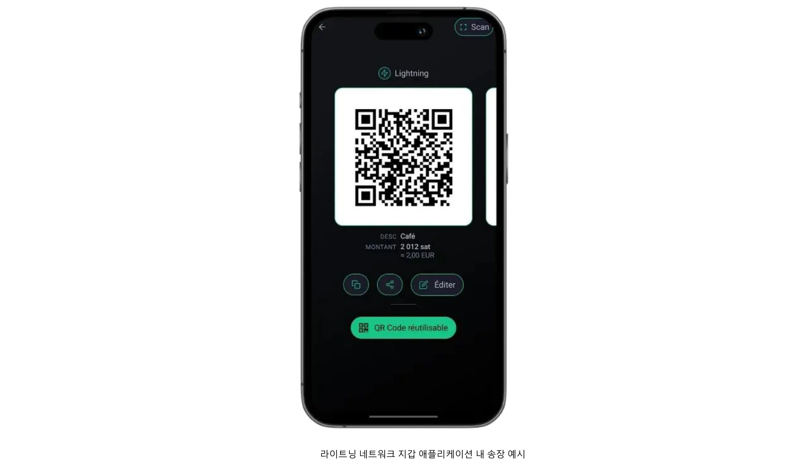

이 프로필의 특징 중 하나는 한 달에 수백 유로 또는 달러를 넘지 않는 소량 결제에 초점을 맞춘다는 점입니다. 규모가 크지 않기 때문에 대량 배포에 내재된 복잡성 없이 Bitcoin으로 시장을 테스트하려는 모든 사람에게 탁월한 선택이 될 수 있습니다. 또한 운영 부담이 적고 금전적 부담이 적기 때문에 실수를 억제하고 교훈을 빠르게 배울 수 있어 즉각적인 실무 학습이 가능합니다. 주말 박람회에서 수공예품을 판매하는 아티스트부터 일회성 기부를 받는 비영리 단체에 이르기까지, 이 카테고리의 사용자는 고급 기능보다 접근성과 사용 편의성을 중시하는 경우가 많습니다.

스타터 프로필의 가장 일반적인 두 가지 Wallet 설정은 커스터디 솔루션과 비커스터디 솔루션 중 하나를 결정하는 것입니다. 커스터디 Wallet(예: Satoshi 또는 Blink의 Wallet)는 타사 서비스에서 개인 키와 백엔드 작업을 관리하여 사용자의 기술적 책임을 줄여줍니다. 이 방식은 무엇보다 편리함을 중시하고 최대한 간편한 온보딩을 원하는 사용자에게 특히 매력적입니다. 반면, 비수탁형 라이트닝 지갑(예: 피닉스 또는 브리즈)은 개인 키와 모든 권한을 비즈니스 소유자에게 맡기므로 초기 노력이 조금 더 들더라도 Exchange에서 더 큰 자율성과 프라이버시를 제공합니다. 두 경우 모두 최신 인터페이스는 일반적으로 매우 사용자 친화적이어서 누구나 몇 분 안에 필수 작업(QR코드 생성, 결제 금액 입력, 거래 확인)을 처리할 수 있습니다.

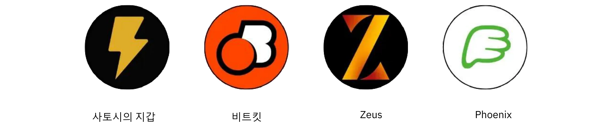

거래 규모가 작을 때는 보안 문제가 덜 시급해 보일 수 있지만, 그럼에도 불구하고 기본적인 보호 조치를 마련하는 것이 중요합니다. Bitcoin 결제를 받는 데 사용되는 스마트폰이나 태블릿 하나라도 비밀번호나 생체 인식 보안으로 잠그고, 백업 절차(보관용 Wallet의 로그인 자격 증명 추적부터 비보관용 seed 문구 보호까지)를 꼼꼼히 따져봐야 합니다. 실제 환경에서 거래를 처리하는 직원은 앱을 여는 방법, 고객에게 QR 코드를 제시하는 방법, 결제가 실제로 도착했는지 확인하는 방법 등 기본적인 사항을 숙지하면 도움이 될 것입니다.

회계 및 보고는 스타터 프로필에서는 비교적 간단하지만 여전히 신중한 고려가 필요합니다. 거래량이 미미할지라도 정확한 기록을 유지하면 향후 재무 감사나 세금 신고 시 혼란을 방지하고 투명성을 유지하는 데 도움이 됩니다. 많은 Wallet 애플리케이션에서는 사용자가 기본 거래 내역을 CSV 파일로 내보낼 수 있으므로 소규모 기업이나 개인 사업자의 경우 이러한 파일을 정기적으로 저장하면 계정 조정을 훨씬 쉽게 할 수 있습니다. 또한 각 거래가 수신되는 시점의 대략적인 법정 화폐 가치(예: 유로 또는 달러)를 추적하는 것이 현명합니다. Bitcoin의 가격은 변동될 수 있으므로 환율을 기록해 두는 것은 부기 및 세금 준수에 매우 중요합니다.

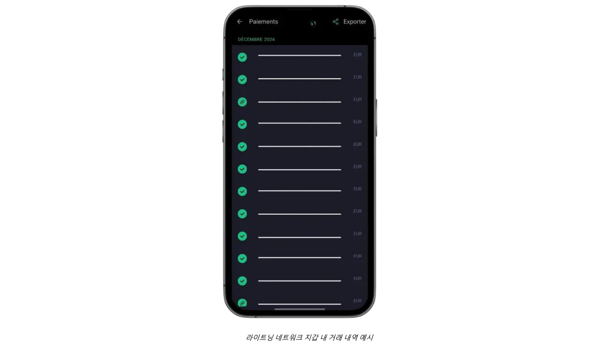

온라인 기부나 팁으로 오프라인 또는 대면 결제를 보완하고자 하는 비즈니스는 이제 웹사이트나 블로그에 라이트닝 팁 버튼이나 기부 위젯을 간편하게 통합할 수 있습니다. BTCPay 서버와 같은 플랫폼은 구성하기 쉬운 결제 버튼을 제공하며, 일부 소셜 미디어와 라이브스트림 서비스에서는 이미 주소가 포함된 라이트닝 팁을 지원하고 있습니다. 따라서 초보 기업도 소박하지만 글로벌 고객 네트워크를 구축할 수 있습니다. 한편, Bitcoin을 장기 보유하지 않으려는 사람들은 특정 수탁 지갑이나 타사 서비스를 사용하여 부분적으로 또는 자동으로 법정 화폐로 전환하는 방법을 모색할 수 있습니다. 이 옵션에는 추가 수수료와 KYC 의무가 수반되지만, 기업은 Exchange 환율 변동성을 피하고 중단을 최소화하면서 기존 재무 워크플로우를 유지하는 데 도움이 됩니다.

간단한 사용 사례를 통해 이 모든 Elements이 어떻게 결합되는지 설명합니다. 토요일 농산물 직거래 장터에서 수제 잼을 판매하는 지역 장인을 상상해 보세요. 이 장인은 관리용 Lightning Wallet을 실행하는 휴대폰으로 각 병의 가격을 유로로 설정하고, 고객이 Bitcoin로 결제를 요청하면 판매자가 해당 법정 화폐 금액을 빠르게 입력하면 앱이 자동으로 Sats의 결제 금액을 계산합니다. 결과 QR 코드를 고객의 Wallet으로 스캔하면 몇 초 만에 결제가 완료되고, 장인은 거래가 성공했음을 즉시 알 수 있습니다. 하루가 끝나면 기록 보관을 위해 모든 거래 세부 정보를 내보낼 수 있으며, 하루의 잔액을 전체 또는 부분적으로 Exchange 플랫폼으로 전송하여 법정 화폐로 변환할 수 있습니다.

스타터 솔루션은 사용자 친화적인 도구, 최소한의 하드웨어 요구 사항, 간단한 기록 보관의 균형을 유지함으로써 신규 비즈니스에 부담을 주지 않으면서도 필수적인 기능을 제공합니다. 거래량이 증가하고 비즈니스의 운영 요구사항이 발전하면 다음 장에서 설명하는 고급 카테고리로 자연스럽게 업그레이드할 수 있습니다.

권장 지갑과 기본 설정에 대한 자세한 튜토리얼은 다음 가이드를 참조하세요:

**자체 보관 LN 지갑/노드:**

https://planb.network/tutorials/wallet/mobile/phoenix-0f681345-abff-4bdc-819c-4ae800129cdf
https://planb.network/tutorials/wallet/mobile/bitkit-a7224674-85c4-4045-9baf-37018d89550c
https://planb.network/tutorials/wallet/mobile/breez-46a6867b-c74b-45e7-869c-10a4e0263c06
https://planb.network/tutorials/wallet/mobile/blixt-04b319cf-8cbe-4027-b26f-840571f2244f
https://planb.network/tutorials/wallet/mobile/zeus-embedded-c67fa8bb-9ff5-430d-beee-80919cac96b9
**보관용 LN 지갑:**

https://planb.network/tutorials/wallet/mobile/wallet-of-satoshi-39149d86-e42b-4e8f-ae9f-7e061e7784f7
https://planb.network/tutorials/wallet/mobile/blink-7ea5f5a4-e728-4ff9-b3f9-cf20aa6fc2bd
## 필수

<chapterId>89be421f-f7df-4bcc-a9e4-df96e39ef249</chapterId>

Essential 프로필은 고급 기술 지식 없이도 쉽고 빠르게 Bitcoin를 수락하면서도 단순한 Wallet보다 더 완벽하고 전문적인 시스템을 갖추고자 하는 직원이 있는 중소규모 비즈니스에 적합합니다. 이 카테고리는 매달 Bitcoin 결제 건수가 소수에 불과하지만 일상적인 운영을 중단 없이 처리할 수 있을 만큼 간단하고 강력한 Interface를 원하는 레스토랑, 카페, 바 또는 소규모 소매점에 가장 많이 적용됩니다.

스타터 프로필과 달리 Essential 비즈니스는 일반적으로 Bitcoin 결제를 단순한 실험이 아닌 지속적인 수익원의 일부로 간주합니다. 여전히 상대적으로 낮은 거래량으로 운영되지만, 그 빈도가 충분하기 때문에 소유자와 직원은 보다 체계적이고 안정적인 시스템의 혜택을 누릴 수 있습니다. 동시에 Essential 프로필은 간편함에 초점을 맞춘 프로필로, 편리한 대시보드와 제한된 역할 관리가 가능하지만 전문 IT 리소스나 복잡한 통합이 필요하지 않습니다.

이 부문의 기술 추천은 주로 판매자가 Bitcoin 결제를 쉽게 수락할 수 있는 간소화된 솔루션인 **Swiss Bitcoin Pay**를 중심으로 이루어집니다. 이 솔루션은 사용자 친화적인 PoS 앱으로 직원의 기술 전문 지식이 필요하지 않습니다. 표준 Bitcoin 지갑과 달리 결제 수신에만 집중하기 때문에 직원들이 보안 위험 없이 기기를 사용할 수 있습니다. 태블릿, 등록기, 스마트폰 또는 컴퓨터용 웹 버전에서 사용할 수 있는 여러 PoS 앱을 동일한 계정에 연결할 수 있으며, Android와 iOS를 지원합니다. 또한 판매 품목과 관련 가격이 포함된 메뉴를 생성하여 직원이 PoS에서 고객이 구매할 품목을 선택한 다음 총액을 청구할 수 있도록 할 수도 있습니다.

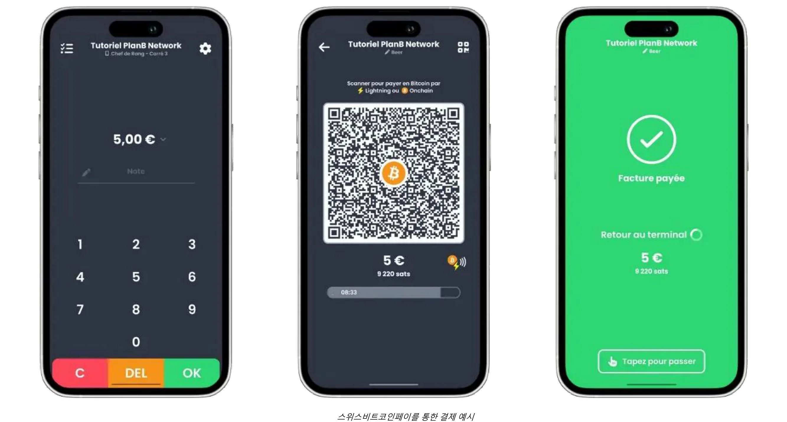

지불금은 Bitcoin에서 특정 Address으로 인출하거나 법정 화폐로 변환하여 매일 은행 계좌에 입금할 수 있습니다. Swiss Bitcoin Pay는 프로세스를 자동화하여 수동 개입 없이 Bitcoin 및 Lightning Network 결제를 처리합니다. 자금은 이체 전 최대 24시간 동안 보관됩니다. BTCPay 서버처럼 완전한 비수탁 방식은 아니지만 편의성과 보안의 균형을 맞추고 있으며 KYC가 필요하지 않습니다.

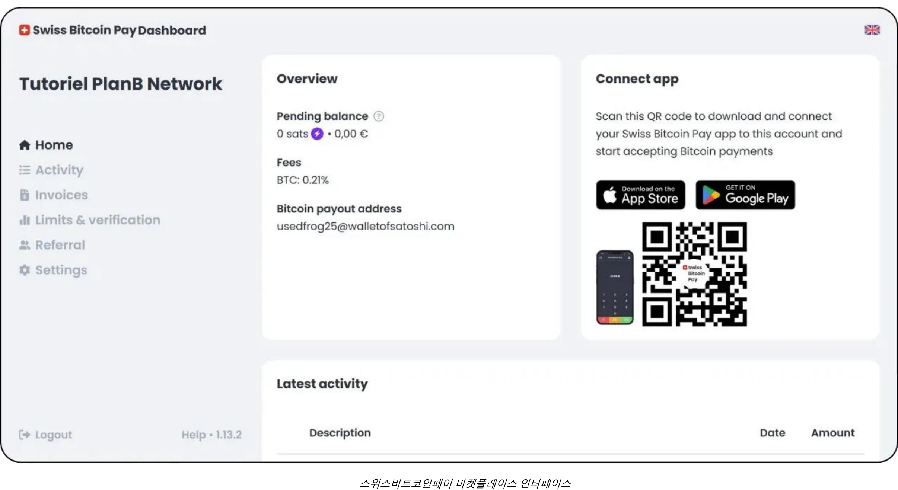

수수료는 경쟁력 있는 수준입니다: 첫해 0.21%, 이후 Bitcoin 결제 시 1%, 법정화폐 전환 결제 시 1.5%(Bitcoin 거래 비용 포함)입니다. 스위스 Bitcoin 페이는 오픈 노드와 같은 커스터디 솔루션과 BTCPay 서버와 같은 복잡한 자체 호스팅 시스템 사이의 실용적인 중간 지점을 제공하며 단순성, 보안, 재정적 자율성을 우선시합니다.

이러한 유형의 설정을 통해 대면 비즈니스는 신속하게 generate 결제 인보이스를 생성하고, 고객에게 QR 코드를 제시하고, 최소한의 마찰로 Lightning 또는 On-Chain 거래를 수락할 수 있습니다. 직원은 간단한 오리엔테이션만 거치면 이러한 결제를 처리할 수 있으며, 관리자는 온라인 대시보드에 로그인하여 일일 매출을 조정하고 기본 보고서에 액세스할 수 있습니다. 간소화된 관리 콘솔을 사용하면 소규모 사업장에서도 단일 Interface에서 법정 화폐와 암호화폐 수익을 모두 추적할 수 있으므로 혼란을 줄이고 수동 장부에 소요되는 시간을 줄일 수 있습니다.

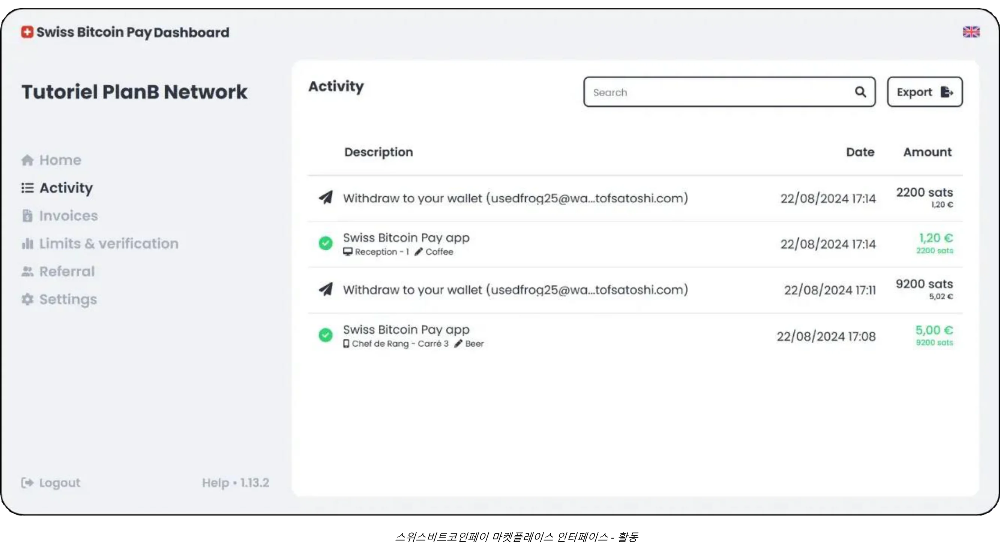

Essential 접근 방식의 또 다른 주요 이점은 신속한 배포와 최소한의 중단에 중점을 둔다는 점입니다. Swiss Bitcoin Pay와 같은 솔루션은 며칠 또는 몇 주가 아니라 몇 시간 만에 설정할 수 있습니다. 예를 들어, 다소 바쁜 레스토랑의 소유주나 관리자의 최종 목표는 계산대에서 지연이나 직원 간의 혼란을 일으키지 않고 Bitcoin 수락을 통합하는 것입니다. POS가 구성되면 관리자는 직원에게 Invoice을 표시하고 결제가 완료되었는지 확인하는 간단한 지침을 제공하기만 하면 됩니다. 가장 좋은 시나리오에서는 Lightning Network을 통해 고객의 거래가 거의 즉시 확인되고 동시에 비즈니스의 관리 패널이 실시간으로 새 결제를 등록합니다.

Essential 프로필은 고도로 정교한 회계 시스템을 요구하지는 않지만, 적절한 거래 기록을 유지하는 것이 현명합니다. Swiss Bitcoin Pay와 같은 도구는 CSV 내보내기 기능을 제공하여 관리자가 각 Bitcoin 판매의 법정 화폐 가치를 캡처하고 다른 수입원과 함께 추적할 수 있도록 지원합니다. 이 정도의 문서화 수준이면 대부분의 소규모 비즈니스에 충분하며, Exchange 요율에 대한 기초적인 이해만 있으면 세금 신고 및 일반적인 재무 감독에 도움이 됩니다.

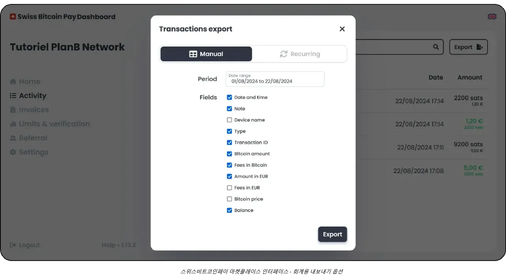

프로필에 가장 적합한 하이브리드 솔루션은 스위스 Bitcoin Pay일 가능성이 높습니다:

https://planb.network/tutorials/business/point-of-sale/swiss-bitcoin-pay-2-a78b057e-ed11-47ac-860c-71019fcb451a
구현하기 쉽지만 100% 커스터디라는 단점이 있는 또 다른 솔루션은 오픈 노드입니다:

https://planb.network/tutorials/business/point-of-sale/open-node-e69a0c1c-47f7-4932-8494-e6f26c3c9784
직접 손을 더럽힐 준비가 되어 있고 프로세스를 완벽하게 제어하고 싶다면 BTCPay 서버 소프트웨어가 훌륭한 옵션입니다. 그러나 BTCPay 서버의 가장 큰 단점은 설정과 관리에 시간이 많이 걸리고 일정 수준의 기술 전문 지식이 필요하다는 점이지만, 가이드를 따라하면 됩니다:

https://planb.network/tutorials/business/point-of-sale/btcpay-server-928eb01e-824b-4b57-a3e8-8727633beddc
마지막으로, 실제 판매 지점을 보완하기 위해 [비트코인화 PoS](https://bitcoinize.com/)를 설정하는 것을 고려할 수 있습니다.

## 전문가

<chapterId>4d5dfa50-c4d0-481c-ab95-1863a898750e</chapterId>

프로페셔널 프로필은 가끔 또는 소량의 Bitcoin 결제를 넘어 이제는 매일 여러 건의 거래를 처리할 수 있는 강력한 인프라를 원하는 기업을 대상으로 합니다. 이러한 기업은 소매점, 전용 이커머스 웹사이트, 모바일 판매 등 여러 채널에서 사업을 운영하는 경우가 많으므로 기존 워크플로에 원활하게 통합할 수 있는 결제 솔루션이 필요합니다. 대부분의 경우 이 수준의 기업은 이미 POS 시스템, 온라인 주문 관리 플랫폼, 백오피스 운영을 관리하고 있으므로 안정적이고 확장 가능한 접근 방식이 필요합니다.

프로페셔널 판매자의 특징 중 하나는 거래량이 증가하더라도 효율성을 유지할 수 있는 **고급 기능**과 **맞춤형 솔루션**이 필요하다는 점입니다. 스마트폰 앱에 깔끔하게 맞는 간소화된 도구에 만족할 수 있는 에센셜 사용자와 달리 프로페셔널 비즈니스는 일반적으로 상세한 Invoice 사용자 지정, 정교한 보고 대시보드, 여러 관리 역할 할당 기능과 같은 기능을 요구합니다.

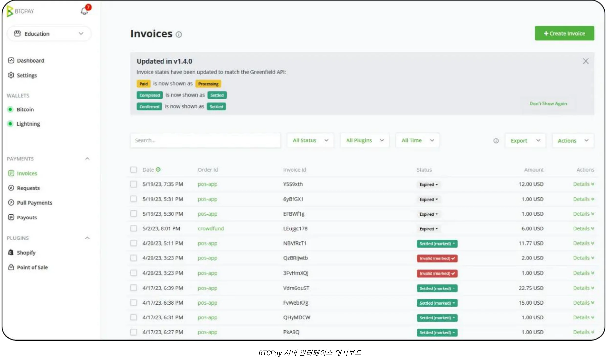

예를 들어, 한 레스토랑 그룹에는 송장 발행과 재고 관리를 전담하는 직원이 있고, 별도의 팀이 제품 목록과 마케팅 캠페인을 감독할 수 있습니다. 이러한 환경에서는 Bitcoin 결제 솔루션이 이러한 기존 조직 구조와 잘 맞아야 합니다.

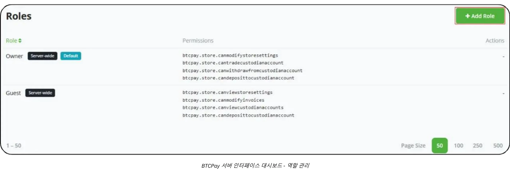

기술 및 도구와 관련해서는 **BTC 페이 서버**와 같은 솔루션이 프로페셔널 설정의 핵심을 이루는 경우가 많습니다. BTC 페이 서버는 온프레미스 또는 클라우드 호스팅을 통해 배포할 수 있는 오픈 소스 플랫폼으로 웹사이트와 이커머스 플랫폼에 대한 광범위한 통합 옵션을 제공합니다. 자체 인스턴스를 실행함으로써 기업은 자동으로 생성되는 결제 페이지부터 결제가 확인되면 내부 프로세스를 트리거하는 알림에 이르기까지 결제 흐름의 모든 측면을 고도로 제어할 수 있습니다.

또한 [Zaprite](https://zaprite.com/) 또는 [Musqet](https://musqet.tech/)과 같은 도구를 사용하면 결제 환경을 더욱 세분화하여 브랜딩 선택부터 정교한 보고 기능까지 보다 세분화된 사용자 지정이 가능합니다. 올인원 온라인 소매 환경을 선호하는 사람들은 사용 편의성을 희생하지 않으면서 Bitcoin 결제를 용이하게 하기 위해 구축된 이커머스 솔루션인 [Be-BOP](https://be-bop.io/)을 선호할 수 있습니다.

전문적인 환경에서 이러한 기술을 구현한다는 것은 **운영상의 복잡성**에 세심한 주의를 기울여야 한다는 것을 의미합니다. 자동화된 인보이스 발행 워크플로, 다중 통화 표시, 기존 인벤토리 시스템과의 동기화 등은 모두 잘 통합된 플랫폼의 특징입니다. 거래 데이터를 CSV 파일, 직접 API 호출 또는 사용자 지정 형식으로 정확하게 내보낼 수 있는 기능은 기업이 Bitcoin 매출을 다른 수익원과 효율적으로 조정하는 데 도움이 됩니다.

보안 및 역할 관리는 프로페셔널 사용자에게 또 다른 중요한 고려 사항입니다. 매일 Bitcoin 트랜잭션이 누적됨에 따라 관리 기능에 대한 액세스 제어는 필수적인 위험 완화 조치가 됩니다. 많은 솔루션에서 관리자는 다양한 수준의 권한을 할당할 수 있습니다(일부 직원에게는 거래 내역을 보고 송장을 생성하도록 제한하고 다른 직원에게는 인벤토리 관리 또는 시스템 전체 설정을 구성할 수 있는 권한을 부여하는 등...). 이러한 계층적 구조는 민감한 데이터를 보호할 뿐만 아니라 결제 인프라의 각 부문에 대한 책임이 있는 직원을 명확히 함으로써 운영을 간소화합니다.

실제 사례로 기술 액세서리를 전문으로 취급하는 중견 이커머스 스토어를 예로 들어보겠습니다. 이 업체는 기존 온라인 스토어에 BTC Pay 서버를 통합하여 결제 시 Bitcoin 결제 주소를 자동으로 생성할 수 있습니다. 고객이 라이트닝 또는 On-Chain Address를 스캔하여 구매를 완료하면 상점의 플랫폼에서 즉시 결제를 확인합니다. 동시에 내부 시스템에서 주문 상태를 업데이트하고 배송 알림을 트리거합니다. 재무팀은 고급 보고 기능 덕분에 일일 Bitcoin 매출을 쉽게 검토하고, 감사를 위해 통합된 Ledger을 내보내고, 회사가 보유하기로 결정한 BTC의 가치를 추적할 수 있습니다.

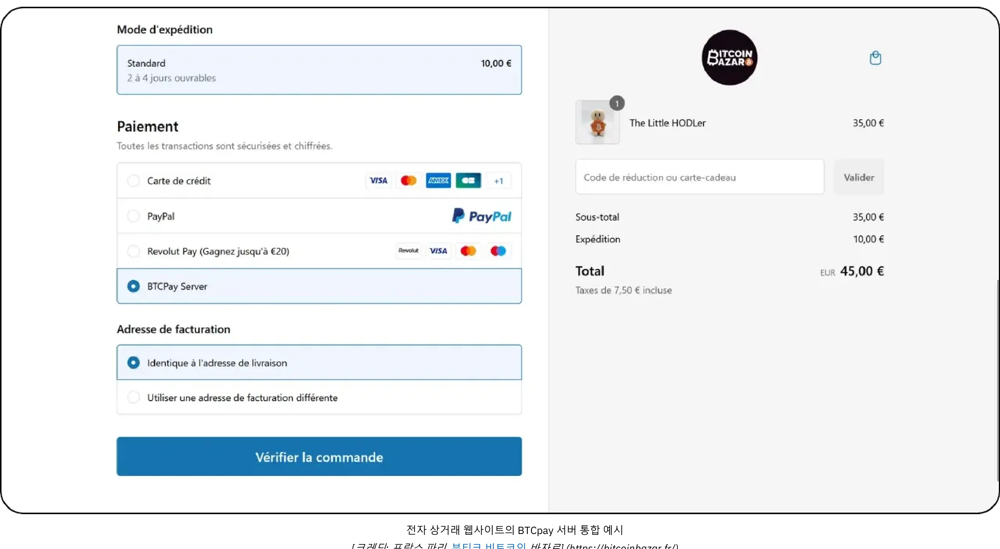

*[출처: 프랑스 파리의 Bitcoin 바자르 매장](https://bitcoinbazar.fr/)*

구현 세부 사항을 자세히 살펴보고 BTC Pay 서버의 실제 구성을 살펴보려면 다음 강좌를 참조하세요:

https://planb.network/courses/6fc12131-e464-4515-9d3f-9255365d5fa1
## 기업

<chapterId>80fb2659-81ca-4a11-b492-72c7ae5774f9</chapterId>

엔터프라이즈 프로필은 Bitcoin 결제 구현의 정점에 있는 프로필로, 규모가 큰 기업, 주요 마켓플레이스 및 완전 맞춤형 솔루션을 필요로 하는 기존 비즈니스에 맞게 특별히 맞춤화되어 있습니다. 소규모 또는 중간 수준의 배포와 달리 엔터프라이즈 수준에서는 현장 POS 기기부터 전자상거래 매장, 백오피스 회계 플랫폼, 정교한 ERP 프레임워크에 이르기까지 광범위한 워크플로 및 시스템에 Bitcoin 결제를 통합합니다.

이 규모에서 가장 중요한 목표는 단순히 Bitcoin를 수용하는 것이 아니라, 조직의 핵심 프로세스와 철저하게 **조율**된 방식으로 수용하는 것입니다. 이러한 조정을 위해서는 솔루션이 완전히 맞춤형이든, 타사 *라이트닝 서비스 제공업체*(LSP)의 지원을 받는 SaaS 기반 인프라를 통해 조율되든, 전문화된 소프트웨어 개발이 필요할 수 있습니다. 이러한 LSP는 기존의 기본 제공 도구의 용량을 초과하는 대용량 트랜잭션과 복잡한 네트워크 구성을 처리할 수 있습니다. 따라서 결과 아키텍처에는 API 기반 통합부터 고급 자금 관리 기능까지 광범위한 기술 및 비즈니스 고려 사항이 통합되어 있습니다.

엔터프라이즈 환경에서는 운영상의 복잡성이 특히 두드러지게 나타납니다. 대기업의 경우 영업, 마케팅, 개발, 재무, 회계 등 여러 부서에서 각각 고유한 책임과 데이터 요구 사항을 수용해야 할 수 있습니다. 이 시나리오에서 Bitcoin 결제 플랫폼은 매우 세분화된 역할 관리를 제공하여 각 부서가 보안 및 데이터 무결성을 엄격하게 제어하면서 업무와 관련된 기능에 정확하게 액세스할 수 있어야 합니다. 예를 들어, 인바운드 결제는 재고 시스템의 업데이트를 트리거하고, 영업 관리자에게 자동 알림을 전송하며, 재무팀을 위해 Ledger 항목을 실시간으로 업데이트하는 등 워크플로우를 사용자 지정할 수 있는 기능도 필수적입니다. POS 기기는 일반적으로 기업의 브랜딩 및 운영 요구사항에 맞는 맞춤형 소프트웨어 인터페이스를 통해 기업 환경에 맞게 조정됩니다.

**보안**은 기업 규모의 비즈니스에서 가장 중요한 요소입니다. 대량의 거래와 잠재적으로 큰 금액의 Bitcoin을 처리하려면 악의적인 공격이나 내부자 위협을 방어할 수 있는 강력한 인프라가 필요합니다. 모범 사례에는 타임록 트레저 구성이 포함된 다중 서명, 세심한 감사를 거친 코드베이스, 관련 규제 프레임워크의 엄격한 준수가 포함됩니다. 또한 현지 및 국제 금융 규정을 준수하는 것은 기업의 평판과 운영 허가를 유지하는 데 필수적일 수 있습니다.

엔터프라이즈급 Bitcoin 결제 솔루션을 만들거나 통합하는 데 필요한 **맞춤형 개발**은 애플리케이션 기능 몇 가지를 코딩하는 것 이상으로 확장됩니다. 일반적으로 아키텍처 설계, 철저한 테스트 프로토콜, 여러 단계(초기 파일럿 프로그램, 제한된 시장 테스트, 최종 글로벌 배포)에 걸친 구조화된 롤아웃이 필요합니다.

회계 측면에서는 거래 빈도가 높은 경우 **완전히 맞춤화된 내보내기**가 필요하며 때로는 기업 재무 소프트웨어와의 실시간 동기화가 필요합니다. 대기업은 SAP나 오라클과 같은 전사적 자원 관리(ERP) 솔루션에 의존할 수 있으며, 이러한 솔루션은 Interface 결제 데이터와 원활하게 Bitcoin을 연동해야 합니다. 이를 위해서는 선택한 플랫폼의 API가 정교하고 유연해야 하며, IT 팀이 맞춤형 보고 대시보드를 만들고, 자동화된 조정 프로세스를 구현하고, 일별 또는 시간별 재무 요약을 generate으로 자유롭게 생성할 수 있어야 합니다.

일반적인 기업 시나리오에는 매일 수천 건의 거래가 이루어지는 주요 이커머스 마켓플레이스가 포함될 수 있습니다. 이 마켓플레이스는 단순히 Bitcoin를 결제 옵션으로 나열하는 것 외에도 고객 대면 웹사이트에 Bitcoin 결제 흐름이 표시되는 방식부터 백엔드에서 환불, 지불 거절 또는 분쟁 해결이 관리되는 방식까지 사용자 경험의 모든 측면을 맞춤화할 수 있습니다. 전담 개발팀은 재무 및 법무 부서와 협력하여 지속적인 유지 관리, 보안 패치 및 규정 준수 업데이트를 감독합니다. 회사가 Bitcoin 수익의 일부를 보유하기로 선택한 경우, 내부 재무 시스템은 기존 통화 준비금과 함께 회사의 Bitcoin 보유를 추적합니다.

엔터프라이즈 수준에서 원활하고 안전한 배포를 보장하기 위해 대부분의 조직은 Bitcoin 및 Lightning Network 통합 경험이 있는 전문 서비스 제공업체 또는 사내 개발팀과 협력합니다. 이 프로세스는 일반적으로 기술 인프라, 규정 준수 요구 사항, 원하는 고객 여정 등 심층적인 요구 사항 평가로 시작하여 대용량 처리량을 처리할 수 있는 아키텍처를 설계합니다. 프로젝트 범위에 따라 재무 관리자, 보안 분석가, 소프트웨어 엔지니어로 구성된 여러 분야의 팀을 활용할 수도 있습니다. 또는 점점 더 많은 전문 컨설팅 회사가 초기 개념화부터 최종 롤아웃까지 안내하여 SaaS 호스팅 솔루션 평가, *라이트닝 서비스 제공업체* 구성, 프런트엔드 인터페이스 사용자 지정과 같은 작업을 지원할 수 있습니다. 도메인 전문가와의 파트너십을 통해 기업은 대규모 결제 구현과 관련된 위험을 완화하고 강력하고 규정을 준수할 뿐만 아니라 향후 성장을 수용할 수 있을 만큼 유연한 솔루션을 구축할 수 있습니다.

## Bitcoin 결제 솔루션: 옵션 및 트렌드

<chapterId>59ff43a1-98e2-4a81-af3e-9654bdd60952</chapterId>

솔루션의 각 범주에는 항상 장단점이 있습니다. 예를 들어, 초기 '시험 단계'에서 제안된 지갑은 사용자 Interface 측면에서 최대한 단순하게 설계되었지만 호스팅(**수탁**) 방식입니다. 이는 앱 제공자가 자금을 관리한다는 의미입니다. 그러나 Bitcoin의 정신에 따라 사용자가 자금을 완전히 관리(**자체 보관**)하는 Ownership로 전환할 것을 권장합니다. 이 경우, 첫 판매가 이루어지는 즉시, 즉 Bitcoin로 결제할 의향이 있는 고객이 있다는 것이 확인되면 다음 카테고리로 업그레이드하는 것이 좋습니다.

Bitcoin의 주요 장점 중 하나는 자금을 마음대로 이동할 수 있다는 점으로, 공급업체나 솔루션의 구성 요소를 매우 쉽게 변경할 수 있습니다. 또한 모든 앱과 솔루션 자체가 빠르게 진화하고 있습니다. 예를 들어, 불과 몇 달 전만 해도 존재하지 않았던 솔루션이 이제는 시중의 많은 애플리케이션과 통합되는 물리적 POS(Point of Sale) 단말기를 제공하는 비트코인아이즈를 생각해 보십시오.

### 스토어를 생성하고 기존 결제와 Bitcoin 결제를 모두 수락하는 솔루션을 찾고 계신가요?

스토어, 제품 관리 소프트웨어, POS(Point-of-Sale) 시스템 없이 처음부터 시작하는 경우 몇 가지 옵션이 있습니다:

- 아웃소싱:** 쇼핑 옵션이 있는 웹사이트 제작을 아웃소싱한 다음 기존 매장 내 솔루션과 함께 Bitcoin 결제 기능을 추가할 수 있습니다.
- 간단한 솔루션:** 또는 Accessing.app과 같은 플랫폼을 사용하여 직접 수행할 수 있습니다. 주요 이점은 다음과 같습니다:
    - 온라인 또는 오프라인 스토어를 빠르고 경제적으로 설정할 수 있습니다.
    - 계절별 비즈니스, 이벤트, 레스토랑 또는 소매점에 적합합니다.
    - 오프라인 및 온라인 판매용 제품을 정의하고 관리합니다.
    - 자신의 Stripe 계정을 통한 법정 화폐 결제 처리(예: 유로, 달러).
    - 스위스비트코인페이 계정을 통한 Bitcoin 결제 처리.

### 라이트닝 결제 도입은 어떻게 진행되고 있나요?

Lightning Network은 뛰어난 효율성과 저렴한 요금을 제공하지만, 아직 도입 초기 단계에 있습니다. 현재의 한계에 집중하기보다는 과거의 인프라 혁신이 어떻게 전개되었는지 기억할 필요가 있습니다:

- 자동차가 처음 등장했을 때는 도로 건설을 정당화할 만큼 자동차가 충분하지 않았고, 자동차 소유를 정당화할 만큼 도로가 충분하지 않았습니다.
- 전기가 도입될 당시에는 전력망 구축을 정당화할 만큼 고객이 충분하지 않았고, 고객을 유치할 만큼 전력망이 충분하지 않았습니다.

새로운 인프라는 더 효율적이기 때문에 성공하고, 얼리 어답터는 실질적인 혜택을 누리기 때문에 참여합니다. 2024년 Lightning Network에 대한 전망은 다음과 같습니다:

- 초고속 트랜잭션: ** 트랜잭션은 거의 즉각적으로 처리되며(500ms 미만), 실패율이 매우 낮습니다.
- 네트워크 전문화:** 대형 플레이어는 네트워크 전반에 걸쳐 유동성을 확보하고 있으며, 개인은 결제 라우팅을 대부분 중단하고 대부분 "에지 노드"를 운영하고 있습니다
- 개선된 사용자 경험:** 개인 사용자를 위한 모바일 앱이 크게 개선되었습니다. 스플라이싱, 정적 Bolt12 송장, 무확인 결제(0-conf) 등의 기능을 폭넓게 사용할 수 있어 상호 작용이 원활해졌습니다. 상호 운용성 문제(예: 강제 종료)는 더 이상 큰 걱정거리가 아닙니다.
- 향상된 노드 및 채널 관리: ** 개인 및 전문 솔루션이 모두 발전했습니다. 예를 들어, BTC 페이 서버는 이제 다른 공급자와 연결하기 위한 다양한 플러그인(PSP, 온/오프 램프 등)을 지원합니다. 라이트스파크와 앨비 허브와 같은 새로운 인프라 제공자들도 생산에 들어가고 있습니다.
- 판매자 채택 증가: ** BitRefill과 같은 판매자는 활성 사용자 사이에서 Bitcoin 결제가 증가했으며, 라이트닝보다 Bitcoin로 전환하는 경향이 뚜렷하다고 보고하고 있습니다. 또한 Lightning의 초저 수수료로 인해 소액 결제(거래당 평균 €32)에 선호되는 결제 수단입니다.

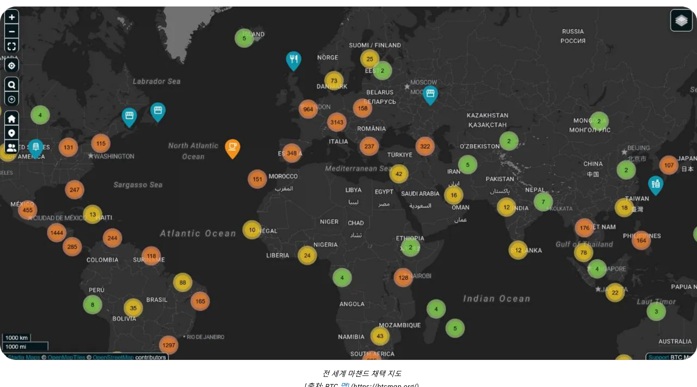

*[출처: BTC 맵](https://btcmap.org/)*

- 네트워크 지표: ** 라이트닝에 잠긴 총 채널 수와 Bitcoin은 약 20,000개의 노드, 5,200 BTC, 60,000개의 채널로 안정적으로 유지되고 있습니다. 그러나 이는 네트워크의 일부만을 반영한 수치이며, 참여자 수가 줄어들고 전문가가 늘어나는 등 참여자 간의 순환이 이루어지고 있음을 나타냅니다.
- 네트워크 간 가교로서의 라이트닝:** Lightning Network의 효율성과 가용성으로 인해 이미 다른 상호 연결된 네트워크(예: FediMint, Liquid 등)의 가교 역할을 하고 있습니다.

**Wallet의 컴백**

Bitcoin과 Lightning Network은 **디지털 Wallet 혁명을 완성하고 있습니다**. 이제 새로운 웹 서비스를 통해 **계정을 만들 필요 없이 **거래**를 할 수 있으며, Wallet가 곧 여러분의 신원이 됩니다! 노스트르 Wallet 커넥트(NWC)** 및 **LN-URL-AUTH**와 같은 프로토콜을 통해 지갑은 사용자를 원활하게 인증하고 기존 계정 없이도 거래를 가능하게 할 수 있습니다. 간단한 구매나 구독을 위해 계정이 필요하던 시대는 지났습니다. 최근의 사건에서 자주 상기할 수 있듯이, 더 이상 해킹당해 다크웹에서 판매될 수 있는 개인 정보나 결제 정보를 제공할 필요가 없습니다.

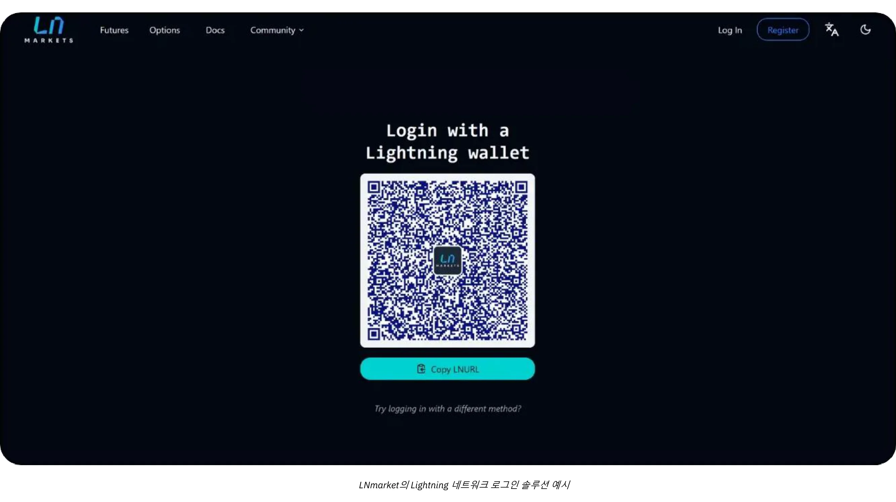

미래의 판매자는 이러한 혁신을 수용하여 고객에게 더욱 안전하고 원활한(원클릭) 경험을 제공하는 동시에 개인 정보를 존중할 것입니다.

# Bitcoin 회계

<partId>d49d7595-a189-4e2b-bd60-c19e8e717aa2</partId>

## 비즈니스에서 회계 Bitcoin를 위한 필수 원칙

<chapterId>84063061-ffdb-4b1f-b20b-588ffb146877</chapterId>

다음 콘텐츠는 교육 목적으로만 제공되며 재무 또는 회계 관련 조언으로 간주되어서는 안 됩니다. 기업 및 개인은 어떤 조치를 취하기 전에 해당 관할권의 암호화폐 규정을 잘 알고 있는 자격을 갖춘 회계사 또는 법률 전문가와 상담할 것을 강력히 권장합니다.

### Bitcoin 회계 주요 개념

**모든 Bitcoin 거래는 반드시 기록해야 하며 과세 대상 이벤트가 발생할 수 있습니다**

전 세계적으로 Bitcoin은 통화가 아닌 디지털 자산으로 분류되는 경우가 많습니다. 이러한 구분은 비즈니스에서 Bitcoin을 회계 처리하는 방식에 큰 영향을 미치며 납세 의무, 재무 보고 및 규정 준수 요건에 영향을 미칩니다. Bitcoin을 결제 수단으로 받아들이거나 자금 관리 도구로 사용하는 기업은 이러한 규제의 뉘앙스를 이해해야 합니다.

명심해야 할 **가장 중요한 결과**는 대부분의 관할권에서 Bitcoin를 적립, 판매, 거래 또는 구매에 사용하면 일반적으로 **과세 대상 이벤트**가 발생하고 이익에 양도소득세가 부과된다는 것입니다.

Bitcoin 회계의 또 다른 측면은 두 가지 유형의 자본 이득을 구분하는 것입니다:

- 잠복손익:** 회계 기간 말에 보유한 Bitcoin의 가치를 기준으로 한 미실현 이익 또는 손실입니다.
- 유효 손익:** 회계연도 중 Bitcoin를 매각하거나 교환할 때 실현된 손익입니다.

이러한 계산은 Bitcoin을 장기 투자 용도로 보유하는지, 아니면 단기 운영 용도로 보유하는지에 따라 크게 달라집니다. 또한 국가별로 규정이 크게 다르기 때문에 기업은 현지 세금 구조에 맞게 회계 관행을 조정해야 합니다.

실현 또는 미실현 손익을 계산하기 위해 모든 거래를 꼼꼼하게 추적해야 하므로 Bitcoin를 보유한 비즈니스의 회계 처리는 다소 번거롭습니다. Bitcoin를 결제 수단으로 수락하여 판매할 때마다, 또는 Bitcoin를 사고 팔 때마다 기록해야 합니다:

- 특정 시간
- 판매 가격(법정 통화 기준)
- gW-335 원가(Bitcoin를 처음 구입한 가격)입니다.

이렇게 하면 나중에 차액을 계산하여 수익 또는 손실을 결정할 수 있습니다.

**예시:** 한 기업이 1 BTC를 30,000달러에 구매합니다. 나중에 0.5 BTC를 20,000달러에 판매합니다. 비즈니스는 손익을 계산해야 합니다:

- 획득한 Bitcoin의 시간, 법정 화폐 가격 및 수량을 기록했습니다
- Bitcoin의 판매 시간, 법정 화폐 판매 가격 및 수량을 기록했습니다
- Bitcoin의 판매 비용 결정: 0.5 BTC: $30,000 ÷ 2 = $15,000.
- 판매 가격과 원가를 비교합니다: $20,000(판매 가격) - $15,000(원가) = $5,000의 이익.
- Bitcoin 보유 자산을 새로운 원가로 업데이트합니다

이 과정은 모든 거래에 대해 반복해야 하며, Bitcoin의 가격 변동 특성으로 인해 기록 관리가 더욱 번거로워집니다.

**Bitcoin이 통화라면 어떻게 작동할까요?

Bitcoin이 통화로 취급된다면 기업은 회계 시스템에서 다른 통화처럼 관리할 것입니다. 각 거래의 원가 기준과 실현/미실현 이익을 추적하는 대신, Bitcoin 보유는 단순히 통화 계정에 기록됩니다. 각 보고 기간이 끝날 때마다 Bitcoin을 포함한 모든 보유 통화의 가치는 현재 Exchange 환율을 사용하여 회계 통화(예: USD 또는 EUR)로 변환됩니다.

**Bitcoin가 통화로 인식된 경우 업데이트된 예시:**

- Bitcoin의 가치가 $30,000일 때 기업이 1BTC를 보유합니다. 나중에 Bitcoin의 가치가 $40,000일 때 이 기업은 결제에 0.5 BTC를 사용합니다.
- 비즈니스는 실현된 손익을 계산하지 않습니다. 대신 거래는 다음과 같이 기록됩니다:
    - 결제: $20,000(0.5 BTC × $40,000).
    - 남은 Bitcoin 잔액: 0.5 BTC, 현재 $20,000 가치(현재 Exchange 환율로 업데이트됨).

**Bitcoin이 통화로 인정될 경우의 주요 이점:**

- 기업은 보유하고 있는 유로, 엔화 또는 기타 통화와 마찬가지로 주기적으로(예: 월별 또는 연간 보고서 작성 시) Bitcoin 보유 법정화폐에 해당하는 금액만 조정하면 됩니다.
- 따라서 거래 수준의 비용 기준 추적이 필요하지 않으며, 특히 Bitcoin 거래가 빈번한 비즈니스의 경우 회계 처리를 간소화할 수 있습니다.

이러한 접근 방식은 Bitcoin이 법률 및 규제 측면에서 완전히 인정된다는 가정 하에 Bitcoin 회계를 훨씬 더 단순화하고 관리 부담을 줄이며 다른 통화의 취급과도 일치시킬 수 있습니다. 아직은 그 단계에 이르지 못했습니다.

### 개인과 기업 Bitcoin 회계의 차이점

Bitcoin의 법적 및 회계적 처리는 개인과 법인에 따라 크게 다릅니다. 개인의 경우 Bitcoin 거래로 인한 수익은 소득세가 부과될 수 있으며, 종종 더 높은 세율이 적용됩니다. 반면, 법인은 잠재적으로 낮은 법인세율의 혜택을 받을 수 있지만 더 엄격한 장부 작성 기준을 준수해야 합니다.

비즈니스용 Bitcoin는 사용 목적에 따라 다양한 계정으로 분류할 수 있습니다:

- 고정 자산:** 전략적 투자로 장기 보유 중인 Bitcoin의 경우.
- 재고:** 생산 공정에 사용되는 Bitcoin의 경우(드문 사용 사례, 예를 들어 전문 트레이더의 경우).
- 현금 또는 국고 계좌:** 주로 운영 거래 또는 단기 국고 관리를 위해 Bitcoin 자산으로 보유하는 Liquid의 경우.

분류 선택은 회사의 활동과 전략에 따라 달라지며, 재무 보고 및 납세 의무에 영향을 미칩니다. 이러한 분류는 국가마다 다를 수 있으므로 항상 현지 규정을 확인하세요.

### 법적 프레임워크

Bitcoin의 법적 인정과 취급은 관할권에 따라 다릅니다. 엘살바도르와 같은 일부 국가에서는 Bitcoin를 법정화폐로 인정하여 거래 시 사용을 간소화했지만 국제 재무 보고를 복잡하게 만들었습니다. 다른 국가에서는 Bitcoin를 특정 세금 및 회계 규칙의 적용을 받는 디지털 자산으로 취급합니다.

대부분의 국가에서 Bitcoin은 디지털 자산으로 분류되며 일반 회계 기준의 적용을 받습니다. 기업은 다음과 같이 Bitcoin 거래를 회계 처리해야 합니다:

- 자본 이득/손실 기록: ** 기업은 실현된 이익 또는 손실을 재무 실적에 반영해야 합니다.
- 잠복 손익 평가: ** 미실현 손익은 종종 보고해야 하지만 과세 소득에 직접적인 영향을 미치지 않을 수 있습니다.
- 회계 기준 준수:** 기업은 Bitcoin 거래를 표준 부기 관행에 통합하여 투명성과 정확성을 보장해야 합니다.

Bitcoin 회계에 대한 접근 방식은 지역에 따라 다릅니다:

- 미국: ** IRS는 Bitcoin을 주식, 채권 또는 부동산과 유사한 **재산**으로 분류합니다. 이 분류에 따라 암호화폐를 획득, 판매, 거래, 심지어 구매에 사용하는 등 암호화폐와 관련된 모든 거래는 과세 대상이 될 수 있으며 이익에는 양도소득세가 부과됩니다.
- 유럽연합: ** 회원국은 일반적으로 Bitcoin를 기능적 통화가 아닌 투기적 자산으로 취급합니다. 따라서 이익에는 양도소득세가 부과되는 경우가 많습니다.
- 아시아: ** 싱가포르와 일본과 같은 국가에서는 점진적인 규제 프레임워크를 채택하여 특정 상황에서 Bitcoin 거래를 우호적으로 취급하고 있습니다. 그러나 Bitcoin는 일반적으로 **무형자산**으로 회계 처리되며, 보고일에 공정가치로 측정하고 변동은 당기손익으로 인식합니다.

운영 국가의 규정을 이해하고 그에 따라 회계 관행을 조정하는 것이 중요합니다.

### 규제 진화의 과제

암호화폐 혁신의 빠른 속도는 종종 규제 프레임워크를 앞지릅니다. Bitcoin이 디지털 자산으로 인정된 이후 글로벌 규제는 점진적으로 업데이트되었지만 여전히 격차가 존재합니다:

- 법리 부족: ** 구체적인 회계 관행을 명확히 규정한 법적 판례는 거의 없어 해석의 여지가 있습니다.
- 진행 중인 논쟁: ** 잠복 손실의 세금 처리와 같은 문제는 많은 관할권에서 아직 해결되지 않은 상태로 남아 있습니다.
- 국경 간 복잡성:** 국제적으로 사업을 운영하는 기업은 서로 다른 국가별 회계 기준을 조정하는 데 어려움을 겪습니다.

이러한 어려움에도 불구하고 많은 국가의 적극적인 태도는 기업이 Bitcoin을 운영에 통합할 수 있는 탄탄한 기반을 제공합니다. Address의 지속적인 업데이트와 국제적 조화는 암호화폐 회계의 새로운 복잡성을 해결하는 데 필수적입니다.

### 재무제표에서 Bitcoin의 분류

재무제표에서 Bitcoin의 분류는 관할 지역에 따라 다르며 기업 내 사용 목적에 따라 달라집니다. 대체로 Bitcoin은 재고, 투자 또는 통화와 유사한 디지털 자산으로 취급되지만 회계 처리에 영향을 미치는 고유한 특성을 가지고 있습니다.

- 디지털 자산 또는 무형 자산**: 프랑스와 유럽연합을 포함한 많은 관할권에서는 Bitcoin을 법정화폐가 아닌 디지털 자산 또는 무형 자산으로 분류하고 있습니다. 이 분류에 따라 기업은 Bitcoin을 법정 화폐와 다르게 회계 처리해야 합니다.
- 재고**: 암호화폐 거래소나 브로커와 같이 기업의 핵심 활동이 Bitcoin 거래와 관련된 경우, Bitcoin는 재고로 분류됩니다. 이 경우 가치 평가는 재고 회계 기준을 따릅니다.
- 금융 투자**: Bitcoin을 장기 자산으로 보유하고 있는 기업은 이를 금융 투자로 분류할 수 있습니다. 예를 들어, 미국의 경우 기업은 재무회계기준위원회(FASB) 가이드라인에 따라 Bitcoin을 회계 처리하여 시장 가치가 하락할 경우 손상을 인식할 수 있습니다.

**분류의 의미 :**

- 장기 보유 자산은 손상 검사와 상각이 필요한 경우가 많습니다.
- 활발한 거래 또는 결제 관련 활동은 실현된 손익과 미실현 손익을 지속적으로 추적해야 합니다.

### 가치 평가 방법

가치 평가 방법은 Bitcoin의 원가 기준을 결정하는 데 사용되는 회계 기법으로, 거래 중 손익을 정확하게 계산하는 데 필수적입니다. 일반적으로 회계 시스템에서 현재 Bitcoin 보유 자산의 원가**를 항상 최신 상태로 유지하는 것이 가장 좋습니다. 이렇게 하면 투명성을 보장하고 세금 규정을 준수하며 계산이 필요할 때 뒤처지는 것을 방지할 수 있습니다.

- 선입선출(FIFO)**: 호주 및 인도와 같은 관할권에서 일반적으로 사용되는 이 방법은 가장 빠른 취득 비용을 기준으로 Bitcoin를 평가합니다. 판매 시 Bitcoin의 각 부분을 개별적으로 추적해야 할 수 있으므로 상당히 **복잡**해질 수 있습니다.
- 가중평균비용(WAC)**: 미국과 같은 국가에서 **간단함**으로 인해 대량 거래에 선호되는 경우가 많습니다.

정확하고 체계적인 기록 관리를 위해 회사가 Bitcoin을 구매하거나 결제를 수락하는 순간부터** Bitcoin 비용을 추적하는 상세한 워크북을 유지하는 것을 적극 권장합니다. Bitcoin 결제를 수락하거나 Bitcoin을 구매하기 위한 소프트웨어 솔루션을 선택할 때는 이러한 점을 최우선으로 고려해야 합니다.

### 소매 및 전자상거래 거래에 대한 회계 처리

소매업체는 각 거래에 대해 Bitcoin 대 법정 화폐 Exchange 세율을 기록해야 합니다. 예를 들어, 많은 국가에서 기업은 판매 시점에 Exchange 세율을 사용하여 부가가치세를 계산합니다.

비즈니스는 어떤 **결제** 도구를 사용하든 해당 기능을 제공해야 합니다:

- 현지 화폐 금액(유로, 달러, 파운드), 해당 부가가치세 또는 기타 지방세, 이에 상응하는 Bitcoin 표시 금액, 날짜 및 시간, Bitcoin Exchange 요율 및 Exchange 출처 등이 포함된 generate 또는 Invoice
- 회계사가 쉽게 처리할 수 있도록 모든 결제 영수증을 위의 모든 정보와 함께 최소한 .csv 형식으로 내보내세요
- 재무부에 보관된 현재 Bitcoin의 비용 기준의 업데이트된 가치를 기록하는 것이 이상적입니다

### 도전 과제

- 변동성**: Bitcoin의 가격이 크게 변동하여 보유 자산의 가치를 평가하고 향후 재무 결과를 예측하는 데 어려움이 있습니다.
- 규제 조사**: 중국과 같은 국가에서는 Bitcoin의 제한적 지위로 인해 국고 자산으로 사용이 제한됩니다.
- 규제 불확실성** : Bitcoin의 진화하는 규제 환경은 종종 기업을 혼란에 빠뜨립니다. 예를 들어, 인도나 미국 등의 세금 정책의 변화는 하룻밤 사이에 회계 관행에 영향을 미칠 수 있습니다.
- 잘못된 관리 위험** : Bitcoin 거래를 부적절하게 분류하거나 모니터링하지 않으면 규정 준수 문제, 벌금 또는 평판 손상으로 이어질 수 있습니다.
- 재인증 위험**: 회사 자금의 상당 부분을 Bitcoin에 보유하면 가격 하락으로 인한 잠재적 손실에 노출될 수 있습니다. 특히 공급업체, 직원 또는 세금에 대한 지불 기한이 도래하는 시점에 가격 하락이 발생할 경우 심각한 결과를 초래할 수 있습니다. 또한 회사 소유주가 책임을 져야 할 수도 있으며, 이로 인해 회사 자산의 오용에 대한 고발 등 벌금이나 기타 법적 문제가 발생할 수 있습니다.

## 회계 도구 및 소프트웨어

<chapterId>e7b31be5-1176-4835-944e-3cba1b7040fa</chapterId>

회사가 Bitcoin를 회계에 통합하기로 결정하면 다양한 도구와 전문 소프트웨어가 데이터 수집 및 처리를 단순화합니다. 가장 잘 알려진 솔루션으로는 [코인트래커](https://www.cointracker.io/), [월티오](https://www.waltio.com/), [크립티오](https://cryptio.co/), [코인리](https://koinly.io/), [토큰택스](https://tokentax.co/), [젠레저](https://zenledger.io/) 등이 있습니다. 이러한 플랫폼은 주로 네 가지 측면에 중점을 둡니다:

- 자동 데이터 수집;
- 이 데이터를 보다 일반적인 회계 소프트웨어(QuickBooks, Xero, ERP)와 호환되는 형식으로 변환합니다;
- 납세 의무 계산;
- 트랜잭션 분류.

다양한 플랫폼이나 거래소에서 여러 지갑과 자산을 보유한 대규모 조직의 경우 현명한 보완책이 될 수 있습니다.

그러나 대부분의 소규모 비즈니스는 거래 내역이 포함된 간단한 '.csv' 파일로 충분합니다. 목표는 각 결제에 대해 날짜, 금액, 유로/달러로 환산한 금액, 관련 Bitcoin 주소를 문서화하는 것입니다. 대부분의 Bitcoin 결제 솔루션(BTC Pay 서버, 스위스 Bitcoin Pay 등) 또는 Exchange 플랫폼(비트파이넥스, 크라켄, 코인베이스 등)은 이미 거래 내역을 내보낼 수 있는 메커니즘을 제공합니다. 이 파일을 회계사에게 제공하면 데이터 입력을 간소화하고 Bitcoin과 관련된 수신 및 발신 흐름을 명확하게 구분할 수 있습니다.

Bitcoin를 직접 보관하는 분들에게 UTXO(*미사용 거래 결과물*)를 관리하는 것은 중요한 단계입니다. 적절한 UTXO 라벨링은 각 BTC 조각의 출처를 추적하고, 업무 활동과 관련된 거래와 개인 경비를 위한 거래를 구분하며, 법적 또는 세금 목적의 추적을 용이하게 하는 데 도움이 됩니다. 대부분의 좋은 Bitcoin Wallet 소프트웨어는 백업 파일(또는 설정에 따라 xpub)을 사용하여 Wallet을 가져와 출발지 또는 목적지를 기준으로 UTXO에 태그를 지정할 수 있습니다. 이 작업에 대한 전체 튜토리얼을 참조하세요:

https://planb.network/tutorials/privacy/on-chain/utxo-labelling-d997f80f-8a96-45b5-8a4e-a3e1b7788c52
마지막으로, 소규모 판매자이든 기존 사업자이든 상관없이 Invoice을 Bitcoin에 **정산**할 수 있습니다. 핵심은 거래를 제대로 문서화하는 것입니다. 자체 보관 Wallet로 결제하는 경우에는 레이블에 generate 번호와 결제 목적을 명시하여 Invoice로 정산하는 것이 가장 이상적입니다. Exchange를 통해 Invoice을 정산하는 것을 선호하는 경우 영수증 또는 거래 내역을 내보내 회계 기록에 포함할 수 있는 옵션도 있습니다. 이러한 투명성을 통해 모든 BTC 운영의 추적과 보고를 간소화할 수 있습니다.

## 실용적인 Bitcoin 회계 예제

<chapterId>763f6f20-9181-495a-bf7d-b405899e65ec</chapterId>

### 사용 사례 1: Bitcoin 결제를 유로로 전환하는 소매점

**시나리오**: 한 작은 제과점에서 Bitcoin를 결제 수단으로 허용하지만, 암호화폐 변동성에 노출되지 않기 위해 받은 모든 Bitcoin를 즉시 유로로 전환합니다.

**예**:

- Bitcoin 전환율**: 1 Bitcoin = €40,000.
- 거래 1**: 고객이 €20에 여러 개의 페이스트리를 구매합니다.
    - Bitcoin 환산: (20 / 40,000) = 0.0005 Bitcoin = 50,000 사토시.
    - 전환 수수료: 1.5%(€20 × 0.015) = €0.30.
    - 순 수령액: €20 - €0.30 = €19.70.
- 거래 2**: 고객이 €5에 커피를 구매합니다.
    - Bitcoin 환산: (5 / 40,000) = 0.000125 Bitcoin = 12,500 사토시.
    - 전환 수수료: 1.5%(€5 × 0.015) = €0.075.
    - 순 수령액: €5 - €0.075 = €4.93.

**거래 요약**:

- 총 매출**: €25.
- 총 수수료**: €0.375.
- 수령한 순 유로**: €24.625.

**회계적 시사점**:

- 총 판매액(€25)을 매출로 기록합니다.
- 전환 수수료(€0.375)를 비용으로 공제합니다.
- 모든 금액이 즉시 전환되었으므로 대차 대조표에는 Bitcoin 보유액이 표시되지 않습니다.

### 사용 사례 2: Bitcoin 결제의 50%를 보유하는 소매점

**시나리오**: 동일한 베이커리가 Bitcoin 결제액의 50%는 현금 자산으로 유지하고 나머지 50%는 유로로 전환하기로 결정합니다.

**예**:

- Bitcoin 전환율**: 1 Bitcoin = €40,000.
- 고객**의 거래: 고객이 페이스트리를 €50에 구매합니다.
    - Bitcoin 환산: (50 / 40,000) = 0.00125 Bitcoin = 125,000 사토시.
    - 환산(50%): €25 상당의 Bitcoin = 0.000625 Bitcoin = 62,500 사토시.
        - 전환 수수료: 1.5%(€25 × 0.015) = €0.375.
        - 순 수령액(유로): €25 - €0.375 = €24.625.
    - Bitcoin에 보유(50%): 62,500 사토시 = 0.000625 Bitcoin.

**요약**:

- 총 매출**: €50.
- 수수료**: €0.375.
- 수령한 순 유로**: €24.625.
- Bitcoin 보유**: 62,500 사토시.

**회계적 시사점**:

- 총 판매액(€50)을 매출로 기록합니다.
- 전환 수수료(€0.375)를 비용으로 공제합니다.
- 보유 Bitcoin(62,500 사토시)는 대차 대조표에 디지털 자산으로 표시됩니다.
- 미실현 이익: 회계연도 말의 Bitcoin 평가액이 더 높거나 낮은 경우 재무 정보에는 공시되지만 수익으로 실현되지 않은 미실현 손익이 발생합니다

### 사용 사례 3: 장기 투자를 위한 전문 서비스 유지 Bitcoin

**시나리오**: 프리랜서 그래픽 디자이너가 Bitcoin을 지불로 받고 받은 모든 Bitcoin을 장기 투자로 보유합니다.

**예**:

- Bitcoin 결제 시 전환율**: 1 Bitcoin = €30,000.
- 고객**의 거래: 고객이 €3,000 상당의 서비스 비용을 지불합니다.
    - Bitcoin 환산: (3,000/30,000) = 0.1 Bitcoin = 10,000,000 사토시.
- 연말 평가**:
    - 연말 기준 Bitcoin 전환율: 1 Bitcoin = €35,000.
    - Bitcoin 보유 가치 평가: 0.1 Bitcoin × €35,000 = €3,500.
    - 미실현 이익: €3,500 - €3,000 = €500.

**요약**:

- 인식된 총 수익**: €3,000.
- Bitcoin 보유**: 0.1 Bitcoin는 대차대조표상 3,500유로 가치입니다.
- 미실현 이익**: 재무 정보에 공개되었지만 수익으로 실현되지 않은 500유로입니다.

**회계적 시사점**:

- 서비스 당시 기록적인 매출(3,000유로).
- 대차 대조표에 3,500유로 상당의 Bitcoin 보유(0.1)가 있습니다.
- 미실현 이익은 추적되지만 손익 계산서에는 포함되지 않습니다.

### 사용 사례 4: 가격 인상 후 Bitcoin의 50%를 판매한 비즈니스 소유자

**시나리오**: 한 사업주가 한 해 동안 3번의 Bitcoin를 구매하여 자산으로 보유하고 있다가 가격이 크게 오른 후 50%를 매각합니다.

**예**:

- Bitcoin 고객으로부터의 구매**:
    - 1 구매: €2,000, €20,000/BTC = 0.1 Bitcoin = 10,000,000 사토시.
    - 구매 2: €3,000, €25,000/BTC = 0.12 Bitcoin = 12,000,000 사토시.
    - 3번 구매: €5,000, 30,000/BTC = 0.1667 Bitcoin = 16,670,000 사토시.
    - 총 Bitcoin 보유량**: 0.3867 Bitcoin = 38,670,000 사토시.
- 연말 평가**:
    - Bitcoin 연말 가격: €40,000/BTC.
    - 총 가치: 0.3867 Bitcoin × €40,000 = €15,468.
    - 미실현 이익: €15,468 - €10,000(총 비용) = €5,468.
- Bitcoin**의 50% 할인**:
    - Bitcoin 판매: 0.19335 Bitcoin.
    - 판매 수익금: 0.19335 Bitcoin × €40,000 = €7,734.
    - 비용 기준(가중 평균):
        - 총 비용: €2,000 + €3,000 + €5,000 = €10,000.
        - 가중 평균 가격: €10,000 / 0.3867 Bitcoin = €25,850/BTC.
        - Bitcoin 판매 비용: 0.19335 Bitcoin × €25,850 = €4,999.
    - 실현 수익: €7,734 - €4,999 = €2,735.

**요약**:

- Bitcoin 잔량**: 0.19335 Bitcoin, 7,734유로(40,000유로/BTC 기준).
- 실현 이익**: 손익 계산서에 2,735유로 포함.
- 미실현 이익**: 재무 노트에 공시된 5,468유로(나머지 미실현 가치 Bitcoin 포함).

**회계적 시사점**:

- 판매 수익금(€7,734)을 수입으로 기록합니다.
- 실현 이익을 계산하려면 Bitcoin 판매 비용(4,999유로)을 공제합니다.
- 보유 Bitcoin(0.19335)은 7,734유로 상당의 대차 대조표에 표시됩니다.
- 재무 노트에 공시된 보유 Bitcoin의 미실현 이익 5,468유로.

# 결론

<partId>f6ca8d01-a4f3-449b-ac9f-c5fba9a69178</partId>

## 이 과정 평가하기

<chapterId>0fe8c49e-b7f8-46f7-9c42-b8a9a99a7b46</chapterId>

<isCourseReview>true</isCourseReview>
## 기말 시험

<chapterId>40a0f18c-bdc9-45b2-8dea-15f7e574230e</chapterId>

<isCourseExam>true</isCourseExam>
## 결론

<chapterId>5503c23e-3a90-4a23-8d89-75e3cc1ee53e</chapterId>

<isCourseConclusion>true</isCourseConclusion>

