# Kickstart de reis van uw bedrijf op het Bitcoin netwerk

Ontdek de praktische mogelijkheden van de Bitcoin en Lightning Network en ontdek hoe ze, net als het internet, uw **bedrijfsvoering** kunnen transformeren. Van digitaal kapitaal tot snelle, economische en schaalbare betalingen, de Bitcoin biedt een breed spectrum aan **gebruikscases voor bedrijven**.

In deze gids leer je hoe je Bitcoin kunt begrijpen als een wereldwijd, universeel en internetnative monetair netwerk. Met zijn unieke fundamentele kenmerken biedt **Bitcoin aanzienlijke verbeteringen ten opzichte van traditionele valutanetwerken**. Je zult ontdekken waarom en hoe je Bitcoin kunt inzetten voor klassieke financiële use cases zoals kapitaalopslag en betalingssystemen. Daarnaast behandelt deze gids het verwerven en aanhouden van Bitcoin, inclusief de bijbehorende boekhoudkundige en fiscale vereisten, en het implementeren van eenvoudige of grootschalige Bitcoin betalingsoplossingen.

Of je nu een **klein bedrijf of een grote onderneming** bent, het integreren van Bitcoin in je dagelijkse werkzaamheden kan je bedrijf **weerbaarder, productiever en competitiever** maken. Elk op internet gebaseerd bedrijf zal een Bitcoin-georiënteerd bedrijf worden, en deze cursus zorgt ervoor dat je voorbereid bent. In de eerste hoofdstukken worden de grondbeginselen van de werking van Bitcoin uitgelegd, dus zelfs als u een beginner bent, zult u de basiskennis opdoen die nodig is om verder te gaan. De grondbeginselen van de uitvinding van Satoshi leren is altijd een goed idee, voor of na het duiken in BIZ101.

+++

# Inleiding

<partId>326cf945-5d3f-4d86-8c3e-4d1c35959799</partId>

## Cursusoverzicht

<chapterId>1be42be9-4080-49f5-b5b2-6b531dd55f5f</chapterId>

Welkom bij de BIZ101 cursus! Kickstart de reis van uw bedrijf op het Bitcoin netwerk met deze uitgebreide training - een startpunt om te begrijpen hoe Bitcoin en de Lightning Network een revolutie teweeg kunnen brengen in de traditionele bedrijfsvoering. Deze cursus is ontworpen voor detailhandelaren, ondernemers, managers en zakelijke besluitvormers die de praktische mogelijkheden van Bitcoin willen verkennen als een wereldwijd, internetnative monetair netwerk en een robuust middel om Exchange te waarderen.

Tijdens de cursus maak je kennis met de basisprincipes die Bitcoin en Lightning Network zo transformatief maken. Je leert hoe deze technologieën een spectrum aan gebruiksmogelijkheden bieden, van opslag van digitaal kapitaal tot snelle, economische en schaalbare betalingen, en hoe ze cruciale verbeteringen bieden ten opzichte van traditionele valuta- en betalingssystemen. De BIZ101 cursus verbindt economische theorie met toepassingen in de echte wereld en verduidelijkt hoe decentralisatie de afhankelijkheid van tussenpersonen kan verminderen en beperkingen kan overwinnen die inherent zijn aan bestaande systemen.

De cursus begint met een gedetailleerd onderzoek naar conventionele valuta en betalingsmechanismen, waarbij de basis wordt gelegd door te onderzoeken hoe valuta functioneren als een netwerk om handel, sparen en economische specialisatie mogelijk te maken. Vervolgens gaan we dieper in op de technologie achter Bitcoin en de innovaties geïntroduceerd door Lightning Network, en onthullen we hun rol in het faciliteren van naadloze, veilige en bijna onmiddellijke transacties die bedrijven van alle groottes van dienst kunnen zijn. Daarna duiken we in de praktische delen van deze cursus, te beginnen met een deel over het houden van bitcoins als schatkist, gevolgd door een laatste deel over het accepteren van Bitcoin als betaalmiddel.

Of u nu een klein bedrijf of een grote onderneming vertegenwoordigt, deze cursus is bedoeld om u te voorzien van de kennis om Bitcoin te integreren in uw dagelijkse werkzaamheden, waardoor de veerkracht, efficiëntie en het concurrentievoordeel van uw bedrijf worden vergroot. Nu Bitcoin het economische landschap blijft veranderen, is het begrijpen van deze baanbrekende technologieën niet slechts een optie, maar een strategische noodzaak. Bereid u voor op inzichtelijke inhoud, praktische voorbeelden en strategische richtlijnen die u in staat zullen stellen om te navigeren en gebruik te maken van de zich ontwikkelende wereld van Bitcoin!

Klaar om in de wereld van Bitcoin voor bedrijven te duiken? Laten we gaan!

**N.B.**: Als u tijdens de cursus onbekende termen tegenkomt, raadpleeg dan [de woordenlijst](https://planb.network/resources/glossary) voor definities.

# Valuta, betalingssystemen en Bitcoin

<partId>d9bd0e21-8488-44e0-af55-6d0b934f83c2</partId>

## Traditionele valuta

<chapterId>785e095c-6811-4ca2-ba46-fe38291432d4</chapterId>

### Valuta's zijn netwerken

Valuta's zijn in wezen netwerken die een efficiënte Exchange van waarde mogelijk maken.

Zonder valuta moeten individuen vertrouwen op **ruilhandel**, een systeem waarbij goederen of diensten direct worden uitgewisseld. Ruilen is onpraktisch omdat het een "dubbele samenloop van behoeften" vereist - beide partijen moeten op hetzelfde moment willen wat de ander aanbiedt. Als een boer met een tarweoverschot bijvoorbeeld schoenen wil, moet hij een schoenmaker vinden die specifiek tarwe nodig heeft. Dit is zeldzaam en inefficiënt. Bovendien, **met n producten in een ruilhandelseconomie zijn er ~n(n-1)/2 Exchange tarieven nodig**, waardoor een zeer complex en omslachtig systeem ontstaat. Er zouden bijvoorbeeld meer dan ~124.000 Exchange tarieven nodig zijn voor slechts 500 producten.

Valuta vereenvoudigt dit door als tussenpersoon te fungeren en **een netwerk te creëren dat het aantal Exchange koersen terugbrengt tot n** -één voor elk product ten opzichte van de valuta. Dit maakt transacties veel eenvoudiger en stelt **mensen in staat om goederen en diensten te verhandelen zonder dat ze tegelijkertijd iets van elkaar moeten hebben**. In plaats van tarwe direct te ruilen voor schoenen, kan de boer zijn tarwe verkopen voor valuta en die valuta later gebruiken om schoenen te kopen, of iets anders dat hij nodig heeft.

De introductie van valuta als een netwerk vergemakkelijkt niet alleen de handel, maar maakt ook **arbeidsverdeling en specialisatie** mogelijk. Met een betrouwbaar Exchange medium hoeven individuen en gemeenschappen niet langer alles te produceren wat ze consumeren. In plaats daarvan kunnen ze zich concentreren op wat ze het beste kunnen, waardoor efficiëntie en kwaliteit toenemen. Een boer kan zich specialiseren in het verbouwen van gewassen, een schoenmaker in het maken van schoeisel en een bouwer in het bouwen van huizen. Deze specialisten kunnen dan hun goederen en diensten in Exchange omzetten door middel van valuta, waarbij ze profiteren van elkaars expertise. Deze specialisatie stimuleert **productiviteit en innovatie**, omdat mensen hun vaardigheden verfijnen en nieuwe methoden ontwikkelen op hun vakgebied.

Het netwerkkarakter van valuta brengt nog meer belangrijke voordelen met zich mee. Ten eerste is deel uitmaken van het valutanetwerk **voordeliger dan erbuiten staan**. De gedeelde standaard van het netwerk vergemakkelijkt de handel, waardoor individuen hun economische activiteiten zelfs **over grote afstanden** kunnen coördineren. Een handelaar in de ene stad kan bijvoorbeeld goederen verhandelen met een koper in een andere stad door gebruik te maken van dezelfde munteenheid.

Een ander belangrijk voordeel van valuta is de mogelijkheid om uitgestelde ruil toe te staan**. Met ruilhandel zijn transacties onmiddellijk; het ene goed wordt in real-time geruild voor het andere. Valuta daarentegen maakt **sparen** mogelijk; individuen kunnen waarde opslaan voor toekomstig gebruik**. Dit betekent een enorme sprong voorwaarts voor economische planning, investeringen en vermogensopbouw, die allemaal het leven van netwerkdeelnemers verbeteren.

Kortom, munteenheden zijn netwerken die ontworpen zijn om waarde efficiënt te verplaatsen. Ze overwinnen de beperkingen van ruilhandel, vereenvoudigen de handel en creëren mogelijkheden voor coördinatie en sparen. Net als bij elk ander netwerk hangt de waarde van een valuta af van de wijdverspreide acceptatie en het nut ervan - uiteindelijk wint de beste valuta.

### Wat is een goede valuta?

Een goede valuta bezit een aantal essentiële eigenschappen die het effectief maken om waarde Exchange te faciliteren. Hier volgt een beknopte uitleg van elke eigenschap:

- **Veilig**: Een betaalmiddel moet beschermd zijn tegen diefstal of ongeautoriseerde toegang, zodat gebruikers het met vertrouwen kunnen houden en overdragen. Beveiliging is cruciaal voor het opbouwen van vertrouwen in het systeem.

- **Valsbestendig**: Een munteenheid moet extreem moeilijk of onmogelijk te vervalsen zijn. Dit zorgt ervoor dat elke eenheid authentiek is, zijn waarde behoudt en voorkomt inflatie veroorzaakt door valse eenheden die in omloop komen. Historisch gezien is goud bijvoorbeeld niet alleen gewaardeerd om zijn schoonheid en zeldzaamheid, maar ook omdat het extreem **hard** is om te produceren. In tegenstelling tot papieren biljetten of digitale inzendingen, kun je goud niet zomaar "maken" - het moet uit de aarde worden gedolven. Deze natuurlijke schaarste en moeilijkheid van de productie hebben goud geholpen om zijn status als betrouwbare waardeopslagplaats en maatstaf voor authenticiteit te behouden.

- **Schaars**: Een goede munt moet een beperkte Supply of gecontroleerde uitgifte hebben. Schaarste zorgt ervoor dat de waarde in de loop van de tijd behouden blijft en voorkomt overproductie, die de koopkracht zou uithollen. Bepaalde indianenstammen gebruikten bijvoorbeeld kralen als betaalmiddel. Aanvankelijk waren deze kralen hard om te produceren, waardoor ze schaars en waardevol bleven. Maar toen Europese handelaren eenmaal begonnen met massaproductie en de markt overspoelden met kralen, verdween hun zeldzaamheid. Toen de Supply steeg, verloren de kralen hun koopkracht en werd hun rol als betrouwbare waardeopslag ondermijnd.

- **Zonder toestemming**: In het verleden werden munten zoals gouden en zilveren munten vaak geslagen door particulieren, lokale overheden of kooplieden die toegang hadden tot de grondstoffen. Dit systeem werkte soms op basis van overeenkomsten of licenties van koningen of heersers. Na verloop van tijd centraliseerden koningen en regeringen dit proces om meer controle te krijgen over economische stabiliteit, belastingen en het monetaire systeem. Een beroemd voorbeeld is de **thaler**, een zilveren munt die voor het eerst werd geslagen in 1518 in de **Joachimsthal Vallei** (het huidige Jáchymov in Tsjechië) door lokale mijnwerkers en autoriteiten. De naam "thaler" is afgeleid van het Duitse woord **"Thal"** dat "vallei" betekent. Deze munten, die bekend stonden om hun zilver van hoge kwaliteit, werden op grote schaal in omloop gebracht in heel Europa. In de loop van de tijd evolueerde de term taalkundig en geografisch, en uiteindelijk ontstond de naam "dollar", die in de Verenigde Staten werd gebruikt voor de munteenheid.

In het moderne tijdperk werden munteenheden volledig toegestaan onder het seignioragesysteem, wat betekent dat alleen bevoegde entiteiten, zoals centrale banken of schatkisten, munten kunnen slaan of bankbiljetten kunnen drukken. Het is individuen niet langer wettelijk toegestaan om geld te produceren, wat zorgt voor een gecentraliseerde controle over de uitgifte en de Supply.

Vandaag wordt het principe van seigniorage uitgedaagd door de Bitcoin cryptocurrency, die zonder gecentraliseerde controle werkt. Bitcoin is een "toestemmingsvrij" systeem waarbij iedereen kan deelnemen aan het gebruik van de munt zonder toestemming te vragen, en, via Mining, aan het creëren ervan. Deze decentralisatie verwijdert het uitgiftemonopolie van overheden, wat vragen oproept over een mogelijke terugkeer naar concurrerende valutasystemen op de vrije markt.

- **Rekeneenheid**: Een munteenheid moet een standaardmaatstaf zijn om de waarde van goederen en diensten te vergelijken. Dit vereenvoudigt de handel en maakt prijzen transparant en consistent voor alle transacties.

- **Duurzaam**: Een valuta moet bestand zijn tegen slijtage na verloop van tijd. Fysieke valuta, zoals munten of bankbiljetten, moeten bestand zijn tegen beschadiging, terwijl digitale valuta veilig opgeslagen moeten blijven zonder risico op gegevensverlies.

- **Draagbaar**: Een munteenheid moet gemakkelijk te vervoeren en te gebruiken zijn, zodat handel over afstanden mogelijk is. Dit kan worden bereikt door fysieke draagbaarheid (lichtgewicht munten of biljetten) of digitale transfersystemen.

- **Deelbaar**: Een valuta moet deelbaar zijn in kleinere eenheden om transacties van verschillende grootte te vergemakkelijken. Deze flexibiliteit zorgt ervoor dat het praktisch is voor zowel kleine aankopen als grootschalige handel.

- **Fungibel**: Alle eenheden van een valuta moeten uitwisselbaar zijn en dezelfde waarde hebben. Een dollarbiljet moet bijvoorbeeld gelijkwaardig zijn aan elk ander dollarbiljet. Deze uniformiteit zorgt voor eerlijkheid en eenvoud in transacties.

- **Herkenbaar**: Een munteenheid moet gemakkelijk te herkennen en te vertrouwen zijn. Fysieke munteenheden bereiken dit door unieke ontwerpen en veiligheidskenmerken, terwijl digitale munteenheden kunnen vertrouwen op verificatieprotocollen. Dit zorgt voor wijdverspreide acceptatie en vermindert het risico op fraude.

Deze kenmerken maken een munteenheid praktisch, betrouwbaar en efficiënt voor het faciliteren van handel en het opslaan van waarde in een economie.

### Valutasystemen evoluties

**Van munten naar papiergeld: Grotere efficiëntie en draagbaarheid**

De overgang van munten naar papiergeld betekende een aanzienlijke verbetering in **draagbaarheid** en efficiëntie. Munten, gemaakt van edele metalen zoals goud of zilver, waren waardevol vanwege hun intrinsieke waarde. Ze waren echter zwaar, moeilijk te vervoeren in grote hoeveelheden en onderhevig aan slijtage of diefstal. Papiergeld bracht een revolutie teweeg in valutanetwerken door een lichtgewicht, gestandaardiseerd en draagbaar medium te introduceren dat waarde vertegenwoordigde in plaats van het te bevatten. Deze innovatie maakte schaalvergroting van economieën mogelijk doordat handel over lange afstanden eenvoudiger werd en de logistieke uitdagingen van het gebruik van fysieke goederen als geld werden verminderd.

Papiergeld verbeterde ook de schaalbaarheid. In plaats van te vertrouwen op de beperkte Supply van edelmetalen, konden economieën hun monetaire basis uitbreiden door middel van representatieve valuta's, die in eerste instantie werden ondersteund door reserves en later door vertrouwen in uitgevende instellingen. Deze verschuiving maakte de weg vrij voor complexere en onderling verbonden financiële systemen.

**Van papier naar elektronisch geld: Vergroten van toegankelijkheid en snelheid**

De overgang van papiergeld naar elektronisch geld verbeterde het valutanetwerk nog verder door de toegankelijkheid en snelheid te vergroten. Met de opkomst van banksystemen, creditcards en digitale transacties werd geld niet alleen **draagbaar**, maar bijna **onmiddellijk**. Elektronische overschrijvingen maakten fysieke Exchange overbodig, waardoor transacties over grote afstanden binnen enkele seconden konden plaatsvinden.

Deze verschuiving democratiseerde ook de toegang tot valuta. Elektronisch bankieren en betalingssystemen verlaagden de toegangsdrempels voor particulieren en bedrijven, waardoor deelname aan de wereldeconomie mogelijk werd. De snelheid en het gemak van elektronisch geld breidden de handelsnetwerken uit en stimuleerden nieuwe bedrijfsmodellen die onmogelijk zouden zijn geweest in een op papier gebaseerd systeem.

Deze moderne valutanetwerken hadden een belangrijk nadeel: een **zwakke controleerbaarheid en transparantie in het beheer van het geld Supply**, wat vaak resulteerde in ongecontroleerde inflatie en een verlies aan vertrouwen in gecentraliseerde systemen. Zo werd alleen al in de laatste vier jaar meer dan 20% van alle in omloop zijnde Amerikaanse dollars gedrukt. Deze hardnekkige verleiding om meer geld uit te geven - en daarmee de waarde van de huidige houders te verminderen - kan grotendeels worden toegeschreven aan een systeemfout: politici worden vaak gestimuleerd om moeilijke budgettaire beslissingen te vermijden en kiezen er in plaats daarvan voor om uitdagingen naar toekomstige regeringen door te schuiven

**Van gecentraliseerde naar gedecentraliseerde valuta: Vergroting van vertrouwen en soevereiniteit**

Vandaag de dag vertegenwoordigt de opkomst van Bitcoin als gedecentraliseerde valuta de volgende sprong in valutanetwerken. Traditioneel elektronisch geld vertrouwt op gecentraliseerde autoriteiten, zoals banken of overheden, om transacties te beheren en te verifiëren. Hoewel deze systemen effectief zijn, zijn ze kwetsbaar voor inefficiëntie, censuur en single points of failure. Decentrale munteenheden verbeteren deze netwerkeigenschappen door **het vertrouwen te verdelen en tussenpersonen** te verwijderen. Het betekent ook dat geld veel **sneller** en **goedkoper** kan bewegen, omdat er geen autorisatiestappen zijn. Tenslotte kan geen mens in de verleiding komen om het Bitcoin valuta Supply schema te veranderen, dat wordt afgedwongen door de software.

In gedecentraliseerde systemen worden transacties geverifieerd door een wereldwijd netwerk van deelnemers met behulp van Blockchain-technologie, wat veiligheid, transparantie en veerkracht garandeert. Deze structuur minimaliseert het risico op fraude, vermindert de afhankelijkheid van centrale autoriteiten en geeft individuen meer controle over hun financiën. Door geografische en institutionele barrières te elimineren, bieden gedecentraliseerde munteenheden een echt wereldwijd en inclusief monetair systeem.

**De evolutie van valutanetwerken**

Elke fase in de evolutie van valutanetwerken heeft belangrijke eigenschappen verbeterd: draagbaarheid, schaalbaarheid, toegankelijkheid, snelheid, veiligheid en vertrouwen. Munten maakten plaats voor papiergeld voor betere overdraagbaarheid en efficiëntie. Papier evolueerde naar elektronisch geld, dat wereldwijde toegang en directe transacties mogelijk maakte. Nu herdefinieert Bitcoin vertrouwen en veiligheid door een open en veerkrachtig monetair systeem te creëren. Deze historische progressie benadrukt de voortdurende drang van de mensheid om betere netwerken voor waarde Exchange te creëren, waarbij elke iteratie voortbouwt op de beperkingen van de vorige en deze overtreft.

Het beste netwerk zal waarschijnlijk winnen.

## Traditionele betalingssystemen

<chapterId>1306196c-1e8a-454b-8e11-6887ecb3d8b4</chapterId>

Betalingssystemen zijn methoden en infrastructuren die de overdracht van geld tussen twee partijen mogelijk maken, meestal tussen een betaler (zoals een consument) en een begunstigde (zoals een bedrijf). Deze transacties kunnen plaatsvinden in verschillende omgevingen: een consument die een lokale winkelier betaalt, een bedrijf dat facturen vereffent met een leverancier, of zelfs individuen die geld naar elkaar overmaken. Om betalingssystemen te begrijpen, moet je kijken naar de verschillende soorten betalingsmethoden, hun kenmerken en hun gebruikssituaties in zowel de B2C-context (Business-to-Consumer) als de B2B-context (Business-to-Business).

### Gebruikelijke betaalmethoden

1. **Cash:** Fysieke valuta die rechtstreeks tussen twee partijen wordt uitgewisseld.

2. **Checks:** Papieren documenten die een bank opdracht geven om een bepaald bedrag van de rekening van de betaler aan de begunstigde te betalen.

3. **Wire Transfers:** Elektronische overdracht van geld tussen banken, vaak gebruikt voor grotere bedragen en grensoverschrijdende betalingen.

4. **Betaalkaarten (Credit/Debit):** Plastic of digitale kaarten die verbonden zijn met een kaartnetwerk, waarmee geld kan worden overgemaakt van de bankrekening (of kredietlijn) van de kaarthouder naar een handelaar.

5. **Digital Wallets & Mobile Payments:** Toepassingen of apparaten die betalingsinformatie opslaan (bijv. Apple Pay, WeChatPay, AliPay, PayPal), waardoor snelle en vaak contactloze overschrijvingen mogelijk zijn.

**Gebruik in B2C en B2B:**

- **B2C (Business-to-Consumer):**
    - Consumenten gebruiken vaak contant geld, kaarten en digitale portemonnees voor alledaagse aankopen, zoals boodschappen, online winkelen of diensten zoals ride-hailing.
    - Snelheid, gemak en lage kosten (voor de consument) zijn vaak belangrijke prioriteiten.
    - Contactloze en mobiele betalingen worden steeds populairder vanwege hun gebruiksgemak.

- **B2B (Business-to-Business):**
    - Bedrijven vertrouwen vaak op overschrijvingen, cheques en facturatiesystemen om leveranciers te betalen, grote rekeningen te vereffenen of terugkerende betalingen af te handelen.
    - De focus ligt vaak op traceerbaarheid, documentatie en de mogelijkheid om grotere transactiewaarden te verwerken.
    - Kaarten worden wel gebruikt, maar minder vaak vanwege de hogere kosten en transactielimieten. Digitale oplossingen zoals geïntegreerde betalingsplatforms zijn in opkomst om debiteuren- en crediteurenprocessen te stroomlijnen en te automatiseren.

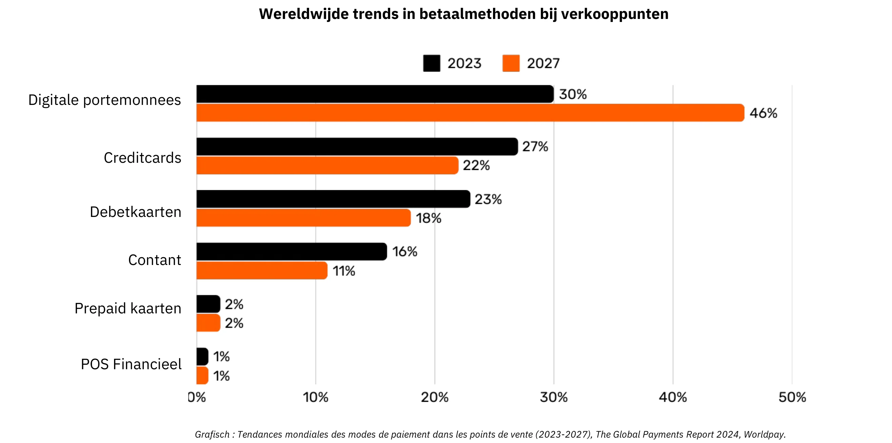

*Grafisch: Global Trends in Point-of-Sale (POS) Betaalmethoden (2023-2027), The Global Payments Report 2024, Worldpay.*

### De complexiteit achter een eenvoudige kaartbetaling

Wanneer een klant een creditcard gebruikt in een winkel, wordt de kaart gelezen door de betaalterminal, die de transactiegegevens veilig doorstuurt naar de wervende bank van de winkelier. De wervende bank stuurt deze informatie door naar het relevante kaartnetwerk (bijv. Visa of Mastercard), die het verzoek vervolgens doorstuurt naar de uitgever - de bank die de kaart van de klant heeft verstrekt. De emittent controleert de rekening of kredietlijn van de klant en stuurt een autorisatie terug via het netwerk en de wervende bank, zodat de winkelier de betaling kan accepteren.

Deze ogenschijnlijk eenvoudige transactie omvat in werkelijkheid meer dan 15 stappen, 7 tussenpersonen en het duurt gemiddeld 48 uur tot 5 dagen voordat de merchant het geld ontvangt. In de daaropvolgende dagen vindt een clearing- en afwikkelingsproces plaats. Het kaartnetwerk verzamelt de transacties van de dag en coördineert de uitwisseling van fondsen tussen de acquirer en de emittent. Een centrale bank zorgt voor de nauwkeurigheid en stabiliteit van deze interbancaire verrekeningen. Uiteindelijk ontvangt de bankrekening van de winkelier het nettobedrag (minus vergoedingen) gecrediteerd van de acquirer, waarmee de levenscyclus van de transactie is voltooid.

Over het geheel genomen is dit proces ingewikkeld, tijdrovend en kostbaar voor wat de eenvoudige handeling van het verplaatsen van waarde van de ene partij naar de andere zou moeten zijn.

### Vergelijking betaalmethoden

| Payment Method                 | Authorization Needed?           | Transaction Approval Time (Merchant View) | Settlement Speed (Funds Fully Settled)         | Finality (Ease of Reversal)              | Number of Intermediaries       | Typical Fees (to Payee)            |
| ------------------------------ | ------------------------------- | ----------------------------------------- | ---------------------------------------------- | ---------------------------------------- | ------------------------------ | ---------------------------------- |
| **Cash**                       | No                              | Immediate (Physical Exchange)             | Immediate (No Settlement Delay)                | High (Irreversible Once Paid)            | None                           | None                               |
| **Checks**                     | Yes (Bank Clearing)             | Acceptance at Deposit (Not Guaranteed)    | Several Days (Check Clearing Process)          | Medium (Can Bounce/Stop Before Clearing) | Bank                           | **Low to Medium** (Bank Fees)      |
| **Wire Transfers**             | Yes (Bank/Network)              | Confirmation Within Hours                 | Same-Day or Next-Day (Domestic)                | High (Usually Irreversible Once Sent)    | Banks, Payment Networks        | **Medium**(Fixed/Percentage)       |
| **Payment Cards**              | Yes (Card Issuer Authorization) | Seconds to Minutes (Authorization Code)   | A Few Days (Interbank Settlement)              | Medium (Chargebacks Possible)            | Issuer, Acquirer, Card Network | **Variable (1-3% of Transaction)** |
| **Digital Wallets/Mobile Pay** | Yes (Wallet Provider/Bank)      | Seconds (Instant Confirmation)            | Typically 1-2 Days (Depends on Funding Source) | Medium (Refund/Dispute Possible)         | Banks, Wallet Operators        | **Low to Medium (Varies)**         |

### Beperkingen van bestaande oplossingen

De traditionele betalingsindustrie vertegenwoordigt een jaarlijkse economie van ongeveer 2.200 miljard dollar, ruwweg een tiende van het BBP van de Verenigde Staten of gelijk aan het BBP van Frankrijk. Omdat valuta's functioneren als netwerken waarvoor toestemming is gegeven, is er beperkte concurrentie, waardoor deze "dienst" meer lijkt op een belasting die wordt opgelegd aan de productieve economie. Naast de kosten die het met zich meebrengt, zijn er nog verschillende andere beperkingen, zoals hieronder beschreven.

| Limitation                       | Explanation                                                                                                                                                                                                                        | Impact                                                                                               |
| -------------------------------- | ---------------------------------------------------------------------------------------------------------------------------------------------------------------------------------------------------------------------------------- | ---------------------------------------------------------------------------------------------------- |
| High Card Fees                   | Interchange fees (~0.3%), network fees (fixed or 0.3%-1%), terminal/PSP subscriptions, and bank margins (0.5%-1.7%) add up to a substantial cost—like a global “tax” on productive sectors, amounting to trillions of dollars.     | Raises merchant costs, reducing margins and potentially driving up consumer prices.                  |
| Very Slow Final Settlement       | Settlement of funds can take up to 5 days, slowing the flow of money and overall economic activity.                                                                                                                                | Delays liquidity for merchants and reduces the speed of economic circulation.                        |
| Fraud                            | E-commerce channels are heavily targeted by fraud, contributing to significant losses (e.g., $28 billion). Chargebacks could reach ~$174 billion globally by 2024. Managing these disputes consumes time and causes mental strain. | Increased operational costs, complex fraud prevention measures, and diminished customer trust.       |
| Cart Abandonment                 | Additional security steps (one-time codes, two-factor authentication under PSD2) introduce friction at checkout.                                                                                                                   | Higher checkout complexity leads to increased cart abandonment and lost sales.                       |
| High Minimum Transaction Amounts | Minimum spend thresholds on cards can force merchants and consumers into inconvenient pricing or purchase conditions, discouraging small-value transactions.                                                                       | Reduced customer satisfaction and flexibility, potentially limiting impulse or low-value purchases.  |
| Slow Pre-Authorization           | Current systems cannot handle transactions at millisecond speeds or support continuous, real-time payment flows.                                                                                                                   | Limits use cases that require instant or streaming payments, restricting innovation and scalability. |
| Need for a Bank/Card Account     | Access to these payment methods requires a linked bank or card account, automatically excluding those without such accounts.                                                                                                       | Limits financial inclusion, reducing access for unbanked or underbanked populations.                 |
| Repeated Online Account Creation | Users often must create multiple online accounts, leading to fatigue, reduced convenience, and increased exposure of personal data.                                                                                                | Deteriorates user experience, raises privacy concerns, and increases risk of data breaches.          |
| Foreign Exchange (FX) Fees       | Lack of a universal unit of account forces costly currency conversions for cross-border transactions.                                                                                                                              | Adds extra costs for international commerce, making global transactions less affordable.             |

Net zoals we zijn overgestapt van het betalen per minuut voor telefoongesprekken naar het gebruik van bijna gratis IP-gebaseerde communicatie, kan de opkomst van meer open en efficiënte netwerken betalingen herdefiniëren, kosten en tussenpersonen verminderen en nieuwe bedrijfsmodellen aanmoedigen.

## Bitcoin voor bedrijven: een opkomende valuta

<chapterId>4488fe33-663f-41a3-a668-e9ca2fb7122e</chapterId>

**WHAT IS Bitcoin?**

Bitcoin is een **peer-to-peer digitaal geld Exchange systeem** (elektronisch geld). De term "Bitcoin" verwijst naar de volgende componenten:

- Een **computerprotocol** dat waarde Exchange op het internet mogelijk maakt zonder tussenpersonen, zonder toestemming en pseudoniem. Het maakt gebruik van geavanceerde cryptografische principes.
- Een **fysiek netwerk** van machines verbonden met het internet (nodes, miners, enz.), beheerd door particulieren en bedrijven, dat een gedecentraliseerd systeem vormt (zonder centrale autoriteit of centraal controlepunt).
- De **rekeneenheid** binnen het systeem. Er zullen nooit meer dan 21 miljoen bitcoins bestaan. Elke Bitcoin is deelbaar in 100 miljoen eenheden die "satoshis" worden genoemd, ter ere van de anonieme maker.

Samen maken ze van Bitcoin een **bearer asset** en een digitale valuta **zonder uitgever**. Ownership wordt alleen beveiligd door het bezit van de **private cryptografische sleutel**, die volledige controle geeft **zonder tussenpersonen of vertrouwde derden**. Bij overdracht is Ownership onmiddellijk **eigenaar**: de nieuwe houder bezit het volledig zonder afhankelijk te zijn van een centrale autoriteit voor bescherming of converteerbaarheid. Transacties zijn **onveranderlijk** - eenmaal vastgelegd op de Blockchain, kunnen ze niet meer veranderd of verwijderd worden.

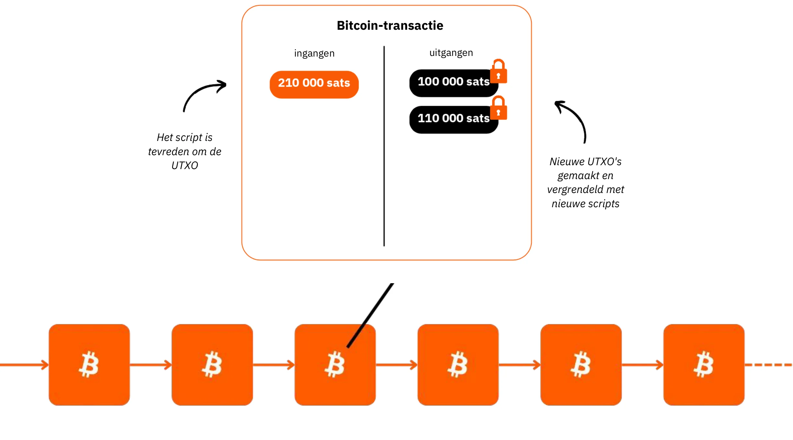

Bitcoin heeft een vast monetair beleid, met een **cap van 21 miljoen bitcoins**, waarvan er al ~19,8 miljoen zijn gedistribueerd. Dit maakt het **deflatoir**, waarbij de waarde in de loop van de tijd stijgt als gebruikers er spaargeld en productiviteitswinsten in opslaan.

De technische eigenschappen overtreffen die van goud en de dollar samen, waardoor het de hardste financiële activa ooit is. Bitcoin is zowel een opslagplaats van waarde als een medium van Exchange, een valuta in wording. Stelt u zich eens voor: een snelle waardeoverdracht van de kas van een bedrijf naar een ander, zonder tussenpersonen, tegen minimale kosten, zonder fraude, 24 uur per dag, 7 dagen per week en zonder tussenkomst van derden.

Bitcoin behoudt effectief zijn waarde omdat het Ledger fraudebestendig is. De waarde stijgt door het zeldzame en beperkte Supply in combinatie met het groeiende aantal Exchange mogelijkheden, gedreven door het toenemende aantal gebruikers.

Bitcoin is ontwrichtend omdat het ons stimuleert om concepten in wiskunde, cryptografie, economie en geschiedenis te leren die we nooit geleerd hebben. Hoewel het vaak als complex wordt gezien, is het in feite een innovatie die toegankelijk is door oefening en experimenteren.

Bitcoin daagt ons uit om de aard van geld te heroverwegen. Kun je uitleggen wat geld echt is? Een werknemer of ondernemer in loondienst besteedt misschien 50.000 tot 100.000 uur van zijn leven aan het verdienen van geld, maar hoeveel **besteden er zelfs maar 100 uur aan om het beter te begrijpen** en het te behouden? Bitcoin moedigt ons aan om de fundamentele redenen achter onze behoefte aan geld en ons tijdsperspectief in vraag te stellen. Is geld voor onmiddellijke luxe of voor veerkracht op lange termijn? Als we een waardevermeerderend bezit hadden, waardoor we aankopen konden uitstellen, welke keuzes zouden we dan maken? Welke gesprekken zouden we over 20 of 30 jaar met onszelf willen voeren?

**Bitcoin IDENTITEITSKAART**

- **Leeftijd:** 15 jaar (3 januari 2009)
- **Dagelijkse Exchange waarde:** $10 miljard (> CAC40)
- **Marktkapitalisatie:** $1,8 biljoen (> Meta, Visa, Zilver ; < Apple, Google, Goud)
- **Gebruikers:** ~100 tot 200 miljoen (1-2% van de wereldbevolking)
- **Volatiliteit:** Intrinsiek geen (1 Bitcoin = 1 Bitcoin), extern zeer hoog (op fiatvaluta beurzen)
- **Prestaties:** Eerste transactie op $0,0009; nu $100.000 (x100 miljoen)
- **Netwerkbeschikbaarheid (uptime):** 100% sinds 2013
- **Doodverklaard of bekritiseerd:** Eens per maand

**Een wonder van menselijke samenwerking:**

- Volledig **open-source**
- **Rechtspersoon:** Geen
- **CEO:** Geen
- **Risicokapitaalinvestering:** Geen
- **Marketing:** Geen
- **R&D:** Vrijwilligerswerk
- **Beheer:** Door de gebruikers
- **Innovatief economisch model:** Het aanmaken van blokken wordt gesubsidieerd door transactievergoedingen (op basis van veilingen)

Voor meer informatie over Bitcoin, de geschiedenis, de werking en het gebruik ervan, raad ik ook aan deze andere uitgebreide cursus te volgen:

https://planb.network/courses/2b7dc507-81e3-4b70-88e6-41ed44239966

## Inleiding tot de Lightning Network

<chapterId>c095c7ad-5469-4c7b-9510-b6c0b86244e7</chapterId>

**WAT IS BLIKSEM?**

De Lightning Network is **een protocol en een netwerk** dat Bitcoin transacties faciliteert met minimale interactie met Bitcoin's hoofd Blockchain. Dit is hoe het werkt:

- **Initiële instelling:** Gelden worden vergrendeld (geblokkeerd) op de hoofd-Blockchain om een betalingskanaal tussen 2 partijen tot stand te brengen.
- **Betalingsnetwerk:** Een web van betalingskanalen tussen meerdere partijen vormt een betalingsnetwerk (routing en interconnectie).
- **off-chain transacties:** Transacties vinden plaats tussen partijen, maar worden **niet onmiddellijk gepubliceerd** op Bitcoin's hoofd Blockchain (**"off-chain"**).
- **On-Chain settlements:** Alleen **het eindsaldo** van de transacties van een kanaal wordt gepubliceerd op de Bitcoin hoofd Blockchain (**"On-Chain"**), waardoor in de tussentijd meerdere transacties kunnen plaatsvinden. Dit bundelen van meerdere betalingen vermindert de congestie en verlaagt dus de kosten in vergelijking met het maken van veel On-Chain transacties.
- **Kanaalsluiting:** Een gebruiker kan op elk moment zijn kanaal sluiten en zijn Bitcoin terugvorderen door de laatste transactiestatus te publiceren. Dit is het principe van transacties die **"publiceerbaar"** zijn op elk moment, maar **"ongepubliceerd"** tot het nodig is. De uitgang (kanaalsluiting) kan unilateraal zijn (besloten door elk van de 2 partijen op elk moment) of wederzijds besloten (resulterend in lagere On-Chain vergoedingen)

Deze benadering vermijdt de traagheid en complexiteit van het direct uitvoeren van elke transactie op Bitcoin's hoofd Blockchain, waarbij alleen eindsaldi worden geregistreerd en de veiligheid behouden blijft. De Lightning Network is een Layer "bovenop" de Bitcoin, maar blijft eraan verankerd.

**Een wereldwijd betaalnetwerk**

Het protocol creëert een **netwerk** van machines waar kanalen een universeel betalingssysteem vormen. Deze knooppunten kunnen vrij worden beheerd door individuen of bedrijven, waardoor het een volledig open netwerk wordt.

De Lightning Network maakt onmiddellijke waarde Exchange mogelijk met de snelheid van het licht. Het is als een e-mailprotocol toegepast op betalingen: een betalingsnetwerk van de volgende generatie. Het verandert de manier waarop "geld" beweegt radicaal, waardoor het net zo gratis en snel wordt als datatransmissie op het internet.

**Belangrijkste voordelen:**

- **Snelheid:** Directe transacties.
- **Lage kosten:** Veel lagere kosten in vergelijking met traditionele banknetwerken.
- **Gebruiksgemak:** Bedrijven kunnen Lightning-betalingen snel accepteren via een smartphone-app of een betaalknop op hun website.

De Lightning-infrastructuur presteert beter dan traditionele betalingssystemen op het gebied van snelheid, kosten en energie-efficiëntie. Met de toenemende adoptie door handelaren zal het momentum versnellen: als betalingen het gebonden interbancaire netwerk kunnen omzeilen, waarom dan nog een aanzienlijk percentage van de inkomsten opgeven aan de huidige tussenpersonen?

**Oneindige gebruikssituaties:**

De toepassingen van Lightning gaan veel verder dan lage kosten en snelheid. Door een volledig gratis en direct betaalsysteem aan te bieden, opent het enorme mogelijkheden in de hele economie.

**De Exchange-mogelijkheden van Bitcoin verbeteren:**

Bliksem versterkt de rol van Bitcoin als "medium van Exchange." Door de frequentie en vrijheid van transacties te vergroten, versterkt het de primaire functie van geld: het faciliteren van economische uitwisselingen en waardecreatie voor alle deelnemers.

De toekomstige opkomst van de "slimme machine-economie" vereist een ultrasnel, hoogfrequent betalingssysteem, een technische standaard waaraan alleen Lightning kan voldoen. Dit maakt de creatie van meer goederen en diensten mogelijk. Omdat Bitcoin's Supply beperkt blijft, zal de koopkracht van elke eenheid toenemen. Bitcoin en Lightning worden samen sterker naarmate hun netwerken zich uitbreiden.

Lightning biedt een blik in een toekomst waarin alle bedrijven die internet-gebaseerd zijn, ook Bitcoin-gebaseerd zullen worden.

**Bitcoin Betalingen op Lightning: Een typisch geval voor verkopers**

De Lightning Network is ideaal voor Bitcoin betalingen in fysieke of online winkels vanwege de snelheid en finaliteit van de betaling.

- **Snelheid:** Lightning (~500ms tot een paar seconden) is aanzienlijk sneller dan het Bitcoin hoofdnetwerk, waar het ongeveer 30 minuten kan duren voordat transacties bevestigd zijn. Voor grote aankopen (meer dan $1.000) kan het Bitcoin hoofdnetwerk nog steeds de voorkeur genieten, omdat snelheid minder belangrijk is. Deze details zijn echter vaak verborgen voor de gemiddelde gebruiker, omdat applicaties deze beslissingen naadloos op de achtergrond afhandelen.
- **Finaliteit:** Zodra een betaling is gedaan op Lightning, is deze definitief. Er is geen mogelijkheid voor terugboekingen door derden of fraudegerelateerde geschillen.
- **Kosten:** Transactiekosten op de Lightning Network zijn minimaal en worden betaald door de gebruiker, niet door de handelaar. Merchants betalen alleen kosten als ze hun Bitcoin later moeten overzetten naar een ander netwerk of een andere dienst.

**BLIKSEM IDENTITEITSKAART**

- **Uitvinding:** 2015
- **Lancering:** 2016
- **Leeftijd:** 7 jaar (eerste transactie: 28 december 2017)
- **Technische capaciteit van het netwerk:** Op schaal kan het 1000 keer meer directe transacties verwerken dan traditionele systemen.
- **Transactiegroottes:** Variërend van even groot tot 1000 keer kleiner dan traditionele systemen.
- **Transactiesnelheid:** Tot 100 keer sneller.
- **Kosten:** Tot 90% lager.
- **Definitieve betaling:** Bijna onmiddellijk (vaak ~500 milliseconden, soms een paar seconden).
- **Energieverbruik:** ~8% van het traditionele mondiale monetaire systeem.
- **Kenmerken:**
    - Peer-to-peer
    - Universeel
    - Toestemmingsvrij
    - Goede privacy
    - Bewezen veiligheid
    - Hoge beschikbaarheid (uitstekende uptime)
    - Controleerbaar en aanpasbaar

Voor meer informatie over de technische werking van de Lightning Network, raad ik je ook aan deze andere uitgebreide cursus te volgen:

https://planb.network/courses/34bd43ef-6683-4a5c-b239-7cb1e40a4aeb

# Bitcoin in kas

<partId>bf45c1e8-af97-4b6b-af42-2866f493b14d</partId>

## Winst, kapitaal en de sleutels tot veerkracht van bedrijven

<chapterId>656ad88f-3c27-4054-a94e-b29727009b8e</chapterId>

### Een gezond bedrijf

**De toekomst is onzeker** en bedrijven moeten zich door deze onzekerheid navigeren met een duidelijke focus op het maken van winst en het behouden van kapitaal. Volgens de Oostenrijkse economie is **winst het ultieme signaal van de gezondheid van een bedrijf** - het laat zien dat het bedrijf efficiënt in de behoeften van de consument voorziet. Zonder winst kan een bedrijf zichzelf niet in stand houden, laat staan groeien. Om gezond te blijven, moet een bedrijf niet alleen generate winst maken, maar ook vooruit denken, **kapitaal bewaren voor toekomstige investeringen en uitdagingen**.

**Kapitaalbehoud** is essentieel omdat het bedrijven in staat stelt zich aan te passen en kansen te grijpen in een onvoorspelbare markt. Dit houdt in dat er een balans moet worden gevonden tussen het herinvesteren van winst om te groeien en het aanhouden van een financiële buffer om potentiële neergangen te doorstaan. De Oostenrijkse economie benadrukt het belang van **"tijdsvoorkeur"**, wat betekent dat bedrijven zorgvuldig moeten beslissen hoeveel prioriteit ze geven aan onmiddellijk rendement versus investeren voor succes op lange termijn. Een gezond bedrijf houdt zijn financiële basis sterk en zorgt voor flexibiliteit in zowel goede als slechte tijden.

Marktsignalen zoals prijzen en concurrentie helpen bedrijven om slimme beslissingen te nemen over de toewijzing van middelen. Door naar deze signalen te luisteren, kunnen bedrijven de valkuil vermijden om te veel uit te geven of slechte investeringen te doen - vooral als deze beïnvloed worden door kunstmatige factoren zoals gemakkelijk krediet. Het verkeerd toewijzen van middelen brengt niet alleen de gezondheid van het bedrijf in gevaar, maar vermindert ook het vermogen om klanten effectief te bedienen.

Uiteindelijk betekent het handhaven van een gezond bedrijf dat je je aanpast, verstandige financiële keuzes maakt en altijd de toekomst in het oog houdt. **Door te focussen op winst, kapitaal te behouden en te reageren op marktsignalen kunnen bedrijven - groot of klein - zelfs gedijen bij onzekerheid**.

### Heeft kapitaal een deugd?

**Hoe kapitaal over het algemeen wordt afgeschilderd**

Laten we herontdekken wat kapitaal werkelijk is - een term die in onze samenleving zo vaak verkeerd wordt begrepen en negatief wordt opgevat.

In de traditionele economische theorie (Keynesiaans) wordt kapitaal vaak in vereenvoudigde termen gezien als een homogene voorraad fysieke of financiële activa, voornamelijk gebruikt om de totale vraag te stimuleren door middel van investeringen. Het wordt vaak geassocieerd met de concentratie van rijkdom en economische macht in handen van een kleine elite. In een context waarin de verschillen in rijkdom steeds groter worden, zien velen kapitaal als een symbool van economische ongelijkheid, vooral wanneer geaccumuleerde rijkdom geen voordeel lijkt op te leveren voor de meerderheid.

"Kapitaal" wordt vaak afgeschilderd als een instrument van uitbuiting, en dit perspectief heeft veel invloed gehad op verschillende bewegingen die kapitaal zien als inherent tegengesteld aan de belangen van arbeiders. Maar is dit waar? Of kan deze perceptie vertekend zijn door:

1. Een gebrek aan begrip van economische mechanismen (ook door economen zelf)?

2. Overheidsbemoeienis en marktmanipulatie?

3. Verwarring tussen vriendjeskapitalisme en vrijemarktkapitalisme?

4. Hoe framen de media economische crises?

5. Een verlangen naar snelle oplossingen en onmiddellijke sociale rechtvaardigheid?

6. De culturele normalisering van antikapitalistische retoriek?

Gelukkig dwingt Bitcoin ons om alles opnieuw te bekijken en deze vooroordelen in twijfel te trekken. Er bestaat een denkschool - de Oostenrijkse economische school - die licht kan werpen op deze kwesties en ons kan helpen de ware aard van kapitaal te heroverwegen.

**Er was eens**

Laten we beginnen met een kort verhaal:

"Op een klein verlaten eiland woont een eenzame visser. Elke dag besteedt hij uren aan het vangen van vis met zijn blote handen, een activiteit die veel van zijn tijd en energie opslokt. Op een dag heeft hij een idee: een speer bouwen waarmee hij efficiënter kan vissen. Maar hij weet dat dit een opoffering zal vergen.

Voordat hij begint met het maken van de speer, besluit de visser wat vis opzij te leggen om zichzelf tijdens het bouwproces in leven te houden. Hij eet een paar dagen minder dan normaal, zodat hij genoeg vis overhoudt om zich op zijn project te concentreren. Deze gespaarde vis vertegenwoordigt zijn **kapitaal**, een kleine reserve waarmee hij zijn doel kan nastreven.

Terwijl hij zijn tijd besteedt aan het bouwen van de speer, vertrouwt hij op zijn reserves en stelt hij bereidwillig een deel van zijn directe comfort uit (een weerspiegeling van zijn **tijdvoorkeur**). Na enkele dagen Hard werk heeft hij een stevige speer af.

Met de speer kan hij nu veel sneller en met minder moeite vis vangen. Hij hoeft zichzelf niet langer uit te putten zoals voorheen en begint zelfs een overschot aan vis op te bouwen. Dit overschot opent nieuwe mogelijkheden: hij kan het opslaan, delen of investeren in andere projecten op het eiland. Door de onmiddellijke consumptie uit te stellen en zijn kapitaal te gebruiken, heeft de visser zijn efficiëntie en toekomstperspectieven aanzienlijk verbeterd."

Dit verhaal illustreert de fundamentele rol van kapitaal, geduld en vooruitziendheid bij het bouwen aan een betere toekomst - concepten die centraal staan bij economische groei en menselijke vooruitgang.

### De Oostenrijkse economische school en haar visie op kapitaal

De Austrian School of Economics is vernoemd naar de oprichters en vroege bijdragers, die oorspronkelijk uit Oostenrijk kwamen. De naam is blijven hangen en de school wordt sindsdien nauw geassocieerd met het klassieke liberale gedachtegoed, dat de nadruk legt op individuele vrijheid, vrije markten en minimale staatsinterventie.

**Het Oostenrijkse perspectief op kapitaal**

In de Oostenrijkse visie is kapitaal nauw verbonden met het idee van het uitstellen van consumptie om gereedschappen of productieve middelen te bouwen die de toekomstige productie verbeteren. Dit proces, bekend als kapitaalaccumulatie, staat centraal in de Oostenrijkse economische theorie. De belangrijkste Elements van dit perspectief zijn:

- **Tijdsvoorkeur en uitgestelde consumptie**: Individuen consumeren van nature liever nu dan later, maar ze kunnen ervoor kiezen om consumptie uit te stellen als ze in de toekomst grotere beloningen verwachten. Door vandaag te sparen, kunnen middelen worden geïnvesteerd in kapitaalgoederen (gereedschap, machines, infrastructuur) die de productiviteit na verloop van tijd verbeteren. Samenlevingen of individuen met een lagere tijdsvoorkeur sparen meer en investeren in langetermijnprojecten, wat duurzame groei bevordert.

- **Kapitaal als motor van toekomstige productie**: Kapitaalgoederen worden gezien als intermediaire instrumenten die worden gebruikt om consumptiegoederen te produceren. Door kapitaal te accumuleren kunnen ondernemers hun productiviteit verhogen en meer welvaart creëren in de toekomst. In plaats van onmiddellijk consumptiegoederen te produceren, kunnen middelen bijvoorbeeld worden gebruikt om fabrieken of machines te bouwen. Hoewel dit de consumptie op korte termijn vermindert, zorgt de resulterende efficiëntie voor een grotere productie en welvaart later.

- **Indirecte productie en efficiëntie**: Oostenrijkse economen, zoals Eugen Böhm-Bawerk, benadrukten het idee van indirecte productie - langere en complexere productieprocessen die uit meerdere fasen bestaan. Hoewel deze processen tijd kosten, leveren ze uiteindelijk efficiëntere en productievere resultaten op, zoals het bouwen van een zagerij om hout te verwerken in plaats van het handmatig verzamelen van boomstammen.

- **Rentetarieven als signalen**: In de Oostenrijkse visie weerspiegelen rentetarieven van nature de tijdsvoorkeuren van individuen. Hoge rentetarieven duiden op een voorkeur voor onmiddellijke consumptie, terwijl lage rentetarieven sparen en langetermijninvesteringen aanmoedigen. Wanneer centrale banken de rentetarieven kunstmatig manipuleren, verstoren ze deze natuurlijke signalen, wat leidt tot verkeerd toegewezen middelen en onhoudbare investeringen (malinvestment).

**Twee vormen van kapitaal in moderne economieën**

Binnen het kader van het op schulden gebaseerde monetaire systeem waarin wij opereren, **bestaat er een tweede type kapitaal**: kapitaal dat ogenblikkelijk wordt gegenereerd wanneer een bank een lening creëert via een eenvoudig kredietmechanisme. Dit houdt de creatie van liquiditeit ex nihilo in, waarbij de bank geld uitleent dat ze niet van tevoren in bezit heeft, maar in plaats daarvan creëert op basis van een belofte van terugbetaling.

Enerzijds is "Oostenrijks" kapitaal het resultaat van echte besparingen, een proces dat doordachte economische beslissingen en nauwgezette opofferingen met zich meebrengt. Aan de andere kant is het kapitaal dat wordt gegenereerd door de creatie van geld op basis van schulden een onmiddellijke en kunstmatige constructie. Deze twee soorten kapitaal, hoewel **oppervlakkig gelijk in hun gebruik om projecten te financieren, zijn fundamenteel verschillend van aard**.

Deze twee vormen van kapitaal mogen nooit met elkaar worden verward, maar binnen een op schulden gebaseerd systeem gebeurt dat vaak wel, waardoor economische signalen worden verstoord en er vaak sprake is van verkeerde investeringen. Dit misverstand verklaart waarom het kapitalisme vaak onterechte kritiek krijgt.

**Het belangrijkste probleem met keynesianisme**

Keynesiaans beleid, dat op grote schaal wordt toegepast door mondiale elites, manipuleert rentetarieven en stimuleert de vraag via schulden. Dit moedigt middelen aan om naar kortlopende, niet-duurzame projecten te gaan, waardoor economische cycli worden versterkt en echte groei, die is geworteld in gezonde besparingen en productieve investeringen, wordt vertraagd. Bedrijfsleiders zien dit schadelijke beleid met eigen ogen als gezonde bedrijven worden gedwongen tot overgewaardeerde acquisities in een streven naar opgeblazen opbrengsten, waardoor organische en duurzame groei wordt ondermijnd.

Hoe kan in zo'n omgeving "gezond" kapitaal - zorgvuldig gespaard door ondernemers - concurreren met kunstmatig gecreëerd "ongezond" kapitaal? Bovendien erodeert de eenzijdige uitbreiding van het geld Supply de koopkracht van gezond kapitaal, wat de economische desoriëntatie en maatschappelijke ontevredenheid verergert.

**Een sprankje hoop: Bitcoin**

Bitcoin biedt een manier om kapitaal te accumuleren en op lange termijn te behouden zonder de erosie die veroorzaakt wordt door monetaire inflatie. Als waardeopslag stelt het bedrijven in staat om toekomstige investeringen met veerkracht te plannen, de dominantie van schuldgedreven systemen uit te dagen en een terugkeer naar echte, productieve kapitaalaccumulatie te bevorderen.

### Meer over de Oostenrijkse economische school

De **Oostenrijkse Economische School** is een traditie van economisch denken die waarde hecht aan vrije markten, individuele vrijheid en het belang van menselijk handelen in economische processen. De school bekritiseert staatsinterventie, vooral in geld en markten, en stelt dat individuen, geleid door hun subjectieve voorkeuren, het beste hun eigen belangen kunnen beoordelen.

**Sleutelfiguren van de Oostenrijkse School**

- **Carl Menger**: De oprichter van de Oostenrijkse School, Menger ontwikkelde de theorie van subjectieve waarde, die stelt dat de waarde van goederen afhangt van individuele voorkeuren in plaats van productiekosten.

- **Ludwig von Mises**: Als hoeksteen van de Oostenrijkse School introduceerde Mises de praxeologie (de theorie van menselijk handelen) en schreef hij _Human Action_, een diepgaande kritiek op socialisme en centrale planning.

- **Friedrich Hayek**: Hayek, een student van Mises, won in 1974 de Nobelprijs voor Economie voor zijn werk over gedecentraliseerde kennis en spontane marktwerking. In zijn boek _The Road to Serfdom_ uitte hij felle kritiek op gecentraliseerde controle.

- **Murray Rothbard**: Een leerling van Mises en een fervent voorstander van het libertarisme. Rothbard ontwikkelde de theorie van het anarcho-kapitalisme, waarin hij een staatloze maatschappij voorstond die geregeerd werd door vrijwillige contracten. Zijn boek _Man, Economy, and State_ is een baanbrekend werk in de Oostenrijkse economie.

**Andere invloedrijke economen**

- **Milton Friedman**: Hoewel niet direct geassocieerd met de Oostenrijkse School, steunde Friedman veel pro-markt en liberale ideeën. Zijn monetaristische beleid verschilt van het Oostenrijkse gedachtegoed, maar deelt hun kritiek op overmatige staatsinterventie in de economie.

- **Frédéric Bastiat**: Bastiat, een 19e-eeuwse Franse econoom, beïnvloedde de Oostenrijkse School met zijn werk over vrije handel en de onzichtbare gevolgen van economisch beleid. Zijn essay _What Is Seen and What Is Not Seen_ is een fundamentele tekst van het economisch liberalisme.

*Naamsvermelding: Het Ludwig von Mises Instituut*

**Kernbijdragen en ideeën**

Deze denkers gaven vorm aan het idee dat staatsinterventie markten verstoort en dat economische vrijheid essentieel is voor welvaart en de harmonieuze coördinatie van menselijk handelen. Hun inzichten benadrukken het belang van gedecentraliseerde besluitvorming en de gevaren van gecentraliseerde controle in economische systemen.

Voor meer informatie over dit onderwerp:

https://planb.network/courses/d955dd28-b7c6-4ba2-a123-d932e21d148f

https://planb.network/courses/9d1bde6a-33e5-45dd-b7c0-94da72e45b11

https://planb.network/courses/d07b092b-fa9a-4dd7-bf94-0453e479c7df

## Bitcoin in kas houden

<chapterId>89622a40-d14f-4c37-a075-8e7e1731ec26</chapterId>

### De uitdagingen van de treasury van een bedrijf

Een schatkist is de plaats waar men kostbare zaken opbergt. Een gezond bedrijf is goed gekapitaliseerd, zodat het toekomstige onzekerheid kan opvangen en investeringen kan plannen. Tegenwoordig wordt een deel van de overtollige schatkist geplaatst in financiële activa die bekend staan als zeer "Liquid", zoals obligaties, termijndeposito's, enzovoort.

Voor een zeer lange horizon gebruiken sommige bedrijven illiquide activa zoals onroerend goed zonder zich bewust te zijn van bepaalde gevaren:

- Illiquiditeit in het geval van een crisis
- Uiteindelijk vrij lage rendementen als de kosten eenmaal zijn afgetrokken
- Een rendement dat niet hoger is dan de reële inflatie, dat van het geld Supply (~7% per jaar, zie hieronder)
- Het verborgen risico dat onroerend goed een deel van zijn "spaarfunctie" verliest ten gunste van activa zoals Bitcoin. Als gevolg daarvan zou het weer dichter bij zijn "gebruikswaarde" kunnen komen: het bieden van onderdak.

Laten we snel de omgeving bekijken waarin bedrijven opereren.

**Echte inflatie**: Tot groot ongenoegen van hun mandaat streven centrale banken naar 2% jaarlijkse inflatie, wat een waardeverlies van 40% van de valuta betekent over 20 jaar. Als we daar perioden van meer uitgesproken inflatie aan toevoegen, wordt het duidelijk dat bedrijven valuta niet alleen kunnen gebruiken om de vruchten van hun arbeid op te slaan. Ze moeten complexe financiële strategieën implementeren, die noodzakelijkerwijs gepaard gaan met een reeks risico's. Deze strategieën zijn uiteraard **onbereikbaar voor zeer kleine bedrijven**, die al druk bezig zijn met hun kernactiviteiten.

**verborgen inflatie**: In een op schulden gebaseerd, fractioneel-reserve monetair systeem dat wordt ondersteund door centrale banken, groeit het totale geld Supply gemiddeld met ongeveer 7% per jaar (bijv. M1 in de Eurozone of de VS). Dit betekent dat jouw "deel van de taart" in slechts een paar jaar tijd gehalveerd wordt - tenzij je bevoorrechte toegang hebt tot de financiële kraan en kunt blijven groeien door je hefboomwerking aan te wenden en snel activa te kopen tegen "oude prijzen" voordat het nieuw gecreëerde geld ze omhoog stuwt. Dit is het Cantillon-effect, dat deels de overdracht van rijkdom naar de meer welgestelden verklaart, terwijl "kapitaal" ten onrechte de schuld krijgt (zie onze inleiding over kapitaal hierboven).

**Tegenpartijrisico's**: Het huidige financiële systeem is riskant en je hebt misschien niet altijd toegang tot "jouw geld" Zonder het beeld van een kaartenhuis op te roepen, moet erkend worden dat financiële instellingen winsten privatiseren en verliezen socialiseren bij de minste crisis. In een systeem van "giraal" geld (geld vastgelegd in een Ledger), is het geld in de bank slechts een "claim"; je bezit het niet echt, en de banken zelf "hebben het niet" (fractionele reserves). Dit geld is in zekere zin echt magisch. Sommige prestigieuze banken die ooit de spot dreven met Bitcoin bestaan vandaag de dag niet meer, zoals Credit Suisse.

Dit gebrek aan vertrouwen zorgt voor een heropleving van "activa aan toonder" zoals goud (ook al is het ingewikkeld om te beveiligen, transporteren, verdelen, etc.) en natuurlijk Bitcoin, de nieuwkomer.

### Bitcoin als financieel actief

Bitcoin biedt een radicaal alternatief. Het is **een activum aan toonder, zonder centrale uitgever**, is bijna onmogelijk in beslag te nemen en profiteert van netwerkeffecten. "Echte" Bitcoin gebruikers kiezen ervoor om de vruchten van hun arbeid op te slaan, omdat het gezien wordt als een opslagplaats van waarde die bestand is tegen zowel censuur als inflatie. Dankzij het netwerkeffect, geïllustreerd door de Wet van Metcalfe, verhoogt elke nieuwe overtuigde gebruiker de waarde van het netwerk; als het aantal deelnemers groeit, stijgt het nut van Bitcoin exponentieel. Dit model maakt het een onderscheidende en veelbelovende vorm van kapitaal, gebouwd op gebruikersadoptie en vertrouwen.

Bitcoin is de **meest Liquid activa ter wereld** en werkt 24/7 zonder onderbreking, in tegenstelling tot traditionele financiële markten die sluitingsuren en "stroomonderbrekers" hebben Dankzij deze liquiditeit kunnen gebruikers op elk moment bitcoins kopen of verkopen, zowel in reactie op goed als slecht nieuws (bijv. raketlanceringen, oorlogen, enz.).

In tien jaar tijd heeft Bitcoin een gemiddelde jaarlijkse groei van meer dan 60% laten zien. Dankzij deze unieke prestatie konden houders op lange termijn hun startkapitaal behouden, in tegenstelling tot andere instrumenten.

Er zijn echter een aantal belangrijke factoren waar je rekening mee moet houden:

Ten eerste, **in het verleden behaalde resultaten bieden geen garantie voor de toekomst**. Zolang Bitcoin **veilig en gedecentraliseerd** blijft, kan men redelijkerwijs hopen op een jaarlijkse prijsstijging van meer dan 20% per jaar voor de komende tien jaar, waardoor het een levensvatbaar treasury-instrument wordt.

Ten tweede heeft Bitcoin tot nu toe **4-jarige cycli** doorlopen, wat betekent dat met een tijdshorizon van meer dan 4 jaar de inzet altijd winstgevend is geweest. Voor degenen die Bitcoin als een investering zien, kan een kortetermijnhorizon (<4 jaar) riskant zijn.

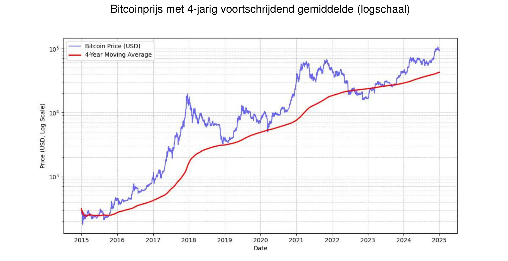

*MICHAEL SAYLOR: "Het beste prijssignaal voor Bitcoin is het eenvoudig voortschrijdend gemiddelde over 4 jaar."* Zie bovenstaande grafiek.

Daarnaast is het raadzaam om de blootstelling aan Bitcoin **proportioneel** te houden ten opzichte van het begripsniveau. Het is ook belangrijk om geen haast te hebben of te proberen de markt perfect te timen.

Ten slotte wordt Bitcoin beschouwd als **volatiel**. Om precies te zijn, de prijs uitgedrukt in eenheden van fiatgeld is dat. Een deel van deze volatiliteit is natuurlijk voor een nog jong activum, maar het wordt ook versterkt door de aanwezigheid van speculanten die het niet gebruiken als een lange-termijn opslagplaats van waarde, maar in plaats daarvan op zoek zijn naar snelle winsten. Bovendien accentueert leveraged trading (het gebruik van geleend geld om handelsposities te vergroten) zowel opwaartse als neerwaartse prijsbewegingen, waardoor Bitcoin geen rechtlijnig stijgend pad volgt. Dit leidt tot meer uitgesproken schommelingen, maar na verloop van tijd, naarmate de basis van toegewijde gebruikers groeit, lijkt deze volatiliteit zich te stabiliseren. Samenvattend is het **onmogelijk om een actief te hebben dat zo goed presteert als Bitcoin zonder volatiliteit**, maar je kunt zeker veel minder goed presterende activa hebben met minder volatiliteit.

### Bitcoin aangenomen door Wall Street

Het gebruik van Bitcoin door financiële instellingen versterkt zijn positie op de wereldmarkt nog verder.

Recente verklaringen van **BlackRock** benadrukken het potentieel van Bitcoin als waardeopslagmedium en diversificatie-instrument voor portefeuilles. De wereldwijde institutionele reus suggereerde onlangs dat de gebruikersgroei van Bitcoin die van het **internet** of mobiele telefoons overtreft, met name gedreven door **demografische en generatieverschuivingen**, evenals een toenemend wantrouwen ten opzichte van traditionele financiële instellingen (!). Door zijn schaarse, niet-soevereine en gedecentraliseerde aard zien sommige investeerders Bitcoin als een veilige optie **in tijden van fiscale en monetaire instabiliteit**, angst of verstorende geopolitieke gebeurtenissen.

De **Spot Bitcoin ETF's**, gelanceerd in januari 2024, hebben een fenomenaal succes gekend - de **meest succesvolle** ETF-lancering in de geschiedenis - met een netto-instroom van bijna $ 20 miljard van januari tot november. Dat is ongeveer vier keer beter dan de op één na beste ETF-introductie, de Nasdaq-100 QQQ. Deze ETF's bieden eenvoudigere en meer gereguleerde toegang tot Bitcoin, wat het fonds **verder heeft gelegitimeerd** en een aanzienlijke instroom van institutioneel kapitaal heeft aangetrokken.

Bitcoin ETF's leiden met een ruime marge in termen van **institutionele adoptie** - en overtreffen daarmee de top tien snelst groeiende ETF's - of het nu gaat om het aantal betrokken instellingen of de omvang van het beheerd vermogen (AUM). Het succes van deze Bitcoin ETF's onderstreept de groeiende vraag naar investeringsvehikels die gekoppeld zijn aan digitale activa en verstevigt daarmee de plaats van Bitcoin in het traditionele financiële landschap.

Bitcoin speelt nu in de **waardeopslag**-markt. Het vertegenwoordigt slechts een druppel in de emmer in termen van schaal: slechts ongeveer $ 1.800 miljard vergeleken met de $ 18.000 miljard van goud of de $ 500.000 miljard van onroerend goed. Maar het marktaandeel van ongeveer 0,1% geeft het een enorme ruimte voor groei, zeker gezien het feit dat de concurrenten moeite hebben om nieuwe gebruikers aan te trekken.

| Ticker  | 1D Flow (M USD) | 1W Flow (M USD) | 1M Flow (M USD) | 3M Flow (M USD) | YTD Flow (M USD) |
| ------- | --------------- | --------------- | --------------- | --------------- | ---------------- |
| **Sum** | +457.19         | +1,507.95       | +2,888.01       | +3,672.29       | **+20,262.94**   |
| IBIT    | +393.40         | +750.91         | +1,536.47       | +3,821.37       | +22,460.44       |
| FBTC    | +14.81          | +372.40         | +627.16         | +458.71         | +10,266.69       |
| ARKB    | +11.51          | +163.26         | +295.92         | -3.88           | +2,647.32        |
| BITB    | +12.93          | +146.50         | +263.30         | +97.46          | +2,262.69        |
| HODL    | +5.75           | +38.77          | +94.54          | +100.39         | +682.03          |
| BRRR    | +1.92           | +4.72           | +17.76          | +20.54          | +540.19          |
| EZBC    | +11.79          | +17.53          | +39.29          | +47.48          | +439.45          |
| BTC     | .00             | -3.13           | +36.59          | +419.18         | +419.18          |
| BTCO    | +6.43           | +19.25          | +47.30          | +56.41          | +394.82          |
| BTCW    | .00             | +2.84           | +6.04           | +146.69         | +217.47          |
| YBIT    | -1.34           | -10.26          | +5.06           | +13.81          | +76.30           |
| DEFI    | .00             | .00             | .00             | -2.03           | -1.79            |
| GBTC    | .00             | +5.16           | -81.42          | -1503.84        | -20,141.85       |

*$20 miljard in 10 maanden: Bitcoin ETF's bereikten in minder dan een jaar waar goud ETF's 5 jaar over deden. Bron: Investeringsstromen van fondsen in USD. Bloomberg Terminal, Bloomberg L.P., 2024.*

### Bitcoin in de bedrijfsgereedschapskist

De groeiende acceptatie van Bitcoin in de Verenigde Staten beïnvloedt ook de denkwijze elders in de wereld, met name onder vermogensbeheerders die het zich niet langer kunnen veroorloven om het niet op te nemen in hun assortiment - vooral nu traditionele financiële producten slecht presteren of moeilijke periodes doormaken. Alleen traditionele banken lijken het zich nog te kunnen veroorloven het te negeren.

Vanuit een puur financieel perspectief wordt Bitcoin erkend als een diversificatieactief. Het is niet alleen niet gecorreleerd met andere activaklassen, het lijkt ook goed te gedijen tijdens perioden van nieuwe liquiditeitsinjecties - een andere dergelijke episode lijkt aan te breken met de verlaging van de rente door de ECB, de Fed en China.

Samenvattend past Bitcoin perfect voor het meest voorkomende geval, namelijk het beleggen van overtollige liquide middelen voor een periode van ten minste vier jaar. Het is de moeite waard om het te combineren met een strategie van geleidelijke instap: het investeren van vaste bedragen op regelmatige tijdstippen om het instap- of uitstappunt te versoepelen.

Andere gebruikssituaties maken Bitcoin bijvoorbeeld tot een strategisch treasury bedrijfsmiddel:

- 24/7 **collateral** of liquiditeit kunnen plaatsen
- De mogelijkheid om **snel en op elk moment** over te boeken naar de treasury van een ander bedrijf
- Afdekking tegen **buitenlands Exchange valutarisico**
- Een **leverancier** betalen die het accepteert, vooral in noodsituaties

### Is Bitcoin te duur?

Je hoeft niet precies 1 Bitcoin te kopen, want Bitcoin is deelbaar in subeenheden genaamd satoshis, genoemd naar de anonieme maker. Eén Bitcoin is gelijk aan **100 miljoen satoshis**, waardoor gebruikers zelfs **zeer kleine fracties van een Bitcoin** kunnen kopen, verkopen of verhandelen. In feite worden in de broncode van Bitcoin alle transacties verantwoord in satoshis en verschijnt de term "Bitcoin" alleen in de "coinbase", de speciale transactie die miners creëren om hun beloning te ontvangen.

Bovendien kan het totaal van 21 miljoen bitcoins - of **2,1 quadriljoen satoshi's** - efficiënt worden weergegeven door een 64-bits geheel getal. Dit betekent dat ondanks een hoge prijs per hele Bitcoin, het toegankelijk blijft voor een breed scala aan investeerders dankzij de deelbaarheid. Je hoeft dus geen hele Bitcoin te kopen om deel te nemen aan het netwerk of te investeren in deze digitale activa.

Laten we niet vergeten dat de relatief lage totale marktkapitalisatie, in vergelijking met andere activa zoals aandelen, goud of onroerend goed, het vermogen om te stijgen intact laat. Met een nog steeds zeer lage penetratiegraad (ongeveer 1% van de wereldbevolking) wordt aangenomen dat we nog maar aan het begin staan van de opmars. Dit maakt het **de meest asymmetrische weddenschap van onze generatie**: er is nu een zeer kleine kans dat het op dit moment tot nul zal dalen, en een grote kans dat het terrein zal blijven winnen.

### De beslissing om bedrijfskasmiddelen toe te wijzen in Bitcoin

Het **beslissingsproces** voor het investeren in Bitcoin wordt sterk beïnvloed door uw positie binnen het bedrijf. Als u een **meerderheidsaandeelhouder** bent, staat het u **vrij** om overtollige kasmiddelen naar eigen inzicht toe te wijzen. Omgekeerd, als u een partner of aandeelhouder bent binnen een collectieve besluitvormingsstructuur, moet u gezamenlijk overleggen, wat de zaken kan compliceren.

In dit tweede scenario wordt het harmoniseren van verschillende standpunten essentieel, omdat het grotendeels **afhangt van het begrip van elke stakeholder van het Bitcoin activum**. Zoals het gezegde luidt: "Bitcoin is alles wat mensen niet weten over computers gecombineerd met alles wat ze niet begrijpen over geld." Zelfs als één partner moeite heeft gedaan om Bitcoin grondig te begrijpen, kan het een uitdaging zijn om deze kennis over te brengen op anderen. In zulke gevallen is het **aan te raden om een externe bron** in te schakelen om te voorkomen dat het idee te zeer geïdentificeerd wordt met één individu, wat generate weerstand zou kunnen oproepen.

Momenteel is het scenario van een meerderheidsaandeelhouder die de beslissing neemt het meest representatief bij bedrijven die Bitcoin bezitten. Hier zijn een paar echte voorbeelden:

- **Onafhankelijke professionals**: Consultants, gezondheidszorgbeoefenaars of advocaten die een deel van hun langetermijnschat in Bitcoin investeren. Over het algemeen hebben deze professionals al spaarrekeningen of termijndeposito's met een mager rendement.
- **Directieleden uit de technologiesector**: Een kaderlid dat enkele jaren geleden zijn bedrijf verkocht en een deel van de opbrengst van zijn persoonlijke holding in Bitcoin investeerde. Vandaag genieten ze van een comfortabele financiële situatie en herinvesteren ze in nieuwe ondernemingen.
- Eigenaars van zeer kleine bedrijven: Ondernemers in de dienstensector, landbouw of ambacht die het potentieel van Bitcoin hebben begrepen en er een deel van hun kas aan toewijzen. Hun belangrijkste motivatie is diversificatie en de vrijheid die het biedt
- **Beursgenoteerde bedrijven** zoals MicroStrategy hebben een precedent geschapen door een aanzienlijk deel van hun bedrijfskas om te zetten in Bitcoin, wat een wereldwijde verschuiving aantoont in de strategieën voor de allocatie van bedrijfskapitaal. Tegen de herfst van 2024 hebben tal van andere bedrijven dit voorbeeld gevolgd, waardoor deze trend verder wordt gelegitimeerd.

Ontdek de bijgewerkte lijst van bedrijven die de meeste bitcoins in kas hebben, evenals de aangehouden bedragen, op de site: [BitcoinTreasuries.net](https://bitcointreasuries.net/).
### Belasting op Bitcoin aangehouden door bedrijven

Voor bedrijven die niet gestructureerd zijn als afzonderlijke juridische entiteiten - zoals eenmanszaken of andere entiteiten zonder rechtspersoonlijkheid - weerspiegelt de belasting van Bitcoin-transacties vaak de behandeling die wordt toegepast op particulieren. In veel gevallen zijn dezelfde regels voor vermogenswinst of inkomen van toepassing, net als wanneer een individu Bitcoin zou verkopen. In sommige landen kan winst bijvoorbeeld worden beschouwd als onderdeel van het persoonlijk inkomen van de ondernemer, onderworpen aan **persoonlijke belastingschijven**.

**Bedrijven met rechtspersoonlijkheid** - die onderworpen zijn aan vennootschapsbelasting - profiteren echter vaak van een gunstiger fiscaal kader. In tegenstelling tot individuen, die te maken kunnen krijgen met beperkingen op het verrekenen van winsten en verliezen in verschillende activaklassen, kunnen bedrijven gerealiseerde winsten of verliezen op Bitcoin transacties over het algemeen direct opnemen in hun jaarlijkse winst- en verliesrekeningen. Dit kan leiden tot een flexibelere en soms gunstigere belastingpositie.

De specifieke belastingtarieven en behandelingen verschillen aanzienlijk per jurisdictie. In Frankrijk en veel westerse landen kunnen bedrijven bijvoorbeeld te maken krijgen met vennootschapsbelastingtarieven van rond de 25%, wat lager kan zijn dan de forfaitaire belastingen die particulieren betalen op beleggingswinsten.

Vanwege deze verschillen kiezen **sommige bedrijfseigenaren ervoor om Bitcoin aan te kopen en te houden via hun bedrijfsstructuur**, omdat dit **efficiëntere mogelijkheden voor belastingplanning** kan bieden. Zoals altijd is het raadzaam om een belastingprofessional te raadplegen die bekend is met de regels in de relevante jurisdictie(s) om naleving te garanderen en de belastingstrategie te optimaliseren.

## Hoe Bitcoin verkrijgen

<chapterId>1e6dbaf5-581a-49a4-8f37-3728e77bda17</chapterId>

### Drie methoden van verwerving

Er zijn drie manieren om Bitcoin te verkrijgen:

- In Exchange voor goederen of diensten:

Aangezien Bitcoin functioneert als een medium van Exchange, is het mogelijk om een circulaire economie voor te stellen. Hoewel dit vandaag de dag nog ongebruikelijk is, beginnen steeds meer bedrijven Bitcoin betalingen te accepteren - waarom die van jou niet? (Zie ons volgende hoofdstuk)

- **Mining Bitcoin:**

Dit houdt in dat je beloningen verdient met het bedienen van Mining machines. Voor niet-gespecialiseerde bedrijven blijft dit relatief marginaal. Je kunt deelnemen via tussenpersonen die je de computers, het netwerk en het onderhoud verkopen of verhuren. Als je de machines bezit, kun je ze boeken als afschrijfbare activa. Op grote schaal moet je de return on investment zorgvuldig berekenen omdat de markt zeer concurrerend is en een goede anticipatie op de kosten vereist, met name elektriciteit.

Om meer te weten te komen over de Mining methodes, kun je [de "Mining" sectie in onze tutorials raadplegen](https://planb.network/tutorials/mining).

- **Bitcoin kopen:**

Dit is verreweg de meest gebruikelijke methode, die wordt toegepast via peer-to-peer exchanges of, meer gebruikelijk, op gespecialiseerde handelsplatforms. Maar bij het verwerven van Bitcoin als bedrijfsmiddel moeten bedrijven voldoen aan strenge regelgevende normen en KYC-procedures (Know-Your-Customer). Als ze Bitcoin kopen op gespecialiseerde handelsplatformen, moeten bedrijven meestal gedetailleerde bedrijfsinformatie verstrekken, waaronder identificatiedocumenten, financiële overzichten en bewijzen van Address, om te voldoen aan KYC- en antiwitwasvereisten (AML).

Om te leren hoe u een zakelijke account opent en deze gebruikt om bitcoins te kopen, verkopen en over te dragen, kunt u deze twee tutorials bekijken die speciaal zijn ontworpen voor bedrijven en die de platformen Kraken en Bitfinex in hun bedrijfsversies behandelen:

https://planb.network/tutorials/business/others/bitfinex-pro-c8ef7476-5f60-4205-935e-a545ced0022a

https://planb.network/tutorials/business/others/kraken-pro-07b1c16c-d517-4bf7-9a78-b42dc0f21785

Om meer te weten te komen over methodes voor het verkrijgen van bitcoins via een Exchange of peer-to-peer, kun je [de "Exchange" sectie in onze tutorials raadplegen](https://planb.network/tutorials/exchange).

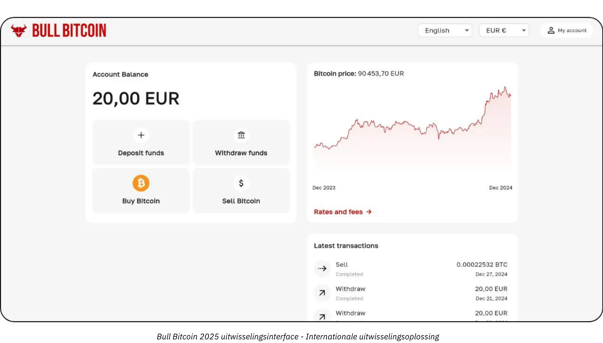

### Tegen welke prijs?

Zoals eerder vermeld, is het niet alleen onmogelijk om de toekomstige prijs van Bitcoin te voorspellen, maar is de prijs op korte termijn ook erg volatiel. Historisch gezien is een betrouwbare strategie geweest om geleidelijk te accumuleren met regelmatige tussenpozen en een tijdshorizon van vier jaar of meer aan te houden.

### Hoeveel moet je kopen?

Tegenintuïtief gezien is het waarschijnlijk het beste om te beginnen met een heel kleine aankoop zonder er te veel over na te denken. Een klein bedrag (zoals honderd euro of dollars) zal je geen ernstige schade berokkenen en de praktijkervaring zal je veel meer leren, veel sneller, dan welke hoeveelheid lectuur dan ook.

Zoals eerder gezegd, is het verstandig om alleen overtollige liquiditeiten te beleggen die je de komende jaren niet nodig hebt. Elke slecht begrepen strategie kan je in een moeilijke positie brengen als je plotseling op een slecht moment moet uitbetalen.

Naast klein beginnen is het nuttig voor corporate treasuries om een weloverwogen allocatiestrategie te hanteren. Aan de ene kant van het spectrum hebben sommige bedrijven, zoals MicroStrategy, gekozen voor een extreme aanpak door een aanzienlijk deel van hun overtollige treasuryfondsen toe te wijzen aan Bitcoin, wat een sterke institutionele overtuiging weerspiegelt. Omgekeerd zou een conservatievere en aantoonbaar rationelere strategie kunnen inhouden dat misschien ongeveer 5% van de treasury-middelen van een bedrijf wordt toegewezen aan Bitcoin, waarbij de potentiële winsten worden afgewogen tegen de eisen op het gebied van risicobeheer en liquiditeit.

Zie dit spectrum als een schaal, van een minimale blootstelling, die ervoor zorgt dat het bedrijf voldoende liquiditeit behoudt voor operationele behoeften, tot een agressieve houding gericht op het benutten van de verwachte waardestijging van Bitcoin op de lange termijn. Terwijl een agressieve allocatie een hoger rendement kan opleveren, helpt een bescheiden allocatie om de volatiliteit te beperken en ervoor te zorgen dat de financiële basis van het bedrijf veilig blijft, terwijl het nog steeds kan profiteren van het innovatieve potentieel van Bitcoin binnen zijn treasury-activiteiten.

### Hoe vaak?

Er is geen Hard regel. Proberen de markt te timen door te jagen op "dips" kan minder effectief en stressvoller zijn dan gewoon kopen op regelmatige tijdstippen. Zelfs doorgewinterde beleggers hebben het soms mis. In één keer "all-in" gaan kan een tweesnijdend zwaard zijn.

In werkelijkheid is de potentiële waardestijging van Bitcoin zodanig dat zelfs als je pas een paar jaar later zou beginnen, je waarschijnlijk nog steeds winst op de lange termijn zou zien. Het is waar dat grote prijsschommelingen na verloop van tijd waarschijnlijk minder intens zullen worden. Als deflatoire valuta is Bitcoin echter ontworpen om effectief waarde op te slaan en de productiviteitswinst van haar gebruikers te weerspiegelen. Om een analogie te trekken: we bevinden ons momenteel in de "lanceringsfase" van Bitcoin, een valuta in wording, en niemand weet nog wat de reële waarde ervan is. Later, misschien over 20 of 40 jaar, wanneer het zich in een stabiele "cruisefase" bevindt, kan het ongelooflijk stabiel zijn en gestaag groeien met de productiviteitswinst van de maatschappij.

De vastgoedindustrie herhaalt vaak dat "het altijd het juiste moment is om te kopen", waarbij ze vergeet dat als vastgoed zijn functie als waardeopslag zou verliezen - en zou verschuiven naar activa zoals Bitcoin - de prijzen dichter bij hun gebruikswaarde (onderdak) zouden kunnen komen. Bitcoin heeft daarentegen geen ander doel dan waardeopslag, wat zou kunnen betekenen dat "het altijd het juiste moment is om te kopen" De toekomst zal het uitwijzen.

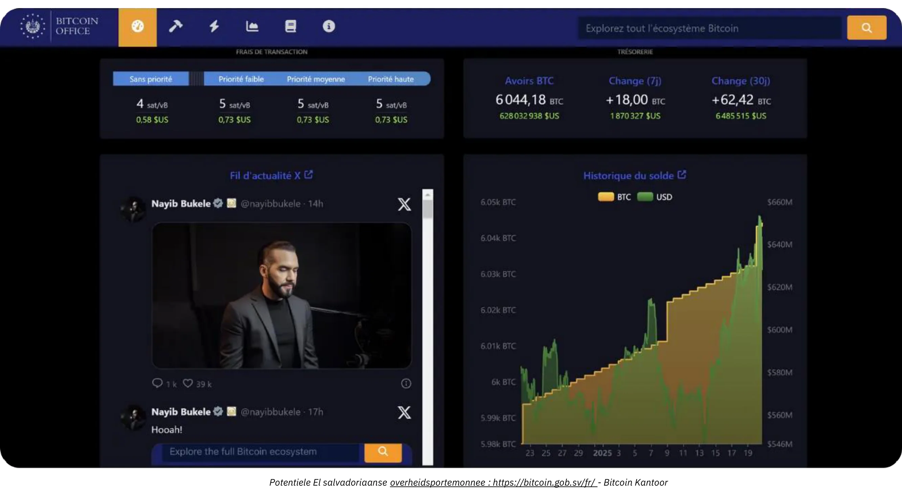

*Krediet: [Bitcoin Kantoor](https://Bitcoin.gob.sv/)*

### In welke vorm kopen? (Bewaarmethoden)

U bezit Bitcoin niet fysiek. In plaats daarvan bezit je een cryptografische sleutel waarmee je de Ownership van sommige of al je rekeneenheden kunt overdragen naar één of meer andere cryptografische sleutels. Dit gebeurt allemaal op de Bitcoin Blockchain, die wordt gerepliceerd op tienduizenden knooppunten wereldwijd.

Deze cryptografische sleutel is een extreem groot willekeurig getal. Om de gebruikerservaring te vereenvoudigen, wordt het vaak voorgesteld als een reeks van 12 of 24 woorden. Deze woorden kunnen worden geladen op een fysiek apparaat dat bekend staat als een "Hardware Wallet" Begrijp echter dat de bitcoins niet "in" dit apparaat zitten; het is slechts een hulpmiddel om transacties cryptografisch te ondertekenen en naar het netwerk te zenden. Waar het echt om gaat zijn de 12 of 24 woorden, die veilig moeten worden bewaard.

Dit leidt tot de kwestie van bewaring: Bitcoin bezitten betekent de sleutel(s) bezitten. Of je bewaart ze zelf, of je delegeert de taak aan een derde partij. Er zijn ook tussenoplossingen. Laten we de meest voorkomende scenario's bekijken:

- **Zelfbehoud:**

Dit is de optie die wordt aanbevolen door echte Bitcoin liefhebbers, omdat het overeenkomt met het originele ontwerp van de Bitcoin. Je fungeert als je eigen bank: er is geen risico dat een derde partij je bedriegt, maar je bent wel verantwoordelijk voor het beveiligen van de sleutel(s). Je hebt 24/7 volledige toegang tot je geld. In een zakelijke omgeving, waar meerdere mensen transacties moeten uitvoeren, heb je de juiste tools en procedures nodig om de toegang en beveiliging te beheren.

- **Bewaring door derden:**

Een Exchange of koopdienst kan bijvoorbeeld een account voor je aanmaken, je traditionele valuta omzetten in Bitcoin en het namens jou bewaren met behulp van hun beveiligingssystemen. De meeste van deze diensten staan je toe om je bitcoins op te nemen in een Wallet waar alleen jij de sleutel hebt. Totdat je dat doet, bezit je de bitcoins niet echt; je vertrouwt op hun belofte om je terug te betalen. Dit houdt in dat je een evenwicht moet zoeken tussen veiligheidsrisico's (die van hen versus die van jou) en tegenpartijrisico's (ze kunnen failliet gaan of verdwijnen). Sommige bedrijven vinden dit acceptabel, hoewel het over het algemeen niet wordt aangeraden voor langdurige opslag of voor 100% van uw allocatie. Bewaringsdiensten kunnen ook opslagkosten in rekening brengen.

- "Papier Bitcoin" (ETF's of ETP's):

Dit zijn traditionele financiële instrumenten die fracties van Bitcoin vertegenwoordigen en de prijsontwikkeling repliceren. De instelling achter het product koopt en houdt theoretisch de onderliggende Bitcoin. Uw bijdragen en opnames worden gedaan in traditionele valuta (bijv. dollars of euro's), niet in Bitcoin. Met uitzondering van bepaalde producten die opname in Bitcoin toestaan (om een belastbaar feit in sommige rechtsgebieden te voorkomen), brengen deze instrumenten jaarlijkse beheervergoedingen met zich mee. Hier vertrouwt u op de veiligheid van de instelling en loopt u een tegenpartijrisico (bijvoorbeeld als een overheid besluit om al het institutioneel aangehouden Bitcoin in beslag te nemen, zoals gebeurde met goud in 1933 onder Uitvoeringsbevel 6102 van de VS). Hun grootste voordeel is de gemakkelijke toegang, omdat ze gedistribueerd worden via traditionele financiële kanalen. Ze omzeilen de noodzaak om cryptografische sleutels te beveiligen, maar bieden geen van de inherente eigenschappen van Bitcoin: je kunt het Bitcoin netwerk niet 24/7 gebruiken om waarde vrij te bewegen zonder toestemming. Ze repliceren alleen de financiële prestaties, niet de functionaliteit of soevereiniteit van Bitcoin zelf.

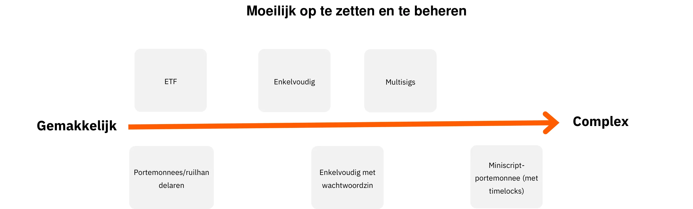

Bovendien heeft de vorm waarin u Bitcoin bewaart een grote invloed op de veiligheidsmaatregelen die nodig zijn om uw bedrijfsschatkist te beschermen. Of u nu kiest voor self-custody, het gebruik van single-signature of multi-signature hardware wallets, etc. om de directe controle over uw sleutels te behouden, of deze taak delegeert aan derde partij bewaardiensten of ETF's, elke optie heeft zijn eigen risicoprofiel. Zelfbewaarneming biedt bijvoorbeeld volledige toegang, maar vereist strenge interne beveiligingsprotocollen, terwijl oplossingen van derden de beheerlast verminderen ten koste van het tegenpartijrisico. Om het onderscheid verder te illustreren, schetst deze grafiek het beveiligingsmodel voor elk bewaartype, zodat u de aanpak kunt kiezen die het beste past bij de behoeften van uw organisatie:

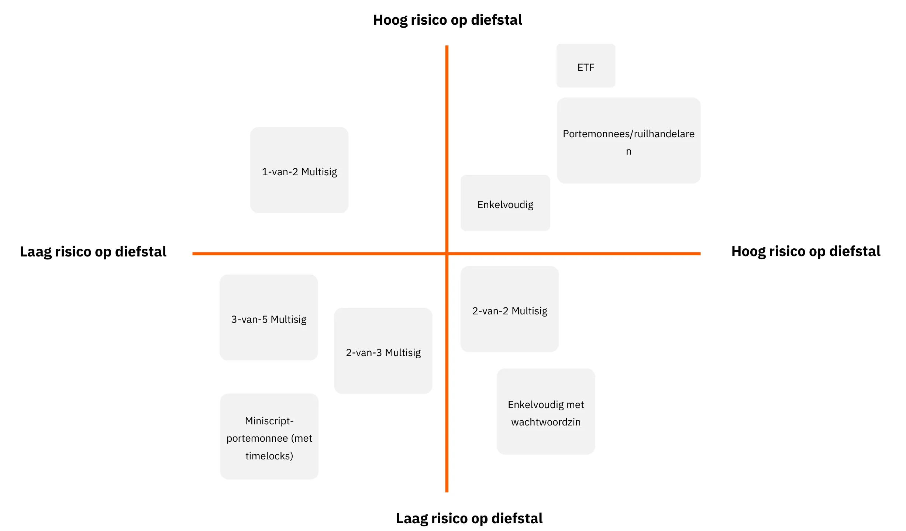

### Van wie moet ik kopen?

Als je kiest voor "papieren Bitcoin," wend je je tot financiële instellingen zoals banken of online aandelenbeurzen.

Als je ervoor kiest om echt Bitcoin te kopen via een marktplaats (Exchange) of een makelaar, heb je verschillende hoofdcategorieën:

- Grote internationale of buitenlandse platforms:

Voorbeelden zijn Kraken, Coinbase of Binance, historisch gebruikt door veel particulieren. Sommige hebben problemen ondervonden en het is moeilijk om een duidelijke aanbeveling te doen. Een advies: als je ze gebruikt, laat je bitcoins er dan niet langer dan nodig.

- **Gereguleerde dienstverleners (Geregistreerde Digital Asset Service Providers):**

In Frankrijk bijvoorbeeld staan platforms als Paymium (Exchange) of BullBitcoin (broker) erom bekend dat ze echte Bitcoin enthousiastelingen aan het roer hebben staan en een solide staat van dienst hebben opgebouwd. In de VS heb je dienstverleners als River of Swann. In het algemeen is het belangrijk om de stamboom van de aanbieder te onderzoeken: hun reputatie, staat van dienst, populariteit binnen de Bitcoin gemeenschap en of hun leiderschap in lijn is met de kernwaarden van Bitcoin.

**Exchange vs. Broker:**

- Met een **Exchange** kunt u kooporders plaatsen tegen de prijs die u kiest, maar u moet wachten op uitvoering totdat de marktprijs en verkopers op één lijn liggen.
- Een **makelaar** biedt je een vaste prijs en kan de transactie sneller afronden.

Naast vergoedingen en uitvoeringssnelheid - die er minder toe doen als je aan de lange termijn denkt (meerdere jaren) - moet een bedrijf ook rekening houden met de volgende factoren:

- **Gebruiker Interface:** Is het platform gebruiksvriendelijk?
- **Boekhoudfuncties:** Minimaal de mogelijkheid om de transactiegeschiedenis te exporteren in CSV-formaat.
- **Bewaring en beveiliging:** Bewaart het platform de bitcoins namens u of draagt het Ownership aan u over? Wat is hun beveiligingsopzet? Hebben ze "opnamesloten" of andere opnamerestricties?
- **Klantenservice:** De kwaliteit, reactiesnelheid en persoonlijke hulp, vooral als je net begint.
- **Reputatie en Ethos:** Betrouwbaarheid en waarden van het platform.
- **Ondersteuning voor terugkerende aankopen:** Als je van plan bent om Bitcoin in de loop van de tijd op te bouwen met geplande aankopen.

# Bitcoin betaaloplossingen op maat voor elk bedrijf

<partId>b2c8af88-6bfc-49b1-ad84-4c292c713b55</partId>

## Bitcoin nemen als betaling

<chapterId>99af1203-bc84-4acc-9780-f733e7998335</chapterId>

Ten eerste is het belangrijk om te begrijpen dat Bitcoin een verstoring is op dezelfde schaal als het internet.

In de begindagen maakte het internetnetwerk het mogelijk om tussenpersonen uit communicatiekanalen te verwijderen en vervolgens leidde deze infrastructuur tot talloze voorheen ondenkbare toepassingen. Welk bedrijf heeft vandaag geen online aanwezigheid?

Bitcoin is een infrastructuur van vertrouwen, waarvan de eerste toepassing is om tussenpersonen te verwijderen uit de opslag en Exchange exploitatie van waarde-geld. Andere, nu nog ondenkbare toepassingen zullen op deze infrastructuur ontstaan. Je eerste aanwezigheid hier is het equivalent van een website: een toegangspoort tot peer-to-peer betalingen en waarde-uitwisselingen.

Bekijk nu het perspectief van een praktisch bedrijf wiens kernactiviteit niets te maken heeft met Bitcoin. Waarom zou het ervoor kiezen om Bitcoin betalingen te accepteren?

- **Een Bitcoin schatkist opbouwen:**

Zie ons vorige artikel over Bitcoin kopen. Of het nu uit overtuiging is of als diversificatiestrategie, sommige professionals kiezen ervoor om Bitcoin betalingen te accepteren. Sommige Bitcoin-ers beweren dat hoe minder financieel onderlegd een bedrijf is - wat betekent dat het noch de tijd noch de middelen heeft om complexe financiële manoeuvres uit te voeren - hoe belangrijker het wordt voor dat bedrijf om betaald te worden in de hardste vorm van geld die beschikbaar is. Op die manier wordt het speelveld gelijker en kunnen zelfs kleine bedrijven met weinig tijd hun waarde behouden zonder verstrikt te raken in financiële spelletjes.

- Een nieuwe doelgroep bereiken:

Het aantal Bitcoin gebruikers groeit en ze hebben een aanzienlijke koopkracht. Ze zullen zich vanzelf richten op bedrijven die hun valuta accepteren. Omdat dit bovendien de eerste universele, internet-native valuta is, kun je ook internationale klanten op doorreis aantrekken.

- **Zichtbaarheid vergroten:**

Bijvoorbeeld door uw bedrijf te vermelden op platforms zoals BTCmap.org. Er zijn nog maar weinig bedrijven die Bitcoin accepteren, dus mond-tot-mondreclame werkt in uw voordeel. Het onderscheidt je ook van je concurrenten.

- **Lagere tarieven:**

Directe Bitcoin-betalingen vinden plaats via de Lightning Network. **De kosten zijn minimaal en worden betaald door de koper**. Er zijn geen kosten voor betaalterminals, geen mislukte autorisaties en geen fraude. Ter vergelijking: de betalingsindustrie (kaarten, terminals, overschrijvingen, PSP's, etc.) kost wereldwijd ongeveer $2,2 biljoen per jaar. Voeg daar chargebacks en fraude aan toe, en in totaal wordt bijna een tiende van het equivalent van het BBP van de VS wereldwijd "afgeroomd" van productieve bedrijven, alleen maar om waarde over te dragen. Ongeacht je bedrijf zijn financiële kosten een last die moet worden geoptimaliseerd en in sommige gevallen kunnen hoge kosten bepaalde bedrijfsmodellen verstikken.

- **Vrijheid en permissie, 24/7:**

Je hoeft geen toestemming te vragen om Bitcoin te gebruiken. Iedereen kan binnen enkele minuten deelnemen aan de economie met behulp van een smartphone app. Je kunt een betaling sturen of ontvangen van iedereen - individu of bedrijf - op elk moment, zonder beperkingen of vertragingen.

- Maak gebruik van de voordelen van het Bitcoin netwerk:

U bent niet verplicht om uw betalingen in Bitcoin-vorm te bewaren - vooral niet als u leveranciers moet betalen of BTW moet afdragen. Bepaalde diensten kunnen uw Bitcoin-betalingen tegen betaling geheel of gedeeltelijk omzetten in de valuta van uw keuze (bijvoorbeeld euro's naar uw IBAN). In dit scenario kan het voordeel van het accepteren van Bitcoin liggen in het aantrekken van nieuwe gebruikers of in de intrinsieke voordelen van Bitcoin (zoals lagere kosten, 24-uurs werking en geen risico op fraude of terugboekingen).

### Welke betaaloplossing moet je kiezen?

Het is relatief eenvoudig om te beginnen met het accepteren van Bitcoin betalingen. Om de juiste oplossing te kiezen, moet je rekening houden met de kenmerken van de transacties die je verwerkt: het gemiddelde betalingsbedrag, de transactiefrequentie en of je betalingen in een fysieke omgeving, online of beide accepteert.

Uw instelling als handelaar is ook belangrijk. Doe je een eenvoudige test, of verwacht je dat Bitcoin een belangrijke en terugkerende inkomstenbron wordt? Als dat laatste het geval is, hebt u een robuuste, uitgebreide en aanpasbare setup nodig.

Vergeet niet om rekening te houden met de verschillende rollen van je werknemers en hun locaties. Onthoud in elk scenario dat je in staat moet zijn om alle benodigde informatie aan je accountant te verstrekken en het boekhoudproces te stroomlijnen.

Om het besluitvormingsproces te vereenvoudigen, hebben we vier verschillende bedrijfsprofielen gedefinieerd. In de volgende tabellen worden de belangrijkste kenmerken en aanbevolen betaaloplossingen voor elk profiel uitgesplitst.

### De bedrijfsprofielen

#### Profiel 1 - De starter

| Attribute                        | The Starter                                                                                                                                |
| -------------------------------- | ------------------------------------------------------------------------------------------------------------------------------------------ |
| **State of Mind**                | "trying my first physical payment", "taking a tip for my online content", "targeting very small revenue"                                   |
| **Transaction Frequency**        | "first transaction in order to learn", "taking payment once in a while"                                                                    |
| **Business Type Examples**       | Creative economy (content creators, blogs, articles, etc.), occasional tips, one-off in-person product sales, associations, one-off events |
| **Payment Type**                 | Generally a few cents to a few euros/dollars; under ~300 euros/dollars per item                                                            |
| **Settings Complexity**          | None                                                                                                                                       |
| **Example Recommended Solution** | A custodial Lightning wallet like Wallet of Satoshi or a non-custodial wallet like Phoenix                                                 |
| **Merchant Interface**           | Simple Bitcoin Lightning wallet: an app on a mobile phone                                                                                  |
| **Customer Interface**           | Bitcoin QR payment code, scanned via the customer’s personal wallet                                                                        |
| **Fees**                         | Customer pays Bitcoin Lightning fees plus any applicable app fees                                                                          |
| **Point of Sale Device**         | Free smartphone app or an option for a physical terminal (e.g. Bitcoinize)                                                                 |
| **Management and Roles**         | Single app management; minimal role differentiation                                                                                        |
| **Accounting Exports**           | Basic transaction history lists                                                                                                            |
| **API**                          | No                                                                                                                                         |

#### Profiel 2 - Essentieel

| Attribute                        | The Essential                                                                                                                              |
| -------------------------------- | ------------------------------------------------------------------------------------------------------------------------------------------ |
| **State of Mind**                | "I accept Bitcoin in my business but I do not expect meaningful volume"                                                                    |
| **Transaction Frequency**        | Few transactions per month                                                                                                                 |
| **Business Type Examples**       | Bars, restaurants, semi-regular sales of fresh or directly sourced products, multiple stores under one owner, creative economy for artists |
| **Payment Type**                 | Generally ranging from a few euros/dollars to a few hundred per item; under ~300 per item and under ~3,000 per month                       |
| **Settings Complexity**          | Minimal (mobile app)                                                                                                                       |
| **Example Recommended Solution** | Swiss Bitcoin Pay                                                                                                                          |
| **Merchant Interface**           | Simple Bitcoin Lightning wallet: an app on a mobile phone; simple invoicing with minimal details                                           |
| **Customer Interface**           | Bitcoin QR payment code, scanned via the customer's personal wallet                                                                        |
| **Fees**                         | Typically <1% for sending to a Bitcoin address, and <1.5% for converting to fiat                                                           |
| **Point of Sale Device**         | Free smartphone app or an option for a physical terminal (e.g. Bitcoinize)                                                                 |
| **Management and Roles**         | Option for a sell-only role for employees; online dashboard for administration                                                             |
| **Accounting Exports**           | CSV export with complete transaction details                                                                                               |
| **API**                          | Yes                                                                                                                                        |

#### Profiel 3 - De professional

| Attribute                        | The Professional                                                                                                                                       |
| -------------------------------- | ------------------------------------------------------------------------------------------------------------------------------------------------------ |
| **State of Mind**                | - A payment method like any other for my e-commerce - Or joint management for a group of businesses ready for higher volumes                           |
| **Transaction Frequency**        | Multiple transactions per day                                                                                                                          |
| **Business Type Examples**       | E-commerce sites with moderate volume, small marketplaces, groups of physical stores (e.g., Click & Collect), SME operations                           |
| **Payment Type**                 | Generally ranging from a few euros/dollars to a few hundred; no set payment size limit; less than 250,000 per year                                     |
| **Settings Complexity**          | Light to fully featured (local or cloud hosting), often requires an e-commerce storefront                                                              |
| **Example Recommended Solution** | BTCPay Server for e-commerce and/or physical environments; ZapRite, Musqet or PayWithFlash for checkout, Be-BOP for an integrated e-store             |
| **Merchant Interface**           | Website (mobile and desktop) with invoice editing, shopping cart options, and payment button creation; automated invoicing with e-commerce integration |
| **Customer Interface**           | Bitcoin QR payment code, scanned via the customer's personal wallet                                                                                    |
| **Fees**                         | Mix of free open-source backend and paid Lightning hosting/service fees; front-end fees include Bitcoin Lightning fees and <1.5% conversion fees       |
| **Point of Sale Device**         | Website store, optional physical display (e.g. iPad showing the site or Bitcoin terminal)                                                              |
| **Management and Roles**         | Fully featured store with multiple admin roles; employees and customers interact with the system                                                       |
| **Accounting Exports**           | CSV export with complete transaction details                                                                                                           |
| **API**                          | Yes                                                                                                                                                    |

#### Profiel 4 - De Onderneming

| Attribute                        | The Enterprise                                                                                                                                  |
| -------------------------------- | ----------------------------------------------------------------------------------------------------------------------------------------------- |
| **State of Mind**                | - A strategic payment method for the business - With some development to integrate into the service platform as per specific specifications     |
| **Transaction Frequency**        | Unlimited, high-frequency transactions                                                                                                          |
| **Business Type Examples**       | Mid-sized enterprises, IT service companies, large corporations, major marketplaces                                                             |
| **Payment Type**                 | Any size or volume                                                                                                                              |
| **Settings Complexity**          | Medium to high, depending on the choice of architecture                                                                                         |
| **Example Recommended Solution** | Custom-made architecture or orchestration of SaaS-hosted solutions, potentially using third-party LSP (*Lightning Service Provider*) services   |
| **Merchant Interface**           | Fully customized front-end and back-end interfaces fully integrated into the business’s workflows and processes                                 |
| **Customer Interface**           | Ranging from a Bitcoin QR payment code to a fully custom UI and/or API integration                                                              |
| **Fees**                         | Combination of internal development and third-party fees; customer pays Bitcoin Lightning fees plus any transaction fees from service providers |
| **Point of Sale Device**         | Custom-designed solutions tailored to the enterprise environment                                                                                |
| **Management and Roles**         | Fully customized roles across sales, administration, devops, accounting, and finance                                                            |
| **Accounting Exports**           | Fully customized accounting exports                                                                                                             |
| **API**                          | Yes                                                                                                                                             |

In de volgende hoofdstukken gaan we dieper in op elk bedrijfsprofiel en de oplossingen die daarop zijn afgestemd.

## De starter

<chapterId>7edda53d-5b9f-432a-8493-115de8c94a67</chapterId>

Het Starter-profiel is ontworpen voor bedrijven, ontwerpers en individuen die Bitcoin-betalingen willen verkennen zonder veel middelen of expertise in te zetten. Dit zijn meestal mensen die een zeer klein volume aan transacties verwerken (misschien een paar fooien, donaties of af en toe een verkoop) en die een eenvoudige, lichte introductie zoeken in het Bitcoin en Lightning Network ecosysteem. De belangrijkste waarde van de Starter-aanpak ligt in de minimale installatie: in de meeste gevallen is alles wat nodig is een smartphone of tablet uitgerust met een Lightning-compatibele Wallet.

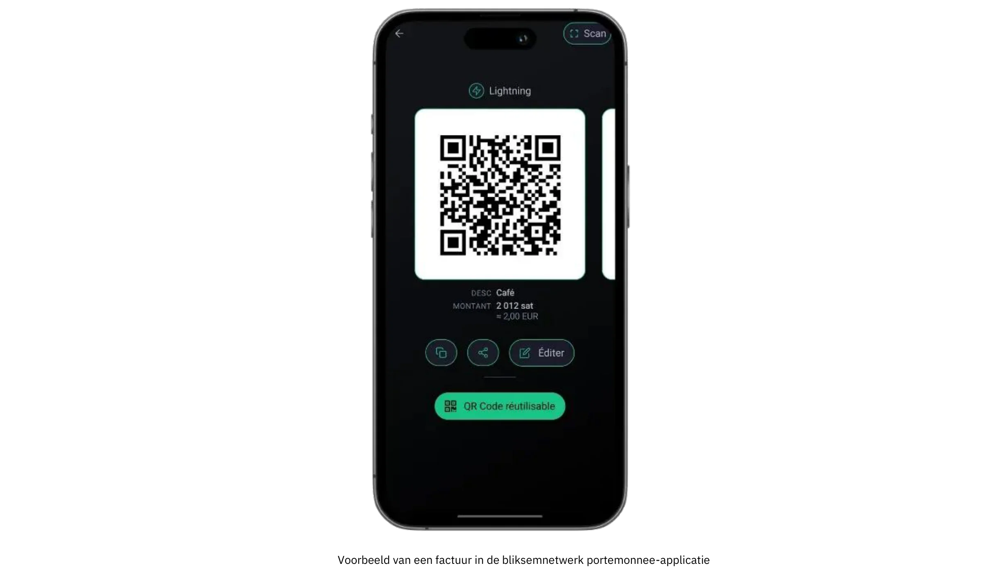

Een van de bepalende kenmerken van dit profiel is de focus op betalingen van kleine volumes die zelden hoger zijn dan een paar honderd euro of dollar per maand. Deze bescheiden schaal maakt het een uitstekende keuze voor iedereen die de markt wil testen met Bitcoin, zonder de complexiteit die inherent is aan implementaties van grotere volumes. Omdat er minder operationele druk is en er minder geld op het spel staat, kunnen fouten worden beperkt en kan er snel lering worden getrokken. Van artiesten die handgemaakte producten verkopen op weekendmarkten tot non-profit groepen die eenmalige donaties accepteren, gebruikers in deze categorie leggen vaak de nadruk op toegankelijkheid en gebruiksgemak boven geavanceerde functionaliteiten.

Bij de twee meest voorkomende Wallet opstellingen voor het Starter-profiel moet gekozen worden tussen custodial en non-custodial oplossingen. Een custodial Wallet (zoals Wallet van Satoshi of Blink) laat een derde partij de private sleutels en backend operaties beheren, waardoor de technische verantwoordelijkheden voor de gebruiker afnemen. Deze regeling is vooral aantrekkelijk voor diegenen die gemak boven alles stellen en een zo eenvoudig mogelijke onboarding willen. Aan de andere kant, niet-custodial Lightning wallets (zoals Phoenix of Breez) plaatsen private keys en volledige controle in de handen van de bedrijfseigenaar, en bieden meer autonomie en privacy in Exchange voor iets meer initiële inspanning. In beide gevallen zijn de moderne interfaces meestal zo gebruiksvriendelijk dat iedereen essentiële taken (het genereren van een QR-code, het invoeren van een betalingsbedrag en het bevestigen van transacties) binnen enkele minuten kan uitvoeren.

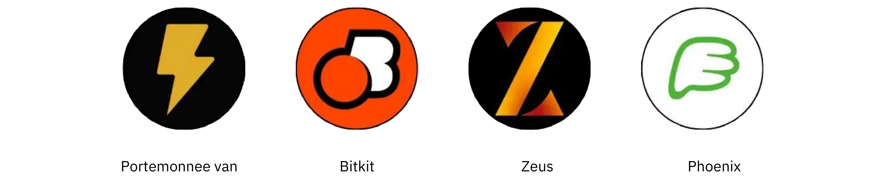

Hoewel beveiligingsproblemen minder dringend lijken als het om kleine transacties gaat, is het toch cruciaal om basisbeveiligingsmaatregelen te nemen. Zelfs een enkele smartphone of tablet die wordt gebruikt om Bitcoin betalingen te ontvangen, moet worden vergrendeld met een wachtwoord of biometrische beveiliging, en back-upprocedures (variërend van het bijhouden van inloggegevens voor een bewarende Wallet tot het veiligstellen van een seed-zin voor een niet-bewarende) moeten serieus worden genomen. Medewerkers die transacties in een fysieke omgeving afhandelen, zouden er baat bij hebben als ze de basisprincipes kennen: hoe de app te openen, hoe een QR-code aan de klant te presenteren en hoe te controleren of de betaling inderdaad is aangekomen.

Boekhouding en rapportering, hoewel relatief eenvoudig onder het Starter-profiel, verdienen nog steeds zorgvuldige aandacht. Hoewel de transactievolumes minimaal kunnen zijn, voorkomt het bijhouden van nauwkeurige gegevens verwarring in de toekomst en helpt het transparantie te behouden in het geval van financiële audits of belastingaangiften. Veel Wallet applicaties stellen gebruikers in staat om een basistransactiehistorie als CSV-bestand te exporteren; voor een kleine onderneming of een enkele ondernemer kan het regelmatig opslaan van deze bestanden het afstemmen van rekeningen veel eenvoudiger maken. Het is ook verstandig om de geschatte fiatwaarde bij te houden (bijvoorbeeld in euro's of dollars) op het moment dat elke transactie wordt ontvangen. Omdat de prijs van Bitcoin kan fluctueren, is het bijhouden van de omrekeningskoersen van onschatbare waarde voor de boekhouding en naleving van de belastingwetgeving.

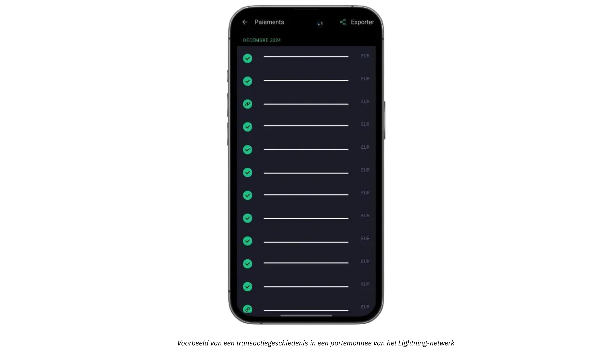

Voor bedrijven die hun fysieke of persoonlijke betalingen willen aanvullen met online donaties of fooien, is het nu eenvoudig om een Lightning fooienknop of donatiewidget te integreren in een website of blog. Platformen zoals BTCPay Server bieden eenvoudig te configureren betaalknoppen, terwijl sommige sociale media en livestream diensten Lightning fooien met adressen al ondersteunen. Bijgevolg kan zelfs een startende onderneming een bescheiden maar wereldwijd netwerk van donateurs opbouwen. Ondertussen kunnen degenen die Bitcoin liever niet op lange termijn in hun bezit hebben, een gedeeltelijke of automatische conversie naar fiatvaluta onderzoeken met behulp van bepaalde bewaarportemonnees of diensten van derden. Hoewel deze optie extra kosten en mogelijke KYC-verplichtingen met zich meebrengt, helpt het bedrijven de Exchange koersvolatiliteit te omzeilen en hun bestaande financiële workflows te behouden met minimale verstoring.

Een eenvoudige use case illustreert hoe al deze Elements samenkomen. Stel je een lokale ambachtsman voor die zelfgemaakte jam verkoopt op een zaterdagse boerenmarkt. Gewapend met een telefoon waarop een Lightning Wallet draait, stelt hij de prijs van elk potje in euro's in; wanneer een klant vraagt om in Bitcoin te betalen, voert de handelaar snel het overeenkomstige fiatbedrag in en berekent de app automatisch de verschuldigde Sats. De resulterende QR-code wordt gescand door de Wallet van de klant. De resulterende QR-code wordt gescand door de Wallet van de klant, de betaling is binnen enkele seconden geregeld en de handwerksman weet meteen dat de transactie geslaagd is. Aan het einde van de dag kunnen alle transactiegegevens worden geëxporteerd om ze bij te houden, en het saldo van de dag kan geheel of gedeeltelijk naar een Exchange platform worden gestuurd om te worden omgezet in fiatvaluta.

Door een balans te vinden tussen gebruiksvriendelijke tools, minimale hardwarevereisten en eenvoudig bijhouden van gegevens, bieden de Starter-oplossingen de essentie zonder nieuwkomers te overweldigen. Als de transactievolumes toenemen en de operationele vereisten van een bedrijf evolueren, wordt upgraden naar de meer geavanceerde categorieën, zoals beschreven in het volgende hoofdstuk, een natuurlijke progressie.

Raadpleeg de volgende gidsen voor gedetailleerde tutorials over de aanbevolen wallets en de basisinstellingen:

**Zelfbehoudende LN wallets/nodes:**

https://planb.network/tutorials/wallet/mobile/phoenix-0f681345-abff-4bdc-819c-4ae800129cdf

https://planb.network/tutorials/wallet/mobile/bitkit-a7224674-85c4-4045-9baf-37018d89550c

https://planb.network/tutorials/wallet/mobile/breez-46a6867b-c74b-45e7-869c-10a4e0263c06

https://planb.network/tutorials/wallet/mobile/blixt-04b319cf-8cbe-4027-b26f-840571f2244f

https://planb.network/tutorials/wallet/mobile/zeus-embedded-advanced-3e89603c-501d-439c-8691-d4a0d0de459b

**Custodiale LN portefeuilles:**

https://planb.network/tutorials/wallet/mobile/wallet-of-satoshi-39149d86-e42b-4e8f-ae9f-7e061e7784f7

https://planb.network/tutorials/wallet/mobile/blink-7ea5f5a4-e728-4ff9-b3f9-cf20aa6fc2bd

## De essentiële

<chapterId>89be421f-f7df-4bcc-a9e4-df96e39ef249</chapterId>

Het Essential-profiel is geschikt voor kleine en middelgrote bedrijven, eventueel met werknemers, die eenvoudig en snel Bitcoin willen accepteren zonder geavanceerde technische kennis nodig te hebben, terwijl ze toch een completer en professioneler systeem willen dan een eenvoudige Wallet. Deze categorie is meestal van toepassing op restaurants, cafés, bars of kleine winkels die slechts een handvol Bitcoin betalingen per maand zien, maar toch een Interface wensen die zowel eenvoudig als robuust genoeg is om de dagelijkse werkzaamheden zonder onderbreking uit te voeren.

In tegenstelling tot het Starter-profiel beschouwen Essential-bedrijven Bitcoin-betalingen doorgaans als een doorlopend onderdeel van hun inkomstenstroom in plaats van als een louter experiment. Ze werken nog steeds met relatief lage transactievolumes, maar de frequentie is voldoende om eigenaren en werknemers te laten profiteren van een meer gestructureerd en betrouwbaar systeem. Tegelijkertijd blijft het Essential-profiel gericht op eenvoud; hoewel het handige dashboards en beperkt rolbeheer toestaat, vereist het geen gespecialiseerde IT-resources of complexe integraties.

Technologieaanbevelingen in dit segment richten zich vaak op **Swiss Bitcoin Pay**, een gestroomlijnde oplossing voor winkeliers om Bitcoin betalingen eenvoudig te accepteren. Het beschikt over een gebruiksvriendelijke PoS-app, die geen technische expertise vereist voor werknemers. In tegenstelling tot standaard Bitcoin wallets, richt het zich alleen op het ontvangen van betalingen, waardoor werknemers het apparaat kunnen gebruiken zonder veiligheidsrisico's. Meerdere PoS-apps kunnen verbinding maken met hetzelfde account, bruikbaar op tablets, registers, smartphones of via een webversie voor computers, met ondersteuning voor Android en iOS. Je kunt ook een menu maken met de artikelen die je verkoopt en de bijbehorende prijzen, zodat de medewerker eenvoudig een mandje met artikelen voor de klant kan selecteren op de PoS en vervolgens het totaal in rekening kan brengen.

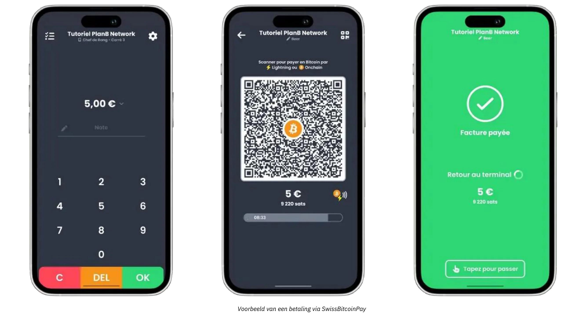

Betalingen kunnen worden opgenomen in Bitcoin naar een specifieke Address of worden omgezet in fiatvaluta en dagelijks worden gestort op een bankrekening. Swiss Bitcoin Pay automatiseert het proces en verwerkt Bitcoin en Lightning Network betalingen zonder handmatige tussenkomst. Fondsen worden maximaal 24 uur vastgehouden voordat ze worden overgemaakt. Hoewel het niet volledig non-custodial is zoals BTCPay Server, biedt het een balans tussen gemak en veiligheid en vereist het geen KYC.

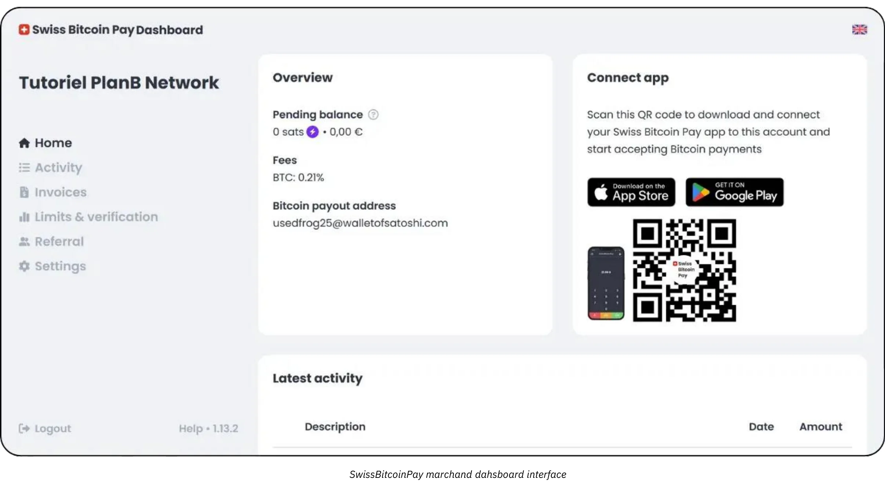

De tarieven zijn concurrerend: 0,21% voor het eerste jaar, daarna 1% voor Bitcoin betalingen en 1,5% voor fiat conversies, inclusief Bitcoin transactiekosten. Swiss Bitcoin Pay biedt een praktische middenweg tussen custodial oplossingen zoals Open Node en complexe self-hosted systemen zoals BTCPay Server, waarbij eenvoud, veiligheid en financiële autonomie voorop staan.

Met dit soort instellingen kunnen fysieke bedrijven generate facturen snel betalen, QR-codes aan hun klanten tonen en Lightning- of On-Chain-transacties met minimale wrijving accepteren. Het personeel heeft slechts een korte introductie nodig om deze betalingen te verwerken, terwijl managers kunnen inloggen op een online dashboard om de dagelijkse verkoop te reconciliëren en basisrapporten te bekijken. De beschikbaarheid van een gestroomlijnde administratieve console helpt ook kleinere etablissementen om zowel fiat- als crypto-inkomsten van één Interface bij te houden, waardoor verwarring wordt verminderd en er minder tijd wordt besteed aan handmatige boekhouding.

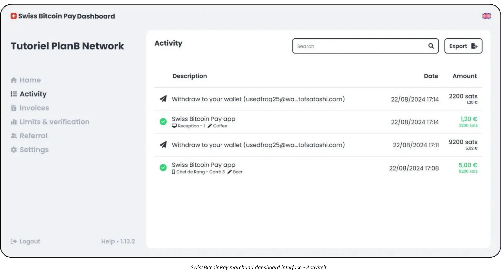

Een ander belangrijk voordeel van de Essential-aanpak is de nadruk op snelle implementatie en minimale verstoring. Oplossingen zoals Swiss Bitcoin Pay kunnen binnen enkele uren worden opgezet in plaats van dagen of weken. Voor een eigenaar of manager van een bescheiden druk restaurant, bijvoorbeeld, is het einddoel om Bitcoin acceptatie te integreren zonder vertragingen bij de kassa of verwarring onder het personeel te veroorzaken. Zodra de kassa is geconfigureerd, kan de manager de medewerkers snelle instructies geven over het weergeven van de Invoice en controleren of de betaling is verwerkt. In het beste geval wordt de transactie van een klant bijna onmiddellijk bevestigd via de Lightning Network en registreert het administratieve paneel van het bedrijf tegelijkertijd een nieuwe betaling in realtime.

Hoewel het Essential-profiel geen zeer geavanceerde boekhoudsystemen vereist, is het toch verstandig om een goede transactieregistratie bij te houden. Tools zoals Swiss Bitcoin Pay bieden CSV-exportfuncties, waarmee managers de fiat-equivalente waarde van elke Bitcoin verkoop kunnen vastleggen en bijhouden naast andere inkomstenbronnen. Dit niveau van documentatie is voldoende voor de meeste kleine bedrijven, en een rudimentair begrip van Exchange tarieven zal helpen bij de belastingaangifte en algemeen financieel toezicht.

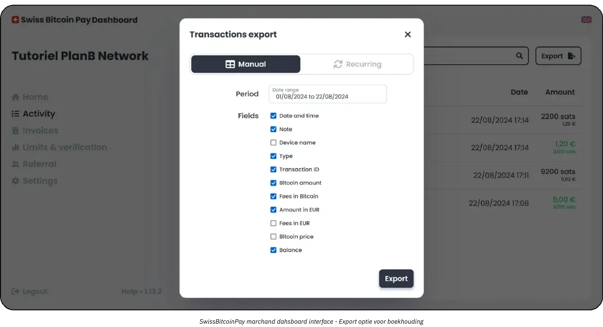

De meest geschikte hybride oplossing voor jouw profiel is waarschijnlijk Swiss Bitcoin Pay:

https://planb.network/tutorials/business/point-of-sale/swiss-bitcoin-pay-2-a78b057e-ed11-47ac-860c-71019fcb451a

Een andere eenvoudig te implementeren oplossing, maar met het nadeel dat het 100% beheerd wordt, is Open Node:

https://planb.network/tutorials/business/point-of-sale/open-node-e69a0c1c-47f7-4932-8494-e6f26c3c9784

Als je klaar bent om je handen vuil te maken en volledige controle over het proces wilt, dan is de BTCPay Server software een uitstekende optie. Het grote nadeel van BTCPay Server is echter dat de installatie en het beheer tijdrovend zijn en een bepaald niveau van technische expertise vereisen, maar u kunt onze gidsen volgen:

https://planb.network/tutorials/business/point-of-sale/btcpay-server-928eb01e-824b-4b57-a3e8-8727633beddc

Tot slot kunt u overwegen om [een Bitcoinize PoS] (https://bitcoinize.com/) op te zetten als aanvulling op fysieke verkooppunten.

## De professional

<chapterId>4d5dfa50-c4d0-481c-ab95-1863a898750e</chapterId>

Het Professional-profiel is gericht op bedrijven die verder zijn gegaan dan incidentele Bitcoin-betalingen of betalingen met lage volumes en die nu op zoek zijn naar een robuuste infrastructuur om meerdere dagelijkse transacties af te handelen. Deze bedrijven werken vaak via verschillende kanalen (misschien een winkellocatie, een speciale e-commerce website en zelfs mobiele verkoop) en hebben daarom betaaloplossingen nodig die naadloos kunnen worden geïntegreerd in hun bestaande workflows. In veel gevallen beheren bedrijven op dit niveau al point-of-sale systemen, platforms voor online orderbeheer en back-office activiteiten die een betrouwbare, schaalbare aanpak vereisen.

Een van de bepalende kenmerken van de Professional merchant is de behoefte aan **uitgebreide functies** en **aanpasbare oplossingen** die efficiëntie behouden, zelfs als de transactievolumes groeien. In tegenstelling tot Essential gebruikers, die tevreden kunnen zijn met een gestroomlijnde tool die netjes op een smartphone app past, vragen Professional bedrijven meestal om functies zoals gedetailleerde Invoice aanpassingen, geavanceerde rapportage dashboards en de mogelijkheid om meerdere administratieve rollen toe te wijzen.

Een restaurantgroep kan bijvoorbeeld medewerkers hebben die zich bezighouden met facturatie en voorraadbeheer, terwijl een apart team zich bezighoudt met productlijsten en marketingcampagnes. In deze omgeving moet een Bitcoin betaaloplossing naadloos aansluiten op deze reeds bestaande organisatiestructuren.

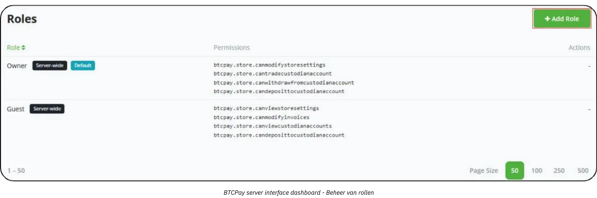

Wat betreft technologie en tools, vormen oplossingen zoals **BTCPay Server** vaak de kern van een Professionele setup. BTCPay Server is een open-source platform dat on-premises of via cloud hosting kan worden ingezet en dat uitgebreide integratiemogelijkheden biedt voor websites en e-commerce platforms. Door hun eigen instance te draaien, behouden bedrijven een hoge mate van controle over elk aspect van de betalingsstroom, van automatisch gegenereerde checkoutpagina's tot meldingen die interne processen in gang zetten zodra een betaling is bevestigd.

Daarnaast kunnen tools zoals [Zaprite](https://zaprite.com/) of [Musqet](https://musqet.tech/) de kassa-ervaring verder verfijnen, waarbij meer granulaire aanpassingen mogelijk zijn (van merkkeuzes tot geavanceerde rapportagemogelijkheden). Degenen die de voorkeur geven aan een alles-in-één online winkelomgeving zullen misschien eerder kiezen voor [Be-BOP](https://be-bop.io/), een e-store oplossing die is gebouwd om Bitcoin betalingen te faciliteren zonder in te leveren op gebruiksgemak.

Het implementeren van deze technologieën in een professionele omgeving betekent dat er veel aandacht moet worden besteed aan de operationele complexiteit. Geautomatiseerde factureringsworkflows, weergave in meerdere valuta's en synchronisatie met bestaande inventarisatiesystemen zijn allemaal kenmerken van een goed geïntegreerd platform. De mogelijkheid om transactiegegevens nauwkeurig te exporteren (als CSV-bestanden, directe API-aanroepen of aangepaste formaten) helpt bedrijven om de Bitcoin verkopen efficiënt te reconciliëren met andere inkomstenstromen.

Beveiliging en rolbeheer vormen een andere cruciale overweging voor professionele gebruikers. Naarmate de dagelijkse Bitcoin transacties zich opstapelen, wordt het beheren van de toegang tot administratieve functies een essentiële risicobeperkende maatregel. In veel oplossingen kunnen beheerders verschillende toestemmingsniveaus toewijzen (misschien kunnen ze sommige werknemers beperken tot het bekijken van transactiehistorieken en het genereren van facturen, terwijl ze anderen de bevoegdheid geven om inventaris te beheren of systeembrede instellingen te configureren...). Deze hiërarchische structuur beschermt niet alleen gevoelige gegevens, maar stroomlijnt ook de werkzaamheden door duidelijk te maken welke medewerkers verantwoordelijk zijn voor elk segment van de betalingsinfrastructuur.

Als het gaat om voorbeelden uit de praktijk, denk dan eens aan een middelgrote e-commercewinkel die gespecialiseerd is in technologieaccessoires. Het bedrijf zou BTCPay Server kunnen integreren in zijn bestaande online winkel en automatisch Bitcoin betalingsadressen genereren tijdens het afrekenen. Klanten voltooien hun aankopen door een Lightning of On-Chain Address te scannen, en het platform van de winkel bevestigt onmiddellijk de betaling. Tegelijkertijd werkt een intern systeem de bestelstatus bij en worden er verzendingsberichten verstuurd. Dankzij de geavanceerde rapportagefuncties kan het financiële team eenvoudig de dagelijkse Bitcoin verkopen bekijken, een geconsolideerde Ledger exporteren voor controle en de waarde bijhouden van alle BTC-tegoeden die het bedrijf besluit te behouden.

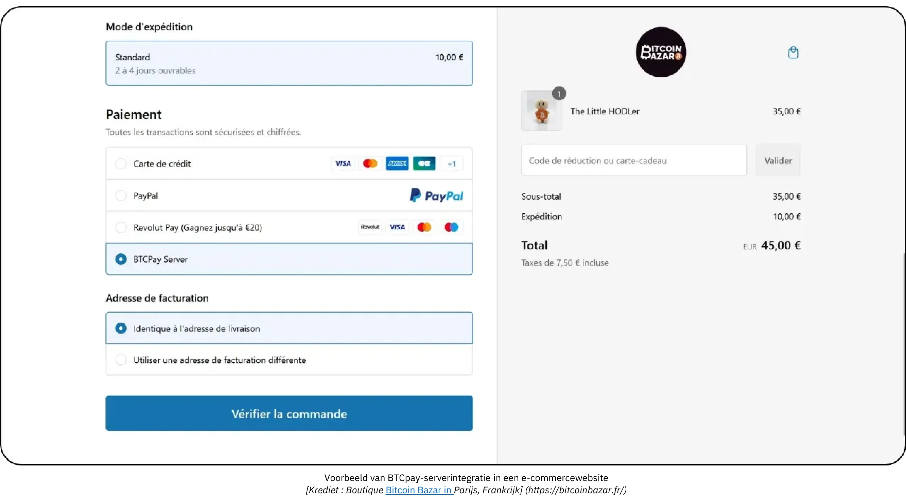

*[Krediet: Bitcoin Bazar winkel in Parijs, Frankrijk.](https://bitcoinbazar.fr/)*

Om dieper in te gaan op implementatiedetails en om hands-on configuraties van BTCPay Server te verkennen, verwijzen we naar de volgende cursus:

https://planb.network/courses/6fc12131-e464-4515-9d3f-9255365d5fa1

## De Onderneming

<chapterId>80fb2659-81ca-4a11-b492-72c7ae5774f9</chapterId>

Het Enterprise-profiel staat aan de top van Bitcoin betalingsimplementaties, speciaal op maat gemaakt voor grote bedrijven, grote marktplaatsen en gevestigde bedrijven die volledig op maat gemaakte oplossingen vereisen. In tegenstelling tot kleinschalige of middelgrote implementaties, integreren Enterprise-operaties Bitcoin betalingen in een breed scala van workflows en systemen, variërend van on-site point-of-sale apparaten tot e-commerce storefronts, back-office boekhoudplatforms en geavanceerde ERP-raamwerken.

Op deze schaal is het overkoepelende doel niet simpelweg om Bitcoin te accepteren, maar om dit te doen op een manier die grondig **uitgelijnd is met de kernprocessen** van de organisatie. Deze afstemming kan gespecialiseerde softwareontwikkeling vereisen, of de oplossing nu volledig op maat wordt gemaakt of wordt georkestreerd via een SaaS-gebaseerde infrastructuur die wordt ondersteund door externe *Lightning Service Providers* (LSP's). Dergelijke LSP's kunnen hoge transactievolumes en complexe netwerkconfiguraties aan die de capaciteit van meer conventionele out-of-the-box tools te boven gaan. De resulterende architectuur omvat daarom een breed scala aan technische en zakelijke overwegingen, van API-gestuurde integraties tot geavanceerde mogelijkheden voor treasury management.

Binnen een bedrijfscontext wordt de operationele complexiteit extra uitgesproken. Een groot bedrijf moet misschien meerdere afdelingen huisvesten (verkoop, marketing, ontwikkeling, financiën en boekhouding), elk met hun eigen verantwoordelijkheden en gegevensvereisten. In dit scenario moet een Bitcoin betalingsplatform een zeer granulair rollenbeheer bieden, waardoor elke afdeling toegang krijgt tot precies die functies die relevant zijn voor hun taken, met behoud van strenge controle over beveiliging en data-integriteit. Net zo essentieel is de mogelijkheid om workflows aan te passen: inkomende betalingen kunnen bijvoorbeeld updates in voorraadsystemen triggeren, automatische meldingen naar verkoopmanagers sturen en Ledger boekingen voor het financiële team bijwerken, en dat alles in realtime. Point-of-sale apparaten zelf worden vaak aangepast aan de bedrijfsomgeving, met aangepaste software-interfaces die passen bij de branding en operationele behoeften van het bedrijf.

**Veiligheid** is van het grootste belang voor ondernemingen op grote schaal. Hoge transactievolumes en potentieel grote bedragen aan Bitcoin vereisen een robuuste infrastructuur die zich kan verdedigen tegen kwaadwillige aanvallen of bedreigingen van binnenuit. Best practices omvatten vaak configuraties met meerdere handtekeningen en tijdsloten, zorgvuldig gecontroleerde codebases en strikte naleving van relevante regelgevende kaders. Bovendien kan het naleven van lokale en internationale financiële regelgeving een integraal onderdeel zijn van het behoud van de reputatie en de license to operate van het bedrijf.

De **maatwerkontwikkeling** die komt kijken bij het creëren of integreren van een Bitcoin betaaloplossing voor bedrijven gaat verder dan het coderen van een paar functies van de applicatie. Het vereist meestal een architectonisch ontwerp, grondige testprotocollen en een gestructureerde uitrol die meerdere fasen kan omvatten (eerste pilotprogramma's, beperkte markttests en uiteindelijk wereldwijde uitrol).

Op het gebied van boekhouding vereisen hoogfrequente transacties **op maat gemaakte exports** en soms real-time synchronisatie met financiële bedrijfssoftware. Grote bedrijven kunnen vertrouwen op enterprise resource planning (ERP)-oplossingen zoals SAP of Oracle, die op hun beurt Interface naadloos moeten samenwerken met de Bitcoin betalingsgegevens. Om dit mogelijk te maken, moeten de API's van het gekozen platform geavanceerd en flexibel zijn, zodat IT-teams de vrijheid hebben om aangepaste rapportagedashboards te maken, geautomatiseerde afstemmingsprocessen te implementeren en generate dagelijkse of zelfs uurlijkse financiële overzichten te maken.

Een typisch Enterprise scenario zou een grote e-commerce marktplaats kunnen betreffen die dagelijks duizenden transacties verwelkomt. Naast het louter vermelden van Bitcoin als betalingsoptie, kan deze marktplaats elk aspect van de gebruikerservaring aanpassen, van hoe de Bitcoin betalingsstroom op de klantgerichte website verschijnt tot hoe terugbetalingen, terugboekingen of geschillenbeslechting aan de achterkant worden beheerd. Een toegewijd devopsteam, in samenwerking met de financiële en juridische afdelingen, zou toezicht houden op doorlopend onderhoud, beveiligingspatches en nalevingsupdates. Mocht het bedrijf ervoor kiezen om een deel van de Bitcoin inkomsten te behouden, dan zou een intern treasury systeem de Bitcoin holdings van het bedrijf bijhouden naast de traditionele valutareserves.

Om een soepele en veilige implementatie op ondernemingsniveau te garanderen, doen de meeste organisaties een beroep op gespecialiseerde dienstverleners of interne ontwikkelingsteams met ervaring in Bitcoin- en Lightning Network-integraties. Het proces begint meestal met een grondige beoordeling van de behoeften (met inbegrip van de technische infrastructuur, compliance-vereisten en het gewenste klanttraject), gevolgd door het ontwerpen van een architectuur die grote doorvoervolumes aankan. Afhankelijk van de reikwijdte van het project kunt u een beroep doen op een multidisciplinair team bestaande uit financiële controleurs, beveiligingsanalisten en software-engineers. Als alternatief kan een groeiend aantal gespecialiseerde adviesbureaus u begeleiden vanaf het eerste concept tot aan de uiteindelijke uitrol, waarbij ze helpen met taken zoals het evalueren van SaaS-oplossingen, het configureren van *Lightning Service Providers* en het aanpassen van front-end interfaces. Door samen te werken met domeinexperts kunnen bedrijven de risico's beperken die gepaard gaan met een grootschalige implementatie van betalingen en een oplossing realiseren die niet alleen robuust en compliant is, maar ook flexibel genoeg om toekomstige groei aan te kunnen.

## Bitcoin betalingsoplossingen: Opties en trends

<chapterId>59ff43a1-98e2-4a81-af3e-9654bdd60952</chapterId>

Er zijn altijd afwegingen voor elke categorie oplossingen. Bijvoorbeeld, in de initiële "testfase" zijn de voorgestelde wallets ontworpen om zo eenvoudig mogelijk te zijn in termen van gebruiker Interface, maar ze worden gehost (**custodial**). Dit betekent dat de fondsen worden beheerd door de aanbieder van de app. Het ethos van Bitcoin moedigt echter aan om te evolueren naar volledige Ownership van fondsen door de gebruiker (**self-custodial**). In dit geval is het aan te raden om te upgraden naar de volgende categorie zodra de eerste verkopen zijn gedaan - in feite, zodra is bevestigd dat je klanten hebt die bereid zijn om te betalen in Bitcoin.

Een van de belangrijkste voordelen van Bitcoin is de mogelijkheid om geld naar believen te verplaatsen, waardoor het **zeer eenvoudig is om van aanbieder** of onderdeel van uw oplossing te wisselen. Daarnaast ontwikkelen alle apps en oplossingen zich snel. Neem bijvoorbeeld Bitcoinize, dat nu een fysieke Point of Sale (POS) terminal biedt die integreert met vele applicaties op de markt, een oplossing die een paar maanden geleden nog niet bestond.

### Op zoek naar een oplossing om een winkel te creëren en zowel traditionele als Bitcoin betalingen te accepteren?

Als je vanaf nul begint - geen winkel, geen software voor productbeheer en geen kassasysteem - heb je een paar opties:

- **Outsourcing:** Je kunt het maken van een website met winkelopties uitbesteden en dan Bitcoin betalingsmogelijkheden toevoegen naast traditionele oplossingen in de winkel.

- **Eenvoudige oplossingen:** Je kunt ook platforms zoals Accessing.app gebruiken om het zelf te doen. De belangrijkste voordelen zijn:
    - Snel en betaalbaar een online of fysieke winkel opzetten.
    - Geschikt voor seizoensgebonden bedrijven, evenementen, restaurants of winkels.
    - Producten definiëren en beheren voor zowel fysieke als online verkoop.
    - Verwerking van Fiat-betalingen (bijv. euro's, dollars) via je eigen Stripe-account.
    - Bitcoin betalingsverwerking via uw eigen Zwitserse Bitcoin Pay account.

### Hoe verloopt de invoering van Lightning-betalingen?

Hoewel de Lightning Network superieure efficiëntie en lagere tarieven biedt, bevindt de toepassing zich nog in een vroeg stadium. In plaats van te focussen op de huidige beperkingen, is het de moeite waard om te onthouden hoe historische transformaties van de infrastructuur verliepen:

- Toen auto's voor het eerst verschenen, waren er niet genoeg auto's om de aanleg van wegen te rechtvaardigen en niet genoeg wegen om het bezit van auto's te rechtvaardigen.
- Toen elektriciteit werd geïntroduceerd, waren er niet genoeg klanten om de aanleg van elektriciteitsnetten te rechtvaardigen, en niet genoeg netten om klanten aan te trekken.

Nieuwe infrastructuren hebben succes omdat ze efficiënter zijn en early adopters doen mee omdat ze er tastbare voordelen uit halen. Hier zijn observaties over de Lightning Network in 2024:

- **Ultrasnelle transacties:** Transacties zijn vaak bijna ogenblikkelijk (<500ms) en hebben een extreem laag storingspercentage.

- **Professionalisering van het netwerk:** Grotere spelers zorgen voor liquiditeit in het hele netwerk, terwijl individuen grotendeels zijn gestopt met het routeren van betalingen en nu vooral "edge nodes" beheren

- **Verbeterde gebruikerservaring:** Mobiele apps voor individuele gebruikers zijn aanzienlijk verbeterd. Functies zoals splicing, statische Bolt12-facturen en nulbevestigingsbetalingen (0-conf) zijn algemeen beschikbaar, waardoor interacties naadloos verlopen. Interoperabiliteitsproblemen (bijv. force-closes) zijn niet langer een groot probleem.

- **Verbeterd beheer van knooppunten en kanalen:** Zowel individuele als professionele oplossingen zijn verbeterd. BTCPay Server ondersteunt nu bijvoorbeeld tal van plugins om verbinding te maken met andere aanbieders (PSP's, on/off ramps, enz.). Nieuwe infrastructuuraanbieders, zoals LightSpark en Alby Hub, worden ook in productie genomen.

- **Groei handelarenadoptie:** Handelaren zoals BitRefill melden een toename van Bitcoin-betalingen onder hun actieve gebruikers, met een duidelijke verschuiving naar Bitcoin boven Lightning. Bovendien maken de ultralage kosten van Lightning het de beste keuze voor kleine betalingen (gemiddeld €32 per transactie).

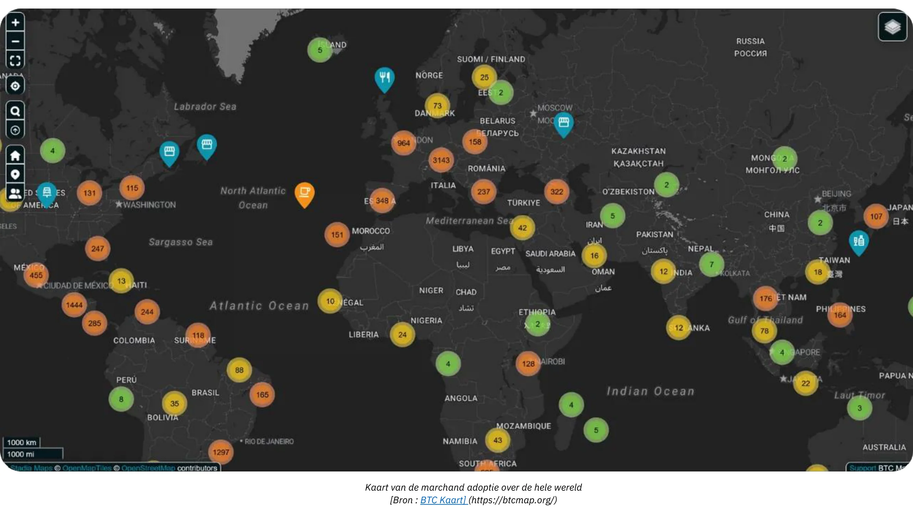

*[Bron: BTC Kaart](https://btcmap.org/)*

- **Netwerkcijfers:** Het totale aantal kanalen en Bitcoin vergrendeld op Lightning blijft stabiel, met ongeveer 20.000 nodes, 5.200 BTC en 60.000 kanalen. Dit weerspiegelt echter slechts een deel van het netwerk en wijst op een rotatie onder de deelnemers, met minder individuen en meer professionals die deelnemen.

- **Lightning als brug tussen netwerken:** De efficiëntie en beschikbaarheid van de Lightning Network hebben het al gepositioneerd als brug naar andere onderling verbonden netwerken (bijv. FediMint, Liquid, etc.).

**De comeback van de Wallet**

Bitcoin en de Lightning Network voltooien de **digitale Wallet revolutie**. Nieuwe webdiensten maken nu **transacties mogelijk zonder dat je een account hoeft aan te maken** - je Wallet wordt je identiteit! Met protocollen zoals **Nostr Wallet Connect (NWC)** en **LN-URL-AUTH**, kunnen portemonnees gebruikers naadloos authenticeren en transacties mogelijk maken zonder traditionele accounts. De dagen van accountmoeheid voor eenvoudige aankopen of abonnementen zijn voorbij. Het is niet meer nodig om persoonlijke of betalingsgegevens te verstrekken die gehackt kunnen worden en te koop zijn op het dark web, zoals maar al te vaak is gebleken uit recente gebeurtenissen.

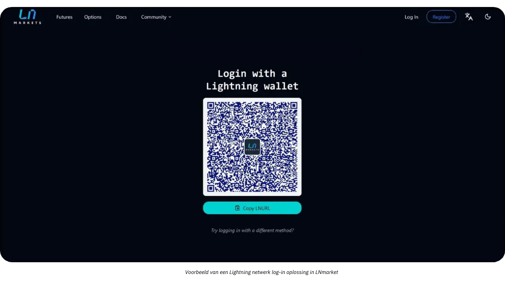

De verkopers van morgen zullen deze innovatie omarmen en klanten een veiligere, meer naadloze (one-click) ervaring bieden die ook hun privacy respecteert.

# Bitcoin Boekhouding

<partId>d49d7595-a189-4e2b-bd60-c19e8e717aa2</partId>

## Essentiële beginselen voor Bitcoin boekhouden in het bedrijfsleven

<chapterId>84063061-ffdb-4b1f-b20b-588ffb146877</chapterId>

De volgende inhoud is alleen voor educatieve doeleinden en mag niet worden beschouwd als financieel of boekhoudkundig advies. Bedrijven en particulieren worden sterk aangemoedigd om een gekwalificeerde accountant of juridisch deskundige te raadplegen die bekend is met de regelgeving voor cryptocurrency in hun specifieke rechtsgebied voordat ze enige actie ondernemen.

### Bitcoin Belangrijkste concepten boekhouden

**Elke Bitcoin transactie moet worden geregistreerd en kan leiden tot een belastbaar feit**

Wereldwijd wordt Bitcoin vaak niet geclassificeerd als een valuta, maar als een digitaal actief. Dit onderscheid heeft een significante invloed op de manier waarop Bitcoin wordt verantwoord in bedrijven, en beïnvloedt belastingverplichtingen, financiële verslaglegging en nalevingsvereisten. Bedrijven die Bitcoin accepteren als betaalmiddel of het gebruiken als kasmiddel, moeten deze nuances in de regelgeving begrijpen.

De **belangrijkste consequentie** om in gedachten te houden is dat, in de meeste rechtsgebieden, het verdienen, verkopen, verhandelen of gebruiken van Bitcoin om aankopen te doen, meestal een **belastbare gebeurtenis** creëert en dat winsten onderhevig zijn aan vermogenswinstbelasting.

Een ander aspect van Bitcoin accounting is het maken van onderscheid tussen twee soorten vermogenswinsten:

- **Latente winsten/verliezen:** Niet-gerealiseerde winsten of verliezen gebaseerd op de waarde van Bitcoin aangehouden aan het einde van een boekhoudperiode.
- **Effectieve winsten/verliezen:** Gerealiseerde winsten of verliezen wanneer Bitcoin wordt verkocht of ingeruild tijdens het boekjaar.

Deze berekeningen zijn sterk afhankelijk van het feit of Bitcoin wordt aangehouden voor langetermijninvesteringen of voor operationeel gebruik op korte termijn. Bovendien moeten bedrijven hun boekhoudpraktijken afstemmen op lokale belastingstructuren, aangezien de regelgeving per land aanzienlijk verschilt.

De boekhouding voor bedrijven die Bitcoin bezitten is enigszins omslachtig, omdat elke transactie nauwkeurig moet worden bijgehouden om gerealiseerde of ongerealiseerde winsten of verliezen te berekenen. Voor elke verkoop die u doet door Bitcoin als betaalmiddel te accepteren, of elke keer dat u Bitcoin koopt of verkoopt, moet u registreren:

- de specifieke tijd
- de verkoopprijs (in fiatvaluta)
- de kostprijs van de Bitcoin (de prijs waarvoor de Bitcoin in eerste instantie werd aangeschaft).

Zo kun je later het verschil berekenen om de winst of het verlies te bepalen.

**Voorbeeld:** Een bedrijf koopt 1 BTC voor $30.000. Later verkoopt het 0,5 BTC voor $20.000. Later verkoopt het 0,5 BTC voor $20.000. Om de winst of het verlies te berekenen, moet het bedrijf:

- Heb de tijd, de fiat kostprijs en de hoeveelheid Bitcoin verworven vastgelegd
- Heb de tijd, de fiat verkoopprijs en de hoeveelheid verkochte Bitcoin geregistreerd
- Bepaal de kosten van Bitcoin verkocht : 0,5 BTC: $30.000 ÷ 2 = $15.000.
- Vergelijk de verkoopprijs met de kostprijs: $20.000 (verkoopprijs) - $15.000 (kostprijs) = $5.000 winst.
- Werk de Bitcoin holdings bij met de nieuwe kostprijs

Dit proces moet voor elke transactie herhaald worden en de fluctuerende aard van de prijs van Bitcoin maakt het bijhouden van gegevens nog omslachtiger.

**Hoe het zou werken als Bitcoin een munteenheid zou zijn**

Als Bitcoin behandeld zou worden als een valuta, zouden bedrijven het beheren zoals elke andere valuta in hun boekhoudsysteem. In plaats van het bijhouden van de kostenbasis en gerealiseerde/ongerealiseerde winsten voor elke transactie, zouden Bitcoin holdings gewoon op een valutarekening worden geregistreerd. Aan het einde van elke rapportageperiode zou de waarde van alle valuta, inclusief Bitcoin, worden omgerekend naar de boekhoudvaluta (bijv. USD of EUR) met behulp van de huidige Exchange koers.

**Gewijzigd voorbeeld als Bitcoin werd herkend als valuta:**

- Een bedrijf houdt 1 BTC aan wanneer Bitcoin $30.000 waard is. Later gebruikt het bedrijf 0,5 BTC voor een betaling wanneer Bitcoin $40.000 waard is.
- Het bedrijf berekent **geen** gerealiseerde winst of gerealiseerd verlies. In plaats daarvan wordt de transactie geboekt als:
    - Betaling: $20.000 (0,5 BTC × $40.000).
    - Resterende Bitcoin balans: 0.5 BTC, nu $20.000 waard (bijgewerkt tegen de huidige Exchange koers).

**Key Advantage als Bitcoin werd erkend als een valuta:**

- Het bedrijf hoeft het fiat equivalent van zijn Bitcoin holdings alleen periodiek aan te passen (bijvoorbeeld voor maandelijkse of jaarlijkse rapporten), net als voor euro's, yen of andere valuta's die het aanhoudt.
- Hierdoor is het niet meer nodig om op transactieniveau de kostenbasis bij te houden en wordt de boekhouding vereenvoudigd, vooral voor bedrijven met frequente Bitcoin transacties.

Deze benadering zou de boekhouding van Bitcoin veel eenvoudiger maken, de administratieve lasten verminderen en op één lijn brengen met de behandeling van andere valuta's, ervan uitgaande dat Bitcoin volledig als zodanig wordt erkend in wettelijke en regelgevende termen. Zo ver zijn we nog niet.

### Onderscheid tussen individueel en zakelijk Bitcoin Boekhouden

De wettelijke en boekhoudkundige behandeling van Bitcoin verschilt aanzienlijk tussen particulieren en bedrijven. Voor particulieren kunnen winsten uit Bitcoin transacties onderworpen zijn aan inkomstenbelasting, vaak tegen een hoger tarief. Bedrijven daarentegen kunnen profiteren van potentieel lagere vennootschapsbelastingtarieven, maar moeten zich houden aan strengere boekhoudnormen.

Voor bedrijven kan Bitcoin worden ingedeeld in verschillende accounts, afhankelijk van het beoogde gebruik:

- **Vaste activa:** Voor Bitcoin op lange termijn aangehouden als strategische investering.
- **Voorraden:** Voor Bitcoin gebruikt in productieprocessen (een zeldzaam gebruik, dit is bijvoorbeeld het geval voor professionele handelaren).
- **Kasmiddelen of schatkistrekeningen:** Voor Bitcoin aangehouden als actief in Liquid, voornamelijk voor operationele transacties of kasbeheer op korte termijn.

De keuze van de classificatie hangt af van de activiteit en strategie van het bedrijf, met gevolgen voor de financiële verslaglegging en belastingverplichtingen. Controleer altijd de lokale regelgeving, aangezien deze classificaties per land kunnen verschillen.

### Wettelijk kader

De wettelijke erkenning en behandeling van Bitcoin varieert per jurisdictie. Sommige landen, zoals El Salvador, hebben Bitcoin erkend als wettig betaalmiddel, wat het gebruik ervan in transacties vereenvoudigt, maar internationale financiële verslaglegging bemoeilijkt. Andere landen behandelen Bitcoin als een digitaal actief dat onderworpen is aan specifieke belasting- en boekhoudregels.

In de meeste landen wordt Bitcoin gecategoriseerd als een digitaal actief en de behandeling ervan wordt bepaald door algemene boekhoudnormen. Bedrijven moeten Bitcoin-transacties als volgt verantwoorden:

- **Kapitaalwinsten/-verliezen boeken:** Bedrijven moeten gerealiseerde winsten of verliezen opnemen in hun financiële resultaten.
- **Latente winsten/verliezen Waardering:** Niet-gerealiseerde winsten of verliezen moeten vaak worden gerapporteerd, maar hebben mogelijk geen directe invloed op het belastbaar inkomen.
- **Naleving van boekhoudstandaarden:** Bedrijven moeten Bitcoin transacties integreren in standaard boekhoudpraktijken, om transparantie en nauwkeurigheid te garanderen.

De aanpak van de Bitcoin-boekhouding varieert per geografie:

- **Verenigde Staten:** De IRS classificeert Bitcoin als **eigendom, vergelijkbaar met aandelen, obligaties of onroerend goed**. Deze classificatie betekent dat elke transactie met cryptocurrency, zoals het verdienen, verkopen, verhandelen of zelfs gebruiken om aankopen te doen, een belastbare gebeurtenis kan creëren en dat winsten onderhevig zijn aan vermogenswinstbelasting.
- **Europese Unie:** Lidstaten behandelen Bitcoin over het algemeen als een speculatief actief in plaats van een functionele valuta. Daarom zijn winsten vaak onderhevig aan vermogenswinstbelasting.
- **Azië:** Landen als Singapore en Japan hebben progressieve regelgevende kaders aangenomen, waarbij Bitcoin transacties in specifieke contexten gunstig worden behandeld. Maar Bitcoin wordt over het algemeen geboekt als **immateriële activa**, en het wordt gewaardeerd tegen reële waarde op de rapporteringsdatum, met veranderingen opgenomen in de winst- en verliesrekening.

Het is essentieel om de regelgeving in het land waar je actief bent te begrijpen en je boekhoudpraktijken hierop aan te passen.

### Uitdagingen in de evolutie van regelgeving

Het snelle tempo van de innovatie van cryptocurrency overtreft vaak de regelgevende kaders. Sinds de erkenning van Bitcoin als digitaal activum is de wereldwijde regelgeving geleidelijk bijgewerkt, maar er zijn nog steeds hiaten:

- **Gebrek aan jurisprudentie:** Weinig rechtszaken hebben specifieke boekhoudpraktijken verduidelijkt, waardoor er ruimte is voor interpretatie.
- **Lopende discussies:** Kwesties zoals de fiscale behandeling van latente verliezen blijven in veel rechtsgebieden onopgelost.
- **Grensoverschrijdende complexiteit:** Bedrijven die internationaal actief zijn, hebben te maken met problemen om de verschillende nationale boekhoudnormen op elkaar af te stemmen.

Ondanks deze uitdagingen bieden de proactieve standpunten van veel landen een solide basis voor bedrijven om Bitcoin in hun activiteiten op te nemen. Voortdurende updates en internationale harmonisatie zullen Address essentieel zijn voor de opkomende complexiteit van de boekhouding van cryptocurrency.

### Classificatie van Bitcoin in de jaarrekening

De classificatie van Bitcoin in jaarrekeningen verschilt per jurisdictie en hangt af van het beoogde gebruik binnen een bedrijf. In grote lijnen wordt Bitcoin behandeld als een digitaal actief, verwant aan inventaris, investering of valuta, maar met unieke kenmerken die de boekhoudkundige behandeling beïnvloeden.

- **Digitaal of immaterieel activum**: Veel rechtsgebieden, waaronder Frankrijk en de Europese Unie, classificeren Bitcoin als een digitaal of immaterieel actief in plaats van een wettig betaalmiddel. Deze classificatie vereist dat bedrijven Bitcoin anders verantwoorden dan fiatvaluta's.
- **Inventaris**: Als de kernactiviteit van een bedrijf bestaat uit het verhandelen van Bitcoin, zoals cryptocurrency exchanges of makelaars, wordt Bitcoin geclassificeerd als inventaris. In dit geval volgt de waardering de standaarden voor voorraadboekhouding.
- **Financiële investering**: Bedrijven die Bitcoin als een lange termijn actief houden, kunnen het classificeren als een financiële investering. In de Verenigde Staten zouden bedrijven Bitcoin bijvoorbeeld kunnen boeken volgens de richtlijnen van de Financial Accounting Standards Board (FASB), waarbij bijzondere waardeverminderingen worden erkend wanneer de marktwaarde daalt.

**Implicaties van classificatie :**

- Langetermijnbeleggingen moeten vaak getest worden op bijzondere waardeverminderingen en afschrijvingen.
- Actieve handels- of betalingsgerelateerde activiteiten vereisen het constant bijhouden van gerealiseerde en ongerealiseerde winsten en verliezen.

### Waarderingsmethoden

Waarderingsmethodes zijn boekhoudtechnieken die gebruikt worden om de kostenbasis van Bitcoin te bepalen, wat essentieel is voor het nauwkeurig berekenen van winsten of verliezen tijdens transacties. In het algemeen is het het beste om **een altijd bijgewerkte waarde van de kosten van huidige Bitcoin holdings** in het boekhoudsysteem bij te houden. Dit zorgt voor transparantie, naleving van belastingregels en voorkomt dat je achterop raakt wanneer er berekeningen moeten worden uitgevoerd.

- **First In, First Out (FIFO)**: Deze methode, die gebruikelijk is in rechtsgebieden zoals Australië en India, waardeert Bitcoin op basis van de vroegste verwervingskosten. Dit kan behoorlijk **complex** worden, omdat het nodig kan zijn om elke fractie van een Bitcoin afzonderlijk te traceren wanneer een verkoop plaatsvindt.
- **Weighted Average Cost (WAC)**: Vaak de voorkeur voor transacties met hoge volumes vanwege de **eenvoudigheid**, zoals in landen als de Verenigde Staten.

Het wordt ten zeerste aanbevolen om een gedetailleerd werkboek bij te houden waarin de kosten van Bitcoin worden bijgehouden **vanaf het moment dat een bedrijf Bitcoin begint te kopen of het als betaling accepteert** om een nauwkeurige en georganiseerde administratie te garanderen. Alleen al deze overweging zou bovenaan moeten staan bij het kiezen van een softwareoplossing om Bitcoin betalingen te accepteren of om Bitcoin te kopen.

### Boekhouden voor transacties in detailhandel en e-commerce

Detailhandelaren moeten voor elke transactie het Bitcoin-tarief registreren. In veel landen gebruiken bedrijven bijvoorbeeld het Exchange-tarief op het moment van verkoop om de btw te berekenen.

Bedrijven moeten ervoor zorgen dat de **betalingstools** die ze gebruiken de mogelijkheid bieden om:

- generate een Invoice met het lokale fiatbedrag (euro, dollar, pond), die BTW of andere lokale belastingen, de Bitcoin tegenwaarde, de datum en tijd, de Bitcoin Exchange koers en Exchange bron enz
- alle betalingsbewijzen exporteren, minimaal in een .csv-indeling, met alle bovenstaande informatie, zodat de boekhouder ze gemakkelijk kan verwerken
- idealiter een registratie bijhouden van de geactualiseerde waarde van de kostenbasis voor het huidige Bitcoin in kas

### Uitdagingen

- **Volatiliteit**: De prijs van Bitcoin fluctueert aanzienlijk, waardoor het moeilijk is om holdings te waarderen en toekomstige financiële resultaten te voorspellen.
- **Regelgeving**: In landen als China beperkt de beperkte status van Bitcoin het gebruik ervan als schatkistcertificaat.
- **Onzekerheid over regelgeving**: Het veranderende regelgevingslandschap van Bitcoin laat bedrijven vaak in het ongewisse. Veranderingen in het belastingbeleid, bijvoorbeeld in India of de Verenigde Staten, kunnen van de ene op de andere dag invloed hebben op de boekhoudpraktijken.
- **Risico's van wanbeheer**: Onjuiste classificatie of het niet monitoren van Bitcoin transacties kan leiden tot compliance problemen, boetes of reputatieschade.
- **Risico's van herkwalificatie**: Het aanhouden van een aanzienlijk deel van de kas van een bedrijf in Bitcoin stelt het bedrijf bloot aan potentiële verliezen door prijsdalingen. Dit kan ernstige gevolgen hebben, vooral als dergelijke dalingen zich voordoen wanneer betalingen aan leveranciers, werknemers of belastingen verschuldigd zijn. Bovendien kan de eigenaar van het bedrijf aansprakelijk worden gesteld, wat kan leiden tot boetes of andere juridische problemen, zoals beschuldigingen van misbruik van bedrijfsmiddelen.

## Boekhoudprogramma's en -software

<chapterId>e7b31be5-1176-4835-944e-3cba1b7040fa</chapterId>

Wanneer een bedrijf besluit om Bitcoin te integreren in zijn boekhouding, vereenvoudigen verschillende tools en gespecialiseerde software het verzamelen en verwerken van gegevens. Tot de bekendste oplossingen behoren [CoinTracker](https://www.cointracker.io/), [Waltio](https://www.waltio.com/), [Cryptio](https://cryptio.co/), [Koinly](https://koinly.io/), [TokenTax](https://tokentax.co/) en [ZenLedger](https://zenledger.io/). Deze platformen richten zich voornamelijk op vier aspecten:

- automatische gegevensverzameling;
- conversie van deze gegevens naar formaten die compatibel zijn met meer algemene boekhoudsoftware (QuickBooks, Xero, ERP);
- berekening van belastingverplichtingen;
- transactiecategorisatie.

Ze zijn vaak een verstandige aanvulling voor grote organisaties met meerdere wallets en activa op verschillende platforms of exchanges.

Een eenvoudig `.csv` bestand met de transactiegeschiedenis is echter vaak voldoende voor de meeste kleine bedrijven. Het doel is om voor elke betaling de datum, het bedrag, de tegenwaarde in euro's/dollars en de relevante Bitcoin adressen te documenteren. De overgrote meerderheid van de Bitcoin betalingsoplossingen (BTCPay Server, Swiss Bitcoin Pay, etc.) of Exchange platforms (Bitfinex, Kraken, Coinbase, etc.) bieden al een mechanisme om transactiehistories te exporteren. Door dit bestand aan een accountant te verstrekken, wordt het mogelijk om de gegevensinvoer te stroomlijnen en duidelijk onderscheid te maken tussen inkomende en uitgaande stromen met betrekking tot Bitcoin.

Voor degenen die hun Bitcoin zelf bewaren, is het beheren van UTXO's (*Unspent Transaction Outputs*) een belangrijke stap. Een goede UTXO labeling helpt de herkomst van elk BTC fragment te traceren, transacties gerelateerd aan professionele activiteiten te onderscheiden van die voor persoonlijke uitgaven, en vergemakkelijkt de traceerbaarheid voor juridische of belastingdoeleinden. Met de meeste goede Bitcoin Wallet software kun je je Wallet importeren met behulp van je back-up bestand (of je xpub, afhankelijk van je setup) en UTXO's labelen op basis van hun herkomst of bestemming. Om je te helpen, is hier een complete tutorial gewijd aan deze praktijk:

https://planb.network/tutorials/privacy/on-chain/utxo-labelling-d997f80f-8a96-45b5-8a4e-a3e1b7788c52

Tot slot, of je nu een kleine handelaar bent of een meer gevestigd bedrijf, het is mogelijk om **een Invoice in Bitcoin** af te wikkelen. De sleutel is om de transactie goed te documenteren. Als je betaalt vanuit een Wallet die je zelf bewaart, is het ideaal om generate een transactie te registreren met vermelding van het Invoice nummer en het doel van de betaling in je labels. Als u er de voorkeur aan geeft om de Invoice via een Exchange te vereffenen, hebt u ook de optie om een ontvangstbewijs of transactiegeschiedenis te exporteren om in uw boekhouding op te nemen. Deze transparantie vereenvoudigt het traceren en rapporteren van al uw BTC-transacties.

## Praktische Bitcoin boekhoudvoorbeelden

<chapterId>763f6f20-9181-495a-bf7d-b405899e65ec</chapterId>

### Use Case 1: Winkel zet Bitcoin betalingen om naar euro's

**Scenario**: Een kleine bakkerij accepteert Bitcoin als betaalmethode, maar zet alle ontvangen Bitcoin onmiddellijk om in euro's om blootstelling aan de volatiliteit van de cryptocurrency te vermijden.

**Voorbeeld**:

- **Bitcoin omrekeningskoers**: 1 Bitcoin = €40.000.
- **Transactie 1**: Klant koopt meerdere gebakjes voor €20.
    - Bitcoin equivalent: (20 / 40.000) = 0,0005 Bitcoin = 50.000 Satoshis.
    - Omrekeningskosten: 1,5% (€20 × 0,015) = €0,30.
    - Netto ontvangen: €20 - €0,30 = €19,70.
- **Transactie 2**: Klant koopt koffie voor €5.
    - Bitcoin equivalent: (5 / 40.000) = 0,000125 Bitcoin = 12.500 Satoshis.
    - Omrekeningskosten: 1,5% (€5 × 0,015) = €0,075.
    - Netto ontvangen: €5 - €0,075 = €4,925.

**Samenvatting van transacties**:

- **Totale verkoop**: €25.
- **Totale kosten**: €0,375.
- **Netto ontvangen euro's**: €24.625.

**Boekhoudkundige gevolgen**:

- Neem de totale verkoop (€25) op als opbrengst.
- Conversiekosten (€0,375) aftrekken als last.
- Er staan geen Bitcoin-aandelen op de balans omdat alle bedragen onmiddellijk werden omgezet.

### Use Case 2: Winkel behoudt 50% van Bitcoin betalingen

**Scenario**: Dezelfde bakkerij kiest ervoor om 50% van de Bitcoin-betalingen te behouden als liquide middelen, terwijl de andere 50% wordt omgezet in euro.

**Voorbeeld**:

- **Bitcoin omrekeningskoers**: 1 Bitcoin = €40.000.
- **Transactie van klant**: Klant koopt gebak voor €50.
    - Bitcoin equivalent: (50 / 40.000) = 0,00125 Bitcoin = 125.000 Satoshis.
    - Omrekening (50%): €25 ter waarde van Bitcoin = 0,000625 Bitcoin = 62.500 Satoshis.
        - Omzettingskosten: 1,5% (€25 × 0,015) = €0,375.
        - Netto ontvangen in euro's: €25 - €0,375 = €24,625.
    - Behouden in Bitcoin (50%): 62.500 Satoshis = 0,000625 Bitcoin.

**Samenvatting van transacties**:

- **Totale verkoop**: €50.
- **Kosten**: €0,375.
- **Netto ontvangen euro's**: €24.625.
- **Bitcoin Behouden**: 62.500 Satoshis.

**Boekhoudkundige gevolgen**:

- Registreer de totale verkoop (€50) als omzet.
- Conversiekosten (€0,375) aftrekken als last.
- Bitcoin (62.500 Satoshis) staat op de balans als een digitaal actief.
- Niet-gerealiseerde winst: als de Bitcoin waardering aan het einde van het boekjaar hoger of lager is, zal er een niet-gerealiseerde winst of verlies zijn dat wordt vermeld in de financiële toelichtingen, maar niet wordt gerealiseerd als inkomsten

### Use Case 3: Professionele dienst die Bitcoin behoudt voor langetermijninvestering

**Scenario**: Een freelance grafisch ontwerper accepteert Bitcoin als betaling en behoudt alle ontvangen Bitcoin als een lange termijn investering.

**Voorbeeld**:

- **Bitcoin Omrekeningskoers bij betaling**: 1 Bitcoin = €30.000.
- **Transactie van klant**: Klant betaalt voor diensten ter waarde van €3.000.
    - Bitcoin equivalent: (3.000 / 30.000) = 0,1 Bitcoin = 10.000.000 Satoshis.
- **Waardering aan het einde van het jaar**:
    - Bitcoin omrekeningskoers aan het einde van het jaar: 1 Bitcoin = €35.000.
    - Waardering Bitcoin Holding: 0.1 Bitcoin × €35.000 = €3.500.
    - Ongerealiseerde winst: €3.500 - €3.000 = €500.

**Samenvatting van transacties**:

- **Totaal opgenomen inkomsten**: €3.000.
- **Bitcoin Bedrijf**: 0.1 Bitcoin met een waarde van € 3.500 op de balans.
- **Niet-gerealiseerde winst**: €500 opgenomen in de financiële toelichting maar niet gerealiseerd als inkomsten.

**Boekhoudkundige gevolgen**:

- Registreer inkomsten (€ 3.000) op het moment van de dienst.
- Bitcoin behield (0,1) gewaardeerd op €3.500 op de balans.
- Niet-gerealiseerde winsten worden bijgehouden, maar niet opgenomen in winst-en-verliesrekeningen.

### Use Case 4: Bedrijfseigenaar verkoopt 50% van Bitcoin na prijsverhoging

**Scenario**: Een bedrijfseigenaar koopt drie keer Bitcoin gedurende het jaar, houdt de Bitcoin als activa en verkoopt 50% na een aanzienlijke prijsstijging.

**Voorbeeld**:

- **Bitcoin Aankopen van klanten**:
    - Aankoop 1: €2.000 tegen €20.000/BTC = 0,1 Bitcoin = 10.000.000 Satoshis.
    - Aankoop 2: €3.000 tegen €25.000/BTC = 0,12 Bitcoin = 12.000.000 Satoshis.
    - Aankoop 3: €5.000 tegen €30.000/BTC = 0,1667 Bitcoin = 16.670.000 Satoshis.
- **Totaal Bitcoin gehouden**: 0.3867 Bitcoin = 38.670.000 Satoshis.

- **Waardering aan het einde van het jaar**:
    - Bitcoin Prijs aan het einde van het jaar: €40.000/BTC.
    - Totale waarde: 0,3867 Bitcoin × €40.000 = €15.468.
    - Niet-gerealiseerde winst: €15.468 - €10.000 (totale kosten) = €5.468.

- Verkoop van 50% van **Bitcoin**:
    - Bitcoin Verkocht: 0,19335 Bitcoin.
    - Verkoopopbrengst: 0.19335 Bitcoin × €40.000 = €7.734.
    - Kostenbasis (gewogen gemiddelde):
        - Totale kosten: €2.000 + €3.000 + €5.000 = €10.000.
        - Gewogen gemiddelde prijs: €10.000 / 0,3867 Bitcoin = €25.850/BTC.
        - Kosten van verkochte Bitcoin: 0,19335 Bitcoin × €25.850 = €4.999.
    - Gerealiseerde winst: €7.734 - €4.999 = €2.735.

**Samenvatting van transacties**:

- **Bitcoin over**: 0.19335 Bitcoin ter waarde van €7.734 (tegen €40.000/BTC).
- **Gerealiseerde winst**: €2.735 opgenomen in de winst-en-verliesrekening.
- **Niet-gerealiseerde winst**: €5.468 opgenomen in de financiële toelichting (inclusief niet-gerealiseerde waarde van resterende Bitcoin).

**Boekhoudkundige gevolgen**:

- Registreer de verkoopopbrengst (€7.734) als inkomsten.
- Trek de kosten van de verkochte Bitcoin (€4.999) af om de gerealiseerde winst te berekenen.
- Bitcoin (0,19335) staat op de balans gewaardeerd op €7.734.
- Niet-gerealiseerde winst van €5.468 op Bitcoin opgenomen in de financiële toelichtingen.

# Laatste Sectie

<partId>f6ca8d01-a4f3-449b-ac9f-c5fba9a69178</partId>

## Deze cursus evalueren

<chapterId>0fe8c49e-b7f8-46f7-9c42-b8a9a99a7b46</chapterId>

<isCourseReview>true</isCourseReview>

## Eindexamen

<chapterId>40a0f18c-bdc9-45b2-8dea-15f7e574230e</chapterId>

<isCourseExam>true</isCourseExam>

## Conclusie

<chapterId>5503c23e-3a90-4a23-8d89-75e3cc1ee53e</chapterId>

<isCourseConclusion>true</isCourseConclusion>