# Tangira urugendo rw’ishirahamwe ryawe ku rubuga rwa Bitcoin

Tora ubushobozi ngirakamaro bwa Bitcoin na Lightning Network, maze utore ingene, nka internet, zishobora **guhindura ibikorwa vyawe vy'ubudandaji**. Kuva ku mutungo w’ubuhinga bwa none gushika ku kwishura vyihuta, bifise ubutunzi, kandi bishobora guhindurwa, Bitcoin itanga uburyo bwinshi bwo gukoresha **ibintu vy’ubudandaji**.

Muri iyi nkuru yose, uzomenya ingene wotahura Bitcoin nk’urubuga rw’amahera rwo kw’isi yose, rwo kw’isi yose, kandi rwo kuri internet. Kubera ibiranga vy’ishimikiro vyihariye, **Bitcoin itanga iterambere rikomeye kuruta imihora y’amahera ya kera**. Uzobona igituma n’ingene wokoresha Bitcoin ku bikorwa vy’amahera nk’ububiko bw’amahera n’uburyo bwo kwishura. Ikindi, iyi nsiguro izovuga ku kuronka no kugumya Bitcoin, harimwo n’ibisabwa bijanye n’ivy’ubuhinga bw’ibarabara n’ivy’ubutunzi, hamwe no gushirwa mu ngiro inyishu zoroshe canke nini zo kwishura Bitcoin.

Waba uri **ubucuruzi buto canke ishirahamwe rinini**, gushiramwo Bitcoin mu bikorwa vyawe vya misi yose birashobora gutuma ishirahamwe ryawe rirushiriza **gukomera, gutanga umusaruro, no guhangana n'abandi**. Ishirahamwe ryose rikoresha internet rizoba ishirahamwe ry’ubuhinga bwa Bitcoin, kandi iri shure rizotuma witegura. Ibice vya mbere birasubiramwo ivy’ishimikiro vy’imikorere ya Bitcoin, rero naho woba uri umutanguzi, uzoronka ubumenyi bw’ishimikiro bukenewe kugira ngo ukomeze. Kwiga ivy'ishimikiro vy'ubuhinga bwa Satoshi ni iciyumviro ciza, haba imbere canke inyuma yo kwisuka muri BIZ101.

+++

# Imenyekanisha

<partId>326cf945-5d3f-4d86-8c3e-4d1c35959799</partId>

## Incamake y'amashure

<chapterId>1be42be9-4080-49f5-b5b2-6b531dd55f5f</chapterId>

Murakaze mu nyigisho ya BIZ101! Tangira urugendo rw’ishirahamwe ryawe ku rubuga rwa Bitcoin n’iyi nyigisho yuzuye - irembo ryo gutahura ingene Bitcoin na Lightning Network bishobora guhindura ibikorwa vy’ubudandaji vya kera. Iryo shure ryagenewe abacuruzi, abacuruzi, abarongozi, n’abafata ingingo mu mashirahamwe bipfuza gutohoza ubushobozi bukora bwa Bitcoin nk’urubuga rw’amahera rwo kw’isi yose, rwo kuri internet n’uburyo bukomeye bwo gutanga agaciro ka Exchange.

Mu gihe cose c’amashure, uzomenyeshwa ingingo ngenderwako z’ishimikiro zituma Bitcoin na Lightning Network zihindura cane. Uzomenya ingene ubu buhinga butanga uburyo bwinshi bwo gukoresha, kuva ku kubika amafaranga y’ubuhinga bwa none gushika ku kwishura vyihuta, bifise ubutunzi, kandi bishobora guhindurwa, n’ingene bitanga iterambere rihambaye ku mafaranga n’uburyo bwo kwishura vya kera. Ivyigwa vya BIZ101 bihuza inyigisho y’ubutunzi n’ibikorwa vy’ukuri, bisobanura ingene kwegereza ubutegetsi abaturage bishobora kugabanya ukuntu umuntu yizigira abahuza no gutsinda imipaka iri mu mice y’iragi.

Iryo shure ritangura n’ugusuzuma mu buryo burambuye amafaranga asanzwe n’uburyo bwo kwishura, bagashinga umushinge mu gutohoza ingene amafaranga akora nk’uruja n’uruza kugira ngo umuntu ashobore gukora ubudandaji, kuzigama no kwimenyereza mu vy’ubutunzi. Hanyuma, tuzokwihweza cane ubuhinga buri inyuma ya Bitcoin n’ibintu bishasha vyashizweho na Lightning Network, tugaragaze uruhara rwavyo mu kworohereza ibikorwa vy’ubudandaji bitagira umurongo, bitekanye, kandi hafi y’igihe gito bishobora gufasha ubucuruzi bw’ubunini bwose. Hanyuma tuzokwisuka mu bice vy’ibikorwa vy’iri shure, dutangure n’igice kivuga ku gufata ama bitcoins nk’itunga, hanyuma dukurikire igice ca nyuma kivuga ku kwemera Bitcoin nk’uburyo bwo kwishura.

Waba userukira ishirahamwe rito canke ishirahamwe rinini, iri shure rigamije kuguha ubumenyi bwo gushiramwo Bitcoin mu bikorwa vyawe vya misi yose, gutyo ugatuma ishirahamwe ryawe rigira ubushobozi bwo kwihangana, gukora neza, no guhangana n’abandi. Uko Bitcoin ikomeza guhindura ubutunzi, gutahura ubu buhinga bushasha si uburyo bwo guhitamwo gusa ahubwo ni ikintu gikenewe cane. Niwitegure gukorana n’ibirimwo bifise ubukerebutsi, ingero ngirakamaro, n’ubuyobozi bw’ingene buzogufasha kugendagenda no gukoresha neza isi iriko iratera imbere ya Bitcoin!

Ni mwiteguye kwisuka mw’isi ya Bitcoin ku bucuruzi? Reka tugende!

# Amafaranga, uburyo bwo kwishura, na Bitcoin

<partId>d9bd0e21-8488-44e0-af55-6d0b934f83c2</partId>

## Amafaranga y'agaciro

<chapterId>785e095c-6811-4ca2-ba46-fe38291432d4</chapterId>

### Amafaranga ni imihora

Amafaranga ni imirongo y’ishimikiro ishobora gutuma Exchange y’agaciro ikora neza.

Ata mafaranga, abantu bategerezwa kwizigira **barter**, uburyo aho ibintu canke ibikorwa bihindurwa ataco bimaze. Guhinduranya ntaco bimaze kuko bisaba "uguhuza kabiri kw'ivyo umuntu yipfuza"—bompi bategerezwa kwipfuza ivyo uwundi atanga igihe kimwe. Nk’akarorero, nimba umurimyi afise ingano zirengeye ashaka inkweto, bategerezwa kurondera umuhinguzi w’inkweto akeneye canecane ingano. Ivyo ni bike kandi ntibikora neza. Ikindi, **n’ibicuruzwa n mu bukungu bw’uguhinduranya, hariho ~n(n−1)/2 Exchange ibiciro bikenewe**, bikaba bituma habaho uburyo butoroshe cane kandi butoroshe. Nk’akarorero ivyo vyosaba ibiciro birenga ~124.000 vya Exchange ku bicuruzwa 500 gusa.

Amafaranga aravyorosha mu gukora nk’umuhuza, akarema **uruja n’uruza rugabanya igitigiri c’ibiciro vya Exchange ku n** —kimwe ku kintu cose kijanye n’amafaranga. Ivyo bituma ugucuruza bigenda neza cane kandi **bituma abantu bashobora gucuruza ibintu n’ibikorwa ataco basaba ko bompi bashaka igihe kimwe**. Aho guhindura ingano n’inkweto ataco akora, uwo murimyi arashobora kugurisha ingano ziwe kugira ngo abone amahera, mu nyuma akakoresha ayo mahera kugira ngo agure inkweto, canke ikindi kintu cose bakeneye.

Gushiramwo amafaranga nk’uruja n’uruza ntivyorosha gusa ubudandaji ariko kandi birashoboza **ugusangira ibikorwa n’ubuhinga bwihariye**. Kubera ko hariho uburyo bwo kwizigirwa bwa Exchange, abantu ku giti cabo n’imiryango ntibagikeneye guhingura ivyo barya vyose. Ahubwo barashobora kwibanda ku vyo bakora neza kuruta ibindi vyose, bikongera ubushobozi n’uburyo. Umurimyi arashobora kuba umuhinga mu vyo kurima, umuhinguzi w’inkweto mu gukora inkweto, umwubatsi na we akamenya kwubaka inzu. Abo bahinga barashobora rero Exchange ibintu vyabo n’ibikorwa vyabo biciye mu mafaranga, bakavyungukirako ku buhinga bwabo. Ukwo kwiga ni kwo gutuma habaho **ugutanga umusaruro n’uguhingura ibintu bishasha**, uko abantu banonosora ubuhinga bwabo no gutegura uburyo bushasha mu mirimo yabo.

Urubuga rw'amafranga rurazana izindi nyungu zihambaye. Ica mbere, kuba mu mugwi w’amahera ni **ivyiza kuruta kuba hanze yarwo**. Itegeko ry'urubuga rusangi ryorosha ubudandaji, rigatuma abantu bashobora guhuza ibikorwa vyabo vy'ubutunzi mbere no **ku ntambwe ndende**. Nk’akarorero, umucuruzi wo mu gisagara kimwe arashobora gucuruza ibintu n’umuguzi wo mu kindi akoresheje amahera amwe, ivyo bikaba bituma ubutunzi butera imbere be n’ugufashanya mu turere tunini.

Ikindi ciza gikomeye c’amahera ni ubushobozi bwayo bwo **kwemera guhindura amafaranga**. Iyo umuntu akoresheje ubuhinga bwo guhinduranya, amafaranga aca ahita; iciza kimwe gihindurwa n’ikindi mu gihe nyaco. Amafaranga, ariko, arashoboza **kuzigama—abantu barashobora kubika agaciro kugira ngo bazokoreshe muri kazoza**. Ivyo bigereranya ugutera imbere gukomeye mu bijanye n’igenamigambi ry’ubutunzi, ishoramari, n’ukwirundanira ubutunzi, ivyo vyose bikaba bituma ubuzima bw’abaje mu nama butera imbere.

Mu gusozera, amafaranga ni imirongo yagenewe gutwara agaciro neza. Binesha imipaka y’uguhinduranya, bikorohereza ubudandaji, kandi bikazana uturyo two guhuza no kuzigama. Nka kurya kw’urubuga urwo ari rwo rwose, agaciro k’amahera kavana n’ukuntu abantu benshi bayakoresha be n’ingene akoreshwa—amaherezo, amahera meza kuruta ayandi yose ni yo atsinda.

### Ifaranga ryiza ni irihe ?

Ifaranga ryiza rifise ibintu vyinshi bihambaye bituma rikora neza mu kworohereza agaciro ka Exchange. Ehe insobanuro ngufi ya buri kimwe cose:

- Secure**: Amafaranga ategerezwa kurindwa ubusuma canke ukuyironka ata wemerewe, kugira ngo abakoresha bashobore kuyafata no kuyarungika ataco yizigiye. Umutekano ni ikintu gihambaye cane kugira ngo umuntu yizigire iyo nzira.

- Counterfeit-Proof**: Amafaranga ategerezwa kuba agoye cane canke adashoboka ko umuntu ashobora kwigana. Ivyo bituma igice cose kiba ari ic’ukuri, kikaguma gifise agaciro, kandi kigakingira ugutera imbere kw’ibiciro bitewe n’ibice vy’ibinyoma vyinjira mu bikorwa. Nk’akarorero, mu mateka, inzahabu ntiyahawe agaciro kubera ubwiza bwayo gusa n’ukuntu idasanzwe, ariko kubera ko ari Hard cane yo gukora. Mu buryo butandukanye n’amakete yo ku mpapuro canke amakuru yo kuri interineti, ntushobora gusa “gukora” inzahabu—itegerezwa gucukurwa mw’isi. Ukwo kubura kw’ibisanzwe be n’ingorane zo gukora inzahabu vyatumye iguma ari ububiko bw’agaciro bwizigirwa be n’ikigereranyo c’ukuri.

- Scarce**: Amafaranga meza ategerezwa kuba afise Supply canke gusohoka bigenzurwa. Ubukene buratuma agaciro kayo kagumaho uko igihe kigenda kirarenga, bikaba bituma umuntu adashobora gukora ibintu birenze urugero, ivyo bikaba vyotuma ubushobozi bwo kugura bugabanuka. Nk’akarorero, imiryango imwimwe y’Abanyamerika b’imvukira yakoresha amabuye nk’uburyo bwo gukoresha amahera. Mu ntango, ayo mabuye yari Hard kugira ngo akore, akaguma ari make kandi afise agaciro. Ariko rero, abacuruzi b’i Buraya bamaze gutangura gukora amabuye menshi cane no kwuzuza isoko amabuye, ukuntu vyari bimeze gake vyarazimangana. Uko Supply yagenda iraduga cane, ayo mabuye yaratakaje ububasha bwo kugura, ivyo bikaba vyatumye uruhara rwayo rwo kuba ububiko bw’agaciro bwo kwizigirwa buhungabana.

- Permissionless**: Kera, amafaranga nk’ibiceri vy’inzahabu n’ivy’ifeza akenshi yacungurwa n’abantu ku giti cabo, abategetsi bo mu karere canke abacuruzi bari bafise uburenganzira bwo kuronka ibikoresho vya mbere. Uwo murongo rimwe na rimwe warakoreshwa hakurikijwe amasezerano canke uruhusha rwatanzwe n’abami canke abategetsi. Haciye igihe, abami n’intwaro barashize hamwe iyo nzira kugira ngo bashobore kurushiriza kugenzura ugushikama kw’ubutunzi, imisoro be n’urutonde rw’amahera. Akarorero kamwe kazwi cane ni **thaler**, ifeza Coin yacuzwe ubwa mbere mu 1518 mu **kiyaya ca Joachimsthal** (ubu ni Jáchymov muri Repubulika ya Tchèque) n’abacukuzi b’amabuye y’agaciro bo muri ako karere be n’abategetsi. Izina "thaler" rikomoka kw'ijambo ry'ikidagi **"Thal"** risobanura "ikiyaya." Ivyo biceri, vyari bizwi kubera ifeza nziza cane, vyaciye bikwiragizwa cane mu Buraya bwose. Uko igihe cagenda kirarenga, iryo jambo ryarateye imbere mu rurimi no mu karere, amaherezo rituma haba izina "idolari", ryaje kwemezwa muri Leta Zunze Ubumwe za Amerika kubera amafaranga yayo.

Mu bihe vya none, amafaranga yaraciye yemererwa bimwe bishitse mu gihe c’ubutegetsi bwa seigniorage, ivyo bikaba bisobanura ko ibigo vyemewe vyonyene—nk’amabanki akomeye canke ububiko bw’amahera—ari vyo vyari gushobora gukora ibiceri canke gucapura amanoti y’amahera. Abantu ku giti cabo ntibakiri bemerewe n’amategeko gukora amafaranga, bikaba ari vyo bituma habaho ubugenzuzi bumwe ku bijanye n’ugusohora amafaranga n’ama Supply.

Ubu, ingingo ngenderwako y’ubutegetsi (seigniorage) iriko irashirwako umukono n’amahera y’ibanga Bitcoin, akora ata n’umwe ayigenzura. Bitcoin ni uburyo "butagira uruhusha" aho umuntu wese ashobora kugira uruhara mu gukoresha amafaranga atasavye uruhusha, kandi, biciye muri Mining, mu kuyarema. Ukwo kwegereza ubutegetsi abaturage gukuraho uburenganzira bwo gutanga amafaranga kuri Leta, bikavyura ibibazo ku bijanye n’ugusubira mu buryo bw’amafaranga y’isoko ry’uburenganzira.

- Unit of Account**: Ifaranga rikwiye gutanga ingero rusangi yo kugereranya agaciro k’ibicuruzwa n’ibikorwa. Ivyo birorosha ubudandaji kandi bikaba bituma ibiciro bigaragara kandi bihuye mu bikorwa vyose.

- Durable**: Ifaranga ritegerezwa guhangana n’ugusaza n’ugushaza uko igihe kigenda kirarenga. Amafaranga y’umubiri, nk’ibiceri canke amanoti, akwiye kunanira kwonona, mu gihe amafaranga y’ubuhinga bwa none ategerezwa kuguma abitswe neza ata ngorane yo gutakaza amakuru.

- Ishobora gutwara**: Ifaranga ritegerezwa kuba ryoroshe gutwara no gukoresha, bikaba bishoboka ko umuntu ashobora gucuruza mu ntambwe zitandukanye. Ivyo bishobora gushikako biciye ku gutwara ibintu (ibiceri canke amanota yoroshe) canke uburyo bwo gutanga amakuru ku buryo bwa digitale.

- Ishobora kugabanywa**: Amafaranga akwiye kugabanywamwo utugingo ngengabuzima dutoduto kugira ngo bishobore gukoreshwa mu gucuruza amafaranga y’ubunini butandukanye. Ukwo guhinduranya bituma bishoboka ku bijanye n’ugugura ibintu bitobito be n’ubudandaji bukomeye.

- Fungible**: Ivyiyumviro vyose vy’amahera bitegerezwa kuba bishobora guhindurwa kandi bikaba bifise agaciro kangana. Nk’akarorero, idolari rimwe ritegerezwa kuba ringana n’irindi dolari ryose. Ukwo guhuza gutuma haba ubutungane n’ukworoha mu bikorwa vy’ugucuruza.

- Imenyekana**: Ifaranga ritegerezwa kuba ryoroshe kumenyekana kandi ryizigirwa. Amafaranga y’umubiri arashika kuri ivyo biciye ku migero yihariye be n’ibintu vy’umutekano, mu gihe amafaranga y’ubuhinga bwa none yoshobora kwizigira amategeko yo kugenzura. Ivyo bituma abantu benshi bavyemera kandi bikagabanya ingorane zo guhendahenda.

Ivyo biranga bituma ifaranga rikora, ryizigirwa kandi rikora neza mu kworohereza ubudandaji no kubika agaciro mu bukungu.

### Ugutera imbere kw'uburyo bw'amafaranga

**Kuva ku biceri gushika ku mafaranga y'impapuro: Kwongerekana kw'ubushobozi n'ugutwara**

Guhinduka kuva ku biceri gushika ku mafaranga y’impapuro vyatumye habaho iterambere rikomeye mu **gutwara** no mu gukora neza. Ibiceri, vyari bikozwe mu vyuma vy’agaciro nk’inzahabu canke ifeza, vyari bifise agaciro kubera agaciro kavyo k’imbere. Ariko rero, vyari biremerera, bigoye gutwara vyinshi, kandi vyari bishobora kwambara canke kwibwa. Amahera y’impapuro yarahinduye cane uburyo bwo gukoresha amahera mu kuzana uburyo butari bwinshi, buhuye n’ingingo mfatirwako kandi bushobora gutwara umuntu, bugereranya agaciro aho kuyagiramwo. Ubwo buhinga bushasha bwatumye ubutunzi butera imbere mu gutuma ubudandaji bwo ku rundi ruhande bworoha no kugabanya ingorane zo gukoresha ibintu vy’umubiri nk’amahera.

Amahera y’impapuro na yo nyene yaratuma umuntu ashobora gutera imbere. Aho kwizigira Supply y’ivyuma vy’agaciro bike, ubutunzi bwoshobora kwagura urufatiro rwabo rw’amahera biciye mu mafaranga aserukira, ashigikiwe mu ntango n’amafaranga y’ububiko, mu nyuma n’ukwizigira inzego zitanga amafaranga. Iryo hinduka ryatumye habaho uburyo bwo gukoresha amahera buteye akaga kandi bufitaniye isano.

**Kuva ku mpapuro gushika ku mafaranga y'ubuhinga bwa none: Kwagura uburyo bwo kuyaronka n'ukwihuta**

Kuva ku mahera y’impapuro gushika ku mafaranga y’ubuhinga bwa none vyatumye uruja n’uruza rw’amahera rurushiriza kuba rwiza mu gutuma abantu bashobora kuyaronka no kwihuta. Kubera ko ubuhinga bwa banki, amakarata y’inguzanyo, n’ugukoresha ubuhinga bwa none vyagenda biratera imbere, amahera ntiyabaye **ashobora gutwara** gusa ahubwo yarabaye hafi **ayo nyene**. Ugutanga amakuru biciye ku buhinga bwa elegitoronike kwakuyeho ivy’uko hakenewe Exchange y’umubiri, ivyo bikaba vyatuma amafaranga ashobora gukoreshwa mu masegonda makeyi.

Iryo hinduka ryatumye kandi abantu bashobora kuronka amafaranga muri demokarasi. Uburyo bwo gukoresha amabanki n’ukwishura bukoresheje ubuhinga bwa none bwagabanyije intambamyi zo kwinjira ku bantu ku giti cabo no ku bucuruzi, bituma umuntu ashobora kugira uruhara mu bukungu bw’isi yose. Ukwihuta n’ukuntu amahera yo mu buhinga bwa none akoreshwa neza vyatumye haba ugucuruza kwagutse, bituma habaho uburyo bushasha bwo gukora ubudandaji bwari gushoboka mu buryo bushingiye ku mpapuro.

Izo nzira z’amafaranga zo muri iki gihe zaje zifise ikibazo gikomeye: **ukubura ubugenzuzi n’uguseruka mu gucunga amafaranga Supply**, akenshi bikaba bituma habaho ugutera imbere kw’ibiciro kutagenzuwe no gutakaza ukwizigira ubuhinga bushingiye ku rwego rwo hejuru. Nk’akarorero, amadolari arenga 20 kw’ijana y’amadolari yose y’Amerika yariko arakoreshwa yaracapwe mu myaka ine iheze gusa. Ico kigeragezo gikomeye co gutanga amafaranga menshi-bigatuma agaciro k'abafise ubu gacika intege-bishobora ahanini guterwa n'akaga: abanyapolitike kenshi bararemeshwa kwirinda ingingo zikomeye z'ingengo y'imari, bagahitamwo ahubwo gusubiza inyuma ingorane ku butegetsi bwo muri kazoza mu "gutera umupira mu nzira."

**Kuva ku mafaranga y'igihugu kimwe gushika ku mafaranga y'igihugu kimwe: Gutuma habaho ukwizigirana n'ubusegaba**

Ubu, ukuza kwa Bitcoin nk’ifaranga ry’inzego zimwe zimwe bigereranya intambwe ikurikira mu nzira z’amafaranga. Amahera y’ubuhinga bwa none akoreshwa mu buryo bwa kera yizigira inzego zijejwe gucungera no kugenzura amafaranga akoreshwa. Naho izo nzira zikora neza, zirashobora gushikirwa n’ukudakora neza, ugucengera, n’ibintu bimwebimwe bishobora kunanirwa. Amafaranga yegerejwe aratera imbere kuri ivyo bikoresho vy’urubuga mu **gutanga icizigiro no gukuraho abahuza**. Bisigura kandi ko amahera ashobora kwiruka cane **vyihuta** kandi **bihendutse**, kuko nta ntambwe z’uburenganzira zihari. Ubwa nyuma, nta muntu n’umwe ashobora kugeragezwa no guhindura urutonde rw’amahera ya Bitcoin Supply, ivyo bikaba bishirwa mu ngiro na porogarama.

Mu mice yegerejwe, amafaranga asuzumwa n’urubuga rw’isi yose rw’abaje mu nama bakoresheje ubuhinga bwa Blockchain, bikaba bituma haba umutekano, uguseruka, n’ukwihangana. Uwo murongo ugabanya ingorane z’ubuhendanyi, ugabanya ukuntu umuntu yizigira ubutegetsi bwa Leta, kandi ugatuma abantu bashobora kugenzura cane amahera yabo. Mu gukuraho intambamyi z’ubutaka n’iz’inzego, amafaranga yegerejwe atanga uburyo bw’amahera vy’ukuri bwo kw’isi yose kandi bushiramwo bose.

**Iterambere ry'imirongo y'amafaranga**

Intambwe yose mu gutera imbere kw’imihora y’amahera yarateye imbere mu bintu nyamukuru: gutwara, gukwiragira, gushikira, kwihuta, umutekano, n’ukwizigira. Ibiceri vyaciye bifata umwanya w’amahera y’impapuro kugira ngo bishobore gutwara neza kandi bikore neza. Impapuro zaciye zihinduka amahera y’ubuhinga bwa none, bituma umuntu ashobora kuyaronka kw’isi yose kandi akayigura ubwo nyene. Ubu, Bitcoin iriko irasubira gusobanura ukwizigirana n’umutekano, irema uburyo bw’amahera bufunguye kandi bukomeye. Ivyo bitera imbere mu mateka birerekana ko abantu baguma bashaka gushinga imirongo myiza y’agaciro ka Exchange, igihe cose isubiramwo ryubatse kandi rirengeye imipaka y’imbere.

Igihugu ciza cane ni co gishobora gutsinda.

## Uburyo bwo kwishura bwa kera

<chapterId>1306196c-1e8a-454b-8e11-6887ecb3d8b4</chapterId>

Uburyo bwo kwishura ni uburyo n’ibikorwa remezo bishoboza gutanga amahera hagati y’abantu babiri—mu bisanzwe hagati y’uwuriha (nk’umuguzi) n’uwuriha (nk’ubudandaji). Ivyo bikorwa birashobora kuba mu bibanza bitandukanye: umuguzi ariha umudandaza wo mu karere, ubudandaji buriko buratanga amafagitire n’uwugurisha, canke mbere abantu barungikirana amahera. Gutahura uburyo bwo kwishura birimwo kuraba ubwoko butandukanye bw’uburyo bwo kwishura, ibiranga, n’ingene bukoreshwa mu bijanye n’ubudandaji n’abaguzi (B2C) no mu bijanye n’ubudandaji n’ubudandaji (B2B).

### Ubwoko busanzwe bw'uburyo bwo kwishura

1. **Amahera:** Amafaranga y’umubiri ahindurwa ataco akora hagati y’abantu babiri.

2. **Isheki:** Inyandiko z’impapuro zitegeka banki kwishura amahera yihariye avuye kuri konti y’uwuyitanga ku wuyitanga.

3. **Ugutanga amafaranga biciye ku nzira y’ubuhinga bwa none:** Gutanga amafaranga biciye ku buhinga bwa none hagati y’amabanki, akenshi bikoreshwa mu kwishura amafaranga menshi no kwishura amafaranga ajabuka imipaka.

4. **Ikarata zo kwishura (Credit/Debit):** Ikarata y’ipulasitike canke y’ubuhinga bwa none ifatanye n’urubuga rw’amakarata, atuma amahera ashobora gukurwa kuri konti ya banki y’uwufise ikarita (canke umurongo w’inguzanyo) akaja ku mudandaza.

5. **Ibipapuro vy’amahera n’ukwishura kuri telefone ngendanwa:** Ibikoresho canke ibikoresho bibika amakuru y’ukwishura (nk’akarorero, Apple Pay, WeChatPay, AliPay,PayPal), bishobora gutuma umuntu ashobora gutanga amahera vyihuta kandi kenshi ataco akora.

**Ikoreshwa muri B2C na B2B:**

- B2C (Ubucuruzi-ku-Muguzi):**
    - Abaguzi barakunda gukoresha amahera, amakarata be n’ibipapuro vy’amahera vy’ubuhinga bwa none kugira ngo bagure ibintu vya misi yose—nk’ibifungurwa, kugura kuri Internet canke gukora ibikorwa nk’ugutwara abantu n’ibintu.
    - Ukwihuta, ukuryoherwa, n’amahera make (ku baguzi) ni vyo akenshi bihambaye cane.
    - Ukwishura ata n’umwe akoresheje telefone ngendanwa n’ugukoresha telefone ngendanwa biragenda birakundwa cane muri iki kibanza kubera ko vyoroshe gukoresha.

- B2B (Ubucuruzi-ku-Bucuruzi):**
    - Ubucuruzi busanzwe bwizigira amahera yoherezwa ku mbuga ngurukanabumenyi, amasheki be n’uburyo bwo gutanga amafagitire kugira ngo umuntu ashobore kwishura abaguzi, kwishura amafaranga menshi canke gukorana n’amahera asubiramwo.
    - Akenshi ikintu nyamukuru ni ugukurikirana, inyandiko, n’ubushobozi bwo gukorana n’agaciro kanini k’ibikorwa.
    - Ikoreshwa ry’ikarita ririho ariko rikunda kuba rito cane kubera amafaranga menshi n’imipaka y’ugucuruza. Inyishu z’ubuhinga bwa none nk’ibibanza vyo kwishura zihuriweko ziriko ziraseruka kugira ngo zitunganye kandi zikoreshe ubuhinga bwo kwishura.

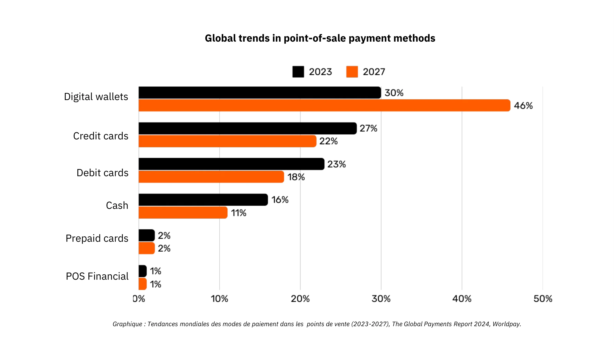

*Igishushanyo: Ivyerekeye uburyo bwo kwishura kw’isi yose (POS) (2023-2027), Raporo y’ukwishura kw’isi yose 2024, Worldpay.*

### Ibintu bigoye inyuma y'ukwishura kw'ikarita yoroshe

Iyo umukiriya akoresheje ikarata y’inguzanyo mw’iduka, iyo karata isomwa n’ikigo ca POS, kikaba kirungika amakuru y’ivyo akoresheje ata nkomanzi muri banki y’umucuruzi. Uwuronka ayo makuru arungika ayo makuru ku rubuga rw’ikarata rujanye n’ivyo (nk’akarorero, Visa canke Mastercard), rwo ruca rurungika iyo nkuru ku wutanga ikarita, ni ukuvuga banki yatanze ikarita y’umukiriya. Uwutanga amafaranga arasuzuma konti y’umukiriya canke umurongo w’inguzanyo maze akagarukana uruhusha biciye ku rubuga n’uwumuronka, ivyo bikaba bituma uwo mudandaza yemera kwishura.

Ivyo bikorwa bisa n’ibisanzwe mu vy’ukuri bisaba intambwe zirenga 15, abahuza 7, kandi bifata amasaha ari hagati ya 48 n’imisi 5 kugira ngo uwo mudandaza aronke ayo mahera. Mu misi ikurikira, haca haba igikorwa co gukuraho no gutorera umuti. Iryo shirahamwe ry’amakarata rikoranya amafaranga y’uwo musi kandi rikahuza uguhana amafaranga hagati y’uwuronka n’uwutanga. Banki nkuru iratuma ivyo bihembo hagati y’amabanki biba ukuri kandi bishikamye. Amaherezo, konti ya banki y’umudandaza iraronka amahera yose (akuweko amahera) yashizwe ku wuyigura, gutyo igaheza ubuzima bw’ugucuruza.

Muri rusangi, iyo nzira iragoye, itwara umwanya, kandi iratwara amahera menshi ku co gikwiye kuba igikorwa coroshe co gukura agaciro ku ruhande rumwe ukaja ku rundi.

### Kugereranya uburyo bwo kwishura

| Payment Method                 | Authorization Needed?           | Transaction Approval Time (Merchant View) | Settlement Speed (Funds Fully Settled)         | Finality (Ease of Reversal)              | Number of Intermediaries       | Typical Fees (to Payee)            |
| ------------------------------ | ------------------------------- | ----------------------------------------- | ---------------------------------------------- | ---------------------------------------- | ------------------------------ | ---------------------------------- |
| **Cash**                       | No                              | Immediate (Physical Exchange)             | Immediate (No Settlement Delay)                | High (Irreversible Once Paid)            | None                           | None                               |
| **Checks**                     | Yes (Bank Clearing)             | Acceptance at Deposit (Not Guaranteed)    | Several Days (Check Clearing Process)          | Medium (Can Bounce/Stop Before Clearing) | Bank                           | **Low to Medium** (Bank Fees)      |
| **Wire Transfers**             | Yes (Bank/Network)              | Confirmation Within Hours                 | Same-Day or Next-Day (Domestic)                | High (Usually Irreversible Once Sent)    | Banks, Payment Networks        | **Medium**(Fixed/Percentage)       |
| **Payment Cards**              | Yes (Card Issuer Authorization) | Seconds to Minutes (Authorization Code)   | A Few Days (Interbank Settlement)              | Medium (Chargebacks Possible)            | Issuer, Acquirer, Card Network | **Variable (1-3% of Transaction)** |
| **Digital Wallets/Mobile Pay** | Yes (Wallet Provider/Bank)      | Seconds (Instant Confirmation)            | Typically 1-2 Days (Depends on Funding Source) | Medium (Refund/Dispute Possible)         | Banks, Wallet Operators        | **Low to Medium (Varies)**         |

### Imipaka y'imiti iriho

Inganda zisanzwe zitanga amahera zigereranya ubutunzi bw’umwaka bugera ku madolari miliyaridi 2.200, ni ukuvuga nk’ica cumi c’umusaruro w’igihugu ca Leta Zunze Ubumwe za Amerika canke ungana n’umusaruro w’igihugu c’Ubufaransa. Kubera ko amafaranga akora nk'imirongo yemerewe, hariho uguhiganwa guke, ivyo bikaba bituma iyo "service" isa cane n'umusoro ushirwa ku bukungu bw'umwimbu. Uretse imitwaro y’amahera irema, hariho n’ibindi bitari bike bishobora gutuma umuntu adakora neza, nk’uko bigaragara aha hepfo.

| Limitation                       | Explanation                                                                                                                                                                                                                        | Impact                                                                                               |
| -------------------------------- | ---------------------------------------------------------------------------------------------------------------------------------------------------------------------------------------------------------------------------------- | ---------------------------------------------------------------------------------------------------- |
| High Card Fees                   | Interchange fees (~0.3%), network fees (fixed or 0.3%-1%), terminal/PSP subscriptions, and bank margins (0.5%-1.7%) add up to a substantial cost—like a global “tax” on productive sectors, amounting to trillions of dollars.     | Raises merchant costs, reducing margins and potentially driving up consumer prices.                  |
| Very Slow Final Settlement       | Settlement of funds can take up to 5 days, slowing the flow of money and overall economic activity.                                                                                                                                | Delays liquidity for merchants and reduces the speed of economic circulation.                        |
| Fraud                            | E-commerce channels are heavily targeted by fraud, contributing to significant losses (e.g., $28 billion). Chargebacks could reach ~$174 billion globally by 2024. Managing these disputes consumes time and causes mental strain. | Increased operational costs, complex fraud prevention measures, and diminished customer trust.       |
| Cart Abandonment                 | Additional security steps (one-time codes, two-factor authentication under PSD2) introduce friction at checkout.                                                                                                                   | Higher checkout complexity leads to increased cart abandonment and lost sales.                       |
| High Minimum Transaction Amounts | Minimum spend thresholds on cards can force merchants and consumers into inconvenient pricing or purchase conditions, discouraging small-value transactions.                                                                       | Reduced customer satisfaction and flexibility, potentially limiting impulse or low-value purchases.  |
| Slow Pre-Authorization           | Current systems cannot handle transactions at millisecond speeds or support continuous, real-time payment flows.                                                                                                                   | Limits use cases that require instant or streaming payments, restricting innovation and scalability. |
| Need for a Bank/Card Account     | Access to these payment methods requires a linked bank or card account, automatically excluding those without such accounts.                                                                                                       | Limits financial inclusion, reducing access for unbanked or underbanked populations.                 |
| Repeated Online Account Creation | Users often must create multiple online accounts, leading to fatigue, reduced convenience, and increased exposure of personal data.                                                                                                | Deteriorates user experience, raises privacy concerns, and increases risk of data breaches.          |
| Foreign Exchange (FX) Fees       | Lack of a universal unit of account forces costly currency conversions for cross-border transactions.                                                                                                                              | Adds extra costs for international commerce, making global transactions less affordable.             |

Nk’uko nyene twavuye mu kwishura ku munota ku bijanye n’uguhamagara ijwi tuja mu gukoresha ubuhinga bwo guhanahana amakuru hafi ku buntu bushingiye kuri IP, ukuza kw’imihora yuguruye kandi ikora neza birashobora gusubira gusobanura ukwishyura, bikagabanya ibiciro n’abahuza, no guteza imbere uburyo bushasha bwo gukora ubudandaji.

## Bitcoin ku bucuruzi : amafaranga ariko arakura

<chapterId>4488fe33-663f-41a3-a668-e9ca2fb7122e</chapterId>

**Bitcoin NI IKI?**

Bitcoin ni **uburyo bwo gukoresha amafaranga y’ubuhinga bwa none Exchange** (amahera y’ubuhinga bwa none). Ijambo "Bitcoin" ryerekeza ku bice bikurikira:

- Protocole ya mudasobwa** yorohereza agaciro Exchange kuri internet ata bahuza, ata ruhusha usaba, kandi n’izina ry’uruyeri. Ikoresha ingingo ngenderwako ziteye imbere z’ubuhinga bwo gukingira amakuru.
- Urubuga rw’umubiri** rw’amamashini ahuye na internet (amanode, abacukuzi b’amabuye y’agaciro, n’ibindi) akoreshwa n’abantu ku giti cabo n’ubudandaji, bikaba bikora uburyo bwegerejwe (ata butegetsi buhambaye canke ikibanza kimwe co kugenzura).
- Igiharuro ca konti** kiri muri sisitemu. Ntazokwigera habaho ama bitcoins arenga miliyoni 21. Igitero kimwekimwe cose citwa Bitcoin kigabanywamwo ibice imiliyoni 100 vyitwa “satoshis,” ivyo bikaba vyiswe mu gutera iteka uwagiremye atamenyekana.

Ivyo vyose hamwe bihindura Bitcoin **umutungo w’uwubitwara** n’ifaranga ry’ubuhinga bwa none **ata n’uwubitanga**. Ownership irindwa gusa mu gufata **urufunguzo rw’ibanga rw’ibanga**, itanga ububasha bwose **ata bahuza canke abandi bantu bizigira**. Iyo yimuriwe, Ownership **iherezo** irahita ibaho: uwuyifise mushasha arayigira mu buryo bushitse ata kwizigira ubutegetsi bwa mbere kugira ngo ayikingire canke ngo ayihindure. Ivy’ugucuruza **ntibihinduka**—iyo bimaze kwandikwa kuri Blockchain, ntibishobora guhindurwa canke gukurwaho.

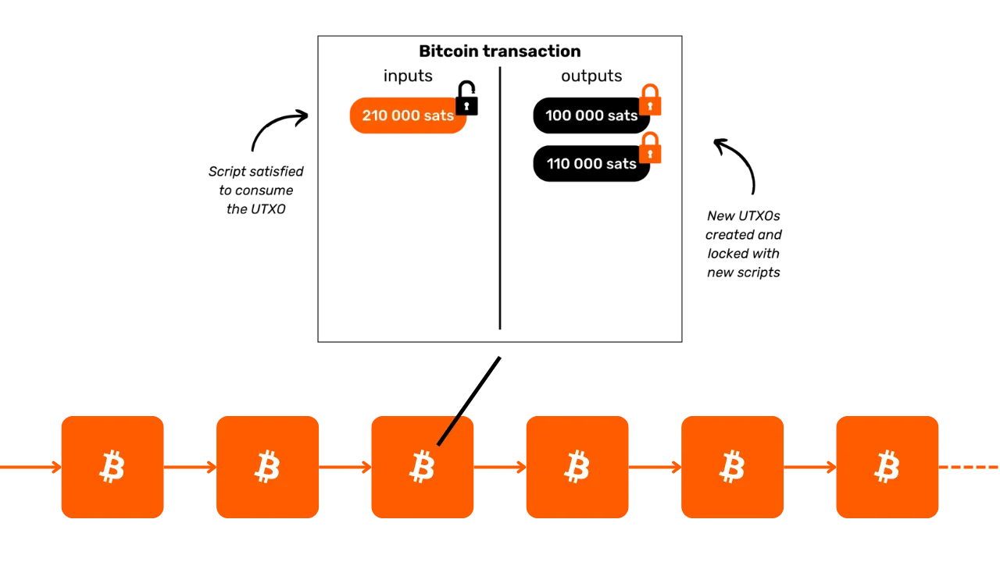

Bitcoin ifise politike y’amahera idahinduka, ifise **igipimo c’ama bitcoins miliyoni 21**, muri yo ~19.8 miliyoni ziramaze gutangwa. Ivyo bituma **deflationary**, agaciro kayo kakarushirizaho uko igihe kigenda kirarenga uko abayikoresha babikamwo amafaranga bazigamye n’inyungu z’umwimbu.

Ivy’ubuhinga bwayo birarengeye ivy’inzahabu n’idolari vyose hamwe, ivyo bikaba bituma iba umutungo w’amahera ukomeye kuruta iyindi yose yigeze kuremwa. Bitcoin ni ububiko bw’agaciro kandi ni uburyo bwo gukoresha Exchange, amafaranga ariko arakorwa. Ibaze ko wokwimurira agaciro mu bubiko bw’ishirahamwe rimwe ukaja mu rindi vyihuta, ata bahuza, ku giciro gitoyi, ata buhendanyi, 24/7, kandi ata muntu agira gatatu abigiramwo uruhara.

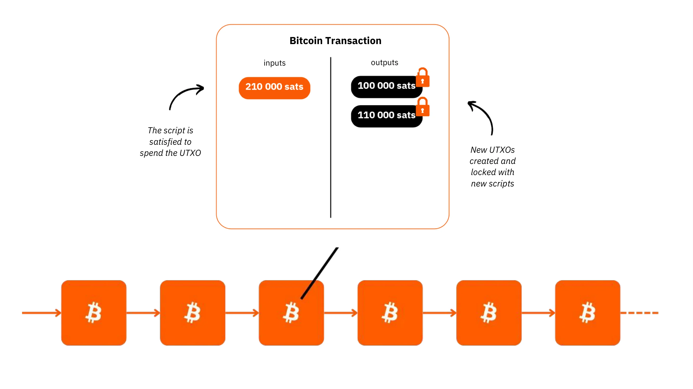

Bitcoin irazigama neza agaciro kubera ko Ledger yayo idashobora guhindurwa. Agaciro kayo karaduga kubera Supply idasanzwe kandi ifise aho igarukira ifatanijwe n’umubare uriko uragwira w’amahirwe ya Exchange, bivuye ku kwiyongera kw’abakoresha.

Bitcoin irahungabanya kuko idutera intege zo kwiga ivyiyumviro vyo mu biharuro, mu vy’ubuhinga bwo gukingira amakuru, mu vy’ubutunzi no mu vya kahise tutarigeze twigishwa. Naho kenshi umuntu abona ko ari ikintu gikomeye, mu vy’ukuri ni ubuhinga bushasha umuntu ashobora kuronka biciye mu gukora no mu kugerageza.

Bitcoin iradutera intege zo gusubira kwihweza kamere y’amahera ubwayo. Woba woshobora gusigura amahera ico ari co vy’ukuri? Umukozi canke rwiyemezamirimo ahembwa yoshobora kumara amasaha 50.000 gushika ku 100.000 y’ubuzima bwiwe aronka amahera, yamara ni bangahe **batanga mbere n’amasaha 100 kugira ngo barushirize kuyatahura** no kuyazigama? Bitcoin iraturemesha kwibaza imvo nyamukuru zituma dukenera amahera be n’ukuntu tubona ivy’igihe. Amahera yoba ari ayo kwishimira ubwo nyene canke ni ayo kwihangana igihe kirekire? Iyo tugira ikintu gishimira kiduha uburenganzira bwo gutevya ivyo tugura, ni amahitamwo ayahe twogira? Ni ibiyago ibihe twokwipfuza kugirana natwe ubwacu mu myaka 20 canke 30 ikurikira?

**IKARITA Y'AKANDAMUKA Bitcoin**

- Imyaka:** Imyaka 15 (3 Munyonyo 2009)
- Agaciro ka Exchange ku musi:** amadolari 10 miliyaridi (> CAC40)
- Isoko ry'ubutunzi:** Amadolari 1.8 triliyoni (> Meta, Visa, Ifeza ; < Pome, Google, Inzahabu)
- Abakoresha:** ~100 gushika kuri 200 miliyoni (1-2% vy'abantu bo kw'isi)
- Uguhinduka:** Mu vy’imbere nta n’imwe (1 Bitcoin = 1 Bitcoin), ni hejuru cane hanze (mu guhindura amafaranga)
- Ivyo ikora:** Igurisha rya mbere ku madolari 0.0009; ubu ni amadolari 100.000 (x100 miliyoni)
- Ububoneka bw'urubuga (igihe co gukora):** 100% kuva muri 2013
- Bamenyeshejwe ko bapfuye canke ko banegurwa:** Rimwe mu kwezi

**Igitangaza c'Ugufashanya kw'Abantu:**

- **inkomoko yuguruye**
- Ikigo gitegekanijwe n'amategeko:** Ntaco
- Umuyobozi mukuru:** Nta n'umwe
- Ishoramari ry'umutungo kamere:** Nta n'umwe
- Gutangaza:** Nta n'imwe
- R&D:** Ibikorwa vy'ubushake
- Intwaro:** N'abakoresha
- Ubutunzi bushasha:** Guhingura amabuye bifashwa n’amahera y’ugucuruza (ashingiye ku gicamunsi)

Kugira ngo umenye vyinshi ku bijanye na Bitcoin, amateka yayo, ingene ikora, n’ingene ikoreshwa, ndagusavye kandi gukurikira iyi yindi nyigisho yuzuye:

https://planb.network/courses/2b7dc507-81e3-4b70-88e6-41ed44239966

## Intangamarara y’igitabu Lightning Network

<chapterId>c095c7ad-5469-4c7b-9510-b6c0b86244e7</chapterId>

**UMURARO NI IKI?**

Lightning Network ni **umurongo n'urubuga** bifasha mu gukorana na Bitcoin ata gukorana guke na Blockchain nyamukuru ya Bitcoin. Ehe ingene bigenda:

- Itegeko rya mbere:** Amahera arafungwa (escrowed) kuri Blockchain nyamukuru kugira ngo habeho umurongo wo kwishura hagati y’abantu 2.
- Urubuga rwo kwishura:** Urubuga rw’imihora yo kwishura hagati y’abantu benshi rukora urusobe rw’ukwishura (uguca mu nzira n’uguhuza).
- Ibikorwa vya off-chain:** Ibikorwa bibera hagati y'abafatanyabikorwa ariko **ntibica bitangazwa** kuri Blockchain nyamukuru ya Bitcoin (**"off-chain"**).
- Ivyiyumviro vya On-Chain:** **Igiciro ca nyuma** c'ibikorwa vy'umurongo gusa ni co gisohoka kuri Bitcoin Blockchain nyamukuru (**"On-Chain**"), bikaba vyemeza ko ibikorwa vyinshi bishobora kubaho muri ico gihe. Ukwo gukoranya amahera menshi bigabanya uguhagarara kw’abantu, gutyo bikagabanya amahera ugereranije n’ugukora amahera menshi ya On-Chain.
- Gufunga umurongo:** Uwukoresha arashobora gufunga umurongo wiwe igihe cose maze agasubira gusaba Bitcoin yiwe mu gutangaza ivy’ubucuruzi bwa nyuma. Iryo ni ryo hame ry'uko amafaranga **"ashobora gusohoka" igihe cose ariko "atasohorwa"** gushika bikenewe. Ivyo gusohoka (ugufunga umuyoboro) bishobora kuba ivy’uruhande rumwe (bifatwa n’umwe mu bagize iyo mpande 2 igihe cose) canke bifatwa n’abantu bose (bigatuma amafaranga On-Chain agabanuka)

Ubwo buryo burarinda ubuteba n’ugusobanuka kw’ugukora igikorwa cose ataco uhinduye ku Blockchain nyamukuru ya Bitcoin, kwandika gusa amafaranga y’iherezo no kuguma afise umutekano wayo. Lightning Network ni Layer "iri hejuru" ya Bitcoin ariko iguma ifashe kuri yo.

**Ihuriro ry'ukwishyura kw'isi yose**

Iryo tegeko rikora **urubuga** rw’amamashini aho imirongo ikora uburyo bwo kwishura kw’isi yose. Izo nzira zishobora gukoreshwa n’abantu canke n’ubudandaji ataco zitwaye, bikaba bituma iba urubuga rwuguruye rwose.

Lightning Network ishoboza agaciro k’aho nyene Exchange ku muvuduko w’umuco. Ni nk’umurongo wa email ukoreshwa ku kwishura: urubuga rwo kwishura rw’uruvyaro rukurikira. Ihindura cane uburyo "amahera" agenda, akayigira ku buntu kandi yihuta nk'ugutanga amakuru kuri internet.

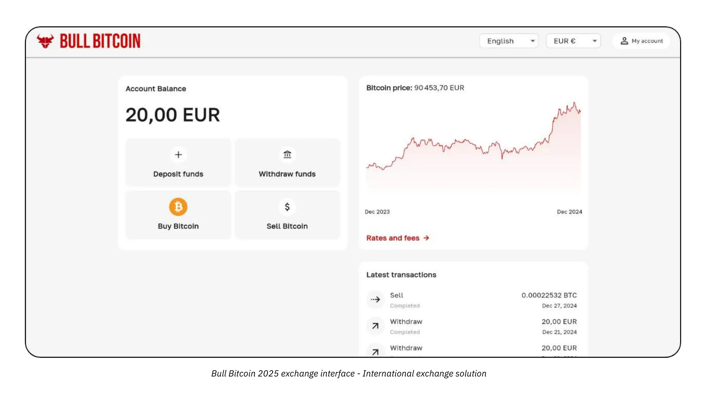

**Ivyiza vy'ingenzi:**

- Umuvuduko:** Ibikorwa vy’ubuhinga.
- Amafaranga make:** Amafaranga make cane ugereranije n’imirongo y’amabanki ya kera.
- Kworoshe kwemera:** Ubucuruzi burashobora kwihuta gushinga amahera yo kwemera amahera ya Lightning hakoreshejwe gusa porogarama ya telefone ngendanwa canke buto yo kwishura ku rubuga rwabo.

Ivyubatswe vya Lightning biraruta uburyo bwa kera bwo kwishura mu bijanye n’umuvuduko, igiciro, n’ugukoresha neza inguvu. Kubera ko abacuruzi bariko bararushiriza kwemera, inguvu zizokwihuta: nimba ukwishyura gushobora guca ku nzira y’amabanki y’inyagano, ni kuki twobandanya gutanga igice kinini c’amahera yinjira ku bacuruzi b’ubu?

**Ibikoresho bitagira iherezo:**

Ibikorwa vya Lightning birarenga kure cane amafaranga make n’umuvuduko. Mu gutanga inzira y’igariyamoshi y’ubuntu kandi yishurwa ubwo nyene, bifungura amahirwe menshi mu bukungu bwose.

**Kwongera ubushobozi bwa Bitcoin bwa Exchange:**

Umuravyo ukomeza uruhara rwa Bitcoin nk'"umurongozi wa Exchange." Mu kwongera incuro n’umwidegemvyo w’ugucuruza, birakomeza igikorwa nyamukuru c’amahera: kworohereza uguhanahana ubutunzi no kurema agaciro ku bari muri iyo nama bose.

Iterambere ry'imbere ry'"ubutunzi bw'imashini y'ubwenge" rizosaba uburyo bwo kwishura bwihuta cane, bukoreshwa incuro nyinshi, urugero rw'ubuhinga Lightning yonyene ishobora gushitsa. Ivyo bituma habaho uguhingura ibintu n’ibikorwa vyinshi. Uko Supply ya Bitcoin iguma ari nto, ubushobozi bwo kugura bw’ikigo kimwekimwe cose buzokwongerekana. Bitcoin na Lightning birakomera hamwe uko imihora yabo igenda irakura.

Lightning itanga akarorero k’akazoza aho ubucuruzi bwose bwacitse bushingiye kuri internet na bwo buzoba bushingiye kuri Bitcoin.

**Ivyishyurwa vya Bitcoin ku Muravyo: Igikoresho gisanzwe c'Umucuruzi**

Lightning Network ni nziza cane ku kwishura Bitcoin mu maduka agaragara canke yo kuri internet kubera umuvuduko wayo n’iherezo ry’ukwishura.

- Umuvuduko:** Umuravyo (~500ms gushika ku masegonda make) uranyaruka cane kuruta urubuga rwa Bitcoin, aho amafaranga ashobora gutwara nk’iminota 30 kugira ngo yemezwe. Ku bijanye n’ugugura ibintu vyinshi (birenga cane amadolari 1.000), uruja n’uruza rwa Bitcoin rushobora kuba rukiri rwo gukundwa, kuko umuvuduko udahambaye cane. Ariko rero, ivyo bintu akenshi birahishwa umuntu asanzwe abikoresha, kuko porogarama zifata izo ngingo ata nkomanzi mu nyuma.
- Iherezo:** Iyo umuntu amaze kwishura kuri Lightning, ni iherezo. Nta n’ubushobozi bwo gusubizwa amahera n’abandi canke amatati ajanye n’ubuhendanyi.
- Amafaranga:** Amafaranga y’ugucuruza kuri Lightning Network ni make cane kandi arihwa n’uwukoresha, atari umucuruzi. Abacuruzi bararonka amahera gusa iyo mu nyuma bakeneye kwimurira Bitcoin yabo ku yindi nzira canke ku yindi nzira.

**IKARITA Y'AKANDAMUKA Y'UMURAHO**

- Ubuhinga:** 2015
- Gutanguza:** 2016
- Imyaka:** Imyaka 7 (ugucuruza kwa mbere: 28 Kigarama 2017)
- Ubushobozi bw’ubuhinga bw’urubuga:** ku rugero rushobora gukora amafaranga menshi incuro 1.000 kurusha uburyo bwa kera.
- Ingano z’ibikorwa:** Biva ku bikomeye gushika ku bito incuro 1.000 kuruta uburyo bwa kera.
- Ivyihuta vy’ugucuruza:** Bishika incuro 100 vyihuta.
- Amafaranga:** Ashika kuri 90% aragabanuka.
- Iherezo ry’ukwishura:** Hafi y’aho nyene (kenshi ~500 milisegonda, rimwe na rimwe amasegonda makeyi).
- Inguvu zikoreshwa:** ~8% vy’ubuhinga bwa kera bw’amahera kw’isi yose.
- Ibiranga:**
    - Urunganwe
    - Isi yose
    - Nta ruhusha
    - Ubwiherero bwiza
    - Umutekano wemejwe
    - Kuboneka cane (igihe ciza cane co gukora)
    - Ishobora kugenzurwa no guhindurwa

Kugira ngo umenye vyinshi ku bijanye n’ingene Lightning Network ikora, ndagusavye kandi gukurikira iyi yindi nyigisho yuzuye:

https://planb.network/courses/34bd43ef-6683-4a5c-b239-7cb1e40a4aeb

# Bitcoin mu bubiko

<partId>bf45c1e8-af97-4b6b-af42-2866f493b14d</partId>

## Inyungu, umutungo, n’imfunguruzo zo kwihangana mu bucuruzi

<chapterId>656ad88f-3c27-4054-a94e-b29727009b8e</chapterId>

### Ishirahamwe rifise amagara meza

**Kazoza ntikamenyekana**, kandi ubucuruzi butegerezwa guca muri ukwo kutamenyekana bushimikiye cane ku kuronka inyungu no kuzigama umutungo. Dushingiye ku bukungu bwa Otirishiya, **inyungu ni ikimenyetso nyamukuru c’amagara y’ishirahamwe**—vyerekana ko ubucuruzi buriko burashitsa neza ivyo abaguzi bakeneye. Iyo ishirahamwe ritagira inyungu, ntirishobora kwitunga, n’ugukura n’ukuvuga. Kugira ubucuruzi bugumye bufise amagara meza, ntibutegerezwa gusa kuronka inyungu za generate ariko kandi butegerezwa kwiyumvira imbere, **kubika umutungo wo gukoresha mu gihe kizoza n’ingorane**.

**Kuzigama umutungo** ni ikintu gihambaye cane kuko bituma ubucuruzi bushobora kwimenyereza no gufata amahirwe mw’isoko ritamenyekana. Ivyo birimwo gushiramwo uburinganire hagati yo gusubira gushiramwo amahera umuntu aronka kugira ngo akure no kuguma afise amahera yo guhangana n’ugusubira inyuma kw’ibihe. Ubutunzi bwa Otirishiya burashira ahabona akamaro ko **“uguhitamwo umwanya”**, bisobanura ko ubucuruzi butegerezwa gufata ingingo yitonze y’ingene bwoshira imbere inyungu zica ziboneka ugereranije n’ugushiramwo amahera kugira ngo umuntu ashobore kuroranirwa igihe kirekire. Ishirahamwe rifise amagara meza rituma umushinge waryo w’ivy’amahera uguma ukomeye, rikagira ico rihinduye mu bihe vyiza no mu bibi.

Ibimenyetso vy’isoko nk’ibiciro n’uguhiganwa biyobora ubucuruzi mu gufata ingingo zijanye n’ugutanga ubutunzi. Amashirahamwe yumvirije ivyo bimenyetso, arashobora kwirinda umutego wo kwiyongera cane canke gushiramwo amahera make, na canecane ayo akoreshwa n’ibintu vy’ubuhinga nk’inguzanyo yoroshe. Gukoresha nabi ubutunzi ntibitera ingorane gusa ubuzima bw’ishirahamwe ariko kandi biragabanya ubushobozi bwaryo bwo gufasha neza abakiriya.

Amaherezo, kuguma ufise ubudandaji bwiza bisobanura kuguma ushobora guhindura uko ubona ibintu, guhitamwo neza ivy’amahera, no kwama ubona kazoza. **Mu kwibanda ku nyungu, mu kuzigama umutungo, no mu kwishura ku bimenyetso vy’isoko, ubudandaji—bunini canke buto—burashobora gutera imbere mbere no mu gihe hari ukudakeka**.

### Mbega Capital irafise ingeso nziza ?

**Uko umutungo mukuru ugaragazwa muri rusangi**

Reka dusubire kumenya ico umutungo ari co vy’ukuri—ijambo rikunda gutahurwa nabi kandi ribonwa nabi mu kibano cacu.

Mu nyigisho y’ubutunzi ya kera (Keynesian), umutungo ubonwa kenshi mu majambo yoroshe nk’ububiko bumwe bw’itunga ry’umubiri canke ry’ivy’amahera, ahanini rikoreshwa mu gutuma habaho ugusaba kwose biciye mu gushora imari mu bikorwa. Akenshi bifatanywa n’ugushira hamwe ubutunzi n’ububasha bw’ubutunzi bufiswe n’abantu bakeyi b’abanyacubahiro. Mu gihe ubukene bw’ubutunzi bubandanya kwaguka, benshi babona ko umutungo ari ikimenyetso c’ubusumbane mu vy’ubutunzi, cane cane iyo ubutunzi bwirundanijwe busa n’ubutagira akamaro ku bantu benshi.

"Umutungo" akenshi werekanwa nk'igikoresho co gukoresha nabi, kandi iyo nzira yaragize ico ikoze cane ku migwi itandukanye ibona ko umutungo urwanya inyungu z'abakozi. Ariko none ivyo vyoba ari ukuri? Canke iyo nzira yo gutahura ibintu yoshobora kugoramwa n’ibi:

1. Kudatahura uburyo bw’ubutunzi (harimwo n’abahinga mu vy’ubutunzi ubwabo)?

2. Ukwinjira kwa Leta no gukoresha nabi isoko?

3. Ugutera urujijo hagati y’ubu kapitalizimu bw’abagenzi n’ubu kapitalizimu bw’isoko ry’uburenganzira?

4. Uko ibinyamakuru bishiraho ingorane z’ubutunzi?

5. Icipfuzo co gukosora ibintu vyihuse no gutunganya abantu vuba?

6. Ugusanura umuco w’amajambo arwanya ubu kapitalisimu?

Igishimishije, Bitcoin iduhatira gusubira kwiyumvira vyose no guhangana n’ivyo vyiyumviro vyari vyarashizweho mbere. Hariho ishure ry’ivyiyumviro, ni ukuvuga Ishure ry’Ubutunzi ryo muri Otirishiya, rishobora gutanga umuco kuri ivyo bibazo no kudufasha gusubira kwihweza kamere nyakuri y’umutungo kamere.

**Kera kera**

Reka dutangure n’inkuru ngufi:

"Ku kirwa gito c'ubugaragwa haba umurovyi ari wenyene. Buri musi, amara amasaha menshi afata ifi n'ibiganza vyiwe gusa, igikorwa kimutwara umwanya mwinshi n'inguvu ziwe. Umusi umwe, afise iciyumviro: co kwubaka icumu rizotuma ashobora kuroba neza. Ariko arazi ko ivyo bizosaba ikimazi.

Imbere y’uko uwo murovyi atangura gukora iryo cumu, aca afata ingingo yo gushiramwo ifi zimwezimwe kugira ngo yitunganye mu gihe c’ubwubatsi. Amara imisi mikeyi arya bike kuruta uko asanzwe, akazigama ifi zihagije kugira ngo yibande ku mugambi wiwe. Iyo fi yarokotse igereranya **umutungo wiwe**, akazu gatoyi kamushoboza gukurikirana intumbero yiwe.

Mu gihe atanga umwanya wiwe wo kwubaka icumu, yizigira ivyo yizigamye, akacerezwa n’umutima ukunze bimwe mu vyo ashobora guhumurizwa ubwo nyene (ikigaragaza **igihe akunda**). Amaze imisi myinshi akora igikorwa ca Hard, araheza akora icumu rikomeye.

Ubu akoresheje iryo cumu, arashobora gufata ifi vyihuta cane kandi ata nguvu nyinshi akora. Ntagikeneye kwiruha nk’uko yahora, mbere agatangura no kwirundanira amafi asigaye. Ivyo bintu vy’agaciro bimuha uburyo bushasha: arashobora kubibika, kubisangira canke kubishira mu yindi migambi yo kw’izinga. Mu gutevya gufungura ubwo nyene no gukoresha umutungo wiwe, umurovyi yarateye imbere cane mu bijanye n'ubushobozi bwiwe n'ivyizigiro vyiwe vya kazoza."

Iyi nkuru yerekana uruhara nyamukuru rw’ubutunzi, ukwihangana n’ukubona imbere mu kwubaka kazoza keza—ivyiyumviro bihambaye mu gutera imbere kw’ubutunzi no mu gutera imbere kw’abantu.

### Ishure ry'ubutunzi ryo muri Otirishiya n'Iyerekwa ryaryo ry'Igihugu

Ishure ry’ubutunzi ryo muri Otirishiya ryiswe izina ry’abarishinze n’abaritanze mbere, bakaba bari bakomoka muri Otirishiya. Izina ryagumyeho, kandi kuva ico gihe iryo shure ryaciye rifatanya cane n’ivyiyumviro vya kera vy’ubwigenge, rishimika ku mwidegemvyo w’umuntu ku giti ciwe, amasoko y’ubwigenge, n’ukuntu Leta itagira ico ikora.

**Ivyo Otirishiya ibona ku murwa mukuru**

Mu kubona kw’abanya Otirishiya, umutungo w’igihugu ufitaniye isano rikomeye n’iciyumviro co gusubiramwo ugukoresha kugira ngo wubake ibikoresho canke ubutunzi bushobora gutuma umuntu agira umwimbu mwinshi muri kazoza. Ivyo bimenyekana nk’ukwirundanira umutungo, ni vyo bihambaye cane mu vyiyumviro vy’ubutunzi vya Otirishiya. Ivyiyumviro nyamukuru Elements vy’iyi nzira birimwo:

- Igihe bakunda n’ugusubiramwo ivyo bakoresha**: Abantu mu bisanzwe barakunda gukoresha ubu aho gukoresha mu nyuma, ariko boshobora guhitamwo gusubiramwo ivyo bakoresha nimba biteze ivyiza vyinshi muri kazoza. Mu kuzigama uno musi, ubutunzi burashobora gushirwa mu bintu vy’agaciro (ibikoresho, imashini, ibikorwa remezo) bituma umusaruro utera imbere uko igihe kigenda kirarenga. Amashirahamwe canke abantu ku giti cabo bafise umwanya mutoyi bazigama vyinshi kandi bagashiramwo amahera mu migambi y’igihe kirekire, bigatuma haba iterambere riramvye.

- Itunga nk’umuvugizi w’umwimbu wo muri kazoza**: Ibintu vy’itunga bibonwa nk’ibikoresho vyo hagati bikoreshwa mu guhingura ibintu vy’iherezo vy’abaguzi. Mu kwirundanira umutungo, abashoramare barashobora kwongerera umusaruro no kurema ubutunzi bwinshi muri kazoza. Nk’akarorero, aho guhingura ibintu vy’ugukoresha ubwo nyene, ivyo bintu vyoshobora gukoreshwa mu kwubaka amahinguriro canke imashini. Naho ivyo bigabanya ivyo umuntu akoresha mu gihe gito, ivyo bivamwo biratuma umuntu ashobora gukora cane kandi akagira n’uguterimbere mu nyuma.

- Uguhingura ibintu mu buryo butaziguye n’ubushobozi bwo kubikora**: Abahinga mu vy’ubutunzi bo muri Otirishiya, nka Eugen Böhm-Bawerk, barashimikiye cane ku ciyumviro c’uguhingura ibintu mu buryo butaziguye, ni ukuvuga uburyo bwo guhingura ibintu buramvye kandi butoroshe bujanye n’inzira nyinshi. Naho ivyo bikorwa bifata umwanya, amaherezo biratuma habaho ivyiza kandi bifise akamaro, nk’ukwubaka uruganda rwo gusenya ibiti aho gukorakoranya ibiti n’amaboko.

- Inyungu nk’Ibimenyetso**: Inyungu, mu kubona kwa Otirishiya, mu bisanzwe yerekana umwanya umuntu akunda. Ibiciro vyinshi vyerekana ko umuntu akunda gukoresha ibintu ubwo nyene, mu gihe ibiciro bito biremesha kuzigama no gushiramwo amahera igihe kirekire. Iyo amabanki akomeye akoresha nabi inyungu mu buryo bw’ubuhinga, aragoranya ivyo bimenyetso vy’ibidukikije, bikaba bituma habaho ugutanga ubutunzi nabi n’ishoramari ridashobora kuramba (malinvestment).

**Uburyo bubiri bw'umutungo mu bukungu bwa none**

Mu rwego rw’uburyo bw’amahera bushingiye ku myenda dukoreramwo, **hariho ubwoko bwa kabiri bw’umutungo**: uwo mu kanya nk’ako gukubita iyo banki iremye inguzanyo biciye mu buryo bworoshe bwo gutanga inguzanyo. Ivyo birimwo uguhingura amahera ex nihilo, aho banki igura amahera mu vy’ukuri idafise imbere y’igihe ahubwo ikarema ishingiye ku masezerano yo kwishura.

Ku ruhande rumwe, umutungo w'"Otirishiya" ni ingaruka y'ukuzigama vy'ukuri, igikorwa gisaba gufata ingingo z'ubutunzi zitekerejwe neza no kwitanga vyitondewe. Ku rundi ruhande, umutungo uva mu kurema amahera ashingiye ku myenda ni inyubakwa y’aho nyene kandi y’ubuhinga. Ubwo bwoko bubiri bw’umutungo, naho **busa cane mu gukoreshwa mu gufasha imigambi, buratandukanye cane**.

Ubwo bwoko bubiri bw’umutungo ntibukwiye kwigera buhurizwa hamwe, yamara mu buryo bushingiye ku myenda, akenshi buragoramye ibimenyetso vy’ubutunzi** kandi kenshi bujana mu gushiramwo amahera nabi. Ukwo gutahura nabi kuratanga umuco ku bijanye n’igituma ubu kapitalizimu kenshi bunegurwa ata co buvuze .

**Ikibazo nyamukuru kiri mu vy'ubu Keynes**

Amategeko ya Keynes, yemewe cane n’abanyacubahiro bo kw’isi yose, akoresha nabi inyungu kandi agatuma abantu basaba biciye ku myenda. Ivyo biremesha ubutunzi gutemba buja mu migambi y’igihe gito, idashobora kuramba, bikongera inzinguzingu z’ubutunzi no gutevya iterambere nyaryo rishingiye ku kuzigama neza no ku gushiramwo amafaranga. Abarongozi b’ubudandaji baribonera ubwabo iyo ngingo ngenderwako mbi uko amashirahamwe afise amagara meza asunikwa mu kugura ibintu bifise agaciro karenze urugero mu gukurikirana inyungu nyinshi, bikaba bituma iterambere ry’ibinyabuzima kandi riramvye rihungabana.

Mu bidukikije nk’ivyo, ni gute umutungo “ufise amagara meza”—uzigamye neza n’abanyamigambi—woshobora guhangana n’umutungo “udafise amagara meza” waremwe mu buryo bw’ubuhinga? Ikindi kandi, ukwaguka kw’amahera Supply ku ruhande rumwe kurasenyura ubushobozi bwo kugura bw’umutungo kamere, bikaba bituma ubutunzi butera ubwoba kandi abantu ntibanyurwa.

**Umuco w'Icizigiro: Bitcoin**

Bitcoin itanga uburyo bwo kwirundanira no kuzigama umutungo mu kiringo kirekire ata gusenyuka guterwa n’ugutera imbere kw’amahera. Nk’ububiko bw’agaciro, birashoboza ubucuruzi gutegura ishoramari ryo muri kazoza n’ukwihangana, bikarwanya ubukuru bw’imirongo y’imyenda no gutuma habaho ugusubira mu kwirundanira umutungo nyakuri kandi utanga inyungu.

### Ibindi ku vyerekeye ishure ry'ubutunzi ryo muri Otirishiya

**Ishure ry’ubutunzi ryo muri Otirishiya** ni umugenzo w’ivyiyumviro vy’ubutunzi uha agaciro amasoko yidegemvya, umwidegemvyo w’umuntu ku giti ciwe, n’akamaro k’ibikorwa vya muntu mu migenderanire y’ubutunzi. Iranegura ukuntu Leta igira ico ikoze, cane cane mu vy’amahera no mu masoko, kandi ivuga ko abantu ku giti cabo, bayobowe n’ivyo bakunda, ari bo bacira urubanza neza inyungu zabo bwite.

**Ibiharuro nyamukuru vy'ishure ry'i Otirishiya**

- Carl Menger**: Uwashinze ishure ry’i Otirishiya, Menger ni we yashizeho inyigisho y’agaciro k’ibintu, ivuga ko agaciro k’ibintu kavana n’ivyo umuntu akunda aho kuva ku giciro co kubikora.

- Ludwig von Mises**: Ibuye ry’imfuruka ry’Ishure ry’i Otirishiya, Mises ni we yashizeho praxeologie (inyigisho y’ibikorwa vy’umuntu) kandi yandika _Ibikorwa vy’umuntu_, igitabu kinegura cane ubusosiyalisimu n’igenamigambi ry’imbere.

- Friedrich Hayek**: Yari umunyeshure wa Mises, Hayek yararonse igihembo ca Nobel mu vy’ubutunzi mu 1974 kubera ibikorwa vyiwe ku bumenyi bwegerejwe n’uguhinduka kw’isoko. Mu gitabu ciwe _Inzira y’ubuja_, yaraneguye cane ubutegetsi bushingiye ku rwego rwo hejuru.

- Murray Rothbard**: Yari umwigishwa wa Mises kandi yari uwushigikiye cane uburenganzira bwo kwidegemvya, Rothbard yarateye imbere inyigisho y’ubutegetsi bw’abanyagihugu butagira igihugu burongowe n’amasezerano y’ubushake. Igitabo ciwe _Umuntu, Ubutunzi, na Leta_ ni igitabu c’imbuto mu vy’ubutunzi bwa Otirishiya.

**Abandi bahinga b'ubutunzi bafise inkomezi**

- Milton Friedman**: Naho atagira isano ry’ishure ry’i Otirishiya, Friedman yarashigikiye ivyiyumviro vyinshi vy’ugushigikira isoko n’ivy’ubwigenge. Politike yiwe y’amahera itandukanye n’ivyiyumviro vy’Abanyaotirishiya ariko irasangiye n’ivyo banegura ku bijanye n’ukuntu Leta yinjira mu bukungu birenze urugero.

- Frédéric Bastiat**: Umuhinga mu vy’ubutunzi w’Umufaransa wo mu kinjana ca 19, Bastiat yaragize ico akoze ku Ishure ry’i Otirishiya n’ibitabu vyiwe vyerekeye ubudandaji bwigenga be n’ingaruka zitaboneka z’ingingo mfatirwako z’ubutunzi. Igitabo ciwe _Ivyo Biboneka n’Ibitaboneka_ ni igisomwa c’ishimikiro c’ubwigenge bw’ubutunzi.

*Ivyashikirijwe: Ikigo ca Ludwig von Mises*

**Impanuro n'Ivyiyumviro vy'Ishingiro**

Abo bazirikana ni bo bashinze iciyumviro c’uko Leta igira ico ikoze bigoramye amasoko be n’uko umwidegemvyo mu vy’ubutunzi ari ngirakamaro kugira ngo umuntu atere imbere kandi ashobore guhuza ibikorwa vy’abantu. Ivyo bamenye birerekana akamaro ko gufata ingingo zishingiye ku rwego rwo hejuru n’akaga ko kugenzura ahantu hamwe mu mice y’ubutunzi.

Ushaka kumenya vyinshi kuri iyi nkuru:

https://planb.network/courses/d955dd28-b7c6-4ba2-a123-d932e21d148f

https://planb.network/courses/9d1bde6a-33e5-45dd-b7c0-94da72e45b11

https://planb.network/courses/d07b092b-fa9a-4dd7-bf94-0453e479c7df

## Gufata Bitcoin mu bubiko

<chapterId>89622a40-d14f-4c37-a075-8e7e1731ec26</chapterId>

### Ingorane z'itunga ry'ishirahamwe

Itunga ni ahantu umuntu ashira ibintu vy’agaciro. Sosiyete ifise amagara meza irafise amafaranga akwiye kugira ngo ishobore guhangana n’ukudakeka kwo muri kazoza no gutegura ivyo ishora. Muri iki gihe, igice c’itunga rirenze urugero gishirwa mu bintu vy’amahera bivugwa ko ari “Liquid” nyinshi cane, nk’amabondi, amafaranga y’ibizigamirwa y’igihe kirekire n’ibindi.

Kubera igihe kirekire cane, amashirahamwe amwe amwe akoresha ibintu bitagira amahera nk’amazu n’ibindi bibanza ataco azi ku bibazo bimwebimwe:

- Ubukene bw'amahera iyo habaye ingorane
- Amaherezo ahubwo inyungu nke iyo amafaranga akuweko
- Ivyiza bitarenze inflation nyayo, iyo amahera Supply (~7% ku mwaka, raba munsi)
- Ico kibazo gihishijwe c’uko amazu n’ibindi bibanza atakaza igice c’igikorwa cayo co “kuzigama” ku nyungu y’itunga nka Bitcoin. Ivyo vyatumye rishobora gusubira hafi y’“agaciro karyo ko gukoresha”: gutanga uburaro.

Reka twihute gusubiramwo ibidukikije aho ubudandaji bukorera.

**Inflation nyayo**: Kubera ko amabanki akomeye atera ubwoba cane, ashaka gutera 2% ku mwaka, bisobanura ko amafaranga azotakaza 40% mu myaka 20. Wongereyeko mu bihe vy’ugutera imbere kw’ibiciro gukomeye cane, biragaragara neza ko amashirahamwe adashobora gukoresha amahera yonyene kugira ngo abike ivyamwa vy’ibikorwa vyayo. Bategerezwa gushira mu ngiro ingamba z’ivy’ubutunzi zigoye, zijana n’ingorane zitandukanye. Izo ngabire ziragaragara ko **zidashobora gushikirwa n’ubudandaji buto cane**, busanzwe bufise ibikorwa vyinshi vy’ingenzi.

**Iterambere ry’ibiciro ryihishijwe**: Mu buryo bw’amahera bushingiye ku myenda, bushingiye ku bice vy’amahera bushigikiwe n’amabanki akomeye, **amahera yose hamwe Supply akura nk’ibice 7% ku mwaka ku mwanya** (nk’akarorero, M1 mu karere k’amahera y’Ubumwe bw’Uburayi canke muri Amerika). Ivyo bisigura ko “umugabane wawe w’umukate” ugabanywamwo ibice bibiri mu myaka mikeyi gusa—kiretse iyo ufise agateka ko gushika ku nzira y’amahera kandi ukaba ushobora kubandanya gukura mu gukoresha no kugura ivy’ubutunzi vyihuse ku “bici- ro vya kera” imbere y’uko amahera mashasha yaremwe abijana hejuru. Ivyo ni vyo bitera Cantillon effect, bikaba bisigura igice c’ugushira ubutunzi ku batunzi cane, mu gihe “umutungo” ushirwako umugayo mu buryo butari bwo ko ari wo utera (raba intangamarara yacu ku mutungo iri hejuru).

**Ivyago vy’abafatanyabikorwa**: Uburyo bw’ivy’ubutunzi buriho ubu burafise akaga, kandi woshobora kutama ushobora kuronka “amahera yawe.” Hatavuzwe ishusho y’inzu y’amakarata, bitegerezwa kwemerwa ko ibigo vy’imari bifata inyungu zikaba ivy’abantu ku giti cabo, bigatuma ibihombo bihinduka ivy’abantu mu gihe habaye ingorane ntoyi. Mu rutonde rw’amahera “yo mu Vyanditswe” (amahera yanditswe mu gitabu Ledger), amahera ari muri banki ni “ugusaba” gusa; ntuyifise vy’ukuri, kandi amabanki ubwayo “ntayo afise” (amafaranga y’ububiko bw’imice). Aya mahera, mu buryo bumwe, ni amageza vy’ukuri. Amabanki amwe amwe y’icubahiro yahora atwengera mw’ijigo Bitcoin ntagihari uno musi, nka Credit Suisse.

Ukwo kubura ukwizigirana gutangura ukuzuka kw’itunga “ry’abatwaye” nk’inzahabu (naho bigoye kubungabunga, gutwara, no kugabanya, n’ibindi) kandi, birumvikana, Bitcoin, uwushasha.

### Bitcoin nk'umutungo w'amahera

Bitcoin itanga ubundi buryo bukomeye. Ni **umutungo w’umunyagihugu, ata wuwutanga hagati**, hafi udashoboka gufatwa, kandi wungukira ku ngaruka z’uruja n’uruza. Abakoresha Bitcoin “y’ukuri” bahitamwo kuyikoresha mu kubika ivyamwa vy’ibikorwa vyabo, kuko ibonwa nk’ububiko bw’agaciro bushobora guhangana n’ugucengera be n’ugutera imbere kw’ibiciro. Kubera ingaruka y’urubuga, yerekanwa n’Itegeko rya Metcalfe, uwukoresha wese mushasha yemera, yongera agaciro k’urubuga; uko umubare w’abaje mu nama wiyongera, ni ko n’akamaro ka Bitcoin kagenda karaduga cane. Ico kigereranyo kigituma kiba uburyo budasanzwe kandi butanga umuhango bw’umutungo kamere, bushingiye ku kwemerwa n’ukwizigira abakoresha.

Bitcoin ni **umutungo wa Liquid kuruta iyindi yose kw’isi**, ukora 24/7 ataco uhagaze, bitandukanye n’amasoko y’ivy’ubutunzi asanzwe afise amasaha yo gufunga n’“ibicapura.” Ivyo bishobora gutuma abakoresha bagura canke bagurisha amafaranga y’ibiceri (bitcoins) igihe cose, haba mu kwishura ku nkuru nziza canke mbi (nk’akarorero, gutera ibisasu, intambara, n’ibindi).

Mu myaka irenga cumi, Bitcoin yerekanye iterambere ry’umwaka ry’ibice birenga 60%. Ivyo bikorwa bidasanzwe vyatumye abafise amafaranga y’igihe kirekire bazigama umutungo wabo wa mbere, bitandukanye n’ibindi bikoresho.

Ariko rero, hariho ibintu nyamukuru bitari bike umuntu akwiye kuguma yibuka:

Ica mbere, **ibikorwa vya kera ntivyemeza ko uzoronka ibisubizo muri kazoza**. Igihe cose Bitcoin izoguma **itekanye kandi yegerejwe**, umuntu arashobora kwizigira ko igiciro kizoduga ku mwaka ku rugero rwo hejuru cane rwa 20% ku mwaka mu myaka cumi izoza, ivyo bikaba bizotuma iba igikoresho co gucungera ubutunzi.

Ubwa kabiri, Bitcoin gushika ubu yarabonye **ingendo z’imyaka 4**, bisobanura ko n’igihe c’imyaka irenga 4, iyo bet yama ari inyungu. Ku babona ko Bitcoin ari ishoramari, igihe gito (<imyaka 4) gishobora kuba ari akaga.

*MICHAEL SAYLOR: "Ikimenyetso ciza c'igiciro ca Bitcoin ni imyaka 4 yoroshe igendagenda."* Raba igicapo kiri hejuru.

Ikindi, ni vyiza ko umuntu aguma abona Bitcoin **bihuye** n’urugero rw’ugutahura kwiwe. Ni vyiza kandi ko udaca wihuta canke ngo ugerageze gufata umwanya w’isoko neza.

Ubwa nyuma, Bitcoin ifatwa nk’iyishobora guhinduka**. Kugira ngo tuvuge ukuri, igiciro caco nk’uko kigaragazwa mu bice vy’amahera ya fiat ni. Igice c’ukwo guhinduka ni ikintu gisanzwe ku mutungo ukiri muto, ariko kandi kirakomezwa n’ukubaho kw’abaguzi batawukoresha nk’ububiko bw’agaciro bw’igihe kirekire, ahubwo barondera inyungu zihuta. Ikindi kandi, ubudandaji bushingiye ku nkunga (gukoresha amahera yaguzwe kugira ngo umuntu yongere ivyicaro vy’ubudandaji) burashimika ku bijanye n’ugutera imbere kw’ibiciro n’ugutera hasi, bikaba bibuza Bitcoin gukurikira inzira igororotse ija hejuru. Ivyo bituma habaho uguhinduka gukomeye cane, ariko uko igihe kigenda kirarenga, uko urufatiro rw’abakoresha biyemeje rukura, ukwo guhinduka gusa n’uguhagarara. Mu ncamake, **ntibishoboka kugira umutungo ukora neza cane nka Bitcoin ata guhinduka**, ariko urashobora kugira umutungo ukora neza cane udahinduka cane.

### Bitcoin yemejwe n'ibarabara ry'i Wall

Kwemera Bitcoin n’ibigo vy’imari birongereza ikibanza cayo kw’isoko ry’isi yose.

Amajambo aherutse kuvugwa na **BlackRock** yerekana ubushobozi bwa Bitcoin nk’umutungo w’agaciro n’igikoresho co guhindura ibikorwa. Iryo shirahamwe ry’inzego ry’isi yose ryaherutse gutanga iciyumviro c’uko **iterambere ry’abakoresha Bitcoin ririko riruta iry’abakoresha internet** canke amatelefone ngendanwa, ivyo bikaba biterwa n’uguhinduka kw’abantu n’uruvyaro**, hamwe n’ukwizigira ibigo vy’imari vya kera (!). Kubera ko Bitcoin ari nke, idafise ubusegaba, kandi ikaba yegerejwe, abashoramari bamwebamwe babona ko Bitcoin ari uburyo bwo gukingira **mu bihe vy’ukudatekana kw’ubutunzi n’amahera**, ubwoba, canke ibintu bitera ingorane mu vy’ubutunzi.

Ivyo bigo **Spot Bitcoin ETFs**, vyatangujwe muri Mukakaro 2024, vyararonse intsinzi idasanzwe—ivyo **vyatangujwe neza kuruta ibindi vyose** mu mateka—bifise hafi amadolari 20 miliyaridi y’amahera yinjiye. kuva muri Mukakaro gushika mu kwezi kwa Munyonyo. Ivyo ni nk’incuro zine kuruta ivyiza bikurikira, Nasdaq-100 QQQ. Izo ETF zitanga uburyo bworoshe kandi butegekanijwe bwo kuronka Bitcoin, ivyo bikaba vyatumye **yigira itegeko** kandi ikwegeranya umutungo w’inzego nyinshi.

Bitcoin ETFs zirongoye n’urugero runini mu bijanye n’**kwemerwa n’inzego**—zirengeye ETF cumi zihambaye zitera imbere cane—yaba mu bijanye n’umubare w’inzego zigira uruhara canke ubunini bw’itunga ririko ricungirwa (AUM). Ukuroranirwa kw’izo Bitcoin ETFs gushimika ku kwiyongera kw’abashaka ibikoresho vy’ishoramari bifitaniye isano n’itunga ry’ubuhinga bwa none, gutyo bikaba bikomeza ikibanza ca Bitcoin mu vy’ubutunzi bwa kera.

Bitcoin ubu ikina mu “bubiko bw’agaciro” **isoko**. Bigereranya gusa igitonyanga mu ndobo mu bijanye n’urugero: nk’amadolari 1.800 miliyaridi gusa ugereranyije n’amadolari 18.000 miliyaridi y’inzahabu canke amadolari 500.000 miliyaridi y’amazu n’ibindi. Ariko rero, umugabane wayo w’isoko ugera kuri 0,1% uyiha umwanya munini wo gutera imbere, cane cane iyo abayihiganwa barwana no gukwegera abakoresha bashasha.

| Ticker  | 1D Flow (M USD) | 1W Flow (M USD) | 1M Flow (M USD) | 3M Flow (M USD) | YTD Flow (M USD) |
| ------- | --------------- | --------------- | --------------- | --------------- | ---------------- |
| **Sum** | +457.19         | +1,507.95       | +2,888.01       | +3,672.29       | **+20,262.94**   |
| IBIT    | +393.40         | +750.91         | +1,536.47       | +3,821.37       | +22,460.44       |
| FBTC    | +14.81          | +372.40         | +627.16         | +458.71         | +10,266.69       |
| ARKB    | +11.51          | +163.26         | +295.92         | -3.88           | +2,647.32        |
| BITB    | +12.93          | +146.50         | +263.30         | +97.46          | +2,262.69        |
| HODL    | +5.75           | +38.77          | +94.54          | +100.39         | +682.03          |
| BRRR    | +1.92           | +4.72           | +17.76          | +20.54          | +540.19          |
| EZBC    | +11.79          | +17.53          | +39.29          | +47.48          | +439.45          |
| BTC     | .00             | -3.13           | +36.59          | +419.18         | +419.18          |
| BTCO    | +6.43           | +19.25          | +47.30          | +56.41          | +394.82          |
| BTCW    | .00             | +2.84           | +6.04           | +146.69         | +217.47          |
| YBIT    | -1.34           | -10.26          | +5.06           | +13.81          | +76.30           |
| DEFI    | .00             | .00             | .00             | -2.03           | -1.79            |
| GBTC    | .00             | +5.16           | -81.42          | -1503.84        | -20,141.85       |

*$20 billions mu mezi 10: Bitcoin ETFs zashitse mu gihe kitarenga umwaka ivyo ETFs z’inzahabu zatwaye imyaka 5 kugira zishikeko. Inkomoko: Ishoramari ry’amafaranga rigenda mu madolari y’Amerika. Ibarabara ry'Ivyabona vya Yehova, 2024.*

### Bitcoin mu gikoresho c'ishirahamwe

Ukwiyongera kw’ukwemera Bitcoin muri Leta Zunze Ubumwe za Amerika na kwo nyene kuriko kuragira ico gukoze ku vyiyumviro vy’ahandi kw’isi, cane cane mu bahinga bo mu bijanye no gucunga ubutunzi batagishobora kuyishira mu bikoresho vyabo — cane cane ko ibintu vy’ubutunzi vya kera bikora nabi canke bihanganye n’ibihe bigoye. Amabanki ya kera ni yo yonyene asa n’uwushobora kuvyirengagiza.

Uvuye ku bijanye n’amahera gusa, Bitcoin yemewe nk’umutungo wo guhindura ibintu. Si uko gusa idafitaniye isano n’ibindi bice vy’itunga, ahubwo isa n’itera imbere mu bihe vy’ugutera imbere kw’amahera mashasha—ikindi kintu nk’ico gisa n’ikiriko kiratangura n’ugugabanya inyungu za ECB, Fed n’Ubushinwa.

Mu ncamake, ku bijanye n’ikoreshwa risanzwe cane—ugushiramwo ubutunzi burenze urugero n’imiburiburi mu kiringo c’imyaka ine—Bitcoin irahuye neza cane. Ni vyiza kubifatanya n’ingene umuntu yinjira buhoro buhoro: gushiramwo amahera adahinduka mu bihe bitandukanye kugira ngo umuntu yinjire canke asohoke neza.

Ibindi bikoreshwa bituma Bitcoin iba umutungo w’ububiko bw’ingenzi, nk’akarorero:

- Kubasha gushiramwo **ingwati** canke amafaranga 24/7.
- Kubasha kwimurira mu bubiko bw’iyindi sosiyete **vyihuse, igihe cose**
- Gukingira **ingorane z’amafaranga y’amahanga Exchange**
- Kwishura **umuguzi** wemera, cane cane mu bihe vyihutirwa

### Mbega Bitcoin irazimvye cane ?

Ntubwirizwa kugura neza na neza Bitcoin 1, kuko Bitcoin igabanywamwo ibice vyitwa satoshis, vyiswe mu gutera iteka uwayiremye atazwi. Bitcoin imwe ingana n’amasatoshis miliyoni 100**, bikaba vyemerera abayikoresha kugura, kugurisha canke gucuruza mbere n’**ibice bitobito cane vy’igikoresho ca Bitcoin**. Nkako, muri kode y’inkomoko ya Bitcoin, amafaranga yose akoreshwa abarirwa muri satoshis, kandi ijambo “Bitcoin” riboneka gusa mu “coinbase,” abacukuzi b’amabuye y’agaciro badasanzwe barema kugira ngo baronke impembo yabo.

Vyongeye, igitigiri cose c’ama bitcoins imiliyoni 21—canke **2,1 quadrillion satoshis**—gishobora guserurwa neza n’umubare w’ama bit 64. Ivyo bisigura ko naho igiciro ca Bitcoin cose gifise igiciro kinini, kiguma gishikira abashoramari benshi kubera ko gishobora kugabanywa. Ntukeneye rero kugura Bitcoin yose kugira ngo ugire uruhara muri iyo nzira canke ngo ushore amahera muri iki kintu c’ubuhinga bwa none.

Reka twibuke ko isoko ryayo ryose riri hasi cane, ugereranyije n’ibindi bintu nk’amafaranga, inzahabu, canke amazu, bisiga ubushobozi bwayo bwo gushima butagiramwo ikintu. Kubera ko abantu bakiri bato cane (hafi 1% vy’abantu bo kw’isi yose), bivugwa ko turi mu ntango gusa y’ugutera kwayo. Ivyo bituma **iyi bet idasanzwe kuruta izindi zose z’uruvyaro rwacu**: ubu hariho amahirwe make cane ko izogwa kuri zero muri iki gihe, kandi hariho amahirwe akomeye ko izoguma ironka ikibanza.

### Ingingo yo gutanga ububiko bw’ishirahamwe muri Bitcoin

**Ingingo** yo gushiramwo amahera muri Bitcoin izogira ico ikoze cane ku kibanza ufise muri iyo sosiyete. Nimba uri **umunyagihugu mwinshi, urafise umwidegemvyo** wo gutanga amahera y’itunga arenga nk’uko wewe ubwawe ubibona. Ku rundi ruhande, iyo uri umufatanyabikorwa canke umunyamigabane mu rwego rwo gufata ingingo rusangi, uzokenera guca mu biganiro rusangi, ivyo bishobora gutuma ibintu bigorana.

Muri iki gihe ca kabiri, guhuza ivyiyumviro bitandukanye biraba ngombwa, kuko ahanini **bivana n’ugutahura kw’umufatanyabikorwa wese ku mutungo wa Bitcoin**. Nk’uko imvugo ivuga: “Bitcoin ni ikintu cose abantu batazi ku bijanye na mudasobwa bifatanijwe n’ikintu cose badatahura ku bijanye n’amahera.” Naho umwe mu bo bakorana yoba yaragize akigoro ko gutahura neza Bitcoin, gushikiriza abandi ubwo bumenyi birashobora kuba urugamba. Mu bihe nk’ivyo, ni vyiza **kuzana umutungo wo hanze** kugira ngo iciyumviro ntikibe gifatanye cane n’umuntu umwe, ivyo bishobora gutuma generate irwanya.

Ubu, ivyerekeye umunyamuryango w’ubutunzi ni we afata ingingo ni vyo bigaragara cane mu masosiyete afise Bitcoin. Aha hari ingero nkeyi z'ukuri :

- Abahinga bigenga**: Abajanama, abaganga, canke abavoka bashiramwo igice c'itunga ryabo ry'igihe kirekire muri Bitcoin. Muri rusangi, abo bahinga baramaze kuronka amakonte yo kuzigama canke yo gushiramwo amahera y’igihe gito, bakaronka inyungu nkeyi.
- Abarongozi b’urwego rw’ubuhinga**: Umuyobozi yagurishije ishirahamwe ryiwe, agashira igice c’amahera yava mw’ishirahamwe ryiwe bwite muri Bitcoin mu myaka mikeyi iheze. Muri iki gihe, barafise amahera meza kandi barasubira gushiramwo amahera mu bikorwa bishasha.
- Abafise ubucuruzi buto cane** : Abacuruzi bo mu bikorwa vy’ubuhinga, uburimyi, canke ubuhinga bw’amaboko batahuye ubushobozi bwa Bitcoin bakayiha igice c’itunga ryabo. Ico kibatera umutima nyamukuru ni uguhindura ibintu mu buryo butandukanye be n’umwidegemvyo bitanga .
- Amashirahamwe acuruzwa na bose** nka MicroStrategy yashizeho akarorero mu guhindura igice kinini c’itunga ry’amashirahamwe yabo ngo ribe Bitcoin, ivyo bikaba vyerekana ko hariho ihinduka ry’isi yose mu bijanye n’ingene amashirahamwe atanga umutungo w’ishirahamwe. Mu mpera z’umwaka wa 2024, n’ayandi mashirahamwe menshi yari yarakurikiye ivyo, ivyo bikaba vyatumye iyo ngendo irushiriza kwemezwa.

Tora urutonde rwavuguruwe rw’amashirahamwe afise amafaranga menshi mu bubiko, hamwe n’amahera afiswe, ku rubuga: [BitcoinTreasuries.net](https://bitcointreasuries.net/).

### Imisoro ya Bitcoin ifiswe n'ubucuruzi

Ku bucuruzi butatunganijwe nk’ibigo bitandukanye vyemewe n’amategeko—nk’ibigo vy’umuntu ku giti ciwe canke ibindi bigo bitagira ishirahamwe—ugusoresha amafaranga y’ubudandaji bwa Bitcoin akenshi kuragaragaza ukuntu abantu bafatwa. Mu bihe vyinshi, amategeko nyene agenga inyungu z’umutungo kamere canke inyungu arakora, nk’uko nyene yoba ariko arakora iyo umuntu agurisha Bitcoin. Nk’akarorero, mu bihugu bimwebimwe, inyungu zishobora gufatwa nk’igice c’inyungu z’umuntu ku giti ciwe, hakurikijwe **imisoro y’inyungu z’umuntu ku giti ciwe**.

Ariko rero, **ubucuruzi bushingiye ku mashirahamwe**—ubwo bukoreshwa umusoro ku nyungu z’amashirahamwe—akenshi bungukira ku nzira nziza kuruta y’umusoro. Mu buryo butandukanye n’abantu ku giti cabo, bashobora guhura n’uburenganzira bwo gusubiza inyuma inyungu n’ibihombo mu mice itandukanye y’itunga, amashirahamwe ashobora muri rusangi gushiramwo inyungu canke ibihombo vyabonetse ku bikorwa vya Bitcoin ataco bihinduye mu makonti yabo y’inyungu n’ibihombo vy’umwaka. Ivyo birashobora gutuma umuntu agira ikibanza c’imisoro gishobora guhindurwa kandi rimwe na rimwe kikagira akamaro.

Igitigiri c’imisoro yihariye be n’ingene umuntu afatwa biratandukanye cane bivanye n’aho umuntu aba. Nk’akarorero, mu Bufaransa no mu bihugu vyinshi vyo mu burengero, amashirahamwe yoshobora guhura n’imisoro y’amashirahamwe ingana n’ibice 25 kw’ijana, iyo misoro ikaba yoshobora kuba iri hasi y’imisoro abantu bariha ku nyungu z’ishoramari.

Kubera izo ntandukaniro, **bamwe mu bafise ubucuruzi bahitamwo kugura no gufata Bitcoin biciye mu mibumbe yabo y’amashirahamwe**, kuko ivyo bishobora gutuma **baronka amahirwe yo gutegura neza imisoro**. Nk’uko bisanzwe, ni vyiza ko umuntu abaza umuhinga mu vy’imisoro amenyereye amategeko yo mu ntara canke mu ntara zijanye n’ivyo kugira ngo amenye neza ko yubahirizwa no kugira ngo ingamba z’imisoro zibe nziza.

## Uko woronka Bitcoin

<chapterId>1e6dbaf5-581a-49a4-8f37-3728e77bda17</chapterId>

### Uburyo butatu bwo kuronka

Hari uburyo butatu bwo kuronka Bitcoin:

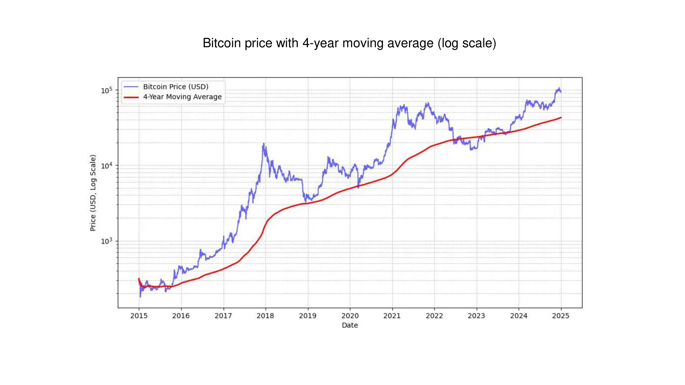

- Mu Exchange ku bicuruzwa canke ibikorwa:**

Kubera ko Bitcoin ikora nk’umurongo wa Exchange, birashoboka ko umuntu yiyumvira ubutunzi buzunguruka. Naho ivyo biguma bidasanzwe muri iki gihe, ubudandaji bwinshi buratangura kwemera amahera y’ama Bitcoin—kubera iki wewe utavyemera? (Raba ikigabane cacu gikurikira)

- Mining Bitcoin:**

Ivyo birimwo kuronka impembo mu gukoresha imashini za Mining. Ku bucuruzi butagiramwo ubuhinga bwihariye, ivyo biguma ari bike cane. Ushobora kugira uruhara biciye ku bahuza bazogurisha canke bagukodeshe compute, network n’ugutunganya. Nimba ari wewe ufise ayo mashini, urashobora kuyabara nk’ibintu bishobora gusenyuka. Ku rugero runini, uzokenera guharura neza inyungu y’ishoramari kuko isoko rifise amahiganwa menshi kandi risaba kwitega neza ibiciro, cane cane amashanyarazi.

Kugira ngo umenye vyinshi ku buryo bwa Mining, urashobora [kuraba igice ca "Mining" mu nyigisho zacu](https://planb.network/inyigisho/mining).

- Gugura Bitcoin:**

Ubu ni bwo buryo busanzwe cane, bukorwa biciye mu guhanahana amakuru hagati y’abandi canke, mu buryo busanzwe, ku mbuga zidasanzwe z’ubudandaji. Ariko igihe amashirahamwe aronka Bitcoin nk’umutungo w’itunga ry’ishirahamwe, ategerezwa kwubahiriza ingingo ngenderwako zikomeye be n’uburyo bwo kumenya umukiriya wawe (KYC). Iyo bayiguriye ku mbuga zidasanzwe z’ubudandaji, ubucuruzi busanzwe busabwa gutanga amakuru y’ido n’ido yerekeye ishirahamwe, harimwo ivyangombwa vy’indangamuntu, ivyerekeye amafaranga, n’ikimenyamenya ca Address, kugira ngo bushitse ibisabwa vya KYC n’ivy’ukurwanya gukoresha nabi amahera (AML).

Kugira ngo umenye ingene wofungura konti y’ubucuruzi maze ukayikoresha mu kugura, kugurisha no gutanga amafaranga y’ibiceri, urashobora kuraba izi nyigisho zibiri zagenewe canecane ubucuruzi, zivuga ku mbuga za Kraken na Bitfinex mu mirongo yazo y’amashirahamwe:

https://planb.network/tutorials/business/others/bitfinex-pro-c8ef7476-5f60-4205-935e-a545ced0022a

https://planb.network/tutorials/business/others/kraken-pro-07b1c16c-d517-4bf7-9a78-b42dc0f21785

Kugira ngo umenye vyinshi ku buryo bwo kuronka amafaranga y'ibiceri biciye ku Exchange canke ku nzira y'urunganwe, urashobora [kuraba igice ca "Exchange" mu nyigisho zacu](https://planb.network/inyigisho/exchange).

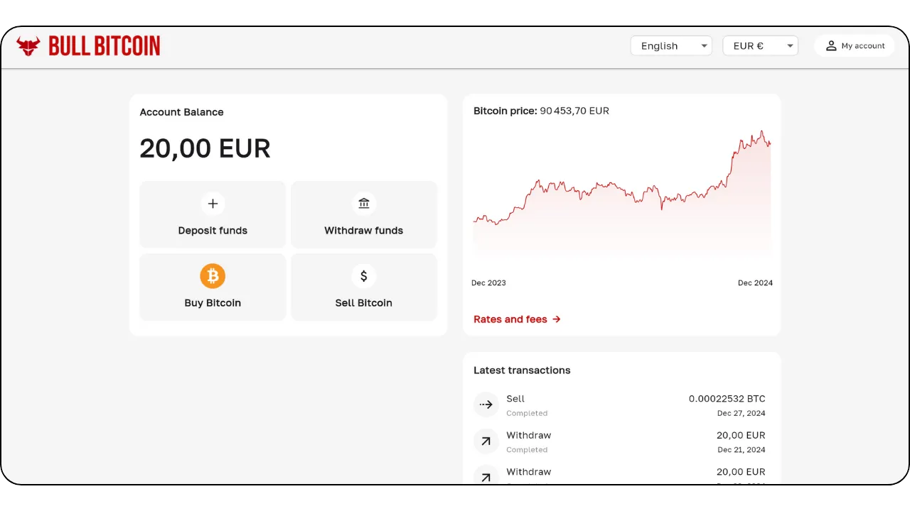

### Ku giciro ikihe?

Nk’uko vyavuzwe imbere, ntibishoboka gusa kumenya igiciro ca Bitcoin co muri kazoza, ariko kandi igiciro kirahinduka cane mu gihe gito. Mu mateka, ubuhinga bwo kwizigirwa bwabaye ubwo kwirundanira buhorobuhoro mu bihe bitandukanye no kuguma umuntu afise igihe c’imyaka ine canke irenga.

### None Woba Ukwiye Gugura Ibingahe?

Mu buryo butari bwo, birashoboka ko ari vyiza gutangura n’ugugura ikintu gito cane utavyiyumviriye cane. Amahera makeyi (nk’amayero ijana canke amadolari) ntaco azokugirira nabi cane, kandi ivyo uzokora bizokwigisha vyinshi cane, vyihuta cane, kuruta igitigiri cose co gusoma.

Nk’uko vyavuzwe mbere, ni vyiza gushiramwo amahera menshi gusa utazokenera mu myaka myinshi. Ingamba iyo ari yo yose utatahuye neza irashobora kugushira mu kaga gakomeye iyo ukeneye gukura amahera mu buryo butunguranye mu gihe kibi.

Uretse gutangura bike, ni vyiza ko amatunga y’amashirahamwe yemera ingamba zo gutanga amafaranga. Ku ruhande rumwe, amashirahamwe amwe amwe, nka MicroStrategy, yarafashe uburyo burengeje urugero mu gutanga igice kinini c’amahera yabo y’itunga ry’igihugu ku Bitcoin, ivyo bikaba vyerekana ko afise ukwizera gukomeye kw’inzego. Ku rundi ruhande, ubuhinga bwo gukingira kandi bushobora gushikirizwa bushobora kuba ugutanga kumbure hafi 5% vy’itunga ry’ishirahamwe kuri Bitcoin, guhuza inyungu zishobora gushika n’ugucungera ingorane n’ibisabwa vyo gutanga amahera.

Iyumvire iyo nzira nk'urugero, kuva ku gushirwa ahabona guke, kumenya neza ko ishirahamwe riguma rifise amahera ahagije yo gukoresha, gushika ku ntumbero y'ubukazi igamije gutuma agaciro k'igihe kirekire ka Bitcoin gatera imbere. Naho gutanga amafaranga bikomeye bishobora gutuma umuntu aronka inyungu nyinshi, gutanga amafaranga make birafasha kugabanya uguhinduka, bikaba bituma umushinge w’ivy’ubutunzi w’ishirahamwe uguma utekanye mu gihe uguma wungukira ku bushobozi bushasha bwa Bitcoin mu bikorwa vy’ububiko bwayo.

### Kenshi?

Nta tegeko rya Hard ririho. Kugerageza gupima umwanya w’isoko mu guhigira “ibifungurwa” birashobora kuba bike kandi bikaba bitera umubabaro kuruta gusa kugura mu bihe bitandukanye. Mbere n’abashoramari bazi utuntu n’utundi baravyifatamwo nabi rimwe na rimwe. Kuja “vyose” icarimwe birashobora kuba inkota y’ubugi bubiri.

Mu vy’ukuri, ugukenguruka kwa Bitcoin ni uko naho wotangura imyaka mikeyi gusa, ushobora kubona inyungu z’igihe kirekire. Ni ukuri, birashoboka ko uguhinduka kw’ibiciro kuzogabanuka uko igihe kigenda kirarenga. Ariko rero, nk’ifaranga ry’ugutakaza agaciro, Bitcoin igenewe kubika neza agaciro no kwerekana inyungu z’umwimbu z’abayikoresha. Kugira ngo tugereranye: ubu turi mu “gice co gutangura” amafaranga Bitcoin, amafaranga ariko arakorwa, kandi nta n’umwe aramenya agaciro kayo. Mu nyuma, kumbure mu myaka 20 canke 40, iyo iri mu “gice c’urugendo” gikomeye, yoshobora kuba ihamye cane kandi igakura idahinduka n’inyungu z’umwimbu w’abanyagihugu.

Inganda zikora amazu zisubiramwo kenshi ko “ari igihe ciza co kugura,” zikibagira ko iyo amazu yotakaza igikorwa cayo co kuba ububiko bw’agaciro—agahindukira akaja ku bintu nka Bitcoin—ibiciro vyoshobora gusubira hafi y’agaciro kavyo k’ubuhinga (uburaro). Bitcoin, mu buryo butandukanye n’ubwo, nta yindi ntumbero ifise atari ugubika agaciro, ivyo bishobora gusobanura ko “ari igihe ciza co kugura.” Kazoza kazobivuga.

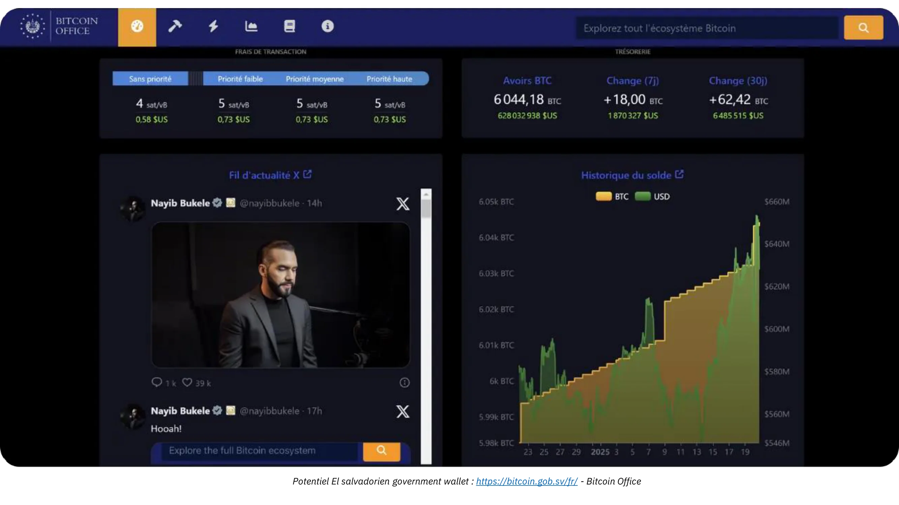

*Ivyiza: [Ibiro vya Bitcoin](ibiro vya Bitcoin.gob.sv/)*

### Ni mu buryo ubuhe bwo kugura? (Uburyo bwo kubungabunga)

Nta Bitcoin ufise ku mubiri. Ahubwo, ufise urufunguzo rw’ibanga rugufasha guhindura Ownership y’ibice bimwebimwe canke vyose vy’ikonti yawe ku rundi rufunguzo rumwe canke nyinshi. Ivyo vyose bibera kuri Bitcoin Blockchain, iyo na yo ikaba isubirwamwo mu bihumbi mirongo vy’ibice kw’isi yose.

Urufunguzo rw’ibanga ni umubare munini cane w’imburakimazi. Kugira ngo umuntu ashobore gukoresha neza, akenshi agaragazwa nk’urutonde rw’amajambo 12 canke 24. Ayo majambo arashobora gushirwa ku gikoresho kigaragara citwa “Hardware Wallet.” Ariko rero, tahura ko ama bitcoins atari “imbere” muri iki gikoresho; ni igikoresho gusa co gusinya amafaranga y’ubudandaji mu buryo bw’ibanga no kuyatangaza ku rubuga. Igihambaye vy’ukuri ni amajambo 12 canke 24, ategerezwa kuguma ari meza.

Ivyo bituma haba ikibazo c’ugucungera: gufata Bitcoin bisigura gufata urufunguzo canke urufunguzo. Ushobora kubifata wewe nyene, canke ukabishinga uwundi muntu. Hariho kandi n’imiti yo hagati. Reka dusuzume ibintu bikunze kubaho:

- Ukwirinda:**

Iyi ni yo nzira iremezwa n’abakunzi b’ukuri ba Bitcoin, kuko ihuye n’umugambi wa mbere wa Bitcoin. Ukora nk’ibanki yawe bwite: nta ngorane yo kuguhenda, ariko ni wewe ufise inshingano yo gucungera urufunguzo. Ushobora kuronka amahera yawe yose 24/7. Mu bucuruzi, nimba abantu benshi bashobora gukenera gukorana, uzokenera ibikoresho n’uburyo bikwiye bwo gucunga ukuronka n’umutekano.

- Uwucungera uwundi muntu:**

Nk’akarorero, Exchange canke ishirahamwe ry’abaguzi rirashobora kugukorera konti, rikaguhindura amahera yawe ya kera ngo abe Bitcoin, rikagufata mu izina ryawe rikoresheje ubuhinga bwabo bwo kugucungera umutekano. Benshi muri izo serivisi ziguha uburenganzira bwo gukura ama bitcoins yawe mu Wallet aho wewe wenyene ufise urufunguzo. Gushika ubikoze, ntuba vy’ukuri ufise ama bitcoins; wizigira umuhango wabo wo kukwishura. Ivyo birimwo guhuza ingorane z’umutekano (izabo n’izawe) n’ingorane z’abagenzi (zishobora kunanirwa canke zikazimangana). Hari ubucuruzi bubona ko ivyo vyemewe, naho muri rusangi bitari vyiza ku kubika igihe kirekire canke ku 100% vy’ivyo utanga. Ibikorwa vy’ububiko bishobora kandi gusaba amahera yo kubika.

- “Impapuro Bitcoin” (ETF canke ETP):**

Ivyo ni ibikoresho vy’ivy’ubutunzi vya kera bigereranya imice ya Bitcoin, bisubiramwo ibikorwa vyayo vy’igiciro. Ikigo kiri inyuma y'ico gicuruzwa kiragura kandi kikagira Bitcoin. Ivyo utanga n’ivyo ukura bikoreshwa mu mafaranga asanzwe (nk’amadolari canke amayero), atari mu Bitcoin. Uretse ibintu bimwebimwe vyemeza gukura mu Bitcoin nyayo (kugira ngo ntihagire ikintu gishobora gukorwako umusoro mu bihugu bimwebimwe), ivyo bikoresho birimwo amahera y’uburongozi y’umwaka. Aha, wizigira umutekano w’ikigo kandi ugahura n’ingorane z’abandi (nk’akarorero, iyo Leta ifashe ingingo yo gufata Bitcoin yose ifiswe n’ikigo, nk’uko vyagendeye inzahabu mu 1933 hakurikijwe itegeko ry’ubutegetsi bwa Leta Zunze Ubumwe za Amerika 6102). Inyungu yabo nyamukuru ni ukuronka bitagoranye, kuko bakwiragizwa biciye mu nzira za kera z’amahera. Baca ku nkenegwa yo gukingira imfunguruzo z’ibanga ariko nta n’imwe mu mico ya Bitcoin itanga: ntushobora gukoresha urubuga rwa Bitcoin 24/7 kugira ngo ushire agaciro mu mwidegemvyo ata ruhusha. Bisubiramwo gusa ibikorwa vy’ivy’ubutunzi, si ibikorwa canke ubusegaba bwa Bitcoin ubwayo.

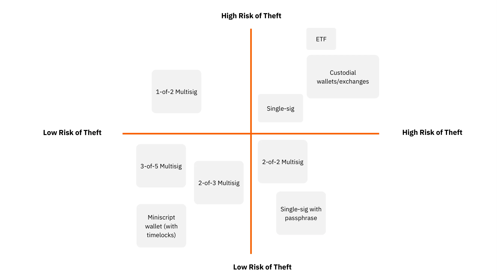

Ikindi, urupapuro ufise Bitcoin ruragira ico rukoze cane ku ngingo z’umutekano zikenewe kugira ngo ukinge itunga ry’ishirahamwe ryawe. Waba uhisemwo kwizigama, ukoresheje amasakoshi y’ibikoresho vy’umukono umwe canke menshi, n’ibindi kugira ngo ugume ugenzura ata guca ku ruhande imfunguruzo zawe, canke ugashinga ico gikorwa ku bikorwa vy’ukwizigama vy’abandi canke ETFs, uburyo bumwebumwe bwose burafise ingorane zabwo. Nk’akarorero, ukwibungabunga bitanga uburenganzira bwose ariko bisaba amategeko akomeye y’umutekano wo mu mutima, mu gihe inyishu z’uwundi muntu zigabanya umuzigo w’uburongozi kubera ingorane z’uwundi muntu. Kugira ngo ushobore kwerekana neza itandukaniro, iki kigereranyo kirerekana uburyo bwo gucungera umutekano ku bwoko bwose bw’ububiko, kigufasha guhitamwo uburyo bubereye cane ivyo ishirahamwe ryawe rikeneye :

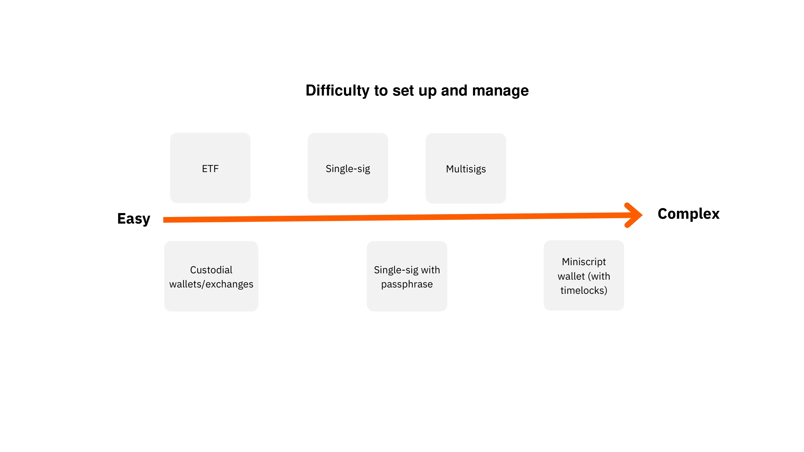

### Ni nde wogurira?

Niwahitamwo “urupapuro Bitcoin,” uzoja ku bigo vy’ivy’imari nk’amabanki canke amasoko y’ivy’ubutunzi yo kuri Internet.

Niwahitamwo kugura Bitcoin nyayo biciye ku isoko (Exchange) canke ku mucuruzi, urafise ivyiciro vyinshi vy’ingenzi:

- Ivyuma binini binini vyo kw'isi yose canke vyo hanze:**

Ingero ni Kraken, Coinbase, canke Binance, mu mateka vyakoreshwa n’abantu benshi. Hari abahuye n’ingorane, kandi biragoye gutanga impanuro itomoye. Impanuro: niwaba uzikoresha, ntusige ama bitcoins yawe igihe kirekire kuruta uko bikenewe.

- Abatanga ibikorwa vy'ubuhinga bwa none (Abatanga ibikorwa vy'ubuhinga bwa none banditswe):**

Nk’akarorero, mu Bufaransa ama platforms nka Paymium (Exchange) canke BullBitcoin (umucuruzi) arazwi ko afise abakunzi b’ukuri ba Bitcoin ku mutwe kandi yubatse urutonde rukomeye. Muri USA ufise abaguha ama service nka River canke Swann. Muri rusangi, birahambaye gusuzuma uruvyaro rw’uwutanga ubufasha: izina ryabo, ivya kera, ukumenyekana kwabo mu muryango wa Bitcoin, n’uko uburongozi bwabo bujanye n’agaciro nyamukuru ka Bitcoin.

**Exchange n'umucuruzi:**

- **Exchange** iraguha uburenganzira bwo gutanga amategeko yo kugura kugiciro uhisemwo, ariko utegerezwa kurindira ko bishirwa mu ngiro gushika igiciro c’isoko n’abagurisha bihuye.
- **Umucuruzi** aguha igiciro gihoraho kandi ashobora kurangiza igikorwa vyihuse.

Uretse amafaranga n’umuvuduko wo gukora—ivyo bikaba bidahambaye cane nimba uriko uriyumvira igihe kirekire (imyaka myinshi)—ubucuruzi bukwiye kandi kwiyumvira:

- Ukoresha Interface:** Mbega urubuga rurakoreshwa neza?
- Ibirango vy’Ibarabara:** Nibura, ubushobozi bwo gutanga amateka y’ibikorwa mu buryo bwa .CSV.
- Ugucungera n’umutekano:** Mbega iyo platform irafata ama bitcoins mu izina ryawe, canke iragurungikira Ownership? None umutekano wabo ni uwuhe? Boba bafise “ibifunguruzo vyo gukura” canke ibindi bibazo vyo gukura?
- Infashanyo y’abaguzi:** Uburyo, inyishu, n’imfashanyo y’umuntu ku giti ciwe, cane cane iyo uriko uratangura.
- Izina n’Inyifato runtu:** Ukwizigirwa n’agaciro k’urubuga.
- Infashanyo ku Gugura Bisubira:** Niba utegura kwirundanira Bitcoin mu gihe c’igihe n’ugugura kwategekanijwe.

# Inyishu zo kwishura Bitcoin ku bucuruzi bwose

<partId>b2c8af88-6bfc-49b1-ad84-4c292c713b55</partId>

## Gufata Bitcoin nk'ukwishura

<chapterId>99af1203-bc84-4acc-9780-f733e7998335</chapterId>

Ubwa mbere, birahambaye gutahura ko Bitcoin ari uguhungabanya ku rugero rumwe na internet.

Mu misi ya mbere, urubuga rwa internet rwatumye bishoboka gukuraho abahuza mu mihora y’itumanaho, hanyuma ivyo bikorwa remezo bituma habaho ibikorwa bitagira uko bingana mbere bitashobora kwiyumvirwa. Ubu, ni ubucuruzi ubuhe butagira urubuga rwa internet?

Bitcoin ni ibikorwa remezo vy’ukwizigira, igikorwa caco ca mbere ni ugukuraho abahuza mu bubiko na Exchange y’agaciro—amahera. Ibindi bikoresho bitashobora kwiyumvirwa ubu bizoza kuri ivyo bikorwa remezo. Kubaho kwawe kwa mbere hano ni nk’ukugira urubuga: irembo ry’ugutanga amahera n’uguhana agaciro.

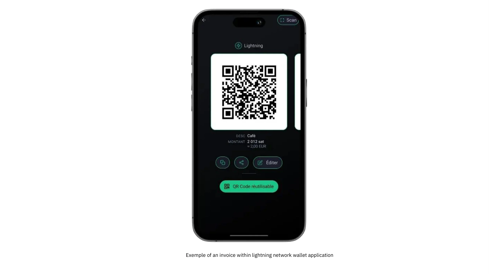

Ubu rero, rimbura ukuntu ubucuruzi bukora igikorwa cabwo nyamukuru ataco gihuriyeko na Bitcoin. Ni kuki yohitamwo kwemera amahera ya Bitcoin?

- Kubaka Itunga rya Bitcoin:**

Raba ingingo yacu iherutse ku bijanye no kugura Bitcoin. Yaba kubera ko baciriwe urubanza canke nk’ingene bobigira mu buryo butandukanye, abahinga bamwebamwe bahitamwo kwemera amahera y’ama Bitcoin. Bamwe mu ba Bitcoiners bavuga ko uko ishirahamwe rigira amahera make—bisobanura ko ritagira umwanya canke ibikoresho vyo kwifatanya n’ibikorwa bikomeye vy’amahera—**uko bica bigorana ko ubwo bucuruzi bwishurwa mu buryo bukomeye kuruta ubundi bwose bw’amahera ariho**. Mu kubigira, biratuma urukino ruri ku rugero rumwe, bikaba bituma mbere n’amashirahamwe matomato kandi afise umwanya muto ashobora kuzigama agaciro ata gufatwa n’imikino y’amahera.

- Gushika ku gitigiri gishasha c'abantu:**

Igitigiri c’abakoresha Bitcoin kiriko kirakura, kandi barafise ubushobozi bwo kugura cane. Mu bisanzwe bazokwegwakwegwa n’ubudandaji bwemera amahera yabo. Ikindi kandi, kuko ari ryo mafaranga ya mbere y’isi yose, akoreshwa kuri internet, urashobora kandi gukwegera abakiriya bo kw’isi yose baca muri yo.

- Kwongerekana kw'ukuboneka:**

Mu gushiramwo ubucuruzi bwawe ku mbuga nka BTCmap.org, nk’akarorero. Ubucuruzi bukeyi gusa ni bwo bwemera Bitcoin, rero ijambo ry’akanwa rirakora ku nyungu yawe. Bigutandukanya kandi n’abaguhagarariye.

- Amafaranga make:**

Ivyishyurwa vy'ubu nyene vya Bitcoin bishika kuri Lightning Network. **Amahera ni make cane kandi yishurwa n'uwuguze**. Nta mafaranga yo kwishura, nta n’ukwemererwa kwishura kunanirwa, kandi nta buhendanyi. Mu kugereranya, inganda zo kwishura (amakarata, ama terminal, ama transfers, PSPs, n’ibindi) zitwara amadolari ashika ku bihumbi 2,2 trillions ku mwaka kw’isi yose. Wongereko n’ugusubiza amahera n’ubuhendanyi, kandi muri rusangi, hafi ica cumi c’umusaruro w’igihugu ca Leta Zunze Ubumwe za Amerika “kirakurwa” ku bucuruzi butanga inyungu kw’isi yose kugira ngo gusa buhe agaciro. Utitaye ku bucuruzi bwawe, amahera y’amahera ni umuzigo ukwiye gutunganirizwa neza, kandi rimwe na rimwe, amahera menshi arashobora gutuma ubucuruzi bumwebumwe buhungabana.

- Umwidegemvyo n'Ukutagira Uruhusha, 24/7:**

Nta nkeka ko usaba uruhusha rwo gukoresha Bitcoin. Umuntu wese arashobora kugira uruhara mu bukungu mu minota mikeyi akoresheje app ya telefone ngendanwa. Ushobora kohereza canke kwakira amahera umuntu wese—umuntu ku giti ciwe canke ubudandaji—igihe cose, ata ngorane canke ugucerezwa kw’urutonde.

- Gukoresha neza urubuga rwa Bitcoin kubera inyungu zarwo:**

Ntusabwa kubika amahera yawe mu rupapuro rwa Bitcoin—na canecane nimba ukeneye kwishura abaguha ivyo ukeneye canke gutanga IVA. Hariho ibikorwa bishobora guhindura vyose canke igice c’amahera yawe ya Bitcoin mu mafaranga uhisemwo (nk’akarorero, amayero mu IBAN yawe) ku giciro. Muri iki gihe, inyungu yo kwemera Bitcoin yoshobora kuba iri mu gukwegera abakoresha bashasha canke mu nyungu z’imbere za Bitcoin (nk’amahera make, gukora amasaha yose, no kutagira ingorane zo guhenda canke gusubizwa amahera).

### Ni uwuhe muti wo kwishura wohitamwo?

Biroroshe cane gutangura kwemera amahera ya Bitcoin. Kugira ngo uhitemwo umuti mwiza, zirikana ibiranga amafaranga ukoresha: amahera utanga, incuro ukoresha, be n’uko uzokwemera kwishura mu kibanza c’umubiri, kuri Internet canke vyose bibiri.

Ivyiyumviro vyawe nk’umucuruzi na vyo nyene birahambaye. Woba uriko urakora ikigeragezo coroshe, canke witega ko Bitcoin izoba isoko y’amahera ihambaye kandi isubiramwo? Nimba ari ivya nyuma, uzokenera uburyo bukomeye, bushitse kandi bushobora guhindurwa.

Ntukibagire kwihweza uruhara rutandukanye rw’abakozi bawe n’aho bari. Uko vyogenda kwose, wibuke yuko utegerezwa kuba ushoboye guha umucungezi wawe amakuru yose akenewe no gutuma uburyo bwo gucungera amafaranga bugenda neza.

Kugira ngo tworohereze uburyo bwo gufata ingingo, twasobanuye imirongo ine itandukanye y’ubudandaji. Imbonerahamwe zikurikira zicapura ibiranga nyamukuru n’imiti y’ukwishura impanuro ku bijanye n’umwirondoro umwe umwe.

### Imirongo y'ubucuruzi

#### Umwirondoro wa 1 – Uwutanguye

| Attribute                        | The Starter                                                                                                                                |
| -------------------------------- | ------------------------------------------------------------------------------------------------------------------------------------------ |
| **State of Mind**                | "trying my first physical payment", "taking a tip for my online content", "targeting very small revenue"                                   |
| **Transaction Frequency**        | "first transaction in order to learn", "taking payment once in a while"                                                                    |
| **Business Type Examples**       | Creative economy (content creators, blogs, articles, etc.), occasional tips, one-off in-person product sales, associations, one-off events |
| **Payment Type**                 | Generally a few cents to a few euros/dollars; under ~300 euros/dollars per item                                                            |
| **Settings Complexity**          | None                                                                                                                                       |
| **Example Recommended Solution** | A custodial Lightning wallet like Wallet of Satoshi or a non-custodial wallet like Phoenix                                                 |
| **Merchant Interface**           | Simple Bitcoin Lightning wallet: an app on a mobile phone                                                                                  |
| **Customer Interface**           | Bitcoin QR payment code, scanned via the customer’s personal wallet                                                                        |
| **Fees**                         | Customer pays Bitcoin Lightning fees plus any applicable app fees                                                                          |
| **Point of Sale Device**         | Free smartphone app or an option for a physical terminal (e.g. Bitcoinize)                                                                 |
| **Management and Roles**         | Single app management; minimal role differentiation                                                                                        |
| **Accounting Exports**           | Basic transaction history lists                                                                                                            |
| **API**                          | No                                                                                                                                         |

#### Umwirondoro wa 2 – Ivy'ingenzi

| Attribute                        | The Essential                                                                                                                              |
| -------------------------------- | ------------------------------------------------------------------------------------------------------------------------------------------ |
| **State of Mind**                | "I accept Bitcoin in my business but I do not expect meaningful volume"                                                                    |
| **Transaction Frequency**        | Few transactions per month                                                                                                                 |
| **Business Type Examples**       | Bars, restaurants, semi-regular sales of fresh or directly sourced products, multiple stores under one owner, creative economy for artists |
| **Payment Type**                 | Generally ranging from a few euros/dollars to a few hundred per item; under ~300 per item and under ~3,000 per month                       |
| **Settings Complexity**          | Minimal (mobile app)                                                                                                                       |
| **Example Recommended Solution** | Swiss Bitcoin Pay                                                                                                                          |
| **Merchant Interface**           | Simple Bitcoin Lightning wallet: an app on a mobile phone; simple invoicing with minimal details                                           |
| **Customer Interface**           | Bitcoin QR payment code, scanned via the customer's personal wallet                                                                        |
| **Fees**                         | Typically <1% for sending to a Bitcoin address, and <1.5% for converting to fiat                                                           |
| **Point of Sale Device**         | Free smartphone app or an option for a physical terminal (e.g. Bitcoinize)                                                                 |
| **Management and Roles**         | Option for a sell-only role for employees; online dashboard for administration                                                             |
| **Accounting Exports**           | CSV export with complete transaction details                                                                                               |
| **API**                          | Yes                                                                                                                                        |

#### Umwirondoro wa 3 – Umuhinga

| Attribute                        | The Professional                                                                                                                                       |
| -------------------------------- | ------------------------------------------------------------------------------------------------------------------------------------------------------ |
| **State of Mind**                | - A payment method like any other for my e-commerce - Or joint management for a group of businesses ready for higher volumes                           |
| **Transaction Frequency**        | Multiple transactions per day                                                                                                                          |
| **Business Type Examples**       | E-commerce sites with moderate volume, small marketplaces, groups of physical stores (e.g., Click & Collect), SME operations                           |
| **Payment Type**                 | Generally ranging from a few euros/dollars to a few hundred; no set payment size limit; less than 250,000 per year                                     |
| **Settings Complexity**          | Light to fully featured (local or cloud hosting), often requires an e-commerce storefront                                                              |
| **Example Recommended Solution** | BTCPay Server for e-commerce and/or physical environments; ZapRite, Musqet or PayWithFlash for checkout, Be-BOP for an integrated e-store             |
| **Merchant Interface**           | Website (mobile and desktop) with invoice editing, shopping cart options, and payment button creation; automated invoicing with e-commerce integration |
| **Customer Interface**           | Bitcoin QR payment code, scanned via the customer's personal wallet                                                                                    |
| **Fees**                         | Mix of free open-source backend and paid Lightning hosting/service fees; front-end fees include Bitcoin Lightning fees and <1.5% conversion fees       |
| **Point of Sale Device**         | Website store, optional physical display (e.g. iPad showing the site or Bitcoin terminal)                                                              |
| **Management and Roles**         | Fully featured store with multiple admin roles; employees and customers interact with the system                                                       |
| **Accounting Exports**           | CSV export with complete transaction details                                                                                                           |
| **API**                          | Yes                                                                                                                                                    |

#### Umwirondoro wa 4 – Ikigo

| Attribute                        | The Enterprise                                                                                                                                  |
| -------------------------------- | ----------------------------------------------------------------------------------------------------------------------------------------------- |
| **State of Mind**                | - A strategic payment method for the business - With some development to integrate into the service platform as per specific specifications     |
| **Transaction Frequency**        | Unlimited, high-frequency transactions                                                                                                          |
| **Business Type Examples**       | Mid-sized enterprises, IT service companies, large corporations, major marketplaces                                                             |
| **Payment Type**                 | Any size or volume                                                                                                                              |
| **Settings Complexity**          | Medium to high, depending on the choice of architecture                                                                                         |
| **Example Recommended Solution** | Custom-made architecture or orchestration of SaaS-hosted solutions, potentially using third-party LSP (*Lightning Service Provider*) services   |
| **Merchant Interface**           | Fully customized front-end and back-end interfaces fully integrated into the business’s workflows and processes                                 |
| **Customer Interface**           | Ranging from a Bitcoin QR payment code to a fully custom UI and/or API integration                                                              |
| **Fees**                         | Combination of internal development and third-party fees; customer pays Bitcoin Lightning fees plus any transaction fees from service providers |
| **Point of Sale Device**         | Custom-designed solutions tailored to the enterprise environment                                                                                |
| **Management and Roles**         | Fully customized roles across sales, administration, devops, accounting, and finance                                                            |
| **Accounting Exports**           | Fully customized accounting exports                                                                                                             |
| **API**                          | Yes                                                                                                                                             |

Mu bice bikurikira, tuzodondora ido n’ido ubucuruzi bumwebumwe n’imiti ihuye n’umwe muri bo.

## Uwutangura

<chapterId>7edda53d-5b9f-432a-8493-115de8c94a67</chapterId>

Urutonde rwa Starter rwagenewe ubucuruzi, abaremyi, n’abantu ku giti cabo bipfuza gutohoza amahera ya Bitcoin ataco bakoze canke ubuhinga bwinshi. Abo ni abo mu bisanzwe bakora ibikorwa bike cane (kumbure impanuro nkeyi, intererano, canke ugurisha rimwe na rimwe) kandi barondera intangamarara yoroshe kandi yoroshe y’ibidukikije vya Bitcoin na Lightning Network. Agaciro nyamukuru k’uburyo bwa Starter kari mu gutegura kwayo gutoya: kenshi, ibisabwa vyose ni telefone ngendanwa canke tablette ifise Wallet ihuye n’umuravyo.

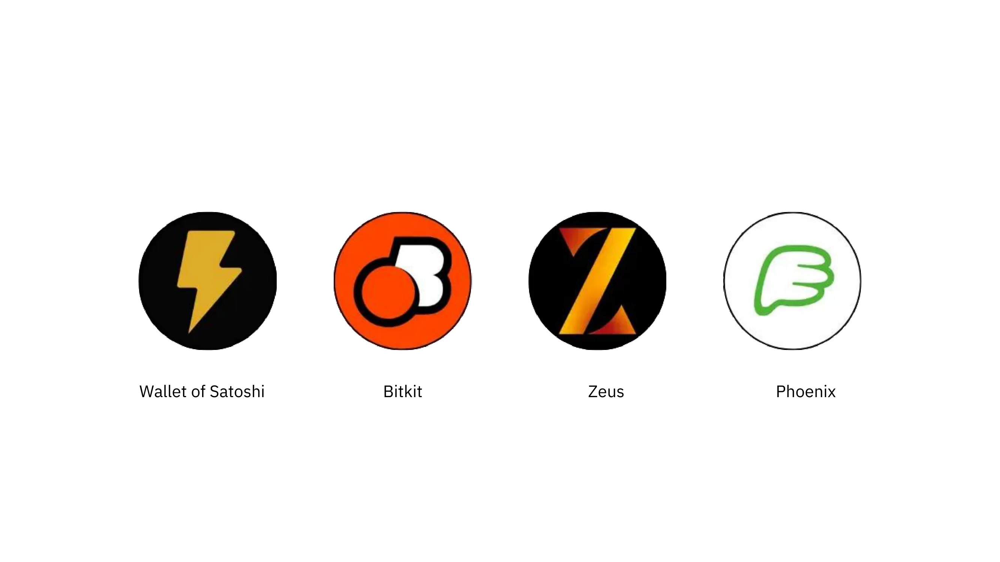

Kimwe mu bintu bisobanura iyo nkuru ni uko yibanda ku kwishura amahera makeyi, ariko gake cane arenga amajana makeyi y’amayero canke amadolari ku kwezi. Uwo murongo mutoyi utuma ari ihitamwo ryiza cane ku muntu wese yipfuza kugerageza isoko na Bitcoin, ata ngorane zisanzwe ziri mu gukoresha ivyuma vyinshi. Vyongeye, biratuma umuntu ahita yiga akoresheje amaboko; kubera ko hariho imikazo mikeyi y’ibikorwa be n’amahera makeyi, amakosa arashobora guhagarara, kandi ivyigwa birafatwa ningoga. Kuva ku bahinga bagurisha ibikorwa vy’ubuhinga bw’amaboko mu masoko yo mu mpera z’umusi gushika ku migwi idaharanira inyungu yemera intererano z’igihe kimwe, abakoresha muri iki kiciro akenshi bashimika ku kuronka no ku gukoresha vyoroshe kuruta ibikorwa vy’ubuhinga buhanitse.

Ivyo bibiri bikunze gukoreshwa cane Wallet ku bijanye n’umwirondoro wa Starter birimwo gufata ingingo hagati y’imiti y’ububiko n’iyitariyo. Wallet y’ububiko (nka Wallet ya Satoshi canke Blink) ireka umukozi w’uwundi muntu akagenzura imfunguruzo z’ibanga n’ibikorwa vy’inyuma, gutyo bikagabanya inshingano z’ubuhinga z’uwukoresha. Iyo ndinganizo iraryohera canecane abaha agaciro ukuryoherwa kuruta ibindi vyose kandi bashaka kwinjira mu bwato mu buryo bworoshe kuruta ubundi bwose. Ku rundi ruhande, ama wallets ya Lightning atagira ububiko (nka Phoenix canke Breez) ashira imfunguruzo z’ibanga n’ububasha bwose mu minwe ya nyen’ubucuruzi, agatanga ubwigenge bwinshi n’ubuzima bwite muri Exchange kugira ngo umuntu akore utwigoro dutoduto two mu ntango. Mu bihe vyose, ama interface yo muri iki gihe arakoreshwa neza cane ku buryo umuntu wese ashobora gukora ibikorwa bihambaye (gukora kode ya QR, kwinjiza amahera umuntu akwiye kwishura, no kwemeza ko umuntu atanga amahera) mu minota mikeyi.

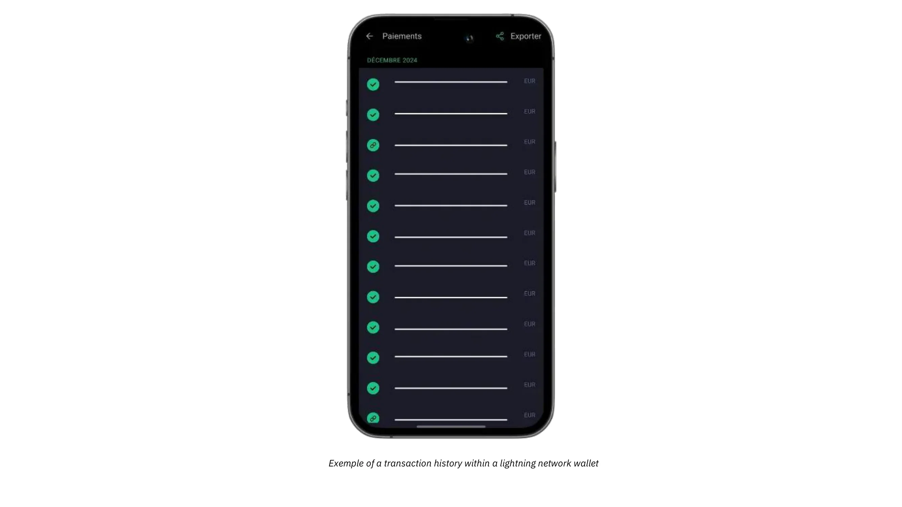

Naho ivyerekeye umutekano vyoshobora gusa n’ibidahutirwa cane iyo amafaranga agurishwa ari make, birahambaye cane ko hashirwaho ingingo z’ishimikiro zo kwikingira. Mbere na telefone imwe canke tablet imwe ikoreshwa mu kwakira amahera ya Bitcoin ikwiye gukingirwa n’ijambobanga canke umutekano w’ibinyabuzima, kandi uburyo bwo gukingira amakuru (kuva ku gukurikirana amakuru y’injira ku muntu afise Wallet gushika ku kurinda ijambo seed ku muntu atariko arazigama) butegerezwa kuba. Abakozi bakora ibikorwa vy’ubudandaji mu kibanza c’umubiri bokwungukira ku kumenya ibintu vy’ishimikiro: ingene bofungura iyo porogarama, ingene boshikiriza umukiriya kode ya QR, be n’ingene bomenya nimba vy’ukuri amahera yashitse.

Ivy’uguharura amafaranga n’ugutanga raporo, naho vyoroshe cane munsi y’urutonde rw’Intango, biracari ngombwa ko umuntu abizirikana neza. Naho igitigiri c’ibintu bigurishwa coba ari gito cane, kubika amakuru atagiramwo uburyarya birabuza gutera urujijo mu gihe c’inyuma kandi birafasha kuguma haba uguseruka mu gihe habayeho igenzura ry’ivy’amahera canke ry’ugutanga imisoro. Ibikoresho vyinshi vya Wallet birashoboza abakoresha kwohereza hanze amateka y’ishimikiro y’ibikorwa nk’idosiye ya CSV; ku kigo gitoyi canke umudandaza umwe, kubika izo dosiye ubudasiba birashobora gutuma gusubiza hamwe amakonti vyoroha cane. Ni vyiza kandi gukurikirana agaciro k’amahera (nk’akarorero, mu ma euro canke mu madolari) mu gihe amahera yose agurishwa. Kubera ko igiciro ca Bitcoin gishobora guhinduka, kugira urutonde rw’ibiharuro vy’abahinduye ni ngirakamaro cane mu bijanye no kubika ibitabu no kwubahiriza imisoro.

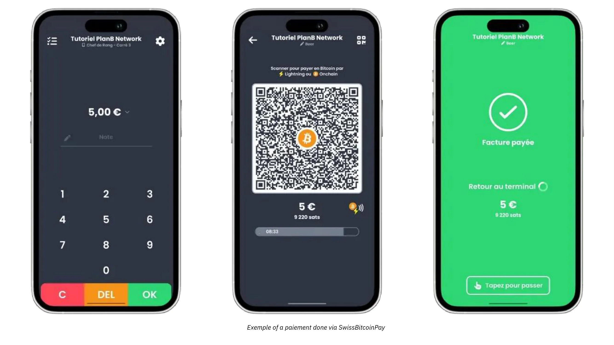

Ku bucuruzi bwipfuza kwongerako amahera yabo y’umubiri canke y’umuntu ku giti ciwe n’intererano canke impanuro zo kuri internet, ubu biragoye gushiramwo ubuto bw’impanuro canke igikoresho c’impanuro c’umuravyo mu rubuga canke mu rubuga rwa interineti. Ivyuma nka BTCPay Server bitanga amabuto yo kwishura yoroshe gutunganya, mu gihe bimwe mu bimenyeshamakuru vyo ku mbuga ngurukanabumenyi n’ibikorwa vyo gutangaza amakuru mu buryo buhoraho bimaze gushigikira impanuro za Lightning zifise amaderesi. Ku bw’ivyo, mbere n’ishirahamwe ry’intango rirashobora kwubaka urubuga rw’abaguzi rutoyi ariko rwo kw’isi yose. Hagati aho, abakunda kudafata Bitcoin igihe kirekire barashobora gutohoza uguhindura igice canke ubwavyo mu mafaranga y’amahera bakoresheje amasakoshi amwamwe y’ububiko canke ibikorwa vy’abandi. Naho iyo nzira ijana n’amahera y’inyongera n’inshingano za KYC zishoboka, ifasha ubucuruzi guhunga uguhinduka kw’igipimo ca Exchange no kuguma bafise ibikorwa vyabo vy’ivy’ubutunzi biriho ata guhungabana gutoyi.

Ikoreshwa ryoroshe ryerekana ingene izo Elements zose zihuriza hamwe. Ibaze umuhinguzi w’ibintu wo mu karere kacu agurisha amajame akozwe muhira kw’isoko ry’abarimyi ryo ku wa gatandatu. Bafise telefone ikoresha Lightning Wallet, bashinga igiciro c’igikombe kimwekimwe cose mu ma euro; iyo umukiriya asavye kwishura mu Bitcoin, uwo mudandaza aca yihuta kwinjiza amahera y’i fiat ahuye, maze iyo porogarama igaca iharura ubwo nyene Sats akwiye kwishurwa. Ico gikoresho citwa QR code gica gicapurwa n’ibara ry’umukiriya ryitwa Wallet, amahera agahembwa mu masegonda makeyi, maze uwo muhinga mu vy’ubuhinga bw’amaboko aca amenya ko ivyo yakoze vyagenze neza. Ku musi w’iherezo, amakuru yose yerekeye ibikorwa vy’ubudandaji arashobora gutumwa hanze kugira ngo abikwe, kandi amahera asigaye ku musi arashobora kwoherezwa yose canke igice ku rubuga rwa Exchange kugira ngo ahindurwe amahera y’amahera.

Mu guhuza ibikoresho bikoreshwa neza, ibisabwa bikeyi vy’ibikoresho, n’ukubika amakuru mu buryo bugororotse, inyishu za Starter zitanga ivy’ingenzi ataco zirengeye ubucuruzi bw’abashasha. Iyo umubare w’ibikorwa vy’ubudandaji wongerekanye kandi ibisabwa mu bikorwa vy’ubudandaji bikagenda birahinduka, gutera imbere mu rwego rwo hejuru cane nk’uko bivugwa mu kigabane kizoza bica bihinduka ugutera imbere kw’ibisanzwe.

Ku nyigisho zitomoye ku bijanye n'amasakoshi n'imiterere y'ishimikiro, usabwe kuraba ubu burongozi bukurikira:

**Ibipapuro vy'amahera vy'ukwizigama LN:**

https://planb.network/tutorials/wallet/mobile/phoenix-0f681345-abff-4bdc-819c-4ae800129cdf

https://planb.network/tutorials/wallet/mobile/bitkit-a7224674-85c4-4045-9baf-37018d89550c

https://planb.network/tutorials/wallet/mobile/breez-46a6867b-c74b-45e7-869c-10a4e0263c06

https://planb.network/tutorials/wallet/mobile/blixt-04b319cf-8cbe-4027-b26f-840571f2244f

https://planb.network/tutorials/wallet/mobile/zeus-embedded-advanced-3e89603c-501d-439c-8691-d4a0d0de459b

**Ibikoko vy'ububiko LN:**

https://planb.network/tutorials/wallet/mobile/wallet-of-satoshi-39149d86-e42b-4e8f-ae9f-7e061e7784f7

https://planb.network/tutorials/wallet/mobile/blink-7ea5f5a4-e728-4ff9-b3f9-cf20aa6fc2bd

## Ivy'ingenzi

<chapterId>89be421f-f7df-4bcc-a9e4-df96e39ef249</chapterId>

Ivyo bimenyetso vy’ingenzi birabereye ubucuruzi buto buto n’ubuciriritse, bushobora kuba bufise abakozi, bushaka kwemera Bitcoin mu buryo bworoshe kandi bwihuse butakeneye ubumenyi buteye imbere, mu gihe bufise uburyo bushitse kandi bw’umwuga kuruta Wallet yoroshe. Ico kiciro akenshi kijanye n’amaresitora, ama café, amabarabara, canke amaduka mato mato abona gusa urushinge rw’amahera Bitcoin yishurwa buri kwezi, yamara yipfuza Interface igororotse kandi ikomeye bihagije kugira ngo ishobore gukora ibikorwa vya misi yose ata guhagarika.

Udakunze urutonde rwa Starter, ubucuruzi bw’ingenzi bubona ko kwishura Bitcoin ari igice gikomeza c’amahera yabo aho kubona ko ari igerageza gusa. Baracariko barakora ku rugero rutoyi rw’ibikorwa, ariko incuro zikoreshwa zirahagije kugira ngo ba nyen’ibikorwa n’abakozi bungukire ku buryo butunganijwe kandi bwizigirwa. Muri ico gihe nyene, urutonde rw’Ivy’Ingenzi ruguma rwibanda ku kworoha; naho nyene ishobora gukoresha ama dashboards n’ugucungera uruhara bike, ntibisaba ubuhinga bwihariye bw’ubuhinga bwa none canke gukorana n’ibindi bikomeye.

Impanuro z’ubuhinga muri iki gice akenshi zishingiye ku **Swiss Bitcoin Pay**, umuti woroshe kugira ngo abacuruzi bemere kwishura Bitcoin mu buryo bworoshe. Irimwo porogarama ya PoS ikoreshwa neza, nta buhinga bw’ubuhinga busaba ku bakozi. Mu buryo butandukanye n’amasakoshi asanzwe ya Bitcoin, yibanda gusa ku kwakira amahera, ivyo bikaba bituma abakozi bakoresha ico gikoresho ata ngorane z’umutekano. Porogaramu nyinshi za PoS zirashobora kwifatanya na konti imwe, zikoreshwa ku bikoresho vy’amatablette, ku ma register, ku matelefone ngendanwa, canke biciye ku rubuga rwa mudasobwa, zifasha Android na iOS. Ushobora kandi gukora urutonde rw’ibintu ugurisha n’ibiciro bijana navyo, bikaba bituma umukozi ahitamwo gusa igiseke c’ibintu vy’umukiriya kuri PoS hanyuma agaca asaba umubare wose.

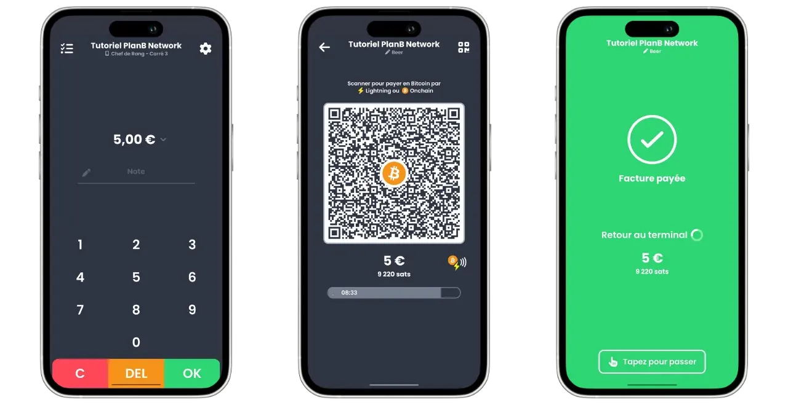

Ivyishyurwa birashobora gukurwa mu mafaranga y’ama Bitcoin bikaja mu mafaranga yihariye y’ama Address canke bikahindurwa mu mafaranga y’amahera (fiat) maze bikajanwa kuri konti ya banki ku musi ku musi. Swiss Bitcoin Pay ikora ivyo bikorwa, ikora ivyo kwishura Bitcoin na Lightning Network ataco umuntu akora. Amahera aguma amasaha 24 imbere y’uko yimurirwa. Naho ataco ikora nka BTCPay Server, iraringaniza uburyo n’umutekano, kandi ntibisaba KYC.

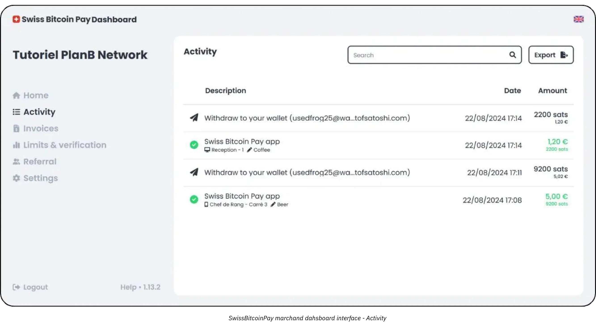

Amafaranga ni ay’uguhiganwa: 0,21% ku mwaka wa mbere, hanyuma 1% ku kwishura Bitcoin na 1,5% ku kwishura guhindura fiat, harimwo n’amahera y’ugucuruza Bitcoin. Swiss Bitcoin Pay itanga uburyo bwo hagati hagati y’imiti y’ububiko nka Open Node n’uburyo butoroshe bwo kwiyakira nka BTCPay Server, ishira imbere ukworohereza, umutekano, n’ukwigenga mu vy’amahera.

Ubwo bwoko bw’ugutegura buratuma abacuruzi bakorana n’abantu bashobora gutanga amafagitire y’ukwishura generate vyihuse, bagatanga amakode ya QR ku baguzi babo, kandi bakemera amafaranga y’umuravyo canke On-Chain ata ngorane nyinshi. Abakozi bakeneye gusa inyigisho ngufi kugira ngo bashobore gukora ivyo bihembo, mu gihe abarongozi bashobora kwinjira mu rubuga rwo kuri Internet kugira ngo bahuze ivyo bagurisha ku musi ku musi no kuronka raporo z’ishimikiro. Kuba hariho console y’uburongozi itunganijwe neza na vyo nyene birafasha amashirahamwe mato mato gukurikirana amafaranga yinjira muri fiat n’aya crypto ava muri Interface imwe, gutyo bikagabanya urujijo no kugabanya umwanya umara mu gukora ibitabu vy’amaboko.

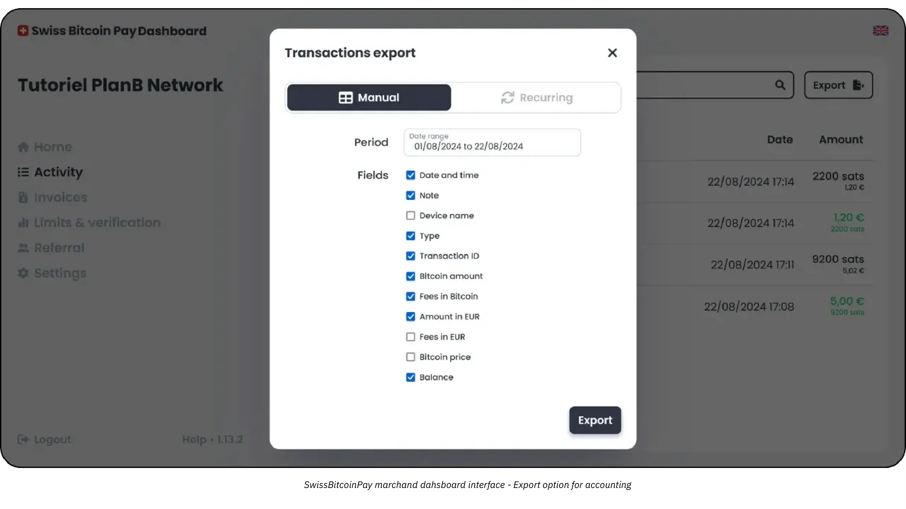

Ikindi ciza nyamukuru c’uburyo bw’ingenzi ni ugushimika ku gukoresha vyihuse no ku guhungabanya bike. Inyishu nka Swiss Bitcoin Pay zishobora gushirwaho mu masaha makeyi aho gushirwaho mu misi canke mu ndwi. Nk’akarorero, ku nyen’iresitora canke umuyobozi w’iresitora ikora cane, intumbero nyamukuru ni ugushiramwo ukwemera Bitcoin ata guteba ku kibanza co gutanga amahera canke gutera urujijo mu bakozi. Iyo POS imaze gutunganirizwa, umuyobozi arashobora gusa guha abakozi amabwirizwa yihuta ku bijanye no kwerekana Invoice no kugenzura ko amahera yarishe. Mu gihe ciza, igikorwa c’umukiriya cemezwa hafi ubwo nyene biciye ku Lightning Network, kandi ubuyobozi bw’ubudandaji buca bundika amahera mashasha mu gihe nyaco.

Naho urutonde rw’ibintu vy’ingenzi rudasaba uburyo bwo guharura amafaranga buteye imbere cane, biracari vyiza ko umuntu aguma afise amakuru akwiriye y’ivyo akora. Ibikoresho nka Swiss Bitcoin Pay bitanga ibikorwa vyo kohereza hanze CSV, bikaba bishoboza abarongozi gufata agaciro kangana n’aka fiat k’ugurisha kwa Bitcoin yose maze bakayikurikirana iruhande y’izindi nzira z’amahera. Uwo murongo w’inyandiko urahagije ku bucuruzi buto buto bwinshi, kandi gutahura neza ibiciro vya Exchange bizofasha mu gutanga imisoro no mu kugenzura ivy’ubutunzi muri rusangi.

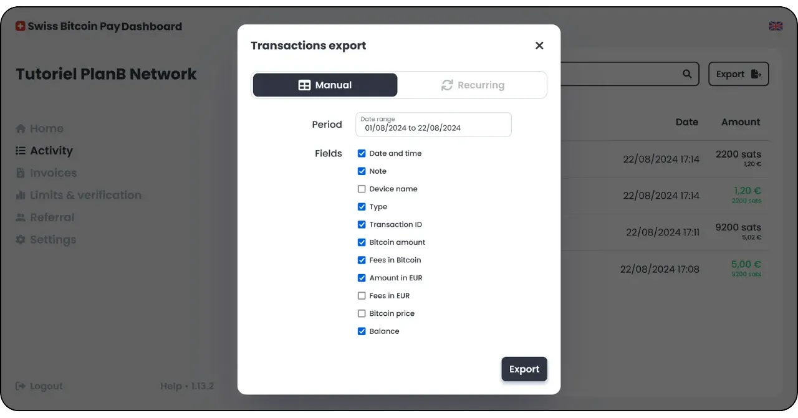

Umuti mwiza cane w’ivy’ubuhinga bwa none ku bijanye n’ivy’ubuhinga bwawe ni Swiss Bitcoin Pay:

https://planb.network/tutorials/business/point-of-sale/swiss-bitcoin-pay-2-a78b057e-ed11-47ac-860c-71019fcb451a

Ikindi gisubizo coroshe gushirwa mu ngiro, ariko gifise ingorane yo kuba 100% y’ububiko, ni Open Node:

https://planb.network/tutorials/business/point-of-sale/open-node-e69a0c1c-47f7-4932-8494-e6f26c3c9784

Niba witeguye guhumanya ibiganza vyawe kandi ushaka gucungera neza igikorwa, porogarama ya BTCPay Server ni uburyo bwiza cane. Ariko rero, ikibazo gikomeye ca BTCPay Server ni uko gutegura no kuyicungera bitwara umwanya kandi bisaba ubuhinga bumwe bumwe, ariko urashobora gukurikiza ubuyobozi bwacu:

https://planb.network/tutorials/business/point-of-sale/btcpay-server-928eb01e-824b-4b57-a3e8-8727633beddc

Ubwa nyuma, nk’inyongera y’ibibanza vy’ugurisha, woshobora kwiyumvira gushinga [PoS ya Bitcoinize] (https://bitcoinize.com/).

## Umwuga

<chapterId>4d5dfa50-c4d0-481c-ab95-1863a898750e</chapterId>

Iryo koraniro ry’abahinga ryerekeye ubucuruzi bwaciye kure y’ukwishura rimwe na rimwe canke guke Bitcoin, ubu bukaba burondera ibikorwa remezo bikomeye vyo gukora ibikorwa vyinshi vy’umusi. Izo sosiyete akenshi zikora mu nzira nyinshi (kumbure ahantu h’ubudandaji, urubuga rwihariye rw’ubudandaji bwo kuri interineti, mbere n’ugucuruza kuri telefone ngendanwa) rero zisaba inyishu zo kwishura zishobora gushirwa mu bikorwa vyazo bisanzwe. Mu bihe vyinshi, amashirahamwe ari kuri uru rwego arasanzwe arongoye uburyo bwo kugurisha, uburyo bwo gucunga amategeko yo kuri Internet, n’ibikorwa vyo mu biro vy’inyuma bisaba uburyo bwo kwizigirwa kandi bushobora gukoreshwa.

Kimwe mu biranga umucuruzi w’umwuga ni ugukenera **ibintu biteye imbere** n’**ibisubizo bishobora guhindurwa** bigumya ubushobozi mbere n’igihe ubunini bw’ibikorwa bugenda burakura. Udakunze abakoresha Essential, bashobora kunyurwa n’igikoresho gisanzwe gihuye neza na porogarama ya telefone ngendanwa, Ubucuruzi bw’umwuga busanzwe busaba ibintu nk’uguhindura Invoice mu buryo burambuye, ibipande vy’ugutanga raporo bikomeye, n’ubushobozi bwo gutanga inshingano nyinshi z’uburongozi.

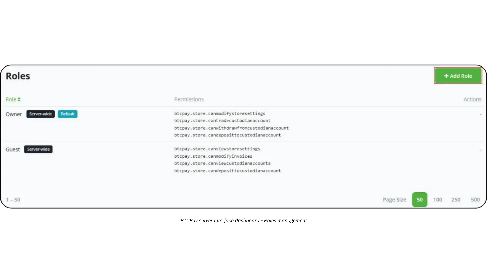

Nk’akarorero, umugwi w’amaresitora woshobora kuba ufise abakozi biyemeje gutanga amafagitire no gucunga ibikoresho, mu gihe umugwi utandukanye ugenzura urutonde rw’ibintu be n’amasekeza yo kwamamaza. Muri ivyo bidukikije, umuti wo kwishura Bitcoin utegerezwa guhura neza n’izo nzira z’imitunganirize zariho kera.

Ku bijanye n’ubuhinga n’ibikoresho, inyishu nka **BTCPay Server** akenshi ni zo zigize umushinge w’imiterere y’umwuga. BTCPay Server ni urubuga rwuguruye rushobora gukoreshwa haba mu nzu canke biciye mu kwakira abantu mu gicu kandi rutanga uburyo bwinshi bwo gukorana n’imbuga n’urubuga rw’ubudandaji. Mu gukoresha urugero rwabo bwite, ubucuruzi buraguma bufise ububasha bwinshi ku bijanye n’ingene umuntu yishura, kuva ku mapaji y’ugusohoka yihuta gushika ku makuru atera ibikorwa vyo mu mutima iyo kwishura kwemejwe.

Ikindi, ibikoresho nka [Zaprite](https://zaprite.com/) canke [Musqet](https://musqet.tech/) birashobora kurushiriza gutunganya ubumenyi bwo gutanga amahera, bikaba vyemerera guhindura ibintu mu buryo bubereye (kuva ku mahitamwo y’ibara gushika ku bushobozi bwo gutanga raporo buteye imbere). Abakunda ubuhinga bwo kugurisha ibintu vyose kuri interineti boshobora gukwegera kuri [Be-BOP](https://be-bop.io/), umuti w’iduka ryo kuri interineti wubatswe kugira ngo worohereze abantu kwishura Bitcoin ataco batakaje mu gukoresha neza.

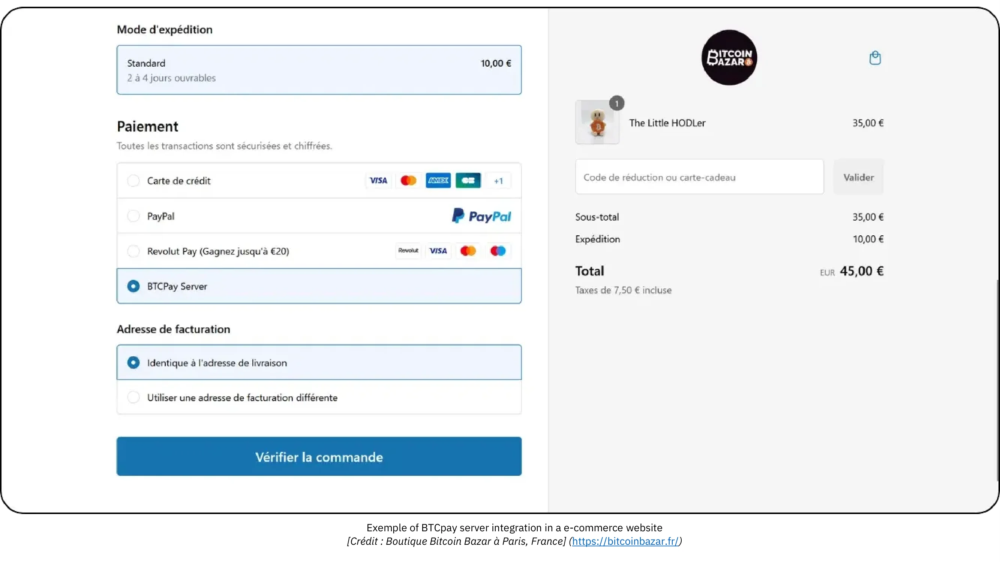

Gushira mu ngiro izo tekinoloji mu kibanza c’umwuga bisigura kwitwararika cane **ugusobanuka kw’ibikorwa**. Ivyerekeye gutanga amafagitire vyikoresha, kwerekana amafaranga menshi, no guhuza n’uburyo bwo gukora urutonde rw’ibintu busanzweho, vyose ni ibimenyetso vy’urubuga rwuzuye neza. Ubushobozi bwo kwohereza hanze neza amakuru y’ibikorwa (yaba nk’amadosiye ya CSV, amahamagara ya API ataco akora, canke uburyo bugenewe) bufasha ubucuruzi guhuza neza ugurisha kwa Bitcoin n’ibindi bikoresho vy’amahera.

Umutekano n’ugucungera uruhara ni ikindi kintu gihambaye co kwitwararika abakoresha b’abahinga. Uko amafaranga y’imisi yose ya Bitcoin yirundanira, kugenzura ukuntu umuntu ashobora gushika ku bikorwa vy’ubutegetsi bica bihinduka ingingo y’ingenzi yo kugabanya ingorane. Mu mirongo myinshi, abarongozi barashobora gutanga ingero zitandukanye z’uruhusha (kumbure bagahagarika abakozi bamwebamwe kuraba amateka y’ibikorwa no gutanga amafagitire, mu gihe abandi baha ububasha bwo gucunga ububiko canke gutunganya imiterere ya sisitemu yose...). Uwo mubumbe w’ubukuru nturinda gusa amakuru y’agaciro ariko kandi uratuma ibikorwa bigenda neza mu gusobanura abakozi bafise inshingano ku gice cose c’ibikorwa remezo vyo kwishura.

Ku bijanye n’ingero z’ukuri, rimbura iduka ry’ubudandaji ry’ubuhinga bwa none ry’ubunini hagati ryitaho ibikoresho vy’ubuhinga bwa none. Iyo sosiyete yoshobora gushiramwo BTCPay Server mu iduka ryayo ryo kuri internet ririho, igaca itanga aderesi zo kwishura Bitcoin mu gihe co gutanga amahera. Abaguzi baraheza ivyo baguze mu gucapura Lightning canke On-Chain Address, maze urubuga rw’iduka ruca rwemeza ko barishe. Muri ico gihe nyene, urutonde rw’imbere rurahindura uko amategeko ameze maze rugatuma habaho amamenyesha y’ivyo kohereza. Kubera ubuhinga bwo gutanga raporo buteye imbere, umugwi w’ivy’amahera urashobora gusubiramwo bitagoranye ugurisha kwa Bitcoin ku musi, kwohereza hanze Ledger ihuriweko kugira ngo igenzurwe, no gukurikirana agaciro k’amahera yose ya BTC iyo sosiyete ifata ingingo yo kugumana.

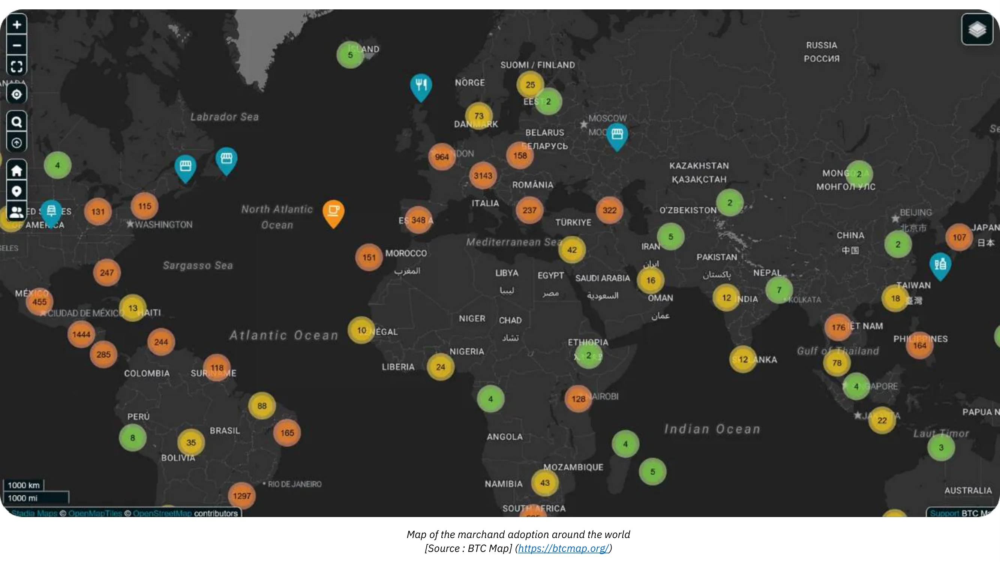

*[Ikigereranyo: Iduka rya Bitcoin Bazar i Paris mu Bufaransa.]*

Kugira ngo umenye neza ivyerekeye ugushirwa mu ngiro no kumenya uko BTCPay Server itunganywa, raba inyigisho ikurikira:

https://planb.network/courses/6fc12131-e464-4515-9d3f-9255365d5fa1

## Ikigo

<chapterId>80fb2659-81ca-4a11-b492-72c7ae5774f9</chapterId>

Ivyerekeye Ishirahamwe bihagaze ku rwego rwo hejuru rw’ugushirwa mu ngiro kw’ukwishura kwa Bitcoin, bigenewe canecane amashirahamwe manini manini, amasoko akomeye, n’ubudandaji bwashinzwe busaba inyishu zihuye n’ivyo umuntu akeneye. Mu buryo butandukanye n’ugushiraho ibikorwa ku rugero ruto canke rwo hagati, ibikorwa vyo ku rugero rw’Ishirahamwe bishiramwo amahera ya Bitcoin mu rutonde rwagutse rw’ibikorwa n’imirongo, kuva ku bikoresho vyo kugurisha ku kibanza gushika ku maduka y’ubudandaji bwo kuri interineti, ibibanza vy’ubuhinga bwo guharura amafaranga, n’imirongo y’ubuhinga bwa ERP iteye imbere.

Kuri uru rugero, intumbero nyamukuru si ukwemera gusa Bitcoin, ariko ni ukubikora mu buryo **bujanye n’imigenderanire nyamukuru y’ishirahamwe**. Ukwo guhuza bishobora gusaba gutegura porogarama zidasanzwe, yaba umuti wose ari uwugenewe canke utunganijwe biciye ku bikorwa remezo bishingiye kuri SaaS bishigikiwe n’abandi *Lightning Service Providers* (LSPs). Mwene izo LSP zishobora gukorana n’ibintu vyinshi bikoreshwa be n’imiterere y’urubuga itoroshe irenze ubushobozi bw’ibikoresho bisanzwe bikoreshwa hanze y’isandugu. Ubwubatsi buva muri ivyo rero bushiramwo ibintu vyinshi vy’ubuhinga n’ubudandaji, kuva ku gushiramwo ibintu bishingiye kuri API gushika ku bushobozi bwo gucunga ububiko buteye imbere.

Mu bijanye n’ikigo, ugusobanuka kw’ibikorwa biragaragara cane. Ishirahamwe rinini rishobora gukenera kwakira amashami menshi (ugucuruza, ubudandaji, devops, ivy’amahera, n’ivy’ubuhinga) umwe wese afise amabanga atandukanye n’amakuru asabwa. Muri iki gihe, urubuga rwo kwishura rwa Bitcoin rutegerezwa gutanga uburongozi bw’uruhara rwinshi cane, bituma igisata cose gishobora gushika ku bikorwa bijanye n’ibikorwa vyaco mu gihe kizigama ubugenzuzi bukomeye ku mutekano n’ubutungane bw’amakuru. Ivyo nyene ni ngirakamaro ubushobozi bwo guhindura ingene ibikorwa bigenda: nk’akarorero, amahera yinjira yoshobora gutuma habaho ihinduka mu buryo bw’ububiko, kohereza amatangazo yikora ku barongozi b’ugucuruza, no guhindura ivyinjijwe muri Ledger vy’umugwi w’ivy’amahera, vyose mu gihe nyaco. Ivyo bikoresho vyo kugurisha ubwavyo bikunda guhuzwa n’ibidukikije vy’ishirahamwe, bifise porogarama zihuye n’ivyo ishirahamwe rikeneye be n’ivyo rikeneye.

**Umutekano** ni wo uhambaye cane ku bucuruzi bushingiye ku bigo. Ivyiyumviro vyinshi vy’ugucuruza n’amahera menshi ashobora kuba menshi ya Bitcoin bisaba ibikorwa remezo bikomeye bishobora kwikingira ibitero vy’ububisha canke iterabwoba ry’imbere mu gihugu. Ivyiza akenshi birimwo gushirako umukono mwinshi n’imiterere y’itunga ry’igihe, amakode yagenzuwe neza, no kwubahiriza cane inzego z’amategeko zijanye n’ivyo. Ikindi kandi, kwubahiriza amategeko agenga ivy’ubutunzi yo mu gihugu no kw’isi yose birashobora kuba ikintu gihambaye mu kuzigama izina ryiza ry’ishirahamwe n’uruhusha rwo gukora.

**Iterambere ry'imigenzo** riri mu kurema canke gushiramwo umuti wo kwishura Bitcoin wo mu rwego rw'ishirahamwe rirarenga gushiramwo amakode y'ibintu bikeyi vy'ikoreshwa. Mu bisanzwe bisaba umugambi w’ubwubatsi, amategeko y’igerageza yimbitse, n’ugushiraho ibintu bishobora gufata inzira nyinshi (porogarama z’intango z’igerageza, igerageza ry’isoko ry’agaciro, n’ugushirwaho kw’isi yose).

Ku bijanye n’ivy’ubuhinga bw’ivy’ubuhinga bw’ivy’ubuhinga bw’ivy’ubuhinga bw’ivy’ubuhinga bw’ivy’ubuhinga bw’ivy’ubuhinga bw’ivy’ubuhinga bw’ivy’ubuhinga bw’ivy’ubuhinga bw’ivy’ubuhinga bw’ivy’ubuhinga. Ubucuruzi bukomeye bushobora kwizigira inyishu z’itegurwa ry’ibikoresho vy’ishirahamwe (ERP) nka SAP canke Oracle, na zo, zitegerezwa gukora Interface ata nkomanzi n’amakuru y’ukwishyura Bitcoin. Kugira ngo ivyo bishoboke, APIs z’urubuga rwatowe zitegerezwa kuba ziteye imbere kandi zishobora guhinduka, zigaha amashirahamwe y’ubuhinga bwa none umwidegemvyo wo guhingura ibiharuro vy’amakuru, gushiramwo uburyo bwo gusubiza hamwe bwikora, n’incamake z’ivy’amahera za generate ku musi canke mbere ku masaha.

Ivyiyumviro bisanzwe vy’Ishirahamwe vyoshobora kuba ari isoko rinini ry’ubudandaji ryo kuri Internet ryakira ibihumbi vy’abantu buri musi. Uretse gusa gutanga urutonde rwa Bitcoin nk’uburyo bwo kwishura, iri soko rishobora guhindura umuce wose w’ubumenyi bw’ukoresha, kuva ku kuntu uruja n’uruza rw’ukwishura Bitcoin ruboneka ku rubuga rwerekeye abakiriya gushika ku kuntu gusubizwa amahera, gusubizwa amahera, canke gutorera umuti amatati bicungiwe ku mpera y’inyuma. Ishirahamwe ry’aba devops ryiyemeje, rifatanije n’inzego z’ivy’amahera n’ivy’amategeko, ryogenzura ibikorwa vyo gusanasana, ivy’umutekano, n’ivy’uguhindura amategeko. Iyo iyo sosiyete ihisemwo kugumana igice c’amahera yinjiza muri Bitcoin, uburyo bwo gucungera amafaranga y’imbere mu gihugu bwokurikirana amafaranga y’ishirahamwe Bitcoin iruhande y’amafaranga asanzwe.

Kugira ngo ugushiraho ibikorwa bibe vyiza kandi bitekanye ku rwego rw’Ishirahamwe, amashirahamwe menshi akoresha abatanga ibikorwa vy’ubuhinga canke amashirahamwe y’iterambere yo mu nzu afise ubumenyi mu bijanye n’ugushiramwo Bitcoin na Lightning Network. Ivyo bitangura n’ugusuzuma mu buryo bwimbitse ivya nkenerwa (gushiramwo ibikorwa remezo vy’ubuhinga, ibisabwa vyo kwubahiriza amategeko, n’urugendo rw’umukiriya yipfuzwa) hanyuma hakaba uguhingura ubuhinga bwo kwubaka bushobora gukorana n’abantu benshi. Bivanye n’ingene umugambi ukora, woshobora kwizigira umugwi w’abahinga mu vy’ubuhinga bwinshi ugizwe n’abagenzuzi b’ivy’amahera, abahinga mu vy’umutekano be n’abahinga mu vy’amaporogarama. Canke, umubare uriko uragwira w’amashirahamwe yihariye y’abajanama arashobora kuguyobora kuva ku ciyumviro ca mbere gushika ku gusohoka kwa nyuma, akagufasha mu bikorwa nk’ugusuzuma inyishu zakira SaaS, gutunganya *Abatanga ibikorwa vy’umuravyo*, no guhindura imirongo y’imbere. Mu gukorana n’abahinga mu vy’ubuhinga, amashirahamwe arashobora kugabanya ingorane zijanye n’ugushirwa mu ngiro kw’amahera menshi no gushika ku ciyumviro kidakomeye kandi kijanye n’amategeko gusa ariko kandi gishobora guhinduka bihagije kugira ngo gishobore kwakira iterambere ryo muri kazoza.

## Bitcoin inyishu zo kwishura: Amahitamwo n'Imigenderanire

<chapterId>59ff43a1-98e2-4a81-af3e-9654bdd60952</chapterId>

Buri gihe habaho uguhuza ku rwego rwose rw’umuti. Nk'akarorero, mu "gice c'igerageza" ca mbere, ama wallets atangazwa yateguwe kugira ngo abe yoroshe uko bishoboka kwose mu bijanye n'ukoresha Interface, ariko arakira (**custodial**). Ivyo bisigura ko ayo mahera agenzurwa n’uwutanga app. Ariko rero, ethos ya Bitcoin iremesha kuja ku Ownership yuzuye y’amahera n’uwuyikoresha (**ukwizigama**). Muri iki gihe, birakenewe ko usubira mu rwego rukurikira igihe nyene ugurisha kwa mbere gukorwa—mu vy’ukuri, iyo vyemejwe ko ufise abakiriya biteguye kwishura muri Bitcoin.

Kimwe mu vyiza nyamukuru vya Bitcoin ni ubushobozi bwo kwimurira amafaranga uko ushaka, bikaba bituma **vyoroha cane guhindura abaguha amakuru** canke ibice vy’umuti wawe. Ikindi, amaporogarama yose n’imiti yose ubwayo iriko iratera imbere ningoga. Nk’akarorero, rimbura Bitcoinize, ubu itanga ikibanza co kugurisha (POS) gikorana n’ibikoresho vyinshi biri kw’isoko, umuti utariho amezi makeyi aheze.

### Ushaka Umuti wo Gushinga Iduka no Kwemera Ivyishyurwa Vya Gakondo n’Ivy’Imigenzo ya Bitcoin?

Nimba uriko uratangura uhereye ku ntango—nta duka, nta porogarama yo gucunga ibicuruzwa, kandi nta n’uburyo bwo kugurisha (POS)—urafise uburyo bubiri:

- Gutanga amakuru ku bandi:** Ushobora gutanga amakuru ku bandi gukora urubuga rufise uburyo bwo kugura hanyuma ukongerako ubushobozi bwo kwishura Bitcoin iruhande y’imiti isanzwe yo mu maduka.

- Inyishu zoroshe:** Canke, ushobora gukoresha ama platforms nka Accessing.app kugira ngo ubikore wewe nyene. Inyungu nyamukuru zirimwo:
    - Gushinga iduka ryo kuri Internet canke ry’umubiri mu buryo bwihuse kandi bushoboka.
    - Ibereye ubucuruzi bw'ibihe, ibirori, amaresitora, canke amaduka y'ubudandaji.
    - Gusobanura no gucunga ibintu vy’ugurisha ku mubiri no ku rubuga.
    - Ukwishura kwa Fiat (nk'akarorero, amayero, amadolari) biciye kuri konti yawe bwite ya Stripe.
    - Bitcoin kwishura biciye ku konti yawe bwite y’Ubusuwisi Bitcoin Pay.

### Ni gute Ukwemera Ivyishyurwa vy'Umuravyo Bigenda ?

Naho Lightning Network itanga ubushobozi bwiza cane n’amahera make, kwemerwa kwayo kuracari mu ntango. Aho kwibanda ku mipaka iriho ubu, birabereye kwibuka ingene amahinduka y’ibikorwa remezo vyabaye:

- Igihe imodoka zatangura kugaragara, nta modoka zihagije zariho zo gutuma umuntu yubaka amabarabara, kandi nta nzira zihagije zariho zo gutuma umuntu agira imodoka.
- Igihe amashanyarazi yatangura, nta bakiriya bahagije bariho kugira ngo bashobore gushingira intahe kwubaka amabarabara y’amashanyarazi, kandi nta n’amabarabara ahagije yo gukwegera abakiriya.

Ivyubatswe bishasha biraroranirwa kubera ko bikora neza cane, kandi ababikoresha mbere baravyifatanya kubera ko bimbura inyungu ziboneka. Aha niho hari ivyo twihweje ku bijanye na Lightning Network mu 2024:

- Ibikorwa vyihuta cane:** Ibikorwa vy’ubudandaji akenshi bishika hafi mu kanya nk’ako gukubita (<500ms) kandi bifise igipimo c’ukunanirwa gito cane.

- Ubuhinga bwo gukoresha urubuga:** Abakinyi bakuru bariko barabona ko amafaranga ashobora gukoreshwa mu rubuga rwose, mu gihe abantu ku giti cabo bahagaritse cane gutanga amahera ubu bakaba bariko barakoresha "ibice vy'inyuma."

- Ubumenyi bw’abakoresha bwarateye imbere:** Amaporogarama yo kuri telefone ngendanwa y’abakoresha ku giti cabo yarateye imbere cane. Ibirango nk’ugufatanya, amafagitire ya Bolt12 adahinduka, n’ukwishura ataco yemeza (0-conf) biraboneka cane, bituma imigenderanire idakora neza. Ibibazo vy’ugukorana (nk’akarorero, gufunga inguvu) ntibikiri ivy’agaciro kanini.

- Uburongozi bw’Imirongo n’Imirongo:** Inyishu z’umuntu ku giti ciwe n’iz’abahinga zarateye imbere. Nk’akarorero, BTCPay Server ubu irashigikira ibikoresho vyinshi vyo kwifatanya n’abandi batanga amakuru (PSPs, on/off ramps, n’ibindi). Abatanga ibikorwa remezo bashasha, nka LightSpark na Alby Hub, na bo nyene bariko barinjira mu bikorwa.

- Ukwiyongera kw’abacuruzi:** Abacuruzi nka BitRefill bariko baratanga raporo y’ukwiyongera kw’amahera Bitcoin mu bakoresha babo bakora, n’uguhinduka gutomoye kuja kuri Bitcoin kuruta Lightning. Ikindi, amafaranga make cane ya Lightning atuma ari yo ihitamwo ryiza ku bijanye n’amahera makeyi (mwayeni ni €32 ku giciro).

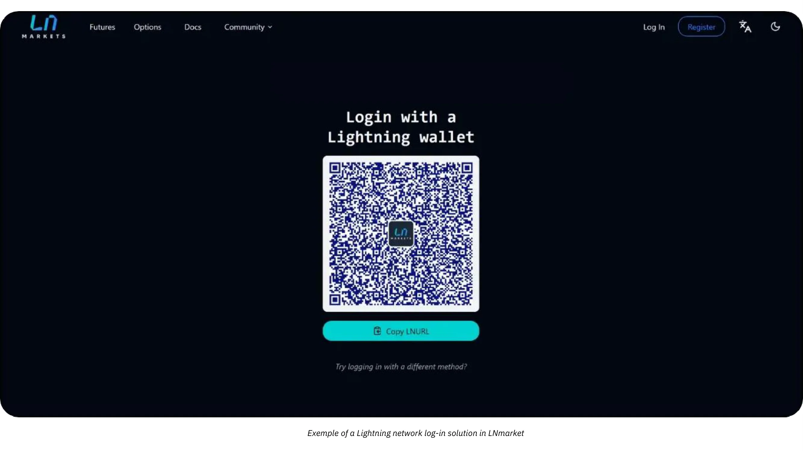

*[Isoko: Ikarata ya BTC](ku rubuga rwa BTC/)*

- Ivyerekeye urubuga:** Umubare wose w’imirongo na Bitcoin yugarijwe kuri Lightning uguma ushikamye, ufise imirongo nka 20.000, BTC 5.200, n’imirongo 60.000. Ariko ivyo vyerekana gusa igice c’urubuga kandi vyerekana uguhinduranya hagati y’abaje mu nama, abantu bakeyi n’abahinga benshi bakagira uruharamwo.

- Umuravyo nk’ikiraro hagati y’imirongo:** Ubushobozi bwa Lightning Network n’ukuboneka kwavyo vyaramaze kuyishira mu kibanza c’ikiraro ku yindi mirongo ihurikiye hamwe (nk’akarorero, FediMint, Liquid, n’ibindi).

**Ukugaruka kwa Wallet**

Bitcoin na Lightning Network ziriko ziraheza **ihinduka rya Wallet ry’ubuhinga bwa none**. Ibikorwa bishasha vyo ku rubuga ubu biraremeza **ugukoresha amafaranga ataco ukeneye gukora kuri konti**—Wallet yawe iba akaranga kawe! Kubera amategeko nka **Nostr Wallet Guhuza (NWC)** na **LN-URL-AUTH**, amasakoshi arashobora kwemeza abakoresha ata nkomanzi no gutuma amafaranga akoreshwa ata konti za kera. Imisi yo kuruha ku bijanye n’ugugura ibintu vyoroshe canke kwiyandikisha yaraheze. Ntibikenewe gutanga amakuru y’umuntu ku giti ciwe canke y’ukwishyura yoshobora guhera mu gufatwa n’abantu no kugurishwa ku rubuga rw’umwiza, nk’uko twibutswa kenshi cane n’ibintu biherutse kuba.

Abacuruzi b’ejo bazokwakira iyo nzira nshasha, bahe abakiriya uburyo butekanye, butagira umurongo (gukanda rimwe) kandi bubaha ubuzima bwite bwabo.

# Bitcoin Ivy'Ibarabara

<partId>d49d7595-a189-4e2b-bd60-c19e8e717aa2</partId>

## Ingingo ngenderwako z'ingenzi zo gucungera amafaranga Bitcoin mu bucuruzi

<chapterId>84063061-ffdb-4b1f-b20b-588ffb146877</chapterId>

Ibi bikurikira ni ivy’inyigisho gusa kandi ntibikwiye gufatwa nk’impanuro z’ivy’amahera canke z’ivy’ubuhinga bw’ivy’ubuhinga. Ubucuruzi n’abantu ku giti cabo bararemeshwa cane kuganira n’umucungezi w’amafaranga canke umuhinga mu vy’amategeko amenyereye amategeko agenga ivy’amahera y’amahera y’amahera mu gihugu cabo kidasanzwe imbere y’uko bagira ico bakoze.

### Bitcoin Ivyiyumviro nyamukuru vyo kubara

**Ibikorwa vyose vya Bitcoin bitegerezwa kwandikwa kandi bishobora gutuma haba ikintu gishobora gukorwako umusoro**

Ku isi yose, Bitcoin akenshi ntifatwa nk’amahera ahubwo nk’umutungo w’ubuhinga bwa none. Iryo tandukaniro rigira ingaruka nyinshi ku kuntu Bitcoin ibarwa mu bucuruzi, rikagira ico rihinduye ku bijanye n’imisoro, raporo y’ivy’amahera, n’ibisabwa kugira ngo umuntu yubahirize. Ubucuruzi bwemera Bitcoin nk’uburyo bwo kwishura canke bukayikoresha nk’igikoresho c’itunga butegerezwa gutahura ivyo bintu bitari vyo bijanye n’amategeko.

**Ingaruka ihambaye cane** yo kuguma mu muzirikanyi ni uko, mu bihugu vyinshi, kuronka, kugurisha, gucuruza canke gukoresha Bitcoin kugira ngo ugure, akenshi bituma haba **ikintu gishobora gukorwako umusoro** kandi inyungu zishobora gukorwako umusoro ku nyungu z’umutungo kamere.

Ikindi kintu c’ubuhinga bwo guharura amafaranga Bitcoin ni ugutandukanya ubwoko bubiri bw’inyungu z’umutungo kamere:

- Inyungu/Ibihombo vyihishijwe:** Inyungu canke ibihombo bitabonetse bishingiye ku gaciro ka Bitcoin kafiswe ku mpera y’igihe c’ibara.
- Inyungu/Ibihombo Bikora:** Inyungu canke ibihombo vy’ukuri igihe Bitcoin igurishwa canke ihindurwa mu mwaka w’ingengo y’imari.

Ivyo biharuro bivana cane n’uko Bitcoin ifashwe kugira ngo ikoreshwe mu gihe kirekire canke ngo ikoreshwe mu bikorwa vy’igihe gito. Ikindi, ubudandaji butegerezwa guhuza uburyo bwo gucungera amafaranga n’imiterere y’imisoro yo mu karere, kuko amategeko atandukanye cane ku gihugu.

Guharura amafaranga y’ubudandaji bufise Bitcoin biragoye cane kubera ko igikorwa cose gikoreshwa gitegerezwa gukurikiranirwa hafi kugira ngo habarwe inyungu canke ibihombo vyashitse canke bitashitse. Ku kugurisha kwose ukora mu kwemera Bitcoin nk’uburyo bwo kwishura, canke igihe cose ugura canke ugurisha Bitcoin, urakeneye kwandika:

- igihe kidasanzwe
- igiciro c'ugurisha (mu mafaranga y'amahera)
- igiciro c’igiciro ca Bitcoin (igiciro Bitcoin yaronsweko mu ntango).

Ivyo bizotuma mu nyuma ushobora kubara itandukaniro kugira ngo umenye inyungu canke igihombo.

**Akarorero:** Ubucuruzi bugura BTC 1 ku madolari 30.000. Mu nyuma, igura 0.5 BTC ku madolari 20.000. Kugira ngo ubaze inyungu canke igihombo, ubucuruzi butegerezwa:

- Bamaze kwandika igihe, igiciro c’igiciro ca fiat n’ingero ya Bitcoin yaronswe
- Banditse igihe, igiciro co kugurisha fiat n’ingero ya Bitcoin yagurishijwe
- Menya igiciro ca Bitcoin yagurishijwe : 0.5 BTC: amadolari 30.000 ÷ 2 = amadolari 15.000.
- Gereranya igiciro c’ugurisha n’igiciro c’ugugura: $20.000 (igiciro c’ugurisha) - $15.000 (igiciro c’ugugura) = inyungu y’amadolari 5.000.
- Guhindura ububiko bwa Bitcoin n'igiciro gishasha c'igiciro

Ivyo bitegerezwa gusubirwamwo ku bijanye n’ugucuruza kwose, kandi ukuntu igiciro ca Bitcoin gihinduka bituma kubika amakuru bigorana cane.

**Vyogenda gute iyo Bitcoin iba Ifaranga ?**

Iyo Bitcoin ifatwa nk’ifaranga, abacuruzi boyicungera nk’ayandi mafaranga yose ari mu buhinga bwabo bwo gucungera amafaranga. Aho gukurikirana ishingiro ry’igiciro n’inyungu zashitse/zitashitse ku bikorwa vyose, amafaranga Bitcoin yoba gusa yanditswe kuri konti y’amahera. Ku mpera y’igihe cose c’iraporo, agaciro k’amafaranga yose afise, harimwo na Bitcoin, kohindurwa mu mafaranga y’ibarabara (nk’akarorero, USD canke EUR) hakoreshejwe igipimo ca Exchange kiriho ubu.

**Akarorero kavuguruwe nimba Bitcoin yemewe nk'ifaranga:**

- Ubucuruzi bufise BTC 1 iyo Bitcoin ifise agaciro k’amadolari 30.000. Mu nyuma, ubucuruzi bukoresha 0.5 BTC ku kwishura igihe Bitcoin ifise agaciro k’amadolari 40.000.
- Ubucuruzi **nti** buharura inyungu canke igihombo cabonetse. Ahubwo, iyo nzira yandikwa ngo:
    - Ivyo kwishura: Amadolari 20.000 (0,5 BTC × 40.000 y’amadolari).
    - Igiciro ca Bitcoin gisigaye: 0,5 BTC, ubu gifise agaciro k’amadolari 20.000 (vyavuguruwe ku rugero rwa Exchange ruriho ubu).

**Ivyiza vy'ingenzi iyo Bitcoin yemewe nk'ifaranga:**

- Ubucuruzi bukeneye gusa guhindura amafaranga angana na Bitcoin bufise mu bihe bitandukanye (nk’akarorero, ku raporo z’ukwezi canke z’umwaka), nk’uko biri ku ma euro, ama yen, canke ayandi mafaranga afise.
- Ivyo bikuraho ivy’ugukurikirana igiciro ku rugero rw’ibikorwa kandi bikorohereza ubuhinga bwo guharura, cane cane ku bucuruzi bukunda gukoresha Bitcoin.

Ubwo buryo bwotuma ubuhinga bwo guharura amafaranga bwa Bitcoin bworoha cane, bugabanura imitwaro y’ubutegetsi, kandi bugahuza n’ingene ayandi mafaranga afatwa, twiyumvira ko Bitcoin yokwemerwa bimwe bishitse nk’uko biri mu vy’amategeko no mu vy’amategeko. Ntiturashika ng’aho.

### Itandukaniro hagati y'Ibarabara ry'Umuntu ku giti ciwe n'Iry'Ishirahamwe Bitcoin

Ivyo Bitcoin ifatwa mu vy’amategeko no mu vy’ubuhinga bw’ibarabara biratandukanye cane hagati y’abantu n’amashirahamwe. Ku bantu ku giti cabo, inyungu zivuye mu bikorwa vya Bitcoin zishobora gukorwako umusoro ku nyungu, kenshi ku rugero rwo hejuru. Mu buryo butandukanye n’ubwo, amashirahamwe yoshobora kwungukira ku misoro y’amashirahamwe ishobora kugabanywa ariko ategerezwa kwubahiriza ingingo ngenderwako zikomeye cane zo kubungabunga ibitabu.

Ku bucuruzi Bitcoin ishobora gushirwa mu bice bitandukanye bivanye n’ingene igenewe gukoreshwa:

- Itunga ridahinduka:** Ku Bitcoin rifise igihe kirekire nk’ishoramari ry’ingene ryifashe.
- Ivyuma:** Ku Bitcoin ikoreshwa mu bikorwa vyo gukora (ikoreshwa ridasanzwe, nk’akarorero ni ko biri ku bacuruzi b’abahinga).
- Amafaranga canke Konti z’Itunga:** Ku Bitcoin ifiswe nk’umutungo wa Liquid, ahanini ku bikorwa vy’ubudandaji canke uburongozi bw’itunga ry’igihe gito.

Guhitamwo gushirwa mu migwi bivana n’igikorwa n’ingene ishirahamwe rikora, bikaba bifise ingaruka ku gutanga raporo y’ivy’ubutunzi no ku bijanye n’imisoro. Imisi yose nusuzume amabwirizwa yo mu karere, kuko ivyo bishobora gutandukanywa n’igihugu.

### Inzego z'amategeko

Uko Bitcoin yemerwa n’amategeko be n’ingene ifatwa biratandukanye bivanye n’aho umuntu aba. Ibihugu bimwebimwe, nka El Salvador, vyaremeye ko Bitcoin ari amahera yemewe, ivyo bikaba vyatumye ikoreshwa mu bikorwa vy’ubudandaji vyoroha ariko bikaba bigorana gutanga raporo z’ivy’ubutunzi ku rwego mpuzamakungu. Abandi bafata Bitcoin nk’umutungo w’ubuhinga bwa none ushingiye ku mategeko yihariye yerekeye imisoro n’ivy’ubuhinga bwo guharura amafaranga.

Mu bihugu vyinshi, Bitcoin ishirwa mu rutonde rw’ibintu vy’ubuhinga bwa none, kandi ukuntu ifatwa bigenwa n’ingingo ngenderwako rusangi z’ivy’ubuhinga bw’ibarabara. Ubucuruzi butegerezwa gutanga ibarura ry’amahera ya Bitcoin nk’uko bikurikira:

- Kwandika inyungu/ibihombo vy’itunga:** Ubucuruzi butegerezwa gutanga inyungu canke ibihombo vyabonetse mu ngaruka z’ivy’ubutunzi.
- Inyungu/Ibihombo Bihishijwe:** Inyungu canke ibihombo bitabonetse bitegerezwa kenshi kumenyeshwa ariko ntibishobora kugira ico bikoze ku nyungu zishobora gukorwako umusoro.
- Ugukurikiza ingingo ngenderwako z’ivy’ibara ry’amafaranga:** Ubucuruzi butegerezwa gushiramwo amafaranga Bitcoin mu migenzo itegekanijwe y’ivy’ibara ry’amafaranga, kugira ngo habeho uguseruka n’ukuri.

Uburyo bwo guharura amafaranga Bitcoin buratandukanye bivanye n’aho umuntu aba:

- Leta Zunze Ubumwe za Amerika:** IRS ishira Bitcoin mu rutonde rw’ibintu **ivy’ubutunzi, bisa n’ivy’ubutunzi, ivy’ubutunzi canke ivy’ubutunzi**. Ukwo gushikiriza bisigura ko igikorwa cose gifise amafaranga y’ibanga, nk’uguronka, kugurisha, gucuruza canke mbere kuyakoresha mu kugura, gishobora gutuma haba ikintu gishobora gukorwako umusoro kandi inyungu zishobora gukorwako umusoro ku nyungu z’umutungo kamere.
- Ubumwe bw’Uburayi:** Ibihugu bigize umuryango muri rusangi bifata Bitcoin nk’itunga ry’ibiharuro aho gufata ifaranga rikora. Rero inyungu kenshi zifatwa n’umusoro ku nyungu z’umutungo kamere.
- Aziya:** Ibihugu nka Singapore n’Ubuyapani vyafashe ingingo zitera imbere, zifata neza amafaranga y’ubudandaji bwa Bitcoin mu bihe vyihariye. Ariko Bitcoin muri rusangi ibarwa nk’**itunga ritaboneka**, kandi ipimwa ku gaciro kabereye ku musi wo gutanga raporo, hakaba hariho amahinduka yemewe mu nyungu canke mu gihombo.

Ni ngombwa cane gutahura amabwirizwa yo mu gihugu ukoreramwo no guhindura uburyo ukoresha mu gucungera amafaranga bivanye n’ayo mabwirizwa.

### Ingorane mu gutera imbere kw'amategeko

Intambwe yihuta y’ubuhinga bushasha bw’amahera y’ibanga akenshi irenga inzego z’amategeko. Kuva Bitcoin yemewe nk’umutungo w’ubuhinga bwa none, amategeko yo kw’isi yose yarabonye ivyiza vyinshi, ariko haracariho ibice:

- Kubura ubuhinga bwo guca imanza:** Ni bake mu bibazo vy’amategeko vyasobanuye neza imigenzo yihariye y’ivy’ubuhinga bwo guharura amafaranga, bikaba bisiga umwanya wo gusobanura.
- Impanuro ziriko zirabandanya:** Ibibazo nk’ingene imisoro ifatwa ku bihombo vyihishijwe biracari bitaratorewe umuti mu bihugu vyinshi.
- Ivy’Imipaka:** Amashirahamwe akora ku rwego mpuzamakungu arahura n’ingorane zo guhuza ingingo ngenderwako zitandukanye z’ivy’ubuhinga bw’ivy’ubuhinga bw’ivy’ubuhinga bw’ivy’ubuhinga bw’ivy’ubuhinga.

Naho hari izo ngorane, ibihugu vyinshi bifata ingingo zitanga umushinge ukomeye ku bucuruzi bwo kwinjiza Bitcoin mu bikorwa vyavyo. Gukomeza guhindura n’uguhuza mpuzamakungu bizoba ari ngirakamaro ku Address biva mu bibazo bikomeye mu bijanye n’ubuhinga bwo guharura amafaranga y’amahera.

### Gushira mu migwi Bitcoin mu nyandiko z'ivy'imari

Bitcoin’s classification mu nyandiko z’ivy’ubutunzi zitandukanye hakurikijwe ububasha kandi zivana n’ingene zikoreshwa mu bucuruzi. Mu buryo bwagutse, Bitcoin ifatwa nk’umutungo w’ubuhinga bwa none, usa n’ivy’ububiko, ishoramari canke amafaranga, ariko ikaba ifise ibiranga bidasanzwe bigira ico bikoze ku kuntu ifatwa mu vy’ubuhinga bw’ibarabara.

- Itunga ry’Ikoranabuhanga canke Itunga Ritaboneka**: Intara nyinshi, harimwo Ubufaransa n’Ubumwe bw’Uburayi, zishira Bitcoin mu rwego rw’itunga ry’Ikoranabuhanga canke itunga ry’Ikoranabuhanga aho kuba amahera yemewe n’amategeko. Ivyo bice bisaba ko ubucuruzi bugira amafaranga Bitcoin mu buryo butandukanye n’amafaranga y’amahera.
- Ivy’ububiko**: Iyo igikorwa nyamukuru c’ubucuruzi kirimwo ugucuruza Bitcoin, nk’uguhindura amafaranga canke abacuruzi, Bitcoin ifatwa nk’ivy’ububiko. Muri ivyo, ugupima agaciro bikurikiza ingingo ngenderwako z’ivy’ubuhinga bwo guharura ibikoresho.
- Ishoramari mu vy’amahera**: Amashirahamwe afise Bitcoin nk’umutungo w’igihe kirekire ashobora kuyishira mu rutonde rw’ishoramari ry’amahera. Nk’akarorero, muri Leta Zunze Ubumwe za Amerika, abacuruzi boshobora gutanga amafaranga Bitcoin hakurikijwe amabwirizwa y’Inama y’Ivy’Ibarabara ry’Ivy’Imari (FASB), bakemera ko hariho uguhungabana iyo agaciro k’isoko gagabanutse.

**Ivyiyumviro vy'ugushira mu migwi :**

- Ivy’ubutunzi vy’igihe kirekire akenshi bisaba ko bigeragezwa ko bishobora gusenyuka no gukuraho amahera.
- Ibikorwa vy’ubudandaji canke vy’ukwishura bisaba gukurikirana ubudasiba inyungu n’ibihombo vyashitse n’ibitashitse.

### Uburyo bwo gupima agaciro

Uburyo bwo gupima agaciro ni ubuhinga bwo kubara bukoreshwa mu kumenya igiciro ca Bitcoin, kikaba ari ngirakamaro mu kubara neza inyungu canke ibihombo mu gihe c’ibikorwa. Muri rusangi, ni vyiza **kuguma ufise agaciro k’ibiciro vy’ubu vy’ubu Bitcoin** mu buryo bwo kubara amafaranga. Ivyo bituma habaho uguserukira abantu, hakurikizwa amabwirizwa agenga imisoro, kandi ntihagire uwusubira inyuma igihe bikenewe gukorwa imibare.

- First In, First Out (FIFO)**: Isanzwe mu bihugu nka Australiya n’Ubuhindi, ubu buryo buraha agaciro Bitcoin bishingiye ku giciro co kugura mbere. Ivyo bishobora kuba **bigoye cane** kuko bishobora gusaba gukurikirana igice cose ca Bitcoin ukwaco iyo habaye ugurisha.
- Weighted Average Cost (WAC)**: Akenshi irakundwa ku bikorwa vy’ubudandaji vyinshi kubera **uko yoroshe**, nk’uko bigaragara mu bihugu nka Amerika.

Ni vyiza cane ko umuntu aguma afise igitabu c’ibikorwa gikurikirana ibiciro vya Bitcoin **kuva igihe ishirahamwe ritangura kugura Bitcoin canke kuvyemera nk’ukwishyura** kugira ngo habeho ububiko bw’amakuru butagiramwo uburyarya kandi butunganijwe. Ivyo vyonyene ni vyo bikwiye kuba imbere mu muzirikanyi igihe uhitamwo umuti wo kwemera kwishura Bitcoin canke kugura Bitcoin.

### Ibara ry'ibikorwa mu bucuruzi n'ubucuruzi bwo kuri interineti

Abagurisha bategerezwa kwandika igiciro ca Bitcoin-ku-fiat Exchange ku bijanye n’ugucuruza kwose. Nk’akarorero, mu bihugu vyinshi, abacuruzi barakoresha igipimo ca Exchange igihe bagurisha kugira ngo babare IVA.

Ubucuruzi butegerezwa kumenya neza ko ibikoresho vyose **Ukwishura** bakoresha bitanga ubushobozi bwo:

- generate an Invoice n’amahera yo mu karere (euro, amadolari, amapawundi), iyo VAT canke iyindi misoro yo mu karere, Bitcoin igereranywa n’iyo, itariki n’isaha, Bitcoin Exchange igiciro n’inkomoko ya Exchange n’ibindi
- n’urungike hanze amakete yose y’ukwishyura, n’imiburiburi mu buryo bwa .csv, afise amakuru yose ari hejuru, ku buryo umucungezi w’itunga ashobora kuyakora bitagoranye .
- Ivyiza ni uko woba ufise ububiko bw'agaciro kavuguruwe k'igiciro-ishimikiro c'ubu Bitcoin iri mu bubiko

### Ingorane

- Ihinduka**: Igiciro ca Bitcoin kirahinduka cane, bikaba bitera ingorane mu gutanga agaciro k’ibintu bifise no kumenya ivyiza bizovamwo mu vy’ubutunzi muri kazoza.
- Igenzura ry’amategeko**: Mu bihugu nk’Ubushinwa, uburenganzira bwa Bitcoin buragabanya ikoreshwa ryayo nk’umutungo w’itunga.
- Ugukekeranya kw’amategeko** : Ivy’amategeko bigenda birahinduka vya Bitcoin akenshi bisiga ubucuruzi mu kaga. Nk’akarorero, amahinduka mu vyerekeye imisoro, nk’ayo mu Buhindi canke muri Leta Zunze Ubumwe za Amerika, arashobora kugira ico akoze ku migenzo y’ivy’ubuhinga bwo guharura amafaranga mu kanya nk’ako gukubita urugohe.
- Ivyago vyo gukoresha nabi** : Gushira mu migwi nabi canke kudakurikirana neza ibikorwa vya Bitcoin bishobora gutuma haba ibibazo vyo kwubahiriza amategeko, ibihano, canke kwonona izina.
- Ivyago vyo gusubira guhabwa uburenganzira**: Kubungabunga igice kinini c’itunga ry’ishirahamwe muri Bitcoin bituma ubucuruzi bushobora guhomba bivuye ku kugabanya ibiciro. Ivyo birashobora kugira ingaruka zikomeye canecane iyo mwene ukwo kugabanya amahera bishitse igihe umuntu akwiye kwishura abaguzi, abakozi canke imisoro. Vyongeye, nyen’ishirahamwe arashobora guhanwa, ivyo bikaba bishobora gutuma ahanishwa amande canke ibindi bibazo bijanye n’amategeko, nk’uguregwa ko yakoresheje nabi itunga ry’ishirahamwe.

## Ibikoresho vy'Ibarabara na Porogaramu

<chapterId>e7b31be5-1176-4835-944e-3cba1b7040fa</chapterId>

Iyo ishirahamwe rifashe ingingo yo kwinjiza Bitcoin mu vy’ubuhinga bwo guharura amafaranga, ibikoresho bitandukanye be n’amaporogarama yihariye biratuma kwegeranya no gutunganya amakuru vyoroha. Mu bisubizo bizwi cane harimwo [CoinTracker], [Waltio], [Cryptio], [Koinly](Koinly](https://coinly.io/]), [Hentax. [Igitabo ca Zen](https://igitabo ca Zen.io/). Izo nzira zishimika canecane ku bintu bine:

- gukusanya amakuru vyikora;
- guhindura ayo makuru mu buryo bujanye n’ubuhinga bwo guharura amafaranga muri rusangi (QuickBooks, Xero, ERP);
- guharura inshingano z’imisoro;
- gushikiriza mu migwi ibikorwa.

Akenshi ni umufasha w’ubwenge ku mashirahamwe manini manini afise amasakoshi menshi n’itunga ryinshi ku mbuga zitandukanye canke ku mbuga zitandukanye.

Ariko rero, dosiye yoroshe `.csv` irimwo amateka y'ibikorwa akenshi irahagije ku bucuruzi buto buto bwinshi. Intumbero ni ugushira mu nyandiko, ku bijanye n’ukwishurwa kwose, itariki, umubare, agaciro kangana n’ako mu ma euro/amadolari, n’amaderesi y’ivyo bipimo Bitcoin. Ivyinshi mu bisubizo vyo kwishura Bitcoin (Server ya BTCPay, Bitcoin Pay y’Ubusuwisi, n’ibindi) canke ama platforms ya Exchange (Bitfinex, Kraken, Coinbase, n’ibindi) birasanzwe bitanga uburyo bwo kwohereza hanze amateka y’ibikorwa. Mu guha iyo dosiye umucungezi w’itunga, birashoboka ko amakuru yinjira neza kandi akatandukanya neza amafaranga yinjira n’asohoka ajanye na Bitcoin.

Ku bantu bizigama Bitcoin yabo, gucunga UTXOs (*Ibiva mu bikorwa bitakoreshejwe*) ni intambwe ihambaye. Gushirako ikimenyetso ciza ca UTXO birafasha gukurikirana inkomoko y’igice kimwekimwe cose ca BTC, gutandukanya ibikorwa bijanye n’ibikorwa vy’umwuga n’ivyo umuntu akoresha, no kworohereza gukurikirana kubera intumbero z’amategeko canke z’imisoro. Porogaramu nziza nyinshi za Bitcoin Wallet zigufasha kwinjiza Wallet yawe ukoresheje dosiye yawe y’ububiko (canke xpub yawe, bivanye n’ingene uteguye) maze ugashirako amazina y’ama UTXO ashingiye ku nkomoko yayo canke aho aja. Kugira ngo bigufashe, ng’iyi inyigisho yuzuye yerekeye iyo ngeso:

https://planb.network/tutorials/privacy/on-chain/utxo-labelling-d997f80f-8a96-45b5-8a4e-a3e1b7788c52

Ubwa nyuma, waba uri umucuruzi muto canke ubucuruzi bukomeye cane, birashoboka **gushinga Invoice muri Bitcoin**. Urufunguzo ni ugushira mu nyandiko neza ivyo ugurisha. Iyo uriha ukoresheje Wallet y’ukwizigama, ni vyiza ko generate icuruzwa ryanditseko inomero ya Invoice n’intumbero y’ukwishura mu bimenyetso vyawe. Niba ushaka gutanga Invoice biciye ku Exchange, uzogira kandi uburenganzira bwo kwohereza hanze ikimenyetso c’uko waronse canke amateka y’ibikorwa kugira ngo ubishire mu nyandiko zawe z’ivy’ubuhinga. Ukwo guseruka kuzotuma vyoroha gukurikirana no gutanga raporo y’ibikorwa vyawe vyose vya BTC.

## Ingero z'ubuhinga bwo kubara amafaranga Bitcoin

<chapterId>763f6f20-9181-495a-bf7d-b405899e65ec</chapterId>

### Koresha Ikibazo ca 1: Iduka ry'ubudandaji rihindura amafaranga Bitcoin mu ma Euro

**Ivyiyumviro**: Iduka rito ry’imikate ryemera Bitcoin nk’uburyo bwo kwishura ariko rihita rihindura Bitcoin yose ryaronse mu ma euro kugira ngo ntirishikirwe n’uguhinduka kw’amahera y’amahera.

**Akarorero**:

- Igitigiri c'uguhindura ama Bitcoin**: Bitcoin 1 = €40.000.
- Igurisha 1**: Umukiriya agura imikate myinshi ku €20.
    - Ivyo bihuye n’ivyo: (20 / 40.000) = 0,0005 = 50.000 vy’amasatoshi.
    - Amafaranga yo guhindura: 1,5% (€20 × 0,015) = €0,30.
    - Ivyo yaronse: €20 - €0,30 = €19,70.
- Igurisha 2**: Umukiriya agura ikawa ku €5.
    - Ivyo bihuye n’ivyo: (5 / 40.000) = 0,000125 = 12.500 vy’amasatoshi.
    - Amafaranga yo guhindura: 1,5% (€5 × 0,015) = €0,075.
    - Ivyo yaronse: €5 - €0,075 = €4,925.

**Incamake y'Ibikorwa**:

- Ivyo bagurisha vyose**: €25.
- Amafaranga yose hamwe**: €0.375.
- Amayero yose yaronse**: €24.625.

**Ingaruka z'Ibarabara**:

- Ivyo ugurisha vyose (€25) bibe nk’inyungu.
- Gukurako amahera yo guhindura (€0.375) nk’amahera yo gukoresha.
- Nta mahera ya Bitcoin aboneka ku rutonde rw’itunga kuko amafaranga yose yahinduwe ubwo nyene.

### Koresha Ikibazo ca 2: Iduka ry'ubudandaji rigumya 50% vy'amahera Bitcoin yishuye

**Ivyiyumviro**: Iryo soko nyene ry’imikate rihitamwo kugumya 50% vy’amahera Bitcoin nk’umutungo w’itunga, mu gihe ibindi 50% bihindurwa mu ma euro.

**Akarorero**:

- Igitigiri c'abahinduye **: 1 Bitcoin = €40.000.
- Igurisha ry'umukiriya**: Umukiriya agura imikate ku €50.
    - Ivyo bihuye n’ivyo: (50 / 40.000) = 0,00125 = 125.000 vy’amasatoshi.
    - Ivyo guhindura (50%): 25 € vy’agaciro k’ama Bitcoin = 0,000625 Bitcoin = amasatoshi 62.500.
        - Amafaranga yo guhindura: 1,5% (€25 × 0,015) = €0,375.
        - Ivyo yaronse mu mayero: €25 - €0,375 = €24,625.
    - Ivyo vyagumye mu 379 (50%): 62.500 = 0,000625.

**Incamake y'Ibikorwa**:

- Ivyo bagurisha vyose**: €50.
- Amafaranga**: €0.375.
- Amayero yose yaronse**: €24.625.
- Bitcoin Yagumye**: Abasatoshi 62.500.

**Ingaruka z'Ibarabara**:

- Reka ivyo ugurisha vyose (€50) nk’inyungu.
- Gukurako amahera yo guhindura (€0.375) nk’amahera yo gukoresha.
- Bitcoin (62.500 Satoshis) yagumyeho iboneka ku rutonde rw’itunga nk’itunga ry’ubuhinga bwa none.
- Inyungu itabonetse: iyo agaciro ka Bitcoin ku mpera y’umwaka w’ingengo y’imari kari hejuru canke hasi hazoba inyungu canke igihombo kitabonetse kizomenyeshwa mu nyandiko z’ivy’ubutunzi ariko ntikiboneke nk’inyungu .

### Koresha ikibazo ca 3: Ibikorwa vy'umwuga bigumya Bitcoin ku bijanye n'ishoramari ry'igihe kirekire

**Ivyiyumviro**: Umuhinga mu bijanye n’uguhingura ibishushanyo yigenga yemera Bitcoin nk’amahera yo kwishura kandi akaguma afise Bitcoin yose yaronse nk’ishoramari ry’igihe kirekire.

**Akarorero**:

- Igiciro co guhindura Bitcoin ku kwishura**: 1 Bitcoin = €30.000.
- Ibikorwa biva ku mukiriya**: Umukiriya ariha ibikorwa bifise agaciro k'amayero 3.000.
    - Ivyo bihuye n’ivyo: (3.000 / 30.000) = 0,1 Bitcoin = 10.000.000 vy’amasatoshi.
- Igiciro c'impera y'umwaka**:
    - Igitigiri c'abahinduwe mu mpera z'umwaka: 1 Bitcoin = €35.000.
    - Igiciro c'Itunga rya Bitcoin: 0,1 Bitcoin × €35.000 = €3.500.
    - Inyungu itabonetse: €3.500 - €3.000 = €500.

**Incamake y'Ibikorwa**:

- Amafaranga yose yinjiye yemejwe**: €3,000.
- Bitcoin Ifise**: 0,1 Bitcoin ifise agaciro k’amayero 3.500 ku rutonde rw’itunga.
- Inyungu itabonetse**: €500 yerekanwa mu nyandiko z’ivy’ubutunzi ariko ntiyashitse nk’inyungu.

**Ingaruka z'Ibarabara**:

- Amafaranga yinjiye cane (€3.000) mu gihe c’igikorwa.
- Bitcoin yagumye (0.1) ifise agaciro k’amayero 3.500 ku rutonde rw’itunga.
- Inyungu zitabonetse zirakurikiranywa ariko ntizishirwa mu nyandiko z’inyungu/ibihombo.

### Ikoreshwa ry'ikibazo ca 4: Nyir'ubucuruzi agurisha 50% vya Bitcoin Inyuma y'aho igiciro kiduze

**Ivyiyumviro**: Umuntu afise ubucuruzi agura Bitcoin zitatu mu mwaka, akagira Bitcoin nk’umutungo, akagurisha 50% inyuma y’aho igiciro kiduze cane.

**Akarorero**:

- Bitcoin Ivyo ugura ku bakiriya**:
    - Gugura 1: €2.000 ku €20.000/BTC = 0,1 Bitcoin = 10.000.000 Satoshis.
    - Gugura 2: €3.000 ku €25.000/BTC = 0,12 Bitcoin = 12.000.000 Satoshis.
    - Gugura 3: €5.000 ku €30.000/BTC = 0,1667 Bitcoin = 16.670.000 Satoshis.
    - Igitigiri cose c’ama Bitcoin yafashwe**: 0,3867 Bitcoin = 38.670.000 z’amasatoshi.

- Igiciro c'impera y'umwaka**:
    - Bitcoin Igiciro ku mpera y’umwaka: €40.000/BTC.
    - Agaciro kose: 0,3867 Bitcoin × €40.000 = €15.468.
    - Inyungu itabonetse: €15.468 - €10.000 (igiciro cose) = €5.468.

- Ugurisha 50% vya Bitcoin**:
    - Bitcoin Yagurishijwe: 0,19335 Bitcoin.
    - Amafaranga y’ugurisha: 0,19335 Bitcoin × €40.000 = €7.734.
    - Ishingiro ry'igiciro (Igiciro gipima):
        - Igiciro cose: €2.000 + €3.000 + €5.000 = €10.000.
        - Igiciro c’Igiciro: 10.000 € / 0,3867 Bitcoin = 25.850 €/BTC.
        - Igiciro ca Bitcoin cagurishijwe: 0,19335 Bitcoin × €25.850 = €4.999.
    - Inyungu: €7.734 - €4.999 = €2.735.

**Incamake y'Ibikorwa**:

- Bitcoin Isigaye**: 0,19335 Bitcoin ifise agaciro k’amayero 7.734 (ku mayero 40.000/BTC).
- Inyungu yashitseko**: €2.735 iri mu nsiguro y’inyungu.
- Inyungu itashitse**: €5.468 yerekanwa mu nyandiko z’ivy’ubutunzi (harimwo n’agaciro katashitse k’ama Bitcoin asigaye).

**Ingaruka z'Ibarabara**:

- Andika amafaranga y’ugurisha (€7.734) nk’inyungu.
- Kuraho igiciro ca Bitcoin yagurishijwe (€4.999) kugira ngo ubare inyungu yabonetse.
- Bitcoin (0.19335) yagumyeho iboneka ku rutonde rw’itunga ry’amahera rifise agaciro k’amayero 7.734.
- Inyungu zitabonetse z’amayero 5.468 ku Bitcoin yagumye zigaragazwa mu nyandiko z’ivy’ubutunzi.

# Igice ca nyuma

<partId>f6ca8d01-a4f3-449b-ac9f-c5fba9a69178</partId>

## Gusuzuma iri shure

<chapterId>0fe8c49e-b7f8-46f7-9c42-b8a9a99a7b46</chapterId>

<isCourseReview>true</isCourseReview>

## Ikizame canyuma

<chapterId>40a0f18c-bdc9-45b2-8dea-15f7e574230e</chapterId>

<isCourseExam>true</isCourseExam>

## Iciyumviro

<chapterId>5503c23e-3a90-4a23-8d89-75e3cc1ee53e</chapterId>

<isCourseConclusion>true</isCourseConclusion>