# Tangura urugendo rw'isosiyete yawe kuri network ya Bitcoin

Menya ubushobozi bufatika bwa Bitcoin na Lightning Network, kandi usuzume uko, nk'interineti, bishobora guhindura imikorere y'ubucuruzi bwawe. Kuva kuri treasury kugeza ku kwishyura vuba, ku giciro gihendutse, kandi gishobora kwaguka, Bitcoin itanga urutonde runini rw'imikoreshereze ku masosiyete.

Mu isomo ryose, uziga gusobanukirwa Bitcoin nk'urusobe rw'amafaranga mpuzamahanga, rusange, kandi rukomotse kuri interineti. Hamwe n'ibiranga byayo by'ibanze bidasanzwe, Bitcoin itanga iterambere rikomeye ugereranije n'amafaranga gakondo. Uzamenya impamvu n'uburyo bwo gukoresha Bitcoin mu mikoreshereze y'imari isanzwe nko kubika umutungo no gukoresha sisitemu z'ubwishyu. Byongeye kandi, iri somo rizakubiyemo kubona no guhagarika Bitcoin, harimo n'ibisabwa mu ibaruramari n'imisoro bifitanye isano, kimwe no gushyira mu bikorwa ibisubizo byo kwishyura Bitcoin byoroshye cyangwa ku rwego runini.

Uba uri isosiyete ntoya cyangwa sosiyete nini, kwinjiza Bitcoin mu bikorwa byawe bya buri munsi bishobora gutuma isosiyete yawe ihangana, ikora neza, kandi ihanganye. Buri sosiyete ishingiye kuri interineti izahinduka isosiyete yibanze kuri Bitcoin, kandi iri somo rireba ko witeguye.
+++
# Imenyekanisha

<partId>326cf945-5d3f-4d86-8c3e-4d1c35959799</partId>

## Incamake y'amashure

<chapterId>1be42be9-4080-49f5-b5b2-6b531dd55f5f</chapterId>

kaze  mu cirwa  ca BIZ101! Tangura  urugendo rw’uruganda  rwawe ku rubuga rwa Bitcoin n’iki  cirwa  gikwiye  - irembo ryo gutahura ingene Bitcoin na Lightning Network bishobora guteza imbere  imirimo  y’ubudandaji bwa kera. Iki cirwa  cakozwe kubwa  abacuruzi, abikorera utwabo , abarongozi, n’abafata ingingo mu nganda  bipfuza gutohoza ubushobozi bwibikorwa  vya Bitcoin nk’umuhora  w’amahera wo kw’isi yose, rwo kuri internet n’uburyo bukomeye bwo gutanga agaciro ka Exchange( irungika nirungikwa ).

Muri iki kiringo cose kiki cirwa , uzomenyeshwa ingingo ngenderwako z’ishimikiro zituma Bitcoin na Lightning Network zihindura cane. Uzomenya ingene ubu buhinga butanga uburyo bwinshi bwo gukoresha, kuva ku kubika amafaranga y’ubuhinga bwa none gushika ku kwishura vyihuta, muvyubutunzi , nomuvyiterambere , n’ingene bitanga iterambere rihambaye ugereranije na mahera ya kera no mugisata cirungika ryama faranga . Ivyigwa vya BIZ101 bihuza inyigisho y’ubutunzi hamwe nikoreshwa ryayo mubuzima busanzwe, bigashira umuco kukungene kwegereza gutunganya ubutunzi bwawe( wigenga ) bishobora kugabanya ukuntu umuntu yizigira abahuza( nkabanki ) no kurenga imipaka yashizweho nabo bahuza .

Iki cirwa  gitangura n’ugusuzuma mu buryo bwimbitse  amafaranga asanzwe n’uburyo bwo kwishura, bigashinga umushinge mu gutohoza ingene amafaranga akora muruja n’uruza kugira ngo umuntu ashobore gukora ubudandaji, mukuzigama no kwimenyereza mu vy’ubutunzi. Hanyuma,   tuzoshimikira kubuhinga bwa  none  buri inyuma ya Bitcoin n’ibintu bishasha vyashizweho na Lightning Network, bigaragaza  uruhara rwavyo mu kworohereza ibikorwa vyirungika  biciye mumuco, bicungerwe neza , kandi hafi y’igihe gito bishobora gufasha inganda z’ubunini bwari bwobwose . Hanyuma tuzokwinjira mu bice vy’ibikorwa vy’iki cirwa , duhereye  k'umuce  kivuga ku gufata ama bitcoins nk’itunga, hanyuma dukurikire igice ca nyuma kivuga ku kwemera Bitcoin nk’uburyo bwo kwishura.

Waba userukira uruganda  ruto canke ishirahamwe rinini, iki cirwa  kigamije kuguha ubumenyi buhagije  bwo gushiramwo Bitcoin mu bikorwa vyawe vya misi yose, gutyo ugatuma ishirahamwe ryawe rigira ubushobozi bwo kwihangana, gukora neza, ni hanganisha ryuruganda rwawe nizindi nganda . Uko Bitcoin ikomeza guhindura ubutunzi, gutahura ubu buhinga bushasha si uburyo bwo guhitamwo gusa ahubwo ni ikintu gikenewe cane.  gukorana itegure kwiyeme mubintu vyubumenyi , ingero ngirakamaro, n’ubuyobozi bw’ingene buzogufasha kugendagenda no gukoresha bitcoin neza  muri iyisi iriko iratera imbere ya Bitcoin!

Muriteguye kwinjira  mw’isi ya Bitcoin mu nganda ? Reka tugende!

# Amafaranga, uburyo bwo kwishura, na Bitcoin

<partId>d9bd0e21-8488-44e0-af55-6d0b934f83c2</partId>

## Amafaranga ya kera 

<chapterId>785e095c-6811-4ca2-ba46-fe38291432d4</chapterId>

### Amafaranga ni imihora

Amafaranga ni imirongo y’ishimikiro ishobora gutuma Exchange y’agaciro ikora neza.

Ata mafaranga, abantu bategerezwa gusubira ku  **barter( le troc)**, uburyo aho ibintu canke ibikorwa babiguranyana batamanje gukoresha amafaranga . Guhinduranya ntaco bimaze kuko bisaba "uguhuza ibintu bisa gusu"—bose bategerezwa kwipfuriza rimwe  ivyo uwundi atanga . Nk’akarorero, nimba umurimyi afise ingano zirengeye ashaka inkweto, ategerezwe kurondera umuhinguzi w’ibirato akeneye nawenyene izo ngano . Ivyo biba gake  kandi ntibikora neza. Naho, **n’ibicuruzwa n mu bukungu bw’uguhinduranya, hariho ~n(n−1)/2 Exchange ibiciro bikenewe**, bikaba bituma habaho uburyo butoroshe cane kandi bugumye . Nk’akarorero ivyo vyosaba ibiciro birenga ~124.000 vya Exchange ku bicuruzwa 500 gusa.

Amafaranga aravyorosha mu gukora nk’umuhuza, akarema **uruja n’uruza ( umuhora )rugabanya igitigiri c’ibiciro vya Exchange ku n** —kimwe ku kintu cose kijanye n’amafaranga. Ivyo bituma irungika ni rungikwa  bigenda neza cane kandi **bituma abantu bashobora gucuruza ibintu n’ibikorwa ataco basaba ko bompi bashakira ibintu bimwe mugihe kimwe**. Aho guhindura ingano n’ibirato umanje kurondera umuhinguzi wibirato akeneye nawenyene ingano, uwo murimyi arashobora kugurisha ingano ziwe kugira ngo abone amahera, mu nyuma akakoresha ayo mahera kugira ngo agure ibirato, canke ikindi kintu cose akeneye.

Gushiramwo amafaranga nk’uruja n’uruza ntivyorosha gusa ubudandaji ariko kandi birashoboza **ugusangira ibikorwa n’ubuhinga bwihariye**. Kubera ko hariho uburyo bwizewe  bwa Exchange, abantu  n’imiryango ntibagikeneye guhingura ibintu vyose barya. Ahubwo barashobora kwibanda ku vyo bakora neza kuruta ibindi vyose, bikongerereza ubushobozi n’ibintu bime neza. Umurimyi arashobora kwibanda muburimyi bwiwe   , umuhinguzi w’ibirato mu gukora ibirato, umwubatsi nawe mukwubaka amazu . Abo bahinga barashobora rero guhanahana  ibintu vyabo n’ibikorwa vyabo biciye mu mafaranga, bakavyungukirako umwe wese mubuhinga bwiwe . Ukwo kwibanda kuki kanaka  ni kwo gutuma habaho **ugutanga umusaruro n’uguhingura ibintu bishasha**, uko niko abantu banonosora ubuhinga bwabo no gutegura uburyo bushasha mu mirimo yabo.

kamere y'umuhora  w'amafranga urazanana n'izindi nyungu zihambaye. Ica mbere nambere , kuba mu muhora  w’amahera ni **ivyiza kuruta kuba hanze yawo**. Itegeko ry'urubuga rusangi ryorosha ubudandaji, rituma abantu bashobora guhuza ibikorwa vyabo vy'ubutunzi mbere no **mumihingo itandukanye ya kure na kure**. Nk’akarorero, umucuruzi wo mu gisagara kimwe arashobora gucuruza ibintu k’umuguzi wo mu kindi gisagara  akoresheje amahera amwe, ivyo bikaba bituma ubutunzi butera imbere be n’ugufashanya mu turere tunini.

akandi karusho gakomeye ka mahera ni ubushobozi  bwayo bwo **bwo ku ronkamwo ingurane **. Mu buryo bwokuzanya umuntu muguzanya muri uwo mwanya nyene , muguzanya ikintu nikindi muri ako kanya nyene ntavyingurane vyoroshe nkamahera. gusa amahera urashobora kuziganya ,ukayabika ukanayakoresha muri kazoza  Amafaranga, ariko, arashoboza . Ivyo vyerekana iterambere rinini mwitegekanywa ry'ubutunzi ryubutunzi , ishoramari, n’ukwirundanira ubutunzi, ivyo vyose bigatuna vyongerereza imibereho myiza yaba korera muri uwo muhora .

Mu gusozera, uburyo bwogukoresha amahera ni umuhora wakozwe kugira ngo habeho ukworohererezwa bwirungikwa ryubu tunzi .Iratuma ikuraho imbibe zitarerwa nuburyo bwokuguzanya (le troc) , bikorosha uruja nuruza rwibintu nkakarorero mubudandaji , kandi bikazana amahirwe mumikoranire hagati yi nganda canke amashirahamwe   no kuzigama. nkumu hora wariwo wose ,agaciro kamahera kavana nukuntu akoreshwa  n'ingene akoreshwa , inyuma na nyuma , amafaranga yigenza neza kurusha ayandi niyo  atsinda.

### amahera ameze neza  ni ayahe  ?

amahera ameze neza afise ibintu vyishi ngirakamaro atuma akora neza akanorohereza irungika ni rungikwa ryubu tunzi  Ifaranga . ngizi insiguro zipfunapfunye  zokuri imwe imwe yose :

kkintu gihambaye kugira habe ukwizera ubu buryo  bwirungika ni rungikwa .

- **Counterfeit-Proof**: amahera ategerezwa kuba agoye cane gose canke atanashoboka ko umuntu ashaka kuyigana ashobora kuyigana  . Ivyo  bigasabako akantu kose kari kuri ayo mahera kaba kari kanyako gakozwe kubuhinga katopfa gusubirwamwo uko umuntu yishakiye , amahera arazigama agaciro kayo, bivanye nuko kuntu akoranye ubuhinga bigatuma abasuma badashobora kuyigana ngo bateshe agaciro ayo mahera   mugushira amahera meshi mubantu atemewe nama tegeko yinyiganano bigatuma ibintu   bitangura kuduga ibiciro  . Nk'akarorero, mubihe vyakera , inzahabu ntiyakunzwe kubera gusa ubwiza canke ukutaboneka cane  , ariko kubera bigoye cane kubucukura no kubuhingura . aho bitandukaniye nama hera yimapuro canke amahera ngurukana bumenyi , inzahabu ntamuntu ashobora kuyikora, barabucukura mwisi ndimwa . Ukwo kutaboneka ndemano kwa zahabu  be n'igorana ryo gucukura noguhingura vyatumye zahabu igumana ishusho ryubudahangarwa  ryuburunzi bwizewe ikongera ikaba icitegererezo nyakuri.

- **ukutaboneka cane **: Amafaranga ategerezwa kuba afise igitigiri nyezina yayakoreshwa mubantu atari umurengera kandi akaba akwirikiramwa mugitigiri c'ikorwa ryayo. Ukutaboneke cane biratuma amahera agumana  agaciro   uko ubihe bigenda birahera , mukurinda guhingura amahera yumusesekara bigatuma  ubushobozi bwo kugura bugabanuka. Nk'akarorero, imiryango imwimwe y'Abanyamerika b'imvukira yakoresha amabuye yagaciro  mukubaho nkuku twebwe dukoresha amahera mukugura ibintu . Mu ntango, ayo mabuye yari agoye guhingura ( gucukura ) akaba arico gituma uko kutaboneka cane vyatumye ayo mabuye yagaciro agumana agaciro kanini muri uwo muryango . Ariko rero, aho abacuruzi b'i Buraya batanguye gucukura ayo mabuye yagaciro kumurindi urihejuru amabuye akaba meshi cane kwisoko hakuzura ayo mabuye , uko kutaboneke vyaciye bitituka . Uko inzahabu zaba nyishi , niko zatakaza agaciro  mububasha bwo kugura, ivyo vyatumye kandi  ayo mabuye ata  ubudahangarwa nkubutunzi bwizewe.

- **ataruhusha **: Kera, amafaranga nk'ibiceri ( ibingorongoro)  vy'inzahabu n'ivy'ifeza akenshi vyahingurwa( barabicura ) n'abantu ku giti cabo, nkabategetsi bo mu karere canke abacuruzi baba bafise uruhusha nubushobozi bwogucukura mubirombe izo nzahabu zitara hingurwa . Ubwoburyo bwakora rimwe rimwe bisunze amasezerano ni mpusha zatangwa numwami nyezina canke abatware bagace bashaka kuranguriramwo ivyo bikorwa . Uko ibihe vyagiye biragenda, Abami n'intwaro bagiye bariyegereza ivyobikorwa vyoguhingura ivyo biceri  kugira bashobore gukwirikirana no gucungera ubutunzi bushikamye  , amakori be n'uburyo  bw'amahera. Akarorero ka menyekanye cane ni  **thaler**, ifeza ryambere  ryatanguye gukoreshwa  mu 1518 mu **kiyaya ca Joachimsthal** (ubu ni Jáchymov muri Repubulika ya Tchèque) n'abacukuzi b'amabuye y'agaciro hamwe nabatware bako karere.Iryo zina  "thaler" rivuye mururimi rwiki dage  "Thal " bisigura  "umwomga"

Ivyo biceri , bizwi cane kuri kamere  yavyo yifeza , vyaraguye imbibe bitangura kuza birakoreshwa hirya nohino mubice vyiburayi . uko imyaka yagiye irahera niko amahera yagiye arahindura amazina bivanye nururimmi canke agace ayo mahera akoreshwamwo ,  nkakarorero aho ya fashe izina nka  "dollar" ,  yakoreshwa na reta zunze ubumwe z'Amerika nkifaranga mugihugu cabo. Mu bihe vya none, amahera yaciye  yemerwa bimwe vyuzuye mu gisata  c’ubuhinga  bwa seigniorage, ivyo bikaba bisigura  ko ibigo vyemewe vyonyene—nk’amabanki akomeye canke ububiko bw’amahera ari vyo vyari vyemerewe gucura ivyo biceri canke gukora ayo mahera (inoti ) . Abantu ku giti cabo ntibari bakicemerewe n’amategeko gukora amafaranga, bikaba ari vyo bituma habaho ubugenzuzi bumwe ku bijanye ni sohoka ry'amahera hamwe niyinjira yayo.

Ubu, ingingo ngenderwako y’ubutegetsi (seigniorage) iriko iratuma inegurwa kubera iri koreshwa ryamafaranga ngurukana bumenyi ya bitcoin , akora atakigo canke umuntu ari genzura (nkarorero Amabanki). Bitcoin ni uburyo "budasaba  uruhusha" aho umuntu wese ashobora kugira uruhara mu gukoresha amafaranga atasavye uruhusha, kandi, biciye muri Mining, canke mukuyakora . Ukwo kutagenzurwa kwa bitcoin  buraka ububasha inzego (reta ) bwogukora mahera kuburyo reta ishaka  , kuko vyovyura ibibazo ku bijanye nihangana ryama faranga  kw’isoko ry’uburenganzira(marché libre).

- **Unit of Account**: Ifaranga rikwiye gutanga ingero rusangi yo kugereranya agaciro k'ibicuruzwa n'ibikorwa. Ivyo birorosha urudandazwa kandi bikaba bituma ibiciro biba bizwi biciye mumu muco  kandi bihuye mu bikorwa vyose.

- **Rikomeye**: Ifaranga ritegerezwa kuba ritononekara vyoroshe bivuye kugihe rimaze,  nkakarorero kagaciro kibidandazwa canke umushahara . Amafaranga dushobora gukorakoa , nk'ibiceri canke amanoti, ategezwa kuba ato nonekara vyoroshe,  amafaranga y'ubuhinga bwa none nayo ategerezwa kuguma abitswe neza mumutekano ntangere kuburyo atangorane yo gutakaza ama données( gutakaza ayo mahera munuryo abikwamwo"données").

- **Ishobora gutwarwa**: Ifaranga ritegerezwa kuba ryoroshe gutwara no gukoresha, kugira bishobore nokorohereza ingene umuntu ashobora kuyohereza mumihingo itandukanye ya kure na kure . Ivyo bishobora gushikakwo biciye ku gutwara ayo mahera muburyo bufadika (ibiceri canke amanoti yoroshe) canke uburyo  budafadika ukoresheje ubuhinga bwa none bwa  digitale( lumicash).

- **Ishobora kugabanywa**: Amafaranga ategerezwa  kugaburwa  muduce  dutoduto nukuvuga muma hera matomato kugira ngo bishobore korohereza irungika nirungikwa ryamahera yubunini butandukanye. Ukwo guhinduranya bituma bishoboka ko ibiguzi vyubudandaji buto buto hamwe ni biguzi vyubu dandaji bunini bunini vyoroherezwa vyose .

- **Fungible**: utwo duce twamafaranga dutegerezwa (amafaranga mato mato na mani mani) kuba dukoreshwa  kugaciro kamwwe na kamwe   . Nk'akarorero, idolari rimwe ritegerezwa kuba ringana n'irindi dolari ryose ryi dolari rimwe nyene . Ukwo kungana kwa mahera gutuma korohereza ikoreshwa ryamahera biciye mumuco .

- **Imenyekana**: Ifaranga ritegerezwa kuba ryoroshe kumenya kandi ryizewe . Amafaranga agaragara yoroshe kumenya kubera ukuntu ateye nukuntu akozwe muburyo bwihariye  kubijanye numutekano , mu gihe amafaranga y'ubuhinga bwa none yo ashobora kumenyekana ko ari yanyayo biciye muburyo bwokugenzurwa . Ivyo bituma abantu benshi bayizigira  kandi bikagabanya ingorane zu busuma bwokuyigana(( kuyitirira ).

Ubwo buranga  bituma ifaranga rikora, ryizewe kandi rikora neza mu kworohereza ubudandaji no kubika ubutunzi mu bukungu.

### Ugutera imbere kw'uburyo bw'amafaranga

**Kuva ku biceri gushika ku mafaranga y'impapuro: Kwongerekana kw'ubushobozi no kuyagendana vyoroshe **

Urugendo rwo kuva ku biceri gushika ku mafaranga y’impapuro vyatumye habaho iterambere mukongerereza ubushobozi no korohereza kugendana amafaranga vyoroshe . Ibiceri, vyari bikozwe mu mabuye yagaciro  nk’inzahabu canke ifeza, vyari bifise agaciro kubera agaciro kavyo vyaba bifise ubwavyo. Ariko rero, vyari biremereye, bigoye gutwara aravyishi cane , kandi vyari bishobora kononekara  canke kwibwa. Amahera y’impapuro yaratumye haba iterambere rinini muburyo bwo gukoresha amahera mu kuzana uburyo bwama hera yoroshe gutwara ,  bugafita amategeko na kamere buhuriyeko kandi bushobora gutwarwa n' umuntu vyoroshe , buhagarariye agaciro aho kuba agaciro nyezina . iryo terambere rishasha ywatumye ubutunzi butera imbere mugutuma ubudandaji bwagura imbibe mukuza haraba  imikoranire niyindi mihingo ya kure na kure   no kugabanya ingorane zo guharura no gukwirikirana ubukungu , aho mukuriha bakoresheje ibidandazwa ( inzahabu, ifeza ) ahubwo bakaza barakoresha izo mpapuro nkuburyo bwo kuriha (amahera).

Amahera y’impapuro na yo nyene yaratuma habaho iterambere mu mibereho ya muntu . Aho kwizigira agaciro gatangwa n’ivyuma vy’agaciro , ubutunzi bwoshobora kwagura imbibi  biciye murizo mpapuro(amahera) zihagarariye agaciro, yatanguye  ashigikiwe mu ntango nk’amafaranga y’ububiko, mu nyuma yizigirwa  n'inzego zitanga amafaranga. Iryo terambere ryugururiye imiryango uburyo bwo gukoresha amahera bigoranye vyoroha  kandi kandi hatuma habaho urufatane rwama soko .

**Kuva ku mpapuro gushika ku mafaranga y'ubuhinga ngurukana bumenyi : Kwagura uburyo bwo kuyaronka nu bwihusi**

Kuva ku mahera y’impapuro gushika ku mafaranga y’ubuhinga  ngurukana bumenyi vyatumye uruja n’uruza rw’amahera rurushiriza kuba rwiza mu gutuma abantu bashobora kuyaronka vyoroshe  no muburyo bwihuse. Kubera ko ubuhinga bwa banki, amakarata y’inguzanyo, n’ugukoresha ubuhinga bwa none mukurungika no kuronswa ayo mahera  , amahera ntiyabaye uburyo bwokuyatwara  muburyo bworoshe  gusa ahubwo yarabaye hafi ** uburyo bwihuse cane bwokuyahanahana**. Ugutanga amakuru biciye ku buhinga ngurukana bumenyi kwakuyeho ivy’uko hakenewe guhana hana amahera muburyo bwamahera agaragara, ivyo bikaba vyatuma amafaranga ashobora kurungikwa mu masegonda makeyi kandi mumihingo itandukanye yakure na kure .

Iryo terambere  ryatumye kandi abantu bashobora kuronka amafaranga mumwidegevyo ntangere . Ubuhinga  bwo gukoresha amabanki n’ukwishura bukoresheje ubuhinga bwa none , bwagabanyije intambamyi zabantu bashobora kugira  zo kwinjira  mumigambi yiterambere   bigatuma bakorana ninganda vyoroshe   , bigatuma umuntu ashobora kugira uruhara mw'iterambere no kugwego rwo kwisi yose   . Ukwihuta n’ukuntu amahera yo mu buhinga bwa none akoreshwa neza vyatumye ubucuruzi bugenda butera imbere bwagura nimbibe zibikorwa , bigatuma inganda zumubwoko bushasha  zitari gushobora kuja mungiro hagikoreshwa gusa uburyo bwamahera yimpapuro zija mungiro .

Izo nzira z’amafaranga zo mubuhinga bwa none  zaje zifise ikibazo gikomeye: **ukubura ubugenzuzi bimwe biciye mumuco bwa amahera yose anzunguruka aciye muri ubwobuhinga nyene**, akenshi bikaba bituma habaho ukuduga  kw’ibiciro no gutakaza ukwizigira mubuhinga bwamahera agenzuwe . Nk’akarorero, amadolari arenga ibice 20 kw’ijana y’amadolari yose y’Amerika yariko arakoreshwa yakozwe mu myaka ine iheze gusa. Uko kuguma hagobwa   gushirwa  amafaranga menshi mubantu -bituma agaciro k'abafise ayo mahera ubu kagabanuka -bishobora ahanini gutera intambamyi : abanyapolitike,  kenshi barahimirizwa  kwirinda ingingo zikomeye mubijanye nitegekanywa y'ikoreshwa yamahera mugihugu , iyo ingorane ziyongeye  bagahitamwo ahubwo gusunikiriza  imbere  ingorane ku butegetsi bwo muri kazoza mu "Bakazo basigira izo ngorane"

**kuva kumahera afise imbibe gushika kumahera atagira imbibe (yidegevya): kongerereza ubwizigirwa  n'ubudahangarwa **

Ubu, ukuza kwa Bitcoin nk’ifaranga ry’igenga  bibomwa nk'intambwe igana mwiterambere ryugukoresha iryo faranga(bitcoin) nkuburyo bushasha bwogukoresha amahera mwisi . Amahera y’ubuhinga bwa none dukoresha ubu (carte bancaire) zikozwe kuburyo  zicungerwa zikongera zikana kurikiranwa nama banki hamwe ni nzego  kuburyo  amafaranga akoreshwa bayakurikirane. Naho izo nzira zikora neza, zirashobora gushikirwa n’ukudakora neza, nko kubuza ko umuntu atora amahera kubera ikibazo cabaye muri banke , n’ibintu bimwebimwe bishobora kugorana mubuhinga bwa banki. Amafaranga atagira imbibe (bitcoin ) aratuma akemura izo ntambamyi zishikira amabanki mu **gutanga icizigiro no gukuraho abahuza(amabanki)***. Bisigura kandi ko amahera ashobora guhana hamwa vyihuse  cane  **kandi kumahera make cane **, kuko nta ntambwe acamwo kugira uronke uburenganzira bwokurungika amafaranga yawe . Ubwa nyuma, nta muntu n’umwe ashobora kugeragezwa no guhindura urutonde rwukuntu amahera ya Bitcoin  arungikwa , ivyo bikaba bishirwa mu ngiro nubuhinga nyene bukoreyemwo muri bitcoin .

Muburyo bwamahera butagira imbibe nka bitcoin , amafaranga yirungika ni rungikwa asuzumwa n’urubuga rw’isi rwabantu bose bakoresha ubuhinga bwitwa blockchain , bikaba bituma ibikorwa  bikorwa mumutekano , mumuco , nk’ukubandanya ibikorwa bikora neza nubwo hoba ikibazo muruhande rumwe rwa sisiteme . Ukwo ubwo buhinga bwubatse  bigabanya ingorane z’ubusuma , ugabanya ukuntu umuntu ashira icizere mumabanki zifise ubu basha kumahera yawe  , kandi bituma  abantu bashobora kugenzura cane amahera yabo batamanje gusa impusha nkuko bikorwa muma banki . Mu gukuraho intambamyi z’imbibe zasizweho n'inzego hamwe na banki  , amafaranga atagira imbibe(bitcoin) atanga uburyo bw’amahera vy’ukuri bwo kw’isi yose kandi bushikirwa na bose.

**Iterambere ry'ikoreshwa ryamahera**

Intambwe yose  y’ikoreshwa ryimihora  y’amahera yarateye imbere mumice itandukanye : mwiyorohereza  ryitwara ry'amahera vyoroshe , gukwiragira kwamahera  kwisi yose , kuyaronka bitagoranye , irungika yaryo ryihuse , umutekano, n’ukuyizera . Ibiceri vyaciye bisubirizwa  n’amahera y’impapuro yoroshe gutwara kurusha  kandi akora neza gusuvya . Impapuro zaciye zihindurwa amahera y’ubuhinga bwa none (carte bancaire), ubuhinga bwaje butuma umuntu ashobora kurungika no kurungikirwa  amahera  kw’isi yose akamushikira kandi akayaronka mukanya isase . Ubu, Bitcoin iriko irasubiramwo ishusho yubwizigirwa  n’umutekano , irema uburyo bw’amahera bufunguye kandi bukomeye. Iryo  terambere uko rigenda riraza  mu mateka birerekana ko abantu baguma bashaka gushinga imihora mishasha yoguhana hana amahera , igihe cose isubiramwo ryubatswe  hacahaza irindi ryiyubakirako rishasha kandi riza ari nziza gusumba .

Igihugu ciza cane ni co gishobora gutsinda.

## Uburyo bwo kwishura bwa kera

<chapterId>1306196c-1e8a-454b-8e11-6887ecb3d8b4</chapterId>

Uburyo bwo kwishura ni uburyo n’ibikorwa remezo bishoboza gutanga amahera hagati y’abantu babiri mu bisanzwe hagati y’uwuriha (nk’umuguzi) n’uwurihwa (nk’ubudandaji). Ivyo bikorwa birashobora kuba mu bihe bitandukanye : umuguzi ariha umudandaza wo mu karere, uruganda  ruriko ruratanga ivyoruriha  k’uwugurisha, canke mbere abantu basanzwe  barungikirana amahera. Gutahura uburyo bwo kwishura bisaba kuraba ubwoko butandukanye bw’uburyo bwo kwishura, ibiranga, n’ingene bukoreshwa mu bijanye nibikorwa hagati y’ubudandaji n’abaguzi (B2C) no mu bijanye n’ubudandaji k’ubudandaji (B2B).

### Ubwoko busanzwe bw'uburyo bwo kwishura

1. **Amahera :** Amafaranga agaragara ahana hanwa hagati yimpande zibiri( uwuronka nuwurungika ).

2. **Isheki:** Inyandiko z’impapuro zitanga uruhusha kuri banki ngo itange  amahera  avuye kuri konti y’uwutanga uruhusha ngo bayahe   uwo ashaka bayaha .

3. **Ugutanga amafaranga biciye mu nzira y’ubuhinga bwa none:** Gutanga amafaranga biciye mu buhinga bwa none hagati y’amabanki, akenshi bikoreshwa mu kwishura amafaranga menshi no kwishura amafaranga ajabuka imipaka.

4. **Ikarata zo kwishura (Credit/Debit):** Ikarata y’ipurasitike canke y’ubuhinga bwa none ifatanye n’urubuga rw’amakarata, atuma amafaranga ashobora gukurwa kuri konti ya banki y’uwufise ikarita (canke umurongo w’inguzanyo) akaja kwi konti yu mudandaza.

5. **Ingodo yubuhinga bwa none  n’ukwishura kuri telefone ngendanwa:** Ibikoreshwa canke ibikoresho bibika amakuru y’ukwishura (nk’akarorero, Apple Pay, WeChatPay, AliPay,PayPal), bishobora gutuma umuntu ashobora gutanga amahera vyihuta kandi kenshi atakubonana kwabayahana .

**Ikoreshwa mu bisata vya  B2C na B2B:**

- **B2C (Ubucuruzi-ku-Muguzi):**
    - Abaguzi barakunda gukoresha amahera agaragara , amakarata be n’ingodo vy’amahera vy’ubuhinga bwa none kugira ngo bagure ibintu vya misi yose—nk’ibifungurwa, kugura kuri Internet canke gukora ibikorwa nk’ugutwara abantu n’ibintu.
    - Ukwihuta, ukuryoherwa, n’amahera make (ku baguzi) ni vyo akenshi bihambaye cane.
    - Ukwishura ata n’umwe akoresheje telefone ngendanwa n’ugukoresha telefone ngendanwa biragenda birakundwa cane muri iki kibanza kubera ko vyoroshe gukoresha.

- **B2B (Ubucuruzi-ku-Bucuruzi):**
    - Ubucuruzi busanzwe bwizigira amahera yoherezwa ku mbuga ngurukanabumenyi, amasheki be n’uburyo bwo gutanga amafagitire kugira ngo umuntu ashobore kwishura abaguzi, kwishura amafaranga menshi canke gukorana n’amahera asubiramwo.
    - Akenshi ikintu nyamukuru ni ugukurikirana, kubishira mu vyegeranyo , n’ubushobozi bwo gukorera kuma rungika ni rungikwa ryamahera meshi.
    - Ikoreshwa ry’ikarita ririho ariko rikunda gukoreshwaa  cane kubera amafaranga menshi bakata hamwe nama hera utarenza iyo ari meshi  . Inyishu z’ubuhinga bwa none nk’imbuga  zo kwishura zihuriweko ziriko ziraseruka kugira ngo zitunganye kandi zikoreshe ubuhinga bwo kwishura.

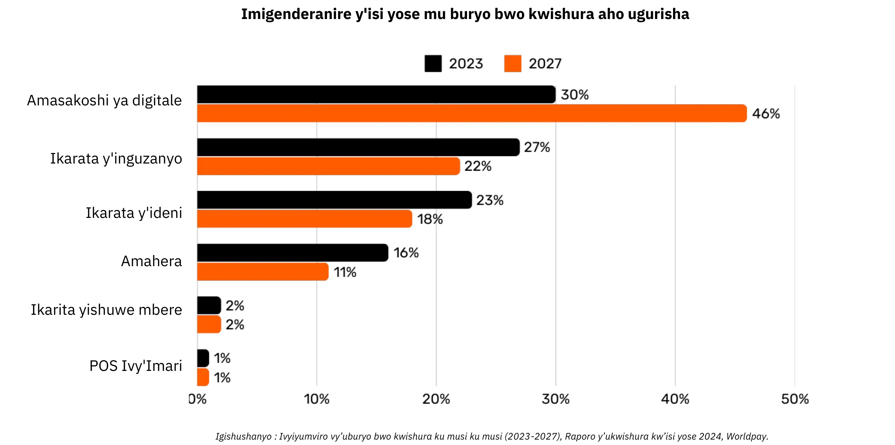

*Igishushanyo: Ivyerekeye uburyo bwo kwishura kw’isi yose (POS) (2023-2027), Raporo y’ukwishura kw’isi yose 2024, Worldpay.*

###  ibintu vyishi mw'irungika risazwe ry'ukwishura ukoresheje i karata yubu hinga bwa none 

Iyo umukiriya akoresheje ikarata y’inguzanyo mw’iduka, iyo karata isomwa n’igikoresho ca POS, kikaca kirungika amakuru y’ivyo akoresheje ata nkomanzi muri banki y’umucuruzi. Uwuronka ayo makuru arungika ayo makuru ku rubuga rw’ikarata bihuriranye nayo (nk’akarorero, Visa canke Mastercard), rwo ruca rurungika iyo nkuru ku wutanga ikarita, ni ukuvuga banki yatanze ikarita y’umukiriya. Uwutanga amafaranga arasuzuma konti y’umukiriya canke umurongo w’inguzanyo maze agasubira ka rungika    uruhusha biciye ku rubuga rwuwo murongo, ivyo bikaba bituma uwo mudandaza yemeza iryo rihwa .

Ivyo bikorwa vyukuriha bisa n’ibisanzwe mu vy’ukuri bisaba intambwe zirenga 15, abahuza 7, kandi bifata amasaha ari hagati ya 48 n’imisi 5 kugira ngo uwo mudandaza aronke ayo mahera. Muriyo misi ikurikira, haca haba igikorwa cogutororokanya amahera yaciye kuri uwo muhora hama haca haba irungika nyakuri kuri konti yuwo yucuruzi. Iryo shirahamwe ry’amakarata rikoranya amafaranga y’uwo musi kandi riga tunganya amafaranga  yahanahamywe  hagati y’uwuronka n’uwutanga. Banki nkuru iratuma ivyo bihembo hagati y’amabanki biba mu muco kandi bikomeye bitajegajega . ubwanyuma na nyuma , konti ya banki y’umudandaza iraronka amahera yose (akuweko amahera) yashizweko na banki akoresha, gutyo uruherekerane rwihanahana ryama faranga rukagenda uko .

Muri rusangi, iyo nzira ica mubintu vyishi , itwara umwanya, kandi iratwara amahera menshi kuvyari bikwiye   kuba igikorwa vyoroshe vyo gukura ubutunzi ku ruhande rumwe bukaja ku rundi.

### Kugereranya uburyo bwo kuriha 

| uburyo bwo kuriha                  | iyemezwa?           | umwanya bisaba kugira habe iyemezwa | umurindi wiryo yemezwa  (igihe amahera ashika neza na neza kuri konti)         | ugusozera (kwemeza ivyakozwe)              | igitigiri ca bahuza        | amahera yikatwa          |
| ------------------------------ | ------------------------------- | ----------------------------------------- | ---------------------------------------------- | ---------------------------------------- | ------------------------------ | ---------------------------------- |
| amahera  kashi                      | guhakana                               | ubwonyene (iriha mumahera agaragara)             | vyihuse (ntakurindira)                | birihejuru (iyemezwa ribaye ntagusubiramwo)            | ntanimwe                           | ntanimwe                               |
| isheki(urupapuro rw'amafaranga)                    | ego (Bank Clearing)             | iyemezwa yamahera yashizweko    | imisi myishi (gusuzuma neza ivyi rungikwa)          | uburyo bwirihwa  ( urashobora guhagarika iyemezwa) | ibanki                           | **amahera bakata(make canke ayagereranye )     |
| **kurungika amahera uciye mwi banki**             |      iBanki,   umuhora wo kuriha           | iyemezwa muma saha                |-uwo munsi canke umusi ukurikira                   | birihejuru (iyemezwa ribaye ntagusubiramwo)    | iBanki,   umuhora wo kuriha   | **uburyo bwirihwa**(bafatira kwijana )       |
| **ikarata yo kuriha**              | iyemezwa  (uruhusha rutangwa ni banki) | mumisegonda canke muma saha  (kode akabanga kiyemezwa )   | mumisi mike  (ihana hamwa yama faranga hagati yama banki)              |uryo bwirihwa (gusubizwa amahera hatabaye iyemezwa)            | ibanki, uwuriha , ikarata | **biravana ( hagati ya 1-3% yamahera arungitswe)** |
| **ingodo yubuhinga bwwa none** | yego (ingodo wanyene amahera/ibanki)      | mu segonda(iyemezwa muri ako kanya)            | bivana hagati yimisi 1 canke  (bivana nuburyo bwakoreshejwe) |  uburyo bwirihwa (gusubizwa amahera hatabaye iyemezwa)         | amabanki, canke amashirahamwe akora akazi kirungika ryamahera      | **Ari hasi (biravana)**         |

### Urugezo rwotorera inyishu ibintu

Inganda zisanzwe zikora irungika y' amahera zigereranya ubutunzi k’umwaka bugera ku madolari miliyaridi 2.200, ni ukuvuga nk’ica cumi c’umusaruro(PIB) w’igihugu ca Leta Zunze Ubumwe za Amerika canke ungana n’umusaruro w’igihugu c’Ubufaransa. Kubera ko amahera yagaciro  akora nk'imirongo yemewe, habamwo amahangana make , ivyo bikaba bituma iyo "service" isa cane n'umusoro ushirwa ku bukungu bw'umwimbu. Uretse mahera yimisoro yegeranaya, hariho n’ibindi bitari bike bishobora gutuma umuntu adakora neza, nk’uko bigaragara aha hepfo.

|       imbogamizi                 | Insiguro                                                                                                                                                                                                                        | ICOBITERA                                                                                              |
| -------------------------------- | ---------------------------------------------------------------------------------------------------------------------------------------------------------------------------------------------------------------------------------- | ---------------------------------------------------------------------------------------------------- |
| amahera bakata kwikarata nimeshi                 | amafaranga ibanki yumu dandaza iriha ibanki yumu kiriya (~0,3 %)  umafaranga arihishwa numuhora bacishako amafaranga(carte visa ) , amafaranga umuhora wa psp na banki usoresha burikwezi(0,5 %-1,7 %) ayo mafaranga yose uko arimake make arateba akaba meshi , ivyo bigasa namakori kurwego rwisi yose nuko atarihishwa na reta gusa   | haba iduga ryibiciro bitewe nuko habaye ikatwa ryama hera meshi kumu dandaza bigatuma inyungu yiwe igabanuka  .                  |
| ishirwa mungiro ryibintu rigenda bukebuke       | ishirwa mungiro ryirungika ishobora gutwara imisi ishika kuri 5 bigatuma bigabanya umurindi wi zunguruka ryamahera kurwego rwubukungu kwisi yose .                                                                                                                                | Uguteba kuronka amafaranga (cashi) kuba dandaza , igabanuka ryizunguruka ryama faranga.                        |
| Forode                          | urudandazwa rwo kumbuga ngurukana bumenyi  zinjirirwa nabakora amaforode bigatuma haba uruhombo (akarorero amahera ashika kumiriyaridi 28 zama dollari) amafaranga abuzwa kurungikwa kubera ingorane zo guhura na forode agera  kumiriyaridi 174 yama dorari murino 2024 . Gutunganya  ibijanye nuguhagarika amarungika kubera kwikekwa kwa maforode bisaba umwanya kandi biratesha umutwe  . | bisaba uburyo bwishi izo nganda kugira bashireko ubuhinga bwokemura ibibazo vyama forode kugira ntizitakaze icizere kuba kiriya .       |
| guciriza intabwe hagati mugusumira kumbuga ngurukana bumenyi                | Intabwe bakwirikiza zumutekano (uburyo bwa kode akabanga  PSD2) zituma kuriha bigorana bikanagorana kuriha.  |                                                                                                                 | iyo bigoranye cane kuriha ukoresheje imbuga ngurukana bumenyi aba kiriya bahitamwo kubivamwo .                       |
| amahera meshi asabwa kugira ushoboro gusuma kumbuga ngurukana bumenyi  | Ibiciro mfatiro bisabwa kugira umuntu ashobore gukoresha ikarata yinguzanyo (carte bancaire) biba birihejuru bigatuma aba kiriya bagura ibi dadandazwa bike bacika intege kubera amahera bakatwa .                                                                       | ivyo bigatuma bigabanya ukuzurizwa kwaba kiriya ,amahitamwo yico bipfuza , ukutagurwa kwibintu vyagaciro gato .  |
| iyemezwa ryirihwa  rifata umwanya munini            | uburyo buriho  ubu ntibushobora gukora amarungika yamahera  kumurindi urimunsi yiseconda , canke amarungika  meshi mumwanya umwe                   |  ivyo bigatuma rero uburyo bwokurungika amahera meshi mumwanya umwe nigihe kimwe badakoreka neza  bigatera intambamyi mwiterambere hamwe no kwagura imirimo. |
| Gusabwa kwa konti muri banki canke ikara yinguzanyo yo mwibanki     | Ukuronka uburenganzira kubwo buhinga bwokuriha bisaba konti muri banki canke i karata bifatanye na  banki , bigakumira abadafise ayoma konti na makarata  .    |  ivyo bigatuma haba ugu kumirwa kwa bantu badafise ama konti muri banki canke atabintu vyishi bafiseyo |
| kugurura ama konti menshi kumbuga ngurukana bumenyi | . aba kiriya babwirizwa kuguruza ama konti menshi kumbuga ngurukana bumenyi ivyo bigatuma ibintu bigorana , biruhisha , bikongera bigatera ama kode kabanga ashobora kwibwa nabagizi banabi .                                               | ivyo bituma uwukoresha ubwo buryo  bitamworohera ,bigatuma ama kode kabanga yiwe ashobora guhura nabagizi banabi .          |
| ikori hagati yigihugu nikindi      | ukutagira ifaranga rimwe na rimwe kwisi bituma haba ukumanza kuvunja amahera muma hera yaciro kandi biba bizivye iyo habaye irungika hagati yibihugu bitandukanye .                                                                                                                              | hategerezwa kuba irihishwa ryikori kubera ari rungika hagati yibihugu ivyo bigatuma ihana hana ryama faranga bidakunzwe nababikoresha  .             |

Nk’uko nyene twavuye mu kwishura  mahera  ku munota ku bijanye n’uguhamagara bakoresheje ama telephone  tuja mu gukoresha ubuhinga bwo guhanahana amakuru hafi ku buntu bushingiye kuri IP(intereneti), ukuza kw’imihora yuguruye imiryango kandi ikora neza birashobora gusubiramwo isura ry'ubuhinga bwihanahana ryama faranga , bikagabanya ibiciro n’abahuza (akarorero ama banki), no guhimiriza ikora ryinganda ryimikorere mishasha .

## Bitcoin mu nganda  : amafaranga ariko aratera intabwe 

<chapterId>4488fe33-663f-41a3-a668-e9ca2fb7122e</chapterId>

**Bitcoin NI IKI?**

Bitcoin ni **uburyo bwo gukoresha amafaranga y’ubuhinga bwa none ahamwahamwa hagati yabantu babiri atamuhuza agiyemwo ** (amahera y’ubuhinga bwa none). Ijambo "Bitcoin" ryerekana ibice bikurikira :

- Protocole yu buhinga bwa mudasobwa **yorohereza  kurungikiranira ubutunzi( amahera )  biciye kuri internet ata bahuza ( akarorero amabanki), ata ruhusha urinzi gusaba , kandi n'izina ry'itazirano ushatse **. Ikoresha ingingo ngenderwako ziteye imbere z'ubuhinga bwo gukingira amakuru biteye imbere.
- Urubuga rugaragara rw'amudasobwa zifatanye kuri intereneti ( ipfundo , abacukuzi bamafaranga ya bitcoin bakoresheje ama mashine nyabwonko , n'ibindi) akoreshwa n'abantu basanzwe  canke ni ngada , vyose hamwe bikubaka umuhora utagira uwuwu twara  (ata butegetsi buhambaye canke amashirahamwe nkamabanke ayagenzura ).
- Igiharuro camahera azunguruka muri sisiteme . Ntazokwigera habaho ama bitcoins arenga miliyoni 21. Bitcoin imwe imwe  igabanganyemwo  ibice bigana n'imiliyoni 100 vyitwa "satoshis," ivyo bikaba vyiswe uko mu gutera iteka uwayikoze akaba nubu ataramenyekana .

Ivyo vyose hamwe bihindura Bitcoin **umutungo w’umuntu wese ayifise ** n’ifaranga ry’ubuhinga bwa none **ata mumtu numwe ayigenzura**. gukingira bitcoin    bisaba gusa  gufita **urufunguzo rw’ibanga mw’ibanga** , bitcoin itanga ububasha bwose **ata bahuza canke abandi bantu babizigirwa uciyeko **. Mugihe cirungikwa ,  ** iyo irungika riheze ** iyakira yamahera irahita iba ubwonyene : uwuyifise mushasha arayigira mu buryo bushitse ata kwizigira ubutegetsi canke amashirahamwe nkama banki   ngo bagufashe kuyikingire canke ngo bayivunje . Ivy’irungikwa ryabitcoin **ntibihinduka**—iyo bimaze kwandikwa kuri Blockchain, ntibishobora guhindurwa canke gukurwaho.

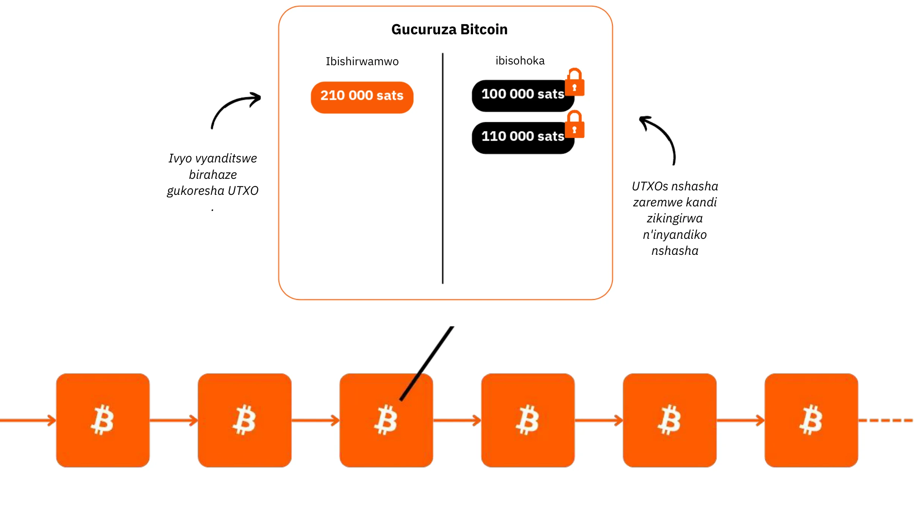

Bitcoin ifise ingingo y'amahera idahinduka, ifise **igitigiri ntarengwa c'izigera kuri miliyoni 21**, muri zo izishika miliyoni ~19,8 (2024) zaramaze gucukurwa. Ivyo bituma iba **iyigabanya agaciro k'ibintu**, aho agaciro kwayo kiyongera uko igihe kigenda kubera abantu babika uburyo n'inyungu z'ivyo bakoze muri yo.

Ubwo buranga bwa bitcoin burenze kure na kure uburyo bwogukoresha inzahabu( uburyo bwa kera) n’idolari( amahera ya none) vyose hamwe, ivyo bikaba bituma iba umutungo w’amahera ukomeye cane utajegajega isi atari bwigere  irema . Bitcoin ni ububiko bw’agaciro kandi ni uburyo bwo bwoguhanahana amafaranga  , amafaranga ariko araza bukebuke ahindura amateka. Ibaze ko woshora kurungika ubutunzi  mu bubiko bw’ishirahamwe rimwe bukaja mu rindi vyihuta, ata bahuza ( akarorero amabanki), ku giciro gitoyi, ata busuma bubayemwo , amasaha 24 kuri 24 ,imisi 7 kuri 7 kandi atabutegetsi canke ishirahamwe kanaka ibigizemwo uruhara.

Bitcoin irazigama neza agaciro kubera ububiko bwayo budashobora guhindurwa ngo babwibe ( livre de compte est  infalsifiable). Agaciro kayo karaduga kubera ukutaboneka kubwishi kwayo (nimake) kandi ifise aho igarukira .., ifatanijwe n’umubare uriko uragwira w’amahirwe wokuyahanahana , bivuye ku kwiyongera kw’abakoresha.

Bitcoin irahungabanya kuko idutera intege zo kwiga ivyiyumviro vyo mu biharuro, mu vy’ubuhinga bwo gukingira amakuru, mu vy’ubutunzi no mu vya kahise tutarigeze twigishwa. Naho kenshi umuntu abona ko ari ikintu gikomeye, mu vy’ukuri ni ubuhinga bushasha umuntu ashobora kuronka biciye mu gukora no mu kugerageza.

Bitcoin iratuma  dusubiramwo kwihweza neza kamere ka faranga. Woba woshobora gusigura amahera ico ari co vy’ukuri? Umukozi ahembwa ku kwezi  canke uwikorera ivyiwe arashobora kumara amasaha 50.000 gushika ku 100.000 y’ubuzima bwiwe akorera  amahera, yamara ni bangahe **baheba  amasaha agera kwi 100 bariko biyumvira amahera ingene akora** ukuntu bayazigama? Bitcoin iduhamagarira  kwibaza imvo nyamukuru zituma dukenera amahera be n’ukuntu  tuyabona mugihe ca none no muri kazoza . Amahera yoba ari ikintu ciza cagaciro co kwishimira mwakokanya nyene  canke ni ayo kwihanganira  igihe kirekire? Iyo uzigamye ubutunzi bwawe ikiringo kanaka amahera(bitcoin) yawe araoduza agaciro uko imisi igenda iraza  bisigura ko umuntu azoba atomboye  murikazoza , ni amahitamwo ayahe twogira? Ni ibiyago ibihe twokwipfuza kugirana natwe ubwacu mu myaka 20 canke 30 ikurikira?

**IKARANGAMUNTU YA BITCOIN (muri 2024)**

- **Imyaka:** Imyaka 15 (3 Munyonyo 2009)
- Agaciro ka amahera azunguruka ku musi: **amadolari 10 miliyaridi** (> CAC40)
- **Isoko ry'ubutunzi:** Amadolari 1.8 triliyoni (> Meta, Visa, Ifeza ; < Pome, Google, Inzahabu)
- **Abakoresha:** ~100 gushika kuri 200 miliyoni (1-2% vy'abantu bo kw'isi)
- **Uhindagurika ryibiciro:** Mu vy'imbere nta n'imwe (1 Bitcoin = 1 Bitcoin), ni hejuru cane hanze (mu guhindura amafaranga)
- **Ivyo ikora:** Igurisha rya mbere ku madolari 0.0009; ubu ni amadolari 100.000 (x100 miliyoni)
- **Ukuboneka k'urubuga (igihe co gukora):** 100% kuva muri 2013
- **kumenyesha ko bitcoin yapfuye canke kuyinegura:** Rimwe mu kwezi

**Igitangaza c'Ugufashanya kw'Abantu:**

- **inkomoko yugururiye kuri bose**
- **Ikigo gitegekanijwe n'amategeko:** Ntaco
- **Umuyobozi mukuru:** Nta n'umwe
- **Ishoramari ry'umutungo kamere:** Nta n'umwe
- **Gutangaza:** Nta n'imwe
- **R&D:** Ibikorwa vy'ubushake
- **Intwaro:** N'abakoresha
- **Ubutunzi bushasha:** Guhingura amabuye bifashwa n'amahera y'ugucuruza (ashingiye ku gicamunsi)

Kugira ngo umenye vyinshi ku bijanye na Bitcoin, amateka yayo, ingene ikora, n’ingene ikoreshwa, ndagusavye kandi gukurikira iyi yindi nyigisho yuzuye:

https://planb.academy/courses/2b7dc507-81e3-4b70-88e6-41ed44239966

## Intangamarara y’umuhora Lightning Network

<chapterId>c095c7ad-5469-4c7b-9510-b6c0b86244e7</chapterId>

**Lightning Network NI IKI?**

Lightning Network ni **umurongo n'urubuga** rufasha mu kurungika no kwakira ama bitcoin butifashishije cane umuhora mukuru wa bitcoin bita blockchain. Ehe ingene bigenda:

- **integuro yibanze:** Amahera arafungwa (escrowed) kumuhora nyamukuru wa bitcoin wa blockchain kugira ngo habeho umuhora wo kwishurirako hagati y'impande zibiri.
- **Urubuga rwo kwishurirako:** Urubuga rw'imihora yo kwishurirako hagati y'imice myishi rurema urubuga rwo kwishurirako ( urufatangane , ubuhuza).
- **amarungika abera inyuma ya shene(umurongo) :** Ibikorwa bibera hagati y'imice ibiri ariko **ntibica bitangazwa ubwonyene** kuri Blockchain nyamukuru ya Bitcoin (**"off-chain"**).
- Itungamywa kwi shene( umurongo): **Igiciro ca nyuma** c'ibikorwa  gusa ni co gisohoka kumuhora nyamukuru Blockchain wa bitcoin (**"On-Chain"**), bikaba bituma  ko ibikorwa vyinshi bishobora kuba muri ico gihe. Ukwo gukoranya amahera menshi bigabanya ukuzuza umuhora amahera arishwe mumice mice , gutyo bikagabanya amahera akatwa iyo habaye irungikwa ugereranije n'uko hoza haraca kumu hora amafaranga ari mumice mice .
- infurwa ry'umurongo: Uwukoresha umuhora wa bitcoin arashobora gufunga umurongo wiwe igihe cose ashakiye maze agasubira gusaba ama Bitcoin yiwe mu gutangaza ivy'ivyirungika yiwe ya nyuma. Iryo ni ryo hame ry'uko amafaranga **"ashobora gusohoka"** igihe cose ariko **"atasohorwa"** gushika bikenewe. Ivyo gusohoka kwa amafaranga ya bitcoin (ugufungwa kwumuhora) bishobora kuba ivy'uruhande rumwe (bifatwa n'umwe mu bagize  izo mpande 2 ) canke bifatwa n'abantu bose (bigatuma amafaranga akatwa agabanuka)

Ubwo buryo burarinda uguteba nukugorana mugutunganya irungika iryari ryoryose bitamanje guca umwanya wose kumuho  nyamukuru Blockchain wa Bitcoin, mukwandika gusa amafaranga yanyuma no kugumana umutekano wayo. Lightning Network ni agace  "kari hejuru" ya Bitcoin ariko kaguma gafashe kuri yo.

**Umuhora  w'ukwishurirako kw'isi yose**

Urwo rutonde rurema **urubuga** rw’amamashini aho akora imihora  ikora sisiteme yo kurihirako kw’isi yose. Izo nzira zishobora gukoreshwa n’abantu canke n’inganda  , bikaba bituma biba urubuga rwuguruye kuri bose.

Lightning Network ituma ama  rungika nama rungikwa aba anyaruka  nku muvuduko w’umuco. Ni nk’umurongo wamarungika yubutumwa dukoresheje ubuhinga bwa none gusa ubukoresheje  mu kwishura amafaranga : ubwo buhinga ni urubuga rwo kwishura rw’uruvyaro rushasha. Ivyo bihindura cane uburyo "amahera" azunguruka mwisi, bigakora ku buntu kandi vyihuta nk'uguhanahana amakuru kuri internet.

**akamaro kurufunguruzo:**

- **Umuvuduko:** irungika ryihuse
- **Amafaranga make:** Amafaranga akatwa ni make cane ugereranije n'uburyo bwokuriha baciye mumabanki( ubuhinga busa nuburiko burasaza).
- **Kworosha ivyikoreshwa ryayo:** Uruganda rurashobora kwihuta kwemeza amarihwa   yamahera  ya Lightning hakoreshejwe gusa urubuga rwayo ruri muri telefone ngendanwa canke mugukanda kwibuto yemeza igikorwa cokuriha  ku rubuga rwabo rwo kuri internet.

Inyubako ya Lightning iraruta uburyo bwa kera bwo kwishura mu bijanye n’umuvuduko, igiciro, n’ugukoresha neza inguvu. Kubera ko abacuruzi bariko bararushiriza gukoresha ubwo buhinga bwanone , inguvu zizokwiyongera cane: nimba uko kwishura  gushobora kuba kudaciye munzira y’amabanki y’ifatiye abantu, ni kuki twobandanya gutanga igice kinini c’amahera banki ikata tumannje kuyicako?

**Ikoreshwa itagira imbibe:**

Ibikorwa vya Lightning birarenga kure cane amafaranga make n’umuvuduko biduha. Mu gutanga inzira y’ihuse kandi y’ubuntu kandi ikora ubwo nyene, bifungura amahirwe menshi mu bukungu bwose.

**Kwongera ubushobozi bwoguhana hana  Bitcoin :**

Lightning yongereza akamaro ka Bitcoin nk'"uburyo bwoguhana hana amafaranga ." Mu kwongera  umuvuduko hamwe numwidegevyo wayo , birakomeza igikorwa nyamukuru c’amahera: kworohereza uguhanahana ubutunzi no kurema agaciro ku bantu bose bayikoresha.

Iterambere ryo muri kazoza ry'"ubutunzi bw'amashini y'ubwenge" rizosaba uburyo bwo kwishura bwihuta cane, bukoreshwa incuro nyinshi, urugero rw'ubuhinga Lightning yonyene ishobora gushitsa. Ivyo bituma habaho uguhingura ibintu n’ibikorwa vyinshi. Bitcoin iguma ari nto, bisigura ko agaciro kayo kazoca kongerekana . Bitcoin na Lightning birihabmwe bica vyongereza inguvu uko imihora yabo igenda irakura.

Lightning itanga ishusho y’akazoza aho inganda  zose  zishingiye kuri internet na zo zizoba zishingiye kuri Bitcoin.

**Ivyi yishura rya Bitcoin biciye kuri Lightning: **

Lightning Network ni nziza cane ku kwishura Bitcoin mu maduka agaragara canke yo kuri internet kubera umuvuduko wayo n’iherezo ry’ukwishura.

- Umuvuduko: **Umuravyo** (~500ms gushika ku masegonda make) uranyaruka cane kuruta urubuga rwa Bitcoin, aho amafaranga ashobora gutwara nk'iminota 30 kugira ngo yemezwe. Ku bijanye n'ukugura ibintu vyinshi (birenga cane amadolari 1.000), umuhora nyamukuru wa Bitcoin niwe ukuzwa gukoreshwa murico gihe kubera ariwe wizewe kurusha kuvyumutekano , kuko umuvuduko mwicogihe siwe aba ari wingenzi. Ariko rero, ivyo bintu akenshi birahishwa umuntu asanzwe abikoresha, kuko ubuhinga zifata izo ngingo mumuco atabusuma burimwo.
- **Iherezo:** Iyo umuntu amaze kwishura kuri Lightning, ni burundu. Nta n'ubushobozi bwo gusubizwa amahera n'abandi canke amatati ajanye n'ubuhendanyi.
- **Amafaranga:** Amafaranga y'ugucuruza kuri Lightning Network ni make cane kandi arihwa n'uwukoresha, atari umucuruzi. Abacuruzi bariha amahera gusa iyo mu nyuma bakeneye kwimurira Bitcoin yabo ku yindi nzira canke ku yundi muhora .

**IKARANGAMUNTU YA LIGHTNING (muri 2024)**

- **Ubuhinga:** 2015
- **Gutanguza:** 2016
- **Imyaka:** Imyaka 7 (ugucuruza kwa mbere: 28 Kigarama 2017)
- **Ubushobozi bw'ubuhinga bw'urubuga:** ku rugero rushobora gukora amafaranga menshi incuro 1.000 kurusha uburyo bwa kera.
- **Ingano z'ibikorwa:** Biva ku bikomeye gushika ku bito incuro 1.000 kuruta uburyo bwa kera.
- **Ivyihuta vy'ugucuruza:** Bishika incuro 100 vyihuta.
- **Amafaranga:** Ashika kuri 90% aragabanuka.
- **Iherezo ry'ukwishura:** Hafi y'aho nyene (kenshi ~500 milisegonda, rimwe na rimwe amasegonda makeyi).
- **Inguvu zikoreshwa:** ~8% vy'ubuhinga bwa kera bw'amahera kw'isi yose.
- **Ibiranga:**
    - Urunganwe
    - Isi yose
    - Nta ruhusha
    - Ubwiherero bwiza
    - Umutekano wemejwe
    - Kuboneka cane (igihe ciza cane co gukora)
    - Ishobora kugenzurwa no guhindurwa

Kugira ngo umenye vyinshi ku bijanye n’ingene Lightning Network ikora, ndagusavye kandi gukurikira iyi yindi nyigisho yuzuye:

https://planb.academy/courses/34bd43ef-6683-4a5c-b239-7cb1e40a4aeb

# Bitcoin mu bubiko

<partId>bf45c1e8-af97-4b6b-af42-2866f493b14d</partId>

## Inyungu, umutungo, n’imfunguruzo zo kwihangana mu bucuruzi

<chapterId>656ad88f-3c27-4054-a94e-b29727009b8e</chapterId>

### Ishirahamwe yikwije 

**Kazoza ntikamenyekana**, kandi ubucuruzi butegerezwa guca muri ukwo kutamenyekana bushimikiye cane ku kuronka inyungu no kuzigama umutungo. Dushingiye ku bukungu bwa Otirishiya, **inyungu ni ikimenyetso nyamukuru c’amagara y’ishirahamwe**—vyerekana ko ubucuruzi buriko burashitsa neza ivyo abaguzi bakeneye. Iyo ishirahamwe ritagira inyungu, ntirishobora kwitunga, n’ugukura n’ukuvuga. Kugira ubucuruzi bugumye bufise amagara meza, ntibutegerezwa gusa kuronka inyungu za generate ariko kandi butegerezwa kwiyumvira imbere, **kubika umutungo wo gukoresha mu gihe kizoza n’ingorane**.

**Kuzigama umutungo** ni ikintu gihambaye cane kuko bituma ubucuruzi bushobora kwimenyereza no gufata amahirwe mw’isoko ritamenyekana. Ivyo birimwo gushiramwo uburinganire hagati yo gusubira gushiramwo amahera umuntu aronka kugira ngo akure no kuguma afise amahera yo guhangana n’ugusubira inyuma kw’ibihe. Ubutunzi bwa Otirishiya burashira ahabona akamaro ko **“uguhitamwo umwanya”**, bisobanura ko ubucuruzi butegerezwa gufata ingingo yitonze y’ingene bwoshira imbere inyungu zica ziboneka ugereranije n’ugushiramwo amahera kugira ngo umuntu ashobore kuroranirwa igihe kirekire. Ishirahamwe rifise amagara meza rituma umushinge waryo w’ivy’amahera uguma ukomeye, rikagira ico rihinduye mu bihe vyiza no mu bibi.

Ibimenyetso vy’isoko nk’ibiciro n’uguhiganwa biyobora ubucuruzi mu gufata ingingo zijanye n’ugutanga ubutunzi. Amashirahamwe yumvirije ivyo bimenyetso, arashobora kwirinda umutego wo kwiyongera cane canke gushiramwo amahera make, na canecane ayo akoreshwa n’ibintu vy’ubuhinga nk’inguzanyo yoroshe. Gukoresha nabi ubutunzi ntibitera ingorane gusa ubuzima bw’ishirahamwe ariko kandi biragabanya ubushobozi bwaryo bwo gufasha neza abakiriya.

Amaherezo, kuguma ufise ubudandaji bwiza bisobanura kuguma ushobora guhindura uko ubona ibintu, guhitamwo neza ivy’amahera, no kwama ubona kazoza. **Mu kwibanda ku nyungu, mu kuzigama umutungo, no mu kwishura ku bimenyetso vy’isoko, ubudandaji—bunini canke buto—burashobora gutera imbere mbere no mu gihe hari ukudakeka**.

### Mbega umutungo n'ingeso nziza ?

**Uko umutungo mukuru ugaragazwa muri rusangi**

Reka dusubire kumenya ico umutungo ico ari co  vy’ukuri—ijambo rikunda gutahurwa nabi kandi ribonwa nabi mu kibano cacu.

Mu nyigisho y’ubutunzi ya kera (Keynesian), umutungo ubonwa kenshi mu majambo yoroshe nk’ububiko bumwe bw’itunga ry’umubiri canke ry’ivy’amahera, ahanini rikoreshwa mu gutuma habaho ugusaba kwose biciye mu gushora imari mu bikorwa. Akenshi bifatanywa n’ugushira hamwe ubutunzi n’ububasha bw’ubutunzi bufiswe n’abantu bakeyi b’abanyacubahiro. Mu gihe uburushane  bw’ubutunzi bubandanya kwaguka, benshi babona ko umutungo ari ikimenyetso c’ubusumbane mu vy’ubutunzi, cane cane iyo ubutunzi bwirundanijwe busa n’ubutagira akamaro ku bantu benshi.

"Umutungo" akenshi werekanwa nk'igikoresho co gukoresha nabi, kandi iyo nzira yaragize ico ikoze cane ku migwi itandukanye ibona ko umutungo urwanya inyungu z'abakozi. Ariko none ivyo vyoba ari ukuri? Canke iyo nzira yo gutahura ibintu yoshobora kugoramwa n’ibi:

1. Kudatahura uburyo bw’ubutunzi (harimwo n’abahinga mu vy’ubutunzi ubwabo nyene)?

2. Ukwinjira kwa Leta no gukoresha isoko?

3. Ugutera urujijo hagati y’ubu kapitalizimu bwa connivence n’ubu kapitalizimu bw’isoko ry’uburenganzira?
4. Uko ibinyamakuru bishiraho ingorane z’ubutunzi?

5. Icipfuzo co gukosora ibintu vyihuse no gutunganya imibano hagati yabantu vyihuse?

6. Ugusanura umuco w’amajambo arwanya ubu kapitalisimu?

Igishimishije, Bitcoin iraduhimiriza gusubira kwiyumvira vyose no guhangana n’ivyo vyiyumviro vyari vyarashizweho mbere. Hariho ishure ry’ivyiyumviro, Ishure ry’Ubutunzi ryo muri Otirishiya, rishobora gutanga umuco kuri ivyo bibazo no kudufasha gusubira kwihweza kamere nyakuri y’umutungo kamere.

**harabaye**

Reka dutangure n’inkuru ngufi:

"Ku kirwa gito c'ubugaragwa haba umurovyi ari wenyene. Buri musi, amara amasaha menshi afata ifi n'ibiganza vyiwe gusa, igikorwa kimutwara umwanya mwinshi n'inguvu ziwe. Umusi umwe, yagize iciyumviro: co kwubaka icumu rizotuma ashobora kuroba neza. Ariko arazi ko ivyo bizosaba kwitanga cane.

Imbere y’uko uwo murovyi atangura gukora iryo cumu,  yafashe ingingo yo gushiramwo ifi zimwezimwe kuruhande kugira ngo ashobore kuza arazifungurura mu gihe c’ubwubatsi. Amara imisi mikeyi arya bike kuruta uko asanzwe abikora, akazigama ifi zihagije kugira ngo yibande ku mugambi wiwe. Izo yagiye arashira kuruhande  zigereranywa ** n'umutungo wiwe**, umutungo yazigamye kugira ashobore gukurikirana intumbero yiwe.

Mu gihe amara umwanya wiwe wo kwubaka icumu, yizigira izo fi yazigamye, bisigura ko murico gihe uwomurovyi atazobaho neza ugereranije nuko yari asanzwe abayeho ( **bika vyakanya gato**). Amaze imisi myinshi akora ibikorwa vyiwe , araheza akora icumu rikomeye.

Ubu akoresheje iryo cumu, arashobora gufata ifi vyihuta cane kandi ata nguvu nyinshi akoresheje . Ntagikeneye kuruha cane nk’uko yahora abikora, mbere agatangura nokurunka amafi meshi cane. Ubwo bwishi bwamafi  bimuha uburyo bushasha: arashobora kubibika, kubisabikanya canke kubishira mu yindi migambi yokorera kurico kirwa. Mu gutevya kumara ubwo nyene no gukoresha umutungo wiwe, umurovyi yarateye imbere cane mu bijanye n'ubushobozi bwiwe n'ivyizigiro vyiwe vya kazoza."

Iyi nkuru yerekana uruhara nyamukuru rw’ubutunzi, ukwihangana n’ukubona imbere mu kwubaka kazoza keza—ivyiyumviro bihambaye mu gutera imbere kw’ubutunzi no mu gutera imbere kw’abantu.

### Ishure ry'ubutunzi ryo muri Otirishiya n'imbonera kazoza y'ubutunzi 

Ishure ry’ubutunzi ryo muri Otirishiya ryiswe izina ry’abarishinze n’abaritanze mbere, bakaba bari bakomoka muri Otirishiya. Izina ryagumyeho, kandi kuva ico gihe iryo shure ryaciye rifatanya cane n’ivyiyumviro vya kera vy’ubwigenge, rishimika ku mwidegemvyo w’umuntu ku giti ciwe, amasoko y’ubwigenge, n’ukuntu Leta itagira ico ikora 

**Ivyo Otirishiya ibona ku vyerekeye ubutunzi**

Mu mbonera kazoza kw’abanya Otirishiya, umutungo w’igihugu ufitaniye isano rikomeye n’iciyumviro co gutandukanya ugukoresha ubutunzi kugira ngo wubake ibikoresho canke ubutunzi bushobora gutuma umuntu agira umwimbu mwinshi muri kazoza. Ivyo bimenyekana nk’ukwirundanira umutungo, ni vyo bihambaye cane mu vyiyumviro vy’ubutunzi vya Otirishiya. Ivyiyumviro nyamukuru Elements vy’iyi nzira birimwo:

- guhitamwo kurandira  gukoresha umutungo wawe , mukwitegekanira kazoza: Abantu mu bisanzwe barakunda gukoresha vyako kanya aho gukoresha mu nyuma, ariko boshobora guhitamwo gusubiramwo ivyo bakoresha nimba biteze ivyiza vyinshi muri kazoza. Mu kuzigama uno musi, ubutunzi burashobora gushirwa mu bintu vy'agaciro (ibikoresho, imashini, ibikorwa remezo) bituma umwimbu utera imbere uko igihe kigenda kirarengana. Amashirahamwe canke abantu ku giti cabo bafise umwanya mutoyi bazigama vyinshi kandi bagashiramwo amahera mu migambi y'igihe kirekire, bigatuma haba iterambere riramvye.

- Itunga ni moter w'umwimbu wo muri kazoza: Ibintu vy'itunga bibonwa nk'ibikoresho bihuza bikoreshwa mu guhingura ibintu vyahejeje gutegurwa vy'abaguzi. Mu kwirundanira umutungo, abashoramari barashobora kwongereza umusaruro no kurema ubutunzi bwinshi muri kazoza. Nk'akarorero, aho guhingura ibintu vy'ugukoresha ubwo nyene, ivyo bintu vyoshobora gukoreshwa mu kwubaka amahinguriro canke imashini. Naho ivyo bigabanya ivyo umuntu akoresha mu gihe gito, ivyo bivamwo biratuma umuntu ashobora gukora cane kandi akagira n'uguterimbere birama.

- **Uguhingura ibintu mu buryo bwako kanya n'ubushobozi bwo kubikora**: Abahinga mu vy'ubutunzi bo muri Otirishiya, nka Eugen Böhm-Bawerk, barashimikiye cane ku ciyumviro c'uguhingura ibintu mu buryo bwako kanya nyene, ni ukuvuga uburyo bwo guhingura ibintu buramvye kandi butoroshe bujanye n'inzira nyinshi. Naho ivyo bikorwa bifata umwanya, amaherezo biratuma habaho ivyiza kandi bifise akamaro, nk'ukwubaka uruganda rwo gusenya ibiti aho gukorakoranya ibiti n'amaboko.

- **Inyungu nk'Ibimenyetso**: Inyungu, uko  Otirishiya ibibona, mu bisanzwe yerekana umwanya umuntu akunda. Ibiciro vyinshi vyerekana ko umuntu akunda gukoresha ibintu ubwo nyene, mu gihe ibiciro bito biremesha kuzigama no gushiramwo amahera igihe kirekire. Iyo amabanki akomeye akoresha nabi inyungu mu buryo bw'ubuhinga, aragoranya ivyo bimenyetso vy'ibidukikije, bikaba bituma habaho ugutanga ubutunzi nabi n'ishoramari ridashobora kuramba (malinvestment).

**Uburyo bubiri bw'umutungo mu bukungu bwa none**

Mu rwego rw’uburyo bw’amahera bushingiye mugoresha amadeni dukoreramwo, **hariho ubwoko bwa kabiri bw’umutungo**: uwo mu kanya nk’akumuravyo iyo banki iremye inguzanyo biciye mu buryo bworoshe bwo gutanga inguzanyo. Ivyo birimwo guhingura amahera ex nihilo, aho banki iguranaya amahera mu vy’ukuri atayo ifise ubwambere na mbere y’igihe ahubwo ikarema ayo mahera  ishingiye ku masezerano yo abanywanyi bayo kwishura amafara babikije iyo banki.

Ku ruhande rumwe, umutungo w'"Otirishiya" ni inyishu y'ukuzigama vy'ukuri, igikorwa gisaba gufata ingingo z'ubutunzi zitekerejwe neza no kwitanga vyitondewe. Ku rundi ruhande, umutungo uva mu kurema amahera ashingiye ku madeni ni inyubakwa y’aho nyene kandi y’ubuhinga karemano. Ubwo bwoko bubiri bw’umutungo, naho **busa cane mu gukoreshwa mu gufasha imigambi, buratandukanye cane**.

Ubwo bwoko bubiri bw'umutungo ntibukwiye kwigera buhurizwa hamwe, yamara mu buryo bushingiye ku myenda, akenshi barahindukiza ibimenyetso vy'ubutunzi kandi kenshi bitwara mu gushiramwo imitahe ukutariko . Ukwo gutahura nabi kuratanga umuco ku bijanye n'igituma ubu kapitalizimu kenshi bunegurwa ata co bishingikirije.

**Ikibazo nyamukuru kiri mu vy'ubu Keynes**

Amategeko ya Keynes, yemewe cane n’abanyacubahiro bo kw’isi yose, akoresha  inyungu  kandi agatuma abantu basaba biciye ku myenda. Ivyo biremesha ubutunzi gutemba buja mu migambi y’igihe gito, idashobora kuramba, bikongera inzinguzingu z’ubutunzi no gutevya iterambere nyaryo rishingiye ku kuzigama neza no ku gushiramwo amafaranga. Abarongozi b’ubudandaji baribonera ubwabo iyo ngingo ngenderwako mbi uko amashirahamwe afise amagara meza asunikwa mu kugura ibintu bifise agaciro karenze urugero mu gukurikirana inyungu nyinshi, bikaba bituma iterambere ry’ibinyabuzima kandi riramvye rihungabana.

Mu myanya imeze nkiyo ni gute umutungo “umeze neza ( uhagaze neza)”—uzigamye neza n’abanyamigambi—woshobora guhangana n’umutungo “utameze neza ( uhagaze neza)” waremwe mu buryo bw’ubuhinga karemano? Ikindi kandi, ukwaguka kw’amahera ahanwa hanwa ku ruhande rumwe kurasenyura ubushobozi bwo kugura bw’umutungo kamere, bikaba bituma ubutunzi butera bumera nabi kandi abantu ntibanyurwa .

**Umuco w'Icizigiro: Bitcoin**

Bitcoin itanga uburyo bwo kwirundanira no kuzigama umutungo mu kiringo kirekire ata gusenyuka guterwa n’uguta agaciro kw’amahera. Nk’ububiko bw’agaciro, birashoboza inganda gutegura gushora imitahe yo muri kazoza , bigatuma tunegura ubuhinga buyoboye ubu bushingiye kums deni no gutuma habaho ugusubira mu kwirundanira umutungo nyakuri kandi utanga inyungu.

### Ibindi ku vyerekeye ishure ry'ubutunzi ryo muri Otirishiya

**Ishure ry’ubutunzi ryo muri Otirishiya** ni umugenzo w’ivyiyumviro vy’ubutunzi uha agaciro amasoko yidegemvya, umwidegemvyo w’umuntu ku giti ciwe, n’akamaro k’ibikorwa vya muntu mu migenderanire y’ubutunzi. Iranegura ukuntu Leta igira ico ikoze, cane cane mu vy’amahera no mu masoko, kandi ivuga ko abantu ku giti cabo, bayobowe n’ivyo bakunda, ari bo bacira urubanza neza inyungu zabo bwite.

**Ibiharuro nyamukuru vy'ishure ry'i Otirishiya**

- **Carl Menger**: Uwashinze ishure ry'i Otirishiya, Menger ni we yashizeho inyigisho y'agaciro k'ibintu, ivuga ko agaciro k'ibintu kavana n'ivyo umuntu akunda aho kuva ku giciro co kubikora.

- **Ludwig von Mises**: Ibuye ry'imfuruka ry'Ishure ry'i Otirishiya, Mises ni we yashizeho praxeologie (inyigisho y'ibikorwa vy'umuntu) kandi yandika *Ibikorwa vy'umuntu*, igitabu kinegura cane ubusosiyalisimu n'igenamigambi ry'imbere.

- **Friedrich Hayek**: Yari umunyeshure wa Mises, Hayek yararonse igihembo ca Nobel mu vy'ubutunzi mu 1974 kubera ibikorwa vyiwe ku bumenyi butagira imbibe n'uguhinduka kw'isoko. Mu gitabu ciwe _Inzira y'ubuja_, yaraneguye cane ubutegetsi bushingiye ku rwego rwo hejuru.

- **Murray Rothbard**: Yari umwigishwa wa Mises kandi yari uwushigikiye cane uburenganzira bwo kwidegemvya, Rothbard yarateje imbere inyigisho y'ubutegetsi bw'abanyagihugu butagira igihugu burongowe n'amasezerano y'ubushake. Igitabo ciwe _Umuntu, Ubutunzi, na Leta_ ni igitabu c'imbuto mu vy'ubutunzi bwa Otirishiya.

**Abandi bahinga b'ubutunzi bafise inkomezi**

- **Milton Friedman**: Naho atagira isano ry'ishure ry'i Otirishiya, Friedman yarashigikiye ivyiyumviro vyinshi vy'ugushigikira isoko n'ivy'ubwigenge. Politike yiwe y'amahera itandukanye n'ivyiyumviro vy'Abanyaotirishiya ariko irasangiye n'ivyo banegura ku bijanye n'ukuntu Leta yinjira mu bukungu birenze urugero.

- **Frédéric Bastiat**: Umuhinga mu vy'ubutunzi w'Umufaransa wo mu kinjana ca 19, Bastiat yaragize ico akoze ku Ishure ry'i Otirishiya n'ibitabu vyiwe vyerekeye ubudandaji bwigenga be n'ingaruka zitaboneka z'ingingo mfatirwako z'ubutunzi. Igitabo ciwe _Ivyo Biboneka n'Ibitaboneka_ ni igisomwa c'ishimikiro c'ubwigenge bw'ubutunzi.

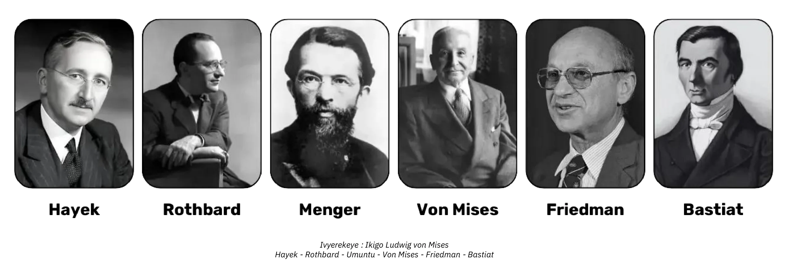

*Ivyashikirijwe: Ikigo ca Ludwig von Mises*

**intererano n'Ivyiyumviro vy'Ishingiro**

Abo banyabwenge ni bo bashinze iciyumviro c’uko Leta igira uruhara mwikora nabi ry'amasoko be n’uko umwidegemvyo mu vy’ubutunzi ari ngirakamaro kugira ngo umuntu atere imbere kandi ashobore guhuza ibikorwa vy’abantu. Ivyo bamenye birerekana akamaro ko gufata ingingo zishingiye ku rwego rwo hejuru n’akaga ko kugenzura birengeje mu mice y’ubutunzi.

Ushaka kumenya vyinshi kuri iyi nkuru:

https://planb.academy/courses/d955dd28-b7c6-4ba2-a123-d932e21d148f

https://planb.academy/courses/9d1bde6a-33e5-45dd-b7c0-94da72e45b11

https://planb.academy/courses/d07b092b-fa9a-4dd7-bf94-0453e479c7df

## Gufita Bitcoin mu bubiko

<chapterId>89622a40-d14f-4c37-a075-8e7e1731ec26</chapterId>

### Ingorane z'ububiko bw'ubutunzi mu nganda

Isaho(ububiko) ni ahantu umuntu ashira ibintu vy’agaciro. Sosiyete ifise imeze neza irafise amafaranga akwiye kugira ngo ishobore guhangana n’ukudakeka kwo muri kazoza no gutegura ivyo ishora. Muri iki gihe, igice c’itunga rirenze urugero gishirwa mu bintu vy’amahera bivugwa ko ari “Liquid” nyinshi cane, nk’amabondi, amafaranga y’ibizigamirwa y’igihe kirekire n’ibindi.

Kubera igihe kirekire cane, amashirahamwe amwe amwe ashiramwo yamahera atagaragara nkamahera y’amazu n’ibindi batazi ingorane zoba zirimwo:

- Ubukene bw'amahera iyo habaye ingorane
- Umwimbu  muke iyo habaye amakori
- Umwimbu nturenga iduga ryibiciro, ya mahera azunguruka mugihugu (~7% ku mwaka, raba munsi)
- Ico kibazo kinyegejwe  c’uko amazu n’ibindi bibanza atakaza igice c’igikorwa cayo co “kuzigama” ku nyungu y’itunga nka Bitcoin. Ivyo vyatumye rishobora gusubira hafi y’“agaciro karyo ko gukoresha”: gutanga uburaro.

Reka twihute gusubiramwo mubibanza aho inganda zikorera.

**Ukuduga kwibiciro nyako**: Kubera ko amabanki akomeye atera ubwoba cane, ategekanya iduga ryibiciro ringana na 2% ku mwaka, bisobanura ko amafaranga azotakaza 40% mu myaka 20. Wongereyeko mu bihe vy’ugutera imbere kw’ibiciro gukomeye cane, biragaragara neza ko amashirahamwe adashobora gukoresha amahera yonyene kugira ngo abike ivyamwa vy’ibikorwa vyayo. Bategerezwa gushira mu ngiro ingamba z’ivy’ubutunzi zigoye, zijana n’ingorane zitandukanye. Izo ngabire ziragaragara ko **zidashobora gushikirwa n’ubudandaji buto cane**, busanzwe bufise ibikorwa vyinshi vy’ingenzi.

**Iduga ry’ibiciro ryihishijwe**: Mu buryo bw’amahera bushingiye ku madeni, bushingiye ku bice vy’amahera bushigikiwe n’amabanki akomeye, **amahera yose hamwe azunguruka mubantu aduga ibice bishika kuri 7% ku mwaka ku mwanya** (nk’akarorero, M1 mu karere k’amahera y’Ubumwe bw’Uburayi canke muri Amerika). Ivyo bisigura ko “umugabane wawe wumwimbu” ugabanywamwo ibice bibiri mu myaka mikeyi gusa—kiretse iyo ufise agateka ko gushika ku nzira y’amahera kandi ukaba ushobora kubandanya gukura mu gukoresha no kugura ivy’ubutunzi vyihuse ku “biciro vya kera” imbere y’uko amahera mashasha yaremwe ajana hejuru ibiciro. Ivyo ni vyo bitera Cantillon effect, bikaba bisigura igice c’ugushira ubutunzi ku batunzi cane, mu gihe “umutungo” ushirwako umugayo mu buryo butari bwo ko ari wo utera (raba intangamarara yacu ku mutungo iri hejuru).

**Ivyago vy’igice gihishije**: Uburyo bw’ivy’ubutunzi buriho ubu burafise ingorane, kandi woshobora kutama ushobora kuronka “amahera yawe.” Hatavuzwe ishusho y’inzu y’amakarata, bitegerezwa kwemerwa ko ibigo vy’imari bifata inyungu zikaba ivy’abantu ku giti cabo, bigatuma ibihombo bihinduka ivy’abantu mu gihe habaye ingorane ntoyi. Mu rutonde rw’amahera “yo mu Vyanditswe” (amahera yanditswe mu gitabu Ledger), amahera ari muri banki ni “amahera igufitiye nkumu kiriya wayo” gusa; utayafise vy’ukuri, kandi amabanki ubwayo “ntayo afise” (amafaranga y’ububiko bw’imice). Aya mahera, mu buryo bumwe, ni amageza vy’ukuri. Amabanki amwe amwe y’icubahiro yahora atwengera mw’ijigo Bitcoin ntagihari uno musi, nka Credit Suisse.

Ukwo kubura ukwizigirana gutangura ukuzuka kw’itunga “ry’abatwaye” nk’inzahabu (naho bigoye kubungabunga, gutwara, no kugabanya, n’ibindi) kandi, birumvikana, Bitcoin, uwushasha.

### Bitcoin nk'umutungo w'amahera

Bitcoin itanga ubundi buryo bukomeye. Ni **umutungo w’umunyagihugu, ata wuwutanga hagati**, hafi udashoboka gufatwa, kandi wungukira ku bikorwa  z’uruja n’uruza. Abakoresha Bitcoin “y’ukuri” bahitamwo kuyikoresha mu kubika ivyamwa vy’ibikorwa vyabo, kuko ibonwa nk’ububiko bw’agaciro bushobora guhangana n’ugucengera be n’ugutera imbere kw’ibiciro. Kubera ingaruka y’urubuga, yerekanwa n’Itegeko rya Metcalfe, uwukoresha wese mushasha kuyikoresha , yongera agaciro k’urubuga; uko umubare wabakoresha uwo muhora wa bitcoin wiyongera, ni ko n’akamaro ka Bitcoin kagenda karaduga cane. Ico kigereranyo gituma kiba uburyo budasanzwe kandi butanga umuhango bw’umutungo kamere, bushingiye ku kwemerwa n’ukwizigira abakoresha.

Bitcoin ni **umutungo ushobora kuvunja neza, vyosha kuruta iyindi yose kw’isi**, ukora 24/7 udahagaze, bitandukanye n’amasoko y’ivy’ubutunzi asanzwe afise amasaha yo yokugara n’“amahagarikwa yamahera.” Ivyo bishobora gutuma abakoresha bagura canke bagurisha amafaranga y’ibiceri (bitcoins) igihe cose, haba mu kwishura ku nkuru nziza canke mbi (nk’akarorero, gutera ibisasu, intambara, n’ibindi).

Mu myaka irenga cumi, Bitcoin yerekanye iterambere ry’umwaka ry’ibice birenga 60%. Ivyo bikorwa bidasanzwe vyatumye abafise amafaranga y’igihe kirekire bazigama umutungo wabo wa mbere, bitandukanye n’ibindi bikoresho.

Ariko rero, hariho ibintu nyamukuru bitari bike umuntu akwiye kuguma yibuka:

Ubwambere na mbere, **ibikorwa vya baye  ntivyemeza ko uzoronka umwimbu mwiza  muri kazoza**. Igihe cose Bitcoin izoguma **itekanye kandi kandi itagenzuwe**, umuntu arashobora kwizigira ko igiciro kizoduga ku mwaka ku rugero rwo hejuru cane rugera kuri 20% ku mwaka mu myaka cumi izoza, ivyo bikaba bizotuma iba igikoresho co gucungera ubutunzi.

Ubwa kabiri, Bitcoin gushika ubu yarabonye **ingendo z’imyaka 4**, bisobanura ko n’igihe c’imyaka irenga 4, uko gutigira kwama ari inyungu. Ku babona ko Bitcoin ari ishoramari, igihe gito (<imyaka 4) gishobora kuba cotera ingorane.

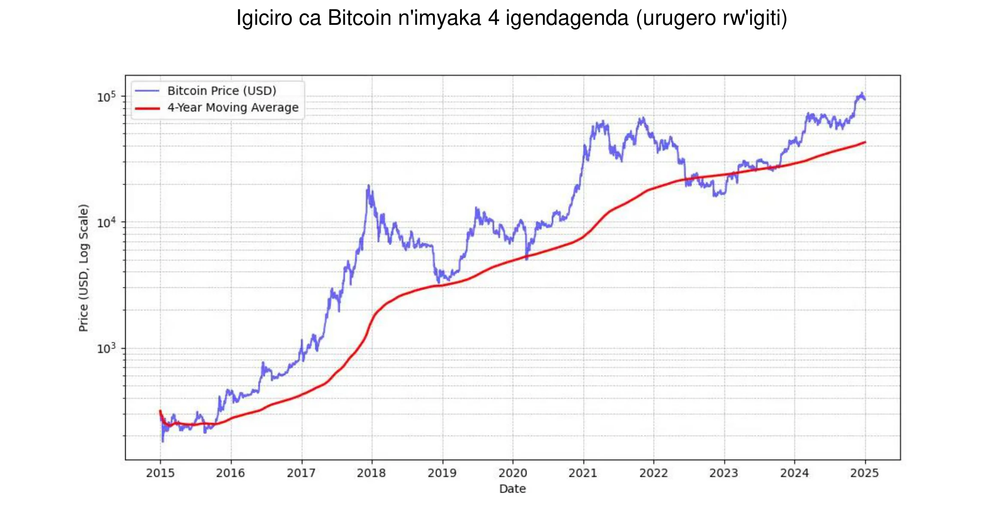

*MICHAEL SAYLOR: "Ikimenyetso ciza c'igiciro ca Bitcoin ni imyaka 4 yoroshe igendagenda."* Raba igicapo kiri hejuru.

Ikindi, ni vyiza ko umuntu aguma abona Bitcoin **bihuye** n’urugero rw’ugutahura kwiwe. Ni vyiza kandi ko udaca wihuta canke ngo ugerageze kwiyumvira neza gusa umwanya w’isoko.

Ubwa nyuma, Bitcoin ifatwa nk'iyishobora guhinduka umwanya nu mwanya. Kugira ngo tudomeko urutoke neza, igiciro caco nk'uko kigaragazwa mu bice vy'amahera yo museruko. Igice c'ukwo guhinduka ni ikintu gisanzwe ku mutungo ukiri muto, ariko kandi kirakomezwa n'ukubaho kw'abaguzi batawukoresha nk'ububiko bw'agaciro bw'igihe kirekire, ahubwo barondera inyungu zihuta. Ikindi kandi, ubudandaji bushingiye ku nkunga (gukoresha amahera yaguzwe kugira ngo umuntu yongere ivyicaro vy'ubudandaji) burashimika ku bijanye n'ugutera imbere kw'ibiciro n'ugutera hasi, bikaba bibuza Bitcoin gukurikira inzira igororotse itera igana mwiterambere ryayo. Ivyo bituma habaho uguhinduka gukomeye cane, ariko uko igihe kigenda kirarenga, uko urufatiro rw'abakoresha bitcoin batera biyongera , niko uguhindagurika kwagaciro kayo gatera kaguma hamwe.Muncamake, biragoye kuronka umutahe ukomeye nka bitcoin, udahindagurika abiciro vyayo , gusa urashobora kuronka umutahe udakomeye nka bitcoin gusa udahindagurika abiciro cane.

### Bitcoin yemejwe n'ibarabara ry'i Wall street

  Ugukoreshwa kwa Bitcoin n’ibigo vy’imari birongereza ikibanza cayo kw’isoko ry’isi yose.

Amajambo aherutse kuvugwa na **BlackRock** yerekana ubushobozi bwa Bitcoin nk'umutungo w'agaciro n'igikoresho co guhindura ibikorwa. Iryo shirahamwe ry'inzego ry'isi yose ryaherutse gutanga iciyumviro c'uko **iterambere ry'abakoresha Bitcoin ririko riraduga kurusha iry'abakoresha internet** canke amatelefone ngendanwa, ivyo bikaba biterwa n'uguhinduka kw'abantu n'uruvyaro, hamwe n'ukwizigira ibigo vy'imari vya kera (!). Kubera ko Bitcoin ari nke, idafise ahoyegamiye, kandi ikaba itagenzurwa, abashoramari bamwebamwe babona ko Bitcoin ari uburyo bwo gukingira **mu bihe vy'ukudatekana kw'ubutunzi bw,'amahera**, ubwoba, canke ibintu bitera ingorane mu vy'ubutunzi.

Ivyo bigo **Spot Bitcoin ETFs**, vyatangujwe muri Mukakaro 2024, vyararonse intsinzi idasanzwe—ivyo **vyatangujwe neza kuruta ibindi vyose** mu mateka—bifise hafi amadolari 20 miliyaridi y’amahera yinjiye. kuva muri Mukakaro gushika mu kwezi kwa Munyonyo. Ivyo ni nk’incuro zine kuruta ivyiza bikurikira, Nasdaq-100 QQQ. Izo ETF zitanga uburyo bworoshe kandi butegekanijwe bwo kuronka Bitcoin, ivyo bikaba vyatumye **yigira itegeko** kandi ikwegeranya umutungo w’inzego nyinshi.

Bitcoin ETFs zirongoye n’urugero runini mu bijanye n’**kwemerwa n’inzego**—zirengeye ETF cumi zihambaye zitera imbere cane—yaba mu bijanye n’umubare w’inzego zigira uruhara canke ubunini bw’itunga ririko ricungirwa (AUM). Ukuroranirwa kw’izo Bitcoin ETFs gushimika ku kwiyongera kw’abashaka ibikoresho vy’ishoramari bifitaniye isano n’itunga ry’ubuhinga bwa none, gutyo bikaba bikomeza ikibanza ca Bitcoin mu vy’ubutunzi bwa kera.

Bitcoin ubu ikina mu “bubiko bw’agaciro” **isoko**. Bigereranya gusa igitonyanga mu ndobo mu bijanye n’urugero: nk’amadolari 1.800 miliyaridi gusa ugereranyije n’amadolari 18.000 miliyaridi y’inzahabu canke amadolari 500.000 miliyaridi y’amazu n’ibindi. Ariko rero, umugabane wayo w’isoko ugera kuri 0,1% uyiha umwanya munini wo gutera imbere, cane cane iyo abayihiganwa barwana no gukwegera abakoresha bashasha.

| Ticker  | 1D Flow (M USD) | 1W Flow (M USD) | 1M Flow (M USD) | 3M Flow (M USD) | YTD Flow (M USD) |
| ------- | --------------- | --------------- | --------------- | --------------- | ---------------- |
| **Sum** | +457.19         | +1,507.95       | +2,888.01       | +3,672.29       | **+20,262.94**   |
| IBIT    | +393.40         | +750.91         | +1,536.47       | +3,821.37       | +22,460.44       |
| FBTC    | +14.81          | +372.40         | +627.16         | +458.71         | +10,266.69       |
| ARKB    | +11.51          | +163.26         | +295.92         | -3.88           | +2,647.32        |
| BITB    | +12.93          | +146.50         | +263.30         | +97.46          | +2,262.69        |
| HODL    | +5.75           | +38.77          | +94.54          | +100.39         | +682.03          |
| BRRR    | +1.92           | +4.72           | +17.76          | +20.54          | +540.19          |
| EZBC    | +11.79          | +17.53          | +39.29          | +47.48          | +439.45          |
| BTC     | .00             | -3.13           | +36.59          | +419.18         | +419.18          |
| BTCO    | +6.43           | +19.25          | +47.30          | +56.41          | +394.82          |
| BTCW    | .00             | +2.84           | +6.04           | +146.69         | +217.47          |
| YBIT    | -1.34           | -10.26          | +5.06           | +13.81          | +76.30           |
| DEFI    | .00             | .00             | .00             | -2.03           | -1.79            |
| GBTC    | .00             | +5.16           | -81.42          | -1503.84        | -20,141.85       |

*$20 billions mu mezi 10: Bitcoin ETFs zashitse mu gihe kitarenga umwaka ivyo ETFs z’inzahabu zatwaye imyaka 5 kugira zishikeko. Inkomoko: Ishoramari ry’amafaranga rigenda mu madolari y’Amerika. Ibarabara ry'Ivyabona vya Yehova, 2024.*

### Bitcoin mu bikoresho vy'inganda

Ukwiyongera kw’ugukoresha Bitcoin muri Leta Zunze Ubumwe za Amerika na kwo nyene kuriko kuragira uruhara ku vyiyumviro vy’ahandi kw’isi, cane cane mu bahinga bo mu bijanye no gucunga ubutunzi batagishobora kuyishira mu bikoresho vyabo — cane cane ko ibintu vy’ubutunzi vya kera bidakora neza bihagije canke bihanganye n’ibihe bigoye. Amabanki ya kera ni yo yonyene asa n’ayashobora kuvyirengagiza.

Uvuye ku bijanye n’amahera gusa, Bitcoin yemewe nk’umutungo wo guhindura ibintu. Si uko gusa idafitaniye isano n’ibindi bice vy’itunga, ahubwo isa n’itera ija imbere mu bihe vy’ugutera imbere kw’amahera mashasha—ikindi kintu nk’ico gisa n’ikiriko kiratangura n’ukugabanya inyungu za ECB, Fed n’Ubushinwa.

Mu ncamake, ku bijanye n’ikoreshwa risanzwe cane—ugushiramwo ubutunzi burenze urugero n’imiburiburi mu kiringo c’imyaka ine—Bitcoin irahuye neza cane. Ni vyiza kubifatanya n’ingene umuntu yinjira buhoro buhoro: gushiramwo amahera adahinduka mu bihe bitandukanye bifise ikiringo kingana  kugira ngo umuntu yinjire canke asohoke neza.

Ibindi bikoreshwa bituma Bitcoin iba umutungo w’ububiko bw’ingenzi, nk’akarorero:

- Kubasha gushiramwo **ingwati** canke amafaranga amasaha 24 kuri 24 hamwe nimisi 7 kuri 7.
- Kubasha kwimurira mu bubiko bw’iyindi nganda **vyihuse, igihe cose**
- Gukingira **ingorane zokuvunja amahera y’ama nyamahanga**
- Kwishura **umudandaza** iyo avyemeye, cane cane mu bihe vyihutirwa.

### Mbega Bitcoin irazimvye cane ?

Ntubwirizwa kugura neza na neza Bitcoin 1, kuko Bitcoin igabanywamwo ibice vyitwa satoshis, vyiswe uko mu gutera iteka uwayikoze nubwo utazwi. Bitcoin imwe ingana n'amasatoshis miliyoni 100, bikaba vyemerera abayikoresha kugura, kugurisha canke gucuruza mbere n'**ibice bitobito cane vy'igikoresho ca Bitcoin**. Nkako, muri kode y'inkomoko ya Bitcoin, amafaranga yose akoreshwa aharurwa  muri satoshis, kandi ijambo "Bitcoin" riboneka gusa mu "coinbase," amarungika yakamaro abacukuzi ba bitcoin batunganya kugira ngo baronke impembo yabo( impembo muma bitcoin).

Vyongeye, igitigiri cose c’ama bitcoins imiliyoni 21—canke **2,1 quadrillion satoshis**—gishobora guserurwa neza n’umubare w’ama bit 64. Ivyo bisigura ko naho igiciro ca Bitcoin cose gifise igiciro kinini, kiguma gishikira abashoramari benshi kubera ko gishobora kugaburwa. Ntukeneye rero kugura Bitcoin yose kugira ngo ugire uruhara muri iyo nzira canke ngo ushore amahera muri iki kintu c’ubuhinga bwa none.

Reka twibuke ko isoko ryayo ryose riri hasi cane, ugereranyije n’ibindi bintu nk’amafaranga, inzahabu, canke amazu, gusa bisiga ubushobozi bwayo butajegaje bugumana igikundiro . Kubera ko abantu bakiri bato cane (hafi 1% vy’abantu bo kw’isi yose), bivugwa ko turi mu ntango gusa y’ugutera imbere kwayo. Ivyo bituma **uru rusimbi rudasanzwe ruruta izindi zose zo muri ururuvyaro rwacu**: ubu hariho amahirwe make cane ko izogwa isubira  kuri zero muri iki gihe, kandi hariho amahirwe akomeye ko izoguma ironka ikibanza.

### Ingingo yo gutanga ububiko rw’uruganda rwa Bitcoin

**Ingingo** yo gushiramwo amahera muri Bitcoin izogira ico ikoze cane ku kibanza ufise muri urwo ruganda. Nimba uri **umutware mukuru, urafise umwidegemvyo** wo gutanga amahera y’itunga arenga kumutungo nk’uko wewe ubwawe ubibona. Ku rundi ruhande, iyo uri umufatanyabikorwa canke umunyamigabane mu rwego rwo gufata ingingo rusangi, uzokenera guca mu biganiro rusangi, ivyo bishobora gutuma ibintu bigorana.

Muri iki gihe ca kabiri, guhuza ivyiyumviro bitandukanye biraba ngombwa, kuko ahanini **bivana n’ugutahura kw’umufatanyabikorwa wese ku mutungo wa Bitcoin**. Nk’uko imvugo ivuga: “Bitcoin ni ikintu cose abantu batazi ku bijanye na mudasobwa bifatanijwe n’ikintu cose badatahura ku bijanye n’amahera.” Naho umwe mu bo bakorana yoba yaragize akigoro ko gutahura neza Bitcoin, gushikiriza abandi ubwo bumenyi birashobora kuba urugamba. Mu bihe nk’ivyo, ni vyiza **kuzana ubumenyi nubushobozi vyo hanze** kugira ngo iciyumviro ntikibe gifatanye cane n’umuntu umwe, ivyo bishobora guhimiriza abantu barwanya iciyumviro ca mahera ya bitcoin.

Ubu, ivyerekeye umunyamuryango w’ubutunzi mukuru ni we afata ingingo ni vyo bigaragara cane mu mashirahamwe afise Bitcoin. Aha hari ingero nkeyi z'ukuri :

- **Abahinga bigenga**: Abajanama, abaganga, canke abavoka bashiramwo igice c'itunga ryabo ry'igihe kirekire muri Bitcoin. Muri rusangi, abo bahinga baramaze kuronka amakonte yo kuzigama canke yo gushiramwo amahera y'igihe gito, bakaronka inyungu nkeyi.
- **Abarongozi b'urwego rw'ubuhinga**: Urwego rwagurishije ishirahamwe ryayo, agashira igice c'amahera ava mw'ishirahamwe ryarwo bwite muri Bitcoin mu myaka mikeyi iheze. Muri iki gihe, barafise amahera meza kandi barasubira gushiramwo amahera mu bikorwa bishasha.
- Abafise inganda zito cane: Abacuruzi bo mu bikorwa vy'ubuhinga, uburimyi, canke ubuhinga bw'amaboko batahuye ubushobozi bwa Bitcoin bakayiha igice c'itunga ryabo. Ikintu cambere nyamukuru kibatera umutima wagukoresha Bitcoin ni uko ukorera mubintu bitandukanye**be n'umwidegemvyo** bitanga.
- Amashirahamwe akomeye cane nka **MicroStrategy** yashizeho akarorero mu guhindura igice kinini c'itunga ry'amashirahamwe yabo muma mahera ngurukana bumenyi ya Bitcoin, ivyo bikaba vyerekana ko hariho ihinduka ry'isi yose mu bijanye n'ingene amashirahamwe atanga umutungo w'ishirahamwe. Mu mpera z'umwaka wa 2024, n'ayandi mashirahamwe menshi ariko arakurikiye murico gikorwa, ivyo bikaba vyatumye iyo ngendo irushiriza kwemezwa.

Tora urutonde rwavuguruwe rw’amashirahamwe afise amafaranga menshi mu bubiko, hamwe n’amahera afiswe, ku rubuga: [BitcoinTreasuries.net](https://bitcointreasuries.net/).

### Imisoro ya Bitcoin ifiswe n'inganda

Mu nganda zitatunganijwe nk’ibigo bitandukanye vyemewe n’amategeko—nk’ibigo vy’umuntu akora kugiti ciwe  canke ibindi bigo bitari ishirahamwe—ugusoresha amafaranga y’ubudandaji bwa Bitcoin akenshi kuragaragaza ukuntu abantu bafatwa. Mu bihe vyinshi, amategeko nyene agenga inyungu z’umutungo kamere canke inyungu arakora, nk’uko nyene yoba ariko arakora iyo umuntu agurisha Bitcoin. Nk’akarorero, mu bihugu bimwebimwe, inyungu zishobora gufatwa nk’igice c’inyungu z’umuntu ku giti ciwe, hakurikijwe **imisoro y’inyungu z’umuntu ku giti ciwe**.

Ariko rero, **ubucuruzi bushingiye ku mashirahamwe**—ubwo bukoreshwa umusoro ku nyungu z’amashirahamwe—akenshi bungukira ku nzira nziza kuruta mu misoro. Mu buryo butandukanye n’abantu ku giti cabo, bashobora guhura n’uburenganzira bwo gusubiza inyuma inyungu n’ibihombo mu mice itandukanye y’itunga, amashirahamwe ashobora muri rusangi gushiramwo inyungu canke ibihombo vyabonetse ku bikorwa vya Bitcoin ataco bihinduye mu makonti yabo y’inyungu n’ibihombo vy’umwaka. Ivyo birashobora gutuma umuntu agira ikibanza c’imisoro gishobora guhindurwa kandi rimwe na rimwe kikagira akamaro.

Igitigiri c’imisoro yihariye be n’ingene umuntu afatwa biratandukanye cane bivanye ninzigo uko ziba zimeze. Nk’akarorero, mu Bufaransa no mu bihugu vyinshi vyo mu burengero, inganda zirashobora guhura n’imisoro y’amashirahamwe iri hagati y’ibice 15 na 25 kw’ijana, iyo misoro ikaba yoshobora kuba iri hasi y’imisoro abantu bariha ku nyungu z’ishoramari( ~30%).

Kubera izo tandukaniro zimisoro, **bamwe mu bafise inganda bahitamwo kugura no gufata Bitcoin biciye mu mibumbe yabo y’amashirahamwe**, kuko ivyo bishobora gutuma **baronka amahirwe yo gutegura neza imisoro**. Nk’uko bisanzwe, ni vyiza ko umuntu abaza umuhinga mu vy’imisoro amenyereye amategeko yo ku rwego rwinzego zijanye n’ivyo kugira ngo amenye neza ko amategeko yubahirizwa no kugira ngo ubuhimga bw’imisoro bube bumeze neza.

## Uko woronka Bitcoin

<chapterId>1e6dbaf5-581a-49a4-8f37-3728e77bda17</chapterId>

### Uburyo butatu bwo kuyironka

Hari uburyo butatu bwo kuronka Bitcoin:

- Gahana hana kwi bicuruzwa canke ibikorwa:

Kubera ko Bitcoin ikora nk’umurongo wo woguhana hana amahera, birashoboka ko umuntu yiyumvira gutegekanya ubutunzi buzunguruka. Naho ivyo biguma bidasanzwe muri iki gihe, ubudandaji bwinshi buratangura kwemera amahera y’ama Bitcoin—kubera iki wewe utobikora? (Raba ikigabane cacu gikurikira)

- Mining ya Bitcoin:

Ivyo birimwo kuronka impembo mu gukoresha imashini za Mining bita mururimi rwicongere "minières"( mudasobwa). Ku nganda ztagiramwo ubuhinga bwihariye, ivyo biguma ari bike cane. Ushobora kugira uruhara biciye ku bahuza bazogurisha canke bagukodeshe compute, network n’ugutunganya. Nimba ari wewe ufise ayo mashini, urashobora kuyabara nk’ibintu bishobora gusenyuka. Mukiringo kinini, uzokenera guharura neza inyungu y’ishoramari kuko isoko rifise amahiganwa menshi kandi risaba kwitega neza ibiciro, cane cane umuyaga nkuba.

Kugira ngo umenye vyinshi ku buryo bwa Mining, urashobora [kuraba igice ca "Mining" mu nyigisho zacu](https://planb.academy/inyigisho/mining).

- **kugura Bitcoin:**

Ubu ni bwo buryo busanzwe cane, bukorwa biciye mu guhanahana ama bitcoin hagati y’abantu babiri canke, bisanzwe, uciye kumbuga zizobereye mumahana hana ya Bitcoin. Ariko igihe amashirahamwe aronka Bitcoin nk’umutungo wububiko bw’itunga ,inganda  zitegerezwa kwubahiriza ingingo ngenderwako zikomeye be n’uburyo bwo kumenya umukiriya wawe (KYC) ingene ameze. Iyo bayiguriye ku mbuga zizobereye mwihanahana amahera ngurukana bumenyi nka bitcoin,izo  inganda zisabwa gutanga amakuru y’ido n’ido yerekeye ishirahamwe, harimwo ivyangombwa vy’indangamuntu, ivyerekeye amafaranga, n’ikimenyamenya ca Address, kugira ngo bushitse ibisabwa vya KYC ivy’ukurwanya gukoresha kubika amahera avuye mubikorwa bitemewe namategeko (AML).

Kugira ngo umenye ingene wofungura konti y’ubucuruzi maze ukayikoresha mu kugura, kugurisha no gutanga amafaranga ya Bitcoin, urashobora kuraba izi nyigisho zibiri ziri ahamunsi ( kanda kuri link)zagenewe canecane ubucuruzi, zivuga ku mbuga za Kraken na Bitfinex mu buryo bwakinyamwuga:

https://planb.academy/tutorials/business/others/bitfinex-pro-c8ef7476-5f60-4205-935e-a545ced0022a

https://planb.academy/tutorials/business/others/kraken-pro-07b1c16c-d517-4bf7-9a78-b42dc0f21785

Kugira ngo umenye vyinshi ku buryo bwo kuronka amafaranga y'ibiceri biciye ku Exchange canke ku nzira y'urunganwe, urashobora [kuraba igice ca "Exchange" mu nyigisho zacu](https://planb.academy/inyigisho/exchange).

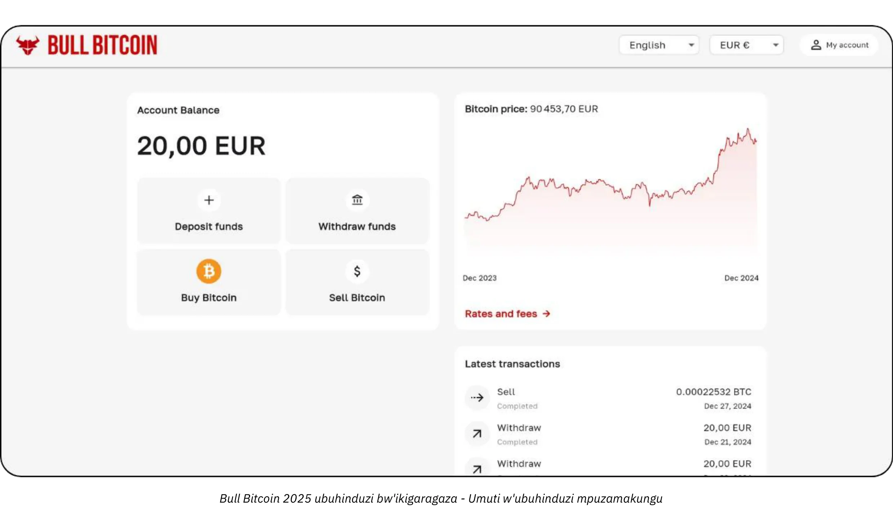

### Ku giciro ikihe?

Nk’uko vyavuzwe imbere na mbere, ntibishoboka gusa kumenya igiciro ca Bitcoin co muri kazoza, ariko kandi igiciro kirahinduka cane mu gihe gito. Mu mateka, ubuhinga bwizewe bwabaye ubwo kwegeranya ama Bitcoin buhorobuhoro mu bihe bingana  nko mukiringo c’imyaka ine canke irenga.

### Igitigiri co kugura?

Mu buryo butari nkubwo twari tumenyereye, umuntu asabwa gutangura kugura umutahe  muto , atarinze kwigora cane. Amahera makeyi (nk’amajana y'amayero  canke amadolari) ntaco azokugirira nabi cane, kandi ivyo uzokora bizokwigisha vyinshi cane, vyihuta cane, kuruta igitigiri cose co gusoma amakuru ajanye navyo.

Nk’uko vyavuzwe mbere, ni vyiza gushiramwo amahera yisumbuye gusumba ayambere gusa atarayo ushobora gukera cane nkomukiringo cimyaka myinshi. Ubuhinga ubwo ari bwo bwose utatahuye neza burashobora kugushira mu kaga gakomeye iyo ukeneye gukura amahera mu buryo butunguranye mu gihe kibi.

Ikindi iyo utanguje umutahe muke , ni vyiza ko ububiko bw'amatunga bw’inganda bwokoresha  ubuhinga bwo gushira amafaranga mubisata bitandukanye gusa bukingiwe. Ku ruhande rumwe, amashirahamwe amwe amwe, nka MicroStrategy, yarafashe uburyo burengeje urugero mu gutanga igice kinini c’amahera yabo y’itunga  muri Bitcoin, ivyo bikaba vyerekana ko afise ukwizerwa gukomeye kw’inzego. Ku rundi ruhande, ubuhinga bwo gukingira kandi bushobora gushikirizwa bushobora kuba ugutanga kumbure hafi 5% vy’itunga ry’inganda yawe muri Bitcoin, guhuza inyungu zishobora gushika n’ugucungera ingorane n’ibisabwa vyo gutanga amahera.

Iyo nzira ishushanijwe k'urugero ruva kumutungo muto , kumenya neza ko uruganda ruguma rufise amahera ahagije yo gukoresha, gushika ku ntumbero yo gushiramwo umutungo munini igamije kuronka inyungu nini  uko igihe kigenda kiragenda ama Bitcoin agenda yiyongera. Naho gutanga amafaranga bikomeye bishobora gutuma umuntu aronka inyungu nyinshi, gutanga amafaranga make birafasha kugabanya ingorane zo guhomba amahera meshi, bikaba bituma umushinge w’ivy’ubutunzi w’ishirahamwe uguma utekanye mu gihe uguma wungukira ku bushobozi bushasha bwa Bitcoin mu bikorwa vy’ububiko bwayo.

### kuncuro zingana gute?

Nta tegeko nyakuri  ririho. Kugerageza kugura mugihe kw’isoko  ibiciro biba  “vyagabanutse” birashobora kuba bibi kandi bikaba bitesha umutwe kuruta gusa kugura mu bihe bigenda bingana. Mbere n’abashoramari bazi utuntu n’utundi kwihenda rimwe na rimwe. Gushiramwo umutungo “wose” icarimwe birashobora kuba inkota y’ubugi bubiri.

Mu vy’ukuri, ubushobozi bwa Bitcoin ni uko naho wotangura imyaka mikeyi gusa, ushobora kubona inyungu z’igihe kirekire. Ni ukuri, birashoboka ko uguhinduka kw’ibiciro kuzogabanuka uko igihe kigenda kirarenga. Ariko rero, nk’ifaranga rifise igitigiti gito , Bitcoin igenewe kubika neza agaciro no kwerekana inyungu z’umwimbu z’abayikoresha. Kugira ngo tugereranye: ubu turi mu “gice co gutangura” amafaranga Bitcoin, amafaranga ariko arakorwa, kandi nta n’umwe aramenya agaciro kayo. Mu nyuma, kumbure mu myaka 20 canke 40, iyo iri mu “gice c’urugendo” gikomeye, yoshobora kuba ihamye cane kandi igakura idahinduka n’inyungu z’umwimbu w’abanyagihugu.

Inganda zikora amazu zisubiramwo kenshi ko “ari igihe ciza co kugura,” zikibagira ko iyo amazu yotakaza igikorwa cayo co kuba ububiko bw’agaciro—agahindukira akaja ku bintu nka Bitcoin—ibiciro vyoshobora gusubira hafi y’agaciro kavyo k’ubuhinga (uburaro). Bitcoin, mu buryo butandukanye n’ubwo, nta yindi ntumbero ifise atari ugubika agaciro, ivyo bishobora gusobanura ko “ari igihe ciza co kugura.” Kazoza kazobivuga.

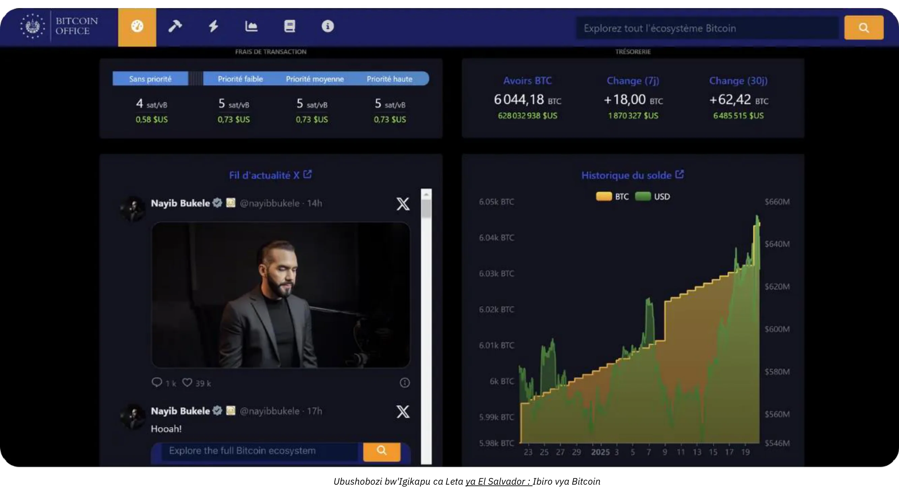

*Ivyiza: [Ibiro vya Bitcoin](ibiro vya Bitcoin.gob.sv/)*

### Ni mu buryo ubuhe bwo kugura? (Uburyo bwo kubungabunga)

Nta Bitcoin ufise muburyo bugaragara. Ahubwo, ufise urufunguzo rw’ibanga rugufasha guhindura umutungo w’ibice bimwebimwe canke wose vy’ikonti yawe ku rundi rufunguzo rumwe canke nyinshi. Ivyo vyose bibera kuri Bitcoin Blockchain, iyo na yo ikaba isubirwamwo mu bihumbi mirongo vy’ibice kw’isi yose.

Urufunguzo rw’ibanga  ni umubare munini cane utagira imfatiro. Kugira ngo umuntu ashobore gukoresha neza, akenshi agaragazwa nk’urutonde rw’amajambo 12 canke 24. Ayo majambo arashobora gushirwa ku gikoresho kigaragara citwa “Hardware Wallet.” Ariko rero, tahura ko ama bitcoins atari “imbere” muri iki gikoresho; ni igikoresho gusa co gusinya amafaranga y’ubudandaji mu buryo bw’ibanga no kuyatangaza ku rubuga. Igihambaye vy’ukuri ni amajambo 12 canke 24, ategerezwa kuguma arinzwe neza.

Ivyo bituma haba ikibazo c’ugucungera: gufata Bitcoin bisigura gufata urufunguzo canke urufunguzo. Ushobora kubifata wewe nyene, canke ukabishinga uwundi muntu. Hariho kandi n’imiti yo hagati. Reka dusuzume ibintu bikunze kubaho:

- **Kuyifita ubwawe bwite:**

Iyi ni yo nzira iremezwa n’abakunzi b’ukuri ba Bitcoin, kuko ihuye n’umugambi wa mbere wa Bitcoin. Ukora nk’ibanki yawe bwite: nta ngorane yo kuguhenda, ariko ni wewe ufise inshingano yo gucungera urufunguzo. Ushobora kuronka amahera yawe yose amasaha 24 kuri 24 imisi 7 kuri 7. Mu bucuruzi, nimba abantu benshi bashobora gukenera gukorana, uzokenera ibikoresho n’uburyo bikwiye bwo gucunga ukuronka n’umutekano.

- Ugucungererwa:

Nk’akarorero, Exchange canke ishirahamwe ry’abaguzi rirashobora kugukorera konti, rikaguhindurira amahera yawe ya kera ngo abe Bitcoin, rikagufata mu izina ryawe rikoresheje ubuhinga bwabo bwo kugucungerera umutekano. Benshi muri izo serivisi ziguha uburenganzira bwo gukura ama bitcoins yawe mu Wallet aho wewe wenyene ufise urufunguzo. Gushika ubikoze, ntuba vy’ukuri ufise ama bitcoins; wizigira umuhango wabo wo kukwishura. Ivyo birimwo guhuza ingorane z’umutekano (izabo n’izawe) n’ingorane z’abagenzi (zishobora kunanirwa canke zikazimangana). Hari ubucuruzi bubona ko ivyo vyemewe, naho muri rusangi bitari vyiza ku kubika igihe kirekire canke ku 100% vy’ivyo utanga. Ibikorwa vy’ububiko bishobora kandi gusaba amahera yo kubika.

- "Impapuro Bitcoin" (ETF canke ETP):

Ivyo ni ibikoresho vy’ivy’ubutunzi vya kera bigereranya imice ya Bitcoin, bisubiramwo ibikorwa vyiterambere ryayo . Ikigo kiri inyuma y'ico gicuruzwa kiragura kandi kigafita  Bitcoin muburyo butagaragara. Ivyo utanga n’ivyo ukura bikoreshwa mu mafaranga asanzwe (nk’amadolari canke amayero), atari mu Bitcoin. Uretse ibicuruzwa bimwebimwe vyemewe kugura mu Bitcoin nyayo (kugira ngo ntihagire amategeko adakwirikizwa  mubijanye n'imisoro mu bihugu bimwebimwe), ivyo bikoresho birimwo amahera y’uburongozi y’umwaka. Aha, wizigira umutekano w’ikigo kandi ugahura n’ingorane z’abandi (nk’akarorero, iyo Leta ifashe ingingo yo gufata Bitcoin yose ifiswe n’ikigo, nk’uko vyagendeye inzahabu mu 1933 hakurikijwe itegeko ry’ubutegetsi bwa Leta Zunze Ubumwe za Amerika 6102). Inyungu yabo nyamukuru ni ukuronka bitagoranye, kuko bakwiragizwa biciye mu nzira za kera z’amahera. Baca ku nkenegwa yo gukingira imfunguruzo z’ibanga ariko nta n’imwe mu mico ya Bitcoin itanga: ntushobora gukoresha urubuga rwa Bitcoin 24/7 kugira ngo ushire agaciro mu mwidegemvyo ata ruhusha. Bisubiramwo gusa ibikorwa vy’ivy’ubutunzi, si ibikorwa canke ubusegaba bwa Bitcoin ubwayo.

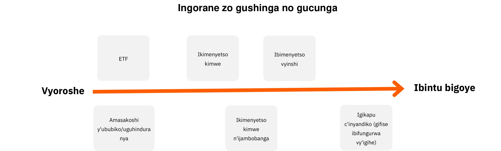

Ikindi, uburyo ufisemwo  Bitcoin buragira ico rukoze cane ku ngingo z’umutekano zikenewe kugira ngo ukinge itunga ry’uruganda rwawe. Watora uburyo bwo kuyitanga kugiti cawe bwite , ukoresheje ingodo isaba umukono umwe canke imikono myishi,  kugira ugume ucunze neza imfunguruzo zawe zumutekano, canke ugashinga ico gikorwa ku bikorwa vy’ukuyazigama mumutekano   vyabandi canke ETFs, uburyo bumwebumwe bwose burafise ingorane zabwo. Nk’akarorero, uburyo bwogutunga bitcoin ubwawe bwite( autodetention) bitanga uburenganzira bwose ariko bisaba amategeko akomeye y’umutekano , mu gihe inyishu z’uwundi muntu ( tier ) zigabanya umuzigo wo gukwirikirana vyose kugiti cawe atanumwe agufashije. Kugira ngo ushobore kwerekana neza itandukaniro, iki kigereranyo kirerekana uburyo bwo gucungera umutekano ku bwoko bwose bw’ububiko, kigufasha guhitamwo uburyo bubereye cane ivyo ishirahamwe ryawe rikeneye :

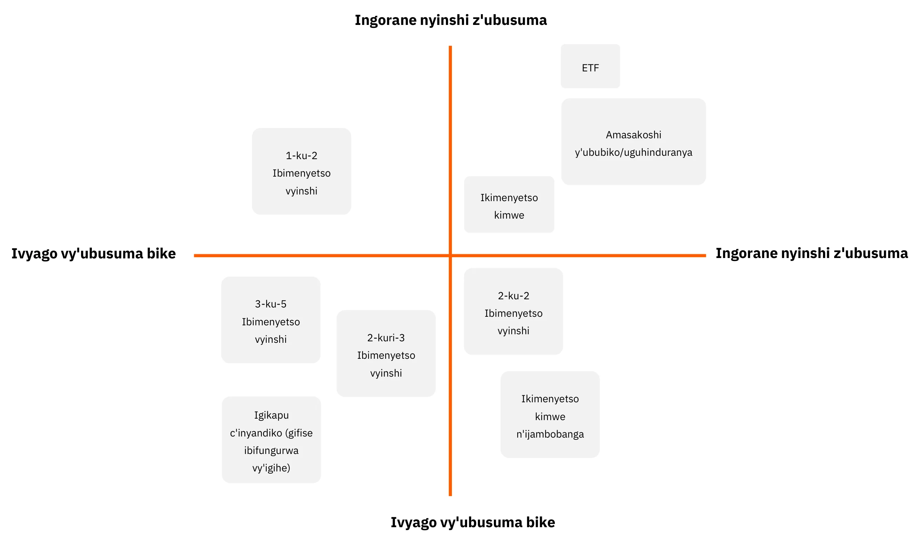

### Ni nde wotumbera?

Niwahitamwo “urupapuro Bitcoin,” uzoja ku bigo vy’ivy’imari nk’amabanki canke amasoko y’ivy’ubutunzi yo kuri interineti.

Niwahitamwo kugura Bitcoin nyayo biciye ku isoko (Exchange) canke ku mucuruzi, urafiseamahitamwo y'inzira nyinshi :

- Imbuga ngurukana bumenyi mpuzamakungu canke zo mumahanga:

Zigizwe nkakarorero  na Kraken, Coinbase, canke Binance, mu mateka vyakoreshwa n’abantu benshi. Hari abahuye n’ingorane, kandi biragoye gutanga impanuro itomoye. Impanuro: niwaba uzikoresha, ntusige ama bitcoins yawe igihe kirekire kuruta uko bikenewe.

- **Abatanga  ibikorwa bigenzuwe (Abatanga ibikorwa vy'ubuhinga bwa none vyandikwa):**

Nk’akarorero, mu Bufaransa ama platforms nka Paymium (Exchange) canke BullBitcoin (umucuruzi) arazwi ko afise abakunzi b’ukuri ba Bitcoin ku mutwe kandi yubatse kurutonde neza . Muri USA ufise abaguha ama service nka River canke Swann. Muri rusangi, birahambaye gusuzuma ibikorwa vyinzego ritanga ivyo bikorwa: ukwamamara kwayo , ibikorwa vyabo ingene bigenda , ukumenyekana kwabo mu muryango wa Bitcoin, n’uko uburongozi bwabo bujanye n’agaciro nyamukuru ka Bitcoin.

**imbuga n'inganda  zijejwe kugura nokugurisha amabitcoin**

- **kugura no kugurisha** iraguha uburenganzira bwo gutanga amategeko yo kugura kugiciro uhisemwo, ariko utegerezwa kurindira ko bishirwa mu ngiro gushika igiciro c’isoko n’abagurisha bihuye.
- **Inganda** iguha igiciro gihoraho kandi ushobora kurangiza igikorwa vyokurungika vyihuse.

Uretse amafaranga bakata n’umuvuduko wo gukora— ivyo navyo bikaba bidahambaye cane nimba uriko uriyumvira iterambere mukiringo kirekire (imyaka myinshi)—ubucuruzi bukwiye kandi kwiyumvira kubintu bikurikira :

- **amashusho umuntu abona kurubuga:** Mbega urubuga rurakoreshwa neza?
- **igikorwa cogutunganya ubutunzi :** Nimiburiburi, ubushobozi bwo gusuzuma amarungika yubutunzi mwiforo rya  .CSV.
- **Ugucungera n'umutekano:** Mbega iyo platform ifise ama bitcoins mumazina yawe, canke irakurungikira umutungo wawe? None umutekano wabo ni uwuhe? Boba bafise "ibifunguruzo vyo gukura" canke izindi mbibe zokurotira?
- **Infashanyo y'abaguzi:** ubwishi, inyishu, n'imfashanyo y'umuntu ku giti ciwe, cane cane iyo uriko uratangura.
- **Ukwamamara n'Inyifato runtu:** Ukwizigirwa n'agaciro k'urubuga.
- **Ukwitaho ibidandazwa vya komande :** Niba utegura kwegeranya Bitcoin uko imisi igenda iragenda hamwe namagura arikuri komande.

# Inyishu zo kwishura hokoreshejwe Bitcoin ku nganda zose

<partId>b2c8af88-6bfc-49b1-ad84-4c292c713b55</partId>

## kwemera kuriha  hakoreshejwe bitcoin 

<chapterId>99af1203-bc84-4acc-9780-f733e7998335</chapterId>

Ubwa mbere, birahambaye gutahura ko Bitcoin ari mahindago ku rugero rumwe na internet.

Mu misi ya mbere, urubuga rwa internet rwatumye bishoboka gukuraho abahuza mu mihora y’itumanaho, hanyuma ivyo bikorwa remezo bituma habaho ibikorwa bitagira uko bingana mbere atamuntu yari kwiyumvira ko vyobayeho . Ubu, ni ubucuruzi ubuhe butagira urubuga rwa internet?

Bitcoin ni ibikorwa remezo vyizewe , igikorwa caco ca mbere ni ugukuraho abahuza mu bubiko  y’agaciro—amahera. Ibindi bikoresho bitashobora kwiyumvirwa ubu bizoza bivukira  murivyo bikorwa remezo. Kubaho kwawe kwa mbere hano bifatwa ko uri kurubuga : irembo ry’ugutanga amahera n’uguhana agaciro.

Fata ubu rero, dufatiye nkakarorero ku nganda  ibikorwa vyabwo nyamukuru ataco bihuriyeko na Bitcoin. kubera iki urwo ruganda rwohitamwo kwemera kurihwa mumahera ya Bitcoin?

- **Kubaka ububiko bwubutunzi  bwa Bitcoin:**

Raba inkuru yacu duherutae  ku bijanye no kugura Bitcoin. Yaba kubera ko bagondojwe canke kubera ubuhinga bwogukorera ibikorwa mumice itandukanye, abahinga bamwebamwe bahitamwo kwemera amahera y’ama Bitcoin. Bamwe mu ba Bitcoiners bavuga ko uko ishirahamwe rigira amahera make—bisobanura ko ritagira umwanya canke ibikoresho vyo kwifatanya n’ibikorwa bikomeye vy’amahera—**uko bica bigorana ko ubwo bucuruzi bwishurwa mu buryo bukomeye kuruta ubundi bwose bw’amahera ariho**. Mu kubigira, biratuma urukino ruri ku rugero rumwe, bikaba bituma mbere n’amashirahamwe matomato kandi afise umwanya muto ashobora kuzigama agaciro ata gufatwa n’imikino y’amahera.

- Gushika kwiyongerekana ryigitigiri cimirwi:

Igitigiri c’abakoresha Bitcoin kiriko kirakura, kandi barafise ubushobozi bwo kugura cane. Mu bisanzwe bazokwegwakwegwa n’ubudandaji bwemera amahera yabo. Ikindi kandi, kuko ari ryo mafaranga ya mbere y’isi yose, akoreshwa kuri internet, urashobora kandi gukwegera abakiriya bo kw’isi yose baca muri yo.

- Kwongerekana kw'ukuboneka:

Mu gushiramwo ubucuruzi bwawe ku mbuga nka BTCmap.org, nk’akarorero. Ubucuruzi bukeyi gusa ni bwo bwemera Bitcoin, rero ijambo ry’akanwa rirakora ku nyungu yawe. Bigutandukanya kandi n’abaguhagarariye.

- Amafaranga make:

Ivyishyurwa vy'ubu nyene vya Bitcoin bishika kuri Lightning Network. **Amahera ni make cane kandi yishurwa n'uwuguze**. Nta mafaranga yo kwishura, nta n’ukwemererwa kwishura kunanirwa, kandi nta buhendanyi. Mu kugereranya, inganda zo kwishura (amakarata, ama terminal, ama transfers, PSPs, n’ibindi) zitwara amadolari ashika ku bihumbi 2,2 trillions ku mwaka kw’isi yose. Wongereko n’ugusubiza amahera n’ubuhendanyi, kandi muri rusangi, hafi ica cumi c’umusaruro w’igihugu ca Leta Zunze Ubumwe za Amerika “kirakurwa” ku bucuruzi butanga inyungu kw’isi yose kugira ngo gusa buhe agaciro. Utitaye ku bucuruzi bwawe, amahera y’amahera ni umuzigo ukwiye gutunganirizwa neza, kandi rimwe na rimwe, amahera menshi arashobora gutuma ubucuruzi bumwebumwe buhungabana.

- **Umwidegemvyo n'Ukutagira Uruhusha, 24/7:**

Nta nkeka ko usaba uruhusha rwo gukoresha Bitcoin. Umuntu wese arashobora kugira uruhara mu bukungu mu minota mikeyi akoresheje app ya telefone ngendanwa. Ushobora kohereza canke kwakira amahera umuntu wese—umuntu ku giti ciwe canke ubudandaji—igihe cose, ata ngorane canke ugucerezwa kw’urutonde.

- Gukoresha neza urubuga rwa Bitcoin kubera inyungu zarwo:

Ntusabwa kubika amahera yawe mu rupapuro rwa Bitcoin—na canecane nimba ukeneye kwishura abaguha ivyo ukeneye canke gutanga IVA. Hariho ibikorwa bishobora guhindura vyose canke igice c’amahera yawe ya Bitcoin mu mafaranga uhisemwo (nk’akarorero, amayero mu IBAN yawe) ku giciro. Muri iki gihe, inyungu yo kwemera Bitcoin yoshobora kuba iri mu gukwegera abakoresha bashasha canke mu nyungu z’imbere za Bitcoin (nk’amahera make, gukora amasaha yose, no kutagira ingorane zo guhenda canke gusubizwa amahera).

### Ni uwuhe muti wo kwishura wohitamwo?

Biroroshe cane gutangura kwemera amahera ya Bitcoin. Kugira ngo uhitemwo umuti mwiza, zirikana ibiranga amafaranga ukoresha: amahera utanga, incuro ukoresha, be n’uko uzokwemera kwishura mu kibanza c’umubiri, kuri Internet canke vyose bibiri.

Ivyiyumviro vyawe nk’umucuruzi na vyo nyene birahambaye. Woba uriko urakora ikigeragezo coroshe, canke witega ko Bitcoin izoba isoko y’amahera ihambaye kandi isubiramwo? Nimba ari ivya nyuma, uzokenera uburyo bukomeye, bushitse kandi bushobora guhindurwa.

Ntukibagire kwihweza uruhara rutandukanye rw’abakozi bawe n’aho bari. Uko vyogenda kwose, wibuke yuko utegerezwa kuba ushoboye guha umucungezi wawe amakuru yose akenewe no gutuma uburyo bwo gucungera amafaranga bugenda neza.

Kugira ngo tworohereze uburyo bwo gufata ingingo, twasobanuye imirongo ine itandukanye y’ubudandaji. Imbonerahamwe zikurikira zicapura ibiranga nyamukuru n’imiti y’ukwishura impanuro ku bijanye n’umwirondoro umwe umwe.

### Imirongo y'ubucuruzi

#### Umwirondoro wa 1 – Uwutanguye

| Akaranga                         | Uwutangura                                                                                                                                |
| -------------------------------- | ------------------------------------------------------------------------------------------------------------------------------------------ |
| **Urugezo rwibitekerezo**                | "kugerageza kuriha iryambere muburyo bugaragara  ", "kuronka amahera yambere yibikorwa vyanje vyo kuri internet", "kwiha intumbero yokuronka akarusho nagatoya"                                   |
| **Umurindi wama rungika**        | "irungika ryambere kugira wige ", "kwemera amarihwa rimwe na rimwe"   |                                                      
| **Akarorero kinganda**       | ubutunzi bwuzuyemwo ibitekerezo ( gukora atureresi kuri interineti , ibinyamakuru kuri interineti) , gutunganya ibirori, kwidandariza ibidandazwa, amashirahamwe , ibirori vyiharije   |
| **Uburyo bwokuriha**                 | kenshi na keshi muma jana yama yero canke amadorari munsi ya 300 yamadorari canke ama yero kuri buri kinyamakuru                                                            |
| **Amategeko agoye**          | ntanamwe                                                                                                                                     |
| **Akarorero kinyishu zisabwa** | ingodo yikorana buhanga ya Lightning ibitsweko amakuru , Nkigodo yikorana buhanga ya satoshi  , canke ingodo yikorana buhanga itabika amakuru nka  Phoenix.                                              |
| **Ishusho umudandaza abona kurubuga**           | ingodo ya Bitcoin Lightning yororohejwe : application muri telephone ngendanwa                                                                                 |
| **Ishusho umukiriya abona kurubuga**           | ikode ya QR ya bitcoin, bapimishije bakoresheje yikorana buhanga yumu kiriya                                                                        |
| **Imisoro**                         | umukiriya arariha imisoro ya Bitcoin Lightning  hamwe nimisoro ya application asabwa                                                                         |
| **Igikoresho cubudandaji**         | application yo kubuntu kuri ayama terephone manini manini , canke bakoresheje igikoresho cokurihirako( nkakarorero Bitcoinize)                                                                  |
| **Gutunganya hamwe nishingano**         | ugutunganya biciye kuri application imwe ; ubutandukanire bwishingano butari bunini                                                                                      |
| **Gutunganya amatungo**           | intonde za kera zamarungika yintango                                                                                                           |
| **API**                          | oya                                                                                                                                         |

#### Umwirondoro wa 2 – Ivy'ingenzi

|     akaranga                    | Ibintu ngirakamaro                                                                                                                           |
| -------------------------------- | ------------------------------------------------------------------------------------------------------------------------------------------ |
| **Urugezo rwibiterezo**                | "ndemeye bitcoin muruganda rwanje, mugabo siniteze umwimbu munini"                                                                    |
| **Umurindi wama rungika**        | amarungika amwamwe buri kwezi                                                                                                                 |
| **Akarorero kubwoko bwibikorwa**       | ubunywero , uburiro ,ubucuruzi ,  amaduka meshi buri kwizina ryumuntu umwe, umutungo wibitekerezo kubahinga |
| **Uryo bwokurihabu**                 | kenshi na keshi muma jana yama yero canke amadorari munsi ya 300 yamadorari canke ama yero kuri buri kinyamakuru , munsi ya 300 kukinyamakuru hamwe nomunsi ya 300 kukwezi                      |
| **Amategeko agoye**          | Nimiburiburi ( application yo mwiterephone ngendanwa)                                                                                                                       |
| **Akarorero kinyishu zisabwa** |  Swiss Bitcoin Pay                                                                                                                          |
| **Ishusho umudandaza abona kurubuga**           | ingodo yubuhinga ngurukana bumenyi ya bitcoin Lightning isanzwe , application kuri telephone ngendanwa ; fagitire iriko ibintu bikenewe gusa                                          |
| **ishusho umukiriya abona kurubuga**           |   ikode ya QR ya bitcoin, bapimishije bakoresheje ingodo yikorana buhanga  yumu kiriya                                                                      |
| **Imisoro**                         | akeshi na keshi > 1% mwirungika igana kumuhora  wa bitcoin , hamwe na 1,5 % muvuganye kuri ayamahera asanzwe akoreshwa na leta                                                            |
| **Igikoresho cubudandaji**         | application yo kubuntu kuri ayama terephone manini manini , canke bakoresheje igikoresho cokurihirako( nkakarorero Bitcoinize)                                                                                                                                   |
| **Gutunganya hamwe nishingano**         | amahitamwo ya kazi ko kudandaza kuba kozi gusa ; aho umu bossi akwirikirana amakuru y'uruganda                                                             |
| **Gutunganya amatungo**           | kugaragaza CSV idonido amarungika yabaye                                                                                                 |
| **API**                          | ego                                                                                                                                       |

#### Umwirondoro wa 3 – Umuhinga

| Akaranga                       | Ubunyamwuga                                                                                                                                       |
| -------------------------------- | ------------------------------------------------------------------------------------------------------------------------------------------------------ |
| **Urugezo rwibiterezo**                | - uburyo bwokuriha nkubundi kurudandazwa rwanje rwokubuhinga bwa none, canke ukwitunganya kwama shirahamwe yinganda kugira bakore uruja nuruza rwama rungika manini manini                           |
| **Umurindi wama rungika**        | amarungika meshi kumunsi                                                                                                                          |
| **Akarorero kinganda**       | Urubuga rw'urudandazwa go kuri interineti rwo kumurindi urihejuru cane , ikibanza gito cisoko , imirwi yamaduka agaragara(click & collect ) , PME                           |
| **Uburyo bwokuriha**                 | Keshi na keshi mutu  dolari canke mutu yero gushika mumajana yama dolari canke ama yero  ,ntambibe zigitigira camahera agobwa kurungikwa, munsi ya 250000 burimwaka                                    |
| **Amategeko agoye**          | kuva kukintu gisanzwe gushika kukintu gikora neza( kubika(hébergement) muri local cank cloud ) , bisaba keshi iduka ryo kuri interinete                                                            |
| **Akarorero kinyishu zisabwa** | BTC Pay Server kuri e-comerce et ou environnement physique ZapRite, Musqet ou PayWithFlash kuri  checkout, Be-BOP i duka ririmwo              |
| **Ishusho umudandaza abona kurubuga**           | urubuga rwo kuri interineti rurimwo uburyo bwa fagitire , uburyo bwogutora ikidandazwa ushaka hamwe nuburyo bwo kuriha , fagitire yikora kubera ubuhinga burimwo bw'urudandazwa rwo kuri interineti ( e-commerce) |
| **ishusho umukiriya abona kurubuga**           |   ikode ya QR ya bitcoin, bapimishije bakoresheje ingodo yikorana buhanga yumu kiriya                                                                                  |
| **Imisoro**                         | kuvanga hagati ya   backend open-source  yokubuntu hamwe nuburyo bwo kwemererwa kubika ( hébergement), ibikorwa vya Lightning birihishwa imisoro yokuruhande rwo kumukiriya  bifatanye nimisoro ya Bitcoin Lightning  na < 1.5 % ya yamvunjishijwe     |
| **Igikoresho cubudandaji**         | iduka kumbuga ngurukana bumenyi , kugaragaza muburyo buboneka ( akarorero IPad yerekana urubuga , igikoresho ca bitcoin )                                                            |
| **Gutunganya hamwe ninshingano**         | iduka rikora neza rifise inshingano nyishi zubuyobozi, abakozi hamwe naba kiriya baraganira hagati yabo                                                       |
| **Gutunganya amatungo**           | kugaragaza CSV idonido amarungika yabaye                                                                                                           |
| **API**                          | ego                                                                                                                                                     |

#### Umwirondoro wa 4 – Ikigo

| Akaranga                        | Uruganda                                                                                                                                  |
| -------------------------------- | ----------------------------------------------------------------------------------------------------------------------------------------------- |
| **Urugezo rwibiterezo**                | - uburyo bwokurihamwo bimwe vyubuhinga muru ganda, hamwe ni terambera ryokongerereza kumbuga amaseruvise yiharije kandi yiyumviweko      |
| **Umurindi wama rungika**        | ntambibe , amarungika kumurindi uri hejuru                                                                                                         |
| **Akarorero kinganda**       | Inganda zibayabaye , amashirahwe yibikorwa vyikorana buhanga , inganda zinini, ikibuga cisoko kinini                                                              |
| **Uburyo bwokuriha**                 | amahera yose , uko angana  kose                                                                                                                              |
| **Amategeko agoye**          | hagati na hagati gushika kurugezo runini bivana namahitamwo yinyubako ushaka                                                                                         |
| **Akarorero kinyishu zisabwa** | inyubako iri kubipimo canke gutunganya ibisubizo vyishi vya SaaS  hébergées, bituma hashobora kujamwo ama seruvise ya LSP( Lightning Service Provider)   |
| **Ishusho umudandaza abona kurubuga**           | Ibi bisobanura yuko ibice vyerekana (front-end) hamwe n’ibihishije (back-end) vy’urubuga canke application vyakozwe neza kandi bihuye n’ukuntu ishirahamwe rikora akazi karyo.                                 |
| **ishusho umukiriya abona kurubuga**           | kuva kuri code isanzwe ya QR gushika kwishusho ryabayikoresha , hamwe nishiramwo rya API                                                              |
| **Imisoro**                         | ishirahamwe ryagaciro kiterambere rikora mwishirahamwe hamwe nagatangwa kubantu canke kuma shirahamwe yinyuma ,umukiriya atanga umusoro kuri  Bitcoin Lightning hamwe nimisoro isabwa nabatanga ayo ma service |
| **Igikoresho cubudandaji**         | ibisubizo bimeze neza bihuriranye nakarere uruganda rurimwo                                                                                 |
| **Gutunganya hamwe ninshingano**         | ishingano bagize uko bashaka mubu dandaji , ubuyobozi ,DevOps, gukwirikirana ivyubutunzi hamwe  ubukungu .                                                             |
| **Gutunganya amatungo**           | ivyo gukwirikirana ubuntunzi bitunganije neza                                                                                                            |
| **API**                          | ego                                                                                                                                             |

Mu bice bikurikira, tuzodondora ido n’ido ubucuruzi bumwebumwe n’imiti ihuye n’umwe muri bo.

## Uwutangura

<chapterId>7edda53d-5b9f-432a-8493-115de8c94a67</chapterId>

Akaranga kintango  kagenewe gukorerwa inganda , abahinga , n’abantu ku giti cabo bipfuza kumenya ingene bariha  muma Bitcoin ata buryo bibasavye canke ubuhinga bwinshi. Abo ni abo mu bisanzwe bakora ibikorwa vyokurungika bike (kumbure impanuro nkeyi, intererano, canke ugurisha rimwe na rimwe) kandi barondera intangamarara isanzwe kandi yoroshe yakarere ka Bitcoin na Lightning Network. Agaciro nyamukuru k’uburyo bwintango buri mugushirwa kwayo gutoya: kenshi, ibisabwa vyose ni telefone ngendanwa canke tablette ifise ingodo yikorana buhanga  ihuye na Lightning.

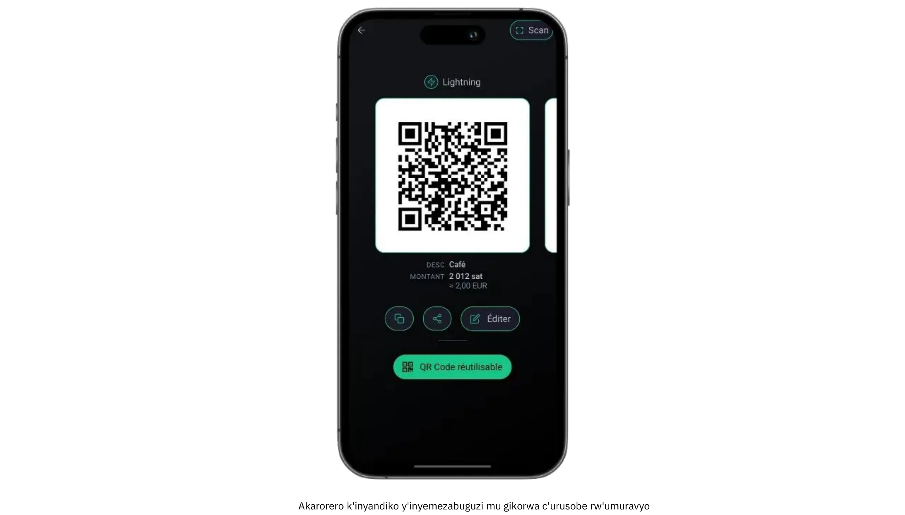

Kimwe mu bintu biri muri ako karanga ni uko yibanda ku kwishuza amahera makeyi,  arenga  gake cane amajana  y’amayero canke y'amadolari ku kwezi. Urwo rwego rutoyi rutuma iba ihitamwo ryiza cane ku muntu wese yipfuza kugerageza isoko na Bitcoin, ata ngorane zisanzwe ziri mu gukoresha ivyuma vyinshi. Vyongeye, biratuma umuntu ahita yiga akoresheje amaboko; kubera ko hariho imikazo mikeyi y’ibikorwa be n’amahera makeyi, amakosa arashobora guhagarara, kandi ivyigwa birafatwa ningoga. Kuva ku bahinga bagurisha ibikorwa vy’ubuhinga bw’amaboko mu masoko yo mu mpera z’umusi gushika ku migwi idaharanira inyungu yemera intererano z’igihe kimwe, abakoresha muri iki kiciro akenshi bashimika ku kuronka no ku gukoresha vyoroshe kuruta ibikorwa vy’ubuhinga buhanitse.

Ivyo bibiri bikunze gukoreshwa cane ningodo yikoranabuhanga  ku bijanye n’umwirondoro wintango birimwo gufata ingingo hagati yigisubizo cogukoresha ububiko canke kureka. Ingodo yikorana buhanga y’ububiko (nki ngondo yikoranabuhanga ya Satoshi canke Blink) ireka seruvise yishirahamwe rindi  rigenzura imfunguruzo z’ibanga n’ibikorwa vy’inyuma, harimwo n' inshingano z’ubuhinga z’uwukoresha. Iyo ndinganizo iryohera cane cane abashaka ko ibintu biba vyoroshe kandi bikora , ata bintu vyokugorana. Ku rundi ruhande, ingodo zikoranabuhange za Lightning zitagira ububiko (nka Phoenix canke Breez) ashira imfunguruzo z’ibanga n’ububasha bwose mu minwe ya nyen’ubucuruzi, agatanga ubwigenge bwinshi n’umutekano wibanga  kugira ngo umuntu akore utwigoro dutoduto two mu ntango. Mu bihe vyose,ishusho yo muri iki gihe arakoreshwa neza cane ku buryo umuntu wese ashobora gukora ibikorwa bihambaye (gukora kode ya QR, kwinjiza amahera umuntu akwiye kwishura, no kwemeza ko umuntu atanga amahera) mu minota mikeyi.

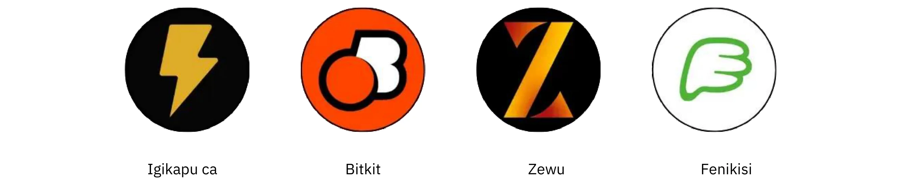

Naho ibibazo vyerekeye umutekano bishobora gusa n’ibitihutirwa cane iyo amafaranga agurishwa ari make, birahambaye cane ko hashirwaho ingingo z’ishimikiro zo kwikingira. Mbere na telefone isanzwe canke tablete  ikoreshwa mu kwakira amahera ya Bitcoin ikwiye gukingirwa n’ijambo kabanga canke umutekano hakoreshejwe urutoke ( empreinte ), kandi uburyo bwo gukingira amakuru (kuva ku gukurikirana amakuru y’injira ku muntu afise ingodo yikorana buhanga gushika ku kurinda ijambo seed ku muntu atariko arazigama) butegerezwa kuba. Abakozi bakora ibikorwa vy’ubudandaji mu kibanza kigaragara  kwunguka kwa  kumenya ibintu vy’ishimikiro: ingene bofungura iyo porogarama, ingene boshikiriza umukiriya kode ya QR, be n’ingene bomenya nimba vy’ukuri amahera yashitse.

Ivy’uguharura amafaranga n’ugutanga raporo, naho vyoroshe cane munsi y’urutonde rw’Intango, biracari ngombwa ko umuntu abizirikana neza. Naho igitigiri c’ibintu bigurishwa coba ari gito cane, kubika amakuru atagiramwo ubusuma birabuza gutera urujijo mu gihe c’inyuma kandi birafasha kuguma haba uguseruka mu gihe habayeho igenzura ry’ivy’amahera canke ry’ugutanga imisoro. Ibikoresho vyinshi vyi ngodo yikorana buhanga birashoboza abakoresha gusuzuma ibikorwa vyamarungika yakera ( vyabaye ) vyibanze muburyo bw’idosiye ya CSV; ku ruganda rutoya canke umudandaza umwe, kubika izo dosiye ubudasiba birashobora gutuma gusubiza hamwe amakonti vyoroha cane. Ni vyiza kandi gukurikirana agaciro k’amahera (nk’akarorero, mu ma euro canke mu madolari) mu gihe amahera yose agurishwa. Kubera ko igiciro ca Bitcoin gishobora guhinduka, kugira urutonde rw’ibiharuro vy’abahinduye ni ngirakamaro cane mu bijanye no kubika ibitabu no kwubahiriza imisoro.

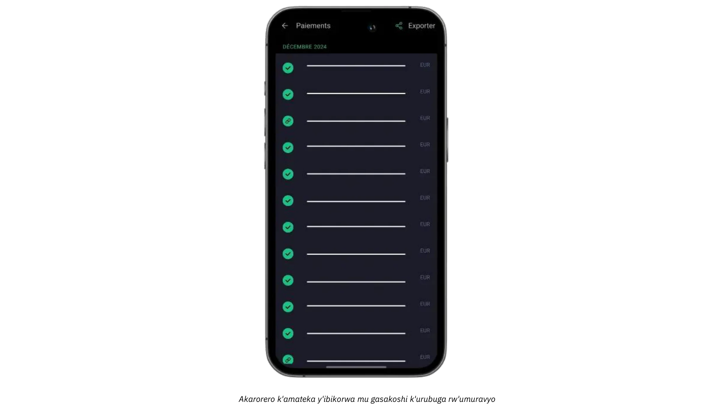

Ku nganda zipfuza kwongerako amahera yabo agaragara canke y’umuntu ku giti ciwe n’intererano canke impanuro zo kuri internet, ubu biroroshe gushiramwo ibuto yogukandako kugira bashireko amahera yimfashanyo ya  Lightning canke mu rubuga rwa interineti. Ivyuma nka BTCPay Server bitanga amabuto yo kwishura yoroshe gutunganya, mu gihe bimwe mu bimenyeshamakuru vyo ku mbuga ngurukanabumenyi n’ibikorwa vyo gutangaza amakuru mu buryo buhoraho bimaze gushigikira impanuro za Lightning zifise amaderesi. Ku bw’ivyo, mbere n’ishirahamwe ry’intango rirashobora kwubaka urubuga rw’abaguzi rutoyi ariko rwo kw’isi yose. Hagati aho, abakunda kudafata Bitcoin igihe kirekire barashobora gutohoza uguhindura igice canke ubwavyo mu mafaranga y’amahera bakoresheje amasakoshi amwamwe y’ububiko canke ibikorwa vy’abandi. Naho iyo nzira ijana n’amahera y’inyongera n’inshingano za KYC zishoboka, ifasha ubucuruzi guhunga uguhinduka kw’igipimo co guhana hana ubutunzi no kuguma bafise ibikorwa vyabo vy’ivy’ubutunzi biriho ata guhungabana gutoyi.

Ikoreshwa ryoroshe ryerekana ingene izo Elements zose zihuriza hamwe. Ibaze umuhinguzi w’ibintu wo mu karere kacu agurisha imfungurwa yahinguriye  muhira kw’isoko ry’abarimyi ryo ku wa gatandatu. Afise telefone ikoresha Ingodo ya Lightning, bashinga igiciro c’igikombe kimwekimwe cose mu ma euro; iyo umukiriya asavye kwishura mu Bitcoin, uwo mudandaza aca yihuta kwinjiza amahera yo mukarere bihuye, maze iyo porogarama igaca iharura ubwo nyene sats(ingero za bitcoin) akwiye kwishurwa.  QR code ica ipimwa hakoreshejwe ingodo y’umukiriya  , irihwa rikorwa mumasegonda makeyi , maze uwo muhinguzi  aca amenya ko irihwa ryagenze neza. Ku muhingamo, amakuru yose yerekeye ibikorwa vy’ubudandaji , kandi amahera asigaye ku musi arashobora kwoherezwa yose canke igice ku rubuga rwamavujwa kugira ngo ahindurwe amahera asanzwe akoreshwa.

Mu guhuza ibikoresho bikoreshwa neza, ibisabwa bikeyi vy’ibikoresho, n’ukubika amakuru mu buryo bworoshe, inyishu zintango zitanga ivy’ingenzi ataco zirengeye inganda zigitangura . Iyo umubare w’ibikorwa vy’ubudandaji wongerekanye kandi ibisabwa mu bikorwa vy’ubudandaji bikagenda birahinduka, gutera imbere mu rwego rwo hejuru cane nk’uko bivugwa mu kigabane kizoza bica bihinduka ugutera imbere muburyo busanzwe.

Ku nyigisho zitomoye ku bijanye n'amasakoshi n'imiterere y'ishimikiro, usabwe kuraba ubu burongozi bukurikira:

**Ibipapuro vy'amahera vy'ukwizigama LN:**

https://planb.academy/tutorials/wallet/mobile/phoenix-0f681345-abff-4bdc-819c-4ae800129cdf

https://planb.academy/tutorials/wallet/mobile/bitkit-a7224674-85c4-4045-9baf-37018d89550c

https://planb.academy/tutorials/wallet/mobile/breez-46a6867b-c74b-45e7-869c-10a4e0263c06

https://planb.academy/tutorials/wallet/mobile/blixt-04b319cf-8cbe-4027-b26f-840571f2244f

https://planb.academy/tutorials/wallet/mobile/zeus-embedded-advanced-3e89603c-501d-439c-8691-d4a0d0de459b

**Ibikoko vy'ububiko LN:**

https://planb.academy/tutorials/wallet/mobile/wallet-of-satoshi-39149d86-e42b-4e8f-ae9f-7e061e7784f7

https://planb.academy/tutorials/wallet/mobile/blink-7ea5f5a4-e728-4ff9-b3f9-cf20aa6fc2bd

## Ivy'akamaro

<chapterId>89be421f-f7df-4bcc-a9e4-df96e39ef249</chapterId>

Akaranga kingenzi karabereye inganda zito zito n’izibayabaya, zishobora kuba zifise abakozi, zishaka kwemera Bitcoin mu buryo bworoshe kandi bwihuse butakeneye ubumenyi bwishi cane muvyubuhinga , mu gihe bufise uburyo bwikwije vyose kandi bwakinyamwuga  kuruta ingodo yikorana buhanga isanzwe. Ico cicaro akenshi kijanye n’amaresitora, ama café, amabarabara, canke amaduka mato mato abona gusa amahera atarimeshi muma Bitcoin yishurwa buri kwezi, yamara uwipfuza Ishusho( interface) yoroshe kandi ikomeye bihagije kugira ngo ishobore gukora ibikorwa vya misi yose ata guhagarika.

Aho bitandukaniye na karanga kubutanguzi , inganda z'akamaro zibona ko kwishura Bitcoin ari igice kirimwo c’amahera yinjira yabo aho kubona ko ari igerageza gusa. Baracariko barakora ku rugero rutoyi rw’ibikorwa, ariko incuro zikoreshwa zirahagije kugira ngo ba nyen’ibikorwa n’abakozi bungukire ku buryo butunganijwe kandi bwizewe . Muri ico gihe nyene, urutonde rw’Ivy’Ingenzi ruguma rwibanda ku kworoha; naho nyene ishobora gukoresha urupapuro rwogukwirikiranirako ibikorwa ,n’ukwitaho ivyerekeye inshingano, ntibisaba ubuhinga bwihariye bw’ubuhinga bwa none canke gukorana n’ibindi bikomeye.

Amabwirizwa y’ubuhinga  bwa none muri iki gice akenshi ashingiye ku **Swiss Bitcoin Pay**, umuti woroshe kugira ngo abacuruzi kwemere kwishura Bitcoin mu buryo bworoshe.Irimwo porogarama ya PoS ikoreshwa neza, nta buhinga kuruhande rw’abahinga bisaba ku bakozi. ahobitandukaniye ni ngondo yikorana buhanga tumenyereye , yibanda gusa ku kwakira amahera, ivyo bikaba bituma abakozi bakoresha ico gikoresho ata ngorane z’umutekano. Porogaramu nyinshi za PoS zirashobora  gukoresha ikonti, zikoreshwa ku bikoresho vy’amatablette, ku ma register, ku matelefone ngendanwa, canke biciye ku rubuga rwa mudasobwa, zifasha Android na iOS. Ushobora kandi gukora urutonde rw’ibintu ugurisha n’ibiciro bijana navyo, bikaba bituma umukozi ahitamwo gusa igiseke c’ibintu vy’umukiriya kuri PoS hanyuma agaca asaba umubare wose.

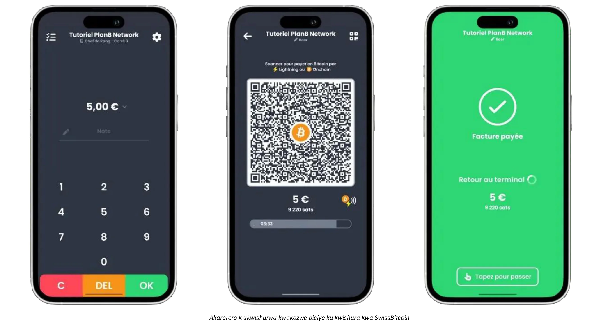

Ukwiahura birashobora gukurwamwo mu mafaranga y’ama Bitcoin kuri addresse yiharije canke bikahindurwa mu mafaranga asazwe (fiat) maze bikajanwa kuri konti ya banki ku musi ku musi. Swiss Bitcoin Pay ituma ivyo bikorwa vyikoresha , ikora ivyo kwishura Bitcoin na Lightning Network ataco umuntu akora. Amahera aguma abitse amasaha 24 imbere y’uko arungikwa. Naho ataco ikora nka BTCPay Server, iraringaniza uburyo n’umutekano, kandi ntibisaba KYC.

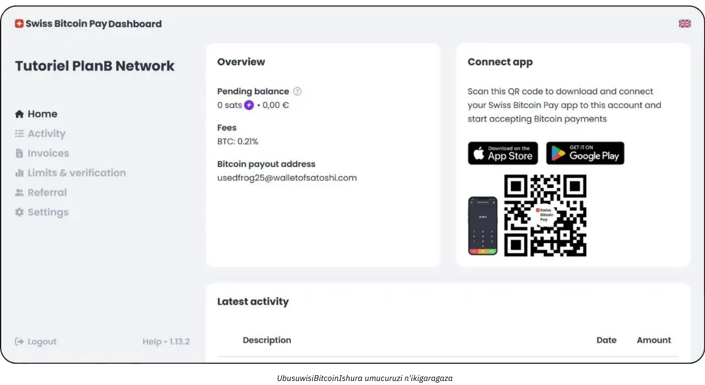

Amafaranga arahiganwa: 0,21% ku mwaka wa mbere, hanyuma 1% ku kwishura hakoreshejwe Bitcoin na 1,5% mukuvunja mumahera asanzwe , harimwo n’amahera yamarungika muma Bitcoin. Swiss Bitcoin Pay itanga uburyo bwo hagati hagati y’imiti y’ububiko nka Open Node n’uburyo butoroshe bwo kwiyakira nka BTCPay Server, ishira imbere ukworohereza, umutekano, n’ukwigenga mu vy’amahera.

Ubwo bwoko bw’ugutegura buratuma abucuruzi ubwabwo nyene bushobora gukora  amafagitire y’ukwishura  vyihuse, bagatanga amakode ya QR ku baguzi babo, kandi bakemera amafaranga Lightning canke On-Chain ata ngorane nyinshi zibaye. Abakozi baba bakeneye gusa inyigisho ngufi kugira ngo bashobore gukora ivyo bikorwa vyama rungika, mu gihe abarongozi bashobora kwinjira mu rubuga rwo kuri Internet kugira ngo bahuze ivyo bagurisha ku musi ku musi no kuronka raporo z’ishimikiro. Kuba hariho uburongozi butunganijwe neza na vyo nyene birafasha amashirahamwe mato mato gukurikirana amafaranga yinjira mumufaramga asanzwe n’aya crypto ava mwi shusho (Interface) imwe, gutyo bikagabanya urujijo no kugabanya umwanya umara mu gukora ibintu ivyikorera namaboko.

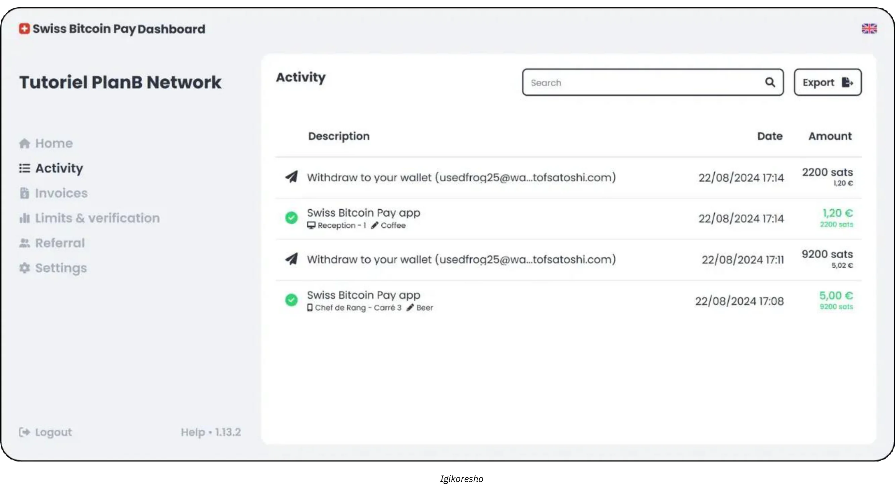

Ikindi ciza nyamukuru c’uburyo bw’ingenzi ni ugushimika ku gukoresha vyihuse no ku guhungabanya bike. Ibisubizo nka Swiss Bitcoin Pay bishobora gushirwaho mu masaha makeyi aho gushirwaho mu misi canke mu ndwi. kumuyobozi canke kuri nyen’iresitora idashorerwa cane,nkakarorero, intumbero nyamukuru ni ugushiramwo ukwemeza Bitcoin ata gutebereza aba kora mugisata cokwakira amahera  canke gutera impari hagato yabakozi. Iyo igisata cigurisha camaze gutunganirizwa, umuyobozi arashobora gusa guha abakozi amabwirizwa vyihuse abicishire kuri fagitire hamwe nisuzumwa ryamahera yinjiye mukigega. Mu gihe ciza, igikorwa ciriha c’umukiriya cemezwa hafi ubwo nyene biciye ku Lightning Network, kandi ubuyobozi bw’ubudandaji buca bwandika amahera yinjiye kumwanya.

Naho urutonde rwakaranga k’ingenzi rudasaba uburyo bwo guharura amafaranga buteye imbere cane, biracari vyiza ko umuntu aguma afise amakuru akwiriye y’ivyo akora. Ibikoresho nka Swiss Bitcoin Pay bitanga ibikorwa vyo kohereza hanze CSV, bikaba bishoboza abarongozi kuronka agaciro kangana mumahera asanzwe kuri buri gurishwa rya bitcoin  hamwe no gukurikirana izindi nzira zizana amahera. Urwo rugero rwinyandiko rwivyabaye  rurahagije ku nganda zito zito nyishi , kandi gutahura neza ibiciro vyamahera ingene avujwa birafasha mu gutanga imisoro no mu kugenzura ivy’ubutunzi muri rusangi.

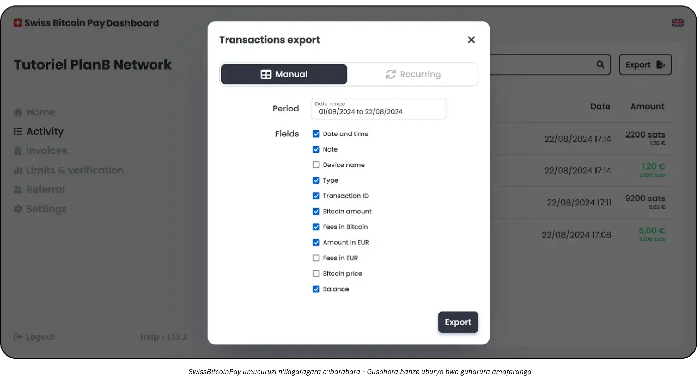

Umuvango winyishu uhuriranye nakaranga kawe urashobora kuba ari Swiss Bitcoin Pay:

https://planb.academy/tutorials/business/point-of-sale/swiss-bitcoin-pay-2-a78b057e-ed11-47ac-860c-71019fcb451a

Open node nikindi  gisubizo coroshe gushira mu ngiro, ariko gifise ingorane yo kuba 100% y’ububiko ibikijwe ( hébergé ):

https://planb.academy/tutorials/business/point-of-sale/open-node-e69a0c1c-47f7-4932-8494-e6f26c3c9784

Niba witeguye gukura amaboko mumpuzu kandi ushaka gucungera neza ico gikorwa, porogarama ya BTCPay Server ni uburyo bwiza cane. Ariko rero, ikibazo gikomeye ca BTCPay Server ni ugutegurwa kwayo no kuyicungera bitwara umwanya kandi bisaba kuba ufise ubumenyi bumwe bumwe mubijanye nivyubuhinga, ariko urashobora gukurikiza ubuyobozi bwacu:

https://planb.academy/tutorials/business/point-of-sale/btcpay-server-928eb01e-824b-4b57-a3e8-8727633beddc

Ubwa nyuma, nk’inyongera y’ibibanza vy’igurisha muburyo bugaragara, woshobora kwiyumvira gushinga [PoS ya Bitcoinize](https://bitcoinize.com/).

## Umwuga

<chapterId>4d5dfa50-c4d0-481c-ab95-1863a898750e</chapterId>

Akaranga kumunyamwuga ryerekeye inganda zarenganya urugero rw’ukwishura rimwe na rimwe muma Bitcoin, canke amahera make , zirondera ubu kubaka ibikorwa remezo bikomeye vyo gukora ibikorwa vyinshi vyamarungika mugace kabo. Izo nganda akenshi zikora mu mihora myinshi (kumbure ahantu h’ubudandaji, urubuga rwihariye rw’ubudandaji bwo kuri interineti, mbere n’ugucuruza kuri telefone ngendanwa) rero zikeneye inyishu zo kwishura zishobora gushirwa mu bikorwa vyazo muburyo biciye mumuco. Mu bihe vyinshi, inganda ziri kuri uru rwego zisanzwe zirongoye uburyo bwo kugurisha, uburyo bwo gucunga amategeko yo kuri Internet, n’ibikorwa vyo mu biro vy’inyuma bisaba uburyo bwo kwizewe kandi buguma butera imbere.

Kimwe mu biranga umucuruzi w’umunyamwuga ni ugukenera **ibintu biteye imbere** n’**ibisubizo bishobora guhindurwa** bigumya ubushobozi mbere n’igihe ubunini bw’ibikorwa bugenda burakura. aho bitaniye nabakoresha ivy'akamaro(essentiel), bashobora gukoresha gusa ibikoresho vyoroshe gukoresha bihuye neza na porogarama ya telefone ngendanwa, Abacuruzi babanyamwuga basanzwe basaba gushiramwo ubuhimga butuma ashobora guhindura amafagitire iyo abishatse, uruhande rujamwo ivyegeranyo yivyabaye , n’ubushobozi bwo gutanga inshingano nyinshi z’uburongozi.

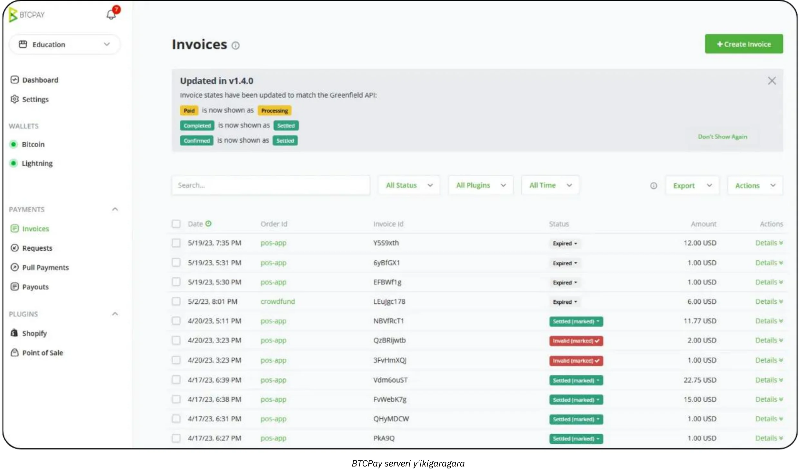

Nk’akarorero, umugwi w’uburiro woshobora kuba ufise abakozi bajejwe gutanga amafagitire no gucunga ibikoresho, mu gihe umugwi utandukanye ugenzura urutonde rw’ibintu be n’amasekeza yo kwamamaza. Muri ako karere , umuti wo kwishura muma Bitcoin utegerezwa guhura neza n’izo nzira z’imitunganire zari zisazwe zihari.

Ku bijanye n’ubuhinga bwa none n’ibikoresho, inyishu nka **BTCPay Server** akenshi ni zo zigize umushinge wiyinjira mwisi yakinyamwuga. BTCPay Server ni urubuga rwugururiye kuri bose rushobora gukoreshwa haba kurubuga canke biciye mu bubiko bwayo kuri internet kandi rutanga uburyo bwinshi bwo gukorana n’imbuga n’urubuga rw’ubudandaji bwo kuri intereneti. Mu gukoresha urugero rwabo bwite, ubucuruzi buraguma bufise ububasha bwinshi ku bijanye n’ingene umuntu yishura, kuva ku mbuga yo kurihirako zikora atawuzikoresheje gushika kubutumwa buhamagara ibikorwa vyindani bikore iyo hahejejwe kwemezwa iyishura.

Ikindi, ibikoresho nka [Zaprite](https://zaprite.com/) canke [Musqet](https://musqet.tech/) birashobora kurushiriza gutunganya ubumenyi bwo gutanga amahera, bikaba vyemerera guhindura ibintu mu buryo bubereye (kuva ku mahitamwo yakaranga gushika ku bushobozi bwo gutanga raporo yokurwego ruteye imbere). Abakunda ubuhinga bwo kugurisha ibintu vyose kuri interineti boshobora gutumbera [Be-BOP](https://be-bop.io/), umuti w’iduka ryo kuri interineti wubatswe kugira ngo worohereze abantu kwishura Bitcoin ataco batakaje mugukora vyoroshe.

Gushira mu ngiro ubwo buhinga bwa none mu kibanza c’akazi bisigura kwitwararika cane **ugusobanukirwa kw’ibikorwa bitoroshe**. Ivyerekeye gutanga amafagitire yikoresha, kwerekana kwerekana amarihwa mumafaranga atandukanye mvamahanga, no guhuza n’uburyo bwo gukora urutonde rw’ibintu bwari busanzweho, vyose ni ibimenyetso vy’urubuga rumeze neza , rwikwije. Ubushobozi bwo kwohereza hanze neza amakuru y’ibikorwa (yaba nk’amadosiye ya CSV, amahamagara ya API ataco akora, canke uburyo bugenewe) bufasha inganda guhuza neza ukugurisha ama Bitcoin hamwe nibindi bikorwa vyokuronkamwo amahera.

Umutekano n’ugutunganya inshingano ni ikindi kintu gihambaye co kwitwararika kubakora kinyamwuga. Uko amafaranga ya marungika ya bitcoin atera abameshi, kugenzura ukuntu umuntu ashobora gushika ku bikorwa vy’ubutegetsi bica bihinduka ingingo y’ingenzi yo kugabanya ingorane. Mu bisubizo vyishi, abarongozi barashobora gutanga ingero zitandukanye z’uruhusha (nkakarorero bakabuza abakozi bamwebamwe kuraba impapuro z'ibikorwa vyama rungika vyagiye biraba no gukora amafagitire, mu gihe abandi baha ububasha bwo gucunga ububiko canke gutunganya imiterere ya sisitemu yose...). Iyo nyubako yubusumba sumbane mukazi nturinda gusa amakuru y’agaciro ariko kandi uratuma ibikorwa bigenda neza mu gusobanura abakozi bafise inshingano ku gice cose c’ibikorwa remezo vyo kwishura.

Ku bijanye nuburorero bihuriranye, fata akaroreror k'iduka ry’ubudandaji ry’ubuhinga bwa none ry’ubunini buri hagati na hagati ryitaho ibikoresho vy’ubuhinga bwa none. Uruganda rurashobora gushiramwo BTCPay Server mw' iduka ryayo ryo kuri internet ririho, igaca itanga aderesi zo kwishura muma Bitcoin mu gihe co gutanga amahera. Abaguzi baraheza ivyo baguze mu gupima  Lightning canke On-Chain Address, maze urubuga rw’iduka ruca rwemeza ko barishe. Muri ico gihe nyene, sisiteme y’imbere ica ishira kumwanya igikorwa gihejeje kuba hakaja haza ubutumwa buvuga ko ivyo mwagize vyakunze. Kubera ubuhinga bwo gutanga raporo buteye imbere, umugwi w’ivy’amahera urashobora gusubiramwo bitagoranye ingene amarihwa muma Bitcoin yagenze, urungika igitabo ca raporo  kugira ngo igenzurwe, no gukurikirana agaciro k’amahera yose ya BTC iyo uruganda rufata ingingo yo kugumana ama raporo amwamwe.

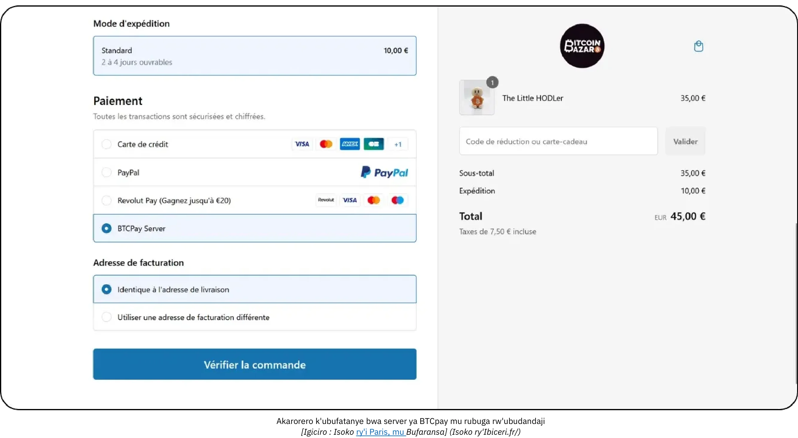

*[Ikigereranyo: Iduka rya Bitcoin Bazar i Paris mu Bufaransa.]*

Kugira ngo umenye neza ivyerekeye ugushirwa mu ngiro no kumenya uko BTCPay Server itunganywa, raba inyigisho ikurikira:

https://planb.academy/courses/6fc12131-e464-4515-9d3f-9255365d5fa1

## Uruganda

<chapterId>80fb2659-81ca-4a11-b492-72c7ae5774f9</chapterId>

Akaranga kuruganda gahagaze ku rwego rwo hejuru rw’ugushirwa mu ngiro kw’ukwishura kwa Bitcoin, bigenewe canecane amashirahamwe manini manini, amasoko akomeye, n’ubudandaji bwashinzwe busaba inyishu zihuye n’ivyo umuntu akeneye. Mu buryo butandukanye n’ugushiraho ibikorwa ku rugero ruto canke rwo hagati, ibikorwa vyo ku rugero rw’Ishirahamwe bishiramwo amahera ya Bitcoin mu rutonde rwagutse rw’ibikorwa n’imirongo, kuva ku bikoresho vyo kugurisha ku kibanza gushika ku maduka y’ubudandaji bwo kuri interineti, ibibanza vy’ubuhinga bwo guharura amafaranga, n’imirongo y’ubuhinga bwa ERP iteye imbere.

Kuri uru rugero, intumbero nyamukuru si ukwemera gusa Bitcoin, ariko ni ukubikora mu buryo **bujanye n’imigenderanire nyamukuru y’ishirahamwe**. Ukwo guhuza bishobora kurema porogarama zidasanzwe, ya umuti wose ushobora guhindurwa uko umuntu ubishatse canke utungaunijwe biciye ku bikorwa remezo bishingiye kuri SaaS bishigikiwe n’abandi *Lightning Service Providers* (LSPs). Mwene izo LSP zishobora gukorana amarungika menshi bikoreshwa be n’imiterere y’urubuga itoroshe irenze ubushobozi bw’ibikoresho bisanzwe bikoreshwa hanze y’isandugu. Ubwubatsi buva muri ivyo rero bushiramwo ibintu vyinshi vy’ubuhinga n’ubudandaji, kuva ku gushiramwo ibintu bishingiye kuri API gushika ku bushobozi bwo gucunga ububiko buteye imbere.

Mu bijanye n’inganda, ukugorana kwibikorwa kurigaragaza cane. Uruganda runini rurashobora gukenera kwakira amashami menshi (ugucuruza, ishami yo kwamamaza, devops, ivy’amahera, n’ivy’ubuhinga) umwe wese afise amabanga atandukanye n’amakuru asabwa. Muri iki gihe, urubuga rwo kwishura rwa Bitcoin rutegerezwa gutanga itunganywa ryishingano zikomeye cane, bituma igisata cose gishobora gushika ku bikorwa bijanye n’ibikorwa vyaco mukuguma kibandanya kuzigama ubugenzuzi bukomeye ku mutekano n’ubutungane bw’amakuru.Ubushobozi bwo guhindura ingene ibikorwa bigenda ningira kamaro : nk’akarorero, amahera yinjira yoshobora gutuma habaho ukwishira kumwanya(mise à jour), kohereza amatangazo yikora ku barongozi b’ugucuruza, no guhindura ivyinjijwe muri Ledger vy’umugwi w’ivy’amahera, vyose mu gihe nyaco. Ivyo bikoresho vyo kugurisha ubwavyo bikunda guhuzwa n’ibidukikije vy’ishirahamwe, bifise porogarama zihuye n’ivyo ishirahamwe rikeneye be n’ivyo rikeneye.

**Umutekano** ni wo uhambaye cane ku ngada.Umurindi wamahera yinjira hamwe nihwaniro yubushobozi bwa bitcoin bisaba ibikorwa remezo bikomeye bishobora kwikingira ibitero vy’ububisha canke iterabwoba ry’imbere mu gihugu. Ikoreshwa ryiza  akenshi birimwo gushirako umukono mwinshi mwitunganywa y’itunga ry’igihe, amakode yagenzuwe neza, no kwubahiriza cane inzego z’amategeko zijanye n’ivyo. Ikindi kandi, kwubahiriza amategeko agenga ivy’ubutunzi yo mu gihugu no kw’isi yose birashobora kuba ikintu gihambaye mu kuzigama izina ryiza ry’ishirahamwe n’uruhusha rwo kurangura ibikorwa.

**Iterambere rijana n'imigenzo** riri mu kurema canke gushiramwo umuti wo kwishura muma Bitcoin wo mu rwego rw'ishirahamwe rirarenga gushiramwo amakode y'ibintu bikeyi vy'ikoreshwa. Mu bisanzwe bisaba inyubako yubatse neza, amategeko y’igerageza yimbitse, n’ugushiraho ibintu bishobora gufata inzira nyinshi (porogarama z’intango z’igerageza, igerageza ry’isoko ry’agaciro, n’ugushirwaho kw’isi yose).

Ku bijanye n’ivy’ubutunzi , amarungika yokurwego ruri hejuru asaba gutanga amakuru ajanye nivyo umu kiriya ashaka kandi keshi bihuye kumwanya nama porogaramu yivyubutunzi vyu ruganda. inganda zikomeye zishobora kwizigira inyishu z’itegurwa ry'uburyo bwuruganda (ERP) nka SAP canke Oracle, na zo, zitegerezwa kugaragara muburyo biciye mumuco. Kugira ngo ivyo bishoboke, APIs z’urubuga rwatowe zitegerezwa kuba ziteye imbere kandi zishobora guhinduka bivanye nibintu bikenewe, zigaha umurwi ujejwe ivy’ubuhinga bwa none umwidegemvyo wo guhingura ibiharuro vyamarungika yagiye araba, gushiramwo uburyo bwo gusubiza hamwe bwikora, n’incamake z’ivy’amahera za generate ku musi canke mbere ku masaha.

Ibintu bikunzwe kuba muruganda bishobora guha  isoko rinini ry’ubudandaji ryo kuri Internet ryakira ibihumbi vy’abantu buri musi. Uretse gusa gutanga urutonde rwa Bitcoin nk’uburyo bwo kwishura, iri soko rishobora guhindura umuce wose w’ubumenyi bw’ukoresha, kuva ku kuntu uruja n’uruza rw’ukwishura Bitcoin ruboneka ku rubuga rwerekeye abakiriya gushika ku kuntu gusubizwa amahera, gusubizwa amahera, canke gutorera umuti amatati bicungiwe ku mpera y’inyuma. Umurwi ry’abajejwe ivyiterambere , rifatanije n’inzego z’ivy’amahera n’ivy’amategeko, ryogenzura ibikorwa vyo gusanasana, ivy’umutekano, n’ivy’uguhindura amategeko. Iyo iyo sosiyete ihisemwo kugumana igice c’amahera yinjiza muri Bitcoin, uburyo bwo gucungera amafaranga y’imbere mu gihugu bwokurikirana amafaranga y’ishirahamwe Bitcoin iruhande y’amafaranga asanzwe.

Kugira ngo ugushiraho ibikorwa bibe vyiza kandi bitekanye ku rwego rw’Uruganda, amashirahamwe menshi akoresha abatanga ibikorwa vy’ubuhinga canke amashirahamwe y’iterambere yo mu nzu afise ubumenyi mu bijanye n’ugushiramwo Bitcoin na Lightning Network. Ivyo bitangura n’ugusuzuma mu buryo bwimbitse ivya nkenerwa (gushiramwo ibikorwa remezo vy’ubuhinga, ibisabwa vyo kwubahiriza amategeko, n’urugendo rw’umukiriya yipfuzwa) hagakwirikira uyubakwa ryinyubako ishobora gutunganya umurindi uri hejura. Bivanye n’ingene umugambi ungana, woshobora kwizigira umugwi w’abahinga mu vy’ubuhinga bwinshi ugizwe n’abagenzuzi b’ivy’amahera, abahinga mu vy’umutekano be n’abahinga mu vy’amaporogarama. Canke, umubare uriko uragwira w’amashirahamwe yihariye y’abajanama arashobora kuguyobora kuva ku ciyumviro ca mbere gushika ku gusohoka kwa nyuma, akagufasha mu bikorwa nk’ugusuzuma inyishu zakira SaaS, gutunganya *Abatanga ibikorwa vy’umuravyo*, no guhindura imirongo y’imbere. Mu gukorana n’abahinga mu vy’ubuhinga, amashirahamwe arashobora kugabanya ingorane zijanye n’ugushirwa mu ngiro kw’amahera menshi no gushika ku ciyumviro kidakomeye kandi kijanye n’amategeko gusa ariko kandi gishobora guhinduka bihagije kugira ngo gishobore kwakira iterambere ryo muri kazoza.

## Bitcoin inyishu zo kwishura: Amahitamwo n'Imigenderanire

<chapterId>59ff43a1-98e2-4a81-af3e-9654bdd60952</chapterId>

Hama hariho imisi yose imyumvikano kira muce wibisubizo. Nk'akarorero, mu "gice c'igerageza" ca mbere, ingondo zikorana buhanga zitangazwa kuburyo ziba zoroshe uko bishoboka kwose mu bijanye nukuntu urubuga rugaragara imbere yabarukoresha, ariko zirabikije (**custodial**). Ivyo bisigura ko ayo mahera agenzurwa n’uwutanga urwo rubuga. Ariko rero, ico cirwa ca Bitcoin gihimiriza gutunga amahera kuwukoresha urwo rubuga(**ukwizigama**). Muri iki gihe, birakenewe ko usubira mu rwego rukurikira igihe nyene ukugurisha kwa mbere kwaheze—bisigurako , iyo vyemejwe ko ufise abakiriya biteguye kwishura muri Bitcoin.

Kimwe mu vyiza nyamukuru vya Bitcoin ni ubushobozi bwo kwimurira amafaranga uko ushaka, bikaba bituma **vyoroha cane guhindura abaguha amakuru** canke ibice vy’umuti wawe. Ikindi, amaporogarama yose n’ibisubizo vyose ubwayo biriko biratera imbere bimwe vyihuse.Dufate akarorero ka Bitcoinize, ubu itanga ikibanza co kugurisha (POS) gikorana n’ibikoresho vyinshi biri kw’isoko, umuti utariho amezi makeyi aheze.

### Ushaka ibisubizo vyokugurura Iduka no Kwemera kwishura muburyo bwa kera canke muburyo bwa Bitcoin?

Nimba uriko uratangura uhereye ku ntango—nta duka, nta porogarama yo gukwirikirana ibicuruzwa, kandi nta n’uburyo bwo kugurisha (POS)—mufise uburyo bubiri:

- **Gutanga inshingano kubandi:** Ushobora gutanga amakuru ku bandi mugukora urubuga rufise uburyo bwo kugura hanyuma ukongerako ubushobozi bwo kwishura muma Bitcoin iruhande y'ibisubizo bisanzwe vyo mu maduka.

- **Ibisubizo vyoroshe:** Canke, ushobora gukoresha ama platforms nka Accessing.app kugira ngo ubikore wewe nyene. Inyungu nyamukuru zirimwo:
    - Gushinga iduka ryo kuri Internet canke rigaragara nuburyo ubwaribwo bwose.
    - Bibereye inganda z'ibihe, ibirori, muburiro, canke amaduka y'ubudandaji.
    - Gusobanura no gutunganya ibintu vyokugurisha muburyo bugaragara hamwe noku rubuga.
    - Ukwishura mumahera asanzwe akoreshwa (nk'akarorero, amayero, amadolari) biciye kuri konti yawe bwite ya Stripe.
    - Bitcoin kwishura biciye ku konti yawe bwite ya SwissBitcoinPay.

### Ni gute twoteza imbere ivyiyishura hakoreshejwe uburyo bwa Lightning  ?

Naho Lightning Network itanga ubushobozi bwiza cane n’amahera make, ugukoreshwa kwayo kuracari mu ntango. Aho kwibanda ku mipaka iriho ubu, birabereye kwibuka ingene amahinduka y’ibikorwa remezo vyagiye biragenda:

- Igihe imodoka zatangura kugaragara, nta modoka zihagije zariho zo gutuma umuntu yubaka amabarabara, kandi nta mabarabara ahagije yariho yari gutuma umuntu atunga imodoka myishi.
- Igihe umuyagankuba watangura kubuho, nta bakiriya bahagije bariho kugira ngo umuntu yubake ibigomero vyishi vyumuyagankuba, kandi nta ngomero zihagije zotuma zikwega aba kiriya.

Inyubako zishasha ziremerwa kubera ko zikora neza cane, kandi abazikoresha ubwambere bifatanya navyo kubera ko babikuramwo inyungu ziboneka. Raba umwihwezo wabaye kuri Lightning Network muri 2024:

- **Ibikorwa vyirungika vyihuta cane:** Amarungika akenshi aba umwanya isase (<500ms) kandi afise igipimo c'ukudakunda gito cane.

- **Ugukoresha kinyamwuga umuhora:** Abakinyi bakuru nibo batuma amahera azunguruka neza mumuhora , mu gihe abantu basanzwe  bahagaritse  gutanga amahera ubu bakaba bariko barakoresha "ibice vy'inyuma."

-Ukuduza ubumenyi bw'abakoresha umuhora: Amaporogarama yo kuri telefone ngendanwa y'abakoresha ku giti cabo yaratejwe imbere cane. Ibikoresho nka splicing , amakode yo kuriha ya Bolt12 adahinduka, amarihwa atemezwa ko yabaye (0-conf) biraboneka cane, bituma imigenderanire iba mumuco. Ibibazo vy'imikoreranire (nk'akarorero, gufunga inguvu) ntibikiri ivy'agaciro kanini.

- **Uburongozi bw'Imirongo n'Imihora:** Inyishu z'umuntu ku giti ciwe n'iz'abanyamwuga zarateye imbere. Nk'akarorero, BTCPay Server ubu iritaho ibikoresho vyinshi vyo kwifatanya n'abandi batanga amakuru (PSPs, on/off ramps, n'ibindi). Abatanga ibikorwa remezo bashasha, nka LightSpark na Alby Hub, na bo nyene bariko barinjira mu bikorwa.

- Ukwiyongera kwikoreshwa ry'abacuruzi: Abacuruzi nka BitRefill bariko baratanga raporo y'ukwiyongera kwamariha hakoreshejwe amahera ya Bitcoin mu bakoresha babo bakora cane, hamwe nigitigiri cabakunda Bitcoin kiri hejuru kuruta Lightning. Ikindi, amafaranga akatwa make cane ya Lightning atuma ari yo mahitamwo mwza ku bijanye nabantu bagira amariha mato mato (mwayeni ni €32 ku giciro).

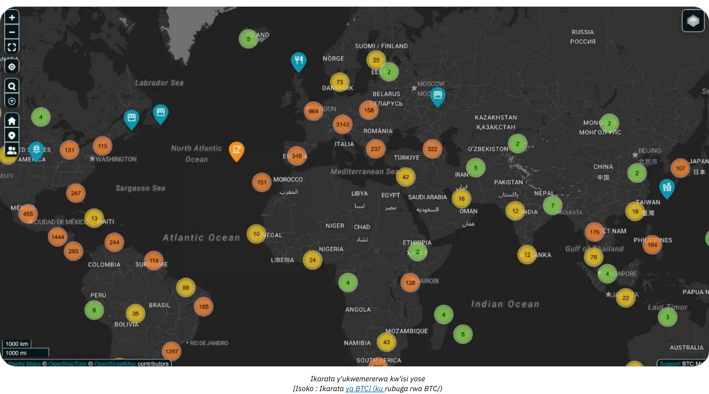

*[Isoko: Ikarata ya BTC](ku rubuga rwa BTC/)*

- **Ivyerekeye urubuga:** Umubare wose w'imirongo ya Bitcoin yugarijwe kuri Lightning uguma urihamwe, ufise imirongo nka 20.000, BTC 5.200, n'imirongo 60.000. Ariko ivyo vyerekana gusa igice c'urubuga kandi vyerekana uguhinduranya hagati y'abakurikirana ibikorwa, abantu bakeyi basanzwe hamwe na benshi babanyamwuga.

- Lightning nk'ikiraro hagati y'imihora: **Ubushobozi bwa Lightning Network n'ukuboneka kwavyo vyaramaze kuyishira mu kibanza c'ikiraro ku yindi mihora ihurikiye hamwe (nk'akarorero, FediMint, Liquid, n'ibindi).**

**Isubirwamwo ry'ingodo yubuhinga ngurukana bumenyi**

Bitcoin na Lightning Network ziriko ziraheza **ihinduka zi ngodo z’ubuhinga bwa none**. Ibikorwa bishasha vyo ku rubuga ubu bishobora gutuma umuntu **agira amarungika atamanje kugira konte**—ingodo yubuhinga ngurukana bumenyi yawe iba akaranga kawe! Kubera amategeko nka **Nostr Wallet Guhuza (NWC)** na **LN-URL-AUTH**, ingodo zirashobora kwemeza abakoresha ata nkomanzi no gutuma ugira amarungika  ata konti za kera ukoresheje. Imisi yo kuruha ku bijanye nokugurura konti kugira ugure ibintu bisanzwe canke kwiyabonesha. Ntibikenewe gutanga amakuru y’umuntu ku giti ciwe canke kwishura vyoshobora gutuma umuntu yibwa no kugurishwa kumbuga zitemewe namategeko ( dark web), nk’uko twibutswa kenshi cane n’ibintu biherutse kuba.

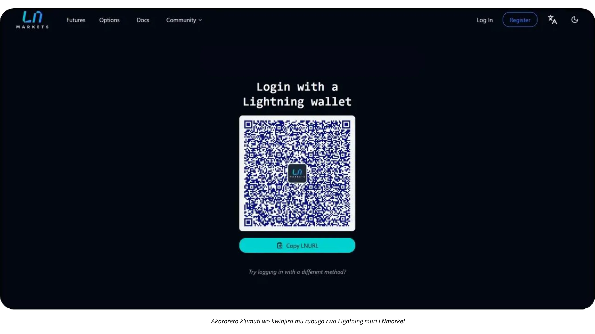

Abacuruzi b’ejo bazokwemera gukoresha iyo nzira nshasha, bitume baha abakiriya uburyo butekanye, buciye mumuco (gukanda rimwe) kandi mukubahiriza ubuzima bwabo bwite.

# Bitcoin Ivy'Ibarabara

<partId>d49d7595-a189-4e2b-bd60-c19e8e717aa2</partId>

## Ingingo ngenderwako z'ingenzi zo gucungera Bitcoin mu nganda

<chapterId>84063061-ffdb-4b1f-b20b-588ffb146877</chapterId>

Ibi bikurikira ni ivy’inyigisho gusa kandi ntibikwiye gufatwa nk’impanuro z’ivy’amahera canke z’ivy’ubuhinga bwogutunganya umutungo wanyu. Ingada n’abantu ku giti cabo barahimirizwa cane gutumbera inzobera muvyogutunganya amahera canke umuhinga mu vy’amategeko amenyereye amategeko agenga ivy’amahera ngurukana bumenyi  muri sentare yi gihugu  cabo imbere y’uko bagira ibikorwa bakora ivyo arivyo vyose.

### Bitcoin Ivyiyumviro nyamukuru kuvyerekeye umutungo

**Ibikorwa vyose vya Bitcoin bitegerezwa kwandikwa kandi bishobora gutuma haba ikintu gishobora gukorwako n'umusoro**

Kw'isi yose, Bitcoin akenshi ntifatwa nk’amahera gusa ahubwo nk’umutungo w’ubuhinga bwa none. Iryo tandukaniro rigira uruhara runini ku kuntu Bitcoin iharurwa mu bucuruzi, rikagira ico rihinduye ku bijanye n’imisoro, raporo y’ivy’amahera, n’ibisabwa kugira ngo umuntu yubahirize. Inganda zemera Bitcoin nk’uburyo bwo kwishura canke bukayikoresha nk’igikoresho c’itunga butegerezwa gutahura ibintu bijanye n’amategeko.

**Ingaruka ihambaye cane** yo kugumya ku muzirikanyi ni uko, mu bihugu vyinshi, kuronka, kugurisha, gucuruza canke gukoresha Bitcoin kugira ngo ugure, akenshi bituma haba **ikintu gishobora gukora k'umusoro** kandi inyungu zishobora gukorwako umusoro ku nyungu z’umutungo kamere.

Ikindi kintu c’ubuhinga bwo guharura amafaranga Bitcoin ni ugutandukanya ubwoko bubiri bw’inyungu z’umutungo kamere:

- **Inyungu/Ibihombo vyihishijwe:** Inyungu canke ibihombo bitabonetse bishingiye ku gaciro ka Bitcoin gafiswe ku mpera y'igihe c'iharura ryumutungo.
- **Inyungu/Ibihombo Bikora:** Inyungu canke ibihombo vy'ukuri igihe Bitcoin igurishwa canke ihindurwa mu mwaka w'ingengo y'imari.

Ivyo biharuro bivana cane n’uko Bitcoin ifashwe kugira ngo ikoreshwe mu gihe kirekire canke ngo ikoreshwe mu bikorwa vy’igihe gito. Ikindi, ubudandaji butegerezwa guhuza uburyo bwo gucungera amafaranga n’uko imisoro yo mu karere itangwa, kuko amategeko atandukanye bivanye nigihugu uherereyemwo.

Guharura amafaranga y’ingada zifise Bitcoin  biragoye cane kubera ko igikorwa cose gikoreshwa gitegerezwa gukurikiranirwa hafi kugira ngo haharurwe inyungu canke ibihombo vyashitse canke bitashitse. Kwigurisha ryose ukora mu kwemera Bitcoin nk’uburyo bwo kwishura, canke igihe cose ugura canke ugurisha Bitcoin, utegerezwa kuvyandika:

- isaha izwi neza
- igiciro c'ukugurisha (mu mafaranga asanzwe)
- igiciro  ca Bitcoin (igiciro Bitcoin yaronsweko mu ntango).

Ivyo bizotuma mu nyuma ushobora guharura itandukaniro kugira ngo umenye inyungu canke igihombo.

**Akarorero:** Uruganda rugura BTC 1 ku madolari 30.000. Mu nyuma, rugurisha 0.5 BTC ku madolari 20.000. Kugira ngo ubaze inyungu canke igihombo, uruganda rutegerezwa:

- Bamaze kwandika igihe, igiciro c’agaciro ka mahera asanzwe(nkarorero idolari)  n’igitigiri ca Bitcoin caguzwe.
- Banditse igihe, igiciro c'agaciro kamahera asanzwe n’igitigiri ca Bitcoin yagurishijwe
- Menya igiciro ca Bitcoin yagurishijwe : 0.5 BTC: amadolari 30.000 ÷ 2 = amadolari 15.000.
- Gereranya igiciro c’igurisha n’igiciro c’igura: $20.000 (igiciro c’ugurisha) - $15.000 (igiciro c’ugugura) = inyungu y’amadolari 5.000.
- Guhindura ububiko bwa Bitcoin n'igiciro gishasha c'igiciro

Ivyo bitegerezwa gusubirwamwo kuri buri rungika ryose riba, kandi ukuntu igiciro ca Bitcoin gihinduka bituma kubika amakuru bigorana cane.

**Vyogenda gute iyo Bitcoin iba Ifaranga ?**

Iyo Bitcoin ifatwa nk’ifaranga, inganda zoyicungera nk’ayandi mafaranga yose ari mu buhinga bwabo bwo gucungera amafaranga. Aho gukurikirana ishingiro ry’igiciro n’inyungu zashitse/zitashitse ku bikorwa vyose, amafaranga Bitcoin yoba gusa yanditswe kuri konti y’amahera. Ku mpera y’igihe cose c’iraporo, agaciro k’amafaranga yose afise, harimwo na Bitcoin, kohindurwa mu mafaranga y’agaciro (nk’akarorero, USD canke EUR) hakoreshejwe igipimo cokuvunja kiriho ubu.

**Akarorero kishirwa kumwanya iyaba Bitcoin yemewe nk'ifaranga:**

- Ubucuruzi bufise BTC 1 iyo Bitcoin ifise agaciro k’amadolari 30.000. Mu nyuma, ubucuruzi bukoresha 0.5 BTC ku kwishura igihe Bitcoin ifise agaciro k’amadolari 40.000.
- Ubucuruzi **nti** buharura inyungu canke igihombo cabonetse. Ahubwo, iyo nzira yandikwa ngo:
    - Ivyo kwishura: Amadolari 20.000 (0,5 BTC × 40.000 y’amadolari).
    - Igiciro ca Bitcoin gisigaye: 0,5 BTC, ubu gifise agaciro k’amadolari 20.000 (vyavuguruwe ku rugero rwa Exchange ruriho ubu).

**Ivyiza vy'ingenzi iyo Bitcoin yemewe nk'ifaranga:**

- Inganda zikeneye gusa kuza zirashira kumwanya agaciro kamafaranga ahuriranye na Bitcoin  mu bihe bitandukanye (nk’akarorero, ku raporo z’ukwezi canke z’umwaka), nk’uko biri ku ma euro, ama yen, canke ayandi mafaranga.
- Ivyo bikuraho ivy’ugukurikirana igiciro ku rugero rw’ibikorwa kandi bikorohereza ubuhinga bwo guharura, cane cane ku nganda zikunda gukoresha Bitcoin mumarungika yazo.

Ubwo buryo bwotuma ubuhinga bwo guharura amafaranga bwa Bitcoin bworoha cane, bugabanura imitwaro y’ubutegetsi, kandi bugahuza n’ingene ayandi mafaranga afatwa, twiyumvira ko Bitcoin yokwemerwa bimwe bishitse bimwe vyemewe namategeko. Ntiturashika ng’aho.

### Itandukaniro hagati y'iharura ryubutunzi k'Umuntu ku giti ciwe n'Iry'Ishirahamwe Bitcoin

Uko bitcoin ifatwa muvy’amategeko no mu vyiharura ryubutunzi biratandukanye cane  iyo ari kubantu canke amashirahamwe. Ku bantu ku giti cabo, inyungu zivuye mu bikorwa vya Bitcoin zishobora gukorwako umusoro ku nyungu, kenshi ku rugero rwo hejuru. Mu buryo butandukanye n’ubwo, amashirahamwe yoshobora kwungukira ku misoro y’amashirahamwe ishobora kugabanywa ariko ategerezwa kwubahiriza ingingo ngenderwako zikomeye cane zo kubungabunga amakuru.

Ku nganda Bitcoin ishobora gushirwa mu bice bitandukanye bivanye n’ingene  ikoreshejwe:

- **Itunga ridahinduka:** Ku Bitcoin rifiswe igihe kirekire nk'ishoramari ryubuhinga.
- **Ububiko:** Ku Bitcoin ikoreshwa mu bikorwa vyo gukora (ikoreshwa ridasanzwe, nk'akarorero ni ko biri ku bacuruzi b'abahinga).
- **konti zububiko bwitunga:** Ku Bitcoin ifiswe nk'umutungo ugaragara, ahanini ku bikorwa vy'ubudandaji canke uburongozi bw'itunga ry'igihe gito.

Guhitamwo gushirwa mu migwi bivana n’igikorwa n’ingene ishirahamwe rikora, bikaba bifise ingaruka ku gutanga raporo y’ivy’ubutunzi no ku bijanye n’imisoro. Imisi yose nusuzume amabwirizwa yo mu karere, kuko ivyo bishobora gutandukanywa n’igihugu.

### Inzego z'amategeko

Uko Bitcoin yemerwa n’amategeko be n’ingene ifatwa biratandukanye bivanye n’aho umuntu aba, amategeko yaho ukuntu ameze. Ibihugu bimwebimwe, nka El Salvador, vyaremeye ko Bitcoin ari amahera yemewe namategeko, ivyo bikaba vyatumye ikoreshwa mu bikorwa vy’ubudandaji vyoroha ariko bikaba bigorana gutanga raporo z’ivy’ubutunzi ku rwego mpuzamakungu. Abandi bafata Bitcoin nk’umutungo w’ubuhinga bwa none ushingiye ku mategeko yihariye yerekeye imisoro n’ivy’ubuhinga bwo guharura amafaranga.

Mu bihugu vyinshi, Bitcoin ishirwa mu rutonde rw’ibintu vy’ubuhinga bwa none, kandi ukuntu ifatwa bigenwa n’ingingo ngenderwako rusangi z’ivy’ubuhinga bw’ibarabara. Ubucuruzi butegerezwa gutanga iharura ry’amahera ya Bitcoin nk’uko bikurikira:

- Kwandika inyungu/ibihombo vy'itunga: **inganda zitegerezwa gutanga inyungu canke ibihombo vyabonetse  muvy'ubutunzi.**
- **Inyungu/Ibihombo Bihishijwe:** Inyungu canke ibihombo bitabonetse bitegerezwa kenshi kumenyeshwa ariko ntibishobora kugira ico bikoze ku nyungu zishobora gukorwako umusoro.
- Ugukurikiza ingingo ngenderwako z'ivy'iharura ry'amafaranga: **Ubucuruzi butegerezwa gushiramwo amafaranga Bitcoin mu migenzo itegekanijwe y'ivy'iharura ry'amafaranga, kugira ngo habeho uguseruka nyakuri.**

Uburyo bwo guharura amafaranga Bitcoin buratandukanye bivanye n’aho umuntu aherereye:

- Leta Zunze Ubumwe za Amerika: **IRS ishira Bitcoin mu rutonde rw'ibintu vy'ubutunzi, kurugero rumwe nimitahe, ibitegerezwa canke ubutunzi muvyamazu**. Ukwo gushikiriza bisigura ko igikorwa cose gifise amafaranga yubuhinga ngurukana bumenyi ( bitcoin ), nk'ukugura, kugurisha, gucuruza canke mbere kuyakoresha mu kugura, gishobora gutuma haba ikintu gishobora gukorwako umusoro kandi inyungu zishobora gukorako umusoro ku nyungu z'umutungo kamere.
- **Ubumwe bw'Uburayi:** Ibihugu bigize umuryango muri rusangi bifata Bitcoin nk'itunga ry'ibiharuro aho gufata ifaranga rikora. Rero inyungu kenshi zifatwa n'umusoro ku nyungu z'umutungo kamere.
- Aziya: Ibihugu nka Singapore n'Ubuyapani vyafashe ingingo zitera imbere, zifata neza amafaranga y'ubudandaji bwa Bitcoin mu bihe vyihariye. Ariko Bitcoin muri rusangi ibarwa nk'**itunga ritaboneka**, kandi ipimwa ku gaciro kabereye ku musi wo gutanga raporo, hakaba hariho amahinduka yemewe mu nyungu canke mu gihombo.

Ni ngombwa cane gutahura amabwirizwa yo mu gihugu ukoreramwo no guhindura uburyo ukoresha mu gucungera amafaranga bivanye n’ayo mabwirizwa.

### Ingorane mu gutera imbere kw'amategeko

Umurindi wihuta w’ubuhinga bushasha bw’amahera ngurukana bumenyi akenshi urarenze uwinzego zishiraho amategeko. Kuva Bitcoin yemewe nk’umutungo w’ubuhinga bwa none, amategeko yo kw’isi yose yarabonye  impinduka uko imisi igenda iragenda, ariko haracariho ingorane zimwe zimwe:

- **Kubura ubuhinga bwo guca imanza:** Ni bake mu bibazo vy'amategeko vyosigura neza imigenzo yihariye y'ivy'ubuhinga bwo guharura amafaranga, bikaba bisiga umwanya wibidasobanutse.
- **Ibiganiro biriko birabandanya:** Ibibazo c'ingene imisoro ifatwa ku bihombo vyihishijwe biracariko bitaratorewe umuti mu bihugu vyinshi.
- **Ivy'Imipaka:** Amashirahamwe akora ku rwego mpuzamakungu arahura n'ingorane zo guhuza ingingo ngenderwako zitandukanye kubihugu z'ivy'iharura ryumutungo.

Naho hari izo ngorane, ibihugu vyinshi bifata ingingo zitanga umushinge ukomeye ku nganda zo kwinjiza Bitcoin mu bikorwa vyavyo. Gukomeza guhindura n’uguhuza  bizoba ari ngirakamaro ku Adderesi biva mu bibazo bikomeye mu bijanye n’ubuhinga bwo guharura amafaranga asanzwe.

### Gushira mu migwi Bitcoin mu nyandiko z'ivy'imari

Gushira mu migwi Bitcoin mu nyandiko z’ivy’ubutunzi zitandukanywa hakurikijwe ububasha kandi zivana n’ingene zikoreshwa mu nganda. Mu buryo bwagutse, Bitcoin ifatwa nk’umutungo w’ubuhinga bwa none, usa n’ivy’ububiko, ishoramari canke amafaranga, ariko ikaba ifise ibiranga bidasanzwe bigira ico bikoze ku kuntu ifatwa mu vy’ubuhinga bw’ibarabara.

- **Itunga ry'Ikoranabuhanga canke Itunga Ritaboneka**: Intara nyinshi, harimwo Ubufaransa n'Ubumwe bw'Uburayi, zishira Bitcoin mu rwego rw'itunga ry'Ikoranabuhanga canke itunga ry'ikoranabuhanga aho kuba amahera yemewe n'amategeko. Ivyo bice bisaba ko ubucuruzi bugira amafaranga ya Bitcoin mu buryo butandukanye n'amafaranga asanzwe.
- **Ivy'ububiko**: Iyo igikorwa nyamukuru c'uruganda ari ugucuruza Bitcoin, nko kumbuga zoguhindura amafaranga canke abacuruzi, Bitcoin ifatwa nk'ivy'ububiko. Muri ivyo, ugupima agaciro bikurikiza ingingo ngenderwako z'ivy'ubuhinga bwo guharura ibikoresho.
- **Ishoramari mu vy'amahera**: Amashirahamwe afise Bitcoin nk'umutungo w'igihe kirekire ashobora kuyishira mu rutonde rw'ishoramari ry'amahera. Nk'akarorero, muri Leta Zunze Ubumwe za Amerika, inganda zishobora gutanga amafaranga Bitcoin hakurikijwe amabwirizwa ya Financial Accounting Standards Board (FASB), bakemera ko hariho uguhungabana iyo agaciro k'isoko kagabanutse.

**Vy'ugushira mu migwi :**

- Ivy’ubutunzi vy’igihe kirekire akenshi bisaba ko bigeragezwa kuko bishobora gusenyuka no gukuraho amahera.
- Ibikorwa vy’ubudandaji canke vy’ukwishura bisaba gukurikirana ubudasiba inyungu n’ibihombo vyashitse n’ibitashitse.

### Uburyo bwo gupima agaciro

Uburyo bwo gupima agaciro ni ubuhinga bwo guharura bukoreshwa mu kumenya igiciro ca Bitcoin, kikaba ari ngirakamaro mu guharura neza inyungu canke ibihombo mu gihe c’ibikorwa. Muri rusangi, ni vyiza **kuguma ufise ibiciro birikumwanya  vya Bitcoin** mu buryo bwo kubara amafaranga asanzwe. Ivyo bituma habaho uguserukira abantu, hakurikizwa amabwirizwa agenga imisoro, kandi ntihagire uwusubira inyuma igihe bikenewe gukorwa ibiharuro.

- **Iyinjira ryambere, nisohoka ryambere (FIFO)**: Isanzwe mu bihugu nka Australiya n'Ubuhindi, ubu buryo buraha agaciro Bitcoin bishingiye ku giciro co kugura bwatanguranye mbere. Ivyo bishobora kuba **bigoye cane** kuko bishobora gusaba gukurikirana igice cose ca Bitcoin ukwaco iyo habaye igurisha.
- **agaciro mfatirwaho (WAC)**: Akenshi irakundwa ku bikorwa vy'ubudandaji vyinshi kubera **uko yoroshe**, nk'uko bigaragara mu bihugu nka Amerika.

Ni vyiza cane ko umuntu aguma afise igitabu c’ibikorwa gikurikirana ibiciro vya Bitcoin **kuva igihe ishirahamwe ritangura kugura Bitcoin canke kuvyemera nk’uburyo bwokwishura** kugira ngo habeho ububiko bw’amakuru butagiramwo uburyarya kandi butunganijwe. Ivyo vyonyene ni vyo bikwiye kuba imbere mu muzirikanyi igihe uhitamwo  kwemera kwishura muma Bitcoin canke kugura Bitcoin.

### Ugukwirikirana ivyirungika ryama faranga murudandazwa rugaragara hamwe no murudandaza rwubuhimga ngurukana bumenyi

Ubadandaza bategerezwa kwandika urugero rwamahera yavujwe hagati yamahera asanzwe uja muma bitcoin kuri buri rungika . Nk’akarorero, mu bihugu vyinshi, inganda zikoresha urugero rwuko amahera avujwa  mugihe cigura kugira baharure TVA.

Inganda zitegerezwa kumenya neza ko ibikoresho vyose **vyokwishura** bakoresha bitanga ubushobozi bwo:

- Gukora fagitire mumahera yo mu karere (euro, amadolari, amapawundi),  TVA canke iyindi misoro yo mu karere, amahera uko angana muma Bitcoin , itariki n’isaha, urugero rwamahera yavujijwe muma bitcoin n’inkomoko  n’ibindi
- Gusohora hanze impapuro zemeza ko umuntu yishuye, n’imiburiburi mu buryo bwa .csv, hamwe n'amakuru yose yavuzwe aho hejuru, ku buryo uwukwirikirana ivyitunga ashobora kubikwirikirana bitagoranye .
- Vyiza , bika ama raporo yubutunzi arikumwanya bivanye nagaciro ko kuntango hamwe na bitcoin ufise mububiko .

### Ingorane

- **Ihindagurika ryagaciro**: Igiciro ca Bitcoin kirahinduka cane, bikaba bitera ingorane mu gutanga agaciro k'ibintu bifise no kumenya ivyiza bizovamwo mu vy'ubutunzi muri kazoza.
- **Igenzura ry'amategeko**: Mu bihugu nk'Ubushinwa, uburenganzira bwa Bitcoin baragabanije inguvu bigatuma ikoreshwa ryayo nk'umutungo w'itunga ridakora neza.
- Ugukekeranya kw'amategeko: Ivy'amategeko bigenda birahinduka vya Bitcoin akenshi bisiga ubucuruzi mu kaga. Nk'akarorero, amahinduka mu vyerekeye imisoro, nk'ayo mu Buhindi canke muri Leta Zunze Ubumwe za Amerika, arashobora kugira ico akoze kubijanye n'ubuhinga bwo gukwirikirana amafaranga uko imisi igenda iricuma.
- **Ivyago vyo gukoresha nabi**: gupanga mu migwi vyagenze nabi, canke kudakurikirana neza ibikorwa vyirungika vya Bitcoin bishobora gutuma haba ibibazo vyo kwubahiriza amategeko, ibihano, canke kwonona izina.
- Ivyago vyo guhindura amategeko: Kubungabunga igice kinini c'itunga ry'uruganda muri Bitcoin bituma  rushobora guhomba bivuye ku kugabanya ibiciro. Ivyo birashobora kugira ingaruka zikomeye canecane iyo mwene ukwo kugabanya amahera bishitse igihe umuntu arimwo kwishura abaguzi, abakozi canke imisoro. Vyongeye, nyen'ishirahamwe arashobora guhanwa, ivyo bikaba bishobora gutuma ahanishwa amande canke ibindi bibazo bijanye n'amategeko, nk'ukuregwa ko yakoresheje nabi itunga ry'ishirahamwe.

## Ibikoresho na  Porogaramu zogukurikirana amahera

<chapterId>e7b31be5-1176-4835-944e-3cba1b7040fa</chapterId>

Iyo ishirahamwe rifashe ingingo yo kwinjiza Bitcoin mu vy’ubuhinga bwo guharura amafaranga, ibikoresho bitandukanye be n’amaporogarama yihariye biratuma kwegeranya no gutunganya amakuru vyoroha. Mu bisubizo bizwi cane harimwo [CoinTracker], [Waltio], [Cryptio], [Koinly](Koinly](https://coinly.io/]), [Hentax. [Igitabo ca Zen](https://igitabo ca Zen.io/). Izo nzira zishimika canecane ku bintu bine:

- gukusanya amakuru , iki gikorwa kirikora conyene;
- guhindura ayo makuru mu buryo bujanye n’ubuhinga bwo guharura amafaranga muri rusangi (QuickBooks, Xero, ERP);
- guharura inshingano z’imisoro;
- gushikiriza mu migwi ibikorwa vyamarungika.

Akenshi ni umufasha w’ubwenge ku mashirahamwe manini manini afise ingodo zubuhinga ngurukana bumenyi myinshi n’itunga ryinshi ku mbuga zitandukanye canke ku mbuga zitandukanye.

Ariko rero, dosiye yoroshe `.csv` irimwo  ibikorwa uko vyagiye biragenda akenshi irahagije ku nganda zito zito nyinshi. Intumbero ni ugushira mu nyandiko, ku bijanye n’ukwishurwa kwose, itariki, umubare, agaciro kangana n’ako mu ma euro/amadolari, n’amaderesi ya Bitcoin asabwa. Vyinshi mu bisubizo vyo kwishura Bitcoin (Server ya BTCPay, Bitcoin Pay y’Ubusuwisi, n’ibindi) canke imbuga zubucuruzi (Bitfinex, Kraken, Coinbase, n’ibindi) birasanzwe bitanga uburyo bwo kwohereza hanze uko ibikorwa vyagiye biraranguka. Mu guha iyo dosiye umuhinga wogukwirikirana amafaranga, birashoboka ko amakuru yinjira neza kandi akatandukanya neza amafaranga yinjira n’asohoka ajanye na Bitcoin.

Ku bantu bizigama Bitcoin yabo, gucunga UTXOs (*Ibiva mu bikorwa bitakoreshejwe*) ni intambwe ihambaye. Gushirako ikimenyetso ciza ca UTXO birafasha gukurikirana inkomoko y’igice kimwekimwe cose ca BTC, gutandukanya ibikorwa bijanye n’ibikorwa vyakinyamwuga n’ivyo umuntu asanzwe akoresha, no kworohereza gukurikirana kubera intumbero z’amategeko canke z’imisoro. Porogaramu nziza nyinshi zi ngodo ya Bitcoin  zigufasha kwinjiza ingodo yawe ukoresheje dosiye yawe y’ububiko (canke xpub yawe, bivanye n’ingene uteguye) maze ugashirako amazina y’ama UTXO ashingiye ku nkomoko yayo canke aho aja. Kugira ngo bigufashe, ng’iyi inyigisho yuzuye yerekeye iyo somo:

https://planb.academy/tutorials/privacy/on-chain/utxo-labelling-d997f80f-8a96-45b5-8a4e-a3e1b7788c52

Ubwa nyuma, waba uri umudandaza muto canke uruganda  rukomeye cane, birashoboka **gutunganya fagitire ya  Bitcoin**. Ikintu nyamukuru ni ugushira mu nyandiko neza amarungika yagiye araba. Iyo uriha ukoresheje ingodo y’ukwizigama, ni vyiza  gukora irungika hama ukandika inomero ya  fagitire n’intumbero y’ukwishura ugashirako nibibiranga kwikete. Niba ushaka gutanga amafagitire biciye muguhanahana, uzogira kandi uburenganzira bwo kwohereza hanze ikimenyetso c’uko waronse canke ububiko bw’ibikorwa vyagiye biraba kugira ngo ubishire mu nyandiko zawe z’ivy’ubuhinga. Ukwo gukora biciye mumuco bituma  vyoroha gukurikirana no gutanga raporo y’ibikorwa vyawe vyose vya BTC.

## Ingero z'ubuhinga bwo kubara amafaranga Bitcoin

<chapterId>763f6f20-9181-495a-bf7d-b405899e65ec</chapterId>

### Koresha Ikibazo ca 1: Iduka ry'ubudandaji rihindura amafaranga Bitcoin mu ma Euro

**Ivyiyumviro**: Iduka rito ry’imikate ryemera Bitcoin nk’uburyo bwo kwishura ariko rihita rihindura Bitcoin yose ryaronse mu ma euro kugira ngo ntirishikirwe n’uguhindagurika kwagaciro k’amahera.

**Akarorero**:

- Igitigiri c'uguhindura ama **Bitcoin**: Bitcoin 1 = €40.000.
- **Igurisha 1**: Umukiriya agura imikate myinshi ku €20.
    - Amahera bihuye muma bitcoin: (20 / 40.000) = 0,0005 = 50.000 vy’amasatoshi.
    - Amafaranga yo kuvunja: 1,5% (€20 × 0,015) = €0,30.
    - Ivyo yaronse: €20 - €0,30 = €19,70.
- **Igurisha 2**: Umukiriya agura ikawa ku €5.
    - Amahera bihuriranye muma bitcoin: (5 / 40.000) = 0,000125 = 12.500 vy’amasatoshi.
    - Amafaranga yokuvunja: 1,5% (€5 × 0,015) = €0,075.
    - Ivyo yaronse: €5 - €0,075 = €4,925.

**Incamake y'Ibikorwa**:

- **Ivyo bagurisha vyose**: €25.
- **Amafaranga yose hamwe**: €0.375.
- **Amayero yose yaronse**: €24.625.

**Ishirwamwo ryuguharura amahera**:

- Ivyo ugurisha vyose (€25)  nk’inyungu.
- Gukurako amahera yo kovunja (€0.375) nk’amahera yo gukoresha.
- Nta mahera ya Bitcoin aboneka ku rutonde rw’itunga kuko amafaranga yose yahinduwe ubwo nyene.

### IKoreshwa rya 2: Iduka ry'ubudandaji rigumya 50% vy'amahera Bitcoin yishuye

**Ivyiyumviro**: Iryo duka nyene ry’imikate rihitamwo kugumya 50% vy’amahera Bitcoin nk’umutungo w’itunga, mu gihe ibindi 50% bivujwa mu ma euro.

**Akarorero**:

- Igitigiri c'abavunjije: **1 Bitcoin = €40.000**.
- **Igurisha ry'umukiriya**: Umukiriya agura imikate ku €50.
    - Ayo bihuye muma bitcoin: (50 / 40.000) = 0,00125 = 125.000 vy’amasatoshi.
    - Kuvuja (50%): 25 € vy’agaciro k’ama Bitcoin = 0,000625 Bitcoin = amasatoshi 62.500.
        - Amafaranga yo kuvunja: 1,5% (€25 × 0,015) = €0,375.
        - Ivyo yaronse mu mayero: €25 - €0,375 = €24,625.
    - Kubika mumabitcoin (50%): 62.500 = 0,000625.

**Incamake y'Ibikorwa**:

- **Ivyo bagurisha vyose**: €50.
- **Amafaranga**: €0.375.
- **Amayero yose yaronse**: €24.625.
- **Bitcoin Yabitswe**: Abasatoshi 62.500.

**Ishirwamwo ryuguharura amahera**:

- Reka ivyo ugurisha vyose (€50) nk’inyungu.
- Gukurako amahera yo guhindura (€0.375) nk’amahera yo gukoresha.
- Bitcoin (62.500 Satoshis) yagumyeho iboneka ku rutonde rw’itunga nk’itunga ry’ubuhinga bwa none.
- Inyungu itabonetse: iyo agaciro ka Bitcoin ku mpera y’umwaka w’ingengo y’imari kari hejuru canke hasi hazoba inyungu canke igihombo kitabonetse kizomenyeshwa mu nyandiko z’ivy’ubutunzi ariko ntikiboneke nk’inyungu .

### IKoresha rya 3: Ibikorwa vy'umwuga bigumya Bitcoin ku bijanye n'ishoramari ry'igihe kirekire

**Ivyiyumviro**: Umuhinga mu bijanye n’uguhingura ibishushanyo yigenga yemera kurihwa muma Bitcoin  kandi akagumya  Bitcoin aronse zose nk’ishoramari ry’igihe kirekire.

**Akarorero**:

- **Igiciro co kuvunja Bitcoin mugihe co kwishura**: 1 Bitcoin = €30.000.
- **Ibikorwa biva ku mukiriya**: Umukiriya ariha ibikorwa bifise agaciro k'amayero 3.000.
    - Ivyo bihuye n’ivyo: (3.000 / 30.000) = 0,1 Bitcoin = 10.000.000 vy’amasatoshi.
- **Igiciro c'impera y'umwaka**:
    - Igitigiri c'ivujwa mu mpera z'umwaka: 1 Bitcoin = €35.000.
    - Igiciro c'itunga rya Bitcoin: 0,1 Bitcoin × €35.000 = €3.500.
    - Inyungu itabonetse: €3.500 - €3.000 = €500.

**Incamake y'Ibikorwa**:

- **Amafaranga yose yinjiye yemejwe**: €3,000.
- **Bitcoin Ifise**: 0,1 Bitcoin ifise agaciro k'amayero 3.500 ku rutonde rw'itunga.
- **Inyungu itabonetse**: €500 yerekanwa mu nyandiko z'ivy'ubutunzi ariko ntiyashitse nk'inyungu.

**Ishirwamwo ryuguharura amahera**:

- Amafaranga yinjiye cane (€3.000) mu gihe c’igikorwa.
- Isuzumwa Bitcoin zifiswe  (0.1) ifise agaciro k’amayero 3.500 ku rutonde rw’itunga.
- Inyungu zitabonetse zirakurikiranwa ariko ntizishirwa mu nyandiko z’inyungu/ibihombo.

### Ikoreshwa rya 4: Nyene uruganda agurisha 50% za Bitcoin Inyuma y'aho ibiciro biduze

**Ivyiyumviro**:  Nyene uruganda agura Bitcoin incuro zitatu mu mwaka, akagira Bitcoin nk’umutungo, akagurisha 50% inyuma y’aho igiciro kaduze cane.

**Akarorero**:

- **Bitcoin Ivyo ugura ku bakiriya**:
    - igura rya 1: €2.000 ku €20.000/BTC = 0,1 Bitcoin = 10.000.000 Satoshis.
    - igura rya  2: €3.000 ku €25.000/BTC = 0,12 Bitcoin = 12.000.000 Satoshis.
    - igura rya  3: €5.000 ku €30.000/BTC = 0,1667 Bitcoin = 16.670.000 Satoshis.
- Igitigiri cose c'ama Bitcoin yafashwe: 0,3867 Bitcoin = 38.670.000 z'amasatoshi.

- **Igenzura kumpera yumwaka**:
    - Bitcoin Igiciro ku mpera y’umwaka: €40.000/BTC.
    - Agaciro kose: 0,3867 Bitcoin × €40.000 = €15.468.
    - Inyungu itabonetse: €15.468 - €10.000 (igiciro cose) = €5.468.

- Ugurisha **50% vya Bitcoin**:
    - Bitcoin Yagurishijwe: 0,19335 Bitcoin.
    - Amafaranga y’igurisha: 0,19335 Bitcoin × €40.000 = €7.734.
    - Ishingiro ry'igiciro (Igiciro gipima):
        - Igiciro cose: €2.000 + €3.000 + €5.000 = €10.000.
        - Igiciro mfatirwako: 10.000 € / 0,3867 Bitcoin = 25.850 €/BTC.
        - Igiciro ca Bitcoin cagurishijwe: 0,19335 Bitcoin × €25.850 = €4.999.
    - Inyungu: €7.734 - €4.999 = €2.735.

**Incamake y'Ibikorwa**:

- **Bitcoin Isigaye**: 0,19335 Bitcoin ifise agaciro k'amayero 7.734 (ku mayero 40.000/BTC).
- **Inyungu yashitseko**: €2.735 iri mu nsiguro y'inyungu.
- **Inyungu itashitse**: €5.468 yerekanwa mu nyandiko z'ivy'ubutunzi (harimwo n'agaciro katashitse k'ama Bitcoin asigaye).

****:Ishirwamwo ryuguharura amahera

- Andika amafaranga y’igurisha (€7.734) nk’inyungu.
- Kuraho igiciro ca Bitcoin cagurishijwe (€4.999) kugira ngo ubare inyungu yabonetse.
- Bitcoin (0.19335) yagumyeho iboneka ku rutonde rw’itunga ry’amahera rifise agaciro k’amayero 7.734.
- Inyungu zitabonetse z’amayero 5.468 ku Bitcoin yagumye zigaragazwa mu nyandiko z’ivy’ubutunzi.

# Igice ca nyuma

<partId>f6ca8d01-a4f3-449b-ac9f-c5fba9a69178</partId>

## Gusuzuma iri shure

<chapterId>0fe8c49e-b7f8-46f7-9c42-b8a9a99a7b46</chapterId>

<isCourseReview>true</isCourseReview>

## Ikibazo canyuma

<chapterId>40a0f18c-bdc9-45b2-8dea-15f7e574230e</chapterId>

<isCourseExam>true</isCourseExam>

## Ic

<chapterId>5503c23e-3a90-4a23-8d89-75e3cc1ee53e</chapterId>

<isCourseConclusion>true</isCourseConclusion>
