# Pokrenite putovanje Vaše kompanije na Bitkoin mreži

Otkrijte praktične mogućnosti Bitkoin i Lightning mreže, i istražite kako, slično internetu, mogu **transformisati vaše poslovne operacije**. Od digitalnog kapitala do brzih, ekonomičnih i skalabilnih plaćanja, Bitkoin nudi širok spektar **upotreba za preduzeća**.

Kroz ovaj vodič, naučićete kako da razumete Bitkoin kao globalnu, univerzalnu i internet-prirodnu monetarnu mrežu. Sa svojim jedinstvenim fundamentalnim karakteristikama, **Bitkoin pruža značajna poboljšanja u odnosu na tradicionalne valutne mreže**. Otkrićete zašto i kako iskoristiti Bitkoin za klasične finansijske slučajeve upotrebe kao što su skladištenje kapitala i platni sistemi. Pored toga, ovaj vodič će pokriti sticanje i držanje Bitkoina, uključujući povezane računovodstvene i fiskalne zahteve, kao i implementaciju jednostavnih ili velikih Bitkoin platnih rešenja.

Bilo da ste **mala firma ili velika korporacija**, integracija Bitkoin u Vaše svakodnevne operacije može učiniti Vašu kompaniju **otpornijom, produktivnijom i konkurentnijom**. Svaka internet-bazirana kompanija postat će kompanija orijentisana na Bitkoin, a ovaj kurs osigurava da ste spremni. Početni delovi kursa obuhvataju osnove funkcionisanja Bitkoina, tako da čak i ako ste početnik, steći ćete osnovno znanje potrebno za nastavak. Učenje osnova Satošijevog izuma je uvek dobra ideja, bilo pre ili nakon što se upustite u BIZ101.

+++
# Uvod

<partId>326cf945-5d3f-4d86-8c3e-4d1c35959799</partId>

## Pregled kursa

<chapterId>1be42be9-4080-49f5-b5b2-6b531dd55f5f</chapterId>

Dobrodošli na kurs BIZ101! Pokrenite putovanje vaše kompanije na Bitcoin mreži uz ovaj sveobuhvatan obučni kurs - ulaznicu za razumevanje kako Bitcoin i Lightning Network mogu revolucionisati tradicionalne poslovne operacije. Ovaj kurs je namenjen maloprodavcima, preduzetnicima, menadžerima i donosiocima odluka u korporacijama koji žele da istraže praktične mogućnosti Bitcoina kao globalne, internet-nativne monetarne mreže i robusnog sredstva za razmenu vrednosti.

Tokom kursa, bićete upoznati sa osnovnim principima koji čine Bitcoin i Lightning Network posebno transformativnim. Naučićete kako ove tehnologije nude spektar slučajeva upotrebe, od digitalnog skladištenja kapitala do brzih, ekonomičnih i skalabilnih plaćanja, i kako pružaju ključna poboljšanja u odnosu na tradicionalne valute i sisteme plaćanja. Kurs BIZ101 povezuje ekonomsku teoriju sa stvarnim aplikacijama, objašnjavajući kako decentralizacija može smanjiti zavisnost od posrednika i prevazići ograničenja inherentna nasleđenim sistemima.

Kurs počinje detaljnom analizom konvencionalnih valuta i mehanizama plaćanja, postavljajući temelje istražujući kako valuta funkcioniše kao mreža koja omogućava trgovinu, štednju i ekonomsku specijalizaciju. Nakon toga, zadržaćemo se na tehnologiji iza Bitcoina i inovacijama koje uvodi Lightning Network, otkrivajući njihove uloge u olakšavanju besprekornog, sigurnog i gotovo trenutnog izvršenja transakcija koje mogu služiti preduzećima svih veličina. Zatim ćemo se posvetiti praktičnim delovima ovog kursa, počevši od dela o držanju bitcoina kao trezora, a zatim završiti delom o prihvatanju bitcoina kao sredstva plaćanja.

Bilo da predstavljate malo preduzeće ili veliku korporaciju, ovaj kurs ima za cilj da vas opremi znanjem kako da integrišete Bitcoin u vaše svakodnevne operacije, čime ćete poboljšati otpornost, efikasnost i konkurentsku prednost vaše kompanije. Kako Bitcoin nastavlja da preoblikuje ekonomsku sliku, razumevanje ovih revolucionarnih tehnologija nije samo opcija, već strateška nužnost. Pripremite se da se angažujete sa uvidima, praktičnim primerima i strateškim smernicama koje će vam omogućiti da se snađete i iskoristite evoluirajući svet Bitcoina!

Spremni da zaronite u svet Bitcoina za preduzeća? Idemo!

# Valuta, platni sistemi i Bitkoin

<partId>d9bd0e21-8488-44e0-af55-6d0b934f83c2</partId>

## Tradicionalne valute

<chapterId>785e095c-6811-4ca2-ba46-fe38291432d4</chapterId>

### Valute su Mreže

Valute su u osnovi mreže koje omogućavaju efikasnu razmenu vrednosti.

Bez valute, pojedinci moraju da se oslanjaju na **trampu**, sistem u kojem se roba ili usluge direktno razmenjuju. Trampa je nepraktična jer zahteva "dvostruku podudarnost želja"—obe strane moraju istovremeno želeti ono što druga nudi. Na primer, ako farmer sa viškom pšenice želi cipele, mora pronaći obućara koji specifično treba pšenicu. Ovo je retko i neefikasno. Dodatno, **sa n proizvoda u ekonomiji razmene, potrebno je ~n(n−1)/2  kursnih razmena**, što stvara veoma složen i nezgrapan sistem. Na primer, to bi zahtevalo preko ~124,000 kursnih razmena za samo 500 proizvoda.

Valuta ovo pojednostavljuje delujući kao posrednik, stvarajući **mrežu koja smanjuje broj kursnih razmena na n** —jednu za svaki proizvod u odnosu na valutu. Ovo čini transakcije mnogo jednostavnijim i **omogućava ljudima da trguju robom i uslugama bez potrebe za uzajamnim željama u isto vreme**. Umesto da direktno razmenjuje pšenicu za cipele, farmer može prodati svoju pšenicu za valutu i kasnije koristiti tu valutu da kupi cipele, ili bilo šta drugo što mu je potrebno.

Uvođenje valute kao mreže ne samo da olakšava trgovinu već omogućava i **podelu rada i specijalizaciju**. Sa pouzdanim sredstvom razmene, pojedinci i zajednice više ne moraju da proizvode sve što konzumiraju. Umesto toga, mogu se fokusirati na ono u čemu su najbolji, povećavajući efikasnost i kvalitet. Farmer može da se specijalizuje u uzgoju useva, obućar u izradi obuće, a graditelj u izgradnji kuća. Ovi specijalisti mogu zatim razmenjivati svoje proizvode i usluge putem valute, koristeći prednosti međusobne stručnosti. Ova specijalizacija pokreće **produktivnost i inovacije**, jer ljudi usavršavaju svoje veštine i razvijaju nove metode u svojim oblastima.

Mrežna priroda valute donosi dodatne značajne prednosti. Prvo, biti deo valutarne mreže je **povoljnije nego biti van nje**. Zajednički standard mreže olakšava trgovinu, omogućavajući pojedincima da usklade svoje ekonomske aktivnosti čak i **na velikim udaljenostima**. Na primer, trgovac u jednom gradu može trgovati robom sa kupcem u drugom koristeći istu valutu, podstičući ekonomski rast i saradnju na velikim područjima.

Još jedna ključna prednost valute je njena sposobnost da **omogući odložene razmene**. Kod trampe, transakcije su trenutne; jedno dobro se menja za drugo u realnom vremenu. Valuta, međutim, omogućava **štednju—pojedinci mogu čuvati vrednost za buduću upotrebu**. Ovo predstavlja ogroman napredak za ekonomsko planiranje, investicije i akumulaciju bogatstva, što sve poboljšava živote učesnika mreže.

Zaključak je da su valute mreže dizajnirane da efikasno prenose vrednost. One prevazilaze ograničenja trampe, pojednostavljuju trgovinu i stvaraju mogućnosti za koordinaciju i štednju. Kao i svaka mreža, vrednost valute zavisi od njene široke primene i korisnosti—na kraju, najbolja valuta pobeđuje.

### Šta je dobra valuta?

Dobra valuta poseduje nekoliko suštinskih osobina koje je čine efikasnom za olakšavanje razmene vrednosti. Evo sažetog objašnjenja svake:

- **Sigurnost**: Valuta mora biti zaštićena od krađe ili neovlašćenog pristupa, osiguravajući da korisnici mogu držati i prenositi je sa poverenjem. Sigurnost je ključna za izgradnju poverenja u sistem.
- **Otpornost na falsifikovanje**: Valuta mora biti izuzetno teška ili nemoguća za falsifikovanje. Ovo osigurava da je svaka jedinica autentična, održava svoju vrednost i sprečava inflaciju uzrokovanu ulaskom lažnih jedinica u cirkulaciju. Na primer, istorijski gledano, zlato je bilo cenjeno ne samo zbog svoje lepote i retkosti, već i zato što je izuzetno teško za proizvodnju. Za razliku od papirnih novčanica ili digitalnih unosa, zlato se ne možete jednostavno "napraviti"—mora se iskopati iz zemlje. Ova prirodna oskudica i težina proizvodnje pomogli su zlatu da održi svoj status kao pouzdano sredstvo čuvanja vrednosti i merilo autentičnosti.
- **Oskudnost** Osnovna karakteristika dobre valute je njena ograničena ponuda ili kontrolisana emisija. Oskudnost osigurava da se njena vrednost očuva tokom vremena, sprečavajući prekomernu proizvodnju koja bi umanjila kupovnu moć. Na primer, određena plemena američkih domorodaca koristila su perle kao oblik valute. U početku, ove perle su bile teške za proizvesti, održavajući njihovu oskudnost i vrednost. Međutim, kada su evropski trgovci počeli masovno da proizvode i preplavljuju tržište perlama, njihova retkost je nestala. Kako je ponuda naglo porasla, perle su izgubile svoju kupovnu moć, potkopavajući njihovu ulogu kao pouzdanog sredstva očuvanja vrednosti.
- **Bez dozvole**: U prošlosti su valute poput zlatnih i srebrnih novčića često kovane od strane privatnih pojedinaca, lokalnih vlasti ili trgovaca koji su imali pristup sirovinama. Ovaj sistem je ponekad funkcionisao pod sporazumima ili licencama koje su izdavali kraljevi ili vladari. Vremenom su kraljevi i vlade centralizovali ovaj proces kako bi dobili veću kontrolu nad ekonomskom stabilnošću, oporezivanjem i monetarnim sistemom. Jedan poznati primer je **talir**, srebrni novčić prvi put kovan 1518. godine u **Joachimsthal dolini** (današnji Jáchymov u Češkoj) od strane lokalnih rudara i vlasti. Ime "talir" potiče od nemačke reči **"Thal"** što znači "dolina." Ovi novčići, poznati po visokom kvalitetu srebra, postali su široko rasprostranjeni širom Evrope. Vremenom je termin lingvistički i geografski evoluirao, na kraju dovodeći do naziva "dolar," koji je usvojen u Sjedinjenim Američkim Držav

U modernoj eri, valute su postale potpuno dozvoljene pod sistemom seigniorage, što znači da samo ovlašćeni entiteti—kao što su centralne banke ili trezori—mogu kovati novčiće ili štampati novčanice. Pojedincima više nije zakonski dozvoljeno da proizvode valutu, čime se osigurava centralizovana kontrola nad njenim izdavanjem i ponudom.

Danas, princip seigniorage je izazvan od strane Bitkoin kriptovalute, koja funkcioniše bez centralizovane kontrole. Bitkoin je sistem "bez dozvole" gde svako može učestvovati u korišćenju valute bez traženja dozvole, i, kroz rudarenje, u njenom stvaranju. Ova decentralizacija uklanja monopol izdavanja od vlada, postavljajući pitanja o potencijalnom povratku na konkurentne valutne sisteme slobodnog tržišta.

- **Jedinica obračuna**: Valuta treba da obezbedi standardnu meru za poređenje vrednosti robe i usluga. Ovo pojednostavljuje trgovinu i čini cene transparentnim i doslednim kroz transakcije.
- **Trajnost**: Valuta mora izdržati habanje tokom vremena. Fizičke valute, poput kovanica ili novčanica, treba da budu otporne na oštećenja, dok digitalne valute moraju biti sigurno pohranjene bez rizika od gubitka podataka.
- **Prenosivost**: Valuta mora biti laka za prenošenje i korišćenje, omogućavajući trgovinu na daljinu. Ovo se može postići fizičkom prenosivošću (lagani novčići ili novčanice) ili digitalnim sistemima prenosa.
- **Deljivost**: Valuta treba da bude deljiva na manje jedinice kako bi se olakšale transakcije različitih veličina. Ova fleksibilnost osigurava da je praktična i za male kupovine i za trgovinu velikih razmera.
- **Zamenljivost**: Sve jedinice valute moraju biti zamenljive i jednake vrednosti. Na primer, jedna novčanica od jednog dolara mora biti ekvivalentna bilo kojoj drugoj novčanici od jednog dolara. Ova uniformnost osigurava pravičnost i jednostavnost u transakcijama.
- **Prepoznatljivost**: Valuta mora biti lako prepoznatljiva i pouzdana. Fizičke valute to postižu kroz jedinstvene dizajne i sigurnosne karakteristike, dok se digitalne valute mogu osloniti na verifikacione protokole. Ovo osigurava široko prihvatanje i smanjuje rizik od prevare.

Ove karakteristike čine valutu praktičnom, pouzdanom i efikasnom za olakšavanje trgovine i čuvanje vrednosti u ekonomiji.

### Evolucija valutnih sistema

**Od Kovanica do Papirnog Novca: Povećanje Efikasnosti i Prenosivosti**

Prelazak sa kovanica na papirni novac označila je značajno poboljšanje u **prenosivosti** i efikasnosti. Kovanice, napravljene od plemenitih metala poput zlata ili srebra, bile su vredne zbog svoje intrinzične vrednosti. Međutim, bile su teške, teško ih je bilo transportovati u velikim količinama i bile su podložne habanju ili krađi. Papirni novac je revolucionisao valutne mreže uvođenjem laganog, standardizovanog i prenosivog sredstva koje je predstavljalo vrednost umesto da je sadrži. Ova inovacija je omogućila ekonomijama da se razvijaju omogućavajući lakšu trgovinu na daljinu i smanjujući logističke izazove korišćenja fizičkih dobara kao novca.

Papirni novac je takođe poboljšao skalabilnost. Umesto oslanjanja na ograničenu ponudu plemenitih metala, ekonomije su mogle proširiti svoju monetarnu osnovu putem reprezentativnih valuta, koje su u početku bile podržane rezervama, a kasnije poverenjem u institucije koje ih izdaju. Ova promena otvorila je put ka složenijim i međusobno povezanim finansijskim sistemima.

**Od papirnog do elektronskog novca: Proširenje pristupačnosti i brzine**

Prelazak sa papirnog novca na elektronski novac dodatno je unapredio mrežu valuta povećanjem dostupnosti i brzine. Sa rastom bankarskih sistema, kreditnih kartica i digitalnih transakcija, novac je postao ne samo **prenosiv** već i gotovo **trenutan**. Elektronski transferi su eliminisali potrebu za fizičkom razmenom, omogućavajući transakcije na velikim udaljenostima u roku od nekoliko sekundi.

Ova promena je takođe demokratizovala pristup valutama. Elektronsko bankarstvo i platni sistemi smanjili su prepreke za ulazak pojedinaca i preduzeća, omogućavajući im učešće u globalnoj ekonomiji. Brzina i pogodnost elektronskog novca proširili su trgovinske mreže i podstakli nove poslovne modele koji bi bili nemogući u sistemu zasnovanom na papirnom novcu.

Ove moderne mreže valuta došle su sa značajnim nedostatkom: **nedostatak revizorske sposobnosti i transparentnosti u upravljanju novčanom masom**, što često rezultira nekontrolisanom inflacijom i gubitkom poverenja u centralizovane sisteme. Na primer, preko 20% svih u opticaju američkih dolara odštampano je samo u poslednje četiri godine. Ova stalna iskušenja da se izda više valute—čime se obezvređuje vrednost koju drže trenutni vlasnici—uglavnom se mogu pripisati sistemskoj manjkavosti: političari su često podstaknuti da izbegavaju teške budžetske odluke, odlučujući se umesto toga da izazove odlože za buduće administracije "šutirajući limenku niz put."

**Od centralizovane ka decentralizovanoj valuti: Unapređenje poverenja i suvereniteta**

Danas, pojava decentralizovane valute Bitkoin predstavlja sledeći skok u mrežama valuta. Tradicionalni elektronski novac oslanja se na centralizovane autoritete, kao što su banke ili vlade, za upravljanje i verifikaciju transakcija. Iako efikasni, ovi sistemi su podložni neefikasnostima, cenzuri i tačkama pojedinačnog neuspeha. Decentralizovane valute poboljšavaju ove mrežne osobine **distribucijom poverenja i uklanjanjem posrednika**. To takođe znači da novac može da se kreće mnogo **brže** i **jeftinije**, jer nema koraka autorizacije. Na kraju, nijedan čovek ne može biti u iskušenju da promeni Bitkoin ponudu, jer je to programirano softverom.

U decentralizovanim sistemima, transakcije se verifikuju od strane globalne mreže učesnika koristeći Blockchain tehnologiju, što osigurava sigurnost, transparentnost i otpornost. Ova struktura minimizira rizik od prevare, smanjuje zavisnost od centralnih autoriteta i omogućava pojedincima da imaju veću kontrolu nad svojim finansijama. Eliminisanjem geografskih i institucionalnih barijera, decentralizovane valute nude zaista globalni i inkluzivni monetarni sistem.

**Evolucija valutnih mreža**

Svaka faza u evoluciji valutnih mreža poboljšala je ključne karakteristike: prenosivost, skalabilnost, pristupačnost, brzinu, sigurnost i poverenje. Novčići su ustupili mesto papirnom novcu radi bolje prenosivosti i efikasnosti. Papir je evoluirao u elektronski novac, omogućavajući globalni pristup i trenutne transakcije. Sada, Bitkoin redefiniše poverenje i sigurnost, stvarajući otvoren i otporan monetarni sistem. Ova istorijska progresija ističe stalnu težnju čovečanstva da stvori bolje mreže za razmenu vrednosti, pri čemu svaka iteracija nadograđuje i prevazilazi ograničenja prethodne.

Najbolja mreža će verovatno pobediti.

## Tradicionalni platni sistemi

<chapterId>1306196c-1e8a-454b-8e11-6887ecb3d8b4</chapterId>

Sistemi plaćanja su metode i infrastrukture koje omogućavaju transfer sredstava između dve strane—obično između platioca (kao što je potrošač) i primaoca (kao što je preduzeće). Ove transakcije mogu se odvijati u različitim okruženjima: potrošač plaća lokalnom trgovcu, preduzeće izmiruje fakture sa dobavljačem, ili čak pojedinci međusobno prenose novac. Razumevanje sistema plaćanja podrazumeva sagledavanje različitih vrsta metoda plaćanja, njihovih karakteristika i njihovih upotreba u kontekstima poslovanja preduzeća sa potrošačima (B2C) i preduzeća sa preduzećima (B2B).

### Uobičajeni tipovi metoda plaćanja

1. **Keš:** Fizička valuta koja se razmenjuje direktno između dve strane.

2. **Čekovi:** Papirni dokumenti koji upućuju banku da isplati određeni iznos sa računa platioca primaocu.

3. **Prenosi putem žice:** Elektronski prenos sredstava između banaka, često korišćen za veće iznose i prekogranična plaćanja.

4. **Platne kartice (Kreditne/Debitne):** Plastične ili digitalne kartice povezane sa kartičnom mrežom, omogućavajući prenos sredstava sa bankovnog računa vlasnika kartice (ili kreditne linije) na trgovca.

5. **Digitalni novčanici i mobilna plaćanja:** Aplikacije ili uređaji koji čuvaju informacije o plaćanju (npr. Apple Pay, WeChatPay, AliPay, PayPal), omogućavajući brze i često beskontaktne transfere.

**Upotreba u B2C i B2B:**

- **B2C (Preduzeće-sa-potrošačem):**
    - Potrošači često koriste gotovinu, kartice i digitalne novčanike za svakodnevne kupovine—kao što su namirnice, online kupovina ili usluge poput vožnje taksijem.
    - Brzina, pogodnost i niske naknade (za potrošača) često su ključni prioriteti.
    - Beskontaktna i mobilna plaćanja postaju sve popularnija u ovom prostoru zbog njihove jednostavnosti korišćenja.
- **B2B (Preduzeće-sa-preduzećem):**
    - Preduzeća se obično oslanjaju na bankovne transfere, čekove i fakturisanje za plaćanje dobavljača, izmirivanje velikih računa ili upravljanje redovnim plaćanjima.
    - Fokus je često na sledljivosti, dokumentaciji i sposobnosti da se obrade transakcije većih vrednosti.
    - Korišćenje kartica postoji, ali je manje uobičajeno zbog viših naknada i ograničenja transakcija. Digitalna rešenja poput integrisanih platformi za plaćanje se pojavljuju kako bi pojednostavila i automatizovala procese potraživanja/obaveza.

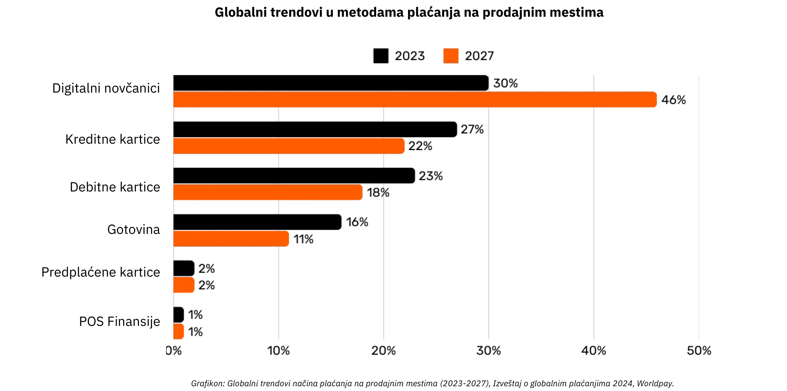

*Grafik: Globalni trendovi u metodama plaćanja na prodajnim mestima (POS) (2023-2027), Izveštaj o globalnim plaćanjima 2024, Worldpay.*

### Složenost iza jednostavnog plaćanja karticom

Kada kupac koristi kreditnu karticu u prodavnici, kartica se očitava putem POS terminala, koji bezbedno prenosi podatke o transakciji banci trgovca koja prihvata sredstva. Banka koja prihvata sredstva prosleđuje ove informacije relevantnoj kartičnoj mreži (npr. Visa ili Mastercard), koja zatim usmerava zahtev izdavaocu—banci koja je izdala karticu kupcu. Izdavalac proverava račun ili kreditnu liniju kupca i šalje nazad autorizaciju putem mreže i banke koja prihvata sredstva, omogućavajući trgovcu da prihvati plaćanje.

Ova naizgled jednostavna transakcija zapravo uključuje preko 15 koraka, 7 posrednika i u proseku traje između 48 sati i 5 dana da trgovac primi sredstva. Tokom narednih dana, odvija se proces kliringa i poravnanja. Kartična mreža agregira dnevne transakcije i koordinira razmenu sredstava između banke koja prihvata sredstva i izdavaoca. Centralna banka osigurava tačnost i stabilnost ovih međubankarskih poravnanja. Na kraju, bankovni račun trgovca prima neto iznos (umanjen za naknade) koji je kreditiran od strane banke primaoca sredstava, čime se završava životni ciklus transakcije.

Sve u svemu, ovaj proces je složen, dugotrajan i skup za ono što bi trebalo da bude jednostavan čin prenošenja vrednosti sa jedne strane na drugu.

### Uporedni pregled metoda plaćanja

| Način plaćanja                     | Potrebna autorizacija?           | Vreme odobrenja transakcije (iz ugla trgovca) | Brzina saldiranja (potpuno izmirena sredstva)   | Konačnost (lakoća opoziva)                | Broj posrednika                | Tipične naknade (za primaoca)      |
| ---------------------------------- | -------------------------------- | --------------------------------------------- | ----------------------------------------------- | ---------------------------------------- | ------------------------------ | ---------------------------------- |
| **Gotovina**                       | Ne                               | Trenutno (fizička razmena)                    | Trenutno (bez odlaganja saldiranja)             | Visoka (nepovratno nakon plaćanja)        | Nema                           | Nema                               |
| **Čekovi**                         | Da (bankarski kliring)           | Prihvatanje pri depozitu (nije garantovano)   | Nekoliko dana (proces kliringa čekova)          | Srednja (može odskočiti/stopirati pre kliringa) | Banka                          | **Niske do srednje** (bankarske naknade) |
| **Bankovni transferi**             | Da (banka/mreža)                 | Potvrda u roku od nekoliko sati               | Isti dan ili sledeći dan (domaći)               | Visoka (obično nepovratno nakon slanja)   | Banke, platne mreže            | **Srednje** (fiksne/procentualne)  |
| **Platne kartice**                 | Da (autorizacija izdavaoca kartice) | Sekunde do minuta (autorizacioni kod)       | Nekoliko dana (međubankarska naplata)           | Srednja (povraćaji mogući)                | Izdavalac, primalac, kartična mreža | **Promenljive (1-3% transakcije)** |
| **Digitalni novčanici/mobilno plaćanje** | Da (provajder novčanika/banka) | Sekunde (trenutna potvrda)                 | Tipično 1-2 dana (zavisi od izvora sredstava)   | Srednja (povraćaj/spor moguć)             | Banke, operateri novčanika     | **Niske do srednje (varira)**      |

### Ograničenja postojećih rešenja

Tradicionalna industrija plaćanja predstavlja godišnju ekonomiju od približno 2.200 milijardi dolara, što je otprilike jedna desetina BDP-a Sjedinjenih Američkih Država ili jednako BDP-u Francuske. Pošto valute funkcionišu kao mreže sa dozvolama, postoji ograničena konkurencija, što ovu "uslugu" čini sličnijom porezu nametnutom na produktivnu ekonomiju. Pored troškovnih opterećenja koja stvara, postoje i nekoliko drugih ograničenja, kako je navedeno u nastavku.

| Ograničenje                      | Objašnjenje                                                                                                                                                                                                                    | Uticaj                                                                                              |
| -------------------------------- | ------------------------------------------------------------------------------------------------------------------------------------------------------------------------------------------------------------------------------ | --------------------------------------------------------------------------------------------------- |
| Visoke naknade za kartice        | Naknade za razmenu (~0.3%), mrežne naknade (fiksne ili 0.3%-1%), pretplate na terminale/PSP, i bankarske marže (0.5%-1.7%) zajedno čine značajan trošak—poput globalnog "poreza" na produktivne sektore, u iznosu od triliona dolara. | Povećava troškove trgovaca, smanjujući marže i potencijalno povećavajući cene za potrošače.         |
| Veoma sporo konačno saldiranje   | Saldiranje sredstava može trajati do 5 dana, usporavajući protok novca i ukupnu ekonomsku aktivnost.                                                                                                                          | Odlaže likvidnost za trgovce i smanjuje brzinu ekonomske cirkulacije.                              |
| Prevare                          | E-commerce kanali su često meta prevara, što doprinosi značajnim gubicima (npr. $28 milijardi). Povraćaji bi mogli dostići ~$174 milijarde globalno do 2024. Upravljanje ovim sporovima troši vreme i izaziva mentalni napor. | Povećani operativni troškovi, složene mere prevencije prevara i umanjeno poverenje kupaca.         |
| Napuštanje korpe                 | Dodatni bezbednosni koraci (jednokratni kodovi, dvofaktorska autentifikacija prema PSD2) uvode trenje pri plaćanju.                                                                                                          | Veća složenost plaćanja dovodi do povećanog napuštanja korpe i izgubljene prodaje.                 |
| Visoki minimalni iznosi transakcija | Minimalni pragovi potrošnje na karticama mogu prisiliti trgovce i potrošače na neprijatne uslove cena ili kupovine, obeshrabrujući transakcije male vrednosti.                                                               | Smanjeno zadovoljstvo kupaca i fleksibilnost, potencijalno ograničavajući impulzivne kupovine male vrednosti. |
| Spora pred-autorizacija          | Trenutni sistemi ne mogu obrađivati transakcije u milisekundama ili podržavati kontinuirane tokove plaćanja u realnom vremenu.                                                                                               | Ograničava slučajeve upotrebe koji zahtevaju trenutna ili streaming plaćanja, ograničavajući inovacije i skalabilnost. |
| Potreba za bankovnim/kartičnim računom | Pristup ovim načinima plaćanja zahteva povezani bankovni ili kartični račun, automatski isključujući one bez takvih računa.                                                                                                  | Ograničava finansijsku inkluziju, smanjujući pristup za nebankarizovane ili podbankarizovane populacije. |
| Ponavljano kreiranje online naloga | Korisnici često moraju kreirati više online naloga, što dovodi do zamora, smanjene pogodnosti i povećanog izlaganja ličnih podataka.                                                                                         | Pogoršava korisničko iskustvo, povećava zabrinutost za privatnost i povećava rizik od curenja podataka. |
| Naknade za razmenu valuta (FX)   | Nedostatak univerzalne obračunske jedinice primorava na skupe konverzije valuta za prekogranične transakcije.                                                                                                                 | Dodaje dodatne troškove za međunarodnu trgovinu, čineći globalne transakcije manje pristupačnim.    |

Baš kao što smo prešli sa plaćanja po minuti za glasovne pozive na korišćenje skoro besplatne komunikacije zasnovane na IP-u, pojava otvorenijih i efikasnijih mreža može redefinisati plaćanja, smanjujući troškove i posrednike, i podstičući nove poslovne modele.

## Bitkoin za poslovanje : nova valuta u nastajanju

<chapterId>4488fe33-663f-41a3-a668-e9ca2fb7122e</chapterId>

**ŠTA JE BITKOIN?**

Bitkoin je **peer-to-peer sistem plaćanja baziran na digitalnoj valuti** (elektronski novac). Termin "Bitkoin" odnosi se na sledeće komponente:

- **Kompjuterski protokol** koji omogućava razmenu vrednosti na internetu bez posrednika, bez potrebe za dozvolom i pod pseudonimom. Koristi napredne kriptografske principe.
- **Fizička mreža** mašina povezanih na internet (čvorovi, rudari, itd.) kojima upravljaju pojedinci i preduzeća, formirajući decentralizovani sistem (bez centralnog autoriteta ili jedne tačke kontrole).
- **Jedinica obračuna** unutar sistema. Nikada neće biti više od 21 milion bitkoina u opticaju. Svaki bitkoin je deljiv na 100 miliona jedinica nazvanih „satoši“, u čast njegovog anonimnog tvorca.

Zajedno čine Bitkoin **imovinom na donosioca** i digitalnom valutom **bez izdavaoca**. Vlasništvo je osigurano isključivo držanjem **privatnog kriptografskog ključa**, što omogućava potpunu kontrolu **bez posrednika ili pouzdanih trećih strana**. Kada se prenese, vlasništvo je **konačno**: novi vlasnik ga u potpunosti poseduje bez oslanjanja na centralni autoritet za zaštitu ili konvertibilnost. Transakcije su **nepromenljive**—jednom zabeležene na Blockchain-u, ne mogu se izmeniti ili obrisati.

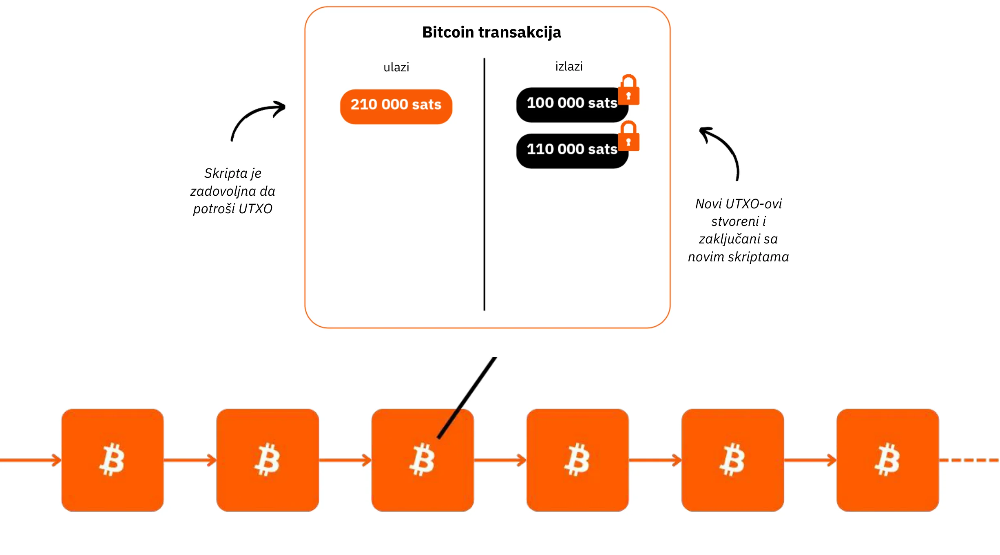

Bitkoin ima fiksnu monetarnu politiku, sa **ograničenjem od 21 milion bitkoina**, od kojih je ~19,8 miliona već distribuirano. Ovo ga čini **deflatornim**, sa vrednošću koja raste tokom vremena kako korisnici u njemu čuvaju ušteđevinu i dobitke u produktivnosti.

Njegove tehničke karakteristike nadmašuju one od zlata i dolara zajedno, čineći ga najtvrđim finansijskim sredstvom ikada stvorenim. Bitkoin je i čuvar vrednosti i sredstvo razmene, valuta u nastajanju. Zamislite prenos vrednosti iz trezora jedne kompanije u drugu brzo, bez posrednika, uz minimalne troškove, bez prevare, 24/7, i bez uključivanja treće strane.

Bitkoin efikasno čuva vrednost jer je njegova knjiga nepromenljiva. Njegova vrednost raste zbog retke i ograničene ponude u kombinaciji sa sve većim brojem mogućnosti razmene, podstaknutih rastućim brojem korisnika.

Bitkoin je disruptivan jer nas podstiče da učimo koncepte iz matematike, kriptografije, ekonomije i istorije koje nikada nismo učili. Iako se često doživljava kao složen, zapravo je inovacija dostupna kroz praksu i eksperimentisanje.

Bitkoin nas izaziva da preispitamo samu prirodu novca. Možete li objasniti šta novac zaista jeste? Radnik sa platom ili preduzetnik može provesti 50.000 do 100.000 sati svog života zarađujući novac, ali koliko njih **posveti čak 100 sati da ga bolje razume** i sačuva? Bitkoin nas podstiče da preispitamo osnovne razloge iza naše potrebe za novcem i našu vremensku perspektivu. Da li je novac za trenutni luksuz ili dugoročnu otpornost? Ako bismo imali imovinu koja raste u vrednosti i omogućava nam da odložimo kupovine, koje bismo izbore napravili? Kakve bismo razgovore želeli da vodimo sa sobom za 20 ili 30 godina?

**Bitkoin LIČNA KARTA**

- **Starost:** 15 godina (3. januar 2009.)
- **Dnevna vrednost razmene:** $10 milijardi (> CAC40)
- **Tržišna kapitalizacija:** $1.8 triliona (> Meta, Visa, Silver ; < Apple, Google, Gold)
- **Korisnici:** ~100 do 200 miliona (1-2% globalne populacije)
- **Volatilnost:** Intrinzično nema (1 Bitkoin = 1 Bitkoin), veoma visoka eksterno (u razmenama fiat valuta)
- **Performanse:** Prva transakcija na $0.0009; sada $100,000 (x100 miliona)
- **Dostupnost mreže (uptime):** 100% od 2013.
- **Proglašen mrtvim ili kritikovan:** Jednom mesečno

**Čudo ljudske saradnje:**

- Potpuno **open-source (otvorenog koda)** 
- **Pravno lice:** Nema
- **CEO:** Nema
- **Investicije rizičnog kapitala:** Nema
- **Marketing:** Nema
- **Istraživanje i razvoj:** Vođeno volonterima
- **Upravljanje:** Od strane korisnika
- **Inovativni ekonomski model:** Kreiranje blokova se subvencioniše transakcionim naknadama (zasnovano na aukciji)

Za više informacija o Bitkoinu, njegovoj istoriji, načinu rada i upotrebi, takođe predlažem da pratite ovaj drugi sveobuhvatni kurs:

https://planb.network/courses/2b7dc507-81e3-4b70-88e6-41ed44239966
## Uvod u Lightning Mrežu

<chapterId>c095c7ad-5469-4c7b-9510-b6c0b86244e7</chapterId>

**ŠTA JE LIGHTNING?**

Lightning Mreža je **protokol i mreža** koja omogućava Bitkoin transakcije uz minimalnu interakciju sa glavnim Blockchain-om Bitkoina. Evo kako funkcioniše:

- **Početno podešavanje:** Sredstva se zaključavaju (deponuju) na glavnom Blockchain-u kako bi se uspostavio kanal plaćanja između 2 strane.
- **Mreža plaćanja:** Mreža kanala plaćanja između više strana formira mrežu plaćanja (usmeravanje i međusobno povezivanje).
- **off-chain transakcije -  (van blockchain-a):** Transakcije se odvijaju između strana, ali **nisu odmah objavljene** na glavnom Bitkoin Blockchain-u (**"off-chain"**).
- **On-Chain poravnanja:** Samo **konačno stanje** transakcija kanala se objavljuje na glavnom Bitkoin Blockchain-u (**"On-Chain**"), omogućavajući da se u međuvremenu dogodi mnoštvo transakcija. Ovo grupisanje više uplata smanjuje zagušenje i time snižava naknade u poređenju sa obavljanjem mnogih On-Chain transakcija.
- **Zatvaranje kanala:** Korisnik može zatvoriti svoj kanal u bilo kom trenutku i povratiti svoj bitkoin objavljivanjem najnovijeg stanja transakcije. Ovo je princip da transakcije mogu biti **"objavljene" u bilo kom trenutku, ali "neobjavljene"** dok ne postanu neophodne. Izlaz (zatvaranje kanala) može biti jednostran (odlučen od strane bilo koje od 2 strane u bilo kom trenutku) ili uzajamno dogovoren (što rezultira nižim On-Chain naknadama).

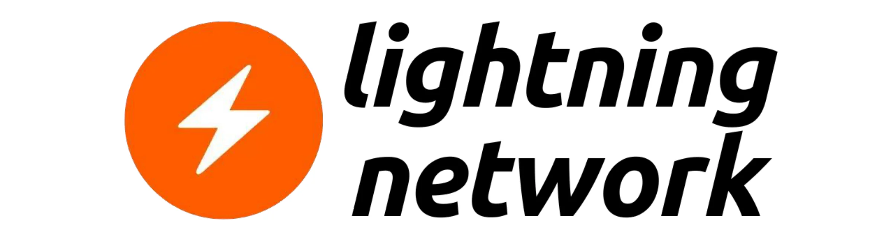

Ovaj pristup izbegava sporost i složenost obavljanja svake transakcije direktno na glavnom Blockchain-u Bitkoina, beležeći samo konačna stanja i zadržavajući njegovu sigurnost. Lightning Mreža je sloj "iznad" Bitkoina, ali ostaje usidren za njega.

**Globalna Mreža Plaćanja**

Protokol stvara **mrežu** mašina gde kanali formiraju univerzalni sistem plaćanja. Ovim čvorovima mogu slobodno upravljati pojedinci ili preduzeća, što ga čini potpuno otvorenom mrežom.

Lightning Mreža omogućava trenutnu razmenu vrednosti brzinom svetlosti. To je kao protokol e-pošte primenjen na plaćanja: mreža plaćanja sledeće generacije. Radikalno transformiše način na koji se "novac" kreće, čineći ga slobodnim i brzim kao prenos podataka na internetu.

**Ključne prednosti:**

- **Brzina:** Trenutne transakcije.
- **Niske naknade:** Mnogo niži troškovi u poređenju sa tradicionalnim bankarskim mrežama.
- **Jednostavnost usvajanja:** Poslovanja mogu brzo postaviti prihvatanje Lightning plaćanja koristeći samo aplikaciju na pametnom telefonu ili dugme za plaćanje na svojoj veb stranici.

Infrastruktura Lightning-a nadmašuje tradicionalne platne sisteme u pogledu brzine, troškova i energetske efikasnosti. Sa sve većim usvajanjem od strane trgovaca, zamah će se ubrzati: ako plaćanja mogu zaobići zarobljenu međubankarsku mrežu, zašto nastaviti odricati se značajnog procenta prihoda današnjim posrednicima?

**Beskonačne upotrebe:**

Primene Lightning-a se protežu daleko izvan niskih naknada i brzine. Nudeći potpuno besplatnu i trenutnu platformu za plaćanje, otvara ogromne mogućnosti širom ekonomije.

**Povećanje mogućnosti razmene bitkoina:**

Lightning pojačava ulogu Bitkoina kao "sredstva razmene". Povećanjem frekvencije i slobode transakcija, ona jača primarnu funkciju novca: olakšavanje ekonomskih razmena i stvaranje vrednosti za sve učesnike.

Budući rast "ekonomije pametnih mašina" zahtevaće ultra-brz, visokofrekventni platni sistem, tehnički standard koji samo Lightning može ispuniti. Ovo omogućava kreiranje više dobara i usluga. Kako je ponuda bitkoina ograničena, kupovna moć svake jedinice će se povećati. Bitkoin i Lightning postaju jači zajedno kako se njihove mreže šire.

Lightning pruža uvid u budućnost gde će svi poslovi koji su postali internet-bazirani takođe postati Bitkoin-bazirani.

**Bitkoin Plaćanja na Lightning-u: Tipičan slučaj korišćenja kod trgovaca**

Lightning Mreža je idealna za Bitkoin plaćanja u fizičkim ili online prodavnicama zbog svoje brzine i konačnosti plaćanja.

- **Brzina:** Lightning (~500ms do nekoliko sekundi) je značajno brži od glavne Bitkoin mreže, gde transakcije mogu čekati i oko 30 minuta da se potvrde. Za velike kupovine (znatno više od $1,000), glavna Bitkoin mreža može i dalje biti preferirana, jer brzina nije toliko kritična. Međutim, ovi detalji su često skriveni od prosečnog korisnika, jer aplikacije ove odluke obrađuju neprimetno u pozadini.
- **Konačnost:** Jednom kada se uplata izvrši na Lightning mreži, ona je konačna. Ne postoji mogućnost povrata sredstava od strane trećih lica ili sporova vezanih za prevaru.
- **Naknade:** Naknade za transakcije na Lightning mreži su minimalne i plaća ih korisnik, a ne trgovac. Trgovci snose naknade samo ako kasnije trebaju preneti svoj bitkoin na drugu mrežu ili uslugu.

**LIGHTNING LIČNA KARTA**

- **Izumljen:** 2015.
- **Lansiranje:** 2016.
- **Starost:** 7 godina (prva transakcija: 28. decembar 2017.)
- **Tehnička sposobnost mreže:** u velikim razmerama može da obradi 1.000 puta više instant transakcija nego tradicionalni sistemi.
- **Veličine transakcija:** Kreću se od veoma velikih do onih koje su do 1.000 puta manje od tradicionalnih sistema.
- **Brzina transakcije:** Do 100 puta brža.
- **Naknade:** Do 90% niže.
- **Konačnost plaćanja:** Gotovo trenutna (često ~500 milisekundi, ponekad nekoliko sekundi).
- **Potrošnja energije:** ~8% tradicionalnog globalnog monetarnog sistema.
- **Karakteristike:**
    - Od osobe do osobe (Peer-to-peer (P2P))
    - Univerzalno
    - Nije potrebna dozvola
    - Dobra privatnost
    - Dokazana sigurnost
    - Visoka dostupnost 
    - Kontrolabilno i prilagodljivo

Za više informacija o tehničkom funkcionisanju Lightning mreže, predlažem da pratite i ovaj drugi sveobuhvatni kurs:

https://planb.network/courses/34bd43ef-6683-4a5c-b239-7cb1e40a4aeb
# Bitkoin u trezoru

<partId>bf45c1e8-af97-4b6b-af42-2866f493b14d</partId>

## Profiti, kapital i ključni faktori otpornosti poslovanja

<chapterId>656ad88f-3c27-4054-a94e-b29727009b8e</chapterId>

### Zdrava kompanija

**Budućnost je neizvesna**, i preduzeća moraju upravljati ovom neizvesnošću sa jasnim fokusom na ostvarivanje profita i očuvanje kapitala. Prema austrijskoj ekonomiji, **profiti je krajnji pokazatelj zdravlja kompanije**—pokazuju da preduzeće efikasno zadovoljava potrebe potrošača. Bez profita, kompanija ne može da se održi, a kamoli da raste. Da bi preduzeće ostalo zdravo, mora ne samo ostvaruje profit, već i da razmišlja unapred, **čuvajući kapital za buduće investicije i izazove**.

**Očuvanje kapitala** je ključno jer omogućava preduzećima da se prilagode i iskoriste prilike na nepredvidivom tržištu. Ovo podrazumeva postizanje ravnoteže između reinvestiranja zarade za rast i održavanja finansijskog jastuka za prevazilaženje potencijalnih padova. Austrijska ekonomija ističe važnost **„vremenske preferencije“**, što znači da preduzeća moraju pažljivo odlučiti koliko će prioritizovati trenutne povrate naspram ulaganja za dugoročni uspeh. Zdrava kompanija održava svoju finansijsku osnovu jakom, osiguravajući fleksibilnost i u dobrim i u lošim vremenima.

Tržišni signali poput cena i konkurencije usmeravaju preduzeća u donošenju pametnih odluka o alokaciji resursa. Slušajući ove signale, kompanije mogu izbeći zamku prekomernog širenja ili loših investicija—posebno onih pod uticajem veštačkih faktora kao što je lak kredit. Pogrešna alokacija resursa ne samo da ugrožava zdravlje kompanije već i smanjuje njenu sposobnost da efikasno služi kupcima.

Na kraju, održavanje zdravog poslovanja znači ostati prilagodljiv, donositi mudre finansijske odluke i uvek imati pogled usmeren ka budućnosti. **Fokusiranjem na profit, očuvanje kapitala i reagovanje na tržišne signale, preduzeća—velika ili mala—mogu napredovati čak i suočena sa neizvesnošću**.

### Da li Kapital ima vrlinu?

**Kako se kapital generalno prikazuje**

Hajde da ponovo otkrijemo šta kapital zaista jeste—pojam koji je tako često pogrešno shvaćen i negativno percipiran u našem društvu.

U tradicionalnoj ekonomskoj teoriji (Kejnzijanskoj), kapital se često posmatra u pojednostavljenim terminima kao homogena zaliha fizičkih ili finansijskih sredstava, koja se prvenstveno koristi za stimulisanje agregatne tražnje putem investicija. Često se povezuje sa koncentracijom bogatstva i ekonomskom moći koju drži mala elita. U kontekstu gde se jaz u bogatstvu nastavlja širiti, mnogi vide kapital kao simbol ekonomske nejednakosti, posebno kada akumulirano bogatstvo izgleda da ne donosi korist većini.

"Kapital" se često prikazuje kao alat eksploatacije, i ova perspektiva je duboko uticala na različite pokrete koji kapital vide kao inherentno suprotan interesima radnika. Ali da li je to tačno? Ili bi ova percepcija mogla biti iskrivljena zbog:

1. Nedostatka razumevanja ekonomskih mehanizama (uključujući i od strane samih ekonomista)?

2. Vladinog intervencionizma i manipulacije tržištem?

3. Zbrke između kroni kapitalizma i slobodnotržišnog kapitalizma?

4. Načina na koji mediji prikazuju ekonomske krize?

5. Želje za brzim rešenjima i trenutnom socijalnom pravdom?

6. Kulturne normalizacija antikapitalističke retorike?

Srećom, Bitkoin nas primorava da preispitamo sve i izazovemo ove unapred stvorene predstave. Postoji škola mišljenja—Austrijska škola ekonomije—koja može rasvetliti ova pitanja i pomoći nam da preispitamo pravu prirodu kapitala.

**Jednom davno**

Hajde da počnemo sa kratkom pričom:

"Na malom pustom ostrvu živi usamljeni ribar. Svakog dana provodi sate hvatajući ribe golim rukama, aktivnost koja mu troši mnogo vremena i energije. Jednog dana, dobija ideju: da napravi koplje koje će mu omogućiti da lovi ribu efikasnije. Ali zna da će to zahtevati žrtvu.

Pre nego što počne da pravi koplje, ribar odlučuje da odvoji nešto ribe kako bi se prehranio tokom procesa izrade. Jede manje nego obično nekoliko dana, štedeći dovoljno ribe da se fokusira na svoj projekat. Ova sačuvana riba predstavlja njegov **kapital**, malu rezervu koja mu omogućava da ostvari svoj cilj.

Dok posvećuje svoje vreme izgradnji koplja, oslanja se na svoje rezerve, dobrovoljno odlažući deo svoje trenutne udobnosti (odraz njegove **vremenske preferencije**). Nakon nekoliko dana rada na Hard, završava čvrsto koplje.

Sa kopljem, sada može da lovi ribu mnogo brže i sa manje napora. Više ne mora da se iscrpljuje kao ranije i čak počinje da akumulira višak ribe. Ovaj višak otvara nove mogućnosti: može ga skladištiti, deliti ili uložiti u druge projekte na ostrvu. Odlaganjem trenutne potrošnje i korišćenjem svog kapitala, ribar je značajno poboljšao svoju efikasnost i buduće izglede."

Ova priča ilustruje fundamentalnu ulogu kapitala, strpljenja i predviđanja u izgradnji bolje budućnosti—koncepti koji su ključni za ekonomski rast i ljudski napredak.

### Austrijska škola ekonomije i njena vizija kapitala

Austrijska škola ekonomije je nazvana po svojim osnivačima i ranim saradnicima, koji su poreklom iz Austrije. Ime se zadržalo, a škola je od tada postala usko povezana sa klasičnom liberalnom mišlju, naglašavajući individualnu slobodu, slobodna tržišta i minimalnu državnu intervenciju.

**Austrijska perspektiva o kapitalu**

U austrijskom pogledu, kapital je duboko povezan s idejom odlaganja potrošnje kako bi se izgradili alati ili produktivni resursi koji poboljšavaju buduću proizvodnju. Ovaj proces, poznat kao akumulacija kapitala, je centralan za austrijsku ekonomsku teoriju. Ključni elementi ove perspektive uključuju:

- **Vremensku preferenciju i odloženu potrošnju**: Pojedinci prirodno preferiraju konzumiranje sada umesto kasnije, ali mogu odlučiti da odlože potrošnju ako očekuju veće nagrade u budućnosti. Štednjom danas, resursi se mogu uložiti u kapitalna dobra (alatke, mašine, infrastrukturu) koja poboljšavaju produktivnost tokom vremena. Društva ili pojedinci sa nižom vremenskom preferencijom više štede i ulažu u dugoročne projekte, podstičući održivi rast.
- **Kapital kao pokretač buduće proizvodnje**: Kapitalna dobra se smatraju posrednim alatima koji se koriste za proizvodnju konačnih potrošačkih dobara. Akumulacijom kapitala, preduzetnici mogu poboljšati produktivnost i stvoriti više bogatstva u budućnosti. Na primer, umesto da odmah proizvode potrošačka dobra, resursi se mogu koristiti za izgradnju fabrika ili mašina. Iako ovo smanjuje kratkoročnu potrošnju, rezultirajuća efikasnost omogućava veću proizvodnju i prosperitet kasnije.
- **Indirektna proizvodnja i efikasnost**: Austrijski ekonomisti, kao što je Eugen Böhm-Bawerk, istakli su ideju indirektne proizvodnje—duži i složeniji proizvodni procesi koji uključuju više faza. Iako ovi procesi zahtevaju vreme, oni na kraju donose efikasnije i produktivnije rezultate, kao što je izgradnja pilane za obradu drveta umesto sakupljanja trupaca ručno.
- **Kamatne stope kao signali**: Kamatne stope, prema austrijskoj perspektivi, prirodno odražavaju vremenske preferencije pojedinaca. Visoke stope ukazuju na preferenciju za trenutnu potrošnju, dok niske stope podstiču štednju i dugoročna ulaganja. Kada centralne banke veštački manipulišu kamatnim stopama, one iskrivljuju ove prirodne signale, što dovodi do pogrešne alokacije resursa i neodrživih ulaganja (pogrešna ulaganja).

**Dva oblika kapitala u modernim ekonomijama**

U okviru monetarnog sistema zasnovanog na dugu u kojem poslujemo, **postoji drugi tip kapitala**: onaj koji se generiše trenutno kada banka odobri kredit putem jednostavnog kreditnog mehanizma. Ovo uključuje stvaranje likvidnosti ex nihilo, gde banka pozajmljuje novac koji zapravo ne poseduje unapred, već ga stvara na osnovu obećanja o otplati.

S jedne strane, "austrijski" kapital je rezultat stvarne štednje, proces koji uključuje promišljene ekonomske odluke i pažljivu žrtvu. S druge strane, kapital generisan kroz stvaranje novca zasnovanog na dugu je trenutna i veštačka konstrukcija. Ove dve vrste kapitala, iako **površno slične u svojoj upotrebi za finansiranje projekata, su suštinski različite po prirodi**.

Ova dva oblika kapitala nikada ne bi trebalo mešati, ali unutar sistema zasnovanog na dugu, često se mešaju, **iskrivljujući ekonomske signale** i često vodeći ka lošim investicijama. Ovo nerazumevanje osvetljava zašto kapitalizam često prima neopravdanu kritiku.

**Ključni Problem sa Kejnzijanizmom**

Kejnzijanske politike, koje globalne elite široko prihvataju, manipulišu kamatnim stopama i podstiču potražnju kroz zaduživanje. Ovo podstiče resurse da teku ka kratkoročnim, neodrživim projektima, pojačavajući ekonomske cikluse i odlažući pravi rast zasnovan na zdravim uštedama i produktivnim investicijama. Poslovni lideri posmatraju ovu štetnu politiku iz prve ruke dok se zdrave kompanije guraju u precenjene akvizicije u potrazi za naduvanim prinosima, potkopavajući organski i održivi rast.

U takvom okruženju, kako "zdravi" kapital—pažljivo sačuvan od strane preduzetnika—može da se takmiči sa veštački stvorenim "nezdravim" kapitalom? Štaviše, jednostrano širenje novca Supply narušava kupovnu moć zdravog kapitala, pogoršavajući ekonomsku dezorijentaciju i društveno nezadovoljstvo.

**Tračak nade: Bitkoin**

Bitkoin nudi način za akumulaciju i očuvanje kapitala na duži rok bez erozije uzrokovane monetarnom inflacijom. Kao čuvar vrednosti, omogućava preduzećima da planiraju buduće investicije sa otpornošću, izazivajući dominaciju sistema vođenih dugom i podstičući povratak pravoj, produktivnoj akumulaciji kapitala.

### Više o austrijskoj školi ekonomije

**Austrijska škola ekonomije** je tradicija ekonomske misli koja vrednuje slobodna tržišta, individualnu slobodu i važnost ljudske akcije u ekonomskim procesima. Kritikuje državnu intervenciju, posebno u novcu i tržištima, i tvrdi da su pojedinci, vođeni svojim subjektivnim preferencijama, najbolji sudije svojih interesa.

**Ključne ličnosti Austrijske škole**

- **Carl Menger**: Osnivač Austrijske škole, Menger je razvio teoriju subjektivne vrednosti, koja tvrdi da vrednost dobara zavisi od individualnih preferencija, a ne od troškova proizvodnje.
- **Ludwig von Mises**: Kamen temeljac Austrijske škole, Mises je uveo prakseologiju (teoriju ljudske akcije) i napisao knjigu _Ljudska akcija_, duboku kritiku socijalizma i centralnog planiranja.
- **Friedrich Hayek**: Student Misesa, Hayek je osvojio Nobelovu nagradu za ekonomiju 1974. godine za svoj rad na decentralizovanom znanju i spontanosti tržišta. U svojoj knjizi _Put u ropstvo_, oštro je kritikovao centralizovanu kontrolu.
- **Murray Rothbard**: Učenik Misesa i odlučan zagovornik libertarijanizma, Rothbard je razvio teoriju anarho-kapitalizma, zamišljajući društvo bez države kojim upravljaju dobrovoljni ugovori. Njegova knjiga _Man, Economy, and State_ (_Čovek, ekonomija i država) je ključno delo u austrijskoj ekonomiji.

**Drugi uticajni ekonomisti**

- **Milton Friedman**: Iako nije direktno povezan sa Austrijskom školom, Friedman je podržavao mnoge pro-tržišne i liberalne ideje. Njegova monetaristička politika se razlikuje od austrijskog mišljenja, ali deli njihovu kritiku prekomerne državne intervencije u ekonomiji.
- **Frédéric Bastiat**: Francuski ekonomista iz 19. veka, Bastiat je uticao na Austrijsku školu svojim radovima o slobodnoj trgovini i nevidljivim posledicama ekonomskih politika. Njegov esej _What Is Seen and What Is Not Seen_ (_Šta se vidi i šta se ne vidi_) je osnovni tekst ekonomskog liberalizma.

*Atribucija: Ludwig von Mises Institut*

**Osnovni doprinosi i ideje**

Ovi mislioci su oblikovali ideju da državna intervencija iskrivljuje tržišta i da je ekonomska sloboda ključna za prosperitet i harmoničnu koordinaciju ljudskih akcija. Njihovi uvidi ističu važnost decentralizovanog donošenja odluka i opasnosti centralizovane kontrole u ekonomskim sistemima.

Za više informacija o ovoj temi:

https://planb.network/courses/d955dd28-b7c6-4ba2-a123-d932e21d148f
https://planb.network/courses/9d1bde6a-33e5-45dd-b7c0-94da72e45b11
https://planb.network/courses/d07b092b-fa9a-4dd7-bf94-0453e479c7df
## Držanje Bitkoin u trezoru

<chapterId>89622a40-d14f-4c37-a075-8e7e1731ec26</chapterId>

### Izazovi trezora kompanije

Trezor je mesto gde se čuvaju dragocene stvari. Zdrava kompanija je pravilno kapitalizovana kako bi mogla da se nosi sa budućom neizvesnošću i planira svoja ulaganja. Danas se deo viška sredstava ulaže u finansijske aktive za koje se smatra da su visoko “likvidne”, kao što su obveznice, oročeni depoziti i slično.

Za veoma dug horizont, neke kompanije koriste nelikvidnu imovinu poput nekretnina ne shvatajući određene opasnosti:

- Nelikvidnost u slučaju krize
- Na kraju prilično niski prinosi nakon odbitka naknada
- Prinos koji ne nadmašuje stvarnu inflaciju, onu novčanu masu (~7% godišnje, vidi dole)
- Skriveni rizik da nekretnine izgube deo svoje funkcije „štednje“ u korist sredstava poput Bitkoina. Kao rezultat, moglo bi se vratiti bliže svojoj „upotrebnoj vrednosti“: pružanju skloništa.

Hajde da brzo pregledamo okruženje u kojem posluju preduzeća.

**Stvarna inflacija**: Na veliku žalost njihovog mandata, centralne banke ciljaju na 2% godišnju inflaciju, što znači gubitak od 40% vrednosti valute tokom 20 godina. Dodajući periode izraženije inflacije, postaje jasno da kompanije ne mogu koristiti samo valutu za čuvanje plodova svog rada. Moraju implementirati složene finansijske strategije, koje nužno prate različiti rizici. Ove strategije su očigledno **nedostupne vrlo malim preduzećima**, koja su već uveliko zauzeta svojim osnovnim aktivnostima.

**Skrivena inflacija**: U monetarnom sistemu zasnovanom na dugu i frakcionalnim rezervama, koji podržavaju centralne banke, **ukupna novčana masa raste za oko 7% godišnje u proseku** (npr. M1 u Evrozoni ili SAD). To znači da se vaš “deo kolača” prepolovi za samo nekoliko godina—osim ako nemate privilegovan pristup finansijskom izvoru i možete nastaviti da rastete koristeći poluge i kupujući imovinu brzo po “starim cenama” pre nego što novo kreirani novac podigne njihove cene. Ovo je Kantilonov efekat, koji delimično objašnjava transfer bogatstva ka imućnijima, dok se “kapital” pogrešno okrivljuje kao krivac (pogledajte naš uvod o kapitalu iznad).

**Rizici druge ugovorne strane**: Trenutni finansijski sistem je rizičan, i možda nećete uvek imati pristup “vašem novcu.” Bez prizivanja slike kule od karata, mora se priznati da finansijske institucije privatizuju profite i socijalizuju gubitke pri najmanjoj krizi. U sistemu “skripturalnog” novca (novac zabeležen u knjigama), novac u banci je samo “potraživanje”; vi ga zapravo ne posedujete, a ni same banke “ga nemaju” (frakcionalne rezerve). Ovaj novac je, na neki način, zaista magičan. Neke prestižne banke koje su nekada ismevale Bitkoin danas više ne postoje, kao što je Credit Suisse.

Ovaj nedostatak poverenja pokreće ponovno oživljavanje imovine „donosioca“ kao što je zlato (iako je komplikovano obezbediti, transportovati i podeliti, itd.) i, naravno, Bitkoina, kao novopridošlog.

### Bitkoin kao finansijska imovina

Bitkoin nudi radikalnu alternativu. To je **imovina nosioca, bez centralnog izdavača**, gotovo je nemoguće zapleniti, i ima koristi od mrežnih efekata. "Pravi" korisnici Bitkoina biraju da ga koriste za čuvanje plodova svog rada, jer se smatra skladištem vrednosti otpornim na cenzuru i inflaciju. Zahvaljujući mrežnom efektu, ilustrovanom Metcalfeovim zakonom, svaki novi ubeđeni korisnik povećava vrednost mreže; kako broj učesnika raste, korisnost Bitkoina eksponencijalno raste. Ovaj model ga čini jedinstvenim i obećavajućim oblikom kapitala, zasnovanim na usvajanju i poverenju korisnika.

Bitkoin je **najlikvidnije sredstvo na svetu**, koje radi 24/7 bez prekida, za razliku od tradicionalnih finansijskih tržišta koja imaju radno vreme i "prekidače." Ova likvidnost omogućava korisnicima da kupuju ili prodaju bitkoine u bilo kom trenutku, bilo kao odgovor na dobre ili loše vesti (npr. lansiranje raketa, ratovi, itd.).

Tokom više od decenije, bitkoin je pokazao prosečan godišnji rast veći od 60%. Ova jedinstvena performansa omogućila je dugoročnim vlasnicima da sačuvaju svoj početni kapital, za razliku od drugih instrumenata.

Međutim, postoji nekoliko ključnih faktora koje treba imati na umu:

Prvo, **prošle performanse ne garantuju buduće rezultate**. Sve dok Bitkoin ostaje **siguran i decentralizovan**, može se razumno očekivati godišnje povećanje cene znatno iznad 20% godišnje u narednoj deceniji, što ga čini održivim alatom za trezor.

Drugo, Bitkoin je do sada iskusio **4-godišnje cikluse**, što znači da je sa vremenskim horizontom dužim od 4 godine uvek bio profitabilan. Za one koji vide bitkoin kao investiciju, kratkoročni horizont (<4 godine) može biti rizičan.

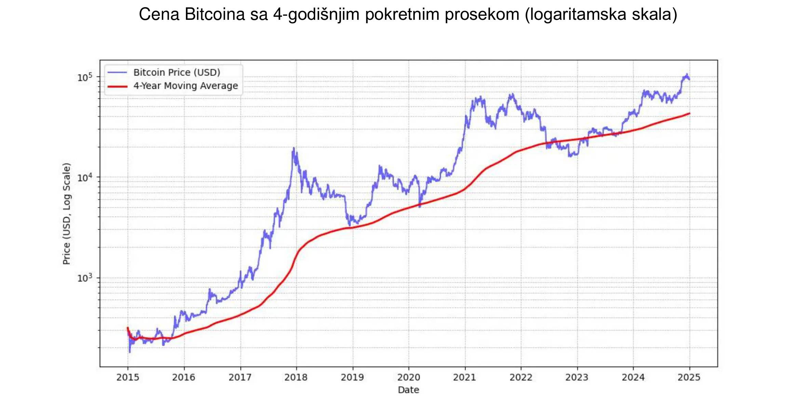

*MICHAEL SAYLOR: "Najbolji Bitkoin signal cene je 4-godišnji jednostavni pokretni prosek."* Pogledajte gornji grafikon.

Pored toga, preporučljivo je da izloženost Bitkoin bude **proporcionalna** nivou razumevanja. Takođe je važno ne žuriti i ne pokušavati savršeno tempirati tržište.

Konačno, Bitkoin se smatra **volatilnim**. Tačnije, njegova cena izražena u jedinicama fiat novca je volatilna. Deo ove volatilnosti je prirodan za još uvek mladu imovinu, ali je takođe pojačan prisustvom špekulanata koji ga ne koriste kao dugoročno sredstvo čuvanja vrednosti, već traže brzu zaradu. Dalje, trgovanje sa polugom (korišćenje pozajmljenih sredstava za povećanje trgovinskih pozicija) pojačava i uzlazne i silazne cenovne pokrete, sprečavajući Bitkoin da prati pravolinijski uzlazni put. Ovo dovodi do izraženijih fluktuacija, ali tokom vremena, kako baza posvećenih korisnika raste, čini se da se ova volatilnost stabilizuje. Ukratko, **nemoguće je imati imovinu visokih performansi kao što je Bitkoin bez volatilnosti**, ali svakako možete imati daleko manje performansne imovine sa manje volatilnosti.

### Bitkoin usvojen od strane Wall Streeta

Usvajanje Bitkoin od strane finansijskih institucija dodatno jača njegovu poziciju na globalnom tržištu.

Nedavne izjave **BlackRock-a** ističu potencijal Bitkoin kao sredstva za čuvanje vrednosti i alata za diverzifikaciju portfolija. Globalni institucionalni gigant je nedavno sugerisao da **rast korisnika Bitkoina nadmašuje rast interneta** ili mobilnih telefona, podstaknut posebno **demografskim i generacijskim promenama**, kao i rastućim nepoverenjem u tradicionalne finansijske institucije (!). Zbog svoje oskudne, nesuverene i decentralizovane prirode, neki investitori vide Bitkoin kao opciju sigurnog utočišta **u vremenima fiskalne i monetarne nestabilnosti**, straha ili disruptivnih geopolitičkih događaja.

**Spot Bitkoin ETF-ovi**, lansirani u januaru 2024, doživeli su fenomenalan uspeh—**najuspešnije** lansiranje ETF-a u istoriji—sa skoro 20 milijardi dolara neto priliva od januara do novembra. To je otprilike četiri puta bolje od sledećeg najuspešnijeg lansiranja ETF-a, Nasdaq-100 QQQ. Ovi ETF-ovi pružaju lakši i regulisaniji pristup Bitkoinu, što ga je **dodatno legitimisalo** i privuklo značajan priliv institucionalnog kapitala.

Bitkoin ETF-ovi prednjače sa velikom razlikom u smislu **institucionalnog usvajanja**—nadmašujući deset najbrže rastućih ETF-ova—bilo u pogledu broja uključenih institucija ili veličine imovine pod upravljanjem (AUM). Uspeh ovih Bitkoin ETF-ova naglašava rastuću potražnju za investicionim vozilima povezanima sa digitalnim sredstvima, čime se učvršćuje mesto Bitkoin u tradicionalnom finansijskom pejzažu.

Bitkoin sada igra u **tržištu** "čuvanja vrednosti". Predstavlja samo kap u moru u smislu obima: oko 1.800 milijardi dolara u poređenju sa zlatom od 18.000 milijardi ili nekretninama od 500.000 milijardi. Međutim, njegov tržišni udeo od oko 0,1% daje mu ogroman prostor za rast, posebno s obzirom na to da se njegovi konkurenti bore da privuku nove korisnike.

| Oznaka  | 1D Tok (M USD)  | 1W Tok (M USD)  | 1M Tok (M USD)  | 3M Tok (M USD)  | YTD Tok (M USD)  |
| ------- | --------------- | --------------- | --------------- | --------------- | ---------------- |
| **Sum** | +457.19         | +1,507.95       | +2,888.01       | +3,672.29       | **+20,262.94**   |
| IBIT    | +393.40         | +750.91         | +1,536.47       | +3,821.37       | +22,460.44       |
| FBTC    | +14.81          | +372.40         | +627.16         | +458.71         | +10,266.69       |
| ARKB    | +11.51          | +163.26         | +295.92         | -3.88           | +2,647.32        |
| BITB    | +12.93          | +146.50         | +263.30         | +97.46          | +2,262.69        |
| HODL    | +5.75           | +38.77          | +94.54          | +100.39         | +682.03          |
| BRRR    | +1.92           | +4.72           | +17.76          | +20.54          | +540.19          |
| EZBC    | +11.79          | +17.53          | +39.29          | +47.48          | +439.45          |
| BTC     | .00             | -3.13           | +36.59          | +419.18         | +419.18          |
| BTCO    | +6.43           | +19.25          | +47.30          | +56.41          | +394.82          |
| BTCW    | .00             | +2.84           | +6.04           | +146.69         | +217.47          |
| YBIT    | -1.34           | -10.26          | +5.06           | +13.81          | +76.30           |
| DEFI    | .00             | .00             | .00             | -2.03           | -1.79            |
| GBTC    | .00             | +5.16           | -81.42          | -1503.84        | -20,141.85       |

*$20 milijardi za 10 meseci: Bitkoin ETF-ovi postigli su za manje od godinu dana- ono za šta je zlatnim ETF-ovima trebalo 5 godina. Izvor: Tokovi investicionih fondova u USD. Bloomberg Terminal, Bloomberg L.P., 2024.*

### Bitkoin u alatu kompanije

Rastuće usvajanje Bitkoin u Sjedinjenim Državama takođe utiče na razmišljanja i drugde u svetu, posebno među profesionalcima za upravljanje bogatstvom koji više ne mogu sebi priuštiti da ga ne uključe u svoj asortiman alata — naročito jer tradicionalni finansijski proizvodi ne ostvaruju dobre rezultate ili se suočavaju sa teškim periodima. Samo tradicionalne banke i dalje izgleda mogu sebi priuštiti da ga ignorišu.

Sa čisto finansijskog aspekta, Bitkoin je prepoznat kao imovina za diversifikaciju. Ne samo da nije povezan sa drugim klasama imovine, već izgleda da napreduje tokom perioda novih injekcija likvidnosti—još jedna takva epizoda izgleda da počinje sa snižavanjem kamatnih stopa od strane ECB, Fed-a i Kine.

Ukratko, za najčešći slučaj upotrebe—ulaganje viška sredstava na najmanje četiri godine—Bitkoin savršeno odgovara. Vredi ga kombinovati sa strategijom postepenog ulaska: ulaganje fiksnih iznosa u redovnim intervalima kako bi se ublažila tačka ulaska ili izlaska.

Drugi slučajevi upotrebe čine Bitkoin strateškom trezorskom aktivom, na primer:

- Mogućnost postavljanja **kolaterala** ili likvidnosti 24/7
- Mogućnost prebacivanja u trezor druge kompanije **brzo, u bilo koje vreme**
- Zaštita od **rizika promene deviznog kursa**
- Plaćanje **dobavljaču** koji to prihvata, posebno u vanrednim situacijama

### Da li je Bitkoin preskup?

Ne morate kupiti tačno 1 bitkoin, jer je bitkoin deljiv na podjedinice zvane satoši, nazvane u čast njegovog anonimnog tvorca. Jedan bitkoin je jednak **100 miliona satošija**, što omogućava korisnicima da kupuju, prodaju ili trguju čak i **veoma malim delovima bitkoina**. Zapravo, unutar izvornog koda bitkoina, sve transakcije se obračunavaju u satošijima, a termin “bitkoin” se pojavljuje samo u “coinbase,” posebnoj transakciji koju rudari kreiraju da bi primili svoju nagradu.

Štaviše, ukupno 21 milion bitkoina—ili **2,1 kvadriliona satoshija**—može biti efikasno predstavljen 64-bitnim celim brojem. To znači da, uprkos visokoj ceni po bitkoinu, ostaje dostupan širokom spektru investitora zahvaljujući svojoj deljivosti. Stoga ne morate kupiti ceo bitkoin da biste učestvovali u mreži ili investirali u ovaj digitalni aset.

Setimo da njegova relativno niska ukupna tržišna kapitalizacija, u poređenju sa drugim sredstvima kao što su akcije, zlato ili nekretnine, ostavlja njegov kapacitet za aprecijaciju netaknutim. Sa još uvek veoma niskom penetracijom (oko 1% globalne populacije), smatra se da smo tek na početku njegovog uspona. Ovo ga čini **najasimetričnijom opkladom naše generacije**: sada postoji veoma mala verovatnoća da će pasti na nulu u ovom trenutku, i jaka verovatnoća da će nastaviti da dobija na značaju.

### Odluka o alokaciji korporativnih sredstava u bitkoin

Proces **donošenja odluka** o ulaganju u bitkoin biće u velikoj meri pod uticajem vaše pozicije unutar kompanije. Ako ste **većinski vlasnik, slobodni ste** da alocirate višak sredstava iz trezora prema sopstvenoj proceni. Suprotno tome, ako ste partner ili akcionar unutar kolektivne strukture donošenja odluka, moraćete proći kroz zajedničke rasprave, što može zakomplikovati stvari.

U ovom drugom scenariju, usklađivanje različitih gledišta postaje ključno, jer u velikoj meri **zavisi od razumevanja bitkoin sredstva od strane svakog zainteresovanog lica**. Kao što izreka kaže: „Bitkoin je sve što ljudi ne znaju o računarima kombinovano sa svim što ne razumeju o novcu.“ Čak i ako se jedan partner potrudio da temeljno razume Bitkoin, prenošenje ovog znanja drugima može biti izazovno. U takvim slučajevima, **preporučljivo je angažovati spoljašnji resurs** kako bi se izbeglo da ideja bude previše povezana sa jednom osobom, što bi moglo izazvati otpor.

Trenutno, scenario u kojem većinski vlasnik donosi odluku je najreprezentativniji među kompanijama koje poseduju bitkoin. Evo nekoliko pravih primera :

- **Nezavisni profesionalci**: Konsultanti, zdravstveni radnici ili advokati koji ulažu deo svoje dugoročne imovine u Bitkoin. Generalno, ovi profesionalci već imaju štedne ili oročene depozitne račune sa skromnim prinosima.
- **Izvršni direktori tehnološkog sektora**: Izvršni direktor koji je prodao svoju kompaniju i uložio deo prihoda iz svoje lične holding kompanije u bitkoin pre nekoliko godina. Danas uživaju u udobnoj finansijskoj situaciji i reinvestiraju u nove poduhvate.
- **Vlasnici veoma malih preduzeća** : Preduzetnici u uslužnim delatnostima, poljoprivredi ili zanatskim industrijama koji su razumeli potencijal Bitkoina i izdvajaju deo svojih sredstava za to. Njihova primarna motivacija leži u diverzifikaciji i slobodi koju pruža.
- **Kompanije čijim se akcijama trguje na berzi** poput MicroStrategy postavile su presedan konvertovanjem značajnog dela svoje korporativne imovine u bitkoin, pokazujući globalnu promenu u strategijama alokacije korporativnog kapitala. Do jeseni 2024. godine, brojne druge kompanije su sledile njihov primer, dodatno legitimizujući ovaj trend.

Pogledajte ažuriranu listu kompanija koje drže najviše bitkoina u trezoru, kao i iznose, na sajtu: [BitcoinTreasuries.net](https://bitcointreasuries.net/).
### Oporezivanje bitkoina koji drže preduzeća

Za preduzeća koja nisu strukturirana kao zasebni pravni subjekti—kao što su samostalne delatnosti ili drugi neinkorporirani subjekti—oporezivanje bitkoin transakcija često odražava tretman koji se primenjuje na pojedince. U mnogim slučajevima, ista pravila koja regulišu kapitalne dobitke ili prihod se primenjuju, baš kao što bi se primenila da pojedinac prodaje bitkoin. Na primer, u nekim zemljama, profiti bi mogli biti smatrani delom ličnog prihoda preduzetnika, podložnog **ličnim poreskim razredima**.

Međutim, **inkorporisana preduzeća**—ona koja podležu porezu na dobit korporacija—često imaju koristi od povoljnijeg poreskog okvira. Za razliku od pojedinaca, koji se mogu suočiti sa ograničenjima u pogledu nadoknade dobitaka i gubitaka u različitim klasama imovine, korporacije obično mogu integrisati ostvarene dobitke ili gubitke na bitkoin transakcijama direktno u svoje godišnje račune dobiti i gubitka. Ovo može dovesti do fleksibilnije i ponekad povoljnije poreske pozicije.

Specifične poreske stope i tretmani značajno variraju u zavisnosti od jurisdikcije. Na primer, u Francuskoj i mnogim zapadnim zemljama, korporacije mogu imati poreske stope na dobit od oko 25%, što može biti niže od paušalnih poreza koje pojedinci plaćaju na dobitke od investicija.

Zbog ovih razlika, **neki vlasnici preduzeća odlučuju da kupe i drže bitkoin kroz svoje korporativne strukture**, jer to može pružiti **efikasnije mogućnosti za poresko planiranje**. Kao i uvek, preporučljivo je konsultovati se sa poreskim stručnjakom koji je upoznat sa pravilima u relevantnim jurisdikciji(ama) kako bi se osigurala usklađenost i optimizovala poreska strategija.

## Kako nabaviti bitkoin

<chapterId>1e6dbaf5-581a-49a4-8f37-3728e77bda17</chapterId>

### Tri Metode Sticanja

Postoje tri načina za nabavku bitkoina:

- **U zamenu za robu ili usluge:**

Pošto bitkoin funkcioniše kao sredstvo razmene, moguće je zamisliti cirkularnu ekonomiju. Iako je ovo danas još uvek retko, sve više preduzeća počinje da prihvata Bitkoin plaćanja—zašto ne i vaše? (Pogledajte naše sledeće poglavlje)

- **Rudarenje bitkoina:**

Ovo podrazumeva zarađivanje nagrada od rada na mašinama za rudarenje. Za nespecijalizovane firme, ovo ostaje relativno marginalno. Možete učestvovati preko posrednika koji će vam prodati ili iznajmiti računarsku snagu, mrežu i održavanje. Ako posedujete mašine, možete ih računati kao amortizovanu imovinu. U velikim razmerama, moraćete pažljivo izračunati povrat investicije jer je tržište veoma konkurentno i zahteva dobro predviđanje troškova, posebno električne energije.

Da biste saznali više o metodama rudarenja, možete [pogledati "Mining" odeljak u našim tutorijalima](https://planb.network/tutorials/mining).

- **Kupovina bitkoina:**

Ovo je daleko najčešći metod, koji se sprovodi ili putem peer-to-peer razmene ili, češće, na specijalizovanim platformama za trgovanje. Ali kada se bitkoin nabavlja kao korporativna trezorska imovina, kompanije moraju da se pridržavaju strogih regulatornih standarda i procedura Poznavanja Svog Klijenta (KYC-Know Your Customer). Kada ga kupuju na specijalizovanim platformama za trgovanje, od preduzeća se obično zahteva da dostave detaljne informacije o kompaniji, uključujući identifikaciona dokumenta, finansijske izveštaje i dokaz o adresi, kako bi zadovoljili KYC i zahteve za sprečavanje pranja novca (AML-anti-money laundering).

Da biste naučili kako da otvorite poslovni račun i koristite ga za kupovinu, prodaju i transfer bitkoina, možete pogledati ova dva vodiča posebno dizajnirana za preduzeća, koja pokrivaju platforme Kraken i Bitfinex u njihovim korporativnim verzijama:

https://planb.network/tutorials/business/others/bitfinex-pro-c8ef7476-5f60-4205-935e-a545ced0022a
https://planb.network/tutorials/business/others/kraken-pro-07b1c16c-d517-4bf7-9a78-b42dc0f21785
Da biste saznali više o metodama za sticanje bitkoina putem manjačnice ili peer-to-peer, možete [pogledati odeljak "Exchange" u našim tutorijalima](https://planb.network/tutorials/exchange).

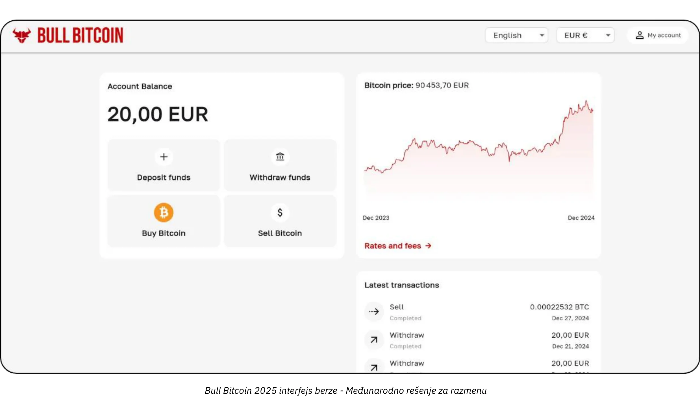

### Po kojoj ceni?

Kao što je ranije pomenuto, ne samo da je nemoguće predvideti buduću cenu bitkoina, već je cena takođe veoma volatilna na kratak rok. Istorijski gledano, pouzdana strategija je bila postepeno akumuliranje u redovnim intervalima i održavanje vremenskog horizonta od četiri godine ili više.

### Koliko Treba da Kupite?

Paradoksalno, verovatno je najbolje početi sa veoma malom kupovinom bez preteranog razmišljanja. Mala suma (kao što je sto evra ili dolara) neće vam ozbiljno naškoditi, a praktično iskustvo će vas naučiti mnogo više, mnogo brže, nego bilo koje čitanje.

Kao što je ranije navedeno, pametno je ulagati samo višak likvidnosti koji vam neće biti potreban nekoliko godina. Bilo koja strategija koja nije dobro shvaćena rizikuje da vas dovede u tešku situaciju ako iznenada morate unovčiti u lošem trenutku.

Pored toga što počinju sa malim iznosima, korisno je da korporativna sredstva usvoje strategiju merene alokacije. Na jednom kraju spektra, neke kompanije, poput MicroStrategy, zauzele su ekstreman pristup posvećujući značajan deo svojih viškova sredstava bitkoinu, što odražava snažno institucionalno uverenje. Nasuprot tome, konzervativnija i verovatno racionalnija strategija mogla bi uključivati alokaciju od oko 5% korporativnih sredstava u bitkoin, balansirajući potencijalne dobitke sa upravljanjem rizikom i zahtevima likvidnosti.

Zamislite ovaj spektar kao skalu, od minimalne izloženosti, koja osigurava da kompanija zadrži dovoljnu likvidnost za operativne potrebe, do agresivnog stava usmerenog na iskorišćavanje očekivanog dugoročnog povećanja vrednosti bitkoina. Dok agresivna alokacija može doneti veće prinose, skromna alokacija pomaže u ublažavanju volatilnosti, osiguravajući da finansijska osnova kompanije ostane sigurna dok i dalje koristi inovativni potencijal bitkoina unutar svojih finansijskih operacija.

### Koliko često?

Ne postoji strogo pravilo. Pokušaj tempiranja tržišta traženjem „padova“ može biti manje efikasan i stresniji nego jednostavno kupovanje u redovnim intervalima. Čak i iskusni investitori ponekad pogreše. Ići na „sve ili ništa“ odjednom može biti mač sa dve oštrice.

U stvarnosti, potencijalna aprecijacija bitkoina je takva da čak i ako biste počeli tek za nekoliko godina, verovatno biste i dalje videli dugoročne dobitke. Istina, verovatno je da će se velike oscilacije cena smanjiti po intenzitetu tokom vremena. Međutim, kao deflatorna valuta, bitkoin je dizajniran da efikasno čuva vrednost i odražava produktivne dobitke svojih korisnika. Da napravimo analogiju: trenutno smo u "fazi lansiranja" bitkoina, valute u nastajanju, i niko još ne zna njenu pravu vrednost. Kasnije, možda za 20 ili 40 godina, kada bude u stabilnoj "fazi krstarenja," mogla bi biti izuzetno stabilna i rasti postepeno sa produktivnim dobicima društva.

Industrija nekretnina često ponavlja da je „uvek pravo vreme za kupovinu“, zaboravljajući da, ako bi nekretnine izgubile svoju funkciju kao čuvara vrednosti—prelazeći na imovinu poput bitkoina—cene bi se mogle vratiti bliže njihovoj korisnoj vrednosti (pružanje skloništa). Bitkoin, nasuprot tome, ne služi nijednoj svrsi osim čuvanja vrednosti, što bi moglo značiti da je „uvek pravo vreme za kupovinu“. Budućnost će pokazati.

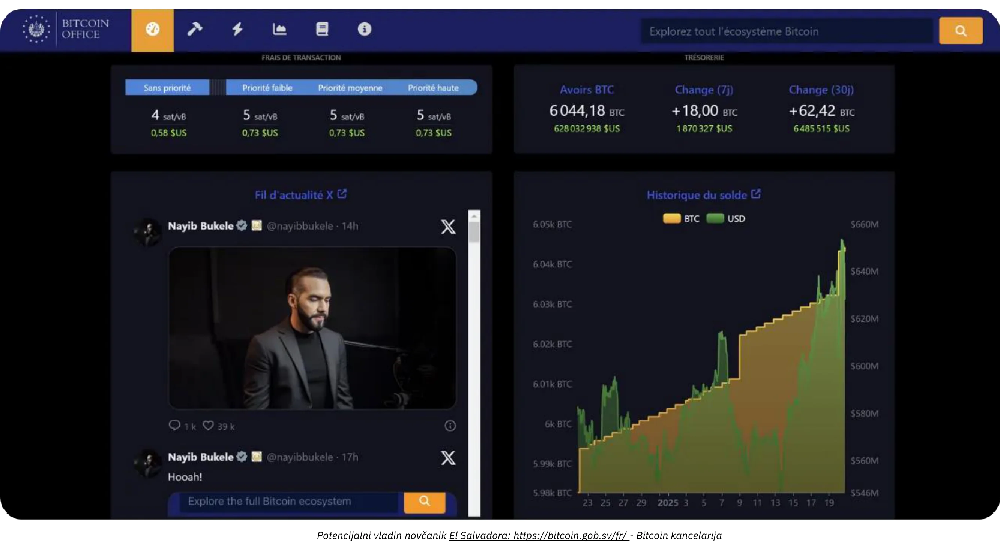

*Kredit: [Bitkoin Kancelarija](https://Bitkoin.gob.sv/)*

### U kom obliku kupiti? (Metode čuvanja)

Ne posedujete fizički bitkoin. Umesto toga, imate kriptografski ključ koji vam omogućava da prenesete vlasništvo nekih ili svih vaših jedinica računa na jedan ili više drugih kriptografskih ključeva. Sve se ovo dešava na Bitkoin Blockchain-u, koji je repliciran na desetinama hiljada čvorova širom sveta.

Ovaj kriptografski ključ je izuzetno veliki nasumični broj. Da bi se pojednostavilo korisničko iskustvo, često se predstavlja kao niz od 12 ili 24 reči. Ove reči mogu biti učitane na fizički uređaj poznat kao "Hardverski novčanik (Hardware Wallet)". Međutim, treba razumeti da bitkoini nisu "unutar" ovog uređaja; on je jednostavno alat za kriptografsko potpisivanje transakcija i njihovo emitovanje na mrežu. Ono što je zaista važno su tih 12 ili 24 reči, koje moraju biti čuvane na sigurnom.

Ovo dovodi do pitanja starateljstva: držanje Bitkoin znači držanje ključa(čeva). Ili ih držite sami, ili zadatak delegirate trećoj strani. Postoje i međurešenja. Hajde da pregledamo najčešće scenarije:

- **Samostalno čuvanje:**

Ovo je opcija koju preporučuju pravi entuzijasti Bitkoina, jer je u skladu sa originalnim dizajnom Bitkoina. Vi delujete kao sopstvena banka: nema rizika da Vas prevari treća strana, ali ste odgovorni za obezbeđivanje ključa(čeva). Imate potpuni pristup svojim sredstvima 24/7. U poslovnom okruženju, ako više ljudi treba da obavlja transakcije, biće vam potrebni odgovarajući alati i procedure za upravljanje pristupom i sigurnošću.

- **Čuvanje kod treće strane:**

Na primer, menjačnica ili neki drugi servis za kupovinu može kreirati nalog za Vas, konvertovati Vašu tradicionalnu valutu u bitkoin i čuvati je u Vaše ime koristeći njihove sigurnosne sisteme. Većina takvih usluga omogućava Vam da povučete svoje bitkoine na novčanik od kog samo Vi imate ključ. Dok to ne uradite, ne posedujete zaista bitkoine; oslanjate se na njihovo obećanje da će vam ih vratiti. Ovo uključuje balansiranje sigurnosnih rizika (njihovih naspram vaših) i rizika druge ugovorne strane (oni bi mogli propasti ili nestati). Neka preduzeća smatraju ovo prihvatljivim, iako se generalno ne preporučuje za dugoročno skladištenje ili za 100% vaše alokacije. Institucije koje čuvaju bitcoin mogu takođe naplaćivati naknade za to.

- **„Papirni bitkoin“ (ETF-ovi ili ETP-ovi):**

Ovo su tradicionalni finansijski instrumenti koji predstavljaju delove bitkoina, replicirajući njegovu cenovnu performansu. Institucija koja stoji iza proizvoda teoretski kupuje i drži osnovni bitkoin. Vaši depoziti i povlačenja se vrše u tradicionalnoj valuti (npr. dolarima ili evrima), a ne u bitkoinu. Osim za određene proizvode koji dozvoljavaju povlačenje u stvarnom bitkoinu (da bi se izbegao oporezivi događaj u nekim jurisdikcijama), ovi instrumenti uključuju godišnje naknade za upravljanje. Ovde se oslanjate na sigurnost institucije i suočavate se sa rizikom druge strane (na primer, ako bi vlada odlučila da zapleni sav institucionalno držani bitkoin, kao što se desilo sa zlatom 1933. pod američkim Izvršnim naređenjem 6102). Njihova primarna prednost je lak pristup, jer se distribuiraju kroz tradicionalne finansijske kanale. Oni zaobilaze potrebu za obezbeđivanjem kriptografskih ključeva, ali ne nude nijedno od inherentnih svojstava bitkoina: ne možete koristiti Bitkoin mrežu 24/7 za slobodno premeštanje vrednosti bez dozvole. Oni samo repliciraju finansijsku performansu, a ne funkcionalnost ili suverenitet samog Bitkoina.

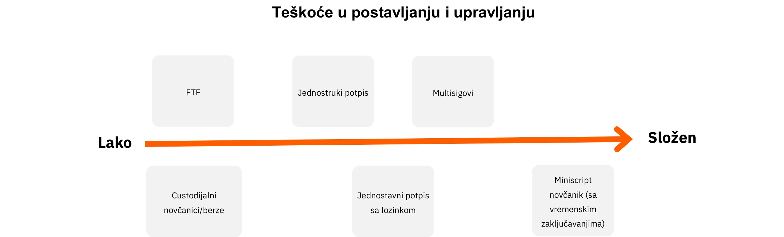

Pored toga, oblik u kojem držite Bitkoin značajno utiče na mere bezbednosti potrebne za zaštitu vašeg korporativnog trezora. Bilo da se odlučite za samostalno čuvanje, koristeći hardverske novčanike sa jednim ili više potpisa, itd. kako biste zadržali direktnu kontrolu nad vašim ključevima, ili delegirate ovaj zadatak uslugama trećih strana ili ETF-ovima, svaka opcija nosi svoj profil rizika. Na primer, samostalno čuvanje nudi pun pristup, ali zahteva rigorozne interne bezbednosne protokole, dok rešenja trećih strana smanjuju teret upravljanja na račun rizika od druge strane. Da bi se dodatno ilustrovale razlike, ovaj grafikon prikazuje model bezbednosti za svaki tip čuvanja, pomažući vam da odaberete pristup koji najbolje odgovara potrebama vaše organizacije :

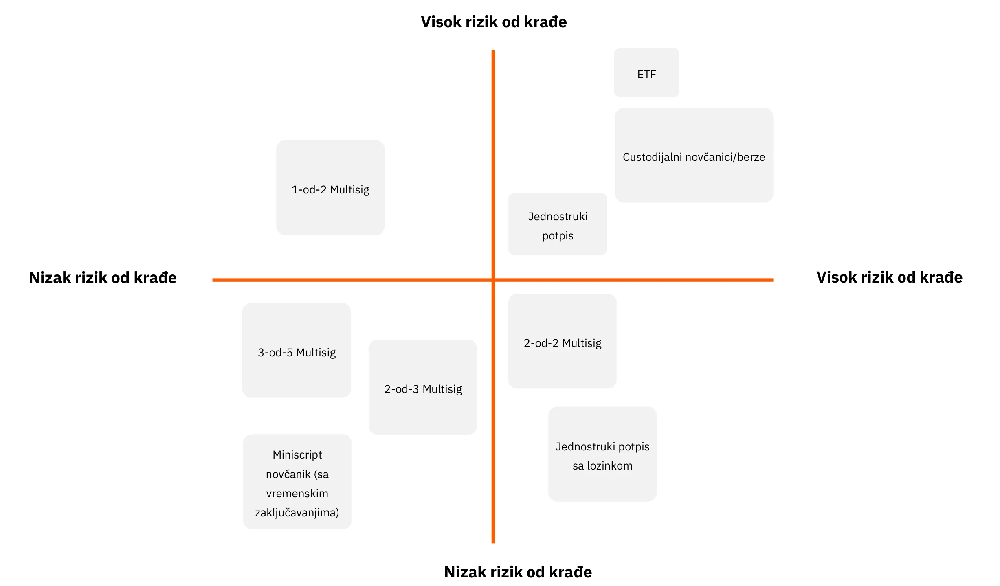

### Od koga kupiti?

Ako se odlučite za „papirni bitkoin“, obratićete se finansijskim institucijama kao što su banke ili onlajn berze.

Ako odlučite da kupite stvarni bitkoin preko menjačnice ili brokera, imate nekoliko glavnih kategorija:

- **Velike međunarodne ili strane platforme:**

Primeri uključuju Kraken, Coinbase, ili Binance, koje su mnogi pojedinci koristili. Neki su naišli na probleme, i teško je dati jasnu preporuku. Savet: ako ih koristite, ne ostavljajte svoje bitkoine tamo duže nego što je potrebno.

- **Regulisani pružaoci usluga (Registrovani pružaoci usluga digitalne imovine):**

Na primer, u Francuskoj platforme kao što su Paymium (menjačnica) ili BullBitkoin (broker) su poznate po tome što imaju prave entuzijaste bitkoina na čelu i izgradile su solidnu reputaciju. U SAD-u imate pružaoce usluga kao što su River ili Swann. Generalno, važno je ispitati pedigre pružaoca usluga: njihovu reputaciju, dosadašnje rezultate, popularnost unutar Bitkoin zajednice i da li je njihovo rukovodstvo usklađeno sa osnovnim vrednostima Bitkoina.

**Menjačnica vs. Broker:**

- **Menjačnica** Vam omogućava da postavite naloge za kupovinu po ceni koju izaberete, ali morate čekati na izvršenje dok se tržišna cena i prodavci ne usklade.
- **Broker** Vam nudi fiksnu cenu i može brže završiti transakciju.

Pored naknada i brzine izvršenja—koji su manje bitni ako razmišljate dugoročno (nekoliko godina)—poslovanje bi takođe trebalo da razmotri:

- **Korisnički izgled (Interface):** Da li je platforma laka za korišćenje?
- **Računovodstvene funkcije:** Minimalno, mogućnost izvoza istorije transakcija u .CSV formatu.
- **Vlasništvo i sigurnost:** Da li platforma drži bitkoine u Vaše ime, ili vam prenosi vlsništvo? Kakva je njihova sigurnosna postavka? Da li imaju „zaključavanje povlačenja“ ili druga ograničenja povlačenja?
- **Korisnička podrška:** Kvalitet, ažurnost i personalizovana pomoć, posebno kada tek počinjete.
- **Reputacija i Etika:** Pouzdanost i vrednosti platforme.
- **Podrška za ponavljajuće kupovine:** Ako planirate da akumulirate bitkoin tokom vremena sa zakazanim kupovinama.

# Prilagođena Bitkoin rešenja plaćanja za svaki posao

<partId>b2c8af88-6bfc-49b1-ad84-4c292c713b55</partId>

## Prihvatanje bitkoina kao sredstva plaćanja

<chapterId>99af1203-bc84-4acc-9780-f733e7998335</chapterId>

Prvo, važno je razumeti da je Bitkoin poremećaj na istoj skali kao internet.

U ranim danima, internet mreža je omogućila uklanjanje posrednika iz komunikacionih kanala, a zatim je ova infrastruktura dovela do bezbroj prethodno nezamislivih aplikacija. Danas, koji biznis nema online prisustvo?

Bitkoin je infrastruktura poverenja, čija je prva primena uklanjanje posrednika iz čuvanja i razmene vrednosti—novca. Druge trenutno nezamislive primene će se pojaviti na ovoj infrastrukturi. Vaše početno prisustvo ovde je ekvivalentno posedovanju veb sajta: prolaz ka peer-to-peer plaćanjima i razmenama vrednosti.

Sada, razmotrite perspektivu praktičnog poslovanja čija osnovna delatnost nema nikakve veze sa Bitkoinom. Zašto bi odlučio da prihvati bitkoin plaćanja?

- **Izgradnja Bitkoin rezervi:**

Pogledajte naš prethodni članak o kupovini bitkoina. Bilo zbog uverenja ili kao strategija diverzifikacije, neki profesionalci odlučuju da prihvate bitkoin plaćanja. Neki Bitkoin entuzijasti tvrde da što je kompanija manje finansijski sklona—što znači da nema ni vremena ni alata za angažovanje u složenim finansijskim manevrima—**to postaje kritičnije da ta firma bude plaćena u najtvrđem dostupnom obliku novca**. Na taj način, izjednačava se teren, omogućavajući čak i malim, vremenski ograničenim preduzećima da očuvaju vrednost bez upuštanja u finansijske igre.

- **Dostizanje nove demografske grupe:**

Broj korisnika bitkoina raste, i oni imaju značajnu kupovnu moć. Prirodno će se okrenuti ka poslovanjima koja prihvataju njihovu valutu. Štaviše, pošto je ovo prva univerzalna, internet-nativna valuta, možete privući i međunarodne kupce koji prolaze kroz Vašu oblast.

- **Povećanje Vidljivosti:**

Navođenjem Vašeg poslovanja na platformama kao što je BTCmap.org, na primer. Samo nekoliko preduzeća trenutno prihvata bitkoin, tako da usmena preporuka radi u vašu korist. Takođe vas izdvaja od konkurencije.

- **Niže Naknade:**

Instant Bitkoin plaćanja se obavljaju preko Lightning mreže. **Naknade su minimalne i plaća ih kupac**. Nema naknada za platne terminale, nema neuspeha u autorizaciji plaćanja i nema prevara. U poređenju, industrija plaćanja (kartice, terminali, transferi, PSP-ovi, itd.) košta oko 2,2 triliona dolara godišnje globalno. Dodajte tome povraćaje sredstava i prevare, i ukupno, skoro jedna desetina ekvivalenta BDP-a SAD-a se "skida" sa produktivnih preduzeća širom sveta samo da bi se prenela vrednost. Bez obzira na vaše poslovanje, finansijske naknade su teret koji treba optimizovati, a u nekim slučajevima, visoke naknade mogu ugušiti određene poslovne modele.

- **Sloboda i bez dozvole, 24/7:**

Nema potrebe da tražite dozvolu za korišćenje bitkoina. Svako može učestvovati u ekonomiji u roku od nekoliko minuta koristeći aplikaciju na pametnom telefonu. Možete poslati ili primiti uplatu od bilo koga—pojedinca ili preduzeća—u bilo koje vreme, bez vremenskih ograničenja ili kašnjenja.

- **Iskoristite prednosti Bitkoin mreže:**

Niste obavezni da zadržavate svoje uplate u bitkoin formi—posebno ako treba da platite dobavljače ili uplatite PDV. Određeni servisi mogu konvertovati sve ili deo vaših bitkoin uplata u valutu po vašem izboru (npr. evre na vaš IBAN) uz naknadu. U ovom scenariju, prednost prihvatanja bitkoina može ležati u privlačenju novih korisnika ili u intrinzičnim prednostima bitkoina (kao što su niže naknade, rad bez prekida i bez rizika od prevare ili povrata sredstava).

### Koje rešenje za plaćanje treba da izaberete?

Relativno je lako početi prihvatati bitkoin uplate. Da biste izabrali pravo rešenje, razmotrite karakteristike transakcija koje obrađujete: prosečan iznos uplate, učestalost transakcija i da li ćete prihvatati uplate u fizičkom okruženju, online ili oba.

Vaš način razmišljanja kao trgovca je takođe važan. Da li sprovodite jednostavan test, ili očekujete da bitkoin postane značajan i stalan izvor prihoda? Ako je ovo drugo, biće vam potreban robustan, sveobuhvatan i prilagodljiv sistem.

Ne zaboravite da uzmete u obzir različite uloge vaših zaposlenih i njihove lokacije. U bilo kom scenariju, zapamtite da morate biti u mogućnosti da obezbedite sve potrebne informacije svom računovođi i pojednostavite računovodstveni proces.

Da bismo pojednostavili proces donošenja odluka, definisali smo četiri različita poslovna profila. Sledeće tabele razlažu ključne karakteristike i preporučena rešenja za plaćanje za svaki profil.

### Poslovni profili

#### Profil 1 – Početnik

| Atribut                          | Početnik                                                                                                                                       |
| -------------------------------- | ---------------------------------------------------------------------------------------------------------------------------------------------- |
| **Stanje uma**                   | "pokušavam svoje prvo fizičko plaćanje", "primam napojnicu za moj online sadržaj", "ciljam vrlo mali prihod"                                  |
| **Učestalost transakcija**       | "prva transakcija da bih naučio", "primam plaćanje s vremena na vreme"                                                                         |
| **Primeri vrste poslovanja**     | Kreativna ekonomija (kreatori sadržaja, blogovi, članci, itd.), povremene napojnice, jednokratna lična prodaja proizvoda, udruženja, jednokratni događaji |
| **Vrsta plaćanja**               | Generalno od nekoliko centi do nekoliko evra/dolara; ispod ~300 evra/dolara po artiklu                                                         |
| **Složenost podešavanja**        | Nema                                                                                                                                           |
| **Primer preporučenog rešenja**  | Custodial Lightning novčanik poput Wallet of Satoshi ili non-custodial novčanik poput Phoenix                                                  |
| **Interfejs za trgovca**         | Jednostavni Bitcoin Lightning novčanik: aplikacija na mobilnom telefonu                                                                        |
| **Interfejs za kupca**           | Bitcoin QR kod za plaćanje, skeniran putem ličnog novčanika kupca                                                                              |
| **Naknade**                      | Kupac plaća Bitcoin Lightning naknade plus sve primenjive naknade aplikacije                                                                    |
| **Uređaj za prodajno mesto**     | Besplatna aplikacija za pametni telefon ili opcija za fizički terminal (npr. Bitcoinize)                                                       |
| **Upravljanje i uloge**          | Upravljanje jednom aplikacijom; minimalna diferencijacija uloga                                                                                |
| **Izvozi za računovodstvo**      | Osnovne liste istorije transakcija                                                                                                             |
| **API**                          | Ne                                                                                                                                             |

#### Profil 2 – Osnovni

| Atribut                          | Osnovni                                                                                                                                       |
| -------------------------------- | --------------------------------------------------------------------------------------------------------------------------------------------- |
| **Stanje uma**                   | "Prihvatam Bitcoin u svom poslovanju, ali ne očekujem značajan obim"                                                                          |
| **Učestalost transakcija**       | Nekoliko transakcija mesečno                                                                                                                  |
| **Primeri vrste poslovanja**     | Barovi, restorani, poluregularna prodaja svežih ili direktno nabavljenih proizvoda, više prodavnica pod jednim vlasnikom, kreativna ekonomija za umetnike |
| **Vrsta plaćanja**               | Generalno u rasponu od nekoliko evra/dolara do nekoliko stotina po artiklu; ispod ~300 po artiklu i ispod ~3,000 mesečno                      |
| **Složenost podešavanja**        | Minimalna (mobilna aplikacija)                                                                                                                |
| **Primer preporučenog rešenja**  | Swiss Bitcoin Pay                                                                                                                             |
| **Interfejs za trgovca**         | Jednostavni Bitcoin Lightning novčanik: aplikacija na mobilnom telefonu; jednostavno fakturisanje sa minimalnim detaljima                     |
| **Interfejs za kupca**           | Bitcoin QR kod za plaćanje, skeniran putem ličnog novčanika kupca                                                                             |
| **Naknade**                      | Tipično <1% za slanje na Bitcoin adresu, i <1.5% za konverziju u fiat                                                                         |
| **Uređaj za prodajno mesto**     | Besplatna aplikacija za pametni telefon ili opcija za fizički terminal (npr. Bitcoinize)                                                      |
| **Upravljanje i uloge**          | Opcija za ulogu samo-prodaje za zaposlene; online kontrolna tabla za administraciju                                                           |
| **Izvozi za računovodstvo**      | CSV izvoz sa kompletnim detaljima transakcija                                                                                                 |
| **API**                          | Da                                                                                                                                            |

#### Profil 3 – Profesionalac

| Atribut                          | Profesionalac                                                                                                                                          |
| -------------------------------- | ------------------------------------------------------------------------------------------------------------------------------------------------------ |
| **Stanje uma**                   | - Način plaćanja kao i svaki drugi za moju e-trgovinu - Ili zajedničko upravljanje za grupu preduzeća spremnih za veće obime                          |
| **Učestalost transakcija**       | Više transakcija dnevno                                                                                                                               |
| **Primeri vrste poslovanja**     | E-commerce sajtovi sa umerenim obimom, mala tržišta, grupe fizičkih prodavnica (npr. Click & Collect), poslovanje MSP                                 |
| **Vrsta plaćanja**               | Generalno u rasponu od nekoliko evra/dolara do nekoliko stotina; bez postavljenog ograničenja veličine plaćanja; manje od 250.000 godišnje            |
| **Složenost podešavanja**        | Laka do potpuno opremljena (lokalno ili cloud hosting), često zahteva e-commerce izlog                                                                |
| **Primer preporučenog rešenja**  | BTC Pay Server za e-trgovinu i/ili fizička okruženja; ZapRite, Musqet ili PayWithFlash za naplatu, Be-BOP za integrisanu e-prodavnicu                |
| **Interfejs za trgovca**         | Web sajt (mobilni i desktop) sa uređivanjem faktura, opcijama korpe za kupovinu i kreiranjem dugmeta za plaćanje; automatizovano fakturisanje sa e-commerce integracijom |
| **Interfejs za kupca**           | Bitcoin QR kod za plaćanje, skeniran putem ličnog novčanika kupca                                                                                     |
| **Naknade**                      | Kombinacija besplatnog backend-a otvorenog koda i plaćenih Lightning hosting/uslužnih naknada; naknade za frontend uključuju Bitcoin Lightning naknade i <1.5% naknade za konverziju |
| **Uređaj za prodajno mesto**     | Web sajt prodavnice, opcioni fizički displej (npr. iPad koji prikazuje sajt ili Bitcoin terminal)                                                     |
| **Upravljanje i uloge**          | Potpuno opremljena prodavnica sa više administratorskih uloga; zaposleni i kupci interaguju sa sistemom                                               |
| **Izvozi za računovodstvo**      | CSV izvoz sa kompletnim detaljima transakcija                                                                                                         |
| **API**                          | Da                                                                                                                                                    |

#### Profil 4 – Preduzeće

| Atribut                          | Preduzeće                                                                                                                                          |
| -------------------------------- | -------------------------------------------------------------------------------------------------------------------------------------------------- |
| **Stanje uma**                   | - Strateški način plaćanja za poslovanje - Sa određenim razvojem za integraciju u uslužnu platformu prema specifičnim specifikacijama             |
| **Učestalost transakcija**       | Neograničene, transakcije visoke frekvencije                                                                                                       |
| **Primeri vrste poslovanja**     | Srednja preduzeća, IT uslužne kompanije, velike korporacije, velika tržišta                                                                        |
| **Vrsta plaćanja**               | Bilo koja veličina ili obim                                                                                                                        |
| **Složenost podešavanja**        | Srednja do visoka, u zavisnosti od izbora arhitekture                                                                                              |
| **Primer preporučenog rešenja**  | Prilagođena arhitektura ili orkestracija SaaS hosting rešenja, potencijalno koristeći usluge trećih strana LSP (*Lightning Service Provider*)     |
| **Interfejs za trgovca**         | Potpuno prilagođeni frontend i backend interfejsi u potpunosti integrisani u radne tokove i procese poslovanja                                     |
| **Interfejs za kupca**           | U rasponu od Bitcoin QR koda za plaćanje do potpuno prilagođenog korisničkog interfejsa i/ili API integracije                                      |
| **Naknade**                      | Kombinacija internog razvoja i naknada trećih strana; kupac plaća Bitcoin Lightning naknade plus sve transakcione naknade od pružalaca usluga      |
| **Uređaj za prodajno mesto**     | Prilagođena rešenja dizajnirana za okruženje preduzeća                                                                                             |
| **Upravljanje i uloge**          | Potpuno prilagođene uloge u prodaji, administraciji, devops-u, računovodstvu i finansijama                                                         |
| **Izvozi za računovodstvo**      | Potpuno prilagođeni izvozi za računovodstvo                                                                                                        |
| **API**                          | Da                                                                                                                                                 |

U narednim poglavljima, detaljno ćemo opisati svaki poslovni profil i rešenja prilagođena svakom od njih.

## Početnik

<chapterId>7edda53d-5b9f-432a-8493-115de8c94a67</chapterId>

Profil Početnik je dizajniran za preduzeća, kreatore i pojedince koji žele da istraže Bitkoin plaćanja bez ulaganja značajnih resursa ili stručnosti. To su obično oni koji obrađuju vrlo mali obim transakcija (možda nekoliko napojnica, donacija ili povremenih prodaja) i traže jednostavan, lagan uvod u Bitkoin i ekosistem Lightning mreže. Ključna vrednost pristupa Početnika leži u minimalnom podešavanju: u većini slučajeva, sve što je potrebno je pametni telefon ili tablet opremljen osnovnim Lightning-kompatibilnim novčanikom.

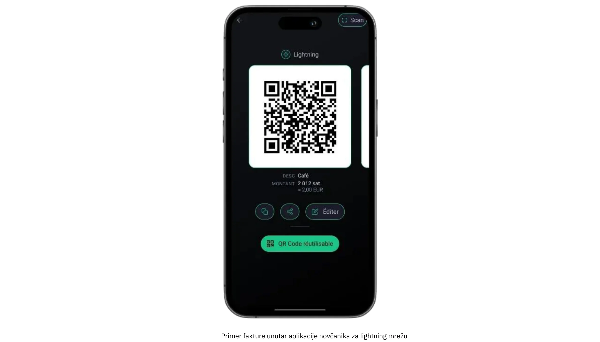

Jedna od ključnih karakteristika ovog profila je fokus na plaćanja malog obima koja retko prelaze nekoliko stotina evra ili dolara mesečno. Ova skromna skala čini ga odličnim izborom za svakoga ko želi da testira tržište sa Bitkoinom, bez složenosti koje su svojstvene implementacijama većeg obima. Pored toga, omogućava neposredno praktično učenje; pošto su operativni pritisci manji i ulozi u novcu manji, greške se mogu kontrolisati, a lekcije se brzo uče. Od umetnika koji prodaju ručno rađene zanate na vikend sajmovima do neprofitnih grupa koje prihvataju jednokratne donacije, korisnici u ovoj kategoriji često naglašavaju pristupačnost i jednostavnost korišćenja u odnosu na napredne funkcionalnosti.

Dve najčešće postavke novčanika za profil Početnika uključuju odlučivanje između poveravanja ključeva za čuvanje sredstava i ličnog čuvanja. Vlasnički novčanik (kao što su Wallet od Satoshi ili Blink) omogućava trećoj strani da upravlja privatnim ključevima i pozadinskim operacijama, čime se smanjuje tehnička odgovornost korisnika. Ova postavka je posebno privlačna za one koji cene praktičnost iznad svega i žele najjednostavniji mogući početak. S druge strane, Lightning novčanici čiji korisnici sami čuvaju ključeve (poput Phoenix ili Breez) stavljaju privatne ključeve i potpunu kontrolu u ruke vlasnika biznisa, nudeći veću autonomiju i privatnost u zamenu uz nešto više početnog truda. U oba slučaja, moderni interfejsi su obično toliko korisnički prijateljski da svako može obaviti osnovne zadatke (generisanje QR koda, unos iznosa za plaćanje i potvrđivanje transakcija) u roku od nekoliko minuta.

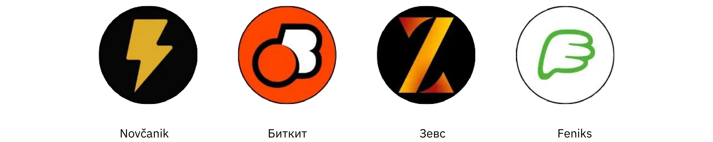

Iako se bezbednosni problemi mogu činiti manje hitnim kada su transakcije male, ipak je ključno uspostaviti osnovne zaštitne mere. Čak i jedan pametni telefon ili tablet koji se koristi za primanje Bitkoin uplata treba da bude zaključan lozinkom ili biometrijskom sigurnošću, a procedure za pravljenje rezervnih kopija (od praćenja podataka za prijavljivanje za novčanik čije ključeve čuva treća strana do zaštite seed fraze za novčanike koje čuvate sami) moraju se shvatiti ozbiljno. Članovi osoblja koji rukuju transakcijama u fizičkom okruženju imali bi koristi od poznavanja osnova: kako otvoriti aplikaciju, kako predstaviti QR kod kupcu i kako proveriti da li je uplata zaista stigla.

Računovodstvo i izveštavanje, iako relativno jednostavni pod Početničkim profilom, ipak zahtevaju pažljivo razmatranje. Iako obim transakcija može biti minimalan, zadržavanje tačnih zapisa sprečava zabunu kasnije i pomaže u održavanju transparentnosti u slučaju finansijskih revizija ili poreskih prijava. Mnoge aplikacije za novčanike omogućavaju korisnicima da izvoze osnovnu istoriju transakcija kao CSV fajl; za malo preduzeće ili pojedinačnog preduzetnika, redovno čuvanje ovih fajlova može znatno olakšati usklađivanje računa. Takođe je mudro pratiti približnu fiat vrednost (na primer, u evrima ili dolarima) u trenutku kada je svaka transakcija primljena. Pošto cena bitkoina može varirati, posedovanje zapisa o kursnim razlikama je neprocenjivo za knjigovodstvo i poresku usklađenost.

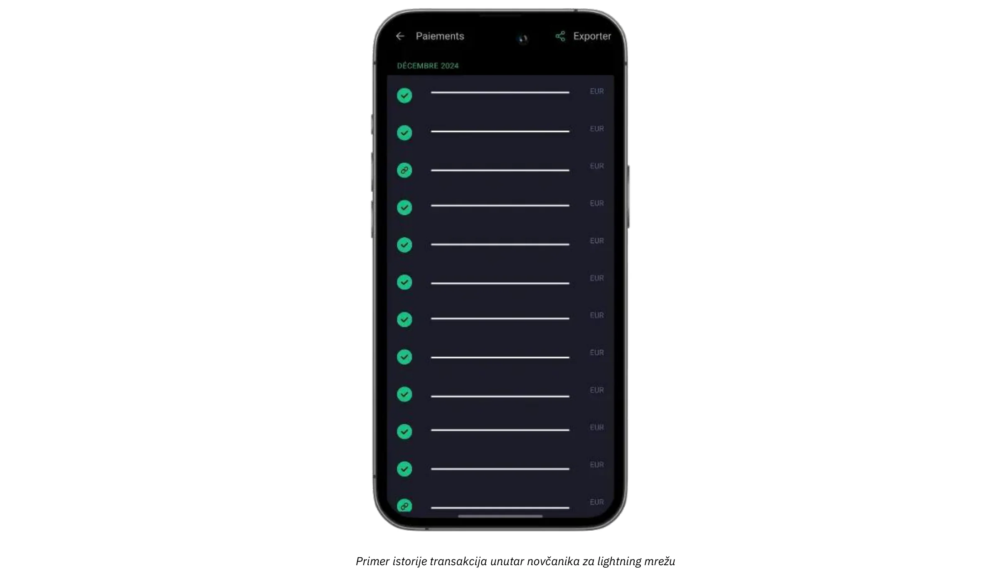

Za preduzeća koja žele da dopune svoje fizičke ili lične uplate sa online donacijama ili napojnicama, sada je jednostavno integrisati Lightning dugme za napojnice ili donacijski vidžet na vebsajt ili blog. Platforme kao što je BTCPay Server nude lako konfigurisane dugmiće za plaćanje, dok neke društvene mreže i usluge za prenos uživo već podržavaju Lightning napojnice sa adresama. Kao rezultat toga, čak i početničko preduzeće može izgraditi skromnu, ali globalnu mrežu pokrovitelja. U međuvremenu, oni koji ne žele da drže bitkoin dugoročno mogu istražiti delimičnu ili automatsku konverziju u fiat valutu koristeći određene novčanike čije ključeve čuva treća strana ili usluge trećih strana. Iako ova opcija uključuje dodatne naknade i moguće KYC obaveze, pomaže preduzećima da izbegnu volatilnost kursa razmene i održe svoje postojeće finansijske tokove uz minimalne poremećaje.

Jednostavan slučaj upotrebe ilustruje kako se svi ovi elementi spajaju. Zamislite lokalnog zanatliju koji prodaje domaće džemove na subotnjoj pijaci. Naoružan telefonom sa Lightning novčanikom čije ključeve čuva treća strana, postavlja cenu za svaku teglu u evrima; kada kupac zatraži da plati u bitkoinu, trgovac brzo unosi odgovarajući iznos u fiat valuti, a aplikacija automatski izračunava iznos satošija. Rezultujući QR kod skenira novčanik kupca, uplata se rešava za nekoliko sekundi, a zanatlija odmah zna da je transakcija uspela. Na kraju dana, svi detalji transakcije mogu se izvesti za vođenje evidencije, a saldo dana može se u potpunosti ili delimično poslati na menjačnicu kako bi se konvertovao u fiat valutu.

Balansiranjem korisnički prijateljskih alata, minimalnih hardverskih zahteva i jednostavnog vođenja evidencije, Početnička rešenja pružaju osnovne elemente bez preopterećenja novih preduzeća. Ako se obim transakcija poveća i operativni zahtevi poslovanja evoluiraju, nadogradnja na naprednije kategorije detaljno opisane u narednom poglavlju postaje prirodan napredak.

Za detaljne tutorijale o preporučenim novčanicima i osnovnom podešavanju, molimo Vas da pogledate sledeće vodiče:

**Samostalni LN novčanici/čvorovi:**

https://planb.network/tutorials/wallet/mobile/phoenix-0f681345-abff-4bdc-819c-4ae800129cdf
https://planb.network/tutorials/wallet/mobile/bitkit-a7224674-85c4-4045-9baf-37018d89550c
https://planb.network/tutorials/wallet/mobile/breez-46a6867b-c74b-45e7-869c-10a4e0263c06
https://planb.network/tutorials/wallet/mobile/blixt-04b319cf-8cbe-4027-b26f-840571f2244f
https://planb.network/tutorials/wallet/mobile/zeus-embedded-advanced-3e89603c-501d-439c-8691-d4a0d0de459b
**Non-custodial LN novčanici:**

https://planb.network/tutorials/wallet/mobile/wallet-of-satoshi-39149d86-e42b-4e8f-ae9f-7e061e7784f7
https://planb.network/tutorials/wallet/mobile/blink-7ea5f5a4-e728-4ff9-b3f9-cf20aa6fc2bd
## Osnovni profil

<chapterId>89be421f-f7df-4bcc-a9e4-df96e39ef249</chapterId>

Osnovni profil je pogodan za mala i srednja preduzeća, potencijalno sa zaposlenima, koja žele da prihvate bitkoin lako i brzo bez potrebe za naprednim tehničkim znanjem, a da pritom imaju kompletniji i profesionalniji sistem od jednostavnog novčanika. Ova kategorija se najčešće odnosi na restorane, kafiće, barove ili male maloprodajne radnje koje primaju samo nekoliko bitkoin uplata mesečno, ali žele interface koji je i jednostavan i dovoljno robustan da obavlja svakodnevne operacije bez prekida.

Za razliku od Početničkog profila, preduzeća sa Osnovnim profilom obično smatraju bitkoin uplate stalnim delom svog prihoda, a ne samo eksperimentom. I dalje posluju sa relativno niskim obimom transakcija, ali učestalost je dovoljna da vlasnici i zaposleni imaju koristi od strukturiranijeg i pouzdanijeg sistema. Istovremeno, Osnovni profil ostaje fokusiran na jednostavnost; iako omogućava korisne kontrolne table i ograničeno upravljanje ulogama, ne zahteva specijalizovane IT resurse ili složene integracije.

Tehnološke preporuke u ovom segmentu često se fokusiraju na **Swiss Bitkoin Pay**, pojednostavljeno rešenje za trgovce da lako prihvate bitkoin uplate. Odlikuje ga aplikacija za PoS koja je jednostavna za korišćenje, ne zahteva tehničku stručnost zaposlenih. Za razliku od standardnih bitkoin novčanika, fokusira se isključivo na primanje uplata, omogućavajući zaposlenima korišćenje uređaja bez bezbednosnih rizika. Više PoS aplikacija može se povezati na isti nalog, a mogu se koristiti na tabletima, kasama, pametnim telefonima ili putem veb verzije za računare, podržavajući Android i iOS. Takođe možete kreirati meni sa artiklima koje prodajete i njihovim cenama, omogućavajući zaposlenom da jednostavno izabere korpu artikala za kupca na PoS-u i zatim naplati ukupnu sumu.

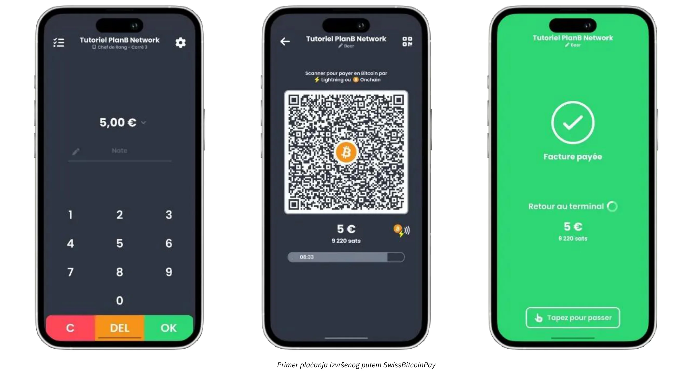

Uplate se mogu ili povući u bitkoin na određenu adresu ili konvertovati u fiat valutu i svakodnevno deponovati na bankovni račun. Swiss Bitkoin Pay automatizuje proces, upravljajući Bitkoin i Lightning mrežnim plaćanjima bez manuelne intervencije. Sredstva se drže maksimalno 24 sata pre transfera. Iako nije potpuno ne-kustodijalan kao BTCPay Server, balansira pogodnost i sigurnost, i ne zahteva KYC.

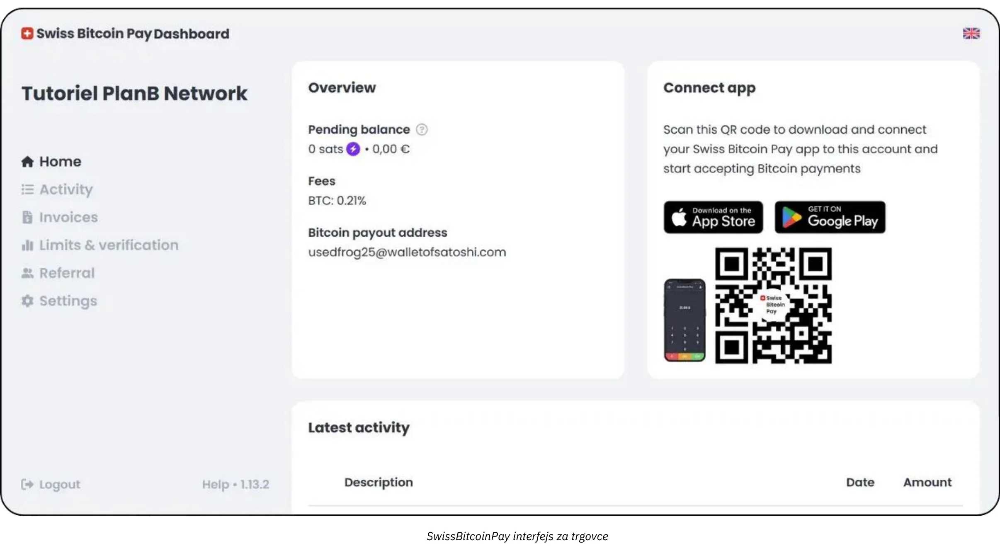

Naknade su konkurentne: 0,21% za prvu godinu, zatim 1% za bitkoin uplate i 1,5% za konverzije u fiat valutu, uključujući troškove bitkoin transakcija. Swiss Bitkoin Pay nudi praktično srednje rešenje između kustodijalnih rešenja kao što je Open Node i složenih samostalno hostovanih sistema kao što je BTCPay Server, dajući prioritet jednostavnosti, sigurnosti i finansijskoj autonomiji.

Ova vrsta postavke omogućava preduzećima koja posluju sa klijentima lično da brzo generišu fakture za plaćanje, prikažu QR kodove svojim klijentima i prihvate Lightning ili On-Chain transakcije sa minimalnim naporom. Osoblju je potrebna samo kratka obuka za rukovanje ovim plaćanjima, dok menadžeri mogu da se prijave na online kontrolnu tablu kako bi uskladili dnevnu prodaju i pristupili osnovnim izveštajima. Dostupnost pojednostavljene administrativne konzole takođe pomaže manjim ustanovama da prate i fiat i kripto prihode sa jednog Interface, čime se smanjuje konfuzija i vreme provedeno na ručnom knjigovodstvu.

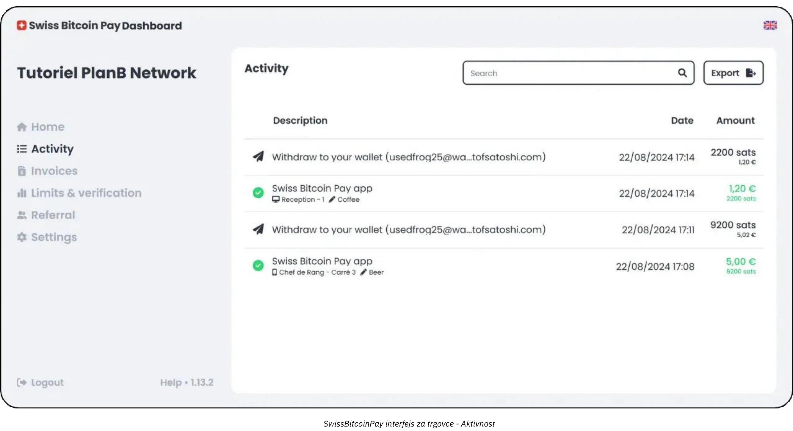

Još jedna ključna prednost Osnovnog pristupa je naglasak na brzoj implementaciji i minimalnim prekidima. Rešenja poput Swiss Bitkoin Pay mogu se postaviti za nekoliko sati umesto dana ili nedelja. Za vlasnika ili menadžera umereno prometnog restorana, na primer, krajnji cilj je integrisati prihvatanje bitkoina bez izazivanja kašnjenja na kasi ili konfuzije među osobljem. Kada je POS konfigurisan, menadžer može jednostavno pružiti zaposlenima brza uputstva o prikazivanju fakture i proveriti da li je uplata prošla. U najboljem slučaju, transakcija kupca se potvrđuje gotovo trenutno putem Lightning mreže, a administrativni panel preduzeća istovremeno registruje novu uplatu u realnom vremenu.

Iako Osnovni profil ne zahteva visoko sofisticirane računovodstvene sisteme, ipak je pametno održavati ispravne evidencije transakcija. Alati poput Swiss Bitkoin Pay nude funkcije izvoza u CSV formatu, omogućavajući menadžerima da zabeleže fiat-ekvivalentnu vrednost svake bitkoin prodaje i prate je zajedno sa drugim izvorima prihoda. Ovaj nivo dokumentacije je dovoljan za većinu malih preduzeća, a osnovno razumevanje kursnih razlika će pomoći pri podnošenju poreskih prijava i opštem finansijskom nadzoru.

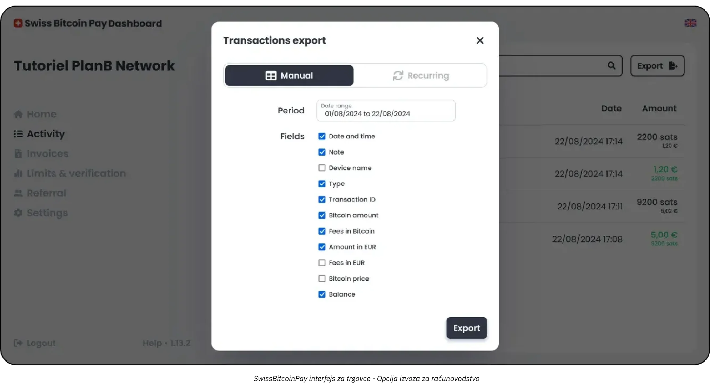

Najprikladnije hibridno rešenje za vaš profil je verovatno Swiss Bitkoin Pay:

https://planb.network/tutorials/business/point-of-sale/swiss-bitcoin-pay-2-a78b057e-ed11-47ac-860c-71019fcb451a
Još jedno lako rešenje za implementaciju, ali sa nedostatkom da je 100% kustodijalno, je Open Node:

https://planb.network/tutorials/business/point-of-sale/open-node-e69a0c1c-47f7-4932-8494-e6f26c3c9784
Ako ste spremni da se upustite u posao i želite potpunu kontrolu nad procesom, BTCPay softver je odlična opcija. Međutim, glavni nedostatak BTCPay Server-a je što njegovo postavljanje i upravljanje oduzimaju mnogo vremena i zahtevaju određeni nivo tehničke stručnosti, ali možete pratiti naše vodiče:

https://planb.network/tutorials/business/point-of-sale/btcpay-server-928eb01e-824b-4b57-a3e8-8727633beddc
Konačno, kao dopunu za fizičke prodajne tačke, možete razmotriti postavljanje [Bitkoinize PoS](https://Bitkoinize.com/).

## Profesionalac

<chapterId>4d5dfa50-c4d0-481c-ab95-1863a898750e</chapterId>

Profesionalni profil je namenjen preduzećima koja su prevazišla povremena ili niskovolumenska bitkoin plaćanja i sada traže robusnu infrastrukturu za upravljanje višestrukim dnevnim transakcijama. Ove kompanije često posluju preko nekoliko kanala (možda maloprodajno mesto, posvećena e-commerce veb stranica, pa čak i mobilna prodaja) i stoga zahtevaju rešenja za plaćanje koja se mogu besprekorno integrisati u njihove postojeće tokove rada. U mnogim slučajevima, preduzeća na ovom nivou već upravljaju sistemima prodajnih mesta, platformama za upravljanje online porudžbinama i operacijama u pozadini koje zahtevaju pouzdan, skalabilan pristup.

Jedna od definisajućih karakteristika Profesionalnog trgovca je potreba za **naprednim funkcijama** i **prilagodljivim rešenjima** koja održavaju efikasnost čak i kada obim transakcija raste. Za razliku od Osnovnih korisnika, koji mogu biti zadovoljni pojednostavljenim alatom koji se lepo uklapa u aplikaciju za pametne telefone, Profesionalni biznisi obično zahtevaju funkcije kao što su detaljna prilagođavanja faktura, sofisticirane kontrolne table za izveštavanje i mogućnost dodeljivanja više administrativnih uloga.

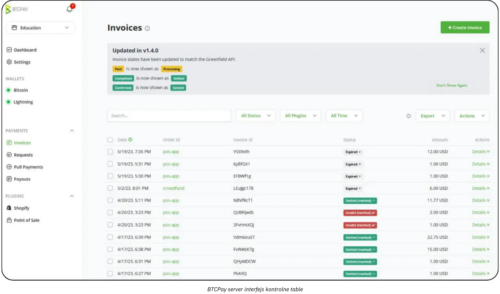

Grupa restorana, na primer, može imati članove osoblja posvećene fakturisanju i upravljanju zalihama, dok poseban tim nadgleda liste proizvoda i marketinške kampanje. U ovom okruženju, Bitkoin rešenje za plaćanje mora se savršeno uklopiti u ove već postojeće organizacione strukture.

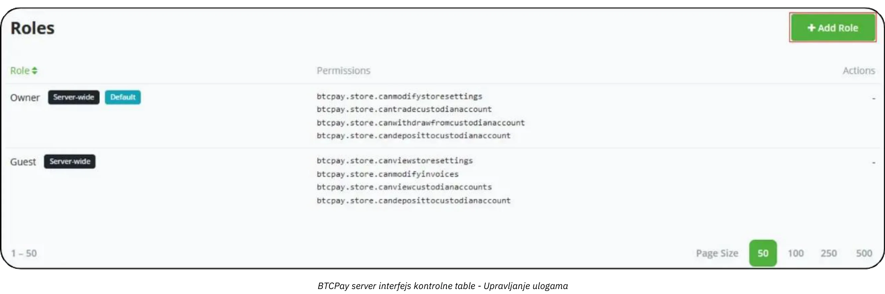

Što se tiče tehnologije i alata, rešenja kao što je **BTC Pay Server** često čine srž profesionalnog postavljanja. BTC Pay Server je platforma otvorenog koda koja se može implementirati ili na lokaciji ili putem cloud hostinga i koja nudi opsežne opcije integracije za veb-sajtove i e-commerce platforme. Pokretanjem sopstvene instance, preduzeća zadržavaju visok stepen kontrole nad svakim aspektom toka plaćanja, od automatski generisanih stranica za naplatu do obaveštenja koja pokreću interne procese nakon što je plaćanje potvrđeno.

Pored toga, alati kao što su [Zaprite](https://zaprite.com/) ili [Musqet](https://musqet.tech/) mogu dodatno poboljšati iskustvo naplate, omogućavajući detaljniju prilagodbu (od izbora brenda do sofisticiranih mogućnosti izveštavanja). Oni koji preferiraju sve-u-jednom online maloprodajno okruženje mogu se opredeliti za [Be-BOP](https://be-bop.io/), rešenje za e-prodavnice napravljeno da olakša Bitkoin plaćanja bez žrtvovanja jednostavnosti korišćenja.

Implementacija ovih tehnologija u profesionalnom okruženju znači posvećivanje posebne pažnje **operativnoj složenosti**. Automatizovani tokovi fakturisanja, prikazi u više valuta i sinhronizacija sa postojećim sistemima inventara su sve odlike dobro integrisane platforme. Sposobnost preciznog izvoza podataka o transakcijama (bilo kao CSV datoteke, direktni API pozivi ili prilagođeni formati) pomaže preduzećima da efikasno usklade Bitkoin prodaje sa drugim prihodnim tokovima.

Bezbednost i upravljanje ulogama predstavljaju još jedan ključni aspekt za profesionalne korisnike. Kako se svakodnevne Bitkoin transakcije gomilaju, kontrolisanje pristupa administrativnim funkcijama postaje suštinska mera za smanjenje rizika. U mnogim rešenjima, administratori mogu dodeliti različite nivoe dozvola (možda ograničavajući neke zaposlene na pregled istorije transakcija i generisanje faktura, dok drugima daju ovlašćenje za upravljanje inventarom ili konfigurisanje sistemskih postavki...). Ova hijerarhijska struktura ne samo da štiti osetljive podatke već i pojednostavljuje operacije razjašnjavanjem koji članovi osoblja su odgovorni za svaki segment platne infrastrukture.

Kada je reč o primerima iz stvarnog sveta, razmislite o srednje velikoj e-commerce prodavnici specijalizovanoj za tehnološke dodatke. Kompanija bi mogla integrisati BTC Pay Server u svoju postojeću online prodavnicu, automatski generišući Bitkoin adrese za plaćanje tokom naplate. Kupci završavaju svoje kupovine skeniranjem Lightning ili On-Chain Address, a platforma prodavnice odmah potvrđuje uplatu. Istovremeno, interni sistem ažurira status narudžbine i pokreće obaveštenja o isporuci. Zahvaljujući naprednim funkcijama izveštavanja, finansijski tim može lako pregledati dnevne Bitkoin prodaje, izvesti konsolidovani Ledger za reviziju i pratiti vrednost bilo kojih BTC sredstava koje kompanija odluči da zadrži.

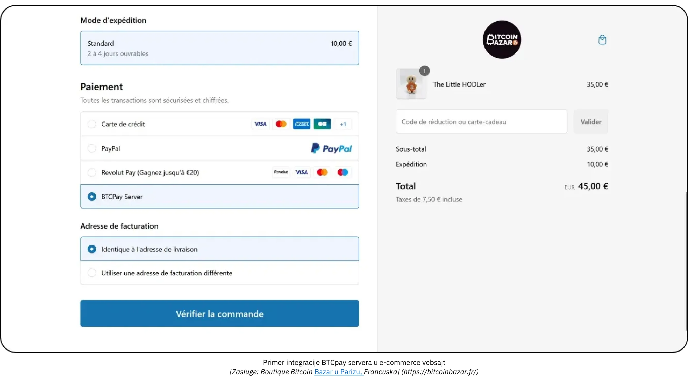

*[Credit: Bitkoin Bazar shop in Paris, France.](https://Bitkoinbazar.fr/)*

Da biste dublje istražili specifičnosti implementacije i istražili praktične konfiguracije BTC Pay Server-a, pogledajte sledeći kurs:

https://planb.network/courses/6fc12131-e464-4515-9d3f-9255365d5fa1
## Preduzeće

<chapterId>80fb2659-81ca-4a11-b492-72c7ae5774f9</chapterId>

Profil za preduzeća stoji na vrhu Bitkoin implementacija plaćanja, prilagođen posebno za velike korporacije, glavne tržišne platforme i etablirane firme koje zahtevaju potpuno prilagođena rešenja. Za razliku od manjih ili srednjih implementacija, operacije na nivou preduzćea integrišu Bitkoin plaćanja u širok spektar tokova rada i sistema, od uređaja za prodaju na licu mesta do e-commerce prodavnica, platformi za računovodstvo u pozadini i sofisticiranih ERP okvira.

Na ovom nivou, sveobuhvatni cilj nije samo prihvatiti Bitkoin, već to učiniti na način koji je temeljno **usklađen sa osnovnim procesima organizacije**. Ovo usklađivanje može zahtevati specijalizovani razvoj softvera, bilo da je rešenje potpuno prilagođeno ili orkestrirano kroz SaaS infrastrukturu podržanu od strane trećih lica *Lightning Service Providers* (LSPs). Takvi LSP-ovi mogu da obrade velike količine transakcija i složene mrežne konfiguracije koje prevazilaze kapacitet konvencionalnijih alata koji se koriste odmah po instalaciji. Rezultujuća arhitektura stoga uključuje širok spektar tehničkih i poslovnih razmatranja, od integracija vođenih API-jem do naprednih sposobnosti upravljanja sredstvima.

U okviru preduzeća, operativna složenost postaje posebno izražena. Velika korporacija može morati da prilagodi više odeljenja (prodaja, marketing, devops, finansije i računovodstvo) od kojih svako ima različite odgovornosti i zahteve za podacima. U ovom scenariju, Bitkoin platforma za plaćanje mora ponuditi veoma detaljno upravljanje ulogama, omogućavajući svakom odeljenju pristup tačno onim funkcijama koje su relevantne za njihove zadatke, uz očuvanje rigorozne kontrole nad bezbednošću i integritetom podataka. Jednako je bitna i sposobnost prilagođavanja tokova rada: na primer, dolazna plaćanja mogu pokrenuti ažuriranja u sistemima inventara, poslati automatske obaveštenja menadžerima prodaje i ažurirati Ledger unose za finansijski tim, sve u realnom vremenu. Uređaji na prodajnim mestima su često prilagođeni preduzetničkom okruženju, sa prilagođenim softverskim interfejsima koji odgovaraju brendiranju i operativnim potrebama kompanije.

**Bezbednost** je od suštinskog značaja za preduzeća na nivou velikih korporacija. Veliki obim transakcija i potencijalno velike sume bitkoina zahtevaju robusnu infrastrukturu sposobnu da se brani od zlonamernih napada ili pretnji iznutra. Najbolje prakse često uključuju višestruki potpis sa vremenskim zaključavanjem trezorskih konfiguracija, pažljivo revidirane baze koda i strogo pridržavanje relevantnih regulatornih okvira. Štaviše, usklađenost sa lokalnim i međunarodnim finansijskim propisima može biti ključna za očuvanje reputacije korporacije i licence za rad.

**Prilagođeni razvoj** uključen u kreiranje ili integraciju Bitkoin rešenja za plaćanje na nivou preduzeća prevazilazi kodiranje nekoliko funkcija aplikacije. Obično zahteva arhitektonsko projektovanje, temeljne test protokole i strukturirano uvođenje koje može obuhvatiti više faza (početni pilot programi, ograničeni tržišni testovi i konačno globalno uvođenje).

Na računovodstvenom planu, transakcije visoke učestalosti zahtevaju **potpuno prilagođene izvoze podataka** i ponekad sinhronizaciju u realnom vremenu sa softverom za korporativne finansije. Velike kompanije mogu se oslanjati na rešenja za planiranje resursa preduzeća (ERP) kao što su SAP ili Oracle, koja, zauzvrat, moraju besprekorno da se povežu sa podacima o Bitkoin plaćanjima. Da bi se to omogućilo, API-ji izabrane platforme moraju biti sofisticirani i fleksibilni, dajući IT timovima slobodu da kreiraju prilagođene kontrolne table za izveštavanje, implementiraju automatizovane procese usklađivanja i generate dnevne ili čak časovne finansijske preglede.

Tipičan scenario za preduzeće može uključivati veliku e-commerce platformu koja svakodnevno prima hiljade transakcija. Osim što samo navodi Bitkoin kao opciju plaćanja, ova platforma može prilagoditi svaki aspekt korisničkog iskustva, od toga kako Bitkoin tok plaćanja izgleda na vebsajtu okrenutom ka korisnicima do toga kako se povrati, povraćaji sredstava ili rešavanje sporova u pozadini. Posvećeni developerski tim, u saradnji sa finansijskim i pravnim odeljenjima, nadgledao bi tekuće održavanje, sigurnosne zakrpe i ažuriranja usklađenosti. Ako kompanija odluči da zadrži deo svojih prihoda od bitkoina, interni trezorski sistem bi pratio bitkoin sredstva firme zajedno sa rezervama tradicionalne valute.

Kako bi se osiguralo glatko i sigurno uvođenje na nivou preduzeća, većina organizacija angažuje specijalizovane pružaoce usluga ili interne razvojne timove sa iskustvom u integracijama Bitkoina i Lightning mreže. Proces obično počinje detaljnom procenom potreba (koja obuhvata tehničku infrastrukturu, zahteve za usklađenošću i željeno korisničko iskustvo) nakon čega sledi dizajniranje arhitekture koja može da podnese veliki obim protoka. U zavisnosti od obima projekta, možete se osloniti na multidisciplinarni tim sastavljen od finansijskih kontrolora, analitičara bezbednosti i softverskih inženjera. Alternativno, sve veći broj specijalizovanih konsultantskih firmi može vas voditi od početne konceptualizacije do konačnog uvođenja, pomažući u zadacima kao što su procena SaaS-hostovanih rešenja, konfigurisanje *Lightning Service Providers* i prilagođavanje korisničkih interfejsa. Partnerstvom sa stručnjacima iz domena, preduzeća mogu smanjiti rizike povezane sa implementacijom plaćanja velikih razmera i postići rešenje koje je ne samo robusno i usklađeno, već i dovoljno fleksibilno da omogući budući rast.

## Rešenja za Bitkoin plaćanja: Opcije i Trendovi

<chapterId>59ff43a1-98e2-4a81-af3e-9654bdd60952</chapterId>

Uvek postoje kompromisi za svaku kategoriju rešenja. Na primer, u početnoj "probnoj fazi," predloženi novčanici su dizajnirani da budu što jednostavniji u smislu korisničkog interfejsa, ali su hostovani (**skrbnički**). To znači da sredstva kontroliše pružalac aplikacije. Međutim, etos Bitkoin podstiče prelazak ka punom vlasništvu sredstava od strane korisnika (**samostalno skrbništvo**). U ovom slučaju, preporučuje se nadogradnja na sledeću kategoriju čim se obave prve prodaje—u suštini, kada se potvrdi da imate kupce spremne da plate u bitkoinu.

Jedna od ključnih prednosti bitkoina je mogućnost premeštanja sredstava po želji, što čini **promenu provajdera veoma lakom** ili komponenti Vašeg rešenja. Pored toga, sve aplikacije i rešenja se brzo razvijaju. Na primer, razmislite o Bitcoinize, koji sada nudi fizički terminal za prodajna mesta (POS) koji se integriše sa mnogim aplikacijama na tržištu, rešenje koje nije postojalo pre samo nekoliko meseci.

### Tražite rešenje za kreiranje prodavnice i prihvatanje tradicionalnih i bitkoin plaćanja?

Ako počinjete od nule—bez prodavnice, softvera za upravljanje proizvodima i sistema za prodajna mesta (POS)—imate nekoliko opcija:

- **Outsourcing:** Možete angažovati spoljne saradnike za kreiranje veb-sajta sa opcijama kupovine, a zatim dodati mogućnost za bitkoin plaćanja uz tradicionalna rešenja u prodavnici.
- **Jednostavna rešenja:** Alternativno, možete koristiti platforme kao što je Accessing.app da to uradite sami. Ključne prednosti uključuju:
    - Brzo i povoljno postavljanje online ili fizičke prodavnice.
    - Pogodno za sezonske poslove, događaje, restorane ili maloprodajne radnje.
    - Definisanje i upravljanje proizvodima za fizičku i online prodaju.
    - Obrada fiat plaćanja (npr. evri, dolari) putem vašeg sopstvenog Stripe naloga.
    - Obrada bitkoin plaćanja putem vašeg vlastitog SwissBitkoinPay naloga.

### Kako napreduje usvajanje Lightning plaćanja?

Iako Lightning mreža nudi superiornu efikasnost i niže naknade, njena primena je još u ranoj fazi. Umesto fokusiranja na trenutna ograničenja, vredi se prisetiti kako su se odvijale istorijske transformacije infrastrukture:

- Kada su se automobili prvi put pojavili, nije bilo dovoljno automobila da bi se opravdala izgradnja puteva, niti dovoljno puteva da bi se opravdalo posedovanje automobila.
- Kada je uvedena električna energija, nije bilo dovoljno korisnika da bi se opravdala izgradnja elektroenergetskih mreža, a nije bilo dovoljno mreža da bi privukle korisnike.

Nove infrastrukture uspevaju jer su efikasnije, a rani usvojitelji se pridružuju jer ostvaruju opipljive koristi. Evo zapažanja o Lightning mreži u 2024.:

- **Ultra-brze transakcije:** Transakcije su često gotovo trenutne (<500ms) i imaju izuzetno nisku stopu neuspeha.
- **Profesionalizacija mreže:** Veći igrači osiguravaju likvidnost širom mreže, dok su pojedinci uglavnom prestali sa usmeravanjem plaćanja i sada uglavnom upravljaju "čvorovima".
- **Poboljšano korisničko iskustvo:** Mobilne aplikacije za individualne korisnike su značajno poboljšane. Funkcije kao što su spajanje, statične Bolt12 fakture i plaćanja bez potvrde (0-conf) su široko dostupne, čineći interakcije besprekornim. Problemi sa interoperabilnošću (npr. prisilna zatvaranja) više nisu glavne brige.
- **Poboljšano upravljanje čvorovima i kanalima:** I pojedinačna i profesionalna rešenja su napredovala. Na primer, BTC Pay Server sada podržava brojne dodatke za povezivanje sa drugim provajderima (PSP-ovima, on/off rampama, itd.). Novi provajderi infrastrukture, kao što su LightSpark i Alby Hub, takođe ulaze u proizvodnju.
- **Rast usvajanja od strane trgovaca:** Trgovci poput BitRefill-a izveštavaju o porastu bitkoin plaćanja među svojim aktivnim korisnicima, uz jasan pomak ka Bitkoin mreži u odnosu na Lightning. Pored toga, ultra-niske naknade Lightning-a čine ga preferiranim izborom za mala plaćanja (prosečno €32 po transakciji).

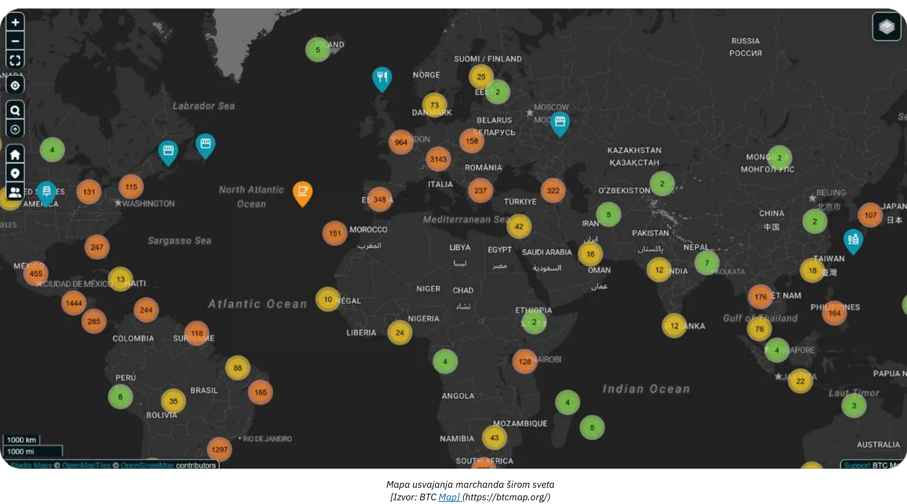

*[Izvor: BTC Map](https://btcmap.org/)*

- **Metrike mreže:** Ukupan broj kanala i bitkoina zaključan na Lightning mreži ostaje stabilan, sa približno 20,000 čvorova (nodova), 5,200 BTC, i 60,000 kanala. Međutim, ovo odražava samo deo mreže i ukazuje na rotaciju među učesnicima, sa manje pojedinaca i više profesionalaca koji učestvuju.
- **Lightning kao most između mreža:** Efikasnost i dostupnost Lightning mreže već su je pozicionirali kao most ka drugim međusobno povezanim mrežama (npr. FediMint, Liquid, itd.).

**Povratak novčanika**

Bitkoin i Lightning mreža dovršavaju **digitalnu revoluciju novčanika**. Novi veb servisi sada omogućavaju **transakcije bez potrebe za kreiranjem naloga**—vaš novčanik postaje vaš identitet! Sa protokolima kao što su **Nostr Wallet Connect (NWC)** i **LN-URL-AUTH**, novčanici mogu besprekorno autentifikovati korisnike i omogućiti transakcije bez tradicionalnih naloga. Prošla su vremena zamaranja kreiranjem naloga za jednostavne kupovine ili pretplate. Nema više potrebe za pružanjem ličnih ili platnih informacija koje bi mogle biti hakovane i prodate na dark vebu, na šta nas prečesto podsećaju nedavni događaji.

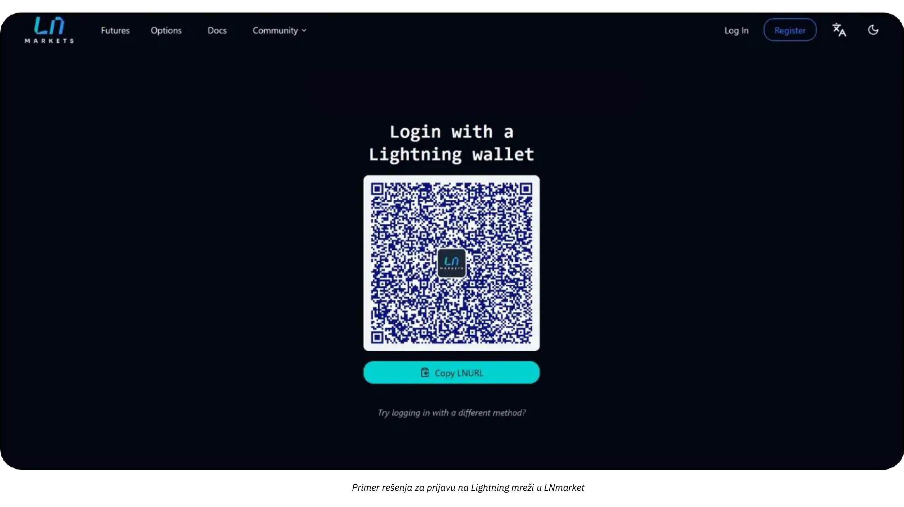

Trgovci sutrašnjice će prihvatiti ovu inovaciju, nudeći kupcima sigurnije, jednostavnije (jedan klik) iskustvo koje takođe poštuje njihovu privatnost.

# Bitkoin Računovodstvo

<partId>d49d7595-a189-4e2b-bd60-c19e8e717aa2</partId>

## Osnovni Principi za Računovodstveni tretman Bitkoina u Poslovanju

<chapterId>84063061-ffdb-4b1f-b20b-588ffb146877</chapterId>

Sledeći sadržaj je namenjen isključivo u obrazovne svrhe i ne treba ga smatrati finansijskim ili računovodstvenim savetom. Preduzećima i pojedincima se snažno preporučuje da se posavetuju sa kvalifikovanim računovođom ili pravnim stručnjakom koji je upoznat sa propisima o kriptovalutama u njihovoj specifičnoj jurisdikciji pre nego što preduzmu bilo kakvu akciju.

### Računovodstveni Ključni Koncepti Računovodstvenog Tretmana Bitkoina 

**Svaka Bitkoin transakcija mora biti evidentirana i može dovesti do oporezivog događaja**

Globalno, Bitkoin se često klasifikuje ne kao valuta, već kao digitalna imovina. Ova razlika značajno utiče na to kako se Bitkoin evidentira u poslovanju, utičući na poreske obaveze, finansijsko izveštavanje i zahteve za usklađenost. Poslovanja koja prihvataju Bitkoin kao način plaćanja ili ga koriste kao alat za čuvanje vrednosti moraju razumeti ove regulatorne nijanse.

Najvažnija posledica koju treba imati na umu je da, u većini jurisdikcija, zarađivanje, prodaja, trgovina ili korišćenje Bitkoin za kupovinu obično stvara **oporezivi događaj** i dobici podležu porezu na kapitalnu dobit.

Još jedan aspekt računovodstva važan za Bitkoin je razlikovanje između dve vrste kapitalnih dobitaka:

- **Latentni Dobici/Gubici:** Nerealizovane dobici ili gubici zasnovani na vrednosti Bitkoina koji se drži na kraju računovodstvenog perioda.
- **Efektivni Dobici/Gubici:** Realizovani dobici ili gubici kada se Bitkoin proda ili zameni tokom fiskalne godine.

Ove kalkulacije u velikoj meri zavise od toga da li se Bitkoin drži za dugoročna ulaganja ili za kratkoročnu operativnu upotrebu. Pored toga, preduzeća moraju uskladiti svoje računovodstvene prakse sa lokalnim poreskim strukturama, jer se propisi značajno razlikuju po zemljama.

Računovodstvo za preduzeća koja drže Bitkoin je donekle zamorno jer svaka transakcija mora biti pažljivo praćena kako bi se izračunali realizovani ili nerealizovani profiti ili gubici. Za svaku prodaju koju obavite prihvatanjem bitkoina kao oblika plaćanja, ili svaki put kada kupujete ili prodajete bitkoin, potrebno je zabeležiti:

- tačno vreme
- prodajnu cena (u fiat valuti)
- cena bitkoina (cena po kojoj je bitkoin prvobitno kupljen).

Ovo će vam kasnije omogućiti da izračunate razliku kako biste utvrdili profit ili gubitak.

**Primer:** Preduzeće kupuje 1 BTC za $30,000. Kasnije, prodaje 0.5 BTC za $20,000. Da bi izračunali profit ili gubitak, preduzeće mora:

- Zabeležiti vreme, fiat cenu koštanja i količinu kupljenog bitkoina
- Zabeležiti vreme, fiat prodajnu cenu i količinu prodatog bitkoina
- Odrediti cenu prodatog bitkoina: 0.5 BTC: $30,000 ÷ 2 = $15,000
- Uporediti prodajnu cenu sa nabavnom cenom: $20,000 (prodajna cena) - $15,000 (nabavna cena) = $5,000 profit.
- Ažurirati stanje bitcoina sa novom cenom koštanja.

Ovaj proces se mora ponoviti za svaku transakciju, a promenljiva priroda cene bitkoina čini vođenje evidencije još zamršenijim.

**Kako bi funkcionisalo kada bi bitkoin bio valuta?**

Ako bi se bitkoin tretirao kao valuta, preduzeća bi ga koristila kao bilo koju drugu valutu u svom računovodstvenom sistemu. Umesto praćenja osnovne cene i realizovanih/nerealizovanih profita za svaku transakciju, stanje bitkoina bi jednostavno bilo evidentirano na valutnom računu. Na kraju svakog izveštajnog perioda, vrednost svih valutnih sredstava, uključujući bitkoin, bila bi konvertovana u računovodstvenu valutu (npr. USD ili EUR) koristeći trenutni kurs.

**Ažurirani primer ako je bitkoin prepoznat kao valuta:**

- Preduzeće drži 1 BTC kada bitkoin vredi $30,000. Kasnije, preduzeće koristi 0.5 BTC za plaćanje kada bitkoin vredi $40,000.
- Preduzeće **ne** obračunava ostvareni profit ili gubitak. Umesto toga, transakcija se beleži kao:
    - Plaćanje: $20,000 (0.5 BTC × $40,000).
    - Preostali bitkoin saldo: 0.5 BTC, sada vredi $20,000 (ažurirano po trenutnom kursu).

**Ključna prednost ako bi bitkoin bio priznat kao valuta:**

- Preduzeće treba samo periodično da prilagođava fiat ekvivalent svojih Bitkoin sredstava (npr. za mesečne ili godišnje izveštaje), baš kao i za evre, jene ili druge valute koje poseduje.
- Ovo eliminiše potrebu za praćenjem osnovne cene na nivou transakcija i pojednostavljuje računovodstvo, posebno za preduzeća sa čestim bitkoin transakcijama.

Ovaj pristup bi učinio računovodstvo za bitkoin daleko jednostavnijim, smanjio administrativne terete i uskladio se sa tretmanom drugih valuta, pod pretpostavkom da bi bitkoin bio u potpunosti priznat kao takav u pravnim i regulatornim terminima. Još nismo stigli do toga.

### Razlike između Bitkoin računovodstva za pojedince i korporacije

Pravni i računovodstveni tretman Bitkoin značajno se razlikuje između pojedinaca i korporacija. Za pojedince, dobici od bitkoin transakcija mogu biti podložni porezu na dobit, često po višoj stopi. Nasuprot tome, korporacije mogu imati koristi od potencijalno nižih stopa poreza na dobit, ali moraju se pridržavati strožih standarda knjigovodstva.

Za preduzeća Bitkoin može biti klasifikovan pod različitim računima glavne knjige u zavisnosti od njegove namene:

- **Fiksna imovina:** Za bitkoin koji se drži dugoročno kao strateška investicija.
- **Zalihe:** Za Bitkoin koji se koristi u proizvodnim procesima (retka upotreba, na primer, ovo je slučaj kod profesionalnih trgovaca).
- **Gotovina ili računi:** Za Bitkoin koji se drži kao likvidna imovina, prvenstveno za operativne transakcije ili kratkoročno upravljanje sredstvima.

Izbor klasifikacije zavisi od aktivnosti i strategije kompanije, sa implikacijama na finansijsko izveštavanje i poreske obaveze. Uvek proverite lokalne propise, jer se ove klasifikacije mogu razlikovati po zemljama.

### Pravni okvir

Pravno priznavanje i tretman bitkoina variraju u zavisnosti od jurisdikcije. Neke zemlje, kao što je El Salvador, priznale su bitkoin kao zakonsko sredstvo plaćanja, što pojednostavljuje njegovu upotrebu u transakcijama, ali komplikuje međunarodno finansijsko izveštavanje. Druge zemlje tretiraju bitkoin kao digitalnu imovinu podložnu specifičnim poreskim i računovodstvenim pravilima.

U većini zemalja, bitkoin je kategorizovan kao digitalna imovina, a njegovo tretiranje je regulisano opštim računovodstvenim standardima. Preduzeća moraju evidentirati bitkoin transakcije na sledeći način:

- **Evidentiranje kapitalnih dobitaka/gubitaka:** Preduzeća moraju evidentirati ostvarene dobitke ili gubitke u svojim finansijskim rezultatima.
- **Procene Latentne Dobiti/Gubici:** Nerealizovani dobici ili gubici često moraju biti prijavljeni, ali možda neće direktno uticati na oporezivi prihod.
- **Usklađenost sa računovodstvenim standardima:** Preduzeća moraju integrisati bitkoin transakcije u standardne knjigovodstvene prakse, osiguravajući transparentnost i tačnost.

Pristup računovodstva bitkoinu varira u zavisnosti od geografije:

- **Sjedinjene Američke Države:** Poreska uprava (IRS) klasifikuje Bitkoin kao **imovinu, slično akcijama, obveznicama ili nekretninama**. Ova klasifikacija znači da bilo koja transakcija koja uključuje kriptovalutu, kao što je zarađivanje, prodaja, trgovanje ili čak korišćenje za kupovinu, može stvoriti oporezivi događaj i dobici podležu porezu na kapitalnu dobit.
- **Evropska unija:** Države članice generalno tretiraju bitkoin kao spekulativnu imovinu, a ne kao funkcionalnu valutu. Stoga su dobici često podložni porezu na kapitalnu dobit.
- **Azija:** Zemlje poput Singapura i Japana usvojile su progresivne regulatorne okvire, tretirajući Bitkoin transakcije povoljno u specifičnim kontekstima. Međutim, Bitkoin se generalno računa kao **nematerijalna imovina**, i meri se po fer vrednosti na datum izveštavanja, sa promenama priznatim u dobitku ili gubitku.

Važno je razumeti propise u zemlji u kojoj poslujete i prilagoditi svoje računovodstvene prakse u skladu s tim.

### Izazovi u evoluciji regulative

Brzi tempo inovacija u kriptovalutama često nadmašuje regulatorne okvire. Od priznavanja bitkoina kao digitalne imovine, globalni propisi su doživeli postepena ažuriranja, ali praznine i dalje postoje:

- **Nedostatak Jurisprudencije:** Malo pravnih slučajeva je razjasnilo specifične računovodstvene prakse, ostavljajući prostor za interpretaciju.
- **Aktuelne debate:** Pitanja kao što je poreski tretman latentnih gubitaka ostaju nerešena u mnogim jurisdikcijama.
- **Kompleksnost prekograničnog poslovanja:** Kompanije koje posluju na međunarodnom nivou suočavaju se sa izazovima usklađivanja različitih nacionalnih računovodstvenih standarda.

Uprkos ovim izazovima, proaktivni stavovi mnogih zemalja pružaju solidnu osnovu za preduzeća da uključe bitkoin u svoje poslovanje. Kontinuirana ažuriranja i međunarodna harmonizacija biće od suštinskog značaja za rešavanje složenosti koje se pojavljuju računovodstvu kriptovaluta.

### Klasifikacija Bitkoina u finansijskim izveštajima

Klasifikacija Bitkoin u finansijskim izveštajima varira u zavisnosti od jurisdikcije i zavisi od njegove namene unutar preduzeća. Generalno, bitkoin se tretira kao digitalna imovina, slična zalihama, investicijama ili valutama, ali sa jedinstvenim karakteristikama koje utiču na njegov računovodstveni tretman.

- **Digitalna imovina ili nematerijalna imovina**: Mnoge jurisdikcije, uključujući Francusku i Evropsku uniju, klasifikuju bitkoin kao digitalnu ili nematerijalnu imovinu, a ne kao zakonsko sredstvo plaćanja. Ova klasifikacija zahteva od preduzeća da bitkoin evidentiraju drugačije nego fiat valute.
- **Zalihe**: Ako osnovna delatnost preduzeća uključuje trgovinu bitkoinom, kao što su kripto berze ili brokeri, bitkoin se klasifikuje kao zalihe. U ovom slučaju, vrednovanje se vrši prema računovodstvenim standardima za zalihe.
- **Finansijska investicija**: Kompanije koje drže Bitkoin kao dugoročnu imovinu mogu ga klasifikovati kao finansijsku investiciju. Na primer, u Sjedinjenim Američkim Državama, preduzeća bi mogla evidentirati bitkoin prema smernicama Odbora za finansijske računovodstvene standarde (FASB), priznajući umanjenja kada tržišne vrednosti opadnu.

**Implikacije klasifikacije :**

- Dugoročna ulaganja često zahtevaju testiranje umanjenja vrednosti i amortizaciju.
- Aktivno trgovanje ili aktivnosti povezane s plaćanjem zahtevaju stalno praćenje ealizovanih i nerealizovanih dobitaka i gubitaka.

### Metode vrednovanja

Metode vrednovanja su računovodstvene tehnike koje se koriste za određivanje osnovne cene bitkoina, što je ključno za tačno izračunavanje dobitaka ili gubitaka tokom transakcija. Generalno, najbolje je **održavati uvek ažuriranu vrednost troškova trenutnih zaliha bitkoin sredstava** u računovodstvenom sistemu. Ovo osigurava transparentnost, usklađenost sa poreskim propisima i sprečava zaostajanje kada je potrebno izvršiti proračune.

- **First In, First Out (FIFO)- Prvi ulaz, prvi izlaz**: Uobičajena metoda u jurisdikcijama kao što su Australija i Indija, ova metoda vrednuje bitkoin na osnovu najranije nabavne cene. Ovo može postati prilično **kompleksno** jer može zahtevati praćenje svake frakcije bitkoina zasebno kada dođe do prodaje.
- **Ponderisana prosečna cena (WAC)**: Često se preferira za transakcije velikog obima zbog svoje **jednostavnosti**, kao što je slučaj u zemljama poput Sjedinjenih Američkih Država.

Preporučuje se da se vodi detaljna evidencija za praćenje troškova bitkoina **od trenutka kada kompanija počne da kupuje bitkoin ili ga prihvata kao plaćanje** kako bi se osiguralo tačno i organizovano vođenje evidencije. Samo ta razmatranja treba da budu prioritet pri izboru softverskog rešenja za prihvatanje plaćanja bitkoinom ili za kupovinu bitkoina.

### Računovodstvo za transakcije u maloprodaji i e-trgovini

Trgovci moraju zabeležiti za svaku transakciju kurs bitkoina-prema-fijatu. Na primer, u mnogim zemljama, preduzeća koriste kurs u trenutku prodaje za izračunavanje PDV-a.

Preduzeća moraju osigurati da alati za **Plaćanje** koje koriste omogućavaju:

- generisanje fakture sa lokalnim iznosom u fiat valuti (euro, dolar, funta), koji uključuje PDV ili druge lokalne poreze, ekvivalent denominovan u bitkoinu, datumom i vremenom, kursom bitkoina i izvorom kursa itd.
- izvoz svih potvrda o plaćanju, najmanje u .csv formatu, sa svim gore navedenim informacijama, tako da ih računovođa može lako obraditi
- idealno vođenje evidencije o ažuriranoj vrednosti osnovne cene za trenutni bitkoin koji se drži u posedu

### Izazovi

- **Volatilnost**: Cena bitkoina značajno varira, stvarajući poteškoće u proceni vrednosti imovine i predviđanju budućih finansijskih ishoda.
- **Regulatorni nadzor**: U zemljama poput Kine, ograničeni status bitkoina ograničava njegovu upotrebu kao sredstva za čuvanje vrednosti.
- **Regulatorna neizvesnost:** : Evoluirajući regulatorni pejzaž bitkoina često ostavlja preduzeća u neizvesnosti. Na primer, promene u poreskim politikama, kao što su one u Indiji ili Sjedinjenim Američkim Državama, mogu preko noći uticati na računovodstvene prakse.
- **Rizici lošeg upravljanja** : Nepravilna klasifikacija ili neuspeh u praćenju bitkoin transakcija može dovesti do problema sa usklađenošću, kazni ili oštećenja reputacije.
- **Rizici ponovne kvalifikacije**: Održavanje značajnog dela sredstava kompanije u bitkoinu izlaže preduzeće potencijalnim gubicima usled pada cena. Ovo može imati ozbiljne posledice, naročito ako se takvi padovi dogode kada su dospele isplate dobavljačima, zaposlenima ili porezi. Pored toga, vlasnik kompanije može biti odgovoran, što može rezultirati kaznama ili drugim pravnim problemima, kao što su optužbe za zloupotrebu imovine kompanije.

## Računovodstveni alati i softver

<chapterId>e7b31be5-1176-4835-944e-3cba1b7040fa</chapterId>

Kada kompanija odluči da integriše bitkoin u svoje računovodstvo, razni alati i specijalizovani softver pojednostavljuju prikupljanje i obradu podataka. Među najpoznatijim rešenjima su [CoinTracker](https://www.cointracker.io/), [Waltio](https://www.waltio.com/), [Cryptio](https://cryptio.co/), [Koinly](https://koinly.io/), [TokenTax](https://tokentax.co/), i [ZenLedger](https://zenledger.io/). Ove platforme se prvenstveno fokusiraju na četiri aspekta:

- automatsko prikupljanje podataka;
- konverzija ovih podataka u formate kompatibilne sa opštijim računovodstvenim softverom (QuickBooks, Xero, ERP);
- obračun poreskih obaveza;
- kategorizacija transakcija.

Oni su često mudar dodatak za velike organizacije sa više novčanika i sredstava na različitim platformama ili berzama.

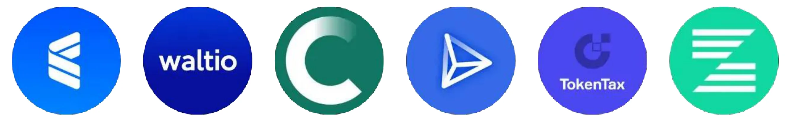

Međutim, jednostavna `.csv` datoteka koja sadrži istoriju transakcija često je dovoljna za većinu malih preduzeća. Cilj je dokumentovati, za svaku uplatu, datum, iznos, ekvivalentnu vrednost u evrima/dolarima i relevantne bitkoin adrese. Velika većina bitkoin rešenja za plaćanje (BTC Pay Server, Swiss Bitkoin Pay, itd.) ili platformi poput menjačnica (Bitfinex, Kraken, Coinbase, itd.) već nudi mehanizam za izvoz istorije transakcija. Pružanjem ove datoteke računovođi, postaje moguće pojednostaviti unos podataka i jasno razlikovati dolazne i odlazne tokove povezane sa bitkoinom.

Za one koji sami čuvaju svoj bitkoin, upravljanje UTXO-ima (*Unspent Transaction Outputs-Nepotrošenim izlazima transakcija*) je važan korak. Pravilno označavanje UTXO pomaže u praćenju porekla svakog BTC fragmenta, razlikovanju transakcija vezanih za profesionalne aktivnosti od onih za lične troškove, i olakšava praćenje u pravne ili poreske svrhe. Većina dobrog softvera za bitkoin novčanik omogućava vam da uvezete svoj novčanik koristeći vašu rezervnu datoteku (ili vaš xpub, u zavisnosti od vašeg podešavanja) i označite UTXO-e na osnovu njihovog porekla ili odredišta. Da bismo Vam pomogli, ovde je kompletan vodič posvećen ovoj praksi:

https://planb.network/tutorials/privacy/on-chain/utxo-labelling-d997f80f-8a96-45b5-8a4e-a3e1b7788c52
Konačno, bilo da ste mali trgovac ili već etablirano preduzeće, moguće je **platiti fakturu u bitkoinu**. Ključ je pravilno dokumentovati transakciju. Ako plaćate iz novčanika koji sami čuvate, idealno je generisati transakciju sa napomenom broja fakture i svrhe plaćanja u vašim oznakama. Ako više volite da izmirite fakturu putem menjačnice, takođe ćete imati opciju da izvezete potvrdu ili istoriju transakcija kako biste ih uključili u svoje knjigovodstvene evidencije. Ova transparentnost će pojednostaviti praćenje i izveštavanje svih vaših BTC operacija.

## Praktični primeri bitkoin računovodstva

<chapterId>763f6f20-9181-495a-bf7d-b405899e65ec</chapterId>

### Studija slučaja 1: Maloprodajna prodavnica konvertuje bitkoin uplate u evre

**Scenario**: Mala pekara prihvata bitkoin kao način plaćanja, ali odmah konvertuje sve primljene bitkoin u evre kako bi izbegla izloženost volatilnosti kriptovaluta.

**Primer**:

- **Kurs konverzije bitkoina**: 1 Bitkoin = €40,000.
- **Transakcija 1**: Kupac kupuje više peciva za €20.
    - Bitkoin ekvivalent: (20 / 40,000) = 0.0005 Bitkoin = 50,000 Satošija.
    - Naknada za konverziju: 1.5% (€20 × 0.015) = €0.30.
    - Neto primljeno: €20 - €0.30 = €19.70.
- **Transakcija 2**: Kupac kupuje kafu za €5.
    - Bitkoin ekvivalent: (5 / 40,000) = 0.000125 Bitkoin = 12,500 Satošija.
    - Naknada za konverziju: 1.5% (€5 × 0.015) = €0.075.
    - Neto primljeno: €5 - €0.075 = €4.93.

**Rezime transakcija**:

- **Ukupna prodaja**: €25.
- **Ukupne naknade**: €0.375.
- **Neto primljeni evri**: €24.625.

**Računovodstvene implikacije**:

- Evidentirajte ukupnu prodaju (€25) kao prihod.
- Odbijte naknade za konverziju (€0.375) kao trošak.
- Na bilansu stanja se ne pojavljuju bitkoin sredstva jer su svi iznosi odmah konvertovani.

### Studija slučaja 2: Maloprodajna prodavnica zadržava 50% bitkoin uplata

**Scenario**: Ista pekara odlučuje da zadrži 50% bitkoin uplata kao sredstvo za čuvanje vrednosti, dok preostalih 50% konvertuje u evre.

**Primer**:

- **Kurs konverzije bitkoina**: 1 Bitkoin = €40,000.
- **Transakcija od kupca**: Kupac kupuje peciva za €50.
    - Bitkoin ekvivalent: (50 / 40,000) = 0.00125 Bitkoin = 125,000 Satošija.
    - Konverzija (50%): €25 vrednosti Bitkoin = 0.000625 Bitkoin = 62,500 Satošija.
        - Naknada za konverziju: 1.5% (€25 × 0.015) = €0.375.
        - Neto primljeno u evrima: €25 - €0.375 = €24.625.
    - Zadržano u bitkoinu (50%): 62,500 Satošija = 0.000625 bitkoina.

**Rezime**:

- **Ukupna prodaja**: €50.
- **Naknade**: €0.375.
- **Neto primljeni evri**: €24.625.
- **Zadržan bitkoin**: 62,500 Satošija.

**Računovodstvene implikacije**:

- Evidentirajte ukupnu prodaju (€50) kao prihod.
- Odbijte naknade za konverziju (€0.375) kao trošak.
- Zadržani bitkoin (62,500 Satošija) pojavljuje se na bilansu stanja kao digitalna imovina.
- Nerealizovani dobitak/gubitak: ako je vrednost bitkoina na kraju fiskalne godine viša ili niža, biće evidentiran nerealizovani dobitak ili gubitak koji će biti objavljen u finansijskim napomenama, ali neće biti realizovan kao prihod.

### Studija slučaja 3: Profesionalna usluga zadržavanja bitkoina za dugoročno ulaganje

**Scenario**: Freelance grafički dizajner prihvata bitkoin kao plaćanje i zadržava sve primljene bitkoine kao dugoročnu investiciju.

**Primer**:

- **Kurs bitkoina u trenutku plaćanja**: 1 Bitkoin = €30,000.
- **Transakcija od kupca**: Klijent plaća za usluge u vrednosti od €3,000.
    - Bitkoin ekvivalent: (3,000 / 30,000) = 0.1 Bitkoin = 10,000,000 Satošija.
- **Godišnja procena vrednosti**:
    - Kurs bitkoina na kraju godine: 1 Bitkoin = €35,000.
    - Procena vrednosti bitkoin imovine: 0.1 Bitkoin × €35,000 = €3,500.
    - Nerealizovani dobitak: €3,500 - €3,000 = €500.

**Rezime**:

- **Ukupni priznati prihod**: €3,000.
- **Zadržani bitkoin**: 0.1 bitkoin vrednovan na €3,500 u bilansu stanja.
- **Nerealizovani dobitak**: €500 prikazan u finansijskim napomenama, ali nije realizovano kao prihod.

**Računovodstvene implikacije**:

- Evidentirajte prihod (€3,000) u trenutku pružanja usluge.
- Zadržan bitkoin (0.1) vrednovan na €3,500 u bilansu stanja.
- Nerealizovani dobici se prate, ali nisu uključeni u izveštaje o dobiti/gubitku.

### Studija slučaja 4: Vlasnik preduzeća prodaje 50% bitkoina nakon povećanja cene

**Scenario**: Vlasnik preduzeća obavlja tri kupovine bitkoina tokom godine, drži bitkoin kao imovinu i prodaje 50% nakon značajnog povećanja cene.

**Primer**:

- **Bitkoin kupovine od kupaca**:
    - Kupovina 1: €2,000 po €20,000/BTC = 0.1 Bitkoin = 10,000,000 Satošija.
    - Kupovina 2: €3,000 po €25,000/BTC = 0.12 Bitkoin = 12,000,000 Satošija.
    - Kupovina 3: €5,000 po €30,000/BTC = 0.1667 Bitkoin = 16,670,000 Satošija.
    - **Ukupno zadržani bitkoin**: 0.3867 Bitkoin = 38,670,000 Satošija.
- **Godišnja procena vrednosti**:
    - Cena bitkoina na kraju godine: €40,000/BTC.
    - Ukupna vrednost: 0.3867 Bitkoin × €40,000 = €15,468.
    - Nerealizovani dobitak: €15,468 - €10,000 (ukupni trošak) = €5,468.
- **Prodaja 50% bitkoina**:
    - Prodat bitkoin : 0.19335 bitkoin.
    - Prihodi od prodaje: 0.19335 Bitkoin × €40,000 = €7,734.
    - Osnovica troškova (ponderisani prosek):
        - Ukupni trošak: €2,000 + €3,000 + €5,000 = €10,000.
        - Prosečna ponderisana cena: €10,000 / 0.3867 bitkoin = €25,850/BTC.
        - Trošak prodatog bitkoina: 0.19335 bitkoin × €25,850 = €4,999.
    - Realizovani dobitak: €7,734 - €4,999 = €2,735.

**Rezime**:

- **Preostali bitkoin**: 0.19335 bitkoin procenjeno na €7,734 (pri €40,000/BTC).
- **Realizovani dobitak**: €2,735 uključen u bilans uspeha.
- **Nerealizovani dobitak**: €5,468 prikazano u finansijskim napomenama (uključujući nerealizovanu vrednost preostalog bitkoina).

**Računovodstvene implikacije**:

- Evidentirajte prihod od prodaje (€7,734) kao prihod.
- Oduzmite trošak prodatog bitkoina (€4,999) da biste izračunali realizovanog dobitka.
- Preostali bitkoin (0.19335) prikazati u bilansu stanja vrednovan na €7,734.
- Nerealizovani dobici od €5,468 na zadržanom bitkoin objavljeni u finansijskim beleškama.

# Završna sekcija

<partId>f6ca8d01-a4f3-449b-ac9f-c5fba9a69178</partId>

## Proceni ovaj kurs

<chapterId>0fe8c49e-b7f8-46f7-9c42-b8a9a99a7b46</chapterId>

<isCourseReview>true</isCourseReview>
## Završni Ispit

<chapterId>40a0f18c-bdc9-45b2-8dea-15f7e574230e</chapterId>

<isCourseExam>true</isCourseExam>
## Zaključak

<chapterId>5503c23e-3a90-4a23-8d89-75e3cc1ee53e</chapterId>

<isCourseConclusion>true</isCourseConclusion>

