# Kickstarta ditt företags resa i Bitcoin-nätverket

Upptäck de praktiska möjligheterna med Bitcoin och Lightning Network, och utforska hur de, precis som internet, kan **transformera din affärsverksamhet**. Från digitalt kapital till blixtsnabba, kostnadseffektiva och skalbara betalningar, ger Bitcoin ett brett spektrum av **användningsområden för företag**.

I den här guiden kommer du att lära dig att förstå Bitcoin som ett globalt, universellt och internetbaserat monetärt nätverk. Med sina unika grundläggande egenskaper erbjuder **Bitcoin betydande förbättringar jämfört med traditionella valutasystem**. Du kommer att upptäcka varför och hur du kan utnyttja Bitcoin för klassiska finansiella områden som kapitalförvaring och betalningssystem. Guiden går också igenom hur du köper och förvarar Bitcoin på ett säkert sätt, inklusive tillhörande redovisnings- och skattekrav, samt implementering av enkla eller storskaliga Bitcoin-betalningslösningar.

Oavsett om du driver ett **litet företag eller en större verksamhet** kan du genom att integrera Bitcoin i din dagliga drift göra ditt företag mer **motståndskraftigt, produktivt och konkurrenskraftigt**. Varje internetbaserat företag kommer att bli ett Bitcoin-orienterat företag, och den här kursen säkerställer att du är förberedd. De inledande avsnitten ger dig en översikt över hur Bitcoin fungerar, så även om du är nybörjare kommer du att få den grundläggande kunskap som behövs för att gå vidare. Att lära sig grunderna om Satoshis uppfinning är alltid en bra idé, oavsett om det är före eller efter att du dyker in i BIZ101.

+++
# Inledning

<partId>326cf945-5d3f-4d86-8c3e-4d1c35959799</partId>

## Kursöversikt

<chapterId>1be42be9-4080-49f5-b5b2-6b531dd55f5f</chapterId>

Välkommen till BIZ101-kursen! Kickstarta ditt företags resa i Bitcoin-nätverket med denna omfattande utbildning - en inkörsport till att förstå hur Bitcoin och Lightning Network kan revolutionera traditionell affärsverksamhet. Den här kursen är utformad för återförsäljare, entreprenörer, chefer och beslutsfattare som vill utforska de praktiska möjligheterna med Bitcoin som ett globalt, internetbaserat monetärt nätverk och som ett robust verktyg för värdeöverföring.

Under kursens gång kommer du att introduceras till de grundläggande principer som gör Bitcoin och Lightning Network till unikt transformativa. Du kommer att lära dig hur dessa tekniker erbjuder ett spektrum av användningsområden, från digital kapitalförvaring till snabba, ekonomiska och skalbara betalningar, och hur de ger kritiska förbättringar jämfört med traditionella valuta- och betalningssystem. BIZ101-kursen kopplar samman ekonomisk teori med verkliga tillämpningar och klargör hur decentralisering kan minska beroendet av mellanhänder och övervinna begränsningar som finns i äldre finansiella system.

Kursen inleds med en detaljerad genomgång av konventionella valutor och betalningsmekanismer och lägger grunden genom att utforska hur valutor fungerar som ett nätverk för att möjliggöra handel, sparande och ekonomisk specialisering. Därefter kommer vi att fördjupa oss i tekniken bakom Bitcoin och de innovationer som introducerades av Lightning Network och förklarar hur dessa verktyg möjligör sömlösa, säkra och nästan omedelbara transaktioner som kan gynna företag i alla storlekar. Sedan kommer vi att dyka in i de praktiska delarna av denna kurs, som börjar med att hålla bitcoins som en del av sin kassastrategi, följt av en sista del om att acceptera Bitcoin som betalningsmedel.

Oavsett om du representerar ett litet företag eller ett stort bolag syftar den här kursen till att ge dig kunskapen att integrera Bitcoin i din dagliga verksamhet och därigenom förbättra ditt företags motståndskraft, effektivitet och konkurrensfördelar. Eftersom Bitcoin fortsätter att omforma det ekonomiska landskapet är förståelse för dessa banbrytande teknologier inte bara ett alternativ utan en strategisk nödvändighet. Förbered dig på att ta del av insiktsfullt innehåll, praktiska exempel och strategisk vägledning som gör det möjligt för dig att navigera och utnyttja den föränderliga världen av Bitcoin!

# Valuta, betalningssystem och Bitcoin

<partId>d9bd0e21-8488-44e0-af55-6d0b934f83c2</partId>

## Traditionella valutor

<chapterId>785e095c-6811-4ca2-ba46-fe38291432d4</chapterId>

### Valutor är nätverk

Valutor är i grunden nätverk som möjliggör ett effektivt utbyte av värde.

Utan valutor måste individer förlita sig på **byteshandel**, ett system där varor eller tjänster utbyts direkt. Byteshandel är opraktiskt eftersom det kräver ett "dubbelt sammanfallande av behov" - båda parter måste samtidigt vilja ha det som den andra erbjuder. Om t.ex. en bonde med överskottsvete vill ha skor måste han eller hon hitta en skomakare som specifikt behöver vete. Detta är sällsynt och ineffektivt. Dessutom, **med n produkter i en bytesekonomi behövs ~n(n-1)/2 växelkurser**, vilket skapar ett mycket komplext och besvärligt system. Till exempel skulle det behövas över ~ 124 000 växelkurser för bara 500 produkter.

En valuta förenklar detta genom att fungera som en mellanhand och skapa **ett nätverk som reducerar antalet växelkurser till n** - en för varje produkt i förhållande till valutan. Detta gör transaktioner mycket enklare och **möjliggör för människor att handla med varor och tjänster utan att samtidigt kräva ömsesidiga önskemål**. I stället för att byta vete mot skor direkt kan bonden sälja sitt vete mot valuta och senare använda valutan för att köpa skor eller något annat som han eller hon behöver.

Införandet av valuta som ett nätverk underlättar inte bara handeln utan möjliggör också **arbetsdelning och specialisering**. Med ett pålitligt bytesmedel behöver individer och samhällen inte längre producera allt de konsumerar. Istället kan de fokusera på det de gör bäst, vilket ökar effektiviteten och kvaliteten. En bonde kan specialisera sig på att odla grödor, en skomakare på att tillverka skor och en byggare på att bygga hus. Dessa specialister kan sedan byta sina varor och tjänster via en valuta och dra nytta av varandras expertis. Denna specialisering driver **produktivitet och innovation**, eftersom människor förfinar sina färdigheter och utvecklar nya metoder inom sina respektive områden.

Valutans nätverkskaraktär medför ytterligare betydande fördelar. För det första är det **mer fördelaktigt att vara en del av valutanätverket än att vara utanför det**. Nätverkets gemensamma standard underlättar handeln och gör det möjligt för individer att samordna sina ekonomiska aktiviteter även **över stora avstånd**. Till exempel kan en handlare i en stad handla varor med en köpare i en annan stad med hjälp av samma valuta, vilket främjar ekonomisk tillväxt och samarbete över stora regioner.

En annan avgörande fördel med valuta är dess förmåga att **tillåta uppskjutna utbyten**. När det gäller byteshandel är transaktionerna omedelbara; en vara byts mot en annan i realtid. Valuta möjliggör däremot **sparande - individer kan spara värde för framtida bruk**. Detta innebär ett stort steg framåt för ekonomisk planering, investeringar och förmögenhetsuppbyggnad, vilket förbättrar livet för nätverksdeltagarna.

Sammanfattningsvis är valutor nätverk som är utformade för att flytta värde på ett effektivt sätt. De övervinner byteshandelns begränsningar, förenklar handeln och skapar möjligheter till samordning och sparande. Precis som i alla nätverk beror värdet på en valuta på hur utbredd den är och hur användbar den är - i slutändan vinner den bästa valutan.

### Vad är en bra valuta?

En bra valuta har flera viktiga egenskaper som gör den effektiv när det gäller att underlätta värdeöverföring. Här är en kortfattad förklaring av var och en av dem:

- **Säker**: En valuta måste skyddas mot stöld eller obehörig åtkomst, så att användarna kan hålla och överföra den med tillit. Säkerheten är avgörande för att skapa förtroende för systemet.
- **Förfalskningssäker**: En valuta måste vara extremt svår eller omöjlig att förfalska. Detta säkerställer att varje enhet är äkta, bibehåller sitt värde och förhindrar inflation som orsakas av att falska enheter kommer i omlopp. Historiskt sett har till exempel guld värderats inte bara för sin skönhet och sällsynthet, utan även för att det är extremt svårt att producera. Till skillnad från papperssedlar eller digitala poster kan man inte bara "göra" guld - det måste utvinnas ur jorden. Denna naturliga knapphet och svårigheten att producera har hjälpt guld att behålla sin status som en pålitlig värdebevarare och ett riktmärke för äkthet.
- **Sällsynt**: En bra valuta måste ha ett begränsat utbud eller kontrollerad utgivning. Knapphet säkerställer att dess värde bevaras över tid och förhindrar överproduktion, vilket skulle urholka köpkraften. Till exempel använde vissa indianstammar pärlor som en form av valuta. Inledningsvis var dessa pärlor svåra att producera, vilket gjorde att de behöll sin knapphet och sitt värde. Men när europeiska handelsmän började massproducera och översvämma marknaden med pärlor försvann deras sällsynthet. I takt med att utbudet steg förlorade pärlorna sin köpkraft, vilket underminerade deras roll som en pålitlig värdebevarare.
- **Utan krav på tillstånd**: Förr i tiden präglades valutor som guld- och silvermynt ofta av privatpersoner, lokala myndigheter eller köpmän som hade tillgång till råvarorna. Detta system fungerade ibland under avtal eller licenser som beviljats av kungar eller härskare. Med tiden centraliserade kungar och regeringar denna process för att få större kontroll över den ekonomiska stabiliteten, beskattningen och det monetära systemet. Ett känt exempel är **thaler**, ett silvermynt som först präglades 1518 i **Joachimsthal-dalen** (dagens Jáchymov i Tjeckien) av lokala gruvarbetare och myndigheter. Namnet "thaler" härstammar från det tyska ordet **"Thal"** som betyder "dal". Dessa mynt, som var kända för sitt högkvalitativa silver, kom att cirkulera över hela Europa. Med tiden utvecklades termen språkligt och geografiskt och gav så småningom upphov till namnet "dollar", som antogs i USA för dess valuta.

I modern tid blev valutor helt tillåtna enligt seignioragesystemet, vilket innebär att endast auktoriserade enheter - som centralbanker eller finansministerier - kan prägla mynt eller trycka sedlar. Enskilda personer har inte längre laglig rätt att tillverka valutor, vilket säkerställer centraliserad kontroll över dess utgivning och utbud.

I dag utmanas principen om seigniorage av kryptovalutan Bitcoin, som fungerar utan centraliserad kontroll. Bitcoin är ett "tillståndslöst" system där vem som helst kan delta i att använda valutan utan att be om tillstånd och att skapa den genom mining.  Denna decentralisering tar bort regeringarnas utgivningsmonopol, vilket väcker frågor om en potentiell återgång till konkurrensutsatta valutasystem på den fria marknaden.

- **Värdeenhet**: En valuta bör tillhandahålla ett standardmått för att jämföra värdet på varor och tjänster. Detta förenklar handeln och gör prissättningen transparent och konsekvent i alla transaktioner.
- **Hållbar**: En valuta måste tåla slitage över tid. Fysiska valutor, som mynt eller sedlar, ska tåla skador, medan digitala valutor måste kunna förvaras säkert utan risk för dataförlust.
- **Portabel**: En valuta måste vara lätt att transportera och använda för att möjliggöra handel över stora avstånd. Detta kan uppnås genom fysisk bärbarhet (lättviktiga mynt eller sedlar) eller digitala överföringssystem.
- **Delbar**: En valuta bör vara delbar i mindre enheter för att underlätta transaktioner av varierande storlek. Denna flexibilitet säkerställer att den är praktisk för både små inköp och storskalig handel.
- **Fungibel**: Alla enheter i en valuta måste vara utbytbara och ha samma värde. Till exempel måste en dollarsedel vara likvärdig med vilken annan dollarsedel som helst. Denna enhetlighet säkerställer rättvisa och enkelhet i transaktioner.
- **Igenkännlig**: En valuta måste vara lätt att identifiera och lita på. Fysiska valutor uppnår detta genom unik design och säkerhetsfunktioner, medan digitala valutor kan förlita sig på verifieringsprotokoll. Detta säkerställer en utbredd acceptans och minskar risken för bedrägerier.

Dessa egenskaper gör att en valuta är praktisk, tillförlitlig och effektiv när det gäller att underlätta handel och lagra värde i en ekonomi.

### Utvecklingen av valutasystem

**Från mynt till papperspengar: Ökad effektivitet och portabilitet**

Övergången från mynt till papperspengar innebar en betydande förbättring av **portabiliteten** och effektiviteten. Mynt, tillverkade av ädelmetaller som guld eller silver, var värdefulla på grund av sitt inneboende värde. De var dock tunga, svåra att transportera i stora mängder och utsattes för slitage och stöld. Papperspengar revolutionerade valutanätverken genom att introducera ett lätt, standardiserat och bärbart medel som representerade värde snarare än att innehålla det. Denna innovation gjorde det möjligt för ekonomier att växa genom att underlätta långdistanshandel och minska de logistiska utmaningarna med att använda fysiska råvaror som pengar.

Papperspengar förbättrade också skalbarheten. I stället för att förlita sig på ädelmetallernas begränsade utbud kunde ekonomierna utöka sin monetära bas med hjälp av representativa valutor, som till en början backades upp av reserver och senare av förtroende för utgivande institutioner. Detta skifte banade väg för mer komplexa och sammankopplade finansiella system.

**Från papper till elektroniska pengar: Ökad tillgänglighet och snabbhet**

Övergången från papperspengar till elektroniska pengar förbättrade valutanätverket ytterligare genom att öka tillgängligheten och hastigheten. Med banksystem, kreditkort och digitala transaktioner blev pengar inte bara **portabla** utan nästan **instanta**. Elektroniska överföringar eliminerade behovet av fysiska utbyten, vilket gjorde att transaktioner kunde ske över stora avstånd på några sekunder.

Detta skifte demokratiserade också tillgången till valuta. Elektroniska bank- och betalningssystem minskade inträdesbarriärer för privatpersoner och företag och gjorde det möjligt att delta i den globala ekonomin. De elektroniska pengarnas snabbhet och bekvämlighet utvidgade handelsnätverken och främjade nya affärsmodeller som skulle ha varit omöjliga i ett pappersbaserat system.

Dessa moderna valutanätverk hade en betydande nackdel: **bristande kontrollerbarhet och transparens i hanteringen av pengarnas utbud**, vilket ofta resulterade i okontrollerad inflation och minskat förtroende för centraliserade system. Till exempel trycktes över 20 procent av alla cirkulerande amerikanska dollar bara under de senaste fyra åren. Denna ihållande frestelse att skapa mer valuta - och därmed minska värdet för de nuvarande innehavarna - kan till stor del tillskrivas ett systemfel: politiker har ofta incitament att undvika svåra budgetbeslut och väljer i stället att skjuta upp utmaningar till framtida administrationer genom att "sparka burken framför sig".

**Från centraliserad till decentraliserad valuta: Förstärkt förtroende och suveränitet**

Framväxten av den decentraliserade valutan Bitcoin utgör nästa steg i utvecklingen av valutanätverk. Traditionella elektroniska pengar förlitar sig på centraliserade myndigheter, som banker eller regeringar, för att hantera och verifiera transaktioner. Även om dessa system är effektiva är de sårbara för ineffektivitet, censur och en enda felpunkt som kan fälla hela systemet. Decentraliserade valutor förbättrar dessa nätverksegenskaper genom att **distribuera förtroende och ta bort mellanhänder**. Det innebär också att pengar kan röra sig mycket **snabbare** och **billigare**, eftersom det inte finns några auktoriseringssteg. Slutligen kan ingen människa frestas att ändra Bitcoin-valutans utbudsschema, det är programvaran som verkställer det.

I decentraliserade system verifieras transaktioner av ett globalt nätverk av deltagare med hjälp av Blockchain-teknik, vilket garanterar säkerhet, transparens och motståndskraft. Denna struktur minimerar risken för bedrägerier, minskar beroendet av centrala myndigheter och ger individer större kontroll över sin ekonomi. Genom att eliminera geografiska och institutionella barriärer erbjuder decentraliserade valutor ett verkligt globalt och inkluderande monetärt system.

**Utvecklingen av valutanätverk**

Varje steg i utvecklingen av valutanätverk har förbättrat viktiga egenskaper: portabilitet, skalbarhet, tillgänglighet, hastighet, säkerhet och förtroende. Mynt ersattes av papperspengar för bättre portabilitet och effektivitet. Papper utvecklades till elektroniska pengar, vilket möjliggjorde global tillgång och omedelbara transaktioner. Nu omdefinierar Bitcoin förtroende och säkerhet och skapar ett öppet och motståndskraftigt monetärt system. Denna historiska utveckling belyser mänsklighetens ständiga strävan att skapa bättre nätverk för värdeutbyte, där varje iteration bygger vidare på och överträffar begränsningarna i den föregående.

Det bästa nätverket kommer sannolikt att vinna.

## Traditionella betalningssystem

<chapterId>1306196c-1e8a-454b-8e11-6887ecb3d8b4</chapterId>

Betalningssystem är metoder och infrastrukturer som möjliggör överföring av pengar mellan två parter - vanligtvis mellan en betalare (t.ex. en konsument) och en betalningsmottagare (t.ex. ett företag). Dessa transaktioner kan ske i olika miljöer: en konsument som betalar en lokal handlare, ett företag som reglerar fakturor med en leverantör eller till och med privatpersoner som överför pengar till varandra. För att förstå betalningssystem måste man titta på olika typer av betalningsmetoder, deras egenskaper och hur de används i både B2C-sammanhang (Business-to-Consumer) och B2B-sammanhang (Business-to-Business).

### Vanliga typer av betalningsmetoder

1. **Kontanter:** Fysisk valuta som utväxlas direkt mellan två parter.

2. **Checkar:** Pappersdokument som ger en bank i uppdrag att betala ett visst belopp från betalarens konto till betalningsmottagaren.

3. **Banköverföring:** Elektronisk överföring av pengar mellan banker, används ofta för större summor och gränsöverskridande betalningar.

4. **Betalkort (kredit/debit):** Plastkort eller digitala kort som är anslutna till ett kortnätverk och som gör det möjligt att överföra pengar från kortinnehavarens bankkonto (eller kreditgräns) till en handlare.

5. **Digitala plånböcker och mobilbetalningar:** Applikationer eller enheter som lagrar betalningsinformation (t.ex. Apple Pay, WeChatPay, AliPay, PayPal), vilket möjliggör snabba och ofta kontaktlösa överföringar.

**Användning inom B2C och B2B:**

- **B2C (företag-till-konsument):**
    - Konsumenterna använder ofta kontanter, kort och digitala plånböcker för vardagliga inköp, t.ex. matvaror, online-shopping eller tjänster som samåkning.
    - Snabbhet, bekvämlighet och låga avgifter (för konsumenten) är ofta viktiga prioriteringar.
    - Kontaktlösa och mobila betalningar blir alltmer populära i detta område eftersom de är så enkla att använda.
- **B2B (företag-till-företag):**
    - Företag förlitar sig ofta på banköverföringar, checkar och faktureringssystem för att betala leverantörer, betala stora räkningar eller hantera återkommande betalningar.
    - Fokus ligger ofta på spårbarhet, dokumentation och förmågan att hantera större transaktionsvärden.
    - Kortanvändning förekommer men tenderar att bli mindre vanligt på grund av högre avgifter och transaktionsgränser. Digitala lösningar som integrerade betalningsplattformar växer fram för att effektivisera och automatisera processerna för kund- och leverantörsreskontra.

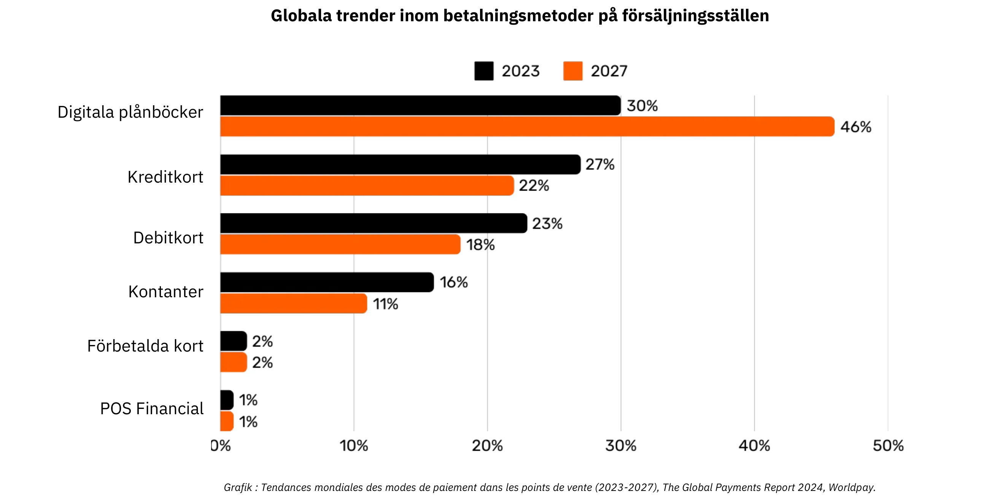

*Grafik: Globala trender inom betalningsmetoder för försäljningsställen (POS) (2023-2027), The Global Payments Report 2024, Worldpay.*

### Komplexiteten bakom en enkel kortbetalning

När en kund använder ett kreditkort i en butik läses kortet av kassaterminalen, som på ett säkert sätt överför transaktionsuppgifterna till handlarens inlösande bank. Inlösaren vidarebefordrar denna information till det relevanta kortnätverket (t.ex. Visa eller Mastercard), som sedan vidarebefordrar begäran till utgivaren - den bank som tillhandahöll kundens kort. Kortutgivaren kontrollerar kundens konto eller kreditgräns och skickar tillbaka en auktorisation via nätverket och inlösaren, vilket gör det möjligt för handlaren att acceptera betalningen.

Denna till synes enkla transaktion omfattar i själva verket över 15 steg och involverar sju mellanhänder. Det tar i genomsnitt mellan 48 timmar och fem dagar innan handlaren faktiskt får pengarna. Under dessa dagar genomförs en clearing- och avvecklingsprocess, där kortnätverket samlar in dagens transaktioner och samordnar överföringen av medel mellan inlösaren och utgivaren. En centralbank säkerställer att mellanbanksavvecklingarna sker korrekt och stabilt. Slutligen sätts nettobeloppet (efter avgifter) in på handlarens bankkonto av inlösaren, och därmed är transaktionens livscykel avslutad.

Sammantaget är denna process invecklad, tidskrävande och kostsam för vad som borde vara den enkla handlingen att flytta värde från en part till en annan.

### Jämförelse av betalningsmetoder

| Betalningsmetod                | Auktorisering Krävs?            | Transaktionsgodkännande (Handlarperspektiv) | Avvecklingstid (Medel Helt Avvecklade)        | Slutgiltighet (Enkelt att Återkalla)     | Antal Mellanhänder             | Typiska Avgifter (till Mottagare)          |
| ------------------------------ | ------------------------------- | -------------------------------------------- | --------------------------------------------- | ---------------------------------------- | ------------------------------ | ------------------------------------------ |
| **Kontanter**                  | Nej                             | Omedelbart (Fysiskt Utbyte)                 | Omedelbart (Ingen Avvecklingsfördröjning)    | Hög (Irreversibel När Betald)           | Inga                           | Inga                                       |
| **Checkar**                    | Ja (Bankclearing)               | Acceptans vid Insättning (Ej Garanterat)    | Flera Dagar (Checkclearing-process)          | Medium (Kan Studsa/Stoppas Före Clearing) | Bank                           | **Låg till Medium** (Bankavgifter)        |
| **Banköverföringar**           | Ja (Bank/Nätverk)               | Bekräftelse Inom Timmar                     | Samma Dag eller Nästa Dag (Inrikes)          | Hög (Vanligen Irreversibel När Skickad) | Banker, Betalningsnätverk      | **Medium** (Fast/Procentuell)             |
| **Betalkort**                  | Ja (Kortutgivares Auktorisering) | Sekunder till Minuter (Auktoriseringskod)   | Några Dagar (Interbankavveckling)            | Medium (Återkrav Möjligt)               | Utgivare, Inlösare, Kortnätverk | **Variabel (1-3% av Transaktion)**        |
| **Digitala Plånböcker/Mobilbetalning** | Ja (Plånboksleverantör/Bank)    | Sekunder (Omedelbar Bekräftelse)             | Vanligen 1-2 Dagar (Beror på Finansieringskälla) | Medium (Återbetalning/Tvist Möjlig)     | Banker, Plånboksoperatörer     | **Låg till Medium (Varierar)**            |

### Begränsningar i befintliga lösningar

Den traditionella betalningsindustrin representerar en årlig ekonomi på cirka 2.200 miljarder dollar, vilket är ungefär en tiondel av USA:s BNP eller lika mycket som Frankrikes BNP. Eftersom valutor fungerar som nätverk med tillstånd finns det begränsad konkurrens, vilket gör att denna "tjänst" mer liknar en skatt som läggs på den produktiva ekonomin. Utöver de kostnadsbördor som detta skapar finns det flera andra begränsningar, vilka beskrivs nedan.
| Begränsning                      | Förklaring                                                                                                                                                                                                                         | Påverkan                                                                                             |
| -------------------------------- | ---------------------------------------------------------------------------------------------------------------------------------------------------------------------------------------------------------------------------------- | ---------------------------------------------------------------------------------------------------- |
| Höga Kortavgifter                | Interchange-avgifter (~0,3%), nätverksavgifter (fasta eller 0,3%-1%), terminal-/PSP-prenumerationer och bankmarginaler (0,5%-1,7%) summerar till en betydande kostnad—som en global "skatt" på produktiva sektorer, uppgående till biljoner dollar. | Ökar handelskostnader, minskar marginaler och kan potentiellt driva upp konsumentpriser.            |
| Mycket Långsam Slutavveckling    | Avveckling av medel kan ta upp till 5 dagar, vilket bromsar penningflödet och den övergripande ekonomiska aktiviteten.                                                                                                            | Försenar likviditet för handlare och minskar hastigheten på ekonomisk cirkulation.                  |
| Bedrägeri                        | E-handelskanaler är kraftigt utsatta för bedrägeri, vilket bidrar till betydande förluster (t.ex. 28 miljarder dollar). Återkrav kan nå ~174 miljarder dollar globalt år 2024. Hantering av dessa tvister konsumerar tid och orsakar mental stress. | Ökade driftskostnader, komplexa bedrägeripreventa åtgärder och minskat kundförtroende.             |
| Övergivna Kundvagnar             | Ytterligare säkerhetssteg (engångskoder, tvåfaktorsautentisering under PSD2) introducerar friktion vid utcheckning.                                                                                                               | Högre komplexitet vid utcheckning leder till ökade övergivna kundvagnar och förlorade försäljningar. |
| Höga Minimibelopp för Transaktioner | Minimibelopp för kort kan tvinga handlare och konsumenter till opraktiska prissättnings- eller köpvillkor, vilket avskräcker småbelopstransaktioner.                                                                          | Minskad kundnöjdhet och flexibilitet, potentiellt begränsar impuls- eller lågriskköp.              |
| Långsam Förauktorisering         | Nuvarande system kan inte hantera transaktioner med millisekundhastighet eller stödja kontinuerliga, realtidsbetalningsflöden.                                                                                                   | Begränsar användningsfall som kräver omedelbar eller strömbetalningar, begränsar innovation och skalbarhet. |
| Behov av Bank-/Kortkonto         | Åtkomst till dessa betalningsmetoder kräver ett länkat bank- eller kortkonto, vilket automatiskt utesluter de utan sådana konton.                                                                                                | Begränsar finansiell inkludering, minskar tillgång för personer utan bank eller underbanking.       |
| Upprepad Skapande av Onlinekonton | Användare måste ofta skapa flera onlinekonton, vilket leder till trötthet, minskad bekvämlighet och ökad exponering av personlig data.                                                                                           | Försämrar användarupplevelsen, ökar integritetsproblem och ökar risken för dataintrång.             |
| Valutaväxlingsavgifter (FX)      | Brist på en universell beräkningsenhet tvingar till kostsamma valutakonverteringar för gränsöverskridande transaktioner.                                                                                                         | Tillför extra kostnader för internationell handel, gör globala transaktioner mindre överkomliga.    |

Precis som vi gick från att betala per minut för röstsamtal till att använda nästan gratis IP-baserad kommunikation, kan framväxten av mer öppna och effektiva nätverk omdefiniera betalningar, minska kostnader och mellanhänder samt främja nya affärsmodeller.

## Bitcoin för företag: en framväxande valuta

<chapterId>4488fe33-663f-41a3-a668-e9ca2fb7122e</chapterId>

**VAD ÄR BITCOIN?**

Bitcoin är ett peer-to-peer-system för digitalt utbyte och handel (elektroniska kontanter). Termen "Bitcoin" hänvisar till följande komponenter:

- **Ett datorprotokoll** som underlättar värdeöverföring på internet utan mellanhänder, utan krav på tillstånd samt pseudonymt. Det använder avancerade kryptografiska principer.
- **Ett fysiskt nätverk** av internetanslutna maskiner (noder, miners etc.) som drivs av privatpersoner och företag och som utgör ett decentraliserat system (utan någon central myndighet eller kontrollpunkt).
- **Värdeenheten** inom systemet. Det kommer aldrig att finnas mer än 21 miljoner bitcoins. Varje bitcoin är delbar i 100 miljoner enheter som kallas "satoshis", uppkallad efter dess anonyma skapare.

Tillsammans gör de Bitcoin till en **innehavartillgång** och en digital valuta **utan utgivare**. Ägarskap är säkrat enbart genom innehav av den **privata kryptografiska nyckeln**, vilket ger full kontroll **utan mellanhänder eller betrodda tredje parter**. När ägarskap överförs är **finaliteten** omedelbar: den nya innehavaren äger den helt utan att förlita sig på en central myndighet för skydd eller konvertibilitet. Transaktioner är **oföränderliga** - när de väl har registrerats på blockkedjan kan de inte ändras eller raderas.

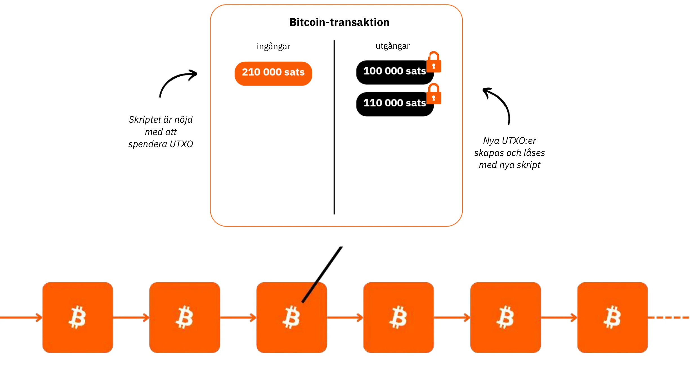

Bitcoin har en fast penningpolitik, med ett **tak på 21 miljoner bitcoins**, av vilka ~19,8 miljoner redan har distribuerats. Detta gör den **deflationär**, med ett värde som ökar över tid när användarna förvarar besparingar och produktivitetsvinster i den.

Dess tekniska egenskaper överträffar guld och dollar tillsammans, vilket gör den till den hårdaste finansiella tillgången som någonsin skapats. Bitcoin är både en värdebevarare och ett bytesmedel, en valuta som håller på att formas. Föreställ dig att snabbt överföra värde från ett företags kassa till ett annat, utan mellanhänder, till minimal kostnad, utan bedrägeri, dygnet runt och utan att någon tredje part är inblandad.

Bitcoin bevarar effektivt sitt värde eftersom dess register är manipuleringssäkert. Dess värde ökar på grund av dess sällsynta och begränsade utbyd i kombination med det växande antalet växelmöjligheter, som drivs av det ökande antalet användare.

Bitcoin är omvälvande eftersom det uppmuntrar oss att lära oss begrepp inom matematik, kryptografi, ekonomi och historia som vi aldrig har fått lära oss. Även om det ofta uppfattas som komplext är det i själva verket en innovation som är tillgänglig genom övning och experiment.

Bitcoin får oss att tänka om kring pengars grundläggande natur. Kan du förklara vad pengar egentligen är? En löntagare eller entreprenör kan ägna 50 000 till 100 000 timmar av sitt liv åt att tjäna pengar, men hur många **ägnar ens 100 timmar åt att förstå det bättre** och bevara det? Bitcoin uppmuntrar oss att ifrågasätta de grundläggande orsakerna bakom vårt behov av pengar och vårt tidsperspektiv. Är pengar till för omedelbar lyx eller långsiktig motståndskraft? Vilka val skulle vi göra om vi hade en tillgång med värdeökning som gjorde att vi kunde skjuta upp våra inköp? Vilka samtal skulle vi vilja ha med oss själva om 20 eller 30 år?

**BITCOINS IDENTITETSKORT**

- **Ålder:** 15 år (3 januari 2009)
- **Dagligt växlingsvärde:** 10 miljarder USD (> CAC40)
- **Börsvärde:** 1,8 biljoner dollar (> Meta, Visa, Silver ; < Apple, Google, Guld)
- **Användare:** ~100 till 200 miljoner (1-2% av världens befolkning)
- **Volatilitet:** I grunden ingen (1 Bitcoin = 1 Bitcoin), externt mycket hög (i fiatvalutaväxling)
- **Prestanda:** Första transaktionen på 0,0009 dollar; nu 100 000 dollar (x100 miljoner)
- **Nätverkstillgänglighet (drifttid):** 100% sedan 2013
- **Dödförklarad eller kritiserad:** En gång i månaden

**Ett under av mänskligt samarbete**

- Helt och hållet **öppen källkod**
- **Juridisk person:** Ingen
- **VD:** Ingen
- **Riskkapitalinvesteringar:** Inga
- **Marknadsföring:** Ingen
- **FoU:** Volontärstyrd
- **Styrning:** Av användarna
- **Innovativ ekonomisk modell:** Blockskapande subventioneras av transaktionsavgifter (auktionsbaserad)

För mer information om Bitcoin, dess historia, hur det fungerar och hur det används, föreslår jag också att du följer denna andra omfattande kurs:

https://planb.network/courses/2b7dc507-81e3-4b70-88e6-41ed44239966

## Introduktion till Lightning Network

<chapterId>c095c7ad-5469-4c7b-9510-b6c0b86244e7</chapterId>

**VAD ÄR LIGHTNING?**

Lightning Network är **ett protokoll och ett nätverk** som underlättar Bitcoin-transaktioner med minimal interaktion med blockkedjan. Så här fungerar det:

- **Initial konfiguration:** Medel låses (escrow) på huvudblockkedjan för att upprätta en betalningskanal mellan två parter.
- **Betalningsnätverk:** Ett nät av betalningskanaler mellan flera parter utgör ett betalningsnätverk (routing och sammankoppling).
- **off-chain-transaktioner:** Transaktioner sker mellan parter men publiceras **inte omedelbart** på Bitcoins huvudblockkedja (**"off-chain"**).
- **On-chain-avveckling:** Endast **det slutliga saldot** av en kanals transaktioner publiceras på Bitcoins huvudblockkedja (**"on-chain**"), vilket gör att många transaktioner kan ske under tiden. Denna sammanfogning av flera betalningar minskar överbelastningen och sänker därmed avgifterna jämfört med att göra många on-chain-transaktioner.
- **Kanalstängning:** En användare kan när som helst stänga sin kanal och återfå sina bitcoin genom att publicera det senaste transaktionsstatuset. Detta är principen för transaktioner som är **"publicerbara" när som helst men "opublicerade"** tills det är nödvändigt. Avslutet (kanalstängning) kan vara ensidigt (beslutas av någon av de två parterna när som helst) eller ömsesidigt beslutat (vilket resulterar i lägre on-chain-avgifter)

Detta tillvägagångssätt undviker långsamheten och komplexiteten i att utföra varje transaktion direkt på Bitcoins huvudblockkedja, som endast registrerar slutliga saldon och behåller sin säkerhet. Lightning Network är en nivå "ovanpå" Bitcoin men förblir förankrad i den.

**Ett globalt betalningsnätverk**

Protokollet skapar ett **nätverk** av maskiner där kanalerna bildar ett universellt betalningssystem. Dessa noder kan drivas fritt av privatpersoner eller företag, vilket gör det till ett helt öppet nätverk.

Lightning Network möjliggör omedelbar värdeöverföring med ljusets hastighet. Det är som ett e-postprotokoll tillämpat på betalningar: ett nästa generations betalningsnätverk. Det förändrar radikalt hur "pengar" rör sig och gör det lika fritt och snabbt som dataöverföring på internet.

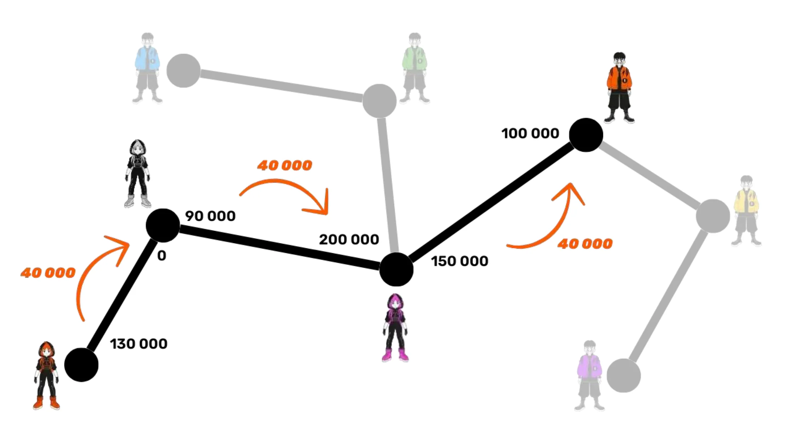

**Viktiga fördelar:**

- **Hastighet:** Omedelbara transaktioner.
- **Låga avgifter:** Mycket lägre kostnader jämfört med traditionella banknätverk.
- **Lätt att ta i bruk:** Företag kan snabbt börja ta emot Lightning-betalningar med hjälp av en smartphone-app eller en betalningsknapp på sin webbplats.

Lightning-infrastrukturen överträffar traditionella betalningssystem när det gäller hastighet, kostnad och energieffektivitet. I takt med att allt fler handlare anammar systemet kommer utvecklingen att accelerera: om betalningar kan gå förbi det begränsade mellanbanksnätverket, varför då fortsätta att ge upp en betydande del av intäkterna till dagens mellanhänder?

**Oändliga användningsområden**

Lightnings tillämpningar sträcker sig långt bortom låga avgifter och snabbhet. Genom att erbjuda en helt kostnadsfri och omedelbar betalningsväg öppnas enorma möjligheter i hela ekonomin.

**Förstärkning av Bitcoins utbyteskapacitet:**

Lightning förstärker Bitcoins roll som ett "bytesmedel". Genom att öka frekvensen och friheten för transaktioner förstärker den pengarnas primära funktion: att underlätta ekonomiska utbyten och värdeskapande för alla användare.

Den framtida "smarta maskinekonomin" kommer att kräva ett ultrasnabbt och högfrekvent betalningssystem, en teknisk standard som endast Lightning kan uppfylla. Detta möjliggör skapandet av fler varor och tjänster. Eftersom Bitcoins utbud förblir begränsat kommer varje enhets köpkraft att öka. Bitcoin och Lightning växer sig starkare tillsammans i takt med att deras nätverk expanderar.

Lightning ger en inblick i en framtid där alla verksamheter som har blivit internetbaserade också kommer att bli Bitcoin-baserade.

**Bitcoin-betalningar på Lightning: Ett typiskt användningsfall för en handlare**

Lightning Network är idealisk för Bitcoin-betalningar i fysiska butiker eller onlinebutiker tack vare sin snabbhet och betalningsförmåga.

- **Hastighet:** Lightning (~500 ms till några sekunder) är betydligt snabbare än Bitcoins huvudnätverk, där det kan ta cirka 30 minuter att bekräfta transaktioner. För stora inköp (långt över 1 000 USD) kan Bitcoins huvudnätverk fortfarande vara att föredra, eftersom hastigheten är mindre kritisk. Dessa detaljer är dock ofta dolda för den genomsnittliga användaren, eftersom applikationer hanterar dessa beslut sömlöst i bakgrunden.
- **Finalitet:** När en betalning har gjorts på Lightning är den slutgiltig. Det finns ingen möjlighet till återbetalningar från tredje part eller bedrägerirelaterade tvister.
- **Avgifter:** Transaktionsavgifterna på Lightning Network är minimala och betalas av användaren, inte av säljaren. Handlare drabbas endast av avgifter om de senare behöver överföra sina bitcoins till ett annat nätverk eller en annan tjänst.

**LIGHTNINGS IDENTITETSKORT**

- **Uppfinning:** 2015
- **Lansering:** 2016
- **Ålder:** 7 år (första transaktionen: 28 december 2017)
- **Nätverkets tekniska förmåga:** i stor skala kan det hantera 1.000 gånger fler omedelbara transaktioner än traditionella system.
- **Transaktionsstorlekar:** Från lika stora till 1.000 gånger mindre än traditionella system.
- **Transaktionshastighet:** Upp till 100 gånger snabbare.
- **Avgifter:** Upp till 90% lägre.
- **Betalningens slutgiltighet:** Nära omedelbar (ofta ~500 millisekunder, ibland några sekunder).
- **Energiförbrukning:** ~8% av det traditionella globala monetära systemet.
- **Kännetecken:**
    - Peer-to-peer
    - Universiell
    - Tillståndsfri
    - God integritet
    - Bevisad säkerhet
    - Hög tillgänglighet (utmärkt drifttid)
    - Kontrollerbar och anpassningsbar

För mer information om det tekniska arbetet med Lightning Network föreslår jag också att du kollar in denna andra omfattande kurs:

https://planb.network/courses/34bd43ef-6683-4a5c-b239-7cb1e40a4aeb

# Bitcoin i företagskassan

<partId>bf45c1e8-af97-4b6b-af42-2866f493b14d</partId>

## Vinst, kapital och nycklarna till ett motståndskraftigt näringsliv

<chapterId>656ad88f-3c27-4054-a94e-b29727009b8e</chapterId>

### Ett sunt företag

**Framtiden är osäker**, och företagen måste navigera i denna osäkerhet med ett tydligt fokus på att göra vinst och bevara kapital. Enligt österrikisk ekonomi är **vinster den ultimata signalen för ett företags hälsa** - de visar att verksamheten tillgodoser konsumenternas behov på ett effektivt sätt. Utan vinst kan ett företag inte upprätthålla sig självt, än mindre växa. För att ett företag ska förbli sunt måste det inte bara göra vinster utan också tänka framåt och **förvara kapital för framtida investeringar och utmaningar**.

**Kapitalbevarande** är avgörande eftersom det gör det möjligt för företag att anpassa sig och ta vara på möjligheter på en oförutsägbar marknad. Detta innebär att man måste hitta en balans mellan att återinvestera vinster för att växa och att upprätthålla en finansiell buffert för att klara av eventuella nedgångar. Österrikisk ekonomi lyfter fram vikten av **"tidspreferens"**, vilket innebär att företag noggrant måste bestämma hur mycket de ska prioritera omedelbar avkastning jämfört med att investera för långsiktig framgång. Ett sunt företag håller sin finansiella grund stark, vilket säkerställer flexibilitet i både goda och dåliga tider.

Marknadssignaler som priser och konkurrens hjälper företag att fatta smarta beslut om resursfördelning. Genom att lyssna på dessa signaler kan företag undvika fällan att överexponera sig själva eller göra dåliga investeringar - särskilt sådana som påverkas av artificiella faktorer som lätt kreditgivning. Felaktig resursallokering äventyrar inte bara företagets hälsa utan minskar också dess förmåga att betjäna kunderna på ett effektivt sätt.

I slutändan innebär en sund verksamhet att man måste vara anpassningsbar, göra kloka finansiella val och alltid ha ett öga på framtiden. **Genom att fokusera på vinst, bevara kapital och reagera på marknadssignaler kan företag - stora som små - blomstra även under osäkra förhållanden**.

### Har kapital en dygd?

**Hur kapital generellt framställs**

Låt oss återupptäcka vad kapital verkligen är - en term som så ofta missförstås och uppfattas negativt i vårt samhälle.

I traditionell ekonomisk teori (keynesiansk) ses kapital ofta förenklat som ett homogent lager av fysiska eller finansiella tillgångar som främst används för att stimulera den samlade efterfrågan genom investeringar. Det förknippas ofta med koncentration av rikedom och den ekonomiska makt som innehas av en liten elit. I ett sammanhang där förmögenhetsklyftorna fortsätter att öka ser många kapital som en symbol för ekonomisk ojämlikhet, särskilt när ackumulerad förmögenhet inte verkar vara till någon nytta för majoriteten.

"Kapital" framställs ofta som ett verktyg för exploatering, och detta perspektiv har haft stort inflytande på olika rörelser som ser kapital som något som i sig står i motsättning till arbetarnas intressen. Men är detta sant? Eller kan denna uppfattning vara förvrängd av:

1. Bristande förståelse för ekonomiska mekanismer (även hos ekonomerna själva)?

2. Statlig interventionism och marknadsmanipulation?

3. Förväxling mellan klientkapitalism och frimarknadskapitalism?

4. Mediernas framställning av ekonomiska kriser?

5. En önskan om snabba lösningar och omedelbar social rättvisa?

6. Den kulturella normaliseringen av antikapitalistisk retorik?

Lyckligtvis får Bitcoin oss att tänka om och utmana dessa förutfattade meningar. Det finns en tankeskola - den österrikiska ekonomiska skolan - som kan kasta ljus över dessa frågor och hjälpa oss att ompröva kapitalets sanna natur.

**Det var en gång**

Låt oss börja med en kort berättelse:

"På en liten öde ö bor en ensam fiskare. Varje dag tillbringar han timmar med att fånga fisk med sina bara händer, en aktivitet som tar mycket av hans tid och energi. En dag får han en idé: att tillverka ett spjut som gör det möjligt för honom att fiska mer effektivt. Men han vet att detta kommer att kräva en uppoffring.

Innan han börjar tillverka spjutet bestämmer sig fiskaren för att lägga undan lite fisk för att klara sig under tillverkningsprocessen. Han äter mindre än vanligt under några dagar och sparar tillräckligt med fisk för att kunna fokusera på sitt projekt. Den sparade fisken utgör hans **kapital**, en liten reserv som gör det möjligt för honom att fullfölja sitt mål.

Medan han ägnar sin tid åt att tillverka spjutet, förlitar han sig på sina reserver och fördröjer gärna några av sina omedelbara bekvämligheter (en återspegling av hans **tidspreferens**). Efter flera dagars hårt arbete färdigställer han ett robust spjut.

Med spjutet kan han nu fånga fisk mycket snabbare och med mindre ansträngning. Han behöver inte längre slita ut sig som tidigare och börjar till och med samla på sig ett överskott av fisk. Detta överskott öppnar nya möjligheter: han kan förvara det, dela med sig av det eller investera det i andra projekt på ön. Genom att skjuta upp den omedelbara konsumtionen och utnyttja sitt kapital har fiskaren avsevärt förbättrat sin effektivitet och sina framtidsutsikter."

Denna historia illustrerar den grundläggande roll som kapital, tålamod och framsynthet spelar för att bygga en bättre framtid - begrepp som är centrala för ekonomisk tillväxt och mänskliga framsteg.

### Den österrikiska ekonomiska skolan och dess syn på kapital

Den österrikiska ekonomiska skolan har fått sitt namn efter sina grundare och tidiga bidragsgivare, som ursprungligen kom från Österrike. Namnet fastnade och skolan har sedan dess blivit nära förknippad med klassiskt liberalt tänkande, med betoning på individuell frihet, fria marknader och minimal statlig inblandning.

**Det österrikiska perspektivet på kapital**

Enligt den österrikiska synen är kapital djupt förknippat med idén att skjuta upp konsumtion för att bygga verktyg eller produktionsresurser som förbättrar framtida produktion. Denna process, som kallas kapitalackumulation, är central i den österrikiska ekonomiska teorin. Viktiga element i detta perspektiv inkluderar:

- **Tidspreferens och uppskjuten konsumtion**: Individer föredrar naturligtvis att konsumera nu snarare än senare, men de kan välja att skjuta upp konsumtionen om de förväntar sig större belöningar i framtiden. Genom att spara idag kan resurser investeras i kapitalvaror (verktyg, maskiner, infrastruktur) som förbättrar produktiviteten över tid. Samhällen eller individer med lägre tidspreferens sparar mer och investerar i långsiktiga projekt, vilket främjar en hållbar tillväxt.
- **Kapital som drivkraft för framtida produktion**: Kapitalvaror ses som mellanliggande verktyg som används för att producera slutliga konsumtionsvaror. Genom att samla på sig kapital kan företagare öka produktiviteten och skapa mer välstånd i framtiden. I stället för att producera konsumtionsvaror omedelbart kan resurserna till exempel användas för att bygga fabriker eller maskiner. Detta minskar visserligen den kortsiktiga konsumtionen, men den resulterande effektiviteten möjliggör större produktion och välstånd senare.
- **Indirekt produktion och effektivitet**: Österrikiska ekonomer, som Eugen Böhm-Bawerk, lyfte fram idén om indirekt produktion - längre och mer komplexa produktionsprocesser som involverar flera steg. Även om dessa processer tar tid ger de i slutändan mer effektiva och produktiva resultat, till exempel att bygga ett sågverk för att bearbeta trä i stället för att samla in stockar för hand.
- **Räntor som signaler**: Enligt den österrikiska synen speglar räntorna på ett naturligt sätt individers tidspreferenser. Höga räntor indikerar en preferens för omedelbar konsumtion, medan låga räntor uppmuntrar till sparande och långsiktiga investeringar. När centralbankerna manipulerar räntorna på konstgjord väg förvränger de dessa naturliga signaler, vilket leder till felallokerade resurser och ohållbara investeringar.

**Två former av kapital i moderna ekonomier**

Inom ramen för det skuldbaserade monetära system som vi verkar i **finns det en andra typ av kapital**: ett som genereras omedelbart när en bank skapar ett lån genom en enkel kreditmekanism. Det handlar om skapande av likviditet ex nihilo, där banken lånar ut pengar som den i förväg egentligen inte har, utan skapar dem baserat på ett löfte om återbetalning.

Å ena sidan är det "österrikiska" kapitalet resultatet av verkliga besparingar, en process som innefattar genomtänkta ekonomiska beslut och noggranna uppoffringar. Å andra sidan är det kapital som genereras genom skapandet av skuldbaserade pengar en omedelbar och artificiell konstruktion. Dessa två typer av kapital, även om de **på ytan liknar varandra i sin användning för att finansiera projekt, är fundamentalt olika till sin natur**.

Dessa två former av kapital bör aldrig blandas ihop, men i ett skuldbaserat system gör de ofta det, vilket **förvränger de ekonomiska signalerna** och leder ofta till felinvesteringar. Detta missförstånd belyser varför kapitalismen ofta får obefogad kritik.

**Huvudproblemet med keynesianism**

Den keynesianska politiken, som är allmänt accepterad av den globala eliten, manipulerar räntorna och stimulerar efterfrågan genom skuldsättning. Detta uppmuntrar resurser att flöda till kortsiktiga, ohållbara projekt, vilket förstärker ekonomiska cykler och fördröjer verklig tillväxt som är rotad i sunda besparingar och produktiva investeringar. Företagsledare ser denna skadliga politik på nära håll när sunda företag drivs in i övervärderade förvärv i jakt på överdriven avkastning, vilket underminerar organisk och hållbar tillväxt.

I en sådan miljö, hur kan "sunt" kapital - omsorgsfullt sparat av entreprenörer - konkurrera med artificiellt skapat "ohälsosamt" kapital? Den obalanserade expansionen av penningmängden underminerar även köpkraften hos sunt kapital och fördjupar därmed både den ekonomiska förvirringen och det sociala missnöjet.

**En glimt av hopp: Bitcoin**

Bitcoin erbjuder ett sätt att ackumulera och bevara kapital på lång sikt utan den erosion som orsakas av monetär inflation. Som värdebevarare gör den det möjligt för företag att planera framtida investeringar med motståndskraft, vilket utmanar dominansen av skulddrivna system och främjar en återgång till sann, produktiv kapitalackumulering.

### Mer om den österrikiska skolan inom nationalekonomi

Den **österrikiska ekonomiska skolan** är en tradition av ekonomiskt tänkande som värdesätter fria marknader, individuell frihet och vikten av mänskligt handlande i ekonomiska processer. Den kritiserar statliga ingripanden, särskilt när det gäller pengar och marknader, och hävdar att individer, vägledda av sina subjektiva preferenser, är de bästa bedömarna av sina egna intressen.

**Nyckelpersoner inom den österrikiska skolan**

- **Carl Menger**: Grundaren av den österrikiska skolan, Menger, utvecklade teorin om subjektivt värde, som hävdar att värdet på varor beror på individuella preferenser snarare än produktionskostnader.
- **Ludwig von Mises**: En av hörnstenarna i den österrikiska skolan, Mises introducerade praxeologi (teorin om mänskligt handlande) och skrev _Human Action_, en djupgående kritik av socialism och centralplanering.
- **Friedrich Hayek**: Elev till Mises, Hayek fick Nobelpriset i ekonomi 1974 för sitt arbete med decentraliserad kunskap och spontanitet på marknaden. I sin bok _The Road to Serfdom_ kritiserade han starkt centraliserad kontroll.
- **Murray Rothbard**: Rothbard, som var en lärjunge till Mises och en stark förespråkare för libertarianism, utvecklade teorin om anarkokapitalism och föreställde sig ett statslöst samhälle som styrs av frivilliga avtal. Hans bok _Man, Economy, and State_ är ett banbrytande verk inom österrikisk ekonomi.

**Andra inflytelserika ekonomer**

- **Milton Friedman**: Även om Friedman inte direkt förknippas med den österrikiska skolan stödde han många marknadsvänliga och liberala idéer. Hans monetaristiska politik skiljer sig från österrikiska tankar men delar deras kritik av överdriven statlig inblandning i ekonomin.
- **Frédéric Bastiat**: Bastiat var en fransk ekonom på 1800-talet som påverkade den österrikiska skolan med sina verk om frihandel och de osynliga konsekvenserna av ekonomisk politik. Hans essä _What Is Seen and What Is Not Seen_ är en grundläggande text i den ekonomiska liberalismen.

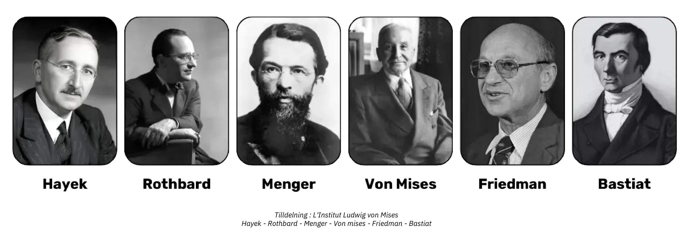

*Källa: Ludwig von Mises-institutet*

**Centrala bidrag och idéer**

Dessa tänkare har format idén om att statliga ingripanden snedvrider marknader och att ekonomisk frihet är en förutsättning för välstånd och harmonisk samordning av mänskliga handlingar. Deras insikter belyser vikten av decentraliserat beslutsfattande och farorna med centraliserad kontroll i ekonomiska system.

För mer information om detta ämne:

https://planb.network/courses/d955dd28-b7c6-4ba2-a123-d932e21d148f
https://planb.network/courses/9d1bde6a-33e5-45dd-b7c0-94da72e45b11
https://planb.network/courses/d07b092b-fa9a-4dd7-bf94-0453e479c7df

## Innehav av Bitcoin i företagskassan

<chapterId>89622a40-d14f-4c37-a075-8e7e1731ec26</chapterId>

### Utmaningarna för företagskassan

Kassan är den plats där man förvarar dyrbara saker. Ett sunt företag är väl kapitaliserat för att kunna hantera framtida osäkerhet och planera sina investeringar. Numera placeras en del av överskottet i finansiella tillgångar som anses ha hög "likviditet", till exempel obligationer, tidsbundna insättningar och så vidare.

Under en mycket lång tidshorisont använder vissa företag illikvida tillgångar som fastigheter utan att inse vissa faror:

- Illikviditet i händelse av kris
- I slutändan ganska låg avkastning när avgifterna har dragits av
- En avkastning som inte överstiger den verkliga inflationen – det vill säga tillväxttakten i penningmängden (cirka 7 % per år, se nedan).
- Den dolda risken att fastigheter förlorar en del av sin "sparfunktion" till förmån för tillgångar som Bitcoin. Som ett resultat kan det återgå närmare sitt "användningsvärde": att ge skydd.

Låt oss snabbt gå igenom den miljö som företagen verkar i.

**Verklig inflation**: Till förtret för sitt uppdrag har centralbankerna ett inflationsmål på 2% per år, vilket innebär en värdeminskning på 40% på 20 år. Om man lägger till perioder med mer uttalad inflation blir det tydligt att företag inte enbart kan använda valuta för att lagra frukterna av sitt arbete. De måste genomföra komplexa finansiella strategier, som ofta är förenade med en rad risker. Dessa strategier är uppenbarligen **otillgängliga för mycket små företag**, som redan är kraftigt upptagna av sin kärnverksamhet.

**Dold inflation**: I ett skuldbaserat monetärt system med fraktionella reserver som stöds av centralbanker växer **den totala penningmängden med i genomsnitt cirka 7 % per år** (t.ex. M1 i Eurozone eller USA). Det innebär att din "andel av kakan" halveras på bara några år - såvida du inte har privilegierad tillgång till det finansiella flödet och kan fortsätta att växa genom att belåna och köpa tillgångar snabbt till "gamla priser" innan de nyskapade pengarna driver upp dem. Detta är Cantillon-effekten, som delvis förklarar förmögenhetsöverföringen till de mer välbärgade, medan "kapitalet" felaktigt beskylls för att vara boven i dramat (se vår introduktion om kapital ovan).

**Motpartsrisker**: Det nuvarande finansiella systemet är riskfyllt och det är inte säkert att du alltid har tillgång till "dina pengar". Utan att åberopa bilden av ett korthus måste det erkännas att finansinstitut privatiserar vinster och socialiserar förluster vid minsta kris. I ett system med "skriftenliga" pengar (pengar som registrerats i ett register) är pengarna på banken bara en "fordran"; du äger dem inte på riktigt och bankerna själva "har dem inte" (fraktionella reserver). Dessa pengar är på sätt och vis helt magiska. Vissa prestigefyllda banker som en gång i tiden hånade Bitcoin finns inte längre kvar idag, till exempel Credit Suisse.

Denna brist på förtroende leder till ett uppsving för "innehavartillgångar" som guld (även om det är komplicerat att säkra, transportera och dela upp, etc.) och naturligtvis Bitcoin, nykomlingen.

### Bitcoin som en finansiell tillgång

Bitcoin erbjuder ett radikalt alternativ. Det är **en innehavartillgång, utan någon central utgivare**, är nästan omöjlig att beslagta och drar nytta av nätverkseffekter. "Sanna" Bitcoin-användare väljer att använda den för att lagra frukterna av sitt arbete, eftersom den ses som en värdebevarare som är resistent mot både censur och inflation. Tack vare nätverkseffekten, som illustreras av Metcalfes lag, ökar varje ny övertygad användare nätverkets värde; när antalet deltagare växer stiger Bitcoins nytta exponentiellt. Denna modell gör det till en distinkt och lovande form av kapital, byggd på användaradoption och förtroende.

Bitcoin är den **mest likvida tillgången i världen** och fungerar 24/7 utan avbrott, till skillnad från traditionella finansmarknader som har stängningstider och "avbrottsmekanismer". Denna likviditet gör det möjligt för användare att köpa eller sälja bitcoins när som helst, oavsett om det är som svar på goda eller dåliga nyheter (t.ex. missiluppskjutningar, krig etc.).

Under ett decennium har Bitcoin uppvisat en genomsnittlig årlig tillväxt på mer än 60%. Denna unika utveckling har gjort det möjligt för långsiktiga innehavare att bevara sitt startkapital, till skillnad från andra instrument.

Det finns dock flera viktiga faktorer att tänka på:

För det första: **tidigare resultat garanterar inte framtida resultat**. Så länge Bitcoin förblir **säker och decentraliserad** kan man rimligen hoppas på en årlig prisuppgång på långt över 20% per år under det kommande decenniet, vilket gör det till ett livskraftigt verktyg för kassan.

För det andra har Bitcoin hittills upplevt **4-årscykler**, vilket innebär att med en tidshorisont på mer än 4 år har spelet alltid varit lönsamt. För dem som ser Bitcoin som en investering kan en kortsiktig horisont (<4 år) vara riskfylld.

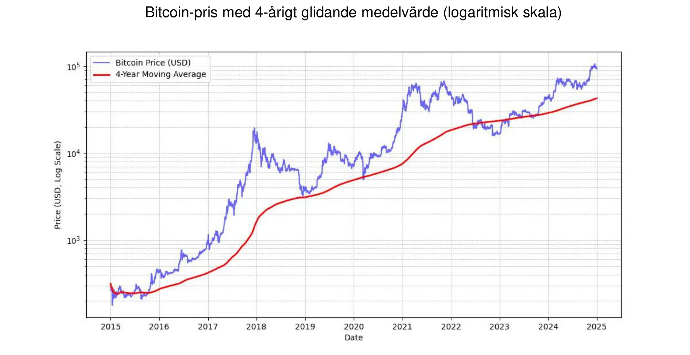

*MICHAEL SAYLOR: "Den bästa prissignalen för Bitcoin är det 4-åriga enkla rörliga medelvärdet."* Se ovanstående diagram.

Dessutom är det lämpligt att hålla sin exponering för Bitcoin **proportionell** i förhållande till sin förståelsenivå. Det är också viktigt att inte ha bråttom eller att försöka tajma marknaden perfekt.

Slutligen betraktas Bitcoin som **volatil**, men det är egentligen priset i fiatvaluta som uppvisar det. En del av denna volatilitet är naturlig för en fortfarande ung tillgång, men den förstärks också av närvaron av spekulanter som inte använder den som en långsiktig värdebevarare utan istället söker snabba vinster. Dessutom betonar hävstångshandel (användning av lånade medel för att öka handelspositionerna) både uppåtgående och nedåtgående prisrörelser, vilket förhindrar Bitcoin från att följa en rak uppåtgående bana. Detta leder till mer uttalade fluktuationer, men med tiden, när basen av engagerade användare växer, verkar denna volatilitet stabiliseras. Sammanfattningsvis är det **omöjligt att ha en tillgång som är lika högpresterande som Bitcoin utan volatilitet**, men du kan säkert ha mycket mindre högpresterande tillgångar med mindre volatilitet.

### Bitcoin antas av Wall Street

Att Bitcoin används av finansiella institutioner stärker ytterligare dess position på den globala marknaden.

Nya uttalanden från **BlackRock** belyser Bitcoins potential som en värdebevarande tillgång och ett verktyg för portföljdiversifiering. Den globala institutionella jätten föreslog nyligen att **Bitcoins användartillväxt överträffar internet** eller mobiltelefoner, särskilt driven av **demografiska och generationsmässiga skiften**, samt ökande misstro mot traditionella finansinstitut (!). På grund av dess knappa, icke-suveräna och decentraliserade natur ser vissa investerare Bitcoin som ett säkert alternativ **i tider av finanspolitisk och monetär instabilitet**, rädsla eller störande geopolitiska händelser.

**Spot Bitcoin ETF**, som lanserades i januari 2024, har haft en fenomenal framgång - den **mest framgångsrika** ETF-lanseringen i historien, med nästan 20 miljarder dollar i nettoinflöden från januari till november. Det är ungefär fyra gånger bättre än den näst bästa ETF-lanseringen, Nasdaq-100 QQQ. Dessa ETF:er ger enklare och mer reglerad tillgång till Bitcoin, vilket har **ytterligare legitimerat** det och lockat ett betydande inflöde av institutionellt kapital.

Bitcoin ETF:er leder med bred marginal när det gäller **institutionell adoption** - överträffar de tio snabbast växande ETF:erna - oavsett om det gäller antalet involverade institutioner eller storleken på förvaltade tillgångar. Framgången för dessa Bitcoin ETF:er understryker den växande efterfrågan på investeringsinstrument kopplade till digitala tillgångar och stärker därmed Bitcoins plats i det traditionella finansiella landskapet.

Bitcoin spelar nu som "värdebevarare på **marknaden**. Den representerar bara en droppe i havet när det gäller skala: bara cirka 1 800 miljarder USD jämfört med guldets 18 000 miljarder USD eller fastigheternas 500 000 miljarder USD. Men med en marknadsandel på cirka 0,1 procent finns det ett enormt utrymme för tillväxt, särskilt med tanke på att konkurrenterna kämpar för att locka nya användare.

| Ticker | 1D-flöde (M USD) | 1V-flöde (M USD) | 1M-flöde (M USD) | 3M-flöde (M USD) | YTD-flöde (M USD) |

| ------- | --------------- | --------------- | --------------- | --------------- | ---------------- |

| **Summa** | +457,19 | +1.507,95 | +2.888,01 | +3.672,29 | **+20.262,94**

| IBIT | +393,40 | +750,91 | +1.536,47 | +3.821,37 | +22.460,44 |

| FBTC | +14,81 | +372,40 | +627,16 | +458,71 | +10.266,69 

| ARKB | +11,51 | +163,26 | +295,92 | -3,88 | +2.647,32 

| BITB | +12,93 | +146,50 | +263,30 | +97,46 | +2.262,69 

| HODL | +5,75 | +38,77 | +94,54 | +100,39 | +682,03 

| BRRR | +1,92 | +4,72 | +17,76 | +20,54 | +540,19 

| EZBC | +11,79 | +17,53 | +39,29 | +47,48 | +439,45

| BTC | .00 | -3,13 | +36,59 | +419,18 | +419,18 

+6,43 | +19,25 | +47,30 | +56,41 | +394,82 | BTCO

| BTCW | .00 | +2,84 | +6,04 | +146,69 | +217,47 

| YBIT | -1,34 | -10,26 | +5,06 | +13,81 | +76,30

| DEFI | .00 | .00 | .00 | -2,03 | -1,79 |

| GBTC | .00 | +5,16 | -81,42 | -1503,84 | -20.141,85 

*20 miljarder dollar på 10 månader: Bitcoin ETF:er uppnådde på mindre än ett år vad guld-ETFer tog sig 5 år att uppnå. Källor: Flöden av fondinvesteringar i USD. Bloomberg Terminal, Bloomberg L.P., 2024.*

### Bitcoin i företagets verktygslåda

Den växande användningen av Bitcoin i USA påverkar också tankesättet på andra håll i världen, särskilt bland yrkesverksamma inom förmögenhetsförvaltning som inte längre har råd att inte inkludera det i sitt utbud av verktyg - särskilt när traditionella finansiella produkter underpresterar eller står inför svåra perioder. Endast traditionella banker verkar fortfarande ha råd att ignorera det.

Ur ett rent finansiellt perspektiv är Bitcoin erkänd som en diversifieringstillgång. Den är inte bara okorrelerad med andra tillgångsklasser, den verkar också frodas under perioder med nya likviditetsinjektioner - en annan sådan episod verkar börja med räntesänkningarna från ECB, Fed och Kina.

Sammanfattningsvis passar Bitcoin perfekt för det vanligaste användningsområdet - att investera i överskott av kassan under minst fyra år. Det är värt att kombinera den med en strategi för gradvis inträde: att investera fasta belopp med jämna mellanrum för att jämna ut inträdes- eller utträdespunkten.

Andra användningsområden gör Bitcoin till en strategisk kassatillgång, till exempel:

- Kunna ställa **kollateral** eller likviditet 24/7
- Att kunna överföra till ett annat företags kassa **snabbt, när som helst**
- Säkring mot **valutakursrisk**
- Betalning till en **leverantör** som accepterar det, särskilt i nödsituationer

### Är Bitcoin för dyrt?

Du behöver inte köpa exakt 1 Bitcoin, eftersom Bitcoin är delbart i mindre enheter som kallas satoshis, namngivna för att hedra dess anonyma skapare. En bitcoin motsvarar **100 miljoner satoshis**, vilket gör det möjligt för användare att köpa, sälja eller handla även **mycket små fraktioner av en Bitcoin**. Faktum är att i Bitcoins källkod redovisas alla transaktioner i satoshis, och termen "Bitcoin" förekommer endast i "coinbase", den speciella transaktion som miners skapar för att få sin belöning.

Dessutom kan det totala antalet 21 miljoner bitcoins - eller **2,1 kvadriljoner satoshis** - effektivt representeras av ett 64-bitars heltal. Detta innebär att trots ett högt pris per hel bitcoin förblir den tillgänglig för ett brett spektrum av investerare tack vare dess delbarhet. Du behöver därför inte köpa en hel Bitcoin för att delta i nätverket eller investera i denna digitala tillgång.

Låt oss komma ihåg att dess relativt låga totala marknadsvärde, jämfört med andra tillgångar som aktier, guld eller fastigheter, gör att dess kapacitet för värdeökning är intakt. Eftersom penetrationen fortfarande är mycket låg (cirka 1% av världens befolkning) är det troligt att vi bara befinner oss i början av dess uppgång. Detta gör det till **den mest asymmetriska satsningen i vår generation**: det finns nu en mycket låg sannolikhet för att den kommer att falla till noll vid denna tidpunkt, och en stark sannolikhet för att den kommer att fortsätta att få ökat inflytande.

### Beslutet att allokera företagskassan i Bitcoin

**Beslutsprocessen** för att investera i Bitcoin kommer att påverkas starkt av din position inom företaget. Om du är **majoritetsägare är du fri** att fördela överskott av likvida medel enligt din egen bedömning. Om du däremot är partner eller aktieägare inom en kollektiv beslutsstruktur måste du gå igenom gemensamma överläggningar, vilket kan komplicera saker och ting.

I detta andra scenario blir det viktigt att harmonisera olika synpunkter, eftersom det till stor del **beror på varje intressents förståelse av Bitcoin-tillgången**. Som talesättet lyder: "Bitcoin är allt som folk inte vet om datorer kombinerat med allt som de inte förstår om pengar." Även om en partner har ansträngt sig för att grundligt förstå Bitcoin kan det vara en utmaning att förmedla denna kunskap till andra. I sådana fall är det **tillrådligt att ta in en extern resurs** för att undvika att idén identifieras alltför nära med en individ, vilket kan generera motstånd.

För närvarande är scenariot med en majoritetsägare som fattar beslut det mest representativa bland företag som äger Bitcoin. Här är några verkliga exempel :

- **Oberoende yrkesutövare**: Konsulter, sjukvårdspersonal eller advokater som investerar en del av sin långsiktiga kassa i Bitcoin. I allmänhet har dessa yrkesutövare redan spar- eller tidsbundna depositionskonton med låg avkastning.
- **Chefer inom den tekniska sektorn**: En chef som sålde sitt företag och investerade en del av intäkterna från sitt personliga holdingbolag i Bitcoin för några år sedan. Idag har de en bekväm finansiell situation och återinvesterar i nya satsningar.
- **Ägare av mycket små företag**: Entreprenörer inom tjänster, jordbruk eller hantverk som har förstått Bitcoins potential och avsätter en del av sin kassa till den. Deras primära motivation ligger i diversifiering och den frihet som det ger.
- **Börsnoterade företag** som MicroStrategy har skapat ett prejudikat genom att konvertera en betydande del av sin företagskassa till Bitcoin, vilket visar på ett globalt skifte i företagens allokeringsstrategier. Hösten 2024 hade många andra företag följt efter, vilket ytterligare legitimerade denna trend.

Upptäck den uppdaterade listan över företag som innehar flest bitcoins i kassan, samt de belopp som innehas, på webbplatsen: [BitcoinTreasuries.net](https://bitcointreasuries.net/).
### Beskattning av Bitcoin som ägs av företag

För företag som inte är strukturerade som separata juridiska personer - t.ex. enskilda firmor eller andra icke inkorporerade enheter - speglar beskattningen av Bitcoin-transaktioner ofta den behandling som tillämpas på enskilda personer. I många fall gäller samma regler för kapitalvinster eller inkomster, precis som de skulle göra om en individ sålde Bitcoin. Till exempel kan vinster i vissa länder betraktas som en del av entreprenörens personliga inkomst, som omfattas av **personliga inkomstskatteparenteser**.

Men **registrerade företag** - de som är föremål för bolagsskatt drar ofta nytta av ett mer gynnsamt skatteramverk. Till skillnad från privatpersoner, som kan möta begränsningar när det gäller att kvitta vinster och förluster mellan olika tillgångsslag, kan företag i allmänhet integrera realiserade vinster eller förluster på Bitcoin-transaktioner direkt i sina årliga resultaträkningar. Detta kan leda till en mer flexibel och ibland mer fördelaktig skatteposition.

De specifika skattesatserna och skattebehandlingarna varierar betydligt mellan olika jurisdiktioner. I till exempel Frankrike och många andra västländer kan bolagsskatten ligga på cirka 25%, vilket kan vara lägre än den schablonskatt som privatpersoner betalar på investeringsvinster.

På grund av dessa skillnader väljer **vissa företagare att köpa och äga Bitcoin genom sina företagsstrukturer**, eftersom detta kan ge **mer effektiva skatteplaneringsmöjligheter**. Som alltid är det lämpligt att konsultera en skatteexpert som är bekant med reglerna i de relevanta jurisdiktionerna för att säkerställa efterlevnad och för att optimera skattestrategin.

## Hur man skaffar Bitcoin

<chapterId>1e6dbaf5-581a-49a4-8f37-3728e77bda17</chapterId>

### Tre metoder för förvärv

Det finns tre sätt att skaffa Bitcoin:

- **I utbyte mot varor eller tjänster:**

Eftersom Bitcoin fungerar som ett bytesmedel är det möjligt att föreställa sig en cirkulär ekonomi. Även om detta fortfarande är ovanligt idag börjar fler och fler företag acceptera Bitcoin-betalningar - varför inte ditt? (Se vårt nästa kapitel)

- **Mining:**

Detta innebär att man tjänar belöningar på att använda mining-maskiner. För icke-specialiserade företag är detta fortfarande relativt marginellt. Du kan delta genom mellanhänder som säljer eller hyr ut datorer, nätverk och underhåll till dig. Om du äger maskinerna kan du redovisa dem som avskrivningsbara tillgångar. I stor skala måste du noggrant beräkna avkastningen på investeringen eftersom marknaden är mycket konkurrensutsatt och kräver en god framförhållning när det gäller kostnader, särskilt el.

Om du vill lära dig mer om mining-metoderna kan du [läsa avsnittet "Mining" i våra handledningar] (https://planb.network/tutorials/mining).

- **Köp av Bitcoin:**

Detta är den absolut vanligaste metoden och sker antingen via peer-to-peer-börser eller, mer typiskt, på specialiserade handelsplattformar. Men när företag skaffar Bitcoin som en tillgång i företagets kassa måste de följa robusta regleringsstandarder och Know-Your-Customer (KYC). När de handlar på specialiserade handelsplattformar måste företagen vanligtvis tillhandahålla detaljerad företagsinformation, inklusive identitetshandlingar, finansiella rapporter och bevis på adress, för att uppfylla kraven på kundkännedom och bekämpning av penningtvätt (AML).

För att lära dig hur du öppnar ett företagskonto och använder det för att köpa, sälja och överföra bitcoins kan du kolla in dessa två handledningar som är speciellt utformade för företag och som innehåller plattformarna Kraken och Bitfinex i sina företagsversioner:

https://planb.network/tutorials/business/others/bitfinex-pro-c8ef7476-5f60-4205-935e-a545ced0022a
https://planb.network/tutorials/business/others/kraken-pro-07b1c16c-d517-4bf7-9a78-b42dc0f21785
Om du vill lära dig mer om metoder för att förvärva bitcoins via en börs eller peer-to-peer kan du [läsa avsnittet "Exchange" i våra handledningar](https://planb.network/tutorials/exchange).

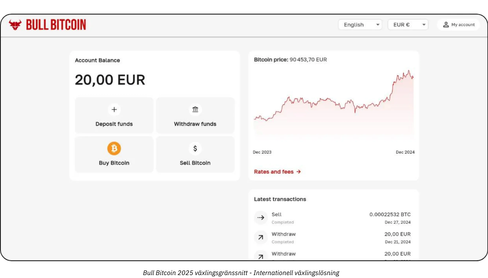

### Till vilket pris?

Som tidigare nämnts är det inte bara omöjligt att förutse Bitcoins framtida pris, utan priset är också mycket volatilt på kort sikt. Historiskt sett har en pålitlig strategi varit att gradvis ackumulera med jämna mellanrum och ha en tidshorisont på fyra år eller mer.

### Hur mycket ska du köpa?

Kontraintuitivt är det förmodligen bäst att börja med ett mycket litet köp utan att tänka för mycket på det. En liten summa (som hundra euro eller dollar) kommer inte att göra skada, och den praktiska erfarenheten kommer att lära dig mycket mer, mycket snabbare, än någon mängd läsning.

Som tidigare nämnts är det klokt att bara investera överskottslikviditet som du inte behöver på flera år. En dåligt genomtänkt strategi riskerar att försätta dig i en svår situation om du plötsligt behöver ta ut pengar vid en dålig tidpunkt.

Förutom att börja i liten skala är det bra för företagens kassor att anta en väl avvägd allokeringsstrategi. I ena änden av spektrumet har vissa företag, som MicroStrategy, tagit ett extremt tillvägagångssätt genom att avsätta en betydande del av sina överskottskassor till Bitcoin, vilket återspeglar en stark institutionell övertygelse. Omvänt kan en mer konservativ och förmodligen rationell strategi innebära att kanske omkring 5% av företagets likvida medel allokeras till Bitcoin, där potentiella vinster balanseras mot riskhantering och likviditetskrav.

Visualisera detta spektrum som en skala, från minimal exponering, som säkerställer att företaget behåller tillräcklig likviditet för operativa behov, till en aggressiv hållning som syftar till att utnyttja den förväntade långsiktiga värdeökningen för Bitcoin. Medan en aggressiv allokering kan ge högre avkastning, bidrar en blygsam allokering till att minska volatiliteten och säkerställa att företagets finansiella grund förblir säker samtidigt som man drar nytta av Bitcoins innovativa potential inom finansverksamheten.

### Hur ofta?

Det finns ingen strikt regel. Att försöka tajma marknaden genom att jaga "dippar" kan vara mindre effektivt och mer stressande än att helt enkelt köpa med jämna mellanrum. Även erfarna investerare gör fel ibland. Att gå "all-in" på en gång kan vara ett tvåsidigt svärd.

I själva verket är Bitcoins potentiella uppgång sådan att även om du skulle börja bara några år framöver, skulle du sannolikt fortfarande se långsiktiga vinster. Det är sant att det är troligt att stora prissvängningar kommer att minska i intensitet över tiden, men som en deflationsvaluta är Bitcoin utformad för att effektivt förvara värde och återspegla produktivitetsvinsterna hos sina användare. För att dra en analogi: vi befinner oss för närvarande i "lanseringsfasen" av Bitcoin, en valuta under utformning, och ingen vet dess verkliga värde ännu. Senare, kanske om 20 eller 40 år, när den befinner sig i en stabil "kryssningsfas", kan den vara otroligt stabil och växa stadigt med samhällets produktivitetsvinster.

Fastighetsbranschen upprepar ofta att "det alltid är rätt tid att köpa" och glömmer att om fastigheter skulle förlora sin funktion som värdebevarare - och övergå till tillgångar som Bitcoin - skulle priserna kunna återgå närmare sitt bruksvärde (logi). Bitcoin tjänar däremot inget annat syfte än att förvara värde, vilket kan innebära att "det alltid är rätt tid att köpa". Framtiden får utvisa detta.

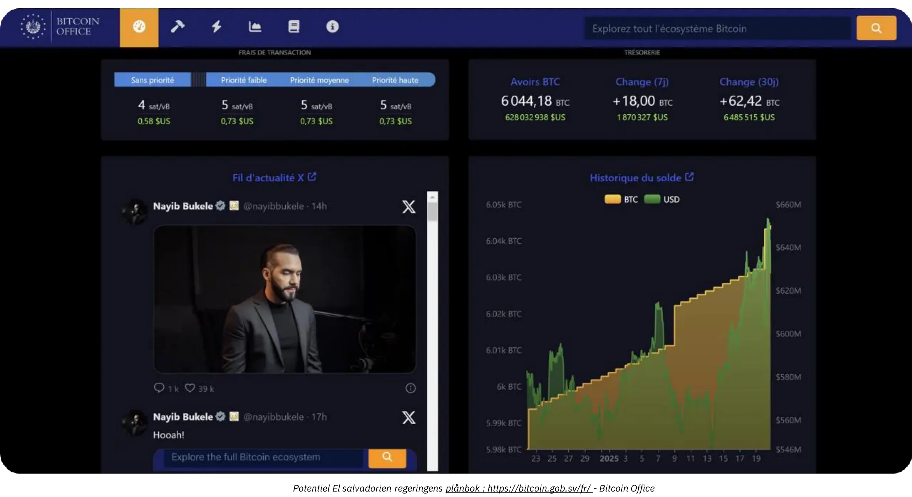

*Källa: [Bitcoin Office] (https://Bitcoin.gob.sv/)*

### I vilken form ska man köpa? (Metoder för förvaring)

Du äger inte Bitcoin fysiskt. Istället har du en kryptografisk nyckel som gör att du kan överföra ägarskap för vissa eller alla dina kontoenheter till en eller flera andra kryptografiska nycklar. Allt detta sker på Bitcoins blockkedja, som är replikerad över tiotusentals noder över hela världen.

Denna kryptografiska nyckel är ett extremt stort slumptal. För att förenkla användarupplevelsen representeras den ofta som en sekvens av 12 eller 24 ord. Dessa ord kan överföras på en fysisk enhet som kallas en "hårdvaruplånbok". Du måste dock förstå att bitcoins inte finns "inuti" den här enheten; den är helt enkelt ett verktyg för att kryptografiskt signera transaktioner och sända dem till nätverket. Det som verkligen betyder något är de 12 eller 24 orden, som måste hållas säkra.

Detta leder till frågan om förvaring: att äga Bitcoin innebär att man äger nyckeln/nycklarna. Antingen har du dem själv, eller så delegerar du uppgiften till en tredje part. Det finns också mellanliggande lösningar. Låt oss granska de vanligaste scenarierna:

- **Självförvaring (Self-Custody):**

Detta är det alternativ som rekommenderas av Bitcoin-entusiaster, eftersom det överensstämmer med Bitcoins ursprungliga design. Du agerar som din egen bank: det finns ingen risk för att en tredje part lurar dig, men du är ansvarig för att säkra nyckeln/nycklarna. Du har full tillgång till dina pengar 24/7. I en affärsmiljö, om flera personer kan behöva göra transaktioner, behöver du lämpliga verktyg och rutiner för att hantera åtkomst och säkerhet.

- **Förvaring hos tredje part:**

Till exempel kan en börs eller en köptjänst skapa ett konto åt dig, konvertera din traditionella valuta till Bitcoin och hålla den för din räkning med hjälp av sina säkerhetssystem. De flesta sådana tjänster låter dig ta ut dina bitcoins till en digital plånbok där du ensam har nyckeln. Innan du gör det äger du inte bitcoins på riktigt; du förlitar dig på deras löfte att betala tillbaka dig. Detta innebär en avvägning mellan säkerhetsrisker (deras kontra dina) och motpartsrisker (de kan gå i konkurs eller försvinna). Vissa företag tycker att detta är acceptabelt, även om det i allmänhet inte rekommenderas för långvarig lagring eller för 100% av din allokering. Förvaringstjänster kan också ta ut förvaringsavgifter.

- **"Pappers-Bitcoin" (ETF:er eller ETP:er):**

Dessa är traditionella finansiella instrument som representerar fraktioner av Bitcoin och replikerar dess prisutveckling. Institutionen bakom produkten köper och innehar teoretiskt sett den underliggande Bitcoin. Dina bidrag och uttag görs i traditionell valuta (t.ex. dollar eller euro), inte i Bitcoin. Med undantag för vissa produkter som tillåter uttag i faktiska Bitcoin (för att undvika en skattepliktig händelse i vissa jurisdiktioner), innebär dessa instrument årliga förvaltningsavgifter. Här förlitar du dig på institutionens säkerhet och står inför motpartsrisk (till exempel om en regering beslutar att beslagta alla Bitcoin som innehas av institutioner, vilket hände med guld 1933 enligt USA:s Executive Order 6102). Deras främsta fördel är att de är lättillgängliga, eftersom de distribueras via traditionella finansiella kanaler. De kringgår behovet av att säkra kryptografiska nycklar men erbjuder inga av Bitcoins inneboende egenskaper: du kan inte använda Bitcoin-nätverket 24/7 för att flytta värde fritt utan tillstånd. De replikerar bara den finansiella prestandan, inte funktionaliteten eller suveräniteten hos Bitcoin självt.

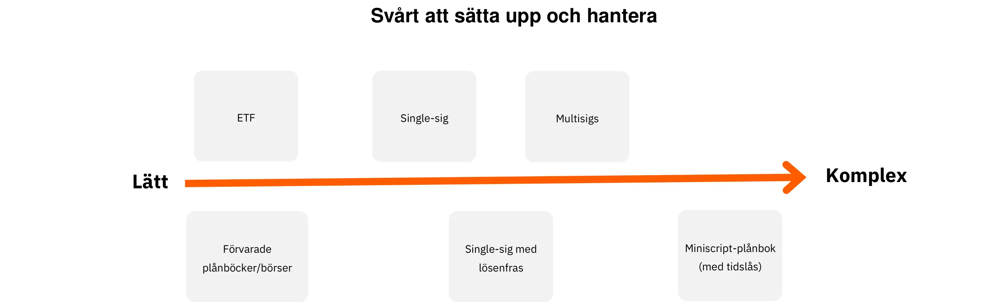

Dessutom har den form i vilken du innehar Bitcoin en betydande inverkan på de säkerhetsåtgärder som krävs för att skydda din företagskassa. Oavsett om du väljer självförvaring, använder hårdvaruplånböcker med en eller flera signaturer etc. för att upprätthålla direkt kontroll över dina nycklar, eller delegerar denna uppgift till tredje parts förvaringstjänster eller ETF: er, har varje alternativ sin egen riskprofil. Självförvaring ger till exempel full tillgång men kräver rigorösa interna säkerhetsprotokoll, medan tredjepartslösningar minskar förvaltningsbördan på bekostnad av motpartsrisken. För att ytterligare illustrera skillnaderna beskriver detta diagram säkerhetsmodellen för varje förvaringstyp, vilket hjälper dig att välja det tillvägagångssätt som bäst passar din organisations behov:

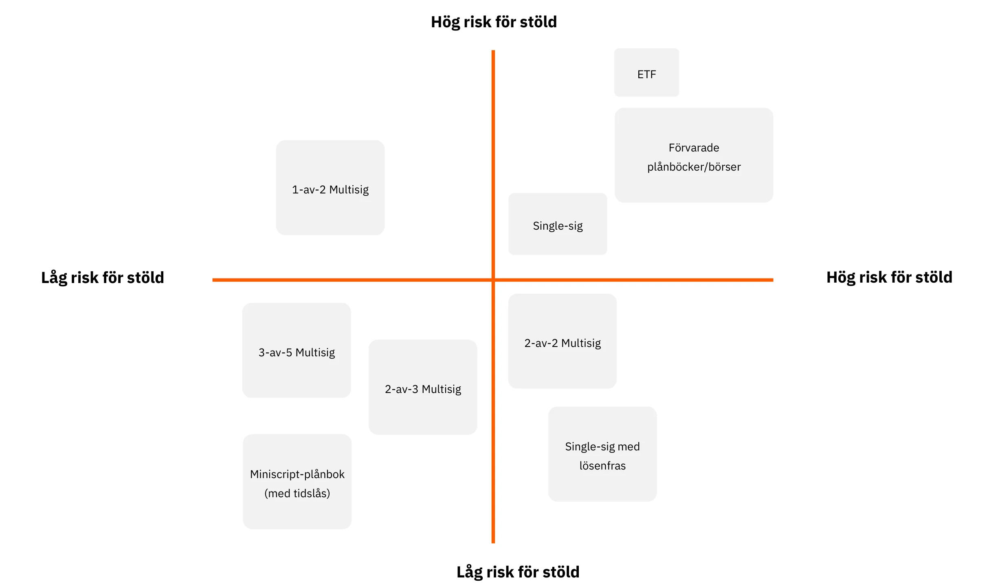

### Vem ska man köpa från?

Om du väljer "pappers-Bitcoin" vänder du dig till finansinstitut som banker eller online-börser.

Om du väljer att köpa faktiska Bitcoin via en marknadsplats (börs) eller en mäklare har du flera huvudkategorier:

- **Stora internationella eller utländska plattformar:**

Exempel är Kraken, Coinbase eller Binance, som historiskt använts av många privatpersoner. Vissa har stött på problem, och det är svårt att göra en tydlig rekommendation. Ett råd: om du använder dem, lämna inte dina bitcoins där längre än nödvändigt.

- **Reglerade tjänsteleverantörer (registrerade tjänsteleverantörer av digitala tillgångar):**

Till exempel i Frankrike är plattformar som Paymium (börs) eller BullBitcoin (mäklare) kända för att ha äkta Bitcoin-entusiaster vid rodret och har byggt en stark meritlista. I USA har du tjänsteleverantörer som River eller Swann. I allmänhet är det viktigt att undersöka leverantörens bakgrund: deras rykte, meritlista, popularitet inom Bitcoin-samhället och om deras ledarskap är i linje med Bitcoins kärnvärderingar.

**Börs vs Mäklare:**

- Med en **börs** kan du lägga en köporder till det pris du väljer, men du måste vänta på genomförande tills marknadspriset och säljarna stämmer överens.
- En **mäklare** erbjuder dig ett fast pris och kan genomföra transaktionen snabbare.

Utöver avgifter och genomförandehastighet - som spelar mindre roll om du tänker långsiktigt (flera år) - bör ett företag också överväga:

- **Användargränssnitt:** Är plattformen användarvänlig?
- **Redovisningsfunktioner:** Åtminstone ha möjligheten att exportera transaktionshistorik i CSV-format.
- **Förvaring och säkerhet:** Håller plattformen bitcoins för din räkning, eller överför den ägarskap till dig? Vad är deras säkerhetsinställning? Har de "uttagsblockeringar" eller andra uttagsbegränsningar?
- **Kundsupport:** Kvaliteten, lyhördheten och den personliga hjälpen, särskilt när du kommer igång.
- **Rykte and etik:** Plattformens trovärdighet och värderingar.
- **Stöd för återkommande köp:** Om du planerar att samla Bitcoin över tid med schemalagda köp.

# Skräddarsydda Bitcoin-betalningslösningar för alla företag

<partId>b2c8af88-6bfc-49b1-ad84-4c292c713b55</partId>

## Ta emot Bitcoin som betalning

<chapterId>99af1203-bc84-4acc-9780-f733e7998335</chapterId>

För det första är det viktigt att förstå att Bitcoin är en störning i samma skala som internet.

Till en början möjliggjorde internet att mellanhänder kunde tas bort från kommunikationskanalerna. Denna infrastruktur banade sedan väg för otaliga tillämpningar som tidigare varit otänkbara. Vilket företag har idag inte någon form av närvaro på nätet?

Bitcoin är en infrastruktur för förtroende, vars första tillämpning är att eliminera mellanhänder vid förvaring och utbyte av värde – det vill säga pengar. På denna grund kommer andra, i dag otänkbara, tillämpningar att växa fram. Din första närvaro här motsvarar att ha en webbplats: en port till peer-to-peer-betalningar och värdeöverföringar.

Tänk nu på perspektivet för ett praktiskt företag vars kärnverksamhet inte har något att göra med Bitcoin. Varför skulle de välja att acceptera Bitcoin-betalningar?

- **Att bygga en Bitcoin-baserad företagskassa:**

Se vår tidigare artikel om att köpa Bitcoin. Oavsett om det beror på övertygelse eller som en diversifieringsstrategi väljer vissa yrkesverksamma att acceptera Bitcoin-betalningar. Vissa Bitcoiners hävdar att ju mindre ekonomiskt benäget ett företag är - vilket innebär att det varken har tid eller verktyg för att engagera sig i komplexa finansiella manövrer - **desto viktigare blir det för det företaget att betalas i den hårdaste formen av pengar**. På så sätt jämnas spelplanen ut, vilket gör det möjligt även för små, tidsbegränsade företag att bevara värdet utan att fastna i finansiella spel.

- **Att nå en ny demografisk grupp:**

Antalet Bitcoin-användare växer och de har en betydande köpkraft. De kommer naturligtvis att söka sig till företag som accepterar deras valuta. Eftersom detta är den första universella, internetbaserade valutan kan du dessutom locka internationella kunder.

- **Ökad synlighet:**

Genom att till exempel lista ditt företag på plattformar som BTCmap.org. I dag är det fortfarande få företag som accepterar Bitcoin, vilket gör att mun-till-mun-marknadsföring verkar till din fördel. Det får dig också att sticka ut från konkurrenterna.

- **Lägre avgifter:**

Omedelbara Bitcoin-betalningar sker över Lightning Network. **Avgifterna är minimala och betalas av köparen**. Det finns inga avgifter för betalterminaler, inga misslyckade betalningsauktoriseringar och inga bedrägerier. Som jämförelse kostar betalningsindustrin (kort, terminaler, överföringar, PSP:er etc.) cirka 2,2 biljoner USD per år globalt. Lägg därtill återbetalningar och bedrägerier, och totalt sett "skummas" nästan en tiondel av motsvarande USA:s BNP av produktiva företag världen över bara för att överföra värde. Oavsett vilken verksamhet du bedriver är finansiella avgifter en börda som bör optimeras, och i vissa fall kan höga avgifter kväva vissa affärsmodeller.

- **Frihet och tillståndslöshet, 24/7:**

Det är inte nödvändigt av att be om tillstånd för att använda Bitcoin. Vem som helst kan delta i ekonomin inom några minuter med hjälp av en smartphone-app. Du kan skicka eller ta emot en betalning från vem som helst - privatperson eller företag - när som helst, utan några schemabegränsningar eller förseningar.

- **Utnyttja fördelarna med Bitcoin-nätverket:**

Du behöver inte behålla dina betalningar i Bitcoin-form - särskilt inte om du behöver betala leverantörer eller betala in moms. Vissa tjänster kan konvertera hela eller delar av dina Bitcoin-betalningar till den valuta du väljer (t.ex. euro till ditt IBAN-nummer) mot en avgift. I det här scenariot kan fördelen med att acceptera Bitcoin ligga i att locka nya användare eller i Bitcoins fördelar (t.ex. lägre avgifter, drift dygnet runt och ingen risk för bedrägeri eller återbetalningar).

### Vilken betalningslösning ska du välja?

Det är relativt enkelt att börja ta emot Bitcoin-betalningar. För att välja rätt lösning bör du överväga egenskaperna hos de transaktioner du hanterar: det genomsnittliga betalningsbeloppet, transaktionsfrekvensen och om du kommer att acceptera betalningar i en fysisk miljö, online eller båda.

Ditt tankesätt som handlare är också viktigt. Kör du ett enkelt test, eller förväntar du dig att Bitcoin blir en betydande och återkommande inkomstkälla? Om det är det senare behöver du en robust, omfattande och anpassningsbar setup.

Glöm inte att ta hänsyn till dina anställdas olika roller och var de befinner sig. I vilket fall som helst, kom ihåg att du måste kunna tillhandahålla all nödvändig information till din revisor och effektivisera redovisningsprocessen.

För att förenkla beslutsprocessen har vi definierat fyra olika affärsprofiler. I följande tabeller beskrivs de viktigaste egenskaperna och rekommenderade betalningslösningar för varje profil.

### Affärsprofilerna

#### Profil 1 - Nybörjare

| Egenskap                         | Nybörjaren                                                                                                                                 |
| -------------------------------- | ------------------------------------------------------------------------------------------------------------------------------------------ |
| **Sinnesstämning**               | "provar min första fysiska betalning", "tar emot tips för mitt onlineinnehåll", "siktar på mycket små intäkter"                          |
| **Transaktionsfrekvens**         | "första transaktionen för att lära sig", "tar emot betalning då och då"                                                                   |
| **Företagstyp Exempel**          | Kreativ ekonomi (innehållsskapare, bloggar, artiklar, etc.), enstaka tips, engångsförsäljning av produkter personligen, föreningar, engångsevenemang |
| **Betalningstyp**                | Generellt några cent till några euro/dollar; under ~300 euro/dollar per artikel                                                           |
| **Inställningskomplexitet**      | Ingen                                                                                                                                      |
| **Exempel Rekommenderad Lösning** | En förvaringsplånbok för Lightning som Wallet of Satoshi eller en icke-förvaringsplånbok som Phoenix                                      |
| **Handlargränssnitt**            | Enkel Bitcoin Lightning-plånbok: en app på en mobiltelefon                                                                                |
| **Kundgränssnitt**               | Bitcoin QR-betalningskod, skannad via kundens personliga plånbok                                                                          |
| **Avgifter**                     | Kunden betalar Bitcoin Lightning-avgifter plus eventuella tillämpliga appavgifter                                                         |
| **Försäljningsenhet**            | Gratis smartphone-app eller möjlighet till fysisk terminal (t.ex. Bitcoinize)                                                             |
| **Hantering och Roller**         | Enkel apphantering; minimal rollskillnad                                                                                                  |
| **Redovisningsexporter**         | Grundläggande transaktionshistoriklistor                                                                                                  |
| **API**                          | Nej                                                                                                                                    

#### Profil 2 - Det grundläggande

| Egenskap                         | Grundläggande                                                                                                                              |
| -------------------------------- | ------------------------------------------------------------------------------------------------------------------------------------------ |
| **Sinnesstämning**               | "Jag accepterar Bitcoin i min verksamhet men förväntar mig inte betydande volymer"                                                        |
| **Transaktionsfrekvens**         | Få transaktioner per månad                                                                                                                |
| **Företagstyp Exempel**          | Barer, restauranger, halvregelbunden försäljning av färska eller direktkällsektorer produkter, flera butiker under en ägare, kreativ ekonomi för konstnärer |
| **Betalningstyp**                | Generellt från några euro/dollar till några hundra per artikel; under ~300 per artikel och under ~3,000 per månad                       |
| **Inställningskomplexitet**      | Minimal (mobilapp)                                                                                                                         |
| **Exempel Rekommenderad Lösning** | Swiss Bitcoin Pay                                                                                                                          |
| **Handlargränssnitt**            | Enkel Bitcoin Lightning-plånbok: en app på en mobiltelefon; enkel fakturering med minimala detaljer                                       |
| **Kundgränssnitt**               | Bitcoin QR-betalningskod, skannad via kundens personliga plånbok                                                                          |
| **Avgifter**                     | Vanligen <1% för att skicka till en Bitcoin-adress, och <1,5% för konvertering till fiat                                                 |
| **Försäljningsenhet**            | Gratis smartphone-app eller möjlighet till fysisk terminal (t.ex. Bitcoinize)                                                             |
| **Hantering och Roller**         | Möjlighet för en endast-sälj-roll för anställda; online-dashboard för administration                                                      |
| **Redovisningsexporter**         | CSV-export med fullständiga transaktionsdetaljer                                                                                          |
| **API**                          | Ja                                                                                                                                         |

**API** | Ja

#### Profil 3 - Den professionella

| Egenskap                         | Professionell                                                                                                                                      |
| -------------------------------- | -------------------------------------------------------------------------------------------------------------------------------------------------- |
| **Sinnesstämning**               | - En betalningsmetod som vilken annan för min e-handel - Eller gemensam hantering för en grupp företag redo för högre volymer                     |
| **Transaktionsfrekvens**         | Flera transaktioner per dag                                                                                                                       |
| **Företagstyp Exempel**          | E-handelssajter med måttlig volym, små marknadsplatser, grupper av fysiska butiker (t.ex. Click & Collect), SME-verksamheter                     |
| **Betalningstyp**                | Generellt från några euro/dollar till några hundra; ingen fastställd betalningsgräns; mindre än 250,000 per år                                  |
| **Inställningskomplexitet**      | Lätt till fullt utrustad (lokal eller molnhosting), kräver ofta en e-handelsbutik                                                                |
| **Exempel Rekommenderad Lösning** | BTC Pay Server för e-handel och/eller fysiska miljöer; ZapRite, Musqet eller PayWithFlash för utcheckning, Be-BOP för en integrerad e-butik     |
| **Handlargränssnitt**            | Webbplats (mobil och dator) med fakturaredigering, kundvagnsalternativ och skapande av betalningsknappar; automatiserad fakturering med e-handelsintegration |
| **Kundgränssnitt**               | Bitcoin QR-betalningskod, skannad via kundens personliga plånbok                                                                                  |
| **Avgifter**                     | Blandning av gratis öppen källkod backend och betalda Lightning hosting/serviceavgifter; frontend-avgifter inkluderar Bitcoin Lightning-avgifter och <1,5% konverteringsavgifter |
| **Försäljningsenhet**            | Webbplatsbutik, valfri fysisk display (t.ex. iPad som visar sajten eller Bitcoin-terminal)                                                       |
| **Hantering och Roller**         | Fullt utrustad butik med flera administratörsroller; anställda och kunder interagerar med systemet                                               |
| **Redovisningsexporter**         | CSV-export med fullständiga transaktionsdetaljer                                                                                                 |
| **API**                          | Ja                                                                                                                                                |

#### Profil 4 - Företaget

| Egenskap                         | Företag                                                                                                                                         |
| -------------------------------- | ----------------------------------------------------------------------------------------------------------------------------------------------- |
| **Sinnesstämning**               | - En strategisk betalningsmetod för verksamheten - Med viss utveckling för att integrera i serviceplattformen enligt specifika specifikationer |
| **Transaktionsfrekvens**         | Obegränsad, högfrekventa transaktioner                                                                                                         |
| **Företagstyp Exempel**          | Medelstora företag, IT-serviceföretag, stora korporationer, stora marknadsplatser                                                              |
| **Betalningstyp**                | Vilken storlek eller volym som helst                                                                                                           |
| **Inställningskomplexitet**      | Medium till hög, beroende på val av arkitektur                                                                                                 |
| **Exempel Rekommenderad Lösning** | Specialbyggd arkitektur eller orkestrering av SaaS-hostade lösningar, potentiellt med tredje parts LSP (*Lightning Service Provider*) tjänster |
| **Handlargränssnitt**            | Helt anpassade frontend- och backend-gränssnitt fullt integrerade i verksamhetens arbetsflöden och processer                                  |
| **Kundgränssnitt**               | Från en Bitcoin QR-betalningskod till ett helt anpassat UI och/eller API-integration                                                           |
| **Avgifter**                     | Kombination av intern utveckling och tredje parts avgifter; kunden betalar Bitcoin Lightning-avgifter plus eventuella transaktionsavgifter från tjänsteleverantörer |
| **Försäljningsenhet**            | Specialdesignade lösningar skräddarsydda för företagsmiljön                                                                                    |
| **Hantering och Roller**         | Helt anpassade roller över försäljning, administration, devops, redovisning och ekonomi                                                        |
| **Redovisningsexporter**         | Helt anpassade redovisningsexporter                                                                                                           |
| **API**                          | Ja                                                                                                                                             |

I de följande kapitlen kommer vi att beskriva varje affärsprofil och de lösningar som är skräddarsydda för var och en av dem.

## Nybörjaren

<chapterId>7edda53d-5b9f-432a-8493-115de8c94a67</chapterId>

Nybörjar-profilen är utformad för företag, kreatörer och individer som vill utforska Bitcoin-betalningar utan att engagera betydande resurser eller expertis. Dessa är vanligtvis de som hanterar en mycket liten volym transaktioner (kanske lite dricks, donationer eller tillfällig försäljning) och söker en enkel, lätt introduktion till Bitcoin och Lightning Network. Det viktigaste värdet med Nybörjar-metoden ligger i den minimala installationen: i de flesta fall är allt som krävs en smartphone eller surfplatta utrustad med en grundläggande Lightning-kompatibel plånbok.

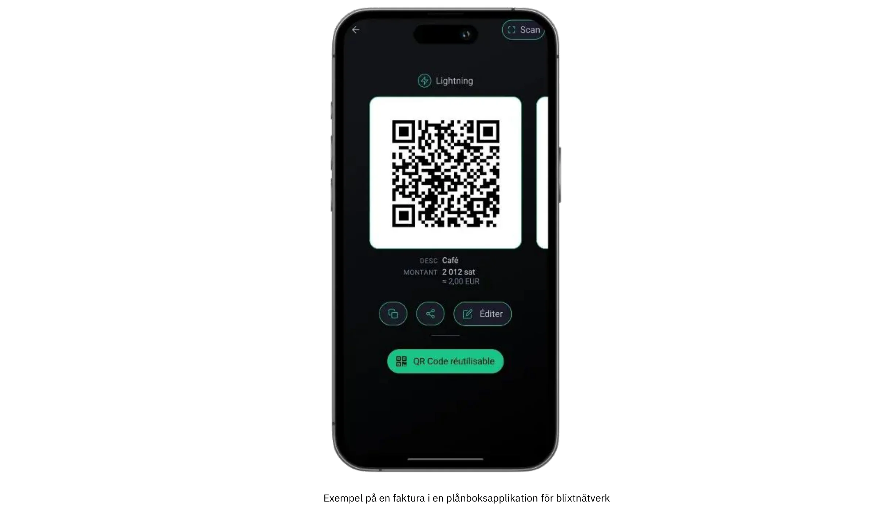

En av de avgörande egenskaperna hos denna profil är dess fokus på lågvolymsbetalningar som sällan överstiger några hundra euro eller dollar per månad. Denna blygsamma skala gör det till ett utmärkt val för alla som vill testa marknaden med Bitcoin, utan de komplexiteter som är förknippade med större volymer. Dessutom möjliggör det omedelbar praktisk inlärning; eftersom det finns färre operativa påtryckningar och mindre monetära insatser kan misstag begränsas och lärdomar dras snabbt. Från konstnärer som säljer handgjorda hantverk på helgmarknader till ideella grupper som tar emot engångsdonationer - användare i den här kategorin föredrar ofta tillgänglighet och användarvänlighet framför avancerade funktioner.

De två vanligaste plånbokslösningarna för nybörjar-profilen handlar om att välja mellan custodial och non-custodial alternativ. En custodial-plånbok (som Wallet of Satoshi eller Blink) låter en tredjepart hantera de privata nycklarna och den tekniska infrastrukturen i bakgrunden, vilket minskar användarens tekniska ansvar. Denna lösning är särskilt tilltalande för dem som värdesätter bekvämlighet högst och vill ha en så enkel onboarding som möjligt. Å andra sidan ger non-custodial Lightning-plånböcker (som Phoenix eller Breez) företagsägaren full kontroll över de privata nycklarna och ökad självständighet och integritet – i utbyte mot en något högre tröskel i början. I båda fallen är moderna gränssnitt idag så användarvänliga att vem som helst kan hantera grundläggande funktioner – som att generera en QR-kod, ange ett belopp och bekräfta en transaktion – på bara några minuter.

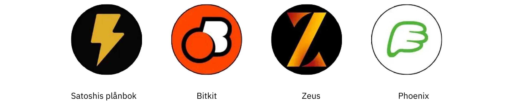

Även om säkerhetsfrågor kan kännas mindre akuta vid små transaktioner, är det ändå avgörande att införa grundläggande skyddsåtgärder. Även en enda smartphone eller surfplatta som används för att ta emot Bitcoin-betalningar bör vara skyddad med lösenord eller biometrisk säkerhet. Dessutom måste rutiner för backup tas på allvar – från att hålla ordning på inloggningsuppgifter för en custodial-plånbok till att förvara en seed phrase för en non-custodial plånbok på ett säkert sätt. Personal som hanterar transaktioner i en fysisk miljö bör känna till grunderna: hur man öppnar appen, visar en QR-kod för kunden och kontrollerar att betalningen verkligen kommit in.

Bokföring och rapportering är visserligen relativt enkla under nybörkar-profilen, men förtjänar ändå noggrann uppmärksamhet. Även om transaktionsvolymerna kan vara små, är det viktigt att behålla korrekta register för att undvika förvirring längre fram och för att upprätthålla transparens vid exempelvis revision eller skattedeklarationer. Många plånboksappar gör det möjligt att exportera en grundläggande transaktionshistorik som en CSV-fil. För ett mindre företag eller en enskild företagare kan det underlätta avstämningen betydligt att regelbundet spara dessa filer. Det är också klokt att notera det ungefärliga fiatvärdet (till exempel i euro eller dollar) vid tidpunkten då varje transaktion tas emot. Eftersom priset på Bitcoin kan variera är ett register över växlingskurser ovärderligt för både bokföring och skatteöverensstämmelse.

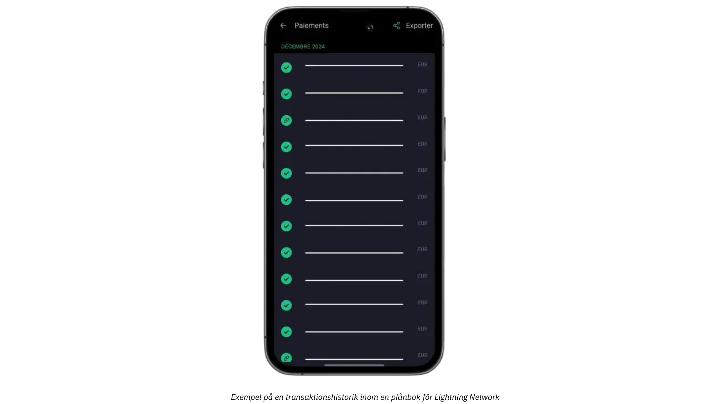

För företag som vill komplettera sina fysiska eller personliga betalningar med online-donationer eller dricks, är det numera enkelt att integrera en Lightning-dricksknapp eller ett donationswidget på en webbplats eller blogg. Plattformar som BTCPay Server erbjuder lättkonfigurerade betalningsknappar, och vissa sociala medier och livestreamingtjänster har redan stöd för Lightning-dricks via adresser. På så sätt kan även ett företag i nybörjar-profilen bygga upp ett blygsamt – men globalt – nätverk av stödjare. Samtidigt kan den som inte vill behålla Bitcoin långsiktigt överväga delvis eller automatisk konvertering till fiatvaluta via vissa custodial-plånböcker eller tredjepartstjänster. Även om detta innebär extra avgifter och eventuella KYC-krav, kan det hjälpa företag att undvika växelkursvolatilitet och bibehålla sina befintliga ekonomiska rutiner med minimal störning.

Ett enkelt användningsfall visar hur alla dessa delar hänger ihop. Föreställ dig en lokal hantverkare som säljer hemmagjord sylt på en lördagsmarknad. Med en mobiltelefon som kör en custodial Lightning-plånbok sätter hen priset per burk i euro. När en kund vill betala med Bitcoin matar säljaren snabbt in det motsvarande fiatbeloppet, och appen räknar automatiskt ut hur många sats som ska betalas. Den resulterande QR-koden skannas av kundens plånbok, betalningen genomförs på några sekunder, och hantverkaren får omedelbart bekräftelse på att transaktionen lyckats. I slutet av dagen kan alla transaktionsuppgifter exporteras för bokföring, och dagens saldo kan helt eller delvis skickas till en växlingstjänst för konvertering till fiatvaluta.

Genom att balansera användarvänliga verktyg, minimala hårdvarukrav och enkel bokföring levererar nybörjar-lösningarna det väsentliga utan att överväldiga nykomlingar. Om transaktionsvolymerna ökar och företagets operativa krav utvecklas är det naturligt att uppgradera till de mer avancerade kategorierna som beskrivs i kommande kapitel.

För detaljerade anvisningar om rekommenderade plånböcker och grundläggande inställningar, se följande guider:

**Non-custodial LN-plånböcker/noder:**

https://planb.network/tutorials/wallet/mobile/phoenix-0f681345-abff-4bdc-819c-4ae800129cdf
https://planb.network/tutorials/wallet/mobile/bitkit-a7224674-85c4-4045-9baf-37018d89550c
https://planb.network/tutorials/wallet/mobile/breez-46a6867b-c74b-45e7-869c-10a4e0263c06
https://planb.network/tutorials/wallet/mobile/blixt-04b319cf-8cbe-4027-b26f-840571f2244f
https://planb.network/tutorials/wallet/mobile/zeus-embedded-advanced-3e89603c-501d-439c-8691-d4a0d0de459b

**Custodial LN-plånböcker:**

https://planb.network/tutorials/wallet/mobile/wallet-of-satoshi-39149d86-e42b-4e8f-ae9f-7e061e7784f7
https://planb.network/tutorials/wallet/mobile/blink-7ea5f5a4-e728-4ff9-b3f9-cf20aa6fc2bd

## Det grundläggande

<chapterId>89be421f-f7df-4bcc-a9e4-df96e39ef249</chapterId>

Grundläggande-profilen passar små och medelstora företag, eventuellt med anställda, som vill ta emot bitcoin på ett enkelt och snabbt sätt – utan att behöva avancerad teknisk kunskap – men som ändå behöver ett mer komplett och professionellt system än en enkel plånbok. Denna kategori gäller oftast för restauranger, caféer, barer eller mindre butiker som endast tar emot ett fåtal Bitcoin-betalningar per månad, men som vill ha ett gränssnitt som är både lättanvänt och tillräckligt stabilt för att hantera den dagliga verksamheten utan avbrott.

Till skillnad från nybörjar-profilen ser företag i grundläggande-kategorin vanligtvis Bitcoin-betalningar som en återkommande del av intäktsflödet, snarare än ett tillfälligt experiment. Transaktionsvolymerna är fortfarande relativt låga, men frekvensen är tillräcklig för att både ägare och anställda ska dra nytta av ett mer strukturerat och pålitligt system. Samtidigt förblir grundläggande-profilen fokuserad på enkelhet – den erbjuder smidiga översiktspaneler och viss rollhantering, men kräver varken specialiserad IT-kompetens eller komplexa integrationer.

Teknikrekommendationer inom detta segment kretsar ofta kring **Swiss Bitcoin Pay** – en förenklad lösning som gör det enkelt för handlare att ta emot Bitcoin-betalningar. Den erbjuder en användarvänlig PoS-app (Point of Sale) som inte kräver någon teknisk expertis från personalens sida. Till skillnad från vanliga Bitcoin-plånböcker är lösningen helt fokuserad på att ta emot betalningar, vilket gör att anställda kan använda enheten utan säkerhetsrisker. Flera PoS-appar kan kopplas till samma konto och användas på surfplattor, kassasystem, smartphones eller via en webbversion för datorer, med stöd för både Android och iOS. Du kan dessutom skapa en produktmeny med artiklar och priser, så att personalen enkelt kan välja en varukorg åt kunden direkt i appen och därefter ta betalt för totalbeloppet.

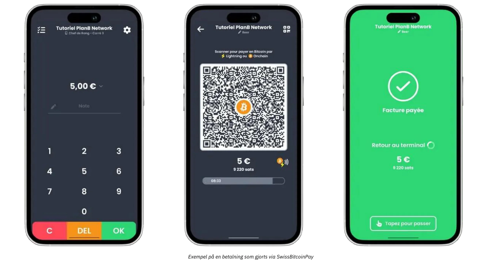

Betalningar kan antingen tas ut i Bitcoin till en specifik adress eller konverteras till fiatvaluta och sättas in på ett bankkonto dagligen. Swiss Bitcoin Pay automatiserar processen och hanterar Bitcoin- och Lightning Network-betalningar utan manuellt ingripande. Pengarna hålls kvar i högst 24 timmar innan de överförs. Även om det inte är helt non-custodial som BTCPay Server, balanserar det bekvämlighet och säkerhet och kräver ingen KYC.

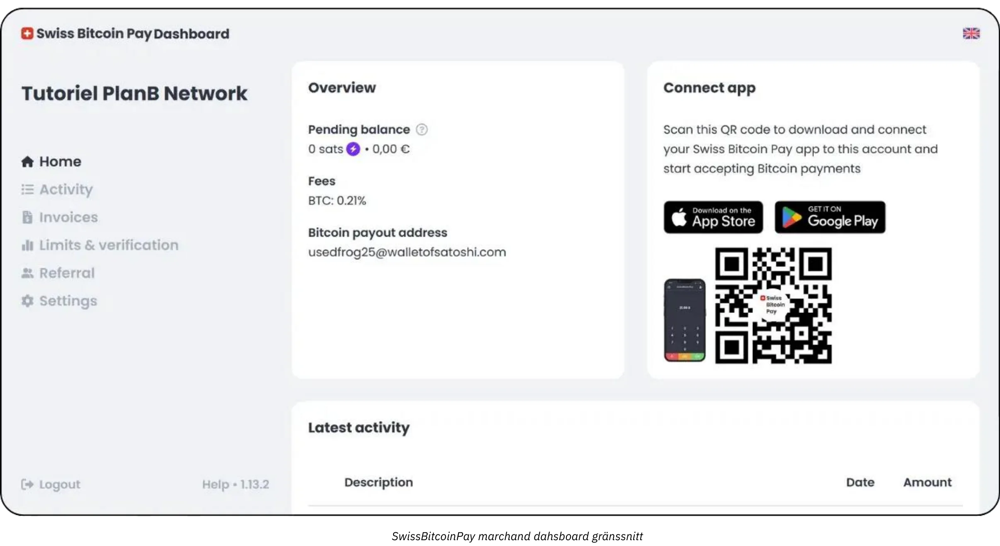

Avgifterna är konkurrenskraftiga: 0,21% för det första året, sedan 1% för Bitcoin-betalningar och 1,5% för fiat-konverteringsbetalningar, inklusive Bitcoin-transaktionskostnader. Swiss Bitcoin Pay erbjuder en praktisk mellanväg mellan custodial-lösningar som Open Node och komplexa självhanterade system som BTCPay Server, som prioriterar enkelhet, säkerhet och ekonomisk autonomi.

Denna typ av upplägg gör det möjligt för verksamheter med fysiska kundmöten att snabbt generera betalningsfakturor, visa QR-koder för kunderna och ta emot både Lightning- och on-chain-transaktioner med minimal friktion. Personalen behöver endast en kort introduktion för att kunna hantera betalningarna, medan chefer enkelt kan logga in på en onlinebaserad kontrollpanel för att stämma av dagens försäljning och ta del av grundläggande rapporter. Tillgången till ett förenklat administrativt gränssnitt hjälper även mindre verksamheter att följa både fiat- och kryptointäkter från ett och samma system, vilket minskar risken för förvirring och sparar tid vid manuell bokföring.

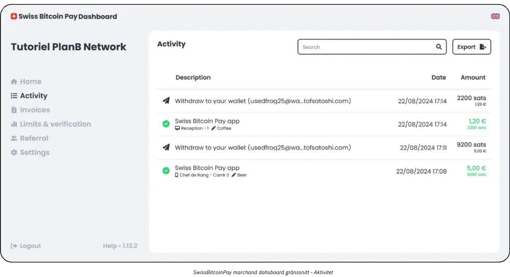

En annan viktig fördel med grundläggande-profilen är betoningen på snabb implementering och minimal störning i verksamheten. Lösningar som Swiss Bitcoin Pay kan sättas upp på några timmar istället för dagar eller veckor. För en ägare eller chef på en måttligt trafikerad restaurang är målet att integrera Bitcoin-betalningar utan att orsaka förseningar i kassan eller förvirring bland personalen. När PoS-systemet väl är konfigurerat, kan chefen enkelt ge personalen snabba instruktioner om hur man visar fakturan och verifierar att betalningen har genomförts. I bästa fall bekräftas kundens transaktion nästan omedelbart via Lightning-nätverket, och företagets administrationspanel registrerar samtidigt betalningen i realtid.

Även om grundläggande-profilen inte kräver avancerade bokföringssystem, är det ändå klokt att föra ordentliga transaktionsregister. Verktyg som Swiss Bitcoin Pay erbjuder exportfunktioner i CSV-format, vilket gör det möjligt för chefer att registrera det fiat-ekvivalenta värdet av varje Bitcoin-försäljning och följa upp det tillsammans med övriga intäktskällor. Denna nivå av dokumentation är tillräcklig för de flesta småföretag, och en grundläggande förståelse för växlingskurser underlättar vid deklaration och generell ekonomisk uppföljning.

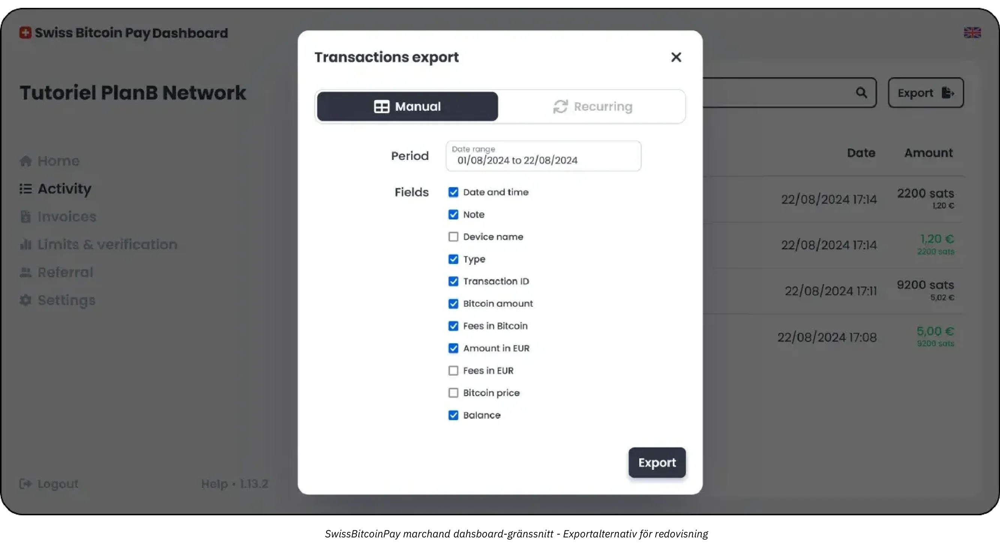

Den mest lämpliga hybridlösningen för din profil är sannolikt Swiss Bitcoin Pay:

https://planb.network/tutorials/business/point-of-sale/swiss-bitcoin-pay-2-a78b057e-ed11-47ac-860c-71019fcb451a

En annan lösning som är enkel att implementera, men som har nackdelen att den är 100% custodial, är Open Node:

https://planb.network/tutorials/business/point-of-sale/open-node-e69a0c1c-47f7-4932-8494-e6f26c3c9784

Om du är redo att smutsa ner dina händer och vill ha full kontroll över processen är BTCPay Server-programvaran ett utmärkt alternativ. Den största nackdelen med BTCPay Server är dock att dess installation och hantering är tidskrävande och kräver en viss nivå av teknisk expertis, men du kan följa våra guider:

https://planb.network/tutorials/business/point-of-sale/btcpay-server-928eb01e-824b-4b57-a3e8-8727633beddc
Slutligen, som ett komplement till fysiska försäljningsställen, kan du överväga att sätta upp [en Bitcoinize PoS] (https://bitcoinize.com/).

## Den professionella

<chapterId>4d5dfa50-c4d0-481c-ab95-1863a898750e</chapterId>

Den professionella profilen riktar sig till företag som har gått vidare från enstaka Bitcoin-betalningar eller betalningar med låg volym och nu söker en robust infrastruktur för att hantera flera dagliga transaktioner. Dessa företag har ofta verksamhet i flera kanaler (kanske en butik, en särskild e-handelswebbplats och till och med mobilförsäljning) och behöver därför betalningslösningar som kan integreras sömlöst i deras befintliga arbetsflöden. I många fall hanterar företag på den här nivån redan kassasystem, plattformar för onlineorderhantering och backoffice-verksamhet som kräver en tillförlitlig och skalbar lösning.

En av de definierande egenskaperna hos den professionella handlaren är behovet av **avancerade funktioner** och **anpassningsbara lösningar** som bibehåller effektiviteten även när transaktionsvolymerna växer. Till skillnad från de grundläggande användarna, som kanske nöjer sig med ett förenklat verktyg som passar perfekt i en smartphone-app, kräver professionella företag vanligtvis funktioner som detaljerad fakturaanpassning, sofistikerade rapporteringsinstrument och möjlighet att tilldela flera administrativa roller.

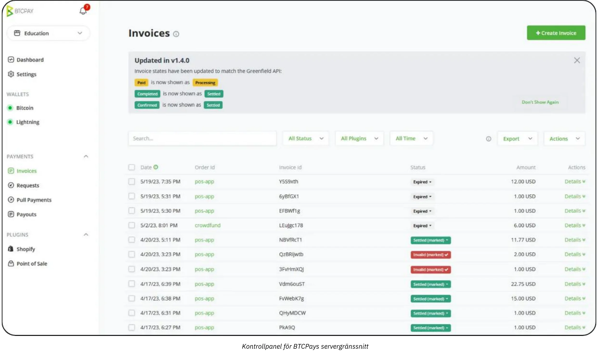

En restauranggrupp kan till exempel ha personal som ägnar sig åt fakturering och lagerhantering, medan ett separat team övervakar produktlistor och marknadsföringskampanjer. I den här miljön måste en Bitcoin-betalningslösning passa väl in i dessa redan befintliga organisationsstrukturer.

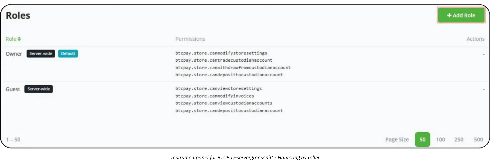

När det gäller teknik och verktyg utgör lösningar som **BTC Pay Server** ofta kärnan i en professionell installation. BTC Pay Server är en plattform med öppen källkod som kan distribueras antingen lokalt eller via molnhosting och som erbjuder omfattande integrationsalternativ för webbplatser och e-handelsplattformar. Genom att köra sin egen instans behåller företagen en hög grad av kontroll över alla aspekter av betalningsflödet, från automatiskt genererade kassasidor till meddelanden som utlöser interna processer när en betalning har bekräftats.

Dessutom kan verktyg som [Zaprite] (https://zaprite.com/) eller [Musqet] (https://musqet.tech/) ytterligare förfina kassaupplevelsen, vilket möjliggör mer detaljerad anpassning (från varumärkesval till sofistikerade rapporteringsfunktioner). De som föredrar en allt-i-ett-miljö för detaljhandel online kan dras till [Be-BOP] (https://be-bop.io/), en e-butik lösning byggd för att underlätta Bitcoin betalningar utan att offra användarvänligheten.

Att implementera dessa teknologier i en professionell miljö innebär att noggrant beakta den **operationella komplexiteten**. Automatiserade faktureringsflöden, visning i flera valutor och synkronisering med befintliga lagersystem är kännetecken på en välintegrerad plattform. Möjligheten att exakt exportera transaktionsdata, oavsett om det sker via CSV-filer, direkta API-anrop eller anpassade format, gör det enklare för företag att samstämma bitcoinförsäljning med andra intäktsströmmar på ett effektivt sätt.

Säkerhet och rollhantering utgör en annan central aspekt för användare inom den professionella profilen. I takt med att dagliga Bitcoin-transaktioner ökar i antal, blir det avgörande att kontrollera åtkomsten till administrativa funktioner som en del av riskhanteringen. I många lösningar kan administratörer tilldela olika behörighetsnivåer – exempelvis kan vissa anställda begränsas till att endast se transaktionshistorik och skapa fakturor, medan andra ges rättigheter att hantera lager eller konfigurera systeminställningar. Denna hierarkiska struktur skyddar inte bara känslig data, utan effektiviserar även arbetsflöden genom att tydliggöra vilka medarbetare som ansvarar för respektive del av betalningsinfrastrukturen.

När det gäller exempel från verkligheten kan man tänka sig en medelstor e-handelsbutik som specialiserar sig på tekniktillbehör. Företaget kan integrera BTC Pay Server i sin befintliga onlinebutik och automatiskt generera Bitcoin-betalningsadresser vid checkout. Kunderna slutför sina inköp genom att skanna en Lightning eller On-Chain Address, och butikens plattform bekräftar omedelbart betalningen. Samtidigt uppdaterar ett internt system orderstatus och utlöser leveransaviseringar. Tack vare de avancerade rapporteringsfunktionerna kan ekonomiteamet enkelt granska den dagliga Bitcoin-försäljningen, exportera ett konsoliderat register för revision och spåra värdet på alla BTC-innehav som företaget beslutar att behålla.

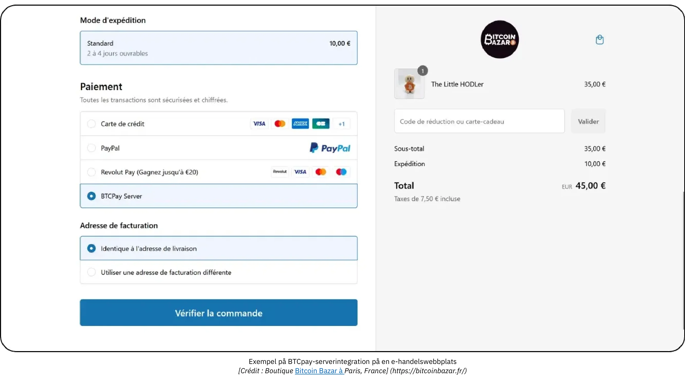

*[Källa: Bitcoin Bazar-butik i Paris, Frankrike.] (https://bitcoinbazar.fr/)*

För att gå djupare in på implementeringsdetaljer och utforska praktiska konfigurationer av BTC Pay Server, se följande kurs:

https://planb.network/courses/6fc12131-e464-4515-9d3f-9255365d5fa1

## Företaget

<chapterId>80fb2659-81ca-4a11-b492-72c7ae5774f9</chapterId>

Företags-profilen står på toppen av Bitcoin-betalningsimplementeringar, skräddarsydd specifikt för stora företag, stora marknadsplatser och etablerade företag som kräver helt anpassade lösningar. Till skillnad från implementeringar i mindre skala eller på mellannivå integrerar företagsverksamheter Bitcoin-betalningar i en bred väv av arbetsflöden och system, allt från fysiska försäljningsställen till e-handelsbutiker, backoffice-redovisningsplattformar och sofistikerade ERP-ramverk.

I den här skalan är det övergripande målet inte bara att acceptera Bitcoin, utan att göra det på ett sätt som är helt **anpassat till organisationens kärnprocesser**. Denna anpassning kan kräva specialiserad mjukvaruutveckling, oavsett om lösningen är helt skräddarsydd eller orkestrerad genom en SaaS-baserad infrastruktur som stöds av tredjeparts *Lightning Service Providers* (LSP). Sådana LSP:er kan hantera höga transaktionsvolymer och komplexa nätverkskonfigurationer som överstiger kapaciteten hos mer konventionella "out-of-the-box"-verktyg. Den resulterande arkitekturen omfattar därför ett brett spektrum av tekniska och affärsmässiga överväganden, från API-drivna integrationer till avancerade funktioner för finansförvaltning.

I ett företagssammanhang blir den operativa komplexiteten särskilt uttalad. Ett stort företag kan behöva tillgodose flera avdelningar (försäljning, marknadsföring, devops, ekonomi och redovisning) som alla har olika ansvarsområden och datakrav. I det här scenariot måste en Bitcoin-betalningsplattform erbjuda mycket detaljerad rollhantering, så att varje avdelning kan få tillgång till exakt de funktioner som är relevanta för deras uppgifter samtidigt som den upprätthåller strikt kontroll över säkerhet och dataintegritet. Lika viktigt är kapaciteten att anpassa arbetsflöden: till exempel kan inkommande betalningar utlösa uppdateringar i lagersystem, skicka automatiska meddelanden till försäljningschefer och uppdatera register för finansteamet, allt i realtid. Själva kassaapparaterna är ofta skräddarsydda för företagsmiljön, med anpassade programvarugränssnitt som matchar företagets varumärke och operativa behov.

**Säkerhet** är av yttersta vikt för företag i större skala. Höga transaktionsvolymer och potentiellt stora mängder Bitcoin kräver en robust infrastruktur som kan försvara sig mot både externa angrepp och hot inifrån. Bästa praxis inkluderar ofta multisignatur-konfigurationer med tidslås för företagskassan, noggrant granskad källkod samt strikt efterlevnad av relevanta regelverk. Dessutom kan regelefterlevnad på både lokal och internationell nivå vara avgörande för att bevara företagets anseende och tillstånd att verka.

Den **anpassade utveckling** som krävs för att skapa eller integrera en Bitcoin-betalningslösning i företagsklass sträcker sig längre än till kodning av några applikationsfunktioner. Det kräver vanligtvis arkitektonisk design, noggranna testprotokoll och en strukturerad utrullning som kan omfatta flera faser (inledande pilotprogram, begränsade marknadstester och slutligen global spridning).

När det gäller bokföring kräver högfrekventa transaktioner fullt anpassade exportfunktioner och ibland realtids­synkronisering med företagets ekonomisystem. Större företag kan använda ERP-lösningar (Enterprise Resource Planning) som SAP eller Oracle, vilka i sin tur måste kunna integreras smidigt med data från Bitcoin-betalningar. För att möjliggöra detta måste plattformens API:er vara avancerade och flexibla, så att IT-team kan skapa skräddarsydda rapporteringspaneler, implementera automatiserade avstämningsrutiner och generera dagliga eller till och med timvisa finansiella sammanställningar.

Ett typiskt företags-scenario kan handla om en stor e-handelsmarknadsplats som hanterar tusentals transaktioner varje dag. Istället för att enbart lista Bitcoin som ett betalalternativ kan marknadsplatsen anpassa varje del av användarupplevelsen – från hur betalningsflödet i Bitcoin ser ut på kundsidan, till hur återbetalningar, tvister och reklamationer hanteras i backend. Ett dedikerat DevOps-team, i samarbete med ekonomi- och juridikavdelningar, ansvarar för löpande underhåll, säkerhetsuppdateringar och regelverksanpassning. Om företaget väljer att behålla en del av sina Bitcoinintäkter, kan ett internt finanshanteringssystem användas för att följa företagets bitcoininnehav vid sidan av dess traditionella valutareserver.

För att säkerställa en smidig och säker implementering på företags-nivån anlitar de flesta organisationer antingen specialiserade tjänsteleverantörer eller interna utvecklingsteam med erfarenhet av Bitcoin- och Lightning-integreringar. Processen inleds vanligtvis med en grundlig behovsanalys, där teknisk infrastruktur, regelefterlevnad och den önskade kundresan kartläggs, följt av utformningen av en arkitektur som kan hantera höga transaktionsvolymer. Beroende på projektets omfattning kan man behöva ett tvärfunktionellt team bestående av exempelvis finansiella controllers, säkerhetsanalytiker och mjukvaruingenjörer. Alternativt kan ett växande antal specialiserade konsultfirmor vägleda dig från första konceptskiss till slutlig lansering, och bistå med allt från utvärdering av SaaS-lösningar, konfiguration av *Lightning Service Providers* till anpassning av användargränssnitt. Genom att samarbeta med experter inom området kan företag minska riskerna som förknippas med storskaliga betalningslösningar, och nå en lösning som inte bara är robust och regelkonform, utan också tillräckligt flexibel för framtida tillväxt.

## Bitcoin betalningslösningar: Alternativ och trender

<chapterId>59ff43a1-98e2-4a81-af3e-9654bdd60952</chapterId>

Det finns alltid kompromisser för varje kategori av lösning. I den inledande "testfasen" är till exempel de föreslagna plånböckerna utformade för att vara så enkla som möjligt när det gäller gränssnitt för användaren, men de är hostade (**custodial**). Detta innebär att medlen kontrolleras av appleverantören. Bitcoin uppmuntrar dock till att gå mot fullständigt ägarskap av medel från användaren (**self-custodial**). I det här fallet rekommenderas att du uppgraderar till nästa kategori så snart den första försäljningen görs - i princip när det har bekräftats att du har kunder som är villiga att betala i Bitcoin.

En av Bitcoins viktigaste fördelar är möjligheten att flytta pengar efter behov, vilket gör det **mycket enkelt att byta leverantör** eller komponenter i din lösning. Dessutom utvecklas alla appar och lösningar snabbt. Tänk till exempel på Bitcoinize, som nu tillhandahåller en fysisk POS-terminal (Point of Sale) som integreras med många applikationer på marknaden, en lösning som inte fanns för bara några månader sedan.

### Letar du efter en lösning för att skapa en butik och acceptera både traditionella betalningar och Bitcoin-betalningar?

Om du börjar från noll - ingen butik, ingen programvara för produkthantering och inget POS-system (Point-of-Sale) - har du ett par alternativ:

- **Outsourcing:** Du kan outsourca skapandet av en webbplats med shoppingalternativ och sedan lägga till Bitcoin-betalningsmöjligheter vid sidan av traditionella lösningar i butiken.
- **Enkla lösningar:** Alternativt kan du använda plattformar som Accessing.app för att göra det själv. Viktiga fördelar inkluderar:
    - Snabb och prisvärd etablering av en online- eller fysisk butik.
    - Lämplig för säsongsbetonade verksamheter, evenemang, restauranger eller butiker.
    - Definiera och hantera produkter för både fysisk försäljning och onlineförsäljning.
    - Hantering av Fiat-betalningar (t.ex. euro, dollar) via ditt eget Stripe-konto.
    - Bitcoin betalningshantering via ditt eget SwissBitcoinPay-konto.

### Hur fortskrider antagandet av Lightning-betalningar?

Lightning Network erbjuder överlägsen effektivitet och lägre avgifter, men införandet av den är fortfarande i ett tidigt skede. Istället för att fokusera på de nuvarande begränsningarna är det värt att komma ihåg hur historiska infrastrukturomvandlingar utvecklades:

- När bilarna först dök upp fanns det inte tillräckligt många bilar för att motivera att man byggde vägar, och inte tillräckligt många vägar för att motivera att man ägde bilar.
- När elen introducerades fanns det inte tillräckligt många kunder för att motivera att man byggde elnät, och inte tillräckligt många nät för att locka kunder.

Nya infrastrukturer lyckas eftersom de är mer effektiva, och tidiga användare ansluter sig eftersom de medför konkreta fördelar. Här är några observationer om Lightning Network år 2024:

- **Ultrasnabba transaktioner:** Transaktioner är ofta nästan omedelbara (<500 ms) och har en extremt låg felfrekvens.
- **Professionalisering av nätverket:** Större aktörer säkerställer likviditet över nätverket, medan privatpersoner till stor del har slutat routa betalningar och nu främst driver så kallade "edge-noder".
- **Förbättrad användarupplevelse:**  Mobilappar för enskilda användare har förbättrats avsevärt. Funktioner som splicing, statiska BOLT12-fakturor och betalningar utan bekräftelse (0-conf) är numera allmänt tillgängliga, vilket gör användarupplevelsen mer sömlös. Problem med interoperabilitet, som till exempel force-closes, utgör inte längre något större hinder.
- **Förbättrad nod- och kanalhantering:** Både individuella och professionella lösningar har avancerat. Till exempel stöder BTC Pay Server nu många plugins för anslutning till andra leverantörer (PSP, on / off-ramper etc.). Nya infrastrukturleverantörer, som LightSpark och Alby Hub, går också in i produktionen.
- **Ökad användning bland handlare:** Företag som BitRefill rapporterar en växande andel Bitcoin-betalningar bland sina aktiva användare, med ett tydligt skifte mot betalningar via Lightning-nätverket. De extremt låga avgifterna i Lightning gör det dessutom till det föredragna alternativet för småbetalningar (ett genomsnitt på 32 euro per transaktion).

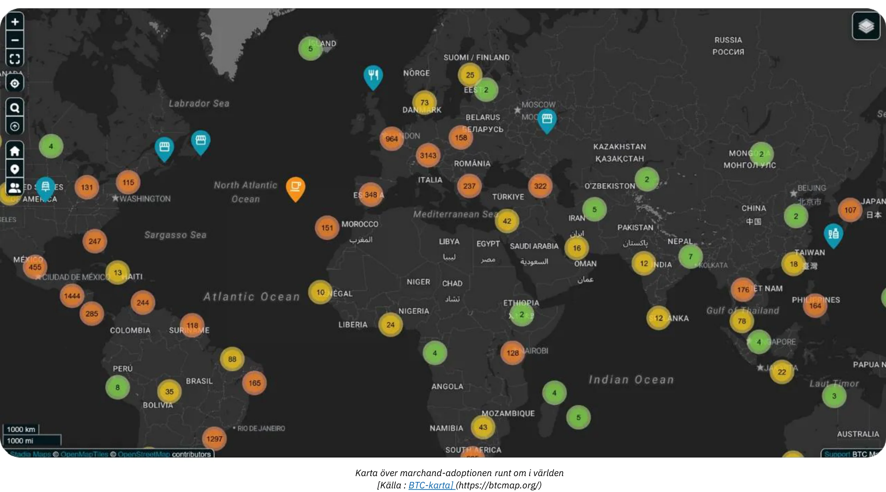

*[Källa: BTC Map](https://btcmap.org/)*

- **Nätverksstatistik:** Det totala antalet kanaler och den mängd Bitcoin som är låst i Lightning-nätverket är fortsatt stabil, med cirka 20 000 noder, 5 200 BTC och 60 000 kanaler. Dessa siffror speglar dock endast en del av nätverket och indikerar ett skifte i deltagarbasen, där färre privatpersoner och fler professionella aktörer nu deltar.

- **Lightning som en bro mellan nätverk:** Lightning Network:s effektivitet och tillgänglighet har redan positionerat den som en bro till andra sammankopplade nätverk (t.ex. FediMint, Liquid, etc.).

**Plånbokens comeback**

Bitcoin och Lightning Network fullbordar den **digitala plånboks-revolutionen**. Nya webbtjänster tillåter nu **transaktioner utan att du behöver skapa ett konto** - din plånbok blir din identitet! Med protokoll som **Nostr Wallet Connect (NWC)** och **LN-URL-AUTH** kan plånböcker sömlöst autentisera användare och möjliggöra transaktioner utan traditionella konton. Tiden är förbi då enkla köp eller prenumerationer krävde kontoregistreringar. Det finns inte längre något behov av att lämna ut personliga uppgifter eller betalningsinformation som riskerar att bli hackad och hamna till salu på darknet, något vi ständigt påminns om genom aktuella dataintrång och läckor.

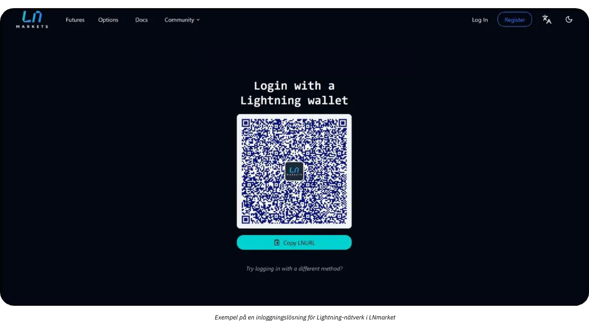

Morgondagens handlare kommer att anamma denna innovation och erbjuda kunderna en säkrare och mer sömlös upplevelse (med ett klick) som också respekterar deras integritet.

# Bitcoin-bokföring

<partId>d49d7595-a189-4e2b-bd60-c19e8e717aa2</partId>

## Grundläggande principer för bokföring av Bitcoin i företag

<chapterId>84063061-ffdb-4b1f-b20b-588ffb146877</chapterId>

Följande innehåll är endast avsett för utbildningsändamål och ska inte betraktas som finansiell eller redovisningsmässig rådgivning. Företag och privatpersoner uppmanas starkt att konsultera en kvalificerad revisor eller juridisk expert som är bekant med kryptovalutabestämmelser i sin specifika jurisdiktion innan de vidtar några åtgärder.

### Nyckelbegrepp inom Bitcoin-bokföring

**Alla Bitcoin-transaktioner måste registreras och kan leda till skattekonsekvenser**

Globalt klassificeras Bitcoin ofta inte som en valuta utan som en digital tillgång. Denna distinktion har stor betydelse för hur Bitcoin redovisas i företag och påverkar skatteskyldighet, finansiell rapportering och regelefterlevnad. Företag som accepterar Bitcoin som betalningsmedel eller använder det som ett verktyg i sin kassastrategi måste förstå dessa regulatoriska nyanser.

Den **viktigaste konsekvensen** att komma ihåg är att i de flesta jurisdiktioner skapar inkomst, försäljning, handel eller användning av Bitcoin för att göra inköp vanligtvis **en skattepliktig händelse** och vinster är föremål för kapitalvinstskatt.

En annan aspekt av Bitcoin-redovisning är att skilja mellan två typer av kapitalvinster:

- **Latenta vinster/förluster:** Orealiserade vinster eller förluster baserade på värdet av Bitcoin som innehas vid slutet av en redovisningsperiod.
- **Effektiva vinster/förluster:** Realiserade vinster eller förluster när Bitcoin säljs eller byts ut under räkenskapsåret.

Dessa beräkningar beror i hög grad på om Bitcoin innehas för långsiktig investering eller kortsiktig operativ användning. Dessutom måste företagen anpassa sina redovisningsmetoder till lokala skattestrukturer, eftersom reglerna varierar avsevärt mellan olika länder.

Redovisning för företag som äger Bitcoin är något besvärlig eftersom varje transaktion måste följas noggrant för att beräkna realiserade eller orealiserade vinster eller förluster. För varje försäljning som du gör genom att acceptera Bitcoin som betalningsform, eller varje gång du köper eller säljer Bitcoin, måste du registrera:

- den exakta tidpunkten
- försäljningspriset (i fiat-valuta)
- inköpspriset för Bitcoin (det pris till vilket Bitcoin ursprungligen förvärvades)

Detta gör att du senare kan beräkna skillnaden för att fastställa vinsten eller förlusten.

**Exempel:** Ett företag köper 1 BTC för 30 000 USD. Senare säljer det 0.5 BTC för 20,000 USD. För att beräkna vinsten eller förlusten måste företaget:

- Ha registrerat tid, fiat-kostnadspris och antal Bitcoin som förvärvats
- Ha registrerat tid, fiat-försäljningspriset och antal Bitcoin som sålts
- Beräkna kostnaden för såld Bitcoin: 0,5 BTC: 30 000 USD ÷ 2 = 15 000 USD
- Jämför försäljningspris med anskaffningsvärde: 20 000 USD (försäljningspris) - 15 000 USD (inköpspris) = 5 000 USD i vinst
- Uppdatera Bitcoin-innehavet med det nya anskaffningsvärdet

Denna process måste upprepas för varje transaktion, och Bitcoins fluktuerande pris gör registerföringen ännu mer besvärlig.

**Hur det skulle fungera om Bitcoin var en valuta?**

Om Bitcoin skulle behandlas som en valuta skulle företag hantera den som vilken annan valuta som helst i sitt redovisningssystem. I stället för att spåra anskaffningsvärde och realiserade/orealiserade vinster för varje transaktion, skulle Bitcoin-innehav helt enkelt registreras på ett valutakonto. Vid slutet av varje rapporteringsperiod skulle värdet av alla valutainnehav, inklusive Bitcoin, konverteras till redovisningsvalutan (t.ex. USD eller EUR) med hjälp av den aktuella växelkursen.

**Uppdaterat exempel om Bitcoin erkändes som en valuta:**

- Ett företag innehar 1 BTC när Bitcoin är värt 30 000 USD. Senare använder företaget 0,5 BTC för en betalning när Bitcoin är värt 40 000 USD.
- Företaget beräknar **inte** realiserad vinst eller förlust. Istället bokförs transaktionen som:
    - Betalning: 20 000 USD (0,5 BTC × 40 000 USD).
    - Återstående Bitcoin-saldo: 0.5 BTC, nu värt 20 000 USD (uppdaterat till den aktuella växelkursen).

**Nyckelfördel om Bitcoin erkändes som en valuta:**

- Företaget behöver bara justera fiatekvivalenten för sina Bitcoin-innehav med jämna mellanrum (t.ex. för månads- eller årsrapporter), precis som för euro, yen eller andra valutor som det innehar.
- Detta skulle eliminera behovet av att spåra anskaffningsvärde på transaktionsnivå och förenkla bokföringen, särskilt för företag med frekventa Bitcoin-transaktioner.

Detta tillvägagångssätt skulle göra redovisningen av Bitcoin mycket enklare, minska de administrativa bördorna och anpassa sig till behandlingen av andra valutor, förutsatt att Bitcoin skulle erkännas fullt ut som sådan i juridiska och regleringsmässiga termer. Vi är inte där ännu.

### Skillnader mellan privat och företagsmässig bokföring av Bitcoin

Den juridiska och redovisningsmässiga behandlingen av Bitcoin skiljer sig avsevärt mellan privatpersoner och företag. För privatpersoner kan vinster från Bitcoin-transaktioner bli föremål för inkomstskatt, ofta till en högre skattesats. Företag kan däremot dra nytta av potentiellt lägre bolagsskattesatser men måste följa striktare bokföringsstandarder.

För företag kan Bitcoin klassificeras under olika konton beroende på dess avsedda användning:

- **Anläggningstillgångar:** För Bitcoin som ägs långsiktigt som en strategisk investering.
- **Lager:** För Bitcoin som används i produktionsprocesser (ett sällsynt användningsfall, t.ex. för professionella handlare).
- **Kontanter eller kassakonton:** För Bitcoin som ägs som en Liquid-tillgång, främst för operativa transaktioner eller kortsiktig likviditetsförvaltning.

Valet av klassificering beror på företagets verksamhet och strategi, med konsekvenser för finansiell rapportering och skattskyldigheter. Kontrollera alltid lokala bestämmelser, eftersom dessa klassificeringar kan skilja sig åt mellan olika länder.

### Rättslig ram

Det rättsliga erkännandet och behandlingen av Bitcoin varierar beroende på jurisdiktion. Vissa länder, såsom El Salvador, har erkänt Bitcoin som lagligt betalningsmedel, vilket förenklar dess användning i transaktioner men komplicerar internationell finansiell rapportering. Andra behandlar Bitcoin som en digital tillgång som omfattas av särskilda skatte- och redovisningsregler.

I de flesta länder kategoriseras Bitcoin som en digital tillgång, och dess behandling styrs av allmänna redovisningsstandarder. Företag måste redovisa Bitcoin-transaktioner enligt följande:

- **Redovisning av kapitalvinster/förluster:** Företag måste redovisa realiserade vinster eller förluster i sina finansiella resultat.
- **Värdering av latenta vinster/förluster:** Orealiserade vinster eller förluster måste ofta redovisas men påverkar kanske inte direkt den beskattningsbara inkomsten.
- **Överensstämmelse med redovisningsstandarder:** Företag måste integrera Bitcoin-transaktioner i vanliga bokföringsrutiner, vilket säkerställer transparens och noggrannhet.

Tillvägagångssättet för Bitcoin-redovisning varierar beroende på geografi:

- **USA:** IRS klassificerar Bitcoin som **egendom, liknande aktier, obligationer eller fastigheter**. Denna klassificering innebär att alla transaktioner som involverar kryptovaluta, till exempel att tjäna, sälja, handla eller till och med använda den för att göra inköp, kan skapa en skattepliktig händelse och vinster är föremål för kapitalvinstskatt.
- **Europeiska unionen:** Medlemsländerna behandlar i allmänhet Bitcoin som en spekulativ tillgång snarare än en funktionell valuta. Därför är vinster ofta föremål för kapitalvinstskatt.
- **Asien:** Länder som Singapore och Japan har antagit progressiva regelverk och behandlar Bitcoin-transaktioner positivt i specifika sammanhang. Men Bitcoin redovisas i allmänhet som **immateriell tillgång** och värderas till verkligt värde på rapporteringsdagen, med förändringar redovisade i resultaträkningen.

Det är viktigt att förstå reglerna i det land där du är verksam och anpassa din redovisning därefter.

### Utmaningar i den regulatoriska utvecklingen

Den snabba innovationstakten för kryptovalutor överträffar ofta regelverken. Sedan Bitcoin erkändes som en digital tillgång har globala regelverk uppdaterats stegvis, men det finns fortfarande luckor:

- **Brist på rättspraxis:** Få rättsfall har klargjort specifika redovisningsprinciper, vilket lämnar utrymme för tolkning.
- **Pågående debatter:** Frågor som den skattemässiga behandlingen av latenta förluster är fortfarande olösta i många jurisdiktioner.
- **Komplexitet över gränserna:** Företag som är verksamma internationellt ställs inför utmaningar när de ska förena olika nationella redovisningsstandarder.

Trots dessa utmaningar ger många länders proaktiva hållning en solid grund för företag att införliva Bitcoin i sin verksamhet. Fortsatta uppdateringar och internationell harmonisering kommer att vara avgörande för hantera framväxande komplexitet i redovisningen av kryptovalutor.

### Klassificering av Bitcoin i finansiella rapporter

Bitcoins klassificering i finansiella rapporter varierar beroende på jurisdiktion och beror på dess avsedda användning inom ett företag. I stort sett behandlas Bitcoin som en digital tillgång, i likhet med lager, investering eller valuta, men med unika egenskaper som påverkar dess bokföringsbehandling.

- **Digital tillgång eller immateriell tillgång**: Många jurisdiktioner, inklusive Frankrike och Europeiska unionen, klassificerar Bitcoin som en digital eller immateriell tillgång snarare än ett lagligt betalningsmedel. Denna klassificering kräver att företag redovisar Bitcoin på ett annat sätt än fiatvalutor.
- **Lager**: Om ett företags kärnverksamhet innebär handel med Bitcoin, såsom kryptovalutabörser eller mäklare, klassificeras Bitcoin som lager. I detta fall följer värderingen standarder för lagerredovisning.
- **Finansiell investering**: Företag som äger Bitcoin som en långsiktig tillgång kan klassificera den som en finansiell investering. I USA kan företag till exempel redovisa Bitcoin enligt Financial Accounting Standards Boards (FASB) riktlinjer och redovisa nedskrivningar när marknadsvärdena sjunker.

**Konsekvenser av klassificeringen:**

- Långsiktiga innehav kräver ofta prövning av nedskrivningsbehov och avskrivningar.
- Aktiv handel eller betalningsrelaterade aktiviteter kräver ständig uppföljning av realiserade och orealiserade vinster och förluster.

### Värderingsmetoder

Värderingsmetoder är bokföringstekniker som används för att fastställa kostnadsbasen för Bitcoin, vilket är viktigt för att korrekt beräkna vinster eller förluster under transaktioner. I allmänhet är det bäst att **alltid upprätthålla ett uppdaterat värde av nuvarande Bitcoin-innehavskostnader** i redovisningssystemet. Detta säkerställer transparens, efterlevnad av skatteregler och förhindrar att man hamnar på efterkälken när beräkningar måste utföras.

- **Först in, först ut (FIFO)**: Denna metod, som är vanlig i jurisdiktioner som Australien och Indien, värderar Bitcoin baserat på den tidigaste anskaffningskostnaden. Detta kan bli ganska **komplicerat** eftersom det kan kräva att varje fraktion av en Bitcoin spåras separat när en försäljning sker.
- **Vägd genomsnittlig kostnad (WAC)**: Ofta att föredra för transaktioner med stora volymer på grund av dess **enkelhet**, vilket man ser i länder som USA.

Det rekommenderas starkt att upprätthålla en detaljerad arbetsbok som spårar Bitcoin-kostnader **från det ögonblick ett företag börjar köpa Bitcoin eller acceptera det som betalning** för att säkerställa korrekt och organiserad bokföring. Detta övervägande bör vara högst upp i åtanke när du väljer en mjukvarulösning för att acceptera Bitcoin-betalning eller för att köpa Bitcoin.

### Redovisning av transaktioner inom detalj- och e-handel

Återförsäljare måste för varje transaktion registrera  växelkursen av Bitcoin-till-fiat. I många länder använder företag växelkursen vid till exempel försäljningstillfället för att beräkna moms.

Företag måste se till att de **betalningsverktyg** som de använder ger möjlighet till:

- att generera en faktura med det lokala fiatbeloppet (euro, dollar, pund), moms eller andra lokala skatter, den Bitcoin-denominerade motsvarigheten, datum och tid, Bitcoins växelkurs och växelkälla etc
- att exportera alla betalningskvitton, åtminstone i ett .csv-format, med all ovanstående information, så att revisorn enkelt kan behandla dem
- att helst ha en bokföring av det uppdaterade värdet av kostnadsbasen för de aktuella Bitcoins som finns i kassan

### Utmaningar

- **Volatilitet**: Priset på Bitcoin fluktuerar avsevärt, vilket skapar svårigheter att värdera innehav och förutsäga framtida finansiella resultat.
- **Regulatorisk granskning**: I länder som Kina begränsar Bitcoins status dess användning som en tillgång för företagskassan.
- **Osäkerhet kring regelverket**: Bitcoins föränderliga regleringslandskap lämnar ofta företag i ovisshet. Till exempel kan förändringar i skattepolitiken, som i Indien eller USA, påverka redovisningsmetoderna över en natt.
- **Risker för felaktig hantering**: Felaktig klassificering eller misslyckande med att övervaka Bitcoin-transaktioner kan leda till problem med efterlevnad, påföljder eller skada anseenden.
- **Risker med omvärdering**: Om en betydande del av ett företags kassa är placerad i Bitcoin utsätts företaget för potentiella förluster till följd av prisnedgångar. Detta kan få allvarliga konsekvenser, särskilt om sådana fall inträffar när betalningar till leverantörer, anställda eller skatter förfaller. Dessutom kan företagets ägare hållas ansvarig, vilket kan leda till böter eller andra juridiska problem, till exempel anklagelser om missbruk av företagets tillgångar.

## Verktyg och programvara för redovisning

<chapterId>e7b31be5-1176-4835-944e-3cba1b7040fa</chapterId>

När ett företag beslutar att integrera Bitcoin i sin bokföring kan olika verktyg och specialiserad programvara förenkla insamling och bearbetning av data. Bland de mest kända lösningarna finns [CoinTracker](https://www.cointracker.io/), [Waltio](https://www.waltio.com/), [Cryptio](https://cryptio.co/), [Koinly](https://koinly.io/), [TokenTax](https://tokentax.co/) och [ZenLedger](https://zenledger.io/). Dessa plattformar fokuserar främst på fyra aspekter:

- automatisk datainsamling;
- konvertering av dessa uppgifter till format som är kompatibla med mer allmänna redovisningsprogram (QuickBooks, Xero, ERP);
- beräkning av skattskyldighet;
- kategorisering av transaktioner.

De är ofta ett klokt komplement för stora organisationer med flera plånböcker och tillgångar på olika plattformar eller börser.

En enkel "csv"-fil som innehåller transaktionshistoriken är dock ofta tillräcklig för de flesta småföretag. Målet är att för varje betalning dokumentera datum, belopp, motsvarande värde i euro/dollar och de relevanta Bitcoin-adresserna. De allra flesta Bitcoin-betalningslösningar (BTC Pay Server, Swiss Bitcoin Pay, etc.) eller börs-plattformar (Bitfinex, Kraken, Coinbase, etc.) erbjuder redan en mekanism för att exportera transaktionshistorik. Genom att tillhandahålla denna fil till en revisor blir det möjligt att effektivisera datainmatningen och tydligt skilja mellan inkommande och utgående flöden relaterade till Bitcoin.

För dem som själva förvarar sina Bitcoin är hanteringen av UTXO (*Unspent Transaction Outputs*) ett viktigt steg. Korrekt UTXO-märkning hjälper till att spåra ursprunget för varje BTC-fragment, skilja transaktioner relaterade till professionell aktivitet från de för personliga utgifter och underlätta spårbarhet för juridiska eller skattemässiga ändamål. Med de flesta bra Bitcoinplånboks-program kan du importera din plånbok med hjälp av din backup-fil (eller din xpub, beroende på din inställning) och märka UTXO:er baserat på deras ursprung eller destination. För att hjälpa dig, här är en komplett handledning tillägnad denna praxis:

https://planb.network/tutorials/privacy/on-chain/utxo-labelling-d997f80f-8a96-45b5-8a4e-a3e1b7788c52

Slutligen, oavsett om du är en liten handlare eller ett mer etablerat företag, är det möjligt att **betala en faktura i Bitcoin**. Nyckeln är att dokumentera transaktionen korrekt. Om du betalar från en plånbok med egen förvaring är det perfekt att generera en transaktion som noterar fakturanumret och syftet med betalningen i dina etiketter. Om du föredrar att betala fakturor via en börs kommer du också att ha möjlighet att exportera ett kvitto eller en transaktionshistorik som du kan inkludera i din bokföring. Denna transparens kommer att förenkla spårningen och rapporteringen av alla dina BTC-operationer.

## Praktiska exempel på Bitcoin-bokföring

<chapterId>763f6f20-9181-495a-bf7d-b405899e65ec</chapterId>

### Användningsfall 1: Butik som konverterar Bitcoin-betalningar till euro

**Scenario**: Ett litet bageri accepterar Bitcoin som betalningsmetod men konverterar omedelbart alla Bitcoins som tas emot till euro för att undvika exponering för kryptovalutans volatilitet.

**Exempel**:

- **Bitcoins växlingskurs**: 1 Bitcoin = 40 000 euro.
- **Transaktion 1**: Kunden köper flera bakverk för 20 euro.
    - Bitcoins ekvivalent: (20 / 40.000) = 0,0005 Bitcoin = 50.000 Satoshis.
    - Växlingsavgift: 1,5 % (20 euro × 0,015) = 0,30 euro.
    - Erhållet netto: 20 euro - 0,30 euro = 19,70 euro.
- **Transaktion 2**: Kunden köper kaffe för 5 euro.
    - Bitcoins ekvivalent: (5 / 40.000) = 0,000125 Bitcoin = 12.500 Satoshis.
    - Växlingsavgift: 1,5 % (5 euro × 0,015) = 0,075 euro.
    - Erhållet netto: 5 euro - 0,075 euro = 4,93 euro.

**Sammanställning av transaktioner**:

- **Total försäljning**: 25 euro.
- **Total avgift**: 0,375 euro.
- **Mottagna euro netto**: 24,625 euro.

**Redovisningsimplikationer**:

- Registrera den totala försäljningen (25 euro) som intäkt.
- Dra av konverteringsavgifter (0,375 euro) som en kostnad.
- Inga innehav av Bitcoin visas i balansräkningen eftersom alla belopp konverterades omedelbart.

### Användningsfall 2: Detaljhandelsbutik som behåller 50% av Bitcoin-betalningarna

**Scenario**: Samma bageri väljer att behålla 50% av Bitcoin-betalningarna som en tillgång i kassan, medan de andra 50% konverteras till euro.

**Exempel**:

- **Bitcoins växelkurs**: 1 Bitcoin = 40 000 euro.
- **Transaktion från kund**: Kunden köper bakverk för 50 euro.
    - Bitcoins ekvivalent: (50 / 40.000) = 0,00125 Bitcoin = 125.000 Satoshis.
    - Konvertering (50 %): Bitcoin till ett värde av 25 euro = 0,000625 Bitcoin = 62 500 satoshis.
        - Konverteringsavgift: 1,5 % (25 euro × 0,015) = 0,375 euro.
        - Nettobeloppet i euro: 25 euro - 0,375 euro = 24,625 euro.
    - Behålls i Bitcoin (50%): 62 500 Satoshis = 0,000625 Bitcoin.

**Sammanfattning**:

- **Total försäljning**: 50 euro.
- **Avgifter**: 0,375 euro.
- **Mottagna euro netto**: 24,625 euro.
- **Bitcoin kvar**: 62.500 Satoshis.

**Redovisningsimplikationer**:

- Registrera den totala försäljningen (50 euro) som intäkt.
- Dra av konverteringsavgifter (0,375 euro) som en kostnad.
- Behållen Bitcoin (62.500 Satoshis) visas i balansräkningen som en digital tillgång.
- Orealiserad vinst: om Bitcoin-värderingen vid räkenskapsårets slut är högre eller lägre kommer det att uppstå en orealiserad vinst eller förlust som kommer att redovisas i finansiella noter men inte realiseras som intäkt

### Användningsfall 3: Professionell tjänst som behåller Bitcoin för långsiktig investering

**Scenario**: En frilansande grafisk designer accepterar Bitcoin som betalning och behåller alla mottagna Bitcoin som en långsiktig investering.

**Exempel**:

- **Bitcoins växelkurs vid betalning**: 1 Bitcoin = 30 000 EURO.
- **Transaktion från kund**: Kunden betalar för tjänster till ett värde av 3 000 euro.
    - Bitcoins ekvivalent: (3 000 / 30 000) = 0,1 Bitcoin = 10 000 000 000 Satoshis.
- **Värdering vid årets slut**:
    - Bitcoins växelkurs vid årets slut: 1 Bitcoin = 35 000 euro.
    - Värdering av Bitcoin-innehav: 0.1 Bitcoin × 35 000 EURO = 3 500 EURO.
    - Orealiserad vinst: 3 500 euro - 3 000 euro = 500 euro.

**Sammanfattning**:

- **Total intäkt redovisad**: 3 000 euro.
- **Bitcoin-innehav**: 0.1 Bitcoin värderad till 3 500 euro i balansräkningen.
- **Orealiserad vinst**: 500 euro redovisades i finansiella noter men har inte realiserats som intäkt.

**Redovisningsimplikationer**:

- Bokför intäkten (3 000 euro) vid tidpunkten för tjänsten.
- Bitcoin kvarstår (0,1) värderad till 3.500 euro i balansräkningen.
- Orealiserade vinster följs upp men ingår inte i resultaträkningen.

### Användningsfall 4: Företagsägaren säljer 50 % av Bitcoin efter prishöjning

**Scenario**: En företagare gör tre inköp av Bitcoin under året, håller Bitcoin som en tillgång och säljer 50 % efter en betydande prisökning.

**Exempel**:

- **Bitcoinbetalningar från kunder**:
    - Köp 1: 2 000 euro till 20 000 euro/BTC = 0,1 Bitcoin = 10 000 000 Satoshis.
    - Köp 2: 3 000 euro till 25 000 euro/BTC = 0,12 Bitcoin = 12 000 000 Satoshis.
    - Köp 3: 5 000 euro till 30 000 euro/BTC = 0,1667 Bitcoin = 16 670 000 Satoshis.
    - **Totalt innehav av Bitcoin**: 0.3867 Bitcoin = 38.670.000 Satoshis.
- **Värdering vid årets slut**:
    - Bitcoin Pris vid årets slut: 40 000 euro/BTC.
    - Totalt värde: 0,3867 Bitcoin × 40 000 euro = 15 468 euro.
    - Orealiserad vinst: 15 468 euro - 10 000 euro (totalt anskaffningsvärde) = 5 468 euro.
- **Försäljning av 50% av Bitcoin**:
    - Sålda Bitcoin: 0,19335 Bitcoin.
    - Försäljningsintäkter: 0.19335 Bitcoin × 40.000 EURO = 7.734 EURO.
    - Kostnadsbas (vägt genomsnitt):
        - Total kostnad: 2 000 euro + 3 000 euro + 5 000 euro = 10 000 euro.
        - Vägt genomsnittspris: 10 000 euro / 0,3867 Bitcoin = 25 850 euro/BTC.
        - Kostnad för sålda Bitcoins: 0,19335 Bitcoin × 25 850 euro = 4 999 euro.
    - Realiserad vinst: 7 734 euro - 4 999 euro = 2 735 euro.

**Sammanfattning**:

- **Kvarvarande Bitcoin**: 0.19335 Bitcoin värderat till 7 734 euro (vid 40 000 euro/BTC).
- **Realiserad vinst**: 2.735 euro ingår i resultaträkningen.
- **Orealiserad vinst**: 5.468 euro redovisat i finansiella noter (inklusive orealiserat värde på kvarvarande Bitcoin).

**Redovisningsimplikationer**:

- Redovisa försäljningslikviden (7 734 euro) som intäkt.
- Dra av kostnaden för sålda Bitcoin (4 999 euro) för att beräkna realiserad vinst.
- Behållna Bitcoin (0,19335) visas i balansräkningen till ett värde av 7 734 euro.
- Orealiserade vinster om 5.468 euro på kvarvarande Bitcoin redovisas i finansiella noter.

# Slutsats

<partId>f6ca8d01-a4f3-449b-ac9f-c5fba9a69178</partId>

## Utvärdera denna kurs

<chapterId>0fe8c49e-b7f8-46f7-9c42-b8a9a99a7b46</chapterId>

<isCourseReview>true</isCourseReview>

## Slutlig tentamen

<chapterId>40a0f18c-bdc9-45b2-8dea-15f7e574230e</chapterId>

<isCourseExam>true</isCourseExam>

## Slutsats

<chapterId>5503c23e-3a90-4a23-8d89-75e3cc1ee53e</chapterId>

<isCourseConclusion>true</isCourseConclusion>

