# Anzisha safari ya kampuni yako kwenye mtandao wa Bitcoin

Gundua uwezo wa kiutendaji wa Bitcoin na Lightning Network, na uchunguze jinsi, kama vile mtandao, wanavyoweza **kubadilisha shughuli za biashara yako**. Kuanzia mtaji wa kidijitali hadi malipo ya haraka, ya kiuchumi na yanayoweza kuongezeka, Bitcoin inatoa wigo mkubwa wa **kesi za utumiaji kwa biashara**.

Katika mwongozo huu wote, utajifunza jinsi ya kuelewa Bitcoin kama mtandao wa fedha wa kimataifa, wa kimataifa na wa asili wa mtandao. Kwa sifa zake za kipekee za kimsingi, **Bitcoin hutoa maboresho makubwa dhidi ya mitandao ya kawaida ya sarafu**. Utagundua ni kwa nini na jinsi ya kutumia Bitcoin kwa matumizi ya kawaida ya kifedha kama vile uhifadhi wa mtaji na mifumo ya malipo. Zaidi ya hayo, mwongozo huu utashughulikia kupata na kushikilia Bitcoin, ikijumuisha mahitaji yanayohusiana ya uhasibu na fedha, pamoja na kutekeleza masuluhisho rahisi au makubwa ya malipo ya Bitcoin.

Iwe wewe ni **biashara ndogo au shirika kubwa**, kuunganisha Bitcoin katika shughuli zako za kila siku kunaweza kuifanya kampuni yako **istahimilivu, yenye tija na shindani** zaidi. Kila kampuni inayotumia mtandao itakuwa kampuni inayolenga Bitcoin, na kozi hii inahakikisha kuwa umejitayarisha. Sehemu za mwanzo zinarejelea misingi ya uendeshaji wa Bitcoin, kwa hivyo hata kama wewe ni mwanzilishi, utapata ujuzi wa kimsingi unaohitajika ili kuendelea. Kujifunza misingi ya uvumbuzi wa Satoshi daima ni wazo zuri, iwe kabla au baada ya kupiga mbizi kwenye BIZ101.

+++
# Utangulizi

<partId>326cf945-5d3f-4d86-8c3e-4d1c35959799</partId>

## Panda kampuni yako kwa Bitcoin

<chapterId>1be42be9-4080-49f5-b5b2-6b531dd55f5f</chapterId>

Anzisha safari ya kampuni yako kwenye mtandao wa Bitcoin kwa kozi hii ya kina ya mafunzo - lango la kuelewa jinsi Bitcoin na Lightning Network zinavyoweza kuleta mageuzi katika shughuli za kitamaduni za biashara. Kozi hii imeundwa kwa ajili ya wauzaji reja reja, wajasiriamali, wasimamizi, na wafanya maamuzi wa shirika ambao wangependa kuchunguza uwezo wa vitendo wa Bitcoin kama mtandao wa fedha wa kimataifa, wa asili wa mtandao na njia thabiti za thamani ya Exchange.

Katika kipindi chote, utafahamishwa kwa kanuni za msingi zinazofanya Bitcoin na Lightning Network kuwa mageuzi dhahiri. Utajifunza jinsi teknolojia hizi zinavyotoa anuwai ya kesi za utumiaji, kutoka kwa uhifadhi wa mtaji wa kidijitali hadi malipo ya haraka, ya kiuchumi na yanayoweza kupunguzwa, na jinsi zinavyotoa maboresho muhimu juu ya sarafu za jadi na mifumo ya malipo. Kozi ya BIZ101 huunganisha nadharia ya kiuchumi na matumizi ya ulimwengu halisi, ikifafanua jinsi ugatuaji unavyoweza kupunguza utegemezi wa wasuluhishi na kushinda vikwazo vilivyomo katika mifumo ya urithi.

Kozi huanza na uchunguzi wa kina wa sarafu za kawaida na njia za malipo, kuweka msingi kwa kuchunguza jinsi sarafu inavyofanya kazi kama mtandao ili kuwezesha biashara, akiba na utaalamu wa kiuchumi. Baadaye, tutaangazia teknolojia iliyo nyuma ya Bitcoin na ubunifu ulioletwa na Lightning Network, tukifichua majukumu yao katika kuwezesha miamala isiyo imefumwa, salama na inayokaribia papo hapo ambayo inaweza kuhudumia biashara za ukubwa wote. Kisha tutaingia katika sehemu za vitendo za kozi hii, tukianza na sehemu ya kushikilia bitcoins kama hazina, ikifuatiwa na sehemu ya mwisho ya kukubali Bitcoin kama njia ya malipo.

Iwe unawakilisha biashara ndogo au shirika kubwa, kozi hii inalenga kukupa maarifa ya kuunganisha Bitcoin katika shughuli zako za kila siku, na hivyo kuimarisha uthabiti wa kampuni yako, ufanisi na makali ya ushindani. Bitcoin inapoendelea kuunda upya mazingira ya kiuchumi, kuelewa teknolojia hizi za msingi sio chaguo tu bali ni hitaji la kimkakati. Jitayarishe kujihusisha na maudhui ya utambuzi, mifano ya vitendo, na mwongozo wa kimkakati ambao utakuwezesha kusogeza na kutumia ulimwengu unaoendelea wa Bitcoin!

Je, uko tayari kuingia katika ulimwengu wa Bitcoin kwa biashara? Twende!

**Kumbuka**: Ikiwa utakutana na maneno yasiyojulikana wakati wa kozi, tafadhali angalia [kamusi](https://planb.network/resources/glossary) kwa ufafanuzi.

# Sarafu, mifumo ya malipo, na Bitcoin

<partId>d9bd0e21-8488-44e0-af55-6d0b934f83c2</partId>

## Sarafu za jadi

<chapterId>785e095c-6811-4ca2-ba46-fe38291432d4</chapterId>

### Sarafu ni Mitandao

Sarafu kimsingi ni mitandao inayowezesha thamani bora ya Exchange.

Bila sarafu, watu binafsi lazima wategemee **kubadilishana vitu**, mfumo ambapo bidhaa au huduma zinabadilishwa moja kwa moja. Kubadilishana ni jambo lisilowezekana kwa sababu linahitaji "mahitaji maradufu" - pande zote mbili lazima zitamani kile ambacho mwingine hutoa kwa wakati mmoja. Kwa mfano, ikiwa mkulima aliye na ngano ya ziada anataka viatu, lazima atafute fundi viatu ambaye anahitaji ngano haswa. Hii ni nadra na haifai. Zaidi ya hayo, **pamoja na bidhaa n katika uchumi wa kubadilishana vitu, kuna viwango vya ~n(n-1)/2 Exchange vinavyohitajika**, na kuunda mfumo mgumu na mgumu sana. Kwa mfano hiyo itahitaji zaidi ya viwango vya ~124,000 vya Exchange kwa bidhaa 500 pekee.

Sarafu hurahisisha hili kwa kufanya kazi kama mpatanishi, na kuunda **mtandao unaopunguza idadi ya viwango vya Exchange hadi n** —moja kwa kila bidhaa inayohusiana na sarafu. Hii hufanya miamala kuwa moja kwa moja zaidi na **huwezesha watu kufanya biashara ya bidhaa na huduma bila kuhitaji matakwa ya pande zote mbili kwa wakati mmoja**. Badala ya kubadilisha ngano kwa viatu moja kwa moja, mkulima anaweza kuuza ngano yake kwa fedha na baadaye kutumia fedha hiyo kununua viatu, au kitu kingine chochote anachohitaji.

Kuanzishwa kwa sarafu kama mtandao sio tu kuwezesha biashara lakini pia huwezesha **mgawanyo wa kazi na utaalamu**. Kwa njia ya kuaminika ya Exchange, watu binafsi na jumuiya hazihitaji tena kuzalisha kila kitu wanachotumia. Badala yake, wanaweza kuzingatia kile wanachofanya vizuri zaidi, kuongeza ufanisi na ubora. Mkulima anaweza utaalam katika kukuza mazao, fundi viatu katika kutengeneza viatu, na mjenzi katika ujenzi wa nyumba. Wataalamu hawa wanaweza basi Exchange bidhaa na huduma zao kupitia sarafu, kufaidika na utaalamu wa kila mmoja wao. Umaalumu huu unasukuma ** tija na uvumbuzi**, watu wanapoboresha ujuzi wao na kubuni mbinu mpya katika nyanja zao.

Hali ya mtandao wa sarafu huleta manufaa ya ziada muhimu. Kwanza, kuwa sehemu ya mtandao wa sarafu ni **faida zaidi kuliko kuwa nje yake**. Kiwango cha pamoja cha mtandao huwezesha biashara, kuwezesha watu binafsi kuratibu shughuli zao za kiuchumi hata **katika umbali mkubwa**. Kwa mfano, mfanyabiashara katika jiji moja anaweza kufanya biashara na mnunuzi katika jiji lingine kwa kutumia sarafu ile ile, hivyo basi kukuza uchumi na ushirikiano katika maeneo makubwa.

Faida nyingine muhimu ya sarafu ni uwezo wake wa **kuruhusu ubadilishanaji ulioahirishwa**. Kwa kubadilishana, shughuli ni mara moja; nzuri moja inabadilishwa kwa nyingine katika muda halisi. Sarafu, hata hivyo, huwezesha **kuhifadhi—watu wanaweza kuhifadhi thamani kwa matumizi ya baadaye**. Hii inawakilisha hatua kubwa ya maendeleo ya mipango ya kiuchumi, uwekezaji, na ulimbikizaji wa mali, ambayo yote yanaboresha maisha ya washiriki wa mtandao.

Kwa kumalizia, sarafu ni mitandao iliyoundwa ili kuhamisha thamani kwa ufanisi. Wanashinda vikwazo vya kubadilishana vitu, kurahisisha biashara, na kuunda fursa za uratibu na kuokoa. Kama mtandao wowote, thamani ya sarafu inategemea utumizi na matumizi yake - hatimaye, sarafu bora zaidi itashinda.

### Je! ni sarafu gani nzuri?

Sarafu nzuri ina sifa kadhaa muhimu zinazoifanya iwe bora kwa kuwezesha thamani ya Exchange. Hapa kuna maelezo mafupi ya kila moja:

- **Salama**: Sarafu lazima ilindwe dhidi ya wizi au ufikiaji usioidhinishwa, ili kuhakikisha kuwa watumiaji wanaweza kuishikilia na kuihamisha kwa ujasiri. Usalama ni muhimu kwa kujenga imani katika mfumo.
- **Uthibitisho-Bandia**: Sarafu lazima iwe ngumu sana au isiwezekane kughushi. Hii inahakikisha kila kitengo ni halisi, hudumisha thamani yake, na kuzuia mfumuko wa bei unaosababishwa na vitengo bandia kuingia kwenye mzunguko. Kwa mfano, kihistoria, dhahabu imethaminiwa sio tu kwa uzuri na uhaba wake, lakini kwa sababu ni Hard sana kuzalisha. Tofauti na maelezo ya karatasi au maingizo ya digital, huwezi tu "kufanya" dhahabu-lazima kuchimbwa kutoka duniani. Uhaba huu wa asili na ugumu wa uzalishaji umesaidia dhahabu kudumisha hadhi yake kama hifadhi inayoaminika ya thamani na kigezo cha uhalisi.
- **Uhaba**: Sarafu nzuri lazima iwe na Supply au utoaji unaodhibitiwa. Uhaba huhakikisha kwamba thamani yake inahifadhiwa kwa muda, kuzuia uzalishaji wa kupita kiasi, ambao unaweza kuharibu uwezo wa ununuzi. Kwa mfano, makabila fulani ya Wenyeji wa Amerika yalitumia shanga kama aina ya sarafu. Hapo awali, shanga hizi zilikuwa Hard za kuzalisha, kudumisha uhaba wao na thamani. Hata hivyo, mara tu wafanyabiashara wa Ulaya walipoanza kuzalisha kwa wingi na kufurika sokoni kwa shanga, uhaba wao ulitoweka. Supply ilipopaa, shanga zilipoteza uwezo wao wa kununua, na kudhoofisha jukumu lao kama ghala la kuaminika la thamani.
- **Bila Ruhusa**: Hapo awali, sarafu kama vile sarafu za dhahabu na fedha mara nyingi zilitengenezwa na watu binafsi, serikali za mitaa au wafanyabiashara ambao walikuwa na uwezo wa kupata malighafi. Mfumo huu wakati mwingine ulifanya kazi chini ya makubaliano au leseni zilizotolewa na wafalme au watawala. Baada ya muda, wafalme na serikali waliweka mchakato huu katikati ili kupata udhibiti mkubwa juu ya utulivu wa kiuchumi, ushuru, na mfumo wa fedha. Mfano mmoja maarufu ni **thaler**, sarafu ya fedha iliyotengenezwa kwa mara ya kwanza mnamo 1518 katika **Joachimsthal Valley** (Jáchymov ya kisasa katika Jamhuri ya Cheki) na wachimba migodi na mamlaka za ndani. Jina "thaler" linatokana na neno la Kijerumani **"Thal"** linalomaanisha "bonde." Sarafu hizi, zinazojulikana kwa ubora wa juu wa fedha, zilisambazwa sana kote Ulaya. Baada ya muda, neno hilo lilibadilika kiisimu na kijiografia, na hatimaye kutoa jina "dola," ambalo lilikubaliwa nchini Marekani kwa sarafu yake.

Katika zama za kisasa, sarafu ziliruhusiwa kikamilifu chini ya mfumo wa seigniorage, ikimaanisha mashirika yaliyoidhinishwa tu-kama vile benki kuu au hazina-zinaweza sarafu za mint au kuchapisha noti. Watu binafsi hawaruhusiwi tena kisheria kuzalisha sarafu,  kuhakikisha udhibiti wa kati juu ya utoaji na usambazaji wake.

Leo, kanuni ya seigniorage inapingwa na Bitcoin cryptocurrency, ambayo inafanya kazi bila udhibiti wa kati. Bitcoin ni "mfumo usio na ruhusa" ambapo mtu yeyote anaweza kushiriki katika kutumia sarafu bila kuomba ruhusa, na, kupitia Mining, katika kuiunda. Ugatuaji huu wa madaraka unaondoa ukiritimba wa utoaji kutoka kwa serikali, na hivyo kuzua maswali kuhusu uwezekano wa kurudi kwa mifumo ya ushindani wa soko huria.

- **Kitengo cha Akaunti**: Sarafu inapaswa kutoa kipimo cha kawaida cha kulinganisha thamani ya bidhaa na huduma. Hii hurahisisha biashara na kufanya bei kuwa wazi na thabiti katika shughuli zote za malipo.
- **Inadumu**: Sarafu lazima ihimili kuchakaa kwa wakati. Sarafu halisi, kama vile sarafu au noti, zinapaswa kuzuia uharibifu, huku sarafu za kidijitali zibaki zikiwa zimehifadhiwa kwa usalama bila hatari ya kupoteza data.
- **Inabebeka**: Sarafu lazima iwe rahisi kusafirisha na kutumia, kuwezesha biashara katika umbali. Hili linaweza kupatikana kupitia uwezo wa kubebeka (sarafu au noti nyepesi) au mifumo ya uhamishaji ya kidijitali.
- **Inaweza kugawanywa**: Sarafu inapaswa kugawanywa katika vitengo vidogo ili kuwezesha miamala ya ukubwa tofauti. Unyumbufu huu huhakikisha kuwa ni wa vitendo kwa ununuzi mdogo na biashara ya kiwango kikubwa.
- **Yanayoweza kuvu**: Vizio vyote vya sarafu lazima vibadilike na vyenye thamani sawa. Kwa mfano, muswada wa dola moja lazima uwe sawa na bili nyingine yoyote ya dola. Usawa huu unahakikisha usawa na urahisi katika shughuli.
- **Inatambulika**: Sarafu lazima itambulike na kuaminiwa kwa urahisi. Sarafu halisi hufanikisha hili kupitia miundo ya kipekee na vipengele vya usalama, ilhali sarafu za kidijitali zinaweza kutegemea itifaki za uthibitishaji. Hii inahakikisha kukubalika kwa kuenea na kupunguza hatari ya ulaghai.

Sifa hizi hufanya sarafu kuwa ya vitendo, ya kuaminika, na yenye ufanisi kwa ajili ya kuwezesha biashara na kuhifadhi thamani katika uchumi.

### Mabadiliko ya mifumo ya sarafu

**Kutoka Sarafu hadi Pesa za Karatasi: Kuongeza Ufanisi na Uwezo wa Kubebeka**

Mpito kutoka sarafu hadi pesa za karatasi uliashiria uboreshaji mkubwa katika **uwezo wa kubebeka** na ufanisi. Sarafu, zilizotengenezwa kwa madini ya thamani kama dhahabu au fedha, zilikuwa za thamani kutokana na thamani yake ya asili. Hata hivyo, zilikuwa nzito, ni vigumu kusafirisha kwa wingi, na zinaweza kuvaa au kuibiwa. Pesa za karatasi zilifanya mabadiliko ya mitandao ya sarafu kwa kuanzisha njia nyepesi, sanifu na inayobebeka ambayo iliwakilisha thamani badala ya kuijumuisha. Ubunifu huu uliruhusu uchumi kukua kwa kuwezesha biashara rahisi ya umbali mrefu na kupunguza changamoto za vifaa vya kutumia bidhaa halisi kama pesa.

Pesa za karatasi pia ziliboresha uboreshaji. Badala ya kutegemea kiwango kidogo cha Supply cha madini ya thamani, uchumi unaweza kupanua wigo wao wa kifedha kupitia sarafu wakilishi, zikiungwa mkono na akiba na baadaye kwa uaminifu katika taasisi zinazotoa. Mabadiliko haya yalifungua njia kwa mifumo ngumu zaidi na iliyounganishwa ya kifedha.

**Kutoka Karatasi hadi Pesa za Kielektroniki: Kupanua Ufikivu na Kasi**

Hatua kutoka kwa pesa za karatasi hadi pesa za kielektroniki iliboresha zaidi mtandao wa sarafu kwa kuongeza ufikiaji na kasi. Kwa kuongezeka kwa mifumo ya benki, kadi za mkopo, na miamala ya kidijitali, pesa hazikuwa ** kubebeka** tu bali karibu **papo hapo**. Uhamisho wa kielektroniki uliondoa hitaji la Exchange halisi, kuruhusu miamala kutokea katika umbali mkubwa kwa sekunde.

Mabadiliko haya pia yalihalalisha ufikiaji wa sarafu. Mifumo ya kielektroniki ya benki na malipo ilipunguza vizuizi vya kuingia kwa watu binafsi na biashara, na hivyo kuwezesha ushiriki katika uchumi wa dunia. Kasi na urahisi wa pesa za kielektroniki zilipanua mitandao ya biashara na kukuza miundo mipya ya biashara ambayo isingewezekana katika mfumo wa karatasi.

Mitandao hii ya kisasa ya sarafu ilikuja na upungufu mkubwa: **ukosefu wa ukaguzi na uwazi katika kusimamia fedha Supply**, mara nyingi husababisha mfumuko wa bei usiodhibitiwa na kupoteza uaminifu katika mifumo ya kati. Kwa mfano, zaidi ya 20% ya dola zote za Marekani zinazozunguka zilichapishwa katika miaka minne pekee iliyopita. Kishawishi hiki cha kudumu cha kutoa sarafu zaidi—na hivyo kushusha thamani inayoshikiliwa na wamiliki wa sasa—kwaweza kuhusishwa kwa kiasi kikubwa na dosari ya kimfumo: mara nyingi wanasiasa wanahamasishwa ili kuepuka maamuzi magumu ya kibajeti, wakiamua badala yake kuahirisha changamoto kwa tawala zijazo kwa "kupiga teke barabarani."

**Kutoka Sarafu ya Kati hadi Iliyogatuliwa: Kuimarisha Imani na Ukuu**

Leo, kuibuka kwa sarafu ya Bitcoin iliyogatuliwa inawakilisha hatua inayofuata katika mitandao ya sarafu. Pesa za jadi za kielektroniki zinategemea mamlaka kuu, kama vile benki au serikali, kusimamia na kuthibitisha miamala. Ingawa ni bora, mifumo hii inaweza kuathiriwa na uzembe, udhibiti, na kutofaulu mara moja. Sarafu zilizogawanywa huboreshwa kwenye sifa hizi za mtandao kwa **kusambaza uaminifu na kuondoa wapatanishi**. Pia inamaanisha kuwa pesa zinaweza kusonga sana **haraka** na **nafuu zaidi**, kwa sababu hakuna hatua za uidhinishaji. Hatimaye hakuna mwanadamu anayeweza kujaribiwa kubadilisha ratiba ya Bitcoin ya sarafu ya Supply, programu inatekelezwa.

Katika mifumo iliyogatuliwa, miamala inathibitishwa na mtandao wa kimataifa wa washiriki wanaotumia teknolojia ya Blockchain, kuhakikisha usalama, uwazi na uthabiti. Muundo huu unapunguza hatari ya ulaghai, hupunguza utegemezi kwa mamlaka kuu, na kuwapa watu uwezo wa kuwa na udhibiti mkubwa wa fedha zao. Kwa kuondoa vizuizi vya kijiografia na kitaasisi, sarafu zilizogatuliwa hutoa mfumo wa kifedha wa kimataifa na jumuishi.

**Mageuzi ya Mitandao ya Sarafu**

Kila hatua katika mageuzi ya mitandao ya sarafu imeboresha sifa kuu: uwezo wa kubebeka, ukubwa, ufikiaji, kasi, usalama na uaminifu. Sarafu zilitoa njia ya pesa za karatasi kwa urahisi na ufanisi bora. Karatasi ilibadilika kuwa pesa za kielektroniki, ikiwezesha ufikiaji wa kimataifa na miamala ya papo hapo. Sasa, Bitcoin inafafanua upya uaminifu na usalama, na kuunda mfumo wa fedha ulio wazi na thabiti. Maendeleo haya ya kihistoria yanaangazia msukumo unaoendelea wa wanadamu wa kuunda mitandao bora kwa thamani ya Exchange, kila marudio yakijengwa na kuvuka vikwazo vya awali.

Mtandao bora zaidi una uwezekano wa kushinda.

## Mifumo ya malipo ya jadi

<chapterId>1306196c-1e8a-454b-8e11-6887ecb3d8b4</chapterId>

Mifumo ya malipo ni mbinu na miundomsingi inayowezesha uhamishaji wa fedha kati ya pande mbili—kawaida kati ya mlipaji (kama vile mtumiaji) na anayelipwa (kama vile biashara). Shughuli hizi zinaweza kutokea katika mipangilio mbalimbali: mtumiaji anayelipa mfanyabiashara wa ndani, biashara ya kusuluhisha ankara na mtoa huduma, au hata watu binafsi kuhamisha pesa kwa mtu mwingine. Kuelewa mifumo ya malipo inahusisha kuangalia aina tofauti za mbinu za malipo, sifa zake, na hali za matumizi yake katika miktadha ya Biashara-kwa-Mtumiaji (B2C) na Biashara-kwa-Biashara (B2B).

### Aina za Kawaida za Mbinu za Malipo

1. **Fedha:** Fedha za kawaida zinazobadilishwa moja kwa moja kati ya pande mbili.

2. **Hundi:** Nyaraka za karatasi zinazoagiza benki kulipa kiasi maalum kutoka kwa akaunti ya mlipaji kwenda kwa mlipwaji.

3. **Uhamisho wa Waya:** Uhamisho wa fedha kielektroniki kati ya benki, mara nyingi hutumika kwa kiasi kikubwa na malipo ya mipakani.

4. **Kadi za Malipo (Mikopo/Malipo):** Kadi za plastiki au dijitali zilizounganishwa kwenye mtandao wa kadi, zinazoruhusu fedha kuhamishwa kutoka kwa akaunti ya benki ya mwenye kadi (au laini ya mkopo) hadi kwa mfanyabiashara.

5. **Pochi za Kidijitali na Malipo ya Simu:** Programu au vifaa vinavyohifadhi maelezo ya malipo (k.m., Apple Pay, WeChatPay, AliPay,PayPal), kuwezesha uhamishaji wa haraka na mara nyingi bila kiwasilisho.

**Matumizi katika B2C na B2B:**

- **B2C (Biashara-kwa-Mtumiaji):**
    - Wateja mara nyingi hutumia pesa taslimu, kadi na pochi za kidijitali kwa ununuzi wa kila siku—kama vile mboga, ununuzi mtandaoni au huduma kama vile usafiri wa gari.
    - Kasi, urahisi, na ada za chini (kwa watumiaji) mara nyingi ni vipaumbele muhimu.
    - Malipo ya kielektroniki na ya simu ya mkononi yanazidi kuwa maarufu katika nafasi hii kwa sababu ya urahisi wa matumizi.
- **B2B (Biashara-kwa-Biashara):**

    - Biashara kwa kawaida hutegemea uhamisho wa kielektroniki, hundi na mifumo ya ankara kwa ajili ya kulipa wasambazaji, kulipa bili kubwa au kushughulikia malipo ya mara kwa mara.
    - Mara nyingi huzingatia ufuatiliaji, uhifadhi wa hati na uwezo wa kushughulikia thamani kubwa zaidi za miamala.
    - Matumizi ya kadi yapo lakini huwa si ya kawaida kwa sababu ya ada ya juu na vikwazo vya ununuzi. Masuluhisho ya kidijitali kama vile mifumo ya malipo iliyojumuishwa yanaibuka ili kurahisisha na kuweka kiotomatiki michakato ya kupokewa/kulipwa.

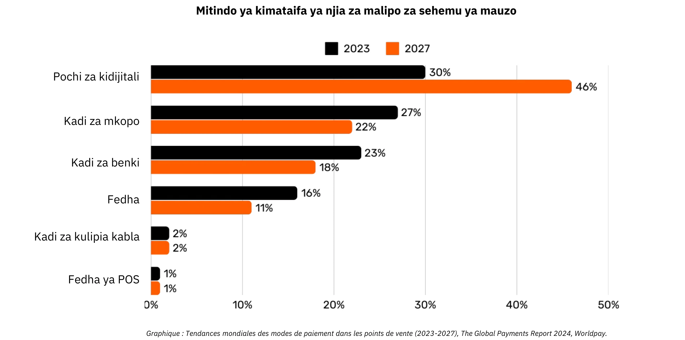

*Mchoro: Mbinu za Malipo za Global Trends katika Pointi-ya-Mauzo (POS) (2023-2027), Ripoti ya Global Payments 2024, Worldpay.*

### Utata Nyuma ya Malipo Rahisi ya Kadi

Mteja anapotumia kadi ya mkopo kwenye duka, kadi hiyo inasomwa na kituo cha malipo cha POS, ambacho hutuma kwa usalama data ya muamala kwa benki inayonunua ya mfanyabiashara. Mpokeaji hupeleka taarifa hii kwenye mtandao wa kadi husika (k.m., Visa au Mastercard), ambao kisha huelekeza ombi kwa mtoaji-benki iliyotoa kadi ya mteja. Mtoaji hukagua akaunti ya mteja au laini ya mkopo na kutuma tena uidhinishaji kupitia mtandao na mpokeaji, hivyo basi kumruhusu mfanyabiashara kukubali malipo.

Muamala huu unaoonekana kuwa rahisi kwa kweli unahusisha zaidi ya hatua 15, wapatanishi 7, na huchukua wastani kati ya saa 48 na siku 5 kwa mfanyabiashara kupokea fedha. Zaidi ya siku zifuatazo, mchakato wa kusafisha na makazi hutokea. Mtandao wa kadi hujumlisha miamala ya siku na kuratibu ubadilishanaji wa fedha kati ya mpokeaji na mtoaji. Benki kuu inahakikisha usahihi na utulivu wa makazi haya baina ya benki. Hatimaye, akaunti ya benki ya mfanyabiashara hupokea kiasi halisi (bila ada) kilichowekwa kwenye mpokeaji, hivyo kukamilisha mzunguko wa maisha wa muamala.

Kwa ujumla, mchakato huu ni ngumu, unatumia wakati, na ni wa gharama kubwa kwa kile kinachopaswa kuwa kitendo rahisi cha kuhamisha thamani kutoka kwa chama kimoja hadi kingine.

### Njia za Kulinganisha za Malipo

| Njia ya Malipo                | Inahitaji Idhini?               | Muda wa Kupitishwa kwa Muamala (Mtazamo wa Muuzaji) | Kasi ya Malipo (Fedha Zimekamilika)            | Ukamilifu (Urahisi wa Kubatilisha)       | Idadi ya Wanaohusika          | Ada za Kawaida (kwa Mpokeaji)     |
| ----------------------------- | ------------------------------- | -------------------------------------------------- | ---------------------------------------------- | ---------------------------------------- | ----------------------------- | --------------------------------- |
| **Fedha Taslimu**            | Hapana                          | Mara Moja (Kubadilishana Kimwili)                  | Mara Moja (Hakuna Ucheleweshaji)               | Juu (Haiwezi Kurudishwa Baada ya Kulipa) | Hakuna                        | Hakuna                            |
| **Hundi**                    | Ndiyo (Benki Kuthibitisha)      | Kukubaliwa Wakati wa Kuweka (Sio Hakikisho)        | Siku Kadhaa (Mchakato wa Kuthibitisha Hundi)   | Wastani (Inaweza Kukataliwa Kabla)       | Benki                         | **Chini hadi Wastani** (Ada za Benki) |
| **Uhawilishaji wa Fedha**    | Ndiyo (Benki/Mtandao)           | Uthibitisho Ndani ya Masaa                         | Siku Hiyo au Siku Inayofuata (Ndani ya Nchi)   | Juu (Kawaida Haiwezi Kubatilishwa)       | Benki, Mitandao ya Malipo     | **Wastani** (Kiasi Maalum/Asilimia) |
| **Kadi za Malipo**           | Ndiyo (Idhini ya Mtoaji Kadi)   | Sekunde hadi Dakika (Msimbo wa Idhini)             | Siku Chache (Malipo Kati ya Benki)             | Wastani (Chargebacks Zinawezekana)       | Mtoaji, Mpokeaji, Mtandao wa Kadi | **Inabadilika (1-3% ya Muamala)** |
| **Mikoba ya Dijitali/Malipo ya Simu** | Ndiyo (Mtoa Huduma/Benki) | Sekunde (Uthibitisho wa Haraka)                  | Kawaida Siku 1-2 (Kutegemea Chanzo cha Fedha)  | Wastani (Kurudisha/Mgogoro Unawezekana)  | Benki, Waendeshaji wa Mikoba  | **Chini hadi Wastani (Inatofautiana)** |

### Mapungufu ya suluhisho zilizopo

Sekta ya malipo ya jadi inawakilisha uchumi wa kila mwaka wa takriban dola bilioni 2,200, takriban moja ya kumi ya Pato la Taifa la Marekani au sawa na Pato la Taifa la Ufaransa. Kwa sababu sarafu hufanya kazi kama mitandao iliyoidhinishwa, kuna ushindani mdogo, na kufanya "huduma" hii kuwa sawa na kodi inayotozwa kwa uchumi wenye tija. Mbali na mizigo ya gharama ambayo inaunda, kuna mapungufu mengine kadhaa, kama ilivyoainishwa hapa chini.

| Upungufu                           | Maelezo                                                                                                                                                                                                                              | Athari                                                                                                 |
| ---------------------------------- | ------------------------------------------------------------------------------------------------------------------------------------------------------------------------------------------------------------------------------------ | ------------------------------------------------------------------------------------------------------ |
| Ada za Juu za Kadi                 | Ada za ubadilishanaji (~0.3%), ada za mtandao (kiasi maalum au 0.3%-1%), usajili wa mitambo/PSP, na faida za benki (0.5%-1.7%) zinaongezeka kuwa gharama kubwa—kama "kodi" ya kimataifa kwenye sekta za uzalishaji, ikiwa trilioni. | Inapandisha gharama za wafanyabiashara, kupunguza faida na inaweza kusababisha kupanda kwa bei za bidhaa. |
| Malipo ya Mwisho Polepole Sana     | Malipo ya fedha yanaweza kuchukua hadi siku 5, kupunguza mzunguko wa pesa na shughuli za kiuchumi kwa jumla.                                                                                                                         | Inachelewa ukwasi kwa wafanyabiashara na kupunguza kasi ya mzunguko wa uchumi.                        |
| Ulaghai                            | Njia za biashara mtandaoni zinakabiliwa sana na ulaghai, kuchangia hasara kubwa (k.m., dola bilioni 28). Marejesho yanaweza kufikia ~dola bilioni 174 duniani kote ifikapo 2024. Kusimamia migogoro hii kunatumia muda na kusababisha msongo. | Gharama za uendeshaji zimeongezeka, hatua ngumu za kuzuia ulaghai, na kupungua kwa imani ya wateja.    |
| Kuacha Bidhaa kwenye Kikapu        | Hatua za ziada za usalama (misimbo ya mara moja, uthibitishaji wa vipengele viwili chini ya PSD2) huleta ugumu wakati wa kulipa.                                                                                                     | Ugumu wa kulipa husababisha kuongezeka kwa kuacha bidhaa kwenye vikapu na kupoteza mauzo.             |
| Viwango vya Juu vya Muamala        | Viwango vya chini vya matumizi kwenye kadi vinaweza kulazimisha wafanyabiashara na watumiaji katika bei isiyofaa au hali za ununuzi, kukatisha tamaa miamala ya thamani ndogo.                                                        | Kupungua kwa kuridhika kwa wateja na urahisi, inaweza kupunguza ununuzi wa ghafla au wa thamani ndogo. |
| Idhini ya Awali Polepole           | Mifumo ya sasa haiwezi kushughulikia miamala kwa kasi ya milisekunde au kusaidia mtiririko wa malipo wa moja kwa moja, wakati halisi.                                                                                                | Inapunguza matumizi yanayohitaji malipo ya haraka au ya mtiririko, ikizuia ubunifu na upanuzi.        |
| Haja ya Akaunti ya Benki/Kadi      | Upatikanaji wa njia hizi za malipo unahitaji akaunti ya benki au kadi iliyounganishwa, moja kwa moja ikiwatenga wale wasio na akaunti hizo.                                                                                          | Inapunguza ushirikishwaji wa kifedha, ikipunguza upatikanaji kwa watu wasio na benki.                 |
| Kuunda Akaunti za Mtandaoni Mara kwa Mara | Watumiaji mara nyingi lazima waunde akaunti nyingi za mtandaoni, kusababisha uchovu, kupunguza urahisi, na kuongeza uwekaji wazi wa data ya kibinafsi.                                                                            | Inaharibu uzoefu wa mtumiaji, inaibua wasiwasi wa faragha, na inaongeza hatari ya uvujaji wa data.    |
| Ada za Ubadilishaji wa Fedha za Kigeni | Ukosefu wa kipimo cha jumla cha akaunti hulazimisha ubadilishaji wa gharama ya fedha kwa miamala ya kimataifa.                                                                                                                      | Inaongeza gharama za ziada kwa biashara za kimataifa, ikifanya miamala ya kimataifa kuwa gharama zaidi. |

Kama vile tulivyohama kutoka kwa kulipa kwa dakika kwa simu za sauti hadi kutumia karibu mawasiliano yasiyolipishwa ya msingi wa IP, kuibuka kwa mitandao iliyo wazi na bora kunaweza kufafanua upya malipo, kupunguza gharama na waamuzi, na kukuza miundo mipya ya biashara.

## Bitcoin kwenye biashara : sarafu inayoibuka

<chapterId>4488fe33-663f-41a3-a668-e9ca2fb7122e</chapterId>

**Bitcoin NI NINI?**

Bitcoin ni **mfumo wa sarafu ya kidijitali kati ya wenzao wa Exchange** (fedha za kielektroniki). Neno "Bitcoin" linamaanisha vipengele vifuatavyo:

- **Itifaki ya kompyuta** inayowezesha thamani ya Exchange kwenye mtandao bila wapatanishi, bila kuhitaji kibali, na kwa jina bandia. Inatumia kanuni za hali ya juu za kriptografia.
- **Mtandao halisi** wa mashine zilizounganishwa kwenye mtandao (nodi, wachimba migodi, n.k.) zinazoendeshwa na watu binafsi na biashara, zinazounda mfumo wa kugawanyika (bila mamlaka kuu au sehemu moja ya udhibiti).
- **Kitengo cha akaunti** ndani ya mfumo. Hakutakuwa na zaidi ya bitcoins milioni 21 kuwepo. Kila Bitcoin inaweza kugawanywa katika vitengo milioni 100 vinavyoitwa "satoshis," vinavyoitwa kwa heshima ya muundaji wake asiyejulikana.

Kwa pamoja wanafanya ya Bitcoin kuwa **rasilimali inayomilikiwa** na sarafu ya kidijitali **bila mtoaji**. Ownership inalindwa pekee kwa kushikilia **ufunguo wa siri wa faragha**, kutoa udhibiti kamili **bila wapatanishi au watu wengine wanaoaminika**. Inapohamishwa, Ownership **mwisho** ni mara moja: mmiliki mpya anaimiliki kikamilifu bila kutegemea mamlaka kuu kwa ulinzi au ubadilishaji. Miamala **haibadiliki**—ikirekodiwa kwenye Blockchain, haiwezi kubadilishwa au kufutwa.

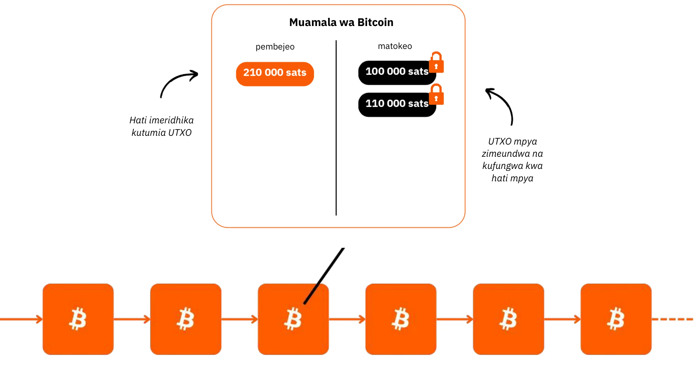

Bitcoin ina sera ya fedha ya kudumu, na **kikomo cha bitcoins milioni 21 **, ambayo ~ milioni 19.8 tayari imesambazwa. Hii huifanya **kupungua bei**, huku thamani yake ikiongezeka kadiri watumiaji wanavyohifadhi akiba na faida za tija ndani yake.

Vipengele vyake vya kiufundi vinapita zile za dhahabu na dola kwa pamoja, na kuifanya kuwa mali ngumu zaidi ya kifedha kuwahi kuundwa. Bitcoin ni duka la thamani na kati ya Exchange, sarafu inayotengenezwa. Hebu fikiria kuhamisha thamani kutoka hazina ya kampuni moja hadi nyingine kwa haraka, bila wapatanishi, kwa gharama ndogo, bila ulaghai, 24/7, na bila wahusika wengine wanaohusika.

Bitcoin huhifadhi thamani kwa ufanisi kwa sababu Leja yake haiwezi kuguswa. Thamani yake huongezeka kutokana na usambazaji adimu na pungufu pamoja na kuongezeka kwa idadi ya fursa za Exchange, kutokana na kuongezeka kwa idadi ya watumiaji.

Bitcoin inasumbua kwa sababu inatuhimiza kujifunza dhana katika hisabati, fiche, uchumi na historia ambayo hatukufundishwa kamwe. Ingawa mara nyingi huchukuliwa kuwa changamano, kwa kweli ni uvumbuzi unaopatikana kupitia mazoezi na majaribio.

Bitcoin inatupa changamoto ya kufikiria upya asili ya pesa yenyewe. Unaweza kueleza pesa ni nini hasa? Mfanyakazi anayelipwa au mjasiriamali anaweza kutumia saa 50,000 hadi 100,000 za maisha yake kupata pesa, ilhali ni **ngapi hutenga hata saa 100 ili kuielewa vyema** na kuihifadhi? Bitcoin inatuhimiza kuhoji sababu za kimsingi nyuma ya hitaji letu la pesa na mtazamo wetu wa muda. Je, fedha ni kwa ajili ya anasa ya haraka au ustahimilivu wa muda mrefu? Ikiwa tungekuwa na kipengee cha thamani kinachoturuhusu kuchelewesha ununuzi, tungefanya maamuzi gani? Je, ni mazungumzo gani tungependa kuwa nayo na sisi wenyewe miaka 20 au 30 kutoka sasa?

**KITAMBULISHO CHA BITCOIN**

- **Umri:** Miaka 15 (Januari 3, 2009)
- **Thamani ya kila siku ya Exchange:** $10 bilioni (> CAC40)
- **Mtaji wa soko:** $1.8 trilioni (> Meta, Visa, Silver ; < Apple, Google, Gold)
- **Watumiaji:** ~100 hadi milioni 200 (1-2% ya idadi ya watu duniani)
- **Tete:** Kimsingi hakuna (1 Bitcoin = 1 Bitcoin), juu sana nje (katika ubadilishanaji wa sarafu ya fiat)
- **Utendaji:** Muamala wa kwanza kwa $0.0009; sasa $100,000 (x100 milioni)
- **Upatikanaji wa Mtandao (uptime):** 100% tangu 2013
- **Imetangazwa kuwa amekufa au kukosolewa:** Mara moja kwa mwezi

**Ajabu ya Ushirikiano wa Kibinadamu:**

- **Chombo cha kisheria:** Hakuna
- **Mkurugenzi Mtendaji:** Hakuna
- **Uwekezaji wa mtaji wa mradi:** Hakuna
- **Uuzaji:** Hakuna
- **R&D:** Inaendeshwa kwa kujitolea
- **Utawala:** Na watumiaji
- **Muundo bunifu wa kiuchumi:** Uundaji wa vitalu unafadhiliwa na ada za ununuzi (kulingana na mnada)

Kwa habari zaidi juu ya Bitcoin, historia yake, jinsi inavyofanya kazi, na matumizi yake, ninapendekeza pia kufuata kozi hii nyingine ya kina:

https://planb.network/courses/2b7dc507-81e3-4b70-88e6-41ed44239966
## Utangulizi wa Lightning Network

<chapterId>c095c7ad-5469-4c7b-9510-b6c0b86244e7</chapterId>

**LIGHTNING NETWORK NINI?**

Lightning Network ni **itifaki na mtandao** unaowezesha miamala ya Bitcoin yenye mwingiliano mdogo na Blockchain kuu ya Bitcoin. Hivi ndivyo inavyofanya kazi:

- **Usanidi wa awali:** Pesa zimefungwa (zimebanwa) kwenye Blockchain kuu ili kuanzisha njia ya malipo kati ya wahusika 2.
- **Mtandao wa malipo:** Mtandao wa njia za malipo kati ya wahusika mbalimbali huunda mtandao wa malipo (uelekezaji na muunganisho).
- **Shughuli za off-chain:** Miamala hufanyika kati ya wahusika lakini **haijachapishwa mara moja** kwenye Bitcoin kuu ya Blockchain (**"off-chain"**).
- **Malipo ya On-Chain:** **Salio la mwisho** la miamala ya kituo pekee ndilo linalochapishwa kwenye Bitcoin kuu Blockchain (**"On-Chain**"), kuruhusu miamala mingi kufanyika kwa sasa. Ufungaji huu wa malipo mengi hupunguza msongamano na hivyo kupunguza ada ikilinganishwa na kufanya miamala mingi ya On-Chain.
- **Kufungwa kwa kituo:** Mtumiaji anaweza kufunga chaneli yake wakati wowote na kudai tena Bitcoin yake kwa kuchapisha hali ya hivi punde ya malipo. Hii ndiyo kanuni ya miamala kuwa **"inayoweza kuchapishwa" wakati wowote lakini "haijachapishwa"** hadi itakapohitajika. Njia ya kutoka (kufungwa kwa idhaa) inaweza kuwa ya upande mmoja (iliyoamuliwa na mhusika yeyote kati ya 2 wakati wowote) au kuamuliwa pande zote (kusababisha ada za chini za On-Chain)

Mbinu hii huepuka ucheleweshaji na utata wa kufanya kila shughuli moja kwa moja kwenye Blockchain kuu ya Bitcoin, ikirekodi masalio ya mwisho pekee na kuhifadhi usalama wake. Lightning Network ni Layer "juu" ya Bitcoin lakini inabakia kuiunga mkono.

**Mtandao wa Malipo wa Kimataifa**

Itifaki huunda **mtandao** wa mashine ambapo vituo vinaunda mfumo wa malipo wa wote. Nodi hizi zinaweza kuendeshwa kwa uhuru na watu binafsi au biashara, na kuifanya mtandao wazi kabisa.

Lightning network huwezesha ubadilishaji wa thamani papo hapo kwa kasi ya mwanga.Ni kama itifaki ya barua pepe inayotumika kwa malipo: mtandao wa malipo wa kizazi kijacho. Inabadilisha kwa kiasi kikubwa jinsi "fedha" inavyosonga, na kuifanya kuwa ya bure na ya haraka kama utumaji wa data kwenye mtandao.

**Faida Muhimu:**

- **Kasi:** Shughuli za papo hapo.
- **Ada za chini:** Gharama za chini zaidi ikilinganishwa na mitandao ya benki ya kawaida.
- **Urahisi wa kuasili:** Biashara zinaweza kuweka mipangilio haraka ili kukubali malipo ya umeme kwa kutumia programu mahiri tu au kitufe cha kulipa kwenye tovuti yao.

Miundombinu ya Lightning hupita mifumo ya kawaida ya malipo katika suala la kasi, gharama na ufanisi wa nishati. Kwa kuongezeka kwa uasili wa mfanyabiashara, kasi itaongezeka: ikiwa malipo yanaweza kupita mtandao uliofungwa wa benki, kwa nini uendelee kutoa asilimia kubwa ya mapato kwa wapatanishi wa leo?

**Kesi za Matumizi Isiyo na Kikomo:**

Maombi ya Lightning yanaenea zaidi ya ada na kasi ya chini. Kwa kutoa reli ya malipo ya bure na ya papo hapo, inafungua fursa nyingi katika uchumi wote.

**kuwezesha ubadilishaji wa bitcoin:**

Lightning huongeza jukumu la Bitcoin kama "kati ya ubadilishaji." Kwa kuongeza mzunguko na uhuru wa shughuli, inaimarisha kazi ya msingi ya fedha: kuwezesha ubadilishanaji wa kiuchumi na uundaji wa thamani kwa washiriki wote.

Kuinuka kwa siku zijazo kwa "uchumi wa mashine mahiri" kutahitaji mfumo wa malipo wa haraka sana, wa masafa ya juu, kiwango cha kiufundi kinachoweza kufikiwa na Lightning pekee. Hii itawezesha uundaji wa bidhaa na huduma zaidi. Kadiri usambazaji wa Bitcoin unavyosalia kuwa ndogo, uwezo wa kununua wa kila kitengo utaongezeka. Bitcoin na Lightning huimarika pamoja huku mitandao yao ikipanuka.

Lightning hutoa taswira ya siku zijazo ambapo biashara zote ambazo zimekuwa za mtandao pia zitakuwa za Bitcoin.

**Malipo ya Bitcoin kwa Lightning: Kesi ya Kawaida ya Utumiaji wa Muuzaji**

Lightning Network ni bora kwa malipo ya Bitcoin katika maduka ya kimwili au ya mtandaoni kutokana na kasi yake na mwisho wa malipo.

- **Kasi:** Lightning (~500ms hadi sekunde chache) ni haraka sana kuliko mtandao mkuu wa Bitcoin, ambapo miamala inaweza kuchukua kama dakika 30 kuthibitisha. Kwa ununuzi mkubwa (zaidi ya $1,000), mtandao mkuu wa Bitcoin bado unaweza kupendelewa, kwani kasi sio muhimu sana. Hata hivyo, maelezo haya mara nyingi hufichwa kutoka kwa mtumiaji wa kawaida, kwani programu hushughulikia maamuzi haya chinichini.
- **Mwisho:** Mara tu malipo yanapofanywa kwa Umeme, ni ya mwisho. Hakuna uwezekano wa kurudisha malipo kwa wahusika wengine au mizozo inayohusiana na ulaghai.
- **Ada:** Ada za muamala kwenye Lightning Network ni ndogo na hulipwa na mtumiaji, si mfanyabiashara. Wauzaji hutozwa tu ada ikiwa baadaye watahitaji kuhamisha Bitcoin yao hadi mtandao au huduma nyingine.

**KITAMBULISHO CHA LIGHTNING**

- **Uvumbuzi:** 2015
- **Uzinduzi:** 2016
- **Umri:** Miaka 7 (muamala wa kwanza: Desemba 28, 2017)
- **Uwezo wa kiufundi wa mtandao:** kwa kiwango kikubwa inaweza kushughulikia miamala ya papo hapo mara 1,000 zaidi ya mifumo ya kitamaduni.
- **Saizi za miamala:** Huanzia kubwa hadi mara 1,000 ndogo kuliko mifumo ya kitamaduni.
- **Kasi ya muamala:** Hadi mara 100 haraka zaidi.
- **Ada:** Hadi 90% chini.
- **Mwisho wa malipo:** Karibu-papo hapo (mara nyingi ~ milisekunde 500, wakati mwingine sekunde chache).
- **Matumizi ya nishati:** ~8% ya mfumo wa jadi wa fedha duniani.
- **Sifa:**

    - Rika-kwa-rika
    - Universal
    - Haina ruhusa
    - Faragha nzuri
    - Usalama uliothibitishwa
    - Upatikanaji wa juu (wakati bora zaidi)
    - Inaweza kudhibitiwa na kubadilika

Kwa habari zaidi juu ya utendakazi wa kiufundi wa Lightning Network, ninapendekeza pia kufuata kozi hii nyingine ya kina:

https://planb.network/courses/34bd43ef-6683-4a5c-b239-7cb1e40a4aeb
# Bitcoin katika hazina

<partId>bf45c1e8-af97-4b6b-af42-2866f493b14d</partId>

## Faida, mtaji, na funguo za ustahimilivu wa biashara

<chapterId>656ad88f-3c27-4054-a94e-b29727009b8e</chapterId>

### Kampuni yenye afya

**Muda ujao hauna uhakika**, na ni lazima biashara ziangazie hali hii ya kutokuwa na uhakika kwa kuzingatia wazi kupata faida na kuhifadhi mtaji. Kulingana na uchumi wa Austria, **faida ndiyo ishara kuu ya afya ya kampuni**—zinaonyesha kuwa biashara inakidhi mahitaji ya watumiaji kwa njia ifaayo. Bila faida, kampuni haiwezi kujiendeleza yenyewe, achilia mbali kukua. Ili biashara iendelee kuwa na afya njema, ni lazima si tu faida ya generate bali pia ifikirie mbeleni, **kuhifadhi mtaji kwa ajili ya uwekezaji na changamoto za siku zijazo**.

**Uhifadhi wa mitaji** ni muhimu kwa sababu inaruhusu biashara kuzoea na kutumia fursa katika soko lisilotabirika. Hii inahusisha kuweka usawa kati ya kuwekeza tena mapato ili kukua na kudumisha akiba ya kifedha kwa mabadiliko yanayoweza kutokea ya hali ya hewa. Uchumi wa Austria unaangazia umuhimu wa **"mapendeleo ya wakati"**, kumaanisha kwamba biashara lazima ziamue kwa uangalifu ni kiasi gani cha kuweka kipaumbele cha mapato ya haraka dhidi ya kuwekeza kwa mafanikio ya muda mrefu. Kampuni yenye afya huweka msingi wake wa kifedha imara, ikihakikisha kubadilika katika nyakati nzuri na mbaya.

Ishara za soko kama vile bei na ushindani huongoza biashara katika kufanya maamuzi mahiri kuhusu ugawaji wa rasilimali. Kwa kusikiliza mawimbi haya, makampuni yanaweza kuepuka mtego wa kujitanua kupita kiasi au kufanya uwekezaji duni—hasa ule unaoathiriwa na vipengele bandia kama vile mkopo rahisi. Ugawaji rasilimali vibaya sio tu unahatarisha afya ya kampuni lakini pia hupunguza uwezo wake wa kuhudumia wateja kwa ufanisi.

Hatimaye, kudumisha biashara yenye afya kunamaanisha kubaki kubadilika, kufanya maamuzi ya busara ya kifedha, na daima kuweka jicho kwenye siku zijazo. **Kwa kuzingatia faida, kuhifadhi mtaji, na kuitikia ishara za soko, biashara—kubwa au ndogo—zinaweza kustawi hata katika hali ya kutokuwa na uhakika**.

### Je mtaji una fadhila?

**Jinsi mtaji unavyosawiriwa kwa ujumla**

Hebu tugundue upya mtaji ni nini hasa-neno ambalo mara nyingi halieleweki vibaya na kutambulika vibaya katika jamii yetu.

Katika nadharia ya kimapokeo ya kiuchumi (Keynesian), mtaji mara nyingi huonekana katika maneno yaliyorahisishwa kama hisa ya aina moja ya mali halisi au ya kifedha, ambayo hutumiwa hasa kuchochea mahitaji ya jumla kupitia uwekezaji. Mara nyingi huhusishwa na mkusanyiko wa mali na nguvu za kiuchumi zinazoshikiliwa na wasomi wadogo. Katika hali ambayo mapengo ya utajiri yanaendelea kuongezeka, wengi huona mtaji kama ishara ya ukosefu wa usawa wa kiuchumi, haswa wakati utajiri uliokusanywa unaonekana kutoleta faida kwa walio wengi.

"Mtaji" mara nyingi huonyeshwa kama chombo cha unyonyaji, na mtazamo huu umeathiri sana harakati mbalimbali zinazoona mtaji kuwa kinyume na maslahi ya wafanyakazi. Lakini hii ni kweli? Au mtazamo huu unaweza kupotoshwa na:

1. Ukosefu wa uelewa wa mifumo ya kiuchumi (ikiwa ni pamoja na wachumi wenyewe)?

2. Serikali kuingilia kati na ghiliba ya soko?

3. Mkanganyiko kati ya ubepari wa kidagaa na ubepari wa soko huria?

4. Muundo wa vyombo vya habari kuhusu migogoro ya kiuchumi?

5. Tamaa ya kurekebisha haraka na haki ya kijamii ya haraka?

6. Uhalalishaji wa kitamaduni wa matamshi ya kupinga ubepari?

Kwa bahati nzuri, Bitcoin inatulazimisha kufikiria upya kila kitu na kupinga mawazo haya ya awali. Kuna shule ya mawazo—Shule ya Uchumi ya Austria—ambayo inaweza kutoa mwanga kuhusu masuala haya na kutusaidia kutafakari upya asili halisi ya mtaji.

**Hapo zamani za kale**

Wacha tuanze na hadithi fupi:

"Katika kisiwa kidogo kisicho na watu anaishi mvuvi aliye peke yake. Kila siku, anatumia saa nyingi kuvua samaki kwa mikono yake wazi, shughuli ambayo hutumia muda wake mwingi na nishati. Siku moja, ana wazo: kujenga mkuki ambao utamruhusu kuvua kwa ufanisi zaidi. Lakini anajua kwamba hii itahitaji dhabihu.

Kabla ya kuanza kutengeneza mkuki, mvuvi anaamua kutenga samaki ili kujikimu wakati wa ujenzi. Anakula kidogo kuliko kawaida kwa siku chache, akiokoa samaki wa kutosha kuzingatia mradi wake. Samaki huyu aliyeokolewa anawakilisha **mji mkuu** wake, hifadhi ndogo inayomwezesha kutekeleza lengo lake.

Wakati anajitolea muda wake kujenga mkuki, yeye hutegemea akiba yake, kwa hiari kuchelewesha baadhi ya faraja yake ya haraka (akisi ya **mapendeleo yake ya wakati**). Baada ya siku kadhaa za kazi ya Hard, anamaliza mkuki wenye nguvu.

Kwa mkuki, sasa anaweza kukamata samaki kwa kasi zaidi na kwa bidii kidogo. Hahitaji tena kujichosha kama hapo awali na hata huanza kukusanya ziada ya samaki. Ziada hii hufungua uwezekano mpya: anaweza kuihifadhi, kuishiriki, au kuiwekeza katika miradi mingine kisiwani. Kwa kuchelewesha matumizi ya mara moja na kutumia mtaji wake, mvuvi ameboresha kwa kiasi kikubwa ufanisi wake na matarajio ya siku zijazo."

Hadithi hii inaonyesha jukumu la msingi la mtaji, subira, na kuona mbele katika kujenga maisha bora ya baadaye—dhana kuu katika ukuaji wa uchumi na maendeleo ya binadamu.

### Shule ya Uchumi ya Austria na Dira Yake ya Mtaji

Shule ya Uchumi ya Austria imepewa jina la waanzilishi wake na wachangiaji wa mapema, ambao asili yao ilikuwa Austria. Jina lilikwama, na shule tangu wakati huo imehusishwa kwa karibu na mawazo ya kiliberali ya asili, ikisisitiza uhuru wa mtu binafsi, masoko huria, na uingiliaji kati mdogo wa serikali.

**Mtazamo wa Austria juu ya Mtaji**

Kwa mtazamo wa Austria, mtaji umeunganishwa kwa kina na wazo la kuahirisha matumizi ili kuunda zana au rasilimali za uzalishaji zinazoboresha uzalishaji wa siku zijazo. Mchakato huu, unaojulikana kama mkusanyiko wa mtaji, ni msingi wa nadharia ya kiuchumi ya Austria. Elements muhimu ya mtazamo huu ni pamoja na:

- **Mapendeleo ya Wakati na Matumizi Yanayoahirishwa**: Kwa kawaida watu binafsi hupendelea kutumia sasa badala ya baadaye, lakini wanaweza kuchagua kuahirisha matumizi ikiwa wanatarajia malipo makubwa zaidi katika siku zijazo. Kwa kuokoa leo, rasilimali zinaweza kuwekezwa katika bidhaa za mtaji (zana, mashine, miundombinu) ambazo huboresha tija kwa wakati. Jamii au watu binafsi wanaopendelea muda wa chini huokoa zaidi na kuwekeza katika miradi ya muda mrefu, na hivyo kukuza ukuaji endelevu.
-**Mtaji kama Dereva wa Uzalishaji wa Baadaye**: Bidhaa za mtaji huonekana kama zana za kati zinazotumiwa kuzalisha bidhaa za mwisho za watumiaji. Kwa kukusanya mtaji, wajasiriamali wanaweza kuongeza tija na kutengeneza utajiri zaidi katika siku zijazo. Kwa mfano, badala ya kuzalisha bidhaa za matumizi mara moja, rasilimali zinaweza kutumika kujenga viwanda au mashine. Ingawa hii inapunguza matumizi ya muda mfupi, ufanisi unaopatikana unaruhusu uzalishaji zaidi na ustawi baadaye.
- **Uzalishaji na Ufanisi Usio wa Moja kwa Moja**: Wanauchumi wa Austria, kama vile Eugen Böhm-Bawerk, waliangazia wazo la uzalishaji usio wa moja kwa moja—michakato mirefu na ngumu zaidi ya uzalishaji inayohusisha hatua nyingi. Ingawa michakato hii huchukua muda, hatimaye hutoa matokeo bora zaidi na yenye tija, kama vile kujenga kinu cha kusindika mbao badala ya kukusanya magogo kwa mkono.
- **Viwango vya Riba kama Ishara**: Viwango vya riba, kwa maoni ya Waaustria, kwa kawaida huakisi mapendeleo ya wakati wa watu binafsi. Viwango vya juu vinaonyesha upendeleo kwa matumizi ya haraka, wakati viwango vya chini vinahimiza kuokoa na uwekezaji wa muda mrefu. Wakati benki kuu zinapotosha viwango vya riba, hupotosha ishara hizi za asili, na kusababisha rasilimali kutengwa na uwekezaji usio endelevu (malinvestment).

**Aina Mbili za Mtaji katika Uchumi wa Kisasa**

Ndani ya mfumo wa mfumo wa fedha unaotegemea deni ambamo tunafanya kazi, **kuna aina ya pili ya mtaji**: ambayo hutolewa papo hapo benki inapounda mkopo kupitia utaratibu rahisi wa mikopo. Hii inahusisha kuunda ukwasi wa zamani wa nihilo, ambapo benki inakopesha pesa ambayo haishikilii mapema lakini badala yake huunda kwa kuzingatia ahadi ya kurejesha.

Kwa upande mmoja, mtaji wa "Austria" ni matokeo ya akiba halisi, mchakato unaohusisha maamuzi ya kiuchumi ya kufikiria na kujitolea kwa uangalifu. Kwa upande mwingine, mtaji unaotokana na uundaji wa pesa zinazotegemea deni ni ujenzi wa papo hapo na wa bandia. Aina hizi mbili za mtaji, ingawa **zinafanana kijuujuu katika matumizi yao ya kufadhili miradi, kimsingi ni tofauti kimaumbile**.

Aina hizi mbili za mtaji hazipaswi kamwe kuunganishwa, lakini ndani ya mfumo unaotegemea madeni, mara nyingi huwa, **kupotosha ishara za kiuchumi** na mara kwa mara husababisha uwekezaji mbaya. Kutokuelewana huku kunatoa mwanga kwa nini ubepari mara nyingi hupokea ukosoaji usio na msingi

**Suala Muhimu na Keynesianism**

Sera za Keynesi, zinazokubaliwa sana na wasomi wa kimataifa, hudhibiti viwango vya riba na kuchochea mahitaji kupitia deni. Hii inahimiza rasilimali kutiririka kuelekea miradi ya muda mfupi, isiyo endelevu, kukuza mizunguko ya kiuchumi na kuchelewesha ukuaji wa kweli unaotokana na akiba nzuri na uwekezaji wenye tija. Viongozi wa biashara huzingatia sera hii hatari moja kwa moja huku makampuni yenye afya yanasukumwa katika ununuzi wa thamani kupita kiasi katika kutafuta mapato yaliyoongezeka, kudhoofisha ukuaji wa kikaboni na endelevu.

Katika mazingira kama haya, mtaji "wenye afya" - unaookolewa kwa uangalifu na wajasiriamali - unawezaje kushindana na mtaji "usio na afya" iliyoundwa kwa njia bandia? Zaidi ya hayo, upanuzi wa upande mmoja wa usambazaji wa pesa unamomonyoa uwezo wa ununuzi wa mtaji mzuri, na hivyo kuzidisha hali ya kuzorota kiuchumi na kutoridhika kwa jamii.

**Nuru ya Matumaini: Bitcoin**

Bitcoin inatoa njia ya kukusanya na kuhifadhi mtaji kwa muda mrefu bila mmomonyoko unaosababishwa na mfumuko wa bei wa fedha. Kama hifadhi ya thamani, huwezesha biashara kupanga uwekezaji wa siku zijazo kwa uthabiti, ikipinga utawala wa mifumo inayoendeshwa na madeni na kukuza kurudi kwa mkusanyiko wa kweli wa mtaji wenye tija.

### Zaidi kuhusu shule ya uchumi ya Austria

**Shule ya Uchumi ya Austria** ni utamaduni wa mawazo ya kiuchumi ambayo huthamini soko huria, uhuru wa mtu binafsi, na umuhimu wa hatua za binadamu katika michakato ya kiuchumi. Inakosoa uingiliaji kati wa serikali, haswa katika pesa na soko, na inabisha kwamba watu binafsi, wakiongozwa na matakwa yao ya kibinafsi, ndio waamuzi bora wa masilahi yao wenyewe.

**Takwimu Muhimu za Shule ya Austria**

- **Carl Menger**: Mwanzilishi wa Shule ya Austrian, Menger alianzisha nadharia ya thamani ya kibinafsi, ambayo inasisitiza kwamba thamani ya bidhaa inategemea mapendekezo ya mtu binafsi badala ya gharama za uzalishaji.
- **Ludwig von Mises**: Msingi wa Shule ya Austria, Mises alianzisha prakseolojia (nadharia ya matendo ya binadamu) na kuandika _Human Action_, uhakiki wa kina wa ujamaa na mipango kuu.
- **Friedrich Hayek**: Mwanafunzi wa Mises, Hayek alishinda Tuzo ya Nobel ya Uchumi mwaka wa 1974 kwa kazi yake juu ya maarifa yaliyogatuliwa na kubadilika kwa soko. Katika kitabu chake _The Road to Serfdom_, alikosoa vikali udhibiti wa serikali kuu.
- **Murray Rothbard**: Mwanafunzi wa Mises na mtetezi shupavu wa uhuru, Rothbard alianzisha nadharia ya ubepari wa anarcho, akifikiria jamii isiyo na utaifa inayotawaliwa na mikataba ya hiari. Kitabu chake _Man, Economy, and State_ ni kazi ya kina katika uchumi wa Austria.

**Wachumi Wengine Wenye Ushawishi**

- **Milton Friedman**: Ingawa hakuhusishwa moja kwa moja na Shule ya Austria, Friedman aliunga mkono mawazo mengi ya utetezi wa soko na huria. Sera yake ya ufadhili inatofautiana na mawazo ya Austria lakini inashiriki ukosoaji wao wa kuingilia serikali kupindukia katika uchumi.
- **Frédéric Bastiat**: Mwanauchumi Mfaransa wa karne ya 19, Bastiat alishawishi Shule ya Austria kwa kazi zake kuhusu biashara huria na matokeo yasiyoonekana ya sera za kiuchumi. Insha yake _Kinachoonekana na Kisichoonekana_ ni maandishi ya msingi ya uliberali wa kiuchumi.

*Sifa: Taasisi ya Ludwig von Mises*

**Michango na Mawazo ya Msingi**

Wanafikra hawa walianzisha wazo kwamba uingiliaji kati wa serikali hupotosha soko na kwamba uhuru wa kiuchumi ni muhimu kwa ustawi na uratibu mzuri wa vitendo vya wanadamu. Mawazo yao yanaangazia umuhimu wa kufanya maamuzi yaliyogatuliwa na hatari ya udhibiti wa serikali kuu katika mifumo ya kiuchumi.

Kwa habari zaidi juu ya mada hii:

https://planb.network/courses/d955dd28-b7c6-4ba2-a123-d932e21d148f
https://planb.network/courses/9d1bde6a-33e5-45dd-b7c0-94da72e45b11
https://planb.network/courses/d07b092b-fa9a-4dd7-bf94-0453e479c7df

## Kushikilia Bitcoin kwenye hazina

<chapterId>89622a40-d14f-4c37-a075-8e7e1731ec26</chapterId>

### Changamoto za hazina ya kampuni

Hazina ni mahali ambapo mtu huweka vitu vya thamani. Kampuni yenye afya ina mtaji ipasavyo ili iweze kukabiliana na kutokuwa na uhakika wa siku zijazo na kupanga uwekezaji wake. Siku hizi, sehemu ya hazina ya ziada huwekwa katika mali ya kifedha inayojulikana kuwa "Liquid," kama vile bondi, amana za muda, na kadhalika.

Kwa muda mrefu sana, kampuni zingine hutumia mali zisizo halali kama mali isiyohamishika bila kutambua hatari fulani:

-Illiquidity  katika tukio la mgogoro

- Hatimaye mapato ya chini mara tu ada zinapokatwa
- Rejesho ambayo haipiti kasi ya mfumuko wa bei halisi, ile ya fedha Supply (~7% kwa mwaka, tazama hapa chini)
- Hatari iliyofichwa kwamba mali isiyohamishika inapoteza sehemu ya utendakazi wake wa "akiba" kwa manufaa ya mali kama vile Bitcoin. Kama matokeo, inaweza kurudi karibu na "thamani ya matumizi" yake: kutoa makazi.

Wacha tupitie haraka mazingira ambayo biashara zinafanya kazi.

**Mfumuko halisi wa bei**: Jambo la kusikitisha sana kwa mamlaka yao, benki kuu zinalenga mfumuko wa bei wa 2% wa kila mwaka, kumaanisha hasara ya 40% katika thamani ya sarafu katika kipindi cha miaka 20. Kuongezea katika nyakati za mfumuko wa bei unaojulikana zaidi, inakuwa wazi kuwa makampuni hayawezi kutumia sarafu pekee kuhifadhi matunda ya kazi zao. Lazima watekeleze mikakati changamano ya kifedha, ambayo lazima iambatane na aina mbalimbali za hatari. Mikakati hii ni dhahiri **haiwezi kufikiwa na biashara ndogo sana**, ambazo tayari zimeshughulikiwa sana na shughuli zao kuu.

**Mfumuko wa bei uliofichwa**: Katika mfumo wa fedha unaotegemea deni, uhifadhi wa sehemu unaoungwa mkono na benki kuu, **fedha zote za usambazaji hukua kwa takriban 7% kwa mwaka kwa wastani** (k.m., M1 katika Ukanda wa Euro au Marekani). Hii ina maana kwamba "sehemu yako ya pai" itakatwa kwa nusu ndani ya miaka michache tu-isipokuwa una fursa ya upendeleo kwa spigot ya kifedha na unaweza kuendelea kukua kwa kutumia na kununua mali haraka kwa "bei za zamani" kabla ya fedha iliyoundwa upya kuziendesha. Haya ni matokeo ya Cantillon, ambayo kwa kiasi fulani yanaelezea uhamishaji wa mali kwa watu walio na uwezo zaidi, wakati "mtaji" unalaumiwa kimakosa kama mhalifu (tazama utangulizi wetu juu ya mtaji hapo juu).

**Hatari za vyama pinzani**: Mfumo wa sasa wa kifedha ni hatari, na huenda usiwe na ufikiaji wa "fedha zako kila wakati." Bila kutaja sura ya nyumba ya kadi, ni lazima ikubalike kwamba taasisi za fedha hubinafsisha faida na kuhusisha hasara katika mgogoro mdogo. Katika mfumo wa pesa za "kimaandiko" (fedha zilizorekodiwa katika Ledger), pesa katika benki ni "dai" tu; haumiliki kabisa, na benki zenyewe "hazina" (hifadhi za sehemu). Pesa hizi, kwa njia fulani, ni za kichawi kweli. Baadhi ya benki za kifahari ambazo hapo awali zilidhihaki Bitcoin hazipo tena leo, kama vile Credit Suisse.

Ukosefu huu wa uaminifu huanzisha ufufuo wa mali ya "mmiliki" kama dhahabu (ingawa ni ngumu kupata, kusafirisha, na kugawanya, nk) na, bila shaka, Bitcoin, mpya.

### Bitcoin kama mali ya kifedha

Bitcoin inatoa mbadala mkali. Ni **mali ya mhusika, bila mtoaji mkuu **, karibu haiwezekani kukamata, na inanufaika kutokana na athari za mtandao. Watumiaji wa "Kweli" wa Bitcoin huchagua kuitumia kuhifadhi matunda ya kazi yao, kwani inaonekana kama hifadhi ya thamani inayostahimili udhibiti na mfumuko wa bei. Shukrani kwa athari ya mtandao, iliyoonyeshwa na Sheria ya Metcalfe, kila mtumiaji mpya aliyeshawishika huongeza thamani ya mtandao; kadri idadi ya washiriki inavyoongezeka, matumizi ya Bitcoin yanaongezeka kwa kasi. Mtindo huu unaifanya kuwa aina bainifu na ya kuahidi ya mtaji, inayojengwa kwa kupitishwa na kuaminiwa na mtumiaji.

Bitcoin ndiyo **rasilimali nyingi zaidi ya Liquid duniani**, inafanya kazi 24/7 bila kukatizwa, tofauti na masoko ya jadi ya kifedha ambayo yana saa za kufunga na "vivumbuzi vya mzunguko." Ukwasi huu huruhusu watumiaji kununua au kuuza bitcoins wakati wowote, iwe kwa kujibu habari njema au mbaya (k.m., kurusha makombora, vita, n.k.).

Zaidi ya miaka kumi, Bitcoin imeonyesha ukuaji wa wastani wa zaidi ya 60%. Utendaji huu wa kipekee umeruhusu wamiliki wa muda mrefu kuhifadhi mtaji wao wa awali, tofauti na vyombo vingine.

Walakini, kuna mambo kadhaa muhimu ya kuzingatia:

Kwanza, **utendaji wa awali hauhakikishi matokeo ya baadaye**. Maadamu Bitcoin inasalia **salama na kugatuliwa**, mtu anaweza kutumaini kwa kuridhisha kuthaminiwa kwa bei ya kila mwaka zaidi ya 20% kwa mwaka kwa muongo ujao, na kuifanya kuwa zana inayoweza kutumika ya hazina.

Pili, Bitcoin hadi sasa ina uzoefu wa **mizunguko ya miaka 4**, kumaanisha kuwa kwa upeo wa muda wa zaidi ya miaka 4, dau limekuwa la faida kila wakati. Kwa wale wanaoona Bitcoin kama uwekezaji, upeo wa muda mfupi (<miaka 4) unaweza kuwa hatari.

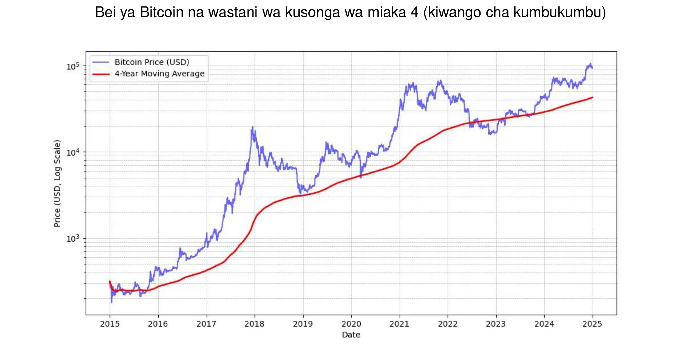

*MICHAEL SAYLOR: "Mawimbi bora ya bei ya Bitcoin ni wastani wa miaka 4 wa kusonga mbele."* Tazama chati iliyo hapo juu.

Zaidi ya hayo, ni vyema kuweka mfiduo wa mtu kwa Bitcoin **sawia** na kiwango cha ufahamu wa mtu. Ni muhimu pia kutokuwa na haraka au kujaribu kupanga wakati wa soko kikamilifu.

Hatimaye, Bitcoin inachukuliwa kuwa **tete**. Kwa usahihi, bei yake kama inavyoonyeshwa katika vitengo vya pesa ya fiat ni. Sehemu ya tete hii ni ya asili kwa mali bado changa, lakini pia inakuzwa na uwepo wa walanguzi ambao hawaitumii kama ghala la muda mrefu la thamani, badala yake kutafuta faida ya haraka. Zaidi ya hayo, biashara ya faida (kwa kutumia fedha zilizokopwa ili kuongeza nafasi za biashara) husisitiza harakati za bei ya kupanda na kushuka, kuzuia Bitcoin kufuata njia iliyonyooka ya juu. Hii husababisha kushuka kwa thamani zaidi, lakini baada ya muda, msingi wa watumiaji wanaojitolea kukua, tete hii inaonekana kuwa ya utulivu. Kwa muhtasari, **haiwezekani kuwa na kipengee chenye utendakazi wa hali ya juu kama Bitcoin bila tete**, lakini bila shaka unaweza kuwa na vipengee vya utendaji pungufu na vilivyo na tete kidogo.

### Bitcoin iliyopitishwa na Wall Street

Kupitishwa kwa Bitcoin na taasisi za fedha kunaimarisha zaidi nafasi yake katika soko la kimataifa.

Taarifa za hivi majuzi za **BlackRock** zinaangazia uwezo wa Bitcoin kama mali ya duka la thamani na zana ya utofautishaji wa kwingineko. Shirika kubwa la kitaasisi duniani hivi majuzi lilipendekeza kuwa **ukuaji wa watumiaji wa Bitcoin unapita ule wa mtandao** au simu za rununu, unaochangiwa haswa na **mabadiliko ya kidemografia na uzalishaji**, pamoja na kuongezeka kwa kutoamini kwa taasisi za fedha za jadi (!). Kutokana na hali yake ya uchache, isiyo ya uhuru na ugatuaji, baadhi ya wawekezaji huiona Bitcoin kama chaguo salama **katika nyakati za ukosefu wa utulivu wa kifedha na kifedha**, hofu, au matukio ya kijiografia yenye usumbufu.

**Spot Bitcoin ETF**, iliyozinduliwa Januari 2024, imefurahia mafanikio makubwa—**uzinduzi uliofanikiwa zaidi** wa ETF katika historia—na mapato halisi ya karibu $20 bilioni. kuanzia Januari hadi Novemba. Hiyo ni takriban mara nne kuliko uzinduzi bora zaidi wa ETF, Nasdaq-100 QQQ. ETF hizi hutoa ufikiaji rahisi na uliodhibitiwa zaidi kwa Bitcoin, ambayo **imeihalalisha** zaidi na kuvutia utitiri mkubwa wa mtaji wa taasisi.

ETF za Bitcoin zinaongoza kwa tofauti kubwa katika suala la **kupitishwa kwa taasisi**—kuzidi ETF kumi bora zinazokua kwa kasi—iwe kwa kuzingatia idadi ya taasisi zinazohusika au ukubwa wa mali zinazosimamiwa (AUM). Mafanikio ya ETF hizi za Bitcoin yanasisitiza ongezeko la mahitaji ya magari ya uwekezaji yanayohusishwa na rasilimali za kidijitali, na hivyo kuimarisha nafasi ya Bitcoin katika mazingira ya jadi ya kifedha.

Bitcoin sasa inacheza katika "duka la thamani" **soko**. Inawakilisha tu kushuka kwa ndoo kwa kiwango: karibu dola bilioni 1,800 ikilinganishwa na dhahabu ya $ 18,000 bilioni au $ 500,000 ya mali isiyohamishika. Walakini, soko lake la takriban 0.1% linaipa nafasi kubwa ya ukuaji, haswa ikizingatiwa kuwa washindani wake wanatatizika kuvutia watumiaji wapya.

| Ticker  | Mtiririko wa 1D (M USD) | Mtiririko wa 1W (M USD) | Mtiririko wa 1M (M USD) | Mtiririko wa 3M (M USD) | Mtiririko wa YTD (M USD) |
| ------- | --------------- | --------------- | --------------- | --------------- | ---------------- |
| **Jumla** | +457.19         | +1,507.95       | +2,888.01       | +3,672.29       | **+20,262.94**   |
| IBIT    | +393.40         | +750.91         | +1,536.47       | +3,821.37       | +22,460.44       |
| FBTC    | +14.81          | +372.40         | +627.16         | +458.71         | +10,266.69       |
| ARKB    | +11.51          | +163.26         | +295.92         | -3.88           | +2,647.32        |
| BITB    | +12.93          | +146.50         | +263.30         | +97.46          | +2,262.69        |
| HODL    | +5.75           | +38.77          | +94.54          | +100.39         | +682.03          |
| BRRR    | +1.92           | +4.72           | +17.76          | +20.54          | +540.19          |
| EZBC    | +11.79          | +17.53          | +39.29          | +47.48          | +439.45          |
| BTC     | .00             | -3.13           | +36.59          | +419.18         | +419.18          |
| BTCO    | +6.43           | +19.25          | +47.30          | +56.41          | +394.82          |
| BTCW    | .00             | +2.84           | +6.04           | +146.69         | +217.47          |
| YBIT    | -1.34           | -10.26          | +5.06           | +13.81          | +76.30           |
| DEFI    | .00             | .00             | .00             | -2.03           | -1.79            |
| GBTC    | .00             | +5.16           | -81.42          | -1503.84        | -20,141.85       |

*Dola bilioni 20 katika miezi 10: ETF za Bitcoin ziliafikiwa chini ya mwaka mmoja kile ambacho ETF za dhahabu zilichukua miaka 5 kukamilisha. Chanzo: Uwekezaji wa Mfuko unapita kwa USD. Bloomberg Terminal, Bloomberg L.P., 2024.*

### Bitcoin kwenye zana ya kampuni

Kukua kwa kupitishwa kwa Bitcoin nchini Marekani pia kunaathiri mawazo katika kwingineko duniani, hasa miongoni mwa wataalamu wa usimamizi wa mali ambao hawana uwezo tena wa kutoijumuisha miongoni mwa zana zao mbalimbali - hasa kwa vile bidhaa za jadi za kifedha hazifanyi kazi vizuri au zinakabiliwa na nyakati ngumu. Ni benki za jadi pekee ambazo bado zinaonekana kumudu kupuuza.

Kwa mtazamo wa kifedha tu, Bitcoin inatambuliwa kama mali ya mseto. Sio tu kwamba haihusiani na madaraja mengine ya mali, pia inaonekana kustawi wakati wa sindano mpya za ukwasi-kipindi kingine kama hicho kinaonekana kuanza kwa kupunguzwa kwa viwango vya riba na ECB, Fed, na Uchina.

Kwa muhtasari, kwa kesi ya matumizi ya kawaida-kuwekeza hazina ya ziada kwa angalau dirisha la miaka minne-Bitcoin inafaa kikamilifu. Ni vyema kuichanganya na mkakati wa kuingia taratibu: kuwekeza kiasi kisichobadilika mara kwa mara ili kulainisha mahali pa kuingia au kutoka.

Kesi zingine za utumiaji hufanya Bitcoin kuwa mali ya hazina ya kimkakati, kwa mfano:

- Kuwa na uwezo wa kuchapisha **dhamana** au ukwasi 24/7
- Kuweza kuhamishia kwenye hazina ya kampuni nyingine **haraka, wakati wowote**
- Uzio dhidi ya **hatari ya fedha za kigeni Exchange**
- Kulipa **mtoa huduma** anayeikubali, hasa katika hali za dharura

### Bitcoin ni ghali sana?

Sio lazima kununua 1 Bitcoin haswa, kwa sababu Bitcoin inaweza kugawanywa katika vitengo vidogo vinavyoitwa satoshis, vilivyopewa jina kwa heshima ya muundaji wake asiyejulikana. Bitcoin moja ni sawa na **satoshi milioni 100**, kuruhusu watumiaji kununua, kuuza au kufanya biashara **sehemu ndogo sana za Bitcoin**. Kwa kweli, ndani ya msimbo wa chanzo wa Bitcoin, shughuli zote zinahesabiwa kwa satoshis, na neno "Bitcoin" linaonekana tu katika "coinbase," wachimbaji wa shughuli maalum huunda kupokea malipo yao.

Zaidi ya hayo, jumla ya bitcoins milioni 21—au **2.1 quadrillion satoshi**—inaweza kuwakilishwa kwa ufanisi na nambari kamili ya biti 64. Hii ina maana kwamba licha ya bei ya juu kwa kila Bitcoin nzima, bado inaweza kufikiwa na wawekezaji mbalimbali kutokana na mgawanyiko wake. Kwa hivyo huhitaji kununua Bitcoin nzima ili kushiriki katika mtandao au kuwekeza katika mali hii ya kidijitali.

Tukumbuke kwamba mtaji wake wa chini kabisa wa soko, ikilinganishwa na mali nyingine kama vile hisa, dhahabu, au mali isiyohamishika, huacha uwezo wake wa kuthaminiwa ukiwa sawa. Pamoja na kupenya kwa chini sana (karibu 1% ya idadi ya watu ulimwenguni), tunafikiriwa kuwa tu mwanzoni mwa kuongezeka kwake. Hii inaifanya **beti isiyolinganishwa zaidi ya kizazi chetu **: sasa kuna uwezekano mdogo sana itashuka hadi sifuri kwa wakati huu, na uwezekano mkubwa itaendelea kupata msingi.

### Uamuzi wa kutenga hazina ya shirika katika Bitcoin

**Mchakato wa kufanya maamuzi** wa kuwekeza kwenye Bitcoin utaathiriwa pakubwa na nafasi yako ndani ya kampuni. Ikiwa wewe ni **mmiliki wa wengi, uko huru** kutenga fedha za ziada za hazina kulingana na uamuzi wako mwenyewe. Kinyume chake, ikiwa wewe ni mshirika au mbia ndani ya muundo wa pamoja wa kufanya maamuzi, utahitaji kupitia mashauri ya pamoja, ambayo yanaweza kutatiza mambo.

Katika hali hii ya pili, kuoanisha mitazamo tofauti inakuwa muhimu, kwani kwa kiasi kikubwa **inategemea uelewa wa kila mdau kuhusu mali ya Bitcoin**. Kama msemo unavyosema: "Bitcoin ni kila kitu ambacho watu hawajui kuhusu kompyuta pamoja na kila kitu ambacho hawaelewi kuhusu pesa." Hata kama mshirika mmoja amefanya jitihada za kuelewa kikamilifu Bitcoin, kuwasilisha ujuzi huu kwa wengine kunaweza kuwa changamoto. Katika hali kama hizi, **inashauriwa kuleta rasilimali ya nje** ili kuepuka kuwa na wazo lililohusishwa kwa karibu sana na mtu mmoja, ambayo inaweza upinzani wa generate.

Hivi sasa, hali ya mmiliki wengi anayefanya uamuzi ndiye mwakilishi zaidi kati ya kampuni zinazoshikilia Bitcoin. Hapa kuna mifano michache halisi:

- **Wataalamu wa kujitegemea**: Washauri, wahudumu wa afya, au wanasheria wanaowekeza sehemu ya hazina yao ya muda mrefu katika Bitcoin. Kwa ujumla, wataalamu hawa tayari wana akiba au akaunti za amana za muda na mapato kidogo.
- **Watendaji wa sekta ya teknolojia**: Mtendaji ambaye aliuza kampuni yao na kuwekeza sehemu ya mapato kutoka kwa kampuni yao ya kibinafsi hadi Bitcoin miaka michache iliyopita. Leo, wanafurahia hali nzuri ya kifedha na kuwekeza tena katika biashara mpya.
- **Wamiliki wa biashara ndogo sana** : Wajasiriamali katika huduma, kilimo, au tasnia ya ufundi ambao wameelewa uwezo wa Bitcoin na kuitengea sehemu ya hazina yao. Motisha yao kuu iko katika utofauti na uhuru unaotoa
- **Kampuni zinazouzwa hadharani** kama vile MicroStrategy zimeweka kielelezo kwa kubadilisha sehemu kubwa ya hazina yao ya shirika kuwa Bitcoin, kuonyesha mabadiliko ya kimataifa katika mikakati ya ugawaji wa mtaji wa shirika. Kufikia msimu wa 2024, kampuni zingine nyingi zilifuata mkondo huo, na kuhalalisha zaidi mwelekeo huu.

Gundua orodha iliyosasishwa ya kampuni zinazoshikilia bitcoins nyingi zaidi kwenye hazina, pamoja na kiasi kilichoshikiliwa, kwenye tovuti: [BitcoinTreasuries.net](https://bitcointreasuries.net/).
### Ushuru wa Bitcoin unaoshikiliwa na wafanyabiashara

Kwa biashara ambazo hazijaundwa kama huluki tofauti za kisheria—kama vile umilikaji pekee au huluki nyingine zisizojumuishwa—ushuru wa miamala ya Bitcoin mara nyingi huakisi jinsi inavyotumika kwa watu binafsi. Mara nyingi, sheria zilezile zinazosimamia faida ya mtaji au mapato hutumika, kama vile zingetumika ikiwa mtu binafsi alikuwa akiuza Bitcoin. Kwa mfano, katika baadhi ya nchi, faida inaweza kuchukuliwa kuwa sehemu ya mapato ya kibinafsi ya mjasiriamali, kulingana na **mabano ya kodi ya mapato ya kibinafsi**.

Hata hivyo, **biashara zilizojumuishwa**—zile zinazotozwa kodi ya mapato ya shirika—mara nyingi hunufaika kutokana na mfumo wa kodi unaofaa zaidi. Tofauti na watu binafsi, ambao wanaweza kukabiliwa na vikwazo vya kurekebisha faida na hasara katika viwango tofauti vya rasilimali, mashirika kwa ujumla yanaweza kujumuisha faida au hasara zilizopatikana kwenye miamala ya Bitcoin moja kwa moja kwenye akaunti zao za kila mwaka za faida na hasara. Hii inaweza kusababisha nafasi ya ushuru inayobadilika zaidi na wakati mwingine yenye faida zaidi.

Viwango mahususi vya ushuru na matibabu hutofautiana sana kulingana na mamlaka. Kwa mfano, nchini Ufaransa na nchi nyingi za magharibi, mashirika yanaweza kukabiliwa na viwango vya kodi vya kampuni vya karibu 25%, ambavyo vinaweza kuwa chini ya kodi ya viwango vya juu ambavyo watu binafsi hulipa kwenye faida za uwekezaji.

Kwa sababu ya tofauti hizi, **baadhi ya wamiliki wa biashara huchagua kununua na kushikilia Bitcoin kupitia miundo ya shirika**, kwa kuwa kufanya hivyo kunaweza kutoa **fursa bora zaidi za kupanga kodi**. Kama kawaida, inashauriwa kushauriana na mtaalamu wa kodi ambaye anafahamu sheria katika mamlaka husika ili kuhakikisha utiifu na kuboresha mkakati wa kodi.

## Jinsi ya kupata Bitcoin

<chapterId>1e6dbaf5-581a-49a4-8f37-3728e77bda17</chapterId>

### Njia Tatu za Upataji

Kuna njia tatu za kupata Bitcoin:

- **Katika Exchange kwa bidhaa au huduma:**

Kwa kuwa Bitcoin hufanya kazi kama njia ya Exchange, inawezekana kuwazia uchumi wa mduara. Ingawa hii bado ni ya kawaida leo, biashara zaidi na zaidi zinaanza kukubali malipo ya Bitcoin—kwa nini si yako? (Angalia sura yetu inayofuata)

- **Mining Bitcoin:**

Hii inahusisha kupata zawadi kutokana na uendeshaji wa mashine za Mining. Kwa biashara zisizo maalum, hii inasalia kuwa ndogo. Unaweza kushiriki kupitia waamuzi ambao watakuuzia au kukukodisha komputa, mtandao na matengenezo. Ikiwa unamiliki mashine, unaweza kuzihesabu kama mali zinazoweza kupunguzwa thamani. Kwa kiwango kikubwa, utahitaji kuhesabu kwa uangalifu mapato ya uwekezaji kwa sababu soko lina ushindani mkubwa na linahitaji matarajio mazuri ya gharama, hasa umeme.

Ili kupata maelezo zaidi kuhusu mbinu za Mining, unaweza [kupata sehemu ya "Mining" katika mafunzo yetu](https://planb.network/tutorials/mining).

- **Kununua Bitcoin:**

Hii ndiyo njia iliyozoeleka zaidi, inayofanywa kupitia ubadilishanaji kati ya wenzao au, kwa kawaida, kwenye majukwaa maalum ya biashara. Lakini wakati wa kupata Bitcoin kama mali ya hazina ya shirika, ni lazima kampuni zifuate viwango thabiti vya udhibiti na taratibu za Know-Your-Customer (KYC). Wanapoinunua kwenye mifumo maalum ya biashara, kwa kawaida biashara huhitajika kutoa maelezo ya kina ya kampuni, ikiwa ni pamoja na hati za utambulisho, taarifa za fedha na uthibitisho wa Address, ili kukidhi mahitaji ya KYC na ya kupinga ulanguzi wa pesa (AML).

Ili kujifunza jinsi ya kufungua akaunti ya biashara na kuitumia kununua, kuuza na kuhamisha bitcoins, unaweza kuangalia mafunzo haya mawili yaliyoundwa mahsusi kwa ajili ya biashara, yanayofunika majukwaa ya Kraken na Bitfinex katika matoleo yao ya ushirika:

https://planb.network/tutorials/business/others/bitfinex-pro-c8ef7476-5f60-4205-935e-a545ced0022a
https://planb.network/tutorials/business/others/kraken-pro-07b1c16c-d517-4bf7-9a78-b42dc0f21785
Ili kupata maelezo zaidi kuhusu mbinu za kupata bitcoins kupitia Exchange au peer-to-peer, unaweza [kupata sehemu ya "Exchange" katika mafunzo yetu](https://planb.network/tutorials/exchange).

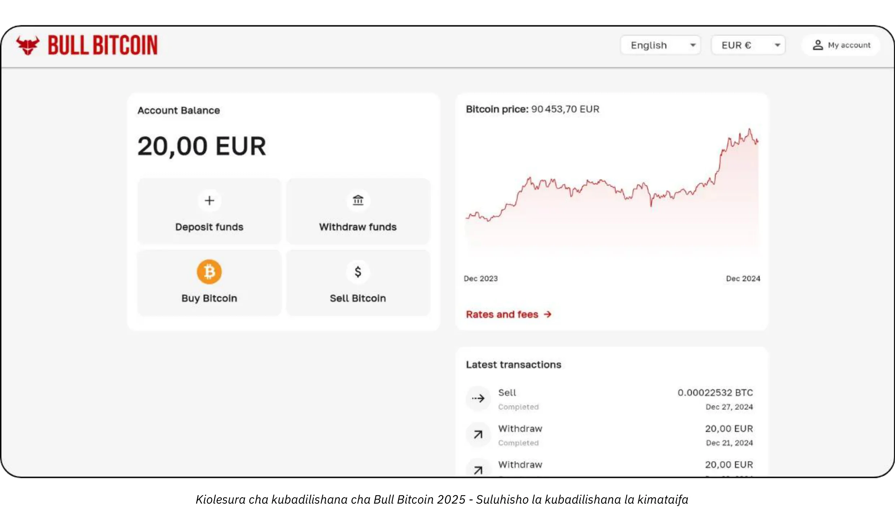

### Kwa Bei Gani?

Kama ilivyoelezwa hapo awali, haiwezekani tu kutabiri bei ya baadaye ya Bitcoin, lakini bei pia ni tete sana kwa muda mfupi. Kihistoria, mkakati wa kutegemewa umekuwa ni kujilimbikiza hatua kwa hatua katika vipindi vya kawaida na kudumisha upeo wa muda wa miaka minne au zaidi.

### Je! Unapaswa Kununua Kiasi Gani?

Kinyume chake, labda ni bora kuanza na ununuzi mdogo sana bila kufikiria kupita kiasi. Kiasi kidogo (kama euro mia moja au dola) hakitakudhuru sana, na uzoefu wa vitendo utakufundisha zaidi, haraka zaidi, kuliko kiwango chochote cha kusoma.

Kama ilivyoelezwa hapo awali, ni busara kuwekeza tu ukwasi wa ziada ambao hautahitaji kwa miaka kadhaa. Mkakati wowote ambao haujaeleweka vizuri unaweza kukuweka katika hali ngumu ikiwa unahitaji ghafla kutoa pesa kwa wakati mbaya.

Mbali na kuanza kidogo, ni muhimu kwa hazina za shirika kupitisha mkakati wa ugawaji uliopimwa. Kwa upande mmoja wa wigo, baadhi ya makampuni, kama vile MicroStrategy, yamechukua mbinu ya kupindukia kwa kutoa sehemu kubwa ya fedha zao za ziada za hazina kwa Bitcoin, ikionyesha imani kali ya kitaasisi. Kinyume chake, mkakati wa kihafidhina na unaoweza kuibuliwa unaweza kuhusisha kutenga karibu 5% ya hazina ya shirika kwa Bitcoin, kusawazisha faida zinazowezekana na mahitaji ya udhibiti wa hatari na ukwasi.

Taswira wigo huu kama kipimo, kutoka kwa mfiduo mdogo, kuhakikisha kampuni inabaki na ukwasi wa kutosha kwa mahitaji ya uendeshaji, hadi msimamo mkali unaolenga kuongeza uthamini wa thamani wa muda mrefu unaotarajiwa wa Bitcoin. Ingawa mgao mkali unaweza kuleta faida kubwa zaidi, mgao wa kiasi husaidia kupunguza tete, kuhakikisha kwamba msingi wa kifedha wa kampuni unasalia salama huku ukinufaika na uwezo wa ubunifu wa Bitcoin ndani ya shughuli zake za hazina.

### Mara ngapi?

Hakuna sheria ya Hard. Kujaribu kupanga muda wa soko kwa kuwinda "majosho" kunaweza kuwa na ufanisi mdogo na mkazo zaidi kuliko kununua tu kwa vipindi vya kawaida. Hata wawekezaji wenye uzoefu huwa wanakosea wakati mwingine. Kwenda "wote-ndani" mara moja inaweza kuwa upanga wenye ncha mbili.

Kwa kweli, uthamini unaowezekana wa Bitcoin ni kwamba hata kama ungeanza miaka michache tu chini ya mstari, bado ungeona faida za muda mrefu. Kweli, kuna uwezekano kwamba mabadiliko makubwa ya bei yatapungua kwa kasi kwa muda. Hata hivyo, kama sarafu iliyopunguzwa bei, Bitcoin imeundwa ili kuhifadhi thamani kwa ufanisi na kuonyesha faida za tija za watumiaji wake. Ili kuchora mlinganisho: kwa sasa tuko katika "awamu ya uzinduzi" wa Bitcoin, sarafu inayotengenezwa, na hakuna anayejua thamani yake ya haki bado. Baadaye, labda katika miaka 20 au 40, wakati iko katika "awamu ya kusafiri," inaweza kuwa shwari sana na kukua kwa kasi kwa faida ya tija ya jamii.

Sekta ya mali isiyohamishika mara nyingi hurudia kwamba "siku zote ni wakati unaofaa wa kununua," na kusahau kwamba ikiwa mali isiyohamishika itapoteza kazi yake kama ghala la thamani - kuhamisha mali kama Bitcoin - bei zinaweza kurudi karibu na thamani yao ya matumizi (makazi). Bitcoin, kinyume chake, haitumikii kusudi lingine isipokuwa kuhifadhi thamani, ambayo inaweza kumaanisha kwamba "siku zote ni wakati mwafaka wa kununua." Wakati ujao utasema.

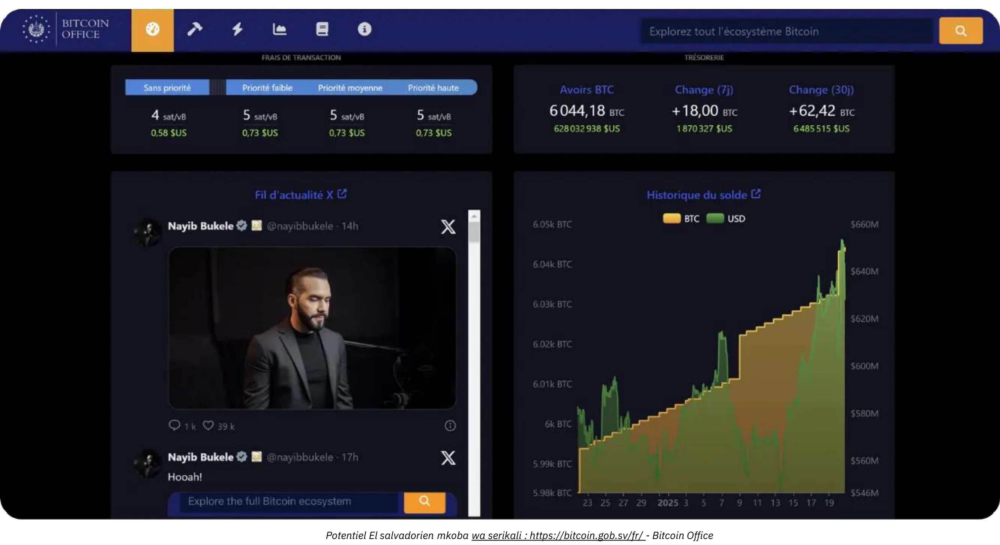

*Mikopo: [Bitcoin Office](https://Bitcoin.gob.sv/)*

### Ununue kwa Njia Gani? (Mbinu za Uhifadhi)

Humiliki Bitcoin kimwili. Badala yake, unashikilia kitufe cha kriptografia ambacho hukuruhusu kuhamisha Ownership ya baadhi au vitengo vyako vyote vya akaunti hadi funguo moja au zaidi za kriptografia. Yote haya hutokea kwenye Bitcoin Blockchain, ambayo inakiliwa katika makumi ya maelfu ya nodi duniani kote.

Ufunguo huu wa kriptografia ni nambari kubwa sana ya nasibu. Ili kurahisisha matumizi ya mtumiaji, mara nyingi huwakilishwa kama mfuatano wa maneno 12 au 24. Maneno haya yanaweza kupakiwa kwenye kifaa halisi kinachojulikana kama "Hardware Wallet." Hata hivyo, kuelewa kwamba bitcoins si "ndani" kifaa hiki; ni zana ya kutia saini kwa njia fiche shughuli za malipo na kuzitangaza kwenye mtandao. Kilicho muhimu sana ni maneno 12 au 24, ambayo lazima yawekwe salama.

Hii inasababisha suala la ulinzi: kushikilia Bitcoin kunamaanisha kushikilia funguo. Labda unazishikilia wewe mwenyewe, au unakabidhi jukumu hilo kwa mtu wa tatu. Pia kuna ufumbuzi wa kati. Wacha tuangalie hali zinazojulikana zaidi:

- **Kujitunza:**

Hili ndilo chaguo linalopendekezwa na wapenzi wa kweli wa Bitcoin, kwani inalingana na muundo wa asili wa Bitcoin. Unafanya kama benki yako mwenyewe: hakuna hatari ya mtu mwingine kukulaghai, lakini una jukumu la kupata funguo. Una ufikiaji kamili wa pesa zako 24/7. Katika mazingira ya biashara, ikiwa watu wengi wanaweza kuhitaji kufanya miamala, utahitaji zana na taratibu zinazofaa ili kudhibiti ufikiaji na usalama.

- **Ulezi wa Mtu wa Tatu:**

Kwa mfano, Exchange au huduma ya ununuzi inaweza kukufungulia akaunti, kubadilisha sarafu yako ya jadi hadi Bitcoin, na kuishikilia kwa niaba yako kwa kutumia mifumo yao ya usalama. Huduma nyingi kama hizo hukuruhusu kuondoa bitcoins zako kwa Wallet ambapo wewe pekee unashikilia ufunguo. Mpaka ufanye hivyo, humiliki bitcoins kweli; unategemea ahadi yao ya kukulipa. Hii inahusisha kusawazisha hatari za usalama (zao dhidi ya yako) na hatari ya wenzao (zinaweza kushindwa au kutoweka). Baadhi ya biashara hupata hili kuwa linakubalika, ingawa halishauriwi kwa uhifadhi wa muda mrefu au kwa 100% ya mgao wako. Huduma za uhifadhi zinaweza pia kutoza ada za uhifadhi.

- **"Karatasi Bitcoin" (ETFs au ETPs):**

Hizi ni zana za jadi za kifedha ambazo zinawakilisha sehemu za Bitcoin, zinazoiga utendaji wake wa bei. Taasisi inayoendesha bidhaa kinadharia inanunua na kushikilia Bitcoin ya msingi. Michango na uondoaji wako hufanywa kwa sarafu za jadi (k.m., dola au euro), si kwa Bitcoin. Isipokuwa kwa bidhaa fulani zinazoruhusu uondoaji katika Bitcoin halisi (ili kuepuka tukio linalotozwa kodi katika baadhi ya maeneo ya mamlaka), sheria hizi zinahusisha ada za usimamizi za kila mwaka. Hapa, unategemea usalama wa taasisi na kukabiliana na hatari ya mshirika mwingine (kwa mfano, ikiwa serikali iliamua kunyakua Bitcoin yote iliyoshikiliwa na taasisi, kama ilivyotokea kwa dhahabu mnamo 1933 chini ya Agizo kuu la U.S. 6102). Faida yao kuu ni ufikiaji rahisi, kwani husambazwa kupitia njia za kawaida za kifedha. Zinapita hitaji la kupata funguo za kriptografia lakini hazitoi sifa zozote za asili za Bitcoin: huwezi kutumia mtandao wa Bitcoin 24/7 kusogeza thamani kwa uhuru bila ruhusa. Zinaiga tu utendaji wa kifedha, si utendakazi au mamlaka ya Bitcoin yenyewe.

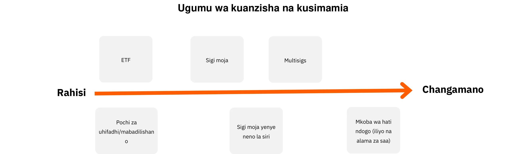

Zaidi ya hayo, fomu ambayo unashikilia Bitcoin inaathiri kwa kiasi kikubwa hatua za usalama zinazohitajika ili kulinda hazina yako ya shirika. Iwe unachagua kujitunza, kwa kutumia saini moja au pochi za maunzi zenye saini nyingi, n.k. ili kudumisha udhibiti wa moja kwa moja wa funguo zako, au kukabidhi jukumu hili kwa huduma za ulinzi za watu wengine au ETF, kila chaguo lina wasifu wake wa hatari. Kwa mfano, ulinzi wa kibinafsi hutoa ufikiaji kamili lakini hudai itifaki kali za usalama wa ndani, wakati suluhisho za watu wengine hupunguza mzigo wa usimamizi kwa gharama ya hatari ya wenzao. Ili kuonyesha zaidi tofauti hizo, grafu hii inaangazia muundo wa usalama kwa kila aina ya ulinzi, kukusaidia kuchagua mbinu inayofaa zaidi mahitaji ya shirika lako :

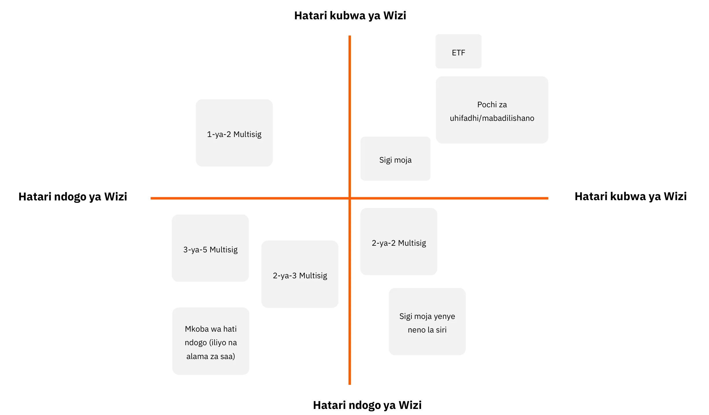

### Nani wa Kununua?

Ukichagua "Bitcoin paper," utageukia taasisi za fedha kama vile benki au masoko ya hisa ya mtandaoni.

Ukichagua kununua Bitcoin halisi kupitia soko (Exchange) au wakala, una aina kadhaa kuu:

- **Jukwaa Kubwa za Kimataifa au Nje:**

Mifano ni pamoja na Kraken, Coinbase, au Binance, iliyotumiwa kihistoria na watu wengi. Wengine wamekumbana na masuala, na ni vigumu kutoa pendekezo wazi. Kipande cha ushauri: ikiwa unazitumia, usiondoke bitcoins zako huko kwa muda mrefu zaidi kuliko lazima.

- **Watoa Huduma Wanaodhibitiwa (Watoa Huduma za Mali za Kidijitali Waliosajiliwa):**

Kwa mfano, nchini Ufaransa majukwaa kama Paymium (Exchange) au BullBitcoin (dalali) yanajulikana kwa kuwa na wapenzi wa kweli wa Bitcoin kwenye usukani na yamejenga rekodi thabiti. Nchini Marekani una watoa huduma kama vile River au Swann. Kwa ujumla, ni muhimu kuchunguza ukoo wa mtoa huduma: sifa zao, rekodi ya kufuatilia, umaarufu ndani ya jumuiya ya Bitcoin, na ikiwa uongozi wao unalingana na maadili ya msingi ya Bitcoin.

**Exchange dhidi ya Dalali:**

- **Exchange** hukuruhusu kuweka maagizo ya ununuzi kwa bei unayochagua, lakini ni lazima usubiri utekelezaji hadi bei ya soko na wauzaji ilingane.
- **Dalali** hukupa bei isiyobadilika na anaweza kukamilisha muamala kwa haraka zaidi.

Zaidi ya ada na kasi ya utekelezaji—ambayo haijalishi sana ikiwa unafikiria muda mrefu (miaka kadhaa)—biashara inapaswa pia kuzingatia:

- **kiolesura cha mtumiaji:** Je, jukwaa linafaa kwa watumiaji?
- **Vipengele vya Uhasibu:** Kwa uchache, uwezo wa kuhamisha historia ya muamala katika umbizo la .CSV.
- **Ulinzi na Usalama:** Je, jukwaa linashikilia bitcoins kwa niaba yako, au linahamisha Ownership kwako? Mipangilio yao ya usalama ni nini? Je, wana "kufuli za kujiondoa" au vikwazo vingine vya uondoaji?
- **Usaidizi kwa Wateja:** Ubora, usikivu, na usaidizi unaobinafsishwa, hasa unapoanza.
- **Sifa na Maadili:** Uaminifu na maadili ya jukwaa.
- **Usaidizi kwa Ununuzi Unaorudiwa:** Ikiwa unapanga kukusanya Bitcoin baada ya muda na ununuzi ulioratibiwa.

# Masuluhisho ya malipo ya Bitcoin yaliyolengwa kwa kila biashara

<partId>b2c8af88-6bfc-49b1-ad84-4c292c713b55</partId>

## Kuchukua Bitcoin kama malipo

<chapterId>99af1203-bc84-4acc-9780-f733e7998335</chapterId>

Kwanza, ni muhimu kuelewa kwamba Bitcoin ni usumbufu kwa kiwango sawa na mtandao.

Katika siku za kwanza, mtandao wa mtandao ulifanya iwezekanavyo kuondoa wapatanishi kutoka kwa njia za mawasiliano, na kisha miundombinu hii ilisababisha maombi mengi ya awali yasiyofikiriwa. Leo, ni biashara gani ambayo haina uwepo mtandaoni?

Bitcoin ni miundombinu ya uaminifu, ambayo maombi yake ya kwanza ni kuondoa wapatanishi kutoka kwa hifadhi na Exchange ya thamani—fedha. Programu zingine zisizoweza kufikiria kwa sasa zitatokea kwenye miundombinu hii. Uwepo wako wa kwanza hapa ni sawa na kuwa na tovuti: lango la malipo kati ya watu wengine na ubadilishanaji wa thamani.

Sasa, fikiria mtazamo wa biashara ya vitendo ambayo shughuli yake ya msingi haina uhusiano wowote na Bitcoin. Kwa nini ingechagua kukubali malipo ya Bitcoin?

- **Kujenga Hazina ya Bitcoin:**

Tazama nakala yetu ya awali juu ya kununua Bitcoin. Iwe ni kwa sababu ya kutiwa hatiani au kama mkakati wa utofauti, baadhi ya wataalamu huchagua kukubali malipo ya Bitcoin. Baadhi ya Wanabiashara wa Bitcoin wanasema kwamba kadiri kampuni inavyokuwa na mwelekeo mdogo wa kifedha—maana haina wakati wala zana za kujihusisha na ujanja changamano wa kifedha—**ndivyo inavyokuwa muhimu zaidi kwa biashara hiyo kulipwa kwa njia ngumu zaidi ya pesa inayopatikana**. Kwa kufanya hivyo, husawazisha uwanja, kuwezesha hata biashara ndogo ndogo, zinazobanwa na wakati kuhifadhi thamani bila kujihusisha na michezo ya kifedha.

- **Kufikia Demografia Mpya:**

Idadi ya watumiaji wa Bitcoin inakua, na wana uwezo mkubwa wa kununua. Kwa kawaida watavutia biashara zinazokubali sarafu zao. Zaidi ya hayo, kwa kuwa hii ni sarafu ya kwanza ya kimataifa, ya asili ya mtandao, unaweza pia kuvutia wateja wa kimataifa wanaopitia.

- **Kuongezeka kwa Mwonekano:**

Kwa kuorodhesha biashara yako kwenye majukwaa kama vile BTCmap.org, kwa mfano. Ni biashara chache tu zinazokubali Bitcoin kwa sasa, kwa hivyo maneno ya mdomo hufanya kazi kwa faida yako. Pia hukuweka tofauti na washindani wako.

- **Ada za Chini:**

Malipo ya papo hapo ya Bitcoin hufanyika kupitia Lightning Network. Ada ni ndogo na hulipwa na mnunuzi. Hakuna ada za mwisho za malipo, hakuna hitilafu za uidhinishaji wa malipo, na hakuna ulaghai. Kwa kulinganisha, sekta ya malipo (kadi, vituo, uhamisho, PSPs, n.k.) hugharimu takriban $2.2 trilioni kwa mwaka duniani kote. Ongeza kwenye malipo hayo na ulaghai, na kwa jumla, karibu moja ya kumi ya Pato la Taifa la Marekani "hupunguzwa" kutoka kwa biashara zenye tija duniani kote ili tu kuhamisha thamani. Bila kujali biashara yako, ada za kifedha ni mzigo ambao unapaswa kuboreshwa, na wakati mwingine, ada za juu zinaweza kukandamiza aina fulani za biashara.

- **Uhuru na Kutokuwa na Ruhusa, 24/7:**

Hakuna haja ya kuomba ruhusa ya kutumia Bitcoin. Mtu yeyote anaweza kushiriki katika uchumi ndani ya dakika chache kwa kutumia programu ya simu mahiri. Unaweza kutuma au kupokea malipo kutoka kwa mtu yeyote—mtu binafsi au biashara—wakati wowote, bila vikwazo vya kuratibu au ucheleweshaji.

- **Tumia Mtandao wa Bitcoin kwa Manufaa Yake:**

Huhitajiki kuweka malipo yako katika fomu ya Bitcoin—hasa ikiwa unahitaji kulipa wasambazaji au kutuma VAT. Huduma fulani zinaweza kubadilisha malipo yote au sehemu ya malipo yako ya Bitcoin kuwa sarafu utakayochagua (k.m., euro hadi IBAN yako) kwa ada. Katika hali hii, manufaa ya kukubali Bitcoin yanaweza kuwa katika kuvutia watumiaji wapya au katika manufaa ya ndani ya Bitcoin (kama vile ada za chini, uendeshaji wa saa moja na usiku, na hakuna hatari ya ulaghai au malipo nyuma).

### Ni suluhisho gani la malipo unapaswa kuchagua?

Ni rahisi kuanza kukubali malipo ya Bitcoin. Ili kuchagua suluhu linalofaa, zingatia sifa za miamala unayoshughulikia: wastani wa kiasi cha malipo, marudio ya miamala na iwapo utakubali malipo katika mazingira halisi, mtandaoni au zote mbili.

Mtazamo wako kama mfanyabiashara pia ni muhimu. Je, unafanya jaribio rahisi, au unatarajia Bitcoin kuwa chanzo kikuu cha mapato cha mara kwa mara? Ikiwa ni ya mwisho, utahitaji usanidi thabiti, wa kina na unaoweza kugeuzwa kukufaa.

Usisahau kuzingatia majukumu mbalimbali ya wafanyakazi wako na maeneo yao. Katika hali yoyote, kumbuka kwamba lazima uweze kutoa taarifa zote muhimu kwa mhasibu wako na kurahisisha mchakato wa uhasibu.

Ili kurahisisha mchakato wa kufanya maamuzi, tumefafanua wasifu nne tofauti za biashara. Majedwali yafuatayo yanafafanua sifa kuu na suluhu zinazopendekezwa za malipo kwa kila wasifu.

### Profaili za biashara

#### Profaili 1 - Mwanzilishi

| Sifa                            | Mwanzo                                                                                                                                       |
| ------------------------------- | -------------------------------------------------------------------------------------------------------------------------------------------- |
| **Hali ya Akili**          b    | "kujaribu malipo yangu ya kwanza ya kimwili", "kupokea kidokezo kwa maudhui yangu ya mtandaoni", "lengo la mapato madogo sana"                   |
| **Mzunguko wa Miamala**        | "muamala wa kwanza ili kujifunza", "kupokea malipo mara moja kwa muda"                                                                      |
| **Mifano ya Aina ya Biashara** | Uchumi wa ubunifu (waundaji wa maudhui, blogu, makala, n.k.), vidokezo vya mara kwa mara, mauzo ya mara moja ya bidhaa ana kwa ana, vyama, matukio ya mara moja |
| **Aina ya Malipo**             | Kwa kawaida senti chache hadi euro/dola chache; chini ya ~euro/dola 300 kwa bidhaa                                                          |
| **Ugumu wa Mipangilio**        | Hakuna                                                                                                                                       |
| **Mfano wa Suluhisho Linalofaa** | Pochi ya Lightning ya uhifadhi kama Wallet of Satoshi au pochi isiyo na uhifadhi kama Phoenix                                                |
| **Kiolesura cha Muuzaji**      | Pochi rahisi ya Bitcoin Lightning: programu kwenye simu ya mkononi                                                                           |
| **Kiolesura cha Mteja**        | Msimbo wa malipo wa QR wa Bitcoin, unasomwa kupitia pochi ya kibinafsi ya mteja                                                             |
| **Ada**                         | Mteja analipa ada za Bitcoin Lightning pamoja na ada zozote za programu zinazotumika                                                         |
| **Kifaa cha Malipo**           | Programu ya bure ya simu janja au chaguo la kituo cha kimwili (k.m. Bitcoinize)                                                              |
| **Usimamizi na Majukumu**      | Usimamizi wa programu moja; tofauti ndogo za majukumu                                                                                        |
| **Hamisha za Uhasibu**         | Orodha za msingi za historia ya miamala                                                                                                      |
| **API**                         | Hapana                                                                                                                                       |

#### Profaili 2 - Muhimu

| Sifa                            | Muhimu                                                                                                                                        |
| ------------------------------- | -------------------------------------------------------------------------------------------------------------------------------------------- |
| **Hali ya Akili**              | "Ninakubali Bitcoin katika biashara yangu lakini sitarajii kiasi kikubwa cha maana"                                                           |
| **Mzunguko wa Miamala**        | Miamala michache kwa mwezi                                                                                                                    |
| **Mifano ya Aina ya Biashara** | Baa, mikahawa, mauzo ya mara kwa mara ya bidhaa safi au zinazotoka moja kwa moja, maduka kadhaa chini ya mmiliki mmoja, uchumi wa ubunifu kwa wasanii |
| **Aina ya Malipo**             | Kwa kawaida kuanzia euro/dola chache hadi mamia chache kwa bidhaa; chini ya ~300 kwa bidhaa na chini ya ~3,000 kwa mwezi                      |
| **Ugumu wa Mipangilio**        | Mdogo (programu ya mkononi)                                                                                                                   |
| **Mfano wa Suluhisho Linalofaa** | Swiss Bitcoin Pay                                                                                                                             |
| **Kiolesura cha Muuzaji**      | Pochi rahisi ya Bitcoin Lightning: programu kwenye simu ya mkononi; ankara rahisi zenye maelezo machache                                       |
| **Kiolesura cha Mteja**        | Msimbo wa malipo wa QR wa Bitcoin, unasomwa kupitia pochi ya kibinafsi ya mteja                                                              |
| **Ada**                         | Kwa kawaida <1% kwa kutuma kwa anwani ya Bitcoin, na <1.5% kwa kubadilisha kuwa fiat                                                          |
| **Kifaa cha Malipo**           | Programu ya bure ya simu janja au chaguo la kituo cha kimwili (k.m. Bitcoinize)                                                               |
| **Usimamizi na Majukumu**      | Chaguo la jukumu la kuuza-tu kwa wafanyakazi; dashibodi ya mtandaoni kwa utawala                                                              |
| **Hamisha za Uhasibu**         | Hamisha ya CSV ikiwa na maelezo kamili ya miamala                                                                                             |
| **API**                         | Ndiyo                                                                                                                                         |

#### Profaili 3 - Mtaalamu

| Sifa                            | Mtaalamu                                                                                                                                                    |
| ------------------------------- | ----------------------------------------------------------------------------------------------------------------------------------------------------------- |
| **Hali ya Akili**              | - Njia ya malipo kama nyingine yoyote kwa biashara yangu ya mtandaoni - Au usimamizi wa pamoja kwa kikundi cha biashara zinazotayari kwa kiasi kikubwa      |
| **Mzunguko wa Miamala**        | Miamala kadhaa kwa siku                                                                                                                                     |
| **Mifano ya Aina ya Biashara** | Tovuti za biashara mtandaoni zenye kiasi wastani, masoko madogo, vikundi vya maduka ya kimwili (k.m., Click & Collect), shughuli za SME                     |
| **Aina ya Malipo**             | Kwa kawaida kuanzia euro/dola chache hadi mamia chache; hakuna kikomo cha ukubwa wa malipo; chini ya 250,000 kwa mwaka                                      |
| **Ugumu wa Mipangilio**        | Rahisi hadi yenye vipengele vyote (uhifadhi wa mtaa au wingu), mara nyingi inahitaji wajihi ya biashara mtandaoni                                           |
| **Mfano wa Suluhisho Linalofaa** | BTC Pay Server kwa biashara mtandaoni na/au mazingira ya kimwili; ZapRite, Musqet au PayWithFlash kwa malipo, Be-BOP kwa duka la mtandaoni la jumuishi      |
| **Kiolesura cha Muuzaji**      | Tovuti (simu na kompyuta) ikiwa na uhariri wa ankara, chaguo za kikapu cha ununuzi, na uundaji wa kitufe cha malipo; ankara otomatiki na ujumuishaji wa biashara mtandaoni |
| **Kiolesura cha Mteja**        | Msimbo wa malipo wa QR wa Bitcoin, unasomwa kupitia pochi ya kibinafsi ya mteja                                                                             |
| **Ada**                         | Mchanganyiko wa backend ya chanzo wazi ya bure na ada za malipo za Lightning/huduma; ada za front-end ni pamoja na ada za Bitcoin Lightning na <1.5% ada za ubadilishaji |
| **Kifaa cha Malipo**           | Duka la tovuti, onyesho la kimwili la hiari (k.m. iPad inayoonyesha tovuti au kituo cha Bitcoin)                                                             |
| **Usimamizi na Majukumu**      | Duka lililojaa vipengele vyote na majukumu mengi ya utawala; wafanyakazi na wateja wanahusiana na mfumo                                                      |
| **Hamisha za Uhasibu**         | Hamisha ya CSV ikiwa na maelezo kamili ya miamala                                                                                                            |
| **API**                         | Ndiyo                                                                                                                                                        |
#### Profaili 4 - Biashara

| Sifa                            | Biashara                                                                                                                                                    |
| ------------------------------- | ----------------------------------------------------------------------------------------------------------------------------------------------------------- |
| **Hali ya Akili**              | - Njia ya malipo kama nyingine yoyote kwa biashara yangu ya mtandaoni - Au usimamizi wa pamoja kwa kikundi cha biashara zinazotayari kwa kiasi kikubwa      |
| **Mzunguko wa Miamala**        | Miamala kadhaa kwa siku                                                                                                                                     |
| **Mifano ya Aina ya Biashara** | Tovuti za biashara mtandaoni zenye kiasi wastani, masoko madogo, vikundi vya maduka ya kimwili (k.m., Click & Collect), shughuli za SME                     |
| **Aina ya Malipo**             | Kwa kawaida kuanzia euro/dola chache hadi mamia chache; hakuna kikomo cha ukubwa wa malipo; chini ya 250,000 kwa mwaka                                      |
| **Ugumu wa Mipangilio**        | Rahisi hadi yenye vipengele vyote (uhifadhi wa mtaa au wingu), mara nyingi inahitaji wajihi ya biashara mtandaoni                                           |
| **Mfano wa Suluhisho Linalofaa** | BTC Pay Server kwa biashara mtandaoni na/au mazingira ya kimwili; ZapRite, Musqet au PayWithFlash kwa malipo, Be-BOP kwa duka la mtandaoni la jumuishi      |
| **Kiolesura cha Muuzaji**      | Tovuti (simu na kompyuta) ikiwa na uhariri wa ankara, chaguo za kikapu cha ununuzi, na uundaji wa kitufe cha malipo; ankara otomatiki na ujumuishaji wa biashara mtandaoni |
| **Kiolesura cha Mteja**        | Msimbo wa malipo wa QR wa Bitcoin, unasomwa kupitia pochi ya kibinafsi ya mteja                                                                             |
| **Ada**                         | Mchanganyiko wa backend ya chanzo wazi ya bure na ada za malipo za Lightning/huduma; ada za front-end ni pamoja na ada za Bitcoin Lightning na <1.5% ada za ubadilishaji |
| **Kifaa cha Malipo**           | Duka la tovuti, onyesho la kimwili la hiari (k.m. iPad inayoonyesha tovuti au kituo cha Bitcoin)                                                             |
| **Usimamizi na Majukumu**      | Duka lililojaa vipengele vyote na majukumu mengi ya utawala; wafanyakazi na wateja wanahusiana na mfumo                                                      |
| **Hamisha za Uhasibu**         | Hamisha ya CSV ikiwa na maelezo kamili ya miamala                                                                                                            |
| **API**                         | Ndiyo                                                                                                                                                        |

Katika sura zifuatazo, tutaeleza kwa kina kila wasifu wa biashara na masuluhisho yanayolenga kila moja yao.

## Mwanzilishi

<chapterId>7edda53d-5b9f-432a-8493-115de8c94a67</chapterId>

Wasifu wa Starter umeundwa kwa ajili ya biashara, watayarishi na watu binafsi ambao wangependa kuchunguza malipo ya Bitcoin bila kutumia rasilimali au ujuzi mkubwa. Kwa kawaida hawa ni wale wanaoshughulikia kiasi kidogo sana cha miamala (labda vidokezo vichache, michango, au mauzo ya mara kwa mara) na kutafuta utangulizi rahisi na mwepesi wa mfumo ikolojia wa Bitcoin na Lightning Network. Thamani muhimu ya mbinu ya Starter iko katika usanidi wake mdogo: mara nyingi, kinachohitajika ni simu mahiri au kompyuta kibao iliyo na Wallet ya msingi inayoendana na Umeme.

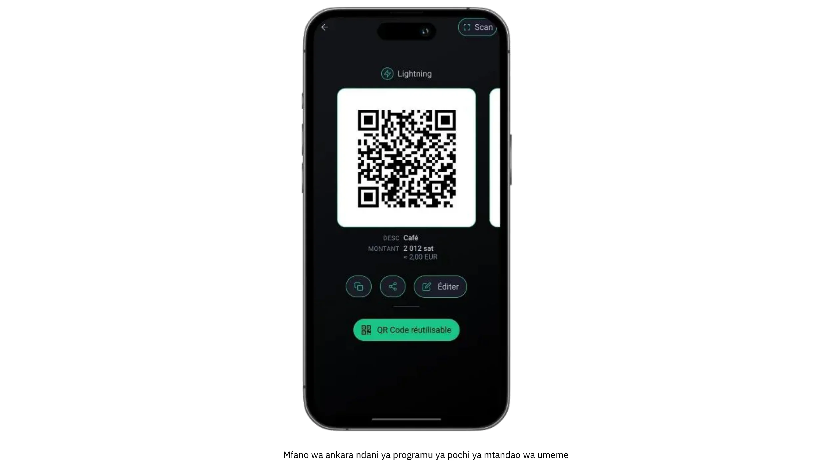

Mojawapo ya vipengele muhimu vya wasifu huu ni kuzingatia malipo ya kiwango cha chini ambacho mara chache huzidi euro mia chache au dola kwa mwezi. Kiwango hiki cha kawaida kinaifanya kuwa chaguo bora kwa mtu yeyote anayetaka kujaribu soko na Bitcoin, bila ugumu uliopo katika usambazaji wa kiwango cha juu. Zaidi ya hayo, inaruhusu kujifunza kwa vitendo mara moja; kwa kuwa kuna shinikizo chache za uendeshaji na vigingi vidogo vya fedha, makosa yanaweza kuzuiwa, na masomo hujifunza haraka. Kuanzia wasanii ambao huuza ufundi uliotengenezwa kwa mikono katika maonyesho ya wikendi hadi vikundi visivyo vya faida ambavyo vinakubali michango ya mara moja, watumiaji katika kitengo hiki mara nyingi husisitiza ufikivu na urahisi wa kutumia juu ya utendakazi wa hali ya juu.

Mipangilio miwili ya kawaida ya Wallet kwa wasifu wa Starter inahusisha kuamua kati ya suluhu za ulezi na zisizo za ulezi. Wallet ya ulinzi (kama vile Wallet ya Satoshi au Blink) huruhusu huduma ya watu wengine kudhibiti funguo za faragha na uendeshaji wa nyuma, na hivyo kupunguza majukumu ya kiufundi kwa mtumiaji. Mpangilio huu unawavutia sana wale wanaothamini urahisi zaidi na wanaotaka kuabiri kwa urahisi iwezekanavyo. Kwa upande mwingine, pochi za umeme zisizo na kizuizi (kama vile Phoenix au Breez) huweka funguo za faragha na udhibiti kamili mikononi mwa mmiliki wa biashara, hivyo kutoa uhuru na faragha zaidi katika Exchange kwa juhudi zaidi za awali. Vyovyote vile, violesura vya kisasa kwa kawaida vinafaa mtumiaji hivi kwamba mtu yeyote anaweza kushughulikia kazi muhimu (kutengeneza msimbo wa QR, kuweka kiasi cha malipo, na kuthibitisha miamala) ndani ya dakika chache.

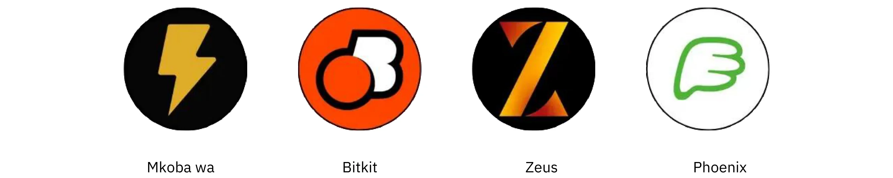

Ingawa wasiwasi wa usalama unaweza kuonekana kuwa wa dharura wakati shughuli ni ndogo, hata hivyo ni muhimu kuweka hatua za msingi za ulinzi. Hata simu mahiri au kompyuta kibao inayotumiwa kupokea malipo ya Bitcoin inapaswa kufungwa kwa nenosiri au usalama wa kibayometriki, na taratibu za kuhifadhi nakala (kuanzia kufuatilia kitambulisho cha kuingia kwa Wallet iliyohifadhiwa hadi kulinda kifungu cha maneno cha seed kwa mtu asiye mlezi) lazima zichukuliwe kwa uzito. Wafanyakazi wanaoshughulikia miamala katika mpangilio halisi watafaidika kwa kujua mambo ya msingi: jinsi ya kufungua programu, jinsi ya kuwasilisha msimbo wa QR kwa mteja, na jinsi ya kuangalia kama malipo yamefika.

Uhasibu na kuripoti, ingawa ni rahisi kwa kiasi chini ya wasifu wa Starter, bado unahitaji kuzingatiwa kwa uangalifu. Ingawa kiasi cha miamala kinaweza kuwa chache, kuhifadhi rekodi sahihi huzuia mkanganyiko na husaidia kudumisha uwazi katika kesi ya ukaguzi wa fedha au uwasilishaji wa kodi. Programu nyingi za Wallet huwezesha watumiaji kuhamisha historia ya shughuli ya kimsingi kama faili ya CSV; kwa biashara ndogo au mjasiriamali mmoja, kuhifadhi faili hizi mara kwa mara kunaweza kurahisisha upatanisho wa akaunti. Pia ni busara kufuatilia takriban thamani ya fiat (kwa mfano, katika euro au dola) wakati kila shughuli inapopokelewa. Kwa kuwa bei ya Bitcoin inaweza kubadilika, kuwa na rekodi ya viwango vya walioshawishika ni muhimu sana kwa uhifadhi wa hesabu na kufuata kodi.

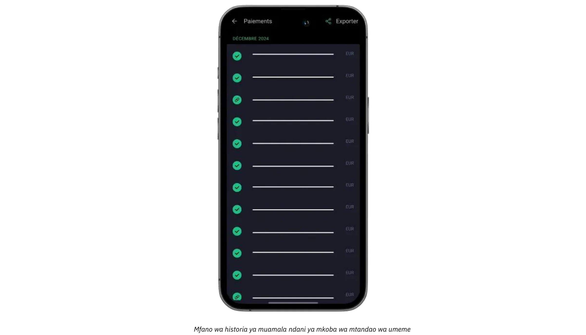

Kwa biashara zinazotaka kuongeza malipo yao ya kibinafsi au ya ana kwa ana kwa michango au vidokezo vya mtandaoni, sasa ni rahisi kujumuisha kitufe cha kidokezo cha umeme au wijeti ya mchango kwenye tovuti au blogu. Mifumo kama vile Seva ya BTCPay hutoa vitufe vya malipo vilivyo rahisi kusanidi, ilhali baadhi ya mitandao ya kijamii na huduma za mtiririko wa moja kwa moja tayari zinaauni vidokezo vya Umeme na anwani. Kwa hivyo, hata kampuni ya Starter inaweza kuunda mtandao wa kawaida lakini wa kimataifa wa walinzi. Wakati huo huo, wale ambao hawapendi kushikilia Bitcoin kwa muda mrefu wanaweza kuchunguza ubadilishaji wa sehemu au otomatiki kuwa sarafu ya fiat kwa kutumia pochi fulani za uhifadhi au huduma za watu wengine. Ingawa chaguo hili linahusisha ada za ziada na majukumu yanayowezekana ya KYC, husaidia biashara kuepuka tete la viwango vya Exchange na kudumisha utendakazi wao wa kifedha uliopo bila usumbufu mdogo.

Kesi rahisi ya utumiaji inaonyesha jinsi vipengele vinaungana hivi vyote vinavyoungana. Hebu wazia fundi wa ndani ambaye anauza jamu za kujitengenezea nyumbani kwenye soko la wakulima Jumamosi. Wakiwa na simu inayoendesha Lightning Wallet, waliweka bei ya kila jar kwa euro; mteja anapouliza kulipa katika Bitcoin, mfanyabiashara huingiza haraka kiasi kinacholingana cha fiat, na programu huhesabu kiotomatiki malipo ya Sats. Msimbo wa QR unaotokana huchanganuliwa na Wallet ya mteja, malipo yanatatuliwa kwa sekunde, na fundi anajua mara moja kwamba muamala umefaulu. Mwishoni mwa siku, maelezo yoyote ya muamala yanaweza kusafirishwa kwa uhifadhi wa kumbukumbu, na salio la siku linaweza kutumwa kabisa au sehemu kwenye jukwaa la Exchange ili kubadilishwa kuwa sarafu ya fiat.

Kwa kusawazisha zana zinazofaa mtumiaji, mahitaji madogo ya maunzi, na uhifadhi wa kumbukumbu moja kwa moja, Suluhu za Starter hutoa mambo muhimu bila biashara nyingi za wageni. Iwapo idadi ya miamala itaongezeka na mahitaji ya uendeshaji wa biashara yanabadilika, kupata toleo jipya la kategoria za hali ya juu zaidi zilizofafanuliwa katika sura ijayo huwa ni maendeleo ya kawaida.

Kwa mafunzo ya kina kuhusu pochi zinazopendekezwa na usanidi msingi, tafadhali soma miongozo ifuatayo:

**Pochi/nodi za kujilinda za LN:**

https://planb.network/tutorials/wallet/mobile/phoenix-0f681345-abff-4bdc-819c-4ae800129cdf

https://planb.network/tutorials/wallet/mobile/bitkit-a7224674-85c4-4045-9baf-37018d89550c

https://planb.network/tutorials/wallet/mobile/breez-46a6867b-c74b-45e7-869c-10a4e0263c06

https://planb.network/tutorials/wallet/mobile/blixt-04b319cf-8cbe-4027-b26f-840571f2244f

https://planb.network/tutorials/wallet/mobile/zeus-embedded-advanced-3e89603c-501d-439c-8691-d4a0d0de459b

**Pochi za LN za uhifadhi:**

https://planb.network/tutorials/wallet/mobile/wallet-of-satoshi-39149d86-e42b-4e8f-ae9f-7e061e7784f7

https://planb.network/tutorials/wallet/mobile/blink-7ea5f5a4-e728-4ff9-b3f9-cf20aa6fc2bd

## Muhimu

<chapterId>89be421f-f7df-4bcc-a9e4-df96e39ef249</chapterId>

Wasifu Muhimu unafaa kwa biashara ndogo na za kati, zinazowezekana na wafanyikazi, wanaotaka kukubali Bitcoin kwa urahisi na haraka bila kuhitaji maarifa ya hali ya juu ya kiufundi, huku wakiwa na mfumo kamili na wa kitaalamu zaidi kuliko Wallet rahisi. Aina hii mara nyingi hutumika kwa mikahawa, mikahawa, baa, au maduka madogo ya rejareja ambayo huona malipo machache tu ya Bitcoin kila mwezi, ilhali hutamani Interface ambayo ni moja kwa moja na thabiti vya kutosha kushughulikia shughuli za kila siku bila kukatizwa.

Tofauti na wasifu wa Starter, Biashara Muhimu kwa kawaida huchukulia malipo ya Bitcoin kama sehemu inayoendelea ya mkondo wao wa mapato badala ya majaribio tu. Bado zinafanya kazi kwa viwango vya chini vya muamala, lakini masafa yanatosha kwamba wamiliki na wafanyakazi wanufaike na mfumo ulioundwa zaidi na unaotegemewa. Wakati huo huo, wasifu muhimu unabaki kuzingatia unyenyekevu; wakati inaruhusu dashibodi rahisi na usimamizi mdogo wa jukumu, haihitaji rasilimali maalum za IT au miunganisho changamano.

Mapendekezo ya teknolojia katika sehemu hii mara nyingi hutegemea **Swiss Bitcoin Pay**, suluhisho lililorahisishwa kwa wauzaji kukubali malipo ya Bitcoin kwa urahisi. Inaangazia programu ya PoS inayomfaa mtumiaji, ambayo haihitaji utaalamu wa kiufundi kwa wafanyakazi. Tofauti na pochi za kawaida za Bitcoin, inalenga tu kupokea malipo, kuruhusu wafanyakazi kutumia kifaa bila hatari za usalama. Programu nyingi za PoS zinaweza kuunganishwa kwenye akaunti moja, inayoweza kutumika kwenye kompyuta kibao, rejista, simu mahiri au kupitia toleo la wavuti la kompyuta, linalotumia Android na iOS. Unaweza pia kuunda menyu yenye bidhaa unazouza na bei zinazohusiana, hivyo basi kumruhusu mfanyakazi kuchagua kikapu cha bidhaa kwa ajili ya mteja kwenye PoS na kisha kutoza jumla.

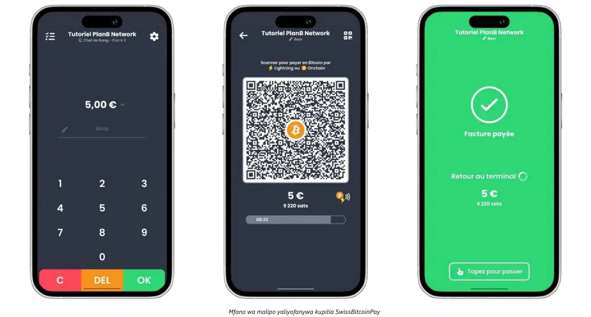

Malipo yanaweza kutolewa kwa Bitcoin hadi Anwani mahususi au kubadilishwa kuwa sarafu ya fiat na kuwekwa kwenye akaunti ya benki kila siku. Bitcoin Pay ya Uswisi huendesha mchakato kiotomatiki, kushughulikia malipo ya Bitcoin na Lightning Network bila uingiliaji wa kibinafsi. Pesa zinashikiliwa kwa muda usiozidi saa 24 kabla ya uhamisho. Ingawa si chini ya ulinzi kamili kama Seva ya BTCPay, inasawazisha urahisi na usalama, na haihitaji KYC.

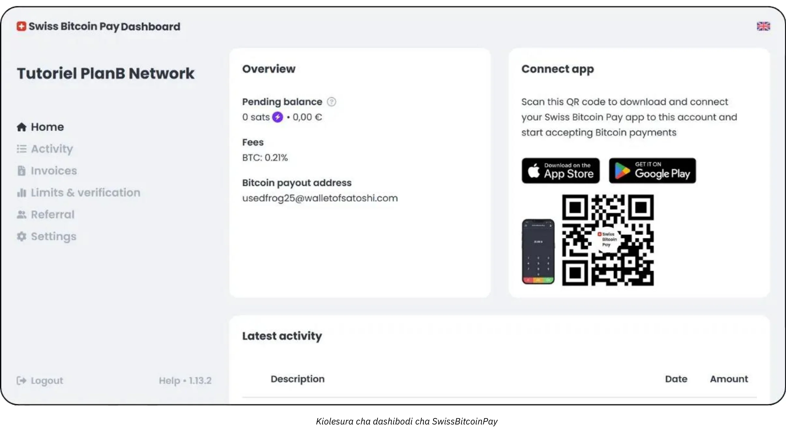

Ada ni shindani: 0.21% kwa mwaka wa kwanza, kisha 1% kwa malipo ya Bitcoin na 1.5% kwa malipo ya ubadilishaji wa fiat, ikijumuisha gharama za shughuli za Bitcoin. Bitcoin Pay ya Uswisi inatoa msingi wa kati kati ya suluhu za ulezi kama vile Open Node na mifumo changamano inayojiendesha kama vile Seva ya BTCPay, inayotanguliza unyenyekevu, usalama na uhuru wa kifedha.

Aina hii ya usanidi huwezesha biashara za kibinafsi kutumia ankara za malipo za generate kwa haraka, kuwasilisha misimbo ya QR kwa wateja wao, na kukubali miamala ya Lightning au On-Chain bila msuguano mdogo. Wafanyakazi wanahitaji tu mwelekeo mfupi wa kushughulikia malipo haya, huku wasimamizi wanaweza kuingia kwenye dashibodi ya mtandaoni ili kuoanisha mauzo ya kila siku na kufikia ripoti za msingi. Upatikanaji wa kiweko cha kiutawala kilichoratibiwa pia husaidia makampuni madogo kufuatilia mapato ya fiat na crypto kutoka kwa kiolesura kimoja, na hivyo kupunguza mkanganyiko na kupunguza muda unaotumika kwenye uwekaji hesabu kwa mikono.

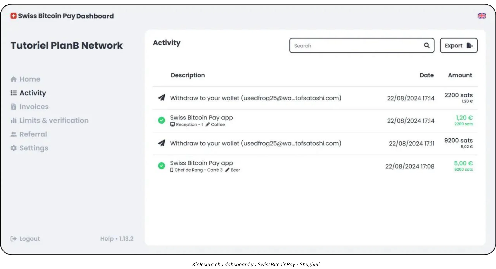

Faida nyingine muhimu ya mbinu Muhimu ni msisitizo juu ya upelekaji wa haraka na usumbufu mdogo. Ufumbuzi kama vile Uswizi Bitcoin Pay unaweza kusanidiwa baada ya saa chache badala ya siku au wiki. Kwa mmiliki au meneja wa mkahawa wenye shughuli nyingi, kwa mfano, lengo kuu ni kujumuisha kukubalika kwa Bitcoin bila kusababisha ucheleweshaji kwenye kaunta ya kulipa au mkanganyiko kati ya wafanyakazi. POS inaposanidiwa, meneja anaweza kuwapa wafanyikazi maagizo ya haraka kuhusu kuonyesha Invoice na kuthibitisha kuwa malipo yameidhinishwa. Katika hali nzuri zaidi, muamala wa mteja unathibitishwa mara moja kupitia Lightning Network, na jopo la usimamizi wa biashara husajili malipo mapya kwa wakati mmoja.

Ingawa wasifu Muhimu hauhitaji mifumo ya kisasa ya uhasibu, bado ni busara kudumisha rekodi sahihi za miamala. Zana kama vile Uswizi Bitcoin Pay hutoa vipengele vya uhamishaji vya CSV, vinavyowawezesha wasimamizi kunasa thamani inayolingana na thamani ya kila mauzo ya Bitcoin na kuifuatilia pamoja na vyanzo vingine vya mapato. Kiwango hiki cha hati kinatosha kwa biashara nyingi ndogo, na uelewa mdogo wa viwango vya Exchange utasaidia katika uwasilishaji wa ushuru na uangalizi wa jumla wa kifedha.

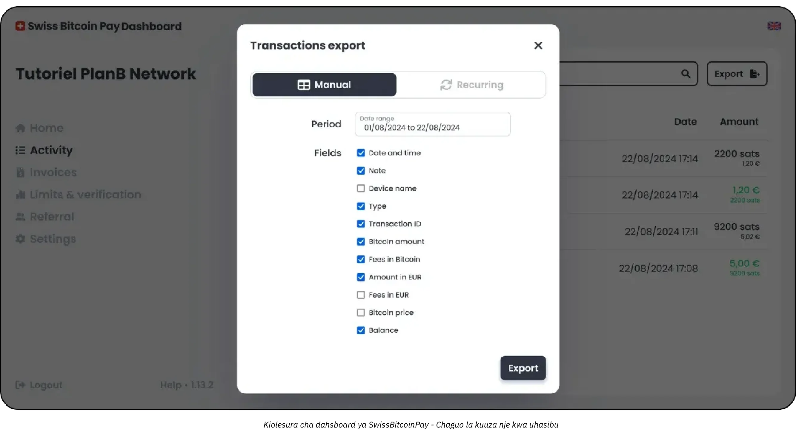

Suluhisho la mseto linalofaa zaidi kwa wasifu wako huenda ni Uswisi Bitcoin Pay:

https://planb.network/tutorials/business/point-of-sale/swiss-bitcoin-pay-2-a78b057e-ed11-47ac-860c-71019fcb451a
Suluhisho lingine rahisi kutekeleza, lakini kwa shida ya kuwa chini ya 100%, ni Njia ya Open:

https://planb.network/tutorials/business/point-of-sale/open-node-e69a0c1c-47f7-4932-8494-e6f26c3c9784
Ikiwa uko tayari kuchafua mikono yako na unataka udhibiti kamili juu ya mchakato, programu ya Seva ya BTPay ni chaguo bora. Walakini, shida kuu ya Seva ya BTCPay ni kwamba usanidi na usimamizi wake unatumia wakati na unahitaji kiwango fulani cha utaalam wa kiufundi, lakini unaweza kufuata miongozo yetu:

https://planb.network/tutorials/business/point-of-sale/btcpay-server-928eb01e-824b-4b57-a3e8-8727633beddc
Hatimaye, kama kijalizo cha sehemu halisi za mauzo, unaweza kufikiria kusanidi [Bitcoinize PoS](https://bitcoinize.com/).

## Mtaalamu

<chapterId>4d5dfa50-c4d0-481c-ab95-1863a898750e</chapterId>

Wasifu wa Kitaalamu unalenga biashara ambazo zimepita malipo ya mara kwa mara au ya kiwango cha chini cha Bitcoin na sasa inatafuta miundombinu thabiti ya kushughulikia miamala mingi ya kila siku. Kampuni hizi mara nyingi hufanya kazi katika vituo kadhaa (labda eneo la rejareja, tovuti maalum ya biashara ya mtandaoni, na hata mauzo ya simu) na kwa hivyo huhitaji suluhu za malipo ambazo zinaweza kuunganishwa kwa urahisi katika utiririshaji wao wa kazi uliopo. Mara nyingi, makampuni ya biashara katika ngazi hii tayari yanadhibiti mifumo ya mauzo, majukwaa ya usimamizi wa maagizo mtandaoni, na shughuli za ofisini ambazo zinahitaji mbinu ya kuaminika na hatarishi.

Mojawapo ya sifa bainifu za mfanyabiashara Mtaalamu ni hitaji la **vipengele vya hali ya juu** na **suluhisho zinazoweza kubinafsishwa** ambazo hudumisha ufanisi hata idadi ya miamala inapoongezeka. Tofauti na watumiaji wa Essential, ambao wanaweza kuridhika na zana iliyoratibiwa ambayo inafaa vyema kwenye programu ya simu mahiri, biashara ya kitaalamu kwa kawaida huhitaji vipengele kama vile uwekaji mapendeleo wa kina wa Invoice, dashibodi za kisasa za kuripoti na uwezo wa kugawa majukumu mengi ya usimamizi.

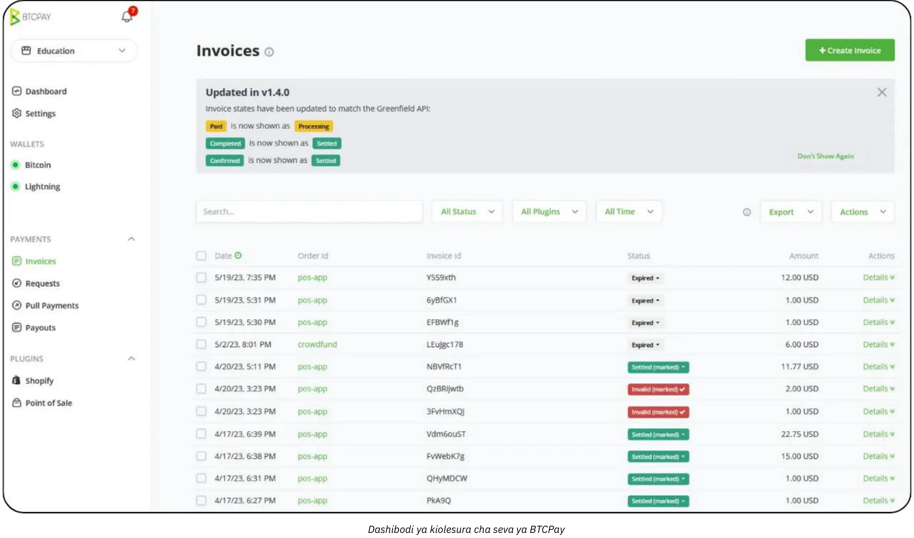

Kikundi cha mgahawa, kwa mfano, kinaweza kuwa na wafanyakazi waliojitolea kufanya ankara na usimamizi wa hisa, wakati timu tofauti inasimamia uorodheshaji wa bidhaa na kampeni za uuzaji. Katika mazingira haya, suluhisho la malipo la Bitcoin lazima liambatane vyema na miundo ya shirika iliyopo.

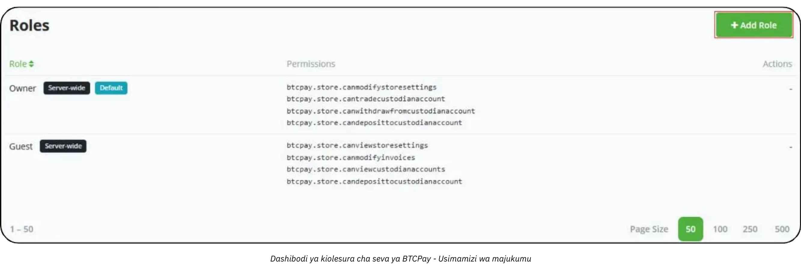

Kuhusu teknolojia na zana, suluhu kama vile **Seva ya Malipo ya BTC** mara nyingi huunda msingi wa usanidi wa Kitaalamu. Seva ya Malipo ya BTC ni jukwaa la chanzo huria ambalo linaweza kutumwa kwenye majengo au kupitia upangishaji wa wingu na ambalo hutoa chaguo pana za ujumuishaji kwa tovuti na majukwaa ya biashara ya mtandaoni. Kwa kuendesha matukio yao wenyewe, biashara huhifadhi kiwango cha juu cha udhibiti wa kila kipengele cha malipo, kuanzia kurasa za kulipa zinazozalishwa kiotomatiki hadi arifa zinazoanzisha michakato ya ndani mara tu malipo yanapothibitishwa.

Zaidi ya hayo, zana kama vile [Zaprite](https://zaprite.com/) au [Musqet](https://musqet.tech/) zinaweza kuboresha zaidi matumizi ya kulipa, na hivyo kuruhusu ubinafsishaji zaidi wa punjepunje (kutoka chaguo za chapa hadi uwezo wa hali ya juu wa kuripoti). Wale wanaopendelea mazingira ya rejareja ya mtandaoni ya kila mtu wanaweza kushawishika kuelekea [Be-BOP](https://be-bop.io/), suluhisho la duka la kielektroniki lililoundwa kuwezesha malipo ya Bitcoin bila kuacha urahisi wa matumizi.

Utekelezaji wa teknolojia hizi ndani ya mpangilio wa kitaalamu kunamaanisha kuzingatia kwa karibu **utangamano wa kiutendaji**. Utiririshaji wa ankara otomatiki, maonyesho ya sarafu nyingi, na usawazishaji na mifumo iliyopo ya hesabu zote ni alama kuu za jukwaa lililounganishwa vyema. Uwezo wa kuhamisha data ya muamala kwa usahihi (iwe kama faili za CSV, simu za moja kwa moja za API, au miundo maalum) husaidia biashara kupatanisha mauzo ya Bitcoin na mitiririko mingine ya mapato kwa ufanisi.

Usalama na usimamizi wa jukumu hujumuisha jambo lingine muhimu kwa watumiaji wa Kitaalam. Kadiri shughuli za kila siku za Bitcoin zinavyoongezeka, kudhibiti ufikiaji wa kazi za usimamizi huwa hatua muhimu ya kupunguza hatari. Katika masuluhisho mengi, wasimamizi wanaweza kupeana viwango tofauti vya ruhusa (labda kuwawekea baadhi ya wafanyakazi vikwazo kutazama historia za miamala na kutengeneza ankara, huku wakiwapa wengine mamlaka ya kudhibiti orodha au kusanidi mipangilio ya mfumo mzima...). Muundo huu wa madaraja haulindi tu data nyeti lakini pia hurahisisha utendakazi kwa kufafanua ni wafanyikazi gani wanawajibika kwa kila sehemu ya miundombinu ya malipo.

Inapokuja kwa mifano ya ulimwengu halisi, zingatia duka la ukubwa wa kati la biashara ya mtandaoni linalobobea kwa vifaa vya teknolojia. Kampuni inaweza kuunganisha Seva ya Malipo ya BTC kwenye mbele ya duka lake la mtandaoni, na kutengeneza kiotomatiki anwani za malipo za Bitcoin wakati wa kulipa. Wateja hukamilisha ununuzi wao kwa kuchanganua umeme au On-Chain Address, na jukwaa la duka huthibitisha malipo mara moja. Wakati huo huo, mfumo wa ndani husasisha hali ya agizo na kusababisha arifa za usafirishaji. Shukrani kwa vipengele vya kina vya kuripoti, timu ya fedha inaweza kukagua mauzo ya kila siku ya Bitcoin kwa urahisi, kusafirisha Ledger iliyounganishwa kwa ukaguzi, na kufuatilia thamani ya hisa zozote za BTC ambazo kampuni itaamua kubakisha.

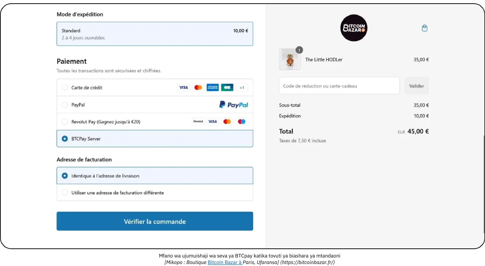

*[Mikopo: Bitcoin Bazar duka huko Paris, Ufaransa.](https://bitcoinbazar.fr/)*

Ili kutafakari kwa kina vipengele vya utekelezaji na kuchunguza usanidi unaotekelezwa wa Seva ya Malipo ya BTC, rejelea kozi ifuatayo:

https://planb.network/courses/6fc12131-e464-4515-9d3f-9255365d5fa1
## Biashara

<chapterId>80fb2659-81ca-4a11-b492-72c7ae5774f9</chapterId>

Wasifu wa Enterprise unasimama katika kilele cha utekelezaji wa malipo wa Bitcoin, iliyoundwa mahususi kwa mashirika makubwa, soko kuu, na biashara zilizoanzishwa ambazo zinahitaji suluhu zilizobinafsishwa kikamilifu. Tofauti na uwekaji wa kiwango kidogo au cha kati, shughuli za kiwango cha Biashara huunganisha malipo ya Bitcoin katika mpangilio mpana wa utiririshaji kazi na mifumo, kuanzia vifaa vya kuuza kwenye tovuti hadi mbele ya maduka ya e-commerce, majukwaa ya uhasibu ya nyuma ya ofisi, na mifumo ya kisasa ya ERP.

Katika muktadha wa biashara, ugumu wa kiutendaji hutamkwa haswa. Shirika kubwa linaweza kuhitaji kushughulikia idara nyingi (mauzo, uuzaji, wafadhili, fedha, na uhasibu) kila moja ikiwa na majukumu mahususi na mahitaji ya data. Katika hali hii, mfumo wa malipo wa Bitcoin ni lazima utoe usimamizi wa majukumu ya haraka sana, kuruhusu kila idara kufikia kwa usahihi kazi zinazohusika na majukumu yao huku ikihifadhi udhibiti mkali wa usalama na uadilifu wa data. Muhimu pia ni uwezo wa kubinafsisha mtiririko wa kazi: kwa mfano, malipo yanayoingia yanaweza kuanzisha masasisho katika mifumo ya orodha, kutuma arifa za kiotomatiki kwa wasimamizi wa mauzo, na kusasisha maingizo ya Ledger kwa timu ya fedha, yote hayo kwa wakati halisi. Vifaa vya kuuza vyenyewe kwa kawaida vimeundwa kulingana na mazingira ya biashara, na violesura maalum vya programu vinavyolingana na mahitaji ya chapa na uendeshaji wa kampuni.

**Usalama** ni muhimu kwa biashara za kiwango cha biashara. Kiasi kikubwa cha miamala na kiasi kinachoweza kuwa kikubwa cha Bitcoin kinahitaji miundombinu thabiti inayoweza kujilinda dhidi ya mashambulizi mabaya au vitisho kutoka kwa watu wengine. Mbinu bora mara nyingi hujumuisha saini nyingi zilizo na usanidi wa hazina ya kufunga saa, misingi ya kanuni iliyokaguliwa kwa uangalifu, na ufuasi mkali wa mifumo husika ya udhibiti. Zaidi ya hayo, kufuata kanuni za kifedha za ndani na kimataifa kunaweza kuwa muhimu katika kuhifadhi sifa ya shirika na leseni ya kufanya kazi.

**Utengenezaji maalum** unaohusika katika kuunda au kuunganisha suluhu ya malipo ya kiwango cha biashara ya Bitcoin inaenea zaidi ya kusimba vipengele vichache vya programu. Kwa kawaida huhitaji usanifu wa usanifu, itifaki za majaribio ya kina, na uwasilishaji uliopangwa ambao unaweza kuchukua awamu nyingi (mipango ya majaribio ya awali, majaribio machache ya soko, na hatimaye kupelekwa kimataifa).

Kwa upande wa uhasibu, miamala ya masafa ya juu inahitaji **usafirishaji uliobinafsishwa kikamilifu** na wakati mwingine kusawazisha kwa wakati halisi na programu ya fedha ya shirika. Biashara kubwa zinaweza kutegemea masuluhisho ya upangaji wa rasilimali za biashara (ERP) kama vile SAP au Oracle, ambayo, nayo, lazima Interface bila mshono na data ya malipo ya Bitcoin. Ili kuwezesha hili, API za jukwaa lililochaguliwa lazima ziwe za kisasa na zinazonyumbulika, na kuzipa timu za IT uhuru wa kuunda dashibodi maalum za kuripoti, kutekeleza michakato ya upatanishi ya kiotomatiki, na generate kila siku au hata muhtasari wa kifedha wa kila saa.

Hali ya kawaida ya Biashara inaweza kuhusisha soko kuu la biashara ya mtandaoni ambalo linakaribisha maelfu ya miamala kila siku. Zaidi ya kuorodhesha tu Bitcoin kama chaguo la malipo, soko hili linaweza kubinafsisha kila kipengele cha matumizi ya mtumiaji, kuanzia jinsi mtiririko wa malipo wa Bitcoin unavyoonekana kwenye tovuti inayowakabili wateja hadi jinsi urejeshaji fedha, urejeshaji malipo, au masuluhisho ya mizozo yanavyodhibitiwa upande wa nyuma. Timu iliyojitolea ya washiriki, kwa ushirikiano na idara za fedha na sheria, ingesimamia matengenezo yanayoendelea, viraka vya usalama, na masasisho ya kufuata. Iwapo kampuni itachagua kuhifadhi sehemu ya mapato yake ya Bitcoin, mfumo wa hazina ya ndani utafuatilia hisa za Bitcoin za kampuni hiyo pamoja na akiba ya fedha za jadi.

Ili kuhakikisha utumaji laini na salama katika kiwango cha Biashara, mashirika mengi hushirikisha watoa huduma maalum au timu za maendeleo ya ndani zilizo na uzoefu katika miunganisho ya Bitcoin na Lightning Network. Mchakato kwa kawaida huanza na tathmini ya kina ya mahitaji (inayojumuisha miundombinu ya kiufundi, mahitaji ya kufuata, na safari inayotarajiwa ya mteja) ikifuatiwa na kubuni usanifu ambao unaweza kushughulikia uboreshaji wa kiwango cha juu. Kulingana na upeo wa mradi, unaweza kutegemea timu ya nidhamu nyingi inayojumuisha wadhibiti wa kifedha, wachambuzi wa usalama na wahandisi wa programu. Vinginevyo, idadi inayoongezeka ya makampuni maalum ya ushauri yanaweza kukuongoza kutoka kwa uundaji dhana ya awali hadi uchapishaji wa mwisho, kusaidia na kazi kama vile kutathmini suluhu zinazopangishwa na SaaS, kusanidi *Watoa Huduma za Umeme*, na kubinafsisha miingiliano ya mbele. Kwa kushirikiana na wataalam wa kikoa, makampuni ya biashara yanaweza kupunguza hatari zinazohusiana na utekelezaji wa malipo ya kiasi kikubwa na kufikia suluhisho ambalo sio tu thabiti na linalotii bali pia linalonyumbulika vya kutosha kushughulikia ukuaji wa siku zijazo.

## Masuluhisho ya malipo ya Bitcoin: Chaguo na Mitindo

<chapterId>59ff43a1-98e2-4a81-af3e-9654bdd60952</chapterId>

Daima kuna ubadilishanaji kwa kila aina ya suluhisho. Kwa mfano, katika "awamu ya majaribio" ya awali, pochi zilizopendekezwa zimeundwa kuwa rahisi iwezekanavyo kulingana na mtumiaji Interface, lakini zinapangishwa (**custodial**). Hii ina maana kwamba fedha zinadhibitiwa na mtoa programu. Hata hivyo, maadili ya Bitcoin inahimiza kuelekea kwenye Ownership kamili ya fedha na mtumiaji (**kujitunza**). Katika kesi hii, inashauriwa kupata toleo jipya la kitengo kinachofuata mara tu mauzo ya kwanza yanapofanywa-kimsingi, mara tu inapothibitishwa kuwa una wateja walio tayari kulipa katika Bitcoin.

Mojawapo ya faida kuu za Bitcoin ni uwezo wa kuhamisha pesa upendavyo, na kuifanya **kuwa rahisi sana kubadili watoa huduma** au vijenzi vya suluhisho lako. Zaidi ya hayo, programu na suluhu zote zenyewe zinabadilika haraka. Kwa mfano, fikiria Bitcoinize, ambayo sasa inatoa terminal ya Point of Sale (POS) ambayo inaunganishwa na programu nyingi kwenye soko, suluhisho ambalo halikuwepo miezi michache iliyopita.

### Je, unatafuta Suluhisho la Kuunda Duka na Kukubali Malipo ya Kawaida na ya Bitcoin?

Ikiwa unaanza mwanzo—hakuna duka, hakuna programu ya usimamizi wa bidhaa, na hakuna mfumo wa kuuza bidhaa (POS)—una chaguo kadhaa:

- **Utumiaji nje:** Unaweza kutengeneza tovuti kutoka nje yenye chaguo za ununuzi na kisha kuongeza uwezo wa malipo wa Bitcoin pamoja na suluhu za kawaida za dukani.
- **Masuluhisho Rahisi:** Vinginevyo, unaweza kutumia mifumo kama vile Accessing.app kufanya hivyo mwenyewe. Faida kuu ni pamoja na:

    - Kuanzisha duka mkondoni au halisi kwa haraka na kwa bei nafuu.
    - Inafaa kwa biashara za msimu, hafla, mikahawa, au maduka ya rejareja.
    - Kufafanua na kudhibiti bidhaa kwa mauzo ya kimwili na mtandaoni.
    - Uchakataji wa malipo ya Fiat (k.m., euro, dola) kupitia akaunti yako ya Stripe.
    - Uchakataji wa malipo ya Bitcoin kupitia akaunti yako mwenyewe ya SwissBitcoinPay.

### Je! Uasili wa Malipo ya Umeme Unaendeleaje?

Ingawa Lightning Network inatoa ufanisi wa hali ya juu na ada za chini, kupitishwa kwake bado ni katika hatua zake za mwanzo. Badala ya kuzingatia mapungufu ya sasa, inafaa kukumbuka jinsi mabadiliko ya miundombinu ya kihistoria yalivyotokea:

- Magari yalipoonekana kwa mara ya kwanza, hapakuwa na magari ya kutosha kuhalalisha ujenzi wa barabara, na barabara hazitoshi kuhalalisha kumiliki magari.
- Umeme ulipoanzishwa, hakukuwa na wateja wa kutosha kuhalalisha kujenga gridi za nguvu, na gridi za kutosha kuvutia wateja.

Miundombinu mipya hufaulu kwa sababu ni bora zaidi, na watumiaji wa mapema hujiunga kwa sababu wanapata manufaa yanayoonekana. Hapa kuna uchunguzi kuhusu Lightning Network mnamo 2024:

- **Miamala ya haraka sana:** Miamala mara nyingi huwa karibu papo hapo (<500ms) na ina kiwango cha chini sana cha kutofaulu.
- **Utaalamu wa Mtandao:** Wachezaji wakubwa zaidi wanahakikisha kuwa wanapata pesa kwenye mtandao, huku watu binafsi kwa kiasi kikubwa wameacha kuelekeza malipo na sasa wengi wao wanaendesha "nodi za makali."
- **Uzoefu Ulioboreshwa wa Mtumiaji:** Programu za rununu kwa watumiaji binafsi zimeboreshwa kwa kiasi kikubwa. Vipengele kama vile kuunganisha, ankara tuli za Bolt12, na malipo ya uthibitishaji sifuri (0-conf) vinapatikana kwa wingi, hivyo basi kufanya mwingiliano kuwa suluhu. Masuala ya mwingiliano (k.m., kufunga kwa nguvu) sio jambo kuu tena.
- **Nodi Iliyoimarishwa na Usimamizi wa Idhaa:** Suluhu za kibinafsi na za kitaalamu zimeendelea. Kwa mfano, Seva ya Malipo ya BTC sasa inaauni programu-jalizi nyingi za kuunganishwa na watoa huduma wengine (PSP, njia panda za kuwasha/kuzima, n.k.). Watoa huduma wapya wa miundombinu, kama vile LightSpark na Alby Hub, pia wanaingia katika uzalishaji.

- **Ukuaji wa Kuasili kwa Wafanyabiashara:** Wauzaji kama BitRefill wanaripoti ongezeko la malipo ya Bitcoin kati ya watumiaji wao wanaofanya kazi, na mabadiliko ya wazi kuelekea Bitcoin juu ya Umeme. Zaidi ya hayo, ada za chini kabisa za Umeme hufanya iwe chaguo linalopendelewa kwa malipo madogo (wastani wa €32 kwa kila ununuzi).

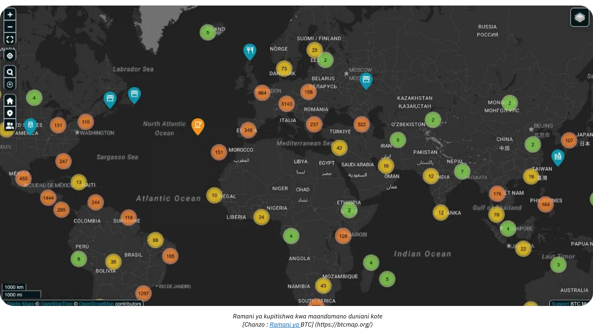

*[Chanzo: Ramani ya BTC](https://btcmap.org/)*

- **Vipimo vya Mtandao:** Jumla ya idadi ya chaneli na Bitcoin zilizofungwa kwenye Umeme bado ni thabiti, zikiwa na takriban nodi 20,000, 5,200 BTC, na chaneli 60,000. Hata hivyo, hii inaonyesha sehemu tu ya mtandao na inaonyesha mzunguko kati ya washiriki, na watu wachache na wataalamu zaidi wanashiriki.

- **Umeme kama Daraja Kati ya Mitandao:** Ufanisi na upatikanaji wa Lightning Network tayari umeiweka kama daraja la mitandao mingine iliyounganishwa (k.m., FediMint, Liquid, n.k.).

**Kurudi kwa Wallet**

Bitcoin na Lightning Network zinakamilisha **mapinduzi ya kidijitali ya Wallet**. Huduma mpya za wavuti sasa zinaruhusu **shughuli bila hitaji la kuunda akaunti**—Wallet yako inakuwa kitambulisho chako! Kwa itifaki kama vile **Nostr Wallet Connect (NWC)** na **LN-URL-AUTH**, pochi zinaweza kuthibitisha watumiaji kwa urahisi na kuwezesha miamala bila akaunti za kawaida. Siku za uchovu wa akaunti kwa ununuzi au usajili rahisi zimepita. Hakuna haja tena ya kutoa maelezo ya kibinafsi au ya malipo ambayo yanaweza kuishia kudukuliwa na kuuzwa kwenye mtandao usio na giza, kwani tunakumbushwa mara nyingi sana na matukio ya hivi majuzi.

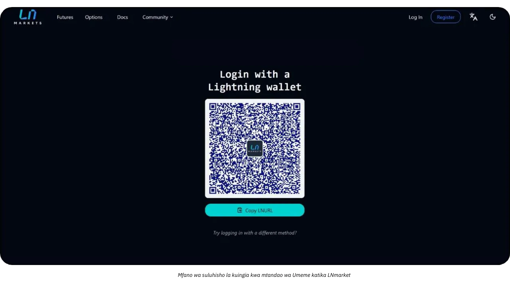

Wafanyabiashara wa kesho watakumbatia uvumbuzi huu, na kuwapa wateja hali ya utumiaji iliyo salama zaidi, isiyo na mshono (bofyo moja) ambayo pia inaheshimu faragha yao.

# Uhasibu wa Bitcoin

<partId>d49d7595-a189-4e2b-bd60-c19e8e717aa2</partId>

## Kanuni Muhimu za Uhasibu Bitcoin katika Biashara

<chapterId>84063061-ffdb-4b1f-b20b-588ffb146877</chapterId>

Maudhui yafuatayo ni kwa madhumuni ya elimu pekee na hayafai kuchukuliwa kuwa ushauri wa kifedha au uhasibu. Biashara na watu binafsi wanahimizwa sana kushauriana na mhasibu aliyehitimu au mtaalamu wa sheria anayefahamu kanuni za sarafu ya crypto katika eneo lao mahususi kabla ya kuchukua hatua yoyote.

### Dhana Muhimu za Uhasibu za Bitcoin

**Muamala wowote wa Bitcoin lazima urekodiwe na unaweza kusababisha tukio linalotozwa kodi**

Ulimwenguni, Bitcoin mara nyingi huainishwa si kama sarafu bali kama mali ya kidijitali. Tofauti hii inaathiri kwa kiasi kikubwa jinsi Bitcoin inavyohesabiwa katika biashara, kuathiri wajibu wa kodi, kuripoti fedha na mahitaji ya kufuata. Biashara zinazokubali Bitcoin kama njia ya kulipa au kuitumia kama zana ya hazina lazima zielewe nuances hizi za udhibiti.

**matokeo muhimu zaidi** ya kukumbuka ni kwamba, katika maeneo mengi ya mamlaka, mapato, kuuza, kufanya biashara au kutumia Bitcoin kufanya ununuzi, kwa kawaida huunda **tukio linalotozwa kodi** na faida inategemea kodi ya faida ya mtaji.

Kipengele kingine cha uhasibu wa Bitcoin ni kutofautisha kati ya aina mbili za faida ya mtaji:

- **Mafanikio/Hasara Iliyofichika:** Manufaa au hasara ambayo haijatekelezwa kulingana na thamani ya Bitcoin iliyopatikana mwishoni mwa kipindi cha uhasibu.

- **Mafanikio/Hasara Ufanisi:** Manufaa au hasara iliyopatikana wakati Bitcoin inauzwa au kubadilishwa katika mwaka wa fedha.

Hesabu hizi hutegemea sana iwapo Bitcoin inashikiliwa kwa uwekezaji wa muda mrefu au matumizi ya muda mfupi ya uendeshaji. Zaidi ya hayo, biashara lazima zioanishe taratibu zao za uhasibu na miundo ya kodi ya eneo lako, kwani kanuni hutofautiana sana kulingana na nchi.

Uhasibu kwa biashara zinazomiliki Bitcoin ni mgumu kwa kiasi fulani kwa sababu ni lazima kila shughuli ifuatiliwe kwa uangalifu ili kukokotoa faida au hasara iliyopatikana au isiyoweza kufikiwa. Kwa kila ofa unayofanya kwa kukubali Bitcoin kama njia ya malipo, au kila wakati unaponunua au kuuza Bitcoin, unahitaji kurekodi:

- wakati maalum
- bei ya mauzo (kwa sarafu ya fiat)
- bei ya gharama ya Bitcoin (bei ambayo Bitcoin ilinunuliwa hapo awali).

Hii itakuruhusu baadaye kuweza kukokotoa tofauti ili kujua faida au hasara.

**Mfano:** Biashara hununua BTC 1 kwa $30,000. Baadaye, inauza 0.5 BTC kwa $ 20,000. Ili kuhesabu faida au hasara, biashara lazima:

- Imerekodi wakati, bei ya gharama ya fiat na kiasi cha Bitcoin kilichopatikana
- Imerekodi wakati, bei ya kuuza fiat na wingi wa Bitcoin kuuzwa
- Kuamua gharama ya Bitcoin kuuzwa : 0.5 BTC: $ 30,000 ÷ 2 = $ 15,000.
- Linganisha bei ya mauzo na bei ya gharama: $20,000 (bei ya kuuza) - $15,000 (bei ya gharama) = $5,000 faida.
- Sasisha hisa za Bitcoin kwa bei mpya ya gharama

Utaratibu huu lazima urudiwe kwa kila muamala, na hali ya kubadilika-badilika kwa bei ya Bitcoin hufanya uwekaji rekodi kuwa mgumu zaidi.

**Ingefanyaje Kazi kama Bitcoin Ingekuwa Sarafu ?**

Ikiwa Bitcoin ingechukuliwa kama sarafu, biashara zingeidhibiti kama sarafu nyingine yoyote katika mfumo wao wa uhasibu. Badala ya kufuatilia misingi ya gharama na faida iliyopatikana/ambayo haijafikiwa kwa kila shughuli, hisa za Bitcoin zitarekodiwa tu katika akaunti ya sarafu. Mwishoni mwa kila kipindi cha kuripoti, thamani ya fedha zote, ikiwa ni pamoja na Bitcoin, itabadilishwa kuwa sarafu ya hesabu (k.m., USD au EUR) kwa kutumia kiwango cha sasa cha Exchange.

**Mfano Uliosasishwa ikiwa Bitcoin ilitambuliwa kama sarafu:**

- Biashara inashikilia 1 BTC wakati Bitcoin ina thamani ya $ 30,000. Baadaye, biashara hutumia 0.5 BTC kwa malipo wakati Bitcoin ina thamani ya $ 40,000.
- Biashara **haiko** kukokotoa faida au hasara iliyopatikana. Badala yake, shughuli hiyo imerekodiwa kama:
    - Malipo: $20,000 (0.5 BTC × $40,000).
    - Salio iliyobaki ya Bitcoin: 0.5 BTC, sasa yenye thamani ya $20,000 (ilisasishwa kwa kiwango cha sasa cha Exchange).

**Faida Muhimu ikiwa Bitcoin ilitambuliwa kama sarafu:**

- Biashara inahitaji tu kurekebisha kiasi kinacholingana na hisa zake za Bitcoin mara kwa mara (k.m., kwa ripoti za kila mwezi au za mwaka), kama tu ilivyo kwa euro, yen, au sarafu nyinginezo inazo.
- Hili huondoa hitaji la ufuatiliaji wa gharama za kiwango cha ununuzi na kurahisisha uhasibu, haswa kwa biashara zilizo na miamala ya mara kwa mara ya Bitcoin.

Mbinu hii itafanya uhasibu wa Bitcoin kuwa rahisi zaidi, kupunguza mizigo ya usimamizi, na kuoanisha na ushughulikiaji wa sarafu zingine, ikizingatiwa kuwa Bitcoin ingetambuliwa kama hivyo katika masharti ya kisheria na udhibiti. Bado hatujafika.

### Tofauti Kati ya Uhasibu wa Mtu Binafsi na Biashara wa Bitcoin

Matibabu ya kisheria na uhasibu ya Bitcoin hutofautiana sana kati ya watu binafsi na mashirika. Kwa watu binafsi, faida kutoka kwa miamala ya Bitcoin inaweza kuwa chini ya kodi ya mapato, mara nyingi kwa kiwango cha juu zaidi. Kinyume chake, mashirika yanaweza kufaidika kutokana na viwango vya chini vya kodi vya shirika lakini lazima yafuate viwango vikali vya uwekaji hesabu.

Kwa biashara Bitcoin inaweza kuainishwa chini ya akaunti mbalimbali kulingana na matumizi yake yaliyokusudiwa:

- **Rasilimali Zisizohamishika:** Kwa Bitcoin iliyodumu kwa muda mrefu kama uwekezaji wa kimkakati.
- **Hisa:** Kwa Bitcoin inayotumika katika michakato ya uzalishaji (kesi ya utumiaji nadra, kwa mfano hii ni kesi kwa wafanyabiashara wa kitaalamu).
- **Hesabu za Pesa au Hazina:** Kwa Bitcoin inayomilikiwa kama mali ya Liquid, haswa kwa miamala ya uendeshaji au usimamizi wa hazina wa muda mfupi.

Uchaguzi wa uainishaji hutegemea shughuli na mkakati wa kampuni, na athari kwa ripoti ya kifedha na majukumu ya ushuru. Angalia kanuni za eneo lako kila wakati, kwani uainishaji huu unaweza kutofautiana kulingana na nchi.

### Mfumo wa Kisheria

Utambuzi wa kisheria na matibabu ya Bitcoin hutofautiana kulingana na mamlaka. Baadhi ya nchi, kama vile El Salvador, zimetambua Bitcoin kama zabuni halali, na hivyo kurahisisha matumizi yake katika miamala lakini ikitatiza utoaji wa ripoti za fedha za kimataifa. Wengine huchukulia Bitcoin kama mali ya kidijitali kulingana na sheria mahususi za kodi na uhasibu.

Katika nchi nyingi, Bitcoin imeainishwa kama mali ya kidijitali, na matibabu yake yanasimamiwa na viwango vya jumla vya uhasibu. Biashara lazima zitoe akaunti kwa miamala ya Bitcoin kama ifuatavyo:

- **Kurekodi Faida/Hasara za Mtaji:** Biashara lazima zihesabu faida au hasara zilizopatikana katika matokeo yao ya kifedha.
- **Uthamini wa Manufaa/Hasara Iliyofichika:** Mafanikio au hasara ambayo haijafikiwa lazima iripotiwe mara kwa mara lakini huenda isiathiri moja kwa moja mapato yanayotozwa kodi.
- **Kuzingatia Viwango vya Uhasibu:** Biashara lazima ziunganishe miamala ya Bitcoin katika mbinu za kawaida za uwekaji hesabu, ili kuhakikisha uwazi na usahihi.

Mbinu ya uhasibu ya Bitcoin inatofautiana kulingana na jiografia:

- **Marekani:** IRS inaainisha Bitcoin kama **mali, sawa na hisa, bondi au mali isiyohamishika**. Uainishaji huu unamaanisha kuwa muamala wowote unaohusisha sarafu ya crypto, kama vile kupata, kuuza, kufanya biashara au hata kuitumia kufanya ununuzi, inaweza kuunda tukio linalotozwa kodi na faida itatozwa kodi ya faida kubwa.
- **Umoja wa Ulaya:** Nchi wanachama kwa ujumla huchukulia Bitcoin kama mali ya kubahatisha badala ya sarafu inayofanya kazi. Kwa hivyo faida mara nyingi inategemea ushuru wa faida.
- **Asia:** Nchi kama Singapore na Japani zimepitisha mifumo ya udhibiti inayoendelea, ikishughulikia shughuli za Bitcoin vyema katika miktadha mahususi. Lakini Bitcoin kwa ujumla huhesabiwa kuwa **mali zisizoshikika**, na hupimwa kwa thamani ya haki katika tarehe ya kuripoti, kwa mabadiliko yanayotambuliwa katika faida au hasara.

Ni muhimu kuelewa kanuni katika nchi yako ya uendeshaji na kurekebisha desturi zako za uhasibu ipasavyo.

### Changamoto katika Mageuzi ya Udhibiti

Kasi ya haraka ya uvumbuzi wa cryptocurrency mara nyingi hupita mifumo ya udhibiti. Tangu kutambuliwa kwa Bitcoin kama rasilimali ya kidijitali, kanuni za kimataifa zimeona masasisho yanayoongezeka, lakini mapungufu yanabaki:

- **Ukosefu wa Sheria:** Kesi chache za kisheria zimefafanua mazoea mahususi ya uhasibu, na hivyo kuacha nafasi ya kufasiriwa.
- **Mijadala Inayoendelea:** Masuala kama vile malipo ya kodi ya hasara iliyofichika bado hayajatatuliwa katika maeneo mengi ya mamlaka.
- **Utata wa Mipaka:** Kampuni zinazofanya kazi kimataifa zinakabiliwa na changamoto za kupatanisha viwango tofauti vya uhasibu vya kitaifa.

Licha ya changamoto hizi, misimamo makini ya nchi nyingi hutoa msingi thabiti kwa biashara kujumuisha Bitcoin katika shughuli zao. Usasisho unaoendelea na upatanisho wa kimataifa utakuwa muhimu kwa matatizo yanayojitokeza ya Address katika uhasibu wa sarafu ya crypto.

### Ainisho la Bitcoin katika Taarifa za Fedha

Uainishaji wa Bitcoin katika taarifa za fedha hutofautiana kulingana na mamlaka na inategemea matumizi yake yaliyokusudiwa ndani ya biashara. Kwa ujumla, Bitcoin inachukuliwa kuwa mali ya kidijitali, sawa na hesabu, uwekezaji au sarafu, lakini ikiwa na sifa za kipekee zinazoathiri uhasibu wake.

- **Mali Dijitali au Mali Zisizogusika**: Mamlaka nyingi, ikiwa ni pamoja na Ufaransa na Umoja wa Ulaya, huainisha Bitcoin kama kipengee cha dijitali au kisichoshikika badala ya zabuni halali. Uainishaji huu unahitaji biashara kuwajibika kwa Bitcoin tofauti na sarafu ya fiat.
- **Malipo**: Ikiwa shughuli kuu ya biashara inahusisha kufanya biashara ya Bitcoin, kama vile ubadilishanaji wa fedha taslimu au madalali, Bitcoin inaainishwa kama orodha ya bidhaa. Katika kesi hii, hesabu hufuata viwango vya uhasibu vya hesabu.
- **Uwekezaji wa Kifedha**: Kampuni zinazomiliki Bitcoin kama mali ya muda mrefu zinaweza kuainisha kama uwekezaji wa kifedha. Kwa mfano, nchini Marekani, biashara zinaweza kuchangia Bitcoin chini ya miongozo ya Bodi ya Viwango vya Uhasibu (FASB), kwa kutambua hitilafu wakati thamani za soko zinapungua.

**Madhara ya Uainishaji:**

- Umiliki wa muda mrefu mara nyingi huhitaji upimaji wa uharibifu na malipo.
- Biashara inayoendelea au shughuli zinazohusiana na malipo zinahitaji ufuatiliaji wa mara kwa mara wa faida na hasara zilizopatikana na ambazo hazijatekelezwa.

### Mbinu za Uthamini

Mbinu za uthamini ni mbinu za uhasibu zinazotumiwa kuamua msingi wa gharama ya Bitcoin, ambayo ni muhimu kwa kuhesabu kwa usahihi faida au hasara wakati wa shughuli za malipo. Kwa ujumla, ni vyema **kudumisha thamani iliyosasishwa kila mara ya gharama za sasa za umiliki wa Bitcoin** katika mfumo wa uhasibu. Hii inahakikisha uwazi, utiifu wa kanuni za kodi, na kuzuia kurudi nyuma wakati hesabu zinahitajika kufanywa.

- **First In, First Out (FIFO)**: Kawaida katika maeneo ya mamlaka kama vile Australia na India, njia hii inathamini Bitcoin kulingana na gharama ya awali ya kupata. Hii inaweza kuwa **tata kabisa** kwani inaweza kuhitaji kufuatilia kila sehemu ya Bitcoin kando mauzo yanapotokea.
- **Gharama ya Wastani Iliyopimwa (WAC)**: Hupendekezwa mara nyingi kwa miamala ya kiwango cha juu kutokana na **usahili** wake, kama inavyoonekana katika nchi kama Marekani.

Inapendekezwa sana kudumisha gharama za kina za ufuatiliaji wa kitabu cha kazi cha Bitcoin **kuanzia kampuni inapoanza kununua Bitcoin au kuikubali kama malipo** ili kuhakikisha utunzaji sahihi na uliopangwa wa rekodi. Uzingatio huo pekee unapaswa kuwa wa akili wakati wa kuchagua suluhisho la programu ya kukubali malipo ya Bitcoin au kununua Bitcoin.

### Uhasibu kwa miamala katika Uuzaji wa Rejareja na Biashara ya Kielektroniki

Wauzaji wa reja reja lazima warekodi kwa kila muamala kiwango cha Bitcoin-to-fiat Exchange. Kwa mfano, katika nchi nyingi, biashara hutumia kiwango cha Exchange wakati wa mauzo ili kukokotoa VAT.

Biashara lazima zihakikishe kuwa zana zozote za **Malipo** wanazotumia zinatoa uwezo wa:

- kuzalisha ankara yenye kiasi cha ndani cha fiat (euro, dola, pauni), VAT hiyo au kodi nyingine za ndani, Bitcoin inayolingana na viwango, tarehe na saa, kiwango cha Bitcoin Exchange na chanzo cha Exchange n.k.
- hamisha stakabadhi zote za malipo, kwa uchache katika umbizo la .csv, pamoja na maelezo yote hapo juu, ili kwamba mhasibu aweze kuyachakata kwa urahisi.
- kwa hakika kuwa na kumbukumbu ya thamani iliyosasishwa ya msingi wa gharama ya Bitcoin ya sasa inayoshikiliwa na hazina.

### Changamoto

- **Tete**: Bei ya Bitcoin inabadilikabadilika sana, na hivyo kusababisha matatizo katika kuthamini mali na kutabiri matokeo ya kifedha ya siku zijazo.
- **Uchunguzi wa Udhibiti**: Katika nchi kama vile Uchina, hali yenye vikwazo ya Bitcoin inadhibiti matumizi yake kama mali ya hazina.
- **Kutokuwa na uhakika wa Kidhibiti** : Mandhari ya udhibiti inayobadilika ya Bitcoin mara nyingi huacha biashara katika hali ya kutatanisha. Kwa mfano, mabadiliko katika sera za kodi, kama vile India au Marekani, yanaweza kuathiri mbinu za uhasibu mara moja.
- **Hatari za Usimamizi Mbaya** : Uainishaji usiofaa au kushindwa kufuatilia miamala ya Bitcoin kunaweza kusababisha masuala ya kufuata, adhabu au uharibifu wa sifa.
- **Hatari za Kustahiki**: Kudumisha sehemu kubwa ya hazina ya kampuni katika Bitcoin huweka biashara katika hasara inayoweza kutokea kutokana na kushuka kwa bei. Hili linaweza kuwa na madhara makubwa, hasa ikiwa matone kama hayo yatatokea wakati malipo kwa wasambazaji, wafanyakazi, au kodi yanapotakiwa. Zaidi ya hayo, mmiliki wa kampuni anaweza kuwajibishwa, jambo ambalo linaweza kusababisha faini au masuala mengine ya kisheria, kama vile mashtaka ya matumizi mabaya ya mali ya kampuni.

## Zana za Uhasibu na Programu

<chapterId>e7b31be5-1176-4835-944e-3cba1b7040fa</chapterId>

Kampuni inapoamua kujumuisha Bitcoin katika uhasibu wake, zana mbalimbali na programu maalumu hurahisisha ukusanyaji na usindikaji wa data. Miongoni mwa masuluhisho yanayojulikana zaidi ni [CoinTracker](https://www.cointracker.io/), [Waltio](https://www.waltio.com/), [Cryptio](https://cryptio.co/), [Koinly](https://koinly.io/), [TokenTax](https://tokentax.o/Ledger). Majukwaa haya yanalenga hasa vipengele vinne:

- ukusanyaji wa data moja kwa moja;
- ubadilishaji wa data hii katika miundo inayooana na programu ya uhasibu ya jumla zaidi (QuickBooks, Xero, ERP);
- hesabu ya majukumu ya ushuru;
- uainishaji wa shughuli.

Mara nyingi ni kijalizo cha busara kwa mashirika makubwa yenye pochi na mali nyingi kwenye majukwaa au ubadilishanaji mbalimbali.

Hata hivyo, faili rahisi ya `.csv` iliyo na historia ya muamala mara nyingi inatosha kwa biashara nyingi ndogo. Lengo ni kuandika, kwa kila malipo, tarehe, kiasi, thamani inayolingana katika euro/dola, na anwani husika za Bitcoin. Idadi kubwa ya suluhu za malipo za Bitcoin (BTC Pay Server, Swiss Bitcoin Pay, n.k.) au mifumo ya Exchange (Bitfinex, Kraken, Coinbase, n.k.) tayari inatoa utaratibu wa kusafirisha historia za miamala. Kwa kutoa faili hii kwa mhasibu, itawezekana kurahisisha uwekaji data na kutofautisha wazi mtiririko unaoingia na unaotoka kuhusiana na Bitcoin.

Kwa wale wanaojilinda wenyewe Bitcoin yao, kudhibiti UTXOs (*unspent cryptocurrency*) ni hatua muhimu. Uwekaji lebo sahihi wa UTXO husaidia kufuatilia asili ya kila kipande cha BTC, kutofautisha miamala inayohusiana na shughuli za kitaaluma na ile ya gharama za kibinafsi, na kuwezesha ufuatiliaji kwa madhumcuni ya kisheria au ya kodi. Programu nzuri zaidi ya Bitcoin Wallet hukuruhusu kuagiza Wallet yako ukitumia faili yako ya chelezo (au xpub yako, kulingana na usanidi wako) na uweke lebo UTXO kulingana na asili au lengwa. Ili kukusaidia, hapa kuna mafunzo kamili yaliyowekwa kwa mazoezi haya:

https://planb.network/tutorials/privacy/on-chain/utxo-labelling-d997f80f-8a96-45b5-8a4e-a3e1b7788c52
Hatimaye, kama wewe ni mfanyabiashara mdogo au biashara iliyoanzishwa zaidi, inawezekana **kutatua ankara katika Bitcoin**. Jambo kuu ni kuandika vizuri shughuli. Ikiwa unalipa kutoka kwa ulinzi wa kibinafsi wa Wallet, ni vyema kwa kuzalisha muamala unaobainisha nambari ya Iankara na madhumuni ya malipo katika lebo zako. Iwapo ungependa kusuluhisha Ankara kupitia Exchange, utakuwa pia na chaguo la kuhamisha risiti au historia ya muamala ili kujumuisha katika rekodi zako za uhasibu. Uwazi huu utarahisisha ufuatiliaji na kuripoti shughuli zako zote za BTC.

## Mifano ya vitendo ya uhasibu ya Bitcoin

<chapterId>763f6f20-9181-495a-bf7d-b405899e65ec</chapterId>

### Tumia Kesi ya 1: Duka la Rejareja Kubadilisha Malipo ya Bitcoin kuwa Euro

**Mzigo**: Kampuni ndogo ya kuoka mikate inakubali Bitcoin kama njia ya malipo lakini inabadilisha mara moja Bitcoin zote zinazopokelewa kuwa euro ili kuepuka kukabiliwa na tetemeko la cryptocurrency.

**Mfano**:

- **Kiwango cha ubadilishaji cha Bitcoin**: 1 Bitcoin = €40,000.
- **Muamala wa 1**: Mteja hununua keki nyingi kwa €20.
    - Bitcoin sawa: (20 / 40,000) = 0.0005 Bitcoin = Satoshi 50,000.
    - Ada ya ubadilishaji: 1.5% (€20 × 0.015) = €0.30.
    - Jumla iliyopokelewa: €20 - €0.30 = €19.70.
- **Muamala wa 2**: Mteja hununua kahawa kwa €5.

    - Bitcoin sawa: (5 / 40,000) = 0.000125 Bitcoin = 12,500 Satoshis.
    - Ada ya ubadilishaji: 1.5% (€5 × 0.015) = €0.075.
    - Jumla iliyopokelewa: €5 - €0.075 = €4.93.

**Muhtasari wa Miamala**:

- **Jumla ya Mauzo**: €25.
- **Ada ya Jumla**: €0.375.
- **Euro Net Zimepokelewa**: €24.625.

**Madhara ya Uhasibu**:

- Rekodi jumla ya mauzo (€25) kama mapato.
- Toa ada za ubadilishaji (€0.375) kama gharama.
- Hakuna hisa za Bitcoin zinazoonekana kwenye laha ya mizania kwani pesa zote zilibadilishwa mara moja.

### Tumia Kesi ya 2: Duka la Rejareja Likibakiza 50% ya Malipo ya Bitcoin

**Mzigo**: Kampuni hiyo hiyo ya mkate huchagua kubakiza 50% ya malipo ya Bitcoin kama mali ya hazina, huku 50% nyingine kuwa euro.

**Mfano**:

- **Kiwango cha ubadilishaji cha Bitcoin**: 1 Bitcoin = €40,000.
- **Muamala kutoka kwa mteja**: Mteja hununua maandazi kwa €50.

    - Bitcoin sawa: (50 / 40,000) = 0.00125 Bitcoin = 125,000 Satoshis.
    - Uongofu (50%): €25 yenye thamani ya Bitcoin = 0.000625 Bitcoin = 62,500 Satoshi.
        - Ada ya ubadilishaji: 1.5% (€25 × 0.015) = €0.375.
        - Jumla iliyopokelewa kwa euro: €25 - €0.375 = €24.625.
    - Imehifadhiwa katika Bitcoin (50%): 62,500 Satoshis = 0.000625 Bitcoin.

**Muhtasari**:

- **Jumla ya Mauzo**: €50.
- **Ada**: €0.375.
- **Euro Net Zimepokelewa**: €24.625.
- **Bitcoin Imebakia**: Satoshi 62,500.

**Madhara ya Uhasibu**:

- Rekodi jumla ya mauzo (€50) kama mapato.
- Toa ada za ubadilishaji (€0.375) kama gharama.
- Bitcoin iliyobaki (Satoshis 62,500) inaonekana kwenye mizania kama mali ya kidijitali.
- Faida Isiyowezekana: ikiwa tathmini ya Bitcoin mwishoni mwa mwaka wa fedha ni ya juu au chini kutakuwa na faida au hasara ambayo haijafikiwa ambayo itafichuliwa katika noti za kifedha lakini haitatambulika kama mapato.

### Tumia Kesi ya 3: Huduma ya Kitaalamu inayobakiza Bitcoin kwa Uwekezaji wa Muda Mrefu

**Mzigo**: Mbuni wa picha anayejitegemea anakubali Bitcoin kama malipo na kubakiza Bitcoin yote iliyopokelewa kama uwekezaji wa muda mrefu.

**Mfano**:

- **Kiwango cha ubadilishaji cha Bitcoin kwa Malipo**: 1 Bitcoin = €30,000.
- **Muamala kutoka kwa mteja**: Mteja hulipia huduma zenye thamani ya €3,000.
    - Bitcoin sawa: (3,000 / 30,000) = 0.1 Bitcoin = Satoshi 10,000,000.
- **Uthamini wa Mwisho wa Mwaka**:

    - Kiwango cha ubadilishaji cha Bitcoin Mwishoni mwa Mwaka: 1 Bitcoin = €35,000.
    - Tathmini ya Bitcoin Holding: 0.1 Bitcoin × €35,000 = €3,500.
    - Faida Isiyowezekana: €3,500 - €3,000 = €500.

**Muhtasari**:

- **Jumla ya Mapato Yanayotambuliwa**: €3,000.
- **Bitcoin Holding**: 0.1 Bitcoin yenye thamani ya €3,500 kwenye salio.
- **Faida Isiyowezekana**: €500 iliyofichuliwa katika noti za fedha lakini haijatambuliwa kama mapato.

**Madhara ya Uhasibu**:

- Rekodi mapato (€ 3,000) wakati wa huduma.
- Bitcoin ilibaki (0.1) yenye thamani ya €3,500 kwenye salio.
- Manufaa ambayo hayajafikiwa yanafuatiliwa lakini hayajumuishwi katika taarifa za faida/hasara.

### Tumia Kesi ya 4: Mmiliki wa Biashara Anauza 50% ya Bitcoin Baada ya Kuongezeka kwa Bei

**Mzigo**: Mmiliki wa biashara hununua bidhaa tatu za Bitcoin katika mwaka huo, anashikilia Bitcoin kama mali, na anauza 50% baada ya ongezeko kubwa la bei.

**Mfano**:

- **Bitcoin Ununuzi kutoka kwa wateja**:

    - Nunua 1: €2,000 kwa €20,000/BTC = 0.1 Bitcoin = 10,000,000 Satoshis.
    - Nunua 2: €3,000 kwa €25,000/BTC = 0.12 Bitcoin = 12,000,000 Satoshis.
    - Ununuzi wa 3: €5,000 kwa €30,000/BTC = 0.1667 Bitcoin = 16,670,000 Satoshis.
- **Jumla ya Bitcoin Iliyofanyika**: 0.3867 Bitcoin = 38,670,000 Satoshis.

- **Uthamini wa Mwisho wa Mwaka**:
    - Bei ya Bitcoin Mwishoni mwa Mwaka: €40,000/BTC.
    - Jumla ya Thamani: 0.3867 Bitcoin × €40,000 = €15,468.
    - Faida Isiyowezekana: €15,468 - €10,000 (gharama ya jumla) = €5,468.
- **Uuzaji wa 50% ya Bitcoin**:

    - Bitcoin Inauzwa: 0.19335 Bitcoin.
    - Mapato ya Mauzo: 0.19335 Bitcoin × €40,000 = €7,734.
    - Msingi wa Gharama (Wastani wa Uzito):
        - Gharama ya Jumla: €2,000 + €3,000 + €5,000 = €10,000.
        - Uzito Wastani wa Bei: €10,000 / 0.3867 Bitcoin = €25,850/BTC.
        - Gharama ya Bitcoin Inauzwa: 0.19335 Bitcoin × €25,850 = €4,999.
    - Mafanikio Yaliyopatikana: €7,734 - €4,999 = €2,735.

**Muhtasari**:

- **Bitcoin Imesalia**: 0.19335 Bitcoin yenye thamani ya €7,734 (kwa €40,000/BTC).
- **Faida Iliyopatikana**: €2,735 iliyojumuishwa katika taarifa ya mapato.
- **Faida Isiyowezekana**: €5,468 iliyofichuliwa katika noti za fedha (ikiwa ni pamoja na thamani isiyofikiwa ya Bitcoin iliyosalia).

**Madhara ya Uhasibu**:

- Rekodi mapato ya mauzo (€7,734) kama mapato.
- Toa gharama ya Bitcoin inayouzwa (€4,999) ili kukokotoa faida iliyopatikana.
- Bitcoin iliyobaki (0.19335) inaonekana kwenye salio la thamani ya €7,734.
- Manufaa ambayo hayajafikiwa ya €5,468 kwenye Bitcoin iliyobakia yamefichuliwa katika noti za fedha.

# Hitimisho

<partId>f6ca8d01-a4f3-449b-ac9f-c5fba9a69178</partId>

## Tathmini kozi hii

<chapterId>0fe8c49e-b7f8-46f7-9c42-b8a9a99a7b46</chapterId>

<isCourseReview>true</isCourseReview>
## Mtihani wa Mwisho

<chapterId>40a0f18c-bdc9-45b2-8dea-15f7e574230e</chapterId>

<isCourseExam>true</isCourseExam>
## Hitimisho

<chapterId>5503c23e-3a90-4a23-8d89-75e3cc1ee53e</chapterId>

<isCourseConclusion>true</isCourseConclusion>

