# เริ่มต้นการเดินทางของบริษัทของคุณบนเครือข่าย Bitcoin

ค้นพบความสามารถในการใช้งานจริงของ Bitcoin และ Lightning Network และสำรวจว่าพวกมันสามารถเปลี่ยนแปลงการดำเนินธุรกิจของคุณได้อย่างไร เช่นเดียวกับอินเทอร์เน็ต ตั้งแต่การจัดการการเงินไปจนถึงการชำระเงินที่รวดเร็ว ประหยัด และขยายขนาดได้ Bitcoin นำเสนอกรณีการใช้งานที่หลากหลายสำหรับธุรกิจ

ตลอดหลักสูตรนี้ คุณจะได้เรียนรู้วิธีการทำความเข้าใจ Bitcoin ในฐานะเครือข่ายการเงินที่เป็นสากลและเนทีฟอินเทอร์เน็ต ด้วยลักษณะพื้นฐานที่เป็นเอกลักษณ์ Bitcoin มอบการปรับปรุงที่สำคัญเหนือสกุลเงินแบบดั้งเดิม คุณจะค้นพบเหตุผลและวิธีการใช้ประโยชน์จาก Bitcoin สำหรับกรณีการใช้งานทางการเงินแบบคลาสสิก เช่น การเก็บรักษาทุนและระบบการชำระเงิน นอกจากนี้ หลักสูตรนี้จะครอบคลุมถึงการได้มาและการถือครอง Bitcoin รวมถึงข้อกำหนดทางบัญชีและการคลังที่เกี่ยวข้อง ตลอดจนการดำเนินการโซลูชันการชำระเงิน Bitcoin ที่เรียบง่ายหรือขนาดใหญ่

ไม่ว่าคุณจะเป็นธุรกิจขนาดเล็กหรือบริษัทขนาดใหญ่ การผสานรวม Bitcoin เข้ากับการดำเนินงานประจำวันของคุณสามารถทำให้บริษัทของคุณมีความยืดหยุ่น ผลิตภาพ และการแข่งขันมากขึ้น ทุกบริษัทที่ใช้อินเทอร์เน็ตจะกลายเป็นบริษัทที่มุ่งเน้น Bitcoin และหลักสูตรนี้จะช่วยให้คุณเตรียมพร้อม

+++
# บทนำ

<partId>326cf945-5d3f-4d86-8c3e-4d1c35959799</partId>

## ภาพรวมของหลักสูตร

<chapterId>1be42be9-4080-49f5-b5b2-6b531dd55f5f</chapterId>

ยินดีต้อนรับสู่หลักสูตร BIZ101! เริ่มต้นการเดินทางของบริษัทของคุณบนเครือข่าย Bitcoin ด้วยหลักสูตรการฝึกอบรมที่ครอบคลุมนี้ - ประตูสู่การทำความเข้าใจว่า Bitcoin และ Lightning Network สามารถปฏิวัติการดำเนินธุรกิจแบบดั้งเดิมได้อย่างไร หลักสูตรนี้ออกแบบมาสำหรับผู้ค้าปลีก ผู้ประกอบการ ผู้จัดการ และผู้ตัดสินใจในองค์กรที่ต้องการสำรวจความสามารถในการใช้งานจริงของ Bitcoin ในฐานะเครือข่ายการเงินระดับโลกที่เกิดขึ้นบนอินเทอร์เน็ตและเป็นวิธีการแลกเปลี่ยนมูลค่าที่แข็งแกร่ง

ตลอดหลักสูตร คุณจะได้เรียนรู้เกี่ยวกับหลักการพื้นฐานที่ทำให้ Bitcoin และ Lightning Network มีความเปลี่ยนแปลงอย่างชัดเจน คุณจะได้เรียนรู้ว่าเทคโนโลยีเหล่านี้มีการใช้งานที่หลากหลาย ตั้งแต่การเก็บรักษาทุนดิจิทัลไปจนถึงการชำระเงินที่รวดเร็ว ประหยัด และขยายขนาดได้อย่างไร และพวกเขาให้การปรับปรุงที่สำคัญเหนือระบบสกุลเงินและการชำระเงินแบบดั้งเดิมอย่างไร หลักสูตร BIZ101 เชื่อมโยงทฤษฎีเศรษฐศาสตร์กับการประยุกต์ใช้ในโลกจริง โดยชี้แจงว่าการกระจายอำนาจสามารถลดการพึ่งพาตัวกลางและเอาชนะข้อจำกัดที่มีอยู่ในระบบเดิมได้อย่างไร

หลักสูตรเริ่มต้นด้วยการตรวจสอบอย่างละเอียดเกี่ยวกับสกุลเงินและกลไกการชำระเงินแบบดั้งเดิม วางรากฐานโดยการสำรวจว่าสกุลเงินทำหน้าที่เป็นเครือข่ายเพื่อเปิดใช้งานการค้า การออม และความเชี่ยวชาญทางเศรษฐกิจอย่างไร จากนั้นเราจะเจาะลึกเทคโนโลยีเบื้องหลัง Bitcoin และนวัตกรรมที่นำเสนอโดย Lightning Network เผยให้เห็นบทบาทของพวกเขาในการอำนวยความสะดวกในการทำธุรกรรมที่ราบรื่น ปลอดภัย และเกือบจะทันทีที่สามารถให้บริการธุรกิจทุกขนาด จากนั้นเราจะเข้าสู่ส่วนปฏิบัติของหลักสูตรนี้ โดยเริ่มจากส่วนที่เกี่ยวกับการถือบิตคอยน์เป็นคลัง ตามด้วยส่วนสุดท้ายเกี่ยวกับการยอมรับบิตคอยน์เป็นวิธีการชำระเงิน

ไม่ว่าคุณจะเป็นตัวแทนของธุรกิจขนาดเล็กหรือบริษัทขนาดใหญ่ หลักสูตรนี้มีเป้าหมายเพื่อให้คุณมีความรู้ในการผสานรวม Bitcoin เข้ากับการดำเนินงานประจำวันของคุณ ซึ่งจะช่วยเพิ่มความยืดหยุ่น ประสิทธิภาพ และความได้เปรียบในการแข่งขันของบริษัทของคุณ ในขณะที่ Bitcoin ยังคงเปลี่ยนแปลงภูมิทัศน์ทางเศรษฐกิจ การทำความเข้าใจเทคโนโลยีที่ก้าวล้ำเหล่านี้ไม่ใช่เพียงทางเลือก แต่เป็นความจำเป็นทางกลยุทธ์ เตรียมพร้อมที่จะมีส่วนร่วมกับเนื้อหาที่ให้ข้อมูลเชิงลึก ตัวอย่างที่ใช้งานได้จริง และคำแนะนำเชิงกลยุทธ์ที่จะช่วยให้คุณสามารถนำทางและใช้ประโยชน์จากโลกที่กำลังพัฒนาของ Bitcoin!

พร้อมที่จะดำดิ่งสู่โลกของ Bitcoin สำหรับธุรกิจแล้วหรือยัง? ไปกันเลย!

# สกุลเงิน, ระบบการชำระเงิน, และ Bitcoin

<partId>d9bd0e21-8488-44e0-af55-6d0b934f83c2</partId>

## สกุลเงินแบบดั้งเดิม

<chapterId>785e095c-6811-4ca2-ba46-fe38291432d4</chapterId>

### สกุลเงินคือเครือข่าย

สกุลเงินเป็นเครือข่ายพื้นฐานที่ช่วยให้การแลกเปลี่ยนมูลค่าเป็นไปอย่างมีประสิทธิภาพ

หากไม่มีสกุลเงิน บุคคลต้องพึ่งพา **การแลกเปลี่ยน** ซึ่งเป็นระบบที่สินค้าหรือบริการถูกแลกเปลี่ยนโดยตรง การแลกเปลี่ยนไม่สะดวกเพราะต้องการ "ความบังเอิญของความต้องการ" ทั้งสองฝ่ายต้องการสิ่งที่อีกฝ่ายเสนอในเวลาเดียวกัน ตัวอย่างเช่น หากชาวนามีข้าวสาลีเหลือเฟือและต้องการรองเท้า เขาต้องหาช่างทำรองเท้าที่ต้องการข้าวสาลีโดยเฉพาะ ซึ่งเป็นเรื่องที่หายากและไม่มีประสิทธิภาพ นอกจากนี้ **ในเศรษฐกิจการแลกเปลี่ยนที่มี n ผลิตภัณฑ์ จะต้องมีอัตราแลกเปลี่ยน ~n(n−1)/2** ซึ่งสร้างระบบที่ซับซ้อนและยุ่งยากมาก ตัวอย่างเช่น จะต้องมีอัตราแลกเปลี่ยนมากกว่า ~124,000 สำหรับผลิตภัณฑ์เพียง 500 ชนิด

สกุลเงินทำให้เรื่องนี้ง่ายขึ้นโดยทำหน้าที่เป็นตัวกลาง สร้าง **เครือข่ายที่ลดจำนวนอัตราแลกเปลี่ยนลงเหลือ n** —หนึ่งอัตราสำหรับแต่ละผลิตภัณฑ์เมื่อเทียบกับสกุลเงิน ซึ่งทำให้การทำธุรกรรมง่ายขึ้นมากและ **ทำให้ผู้คนสามารถแลกเปลี่ยนสินค้าและบริการได้โดยไม่จำเป็นต้องมีความต้องการร่วมกันในเวลาเดียวกัน** แทนที่จะแลกเปลี่ยนข้าวสาลีเป็นรองเท้าโดยตรง ชาวนาสามารถขายข้าวสาลีของตนเป็นสกุลเงินและใช้สกุลเงินนั้นซื้อรองเท้าหรือสิ่งอื่น ๆ ที่ต้องการในภายหลัง

การแนะนำสกุลเงินในฐานะเครือข่ายไม่เพียงแต่ช่วยอำนวยความสะดวกในการค้า แต่ยังทำให้เกิด **การแบ่งงานและความเชี่ยวชาญเฉพาะด้าน** ด้วยสื่อกลางในการแลกเปลี่ยนที่เชื่อถือได้ บุคคลและชุมชนไม่จำเป็นต้องผลิตทุกสิ่งที่พวกเขาบริโภคอีกต่อไป แต่พวกเขาสามารถมุ่งเน้นไปที่สิ่งที่พวกเขาทำได้ดีที่สุด เพิ่มประสิทธิภาพและคุณภาพ เกษตรกรสามารถเชี่ยวชาญในการปลูกพืช ช่างทำรองเท้าในงานฝีมือรองเท้า และช่างก่อสร้างในงานสร้างบ้าน ผู้เชี่ยวชาญเหล่านี้สามารถแลกเปลี่ยนสินค้าและบริการของตนผ่านสกุลเงิน ได้รับประโยชน์จากความเชี่ยวชาญของกันและกัน ความเชี่ยวชาญเฉพาะด้านนี้ขับเคลื่อน **ผลิตภาพและนวัตกรรม** เนื่องจากผู้คนปรับปรุงทักษะของตนและพัฒนาวิธีการใหม่ในสาขาของตนเอง

ลักษณะเครือข่ายของสกุลเงินนำมาซึ่งประโยชน์สำคัญเพิ่มเติม ประการแรก การเป็นส่วนหนึ่งของเครือข่ายสกุลเงินนั้น **มีประโยชน์มากกว่าการอยู่นอกเครือข่าย** มาตรฐานที่ใช้ร่วมกันของเครือข่ายช่วยอำนวยความสะดวกในการค้า ทำให้บุคคลสามารถประสานกิจกรรมทางเศรษฐกิจของตนได้แม้ **ในระยะทางที่ไกลมาก** ตัวอย่างเช่น พ่อค้าในเมืองหนึ่งสามารถค้าขายสินค้ากับผู้ซื้อในอีกเมืองหนึ่งโดยใช้สกุลเงินเดียวกัน ส่งเสริมการเติบโตทางเศรษฐกิจและความร่วมมือในภูมิภาคขนาดใหญ่

ข้อได้เปรียบที่สำคัญอีกประการหนึ่งของสกุลเงินคือความสามารถในการ **อนุญาตให้มีการแลกเปลี่ยนที่เลื่อนออกไป** ด้วยการแลกเปลี่ยนสินค้า การทำธุรกรรมจะเกิดขึ้นทันที; สินค้าหนึ่งถูกแลกเปลี่ยนกับอีกสินค้าหนึ่งในเวลาจริง อย่างไรก็ตาม สกุลเงินช่วยให้สามารถ **ออม—บุคคลสามารถเก็บมูลค่าไว้ใช้ในอนาคต** สิ่งนี้แสดงถึงการก้าวกระโดดครั้งใหญ่สำหรับการวางแผนเศรษฐกิจ การลงทุน และการสะสมความมั่งคั่ง ซึ่งทั้งหมดนี้ช่วยเพิ่มคุณภาพชีวิตของผู้เข้าร่วมเครือข่าย

โดยสรุปแล้ว สกุลเงินเป็นเครือข่ายที่ออกแบบมาเพื่อถ่ายโอนมูลค่าอย่างมีประสิทธิภาพ พวกมันเอาชนะข้อจำกัดของการแลกเปลี่ยนสินค้า ช่วยให้การค้าขายง่ายขึ้น และสร้างโอกาสในการประสานงานและการออม เช่นเดียวกับเครือข่ายใด ๆ มูลค่าของสกุลเงินขึ้นอยู่กับการยอมรับและการใช้งานอย่างแพร่หลาย—ในที่สุด สกุลเงินที่ดีที่สุดจะชนะ

### สกุลเงินที่ดีคืออะไร?

สกุลเงินที่ดีมีคุณสมบัติสำคัญหลายประการที่ทำให้มีประสิทธิภาพในการอำนวยความสะดวกในการแลกเปลี่ยนมูลค่า นี่คือคำอธิบายสั้น ๆ ของแต่ละประการ:

- ปลอดภัย**: สกุลเงินต้องได้รับการป้องกันจากการโจรกรรมหรือการเข้าถึงโดยไม่ได้รับอนุญาต เพื่อให้ผู้ใช้สามารถถือครองและโอนย้ายได้อย่างมั่นใจ ความปลอดภัยเป็นสิ่งสำคัญในการสร้างความเชื่อมั่นในระบบ

- ปลอมแปลงไม่ได้**: สกุลเงินต้องมีความยากหรือเป็นไปไม่ได้ที่จะปลอมแปลง สิ่งนี้ทำให้มั่นใจได้ว่าทุกหน่วยเป็นของแท้ รักษามูลค่า และป้องกันภาวะ[เงินเฟ้อ](https://planb.academy/resources/glossary/inflation)ที่เกิดจากหน่วยปลอมที่เข้าสู่การหมุนเวียน ตัวอย่างเช่น ในประวัติศาสตร์ ทองคำได้รับการประเมินค่าไม่เพียงแต่เพราะความงามและความหายาก แต่ยังเพราะมันยากมากที่จะผลิต ไม่เหมือนกับธนบัตรหรือรายการดิจิทัล คุณไม่สามารถ "สร้าง" ทองคำได้—มันต้องถูกขุดจากพื้นดิน ความหายากตามธรรมชาติและความยากลำบากในการผลิตนี้ช่วยให้ทองคำรักษาสถานะเป็นที่เก็บมูลค่าที่เชื่อถือได้และเป็นมาตรฐานสำหรับความถูกต้อง

- ขาดแคลน**: สกุลเงินที่ดีต้องมีอุปทานจำกัดหรือ[การออกที่ควบคุมได้](https://planb.academy/resources/glossary/limite-demission) ความขาดแคลนช่วยให้มั่นใจได้ว่ามูลค่าของมันจะคงอยู่ตลอดเวลา ป้องกันการผลิตมากเกินไปซึ่งจะกัดกร่อนอำนาจการซื้อ ตัวอย่างเช่น ชนเผ่าพื้นเมืองอเมริกันบางเผ่าใช้ลูกปัดเป็นรูปแบบของสกุลเงิน ในตอนแรก ลูกปัดเหล่านี้ผลิตได้ยาก ซึ่งรักษาความขาดแคลนและมูลค่าของมันไว้ อย่างไรก็ตาม เมื่อพ่อค้าชาวยุโรปเริ่มผลิตจำนวนมากและท่วมตลาดด้วยลูกปัด ความหายากของมันก็หายไป เมื่ออุปทานพุ่งสูงขึ้น ลูกปัดก็สูญเสียอำนาจการซื้อ ทำลายบทบาทของมันในฐานะที่เก็บมูลค่าที่เชื่อถือได้

- Permissionless**: ในอดีต สกุลเงินเช่นเหรียญทองและเหรียญเงินมักถูกผลิตโดยบุคคลทั่วไป หน่วยงานท้องถิ่น หรือพ่อค้าที่มีวัตถุดิบ ระบบนี้บางครั้งดำเนินการภายใต้ข้อตกลงหรือใบอนุญาตที่ได้รับจากกษัตริย์หรือผู้ปกครอง เมื่อเวลาผ่านไป กษัตริย์และรัฐบาลได้รวมศูนย์กระบวนการนี้เพื่อควบคุมเสถียรภาพทางเศรษฐกิจ การเก็บภาษี และระบบการเงิน ตัวอย่างที่มีชื่อเสียงคือ **thaler** เหรียญเงินที่ถูกผลิตครั้งแรกในปี 1518 ใน **Joachimsthal Valley** (ปัจจุบันคือ Jáchymov, สาธารณรัฐเช็ก) โดยคนงานเหมืองและหน่วยงานท้องถิ่น ชื่อ "thaler" มาจากคำภาษาเยอรมัน **"Thal,"** ซึ่งหมายถึง "หุบเขา" เหรียญเหล่านี้เป็นที่รู้จักกันดีในเรื่องเงินคุณภาพสูงและถูกใช้แพร่หลายทั่วยุโรป เมื่อเวลาผ่านไป คำนี้ได้พัฒนาทางภาษาและภูมิศาสตร์ จนในที่สุดกลายเป็นชื่อ "ดอลลาร์" ซึ่งถูกนำมาใช้ในสหรัฐอเมริกาสำหรับสกุลเงินของตน

ในยุคสมัยใหม่ สกุลเงินกลายเป็นระบบที่ได้รับอนุญาตเต็มรูปแบบภายใต้ระบบ seigniorage ซึ่งหมายความว่าเฉพาะหน่วยงานที่ได้รับอนุญาต เช่น ธนาคารกลางหรือกระทรวงการคลังเท่านั้นที่สามารถผลิตเหรียญหรือพิมพ์ธนบัตรได้ บุคคลทั่วไปไม่ได้รับอนุญาตตามกฎหมายให้ผลิตสกุลเงิน เพื่อให้มั่นใจว่าการออกและการจัดหาสกุลเงินอยู่ภายใต้การควบคุมแบบรวมศูนย์

วันนี้ หลักการของ seigniorage กำลังถูกท้าทายโดย[สกุลเงินดิจิทัล](https://planb.academy/resources/glossary/cryptocurrency) Bitcoin ซึ่งดำเนินการโดยไม่มีการควบคุมจากศูนย์กลาง Bitcoin เป็นระบบ "permissionless" ที่ใครๆ ก็สามารถเข้าร่วมใช้สกุลเงินได้โดยไม่ต้องขออนุญาต และมีส่วนร่วมในการสร้างผ่านกระบวนการ [mining](https://planb.academy/resources/glossary/mining) การ[กระจาย](https://planb.academy/resources/glossary/distributed)อำนาจนี้ทำให้การผูกขาดการออกสกุลเงินของรัฐบาลหมดไป ซึ่งก่อให้เกิดคำถามเกี่ยวกับการกลับไปสู่ระบบสกุลเงินที่มีการแข่งขันในตลาดเสรี

- หน่วยของบัญชี**: สกุลเงินควรให้มาตรฐานในการเปรียบเทียบมูลค่าของสินค้าและบริการ ซึ่งจะทำให้การค้าขายง่ายขึ้น โดยทำให้การตั้งราคาโปร่งใสและสอดคล้องกันในทุกธุรกรรม

- ทนทาน**: สกุลเงินต้องทนต่อการสึกหรอตามกาลเวลา สกุลเงินที่เป็นรูปธรรม เช่น เหรียญหรือธนบัตร ควรทนต่อความเสียหาย ในขณะที่สกุลเงินดิจิทัลต้องถูกเก็บรักษาอย่างปลอดภัยโดยไม่มีความเสี่ยงต่อการสูญหายของข้อมูล

- พกพาได้**: สกุลเงินต้องง่ายต่อการขนส่งและใช้งาน เพื่อให้สามารถค้าขายข้ามระยะทางได้ สิ่งนี้สามารถทำได้ผ่านการพกพาทางกายภาพ (เช่น เหรียญหรือธนบัตรที่มีน้ำหนักเบา) หรือระบบการโอนเงินแบบดิจิทัล

- แบ่งหน่วยได้**: สกุลเงินควรแบ่งออกเป็นหน่วยย่อยเพื่ออำนวยความสะดวกในการทำธุรกรรมที่มีขนาดแตกต่างกัน ความยืดหยุ่นนี้ทำให้มั่นใจได้ว่ามันใช้งานได้จริงทั้งสำหรับการซื้อขนาดเล็กและการค้าขนาดใหญ่

- [Fungible](https://planb.academy/resources/glossary/fungibility)**: หน่วยทั้งหมดของสกุลเงินต้องสามารถแลกเปลี่ยนกันได้และมีมูลค่าเท่ากัน ตัวอย่างเช่น ธนบัตรหนึ่งดอลลาร์ต้องเทียบเท่ากับธนบัตรหนึ่งดอลลาร์อื่นๆ ความสม่ำเสมอนี้ช่วยให้เกิดความยุติธรรมและความเรียบง่ายในการทำธุรกรรม

- Recognizable**: สกุลเงินต้องสามารถระบุได้ง่ายและเชื่อถือได้ สกุลเงินที่เป็นรูปธรรมบรรลุสิ่งนี้ผ่านการออกแบบที่เป็นเอกลักษณ์และคุณสมบัติด้านความปลอดภัย ในขณะที่สกุลเงินดิจิทัลอาจพึ่งพาโปรโตคอลการตรวจสอบ สิ่งนี้ช่วยให้การยอมรับอย่างกว้างขวางและลดความเสี่ยงของการฉ้อโกง

ลักษณะเหล่านี้ทำให้สกุลเงินมีความเป็นไปได้, เชื่อถือได้, และมีประสิทธิภาพสำหรับการอำนวยความสะดวกในการค้าและการเก็บรักษามูลค่าในเศรษฐกิจ

### วิวัฒนาการของระบบสกุลเงิน

**จากเหรียญสู่ธนบัตร: เพิ่มประสิทธิภาพและความสะดวกในการพกพา**

การเปลี่ยนแปลงจากเหรียญไปสู่เงินกระดาษถือเป็นการปรับปรุงที่สำคัญทั้งในด้าน **ความสะดวกในการพกพา** และประสิทธิภาพ เหรียญที่ทำจากโลหะมีค่าเช่นทองคำหรือเงินมีค่าเนื่องจากมูลค่าที่แท้จริงของมัน อย่างไรก็ตาม เหรียญเหล่านี้มีน้ำหนักมาก ยากต่อการขนส่งในปริมาณมาก และเสี่ยงต่อการสึกหรอหรือการโจรกรรม เงินกระดาษได้ปฏิวัติเครือข่ายสกุลเงินโดยการแนะนำสื่อที่มีน้ำหนักเบา มีมาตรฐาน และพกพาสะดวก ซึ่งแสดงถึงมูลค่าแทนที่จะมีมูลค่าอยู่ในตัว นวัตกรรมนี้ทำให้เศรษฐกิจสามารถขยายตัวได้โดยการอำนวยความสะดวกในการค้าระยะไกลได้ง่ายขึ้นและลดความท้าทายด้านลอจิสติกส์ที่เกี่ยวข้องกับการใช้สินค้าโภคภัณฑ์ทางกายภาพเป็นสื่อกลางในการแลกเปลี่ยน

เงินกระดาษยังช่วยเพิ่มความสามารถในการขยายตัว แทนที่จะพึ่งพาอุปทานที่จำกัดของโลหะมีค่า เศรษฐกิจสามารถขยายฐานเงินของตนผ่านสกุลเงินตัวแทน ซึ่งในช่วงแรกได้รับการสนับสนุนโดยทุนสำรองและต่อมาโดยความไว้วางใจในสถาบันที่ออกเงิน การเปลี่ยนแปลงนี้เปิดทางให้กับระบบการเงินที่ซับซ้อนและเชื่อมโยงกันมากขึ้น

**จากเงินกระดาษสู่เงินอิเล็กทรอนิกส์: ขยายการเข้าถึงและความรวดเร็ว**

การเปลี่ยนจากเงินกระดาษไปสู่เงินอิเล็กทรอนิกส์ได้ปรับปรุงเครือข่ายสกุลเงินให้ดียิ่งขึ้นโดยการเพิ่มการเข้าถึงและความเร็ว ด้วยการเพิ่มขึ้นของระบบธนาคาร บัตรเครดิต และการทำธุรกรรมดิจิทัล เงินไม่ได้เป็นเพียงแค่ **พกพา** แต่ยังเกือบจะ **ทันที** การโอนเงินอิเล็กทรอนิกส์ได้ขจัดความจำเป็นในการแลกเปลี่ยนทางกายภาพ ทำให้การทำธุรกรรมสามารถเกิดขึ้นได้ในระยะทางไกลในเวลาเพียงไม่กี่วินาที

การเปลี่ยนแปลงนี้ยังทำให้การเข้าถึงสกุลเงินเป็นประชาธิปไตยมากขึ้น ระบบธนาคารอิเล็กทรอนิกส์และระบบการชำระเงินได้ลดอุปสรรคในการเข้าถึงสำหรับบุคคลและธุรกิจ ทำให้พวกเขาสามารถมีส่วนร่วมในเศรษฐกิจโลกได้ง่ายขึ้น ความเร็วและความสะดวกสบายของเงินอิเล็กทรอนิกส์ได้ขยายเครือข่ายการค้าและส่งเสริมรูปแบบธุรกิจใหม่ ๆ ที่จะเป็นไปไม่ได้ในระบบที่ใช้กระดาษ

เครือข่ายสกุลเงินสมัยใหม่เหล่านี้มาพร้อมกับข้อเสียที่สำคัญ: **การขาดความสามารถในการตรวจสอบและความโปร่งใสในการจัดการปริมาณเงิน** ซึ่งมักส่งผลให้เกิดเงินเฟ้อที่ไม่สามารถควบคุมได้และการสูญเสียความไว้วางใจในระบบรวมศูนย์ ตัวอย่างเช่น มากกว่า 20% ของเงินดอลลาร์สหรัฐที่หมุนเวียนอยู่ในปัจจุบันถูกพิมพ์ขึ้นในช่วงสี่ปีที่ผ่านมา ความล่อลวงที่ต่อเนื่องในการออกสกุลเงินมากขึ้น—ซึ่งทำให้มูลค่าที่ถือโดยผู้ถือปัจจุบันลดลง—สามารถอธิบายได้ส่วนใหญ่จากข้อบกพร่องของระบบ: นักการเมืองมักได้รับแรงจูงใจให้หลีกเลี่ยงการตัดสินใจด้านงบประมาณที่ยากลำบาก โดยเลือกที่จะเลื่อนความท้าทายไปยังรัฐบาลในอนาคตโดยการ "เตะกระป๋องลงถนน"

**จากสกุลเงินรวมศูนย์สู่สกุลเงินกระจายศูนย์: การเสริมสร้างความไว้วางใจและอธิปไตย**

วันนี้ การเกิดขึ้นของ Bitcoin ในฐานะสกุลเงินแบบกระจายศูนย์แสดงถึงการก้าวกระโดดครั้งต่อไปในเครือข่ายสกุลเงิน สกุลเงินอิเล็กทรอนิกส์แบบดั้งเดิมพึ่งพาอำนาจส่วนกลาง เช่น ธนาคารหรือรัฐบาล ในการจัดการและตรวจสอบธุรกรรม แม้ว่าจะมีประสิทธิภาพ แต่ระบบเหล่านี้ก็มีความเสี่ยงต่อความไม่มีประสิทธิภาพ การเซ็นเซอร์ และ[จุดล้มเหลวเพียงจุดเดียว](https://planb.academy/resources/glossary/spof) สกุลเงินแบบกระจายศูนย์ช่วยเพิ่มคุณสมบัติเครือข่ายเหล่านี้โดยการ **กระจายความไว้วางใจและกำจัดตัวกลาง** นอกจากนี้ยังหมายความว่าเงินสามารถเคลื่อนย้ายได้ **เร็ว** และ **ถูกกว่า** มาก เพราะไม่มีขั้นตอนการอนุมัติ ท้ายที่สุด ไม่มีมนุษย์คนใดสามารถเปลี่ยนแปลงตารางการจัดหาสกุลเงิน Bitcoin ได้ ซึ่งถูกบังคับใช้โดยซอฟต์แวร์

ในระบบแบบกระจายศูนย์ การทำธุรกรรมจะได้รับการตรวจสอบโดยเครือข่ายผู้เข้าร่วมทั่วโลกที่ใช้เทคโนโลยี[บล็อกเชน](https://planb.academy/resources/glossary/blockchain) ซึ่งรับประกันความปลอดภัย ความโปร่งใส และความยืดหยุ่น โครงสร้างนี้ลดความเสี่ยงของการฉ้อโกง ลดการพึ่งพาหน่วยงานกลาง และให้อำนาจแก่บุคคลในการควบคุมการเงินของตนมากขึ้น โดยการขจัดอุปสรรคทางภูมิศาสตร์และสถาบัน สกุลเงินแบบกระจายศูนย์เสนอระบบการเงินที่เป็นสากลและครอบคลุมอย่างแท้จริง

**วิวัฒนาการของเครือข่ายสกุลเงิน**

แต่ละขั้นตอนในวิวัฒนาการของเครือข่ายสกุลเงินได้ปรับปรุงคุณสมบัติสำคัญ: การพกพา, การขยายตัว, การเข้าถึง, ความเร็ว, ความปลอดภัย, และความเชื่อถือได้ เหรียญถูกแทนที่ด้วยเงินกระดาษเพื่อการพกพาและประสิทธิภาพที่ดีกว่า เงินกระดาษพัฒนาเป็นเงินอิเล็กทรอนิกส์ ทำให้สามารถเข้าถึงทั่วโลกและทำธุรกรรมได้ทันที ปัจจุบัน Bitcoin กำลังนิยามใหม่ของความเชื่อถือและความปลอดภัย สร้างระบบการเงินที่เปิดกว้างและยืดหยุ่น การพัฒนาทางประวัติศาสตร์นี้เน้นย้ำถึงความพยายามอย่างต่อเนื่องของมนุษยชาติในการพัฒนาเครือข่ายที่มีประสิทธิภาพมากขึ้นสำหรับการแลกเปลี่ยนมูลค่า โดยแต่ละรุ่นสร้างขึ้นและก้าวข้ามข้อจำกัดของรุ่นก่อนหน้า

เครือข่ายที่ดีที่สุดมีแนวโน้มที่จะชนะ

## ระบบการชำระเงินแบบดั้งเดิม

<chapterId>1306196c-1e8a-454b-8e11-6887ecb3d8b4</chapterId>

ระบบการชำระเงินคือวิธีการและโครงสร้างพื้นฐานที่ช่วยให้การโอนเงินระหว่างสองฝ่ายเกิดขึ้นได้—โดยทั่วไประหว่างผู้ชำระเงิน (เช่น ผู้บริโภค) และผู้รับเงิน (เช่น ธุรกิจ) การทำธุรกรรมเหล่านี้สามารถเกิดขึ้นได้ในหลายสถานการณ์ เช่น เมื่อผู้บริโภคจ่ายเงินให้กับพ่อค้าในท้องถิ่น ธุรกิจชำระใบแจ้งหนี้กับผู้จัดจำหน่าย หรือบุคคลโอนเงินให้กันและกัน การทำความเข้าใจระบบการชำระเงินเกี่ยวข้องกับการตรวจสอบประเภทต่าง ๆ ของวิธีการชำระเงิน ลักษณะเฉพาะของพวกเขา และการประยุกต์ใช้ในบริบทของธุรกิจกับผู้บริโภค (B2C) และธุรกิจกับธุรกิจ (B2B)

### ประเภทวิธีการชำระเงินทั่วไป

1. **เงินสด:** สกุลเงินที่จับต้องได้ที่มีการแลกเปลี่ยนโดยตรงระหว่างสองฝ่าย

2. **เช็ค:** เอกสารกระดาษที่สั่งให้ธนาคารจ่ายเงินจำนวนที่ระบุจากบัญชีของผู้จ่ายให้กับผู้รับเงิน

3. **การโอนเงินผ่านธนาคาร:** การโอนเงินทางอิเล็กทรอนิกส์ระหว่างธนาคาร มักใช้สำหรับจำนวนเงินที่มากขึ้นและการชำระเงินข้ามพรมแดน

4. **บัตรชำระเงิน (เครดิต/เดบิต):** บัตรพลาสติกหรือดิจิทัลที่เชื่อมต่อกับเครือข่ายบัตร ช่วยให้สามารถโอนเงินจากบัญชีธนาคารของผู้ถือบัตร (หรือวงเงินเครดิต) ไปยังผู้ค้าได้

5. **กระเป๋าเงินดิจิทัล & การชำระเงินผ่านมือถือ:** แอปพลิเคชันหรืออุปกรณ์ที่เก็บข้อมูลการชำระเงิน (เช่น Apple Pay, WeChatPay, AliPay, PayPal) ช่วยให้การโอนเงินรวดเร็วและมักจะไม่ต้องสัมผัส

**การใช้งานใน B2C และ B2B:**

- B2C (Business-to-Consumer):**
    - ผู้บริโภคมักใช้เงินสด บัตร และกระเป๋าเงินดิจิทัลสำหรับการซื้อของในชีวิตประจำวัน—เช่น ของชำ การช้อปปิ้งออนไลน์ หรือบริการต่างๆ เช่น การเรียกรถรับส่ง
    - ความเร็ว ความสะดวก และค่าธรรมเนียมต่ำ (สำหรับผู้บริโภค) มักเป็นสิ่งสำคัญหลัก
    - การชำระเงินแบบไร้สัมผัสและผ่านมือถือกำลังเป็นที่นิยมมากขึ้นในพื้นที่นี้เนื่องจากความสะดวกในการใช้งาน

- B2B (Business-to-Business):**
    - ธุรกิจมักพึ่งพาการโอนเงินผ่านธนาคาร เช็ค และระบบการออกใบแจ้งหนี้สำหรับการชำระเงินให้กับซัพพลายเออร์ การชำระบิลขนาดใหญ่ หรือการจัดการการชำระเงินที่เกิดขึ้นประจำ
    - จุดสนใจมักอยู่ที่การตรวจสอบย้อนกลับ, การจัดทำเอกสาร, และความสามารถในการจัดการกับมูลค่าธุรกรรมที่สูงขึ้น.
    - การใช้บัตรมีอยู่แต่มีแนวโน้มที่จะพบได้น้อยกว่าเนื่องจากค่าธรรมเนียมที่สูงขึ้นและข้อจำกัดในการทำธุรกรรม โซลูชันดิจิทัล เช่น แพลตฟอร์มการชำระเงินแบบบูรณาการ กำลังเกิดขึ้นเพื่อปรับปรุงและทำให้กระบวนการบัญชีลูกหนี้/เจ้าหนี้เป็นอัตโนมัติ

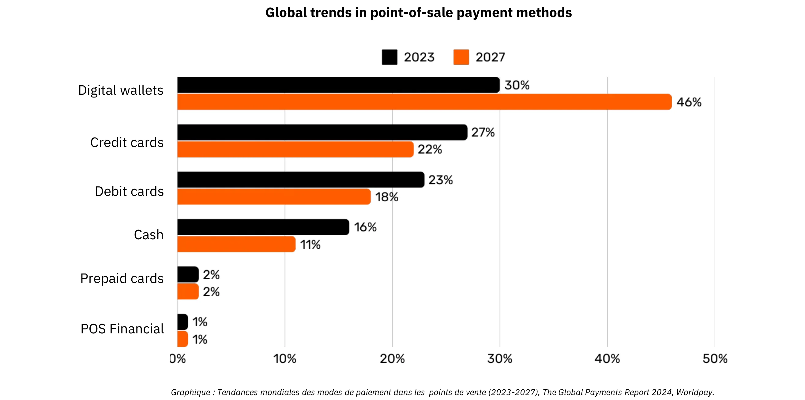

*กราฟิก: แนวโน้มทั่วโลกในวิธีการชำระเงิน ณ จุดขาย (POS) (2023-2027), รายงานการชำระเงินทั่วโลก 2024, Worldpay.*

### ความซับซ้อนเบื้องหลังการชำระเงินด้วยบัตรที่ดูเรียบง่าย

เมื่อลูกค้าใช้บัตรเครดิตที่ร้านค้า บัตรจะถูกอ่านโดยเครื่อง POS ซึ่งจะส่งข้อมูลการทำธุรกรรมไปยังธนาคารผู้รับของร้านค้าอย่างปลอดภัย ธนาคารผู้รับจะส่งต่อข้อมูลนี้ไปยังเครือข่ายบัตรที่เกี่ยวข้อง (เช่น Visa หรือ Mastercard) ซึ่งจะส่งคำขอไปยังผู้ออกบัตร—ธนาคารที่ให้บัตรแก่ลูกค้า ผู้ออกบัตรจะตรวจสอบบัญชีหรือวงเงินเครดิตของลูกค้าและส่งการอนุมัติกลับผ่านเครือข่ายและธนาคารผู้รับ เพื่อให้ร้านค้าสามารถรับชำระเงินได้

ธุรกรรมที่ดูเหมือนง่ายนี้จริง ๆ แล้วมีขั้นตอนมากกว่า 15 ขั้นตอน, มีตัวกลาง 7 ราย, และใช้เวลาเฉลี่ยระหว่าง 48 ชั่วโมงถึง 5 วันสำหรับผู้ค้าจะได้รับเงิน ในวันต่อ ๆ มา กระบวนการเคลียร์และการชำระเงินจะเกิดขึ้น เครือข่ายบัตรจะรวบรวมธุรกรรมของวันและประสานการแลกเปลี่ยนเงินระหว่างผู้รับและผู้ออกบัตร ธนาคารกลางจะรับรองความถูกต้องและเสถียรภาพของการชำระเงินระหว่างธนาคารเหล่านี้ ในที่สุด บัญชีธนาคารของผู้ค้าจะได้รับยอดสุทธิ (หักค่าธรรมเนียม) ที่เครดิตจากผู้รับบัตร ซึ่งทำให้วงจรธุรกรรมเสร็จสมบูรณ์

โดยรวมแล้ว กระบวนการนี้มีความซับซ้อน ใช้เวลานาน และมีค่าใช้จ่ายสูง สำหรับสิ่งที่ควรจะเป็นการกระทำที่ง่ายในการย้ายมูลค่าจากฝ่ายหนึ่งไปยังอีกฝ่ายหนึ่ง

### วิธีการชำระเงินเปรียบเทียบ

| Payment Method                 | Authorization Needed?           | Transaction Approval Time (Merchant View) | Settlement Speed (Funds Fully Settled)         | Finality (Ease of Reversal)              | Number of Intermediaries       | Typical Fees (to Payee)            |
| ------------------------------ | ------------------------------- | ----------------------------------------- | ---------------------------------------------- | ---------------------------------------- | ------------------------------ | ---------------------------------- |
| **Cash**                       | No                              | Immediate (Physical Exchange)             | Immediate (No Settlement Delay)                | High (Irreversible Once Paid)            | None                           | None                               |
| **Checks**                     | Yes (Bank Clearing)             | Acceptance at Deposit (Not Guaranteed)    | Several Days (Check Clearing Process)          | Medium (Can Bounce/Stop Before Clearing) | Bank                           | **Low to Medium** (Bank Fees)      |
| **Wire Transfers**             | Yes (Bank/Network)              | Confirmation Within Hours                 | Same-Day or Next-Day (Domestic)                | High (Usually Irreversible Once Sent)    | Banks, Payment Networks        | **Medium**(Fixed/Percentage)       |
| **Payment Cards**              | Yes (Card Issuer Authorization) | Seconds to Minutes (Authorization Code)   | A Few Days (Interbank Settlement)              | Medium (Chargebacks Possible)            | Issuer, Acquirer, Card Network | **Variable (1-3% of Transaction)** |
| **Digital Wallets/Mobile Pay** | Yes (Wallet Provider/Bank)      | Seconds (Instant Confirmation)            | Typically 1-2 Days (Depends on Funding Source) | Medium (Refund/Dispute Possible)         | Banks, Wallet Operators        | **Low to Medium (Varies)**         |

### ข้อจำกัดของโซลูชันที่มีอยู่

อุตสาหกรรมการชำระเงินแบบดั้งเดิมเป็นตัวแทนของเศรษฐกิจประจำปีประมาณ $2.2 ล้านล้านดอลลาร์ ซึ่งประมาณหนึ่งในสิบของ GDP ของสหรัฐอเมริกา หรือเทียบเท่ากับ GDP ของฝรั่งเศส เนื่องจากสกุลเงินทำหน้าที่เป็นเครือข่ายที่ได้รับอนุญาต การแข่งขันจึงมีจำกัด ทำให้ "บริการ" นี้คล้ายกับภาษีที่กำหนดในเศรษฐกิจที่มีประสิทธิผล นอกจากภาระค่าใช้จ่ายที่สร้างขึ้นแล้ว ยังมีข้อจำกัดอื่นๆ อีกหลายประการ ดังที่ระบุไว้ด้านล่าง

| Limitation                       | Explanation                                                                                                                                                                                                                        | Impact                                                                                               |
| -------------------------------- | ---------------------------------------------------------------------------------------------------------------------------------------------------------------------------------------------------------------------------------- | ---------------------------------------------------------------------------------------------------- |
| High Card Fees                   | Interchange fees (~0.3%), network fees (fixed or 0.3%-1%), terminal/PSP subscriptions, and bank margins (0.5%-1.7%) collectively add up to a substantial cost—akin to a global “tax” on productive sectors, amounting to trillions of dollars.     | Raises merchant costs, reducing margins and potentially driving up consumer prices.                  |
| Very Slow Final Settlement       | Settlement of funds can take up to 5 days, slowing the flow of money and overall economic activity.                                                                                                                                | Delays liquidity for merchants and reduces the speed of economic circulation.                        |
| Fraud                            | E-commerce channels are heavily targeted by fraud, contributing to significant losses (e.g., $28 billion). Chargebacks could reach ~$174 billion globally by 2024. Managing these disputes consumes time and causes mental strain. | Increased operational costs, complex fraud prevention measures, and diminished customer trust.       |
| Cart Abandonment                 | Additional security steps (one-time codes, two-factor authentication under PSD2) introduce friction at checkout.                                                                                                                   | Higher checkout complexity leads to increased cart abandonment and lost sales.                       |
| High Minimum Transaction Amounts | Minimum spend thresholds on cards can force merchants and consumers into inconvenient pricing or purchase conditions, discouraging small-value transactions.                                                                       | Reduced customer satisfaction and flexibility, potentially limiting impulse or low-value purchases.  |
| Slow Pre-Authorization           | Current systems cannot handle transactions at millisecond speeds or support continuous, real-time payment flows.                                                                                                                   | Limits use cases that require instant or streaming payments, restricting innovation and scalability. |
| Need for a Bank/Card Account     | Access to these payment methods requires a linked bank or card account, automatically excluding those without such accounts.                                                                                                       | Limits financial inclusion, reducing access for unbanked or underbanked populations.                 |
| Repeated Online Account Creation | Users often must create multiple online accounts, leading to fatigue, reduced convenience, and increased exposure of personal data.                                                                                                | Deteriorates user experience, raises privacy concerns, and increases risk of data breaches.          |
| Foreign Exchange (FX) Fees       | Lack of a universal unit of account forces costly currency conversions for cross-border transactions.                                                                                                                              | Adds extra costs for international commerce, making global transactions less affordable.             |

เช่นเดียวกับที่เราเปลี่ยนจากการจ่ายเงินตามนาทีสำหรับการโทรด้วยเสียงไปเป็นการใช้การสื่อสารผ่าน IP ที่เกือบจะฟรี การเกิดขึ้นของเครือข่ายที่เปิดกว้างและมีประสิทธิภาพมากขึ้นสามารถนิยามการชำระเงินใหม่ ลดต้นทุนและคนกลาง และส่งเสริมรูปแบบธุรกิจใหม่ ๆ

## Bitcoin สำหรับธุรกิจ: สกุลเงินที่กำลังเกิดขึ้นใหม่

<chapterId>4488fe33-663f-41a3-a668-e9ca2fb7122e</chapterId>

**BITCOIN คืออะไร?**

Bitcoin คือ **ระบบแลกเปลี่ยนสกุลเงินดิจิทัลแบบ[เพียร์ทูเพียร์](https://planb.academy/resources/glossary/peertopeer-p2p)** (หรือที่รู้จักกันในชื่อเงินสดอิเล็กทรอนิกส์) คำว่า "Bitcoin" หมายถึงส่วนประกอบต่อไปนี้:

- โปรโตคอลคอมพิวเตอร์** ที่ช่วยให้การแลกเปลี่ยนมูลค่าบนอินเทอร์เน็ตเป็นไปได้โดยไม่มีตัวกลาง ไม่ต้องการการอนุญาต และใช้นามแฝง โดยใช้หลักการ[การเข้ารหัสขั้นสูง](https://planb.academy/resources/glossary/cryptography)
- เครือข่ายทางกายภาพ** ของเครื่องจักรที่เชื่อมต่อกับอินเทอร์เน็ต ([โหนด](https://planb.academy/resources/glossary/node), [นักขุด](https://planb.academy/resources/glossary/miner), ฯลฯ) ดำเนินการโดยบุคคลและธุรกิจ ก่อให้เกิดระบบแบบกระจายศูนย์ (โดยไม่มีหน่วยงานกลางหรือจุดควบคุมเดียว)
- หน่วยของบัญชี** ภายในระบบ จะไม่มีบิตคอยน์มากกว่า 21 ล้านเหรียญในระบบ แต่ละบิตคอยน์สามารถแบ่งออกเป็น 100 ล้านหน่วยที่เรียกว่า “[ซาโตชิ](https://planb.academy/resources/glossary/satoshi-sat)” ซึ่งตั้งชื่อตามผู้สร้างที่ไม่เปิดเผยตัวตน

ด้วยกัน พวกเขาทำให้ Bitcoin เป็น **สินทรัพย์ผู้ถือ** และสกุลเงินดิจิทัล **ที่ไม่มีผู้ออก**. Ownership ได้รับการรักษาความปลอดภัยโดยการถือครอง **[กุญแจเข้ารหัสส่วนตัว](https://planb.academy/resources/glossary/private-key)** ซึ่งให้การควบคุมเต็มรูปแบบ **โดยไม่ต้องการตัวกลางหรือบุคคลที่สามที่เชื่อถือได้**. เมื่อมีการโอน ความเป็นเจ้าของ **สิ้นสุด** ทันที: ผู้ถือใหม่เป็นเจ้าของเต็มรูปแบบโดยไม่ต้องพึ่งพาอำนาจกลางในการปกป้องหรือการแปลงสภาพ. [ธุรกรรม](https://planb.academy/resources/glossary/transaction-tx)เป็น **ที่เปลี่ยนแปลงไม่ได้**—เมื่อบันทึกบนบล็อกเชนแล้ว จะไม่สามารถแก้ไขหรือลบได้.

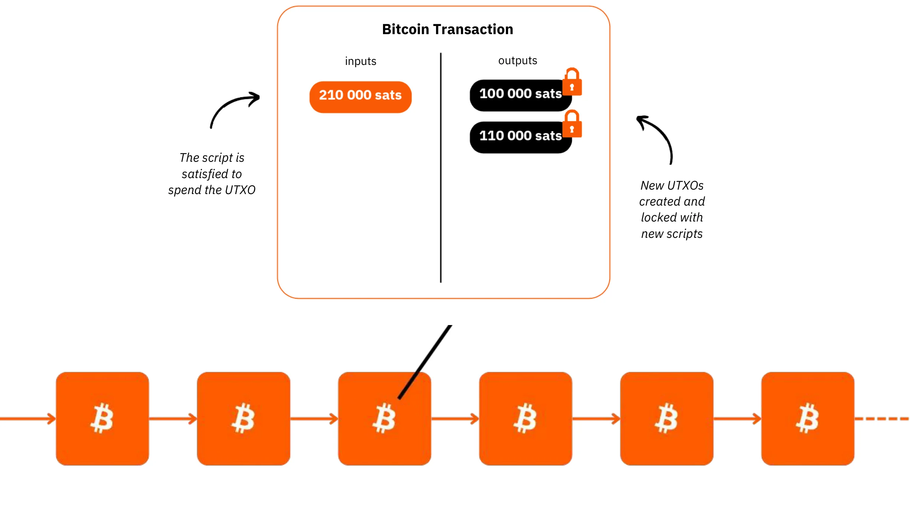

บิทคอยน์มีนโยบายการเงินที่แน่นอน โดยมี **จำนวนสูงสุด 21 ล้านบิทคอยน์** ซึ่งในปัจจุบัน (ปี 2024) ได้ถูกขุดขึ้นมาแล้วประมาณ 19.8 ล้านบิทคอยน์ สิ่งนี้ทำให้บิทคอยน์มีสภาวะ **เงินฝืด (deflationary)** ซึ่งมูลค่าจะเพิ่มขึ้นตามกาลเวลา เนื่องจากผู้ใช้เก็บออมเงินและผลตอบแทนจากการผลิตไว้ในบิทคอยน์

คุณสมบัติทางเทคนิคของมันเหนือกว่าทองคำและดอลลาร์รวมกัน ทำให้มันเป็นสินทรัพย์ทางการเงินที่แข็งแกร่งที่สุดที่เคยสร้างขึ้น Bitcoin เป็นทั้งที่เก็บมูลค่าและสื่อกลางในการแลกเปลี่ยน เป็นสกุลเงินที่กำลังจะเกิดขึ้น ลองจินตนาการถึงการโอนมูลค่าจากคลังของบริษัทหนึ่งไปยังอีกบริษัทหนึ่งอย่างรวดเร็ว โดยไม่มีตัวกลาง ค่าใช้จ่ายต่ำ ไม่มีการฉ้อโกง ทำได้ตลอด 24/7 และไม่มีบุคคลที่สามเข้ามาเกี่ยวข้อง

Bitcoin รักษามูลค่าได้อย่างมีประสิทธิภาพเพราะ[บัญชีแยกประเภท](https://planb.academy/resources/glossary/ledger)ของมันไม่สามารถถูกดัดแปลงได้ มูลค่าของมันเพิ่มขึ้นเนื่องจากการมีอยู่ที่หายากและจำกัด รวมกับโอกาสในการแลกเปลี่ยนที่เพิ่มขึ้น ซึ่งขับเคลื่อนโดยจำนวนผู้ใช้ที่เพิ่มขึ้น

Bitcoin เป็นการเปลี่ยนแปลงที่สำคัญเพราะมันกระตุ้นให้เราเรียนรู้แนวคิดในคณิตศาสตร์ การเข้ารหัสลับ เศรษฐศาสตร์ และประวัติศาสตร์ที่เราอาจไม่เคยได้รับการสอนมาก่อน แม้มักจะถูกมองว่าซับซ้อน แต่ในความเป็นจริงแล้ว มันเป็นนวัตกรรมที่สามารถเข้าถึงได้ผ่านการฝึกฝนและการทดลอง

Bitcoin ท้าทายให้เราพิจารณาธรรมชาติของเงินใหม่ คุณอธิบายได้ไหมว่าเงินคืออะไรจริงๆ? พนักงานเงินเดือนหรือผู้ประกอบการอาจใช้เวลา 50,000 ถึง 100,000 ชั่วโมงในชีวิตเพื่อหาเงิน แต่มีสักกี่คนที่ **ทุ่มเทแม้แต่ 100 ชั่วโมงเพื่อทำความเข้าใจมันให้ดีขึ้น** และรักษามันไว้? Bitcoin กระตุ้นให้เราตั้งคำถามถึงเหตุผลพื้นฐานเบื้องหลังความต้องการเงินของเราและมุมมองทางเวลา เงินคือเพื่อความหรูหราทันทีหรือความยืดหยุ่นในระยะยาว? หากเรามีสินทรัพย์ที่มีมูลค่าเพิ่มขึ้นที่ช่วยให้เราสามารถเลื่อนการซื้อออกไปได้ เราจะเลือกอะไร? เราจะอยากมีบทสนทนาอะไรกับตัวเองในอีก 20 หรือ 30 ปีข้างหน้า?

**บัตรประจำตัวของบิตคอยน์ (ในปี 2024)**

- อายุ:** 15 ปี (3 มกราคม 2009)
- มูลค่าการแลกเปลี่ยนรายวัน:** $10 พันล้าน (> CAC40)
- [มูลค่าตลาด](https://planb.academy/resources/glossary/market-cap-capitalization):** $1.8 ล้านล้าน (> Meta, Visa, Silver ; < Apple, Google, Gold)
- ผู้ใช้:** ~100 ถึง 200 ล้านคน (1-2% ของประชากรโลก)
- ความผันผวน:** โดยเนื้อแท้ไม่มี (1 Bitcoin = 1 Bitcoin), สูงมากภายนอก (ในการแลกเปลี่ยนสกุลเงินเฟียต)
- ประสิทธิภาพ:** ธุรกรรมแรกที่ $0.0009; ตอนนี้ $100,000 (x100 ล้าน)
- ความพร้อมใช้งานของเครือข่าย (uptime):** 100% ตั้งแต่ปี 2013
- ประกาศว่าเสียชีวิตหรือถูกวิจารณ์:** เดือนละครั้ง

**ความมหัศจรรย์ของความร่วมมือของมนุษย์:**

- [โอเพ่นซอร์ส](https://planb.academy/resources/glossary/foss)อย่างสมบูรณ์
- นิติบุคคล:** ไม่มี
- ซีอีโอ:** ไม่มี
- การลงทุนจากทุนร่วมลงทุน:** ไม่มี
- การตลาด:** ไม่มี
- การวิจัยและพัฒนา:** ขับเคลื่อนโดยอาสาสมัคร
- การกำกับดูแล:** โดยผู้ใช้
- โมเดลเศรษฐกิจที่เป็นนวัตกรรม:** การสร้างบล็อก[ได้รับการสนับสนุน](https://planb.academy/resources/glossary/block-subsidy)โดย[ค่าธรรมเนียมการทำธุรกรรม](https://planb.academy/resources/glossary/transaction-fees) (ตามการประมูล)

สำหรับข้อมูลเพิ่มเติมเกี่ยวกับ Bitcoin ประวัติของมัน วิธีการทำงาน และการใช้งาน ฉันขอแนะนำให้ติดตามหลักสูตรที่ครอบคลุมนี้:

https://planb.academy/courses/2b7dc507-81e3-4b70-88e6-41ed44239966

## บทนำสู่ Lightning Network

<chapterId>c095c7ad-5469-4c7b-9510-b6c0b86244e7</chapterId>

**ฟ้าแลบคืออะไร?**

[Lightning Network](https://planb.academy/resources/glossary/lightning-network) คือ **โปรโตคอลและเครือข่าย** ที่ช่วยให้การทำธุรกรรม Bitcoin เกิดขึ้นได้โดยมีการโต้ตอบกับบล็อกเชนหลักของ Bitcoin น้อยที่สุด นี่คือวิธีการทำงาน:

- การตั้งค่าเริ่มต้น:** เงินทุนถูกล็อก (escrowed) บนบล็อกเชนหลักเพื่อสร้าง[ช่องทางการชำระเงิน](https://planb.academy/resources/glossary/payment-channel)ระหว่าง 2 ฝ่าย
- เครือข่ายการชำระเงิน:** เครือข่ายของช่องทางการชำระเงินระหว่างหลายฝ่ายก่อให้เกิดเครือข่ายการชำระเงิน (การกำหนดเส้นทางและการเชื่อมต่อ)
- ธุรกรรมนอกเชน:** ธุรกรรมเกิดขึ้นระหว่างคู่สัญญาแต่ **ยังไม่ได้เผยแพร่ทันที** บนบล็อกเชนหลักของ Bitcoin (**"[off-chain](https://planb.academy/resources/glossary/offchain)"**).
- การชำระเงินบนเชน:** เฉพาะ **ยอดคงเหลือสุดท้าย** ของธุรกรรมในช่องทางเท่านั้นที่ถูกเผยแพร่บนบล็อกเชนหลัก Bitcoin (**"[on-chain](https://planb.academy/resources/glossary/onchain)"**), ซึ่งอนุญาตให้มีธุรกรรมจำนวนมากเกิดขึ้นในระหว่างนี้ การรวมการชำระเงินหลายรายการนี้ช่วยลดความแออัดและลดค่าธรรมเนียมเมื่อเทียบกับการทำธุรกรรม on-chain หลายรายการ
- การปิดช่องทาง:** ผู้ใช้สามารถปิดช่องทางของตนได้ทุกเมื่อและเรียกคืน Bitcoin ของตนโดยการเผยแพร่สถานะธุรกรรมล่าสุด นี่คือหลักการของธุรกรรมที่สามารถ **"เผยแพร่ได้" ทุกเมื่อแต่ "ไม่เผยแพร่"** จนกว่าจะจำเป็น การออก (การปิดช่องทาง) สามารถทำได้ฝ่ายเดียว (ตัดสินใจโดยฝ่ายใดฝ่ายหนึ่งในเวลาใดก็ได้) หรือการตัดสินใจร่วมกัน (ส่งผลให้ค่าธรรมเนียม on-chain ต่ำลง)

วิธีการนี้หลีกเลี่ยงความช้าและความซับซ้อนของการทำธุรกรรมทุกอย่างโดยตรงบนบล็อกเชนหลักของ Bitcoin โดยบันทึกเฉพาะยอดคงเหลือสุดท้ายและรักษาความปลอดภัยของมันไว้ Lightning Network เป็น[เลเยอร์](https://planb.academy/resources/glossary/layer) "บน" Bitcoin แต่ยังคงยึดติดกับมัน

**เครือข่ายการชำระเงินระดับโลก**

โปรโตคอลนี้สร้าง **เครือข่าย** ของเครื่องจักรที่ช่องทางต่าง ๆ ก่อให้เกิดระบบการชำระเงินสากล โหนดเหล่านี้สามารถดำเนินการได้อย่างอิสระโดยบุคคลหรือธุรกิจ ทำให้เป็นเครือข่ายที่เปิดกว้างอย่างสมบูรณ์

Lightning Network ช่วยให้การแลกเปลี่ยนมูลค่าเกิดขึ้นได้ทันทีด้วยความเร็วแสง มันเหมือนกับโปรโตคอลอีเมลที่ถูกนำมาใช้กับการชำระเงิน: เครือข่ายการชำระเงินยุคใหม่ มันเปลี่ยนแปลงวิธีการเคลื่อนย้าย "เงิน" อย่างสิ้นเชิง ทำให้เป็นอิสระและรวดเร็วเหมือนการส่งข้อมูลบนอินเทอร์เน็ต

**ข้อดีที่สำคัญ:**

- ความเร็ว:** ธุรกรรมทันที
- ค่าธรรมเนียมต่ำ:** ค่าใช้จ่ายที่ต่ำกว่ามากเมื่อเทียบกับเครือข่ายธนาคารแบบดั้งเดิม
- ความง่ายในการนำไปใช้:** ธุรกิจสามารถตั้งค่าเพื่อรับชำระเงินผ่าน Lightning ได้อย่างรวดเร็วโดยใช้เพียงแอปบนสมาร์ทโฟนหรือปุ่มชำระเงินบนเว็บไซต์ของพวกเขา

โครงสร้างพื้นฐานของ Lightning มีประสิทธิภาพเหนือกว่าระบบการชำระเงินแบบดั้งเดิมในด้านความเร็ว ต้นทุน และประสิทธิภาพการใช้พลังงาน ด้วยการยอมรับจากผู้ค้าที่ยิ่งเพิ่มขึ้น แรงผลักดันจะเร่งตัวขึ้น: หากการชำระเงินสามารถข้ามเครือข่ายธนาคารระหว่างกันที่ถูกกักขังไว้ได้ ทำไมต้องยอมเสียเปอร์เซ็นต์รายได้ที่สำคัญให้กับตัวกลางในปัจจุบัน?

**กรณีการใช้งานที่ไม่มีที่สิ้นสุด:**

การประยุกต์ใช้ Lightning ขยายออกไปไกลกว่าค่าธรรมเนียมต่ำและความเร็ว ด้วยการเสนอช่องทางการชำระเงินที่ฟรีและทันที มันเปิดโอกาสมากมายในเศรษฐกิจ

**การเพิ่มความสามารถของ Bitcoin จาก Exchange:**

การเกิดฟ้าผ่าช่วยเสริมบทบาทของ Bitcoin ในฐานะ "สื่อกลางในการแลกเปลี่ยน" โดยการเพิ่มความถี่และเสรีภาพในการทำธุรกรรม มันช่วยเสริมสร้างหน้าที่หลักของเงิน: การอำนวยความสะดวกในการแลกเปลี่ยนทางเศรษฐกิจและการสร้างมูลค่าสำหรับผู้เข้าร่วมทุกคน

การเพิ่มขึ้นของ "เศรษฐกิจเครื่องจักรอัจฉริยะ" ในอนาคตจะต้องการระบบการชำระเงินที่รวดเร็วและมีความถี่สูง - มาตรฐานทางเทคนิคที่มีเพียง Lightning เท่านั้นที่สามารถตอบสนองได้ สิ่งนี้ช่วยให้สามารถสร้างสินค้าและบริการได้มากขึ้น เมื่ออุปทานของ Bitcoin ยังคงจำกัด กำลังซื้อของแต่ละหน่วยจะเพิ่มขึ้น Bitcoin และ Lightning เติบโตแข็งแกร่งขึ้นด้วยกันเมื่อเครือข่ายของพวกเขาขยายตัว

สายฟ้าให้ภาพรวมของอนาคตที่ธุรกิจบนอินเทอร์เน็ตทั้งหมดจะกลายเป็นธุรกิจที่ใช้ Bitcoin ด้วยเช่นกัน

**Bitcoin การชำระเงินบน Lightning: กรณีการใช้งานทั่วไปของร้านค้า**

Lightning Network เหมาะสำหรับการชำระเงิน Bitcoin ในร้านค้าจริงหรือออนไลน์เนื่องจากความรวดเร็วและความสมบูรณ์ของการชำระเงิน

- ความเร็ว:** Lightning (~500ms ถึงไม่กี่วินาที) เร็วกว่ามากเมื่อเทียบกับเครือข่ายหลัก Bitcoin ซึ่งการทำธุรกรรมอาจใช้เวลาประมาณ 30 นาทีในการยืนยัน สำหรับการซื้อขายขนาดใหญ่ (มากกว่า $1,000) เครือข่ายหลัก Bitcoin อาจยังคงเป็นที่ต้องการ เนื่องจากความเร็วไม่ใช่ปัจจัยสำคัญ อย่างไรก็ตาม รายละเอียดเหล่านี้มักถูกซ่อนจากผู้ใช้ทั่วไป เนื่องจากแอปพลิเคชันจัดการการตัดสินใจเหล่านี้อย่างราบรื่นในเบื้องหลัง
- ความแน่นอน:** เมื่อการชำระเงินเกิดขึ้นบน Lightning มันจะถือเป็นที่สิ้นสุด ไม่มีความเป็นไปได้ในการเรียกเงินคืนโดยบุคคลที่สามหรือข้อพิพาทที่เกี่ยวข้องกับการฉ้อโกง
- ค่าธรรมเนียม:** ค่าธรรมเนียมการทำธุรกรรมบน Lightning Network นั้นน้อยมากและผู้ใช้เป็นผู้ชำระ ไม่ใช่ผู้ค้า ผู้ค้าจะมีค่าใช้จ่ายเฉพาะเมื่อพวกเขาจำเป็นต้องโอน Bitcoin ไปยังเครือข่ายหรือบริการอื่นในภายหลังเท่านั้น

**บัตรประจำตัวของ Lightning (ในปี 2024)**

- การประดิษฐ์:** 2015
- เปิดตัว:** 2016
- อายุ:** 7 ปี (ธุรกรรมแรก: 28 ธันวาคม 2017)
- ความสามารถทางเทคนิคของเครือข่าย:** ในระดับที่สามารถจัดการธุรกรรมทันทีได้มากกว่าระบบดั้งเดิมถึง 1,000 เท่า
- ขนาดของธุรกรรม:** มีช่วงตั้งแต่เล็กกว่าระบบดั้งเดิมถึง 1,000 เท่า
- ความเร็วในการทำธุรกรรม:** เร็วขึ้นถึง 100 เท่า
- ค่าธรรมเนียม:** ต่ำกว่าถึง 90%
- การชำระเงินเสร็จสิ้น:** เกือบจะทันที (มักจะ ~500 มิลลิวินาที บางครั้งไม่กี่วินาที)
- การใช้พลังงาน:** ~8% ของระบบการเงินแบบดั้งเดิมทั่วโลก
- ลักษณะ:**
    - เพียร์ทูเพียร์
    - ยูนิเวอร์แซล
    - ไม่ต้องขออนุญาต
    - ความเป็นส่วนตัวที่ดี
    - ความปลอดภัยที่พิสูจน์แล้ว
    - ความพร้อมใช้งานสูง (เวลาทำงานที่ยอดเยี่ยม)
    - ควบคุมได้และปรับตัวได้

สำหรับข้อมูลเพิ่มเติมเกี่ยวกับการทำงานทางเทคนิคของ Lightning Network ฉันขอแนะนำให้ติดตามหลักสูตรที่ครอบคลุมนี้:

https://planb.academy/courses/34bd43ef-6683-4a5c-b239-7cb1e40a4aeb

# Bitcoin ในคลัง

<partId>bf45c1e8-af97-4b6b-af42-2866f493b14d</partId>

## กำไร ทุน และกุญแจสู่ความยืดหยุ่นทางธุรกิจ

<chapterId>656ad88f-3c27-4054-a94e-b29727009b8e</chapterId>

### บริษัทที่มีสุขภาพดี

**อนาคตเต็มไปด้วยความไม่แน่นอน**, และธุรกิจต้องนำทางผ่านความไม่แน่นอนนี้ด้วยการมุ่งเน้นที่ชัดเจนในการทำกำไรและรักษาทุน ตามหลักเศรษฐศาสตร์ออสเตรีย, **กำไรคือสัญญาณสูงสุดของสุขภาพของบริษัท**—มันแสดงให้เห็นว่าธรกิจกำลังตอบสนองความต้องการของผู้บริโภคอย่างมีประสิทธิภาพ หากไม่มีผลกำไร บริษัทไม่สามารถรักษาตัวเองได้ นับประสาอะไรกับการเติบโต สำหรับธุรกิจที่จะคงความแข็งแรง มันต้องไม่เพียงแต่ generate กำไรแต่ยังต้องคิดล่วงหน้า, **เก็บรักษาทุนสำหรับการลงทุนและความท้าทายในอนาคต**.

**การรักษาทุน** เป็นสิ่งสำคัญเพราะช่วยให้ธุรกิจสามารถปรับตัวและใช้ประโยชน์จากโอกาสในตลาดที่ไม่แน่นอนได้ ซึ่งเกี่ยวข้องกับการหาสมดุลระหว่างการนำกำไรกลับมาลงทุนเพื่อการเติบโตและการรักษาเงินสำรองเพื่อรับมือกับภาวะตกต่ำที่อาจเกิดขึ้น เศรษฐศาสตร์ออสเตรียเน้นความสำคัญของ **“การให้ความสำคัญกับเวลา”** ซึ่งหมายความว่าธุรกิจต้องตัดสินใจอย่างรอบคอบว่าจะให้ความสำคัญกับผลตอบแทนทันทีมากน้อยเพียงใดเมื่อเทียบกับการลงทุนเพื่อความสำเร็จในระยะยาว บริษัทที่มีสุขภาพดีจะรักษาพื้นฐานทางการเงินที่แข็งแกร่ง เพื่อให้มั่นใจถึงความยืดหยุ่นทั้งในช่วงเวลาที่ดีและไม่ดี

สัญญาณตลาด เช่น ราคาและการแข่งขัน ช่วยชี้นำธุรกิจในการตัดสินใจอย่างมีข้อมูลเกี่ยวกับการจัดสรรทรัพยากร โดยการฟังสัญญาณเหล่านี้ บริษัทสามารถหลีกเลี่ยงข้อผิดพลาดในการขยายตัวเกินไปหรือการลงทุนที่ไม่ดี—โดยเฉพาะอย่างยิ่งที่ได้รับอิทธิพลจากปัจจัยเทียม เช่น เครดิตที่ง่าย การจัดสรรทรัพยากรผิดพลาดไม่เพียงแต่ทำให้สุขภาพของบริษัทตกอยู่ในความเสี่ยง แต่ยังลดความสามารถในการให้บริการลูกค้าอย่างมีประสิทธิภาพอีกด้วย

ในที่สุดแล้ว การรักษาธุรกิจให้มีสุขภาพดีหมายถึงการปรับตัวให้เข้ากับสถานการณ์ การตัดสินใจทางการเงินอย่างรอบคอบ และการมองไปข้างหน้าอยู่เสมอ **โดยการมุ่งเน้นที่กำไร การรักษาทุน และการตอบสนองต่อสัญญาณตลาด ธุรกิจ—ไม่ว่าจะใหญ่หรือเล็ก—สามารถเจริญเติบโตได้แม้ในยามที่มีความไม่แน่นอน**.

### ทุนมีคุณธรรมไหม?

**การนำเสนอทุนโดยทั่วไป**

ให้เราค้นพบอีกครั้งว่าทุนคืออะไรอย่างแท้จริง—คำที่มักถูกเข้าใจผิดและมองในแง่ลบในสังคมของเรา

ในทฤษฎีเศรษฐศาสตร์แบบดั้งเดิม (เคนส์) ทุนมักถูกมองในแง่ที่เรียบง่ายว่าเป็นสต็อกที่เป็นเนื้อเดียวกันของสินทรัพย์ทางกายภาพหรือการเงิน ซึ่งใช้เป็นหลักในการกระตุ้นอุปสงค์รวมผ่านการลงทุน มักเกี่ยวข้องกับการกระจุกตัวของความมั่งคั่งและอำนาจทางเศรษฐกิจที่ถือโดยชนชั้นสูงกลุ่มเล็ก ๆ ในบริบทที่ช่องว่างความมั่งคั่งยังคงขยายกว้างขึ้น หลายคนมองว่าทุนเป็นสัญลักษณ์ของความไม่เท่าเทียมทางเศรษฐกิจ โดยเฉพาะอย่างยิ่งเมื่อความมั่งคั่งที่สะสมดูเหมือนไม่ได้ให้ประโยชน์ใด ๆ แก่คนส่วนใหญ่

"ทุน" มักถูกมองว่าเป็นเครื่องมือของการแสวงหาผลประโยชน์ และมุมมองนี้ได้ส่งผลกระทบอย่างลึกซึ้งต่อขบวนการต่างๆ ที่มองว่าทุนเป็นสิ่งที่ขัดแย้งกับผลประโยชน์ของแรงงาน แต่นี่เป็นความจริงหรือไม่? หรือมุมมองนี้อาจถูกบิดเบือนโดย:

1. การขาดความเข้าใจในกลไกทางเศรษฐกิจ (รวมถึงโดยนักเศรษฐศาสตร์เองด้วย)?

2. การแทรกแซงของรัฐบาลและการบิดเบือนตลาด?

3. ความสับสนระหว่างทุนนิยมพวกพ้องกับทุนนิยมตลาดเสรี?

4. การนำเสนอของสื่อเกี่ยวกับวิกฤตเศรษฐกิจ?

5. ความต้องการในการแก้ไขปัญหาอย่างรวดเร็วและความยุติธรรมทางสังคมในทันที?

6. การทำให้วาทกรรมต่อต้านทุนนิยมเป็นเรื่องปกติในวัฒนธรรม?

โชคดีที่ Bitcoin บังคับให้เราต้องคิดใหม่ทุกอย่างและท้าทายแนวคิดที่มีอยู่เดิม มีแนวคิดหนึ่ง—[โรงเรียนเศรษฐศาสตร์ออสเตรีย](https://planb.academy/resources/glossary/austrian-school)—ที่สามารถให้ความกระจ่างในประเด็นเหล่านี้และช่วยให้เราพิจารณาธรรมชาติที่แท้จริงของทุนใหม่

**กาลครั้งหนึ่งนานมาแล้ว**

มาเริ่มต้นด้วยเรื่องสั้น:

"บนเกาะร้างเล็กๆ มีชาวประมงผู้โดดเดี่ยวอาศัยอยู่ ทุกๆ วัน เขาใช้เวลาหลายชั่วโมงในการจับปลาด้วยมือเปล่า ซึ่งเป็นกิจกรรมที่ใช้เวลาส่วนใหญ่และพลังงานของเขา วันหนึ่ง เขามีความคิด: สร้างหอกที่จะช่วยให้เขาจับปลาได้อย่างมีประสิทธิภาพมากขึ้น แต่เขารู้ว่านี่จะต้องมีการเสียสละ

ก่อนที่จะเริ่มทำหอก ชาวประมงตัดสินใจแยกปลาออกบางส่วนเพื่อเลี้ยงตัวเองในระหว่างกระบวนการสร้างหอก เขากินน้อยกว่าปกติเป็นเวลาสองสามวัน เก็บปลาพอที่จะมุ่งเน้นไปที่โครงการของเขา ปลาที่เก็บไว้นี้แสดงถึง **ทุน** ของเขา ซึ่งเป็นทุนสำรองเล็กๆ ที่ช่วยให้เขาสามารถทำตามเป้าหมายได้

ในขณะที่เขาอุทิศเวลาในการสร้างหอก เขาพึ่งพาทรัพยากรสำรองของเขา ยอมเลื่อนความสะดวกสบายในทันทีบางอย่างออกไป (เป็นการสะท้อนถึง **การให้ค่ากับเวลา** ของเขา) หลังจากทำงานหนักหลายวัน เขาก็สร้างหอกที่แข็งแรงเสร็จสมบูรณ์

ด้วยหอก เขาสามารถจับปลาได้เร็วขึ้นมากและใช้แรงน้อยลง เขาไม่จำเป็นต้องเหนื่อยล้าเหมือนก่อนและเริ่มมีปลาส่วนเกินสะสม ส่วนเกินนี้เปิดโอกาสใหม่ ๆ: เขาสามารถเก็บรักษา แบ่งปัน หรือใช้มันลงทุนในโครงการอื่น ๆ บนเกาะได้ โดยการเลื่อนการบริโภคทันทีและใช้ทุนของเขา ชาวประมงได้ปรับปรุงประสิทธิภาพและโอกาสของเขาอย่างมาก"

เรื่องราวนี้เน้นย้ำถึงความสำคัญอย่างยิ่งของทุน ความอดทน และการมองการณ์ไกลในการสร้างอนาคตที่ดีกว่า—แนวคิดที่มีความสำคัญต่อการเติบโตทางเศรษฐกิจและความก้าวหน้าของมนุษย์

### โรงเรียนเศรษฐศาสตร์ออสเตรียและวิสัยทัศน์ของทุน

สำนักเศรษฐศาสตร์ออสเตรียตั้งชื่อตามผู้ก่อตั้งและผู้มีส่วนร่วมในช่วงแรก ๆ ซึ่งมีต้นกำเนิดจากประเทศออสเตรีย ชื่อนี้ติดปากและสำนักนี้ได้กลายเป็นที่รู้จักอย่างใกล้ชิดกับแนวคิดเสรีนิยมคลาสสิก ซึ่งเน้นเสรีภาพของปัจเจกชน ตลาดเสรี และการแทรกแซงของรัฐให้น้อยที่สุด

**มุมมองของออสเตรียเกี่ยวกับทุน**

ในมุมมองของออสเตรีย ทุนมีความเชื่อมโยงอย่างลึกซึ้งกับแนวคิดของการเลื่อนการบริโภคเพื่อสร้างเครื่องมือหรือทรัพยากรการผลิตที่เพิ่มประสิทธิภาพการผลิตในอนาคต กระบวนการนี้ซึ่งรู้จักกันในชื่อการสะสมทุน เป็นแนวคิดสำคัญในทฤษฎีเศรษฐศาสตร์ของออสเตรีย องค์ประกอบสำคัญของมุมมองนี้รวมถึง:

- การให้ความสำคัญกับเวลาและการบริโภคที่เลื่อนออกไป**: บุคคลมักจะชอบบริโภคในปัจจุบันมากกว่าในอนาคต แต่พวกเขาอาจเลือกที่จะเลื่อนการบริโภคออกไปหากคาดหวังว่าจะได้รับผลตอบแทนที่มากขึ้นในอนาคต โดยการออมในวันนี้ ทรัพยากรสามารถนำไปลงทุนในสินค้าทุน (เครื่องมือ เครื่องจักร โครงสร้างพื้นฐาน) ที่ช่วยเพิ่มประสิทธิภาพการผลิตในระยะยาว สังคมหรือบุคคลที่ให้ความสำคัญกับเวลาต่ำจะออมมากขึ้นและลงทุนในโครงการระยะยาว ส่งเสริมการเติบโตอย่างยั่งยืน

- ทุนในฐานะตัวขับเคลื่อนการผลิตในอนาคต**: สินค้าทุนถูกมองว่าเป็นเครื่องมือกลางที่ใช้ในการผลิตสินค้าผู้บริโภคขั้นสุดท้าย โดยการสะสมทุน ผู้ประกอบการสามารถเพิ่มประสิทธิภาพการผลิตและสร้างความมั่งคั่งมากขึ้นในอนาคต ตัวอย่างเช่น แทนที่จะผลิตสินค้าผู้บริโภคทันที ทรัพยากรอาจถูกใช้ในการสร้างโรงงานหรือเครื่องจักร แม้ว่าสิ่งนี้จะลดการบริโภคในระยะสั้น แต่ประสิทธิภาพที่เกิดขึ้นทำให้สามารถผลิตได้มากขึ้นและความเจริญรุ่งเรืองในระยะยาว

- การผลิตทางอ้อมและประสิทธิภาพ**: นักเศรษฐศาสตร์ชาวออสเตรีย เช่น Eugen Böhm-Bawerk ได้เน้นย้ำถึงแนวคิดของการผลิตทางอ้อม—กระบวนการผลิตที่ยาวนานและซับซ้อนมากขึ้นซึ่งเกี่ยวข้องกับหลายขั้นตอน แม้ว่ากระบวนการเหล่านี้จะใช้เวลา แต่ในที่สุดก็ให้ผลลัพธ์ที่มีประสิทธิภาพและผลิตภาพมากขึ้น เช่น การสร้างโรงเลื่อยเพื่อแปรรูปไม้แทนการเก็บท่อนไม้ด้วยมือ

- อัตราดอกเบี้ยเป็นสัญญาณ**: ในมุมมองของออสเตรีย อัตราดอกเบี้ยสะท้อนถึงความชอบของบุคคลต่อเวลาโดยธรรมชาติ อัตราที่สูงบ่งบอกถึงความชอบในการบริโภคทันที ในขณะที่อัตราที่ต่ำส่งเสริมการออมและการลงทุนระยะยาว เมื่อธนาคารกลางแทรกแซงอัตราดอกเบี้ยอย่างไม่เป็นธรรมชาติ พวกเขาบิดเบือนสัญญาณธรรมชาติเหล่านี้ นำไปสู่การจัดสรรทรัพยากรที่ผิดพลาดและการลงทุนที่ไม่ยั่งยืน (การลงทุนที่ผิดพลาด)

**สองรูปแบบของทุนในเศรษฐกิจสมัยใหม่**

ภายในกรอบของระบบการเงินที่อิงตามหนี้ที่เราใช้งานอยู่ **มีทุนประเภทที่สองอยู่**: ซึ่งเกิดขึ้นทันทีเมื่อธนาคารสร้างเงินกู้ผ่านกลไกเครดิตง่ายๆ ซึ่งเกี่ยวข้องกับการสร้างสภาพคล่องจากความว่างเปล่า โดยที่ธนาคารให้ยืมเงินที่ไม่ได้ถืออยู่ล่วงหน้า แต่สร้างขึ้นจากคำมั่นสัญญาของการชำระคืน

ในด้านหนึ่ง "ทุน" ของออสเตรียเป็นผลมาจากการออมที่แท้จริง ซึ่งเป็นกระบวนการที่เกี่ยวข้องกับการตัดสินใจทางเศรษฐกิจอย่างรอบคอบและการเสียสละอย่างพิถีพิถัน ในทางกลับกัน ทุนที่เกิดจากการสร้างเงินที่มีพื้นฐานจากหนี้เป็นโครงสร้างที่เกิดขึ้นทันทีและเทียม ทุนทั้งสองประเภทนี้แม้จะ **ดูเหมือนคล้ายกันในแง่ของการใช้เพื่อการเงินโครงการ แต่มีความแตกต่างกันอย่างพื้นฐานในธรรมชาติ**

รูปแบบทุนทั้งสองนี้ไม่ควรถูกนำมารวมกัน; แต่ในระบบที่อิงตามหนี้ พวกมันมักจะถูกนำมารวมกัน **บิดเบือนสัญญาณทางเศรษฐกิจ** และมักนำไปสู่การลงทุนที่ผิดพลาด ความเข้าใจผิดนี้ทำให้เห็นว่าทำไมระบบทุนนิยมมักได้รับการวิจารณ์ที่ไม่สมควร

**ปัญหาหลักของเคนส์เซียน**

นโยบายของเคนส์ ซึ่งถูกนำมาใช้โดยชนชั้นนำทั่วโลก มีการปรับอัตราดอกเบี้ยและกระตุ้นความต้องการโดยการสร้างหนี้ สิ่งนี้ส่งเสริมให้ทรัพยากรไหลไปสู่โครงการระยะสั้นที่ไม่ยั่งยืน เพิ่มความรุนแรงของวัฏจักรเศรษฐกิจและชะลอการเติบโตที่แท้จริงซึ่งควรจะมีรากฐานจากการออมที่แข็งแรงและการลงทุนที่มีประสิทธิภาพ ผู้นำธุรกิจสังเกตเห็นนโยบายที่เป็นอันตรายนี้โดยตรงเมื่อบริษัทที่มีสุขภาพดีถูกผลักดันให้เข้าสู่การเข้าซื้อกิจการที่มีมูลค่าสูงเกินไปเพื่อแสวงหาผลตอบแทนที่สูงเกินจริง ซึ่งบ่อนทำลายการเติบโตที่เป็นธรรมชาติและยั่งยืน

ในสภาพแวดล้อมเช่นนี้ "ทุน" ที่มีสุขภาพดี—ซึ่งเก็บออมอย่างระมัดระวังโดยผู้ประกอบการ—จะสามารถแข่งขันกับ "ทุน" ที่ไม่มีสุขภาพดีซึ่งถูกสร้างขึ้นอย่างเทียมได้อย่างไร? ยิ่งไปกว่านั้น การขยายตัวของปริมาณเงินฝ่ายเดียวทำให้กำลังซื้อของทุนที่มีความมั่นคงลดลง เพิ่มความสับสนทางเศรษฐกิจและความไม่พอใจในสังคม

**ประกายแห่งความหวัง: Bitcoin**

Bitcoin ให้วิธีการสะสมและรักษาทุนในระยะยาว ซึ่งช่วยลดการกัดกร่อนที่เกิดจากเงินเฟ้อทางการเงิน ในฐานะที่เป็นแหล่งเก็บมูลค่า มันช่วยให้ธุรกิจสามารถวางแผนการลงทุนในอนาคตด้วยความยืดหยุ่น ท้าทายการครอบงำของระบบที่ขับเคลื่อนด้วยหนี้ และส่งเสริมการกลับไปสู่การสะสมทุนที่แท้จริงและมีประสิทธิภาพ

### เพิ่มเติมเกี่ยวกับสำนักเศรษฐศาสตร์ออสเตรีย

**สำนักเศรษฐศาสตร์ออสเตรีย** เป็นแนวคิดทางเศรษฐศาสตร์ที่ให้ความสำคัญกับตลาดเสรี เสรีภาพของบุคคล และความสำคัญของการกระทำของมนุษย์ในกระบวนการทางเศรษฐกิจ มันวิจารณ์การแทรกแซงของรัฐ โดยเฉพาะในด้านเงินและตลาด และโต้แย้งว่าบุคคลที่ได้รับการชี้นำโดยความชอบส่วนตัวของพวกเขาเองเป็นผู้ตัดสินที่ดีที่สุดในผลประโยชน์ของตนเอง

**บุคคลสำคัญของสำนักออสเตรีย**

- Carl Menger**: ผู้ก่อตั้งสำนักออสเตรีย, Menger ได้พัฒนาทฤษฎีมูลค่าตามอัตวิสัย ซึ่งยืนยันว่ามูลค่าของสินค้าขึ้นอยู่กับความชอบของแต่ละบุคคลมากกว่าต้นทุนการผลิต

- Ludwig von Mises**: เป็นเสาหลักของสำนักออสเตรีย, Mises ได้แนะนำ praxeology (ทฤษฎีการกระทำของมนุษย์) และเป็นผู้เขียน _Human Action_, การวิจารณ์อย่างลึกซึ้งเกี่ยวกับสังคมนิยมและการวางแผนจากศูนย์กลาง.

- ฟรีดริช ฮาเย็ค**: ศิษย์ของมีเซส ฮาเย็คได้รับรางวัลโนเบลสาขาเศรษฐศาสตร์ในปี 1974 จากผลงานของเขาเกี่ยวกับความรู้แบบกระจายและความเป็นธรรมชาติของตลาด ในหนังสือของเขา _The Road to Serfdom_ เขาได้วิจารณ์การควบคุมแบบรวมศูนย์อย่างรุนแรง

- เมอร์เรย์ รอธบาร์ด**: ศิษย์ของมีเซสและผู้สนับสนุนเสรีนิยมอย่างแข็งขัน รอธบาร์ดได้พัฒนาทฤษฎีอนาธิปไตยทุนนิยม โดยมองเห็นสังคมที่ไม่มีรัฐซึ่งปกครองโดยสัญญาโดยสมัครใจ หนังสือของเขา _Man, Economy, and State_ เป็นผลงานสำคัญในเศรษฐศาสตร์ออสเตรีย

**นักเศรษฐศาสตร์ผู้ทรงอิทธิพลอื่นๆ**

- มิลตัน ฟรีดแมน**: แม้จะไม่ได้เกี่ยวข้องโดยตรงกับสำนักออสเตรีย ฟรีดแมนสนับสนุนแนวคิดที่เป็นมิตรกับตลาดและเสรีนิยมหลายประการ นโยบายการเงินของเขาแตกต่างจากแนวคิดของสำนักออสเตรีย แต่มีการวิพากษ์วิจารณ์การแทรกแซงของรัฐในเศรษฐกิจที่มากเกินไปเช่นเดียวกัน

- เฟรเดอริก บาสเตียต**: นักเศรษฐศาสตร์ชาวฝรั่งเศสในศตวรรษที่ 19 บาสเตียตมีอิทธิพลต่อสำนักออสเตรียด้วยผลงานของเขาเกี่ยวกับการค้าเสรีและผลที่ตามมาอย่างไม่คาดคิดของนโยบายเศรษฐกิจ บทความของเขา _สิ่งที่มองเห็นและสิ่งที่มองไม่เห็น_ เป็นข้อความพื้นฐานของลัทธิเสรีนิยมทางเศรษฐกิจ

*ที่มา: สถาบันลุดวิก ฟอน มีเซส*

**ผลงานและแนวคิดหลัก**

นักคิดเหล่านี้ได้สร้างแนวคิดที่ว่าการแทรกแซงของรัฐบิดเบือนตลาดและเสรีภาพทางเศรษฐกิจเป็นสิ่งจำเป็นสำหรับความเจริญรุ่งเรืองและการประสานงานที่กลมกลืนของการกระทำของมนุษย์ ข้อมูลเชิงลึกของพวกเขาเน้นย้ำถึงความสำคัญของการตัดสินใจแบบกระจายอำนาจและความเสี่ยงที่เกี่ยวข้องกับการควบคุมแบบรวมศูนย์ในระบบเศรษฐกิจ

สำหรับข้อมูลเพิ่มเติมในหัวข้อนี้:

https://planb.academy/courses/d955dd28-b7c6-4ba2-a123-d932e21d148f

https://planb.academy/courses/9d1bde6a-33e5-45dd-b7c0-94da72e45b11

https://planb.academy/courses/d07b092b-fa9a-4dd7-bf94-0453e479c7df

## การถือครองบิตคอยน์ในคลัง

<chapterId>89622a40-d14f-4c37-a075-8e7e1731ec26</chapterId>

### ความท้าทายของการเงินของบริษัท

กรมธนารักษ์คือสถานที่ที่เก็บสิ่งของมีค่า บริษัทที่มีสุขภาพดีจะมีการลงทุนที่เหมาะสม ทำให้สามารถรับมือกับความไม่แน่นอนในอนาคตและวางแผนการลงทุนได้อย่างมีประสิทธิภาพ ปัจจุบัน ส่วนหนึ่งของเงินทุนส่วนเกินจะถูกนำไปลงทุนในสินทรัพย์ทางการเงินที่มีชื่อเสียงว่า “สภาพคล่อง” สูง เช่น พันธบัตร เงินฝากประจำ และอื่นๆ

เป็นเวลานานมากที่บางบริษัทใช้สินทรัพย์ที่ไม่มีสภาพคล่องเช่นอสังหาริมทรัพย์โดยไม่ตระหนักถึงอันตรายบางประการ:

- สภาพคล่องต่ำในกรณีเกิดวิกฤต
- ในที่สุด ผลตอบแทนค่อนข้างต่ำเมื่อหักค่าธรรมเนียมแล้ว
- ผลตอบแทนที่ไม่แซงหน้าอัตราเงินเฟ้อที่แท้จริง ซึ่งเป็นอัตราการเพิ่มขึ้นของปริมาณเงิน (~7% ต่อปี ดูด้านล่าง)
- ความเสี่ยงที่ซ่อนอยู่คืออสังหาริมทรัพย์สูญเสียส่วนหนึ่งของฟังก์ชัน "การออม" ไปยังสินทรัพย์อย่าง Bitcoin เป็นผลให้มันอาจกลับไปใกล้กับ "มูลค่าการใช้สอย" มากขึ้น: การให้ที่พักพิง

มาทบทวนสภาพแวดล้อมที่ธุรกิจดำเนินการกันอย่างรวดเร็ว

**อัตราเงินเฟ้อที่แท้จริง**: แม้จะขัดกับภารกิจของพวกเขา ธนาคารกลางตั้งเป้าอัตราเงินเฟ้อประจำปีที่ 2% ซึ่งแปลว่าเป็นการสูญเสียมูลค่าเงิน 40% ในระยะเวลา 20 ปี เมื่อรวมกับช่วงเวลาที่มีอัตราเงินเฟ้อที่เด่นชัดมากขึ้น จะเห็นได้ชัดว่าบริษัทไม่สามารถพึ่งพาเพียงแค่สกุลเงินในการเก็บรักษาผลของแรงงานของพวกเขาได้ พวกเขาต้องดำเนินกลยุทธ์ทางการเงินที่ซับซ้อน ซึ่งจำเป็นต้องมาพร้อมกับความเสี่ยงหลากหลาย กลยุทธ์เหล่านี้เห็นได้ชัดว่า **ไม่สามารถเข้าถึงได้สำหรับธุรกิจขนาดเล็กมาก** ซึ่งมีภาระงานหลักอยู่แล้ว

**เงินเฟ้อที่ซ่อนอยู่**: ในระบบการเงินที่ใช้หนี้เป็นฐานและ[สำรองเงินบางส่วน](https://planb.academy/resources/glossary/fractional-reserves)ที่ได้รับการสนับสนุนจากธนาคารกลาง **ปริมาณเงินโดยรวมจะเติบโตประมาณ 7% ต่อปีโดยเฉลี่ย** (เช่น M1 ในยูโรโซนหรือสหรัฐอเมริกา) ซึ่งหมายความว่า "ส่วนแบ่งของคุณในพาย" จะถูกลดลงครึ่งหนึ่งในเวลาเพียงไม่กี่ปี—เว้นแต่คุณจะมีสิทธิพิเศษในการเข้าถึงแหล่งการเงินและสามารถเติบโตต่อไปได้โดยการใช้ประโยชน์และซื้อสินทรัพย์อย่างรวดเร็วใน "ราคาที่เก่า" ก่อนที่เงินที่สร้างขึ้นใหม่จะทำให้ราคาสูงขึ้น นี่คือผลกระทบของ Cantillon ซึ่งอธิบายบางส่วนเกี่ยวกับการถ่ายโอนความมั่งคั่งไปยังผู้ที่มีฐานะดีกว่า ในขณะที่ "ทุน" ถูกตำหนิอย่างผิดๆ ว่าเป็นตัวการ (ดูบทนำเกี่ยวกับทุนของเราด้านบน)

**ความเสี่ยงของคู่สัญญา**: ระบบการเงินในปัจจุบันมีความเสี่ยง และคุณอาจไม่สามารถเข้าถึง "เงินของคุณ" ได้เสมอไป โดยไม่ต้องกล่าวถึงภาพของบ้านไพ่ ต้องยอมรับว่าสถาบันการเงินแปรรูปกำไรและสังคมขาดทุนในวิกฤตที่เล็กที่สุด ในระบบของเงิน "ตามบัญชี" (เงินที่บันทึกในบัญชีแยกประเภท) เงินในธนาคารเป็นเพียง "การเรียกร้อง"; คุณไม่ได้เป็นเจ้าของมันจริง ๆ และธนาคารเองก็ "ไม่มีมัน" (เงินสำรองบางส่วน) เงินนี้ในทางหนึ่งเป็นสิ่งที่วิเศษจริง ๆ ธนาคารที่มีชื่อเสียงบางแห่งที่เคยเยาะเย้ย Bitcoin เช่น Credit Suisse ไม่มีอยู่ในปัจจุบันแล้ว

การขาดความไว้วางใจนี้ทำให้เกิดการฟื้นตัวของสินทรัพย์ "ผู้ถือ" เช่น ทองคำ (แม้ว่าจะมีความซับซ้อนในการรักษาความปลอดภัย การขนส่ง และการแบ่งแยก) และแน่นอน Bitcoin ผู้มาใหม่

### Bitcoin ในฐานะสินทรัพย์ทางการเงิน

Bitcoin นำเสนอทางเลือกที่แตกต่างอย่างสิ้นเชิง มันเป็น **สินทรัพย์ที่ผู้ถือครองเป็นเจ้าของ โดยไม่มีผู้ออกกลาง** ยากที่จะยึดครอง และได้รับประโยชน์จากผลกระทบของเครือข่าย ผู้ใช้ Bitcoin "แท้จริง" เลือกใช้มันเพื่อเก็บรักษาผลผลิตจากแรงงานของพวกเขา เนื่องจากมันถูกมองว่าเป็นแหล่งเก็บมูลค่าที่ต้านทานต่อการเซ็นเซอร์และเงินเฟ้อ ด้วยผลกระทบของเครือข่ายที่แสดงโดยกฎของ Metcalfe ผู้ใช้ใหม่ที่เชื่อมั่นทุกคนจะเพิ่มมูลค่าให้กับเครือข่าย เมื่อจำนวนผู้เข้าร่วมเพิ่มขึ้น ประโยชน์ใช้สอยของ Bitcoin ก็เพิ่มขึ้นอย่างทวีคูณ โมเดลนี้ทำให้มันเป็นรูปแบบของทุนที่โดดเด่นและมีแนวโน้มดี ซึ่งสร้างขึ้นจากการยอมรับและความไว้วางใจของผู้ใช้

Bitcoin เป็น**สินทรัพย์ที่มีสภาพคล่องมากที่สุดในโลก** ดำเนินการตลอด 24/7 โดยไม่มีการหยุดชะงัก แตกต่างจากตลาดการเงินแบบดั้งเดิมที่มีเวลาปิดทำการและ "circuit breakers" สภาพคล่องนี้ช่วยให้ผู้ใช้สามารถซื้อหรือขายบิตคอยน์ได้ทุกเมื่อ ไม่ว่าจะเป็นการตอบสนองต่อข่าวดีหรือข่าวร้าย (เช่น การยิงขีปนาวุธ สงคราม ฯลฯ)

ในช่วงทศวรรษที่ผ่านมา Bitcoin ได้แสดงอัตราการเติบโตเฉลี่ยต่อปีมากกว่า 60% ผลการดำเนินงานที่โดดเด่นนี้ได้ช่วยให้ผู้ถือครองระยะยาวสามารถรักษาทุนเริ่มต้นของพวกเขาไว้ได้ ซึ่งแตกต่างจากเครื่องมืออื่น ๆ

อย่างไรก็ตาม มีปัจจัยสำคัญหลายประการที่ควรคำนึงถึง:

ประการแรก, **ผลการดำเนินงานในอดีตไม่ได้รับประกันผลลัพธ์ในอนาคต**. ตราบใดที่ Bitcoin ยังคง **ปลอดภัยและกระจายศูนย์**, สามารถคาดหวังการเพิ่มขึ้นของราคาประจำปีได้มากกว่า 20% สำหรับทศวรรษหน้าอย่างสมเหตุสมผล, ทำให้เป็นเครื่องมือคลังที่มีศักยภาพ.

ประการที่สอง Bitcoin ได้ประสบกับ **วัฏจักร 4 ปี** จนถึงขณะนี้ ซึ่งหมายความว่าด้วยระยะเวลามากกว่า 4 ปี การเดิมพันนั้นมีกำไรเสมอ สำหรับผู้ที่มองว่า Bitcoin เป็นการลงทุน ระยะสั้น (<4 ปี) อาจมีความเสี่ยง

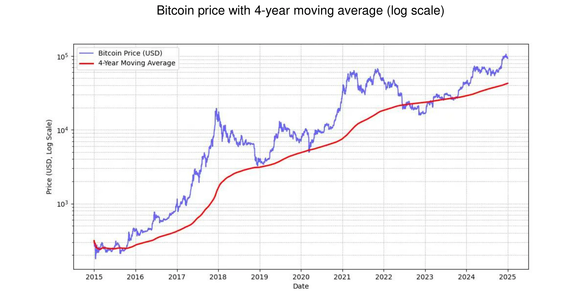

*ไมเคิล เซย์เลอร์: "สัญญาณราคาที่ดีที่สุดของ Bitcoin คือค่าเฉลี่ยเคลื่อนที่อย่างง่ายในช่วง 4 ปี"* ดูกราฟด้านบน

นอกจากนี้ ขอแนะนำให้รักษาการเปิดรับ Bitcoin **ให้เป็นสัดส่วน** กับระดับความเข้าใจของตนเอง สิ่งสำคัญคือไม่ควรเร่งรีบหรือพยายามจับจังหวะตลาดให้สมบูรณ์แบบ

ในที่สุด Bitcoin ถือว่าเป็นสินทรัพย์ที่ **มีความผันผวนสูง**. เพื่อให้ชัดเจน ราคาของมันเมื่อแสดงในหน่วยของเงินเฟียตคือ. ส่วนหนึ่งของความผันผวนนี้เป็นธรรมชาติสำหรับสินทรัพย์ที่ยังใหม่ แต่ก็ถูกขยายโดยการมีอยู่ของนักเก็งกำไรที่ไม่ใช้มันเป็นที่เก็บมูลค่าในระยะยาว แต่กลับมองหากำไรอย่างรวดเร็ว นอกจากนี้ การซื้อขายด้วยเลเวอเรจ (การใช้เงินกู้ยืมเพื่อเพิ่มตำแหน่งการซื้อขาย) ยังเพิ่มการเคลื่อนไหวของราคาทั้งขาขึ้นและขาลง ทำให้ Bitcoin ไม่สามารถเดินตามเส้นทางขาขึ้นตรงๆ ได้ สิ่งนี้นำไปสู่ความผันผวนที่เด่นชัดมากขึ้น แต่เมื่อเวลาผ่านไป เมื่อฐานของผู้ใช้ที่มุ่งมั่นเติบโตขึ้น ความผันผวนนี้ดูเหมือนจะมีเสถียรภาพมากขึ้น สรุปแล้ว มัน **เป็นไปไม่ได้ที่จะมีสินทรัพย์ที่มีประสิทธิภาพสูงอย่าง Bitcoin โดยไม่มีความผันผวน** แต่คุณสามารถมีสินทรัพย์ที่มีประสิทธิภาพน้อยกว่ามากที่มีความผันผวนน้อยกว่าได้อย่างแน่นอน

### Bitcoin นำมาใช้โดยวอลล์สตรีท

การนำ Bitcoin มาใช้โดยสถาบันการเงินช่วยเสริมสร้างตำแหน่งในตลาดโลกให้แข็งแกร่งยิ่งขึ้น

คำแถลงล่าสุดโดย **BlackRock** เน้นถึงศักยภาพของ Bitcoin ในฐานะสินทรัพย์ที่เก็บมูลค่าและเครื่องมือในการกระจายพอร์ตการลงทุน ยักษ์ใหญ่ด้านสถาบันระดับโลกได้แนะนำเมื่อเร็ว ๆ นี้ว่า **การเติบโตของผู้ใช้ Bitcoin กำลังแซงหน้าอินเทอร์เน็ต** หรือโทรศัพท์มือถือ โดยได้รับแรงหนุนจาก **การเปลี่ยนแปลงทางประชากรและรุ่น** รวมถึงความไม่ไว้วางใจที่เพิ่มขึ้นต่อสถาบันการเงินแบบดั้งเดิม (!). เนื่องจากลักษณะที่หายาก ไม่อยู่ภายใต้การควบคุมของรัฐ และกระจายอำนาจ นักลงทุนบางรายมองว่า Bitcoin เป็นตัวเลือกที่ปลอดภัย **ในช่วงเวลาที่มีความไม่มั่นคงทางการเงินและการคลัง** ความกลัว หรือเหตุการณ์ทางภูมิรัฐศาสตร์ที่ก่อกวน

**Spot Bitcoin ETFs** ซึ่งเปิดตัวในเดือนมกราคม 2024 ได้รับความสำเร็จอย่างมหาศาล—การเปิดตัว ETF ที่ **ประสบความสำเร็จที่สุด** ในประวัติศาสตร์—ด้วยการไหลเข้าของเงินสุทธิเกือบ $20 พันล้าน ตั้งแต่เดือนมกราคมถึงพฤศจิกายน ซึ่งดีกว่าการเปิดตัว ETF ที่ดีที่สุดอันดับถัดไป Nasdaq-100 QQQ ถึงสี่เท่า ETF เหล่านี้ให้การเข้าถึง Bitcoin ที่ง่ายขึ้นและมีการควบคุมมากขึ้น ซึ่งได้ **เพิ่มความชอบธรรม** ให้กับมันและดึงดูดการไหลเข้าของเงินทุนสถาบันอย่างมีนัยสำคัญ

Bitcoin ETFs นำหน้าไปอย่างมากในแง่ของ **การยอมรับจากสถาบัน** แซงหน้า ETFs ที่เติบโตเร็วที่สุดสิบอันดับแรกทั้งในจำนวนสถาบันที่เกี่ยวข้องและขนาดของสินทรัพย์ภายใต้การจัดการ (AUM) ความสำเร็จของ Bitcoin ETFs นี้เน้นย้ำถึงความต้องการที่เพิ่มขึ้นสำหรับยานพาหนะการลงทุนที่เชื่อมโยงกับสินทรัพย์ดิจิทัล ซึ่งทำให้ตำแหน่งของ Bitcoin แข็งแกร่งในภูมิทัศน์ทางการเงินแบบดั้งเดิม

Bitcoin ตอนนี้เล่นใน **ตลาด** "store of value" มันเป็นเพียงหยดน้ำในถังในแง่ของขนาด: ประมาณ $1,800 พันล้านเมื่อเทียบกับทองคำ $18,000 พันล้านหรืออสังหาริมทรัพย์ $500,000 พันล้าน อย่างไรก็ตาม ส่วนแบ่งตลาดประมาณ 0.1% ของมันให้พื้นที่สำหรับการเติบโตอย่างมาก โดยเฉพาะอย่างยิ่งเมื่อคู่แข่งของมันพยายามดึงดูดผู้ใช้ใหม่ๆ

| Ticker  | 1D Flow (M USD) | 1W Flow (M USD) | 1M Flow (M USD) | 3M Flow (M USD) | YTD Flow (M USD) |
| ------- | --------------- | --------------- | --------------- | --------------- | ---------------- |
| **Sum** | +457.19         | +1,507.95       | +2,888.01       | +3,672.29       | **+20,262.94**   |
| IBIT    | +393.40         | +750.91         | +1,536.47       | +3,821.37       | +22,460.44       |
| FBTC    | +14.81          | +372.40         | +627.16         | +458.71         | +10,266.69       |
| ARKB    | +11.51          | +163.26         | +295.92         | -3.88           | +2,647.32        |
| BITB    | +12.93          | +146.50         | +263.30         | +97.46          | +2,262.69        |
| HODL    | +5.75           | +38.77          | +94.54          | +100.39         | +682.03          |
| BRRR    | +1.92           | +4.72           | +17.76          | +20.54          | +540.19          |
| EZBC    | +11.79          | +17.53          | +39.29          | +47.48          | +439.45          |
| BTC     | .00             | -3.13           | +36.59          | +419.18         | +419.18          |
| BTCO    | +6.43           | +19.25          | +47.30          | +56.41          | +394.82          |
| BTCW    | .00             | +2.84           | +6.04           | +146.69         | +217.47          |
| YBIT    | -1.34           | -10.26          | +5.06           | +13.81          | +76.30           |
| DEFI    | .00             | .00             | .00             | -2.03           | -1.79            |
| GBTC    | .00             | +5.16           | -81.42          | -1503.84        | -20,141.85       |

*$20 พันล้านใน 10 เดือน: Bitcoin ETFs บรรลุเป้าหมายในเวลาน้อยกว่าหนึ่งปี ซึ่ง ETFs ทองคำใช้เวลา 5 ปีในการทำสำเร็จ แหล่งที่มา: การไหลของการลงทุนในกองทุนเป็น USD. Bloomberg Terminal, Bloomberg L.P., 2024.*

### Bitcoin ในชุดเครื่องมือของบริษัท

การยอมรับที่เพิ่มขึ้นของ Bitcoin ในสหรัฐอเมริกากำลังมีอิทธิพลต่อแนวคิดในที่อื่น ๆ ของโลก โดยเฉพาะอย่างยิ่งในหมู่มืออาชีพด้านการบริหารความมั่งคั่งที่ไม่สามารถละเลยเครื่องมือนี้จากชุดเครื่องมือของพวกเขาได้อีกต่อไป — โดยเฉพาะอย่างยิ่งเมื่อผลิตภัณฑ์ทางการเงินแบบดั้งเดิมกำลังมีผลการดำเนินงานที่ต่ำกว่าหรือเผชิญกับช่วงเวลาที่ยากลำบาก มีเพียงธนาคารแบบดั้งเดิมเท่านั้นที่ยังดูเหมือนจะสามารถละเลยมันได้

จากมุมมองทางการเงินล้วน ๆ Bitcoin ได้รับการยอมรับว่าเป็นสินทรัพย์ที่ช่วยกระจายความเสี่ยง ไม่เพียงแต่ไม่มีความสัมพันธ์กับประเภทสินทรัพย์อื่น ๆ เท่านั้น แต่ยังดูเหมือนว่าจะเติบโตได้ดีในช่วงที่มีการฉีดสภาพคล่องใหม่ ๆ ซึ่งอีกช่วงหนึ่งดูเหมือนจะเริ่มต้นขึ้นด้วยการลดอัตราดอกเบี้ยโดย ECB, Fed และจีน

โดยสรุป สำหรับกรณีการใช้งานที่พบบ่อยที่สุด—การลงทุนเงินส่วนเกินของคลังเป็นเวลาอย่างน้อยสี่ปี—Bitcoin เหมาะสมอย่างยิ่ง ควรที่จะรวมสิ่งนี้เข้ากับ[กลยุทธ์การเข้าลงทุนแบบค่อยเป็นค่อยไป](https://planb.academy/resources/glossary/dollar-cost-averaging-dca) โดยที่คุณลงทุนจำนวนเงินคงที่ในช่วงเวลาปกติเพื่อทำให้จุดเข้าและออกเรียบง่ายขึ้น

กรณีการใช้งานอื่น ๆ ทำให้ Bitcoin เป็นสินทรัพย์คลังเชิงกลยุทธ์ เช่น:

- สามารถโพสต์ **หลักประกัน** หรือสภาพคล่องได้ตลอด 24/7
- สามารถโอนย้ายไปยังคลังของบริษัทอื่น **ได้อย่างรวดเร็ว, ทุกเวลา**
- การป้องกันความเสี่ยงจาก **ความเสี่ยงในการแลกเปลี่ยนเงินตราต่างประเทศ**
- การจ่ายเงินให้ **ซัพพลายเออร์** ที่ยอมรับ โดยเฉพาะในกรณีฉุกเฉิน

### Bitcoin แพงเกินไปหรือไม่?

คุณไม่จำเป็นต้องซื้อ Bitcoin จำนวน 1 หน่วยเต็ม เพราะ Bitcoin สามารถแบ่งออกเป็นหน่วยย่อยที่เรียกว่า satoshis ซึ่งตั้งชื่อตามผู้สร้างที่ไม่เปิดเผยตัวตน หนึ่ง bitcoin เท่ากับ **100 ล้าน satoshis** ทำให้ผู้ใช้สามารถซื้อ ขาย หรือแลกเปลี่ยนแม้กระทั่ง **เศษส่วนเล็ก ๆ ของ bitcoin** ได้ ในความเป็นจริง ภายในซอร์สโค้ดของ Bitcoin การทำธุรกรรมทั้งหมดจะถูกคำนวณในหน่วย satoshis และคำว่า “bitcoin” จะปรากฏเฉพาะใน “[coinbase](https://planb.academy/resources/glossary/coinbase-transaction)” ซึ่งเป็นธุรกรรมพิเศษที่นักขุดสร้างขึ้นเพื่อรับรางวัลของพวกเขาเท่านั้น

ยิ่งไปกว่านั้น จำนวนรวมของ 21 ล้านบิตคอยน์—หรือ **2.1 quadrillion satoshis**—สามารถแสดงได้อย่างมีประสิทธิภาพด้วยจำนวนเต็ม 64 บิต ซึ่งหมายความว่าแม้ว่าราคาต่อบิตคอยน์ทั้งหมดจะสูง แต่ก็ยังคงเข้าถึงได้สำหรับนักลงทุนหลากหลายกลุ่มเนื่องจากความสามารถในการแบ่งย่อยของมัน ดังนั้นคุณจึงไม่จำเป็นต้องซื้อบิตคอยน์ทั้งหมดเพื่อเข้าร่วมในเครือข่ายหรือการลงทุนในสินทรัพย์ดิจิทัลนี้

โปรดจำไว้ว่ามูลค่าตลาดรวมที่ค่อนข้างต่ำเมื่อเทียบกับสินทรัพย์อื่น ๆ เช่น หุ้น ทองคำ หรืออสังหาริมทรัพย์ ทำให้ความสามารถในการเพิ่มมูลค่าของมันยังคงอยู่ ด้วยการเจาะตลาดที่ยังคงต่ำมาก (ประมาณ 1% ของประชากรโลก) เราถูกมองว่าเพิ่งอยู่ในช่วงเริ่มต้นของการเติบโตของมัน สิ่งนี้ทำให้มันเป็น **การเดิมพันที่ไม่สมมาตรมากที่สุดของยุคเรา**: ขณะนี้มีความน่าจะเป็นต่ำมากที่มันจะลดลงเหลือศูนย์ในจุดนี้ และมีความน่าจะเป็นสูงที่มันจะยังคงเติบโตต่อไป

### การตัดสินใจจัดสรรเงินทุนของบริษัทใน Bitcoin

ตำแหน่งของคุณภายในบริษัทจะมีอิทธิพลอย่างมากต่อ**กระบวนการตัดสินใจ**ในการลงทุนใน Bitcoin หากคุณเป็น**เจ้าของส่วนใหญ่ คุณมีอิสระ**ในการจัดสรรเงินทุนส่วนเกินตามดุลยพินิจของคุณเอง ในทางกลับกัน หากคุณเป็นหุ้นส่วนหรือผู้ถือหุ้นภายในโครงสร้างการตัดสินใจร่วมกัน คุณจะต้องผ่านการพิจารณาร่วมกัน ซึ่งอาจทำให้เรื่องซับซ้อนขึ้น

ในสถานการณ์ที่สองนี้ การประสานมุมมองที่แตกต่างกันกลายเป็นสิ่งสำคัญ เนื่องจากมัน **ขึ้นอยู่กับความเข้าใจของผู้มีส่วนได้เสียแต่ละคนเกี่ยวกับสินทรัพย์ Bitcoin** เป็นส่วนใหญ่ ตามที่กล่าวไว้ว่า "Bitcoin คือทุกสิ่งที่ผู้คนไม่รู้เกี่ยวกับคอมพิวเตอร์รวมกับทุกสิ่งที่พวกเขาไม่เข้าใจเกี่ยวกับเงิน" แม้ว่าคู่ค้าคนหนึ่งจะพยายามทำความเข้าใจ Bitcoin อย่างถี่ถ้วนแล้วก็ตาม การถ่ายทอดความรู้นี้ให้ผู้อื่นอาจเป็นเรื่องท้าทาย ในกรณีเช่นนี้ **แนะนำให้นำทรัพยากรภายนอกเข้ามา** เพื่อหลีกเลี่ยงไม่ให้แนวคิดนี้ถูกระบุว่าเป็นของบุคคลใดบุคคลหนึ่งมากเกินไป ซึ่งอาจทำให้เกิดการต่อต้าน generate

ปัจจุบัน สถานการณ์ที่เจ้าของส่วนใหญ่เป็นผู้ตัดสินใจเป็นตัวแทนที่ชัดเจนที่สุดในบรรดาบริษัทที่ถือครอง Bitcoin นี่คือตัวอย่างจริงบางส่วน :

- มืออาชีพอิสระ**: ที่ปรึกษา, ผู้ประกอบวิชาชีพด้านสุขภาพ, หรือทนายความที่ลงทุนส่วนหนึ่งของเงินทุนระยะยาวใน Bitcoin. โดยทั่วไปแล้ว, มืออาชีพเหล่านี้มักมีบัญชีออมทรัพย์หรือบัญชีเงินฝากประจำที่ให้ผลตอบแทนต่ำอยู่แล้ว.
- ผู้บริหารภาคเทคโนโลยี**: ผู้บริหารที่ขายบริษัทของตนและลงทุนส่วนหนึ่งของรายได้จากบริษัทโฮลดิ้งส่วนตัวของตนใน Bitcoin เมื่อไม่กี่ปีที่ผ่านมา ปัจจุบันพวกเขามีสถานะทางการเงินที่มั่นคงและลงทุนใหม่ในกิจการใหม่ ๆ
- เจ้าของธุรกิจขนาดเล็กมาก**: ผู้ประกอบการในอุตสาหกรรมบริการ เกษตรกรรม หรือหัตถกรรมที่เข้าใจถึงศักยภาพของ Bitcoin และจัดสรรส่วนหนึ่งของเงินทุนให้กับมัน แรงจูงใจหลักของพวกเขาคือการกระจายความเสี่ยงและอิสรภาพที่มันมอบให้
- บริษัทที่มีการซื้อขายในตลาดหลักทรัพย์** เช่น MicroStrategy ได้สร้างแบบอย่างโดยการแปลงส่วนสำคัญของเงินทุนสำรองของบริษัทเป็น Bitcoin ซึ่งแสดงให้เห็นถึงการเปลี่ยนแปลงระดับโลกในกลยุทธ์การจัดสรรทุนของบริษัท ภายในฤดูใบไม้ร่วงปี 2024 บริษัทอื่นๆ จำนวนมากได้ทำตามแนวทางนี้ ซึ่งยิ่งทำให้แนวโน้มนี้ได้รับการยอมรับมากขึ้น

ค้นพบรายชื่อบริษัทที่ถือครองบิตคอยน์ในคลังมากที่สุดที่ได้รับการอัปเดต รวมถึงจำนวนที่ถือครอง ได้ที่เว็บไซต์: [BitcoinTreasuries.net](https://bitcointreasuries.net/)

### การเก็บภาษีของบิทคอยน์ที่ถือโดยธุรกิจ

สำหรับธุรกิจที่ไม่ได้จัดตั้งเป็นนิติบุคคลแยกต่างหาก—เช่น ธุรกิจเจ้าของคนเดียวหรือธุรกิจอื่นๆ ที่ไม่ได้จดทะเบียนเป็นบริษัท—การเก็บภาษีจากธุรกรรม Bitcoin มักจะสะท้อนถึงการปฏิบัติที่ใช้กับบุคคล ในหลายกรณี กฎเดียวกันที่ควบคุมกำไรจากการขายหรือรายได้จะถูกนำมาใช้ เช่นเดียวกับที่บุคคลขาย Bitcoin ตัวอย่างเช่น ในบางประเทศ กำไรอาจถูกพิจารณาเป็นส่วนหนึ่งของรายได้ส่วนบุคคลของผู้ประกอบการ ซึ่งต้องเสียภาษีตาม **ขั้นภาษีเงินได้บุคคลธรรมดา**

อย่างไรก็ตาม **ธุรกิจที่จดทะเบียนเป็นนิติบุคคล**—ซึ่งต้องเสียภาษีเงินได้นิติบุคคล—มักจะได้รับประโยชน์จากกรอบภาษีที่เอื้ออำนวยมากกว่า แตกต่างจากบุคคลธรรมดาที่อาจเผชิญกับข้อจำกัดในการหักกลบกำไรและขาดทุนระหว่างประเภทสินทรัพย์ต่าง ๆ บริษัทสามารถรวมกำไรหรือขาดทุนที่เกิดขึ้นจริงจากธุรกรรม Bitcoin เข้ากับบัญชีกำไรและขาดทุนประจำปีได้โดยตรง ซึ่งอาจนำไปสู่ตำแหน่งภาษีที่ยืดหยุ่นและบางครั้งได้เปรียบมากกว่า

อัตราภาษีและการจัดการภาษีเฉพาะทางแตกต่างกันอย่างมากตามเขตอำนาจศาล ตัวอย่างเช่น ในฝรั่งเศสและหลายประเทศตะวันตก บริษัทอาจเผชิญกับอัตราภาษีนิติบุคคลประมาณ 25% ซึ่งอาจต่ำกว่าอัตราภาษีแบบคงที่ที่บุคคลจ่ายจากกำไรการลงทุน

เนื่องจากความแตกต่างเหล่านี้ **เจ้าของธุรกิจบางรายเลือกที่จะซื้อและถือครอง Bitcoin ผ่านโครงสร้างองค์กรของพวกเขา** เนื่องจากการทำเช่นนี้สามารถให้ **โอกาสในการวางแผนภาษีที่มีประสิทธิภาพมากขึ้น** เช่นเคย ควรปรึกษาผู้เชี่ยวชาญด้านภาษีที่คุ้นเคยกับกฎในเขตอำนาจศาลที่เกี่ยวข้องเพื่อให้แน่ใจว่าปฏิบัติตามข้อกำหนดและเพิ่มประสิทธิภาพกลยุทธ์ภาษี

## วิธีการรับ Bitcoin

<chapterId>1e6dbaf5-581a-49a4-8f37-3728e77bda17</chapterId>

### สามวิธีในการได้มา

มีสามวิธีในการรับ Bitcoin:

- เพื่อแลกเปลี่ยนกับสินค้า หรือบริการ:**

เนื่องจาก Bitcoin ทำหน้าที่เป็นสื่อกลางในการแลกเปลี่ยน จึงสามารถจินตนาการถึงเศรษฐกิจหมุนเวียนได้ แม้ว่าสิ่งนี้ยังคงไม่ค่อยพบเห็นในปัจจุบัน แต่ธุรกิจจำนวนมากขึ้นเรื่อย ๆ กำลังเริ่มยอมรับการชำระเงินด้วย Bitcoin—ทำไมธุรกิจของคุณถึงไม่ลองดูล่ะ? (ดูบทถัดไปของเรา)

- Mining Bitcoin:**

สิ่งนี้เกี่ยวข้องกับการรับรางวัลจากการใช้งานเครื่อง mining สำหรับธุรกิจที่ไม่เชี่ยวชาญเฉพาะด้าน สิ่งนี้ยังคงมีความสำคัญค่อนข้างน้อย คุณสามารถเข้าร่วมผ่านตัวกลางที่จะขายหรือให้เช่าคอมพิวเตอร์ เครือข่าย และการบำรุงรักษา หากคุณเป็นเจ้าของเครื่อง คุณสามารถบันทึกเป็นสินทรัพย์ที่เสื่อมราคาได้ ในขนาดใหญ่ คุณจะต้องคำนวณผลตอบแทนจากการลงทุนอย่างรอบคอบเพราะตลาดมีการแข่งขันสูงและต้องการการคาดการณ์ต้นทุนที่ดี โดยเฉพาะค่าไฟฟ้า

หากต้องการเรียนรู้เพิ่มเติมเกี่ยวกับวิธีการ mining คุณสามารถ [ปรึกษา "mining" ในส่วนของบทเรียนของเรา](https://planb.academy/tutorials/mining)

- ซื้อ Bitcoin:**

นี่เป็นวิธีที่พบมากที่สุด โดยทั่วไปดำเนินการผ่านการแลกเปลี่ยนแบบเพียร์ทูเพียร์หรือแพลตฟอร์มการซื้อขายเฉพาะทาง แต่เมื่อได้มาซึ่ง Bitcoin ในฐานะสินทรัพย์คลังของบริษัท บริษัทต้องปฏิบัติตามมาตรฐานการกำกับดูแลที่เข้มงวดและขั้นตอนการรู้จักลูกค้า ([KYC](https://planb.academy/resources/glossary/kyc-know-your-customer)) เมื่อพวกเขาซื้อมันบนแพลตฟอร์มการซื้อขายเฉพาะทาง ธุรกิจมักจะต้องให้ข้อมูลบริษัทโดยละเอียด รวมถึงเอกสารระบุตัวตน งบการเงิน และหลักฐานที่อยู่ เพื่อให้เป็นไปตามข้อกำหนด KYC และการป้องกันการฟอกเงิน (AML)

หากต้องการเรียนรู้วิธีการเปิดบัญชีธุรกิจและใช้เพื่อซื้อ ขาย และโอนบิตคอยน์ คุณสามารถดูบทแนะนำสองรายการนี้ที่ออกแบบมาโดยเฉพาะสำหรับธุรกิจ ซึ่งครอบคลุมแพลตฟอร์ม Kraken และ Bitfinex ในเวอร์ชันองค์กร:

https://planb.academy/tutorials/business/others/bitfinex-pro-c8ef7476-5f60-4205-935e-a545ced0022a

https://planb.academy/tutorials/business/others/kraken-pro-07b1c16c-d517-4bf7-9a78-b42dc0f21785

หากต้องการเรียนรู้เพิ่มเติมเกี่ยวกับวิธีการรับบิตคอยน์ผ่านการแลกเปลี่ยนหรือแบบเพียร์ทูเพียร์ คุณสามารถ [ดูส่วน "การแลกเปลี่ยน" ในบทเรียนของเรา](https://planb.academy/tutorials/exchange)

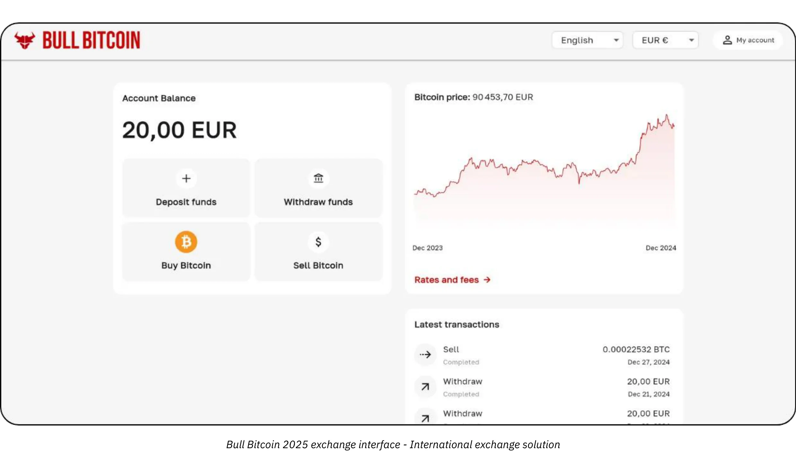

### ที่ราคาเท่าไหร่?

ตามที่กล่าวไว้ก่อนหน้านี้ ไม่เพียงแต่เป็นไปไม่ได้ที่จะทำนายราคาของ Bitcoin ในอนาคต แต่ราคายังมีความผันผวนมากในระยะสั้น ในอดีต กลยุทธ์ที่เชื่อถือได้คือการสะสมอย่างค่อยเป็นค่อยไปในช่วงเวลาที่สม่ำเสมอและรักษาแนวโน้มระยะเวลาสี่ปีหรือมากกว่านั้น

### คุณควรซื้อเท่าไหร่?

ในทางที่ขัดกับความรู้สึก มันอาจจะดีที่สุดที่จะเริ่มต้นด้วยการซื้อเล็กๆ โดยไม่ต้องคิดมากเกินไป จำนวนเงินเล็กน้อย (เช่น หนึ่งร้อยยูโรหรือดอลลาร์) จะไม่ทำร้ายคุณอย่างจริงจัง และประสบการณ์จากการลงมือทำจะสอนคุณได้มากกว่าและรวดเร็วกว่าการอ่านหนังสือใดๆ

ตามที่กล่าวไว้ก่อนหน้านี้ ควรลงทุนเฉพาะสภาพคล่องส่วนเกินที่คุณจะไม่ต้องใช้เป็นเวลาหลายปี กลยุทธ์ที่ไม่เข้าใจดีอาจเสี่ยงทำให้คุณอยู่ในสถานการณ์ที่ยากลำบากหากคุณจำเป็นต้องถอนเงินออกมาในเวลาที่ไม่เหมาะสม

นอกเหนือจากการเริ่มต้นเล็ก ๆ แล้ว การนำกลยุทธ์การจัดสรรที่มีการวัดผลมาใช้ก็เป็นประโยชน์สำหรับคลังของบริษัทเช่นกัน ในอีกด้านหนึ่งของสเปกตรัม บริษัทบางแห่ง เช่น MicroStrategy ได้ใช้แนวทางที่รุนแรงโดยการจัดสรรส่วนสำคัญของเงินทุนคลังส่วนเกินของพวกเขาให้กับ Bitcoin ซึ่งสะท้อนถึงความเชื่อมั่นของสถาบันอย่างแรงกล้า ในทางกลับกัน กลยุทธ์ที่อนุรักษ์นิยมมากขึ้นและอาจถือว่าเป็นเหตุเป็นผลมากขึ้น อาจเกี่ยวข้องกับการจัดสรรประมาณ 5% ของคลังของบริษัทให้กับ Bitcoin เพื่อสร้างสมดุลระหว่างผลกำไรที่เป็นไปได้ การจัดการความเสี่ยง และความต้องการสภาพคล่อง

จินตนาการถึงสเปกตรัมนี้เป็นมาตราส่วน ตั้งแต่การเปิดเผยขั้นต่ำ เพื่อให้บริษัทมีสภาพคล่องเพียงพอสำหรับความต้องการในการดำเนินงาน ไปจนถึงท่าทีเชิงรุกที่มุ่งเน้นการใช้ประโยชน์จากการคาดการณ์การเพิ่มมูลค่าในระยะยาวของ Bitcoin แม้ว่าการจัดสรรเชิงรุกอาจให้ผลตอบแทนที่สูงกว่า แต่การจัดสรรที่พอประมาณช่วยลดความผันผวน เพื่อให้มั่นใจว่าพื้นฐานทางการเงินของบริษัทยังคงปลอดภัย ในขณะที่ยังคงได้รับประโยชน์จากศักยภาพนวัตกรรมของ Bitcoin ภายในการดำเนินงานของคลังบริษัท

### บ่อยแค่ไหน?

ไม่มีข้อบังคับที่แน่นอน การพยายามจับจังหวะตลาดโดยการหาจุด "ดิ่ง" อาจมีประสิทธิภาพน้อยกว่าและเครียดมากกว่าการซื้อในช่วงเวลาปกติ แม้แต่นักลงทุนที่มีประสบการณ์ก็ยังทำผิดพลาดได้เป็นครั้งคราว การลงเงินทั้งหมดในครั้งเดียวอาจเป็นดาบสองคม

ในความเป็นจริง ศักยภาพในการเพิ่มมูลค่าของ Bitcoin นั้นมีมากจนแม้ว่าคุณจะเริ่มต้นเพียงไม่กี่ปีต่อจากนี้ คุณก็ยังมีแนวโน้มที่จะเห็นกำไรในระยะยาว จริงอยู่ที่ความผันผวนของราคาที่สำคัญอาจลดลงตามกาลเวลา อย่างไรก็ตาม ในฐานะสกุลเงินที่มีลักษณะลดค่า Bitcoin ถูกออกแบบมาเพื่อเก็บรักษามูลค่าอย่างมีประสิทธิภาพและสะท้อนถึงการเพิ่มผลผลิตของผู้ใช้ เพื่อเปรียบเทียบ: เราอยู่ใน "ระยะเริ่มต้น" ของ Bitcoin ซึ่งเป็นสกุลเงินที่กำลังพัฒนา และยังไม่มีใครรู้ถึงมูลค่าที่แท้จริงของมัน ต่อมา อาจจะในอีก 20 หรือ 40 ปี เมื่อมันอยู่ใน "ระยะล่องเรือ" ที่มั่นคง มันอาจจะกลายเป็นสิ่งที่มั่นคงอย่างยิ่งและเติบโตอย่างต่อเนื่องควบคู่ไปกับการเพิ่มผลผลิตของสังคม

อุตสาหกรรมอสังหาริมทรัพย์มักจะพูดซ้ำๆ ว่า "มันเป็นเวลาที่เหมาะสมเสมอที่จะซื้อ" โดยลืมไปว่าหากอสังหาริมทรัพย์สูญเสียหน้าที่ในการเป็นที่เก็บมูลค่า—เปลี่ยนไปเป็นสินทรัพย์อย่าง Bitcoin—ราคาก็อาจกลับมาใกล้เคียงกับมูลค่าการใช้ประโยชน์ (ที่พักอาศัย) ในทางตรงกันข้าม Bitcoin ไม่มีจุดประสงค์อื่นใดนอกจากการเก็บมูลค่า ซึ่งอาจหมายความว่า "มันเป็นเวลาที่เหมาะสมเสมอที่จะซื้อ" อนาคตจะบอกเอง

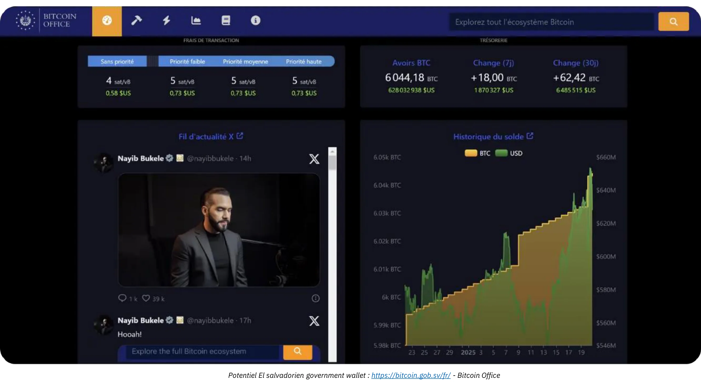

*เครดิต: [Bitcoin Office](https://bitcoin.gob.sv/)*

### ในรูปแบบใดที่จะซื้อ? (วิธีการเก็บรักษา)

คุณไม่ได้เป็นเจ้าของ Bitcoin ทางกายภาพ แต่คุณถือกุญแจการเข้ารหัสที่อนุญาตให้คุณโอนความเป็นเจ้าของหน่วยบัญชีบางส่วนหรือทั้งหมดของคุณไปยังหนึ่งหรือมากกว่าหนึ่งกุญแจการเข้ารหัสอื่น ๆ ทั้งหมดนี้เกิดขึ้นบนบล็อกเชน Bitcoin ซึ่งถูกจำลองแบบข้ามโหนดหลายหมื่นแห่งทั่วโลก

คีย์การเข้ารหัสนี้เป็นตัวเลขสุ่มที่มีขนาดใหญ่มาก เพื่อให้ง่ายต่อการใช้งานของผู้ใช้ มักจะแสดงเป็นลำดับของคำ 12 หรือ 24 คำ คำเหล่านี้สามารถโหลดลงบนอุปกรณ์ทางกายภาพที่เรียกว่า “[ฮาร์ดแวร์ wallet](https://planb.academy/resources/glossary/hardware-wallet)” อย่างไรก็ตาม ต้องเข้าใจว่า บิตคอยน์ไม่ได้อยู่ “ภายใน” อุปกรณ์นี้; มันเป็นเพียงเครื่องมือในการลงนามธุรกรรมและส่งออกไปยังเครือข่ายด้วยการเข้ารหัส สิ่งที่สำคัญจริงๆ คือคำ 12 หรือ 24 คำ ซึ่งต้องเก็บรักษาไว้อย่างปลอดภัย

สิ่งนี้นำไปสู่ปัญหาการดูแล: การถือครอง Bitcoin หมายถึงการถือครองกุญแจของมัน คุณสามารถถือครองเองหรือมอบหมายงานนี้ให้กับบุคคลที่สาม นอกจากนี้ยังมีวิธีแก้ปัญหาที่อยู่ระหว่างกลาง ลองมาทบทวนสถานการณ์ที่พบบ่อยที่สุด:

- การดูแลตนเอง:**

นี่คือตัวเลือกที่แนะนำโดยผู้ที่ชื่นชอบ Bitcoin อย่างแท้จริง เนื่องจากสอดคล้องกับการออกแบบดั้งเดิมของ Bitcoin คุณทำหน้าที่เป็นธนาคารของคุณเอง: ไม่มีความเสี่ยงที่บุคคลที่สามจะฉ้อโกงคุณ แต่คุณมีหน้าที่รับผิดชอบในการรักษาความปลอดภัยของกุญแจ คุณสามารถเข้าถึงเงินของคุณได้ตลอด 24 ชั่วโมง 7 วันต่อสัปดาห์ ในสภาพแวดล้อมทางธุรกิจ หากมีหลายคนที่อาจต้องทำธุรกรรม คุณจะต้องมีเครื่องมือและขั้นตอนที่เหมาะสมในการจัดการการเข้าถึงและความปลอดภัย

- การดูแลโดยบุคคลที่สาม:**

ตัวอย่างเช่น บริการแลกเปลี่ยนหรือบริการซื้อสามารถสร้างบัญชีให้คุณ แปลงสกุลเงินดั้งเดิมของคุณเป็น Bitcoin และเก็บไว้ในนามของคุณโดยใช้ระบบที่ปลอดภัยของพวกเขา บริการส่วนใหญ่เช่นนี้อนุญาตให้คุณถอนบิตคอยน์ของคุณไปยัง wallet ที่คุณถือกุญแจเพียงผู้เดียว จนกว่าคุณจะทำเช่นนั้น คุณยังไม่ได้เป็นเจ้าของบิตคอยน์จริง ๆ; คุณพึ่งพาสัญญาของพวกเขาที่จะจ่ายคืนให้คุณ ซึ่งเกี่ยวข้องกับการปรับสมดุลความเสี่ยงด้านความปลอดภัย (ของคุณเองเทียบกับของพวกเขา) และความเสี่ยงของคู่สัญญา (พวกเขาอาจล้มเหลวหรือหายไป) ธุรกิจบางแห่งพบว่าสิ่งนี้ยอมรับได้ แม้ว่าจะไม่แนะนำโดยทั่วไปสำหรับการจัดเก็บระยะยาวหรือ 100% ของการจัดสรรของคุณ บริการรับฝากอาจเรียกเก็บค่าธรรมเนียมการจัดเก็บด้วย

- “Paper Bitcoin” (ETFs or ETPs):**

เหล่านี้เป็นเครื่องมือทางการเงินแบบดั้งเดิมที่แสดงถึงเศษส่วนของ Bitcoin โดยจำลองประสิทธิภาพด้านราคา สถาบันที่อยู่เบื้องหลังผลิตภัณฑ์นี้ตามทฤษฎีจะซื้อและถือครอง Bitcoin ที่เป็นพื้นฐาน การมีส่วนร่วมและการถอนของคุณทำในสกุลเงินแบบดั้งเดิม (เช่น ดอลลาร์หรือยูโร) ไม่ใช่ใน Bitcoin ยกเว้นผลิตภัณฑ์บางอย่างที่อนุญาตให้ถอนใน Bitcoin จริง (เพื่อหลีกเลี่ยงเหตุการณ์ที่ต้องเสียภาษีในบางเขตอำนาจศาล) เครื่องมือเหล่านี้มีค่าธรรมเนียมการจัดการรายปี ที่นี่คุณพึ่งพาความปลอดภัยของสถาบันและเผชิญกับความเสี่ยงของคู่สัญญา (เช่น หากรัฐบาลตัดสินใจยึด Bitcoin ที่ถือโดยสถาบันทั้งหมด เช่นเดียวกับที่เกิดขึ้นกับทองคำในปี 1933 ภายใต้คำสั่งบริหาร 6102 ของสหรัฐฯ) ประโยชน์หลักของพวกเขาคือการเข้าถึงที่ง่าย เนื่องจากพวกเขาจัดจำหน่ายผ่านช่องทางการเงินแบบดั้งเดิม พวกเขาหลีกเลี่ยงความจำเป็นในการรักษาความปลอดภัยของกุญแจเข้ารหัส แต่ไม่เสนอคุณสมบัติเฉพาะของ Bitcoin: คุณไม่สามารถใช้เครือข่าย Bitcoin ตลอด 24 ชั่วโมงทุกวันเพื่อเคลื่อนย้ายมูลค่าได้อย่างอิสระโดยไม่ต้องได้รับอนุญาต พวกเขาเพียงจำลองประสิทธิภาพทางการเงิน ไม่ใช่การทำงานหรืออธิปไตยของ Bitcoin เอง

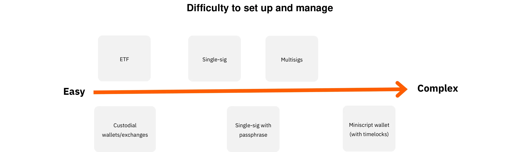

นอกจากนี้ รูปแบบที่คุณถือ Bitcoin มีผลกระทบอย่างมากต่อมาตรการรักษาความปลอดภัยที่จำเป็นในการปกป้องคลังของบริษัทคุณ ไม่ว่าคุณจะเลือก[การเก็บรักษาด้วยตนเอง](https://planb.academy/resources/glossary/selfcustody) โดยใช้กระเป๋าเงินฮาร์ดแวร์ที่มีลายเซ็นเดียวหรือ[หลายลายเซ็น](https://planb.academy/resources/glossary/multisig) เป็นต้น เพื่อรักษาการควบคุมโดยตรงของกุญแจของคุณ หรือมอบหมายงานนี้ให้กับบริการรับฝากของบุคคลที่สามหรือ ETFs แต่ละตัวเลือกมีโปรไฟล์ความเสี่ยงของตัวเอง ตัวอย่างเช่น การเก็บรักษาด้วยตนเองให้การเข้าถึงเต็มรูปแบบแต่ต้องการโปรโตคอลความปลอดภัยภายในที่เข้มงวด ในขณะที่โซลูชันของบุคคลที่สามลดภาระการจัดการแต่มีความเสี่ยงจากคู่สัญญา เพื่อแสดงให้เห็นถึงความแตกต่างเพิ่มเติม กราฟนี้แสดงรูปแบบความปลอดภัยสำหรับแต่ละประเภทการเก็บรักษา ช่วยให้คุณเลือกวิธีการที่เหมาะสมที่สุดกับความต้องการขององค์กรของคุณ :

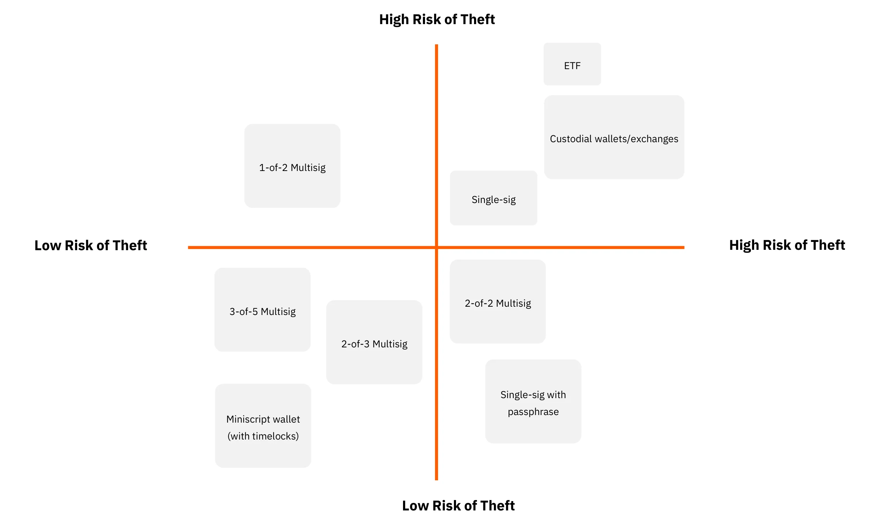

### ซื้อจากใคร?

หากคุณเลือก "กระดาษ Bitcoin" คุณจะหันไปหาสถาบันการเงิน เช่น ธนาคารหรือการแลกเปลี่ยนหุ้นออนไลน์

หากคุณเลือกที่จะซื้อ Bitcoin จริงผ่านตลาด (exchange) หรือโบรกเกอร์ คุณจะมีหมวดหมู่หลักหลายประเภท:

- แพลตฟอร์มระหว่างประเทศหรือแพลตฟอร์มต่างประเทศขนาดใหญ่:**

ตัวอย่างรวมถึง Kraken, Coinbase, และ Binance ซึ่งหลายคนเคยใช้ในอดีต บางคนเคยพบปัญหา ทำให้ยากที่จะให้คำแนะนำที่ชัดเจน คำแนะนำหนึ่ง: หากคุณใช้พวกเขา อย่าทิ้งบิตคอยน์ของคุณไว้นานเกินความจำเป็น

- ผู้ให้บริการที่อยู่ภายใต้การกำกับดูแล (ผู้ให้บริการสินทรัพย์ดิจิทัลที่จดทะเบียน):**

ตัวอย่างเช่น ในฝรั่งเศส แพลตฟอร์มอย่าง Paymium (การแลกเปลี่ยน) หรือ BullBitcoin (นายหน้า) เป็นที่รู้จักว่ามีผู้ที่ชื่นชอบ Bitcoin อย่างแท้จริงเป็นผู้นำและได้สร้างประวัติที่มั่นคง ในสหรัฐอเมริกา คุณมีผู้ให้บริการอย่าง River หรือ Swann โดยทั่วไปแล้ว สิ่งสำคัญคือการตรวจสอบสายเลือดของผู้ให้บริการ รวมถึงชื่อเสียง ประวัติความเป็นมา ความนิยมในชุมชน Bitcoin และว่าผู้นำของพวกเขาสอดคล้องกับค่านิยมหลักของ Bitcoin หรือไม่

**Exchange เทียบกับ นายหน้า:**

- **การแลกเปลี่ยน** ช่วยให้คุณสามารถวางคำสั่งซื้อในราคาที่คุณเลือกได้ แต่คุณต้องรอการดำเนินการจนกว่าราคาตลาดและผู้ขายจะสอดคล้องกัน
- **นายหน้า** เสนอราคาคงที่ให้คุณและสามารถดำเนินการทำธุรกรรมได้รวดเร็วยิ่งขึ้น

นอกเหนือจากค่าธรรมเนียมและความเร็วในการดำเนินการ—ซึ่งมีความสำคัญน้อยกว่าหากคุณคิดในระยะยาว (หลายปี)—ธุรกิจควรพิจารณา:

- ผู้ใช้ Interface:** แพลตฟอร์มใช้งานง่ายหรือไม่?
- คุณสมบัติการบัญชี:** อย่างน้อยที่สุด ความสามารถในการส่งออกประวัติการทำธุรกรรมในรูปแบบ CSV.
- การดูแลและความปลอดภัย:** แพลตฟอร์มถือบิตคอยน์ในนามของคุณหรือไม่ หรือโอนความเป็นเจ้าของให้คุณ? การตั้งค่าความปลอดภัยของพวกเขาเป็นอย่างไร? พวกเขามี "การล็อกการถอน" หรือข้อจำกัดการถอนอื่น ๆ หรือไม่?
- ฝ่ายสนับสนุนลูกค้า:** คุณภาพ การตอบสนอง และความช่วยเหลือที่ปรับให้เหมาะกับแต่ละบุคคล โดยเฉพาะเมื่อคุณเริ่มต้นใช้งาน
- ชื่อเสียงและจริยธรรม:** ความน่าเชื่อถือและค่านิยมของแพลตฟอร์ม
- การสนับสนุนสำหรับการซื้อซ้ำ:** หากคุณวางแผนที่จะสะสม Bitcoin เมื่อเวลาผ่านไปด้วยการซื้อที่กำหนดเวลาไว้

# โซลูชันการชำระเงิน Bitcoin ที่ปรับแต่งสำหรับทุกธุรกิจ

<partId>b2c8af88-6bfc-49b1-ad84-4c292c713b55</partId>

## รับบิทคอยน์เป็นการชำระเงิน

<chapterId>99af1203-bc84-4acc-9780-f733e7998335</chapterId>

ก่อนอื่น สิ่งสำคัญคือต้องเข้าใจว่า Bitcoin เป็นการเปลี่ยนแปลงในระดับเดียวกับอินเทอร์เน็ต

ในยุคแรก ๆ เครือข่ายอินเทอร์เน็ตทำให้สามารถกำจัดตัวกลางออกจากช่องทางการสื่อสารได้ และจากนั้นโครงสร้างพื้นฐานนี้ได้นำไปสู่แอปพลิเคชันที่นับไม่ถ้วนซึ่งไม่เคยจินตนาการมาก่อน ทุกวันนี้ ธุรกิจใดบ้างที่ไม่มีตัวตนออนไลน์?

Bitcoin เป็นโครงสร้างพื้นฐานแห่งความไว้วางใจ ซึ่งการประยุกต์ใช้ครั้งแรกคือการกำจัดคนกลางออกจากการจัดเก็บและแลกเปลี่ยนมูลค่า—เงิน แอปพลิเคชันอื่นๆ ที่ปัจจุบันยังไม่สามารถจินตนาการได้จะเกิดขึ้นบนโครงสร้างพื้นฐานนี้ การมีอยู่ของคุณที่นี่ในขั้นต้นเทียบเท่ากับการมีเว็บไซต์: ประตูสู่การชำระเงินแบบเพียร์ทูเพียร์และการแลกเปลี่ยนมูลค่า

ตอนนี้ ลองพิจารณามุมมองของธุรกิจที่มีกิจกรรมหลักไม่เกี่ยวข้องกับ Bitcoin ทำไมถึงเลือกที่จะยอมรับการชำระเงินด้วย Bitcoin?

- สร้าง Bitcoin Treasury:**

ดูบทความก่อนหน้าของเราเกี่ยวกับการซื้อ Bitcoin ไม่ว่าจะด้วยความเชื่อมั่นหรือเป็นกลยุทธ์การกระจายความเสี่ยง ผู้เชี่ยวชาญบางคนเลือกที่จะยอมรับการชำระเงินด้วย Bitcoin บางคนในวงการ Bitcoin โต้แย้งว่าบริษัทที่มีความโน้มเอียงทางการเงินน้อยกว่า—หมายความว่าไม่มีทั้งเวลาและเครื่องมือในการทำธุรกรรมทางการเงินที่ซับซ้อน—**ยิ่งมีความสำคัญมากขึ้นสำหรับธุรกิจนั้นที่จะได้รับการชำระเงินในรูปแบบของเงินที่แข็งแกร่งที่สุดที่มีอยู่** ด้วยการทำเช่นนี้ มันทำให้สนามแข่งขันเท่าเทียมกัน ช่วยให้แม้แต่ธุรกิจขนาดเล็กที่มีเวลาจำกัดสามารถรักษามูลค่าได้โดยไม่ต้องพัวพันกับเกมการเงิน

- เข้าถึงกลุ่มประชากรใหม่:**

จำนวนผู้ใช้ Bitcoin กำลังเพิ่มขึ้น และพวกเขามีกำลังซื้อที่สำคัญ พวกเขาจะมีแนวโน้มที่จะเข้าหาธุรกิจที่ยอมรับสกุลเงินของพวกเขา นอกจากนี้ เนื่องจากนี่เป็นสกุลเงินสากลแรกที่เกิดขึ้นบนอินเทอร์เน็ต คุณยังสามารถดึงดูดลูกค้าต่างชาติที่ผ่านเข้ามาได้อีกด้วย

- การเพิ่มการมองเห็น:**

โดยการลงรายการธุรกิจของคุณบนแพลตฟอร์มเช่น BTCmap.org เป็นต้น ปัจจุบันมีธุรกิจเพียงไม่กี่แห่งที่ยอมรับ Bitcoin ดังนั้นการบอกต่อจึงเป็นประโยชน์ต่อคุณ นอกจากนี้ยังทำให้คุณแตกต่างจากคู่แข่งของคุณ

- ค่าธรรมเนียมที่ต่ำกว่า:**

การชำระเงิน Bitcoin ทันทีเกิดขึ้นผ่าน Lightning Network **ค่าธรรมเนียมต่ำและจ่ายโดยผู้ซื้อ** ไม่มีค่าธรรมเนียมเครื่องชำระเงิน ไม่มีความล้มเหลวในการอนุมัติการชำระเงิน และไม่มีการฉ้อโกง เมื่อเปรียบเทียบกันแล้ว อุตสาหกรรมการชำระเงินทั่วโลก (ครอบคลุมบัตร เครื่องชำระเงิน การโอนเงิน PSPs ฯลฯ) มีค่าใช้จ่ายประมาณ 2.2 ล้านล้านดอลลาร์ต่อปี เพิ่มการเรียกเก็บเงินคืนและการฉ้อโกงเข้าไปด้วย และรวมทั้งหมดเกือบหนึ่งในสิบของเทียบเท่ากับ GDP ของสหรัฐฯ ถูก "ตัด" ออกจากธุรกิจที่มีประสิทธิภาพทั่วโลกเพียงเพื่อโอนมูลค่า ไม่ว่าธุรกิจของคุณจะเป็นอะไร ค่าธรรมเนียมทางการเงินเป็นภาระที่ควรได้รับการปรับให้เหมาะสม และในบางกรณี ค่าธรรมเนียมสูงสามารถขัดขวางรูปแบบธุรกิจบางประเภทได้

- อิสรภาพและการไม่ต้องขออนุญาต, 24/7:**

ไม่จำเป็นต้องขออนุญาตในการใช้ Bitcoin ใครๆ ก็สามารถเข้าร่วมในระบบเศรษฐกิจได้ภายในไม่กี่นาทีโดยใช้แอปพลิเคชันบนสมาร์ทโฟน คุณสามารถส่งหรือรับเงินจากใครก็ได้ — ไม่ว่าจะเป็นบุคคลหรือธุรกิจ — ได้ทุกเวลา โดยไม่มีข้อจำกัดหรือความล่าช้าในการกำหนดเวลา

- ใช้ประโยชน์จากเครือข่าย Bitcoin เพื่อข้อดีของมัน:**

คุณไม่จำเป็นต้องเก็บการชำระเงินของคุณในรูปแบบ Bitcoin—โดยเฉพาะอย่างยิ่งหากคุณจำเป็นต้องจ่ายให้กับซัพพลายเออร์หรือส่ง VAT บริการบางอย่างสามารถแปลงการชำระเงิน Bitcoin ทั้งหมดหรือบางส่วนเป็นสกุลเงินที่คุณเลือก (เช่น ยูโรไปยัง IBAN ของคุณ) โดยมีค่าธรรมเนียม ในสถานการณ์นี้ ประโยชน์ของการยอมรับ Bitcoin อาจอยู่ที่การดึงดูดผู้ใช้ใหม่หรือข้อดีภายในของ Bitcoin (เช่น ค่าธรรมเนียมที่ต่ำกว่า การดำเนินการตลอด 24 ชั่วโมง และไม่มีความเสี่ยงจากการฉ้อโกงหรือการเรียกเงินคืน)

### คุณควรเลือกโซลูชันการชำระเงินแบบใด?

การเริ่มต้นรับชำระเงิน Bitcoin นั้นค่อนข้างง่าย ในการเลือกโซลูชันที่เหมาะสม ควรพิจารณาลักษณะของธุรกรรมที่คุณจัดการ: จำนวนเงินชำระเฉลี่ย ความถี่ของธุรกรรม และว่าคุณจะรับชำระเงินในสถานที่จริง ออนไลน์ หรือทั้งสองอย่าง

ความคิดของคุณในฐานะพ่อค้าก็สำคัญเช่นกัน คุณกำลังทำการทดสอบง่ายๆ หรือคุณคาดหวังว่า Bitcoin จะกลายเป็นแหล่งรายได้ที่สำคัญและเกิดขึ้นซ้ำๆ? หากเป็นอย่างหลัง คุณจะต้องมีการตั้งค่าที่แข็งแกร่ง ครอบคลุม และปรับแต่งได้

อย่าลืมพิจารณาบทบาทต่างๆ ของพนักงานของคุณและสถานที่ตั้งของพวกเขา ในทุกสถานการณ์ จำไว้ว่าต้องให้ข้อมูลที่จำเป็นทั้งหมดแก่บัญชีของคุณและทำให้กระบวนการบัญชีเป็นไปอย่างราบรื่น

เพื่อให้ง่ายต่อกระบวนการตัดสินใจ เราได้กำหนดโปรไฟล์ธุรกิจที่แตกต่างกันสี่ประเภท ตารางต่อไปนี้จะแสดงลักษณะสำคัญและโซลูชันการชำระเงินที่แนะนำสำหรับแต่ละโปรไฟล์

### โปรไฟล์ธุรกิจ

#### โปรไฟล์ 1 – ผู้เริ่มต้น

| Attribute                        | The Starter                                                                                                                                |
| -------------------------------- | ------------------------------------------------------------------------------------------------------------------------------------------ |
| **State of Mind**                | "trying my first physical payment", "taking a tip for my online content", "targeting very small revenue"                                   |
| **Transaction Frequency**        | "first transaction to learn", "taking payment once in a while"                                                                             |
| **Business Type Examples**       | Creative economy (content creators, blogs, articles, etc.), occasional tips, one-off in-person product sales, associations, one-off events |
| **Payment Type**                 | Generally a few cents to a few euros/dollars; under ~300 euros/dollars per item                                                            |
| **Settings Complexity**          | None                                                                                                                                       |
| **Example Recommended Solution** | A custodial Lightning wallet like Wallet of Satoshi or a non-custodial wallet like Phoenix                                                 |
| **Merchant Interface**           | Simple Bitcoin Lightning wallet: an app on a mobile phone                                                                                  |
| **Customer Interface**           | Bitcoin QR payment code, scanned via the customer’s personal wallet                                                                        |
| **Fees**                         | Customer pays Bitcoin Lightning fees plus any applicable app fees                                                                          |
| **Point of Sale Device**         | Free smartphone app or an option for a physical terminal (e.g., Bitcoinize)                                                                |
| **Management and Roles**         | Single app management; minimal role differentiation                                                                                        |
| **Accounting Exports**           | Basic transaction history lists                                                                                                            |
| **API**                          | No                                                                                                                                         |

#### โปรไฟล์ 2 – สิ่งจำเป็น

| Attribute                        | The Essential                                                                                                                              |
| -------------------------------- | ------------------------------------------------------------------------------------------------------------------------------------------ |
| **State of Mind**                | "I accept Bitcoin in my business, but I do not expect meaningful volume"                                                                   |
| **Transaction Frequency**        | Few transactions per month                                                                                                                 |
| **Business Type Examples**       | Bars, restaurants, semi-regular sales of fresh or directly sourced products, multiple stores under one owner, creative economy for artists |
| **Payment Type**                 | Generally ranging from a few euros/dollars to a few hundred per item; under ~300 per item and under ~3,000 per month                       |
| **Settings Complexity**          | Minimal (mobile app)                                                                                                                       |
| **Example Recommended Solution** | Swiss Bitcoin Pay                                                                                                                          |
| **Merchant Interface**           | Simple Bitcoin Lightning wallet: an app on a mobile phone; simple invoicing with minimal details                                           |
| **Customer Interface**           | Bitcoin QR payment code, scanned via the customer's personal wallet                                                                        |
| **Fees**                         | Typically <1% for sending to a Bitcoin address, and <1.5% for converting to fiat                                                           |
| **Point of Sale Device**         | Free smartphone app or an option for a physical terminal (e.g., Bitcoinize)                                                                |
| **Management and Roles**         | Option for a sell-only role for employees; online dashboard for administration                                                             |
| **Accounting Exports**           | CSV export with complete transaction details                                                                                               |
| **API**                          | Yes                                                                                                                                        |

#### โปรไฟล์ 3 – มืออาชีพ

| Attribute                        | The Professional                                                                                                                                       |
| -------------------------------- | ------------------------------------------------------------------------------------------------------------------------------------------------------ |
| **State of Mind**                | - A payment method like any other for my e-commerce - Or joint management for a group of businesses ready for higher volumes                           |
| **Transaction Frequency**        | Multiple transactions per day                                                                                                                          |
| **Business Type Examples**       | E-commerce sites with moderate volume, small marketplaces, groups of physical stores (e.g., Click & Collect), SME operations                           |
| **Payment Type**                 | Generally ranging from a few euros/dollars to a few hundred; no set payment size limit; less than 250,000 per year                                     |
| **Settings Complexity**          | Light to fully featured (local or cloud hosting), often requires an e-commerce storefront                                                              |
| **Example Recommended Solution** | BTCPay Server for e-commerce and/or physical environments; ZapRite, Musqet, or PayWithFlash for checkout, Be-BOP for an integrated e-store             |
| **Merchant Interface**           | Website (mobile and desktop) with invoice editing, shopping cart options, and payment button creation; automated invoicing with e-commerce integration |
| **Customer Interface**           | Bitcoin QR payment code, scanned via the customer's personal wallet                                                                                    |
| **Fees**                         | Mix of free open-source backend and paid Lightning hosting/service fees; front-end fees include Bitcoin Lightning fees and <1.5% conversion fees       |
| **Point of Sale Device**         | Website store, optional physical display (e.g., iPad showing the site or Bitcoin terminal)                                                             |
| **Management and Roles**         | Fully featured store with multiple admin roles; employees and customers interact with the system                                                       |
| **Accounting Exports**           | CSV export with complete transaction details                                                                                                           |
| **API**                          | Yes                                                                                                                                                    |

#### โปรไฟล์ 4 – องค์กร

| Attribute                        | The Enterprise                                                                                                                                  |
| -------------------------------- | ----------------------------------------------------------------------------------------------------------------------------------------------- |
| **State of Mind**                | - A strategic payment method for the business - With some development to integrate into the service platform as per specific specifications     |
| **Transaction Frequency**        | Unlimited, high-frequency transactions                                                                                                          |
| **Business Type Examples**       | Mid-sized enterprises, IT service companies, large corporations, major marketplaces                                                             |
| **Payment Type**                 | Any size or volume                                                                                                                              |
| **Settings Complexity**          | Medium to high, depending on the choice of architecture                                                                                         |
| **Example Recommended Solution** | Custom-made architecture or orchestration of SaaS-hosted solutions, potentially using third-party LSP (*Lightning Service Provider*) services   |
| **Merchant Interface**           | Fully customized front-end and back-end interfaces fully integrated into the business’s workflows and processes                                 |
| **Customer Interface**           | Ranging from a Bitcoin QR payment code to a fully custom UI and/or API integration                                                              |
| **Fees**                         | Combination of internal development and third-party fees; customer pays Bitcoin Lightning fees plus any transaction fees from service providers |
| **Point of Sale Device**         | Custom-designed solutions tailored to the enterprise environment                                                                                |
| **Management and Roles**         | Fully customized roles across sales, administration, devops, accounting, and finance                                                            |
| **Accounting Exports**           | Fully customized accounting exports                                                                                                             |
| **API**                          | Yes                                                                                                                                             |

ในบทต่อไปนี้ เราจะอธิบายรายละเอียดของแต่ละโปรไฟล์ธุรกิจและโซลูชันที่ปรับให้เหมาะสมกับความต้องการของธุรกิจนั้น ๆ

## เดอะ สตาร์ทเตอร์

<chapterId>7edda53d-5b9f-432a-8493-115de8c94a67</chapterId>

โปรไฟล์ Starter ถูกออกแบบมาสำหรับธุรกิจ ผู้สร้างสรรค์ และบุคคลที่ต้องการสำรวจการชำระเงิน Bitcoin โดยไม่ต้องทุ่มเททรัพยากรหรือความเชี่ยวชาญมากมาย โดยทั่วไปแล้วจะเป็นผู้ที่จัดการกับปริมาณธุรกรรมที่น้อยมาก (อาจเป็นเพียงไม่กี่ทิป การบริจาค หรือการขายเป็นครั้งคราว) และต้องการการแนะนำที่ง่ายและเบาเข้าสู่ระบบนิเวศของ Bitcoin และ Lightning Network คุณค่าหลักของวิธีการ Starter อยู่ที่การตั้งค่าที่น้อยที่สุด: ในกรณีส่วนใหญ่ สิ่งที่จำเป็นคือสมาร์ทโฟนหรือแท็บเล็ตที่ติดตั้ง [wallet](https://planb.academy/resources/glossary/wallet) ที่รองรับ Lightning พื้นฐาน

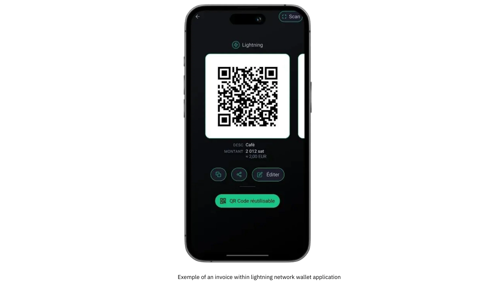

หนึ่งในคุณสมบัติที่โดดเด่นของโปรไฟล์นี้คือการเน้นที่การชำระเงินในปริมาณต่ำซึ่งแทบจะไม่เกินสองสามร้อยยูโรหรือดอลลาร์ต่อเดือน ขนาดที่พอเหมาะนี้ทำให้เป็นตัวเลือกที่ยอดเยี่ยมสำหรับใครก็ตามที่ต้องการทดสอบตลาดด้วย Bitcoin โดยไม่ต้องเผชิญกับความซับซ้อนที่มีอยู่ในการใช้งานที่มีปริมาณสูงกว่า นอกจากนี้ยังช่วยให้เกิดการเรียนรู้จากการลงมือทำได้ทันที; เนื่องจากมีแรงกดดันในการดำเนินงานน้อยกว่าและมีเงินเดิมพันที่น้อยกว่า ความผิดพลาดสามารถควบคุมได้ และบทเรียนจะถูกเรียนรู้ได้อย่างรวดเร็ว ตั้งแต่ศิลปินที่ขายงานฝีมือทำมือในงานแฟร์สุดสัปดาห์ไปจนถึงกลุ่มไม่แสวงหากำไรที่รับบริจาคครั้งเดียว ผู้ใช้ในหมวดหมู่นี้มักเน้นที่การเข้าถึงและความง่ายในการใช้งานมากกว่าฟังก์ชันขั้นสูง

การตั้งค่า wallet ที่พบมากที่สุดสองแบบสำหรับโปรไฟล์ Starter เกี่ยวข้องกับการตัดสินใจระหว่างโซลูชันที่มีการควบคุมและไม่มีการควบคุม wallet ที่มีการควบคุม (เช่น Wallet of Satoshi หรือ Blink) ให้บริการบุคคลที่สามจัดการคีย์ส่วนตัวและการดำเนินงานเบื้องหลัง ซึ่งช่วยลดความรับผิดชอบทางเทคนิคสำหรับผู้ใช้ การจัดการนี้น่าสนใจเป็นพิเศษสำหรับผู้ที่ให้ความสำคัญกับความสะดวกสบายเหนือสิ่งอื่นใดและต้องการการเริ่มต้นที่ง่ายที่สุด ในทางกลับกัน กระเป๋าเงิน Lightning ที่ไม่มีการควบคุม (เช่น Phoenix หรือ Breez) มอบคีย์ส่วนตัวและการควบคุมทั้งหมดให้กับเจ้าของธุรกิจ มอบความเป็นอิสระและความเป็นส่วนตัวมากขึ้นแลกกับความพยายามเริ่มต้นที่มากขึ้นเล็กน้อย ในทั้งสองกรณี อินเทอร์เฟซสมัยใหม่มักจะใช้งานง่ายมากจนใคร ๆ ก็สามารถจัดการงานที่จำเป็น (การสร้างรหัส QR การป้อนจำนวนเงินชำระ และการยืนยันธุรกรรม) ได้ภายในไม่กี่นาที

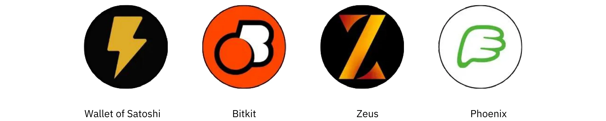

แม้ว่าความกังวลด้านความปลอดภัยอาจดูไม่เร่งด่วนเมื่อการทำธุรกรรมมีขนาดเล็ก แต่ก็ยังคงมีความสำคัญที่จะต้องดำเนินมาตรการป้องกันพื้นฐาน แม้แต่สมาร์ทโฟนหรือแท็บเล็ตเพียงเครื่องเดียวที่ใช้รับชำระเงิน Bitcoin ก็ควรถูกล็อกด้วยรหัสผ่านหรือความปลอดภัยทางชีวมิติ และขั้นตอนการสำรองข้อมูล (ตั้งแต่การติดตามข้อมูลการเข้าสู่ระบบสำหรับ wallet ที่มีการดูแล ไปจนถึงการปกป้อง[วลี seed](https://planb.academy/resources/glossary/recovery-phrase) สำหรับการดูแลตนเอง) ต้องได้รับการพิจารณาอย่างจริงจัง พนักงานที่จัดการธุรกรรมในสถานที่จริงจะได้รับประโยชน์จากการเข้าใจพื้นฐาน รวมถึงวิธีการเปิดแอป นำเสนอรหัส QR ให้กับลูกค้า และยืนยันว่าการชำระเงินได้รับการยืนยันแล้ว

การบัญชีและการรายงาน แม้ว่าจะค่อนข้างง่ายภายใต้โปรไฟล์ Starter แต่ก็ยังต้องการการพิจารณาอย่างรอบคอบ แม้ว่าปริมาณธุรกรรมอาจจะน้อย การเก็บบันทึกที่ถูกต้องจะช่วยป้องกันความสับสนในภายหลังและช่วยรักษาความโปร่งใสในกรณีที่มีการตรวจสอบทางการเงินหรือการยื่นภาษี แอปพลิเคชัน wallet หลายตัวอนุญาตให้ผู้ใช้ส่งออกประวัติธุรกรรมพื้นฐานเป็นไฟล์ CSV; สำหรับธุรกิจขนาดเล็กหรือผู้ประกอบการรายเดียว การบันทึกไฟล์เหล่านี้เป็นประจำสามารถทำให้การกระทบยอดบัญชีง่ายขึ้น นอกจากนี้ยังเป็นการดีที่จะติดตามมูลค่าฟิอัตโดยประมาณ (เช่น ในยูโรหรือดอลลาร์) ในขณะที่ได้รับธุรกรรมแต่ละครั้ง เนื่องจากราคาของ Bitcoin สามารถผันผวนได้ การมีบันทึกอัตราแลกเปลี่ยนจึงมีคุณค่าอย่างยิ่งสำหรับการทำบัญชีและการปฏิบัติตามภาษี

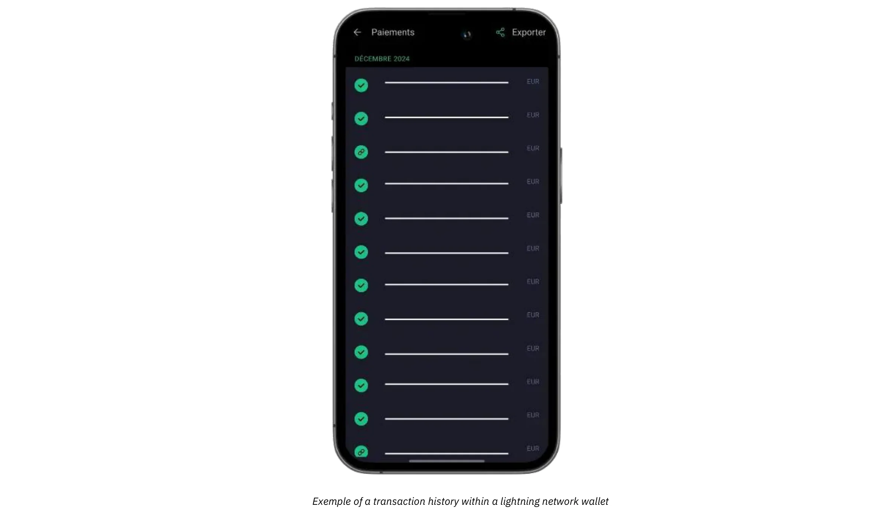

สำหรับธุรกิจที่ต้องการเสริมการชำระเงินแบบตัวต่อตัวด้วยการบริจาคหรือทิปออนไลน์ ตอนนี้สามารถผสานปุ่มทิป Lightning หรือวิดเจ็ตการบริจาคเข้ากับเว็บไซต์หรือบล็อกได้อย่างง่ายดาย แพลตฟอร์มเช่น BTCPay Server มีปุ่มการชำระเงินที่ตั้งค่าได้ง่าย ในขณะที่บริการโซเชียลมีเดียและสตรีมสดบางแห่งรองรับทิป Lightning ด้วยที่อยู่แล้ว ดังนั้น แม้แต่ธุรกิจเริ่มต้นก็สามารถสร้างเครือข่ายผู้สนับสนุนที่เรียบง่ายแต่ทั่วโลกได้ ในขณะเดียวกัน ผู้ที่ไม่ต้องการถือ Bitcoin ในระยะยาวสามารถสำรวจการแปลงบางส่วนหรืออัตโนมัติเป็นสกุลเงินเฟียตโดยใช้กระเป๋าเงินที่มีการดูแลหรือบริการของบุคคลที่สาม แม้ว่าตัวเลือกนี้จะมีค่าธรรมเนียมเพิ่มเติมและข้อผูกพัน KYC ที่เป็นไปได้ แต่ก็ช่วยให้ธุรกิจหลีกเลี่ยงความผันผวนของอัตราแลกเปลี่ยนและรักษากระบวนการทางการเงินที่มีอยู่ด้วยการรบกวนน้อยที่สุด

กรณีการใช้งานง่าย ๆ แสดงให้เห็นว่าองค์ประกอบทั้งหมดนี้มารวมกันได้อย่างไร ลองนึกภาพช่างฝีมือท้องถิ่นที่ขายแยมทำเองที่ตลาดเกษตรกรในวันเสาร์ พร้อมด้วยโทรศัพท์ที่ใช้ Lightning wallet แบบดูแลรักษา พวกเขาตั้งราคาของแต่ละขวดในสกุลเงินยูโร เมื่อมีลูกค้าต้องการชำระเงินด้วย Bitcoin ผู้ขายจะป้อนจำนวนเงินเฟียตที่สอดคล้องกันอย่างรวดเร็ว และแอปจะคำนวณ sats ที่ต้องชำระโดยอัตโนมัติ wallet ของลูกค้าสแกน QR โค้ดที่ได้ การชำระเงินเสร็จสิ้นในไม่กี่วินาที และช่างฝีมือก็รู้ทันทีว่าการทำธุรกรรมสำเร็จแล้ว เมื่อสิ้นสุดวัน รายละเอียดการทำธุรกรรมสามารถส่งออกเพื่อการบันทึก และยอดคงเหลือของวันสามารถส่งไปยังแพลตฟอร์มแลกเปลี่ยนทั้งหมดหรือบางส่วนเพื่อแปลงเป็นสกุลเงินเฟียต

ด้วยการสร้างสมดุลระหว่างเครื่องมือที่ใช้งานง่าย ข้อกำหนดฮาร์ดแวร์ขั้นต่ำ และการเก็บบันทึกที่ตรงไปตรงมา โซลูชันเริ่มต้นจึงมอบสิ่งจำเป็นโดยไม่ทำให้ธุรกิจใหม่รู้สึกหนักใจ หากปริมาณธุรกรรมเพิ่มขึ้นและความต้องการในการดำเนินงานของธุรกิจพัฒนา การอัปเกรดไปยังหมวดหมู่ที่มีความก้าวหน้ามากขึ้นซึ่งจะอธิบายในบทถัดไปจะกลายเป็นการพัฒนาที่เป็นธรรมชาติ

สำหรับบทแนะนำโดยละเอียดเกี่ยวกับกระเป๋าเงินที่แนะนำและการตั้งค่าพื้นฐาน โปรดดูคำแนะนำต่อไปนี้:

**กระเป๋าเงิน/โหนด LN ที่ดูแลด้วยตนเอง:**

https://planb.academy/tutorials/wallet/mobile/phoenix-0f681345-abff-4bdc-819c-4ae800129cdf

https://planb.academy/tutorials/wallet/mobile/bitkit-a7224674-85c4-4045-9baf-37018d89550c

https://planb.academy/tutorials/wallet/mobile/breez-46a6867b-c74b-45e7-869c-10a4e0263c06

https://planb.academy/tutorials/wallet/mobile/blixt-04b319cf-8cbe-4027-b26f-840571f2244f

https://planb.academy/tutorials/wallet/mobile/zeus-embedded-advanced-3e89603c-501d-439c-8691-d4a0d0de459b

**กระเป๋าเงิน Custodial LN:**

https://planb.academy/tutorials/wallet/mobile/wallet-of-satoshi-39149d86-e42b-4e8f-ae9f-7e061e7784f7

https://planb.academy/tutorials/wallet/mobile/blink-7ea5f5a4-e728-4ff9-b3f9-cf20aa6fc2bd

## The Essential

<chapterId>89be421f-f7df-4bcc-a9e4-df96e39ef249</chapterId>

โปรไฟล์ Essential เหมาะสำหรับธุรกิจขนาดเล็กและขนาดกลาง ที่อาจมีพนักงาน ซึ่งต้องการรับบิทคอยน์ได้อย่างง่ายดายและรวดเร็วโดยไม่จำเป็นต้องมีความรู้ทางเทคนิคขั้นสูง ในขณะที่ยังคงมีระบบที่ครบถ้วนและเป็นมืออาชีพมากกว่าระบบ wallet แบบง่าย ๆ หมวดหมู่นี้มักจะใช้กับร้านอาหาร คาเฟ่ บาร์ หรือร้านค้าปลีกขนาดเล็กที่มีการชำระเงิน Bitcoin เพียงไม่กี่ครั้งต่อเดือน แต่ต้องการอินเทอร์เฟซที่ทั้งเรียบง่ายและแข็งแกร่งพอที่จะจัดการการดำเนินงานในแต่ละวันได้โดยไม่สะดุด

ไม่เหมือนกับโปรไฟล์ Starter ธุรกิจ Essential มักจะมองว่าการชำระเงิน Bitcoin เป็นส่วนหนึ่งของกระแสรายได้อย่างต่อเนื่องมากกว่าการทดลองเพียงอย่างเดียว พวกเขายังคงดำเนินการที่ปริมาณธุรกรรมที่ค่อนข้างต่ำ แต่ความถี่นั้นเพียงพอที่เจ้าของและพนักงานจะได้รับประโยชน์จากระบบที่มีโครงสร้างและเชื่อถือได้มากขึ้น ในขณะเดียวกัน โปรไฟล์ Essential ยังคงมุ่งเน้นที่ความเรียบง่าย; แม้ว่าจะอนุญาตให้มีแดชบอร์ดที่สะดวกและการจัดการบทบาทที่จำกัด แต่ก็ไม่จำเป็นต้องใช้ทรัพยากร IT เฉพาะทางหรือการผสานรวมที่ซับซ้อน

คำแนะนำด้านเทคโนโลยีในส่วนนี้มักจะเน้นที่ **Swiss Bitcoin Pay** ซึ่งเป็นโซลูชันที่มีความคล่องตัวที่ช่วยให้ผู้ค้าสามารถรับชำระเงิน Bitcoin ได้อย่างง่ายดาย มันมีแอป PoS ที่ใช้งานง่าย ไม่ต้องการความเชี่ยวชาญทางเทคนิคสำหรับพนักงาน แตกต่างจากกระเป๋าเงิน Bitcoin มาตรฐาน มันมุ่งเน้นเฉพาะการรับชำระเงิน ทำให้พนักงานสามารถใช้เครื่องมือได้โดยไม่มีความเสี่ยงด้านความปลอดภัย แอป PoS หลายตัวสามารถเชื่อมต่อกับบัญชีเดียวกันได้ ใช้งานได้บนแท็บเล็ต เครื่องบันทึกเงินสด สมาร์ทโฟน หรือผ่านเวอร์ชันเว็บสำหรับคอมพิวเตอร์ รองรับ Android และ iOS คุณยังสามารถสร้างเมนูพร้อมรายการสินค้าที่คุณขายและราคาที่เกี่ยวข้อง ทำให้พนักงานสามารถเลือกตะกร้าสินค้าสำหรับลูกค้าบน PoS และเรียกเก็บเงินรวมได้อย่างง่ายดาย

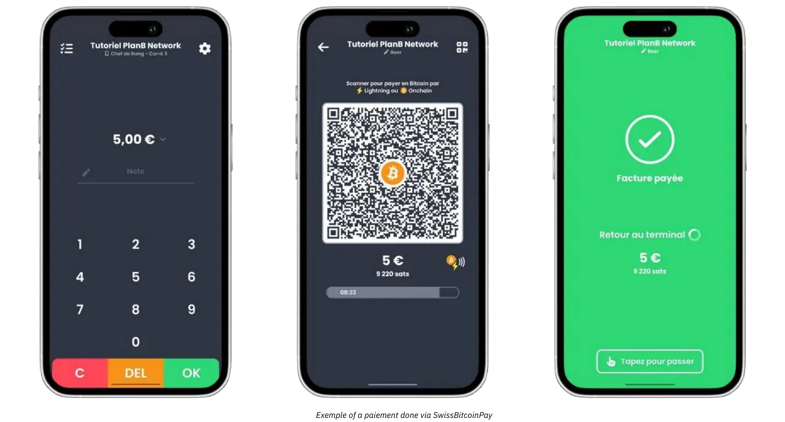

การชำระเงินสามารถถอนออกใน Bitcoin ไปยังที่อยู่เฉพาะหรือแปลงเป็นสกุลเงินเฟียตและฝากเข้าบัญชีธนาคารได้ทุกวัน Swiss Bitcoin Pay ทำให้กระบวนการเป็นอัตโนมัติ โดยจัดการการชำระเงิน Bitcoin และ Lightning Network โดยไม่ต้องมีการแทรกแซงด้วยตนเอง เงินจะถูกเก็บไว้ไม่เกิน 24 ชั่วโมงก่อนการโอน แม้จะไม่ใช่ระบบที่ไม่ต้องมีการควบคุมอย่างเต็มที่เหมือนกับ BTCPay Server แต่ก็สร้างสมดุลระหว่างความสะดวกและความปลอดภัย และไม่ต้องการ KYC

ค่าธรรมเนียมมีการแข่งขัน: 0.21% สำหรับปีแรก, จากนั้น 1% สำหรับการชำระเงิน Bitcoin และ 1.5% สำหรับการชำระเงินแปลงสกุลเงิน, รวมถึงค่าใช้จ่ายในการทำธุรกรรม Bitcoin ด้วย Swiss Bitcoin Pay เสนอทางเลือกที่เป็นกลางระหว่างโซลูชันการดูแล เช่น Open Node และระบบโฮสต์ด้วยตนเองที่ซับซ้อนอย่าง BTCPay Server โดยให้ความสำคัญกับความเรียบง่าย, ความปลอดภัย, และความเป็นอิสระทางการเงิน

การตั้งค่าประเภทนี้ช่วยให้ธุรกิจที่มีหน้าร้านสามารถออกใบแจ้งหนี้การชำระเงิน generate ได้อย่างรวดเร็ว นำเสนอรหัส QR ให้กับลูกค้า และรับธุรกรรม Lightning หรือ on-chain ได้อย่างราบรื่น พนักงานต้องการเพียงการปฐมนิเทศสั้นๆ เพื่อจัดการการชำระเงินเหล่านี้ ในขณะที่ผู้จัดการสามารถเข้าสู่ระบบแดชบอร์ดออนไลน์เพื่อตรวจสอบยอดขายประจำวันและเข้าถึงรายงานพื้นฐาน การมีคอนโซลการจัดการที่คล่องตัวช่วยให้สถานประกอบการขนาดเล็กสามารถติดตามรายได้ทั้งสกุลเงินปกติและคริปโตจากอินเทอร์เฟซเดียว ซึ่งช่วยลดความสับสนและลดเวลาที่ใช้ในการทำบัญชีด้วยตนเอง

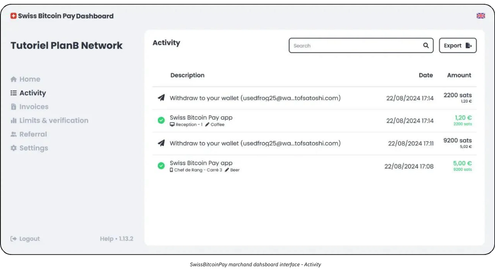

ประโยชน์สำคัญอีกประการหนึ่งของแนวทาง Essential คือการเน้นการปรับใช้ที่รวดเร็วและการรบกวนที่น้อยที่สุด โซลูชันอย่าง Swiss Bitcoin Pay สามารถตั้งค่าได้ภายในไม่กี่ชั่วโมงแทนที่จะเป็นวันหรือสัปดาห์ สำหรับเจ้าของหรือผู้จัดการร้านอาหารที่มีความยุ่งเหยิงพอสมควร เป้าหมายสุดท้ายคือการผสานรวมการยอมรับ Bitcoin โดยไม่ทำให้เกิดความล่าช้าที่เคาน์เตอร์ชำระเงินหรือความสับสนในหมู่พนักงาน เมื่อกำหนดค่า POS แล้ว ผู้จัดการอาจให้คำแนะนำสั้น ๆ แก่พนักงานเกี่ยวกับการแสดงใบแจ้งหนี้และการยืนยันว่าการชำระเงินได้รับการยืนยันแล้ว ในสถานการณ์ที่ดีที่สุด การทำธุรกรรมของลูกค้าจะได้รับการยืนยันเกือบจะทันทีผ่าน Lightning Network และแผงการจัดการของธุรกิจจะลงทะเบียนการชำระเงินใหม่ในเวลาจริงพร้อมกัน

แม้ว่าโปรไฟล์ Essential จะไม่ต้องการระบบบัญชีที่ซับซ้อนมาก แต่ก็ยังแนะนำให้รักษาบันทึกธุรกรรมที่ถูกต้อง เครื่องมืออย่าง Swiss Bitcoin Pay มีฟังก์ชันการส่งออก CSV ที่ช่วยให้ผู้จัดการสามารถจับมูลค่าเทียบเท่าเงินเฟียตของการขาย Bitcoin แต่ละครั้งและติดตามควบคู่ไปกับแหล่งรายได้อื่น ๆ ระดับของเอกสารนี้เพียงพอสำหรับธุรกิจขนาดเล็กส่วนใหญ่ และความเข้าใจพื้นฐานเกี่ยวกับอัตราแลกเปลี่ยนจะช่วยให้การยื่นภาษีถูกต้องและการกำกับดูแลทางการเงินมีประสิทธิภาพ

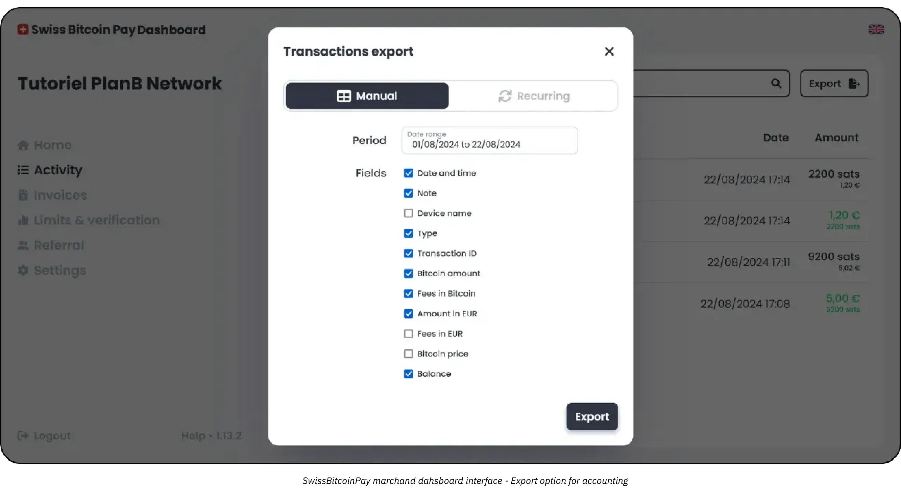

โซลูชันไฮบริดที่เหมาะสมที่สุดสำหรับโปรไฟล์ของคุณน่าจะเป็น Swiss Bitcoin Pay:

https://planb.academy/tutorials/business/point-of-sale/swiss-bitcoin-pay-2-a78b057e-ed11-47ac-860c-71019fcb451a

อีกหนึ่งวิธีแก้ปัญหาที่ง่ายต่อการนำไปใช้ แต่มีข้อเสียคือเป็นการดูแลรักษา 100% คือ Open Node:

https://planb.academy/tutorials/business/point-of-sale/open-node-e69a0c1c-47f7-4932-8494-e6f26c3c9784

หากคุณพร้อมที่จะลงมือทำและต้องการควบคุมกระบวนการทั้งหมดด้วยตัวเอง ซอฟต์แวร์ BTCPay Server เป็นตัวเลือกที่ยอดเยี่ยม อย่างไรก็ตาม ข้อเสียหลักของ BTCPay Server คือการตั้งค่าและการจัดการที่ใช้เวลานานและต้องการความเชี่ยวชาญทางเทคนิคในระดับหนึ่ง แต่คุณสามารถทำตามคำแนะนำของเราได้:

https://planb.academy/tutorials/business/point-of-sale/btcpay-server-928eb01e-824b-4b57-a3e8-8727633beddc

สุดท้ายนี้ เพื่อเป็นการเสริมจุดขายทางกายภาพ คุณอาจพิจารณาติดตั้ง [a Bitcoinize PoS](https://bitcoinize.com/)

## มืออาชีพ

<chapterId>4d5dfa50-c4d0-481c-ab95-1863a898750e</chapterId>

โปรไฟล์มืออาชีพถูกออกแบบมาสำหรับธุรกิจที่ได้เปลี่ยนผ่านจากการชำระเงิน Bitcoin ที่เกิดขึ้นเป็นครั้งคราวหรือปริมาณต่ำ และตอนนี้ต้องการโครงสร้างพื้นฐานที่แข็งแกร่งเพื่อจัดการกับธุรกรรมหลายรายการในแต่ละวัน บริษัทเหล่านี้มักดำเนินการผ่านหลายช่องทาง (เช่น สถานที่ค้าปลีก เว็บไซต์อีคอมเมิร์ซเฉพาะ และการขายผ่านมือถือ) และดังนั้นจึงต้องการโซลูชันการชำระเงินที่สามารถผสานรวมเข้ากับกระบวนการทำงานที่มีอยู่ได้อย่างราบรื่น ในหลายกรณี องค์กรในระดับนี้ได้จัดการระบบจุดขาย แพลตฟอร์มการจัดการคำสั่งซื้อออนไลน์ และการดำเนินงานหลังบ้านที่ต้องการวิธีการที่เชื่อถือได้และสามารถขยายได้แล้ว

หนึ่งในลักษณะเด่นของพ่อค้ามืออาชีพคือความต้องการ **ฟีเจอร์ขั้นสูง** และ **โซลูชันที่ปรับแต่งได้** ซึ่งยังคงรักษาประสิทธิภาพไว้แม้ปริมาณการทำธุรกรรมจะเพิ่มขึ้น แตกต่างจากผู้ใช้ระดับ Essential ที่อาจพึงพอใจกับเครื่องมือที่เรียบง่ายซึ่งพอดีกับแอปบนสมาร์ทโฟน ธุรกิจมืออาชีพมักจะต้องการฟีเจอร์เช่น การปรับแต่งใบแจ้งหนี้อย่างละเอียด แดชบอร์ดรายงานที่ซับซ้อน และความสามารถในการกำหนดบทบาทผู้ดูแลระบบหลายคน

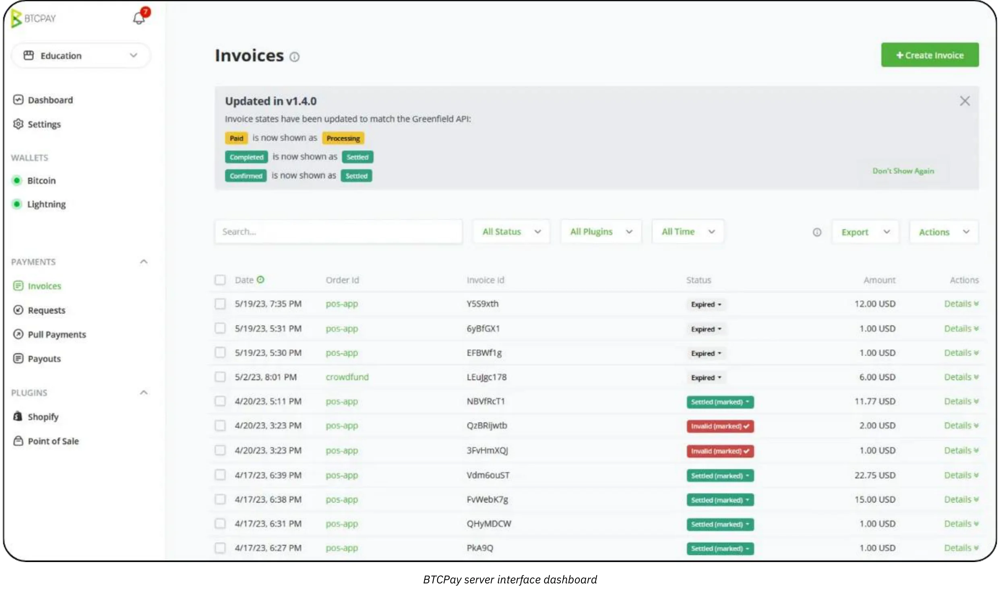

กลุ่มร้านอาหาร ตัวอย่างเช่น อาจมีพนักงานที่รับผิดชอบการออกใบแจ้งหนี้และการจัดการสต็อก ในขณะที่ทีมแยกต่างหากดูแลการลงรายการสินค้าและแคมเปญการตลาด ในสภาพแวดล้อมนี้ โซลูชันการชำระเงิน Bitcoin ต้องผสานรวมอย่างไร้รอยต่อกับโครงสร้างองค์กรที่มีอยู่เหล่านี้

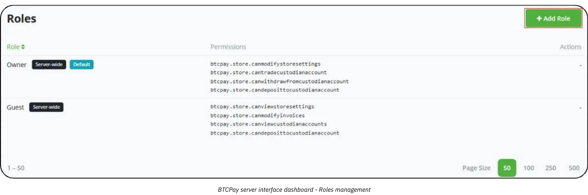

เกี่ยวกับเทคโนโลยีและเครื่องมือ โซลูชันอย่าง **BTCPay Server** มักเป็นแกนหลักของการตั้งค่าระดับมืออาชีพ BTCPay Server เป็นแพลตฟอร์มโอเพ่นซอร์สที่สามารถติดตั้งได้ทั้งในสถานที่หรือผ่านการโฮสต์บนคลาวด์ โดยมีตัวเลือกการผสานรวมที่หลากหลายสำหรับเว็บไซต์และแพลตฟอร์มอีคอมเมิร์ซ ด้วยการรันอินสแตนซ์ของตนเอง ธุรกิจจะรักษาระดับการควบคุมสูงในทุกด้านของกระบวนการชำระเงิน ตั้งแต่หน้าชำระเงินที่สร้างขึ้นโดยอัตโนมัติไปจนถึงกระบวนการภายในที่ถูกกระตุ้นโดยการแจ้งเตือนเมื่อการชำระเงินได้รับการยืนยัน

นอกจากนี้ เครื่องมือต่าง ๆ เช่น [Zaprite](https://zaprite.com/) หรือ [Musqet](https://musqet.tech/) สามารถปรับปรุงประสบการณ์การชำระเงินให้ดียิ่งขึ้น โดยอนุญาตให้ปรับแต่งได้อย่างละเอียด (ตั้งแต่การเลือกแบรนด์ไปจนถึงความสามารถในการรายงานที่ซับซ้อน) ผู้ที่ชื่นชอบสภาพแวดล้อมการค้าปลีกออนไลน์แบบครบวงจรอาจสนใจ [Be-BOP](https://be-bop.io/) ซึ่งเป็นโซลูชันร้านค้าออนไลน์ที่สร้างขึ้นเพื่ออำนวยความสะดวกในการชำระเงิน Bitcoin โดยไม่ลดทอนความง่ายในการใช้งาน

การนำเทคโนโลยีเหล่านี้ไปใช้ในสภาพแวดล้อมทางวิชาชีพหมายถึงการให้ความสำคัญกับ **ความซับซ้อนในการดำเนินงาน** การทำงานอัตโนมัติของใบแจ้งหนี้ การแสดงผลหลายสกุลเงิน และการซิงโครไนซ์กับระบบสินค้าคงคลังที่มีอยู่เป็นลักษณะเด่นของแพลตฟอร์มที่ผสานรวมอย่างดี ความสามารถในการส่งออกข้อมูลธุรกรรมอย่างแม่นยำ (ไม่ว่าจะเป็นไฟล์ CSV การเรียก API โดยตรง หรือรูปแบบที่กำหนดเอง) ช่วยให้ธุรกิจสามารถกระทบยอดการขายบิตคอยน์กับแหล่งรายได้อื่น ๆ ได้อย่างมีประสิทธิภาพ

การจัดการความปลอดภัยและบทบาทถือเป็นอีกหนึ่งข้อพิจารณาที่สำคัญสำหรับผู้ใช้ระดับมืออาชีพ เมื่อการทำธุรกรรม Bitcoin สะสมในแต่ละวัน การควบคุมการเข้าถึงฟังก์ชันการจัดการกลายเป็นมาตรการลดความเสี่ยงที่จำเป็น ในหลายๆ โซลูชัน ผู้ดูแลระบบสามารถกำหนดระดับการอนุญาตที่แตกต่างกัน (อาจจำกัดพนักงานบางคนให้ดูประวัติการทำธุรกรรมและสร้างใบแจ้งหนี้ ในขณะที่ให้สิทธิ์ผู้อื่นในการจัดการสินค้าคงคลังหรือกำหนดค่าการตั้งค่าระบบทั่วทั้งระบบ...) โครงสร้างลำดับชั้นนี้ไม่เพียงแต่ปกป้องข้อมูลที่ละเอียดอ่อน แต่ยังช่วยให้การดำเนินงานเป็นไปอย่างราบรื่นโดยการกำหนดอย่างชัดเจนว่าพนักงานคนใดรับผิดชอบแต่ละส่วนของโครงสร้างพื้นฐานการชำระเงิน

เมื่อพูดถึงตัวอย่างในโลกแห่งความเป็นจริง ลองพิจารณาร้านค้าอีคอมเมิร์ซขนาดกลางที่เชี่ยวชาญในอุปกรณ์เสริมเทคโนโลยี บริษัทสามารถผสานรวม BTCPay Server เข้ากับหน้าร้านออนไลน์ที่มีอยู่ โดยสร้างที่อยู่ชำระเงิน Bitcoin โดยอัตโนมัติในระหว่างกระบวนการชำระเงิน ลูกค้าสามารถทำการซื้อให้เสร็จสิ้นโดยการสแกนที่อยู่ Lightning หรือ on-chain และแพลตฟอร์มของร้านค้าจะยืนยันการชำระเงินทันที ในขณะเดียวกัน ระบบภายในจะอัปเดตสถานะคำสั่งซื้อและส่งการแจ้งเตือนการจัดส่ง ด้วยคุณสมบัติการรายงานขั้นสูง ทีมการเงินสามารถตรวจสอบยอดขาย Bitcoin รายวันได้อย่างง่ายดาย ส่งออกบัญชีแยกประเภทที่รวมเป็นหนึ่งสำหรับการตรวจสอบ และติดตามมูลค่าของการถือครอง BTC ใดๆ ที่บริษัทตัดสินใจเก็บรักษาไว้

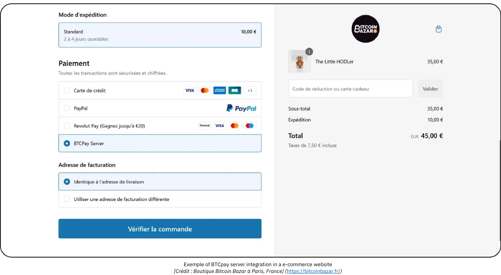

*[เครดิต: Bitcoin ร้านบาซาร์ในปารีส, ฝรั่งเศส.](https://bitcoinbazar.fr/)*

เพื่อเจาะลึกถึงรายละเอียดการใช้งานและสำรวจการตั้งค่าของ BTCPay Server อย่างลงมือปฏิบัติ สามารถดูได้จากหลักสูตรต่อไปนี้:

https://planb.academy/courses/6fc12131-e464-4515-9d3f-9255365d5fa1

## ดิเอนเทอร์ไพรส์

<chapterId>80fb2659-81ca-4a11-b492-72c7ae5774f9</chapterId>

โปรไฟล์ Enterprise ยืนอยู่ที่จุดสูงสุดของการใช้งานการชำระเงิน Bitcoin ซึ่งออกแบบมาเฉพาะสำหรับบริษัทขนาดใหญ่ ตลาดหลัก และธุรกิจที่มีชื่อเสียงที่ต้องการโซลูชันที่ปรับแต่งได้อย่างเต็มที่ แตกต่างจากการใช้งานในระดับเล็กหรือระดับกลาง การดำเนินงานในระดับ Enterprise จะรวมการชำระเงิน Bitcoin เข้ากับการทำงานและระบบที่หลากหลาย ตั้งแต่อุปกรณ์จุดขายในสถานที่ไปจนถึงหน้าร้านอีคอมเมิร์ซ แพลตฟอร์มบัญชีหลังสำนักงาน และกรอบงาน ERP ที่ซับซ้อน

ในระดับนี้ เป้าหมายหลักไม่ใช่เพียงแค่การยอมรับ Bitcoin แต่ต้องทำในลักษณะที่ **สอดคล้องกับกระบวนการหลักขององค์กร** อย่างละเอียด การปรับให้สอดคล้องนี้อาจต้องการการพัฒนาซอฟต์แวร์เฉพาะทาง ไม่ว่าจะเป็นการแก้ปัญหาที่ออกแบบมาเฉพาะหรือจัดการผ่านโครงสร้างพื้นฐานแบบ SaaS ที่สนับสนุนโดย *ผู้ให้บริการ Lightning Service* (LSPs) จากบุคคลที่สาม LSPs เหล่านี้สามารถจัดการกับปริมาณธุรกรรมที่สูงและการกำหนดค่าเครือข่ายที่ซับซ้อนซึ่งเกินขีดความสามารถของเครื่องมือสำเร็จรูปทั่วไป ดังนั้นสถาปัตยกรรมที่ได้จึงรวมถึงการพิจารณาทางเทคนิคและธุรกิจที่หลากหลาย ตั้งแต่การผสานรวมที่ขับเคลื่อนด้วย API ไปจนถึงความสามารถในการจัดการการเงินขั้นสูง

ในบริบทขององค์กร ความซับซ้อนในการดำเนินงานจะเห็นได้ชัดเจนมากขึ้น บริษัทขนาดใหญ่อาจจำเป็นต้องรองรับหลายแผนก (การขาย, การตลาด, devops, การเงิน, และการบัญชี) ซึ่งแต่ละแผนกมีความรับผิดชอบและความต้องการข้อมูลที่แตกต่างกัน ในสถานการณ์นี้ แพลตฟอร์มการชำระเงิน Bitcoin ต้องมีการจัดการบทบาทที่ละเอียดมาก ช่วยให้แต่ละแผนกสามารถเข้าถึงฟังก์ชันที่เกี่ยวข้องกับงานของพวกเขาได้อย่างแม่นยำ ในขณะที่ยังคงรักษาการควบคุมที่เข้มงวดเกี่ยวกับความปลอดภัยและความสมบูรณ์ของข้อมูล สิ่งที่สำคัญไม่แพ้กันคือความสามารถในการปรับแต่งเวิร์กโฟลว์; ตัวอย่างเช่น การชำระเงินขาเข้าอาจกระตุ้นการอัปเดตในระบบสินค้าคงคลัง ส่งการแจ้งเตือนอัตโนมัติไปยังผู้จัดการฝ่ายขาย และอัปเดตรายการบัญชีสำหรับทีมการเงิน ทั้งหมดนี้ในเวลาจริง อุปกรณ์จุดขายเองมักจะถูกปรับให้เหมาะสมกับสภาพแวดล้อมขององค์กร โดยมีซอฟต์แวร์อินเทอร์เฟซที่ปรับแต่งให้สอดคล้องกับการสร้างแบรนด์และความต้องการในการดำเนินงานของบริษัท

**ความปลอดภัย** เป็นสิ่งสำคัญที่สุดสำหรับองค์กรในระดับใหญ่ ปริมาณธุรกรรมที่สูงและจำนวนเงิน Bitcoin ที่อาจมากต้องการโครงสร้างพื้นฐานที่แข็งแกร่งซึ่งสามารถป้องกันการโจมตีที่เป็นอันตรายหรือภัยคุกคามจากภายในได้ แนวทางปฏิบัติที่ดีที่สุดมักรวมถึงการใช้ลายเซ็นหลายตัวพร้อมการตั้งค่าคลังที่มี[การล็อกเวลา](https://planb.academy/resources/glossary/timelock) ฐานรหัสที่ได้รับการตรวจสอบอย่างรอบคอบ และการปฏิบัติตามกรอบการกำกับดูแลที่เกี่ยวข้องอย่างเคร่งครัด นอกจากนี้ การปฏิบัติตามกฎระเบียบทางการเงินทั้งในประเทศและระหว่างประเทศเป็นสิ่งสำคัญในการรักษาชื่อเสียงของบริษัทและการรักษาใบอนุญาตในการดำเนินงาน

การพัฒนาแบบ **custom development** ที่เกี่ยวข้องกับการสร้างหรือการรวมโซลูชันการชำระเงิน Bitcoin ระดับองค์กรนั้นเกินกว่าการเขียนโค้ดฟีเจอร์ของแอปพลิเคชันเพียงไม่กี่อย่าง โดยทั่วไปแล้วจะต้องมีการออกแบบสถาปัตยกรรม โปรโตคอลการทดสอบอย่างละเอียด และการเปิดตัวที่มีโครงสร้างซึ่งอาจครอบคลุมหลายขั้นตอน (โปรแกรมนำร่องเบื้องต้น การทดสอบตลาดจำกัด และการเปิดตัวทั่วโลกในที่สุด)

ในด้านการบัญชี การทำธุรกรรมที่มีความถี่สูงต้องการ **การส่งออกที่ปรับแต่งได้อย่างเต็มที่** และบางครั้งการซิงโครไนซ์แบบเรียลไทม์กับซอฟต์แวร์การเงินขององค์กร ธุรกิจขนาดใหญ่อาจพึ่งพาโซลูชันการวางแผนทรัพยากรองค์กร (ERP) เช่น SAP หรือ Oracle ซึ่งจะต้องเชื่อมต่อกับข้อมูลการชำระเงิน Bitcoin อย่างไร้รอยต่อ เพื่ออำนวยความสะดวกในเรื่องนี้ API ของแพลตฟอร์มที่เลือกจะต้องมีความซับซ้อนและยืดหยุ่น ให้ทีม IT มีอิสระในการสร้างแดชบอร์ดรายงานที่ปรับแต่งได้ ดำเนินกระบวนการกระทบยอดอัตโนมัติ และสรุปข้อมูลทางการเงิน generate รายวันหรือแม้กระทั่งรายชั่วโมง

สถานการณ์ทั่วไปขององค์กรอาจเกี่ยวข้องกับตลาดอีคอมเมิร์ซขนาดใหญ่ที่มีการทำธุรกรรมหลายพันรายการในแต่ละวัน นอกเหนือจากการแค่ระบุ Bitcoin เป็นตัวเลือกการชำระเงินแล้ว ตลาดนี้ยังสามารถปรับแต่งทุกแง่มุมของประสบการณ์ผู้ใช้ ตั้งแต่ลักษณะการทำงานของการชำระเงิน Bitcoin ที่ปรากฏบนเว็บไซต์ที่ลูกค้าเห็น ไปจนถึงการจัดการการคืนเงิน การเรียกเก็บเงินคืน หรือการแก้ไขข้อพิพาทในส่วนหลัง ทีม DevOps ที่ทุ่มเท ร่วมมือกับแผนกการเงินและกฎหมาย จะดูแลการบำรุงรักษาอย่างต่อเนื่อง การอัปเดตความปลอดภัย และการอัปเดตการปฏิบัติตามข้อกำหนด หากบริษัทเลือกที่จะเก็บส่วนหนึ่งของรายได้จาก Bitcoin ระบบการเงินภายในจะติดตามการถือครอง Bitcoin ของบริษัทควบคู่ไปกับเงินสำรองสกุลเงินแบบดั้งเดิม

เพื่อให้การปรับใช้ในระดับองค์กรเป็นไปอย่างราบรื่นและปลอดภัย องค์กรส่วนใหญ่จะว่าจ้างผู้ให้บริการเฉพาะทางหรือทีมพัฒนาภายในที่มีประสบการณ์ในการผสานรวม Bitcoin และ Lightning Network กระบวนการนี้มักเริ่มต้นด้วยการประเมินความต้องการอย่างละเอียด (ครอบคลุมโครงสร้างพื้นฐานทางเทคนิค ข้อกำหนดการปฏิบัติตามกฎระเบียบ และเส้นทางลูกค้าที่ต้องการ) ตามด้วยการออกแบบสถาปัตยกรรมที่สามารถรองรับปริมาณการใช้งานสูงได้ ขึ้นอยู่กับขอบเขตของโครงการ คุณอาจพึ่งพาทีมสหสาขาวิชาชีพที่ประกอบด้วยผู้ควบคุมการเงิน นักวิเคราะห์ความปลอดภัย และวิศวกรซอฟต์แวร์ หรืออีกทางเลือกหนึ่งคือมีบริษัทที่ปรึกษาเฉพาะทางจำนวนมากขึ้นที่สามารถแนะนำคุณตั้งแต่การสร้างแนวคิดเริ่มต้นไปจนถึงการเปิดตัวขั้นสุดท้าย ช่วยเหลือในงานต่างๆ เช่น การประเมินโซลูชัน SaaS การกำหนดค่า *ผู้ให้บริการสายฟ้า* และการปรับแต่งอินเทอร์เฟซส่วนหน้า โดยการร่วมมือกับผู้เชี่ยวชาญในโดเมน องค์กรสามารถลดความเสี่ยงที่เกี่ยวข้องกับการใช้งานการชำระเงินขนาดใหญ่และบรรลุโซลูชันที่ไม่เพียงแต่แข็งแกร่งและเป็นไปตามข้อกำหนดเท่านั้น แต่ยังยืดหยุ่นพอที่จะรองรับการเติบโตในอนาคตได้อีกด้วย

## Bitcoin โซลูชันการชำระเงิน: ตัวเลือกและแนวโน้ม

<chapterId>59ff43a1-98e2-4a81-af3e-9654bdd60952</chapterId>

มีการแลกเปลี่ยนเสมอสำหรับแต่ละหมวดหมู่ของโซลูชัน ตัวอย่างเช่น ใน "ช่วงทดลอง" แรก กระเป๋าเงินที่แนะนำถูกออกแบบให้เรียบง่ายที่สุดในแง่ของอินเทอร์เฟซผู้ใช้ แต่ถูกโฮสต์ (**custodial**) ซึ่งหมายความว่าผู้ให้บริการแอปควบคุมเงิน อย่างไรก็ตาม หลักการของ Bitcoin สนับสนุนให้ผู้ใช้เป็นเจ้าของเงินของตนเองอย่างเต็มที่ (**self-custody**) ในกรณีนี้ แนะนำให้อัปเกรดไปยังหมวดหมู่ถัดไปทันทีที่มีการขายครั้งแรกเกิดขึ้น—โดยพื้นฐานแล้ว เมื่อได้รับการยืนยันว่าคุณมีลูกค้าที่เต็มใจจ่ายใน Bitcoin

หนึ่งในข้อได้เปรียบหลักของ Bitcoin คือความสามารถในการเคลื่อนย้ายเงินทุนตามต้องการ ทำให้ **ง่ายมากในการเปลี่ยนผู้ให้บริการ** หรือส่วนประกอบของโซลูชันของคุณ นอกจากนี้ แอปและโซลูชันทั้งหมดกำลังพัฒนาอย่างรวดเร็วด้วยตัวเอง ตัวอย่างเช่น ลองพิจารณา Bitcoinize ซึ่งตอนนี้มีเครื่อง POS (Point of Sale) แบบกายภาพที่สามารถรวมเข้ากับแอปพลิเคชันหลายตัวในตลาด โซลูชันนี้ไม่เคยมีมาก่อนเพียงไม่กี่เดือนที่ผ่านมา

### กำลังมองหาโซลูชันในการสร้างร้านค้าและรับชำระเงินทั้งแบบ Traditional และ Bitcoin อยู่ใช่ไหม?

หากคุณเริ่มต้นจากศูนย์—ไม่มีร้านค้า ไม่มีซอฟต์แวร์การจัดการสินค้า และไม่มีระบบจุดขาย (POS)—คุณมีตัวเลือกสองสามอย่าง:

- การจ้างภายนอก:** คุณสามารถจ้างภายนอกเพื่อสร้างเว็บไซต์ที่มีตัวเลือกการช้อปปิ้งและจากนั้นเพิ่มความสามารถในการชำระเงิน Bitcoin ควบคู่ไปกับโซลูชันในร้านแบบดั้งเดิมได้

- Simple Solutions:** อีกทางเลือกหนึ่ง คุณสามารถใช้แพลตฟอร์มเช่น Accessing.app เพื่อทำด้วยตัวเอง ข้อดีหลัก ๆ ได้แก่:
    - การตั้งร้านค้าออนไลน์หรือร้านค้าจริงอย่างรวดเร็วและประหยัดค่าใช้จ่าย
    - เหมาะสำหรับธุรกิจตามฤดูกาล, งานอีเวนต์, ร้านอาหาร, หรือร้านค้าปลีก
    - การกำหนดและจัดการผลิตภัณฑ์สำหรับการขายทั้งทางกายภาพและออนไลน์
    - การประมวลผลการชำระเงินด้วยเงินเฟียต (เช่น ยูโร, ดอลลาร์) ผ่านบัญชี Stripe ของคุณเอง
    - Bitcoin การประมวลผลการชำระเงินผ่านบัญชี Swiss Bitcoin Pay ของคุณเอง

### การนำ Lightning Payment มาใช้ก้าวหน้าไปอย่างไร?

ในขณะที่ Lightning Network มีประสิทธิภาพที่เหนือกว่าและค่าธรรมเนียมที่ต่ำกว่า การนำไปใช้งานยังคงอยู่ในช่วงเริ่มต้นของการพัฒนา แทนที่จะมุ่งเน้นไปที่ข้อจำกัดในปัจจุบัน ควรระลึกถึงว่าการเปลี่ยนแปลงโครงสร้างพื้นฐานในประวัติศาสตร์เกิดขึ้นอย่างไร:

- เมื่อรถยนต์ปรากฏขึ้นครั้งแรก ยังมีรถยนต์ไม่เพียงพอที่จะสร้างถนน และไม่มีถนนเพียงพอที่จะมีรถยนต์
- เมื่อมีการนำไฟฟ้าเข้ามาใช้ ยังไม่มีลูกค้ามากพอที่จะสร้างโครงข่ายไฟฟ้า และไม่มีโครงข่ายมากพอที่จะดึงดูดลูกค้า

โครงสร้างพื้นฐานใหม่ประสบความสำเร็จเพราะมีประสิทธิภาพมากขึ้น และผู้ที่เริ่มใช้ก่อนจะเข้าร่วมเพราะได้รับประโยชน์ที่จับต้องได้ นี่คือข้อสังเกตเกี่ยวกับ Lightning Network ในปี 2024:

- ธุรกรรมที่รวดเร็วเป็นพิเศษ:** ธุรกรรมมักจะเกิดขึ้นเกือบจะทันที (<500ms) และมีอัตราความล้มเหลวที่ต่ำมาก

- การทำให้เครือข่ายเป็นมืออาชีพ:** ผู้เล่นรายใหญ่กำลังรับประกันสภาพคล่องทั่วทั้งเครือข่าย ในขณะที่บุคคลทั่วไปได้หยุดการส่งต่อการชำระเงินและตอนนี้ส่วนใหญ่ดำเนินการ "โหนดขอบ"

- ปรับปรุงประสบการณ์ผู้ใช้:** แอปมือถือสำหรับผู้ใช้รายบุคคลได้รับการปรับปรุงอย่างมาก ฟีเจอร์ต่างๆ เช่น การตัดต่อ, ใบแจ้งหนี้แบบคงที่ Bolt12, และการชำระเงินแบบไม่ต้องยืนยัน (0-conf) มีให้ใช้งานอย่างแพร่หลาย ทำให้การโต้ตอบเป็นไปอย่างราบรื่น ปัญหาการทำงานร่วมกัน (เช่น การปิดแบบบังคับ) ไม่ใช่ข้อกังวลหลักอีกต่อไป

- การจัดการโหนดและช่องทางที่ปรับปรุง:** ทั้งโซลูชันส่วนบุคคลและมืออาชีพได้พัฒนาไปข้างหน้า ตัวอย่างเช่น BTCPay Server ตอนนี้รองรับปลั๊กอินจำนวนมากสำหรับการเชื่อมต่อกับผู้ให้บริการอื่น ๆ (PSPs, on/off ramps, ฯลฯ) ผู้ให้บริการโครงสร้างพื้นฐานใหม่ ๆ เช่น LightSpark และ Alby Hub ก็กำลังเข้าสู่การผลิตเช่นกัน

- การเติบโตของการยอมรับจากผู้ค้า:** ผู้ค้าอย่าง BitRefill รายงานว่ามีการเพิ่มขึ้นของการชำระเงิน Bitcoin ในหมู่ผู้ใช้ที่ใช้งานอยู่ โดยมีการเปลี่ยนแปลงที่ชัดเจนไปสู่ Bitcoin แทน Lightning นอกจากนี้ ค่าธรรมเนียมที่ต่ำมากของ Lightning ทำให้เป็นตัวเลือกที่นิยมสำหรับการชำระเงินขนาดเล็ก (เฉลี่ย €32 ต่อธุรกรรม)

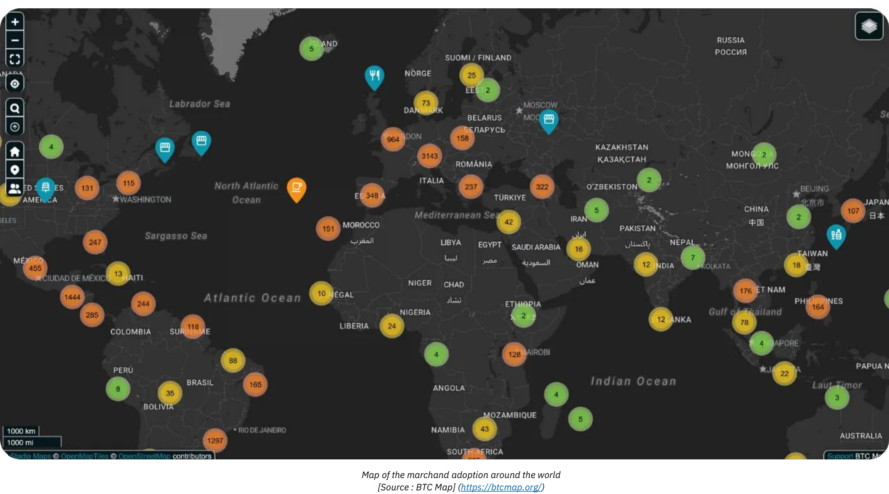

*[แหล่งที่มา: BTC Map](https://btcmap.org/)*

- เมตริกเครือข่าย:** จำนวนช่องทางทั้งหมดและ Bitcoin ที่ล็อคบน Lightning ยังคงเสถียร โดยมีโหนดประมาณ 20,000 โหนด, 5,200 BTC, และ 60,000 ช่องทาง อย่างไรก็ตาม นี่สะท้อนเพียงส่วนหนึ่งของเครือข่ายและบ่งบอกถึงการเปลี่ยนแปลงในการมีส่วนร่วม โดยมีบุคคลน้อยลงและมีมืออาชีพมากขึ้นที่เข้าร่วม

- สายฟ้าเป็นสะพานเชื่อมระหว่างเครือข่าย:** ประสิทธิภาพและความพร้อมใช้งานของ Lightning Network ได้ทำให้มันเป็นสะพานเชื่อมไปยังเครือข่ายอื่น ๆ ที่เชื่อมต่อกัน (เช่น FediMint, Liquid, เป็นต้น)

**การกลับมาของ Wallet**

Bitcoin และ Lightning Network กำลังช่วยให้การปฏิวัติ **ดิจิทัล wallet** สมบูรณ์ บริการเว็บใหม่ๆ ตอนนี้อนุญาตให้ **ทำธุรกรรมโดยไม่จำเป็นต้องสร้างบัญชี**—wallet ของคุณกลายเป็นตัวตนของคุณ! ด้วยโปรโตคอลอย่าง **Nostr Wallet Connect (NWC)** และ **LN-URL-AUTH** กระเป๋าเงินสามารถยืนยันตัวตนของผู้ใช้และเปิดใช้งานการทำธุรกรรมได้อย่างราบรื่นโดยไม่ต้องใช้บัญชีแบบดั้งเดิม หมดยุคของความเหนื่อยล้าจากการสร้างบัญชีสำหรับการซื้อหรือการสมัครสมาชิกง่ายๆ ไม่จำเป็นต้องให้ข้อมูลส่วนตัวหรือข้อมูลการชำระเงินที่อาจถูกแฮ็กและนำไปขายบนเว็บมืดอีกต่อไป ซึ่งเราได้รับการเตือนบ่อยครั้งจากเหตุการณ์ล่าสุด

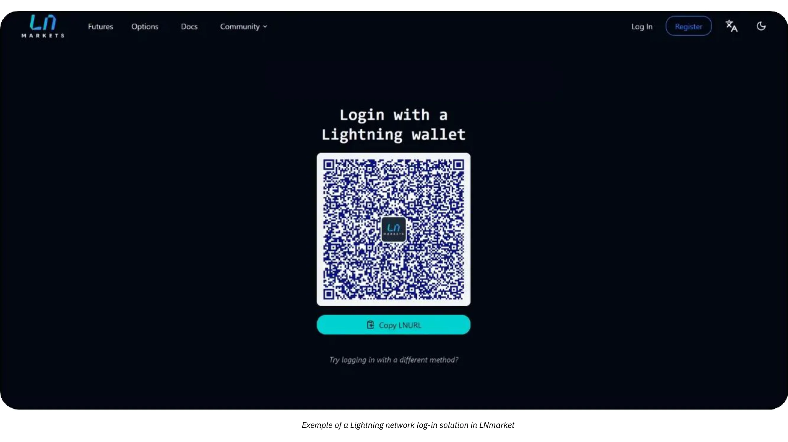

พ่อค้าในวันพรุ่งนี้จะยอมรับนวัตกรรมนี้ โดยมอบประสบการณ์ที่ปลอดภัยและราบรื่นยิ่งขึ้น (คลิกเดียว) ให้กับลูกค้า ซึ่งยังคงเคารพความเป็นส่วนตัวของพวกเขาด้วย

# Bitcoin การบัญชี

<partId>d49d7595-a189-4e2b-bd60-c19e8e717aa2</partId>

## หลักการสำคัญสำหรับการบัญชี Bitcoin ในธุรกิจ

<chapterId>84063061-ffdb-4b1f-b20b-588ffb146877</chapterId>

เนื้อหาต่อไปนี้มีวัตถุประสงค์เพื่อการศึกษาเท่านั้นและไม่ควรถือเป็นคำแนะนำทางการเงินหรือการบัญชี ธุรกิจและบุคคลควรปรึกษานักบัญชีหรือผู้เชี่ยวชาญด้านกฎหมายที่มีคุณสมบัติเหมาะสมซึ่งคุ้นเคยกับกฎระเบียบเกี่ยวกับสกุลเงินดิจิทัลในเขตอำนาจศาลเฉพาะของตนก่อนดำเนินการใดๆ

### Bitcoin แนวคิดสำคัญทางการบัญชี

**ธุรกรรม Bitcoin ใด ๆ ต้องได้รับการบันทึกและอาจนำไปสู่เหตุการณ์ที่ต้องเสียภาษี**

ทั่วโลก Bitcoin มักถูกจัดประเภทไม่ใช่เป็นสกุลเงินแต่เป็นสินทรัพย์ดิจิทัล ความแตกต่างนี้มีผลกระทบอย่างมากต่อวิธีการที่ Bitcoin ถูกบันทึกบัญชีในธุรกิจ ซึ่งส่งผลต่อภาระภาษี การรายงานทางการเงิน และข้อกำหนดการปฏิบัติตามกฎระเบียบ ธุรกิจที่ยอมรับ Bitcoin เป็นวิธีการชำระเงินหรือใช้เป็นเครื่องมือทางการเงินต้องเข้าใจความละเอียดอ่อนของกฎระเบียบเหล่านี้

ผลที่ตามมาที่สำคัญที่สุดที่ต้องคำนึงถึงคือ ในเขตอำนาจศาลส่วนใหญ่ การหารายได้ ขาย ซื้อขาย หรือใช้ Bitcoin เพื่อทำการซื้อ มักจะสร้าง **เหตุการณ์ที่ต้องเสียภาษี** และกำไรจะต้องเสียภาษีกำไรจากการลงทุน

อีกแง่มุมหนึ่งของการบัญชี Bitcoin คือการแยกความแตกต่างระหว่างกำไรจากทุนสองประเภท:

- กำไร/ขาดทุนแฝง:** กำไรหรือขาดทุนที่ยังไม่เกิดขึ้นจริงตามมูลค่าของ Bitcoin ที่ถือครอง ณ สิ้นงวดบัญชี
- กำไร/ขาดทุนที่เกิดขึ้นจริง:** กำไรหรือขาดทุนที่เกิดขึ้นจริงเมื่อ Bitcoin ถูกขายหรือแลกเปลี่ยนในระหว่างปีงบประมาณ

การคำนวณเหล่านี้ขึ้นอยู่กับว่า Bitcoin ถูกถือครองเพื่อการลงทุนระยะยาวหรือการใช้งานเชิงปฏิบัติการระยะสั้น นอกจากนี้ ธุรกิจต้องปรับแนวทางการบัญชีให้สอดคล้องกับโครงสร้างภาษีท้องถิ่น เนื่องจากกฎระเบียบแตกต่างกันอย่างมากจากประเทศหนึ่งไปยังอีกประเทศหนึ่ง

การบัญชีสำหรับธุรกิจที่ถือ Bitcoin ค่อนข้างยุ่งยากเนื่องจากทุกธุรกรรมต้องถูกติดตามอย่างละเอียดเพื่อคำนวณกำไรหรือขาดทุนที่เกิดขึ้นจริงหรือยังไม่เกิดขึ้นจริง สำหรับการขายแต่ละครั้งที่คุณทำโดยการยอมรับ Bitcoin เป็นรูปแบบการชำระเงิน หรือทุกครั้งที่คุณซื้อหรือขาย Bitcoin คุณจำเป็นต้องบันทึก:

- เวลาที่เฉพาะเจาะจง
- ราคาขาย (ในสกุลเงินเฟียต)
- ราคาทุนของ Bitcoin (ราคาที่ Bitcoin ถูกซื้อมาในตอนแรก)

สิ่งนี้จะช่วยให้คุณสามารถคำนวณความแตกต่างในภายหลังเพื่อกำหนดกำไรหรือขาดทุนได้

**ตัวอย่าง:** ธุรกิจซื้อ 1 BTC ที่ราคา $30,000 ต่อมา ขาย 0.5 BTC ในราคา $20,000 เพื่อคำนวณกำไรหรือขาดทุน ธุรกิจต้อง:

- ได้บันทึกเวลา ราคาต้นทุนเงินสด และปริมาณของ Bitcoin ที่ได้มาแล้ว
- บันทึกเวลา ราคาขายเงินสด และปริมาณของ Bitcoin ที่ขาย
- กำหนดต้นทุนของ Bitcoin ที่ขาย: 0.5 BTC: $30,000 ÷ 2 = $15,000.
- เปรียบเทียบราคาขายกับราคาทุน: $20,000 (ราคาขาย) - $15,000 (ราคาทุน) = กำไร $5,000.
- อัปเดตการถือครอง Bitcoin ด้วยราคาทุนใหม่

กระบวนการนี้จะต้องทำซ้ำสำหรับทุกธุรกรรม และลักษณะที่ผันผวนของราคาของ Bitcoin ทำให้การเก็บบันทึกยิ่งยุ่งยากมากขึ้น

**มันจะทำงานอย่างไรถ้า Bitcoin เป็นสกุลเงิน ?**

หาก Bitcoin ถูกจัดการเป็นสกุลเงิน ธุรกิจจะจัดการมันเหมือนกับสกุลเงินอื่น ๆ ในระบบบัญชีของพวกเขา แทนที่จะติดตามต้นทุนพื้นฐานและกำไรที่เกิดขึ้นจริง/ยังไม่เกิดขึ้นจริงสำหรับแต่ละธุรกรรม การถือครอง Bitcoin จะถูกบันทึกไว้ในบัญชีสกุลเงินเท่านั้น ในตอนท้ายของแต่ละรอบระยะเวลารายงาน มูลค่าของการถือครองสกุลเงินทั้งหมด รวมถึง Bitcoin จะถูกแปลงเป็นสกุลเงินบัญชี (เช่น USD หรือ EUR) โดยใช้ อัตราแลกเปลี่ยนปัจจุบัน

**ตัวอย่างที่อัปเดตหาก Bitcoin ได้รับการยอมรับเป็นสกุลเงิน:**

- ธุรกิจถือ 1 BTC เมื่อ Bitcoin มีมูลค่า $30,000 ต่อมา ธุรกิจใช้ 0.5 BTC สำหรับการชำระเงินเมื่อ Bitcoin มีมูลค่า $40,000
- ธุรกิจ **ไม่** คำนวณกำไรหรือขาดทุนที่เกิดขึ้นจริง แต่จะบันทึกธุรกรรมเป็น:
    - การชำระเงิน: $20,000 (0.5 BTC × $40,000).
    - ยอดคงเหลือ Bitcoin ที่เหลือ: 0.5 BTC, ปัจจุบันมีมูลค่า $20,000 (อัปเดตตามอัตราแลกเปลี่ยนปัจจุบัน)

**ข้อได้เปรียบหลักหาก Bitcoin ได้รับการยอมรับเป็นสกุลเงิน:**

- ธุรกิจจำเป็นต้องปรับมูลค่าที่เทียบเท่ากับเงินเฟียตของการถือครอง Bitcoin เป็นระยะ ๆ (เช่น สำหรับรายงานรายเดือนหรือรายปี) เช่นเดียวกับเงินยูโร เยน หรือสกุลเงินอื่น ๆ ที่ถือครองอยู่
- สิ่งนี้ช่วยขจัดความจำเป็นในการติดตามต้นทุนในระดับธุรกรรมและทำให้การบัญชีง่ายขึ้น โดยเฉพาะอย่างยิ่งสำหรับธุรกิจที่มีธุรกรรม Bitcoin บ่อยครั้ง

วิธีการนี้จะทำให้การบัญชี Bitcoin ง่ายขึ้น ลดภาระทางการบริหาร และสอดคล้องกับการจัดการสกุลเงินอื่น ๆ โดยสมมติว่า Bitcoin ได้รับการยอมรับอย่างเต็มที่ในแง่กฎหมายและข้อบังคับ เรายังไม่ถึงจุดนั้น

### ความแตกต่างระหว่างการบัญชี Bitcoin ส่วนบุคคลและองค์กร

การปฏิบัติทางกฎหมายและการบัญชีของ Bitcoin แตกต่างกันอย่างมากระหว่างบุคคลและบริษัท สำหรับบุคคล กำไรจากการทำธุรกรรม Bitcoin อาจต้องเสียภาษีเงินได้ ซึ่งมักจะอยู่ในอัตราที่สูงกว่า ในทางตรงกันข้าม บริษัทอาจได้รับประโยชน์จากอัตราภาษีของบริษัทที่อาจต่ำกว่า แต่ต้องปฏิบัติตามมาตรฐานการบัญชีที่เข้มงวดกว่า

สำหรับธุรกิจ Bitcoin สามารถจัดประเภทภายใต้บัญชีต่างๆ ได้ขึ้นอยู่กับการใช้งานที่ตั้งใจ:

- สินทรัพย์ถาวร:** สำหรับ Bitcoin ที่ถือครองระยะยาวเป็นการลงทุนเชิงกลยุทธ์
- หุ้น:** สำหรับ Bitcoin ที่ใช้ในกระบวนการผลิต (เป็นกรณีการใช้งานที่หายาก เช่น กรณีนี้สำหรับผู้ค้าระดับมืออาชีพ)
- เงินสดหรือบัญชีคลัง:** สำหรับ Bitcoin ที่ถือเป็นสินทรัพย์สภาพคล่อง ใช้หลักในการทำธุรกรรมการดำเนินงานหรือการจัดการคลังระยะสั้น

การเลือกประเภทขึ้นอยู่กับกิจกรรมและกลยุทธ์ของบริษัท ซึ่งมีผลต่อการรายงานทางการเงินและภาระภาษี ควรตรวจสอบกฎระเบียบในท้องถิ่นเสมอ เนื่องจากประเภทเหล่านี้อาจแตกต่างกันไปในแต่ละประเทศ

### กรอบกฎหมาย

การยอมรับและการปฏิบัติต่อ Bitcoin ในทางกฎหมายแตกต่างกันไปในแต่ละเขตอำนาจศาล บางประเทศ เช่น เอลซัลวาดอร์ ได้ยอมรับ Bitcoin เป็นเงินที่ถูกต้องตามกฎหมาย ทำให้การใช้ในการทำธุรกรรมง่ายขึ้นแต่ทำให้การรายงานทางการเงินระหว่างประเทศซับซ้อนขึ้น ประเทศอื่น ๆ ปฏิบัติต่อ Bitcoin เป็นสินทรัพย์ดิจิทัลที่อยู่ภายใต้กฎระเบียบด้านภาษีและการบัญชีเฉพาะ

ในประเทศส่วนใหญ่ Bitcoin ถูกจัดประเภทเป็นสินทรัพย์ดิจิทัล และมาตรฐานการบัญชีทั่วไปจะควบคุมการจัดการของมัน ธุรกิจต้องบันทึกการทำธุรกรรม Bitcoin ดังนี้:

- การบันทึกกำไร/ขาดทุนจากเงินทุน:** ธุรกิจต้องบันทึกกำไรหรือขาดทุนที่เกิดขึ้นจริงในผลการดำเนินงานทางการเงินของพวกเขา
- มูลค่ากำไร/ขาดทุนที่ยังไม่เกิดขึ้นจริง:** กำไรหรือขาดทุนที่ยังไม่เกิดขึ้นจริงมักจะต้องรายงานแต่ไม่อาจส่งผลโดยตรงต่อรายได้ที่ต้องเสียภาษี
- การปฏิบัติตามมาตรฐานการบัญชี:** ธุรกิจต้องรวมธุรกรรม Bitcoin เข้ากับการปฏิบัติทางบัญชีมาตรฐาน เพื่อให้มั่นใจในความโปร่งใสและความถูกต้อง

วิธีการบัญชี Bitcoin แตกต่างกันไปตามภูมิศาสตร์:

- สหรัฐอเมริกา:** IRS จัดประเภท Bitcoin เป็น **ทรัพย์สิน, คล้ายกับหุ้น, พันธบัตร หรืออสังหาริมทรัพย์**. การจัดประเภทนี้หมายความว่าการทำธุรกรรมใด ๆ ที่เกี่ยวข้องกับสกุลเงินดิจิทัล เช่น การหารายได้, การขาย, การซื้อขาย, หรือแม้กระทั่งการใช้เพื่อซื้อสินค้า, สามารถสร้างเหตุการณ์ที่ต้องเสียภาษีได้, และกำไรจะต้องเสียภาษีกำไรจากการขายทรัพย์สิน.
- สหภาพยุโรป:** ประเทศสมาชิกมักจะถือว่า Bitcoin เป็นสินทรัพย์เก็งกำไรมากกว่าสกุลเงินที่ใช้งานได้ ดังนั้น กำไรมักจะต้องเสียภาษีกำไรจากการลงทุน
- เอเชีย:** ประเทศอย่างสิงคโปร์และญี่ปุ่นได้ใช้กรอบการกำกับดูแลที่ก้าวหน้า โดยปฏิบัติต่อธุรกรรม Bitcoin อย่างเป็นมิตรในบริบทเฉพาะ อย่างไรก็ตาม Bitcoin มักจะถูกบันทึกเป็น **สินทรัพย์ไม่มีตัวตน** และถูกวัดมูลค่าตามมูลค่ายุติธรรม ณ วันที่รายงาน โดยการเปลี่ยนแปลงใด ๆ จะถูกรับรู้ในกำไรหรือขาดทุน

สิ่งสำคัญคือต้องเข้าใจกฎระเบียบในประเทศที่คุณดำเนินการและปรับแนวทางการบัญชีของคุณให้สอดคล้องกัน

### ความท้าทายในการวิวัฒนาการด้านกฎระเบียบ

อัตราการพัฒนาของนวัตกรรมสกุลเงินดิจิทัลมักจะก้าวล้ำหน้าการพัฒนาของกรอบการกำกับดูแล ตั้งแต่การยอมรับ Bitcoin เป็นสินทรัพย์ดิจิทัล กฎระเบียบทั่วโลกได้มีการอัปเดตทีละน้อย แต่ยังคงมีช่องว่างอยู่:

- ขาดนิติศาสตร์:** มีคดีทางกฎหมายเพียงไม่กี่คดีที่ได้ชี้แจงแนวปฏิบัติทางบัญชีเฉพาะ ทำให้มีช่องว่างสำหรับการตีความ
- การอภิปรายที่กำลังดำเนินอยู่:** ประเด็นต่างๆ เช่น การจัดการภาษีของการขาดทุนแฝงยังคงไม่ได้รับการแก้ไขในหลายเขตอำนาจศาล
- ความซับซ้อนข้ามพรมแดน:** บริษัทที่ดำเนินงานในระดับสากลต้องเผชิญกับความท้าทายในการปรับมาตรฐานการบัญชีที่แตกต่างกันในแต่ละประเทศให้สอดคล้องกัน

แม้จะมีความท้าทายเหล่านี้ แต่ท่าทีเชิงรุกของหลายประเทศก็เป็นพื้นฐานที่มั่นคงสำหรับธุรกิจในการนำ Bitcoin เข้ามาใช้ในกระบวนการดำเนินงานของพวกเขา การอัปเดตอย่างต่อเนื่องและการประสานงานระหว่างประเทศจะมีความสำคัญอย่างยิ่งในการจัดการกับความซับซ้อนที่เกิดขึ้นใหม่ในด้านการบัญชีสกุลเงินดิจิทัล

### การจัดประเภทของ Bitcoin ในงบการเงิน

การจัดประเภทของ Bitcoin ในงบการเงินแตกต่างกันไปตามเขตอำนาจศาลและขึ้นอยู่กับการใช้งานที่ตั้งใจไว้ภายในธุรกิจ โดยทั่วไปแล้ว Bitcoin จะถูกจัดการเป็นสินทรัพย์ดิจิทัล คล้ายกับสินค้าคงคลัง การลงทุน หรือสกุลเงิน แต่มีลักษณะเฉพาะที่ส่งผลต่อการจัดการทางบัญชีของมัน

- สินทรัพย์ดิจิทัลหรือสินทรัพย์ไม่มีตัวตน**: หลายเขตอำนาจศาล รวมถึงฝรั่งเศสและสหภาพยุโรป จัดประเภท Bitcoin เป็นสินทรัพย์ดิจิทัลหรือสินทรัพย์ไม่มีตัวตนแทนที่จะเป็นเงินที่ถูกกฎหมาย การจัดประเภทนี้ต้องการให้ธุรกิจจัดการบัญชีสำหรับ Bitcoin แตกต่างจากสกุลเงินเฟียต
- สินค้าคงคลัง**: หากกิจกรรมหลักของธุรกิจเกี่ยวข้องกับการซื้อขาย Bitcoin เช่น การแลกเปลี่ยนสกุลเงินดิจิทัลหรือโบรกเกอร์ Bitcoin จะถูกจัดประเภทเป็นสินค้าคงคลัง ในกรณีนี้ การประเมินมูลค่าจะเป็นไปตามมาตรฐานการบัญชีสินค้าคงคลัง
- การลงทุนทางการเงิน**: บริษัทที่ถือ Bitcoin เป็นสินทรัพย์ระยะยาวอาจจัดประเภทเป็นการลงทุนทางการเงิน ตัวอย่างเช่น ในสหรัฐอเมริกา ธุรกิจสามารถบันทึก Bitcoin ภายใต้แนวทางของคณะกรรมการมาตรฐานการบัญชีการเงิน (FASB) โดยรับรู้การด้อยค่าของมูลค่าเมื่อมูลค่าตลาดลดลง

**ผลกระทบของการจัดประเภท:**

- การถือครองระยะยาวมักต้องการการทดสอบการด้อยค่าและการตัดจำหน่าย
- การซื้อขายที่ใช้งานอยู่หรือกิจกรรมที่เกี่ยวข้องกับการชำระเงินต้องการการติดตามกำไรและขาดทุนที่เกิดขึ้นจริงและยังไม่เกิดขึ้นอย่างต่อเนื่อง

### วิธีการประเมินมูลค่า

วิธีการประเมินมูลค่าเป็นเทคนิคทางบัญชีที่ใช้ในการกำหนดฐานต้นทุนของ Bitcoin ซึ่งมีความสำคัญต่อการคำนวณกำไรหรือขาดทุนอย่างถูกต้องในระหว่างการทำธุรกรรม โดยทั่วไปแล้ว ควร **รักษามูลค่าที่อัปเดตเสมอของต้นทุนการถือครอง Bitcoin ปัจจุบัน** ในระบบบัญชี สิ่งนี้ช่วยให้มั่นใจถึงความโปร่งใส การปฏิบัติตามกฎระเบียบด้านภาษี และป้องกันการล้าหลังเมื่อจำเป็นต้องทำการคำนวณ

- มาก่อนได้ก่อน (FIFO)**: พบได้ทั่วไปในเขตอำนาจศาลเช่น ออสเตรเลียและอินเดีย วิธีนี้ประเมินค่า Bitcoin ตามต้นทุนการได้มาครั้งแรก ซึ่งอาจจะ **ซับซ้อน** มากเนื่องจากอาจต้องติดตามแต่ละส่วนของบิตคอยน์แยกกันเมื่อมีการขายเกิดขึ้น
- ต้นทุนถัวเฉลี่ยถ่วงน้ำหนัก (WAC)**: มักได้รับความนิยมสำหรับธุรกรรมที่มีปริมาณมากเนื่องจากมี **ความเรียบง่าย** ดังที่เห็นในประเทศอย่างสหรัฐอเมริกา

ขอแนะนำอย่างยิ่งให้รักษาสมุดงานที่มีรายละเอียดซึ่งติดตามค่าใช้จ่าย Bitcoin ตั้งแต่ช่วงเวลาที่บริษัทเริ่มซื้อหรือรับ Bitcoin เป็นการชำระเงิน เพื่อให้มั่นใจว่ามีการบันทึกข้อมูลอย่างถูกต้องและเป็นระเบียบ การพิจารณานั้นเพียงอย่างเดียวควรเป็นสิ่งสำคัญที่สุดเมื่อเลือกโซลูชันซอฟต์แวร์เพื่อรับการชำระเงิน Bitcoin หรือซื้อ Bitcoin

### การบัญชีสำหรับธุรกรรมในค้าปลีกและอีคอมเมิร์ซ

ผู้ค้าปลีกต้องบันทึกอัตราแลกเปลี่ยน Bitcoin ต่อเงินเฟียตสำหรับแต่ละธุรกรรม ตัวอย่างเช่น ในหลายประเทศ ธุรกิจใช้ อัตราแลกเปลี่ยนในขณะขายเพื่อคำนวณ VAT

ธุรกิจต้องมั่นใจว่าไม่ว่าเครื่องมือ **การชำระเงิน** ใดที่พวกเขาใช้งานอยู่สามารถให้ความสามารถในการ:

- generate ใบแจ้งหนี้ที่มีจำนวนเงินสกุลเงินท้องถิ่น (ยูโร, ดอลลาร์, ปอนด์) ซึ่งรวม VAT หรือภาษีท้องถิ่นอื่น ๆ จำนวนเงินที่เทียบเท่าในบิตคอยน์ วันที่และเวลา อัตราแลกเปลี่ยนบิตคอยน์และแหล่งที่มาของอัตราแลกเปลี่ยน ฯลฯ
- ส่งออกใบเสร็จการชำระเงินทั้งหมด อย่างน้อยในรูปแบบ .csv พร้อมข้อมูลทั้งหมดข้างต้น เพื่อให้นักบัญชีสามารถดำเนินการได้อย่างง่ายดาย
- ในอุดมคติควรมีการบันทึกค่าพื้นฐานต้นทุนที่อัปเดตสำหรับ Bitcoin ปัจจุบันที่ถืออยู่ในคลัง

### ความท้าทาย

- ความผันผวน**: ราคาของ Bitcoin มีการเปลี่ยนแปลงอย่างมาก ทำให้เกิดความยากลำบากในการประเมินมูลค่าการถือครองและการคาดการณ์ผลลัพธ์ทางการเงินในอนาคต
- การตรวจสอบด้านกฎระเบียบ**: ในประเทศอย่างจีน สถานะที่ถูกจำกัดของ Bitcoin จำกัดการใช้เป็นสินทรัพย์คลัง
- ความไม่แน่นอนด้านกฎระเบียบ**: ภูมิทัศน์ด้านกฎระเบียบของ Bitcoin ที่กำลังพัฒนาอยู่บ่อยครั้งทำให้ธุรกิจต้องอยู่ในสภาวะที่ไม่แน่นอน ตัวอย่างเช่น การเปลี่ยนแปลงในนโยบายภาษี เช่น ในอินเดียหรือสหรัฐอเมริกา สามารถส่งผลกระทบต่อแนวปฏิบัติทางบัญชีได้ในชั่วข้ามคืน
- ความเสี่ยงจากการจัดการที่ไม่เหมาะสม**: การจัดประเภทที่ไม่ถูกต้องหรือการไม่ติดตามธุรกรรม Bitcoin อาจนำไปสู่ปัญหาการปฏิบัติตามกฎระเบียบ, การถูกลงโทษ, หรือความเสียหายต่อชื่อเสียง.
- ความเสี่ยงในการรับรองคุณสมบัติใหม่**: การรักษาส่วนสำคัญของเงินทุนของบริษัทใน Bitcoin ทำให้ธุรกิจเสี่ยงต่อการสูญเสียจากการลดลงของราคา ซึ่งอาจมีผลกระทบอย่างรุนแรง โดยเฉพาะอย่างยิ่งหากการลดลงดังกล่าวเกิดขึ้นเมื่อถึงกำหนดชำระเงินให้กับซัพพลายเออร์ พนักงาน หรือภาษี นอกจากนี้ เจ้าของบริษัทอาจถูกถือว่ามีความรับผิดชอบ ซึ่งอาจส่งผลให้เกิดค่าปรับหรือผลทางกฎหมายอื่น ๆ เช่น การถูกกล่าวหาว่าใช้ทรัพย์สินของบริษัทในทางที่ผิด

## เครื่องมือและซอฟต์แวร์บัญชี

<chapterId>e7b31be5-1176-4835-944e-3cba1b7040fa</chapterId>

เมื่อบริษัทตัดสินใจที่จะรวม Bitcoin เข้ากับการบัญชี เครื่องมือต่างๆ และซอฟต์แวร์เฉพาะทางจะช่วยให้การรวบรวมและประมวลผลข้อมูลง่ายขึ้น ในบรรดาโซลูชันที่รู้จักกันดีได้แก่ [CoinTracker](https://www.cointracker.io/), [Waltio](https://www.waltio.com/), [Cryptio](https://cryptio.co/), [Koinly](https://koinly.io/), [TokenTax](https://tokentax.co/), และ [ZenLedger](https://zenledger.io/) แพลตฟอร์มเหล่านี้มุ่งเน้นไปที่สี่ด้านหลัก:

- การเก็บข้อมูลอัตโนมัติ;
- การแปลงข้อมูลนี้เป็นรูปแบบที่เข้ากันได้กับซอฟต์แวร์บัญชีทั่วไปมากขึ้น (QuickBooks, Xero, ERP);
- การคำนวณภาระภาษี;
- การจัดหมวดหมู่ธุรกรรม

พวกเขามักจะเป็นส่วนเสริมที่ชาญฉลาดสำหรับองค์กรขนาดใหญ่ที่มีหลายกระเป๋าเงินและสินทรัพย์ในหลายแพลตฟอร์มหรือการแลกเปลี่ยน

อย่างไรก็ตาม ไฟล์ `.csv` ง่ายๆ ที่มีประวัติการทำธุรกรรมมักจะเพียงพอสำหรับธุรกิจขนาดเล็กส่วนใหญ่ เป้าหมายคือการบันทึก สำหรับการชำระเงินแต่ละครั้ง วันที่ จำนวนเงิน มูลค่าเทียบเท่าในยูโร/ดอลลาร์ และที่อยู่ Bitcoin ที่เกี่ยวข้อง โซลูชันการชำระเงิน Bitcoin ส่วนใหญ่ (BTCPay Server, Swiss Bitcoin Pay, ฯลฯ) หรือแพลตฟอร์มแลกเปลี่ยน (Bitfinex, Kraken, Coinbase, ฯลฯ) มีการเสนอวิธีการส่งออกประวัติการทำธุรกรรมอยู่แล้ว โดยการให้ไฟล์นี้แก่บัญชี จะสามารถทำให้การป้อนข้อมูลเป็นไปอย่างราบรื่นและแยกแยะการไหลเข้าหรือออกที่เกี่ยวข้องกับ Bitcoin ได้อย่างชัดเจน

สำหรับผู้ที่ดูแล Bitcoin ด้วยตนเอง การจัดการ UTXOs (*Unspent Transaction Outputs*) เป็นขั้นตอนสำคัญ การติดฉลาก UTXO อย่างถูกต้องช่วยให้สามารถติดตามแหล่งที่มาของแต่ละ BTC fragment แยกแยะธุรกรรมที่เกี่ยวข้องกับกิจกรรมทางอาชีพจากค่าใช้จ่ายส่วนตัว และอำนวยความสะดวกในการติดตามเพื่อวัตถุประสงค์ทางกฎหมายหรือภาษี ซอฟต์แวร์ Bitcoin wallet ที่ดีส่วนใหญ่ช่วยให้คุณนำเข้า wallet ของคุณโดยใช้ไฟล์สำรองข้อมูล (หรือ xpub ของคุณ ขึ้นอยู่กับการตั้งค่าของคุณ) และติดแท็ก UTXOs ตามแหล่งที่มาหรือปลายทาง เพื่อช่วยคุณ นี่คือบทแนะนำที่สมบูรณ์ที่อุทิศให้กับการปฏิบัตินี้:

https://planb.academy/tutorials/privacy/on-chain/utxo-labelling-d997f80f-8a96-45b5-8a4e-a3e1b7788c52

ในที่สุด ไม่ว่าคุณจะเป็นพ่อค้ารายย่อยหรือธุรกิจที่มีชื่อเสียงมากขึ้น ก็สามารถ **ชำระใบแจ้งหนี้ใน Bitcoin** ได้ กุญแจสำคัญคือการบันทึกธุรกรรมอย่างถูกต้อง หากคุณชำระจากการดูแลตนเอง wallet ควรที่จะ generate บันทึกธุรกรรมรวมถึงหมายเลขใบแจ้งหนี้และวัตถุประสงค์การชำระเงินในป้ายกำกับของคุณ หากคุณต้องการชำระใบแจ้งหนี้ผ่านการแลกเปลี่ยน คุณยังมีตัวเลือกในการส่งออกใบเสร็จหรือประวัติธุรกรรมเพื่อรวมไว้ในบันทึกการบัญชีของคุณ ความโปร่งใสนี้จะช่วยให้การติดตามและรายงานการดำเนินการ BTC ทั้งหมดของคุณง่ายขึ้น

## ตัวอย่างการบัญชี Bitcoin ที่ใช้งานได้จริง

<chapterId>763f6f20-9181-495a-bf7d-b405899e65ec</chapterId>

### กรณีการใช้งาน 1: ร้านค้าปลีกแปลงการชำระเงิน Bitcoin เป็นยูโร

**สถานการณ์**: ร้านเบเกอรี่ขนาดเล็กแห่งหนึ่งรับ Bitcoin เป็นวิธีการชำระเงิน แต่จะทำการแปลง Bitcoin ที่ได้รับทั้งหมดเป็นยูโรทันทีเพื่อหลีกเลี่ยงความผันผวนของสกุลเงินดิจิทัล

**ตัวอย่าง**:

- Bitcoin Conversion Rate**: 1 Bitcoin = €40,000.
- ธุรกรรม 1**: ลูกค้าซื้อขนมอบหลายชิ้นในราคา €20.
    - Bitcoin เทียบเท่า: (20 / 40,000) = 0.0005 Bitcoin = 50,000 ซาโตชิ
    - ค่าธรรมเนียมการแปลง: 1.5% (€20 × 0.015) = €0.30.
    - ได้รับสุทธิ: €20 - €0.30 = €19.70.
- ธุรกรรม 2**: ลูกค้าซื้อกาแฟในราคา €5.
    - Bitcoin เทียบเท่า: (5 / 40,000) = 0.000125 Bitcoin = 12,500 ซาโตชิ
    - ค่าธรรมเนียมการแปลง: 1.5% (€5 × 0.015) = €0.075.
    - รับสุทธิ: €5 - €0.075 = €4.925.

**สรุปธุรกรรม**:

- ยอดขายรวม**: €25.
- ค่าธรรมเนียมทั้งหมด**: €0.375.
- ยอดเงินยูโรสุทธิ**: €24.625.

**ผลกระทบทางบัญชี**:

- บันทึกยอดขายรวม (€25) เป็นรายได้
- หักค่าธรรมเนียมการแปลง (€0.375) เป็นค่าใช้จ่าย
- ไม่มีการถือครอง Bitcoin ปรากฏในงบดุลเนื่องจากจำนวนทั้งหมดถูกแปลงทันที

### กรณีการใช้งานที่ 2: ร้านค้าปลีกเก็บรักษา 50% ของการชำระเงิน Bitcoin

**สถานการณ์**: ร้านเบเกอรี่เดียวกันเลือกที่จะเก็บ 50% ของการชำระเงิน Bitcoin เป็นสินทรัพย์คลัง ในขณะที่แปลงอีก 50% เป็นยูโร

**ตัวอย่าง**:

- Bitcoin Conversion Rate**: 1 Bitcoin = €40,000.
- ธุรกรรมจากลูกค้า**: ลูกค้าซื้อขนมอบในราคา €50.
    - Bitcoin เทียบเท่า: (50 / 40,000) = 0.00125 Bitcoin = 125,000 ซาโตชิ
    - Conversion (50%): €25 worth of Bitcoin = 0.000625 Bitcoin = 62,500 Satoshis.
        - ค่าธรรมเนียมการแปลง: 1.5% (€25 × 0.015) = €0.375.
        - สุทธิที่ได้รับเป็นยูโร: €25 - €0.375 = €24.625.
    - คงเหลือใน Bitcoin (50%): 62,500 Satoshis = 0.000625 Bitcoin.

**สรุปธุรกรรม**:

- ยอดขายรวม**: €50.
- ค่าธรรมเนียม**: €0.375.
- ยอดเงินยูโรสุทธิ**: €24.625.
- Bitcoin Retained**: 62,500 Satoshis.

**ผลกระทบทางบัญชี**:

- บันทึกยอดขายรวม (€50) เป็นรายได้.
- หักค่าธรรมเนียมการแปลง (€0.375) เป็นค่าใช้จ่าย
- Retained Bitcoin (62,500 Satoshis) ปรากฏในงบดุลเป็นสินทรัพย์ดิจิทัล
- กำไรที่ยังไม่เกิดขึ้นจริง: หากมูลค่าของบิตคอยน์ ณ สิ้นปีงบประมาณสูงหรือต่ำกว่า จะมีกำไรหรือขาดทุนที่ยังไม่เกิดขึ้นจริงซึ่งจะถูกเปิดเผยในหมายเหตุทางการเงินแต่จะไม่รับรู้เป็นรายได้

### กรณีการใช้งาน 3: การรักษาบริการมืออาชีพ Bitcoin สำหรับการลงทุนระยะยาว

**สถานการณ์**: นักออกแบบกราฟิกอิสระยอมรับ Bitcoin เป็นการชำระเงินและเก็บรักษา Bitcoin ที่ได้รับทั้งหมดเป็นการลงทุนระยะยาว

**ตัวอย่าง**:

- Bitcoin Conversion Rate at Payment**: 1 Bitcoin = €30,000.
- ธุรกรรมจากลูกค้า**: ลูกค้าชำระค่าบริการมูลค่า €3,000.
    - Bitcoin เทียบเท่า: (3,000 / 30,000) = 0.1 Bitcoin = 10,000,000 ซาโตชิ
- การประเมินมูลค่าปลายปี**:
    - อัตราแลกเปลี่ยน Bitcoin ณ สิ้นปี: 1 Bitcoin = €35,000.
    - การประเมินมูลค่าของ Bitcoin การถือครอง: 0.1 Bitcoin × €35,000 = €3,500.
    - กำไรที่ยังไม่เกิดขึ้นจริง: €3,500 - €3,000 = €500.

**สรุปธุรกรรม**:

- รายได้รวมที่รับรู้**: €3,000.
- Bitcoin Holding**: 0.1 Bitcoin มูลค่า €3,500 ในงบดุล
- กำไรที่ยังไม่เกิดขึ้นจริง**: €500 เปิดเผยในหมายเหตุทางการเงินแต่ยังไม่ได้รับรู้เป็นรายได้

**ผลกระทบทางบัญชี**:

- บันทึกรายได้ (€3,000) ณ เวลาที่ให้บริการ
- Bitcoin ที่ยังคงอยู่ (0.1) มีมูลค่า €3,500 ในงบดุล
- กำไรที่ยังไม่เกิดขึ้นจริงจะถูกติดตามแต่ไม่รวมอยู่ในงบกำไร/ขาดทุน

### กรณีการใช้งาน 4: เจ้าของธุรกิจขาย 50% ของ Bitcoin หลังจากราคาสูงขึ้น

**สถานการณ์**: เจ้าของธุรกิจทำการซื้อ Bitcoin สามครั้งในระหว่างปี ถือ Bitcoin เป็นสินทรัพย์ และขาย 50% หลังจากที่ราคาสูงขึ้นอย่างมาก

**ตัวอย่าง**:

- การซื้อจากลูกค้า Bitcoin**:
    - ซื้อ 1: €2,000 ที่ €20,000/BTC = 0.1 Bitcoin = 10,000,000 ซาโตชิ
    - ซื้อ 2: €3,000 ที่ €25,000/BTC = 0.12 Bitcoin = 12,000,000 Satoshis.
    - ซื้อ 3: €5,000 ที่ €30,000/BTC = 0.1667 Bitcoin = 16,670,000 ซาโตชิ
    - ยอดรวม Bitcoin ที่ถือครอง**: 0.3867 Bitcoin = 38,670,000 ซาโตชิ

- การประเมินมูลค่าปลายปี**:
    - Bitcoin ราคา ณ สิ้นปี: €40,000/BTC.
    - มูลค่ารวม: 0.3867 Bitcoin × €40,000 = €15,468.
    - กำไรที่ยังไม่เกิดขึ้นจริง: €15,468 - €10,000 (ต้นทุนรวม) = €5,468.

- ขาย 50% ของ Bitcoin**:
    - Bitcoin ขาย: 0.19335 Bitcoin.
    - รายได้จากการขาย: 0.19335 Bitcoin × €40,000 = €7,734.
    - ต้นทุนฐาน (ค่าเฉลี่ยถ่วงน้ำหนัก):
        - ราคารวม: €2,000 + €3,000 + €5,000 = €10,000.
        - ราคาเฉลี่ยถ่วงน้ำหนัก: €10,000 / 0.3867 Bitcoin = €25,850/BTC.
        - ต้นทุนของ Bitcoin ที่ขาย: 0.19335 Bitcoin × €25,850 = €4,999.
    - กำไรที่รับรู้: €7,734 - €4,999 = €2,735.

**สรุปธุรกรรม**:

- Bitcoin ที่เหลือ**: 0.19335 Bitcoin มีมูลค่า €7,734 (ที่ €40,000/BTC)
- กำไรที่รับรู้**: €2,735 รวมอยู่ในงบกำไรขาดทุน
- กำไรที่ยังไม่เกิดขึ้นจริง**: €5,468 เปิดเผยในหมายเหตุทางการเงิน (รวมถึงมูลค่าที่ยังไม่เกิดขึ้นจริงของ Bitcoin ที่เหลือ)

**ผลกระทบทางบัญชี**:

- บันทึกรายได้จากการขาย (€7,734) เป็นรายได้
- หักต้นทุนของ Bitcoin ที่ขาย (€4,999) เพื่อคำนวณกำไรที่เกิดขึ้นจริง
- Retained Bitcoin (0.19335) appears on the balance sheet valued at €7,734.
- กำไรที่ยังไม่เกิดขึ้นจริงจำนวน €5,468 จาก Bitcoin ที่ยังคงอยู่ถูกเปิดเผยในหมายเหตุทางการเงิน

# ส่วนสุดท้าย

<partId>f6ca8d01-a4f3-449b-ac9f-c5fba9a69178</partId>

## ประเมินหลักสูตรนี้

<chapterId>0fe8c49e-b7f8-46f7-9c42-b8a9a99a7b46</chapterId>

<isCourseReview>true</isCourseReview>

## การสอบปลายภาค

<chapterId>40a0f18c-bdc9-45b2-8dea-15f7e574230e</chapterId>

<isCourseExam>true</isCourseExam>

## บทสรุป

<chapterId>5503c23e-3a90-4a23-8d89-75e3cc1ee53e</chapterId>

<isCourseConclusion>true</isCourseConclusion>