# Şirketinizin Bitcoin ağındaki yolculuğuna başlayın

Bitcoin ve Lightning Network'nın pratik yeteneklerini keşfedin ve tıpkı internet gibi, iş operasyonlarınızı nasıl **dönüştürebileceklerini** keşfedin. Dijital sermayeden hızlı, ekonomik ve ölçeklenebilir ödemelere kadar Bitcoin, işletmeler için geniş bir **kullanım alanı** sunuyor.

Bu kılavuz boyunca, Bitcoin'i küresel, evrensel ve internete özgü bir para ağı olarak nasıl anlayacağınızı öğreneceksiniz. Benzersiz temel özellikleriyle **Bitcoin, geleneksel para birimi ağlarına göre önemli iyileştirmeler sağlar**. Sermaye depolama ve ödeme sistemleri gibi klasik finansal kullanım durumları için Bitcoin'den neden ve nasıl yararlanacağınızı keşfedeceksiniz. Ayrıca bu kılavuz, ilgili muhasebe ve mali gereklilikler de dahil olmak üzere Bitcoin'in edinilmesi ve elde tutulmasının yanı sıra basit veya büyük ölçekli Bitcoin ödeme çözümlerinin uygulanmasını da kapsayacaktır.

İster **küçük bir işletme ister büyük bir şirket** olun, Bitcoin'u günlük operasyonlarınıza entegre etmek şirketinizi daha **dirençli, üretken ve rekabetçi** hale getirebilir. Her internet tabanlı şirket Bitcoin odaklı bir şirket haline gelecektir ve bu eğitim sizin hazırlıklı olmanızı sağlar. İlk bölümler Bitcoin'un işleyişinin temellerini özetler, böylece yeni başlayan biri olsanız bile ilerlemek için gereken temel bilgileri edinirsiniz. Satoshi'un icadının temellerini öğrenmek, BIZ101'e dalmadan önce veya sonra her zaman iyi bir fikirdir.

+++

# Giriş

<partId>326cf945-5d3f-4d86-8c3e-4d1c35959799</partId>

## Kursa genel bakış

<chapterId>1be42be9-4080-49f5-b5b2-6b531dd55f5f</chapterId>

BIZ101 kursuna hoş geldiniz! Bitcoin ve Lightning Network'in geleneksel iş operasyonlarında nasıl devrim yaratabileceğini anlamak için bir geçit olan bu kapsamlı eğitim kursu ile şirketinizin Bitcoin ağındaki yolculuğuna başlayın. Bu kurs, küresel, internete özgü bir para ağı ve Exchange'nin sağlam bir değer aracı olarak Bitcoin'ün pratik yeteneklerini keşfetmek isteyen perakendeciler, girişimciler, yöneticiler ve kurumsal karar vericiler için tasarlanmıştır.

Kurs boyunca, Bitcoin ve Lightning Network'ü belirgin bir şekilde dönüştürücü kılan temel ilkelerle tanışacaksınız. Bu teknolojilerin dijital sermaye depolamadan hızlı, ekonomik ve ölçeklenebilir ödemelere kadar nasıl bir kullanım yelpazesi sunduğunu ve geleneksel para birimi ve ödeme sistemlerine göre nasıl kritik iyileştirmeler sağladığını öğreneceksiniz. BIZ101 kursu, ekonomi teorisini gerçek dünya uygulamalarıyla birleştirerek merkezsizleşmenin aracılara olan bağımlılıkları nasıl azaltabileceğini ve eski sistemlerin doğasında bulunan sınırlamaların üstesinden nasıl gelebileceğini açıklamaktadır.

Kurs, geleneksel para birimleri ve ödeme mekanizmalarının ayrıntılı bir incelemesiyle başlayacak ve para biriminin ticaret, tasarruf ve ekonomik uzmanlaşmayı sağlamak için bir ağ olarak nasıl işlev gördüğünü keşfederek zemin hazırlayacaktır. Daha sonra, Bitcoin'nin arkasındaki teknolojiyi ve Lightning Network tarafından getirilen yenilikleri inceleyerek, bunların her büyüklükteki işletmeye hizmet edebilecek kesintisiz, güvenli ve neredeyse anlık işlemleri kolaylaştırmadaki rollerini ortaya koyacağız. Ardından, bitcoinleri hazine olarak tutmaya ilişkin bir bölümle başlayıp, Bitcoin'yi bir ödeme aracı olarak kabul etmeye ilişkin son bir bölümle devam ederek bu kursun pratik bölümlerine dalacağız.

İster küçük bir işletmeyi ister büyük bir şirketi temsil ediyor olun, bu kurs sizi Bitcoin'i günlük operasyonlarınıza entegre edecek bilgilerle donatmayı ve böylece şirketinizin dayanıklılığını, verimliliğini ve rekabet gücünü artırmayı amaçlamaktadır. Bitcoin ekonomik manzarayı yeniden şekillendirmeye devam ederken, bu çığır açan teknolojileri anlamak sadece bir seçenek değil, stratejik bir gerekliliktir. Bitcoin'in gelişen dünyasında gezinmenizi ve bu dünyadan yararlanmanızı sağlayacak anlayışlı içerik, pratik örnekler ve stratejik rehberlik ile etkileşim kurmaya hazırlanın!

İşletmeler için Bitcoin dünyasına dalmaya hazır mısınız? Hadi başlayalım!

# Para birimi, ödeme sistemleri ve Bitcoin

<partId>d9bd0e21-8488-44e0-af55-6d0b934f83c2</partId>

## Geleneksel para birimleri

<chapterId>785e095c-6811-4ca2-ba46-fe38291432d4</chapterId>

### Para Birimleri Ağlardır

Para birimleri temelde değerin etkin bir şekilde Exchange'e aktarılmasını sağlayan ağlardır.

Para birimi olmadan bireyler, malların ya da hizmetlerin doğrudan değiş tokuş edildiği bir sistem olan **takasa** güvenmek zorundadır. Takas pratik değildir çünkü "isteklerin çifte çakışmasını" gerektirir - her iki taraf da diğerinin sunduğu şeyi aynı anda arzulamalıdır. Örneğin, buğday fazlası olan bir çiftçi ayakkabı istiyorsa, özellikle buğdaya ihtiyacı olan bir ayakkabıcı bulmalıdır. Bu nadir ve verimsiz bir durumdur. Ayrıca, **bir takas ekonomisinde n ürünle, ~n(n-1)/2 Exchange oranına ihtiyaç vardır**, bu da oldukça karmaşık ve hantal bir sistem yaratır. Örneğin, sadece 500 ürün için ~124.000'den fazla Exchange oranı gerekir.

Para birimi bir aracı olarak hareket ederek bunu basitleştirir ve **Exchange oranlarının sayısını n**'ye düşüren bir ağ yaratır - para birimine göre her ürün için bir tane. Bu, işlemleri çok daha basit hale getirir ve **insanların aynı anda karşılıklı isteklere ihtiyaç duymadan mal ve hizmet ticareti yapmalarını sağlar**. Buğdayı doğrudan ayakkabı ile takas etmek yerine, çiftçi buğdayını para birimi karşılığında satabilir ve daha sonra bu para birimini ayakkabı veya ihtiyaç duyduğu başka bir şeyi satın almak için kullanabilir.

Para biriminin bir ağ olarak devreye girmesi sadece ticareti kolaylaştırmakla kalmaz, aynı zamanda **işbölümü ve uzmanlaşmayı** da mümkün kılar. Güvenilir bir Exchange aracı ile bireyler ve topluluklar artık tükettikleri her şeyi üretmek zorunda değildir. Bunun yerine, en iyi yaptıkları işe odaklanarak verimliliği ve kaliteyi artırabilirler. Bir çiftçi mahsul yetiştirmede, bir ayakkabıcı ayakkabı yapımında ve bir inşaatçı ev yapımında uzmanlaşabilir. Bu uzmanlar daha sonra birbirlerinin uzmanlıklarından faydalanarak mal ve hizmetlerini para birimi aracılığıyla Exchange yapabilirler. Bu uzmanlaşma **üretkenliği ve yeniliği** teşvik eder, çünkü insanlar becerilerini geliştirir ve kendi alanlarında yeni yöntemler geliştirir.

Para biriminin ağ yapısı ek önemli faydalar sağlar. İlk olarak, para birimi ağının bir parçası olmak, dışında olmaktan **daha avantajlıdır**. Ağın paylaşılan standardı ticareti kolaylaştırarak bireylerin ekonomik faaliyetlerini **uzak mesafeler arasında** bile koordine etmelerini sağlar. Örneğin, bir şehirdeki bir tüccar başka bir şehirdeki bir alıcıyla aynı para birimini kullanarak mal ticareti yapabilir, bu da geniş bölgelerde ekonomik büyümeyi ve işbirliğini teşvik eder.

Para biriminin bir diğer kritik avantajı da **ertelenmiş takaslara** izin vermesidir. Takasta işlemler anlıktır; bir mal diğeriyle gerçek zamanlı olarak takas edilir. Ancak para birimi **birikim yapmayı mümkün kılar-bireyler gelecekte kullanmak üzere değer depolayabilir**. Bu, ekonomik planlama, yatırım ve servet birikimi için büyük bir sıçramayı temsil eder ve bunların hepsi ağ katılımcılarının yaşamlarını iyileştirir.

Sonuç olarak, para birimleri değeri verimli bir şekilde taşımak için tasarlanmış ağlardır. Takasın sınırlamalarının üstesinden gelir, ticareti basitleştirir ve koordinasyon ve tasarruf için fırsatlar yaratırlar. Tıpkı herhangi bir ağ gibi, bir para biriminin değeri de yaygın olarak benimsenmesine ve kullanılmasına bağlıdır - sonuçta en iyi para birimi kazanır.

### İyi bir para birimi nedir?

İyi bir para birimi, Exchange değerini kolaylaştırmak için onu etkili kılan birkaç temel özelliğe sahiptir. İşte her birinin kısa bir açıklaması:

- **Güvenli**: Bir para birimi hırsızlığa veya yetkisiz erişime karşı korunmalı, kullanıcıların güvenle tutabilmeleri ve transfer edebilmeleri sağlanmalıdır. Güvenlik, sisteme güven oluşturmak için kritik öneme sahiptir.

- **Sahteciliğe Karşı Korumalı**: Bir para biriminin taklit edilmesi son derece zor veya imkansız olmalıdır. Bu, her birimin gerçek olmasını, değerini korumasını sağlar ve sahte birimlerin dolaşıma girmesinden kaynaklanan enflasyonu önler. Örneğin, tarihsel olarak altın sadece güzelliği ve nadirliği için değil, aynı zamanda üretimi son derece zor olduğu için de değerli olmuştur. Kağıt paraların veya dijital girdilerin aksine, altını öylece "yapamazsınız" - topraktan çıkarılması gerekir. Bu doğal kıtlık ve üretim zorluğu, altının güvenilir bir değer deposu ve özgünlük ölçütü olarak statüsünü korumasına yardımcı olmuştur.

- **Kıt**: İyi bir para birimi sınırlı bir Supply'ye veya kontrollü ihraca sahip olmalıdır. Kıtlık, satın alma gücünü aşındıracak aşırı üretimi önleyerek değerinin zaman içinde korunmasını sağlar. Örneğin, bazı Kızılderili kabileleri boncukları bir para birimi olarak kullanmıştır. Başlangıçta bu boncuklar Hard tarafından üretiliyordu, bu da kıtlıklarını ve değerlerini koruyordu. Ancak, Avrupalı tüccarlar seri üretime geçip piyasayı boncuklarla doldurmaya başladığında, nadirlikleri ortadan kalktı. Supply yükseldikçe, boncuklar satın alma güçlerini kaybederek güvenilir bir değer deposu olma rollerini zayıflattı.

- **İzinsiz**: Geçmişte altın ve gümüş sikkeler gibi para birimleri genellikle özel şahıslar, yerel yetkililer veya hammaddeye erişimi olan tüccarlar tarafından basılırdı. Bu sistem bazen krallar ya da yöneticiler tarafından verilen anlaşmalar ya da lisanslar çerçevesinde işliyordu. Zamanla krallar ve hükümetler ekonomik istikrar, vergilendirme ve parasal sistem üzerinde daha fazla kontrol sahibi olmak için bu süreci merkezileştirdiler. Ünlü bir örnek, ilk kez 1518'de **Joachimsthal Vadisi'nde** (günümüzde Çek Cumhuriyeti'nde Jáchymov) yerel madenciler ve yetkililer tarafından basılan bir gümüş Coin olan **thaler**dir. "Thaler" ismi Almanca "vadi" anlamına gelen **"Thal"** kelimesinden türemiştir. Yüksek kaliteli gümüşleriyle bil

Modern çağda, para birimleri senyoraj sistemi altında tamamen izinli hale gelmiştir, yani yalnızca yetkili kuruluşlar - merkez bankaları veya hazineler gibi - madeni para basabilir veya banknot basabilir. Bireylerin para birimi üretmesine artık yasal olarak izin verilmemekte, böylece para biriminin ihracı ve Supply üzerinde merkezi kontrol sağlanmaktadır.

Günümüzde senyoraj ilkesi, merkezi kontrol olmadan çalışan Bitcoin kripto para birimi tarafından sorgulanmaktadır. Bitcoin, herkesin izin istemeden para birimini kullanmaya ve Mining aracılığıyla onu yaratmaya katılabileceği "izinsiz" bir sistemdir. Bu ademi merkeziyetçilik, hükümetlerin ihraç tekelini ortadan kaldırarak serbest piyasa rekabetçi para birimi sistemlerine potansiyel bir dönüşle ilgili soruları gündeme getirmektedir.

- **Hesap Birimi**: Bir para birimi, mal ve hizmetlerin değerini karşılaştırmak için standart bir ölçü sağlamalıdır. Bu, ticareti basitleştirir ve fiyatlandırmayı işlemler arasında şeffaf ve tutarlı hale getirir.

- **Dayanıklı**: Bir para birimi zaman içinde aşınma ve yıpranmaya karşı dayanıklı olmalıdır. Madeni para veya banknot gibi fiziksel para birimleri hasara karşı dayanıklı olmalı, dijital para birimleri ise veri kaybı riski olmadan güvenli bir şekilde saklanmalıdır.

- **Taşınabilir**: Bir para biriminin taşınması ve kullanımı kolay olmalı ve mesafeler arası ticarete olanak sağlamalıdır. Bu, fiziksel taşınabilirlik (hafif madeni paralar veya banknotlar) veya dijital transfer sistemleri ile sağlanabilir.

- **Bölünebilir**: Bir para birimi, farklı büyüklükteki işlemleri kolaylaştırmak için daha küçük birimlere bölünebilir olmalıdır. Bu esneklik, hem küçük alımlar hem de büyük ölçekli ticaret için pratik olmasını sağlar.

- **Değiştirilebilir**: Bir para biriminin tüm birimleri birbiriyle değiştirilebilir ve eşit değerde olmalıdır. Örneğin, bir dolarlık banknot diğer herhangi bir dolarlık banknota eşdeğer olmalıdır. Bu tekdüzelik işlemlerde adalet ve basitlik sağlar.

- **Tanınabilir**: Bir para birimi kolayca tanımlanabilir ve güvenilir olmalıdır. Fiziksel para birimleri bunu benzersiz tasarımlar ve güvenlik özellikleriyle başarırken, dijital para birimleri doğrulama protokollerine dayanabilir. Bu, yaygın kabul görmeyi sağlar ve dolandırıcılık riskini azaltır.

Bu özellikler, bir para birimini ticareti kolaylaştırmak ve bir ekonomide değer depolamak için pratik, güvenilir ve verimli kılar.

### Para birimi sistemleri evrimleri

**Madeni Paralardan Kağıt Paraya: Verimliliği ve Taşınabilirliği Artırmak**

Madeni paradan kağıt paraya geçiş, **taşınabilirlik** ve verimlilik açısından önemli bir gelişmeye işaret ediyordu. Altın ya da gümüş gibi değerli metallerden yapılan madeni paralar içsel değerleri nedeniyle değerliydi. Ancak ağırdılar, büyük miktarlarda taşınmaları zordu ve yıpranmaya ya da çalınmaya maruz kalıyorlardı. Kağıt para, değeri içermek yerine temsil eden hafif, standartlaştırılmış ve taşınabilir bir araç sunarak para birimi ağlarında devrim yarattı. Bu yenilik, uzun mesafeli ticareti kolaylaştırarak ve fiziksel malları para olarak kullanmanın lojistik zorluklarını azaltarak ekonomilerin ölçeklenmesini sağladı.

Kağıt para aynı zamanda ölçeklenebilirliği de arttırdı. Ekonomiler, değerli metallerin sınırlı Supply'üne güvenmek yerine, başlangıçta rezervlerle ve daha sonra ihraç eden kurumlara duyulan güvenle desteklenen temsili para birimleri aracılığıyla parasal tabanlarını genişletebilirlerdi. Bu değişim daha karmaşık ve birbirine bağlı finansal sistemlerin önünü açtı.

**Kağıttan Elektronik Paraya: Erişilebilirliği ve Hızı Artırmak**

Kağıt paradan elektronik paraya geçiş, erişilebilirliği ve hızı artırarak para birimi ağını daha da geliştirdi. Bankacılık sistemlerinin, kredi kartlarının ve dijital işlemlerin yükselişiyle birlikte para sadece **taşınabilir** değil, neredeyse **anında** hale geldi. Elektronik transferler fiziksel Exchange ihtiyacını ortadan kaldırarak işlemlerin saniyeler içinde çok uzak mesafeler arasında gerçekleşmesine olanak tanıdı.

Bu değişim aynı zamanda paraya erişimi de demokratikleştirdi. Elektronik bankacılık ve ödeme sistemleri, bireyler ve işletmeler için giriş engellerini azaltarak küresel ekonomiye katılımı mümkün kılmıştır. Elektronik paranın hızı ve rahatlığı ticaret ağlarını genişletti ve kağıt tabanlı bir sistemde imkansız olabilecek yeni iş modellerini teşvik etti.

Bu modern para birimi ağları önemli bir dezavantajı da beraberinde getirdi: **Supply** parasının yönetiminde denetlenebilirlik ve şeffaflık eksikliği, genellikle kontrolsüz enflasyona ve merkezi sistemlere olan güvenin kaybolmasına neden oldu. Örneğin, dolaşımdaki ABD dolarının %20'sinden fazlası sadece son dört yılda basılmıştır. Daha fazla para basmaya yönelik bu ısrarlı eğilim -dolayısıyla mevcut sahiplerinin elindeki değeri düşürmek- büyük ölçüde sistemik bir kusura bağlanabilir: politikacılar genellikle zorlu bütçe kararlarından kaçınmaya teşvik edilir, bunun yerine "tenekeyi yola atarak" zorlukları gelecek yönetimlere ertelemeyi tercih ederler

**Merkezi Para Biriminden Merkezi Olmayan Para Birimine: Güven ve Egemenliğin Artırılması**

Günümüzde Bitcoin'nın merkezi olmayan bir para birimi olarak ortaya çıkması, para birimi ağlarında bir sonraki sıçramayı temsil etmektedir. Geleneksel elektronik para, işlemleri yönetmek ve doğrulamak için bankalar veya hükümetler gibi merkezi otoritelere dayanır. Etkili olmakla birlikte bu sistemler verimsizliklere, sansüre ve tek hata noktalarına karşı savunmasızdır. Merkezi olmayan para birimleri **güveni dağıtarak ve aracıları kaldırarak** bu ağ özelliklerini geliştirir. Bu aynı zamanda paranın çok daha **hızlı** ve **daha ucuz** hareket edebileceği anlamına gelir, çünkü yetkilendirme adımları yoktur. Son olarak, hiçbir insan yazılım tarafından uygulanan Bitcoin para birimi Supply programını değiştirmeye kalkışamaz.

Merkezi olmayan sistemlerde işlemler, Blockchain teknolojisi kullanılarak küresel bir katılımcı ağı tarafından doğrulanır ve güvenlik, şeffaflık ve esneklik sağlanır. Bu yapı dolandırıcılık riskini en aza indirir, merkezi otoritelere bağımlılığı azaltır ve bireylerin mali durumları üzerinde daha fazla kontrol sahibi olmalarını sağlar. Coğrafi ve kurumsal engelleri ortadan kaldırarak, merkezi olmayan para birimleri gerçekten küresel ve kapsayıcı bir para sistemi sunar.

**Para Birimi Ağlarının Evrimi**

Para birimi ağlarının evrimindeki her aşama temel özellikleri geliştirmiştir: taşınabilirlik, ölçeklenebilirlik, erişilebilirlik, hız, güvenlik ve güven. Madeni paralar daha iyi taşınabilirlik ve verimlilik için yerini kağıt paraya bıraktı. Kağıt para elektronik paraya dönüşerek küresel erişimi ve anlık işlemleri mümkün kıldı. Şimdi ise Bitcoin güven ve güvenliği yeniden tanımlayarak açık ve esnek bir para sistemi yaratıyor. Bu tarihsel ilerleme, insanlığın Exchange değeri için daha iyi ağlar yaratmaya yönelik devam eden çabasını vurgulamakta ve her yineleme bir öncekinin sınırlamalarını geliştirmekte ve aşmaktadır.

En iyi ağın kazanması muhtemeldir.

## Geleneksel ödeme sistemleri

<chapterId>1306196c-1e8a-454b-8e11-6887ecb3d8b4</chapterId>

Ödeme sistemleri, iki taraf arasında - genellikle bir ödeyici (tüketici gibi) ve bir alacaklı (işletme gibi) arasında - fon transferini sağlayan yöntemler ve altyapılardır. Bu işlemler çeşitli ortamlarda gerçekleşebilir: bir tüketicinin yerel bir tüccara ödeme yapması, bir işletmenin bir tedarikçiyle fatura ödemesi yapması veya hatta bireylerin birbirlerine para aktarması. Ödeme sistemlerini anlamak, hem İşletmeden Tüketiciye (B2C) hem de İşletmeden İşletmeye (B2B) bağlamlarında farklı ödeme yöntemi türlerine, özelliklerine ve kullanım durumlarına bakmayı içerir.

### Yaygın Ödeme Yöntemleri Türleri

1. **Nakit:** İki taraf arasında doğrudan takas edilen fiziksel para birimi.

2. **Çekler:** Bir bankaya, ödeyenin hesabından alacaklıya belirli bir tutarın ödenmesi talimatını veren kağıt belgeler.

3. **Banka Havaleleri:** Bankalar arasında elektronik fon transferi, genellikle büyük meblağlar ve sınır ötesi ödemeler için kullanılır.

4. **Ödeme Kartları (Kredi/Banka):** Bir kart ağına bağlı olan ve kart sahibinin banka hesabından (veya kredi limitinden) bir işyerine para aktarılmasını sağlayan plastik veya dijital kartlar.

5. **Dijital Cüzdanlar ve Mobil Ödemeler:** Ödeme bilgilerini depolayan uygulamalar veya cihazlar (ör. Apple Pay, WeChatPay, AliPay, PayPal), hızlı ve genellikle temassız transferlere olanak sağlar.

**B2C ve B2B'de kullanım:**

- **B2C (İşletmeden Tüketiciye):**
    - Tüketiciler market alışverişi, online alışveriş veya araç çağırma gibi günlük alışverişlerinde sıklıkla nakit para, kart ve dijital cüzdan kullanmaktadır.
    - Hız, kolaylık ve düşük ücretler (tüketici için) genellikle temel önceliklerdir.
    - Temassız ve mobil ödemeler, kullanım kolaylıkları nedeniyle bu alanda giderek daha popüler hale geliyor.

- **B2B (İşletmeden İşletmeye):**
    - İşletmeler tedarikçilere ödeme yapmak, büyük faturaları kapatmak veya yinelenen ödemeleri gerçekleştirmek için genellikle banka havalelerine, çeklere ve faturalama sistemlerine güvenir.
    - Odak noktası genellikle izlenebilirlik, dokümantasyon ve daha büyük işlem değerlerini idare edebilme becerisidir.
    - Kart kullanımı mevcuttur ancak yüksek ücretler ve işlem limitleri nedeniyle daha az yaygın olma eğilimindedir. Alacak/verecek hesap süreçlerini kolaylaştırmak ve otomatikleştirmek için entegre ödeme platformları gibi dijital çözümler ortaya çıkmaktadır.

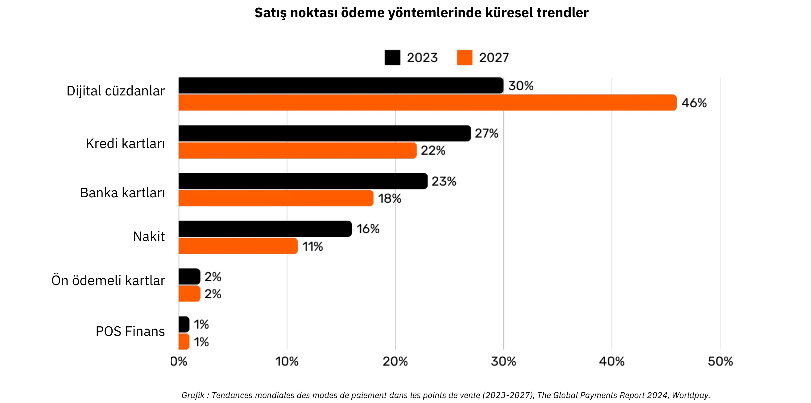

*Grafik: Satış Noktası (POS) Ödeme Yöntemlerinde Küresel Eğilimler (2023-2027), The Global Payments Report 2024, Worldpay.*

### Basit Bir Kart Ödemesinin Ardındaki Karmaşıklık

Bir müşteri bir mağazada kredi kartı kullandığında, kart POS terminali tarafından okunur ve bu terminal işlem verilerini güvenli bir şekilde satıcının alıcı bankasına iletir. Alıcı banka bu bilgileri ilgili kart ağına (örneğin Visa veya Mastercard) iletir, o da talebi kartı veren bankaya (müşterinin kartını sağlayan banka) yönlendirir. Kartı veren banka müşterinin hesabını veya kredi limitini kontrol eder ve ağ ve alıcı banka aracılığıyla bir yetkilendirme göndererek satıcının ödemeyi kabul etmesine izin verir.

Basit gibi görünen bu işlem aslında 15'ten fazla adım, 7 aracı içerir ve tüccarın fonları alması ortalama 48 saat ile 5 gün arasında sürer. Takip eden günlerde bir takas ve hesaplaşma süreci gerçekleşir. Kart ağı günün işlemlerini bir araya getirir ve alıcı ile kart çıkaran kuruluş arasındaki fon alışverişini koordine eder. Bir merkez bankası bu bankalar arası mutabakatların doğruluğunu ve istikrarını sağlar. Sonunda, üye işyerinin banka hesabı, alıcıdan alacaklandırılan net tutarı (ücretler hariç) alır ve böylece işlem yaşam döngüsü tamamlanır.

Genel olarak, bu süreç karmaşık, zaman alıcı ve değerin bir taraftan diğerine taşınması gibi basit bir eylem için maliyetlidir.

### Karşılaştırmalı Ödeme Yöntemleri

| Payment Method                 | Authorization Needed?           | Transaction Approval Time (Merchant View) | Settlement Speed (Funds Fully Settled)         | Finality (Ease of Reversal)              | Number of Intermediaries       | Typical Fees (to Payee)            |
| ------------------------------ | ------------------------------- | ----------------------------------------- | ---------------------------------------------- | ---------------------------------------- | ------------------------------ | ---------------------------------- |
| **Cash**                       | No                              | Immediate (Physical Exchange)             | Immediate (No Settlement Delay)                | High (Irreversible Once Paid)            | None                           | None                               |
| **Checks**                     | Yes (Bank Clearing)             | Acceptance at Deposit (Not Guaranteed)    | Several Days (Check Clearing Process)          | Medium (Can Bounce/Stop Before Clearing) | Bank                           | **Low to Medium** (Bank Fees)      |
| **Wire Transfers**             | Yes (Bank/Network)              | Confirmation Within Hours                 | Same-Day or Next-Day (Domestic)                | High (Usually Irreversible Once Sent)    | Banks, Payment Networks        | **Medium**(Fixed/Percentage)       |
| **Payment Cards**              | Yes (Card Issuer Authorization) | Seconds to Minutes (Authorization Code)   | A Few Days (Interbank Settlement)              | Medium (Chargebacks Possible)            | Issuer, Acquirer, Card Network | **Variable (1-3% of Transaction)** |
| **Digital Wallets/Mobile Pay** | Yes (Wallet Provider/Bank)      | Seconds (Instant Confirmation)            | Typically 1-2 Days (Depends on Funding Source) | Medium (Refund/Dispute Possible)         | Banks, Wallet Operators        | **Low to Medium (Varies)**         |

### Mevcut çözümlerin sınırlamaları

Geleneksel ödemeler sektörü yıllık yaklaşık 2,200 milyar dolarlık bir ekonomiyi temsil etmektedir; bu da kabaca ABD'nin GSYİH'sinin onda biri veya Fransa'nın GSYİH'sine eşittir. Para birimleri izinli ağlar olarak işlediğinden, sınırlı rekabet vardır ve bu da bu "hizmeti" daha çok üretken ekonomiye uygulanan bir vergiye benzetir. Yarattığı maliyet yüklerine ek olarak, aşağıda özetlendiği gibi başka sınırlamalar da vardır.

| Limitation                       | Explanation                                                                                                                                                                                                                        | Impact                                                                                               |
| -------------------------------- | ---------------------------------------------------------------------------------------------------------------------------------------------------------------------------------------------------------------------------------- | ---------------------------------------------------------------------------------------------------- |
| High Card Fees                   | Interchange fees (~0.3%), network fees (fixed or 0.3%-1%), terminal/PSP subscriptions, and bank margins (0.5%-1.7%) add up to a substantial cost—like a global “tax” on productive sectors, amounting to trillions of dollars.     | Raises merchant costs, reducing margins and potentially driving up consumer prices.                  |
| Very Slow Final Settlement       | Settlement of funds can take up to 5 days, slowing the flow of money and overall economic activity.                                                                                                                                | Delays liquidity for merchants and reduces the speed of economic circulation.                        |
| Fraud                            | E-commerce channels are heavily targeted by fraud, contributing to significant losses (e.g., $28 billion). Chargebacks could reach ~$174 billion globally by 2024. Managing these disputes consumes time and causes mental strain. | Increased operational costs, complex fraud prevention measures, and diminished customer trust.       |
| Cart Abandonment                 | Additional security steps (one-time codes, two-factor authentication under PSD2) introduce friction at checkout.                                                                                                                   | Higher checkout complexity leads to increased cart abandonment and lost sales.                       |
| High Minimum Transaction Amounts | Minimum spend thresholds on cards can force merchants and consumers into inconvenient pricing or purchase conditions, discouraging small-value transactions.                                                                       | Reduced customer satisfaction and flexibility, potentially limiting impulse or low-value purchases.  |
| Slow Pre-Authorization           | Current systems cannot handle transactions at millisecond speeds or support continuous, real-time payment flows.                                                                                                                   | Limits use cases that require instant or streaming payments, restricting innovation and scalability. |
| Need for a Bank/Card Account     | Access to these payment methods requires a linked bank or card account, automatically excluding those without such accounts.                                                                                                       | Limits financial inclusion, reducing access for unbanked or underbanked populations.                 |
| Repeated Online Account Creation | Users often must create multiple online accounts, leading to fatigue, reduced convenience, and increased exposure of personal data.                                                                                                | Deteriorates user experience, raises privacy concerns, and increases risk of data breaches.          |
| Foreign Exchange (FX) Fees       | Lack of a universal unit of account forces costly currency conversions for cross-border transactions.                                                                                                                              | Adds extra costs for international commerce, making global transactions less affordable.             |

Tıpkı sesli aramalar için dakika başına ödeme yapmaktan neredeyse ücretsiz IP tabanlı iletişime geçmemiz gibi, daha açık ve verimli ağların ortaya çıkması da ödemeleri yeniden tanımlayabilir, maliyetleri ve aracıları azaltabilir ve yeni iş modellerini teşvik edebilir.

## İş Dünyası için Bitcoin: gelişmekte olan bir para birimi

<chapterId>4488fe33-663f-41a3-a668-e9ca2fb7122e</chapterId>

**Bitcoin NEDIR?**

Bitcoin bir **eşler arası dijital para birimi Exchange sistemidir** (elektronik nakit). "Bitcoin" terimi aşağıdaki bileşenleri ifade eder:

- İnternette Exchange değerini aracısız, izin gerektirmeden ve takma isimle kolaylaştıran bir **bilgisayar protokolü**. Gelişmiş kriptografik prensipler kullanır.
- Bireyler ve işletmeler tarafından işletilen, merkezi olmayan bir sistem oluşturan (merkezi bir otorite veya tek bir kontrol noktası olmayan) internete bağlı makinelerden (düğümler, madenciler vb.) oluşan **fiziksel bir ağ**.
- Sistem içindeki hesap birimi. Var olan bitcoin sayısı hiçbir zaman 21 milyondan fazla olmayacaktır. Her bir Bitcoin, anonim yaratıcısının onuruna "satoshis" adı verilen 100 milyon birime bölünebilir.

Bunlar birlikte Bitcoin'u bir **taşıyıcı varlık** ve **ihraççısı olmayan** bir dijital para birimi haline getirir. Ownership yalnızca **özel kriptografik anahtarın** tutulmasıyla güvence altına alınır ve **aracılar veya güvenilir üçüncü taraflar olmadan** tam kontrol sağlar. Transfer edildiğinde, Ownership **finality** anında gerçekleşir: yeni sahibi, koruma veya dönüştürülebilirlik için merkezi bir otoriteye güvenmeden tamamen ona sahip olur. İşlemler **değiştirilemez** - Blockchain'ye kaydedildikten sonra değiştirilemez veya silinemezler.

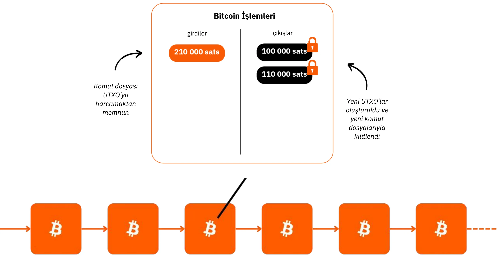

Bitcoin'nin sabit bir para politikası vardır ve 21 milyon bitcoin'lik bir **kapağı** vardır ve bunun ~19,8 milyonu halihazırda dağıtılmıştır. Bu da onu **deflasyonist** hale getirmekte, kullanıcılar tasarruflarını ve üretkenlik kazançlarını içinde sakladıkça değeri zamanla artmaktadır.

Teknik özellikleri altın ve doların toplamını aşarak onu şimdiye kadar yaratılmış en zor finansal varlık haline getirmektedir. Bitcoin hem bir değer saklama aracı hem de Exchange'in bir aracıdır, yapım aşamasında bir para birimidir. Bir şirketin hazinesinden diğerine hızlı bir şekilde, aracılar olmadan, minimum maliyetle, sahtekarlık olmadan, 7/24 ve herhangi bir üçüncü taraf dahil olmadan değer aktardığınızı hayal edin.

Bitcoin etkin bir şekilde değerini korur çünkü Ledger kurcalanmaya karşı dayanıklıdır. Nadir ve sınırlı Supply ile artan kullanıcı sayısına bağlı olarak artan Exchange fırsatları nedeniyle değeri artar.

Bitcoin yıkıcıdır çünkü bizi matematik, kriptografi, ekonomi ve tarih alanlarında bize hiç öğretilmeyen kavramları öğrenmeye teşvik eder. Genellikle karmaşık olarak algılansa da, aslında uygulama ve deney yoluyla erişilebilen bir yeniliktir.

Bitcoin bizi paranın doğasını yeniden gözden geçirmeye davet ediyor. Paranın gerçekte ne olduğunu açıklayabilir misiniz? Maaşlı bir işçi veya girişimci hayatının 50.000 ila 100.000 saatini para kazanmak için harcayabilir, ancak kaç kişi **100 saatini bile parayı daha iyi anlamak** ve korumak için ayırır? Bitcoin bizi para ihtiyacımızın ardındaki temel nedenleri ve zamansal bakış açımızı sorgulamaya teşvik ediyor. Para anlık lüks için mi yoksa uzun vadeli dayanıklılık için mi? Satın alımları ertelememize olanak tanıyan değer kazanan bir varlığımız olsaydı, hangi seçimleri yapardık? Bundan 20 ya da 30 yıl sonra kendimizle ne tür konuşmalar yapmak isterdik?

**Bitcoin KİMLİK KARTI**

- **Yaş:** 15 yıl (3 Ocak 2009)
- **Günlük Exchange değeri:** 10 milyar $ (> CAC40)
- **Piyasa değeri:** 1,8 trilyon dolar (> Meta, Visa, Gümüş; < Apple, Google, Altın)
- **Kullanıcılar:** ~100 ila 200 milyon (küresel nüfusun %1-2'si)
- **Volatilite:** İçsel olarak yok (1 Bitcoin = 1 Bitcoin), dışsal olarak çok yüksek (fiat para birimi borsalarında)
- **Performans:** İlk işlem 0,0009 $; şimdi 100.000 $ (x100 milyon)
- **Ağ Kullanılabilirliği (çalışma süresi):** 2013'ten beri %100
- **Ölü ilan edildi veya eleştirildi:** Ayda bir kez

**Bir İnsan İşbirliği Harikası:**

- Tamamen **açık kaynak**
- **Tüzel kişilik:** Yok
- **CEO:** Yok
- **Risk sermayesi yatırımı:** Yok
- **Pazarlama:** Yok
- **AR-GE:** Gönüllülük esasına dayalı
- **Yönetişim:** Kullanıcılar tarafından
- **Yenilikçi ekonomik model:** Blok oluşturma işlem ücretleri ile sübvanse edilir (açık artırma tabanlı)

Bitcoin, tarihçesi, nasıl çalıştığı ve kullanımı hakkında daha fazla bilgi için bu diğer kapsamlı kursu da takip etmenizi öneririm:

https://planb.network/courses/2b7dc507-81e3-4b70-88e6-41ed44239966

## Lightning Network'e Giriş

<chapterId>c095c7ad-5469-4c7b-9510-b6c0b86244e7</chapterId>

**YILDIRIM NEDİR?**

Lightning Network, Bitcoin'nın ana Blockchain ile minimum etkileşimle Bitcoin işlemlerini kolaylaştıran **bir protokol ve bir ağdır**. İşte nasıl çalıştığı:

- **İlk kurulum:** 2 taraf arasında bir ödeme kanalı oluşturmak için fonlar ana Blockchain üzerinde kilitlenir (emanet edilir).
- **Ödeme ağı:** Birden fazla taraf arasındaki ödeme kanalları ağı bir ödeme ağı oluşturur (yönlendirme ve ara bağlantı).
- off-chain işlemleri:** İşlemler taraflar arasında gerçekleşir ancak **Bitcoin'in ana Blockchain'inde (**"off-chain"**) hemen yayınlanmaz.
- **On-Chain hesaplaşmaları:** Bir kanalın işlemlerinin yalnızca **nihai bakiyesi** Bitcoin ana Blockchain'de (**"On-Chain"**) yayınlanır ve bu arada çok sayıda işlemin gerçekleşmesine izin verilir. Çoklu ödemelerin bu şekilde bir araya getirilmesi tıkanıklığı azaltır ve böylece çok sayıda On-Chain işlemi yapmaya kıyasla ücretleri düşürür.
- Kanal kapatma: Bir kullanıcı kanalını istediği zaman kapatabilir ve en son işlem durumunu yayınlayarak Bitcoin'ini geri alabilir. Bu, işlemlerin her an **"yayınlanabilir"** ancak gerekli olana kadar **"yayınlanamaz"** olması ilkesidir. Çıkış (kanal kapatma) tek taraflı (herhangi bir zamanda 2 taraftan herhangi biri tarafından kararlaştırılabilir) veya karşılıklı olarak kararlaştırılabilir (daha düşük On-Chain ücretleri ile sonuçlanır)

Bu yaklaşım, her işlemi doğrudan Bitcoin'in ana Blockchain'sinde gerçekleştirmenin yavaşlığını ve karmaşıklığını önler, yalnızca nihai bakiyeleri kaydeder ve güvenliğini korur. Lightning Network, Bitcoin'in "üstünde" bir Layer'dur ancak ona bağlı kalır.

**Küresel Bir Ödeme Ağı**

Protokol, kanalların evrensel bir ödeme sistemi oluşturduğu makinelerden oluşan bir **ağ** oluşturur. Bu düğümler bireyler veya işletmeler tarafından serbestçe çalıştırılabilir ve bu da onu tamamen açık bir ağ haline getirir.

Lightning Network, ışık hızında anında değer Exchange sağlar. Ödemelere uygulanan bir e-posta protokolü gibi: yeni nesil bir ödeme ağı. "Paranın" hareket etme şeklini kökten değiştirerek internetteki veri iletimi kadar ücretsiz ve hızlı hale getirir.

**Anahtar Avantajlar:**

- **Hız:** Anında işlemler.
- **Düşük ücretler:** Geleneksel bankacılık ağlarına kıyasla çok daha düşük maliyetler.
- **Benimseme kolaylığı:** İşletmeler, yalnızca bir akıllı telefon uygulaması veya web sitelerindeki bir ödeme düğmesini kullanarak Lightning ödemelerini kabul etmek için hızlı bir şekilde kurulum yapabilirler.

Lightning altyapısı hız, maliyet ve enerji verimliliği açısından geleneksel ödeme sistemlerinden daha iyi performans gösteriyor. Tüccarların giderek daha fazla benimsemesiyle bu ivme daha da hızlanacaktır: Eğer ödemeler bankalar arası ağı atlayabiliyorsa, neden gelirin önemli bir yüzdesini günümüzün aracılarına bırakmaya devam edelim?

**Sonsuz Kullanım Durumları:**

Lightning'in uygulamaları düşük ücret ve hızın çok ötesine uzanıyor. Tamamen ücretsiz ve anında ödeme rayı sunarak, ekonomi genelinde büyük fırsatların önünü açıyor.

**Bitcoin'ün Exchange Yeteneklerinin Artırılması:**

Lightning, Bitcoin'in "Exchange aracı" olarak rolünü güçlendirir İşlemlerin sıklığını ve özgürlüğünü artırarak, paranın birincil işlevini güçlendirir: tüm katılımcılar için ekonomik alışverişleri ve değer yaratmayı kolaylaştırmak.

"Akıllı makine ekonomisinin" gelecekteki yükselişi, yalnızca Lightning'in karşılayabileceği bir teknik standart olan ultra hızlı, yüksek frekanslı bir ödeme sistemi gerektirecektir. Bu sayede daha fazla mal ve hizmet üretilebilecektir. Bitcoin'nın Supply'si sınırlı kaldıkça, her bir birimin satın alma gücü artacaktır. Bitcoin ve Lightning, ağları genişledikçe birlikte güçlenir.

Lightning, internet tabanlı hale gelen tüm işletmelerin aynı zamanda Bitcoin tabanlı hale geleceği bir geleceğe bakış sunuyor.

**Bitcoin Lightning Üzerinden Ödemeler: Tipik Bir Satıcı Kullanım Örneği**

Lightning Network, hızı ve ödeme kesinliği nedeniyle fiziksel veya çevrimiçi mağazalardaki Bitcoin ödemeleri için idealdir.

- **Hız:** Lightning (~500 ms ila birkaç saniye), işlemlerin onaylanmasının yaklaşık 30 dakika sürebildiği Bitcoin ana ağından önemli ölçüde daha hızlıdır. Büyük alımlar için (1.000 doların çok üzerinde), hız daha az kritik olduğundan Bitcoin ana ağı hala tercih edilebilir. Ancak, uygulamalar bu kararları arka planda sorunsuz bir şekilde yerine getirdiğinden, bu ayrıntılar genellikle ortalama bir kullanıcıdan gizlenir.
- **Kesinlik:** Lightning'de bir ödeme yapıldığında, bu nihaidir. Üçüncü taraflarca ters ibraz veya dolandırıcılıkla ilgili anlaşmazlık olasılığı yoktur.
- **Ücretler:** Lightning Network üzerindeki işlem ücretleri minimum düzeydedir ve satıcı tarafından değil kullanıcı tarafından ödenir. Satıcılar yalnızca Bitcoin'lerini daha sonra başka bir ağa veya hizmete aktarmaları gerektiğinde ücrete tabi olurlar.

**YILDIRIM KIMLIK KARTI**

- **Buluş:** 2015
- **Lansman:** 2016
- **Yaş:** 7 yıl (ilk işlem: 28 Aralık 2017)
- **Ağ teknik yeteneği:** ölçek olarak geleneksel sistemlerden 1.000 kat daha fazla anlık işlem gerçekleştirebilir.
- **İşlem boyutları:** Geleneksel sistemlere göre 1.000 kata kadar daha küçüktür.
- **İşlem hızı:** 100 kata kadar daha hızlı.
- **Ücretler:** %90'a kadar daha düşük.
- **Ödeme kesinliği:** Neredeyse anlık (genellikle ~500 milisaniye, bazen birkaç saniye).
- **Energi tüketimi:** geleneksel küresel para sisteminin ~%8'i.
- **Özellikler:**
    - Peer-to-peer
    - Evrensel
    - İzinsiz
    - İyi gizlilik
    - Kanıtlanmış güvenlik
    - Yüksek kullanılabilirlik (mükemmel çalışma süresi)
    - Kontrol edilebilir ve uyarlanabilir

Lightning Network'in teknik işleyişi hakkında daha fazla bilgi için bu diğer kapsamlı kursu da takip etmenizi öneririm:

https://planb.network/courses/34bd43ef-6683-4a5c-b239-7cb1e40a4aeb

# Hazine'de Bitcoin

<partId>bf45c1e8-af97-4b6b-af42-2866f493b14d</partId>

## Kâr, sermaye ve iş dünyasının dayanıklılığının anahtarları

<chapterId>656ad88f-3c27-4054-a94e-b29727009b8e</chapterId>

### Sağlıklı bir şirket

**Gelecek belirsizdir** ve işletmeler bu belirsizliği, kâr elde etmeye ve sermayeyi korumaya net bir şekilde odaklanarak aşmalıdır. Avusturya ekonomisine göre, **karlar bir şirketin sağlığının nihai işaretidir** - işletmenin tüketici ihtiyaçlarını verimli bir şekilde karşıladığını gösterirler. Kâr olmadan, bir şirket büyümek bir yana, kendini sürdüremez. Bir işletmenin sağlıklı kalabilmesi için, yalnızca generate kar elde etmesi değil, aynı zamanda **gelecekteki yatırımlar ve zorluklar için sermaye depolayarak** ileriyi de düşünmesi gerekir.

**Sermayenin korunması** kritik önem taşır çünkü işletmelerin öngörülemeyen bir pazarda uyum sağlamasına ve fırsatları yakalamasına olanak tanır. Bu, büyümek için kazançları yeniden yatırıma dönüştürmek ile potansiyel gerilemeleri atlatmak için finansal bir tampon sağlamak arasında bir denge kurmayı içerir. Avusturya ekonomisi **"zaman tercihinin "** önemini vurgular, yani işletmelerin uzun vadeli başarı için yatırım yapmak yerine anlık getirilere ne kadar öncelik vereceklerine dikkatle karar vermeleri gerekir. Sağlıklı bir şirket, finansal temelini güçlü tutarak hem iyi hem de kötü zamanlarda esneklik sağlar.

Fiyatlar ve rekabet gibi piyasa sinyalleri, işletmelere kaynak tahsisi konusunda akıllı kararlar almalarında rehberlik eder. Şirketler bu sinyalleri dinleyerek kendilerini aşırı genişletme veya özellikle kolay kredi gibi yapay faktörlerden etkilenen kötü yatırımlar yapma tuzağından kaçınabilirler. Kaynakların yanlış tahsisi sadece şirketin sağlığını tehlikeye atmakla kalmaz, aynı zamanda müşterilere etkin bir şekilde hizmet verme kabiliyetini de azaltır.

Sonuç olarak, sağlıklı bir işletmeyi sürdürmek, uyum sağlayabilmek, ihtiyatlı finansal seçimler yapmak ve her zaman gözünüzü gelecekten ayırmamak anlamına gelir. **Kâra odaklanarak, sermayeyi koruyarak ve piyasa sinyallerine yanıt vererek, büyük ya da küçük işletmeler belirsizlik karşısında bile başarılı olabilir**.

### Sermayenin bir erdemi var mıdır?

**Sermaye genel olarak nasıl tasvir edilir**

Toplumumuzda sıklıkla yanlış anlaşılan ve olumsuz algılanan bir terim olan sermayenin gerçekte ne olduğunu yeniden keşfedelim.

Geleneksel ekonomi teorisinde (Keynesyen) sermaye genellikle basitleştirilmiş terimlerle, öncelikle yatırım yoluyla toplam talebi canlandırmak için kullanılan homojen bir fiziksel veya finansal varlık stoku olarak görülür. Genellikle servetin yoğunlaşması ve küçük bir elitin sahip olduğu ekonomik güç ile ilişkilendirilir. Servet uçurumlarının genişlemeye devam ettiği bir bağlamda, birçok kişi sermayeyi ekonomik eşitsizliğin bir sembolü olarak görmektedir, özellikle de birikmiş servet çoğunluğa hiçbir fayda sağlamıyor gibi göründüğünde.

"Sermaye" genellikle bir sömürü aracı olarak tasvir edilir ve bu bakış açısı, sermayeyi doğası gereği işçilerin çıkarlarına karşıt olarak gören çeşitli hareketleri derinden etkilemiştir. Ancak bu doğru mudur? Yoksa bu algı şu şekilde çarpıtılmış olabilir mi?

1. Ekonomik mekanizmaların (ekonomistlerin kendileri de dahil olmak üzere) anlaşılmaması mı?

2. Devlet müdahaleciliği ve piyasa manipülasyonu mu?

3. Ahbap çavuş kapitalizmi ile serbest piyasa kapitalizmi arasında kafa karışıklığı mı var?

4. Medyanın ekonomik krizleri çerçevelemesi?

5. Hızlı çözümler ve acil sosyal adalet arzusu mu?

6. Anti-kapitalist söylemin kültürel olarak normalleşmesi mi?

Neyse ki, Bitcoin bizi her şeyi yeniden düşünmeye ve bu önyargılı kavramlara meydan okumaya zorluyor. Bu konulara ışık tutabilecek ve sermayenin gerçek doğasını yeniden gözden geçirmemize yardımcı olabilecek bir düşünce ekolü - Avusturya Ekonomi Okulu - var.

**Bir zamanlar**

Kısa bir hikaye ile başlayalım:

"Küçük, ıssız bir adada yalnız bir balıkçı yaşamaktadır. Her gün, zamanının ve enerjisinin çoğunu tüketen bir faaliyet olan çıplak elleriyle balık yakalamak için saatler harcamaktadır. Bir gün aklına bir fikir gelir: daha verimli balık avlamasını sağlayacak bir mızrak yapmak. Ancak bunun bir fedakarlık gerektireceğini bilmektedir.

Balıkçı, mızrağı yapmaya başlamadan önce, yapım süreci boyunca geçimini sağlamak için bir miktar balık ayırmaya karar verir. Birkaç gün boyunca normalden daha az yiyerek projesine odaklanmasına yetecek kadar balık biriktirir. Biriktirdiği bu balık onun **sermayesini** temsil eder, hedefine ulaşmasını sağlayan küçük bir rezervdir.

Zamanını mızrağı inşa etmeye adarken, rezervlerine güvenir ve acil konforunun bir kısmını isteyerek geciktirir (**zaman tercihinin** bir yansıması). Birkaç gün süren Hard çalışmasının ardından sağlam bir mızrağı tamamlar.

Mızrakla artık çok daha hızlı ve daha az çabayla balık yakalayabilir. Artık eskisi gibi kendini yormasına gerek kalmıyor ve hatta balık fazlası biriktirmeye başlıyor. Bu fazlalık yeni olasılıkların önünü açar: onu depolayabilir, paylaşabilir ya da adadaki diğer projelere yatırabilir. Anlık tüketimi erteleyerek ve sermayesini kullanarak, balıkçı verimliliğini ve gelecekteki beklentilerini önemli ölçüde artırmıştır."

Bu hikaye, ekonomik büyüme ve insani ilerlemenin merkezinde yer alan kavramlar olan sermaye, sabır ve öngörünün daha iyi bir gelecek inşa etmedeki temel rolünü göstermektedir.

### Avusturya Ekonomi Okulu ve Sermaye Vizyonu

Avusturya Ekonomi Okulu, adını aslen Avusturyalı olan kurucularından ve ilk katkıda bulunanlardan almıştır. Bu isimle anılan okul, o zamandan beri bireysel özgürlüğü, serbest piyasaları ve asgari devlet müdahalesini vurgulayan klasik liberal düşünceyle yakından ilişkili hale gelmiştir.

**Sermayeye Avusturyalı Bakış Açısı**

Avusturyacı görüşe göre sermaye, gelecekteki üretimi artıran araçlar veya üretken kaynaklar oluşturmak için tüketimin ertelenmesi fikriyle derinden bağlantılıdır. Sermaye birikimi olarak bilinen bu süreç, Avusturya ekonomi teorisinin merkezinde yer alır. Bu bakış açısının temel Elements'ü şunları içerir:

- **Zaman Tercihi ve Ertelenmiş Tüketim**: Bireyler doğal olarak daha sonra tüketmek yerine şimdi tüketmeyi tercih ederler, ancak gelecekte daha büyük ödüller bekliyorlarsa tüketimi ertelemeyi seçebilirler. Bugünden tasarruf ederek, kaynaklar zaman içinde üretkenliği artıran sermaye mallarına (aletler, makineler, altyapı) yatırılabilir. Zaman tercihi daha düşük olan toplumlar veya bireyler daha fazla tasarruf eder ve uzun vadeli projelere yatırım yaparak sürdürülebilir büyümeyi teşvik eder.

- **Gelecekteki Üretimin İtici Gücü Olarak Sermaye**: Sermaye malları, nihai tüketim mallarını üretmek için kullanılan ara araçlar olarak görülmektedir. Girişimciler sermaye biriktirerek üretkenliği artırabilir ve gelecekte daha fazla zenginlik yaratabilirler. Örneğin, tüketim mallarını hemen üretmek yerine, kaynaklar fabrikalar veya makineler inşa etmek için kullanılabilir. Bu kısa vadeli tüketimi azaltsa da, elde edilen verimlilik daha sonra daha fazla üretim ve refah sağlar.

- **Dolaylı Üretim ve Verimlilik**: Eugen Böhm-Bawerk gibi Avusturyalı ekonomistler, birden fazla aşamayı içeren daha uzun ve daha karmaşık üretim süreçleri olan dolaylı üretim fikrini vurgulamışlardır. Bu süreçler zaman alsa da sonuçta daha verimli ve üretken sonuçlar doğururlar, örneğin elle tomruk toplamak yerine odun işlemek için bir kereste fabrikası kurmak gibi.

- **Sinyal Olarak Faiz Oranları**: Avusturyacı görüşe göre faiz oranları doğal olarak bireylerin zaman tercihlerini yansıtır. Yüksek oranlar acil tüketim tercihini gösterirken, düşük oranlar tasarruf ve uzun vadeli yatırımı teşvik eder. Merkez bankaları faiz oranlarını yapay olarak manipüle ettiklerinde, bu doğal sinyalleri çarpıtarak kaynakların yanlış tahsis edilmesine ve sürdürülemez yatırımlara (malinvestment) yol açarlar.

**Modern Ekonomilerde Sermayenin İki Biçimi**

İçinde faaliyet gösterdiğimiz borca dayalı parasal sistem çerçevesinde, **ikinci bir sermaye türü** vardır: bir banka basit bir kredi mekanizması aracılığıyla bir kredi yarattığında anlık olarak üretilen bir sermaye. Bu, bankanın aslında önceden elinde tutmadığı, ancak geri ödeme vaadine dayalı olarak yarattığı parayı ödünç verdiği ex nihilo likidite yaratımını içerir.

Bir yanda, "Avusturyalı" sermaye gerçek tasarrufların sonucudur, düşünceli ekonomik kararlar ve titiz fedakarlıklar içeren bir süreçtir. Öte yandan, borca dayalı para yaratılması yoluyla oluşturulan sermaye anlık ve yapay bir yapıdır. Bu iki sermaye türü, projeleri finanse etmek için kullanımları açısından yüzeysel olarak benzer olsa da, **doğaları gereği temelde farklıdır**.

Sermayenin bu iki biçimi asla birbirine karıştırılmamalıdır, ancak borca dayalı bir sistemde, **ekonomik sinyalleri bozan** ve sıklıkla yanlış yatırımlara yol açan bu iki biçim sıklıkla birbirine karıştırılmaktadır. Bu yanlış anlama, kapitalizmin neden sıklıkla yersiz eleştirilere maruz kaldığına ışık tutmaktadır

**Keynesyenizm ile İlgili Temel Sorun**

Küresel elitler tarafından yaygın olarak benimsenen Keynesyen politikalar, faiz oranlarını manipüle etmekte ve borç yoluyla talebi canlandırmaktadır. Bu da kaynakların kısa vadeli, sürdürülemez projelere akmasını teşvik ederek ekonomik döngüleri güçlendirmekte ve sağlıklı tasarruf ve üretken yatırımlara dayanan gerçek büyümeyi geciktirmektedir. İş dünyası liderleri, sağlıklı şirketlerin şişirilmiş getiriler peşinde aşırı değerli satın almalara itilerek organik ve sürdürülebilir büyümeyi baltalaması nedeniyle bu zararlı politikayı ilk elden gözlemlemektedir.

Böyle bir ortamda, girişimciler tarafından özenle biriktirilen "sağlıklı" sermaye, yapay olarak yaratılan "sağlıksız" sermaye ile nasıl rekabet edebilir? Dahası, Supply parasının tek taraflı olarak genişletilmesi, sağlam sermayenin satın alma gücünü aşındırarak ekonomik yönelim bozukluğunu ve toplumsal memnuniyetsizliği daha da kötüleştirir.

**Bir Umut Işığı: Bitcoin**

Bitcoin, parasal enflasyonun yol açtığı erozyon olmaksızın uzun vadede sermaye biriktirmenin ve korumanın bir yolunu sunuyor. Bir değer deposu olarak, işletmelerin gelecekteki yatırımlarını esneklikle planlamalarını sağlayarak borç odaklı sistemlerin hakimiyetine meydan okur ve gerçek, üretken sermaye birikimine dönüşü teşvik eder.

### Avusturya ekonomi okulu hakkında daha fazla bilgi

**Avusturya Ekonomi Okulu**, serbest piyasalara, bireysel özgürlüğe ve ekonomik süreçlerde insan eyleminin önemine değer veren bir ekonomik düşünce geleneğidir. Devletin özellikle para ve piyasalara müdahalesini eleştirir ve bireylerin öznel tercihlerinin rehberliğinde kendi çıkarlarını en iyi şekilde değerlendirebileceklerini savunur.

**Avusturya Okulu'nun Anahtar Figürleri**

- **Carl Menger**: Avusturya Okulu'nun kurucusu olan Menger, malların değerinin üretim maliyetlerinden ziyade bireysel tercihlere bağlı olduğunu ileri süren öznel değer teorisini geliştirmiştir.

- **Ludwig von Mises**: Avusturya Okulu'nun temel taşlarından biri olan Mises, prakseolojiyi (insan eylemi teorisi) ortaya atmış ve sosyalizm ve merkezi planlamanın derin bir eleştirisi olan *İnsan Eylemi* kitabını yazmıştır.

- **Friedrich Hayek**: Mises'in öğrencisi olan Hayek, merkezi olmayan bilgi ve piyasanın kendiliğindenliği üzerine yaptığı çalışmalarla 1974 yılında Nobel Ekonomi Ödülü'nü kazanmıştır. *The Road to Serfdom* adlı kitabında merkezi kontrolü şiddetle eleştirmiştir.

- **Murray Rothbard**: Mises'in öğrencisi ve liberteryenizmin sadık bir savunucusu olan Rothbard, gönüllü sözleşmelerle yönetilen devletsiz bir toplum tasavvur eden anarko-kapitalizm teorisini geliştirmiştir. Kitabı *Man, Economy, and State* Avusturya ekonomisinde ufuk açıcı bir çalışmadır.

**Diğer Etkili Ekonomistler**

- **Milton Friedman**: Avusturya Okulu ile doğrudan ilişkili olmasa da Friedman birçok piyasa yanlısı ve liberal fikri desteklemiştir. Onun monetarist politikası Avusturya düşüncesinden farklıdır, ancak ekonomiye aşırı devlet müdahalesi eleştirisini paylaşmaktadır.

- **Frédéric Bastiat**: 19. yüzyıl Fransız ekonomistlerinden Bastiat, serbest ticaret ve ekonomi politikalarının görünmeyen sonuçları üzerine yaptığı çalışmalarla Avusturya Okulu'nu etkilemiştir. Onun *Görülen ve Görülmeyen* adlı makalesi ekonomik liberalizmin temel metinlerinden biridir.

*Atıf: Ludwig von Mises Enstitüsü*

**Temel Katkılar ve Fikirler**

Bu düşünürler, devlet müdahalesinin piyasaları bozduğu ve ekonomik özgürlüğün refah ve insan eylemlerinin uyumlu bir şekilde koordine edilmesi için gerekli olduğu fikrini şekillendirmiştir. Bu düşünürlerin görüşleri, ekonomik sistemlerde ademi merkeziyetçi karar alma mekanizmalarının önemini ve merkezi kontrolün tehlikelerini vurgulamaktadır.

Bu konu hakkında daha fazla bilgi için:

https://planb.network/courses/d955dd28-b7c6-4ba2-a123-d932e21d148f

https://planb.network/courses/9d1bde6a-33e5-45dd-b7c0-94da72e45b11

https://planb.network/courses/d07b092b-fa9a-4dd7-bf94-0453e479c7df

## Bitcoin'ün hazinede tutulması

<chapterId>89622a40-d14f-4c37-a075-8e7e1731ec26</chapterId>

### Bir şirketin hazinesinin karşılaştığı zorluklar

Hazine, kişinin değerli şeyleri koyduğu yerdir. Sağlıklı bir şirket, gelecekteki belirsizliklerle başa çıkabilmek ve yatırımlarını planlayabilmek için uygun şekilde sermayelendirilir. Günümüzde, hazine fazlasının bir kısmı tahviller, vadeli mevduatlar ve benzeri gibi yüksek "Liquid" olarak bilinen finansal varlıklara yatırılmaktadır.

Bazı şirketler çok uzun bir süre boyunca gayrimenkul gibi likit olmayan varlıkları bazı tehlikelerin farkına varmadan kullanmaktadır:

- Bir kriz durumunda likidite yetersizliği
- Nihayetinde ücretler düşüldükten sonra oldukça düşük getiri
- Reel enflasyonu, yani Supply parasının getirisini (yılda ~%7, aşağıya bakınız) aşmayan bir getiri
- Gayrimenkulün "tasarruf" işlevinin bir kısmını Bitcoin gibi varlıkların yararına kaybetmesi gizli bir risktir. Sonuç olarak, "kullanım değerine" daha yakın hale gelebilir: barınak sağlamak.

İşletmelerin faaliyet gösterdiği ortamı hızlıca gözden geçirelim.

**Gerçek enflasyon**: Merkez bankaları, görevlerini yerine getirirken yıllık %2 enflasyon hedeflemektedir, bu da 20 yıl içinde para biriminde %40 değer kaybı anlamına gelmektedir. Enflasyonun daha belirgin olduğu dönemler de eklendiğinde, şirketlerin emeklerinin meyvelerini saklamak için yalnızca para birimini kullanamayacakları ortaya çıkmaktadır. Mutlaka bir dizi riski de beraberinde getiren karmaşık finansal stratejiler uygulamalıdırlar. Bu stratejiler, halihazırda ana faaliyetleriyle yoğun bir şekilde meşgul olan çok küçük işletmeler için **erişilemezdir**.

**Gizli enflasyon**: Merkez bankaları tarafından desteklenen borca dayalı, kısmi rezervli bir para sisteminde, **toplam para Supply yılda ortalama yaklaşık %7 büyür** (örneğin, Euro Bölgesi veya ABD'deki M1). Bu da "pastadan aldığınız payın" sadece birkaç yıl içinde yarıya inmesi anlamına gelir -eğer finans musluğuna ayrıcalıklı erişiminiz yoksa ve yeni yaratılan para onları yukarı çekmeden önce kaldıraç kullanarak ve varlıkları "eski fiyatlardan" hızla satın alarak büyümeye devam edemiyorsanız. Bu, servetin daha varlıklı olanlara transferini kısmen açıklayan Cantillon etkisidir, ancak "sermaye" yanlış bir şekilde suçlu olarak suçlanmaktadır (yukarıdaki sermaye ile ilgili giriş bölümümüze bakınız).

**Karşı taraf riskleri**: Mevcut finansal sistem risklidir ve "paranıza" her zaman erişiminiz olmayabilir İskambil kâğıtlarından bir ev imajını çağrıştırmadan, finansal kurumların en ufak bir krizde kârları özelleştirdiğini ve zararları toplumsallaştırdığını kabul etmek gerekir. "Kutsal" para sisteminde (Ledger'da kayıtlı para), bankadaki para yalnızca bir "hak talebidir"; ona gerçekten sahip değilsinizdir ve bankaların kendileri de "ona sahip değildir" (kısmi rezervler). Bu para bir bakıma gerçekten büyülüdür. Bir zamanlar Bitcoin ile alay eden Credit Suisse gibi bazı prestijli bankalar bugün artık mevcut değildir.

Bu güven eksikliği, altın gibi "hamiline" varlıkların (güvenliğini sağlamak, taşımak ve bölmek vb. karmaşık olsa da) ve tabii ki yeni gelen Bitcoin'in yeniden canlanmasına yol açıyor.

### Finansal varlık olarak Bitcoin

Bitcoin radikal bir alternatif sunmaktadır. Merkezi bir ihraççısı olmayan **hamiline yazılı bir varlıktır**, ele geçirilmesi neredeyse imkansızdır ve ağ etkilerinden faydalanır. "Gerçek" Bitcoin kullanıcıları, hem sansüre hem de enflasyona karşı dayanıklı bir değer deposu olarak görüldüğünden, emeklerinin meyvelerini saklamak için onu kullanmayı tercih etmektedir. Metcalfe Yasası ile gösterilen ağ etkisi sayesinde, ikna olan her yeni kullanıcı ağın değerini artırır; katılımcı sayısı arttıkça, Bitcoin'ün faydası katlanarak artar. Bu model, Bitcoin'ü kullanıcı benimsemesi ve güven üzerine inşa edilmiş, kendine özgü ve gelecek vaat eden bir sermaye biçimi haline getirmektedir.

Bitcoin, kapanış saatleri ve "devre kesicileri" olan geleneksel finans piyasalarının aksine, 7/24 kesintisiz çalışan **dünyadaki en yüksek Liquid varlığıdır** Bu likidite, kullanıcıların iyi ya da kötü haberlere (örneğin füze fırlatılması, savaşlar vb.) yanıt olarak her an bitcoin alıp satmasına olanak tanır.

Bitcoin, on yılı aşkın bir süredir yıllık ortalama %60'ın üzerinde bir büyüme göstermiştir. Bu benzersiz performans, diğer enstrümanların aksine, uzun vadeli sahiplerinin başlangıç sermayelerini korumalarına olanak sağlamıştır.

Bununla birlikte, akılda tutulması gereken birkaç temel faktör vardır:

İlk olarak, **geçmiş performans gelecekteki sonuçları garanti etmez**. Bitcoin **güvenli ve merkeziyetsiz** kaldığı sürece, önümüzdeki on yıl boyunca yıllık fiyatının %20'nin çok üzerinde değer kazanması ve böylece uygulanabilir bir hazine aracı haline gelmesi makul olarak umulabilir.

İkincisi, Bitcoin şimdiye kadar **4 yıllık döngüler** yaşamıştır, yani 4 yıldan uzun bir zaman ufkunda bahis her zaman kârlı olmuştur. Bitcoin'i bir yatırım olarak görenler için kısa vadeli bir ufuk (<4 yıl) riskli olabilir.

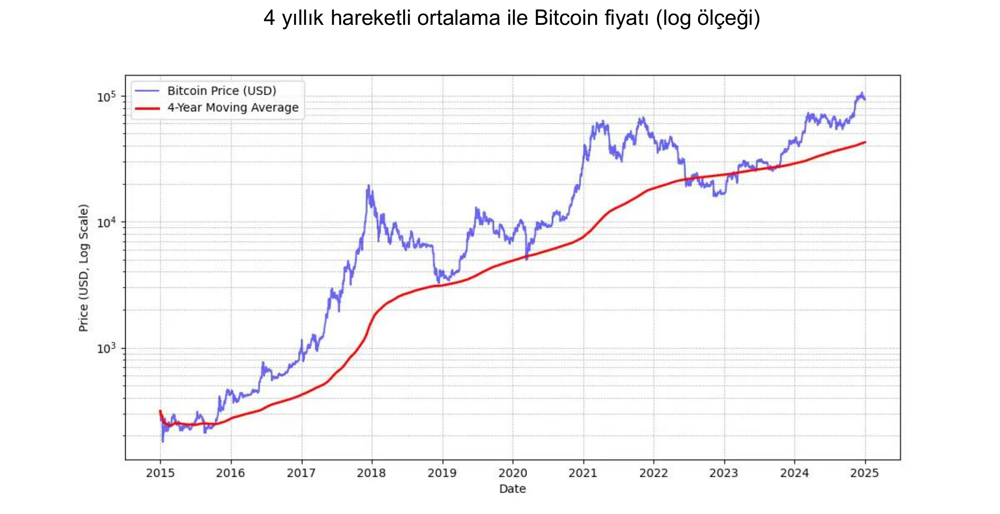

*MICHAEL SAYLOR: "En iyi Bitcoin fiyat sinyali 4 yıllık basit hareketli ortalamadır. "* Yukarıdaki grafiğe bakınız.

Buna ek olarak, kişinin Bitcoin'ye maruz kalma oranını anlayış düzeyiyle **orantılı** tutması tavsiye edilir. Acele etmemek veya piyasayı mükemmel bir şekilde zamanlamaya çalışmamak da önemlidir.

Son olarak, Bitcoin **değişken** olarak kabul edilir. Kesin olmak gerekirse, itibari para birimleriyle ifade edilen fiyatı öyledir. Bu oynaklığın bir kısmı henüz genç bir varlık için doğaldır, ancak aynı zamanda onu uzun vadeli bir değer deposu olarak kullanmayan, bunun yerine hızlı kazançlar arayan spekülatörlerin varlığıyla da artmaktadır. Ayrıca, kaldıraçlı alım satım (alım satım pozisyonlarını artırmak için borç alınan fonların kullanılması) hem yukarı hem de aşağı yönlü fiyat hareketlerini vurgulayarak Bitcoin'in düz bir yükseliş yolu izlemesini engeller. Bu durum daha belirgin dalgalanmalara yol açmaktadır, ancak zaman içinde, taahhütte bulunan kullanıcıların tabanı büyüdükçe, bu dalgalanma dengeleniyor gibi görünmektedir. Özetle, oynaklık olmadan Bitcoin kadar yüksek performanslı bir varlığa sahip olmak **imkansızdır**, ancak kesinlikle daha az oynaklıkla çok daha az performanslı varlıklara sahip olabilirsiniz.

### Bitcoin Wall Street tarafından kabul edildi

Bitcoin'ün finans kurumları tarafından benimsenmesi, küresel pazardaki konumunu daha da güçlendirmektedir.

BlackRock tarafından yapılan son açıklamalar, Bitcoin'ün bir değer saklama varlığı ve portföy çeşitlendirme aracı olarak potansiyelini vurgulamaktadır. Küresel kurumsal dev, kısa süre önce Bitcoin'ün kullanıcı büyümesinin, özellikle **demografik ve kuşak değişimlerinin** yanı sıra geleneksel finans kurumlarına (!) karşı artan güvensizlikten kaynaklanan **internet** veya cep telefonlarının büyümesini geride bıraktığını öne sürdü. Kıt, egemen olmayan ve merkezi olmayan yapısı nedeniyle, bazı yatırımcılar Bitcoin'ü **mali ve parasal istikrarsızlık**, korku veya yıkıcı jeopolitik olaylar zamanlarında güvenli bir liman seçeneği olarak görmektedir.

Ocak 2024'te piyasaya sürülen **Spot Bitcoin ETF'leri**, Ocak ayından Kasım ayına kadar yaklaşık 20 milyar dolarlık net girişle tarihteki **en başarılı** ETF lansmanı olan olağanüstü bir başarı elde etti. Bu, bir sonraki en iyi ETF lansmanı olan Nasdaq-100 QQQ'dan yaklaşık dört kat daha iyi. Bu ETF'ler, Bitcoin'e daha kolay ve daha düzenli erişim sağlayarak onu **daha da meşrulaştırdı** ve önemli bir kurumsal sermaye akışını çekti.

Bitcoin ETF'leri, ister dahil olan kurum sayısı isterse de yönetim altındaki varlıkların (AUM) büyüklüğü açısından olsun, en hızlı büyüyen ilk on ETF'yi geride bırakarak **kurumsal benimseme** açısından büyük bir farkla liderlik etmektedir. Bu Bitcoin ETF'lerinin başarısı, dijital varlıklarla bağlantılı yatırım araçlarına yönelik artan talebin altını çiziyor ve böylece Bitcoin'nın geleneksel finans dünyasındaki yerini sağlamlaştırıyor.

Bitcoin artık "değer saklama" **pazarında** oynuyor. Ölçek açısından kovada sadece bir damlayı temsil ediyor: altının 18.000 milyar doları veya gayrimenkulün 500.000 milyar doları ile karşılaştırıldığında sadece yaklaşık 1.800 milyar dolar. Bununla birlikte, kabaca %0,1'lik pazar payı, özellikle rakiplerinin yeni kullanıcıları çekmek için mücadele ettiği göz önüne alındığında, ona büyüme için muazzam bir alan sağlıyor.

| Ticker  | 1D Flow (M USD) | 1W Flow (M USD) | 1M Flow (M USD) | 3M Flow (M USD) | YTD Flow (M USD) |
| ------- | --------------- | --------------- | --------------- | --------------- | ---------------- |
| **Sum** | +457.19         | +1,507.95       | +2,888.01       | +3,672.29       | **+20,262.94**   |
| IBIT    | +393.40         | +750.91         | +1,536.47       | +3,821.37       | +22,460.44       |
| FBTC    | +14.81          | +372.40         | +627.16         | +458.71         | +10,266.69       |
| ARKB    | +11.51          | +163.26         | +295.92         | -3.88           | +2,647.32        |
| BITB    | +12.93          | +146.50         | +263.30         | +97.46          | +2,262.69        |
| HODL    | +5.75           | +38.77          | +94.54          | +100.39         | +682.03          |
| BRRR    | +1.92           | +4.72           | +17.76          | +20.54          | +540.19          |
| EZBC    | +11.79          | +17.53          | +39.29          | +47.48          | +439.45          |
| BTC     | .00             | -3.13           | +36.59          | +419.18         | +419.18          |
| BTCO    | +6.43           | +19.25          | +47.30          | +56.41          | +394.82          |
| BTCW    | .00             | +2.84           | +6.04           | +146.69         | +217.47          |
| YBIT    | -1.34           | -10.26          | +5.06           | +13.81          | +76.30           |
| DEFI    | .00             | .00             | .00             | -2.03           | -1.79            |
| GBTC    | .00             | +5.16           | -81.42          | -1503.84        | -20,141.85       |

*10 ayda 20 milyar dolar: Bitcoin ETF'leri, altın ETF'lerinin 5 yılda başardığını bir yıldan kısa bir sürede başardı. Kaynak: ABD doları cinsinden fon yatırım akışları. Bloomberg Terminal, Bloomberg L.P., 2024.*

### Bitcoin şirket araç setinde

Bitcoin'un Amerika Birleşik Devletleri'nde giderek daha fazla benimsenmesi, dünyanın başka yerlerinde de, özellikle de geleneksel finansal ürünler düşük performans gösterirken veya zor dönemlerden geçerken, artık bunu araç yelpazelerine dahil etmemeyi göze alamayan varlık yönetimi profesyonelleri arasındaki zihniyetleri etkiliyor. Sadece geleneksel bankalar hala bunu görmezden gelmeyi göze alabiliyor gibi görünüyor.

Tamamen finansal bir perspektiften bakıldığında, Bitcoin bir çeşitlendirme varlığı olarak kabul edilmektedir. Sadece diğer varlık sınıflarıyla korelasyonsuz olmakla kalmayıp, aynı zamanda yeni likidite enjeksiyonları dönemlerinde de gelişiyor gibi görünüyor - böyle bir başka dönem ECB, Fed ve Çin tarafından faiz oranlarının düşürülmesiyle başlıyor gibi görünüyor.

Özetle, en yaygın kullanım durumu için - en az dört yıllık bir dönem için fazla hazine yatırımı - Bitcoin mükemmel uyum sağlar. Bunu kademeli bir giriş stratejisiyle birleştirmek faydalı olacaktır: giriş veya çıkış noktasını yumuşatmak için düzenli aralıklarla sabit miktarlarda yatırım yapmak.

Örneğin, diğer kullanım durumları Bitcoin'ü stratejik bir hazine varlığı haline getirmektedir:

- 7/24 **teminat** veya likidite gönderebilmek
- Başka bir şirketin hazinesine **hızlı bir şekilde, herhangi bir zamanda** transfer edebilme
- **Döviz kuru Exchange riskine karşı korunma**
- Özellikle acil durumlarda, bunu kabul eden bir **tedarikçiye** ödeme yapmak

### Bitcoin çok mu pahalı?

Tam olarak 1 Bitcoin satın almak zorunda değilsiniz, çünkü Bitcoin, anonim yaratıcısının onuruna satoshis adı verilen alt birimlere bölünebilir. Bir Bitcoin **100 milyon satoshiye** eşittir ve kullanıcıların bir Bitcoin'nın **çok küçük kesirlerini** bile satın almasına, satmasına veya takas etmesine olanak tanır. Aslında, Bitcoin'nın kaynak kodunda tüm işlemler satoshi cinsinden hesaplanır ve "Bitcoin" terimi yalnızca madencilerin ödüllerini almak için oluşturdukları özel işlem olan "coinbase "de görünür.

Dahası, toplam 21 milyon bitcoin - ya da **2,1 katrilyon satoshi** - 64 bitlik bir tamsayı ile verimli bir şekilde temsil edilebilir. Bu da tüm Bitcoin başına yüksek bir fiyat olmasına rağmen, bölünebilirliği sayesinde geniş bir yatırımcı kitlesi için erişilebilir olduğu anlamına gelmektedir. Dolayısıyla, ağa katılmak veya bu dijital varlığa yatırım yapmak için bütün bir Bitcoin satın almanıza gerek yoktur.

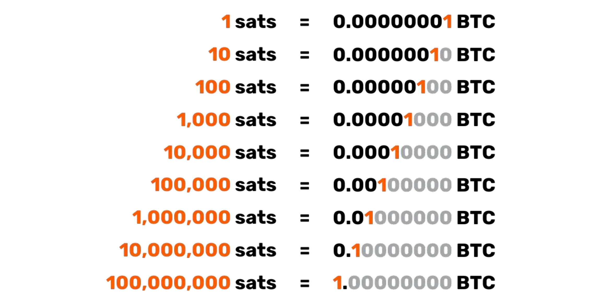

Hisse senetleri, altın veya gayrimenkul gibi diğer varlıklara kıyasla nispeten düşük toplam piyasa değerinin, değer kazanma kapasitesini sağlam bıraktığını hatırlayalım. Hâlâ çok düşük penetrasyon oranıyla (küresel nüfusun yaklaşık %1'i), yükselişinin yalnızca başlangıcında olduğumuz düşünülmektedir. Bu da onu **bizim neslimizin en asimetrik bahsi** haline getiriyor: şu anda çok düşük bir olasılıkla sıfıra düşecek ve güçlü bir olasılıkla da değer kazanmaya devam edecek.

### Bitcoin'de kurumsal hazine tahsisi kararı

Bitcoin'a yatırım yapmak için **karar verme süreci** şirket içindeki konumunuzdan büyük ölçüde etkilenecektir. Eğer bir **çoğunluk sahibi iseniz, fazla hazine fonlarını kendi kararınıza göre tahsis etmekte özgürsünüz**. Buna karşılık, kolektif bir karar alma yapısı içinde bir ortak veya hissedar iseniz, ortak müzakerelerden geçmeniz gerekecektir, bu da işleri karmaşıklaştırabilir.

Bu ikinci senaryoda, büyük ölçüde **her bir paydaşın Bitcoin varlığına ilişkin anlayışına** bağlı olduğundan, farklı bakış açılarının uyumlaştırılması elzem hale gelmektedir. Söylendiği gibi: "Bitcoin, insanların bilgisayarlar hakkında bilmedikleri her şey ile para hakkında anlamadıkları her şeyin birleşimidir." Ortaklardan biri Bitcoin'i iyice anlamak için çaba sarf etmiş olsa bile, bu bilgiyi diğerlerine aktarmak zor olabilir. Bu gibi durumlarda, fikrin bir kişiyle çok yakından özdeşleşmesini önlemek için dışarıdan bir kaynak getirilmesi **tavsiye edilir**, bu da generate direncine neden olabilir.

Şu anda, çoğunluk sahibinin karar vermesi senaryosu, Bitcoin'ye sahip şirketler arasında en çok temsil edilen senaryodur. İşte birkaç gerçek örnek :

- **Bağımsız profesyoneller**: Uzun vadeli hazinelerinin bir kısmını Bitcoin'e yatıran danışmanlar, sağlık pratisyenleri veya avukatlar. Genellikle bu profesyoneller zaten yetersiz getirili tasarruf veya vadeli mevduat hesaplarına sahiptir.
- **Teknoloji sektörü yöneticileri**: Birkaç yıl önce şirketini satan ve kişisel holdinginden elde ettiği gelirin bir kısmını Bitcoin'e yatıran bir yönetici. Bugün rahat bir mali duruma sahipler ve yeni girişimlere yeniden yatırım yapıyorlar.
- **Çok küçük işletmelerin sahipleri**: Bitcoin'in potansiyelini anlayan ve hazinelerinin bir kısmını buna ayıran hizmet, tarım veya zanaat sektörlerindeki girişimciler. Temel motivasyonları çeşitlendirme ve bunun sağladığı özgürlüktür
- **MicroStrategy gibi halka açık şirketler** kurumsal hazinelerinin önemli bir kısmını Bitcoin'ya dönüştürerek emsal teşkil etmiş ve kurumsal sermaye tahsis stratejilerinde küresel bir değişim olduğunu göstermiştir. 2024 sonbaharında, çok sayıda başka şirket de bu eğilimi takip ederek daha da meşrulaştırdı.

Hazinede en fazla bitcoine sahip şirketlerin güncellenmiş listesini ve tutarlarını sitede keşfedin: [BitcoinTreasuries.net](https://bitcointreasuries.net/).
### İşletmeler tarafından tutulan Bitcoin'nin vergilendirilmesi

Şahıs şirketleri veya diğer tüzel kişiliği olmayan kuruluşlar gibi ayrı tüzel kişilikler olarak yapılandırılmamış işletmeler için Bitcoin işlemlerinin vergilendirilmesi genellikle bireylere uygulanan muameleyi yansıtır. Birçok durumda, tıpkı bir bireyin Bitcoin satması durumunda olduğu gibi, sermaye kazancı veya geliri düzenleyen aynı kurallar geçerlidir. Örneğin, bazı ülkelerde, kârlar girişimcinin kişisel gelirinin bir parçası olarak kabul edilebilir ve **kişisel gelir vergisi dilimlerine** tabi olabilir.

Ancak, **kurumsal işletmeler** -kurumlar vergisine tabi olanlar- genellikle daha elverişli bir vergi çerçevesinden yararlanırlar. Farklı varlık sınıfları arasında kazanç ve zararları mahsup etme konusunda kısıtlamalarla karşılaşabilen bireylerin aksine, şirketler genellikle Bitcoin işlemlerinde gerçekleşen kazanç veya zararları doğrudan yıllık kar ve zarar hesaplarına entegre edebilirler. Bu da daha esnek ve bazen daha avantajlı bir vergi pozisyonuna yol açabilir.

Belirli vergi oranları ve uygulamaları yargı yetkisine göre önemli ölçüde değişir. Örneğin, Fransa'da ve birçok batı ülkesinde şirketler, bireylerin yatırım kazançları üzerinden ödedikleri sabit oranlı vergilerden daha düşük olabilen yaklaşık %25'lik kurumlar vergisi oranlarıyla karşılaşabilir.

Bu farklılıklar nedeniyle, **bazı işletme sahipleri Bitcoin'yi kurumsal yapıları aracılığıyla satın almayı ve elde tutmayı tercih etmektedir**, çünkü bu şekilde **daha verimli vergi planlama fırsatları** sağlanabilmektedir. Her zaman olduğu gibi, uyumluluğu sağlamak ve vergi stratejisini optimize etmek için ilgili yargı alan(lar)ındaki kuralları bilen bir vergi uzmanına danışılması tavsiye edilir.

## Bitcoin nasıl edinilir

<chapterId>1e6dbaf5-581a-49a4-8f37-3728e77bda17</chapterId>

### Üç Edinim Yöntemi

Bitcoin'yi edinmenin üç yolu vardır:

- Mal veya hizmetler için **Exchange'te:**

Bitcoin, Exchange'ün bir aracı olarak işlev gördüğünden, döngüsel bir ekonomi öngörmek mümkündür. Günümüzde bu durum yaygın olmasa da, giderek daha fazla işletme Bitcoin ödemelerini kabul etmeye başlıyor - sizinki neden olmasın? (Bir sonraki bölümümüze bakınız)

- Mining Bitcoin:

Bu, Mining makinelerinin çalıştırılmasından ödül kazanmayı içerir. Uzmanlaşmamış işletmeler için bu nispeten marjinal kalmaktadır. Size bilgisayar, ağ ve bakım satacak ya da kiralayacak aracılar vasıtasıyla katılabilirsiniz. Makinelere sahipseniz, bunları amortismana tabi varlıklar olarak muhasebeleştirebilirsiniz. Büyük ölçekte, yatırım getirisini dikkatli bir şekilde hesaplamanız gerekecektir çünkü pazar oldukça rekabetçidir ve başta elektrik olmak üzere maliyetlerin iyi tahmin edilmesini gerektirir.

Mining yöntemleri hakkında daha fazla bilgi edinmek için [eğitimlerimizdeki "Mining" bölümüne bakabilirsiniz] (https://planb.network/tutorials/mining).

- **Bitcoin Satın Alma:**

Bu, eşler arası borsalar aracılığıyla ya da daha tipik olarak özel ticaret platformlarında yapılan en yaygın yöntemdir. Ancak Bitcoin'yi kurumsal bir hazine varlığı olarak edinirken, şirketler sağlam düzenleyici standartlara ve Müşterini Tanı (KYC) prosedürlerine uymalıdır. Özel ticaret platformlarından satın aldıklarında, işletmelerin KYC ve kara para aklamayı önleme (AML) gereksinimlerini karşılamak için genellikle kimlik belgeleri, mali tablolar ve Address kanıtı dahil olmak üzere ayrıntılı şirket bilgileri sağlamaları gerekir.

Bir işletme hesabının nasıl açılacağını ve bitcoin satın almak, satmak ve transfer etmek için nasıl kullanılacağını öğrenmek için, Kraken ve Bitfinex platformlarını kurumsal sürümlerinde kapsayan, işletmeler için özel olarak tasarlanmış bu iki eğiticiye göz atabilirsiniz:

https://planb.network/tutorials/business/others/bitfinex-pro-c8ef7476-5f60-4205-935e-a545ced0022a

https://planb.network/tutorials/business/others/kraken-pro-07b1c16c-d517-4bf7-9a78-b42dc0f21785

Exchange veya eşler arası bitcoin edinme yöntemleri hakkında daha fazla bilgi edinmek için [eğitimlerimizdeki "Exchange" bölümüne bakabilirsiniz] (https://planb.network/tutorials/exchange).

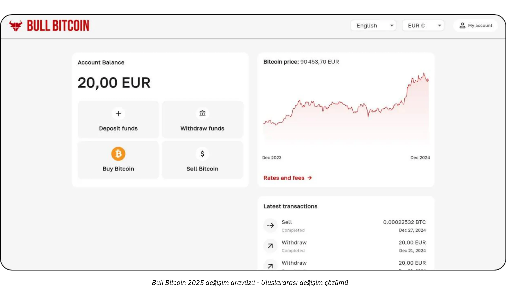

### Hangi Fiyatla?

Daha önce de belirtildiği gibi, Bitcoin'ün gelecekteki fiyatını tahmin etmek imkansız olduğu gibi, fiyat kısa vadede de çok değişkendir. Tarihsel olarak, güvenilir bir strateji düzenli aralıklarla kademeli olarak birikim yapmak ve dört yıl veya daha uzun bir zaman ufkunu korumak olmuştur.

### Ne Kadar Satın Almalısınız?

Mantıksız bir şekilde, üzerinde fazla düşünmeden çok küçük bir satın alma ile başlamak muhtemelen en iyisidir. Küçük bir meblağ (yüz avro veya dolar gibi) size ciddi bir zarar vermez ve uygulamalı deneyim size herhangi bir okuma miktarından çok daha fazlasını, çok daha hızlı bir şekilde öğretecektir.

Daha önce de belirtildiği gibi, yalnızca birkaç yıl boyunca ihtiyaç duymayacağınız fazla likiditeye yatırım yapmak akıllıca olacaktır. İyi anlaşılmamış herhangi bir strateji, kötü bir zamanda aniden nakit çekmeniz gerektiğinde sizi zor bir duruma sokma riski taşır.

Küçükten başlamanın yanı sıra, kurumsal hazinelerin ölçülü bir tahsis stratejisi benimsemeleri de faydalı olacaktır. Spektrumun bir ucunda, MicroStrategy gibi bazı şirketler, fazla hazine fonlarının önemli bir kısmını Bitcoin'e tahsis ederek aşırı bir yaklaşım benimsemiş ve güçlü kurumsal inancı yansıtmıştır. Buna karşılık, daha muhafazakâr ve tartışmasız rasyonel bir strateji, potansiyel kazançları risk yönetimi ve likidite gereksinimleriyle dengeleyerek kurumsal hazinenin belki de %5'ini Bitcoin'e tahsis etmeyi içerebilir.

Bu spektrumu, şirketin operasyonel ihtiyaçları için yeterli likiditeye sahip olmasını sağlayan minimum maruziyetten, Bitcoin'nın beklenen uzun vadeli değer kazanımından yararlanmayı amaçlayan agresif bir duruşa kadar bir ölçek olarak görselleştirin. Agresif bir tahsisat daha yüksek getiri sağlayabilirken, mütevazı bir tahsisat volatiliteyi azaltmaya yardımcı olur ve şirketin finansal temelinin güvende kalmasını sağlarken, hazine operasyonlarında Bitcoin'nın yenilikçi potansiyelinden yararlanmaya devam eder.

### Ne Sıklıkta?

Hard kuralı yoktur. "Düşüşleri" avlayarak piyasayı zamanlamaya çalışmak, düzenli aralıklarla alım yapmaktan daha az etkili ve daha stresli olabilir. Tecrübeli yatırımcılar bile bazen yanlış yaparlar. Bir anda "her şeye" girişmek iki ucu keskin bir kılıç olabilir.

Gerçekte, Bitcoin'in potansiyel değer kazanımı öyle ki, sadece birkaç yıl sonra başlasanız bile, muhtemelen uzun vadeli kazançlar göreceksiniz. Doğru, büyük fiyat dalgalanmalarının zaman içinde yoğunluğunun azalması muhtemeldir. Bununla birlikte, deflasyonist bir para birimi olarak Bitcoin, değeri etkin bir şekilde depolamak ve kullanıcılarının üretkenlik kazanımlarını yansıtmak üzere tasarlanmıştır. Bir benzetme yapmak gerekirse: şu anda Bitcoin'in "lansman aşamasındayız", yapım aşamasında olan bir para birimi ve henüz kimse onun gerçek değerini bilmiyor. Daha sonra, belki 20 veya 40 yıl sonra, istikrarlı bir "seyir aşamasına" geldiğinde, inanılmaz derecede istikrarlı olabilir ve toplumun üretkenlik kazanımlarıyla istikrarlı bir şekilde büyüyebilir.

Gayrimenkul sektörü sık sık "satın almak için her zaman doğru zaman" ifadesini tekrarlarken, gayrimenkulün değer saklama işlevini yitirmesi halinde - Bitcoin gibi varlıklara geçerek - fiyatların kullanım değerine (barınak) yaklaşabileceğini unutmaktadır. Buna karşın Bitcoin, değer depolamaktan başka bir amaca hizmet etmiyor, bu da "satın almak için her zaman doğru zaman" anlamına gelebilir Bunu gelecek gösterecek.

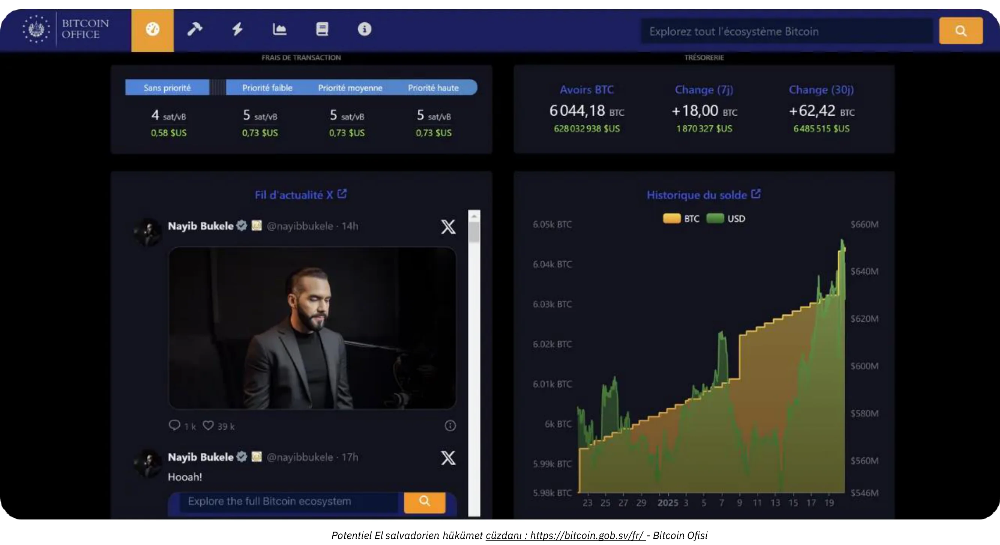

*Kredi: [Bitcoin Ofisi](https://Bitcoin.gob.sv/)*

### Ne Şekilde Satın Alınmalı? (Saklama Yöntemleri)

Fiziksel olarak Bitcoin'e sahip değilsiniz. Bunun yerine, hesap birimlerinizin bir kısmının veya tamamının Ownership'sini bir veya daha fazla başka kriptografik anahtara aktarmanıza olanak tanıyan bir kriptografik anahtara sahipsiniz. Tüm bunlar, dünya çapında on binlerce düğümde çoğaltılan Bitcoin Blockchain üzerinde gerçekleşir.

Bu kriptografik anahtar son derece büyük rastgele bir sayıdır. Kullanıcı deneyimini basitleştirmek için genellikle 12 veya 24 kelimeden oluşan bir dizi olarak gösterilir. Bu kelimeler "Hardware Wallet" olarak bilinen fiziksel bir cihaza yüklenebilir Bununla birlikte, bitcoinlerin bu cihazın "içinde" olmadığını anlayın; bu sadece işlemleri kriptografik olarak imzalamak ve ağa yayınlamak için bir araçtır. Asıl önemli olan, güvende tutulması gereken 12 veya 24 kelimedir.

Bu da velayet konusuna yol açar: Bitcoin'i tutmak anahtar(lar)ı tutmak anlamına gelir. Ya kendiniz tutarsınız ya da bu görevi üçüncü bir tarafa devredersiniz. Ara çözümler de vardır. En yaygın senaryoları gözden geçirelim:

- **Kendi Kendine Velayet:**

Bu, Bitcoin'nın orijinal tasarımına uygun olduğu için gerçek Bitcoin meraklıları tarafından önerilen seçenektir. Kendi bankanız gibi hareket edersiniz: üçüncü bir tarafın sizi dolandırma riski yoktur, ancak anahtar(lar)ın güvenliğinden siz sorumlusunuzdur. Fonlarınıza 7/24 tam erişiminiz vardır. Bir iş ortamında, birden fazla kişinin işlem yapması gerekiyorsa, erişimi ve güvenliği yönetmek için uygun araçlara ve prosedürlere ihtiyacınız olacaktır.

- **Üçüncü Taraf Velayeti:**

Örneğin, bir Exchange veya bir satın alma hizmeti sizin için bir hesap oluşturabilir, geleneksel para biriminizi Bitcoin'e dönüştürebilir ve güvenlik sistemlerini kullanarak sizin adınıza tutabilir. Bu tür hizmetlerin çoğu, bitcoinlerinizi anahtarın yalnızca sizde olduğu bir Wallet'a çekmenize izin verir. Bunu yapana kadar, bitcoinlere gerçekten sahip değilsiniz; size geri ödeme yapacaklarına dair verdikleri söze güveniyorsunuz. Bu da güvenlik riskleri (onlarınki ile sizinki) ve karşı taraf riskinin (başarısız olabilirler ya da ortadan kaybolabilirler) dengelenmesini gerektirir. Bazı işletmeler bunu kabul edilebilir bulsa da, genellikle uzun vadeli depolama için veya tahsisatınızın %100'ü için tavsiye edilmez. Saklama hizmetleri de saklama ücreti talep edebilir.

- **"Kağıt Bitcoin" (ETF'ler veya ETP'ler):**

Bunlar, Bitcoin'in kesirlerini temsil eden ve fiyat performansını kopyalayan geleneksel finansal araçlardır. Ürünün arkasındaki kurum teorik olarak temel Bitcoin'i satın alır ve elinde tutar. Katkılarınız ve para çekme işlemleriniz Bitcoin cinsinden değil, geleneksel para birimi (örneğin, dolar veya euro) cinsinden yapılır. Gerçek Bitcoin ile para çekmeye izin veren belirli ürünler dışında (bazı yargı bölgelerinde vergiye tabi bir olaydan kaçınmak için), bu araçlar yıllık yönetim ücretleri içerir. Burada, kurumun güvenliğine güvenirsiniz ve karşı taraf riskiyle karşı karşıya kalırsınız (örneğin, bir hükümet, 1933'te 6102 sayılı ABD İcra Emri uyarınca altınla olduğu gibi, kurumsal olarak tutulan tüm Bitcoin'e el koymaya karar verirse). Geleneksel finansal kanallar aracılığıyla dağıtıldıkları için birincil faydaları kolay erişimdir. Kriptografik anahtarları güvence altına alma ihtiyacını atlarlar ancak Bitcoin'in doğal özelliklerinden hiçbirini sunmazlar: Bitcoin ağını 7/24 izinsiz olarak serbestçe değer taşımak için kullanamazsınız. Bitcoin'in işlevselliğini ya da egemenliğini değil, yalnızca finansal performansını kopyalarlar.

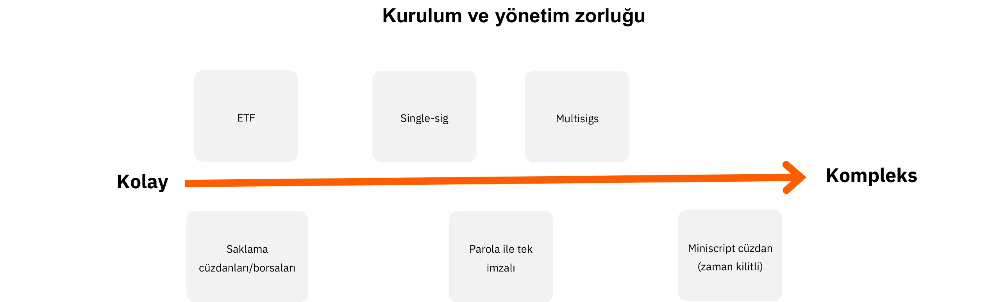

Buna ek olarak, Bitcoin'yi hangi biçimde tuttuğunuz kurumsal hazinenizi korumak için gereken güvenlik önlemlerini önemli ölçüde etkiler. İster anahtarlarınızın doğrudan kontrolünü sağlamak için tek imzalı veya çok imzalı donanım cüzdanları vb. kullanarak kendi kendinize saklamayı seçin, ister bu görevi üçüncü taraf saklama hizmetlerine veya ETF'lere devredin, her seçenek kendi risk profilini taşır. Örneğin, kendi kendine saklama tam erişim sağlar ancak sıkı dahili güvenlik protokolleri gerektirirken, üçüncü taraf çözümleri karşı taraf riski pahasına yönetim yükünü azaltır. Farklılıkları daha iyi göstermek için, bu grafik her bir saklama türünün güvenlik modelini özetleyerek kuruluşunuzun ihtiyaçlarına en uygun yaklaşımı seçmenize yardımcı olur:

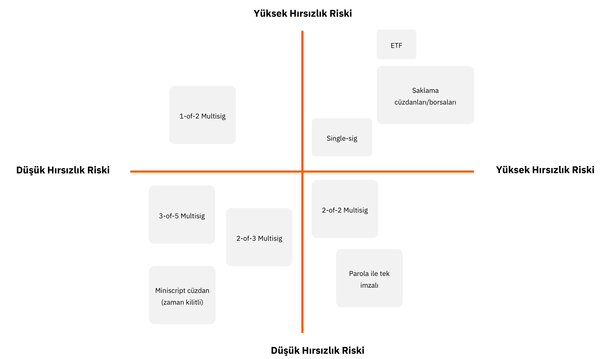

### Kimden Satın Almalı?

"Kağıt Bitcoin "ü tercih ederseniz, bankalar veya çevrimiçi borsalar gibi finans kurumlarına başvurursunuz.

Gerçek Bitcoin'i bir pazar yeri (Exchange) veya bir komisyoncu aracılığıyla satın almayı seçerseniz, birkaç ana kategoriniz vardır:

- **Büyük Uluslararası veya Yabancı Platformlar:**

Örnekler arasında, tarihsel olarak birçok kişi tarafından kullanılan Kraken, Coinbase veya Binance bulunmaktadır. Bazıları sorunlarla karşılaşmıştır ve net bir öneride bulunmak zordur. Bir tavsiye: eğer bunları kullanıyorsanız, bitcoinlerinizi gereğinden uzun süre orada bırakmayın.

- **Düzenlenmiş Hizmet Sağlayıcılar (Kayıtlı Dijital Varlık Hizmet Sağlayıcıları):**

Örneğin, Fransa'da Paymium (Exchange) veya BullBitcoin (broker) gibi platformlar, dümende gerçek Bitcoin meraklılarına sahip olmaları ve sağlam bir sicil oluşturmalarıyla bilinir. ABD'de River veya Swann gibi hizmet sağlayıcıları vardır. Genel olarak, sağlayıcının soyağacını incelemek önemlidir: itibarları, geçmiş performansları, Bitcoin topluluğu içindeki popülerlikleri ve liderliklerinin Bitcoin'nin temel değerleriyle uyumlu olup olmadığı.

**Exchange vs. Broker:**

- Bir **Exchange**, seçtiğiniz fiyattan satın alma emirleri vermenize olanak tanır, ancak piyasa fiyatı ve satıcılar aynı hizaya gelene kadar gerçekleştirmeyi beklemeniz gerekir.
- Bir **aracı** size sabit bir fiyat sunar ve işlemi daha hızlı tamamlayabilir.

Ücretler ve uygulama hızının ötesinde - uzun vadeli (birkaç yıl) düşünüyorsanız daha az önemli olan - bir işletme de dikkate almalıdır:

- **Kullanıcı Interface:** Platform kullanıcı dostu mu?
- **Muhasebe Özellikleri:** Minimum olarak, işlem geçmişini .CSV formatında dışa aktarma yeteneği.
- **Saklama ve Güvenlik:** Platform bitcoinleri sizin adınıza mı tutuyor yoksa Ownership'i size mi aktarıyor? Güvenlik kurulumları nedir? "Para çekme kilitleri" veya diğer para çekme sınırlamaları var mı?
- **Müşteri Desteği:** Özellikle başlangıç aşamasında kalite, duyarlılık ve kişiselleştirilmiş yardım.
- **İtibar ve Ethos:** Platformun güvenilirliği ve değerleri.
- **Yinelenen Satın Almalar için Destek:** Zamanlanmış satın almalarla zaman içinde Bitcoin biriktirmeyi planlıyorsanız.

# Her işletme için özel olarak tasarlanmış Bitcoin ödeme çözümleri

<partId>b2c8af88-6bfc-49b1-ad84-4c292c713b55</partId>

## Bitcoin'ün ödeme olarak alınması

<chapterId>99af1203-bc84-4acc-9780-f733e7998335</chapterId>

Öncelikle, Bitcoin'in internet ile aynı ölçekte bir kesinti olduğunu anlamak önemlidir.

İlk günlerde internet ağı, iletişim kanallarından aracıların kaldırılmasını mümkün kıldı ve ardından bu altyapı daha önce hayal bile edilemeyen sayısız uygulamaya yol açtı. Bugün, hangi işletmenin çevrimiçi bir varlığı yok ki?

Bitcoin, ilk uygulaması aracıları değer-paranın depolanmasından ve Exchange'dan çıkarmak olan bir güven altyapısıdır. Şu anda hayal bile edilemeyen diğer uygulamalar bu altyapı üzerinde ortaya çıkacaktır. Buradaki ilk varlığınız bir web sitesine sahip olmakla eşdeğerdir: eşler arası ödemeler ve değer değişimleri için bir ağ geçidi.

Şimdi, ana faaliyetinin Bitcoin ile hiçbir ilgisi olmayan pratik bir işletmenin bakış açısını düşünün. Neden Bitcoin ödemelerini kabul etmeyi seçsin ki?

- **Bir Bitcoin Hazinesi Oluşturmak:**

Bitcoin satın almakla ilgili önceki makalemize bakın. İster inanç nedeniyle ister çeşitlendirme stratejisi olarak olsun, bazı profesyoneller Bitcoin ödemelerini kabul etmeyi tercih ediyor. Bazı Bitcoin'ciler, bir şirket mali açıdan ne kadar az eğilimli ise -yani karmaşık finansal manevralara girişecek ne zamanı ne de araçları var ise-** o işletme için ödemenin mevcut en zor para biçimiyle yapılmasının o kadar kritik hale geldiğini savunuyor**. Bu şekilde, oyun alanını düzleştirerek küçük, zamanı kısıtlı işletmelerin bile finansal oyunlara kapılmadan değerlerini korumalarını sağlar.

- **Yeni Bir Demografiye Ulaşmak:**

Bitcoin kullanıcılarının sayısı artıyor ve önemli bir satın alma gücüne sahipler. Doğal olarak kendi para birimlerini kabul eden işletmelere yöneleceklerdir. Dahası, bu ilk evrensel, internete özgü para birimi olduğundan, yoldan geçen uluslararası müşterileri de çekebilirsiniz.

- **Görünürlüğün Artırılması:**

Örneğin, işletmenizi BTCmap.org gibi platformlarda listeleyerek. Şu anda yalnızca birkaç işletme Bitcoin kabul etmektedir, bu nedenle ağızdan ağıza yayılma sizin avantajınıza olacaktır. Ayrıca sizi rakiplerinizden ayırır.

- **Daha Düşük Ücretler:**

Anında Bitcoin ödemeleri Lightning Network üzerinden gerçekleşir. **Ücretler minimum düzeydedir ve alıcı tarafından ödenir**. Ödeme terminali ücretleri, ödeme yetkilendirme hataları ve dolandırıcılık yoktur. Karşılaştırmak gerekirse, ödeme endüstrisi (kartlar, terminaller, transferler, PSP'ler, vb.) küresel olarak yılda yaklaşık 2,2 trilyon dolara mal olmaktadır. Buna ters ibrazlar ve dolandırıcılık da eklendiğinde, toplamda ABD'nin GSYİH'sine eşdeğer bir miktarın neredeyse onda biri, sadece değer transferi için dünya çapındaki üretken işletmelerden "sıyrılmaktadır". İşiniz ne olursa olsun, finansal ücretler optimize edilmesi gereken bir yüktür ve bazı durumlarda yüksek ücretler belirli iş modellerini engelleyebilir.

- **Özgürlük ve İzinsiz, 7/24:**

Bitcoin'i kullanmak için izin almaya gerek yok. Herkes bir akıllı telefon uygulaması kullanarak dakikalar içinde ekonomiye katılabilir. Herhangi bir zamanda, herhangi bir zamanlama kısıtlaması veya gecikme olmaksızın, herhangi birinden -birey veya işletme- ödeme gönderebilir veya alabilirsiniz.

- **Avantajları için Bitcoin Ağından Yararlanın:**

Ödemelerinizi Bitcoin formunda tutmanız gerekmez-özellikle tedarikçilere ödeme yapmanız veya KDV havale etmeniz gerekiyorsa. Bazı hizmetler, Bitcoin ödemelerinizin tamamını veya bir kısmını bir ücret karşılığında seçtiğiniz para birimine (örneğin, IBAN'ınıza Euro) dönüştürebilir. Bu senaryoda, Bitcoin'yi kabul etmenin faydası yeni kullanıcıları çekmek veya Bitcoin'nin kendine özgü avantajlarında (daha düşük ücretler, günün her saati çalışma ve dolandırıcılık veya ters ibraz riski olmaması gibi) yatabilir.

### Hangi ödeme çözümünü seçmelisiniz?

Bitcoin ödemelerini kabul etmeye başlamak nispeten kolaydır. Doğru çözümü seçmek için, gerçekleştirdiğiniz işlemlerin özelliklerini göz önünde bulundurun: ortalama ödeme tutarı, işlem sıklığı ve ödemeleri fiziksel bir ortamda mı, çevrimiçi olarak mı yoksa her ikisinde birden mi kabul edeceğiniz.

Bir tacir olarak zihniyetiniz de önemlidir. Basit bir test mi yapıyorsunuz yoksa Bitcoin'un önemli ve yinelenen bir gelir kaynağı olmasını mı bekliyorsunuz? Eğer ikincisiyse, sağlam, kapsamlı ve özelleştirilebilir bir kuruluma ihtiyacınız olacaktır.

Çalışanlarınızın çeşitli rollerini ve konumlarını göz önünde bulundurmayı unutmayın. Her senaryoda, muhasebecinize gerekli tüm bilgileri sağlayabilmeniz ve muhasebe sürecini kolaylaştırabilmeniz gerektiğini unutmayın.

Karar verme sürecini basitleştirmek için dört farklı iş profili tanımladık. Aşağıdaki tablolarda her bir profil için temel özellikler ve önerilen ödeme çözümleri yer almaktadır.

### İşletme profilleri

#### Profil 1 - Başlangıç

| Attribute                        | The Starter                                                                                                                                |
| -------------------------------- | ------------------------------------------------------------------------------------------------------------------------------------------ |
| **State of Mind**                | "trying my first physical payment", "taking a tip for my online content", "targeting very small revenue"                                   |
| **Transaction Frequency**        | "first transaction in order to learn", "taking payment once in a while"                                                                    |
| **Business Type Examples**       | Creative economy (content creators, blogs, articles, etc.), occasional tips, one-off in-person product sales, associations, one-off events |
| **Payment Type**                 | Generally a few cents to a few euros/dollars; under ~300 euros/dollars per item                                                            |
| **Settings Complexity**          | None                                                                                                                                       |
| **Example Recommended Solution** | A custodial Lightning wallet like Wallet of Satoshi or a non-custodial wallet like Phoenix                                                 |
| **Merchant Interface**           | Simple Bitcoin Lightning wallet: an app on a mobile phone                                                                                  |
| **Customer Interface**           | Bitcoin QR payment code, scanned via the customer’s personal wallet                                                                        |
| **Fees**                         | Customer pays Bitcoin Lightning fees plus any applicable app fees                                                                          |
| **Point of Sale Device**         | Free smartphone app or an option for a physical terminal (e.g. Bitcoinize)                                                                 |
| **Management and Roles**         | Single app management; minimal role differentiation                                                                                        |
| **Accounting Exports**           | Basic transaction history lists                                                                                                            |
| **API**                          | No                                                                                                                                         |

#### Profil 2 - The Essential

| Attribute                        | The Essential                                                                                                                              |
| -------------------------------- | ------------------------------------------------------------------------------------------------------------------------------------------ |
| **State of Mind**                | "I accept Bitcoin in my business but I do not expect meaningful volume"                                                                    |
| **Transaction Frequency**        | Few transactions per month                                                                                                                 |
| **Business Type Examples**       | Bars, restaurants, semi-regular sales of fresh or directly sourced products, multiple stores under one owner, creative economy for artists |
| **Payment Type**                 | Generally ranging from a few euros/dollars to a few hundred per item; under ~300 per item and under ~3,000 per month                       |
| **Settings Complexity**          | Minimal (mobile app)                                                                                                                       |
| **Example Recommended Solution** | Swiss Bitcoin Pay                                                                                                                          |
| **Merchant Interface**           | Simple Bitcoin Lightning wallet: an app on a mobile phone; simple invoicing with minimal details                                           |
| **Customer Interface**           | Bitcoin QR payment code, scanned via the customer's personal wallet                                                                        |
| **Fees**                         | Typically <1% for sending to a Bitcoin address, and <1.5% for converting to fiat                                                           |
| **Point of Sale Device**         | Free smartphone app or an option for a physical terminal (e.g. Bitcoinize)                                                                 |
| **Management and Roles**         | Option for a sell-only role for employees; online dashboard for administration                                                             |
| **Accounting Exports**           | CSV export with complete transaction details                                                                                               |
| **API**                          | Yes                                                                                                                                        |

#### Profil 3 - Profesyonel

| Attribute                        | The Professional                                                                                                                                       |
| -------------------------------- | ------------------------------------------------------------------------------------------------------------------------------------------------------ |
| **State of Mind**                | - A payment method like any other for my e-commerce - Or joint management for a group of businesses ready for higher volumes                           |
| **Transaction Frequency**        | Multiple transactions per day                                                                                                                          |
| **Business Type Examples**       | E-commerce sites with moderate volume, small marketplaces, groups of physical stores (e.g., Click & Collect), SME operations                           |
| **Payment Type**                 | Generally ranging from a few euros/dollars to a few hundred; no set payment size limit; less than 250,000 per year                                     |
| **Settings Complexity**          | Light to fully featured (local or cloud hosting), often requires an e-commerce storefront                                                              |
| **Example Recommended Solution** | BTCPay Server for e-commerce and/or physical environments; ZapRite, Musqet or PayWithFlash for checkout, Be-BOP for an integrated e-store             |
| **Merchant Interface**           | Website (mobile and desktop) with invoice editing, shopping cart options, and payment button creation; automated invoicing with e-commerce integration |
| **Customer Interface**           | Bitcoin QR payment code, scanned via the customer's personal wallet                                                                                    |
| **Fees**                         | Mix of free open-source backend and paid Lightning hosting/service fees; front-end fees include Bitcoin Lightning fees and <1.5% conversion fees       |
| **Point of Sale Device**         | Website store, optional physical display (e.g. iPad showing the site or Bitcoin terminal)                                                              |
| **Management and Roles**         | Fully featured store with multiple admin roles; employees and customers interact with the system                                                       |
| **Accounting Exports**           | CSV export with complete transaction details                                                                                                           |
| **API**                          | Yes                                                                                                                                                    |

#### Profil 4 - İşletme

| Attribute                        | The Enterprise                                                                                                                                  |
| -------------------------------- | ----------------------------------------------------------------------------------------------------------------------------------------------- |
| **State of Mind**                | - A strategic payment method for the business - With some development to integrate into the service platform as per specific specifications     |
| **Transaction Frequency**        | Unlimited, high-frequency transactions                                                                                                          |
| **Business Type Examples**       | Mid-sized enterprises, IT service companies, large corporations, major marketplaces                                                             |
| **Payment Type**                 | Any size or volume                                                                                                                              |
| **Settings Complexity**          | Medium to high, depending on the choice of architecture                                                                                         |
| **Example Recommended Solution** | Custom-made architecture or orchestration of SaaS-hosted solutions, potentially using third-party LSP (*Lightning Service Provider*) services   |
| **Merchant Interface**           | Fully customized front-end and back-end interfaces fully integrated into the business’s workflows and processes                                 |
| **Customer Interface**           | Ranging from a Bitcoin QR payment code to a fully custom UI and/or API integration                                                              |
| **Fees**                         | Combination of internal development and third-party fees; customer pays Bitcoin Lightning fees plus any transaction fees from service providers |
| **Point of Sale Device**         | Custom-designed solutions tailored to the enterprise environment                                                                                |
| **Management and Roles**         | Fully customized roles across sales, administration, devops, accounting, and finance                                                            |
| **Accounting Exports**           | Fully customized accounting exports                                                                                                             |
| **API**                          | Yes                                                                                                                                             |

İlerleyen bölümlerde, her bir iş profilini ve her birine özel çözümleri detaylandıracağız.

## Başlangıç

<chapterId>7edda53d-5b9f-432a-8493-115de8c94a67</chapterId>

Başlangıç profili, Bitcoin ödemelerini önemli kaynaklar veya uzmanlık gerektirmeden keşfetmek isteyen işletmeler, içerik oluşturucular ve bireyler için tasarlanmıştır. Bunlar genellikle çok küçük hacimli işlemlerle (belki birkaç bahşiş, bağış veya ara sıra satış) ilgilenen ve Bitcoin ve Lightning Network ekosistemine basit, hafif bir giriş yapmak isteyen kişilerdir. Başlangıç yaklaşımının temel değeri, minimal kurulumunda yatmaktadır: çoğu durumda, gerekli olan tek şey temel Lightning uyumlu bir Wallet ile donatılmış bir akıllı telefon veya tablettir.

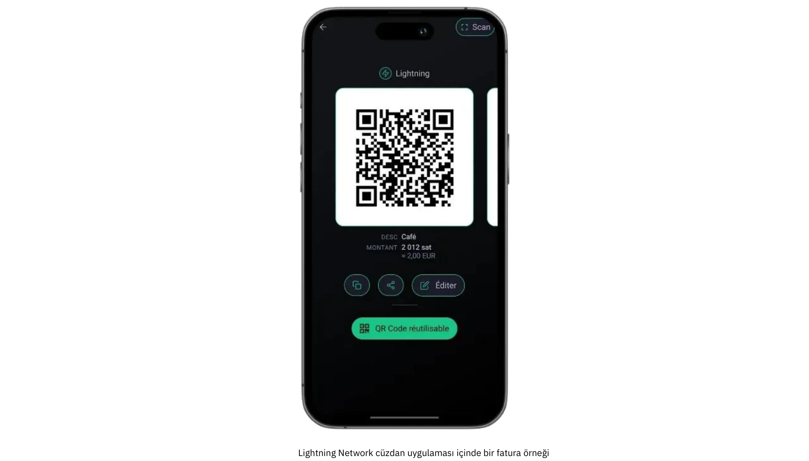

Bu profilin belirleyici özelliklerinden biri, ayda nadiren birkaç yüz Euro veya doları aşan düşük hacimli ödemelere odaklanmasıdır. Bu mütevazı ölçek, daha yüksek hacimli dağıtımların doğasında bulunan karmaşıklıklar olmadan Bitcoin ile pazarı test etmek isteyen herkes için mükemmel bir seçimdir. Ayrıca, anında uygulamalı öğrenmeye olanak sağlar; daha az operasyonel baskı ve daha küçük parasal riskler olduğundan, hatalar kontrol altına alınabilir ve dersler hızlı bir şekilde öğrenilir. Hafta sonu fuarlarında el yapımı ürünler satan sanatçılardan tek seferlik bağış kabul eden kar amacı gütmeyen gruplara kadar bu kategorideki kullanıcılar genellikle gelişmiş işlevlerden ziyade erişilebilirlik ve kullanım kolaylığını vurgulamaktadır.

Starter profili için en yaygın iki Wallet kurulumu, gözetimli ve gözetimsiz çözümler arasında karar vermeyi içerir. Saklama amaçlı bir Wallet (Satoshi'in Wallet'sı veya Blink gibi), üçüncü taraf bir hizmetin özel anahtarları ve arka uç işlemlerini yönetmesine izin verir, böylece kullanıcı için teknik sorumlulukları azaltır. Bu düzenleme, her şeyden önce rahatlığa değer veren ve mümkün olan en basit ilk katılımı isteyen kişiler için özellikle caziptir. Öte yandan, emanetçi olmayan Lightning cüzdanları (Phoenix veya Breez gibi) özel anahtarları ve tam kontrolü işletme sahibinin ellerine bırakarak, biraz daha fazla başlangıç çabası karşılığında Exchange'te daha fazla özerklik ve gizlilik sunar. Her iki durumda da, modern arayüzler genellikle o kadar kullanıcı dostudur ki, herkes temel görevleri (QR kodu oluşturma, ödeme tutarı girme ve işlemleri onaylama) birkaç dakika içinde halledebilir.

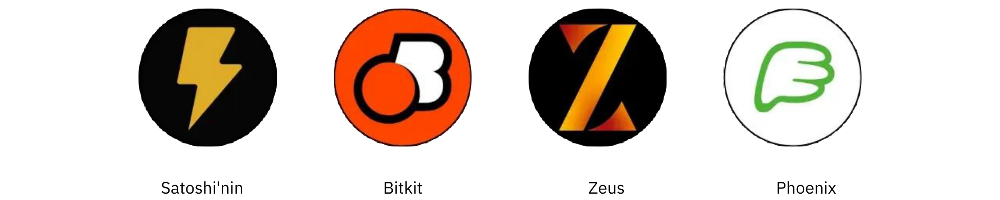

İşlemler küçük olduğunda güvenlik endişeleri daha az acil gibi görünse de, yine de temel koruyucu önlemlerin alınması çok önemlidir. Bitcoin ödemelerini almak için kullanılan tek bir akıllı telefon veya tablet bile bir şifre veya biyometrik güvenlik ile kilitlenmeli ve yedekleme prosedürleri (velayet altındaki bir Wallet için oturum açma kimlik bilgilerinin takip edilmesinden velayet altında olmayan bir seed ifadesinin korunmasına kadar) ciddiye alınmalıdır. Fiziksel bir ortamda işlem yapan personelin temel bilgileri bilmesi faydalı olacaktır: uygulamanın nasıl açılacağı, müşteriye QR kodunun nasıl sunulacağı ve ödemenin gerçekten gelip gelmediğinin nasıl kontrol edileceği.

Muhasebe ve raporlama, Starter profili altında nispeten basit olsa da, yine de dikkatli bir değerlendirme gerektirir. İşlem hacimleri asgari düzeyde olsa da, doğru kayıtların tutulması ileride karışıklığı önler ve mali denetimler veya vergi beyannameleri durumunda şeffaflığın korunmasına yardımcı olur. Birçok Wallet uygulaması, kullanıcıların temel bir işlem geçmişini CSV dosyası olarak dışa aktarmasına olanak tanır; küçük bir işletme veya tek bir girişimci için bu dosyaları düzenli olarak kaydetmek, hesapların mutabakatını çok daha kolay hale getirebilir. Ayrıca her işlemin alındığı andaki yaklaşık fiat değerini (örneğin avro veya dolar cinsinden) takip etmek akıllıca olacaktır. Bitcoin'nin fiyatı dalgalanabildiğinden, dönüşüm oranlarının kaydını tutmak defter tutma ve vergi uyumluluğu için çok değerlidir.

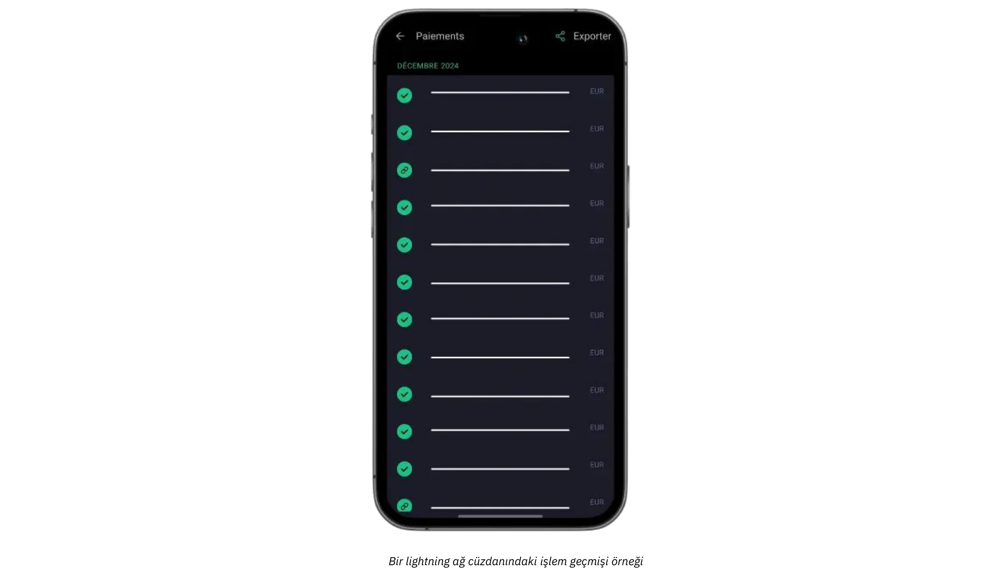

Fiziksel veya yüz yüze ödemelerini çevrimiçi bağışlar veya bahşişlerle desteklemek isteyen işletmeler için, bir Lightning bahşiş düğmesini veya bağış widget'ını bir web sitesine veya bloga entegre etmek artık çok kolay. BTCPay Server gibi platformlar yapılandırması kolay ödeme düğmeleri sunarken, bazı sosyal medya ve canlı yayın hizmetleri adresli Lightning bahşişlerini zaten desteklemektedir. Sonuç olarak, bir Starter kuruluşu bile mütevazı ama küresel bir müşteri ağı oluşturabilir. Bu arada, Bitcoin'ü uzun vadeli tutmak istemeyenler, belirli saklama cüzdanlarını veya üçüncü taraf hizmetlerini kullanarak fiat para birimine kısmi veya otomatik dönüşümü keşfedebilirler. Bu seçenek ek ücretler ve olası KYC yükümlülükleri içerse de, işletmelerin Exchange kur oynaklığından kaçınmalarına ve mevcut finansal iş akışlarını en az kesintiyle sürdürmelerine yardımcı olur.

Basit bir kullanım örneği, tüm bu Elements'ün nasıl bir araya geldiğini göstermektedir. Bir Cumartesi çiftçi pazarında ev yapımı reçeller satan yerel bir zanaatkâr düşünün. Elinde Wallet gözetimli Lightning çalıştıran bir telefonla her bir kavanozun fiyatını Euro cinsinden belirliyor; bir müşteri Bitcoin ile ödeme yapmak istediğinde, tüccar hızlı bir şekilde ilgili fiat tutarını giriyor ve uygulama otomatik olarak ödenmesi gereken Sats'i hesaplıyor. Ortaya çıkan QR kodu müşterinin Wallet'si tarafından taranır, ödeme saniyeler içinde gerçekleştirilir ve zanaatkar işlemin başarılı olduğunu anında anlar. Günün sonunda, tüm işlem detayları kayıt tutmak için dışa aktarılabilir ve günün bakiyesi tamamen veya kısmen fiat para birimine dönüştürülmek üzere bir Exchange platformuna gönderilebilir.

Kullanıcı dostu araçları, minimum donanım gereksinimlerini ve basit kayıt tutmayı dengeleyen Başlangıç çözümleri, yeni gelen işletmeleri bunaltmadan temel gereksinimleri sunar. İşlem hacimlerinin artması ve işletmenin operasyonel gereksinimlerinin gelişmesi durumunda, gelecek bölümde ayrıntıları verilen daha gelişmiş kategorilere yükseltme yapmak doğal bir ilerleme olacaktır.

Önerilen cüzdanlar ve temel kurulum hakkında ayrıntılı eğitimler için lütfen aşağıdaki kılavuzlara bakın:

**Kendi kendine emanet LN cüzdanları/düğümleri:**

https://planb.network/tutorials/wallet/mobile/phoenix-0f681345-abff-4bdc-819c-4ae800129cdf

https://planb.network/tutorials/wallet/mobile/bitkit-a7224674-85c4-4045-9baf-37018d89550c

https://planb.network/tutorials/wallet/mobile/breez-46a6867b-c74b-45e7-869c-10a4e0263c06

https://planb.network/tutorials/wallet/mobile/blixt-04b319cf-8cbe-4027-b26f-840571f2244f

https://planb.network/tutorials/wallet/mobile/zeus-embedded-advanced-3e89603c-501d-439c-8691-d4a0d0de459b

**Gözetimli LN cüzdanlar:**

https://planb.network/tutorials/wallet/mobile/wallet-of-satoshi-39149d86-e42b-4e8f-ae9f-7e061e7784f7

https://planb.network/tutorials/wallet/mobile/blink-7ea5f5a4-e728-4ff9-b3f9-cf20aa6fc2bd

## Temel

<chapterId>89be421f-f7df-4bcc-a9e4-df96e39ef249</chapterId>

Essential profili, basit bir Wallet'ten daha eksiksiz ve profesyonel bir sisteme sahip olmakla birlikte, ileri düzeyde teknik bilgiye ihtiyaç duymadan kolay ve hızlı bir şekilde Bitcoin kabul etmek isteyen, potansiyel olarak çalışanları olan küçük ve orta ölçekli işletmeler için uygundur. Bu kategori genellikle her ay yalnızca birkaç Bitcoin ödemesi alan ancak günlük operasyonlarını kesintisiz olarak yürütebilecek kadar basit ve sağlam bir Interface isteyen restoranlar, kafeler, barlar veya küçük perakende mağazaları için geçerlidir.

Başlangıç profilinin aksine, Temel işletmeler tipik olarak Bitcoin ödemelerini sadece bir deneyden ziyade gelir akışlarının devam eden bir parçası olarak görürler. Hala nispeten düşük işlem hacimleriyle çalışmaktadırlar, ancak sıklık, sahiplerin ve çalışanların daha yapılandırılmış ve güvenilir bir sistemden yararlanmaları için yeterlidir. Aynı zamanda, Essential profili basitliğe odaklanmaya devam ediyor; kullanışlı gösterge tablolarına ve sınırlı rol yönetimine izin verirken, uzman BT kaynakları veya karmaşık entegrasyonlar gerektirmiyor.

Bu segmentteki teknoloji önerileri genellikle tüccarların Bitcoin ödemelerini kolayca kabul etmeleri için kolaylaştırılmış bir çözüm olan **Swiss Bitcoin Pay** üzerinde yoğunlaşmaktadır. Çalışanlar için teknik uzmanlık gerektirmeyen kullanıcı dostu bir PoS uygulamasına sahiptir. Standart Bitcoin cüzdanlarının aksine, yalnızca ödeme almaya odaklanır ve çalışanların cihazı güvenlik riski olmadan kullanmasına olanak tanır. Birden fazla PoS uygulaması aynı hesaba bağlanabilir, tabletlerde, kayıt cihazlarında, akıllı telefonlarda veya bilgisayarlar için Android ve iOS'u destekleyen bir web sürümü aracılığıyla kullanılabilir. Ayrıca, sattığınız ürünleri ve ilgili fiyatlarını içeren bir menü oluşturarak çalışanın PoS'ta müşteri için bir sepet ürün seçmesine ve ardından toplam tutarı tahsil etmesine olanak tanıyabilirsiniz.

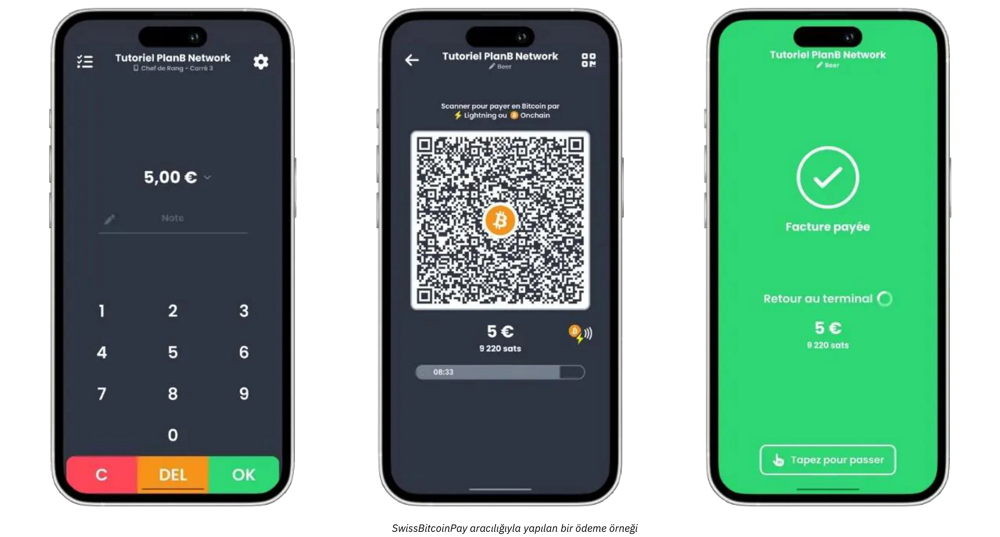

Ödemeler Bitcoin olarak belirli bir Address'ye çekilebilir veya fiat para birimine dönüştürülebilir ve günlük olarak bir banka hesabına yatırılabilir. Swiss Bitcoin Pay, Bitcoin ve Lightning Network ödemelerini manuel müdahale olmadan gerçekleştirerek süreci otomatikleştirir. Fonlar transferden önce en fazla 24 saat tutulur. BTCPay Server gibi tamamen gözetimsiz olmasa da, kolaylık ve güvenliği dengeler ve KYC gerektirmez.

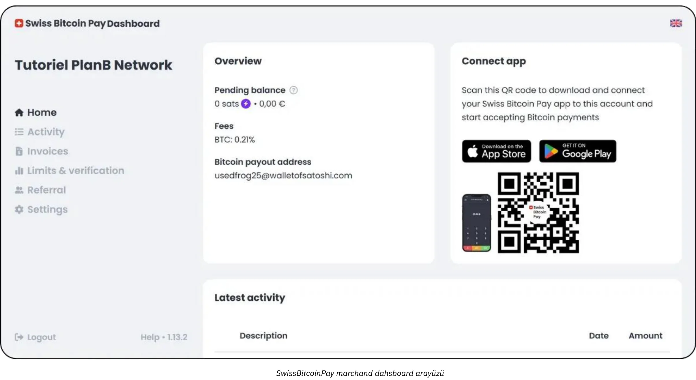

Ücretler rekabetçidir: ilk yıl için %0,21, daha sonra Bitcoin ödemeleri için %1 ve Bitcoin işlem maliyetleri dahil olmak üzere fiat dönüşüm ödemeleri için %1,5. Swiss Bitcoin Pay, Open Node gibi saklama çözümleri ile BTCPay Server gibi karmaşık kendi kendine barındırılan sistemler arasında pratik bir orta yol sunarak basitlik, güvenlik ve finansal özerkliğe öncelik veriyor.

Bu tür bir kurulum, yüz yüze işletmelerin generate ödeme faturalarını hızlı bir şekilde almalarını, QR kodlarını müşterilerine sunmalarını ve Lightning veya On-Chain işlemlerini minimum sürtünmeyle kabul etmelerini sağlar. Personelin bu ödemeleri gerçekleştirmek için yalnızca kısa bir oryantasyona ihtiyacı vardır; yöneticiler ise günlük satışların mutabakatını yapmak ve temel raporlara erişmek için çevrimiçi bir kontrol panelinde oturum açabilir. Kolaylaştırılmış bir yönetim konsolunun mevcudiyeti, daha küçük işletmelerin tek bir Interface'tan hem fiat hem de kripto gelirlerini takip etmelerine yardımcı olarak karışıklığı azaltır ve manuel defter tutma için harcanan zamanı azaltır.

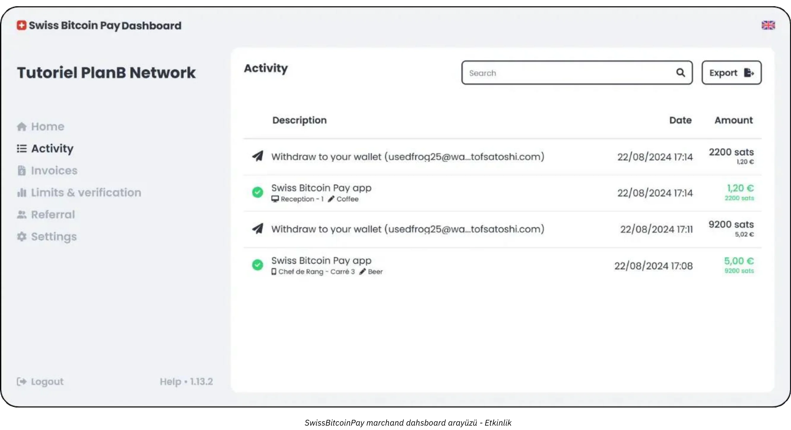

Essential yaklaşımının bir diğer önemli avantajı da hızlı kurulum ve minimum kesintiye verdiği önemdir. Swiss Bitcoin Pay gibi çözümler günler veya haftalar yerine birkaç saat içinde kurulabilir. Örneğin, mütevazı derecede yoğun bir restoranın sahibi veya yöneticisi için nihai hedef, kasada gecikmelere veya personel arasında karışıklığa neden olmadan Bitcoin kabulünü entegre etmektir. POS yapılandırıldıktan sonra, yönetici çalışanlara Invoice'in görüntülenmesi ve ödemenin yapıldığının doğrulanması konusunda hızlı talimatlar verebilir. En iyi senaryoda, bir müşterinin işlemi Lightning Network aracılığıyla neredeyse anında onaylanır ve işletmenin yönetim paneli aynı anda yeni bir ödemeyi gerçek zamanlı olarak kaydeder.

Essential profili son derece sofistike muhasebe sistemleri gerektirmese de, yine de uygun işlem kayıtlarını tutmak akıllıca olacaktır. Swiss Bitcoin Pay gibi araçlar CSV dışa aktarma işlevleri sunarak yöneticilerin her bir Bitcoin satışının fiat eşdeğeri değerini yakalamasına ve diğer gelir kaynaklarıyla birlikte izlemesine olanak tanır. Bu düzeyde bir dokümantasyon çoğu küçük işletme için yeterlidir ve Exchange oranlarının temel düzeyde anlaşılması vergi beyannamesi ve genel mali gözetim konusunda yardımcı olacaktır.

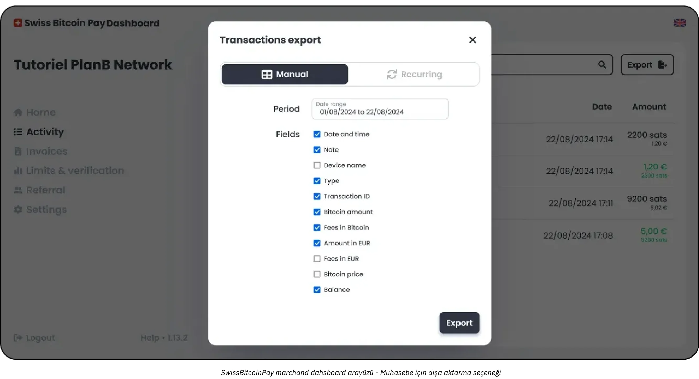

Profiliniz için en uygun hibrit çözüm muhtemelen Swiss Bitcoin Pay'dir:

https://planb.network/tutorials/business/point-of-sale/swiss-bitcoin-pay-2-a78b057e-ed11-47ac-860c-71019fcb451a

Uygulaması kolay, ancak %100 gözetim altında olma dezavantajına sahip bir başka çözüm de Open Node'dur:

https://planb.network/tutorials/business/point-of-sale/open-node-e69a0c1c-47f7-4932-8494-e6f26c3c9784

Ellerinizi kirletmeye hazırsanız ve süreç üzerinde tam kontrol istiyorsanız, BTCPay Server yazılımı mükemmel bir seçenektir. Bununla birlikte, BTCPay Server'ın en büyük dezavantajı, kurulumunun ve yönetiminin zaman alıcı olması ve belirli bir düzeyde teknik uzmanlık gerektirmesidir, ancak kılavuzlarımızı takip edebilirsiniz:

https://planb.network/tutorials/business/point-of-sale/btcpay-server-928eb01e-824b-4b57-a3e8-8727633beddc

Son olarak, fiziksel satış noktaları için bir tamamlayıcı olarak, [Bitcoinize PoS] (https://bitcoinize.com/) kurmayı düşünebilirsiniz.

## Profesyonel

<chapterId>4d5dfa50-c4d0-481c-ab95-1863a898750e</chapterId>

Profesyonel profil, ara sıra veya düşük hacimli Bitcoin ödemelerinin ötesine geçen ve artık birden fazla günlük işlemi gerçekleştirmek için sağlam bir altyapı arayan işletmelere yöneliktir. Bu şirketler genellikle çeşitli kanallarda (belki bir perakende satış yeri, özel bir e-ticaret web sitesi ve hatta mobil satışlar) faaliyet gösterir ve bu nedenle mevcut iş akışlarına sorunsuz bir şekilde entegre edilebilen ödeme çözümlerine ihtiyaç duyarlar. Çoğu durumda, bu seviyedeki işletmeler zaten satış noktası sistemlerini, çevrimiçi sipariş yönetimi platformlarını ve güvenilir, ölçeklenebilir bir yaklaşım gerektiren arka ofis operasyonlarını yönetmektedir.

Profesyonel tacirlerin belirleyici özelliklerinden biri, işlem hacimleri artarken bile verimliliği koruyan **gelişmiş özelliklere** ve **özelleştirilebilir çözümlere** ihtiyaç duymalarıdır. Bir akıllı telefon uygulamasına düzgün bir şekilde sığan aerodinamik bir araçtan memnun olabilecek Essential kullanıcılarının aksine, Profesyonel işletmeler genellikle ayrıntılı Invoice özelleştirmesi, sofistike raporlama panoları ve birden fazla yönetici rolü atama yeteneği gibi özellikler talep eder.

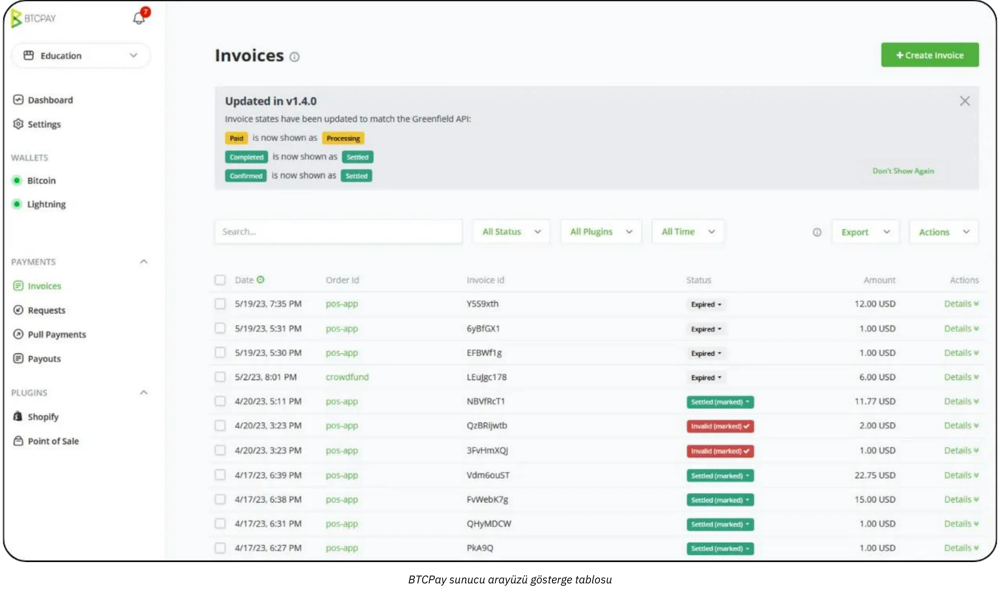

Örneğin bir restoran grubunda faturalama ve stok yönetimine adanmış personel bulunurken, ayrı bir ekip ürün listelerini ve pazarlama kampanyalarını denetleyebilir. Bu ortamda, bir Bitcoin ödeme çözümü önceden var olan bu organizasyonel yapılarla uyumlu olmalıdır.

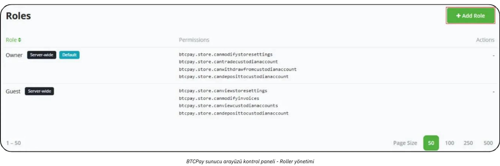

Teknoloji ve araçlarla ilgili olarak, **BTCPay Server** gibi çözümler genellikle Profesyonel bir kurulumun çekirdeğini oluşturur. BTCPay Server, şirket içi veya bulut barındırma yoluyla dağıtılabilen ve web siteleri ve e-ticaret platformları için kapsamlı entegrasyon seçenekleri sunan açık kaynaklı bir platformdur. İşletmeler kendi örneklerini çalıştırarak, otomatik olarak oluşturulan ödeme sayfalarından ödeme onaylandıktan sonra dahili süreçleri tetikleyen bildirimlere kadar ödeme akışının her yönü üzerinde yüksek derecede kontrol sahibi olurlar.

Ayrıca, [Zaprite](https://zaprite.com/) veya [Musqet](https://musqet.tech/) gibi araçlar ödeme deneyimini daha da iyileştirerek daha ayrıntılı özelleştirmeye (marka seçimlerinden sofistike raporlama yeteneklerine kadar) olanak tanıyabilir. Hepsi bir arada çevrimiçi perakende ortamını tercih edenler, kullanım kolaylığından ödün vermeden Bitcoin ödemelerini kolaylaştırmak için tasarlanmış bir e-mağaza çözümü olan [Be-BOP](https://be-bop.io/)'a yönelebilirler.

Bu teknolojileri profesyonel bir ortamda uygulamak, **operasyonel karmaşıklığa** çok dikkat etmek anlamına gelir. Otomatik faturalama iş akışları, çoklu para birimi ekranları ve mevcut envanter sistemleriyle senkronizasyon, iyi entegre edilmiş bir platformun ayırt edici özellikleridir. İşlem verilerini (CSV dosyaları, doğrudan API çağrıları veya özelleştirilmiş formatlar olarak) tam olarak dışa aktarma yeteneği, işletmelerin Bitcoin satışlarını diğer gelir akışlarıyla verimli bir şekilde uzlaştırmasına yardımcı olur.

Güvenlik ve rol yönetimi, Profesyonel kullanıcılar için bir diğer önemli hususu oluşturmaktadır. Günlük Bitcoin işlemleri biriktikçe, yönetim işlevlerine erişimi kontrol etmek önemli bir risk azaltma önlemi haline gelir. Birçok çözümde, yöneticiler çeşitli düzeylerde izinler atayabilir (belki bazı çalışanları işlem geçmişlerini görüntüleme ve fatura oluşturma ile sınırlandırırken, diğerlerine envanteri yönetme veya sistem genelindeki ayarları yapılandırma yetkisi verebilir...). Bu hiyerarşik yapı yalnızca hassas verileri korumakla kalmaz, aynı zamanda ödeme altyapısının her bir bölümü için hangi personelin sorumluluk sahibi olduğunu netleştirerek işlemleri kolaylaştırır.

Gerçek dünya örnekleri söz konusu olduğunda, teknoloji aksesuarları konusunda uzmanlaşmış orta ölçekli bir e-ticaret mağazasını düşünün. Şirket, BTCPay Server'ı mevcut çevrimiçi vitrinine entegre ederek ödeme sırasında otomatik olarak Bitcoin ödeme adresleri oluşturabilir. Müşteriler bir Lightning veya On-Chain Address tarayarak satın alma işlemlerini tamamlar ve mağazanın platformu ödemeyi anında onaylar. Aynı zamanda, dahili bir sistem sipariş durumunu günceller ve gönderim bildirimlerini tetikler. Gelişmiş raporlama özellikleri sayesinde, finans ekibi günlük Bitcoin satışlarını kolayca inceleyebilir, denetim için konsolide bir Ledger dışa aktarabilir ve şirketin elinde tutmaya karar verdiği BTC varlıklarının değerini takip edebilir.

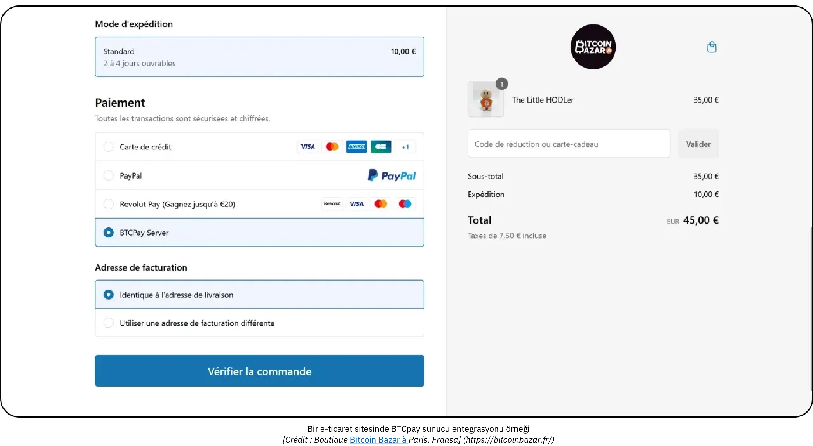

*[Kredi: Paris, Fransa'daki Bitcoin Bazar mağazası](https://bitcoinbazar.fr/)*

Uygulama özelliklerini daha derinlemesine incelemek ve BTCPay Server'ın uygulamalı konfigürasyonlarını keşfetmek için aşağıdaki kursa başvurun:

https://planb.network/courses/6fc12131-e464-4515-9d3f-9255365d5fa1

## Kurumsal

<chapterId>80fb2659-81ca-4a11-b492-72c7ae5774f9</chapterId>

Kurumsal profil, Bitcoin ödeme uygulamalarının zirvesinde yer alır ve özellikle büyük şirketler, büyük pazar yerleri ve tamamen özelleştirilmiş çözümler talep eden yerleşik işletmeler için uyarlanmıştır. Daha küçük ölçekli veya orta düzey dağıtımların aksine, Kurumsal düzeydeki operasyonlar Bitcoin ödemelerini yerinde satış noktası cihazlarından e-ticaret vitrinlerine, arka ofis muhasebe platformlarına ve sofistike ERP çerçevelerine kadar geniş bir iş akışı ve sistem ağına entegre eder.

Bu ölçekte, genel amaç sadece Bitcoin'i kabul etmek değil, aynı zamanda bunu kuruluşun temel süreçleriyle tamamen **hizalanmış** bir şekilde yapmaktır. Bu uyum, çözüm ister tamamen ısmarlama olsun ister üçüncü taraf *Yıldırım Hizmet Sağlayıcıları* (LSP'ler) tarafından desteklenen SaaS tabanlı bir altyapı aracılığıyla düzenlensin, özel yazılım geliştirmeyi gerektirebilir. Bu tür LSP'ler, daha geleneksel kullanıma hazır araçların kapasitesini aşan yüksek işlem hacimlerini ve karmaşık ağ yapılandırmalarını idare edebilir. Bu nedenle ortaya çıkan mimari, API odaklı entegrasyonlardan gelişmiş hazine yönetimi yeteneklerine kadar çok çeşitli teknik ve ticari hususları içermektedir.

Kurumsal bağlamda, operasyonel karmaşıklık özellikle belirgin hale gelir. Büyük bir şirketin, her biri farklı sorumluluklara ve veri gereksinimlerine sahip birden fazla departmanı (satış, pazarlama, devops, finans ve muhasebe) barındırması gerekebilir. Bu senaryoda, bir Bitcoin ödeme platformu, güvenlik ve veri bütünlüğü üzerindeki sıkı kontrolü korurken, her departmanın görevleriyle ilgili işlevlere tam olarak erişmesine olanak tanıyan son derece ayrıntılı bir rol yönetimi sunmalıdır. İş akışlarını özelleştirme kapasitesi de aynı derecede önemlidir: örneğin, gelen ödemeler envanter sistemlerinde güncellemeleri tetikleyebilir, satış yöneticilerine otomatik bildirimler gönderebilir ve finans ekibi için Ledger girişlerini gerçek zamanlı olarak güncelleyebilir. Satış noktası cihazlarının kendileri de genellikle şirketin markasına ve operasyonel ihtiyaçlarına uygun özel yazılım arayüzleriyle kurumsal ortama göre uyarlanır.

*Kurumsal ölçekli işletmeler için **Güvenlik** çok önemlidir. Yüksek hacimli işlemler ve potansiyel olarak büyük miktarlarda Bitcoin, kötü niyetli saldırılara veya içeriden gelen tehditlere karşı savunma yapabilen sağlam bir altyapı gerektirir. En iyi uygulamalar genellikle zaman kilitli hazine yapılandırmaları, dikkatle denetlenen kod tabanları ve ilgili düzenleyici çerçevelere sıkı sıkıya bağlılık ile çoklu imzayı içerir. Ayrıca, yerel ve uluslararası mali düzenlemelere uyum, kurumun itibarını ve faaliyet ruhsatını korumanın ayrılmaz bir parçası olabilir.*

Kurumsal düzeyde bir Bitcoin ödeme çözümünün oluşturulması veya entegrasyonunda yer alan **özel geliştirme**, birkaç uygulama özelliğinin kodlanmasının ötesine geçer. Tipik olarak mimari tasarım, kapsamlı test protokolleri ve birden fazla aşamayı (ilk pilot programlar, sınırlı pazar testleri ve nihai küresel dağıtım) kapsayabilecek yapılandırılmış bir sunum gerektirir.

Muhasebe cephesinde, yüksek frekanslı işlemler **tamamen özelleştirilmiş dışa aktarımlar** ve bazen kurumsal finans yazılımı ile gerçek zamanlı senkronizasyon gerektirir. Büyük işletmeler SAP veya Oracle gibi kurumsal kaynak planlama (ERP) çözümlerine güvenebilir ve bu çözümlerin de Interface ödeme verileriyle sorunsuz bir şekilde Bitcoin çalışması gerekir. Bunu kolaylaştırmak için, seçilen platformun API'lerinin gelişmiş ve esnek olması, BT ekiplerine özel raporlama panoları oluşturma, otomatik mutabakat süreçleri uygulama ve generate günlük ve hatta saatlik finansal özetler oluşturma özgürlüğü vermesi gerekir.

Tipik bir Kurumsal senaryo, her gün binlerce işlemi karşılayan büyük bir e-ticaret pazarını içerebilir. Bu pazar yeri, Bitcoin'u bir ödeme seçeneği olarak listelemenin ötesinde, Bitcoin ödeme akışının müşteriye dönük web sitesinde nasıl göründüğünden geri ödemelerin, ters ibrazların veya anlaşmazlık çözümlerinin arka uçta nasıl yönetildiğine kadar kullanıcı deneyiminin her yönünü uyarlayabilir. Özel bir devops ekibi, finans ve hukuk departmanlarıyla işbirliği içinde, sürekli bakım, güvenlik yamaları ve uyumluluk güncellemelerini denetleyecektir. Şirketin Bitcoin gelirinin bir kısmını elinde tutmayı tercih etmesi halinde, dahili bir hazine sistemi geleneksel döviz rezervlerinin yanı sıra firmanın Bitcoin varlıklarını da takip edecektir.

Kurumsal düzeyde sorunsuz ve güvenli bir dağıtım sağlamak için çoğu kuruluş, Bitcoin ve Lightning Network entegrasyonlarında deneyimli uzman hizmet sağlayıcıları veya kurum içi geliştirme ekipleriyle çalışır. Süreç genellikle derinlemesine bir ihtiyaç değerlendirmesi (teknik altyapı, uyumluluk gereksinimleri ve istenen müşteri yolculuğunu kapsayan) ile başlar ve ardından yüksek hacimli verimi kaldırabilecek bir mimari tasarlanır. Proje kapsamına bağlı olarak, mali kontrolörler, güvenlik analistleri ve yazılım mühendislerinden oluşan çok disiplinli bir ekibe güvenebilirsiniz. Alternatif olarak, sayıları giderek artan uzman danışmanlık firmaları, SaaS tarafından barındırılan çözümlerin değerlendirilmesi, *Lightning Hizmet Sağlayıcılarının* yapılandırılması ve ön uç arayüzlerinin özelleştirilmesi gibi görevlerde yardımcı olarak ilk kavramsallaştırmadan son kullanıma kadar size rehberlik edebilir. İşletmeler, alan uzmanlarıyla ortaklık kurarak büyük ölçekli ödeme uygulamasıyla ilişkili riskleri azaltabilir ve yalnızca sağlam ve uyumlu değil, aynı zamanda gelecekteki büyümeyi karşılayacak kadar esnek bir çözüm elde edebilir.

## Bitcoin ödeme çözümleri: Seçenekler ve Trendler

<chapterId>59ff43a1-98e2-4a81-af3e-9654bdd60952</chapterId>

Her çözüm kategorisi için her zaman değiş tokuşlar vardır. Örneğin, ilk "deneme aşamasında", önerilen cüzdanlar kullanıcı Interface açısından mümkün olduğunca basit olacak şekilde tasarlanmıştır, ancak barındırılmaktadır (**custodial**). Bu da fonların uygulama sağlayıcısı tarafından kontrol edildiği anlamına gelmektedir. Bununla birlikte, Bitcoin'in ethosu, kullanıcı tarafından fonların tam Ownership'üne doğru ilerlemeyi teşvik eder (**self-custodial**). Bu durumda, ilk satışlar yapılır yapılmaz, yani Bitcoin'te ödeme yapmaya istekli müşterileriniz olduğu doğrulandıktan sonra bir sonraki kategoriye geçmeniz önerilir.

Bitcoin'nın en önemli avantajlarından biri, fonları istediğiniz gibi hareket ettirebilmenizdir; bu da **sağlayıcıları** veya çözümünüzün bileşenlerini değiştirmeyi çok kolay hale getirir. Ayrıca, tüm uygulamalar ve çözümler de hızla gelişmektedir. Örneğin, sadece birkaç ay önce var olmayan bir çözüm olan ve şu anda piyasadaki birçok uygulama ile entegre olan fiziksel bir Satış Noktası (POS) terminali sağlayan Bitcoinize'ı düşünün.

### Bir Mağaza Oluşturmak ve Hem Geleneksel Hem de Bitcoin Ödemelerini Kabul Etmek İçin Bir Çözüm mü Arıyorsunuz?

Sıfırdan başlıyorsanız (mağazanız, ürün yönetim yazılımınız ve satış noktası (POS) sisteminiz yoksa) birkaç seçeneğiniz var:

- **Dış Kaynak Kullanımı:** Alışveriş seçenekleri içeren bir web sitesi oluşturmak için dış kaynak kullanabilir ve ardından geleneksel mağaza içi çözümlerin yanı sıra Bitcoin ödeme özelliklerini ekleyebilirsiniz.

- **Basit Çözümler:** Alternatif olarak, bunu kendiniz yapmak için Accessing.app gibi platformları kullanabilirsiniz. Temel faydalar şunları içerir:
    - Hızlı ve uygun maliyetli bir şekilde çevrimiçi veya fiziksel bir mağaza kurmak.
    - Sezonluk işletmeler, etkinlikler, restoranlar veya perakende mağazaları için uygundur.
    - Hem fiziksel hem de çevrimiçi satışlar için ürünlerin tanımlanması ve yönetilmesi.
    - Kendi Stripe hesabınız üzerinden fiat ödeme işlemleri (ör. Euro, dolar).
    - Kendi Swiss Bitcoin Pay hesabınız üzerinden Bitcoin ödeme işlemleri.

### Yıldırım Ödemenin Benimsenmesi Nasıl İlerliyor?

Lightning Network üstün verimlilik ve daha düşük ücretler sunarken, benimsenmesi henüz erken aşamalarda. Mevcut sınırlamalara odaklanmak yerine, tarihsel altyapı dönüşümlerinin nasıl geliştiğini hatırlamakta fayda var:

- Arabalar ilk ortaya çıktığında, yol inşa etmeyi haklı çıkaracak kadar araba yoktu ve araba sahibi olmayı haklı çıkaracak kadar yol da yoktu.
- Elektrik kullanılmaya başlandığında, elektrik şebekeleri inşa etmeyi haklı çıkaracak kadar müşteri yoktu ve müşterileri çekecek kadar şebeke de yoktu.

Yeni altyapılar daha verimli oldukları için başarılı olurlar ve erken benimseyenler somut faydalar elde ettikleri için katılırlar. İşte 2024 yılında Lightning Network ile ilgili gözlemler:

- **Ultra hızlı İşlemler:** İşlemler genellikle neredeyse anlıktır (<500ms) ve son derece düşük bir hata oranına sahiptir.

- **Ağın Profesyonelleşmesi:** Daha büyük oyuncular ağ genelinde likiditeyi sağlarken, bireyler ödemeleri yönlendirmeyi büyük ölçüde bıraktı ve artık çoğunlukla "uç düğümleri" yönetiyor

- **Geliştirilmiş Kullanıcı Deneyimi:** Bireysel kullanıcılar için mobil uygulamalar önemli ölçüde geliştirildi. Ekleme, statik Bolt12 faturaları ve sıfır onaylı ödemeler (0-conf) gibi özellikler yaygın olarak kullanılabilir ve etkileşimleri sorunsuz hale getirir. Birlikte çalışabilirlik sorunları (örn. zorla kapatma) artık önemli bir sorun değildir.

- **Geliştirilmiş Düğüm ve Kanal Yönetimi:** Hem bireysel hem de profesyonel çözümler gelişti. Örneğin, BTCPay Server artık diğer sağlayıcılarla (PSP'ler, açma/kapama rampaları, vb.) bağlantı kurmak için çok sayıda eklentiyi desteklemektedir. LightSpark ve Alby Hub gibi yeni altyapı sağlayıcıları da üretime giriyor.

- **Satıcı Benimseme Artışı:** BitRefill gibi satıcılar, aktif kullanıcıları arasında Bitcoin ödemelerinde bir artış olduğunu ve Lightning yerine Bitcoin'ye doğru net bir geçiş olduğunu bildiriyor. Ayrıca, Lightning'in ultra düşük ücretleri, onu küçük ödemeler için tercih edilen seçenek haline getiriyor (işlem başına ortalama 32 €).

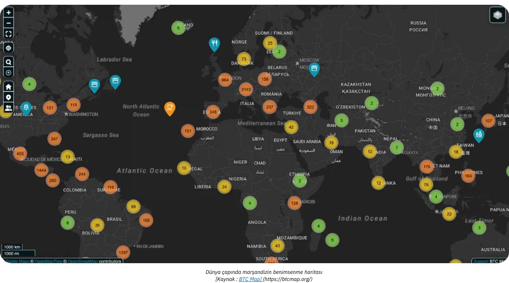

*[Kaynak: BTC Haritası](https://btcmap.org/)*

- **Ağ Ölçütleri:** Lightning üzerinde kilitli olan toplam kanal ve Bitcoin sayısı, yaklaşık 20.000 düğüm, 5.200 BTC ve 60.000 kanal ile sabit kalmaktadır. Ancak bu, ağın yalnızca bir kısmını yansıtmakta ve katılımcılar arasında daha az bireyin ve daha fazla profesyonelin yer aldığı bir rotasyona işaret etmektedir.

- **Ağlar Arasında Köprü Olarak Lightning:** Lightning Network'ün verimliliği ve kullanılabilirliği, onu halihazırda diğer birbirine bağlı ağlara (ör. FediMint, Liquid, vb.) bir köprü olarak konumlandırmıştır.

**Wallet'nın Geri Dönüşü**

Bitcoin ve Lightning Network **dijital Wallet devrimini** tamamlıyor. Yeni web hizmetleri artık **hesap oluşturmaya gerek kalmadan** işlem yapmaya izin veriyor - Wallet'unuz kimliğiniz oluyor! **Nostr Wallet Connect (NWC)** ve **LN-URL-AUTH** gibi protokollerle, cüzdanlar kullanıcıların kimliklerini sorunsuz bir şekilde doğrulayabilir ve geleneksel hesaplar olmadan işlem yapılmasını sağlayabilir. Basit satın alımlar veya abonelikler için hesap yorgunluğu günleri geride kaldı. Son olayların bize sık sık hatırlattığı gibi, hacklenebilecek ve dark web'de satılabilecek kişisel veya ödeme bilgilerini sağlamaya artık gerek yok.

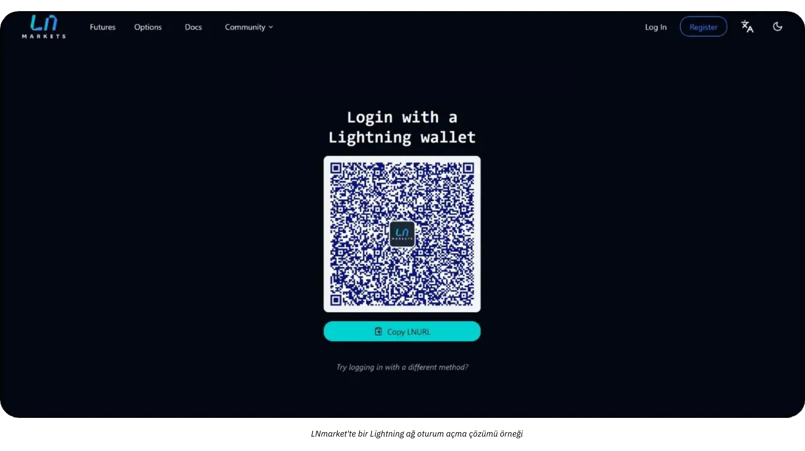

Yarının tüccarları bu yeniliği benimseyecek ve müşterilerine daha güvenli, daha sorunsuz (tek tıkla) ve aynı zamanda gizliliklerine saygılı bir deneyim sunacak.

# Bitcoin Muhasebe

<partId>d49d7595-a189-4e2b-bd60-c19e8e717aa2</partId>

## İşletmelerde Muhasebe Bitcoin için Temel İlkeler

<chapterId>84063061-ffdb-4b1f-b20b-588ffb146877</chapterId>

Aşağıdaki içerik yalnızca eğitim amaçlıdır ve finansal veya muhasebe tavsiyesi olarak değerlendirilmemelidir. İşletmelerin ve bireylerin herhangi bir işlem yapmadan önce kendi yetki alanlarındaki kripto para düzenlemelerini bilen nitelikli bir muhasebeciye veya hukuk uzmanına danışmaları şiddetle tavsiye edilir.

### Bitcoin Muhasebe Temel Kavramları

**Herhangi bir Bitcoin işlemi kaydedilmelidir ve vergiye tabi bir olaya yol açabilir**

Küresel olarak, Bitcoin genellikle bir para birimi olarak değil, dijital bir varlık olarak sınıflandırılır. Bu ayrım, Bitcoin'in işletmelerde nasıl muhasebeleştirildiğini, vergi yükümlülüklerini, finansal raporlamayı ve uyumluluk gereksinimlerini önemli ölçüde etkiler. Bitcoin'i bir ödeme yöntemi olarak kabul eden veya bir hazine aracı olarak kullanan işletmeler bu yasal nüansları anlamalıdır.

Akılda tutulması gereken **en önemli sonuç**, çoğu yargı alanında Bitcoin'nın kazanılması, satılması, ticaretinin yapılması veya alım yapmak için kullanılmasının genellikle **vergiye tabi bir olay** yaratması ve kazançların sermaye kazancı vergisine tabi olmasıdır.

Bitcoin muhasebesinin bir başka yönü de iki tür sermaye kazancı arasında ayrım yapmaktır:

- **Gizli Kazançlar/Kayıplar:** Bir hesap dönemi sonunda elde tutulan Bitcoin'in değerine bağlı olarak gerçekleşmemiş kazançlar veya kayıplar.
- **Etkin Kazançlar/Kayıplar:** Bitcoin mali yıl içinde satıldığında veya takas edildiğinde gerçekleşen kazançlar veya kayıplar.

Bu hesaplamalar büyük ölçüde Bitcoin'ün uzun vadeli yatırım için mi yoksa kısa vadeli operasyonel kullanım için mi tutulduğuna bağlıdır. Ayrıca, düzenlemeler ülkeden ülkeye önemli ölçüde farklılık gösterdiğinden, işletmeler muhasebe uygulamalarını yerel vergi yapılarıyla uyumlu hale getirmelidir.

Bitcoin sahibi işletmeler için muhasebe biraz zahmetlidir çünkü gerçekleşen veya gerçekleşmeyen kar veya zararları hesaplamak için her işlemin titizlikle takip edilmesi gerekir. Bitcoin'i bir ödeme şekli olarak kabul ederek yaptığınız her satış için veya Bitcoin'i her satın aldığınızda veya sattığınızda kaydetmeniz gerekir:

- belirli bir zaman
- satış fiyatı (fiat para birimi cinsinden)
- gW-302 maliyet fiyatı (Bitcoin'nin ilk satın alındığı fiyat).

Bu, daha sonra kar veya zararı belirlemek için farkı hesaplayabilmenizi sağlayacaktır.

**Örnek:** Bir işletme 30.000 $'dan 1 BTC satın alır. Daha sonra, 0,5 BTC'yi 20.000 $'a satar. Kâr veya zararı hesaplamak için işletme şunları yapmalıdır:

- Elde edilen Bitcoin'ün zamanını, fiat maliyet fiyatını ve miktarını kaydettiniz
- Satılan Bitcoin'ün zamanını, fiat satış fiyatını ve miktarını kaydettiniz
- Satılan Bitcoin'in maliyetini belirleyin: 0,5 BTC: 30.000 $ ÷ 2 = 15.000 $.
- Satış fiyatı ile maliyet fiyatını karşılaştırın: 20.000 $ (satış fiyatı) - 15.000 $ (maliyet fiyatı) = 5.000 $ kâr.
- Bitcoin varlıklarını yeni maliyet fiyatıyla güncelleyin

Bu işlem her işlem için tekrarlanmalıdır ve Bitcoin'nin fiyatının dalgalı yapısı kayıt tutmayı daha da külfetli hale getirmektedir.

**Bitcoin Bir Para Birimi Olsaydı Nasıl Çalışırdı?**

Bitcoin bir para birimi olarak ele alınsaydı, işletmeler bunu muhasebe sistemlerindeki diğer para birimleri gibi yönetirdi. Her bir işlem için maliyet esası ve gerçekleşen/gerçekleşmeyen karları takip etmek yerine, Bitcoin varlıkları basitçe bir para birimi hesabına kaydedilecektir. Her raporlama döneminin sonunda, Bitcoin da dahil olmak üzere tüm döviz varlıklarının değeri, geçerli Exchange kuru kullanılarak muhasebe para birimine (örneğin USD veya EUR) dönüştürülecektir.

**Bitcoin'in para birimi olarak tanınması durumunda güncellenmiş örnek:**

- Bir işletme, Bitcoin 30.000 $ değerindeyken 1 BTC tutar. Daha sonra, Bitcoin 40.000 $ değerinde olduğunda işletme bir ödeme için 0,5 BTC kullanır.
- İşletme, gerçekleşen kâr veya zararı **hesaplamaz**. Bunun yerine, işlem şu şekilde kaydedilir:
    - Ödeme: 20.000 $ (0,5 BTC × 40.000 $).
    - Kalan Bitcoin bakiyesi: 0.5 BTC, şu anda 20.000 $ değerinde (mevcut Exchange kuruna göre güncellendi).

**Bitcoin para birimi olarak kabul edilirse Anahtar Avantajı:**

- İşletmenin Bitcoin varlıklarının fiat eşdeğerini, tıpkı elinde tuttuğu avro, yen veya diğer para birimlerinde olduğu gibi, yalnızca periyodik olarak (örneğin, aylık veya yıllık raporlar için) ayarlaması gerekir.
- Bu, işlem düzeyinde maliyet bazlı izleme ihtiyacını ortadan kaldırır ve özellikle sık Bitcoin işlemleri olan işletmeler için muhasebeyi basitleştirir.

Bu yaklaşım Bitcoin muhasebesini çok daha basit hale getirecek, idari yükleri azaltacak ve Bitcoin'in yasal ve düzenleyici açıdan tam olarak tanınacağı varsayımıyla diğer para birimlerinin muamelesiyle uyumlu olacaktır. Henüz o noktada değiliz.

### Bireysel ve Kurumsal Bitcoin Muhasebesi Arasındaki Farklar

Bitcoin'nin yasal ve muhasebesel muamelesi bireyler ve şirketler arasında önemli farklılıklar gösterir. Bireyler için Bitcoin işlemlerinden elde edilen kazançlar, genellikle daha yüksek bir oranda olmak üzere gelir vergisine tabi olabilir. Buna karşılık, şirketler potansiyel olarak daha düşük kurumlar vergisi oranlarından faydalanabilir ancak daha katı defter tutma standartlarına uymak zorundadır.

İşletmeler için Bitcoin, kullanım amacına bağlı olarak çeşitli hesaplar altında sınıflandırılabilir:

- **Duran Varlıklar:** Stratejik bir yatırım olarak uzun vadeli tutulan Bitcoin için.
- **Stoklar:** Üretim süreçlerinde kullanılan Bitcoin için (nadir bir kullanım durumu, örneğin bu profesyonel tüccarlar için geçerlidir).
- **Nakit veya Hazine Hesapları:** Öncelikle operasyonel işlemler veya kısa vadeli hazine yönetimi için bir Bitcoin varlığı olarak tutulan Liquid için.

Sınıflandırma seçimi, finansal raporlama ve vergi yükümlülükleri üzerindeki etkileri ile birlikte şirketin faaliyet ve stratejisine bağlıdır. Bu sınıflandırmalar ülkeye göre farklılık gösterebileceğinden her zaman yerel düzenlemeleri kontrol edin.

### Yasal Çerçeve

Bitcoin'nın yasal olarak tanınması ve muamelesi yargı yetkisine göre değişmektedir. El Salvador gibi bazı ülkeler Bitcoin'yı yasal ödeme aracı olarak kabul ederek işlemlerde kullanımını kolaylaştırmış ancak uluslararası finansal raporlamayı zorlaştırmıştır. Diğerleri ise Bitcoin'yı belirli vergi ve muhasebe kurallarına tabi bir dijital varlık olarak ele almaktadır.

Çoğu ülkede, Bitcoin dijital bir varlık olarak kategorize edilir ve tedavisi genel muhasebe standartlarına tabidir. İşletmeler Bitcoin işlemlerini aşağıdaki şekilde muhasebeleştirmelidir:

- **Sermaye Kazançlarının/Kayıplarının Kaydedilmesi:** İşletmeler, finansal sonuçlarında gerçekleşmiş kazançları veya kayıpları muhasebeleştirmelidir.
- **Gizli Kazançlar/Kayıplar Değerlemesi:** Gerçekleşmemiş kazançlar veya kayıplar genellikle raporlanmalıdır ancak vergilendirilebilir geliri doğrudan etkilemeyebilir.
- **Muhasebe Standartlarına Uygunluk:** İşletmeler, Bitcoin işlemlerini standart defter tutma uygulamalarına entegre ederek şeffaflık ve doğruluk sağlamalıdır.

Bitcoin muhasebesine yaklaşım coğrafyaya göre değişir:

- **Amerika Birleşik Devletleri:** IRS, Bitcoin'u **hisse senedi, tahvil veya gayrimenkule benzer mülk** olarak sınıflandırmaktadır. Bu sınıflandırma, kripto para birimini içeren kazanç, satış, ticaret ve hatta satın almak için kullanmak gibi herhangi bir işlemin vergilendirilebilir bir olay yaratabileceği ve kazançların sermaye kazancı vergisine tabi olduğu anlamına gelir.
- **Avrupa Birliği:** Üye devletler genellikle Bitcoin'i işlevsel bir para biriminden ziyade spekülatif bir varlık olarak değerlendirmektedir. Bu nedenle kazançlar genellikle sermaye kazancı vergisine tabidir.
- **Asya:** Singapur ve Japonya gibi ülkeler, Bitcoin işlemlerine belirli bağlamlarda olumlu davranarak ilerici düzenleyici çerçeveler benimsemiştir. Ancak Bitcoin genellikle **maddi olmayan varlık** olarak muhasebeleştirilir ve raporlama tarihinde gerçeğe uygun değer üzerinden ölçülür ve değişiklikler kar veya zararda muhasebeleştirilir.

Faaliyet gösterdiğiniz ülkedeki düzenlemeleri anlamak ve muhasebe uygulamalarınızı buna göre uyarlamak çok önemlidir.

### Düzenleyici Evrimde Karşılaşılan Zorluklar

Kripto para inovasyonunun hızlı temposu genellikle düzenleyici çerçeveleri geride bırakmaktadır. Bitcoin'ün dijital bir varlık olarak tanınmasından bu yana, küresel düzenlemelerde kademeli güncellemeler yapıldı, ancak boşluklar devam ediyor:

- **İçtihat Eksikliği:** Çok az sayıda yasal vaka belirli muhasebe uygulamalarını açıklığa kavuşturmuş ve yoruma yer bırakmıştır.
- **Devam Eden Tartışmalar:** Gizli zararların vergisel muamelesi gibi konular birçok yargı alanında çözüme kavuşturulmamıştır.
- **Sınır Ötesi Karmaşıklık:** Uluslararası faaliyet gösteren şirketler, farklı ulusal muhasebe standartlarını uzlaştırmada zorluklarla karşılaşmaktadır.

Bu zorluklara rağmen, birçok ülkenin proaktif tutumu, işletmelerin Bitcoin'i faaliyetlerine dahil etmeleri için sağlam bir temel oluşturmaktadır. Sürekli güncellemeler ve uluslararası uyumlaştırma, kripto para muhasebesinde ortaya çıkan Address karmaşıklıkları için gerekli olacaktır.

### Bitcoin'nın Finansal Tablolarda Sınıflandırılması

Bitcoin'nin finansal tablolardaki sınıflandırması yargı yetkisine göre değişir ve bir işletme içindeki kullanım amacına bağlıdır. Genel olarak, Bitcoin envanter, yatırım veya para birimine benzer, ancak muhasebe işlemini etkileyen benzersiz özelliklere sahip bir dijital varlık olarak ele alınır.

- **Dijital Varlık veya Maddi Olmayan Varlık**: Fransa ve Avrupa Birliği de dahil olmak üzere birçok yargı alanı, Bitcoin'i yasal ödeme aracı yerine dijital veya maddi olmayan bir varlık olarak sınıflandırmaktadır. Bu sınıflandırma, işletmelerin Bitcoin'i itibari para birimlerinden farklı şekilde muhasebeleştirmesini gerektirir.
- **Envanter**: Bir işletmenin temel faaliyeti, kripto para borsaları veya brokerlar gibi Bitcoin ticaretini içeriyorsa, Bitcoin envanter olarak sınıflandırılır. Bu durumda, değerleme envanter muhasebesi standartlarını takip eder.
- **Finansal Yatırım**: Bitcoin'ı uzun vadeli bir varlık olarak tutan şirketler bunu bir finansal yatırım olarak sınıflandırabilir. Örneğin, Amerika Birleşik Devletleri'nde işletmeler Bitcoin'ı Finansal Muhasebe Standartları Kurulu (FASB) yönergeleri kapsamında muhasebeleştirebilir ve piyasa değerleri düştüğünde değer düşüklüklerini muhasebeleştirebilir.

**Sınıflandırmanın Sonuçları :**

- Uzun vadeli holdingler genellikle değer düşüklüğü testi ve amortisman gerektirir.
- Aktif alım satım veya ödemeyle ilgili faaliyetler, gerçekleşmiş ve gerçekleşmemiş kazanç ve kayıpların sürekli olarak izlenmesini gerektirir.

### Değerleme Yöntemleri

Değerleme yöntemleri, işlemler sırasında kazanç veya kayıpların doğru bir şekilde hesaplanması için gerekli olan Bitcoin'in maliyet esasını belirlemek için kullanılan muhasebe teknikleridir. Genel olarak, en iyisi **muhasebe sisteminde mevcut Bitcoin varlıklarının maliyetlerinin** her zaman güncellenen bir değerini tutmaktır. Bu, şeffaflığı ve vergi düzenlemelerine uyumu sağlar ve hesaplamaların yapılması gerektiğinde geride kalmayı önler.

- **İlk Giren İlk Çıkar (FIFO)**: Avustralya ve Hindistan gibi ülkelerde yaygın olan bu yöntem, Bitcoin'yi en erken elde etme maliyetine göre değerlemektedir. Bu, bir satış gerçekleştiğinde Bitcoin'nin her bir fraksiyonunun ayrı ayrı izlenmesini gerektirebileceğinden oldukça **karmaşık** hale gelebilir.
- **Ağırlıklı Ortalama Maliyet (WAC)**: Amerika Birleşik Devletleri gibi ülkelerde görüldüğü gibi, **basitliği** nedeniyle genellikle yüksek hacimli işlemler için tercih edilir.

Doğru ve düzenli kayıt tutmayı sağlamak için bir şirketin Bitcoin satın almaya veya ödeme olarak kabul etmeye başladığı andan itibaren **Bitcoin maliyetlerini izleyen ayrıntılı bir çalışma kitabının tutulması şiddetle tavsiye edilir**. Bitcoin ödemesini kabul etmek veya Bitcoin satın almak için bir yazılım çözümü seçerken tek başına bu husus akılda tutulmalıdır.

### Perakende ve E-ticaret işlemlerinin muhasebeleştirilmesi

Perakendeciler her bir işlem için Bitcoin-fiat Exchange oranını kaydetmelidir. Örneğin, birçok ülkede işletmeler KDV'yi hesaplamak için satış anında Exchange oranını kullanmaktadır.

İşletmeler, kullandıkları **Ödeme** araçlarının aşağıdakileri sağlayabildiğinden emin olmalıdır:

- generate bir Invoice yerel fiat tutarı (euro, dolar, pound), KDV veya diğer yerel vergiler, Bitcoin cinsinden eşdeğeri, tarih ve saat, Bitcoin Exchange oranı ve Exchange kaynağı vb
- tüm ödeme makbuzlarını, muhasebecinin kolayca işleyebileceği şekilde, en azından yukarıdaki tüm bilgileri içeren bir .csv formatında dışa aktarın
- hazinede tutulan mevcut Bitcoin için maliyet temelinin güncellenmiş değerinin ideal olarak bir kaydının tutulması

### Zorluklar

- **Volatilite**: Bitcoin'in fiyatı önemli ölçüde dalgalanır, bu da holdingleri değerlemede ve gelecekteki finansal sonuçları tahmin etmede zorluklar yaratır.
- **Düzenleyici İnceleme**: Çin gibi ülkelerde Bitcoin'nin kısıtlı statüsü hazine varlığı olarak kullanımını sınırlamaktadır.
- **Mevzuat Belirsizliği**: Bitcoin'ün gelişen düzenleyici ortamı işletmeleri sık sık belirsizlik içinde bırakmaktadır. Örneğin, Hindistan veya Amerika Birleşik Devletleri'nde olduğu gibi vergi politikalarındaki değişiklikler muhasebe uygulamalarını bir gecede etkileyebilir.
- **Kötü Yönetim Riskleri**: Yanlış sınıflandırma veya Bitcoin işlemlerinin izlenmemesi uyum sorunlarına, cezalara veya itibar kaybına yol açabilir.
- **Requalification Riskleri**: Bir şirketin hazinesinin önemli bir kısmının Bitcoin'te tutulması, işletmeyi fiyat düşüşlerinden kaynaklanan potansiyel kayıplara maruz bırakır. Bu durum, özellikle bu tür düşüşlerin tedarikçilere, çalışanlara veya vergilere yapılacak ödemelerin vadesi geldiğinde meydana gelmesi halinde ciddi sonuçlar doğurabilir. Ayrıca, şirket sahibi sorumlu tutulabilir ve bu da para cezalarına veya şirket varlıklarının kötüye kullanılması suçlamaları gibi diğer yasal sorunlara yol açabilir.

## Muhasebe Araçları ve Yazılımları

<chapterId>e7b31be5-1176-4835-944e-3cba1b7040fa</chapterId>

Bir şirket Bitcoin'yı muhasebesine entegre etmeye karar verdiğinde, çeşitli araçlar ve özel yazılımlar verilerin toplanmasını ve işlenmesini basitleştirir. En iyi bilinen çözümler arasında [CoinTracker](https://www.cointracker.io/), [Waltio](https://www.waltio.com/), [Cryptio](https://cryptio.co/), [Koinly](https://koinly.io/), [TokenTax](https://tokentax.co/) ve [ZenLedger](https://zenledger.io/) bulunmaktadır. Bu platformlar öncelikle dört konuya odaklanmaktadır:

- otomatik veri toplama;
- bu verilerin daha genel muhasebe yazılımlarıyla (QuickBooks, Xero, ERP) uyumlu formatlara dönüştürülmesi;
- vergi yükümlülüklerinin hesaplanması;
- işlem kategorizasyonu.

Genellikle çeşitli platformlarda veya borsalarda birden fazla cüzdanı ve varlığı olan büyük kuruluşlar için akıllıca bir tamamlayıcıdır.

Ancak, işlem geçmişini içeren basit bir `.csv` dosyası çoğu küçük işletme için genellikle yeterlidir. Amaç, her ödeme için tarih, tutar, avro/dolar cinsinden eşdeğer değer ve ilgili Bitcoin adreslerini belgelemektir. Bitcoin ödeme çözümlerinin (BTCPay Server, Swiss Bitcoin Pay, vb.) veya Exchange platformlarının (Bitfinex, Kraken, Coinbase, vb.) büyük çoğunluğu zaten işlem geçmişlerini dışa aktarmak için bir mekanizma sunmaktadır. Bu dosyayı bir muhasebeciye sağlayarak, veri girişini kolaylaştırmak ve Bitcoin ile ilgili gelen ve giden akışları net bir şekilde ayırt etmek mümkün hale gelir.

Bitcoin'larını kendileri saklayanlar için UTXO'ları (*Harcanan İşlem Çıktıları*) yönetmek önemli bir adımdır. Uygun UTXO etiketlemesi, her bir BTC parçasının kaynağının izlenmesine, profesyonel faaliyetlerle ilgili işlemlerin kişisel harcamalara yönelik olanlardan ayırt edilmesine ve yasal veya vergi amaçlı izlenebilirliğin kolaylaştırılmasına yardımcı olur. Çoğu iyi Bitcoin Wallet yazılımı, yedekleme dosyanızı (veya kurulumunuza bağlı olarak xpub'ınızı) kullanarak Wallet'ınızı içe aktarmanıza ve UTXO'ları kaynaklarına veya hedeflerine göre etiketlemenize olanak tanır. Size yardımcı olmak için, burada bu uygulamaya adanmış eksiksiz bir eğitim bulunmaktadır:

https://planb.network/tutorials/privacy/on-chain/utxo-labelling-d997f80f-8a96-45b5-8a4e-a3e1b7788c52

Son olarak, ister küçük bir tüccar ister daha köklü bir işletme olun, **Invoice'i Bitcoin'te kapatmak** mümkündür. Önemli olan işlemi uygun şekilde belgelemektir. Kendi kendine saklama Wallet'dan ödeme yapıyorsanız, etiketlerinizde generate numarasını ve ödemenin amacını belirten bir Invoice işlemi yapmak idealdir. Invoice'i bir Exchange aracılığıyla ödemeyi tercih ederseniz, muhasebe kayıtlarınıza dahil etmek için bir makbuz veya işlem geçmişini dışa aktarma seçeneğiniz de olacaktır. Bu şeffaflık, tüm BTC işlemlerinizin takibini ve raporlanmasını kolaylaştıracaktır.

## Pratik Bitcoin muhasebe örnekleri

<chapterId>763f6f20-9181-495a-bf7d-b405899e65ec</chapterId>

### Kullanım Örneği 1: Bitcoin Ödemelerini Euro'ya Dönüştüren Perakende Mağazası

**Senaryo**: Küçük bir fırın Bitcoin'u ödeme yöntemi olarak kabul eder ancak kripto para dalgalanmalarına maruz kalmamak için aldığı tüm Bitcoin'u derhal avroya çevirir.

**Örnek**:

- **Bitcoin Dönüşüm Oranı**: 1 Bitcoin = 40.000 €.
- **İşlem 1**: Müşteri 20 € karşılığında birden fazla hamur işi satın alır.
    - Bitcoin eşdeğeri: (20 / 40.000) = 0,0005 Bitcoin = 50.000 Satoshis.
    - Dönüşüm ücreti: %1,5 (20 € × 0,015) = 0,30 €.
    - Net alınan: 20 € - 0,30 € = 19,70 €.
- **İşlem 2**: Müşteri 5 € karşılığında kahve satın alır.
    - Bitcoin eşdeğeri: (5 / 40.000) = 0,000125 Bitcoin = 12.500 Satoshis.
    - Dönüşüm ücreti: %1,5 (5 € × 0,015) = 0,075 €.
    - Net alınan: 5 € - 0,075 € = 4,925 €.

**İşlemlerin Özeti**:

- **Toplam Satış**: 25 €.
- **Toplam Ücret**: 0,375 €.
- **Alınan Net Avro**: 24.625 Avro.

**Muhasebe Etkileri**:

- Toplam satışları (25 €) gelir olarak kaydedin.
- Dönüştürme ücretlerini (0,375 €) gider olarak düşünüz.
- Tüm tutarlar derhal dönüştürüldüğü için bilançoda Bitcoin holdingleri görünmemektedir.

### Kullanım Örneği 2: Bitcoin Ödemelerinin %50'sini Elinde Tutan Perakende Mağazası

**Senaryo**: Aynı fırın, Bitcoin ödemelerinin %50'sini hazine varlığı olarak tutmayı ve diğer %50'sini avroya çevirmeyi seçer.

**Örnek**:

- **Bitcoin Dönüşüm Oranı**: 1 Bitcoin = 40.000 €.
- **Müşteriden gelen işlem**: Müşteri 50 € karşılığında hamur işi satın alır.
    - Bitcoin eşdeğeri: (50 / 40.000) = 0,00125 Bitcoin = 125.000 Satoshis.
    - Dönüşüm (%50): 25 € değerinde Bitcoin = 0,000625 Bitcoin = 62.500 Satoshis.
        - Dönüşüm ücreti: %1,5 (25 € × 0,015) = 0,375 €.
        - Euro cinsinden alınan net tutar: 25 € - 0,375 € = 24,625 €.
    - Bitcoin'da tutuldu (%50): 62.500 Satoshis = 0,000625 Bitcoin.

**İşlemlerin Özeti**:

- **Toplam Satış**: 50 €.
- **Ücretler**: 0,375 €.
- **Alınan Net Avro**: 24.625 Avro.
- **Bitcoin Tutuldu**: 62,500 Satoshis.

**Muhasebe Etkileri**:

- Toplam satışları (50 €) gelir olarak kaydedin.
- Dönüştürme ücretlerini (0,375 €) gider olarak düşünüz.
- Alıkonulan Bitcoin (62.500 Satoshis) bilançoda dijital bir varlık olarak görünmektedir.
- Gerçekleşmemiş Kazanç: Mali yıl sonunda Bitcoin değerlemesinin daha yüksek veya daha düşük olması durumunda, finansal notlarda açıklanacak ancak gelir olarak gerçekleşmeyecek gerçekleşmemiş bir kazanç veya zarar olacaktır

### Kullanım Örneği 3: Uzun Vadeli Yatırım için Bitcoin'ü Elinde Tutan Profesyonel Hizmet

**Senaryo**: Serbest çalışan bir grafik tasarımcı ödeme olarak Bitcoin'ü kabul eder ve aldığı tüm Bitcoin'ü uzun vadeli bir yatırım olarak elinde tutar.

**Örnek**:

- **Ödeme Sırasında Bitcoin Dönüşüm Oranı**: 1 Bitcoin = 30.000 €.
- **Müşteriden gelen işlem**: Müşteri 3.000 € değerindeki hizmetler için ödeme yapar.
    - Bitcoin eşdeğeri: (3.000 / 30.000) = 0,1 Bitcoin = 10.000.000 Satoshis.
- **Yıl Sonu Değerlemesi**:
    - Yıl Sonunda Bitcoin Dönüşüm Oranı: 1 Bitcoin = 35.000 €.
    - Bitcoin Holding'in değerlemesi: 0.1 Bitcoin × 35.000 € = 3.500 €.
    - Gerçekleşmemiş Kazanç: 3.500 € - 3.000 € = 500 €.

**İşlemlerin Özeti**:

- **Muhasebeleştirilen Toplam Gelir**: 3.000 €.
- **Bitcoin Holding**: 0.1 Bitcoin bilançoda 3.500 € değerindedir.
- **Gerçekleşmemiş Kazanç**: 500 € finansal notlarda açıklanmış ancak gelir olarak gerçekleşmemiştir.

**Muhasebe Etkileri**:

- Hizmet sırasında gelir (3.000 €) kaydedin.
- Bitcoin bilançoda 3.500 Avro değerinde (0,1) kalmıştır.
- Gerçekleşmemiş kazançlar takip edilir ancak kar/zarar tablolarına dahil edilmez.

### Kullanım Örneği 4: İşletme Sahibi Fiyat Artışından Sonra Bitcoin'in %50'sini Satıyor

**Senaryo**: Bir işletme sahibi yıl içinde üç Bitcoin satın alır, Bitcoin'yi bir varlık olarak tutar ve önemli bir fiyat artışından sonra %50'sini satar.

**Örnek**:

- **Bitcoin Müşterilerden alımlar**:
    - Satın alma 1: 20.000 €/BTC'den 2.000 € = 0,1 Bitcoin = 10.000.000 Satoshis.
    - Satın alma 2: 25.000 €/BTC'den 3.000 € = 0,12 Bitcoin = 12.000.000 Satoshis.
    - Satın Alma 3: 5,000 € / 30,000 € / BTC = 0.1667 Bitcoin = 16,670,000 Satoshis.
- **Toplam Bitcoin Tutuldu**: 0.3867 Bitcoin = 38.670.000 Satoshis.

- **Yıl Sonu Değerlemesi**:
    - Bitcoin Yıl Sonu Fiyatı: 40.000 €/BTC.
    - Toplam Değer: 0,3867 Bitcoin × 40.000 € = 15.468 €.
    - Gerçekleşmemiş Kazanç: 15.468 € - 10.000 € (toplam maliyet) = 5.468 €.

- **Bitcoin'ün** %50'sinin satışı:
    - Bitcoin Satıldı: 0.19335 Bitcoin.
    - Satış Hasılatı: 0.19335 Bitcoin × 40.000 € = 7.734 €.
    - Maliyet Esası (Ağırlıklı Ortalama):
        - Toplam Maliyet: 2.000 € + 3.000 € + 5.000 € = 10.000 €.
        - Ağırlıklı Ortalama Fiyat: 10.000 € / 0,3867 Bitcoin = 25.850 €/BTC.
        - Satılan Bitcoin'ün maliyeti: 0,19335 Bitcoin × 25.850 € = 4.999 €.
    - Gerçekleşen Kazanç: 7.734 € - 4.999 € = 2.735 €.

**İşlemlerin Özeti**:

- **Kalan Bitcoin**: 0.7.734 € değerinde 19335 Bitcoin (40.000 €/BTC'den).
- **Gerçekleşen Kazanç**: 2.735 Avro gelir tablosuna dahil edilmiştir.
- **Gerçekleşmemiş Kazanç**: Finansal notlarda açıklanan 5.468 Avro (kalan Bitcoin'nın gerçekleşmemiş değeri dahil).

**Muhasebe Etkileri**:

- Satış hasılatını (7.734 €) gelir olarak kaydedin.
- Gerçekleşen kazancı hesaplamak için satılan Bitcoin'nin maliyetini (4.999 €) düşer.
- Tutulan Bitcoin (0,19335) bilançoda 7.734 Avro değerinde görünmektedir.
- Elde tutulan Bitcoin üzerindeki 5.468 Avro tutarındaki gerçekleşmemiş kazançlar finansal notlarda açıklanmıştır.

# Son Bölüm

<partId>f6ca8d01-a4f3-449b-ac9f-c5fba9a69178</partId>

## Bu kursu değerlendirin

<chapterId>0fe8c49e-b7f8-46f7-9c42-b8a9a99a7b46</chapterId>

<isCourseReview>true</isCourseReview>

## Final Sınavı

<chapterId>40a0f18c-bdc9-45b2-8dea-15f7e574230e</chapterId>

<isCourseExam>true</isCourseExam>

## Sonuç

<chapterId>5503c23e-3a90-4a23-8d89-75e3cc1ee53e</chapterId>

<isCourseConclusion>true</isCourseConclusion>