# Khởi động hành trình vào mạng lưới bitcoin cho doanh nghiệp của bạn

Khám phá khả năng thực tế của mạng Bitcoin và Lightning, và tìm hiểu cách chúng có thể **chuyển đổi hoạt động kinh doanh của bạn** giống như internet. Bitcoin cung cấp một loạt **các ứng dụng rộng rãi cho doanh nghiệp** từ khả năng số hóa nguồn vốn đến việc mở rộng phương thức thanh toán một cách nhanh chóng với chi phí giao dịch thấp.

Trong khóa hướng dẫn này, bạn sẽ hiểu Bitcoin là một mạng lưới thanh toán internet phủ rộng khắp toàn cầu. Với các đặc điểm cơ bản độc đáo, **Bitcoin có những cải tiến đáng kể so với các mạng lưới thanh toán truyền thống**. Bạn sẽ thấy lý do và học cách tận dụng Bitcoin thay thế cho các trường hợp sử dụng truyền thống trong tài chính doanh nghiệp như lưu trữ vốn và hệ thống thanh toán. Ngoài ra, khóa này sẽ đề cập đến cách thức mua và lưu giữ Bitcoin đảm bảo các yêu cầu về chuẩn mực kế toán tài chính liên quan, cũng như việc triển khai các giải pháp đơn giản và giải pháp phù hợp quy mô lớn cho việc thanh toán Bitcoin.

Cho dù bạn là **doanh nghiệp nhỏ hay tập đoàn lớn**, việc tích hợp Bitcoin vào hoạt động kinh doanh hàng ngày có thể giúp công ty của bạn **tăng năng suất, khả năng chống chịu và cạnh tranh hơn**. Mọi hoạt động thương mại trên Internet đều có thể sẽ trở thành kinh doanh định hướng theo Bitcoin và khóa học này đảm bảo bạn được trang bị các kiến thức cần thiết. Phần đầu sẽ tóm tắt lại những điều cơ bản về hoạt động của Bitcoin, vì vậy ngay cả khi bạn là người mới bắt đầu, bạn vẫn sẽ có được kiến thức nền tảng cần thiết để tiếp tục và hoàn thành khóa học. Tìm hiểu những cơ bản về phát minh của Satoshi luôn có ích, cho dù đó là trước hay sau khi học BIZ101.

+++
# Giới thiệu

<partId>326cf945-5d3f-4d86-8c3e-4d1c35959799</partId>

## Tổng quan về khóa học
<chapterId>1be42be9-4080-49f5-b5b2-6b531dd55f5f</chapterId>

Chào mừng bạn đến với khóa học BIZ101!

Hãy khởi động hành trình tham gia mạng lưới Bitcoin cho công ty bạn một cách toàn diện với khóa đào tạo này - mở ra cánh cửa kiến thức để hiểu cách mạng Bitcoin và Lightning có thể cách mạng hóa các hoạt động kinh doanh truyền thống. Khóa học được thiết kế cho các hộ bán lẻ, doanh nhân, nhà quản trị và người ra quyết định của công ty muốn khám phá tiềm năng thực tế của Bitcoin dưới hình thức là một mạng lưới thanh toán internet toàn cầu và là một phương tiện trao đổi giá trị hiệu quả nhất.

Trong suốt khóa học, bạn sẽ được giới thiệu về các nguyên tắc cơ bản giúp mạng Bitcoin và Lightning tạo ra khả năng cải thiện rõ rệt. Bạn sẽ tìm hiểu cách các công nghệ này ứng dụng trong nhiều trường hợp, từ số hóa vấn đề lưu trữ nguồn vốn đến việc mở rộng mạng lưới thanh toán nhanh chóng và tối ưu hóa chi phí giao dịch, và cách mạng lưới cung cấp những cải tiến quan trọng khi so với hệ thống thanh toán truyền thống. Khóa học BIZ101 kết nối lý thuyết kinh tế với các ứng dụng trong thế giới thực, làm rõ cách thiết kế phi tập trung của mạng lưới làm giảm sự phụ thuộc vào các bên trung gian và khắc phục những hạn chế vốn có trong các hệ thống cũ hiện nay.

Khóa học sẽ bắt đầu bằng việc kiểm tra chi tiết các loại tiền tệ và cơ chế thanh toán thông thường, đặt nền tảng kiến thức bằng cách tìm hiểu cách một mạng lưới tiền tệ hoạt động như thế nào để làm nền móng cho các giao dịch giao thương, tích lũy và được chuyên môn hóa trong nền kinh tế. Sau đó, chúng ta sẽ đi sâu vào công nghệ đằng sau Bitcoin và những cải tiến được cộng thêm bởi mạng Lightning, làm rõ vai trò của chúng trong việc tạo môi trường liên thông cho các giao dịch tất toán liền mạch, an toàn và gần như tức thời có thể phục vụ cho các doanh nghiệp ở mọi quy mô. Sau đó, chúng ta sẽ đi vào phần thực hành, phần bắt đầu sẽ nói về việc thiết lập bitcoin cho quỹ dự phòng, đến phần cuối cùng là về việc chấp nhận bitcoin làm phương tiện thanh toán.

Cho dù bạn đại diện cho một doanh nghiệp nhỏ hay một tập đoàn lớn, khóa học này đều hướng đến mục tiêu trang bị cho bạn kiến thức để tích hợp Bitcoin vào các hoạt động hàng ngày của doanh nghiệp, nhằm nâng cao khả năng chống chịu, đồng thời tăng hiệu quả và lợi thế cạnh tranh cho công ty của bạn. Khi Bitcoin tiếp tục định hình lại nền tảng của nền kinh tế, việc tìm hiểu các công nghệ đột phá này không còn là một lựa chọn mà còn là một điều sống còn về mặt chiến lược. Trang bị cho mình kiến thức được cập nhật sâu sắc, với ví dụ thực tế và hướng dẫn về mặt chiến lược sẽ giúp bạn hoặch định hướng đi và tận dụng Bitcoin - một công nghệ đột phá và phát triển mạnh mẽ!

Sẵn sàng khám phá thế giới Bitcoin dành cho doanh nghiệp chưa? Bắt đầu thôi!

**Lưu ý**: Nếu bạn gặp phải các thuật ngữ không quen thuộc trong khóa học, vui lòng tham khảo [bảng thuật ngữ](https://planb.network/resources/glossary) để biết định nghĩa.

# Tiền tệ, hệ thống thanh toán và Bitcoin

<partId>d9bd0e21-8488-44e0-af55-6d0b934f83c2</partId>

## Tiền tệ truyền thống

<chapterId>785e095c-6811-4ca2-ba46-fe38291432d4</chapterId>

### Tiền tệ là một mạng lưới

Tiền tệ về cơ bản là mạng lưới cho phép trao đổi giá trị một cách hữu hiệu.

Nếu không có tiền tệ, cá nhân phải dựa vào hình thức **hàng đổi hàng**, một hệ thống trao đổi trực tiếp giữa các hàng hóa hoặc dịch vụ. Phương thức hàng đổi hàng không thực tế vì đòi hỏi "sự trùng khớp về mong muốn trao đổi"— cả hai bên phải mong muốn những gì bên kia đồng thời cung cấp cùng một lúc. Ví dụ, nếu một người nông dân có lúa mì nhàn rỗi muốn mua giày, họ phải tìm một thợ đóng giày thực sự cần lúa mì. Điều này rất hiếm và không hiệu quả. Ngoài ra, **với n sản phẩm trong nền kinh tế hàng đổi hàng, cần có ~n(n−1)/2 cặp tỷ giá giao dịch**, tạo ra một hệ thống cực kỳ phức tạp và cồng kềnh. Ví dụ, điều đó sẽ yêu cầu hơn ~124.000 tỷ giá giao dịch cho chỉ 500 sản phẩm.

Tiền tệ đơn giản hóa điều này bằng cách hoạt động như một phương tiện trung gian, tạo ra **một mạng lưới làm giảm số lượng cặp tỷ giá xuống còn n** — một tỷ giá cho mỗi sản phẩm đối với loại tiền tệ đó. Điều này làm cho các giao dịch trở nên đơn giản hơn nhiều và **cho phép mọi người trao đổi hàng hóa và dịch vụ mà không cần phải có chung nhu cầu cùng một lúc**. Thay vì trao đổi lúa mì lấy giày trực tiếp, người nông dân có thể bán lúa mì của họ để lấy tiền và sau đó sử dụng loại tiền tệ này để mua giày hoặc bất kỳ thứ gì khác mà họ cần.

Việc áp dụng tiền tệ dưới dạng mạng lưới không chỉ tạo điều kiện thuận lợi cho thương mại mà còn **phân công lao động và chuyên môn hóa**. Với một loại phương tiện trao đổi đáng tin cậy, các cá nhân và cộng đồng không còn cần phải sản xuất mọi thứ họ tiêu thụ nữa. Thay vào đó, họ có thể tập trung vào những gì họ làm tốt nhất, tăng hiệu quả và chất lượng. Một người nông dân có thể chuyên trồng trọt, một thợ đóng giày chuyên đóng giày thủ công và một người xây dựng chuyên xây dựng nhà cửa. Những chuyên gia này sau đó có thể trao đổi hàng hóa và dịch vụ của họ thông qua tiền tệ, hưởng lợi từ chuyên môn của nhau. Sự chuyên môn hóa này thúc đẩy **năng suất và đổi mới**, khi mọi người tinh chỉnh các kỹ năng của mình và phát triển các phương pháp mới trong lĩnh vực tương ứng của họ.

Tính chất hoạt động như mạng lưới của tiền tệ mang lại những lợi ích bổ sung đáng kể. Đầu tiên, việc trở thành một phần của mạng lưới thanh toán **có lợi hơn là nằm ngoài mạng lưới**. Tiêu chuẩn chung của mạng lưới tạo điều kiện thuận lợi cho thương mại, cho phép các cá nhân phối hợp các hoạt động kinh tế của họ ngay cả **ở những khoảng cách địa lý rộng**. Ví dụ, một thương gia ở một thành phố có thể giao dịch hàng hóa với một người mua ở một thành phố khác bằng cùng một loại tiền tệ, thúc đẩy tăng trưởng kinh tế và hợp tác trên các khu vực rộng lớn.

Một lợi thế quan trọng khác của tiền tệ là khả năng **cho phép hoãn trao đổi**. Với phương thức trao đổi hàng đổi hàng, các giao dịch diễn ra ngay lập tức; một hàng hóa được trao đổi với một hàng hóa khác theo thời gian thực. Tuy nhiên, tiền tệ cho phép **tiết kiệm—cá nhân có thể lưu trữ giá trị để sử dụng trong tương lai**. Điều này thể hiện bước tiến lớn về mặt lập kế hoạch kinh tế, đầu tư và tích lũy của cải, tất cả đều cải thiện cuộc sống của những người tham gia mạng lưới.

Tóm lại, tiền tệ là mạng lưới được thiết kế để di chuyển giá trị một cách hiệu quả. Chúng khắc phục những hạn chế của phương thức hàng đổi hàng, đơn giản hóa thương mại và tạo ra cơ hội cho việc phối hợp và tiết kiệm. Giống như bất kỳ mạng lưới nào, giá trị của một loại tiền tệ phụ thuộc vào việc áp dụng rộng rãi và tiện ích của nó - cuối cùng thì loại tiền tệ tốt nhất sẽ chiến thắng.

### Thế nào là một loại tiền tệ tốt?

Một loại tiền tệ tốt sở hữu một số đặc tính thiết yếu giúp nó có hiệu quả trong việc tạo điều kiện trao đổi giá trị. Sau đây là giải thích ngắn gọn về từng đặc tính:

- **Bảo mật**: Tiền tệ phải được bảo đảm chống lại trộm cắp hoặc truy cập trái phép, đảm bảo người dùng có thể giữ và chuyển tiền một cách an toàn. Bảo mật là yếu tố quan trọng để xây dựng lòng tin trong hệ thống.
- **Chống làm giả**: Một loại tiền tệ phải cực kỳ khó hoặc không thể làm giả. Điều này đảm bảo mọi đơn vị đều là hàng thật, duy trì giá trị của nó và ngăn ngừa lạm phát do các đơn vị giả được lưu hành. Ví dụ, theo truyền thống, vàng được đánh giá cao không chỉ vì vẻ đẹp và sự hiếm có của nó, mà còn vì nó cực kỳ khó sản xuất. Không giống như tiền giấy hoặc các mục kỹ thuật số, bạn không thể chỉ "tạo ra" vàng mà phải khai thác nó từ lòng đất. Sự khan hiếm tự nhiên và khó sản xuất này đã giúp vàng duy trì vị thế là một kho lưu trữ giá trị đáng tin cậy và là chuẩn mực cho tính giá trị xác thực.
- **Khan hiếm**: Một loại tiền tệ tốt phải có nguồn cung hạn chế hoặc phát hành có kiểm soát. Sự khan hiếm đảm bảo rằng giá trị của nó được bảo toàn theo thời gian, ngăn ngừa tình trạng sản xuất quá mức, điều này sẽ làm xói mòn sức mua. Ví dụ, một số bộ lạc người da đỏ bản địa ở Mỹ đã sử dụng hạt cườm như một hình thức tiền tệ. Ban đầu, những hạt cườm này rất khó sản xuất, duy trì được sự khan hiếm và giá trị của chúng. Tuy nhiên, khi các thương nhân châu Âu bắt đầu sản xuất hạt cườm hàng loạt và đổ ra tràn ngập thị trường, thì sự khan hiếm của chúng biến mất. Khi nguồn cung tăng vọt, hạt cườm mất đi sức mua, làm suy yếu vai trò của chúng như một kho lưu trữ giá trị đáng tin cậy.
- **tự chủ**: Trước đây, các loại tiền tệ như vàng và bạc thường được đúc bởi các cá nhân tư nhân, chính quyền địa phương hoặc thương nhân có quyền tiếp cận nguyên liệu thô. Hệ thống này đôi khi hoạt động theo các thỏa thuận hoặc giấy phép do vua hoặc người cai trị cấp. Theo thời gian, các vị vua và chính phủ tập trung hóa quá trình này để kiểm soát chặt chẽ hơn sự ổn định kinh tế, thuế và hệ thống tiền tệ. Một ví dụ nổi tiếng là **thaler**, một loại tiền bạc được đúc lần đầu tiên vào năm 1518 tại **Thung lũng Joachimsthal** (ngày nay là Jáchymov ở Cộng hòa Séc) bởi các thợ mỏ và chính quyền địa phương. Tên "thaler" bắt nguồn từ từ tiếng Đức **"Thal"** có nghĩa là "thung lũng". Những đồng tiền này, được biết đến với chất lượng bạc cao, đã được lưu hành rộng rãi trên khắp châu Âu. Theo thời gian, thuật ngữ này đã phát triển về mặt ngôn ngữ và địa lý, cuối cùng dẫn đến tên gọi "đô la", được sử dụng làm đơn vị tiền tệ tại Mỹ.

Trong thời đại hiện đại, tiền tệ đã được cấp phép hoàn toàn theo hệ thống seigniorage, nghĩa là chỉ những thực thể được ủy quyền—như ngân hàng trung ương hoặc quỹ dự phòng—mới có thể đúc tiền xu hoặc in tiền giấy. Cá nhân không còn được phép sản xuất tiền tệ theo luật định, đảm bảo kiểm soát tập trung đối với việc phát hành và cung cấp tiền.

Ngày nay, nguyên tắc seigniorage bị thách thức bởi tiền điện tử Bitcoin, hoạt động mà không cần sự kiểm soát tập trung. Bitcoin là một hệ thống "tự chủ" nơi bất kỳ ai cũng có thể tham gia sử dụng tiền tệ mà không cần xin phép và thông qua khai thác, tạo ra nó. Sự phân cấp này xóa bỏ độc quyền phát hành của chính phủ, làm dấy lên câu hỏi về khả năng quay trở lại hệ thống tiền tệ cạnh tranh thị trường tự do.

- **Đơn vị tính toán**: Một loại tiền tệ tốt phải cung cấp thước đo chuẩn để so sánh giá trị của các loại hàng hóa và dịch vụ. Điều này giúp đơn giản hóa thương mại, minh bạch trong giá cả và nhất quán trong các giao dịch.
- **Bền**: Tiền tệ phải chống chịu được sự bào mòn theo thời gian. Tiền tệ vật lý, như tiền xu hoặc tiền giấy, phải chống hư hỏng, trong khi tiền kỹ thuật số phải được lưu trữ bảo mật an toàn mà không có nguy cơ bị mất hoặc lấy trộm dữ liệu.
- **Linh động**: Một loại tiền tệ tốt phải dễ vận chuyển và sử dụng, cho phép giao dịch qua nhiều khoảng cách địa lý. Điều này có thể đạt được thông qua lưu chuyển vật lý (tiền xu hoặc tiền giấy nhẹ) hoặc hệ thống mạng lưới truyền tải tiền kỹ thuật số.
- **Có thể chia nhỏ**: Một loại tiền tệ tốt có thể chia thành các đơn vị nhỏ hơn để tạo điều kiện thuận lợi cho các giao dịch với nhiều quy mô khác nhau. Tính linh hoạt này đảm bảo tính thực tế cho cả các giao dịch nhỏ lẻ và giao dịch quy mô lớn.
- **Có thể thay thế**: Tất cả các đơn vị tiền tệ phải có thể hoán đổi cho nhau và có giá trị như nhau. Ví dụ, mọi tờ đô la phải tương đương với bất kỳ tờ đô la nào khác có cùng giá trị. Sự thống nhất này đảm bảo tính công bằng và đơn giản trong các giao dịch.
- **Có thể nhận dạng**: Một loại tiền tệ tốt phải dễ nhận dạng và đáng tin cậy. Tiền tệ vật lý đạt được điều này thông qua các thiết kế và tính năng bảo mật độc đáo, trong khi tiền tệ kỹ thuật số có thể dựa vào các giao thức xác minh. Điều này đảm bảo sự chấp nhận rộng rãi và giảm nguy cơ gian lận.

Những đặc điểm này làm cho tiền tệ trở nên thiết thực, đáng tin cậy và hiệu quả trong việc tạo điều kiện thuận lợi cho giao dịch và lưu trữ giá trị trong nền kinh tế.

### Sự phát triển của hệ thống tiền tệ

**Từ tiền xu đến tiền giấy: Tăng hiệu quả và tính linh động**

Sự chuyển đổi từ tiền xu sang tiền giấy đánh dấu một sự cải thiện đáng kể về **tính linh động** và hiệu quả. Tiền xu, được làm từ kim loại quý như vàng hoặc bạc, có giá trị do giá trị nội tại của chúng. Tuy nhiên, chúng nặng, khó vận chuyển với số lượng lớn và dễ bị mòn hoặc trộm cắp. Tiền giấy đã cách mạng hóa mạng lưới thanh toán bằng cách giới thiệu một phương tiện được chuẩn hóa, nhẹ nhàng và linh động, đại diện cho giá trị thay vì lưu giữ giá trị. Sự đổi mới này cho phép các nền kinh tế mở rộng quy mô bằng cách tạo điều kiện cho thương mại xuyên quốc gia dễ dàng hơn và giảm bớt những thách thức về mặt vận chuyển cần khi sử dụng hàng hóa vật chất làm tiền tệ.

Tiền giấy cũng tăng cường khả năng mở rộng. Thay vì dựa vào nguồn cung hạn chế của kim loại quý, các nền kinh tế có thể mở rộng cơ sở tiền tệ của mình thông qua các loại tiền tệ đại diện, ban đầu được đảm bảo bởi tài sản dự trữ và sau đó là bằng sự tin tưởng hoàn toàn vào các tổ chức phát hành. Sự thay đổi này mở đường cho các hệ thống tài chính phức tạp và kết nối hơn.

**Từ tiền giấy sang tiền điện tử: Mở rộng khả năng tiếp cận và tốc độ**

Việc chuyển từ tiền giấy sang tiền điện tử đã cải thiện hơn nữa mạng lưới thanh toán bằng cách tăng khả năng tiếp cận và tốc độ. Với sự gia tăng của hệ thống ngân hàng, thẻ tín dụng và giao dịch kỹ thuật số, tiền không chỉ **có thể dịch chuyển** mà còn gần như **tức thời**. Chuyển khoản điện tử đã loại bỏ nhu cầu trao đổi vật lý, cho phép các giao dịch diễn ra trên khoảng cách địa lý rộng trong vài giây.

Sự thay đổi này cũng dân chủ hóa việc tiếp cận tiền tệ. Hệ thống ngân hàng và thanh toán điện tử đã giảm bớt rào cản gia nhập cho cá nhân và doanh nghiệp tham gia vào nền kinh tế toàn cầu. Tốc độ và sự tiện lợi của tiền điện tử đã mở rộng mạng lưới thương mại và thúc đẩy các mô hình kinh doanh mới vốn không thể thực hiện được trong hệ thống dựa trên giấy tờ.

Các mạng lưới thanh toán hiện đại này đi kèm với một nhược điểm quan trọng: **không có khả năng kiểm toán và thiếu minh bạch trong việc quản lý nguồn cung tiền**, thường dẫn đến lạm phát không được kiểm soát và mất lòng tin vào các hệ thống tập trung. Ví dụ, chỉ riêng trong bốn năm qua, hơn 20% tổng số đô la Mỹ đang lưu hành đã được in. Sự cám dỗ dai dẳng này để phát hành thêm tiền tệ—qua đó làm giảm giá trị mà những người nắm giữ hiện tại đang nắm giữ—phần lớn có thể được quy cho một khiếm khuyết mang tính hệ thống: các chính trị gia thường được khuyến khích tránh các quyết định ngân sách khó khăn, thay vào đó, họ chọn cách hoãn các thách thức cho các chính quyền trong tương lai bằng cách "đẩy lùi vấn đề".

**Từ tiền tệ tập trung sang tiền tệ phi tập trung: Tăng cường lòng tin và chủ quyền**

Hiện nay, sự xuất hiện của đồng tiền phi tập trung Bitcoin đại diện cho bước nhảy vọt tiếp theo trong mạng lưới thanh toán. Tiền điện tử truyền thống dựa vào các cơ quan tập trung, chẳng hạn như ngân hàng hoặc chính phủ, để quản lý và xác minh các giao dịch. Mặc dù hữu dụng, nhưng các hệ thống này có những điểm yếu như thiếu hiệu quả, không bảo mật và lỗi thắt nút cổ chai. Loại tiền phi tập trung cải thiện các thuộc tính trong mạng lưới bằng cách **phân phối lòng tin và loại bỏ các trung gian**. Điều này cũng có nghĩa là tiền có thể di chuyển **nhanh hơn** và **rẻ hơn** rất nhiều, vì không qua các bước ủy quyền. Cuối cùng, không cá nhân nào có thể bị cám dỗ để thay đổi lịch trình cung cấp phát hành Bitcoin, vì nó được thực thi bằng phần mềm.

Trong các hệ thống phi tập trung, các giao dịch được xác minh bởi một mạng lưới toàn cầu những người tham gia sử dụng công nghệ chuỗi khối (blockchain), đảm bảo tính bảo mật, minh bạch và khả năng chống chịu. Cấu trúc này giảm thiểu rủi ro gian lận, giảm sự phụ thuộc vào các cơ quan trung ương và trao quyền kiểm soát tài chính lại cho các cá nhân. Bằng cách loại bỏ các rào cản về mặt địa lý và thể chế, loại tiền tệ phi tập trung cung cấp một hệ thống tiền tệ cho mọi người và bao trùm toàn cầu.

**Sự phát triển của mạng lưới thanh toán**

Trong mỗi giai đoạn của quá trình tiến hóa, mạng lưới thanh toán đã cải thiện các đặc tính chính như: tính linh động, khả năng mở rộng, khả năng truy cập, tốc độ, bảo mật và sự tin cậy. Tiền xu đã nhường chỗ cho tiền giấy để có tính linh động và hiệu quả tốt hơn. Giấy đã phát triển thành tiền điện tử, cho phép truy cập toàn cầu và giao dịch tức thời. Hiện tại, Bitcoin đang định nghĩa lại sự tin cậy và bảo mật, tạo ra một hệ thống mở và linh hoạt cho tiền tệ. Sự tiến triển mang tính lịch sử này làm nổi bật động lực liên tục của nhân loại nhằm tạo ra các mạng lưới tốt hơn để trao đổi giá trị, mỗi lần xây dựng lại đều và vượt qua các hạn chế của các mạng lưới trước.

Mạng lưới tốt nhất có khả năng chiến thắng cao.

## Hệ thống thanh toán truyền thống

<chapterId>1306196c-1e8a-454b-8e11-6887ecb3d8b4</chapterId>

Hệ thống thanh toán là các phương pháp và cơ sở hạ tầng cho phép dịch chuyển tiền giữa hai bên—thường là giữa người trả tiền (như người tiêu dùng) và người nhận tiền (như doanh nghiệp). Các giao dịch này có thể diễn ra trong nhiều bối cảnh khác nhau: người tiêu dùng trả tiền cho một thương gia địa phương, doanh nghiệp thanh toán hóa đơn với nhà cung cấp hoặc thậm chí là cá nhân chuyển tiền cho nhau. Để hiểu hệ thống thanh toán, cần xem xét các loại phương thức thanh toán khác nhau, đặc điểm của chúng và trường hợp sử dụng của chúng trong cả bối cảnh Doanh nghiệp với Người tiêu dùng (B2C) và Doanh nghiệp với Doanh nghiệp (B2B).

### Các loại phương thức thanh toán phổ biến

1. **Tiền mặt:** Tiền tệ vật chất được trao đổi trực tiếp giữa hai bên.

2. **Séc:** Giấy tờ yêu cầu ngân hàng trả một số tiền cụ thể từ tài khoản của người trả cho người thụ hưởng.

3. **Chuyển khoản:** Chuyển tiền điện tử giữa các ngân hàng, thường được sử dụng cho các khoản tiền lớn và thanh toán xuyên biên giới.

4. **Thẻ thanh toán (Tín dụng/Ghi nợ):** Thẻ nhựa hoặc thẻ kỹ thuật số được kết nối với mạng lưới thẻ, cho phép chuyển tiền từ tài khoản ngân hàng (hoặc hạn mức tín dụng) của chủ thẻ đến đơn vị chấp nhận thẻ.

5. **Ví điện tử và thanh toán di động:** Các ứng dụng hoặc thiết bị lưu trữ thông tin thanh toán (ví dụ: Apple Pay, WeChatPay, AliPay, PayPal, Momo, VNpay), thường cho phép chuyển tiền nhanh và không chạm.

**Sử dụng trong B2C và B2B:**

- **B2C (Doanh nghiệp tới Người tiêu dùng):**
    - Người tiêu dùng thường sử dụng tiền mặt, thẻ và ví điện tử cho các giao dịch mua sắm hàng ngày, chẳng hạn như mua sắm trong siêu thị, mua sắm trực tuyến hoặc các dịch vụ như gọi xe ôm hay taxi.
    - Tốc độ, sự tiện lợi và mức phí thấp (đối với người tiêu dùng) thường là những ưu tiên chính.
    - Thanh toán không chạm và thanh toán qua điện thoại thông minh ngày càng phổ biến trong lĩnh vực này vì dễ sử dụng.
- **B2B (Doanh nghiệp với doanh nghiệp):**
    - Các doanh nghiệp thường dựa vào chuyển khoản, séc và hệ thống lập hóa đơn để thanh toán cho nhà cung cấp, thanh toán các hóa đơn lớn hoặc xử lý các khoản thanh toán định kỳ.
    - Trọng tâm thường là khả năng truy xuất nguồn gốc, lập tài liệu và khả năng xử lý các giao dịch có giá trị lớn hơn.
    - Việc sử dụng thẻ vẫn tồn tại nhưng có xu hướng ít phổ biến hơn do phí và hạn mức giao dịch cao hơn. Các giải pháp số phổ biến như lắp đặt hay tích hợp các nền tảng thanh toán để tinh gọn và tự động hóa các quy trình phải thu/phải trả.

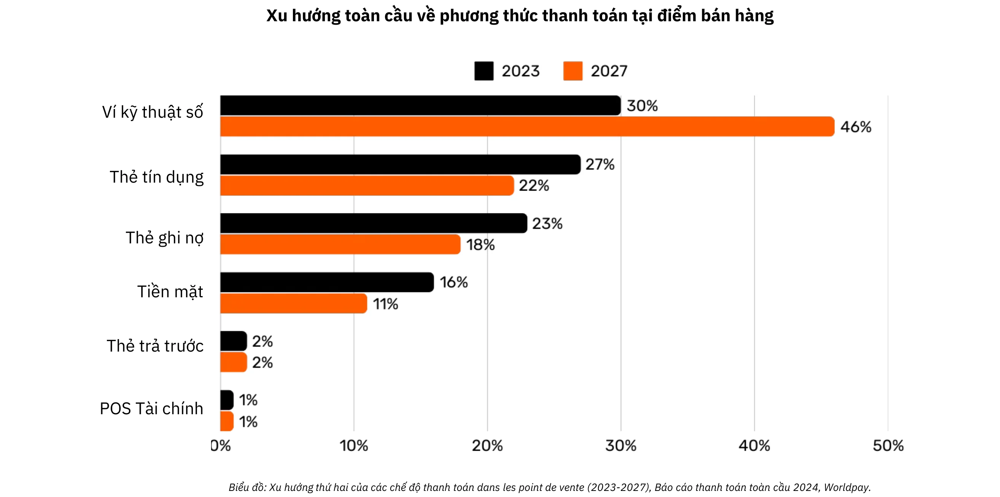

*Đồ họa: Xu hướng toàn cầu về phương thức thanh toán tại điểm bán hàng (POS) (2023-2027), Báo cáo thanh toán toàn cầu năm 2024, Worldpay.*

### Sự phức tạp đằng sau một thanh toán bằng thẻ đơn giản

Khi khách hàng sử dụng thẻ tín dụng tại cửa hàng, thẻ sẽ được đọc bởi thiết bị đầu cuối POS, thiết bị này sẽ truyền dữ liệu giao dịch một cách an toàn đến ngân hàng thu mua của đơn vị bán hàng. Bên thu mua sẽ chuyển tiếp thông tin này đến mạng lưới thẻ có liên quan (ví dụ: Visa hoặc Mastercard), sau đó chuyển yêu cầu đến đơn vị phát hành thẻ—ngân hàng đã cung cấp thẻ cho khách hàng. Bên phát hành sẽ kiểm tra tài khoản hoặc hạn mức tín dụng của khách hàng và gửi lại lệnh ủy quyền thông qua mạng lưới và đơn vị thu mua, cho phép đơn vị bán hàng chấp nhận thanh toán.

Giao dịch có vẻ đơn giản này thực ra bao gồm hơn 15 bước, 7 bên trung gian và mất trung bình từ 48 giờ đến 5 ngày để bên bán nhận được tiền. Trong những ngày tiếp theo, một quá trình thanh toán bù trừ và quyết toán diễn ra. Mạng lưới thẻ tổng hợp các giao dịch trong ngày và điều phối việc trao đổi tiền giữa bên mua và bên phát hành. Một ngân hàng trung ương đảm bảo tính chính xác và ổn định của các khoản thanh toán liên ngân hàng này. Cuối cùng, tài khoản ngân hàng của bên bán nhận được số tiền ròng (trừ phí) được ghi có từ bên mua, do đó hoàn tất vòng đời giao dịch.

Nhìn chung, quá trình này phức tạp, tốn thời gian và tốn kém mặc dù đây là hành động đơn giản để chuyển giá trị từ bên này sang bên khác.

### So sánh các phương thức thanh toán

| Phương thức thanh toán | Cần ủy quyền không? | Thời gian phê duyệt giao dịch (Chế độ xem của người bán) | Tốc độ thanh toán (Tiền đã được thanh toán đầy đủ) | Kết cục (Dễ đảo ngược) | Số lượng trung gian | Các loại phí (cho người nhận) |
| ------------------------------ | ------------------------------- | ----------------------------------------- | ---------------------------------------------- | ---------------------------------------- | ------------------------------ | ---------------------------------- |
| **Tiền mặt** | Không | Ngay lập tức (Trao đổi vật lý) | Ngay lập tức (Không tất toán trễ) | Cao (Không thể đảo ngược sau khi tất toán) | Không | Không |
| **Séc** | Có (Thanh toán qua ngân hàng) | Chấp nhận tại thời điểm gửi tiền (Không đảm bảo) | Vài ngày (Quy trình tất toán) | Trung bình (Có thể trả lại/bị dừng trước khi tất toán) | Ngân hàng | **Thấp đến trung bình** (Phí ngân hàng) |
| **Chuyển khoản** | Có (Ngân hàng/Mạng lưới) | Xác nhận trong vòng vài giờ | Cùng ngày hoặc ngày hôm sau (Trong nước) | Cao (Thường không thể hoàn lại sau khi đã gửi) | Ngân hàng, Mạng lưới thanh toán | **Trung bình**(Cố định/Phần trăm) |
| **Thẻ thanh toán** | Có (Ủy quyền của đơn vị phát hành thẻ) | Vài giây đến vài phút (Mã ủy quyền) | Vài ngày (Thanh toán liên ngân hàng) | Trung bình (Có thể hoàn trả) | Đơn vị phát hành, Đơn vị thanh toán, Mạng lưới thẻ | **Thay đổi (1-3% giao dịch)** |
| **Ví điện tử/ứng dụng thanh toán** | Có (Nhà cung cấp ví/Ngân hàng) | Vài giây (Xác nhận ngay lập tức) | Thông thường là 1-2 ngày (Tùy thuộc vào nguồn tiền) | Trung bình (Có thể hoàn tiền/tranh chấp) | Ngân hàng, Nhà điều hành ví | **Thấp đến Trung bình (Thay đổi)** |

### Những hạn chế của các giải pháp hiện có

Ngành thanh toán truyền thống đại diện cho nền kinh tế hàng năm khoảng 2.200 tỷ đô la, xấp xỉ một phần mười GDP của Mỹ hoặc bằng GDP của Pháp. Vì tiền tệ hoạt động như các mạng lưới được cấp phép nên có sự hạn chế trong cạnh tranh, khiến "dịch vụ" này giống với một loại thuế áp dụng cho những nền kinh tế hiệu quả. Ngoài gánh nặng chi phí mà nó tạo ra, còn có một số hạn chế khác, như được nêu dưới đây.

| Hạn chế | Giải thích | Tác động |
| -------------------------------- | -------------------------------------------------------------------------------------------------------------------------------------------------------------------------------------------------------------------------------------------------- | ------------------------------------------------------------------------------------------------------------------- |
| Phí thẻ cao | Phí trao đổi (~0,3%), phí mạng (cố định hoặc 0,3%-1%), phí thuê bao thiết bị đầu cuối/PSP và biên độ ngân hàng (0,5%-1,7%) cộng lại thành một khoản chi phí đáng kể—giống như một loại “thuế” toàn cầu đối với các ngành sản xuất, lên tới hàng nghìn tỷ đô la. | Làm tăng chi phí của bên bán, giảm biên độ và có khả năng đẩy giá tiêu dùng lên cao. |
| Tất toán cuối cùng rất chậm | Việc tất toán có thể mất tới 5 ngày, làm chậm dòng tiền và hoạt động kinh tế nói chung. | Làm chậm thanh khoản cho các thương nhân và làm giảm tốc độ lưu thông kinh tế. |
| Gian lận | Các kênh thương mại điện tử là mục tiêu của gian lận, gây ra lỗ đáng kể (ví dụ: 28 tỷ đô la). Các khoản hoàn trả có thể lên tới ~174 tỷ đô la trên toàn cầu vào năm 2024. Việc quản lý các tranh chấp này tốn thời gian và gây căng thẳng về mặt tinh thần. | Chi phí hoạt động tăng, các biện pháp phòng ngừa gian lận phức tạp và lòng tin của khách hàng giảm sút. |
| Bỏ giỏ hàng | Các bước bảo mật bổ sung (mã một lần, xác thực hai yếu tố theo PSD2) gây cản trở khi thanh toán. | Độ phức tạp cao hơn khi thanh toán dẫn đến tình trạng bỏ giỏ hàng nhiều hơn và mất doanh số. |
| Số tiền giao dịch tối thiểu cao | Ngưỡng chi tiêu tối thiểu trên thẻ có thể buộc các thương gia và người tiêu dùng phải áp dụng mức giá hoặc điều kiện mua hàng bất tiện, ngăn cản các giao dịch có giá trị nhỏ. | Giảm sự hài lòng và tính linh hoạt của khách hàng, có khả năng hạn chế các giao dịch mua theo cảm tính hoặc giá trị thấp. |
| Ủy quyền trước chậm | Các hệ thống hiện tại không thể xử lý giao dịch ở tốc độ mili giây hoặc hỗ trợ luồng thanh toán liên tục, thời gian thực. | Giới hạn các trường hợp sử dụng yêu cầu thanh toán tức thời hoặc phát trực tuyến, hạn chế khả năng đổi mới và khả năng mở rộng. |
| Cần có tài khoản ngân hàng/thẻ | Việc truy cập vào các phương thức thanh toán này yêu cầu phải có tài khoản ngân hàng hoặc thẻ được liên kết, tự động loại trừ những người không có tài khoản như vậy. | Hạn chế khả năng tiếp cận tài chính, giảm khả năng tiếp cận của những nhóm dân số không có tài khoản ngân hàng hoặc có ít có khả năng tiếp các dịch vụ tài chính. |
| Tạo tài khoản trực tuyến nhiều lần | Người dùng thường phải tạo nhiều tài khoản trực tuyến, dẫn đến mệt mỏi, giảm sự tiện lợi và tăng nguy cơ lộ dữ liệu cá nhân. | Làm giảm trải nghiệm của người dùng, gây lo ngại về quyền riêng tư và tăng nguy cơ lò rỉ dữ liệu. |
| Phí ngoại hối (FX) | Việc thiếu một đơn vị tính toán chung buộc phải chuyển đổi tiền tệ tốn kém cho các giao dịch xuyên biên giới. | Làm tăng thêm chi phí cho thương mại quốc tế, khiến các giao dịch toàn cầu trở nên kém khả thi hơn. |

Cũng giống như việc chúng ta thay đổi từ việc trả tiền theo phút cho các cuộc gọi thoại sang sử dụng dịch vụ liên lạc dựa trên IP gần như miễn phí, sự xuất hiện của các mạng lưới cởi mở và hiệu quả hơn có thể định nghĩa lại các khoản thanh toán, giảm chi phí và trung gian, đồng thời thúc đẩy các mô hình kinh doanh mới.

## Bitcoin dành cho doanh nghiệp: một loại tiền tệ mới

<chapterId>4488fe33-663f-41a3-a668-e9ca2fb7122e</chapterId>

**BITCOIN LÀ GÌ?**

Bitcoin là **hệ thống trao đổi tiền kỹ thuật số ngang hàng** (tiền điện tử). Thuật ngữ "Bitcoin" đề cập đến các thành phần sau:

- **Một giao thức máy tính** tạo điều kiện trao đổi giá trị trên internet mà không cần trung gian, không cần xin phép và bảo mật. Giao thức này sử dụng các nguyên tắc mật mã học cao cấp.
- **Một mạng lưới vật lý** gồm các máy được kết nối với internet (các máy chủ, máy đào, v.v.) do các cá nhân và doanh nghiệp vận hành, tạo thành một hệ thống phi tập trung (không có cơ quan trung ương hoặc điểm kiểm soát duy nhất).
- **Đơn vị tính toán** trong hệ thống. Sẽ không bao giờ có hơn 21 triệu bitcoin tồn tại. Mỗi bitcoin có thể chia thành 100 triệu đơn vị được gọi là “satoshi (sats)”, được đặt theo tên người sáng tạo ẩn danh của nó.

Cùng nhau, chúng tạo nên Bitcoin là **tài sản cơ bản** và là tiền kỹ thuật số **không có bên phát hành**. Quyền sở hữu được bảo đảm chỉ bằng cách nắm giữ **khóa mật mã riêng**, cấp quyền kiểm soát hoàn toàn **mà không cần trung gian hoặc bên thứ ba đáng tin cậy**. Khi được chuyển nhượng, quyền sở hữu **tính cuối cùng** là ngay lập tức: người nắm giữ mới sở hữu hoàn toàn mà không cần dựa vào cơ quan trung ương để bảo vệ hoặc chuyển đổi. Các giao dịch là **không thể thay đổi**—một khi đã được ghi lại trên blockchain, chúng không thể bị thay đổi hoặc xóa.

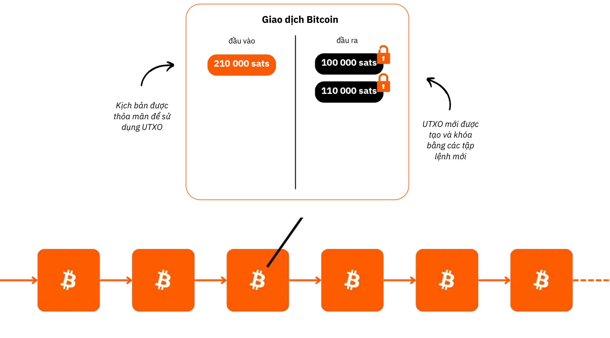

Bitcoin có chính sách tiền tệ cố định, với **mức giới hạn là 21 triệu bitcoin**, trong đó ~19,8 triệu đã được phân phối. Điều này khiến nó trở thành **giảm phát**, với giá trị tăng theo thời gian khi người dùng lưu trữ tiền tiết kiệm và hiệu năng sản suất trong đó.

Các tính năng kỹ thuật của nó vượt trội hơn cả vàng và đô la cộng lại, khiến nó trở thành tài sản tài chính tốt nhất từng được tạo ra. Bitcoin vừa là kho lưu trữ giá trị vừa là phương tiện trao đổi, một loại tiền tệ đang được hình thành. Hãy tưởng tượng việc chuyển giá trị từ quỹ dự phòng của một công ty sang một công ty khác một cách nhanh chóng, không qua trung gian, với chi phí tối thiểu, không gian lận, 24/7 và không có bên thứ ba nào tham gia.

Bitcoin bảo toàn giá trị hiệu quả vì sổ cái của nó không thể bị giả mạo. Giá trị của nó tăng lên do nguồn cung hạn chế và hiếm kết hợp với số lượng cơ hội trao đổi ngày càng tăng, được thúc đẩy bởi số lượng người dùng ngày càng tăng.

Bitcoin mang tính đột phá vì nó khuyến khích chúng ta tìm hiểu các khái niệm về toán học, mật mã học, kinh tế và lịch sử mà chúng ta chưa từng được học. Mặc dù thường được coi là phức tạp, nhưng thực tế đây là một sáng kiến có thể tiếp cận thông qua thực hành và trải nghiệm.

Bitcoin thách thức chúng ta xem xét lại bản chất của chính tiền. Bạn có thể giải thích tiền thực sự là gì không? Một công nhân hoặc doanh nhân có thể dành 50.000 đến 100.000 giờ trong cuộc đời để kiếm tiền, nhưng có bao nhiêu người **dành ra 100 giờ để hiểu rõ hơn** về tiền và bảo toàn tiền bạc? Bitcoin khuyến khích chúng ta đặt câu hỏi về những lý do cơ bản đằng sau nhu cầu về tiền bạc và quan điểm tạm thời của chúng ta. Tiền bạc là để sống xa hoa tức thời hay để chống chịu dài lâu? Nếu có một loại tài sản tăng giá trị cho phép chúng ta trì hoãn việc chi xài tức thời, chúng ta sẽ lựa chọn như thế nào? Chúng ta muốn có những cuộc trò chuyện nào với chính mình sau 20 hoặc 30 năm nữa?

**THẺ NHẬN DẠNG BITCOIN**

- **Tuổi:** 15 tuổi (3 tháng 1 năm 2009)
- **Giá trị trao đổi hàng ngày:** 10 tỷ đô la (> CAC40)
- **Vốn hóa thị trường:** 1,8 nghìn tỷ đô la (> Meta, Visa, Silver; < Apple, Google, Gold)
- **Người dùng:** ~100 đến 200 triệu (1-2% dân số toàn cầu)
- **Độ biến động:** Về bản chất là không có (1 Bitcoin = 1 Bitcoin), rất cao ở bên ngoài (trong các sàn giao dịch tiền tệ pháp định (fiat))
- **Hiệu suất:** Giao dịch đầu tiên ở mức 0,0009 đô la; hiện tại là 100.000 đô la (x100 triệu)
- **Tính khả dụng của mạng (thời gian hoạt động):** 100% kể từ năm 2013
- **Đã tuyên bố chết hoặc bị chỉ trích:** Một lần một tháng

**Một kỳ quan của sự hợp tác giữa con người với nhau:**

- Hoàn toàn **mã nguồn mở**
- **Thực thể pháp lý:** Không
- **Tổng giám đốc điều hành:** Không
- **Đầu tư vốn mạo hiểm:** Không
- **Tiếp thị:** Không
- **R&D:** Do tình nguyện viên thực hiện
- **Quản trị:** Bởi người dùng
- **Mô hình kinh tế sáng tạo:** Việc tạo khối được trợ cấp bằng phí giao dịch (dựa trên đấu giá)

Để biết thêm thông tin về Bitcoin, lịch sử, cách thức hoạt động và cách sử dụng, tôi cũng đề xuất bạn nên tham khảo khóa học này:

https://planb.network/courses/2b7dc507-81e3-4b70-88e6-41ed44239966
## Giới thiệu về mạng Lightning

<chapterId>c095c7ad-5469-4c7b-9510-b6c0b86244e7</chapterId>

**LIGHTNING LÀ GÌ?**

Mạng Lightning là **một giao thức và mạng lưới** tạo điều kiện cho các giao dịch Bitcoin với tương tác tối thiểu với chuỗi khối dữ liệu (blockchain) chính của Bitcoin. Sau đây là cách thức hoạt động của nó:

- **Thiết lập ban đầu:** Tiền được khóa (ký quỹ) trên chuỗi khối dữ liệu (blockchain) chính để thiết lập kênh thanh toán giữa 2 bên.
- **Mạng thanh toán:** Một mạng lưới các kênh thanh toán giữa nhiều bên tạo thành một mạng thanh toán (theo kết nối và định tuyến).
- **Giao dịch ngoài chuỗi:** Giao dịch diễn ra giữa các bên nhưng **không được công bố ngay lập tức** trên chuỗi khối chính của Bitcoin (**"ngoài chuỗi"**).
- **Thanh toán trên chuỗi:** Chỉ **số dư cuối cùng** của các giao dịch của kênh được công bố trên chuỗi khối chính của Bitcoin (**"trên chuỗi**"), cho phép nhiều giao dịch diễn ra trong thời gian đó. Việc gộp nhiều khoản thanh toán này làm giảm tình trạng tắc nghẽn và do đó giảm phí so với việc thực hiện nhiều giao dịch trên chuỗi.
- **Đóng kênh:** Người dùng có thể đóng kênh của họ bất kỳ lúc nào và lấy lại Bitcoin của họ bằng cách công bố trạng thái giao dịch mới nhất. Đây là nguyên tắc giao dịch **"có thể công bố" bất kỳ lúc nào nhưng "chưa được công bố"** cho đến khi cần thiết. Việc thoát (đóng kênh) có thể là đơn phương (do bất kỳ bên nào trong 2 bên quyết định bất kỳ lúc nào) hoặc được quyết định chung (dẫn đến phí trên chuỗi thấp hơn)

Cách tiếp cận này tránh được sự chậm chạp và phức tạp khi thực hiện mọi giao dịch trực tiếp trên chuỗi khối dữ liệu (blockchain) chính của Bitcoin, chỉ ghi lại số dư cuối cùng và duy trì tính bảo mật của nó. Mạng Lightning là một lớp "ở trên" Bitcoin nhưng vẫn được neo vào nó.

**Mạng lưới thanh toán toàn cầu**

Giao thức này tạo ra một **mạng** máy móc, trong đó các kênh tạo thành một hệ thống thanh toán chung. Các nút này có thể được vận hành tự do bởi các cá nhân hoặc doanh nghiệp, biến nó thành một mạng lưới hoàn toàn mở.

Mạng Lightning cho phép trao đổi giá trị tức thời với tốc độ ánh sáng. Nó giống như một giao thức email được áp dụng cho thanh toán: một mạng lưới thanh toán thế hệ tiếp theo. Nó chuyển đổi hoàn toàn cách "tiền" di chuyển, khiến nó trở nên miễn phí và nhanh như truyền dữ liệu trên internet.

**Ưu điểm chính:**

- **Tốc độ:** Giao dịch tức thời.
- **Phí thấp:** Chi phí thấp hơn nhiều so với các mạng lưới ngân hàng truyền thống.
- **Dễ dàng áp dụng:** Các doanh nghiệp có thể nhanh chóng thiết lập để chấp nhận thanh toán Lightning chỉ bằng ứng dụng điện thoại thông minh hoặc nút thanh toán trên trang web của họ.

Cơ sở hạ tầng Lightning vượt trội hơn các hệ thống thanh toán truyền thống về tốc độ, chi phí và hiệu quả năng lượng. Với việc áp dụng ngày càng tăng của các đơn vị bán hàng, động lực sẽ tăng tốc: nếu thanh toán có thể bỏ qua mạng lưới liên ngân hàng bị giam giữ, tại sao lại tiếp tục từ bỏ một tỷ lệ phần trăm doanh thu đáng kể cho các đơn vị trung gian hiện nay?

**Trường hợp sử dụng vô hạn:**

Các ứng dụng của Lightning vượt xa mức phí thấp và tốc độ. Bằng cách cung cấp một đường ray thanh toán hoàn toàn miễn phí và tức thời, nó mở ra nhiều cơ hội to lớn trong nền kinh tế.

**Tăng cường khả năng trao đổi của Bitcoin:**

Lightning khuếch đại vai trò của Bitcoin như một "phương tiện trao đổi". Bằng cách tăng tần suất và tính tự do của các giao dịch, nó củng cố chức năng chính của tiền tệ: tạo điều kiện cho các giao dịch kinh tế và tạo ra giá trị cho tất cả những người tham gia.

Sự trỗi dậy trong tương lai của "nền kinh tế thông minh" sẽ đòi hỏi một hệ thống thanh toán siêu nhanh, tần suất cao, một tiêu chuẩn kỹ thuật mà chỉ Lightning mới có thể đáp ứng. Điều này cho phép tạo ra nhiều hàng hóa và dịch vụ hơn. Vì nguồn cung Bitcoin vẫn còn hạn chế, sức mua của mỗi đơn vị sẽ tăng lên. Bitcoin và Lightning cùng nhau phát triển mạnh mẽ hơn khi mạng lưới của chúng mở rộng.

Lightning cung cấp cái nhìn thoáng qua về tương lai khi tất cả các doanh nghiệp hoạt động trên nền tảng internet cũng sẽ hoạt động trên nền tảng Bitcoin.

**Thanh toán Bitcoin trên Lightning: Trường hợp sử dụng điển hình của thương gia**

Mạng Lightning lý tưởng cho thanh toán Bitcoin tại các cửa hàng thực tế hoặc trực tuyến do tốc độ và tính tất toán của nó.

- **Tốc độ:** Lightning (~500ms đến vài giây) nhanh hơn đáng kể so với mạng chính Bitcoin, nơi các giao dịch có thể mất khoảng 30 phút để xác nhận. Đối với các giao dịch mua lớn (trên 1.000 đô la), mạng chính Bitcoin vẫn có thể được ưu tiên hơn, vì tốc độ ít quan trọng hơn. Tuy nhiên, những chi tiết này thường bị ẩn khỏi người dùng trung bình, vì các ứng dụng xử lý các quyết định này một cách liền lạc ở đằng sau.
- **Tính cuối cùng:** Khi thanh toán được thực hiện trên Lightning, thì thanh toán đó là thanh toán cuối cùng. Không khả năng bị bên thứ ba khiếu nại hoặc tranh chấp liên quan đến gian lận.
- **Phí:** Phí giao dịch trên mạng Lightning rất nhỏ và do người dùng trả, không phải người bán. Người bán chỉ phải trả phí nếu sau này họ cần chuyển Bitcoin của mình sang mạng hoặc dịch vụ khác.

**THẺ NHẬN DẠNG LIGHTNING**

- **Phát minh:** 2015
- **Ra mắt:** 2016
- **Tuổi:** 7 năm (giao dịch đầu tiên: 28 tháng 12 năm 2017)
- **Khả năng kỹ thuật của mạng lưới:** ở quy mô lớn, nó có thể xử lý số lượng giao dịch tức thời nhiều hơn 1.000 lần so với các hệ thống truyền thống.
- **Quy mô giao dịch:** Có thể từ lớn đến nhỏ hơn 1.000 lần so với các hệ thống truyền thống.
- **Tốc độ giao dịch:** Nhanh hơn tới 100 lần.
- **Phí:** Giảm tới 90%.
- **Thời gian thanh toán:** Gần như ngay lập tức (thường là ~500 mili giây, đôi khi chỉ mất vài giây).
- **Tiêu thụ năng lượng:** ~8% của hệ thống tiền tệ toàn cầu truyền thống.
- **Đặc trưng:**
    - Ngang hàng
    - Phổ thông
    - Không được phép
    - Quyền riêng tư tốt
    - Bảo mật đã được chứng minh
    - Tính khả dụng cao (thời gian hoạt động tuyệt vời)
    - Có thể kiểm soát và thích ứng

Để biết thêm thông tin về hoạt động kỹ thuật của mạng Lightning, tôi cũng đề xuất bạn tham gia khóa học này:

https://planb.network/courses/34bd43ef-6683-4a5c-b239-7cb1e40a4aeb
# Bitcoin trong quỹ dự phòng

<partId>bf45c1e8-af97-4b6b-af42-2866f493b14d</partId>

## Lợi nhuận, vốn và chìa khóa cho khả năng chống chịu của doanh nghiệp

<chapterId>656ad88f-3c27-4054-a94e-b29727009b8e</chapterId>

### Một công ty khỏe mạnh

**Tương lai là điều không chắc chắn**, và các doanh nghiệp phải điều hướng sự không chắc chắn này với trọng tâm rõ ràng là tạo ra lợi nhuận và bảo toàn vốn. Theo kinh tế học Áo, **lợi nhuận là tín hiệu cuối cùng về sức khỏe của một công ty**—chúng cho thấy doanh nghiệp đang đáp ứng nhu cầu của người tiêu dùng một cách hiệu quả. Nếu không có lợi nhuận, một công ty không thể tự duy trì, chứ đừng nói đến phát triển. Để một doanh nghiệp duy trì sức khỏe, doanh nghiệp không chỉ phải tạo ra lợi nhuận mà còn phải suy nghĩ trước, **lưu trữ vốn cho các khoản đầu tư và thách thức trong tương lai**.

**Bảo toàn vốn** là rất quan trọng vì nó cho phép các doanh nghiệp thích nghi và nắm bắt cơ hội trong một thị trường không thể đoán trước. Điều này liên quan đến việc cân bằng giữa việc tái đầu tư thu nhập để tăng trưởng và duy trì một khoản đệm tài chính để vượt qua những suy thoái chưa thực hiện. Kinh tế học Áo nhấn mạnh tầm quan trọng của **“ưu tiên thời gian”**, nghĩa là các doanh nghiệp phải quyết định cẩn thận xem nên ưu tiên lợi nhuận tức thời bao nhiêu so với đầu tư để đạt được thành công lâu dài. Một công ty khỏe mạnh sẽ duy trì nền tảng tài chính vững chắc, đảm bảo tính linh hoạt trong cả thời điểm thuận lợi và khó khăn.

Các tín hiệu thị trường như giá cả và cạnh tranh hướng dẫn các doanh nghiệp đưa ra quyết định thông minh về phân bổ nguồn lực. Bằng cách lắng nghe các tín hiệu này, các công ty có thể tránh được bẫy mở rộng quá mức hoặc đầu tư kém hiệu quả—đặc biệt là những khoản đầu tư bị ảnh hưởng bởi các yếu tố nhân tạo như tín dụng dễ dàng. Phân bổ sai nguồn lực không chỉ gây nguy hiểm cho sức khỏe của công ty mà còn làm giảm khả năng phục vụ khách hàng hiệu quả.

Cuối cùng, duy trì một doanh nghiệp khỏe mạnh có nghĩa là phải thích nghi, đưa ra các lựa chọn tài chính thận trọng và luôn để mắt đến tương lai. **Bằng cách tập trung vào lợi nhuận, bảo toàn vốn và phản ứng với các tín hiệu thị trường, các doanh nghiệp—lớn hay nhỏ—có thể phát triển mạnh mẽ ngay cả khi đối mặt với sự không chắc chắn**.

### Liệu Tư bản có đức tính không?

**Vốn thường được miêu tả như thế nào**

Hãy cùng khám phá lại bản chất thực sự của vốn - một thuật ngữ thường bị hiểu lầm và hiểu theo hướng tiêu cực trong xã hội chúng ta.

Trong lý thuyết kinh tế truyền thống (Keynesian), vốn thường được hiểu theo nghĩa đơn giản là một lượng tài sản vật chất hoặc tài chính đồng nhất, chủ yếu được sử dụng để kích thích tổng cầu thông qua đầu tư. Nó thường gắn liền với sự tập trung của cải và quyền lực kinh tế do một nhóm nhỏ nắm giữ. Trong bối cảnh khoảng cách giàu nghèo tiếp tục gia tăng, nhiều người coi vốn là biểu tượng của bất bình đẳng kinh tế, đặc biệt là khi của cải tích lũy dường như không mang lại lợi ích cho số đông.

"Tư bản" thường được miêu tả như một công cụ bóc lột, và quan điểm này đã ảnh hưởng sâu sắc đến nhiều phong trào khác nhau coi tư bản là vốn trái ngược với lợi ích của người lao động. Nhưng điều này có đúng không? Hay nhận thức này có thể bị bóp méo bởi:

1. Thiếu hiểu biết về cơ chế kinh tế (kể cả của chính các nhà kinh tế)?

2. Sự can thiệp của chính phủ và thao túng thị trường?

3. Sự nhầm lẫn giữa chủ nghĩa tư bản thân hữu và chủ nghĩa tư bản thị trường tự do?

4. Phương tiện truyền thông đóng khung cuộc khủng hoảng kinh tế như thế nào?

5. Mong muốn giải quyết nhanh chóng và công lý xã hội ngay lập tức?

6. Sự bình thường hóa văn hóa của luận điệu chống chủ nghĩa tư bản?

May mắn thay, Bitcoin buộc chúng ta phải suy nghĩ lại mọi thứ và thách thức những quan niệm cố hữu này. Có một trường phái tư tưởng—Trường phái Kinh tế Áo—có thể làm sáng tỏ những vấn đề này và giúp chúng ta xem xét lại bản chất thực sự của vốn.

**Ngày xửa ngày xưa**

Chúng ta hãy bắt đầu bằng một câu chuyện ngắn:

"Trên một hòn đảo hoang nhỏ có một người đánh cá đơn độc. Mỗi ngày, anh dành nhiều giờ để bắt cá bằng tay không, một hoạt động tiêu tốn nhiều thời gian và năng lượng của anh. Một ngày nọ, anh nảy ra một ý tưởng: chế tạo một cây giáo cho phép anh đánh bắt cá hiệu quả hơn. Nhưng anh biết rằng điều này đòi hỏi một sự hy sinh.

Trước khi bắt đầu chế tạo ngọn giáo, người đánh cá quyết định để dành một ít cá để duy trì cuộc sống trong quá trình chế tạo. Anh ta ăn ít hơn bình thường trong vài ngày, tiết kiệm đủ cá để tập trung vào dự án của mình. Số cá tiết kiệm này tượng trưng cho **vốn** của anh ta, một khoản dự trữ nhỏ giúp anh ta theo đuổi mục tiêu của mình.

Trong khi dành thời gian để chế tạo ngọn giáo, anh ấy dựa vào nguồn dự trữ của mình, sẵn sàng trì hoãn một số tiện nghi tức thời của mình (phản ánh **sở thích thời gian** của anh ấy). Sau nhiều ngày làm việc chăm chỉ, anh ấy đã hoàn thành một ngọn giáo chắc chắn.

Với cây giáo, giờ đây anh có thể bắt cá nhanh hơn nhiều và ít tốn công sức hơn. Anh không còn phải vắt kiệt sức mình như trước nữa và thậm chí còn bắt đầu tích lũy được một lượng cá nhàn rỗi. Lượng cá nhàn rỗi này mở ra những khả năng mới: anh có thể lưu trữ, chia sẻ hoặc đầu tư vào các dự án khác trên đảo. Bằng cách hoãn việc tiêu thụ trước mắt và sử dụng vốn của mình, người đánh cá đã cải thiện đáng kể hiệu quả và triển vọng tương lai của mình."

Câu chuyện này minh họa vai trò cơ bản của vốn, sự kiên nhẫn và tầm nhìn xa trong việc xây dựng một tương lai tốt đẹp hơn - những khái niệm cốt lõi cho tăng trưởng kinh tế và tiến bộ của con người.

### Trường phái kinh tế Áo và tầm nhìn của nó về tư bản

Trường phái kinh tế Áo được đặt theo tên của những người sáng lập và những người đóng góp ban đầu, những người ban đầu đến từ Áo. Cái tên này vẫn được giữ nguyên, và trường phái này từ đó đã gắn liền chặt chẽ với tư tưởng tự do truyền thống, nhấn mạnh vào quyền tự do cá nhân, thị trường tự do và sự can thiệp tối thiểu của nhà nước.

**Quan điểm của người Áo về tư bản**

Theo quan điểm của người Áo, vốn gắn chặt với ý tưởng trì hoãn tiêu dùng để xây dựng các công cụ hoặc nguồn lực sản xuất giúp tăng cường sản xuất trong tương lai. Quá trình này, được gọi là tích lũy vốn, là trọng tâm của lý thuyết kinh tế Áo. Các yếu tố chính của quan điểm này bao gồm:

- **Ưu tiên thời gian và trì hoãn tiêu dùng**: Cá nhân thường thích tiêu dùng ngay hiện tại hơn là dành cho tương lai, nhưng họ có thể chọn trì hoãn tiêu dùng nếu họ mong đợi phần thưởng lớn hơn trong tương lai. Bằng cách tiết kiệm ngày hôm nay, các nguồn lực có thể được đầu tư vào hàng hóa vốn (công cụ, máy móc, cơ sở hạ tầng) giúp cải thiện năng suất theo thời gian. Các xã hội hoặc cá nhân có sở thích thời gian thấp hơn tiết kiệm nhiều hơn và đầu tư vào các dự án dài hạn, thúc đẩy tăng trưởng bền vững.
- **Vốn là động lực thúc đẩy sản xuất trong tương lai**: Hàng hóa vốn được coi là công cụ trung gian được sử dụng để sản xuất hàng tiêu dùng cuối cùng. Bằng cách tích lũy vốn, các doanh nhân có thể nâng cao năng suất và tạo ra nhiều của cải hơn trong tương lai. Ví dụ, thay vì sản xuất hàng tiêu dùng ngay lập tức, các nguồn lực có thể được sử dụng để xây dựng nhà máy hoặc máy móc. Mặc dù điều này làm giảm mức tiêu thụ ngắn hạn, nhưng hiệu quả thu được cho phép sản xuất và thịnh vượng hơn sau này.
- **Sản xuất gián tiếp và hiệu quả**: Các nhà kinh tế học người Áo, như Eugen Böhm-Bawerk, đã nêu bật ý tưởng về sản xuất gián tiếp—quy trình sản xuất dài hơn và phức tạp hơn bao gồm nhiều giai đoạn. Mặc dù các quy trình này mất thời gian, nhưng cuối cùng chúng mang lại kết quả hiệu quả và năng suất hơn, chẳng hạn như xây dựng một xưởng cưa để chế biến gỗ thay vì thu thập gỗ bằng tay.
- **Tín hiệu lãi suất**: Theo quan điểm của người Áo, lãi suất phản ánh sở thích thời gian của cá nhân. Lãi suất cao cho thấy sở thích tiêu dùng ngay lập tức, trong khi lãi suất thấp khuyến khích tiết kiệm và đầu tư dài hạn. Khi các ngân hàng trung ương thao túng lãi suất một cách giả tạo, họ bóp méo các tín hiệu tự nhiên này, dẫn đến phân bổ sai nguồn lực và đầu tư không bền vững (đầu tư sai).

**Hai hình thức vốn trong nền kinh tế hiện đại**

Trong khuôn khổ của hệ thống tiền tệ dựa trên nợ mà chúng ta đang vận hành, **có một loại vốn thứ hai**: loại vốn được tạo ra ngay lập tức khi một ngân hàng tạo ra một khoản vay thông qua một cơ chế tín dụng đơn giản. Điều này liên quan đến việc tạo ra thanh khoản "từ hư không", khi ngân hàng cho vay tiền mà thực tế không nắm giữ trước mà thay vào đó tạo ra dựa trên lời hứa hoàn trả.

Một mặt, vốn theo trường phái kinh tế "Áo" là kết quả của việc tiết kiệm thực sự, một quá trình liên quan đến các quyết định kinh tế thấu đáo và sự chắt chiu hy sinh. Mặt khác, vốn được tạo ra thông qua việc tạo ra tiền dựa trên nợ là một cấu trúc tức thời và nhân tạo. Hai loại vốn này, mặc dù **giống nhau về mặt bề ngoài trong việc sử dụng để tài trợ cho các dự án, nhưng về bản chất lại khác nhau cơ bản**.

Hai hình thức vốn này không bao giờ nên bị gộp chung, nhưng trong một hệ thống dựa trên nợ, chúng thường bị gộp chung, **làm méo mó các tín hiệu kinh tế** và thường dẫn đến đầu tư sai lầm. Sự hiểu lầm này làm sáng tỏ lý do tại sao chủ nghĩa tư bản thường nhận được những lời chỉ trích vô lý

**Vấn đề chính với chủ nghĩa Keynes**

Các chính sách Keynes, được giới tinh hoa toàn cầu áp dụng rộng rãi, thao túng lãi suất và kích thích nhu cầu thông qua nợ. Điều này khuyến khích các nguồn lực chảy vào các dự án ngắn hạn, không bền vững, khuếch đại các chu kỳ kinh tế và trì hoãn tăng trưởng thực sự bắt nguồn từ tiết kiệm khỏe mạnh và đầu tư hiệu quả. Các nhà lãnh đạo doanh nghiệp quan sát chính sách có hại này trực tiếp khi các công ty khỏe mạnh bị đẩy vào các vụ mua lại được định giá quá cao để theo đuổi lợi nhuận thổi phồng, làm suy yếu tăng trưởng tự nhiên và bền vững.

Trong một môi trường như vậy, làm sao vốn "khỏe mạnh" - được các doanh nhân tiết kiệm cẩn thận - có thể cạnh tranh với vốn "không khỏe mạnh" được tạo ra một cách nhân tạo? Hơn nữa, việc mở rộng đơn phương nguồn cung tiền làm xói mòn sức mua của vốn khỏe mạnh, làm trầm trọng thêm sự mất phương hướng kinh tế và sự bất mãn của xã hội.

**Một tia hy vọng: Bitcoin**

Bitcoin cung cấp một cách để tích lũy và bảo toàn vốn trong dài hạn mà không bị xói mòn do lạm phát tiền tệ. Là một kho lưu trữ giá trị, nó cho phép các doanh nghiệp lập kế hoạch đầu tư trong tương lai với khả năng chống chịu, thách thức sự thống trị của các hệ thống nợ và thúc đẩy sự trở lại của tích lũy vốn thực sự, có hiệu quả.

### Tìm hiểu thêm về trường phái kinh tế Áo

**Trường phái kinh tế Áo** là một truyền thống tư tưởng kinh tế coi trọng thị trường tự do, quyền tự do cá nhân và tầm quan trọng của hành động của con người trong các quá trình kinh tế. Nó chỉ trích sự can thiệp của nhà nước, đặc biệt là trong tiền tệ và thị trường, và lập luận rằng các cá nhân, được hướng dẫn bởi sở thích chủ quan của họ, là những người đánh giá tốt nhất về lợi ích của chính họ.

**Những nhân vật chủ chốt của Trường phái Áo**

- **Carl Menger**: Người sáng lập Trường phái Áo, Menger đã phát triển lý thuyết về giá trị tự chủ, khẳng định rằng giá trị của hàng hóa phụ thuộc vào sở thích của cá nhân chứ không phải chi phí sản xuất.
- **Ludwig von Mises**: Một nền tảng của Trường phái Áo, Mises đã giới thiệu praxeology (lý thuyết về hành vi của con người) và là tác giả của _Human Action_, một lời phê phán sâu sắc về chủ nghĩa xã hội và kế hoạch hóa tập trung.
- **Friedrich Hayek**: Là học trò của Mises, Hayek đã giành giải Nobel Kinh tế năm 1974 cho công trình nghiên cứu về kiến thức phi tập trung và tính tự phát của thị trường. Trong cuốn sách _The Road to Serfdom_, ông chỉ trích mạnh mẽ sự kiểm soát tập trung.
- **Murray Rothbard**: Một học trò của Mises và là người ủng hộ trung thành của chủ nghĩa tự do, Rothbard đã phát triển lý thuyết về chủ nghĩa tư bản vô chính phủ, hình dung ra một xã hội không nhà nước được quản lý bởi các hợp đồng tự nguyện. Cuốn sách _Man, Economy, and State_ của ông là một tác phẩm có ảnh hưởng lớn trong kinh tế học Áo.

**Các nhà kinh tế có ảnh hưởng khác**

- **Milton Friedman**: Mặc dù không liên quan trực tiếp đến Trường phái Áo, Friedman ủng hộ nhiều ý tưởng ủng hộ thị trường và tự do. Chính sách tiền tệ của ông khác với tư tưởng Áo nhưng chia sẻ sự chỉ trích của họ về sự can thiệp quá mức của nhà nước vào nền kinh tế.
- **Frédéric Bastiat**: Một nhà kinh tế học người Pháp thế kỷ 19, Bastiat đã ảnh hưởng đến Trường phái Áo với các tác phẩm của ông về thương mại tự do và những hậu quả vô hình của các chính sách kinh tế. Bài luận _What Is Seen and What Is Not Seen_ của ông là một văn bản nền tảng của chủ nghĩa tự do kinh tế.

*Ghi công: Viện Ludwig von Mises*

**Những đóng góp và ý tưởng cốt lõi**

Những nhà tư tưởng này đã định hình ý tưởng rằng sự can thiệp của nhà nước làm méo mó thị trường và rằng tự do kinh tế là điều cần thiết cho sự thịnh vượng và sự phối hợp hài hòa các hành động của con người. Những hiểu biết sâu sắc của họ làm nổi bật tầm quan trọng của việc ra quyết định phi tập trung và những nguy cơ của việc kiểm soát tập trung trong các hệ thống kinh tế.

Để biết thêm thông tin về chủ đề này:

https://planb.network/courses/d955dd28-b7c6-4ba2-a123-d932e21d148f
https://planb.network/courses/9d1bde6a-33e5-45dd-b7c0-94da72e45b11
https://planb.network/courses/d07b092b-fa9a-4dd7-bf94-0453e479c7df
## Giữ bitcoin trong quỹ dự phòng

<chapterId>89622a40-d14f-4c37-a075-8e7e1731ec26</chapterId>

### Những thách thức của quỹ dự phòng công ty

Kho bạc là nơi người ta cất giữ những thứ quý giá. Một công ty khỏe mạnh được cấp vốn hợp lý để có thể ứng phó với sự bất ổn trong tương lai và lập kế hoạch đầu tư. Ngày nay, một phần quỹ dự phòng được đặt vào các tài sản tài chính được cho là có tính “thanh khoản cao”, chẳng hạn như trái phiếu, tiền gửi có kỳ hạn, v.v.

Trong thời gian dài, một số công ty sử dụng tài sản không thanh khoản như bất động sản mà không nhận ra một số nguy hiểm sau:

- Thiếu thanh khoản trong trường hợp khủng hoảng
- Cuối cùng lợi nhuận khá thấp sau khi trừ phí
- Lợi nhuận không vượt quá lạm phát thực, tức là lợi nhuận của nguồn cung tiền (~7% mỗi năm, xem bên dưới)
- Rủi ro chưa thực hiện là bất động sản mất đi một phần chức năng “tiết kiệm” của nó để hưởng lợi từ các tài sản như Bitcoin. Kết quả là, nó có thể quay trở lại gần hơn với “giá trị sử dụng” của nó: trở thành nơi trú ẩn.

Chúng ta hãy cùng xem xét nhanh môi trường hoạt động của các doanh nghiệp.

**Lạm phát thực**: Trái với sự thất vọng từ nhiệm vụ của các ngân hàng trung ương nhắm mục tiêu lạm phát hàng năm 2%, nghĩa là mất 40% giá trị tiền tệ trong 20 năm. Cộng thêm các giai đoạn lạm phát rõ rệt hơn, rõ ràng là các công ty không thể chỉ sử dụng tiền tệ để lưu trữ thành quả lao động của mình. Họ phải triển khai các chiến lược tài chính phức tạp, tất yếu đi kèm với một loạt rủi ro. Rõ ràng là các chiến lược này **không thể tiếp cận được với các doanh nghiệp rất nhỏ**, vốn đã bận rộn với các hoạt động cốt lõi của mình.

**Lạm phát ẩn**: Trong hệ thống tiền tệ dự trữ một phần dựa trên nợ được các ngân hàng trung ương hỗ trợ, **tổng cung tiền tăng trung bình khoảng 7% mỗi năm** (ví dụ: M1 ở Khu vực đồng tiền chung châu Âu hoặc Mỹ). Điều này có nghĩa là "phần chia của chiếc bánh" của bạn bị cắt giảm một nửa chỉ trong vài năm—trừ khi bạn có quyền truy cập đặc quyền vào nguồn tài chính và có thể tiếp tục tăng trưởng bằng cách sử dụng đòn bẩy và mua tài sản nhanh chóng với "giá cũ" trước khi tiền mới tạo ra đẩy chúng lên. Đây là hiệu ứng Cantillon, hiệu ứng này giải thích một phần việc chuyển giao của cải cho những người giàu có hơn, trong khi "vốn" bị đổ lỗi là thủ phạm (xem phần giới thiệu về vốn ở trên).

**Rủi ro đối tác**: Hệ thống tài chính hiện tại rất rủi ro và bạn có thể không phải lúc nào cũng có thể tiếp cận được "tiền của mình". Không cần phải viện dẫn hình ảnh ngôi nhà xây trên cát, chúng ta phải thừa nhận rằng các tổ chức tài chính tư nhân hóa lợi nhuận và xã hội hóa các khoản lỗ khi có khủng hoảng dù là nhỏ nhất. Trong hệ thống tiền "kinh thánh" (tiền được ghi vào sổ cái), tiền trong ngân hàng chỉ là một "khoản yêu cầu"; bạn không thực sự sở hữu nó và bản thân các ngân hàng "không có nó" (dự trữ một phần). Theo một cách nào đó, số tiền này thực sự kỳ diệu. Một số ngân hàng uy tín từng chế giễu Bitcoin hiện không còn tồn tại nữa, chẳng hạn như Credit Suisse.

Sự thiếu tin tưởng này khởi nguồn cho sự hồi sinh của các tài sản “mang tính” như vàng (mặc dù việc bảo mật, vận chuyển và phân chia rất phức tạp, v.v.) và tất nhiên là cả Bitcoin, đồng tiền mới xuất hiện.

### Bitcoin như một tài sản tài chính

Bitcoin cung cấp một giải pháp thay thế triệt để. Nó là **một tài sản mang tính sở hữu, không có đơn vị phát hành trung tâm**, gần như không thể bị tịch thu và được hưởng lợi từ các hiệu ứng mạng lưới. Người dùng Bitcoin “thực sự” chọn sử dụng nó để lưu trữ thành quả lao động của họ, vì nó được coi là kho lưu trữ giá trị chống lại cả kiểm duyệt và lạm phát. Nhờ hiệu ứng mạng lưới, được minh họa bằng Luật Metcalfe, mỗi người dùng mới bị thuyết phục sẽ làm tăng giá trị của mạng lưới; khi số lượng người tham gia tăng lên, tiện ích của Bitcoin tăng theo cấp số nhân. Mô hình này biến nó thành một hình thức vốn đặc biệt và đầy hứa hẹn, được xây dựng dựa trên sự chấp nhận và tin tưởng của người dùng.

Bitcoin là **tài sản có tính thanh khoản cao nhất thế giới**, hoạt động 24/7 mà không bị gián đoạn, không giống như các thị trường tài chính truyền thống có giờ đóng cửa và "ban chỉ đạo". Tính thanh khoản này cho phép người dùng mua hoặc bán bitcoin bất cứ lúc nào, bất kể là để ứng phó với tin tốt hay tin xấu (ví dụ: phóng tên lửa, chiến tranh, v.v.).

Trong hơn một thập kỷ, Bitcoin đã cho thấy mức tăng trưởng trung bình hàng năm hơn 60%. Hiệu suất độc đáo này đã cho phép những người nắm giữ lâu dài bảo toàn được vốn ban đầu của họ, không giống như các công cụ khác.

Tuy nhiên, có một số yếu tố chính cần lưu ý:

Đầu tiên, **hiệu quả trong quá khứ không đảm bảo kết quả trong tương lai**. Miễn là Bitcoin vẫn **an toàn và phi tập trung**, người ta có thể hy vọng giá tăng hàng năm trên 20% trong thập kỷ tới, khiến nó trở thành một công cụ khả thi dành cho quỹ dự phòng.

Thứ hai, Bitcoin cho đến nay đã trải qua **nhiều chu kỳ 4 năm**, nghĩa là với khoảng thời gian hơn 4 năm, khoản đầu tư luôn có lãi. Đối với những người coi Bitcoin là khoản đầu tư với khoảng thời gian ngắn hạn (ít hơn 4 năm) có thể rủi ro.

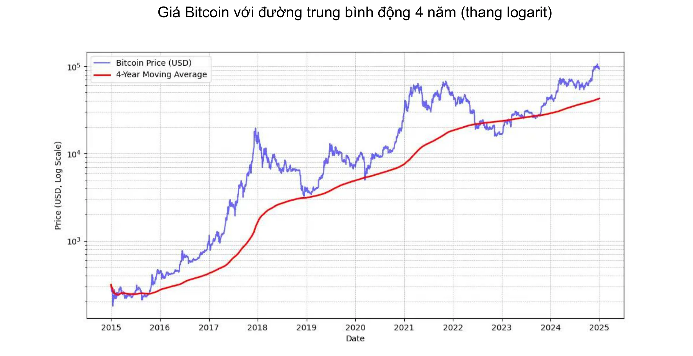

*MICHAEL SAYLOR: "Tín hiệu giá Bitcoin tốt nhất là đường trung bình động đơn giản 4 năm."* Xem biểu đồ ở trên.

Ngoài ra, nên duy trì mức độ tiếp xúc với Bitcoin **tỷ lệ thuận** với trình độ hiểu biết của mình. Điều quan trọng nữa là không nên vội vàng hoặc cố gắng căn thời điểm thị trường một cách hoàn hảo.

Cuối cùng, Bitcoin được coi là **biến động**. Nói một cách chính xác, giá của nó được thể hiện bằng đơn vị tiền tệ pháp định (fiat) là như vậy. Một phần của sự biến động này là tự nhiên đối với một tài sản vẫn còn non trẻ, nhưng nó cũng được khuếch đại bởi sự hiện diện của những nhà đầu cơ không sử dụng nó như một kho lưu trữ giá trị dài hạn, thay vào đó tìm kiếm lợi nhuận nhanh chóng. Hơn nữa, giao dịch đòn bẩy (sử dụng tiền vay để tăng vị thế giao dịch) làm nổi bật cả biến động giá tăng và giảm, ngăn cản Bitcoin đi theo con đường tăng giá thẳng đứng. Điều này dẫn đến những biến động rõ rệt hơn, nhưng theo thời gian, khi lượng cam kết người dùng cơ sở tăng lên, sự biến động này dần ổn định. Tóm lại, **không thể có một tài sản có hiệu suất cao như Bitcoin mà không có biến động**, nhưng bạn chắc có thể có những tài sản kém hiệu suất hơn nhiều với ít biến động hơn.

### Bitcoin được thị trường tài chính Mỹ chấp nhận

Việc các tổ chức tài chính áp dụng Bitcoin càng củng cố thêm vị thế của đồng tiền này trên thị trường toàn cầu.

Những tuyên bố gần đây của **BlackRock** nêu bật tiềm năng của Bitcoin như một tài sản lưu trữ giá trị và một công cụ đa dạng hóa danh mục đầu tư. Gã khổng lồ thể chế toàn cầu gần đây đã gợi ý rằng **Tốc độ tăng trưởng người dùng Bitcoin đang vượt xa tốc độ tăng trưởng của internet** hoặc điện thoại di động, chủ yếu là do **sự thay đổi về nhân khẩu học và thế hệ**, cũng như sự mất lòng tin ngày càng tăng đối với các tổ chức tài chính truyền thống (!). Do bản chất khan hiếm, không có chủ quyền và phi tập trung, một số nhà đầu tư coi Bitcoin là một lựa chọn trú ẩn an toàn **trong thời kỳ bất ổn về tài chính và tiền tệ**, sợ hãi hoặc các sự kiện địa chính trị gây gián đoạn.

**Chứng chỉ quỹ (ETF) Bitcoin**, ra mắt vào tháng 1 năm 2024, đã đạt được thành công phi thường—là đợt ra mắt ETF **thành công nhất** trong lịch sử—với gần 20 tỷ đô la dòng tiền ròng chảy vào. từ tháng 1 đến tháng 11. Con số này cao hơn khoảng bốn lần so với đợt ra mắt của ETF đứng thứ hai là Nasdaq-100 QQQ. Các ETF này cung cấp quyền truy cập dễ dàng hơn và được quản lý chặt chẽ hơn vào Bitcoin, điều này đã **hợp pháp hóa** Bitcoin hơn nữa và thu hút được dòng vốn đáng kể từ các tổ chức.

Bitcoin ETF dẫn đầu với biên độ lớn về **việc áp dụng của tổ chức**—vượt qua mười ETF tăng trưởng nhanh nhất—cho dù xét về số lượng tổ chức tham gia hay quy mô tài sản được quản lý (AUM). Sự thành công của các Bitcoin ETF này nhấn mạnh nhu cầu ngày càng tăng đối với các phương tiện đầu tư liên quan đến tài sản mã hóa, qua đó củng cố vị thế của Bitcoin trong bối cảnh tài chính truyền thống.

Bitcoin hiện đang đóng vai trò là "kho lưu trữ giá trị" **thị trường**.  Về quy mô, nó chỉ là một giọt trong bình nước: chỉ khoảng 1.800 tỷ đô la so với 18.000 tỷ đô la của vàng hoặc 500.000 tỷ đô la của bất động sản. Tuy nhiên, thị phần khoảng 0,1% của nó mang lại cho nó không gian tăng trưởng rất lớn, đặc biệt là khi các đối thủ cạnh tranh của nó đang phải vật lộn để thu hút người dùng mới.

| Ticker   | Dòng 1D (Triệu USD) | Dòng 1W (Triệu USD) | Dòng 1M (Triệu USD) | Dòng 3M (Triệu USD) | Dòng YTD (Triệu USD) |
| -------- | ------------------- | ------------------- | ------------------- | ------------------- | -------------------- |
| **Tổng** | +457,19             | +1.507,95           | +2.888,01           | +3.672,29           | **+20.262,94**       |
| IBIT     | +393,40             | +750.91             | +1.536,47           | +3.821,37           | +22.460,44           |
| FBTC     | +14,81              | +372,40             | +627,16             | +458,71             | +10.266,69           |
| ARKB     | +11,51              | +163,26             | +295,92             | -3,88               | +2.647,32            |
| BITB     | +12,93              | +146,50             | +263,30             | +97,46              | +2.262,69            |
| HODL     | +5,75               | +38,77              | +94,54              | +100,39             | +682.03              |
| BRRR     | +1,92               | +4,72               | +17,76              | +20,54              | +540.19              |
| EZBC     | +11,79              | +17,53              | +39,29              | +47,48              | +439,45              |
| BTC      | .00                 | -3.13               | +36.59              | +419.18             | +419.18              |
| BTCO     | +6,43               | +19,25              | +47,30              | +56,41              | +394,82              |
| BTCW     | .00                 | +2.84               | +6.04               | +146.69             | +217.47              |
| YBIT     | -1,34               | -10,26              | +5,06               | +13,81              | +76,30               |
| DEFI     | .00                 | .00                 | .00                 | -2.03               | -1.79                |
| GBTC     | .00                 | +5.16               | -81.42              | -1503.84            | -20,141.85           |

*20 tỷ đô la trong 10 tháng: Các ETF Bitcoin đã đạt được mục tiêu mà các ETF vàng mất 5 năm để đạt được trong vòng chưa đầy một năm. Nguồn: Dòng tiền đầu tư của quỹ bằng USD. Bloomberg Terminal, Bloomberg L.P., 2024.*

### Bitcoin trong bộ công cụ của công ty

Việc áp dụng Bitcoin ngày càng tăng ở Mỹ cũng đang ảnh hưởng đến tư duy ở những nơi khác trên thế giới, đặc biệt là trong số các chuyên gia quản lý tài sản, không còn làm ngơ việc đưa nó vào danh sách các công cụ của họ — đặc biệt là khi các sản phẩm tài chính truyền thống đang hoạt động kém hiệu quả hoặc đang gặp khó khăn. Chỉ có các ngân hàng truyền thống dường như vẫn có thể đủ khả năng bỏ qua nó.

Theo quan điểm thuần túy về tài chính, Bitcoin được công nhận là một tài sản đa dạng hóa. Không chỉ không tương quan với các loại tiền tệ khác, nó còn có vẻ phát triển mạnh trong thời kỳ có đợt bơm thanh khoản mới—một giai đoạn như vậy dường như bắt đầu với việc ECB, Fed và Trung Quốc hạ lãi suất.

Tóm lại, đối với trường hợp sử dụng phổ biến nhất— trích lập đầu tư quỹ dự phòng trong ít nhất bốn năm—Bitcoin hoàn toàn phù hợp. Rất đáng khi kết hợp nó với chiến lược tham gia dần đều: đầu tư số tiền cố định theo các khoảng thời gian đều đặn để làm phẳng điểm vào hoặc ra.

Các trường hợp sử dụng khác khiến Bitcoin trở thành tài sản quỹ dự phòng chiến lược, ví dụ:

- Có thể đăng **tài sản thế chấp** hoặc thanh khoản 24/7
- Có thể chuyển vào quỹ dự phòng của công ty khác **nhanh chóng, bất cứ lúc nào**
- Phòng ngừa rủi ro **ngoại hối**
- Thanh toán cho **nhà cung cấp** chấp nhận, đặc biệt là trong các tình huống khẩn cấp

### Bitcoin có quá đắt không?

Bạn không cần phải mua chính xác 1 Bitcoin, vì Bitcoin có thể chia thành các đơn vị con gọi là satoshi (sats), được đặt theo tên người sáng tạo ẩn danh của nó. Một bitcoin bằng **100 triệu satoshi (sats)**, cho phép người dùng mua, bán hoặc giao dịch ngay cả **một phần rất nhỏ của một bitcoin**. Trên thực tế, trong mã nguồn của Bitcoin, tất cả các giao dịch đều được tính bằng satoshi (sats), và thuật ngữ "bitcoin" chỉ xuất hiện trong "coinbase", giao dịch đặc biệt mà thợ đào tạo ra để nhận phần thưởng của họ.

Hơn nữa, tổng số 21 triệu bitcoin—hay **2,1 nghìn tỷ satoshi (sats)**—có thể được biểu diễn hiệu quả bằng số nguyên 64 bit. Điều này có nghĩa là mặc dù giá cho mỗi bitcoin nguyên cao, nhưng nó vẫn có thể tiếp cận được với nhiều nhà đầu tư nhờ tính có thể chia nhỏ của nó. Do đó, bạn không cần phải mua toàn bộ bitcoin để tham gia vào mạng lưới hoặc đầu tư vào tài sản mã hóa này.

Hãy nhớ rằng tổng vốn hóa thị trường tương đối thấp của nó, so với các tài sản khác như cổ phiếu, vàng hoặc bất động sản, vẫn giữ nguyên khả năng tăng giá của nó. Với mức thâm nhập thị trường vẫn còn rất thấp (khoảng 1% dân số toàn cầu), chúng tôi nhận định đây là chỉ mới ở giai đoạn đầu của sự tăng trưởng. Điều này khiến nó trở thành **tài sản tăng trưởng mạnh nhất của thế hệ chúng ta**: hiện tại có rất ít khả năng nó sẽ giảm xuống bằng không tại thời điểm này và có khả năng lớn là nó sẽ tiếp tục tăng giá.

### Quyết định phân bổ quỹ dự phòng doanh nghiệp vào Bitcoin

**Quy trình ra quyết định** để đầu tư vào Bitcoin sẽ chịu ảnh hưởng lớn bởi vị trí của bạn trong công ty. Nếu bạn là **chủ sở hữu đa số, bạn được tự do** phân bổ quỹ dự phòng theo phán đoán của riêng bạn. Ngược lại, nếu bạn là đối tác hoặc cổ đông trong một cấu trúc ra quyết định tập thể, bạn sẽ cần phải trải qua các cuộc thảo luận chung, điều này có thể làm phức tạp vấn đề.

Trong kịch bản thứ hai này, việc hài hòa các quan điểm khác nhau trở nên cần thiết, vì nó phần lớn **phụ thuộc vào sự hiểu biết của mỗi bên liên quan về tài sản Bitcoin**. Như câu nói: "Bitcoin là tất cả mọi thứ mà mọi người không biết về máy tính kết hợp với mọi thứ mà họ không hiểu về tiền". Ngay cả khi một đối tác đã nỗ lực để hiểu rõ về Bitcoin, việc truyền đạt kiến thức này cho những người khác có thể là một thách thức. Trong những trường hợp như vậy, **nên đưa vào một nguồn lực bên ngoài** để tránh việc ý tưởng này được xác định liên quan quá chặt chẽ với một cá nhân, điều này có thể tạo ra sự phản kháng.

Hiện tại, kịch bản một chủ sở hữu đa số đưa ra quyết định là đại diện nhất trong số các công ty nắm giữ Bitcoin. Sau đây là một số ví dụ thực tế:

- **Chuyên gia độc lập**: Các nhà tư vấn, bác sĩ chăm sóc sức khỏe hoặc luật sư đầu tư một phần quỹ dự phòng dài hạn của họ vào Bitcoin. Nhìn chung, những chuyên gia này đã có tài khoản tiết kiệm hoặc tiền gửi có kỳ hạn với lợi nhuận ít ỏi.
- **Giám đốc điều hành ngành công nghệ**: Một giám đốc điều hành đã bán công ty của họ và đầu tư một phần tiền thu được từ công ty cá nhân vào Bitcoin cách đây vài năm. Ngày nay, họ tận hưởng tình hình tài chính thoải mái và tái đầu tư vào các dự án mới.
- **Chủ sở hữu các doanh nghiệp nhỏ**: Các doanh nhân trong ngành dịch vụ, nông nghiệp hoặc thủ công đã hiểu được tiềm năng của Bitcoin và phân bổ một phần ngân khố của họ cho nó. Động lực chính của họ nằm ở sự đa dạng hóa và sự tự do mà nó mang lại
- **Các công ty đại chúng** như MicroStrategy đã tạo ra tiền lệ bằng cách chuyển đổi một phần đáng kể quỹ dự phòng của công ty thành Bitcoin, chứng minh sự thay đổi toàn cầu trong các chiến lược phân bổ vốn của công ty. Đến mùa thu năm 2024, nhiều công ty khác đã làm theo, hợp pháp hóa và thúc đẩy xu hướng này mạnh hơn nữa.

Khám phá danh sách cập nhật các công ty nắm giữ nhiều bitcoin nhất trong kho bạc, cũng như số lượng nắm giữ, tại trang web: [BitcoinTreasuries.net](https://bitcointreasuries.net/).
### Thuế đối với bitcoin do doanh nghiệp nắm giữ

Đối với các doanh nghiệp không được cấu trúc như các thực thể pháp lý riêng biệt—chẳng hạn như các doanh nghiệp độc quyền hoặc các thực thể không hợp nhất khác—việc đánh thuế các giao dịch Bitcoin thường phản ánh cách xử lý áp dụng cho các cá nhân. Trong nhiều trường hợp, các quy tắc tương tự chi phối thu nhập hoặc lợi nhuận từ vốn cũng được áp dụng, giống như khi một cá nhân bán Bitcoin. Ví dụ, ở một số quốc gia, lợi nhuận có thể được coi là một phần thu nhập cá nhân của doanh nhân, chịu **các mức thuế thu nhập cá nhân**.

Tuy nhiên, **các doanh nghiệp hợp nhất**—những doanh nghiệp chịu thuế thu nhập doanh nghiệp—thường được hưởng lợi từ khuôn khổ thuế thuận lợi hơn. Không giống như các cá nhân, những người có thể phải đối mặt với các hạn chế về việc bù trừ lãi và lỗ giữa các loại tiền tệ khác nhau, các công ty thường có thể tích hợp lãi hoặc lỗ đã thực hiện trên các giao dịch Bitcoin trực tiếp vào tài khoản lãi lỗ hàng năm của họ. Điều này có thể dẫn đến vị thế thuế linh hoạt hơn và đôi khi có lợi hơn.

Mức thuế cụ thể và cách xử lý thay đổi đáng kể tùy theo khu vực pháp lý. Ví dụ, ở Pháp và nhiều nước phương Tây, các tập đoàn có thể phải chịu mức thuế doanh nghiệp khoảng 25%, có thể thấp hơn mức thuế suất cố định mà cá nhân phải trả cho khoản lãi đầu tư.

Do những khác biệt này, **một số chủ doanh nghiệp chọn mua và nắm giữ Bitcoin thông qua các cấu trúc công ty của họ**, vì làm như vậy có thể cung cấp **cơ hội lập kế hoạch thuế hiệu quả hơn**. Như thường lệ, bạn nên tham khảo ý kiến của chuyên gia thuế am hiểu các quy tắc tại các khu vực pháp lý có liên quan để đảm bảo tuân thủ và tối ưu hóa chiến lược thuế.

## Làm thế nào để có được Bitcoin

<chapterId>1e6dbaf5-581a-49a4-8f37-3728e77bda17</chapterId>

### Ba phương pháp thu thập

Có ba cách để có được Bitcoin:

- **Để đổi lấy hàng hóa hoặc dịch vụ:**

Vì Bitcoin hoạt động như một phương tiện trao đổi, nên có thể hình dung ra một nền kinh tế tuần hoàn. Mặc dù điều này vẫn còn chưa phổ biến hiện nay, nhưng ngày càng có nhiều doanh nghiệp bắt đầu chấp nhận thanh toán bằng Bitcoin—tại sao bạn lại không? (Xem chương tiếp theo)

- **Khai thác Bitcoin:**

Điều này liên quan đến việc kiếm phần thưởng từ việc vận hành máy khai thác. Đối với các doanh nghiệp không chuyên biệt, điều này vẫn tương đối nhỏ. Bạn có thể tham gia thông qua các trung gian sẽ bán hoặc cho thuê máy tính, mạng và bảo trì cho bạn. Nếu bạn sở hữu máy móc, bạn có thể tính chúng là tài sản khấu hao. Trên quy mô lớn, bạn sẽ cần phải tính toán cẩn thận lợi nhuận đầu tư vì thị trường có tính cạnh tranh cao và đòi hỏi phải dự đoán tốt các chi phí, đặc biệt là điện.

Để tìm hiểu thêm về các phương pháp khai thác, bạn có thể [tham khảo phần "khai thác" trong hướng dẫn](https://planb.network/tutorials/mining).

- **Mua Bitcoin:**

Đây là phương pháp phổ biến nhất, được thực hiện thông qua các sàn giao dịch hàng ngang hoặc thông thường là trên các nền tảng giao dịch chuyên biệt. Nhưng khi mua Bitcoin như một tài sản quỹ dự phòng của công ty, các công ty phải tuân thủ các tiêu chuẩn quản lý chặt chẽ và các thủ tục Biết khách hàng của bạn (KYC). Khi mua trên các nền tảng giao dịch chuyên biệt, các doanh nghiệp thường được yêu cầu cung cấp thông tin chi tiết về công ty, bao gồm các tài liệu nhận dạng, báo cáo tài chính và bằng chứng về địa chỉ, để đáp ứng các yêu cầu về KYC và chống rửa tiền (AML).

Để tìm hiểu cách mở tài khoản doanh nghiệp và sử dụng tài khoản này để mua, bán và chuyển bitcoin, bạn có thể xem hai hướng dẫn được thiết kế riêng cho doanh nghiệp, bao gồm các nền tảng Kraken và Bitfinex trong phiên bản dành cho doanh nghiệp:

https://planb.network/tutorials/business/others/bitfinex-pro-c8ef7476-5f60-4205-935e-a545ced0022a

https://planb.network/tutorials/business/others/kraken-pro-07b1c16c-d517-4bf7-9a78-b42dc0f21785

Để tìm hiểu thêm về các phương pháp mua bitcoin thông qua sàn giao dịch hoặc ngang hàng, bạn có thể [tham khảo phần "sàn giao dịch" trong hướng dẫn của chúng tôi](https://planb.network/tutorials/exchange).

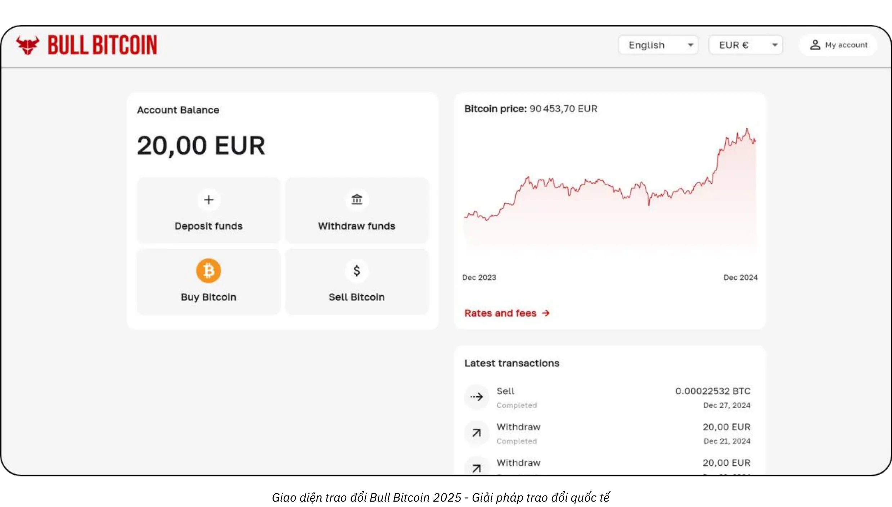

### Với giá nào?

Như đã đề cập trước đó, không chỉ không thể dự đoán giá Bitcoin trong tương lai mà giá còn rất biến động trong ngắn hạn. Theo truyền thống, một chiến lược đáng tin cậy là tích lũy dần theo các khoảng thời gian đều đặn và duy trì khoảng thời gian bốn năm trở lên.

### Bạn nên mua bao nhiêu?

Ngược với trực giác, có lẽ tốt nhất là bắt đầu bằng một khoản mua rất nhỏ mà không cần suy nghĩ quá nhiều. Một khoản tiền nhỏ (như một trăm euro hoặc đô la) sẽ không gây hại nghiêm trọng cho bạn, và trải nghiệm thực tế sẽ dạy cho bạn nhiều hơn, nhanh hơn nhiều so với bất kỳ lượng sách nào.

Như đã nêu trước đó, chỉ nên đầu tư lượng thanh khoản nhàn rỗi mà bạn sẽ không cần trong nhiều năm là điều khôn ngoan. Bất kỳ chiến lược nào không được hiểu rõ đều có nguy cơ khiến bạn rơi vào tình thế khó khăn nếu đột nhiên bạn cần rút tiền mặt vào thời điểm không thích hợp.

Ngoài việc bắt đầu nhỏ, việc áp dụng chiến lược phân bổ có tính toán cũng rất hữu ích cho các quỹ dự phòng doanh nghiệp. Ở một thái cực , một số công ty, như MicroStrategy, đã thực hiện một cách tiếp cận cực đoan bằng cách cam kết một phần đáng kể quỹ dự phòng của họ vào Bitcoin, phản ánh niềm tin mạnh mẽ của tổ chức. Ngược lại, một chiến lược bảo thủ hơn và có thể được cho là hợp lý hơn có thể bao gồm việc phân bổ khoảng 5% quỹ dự phòng doanh nghiệp vào Bitcoin, cân bằng giữa lợi nhuận tiềm năng với quản lý rủi ro và yêu cầu thanh khoản.

Hãy hình dung việc này như một thước đo, từ mức phơi nhiễm tối thiểu, đảm bảo công ty duy trì đủ thanh khoản cho nhu cầu hoạt động, đến lập trường tích cực nhằm tận dụng sự gia tăng giá trị dài hạn dự kiến của Bitcoin. Trong khi phân bổ tích cực có thể mang lại lợi nhuận cao hơn, thì phân bổ khiêm tốn giúp giảm thiểu sự biến động, đảm bảo nền tảng tài chính của công ty vẫn an toàn trong khi vẫn được hưởng lợi từ tiềm năng sáng tạo của Bitcoin trong hoạt động quỹ dự phòng của mình.

### Tần suất như thế nào?

Không quy tắc cứng nhắc nào. Cố gắng tính thời điểm thị trường bằng cách săn lùng “điểm giảm” có thể kém hiệu quả và căng thẳng hơn so với việc chỉ mua vào theo các khoảng thời gian đều đặn. Ngay cả những nhà đầu tư dày dạn kinh nghiệm đôi khi cũng sai. “Vào hết” cùng một lúc có thể là con dao hai lưỡi.

Trên thực tế, tiềm năng tăng giá của Bitcoin là như vậy, ngay cả khi bạn chỉ bắt đầu sau vài năm, bạn vẫn có thể thấy được lợi nhuận dài hạn. Đúng là có khả năng các biến động giá lớn sẽ giảm dần theo thời gian. Tuy nhiên, là một loại tiền tệ giảm phát, Bitcoin được thiết kế để lưu trữ giá trị hiệu quả và phản ánh mức tăng năng suất của người dùng. Để đưa ra một phép so sánh: chúng ta hiện đang trong "giai đoạn ra mắt" của Bitcoin, một loại tiền tệ đang được hình thành và chưa ai biết giá trị hợp lý của nó. Sau đó, có lẽ là 20 hoặc 40 năm nữa, khi nó ở trong "giai đoạn du ngoạn" ổn định, nó có thể cực kỳ ổn định và tăng trưởng đều đặn cùng với mức tăng năng suất của xã hội.

Ngành bất động sản thường lặp lại rằng “luôn là thời điểm thích hợp để mua”, nhưng quên rằng nếu bất động sản mất đi chức năng lưu trữ giá trị—cái có thể dịch chuyển sang các tài sản như Bitcoin—giá có thể quay trở lại gần hơn với giá trị tiện ích của chúng (nơi ở). Ngược lại, Bitcoin không phục vụ mục đích nào khác ngoài việc lưu trữ giá trị, điều này có thể có nghĩa là “luôn là thời điểm thích hợp để mua”. Tương lai sẽ trả lời.

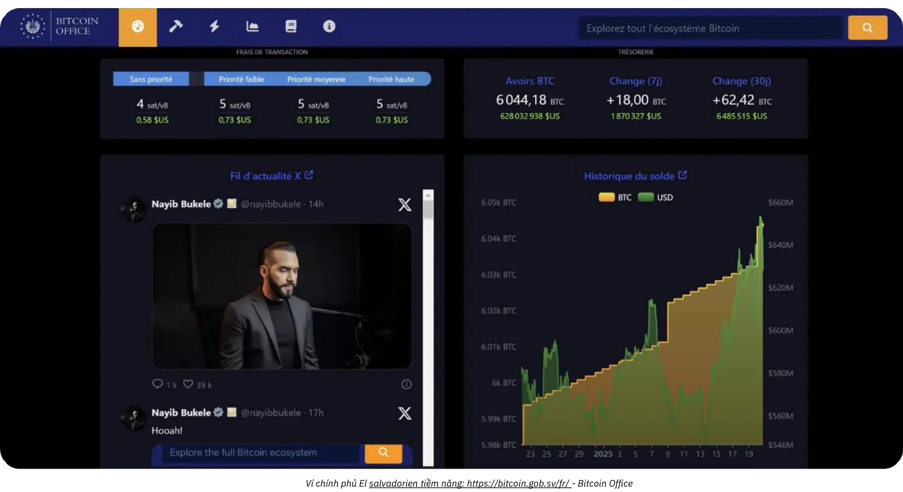

*Nguồn: [Bitcoin Office](https://bitcoin.gob.sv/)*

### Mua theo hình thức nào? (Phương pháp lưu ký)

Bạn không sở hữu Bitcoin về mặt vật lý. Thay vào đó, bạn nắm giữ một khóa mật mã cho phép bạn chuyển quyền sở hữu một số hoặc toàn bộ đơn vị tài khoản của mình sang một hoặc nhiều khóa mật mã khác. Tất cả những điều này diễn ra trên chuỗi khối Bitcoin, được sao chép trên hàng chục nghìn máy chủ trên toàn thế giới.

Khóa mật mã này là một số ngẫu nhiên cực lớn. Để đơn giản hóa trải nghiệm của người dùng, nó thường được biểu diễn dưới dạng một chuỗi gồm 12 hoặc 24 từ. Những từ này có thể được tải lên một thiết bị vật lý được gọi là "ví cứng". Tuy nhiên, hãy hiểu rằng bitcoin không "nằm bên trong" thiết bị này; nó chỉ đơn giản là một công cụ để ký mã hóa các giao dịch và phát chúng lên mạng. Điều thực sự quan trọng là 12 hoặc 24 từ, phải được giữ an toàn.

Điều này dẫn đến vấn đề lưu ký: giữ Bitcoin có nghĩa là giữ chìa khóa. Bạn tự giữ chúng hoặc bạn giao nhiệm vụ cho bên thứ ba. Ngoài ra còn có các giải pháp trung gian. Hãy cùng xem xét các tình huống phổ biến nhất:

- **Tự quản:**

Đây là tùy chọn được những người đam mê Bitcoin thực sự khuyên dùng vì nó phù hợp với thiết kế ban đầu của Bitcoin. Bạn hoạt động như ngân hàng của chính mình: không có nguy cơ bên thứ ba lừa đảo bạn, nhưng bạn có trách nhiệm bảo mật khóa. Bạn có toàn quyền truy cập vào tiền của mình 24/7. Trong bối cảnh kinh doanh, nếu nhiều người có thể cần giao dịch, bạn sẽ cần các công cụ và quy trình phù hợp để quản lý quyền truy cập và bảo mật.

- **Quyền lưu ký của bên thứ ba:**

Ví dụ, một sàn giao dịch hoặc dịch vụ mua có thể tạo tài khoản cho bạn, chuyển đổi tiền tệ truyền thống của bạn thành Bitcoin và giữ nó thay mặt bạn bằng hệ thống bảo mật của họ. Hầu hết các dịch vụ như vậy cho phép bạn rút bitcoin của mình vào ví mà chỉ mình bạn giữ chìa khóa. Cho đến khi bạn làm như vậy, bạn không thực sự sở hữu bitcoin; bạn dựa vào lời hứa trả lại của họ. Điều này liên quan đến việc cân bằng rủi ro bảo mật (của họ với của bạn) và rủi ro đối tác (họ có thể phá sản hoặc biến mất). Một số doanh nghiệp thấy điều này có thể chấp nhận được, mặc dù nhìn chung không được khuyến khích đối với việc lưu trữ dài hạn hoặc đối với 100% phân bổ của bạn. Các dịch vụ lưu ký cũng có thể tính phí lưu trữ.

- **“Bitcoin giấy” (Chứng chỉ quỹ-ETF hoặc ETP):**

Đây là các công cụ tài chính truyền thống đại diện cho các phần nhỏ của Bitcoin, sao chép hiệu suất giá của nó. Về mặt lý thuyết, tổ chức đứng sau sản phẩm này mua và nắm giữ Bitcoin cơ bản. Các khoản đóng góp và rút tiền của bạn được thực hiện bằng tiền tệ truyền thống (ví dụ: đô la hoặc euro), không phải bằng Bitcoin. Ngoại trừ một số sản phẩm nhất định cho phép rút tiền bằng Bitcoin thực tế (để tránh sự kiện chịu thuế ở một số khu vực pháp lý), các công cụ này liên quan đến phí quản lý hàng năm. Ở đây, bạn dựa vào tính bảo mật của tổ chức và phải đối mặt với rủi ro đối tác (ví dụ: nếu chính phủ quyết định tịch thu tất cả Bitcoin do tổ chức nắm giữ, như đã xảy ra với vàng vào năm 1933 theo Lệnh hành pháp 6102 của Mỹ). Lợi ích chính của chúng là dễ dàng truy cập vì chúng được phân phối thông qua các kênh tài chính truyền thống. Chúng bỏ qua nhu cầu bảo mật khóa mật mã nhưng không cung cấp bất kỳ thuộc tính vốn có nào của Bitcoin: bạn không thể sử dụng mạng Bitcoin 24/7 để di chuyển giá trị một cách tự do mà không được phép. Chúng chỉ sao chép hiệu suất tài chính, chứ không phải chức năng hoặc chủ quyền của chính Bitcoin.

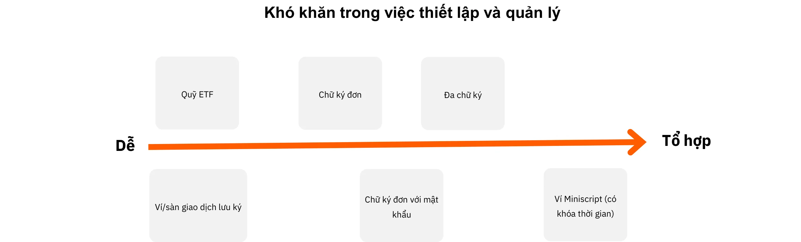

Ngoài ra, hình thức bạn nắm giữ Bitcoin có tác động đáng kể đến các biện pháp bảo mật cần thiết để bảo vệ quỹ dự phòng của công ty bạn. Cho dù bạn chọn tự lưu ký, sử dụng ví cứng chữ ký đơn hoặc đa chữ ký, v.v. để duy trì quyền kiểm soát trực tiếp đối với khóa của mình hay ủy quyền nhiệm vụ này cho các dịch vụ lưu ký của bên thứ ba hoặc ETF, thì mỗi tùy chọn đều có hồ sơ rủi ro riêng. Ví dụ, tự lưu ký cung cấp quyền truy cập đầy đủ nhưng đòi hỏi các giao thức bảo mật nội bộ nghiêm ngặt, trong khi các giải pháp của bên thứ ba giảm gánh nặng quản lý với cái giá phải trả là rủi ro đối tác. Để minh họa thêm cho sự khác biệt, biểu đồ này phác thảo mô hình bảo mật cho từng loại lưu ký, giúp bạn lựa chọn phương pháp phù hợp nhất với nhu cầu của tổ chức mình:

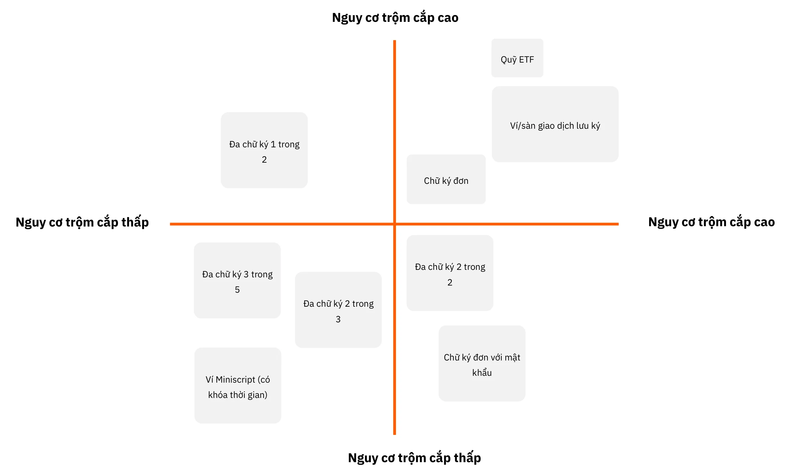

### Mua từ ai?

Nếu bạn chọn “Bitcoin giấy”, bạn sẽ chuyển sang các tổ chức tài chính như ngân hàng hoặc sàn giao dịch chứng khoán trực tuyến.

Nếu bạn chọn mua Bitcoin thực tế thông qua một thị trường (sàn giao dịch) hoặc một nhà môi giới, bạn sẽ có một số danh mục chính sau:

- **Nền tảng lớn quốc tế hoặc ngoài nước:**

Ví dụ bao gồm Kraken, Coinbase hoặc Binance, trước đây được nhiều cá nhân sử dụng. Một số người đã gặp phải sự cố và rất khó để đưa ra khuyến nghị rõ ràng. Một lời khuyên: nếu bạn sử dụng chúng, đừng để bitcoin của bạn ở đó lâu hơn mức cần thiết.

- **Nhà cung cấp dịch vụ được quản lý (Nhà cung cấp dịch vụ tài sản mã hóa đã đăng ký):**

Ví dụ, tại Pháp, các nền tảng như Paymium (sàn giao dịch) hoặc BullBitcoin (môi giới) được biết đến là có những người đam mê Bitcoin thực sự ở vị trí lãnh đạo và đã xây dựng được thành tích vững chắc. Tại Mỹ, bạn có các nhà cung cấp dịch vụ như River hoặc Swann. Nhìn chung, điều quan trọng là phải xem xét lai lịch của nhà cung cấp: danh tiếng, thành tích, mức độ phổ biến trong cộng đồng Bitcoin và liệu ban lãnh đạo của họ có phù hợp với các giá trị cốt lõi của Bitcoin hay không.

**Sàn giao dịch so với môi giới:**

- **Sàn giao dịch** cho phép bạn đặt lệnh mua ở mức giá bạn chọn, nhưng bạn phải đợi lệnh thực hiện cho đến khi giá thị trường và người bán trùng khớp.
- **Người môi giới** cung cấp cho bạn mức giá cố định và có thể hoàn tất giao dịch nhanh hơn.

Ngoài phí và tốc độ thực hiện - những yếu tố không mấy quan trọng nếu bạn nghĩ đến dài hạn (nhiều năm) - một doanh nghiệp cũng nên cân nhắc:

- **Giao diện người dùng:** Nền tảng này có thân thiện với người dùng không?
- **Tính năng kế toán:** Tối thiểu phải có khả năng xuất lịch sử giao dịch ở định dạng .CSV.
- **Quyền lưu ký và bảo mật:** Nền tảng có giữ bitcoin thay mặt bạn không hay chuyển quyền sở hữu cho bạn? Thiết lập bảo mật của họ như thế nào? Họ có "khóa rút tiền" hay các hạn chế rút tiền khác không?
- **Hỗ trợ khách hàng:** Chất lượng, khả năng phản hồi và hỗ trợ cá nhân hóa, đặc biệt là khi bạn mới bắt đầu.
- **Uy tín và đạo đức:** Độ tin cậy và các giá trị của nền tảng.
- **Hỗ trợ mua hàng định kỳ:** Nếu bạn có kế hoạch tích lũy Bitcoin theo thời gian bằng các giao dịch mua theo lịch trình.

# Giải pháp thanh toán Bitcoin phù hợp cho mọi doanh nghiệp

<partId>b2c8af88-6bfc-49b1-ad84-4c292c713b55</partId>

## Chấp nhận bitcoin là phương thức thanh toán

<chapterId>99af1203-bc84-4acc-9780-f733e7998335</chapterId>

Đầu tiên, điều quan trọng là phải nhận thức rằng Bitcoin là một sự đột phá có quy mô tương tự như internet.

Vào những ngày đầu, mạng internet giúp loại bỏ các trung gian khỏi các kênh truyền thông, và sau đó cơ sở hạ tầng này dẫn đến vô số ứng dụng trước đây không thể tưởng tượng được. Ngày nay, doanh nghiệp nào không có sự hiện diện trực tuyến?

Bitcoin là một cơ sở hạ tầng của sự tin cậy, ứng dụng đầu tiên của nó là loại bỏ các trung gian khỏi việc lưu trữ và trao đổi giá trị—tiền. Các ứng dụng khác hiện không thể tưởng tượng được sẽ xuất hiện trên cơ sở hạ tầng này. Sự hiện diện ban đầu của bạn ở đây tương đương với việc có một trang web: một cổng thông tin đến các khoản thanh toán ngang hàng và trao đổi giá trị.

Bây giờ, hãy xem xét góc nhìn của một doanh nghiệp thực tế mà hoạt động cốt lõi không liên quan gì đến Bitcoin. Tại sao họ lại chọn chấp nhận thanh toán bằng Bitcoin?

- **Xây dựng quỹ dự phòng Bitcoin:**

Xem bài viết trước của chúng tôi về việc mua Bitcoin. Cho dù là do niềm tin hay là chiến lược đa dạng hóa, một số chuyên gia vẫn chọn chấp nhận thanh toán bằng Bitcoin. Một số người tham gia Bitcoin cho rằng một công ty càng ít thiên về tài chính—tức là không có thời gian cũng như công cụ để tham gia vào các hoạt động tài chính phức tạp—**thì việc doanh nghiệp đó được thanh toán bằng hình thức tiền tệ tốt nhất hiện có** càng trở nên quan trọng. Bằng cách đó, nó cân bằng sân chơi, cho phép ngay cả các doanh nghiệp nhỏ, hạn chế về thời gian cũng có thể bảo toàn giá trị mà không bị cuốn vào các trò chơi tài chính.

- **Tiếp cận nhóm dân số mới:**

Số lượng người dùng Bitcoin đang tăng lên và họ có sức mua đáng kể. Họ sẽ tự nhiên hướng đến các doanh nghiệp chấp nhận loại tiền tệ của họ. Hơn nữa, vì đây là loại tiền tệ phổ biến đầu tiên trên internet, qua đó bạn cũng có thể thu hút khách hàng quốc tế.

- **Tăng sự hiện diện:**

Bằng cách liệt kê doanh nghiệp của bạn trên các nền tảng như BTCmap.org chẳng hạn. Chỉ có một số ít doanh nghiệp hiện chấp nhận Bitcoin, vì vậy việc truyền miệng sẽ có lợi cho bạn. Nó cũng giúp bạn khác biệt so với các đối thủ cạnh tranh.

- **Phí thấp hơn:**

Thanh toán Bitcoin tức thời diễn ra qua mạng Lightning. **Phí rất nhỏ và do người mua trả**. Không phí thiết bị đầu cuối thanh toán, không có lỗi ủy quyền thanh toán và không có gian lận. Để so sánh, hệ thống thanh toán hiện tại (thẻ, thiết bị đầu cuối, chuyển khoản, PSP, v.v.) có chi phí khoảng 2,2 nghìn tỷ đô la mỗi năm trên toàn cầu. Thêm vào đó là các khoản hoàn trả và gian lận, và tổng cộng, gần một phần mười tương đương với GDP của Mỹ bị "tỉa" từ các doanh nghiệp sản xuất trên toàn thế giới chỉ để chuyển giá trị. Bất kể doanh nghiệp của bạn là gì, phí tài chính là gánh nặng cần được tối ưu hóa và trong một số trường hợp, phí cao có thể kìm hãm một số mô hình kinh doanh nhất định.

- **Tự do và Không cần xin phép, 24/7:**

Không cần phải xin phép để sử dụng Bitcoin. Bất kỳ ai cũng có thể tham gia vào nền kinh tế trong vòng vài phút bằng ứng dụng điện thoại thông minh. Bạn có thể gửi hoặc nhận thanh toán từ bất kỳ ai—cá nhân hoặc doanh nghiệp—bất kỳ lúc nào, không có ràng buộc về lịch trình hoặc sự chậm trễ.

- **Tận dụng lợi thế của mạng lưới Bitcoin:**

Bạn không bắt buộc phải giữ các khoản thanh toán của mình dưới dạng Bitcoin—đặc biệt là nếu bạn cần thanh toán cho nhà cung cấp hoặc chuyển VAT. Một số dịch vụ nhất định có thể chuyển đổi toàn bộ hoặc một phần các khoản thanh toán Bitcoin của bạn sang loại tiền tệ bạn chọn (ví dụ: euro sang IBAN của bạn) với một khoản phí. Trong trường hợp này, lợi ích của việc chấp nhận Bitcoin có thể nằm ở việc thu hút người dùng mới hoặc ở những lợi thế vốn có của Bitcoin (chẳng hạn như phí thấp hơn, hoạt động 24/7 và không có rủi ro gian lận hoặc hoàn tiền).

### Bạn nên chọn giải pháp thanh toán nào?

Bắt đầu chấp nhận thanh toán bằng Bitcoin khá dễ dàng. Để chọn giải pháp phù hợp, hãy cân nhắc các đặc điểm của giao dịch bạn xử lý: số tiền thanh toán trung bình, tần suất giao dịch và bạn sẽ chấp nhận thanh toán ở nơi thực tế, trực tuyến hay cả hai.

Tư duy của bạn với tư cách là một thương gia cũng rất quan trọng. Bạn đang chạy một thử nghiệm đơn giản hay bạn dự đoán Bitcoin sẽ trở thành nguồn doanh thu đáng kể và định kỳ? Nếu là trường hợp sau, bạn sẽ cần thiết lập một hệ thống mạnh mẽ, toàn diện và có thể tùy chỉnh.

Đừng quên xem xét các vai trò khác nhau của nhân viên và vị trí của họ. Trong mọi trường hợp, hãy nhớ rằng bạn phải có khả năng cung cấp tất cả thông tin cần thiết cho kế toán viên của mình và hợp lý hóa quy trình kế toán.

Để đơn giản hóa quá trình ra quyết định, chúng tôi đã xác định bốn hồ sơ kinh doanh riêng biệt. Các bảng sau đây phân tích các đặc điểm chính và giải pháp thanh toán được đề xuất cho từng hồ sơ.

### Hồ sơ doanh nghiệp

#### Hồ sơ 1 – Khởi đầu

| Thuộc tính | Khởi đầu |
| -------------------------------- | ---------------------------------------------------------------------------------------------------------------------------------------------------------- |
| **Nhận định** | "thử phương thức thanh toán vật lý đầu tiên", "nhận tiền hoa hồng cho nội dung trực tuyến của tôi", "nhắm đến doanh thu rất nhỏ" |
| **Tần suất giao dịch** | "giao dịch đầu tiên để học", "thỉnh thoảng nhận thanh toán" |
| **Ví dụ về loại hình doanh nghiệp** | Nền kinh tế sáng tạo (người sáng tạo nội dung, blog, bài viết, v.v.), tiền hoa hồng thỉnh thoảng, bán sản phẩm trực tiếp một lần, hiệp hội, sự kiện một lần |
| **Hình thức thanh toán** | Thông thường là vài xu đến vài euro/đô la; dưới ~300 euro/đô la cho mỗi mặt hàng |
| **Độ phức tạp của việc cài đặt** | Không |
| **Ví dụ về giải pháp được đề xuất** | Ví lưu ký Lightning như Wallet of Satoshi hoặc ví không lưu ký như Phoenix |
| **Giao diện cho người bán** | Ví Bitcoin Lightning đơn giản: ứng dụng trên điện thoại di động |
| **Giao diện cho khách hàng** | Mã thanh toán QR Bitcoin, được quét qua ví cá nhân của khách hàng |
| **Phí** | Khách hàng trả phí Bitcoin Lightning cộng với bất kỳ phí ứng dụng nào được áp dụng |
| **Thiết bị bán hàng** | Ứng dụng điện thoại thông minh miễn phí hoặc tùy chọn cho thiết bị đầu cuối vật lý (ví dụ: Bitcoinize) |
| **Quản trị và vai trò** | Quản lý ứng dụng đơn lẻ; phân biệt vai trò tối thiểu |
| **Báo cáo kế toán** | Danh sách lịch sử giao dịch cơ bản |
| **API** | Không |

#### Hồ sơ 2 – Thiết yếu

| Thuộc tính | Thiết yếu |
| -------------------------------- | ---------------------------------------------------------------------------------------------------------------------------------------------------------- |
| **Nhận định** | "Tôi chấp nhận Bitcoin trong doanh nghiệp của mình nhưng không mong đợi số lượng giao dịch lớn" |
| **Tần suất giao dịch** | Ít giao dịch mỗi tháng |
| **Ví dụ về loại hình doanh nghiệp** | Quán bar, nhà hàng, bán sản phẩm tươi sống hoặc sản phẩm có nguồn gốc trực tiếp, nhiều cửa hàng thuộc một chủ sở hữu, nền kinh tế sáng tạo dành cho nghệ sĩ |
| **Hình thức thanh toán** | Nói chung dao động từ vài euro/đô la đến vài trăm cho mỗi mặt hàng; dưới ~300 cho mỗi mặt hàng và dưới ~3.000 mỗi tháng |
| **Độ phức tạp của cài đặt** | Tối thiểu (ứng dụng di động) |
| **Ví dụ về giải pháp được đề xuất** | Swiss Bitcoin Pay |
| **Giao diện cho người bán** | Ví Bitcoin Lightning đơn giản: ứng dụng trên điện thoại di động; lập hóa đơn đơn giản với thông tin chi tiết tối thiểu |
| **Giao diện cho khách hàng** | Mã thanh toán QR Bitcoin, được quét qua ví cá nhân của khách hàng |
| **Phí** | Thông thường là <1% khi gửi đến địa chỉ Bitcoin và <1,5% khi chuyển đổi sang tiền pháp định |
| **Thiết bị bán hàng** | Ứng dụng điện thoại thông minh miễn phí hoặc tùy chọn cho thiết bị đầu cuối vật lý (ví dụ: Bitcoinize) |
| **Quản trị và vai trò** | Tùy chọn cho vai trò chỉ bán hàng dành cho nhân viên; bảng điều khiển trực tuyến dành cho quản trị |
| **Báo cáo kế toán** | Xuất CSV với thông tin chi tiết giao dịch đầy đủ |
| **API** | Có |

#### Hồ sơ 3 – Chuyên nghiệp

| Thuộc tính | Chuyên nghiệp |
| -------------------------------- | ---------------------------------------------------------------------------------------------------------------------------------------------------------------------- |
| **Nhận định** | - Một phương thức thanh toán giống như bất kỳ phương thức nào khác dành cho thương mại điện tử của bạn - Hoặc quản lý chung cho một nhóm doanh nghiệp sẵn sàng cho số lượng giao dịch lớn hơn |
| **Tần suất giao dịch** | Nhiều giao dịch mỗi ngày |
| **Ví dụ về loại hình doanh nghiệp** | Các trang web thương mại điện tử có khối lượng vừa phải, thị trường nhỏ, nhóm cửa hàng thực (ví dụ: Click & Collect), hoạt động của SME |
| **Loại thanh toán** | Thường dao động từ vài euro/đô la đến vài trăm; không có giới hạn quy mô thanh toán cố định; dưới 250.000 đô la mỗi năm |
| **Độ phức tạp của cài đặt** | Từ nhẹ đến đầy đủ tính năng (lưu trữ cục bộ hoặc đám mây), thường yêu cầu một cửa hàng thương mại điện tử |
| **Ví dụ về giải pháp được đề xuất** | Máy chủ thanh toán BTC cho thương mại điện tử và/hoặc ngoài đời thực; ZapRite, Musqet hoặc PayWithFlash để thanh toán, Be-BOP tích hợp cho cửa hàng điện tử |
| **Giao diện thương mại** | Trang web (di động và máy tính để bàn) có chức năng chỉnh sửa hóa đơn, tùy chọn giỏ hàng và tạo nút thanh toán; lập hóa đơn tự động với tích hợp thương mại điện tử |
| **Giao diện cho khách hàng** | Mã thanh toán QR Bitcoin, được quét qua ví cá nhân của khách hàng |
| **Phí** | Kết hợp giữa dịch vụ lưu trữ/dịch vụ mã nguồn mở miễn phí và dịch vụ lưu trữ/dịch vụ Lightning trả phí; phí dịch vụ bao gồm phí Bitcoin Lightning và phí chuyển đổi <1,5% |
| **Thiết bị bán hàng** | Cửa hàng trang web, màn hình vật lý tùy chọn (ví dụ: iPad hiển thị trang web hoặc thiết bị đầu cuối Bitcoin) |
| **Quản trị và vai trò** | Cửa hàng có đầy đủ tính năng với nhiều vai trò quản trị; nhân viên và khách hàng tương tác với hệ thống |
| **Báo cáo kế toán** | Xuất CSV với thông tin chi tiết giao dịch đầy đủ |
| **API** | Có |

#### Hồ sơ 4 – Doanh nghiệp

| Thuộc tính | Doanh nghiệp |
| -------------------------------- | -------------------------------------------------------------------------------------------------------------------------------------------------------- |
| **Nhận định** | - Một phương thức thanh toán chiến lược cho doanh nghiệp - Với một số phát triển để tích hợp vào nền tảng dịch vụ theo các thông số kỹ thuật cụ thể |
| **Tần suất giao dịch** | Giao dịch không giới hạn, tần suất cao |
| **Ví dụ về loại hình doanh nghiệp** | Doanh nghiệp vừa, công ty dịch vụ CNTT, tập đoàn lớn, thị trường lớn |
| **Hình thức thanh toán** | Bất kỳ kích thước hoặc khối lượng nào |
| **Độ phức tạp của cài đặt** | Trung bình đến cao, tùy thuộc vào lựa chọn kiến trúc |
| **Ví dụ về giải pháp được đề xuất** | Kiến trúc hoặc sắp xếp tùy chỉnh các giải pháp lưu trữ SaaS, có khả năng sử dụng dịch vụ LSP (*Nhà cung cấp dịch vụ Lightning*) của bên thứ ba |
| **Giao diện cho người bán** | Giao diện front-end và back-end được tùy chỉnh hoàn toàn, tích hợp hoàn toàn vào quy trình và luồng công việc của doanh nghiệp |
| **Giao diện cho khách hàng** | Từ mã thanh toán QR Bitcoin đến giao diện người dùng hoàn toàn tùy chỉnh và/hoặc tích hợp API |
| **Phí** | Kết hợp giữa phí phát triển nội bộ và phí của bên thứ ba; khách hàng trả phí Bitcoin Lightning cộng với bất kỳ phí giao dịch nào từ nhà cung cấp dịch vụ |
| **Thiết bị bán hàng** | Các giải pháp được thiết kế riêng cho môi trường doanh nghiệp |
| **Quản trị và vai trò** | Các vai trò được tùy chỉnh hoàn toàn trong bán hàng, quản trị mạng, quản lý, kế toán và tài chính |
| **Báo cáo kế toán** | Báo cáo kế toán hoàn toàn tùy chỉnh |
| **API** | Có |

Trong các chương sau, chúng tôi sẽ trình bày chi tiết từng hồ sơ doanh nghiệp và các giải pháp phù hợp với từng doanh nghiệp.

## Khởi đầu

<chapterId>7edda53d-5b9f-432a-8493-115de8c94a67</chapterId>

Hồ sơ khởi đầu cơ bản được thiết kế cho các doanh nghiệp, người sáng tạo và cá nhân muốn khám phá các khoản thanh toán Bitcoin mà không cần cam kết nguồn lực hoặc chuyên môn đáng kể. Đây thường là những người xử lý một khối lượng giao dịch rất nhỏ (có thể là một vài mẹo, quyên góp hoặc bán hàng thỉnh thoảng) và tìm kiếm một giới thiệu đơn giản, nhẹ nhàng về hệ sinh thái mạng Bitcoin và Lightning. Giá trị chính của phương pháp khởi đầu cơ bản nằm ở thiết lập tối thiểu của nó: trong hầu hết các trường hợp, tất cả những gì cần thiết là một điện thoại thông minh hoặc máy tính bảng được trang bị ví tương thích với Lightning cơ bản.

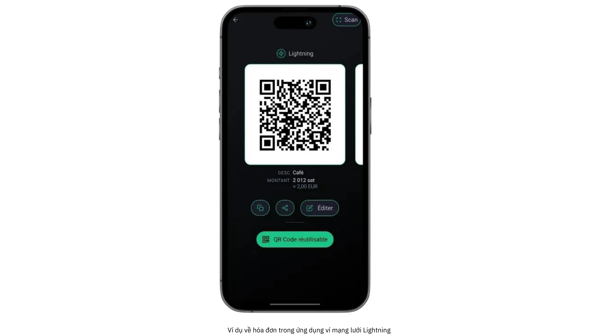

Một trong những đặc điểm nổi bật của hồ sơ này là tập trung vào các khoản thanh toán khối lượng thấp hiếm khi vượt quá vài trăm euro hoặc đô la mỗi tháng. Quy mô khiêm tốn này khiến nó trở thành lựa chọn tuyệt vời cho bất kỳ ai muốn thử nghiệm thị trường bằng Bitcoin, mà không có sự phức tạp vốn có trong các đợt triển khai khối lượng lớn hơn. Ngoài ra, nó cho phép học và thực hành ngay lập tức; vì có ít áp lực vận hành hơn và tiền cược nhỏ hơn, nên có thể hạn chế được sai sót và rút ra bài học nhanh chóng. Từ những nghệ sĩ bán đồ thủ công tại các hội chợ cuối tuần đến các nhóm phi lợi nhuận chấp nhận các khoản quyên góp một lần, người dùng trong danh mục này thường nhấn mạnh vào khả năng truy cập và tính dễ sử dụng hơn là các chức năng nâng cao.

Hai thiết lập ví phổ biến nhất cho giải pháp khởi đầu cơ bản liên quan đến việc quyết định giữa các giải pháp lưu ký và không lưu ký. Ví lưu ký (như Wallet of Satoshi hoặc Blink) cho phép dịch vụ của bên thứ ba quản lý khóa riêng và hoạt động phụ trợ, do đó giảm gánh nặng kỹ thuật cho người dùng. Sự sắp xếp này đặc biệt hấp dẫn đối với những người coi trọng sự tiện lợi hơn hết và muốn có quá trình tích hợp đơn giản nhất có thể. Mặt khác, ví Lightning không lưu ký (như Phoenix hoặc Breez) đặt khóa riêng và toàn quyền kiểm soát vào tay chủ doanh nghiệp, mang lại quyền tự chủ và quyền riêng tư lớn hơn để đổi lấy nỗ lực ban đầu nhiều hơn một chút. Trong cả hai trường hợp, giao diện hiện đại thường rất thân thiện với người dùng đến mức bất kỳ ai cũng có thể xử lý các tác vụ cần thiết (tạo mã QR, nhập số tiền thanh toán và xác nhận giao dịch) chỉ trong vài phút.

Mặc dù các mối lo ngại về bảo mật có vẻ ít nguy hại hơn khi các giao dịch nhỏ, nhưng việc áp dụng các biện pháp bảo vệ cơ bản vẫn rất quan trọng. Ngay cả một điện thoại thông minh hoặc máy tính bảng duy nhất được sử dụng để nhận thanh toán Bitcoin cũng phải được khóa bằng mật khẩu hoặc bảo mật sinh trắc học và các quy trình sao lưu (từ việc theo dõi thông tin đăng nhập cho ví lưu ký đến bảo vệ cụm từ mật mã cho ví không lưu ký) phải được thực hiện nghiêm túc. Các nhân viên xử lý giao dịch trong môi trường vật lý sẽ được hưởng lợi khi biết những điều cơ bản: cách mở ứng dụng, cách xuất trình mã QR cho khách hàng và cách kiểm tra xem khoản thanh toán đã thực sự đến hay chưa. 

Kế toán và báo cáo, mặc dù tương đối đơn giản trong giải pháp khởi đầu cơ bản, vẫn cần được cân nhắc cẩn thận. Mặc dù khối lượng giao dịch có thể tối thiểu, việc lưu giữ hồ sơ chính xác sẽ ngăn ngừa nhầm lẫn trong tương lai và giúp duy trì tính minh bạch trong trường hợp kiểm toán tài chính hoặc nộp thuế. Nhiều ứng dụng ví cho phép người dùng xuất lịch sử giao dịch cơ bản dưới định dạng CSV; đối với một doanh nghiệp nhỏ hoặc một doanh nhân độc thân, việc lưu các dữ liệu này thường xuyên có thể giúp đối chiếu tài khoản dễ dàng hơn nhiều. Theo dõi giá trị pháp định (fiat) gần đúng (ví dụ, bằng euro hoặc đô la) tại thời điểm nhận được mỗi giao dịch cũng là điều khôn ngoan. Vì giá Bitcoin có thể biến động nên việc có hồ sơ về tỷ giá chuyển đổi là vô cùng có giá trị đối với việc ghi sổ kế toán và tuân thủ thuế.

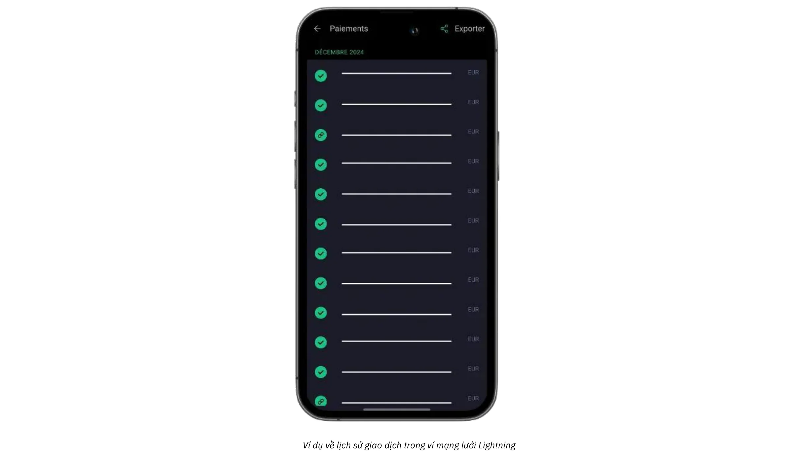

Đối với các doanh nghiệp muốn bổ sung cho các khoản thanh toán trực tiếp hoặc trực tiếp bằng các khoản quyên góp hoặc tiền hoa hồng trực tuyến, giờ đây việc tích hợp nút tiền hoa hồng Lightning hoặc tiện ích quyên góp vào trang web hoặc blog trở nên đơn giản. Các nền tảng như BTCPay Server cung cấp các chức năng thanh toán dễ cài đặt, trong khi một số dịch vụ trên mạng xã hội và phát trực tiếp đã hỗ trợ tiền hoa hồng qua địa chỉ Lightning. Do đó, ngay cả một doanh nghiệp khởi đầu cơ bản cũng có thể xây dựng được mạng lưới khách hàng khiêm tốn nhưng toàn cầu. Trong khi đó, những người không muốn nắm giữ Bitcoin trong thời gian dài có thể khám phá việc chuyển đổi một phần hoặc tự động sang tiền pháp định bằng cách sử dụng một số ví lưu ký hoặc dịch vụ của bên thứ ba. Mặc dù tùy chọn này liên quan đến các khoản phí bổ sung và các nghĩa vụ KYC có thể xảy ra, nhưng nó giúp các doanh nghiệp tránh được sự biến động của tỷ giá hối đoái và duy trì quy trình công việc tài chính hiện tại của họ với sự gián đoạn tối thiểu.

Một trường hợp sử dụng đơn giản minh họa cách tất cả các yếu tố này kết hợp với nhau. Hãy tưởng tượng một người thợ thủ công địa phương bán mứt tự làm tại một phiên chợ nông sản vào thứ Bảy. Được trang bị một chiếc điện thoại chạy ví lưu ký Lightning, họ đặt giá cho mỗi lọ bằng euro; khi khách hàng yêu cầu thanh toán bằng Bitcoin, người bán hàng sẽ nhanh chóng nhập số tiền pháp định tương ứng và ứng dụng sẽ tự động tính toán số sats phải trả. Mã QR kết quả được ví của khách hàng quét, thanh toán được giải quyết trong vài giây và người thợ thủ công ngay lập tức biết rằng giao dịch đã thành công. Vào cuối ngày, mọi chi tiết giao dịch có thể được xuất để lưu hồ sơ và số dư trong ngày có thể được gửi toàn bộ hoặc một phần đến một nền tảng trao đổi để chuyển đổi thành tiền pháp định.

Bằng cách cân bằng các công cụ thân thiện với người dùng, yêu cầu phần cứng tối thiểu và lưu trữ hồ sơ đơn giản, các giải pháp khởi đầu cơ bản cung cấp những điều cần thiết mà không làm quá tải các doanh nghiệp mới. Nếu khối lượng giao dịch tăng lên và các yêu cầu hoạt động của doanh nghiệp phát triển, việc nâng cấp lên các danh mục nâng cao hơn được nêu chi tiết trong chương tiếp theo sẽ trở thành một tiến trình tự nhiên.

Để biết hướng dẫn chi tiết về ví được đề xuất và thiết lập cơ bản, vui lòng tham khảo các hướng dẫn sau:

**Ví/nút LN tự lưu giữ:**

https://planb.network/tutorials/wallet/mobile/phoenix-0f681345-abff-4bdc-819c-4ae800129cdf
https://planb.network/tutorials/wallet/mobile/bitkit-a7224674-85c4-4045-9baf-37018d89550c
https://planb.network/tutorials/wallet/mobile/breez-46a6867b-c74b-45e7-869c-10a4e0263c06
https://planb.network/tutorials/wallet/mobile/blixt-04b319cf-8cbe-4027-b26f-840571f2244f
https://planb.network/tutorials/wallet/mobile/zeus-embedded-advanced-3e89603c-501d-439c-8691-d4a0d0de459b
**Ví LN lưu ký:**

https://planb.network/tutorials/wallet/mobile/wallet-of-satoshi-39149d86-e42b-4e8f-ae9f-7e061e7784f7

https://planb.network/tutorials/wallet/mobile/blink-7ea5f5a4-e728-4ff9-b3f9-cf20aa6fc2bd

## Thiết yếu

<chapterId>89be421f-f7df-4bcc-a9e4-df96e39ef249</chapterId>

Giải pháp Thiết yếu phù hợp với các doanh nghiệp vừa và nhỏ, có thể có nhân viên, muốn chấp nhận bitcoin dễ dàng và nhanh chóng mà không cần kiến thức kỹ thuật nâng cao, trong khi vẫn có hệ thống hoàn thiện và chuyên nghiệp hơn so với ví đơn giản. Thể loại này thường áp dụng cho các nhà hàng, quán cà phê, quán bar hoặc cửa hàng bán lẻ nhỏ chỉ thấy một số ít thanh toán Bitcoin mỗi tháng, nhưng mong muốn có một giao diện vừa đơn giản vừa đủ mạnh mẽ để xử lý các hoạt động hàng ngày mà không bị gián đoạn.

Không giống như giải pháp khởi đầu cơ bản, các doanh nghiệp Thiết yếu thường coi thanh toán Bitcoin là một phần luồng doanh thu liên tục của họ thay vì chỉ là một thử nghiệm. Họ vẫn hoạt động ở khối lượng giao dịch tương đối thấp, nhưng tần suất đủ để chủ sở hữu và nhân viên được hưởng lợi từ một hệ thống có cấu trúc và đáng tin cậy hơn. Đồng thời, giải pháp Thiết yếu vẫn tập trung vào tính đơn giản; trong khi nó cho phép sử dụng bảng điều khiển tiện dụng và quản lý vai trò hạn chế, nó không đòi hỏi các nguồn lực CNTT chuyên biệt hoặc tích hợp phức tạp.

Các khuyến nghị về công nghệ trong phân khúc này thường tập trung vào **Swiss Bitcoin Pay**, một giải pháp hợp lý hóa cho các thương gia để chấp nhận thanh toán Bitcoin dễ dàng. Nó có ứng dụng PoS thân thiện với người dùng, không yêu cầu chuyên môn kỹ thuật đối với nhân viên. Không giống như ví Bitcoin tiêu chuẩn, nó chỉ tập trung vào việc nhận thanh toán, cho phép nhân viên sử dụng thiết bị mà không có rủi ro bảo mật. Nhiều ứng dụng PoS có thể kết nối với cùng một tài khoản, có thể sử dụng trên máy tính bảng, máy tính tiền, điện thoại thông minh hoặc thông qua phiên bản web cho máy tính, hỗ trợ Android và iOS. Bạn cũng có thể tạo menu với các mặt hàng bạn bán và giá liên quan, cho phép nhân viên chỉ cần chọn một giỏ hàng các mặt hàng cho khách hàng trên PoS rồi tính tổng số tiền.

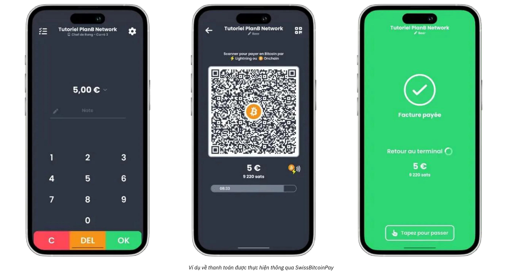

Thanh toán có thể được rút bằng Bitcoin đến một địa chỉ cụ thể hoặc chuyển đổi sang tiền pháp định và gửi vào tài khoản ngân hàng hàng ngày. Swiss Bitcoin Pay tự động hóa quy trình, xử lý các khoản thanh toán mạng Bitcoin và Lightning mà không cần can thiệp thủ công. Tiền được giữ tối đa 24 giờ trước khi chuyển. Mặc dù không hoàn toàn không lưu ký như BTCPay Server, nhưng nó cân bằng giữa sự tiện lợi và bảo mật, và không yêu cầu KYC.

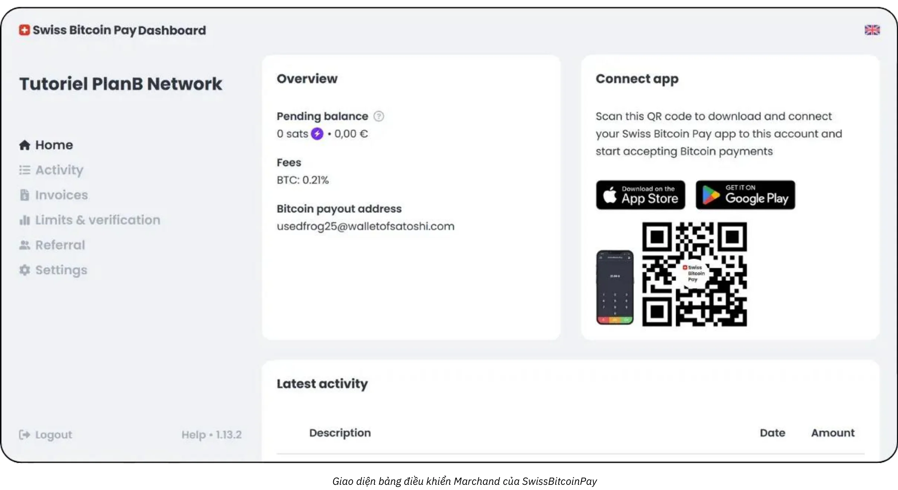

Phí cạnh tranh: 0,21% cho năm đầu tiên, sau đó là 1% cho thanh toán Bitcoin và 1,5% cho thanh toán chuyển đổi tiền pháp định, bao gồm cả chi phí giao dịch Bitcoin. Swiss Bitcoin Pay cung cấp giải pháp trung gian thiết thực giữa các giải pháp lưu ký như Open Node và các hệ thống tự lưu trữ phức tạp như BTCPay Server, ưu tiên sự đơn giản, bảo mật và tính tự chủ về tài chính.

Kiểu thiết lập này cho phép các doanh nghiệp trực tiếp tạo hóa đơn thanh toán nhanh chóng, trình bày mã QR cho khách hàng và chấp nhận các giao dịch Lightning hoặc trên chuỗi với ít ma sát nhất. Nhân viên chỉ cần định hướng ngắn gọn để xử lý các khoản thanh toán này, trong khi người quản lý có thể đăng nhập vào bảng điều khiển trực tuyến để đối chiếu doanh số hàng ngày và truy cập các báo cáo cơ bản. Việc có sẵn bảng điều khiển quản trị hợp lý cũng giúp các cơ sở nhỏ hơn theo dõi cả doanh thu tiền pháp định và tiền điện tử từ một giao diện duy nhất, do đó giảm thiểu sự nhầm lẫn và giảm thời gian dành cho việc ghi sổ thủ công.

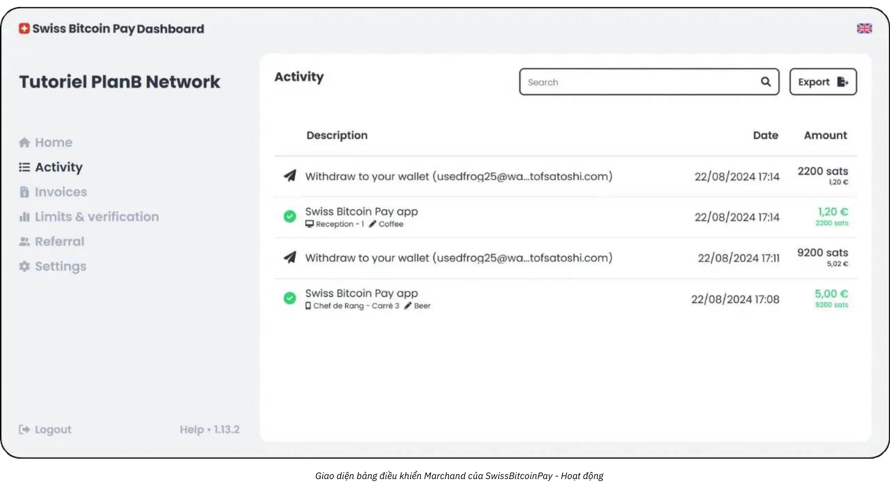

Một lợi ích quan trọng khác của phương pháp Thiết yếu là nhấn mạnh vào việc triển khai nhanh chóng và sự gián đoạn tối thiểu. Các giải pháp như Swiss Bitcoin Pay có thể được thiết lập trong vài giờ thay vì vài ngày hoặc vài tuần. Ví dụ, đối với chủ sở hữu hoặc người quản lý của một nhà hàng có lượng khách vừa phải, mục tiêu cuối cùng là tích hợp chấp nhận Bitcoin mà không gây ra sự chậm trễ tại quầy thanh toán hoặc sự nhầm lẫn giữa các nhân viên. Sau khi POS được cấu hình, người quản lý có thể chỉ cần cung cấp cho nhân viên hướng dẫn nhanh về cách hiển thị hóa đơn và xác minh rằng khoản thanh toán đã được xóa. Trong trường hợp tốt nhất, giao dịch của khách hàng được xác nhận gần như ngay lập tức thông qua mạng Lightning và bảng điều khiển quản trị của doanh nghiệp đồng thời đăng ký một khoản thanh toán mới theo thời gian thực.

Mặc dù giải pháp Thiết yếu không yêu cầu hệ thống kế toán phức tạp, nhưng vẫn nên duy trì hồ sơ giao dịch phù hợp. Các công cụ như Swiss Bitcoin Pay cung cấp chức năng xuất CSV, cho phép người quản lý nắm bắt giá trị tương đương tiền pháp định của mỗi lần bán Bitcoin và theo dõi giá trị này cùng với các nguồn thu nhập khác. Mức độ ghi chép này là đủ đối với hầu hết các doanh nghiệp nhỏ và hiểu biết cơ bản về tỷ giá hối đoái sẽ giúp ích cho việc nộp thuế và giám sát tài chính nói chung.

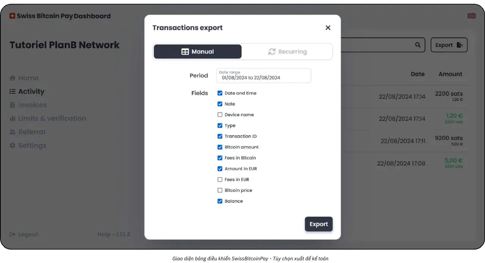

Giải pháp kết hợp phù hợp nhất với hồ sơ của bạn có thể là Swiss Bitcoin Pay:

https://planb.network/tutorials/business/point-of-sale/swiss-bitcoin-pay-2-a78b057e-ed11-47ac-860c-71019fcb451a
Một giải pháp dễ triển khai khác, nhưng có nhược điểm là phải bảo vệ 100%, là Open Node:

https://planb.network/tutorials/business/point-of-sale/open-node-e69a0c1c-47f7-4932-8494-e6f26c3c9784
Nếu bạn đã sẵn sàng để bắt tay vào làm và muốn kiểm soát toàn bộ quy trình, phần mềm BTCPay Server là một lựa chọn tuyệt vời. Tuy nhiên, nhược điểm lớn nhất của BTCPay Server là việc thiết lập và quản lý tốn nhiều thời gian và đòi hỏi một trình độ chuyên môn kỹ thuật nhất định, nhưng bạn có thể làm theo hướng dẫn của chúng tôi:

https://planb.network/tutorials/business/point-of-sale/btcpay-server-928eb01e-824b-4b57-a3e8-8727633beddc
Cuối cùng, như một giải pháp bổ sung cho các điểm bán hàng thực tế, bạn có thể cân nhắc thiết lập [Bitcoinize PoS](https://bitcoinize.com/).

## Chuyên nghiệp

<chapterId>4d5dfa50-c4d0-481c-ab95-1863a898750e</chapterId>

Giải pháp Chuyên nghiệp hướng đến các doanh nghiệp đã vượt qua các khoản thanh toán Bitcoin không thường xuyên hoặc khối lượng thấp và hiện đang tìm kiếm một cơ sở hạ tầng mạnh mẽ để xử lý nhiều giao dịch hàng ngày. Các công ty này thường hoạt động trên nhiều kênh (có thể là một địa điểm bán lẻ, một trang web thương mại điện tử chuyên dụng và thậm chí là bán hàng trên thiết bị di động) và do đó yêu cầu các giải pháp thanh toán có thể được tích hợp liền mạch vào quy trình làm việc hiện tại của họ. Trong nhiều trường hợp, các doanh nghiệp ở cấp độ này đã quản lý các hệ thống điểm bán hàng, nền tảng quản lý đơn hàng trực tuyến và các hoạt động văn phòng đòi hỏi một phương pháp tiếp cận đáng tin cậy và có thể mở rộng.

Một trong những đặc điểm xác định của thương gia chuyên nghiệp là nhu cầu về **các tính năng nâng cao** và **các giải pháp tùy chỉnh** duy trì hiệu quả ngay cả khi khối lượng giao dịch tăng lên. Không giống như người dùng Thiết yếu, những người có thể hài lòng với một công cụ hợp lý phù hợp với ứng dụng điện thoại thông minh, doanh nghiệp chuyên nghiệp thường yêu cầu các tính năng như tùy chỉnh hóa đơn chi tiết, bảng điều khiển báo cáo tinh vi và khả năng chỉ định nhiều vai trò quản trị.

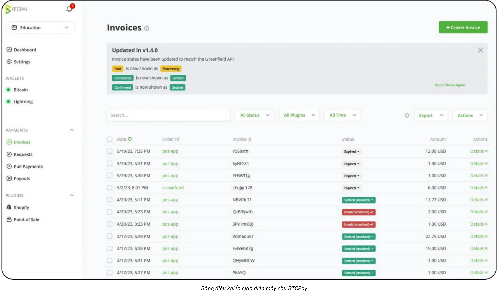

Ví dụ, một nhóm nhà hàng có thể có nhân viên chuyên lập hóa đơn và quản lý kho, trong khi một nhóm riêng giám sát danh sách sản phẩm và chiến dịch tiếp thị. Trong môi trường này, giải pháp thanh toán Bitcoin phải phù hợp chặt chẽ với các cấu trúc tổ chức hiện có này.

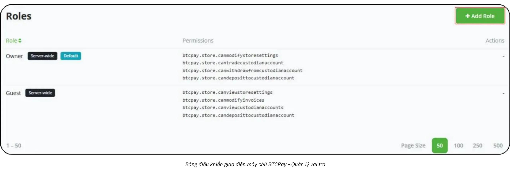

Về công nghệ và công cụ, các giải pháp như **BTC Pay Server** thường tạo thành cốt lõi của thiết lập Chuyên nghiệp. BTC Pay Server là một nền tảng mã nguồn mở có thể triển khai tại chỗ hoặc thông qua lưu trữ đám mây và cung cấp các tùy chọn tích hợp mở rộng cho các trang web và nền tảng thương mại điện tử. Bằng cách chạy phiên bản riêng của mình, các doanh nghiệp duy trì mức độ kiểm soát cao đối với mọi khía cạnh của luồng thanh toán, từ các trang thanh toán được tạo tự động đến các thông báo kích hoạt các quy trình nội bộ sau khi thanh toán được xác nhận.

Ngoài ra, các công cụ như [Zaprite](https://zaprite.com/) hoặc [Musqet](https://musqet.tech/) có thể tinh chỉnh thêm trải nghiệm thanh toán, cho phép tùy chỉnh chi tiết hơn (từ lựa chọn thương hiệu đến khả năng báo cáo phức tạp). Những người thích môi trường bán lẻ trực tuyến trọn gói có thể hướng đến [Be-BOP](https://be-bop.io/), một giải pháp cửa hàng điện tử được xây dựng để tạo điều kiện thuận lợi cho thanh toán Bitcoin mà không ảnh hưởng đến tính dễ sử dụng.

Việc triển khai các công nghệ này trong môi trường chuyên nghiệp có nghĩa là phải chú ý chặt chẽ đến **sự phức tạp trong hoạt động**. Các quy trình lập hóa đơn tự động, hiển thị đa tiền tệ và đồng bộ hóa với các hệ thống kiểm kê hiện có đều là những đặc điểm nổi bật của một nền tảng tích hợp tốt. Khả năng xuất dữ liệu giao dịch chính xác (cho dù là dữ liệu CSV, lệnh gọi API trực tiếp hay định dạng tùy chỉnh) giúp các doanh nghiệp điều hòa doanh số bitcoin với các luồng doanh thu khác một cách hiệu quả.

Quản lý bảo mật và vai trò là một cân nhắc quan trọng khác đối với người dùng Chuyên nghiệp. Khi các giao dịch Bitcoin hàng ngày tích lũy, việc kiểm soát quyền truy cập vào các chức năng quản trị trở thành biện pháp giảm thiểu rủi ro thiết yếu. Trong nhiều giải pháp, người quản trị có thể chỉ định các mức quyền khác nhau (có thể hạn chế một số nhân viên xem lịch sử giao dịch và tạo hóa đơn, trong khi cấp cho những người khác quyền quản lý hàng tồn kho hoặc cấu hình cài đặt toàn hệ thống...). Cấu trúc phân cấp này không chỉ bảo vệ dữ liệu nhạy cảm mà còn hợp lý hóa các hoạt động bằng cách làm rõ nhân viên nào có trách nhiệm đối với từng phân đoạn của cơ sở hạ tầng thanh toán.

Khi nói đến các ví dụ thực tế, hãy xem xét một cửa hàng thương mại điện tử cỡ trung chuyên về phụ kiện công nghệ. Công ty có thể tích hợp BTC Pay Server vào cửa hàng trực tuyến hiện có của mình, tự động tạo địa chỉ thanh toán Bitcoin trong quá trình thanh toán. Khách hàng hoàn tất giao dịch mua của mình bằng cách quét địa chỉ Lightning hoặc trên chuỗi và nền tảng của cửa hàng sẽ xác nhận thanh toán ngay lập tức. Đồng thời, một hệ thống nội bộ sẽ cập nhật trạng thái đơn hàng và kích hoạt thông báo giao hàng. Nhờ các tính năng báo cáo nâng cao, nhóm tài chính có thể dễ dàng xem xét doanh số bán Bitcoin hàng ngày, xuất sổ cái hợp nhất để kiểm toán và theo dõi giá trị của bất kỳ khoản nắm giữ BTC nào mà công ty quyết định giữ lại.

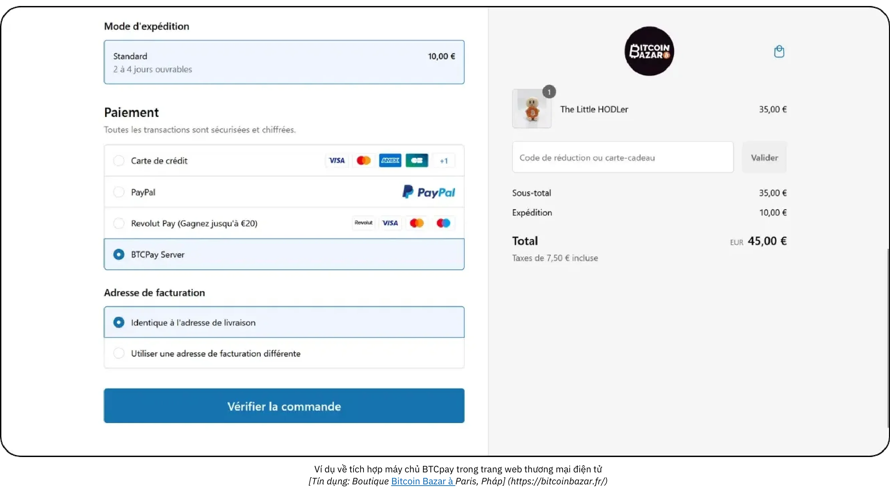

*[Nguồn: Cửa hàng Bitcoin Bazar ở Paris, Pháp.](https://bitcoinbazar.fr/)*

Để tìm hiểu sâu hơn về chi tiết triển khai và khám phá cấu hình thực tế của BTC Pay Server, hãy tham khảo khóa học sau:

https://planb.network/courses/6fc12131-e464-4515-9d3f-9255365d5fa1
## Doanh nghiệp

<chapterId>80fb2659-81ca-4a11-b492-72c7ae5774f9</chapterId>

Giải pháp Doanh nghiệp đứng đầu trong các triển khai thanh toán Bitcoin, được thiết kế riêng cho các tập đoàn lớn, các thị trường lớn và các doanh nghiệp đã thành lập đòi hỏi các giải pháp tùy chỉnh hoàn toàn. Không giống như các triển khai quy mô nhỏ hơn hoặc trung bình, các hoạt động cấp Enterprise tích hợp thanh toán Bitcoin vào một loạt các quy trình làm việc và hệ thống, từ các thiết bị điểm bán hàng tại chỗ đến các cửa hàng thương mại điện tử, nền tảng kế toán văn phòng và các khuôn khổ ERP tinh vi.

Ở quy mô này, mục tiêu bao quát không chỉ đơn thuần là chấp nhận Bitcoin, mà còn phải thực hiện theo cách **hoàn toàn phù hợp với các quy trình cốt lõi của tổ chức**. Sự phù hợp này có thể đòi hỏi phải phát triển phần mềm chuyên biệt, cho dù giải pháp được thiết kế riêng hoàn toàn hay được điều phối thông qua cơ sở hạ tầng dựa trên SaaS được hỗ trợ bởi *Nhà cung cấp dịch vụ Lightning* (LSP) của bên thứ ba. Các LSP như vậy có thể xử lý khối lượng giao dịch lớn và cấu hình mạng phức tạp vượt quá khả năng của các công cụ thông thường hơn có sẵn. Do đó, kiến trúc kết quả kết hợp một loạt các cân nhắc về kỹ thuật và kinh doanh, từ tích hợp theo API đến khả năng quản lý quỹ dự phòng tiên tiến.

Trong bối cảnh doanh nghiệp, tính phức tạp của hoạt động trở nên đặc biệt rõ rệt. Một tập đoàn lớn có thể cần phải bố trí nhiều phòng ban (bán hàng, tiếp thị, kỹ sư phần mềm, tài chính và kế toán), mỗi phòng ban có trách nhiệm và yêu cầu dữ liệu riêng biệt. Trong trường hợp này, nền tảng thanh toán Bitcoin phải cung cấp khả năng quản lý vai trò cực kỳ chi tiết, cho phép mỗi phòng ban truy cập chính xác các chức năng có liên quan đến nhiệm vụ của họ trong khi vẫn duy trì quyền kiểm soát chặt chẽ đối với bảo mật và tính toàn vẹn của dữ liệu. Khả năng tùy chỉnh quy trình công việc cũng quan trọng không kém: ví dụ, thanh toán đến có thể kích hoạt các bản cập nhật trong hệ thống kiểm kê, gửi thông báo tự động cho người quản lý bán hàng và cập nhật các mục nhập sổ cái cho nhóm tài chính, tất cả đều theo thời gian thực. Bản thân các thiết bị tại điểm bán hàng thường được thiết kế riêng cho môi trường doanh nghiệp, với giao diện phần mềm tùy chỉnh phù hợp với nhu cầu về thương hiệu và hoạt động của công ty.

**Bảo mật** là tối quan trọng đối với các doanh nghiệp quy mô lớn. Khối lượng giao dịch lớn và số lượng Bitcoin có khả năng lớn đòi hỏi một cơ sở hạ tầng mạnh mẽ có khả năng chống lại các cuộc tấn công độc hại hoặc các mối đe dọa nội gián. Các biện pháp thực hành tốt nhất thường bao gồm nhiều chữ ký với cấu hình quỹ dự phòng khóa thời gian, cơ sở mã được kiểm toán cẩn thận và tuân thủ nghiêm ngặt các khuôn khổ quy định có liên quan. Hơn nữa, việc tuân thủ các quy định tài chính trong nước và quốc tế có thể là một phần không thể thiếu để bảo vệ danh tiếng và giấy phép hoạt động của công ty.

**Phát triển tùy chỉnh** liên quan đến việc tạo hoặc tích hợp giải pháp thanh toán Bitcoin cấp doanh nghiệp không chỉ giới hạn ở việc mã hóa một vài tính năng ứng dụng. Nó thường đòi hỏi thiết kế kiến trúc, giao thức thử nghiệm kỹ lưỡng và triển khai có cấu trúc có thể trải dài qua nhiều giai đoạn (chương trình thí điểm ban đầu, thử nghiệm trên thị trường hạn chế và cuối cùng triển khai toàn cầu).

Về mặt kế toán, các giao dịch tần suất cao đòi hỏi **xuất dữ liệu được tùy chỉnh hoàn toàn** và đôi khi là đồng bộ hóa theo thời gian thực với phần mềm tài chính doanh nghiệp. Các doanh nghiệp lớn có thể dựa vào các giải pháp lập kế hoạch nguồn lực doanh nghiệp (ERP) như SAP hoặc Oracle, mà đến lượt mình, phải giao tiếp liền mạch với dữ liệu thanh toán Bitcoin. Để tạo điều kiện thuận lợi cho việc này, các API của nền tảng được chọn phải tinh vi và linh hoạt, cho phép các nhóm CNTT tự do tạo bảng thông tin báo cáo tùy chỉnh, triển khai các quy trình đối chiếu tự động và tạo các bản tóm tắt tài chính hàng ngày hoặc thậm chí hàng giờ.

Một kịch bản Doanh nghiệp điển hình có thể liên quan đến một thị trường thương mại điện tử lớn chào đón hàng nghìn giao dịch mỗi ngày. Ngoài việc chỉ liệt kê Bitcoin là một tùy chọn thanh toán, thị trường này có thể tùy chỉnh mọi khía cạnh của trải nghiệm người dùng, từ cách luồng thanh toán Bitcoin xuất hiện trên trang web dành cho khách hàng cho đến cách hoàn lại tiền, hoàn trả hoặc giải quyết tranh chấp được quản lý ở phía sau. Một nhóm kỹ sư phần mềm chuyên dụng, hợp tác với các phòng tài chính và pháp lý, sẽ giám sát hoạt động bảo trì liên tục, các bản vá bảo mật và cập nhật tuân thủ. Nếu công ty chọn giữ lại một phần doanh thu Bitcoin của mình, một hệ thống quỹ dự phòng nội bộ sẽ theo dõi lượng bitcoin nắm giữ của công ty cùng với dự trữ tiền tệ truyền thống.

Để đảm bảo triển khai suôn sẻ và an toàn ở cấp độ Doanh nghiệp, hầu hết các tổ chức đều thuê các nhà cung cấp dịch vụ chuyên biệt hoặc nhóm phát triển nội bộ có kinh nghiệm về tích hợp mạng Bitcoin và Lightning. Quy trình này thường bắt đầu bằng đánh giá nhu cầu chuyên sâu (bao gồm cơ sở hạ tầng kỹ thuật, yêu cầu tuân thủ và hành trình mong muốn của khách hàng) sau đó là thiết kế kiến trúc có thể xử lý thông lượng lớn. Tùy thuộc vào phạm vi dự án, bạn có thể dựa vào một nhóm đa ngành bao gồm các kiểm soát viên tài chính, nhà phân tích bảo mật và kỹ sư phần mềm. Ngoài ra, ngày càng có nhiều công ty tư vấn chuyên biệt có thể hướng dẫn bạn từ khái niệm ban đầu đến triển khai cuối cùng, hỗ trợ các nhiệm vụ như đánh giá các giải pháp lưu trữ SaaS, cấu hình *Nhà cung cấp dịch vụ Lightning* và tùy chỉnh giao diện người dùng. Bằng cách hợp tác với các chuyên gia trong lĩnh vực, các doanh nghiệp có thể giảm thiểu rủi ro liên quan đến việc triển khai thanh toán quy mô lớn và đạt được giải pháp không chỉ mạnh mẽ và tuân thủ mà còn đủ linh hoạt để đáp ứng nhu cầu tăng trưởng trong tương lai.

## Giải pháp thanh toán Bitcoin: Các lựa chọn và xu hướng

<chapterId>59ff43a1-98e2-4a81-af3e-9654bdd60952</chapterId>

Luôn có sự đánh đổi giữa từng loại giải pháp. Ví dụ, trong "giai đoạn dùng thử" ban đầu, các ví được đề xuất được thiết kế đơn giản nhất có thể về mặt giao diện người dùng, nhưng chúng được lưu trữ (**lưu ký**). Điều này có nghĩa là tiền được nhà cung cấp ứng dụng kiểm soát. Tuy nhiên, bản chất của Bitcoin khuyến khích người dùng chuyển sang sở hữu toàn bộ tiền (**tự lưu ký**). Trong trường hợp này, bạn nên nâng cấp lên loại tiếp theo ngay khi có giao dịch bán đầu tiên—về cơ bản là sau khi xác nhận rằng bạn có khách hàng sẵn sàng thanh toán bằng Bitcoin.

Một trong những lợi thế chính của Bitcoin là khả năng di chuyển tiền theo ý muốn, giúp bạn **rất dễ dàng chuyển đổi nhà cung cấp** hoặc các thành phần của giải pháp. Ngoài ra, tất cả các ứng dụng và giải pháp đều đang phát triển nhanh chóng. Ví dụ, hãy xem xét việc Bitcoin hóa, hiện cung cấp thiết bị đầu cuối tại Điểm bán hàng (POS) vật lý tích hợp với nhiều ứng dụng trên thị trường, một giải pháp không tồn tại chỉ vài tháng trước.

### Bạn đang tìm giải pháp để tạo cửa hàng chấp nhận cả thanh toán truyền thống và Bitcoin?

Nếu bạn bắt đầu từ con số 0—không có cửa hàng, không có phần mềm quản lý sản phẩm và không có hệ thống điểm bán hàng (POS), bạn có một số lựa chọn:

- **Gia công ngoài:** Bạn có thể gia công ngoài việc tạo trang web có các tùy chọn mua sắm, sau đó thêm khả năng thanh toán bằng Bitcoin cùng với các giải pháp truyền thống trong cửa hàng.
- **Giải pháp đơn giản:** Ngoài ra, bạn có thể sử dụng các nền tảng như Accessing.app để tự thực hiện. Các lợi ích chính bao gồm:
    - Thiết lập cửa hàng trực tuyến hoặc thực tế một cách nhanh chóng và tiết kiệm.
    - Phù hợp cho các doanh nghiệp theo mùa, sự kiện, nhà hàng hoặc cửa hàng bán lẻ.
    - Xác định và quản lý sản phẩm cho cả bán hàng trực tiếp và trực tuyến.
    - Xử lý thanh toán bằng tiền pháp định (ví dụ: euro, đô la) thông qua tài khoản Stripe của bạn.
    - Xử lý thanh toán bằng Bitcoin thông qua tài khoản SwissBitcoinPay của bạn.

### Việc áp dụng thanh toán Lightning đang tiến triển như thế nào?

Mặc dù mạng Lightning cung cấp hiệu quả vượt trội và chi phí thấp hơn, nhưng việc áp dụng vẫn đang trong giai đoạn đầu. Thay vì tập trung vào những hạn chế hiện tại, chúng ta nên nhớ lại cách thức chuyển đổi cơ sở hạ tầng trong lịch sử diễn ra:

- Khi ô tô lần đầu tiên xuất hiện, không có đủ ô tô để xây dựng đường sá, và không đủ đường sá để sở hữu ô tô.
- Khi điện được đưa vào sử dụng, không có đủ khách hàng để xây dựng lưới điện, và cũng không đủ lưới điện để thu hút khách hàng.

Cơ sở hạ tầng mới thành công vì chúng hiệu quả hơn và những người áp dụng sớm tham gia vì họ thu được lợi ích hữu hình. Sau đây là những quan sát về mạng Lightning vào năm 2024:

- **Giao dịch cực nhanh:** Giao dịch thường diễn ra gần như tức thời (<500ms) và có tỷ lệ lỗi cực kỳ thấp.
- **Chuyên nghiệp hóa mạng lưới:** Các công ty lớn hơn đang đảm bảo tính thanh khoản trên toàn mạng lưới, trong khi các cá nhân phần lớn đã ngừng định tuyến thanh toán và hiện chủ yếu chạy "các máy chủ biên".
- **Trải nghiệm người dùng được cải thiện:** Các ứng dụng di động dành cho người dùng cá nhân đã được cải thiện đáng kể. Các tính năng như ghép nối, hóa đơn Bolt12 tĩnh và thanh toán không xác nhận (0-conf) được cung cấp rộng rãi, giúp tương tác liền mạch. Các vấn đề về khả năng tương tác (ví dụ: đóng bắt buộc) không còn là mối quan tâm lớn nữa.
- **Quản lý máy chủ và kênh nâng cao:** Cả giải pháp cá nhân và chuyên nghiệp đều đã được cải tiến. Ví dụ, BTC Pay Server hiện hỗ trợ nhiều plugin để kết nối với các nhà cung cấp khác (PSP, on/off ramp, v.v.). Các nhà cung cấp cơ sở hạ tầng mới, chẳng hạn như LightSpark và Alby Hub, cũng đang đi vào sản xuất.
- **Tăng trưởng áp dụng của nhà cung cấp dịch vụ:** Các nhà cung cấp dịch vụ như BitRefill đang báo cáo sự gia tăng trong thanh toán Bitcoin giữa những người dùng đang hoạt động của họ, với sự chuyển dịch rõ ràng sang Bitcoin so với Lightning. Ngoài ra, phí cực thấp của Lightning khiến nó trở thành lựa chọn ưa thích cho các khoản thanh toán nhỏ (trung bình 32 € cho mỗi giao dịch).

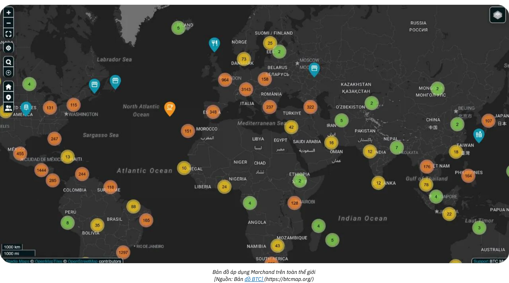

*[Nguồn: Bản đồ BTC](https://btcmap.org/)*

- **Số liệu mạng:** Tổng số kênh và Bitcoin bị khóa trên Lightning vẫn ổn định, với khoảng 20.000 nút, 5.200 BTC và 60.000 kênh. Tuy nhiên, điều này chỉ phản ánh một phần của mạng và cho thấy sự luân chuyển giữa những người tham gia, với ít cá nhân hơn và nhiều chuyên gia hơn tham gia.
- **Lightning như một cầu nối giữa các mạng:** Hiệu quả và tính khả dụng của mạng Lightning đã định vị nó như một cầu nối đến các mạng được kết nối khác (ví dụ: FediMint, Liquid, v.v.).

**Sự trở lại của ví**

Bitcoin và mạng Lightning đang hoàn thiện **cuộc cách mạng ví kỹ thuật số**. Các dịch vụ web mới hiện cho phép **giao dịch mà không cần tạo tài khoản**—ví của bạn trở thành danh tính của bạn! Với các giao thức như **Nostr Wallet Connect (NWC)** và **LN-URL-AUTH**, ví có thể xác thực người dùng một cách liền mạch và cho phép giao dịch mà không cần tài khoản truyền thống. Đã qua rồi cái thời mệt mỏi vì tài khoản cho các giao dịch mua hoặc đăng ký đơn giản. Không còn cần cung cấp thông tin cá nhân hoặc thông tin thanh toán có thể bị hack và rao bán trên dark web nữa, như chúng ta thường được nhắc nhở bởi các sự kiện gần đây.

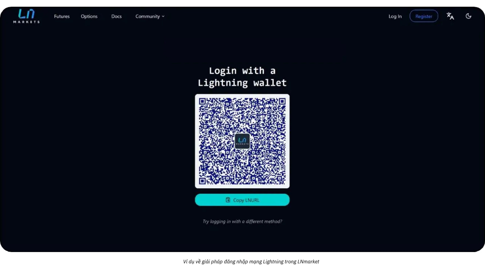

Các thương gia tương lai sẽ nắm bắt sự đổi mới này, mang đến cho khách hàng trải nghiệm an toàn hơn, liền mạch hơn (chỉ bằng một cú nhấp chuột) đồng thời tôn trọng quyền riêng tư của họ.

# Kế toán Bitcoin

<partId>d49d7595-a189-4e2b-bd60-c19e8e717aa2</partId>

## Nguyên tắc quan trọng chocho kế toán Bitcoin trong kinh doanh

<chapterId>84063061-ffdb-4b1f-b20b-588ffb146877</chapterId>

Nội dung sau đây chỉ dành cho mục đích giáo dục và không được coi là lời khuyên về tài chính hoặc kế toán. Các doanh nghiệp và cá nhân được khuyến khích mạnh mẽ tham khảo ý kiến của một kế toán viên đủ tiêu chuẩn hoặc chuyên gia pháp lý am hiểu về các quy định về tiền điện tử tại khu vực pháp lý cụ thể của họ trước khi thực thi bất kỳ hoạt động nào.

### Các khái niệm chính về kế toán Bitcoin

**Bất kỳ giao dịch Bitcoin nào cũng phải được ghi lại và có thể dẫn đến sự kiện chịu thuế**

Trên toàn cầu, Bitcoin thường được phân loại không phải là tiền tệ mà là tài sản mã hóa. Sự khác biệt này ảnh hưởng đáng kể đến cách Bitcoin được hạch toán trong các doanh nghiệp, ảnh hưởng đến nghĩa vụ thuế, báo cáo tài chính và các yêu cầu tuân thủ. Các doanh nghiệp chấp nhận Bitcoin làm phương thức thanh toán hoặc sử dụng nó như một công cụ quỹ dự phòng phải hiểu những sắc thái quy định này.

**Hậu quả quan trọng nhất** cần ghi nhớ là ở hầu hết các khu vực pháp lý, việc kiếm, bán, giao dịch hoặc sử dụng Bitcoin để mua hàng thường tạo ra **sự kiện chịu thuế** và thu nhập phải chịu thuế thu nhập từ vốn.

Một khía cạnh khác của kế toán Bitcoin là phân biệt giữa hai loại thu nhập từ vốn:

- **Lợi nhuận/lỗ chưa thực hiện:** Lợi nhuận hoặc lỗ chưa thực hiện dựa trên giá trị Bitcoin nắm giữ vào cuối kỳ kế toán.
- **Lợi nhuận/lỗ thực:** Lợi nhuận hoặc lỗ thực tế khi Bitcoin được bán hoặc trao đổi trong năm tài chính.

Những tính toán này phụ thuộc rất nhiều vào việc Bitcoin được giữ để đầu tư dài hạn hay sử dụng cho hoạt động ngắn hạn. Ngoài ra, các doanh nghiệp phải điều chỉnh các hoạt động kế toán của mình theo cơ cấu thuế địa phương, vì các quy định khác nhau đáng kể tùy theo quốc gia.

Kế toán cho các doanh nghiệp nắm giữ Bitcoin khá phức tạp vì mọi giao dịch phải được theo dõi tỉ mỉ để tính toán lợi nhuận hoặc lỗ đã thực hiện hoặc chưa thực hiện. Đối với mỗi lần bán hàng bạn thực hiện bằng cách chấp nhận Bitcoin làm hình thức thanh toán hoặc mỗi lần bạn mua hoặc bán Bitcoin, bạn cần ghi lại:

- thời gian cụ thể
- giá bán (bằng tiền pháp định)
- giá thành Bitcoin (mức giá ban đầu mà Bitcoin được mua).

Điều này sẽ cho phép bạn sau này có thể tính toán được sự khác biệt để xác định lãi hoặc lỗ.

**Ví dụ:** Một doanh nghiệp mua 1 BTC với giá 30.000 đô la. Sau đó, doanh nghiệp bán 0,5 BTC với giá 20.000 đô la. Để tính toán lợi nhuận hoặc lỗ, doanh nghiệp phải:

- Đã ghi lại thời gian, giá thành pháp định (fiat) và số lượng Bitcoin được mua
- Đã ghi lại thời gian, giá bán pháp định (fiat) và số lượng Bitcoin được bán
- Xác định giá bán Bitcoin: 0,5 BTC: 30.000 đô la ÷ 2 = 15.000 đô la.
- So sánh giá bán với giá vốn: 20.000 đô la (giá bán) - 15.000 đô la (giá vốn) = 5.000 đô la lợi nhuận.
- Cập nhật số lượng Bitcoin nắm giữ với giá vốn mới

Quá trình này phải được lặp lại cho mọi giao dịch và bản chất biến động của giá Bitcoin khiến việc lưu giữ hồ sơ trở nên phức tạp hơn.

**Bitcoin sẽ hoạt động như thế nào nếu là một loại tiền tệ?**

Nếu Bitcoin được coi là một loại tiền tệ, các doanh nghiệp sẽ quản lý nó như bất kỳ loại tiền tệ nào khác trong hệ thống kế toán của họ. Thay vì theo dõi cơ sở chi phí và lợi nhuận đã thực hiện/chưa thực hiện cho mỗi giao dịch, các khoản nắm giữ Bitcoin sẽ chỉ được ghi lại trong một tài khoản tiền tệ. Vào cuối mỗi kỳ báo cáo, giá trị của tất cả các khoản nắm giữ tiền tệ, bao gồm Bitcoin, sẽ được chuyển đổi sang loại tiền tệ kế toán (ví dụ: USD hoặc EUR) bằng tỷ giá hối đoái hiện tại.

**Ví dụ cập nhật nếu Bitcoin được công nhận là một loại tiền tệ:**

- Một doanh nghiệp nắm giữ 1 BTC khi Bitcoin có giá trị 30.000 đô la. Sau đó, doanh nghiệp sử dụng 0,5 BTC để thanh toán khi Bitcoin có giá trị 40.000 đô la.
- Doanh nghiệp **không** tính toán lợi nhuận hoặc lỗ đã thực hiện. Thay vào đó, giao dịch được ghi lại như sau:
    - Thanh toán: 20.000 đô la (0,5 BTC × 40.000 đô la).
    - Số dư Bitcoin còn lại: 0,5 BTC, hiện có giá trị 20.000 đô la (cập nhật theo tỷ giá hối đoái hiện tại).

**Lợi thế chính nếu Bitcoin được công nhận là một loại tiền tệ:**

- Doanh nghiệp chỉ cần điều chỉnh giá trị tiền pháp định tương đương với số Bitcoin nắm giữ theo định kỳ (ví dụ: đối với báo cáo hàng tháng hoặc hàng năm), giống như đối với đồng euro, đồng yên hoặc các loại tiền tệ khác mà doanh nghiệp nắm giữ.
- Điều này giúp loại bỏ nhu cầu theo dõi chi phí theo từng giao dịch và đơn giản hóa việc kế toán, đặc biệt là đối với các doanh nghiệp có giao dịch Bitcoin thường xuyên.

Cách tiếp cận này sẽ làm cho việc kế toán Bitcoin trở nên đơn giản hơn nhiều, giảm bớt gánh nặng hành chính và phù hợp với cách xử lý các loại tiền tệ khác, với giả định Bitcoin được công nhận đầy đủ về mặt pháp lý và quy định. Chúng ta vẫn chưa đạt được điều đó.

### Sự khác biệt giữa kế toán Bitcoin cá nhân và doanh nghiệp

Việc xử lý hợp pháp và kế toán đối với Bitcoin khác nhau đáng kể giữa cá nhân và tập đoàn. Đối với cá nhân, lợi nhuận từ giao dịch Bitcoin có thể phải chịu thuế thu nhập, thường ở mức cao hơn. Ngược lại, các tập đoàn có thể được hưởng lợi từ mức thuế doanh nghiệp thấp hơn nhưng phải tuân thủ các tiêu chuẩn sổ sách kế toán chặt chẽ hơn.

Đối với doanh nghiệp, Bitcoin có thể được phân loại thành nhiều loại tài khoản khác nhau tùy thuộc vào mục đích sử dụng:

- **Tài sản cố định:** Dành cho Bitcoin được nắm giữ dài hạn như một khoản đầu tư chiến lược.
- **Cổ phiếu:** Dành cho Bitcoin được sử dụng trong quy trình sản xuất (trường hợp sử dụng hiếm gặp, ví dụ như trường hợp của các nhà giao dịch chuyên nghiệp).
- **Tài khoản tiền mặt hoặc quỹ dự phòng:** Dành cho Bitcoin được nắm giữ như một tài sản thanh khoản, chủ yếu cho các giao dịch hoạt động hoặc quản lý quỹ dự phòng ngắn hạn.

Việc lựa chọn phân loại phụ thuộc vào hoạt động và chiến lược của công ty, có tác động đến báo cáo tài chính và nghĩa vụ thuế. Luôn kiểm tra các quy định của địa phương vì các phân loại này có thể khác nhau tùy theo quốc gia.

### Khung pháp lý

Việc công nhận và xử lý hợp pháp đối với Bitcoin khác nhau tùy theo khu vực pháp lý. Một số quốc gia, chẳng hạn như El Salvador, đã công nhận Bitcoin là tiền tệ hợp pháp, đơn giản hóa việc sử dụng trong các giao dịch nhưng lại làm phức tạp báo cáo tài chính quốc tế. Những quốc gia khác coi Bitcoin là tài sản mã hóa phải tuân theo các quy tắc thuế và kế toán cụ thể.

Ở hầu hết các quốc gia, Bitcoin được phân loại là tài sản mã hóa và việc xử lý nó được quản lý theo các tiêu chuẩn kế toán chung. Các doanh nghiệp phải hạch toán các giao dịch Bitcoin như sau:

- **Ghi nhận Lãi/Lỗ vốn:** Các doanh nghiệp phải hạch toán lãi hoặc lỗ thực tế vào kết quả tài chính của mình.
- **Đánh giá Lợi nhuận/Lỗ chưa thực hiện:** Lợi nhuận hoặc lỗ chưa thực hiện thường phải được báo cáo nhưng có thể không ảnh hưởng trực tiếp đến thu nhập chịu thuế.
- **Tuân thủ Chuẩn mực Kế toán:** Các doanh nghiệp phải tích hợp các giao dịch Bitcoin vào các thông lệ kế toán chuẩn, đảm bảo tính minh bạch và chính xác.

Cách tiếp cận kế toán Bitcoin khác nhau tùy theo khu vực địa lý:

- **Mỹ:** IRS phân loại Bitcoin là **tài sản, tương tự như cổ phiếu, trái phiếu hoặc bất động sản**. Phân loại này có nghĩa là bất kỳ giao dịch nào liên quan đến tiền điện tử, chẳng hạn như kiếm, bán, giao dịch hoặc thậm chí sử dụng nó để mua hàng, đều có thể tạo ra sự kiện chịu thuế và lợi nhuận phải chịu thuế thu nhập từ vốn.
- **Liên minh Châu Âu:** Các quốc gia thành viên thường coi Bitcoin là tài sản đầu cơ hơn là tiền tệ chức năng. Do đó, lợi nhuận thường phải chịu thuế thu nhập từ vốn.
- **Châu Á:** Các quốc gia như Singapore và Nhật Bản đã áp dụng các khuôn khổ pháp lý tiến bộ, đối xử thuận lợi với các giao dịch Bitcoin trong các bối cảnh cụ thể. Nhưng Bitcoin thường được tính là **tài sản vô hình** và được đo lường theo giá trị hợp lý tại ngày báo cáo, với các thay đổi được ghi nhận trong lãi hoặc lỗ.

Điều quan trọng là phải hiểu rõ các quy định tại quốc gia bạn hoạt động và điều chỉnh các hoạt động kế toán cho phù hợp.

### Những thách thức trong quá trình phát triển quy định

Tốc độ đổi mới tiền điện tử nhanh chóng thường vượt xa khuôn khổ pháp lý. Kể từ khi công nhận Bitcoin là tài sản mã hóa, các quy định toàn cầu đã có những cập nhật gia tăng, nhưng vẫn còn nhiều khoảng trống:

- **Thiếu tính pháp lý:** Rất ít vụ án pháp lý làm rõ các hoạt động kế toán cụ thể, còn nhiều chỗ cần diễn giải.
- **Các cuộc tranh luận đang diễn ra:** Các vấn đề như cách xử lý thuế đối với các khoản lỗ chưa thực hiện vẫn chưa được giải quyết ở nhiều khu vực pháp lý.
- **Sự phức tạp xuyên biên giới:** Các công ty hoạt động quốc tế phải đối mặt với thách thức trong việc điều hòa các chuẩn mực kế toán quốc gia khác nhau.

Bất chấp những thách thức này, lập trường chủ động của nhiều quốc gia cung cấp nền tảng vững chắc cho các doanh nghiệp đưa Bitcoin vào hoạt động của họ. Việc liên tục cập nhật và điều hòa quốc tế sẽ rất cần thiết để giải quyết những phức tạp mới nổi trong kế toán tiền điện tử.

### Phân loại Bitcoin trong Báo cáo tài chính

Phân loại Bitcoin trong báo cáo tài chính khác nhau tùy theo khu vực pháp lý và phụ thuộc vào mục đích sử dụng trong doanh nghiệp. Nhìn chung, Bitcoin được coi là tài sản mã hóa, tương tự như hàng tồn kho, đầu tư hoặc tiền tệ, nhưng có những đặc điểm riêng ảnh hưởng đến cách xử lý kế toán.

- **Tài sản kỹ thuật số hoặc tài sản vô hình**: Nhiều khu vực pháp lý, bao gồm Pháp và Liên minh châu Âu, phân loại Bitcoin là tài sản mã hóa hoặc vô hình thay vì tiền tệ hợp pháp. Phân loại này yêu cầu các doanh nghiệp phải hạch toán Bitcoin khác với tiền tệ pháp định (fiat).
- **Hàng tồn kho**: Nếu hoạt động cốt lõi của doanh nghiệp liên quan đến giao dịch Bitcoin, chẳng hạn như sàn giao dịch tiền điện tử hoặc môi giới, Bitcoin được phân loại là hàng tồn kho. Trong trường hợp này, định giá tuân theo các tiêu chuẩn kế toán hàng tồn kho.
- **Đầu tư tài chính**: Các công ty nắm giữ Bitcoin như một tài sản dài hạn có thể phân loại nó là một khoản đầu tư tài chính. Ví dụ, tại Mỹ, các doanh nghiệp có thể hạch toán Bitcoin theo hướng dẫn của Hội đồng Chuẩn mực Kế toán Tài chính (FASB), ghi nhận các khoản suy giảm khi giá trị thị trường giảm.

**Ý nghĩa của việc phân loại:**

- Các khoản nắm giữ dài hạn thường đòi hỏi phải kiểm tra khả năng suy giảm và khấu hao.
- Các hoạt động giao dịch hoặc liên quan đến thanh toán đòi hỏi phải theo dõi liên tục các khoản lãi và lỗ đã thực hiện và chưa thực hiện.

### Phương pháp định giá

Phương pháp định giá là các kỹ thuật kế toán được sử dụng để xác định cơ sở chi phí của Bitcoin, điều này rất cần thiết để tính toán chính xác các khoản lãi hoặc lỗ trong quá trình giao dịch. Nhìn chung, tốt nhất là **duy trì giá trị luôn được cập nhật của chi phí nắm giữ Bitcoin hiện tại** trong hệ thống kế toán. Điều này đảm bảo tính minh bạch, tuân thủ các quy định về thuế và ngăn ngừa tình trạng chậm trễ khi cần thực hiện các tính toán.

- **First In, First Out (FIFO)**: Phổ biến ở các khu vực pháp lý như Úc và Ấn Độ, phương pháp này định giá Bitcoin dựa trên chi phí mua sớm nhất. Điều này có thể trở nên khá **phức tạp** vì có thể cần theo dõi từng phần của bitcoin riêng biệt khi xảy ra giao dịch bán.
- **Chi phí trung bình theo trọng lượng (WAC)**: Thường được ưa chuộng cho các giao dịch khối lượng lớn do **tính đơn giản** của nó, như được thấy ở các quốc gia như Mỹ.

Rất khuyến khích duy trì sổ làm việc chi tiết theo dõi chi phí Bitcoin **từ thời điểm công ty bắt đầu mua Bitcoin hoặc chấp nhận Bitcoin làm phương thức thanh toán** để đảm bảo lưu giữ hồ sơ chính xác và có tổ chức. Chỉ riêng cân nhắc đó cũng nên được đặt lên hàng đầu khi lựa chọn giải pháp phần mềm để chấp nhận thanh toán bằng Bitcoin hoặc mua Bitcoin.

### Kế toán giao dịch trong bán lẻ và thương mại điện tử

Các nhà bán lẻ phải ghi lại tỷ giá hối đoái Bitcoin sang tiền pháp định (fiat) cho mỗi giao dịch. Ví dụ, ở nhiều quốc gia, các doanh nghiệp sử dụng tỷ giá hối đoái tại thời điểm bán hàng để tính thuế VAT.

Các doanh nghiệp phải đảm bảo rằng bất kỳ công cụ **Thanh toán** nào họ đang sử dụng đều có khả năng:

- tạo hóa đơn với số tiền pháp định địa phương (euro, đô la, bảng Anh), thuế GTGT hoặc các loại thuế địa phương khác, giá trị tương đương bằng bitcoin, ngày và giờ, tỷ giá hối đoái bitcoin và nguồn hối đoái, v.v.
- xuất tất cả các biên lai thanh toán, ít nhất ở định dạng .csv, với tất cả các thông tin trên, để kế toán có thể dễ dàng xử lý chúng
- lý tưởng nhất là phải có bản ghi lưu giữ giá trị cập nhật của cơ sở chi phí cho Bitcoin hiện tại được lưu giữ trong quỹ dự phòng

### Thách thức

- **Biến động**: Giá Bitcoin dao động đáng kể, gây khó khăn trong việc định giá tài sản nắm giữ và dự đoán kết quả tài chính trong tương lai.
- **Giám sát theo quy định**: Ở những quốc gia như Trung Quốc, tình trạng hạn chế của Bitcoin hạn chế việc sử dụng nó như một tài sản quỹ dự phòng.
- **Sự bất ổn về quy định**: Bối cảnh quy định liên tục thay đổi của Bitcoin thường khiến các doanh nghiệp rơi vào tình trạng bấp bênh. Ví dụ, những thay đổi về chính sách thuế, chẳng hạn như ở Ấn Độ hoặc Mỹ, có thể tác động đến hoạt động kế toán chỉ sau một đêm.
- **Rủi ro quản lý kém**: Phân loại không đúng cách hoặc không theo dõi các giao dịch Bitcoin có thể dẫn đến các vấn đề về tuân thủ, hình phạt hoặc tổn hại đến danh tiếng.
- **Rủi ro hợp pháp hóa**: Việc duy trì một phần đáng kể quỹ dự phòng của công ty bằng Bitcoin khiến doanh nghiệp có nguy cơ thua lỗ do giá giảm. Điều này có thể gây ra hậu quả nghiêm trọng, đặc biệt nếu những đợt giảm giá như vậy xảy ra khi thanh toán cho nhà cung cấp, nhân viên hoặc thuế đến hạn. Ngoài ra, chủ sở hữu công ty có thể phải chịu trách nhiệm, có thể dẫn đến tiền phạt hoặc các vấn đề pháp lý khác, chẳng hạn như cáo buộc sử dụng sai tài sản của công ty.

## Công cụ và phần mềm kế toán

<chapterId>e7b31be5-1176-4835-944e-3cba1b7040fa</chapterId>

Khi một công ty quyết định tích hợp Bitcoin vào kế toán của mình, nhiều công cụ và phần mềm chuyên dụng sẽ đơn giản hóa việc thu thập và xử lý dữ liệu. Trong số các giải pháp nổi tiếng nhất là [CoinTracker](https://www.cointracker.io/), [Waltio](https://www.waltio.com/), [Cryptio](https://cryptio.co/), [Koinly](https://koinly.io/), [TokenTax](https://tokentax.co/) và [ZenLedger](https://zenledger.io/). Các nền tảng này chủ yếu tập trung vào bốn khía cạnh:

- thu thập dữ liệu tự động;
- chuyển đổi dữ liệu này sang các định dạng tương thích với phần mềm kế toán tổng quát hơn (QuickBooks, Xero, ERP);
- tính toán nghĩa vụ thuế;
- phân loại giao dịch.

Chúng thường là sự bổ sung khôn ngoan cho các tổ chức lớn có nhiều ví và tài sản trên nhiều nền tảng hoặc sàn giao dịch khác nhau.

Tuy nhiên, một dữ liệu `.csv` đơn giản chứa lịch sử giao dịch thường đủ cho hầu hết các doanh nghiệp nhỏ. Mục tiêu là ghi lại ngày, số tiền, giá trị tương đương bằng euro/đô la và các địa chỉ Bitcoin có liên quan cho mỗi khoản thanh toán. Phần lớn các giải pháp thanh toán Bitcoin (BTC Pay Server, Swiss Bitcoin Pay, v.v.) hoặc nền tảng trao đổi (Bitfinex, Kraken, Coinbase, v.v.) đã cung cấp cơ chế xuất lịch sử giao dịch. Bằng cách cung cấp dữ liệu này cho một kế toán, có thể hợp lý hóa việc nhập dữ liệu và phân biệt rõ ràng các luồng đến và đi liên quan đến Bitcoin.

Đối với những người tự lưu giữ Bitcoin của mình, việc quản lý UTXO (*Đầu ra giao dịch chưa chi*) là một bước quan trọng. Việc gắn nhãn UTXO phù hợp giúp theo dõi nguồn gốc của từng phân đoạn BTC, phân biệt các giao dịch liên quan đến hoạt động chuyên môn với các giao dịch liên quan đến chi phí cá nhân và tạo điều kiện truy xuất nguồn gốc cho mục đích pháp lý hoặc thuế. Hầu hết các phần mềm ví Bitcoin tốt đều cho phép bạn nhập ví của mình bằng dữ liệu sao lưu (hoặc xpub, tùy thuộc vào thiết lập của bạn) và gắn thẻ UTXO dựa trên nguồn gốc hoặc đích đến của chúng. Để hỗ trợ bạn, đây là hướng dẫn đầy đủ dành riêng cho hoạt động này:

https://planb.network/tutorials/privacy/on-chain/utxo-labelling-d997f80f-8a96-45b5-8a4e-a3e1b7788c52
Cuối cùng, cho dù bạn là một thương gia nhỏ hay một doanh nghiệp lớn hơn, bạn đều có thể **thanh toán hóa đơn bằng Bitcoin**. Điều quan trọng là phải ghi chép giao dịch một cách chính xác. Nếu bạn thanh toán từ ví tự lưu ký, lý tưởng nhất là tạo một giao dịch ghi rõ số hóa đơn và mục đích thanh toán trong nhãn của bạn. Nếu bạn muốn thanh toán hóa đơn thông qua một sàn giao dịch, bạn cũng sẽ có tùy chọn xuất biên lai hoặc lịch sử giao dịch để đưa vào hồ sơ kế toán của mình. Tính minh bạch này sẽ đơn giản hóa việc theo dõi và báo cáo tất cả các hoạt động BTC của bạn.

## Ví dụ thực tế về kế toán Bitcoin

<chapterId>763f6f20-9181-495a-bf7d-b405899e65ec</chapterId>

### Trường hợp sử dụng 1: Cửa hàng bán lẻ chuyển đổi thanh toán bằng Bitcoin sang Euro

**Tình huống**: Một tiệm bánh nhỏ chấp nhận Bitcoin làm phương thức thanh toán nhưng ngay lập tức chuyển đổi toàn bộ Bitcoin nhận được sang euro để tránh rủi ro biến động giá tiền điện tử.

**Ví dụ**:

- **Tỷ giá chuyển đổi Bitcoin**: 1 Bitcoin = 40.000 €.
- **Giao dịch 1**: Khách hàng mua nhiều loại bánh ngọt với giá 20€.
    - Tương đương Bitcoin: (20 / 40.000) = 0,0005 Bitcoin = 50.000 Satoshi.
    - Phí chuyển đổi: 1,5% (20€ × 0,015) = 0,30€.
    - Số tiền nhận được thực tế: 20€ - 0,30€ = 19,70€.
- **Giao dịch 2**: Khách hàng mua cà phê với giá 5€.
    - Tương đương Bitcoin: (5 / 40.000) = 0,000125 Bitcoin = 12.500 Satoshi.
    - Phí chuyển đổi: 1,5% (5 € × 0,015) = 0,075 €.
    - Số tiền nhận được: 5€ - 0,075€ = 4,93€.

**Tóm tắt giao dịch**:

- **Tổng doanh số**: 25€.
- **Tổng phí**: 0,375 €.
- **Tổng số Euro nhận được**: 24.625 Euro.

**Ý nghĩa về mặt kế toán**:

- Ghi tổng doanh số (25€) là doanh thu.
- Trừ phí chuyển đổi (0,375 €) vào chi phí.
- Không khoản nắm giữ Bitcoin nào xuất hiện trên bảng cân đối kế toán vì tất cả số tiền đều được chuyển đổi ngay lập tức.

### Trường hợp sử dụng 2: Cửa hàng bán lẻ giữ lại 50% thanh toán bằng Bitcoin

**Kịch bản**: Cùng một tiệm bánh quyết định giữ lại 50% thanh toán bằng Bitcoin làm tài sản quỹ dự phòng, trong khi chuyển đổi 50% còn lại thành euro.

**Ví dụ**:

- **Tỷ giá chuyển đổi Bitcoin**: 1 Bitcoin = 40.000 €.
- **Giao dịch từ khách hàng**: Khách hàng mua bánh ngọt với giá 50€.
    - Tương đương Bitcoin: (50 / 40.000) = 0,00125 Bitcoin = 125.000 Satoshi.
    - Chuyển đổi (50%): 25 € giá trị Bitcoin = 0,000625 Bitcoin = 62.500 Satoshi.
        - Phí chuyển đổi: 1,5% (25€ × 0,015) = 0,375€.
        - Số tiền thực nhận được bằng euro: 25 euro - 0,375 euro = 24,625 euro.
    - Được giữ lại bằng Bitcoin (50%): 62.500 Satoshi = 0,000625 Bitcoin.

**Bản tóm tắt**:

- **Tổng doanh số**: 50 €.
- **Phí**: 0,375 €.
- **Tổng số Euro nhận được**: 24.625 €.
- **Số Bitcoin được giữ lại**: 62.500 Satoshi.

**Ý nghĩa về mặt kế toán**:

- Ghi tổng doanh số (50€) là doanh thu.
- Trừ phí chuyển đổi (0,375 €) vào chi phí.
- Số Bitcoin được giữ lại (62.500 Satoshi) xuất hiện trên bảng cân đối kế toán dưới dạng tài sản mã hóa.
- Lợi nhuận chưa thực hiện: nếu định giá bitcoin vào cuối năm tài chính cao hơn hoặc thấp hơn thì sẽ có khoản lãi hoặc lỗ chưa thực hiện được công bố trong các ghi chú ở báo cáo tài chính nhưng không được thực hiện dưới dạng thu nhập

### Trường hợp sử dụng 3: Dịch vụ chuyên nghiệp giữ lại Bitcoin để đầu tư dài hạn

**Tình huống**: Một nhà thiết kế đồ họa tự do chấp nhận Bitcoin làm phương thức thanh toán và giữ lại toàn bộ số Bitcoin nhận được như một khoản đầu tư dài hạn.

**Ví dụ**:

- **Tỷ giá quy đổi Bitcoin khi thanh toán**: 1 Bitcoin = 30.000 €.
- **Giao dịch từ khách hàng**: Khách hàng thanh toán cho các dịch vụ trị giá 3.000 €.
    - Tương đương Bitcoin: (3.000 / 30.000) = 0,1 Bitcoin = 10.000.000 Satoshi.
- **Đánh giá cuối năm**:
    - Tỷ giá chuyển đổi Bitcoin vào cuối năm: 1 Bitcoin = 35.000 €.
    - Định giá lượng Bitcoin nắm giữ: 0,1 Bitcoin × 35.000 € = 3.500 €.
    - Lợi nhuận chưa thực hiện: 3.500 € - 3.000 € = 500 €.

**Bản tóm tắt**:

- **Tổng doanh thu được ghi nhận**: 3.000 €.
- **Bitcoin nắm giữ**: 0,1 Bitcoin có giá trị 3.500 € trên bảng cân đối kế toán.
- **Lợi nhuận chưa thực hiện**: 500 € được công bố trong các ghi chú ở báo cáo tài chính nhưng không được thực hiện dưới dạng thu nhập.

**Ý nghĩa về mặt kế toán**:

- Doanh thu ghi nhận (3.000€) tại thời điểm dịch vụ.
- Bitcoin được giữ lại (0,1) có giá trị 3.500 € trên bảng cân đối kế toán.
- Lợi nhuận chưa thực hiện được theo dõi nhưng không được đưa vào báo cáo lãi/lỗ.

### Trường hợp sử dụng 4: Chủ doanh nghiệp bán 50% Bitcoin sau khi giá tăng

**Tình huống**: Một chủ doanh nghiệp thực hiện ba lần mua Bitcoin trong năm, nắm giữ Bitcoin như một tài sản và bán 50% sau khi giá tăng đáng kể.

**Ví dụ**:

- **Mua Bitcoin từ khách hàng**:
    - Mua 1: 2.000 € với giá 20.000 €/BTC = 0,1 Bitcoin = 10.000.000 Satoshi.
    - Mua lần 2: 3.000 € với giá 25.000 €/BTC = 0,12 Bitcoin = 12.000.000 Satoshi.
    - Mua lần 3: 5.000 € với giá 30.000 €/BTC = 0,1667 Bitcoin = 16.670.000 Satoshi.
    - **Tổng số Bitcoin được nắm giữ**: 0,3867 Bitcoin = 38.670.000 Satoshi.
- **Đánh giá cuối năm**:
    - Giá Bitcoin vào cuối năm: 40.000 €/BTC.
    - Tổng giá trị: 0,3867 Bitcoin × 40.000 € = 15.468 €.
    - Lợi nhuận chưa thực hiện: 15.468 € - 10.000 € (tổng chi phí) = 5.468 €.
- **Bán 50% Bitcoin**:
    - Số Bitcoin đã bán: 0,19335 Bitcoin.
    - Tiền thu được từ việc bán: 0,19335 Bitcoin × 40.000 € = 7.734 €.
    - Cơ sở chi phí (trung bình có trọng số):
        - Tổng chi phí: 2.000 € + 3.000 € + 5.000 € = 10.000 €.
        - Giá trung bình có trọng số: 10.000 € / 0,3867 Bitcoin = 25.850 €/BTC.
        - Chi phí bán Bitcoin: 0,19335 Bitcoin × 25.850 € = 4.999 €.
    - Lợi nhuận thực tế: 7.734 € - 4.999 € = 2.735 €.

**Bản tóm tắt**:

- **Số Bitcoin còn lại**: 0,19335 Bitcoin có giá trị là 7.734 € (ở mức 40.000 €/BTC).
- **Lợi nhuận thực hiện**: 2.735 € được bao gồm trong báo cáo thu nhập.
- **Lợi nhuận chưa thực hiện**: 5.468 € được tiết lộ trong các ghi chú ở báo cáo tài chính (bao gồm giá trị chưa thực hiện của số Bitcoin còn lại).

**Ý nghĩa về mặt kế toán**:

- Ghi lại số tiền bán được (7.734€) là thu nhập.
- Trừ đi chi phí bán Bitcoin (4.999 euro) để tính toán lợi nhuận thực tế.
- Số Bitcoin được giữ lại (0,19335) xuất hiện trên bảng cân đối kế toán có giá trị là 7.734 €.
- Lợi nhuận chưa thực hiện là 5.468 euro từ số Bitcoin được giữ lại được tiết lộ trong các ghi chú ở báo cáo tài chính.

# Phần cuối

<partId>f6ca8d01-a4f3-449b-ac9f-c5fba9a69178</partId>

## Đánh giá khóa học

<chapterId>0fe8c49e-b7f8-46f7-9c42-b8a9a99a7b46</chapterId>

<isCourseReview>true</isCourseReview>
## Bài thi cuối kỳ

<chapterId>40a0f18c-bdc9-45b2-8dea-15f7e574230e</chapterId>

<isCourseExam>true</isCourseExam>
## Phần kết luận

<chapterId>5503c23e-3a90-4a23-8d89-75e3cc1ee53e</chapterId>

<isCourseConclusion>true</isCourseConclusion>

