# 让您的公司踏上在比特币世界的旅程

了解比特币和闪电网络的实用功能，并探索它们如何像互联网一样**改变您的业务运营方式**。从数字资本到快速、廉价、可扩展的支付，**比特币为企业提供了广泛的用例**。

在本课程中，您将学习如何理解比特币作为一种全球性、通用性和互联网原生货币网络的概念。凭借其独特的基本特征，**比特币在许多方面优于传统的货币网络**。您将了解使用比特币进行传统金融操作（如价值储存和支付系统）的原因和做法。此外，本课程还涵盖获取和持有比特币的主题，包括相关的会计和财务要求，以及实施简单或大规模的比特币支付解决方案。

无论是**小企业还是大型公司**，将比特币融入日常运营都能使您的公司更具**弹性、生产力和竞争力**。每一家互联网公司都将成为一个以比特币为导向的公司，本课程将帮助您为此做好准备。最初的章节将重述了比特币的基本操作。所以，即使您是初学者，您还会获得继续学习所需的基础知识。无论是在学习BIZ101课程之前还是之后，学习关于中本聪发明的基础知识总是值得的。

+++
# 前言

<partId>326cf945-5d3f-4d86-8c3e-4d1c35959799</partId>

## 课程概述
<chapterId>1be42be9-4080-49f5-b5b2-6b531dd55f5f</chapterId>

欢迎来到 BIZ101 课程！

本综合培训课程是了解比特币和闪电网络如何彻底改变传统商业运作的入口，它将开启您公司的比特币之旅。本课程专为希望探索比特币作为全球互联网原生货币网络和强大的价值交换手段的实际能力的零售商、企业家、经理和企业决策者而创作。

在整个课程中，您将了解到使比特币和闪电网络具有独特变革性的基本原理。您将了解这些技术如何提供从数字资本存储到快速、廉价和可扩展支付等一系列用例，以及它们如何对传统货币和支付系统进行关键改进。BIZ101 课程将经济理论与现实世界的应用结合起来，阐明去中心化如何减少对中介的依赖，克服传统系统固有的局限性。

这门课程将从详细考察传统货币和支付机制开始，通过探讨货币如何奠定一个基础，作为一个实现贸易、储蓄和经济专业化的网络。随后，我们将深入探讨比特币背后的技术和闪电网络引入的创新，揭示它们在促进无缝、安全和近乎瞬时的交易方面作用，从而为各种规模的企业提供可行的方案。然后，我们将进入本课程的实践内容，从关于将比特币作为金库持有的部分到关于接受比特币作为支付手段的主题。

无论您代表小型企业还是大型公司，本课程都旨在让您掌握将比特币融入日常运营的知识，从而提高公司的应变能力、效率和竞争优势。随着比特币不断重塑经济格局，了解这些突破性技术不仅是一种选择，更是一种战略方面上的必要。请做好准备，通过深入充满洞见的内容、实际案例和战略性的指导，您将能够在不断演变的比特币世界中游刃有余且充分运用其潜力！

准备好探索企业的比特币世界了吗？让我们开始吧！

**注意**: 如果您在课程中遇到任何不熟悉的术语，请查阅[词汇表](https://planb.network/resources/glossary)获取定义。

# 货币、支付系统和比特币

<partId>d9bd0e21-8488-44e0-af55-6d0b934f83c2</partId>

## 传统货币

<chapterId>785e095c-6811-4ca2-ba46-fe38291432d4</chapterId>

### 货币作为网络

从根本上说，货币是实现高效价值交换的网络。

没有货币，个人必须依靠**以物易物**，这是一种直接交换商品或服务的系统。以物易物是不切实际的，因为有**双重需求难题（Double Coincidence of Wants)**，双方必须同时想要对方的物品。例如，如果一位有剩余小麦的农民想要鞋子，他们必须找到一位专门需要小麦的鞋匠。这种情况很少见且低效。此外，在以物易物的经济中，**假设有n种产品，那么需要约 n(n-1)/2 种物品汇率**，这就形成了一个非常复杂繁琐的系统。例如，有500种产品的经济系统就需要超过124,000种物品汇率。

货币作为中介简化了这一过程，它创建了**一个网络，将汇率数量减少成n种**，其相对于货币而言，每种产品都有一个汇率。这使得交易更加直接，**使人们能够在不需要相互需求的情况下进行商品和服务的交易**。农民不用直接用小麦换鞋，而是可以卖掉小麦换取货币，然后用货币买鞋或其他任何所需的物品。

货币作为一种网络的引入，不仅促进了贸易，还实现了**分工和专业化**。有了可靠的交换媒介，个人和社区不再需要生产他们所消费的每一种物品。相反，他们可以专注于自己最擅长的领域，提高效率和品质。农民可以专注于种植庄稼，鞋匠可以专门制作鞋类，建筑商可以专门建造房屋。这些专家可以通过货币交换他们的商品和服务，从彼此的专长中获益。这种专业化推动了**生产力和创新**，因为人们可以在各自的领域完善技能并开发新的方法。

货币的网络性质带来了额外的重大好处。**首先，比起置身网络之外，加入货币网络更加有利**。网络的共享标准为贸易带来了便利，**使人们即使相隔遥远也能协调经济活动**。例如，一个城市的商人可以使用同一种货币与另一个城市的买家进行货物贸易，从而促进大区域的经济增长与合作。

货币的另一个重要优势是它能够**允许延迟交换**。进行以物易物时，交易必是即时的；双方同时交换物品。而货币则可以**储蓄，个人可以储存价值以备将来使用**。这代表着经济规划、投资和财富积累的巨大前进，而这一切也能改善网络参与者的生活。

总之，货币是旨在高效转移价值的网络。它们克服了以物易物的局限性，使贸易更加简单，并且为协调和储蓄创造了新机会。就像任何网络一样，货币的价值取决于它的广泛采用和实用性--最终，最好的货币将胜出。

### 什么是好货币？

一种好的货币具备几个基本特性，使其能够有效地促进价值交换。以下是对每种特性的简明解释：

- **安全的**：货币必须防止失窃或未经授权的访问，确保用户可以放心地持有和转移货币。对于建立对系统的信任，安全因素至关重要。
- **防伪的**：货币必须难以或不可能伪造。这一点确保每个单位都是真实的，保持其价值，并防止假币进入流通造成通货膨胀。例如，在历史上，黄金不仅因其美丽和稀有而受到重视，还因为它极难生产。与纸币或数字条目不同，您无法“制造”黄金--它必须从地下开采。这种天然的稀缺性和生产难度使黄金保持了其作为值得信赖的价值存储和真实性基准的地位。
- **稀缺的**：良好的货币必须限量供应或控制发行。稀缺性可确保其保持长期价值，防止生产过剩而削弱购买力。例如，某些美洲土著部落使用珠子作为货币。最初，这些珠子很难生产，因而它可以保持其稀缺性和价值。然而，一旦欧洲商人开始大量生产珠子并使其充斥市场，珠子的稀缺性就消失了。随着供应量的激增，珠子失去了它的购买力，削弱了其作为可靠的价值储存手段的作用。
- **无权限的**：过去，金银币等货币通常由私人、地方当局或能够获得原材料的商人铸造。这一体系有时根据国王或统治者的协议或许可来运作。随着时间的推移，国王和政府将这一过程变得更加集中化，以加强对经济稳定、税收和货币体系的控制。其中一个著名的例子是**泰勒（thaler）**，这是一种银币，由当地矿工和当局于 1518 年在**约阿希姆斯塔尔山谷（Joachimsthal Valley，今天是位于捷克共和国的亚希莫夫）首次铸造**。“thaler”这一名称源自德语**Thal**，意为山谷。这些硬币以高品质的银而闻名，在欧洲广泛流通。随着时间的推移，这个词在语言和地理方面上不断演变，最终形成了“dollar”这一名称，并被美国作为其货币采用。

在现代的铸币税制度下，货币变成了完全“需经授权才能使用或发行”的事物，这意味着只有被授权的实体，如中央银行或国库，有资格铸造硬币或印制纸币。法律不再允许个人生产货币，从而确保了对货币发行和供应的中心化控制。

如今，铸币税制度的原则正受到比特币加密货币的挑战，因为比特币的运作不受中央控制。比特币是一种无需许可的系统，任何人都可以参与使用这种货币，而无需征得许可，也可以通过挖矿发行货币。这种去中心化消除了政府对货币发行的垄断，引发了人们对是否可能回到自由市场竞争货币体系的疑问。

- **记账单位**：货币应作为测量商品和服务价值的标准尺度。这一点会让交易更加简单，使各种交易的定价透明且一致。
- **耐用的**：货币必须经得起长期磨损。硬币或纸币等实物货币应能抵御损坏，而数字货币则必须保持安全存储且没有数据丢失的风险。
- **便于携带的**：一种货币必须便于运输和使用，能够进行远距离贸易。这可以通过实物便携性（轻便硬币或纸币）或数字转账系统来实现。
- **可分割的**：货币应可分割成较小的单位，以实现不同规模的交易。这种灵活性可确保货币既可适用于小额采购，也可适用于大规模贸易。
- **可互换的**：货币的所有单位都必须可以互换且具有相等的价值。例如，一张一元纸币必须等同于任何其他一元纸币。这种统一性确保了交易的公平性和简便性。
- **可识别的**：货币必须易于识别且受广泛信任。实体货币通过独特的设计和安全功能来实现这一点，而数字货币则可能依赖于验证协议。这将确保货币被广泛接受，并降低欺诈风险。

以上的特点使货币在促进贸易和储存经济价值方面实用、可靠、高效。

### 货币体系演变

**从硬币到纸币：提高效率和便携性**

从硬币到纸币的过渡标志着**便携性**和效率的显著提高。由黄金或银等贵金属制成的硬币因其内在价值而弥足珍贵。然而，硬币是沉重的，难以大量运输，而且容易磨损或被盗。纸币引入了一种轻便、标准和便携式的媒介，代表价值而不是包含价值，从而彻底改变了货币网络。这一创新使远距离贸易变得更加容易，并减少了使用实物商品作为货币所带来的物流挑战，从而扩大了经济规模。

纸币还增强了交易的可扩展性。与依赖有限的贵金属供应不同，经济体可以通过代用货币扩大其货币基础，代用货币最初由储备支持，后来由对发行机构的信任支持。这一变革促成了更为复杂且更优互联性的金融系统发展。

**从纸币到电子货币：扩大可及性并提升速度**

从纸币到电子货币的转变进一步改善了货币网络，提高了其可及性和速度。随着银行系统、信用卡和数字交易的兴起，货币不仅变得**便携**，而且几乎可以**瞬间**转移。有了电子转账，我们不再需要进行实物交换，使交易可以在几秒钟内跨越遥远的距离。

这种变化也让获取货币的途径更加普及化。电子银行和支付系统进一步消除了进入货币网路的挑战，使他们能够参与全球经济。电子货币的速度和便利扩大了贸易网络的覆盖率，促进了在纸质系统中不可实现的新商业模式的实施。

这些现代货币网络有一个明显的缺点：**它在管理货币供应方面缺乏可审计性和透明度**，往往会导致失控的通货膨胀，并使人们对中央集权系统失去信任。例如，仅在过去四年中，流通中的超过20%美元是印制出来的。这种持续发行更多货币的诱惑，其贬低当前持有者所持货币的价值，在很大程度上可归因于一个系统性缺陷：政治家们往往被激励避免做出艰难的预算决定，而宁可选择通过拖延问题的方式将挑战推迟到未来的政府。

**从集中货币到分散货币：增强信任和主权**

如今，比特币去中心化货币的出现代表了货币网络的下一次飞跃。传统的电子货币依赖于中央机构，如银行或政府，来管理和验证交易。这些系统虽然有效，但容易受到效率低下、审查制度和单点故障的影响。去中心化的货币通过**分配信任和消除中介**改善了这些网络的特性。这也意味着，由于没有授权步骤，资金可以**更快地**且**以更廉价**的方式流动。最后，没有人可以改变比特币的货币供应计划，因为它是由比特币网络强制执行的。

在去中心化系统中，交易由使用区块链技术的全球参与者网络进行验证，以确保安全性、透明度和弹性。这种结构最小化了欺诈的风险，减少了对中央机构的依赖，并赋予个人更大的财务控制权。去中心化的货币消除了地理和制度障碍，并带来了一个真正全球性和包容性的货币体系。

**货币网络的演变**

货币网络演变的每一个阶段都改善了其关键特性：便携性、可扩展性、可及性、速度、安全性和信任度。为了更好的携带性和效率，硬币逐渐被纸币取代。纸币演变为电子货币，实现了全球可及性和即时交易。现在，比特币正在重新塑造人们对信任与安全的理解，创建了一个开放且具有弹性的货币体系。这一历史进程彰显了人类不断创造更好的价值交换网络的动力，每一次的演进都在前一阶段的基础上发展，并超越了前一次的局限性。

最有可能获胜的就是最好的货币网络。

## 传统支付系统

<chapterId>1306196c-1e8a-454b-8e11-6887ecb3d8b4</chapterId>

支付系统是实现双方（通常是付款人（如消费者）和收款人（如企业））之间资金转移的方法和基础设施。这些交易可能发生在各种场合：消费者向当地商家付款，企业与供应商结算发票，甚至个人之间相互转账。为了了解支付系统，就要研究不同类型的支付方法、其特点以及在企业对消费者 (Business-to-Consumer，即B2C) 和企业对企业 (Business-to-Business，即B2B) 环节中的使用案例。

### 常见的付款方式

1. **现金：** 双方直接交换的实物货币。

2. **支票：** 指示银行从付款人账户向收款人支付指定金额的纸质文件。

3. **电汇：** 银行间的电子转账，通常用于大额和跨境支付。

4. **支付卡（信用卡或借记卡）：** 与卡网络连接的塑料卡或数字卡，允许从持卡人的银行账户（或信用额度）向商家转账。

5. **数字钱包和手机支付：** 存储支付信息的应用程序或设备（如 Apple Pay、微信支付、阿里支付、Paypal），其实现了快速且经常是非接触式的转账。

**在B2C和B2B的应用：**

- **B2C（企业对消费者）：**
    - 消费者经常使用现金、银行卡和数字钱包进行日常消费，如购买杂货、网购或打车等服务。
    - 对消费者而言，速度、便利和低费用往往是关键优先的事项。
    - 由于方便使用，非接触式支付和手机支付越来越受欢迎。
- **B2B（企业对企业）：**
    - 企业通常依靠电汇、支票和发票系统来支付供应商、结算大额账单或处理经常性付款。
    - 重点通常在于可追踪性、文档记录和处理较大交易值的能力。
    - 虽然卡片支付仍然存在，但由于其较高的费用和交易的限额，其使用频率相对较低。像一体化支付平台这样的数字解决方案正在兴起，以便简化和自动化应收/应付账款流程。

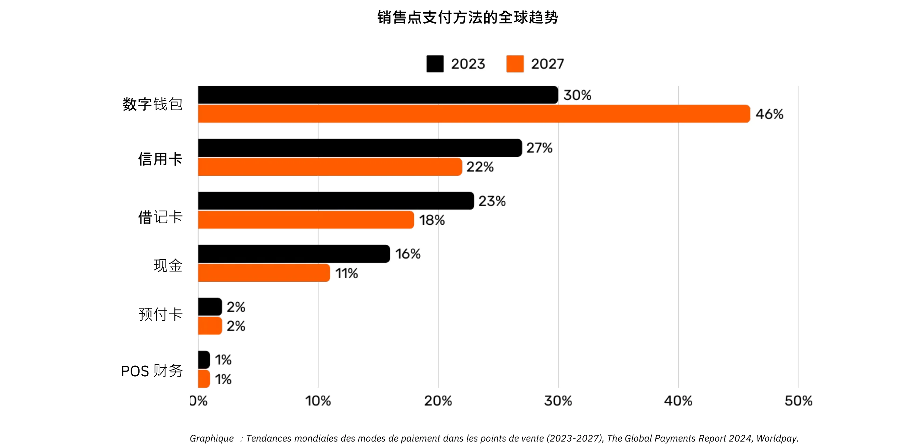

*图表：全球销售点 (Point-of-Sale，即PoS) 支付方式趋势（2023-2027 年），来源：《2024年全球支付报告》，Worldpay.*。

### 简单银行卡支付背后的复杂性

当顾客在商店使用信用卡时，PoS终端会读取信用卡，并将交易数据安全地传输给商家的收单银行。收单银行将此信息转发给相关的银行卡网络（如 Visa 卡或 Mastercard 卡），后者再将请求转发给发卡行，即为顾客提供信用卡的银行。发卡行将检查客户的账户或信用额度，并通过网络和收单银行发回授权，允许商户接受付款。

这项看似简单的交易实际上需要通过15个以上的步骤、涉及到7个中介机构，而且商家平均需要48小时至5天才能收到资金。在接下来的几天里，要进行清算和结算。银行卡网络汇总当天的交易，并负责收单行与发卡行之间的资金结算协调。中央银行确保这些银行之间结算的准确性和稳定性。最后，商户的银行账户会收到收单机构贷记的净额（减去费用），标志着交易已完成。

总体而言，这个过程错综复杂、耗时耗力且成本高昂，而它原本只是一个简单的价值转移过程。

### 支付方式对比

| 支付方式                     | 是否需要授权？                 | 交易批准时间（对商户而言）              | 结算速度（资金完全结算）                  | 交易不可逆性（撤销难易程度）                  | 中介数量                       | 收款人费用               |
| --------------------------- | ---------------------------- | ---------------------------------- | ------------------------------------- | ---------------------------------- | ---------------------------- | ---------------------------- |
| **现金**            | 否                          | 即时（直接交换）                   | 即时（无结算延迟）                     | 高（支付后不可撤销）                  | 无                           | 无                           |
| **支票**           | 是（银行清算）               | 存款时接受（不保证）               | 数天（支票清算过程）                   | 中（在清算前可能被拒绝/停止）         | 银行                         | **低到中等**（银行费用）       |
| **电汇**     | 是（通过银行或网络）              | 几小时内确认                      | 当天或次日（国内）                     | 高（通常一旦发送就不可逆）               | 银行、支付网络               | **中等**（固定的/按照特定的百分比）         |
| **支付卡**    | 是（发卡机构授权）           | 几秒到几分钟（授权代码）           | 数天（银行间结算）                     | 中（可能出现拒付）                   | 发卡行、收单行、卡网络       | **可变（交易金额的1-3%）**     |
| **数字钱包/手机支付** | 是（钱包提供商/银行）             | 几秒钟（即时确认）                   | 通常1-2天（取决于资金来源）            | 中（可能存在退款/争议）             | 银行、钱包运营商             | **低到中等（因情况而异）**     |

### 现有方案的限制

传统支付行业的年经济规模大约为2.2万亿美元，大约占美国GDP的十分之一，或相当于法国的GDP。由于货币作为许可网络运作，竞争有限，使得这一“服务”更像是对生产性经济征收的税收。除了它产生的成本负担外，还存在以下几种限制。

| 限制                         | 描述                                                                                                                                                                            | 影响                                                                                           |
| --------------------------- | ------------------------------------------------------------------------------------------------------------------------------------------------------------------------------- | -------------------------------------------------------------------------------------------- |
| 高昂的卡片费用              | 交换费（约0.3%）、网络费用（固定或0.3%-1%）、终端/PSP订阅费以及银行利润（0.5%-1.7%）加起来构成了巨大的成本——类似于对生产性部门征收的全球性“税收”，总计可达数万亿美元。 | 增加商户成本，减少利润率，并可能推高消费者价格。                                               |
| 非常缓慢的结算速度           | 资金结算可能需要长达5天的时间，减缓了商户方的资金流动和整体经济活动的速度。                                                                                                            | 延迟商户的流动性并降低了经济流通的速度。                                                      |
| 欺诈风险                   | 电子商务渠道频繁成为欺诈的目标，导致巨额损失（例如，280亿美元）。到2024年，全球拒付金额可能达到约1740亿美元。处理这些争议很耗费时间并造成精神压力。               | 增加运营成本、复杂的防欺诈措施，并降低了客户的信任。                                           |
| 购物车放弃                  | 额外的安全步骤（一次性代码、PSD2下的双重身份验证）使结账过程变得不便。                                                                                                  | 更高的结账复杂性导致购物车放弃率增加，销售损失。                                               |
| 高的最低交易金额               | 卡片的最低消费门槛可能迫使商户和消费者在不方便的定价或购买条件下进行交易，从而阻碍了小额交易。                                                                                   | 减少了客户的满意度和灵活性，可能限制冲动购买或低价值交易。                                      |
| 缓慢的预授权流程                | 当前系统无法处理以毫秒级速度进行的交易或支持连续的、实时的支付流。                                                                                                            | 限制了需要即时或流式支付的用例，并阻碍了创新和可扩展性。                                          |
| 需要银行/卡账户             | 使用这些支付方式需要绑定的银行或卡账户，这自动排除了那些没有这些账户的人群。                                                                                                       | 限制了金融包容性，减少了无银行账户或银行服务不足人群的金融接入。                                   |
| 重复的在线账户创建           | 用户通常必须创建多个在线账户，这导致疲劳、不便利性并增加了个人数据的暴露风险。                                                                                                 | 降低用户体验的质量，增加隐私问题，并提高数据泄露的风险。                                               |
| 外汇费用（FX）               | 缺乏通用的记账单位，迫使跨境交易进行昂贵的货币转换。                                                                                                                            | 增加了国际贸易的额外成本，使得全球交易的成本更高。                                               |

正如我们从按分钟支付语音通话费用到使用几乎免费的IP通信一样，更加开放和高效的网络的出现可以重新演变支付的方式，降低成本和中间商，并促进新的商业模式。

## 商业比特币：一种新兴的货币

<chapterId>4488fe33-663f-41a3-a668-e9ca2fb7122e</chapterId>

**什么是比特币？**

比特币是一种**点对点数字货币交换系统**（电子现金）。“比特币”这一词指的是以下组成部分：

- **一种计算机协议**，可匿名地促进互联网上的价值交换，无需中间人、也无需许可。它采用先进的加密原理。
- **由个人和企业运营的连接到互联网的机器（节点、矿机等）组成的网络**，他们形成一个去中心化的系统（没有中央机构或单点控制）。
- **系统中的记账单位**。比特币供应量永远不会超过2100万枚。每个比特币可分为1亿较少的单位，称为"satoshi"（即聪），这个名字是为了纪念比特币的匿名创造者。

它们共同使比特币成为一种**无记名资产**和**无发行者**的数字货币。比特币的所有权仅通过持有**私人加密密钥**来保证，从而在**没有中介或可信第三方**的情况下实现资金主权。**所有权转移后**，立即生效：新所有者完全拥有该资产，无需依赖中央机构来保障或转换。交易是**不可逆的**，一旦被记录在区块链上，就无法更改或删除。

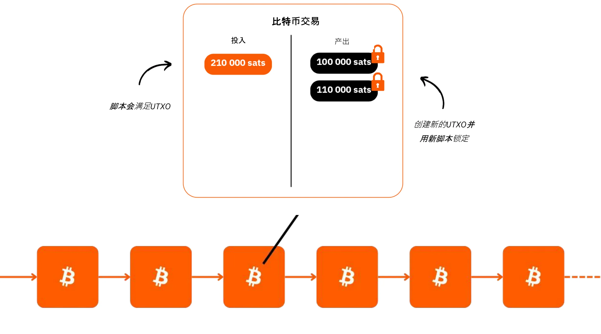

比特币有固定的货币政策，其**上限为2100万枚比特币，其中约1980万枚已进入流通中**。这使它具有**通缩性质**，随着用户将储蓄和生产力增长存储其中，其价值随时间增加。

比特币的技术特性超越了黄金和美元的所有优势，使其成为有史以来最坚硬的金融资产。比特币既能保值，又能用来交易，是一种正在发展的货币形态。想象一下，将价值从一家公司的金库迅速转移到另一家公司的金库，没有中间商，成本极低，没有欺诈风险，全天候可以运行，也无需依赖任何第三方机构。

比特币能有效地保持自己的价值，因为它的账本是不可篡改的。由于比特币的稀缺性和有限性，再加上用户数量不断增加带来的越来越多的交换机会，比特币的价值也随之增加。

比特币之所以具有颠覆性，是因为它促使我们学习数学、密码学、经济学和历史学中从未接触过的概念。虽然比特币常常被认为复杂，但它实际上是一种可通过实践和实验来理解的创新。

比特币让我们重新思考货币的本质。您能解释一下什么是真正的金钱吗？一个工薪族或企业家一生可能要花费 50,000 到 100,000 个小时来挣钱，但其中有多少人愿意抽出仅100个小时来**更好地理解金钱和保护金钱价值的方法呢**？比特币促使我们质疑我们对金钱需求背后的根本原因以及我们的时间视角。金钱是为了用来获得眼前的奢侈，还是为了实现长期的抗风险能力？如果我们拥有一种一直升值资产，其可以让我们推迟消费，我们会做出怎样的选择？二三十年后的自己，会希望当下的我们如何思考、如何决定呢？

**比特币身份证**

- **年龄：** 15 岁（出生于 2009 年 1 月 3 日）
- **每日兑换价值：** 100 亿美元（大于CAC40）
- **市值：** 1.8 万亿美元（大于Meta、Visa、白银；小于苹果、谷歌、黄金）
- **用户量：** 约1亿至2亿（占全球人口的1-2%）
- **波动性：** 内在上没有波动性（1 比特币 = 1 比特币），但在法币交易市场上波动性极高
- **表现：** 第一笔交易为 0.0009 美元/比特币；现在价值为100,000美元(1亿倍之多)
- **网络可用性（正常运行时间）：** 2013年以来的正常运行时间为100%
- **被宣布死亡或受到批评次数：** 每月一次

**人类合作的奇迹：**

- 完全**开源**
- **法律实体：** 无
- **首席执行官：** 无
- **风险投资：** 无
- **市场营销：** 无
- **研发：** 由志愿者推动
- **管制：** 由用户监管
- **创新经济模式：** 区块创建由交易费补贴（基于拍卖机制的）

关于比特币的更多信息，包括其历史、工作原理和使用方法，我还建议您参加以下另一门综合课程：

https://planb.network/courses/2b7dc507-81e3-4b70-88e6-41ed44239966

## 闪电网络简介

<chapterId>c095c7ad-5469-4c7b-9510-b6c0b86244e7</chapterId>

**闪电网络是什么？**

闪电网络（Lightning Network）是**一个协议，也是一个网络**，用于促进比特币交易，其与比特币主区块链的交互极少。它的工作原理如下：

- **初始设置：** 在主区块链上锁定（托管）资金，以建立双方之间的支付通道。
- **支付网络：** 多方之间的支付通道网络构成了支付网络（通过路由和互联实现）。
- **链外交易：** 在各方之间发生的交易**不会立即公布**在比特币的主区块链上（**链外交易**）。
- **链上结算：** 只有**通道交易的最终余额状态**会被公布在比特币主区块链上（**链上**），允许在此期间进行大量的交易。与进行许多链上交易相比，这种捆绑式多重支付减少了交易拥堵，从而降低了费用。
- **通道关闭：** 用户可以随时关闭自己的通道，并通过公布最终的交易状态来收回自己的比特币。这就是“交易可随时被发布，但只会在必要时公布”的原则。这个退出（通道关闭）可能是单方面的（由任何一方随时决定），也可能是双方共同决定的（这样链上费用较低）。

这种方法弥补了直接在比特币主区块链上进行每笔交易的缓慢性和复杂性，只记录最终余额并保留其安全性。闪电网络是比特币的“顶层”，但仍隶属于比特币本身。

**全球性的支付网络**

该协议创建了一个**机器网络**，其中的通道构成了一个通用支付系统。这些节点可由个人或企业自由操作，使其作为一个完全开放的网络。

闪电网络以光速实现即时价值交换。它就像应用于支付的电子邮件协议：下一代支付网络。它从根本上改变了“货币”的流动方式，使其像互联网上的数据传输一样自由和快速。

**主要优势：**

- **速度：** 即时交易。
- **费用低：** 与传统银行网络相比，成本低得多。
- **易于采用：** 企业只需使用智能手机应用程序或网站上的支付按钮，即可快速设置接受闪电支付的模式。

闪电基础设施在速度、成本和能效方面都优于传统支付系统。随着越来越多的商户采用闪电支付系统，其发展势头将会加快：如果支付可以绕过银行间网络，为什么还要继续将很大一部分收入让给现在的中间商呢？

**无限的用例：**

闪电的应用范围远远超出了低费用和高速度。通过提供完全免费的即时支付系统，它为整个经济领域带来了巨大商机。

**增强比特币的兑换能力：**

闪电增强了比特币作为“交易媒介”的作用。通过提高交易的频率和自由度，它强化了货币的主要功能：促进经济交流，为所有参与者创造价值。

未来智能机器经济的崛起将需要一个超高速、高频率的支付系统，而只有闪电网络可以实现其技术标准。这一点会创造出更多的商品和服务。由于比特币的供应量仍然有限，每个单位的购买力都将增加。随着比特币和闪电网络的扩展，它们将共同变得更加强大。

闪电网络让人们看到了未来的前景，即所有基于互联网的业务也将基于比特币。

**闪电上的比特币支付：商户使用案例**

闪电网络以其速度和支付的终结性，成为实体店或网店比特币支付的理想选择。

- **速度：** 闪电网络（约500毫秒到几秒钟）比比特币主网快得多，主网的交易确认需要可达30分钟的时间。对于大额购买（远远超过 1000 美元），比特币主网络可能仍然是首选，因为速度不是那么重要。不过，这些细节往往不为普通用户所知，因为应用程序会在后台无缝处理这些决定。
- **交易不可逆性：** 付款一旦在 "闪电 "平台上完成，即为终局。不可能出现第三方扣款或与欺诈相关的争议。
- **费用：** 闪电网络的交易费用极低，由用户而不是由商家支付的。商家只在需要将比特币转移到其他网络或服务时才会需要付费。

**闪电网络身份证**

- **发明年份：** 2015 年
- **启动时间：** 2016 年
- **年龄：** 7 岁（首次交易日期：2017 年 12 月 28 日）
- **网络技术能力：** 从规模方面来看，处理即时交易的能力是传统系统的 1,000 倍。
- **交易规模：** 比传统系统小 1000 倍。
- **交易速度：** 快达 100 倍。
- **手续费用：** 最多比传统系统还低 90%。
- **支付不可逆性：** 近乎瞬时（通常处理时间为500毫秒，有时需几秒）。
- **能源消耗：** 约传统全球货币体系的 8%。
- **特点：**
    - 点对点的
    - 通用的
    - 无权限的
    - 良好的私密性
    - 已被验证的安全性
    - 高可用性（出色的正常运行时间表现）
    - 具有可控性和适应性

如需了解有关的闪电网络技术运作的更多信息，我还建议您学习以下另一门综合课程：

https://planb.network/courses/34bd43ef-6683-4a5c-b239-7cb1e40a4aeb

# 资金库中的比特币

<partId>bf45c1e8-af97-4b6b-af42-2866f493b14d</partId>

## 利润、资本和企业抗风险力的关键

<chapterId>656ad88f-3c27-4054-a94e-b29727009b8e</chapterId>

### 健康的公司

**未来是不确定的**，企业在应对这种不确定性时，必须明确以获取利润和保存资本为重点。根据奥地利经济学的观点，**利润是企业健康**的关键信号，它表明企业正在有效地满足消费者的需求。没有利润，公司就无法维持下去，也会很难继续发展。为了保持健康，企业不仅需要创造利润，还要有前瞻性思维，**为未来的投资和挑战**储存资本。

**资本保值**至关重要，因为它使企业能够在不可预测的市场中适应并抓住机遇。这就需要在收益再投资以实现增长与维持财务缓冲以抵御潜在衰退之间取得平衡。奥地利经济学强调了**时间偏好**的重要性，这意味着企业必须谨慎决定在多大程度上优先考虑眼前的回报，而不是为长期的成功进行投资。一家健康的公司应保持稳固的财务基础，确保在顺境和逆境中都能灵活应对。

企业会按照价格和竞争等市场信号做出明智的资源分配决策。通过识别这些信号，企业可以避免过度扩张或进行不当投资的陷阱，尤其是那些受宽松信贷等人为因素影响的投资。资源分配不当不仅会危及公司的健康发展，还会降低公司有效服务客户的能力。

归根结底，保持企业的健康发展意味着保持其适应性，做出审慎的财务选择，并始终着眼于未来。 **通过关注利润、保存资本和对市场信号做出反应，企业无论大小，连在面对不确定性的时候也能蓬勃发展**。

### 资本有内在价值吗？

**资本的一般描述**

让我们重新发现资本的真正含义，而这个词在我们的社会中经常产生误解和被负面看待。

在传统经济理论（凯恩斯主义）中，资本经常被简化为同质的实物或金融资产存量，主要用于通过投资刺激总需求。资本往往与财富集中和少数精英掌握经济权力联系在一起。在贫富差距不断扩大的背景下，许多人认为资本是经济不平等的象征，尤其是当积累的财富似乎并没有给大多数人带来任何好处时。

资本常常被描绘成剥削的工具，这种观点深深地影响了各种运动，这些运动认为资本本质上与工人的利益是对立的。但事实上真是如此吗？或者说，这种看法可能被以下因素扭曲了：

1.对经济机制缺乏了解（包括经济学家本身）？
2.政府干预和市场操纵？
3.裙带资本主义与自由市场资本主义之间存在混淆？
4.媒体对经济危机的报道？
5.急功近利、急于实现社会正义的愿望？
6.反资本主义言论的文化正常化？

幸运的是，比特币迫使我们重新思考所有的一切，挑战这些先入为主的观念。有一个学派，即奥地利经济学派，可以揭示这些问题，帮助我们重新了解资本的真正本质。

**渔夫的故事**

让我们从一个小故事开始：

“在一个荒无人烟的小岛上，住着一位孤独的渔夫。每天，他都要花费数小时徒手捕鱼，这项活动耗费了他大量的时间和精力。有一天，他有了一个想法：制造一种鱼叉，让他能够更有效地捕鱼。但他知道这需要一个牺牲。

在开始制作鱼叉之前，渔夫决定留出一些鱼，以便在制作过程中维持生计。在这几天里，他比平时吃得更少，留出足够的鱼来专注于他的项目。这些攒下来的鱼代表了他的**资本**，是他能够实现目标的一小部分储备。

他一边花出时间打造鱼叉，一边依靠自己的储备，甘愿耽误一些眼前的舒适生活（这是他**时间偏好**的体现）。经过几天的努力，他制成了一杆坚固的鱼叉。

有了鱼叉，他现在可以更快、更省力地捕鱼。他不再需要像以前如此付出努力，而他现在可以开始积累过剩的鱼。这些过剩为他带来了新的可能性：他可以将其储存起来，与人分享，或投资于岛上的其他项目。通过延迟即时消费和利用其资本，渔民大幅提高了效率和未来前景”。

这个故事描绘了资本、耐心和远见在构建更美好未来中的基本作用，这些概念是经济增长和人类进步的核心。

### 奥地利经济学派及其对资本的观念

奥地利经济学派因其创始人和早期贡献者来自奥地利而得名。该学派强调个人自由、自由市场和最少的国家干预。

**奥地利境界学派对资本的观念**

在奥地利境界学派看来，资本与推迟消费以制造提高未来生产的工具或生产资源的理念有着深刻的联系。这一过程被称为资本积累，是奥地利经济理论的核心。这一观点的主要内容包括：

- **时间偏好和消费推迟**：个人自然倾向于现在消费而不是以后消费，但如果他们预期未来会有更大的回报，他们可能会选择推迟消费。通过今天的储蓄，可以将资源投资于资本货物（工具、机器、基础设施），从而随着时间的推移提高生产率。时间偏好较低的社会或个人储蓄更多，投资于长期项目，促进可持续增长。
- **资本是未来生产的驱动力**：资本货物被视为用于生产最终消费品的中间工具。通过积累资本，企业家可以提高生产力，在未来创造更多财富。例如，与其立即生产消费品，不如将资源用于建造工厂或机器。虽然这会减少短期消费，但由此产生的效率却能为日后带来更大的生产和繁荣。
- **间接生产与效率**：奥地利经济学家欧根-伯姆-巴韦克（Eugen Böhm-Bawerk）等人强调了间接生产的概念，涉及多个阶段的更长、更复杂的生产流程。虽然这些过程需要时间，但最终会产生更高效的生产结果，例如建造锯木厂来加工木材，而不是手工收集原木。
- **利率作为信号**：从奥地利经济学派角度来看，利率自然反映了个人的时间偏好。高利率表明人们倾向于立即消费，而低利率则激励储蓄和长期投资。当中央银行通过人为操纵利率时，就会扭曲这些自然信号，导致资源分配不当和不可持续的投资（不良投资）。

**现代经济中的两种资本形式**

在我们所处的以债务为基础的货币体系框架内，**存在着第二种资本形式**：银行通过简单的信贷机制创造贷款时瞬间产生的资本。这涉及到流动性的无中生有，即银行借出的钱实际上并不是预先持有的，而是根据还款承诺创造出来的。

一方面，“奥地利”资本是真实储蓄的结果，是一个涉及深思熟虑的经济决策和细致牺牲的过程。另一方面，通过创造以债务为基础的货币而产生的资本是一种瞬时的、人为的构造。这两类资本虽然**在为项目融资的用途上表面上相似，但它们本质上却是不同的**。

这两种形式的资本绝不应混为一谈，但在以债务为基础的体系中，它们却经常被混为一谈，**扭曲了经济信号**，并经常导致不当的投资。这种误解揭示了为什么资本主义经常受到无端的批评。

**凯恩斯主义的关键问题**

全球精英广泛采用的凯恩斯主义政策操纵利率，通过债务刺激需求。这鼓励资源流向短期、不可持续的项目，扩大了经济周期，推迟了基于健康储蓄和生产性投资的真正增长。商界领袖亲眼目睹了这一有害政策，因为健康的公司被推向高估的收购，以追求虚高的回报，从而破坏了自然和可持续的增长。

在这种环境下，企业家精心积攒的“健康资本”如何与人为制造的“不健康”资本竞争？此外，货币供应量的单方面扩张侵蚀了稳健资本的购买力，加剧了经济迷失方向和社会不满情绪。

**比特币：一线希望**

比特币提供了一种长期积累和保存资本的方式，而不会受到货币通胀的侵蚀。作为一种价值储藏工具，比特币使企业能够有弹性地做出未来的投资规划，挑战债务驱动系统的主导地位，促进真正的生产性资本积累的回归。

### 关于奥地利经济学派的更多信息

**奥地利经济学派**是一种经济思想传统，重视自由市场、个人自由以及人的行为在经济过程中的重要性。该学派批评国家干预，尤其是对货币和市场的干预，并认为个人在其主观偏好的指导下，是其自身利益的最佳判断者。

**奥地利学派的主要人物**

- **卡尔-门格尔（Carl Menger）**：门格尔是奥地利学派的创始人，他提出了主观价值理论，认为商品的价值取决于个人偏好而非生产成本。
- **路德维希-冯-米塞斯（Ludwig von Mises）**：米塞斯是奥地利学派的基石，他提出了实践论（人类行动理论），并撰写了《Human Action》这一书，对社会主义和中央计划进行了深刻的批判。
- **弗里德里希-哈耶克（Friedrich Hayek）**：哈耶克是米塞斯的学生，因其在分散知识和市场自发性方面的研究而获得1974年诺贝尔经济学奖。他在《The Road to Serfdom》一书中强烈批评中央集权控制。
- **默里-罗斯巴德（Murray Rothbard）**：罗斯巴德是米塞斯的弟子，也是自由主义的坚定倡导者，他提出了无政府资本主义理论，设想了一个由自愿契约管理的无国家社会。他的著作《Man, Economy, and State》是奥地利经济学的开山之作。

**其他有影响力的经济学家**

- **米尔顿-弗里德曼（Milton Friedman）**：虽然与奥地利学派没有直接的联系，但弗里德曼支持许多亲市场和自由主义的思想。他的货币主义政策不同于奥地利学派的思想，但与他们一样批评国家对经济的过度干预。
- **弗雷德里克-巴斯蒂亚（Frédéric Bastiat)**：巴斯蒂亚是19世纪的法国经济学家。他的关于自由贸易和经济政策隐性后果的著作对奥地利学派产生了深远的影响。他的论文《What Is Seen and What Is Not Seen》是经济自由主义的奠基之作。

*归属：The Ludwig von Mises Institute*

**核心的贡献和想法**

这些思想家形成了这样一种观念，即国家干预会扭曲市场，而经济自由对繁荣和人类行动的和谐协调至关重要。他们的见解凸显了分散决策的重要性和集中控制经济体系的危险。

关于该主题的更多信息的课程：

https://planb.network/courses/d955dd28-b7c6-4ba2-a123-d932e21d148f

https://planb.network/courses/9d1bde6a-33e5-45dd-b7c0-94da72e45b11

https://planb.network/courses/d07b092b-fa9a-4dd7-bf94-0453e479c7df

## 将比特币存入金库

<chapterId>89622a40-d14f-4c37-a075-8e7e1731ec26</chapterId>

### 公司金库面临的挑战

金库是存放贵重物品的地方。一家健康的公司会有适当的资金，以便能够应对未来的不确定性并规划投资。如今，部分多余的金库被存放在被誉为具有高度“流动性”的金融资产中，如债券、定期存款等。

在很长一段时间内，一些公司使用房地产等非流动资产，却没有意识到某些危险：
- 发生危机时的流动性不足
- 扣除费用后，最终收益相当低
- 回报率不超过实际通胀率，即货币供应量的通胀率（每年约 7%，见下文）。
- 为了比特币等资产的利益，房地产失去了部分“储蓄”功能，这是一个隐藏的风险。因此，房地产可能更接近其“使用价值”：提供住所。

让我们快速回顾一下企业的运营环境。

**实际通货膨胀**：令各国央行大失所望的是，他们的目标是将每年的通胀率保持在2%，这意味着20年内货币价值将损失40%。再加上通胀更加明显的时期，企业显然不能仅仅使用货币来储存其劳动成果。它们必须实施复杂的金融战略，这必然伴随着一系列风险。这些战略对于规模很小的企业来说显然是**无法实现的**，因为这些企业的核心业务已经非常繁重。

**隐藏的通货膨胀**：在以债务为基础、由中央银行支持的部分准备金货币体系中，**总体货币供应量平均每年增长约7%**（例如，欧元区或美国的M1）。这意味着您的“蛋糕份额”在短短几年内就会减少一半，除非您有特权使用金融水龙头，并能在新创造的货币推动资产价格上涨之前，通过杠杆和以“旧价格快速购买资产”的方式来继续增长。这就是康泰隆效应（Cantillon Effect），它在一定程度上解释了财富向富裕阶层转移的原因，而“资本”则被错误地指责为罪魁祸首（见上文关于资本的介绍）。

**交易对手风险**：当前的金融体系是有风险的，您可能并不总能拿到“自己的钱”。无需任何夸张修辞，我们必须承认，金融机构将利润私有化，并在最轻微的危机中将损失社会化。在一种“记账式”货币体系中（即货币仅存在于账本中），所谓的银行存款仅仅是一个“债权”；您并不真正拥有它，银行本身也不拥有它（部分准备金）。从某种程度上来说，这种钱是神奇地凭空创造的。一些曾经嘲笑过比特币的著名银行如今已不复存在，比如瑞士信贷银行（Credit Suisse）。

这种信任的缺失引发了黄金等“不记名”资产的重新兴起（尽管黄金在安全、运输和分割等方面都很复杂），当然还有比特币这个新生事物。

### 比特币作为一种金融资产

比特币提供了一个激进的替代方案。比特币是**一种不记名资产，没有中央发行机构**，几乎不可能被没收，并且受益于网络效应。“真正的”比特币用户一般将它用来储存自己的劳动成果，因为它被视为一种既能抵御审查又能抵御通货膨胀的价值储存。得益于网络效应（如梅特卡夫定律所示），每一个被说服的新用户都会增加网络的价值；随着参与者数量的增加，比特币的效用也会呈指数级增长。这种模式使比特币成为一种独特而有前途的资本形式，建立在用户采用和信任的基础上。

比特币是世界上**流动性最优的资产**，全天候不间断运行，不像传统金融市场有收盘时间和“断路器”。这种流动性使用户可以在任何时刻买入或卖出比特币，不管是好消息还是坏消息（如导弹发射、战争等）。

十年来，比特币的年均增长率超过60%。与其他的投资工具不同，这种独特的表现使长期持有者能够保住其初始资本。

不过，有几个关键因素需要牢记：

首先，**过去的表现并不能保证未来的结果**。只要比特币保持**安全和去中心化**，我们就可以有理地期待它在未来十年的年价格升值幅度远远超过20%，使其成为一种可行的财政工具。

其次，到目前为止，比特币已经经过了**几个4年的周期**，也就是说，只要时间跨度超过4年，我们的投资几乎都会有利益。对于那些将比特币视为一种投资的人来说，短期投资（<4 年）可能会有风险。

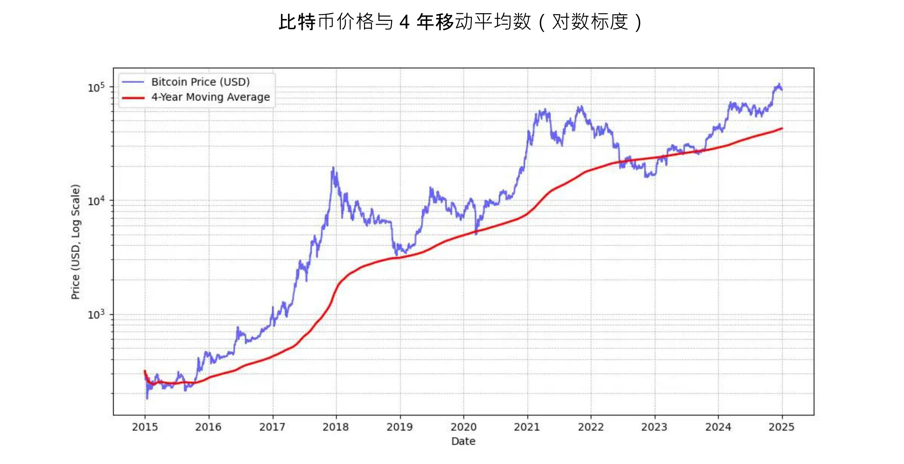

*MICHAEL SAYLOR：“最好的比特币价格信号是 4 年简单移动平均线*。” 见以上图。

此外，建议根据自己对比特币的理解程度，适当配置持有比例。同样重要的是应避免急于求成或试图精准择时。

最后，比特币被认为**一直波动**的资产。准确地说，以法定货币单位表示的比特币价格是一直波动的。这类波动本身对尚处于发展初期的资产来说并不异常，但投机者的存在也放大了这种波动性，他们并不把比特币作为一种长期的价值储存手段，而是追求快速收益的工具。此外，杠杆交易（利用借贷资金增加交易头寸）加剧了价格的上下波动，使比特币无法沿着直线上升。这导致了更明显的波动，但随着时间的推移，随着忠实用户群的增长，这种波动似乎趋于稳定。总之，**想要拥有像比特币这样没有波动的高性能资产是不可能的**，但您肯定可以拥有波动性更小的高性能资产。

### 华尔街采用比特币

金融机构采用比特币进一步加强了其在全球市场的地位。

**贝莱德集团**（BlackRock）最近的声明强调了比特币作为价值储存资产和投资组合多样化工具的潜力。这家全球机构巨头最近表示，**比特币的用户增长速度超过了互联网或手机**，这主要是受**人口和代际转变**以及对传统金融机构日益信任损失的驱动（！）。由于比特币的稀缺性、非主权性和去中心化特性，**一些投资者将其视为财政和货币不稳定、恐惧或破坏性地缘政治事件时的避风港**。

2024年1月推出的**点比特币交易型开放式指数基金(Spot Bitcoin ETF)** 取得了惊人的成功，史上**最成功的**交易型开放式指数基金（ETF）发行，1月至11月净流入近200亿美元。这比次好的ETF基金，Nasdaq-100 QQQ，高出约四倍。这些ETF为比特币提供了更便捷、更规范的途径，使其**进一步**合法化，并吸引了大量机构资本涌入。

比特币ETF在**机构采用**方面遥遥领先，无论是参与机构数量还是管理资产规模，都超过了增长最快的前十大ETF。这些比特币ETF的成功凸显了人们对与数字资产挂钩的投资工具的需求日益增长，从而巩固了比特币在传统金融领域的地位。

比特币目前在 "价值储藏" **市场中扮演着重要角色**。就规模而言，它仍只是九牛一毛：比特币的市值约为1.8万亿美元，而黄金为18万亿美元，房地产则高达500万亿美元。然而，其约 0.1% 的市场份额为其带来了巨大的增长空间，因为它的竞争对手难以吸引新用户。

| 代码       | 1天流量 (百万美元) | 1周流量 (百万美元) | 1个月流量 (百万美元) | 3个月流量 (百万美元) | 年初至今流量 (百万美元) |
| ---------- | ------------------ | ------------------ | ------------------- | ------------------- | --------------------- |
| **总和**   | +457.19             | +1,507.95          | +2,888.01           | +3,672.29           | **+20,262.94**        |
| IBIT       | +393.40             | +750.91            | +1,536.47           | +3,821.37           | +22,460.44            |
| FBTC       | +14.81              | +372.40            | +627.16             | +458.71             | +10,266.69            |
| ARKB       | +11.51              | +163.26            | +295.92             | -3.88               | +2,647.32             |
| BITB       | +12.93              | +146.50            | +263.30             | +97.46              | +2,262.69             |
| HODL       | +5.75               | +38.77             | +94.54              | +100.39             | +682.03               |
| BRRR       | +1.92               | +4.72              | +17.76              | +20.54              | +540.19               |
| EZBC       | +11.79              | +17.53             | +39.29              | +47.48              | +439.45               |
| BTC        | .00                 | -3.13              | +36.59              | +419.18             | +419.18               |
| BTCO       | +6.43               | +19.25             | +47.30              | +56.41              | +394.82               |
| BTCW       | .00                 | +2.84              | +6.04               | +146.69             | +217.47               |
| YBIT       | -1.34               | -10.26             | +5.06               | +13.81              | +76.30                |
| DEFI       | .00                 | .00                | .00                | -2.03               | -1.79                |
| GBTC       | .00                 | +5.16              | -81.42              | -1,503.84           | -20,141.85           |

*10个月内的200亿美元：比特币ETF在不到一年的时间里就实现了黄金ETF需要5年时间才能实现的目标。资料来源：以美元计的基金投资流量。Bloomberg Terminal，Bloomberg L.P.，2024*。

### 比特币作为公司工具包中的一部分

比特币在美国的日益普及也影响着世界其他地方的心态，尤其是财富管理专业人士，他们再也不能不把比特币纳入自己的工具之一，特别是在传统金融产品表现不佳或面临困难的时期。似乎只有传统银行还能忽视比特币。

仅从金融角度来看，比特币被认为一个多样化资产。比特币不仅与其他资产类别不相关，而且在新的流动性注入时期似乎也会茁壮成长，随着欧洲央行、美联储和中国降低利率，这样的事件似乎又会开始了。

总结来说，对于最常见的应用场景，将多余的资金用于至少四年的投资，比特币是一个非常合适的选择。稳定的投资方式，比如定期投入固定金额，有助于降低因买入或卖出时机不当所带来的风险。

比特币的其他用途使其成为一种战略性的财政资产，例如：

- 能够全天候作为**抵押品**或提供流动资金
- 能够随时**快速地转移到另一家公司的资金账户**
- 规避**外币兑换风险**
- 向接受比特币的**供应商**付款，特别是在紧急情况下

### 比特币太贵了吗？

您不应购买 1 个比特币，因为比特币可以分割成称为“satoshi（聪）”的子单位，这个名字是为了纪念它的匿名创造者。一个比特币相当于**1 亿聪**，用户甚至可以购买、出售或使用**一个比特币的极小部分**来进行交易。事实上，在比特币的源代码中，所有交易都是以聪为单位的，“比特币”这一词只出现在“coinbase”交易中（即创币交易），即矿工为获得奖励而创建的特殊交易。

此外，2,100 万个比特币，即 **2.1千兆聪**，可以有效地用64位整数表示。这意味着，尽管整个比特币的价格很高，但由于其可分割性，投资者都仍然可以买卖它。因此，为了成为网络的参与者或投资这种数字资产，您无需购买一个比特币。

让我们记住，与股票、黄金或房地产等其他资产相比，比特币的总市值相对较低，因此其升值能力完好无损。由于其接受度仍然很低（约占全球人口的1%），我们认为它的崛起才刚刚开始。因此，比特币被视为本时代最具非对称性的资产配置选择之一：当前阶段，其价值归零的风险极低，而其长期增长的潜力仍然显著。

### 将比特币分配公司财务的决定

投资比特币的**决策过程**将在很大程度上受到您在公司内部地位的影响。如果您是大股东，您可以根据自己的判断自由分配多余的库藏资金。相反，如果您是集体决策结构中的合伙人或股东，则需要经过共同商议，这可能会使问题更加复杂。

在第二种情况下，调和不同的观点变得至关重要，因为这在很大程度上**取决于每个利益相关者对比特币资产的理解**。正如俗话所说：“比特币是人们不了解计算机的部分与对货币的无知部分的结合”。即使合作伙伴中的一方已经努力透彻地了解了比特币，但要将这些知识传达给其他人也是一个很有挑战性的过程。在这种情况下，**建议寻求外部资源的帮助**，以避免将这个理念过于个人化和产生反感。

目前，在持有比特币的公司中，多数股东做决定的情况最具代表性。下面是几个真实的例子

- **独立专业人士**：顾问、医疗保健从业者或律师：将其长期资金的一部分投资于比特币。一般来说，这些专业人士已经持有回报微薄的储蓄或定期存款账户。
- **科技界高管**：几年前出售公司并将个人控股公司的部分收益投资于比特币的高管。如今，他们的财务状况良好，并重新投资于新的企业。
- **小型企业的所有者** ：服务业、农业或手工业的企业家，他们了解比特币的潜力，并将一部分资金用于比特币。他们的主要动机是多样化及其带来的自由
- **等上市公司**（如MicroStrategy）开创了先例，将其公司财务的一大部分转化为比特币，显示了全球企业资本分配战略的转变。到 2024 年秋季，许多其他公司也纷纷效仿，进一步推动了这一趋势的发展。

查看持有最多比特币库存的公司更新列表，以及持有的金额，请访问网站：[BitcoinTreasuries.net](https://bitcointreasuries.net/)。
### 对企业持有的比特币征税

对于不是独立法律实体的企业，如独资企业或其他非公司实体，比特币交易的税收通常与个人的税收待遇相同。在许多情况下，适用于资本收益或收入的规则与个人出售比特币的规则相同。例如，在一些国家，利润可能被视为企业家个人收入的一部分，须缴纳**个人所得税**。

不过，**公司制企业**，那些须缴纳企业所得税的企业，通常受益于更有利的税收框架。个人在抵消不同资产类别的损益时可能会受到限制，而公司则不同，公司一般可以将比特币交易的已实现损益直接计入年度损益表。这可以带来更灵活、或者更有利的税务状况。

不同司法管辖区的具体税率和待遇差别很大。例如，在法国和许多西方国家，公司可能面临 25% 左右的企业税率，这可能低于个人对投资收益缴纳的统一税率。

由于这些差异，**一些企业主选择通过其公司结构购买和持有比特币，因为这个做法可以提供更有效的税收筹划机会**。一如既往，建议咨询熟悉相关司法管辖区规则的税务专业人士，以确保合规性且优化税务的策略。

## 如何获得比特币

<chapterId>1e6dbaf5-581a-49a4-8f37-3728e77bda17</chapterId>

### 三种获得方法

获取比特币有三种方式：

- **交换货物或服务：**

由于比特币可作为以交换媒介，因此它可以设想一种循环经济。尽管当今仍不常见，但越来越多的企业开始接受比特币支付，为什么您不接受呢？(见下一章）

- **挖矿比特币：**

这包括通过运行矿机赚取比特币。对于非专业企业来说，它不是一个常见的做法。您可以通过中间商参与其中，他们会向您出售或出租计算器、网络和维护。如果您拥有这些机器，您可以将其作为折旧资产入账。如果规模较大，您需要仔细计算投资回报，因为市场竞争激烈，需要对成本（尤其是电费）有很好的预期。

如果您想要了解更多的挖矿方法，可以[查阅我们教程中的“挖矿”部分](https://planb.network/tutorials/mining)。

- **购买比特币：**

这是迄今为止最常见的买入比特币方法，既可以通过点对点交易所进行，也可以在专门的交易平台上完成。但是，企业在获取比特币作为公司财务资产时，必须遵守严格的监管标准和“了解客户”（即Know Your Customer，简称为KYC）手续。在专业交易平台上购买比特币时，企业通常需要提供详细的公司信息，包括身份证件、财务报表和地址证明，以满足 KYC 和反洗钱（即Anti-Money Laundering，简称为AML）的要求。

如果您想要了解如何开立企业账户并用它来购买、出售和转移比特币，您可以查看这两份专门为企业设计的教程，其中涵盖了企业版的 Kraken 和 Bitfinex 平台：

https://planb.network/tutorials/business/others/bitfinex-pro-c8ef7476-5f60-4205-935e-a545ced0022a

https://planb.network/tutorials/business/others/kraken-pro-07b1c16c-d517-4bf7-9a78-b42dc0f21785

为了进一步了解如何通过交易所或点对点方式获取比特币，您可以[查阅我们教程中的 “交易所”部分](https://planb.network/tutorials/exchange)。

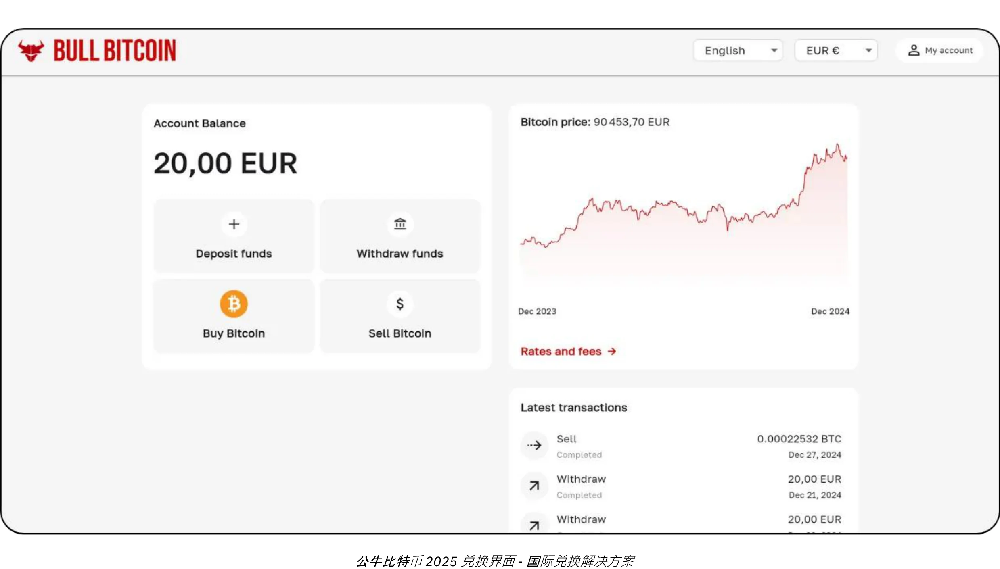

### 要在什么价格买卖比特币？

如前所述，我们不仅无法预测比特币的未来价格，而且其价格在短期内波动也非常大。从历史上来看，可靠的策略是定期逐步积累，并保持四年或更长的时间跨度。

### 您应该买多少？

与直觉相反的是，最好不要太多思想，要从很小的一笔交易开始。一小笔钱（比如一百欧元或美元）不会对您造成什么严重的伤害，而且亲身体验会让您更快地学到更多的事情，远远胜过大量阅读。

如前所述，明智的做法是只投资几年内用不上的多余流动资金。任何理解不透彻的策略都有可能让你在突然需要套现时陷入困境。

除了从小处着手外，公司财务采取有分寸的分配策略也很有用。有些公司（如 MicroStrategy）采取了极端的做法，将其超额资金的很大一部分投入比特币，这反映了机构的强烈信念。相反，一种比较保守、也可以说更理性的策略可能是将大约5%的公司资金用来投资于比特币，在潜在收益与风险管理和流动性要求之间取得平衡。

将这一范围视为一个刻度，从确保公司保持足够流动性以满足运营需求的最低风险，到旨在利用比特币的预期长期升值的激进立场。虽然激进的配置可能会带来更高的回报，但适度的配置有助于减少波动，确保公司的财务基础保持稳固，同时还能从比特币在财务运作中的创新潜力中获益。

### 是否需要经常买入？

购买比特币没有特定的规则。您可以试图通过“逢低买入”来把握市场时机，可能比简单地定期买入更无效，也更有压力。即使是经验丰富的投资者有时也会犯错。“一次性投入全部资金”可能是一把双刃剑。

实际上，比特币的升值潜力如此强大，即使您在几年后才开始入手，您仍然有可能得到长期收益。随着时间的推移，价格大幅波动的强度可能会减弱。然而，作为一种通货紧缩货币，比特币旨在有效地储存价值，并反映其用户的生产力收益。打个比方：我们目前正处于比特币的“启动阶段”，它是一种正在发展中的货币，目前还没有人知道它的合理价值。以后，也许在 20 年或 40 年后，当它处于稳定的“巡航阶段”时，它可能会无比稳定，并随着社会生产力的提高而稳步增长。

房地产行业经常反复强调“每一秒都是正确的买入时刻”，但他们忘记了，如果房地产失去了价值存储的功能，转而使用比特币等资产，价格可能会回归到更接近其实用价值（住所）的水平。相比之下，比特币除了价值存储外没有其他用途，这可能意味着“每一秒都是正确的买入时刻”。未来会为我们展示答案。

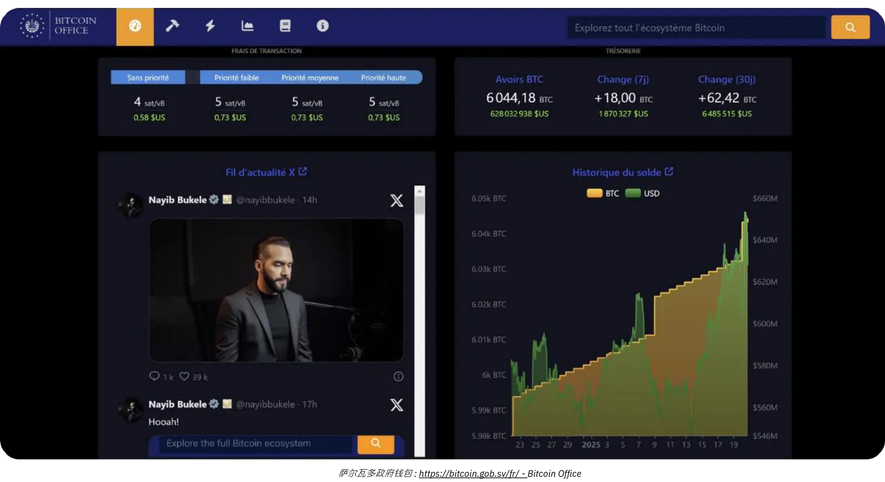

*来源：[比特币办公室](https://bitcoin.gob.sv/)*

### 以何种形式购买？(保管方法）

您的比特币不是在物质世界中的。相反，您拥有的是一个加密密钥，其允许您将部分或全部账户单位的所有权转移到一个或多个其他加密密钥上。所有这一切都发生在比特币的区块链上，该区块链已经被全球成千上万个节点同步保存。

这个加密密钥是一个极大的随机数。为了方便用户体验，它通常由 12 或 24 个单词组成的词组代表。您可以将这些单词加载到一个被称为“硬件钱包”的硬件内。不过，比特币并不在这个设备的“内部”；它只是一个进行交易的加密签名并向网络广播交易的工具。最关键的是您必须安全地保存并保护上述的词组（称为助记词）。

这涉及到保管问题：持有比特币就意味着您持有自己的钥匙。您可以自己保管，或者委托第三方保管。还有一些中间解决方案。让我们回顾一下最常见的几种情况：

- **自托管：**
这是真正的比特币爱好者推荐的选择，因为它符合比特币的原始设计。您就像自己的银行：没有第三方诈骗的风险，但您应该责任确保密钥的安全。您可以全天候使用您的资金。在商业环境中，如果需要多人进行交易，则需要适当的工具和程序来管理访问权限和安全。

- **第三方托管：**
例如，交易所或购买服务平台可以为您创建一个账户，将您的传统货币兑换成比特币，并利用他们的安全系统代表您持有比特币。大多数此类服务都允许您将比特币提取到一个钱包中，而钱包中的钥匙只有你一个人持有。在此之前，您并不真正持有这些比特币；您只能依靠他们的承诺来偿还。这就需要平衡安全风险（他们的风险和您的风险）和交易对手风险（他们可能失败或消失）。有些企业认为这种方式是可以接受的，但一般不建议长期存储或 100% 分配。托管服务也可能收取存储费。

- **“纸币比特币”（ETF 或 ETP）：**
这些都是传统的金融工具，用来代表比特币的一部分，并跟随其价格表现。理论上，该产品背后的机构购买了并持有对应的比特币作为支撑。您的出资和取款都是以传统货币（如美元或欧元）而不是比特币进行的。除了某些产品允许以比特币形式取款（以避免在某些司法管辖区发生应税事件）外，这些工具需要年度管理费。在这里，您依赖于机构的安全性，并面临交易对手风险（例如，如果政府决定没收所有机构持有的比特币，就像 1933 年根据美国第 6102 号行政命令没收黄金一样）。比特币的主要优点在于它的容易获取性，因为它们是通过传统金融渠道发行的。它们绕过了加密密钥安全的需要，但不具备比特币的固有属性：未经许可，您不能全天候使用比特币网络自由移动价值。它们只是模仿比特币本身的金融性能，而不是它的功能或主权。

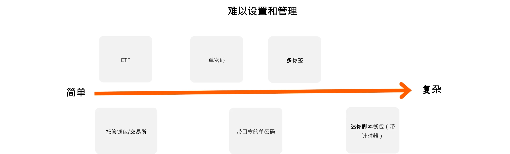

此外，持有比特币的形式对保护公司财务所需的安全措施也有很大影响。无论您选择自我保管，使用单签名或多签名硬件钱包等来保护您对密钥的直接控制，还是将这一任务委托给第三方保管服务或 ETF，每种选择都有其自身的风险特征。例如，自我托管提供完全的访问权限，但它要求您采取并执行严格的安全措施，而第三方解决方案则以交易对手风险为代价减轻管理负担。为了进一步说明这些区别，本图概述了每种托管类型的安全模式，帮助您选择最适合您机构的需求的方法：

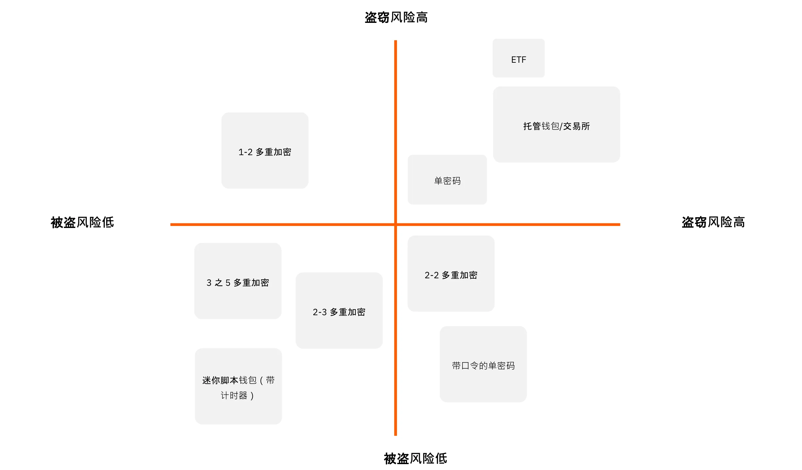

### 要从谁购买？

如果您选择“纸质比特币”，您将求助于金融机构，如银行或在线证券交易所。

如果您选择通过市场（交易所）或经纪人购买比特币，您可以有几大类选择：

- **大型国际或国外平台：**
例如，Kraken、Coinbase 或 Binance，历史上曾被许多人使用。其中一些遇到过问题，并且很难给出明确的建议。建议：如果您使用这些服务，不要将比特币长期留在交易所里面。

- **受监管服务提供商（注册数字资产服务提供商）：**
例如，在法国，像 Paymium（交易所）或 BullBitcoin（经纪商）这样的平台因其背后有真正的比特币爱好者而闻名，并且建立了稳固的业绩记录。在美国，则有 River 或 Swann 这样的服务提供商。一般来说，考察服务提供商的历史记录非常重要：他们的声誉、业绩记录、在比特币社区的受欢迎程度，以及他们的领导层是否符合比特币的核心价值。

**交易所与经纪人：**
- **交易所**允许您以自己选择的价格下达买入订单，但您必须等待，直到市场价格与卖家的报价相匹配，才能执行交易。
- **经纪人**为您提供固定的价格，可以更快地完成交易。

除了费用和执行速度（如果您计划长期持有（几年），那么费用和执行速度影响较小），企业还应考虑以下因素：

- **用户界面：** 平台是否方便用户使用？
- **会计功能：** 至少能以 .CSV 格式导出交易历史记录。
- **托管和安全：** 平台是代表您持有比特币，还是将所有权转移给您？他们的安全设置如何？他们是否有“取款锁”或其他取款限制？
- **客户支持：** 他们的服务质量、快速回应和个性化的帮助，尤其是在您刚开始使用时。
- **声誉：** 平台的可信度和价值观。
- **支持定期购买：** 如果您计划通过定期购买长期积累比特币。

# 为每家企业打造的比特币支付方案

<partId>b2c8af88-6bfc-49b1-ad84-4c292c713b55</partId>

## 接收比特币作为支付媒介

<chapterId>99af1203-bc84-4acc-9780-f733e7998335</chapterId>

首先，我们要理解，比特币是与互联网同等规模的突破。

在互联网发展的初期，它使我们能够以无需通信渠道中介的方式进行交流，随后，这一基础设施带来了无数以前无法想象的应用。现在，哪家企业没有互联网平台呢？

比特币是一种信任基础设施，它的第一个应用是消除货币价值存储和交换中的中介。在这个基础架构上还会出现其他目前无法想象的应用。您在这里的初始存在相当于拥有一个网站：一个点对点支付和价值交换的网关。

现在，我们从一个核心业务与比特币无关的实际企业的角度来考虑这一问题。它为什么会选择接受比特币支付呢？

- **建立比特币财库：**
请参阅我们之前关于购买比特币的文章。无论是出于信念还是作为一种多样化策略，有些专业人士选择接受比特币支付。一些比特币爱好者认为，越是没有财务倾向的公司（这意味着它既没有时间也没有工具来进行复杂的财务操作），**就越需要以现有最强健的货币形式接收支付**。通过这个做法，竞争环境就会变得公平，即使是时间有限的小企业也能保持价值，而不会陷入金融游戏。

- **覆盖新的人口群体：**
比特币用户数量正在不断增长，他们拥有强大的购买力。他们自然会倾向于接受比特币的企业。此外，由于比特币是第一种通用的互联网原生货币，您还可以吸引路过的国际客户。

- **提高知名度：**
例如，您可以在 BTCmap.org 等平台上列出您的企业。目前只有少数企业接受比特币，因此口口相传对您很有利。它还能让您从竞争对手中脱颖而出。

- **降低收费：**
闪电网络允许您进行即时的比特币支付。 **费用极低，由买方承担**。没有支付终端费，没有支付授权失败，也没有欺诈。相比之下，支付行业（银行卡、终端、转账、PSP 等）每年的全球成本约为 2.2 万亿美元。再加上退款纠纷和欺诈行为，全球范围内每年从各类生产性企业中“抽走”的资金总额，几乎相当于美国国内生产总值的十分之一，而这一切仅仅是为了完成价值的转移。无论您的业务是什么，财务费用都是一种负担，应予以优化，在某些情况下，高昂的费用会扼杀某些业务模式。

- **自由与无权限，全天候：**
使用比特币无需征得许可。任何人都可以使用智能手机应用程序在几分钟内参与比特币经济。您可以随时发送或接收来自任何人的付款（个人或企业都可以），没有时间限制或延迟。

- **利用比特币网络的优势：**
您不需要以比特币形式保存您的付款，尤其是当您需要向供应商付款或缴纳增值税时。某些服务可以将您的全部或部分比特币支付转换成您所选择的货币（例如，将欧元转换成您的国际银行账户号码），但要收取费用。在这种情况下，接受比特币的好处可能在于吸引新用户或比特币的内在优势（如费用较低、全天候运行、无欺诈或扣款风险）。

### 您应该选择哪种支付方案？

开始接受比特币支付相对容易。要选择正确的解决方案，需要考虑您所处理的交易的特点：平均支付金额、交易频率，以及您是在实体环境中接受支付，还是在网上接受支付，或者两者兼而有之。

作为商家，您的心态也很重要。您是在进行简单的测试，还是希望比特币成为重要的经常性收入来源？如果您的答案是后者，您需要一个强大、全面、可定制的设置。

不要忘记考虑员工的不同角色及其工作地点。在任何情况下，请记住您必须能够向会计师提供所有必要的信息，并简化会计流程。

为了方便做出决定的过程，我们定义了四种不同的业务类型。下表详细列出了每种情况的主要特征和推荐的支付解决方案。

### 业务档案

#### 第一个档案：入门者

| 属性                           | 入门者                                                                                                          |
| ------------------------------ | ---------------------------------------------------------------------------------------------------------------- |
| **心态**                       | “尝试我的第一个实物支付”、“为我的在线内容接受小费”、“目标：很小的收入”                                           |
| **交易频率**                   | “为了学习而进行的第一次交易”、“偶尔接受比特币支付”                                                                      |
| **业务类型示例**               | 创意经济（内容创作者、博客、文章等）、偶尔的小费、单次的线下产品销售、协会、单次活动                                  |
| **支付类型**                   | 通常为几美分到几欧元/美元；每笔交易金额不超过约300欧元/美元                                                       |
| **设置复杂性**                 | 无                                                                                                              |
| **推荐解决方案示例**           | 托管型闪电网络钱包，如 Wallet of Satoshi 或非托管钱包，如 Phoenix                                                 |
| **商户界面**                   | 简单的比特币闪电网络钱包：手机上的应用程序                                                                       |
| **客户界面**                   | 比特币二维码支付码，通过客户的个人钱包扫描                                                                       |
| **费用**                       | 客户支付比特币闪电网络费用及任何应用费用                                                                   |
| **销售点设备**                 | 免费智能手机应用程序或可选的物理终端（例如 Bitcoinize）                                                         |
| **管理与角色**                 | 单个应用程序管理；角色划分极简                                                                                |
| **会计导出**                   | 基本的交易历史列表                                                                                             |
| **API**                        | 否                                                                                                              |

#### 第二个档案：基本用户

| 属性                           | 基本用户                                                                                                        |
| ------------------------------ | --------------------------------------------------------------------------------------------------------------- |
| **心态**                       | “我接受比特币作为我的业务支付方式，但我不期望有很大的交易量”                                                       |
| **交易频率**                   | 每月有几笔交易                                                                                                    |
| **业务类型示例**               | 酒吧、餐馆、定期销售新鲜或直接采购的产品、一个拥有多个店铺的老板、艺术家的创意经济                               |
| **支付类型**                   | 通常从几欧元/美元到几百欧元/美元；每笔交易低于约300欧元/美元，每月低于约3,000欧元/美元                         |
| **设置复杂性**                 | 简单（手机应用程序）                                                                                       |
| **推荐解决方案示例**           | Swiss Bitcoin Pay                                                                                              |
| **商户界面**                   | 简单的比特币闪电网络钱包：手机上的应用程序；简单的发票开具，详细信息不多                                         |
| **客户界面**                   | 比特币二维码支付码，通过客户的个人钱包扫描                                                                      |
| **费用**                       | 通常小于1%的比特币地址转账费，小于1.5%的法币转换费                                                             |
| **销售点设备**                 | 免费的智能手机应用程序或可选的物理终端（例如 Bitcoinize）                                                      |
| **管理与角色**                 | 可为员工提供仅限销售的角色；在线仪表板用于管理                                                                  |
| **会计导出**                   | CSV格式的完整交易明细导出                                                                                       |
| **API**                        | 是                                                                                                             |

#### 第三个档案：专业用户

| 属性                           | 专业用户                                                                                                           |
| ------------------------------ | ------------------------------------------------------------------------------------------------------------------- |
| **心态**                       | - 像任何其他支付方式一样的电子商务支付方式 - 或者，作为一个适用于高交易量企业群体的联合管理方案                           |
| **交易频率**                   | 每天有多次交易                                                                                                       |
| **业务类型示例**               | 中等规模的电子商务网站、小型市场、多个实体店（例如 Click & Collect）、中小企业运营                                 |
| **支付类型**                   | 通常从几欧元/美元到几百欧元/美元；没有设定的支付金额限制；每年少于250,000欧元/美元                                |
| **设置复杂性**                 | 从简易配置到完全功能的配置（本地或云托管），通常需要电子商务商店前端                                               |
| **推荐解决方案示例**           | BTC Pay Server（用于电子商务和/或实体环境）；ZapRite、Musqet或PayWithFlash（用于结账），Be-BOP（用于集成的电子商店） |
| **商户界面**                   | 网站（移动端和桌面端），支持发票编辑、购物车选项和支付按钮创建；与电子商务集成的自动化发票开具                       |
| **客户界面**                   | 比特币二维码支付码，通过客户的个人钱包扫描                                                                         |
| **费用**                       | 免费开源后端与付费闪电网络托管/服务费用的混合；前端费用包括比特币闪电网络费用和小于1.5%的法币转换费                     |
| **销售点设备**                 | 网站商店，可选的物理显示设备（例如展示网站或比特币终端的 iPad）                                                   |
| **管理与角色**                 | 全功能的商店，具有多个管理角色；员工和客户与系统交互                                                               |
| **会计导出**                   | CSV格式的完整交易明细导出                                                                                          |
| **API**                        | 是                                                                                                               |

#### 第四个档案：企业用户

| 属性                           | 企业用户                                                                                                          |
| ------------------------------ | ------------------------------------------------------------------------------------------------------------------ |
| **心态**                       | - 用于企业的战略性支付方式 - 需要根据特定规范进行集成开发                                                          |
| **交易频率**                   | 无限制，大量的交易                                                                                               |
| **业务类型示例**               | 中型企业、IT服务公司、大型公司、大型市场                                                                          |
| **支付类型**                   | 任何规模或金额                                                                                                    |
| **设置复杂性**                 | 中高等，取决于架构选择                                                                                           |
| **推荐解决方案示例**           | 定制架构或SaaS托管解决方案的协调整合，可能使用第三方LSP（闪电网络服务提供商）服务                                      |
| **商户界面**                   | 完全定制化的前端和后端接口，完全集成到企业的工作流程中                                                        |
| **客户界面**                   | 从比特币二维码支付码到完全定制化的用户界面和/或带有API集成                                                           |
| **费用**                       | 内部开发费用和第三方费用；客户支付比特币闪电网络费用以及服务提供商的任何交易费用                                 |
| **销售点设备**                 | 定制化的解决方案，适用于企业情境                                                                                  |
| **管理与角色**                 | 覆盖销售、管理、DevOps、会计和财务的完全定制化角色                                                               |
| **会计导出**                   | 完全定制化的会计导出                                                                                             |
| **API**                        | 是                                                                                                               |

在接下来的章节中，我们将详细介绍每种业务概况以及为每种业务量身定制的解决方案。

## 入门者档案

<chapterId>7edda53d-5b9f-432a-8493-115de8c94a67</chapterId>

入门者档案专为那些想要在不投入大量资源或专业知识的情况下探索比特币支付的企业、创作者和个人而设计。这些人通常只处理极少量的交易（可能是一些小费、捐款或偶尔的销售），并寻求对比特币和闪电网络生态系统进行简单、轻量级的介绍。入门级方法的关键价值在于其最低限度的设置：在大多数情况下，只需要一部配备基本的闪电兼容钱包的智能手机或平板电脑。

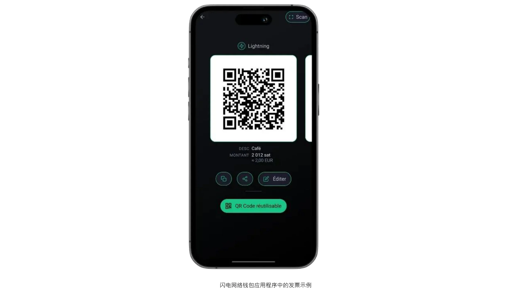

这种模式的一个显著特点是，它专注于每月很少超过几百欧元或美元的小规模支付。这种适度的规模使其成为任何想用比特币测试市场的人的绝佳选择，而无需考虑大批量情况下所固有的复杂性。此外，它还允许立即进行实践学习；由于运营压力较小、资金规模有限，失误通常可以控制，迅速吸取经验教训。从在周末集市上出售手工艺品的艺术家到接受一次性捐赠的非营利组织，这类用户通常强调的是可用性和易用性，而不是高级功能。

入门者最常见的两种钱包设置是托管和非托管解决方案。托管钱包（如 Wallet of Satoshi 或 Blink）让第三方服务管理私钥和后台操作，从而减少了用户的技术责任。对于那些最看重便利性并希望尽可能简化入职程序的用户来说，这种安排尤为具有吸引力。另一方面，非托管型闪电钱包（如 Phoenix 或 Breez）将私钥和完全控制权交到企业主手中，提供了更大的自主权和隐私权，换取了稍多的初始投入。无论是哪一种情况，现代界面通常都非常友好，任何人都能在几分钟内完成基本任务（生成二维码、输入支付金额和确认交易）。

虽然小额交易可能让人对安全警觉性降低，但基础的安全防护仍然不可缺少。即使是一台用于接收比特币付款的智能手机或平板电脑，也应该用密码或生物识别安全技术锁定，备份程序（从保管钱包的登录凭证到保护非保管钱包的种子短语）也必须认真对待。在实体环境中处理交易的工作人员最好了解一些基本知识：如何打开应用程序，如何向客户出示二维码，以及如何检查付款是否已经到账。

会计和报告虽然在入门者模式下相对简单，但仍值得仔细考虑。虽然交易量可能很小，但保留准确的记录可以防止日后出现的混乱，并有助于在财务审计或报税时保持透明度。许多钱包应用程序都允许用户将基本交易历史记录导出为 CSV 文件；对于小型企业或单个创业者来说，定期保存这些文件可以使对账工作变得更加轻松。此外，记录每笔交易接收时的大致法定价值（如欧元或美元）也是明智之举。由于比特币的价格可能会有波动，记录兑换汇率对记账和税务合规至关重要。

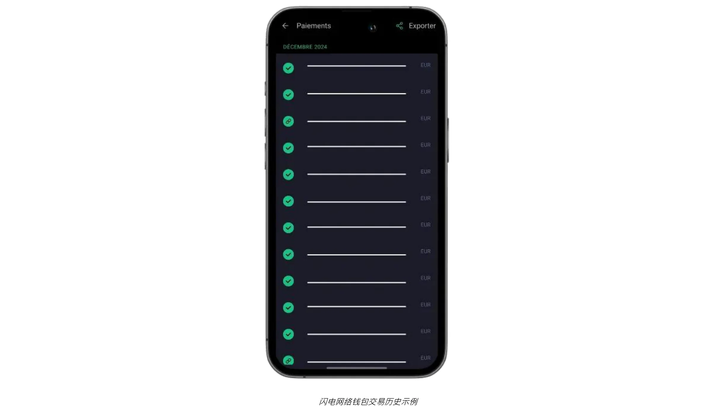

对于希望通过在线捐款或小费来补充实体或现场支付的企业来说，现在可以直接将闪电网络小费按钮或捐款小部件集成到网站或博客中。BTCPay Server等平台提供易于配置的支付按钮，而一些社交媒体和直播服务已经支持带地址的闪电小费。因此，即使是初创企业也能建立一个规模不大但遍布全球的赞助人网络。与此同时，那些不愿意长期持有比特币的人可以探索使用某些托管钱包或第三方服务将比特币部分或自动兑换成法定货币。虽然这种选择涉及额外的费用和可能的 KYC 规定，但它可以帮助企业避免汇率波动，并在最小的干扰下维持现有的财务工作流程。

我们将通过一个简单的用例讲解上述各个因素是如何融合在一起的。想象一下在周六的农贸市场上出售自制果酱的当地手工艺人。当顾客要求用比特币支付时，商家可以快速输入相应的法币金额，应用程序就会自动计算出应付的比特币金额。顾客的钱包扫描所生成的二维码后，几秒钟内就能完成支付，而手工艺人也能立即知道交易已成功。当天的所有交易细节都可以被导出以便记录，且当天的全部或部分余额可以被发送到兑换平台，兑换成法定货币。

通过兼顾用户友好型工具、简单硬件要求和直接式记录保存，入门者档案提供了基本功能，而不会让新手感到不知所措。如果交易量增加，企业的运营要求不断变化，那么升级到下一章详述的更高级档案也将成为一种自然的进展。

为了理解有关的推荐钱包和基本设置的详细教程，请参阅以下指南：

**非托管的闪电网络钱包/节点：**

https://planb.network/tutorials/wallet/mobile/phoenix-0f681345-abff-4bdc-819c-4ae800129cdf

https://planb.network/tutorials/wallet/mobile/bitkit-a7224674-85c4-4045-9baf-37018d89550c

https://planb.network/tutorials/wallet/mobile/breez-46a6867b-c74b-45e7-869c-10a4e0263c06

https://planb.network/tutorials/wallet/mobile/blixt-04b319cf-8cbe-4027-b26f-840571f2244f

https://planb.network/tutorials/wallet/mobile/zeus-embedded-advanced-3e89603c-501d-439c-8691-d4a0d0de459b

**托管闪电网络钱包：**

https://planb.network/tutorials/wallet/mobile/wallet-of-satoshi-39149d86-e42b-4e8f-ae9f-7e061e7784f7

https://planb.network/tutorials/wallet/mobile/blink-7ea5f5a4-e728-4ff9-b3f9-cf20aa6fc2bd

## 基本用户档案

<chapterId>89be421f-f7df-4bcc-a9e4-df96e39ef249</chapterId>

基本用户档案适用于中小型企业（有员工的企业），这些企业不需要高级技术知识，就能方便快捷地接受比特币，同时还拥有一个比简单钱包更完整、更专业的系统。这类用户多为餐馆、咖啡馆、酒吧或小型零售店，每月只有少量的比特币支付，但他们想拥有一个既简单又足够稳定的界面，以便不间断地处理日常业务。

与“入门者”不同的是，"基本企业 "通常将比特币支付视为其收入来源的一部分，而不仅仅是一种尝试。它们的交易量仍然相对较低，但频率足够高，企业主和员工都能从一个更加有系统性和可靠的系统中获益。同时，“基本用户档案”仍然注重简便性；虽然它允许使用方便的仪表板和有限的角色管理，但并不需要专业的信息技术资源或复杂的集成方案。

该领域的技术推荐通常以**瑞士比特币支付**为中心，这是一种简单化的方案，可让商家轻松接受比特币支付。它拥有一个用户友好型 PoS 应用程序，员工无需任何专业技术知识。与标准的比特币钱包不同，它只专注于接收付款，允许员工在没有安全风险的情况下使用该设备。多个 PoS 应用程序可以连接到同一个账户，并且可在平板电脑、收银机、智能手机上使用，也可通过网络版电脑使用，支持 Android 和 iOS 系统。您还可以创建一个列出所售商品及其相关价格的选单，让员工只需在 PoS 上为顾客选择一篮子商品，然后收取总费用。

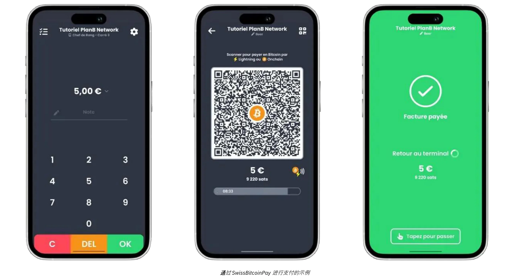

付款既可以用比特币提取到指定地址，也可以兑换成法定货币，每天存入银行账户。Swiss Bitcoin Pay 可自动处理比特币和闪电网络支付，无需人工干预。资金在转账前最久可保留 24 小时。虽然不像 BTCPay Server那样完全非托管，但它在便利性和安全性之间取得了平衡，而且不需要 KYC。

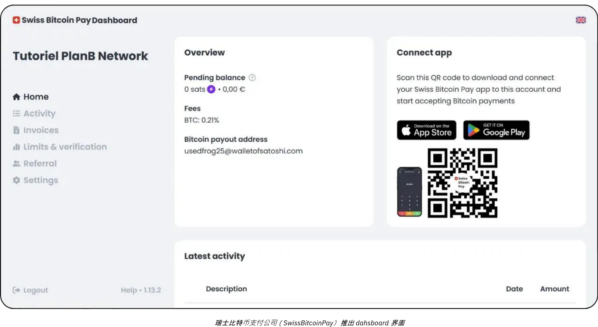

费用很有竞争力：第一年费用为 0.21%，之后比特币支付为 1%，还有法币转换支付的 1.5%费用，包括比特币交易成本。Swiss Bitcoin Pay 在 Open Node 等托管解决方案和 BTCPay Server 等复杂的自托管系统之间提供了一个实用的中间地带，优先简便性、安全性和财务主权。

这种类型的设置可使现场业务迅速生成付款发票，向顾客出示二维码，并以极小的阻力接受闪电网络交易或链上交易。员工只需简单的入门指导即可处理这些支付，而经理则可以登录在线控制面板，核对每日销售额并访问基本报告。更加简单的管理控制平台还可以帮助小型机构从单一界面跟踪法币和加密货币的收入，从而减少混乱的可能性，减少手工记账的时间。

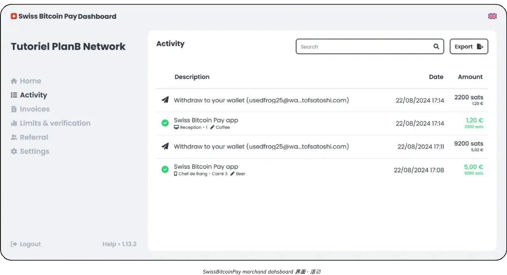

基本用户档案的另一个主要优点是强调快速实施和极少的干扰。Swiss Bitcoin Pay等方案可以在数小时内完成安装，而不需要数天或数周。例如，对于一家不太繁忙的餐馆老板或经理来说，主要目标在于整合比特币接受功能，而不会造成收银台的延误或员工的混乱。一旦 PoS 系统配置完毕，经理只需向员工简单说明如何显示发票和验证付款是否已结清即可。在最理想的情况下，客户的交易几乎会立即通过闪电网络收到确认，企业的管理面板也会同时实时记录新的付款。

虽然基本用户档案不需要高度复杂的会计系统，但保持适当的交易记录仍然是明智之举。Swiss Bitcoin Pay等工具提供 CSV 导出功能，使管理者能够获取每笔比特币销售的法币等值，并与其他收入来源一起进行跟踪。对于大多数小型企业来说，这种程度的文件记录已经足够了，而对汇率的基本了解也有助于报税和一般财务监督。

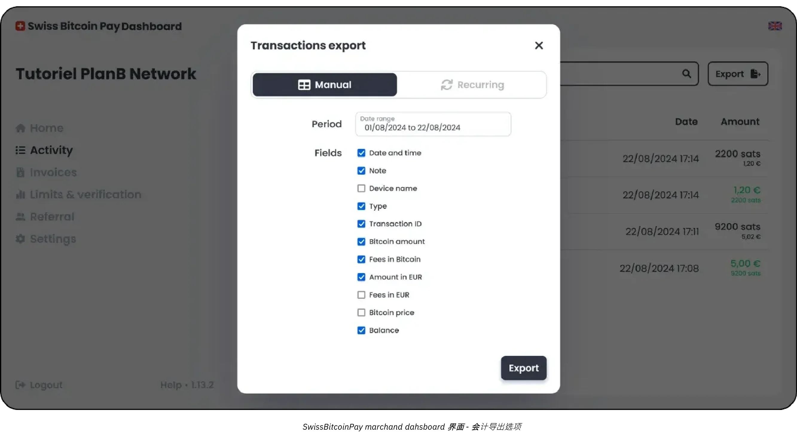

最可能适合您的混合解决方案是 Swiss Bitcoin Pay：

https://planb.network/tutorials/business/point-of-sale/swiss-bitcoin-pay-2-a78b057e-ed11-47ac-860c-71019fcb451a

另一个易于实施的解决方案是 Open Node，但缺点在于它是 100% 托管的：

https://planb.network/tutorials/business/point-of-sale/open-node-e69a0c1c-47f7-4932-8494-e6f26c3c9784

如果您愿意自己动手操作、亲自设置，并希望完全掌控整个流程，BTCPay Server软件是一个极佳的方案选择。不过，BTCPay Server的主要缺点是设置和管理比较耗时，需要一定的专业技术，但您可以按照我们的指南进行操作：

https://planb.network/tutorials/business/point-of-sale/btcpay-server-928eb01e-824b-4b57-a3e8-8727633beddc

最后，作为对实体销售点的补充，您可以考虑建立 [Bitcoinize PoS](https://bitcoinize.com/)。

## 专业用户档案

<chapterId>4d5dfa50-c4d0-481c-ab95-1863a898750e</chapterId>

专业用户档案的目标客户是那些已不再满足于偶尔或少量的比特币支付，而是需要一个稳定可靠的基础设施来处理日常交易的企业。这些公司通常在多个平台（可能是零售点、专门的电子商务网站，甚至是移动销售）开展业务，因此需要能够无缝集成到现有工作流程中的支付方案。在许多情况下，这一级别的企业已经管理着销售点系统、在线订单管理平台和后台操作，其需要一种可靠、可扩展的方案。

专业商户的一个显著特点是需要**先进的功能**和**可个性化的解决方案**，即使交易量增长也能保持稳定的效率。基本用户可能满足于智能手机应用程序上的精简工具，而专业商户则不同，他们通常需要的功能包括详细的发票定制、复杂的报告仪表板以及分配多个管理角色的能力。

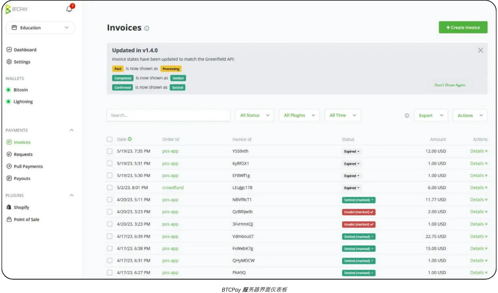

例如，一个餐饮集团可能有专门负责开具发票和库存管理的员工，而另一个团队则负责产品列表和营销活动。在这种环境下，比特币支付解决方案必须与这些已有的组织结构良好配合。

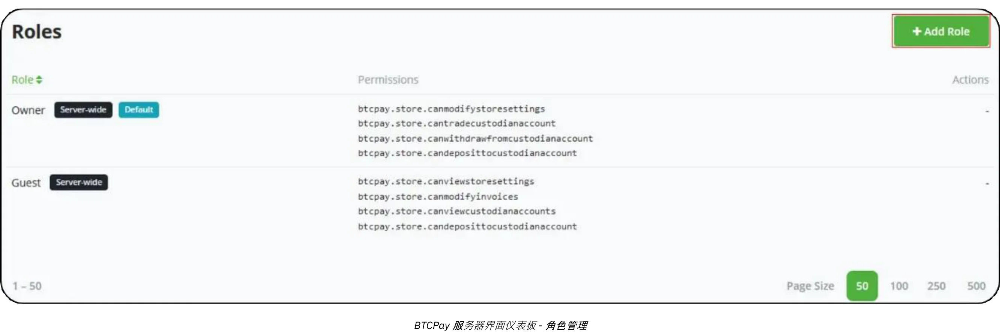

在技术和工具方面，**BTCPay Server**等解决方案通常是专业设置的核心。BTCPay Server 是一个开放源码平台，既可在企业内部使用，也可通过云主机部署，并为网站和电子商务平台提供广泛的集成选项。通过自行部署实例，企业可以对支付流程的各个方面进行高度控制，从自动生成的结账页面到确认支付后触发内部流程的通知。

此外，[Zaprite](https://zaprite.com/) 或[Musqet](https://musqet.tech/) 等工具可以进一步完善结账体验，支持更细致的定制化设置（从品牌风格的选择到高级报表功能）。那些偏向于一体化在线零售环境的人可能会倾向于[Be-BOP](https://be-bop.io/)，这是一个电子商店解决方案，旨在方便比特币支付，同时又不影响易用性。

在专业环境中实施这些技术意味着您需要密切关注**操作的复杂性**。自动开票工作流程、多币种显示以及与现有库存系统的同步都是集成良好的平台的标志。精确导出交易数据（无论是 CSV 文件、直接 API 调用还是自定义的格式）的功能有助于企业高效地调和比特币销售与其他收入流。

安全和角色管理是专业用户的另一个重要考虑因素。随着每日比特币交易的积累，控制管理功能的访问权限成为了一项重要的风险缓解措施。在许多解决方案中，管理员可以分配不同级别的权限（也许限制某些员工查看交易历史和生成发票，而授予其他员工管理库存或配置全系统设置的权限）。这种分级结构不仅能保护敏感数据，还能明确哪些员工负责支付基础设施的各个部分，从而使操作更加简单。

提到现实世界中的例子，假设有一家专门经营技术配件的中型电子商务商店。该公司可以将 BTCPay Server 整合到现有的在线店面中，在结账时自动生成比特币支付地址。顾客通过扫描闪电网络或链上地址完成购买，商店的平台会立即确认付款。与此同时，内部系统会更新订单状态并触发发货通知。借助先进的报告功能，财务团队可以轻松查看每天的比特币销售情况，导出综合分类账进行审计，并跟踪公司决定要保留的任何比特币持有量的价值。

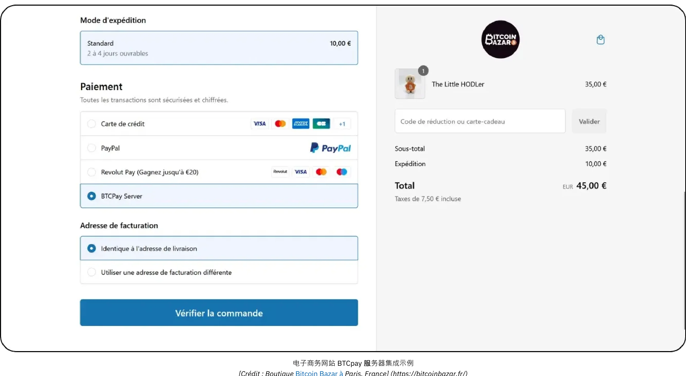

*[图片来源：法国巴黎的 Bitcoin Bazar 商店。](https://bitcoinbazar.fr/)*

如果您想要深入了解 BTCPay Server 的具体实施情况并探索 BTCPay Server 的实际配置，请参阅以下课程：

https://planb.network/courses/6fc12131-e464-4515-9d3f-9255365d5fa1

## 企业档案

<chapterId>80fb2659-81ca-4a11-b492-72c7ae5774f9</chapterId>

企业档案是比特币支付实施的顶峰，专为大型企业、主要市场的公司和需要完全定制解决方案的成熟企业量身定制。与小规模或中级用例不同，企业用户业务将比特币支付集成到广泛的工作流程和系统中，从现场销售点设备到电子商务店面、后台会计平台和复杂的企业资源规划框架。

在这一规模程度上，首要目标不仅仅是接受比特币，而是以一种**与组织核心流程完全一致**的方式接受比特币。这种协调可能需要专门的软件开发，无论是完全定制的解决方案，还是通过第三方*Lightning Service Providers* (闪电服务提供商，即LSP)支持的基于 SaaS 的基础设施进行协调。此类 LSP 能够处理高交易量以及复杂的网络配置，超出了传统即开即用工具所能胜任的范围。因此，由此产生的架构包含了广泛的技术和业务考虑因素，从应用程序接口驱动的集成到先进的资金管理功能。

在企业情景中，运营的复杂性尤为明显。一家大型企业可能需要管理多个部门（销售、营销、开发、财务和会计），每个部门都有不同的职责和数据要求。在这种情况下，比特币支付平台必须提供高度细化的角色管理功能，其允许每个部门访问与其任务相关的功能，同时保持对安全性和数据完整性的严格控制。一样重要的是定制工作流程的功能：例如，入站支付可能会触发库存系统的更新，向销售经理发送自动通知，并为财务团队实时更新分类账条目。PoS设备本身通常是为企业环境量身定制的，具有符合公司品牌需求和运营需求的定制软件界面。

**安全**对于企业档案用户来说至关重要。大量的交易和潜在的巨额比特币需要一个稳定可靠的基础设施，能够抵御恶意攻击或内部威胁。最佳做法通常包括带有时间锁的多重签名金库配置、经过仔细审计的代码库以及严格遵守相关监管框架。此外，遵守当地和国际金融法规对于维护公司声誉和经营许可也是必不可少的。

创建或整合企业级比特币支付解决方案所涉及的**定制化开发**不仅仅是编码几个应用功能。它通常需要架构设计、全面的协议测试以及可能跨越多个阶段的有系统推广（最初的试点项目、有限的市场测试以及最终的全球实施）。

在会计方面，高频交易需要**定制的导出**，甚至有时还需要与企业财务软件实时同步。大型企业可能依赖 SAP 或 Oracle 等企业资源规划（即Enterprise Resource Planning，简称为ERP）方案，而这些解决方案又必须与比特币支付数据顺畅连接。为了实现这一点，所选平台的应用程序接口必须是复杂的而灵活的，使信息技术团队能够自由创建自定义报告仪表板，实施自动对账流程，并生成每日甚至每小时的财务汇总。

一个典型的企业情况可能是一个每天有成千上万笔交易的大型电子商务市场。除了将比特币列为支付选项外，该市场还可以定制用户体验的每个方面，从比特币支付流程如何在面向客户的网站上显示，到如何在后端管理退款、扣款或解决争议。一个专门的开发团队将与财务和法律部门合作，监督持续的维护、安全补丁和合规性更新。如果公司选择保留部分比特币收入，内部财务系统将跟踪公司持有的比特币和传统货币储备。

为确保企业级实施的顺利和安全，大多数组织都会聘请专业服务提供商或具有比特币和闪电网络集成经验的内部开发团队。这一过程通常从深入的需求评估（涵盖技术基础设施、合规要求和所需的客户旅程）开始，然后设计一个能够处理高吞吐量的架构。根据项目范围的不同，您可能需要一个由财务主管、安全分析师和软件工程师组成的多学科团队。另外，越来越多的专业咨询公司可以从最初的构思到最终的推出为您提供指导，协助您完成评估 SaaS 托管解决方案、配置*闪电服务提供商*和定制前端界面等任务。通过与领域专家合作，企业可以降低与大规模支付实施相关的风险，并获得一个不仅稳健、合规，而且足够灵活以适应未来发展的解决方案。

## 比特币支付解决方案：选择与趋势

<chapterId>59ff43a1-98e2-4a81-af3e-9654bdd60952</chapterId>

每一类解决方案都会有所取舍。例如，在最初的“试用阶段”，建议的钱包在用户界面方面非常简单，但它们是（**托管的**）。这意味着资金由应用程序提供商控制。然而，比特币的精神是鼓励用户完全拥有资金（**自托管**）。在这种情况下，建议在第一笔销售完成后立即升级到下一个级别，即一旦确认有客户愿意用比特币支付。

比特币的主要优势之一是可以随意转移资金，这使得更换供应商**或解决方案组件变得**容易。此外，所有应用程序和解决方案本身都在快速发展。例如，Bitcoinize 现在提供的实体 PoS 终端可与市场上的许多应用程序集成，这种解决方案在几个月前还不存在。

### 您正在寻找一种既能创建商店又能接受传统支付和比特币支付的解决方案吗？

如果您是白手起家，没有商店、没有产品管理软件、没有 PoS 系统，您有几个选择：

- **外包：** 您可以外包创建一个有购物选项的网站，然后在传统店内解决方案的基础上增加比特币支付功能。
- **简单的解决方案：** 或者，您也可以使用 Accessing.app 等平台自行操作。主要优点包括：
    - 快速、经济地建立网上或实体商店。
    - 适用于季节性业务、活动、餐馆或零售商店。
    - 制定和管理实体销售和在线销售的产品。
    - 通过自己的 Stripe 账户处理法币支付（如欧元、美元）。
    - 通过您自己的 Swiss Bitcoin Pay 账户进行比特币支付处理。

### 闪电支付的采用进展如何？

尽管闪电网络具有更高的效率和更低的费用，但其应用仍处于早期阶段。与其关注当前的局限性，不如回忆一下历史上的基础设施变革是如何展开的：

- 汽车刚出现时，没有足够的汽车来证明修建道路是合理的，也没有足够的道路来证明拥有汽车是合理的。
- 当电力出现时，没有足够的客户来证明建设电网的合理性，也没有足够的电网来吸引客户。

新的基础设施之所以成功，是因为它们更有效率，而早期采用者之所以采用，是因为他们获得了实在的好处。以下是对 2024 年闪电网络的看法：

- **超快事务处理：** 事务处理通常几乎瞬时完成（少于 500 毫秒），故障率极低。
- **网络专业化：** 较大的参与者正在确保整个网络的流动性，而个人已基本停止路由支付，现在主要运行 "边缘节点"。
- **改善用户体验：** 面向个人用户的移动应用程序已得到显著改善。拼接、静态 Bolt12 发票和零确认付款（0-conf）等功能已广泛使用，使交互无缝衔接。互操作性问题（如强制关闭）不再是一个主要问题。
- **更强的节点和通道管理：** 个人和专业解决方案均已取得进展。例如，BTCPay Server 现在支持大量的插件，用于连接其他供应商（如支付服务提供商、法币进出通道等）。LightSpark 和 Alby Hub 等新的基础设施提供商也已经开始正式运营。
- **商户采用率增长：** BitRefill 等商户报道，其活跃用户中的比特币支付量有所增加，其通过闪电网络进行。此外，闪电支付的超低费用使其成为小额支付的首选（平均每笔交易费为 32 欧元）。

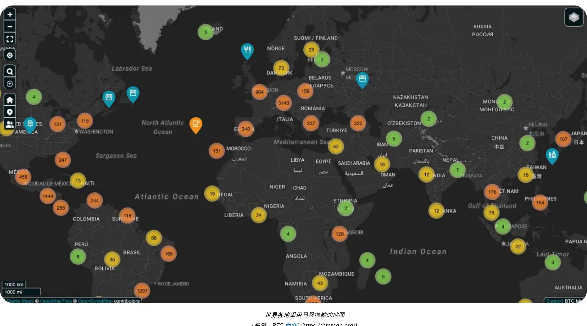

*[来源：BTC Map](https://btcmap.org/)*

- **网络指标：** 闪电网络上锁定的通道和比特币总数保持稳定，约有 20,000 个节点、5,200 个 BTC 和 60,000 个通道。然而，这只反映了网络的一部分情况，表明参与者之间出现了轮换，个人参与者减少，专业人士增多。
- **闪电网络是网络之间的桥梁：** 闪电网络的效率和可用性已使其成为连接其他互联网络（如FediMint、Liquid等）的桥梁。

**钱包卷土重来**

比特币和闪电网络正在带来**数字钱包革命**。新的网络服务现在允许用户在无需创建账户的情况下进行交易，而您的钱包成为了您的身份！通过**Nostr Wallet Connect（NWC）**和**LN-URL-AUTH**等协议，钱包可以无缝验证用户，无需传统账户即可进行交易。简单购买或订阅时的账户疲劳时代一去不复返了。我们不再需要提供可能被黑客窃取并在暗网上出售的个人信息或支付信息，最近发生的事件经常提醒我们这一点。

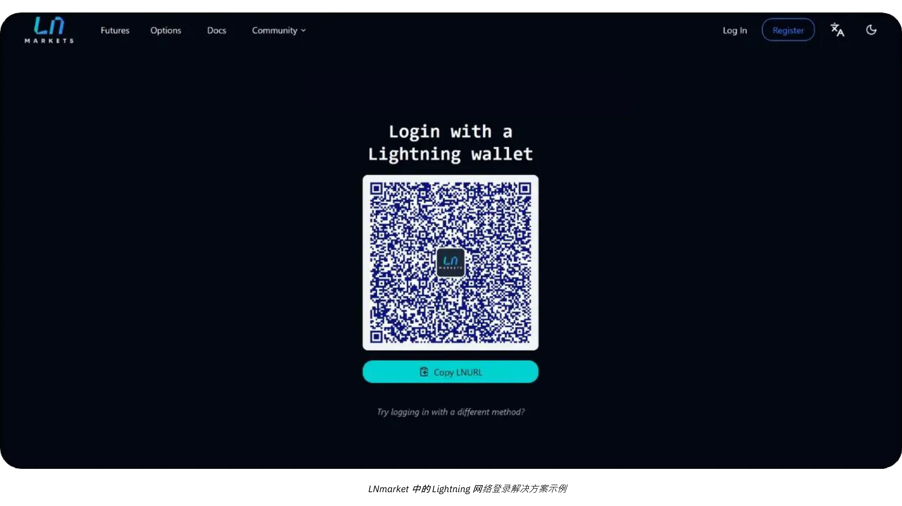

未来的商家将拥抱这一创新，为客户提供更安全、更无缝（一键式）的体验，同时也尊重他们的隐私。

# 比特币会计

<partId>d49d7595-a189-4e2b-bd60-c19e8e717aa2</partId>

## 企业比特币会计的基本原则

<chapterId>84063061-ffdb-4b1f-b20b-588ffb146877</chapterId>

以下内容仅用于教育目的，不应被视为财务或会计建议。我们强烈建议企业和个人在采取任何行动之前，咨询熟悉其特定司法管辖区加密货币法规的合格会计师或法律专家。

### 比特币会计关键概念

**任何比特币交易都必须被记录，并且可能会触发应税事件**

在全球范围内，比特币通常不被归类为货币，而是数字资产。这种区别极大地影响了比特币在企业中的记账方式，影响了纳税义务、财务报告和合规要求。接受比特币作为支付方式或将其作为财务工具的企业必须了解这些监管上的细微差别。

需要牢记**最重要的后果是**，在大多数司法管辖区，赚取、出售、交易或使用比特币进行购买，通常会涉及到**应税事件**，而且收益需缴纳资本利得税。

比特币会计的另一个方面是区分两种资本收益：

- **潜在损益：** 会计期末持有的比特币价值基础上的未实现损益。
- **实际损益：** 财政年度内出售或交换比特币时的已实现损益。

这些计算在很大程度上取决于持有比特币是为了长期投资还是短期运营使用。此外，企业必须使其会计实践与当地税收结构相一致，因为不同国家的法规差异很大。

持有比特币的企业会计工作有些繁琐，因为必须对每一笔交易进行细致的跟踪，以计算已实现或未实现的利润或损失。每一笔接受比特币作为支付方式的交易，或者每一次买入或卖出比特币，都需要记录：
- 具体时间
- 售价（以法币计）
- 比特币成本价（比特币最初的收购价格）。

因此，您以后就可以计算出差额，从而确定利润或损失。

**示例：** 某家企业以 30,000 美元的价格买入 1 BTC。后来，它以 20 000 美元的价格出售了 0.5 BTC。为了计算利润或损失，企业必须：

- 记录获取比特币的时间、法定成本价格和数量
- 记录比特币售出的时间、法定售价和数量
- 确定出售比特币的成本：0.5 BTC：30,000 美元 ÷ 2 = 15,000 美元。
- 比较销售价格和成本价格：20,000 美元（销售价格）- 15,000 美元（成本价格）= 5,000 美元利润。
- 用新的成本价格更新比特币持有量

每笔交易都必须重复这一过程，而比特币价格的波动性使得记录保存工作更加复杂。

**如果比特币是一种货币，它将如何运作？**

如果将比特币当作一种货币，企业在会计系统中就会像管理其他货币一样管理比特币。比特币持有量将被记录在一个货币账户中，而不是跟踪每笔交易的成本基础和已实现/未实现利润。在每个报告期结束时，包括比特币在内的所有货币持有量的价值将按照当前汇率转换为会计货币（如美元或欧元）。

**比特币被承认为货币的会计示例：**

- 当比特币价值 30,000 美元时，某家企业持有 1 BTC。之后，当比特币价值为 40,000 美元时，该企业使用 0.5 BTC 进行支付。
- 企业不会计算已实现的利润或亏损。而是将交易记录为
    - 付款：20,000 美元（0.5 BTC × 40,000 美元）。
    - 剩余比特币余额： 0.5 BTC，现值为 20,000 美元（按当前汇率更新）。

**如果比特币被承认为货币的主要优势：**

- 企业只需定期调整其持有的比特币的法定等值（如月度或年度报告），就像调整欧元、日元或其他货币一样。
- 无需进行交易层面的成本基础跟踪，其简化了会计核算，尤其是对于比特币交易频繁的企业。

假设比特币在法律和监管方面得到完全承认，这种方法将使比特币的会计核算简单得多，减少行政负担，并与其他货币的处理方法一致。我们还没达到那一阶段。

### 个人和公司比特币会计的区别

个人和公司对比特币的法律和会计处理有很大的不同。对个人而言，比特币交易收益可能需要缴纳所得税，税率通常较高。相比之下，公司可能享受较低的公司税率，但必须遵守更严格的簿记标准。

对于企业来说，比特币可以根据其用途被归入不同的账户：

- **固定资产：** 作为战略投资长期持有的比特币。
- **股票：** 用于生产过程中使用的比特币（这种情况很少见，例如专业交易商）。
- **现金或金库账户：** 作为流动资产持有的比特币，主要用于业务交易或短期金库管理。

分类的选择取决于公司的活动和战略，并对财务报告和纳税义务产生影响。由于各国的分类可能不同，请务必查阅当地法规。

### 法律框架

对比特币的法律承认和处理因司法管辖区而异。一些国家，如萨尔瓦多，承认比特币为法定货币，其简化了比特币在交易中的使用，但使国际财务报告变得复杂。其他国家则将比特币视为一种数字资产，受特定税收和会计规则的约束。

在大多数国家，比特币被归类为数字资产，其处理方法受一般会计准则管辖。企业必须对比特币交易进行如下会计处理：

- **记录资本损益：** 企业必须在财务结果中说明已实现的损益。
- **潜在收益/损失估值：** 未实现收益或损失通常必须报告，但可能不会直接影响应纳税收入。
- **遵守会计准则：** 企业必须将比特币交易纳入标准记账方法，确保透明度和准确性。

比特币核算方法因地域而异：

- **美国：** 美国国税局将比特币归类为**财产，类似于股票、债券或房地产**。这种分类意味着，任何涉及加密货币的交易，如赚取、出售、交易或甚至使用加密货币进行购买，都可能涉及到应税事件，收益需缴纳资本利得税。
- **欧盟：** 成员国通常将比特币视为投机资产，而非功能货币。因此，收益往往需要缴纳资本利得税。
- **亚洲：** 新加坡和日本等国采用了渐进式监管框架，在特定情况下对比特币交易给予优惠待遇。但是，比特币一般被视为**无形资产**，在报告日期按公允价值计量，其变动计入损益。

了解业务所在国的法规并相应调整会计实务至关重要。

### 监管演变的挑战

加密货币创新的很快速度往往超过监管框架制度。自从比特币被认定为数字资产以来，全球监管法规已逐步更新，但差距依然存在：

- **缺乏判例：** 很少有法律案例阐明具体的会计实务，因此可能有对此不同的理解。
- **现有的辩论：** 潜在亏损的税务处理等问题在许多司法管辖区仍存在不确定性。
- **跨境复杂性：** 在国际上运营的公司面临着协调不同国家会计准则的挑战。

尽管存在这些挑战，但许多国家的积极立场为企业将比特币纳入其运营奠定了坚实的基础。持续更新和国际协调对于解决加密货币会计中新出现的复杂问题至关重要。

### 财务报表中的比特币分类

比特币在财务报表中的分类因辖区而异，取决于其在企业中的用途。基本上，比特币被视为一种数字资产，类似于存货、投资或货币，但具有影响其会计处理的独特特征。

- **数字资产或无形资产**：法国和欧盟等许多司法管辖区将比特币归类为数字资产或无形资产，而不是法定货币。这种分类要求企业对比特币的会计处理与法定货币不同。
- **库存**：如果企业的核心业务涉及比特币交易，如加密货币交易所或经纪人，比特币就被归类为存货。在这种情况下，估值遵循存货会计准则。
- **金融投资**：将比特币作为长期资产持有的公司可以将其归类为金融投资。例如，在美国，企业可以根据财务会计准则委员会（FASB）的指导方针对比特币进行核算，在市场价值下降时确认减值。

**分类的影响：**
- 长期持有的资产往往需要进行减值测试和摊销处理。
- 活跃的交易或与付款有关的活动需要不断跟踪已实现和未实现的损益。

### 估价方法

估值方法是用于确定比特币成本基础的会计技术，对于准确计算交易中的收益或损失至关重要。一般来说，最好**在会计系统中始终保持当前比特币持有成本**的最新价值。这样可以确保透明度，遵守税收法规，并防止在需要进行计算时落后。

- **先进先出法（First In, First Out，简称为FIFO）**：这种方法在澳大利亚和印度等司法管辖区很常见，它根据最早的收购成本对比特币进行估值。这可能会变得相当**复杂**，因为它可能需要在销售时分别跟踪比特币的每一部分。
- **加权平均成本（Weighted Average Cost，简称为WAC）**：由于它很**简单易行**，这种方式常被用于高频交易场景，如美国等国家。

强烈建议**从公司开始购买比特币或接受比特币作为支付**起，就保存一份详细的比特币成本跟踪工作手册，以确保账目清晰、记录准确。仅这一点，就应当成为在选择比特币支付或购买软件方案时的首要考虑因素之一。

### 零售和电子商务交易会计

零售商必须记录每笔交易的比特币对美元的汇率。例如，在许多国家，企业使用销售时的汇率来计算增值税。

企业必须确保其使用的**支付**工具能够做到以下的点：
- 生成包含当地法定金额（欧元、美元、英镑）、增值税或其他地方税、比特币的相当值、日期和时间、比特币汇率和兑换来源等信息的发票
- 至少以 .csv 格式导出所有付款收据，并附上所有上述信息，以便会计师轻松处理这些收据
- 最好能记录金库中持有的当前比特币的最新成本基准值

### 比特币会计的挑战

- **波动性**：比特币价格有大幅的波动，给估值和预测未来财务结果带来困难。
- **监管审查**：在中国等国家，比特币的受限地位限制了其作为金融资产的用途。
- **监管的不确定性** ：比特币的监管环境不断变化，经常让企业家感到迷惑。例如，印度或美国税收政策的变化会在很短的时间内影响会计实务。
- **管理不善的风险** ：不正确的资产分类或未能监控比特币交易可能导致合规问题、处罚或声誉受损。
- **重新认证风险**：如果公司将大量资金储存在比特币中，可能因币价下跌而遭受严重损失。如果此类下跌恰逢需支付供应商款项、员工薪资或税款，后果将更为严重。此外，公司所有者可能要承担责任，这可能会导致罚款或其他法律问题，如滥用公司资产的指控。

## 会计工具和软件

<chapterId>e7b31be5-1176-4835-944e-3cba1b7040fa</chapterId>

当一家公司决定将比特币纳入其会计核算时，各种工具和专业软件可以简化数据的收集和处理。最广泛的方案有[CoinTracker](https://www.cointracker.io/)、[Waltio](https://www.waltio.com/)、[Cryptio](https://cryptio.co/)、[Koinly](https://koinly.io/)、[TokenTax](https://tokentax.co/)和[ZenLedger](https://zenledger.io/)。这些平台主要集中在四个方面：
- 自动数据收集；
- 将这些数据转换成与更通用的会计软件（QuickBooks、Xero、ERP）兼容的格式；
- 计算纳税义务；
- 交易分类。

对于在不同平台或交易所拥有多个钱包和资产的大型机构来说，它们往往是明智的补充元素。

然而，对于大多数小型企业来说，一个简单的包含交易历史的".csv "文件通常就足够了。目的是记录每笔付款的日期、金额、欧元/美元等值以及相关的比特币地址。绝大多数比特币支付解决方案（BTCPay Server、Swiss Bitcoin Pay 等）或交易所平台（Bitfinex、Kraken、Coinbase 等）已经提供了导出交易历史记录的功能。通过向会计师提供该文件，可以简化数据录入，并清楚地区分与比特币相关的流入和流出。

对于自我保管比特币的人来说，管理 UTXO（*未花费的交易输出*）是一个不可错过的步骤。正当的UTXO标签有助于追踪每个比特币“片段”的来源，区分与专业活动相关的交易和用于个人支出的交易，并为法律或税务目的的可追溯性带来了便利。大多数很好的比特币钱包软件都允许您使用备份文件（或 xpub，取决于您的设置）导入钱包，并根据其来源或目的地标记UTXO。为了帮助您，下面有一个专门介绍这种做法的完整教程：

https://planb.network/tutorials/privacy/on-chain/utxo-labelling-d997f80f-8a96-45b5-8a4e-a3e1b7788c52

最后，无论您是小商户还是成熟企业，都可以**用**比特币结算发票。关键是要正确记录交易。如果您使用自我保管的钱包付款，最好在标签中注明发票号码和付款目的。如果您希望通过交易所结算发票，您还可以选择导出收据或交易历史记录，以便纳入会计记录。这种透明度将简化您对所有 BTC 业务的跟踪和报告。

## 比特币会计的实例

<chapterId>763f6f20-9181-495a-bf7d-b405899e65ec</chapterId>

### 第一个实例：零售店将比特币支付转换为欧元

**情景**：一家小型面包店接受比特币作为付款媒介，但会立即将收到的所有比特币兑换成欧元，以避免受到加密货币波动的影响。

**举例**：

- **比特币兑换率**：1 比特币 = 40,000 欧元。
- **交易 1**：顾客以 20 欧元购买多份糕点。
    - 比特币等价物：（20/40,000）= 0.0005 比特币 = 50,000 聪。
    - 兑换费：1.5%（20 欧元 × 0.015）= 0.30 欧元。
    - 净收入：20 欧元 - 0.30 欧元 = 19.70 欧元。
- **交易 2**：顾客购买 5 欧元的咖啡。
    - 比特币等价物：（5/40,000）= 0.000125 比特币 = 12,500 聪。
    - 兑换费：1.5%（5 欧元 × 0.015）= 0.075 欧元。
    - 净收入：5 欧元 - 0.075 欧元 = 4.925 欧元。

**交易总结**：
- **销售总额**：25 欧元。
- **总费用**：0.375 欧元。
- **收到的欧元净额**：24.625 欧元。

**会计结果**：
- 将总销售额（25 欧元）记录为收入。
- 扣除转换费（0.375 欧元）作为开支。
- 资产负债表中没有比特币持有量，因为所有金额都已立即兑换。

### 第二个实例：零售店保留 50% 的比特币付款

**情景**：同一家面包店选择保留 50% 的比特币付款作为财务资产，而将另外 50% 兑换成欧元。

**举例**：
- **比特币兑换率**：1 比特币 = 40,000 欧元。
- **客户交易**：顾客购买 50 欧元的糕点。
    - 比特币等价物：（50/40,000）= 0.00125 比特币 = 125,000 聪。
    - 换算 (50%)：价值为 25 欧元的比特币 = 0.000625 比特币 = 62 500 聪。
        - 兑换费：1.5%（25 欧元 × 0.015）= 0.375 欧元。
        - 收到的欧元净额：25 欧元 - 0.375 欧元 = 24.625 欧元。
    - 以比特币留存 (50%)：62,500 聪 = 0.000625 比特币。

**交易总结**：
- **销售总额**：50 欧元。
- **费用**：0.375 欧元。
- **收到的欧元净额**：24.625 欧元。
- **保留的比特币**：62,500 聪。

**会计结果**：
- 将总销售额（50 欧元）记为收入。
- 扣除转换费（0.375 欧元）作为开支。
- 留存的比特币（62,500 聪）作为数字资产将被记录在资产负债表上。
- 未实现收益：如果比特币在财政年度结束时的估值较高或较低，则会有未实现收益或损失，该收益或损失将在财务附注中披露，但不会作为已实现收入

### 第三个实例：专业服务部门为长期投资保留比特币

**情景**：一名自由平面设计师接受比特币付款，并保留所有收到的比特币作为长期投资。

**举例**：
- **付款时的比特币兑换率**：1 比特币 = 30,000 欧元。
- **客户交易**：客户支付价值 3,000 欧元的服务费。
    - 比特币等价物：（3,000 / 30,000）= 0.1 比特币 = 10,000,000 聪。
- **年终估值**：
    - 年底比特币兑换率：1 比特币 = 35,000 欧元。
    - 所持有比特币的估值： 0.1 比特币 × 35,000 欧元 = 3,500 欧元。
    - 未实现收益：3,500 - 3,000 = 500 欧元。

**交易总结**：
- **所确认的总收入**：3,000 欧元。
- **所持有的比特币**： 0.1 比特币，资产负债表上价值为 3,500 欧元。
- **未实现收益**：500 欧元已在财务说明中披露，但未作为已实现收入。

**会计结果**：
- 在提供服务时记录收入（3,000 欧元）。
- 比特币在资产负债表中保留了 (0.1 比特币) 价值为 3,500 欧元的资产。
- 对未实现收益进行跟踪，但不列入损益表。

### 第四个实例：价格上涨后，企业主出售 50% 的比特币

**情景**：企业主在一年内进行了三笔比特币购买，持有比特币作为资产，并在价格大幅上涨后卖出 50%。

**举例**：
- **客户购买比特币**：
    - 第一次购买：2,000 欧元，兑换率为20,000 欧元/比特币 = 0.1 比特币 = 10,000,000 聪。
    - 第二次购买：3,000 欧元，兑换率为25,000 欧元/比特币 = 0.12 比特币 = 12,000,000 聪。
    - 第三次购买：5,000 欧元，兑换率为30,000 欧元/比特币 = 0.1667 比特币 = 16,670,000 聪。
    - **所持有的比特币**： 0.3867 比特币 = 38,670,000 聪。
- **年底估值**：
    - 年底比特币价格：40,000 欧元/比特币。
    - 总价值：0.3867 比特币 × 40,000 欧元 = 15,468 欧元。
    - 未实现收益：15,468 欧元 - 10,000 欧元（总成本）= 5,468 欧元。
- **出售 50% 所持有的比特币**：
    - 比特币出售量: 0.19335 比特币。
    - 销售所得： 0.19335 比特币 × 40,000 欧元 = 7,734 欧元。
    - 成本基准（加权平均）：
        - 总成本：2,000 + 3,000 + 5,000 = 10,000 欧元。
        - 加权平均价格：10,000 欧元 / 0.3867 比特币 = 25,850 欧元/比特币。
        - 出售比特币的成本：0.19335 比特币 × 25,850 欧元 = 4,999 欧元。
    - 已实现收益：7,734 - 4,999 = 2,735 欧元。

**交易总结**：
- **剩余的比特币**： 0.19335 比特币，价值为 7,734 欧元（按 40,000 欧元/比特币计算）。
- **已实现收益**：2,735 欧元列入损益表。
- **未实现收益**：财务说明中披露的 5,468 欧元（包括剩余比特币的未实现价值）。

**会计结果**：
- 将销售收入（7 734 欧元）记为收入。
- 扣除出售比特币的成本（4,999 欧元），计算已实现收益。
- 留存比特币（0.19335）在资产负债表中的价值为 7 734 欧元。
- 财务附注中披露的保留比特币未实现收益 5 468 欧元。

# 结尾部分

<partId>f6ca8d01-a4f3-449b-ac9f-c5fba9a69178</partId>

## 评估本课程

<chapterId>0fe8c49e-b7f8-46f7-9c42-b8a9a99a7b46</chapterId>

<isCourseReview>true</isCourseReview>

## 最终考试

<chapterId>40a0f18c-bdc9-45b2-8dea-15f7e574230e</chapterId>

<isCourseExam>true</isCourseExam>

## 结论

<chapterId>5503c23e-3a90-4a23-8d89-75e3cc1ee53e</chapterId>

<isCourseConclusion>true</isCourseConclusion>

