# 啟動貴公司在 Bitcoin 網路上的旅程

了解 Bitcoin 和 Lightning Network 的實用功能，並探索它們如何像網際網路一樣，**改變您的企業營運。從數位資本到快速、經濟且可擴充的付款，Bitcoin 為企業提供廣泛的**使用案例。

在本指南中，您將學習如何理解 Bitcoin 作為一個全球性、通用性和互聯網原生的貨幣網路。憑藉其獨特的基本特性，**Bitcoin 比傳統的貨幣網路**有顯著的改進。您將發現為何以及如何將 Bitcoin 應用於經典的金融用例，例如資金儲存和支付系統。此外，本指南還將涵蓋獲取和持有 Bitcoin，包括相關的會計和財務要求，以及實施簡單或大規模的 Bitcoin 支付解決方案。

無論您是**小企業還是大企業**，將 Bitcoin 整合到您的日常營運中，都能讓您的公司更具**彈性、生產力和競爭力**。每家網際網路公司都將成為以 Bitcoin 為導向的公司，本課程可確保您做好準備。最初的章節重溫了 Bitcoin 的基本操作，因此即使您是初學者，也能獲得繼續學習所需的基礎知識。學習 Satoshi 發明的基礎知識始終是個好主意，無論是在深入學習 BIZ101 之前或之後。

+++
# 簡介

<partId>326cf945-5d3f-4d86-8c3e-4d1c35959799</partId>

## 貴公司加入 Bitcoin

<chapterId>1be42be9-4080-49f5-b5b2-6b531dd55f5f</chapterId>

透過本綜合培訓課程，啟動貴公司在 Bitcoin 網路上的旅程 - 瞭解 Bitcoin 和 Lightning Network 如何徹底改變傳統商業運作的途徑。本課程專為零售商、企業家、經理和企業決策者所設計，他們希望探索 Bitcoin 作為全球互聯網原生貨幣網路的實用功能，以及 Exchange 的強大價值手段。

在整個課程中，您將了解使 Bitcoin 和 Lightning Network 脫胎換骨的基本原則。您將學習這些技術如何提供一系列的使用案例，從數位資本儲存到快速、經濟且可擴充的支付，以及它們如何提供比傳統貨幣和支付系統更重要的改進。BIZ101 課程將經濟理論與現實世界的應用相結合，闡明去中心化如何減少對中介的依賴，並克服傳統系統固有的限制。

本課程從詳細檢視傳統貨幣與支付機制開始，藉由探討貨幣如何發揮網路功能以促成貿易、儲蓄與經濟專業化，奠定基礎。接下來，我們會深入探討 Bitcoin 背後的技術以及 Lightning Network 所引進的創新，揭示它們在促進無縫、安全且近乎瞬間的交易方面所扮演的角色，以服務各種規模的企業。接著，我們將進入本課程的實務部分，首先是持有比特幣作為金庫的部分，接著是接受 Bitcoin 作為付款方式的最後一個部分。

無論您代表的是小型企業或大型企業，本課程的目的都是讓您掌握將 Bitcoin 整合到日常營運中的知識，從而提升公司的應變能力、效率和競爭優勢。隨著 Bitcoin 繼續重塑經濟版圖，了解這些突破性的技術不僅是一個選擇，更是策略上的必要。準備參與精闢的內容、實用的範例和策略性的指導，讓您能夠駕馭並運用不斷演進的 Bitcoin 世界！

準備好進入比特幣商業世界了嗎？我們出發吧！

**注意**: 如果您在課程中遇到任何不熟悉的術語，請查閱[詞彙表](https://planb.network/resources/glossary)獲取定義。

# 貨幣、支付系統和 Bitcoin

<partId>d9bd0e21-8488-44e0-af55-6d0b934f83c2</partId>

## 傳統貨幣

<chapterId>785e095c-6811-4ca2-ba46-fe38291432d4</chapterId>

### 貨幣即網路

貨幣從根本上來說是一種網路，可實現有效的 Exchange 價值。

在沒有貨幣的情況下，個人必須仰賴**易貨**，這是一種直接交換商品或服務的系統。以物易物是不切實際的，因為它需要「雙重慾望的重合」 - 雙方必須同時渴求對方所提供的東西。舉例來說，如果一個有剩餘小麥的農民想要鞋子，他們必須找到一個特別需要小麥的鞋匠。這種情況非常罕見，而且效率很低。此外，**在易物經濟中有 n 種產品，需要 ~n(n-1)/2 個 Exchange 比率**，創造了一個非常複雜和繁瑣的系統。例如，僅 500 種產品就需要超過 ~124,000 個 Exchange 比率。

貨幣扮演中介的角色，創造**個網路，將 Exchange 匯率的數量減少到 n** - 每種產品都有一個相對於貨幣的匯率。這讓交易變得更直接，也讓人們可以**交易商品和服務，而不需要同時**相互的需求。農民不用直接用小麥交換鞋子，而是可以將他們的小麥賣掉換取貨幣，之後再用貨幣買鞋子，或其他任何他們需要的東西。

貨幣作為網絡的引入不僅促進了貿易，還實現了**分工和專業化**。有了可靠的 Exchange 媒介，個人和社群不再需要生產他們所消費的一切。相反，他們可以專注於自己最擅長的領域，提高效率和品質。農夫可以專門種植作物，鞋匠可以專門製作鞋類，建築師可以專門建造房屋。這些專家可以透過貨幣來 Exchange 他們的商品和服務，從彼此的專長中獲益。隨著人們在各自的領域中精進技能並開發新方法，這種專業化推動了**生產力和創新**。

貨幣的網路性質帶來更多顯著的好處。首先，成為貨幣網絡的一員比置身於網絡之外**更有優勢。網絡的共享標準促進了貿易，使個人能夠協調他們的經濟活動，甚至**跨越很遠的距離。例如，一個城市的商人可以使用相同的貨幣與另一個城市的買家進行貨物交易，從而促進大區域的經濟成長與合作。

貨幣的另一個關鍵優勢是它能夠**允許延遲交換**。以物易物時，交易是即時的；一種物品會即時交換成另一種物品。然而，貨幣卻可以**儲蓄 - 個人可以儲存價值以備未來使用**。這代表了經濟規劃、投資和財富累積的一大躍進，所有這些都能提升網路參與者的生活品質。

總而言之，貨幣是設計來有效移動價值的網路。它們克服了以物易物的限制，簡化了貿易，並創造了協調和節約的機會。就像任何網路一樣，貨幣的價值取決於它的廣泛採用與效用 - 最終，最好的貨幣會獲勝。

### 什麼是好的貨幣？

一種好的貨幣擁有幾個基本特性，使其能有效促進價值 Exchange。以下是每個特性的簡明說明：

- 安全**：貨幣必須受到保護，以防止盜竊或未經授權的存取，確保使用者可以放心地持有和轉移貨幣。安全性是建立系統信任的關鍵。
- 防偽：貨幣必須極難或不可能被偽造。這可以確保每個單位都是真實的，保持其價值，並防止假貨進入流通造成的通貨膨脹。舉例來說，歷史上黃金之所以受到重視，不僅是因為它的美麗與稀有，也因為它極難生產。與紙幣或數位項目不同，您無法直接「製造」黃金，它必須從地底下開採。這種天然的稀缺性和生產的難度幫助黃金維持其作為可信賴的價值儲存和真實性基準的地位。
- 稀缺**性**：好的貨幣必須有有限的 Supply 或控制發行量。稀少性可確保其價值能長期保存，避免過度生產而侵蝕購買力。例如，某些美洲原住民部落使用珠子作為一種貨幣。起初，這些珠子是由 Hard 生產，以維持其稀有性和價值。然而，一旦歐洲商人開始大量生產，珠子充斥市場，它們的稀有性就消失了。隨著 Supply 的飆升，珠子失去了購買力，削弱了其作為可靠的價值儲存工具的作用。
- 無權**：在過去，金銀幣等貨幣通常是由私人、地方政府或能獲得原料的商人鑄造。這個系統有時是根據國王或統治者的協議或許可來運作的。隨著時間的推移，國王和政府將這個過程集中化，以獲得對經濟穩定、稅收和貨幣體系的更大控制。其中一個著名的例子是**thaler**，這是一種銀幣，於 1518 年由當地礦工和當局在**Joachimsthal 山谷**（現今捷克共和國的 Jáchymov）首次鑄造。thaler 「這個名字源自德文**」Thal 「**，意為 」山谷"。這些錢幣以高品質的銀質著稱，在歐洲各地廣泛流通。隨著時間的推移，這個詞語在語言和地理上都發生了變化，最終產生了 「美元 」這個名稱，並被美國採用為其貨幣。

在現代，貨幣在seigniorage制度下成為完全許可的貨幣，這意味著只有被授權的實體 - 例如中央銀行或財政部 - 才能鑄造硬幣或印刷紙幣。法律不再允許個人製造貨幣，以確保對貨幣發行和 Supply 的集中控制。

如今，Bitcoin 加密貨幣正在挑戰seigniorage 原則，它的運作不受中央控制。Bitcoin 是一個「無許可」系統，任何人都可以參與使用該貨幣，而無需徵求許可；透過 Mining，任何人都可以參與創造該貨幣。這種去中心化的方式消除了政府對發行的壟斷，令人質疑自由市場競爭貨幣系統的潛在回歸。

- 會計單位：貨幣應提供比較商品和服務價值的標準量度。這可簡化貿易，並使各交易的定價透明且一致。
- **耐用**：貨幣必須經得起時間的磨損。實體貨幣 (例如硬幣或紙幣) 應該能抵抗損壞，而數位貨幣則必須能安全儲存而不會有資料遺失的風險。
- 便於攜帶：貨幣必須易於攜帶和使用，以便進行跨距離貿易。這可以透過實體的便攜性 **(輕巧的硬幣或紙幣)** 或數位轉移系統來達成。
- 可分割**：貨幣應可分割成較小的單位，以方便不同規模的交易。這種靈活性可確保小額採購和大額交易都能實用。
- 可兌換**：貨幣的所有單位必須可以互換且價值相等。例如，一元紙幣必須等同於其他任何一元紙幣。這種統一性可確保交易的公平性與簡易性。
- 可識別：貨幣必須易於識別和信任。實體貨幣透過獨特的設計和安全功能來實現這一目標，而數位貨幣則可能依賴驗證規約。這可確保廣泛的接受度，並降低詐騙的風險。

這些特性讓貨幣在經濟體系中能夠實用、可靠、有效率地促進貿易和儲存價值。

### 貨幣系統演變

**從硬幣到紙幣：提高效率和便攜性**

從硬幣到紙幣的過渡標誌著**便攜性和效率的顯著改善**。由黃金或白銀等貴金屬製成的硬幣因其內在價值而具有價值。然而，它們很重，難以大量運輸，而且容易磨損或被盜。紙幣引入了一種重量輕、標準化、便於攜帶的媒介，代表了價值而不是包含價值，從而徹底改變了貨幣網絡。這項創新讓遠距離貿易變得更容易，並減少了使用實體商品作為貨幣的物流挑戰，從而擴大了經濟規模。

紙幣也增強了可擴展性。與其依賴有限的 Supply 貴金屬，各經濟體可以通過代用貨幣擴大其貨幣基礎，代用貨幣最初由儲備支持，後來由對發行機構的信任支持。這種轉變為更複雜、更互聯的金融體系鋪平了道路。

**From Paper to Electronic Money：擴大存取便利性與速度**

從紙幣到電子貨幣的轉變，進一步改善了貨幣網路，增加了存取的便利性和速度。隨著銀行系統、信用卡和數位交易的興起，貨幣不僅可以**攜帶，而且幾乎可以瞬間**轉移。電子轉帳不再需要實體的 Exchange，讓交易可以在幾秒鐘內跨越遙遠的距離。

這一轉變也使貨幣的使用更加民主化。電子銀行和支付系統降低了個人和企業的准入門檻，使他們能夠參與全球經濟。電子貨幣的速度和便利性擴大了貿易網路，並培育了新的商業模式，而這些在紙張系統中是不可能實現的。

這些現代化的貨幣網路有一個很大的缺點：在管理貨幣Supply**時，**缺乏可稽核性與透明度，經常造成無節制的通貨膨脹，以及對中央系統失去信任。舉例來說，單單在過去四年，所有流通中的美元就有超過 20% 是印制出來的。這種持續發行更多貨幣的誘惑，使現有持有者所持有的價值貶值，主要歸咎於一個系統性的缺陷：政治人物往往被激勵避免做出艱難的預算決策，而是選擇將挑戰推遲到未來的政府，「把罐子往路上踢」。

**From Centralized to Decentralized Currency：加強信任與主權**

今天，Bitcoin 去中心化貨幣的出現代表了貨幣網路的下一個躍進。傳統的電子貨幣依賴中央機構，例如銀行或政府，來管理和驗證交易。這些系統雖然有效，但卻容易受到低效率、審查和單點故障的影響。分散式貨幣透過**分散信任和移除中介**，改善了這些網路特性。由於沒有授權的步驟，這也代表資金的移動可以更快、更便宜。最後，人類無法誘使改變 Bitcoin 貨幣 Supply 的時間表，這是強制執行的軟體。

在分散式系統中，交易由使用 Blockchain 技術的全球參與者網路進行驗證，以確保安全性、透明度和彈性。這種結構可將欺詐風險降至最低，減少對中央機關的依賴，並賦予個人更大的財務控制權。透過消除地理和制度上的障礙，分散式貨幣提供了一個真正全球性和包容性的貨幣系統。

**貨幣網路的演進**

貨幣網路演進的每個階段都改善了關鍵特性：可攜性、可擴展性、無障礙性、速度、安全性和信任度。硬幣讓位給紙幣，以提高便攜性和效率。紙幣演變為電子貨幣，實現了全球存取和即時交易。現在，Bitcoin 正在重新定義信任和安全性，創造一個開放且有彈性的貨幣系統。這個歷史進程突顯了人類持續創造更好的 Exchange 價值網路的驅動力，每次迭代都是建立在前一次的基礎上，並超越前一次的限制。

最好的網路很可能會勝出。

## 傳統支付系統

<chapterId>1306196c-1e8a-454b-8e11-6887ecb3d8b4</chapterId>

支付系統是使資金能在雙方之間轉移的方法和基礎設施，通常是在付款人（如消費者）和收款人（如企業）之間轉移。這些交易可能發生在不同的場合：消費者向當地商戶付款、企業與供應商結算發票，甚至是個人之間的轉帳。要瞭解支付系統，就必須研究不同類型的支付方式、其特性，以及在企業對消費者 (B2C) 和企業對企業 (B2B) 環境中的使用案例。

### 常見的付款方式類型

1. **現金：** 雙方直接交換的實物貨幣。

2. **支票：** 指示銀行從付款人帳戶向收款人支付特定金額的紙張文件。

3. **Wire Transfers：** 銀行間的電子轉帳，通常用於較大筆款項和跨境支付。

4. **支付卡（信用卡/借記卡）：** 連接至卡片網路的塑膠卡或數位卡，可讓資金從持卡人的銀行帳戶（或信用額度）轉移至商家。

5. **Digital Wallets & Mobile Payments：** 儲存支付資訊的應用程式或裝置 (例如 Apple Pay、微信支付、阿里支付、PayPal)，可實現快速且經常是非接觸式的轉帳。

**用於 B2C 和 B2B：**

- B2C（企業對消費者）：
    - 消費者經常使用現金、卡和數位錢包進行日常購物，例如雜貨店、線上購物或搭乘順風車等服務。
    - 速度、便利性和低費用（對消費者而言）通常是主要優先考量。
    - 非接觸式和行動支付因其易用性，在這個領域越來越受歡迎。
- B2B（企業對企業）：
    - 企業通常依賴電匯、支票和發票系統來支付供應商、結算大筆帳單或處理經常性付款。
    - 重點通常在於可追蹤性、文件以及處理較大交易值的能力。
    - 卡的使用是存在的，但由於較高的費用和交易限額，往往不那麼普遍。整合式付款平台等數位解決方案正在興起，以簡化應收/應付帳款流程並使其自動化。

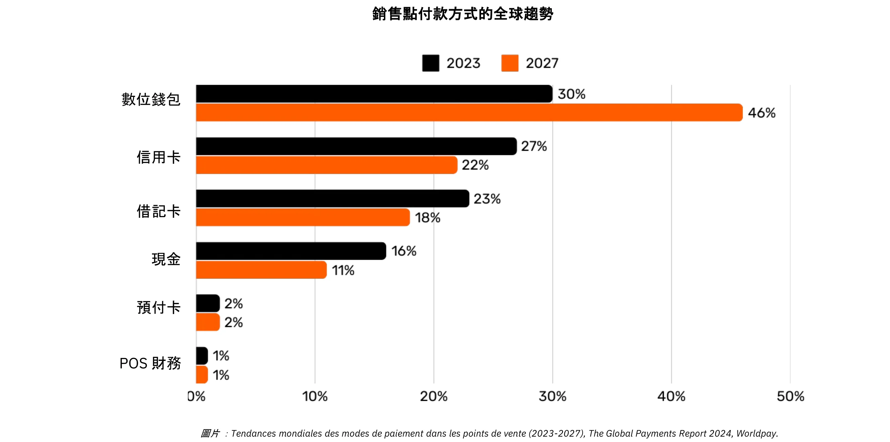

*圖形：全球銷售點 (POS) 支付方式趨勢 (2023-2027)，《2024 年全球支付報告》，Worldpay.*。

### 簡單卡片付款背後的複雜性

當顧客在商店使用信用卡時，POS 終端機會讀取卡片，並將交易資料安全地傳送至商家的收單銀行。收單銀行會將資料傳送至相關的卡片網路（例如威士卡或萬事達卡），再由該網路將請求傳送至發卡銀行，也就是提供顧客卡片的銀行。發卡銀行會檢查顧客的帳戶或信用額度，並透過網路和收單銀行傳回授權，允許商家接受付款。

這項看似簡單的交易實際上涉及超過 15 個步驟、7 個中介人，商家平均需要 48 小時到 5 天才能收到資金。在接下來的幾天中，會進行清算和結算程序。卡片網路會彙整當天的交易，並協調收單機構與發卡機構之間的資金交換。中央銀行會確保這些跨行結算的準確性與穩定性。最後，商戶的銀行帳戶會收到收單銀行所存入的淨額（減去手續費），交易的生命週期就此結束。

總體來說，這個過程複雜、耗時且費用高昂，但卻只是將價值從一方轉移到另一方的簡單動作。

### 比較付款方式

| 支付方式                         | 是否需要授權？                | 交易批准時間（商戶視角）                | 結算速度（資金完全結算）                | 最終性（取消難易度）                   | 中介數量                   | 典型費用（收款方）           |
| -------------------------------- | ----------------------------- | --------------------------------------- | --------------------------------------- | -------------------------------------- | -------------------------- | ----------------------------- |
| **現金**                         | 否                            | 即時（實體交換）                        | 即時（無需結算延遲）                    | 高（付款後不可逆轉）                   | 無                         | 無                            |
| **支票**                         | 是（銀行清算）                | 存入時接受（不保證）                    | 幾天（清算過程）                        | 中（清算前可被拒絕/取消）              | 銀行                       | **低至中**（銀行手續費）     |
| **銀行轉帳**                      | 是（銀行/網絡）               | 幾小時內確認                            | 當日或次日（國內）                      | 高（通常匯出後不可逆）                 | 銀行、支付網絡             | **中等**（固定/百分比）       |
| **支付卡**                        | 是（發卡行授權）              | 幾秒至幾分鐘（授權碼）                  | 幾天（銀行間結算）                      | 中（可能發生退款/撤銷）                 | 發卡行、收單行、卡網絡     | **變動（交易額 1-3%）**      |
| **電子錢包/行動支付**              | 是（錢包服務商/銀行）         | 秒級（即時確認）                        | 通常 1-2 天（取決於資金來源）           | 中（可能發生退款/爭議）                 | 銀行、錢包運營商           | **低至中（變動）**            |

### 現有解決方案的限制

傳統支付產業每年代表約 22,000 億美元的經濟，大約是美國 GDP 的十分之一，或相當於法國的 GDP。由於貨幣是以允許的網路方式運作，因此競爭有限，使得這項「服務」更像是對生產性經濟徵收的稅項。除了造成成本負擔之外，還有其他幾項限制，概述如下。

| 限制項目                        | 說明                                                                                                                                   | 影響                                                                                          |
| ------------------------------- | -------------------------------------------------------------------------------------------------------------------------------------- | --------------------------------------------------------------------------------------------- |
| 高額刷卡手續費                   | 交換費（~0.3%）、網絡費用（固定或 0.3%-1%）、終端/PSP 訂閱以及銀行利潤（0.5%-1.7%）累積成巨大成本，等同於對實體經濟徵收「全球稅」。 | 增加商戶成本，降低利潤，可能導致消費者承擔更高價格。                                           |
| 結算時間過長                     | 資金結算可能長達 5 天，拖慢資金流轉與整體經濟活動。                                                                                  | 延遲商戶流動性，降低經濟週轉速度。                                                            |
| 詐欺                             | 線上交易高度易受詐騙，導致重大損失（如 280 億美元）。退款可能到 2024 年達 1740 億美元，處理爭議耗時且帶來壓力。                      | 增加營運成本，需要複雜防範措施，並削弱顧客信任。                                              |
| 購物車放棄                       | 額外安全步驟（一次性代碼、PSD2 規定的雙重驗證）造成付款摩擦。                                                                         | 增加結帳複雜度，導致購物車放棄率上升與銷售損失。                                               |
| 高消費門檻                       | 信用卡強制最低消費額，限制商戶與消費者靈活性，不利於小額交易。                                                                        | 降低顧客滿意度與便利性，限制小額或衝動購買。                                                   |
| 授權速度慢                       | 現有系統無法支撐毫秒級交易或連續、即時支付。                                                                                          | 限制即時支付或串流支付場景，阻礙創新與擴展性。                                                  |
| 必須擁有銀行帳戶/卡              | 使用這些支付方式需擁有銀行帳戶或卡片，將未銀行化人群排除在外。                                                                        | 限制金融普惠性，縮小未銀行化或弱銀行化人群的支付參與。                                         |
| 重複建立線上帳號                 | 用戶需頻繁註冊多個線上帳號，增加疲勞，降低便利性，並提升個資暴露風險。                                                                 | 惡化使用體驗，增加隱私疑慮與資料外洩風險。                                                      |
| 換匯手續費                       | 缺乏全球統一記帳單位，跨境交易需高額換匯成本。                                                                                        | 增加國際貿易成本，使全球交易更不具成本效益。                                                   |

正如我們從按分鐘支付語音通話費用轉變為使用幾乎免費的 IP 通訊一樣，更開放、更有效率的網路的出現可以重新定義支付方式，降低成本和中介，並促進新的商業模式。

## Bitcoin for Business：新興貨幣

<chapterId>4488fe33-663f-41a3-a668-e9ca2fb7122e</chapterId>

**什麼是Bitcoin？**

Bitcoin 是**點對點數位貨幣 Exchange 系統**（電子現金）。Bitcoin」一詞是指下列元件：

- 一種電腦通訊協定，可在網際網路上促進價值 Exchange，無需中介、無需許可，而且是匿名的。它採用先進的加密原理。
- 由個人和企業操作的機器（節點、礦機等）連接至網際網路的實體網路，形成分散式系統（無中央機關或單點控制）。
- 系統內的帳戶單位。現存的比特幣永遠不會超過 2100 萬個。每個 Bitcoin 可分成 1 億個單位，稱為「satoshis」，是為了紀念其匿名創造者而命名。

這兩者共同使 Bitcoin 成為**不記名資產**和**無發行者**的數位貨幣。Ownership 只需持有**私人密碼金鑰**，即可完全控制**，無需中介或可信賴的第三方**。轉讓時，Ownership 的**有效性**即時生效：新持有人完全擁有 Ownership，無需仰賴中央機構的保護或兌換。交易是**不可篡改的**-一旦記錄在 Blockchain 上，就無法更改或刪除。

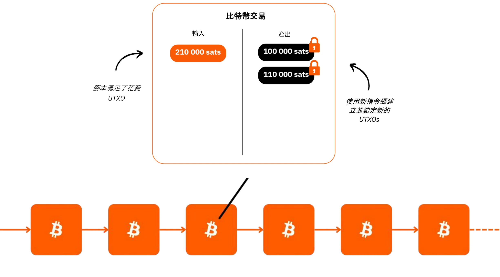

Bitcoin 採用固定貨幣政策，**上限為 2,100 萬個比特幣**，其中約 1,980 萬個已經分發。這使得它具有**通縮性**，當使用者將儲蓄和生產力增益儲存在其中時，它的價值會隨時間增加。

其技術特性超越黃金和美元的總和，使其成為有史以來最堅硬的金融資產。Bitcoin 既是儲值工具，也是 Exchange 的媒介，是一種正在形成中的貨幣。試想一下，將價值從一家公司的金庫迅速轉移到另一家公司的金庫，沒有中介、成本最低、沒有欺詐、全天候、不涉及任何第三方。

Bitcoin 可有效保值，因為其 Ledger 具有防偽功能。由於 Supply 的稀有性和有限性，再加上使用者人數不斷增加所帶動的 Exchange 機會日益增多，因此其價值也隨之增加。

Bitcoin 具有破壞性，因為它鼓勵我們學習數學、加密學、經濟學和歷史學中我們從未學習過的概念。雖然經常被認為很複雜，但事實上這是一種透過實踐和實驗就能獲得的創新。

Bitcoin 挑戰我們重新思考金錢本身的本質。您能解釋何謂真正的金錢嗎？一個受薪工人或企業家一生可能要花費 50,000 到 100,000 個小時賺錢，但有多少人會花費 100 個小時來更好地了解金錢**並保存金錢**呢？Bitcoin 鼓勵我們質疑我們對金錢需求背後的根本原因，以及我們的時間觀點。金錢是為了眼前的奢華，還是長期的抗逆力？如果我們擁有升值的資產，讓我們可以延遲購買，我們會做出什麼選擇？我們希望與 20 或 30 年後的自己進行哪些對話？

**Bitcoin 身份證**

- 年齡：**15 歲（2009 年 1 月 3 日）**
- 每日 Exchange 值：**100 億美元 (> CAC40)**
- 市值：**1.8 兆美元** (> Meta、Visa、白銀；< Apple、Google、黃金)
- 使用者：**~1 億至 2 億 (全球人口的 1-2%)**
- 波動性：**本質上沒有** (1 Bitcoin = 1 Bitcoin)，外在波動性非常高 (在法定貨幣交易所)
- 表現：**第一筆交易為 0.0009 美元；現在為 100,000 美元 (x1 億)**
- **網路可用性 (正常運作時間):** 自 2013 年起為 100%
- 宣布死亡或批評：**每月一次**

**人類合作的奇蹟：**

- 完全**開放原始碼**
- 法律實體：**無**
- **CEO:** 無
- 風險投資：**無**
- 行銷：**無**
- 研發：**志願者驅動**
- 治理：**由使用者**
- 創新的經濟模式：**區塊創建由交易費補貼（以拍賣為基礎）**

如需更多關於 Bitcoin、其歷史、工作原理和使用方法的資訊，我也建議您關注這另一個全面的課程：

https://planb.network/courses/2b7dc507-81e3-4b70-88e6-41ed44239966
## Lightning Network 簡介

<chapterId>c095c7ad-5469-4c7b-9510-b6c0b86244e7</chapterId>

**閃電是什麼？ **

Lightning Network 是**的通訊協定和網路**，可在與 Bitcoin 的主要 Blockchain 互動最少的情況下，促進 Bitcoin 的交易。以下是它的運作方式：

- 初始設定：**鎖定 (託管) 主 Blockchain 上的資金，以建立雙方之間的付款通道。**
- 付款網路：**多方之間的付款管道網形成付款網路 (路由與互連)**。
- off-chain 交易：** 交易在各方之間發生，但**不會立即在 Bitcoin 的主 Blockchain (**「off-chain」**) 上公佈。
- On-Chain 結算：**只有頻道交易的最終餘額會在 Bitcoin 主 Blockchain（「On-Chain」）上公佈**，允許在此期間發生許多交易。與進行許多 On-Chain 交易相比，這種多筆付款的捆綁方式可減少擁塞，從而降低費用。
- 通道關閉：**使用者可以隨時關閉自己的通道，並透過發佈最新的交易狀態來收回自己的 Bitcoin。這就是交易在任何時候都「可發佈」，但在必要時才「未發佈」的原則。**退出（通道關閉）可以是單方面的（由任何一方隨時決定），也可以是雙方共同決定的（導致 On-Chain 費用降低）。

這種方式避免了直接在 Bitcoin 的主 Blockchain 上執行每筆交易的緩慢和複雜性，只記錄最終結餘並保留其安全性。Lightning Network 是 Bitcoin 「頂端」的 Layer，但仍錨定在 Bitcoin 上。

**全球支付網路**

該協定創建了一個**機器網路**，其中的通道形成了一個通用的支付系統。這些節點可以由個人或企業自由操作，使其成為一個完全開放的網路。

Lightning Network 以光的速度實現即時價值 Exchange。它就像應用於支付的電子郵件協定：下一代支付網路。它徹底改變了「錢」的流動方式，使其像網際網路上的資料傳輸一樣自由和快速。

**主要優勢：**

- 速度：**即時交易**。
- 低費用：**與傳統銀行網路相比，成本低得多。**
- 易於採用：**企業只需使用智慧型手機應用程式或網站上的付款按鈕，即可快速設定接受 Lightning 付款。**

Lightning 基礎設施在速度、成本和能源效率方面都優於傳統支付系統。隨著越來越多的商家採用，這股動力將會加速：如果支付可以繞過專屬的銀行間網路，為什麼還要繼續把相當比例的收入拱手讓給現今的中介呢？

**無限使用個案：**

Lightning 的應用範圍遠遠超出了低費用和高速度。透過提供完全免費且即時的付款管道，它為整個經濟體系開啟了廣大的商機。

**提升 Bitcoin 的 Exchange 能力：**

閃電擴大了Bitcoin作為 「Exchange媒介 」的作用。透過增加交易的頻率和自由度，它強化了貨幣的主要功能：為所有參與者促進經濟交流和價值創造。

未來「智慧型機器經濟」的興起，需要超快速、高頻率的支付系統，這個技術標準只有 Lightning 才能達到。這樣才能創造出更多的商品和服務。由於 Bitcoin 的 Supply 仍然有限，每個單位的購買力將會增加。隨著網路的擴張，Bitcoin 和 Lightning 共同壯大。

Lightning 讓我們瞥見未來所有以網際網路為基礎的企業也將以 Bitcoin 為基礎。

**Bitcoin Lightning 付款：典型商戶使用案例**

由於 Lightning Network 的速度和付款終局性，非常適合實體或線上商店的 Bitcoin 付款。

- 速度：**Lightning (~500ms 到幾秒) 比 Bitcoin 主網絡快很多**，在 Bitcoin 主網絡上，交易可能需要大約 30 分鐘才能確認。對於大額購買（遠超過 1,000 美元），Bitcoin 主網路可能仍是首選，因為速度不是那麼重要。不過，這些細節對一般使用者來說往往是隱藏的，因為應用程式會在背景中無縫處理這些決定。
- 終局性：**一旦在 Lightning 上付款，即為終局付款。不可能出現第三方扣款或與欺詐相關的爭議。**
- 費用：**Lightning Network 的交易費用極低，由使用者而非商家支付。商家只有在日後將 Bitcoin 轉移到其他網路或服務時，才會產生手續費。**

**閃電身份證**

- 發明：**2015 年**
- 推出時間：**2016 年**
- 年齡：**7 歲**（首次交易：2017 年 12 月 28 日）
- 網路技術能力：**在規模上可處理比傳統系統多 1000 倍的即時交易。**
- 交易規模：**範圍從傳統系統的 1,000 倍到更小。**
- 交易速度：**高達 100 倍**。
- 費用：**最高可降低 90%**。
- 付款終局性：**近乎瞬間（通常 ~500 毫秒，有時幾秒）**。
- 能源消耗：**傳統全球貨幣系統的 8%**。
- 特性：
    - 點對點
    - 通用
    - 無權
    - 良好的隱私
    - 經過驗證的安全性
    - 高可用性（極佳的運行時間）
    - 可控性和適應性

如需更多關於 Lightning Network 技術運作的資訊，我也建議您參考這另一個全面的課程：

https://planb.network/courses/34bd43ef-6683-4a5c-b239-7cb1e40a4aeb
# Bitcoin 入庫

<partId>bf45c1e8-af97-4b6b-af42-2866f493b14d</partId>

## 利潤、資本和企業復原的關鍵

<chapterId>656ad88f-3c27-4054-a94e-b29727009b8e</chapterId>

### 健康的公司

**未來是不確定的**，企業必須以賺取利潤和保存資本為明確重點，來駕馭這種不確定性。根據奧地利經濟學的觀點，**利潤是公司健康**的最終信號-它們顯示企業正在有效率地滿足消費者的需求。沒有利潤，公司就無法維持，更遑論成長。為了讓企業保持健康，它不僅要 generate 利潤，還要考慮未來，**為未來的投資和挑戰**儲存資本。

**資本保全**至關重要，因為它能讓企業在難以預測的市場中適應並抓住機遇。這包括在收益再投資以實現成長與維持財務緩衝以度過可能的衰退之間取得平衡。奧地利經濟學強調**「時間偏好」**的重要性，意指企業必須謹慎決定眼前回報與長期成功投資的優先順序。健康的公司能維持穩固的財務基礎，確保在順境和逆境中都能靈活應變。

價格和競爭等市場信號會引導企業做出明智的資源分配決策。透過聆聽這些訊號，企業可以避免陷入過度擴張或投資失敗的陷阱 - 特別是那些受到人為因素影響的投資，例如容易獲得的信貸。資源分配失當不僅會危害公司的健康，也會降低公司有效服務客戶的能力。

歸根結柢，維持健康的企業意味著保持適應力、做出謹慎的財務選擇，並始終着眼於未來。 **透過專注於利潤、保存資本以及回應市場訊號，企業不論規模大小，即使面對不確定性，也能茁壯成長**。

### 資本有美德嗎？

**資本的一般描述**

讓我們重新發現資本的真正意義--這個詞在我們的社會中經常被誤解和負面看待。

在傳統經濟理論 (Keynesian) 中，資本經常被簡化為同質的實物或金融資產存量，主要用來透過投資刺激總需求。資本通常與財富集中和小撮精英所掌握的經濟權力有關。在貧富差距持續擴大的情況下，許多人認為資本是經濟不平等的象徵，尤其是當累積的財富似乎無法為大多數人帶來利益時。

"資本」常被描繪成剝削的工具，這種觀點深深影響了各種運動，這些運動認為資本在本質上與工人的利益對立。但這是真的嗎？或者說，這種看法可能被以下因素所扭曲：

1.缺乏對經濟機制的了解（包括經濟學家本身）？

2.政府干預主義和市場操縱？

3.裙帶資本主義與自由市場資本主義之間的混淆？

4.媒體對經濟危機的渲染？

5.渴望快速解決問題和立即實現社會公義？

6.反資本主義言論的文化正常化？

幸運的是，Bitcoin 迫使我們重新思考一切，挑戰這些先入為主的觀念。有一種學派 - 奧地利經濟學派 - 可以闡明這些問題，並協助我們重新思考資本的真正本質。

**Once upon a time**

讓我們從一個小故事開始：

"在一個荒島上，住著一位孤獨的漁夫。每天，他都要花數小時徒手捕魚，這項活動耗費了他許多時間和精力。有一天，他有了一個想法：製造一種魚矛，讓他可以更有效率地捕撈。但他知道這需要犧牲。

在開始製作魚矛之前，漁夫決定留一些魚在製作過程中維持生計。他這幾天吃得比平常少，省下足夠的魚來專注於他的計畫。這些存下來的魚就代表他的**資本**，一小筆儲備讓他能夠追求他的目標。

當他投入時間打造長矛時，他依賴自己的儲備，甘願延遲一些眼前的舒適（這是他**時間偏好的反映**）。經過數天的 Hard 工作，他完成了一支堅固的長矛。

有了魚叉，他現在可以更快、更省力地捕到魚。他不再需要像以前一樣疲於奔命，甚至開始累積剩餘的魚量。這筆盈餘開啟了新的可能性：他可以儲存、分享，或是投資在島上的其他計畫上。透過延遲即時消耗和運用他的資本，漁民大幅提高了他的效率和未來前景"。

這個故事說明了資本、耐心和遠見在創造更美好的未來時所扮演的基本角色，這些概念對於經濟成長和人類進步至關重要。

### 奧地利經濟學派及其資本觀

奧地利經濟學派 (Austrian School of Economics) 以其創始人和早期貢獻者的名字命名，他們都來自奧地利。奧地利經濟學派自此與古典自由主義思想緊密結合，強調個人自由、自由市場及最少的國家干預。

**資本的奧地利觀點**

在奧地利的觀點中，資本與延遲消費以建立提高未來生產的工具或生產性資源的想法有著深刻的關係。這個過程稱為資本累積，是奧地利經濟理論的核心。此觀點的主要 Elements 包括：

- 時間偏好與延遲消費：個人天生喜歡現在消費而不是遲些消費，但如果他們預期未來會有更大的回報，他們可能會選擇延遲消費。透過今天的儲蓄，可以將資源投資在資本商品 (工具、機器、基礎建設) 上，隨著時間的推移提高生產力。時間偏好較低的社會或個人會儲蓄更多，並投資於長期項目，促進可持續的成長。
- 資本是未來生產的動力：資本貨物被視為用於生產最終消費品的中間工具。透過累積資本，企業家可以提高生產力，並在未來創造更多財富。例如，資源可以用來建造工廠或機器，而不是立即生產消費品。雖然這會減少短期的消費，但所產生的效率卻能讓日後的生產與繁榮更上一層樓。
- 間接生產與效率：奧地利經濟學家 Eugen Böhm-Bawerk 等人強調了間接生產的概念，即涉及多個階段的較長、較複雜的生產過程。儘管這些過程需要時間，但最終卻能產生更有效率的生產結果，例如建造鋸木廠來加工木材，而非以手工收集原木。
- 利率作為信號：根據奧地利的觀點，利率自然反映出個人的時間偏好。高利率表示個人偏好即時消費，而低利率則鼓勵儲蓄和長期投資。當中央銀行人為地操控利率時，就會扭曲這些自然信號，導致資源錯配和不可持續的投資（不良投資）。

**現代經濟中的兩種資本形式**

在我們所處的以債務為基礎的貨幣體系框架內，**存在第二種資本**：銀行通過簡單的信貸機制創造貸款時即時產生的資本。這涉及到流動性的無中生有，銀行借出的資金實際上並非預先持有，而是基於還款承諾而創造出來的。

一方面，「奧地利」資本是真實儲蓄的結果，是一個包含深思熟慮的經濟決策和一絲不苟的犧牲過程。另一方面，透過創造以債務為基礎的貨幣所產生的資本，是一種即時的、人為的構造。這兩種類型的資本，儘管**在用來為專案融資方面表面上很相似，但在本質上卻有根本的不同**。

這兩種形式的資本絕不能混為一談，但在以債務為基礎的體系中，卻經常混為一談，**扭曲經濟訊號**，並經常導致投資失當。這個誤解說明了為什麼資本主義經常受到不必要的批評。

**凱恩斯主義的關鍵問題**

全球菁英廣泛採用的凱恩斯政策 (Keynesian policies) 會操控利率，並透過債務刺激需求。這會鼓勵資源流向短期、不可持續的專案，擴大經濟週期，延遲植根於健康儲蓄與生產性投資的真正成長。商界領袖親眼目睹這種有害的政策，健康的公司被推向高估的收購，追求誇大的回報，破壞了有機且永續的成長。

在這樣的環境下，「健康」的資本──企業家精心儲蓄的資本──如何與人為創造的「不健康」資本競爭？此外，單邊擴張貨幣 Supply 會侵蝕健全資本的購買力，加劇經濟迷失與社會不滿。

**希望的曙光：Bitcoin**

Bitcoin 提供了一種長期累積和保存資本的方式，而不會受到貨幣通貨膨脹的侵蝕。Bitcoin 作為一種儲值工具，可讓企業規劃未來的投資，並具有彈性，挑戰債務驅動系統的主導地位，並促進真正的生產性資本累積。

### 更多關於奧地利經濟學派

奧地利經濟學派是一種重視自由市場、個人自由以及人類行為在經濟過程中重要性的經濟思想傳統。該學派批判國家干預，尤其是對貨幣和市場的干預，並認為個人在其主觀偏好的引導下，是其自身利益的最佳判斷者。

**奧地利學派的主要人物**

- **Carl Menger**：Menger 是奧地利學派的創始人，他提出了主觀價值理論，主張商品的價值取決於個人偏好而非生產成本。
- 路德維希‧馮‧米塞斯：米塞斯是奧地利學派的基石，他提出了人類行動理論 (praxeology)，並著有《人類行動》(_Human Action_)一書，對社會主義和中央計劃進行了深刻的批判。
- **Friedrich Hayek**：哈耶克是米塞斯的學生，因其在分散知識與市場自發性方面的研究，於 1974 年贏得諾貝爾經濟學獎。在他的著作*The Road to Serfdom*中，他強烈批判中央集权控制。
- **Murray Rothbard**：Rothbard 是米塞斯的門徒，也是自由主義的堅定倡導者，他提出了無政府資本主義理論，構想一個由自願契約管治的無國家社會。他的著作 *Man, Economy, and State* 是奧地利經濟學的開山之作。

**其他有影響力的經濟學家**

- **Milton Friedman**：雖然與奧地利學派沒有直接關係，但 Friedman 支持許多親市場和自由主義的想法。他的貨幣主義政策與奧地利思想不同，但與奧地利思想一樣，批判國家對經濟的過度干預。
- **Frédéric Bastiat**：19 世紀法國經濟學家，Bastiat 以其關於自由貿易和經濟政策的隱性後果的著作影響了奧地利學派。他的論文 *What Is Seen and What Is Not Seen* 是經濟自由主義的基礎。

*貢獻：路德維希-馮-米塞斯研究所*

**核心貢獻與想法**

這些思想家塑造了國家干預會扭曲市場、經濟自由對於繁榮與人類行動的和諧協調至關重要的觀點。他們的見解突顯了經濟體系中分散決策的重要性和集中控制的危險性。

如需更多相關資訊：

https://planb.network/courses/d955dd28-b7c6-4ba2-a123-d932e21d148f
https://planb.network/courses/9d1bde6a-33e5-45dd-b7c0-94da72e45b11
https://planb.network/courses/d07b092b-fa9a-4dd7-bf94-0453e479c7df
## 庫存中持有 Bitcoin

<chapterId>89622a40-d14f-4c37-a075-8e7e1731ec26</chapterId>

### 公司庫務的挑戰

金庫是放置珍貴物品的地方。健康的公司都會有適當的資金，以便應付未來的不確定性，並規劃投資。如今，部分過剩的金庫被放置在被稱為高度「Liquid」的金融資產中，例如債券、定期存款等。

在很長的一段時間內，有些公司使用不具流動性的資產，例如不動產，卻沒有意識到某些危險：

- 發生危機時的流動資金不足
- 扣除費用後，回報仍相當低
- 回報不超過實際通貨膨脹率，即貨幣 Supply 的回報率 (~7% per year, see below)
- 隱藏的風險：房地產為了 Bitcoin 等資產的利益而失去部分「儲蓄」功能。因此，它可能會更接近其「使用價值」：提供庇護。

讓我們快速回顧一下企業經營的環境。

**真正的通貨膨脹**：央行的目標是每年 2% 的通貨膨脹率，這意味著貨幣價值在 20 年內會損失 40%，這讓他們的任務非常失望。再加上更明顯的通貨膨脹時期，公司顯然無法單獨使用貨幣來儲存其勞動成果。他們必須實施複雜的財務策略，而且必然伴隨著一系列的風險。這些策略對小型企業來說顯然是**無法實現的**，因為這些企業的核心業務已被其繁重的工作所佔據。

**隱藏的通貨膨脹**：在以債務為基礎、由中央銀行支持的部分儲備金貨幣體系中，**整體貨幣 Supply 平均每年成長約 7%**（例如歐元區或美國的 M1）。這意味著您的 「分紅 」在短短幾年內就減少了一半--除非您有特權使用金融水龍頭，並且可以在新創造的資金推高資產之前，透過槓桿和以 「舊價 」快速購買資產來繼續增長。這就是康泰隆效應 (Cantillon Effect)，也是財富轉移到較富裕族群的部分原因，而「資本」則被錯誤地歸咎為罪魁禍首 (請參閱我們上述有關資本的介紹)。

**交易對手風險**：目前的金融系統風險重重，您可能無法隨時取得「您的錢」。在不引用紙牌屋形象的情況下，我們必須承認，金融機構在最微小的危機中就會將利潤私有化，並將損失社會化。在「經典」貨幣（記錄在 Ledger 中的貨幣）的系統中，銀行裡的錢只是一種「索賠權」；你並不真正擁有它，銀行本身也「並不擁有它」（部分儲備）。在某種程度上，這筆錢真的很神奇。一些曾經嘲諷 Bitcoin 的著名銀行如今已不復存在，例如瑞士信貸銀行（Credit Suisse）。

這種信任的缺失促使黃金等「不記名」資產再度興起（儘管黃金的保全、運輸和分割等都很複雜），當然也包括 Bitcoin這種新興資產。

### Bitcoin 作為金融資產

Bitcoin 提供了一個徹底的替代方案。它是一種不記名資產，沒有中央發行機構，幾乎不可能被奪走，並受益於網路效應。**真正的** Bitcoin 使用者選擇用它來儲存自己的勞動成果，因為它被視為一種可抵抗審查和通貨膨脹的價值儲存。由於梅特卡夫定律（Metcalfe's Law）所說的網路效應，每一位新的信服使用者都會增加網路的價值；隨著參與者數量的增加，Bitcoin 的效用也會呈指數級成長。這種模式使其成為建立在使用者採納與信任基礎上的獨特且有前途的資本形式。

Bitcoin 是全球最**流動**的 Liquid 資產，全天候不間斷地運作，不像傳統金融市場有關閉時間和 「斷路器」。這種流動性允許使用者隨時買入或賣出比特幣，無論是因應好消息或壞消息（如導彈發射、戰爭等）。

十年來，Bitcoin 的年平均成長率超過 60%。與其他投資工具不同的是，這種獨特的表現讓長期持有者保住了初始資本。

但是，有幾個關鍵因素需要牢記：

首先，**過去的表現並不保證未來的結果**。只要 Bitcoin 仍然**安全且分散**，我們就有理由希望在未來十年內，每年的價格升值幅度遠高於 20%，使其成為可行的庫藏工具。

其次，到目前為止，Bitcoin 已經經歷了**4 年的週期**，這意味著只要時間跨度超過 4 年，賭注總是有利可圖的。對於將 Bitcoin 視為一項投資的人而言，短期的時間跨度（<4 年）可能會有風險。

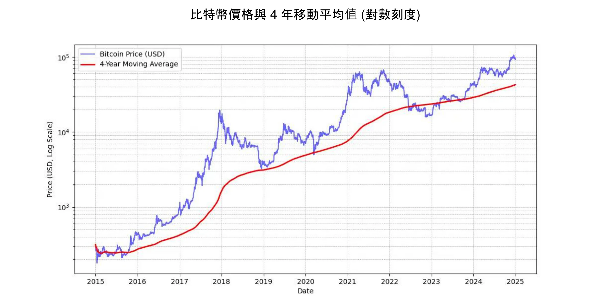

*MICHAEL SAYLOR：「最佳的 Bitcoin 價格訊號是 4 年簡單移動平均線」* 見上圖。

此外，建議您在接觸 Bitcoin 時，**投資金額應與自己的理解程度成正比**。同樣重要的是，不要操之過急，也不要試圖完美把握市場時機。

最後，Bitcoin 被認為是**不穩定的**。準確來說，其價格以法定貨幣單位表示。這種波動性對於一種尚在萌芽階段的資產來說部分是自然的，但也因為投機者的存在而被放大，這些投機者並非將其作為長期的價值儲存，而是追求快速收益。此外，槓桿交易（使用借來的資金增加交易頭寸）加劇了價格的上行和下行，使 Bitcoin 無法沿著直線上漲的路徑走。這導致了更明顯的波動，但隨著時間的推移，隨著忠實用戶基數的增加，這種波動似乎正在穩定下來。總而言之，**不可能擁有像 Bitcoin 這種沒有波動性的高效能資產**，但您當然可以擁有波動性較低的高效能資產。

### 華爾街採用 Bitcoin

金融機構採用 Bitcoin 進一步鞏固了其在全球市場的地位。

貝萊德（BlackRock）**最近的聲明強調了 Bitcoin 作為儲值資產和投資組合多樣化工具的潛力。這家全球機構巨頭最近表示，**Bitcoin 的用戶成長速度正在超越網際網路**或行動電話，這主要是受到**人口和世代的轉變**，以及對傳統金融機構日益不信任的驅動（！）。由於 Bitcoin 的稀缺性、非主權性和分散性，一些投資者將其視為財政和貨幣不穩定**、恐懼或破壞性地緣政治事件時的避風港選擇。

2024年1月推出的**現貨Bitcoin ETF**取得了驚人的成功--史上**最成功的ETF**推出--從1月到11月有近200億美元的淨流入。從 1 月到 11 月，ETF 的淨流入量接近 200 億美元，是次優 ETF Nasdaq-100 QQQ 的四倍。這些 ETF 為 Bitcoin 提供了更便捷、更受監管的途徑，進一步使其合法化，並吸引了大量機構資金湧入。

Bitcoin ETF在**機構採用**方面大幅領先，無論是在涉及的機構數量還是管理資產規模（AUM）方面，都超越了增長最快的前十名ETF。這些 Bitcoin ETF 的成功突顯出與數位資產相關聯的投資工具的需求不斷增長，從而鞏固了 Bitcoin 在傳統金融領域的地位。

Bitcoin 現在在 「儲值 」**市場中發揮作用。就規模而言，它只是杯水車薪：相較於黃金的 18 萬億美元或房地產的 50 萬億美元，它只有大約 18,000 億美元。然而，其約 0.1% 的市場佔有率給了它龐大的成長空間，尤其是考慮到其競爭對手正努力吸引新使用者。**

| 股票代號    | 單日流量 (百萬美元) | 單週流量 (百萬美元) | 單月流量 (百萬美元) | 三月流量 (百萬美元) | 年初至今流量 (百萬美元) |
| ----------- | ------------------- | ------------------- | ------------------- | ------------------- | ------------------------ |
| **總和**    | +457.19             | +1,507.95           | +2,888.01           | +3,672.29           | **+20,262.94**           |
| IBIT        | +393.40             | +750.91             | +1,536.47           | +3,821.37           | +22,460.44               |
| FBTC        | +14.81              | +372.40             | +627.16             | +458.71             | +10,266.69               |
| ARKB        | +11.51              | +163.26             | +295.92             | -3.88               | +2,647.32                |
| BITB        | +12.93              | +146.50             | +263.30             | +97.46              | +2,262.69                |
| HODL        | +5.75               | +38.77              | +94.54              | +100.39             | +682.03                  |
| BRRR        | +1.92               | +4.72               | +17.76              | +20.54              | +540.19                  |
| EZBC        | +11.79              | +17.53              | +39.29              | +47.48              | +439.45                  |
| bTC         | 0.00                | -3.13               | +36.59              | +419.18             | +419.18                  |
| BTCO        | +6.43               | +19.25              | +47.30              | +56.41              | +394.82                  |
| BTCW        | 0.00                | +2.84               | +6.04               | +146.69             | +217.47                  |
| YBIT        | -1.34               | -10.26              | +5.06               | +13.81              | +76.30                   |
| DEFI        | 0.00                | 0.00                | 0.00                | -2.03               | -1.79                    |
| GBTC        | 0.00                | +5.16               | -81.42              | -1,503.84           | -20,141.85               |

*10 個月內達 200 億美元：Bitcoin ETF 在不到一年的時間內實現了黃金 ETF 用 5 年時間才能完成的目標。資料來源：以美元計價的基金投資流量。彭博終端，Bloomberg L.P.，2024.*。

### 公司工具包中的 Bitcoin

Bitcoin 在美國日益普及，也影響了世界其他地方的心態，尤其是財富管理專業人員，他們再也無法不將 Bitcoin 列入他們的工具範圍中 - 尤其是在傳統金融產品表現不佳或面臨困難時期。只有傳統的銀行似乎仍能負擔得起忽視它的責任。

從純粹的金融角度來看，Bitcoin 是一種公認的多樣化資產。Bitcoin 不僅與其他資產類別無關，而且在新的流動資金注入時期似乎也很興旺--歐洲央行 (ECB)、美國聯邦儲備局 (Fed) 和中國降低利率時，似乎也開始出現這樣的情況。

總而言之，對於最常見的使用情況 - 至少投資四年的超額國庫券 - Bitcoin 非常適合。值得將其與逐步進入的策略結合：在固定時間間隔投資固定金額，以平滑進入或退出點。

例如，其他使用個案使 Bitcoin 成為策略性的庫務資產：

- 能夠全年無休地提供**抵押品**或流動資金
- 能夠**快速、隨時**轉移到其他公司的資金庫
- 對沖**外幣 Exchange 風險**
- 支付給接受的**供應商**，尤其是在緊急情況下

### Bitcoin 是否太貴？

您不需要準確地購買 1 個 Bitcoin，因為 Bitcoin 可以分割成稱為 satoshis 的子單位，這個名稱是為了紀念其匿名創造者。1 個 Bitcoin 等於**1 億個 Satoshis**，因此使用者甚至可以買賣或交易**個 Bitcoin 的極小部分**。事實上，在 Bitcoin 的原始碼中，所有交易都是以 Satoshis 為單位，而「Bitcoin」一詞只出現在「coinbase」中，也就是礦工為獲得獎金而建立的特殊交易。

此外，2,100 萬個比特幣的總數，即 **2.1 quadrillion satoshis**，可以有效地用 64 位元整數來表示。這意味著，儘管整個 Bitcoin 的價格很高，但由於其可分割性，廣泛的投資者仍可購買。因此，您無需購買一整枚 Bitcoin 即可參與網路或投資此數位資產。

讓我們記住，與股票、黃金或房地產等其他資產相比，其總市值相對較低，因此升值能力完好無缺。由於其滲透率仍然很低（約佔全球人口的 1%），我們認為它的崛起才剛剛開始。這使得它成為我們這一代人**最不對稱的賭注**：目前它跌至零的可能性非常低，而繼續壯大的可能性則很大。

### 在 Bitcoin 中分配公司金庫的決定

投資 Bitcoin 的**決策過程將在很大程度上受到您在公司內部地位的影響**。如果您是**大股東**，您可以根據自己的判斷自由**分配多餘的庫存資金**。相反，如果您是集體決策架構中的合夥人或股東，則需要經過共同商議，這可能會使事情變得複雜。

在第二種情況下，協調不同的觀點變得非常重要，因為這主要**取決於每個利害關係人對 Bitcoin 資產的理解**。正如俗語所說：「Bitcoin是人們對電腦不了解的一切，加上他們對金錢不了解的一切」。即使一個合作夥伴已經努力徹底了解 Bitcoin，將這些知識傳達給其他人也可能是一項挑戰。在這種情況下，**建議引入外部資源**，以避免想法與一個人的關係太密切，這可能會造成 generate 阻力。

目前，在持有 Bitcoin 的公司中，由大多數擁有人做決定的情況最具代表性。以下是幾個真實的例子 ：

- **獨立專業人士**：顧問、醫療保健人員或律師，將部分長期資金投資於 Bitcoin。一般而言，這些專業人士已持有回報微薄的儲蓄或定期存款帳戶。
- 科技產業的高階主管：幾年前出售公司並將個人控股公司的部分收益投資到 Bitcoin 的高階主管。如今，他們享有舒適的財務狀況，並重新投資於新的企業。
- **非常小型企業的所有者**：從事服務業、農業或手工業的企業家，他們瞭解 Bitcoin 的潛力，並將部分資金撥入 Bitcoin。他們的主要動機在於多元化及其提供的自由度。
- 像 MicroStrategy 之類的上市公司**開創了先例，將其企業庫存的很大一部分轉換為 Bitcoin，展現了企業資本配置策略的全球性轉變**。到 2024 年秋天，無數其他公司也紛紛效法，進一步將這個趨勢合法化。

查看持有最多比特幣庫存的公司更新清單，以及持有的金額，請參閱網站：[BitcoinTreasuries.net](https://bitcointreasuries.net/)。
### 企業所持 Bitcoin 的課稅

對於結構上並非獨立法律實體的企業 (例如獨資企業或其他非公司實體)，Bitcoin 交易的課稅方式通常與適用於個人的方式相同。在許多情況下，適用於資本收益或收入的規則與個人出售 Bitcoin 時相同。例如，在某些國家，利潤可能會被視為企業家個人收入的一部分，須繳納**個人所得稅**。

不過，***公司企業***，也就是須繳納公司所得稅的企業，通常會受惠於較優惠的稅務架構。個人可能面臨抵銷不同資產類別損益的限制，而公司則不同，一般而言，公司可將 Bitcoin 交易的已實現損益直接併入年度損益帳中。這會帶來更靈活、有時更有利的稅務狀況。

不同司法管轄區的具體稅率和處理方式有很大差異。例如，在法國和許多西方國家，公司可能面臨約 25% 的公司稅率，這可能低於個人對投資收益所繳納的定額稅。

由於這些差異，**有些企業主選擇透過其公司架構**購買和持有 Bitcoin，因為這樣做可以提供**更有效的稅務規劃機會**。一如既往，建議您諮詢熟悉相關司法管轄區規則的稅務專業人士，以確保符合規定並優化稅務策略。

## 如何取得 Bitcoin

<chapterId>1e6dbaf5-581a-49a4-8f37-3728e77bda17</chapterId>

### 三種取得方法

有三種方式可以取得 Bitcoin：

- 在 Exchange 中的商品或服務：

由於 Bitcoin 可作為 Exchange 的媒介，因此可以構想一個循環經濟。儘管現今這種情況仍不普遍，但越來越多的企業開始接受 Bitcoin 付款，為什麼您的企業不接受呢？(請參閱我們的下一章）

- **Mining Bitcoin:**

這涉及從操作 Mining 機器賺取報酬。對於非專業企業而言，這仍是相對邊緣的。您可以透過中間人參與，他們會向您出售或出租計算機、網路和維護。如果您擁有這些機器，您可以將它們列為折舊資產。在大規模的情況下，您需要仔細計算投資報酬率，因為市場競爭激烈，需要很好地預測成本，尤其是電費。

若要進一步瞭解 Mining 方法，您可以 [參考我們教學中的 "Mining" 章節](https://planb.network/tutorials/mining)。

- 購買 Bitcoin:

這是目前最常見的方法，可透過點對點交易所或更典型的專業交易平台進行。但在取得 Bitcoin 作為企業庫存資產時，企業必須遵守嚴格的監管標準和瞭解您的客戶 (KYC) 程序。在專業交易平台上購買時，企業通常需要提供詳細的公司資訊，包括身份證明文件、財務報表和 Address 證明，以滿足 KYC 和反洗錢 (AML) 要求。

若要學習如何開立企業帳戶，並使用該帳戶購買、出售和轉移比特幣，您可以查看這兩個專為企業設計的教程，涵蓋 Kraken 和 Bitfinex 平台的企業版本：

https://planb.network/tutorials/business/others/bitfinex-pro-c8ef7476-5f60-4205-935e-a545ced0022a
https://planb.network/tutorials/business/others/kraken-pro-07b1c16c-d517-4bf7-9a78-b42dc0f21785
要瞭解更多關於透過 Exchange 或點對點取得比特幣的方法，您可以 [參考我們教學中的 "Exchange" 章節](https://planb.network/tutorials/exchange)。

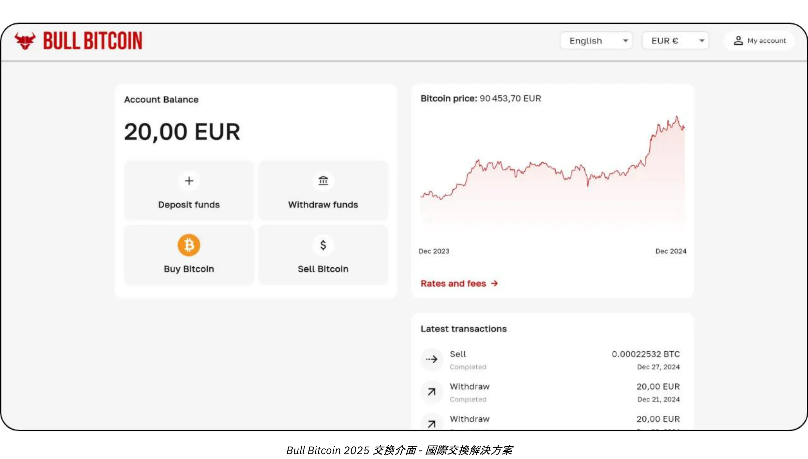

### 什麼價格？

如前所述，不僅無法預測 Bitcoin 未來的價格，短期內價格的波動性也非常大。從歷史上看，可靠的策略是定期逐步累積，並維持四年或更長的時間跨度。

### 您應該買多少？

與直覺相反，最好的方法可能是從很小的購買量開始，不要想太多。一小筆錢（例如一百歐元或美金）並不會對您造成嚴重的傷害，而且親身體驗會比閱讀更多更快地讓您學到更多。

如前所述，明智的做法是只投資幾年內都不需要的過剩流動資金。如果您在不適當的時候突然需要套現，任何理解不清的策略都有可能讓您陷入困境。

除了從小處著手之外，企業資金庫採取審慎的分配策略也很有用。有些公司（例如 MicroStrategy）採取極端做法，將超額庫藏資金的一大部分投入 Bitcoin，反映出機構的強烈信念。相反地，較保守且可說是理性的策略可能是將大約 5% 的公司資金分配至 Bitcoin，在潛在收益與風險管理及流動性需求之間取得平衡。

將這個範圍視為一個刻度，從確保公司保留足夠流動資金以滿足營運需求的最低風險，到旨在利用 Bitcoin 的預期長期價值升值的進取立場。雖然進取的配置可能會帶來更高的回報，但適度的配置有助於降低波動性，確保公司的財務基礎保持穩固，同時仍能受益於 Bitcoin 在其財務營運中的創新潛力。

### 多久一次？

沒有 Hard 規則。嘗試透過尋找「跌點」來把握市場時機，可能會比簡單地定期買入來得更沒有效用，而且會造成更大的壓力。即使是經驗豐富的投資者有時也會犯錯。一次過「全數投入」可能是把雙刃劍。

事實上，Bitcoin 的升值潛力非常大，即使您在幾年後才開始購買，您仍有可能看到長期收益。誠然，隨著時間的推移，價格大幅波動的強度可能會減弱。但是，作為一種通縮貨幣，Bitcoin 的設計可以有效地儲存價值，並反映使用者的生產力收益。打個比方：我們目前正處於 Bitcoin 的「發行階段」，這是一種正在製造中的貨幣，目前還沒有人知道它的合理價值。之後，也許在 20 或 40 年後，當它處於穩定的「巡航階段」時，它可能會變得難以置信地穩定，並隨著社會生產力的提升而穩定成長。

房地產產業經常重複「購買時機永遠正確」的說法，卻忘了如果房地產失去價值儲存的功能，轉移到像 Bitcoin 之類的資產，價格可能會回到更接近其效用價值（遮蔽）。相比之下，Bitcoin 除了儲存價值外，沒有其他用途，這可能意味著「購買時機永遠正確」。未來自有分曉。

*信用：[Bitcoin 辦公室](https://Bitcoin.gob.sv/)*

### 以何形式購買？(保管方法）

您並不實際擁有 Bitcoin。相反，您持有的密碼鑰匙可讓您將帳戶中部分或全部單位的 Ownership 轉移到一個或多個其他密碼鑰匙。所有這些都發生在 Bitcoin Blockchain 上，而 Bitcoin Blockchain 複製在全球數以萬計的節點上。

此密碼匙是一個極大的隨機數。為了簡化使用者體驗，通常會以 12 或 24 個字的序列來表示。這些字詞可以載入到稱為 "Hardware Wallet "的實體裝置中。然而，比特幣並不在這個裝置內；它只是用來加密簽署交易並將其廣播到網路的工具。真正重要的是那 12 或 24 個字，它們必須保持安全。

這導致保管的問題：持有 Bitcoin 表示持有鑰匙。要麼您自己保管，要麼您委託第三方保管。也有中間解決方案。讓我們回顧一下最常見的情況：

- 自行保管：

這是真正的 Bitcoin 愛好者推薦的選擇，因為它符合 Bitcoin 的原始設計。您充當自己的銀行：沒有第三方詐騙您的風險，但您有責任保護鑰匙的安全。您可以全天候存取您的資金。在商業環境中，如果有多人需要進行交易，您需要適當的工具和程序來管理存取和安全性。

- 第三方保管：

例如，Exchange 或購買服務可以為您建立一個帳戶，將您的傳統貨幣兌換成 Bitcoin，並使用他們的安全系統代您持有。大多數這類服務都允許您將比特幣提取到 Wallet，鑰匙由您一人持有。在您提取之前，您並未真正擁有比特幣；您只能依靠他們的承諾來償還您的比特幣。這涉及到平衡安全風險（他們的風險與您的風險）和交易對手風險（他們可能失敗或消失）。有些企業認為這是可以接受的，但一般不建議長期儲存或 100％ 的分配。保管服務也可能會收取保管費用。

- "Paper Bitcoin"（ETF 或 ETP）：

這些都是傳統的金融工具，代表 Bitcoin 的分數，複製其價格表現。理論上，產品背後的機構購買並持有相關的 Bitcoin。您的供款和提款均以傳統貨幣（如美元或歐元）進行，而非 Bitcoin。除了某些產品允許以實際 Bitcoin 提取（以避免在某些司法管轄區發生應課稅事件）外，這些工具涉及年度管理費。在這種情況下，您需要依賴機構的安全性，並面臨交易對手風險（例如，如果政府決定沒收所有機構持有的 Bitcoin，就像 1933 年根據美國第 6102 號行政命令沒收黃金那樣）。它們的主要優點是存取方便，因為它們是透過傳統金融渠道分發的。它們繞過了加密金鑰安全的需要，但不提供 Bitcoin 的固有屬性：您無法在未經允許的情況下全天候使用 Bitcoin 網路自由移動價值。它們只複製金融效能，而非 Bitcoin 本身的功能或主權。

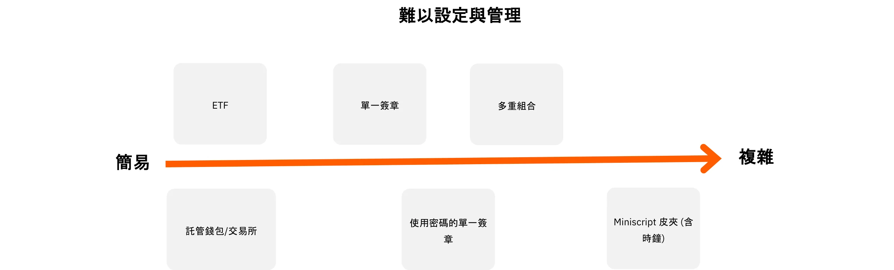

此外，您持有 Bitcoin 的形式會對保護公司金庫所需的安全措施造成重大影響。無論您選擇自行保管、使用單一簽章或多重簽章硬體錢包等方式來直接控制您的金鑰，或是將這項任務委託給第三方保管服務或 ETF，每種選擇都有其自身的風險概況。舉例來說，自我託管提供完整的存取權限，但要求嚴格的內部安全規範，而第三方解決方案則以交易對手風險為代價，降低管理負擔。為了進一步說明這些區別，本圖概述了每種託管類型的安全模式，可協助您選擇最適合貴組織需求的方法：

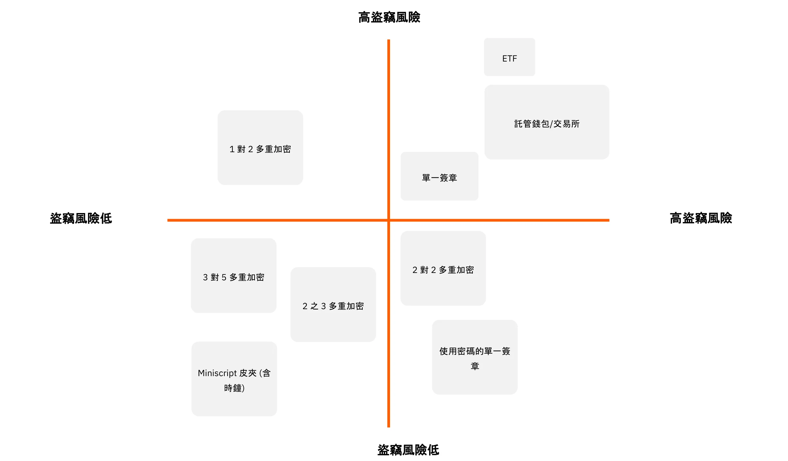

### 向誰購買？

如果您選擇「紙上 Bitcoin」，您會求助銀行或線上證券交易所等金融機構。

如果您選擇透過市場（Exchange）或經紀人購買實際的 Bitcoin，您可以分為幾大類：

- 大型國際或國外平台：

例如 Kraken、Coinbase 或 Binance，歷史上有許多個人使用。有些遇到了問題，很難做出明確的推薦。一個建議：如果您使用它們，不要把您的比特幣留在那裡超過必要的時間。

- 受監管服務提供商（註冊數位資產服務提供商）：

例如，在法國，像 Paymium (Exchange) 或 BullBitcoin (經紀人) 這樣的平台以有真正的 Bitcoin 熱衷者掌舵而著稱，並建立了穩固的記錄。在美國有 River 或 Swann 這樣的服務提供商。一般來說，考察服務商的血統很重要：他們的聲譽、往績、在Bitcoin社區內的知名度，以及他們的領導是否與Bitcoin的核心價值一致。

**Exchange 對 Broker:**

- **Exchange**允許您以您選擇的價格下買入訂單，但您必須等待執行，直到市場價格與賣家一致。
- 經紀人***為您提供固定價格，並能更快速地完成交易。

除了費用和執行速度之外 (如果您考慮長期 (數年)，這兩點就沒那麼重要)，企業還應該考慮其他因素：

- 使用者 Interface：**平台對使用者友善嗎？**
- 會計功能：**至少能以 .CSV 格式匯出交易記錄。**
- 保管和安全：**平台是代表您持有比特幣，還是將 Ownership 轉移給您呢？他們的安全設置是什麼？他們是否有 「提款鎖 」或其他提款限制？**
- 客戶支援：**高品質、快速回應和個人化的協助，尤其是在您剛開始使用時。**
- 聲譽與道德：**平台的可信度與價值觀。**
- 支援循環購買：如果您打算透過排程購買來累積 Bitcoin。

# 為每家企業量身打造的 Bitcoin 支付解決方案

<partId>b2c8af88-6bfc-49b1-ad84-4c292c713b55</partId>

## 以 Bitcoin 作為付款方式

<chapterId>99af1203-bc84-4acc-9780-f733e7998335</chapterId>

首先，我們必須了解 Bitcoin 是與網際網路同等規模的擾亂。

在早期，網際網路讓溝通管道中的中間人得以移除，之後，這項基礎建設帶來了無數以前無法想像的應用程式。時至今日，哪個企業沒有上網呢？

Bitcoin 是信任的基礎架構，其第一個應用是移除價值貨幣儲存與 Exchange 的中介。其他目前無法想像的應用程式將在此基礎架構上出現。您在此的初始存在等同於擁有一個網站：一個點對點付款和價值交換的閘道。

現在，從核心活動與 Bitcoin 毫無關係的實用企業的角度來考慮。它為什麼會選擇接受 Bitcoin 付款呢？

- 建立 Bitcoin Treasury:

請參閱我們之前關於購買 Bitcoin 的文章。無論是出於信念還是作為一種多樣化策略，一些專業人士選擇接受Bitcoin付款。一些比特幣玩家認為，越是沒有財務傾向的公司--這意味著它既沒有時間也沒有工具來進行複雜的財務操作--***企業就越需要用最難的貨幣形式來支付***。如此一來，就能提供公平的競爭環境，即使是規模小、時間有限的企業，也能在不捲入金融遊戲的情況下保值。

- 接觸新的人口：

Bitcoin 使用者的人數不斷增加，而且他們擁有強大的購買力。他們自然會傾向於接受其貨幣的企業。此外，由於這是第一種通用的網路原生貨幣，您也可以吸引路過的國際客戶。

- 提高能見度：

例如，在 BTCmap.org 等平台上列出您的企業。目前只有少數企業接受 Bitcoin，因此口碑對您有利。這也讓您從競爭對手中脫穎而出。

- 較低費用：

即時 Bitcoin 付款發生在 Lightning Network 上。 **費用極低，由買方支付**。沒有支付終端機費用、沒有支付授權失敗、也沒有欺詐。相較之下，全球支付產業 (卡片、終端機、轉帳、PSP 等) 每年的成本約為 2.2 兆美元。再加上退單和詐欺，光是為了轉移價值，就從全球生產力強大的企業身上「榨取」了相當於美國國內生產總值的近十分之一。無論您的業務是什麼，財務費用都是應該優化的負擔，在某些情況下，高費用可能會扼殺某些商業模式。

- 自由與不允許，**24/7**：

使用 Bitcoin 無需徵求許可。任何人都可以使用智慧型手機應用程式在幾分鐘內參與經濟活動。您可以在任何時間發送或接收來自任何人 - 個人或企業 - 的付款，沒有時間限制或延遲。

- 充分利用 Bitcoin 網路的優勢：

您不需要保留 Bitcoin 形式的付款，尤其是當您需要支付供應商或匯出增值稅時。某些服務可以將您的全部或部分 Bitcoin 付款轉換成您所選擇的貨幣（例如，將歐元轉換成您的 IBAN），但要收取一定的費用。在這種情況下，接受 Bitcoin 的好處可能在於吸引新用戶或 Bitcoin 本身的優點（如費用較低、全天候運作、無欺詐或扣款風險）。

### 您應該選擇哪一種付款解決方案？

開始接受 Bitcoin 付款相對容易。若要選擇正確的解決方案，請考慮您所處理的交易特徵：平均付款金額、交易頻率，以及您是否會在實體環境、線上或兩者皆接受付款。

作為商家，您的心態也很重要。您是在進行簡單的測試，還是預期 Bitcoin 會成為重要的經常性收入來源？如果是後者，您需要一個強大、全面且可自訂的設定。

別忘了考慮員工的各種角色及其工作地點。在任何情況下，請記住您必須能夠提供所有必要資訊給您的會計師，並簡化會計流程。

為了簡化決策過程，我們定義了四種截然不同的企業概況。以下表格將分別列出每種類型的主要特徵和推薦的付款解決方案。

### 業務簡介

#### 簡介 1 - 起步者

| 屬性                                 | 初學者                                                                                                                                  |
| ------------------------------------ | --------------------------------------------------------------------------------------------------------------------------------------- |
| **心態**                             | 「嘗試我的第一次實體付款」、「為我的線上內容收取小費」、「目標是非常小的收入」                                                            |
| **交易頻率**                         | 「第一次交易以學習」、「偶爾收到一次付款」                                                                                              |
| **活動類型範例**                     | 創意經濟（內容創作者、部落格、文章等）、偶爾小費、一次性面對面銷售、協會、單次活動                                                        |
| **付款金額類型**                     | 通常僅幾分到幾歐元/美元；每件少於約 300 歐元/美元                                                                                         |
| **設定複雜度**                       | 無                                                                                                                                      |
| **建議解決方案範例**                 | 託管型 Lightning 錢包（如 Wallet of Satoshi），或非託管型錢包（如 Phoenix）                                                               |
| **商戶介面**                         | 簡單的比特幣 Lightning 錢包：一個行動裝置應用程式                                                                                       |
| **客戶介面**                         | 比特幣付款 QR 碼，由客戶的個人錢包掃描                                                                                                  |
| **費用**                             | 客戶支付比特幣 Lightning 交易費用以及應用程式可能收取的費用                                                                              |
| **銷售點設備**                       | 免費行動應用程式或實體終端選項（如 Bitcoinize）                                                                                          |
| **管理與角色**                       | 透過單一應用程式管理；角色區分最小                                                                                                      |
| **會計匯出**                         | 基本的交易歷史清單                                                                                                                      |
| **API**                              | 無                                                                                                                                      |

#### 檔案 2 - 基本

| 屬性                                 | 基本型                                                                                                                                |
| ------------------------------------ | ------------------------------------------------------------------------------------------------------------------------------------- |
| **心態**                             | 「我在企業中接受比特幣，但不預期會有大量交易量」                                                                                       |
| **交易頻率**                         | 每月數筆交易                                                                                                                          |
| **活動類型範例**                     | 酒吧、餐廳、半定期銷售新鮮產品或短鏈供應、本業主旗下的多家商店、藝術家創意經濟                                                          |
| **付款金額類型**                     | 通常為幾歐元/美元到數百歐元/美元；單件少於 300，且每月少於 3,000                                                                       |
| **設定複雜度**                       | 最低（行動應用程式）                                                                                                                  |
| **建議解決方案範例**                 | Swiss Bitcoin Pay                                                                                                                     |
| **商戶介面**                         | 簡單的比特幣 Lightning 錢包：行動裝置應用程式；簡易帳單，僅含最少細節                                                                   |
| **客戶介面**                         | 比特幣付款 QR 碼，由客戶的個人錢包掃描                                                                                                 |
| **費用**                             | 向比特幣地址發送時通常 <1%；轉換為法幣時 <1.5%                                                                                         |
| **銷售點設備**                       | 免費行動應用程式或實體終端選項（如 Bitcoinize）                                                                                        |
| **管理與角色**                       | 可為員工設定僅限銷售的角色；提供線上管理儀表板                                                                                         |
| **會計匯出**                         | 可匯出含完整交易細節的 CSV                                                                                                             |
| **API**                              | 有                                                                                                                                     |

#### 簡介 3 - 專業人士

| 屬性                                 | 專業型                                                                                                                                      |
| ------------------------------------ | ------------------------------------------------------------------------------------------------------------------------------------------- |
| **心態**                             | 我的電商與其他支付方式相同 — 或為一組企業提供共同管理，能處理更高交易量                                                                      |
| **交易頻率**                         | 每天多筆交易                                                                                                                               |
| **活動類型範例**                     | 中等規模交易量的電商網站、小型市集、實體店連鎖（如「線上下單、到店取貨」）、中小企業                                                          |
| **付款金額類型**                     | 通常為數歐元/美元到數百歐元/美元；無付款上限；全年少於 250,000                                                                             |
| **設定複雜度**                       | 從基礎到完整功能（本地或雲端託管），通常需要電商平台                                                                                         |
| **建議解決方案範例**                 | BTC Pay Server（適用於電商與實體環境）；ZapRite、Musqet 或 PayWithFlash（結帳），Be-BOP（整合型商店）                                        |
| **商戶介面**                         | 網站（行動端與桌面端），具備發票編輯、購物車選項與付款按鈕建立；與電商整合的自動化帳單                                                        |
| **客戶介面**                         | 比特幣付款 QR 碼，由客戶的個人錢包掃描                                                                                                      |
| **費用**                             | 開源後端免費 + Lightning 託管/服務費用；客戶端需支付比特幣 Lightning 費用與 <1.5% 的兌換費                                                   |
| **銷售點設備**                       | 線上商店，實體顯示裝置（如 iPad 顯示網站或比特幣終端機）                                                                                     |
| **管理與角色**                       | 功能完整的商店，具多個管理員角色；員工與客戶皆與系統互動                                                                                     |
| **會計匯出**                         | 可匯出含完整交易細節的 CSV                                                                                                                   |
| **API**                              | 有                                                                                                                                           |

#### 簡介 4 - 企業

| 屬性                                 | 企業級                                                                                                                                      |
| ------------------------------------ | ------------------------------------------------------------------------------------------------------------------------------------------- |
| **心態**                             | 作為企業的戰略性支付方式 — 並依據精確規格開發，整合至服務平台                                                                               |
| **交易頻率**                         | 無限制，高頻交易                                                                                                                           |
| **活動類型範例**                     | 中型企業、IT 服務公司、大型企業、大型市集                                                                                                   |
| **付款金額類型**                     | 任意金額或交易量                                                                                                                            |
| **設定複雜度**                       | 中等到高，取決於架構選擇                                                                                                                     |
| **建議解決方案範例**                 | 客製化架構或 SaaS 解決方案的協同整合，可包含第三方 LSP（Lightning Service Provider）                                                          |
| **商戶介面**                         | 前端與後端介面完全客製化，深度整合至企業的工作流程與業務流程                                                                                  |
| **客戶介面**                         | 從簡單的比特幣 QR 碼到完全客製化的使用者介面，和/或 API 整合                                                                                  |
| **費用**                             | 內部開發成本與第三方費用的組合；客戶支付比特幣 Lightning 手續費及可能的服務供應商收費                                                          |
| **銷售點設備**                       | 客製化解決方案，依企業環境量身打造                                                                                                           |
| **管理與角色**                       | 完全自訂角色：銷售、管理、DevOps、會計與財務                                                                                                 |
| **會計匯出**                         | 完全自訂的會計匯出                                                                                                                           |
| **API**                              | 有                                                                                                                                           |

在接下來的章節中，我們將詳細介紹每種業務概況以及針對每種概況量身打造的解決方案。

## 啟動器

<chapterId>7edda53d-5b9f-432a-8493-115de8c94a67</chapterId>

Starter profile 專為希望探索 Bitcoin 付款方式而不需要投入大量資源或專業知識的企業、創造者和個人而設計。這些人通常只需處理非常少量的交易（也許是一些提示、捐贈或偶爾的銷售），並尋求簡單、輕量的 Bitcoin 和 Lightning Network 生態系統介紹。Starter 方法的關鍵價值在於其最低限度的設置：在大多數情況下，只需要一部配備基本 Lightning 相容 Wallet 的智慧型手機或平板電腦即可。

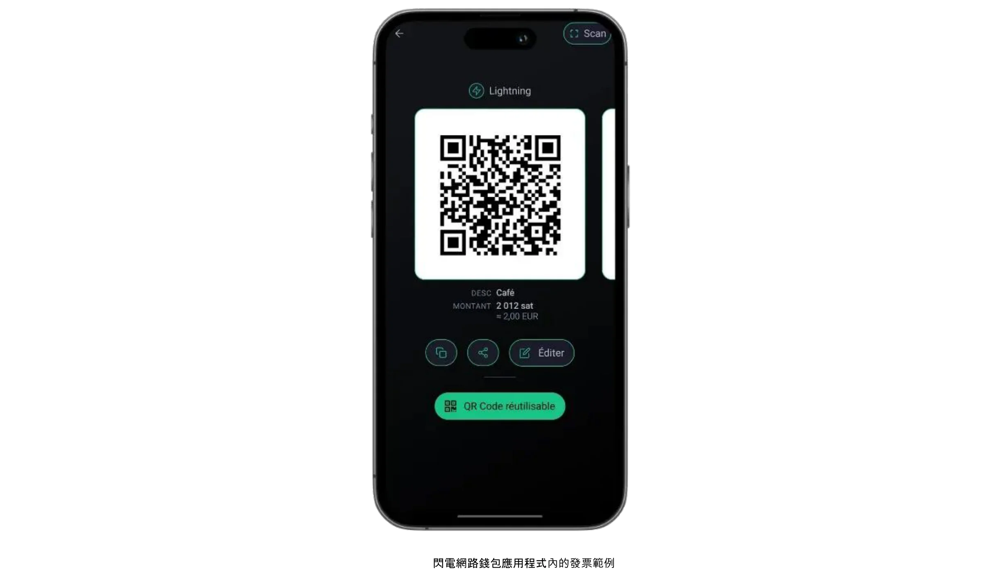

此設定檔的特色之一，就是著重於每月很少超過數百歐元或美元的低額付款。對於想要使用 Bitcoin 測試市場的人來說，這種適度的規模使其成為絕佳的選擇，而不會有大規模部署所固有的複雜性。此外，它還可以立即進行實務學習；由於運作壓力較小，金錢上的利害關係也較少，因此可以控制錯誤，並快速汲取教訓。從在週末集市銷售手工藝品的藝術家，到接受一次性捐款的非營利組織，此類型的使用者通常會強調存取性與易用性，而非進階功能。

Starter profile 最常見的兩種 Wallet 設定涉及在託管和非託管解決方案之間作出決定。託管型 Wallet（例如 Satoshi 或 Blink 的 Wallet）讓第三方服務管理私鑰和後端作業，從而減少使用者的技術責任。這種安排對於那些最重視便利性，並希望以最簡單的方式上線的人來說，尤其具有吸引力。另一方面，非托管型 Lightning wallets（如 Phoenix 或 Breez）將私鑰和完全控制權交到企業所有者手中，在 Exchange 中提供了更大的自主權和隱私性，而初期付出的努力則略多一些。無論哪種情況，現代介面通常都非常人性化，任何人都可以在幾分鐘內完成基本任務（生成 QR 代碼、輸入付款金額和確認交易）。

雖然交易額小時，安全問題可能看起來沒那麼緊迫，但建立基本的防護措施仍是至關重要的。即使是用來接收 Bitcoin 付款的單一智慧型手機或平板電腦，也應該以密碼或生物特徵安全鎖定，而且必須認真看待備份程序（從記錄保管 Wallet 的登入憑證，到保護非保管 seed 的短語）。在實體環境中處理交易的工作人員若能瞭解基本知識，將可獲益良多：如何開啟應用程式、如何向客戶出示 QR 代碼，以及如何檢查付款是否確實到達。

會計和報告雖然在 Starter profile 下相對簡單，但仍值得仔細考慮。雖然交易量可能很少，但保留準確的記錄可避免日後的混亂，並有助於在財務稽核或報稅時維持透明度。許多 Wallet 應用程式都可讓使用者將基本交易記錄匯出為 CSV 檔案；對於小型企業或單獨創業者而言，定期儲存這些檔案可讓帳目對帳更加容易。追蹤每筆交易收到時的大約法定貨幣價值（例如歐元或美元）也是明智之舉。由於 Bitcoin 的價格可能會波動，因此記錄兌換率對於簿記及稅務合規而言非常寶貴。

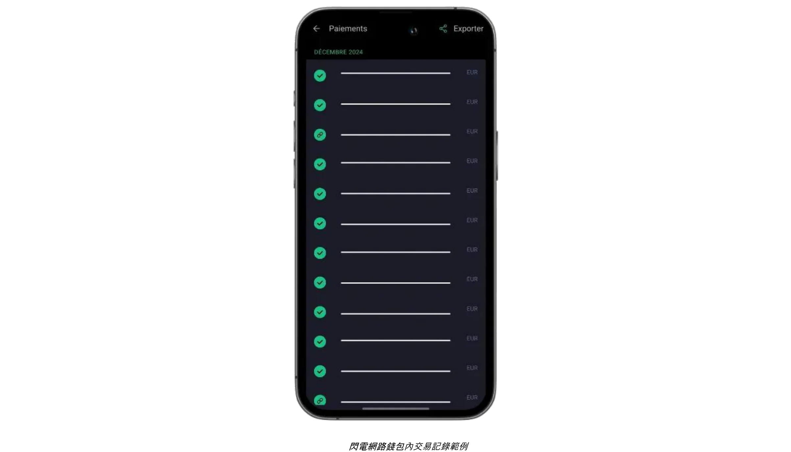

對於希望透過線上捐款或小費來輔助實體或現場付款的企業而言，現在可以直接將 Lightning 小費按鈕或捐款 Widget 整合到網站或部落格中。BTCPay Server 等平台提供了易于配置的支付按钮，而一些社交媒体和直播服务已经支持带地址的闪电小费。因此，即使是初創企業也能建立一個規模不大但全球性的贊助者網路。與此同時，不想長期持有 Bitcoin 的人可以探索使用某些託管式錢包或第三方服務將部分或自動轉換為法定貨幣。儘管這種選擇涉及額外的費用和可能的 KYC 義務，但它可以幫助企業避開 Exchange 匯率的波動，並維持現有的財務工作流程，將干擾降到最低。

一個簡單的使用案例說明所有這些 Elements 如何結合在一起。試想一位在星期六農夫市集賣自製果醬的當地手工藝人。當顧客要求以 Bitcoin 付款時，商家會快速輸入相對應的法幣金額，應用程式會自動計算出應付的 Sats。顧客用 Wallet 掃描所得的 QR 碼，幾秒鐘內就能完成付款，而手工藝師也立即知道交易成功。一天結束時，任何交易細節都可以匯出作記錄，當天的餘額可以全部或部分傳送到 Exchange 平台兌換成法定貨幣。

Starter 解決方案兼顧使用者友善的工具、最低的硬體需求，以及直接的記錄管理，提供基本的功能，不會讓新手感到吃力。如果交易量增加，企業的作業需求也不斷演進，升級至下一章詳述的更先進類別將是一個自然的進程。

有關推薦的錢包和基本設定的詳細教程，請參閱以下指南：

**自保管 LN 錢包/節點：**

https://planb.network/tutorials/wallet/mobile/phoenix-0f681345-abff-4bdc-819c-4ae800129cdf
https://planb.network/tutorials/wallet/mobile/bitkit-a7224674-85c4-4045-9baf-37018d89550c
https://planb.network/tutorials/wallet/mobile/breez-46a6867b-c74b-45e7-869c-10a4e0263c06
https://planb.network/tutorials/wallet/mobile/blixt-04b319cf-8cbe-4027-b26f-840571f2244f
https://planb.network/tutorials/wallet/mobile/zeus-embedded-advanced-3e89603c-501d-439c-8691-d4a0d0de459b
**Custodial LN 皮夾：**

https://planb.network/tutorials/wallet/mobile/wallet-of-satoshi-39149d86-e42b-4e8f-ae9f-7e061e7784f7
https://planb.network/tutorials/wallet/mobile/blink-7ea5f5a4-e728-4ff9-b3f9-cf20aa6fc2bd
## 必備

<chapterId>89be421f-f7df-4bcc-a9e4-df96e39ef249</chapterId>

Essential profile 適用於有員工的中小型企業，他們不需要進階的技術知識，就能輕鬆快速地接受 Bitcoin，同時擁有比簡單的 Wallet 更完整、更專業的系統。此類型最常適用於餐廳、咖啡廳、酒吧或小型零售商店，這些店家每月只需支付少量的 Bitcoin 款項，但卻希望 Interface 既簡單又強大，足以不中斷地處理日常營運。

與 Starter 剖析不同的是，Essential 企業通常將 Bitcoin 付款視為收入來源的持續部分，而非純粹的實驗。這些企業的交易量仍然相對較低，但交易頻率足以讓企業主和雇員受益於更有系統、更可靠的系統。與此同時，Essential 型態仍然著重於簡單性；雖然它允許方便的儀表板和有限的角色管理，但不需要專業的 IT 資源或複雜的整合。

此領域的技術建議通常以 **Swiss Bitcoin Pay ** 為中心，這是一種簡化的解決方案，可讓商家輕鬆接受 Bitcoin 付款。它的特色在於使用方便的 PoS 應用程式，不需要員工具備專業技術。與標準的 Bitcoin 電子錢包不同，它只專注於接收付款，讓員工使用裝置時不會有安全風險。多個 PoS 應用程式可連接到同一個帳戶，可在平板電腦、收銀機、智慧型手機上使用，或透過網頁版的電腦使用，支援 Android 和 iOS。您也可以建立一個菜單，列出您所銷售的商品及其相關價格，讓員工只需在 PoS 上為顧客選擇一籃子商品，然後就可以收取總額。

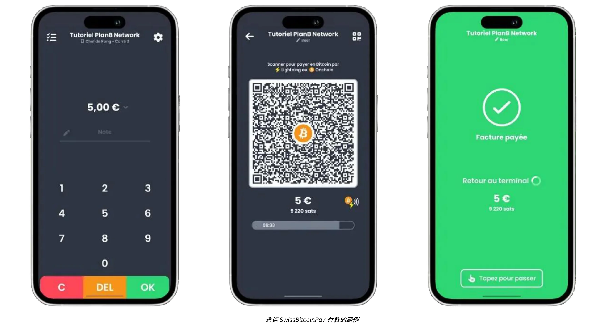

付款既可以 Bitcoin 提取到特定的 Address 中，也可以每日轉換為法定貨幣存入銀行帳戶。Swiss Bitcoin Pay 可自動處理 Bitcoin 和 Lightning Network 付款，無需手動介入。資金在轉帳前最多可保留 24 小時。雖然它不像 BTCPay 伺服器一樣是完全非監管式的，但它平衡了便利性和安全性，並且不需要 KYC。

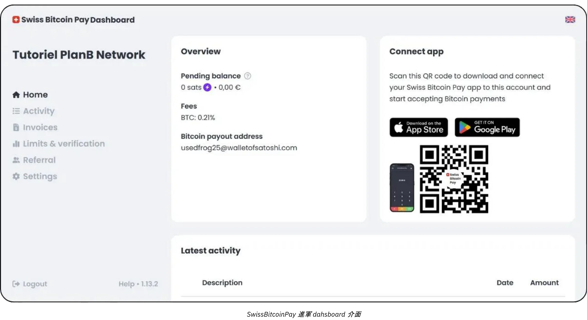

費用極具競爭力：第一年為 0.21%，之後 Bitcoin 支付為 1%，法幣轉換支付為 1.5%，包括 Bitcoin 交易成本。Swiss Bitcoin Pay 在 Open Node 之類的託管解決方案和 BTCPay Server 之類的複雜自託管系統之間提供了一個實用的中間地帶，將簡單性、安全性和財務自主性放在首位。

此類型的設定可讓面對面業務迅速取得 generate 付款發票、向顧客出示 QR 碼，並接受 Lightning 或 On-Chain 交易，將摩擦降至最低。員工只需簡短的入門指導即可處理這些付款，而經理則可登入線上儀表板，核對每日銷售額和存取基本報告。簡化的管理主控台也可協助規模較小的場所追蹤來自單一 Interface 的法幣和加密貨幣收入，從而減少混亂，並減少手動記帳所花費的時間。

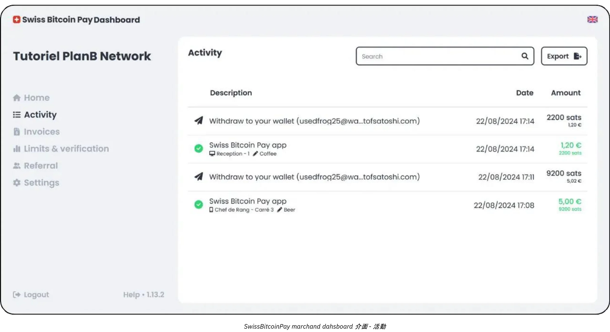

Essential 方法的另一個主要優點是強調快速部署和最小干擾。瑞士 Bitcoin Pay 等解決方案可在數小時內完成設定，而不是數天或數週。舉例來說，對於一般繁忙餐廳的老闆或經理而言，最終目標是整合 Bitcoin 收款功能，而不會造成結帳櫃台的延誤或員工的混亂。一旦 POS 設定完成，經理只需快速指示員工如何顯示 Invoice，並驗證付款是否已完成。在最佳情況下，客戶的交易幾乎可即時透過 Lightning Network 確認，而企業的管理面板也可同時即時註冊新的付款。

雖然 Essential profile 不需要高度精密的會計系統，但保持適當的交易記錄仍是明智之舉。Swiss Bitcoin Pay 等工具提供 CSV 匯出功能，讓管理人員能夠取得每筆 Bitcoin 銷售的法幣等值，並與其他收入來源一起追蹤。對大多數小型企業來說，這種程度的文件記錄已經足夠，而對 Exchange 稅率的基本瞭解將有助於報稅和一般財務監督。

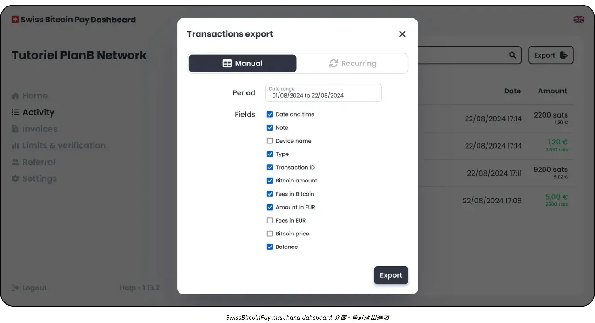

最適合您的混合型解決方案可能是瑞士 Bitcoin Pay：

https://planb.network/tutorials/business/point-of-sale/swiss-bitcoin-pay-2-a78b057e-ed11-47ac-860c-71019fcb451a
Open Node 是另一個容易實作的解決方案，但缺點是必須 100% 保管：

https://planb.network/tutorials/business/point-of-sale/open-node-e69a0c1c-47f7-4932-8494-e6f26c3c9784
如果您已準備好動手，並希望完全控制整個過程，BTCPay Server 軟體是一個很好的選擇。然而，BTCPay Server 的主要缺點是其安裝和管理非常耗時，需要一定的專業技術知識，但您可以按照我們的指南進行操作：

https://planb.network/tutorials/business/point-of-sale/btcpay-server-928eb01e-824b-4b57-a3e8-8727633beddc
最後，作為實體銷售點的補充，您可以考慮建立 [Bitcoinize PoS](https://bitcoinize.com/)。

## 專業人士

<chapterId>4d5dfa50-c4d0-481c-ab95-1863a898750e</chapterId>

Professional profile 針對的企業已超越偶爾或少量的 Bitcoin 付款，現在需要強大的基礎架構來處理多筆日常交易。這些公司通常跨多種通路營運 (可能是零售據點、專屬電子商務網站，甚至是行動銷售)，因此需要可無縫整合至現有工作流程的付款解決方案。在許多情況下，此層級的企業已經管理銷售點系統、線上訂單管理平台，以及需要可靠、可擴充的後勤作業。

專業商家的一大特點是需要**進階功能**和**可客製化解決方案**，即使交易量成長也能維持效率。基本使用者可能滿足於智慧型手機應用程式上的簡化工具，而專業商家則不同，他們通常需要詳細的 Invoice 客製化功能、精密的報告儀表板，以及指派多重管理角色的能力。

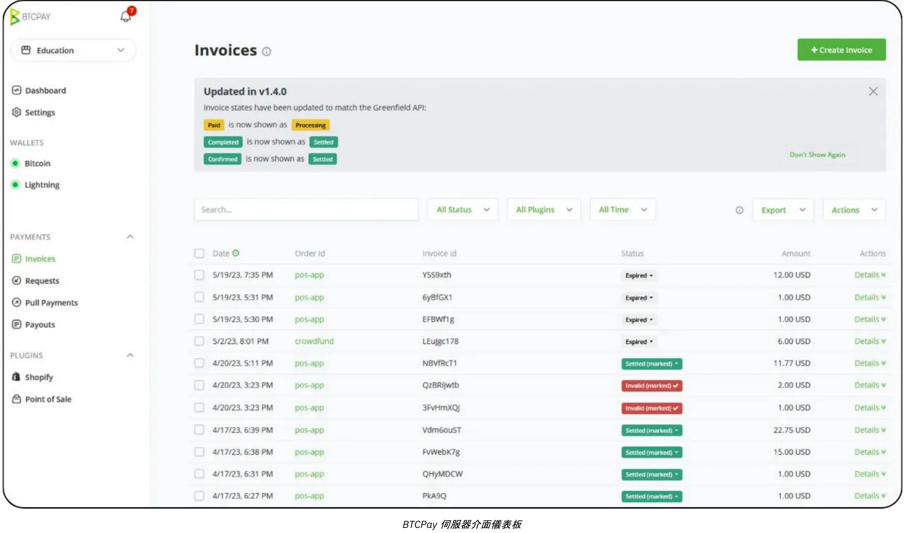

舉例來說，一個餐廳集團可能有專門負責開票和庫存管理的員工，而另一個團隊則負責產品清單和行銷活動。在這種環境下，Bitcoin 付款解決方案必須與這些既有的組織結構完全吻合。

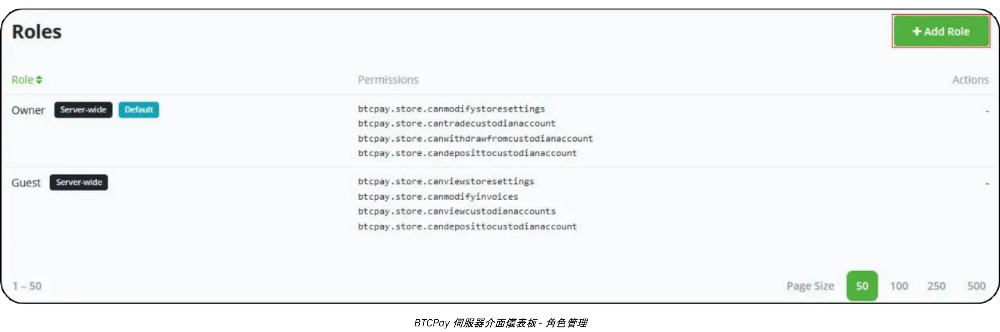

關於技術和工具，像**BTC Pay Server**這樣的解決方案通常會構成專業設定的核心。BTC Pay Server 是一個開放源碼平台，可以部署在內部或透過雲端託管，並為網站和電子商務平台提供廣泛的整合選項。通過運行自己的實例，企業可以對支付流程的每個方面保持高度控制，從自動生成的結帳頁面到付款確認後觸發內部流程的通知。

此外，[Zaprite](https://zaprite.com/) 或 [Musqet](https://musqet.tech/)等工具可以進一步完善結帳體驗，允許更細粒度的客製化（從品牌選擇到複雜的報告功能）。那些喜歡多合一線上零售環境的人可能會傾向於 [Be-BOP](https://be-bop.io/)，這是一個電子商店解決方案，可在不犧牲易用性的情況下促進 Bitcoin 付款。

在專業環境中實施這些技術意味著要密切注意**操作的複雜性**。自動化開票工作流程、多幣別顯示，以及與現有庫存系統同步，都是整合良好的平台的標誌。精確匯出交易資料（無論是以 CSV 檔案、直接 API 呼叫或客製化格式）的能力可協助企業有效率地將 Bitcoin 銷售與其他收入來源進行對帳。

安全性與角色管理是專業使用者的另一項重要考量。隨著每日 Bitcoin 交易的累積，控制管理功能的存取權限成為重要的風險緩解措施。在許多解決方案中，管理員可以指派不同層級的權限 (也許會限制某些員工只能檢視交易歷程和產生發票，而賦予其他員工管理庫存或設定全系統設定的權限...)。這種層級結構不僅能保護敏感資料，還能透過釐清哪些員工負責支付基礎架構的每個部分來簡化作業。

談到實際案例，請考慮一家專營科技配件的中型電子商務商店。該公司可以將 BTC Pay Server 整合到現有的線上店面中，在結帳時自動生成 Bitcoin 付款地址。顧客通過掃描 Lightning 或 On-Chain Address 完成購買，商店的平台會立即確認付款。與此同時，內部系統更新訂單狀態並觸發發貨通知。得益於先進的報告功能，財務團隊可以輕鬆檢視每日的 Bitcoin 銷售額、匯出合併的 Ledger 供審計，並追蹤公司決定保留的任何 BTC 持有量的價值。

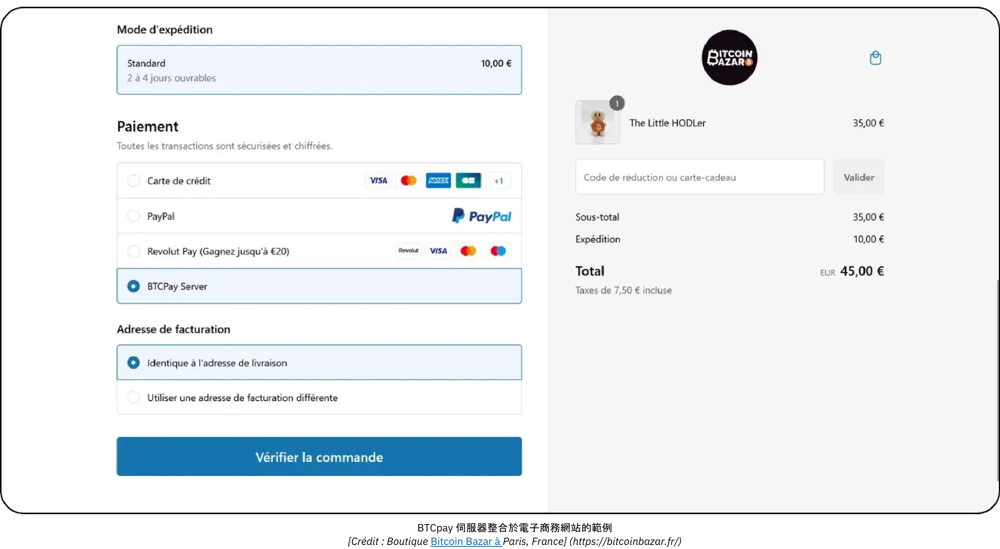

*[Credit: Bitcoin Bazar shop in Paris, France.](https://bitcoinbazar.fr/)*

若要深入瞭解實施的具體細節，並探索 BTC Pay Server 的實際配置，請參考以下課程：

https://planb.network/courses/6fc12131-e464-4515-9d3f-9255365d5fa1
## 企業

<chapterId>80fb2659-81ca-4a11-b492-72c7ae5774f9</chapterId>

企業級應用是 Bitcoin 支付實施的最高境界，專為需要完全客製化解決方案的大型企業、主要市場和成熟企業量身打造。與較小規模或中階部署不同，企業級作業將 Bitcoin 支付整合到廣泛的工作流程和系統中，範圍從現場銷售點設備到電子商務店面、後台會計平台和複雜的 ERP 架構。

在這種規模下，首要目標不僅僅是接受 Bitcoin，而是要以與組織核心流程**完全**一致的方式來接受 Bitcoin。這種一致性可能需要專門的軟體開發，不論是完全客製化的解決方案，或是透過第三方*Lightning 服務供應商* (LSP) 支援的 SaaS 基礎架構來協調。此類 LSP 可以處理超出傳統開箱即用工具能力的高交易量和複雜網路組態。因此，從 API 驅動的整合到先進的財務管理功能，所產生的架構包含了廣泛的技術和業務考量。

在企業環境中，作業的複雜性尤其明顯。大型企業可能需要容納多個部門（銷售、行銷、開發、財務和會計），每個部門都有不同的職責和資料需求。在這種情況下，Bitcoin 支付平台必須提供高度細分的角色管理，讓每個部門都能精確地存取與其任務相關的功能，同時保持對安全性和資料完整性的嚴格控制。同樣重要的是自訂工作流程的能力：例如，入站付款可能會觸發庫存系統的更新、向銷售經理發送自動通知，以及為財務團隊更新 Ledger 項目，所有這些都是即時的。銷售點裝置本身通常是為企業環境量身打造，具有符合公司品牌與營運需求的客製化軟體介面。

對於企業規模的企業而言，**安全性**是最重要的。大量的交易和潛在的巨額 Bitcoin 需要能夠防禦惡意攻擊或內部威脅的強大基礎架構。最佳作法通常包括多重簽章與時間鎖財資配置、經過仔細審計的程式碼庫，以及嚴格遵守相關的法規框架。此外，遵守當地和國際財務法規也是維護公司聲譽和營運許可證不可或缺的一環。

建立或整合企業級 Bitcoin 支付解決方案所涉及的**客製化開發**，不只是編寫幾個應用程式功能。它通常需要架構設計、徹底的測試協定，以及可能跨越多個階段的結構化推出（初始試用程式、有限的市場測試，以及最終的全球部署）。

在會計方面，高頻交易需要**完全客製化的匯出**，有時還需與企業財務軟體即時同步。大型企業可能依賴 SAP 或 Oracle 等企業資源規劃 (ERP) 解決方案，而這些解決方案又必須 Interface 與 Bitcoin 支付資料無縫連接。為了達到這個目的，所選平台的 API 必須是精密且彈性的，讓 IT 團隊可以自由地建立自訂報告儀表板、執行自動對帳程序，以及 generate 每日甚至每小時財務摘要。

一個典型的企業方案可能涉及到一個主要的電子商務市場，每天有數以千計的交易。除了將 Bitcoin 列為付款選項之外，此市場還可針對使用者體驗的各個層面進行調整，從 Bitcoin 付款流程如何出現在面向客戶的網站上，到後端如何管理退款、扣款或爭議解決。專門的 devops 團隊會與財務和法律部門合作，監督持續維護、安全修補程式和合規性更新。如果公司選擇保留部分 Bitcoin 收入，內部金庫系統將追蹤公司所持有的 Bitcoin 與傳統貨幣儲備。

為了確保企業層級的部署順利且安全，大多數機構都會聘請具有 Bitcoin 和 Lightning Network 整合經驗的專業服務供應商或內部開發團隊。此流程通常會先進行深入的需求評估 (涵蓋技術基礎架構、合規要求及所需的客戶旅程)，然後再設計可處理大量吞吐量的架構。依據專案範圍，您可能需要依賴一個由財務主管、安全分析師和軟體工程師組成的跨領域團隊。另外，越來越多的專業顧問公司可以引導您從最初的構想到最後的推出，並協助您完成評估 SaaS 託管解決方案、配置 *Lightning 服務供應商*，以及客製化前端介面等任務。透過與領域專家合作，企業可以降低與大規模支付實施相關的風險，並獲得一個不僅強大且合規的解決方案，同時還能夠靈活應對未來的成長。

## Bitcoin 付款解決方案：選項與趨勢

<chapterId>59ff43a1-98e2-4a81-af3e-9654bdd60952</chapterId>

每個類別的解決方案總會有所取捨。例如，在最初的「試用階段」，建議的錢包在設計上盡可能簡化使用者 Interface，但它們是託管式的 (**custodial**)。這表示資金由應用程式供應商控制。然而，Bitcoin 的精神是鼓勵邁向完全由使用者 Ownership 控制資金 (**自我監護**)。在這種情況下，建議您在第一筆銷售完成後立即升級到下一個類別 - 基本上，一旦確認您有客戶願意以 Bitcoin 付款。

Bitcoin 的主要優勢之一，就是能夠隨意移動資金，讓您**非常容易地切換供應商**或解決方案的元件。此外，所有的應用程式和解決方案本身都在快速發展。舉例來說，考慮 Bitcoinize，它現在提供的實體銷售點 (POS) 終端可與市場上許多應用程式整合，這種解決方案在幾個月前還不存在。

### 您是否正在尋找一種解決方案來建立商店並同時接受傳統和 Bitcoin 付款？

如果您是從零開始，沒有商店、沒有產品管理軟體、也沒有銷售點 (POS) 系統，您有幾個選擇：

- 委外服務：**您可以委外建立具有購物選項的網站，然後在傳統的店內解決方案中加入 Bitcoin 付款功能。**
- 簡單的解決方案：或者，您也可以使用像 **Accessing.app** 之類的平台來自行完成。主要優點包括
    - 快速且經濟實惠地建立線上或實體商店。
    - 適合季節性業務、活動、餐廳或零售商店。
    - 定義和管理實體和線上銷售的產品。
    - 透過您自己的 Stripe 帳戶處理法定貨幣付款（如歐元、美元）。
    - 透過您自己的 SwissBitcoinPay 帳戶進行 Bitcoin 付款處理。

### Lightning Payment 的應用進展如何？

雖然 Lightning Network 具備優異的效率和較低的費用，但其採用仍處於早期階段。與其專注於目前的限制，不如回想一下歷史上基礎架構轉型的發展過程：

- 當汽車剛出現時，沒有足夠的汽車來證明建造道路是合理的，也沒有足夠的道路來證明擁有汽車是合理的。
- 當電力被引入時，沒有足夠的客戶來證明建立電網是合理的，也沒有足夠的電網來吸引客戶。

新的基礎設施之所以成功，是因為它們更有效率，而早期採用者的加入則是因為他們獲得了實質的利益。以下是關於 2024 年 Lightning Network 的觀察：

- 超快速交易：**交易通常幾乎是瞬間完成 (<500ms) 且故障率極低。**
- 網路專業化：**規模較大的業者正在確保整個網路的流動性，而個人基本上已停止路由付款，現在主要是經營「邊緣節點」。**
- 改善使用者體驗：**個人使用者的行動應用程式已大幅改善。拼接、靜態 Bolt12 發票和零確認付款 (0-conf) 等功能已廣泛使用，使互動無縫進行。互操作性問題 (例如：強制關閉) 已不再是主要問題。**
- 增強節點和通道管理：**個人和專業解決方案都有進步**。舉例來說，BTC Pay Server 現在支援許多與其他供應商連結的外掛程式 (PSP、on/off ramps 等)。新的基礎設施供應商，如 LightSpark 和 Alby Hub，也開始投入生產。
- 商戶採用率成長：**BitRefill 等商戶表示，他們的活躍用戶中，Bitcoin 付款的比例正在增加，顯然已轉向使用 Bitcoin 而非 Lightning。此外，Lightning 的超低費用使其成為小額支付（平均每筆交易 32 歐元）的首選。**

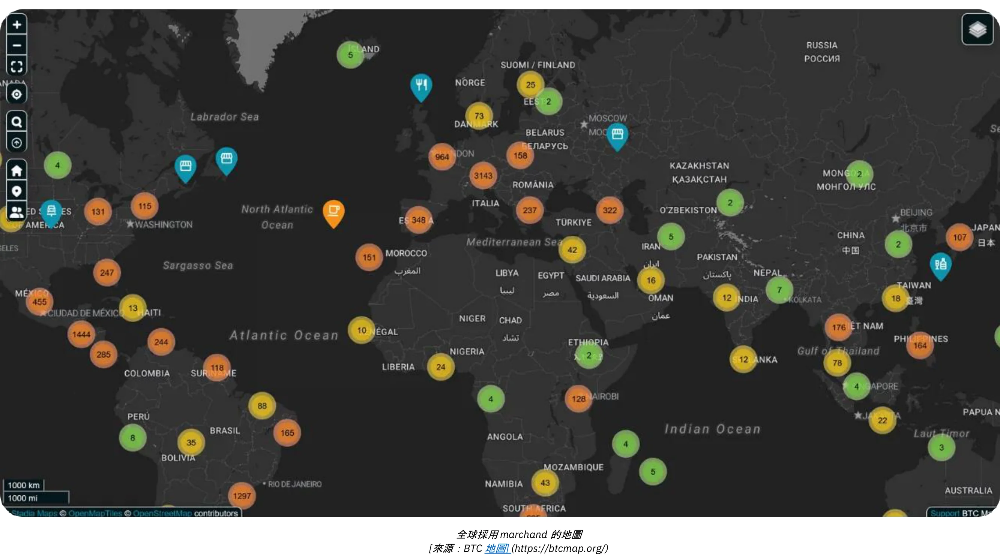

*[資料來源：BTC 地圖](https://btcmap.org/)*

- 網路指標：**鎖定在 Lightning 上的通道和 Bitcoin 總數保持穩定，約有 20,000 個節點、5,200 個 BTC 和 60,000 個通道。然而，這只反映了網路的一部分，並顯示參與者之間的輪換，個人參與較少，而專業人士則較多。**
- Lightning 作為網路間的橋梁：**Lightning Network 的效率和可用性已將其定位為其他互聯網路（如 FediMint、Liquid 等）的橋梁。**

**Wallet卷土重來**

Bitcoin 和 Lightning Network 正在完成**數位 Wallet 革命**。新的網路服務現在允許**交易而不需要建立帳號**-您的 Wallet 成為您的身分！透過**Nostr Wallet Connect (NWC)**和**LN-URL-AUTH**等協定，錢包能夠無縫認證使用者，並在沒有傳統帳戶的情況下進行交易。簡單購買或訂閱的帳戶疲累時光一去不返。再也不需要提供個人或付款資訊，這些資訊可能會被駭客入侵並在暗網上出售，最近的事件經常提醒我們這一點。

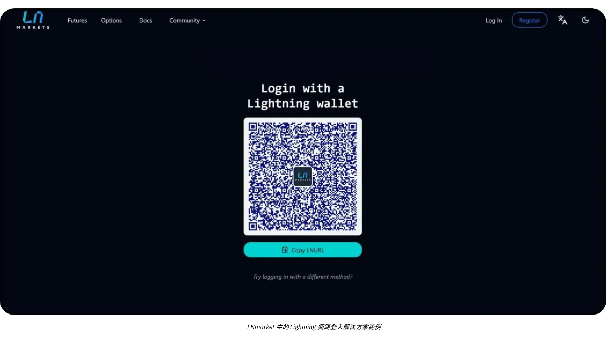

未來的商家將接受這項創新，為顧客提供更安全、更順暢（一鍵完成）的體驗，同時也尊重顧客的隱私權。

# Bitcoin 會計

<partId>d49d7595-a189-4e2b-bd60-c19e8e717aa2</partId>

## 商業會計基本原則 Bitcoin

<chapterId>84063061-ffdb-4b1f-b20b-588ffb146877</chapterId>

以下內容僅用於教育目的，不應視為財務或會計建議。我們強烈建議企業和個人在採取任何行動之前，諮詢熟悉其特定司法管轄區加密貨幣法規的合格會計師或法律專家。

### Bitcoin 會計關鍵概念

**任何 Bitcoin 交易都必須記錄，並可能導致應課稅事件**

在全球範圍內，Bitcoin 通常不被歸類為貨幣，而是數位資產。這種區別對 Bitcoin 在企業中的入帳方式有重大影響，會影響稅務義務、財務報告和合規要求。接受 Bitcoin 作為付款方式或使用 Bitcoin 作為庫務工具的企業必須瞭解這些監管上的細微差異。

最重要的**後果是，在大多數司法管轄區中，賺取、出售、交易或使用 Bitcoin 購買，通常會產生應課稅事件，收益須繳納資本利得稅。**

Bitcoin 會計的另一個方面是區分兩種資本收益：

- 潛在損益：**根據會計期間結束時持有的 Bitcoin 價值計算的未實現損益。**
- 有效損益：**財政年度內出售或交換 Bitcoin 時的已實現損益。**

這些計算在很大程度上取決於 Bitcoin 是為長期投資或短期營運使用而持有。此外，企業必須使其會計實務符合當地的稅務結構，因為不同國家的法規差異很大。

持有 Bitcoin 的企業的會計工作有點麻煩，因為必須仔細追蹤每筆交易，以計算已實現或未實現的利潤或虧損。您接受 Bitcoin 作為付款方式所進行的每次銷售，或每次買入或賣出 Bitcoin，都需要記錄：

- 時間
- 售價（法定貨幣）
- Bitcoin 的成本價格（最初取得 Bitcoin 的價格）。

這將使您稍後能夠計算差額，以確定利潤或虧損。

**範例：** 一家企業以 $30,000 買入 1 BTC。之後，它以 $20,000 賣出 0.5 BTC。為了計算損益，該企業必須：

- 已記錄取得 Bitcoin 的時間、法定成本價格和數量
- 已記錄 Bitcoin 賣出的時間、賣出價和數量
- 確定 Bitcoin 的銷售成本：0.5 BTC：$30,000 ÷ 2 = $15,000。
- 比較銷售價格和成本價格： $20,000（銷售價格）- $15,000（成本價格）= $5,000利潤。
- 以新的成本價格更新 Bitcoin 持有量

每筆交易都必須重複這個程序，而 Bitcoin 價格的浮動性質使得記錄保存更加麻煩。

**如果 Bitcoin 是一種貨幣，它將如何運作？**

如果將 Bitcoin 視為一種貨幣，企業在會計系統中就可以像管理其他貨幣一樣管理 Bitcoin。與其追蹤每筆交易的成本基礎和已實現/未實現的利潤，Bitcoin 的持有量只需記錄在貨幣帳戶中即可。在每個報告期間結束時，所有持有貨幣的價值（包括 Bitcoin）將使用當前的 Exchange 匯率轉換為會計貨幣（例如美元或歐元）。

**Updated Example if Bitcoin was recognized as a currency:**

- 當 Bitcoin 價值 $30,000 時，某企業持有 1 BTC。之後，當 Bitcoin 值 $40,000 時，該企業使用 0.5 BTC 付款。
- 企業不****計算已實現損益。取而代之，交易記錄為
    - 付款：20,000 美元 (0.5 BTC × 40,000 美元)。
    - 剩餘的 Bitcoin 結餘： 0.5 BTC，現值 $20,000（以目前 Exchange 的匯率更新）。

**Key Advantage if Bitcoin was recognized as a currency:**

- 企業只需定期調整其持有的 Bitcoin 法幣等值（例如，每月或每年的報告），就像持有歐元、日圓或其他貨幣一樣。
- 這樣就不需要進行交易層級的成本基準追蹤，並簡化了會計工作，特別是對於經常進行 Bitcoin 交易的企業而言。

假設 Bitcoin 在法律和監管方面得到完全承認，這種方法將使 Bitcoin 會計變得簡單得多，減少行政負擔，並與其他貨幣的處理方式保持一致。我們還沒到那一步。

### 個人與公司 Bitcoin 會計之間的區別

Bitcoin 的法律和會計處理方式在個人和公司之間有很大差異。對於個人而言，Bitcoin 交易的收益可能需要繳納所得稅，通常稅率較高。相比之下，公司可能受益於較低的公司稅率，但必須遵守更嚴格的簿記標準。

對於企業而言，Bitcoin 可依其預期用途分類至不同的帳戶：

- 固定資產：**用於長期持有作為策略性投資的 Bitcoin**。
- 庫存：**用於生產過程中使用的 Bitcoin（罕見的使用情況，例如這是專業交易商的情況）**。
- 現金或金庫帳戶：**用於作為 Liquid 資產持有的 Bitcoin，主要用於營運交易或短期金庫管理。**

分類的選擇取決於公司的活動和策略，並影響財務報告和稅務義務。請務必查看當地法規，因為這些分類可能因國家而異。

### 法律架構

Bitcoin 的法律認可和處理方式因司法管轄區而異。有些國家（例如薩爾瓦多）承認 Bitcoin 為法定貨幣，簡化了其在交易中的使用，但卻使國際財務報告變得複雜。其他國家則將 Bitcoin 視為數位資產，須遵守特定的稅務和會計規定。

在大多數國家，Bitcoin 被歸類為數位資產，其處理方式受一般會計準則的規範。企業必須對 Bitcoin 交易進行如下會計處理：

- 記錄資本收益/虧損：**企業必須在財務業績中記錄已實現的收益或虧損。**
- 潛在收益/虧損評估：**未實現的收益或虧損通常必須報告，但可能不會直接影響應課稅所得。**
- 符合會計準則：**企業必須將 Bitcoin 交易整合至標準簿記作業，以確保透明度和準確性。**

Bitcoin 的核算方法因地域而異：

- 美國：**IRS 將 Bitcoin 列為財產，類似於股票、債券或房地產**。此分類意味著任何涉及加密貨幣的交易，例如賺取、出售、交易或甚至使用加密貨幣進行購買，都可能造成應課稅事件，且收益需繳納資本利得稅。
- 歐盟：**成員國通常將 Bitcoin 視為投機資產，而非功能性貨幣。因此，收益通常需要繳納資本利得稅。**
- 亞洲：** 新加坡和日本等國家已採用漸進式的監管架構，在特定情況下對 Bitcoin 交易予以優待。但 Bitcoin 通常會被視為**無形資產，在報告日期以公允價值計量，並在損益中確認變動。

了解營運國家/地區的法規並據此調整您的會計實務是非常重要的。

### 法規演進的挑戰

加密貨幣創新的速度之快往往超過監管框架。自 Bitcoin 被認定為數位資產以來，全球法規已逐步更新，但缺口仍然存在：

- 缺乏判例：**很少有法律案例闡明具體的會計實務，留下了詮釋的空間。**
- 持續的爭論：**潛在虧損的稅務處理等問題在許多司法管轄區仍未解決。**
- 跨境的複雜性：**在國際間營運的公司面臨調和不同國家會計準則的挑戰。**

儘管面臨這些挑戰，許多國家的積極立場為企業將 Bitcoin 納入其營運奠定了堅實的基礎。持續更新和國際協調對 Address 加密貨幣會計中新出現的複雜問題至關重要。

### Bitcoin 在財務報表中的分類

Bitcoin 在財務報表中的分類因司法管轄區而異，並取決於其在企業中的預期用途。概括而言，Bitcoin 被視為數位資產，類似於存貨、投資或貨幣，但具有影響其會計處理的獨特特性。

- 數位資產或無形資產：許多司法管轄區，包括法國和歐盟，將 Bitcoin 分類為數位或無形資產，而非法定貨幣。此類別要求企業對 Bitcoin 的會計處理有別於法定貨幣。
- 存貨：如果企業的核心活動涉及交易 Bitcoin，例如加密貨幣交易所或經紀商，則 Bitcoin 會被歸類為存貨。在這種情況下，估值遵循存貨會計準則。
- 金融投資：持有 Bitcoin 作為長期資產的公司可將其分類為金融投資。例如，在美國，企業可根據財務會計準則委員會 (FASB) 的指引將 Bitcoin 入帳，並在市價下跌時確認減值。

**分類的影響：**

- 長期持有的資產通常需要進行減值測試和攤銷。
- 主動交易或付款相關活動需要持續追蹤已實現及未實現損益。

### 估值方法

估值方法是用於確定 Bitcoin 成本基礎的會計技巧，對於準確計算交易中的收益或虧損至關重要。一般而言，最好**在會計系統中維持經常更新的當前 Bitcoin 持有成本**值。這可確保透明度、符合稅務法規，並避免在需要進行計算時落後計算。

- 先入先出 (FIFO)**：此方法常見於澳洲和印度等司法管轄區，根據最早的取得成本為 Bitcoin 估值。這可能會變得相當**複雜，因為在銷售發生時，可能需要分別追蹤 Bitcoin 的每個部分。
- **加權平均成本 (WAC)**：由於其**簡單**，通常是大量交易的首選，如在美國等國家所見。

強烈建議**從公司開始購買 Bitcoin 或接受 Bitcoin 作為付款**起，就保留一份詳細的 Bitcoin 成本追蹤工作簿，以確保記錄的準確性和組織性。在選擇接受 Bitcoin 付款或購買 Bitcoin 的軟體解決方案時，光是這個考慮因素就應該是最重要的。

### 零售和電子商務交易會計

零售商必須記錄每筆交易的 Bitcoin 稅率與 Exchange 稅率之間的差異。例如，在許多國家，企業使用銷售時的 Exchange 稅率來計算增值稅。

企業必須確保他們所使用的**支付**工具提供以下功能：

- generate 和 Invoice 包含當地法定金額（歐元、美元、英鎊）、增值稅或其他當地稅項、Bitcoin 計值等值、日期和時間、Bitcoin Exchange 匯率和 Exchange 來源等。
- 匯出所有付款收據，至少以 .csv 格式匯出，並附上所有上述資訊，以便會計人員輕鬆處理
- 理想情況下，庫存中持有的現有 Bitcoin 成本基準的更新值會記錄在案。

### 挑戰

- **波動性**：Bitcoin 的價格會大幅波動，造成評估所持資產及預測未來財務結果的困難。
- 法規審查：在中國等國家，Bitcoin 的限制地位限制了其作為庫藏資產的用途。
- **法規的不確定性**：Bitcoin 不斷演變的法規環境經常讓企業陷入困境。例如，稅務政策的變更，如印度或美國的稅務政策，可能會在一夜之間影響會計實務。
- **管理不善風險**：不當分類或未監控 Bitcoin 交易可能導致合規問題、處罰或聲譽受損。
- 再認證風險：將公司庫存的大部分維持在 Bitcoin 中，會使企業面臨價格下跌的潛在損失。這可能會造成嚴重的後果，尤其是當價格下跌發生在支付供應商、員工或稅款到期時。此外，公司所有者可能會被追究法律責任，這可能會導致罰款或其他法律問題，例如濫用公司資產的指控。

## 會計工具與軟體

<chapterId>e7b31be5-1176-4835-944e-3cba1b7040fa</chapterId>

當一家公司決定將 Bitcoin 整合到其會計中，各種工具和專門軟體可簡化資料的收集和處理。其中最知名的解決方案有 [CoinTracker](https://www.cointracker.io/)、[Waltio](https://www.waltio.com/)、[Cryptio](https://cryptio.co/)、[Koinly](https://koinly.io/)、[TokenTax](https://tokentax.co/) 和 [ZenLedger](https://zenledger.io/)。這些平台主要集中在四個方面：

- 自動資料收集；
- 將資料轉換成與一般會計軟體（QuickBooks、Xero、ERP）相容的格式；
- 稅務義務的計算；
- 交易分類。

對於在不同平台或交易所擁有多個錢包和資產的大型機構而言，它們通常是明智的補充。

不過，對大多數小型企業而言，包含交易歷史的簡單「.csv」檔案通常就足夠了。目的是記錄每筆付款的日期、金額、歐元/美元等值以及相關的 Bitcoin 位址。絕大多數的 Bitcoin 支付解決方案（BTC Pay Server、Swiss Bitcoin Pay 等）或 Exchange 平台（Bitfinex、Kraken、Coinbase 等）已經提供了匯出交易歷史記錄的機制。將這個檔案提供給會計師，可以簡化資料輸入，並清楚區分與 Bitcoin 相關的流入和流出。

對於那些自行保管 Bitcoin 的人來說，管理 UTXOs（*未使用的交易輸出*）是一個重要的步驟。適當的 UTXO 標籤有助於追蹤每個 BTC 片段的來源，區分與專業活動相關的交易和用於個人開支的交易，並有助於法律或稅務目的的追蹤。大多數好的 Bitcoin Wallet 軟體允許您使用備份檔案（或您的 xpub，取決於您的設定）匯入您的 Wallet，並根據其來源或目的地標記 UTXO。為了協助您，這裡有一個完整的教程，專門介紹這種做法：

https://planb.network/tutorials/privacy/on-chain/utxo-labelling-d997f80f-8a96-45b5-8a4e-a3e1b7788c52
最後，不論您是小商家或較成熟的企業，都有可能**在 Bitcoin 中**結算 Invoice。關鍵是要正確記錄交易。如果您使用自行保管的 Wallet 付款，最理想的做法是 generate 交易，在您的標籤上註明 Invoice 號碼和付款目的。如果您偏好透過 Exchange 結算 Invoice，您也可以選擇匯出收據或交易記錄，以納入您的會計記錄中。這種透明度將簡化您所有 BTC 作業的追蹤和報告。

## 實用 Bitcoin 會計範例

<chapterId>763f6f20-9181-495a-bf7d-b405899e65ec</chapterId>

### 使用個案 1：零售商店將 Bitcoin 付款轉換為歐元

**Scenario**：一家小型麵包店接受 Bitcoin 作為付款方式，但會立即將收到的所有 Bitcoin 兌換成歐元，以避免受到加密貨幣波動的影響。

**範例**：

- Bitcoin 兌換率：1 Bitcoin = 40,000 歐元。
- 交易 1：顧客以 20 歐元購買多種糕點。
    - 相當於 Bitcoin：(20 / 40,000) = 0.0005 Bitcoin = 50,000 Satoshis。
    - 換算費用：1.5% (€20 × 0.015) = 0.30 歐元。
    - 收到的淨額：€20 - €0.30 = €19.70。
- 交易 2：客戶以 5 歐元購買咖啡。
    - 相當於 Bitcoin：(5 / 40,000) = 0.000125 Bitcoin = 12,500 Satoshis。
    - 轉換費用：1.5% (€5 × 0.015) = €0.075。
    - 收到的淨額：€5 - €0.075 = €4.93。

**交易摘要**：

- 總銷售額：**25 歐元**。
- 總費用：**0.375 歐元**。
- 收到的淨歐元：**24.625 歐元**。

**Accounting Implications**：

- 將總銷售額 (25 歐元) 記錄為收入。
- 扣除轉換費用 (0.375 歐元) 作為開支。
- 由於所有金額已立即轉換，因此資產負債表上並無 Bitcoin 持有額。

### 使用個案 2：零售店保留 50% 的 Bitcoin 付款

**Scenario**：同一家麵包店選擇保留 50% 的 Bitcoin 付款作為庫存資產，而將另外 50% 兌換成歐元。

**範例**：

- Bitcoin 兌換率：1 Bitcoin = 40,000 歐元。
- 客戶交易：客戶購買 50 歐元的糕點。
    - 相當於 Bitcoin：(50 / 40,000) = 0.00125 Bitcoin = 125,000 Satoshis。
    - 換算 (50%)：價值 25 歐元的 Bitcoin = 0.000625 Bitcoin = 62,500 Satoshis。
        - 轉換費用：1.5% (€25 × 0.015) = €0.375。
        - 收到的歐元淨額：25 歐元 - 0.375 歐元 = 24.625 歐元。
    - 保留在 Bitcoin (50%)：62,500 Satoshis = 0.000625 Bitcoin。

**Summary**：

- 總銷售額：**50 歐元**。
- 費用：**0.375 歐元**。
- 收到的淨歐元：**24.625 歐元**。
- Bitcoin 保留：**62,500 Satoshis**.

**Accounting Implications**：

- 將總銷售額 (50 歐元) 記錄為收入。
- 扣除轉換費用 (0.375 歐元) 作為開支。
- 保留的 Bitcoin (62,500 Satoshis) 作為數位資產出現在資產負債表上。
- 未實現收益：如果會計年度結束時 Bitcoin 估值較高或較低，則會出現未實現收益或虧損，該收益或虧損將在財務附註中披露，但不會變現為收入。

### 使用個案 3：專業服務保留 Bitcoin 作為長期投資

**Scenario**：自由平面設計師接受 Bitcoin 作為付款，並保留所有收到的 Bitcoin 作為長期投資。

**範例**：

- 付款時的 Bitcoin 兌換率：1 Bitcoin = 30,000 歐元。
- 來自客戶的交易：客戶支付價值 3,000 歐元的服務費用。
    - 相當於 Bitcoin：(3,000 / 30,000) = 0.1 Bitcoin = 10,000,000 Satoshis。
- **年終估值**：
    - 年終 Bitcoin 兌換率：1 Bitcoin = 35,000 歐元。
    - Bitcoin Holding 的估值： 0.1 Bitcoin × €35,000 = €3,500。
    - 未實現收益：€3,500 - €3,000 = €500。

**Summary**：

- 已確認總收入：**3,000 歐元**。
- Bitcoin 持有： 0.1 台 Bitcoin，資產負債表上價值 3,500 歐元。
- 未變現收益：500 歐元已於財務附註中揭露，但未變現為收入。

**Accounting Implications**：

- 服務時記錄收入 (3,000 歐元)。
- Bitcoin 在資產負債表上保留 (0.1) 價值 3,500 歐元。
- 未實現收益會被追蹤，但不會列入損益表。

### 使用個案 4：業主提價後售出 50% 的 Bitcoin

**Scenario**：企業主在一年內購買三次 Bitcoin，將 Bitcoin 視為資產持有，並在大幅提價後出售 50%。

**範例**：

- Bitcoin 向客戶購買：
    - 購買 1：2,000 歐元，20,000 歐元/BTC = 0.1 Bitcoin = 10,000,000 Satoshis。
    - 購買 2：3,000 歐元，25,000 歐元/BTC = 0.12 Bitcoin = 12,000,000 Satoshis。
    - 購買 3：5,000 歐元，30,000 歐元/BTC = 0.1667 Bitcoin = 16,670,000 Satoshis。
- Bitcoin 總持有量：0.3867 Bitcoin = 38,670,000 Satoshis。
- **年終估值**：
    - Bitcoin 年終價格：€40,000/BTC。
    - 總價值：0.3867 Bitcoin × 40,000 歐元 = 15,468 歐元。
    - 未實現收益：15,468 歐元 - 10,000 歐元 (總成本) = 5,468 歐元。
- 出售 50%的 **Bitcoin**：
    - Bitcoin 已售出：0.19335 Bitcoin。
    - 銷售所得： 0.19335 Bitcoin × €40,000 = €7,734。
    - 成本基準（加權平均）：
        - 總成本：€2,000 + €3,000 + €5,000 = €10,000。
        - 加權平均價格：10,000 歐元 / 0.3867 Bitcoin = 25,850 歐元/BTC。
        - 售出 Bitcoin 的成本：0.19335 Bitcoin × 25,850 歐元 = 4,999 歐元。
    - 已實現收益：7,734 歐元 - 4,999 歐元 = 2,735 歐元。

**Summary**：

- Bitcoin 剩餘： 0.19335 Bitcoin，價值 7,734 歐元 (以 40,000 歐元/BTC 計算)。
- 已變現利得：2,735 歐元列入損益表。
- 未實現收益：財務說明中披露的 5,468 歐元（包括剩餘 Bitcoin 的未實現價值）。

**Accounting Implications**：

- 將出售所得 (7,734 歐元) 記為收入。
- 扣除售出 Bitcoin 的成本 (4,999 歐元) 以計算已實現收益。
- 留存 Bitcoin (0.19335) 在資產負債表上的價值為 7,734 歐元。
- 保留 Bitcoin 的未實現收益 5,468 歐元於財務附註中披露。

# 總結

<partId>f6ca8d01-a4f3-449b-ac9f-c5fba9a69178</partId>

## 評估本課程

<chapterId>0fe8c49e-b7f8-46f7-9c42-b8a9a99a7b46</chapterId>

<isCourseReview>true</isCourseReview>
## 期末考試

<chapterId>40a0f18c-bdc9-45b2-8dea-15f7e574230e</chapterId>

<isCourseExam>true</isCourseExam>
## 總結

<chapterId>5503c23e-3a90-4a23-8d89-75e3cc1ee53e</chapterId>

<isCourseConclusion>true</isCourseConclusion>

