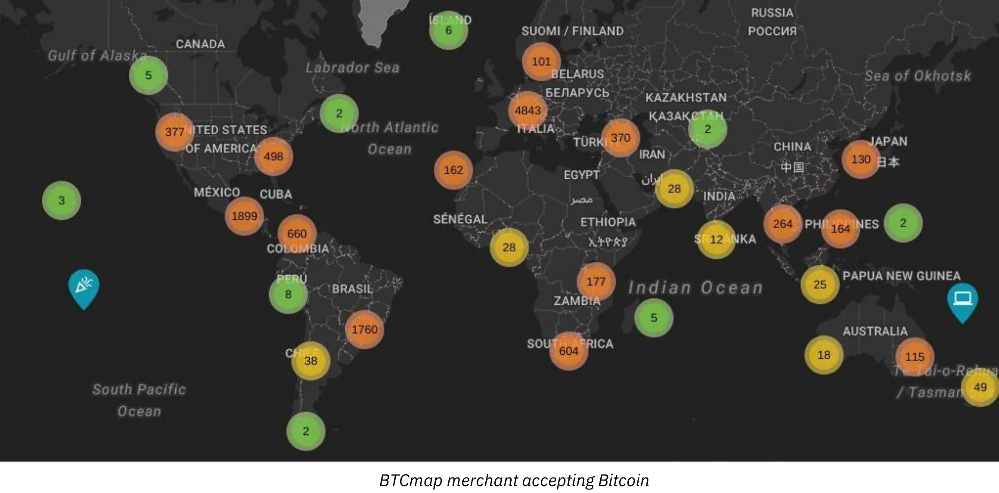
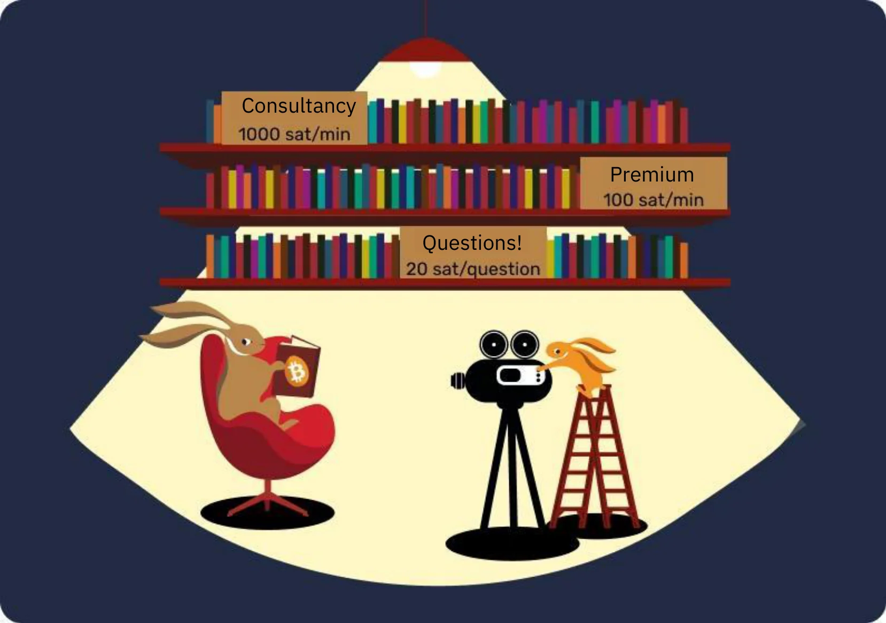
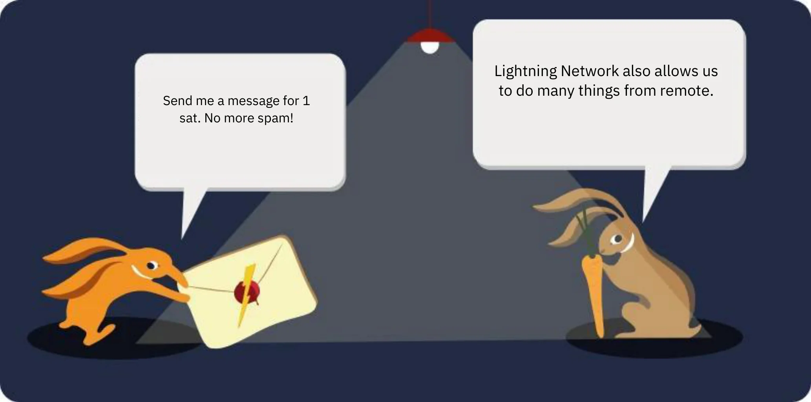

# مغامرتك الأولى Bitcoin


سنقوم في هذه الدورة التدريبية بشرح أساسيات Bitcoin في 25 فصلاً، حتى تتمكن من فهم هذه التقنية بطريقة بسيطة وفعالة. تستكشف الدورة التدريبية أساسيات الصناعة ككل، بما في ذلك موضوعات مثل mining، والمحافظ، ومنصات البيع والشراء، وغير ذلك. وستتوفر مواد تعليمية إضافية طوال الرحلة، كما ندعوك إلى الاطلاع على "21 ملصقًا" في قسم الموارد بعد الانتهاء من هذه الدورة التدريبية.


لا يلزم وجود معرفة مسبقة لبدء هذه الدورة التدريبية. تم تصميم دورة BTC 101 لتكون متاحة للجميع، بغض النظر عن مستوى خبرتك.


+++

# مقدمة


<partId>3cd2ac82-026c-53e1-874a-baf5842adc6d</partId>


## نظرة عامة على الدورة


<chapterId>27e3fb60-4b50-556b-9e70-c4f5475c121d</chapterId>


مرحباً بك في دورة BTC101!


Bitcoin هي ثورة تكنولوجية ونقدية قادرة على جعلنا نتساءل عن علاقتنا بالمال والمجتمع. في الواقع، Bitcoin (يُشار إليها باسم BTC) هي عملة **محايدة** و **لا مركزية**، مما يعني أنها لا تخضع لسيطرة أي كيان أو مؤسسة. إنها ابتكار يتجاوز مجرد "عملة إنترنت": فهي بروتوكول كمبيوتر (Bitcoin) ووحدة نقدية (بيتكوين).


ويستخدم بروتوكول Bitcoin تقنيات أساسية مثل التشفير والاتصالات الشبكية و"سلسلة الكتل" الشهيرة، بينما تعمل وحدة البيتكوين كعملة ضرورية لحسن سير عمل هذا البروتوكول. في الحياة اليومية، يستخدم السلفادوريون ومستخدمو البيتكوين في جميع أنحاء العالم عملة البيتكوين لشراء وبيع السلع والخدمات، معتمدين على هذه التكنولوجيا لجعل حياتهم أفضل.


**منهج شامل وسهل الوصول إليه في الوقت نفسه:**


في هذه الدورة، سنناقش بعض الجوانب النقدية لشبكة Bitcoin، بما في ذلك كيفية شراء عملات البيتكوين وبيعها، وتخزينها بأمان في محافظ رقمية، واستخدامها في المعاملات. وسوف ندرس أيضًا دور المُعدِّنين، الذين يعدون أساسيين لإنشاء عملات بيتكوين جديدة وتأمين شبكة Bitcoin. وأخيرًا، سنستكشف مستقبل Bitcoin وكيف يمكن لتقنية Lightning Network تحسين معاملات Bitcoin.


من الضروري أن نفهم أن Bitcoin هو نظام نقدي جديد يغير علاقتنا بالمال تمامًا، لذا فإن تعلم كيفية استخدامه هو مهارة ضرورية لأي شخص يريد أن يتحكم في أمواله الخاصة.


**القسم 1 - مقدمة**


- الفصل 1 - نظرة عامة على الدورة التدريبية
- الفصل 2 - عصور ما قبل التاريخ Bitcoin


**القسم 2 - المال**


- الفصل 3 - النقود عبر التاريخ
- الفصل 4 - العملات الورقية
- الفصل 5 - التضخم المفرط
- الفصل 6 - 21 مليون بيتكوين


**القسم 3 - محافظ Bitcoin* **القسم 3 - محافظ Bitcoin**


- الفصل 7 - ما هو Bitcoin Wallet؟
- الفصل 8 - محافظ Bitcoin والمحافظ والأمان
- الفصل 9 - إعداد Wallet
- الفصل 10 - الصمود أمام اختبار الزمن


**القسم 4 - الجوانب التقنية لـ Bitcoin**


- الفصل 11 - إطلاق Bitcoin
- الفصل 12 - معاملات Bitcoin
- الفصل 13 - عقدة Bitcoin
- الفصل 14 - عمال المناجم
- الفصل 15 - Bitcoin والبيئة


**القسم 5 - كيفية الحصول على عملات البيتكوين؟ **


- الفصل 16 - Bitcoin لا ينام أبدًا!
- الفصل 17 - كسب عملات البيتكوين من خلال العمل
- الفصل 18 - التوفير باستخدام Bitcoin
- الفصل 19 - فرط التشفير


**القسم 6 - مستقبل Bitcoin: Lightning Network**


- الفصل 20 - مقدمة موجزة عن Lightning Network
- الفصل 21 - حالات استخدام Lightning Network
- الفصل 22 - الحبة الحمراء أم الحبة الزرقاء؟


قبل تقديم تعريف النقود ووظيفتها في المجتمع (الفصل 1)، يجب أن نبدأ من نشأة Bitcoin. تم إطلاق Bitcoin في عام 2009، وهي تقنية جديدة نسبيًا على عكس أي شيء آخر. لذلك من الطبيعي ألا نفهم كل شيء عنها دفعة واحدة. في الواقع، تمامًا كما هو الحال عند تعلم كيفية استخدام الإنترنت أو قيادة السيارة، لا تحتاج إلى معرفة جميع التفاصيل التقنية على الفور: يمكنك البدء بتعلم كيفية تلقي الأموال ودفعها وتأمينها، ثم اتخاذ خطوات صغيرة لدراستها بشكل أعمق.


في النهاية، نحن في المراحل الأولى فقط من اعتماده، حيث أننا تجاوزنا مرحلة الإقلاع: أنت في الوقت المناسب لاكتساب ما تشاء من المعرفة فيما يتعلق بهذا الابتكار المهم.


والنقطة المهمة هنا هي فهم هذه التقنية الجديدة بشكل عام، لذا نأمل أن تستمتع بهذه الدورة التدريبية وأن تستمر في إحراز تقدم في هذا النموذج النقدي العالمي الجديد.


هل أنت جاهز للغوص في عالم Bitcoin الرائع وفهم جميع أعماله الداخلية؟ هيا بنا!


**ملاحظة**: إذا صادفتك أي مصطلحات غير مألوفة أثناء الدورة، يُرجى الرجوع إلى [مسرد المصطلحات] (https://planb.academy/resources/glossary) للحصول على التعريفات.


## عصور ما قبل التاريخ Bitcoin


<chapterId>9a94b627-5b69-5d81-9125-f1fa9b0aa6ad</chapterId>


قبل أن يصبح مصطلح "Bitcoin" مرادفًا للعملة الرقمية والتحول المالي، تم وضع الأساس لإنشائها من خلال سلسلة من الأفكار والابتكارات والحركات الاجتماعية. من بين هذه الأفكار، تبرز حركة cypherpunk كعنصر أساسي في عصور ما قبل تاريخ Bitcoin.


### سايفربانكس: أصحاب الرؤى في العالم الرقمي


في خضم التطور التكنولوجي في الثمانينيات والتسعينيات من القرن الماضي، بدأت مجموعة من الأشخاص في التشكيك بعمق في دور الخصوصية والحرية في العصر الرقمي. كان هؤلاء الأفراد، الذين عُرفوا فيما بعد باسم "صانعي الشفرات"، يؤمنون بشدة أن التشفير يمكن أن يكون بمثابة أداة لحماية الحقوق الفردية من تدخل الحكومات والشركات الكبرى.


وقد لعبت شخصيات بارزة مثل جوليان أسانج ووي داي وتيم ماي وديفيد تشوم دورًا محوريًا في تشكيل فلسفة الحركة ورؤيتها. وقد شارك هؤلاء المفكرون أفكارهم على قائمة بريدية مؤثرة، حيث انخرط المشاركون من جميع أنحاء العالم في مناقشات حول أفضل الطرق للاستفادة من التكنولوجيا من أجل حرية فردية أكبر.


### الأوراق الثلاث الأساسية لسايبر بانكس


استندت حركة السايفربانك، المتجذرة بعمق في النشاط الرقمي والتشفير، إلى العديد من النصوص التأسيسية لتوضيح مبادئها ورؤيتها للمستقبل. ومن بين هذه الكتابات، تبرز ثلاثة نصوص على وجه الخصوص:


- "بيان Cypherpunk":


الذي كتبه إريك هيوز عام 1993، يؤكد أن الخصوصية حق أساسي. ويجادل المؤلف بأن القدرة على التواصل بحرية وسرية أمر ضروري لمجتمع حر. وينص البيان على ما يلي "لا يمكننا أن نتوقع من الحكومات أو الشركات أو غيرها من المنظمات الكبيرة المجهولة الهوية أن تمنحنا الخصوصية [...]. يجب علينا أن ندافع عن خصوصيتنا إذا كنا نتوقع أن يكون لدينا أي خصوصية".


- "بيان الفوضويين المشفرين":


كتبها تيموثي سي ماي في عام 1992، تشرح هذه الوثيقة كيف يمكن أن يؤدي استخدام التشفير إلى عصر من الفوضى التشفيرية حيث ستكون الحكومات عاجزة عن التدخل في الشؤون الخاصة للمواطنين. تصور ماي مستقبلًا يتبادل فيه الناس المعلومات والأموال دون الكشف عن هويتهم دون تدخل طرف ثالث.


- "إعلان استقلالية الفضاء الإلكتروني":


على الرغم من أن هذا النص لا يقتصر على السايفربانك فقط، إلا أنه يعكس مشاعر العديد من المشاركين في الحركة. كتبه جون بيري بارلو عام 1996، وهو رد على التنظيم المتزايد للإنترنت من قبل الحكومات. يؤكد الإعلان أن الفضاء الإلكتروني هو مجال متميز عن المجال المادي ولا ينبغي أن يخضع للقوانين نفسها. وكما جاء فيه: "ليس لدينا حكومة منتخبة، وليس من المحتمل أن يكون لدينا حكومة".


### أسلاف Bitcoin


قبل ظهور Bitcoin، كانت هناك عدة محاولات لإنشاء عملة رقمية. على سبيل المثال، قدم ديفيد تشوم مفهوم "النقود الإلكترونية المجهولة" بمشروعه "DigiCash" في الثمانينيات. ولسوء الحظ، وبسبب قيود مختلفة، لم تزدهر DigiCash أبدًا.


ومن السلائف المهمة الأخرى هي "النقود ب" التي ابتكرها وي داي. على الرغم من أنها لم تُنفذ أبداً، إلا أنها قدمت فكرة عملة رقمية مجهولة المصدر حيث يتم الكشف عن الاحتيال من قبل مجتمع من المقيّمين بدلاً من سلطة مركزية.


توضح الصورة أدناه بوضوح تطور الحركة من خلال ابتكاراتها التكنولوجية العديدة.


في هذه البيئة الخصبة نشر ناكاموتو الغامض Satoshi ناكاموتو الورقة البيضاء Bitcoin في عام 2008. في هذه الوثيقة، قام بدمج العديد من الأفكار من حركة السايفربانك (cypherpunk)، مثل proof of work والطوابع الزمنية المشفرة، لإنشاء عملة رقمية لا مركزية ومقاومة للرقابة.


ومع ذلك، كانت Bitcoin أكثر من مجرد ذلك: فقد كانت تمثل تحقيقًا لمُثُل السايفربانك. فبالإضافة إلى تقنيتها، كانت ترمز إلى ثورة ضد الأنظمة المالية التقليدية وقدمت بديلاً يقوم على الشفافية واللامركزية والسيادة الفردية.


### الخاتمة


إن تاريخ ما قبل Bitcoin متجذر بعمق في حركة السايفربانك والسعي الجماعي لمزيد من الحرية في العصر الرقمي. من خلال الجمع بين مبادئ التشفير واللامركزية والنزاهة، أصبحت Bitcoin أكثر بكثير من مجرد عملة. في الواقع، إنها في الواقع نتاج ثورة فلسفية وتكنولوجية تستمر في إعادة تشكيل عالمنا.


لذلك، فإن Bitcoin هو بروتوكول يمتد على فترات طويلة من الزمن، ويشجعنا على التشكيك في علاقتنا بالطاقة والوقت والمال.


ومع ذلك، هل Bitcoin عملة "حقيقية"؟ لفهم ذلك، نحتاج أولاً إلى فهم مفهوم النقود وأشكالها المختلفة، وهو ما سنستكشفه في الفصل التالي.


إذا كنت ترغب في استكشاف تاريخ Bitcoin بمزيد من التفاصيل، فإننا ننصحك بشدة بدورة HIS 201، حيث ستكتشف أصول Bitcoin ونشأتها البطيئة، بالإضافة إلى بدايات تاريخها ومجتمعها. هذه الدورة موثقة وموثقة بالكامل، وبالطبع بها العديد من الحكايات:


https://planb.academy/courses/a51c7ceb-e079-4ac3-bf69-6700b985a082

# النقود


<partId>e913df1a-4cbd-5380-ba67-ca2a0414f671</partId>


## النقود عبر التاريخ


<chapterId>c838e64d-d59f-5703-8c74-ea5e8c4fdd31</chapterId>


يعد تطور النقود جانبًا رائعًا من جوانب التاريخ البشري الذي يعكس براعة الحضارات على مر العصور في تلبية الاحتياجات الاقتصادية المتطورة باستمرار.


### من الأصداف إلى الحسابات المصرفية


في الأصل، كانت العملة في الأصل عبارة عن أصول ملموسة، مثل الحبوب أو الماشية أو سلعة أخرى. ومع ذلك، كان لهذه السلع عيب رئيسي يتمثل في كونها قابلة للتلف، مما يجعل من الصعب استخدامها كوسيلة ادخار طويلة الأجل. على سبيل المثال، قد يؤدي ضعف المحاصيل أو مرض الحيوانات إلى تدمير ثروة الفرد بين عشية وضحاها.

وهكذا، مع تقدم الحضارات وتوسع التجارة إلى مناطق جديدة، ظهرت الحاجة إلى وسيط عالمي للتبادل. وقد جرّب الأفراد في البداية استخدام أشياء مثل الأصداف والأحجار الكريمة، ولكنها لم تكن متينة أو نادرة كما كانوا يعتقدون. وفي نهاية المطاف، أصبح الذهب هو المعيار بسبب ندرته ومتانته وقابليته للقسمة. وكان الذهب، ولا يزال حتى يومنا هذا، رمزاً للثروة والقوة.


### ما هو دور المال؟


المال أداة تواصل متطورة للغاية:


- فهو يسمح بالتواصل بين الحاضر والمستقبل، لأنه يحول وقتنا وطاقتنا إلى أصل يمكن إعادة استخدامه في الوقت الحاضر دون التعرض لخطر انخفاض قيمته.


- فهو يسهل التواصل بلغة عالمية: دون أن يعرف أحدهما الآخر أو يتحدثان نفس اللسان، يمكن لشخصين غريبين أن يتبادلا ويتبادلا ويتفقا على قيمة الأشياء.


ومن الصعب تكرار وظيفته في عالمنا بشكل مصطنع. في الواقع، لا يمكن لأي فرد أو مجموعة أن تخلق المال، فهو ظاهرة طبيعية يجب أن تنبثق من السوق والتوافق الطوعي. وبهذا المعنى، تعمل الأسعار كإشارات ومعلومات ترشد المجتمع في تخصيص الموارد.


ولهذه الأسباب، فإن الذهب كنقود هو نتيجة 4000 سنة من الداروينية النقدية القائمة على الوظائف الأرسطية التالية:


- مخزن للقيمة**: يمكن استخدام النقود لتحويل القوة الشرائية إلى المستقبل، لذلك يجب أن تكون مادة متينة;
- وسيط للتبادل**: يمكن استخدام النقود في تبادل السلع والخدمات بدلاً من المقايضة، وبالتالي تجنب تطابق الرغبات بين التجار;
- وحدة الحساب**: تسمح لنا النقود أيضًا بمقارنة قيم السلع المختلفة لفهم ملاءمتها النسبية بشكل أفضل.


### خصائص المال


يفي الذهب بشكل مثالي بمعايير العملة الفعّالة: فندرته الطبيعية تجعله ذا قيمة، بينما تضمن خواصه الكيميائية عدم تآكله بمرور الوقت. وقد جعلت هذه الميزات من الذهب **مخزنًا رائعًا للقيمة**، ولكنه ليس عملة شائعة، لأن هذا الشكل من النقود غير قابل للتقسيم بسهولة أو قابل للنقل عبر مسافات طويلة. وفي عالم معولم ورقمي، يكافح الذهب لمواكبة العولمة ويحتاج إلى كيان مركزي لجعله قابلاً للتقسيم والتبادل بسهولة (أي من خلال العملات المعدنية المسكوكة).


وعلى النقيض من ذلك، فإن العملات الائتمانية الحكومية (العملات الورقية) قابلة للاستخدام بسهولة، ولكن يتم تخفيض قيمتها باستمرار من قبل الكيانات التي تسيطر عليها (الملوك والبنوك المركزية والأباطرة والديكتاتوريين).


لشرح هذا المفهوم بشكل أفضل، سنستكشف خصائص العملة الفعالة:


- القابلية للتبديل**، بمعنى أنه قابل للتبديل مع وحدة أخرى من نفس النوع دون فقدان القيمة;
- قابلية القسمة**، حيث يمكن تقسيمها إلى وحدات أصغر لتسهيل المعاملات ذات الأحجام المختلفة;
- السيولة**، وهو ما يعني سهولة تحويلها إلى سلع أو خدمات.


من أجل تلبية هذه المعايير، تطورت العملة تاريخيًا من خلال اتخاذ خطوات مختلفة:


- حجر خام -> Coin
- ورقة نقدية -> بطاقة مصرفية
- Blockchain -> Lightning Network


لا تزال العملات تتطور حتى يومنا هذا، حيث تقوم بتكييف أشكالها لتلبية حالات الاستخدام المختلفة. وكما قلنا، على الرغم من أن الذهب مخزن ممتاز للقيمة، إلا أنه لم يعد مناسبًا للاقتصاد المعولم الحالي. وبالمثل، فالعملات الائتمانية مثل الدولار واليورو تتسم بالسيولة العالية وسهولة النقل لأنها أصبحت الآن رقمية في معظمها، ولكن قيمتها تنخفض باستمرار بسبب التضخم النقدي.


من ناحية أخرى، يقدم Bitcoin إمكانيات جديدة. فخصائصها، مثل العرض المحدود للغاية، تجعلها مخزنًا ممتازًا للقيمة. وعلاوة على ذلك، وباعتبارها عملة إنترنت محايدة، فهي بمثابة ** وسيط تبادل قابل للتطبيق ** يتجاوز الحدود. ومع ذلك، لا تزال غير مقبولة على نطاق واسع في التجارة اليوم، على الرغم من [اعتمادها المستمر] (https://btcmap.org/map).


## العملات الائتمانية


<chapterId>25151d46-7db1-5b48-8bba-cbde1944555a</chapterId>


> قال جورج سانتايانا: "أولئك الذين لا يستطيعون تذكر الماضي محكوم عليهم بتكراره".

وهي حقيقة يتردد صداها بشكل سليم عندما يتعلق الأمر بالنظام النقدي الحالي.


### ائتماني = ثقة


واليوم، تُعتبر العملات الرئيسية مثل اليورو والدولار عملات ائتمانية. ويعني ذلك أنها تفتقر إلى القيمة الجوهرية وتعتمد كليًا على الثقة التي نضعها في المؤسسات التي تحكمها.


العملة الائتمانية هي شكل من أشكال النقود التي تصدرها مؤسسة، أي دولة، مثل الصين مع اليوان، أو اتحاد سياسي اقتصادي مثل الاتحاد الأوروبي مع اليورو. والكيان المسؤول عن إصدارها هو البنك المركزي (على سبيل المثال، يمكننا أن نذكر بنك الشعب الصيني، أو الاحتياطي الفيدرالي للولايات المتحدة، أو البنك المركزي لجمهورية غينيا). هذه الكيانات بالتحديد هي المسؤولة عن صياغة السياسة النقدية، وبالتالي كمية النقود التي يجب أن يتم تداولها أو طباعتها.


### تخفيض قيمة العملة: استراتيجية قديمة قدم الإمبراطورية الرومانية


فمنذ العصور القديمة، كان الذهب بمثابة مرجع نقدي، ولكن صلابته غالبًا ما دفعت القادة، سواء الأباطرة الرومان أو الحكومات الحديثة، إلى اعتماد عملات بديلة، غالبًا ما تكون ائتمانية.


الآلية بسيطة ومستوحاة من الممارسات التي كانت موجودة منذ نشأة الحضارة. يبدأ القادة، الذين يتوقون إلى فرض سيطرتهم على الثروة، بتركيز الذهب، وغالبًا ما يستغلون سلطتهم ويعدون بالحماية والأمن. ومع وجود هذا الاحتياطي الثمين في أيديهم، يقومون بطرح عملة جديدة تعادل في قيمتها الذهب، ولكن يتم سكها على صورتهم. ثم تبدأ هذه العملة في التداول، وسرعان ما يتكيف الناس مع سهولة استخدامها البسيط.


ومع ذلك، يبدأ هؤلاء القادة بعد ذلك في تخفيض قيمة العملة الجديدة بطريقة تدريجية، مما يؤدي في الواقع إلى خفض قيمتها بنسبة قليلة في المائة كل عام مقارنة بسعر الذهب الأولي. وغالبًا ما يتم تبرير هذا التخفيض الصامت لقيمة العملة على أنه في مصلحة الشعب. في الواقع، يرى أولئك الذين يدخرون بهذه العملة الائتمانية أن قيمة مدخراتهم تتآكل، بينما تمول الدولة مشاريعها من خلال التضخم. وعلاوة على ذلك، فإن هذا التخفيض في قيمة العملة يجعل سداد الديون أسهل.


في لحظة حرجة، يُصدر القائد الإعلان: لم تعد العملة مدعومة بالذهب. يتقبل الجمهور، الذي اعتاد الآن على العملة الائتمانية وغالبًا ما يكون لديه معلومات خاطئة عن الأمور المالية، هذا الواقع، مما يسمح للدولة بالتلاعب بحرية في المعروض النقدي وطباعة مبالغ هائلة من المال دون أي تكلفة تقريبًا.


ومن ثم تؤدي الطباعة النقدية إلى التضخم وإفقار السكان تدريجيًا. إلى جانب ذلك، يتم تنظيم النظام المالي وتقييده لتجنب انهياره، لأن أي خلل قد يؤدي إلى أزمة اقتصادية كبيرة. وعلى النقيض من الجماهير، تستفيد المؤسسات المالية والأفراد الأثرياء بشكل كبير من هذا النظام، مما يخلق فجوة في عدم المساواة ويفضل الاستبداد. وفي هذا السياق، لا يتم تحفيزهم على إجراء تغييرات جذرية، مما يسمح للنظام بالاستمرار في مساره حتى الانهيار المحتمل.


وعندما يتم تنفيذها بشكل جيد، يمكن أن تستمر هذه الاستراتيجية لعقود من الزمن. ومع ذلك، من المهم ملاحظة أن التخفيض السريع جدًا في قيمة العملة أو فقدان الثقة يمكن أن يؤدي إلى تضخم مفرط (انظر الفصل التالي). يُظهر التاريخ أن الدولار فقد 98% من قيمته في 100 عام، واليورو 30% في 20 عامًا، والجنيه الإسترليني 99% منذ إنشائه.


في النهاية، قد لا يكون للعملة أي صلة بالذهب، على غرار العملات الرومانية في نهاية الإمبراطورية، أو حتى أن يتم اختزالها إلى قيمة عددية بسيطة منفصلة عن الواقع الملموس.


نشهد اليوم نقطة تحول تاريخية. فالدولار، الذي هيمن لفترة طويلة، يبدو أنه في تراجع، بينما فقد الذهب دوره المركزي. إننا نقف على عتبة دورة نقدية جديدة، وهو ما يذكرنا بأن دروس التاريخ غالبًا ما تُنسى


### هل Bitcoin هو الحل؟


وبسبب هذه الافتراضات، تكتسب ثورة Bitcoin زخمًا متزايدًا. وعلى عكس العملات السابقة، فهي تتطلب ** عدم وجود طرف ثالث موثوق به** وتهدف إلى فصل الدولة عن المال.


في الواقع، يقدم Bitcoin نفسه كاستجابة لهذه التحديات النظامية من خلال اقتراح حل لا مركزي ونظام نقدي موازٍ جديد. تاريخياً، إذا كان الذهب مفضلاً كعملة بسبب مقاومته للتزوير، فإن Bitcoin بالمثل لا يمكن تزويرها. وعلاوة على ذلك، فهي محدودة بـ 21 مليون وحدة، وذلك بفضل طبيعتها اللامركزية والمشفرة. Bitcoin هي عملة تعتمد على الشفافية والحيادية، وتقدم بديلاً جذابًا للنظام النقدي المركزي الحالي.


من الأسباب الأخرى التي جعلت Bitcoin تستحوذ على الاهتمام هو ظهور العملات الرقمية للبنوك المركزية، أو العملات الرقمية للبنوك المركزية، والتي يبدو أنها حتمية. هذا الشكل الجديد من النقود من شأنه أن يطور اقتصادًا أكثر تخطيطًا مركزيًا، ويمكن أن يعيق الحرية المالية للأفراد ويسهل الانتهاكات الاستبدادية.

يمكننا أن نختتم هذا الفصل باقتباس من ف. أ. حايك الحائز على جائزة نوبل عام 1984:


> "أنا لا أعتقد أنه يجب أن يكون لدينا مال جيد مرة أخرى، قبل أن نأخذ الشيء من أيدي الحكومة. وإذا لم نتمكن من إخراجها من أيدي الحكومة بعنف، فكل ما يمكننا فعله هو أن ندخل بطريقة ماكرة أو ملتوية شيئًا لا يمكنهم إيقافه"

لمعرفة المزيد عن المغالطات الاقتصادية والحرية، ندعوك لاكتشاف دورة ECO 102 التي تتتبع حياة وأفكار فريديريك باستيات، المفكر الفرنسي في القرن التاسع عشر الذي كان سيقدر بالتأكيد ظهور Bitcoin:


https://planb.academy/courses/d07b092b-fa9a-4dd7-bf94-0453e479c7df

## تضخم مفرط


<chapterId>b04c024c-54f3-50cb-997f-58721cfc74be</chapterId>


التضخم المفرط هو ظاهرة نقدية خاصة بالعملات الورقية: ويتمثل في فقدان الثقة الكامل في العملة والزيادة الحادة في التضخم بسبب الطباعة النقدية من قبل السلطات. ونتيجة لذلك، يمكن أن تتبدد المدخرات المتراكمة لدى الأفراد في فترة زمنية قصيرة نسبيًا، مما يدفع البلاد إلى حافة الانهيار الاقتصادي والاجتماعي والسياسي.


### تضخم جامح!


لفهم تأثير التضخم على المدخرات، نحتاج إلى أخذ معدلات التضخم المختلفة في الاعتبار.


- مع وجود تضخم بنسبة 2%، فإنك تخسر 2% من قوتك الشرائية سنويًا، وهو ما يعادل 10% على مدار 5 سنوات.
- مع 7%، تخسر نصفها في 10 سنوات.
- مع 20٪، تخسر نصفها تقريبًا في 3 سنوات.


عندما يحدث تضخم مفرط، فإننا لم نعد نتحدث عن 20٪ سنويًا، بل نتحدث عن 20٪ شهريًا أو، في ذروته، في اليوم الواحد. فتجربة تضخم بنسبة 100% في اليوم الواحد على مدار ثلاثة أيام هو سيناريو واقعي حدث ولا يزال يحدث في عالمنا.


من الأهمية بمكان أن نفهم أن التضخم المفرط لا يحدث عن طريق الصدفة أو الرأسمالية أو الهجمات السياسية من المعارضين. فالتضخم المفرط هو النتيجة المباشرة للقرارات النقدية السيئة التي يتخذها محافظو البنوك المركزية والسياسيون. وتؤثر توابعه على كل مواطن بل وتؤثر حتى على الأجيال القادمة. ندعوك لقضاء خمس دقائق في قراءة الجدول التالي لإدراك التأثير الحقيقي لهذه الظاهرة بشكل كامل (تتعمق دورة ECO204 في هذا الموضوع). فكما ترى، لا يوجد بلد أو عملة في مأمن محتمل.


### ما هي مراحل التضخم المفرط؟


ولكي يحدث التضخم المفرط، يجب أن تقع أحداث معينة.


المرحلة 1 - فقدان الثقة


- تسهّل مركزية السلطة النقدية خلق النقود وإساءة استخدامها. وفي هذا السياق، يمكن أن تؤدي عوامل خارجية مثل الحروب أو السياسات الحكومية أو ارتفاع أسعار الموارد الرئيسية - مثل القمح أو البنزين - إلى حدوث تضخم مفرط. وبالتالي، يمكن أن ينشأ فقدان الثقة في العملة، ويبدأ الأفراد في التشكيك في أصل النقود وفوائد السياسة النقدية المفروضة.


المرحلة 2 - انهيار العملة وارتفاع الأسعار


- عندما تفقد الحكومات السيطرة على الثقة، يبدأ الأفراد في استبدال عملتهم بعملة أكثر استقرارًا، مثلما حدث في فنزويلا مع الدولار الأمريكي. يؤدي هذا الظرف إلى ارتفاع الأسعار، مما يخلق حلقة مفرغة حيث تصبح السلع والخدمات باهظة الثمن بشكل متزايد. ولتلبية هذه الاحتياجات وتصحيح السياسة النقدية، تقوم الدولة بطباعة المزيد من النقود، مما يؤدي إلى تضخم هائل.


المرحلة 3 - الحلقة المفرغة لطباعة النقود


- وبالتالي، هناك حاجة إلى المزيد والمزيد من الأوراق النقدية لشراء السلع، مما يؤدي إلى ندرة النقود الورقية. وردًا على ذلك، تلجأ الحكومات إلى طباعة المزيد من الأوراق النقدية، وهو ما يؤدي إلى زيادة التضخم.


المرحلة 4 - ظهور عملة جديدة


- ثم يتم طرح عملة جديدة لتحل محل العملة القديمة، من أجل كسر حلقة التضخم من خلال تطبيق ضوابط أكثر صرامة لم تكن موجودة في العطاء القانوني السابق.


وغالبًا ما يتطلب حل أزمة التضخم المفرط تغييرات جذرية، مثل الثورات، والتحولات الحكومية، وتغييرات محافظي البنوك المركزية، وغيرها. يُعد فقدان الثقة وانهيار العملة وإعادة الإعمار مراحل أساسية لإنعاش الاقتصاد القائم على العملة الورقية.


### ثلاثة أمثلة بارزة


- ألمانيا، 1922-1923.


حدث أحد أكثر الأمثلة الصارخة على التضخم المفرط في جمهورية فايمار الألمانية بعد الحرب العالمية الأولى.


اقترضت ألمانيا مبالغ هائلة من المال لتمويل الحرب. ومع ذلك، لم تخسر ألمانيا الحرب فحسب، بل كان عليها أن تدفع مليارات الدولارات كتعويضات. كان الشهر الذي شهد أعلى معدل تضخم هو أكتوبر 1923، حيث بلغ ذروته في أكتوبر 1923، وبلغت نسبته 29,500%، وهو ما يساوي معدل تضخم قدره 20.9% يوميًا. تضاعفت الأسعار كل 3.7 يوم!

أصبحت العملة الألمانية عديمة الجدوى لدرجة أن بعض المواطنين فضلوا حرق نقودهم الورقية بدلاً من الخشب لأنها كانت أرخص بالفعل. حتى أنه يقال إن النوادل في المطاعم اضطروا إلى الإعلان عن أسعار قائمة الطعام كل 30 دقيقة لمراعاة التضخم.


وفي النهاية، أنشأت السلطات عملة جديدة مدعومة بديون ألمانيا وفرنسا وإنجلترا ومضمونة بأرض ألمانية.


- هنغاريا، 1945-1946


الدولة التي شهدت أسوأ فترة تضخم مفرط حتى الآن هي المجر بعد الحرب العالمية الثانية.


وجدت المجر نفسها في الجانب الخاسر من الصراع، حيث دُمرت معظم طاقتها الإنتاجية الصناعية. وكان الشهر الذي شهد أعلى نسبة تضخم هو شهر يوليو 1946، الذي شهد تضخمًا مذهلاً في الأسعار بلغ 41,900,000,000,000,000% أي ما يعادل 207% في اليوم الواحد. تضاعفت الأسعار كل 15 ساعة!


كانت آخر ورقة نقدية تم طرحها للتداول هي 100 مليون بنجو (100,000,000,000,000,000,000) في عام 1946.


- زمبابوي، 2007-2008


حتى عام 2000، كانت زيمبابوي مكتفية ذاتيًا من جميع احتياجاتها تقريبًا باستثناء النفط.


في عام 1997، انهار الدولار الزيمبابوي بنسبة تزيد عن 72% بعد أن وافقت الحكومة على تعويض قدامى المحاربين بما يعادل 450 مليون دولار أمريكي. وبما أن الحكومة لم يكن لديها مثل هذا المبلغ في إمداداتها، فقد لجأت إلى تشغيل المطبعة. وفي عام 2005، وصلت نسبة التضخم إلى 586%، ولكن الذروة كانت في منتصف نوفمبر 2008 بمعدل يقدر بـ 79,600,000,000% شهريًا.


في يونيو 2007، ردت الحكومة بالفعل بفرض ضوابط على الأسعار، لكن هذا الإجراء لم يكن له أي تأثير على الاقتصاد. فقد تعرضت المتاجر للنهب بالفعل، ولم يعد لدى التجار الوسائل اللازمة لإعادة تخزين متاجرهم.


في أبريل 2009، أعلن وزير المالية عن تعليق التعامل بالدولار الزيمبابوي وأذن باستخدام عملات أجنبية مختلفة في التجارة. وشهدت جميع الحسابات المصرفية والمعاشات التقاعدية والمؤسسات المالية تبخر أرصدتها بين عشية وضحاها.


وفي الختام، يؤدي التضخم المفرط إلى تدهور قيمة العملة بسرعة، مما يؤدي إلى تآكل المدخرات وفقدان الثقة في النظام النقدي. وكما اقترح فولتير ذات مرة، فإن العملة الورقية ستفقد دائمًا في نهاية المطاف قيمتها الجوهرية وتتجه نحو الصفر.

فالعملة التي تعتمد على طرف ثالث موثوق به مثل المؤسسات المالية هي عملة معيبة، من الناحية العملية وعلى المدى الطويل، لأنها غير قادرة على ضمان القوة الشرائية أو الحفاظ على المدخرات.


للتعمق أكثر في موضوع التضخم المفرط، نوصي بدورة ECO 204 التي يقدمها ديفيد سانت أونج، حيث ستتعرف على ماهية دورات التضخم المفرط وتأثيراتها الحقيقية على حياتنا. وسوف تكتشف أيضاً أوجه التشابه بين هذه الدورات، والأهم من ذلك، كيف تحمي نفسك منها.


https://planb.academy/courses/caa75343-ac90-4249-bcca-0e2e57c3a0f1

## 21 مليون بيتكوين


<chapterId>f4a06d76-1963-56fd-93ff-dfa41489bcde</chapterId>


### السياسة النقدية لـ Bitcoin


Bitcoin هي عملة رقمية لامركزية ذات كمية قصوى محددة مسبقًا تبلغ **21 مليون وحدة**. يتم تحديد هذه الخاصية الجوهرية للندرة من خلال رمزها الحاسوبي وتعززها إجماع جميع المستخدمين المشاركين في البروتوكول.


يمكن توضيح إصدارها النقدي من خلال منحنى يمثل كمية عملات البيتكوين التي تم إنشاؤها بمرور الوقت. على سبيل المثال، في عام 2022، كان هناك ما يقرب من 18.5 مليون عملة بيتكوين متداولة في عام 2022. تشير التوقعات إلى أنه بحلول عام 2025، سيكون هناك حوالي 19.5 مليون عملة بتكوين، وهو ما يمثل حوالي 93% من إجمالي المعروض، وبحلول عام 2037، سيصل هذا الرقم إلى 20.4 مليون عملة بتكوين.


### كيف يتم إنشاء عملات البيتكوين الجديدة؟


إنشاء عملات بيتكوين جديدة هو نتيجة لعملية mining. وباختصار، يستخدم المُعَدِّنون أجهزة كمبيوتر قوية تقوم بحل المسائل الرياضية المعقدة (التجزئة)، والتي تتحقق من صحة المعاملات وتأمينها. وبمجرد حل مشكلة ما (أو العثور على تجزئة صالحة)، يضيف المُعدِّن كتلة جديدة من المعاملات إلى سلسلة الكتل، وهي عبارة عن دفتر أستاذ لامركزي وموزع يسجل جميع المعاملات التي تتم على الشبكة. تضمن سلسلة الكتل الشفافية والأمان، حيث أن كل كتلة مرتبطة بالكتلة السابقة، مما يجعل من المستحيل تقريبًا تغيير البيانات السابقة دون إجماع من الشبكة.


بعد أداء هذه المهمة بنجاح، يحصل المُعدِّنون على مكافأة بإصدار عملات بيتكوين جديدة كل عشر دقائق. تتم برمجة هذه المكافأة على أن تنخفض إلى النصف كل 210,000 كتلة، أي كل أربع سنوات تقريباً (وهو حدث يُعرف باسم "التنصيف")، مما يعطي منحنى الإصدار النقدي شكلاً يشبه الدرج. وبسبب هذه الآلية، يمكن التنبؤ رياضياً بأن إنشاء عملات بيتكوين جديدة سيتوقف في عام 2140، عندما يصل العدد الإجمالي إلى حده الأقصى البالغ 21 مليون.


| Halving Number | Block Height | BTC Reward After Halving  | Estimated BTC in Circulation After Halving |
| -------------- | ------------ | ------------------------- | ------------------------------------------ |
| 1              | 210,000      | 25 BTC                    | 10,500,000 BTC                             |
| 2              | 420,000      | 12.5 BTC                  | 15,750,000 BTC                             |
| 3              | 630,000      | 6.25 BTC                  | 18,375,000 BTC                             |
| 4              | 840,000      | 3.125 BTC                 | 19,687,500 BTC                             |
| 5              | 1,050,000    | 1.5625 BTC                | 20,343,750 BTC                             |
| 6              | 1,260,000    | 0.78125 BTC               | 20,671,875 BTC                             |
| 7              | 1,470,000    | 0.390625 BTC              | 20,835,937.5 BTC                           |
| 8              | 1,680,000    | 0.1953125 BTC             | 20,917,968.75 BTC                          |
| 9              | 1,890,000    | 0.09765625 BTC            | 20,958,984.375 BTC                         |
| 10             | 2,100,000    | 0.048828125 BTC           | 20,979,492.188 BTC                         |
| 11             | 2,310,000    | 0.0244140625 BTC          | 20,989,746.094 BTC                         |
| 12             | 2,520,000    | 0.01220703125 BTC         | 20,994,873.047 BTC                         |
| 13             | 2,730,000    | 0.006103515625 BTC        | 20,997,436.523 BTC                         |
| 14             | 2,940,000    | 0.0030517578125 BTC       | 20,998,718.262 BTC                         |
| 15             | 3,150,000    | 0.00152587890625 BTC      | 20,999,359.131 BTC                         |
| 16             | 3,360,000    | 0.000762939453125 BTC     | 20,999,679.566 BTC                         |
| 17             | 3,570,000    | 0.0003814697265625 BTC    | 20,999,839.783 BTC                         |
| 18             | 3,780,000    | 0.00019073486328125 BTC   | 20,999,919.892 BTC                         |
| 19             | 3,990,000    | 0.000095367431640625 BTC  | 20,999,959.946 BTC                         |
| 20             | 4,200,000    | 0.0000476837158203125 BTC | 20,999,979.973 BTC                         |

سوف نعيد النظر في مفهوم mining بمزيد من التفصيل في [فصل عامل المنجم] (https://planb.academy/courses/2b7dc507-81e3-4b70-88e6-41ed44239966/dbb8264a-7434-57e4-9d1b-fbd1bae37fdf).


### ضمان الندرة الرقمية


إن الحد الأقصى البالغ 21 مليون هو أساس ندرة Bitcoin، وهو مضمون بآليتين رئيسيتين: تعديل صعوبة mining ونظرية اللعبة.


- تعديل صعوبة mining هو عملية تتم كل 2016 كتلة، أو حوالي أسبوعين، لضمان إضافة كتلة جديدة إلى سلسلة الكتل كل عشر دقائق في المتوسط. هذا التردد في إنشاء الكتلة والكمية الإجمالية لعملة البيتكوين كلاهما جانبان ثابتان في بروتوكول Bitcoin ولا يمكن تغييرهما دون إجماع عام، على عكس القرارات التعسفية التي تُتخذ في الأنظمة النقدية التقليدية.


تتبع صعوبة العثور على تجزئة صالحة نوعًا من الدورة: إذا زاد عدد المُعدِّنين وتم العثور على المزيد من الكتل بشكل أسرع، فإن هذا يؤدي إلى انخفاض متوسط الوقت اللازم للعثور على كتلة وبالتالي تزداد الصعوبة. ونتيجة لذلك، ينخفض عدد الكتل التي يجدها المُعدِّنون، مما يعني أن الآلية تعود إلى متوسط 10 دقائق لكل كتلة. يُرجى الاطلاع على الصورة أدناه للحصول على عرض مرئي.


وعلى العكس من ذلك، إذا قل عدد المُعدِّنين الذين يعملون في التعدين واستغرقت الكتل وقتًا أطول، تنخفض صعوبة mining، مما يؤدي إلى تسريع متوسط وقت الكتلة مرة أخرى.


هل تعلم أنه يتم تحفيز المُعَدِّنين على تعدين كتلة ما من أجل كسب عملات بيتكوين جديدة من خلال دعم الكتلة، بالإضافة إلى رسوم المعاملات من المعاملات التي يدرجونها في تلك الكتلة؟


وبالتالي، عندما يقترب عدد عملات البيتكوين المُصدرة من الحد الأقصى البالغ 21 مليون عملة، سيحصل المُعدِّنون على مكافآت من خلال رسوم معاملاتهم أكثر من دعم الكتلة.


- نظرية اللعبة هي مفهوم رياضي يعتمد على العقلانية البشرية. وهي تفترض أن الأفراد يتصرفون بشكل منطقي، ويسعون إلى تعظيم منافعهم الخاصة مع مراعاة القرارات المحتملة للآخرين. في Bitcoin، تساعد نظرية اللعبة على ضمان أن غالبية المُعدِّنين والمستخدمين سيتصرفون بما يخدم مصلحة الشبكة. في الواقع، نظرًا لأن تغييرات البروتوكول يتم التصويت عليها من قِبل المستخدمين، فإن أي تعديل على بروتوكول Bitcoin يتطلب موافقة مجتمع المستخدمين بأكمله، وهو أمر معقد للغاية. لذا، إذا أراد شخص ما إنشاء 22 مليون بيتكوين، فسيتعين عليه إقناع جميع المستخدمين بتخفيض قيمة مدخراتهم طوعًا، وهو أمر غير مرجح الحدوث لأن Bitcoin عالمية ولا تحكمها مجموعة مركزية.


تتعارض فكرة تخفيض قيمة العملة مع الفلسفة الأساسية لـ Bitcoin، لذلك من غير المرجح أن يحدث تغيير في الكمية الإجمالية.


### سياسة نقدية قابلة للتدقيق: كل ثانية، من البداية وإلى الأبد!


تُعد ندرة Bitcoin من الأصول الرئيسية، والكمية القصوى البالغة 21 مليون عملة بيتكوين المتداولة هي عملة عامة ويمكن لأي شخص التحقق منها.


في الواقع، يمكن لأي شخص القيام بذلك من خلال عقدة Bitcoin (أي مدقق المعاملات) بمجرد إدخال الأمر التالي: "bitcoin-cli gettxoutsetinfo". تعمل هذه الشفافية على تعزيز الثقة في نظام Bitcoin، الذي لا يعتمد على المؤسسات المركزية أو الأفراد، بل على الضمانات الرياضية والتشفيرية المتأصلة في بروتوكوله (ستتعلم كيفية القيام بذلك بسهولة في LNP201).


```json
{
"height": 710560,
"bestblock": "0000000000000000000887384d67103412ea7f18a43953e65c8c4ac36bf42e54",
"transactions": 473244,
"txouts": 1018917,
"bogosize": 2183872374,
"hash_serialized_2": "eebb9987337700ffaacbbaa11223344",
"disk_size": 178239584,
"total_amount": 18745998.12345678
}
```


يضمن Bitcoin إدارة نقدية سليمة من خلال الحد من إنشائها حسب التصميم، مما يجعلها مختلفة تمامًا عن العملات الأخرى لأنها يمكن أن تحمي مدخرات المستخدمين. وتماشيًا مع مبادئ الاقتصاد النمساوي، فإن كميتها المستقرة وتوزيعها الذي يمكن التنبؤ به يحميها من مخاطر التضخم المتأصلة التي تواجهها العملات التقليدية (انظر دورة ECO201 لمعرفة المزيد).


وباختصار، فإن عملة Bitcoin، بطبيعتها اللامركزية والندرة المبرمجة والشفافية، تقدم بديلاً فريدًا للأنظمة النقدية التقليدية. وهي توضح كيف يمكن استخدام التكنولوجيا لإنشاء عملة ليست مفيدة وقابلة للتحقق منها فحسب، بل تحافظ أيضًا على قيمة مدخرات المستخدمين من خلال الحد من المعروض منها بشكل صارم.


# محافظ Bitcoin


<partId>28860585-4f61-59d9-b242-f4c57d837cc1</partId>


## ما هي محافظ Bitcoin؟


<chapterId>1c0166ab-cb7a-5bc6-9175-d13482bd91f1</chapterId>


في القسم 2، سنستكشف في القسم 2، تخزين وأمن Bitcoin من خلال استخدام المحافظ، من أجل فهم مكان وجود عملات البيتكوين الشهيرة هذه وكيفية التفاعل معها!


### إزالة الغموض عن محافظ Bitcoin


نستخدم المحافظ للتفاعل مع شبكة Bitcoin بثلاث طرق رئيسية:


- لتلقي عملات البيتكوين
- لإرسال عملات البيتكوين
- لتأمينها ضد محاولات الاختراق والسرقة


يمكن أن يتخذ Bitcoin wallet العديد من الأشكال والأشكال: برنامج على جهاز الكمبيوتر الخاص بك، أو تطبيق على هاتفك الذكي، أو جهاز مادي مثل مفتاح USB، أو حتى قطعة من الورق. كل منها يخدم حالات استخدام مختلفة. في الواقع، صُمم بعضها للمعاملات الكبيرة مع التركيز على الأمان، بينما يعطي البعض الآخر الأولوية للخصوصية، أو أنها مخصصة للمدفوعات اليومية بمبالغ صغيرة.


وبالتالي، يمكن تصنيف المحافظ إلى عائلات واسعة من الاستخدامات، والتي تتمحور دائمًا حول سؤال رئيسي: هل أنت مالك الأموال أم أنك تترك السيطرة على أموالك لطرف ثالث؟ سنستكشف هذا الموضوع بالتفصيل في الفصل التالي، ولكن يبقى السؤال واضحًا: هل الأموال في جيبك أم في جيب مصرفيك؟


### كيف يعمل Bitcoin wallet؟


سواء كان "مصرفي" Bitcoin الخاص بك أو أنت، فإن الغالبية العظمى من محافظ Bitcoin تعمل بتقنية مماثلة تعتمد على التشفير غير المتماثل، والتي تتضمن نظام أزواج مفاتيح: مفتاح خاص للإنفاق ومفتاح عام للاستقبال.


- المفتاح الخاص


عند تهيئة wallet، يتم إنشاء عبارة استرداد سرية، تُعرف أيضًا بعبارة ذاكري (مفتاح خاص)، وتُقدم لك على شكل 12 أو 24 كلمة.


المفتاح الخاص أساسي لأنه يشكل ملكية عملات البيتكوين وبالتالي الحق في استخدامها أو إرسالها. لذلك، فإن حامل المفتاح الخاص هو المالك الحقيقي لعُملات البيتكوين. وكما تقول العبارة الشائعة "ليست مفاتيحك هي التي تملك عملات البيتكوين"


يجب الحفاظ على سرية هذا المفتاح وحمايته جيدًا، لأنه يفتح لك ثروتك!


- المفتاح العام والعنوان


يتم إنشاء المفتاح العام من المفتاح الخاص وهو مرتبط به. تشكل مشاركة المفتاح العام مخاطر على الخصوصية (لأن المستخدمين الآخرين يمكنهم رؤية رصيدك) ولكن ليس على الأمن (لأنهم لا يستطيعون إنفاق أموالك دون امتلاك المفتاح الخاص). في المقابل، يتم استخدام المفتاح العام لإنشاء عناوين Bitcoin، وبالتالي تلقي الأموال.


يتم إنشاء هذه العناوين تلقائياً بواسطة wallet ويمكن مشاركتها بشكل آمن. لزيادة خصوصيتك إلى أقصى حد، يُنصح باستخدامها مرة واحدة فقط.


باختصار، تُمكِّننا هذه التقنية من تلقي عملات البيتكوين دون تمكين المتلقي من سرقة أموالنا! يمكن أن يكون صندوق البريد تشبيهاً مناسباً: يمكن للناس إيداع الأموال فيه، ولكنك أنت الوحيد الذي يمكنه فتحه.


### هل عملات البيتكوين في wallet؟


على الرغم من أن مفاتيحك مخزنة في wallet الخاص بك، إلا أن عملات البيتكوين نفسها "مخزنة" في الواقع في بلوكشين Bitcoin، وهو دفتر أستاذ موزع عام داخل شبكة Bitcoin نظير إلى نظير (سنتناولها في القسم 3). هذا يعني أن فقدان الجهاز الذي يحتوي على wallet الخاص بك لا يؤدي بالضرورة إلى فقدان عملات البيتكوين الخاصة بك. ما يسمح لك بإعادة إنشاء wallet الخاص بك وإنفاق عملات البيتكوين الخاصة بك هو في الواقع المفتاح الخاص، لذا تذكر دائمًا تأمينه بشكل صحيح!


لحسن الحظ، منذ عام 2017، يمكن تمثيل المفتاح الخاص بقائمة بسيطة مكونة من 12 أو 24 كلمة، تُعرف باسم "عبارة ذاكريّة"، والتي يسهل حفظها. تعمل هذه العبارة كنسخة احتياطية لأموالك وتسمح لك بإعادة إنشاء wallet باستخدام أي برنامج أو تطبيق Bitcoin wallet. لذلك، يمكن لأي شخص يجد قائمة الكلمات هذه الوصول إلى عملات البيتكوين الخاصة بك.


### ماذا عن المخترقين؟


ماذا لو خمّن شخص ما عن طريق الخطأ قائمة الـ 12 أو 24 كلمة؟ الإجابة المختصرة هي أنه من المستبعد جداً، وذلك بفضل التشفير المستخدم لإنشاء wallet. ولوضع الأمر في منظوره الصحيح، فإن اكتشافك عن طريق الخطأ للعبارة التذكارية نفسها يشبه العثور على الرقم "الصحيح" بين 1 و2 مرفوعًا إلى القوة 256، وهو ما يعادل تقريبًا العثور على الذرة "الصحيحة" في الكون. ومع ذلك، إذا لم تكن راضيًا عن هذا الأمان الافتراضي، يمكنك دائمًا تحسينه بإضافة passphrase (كلمة إضافية) إلى Bitcoin wallet.


وبالتالي، فإن احتمال اختراق Bitcoin wallet الخاص بك منخفض بشكل فلكي إذا اتبعت الممارسات الأمنية الجيدة التي سنفصلها في القسم التالي.


ضع في اعتبارك اختيار wallet المناسب لاحتياجاتك واستخداماتك: تتوفر دروس مفصلة حول إدارة وتأمين المحافظ المختلفة في [قسم البرامج التعليمية في جامعتنا] (https://planb.academy/tutorials/wallet).


إذا كنت ترغب، أثناء رحلتك في جحر الأرنب، في معرفة المزيد عن بناء Bitcoin wallet، من الانتروبيا إلى عناوين الاستقبال، فإننا نوصي بدورة CYP 201 المخصصة لهذا الموضوع:


https://planb.academy/courses/46b0ced2-9028-4a61-8fbc-3b005ee8d70f

## محافظ Bitcoin والمحافظ والأمان


<chapterId>00c1afea-e54a-511f-bab3-2efc2fbfa6a1</chapterId>


### طرح الأسئلة الصحيحة قبل البدء


عندما تمتلك عملات البيتكوين، فإن أمن أموالك هو مصدر قلق كبير. أفضل طريقة لتحديد مستوى الأمان المناسب لحالتك هي أن تطرح على نفسك سلسلة من الأسئلة:


- من يمكنه الوصول إلى أموالك؟ بمعنى آخر، هل لديك حق الوصول الوحيد إلى عملات البيتكوين الخاصة بك، أم أن طرفًا ثالثًا (مثل شركة) يمنحك حق الوصول إلى أموالك؟
- كيف تخطط لاستخدام عملات البيتكوين في wallet بالتحديد؟ بانتظام؟ للمدخرات متوسطة الأجل أم طويلة الأجل؟
- ما هي مهاراتك الفنية؟
- ما هي ميزانيتك الأمنية؟


في الواقع لا توجد إجابة أو حل شامل، لذا خذ وقتك في الإجابة عن هذه الأسئلة، حيث سيساعدك ذلك على تكييف إجراءات الأمان الخاصة بك مع احتياجاتك.


### التفكير في محافظ Bitcoin من حيث التعقيد


سنقوم هنا أدناه بتعريف عدة مستويات من الأمان:


- المستوى 0**، أنت تستخدم ما يسمى ب "خدمة الوصاية" حيث لا تكون المالك الوحيد لعُملات البيتكوين الخاصة بك. انتبه إلى أن هذا الطرف الثالث الموثوق به يمكنه تقييد وصولك إلى أموالك في أي وقت. في هذه الحالة، يكون مستوى سيادتك المالية في هذه الحالة مشابه لمستوى سيادتك المالية في النظام المصرفي التقليدي مع حساب مصرفي.


- المستوى 1**، يمكنك استخدام Bitcoin wallet على هاتفك أو حاسوبك، حيث تكون أنت المالك الوحيد لعُملات البيتكوين الخاصة بك ويمكنك إجراء معاملاتك بسهولة. يُشار إلى الأداة المذكورة أعلاه باسم "wallet الساخن"، لأن المفتاح الخاص يتم تخزينه على جهاز متصل بالإنترنت. في هذه الحالة، من الضروري أن تحتفظ بنسخة احتياطية من العبارة الذاكرية الخاصة بك لاستعادة الوصول إلى أموالك في حالة فقدان هاتفك أو جهاز الكمبيوتر الخاص بك.


على سبيل المثال، يمكنك استخدام Sparrow Sparrow Wallet كـ wallet الساخن:


https://planb.academy/tutorials/wallet/desktop/sparrow-c674e2ac-d46f-4c82-92a7-7d1b0e262f5d


- المستوى 2**، أنت تستخدم wallet فعلي، وقمت بتأمين قائمتك المكونة من 12/24 كلمة. وغالبًا ما يُشار إليها باسم "wallet البارد" لأن مفاتيحك مخزنة على جهاز غير متصل بالإنترنت. في هذه الحالة، ستحتاج دائمًا إلى التوقيع على كل معاملة باستخدام جهازك، مما يجعل الوصول إلى أموالك أقل سهولة على أساس يومي.


على سبيل المثال، يمكنك استخدام Ledger أو Satochip أو Tapsigner:


https://planb.academy/tutorials/wallet/hardware/ledger-nano-s-plus-75043cb3-2e8e-43e8-862d-ca243b8215a4

https://planb.academy/tutorials/wallet/hardware/satochip-e9bc81d9-d59b-420d-9672-3360212237ba

https://planb.academy/tutorials/wallet/hardware/tapsigner-ab2bcdf9-9509-4908-9a4a-2f2be1e7d5d2


- المستوى 3**، تستخدم المستوى 1 أو 2 wallet، لكنك أضفت passphrase إضافي. في هذه الحالة، انتبه إلى أنك تحتاج إلى الاحتفاظ بنسخة احتياطية من كل من قائمة 12/24 كلمة **و** passphrase الخاص بك. من الناحية المثالية، يتم تخزين هاتين المعلومتين في مكانين مختلفين.


لمعرفة المزيد عن استخدام جهاز BIP39 passphrase ووظيفته:


https://planb.academy/tutorials/wallet/backup/passphrase-a26a0220-806c-44b4-af14-bafdeb1adce7


- المستوى 4**، يمكنك استخدام مجموعة من المحافظ لإنشاء wallet "multisig"، مما يعني أن هناك حاجة إلى توقيعات متعددة لإجراء معاملة. في هذه الحالة، يجب الانتباه إلى أنه يجب تخزين كل جزء من التواقيع المتعددة في مواقع مختلفة. غالبًا ما يُعتبر هذا النهج استخدامًا متقدمًا لـ Bitcoin، وذلك في المقام الأول لإدارة المبالغ الكبيرة ولأغراض الشركات.


بالطبع، تتطلب حالات الاستخدام المختلفة أيضًا محافظ Bitcoin مختلفة، ولا يوجد حل واحد يناسب الجميع.


### يجب تكييف الأمن


يعتمد المبلغ الذي يرغب المرء في تركه على مستوى أمان معين على كل فرد. فبالنسبة للبعض، فإن ترك 1 بيتكوين على wallet الساخن أمر معقول، بينما بالنسبة للبعض الآخر، فإن العكس هو الصحيح. على أي حال، عندما ترغب في تأمين مبلغ صغير، فإننا ننصح بعدم إنفاق الكثير على الأمان عن طريق شراء wallet فعليًا. إلى جانب ذلك، ضع في اعتبارك أن المبالغة في تأمين عملات البيتكوين الخاصة بك وإمكانية الوصول إليها يمكن أن تكون ضارة، خاصة إذا أسأت التعامل مع النسخ الاحتياطية لمحافظك.


في الختام، تُعد الملكية المباشرة لعُملات البيتكوين عنصراً أساسياً لضمان السيادة المالية. يوصى باستخدام wallet متنقل للمصروفات اليومية و wallet مادي "بارد" غير متصل بالإنترنت لتخزين مبالغ أكبر. من ناحية أخرى، يجب على الشركات النظر في استخدام أنظمة متعددة التوقيعات أو "multisig" لزيادة الأمن المشترك. من الضروري أيضًا تجنب خدمات الحفظ، والتي يمكن أن تكرر بعض نقاط الضعف في النظام المالي التقليدي.


مع وضع هذا في الاعتبار، يمكننا الآن الانتقال إلى القسم التالي حيث نصف كيفية إنشاء Bitcoin wallet. ومع ذلك، إذا كنت ترغب في استكشاف المزيد من موضوع الأمان، يمكنك قراءة هذا [مقال دارثكوين] (https://asi0.substack.com/p/bitcoin-soyez-votre-propre-banque).


## إعداد Wallet


<chapterId>615519eb-4565-557d-86a0-021badf7616f</chapterId>


إن أمان عملات البيتكوين الخاصة بك له أهمية حاسمة، ويمكن أن يكون لخطأ بسيط عواقب وخيمة. ولهذا السبب نحن بحاجة إلى معرفة أفضل الممارسات التي يجب اعتمادها عند إنشاء Bitcoin wallet جديد.


يرجى ملاحظة أن دورة BTC102 سترشدك خلال هذه الخطوة.


https://planb.academy/courses/f3e3843d-1a1d-450c-96d6-d7232158b81f

### هذه الخطوة ليست مزحة!


عندما تقوم بإعداد wallet، عادةً ما يقوم البرنامج بإنشاء مفتاحك الخاص، وعادةً ما يتم تمثيله بقائمة من 12/24 كلمة (غالباً ما تسمى "عبارة seed" أو "عبارة ذاكري"): تشكل هذه الكلمات الوصول إلى أموالك. إذا تم الكشف عن هذا المفتاح لطرف ثالث، يجب أن تعتبر أن الأموال المرتبطة به معرضة للخطر. لذلك، عند إعداد wallet الخاص بك، من الضروري اتباع هذه القواعد:


- تغطية جميع الكاميرات.
- لا تلتقط صورة لقائمة الكلمات.
- لا تدخله على الكمبيوتر أو الهاتف.
- لا تحفظها كجهة اتصال أو ترسلها لنفسك عبر الرسائل النصية القصيرة.
- لا تترك كلماتك على مكتبك دون رقابة أبدًا.
- لا تخفي قائمة كلماتك في مكان غير معتاد.


يجب أن تأخذ ورقة بيضاء حرفيًا أو تطبع هذا [القالب] (https://bitcoiner.guide/backup.pdf)، وتكتب قائمة الكلمات بقلم، مع اتباع الترتيب المقدم بدقة ووضوح. انتبه إلى أنه إذا تلاشى الحبر بمرور الوقت، فقد تفقد أموالك. لذلك، من المهم أن تحافظ على هذه الورقة محمية من العوامل البيئية التي قد تتلفها، مثل الرطوبة أو الحريق.


يرجى الاطلاع على مثال لكيفية تجميع الورقة هنا أدناه: الكلمات مزيفة فلا تستخدمها!


### نصائحنا للقيام بذلك بشكل صحيح


احرص على عدم ارتكاب أي أخطاء أثناء نسخ العبارة التذكارية بشكل واضح ومقروء، وإلا فقد يجد ورثتك صعوبة في قراءتها وقد لا يتمكنون من استرداد الأموال. بمجرد الانتهاء من حفظ العبارة، يُنصح بإنشاء نسخة ثانية وتخزينها في مكان مختلف عن الأول. يضمن لك ذلك وجود نسخة احتياطية في حالة فقدان النسخة الأصلية أو تلفها.


يجب تخزين قوائم الكلمات في مكان آمن يمكنك تذكرها بسهولة. تجنب وضع خطط إخفاء مفرطة التعقيد قد تؤدي إلى فقدانها.


**كلماتك = أموالك.**


تستخدم كل من المحافظ "الباردة" و"الساخنة" طريقة قائمة الكلمات كمعيار للنسخ الاحتياطي للمفاتيح الخاصة. ونتيجةً لذلك، يمكنك إدخال العبارة الذاكرية في أي برنامج أو جهاز wallet متوافق لاستعادة وصولك. من ناحية أخرى، ننصحك بشدة بعدم استخدام المحافظ التي لا توفر عبارة seed، لأنها قد تطلب منك تقديم حساب أو عنوان بريد إلكتروني أو حتى أسوأ من ذلك، معرف.


**تنبيه: يجب أن ينبهك عدم وجود قائمة من 12/24 كلمة.**


إذا كنت ترغب في أن تكتشف، خطوة بخطوة، كيفية إعداد wallet الخاص بك والحصول على أول عملات بيتكوين خاصة بك، فإننا نوصي بأخذ هذه الدورة التدريبية الأخرى:


https://planb.academy/courses/f3e3843d-1a1d-450c-96d6-d7232158b81f

## اجتياز اختبار الزمن


<chapterId>f58cd446-c202-5eff-aab7-e61cc40e5c06</chapterId>


مثل أي شكل من أشكال الثروة، يجب حماية عملات البيتكوين الخاصة بك من الضياع والسرقة والتدهور، خاصة على المدى الطويل. تتطلب حماية عملات البيتكوين الخاصة بك بعض المعرفة التقنية وفهم المخاطر المرتبطة بها، مما يفتح الطريق أمام استراتيجيتين رئيسيتين: نقش عملات البيتكوين الخاصة بك على صفيحة فولاذية ووضع خطة توريث.


### النقش على الفولاذ


تتمثل إحدى طرق تأمين عملات البيتكوين الخاصة بك على المدى الطويل في نقش عبارتك التذكارية على مادة متينة للغاية مثل الفولاذ. يؤدي القيام بذلك إلى إنشاء نسخة احتياطية مادية لمفاتيحك مقاومة للتلف الناتج عن الماء والحريق.


تتوفر حلول مختلفة: بعضها منخفض التكلفة، مثل "Blockmit"، بينما قد يتطلب البعض الآخر معدات أكثر تخصصًا. يمكنك استكشاف هذا الموضوع بشكل أكبر في قسم [البرامج التعليمية] (https://planb.academy/en/tutorials/wallet) في أكاديميتنا.


### فكّر في الجيل القادم!


إلى جانب هذه الممارسة الأولى، يُعد وضع خطة توريث خطوة حاسمة لضمان إدارة عملات البيتكوين الخاصة بك بشكل صحيح بعد وفاتك. تتضمن هذه الخطة كتابة خطاب بخط اليد تحدد فيه طبيعة أصولك وطرق الوصول إليها ومعلومات الاتصال بالأفراد الموثوق بهم الذين يتحملون المسؤولية عنها. من المهم أيضاً مناقشة توريث عملات البيتكوين مع محاسب و/أو محامي التركة لضمان الامتثال الضريبي، حتى لو لم يكن من المفترض أن يُعهد إلى هذا الشخص بإدارة عملات البيتكوين الخاصة بك مباشرةً.


إذا كنت ترغب في مزيد من الاستكشاف لموضوع خطة توريث عملات البيتكوين الخاصة بك، فإننا نوصي بقراءة كتاب باميلا مورغان [خطة توريث الأصول المشفرة] (https://planb.academy/resources/books/28) أو التسجيل في دورة BTC102، حيث نقدم لك إرشادات حول إنشاء خطتك.


### الخصوصية مهمة


وبالإضافة إلى إنشاء نسخ احتياطية مادية ووضع خطة توريث، فإن الخصوصية هي موضوع آخر مهم عندما يتعلق الأمر بأمان عملات البيتكوين الخاصة بك على المدى الطويل. على سبيل المثال، يُفضّل شراء عملات البيتكوين دون تقديم هوية لتقليل مخاطر سرقة الهوية أو تتبع أموالك من قبل تلك الكيانات التي تمتلك الأدوات المناسبة.


فيما يتعلق بالخصوصية، من الضروري تجنب التحدث إلى أي شخص عن عملات البيتكوين الخاصة بك. لا يمكننا التنبؤ بكيفية النظر إلى هذه التكنولوجيا في المستقبل، لذا فإن الحفاظ على السرية بشأن ملكيتك هو خيار حكيم: فأنت لا تريد لفت الانتباه إليك أو إلى wallet الخاص بك.


وبالمثل، تجنب مشاركة تفاصيل حول نظام الأمان الخاص بك بشكل علني خلال اجتماعات البيتكوين أو اللقاءات مع الغرباء...


### ملخص عن الأمن Bitcoin Wallet الأمن Wallet


تتيح لك محافظ Bitcoin الوصول إلى عملات البيتكوين وإجراء المعاملات. هناك عدة أنواع:


- محافظ الهاتف المحمول أو الكمبيوتر الشخصي، ملائمة للمبالغ الصغيرة و/أو النفقات العادية;
- محافظ مادية، أكثر ملاءمة لتخزين عملات البيتكوين على المدى المتوسط والطويل;
- المحافظ متعددة التوقيعات، وهي أكثر تعقيدًا في إدارتها وتتطلب توقيعات متعددة لإجراء المعاملات.


عند إنشاء wallet، من المهم للغاية أن تقوم أولاً بعمل نسخة احتياطية من قائمتك المكونة من 12 أو 24 كلمة على قطعة من الورق أو لوحة معدنية. تسمح لك هذه العبارة المسماة بالعبارة الذاكرية باستعادة wallet من خلال أي تطبيق Bitcoin wallet. انتبه إلى أن أي شخص يمكنه الوصول إلى هذه القائمة يمكنه أيضًا الوصول إلى أموالك.


في عالم Bitcoin، ترتبط السيادة المالية ارتباطًا وثيقًا بالمسؤولية الفردية، مما يجعل من الضروري تأمين الوصول إلى محافظك ونسخك الاحتياطية. ولتحقيق ذلك، من المهم اتباع إرشادات معينة:


- ضع خطة ميراث لضمان قدرة أحبائك على استرداد أموالك في حالة حدوث أي مشكلة.
- تجنب ترك عملات البيتكوين الخاصة بك على منصات الصرافة لأنها قد تكون عرضة لهجمات القراصنة.
- قم بتكييف مستوى الأمان وفقًا لاحتياجاتك وحالات الاستخدام الخاصة بك، من أجل الاختيار الجيد من بين العديد من محافظ Bitcoin المختلفة المتاحة.


والآن بعد أن غطينا أساسيات محافظ Bitcoin وأفضل الممارسات لتأمينها، سنستكشف في الفصل التالي الميزات التقنية لبروتوكول Bitcoin. مرة أخرى، فإن فهمك لأساسيات بروتوكول Bitcoin سيعزز فهمك لكيفية عمله، مما يمكّنك من الاستفادة منه بشكل أفضل.


# الجوانب الفنية لـ Bitcoin.


<partId>a86d7439-e7a2-5f21-b1e9-6b5e23ca265b</partId>


## إطلاق Bitcoin


<chapterId>b7561082-8943-519d-95d1-a5f60dd2686d</chapterId>


### لنبدأ بقليل من التاريخ.


يصادف يوم 31 أكتوبر 2008 ميلاد التكنولوجيا المالية الجديدة التي تمثل Bitcoin. في هذا اليوم، قدم ناكاموتو Satoshi المجهول ابتكاره للعالم من خلال رسالة بريد إلكتروني أُرسلت إلى القائمة البريدية لـ cypherpunks، وهي مجتمع من المتحمسين للتشفير مكرس لتعزيز الخصوصية على الإنترنت. احتوى هذا البريد الإلكتروني على وثيقة تسمى "الورقة البيضاء"، والتي عرضت كيفية عمل Bitcoin.


لم تحظ هذه المبادرة بحماس generate على الفور، ربما بسبب الإخفاقات السابقة في محاولات إنشاء أنظمة نقدية رقمية. ومع ذلك، فقد أصبح هذا الكتاب الأبيض في نهاية المطاف مرجعًا لمستخدمي Bitcoin وكان موضوعًا للعديد من المناقشات في منظومة Bitcoin على مر السنين.


في 3 يناير 2009، دشنت Satoshi رسميًا شبكة Bitcoin من خلال إنشاء أول كتلة، والمعروفة أيضًا باسم "كتلة Genesis"، والتي كانت إيذانًا بإطلاق سلسلة الكتل Bitcoin. وتحتوي هذه الكتلة على رسالة كاشفة تعكس مهمة Bitcoin: "03/يناير 2009 المستشار على شفا خطة إنقاذ ثانية للبنوك"


> "يمكننا أن نربح معركة كبيرة في سباق التسلح ونكسب
> منطقة جديدة من الحرية لعدة سنوات." - غو-144 ناكاموتو


### يتم تفعيل بروتوكول Bitcoin


في 9 يناير 2009، أعلنت Satoshi عن إصدار الإصدار Bitcoin 0.1.0 من Bitcoin. بعد فترة وجيزة، استحوذت Hal Finney على البرنامج وانضمت إلى الشبكة، مما يشير إلى وجود عقدتين، وبالتالي اثنين من المعدنين في الشبكة. حتى أن فيني قام بتخليد هذه الخطوة بتغريدة، "تشغيل Bitcoin". في 12 يناير 2009، تم إجراء أول معاملة Bitcoin بقيمة 10 بيتكوين بين Satoshi و Hal Finney، ويمكنك العثور عليها بسهولة، إذا عدت إلى الكتلة 170.


نما الاهتمام بـ Bitcoin بسرعة، مما دفع الكثير من الناس إلى اختبارها والمشاركة في المناقشات وحل الأخطاء والتفكير في جوانبها الأخلاقية والاقتصادية والفلسفية. كان الناس مفتونين للغاية لدرجة أن Satoshi أنشأ منتدى BitcoinTalk في 22 نوفمبر 2009، من أجل تسهيل هذه الأنواع من الاتصالات.

وسرعان ما أصبح المنتدى المكان المفضل للنقاش بين مستخدمي Bitcoin، لدرجة أن الميمات والرموز الشهيرة المرتبطة بـ Bitcoin ولدت منه، مثل [شعار Bitcoin] (https://bitcointalk.org/index.php?topic=64.0)، أو [هودل] (https://bitcointalk.org/index.php?topic=375643.0) الشهير، أو حتى [يوم البيتزا] (https://bitcointalk.org/index.php?topic=137.msg1195).


**هل كنت تعلم؟ ** في 22 مايو 2010، دخل لازلو هانييتش التاريخ بعرضه شراء قطعتين من البيتزا مقابل 10.000 بيتكوين: كانت هذه هي المرة الأولى التي يُستخدم فيها Bitcoin لشراء سلع مادية.


### اختفاء ناكاموتو Satoshi ناكاموتو


في عام 2010، عندما بدأ Bitcoin في جذب انتباه وسائل الإعلام، قرر Bitcoin أن ينأى بنفسه بإعلانه عن مغادرته في منشور على المنتدى في 12 ديسمبر 2010. في 23 أبريل 2011، أجرى آخر تبادل خاص معروف له عبر البريد الإلكتروني، ثم اختفى، تاركًا إبداعه في أيدي المجتمع.


> "الحكومات بارعة في قطع رؤوس الأموال المركزية
> الشبكات الخاضعة للرقابة مثل Napster، ولكن شبكات P2P النقية مثل
> يبدو أن Gnutella وTor متماسكان." - Satoshi ناكاموتو

على الرغم من غياب Satoshi، استمر تطوير Bitcoin: يتم كتابة تاريخ Bitcoin كل 10 دقائق، ويستمر البروتوكول في العمل حتى يومنا هذا على النحو المنشود. وبغض النظر عن أي خوف أو عدم يقين أو شك، يستمر Bitcoin في المضي قدمًا، مع توافره على الإنترنت بشكل قوي جدًا. في الواقع، وفقًا لهذا [الموقع الإلكتروني] (https://bitcoinuptime.com/)، كان Bitcoin يعمل ويعمل دون مشاكل كبيرة بنسبة 99.988% من الوقت منذ إنشائه.


بالنسبة للبعض، يُعرّف Bitcoin على أنه كيان فطري مثل [الفطريات] (https://brandonquittem.com/bitcoin-is-the-mycelium-of-money/)، بينما يصفه البعض الآخر بأنه [ثقب أسود] (https://dergigi.com/). سواء أحببته أو كرهته، يستمر Bitcoin في الوجود، بإيقاعه الثابت الذي يبلغ 10 دقائق لكل كتلة، مثل نبضات قلب النظام النقدي الجديد.


لمعرفة المزيد عن كتابات ناكاموتو Satoshi، نوصي بقراءة ["كتاب Satoshi"] (https://planb.academy/en/resources/books/98) لفيل شامبين أو الفيلم الوثائقي "Le mystaire Satoshi" الذي أنتجته قناة ARTE.


> "المشكلة الأساسية في العملة التقليدية هي الثقة المطلوبة لإنجاحها. يجب الوثوق بالبنك المركزي في عدم خفض قيمة العملة، ولكن تاريخ العملات الورقية مليء بخيانة هذه الثقة. يجب الوثوق بالبنوك في الاحتفاظ بأموالنا وتحويلها إلكترونيًا، ولكنها تقرضها في موجات من الفقاعات الائتمانية مع وجود جزء بسيط منها بالكاد في الاحتياطي" - [Satoshi Nakamoto] (https://satoshi.nakamotoinstitute.org/posts/p2pfoundation/1/)

والآن بعد أن أصبح لدينا بعض المعلومات الأساسية، دعنا ندرس كيفية عمل معاملة Bitcoin بشكل عام.


## معاملات Bitcoin


<chapterId>03482644-5473-590b-975b-b43bb65eac21</chapterId>


معاملة Bitcoin هي ببساطة نقل ملكية عملات البيتكوين من خلال استخدام عنوان Bitcoin. لوصف هذه العملية، دعونا نقدم بطلين: Alice و Bob. يرغب Alice في الحصول على عملات بيتكوين، في حين أن Bob يمتلك بالفعل بعضاً منها.


### الخطوة 1 - إنشاء المعاملة عن طريق wallet


لكي تتمكن Bob من تحويل عملات البيتكوين إلى Alice، يجب أن تزوده بأحد عناوين Bitcoin الخاصة بها، والتي تنفرد بها Bitcoin wallet. ومثلما يتم استخدام المفتاح الخاص لـ generate المفتاح العام، يتم استخدام الأخير بعد ذلك لعناوين generate.


وبعبارات محددة، عندما تفتح Alice حسابها wallet وتضغط على "استلام"، سيتم عرض رمز الاستجابة السريعة أو عنوان (مثل هذا bc1q7957hh3h3hfkggy7j47efn8t2r6r6xdz2cy2cy3cy3wcyp8pch6hfkggy7jwrzj93sv4uykr). وهذا بمثابة "رقم IBAN Bitcoin" الخاص بها، والذي تقدمه بعد ذلك إلى Bob.


بعد ذلك، يقوم Bob بإجراء المعاملة عن طريق فتح Bitcoin wallet والضغط على "إرسال". ثم يقوم بنسخ عنوان Alice ولصقه في الحقل المطلوب، ويضيف المبلغ الذي يرغب في إرساله، ويقرر رسوم المعاملة، والتي تعمل كحافز للمُعدِّنين لتضمين المعاملة في الكتلة التالية. في الواقع، كلما زادت الرسوم التي يدفعها Bob، زادت فرصه في تضمين المعاملة في الكتلة التالية المضافة إلى سلسلة الكتل، أي دفتر الأستاذ العام والثابت الذي يسجل جميع معاملات Bitcoin.


ولإنهاء المعاملة، يجب على Bob التوقيع عليها باستخدام مفتاحه الخاص للتحقق من أنه مالك عملات البيتكوين التي يريد تحويلها. عادةً ما تكون هذه الخطوة تلقائية في محافظ الهاتف المحمول، أو تأخذ شكل تأكيد على wallet الفعلي: "هل أنت متأكد من أنك تريد إرسال X إلى Y؟ نعم أم لا".


** لماذا ندفع الرسوم؟ ** الرسوم ضرورية لإنشاء سوق حرة لإدراج المعاملات في الكتل. في الواقع، يبلغ حجم الكتلة 1 ميغابايت (والذي تم توسيعه إلى 4 ميغابايت بعد تحديث Segwit)، لذا فإن عدد المعاملات التي يمكن "إدراجها" في الكتلة يقتصر على بضعة آلاف من المعاملات لكل كتلة. يعتمد حجم المعاملة على مدى تعقيدها. ولذلك، فإن المعاملات الأكثر تعقيدًا عادةً ما تتكبد رسومًا أعلى.


### الخطوة 2: نشر المعاملة من خلال العقد


في هذه المرحلة، تم إنشاء المعاملة، وسيقوم Bob wallet الخاص به wallet بمشاركتها مع شبكة Bitcoin. وللقيام بذلك، سيتواصل wallet الخاص به مع عقدة من شبكة Bitcoin، والتي ستقوم بنشر هذه المعلومات إلى العقد الأخرى. يسمح هذا النوع من العمليات للشبكة بأكملها برؤية هذه المعاملة الجديدة وأخذها في الاعتبار.


في هذه المرحلة، على الرغم من أن هذه المعاملة معروفة للجميع (من خلال أداة تسمى Mempool)، إلا أنه لا يمكن اعتبارها مؤكدة حتى يتم إدراجها في كتلة من قبل أحد المُعدِّنين، وهو الوحيد الذي يتحقق من صحة المعاملات من خلال إدراجها في سلسلة الكتل.


في الواقع، يقوم المُعدِّنون بدور جمع المعاملات الصحيحة وغير المؤكدة لتجميعها في كتلة. وباختصار، يجب عليهم حل لغز تشفير في عملية تسمى "proof of work" لكي تكون كتلتهم هي الكتلة التالية في سلسلة بلوكشين Bitcoin.


### الخطوة 3: يتم تعدين المعاملة في كتلة بواسطة مُعدِّن.


يتطلّب نظام إثبات العمل إيجاد "تجزئة" صالحة للكتلة المعنية: فكّر في الأمر على أنه بصمة فريدة مرتبطة بالكتلة، وتتكون من 256 حرفًا. تعتمد صلاحية هذا التجزئة على معدل صعوبة شبكة Bitcoin (سنخوض في مزيد من التفاصيل لاحقًا). في الوقت الحالي، لنفترض أن أحد المُعدِّنين قد عثر على كتلة صالحة، وأن معاملة Bob إلى Alice قد تم تضمينها فيها. بعد ذلك، تتم إضافة الكتلة الصالحة الجديدة إلى سلسلة الكتل، وهي دفتر الأستاذ المشترك لجميع مستخدمي Bitcoin.


### الخطوة 4: تكون الكتلة صالحة ويتم التحقق منها بواسطة العقدة المرجعية لـ Alice.


في هذه المرحلة، تعتبر المعاملة صالحة: سيقوم المُعَدِّن بعد ذلك بنشر الكتلة الجديدة إلى الشبكة من خلال العقدة الخاصة به، وسيتم تحديث Alice wallet الخاص بـ wallet.


**ملاحظة:** حتى إذا تم إخطار Alice بأنها تلقت عملات بيتكوين في أحد عناوينها، فمن المستحسن اعتبار المعاملة غير قابلة للتغيير إلا بعد تلقي **ستة** تأكيدات. وهذا يعني أنه يجب تعدين ست كتل إضافية فوق الكتلة التي تحتوي على معاملة Bob. بعبارة أخرى، كلما كانت المعاملة أقدم في سلسلة الكتل، كلما أصبحت غير قابلة للتغيير.


### ما أهمية هذه العملية؟


يتسم نظام معاملات Bitcoin باللامركزية ويعمل من نظير إلى نظير، دون أي وسطاء موثوق بهم.


يرسل Bob معاملته إلى شبكة Bitcoin، وعندما ينشر أحد المُعدِّنين كتلة صالحة تحتوي على معاملة Bob، يمكن لـ Alice أن تبدأ في اعتبار أن عملات البيتكوين ملك لها. الثقة ليست مطلوبة في أي خطوة من خطوات نقل ملكية البيتكوين: فقواعد البروتوكول والحوافز الاقتصادية وحدها تجعل التصرف بشكل خبيث داخل نظام Bitcoin مكلفًا للغاية.


في الواقع، ينقل المستخدمون ملكية أموالهم عن طريق توقيع المعاملات رقميًا باستخدام مفاتيحهم الخاصة. ومن ناحية أخرى، يتمتع المُعدِّنون بسلطة محدودة، ويحافظ المستخدمون على قدر كبير من التحكم من خلال استخدام عُقد Bitcoin للتحقق من صحة الكتل الجديدة والمعاملات المضمنة. وتمتلك كل عقدة إما نسخة كاملة أو جزئية من دفتر الأستاذ، وبالتالي فإن الشبكة التي تشكلها عُقد Bitcoin تجعل النظام لا مركزيًا حقًا.


نتيجةً لذلك، لكي يتم تدمير شبكة Bitcoin بالكامل، يجب القضاء على كل نسخة من سلسلة الكتل على جميع عُقد Bitcoin وهي مهمة مستحيلة عمليًا بسبب التوزيع الجغرافي لهذه العُقد وصعوبة الاستيلاء عليها ماديًا.


دعنا نلقي نظرة عن كثب على كيفية عمل عقدة Bitcoin.


## العقد Bitcoin


<chapterId>8533cebc-f799-528b-89df-8d75d4c37f1c</chapterId>


تُعد العقد عنصراً أساسياً في بنية شبكة Bitcoin، حيث تؤدي وظائف مهمة مختلفة:


- الاحتفاظ بنسخة من سلسلة الكتل Bitcoin
- التحقق من صحة المعاملات
- نقل المعلومات إلى العقد الأخرى
- تطبيق قواعد بروتوكول Bitcoin.


لذلك، فإن أي جهاز يقوم بتشغيل جزء من برمجيات Bitcoin، يسمى عقدة Bitcoin (غالباً ما يستخدم [Bitcoin Core] (https://bitcoin.org/en/bitcoin-core/)، يساهم في لامركزية الشبكة.


### العقد هي النواة المركزية لـ Bitcoin.


تحتفظ كل عقدة بنسخة من سلسلة الكتل، مما يسمح بالتحقق من المعاملات ويمنع أي محاولة احتيال. تمنح الطبيعة اللامركزية للشبكة Bitcoin مرونة ومتانة استثنائية. في الواقع، لإيقاف بروتوكول Bitcoin، يجب إغلاق جميع العقد حول العالم. اعتبارًا من سبتمبر 2023 كان هناك ما يقرب من [45,000 عقدة] (https://bitnodes.io/nodes/all/) موزعة في جميع أنحاء العالم.


العقد قادرة على التحقق من صحة الكتل والمعاملات لأنها تتبع قواعد إجماع Bitcoin. تحدد هذه القواعد السياسة النقدية ل Bitcoin، مثل مبلغ المكافأة mining (الذي سنناقشه بمزيد من التفصيل في القسم التالي) ومقدار البيتكوين المتداول. بطريقة ما، تعمل العُقد كنظام قانوني للشبكة لأنها تطبق قواعد Bitcoin، مما يحافظ على حيادية الشبكة. بالكاد تختلف قواعد الإجماع، إن وجدت، لأن إجراء التغييرات يتطلب موافقة جميع العقد.


إن الحوكمة داخل البروتوكول خارج نطاق هذه الدورة الأساسية، ولكن من المهم ملاحظة أن كل مستخدم يقوم بتشغيل عقدة Bitcoin يمكنه أن يقرر القواعد التي يجب اتباعها. يمكن للمستخدم أن يختار الالتزام بقواعد مختلفة (أي إجراء تعديلات على الكود)، ولكن إذا كانت هذه التغييرات تبطل قواعد الإجماع الحالية، فلن تكون تلك العقدة جزءًا من شبكة Bitcoin. وبالتالي، فإن التعديلات الرئيسية نادرة وتتطلب تنسيقًا كبيرًا بين آلاف المشاركين ذوي الأيديولوجيات والمصالح المتنوعة، مما يجبرهم على تقديم تحديثات تعتبر "أفضل" من قبل جميع مستخدمي Bitcoin.


### كيف تبدو العقدة؟


هناك العديد من الخيارات المتاحة عندما تريد تثبيت العقدة الخاصة بك، مع اختلاف تكاليف الصيانة. يمكنك ببساطة تشغيل برنامج Bitcoin Core على جهاز الكمبيوتر الخاص بك، ولكن سيتطلب ذلك قدرًا كبيرًا من مساحة التخزين، حيث تبلغ مساحة البلوك تشين حوالي 500 جيجابايت تقريبًا. وللتغلب على هذا القيد، يمكنك اختيار الاحتفاظ بآخر N كتل في الذاكرة فقط عن طريق إنشاء "عقدة pruned". بالنسبة لهذا الحل الثاني، تكون التكلفة ضئيلة لأن العقدة تكون نشطة فقط عندما تحتاج إليها.


الخيار الثاني هو استخدام قطعة مخصصة من الأجهزة لهذا الغرض، مثل Raspberry Pi 4 مع قرص SSD كبير بما فيه الكفاية (حوالي 2 تيرابايت). هذا الخيار الآخر أكثر تكلفة إذا كان عليك شراء الأجهزة، ولكنه يمثل أقل بقليل من 10.00 يورو سنوياً من حيث استهلاك الكهرباء.

من من منظور عرض النطاق الترددي، إذا أخذنا في الاعتبار كتلة واحدة بحجم 1 ميغابايت كل 10 دقائق، فإن ذلك يعادل 5 جيجابايت تقريبًا في الشهر.


### يجب أن تظل العقد متاحة للجميع!


تُعد التكلفة المعقولة وإمكانية الوصول إلى عقدة Bitcoin من حيث موارد الأجهزة والتخزين وعرض النطاق الترددي خاصية مهمة للغاية، حيث إنها تسهل لا مركزية الشبكة.


في الواقع، كل شخص لديه سبب وجيه لتشغيل عقدة! فالتكاليف والجهود المبذولة ضئيلة مقارنةً بالفائدة التي يتم الحصول عليها. ما عليك سوى الشروع في المغامرة والانضمام إلى الآلاف من مستخدمي البيتكوين الآخرين لتشكيل شبكة Bitcoin معًا.


على العكس من ذلك، إذا كانت الكتل أثقل 100 مرة، يمكننا بالتأكيد إجراء معاملات أكثر 100 مرة كل 10 دقائق، ولكن تشغيل عقدة Bitcoin سيتطلب قرصاً صلباً بسعة 50 تيرابايت، وعرض نطاق ترددي يزيد عن 500 جيجابايت/شهرًا، وقطعة من الأجهزة القادرة على التحقق من صحة مئات الآلاف من المعاملات في أقل من 10 دقائق. في هذه الحالة الافتراضية مع كتل أكبر 100 مرة، فإن تشغيل عقدة Bitcoin لن يكون في متناول الشخص العادي، مما قد يضر بكل من لامركزية البروتوكول وثبات المعاملات وقواعد الإجماع.


وبالتالي، تم تصميم قيود البروتوكول لتمكين أكبر عدد ممكن من الأشخاص من تشغيل عقد Bitcoin الخاصة بهم. في الواقع، اتسم عام 2017 بجدل حاد عُرف باسم "block size war". حرّض هذا الصراع أولئك الذين أرادوا تعديل Bitcoin من خلال زيادة حجم الكتلة لتعزيز سعة المعاملات (المُعدِّنين ومنصات التبادل والمؤسسات) ضد أولئك الذين سعوا إلى الحفاظ على استقلالية وقوة المستخدمين (العُقد والمستخدمين). وفي النهاية، انتصر الطرف الثاني.


بعد هذا الانتصار، قامت العقد بتفعيل تحديث يسمى SegWit، مما يمهد الطريق لتنفيذ Lightning Network، وهي شبكة دفع فورية Bitcoin مبنية كطبقة ثانية من سلسلة بلوك تشين Bitcoin. يوضح هذا الموقف أن المستخدمين، من خلال عقدهم، يمتلكون قوة حقيقية داخل Bitcoin، مما يسمح لهم بالوقوف في وجه المؤسسات الكبيرة في أوقات الخلاف.


## عمال المناجم


<chapterId>dbb8264a-7434-57e4-9d1b-fbd1bae37fdf</chapterId>


**يؤمّن عمال المناجم الشبكة ويضيفون المعاملات إلى الكتل. يستخدمون الكهرباء من خلال آلات ASIC لحل Bitcoin proof of work.**


### شرح Proof of Work


"Proof of Work" (POW) هي آلية التوافق الأمني لبروتوكول Bitcoin. وهي أساس كل شيء وتلعب دورًا حاسمًا في نظرية اللعبة في Bitcoin.


لشرح كيفية عملها، تخيل يانصيب عالمي يمكن للجميع المشاركة فيه. الهدف هو العثور على رقم محدد يمكّن الفائز من توقيع كتلة صالحة، وكسب مكافأة في Bitcoin. من السهل جدًا التحقق من هذا الرقم باستخدام دالة التجزئة SHA-256، ولكن من الصعب العثور عليه: سيجرب المشاركون (المُعدِّنون) مليارات ومليارات الاحتمالات، مثل 1، 52، 2648، 26874615، 15344854131318631، وهكذا، حتى يكتشفوا الرقم الصحيح.


إذا كان الرقم المختار صحيحاً: الجائزة الكبرى! خلاف ذلك، يستمر البحث.

ولتحسين عدد المحاولات، سيستخدمون آلات محددة تسمى ASICs، والتي يكون دورها الوحيد هو حساب مليارات الاحتمالات في الثانية الواحدة (يُطلق على إجمالي عدد المحاولات اسم "HashRate"). لتشغيل هذه الآلات، يجب استهلاك كميات كبيرة من الكهرباء. ولذلك، تقوم POW بتحويل الطاقة إلى عملة، وتربط بين العالم الحقيقي والعالم الرقمي لإنشاء أول عملة قائمة على الطاقة.


تعمل الآلات بشكل متواصل، وبعد 10 دقائق في المتوسط، يظهر فائز واحد: لقد نجح هذا المشارك في العثور على التجزئة الصحيحة التي تقع تحت عتبة الصعوبة. يقوم هذا الفائز الوحيد بعد ذلك بتوقيع الكتلة الجديدة لخادم الطابع الزمني وإضافتها إلى سلسلة الكتل. يحصلون على مكافآتهم ويعودون لتجربة حظهم في mining في الكتلة التالية. هذه العملية مستمرة منذ أكثر من عشر سنوات، حيث يقوم فائز بتأكيد معاملات Bitcoin كل 10 دقائق مع تأمين المعاملات السابقة، مما يجعل سلسلة الكتل Bitcoin أكثر قوة وأمانًا.


في كل 2016 كتلة (كل أسبوعين تقريبًا)، يقوم ** تعديل الصعوبة** بإعادة التوازن للعبة mining العالمية بناءً على عدد المشاركين. هذا التعديل ضروري لأن عدد المُعدِّنين وقدرتهم الحاسوبية المجمعة يمكن أن تختلف بشكل كبير بمرور الوقت. للحفاظ على وقت الكتلة المستهدف، تقوم الشبكة بإعادة ضبط مستوى الصعوبة بناءً على مدى سرعة تعدين آخر 2016 كتلة تم تعدينها. إذا تم تعدينها بسرعة كبيرة، تزداد الصعوبة، مما يزيد من صعوبة العثور على التجزئة الصحيحة. على العكس من ذلك، إذا تم تعدينها ببطء شديد، تنخفض الصعوبة، مما يجعل الأمر أسهل.


### يتطور Mining باستمرار


على مر السنين، قام المُعدِّنون بتجهيز أنفسهم بأجهزة كمبيوتر ذات كفاءة متزايدة لإنتاج أكبر عدد ممكن من التجزئات في الثانية (HashRate) مع استهلاك أقل قدر ممكن من الطاقة بأكثر الطرق فعالية من حيث التكلفة. قام المُعدِّنون الأوائل، مثل Satoshi أو Hal Finney، بالتعدين باستخدام وحدة المعالجة المركزية فقط، ثم بدأ آخرون في التعدين باستخدام بطاقات الرسومات الخاصة بهم. في الوقت الحاضر، يستخدم المُعدِّنون في الوقت الحاضر ASICs (الدوائر المتكاملة الخاصة بالتطبيقات): وهي آلات مصممة فقط لتطبيق خوارزمية SHA256.


يمثل hashrate من شبكة Bitcoin عدد المحاولات التي تتم في الثانية الواحدة للعثور على الكتلة التالية. يتجاوز hashrate اليوم 500 TH/s، أي 500,000 مليار محاولة في الثانية الواحدة! وكلما ارتفع hashrate العالمي، كلما كان من الصعب على الفاعل الخبيث احتكار الموارد اللازمة للحصول على غالبية طاقة hashrate العالمية وإنفاق أمواله أكثر من مرة (مشكلة الإنفاق المزدوج). ولذلك، فإن اتباع قواعد بروتوكول Bitcoin أكثر جدوى من الناحية الاقتصادية من العمل ضدها.


### ما الذي يمكن العثور عليه في الكتلة؟


يحتوي رأس الكتلة على عدة عناصر مثل الوقت، وهدف الصعوبة، ورقم آخر كتلة، والإصدار المستخدم، و Merkle Root من المعاملات السابقة.


دائمًا ما تكون معاملة **coinbase** هي أول معاملة يتم تضمينها في الكتلة: فهي تحتوي على مكافأة المُعدِّن على أداء proof-of-work. ثم تأتي بعد ذلك المعاملات التي تم التحقق من صحتها. سيختار المُعدِّنون إدراج المعاملات التي تمنحهم أكبر قدر من الأرباح، أي المعاملات صغيرة الحجم ذات الرسوم القصوى.


### تعويض Miner


في البداية، يتم تعويض المُعدِّن عندما يجد كتلة صالحة. بتعبير أدق، تتم مكافأته بطريقتين:


- من خلال الإعانة (عملات البيتكوين المسكوكة حديثًا) المضمنة في الكتلة;
- من خلال رسوم المعاملات من المعاملات المدرجة في الكتلة.


يتم تحديد مقدار الإعانة من خلال قواعد الإجماع وتعتمد على الحقبة الزمنية: ** مكافأة الكتلة = إعانة الكتلة + رسوم المعاملات**.


بالنسبة للكتل الأولى، كان دعم الكتلة 50 بيتكوين. وفي كل 210,000 كتلة (كل 4 سنوات تقريبًا)، ينخفض هذا المبلغ إلى النصف. اليوم (في عام 2024)، نحن الآن في الحقبة الخامسة، مما يعني أن الدعم هو 3.125 بيتكوين. باختصار، هذه هي الآلية التلقائية التي تطلق عملات بيتكوين جديدة في النظام. تتناقص الإعانة بمرور الوقت، حتى تصل إلى حد الإصدار البالغ 21 مليون بيتكوين. ويوجد بالفعل أكثر من 19.4 مليون عملة بيتكوين متداولة بالفعل، أي أكثر من 92%.


يتم تحديد الطريقة الثانية للتعويض من خلال المبلغ الذي يختاره المستخدمون لرسوم المعاملات، والتي تُظهر مدى إلحاح المستخدم على إدراج معاملته في الكتلة التالية. نظرًا لأن المُعدِّنين يرغبون في زيادة دخلهم إلى أقصى حد، فإنهم يميلون إلى إعطاء الأولوية للمعاملات ذات رسوم المعاملات المرتفعة.


ولتحقيق الاستقرار في نموذج أعمالهم، الذي يعتمد على المكافآت التي يحصلون عليها مقابل كل كتلة صالحة، غالبًا ما ينشئ المُعدِّنون مجموعات من خلال "مجمعات mining"، حيث يجمعون مواردهم الحاسوبية.


### لماذا تكلف عناء القيام بكل هذا العناء؟


باختصار، يتمثل الابتكار في Bitcoin في اقتراح حل لمشكلة الإنفاق المزدوج من خلال استخدام سلسلة الكتل القائمة على Bitcoin مع صعوبة عائمة. يختلف مفهوم الملكية في العالم الرقمي عن مفهوم الملكية في العالم المادي. في الواقع، في العالم الرقمي، يمكن نسخ ولصق كل شيء، مما يخلق خطر استخدام الأصول الرقمية ذات القيمة أكثر من مرة، أو الإنفاق المزدوج. وقد تم إنشاء وسطاء موثوق بهم، مثل البنوك، لحل هذه المشكلة التكنولوجية والتأكد من أنه عندما يتم نقل الأصل، فإنه لا يعود ملكاً للمرسل.


ولكن كيف يمكن القيام بذلك دون وسيط موثوق به؟ يمكن وصف هذه المشكلة بشكل جيد من خلال مفارقة الجنرالات البيزنطيين، وهي مشكلة تنسيق المعلومات في نظام لا يمكن الوثوق فيه بمختلف الجهات الفاعلة. في مشكلة الجنرالات البيزنطيين، يجب على مجموعة من الجنرالات تنسيق هجوم على مدينة، ولكن قد يكون بعضهم خونة يحاولون تعطيل الخطة. يتمثل التحدي في أن يتوصل الجنرالات المخلصون إلى توافق في الآراء بشأن الهجوم أو الانسحاب، على الرغم من تلقيهم رسائل مضللة محتملة من الخونة.


وبالتالي، فإن Bitcoin هو نوع من الحلول لهذه المشكلة، أو على الأقل للتغلب عليها. يقوم "جنرالات" Bitcoin، أو المُعدِّنون، بإنتاج كتل (من المعلومات) وتتحقق عُقد Bitcoin من المعاملات المالية باستخدام قواعد الإجماع لضمان صحة المعلومات. يضمن عدم التماثل في تكلفة الطاقة بين إنتاج المعلومات والتحقق منها موثوقية المعلومات، دون وجود طرف ثالث موثوق به.


عمال المناجم هم بناة أمن شبكة Bitcoin. من خلال إنفاق الطاقة لإنتاج التجزئة، فإنهم يبنون جدارًا يجعل إعادة كتابة سجل المعاملات أمرًا مكلفًا للغاية بالنسبة للعامل الخبيث لإعادة كتابة سجل المعاملات، وهذا المثبط الاقتصادي يردع الآخرين عن التصرف بشكل غير شريف.


حتى في حالة حدوث هجوم بنسبة 51%، حيث يستحوذ العميل على أكثر من نصف hashrate، ستظل الشبكة آمنة لأن المهاجم يجب أن ينفق من الطاقة ما ينفقه جميع المُعدِّنين مجتمعين لمحاولة تعديل سلسلة الكتل. آلية proof-of-work كثيفة الطاقة هذه هي ما يضمن أمن الشبكة.


### باختصار


تقضي نظرية اللعبة المطبقة على Bitcoin على المُعدِّنين غير الشرفاء، الذين يستخدمون آلات ASIC للتعدين ويحصلون على مكافأة في حالة النجاح. بالإضافة إلى ذلك، غالبًا ما ينضمون إلى مجمعات mining لمشاركة قوتهم الحاسوبية والحصول على مكافآت أصغر ولكن أكثر انتظامًا. في حين أن Bitcoin mining تتكبد تكاليف طاقة عالية، إلا أنها ضرورية لتشغيل شبكة Bitcoin وأمنها. تعالج آلية proof-of-work وتقنية البلوك تشين مشكلة double-spending وتضمن سلامة المعلومات دون الاعتماد على طرف ثالث موثوق به. وعلى الرغم من أن إنتاج المعلومات يتطلب إنفاقاً كبيراً للطاقة، إلا أن التحقق من تلك المعلومات يتكبد تكلفة ضئيلة. ويعزز هذا التباين من أمن الشبكة، مما يجعل الالتزام بقواعد الإجماع أكثر جدوى من الناحية الاقتصادية بدلاً من محاولة خرقها.


إذا كنت ترغب في التعمق أكثر في موضوع Bitcoin mining المحدد، يمكنك الرجوع إلى دورة MIN 201. سوف تكتشف طريقة عمل ودور Proof-of-Work، بالإضافة إلى آليات صناعة mining. كما سنشرح لك أيضًا كيفية تحويل ASIC إلى سخان، مما يسمح لك بتعدين أول ساتوشيس أثناء تدفئة منزلك!


https://planb.academy/courses/ce272232-0d97-4482-884a-0f77a2ebc036

## Bitcoin والبيئة


<chapterId>4b227ae6-443a-5739-b443-60b7931130d9</chapterId>


لقد فهمنا في القسم السابق أن أمان بروتوكول Bitcoin يعتمد على الاستهلاك العالي للطاقة لإنتاج دفتر أستاذ عام للمعاملات دون وجود طرف ثالث موثوق به. في وسائل الإعلام السائدة، غالبًا ما تُقارن التكلفة الإجمالية للطاقة باستخدام الكهرباء في بلد صغير. ولكن هل هذه المقارنة منطقية؟ وهل من المناسب فهم الأسباب الكامنة وراء هذه التكاليف؟


### تكاليف الطاقة لـ Bitcoin


أولاً، دعونا نقيّم نوعياً التكلفة البيئية لـ mining. يجب أن يكون لدى المُعدِّن آلة مثل ASIC ومصدر للطاقة في شكل كهرباء لتشغيل هذه الآلات. تُصنع آلات التعدين الآلية في الغالب من الألومنيوم ويمكن إعادة تدويرها أو إعادة استخدامها لغرض ثانٍ (كما يتضح من مشروع أتاكاي الموصوف في دورتنا MIN201، والذي يحول آلة التعدين الآلية S9 إلى سخان فضائي). وبالتالي فإن الشاغل الرئيسي هو استهلاك الطاقة.


يمثل استهلاك الكهرباء كل التكاليف تقريباً بالنسبة لعمال المناجم. ولذلك، يتم تشجيعهم على إيجاد مصدر رخيص للكهرباء، حتى يتمكنوا من الذهاب إلى الأماكن التي تم تركيب محطات توليد الطاقة فيها ولكن لم يتم توصيلها بعد بالشبكة الكهربائية في الإقليم. في هذه الحالة، يعمل عمال المناجم كمشتري الملاذ الأخير، مما يسمح لمحطات الطاقة بتأمين التمويل حتى قبل توصيلها بالشبكة الكهربائية. عندما يتم توصيلها، سيزداد الطلب على الكهرباء، مما سيرفع السعر ويجعل الحصول على الكهرباء في هذه الأماكن أقل ربحية لعمال المناجم. وبما أنه يمكن نقل الماكينات بسهولة، سيقرر عمال المناجم عندئذٍ نقل منشآتهم والاستقرار في أماكن أبعد حيث يكون الطلب منخفضًا وكذلك السعر، وغالبًا ما يكون ذلك في المناطق التي يمكنهم الحصول على الطاقة من محطات الطاقة الخضراء.


### جدل لا ينتهي


وبالتالي، فإن النقاش حول التأثير البيئي لـ Bitcoin غالبًا ما يكون مضللًا، ويرجع ذلك أساسًا إلى عدم الفهم الكافي لفائدتها. لا يمكن تقييم Bitcoin ببساطة من حيث تكاليف الطاقة لكل معاملة، لأن المُعدِّنين يقومون بتأمين الشبكة الحالية والتاريخية على حد سواء، والمعاملات مجمعة وليست كلها متكافئة. إلى جانب ذلك، فإن تأثير Lightning Network لا يؤخذ في الاعتبار حتى تأثير Lightning Network. قد يكون لدى أولئك الذين يزعمون أن Bitcoin يستهلك الكثير من الطاقة دوافع سياسية أو يسعون إلى بيع حل البلوك تشين الخاص بهم. في كثير من الأحيان، تُستخدم الذريعة البيئية لتبرير حظر Bitcoin.


من المهم التأكيد على أن Bitcoin، باعتباره اختراعًا ثوريًا، يوفر وسيلة للأفراد الذين يعيشون في ظل القمع المالي أو الأنظمة الديكتاتورية للنضال من أجل حريتهم. كملاذ أخير، يوفر Bitcoin طريقًا للاستقلال المالي من خلال التحايل على الرقابة والقيود المصرفية. تُعد Bitcoin أكثر من مجرد عملة، فهي بمثابة شكل من أشكال التواصل ورمز للحرية، وتلعب الطاقة التي يبذلها المعدنون دورًا حاسمًا في الدفاع عن هذه الحرية، مما يتيح التحرر من نظام مالي تهيمن عليه الديون والإفراط في إنشاء النقد من قبل البنوك المركزية.


بالنسبة لأولئك الذين يعيشون في البلدان ذات معدلات التضخم المرتفعة، يعتبر Bitcoin مسألة بقاء على قيد الحياة. فهو يوفر وسيلة للبقاء على قيد الحياة في الأوضاع المالية غير المستقرة. وعلاوة على ذلك، يوفر Bitcoin نظامًا ماليًا أكثر إنصافًا ونزاهة، مما يوفر لمليارات الأشخاص في جميع أنحاء العالم إمكانية الوصول إلى الموارد المالية. وبالنظر إلى هذا المنظور، هل هناك ما يبرر استهلاك الطاقة؟


### يمكن أن يكون Bitcoin إيجابيًا صافيًا للبيئة


أخيرًا، من الضروري مناقشة العواقب الاقتصادية والبيئية لاعتماد Bitcoin.


وعند مقارنته بالنظام المالي الحالي، فإن هذا الأخير، بسبب تشجيعه للاستهلاك المفرط والديون، يطرح مشاكل خطيرة. وتسهم عوامل مثل سهولة الحصول على الائتمان، والإصدار النقدي من قبل المصارف، وممارسة العمل المصرفي الاحتياطي الجزئي، في الإفراط في المديونية، ونتيجة لذلك، الاستهلاك المفرط.


من الضروري إصلاح النظام النقدي لكي يعكس ندرة مواردنا بندرة عملتنا. وسيشجع ذلك على الاستهلاك المسؤول والرؤية طويلة الأجل. وعلى العكس من ذلك، فإن التضخم، من خلال تشجيع الاستهلاك والاستثمار، له تأثير سلبي طويل الأجل على البيئة.


يتماشى النظام المالي الحالي مع أفكار الاقتصاد الكينزي، الذي لا يأخذ في الحسبان الجوانب الزمنية والديناميكية للأوضاع والموارد، على عكس الاقتصاد النمساوي. وبعبارة أخرى، لا يمكن لعملة غير محدودة أن تمثل بشكل فعال الموارد المحدودة لكوكبنا.


وعادة ما يكون للسياسيين رؤية قصيرة الأجل ويحتاجون إلى النمو الاقتصادي لإعادة انتخابهم، لذا فهم غير قادرين على حل المشاكل البيئية على المدى الطويل. إن اعتماد عملة سليمة مثل Bitcoin هو بديل محتمل يمكن أن يمكّن الناس اقتصاديًا.


لا يعترف النقاد بأن Bitcoin يعزز استخدام الطاقة الخضراء. فعلى سبيل المثال، يمكن إطفاء النيران المشتعلة في مواقع آبار النفط لحرق غاز الميثان ومنع التلوث بواسطة عمال المناجم Bitcoin، لأن الميثان يمكن تحويله إلى كهرباء لتشغيل آلات mining، وهو أمر مفيد للبيئة.


**اتبع أحد مبادئ Bitcoin: لا تثق، تحقق بنفسك! ** لا تثق، تحقق بنفسك!


### ملخص موجز للمميزات التقنية لجهاز Bitcoin


أصدر Satoshi Nakamoto بروتوكول Bitcoin في يناير 2009، والذي تطور منذ ذلك الحين بفضل مجتمع متنامٍ من المطورين والمعدنين والمستخدمين الذين لديهم عقد Bitcoin. من خلال الاحتفاظ بنسخة خاصة بهم من سلسلة بلوك تشين Bitcoin، وهو سجل عام لجميع معاملات Bitcoin، يمكن لهذه العقد ضمان صحة المعاملات وفقًا لقواعد إجماع Bitcoin. ويشمل ذلك ضمان أن يقوم المُعدِّنون بإنتاج كتل صالحة، والتي تحتوي على آلاف المعاملات المعلقة.


في المتوسط، يتم إنشاء كتلة كل 10 دقائق، والمُعدِّن الذي يجد تجزئة صالحة للكتلة التالية يكافأ من قبل البروتوكول بمبلغ دعم يتم تحديده من خلال قواعد الإجماع، بالإضافة إلى رسوم المعاملات من جميع المعاملات المضمنة في الكتلة الصالحة. ونظرًا لأن نتيجة خوارزمية التجزئة (SHA256) لمدخلات معينة لا يمكن التنبؤ بها، فإن عملية mining تتضمن بناء العديد من الكتل المرشحة واختبار ما إذا كانت تجزئتها صالحة أم لا. ومع ذلك، ولضمان أن يظل متوسط الوقت بين كتلتين ثابتًا (حوالي 10 دقائق) بغض النظر عن عدد المُعدِّنين وقدرتهم الحاسوبية، يتم تعديل صعوبة العثور على تجزئة صالحة كل 2016 كتلة، كل أسبوعين تقريبًا. وقد طوّر المُعدِّنون آلات SHA256 المتخصصة بمرور الوقت، والتي تُسمى ASICS، لزيادة معدل التجزئة لكل جول، وهو ما يعني عدد المحاولات في الثانية لكل طاقة مستهلكة.


ولكي يحقق عمال المناجم أكبر قدر ممكن من الربحية في نشاطهم، يجب عليهم الحصول على أرخص كهرباء ممكنة، والتي غالبًا ما تكون في مواقع بعيدة، داخل محطات توليد الطاقة التي لم يتم ربطها بعد بالشبكة. ومن ثم يعمل المُعدِّن كمشتري الملاذ الأخير، وبمجرد ارتفاع سعر الكهرباء بسبب ارتفاع الطلب، يميل المُعدِّن إلى نقل نشاطه إلى مكان آخر.


وبالتالي، فإن بروتوكول Bitcoin هو نظام نقدي غير قابل للرقابة ولا يمكن إيقافه لأن كل مكون من مكونات البروتوكول موزعة جغرافياً في جميع أنحاء العالم. على سبيل المثال، هناك أكثر من 40,000 عقدة Bitcoin في جميع القارات. قواعد الإجماع في Bitcoin هي قواعد تجعل من المربح اقتصاديًا اتباعها أكثر ربحًا من محاولة خرقها، وبالتالي لا حاجة إلى الثقة بين الجهات الفاعلة. Bitcoin ليس لها قائد ولا يمكن إيقافها. حتى لو كان من الممكن تنظيم منصات التبادل للحد من Bitcoin، فإن هذا النهج له تأثير هامشي على النظام. باختصار، لا يمكن لأي قاضٍ أو دولة فرض رقابة على Bitcoin أو إيقافه.


# كيف تحصل على Bitcoin؟


<partId>517e1bb7-f032-51a0-930a-a91fe5148d3f</partId>


## Bitcoin لا ينام أبدًا!


<chapterId>d5e35e41-ea26-5478-8eb9-07daf9dff508</chapterId>


غالبًا ما يتسم سعر Bitcoin بتقلبات كبيرة. يمكن أن تتقلب قيمته بشكل كبير اعتمادًا على تغيرات السوق أو على مراحل الصعود والهبوط، تمامًا مثل أي سوق مالي آخر.


ببساطة، يميل البشر إلى شراء كل شيء دفعة واحدة وبيع كل شيء دفعة واحدة. **Bitcoin ليس محصناً ضد الطبيعة البشرية.**


### فهم موجات التبني


يرتبط كل من تطور وتطور Bitcoin إلى حد كبير بمجموعات مختلفة من الجهات الفاعلة التي أدمجت نظامها البيئي تدريجياً.


- المؤمنون:


كان المستخدمون الأوائل لعملة Bitcoin هم بالأساس من عشاق التكنولوجيا، وعشاق السيبرفرة، والليبرتاريين، وعشاق الذهب. وقد انجذبت هذه المجموعات إليها بسبب قيمتها كنقد إلكتروني غير موثوق به، ومقاومتها للرقابة، وسياستها النقدية الشفافة وغير القابلة للتغيير.


- الشبكة المظلمة والمجرمون


بعد ذلك، توسع استخدام Bitcoin في أسواق الويب المظلم مثل Silk Road، ويرجع ذلك إلى حد كبير إلى طبيعته التي لا يمكن التحكم فيها وذات الأسماء المستعارة، والتي جذبت أيضًا أفرادًا خارج تلك المنصة، بما في ذلك بعض الأشخاص المتورطين في أنشطة إجرامية. ومع ذلك، من المهم التأكيد على أن تطبيق الأداة، وليس الأداة نفسها، هو ما يحدد مدى مشروعية الاستخدام. فالاستخدام غير القانوني لـ Bitcoin لا يجعل شخصًا ما مجرمًا بطبيعته؛ بل إن الأفعال المحددة هي التي يمكن تصنيفها على أنها غير قانونية. على سبيل المثال، قد يكون استخدام Bitcoin لشراء مخدرات معينة قانونيًا أو غير قانوني اعتمادًا على اللوائح التي تحكم الإقليم الذي تتم فيه الصفقة.


- جنون الطرح الأولي للعملة ووصول الجمهور العام.


اتسم عام 2017 بفقاعة مضاربة كبيرة في عالم العملات الرقمية، خاصةً مع إطلاق الآلاف من العروض الأولية للعملات الرقمية (ICOs). ومع ذلك، لم يكن للعديد من هذه العملات الرقمية الجديدة أي تطور ملموس أو فائدة ملموسة، وسرعان ما اختفت. وقد أعقب هذه الفقاعة التي حدثت في عام 2017 تصحيح قوي في 2018-2019.


- فقاعة NFT وDFi


ثم مرة أخرى في عام 2020، شهد السوق فقاعة مضاربة أخرى أدت إلى ارتفاع سعر Bitcoin إلى 60,000 دولار. كانت هذه الفقاعة مختلفة عن الفقاعات السابقة بسبب التنويع الأوسع نطاقًا للمستثمرين، بما في ذلك المؤسسات المالية والشركات الكبيرة. ومع ذلك، وكما هو الحال مع الفقاعات السابقة، فإن التصحيحات الكبيرة تميل إلى أن تتبعها تصحيحات كبيرة بمجرد تلاشي النشوة الأولية.


### Bitcoin والتقلب


استنادًا إلى الدورات السابقة، يبدو أن تواتر الدورات الاقتصادية لـ Bitcoin يعادل المدة بين نصفين، ربما لأن حدث التنصيف يعمل كمحفز عن طريق خفض انبعاث عملات البيتكوين الجديدة إلى النصف.


وقد أكسبت هذه التقلبات الكبيرة Bitcoin سمعة Bitcoin كأصل شديد التقلب، وغالبًا ما يؤدي إلى خسائر كبيرة لمستخدميه. على الرغم من أن السعر يمكن أن ينخفض بنسبة 10% أو 20% أو حتى 50% في غضون أيام قليلة، إلا أنه من المهم أن نفهم أن بروتوكول Bitcoin نفسه لا يتأثر بتغيرات الأسعار.


هذه التقلبات الكبيرة مقبولة تمامًا اليوم من قبل الجهات الفاعلة في Bitcoin ويمكن التخفيف من حدتها من خلال عدة حلول مثل التحوط المالي (العملات المستقرة)، أو الاعتقاد القوي طويل الأجل (التحوط)، أو ببساطة تجنب المخاطرة باستثمار 100% من أموال المرء في Bitcoin دون فهم قوي. وبالتالي، فإن فهم سبب التقلبات الكبيرة في سعر Bitcoin أمر ضروري للتقدم في هذه الصناعة، حيث أن تحركات الأسعار ودوراتها هي التي تساعد في نهاية المطاف على ضبط وتنظيم السوق إلى حد ما. ومع ذلك، من الأساسي ملاحظة أنه مع نمو Bitcoin ونضوجه، يصبح التقلب أقل تأثيرًا.


على الرغم من تذبذب زوج البيتكوين/الدولار على المدى القصير، إلا أن البيتكوين، نظرًا لمحدودية كميتها البالغة 21 مليون بيتكوين وعملية التنصيف (تنخفض إلى النصف كل 4 سنوات في المتوسط)، تتبع اتجاهًا تصاعديًا عامًا بطريقة شبه ميكانيكية. بالطبع، مثلها مثل أي أصل مالي، تخضع عملة البيتكوين لدورات اقتصادية بما في ذلك فترات النشوة وفقاعات المضاربة والتصحيحات. هذه الظاهرة شائعة جدًا في التقنيات الناشئة، حيث لا يكون السوق دائمًا عقلانيًا أو فعالاً.


### سوق فريد من نوعه


تُعد هذه الدورات من فقاعات المضاربة فريدة من نوعها في العالم، حيث أنه من النادر أن يشهد أصل واحد مثل هذه السلسلة من الفقاعات المتتالية. ويمكن أن تُعزى هذه الظاهرة إلى حقيقة أن Bitcoin ليست مجرد فقاعة مآلها الانفجار. بل إنها تعمل كعملة تُستخدم بنشاط في جميع أنحاء العالم. ويتميز بروتوكول Bitcoin بقدرته على العمل على نطاق عالمي، على مدار الساعة طوال أيام الأسبوع، مما يفرض تحديات كبيرة على السلطات المالية التي تحاول تنظيمه.


واليوم، يستمر Bitcoin في الصمود والنمو أكثر فأكثر من خلال اندماجه أكثر فأكثر في السوق التقليدية، كما أن إدخال صناديق Bitcoin المتداولة في البورصة واللوائح الأكثر وضوحًا والأدوات المحسنة للاستحواذ والتخزين كلها عوامل تساهم في هذا الزخم الإيجابي. لقد نجا Bitcoin مرة أخرى من فقاعة المضاربة مرة أخرى، لذا ربما لا يكون الأمر مجرد هواء ساخن بعد كل شيء!


## الحصول على عملات البيتكوين من خلال العمل


<chapterId>be2d83be-406f-582c-83ca-6aa905ff7b04</chapterId>


### هناك اقتصاد موازٍ آخذ في التطور


يمكن النظر إلى Bitcoin على أنها أداة لإنشاء اقتصاد موازٍ للعملات الورقية، لأنه من الممكن بيع السلع أو الخدمات والدفع بالبيتكوين. يمكن إجراء المعاملات مباشرةً بعملة Bitcoin، دون الحاجة إلى المرور بمنصة صرافة، ولكن ببساطة الانتقال من Bitcoin Bitcoin wallet إلى أخرى.


إن اقتصاد Bitcoin موجود ويتطور في مناطق معينة من العالم، كما هو الحال في السلفادور، حيث أصبحت Bitcoin عملة قانونية في عام 2021. ولكن لسوء الحظ، في يناير 2025، أقرت الجمعية الوطنية في السلفادور قانونًا جديدًا يجرد Bitcoin من لقب "العملة القانونية"، بعد أن زُعم أنه تلقى بعض الضغوط من صندوق النقد الدولي. بموجب القانون الجديد، لم يعد الناس ملزمين بقبول عملة Bitcoin في أعمالهم التجارية، ولم يعد بإمكانهم دفع الضرائب باستخدامها. ويظل القبول طوعيًا.


ومع ذلك، في السلفادور وفي أجزاء أخرى من العالم، هناك المزيد والمزيد من الأفراد والشركات والمؤسسات التي تقبل Bitcoin كوسيلة للدفع مقابل منتجاتها أو خدماتها.





بالإضافة إلى ذلك، تم إطلاق مشروع مفتوح المصدر وتعاوني، [BTCMap] (https://btcmap.org/map#2/21.28937/5.46680)، لتسهيل استخدام Bitcoin في المعاملات اليومية. تسرد هذه المنصة جميع التجار الذين يقبلون Bitcoin، بالإضافة إلى مجتمعات Bitcoin المختلفة حول العالم، بحيث يمكنك زيارة موقعهم الإلكتروني لاكتشاف النظام البيئي لـ Bitcoin من حولك. وبالتالي، على الرغم من الصعوبات والترددات، هناك مبادرات مثل BTCMap التي تُسهم في جعل اقتصاد Bitcoin أكثر سهولة وراحة للجميع.


### لماذا يجب أن نقبل Bitcoin بدلاً من شرائه؟


وللحصول على عملات البيتكوين، يمكنك شراؤها من المنصات التي تنظمها مؤسسات مثل هيئة الأوراق المالية AMF (Autorité des Marchés Financiers) في فرنسا، أو هيئة الأوراق المالية Exchange (SEC) في الولايات المتحدة الأمريكية، ولكن هذا الحل يستلزم إمكانية تتبع معاملاتك. هناك طريقة أخرى للحصول على عملات البيتكوين وهي قبولها كوسيلة للدفع مقابل المنتجات أو الخدمات التي تقدمها، بحيث يمكنك الحصول على عملات البيتكوين من خلال عملك دون القلق المستمر بشأن سعر Bitcoin.


وعلاوة على ذلك، فإن قبول Bitcoin كتاجر له العديد من المزايا، بما في ذلك مقاومة الرقابة، وانخفاض رسوم المعاملات، وزيادة الكفاءة، والحماية من التضخم، فضلاً عن الحرية المالية والسيادة.


### كيف يمكنك المتابعة؟


لقبول Bitcoin، من الضروري دراسة الحلول المختلفة المتاحة واختيار الحل الذي يناسب عملك التجاري. لا يوجد حل مثالي، ويجب أخذ العديد من العوامل في الحسبان لتحديد اختيارك، مثل حجم المعاملات المتوقع، والميزانية المخصصة، ونوع العمل (عبر الإنترنت أو فعليًا).


سنقوم بتغطية هذا الموضوع بالتفصيل في دورة أخرى، ولكن لتبسيط الأمر، يمكننا النظر في عدة فئات من الأعمال وبالتالي الحلول ذات الصلة.


- حل بسيط عبر الإنترنت: OpenNode


https://planb.academy/tutorials/business/point-of-sale/open-node-e69a0c1c-47f7-4932-8494-e6f26c3c9784


- حل للتجار الهواة نظام الدفع السويسري Bitcoin Pay


https://planb.academy/tutorials/business/point-of-sale/swiss-bitcoin-pay-2-a78b057e-ed11-47ac-860c-71019fcb451a


- حل للمؤسسات الكبيرة أو مستخدمي البيتكوين المتحمسين: خادم BTCpay


لمزيد من استكشاف هذا الموضوع، نوصي بدورة BIZ101! اكتشف كيفية دمج البيتكوين بفعالية في خزينة شركتك، وقبول البيتكوين كوسيلة للدفع وفقًا لملف مؤسستك، وفهم المتطلبات الضريبية والمحاسبية ذات الصلة:


https://planb.academy/courses/a804c4b6-9ff5-4a29-a530-7d2f5d04bb7a

## التوفير باستخدام Bitcoin


<chapterId>1d9570c6-5b63-51a6-b87c-7bdb0fc4aa87</chapterId>


### تحذير قبل البدء!


لقد أصبح Bitcoin أحد الأصول المالية الرئيسية، ويرجع ذلك أساسًا إلى محدودية المعروض منه وتزايد الطلب عليه. ومع ذلك، فإن شراء Bitcoin ينطوي على مخاطر تتطلب اهتمامًا خاصًا. لذلك يوصى بإجراء بحثك الخاص ومعرفة المزيد عن الموضوع للتعرف على التكنولوجيا قبل استثمار أي أموال.


- استثمر فقط ما يمكنك تحمل خسارته.
- Bitcoin هو أصل مالي شديد التقلب، ويمكن أن ينخفض سعره إلى الصفر.
- الأداء السابق ليس مؤشراً موثوقاً للأداء المستقبلي.
- اتصل بمستشارك المالي إذا لزم الأمر.


**الخطة ₿ الأكاديمية لا تقدم أي مشورة استثمارية، ولا ينبغي اعتبار أي شيء مذكور هنا على هذا النحو**


### قائمة مراجعة مصغرة قبل الإقدام على هذه الخطوة


قبل الغوص في شراء Bitcoin، تأكد من أن لديك:


- wallet آمن wallet
- فهم قوي لـ Bitcoin
- خطة الادخار التي يجب اتباعها.
- رؤية طويلة الأجل.


إذا كان الموضوع لا يزال غير واضح، فاعلم أن دورة BTC102 سترشدك في تأمين عملات البيتكوين والحصول على أول عملات بيتكوين. هنا، سنقوم فقط بإلقاء نظرة سريعة على سطح الموضوع.


من الناحية الملموسة، هناك سؤالان يجب أن تطرحهما على نفسك:


- هل يجب عليك اعتماد استراتيجية الاستحواذ التدريجي أم استراتيجية الاستحواذ دفعة واحدة؟
- هل يجب عليك استخدام منصة منظمة أم غير منظمة؟


### استراتيجيات الاستحواذ


- متوسط التكلفة بالدولار


تنطوي هذه الاستراتيجية التدريجية على عمليات شراء متكررة، أي شراء كميات صغيرة من Bitcoin على فترات منتظمة. تعمل هذه الطريقة على تهدئة السعر بمرور الوقت وتوفر نموًا مستمرًا في كمية البيتكوين المملوكة. إنه حل مثالي للادخار على المدى الطويل، ويخفف من المخاوف بشأن تقلب سعر Bitcoin. بمجرد إعدادها، يمكنك ببساطة أن تنسى أمرها وتشاهد استثمارك ينمو.


**احذر من UTXOs**: تذكر أن تدمج عملات UTXOs الخاصة بك في محافظك من وقت لآخر. هذه الممارسة ضرورية لإدارة عملات البيتكوين الخاصة بك بشكل فعال وتجنب الرسوم غير الضرورية أثناء المعاملات.


و [UTXO] (https://planb.academy/en/resources/glossary/utxo) هو ناتج معاملة لم يتم إنفاقه بعد، بمعنى أنه لم يتم استخدامه كمدخل لمعاملة جديدة. ويعني توحيدها دمج العديد من عمليات UTXOs الصغيرة في عملية واحدة أكبر، من أجل تقليل "وزن" المعاملة، وبالتالي دفع رسوم أقل.


- الشراء التلقائي


يمكن أن يكون الحل الذي يتم دفعة واحدة هو الشراء التلقائي، والذي يتم استخدامه للتعرض الفوري لعملة البيتكوين. سواء كان الشراء أثناء الانهيار أو الاستفادة من المكافأة، فالقرار لك. ستحتاج إلى استجماع شجاعتك والضغط على زر الشراء.


في هذه الحالة، يجب عليك توخي الحذر والتحكم في عواطفك، لأن سعر البيتكوين يمكن أن يكون متقلبًا للغاية. في الواقع، إن FOMO (الخوف من الضياع) و FUD (الخوف وعدم اليقين والشك) هما أسوأ أعدائك! تذكر أن تحافظ على هدوئك وأن تتبع الاستراتيجية التي وضعتها مُسبقًا، لتجنب اتخاذ قرارات متهورة وقد تكون ضارة.


### ممن نشتري البيتكوين؟


هناك العديد من الطرق للحصول على عملات البيتكوين، وتخضع كل منها لمجموعة من اللوائح الخاصة بها والتي يمكن أن تختلف حسب الولاية القضائية. تتطلب بعض المنصات تحديد الهوية للتحقق (اعرف عميلك)، في حين أن البعض الآخر لا يتطلب ذلك. لذلك، من الضروري فهم اللوائح التنظيمية المرتبطة بكل منصة.


- منصات DCA


كما قدمنا أعلاه، فإن إحدى الطرق الشائعة لتجميع عملات البيتكوين هي طريقة "متوسط تكلفة الدولار" (DCA)، والتي تتضمن شراء كميات صغيرة بانتظام. تقدم العديد من المنصات هذه الخدمة، مثل تلك المدرجة في [الصفحة المخصصة] (https://planb.academy/tutorials/exchange). وبالإضافة إلى بساطة إعداد DCA، فإن عمليات السحب إلى wallet الخاصة بك تكون تلقائية بشكل عام، مما يعني أنك ستتحكم دائمًا في أصولك.


اليوم، جميع حلول DCA تقريبًا فعّالة نسبيًا ولديها رسوم متشابهة تقريبًا، لذا فإن الاختيار سيعتمد أكثر على مدى توفرها في بلدك.


- منصات الوسطاء


بالنسبة للاستثمارات واسعة النطاق، يوصى باستخدام المنصات المنظمة والمعترف بها مثل Kraken و Bitstamp و Paymium. فهي توفر بيئة آمنة ومأمونة للمعاملات كبيرة الحجم.


استخدامها بسيط ومتاح للجميع:


1. إنشاء حساب "اعرف عميلك

2. تحويل الأموال إلى حسابك

3. شراء البيتكوين

4. اسحب عملة البيتكوين إلى wallet الخاص بك


بعد الشراء، يُنصح بسحب عملات البيتكوين على الفور من منصات الصرافة لتقليل مخاطر القرصنة وحظر الأموال. انتبه إلى أن رسوم السحب يمكن أن تكون مرتفعة، وأحياناً تصل إلى 25 يورو حسب المنصة.


** تشترط لوائح "اعرف عميلك" (KYC) على المستخدمين تقديم هوية المستخدمين لمكافحة تمويل الإرهاب والتهرب الضريبي وغسيل الأموال.**


من الضروري أن ندرك أن "اعرف عميلك" هو موضوع نقاش مهم في صناعة Bitcoin. وفي حين أن العديد من الأشخاص يناقشون فعاليتها، إلا أن هناك العديد من المخاوف المرتبطة بها. في العديد من برامج التدريب والمحتوى الخاص بأكاديميتنا، ننصح المستخدمين المتقدمين بتجنب المنصات التي تتطلب "اعرف عميلك"، حيث تتوفر في الغالب بدائل أكثر تركيزًا على الخصوصية.


### حلول غير "اعرف عميلك


بالإضافة إلى ذلك، هناك العديد من [الأسواق] (https://planb.academy/tutorials/exchange) التي يمكن من خلالها شراء وبيع عملات البيتكوين في بورصة الند للند. بشكل عام، يمكنك التفكير فيما يلي:


- أجهزة الصراف الآلي Bitcoin
- اجتماعات فعلية مع عشاق البيتكوين الآخرين
- المنصات غير القانونية وغير المنظمة
- حلول المواءمة بين النظراء
- البنوك الجديدة التي تعمل في الدول الصديقة لـ Bitcoin.


أخيراً، من المهم ملاحظة أن الالتزامات الضريبية قد تختلف باختلاف الولاية القضائية، لذلك نشجعك بشدة على الرجوع إلى اللوائح في بلدك قبل اتخاذ أي إجراءات قد تعرضك للخطر.


إذا كنت ترغب في تعميق معرفتك باستراتيجيات شراء عملات البيتكوين واستخدامها وتأمينها، فإنني أوصي بشدة بحضور دورة **BTC 102** بعد هذه الدورة. هناك ستكتشف، من بين أشياء أخرى، توصيات الأدوات المناسبة لملفك الشخصي واحتياجاتك وأهدافك الشخصية:


https://planb.academy/courses/f3e3843d-1a1d-450c-96d6-d7232158b81f

## فرط البيتكوين


<chapterId>b7275d31-3b60-5fb7-b9f5-030097010553</chapterId>


### لقد بدأ السباق الجامح للتو!


مثل أي تقنية جديدة، يتبع اعتماد Bitcoin منحنى على شكل حرف S، مما يوضح التقدم من المتبنين الأوائل إلى القبول الأوسع نطاقاً. لقد تجاوزنا حقبة المتبنين الأوائل، وتشير المؤشرات إلى إمكانية تعميم استخدام Bitcoin. ففي نهاية المطاف، إنها تقنية فيروسية لا يمكن إيقافها بسهولة. فمن ناحية، اتخذت السلفادور خطوة جريئة باعتماد Bitcoin بالكامل كعملة قانونية. ومن ناحية أخرى، استجابت دول أخرى بحظرها وتجريم استخدامها، مما يدل على أن اعتماد Bitcoin معقد ويخضع لتأثير العوامل الثقافية والتاريخية والوطنية.


يجبر ظهور Bitcoin الشركات والجامعات والهيئات التنظيمية والأفراد على أخذ هذه التكنولوجيا الجديدة في الاعتبار. يجب ابتكار أدوات جديدة، ويجب تكييف الخدمات، ويجب أن يستمر الابتكار لضمان استمرارها. يثير هذا السياق العديد من الأسئلة المتعلقة بمجالات مختلفة، بما في ذلك التشفير ونظرية الألعاب والاقتصاد والسياسة النقدية وعلوم الكمبيوتر والفلسفة والطاقة والقوانين والتنظيم. باختصار، Bitcoin هو موضوع متعدد التخصصات.


### Bitcoin من 0 إلى 1


في النهاية، ندعوك للتفكير في هذه الثورة النقدية الجديدة. هناك الكثير من الأمور التي يمكن استكشافها مع Bitcoin لدرجة أنه من الصعب استيعاب كل شيء دفعة واحدة. خذ وقتك، Bitcoin لن يختفي Bitcoin. بل على العكس، لقد بدأت الثورة للتو. نحن نؤمن بأننا قادرون على خلق العالم الذي نريد أن نعهد به إلى أطفالنا: عالم تكون فيه سيادة الإنسان حق، وتُحترم فيه الخصوصية بشكل افتراضي، ولا يتم فيه التلاعب بالمال. ونأمل أن نتمكن معًا من تحقيق ذلك.


إذا كنت ترغب في توسيع نطاق معرفتك حول Bitcoin، فهذا هو الوقت المناسب: فقد أنشأ عدد كبير من المؤلفين والمفكرين وكتاب المقالات محتوى تعليمي حول Bitcoin. على مدى السنوات القليلة الماضية، قمنا بإدراج هذه الأعمال وتصنيفها لتقديم [مكتبة من الموارد] (https://planb.academy/resources) لأكثر الفضوليين بينكم. ستجد في هذا القسم أفضل المدونات الصوتية والمواقع الإلكترونية والمقالات والبرامج التعليمية والكتب والمحتويات الأخرى.


> "أعتقد أن الإنترنت ستكون إحدى القوى الرئيسية لتقليص دور الحكومة. الشيء الوحيد الذي ينقصنا، والذي سيتم تطويره قريبًا، هو النقد الإلكتروني الموثوق به - وهي طريقة يمكنك من خلالها تحويل الأموال من (أ) إلى (ب) عبر الإنترنت دون أن يعرف (أ) أن (ب) يعرف (ب) أو (ب) يعرف (أ)." - تنبؤ ميلتون فريدمان في عام 1999

# مستقبل Bitcoin Lightning Network


<partId>899fd35e-39e6-5a25-a73e-6fed6e725094</partId>


## مقدمة موجزة عن Lightning Network


<chapterId>b403f1e4-f1ff-572b-a242-9b58cb3736d0</chapterId>


والآن بعد أن أصبح لدينا أساسيات بروتوكول Bitcoin، سنقدم شبكة دفع تستخدم بروتوكول Bitcoin لتمكين المعاملات بسرعة البرق: Lightning Network!


اعلم أن ما يلي هو مجرد وصف عام فقط، لذا، إذا كنت ترغب في فهمها بتفاصيل أعمق، فإننا ندعوك إلى حضور دورة LNP201.


### باختصار


تُعد Lightning Network تقنية ثورية غيرت مفهومنا عن Bitcoin بشكل عميق، حيث إنها تعالج مشكلة قابلية التوسع في Bitcoin.


لفهم Lightning Network بشكل كامل، من الضروري فهم كيفية تطور Bitcoin وتطورها في طبقات البنية التحتية: الطبقة الأولى هي سلسلة الكتل، والثانية هي Lightning Network.


### لا يمكن أن ينمو Blockchain إلى أجل غير مسمى


تم التحقق من صحة Lightning Network وتم تنفيذه في عام 2017 لحل مشكلة قابلية التوسع في Bitcoin، حيث إنه يسمح بإجراء معاملات Bitcoin فورية ومنخفضة التكلفة.


تشير مشكلة قابلية التوسع إلى التحدي المتمثل في تنفيذ نظام نقدي قادر على توفير عدد متزايد باستمرار من المعاملات في الثانية الواحدة استجابةً لزيادة الاعتماد. وتتعلق هذه المشكلة بثلاثية البلوك تشين. تخيّل مثلثًا مثلثًا تكون اللامركزية والأمان وقابلية التوسع هي رؤوسه.


وفقًا لذلك، يمكن للبروتوكول القائم على سلسلة الكتل أن يفي بميزتين فقط من هذه الميزات الثلاث. في بروتوكول Bitcoin، قام المطورون باختيارات لتفضيل اللامركزية والأمان. فمن ناحية، يسمح حجم الكتلة الذي يبلغ 1 ميغابايت والوقت بين كتلتين (10 دقائق في المتوسط) بتشغيل عقدة Bitcoin بتكلفة أقل، مما يفضل اللامركزية. من ناحية أخرى، فإن إنتاج الكتل من خلال Proof-of-Work يجعل الاحتيال داخل البروتوكول مكلفًا للغاية، مع تسهيل التحقق من قبل عقد الشبكة وتفضيل الأمان. ومع ذلك، تفرض هذه الاختيارات حدًا لمتوسط عدد المعاملات في الكتلة الواحدة، وهو ما يعادل تقريبًا بضع معاملات في الثانية الواحدة. هذا الرقم سخيف عند مقارنته بالقدرة الحسابية لمعالجات الدفع مثل فيزا (1700/ثانية)، ولكن هذا الحد ضروري من أجل التعامل مع Bitcoin بطريقة مقاومة للرقابة وغير موثوقة. ومع ذلك، كان القائمون على تطوير Bitcoin يفكرون في هذه المشكلة منذ البداية.


### البرق كطبقة فوق البرق


بعد سنوات من الدراسة والمحاولات المتعددة، ظهر بروتوكول Lightning. باستخدام عدد معين من المواصفات، ينشئ هذا البروتوكول شبكة دفع من نظير إلى نظير من خلال الاستفادة من أمان بروتوكول معاملات Bitcoin وقابليته للبرمجة. يعمل بروتوكول Lightning Network كشبكة من قنوات الدفع، مما يتيح إجراء معاملات فورية برسوم منخفضة للمرسل، بل إنه ينشئ مسارات تبادل بين الأفراد الذين ليس لديهم اتصال مباشر بالقناة.


ويمكن أن تختفي خدمات تحويل الأموال التقليدية مثل ويسترن يونيون والبنوك المركزية وفيزا وماستركارد إذا لم تتبنَّ تقنية Lightning Network، التي تتسم بالكفاءة والفعالية من حيث التكلفة مقارنة بأنظمة الدفع الحالية. في الواقع، تتيح Lightning Network إجراء معاملات غير محدودة تقريبًا بين نظيرَين يتشاركان قناة واحدة، ولا تتكبد سوى تكاليف الطاقة المرتبطة بالمعاملة للإعلان عن إنشاء القناة، بدلاً من كل معاملة فردية.


يتم تأمين المعاملات من خلال التشفير وبشكل غير مباشر من خلال الطاقة التي يستهلكها المُعدِّنون على Bitcoin. يمكن إجراؤها على الفور، دون قيود جغرافية، برسوم منخفضة للغاية (غالبًا ما تكون أقل من 0.5%).


وباختصار، فإن Lightning Network هي محاولة واعدة لنشر نظام دفع فعال للشراء والبيع في Bitcoin. هناك بالفعل العديد من محافظ Lightning متاحة بالفعل، والتي يمكنك اكتشافها في قسم البرامج التعليمية لدينا أو من خلال دورات Lightning Network الخاصة بنا.


إذا كنت ترغب في تجاوز هذه المقدمة وفهم جميع طرق عمل Lightning Network، فننصحك بأخذ هذه الدورة التدريبية الممتازة التي أعدها فانيس ميشالاكيس حول هذا الموضوع:


https://planb.academy/courses/34bd43ef-6683-4a5c-b239-7cb1e40a4aeb

## حالات استخدام Lightning Network


<chapterId>684e31f9-ebd1-51b6-91c0-1e6a315f1141</chapterId>


كما رأينا للتو، يواجه بروتوكول Bitcoin، على الرغم من أنه ثوري، تحديات كبيرة من حيث قابلية التوسع اللازمة للتعامل مع جميع معاملاتنا اليومية. ولحل هذه المشاكل، تم اقتراح بروتوكول Lightning Network وتم تطويره منذ ذلك الحين إلى عدة تطبيقات مختلفة، وكلها قابلة للتشغيل البيني:


- الإضاءة الأساسية من بلوك ستريم
- إكلير من آسينك
- صاعقة LND بواسطة البرق


تهدف هذه الشبكة من نظير إلى نظير إلى تسهيل المعاملات الصغيرة (ذات القيمة المنخفضة للغاية) التي قد تكون غير عملية بسبب الرسوم المرتفعة وأوقات التأكيد الطويلة على سلسلة بلوك تشين Bitcoin.


### ما هي حالات استخدام الشبكة؟


تفتح هذه التكنولوجيا الباب أمام مجموعة واسعة من التطبيقات المحتملة لـ Bitcoin التي كانت في السابق بعيدة المنال بسبب القيود اللازمة لضمان أمن ولا مركزية Bitcoin. من بين حالات الاستخدام اليومية هذه، يمكننا أن نذكر الفوترة الفورية في كل من التجارة المادية وعبر الإنترنت، وتدفق الأموال للمدفوعات في الوقت الفعلي، والتبرعات الصغيرة لمنشئي المحتوى. من خلال تمكين شبكة من المعاملات الفورية والآمنة والمنخفضة التكلفة تقريبًا (بمتوسط أقل من 0.5%)، يمكن تحقيق العديد من نماذج الأعمال التي لم يكن من الممكن تصورها من قبل. وقد أصبح ذلك ممكناً لأن Lightning Network تعمل باستخدام ساتوشي (sats)، وهي أصغر وحدة من Bitcoin.


تقدم صناعة ألعاب الفيديو مثالاً مثيرًا للاهتمام بشكل خاص على كيفية استخدام Lightning Network لتحويل نماذج الأعمال الحالية. فمفهوم "المشاركة في اللعبة" هو فكرة اكتسبت شعبية في الآونة الأخيرة في هذا السياق. وهو ينطوي بشكل أساسي على وجود حصة مالية في نتيجة اللعبة. في الواقع، تسمح Lightning Network للاعبين بالمراهنة بمبالغ مالية صغيرة جدًا عند ممارسة الألعاب، مثل بضعة ساتوشي (حوالي جزء من سنت يورو) لإنشاء حصة تحفز المنافسة مع زيادة تكلفة استخدام الروبوتات بشكل كبير.


باختصار، يبدو مستقبل المعاملات الصغيرة مع Bitcoin واعداً بفضل ابتكارات مثل Lightning Network. ومع استمرار تطور هذه التقنيات ونضجها، يمكننا أن نتوقع ظهور تطبيقات جديدة ومثيرة في المستقبل القريب.





مثال آخر يمكن أن يكون "تدفق الأموال": من خلال Lightning Network، يمكننا إجراء معاملات صغيرة كل دقيقة (ربما بدون طرف ثالث موثوق به)، مما يفتح الباب أمام تجربة نماذج اقتصادية يدفع فيها المستهلكون مقابل المحتوى بناءً على استهلاكهم الفعلي. حتى أنه من الممكن تصور استخدام هذا النظام لتأجير السلع. في مثل هذا النظام، يتم تقسيم الأموال تلقائيًا، بناءً على نسبة مئوية محددة مسبقًا، بين مختلف المساهمين في خدمة أو منتج ما. وهذا يمكن أن يُحدث ثورة في الطريقة التي نفكر بها في نماذج الدفع: فبدلاً من دفع اشتراك شهري مقابل الخدمة، يمكن أن يتم تحصيل رسوم من المستخدمين مقابل كل دقيقة، أو حتى كل ثانية، مقابل الوقت الذي يقضونه في استخدام الخدمة. يمكن أن يكون لهذا النموذج الاقتصادي آثار عميقة على صانعي المحتوى، الذين سيتم تحفيزهم على إنتاج محتوى عالي الجودة للحفاظ على اهتمام المستخدمين.





في الختام، يفتح Lightning Network العديد من حالات الاستخدام المثيرة لمستخدمي Bitcoin. والنماذج الاقتصادية وفرص الأعمال الناتجة عن ذلك عديدة ومتنوعة، ونحن نشجعك على التحقق بنفسك من خلال تجربة تطبيق البودكاست [النافورة] (https://www.fountain.fm/)، الذي يتيح لك الحصول على مكافأة sats مقابل الاستماع إلى البودكاست المفضل لديك!


## الحبة الحمراء أم الحبة الزرقاء؟


<chapterId>c81cdb45-6aa9-5462-9835-c4852084b2cc</chapterId>


كما قال مورفيوس لنيو: "تأخذ الحبة الزرقاء، وتنتهي القصة، وتستيقظ في سريرك، وتصدق ما تريد أن تصدقه. إذا تناولت الحبة الحمراء، ستبقى في بلاد العجائب، وسأريك إلى أي عمق يصل جحر الأرنب." هل أنت مستعد لاستكشاف جحر الأرنب في Bitcoin؟ كن حذرًا، فقد تعيد اكتشاف حريتك المالية!


### المستقبل التكنولوجي والآثار المترتبة عليه


تتطور التكنولوجيا بشكل متسارع، ولا يمكن لأحد أن يتنبأ بتطوراتها المستقبلية على وجه اليقين. فالاتصال العالمي والذكاء الاصطناعي مستمران في التطور، والمعرفة التي يمكن للفرد اكتسابها من خلال الإنترنت تزداد مع مرور الوقت.


إذا أخذنا الذكاء الاصطناعي كمثال، نجد أن هذه التقنيات قد تجاوزت بالفعل أو تقترب من الأداء البشري في عدد متزايد من المجالات، مثل ألعاب الفيديو وإنتاج الصور والنصوص وتحليل البيانات. ومن الآثار المحتملة أن أكثر من 80% من الوظائف ستختفي بسبب الذكاء الاصطناعي والأتمتة. ونتيجة لذلك، هناك عدة خيارات متاحة أمامنا، مثل كبح جماح التقدم التكنولوجي أو تسخير رأس المال المتزايد من مكاسب الإنتاجية الناتجة عن الذكاء الاصطناعي.


لدينا بعض الأسئلة الأساسية التي يجب أن نطرحها على أنفسنا:


- كيف ندير مجتمعاً تختفي فيه 80% من الوظائف؟
- كيف يمكننا تنشيط السكان؟
- هل هناك حاجة لأكبر عدد من المعلمين؟
- لم تتم مناقشة العواقب الجيوسياسية والسياسية والبشرية للأتمتة بشكل كافٍ.

ستغير الحوسبة والإنترنت والبث المباشر والواقع الافتراضي التعليم. يمكن أن يكون لدينا دورة شاملة لجميع الطلاب الفرنسيين تديرها الحكومة والمدرسون الذين لم يعودوا يلقون محاضرات بل يرافقون الطلاب مباشرة. يمكن أن يدخل الأطفال إلى عالم افتراضي ويرافقهم في تعلم التاريخ.


- أين الحد الفاصل بين المعلم وتجسيد الذكاء الاصطناعي؟
- كيف يمكننا ضمان مجتمع يعيش في رخاء ورفاهية؟


يجب مناقشة هذه الأسئلة الأساسية لمستقبلنا والبت فيها بشكل جماعي.

ما هي العلاقة مع Bitcoin؟ مثلما أحدث الإنترنت ثورة في أنماط الاتصالات، يمثل Bitcoin ثورة تكنولوجية لأشكال جديدة من التنظيم على نطاق واسع، مما يتيح لنا تبادل القيمة دون الاعتماد على أي طرف ثالث موثوق به. فهل نرغب في إعاقة التطور التكنولوجي للنظام النقدي، أم نرغب في الاستفادة من إمكانية زيادة رأس المال من خلال المكاسب الإنتاجية التي يوفرها استخدام بروتوكولات Bitcoin وبروتوكولات Lightning؟


### ما هو مستقبل التمويل؟


وتثير هذه الاعتبارات أيضًا تساؤلات حول من يجب أن يحتفظ بالأموال التي نستخدمها ويصرح بها ويتتبعها. والهدف من ذلك هو الاختيار بين نظام مغلق مع قادة غير منتخبين أو نظام مفتوح بدون أطراف ثالثة موثوق بها، حيث يسود الحياد.


- هل العملة شكل من أشكال الملكية الخاصة؟
- هل يمكن حظر حسابات المتظاهرين دون أمر من المحكمة العليا؟
- من يضمن النظام المالي؟
- كيف يمكن للفرد أن يكون ذا سيادة على أمواله ويعتمد على طرف ثالث موثوق به؟
- هل يمكن إرسال الأموال إلى الجانب الآخر من العالم بدون رسوم أو وسطاء؟


إن قبول هذه التكنولوجيات الجديدة يمكن أن يؤدي إلى تحقيق وفورات حجم هائلة في جميع أنحاء العالم. هل يجب أن نسمح بحرية حركة تدفقات رؤوس الأموال؟ للحصار الدولي عواقب اقتصادية وسياسية. هل من الأخلاقي استخدام الوسطاء الماليين مثل ويسترن يونيون، الذين يتقاضون رسومًا تصل أحيانًا إلى 25%؟ نحن نعتقد أنه في عالم رقمي متزايد، يجب إضفاء الطابع الديمقراطي على الأموال واعتبارها سلعة مشتركة تعود ملكيتها للشعب وليس للدولة أو للمؤسسات المالية غير الشفافة.


إن السؤال حول من يجب أن يسيطر على النظام المصرفي أمر بالغ الأهمية لأن قواعد اللعبة المصرفية ليست شفافة ومفهومة للجميع، مما يسمح لطبقة من السياسيين والمنظمين بإحكام قبضتهم على النظام، لذلك من المهم التساؤل عما إذا كان ينبغي أن يكون للسوق الحرة أو لمجموعة من المثقفين السلطة على النظام.


### حريتنا على المحك.


كما يجب التساؤل عن الرقابة: من لديه المعرفة ليقرر ما الذي يجب أن يخضع للرقابة أم لا؟ لقد غيّرت وسائل الإعلام موقفها من بعض المعلومات، ومن كان يخضع للرقابة من قبل لم يعد يخضع للرقابة اليوم.


- من الذي يقرر ما هي الرقابة أو الدعاية؟
- من الذي يملك اليد الإلهية على نظامنا؟


نحن نعتقد بقوة أن التسامح مع الرقابة يمكن أن يدمر حرية التعبير والحق في التجمع، حيث يمكن أن يكون لها تأثير سلبي على الابتكار والإرادة الحرة. إن فرض الرقابة أمر صعب من الناحية الفنية دون خلق ديستوبيا كاملة. وبالتالي، ما هي الجهة التي يجب أن تكون لها سلطة الرقابة؟ إن الأمر معقد، ومن الصعب أيضًا تحديد الجهة التي يجب أن تخضع للرقابة من عدمه.


هناك 2.4 مليار شخص في العالم ليس لديهم حساب مصرفي، مما يخلق بالضرورة عدم مساواة جغرافية. ومن ناحية أخرى، يمنح بروتوكول Bitcoin المساواة في المعاملات، بغض النظر عن وضعك الاجتماعي أو منصبك السياسي. فالبروتوكول غير مسيس ولا يمنح امتيازات محددة للقادة أو الشخصيات المؤثرة الأخرى، مما يضمن حصول الجميع على نفس الفرص لدفع عجلة التنمية إلى الأمام، بدلاً من السماح لقلة من الناس بالبقاء في القمة بينما يتخلف الآخرون عن الركب. هل يجب أن يحصل الجميع على نفس العملة، بغض النظر عن وضعهم الاجتماعي؟ من الضروري أن نفكر في العالم الذي نريد أن نتركه لأطفالنا، ونطمح إلى خلق عالم مفتوح يتمتعون فيه بحرية إدارة أموالهم كما يختارون.


إن Bitcoin أمر مهم ولا ينبغي اعتباره مجرد لعبة حظ، لذلك من الضروري الاستمرار في طرح الأسئلة حول Bitcoin وعواقبه على العالم.


### Bitcoin: بروتوكول ثوري


كما رأينا في الفصل السابق، فإن بروتوكول Bitcoin محايد تجاه جميع مستخدميه. وبفضل قواعد الإجماع والتشفير، يمكننا تسجيل المعاملات بشكل غير قابل للتغيير في دفتر الأستاذ العام العالمي، مما يضمن تحويلات القيمة النقدية دون أي طرف ثالث موثوق به. تُستخدم البنية التحتية للطبقة الثانية (وقريبًا الطبقة الثالثة، مع RGB، أو "Bitcoin الجيد حقًا") من أجل قابلية توسيع الشبكة وتطوير وظائف جديدة.


تتمتع Bitcoin بجميع الخصائص اللازمة لتكون عملة فعالة وسليمة: فهي قابلة للقسمة، وقابلة للنقل الفوري، وغير قابلة للرقابة، وتكاليف التحقق منها ضئيلة، وبسياسة نقدية محددة بالفعل بـ 21 مليون وحدة لقرون قادمة. عملة Bitcoin هي عملة مستعارة، ويمكن تبادلها في أي مكان في العالم دون أي تفويض من أي جهة. كل ما تحتاجه هو الاحتفاظ بمفاتيحك الخاصة وتذكر مقولة "ليست مفاتيحك وليست عملات البيتكوين الخاصة بك".


يتم تبنيها من قبل مجموعات متنوعة من الأشخاص، بدءًا من مصممي التشفير إلى الليبراليين إلى الشركات التقليدية، وحتى دول بأكملها. ومع ذلك، فإن Bitcoin متاحة للجميع، ومع تزايد عدد المستخدمين، يتزايد عدد عُقد Bitcoin التي تعمل كحراس لسجل المعاملات، مما يضمن لامركزيتها.


لا يمكن إيقاف Bitcoin ولا يمكن إيقافه ولا يمكن فرض رقابة عليه بعد الآن. إنها ثورة سلمية تغير النظام النقدي وتتيح الشمولية المالية. يمكن للمستخدمين الحصول على عملات البيتكوين عن طريق قبولها لتداولها أو عن طريق شرائها من خلال منصات منظمة أو غير منظمة. ويمكنهم تخزين الأموال في محافظهم أو تطبيقات الهاتف المحمول أو الأجهزة المادية، دون الحاجة إلى وسطاء موثوق بهم. وتدعو Bitcoin إلى الشفافية والحرية والمسؤولية الفردية: وكما يقول المثل "لا تثق بل تحقق".


أنشأ Satoshi Bitcoin في عام 2008 لاقتراح تغيير النظام المالي من خلال إعادة تصميم العملة. كان يرى أن العملات الورقية السهلة الإصدار تمثل خطر فساد - فالحكومات يمكن أن تسيء استخدامها وهي تسيء استخدامها بالفعل. إن Bitcoin هو بديل محايد، يحررنا من البنوك ويطلق ثورة سلمية في نظرتنا إلى المال.


هل أنت مستعد للانضمام؟


# القسم الأخير


<partId>9ed4b454-2950-40b4-a56b-68d109689a82</partId>


## المراجعات والتقييمات


<chapterId>585729e2-b0ab-51b5-89ec-593e3ea22c57</chapterId>

<isCourseReview>true</isCourseReview>

## الامتحان النهائي


<chapterId>8410e961-3841-5abf-a51d-04fc0139dd59</chapterId>

<isCourseExam>true</isCourseExam>

## الخاتمة


<chapterId>dfc534be-44a9-5e8c-9c98-e51ef0554e91</chapterId>

<isCourseConclusion>true</isCourseConclusion>