# Първото ви приключение в технологията Биткойн


В този курс ще ви обясним основите на Биткойн в 25 глави, за да можете да разберете тази технология по прост и ефективен начин. В курса се разглеждат основите на индустрията като цяло, включително теми като копаене, портфейли, платформи за покупка/продажба и др. По време на обучението ще бъдат налични допълнителни образователни материали, а също така ви каним да разгледате "21 плаката" в раздела с ресурси, след като завършите този курс.


Не се изискват предварителни познания, за да започнете този курс. BTC 101 е създаден така, че да бъде достъпен за всеки, независимо от нивото на опит.


+++

# Въведение


<partId>3cd2ac82-026c-53e1-874a-baf5842adc6d</partId>


## Преглед на курса


<chapterId>27e3fb60-4b50-556b-9e70-c4f5475c121d</chapterId>


Добре дошли в курса BTC101!


Биткойн е технологична и парична революция, която може да ни накара да се замислим над връзката си с парите и обществото. Всъщност биткойн (наричан накратко BTC) е **неутрална** и **децентрализирана** валута, което означава, че тя не се контролира от нито една организация или институция. Това е иновация, която надхвърля обикновената "интернет валута": тя е едновременно компютърен протокол (Биткойн) и парична единица (биткойн).


Протоколът Биткойн използва базови технологии като криптография, мрежова комуникация и известния "блокчейн", а единицата биткойн служи като необходимата валута за правилното функциониране на този протокол. В ежедневието си салвадорците и биткойнърите по света използват валутата биткойн, за да купуват и продават стоки и услуги, като разчитат на тази технология да направи живота им по-добър.


**изчерпателна, но достъпна учебна програма:**


В този курс ще обясним някои парични аспекти на биткойн, включително как да купувате и продавате биткойни, да ги съхранявате сигурно в цифрови портфейли и да транзактирате с тях. Ще разгледаме и ролята на миньорите, които са от съществено значение за създаването на нови биткойни и за осигуряването на сигурността на мрежата Биткойн. Накрая ще разгледаме бъдещето на биткойн и как технологията Lightning Network (Светкавична мрежа) може да подобри транзакциите с биткойн.


Важно е да се разбере, че Биткойн е нова парична система, която изцяло променя отношението ни към парите, така че научаването как да я използваме е необходимо умение за всеки, който иска да контролира собствените си средства.


**Раздел 1 - Въведение**


- Глава 1 - Преглед на курса
- Глава 2 - Предистория на Биткойн


**Раздел 2 - Пари**


- Глава 3 - Парите в историята
- Глава 4 - Фиатните валути
- Глава 5 - Хиперинфлация
- Глава 6 - 21 милиона биткойна


**Раздел 3 - Биткойн портфейли**


- Глава 7 - Какво е биткойн портфейл?
- Глава 8 - Биткойн портфейли и сигурност
- Глава 9 - Настройка на портфейл
- Глава 10 - Издържане на изпитанието на времето


**Раздел 4 - Технически аспекти на Биткойн**


- Глава 11 - Стартиране на Биткойн
- Глава 12 - Транзакции с биткойн
- Глава 13 - Биткойн възли
- Глава 14 - Миньори
- Глава 15 - Биткойн и екология


**Раздел 5 - Как да се сдобием с биткойни?**


- Глава 16 - Биткойн никога не спи!
- Глава 17 - Печелене на биткойни чрез работа
- Глава 18 - Спестяване с биткойн
- Глава 19 - Хипербиткойнизация


**Раздел 6 - Бъдещето на Биткойн: Светкавичната мрежа**


- Глава 20 - Кратко въведение в Светкавичната мрежа
- Глава 21 - Случаи на употреба на Светкавичната мрежа
- Глава 22 - Червено хапче или синьо хапче?


Преди да представим дефиницията на парите и тяхната функция в обществото (глава 1), трябва да започнем от генезиса на Биткойн. Стартирала през 2009 г., Биткойн е сравнително нова технология, която не прилича на нищо друго. Поради това е нормално да не разбираме всичко за нея наведнъж. Всъщност, точно както когато се учите да използвате интернет или да шофирате автомобил, не е необходимо да знаете всички технически подробности веднага: можете да започнете, като научите как да получавате, плащате и осигурявате средствата си, а след това с малки стъпки да я изучавате по-задълбочено.


В края на краищата ние сме само в началния етап на приемането му, тъй като сме преминали фазата на излитане: вие сте точно навреме, за да придобиете колкото се може повече знания за тази важна иновация.


Важното тук е да разберете тази нова технология по общ начин, така че се надяваме този курс да ви хареса и да продължите да напредвате в тази нова глобална парична парадигма.


Готови ли сте да навлезете в завладяващия свят на биткойн и да разберете всички негови вътрешни механизми? Хайде!


## Предисторията на Биткойн


<chapterId>9a94b627-5b69-5d81-9125-f1fa9b0aa6ad</chapterId>


Преди терминът "биткойн" да стане синоним на цифрова валута и финансова трансформация, основите за създаването му бяха положени от редица идеи, иновации и социални движения. Сред тях като ключов елемент в предисторията на биткойн се откроява движението на шифърпънка.


### Шифърпънкове: визионери на цифровия свят


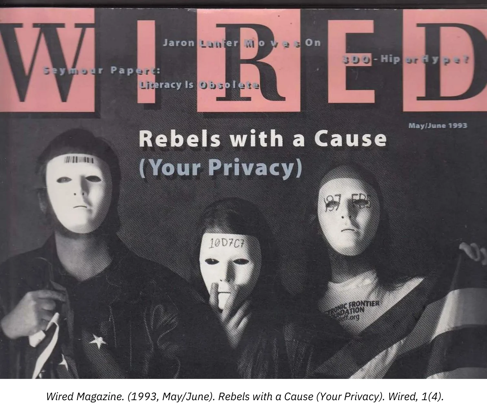

В разгара на технологичното развитие през 80-те и 90-те години на миналия век група хора започна да поставя под въпрос ролята на неприкосновеността на личния живот и свободата в цифровата ера. Тези хора, които по-късно ще станат известни като "шифърпънкове", твърдо вярват, че криптографията може да служи като инструмент за защита на индивидуалните права срещу намесата на правителствата и големите корпорации.


Иконични фигури като Джулиан Асанж, Вей Дай, Тим Мей и Дейвид Чаум изиграха ключова роля в оформянето на философията и визията на движението. Тези мислители споделяха идеите си във влиятелен списък за кореспонденция, където участници от цял свят участваха в дебати за най-добрите начини за използване на технологиите за по-голяма индивидуална свобода.


### Трите основни документа на шифърпънковете


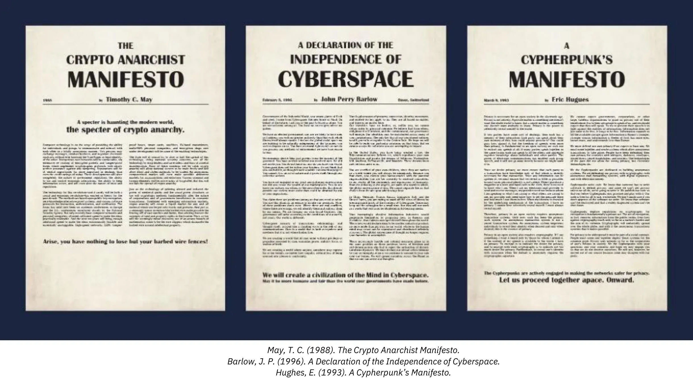


Движението на шифърпънка, дълбоко вкоренено в дигиталния активизъм и криптографията, се опира на няколко основополагащи текста, за да формулира своите принципи и визия за бъдещето. Сред тези текстове три се открояват по-специално:


- "Манифест на шифърпънковете":


Написана от Ерик Хюз през 1993 г., се твърди, че неприкосновеността на личния живот е основно право. Авторът твърди, че възможността за свободно и поверително общуване е от съществено значение за едно свободно общество. В манифеста се посочва: "Не можем да очакваме от правителствата, корпорациите или други големи, безлики организации да ни предоставят неприкосновеност на личния живот [...]. Ние трябва да защитаваме собствения си личен живот, ако очакваме да имаме такъв".


- "Манифест на криптоанархистите":


Написан от Тимъти К. Мей през 1992 г., този документ обяснява как използването на криптографията може да доведе до ера на криптографска анархия, в която правителствата ще бъдат безсилни да се намесват в личните дела на гражданите. Мей си представя бъдеще, в което хората анонимно обменят информация и пари без намесата на трета страна.


- "Декларация за независимостта на киберпространството":


Въпреки че не е изключително шифърпънк, този текст отразява настроенията на много участници в движението. Написан през 1996 г. от Джон Пери Барлоу, той е отговор на нарастващото регулиране на интернет от страна на правителствата. В декларацията се твърди, че киберпространството е отделна сфера от физическата и не трябва да се подчинява на същите закони. В нея се казва: "Ние нямаме избрано правителство, нито пък е вероятно да имаме такова".


### Предшественици на Биткойн


Преди появата на биткойн имаше няколко опита за създаване на цифрова валута. Например Дейвид Чаум въвежда концепцията за "анонимни електронни пари" с проекта си "DigiCash" през 80-те години на миналия век. За съжаление, поради различни ограничения DigiCash така и не се разраства.


Друг важен предшественик е "B-money" на Уей Дай. Въпреки че никога не е реализирана, тя представя идеята за анонимна цифрова валута, при която откриването на измами се извършва от общност от оценители, а не от централен орган.


Изображението по-долу ясно илюстрира развитието на движението чрез многобройните му технологични нововъведения.


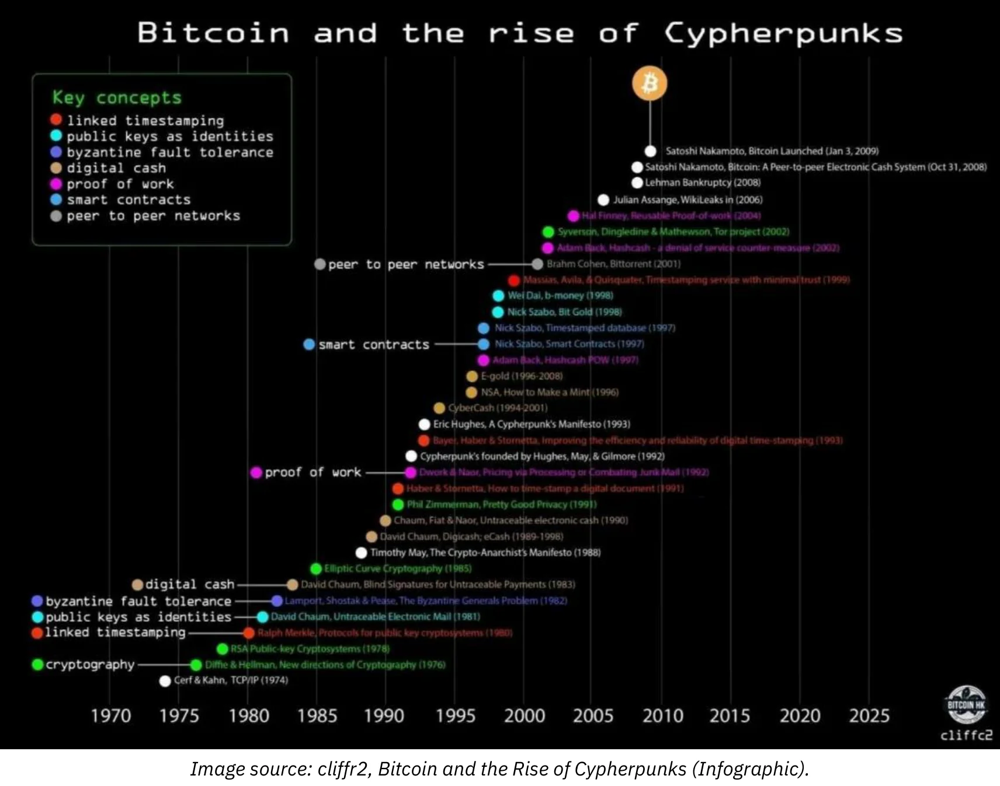


Именно в тази благоприятна среда мистериозният Сатоши Накамото публикува през 2008 г. Бялата книга на Биткойн. В този документ той комбинира няколко идеи от движението на шифърпънковете, като консенсусния механизъм [proof of work](https://planb.academy/resources/glossary/proof-of-work) (доказателство за работа) и криптографски времеви марки, за да създаде децентрализирана и устойчива на цензура цифрова валута.


Биткойн обаче беше нещо повече от това: той представляваше постижение на идеалите на шифърпънка. Освен технологията си, той символизираше революция срещу традиционните финансови системи и предлагаше алтернатива, основана на прозрачност, децентрализация и индивидуален суверенитет.


### Заключение


Предисторията на Биткойн се корени дълбоко в движението на шифърпънковете и в колективното търсене на по-голяма свобода в цифровата ера. Като съчетава принципите на криптографията, децентрализацията и интегритета, Биткойн се превърна в много повече от валута. Всъщност тя е продукт на философска и технологична революция, която продължава да променя нашия свят.


Затова Биткойн е протокол, който обхваща дълги периоди от време и ни подтиква да се замислим за отношението си към енергията, времето и парите.


Дали обаче биткойн е "истинска" валута? За да разберем това, първо трябва да разберем концепцията за парите и различните им форми, които ще разгледаме в следващата глава.


Ако искате да разгледате историята на биткойн по-подробно, горещо ви препоръчваме нашия курс HIS 201, в който ще откриете произхода и бавната поява на биткойн, както и началото на неговата история и общност. Този курс е напълно документиран и базиран на източници, разбира се, с много анекдоти:


https://planb.academy/courses/a51c7ceb-e079-4ac3-bf69-6700b985a082

# Пари


<partId>e913df1a-4cbd-5380-ba67-ca2a0414f671</partId>


## Парите в историята


<chapterId>c838e64d-d59f-5703-8c74-ea5e8c4fdd31</chapterId>


Еволюцията на парите е завладяващ аспект от човешката история, който отразява изобретателността на цивилизациите през вековете в задоволяването на постоянно променящите се икономически нужди.


### От черупки до банкови сметки


Първоначално валутата е била материален актив, например зърно, добитък или друга стока. Основният недостатък на тези стоки обаче е, че са нетрайни, което затруднява използването им като средство за дългосрочни спестявания. Например лошата реколта или болестта на животните можеха да унищожат богатството на индивида за една нощ.

Така с развитието на цивилизациите и разширяването на търговията в нови региони възниква необходимостта от универсално средство за размяна. Първоначално хората експериментирали с предмети като раковини и скъпоценни камъни, но те не били толкова трайни или оскъдни, колкото вярвали. В крайна сметка златото се превръща в стандарт поради своята рядкост, трайност и делимост. То е било и остава и до днес символ на богатство и власт.


### Каква е ролята на парите?


Парите са изключително сложен инструмент за комуникация:


- Те позволяват за комуникация между настоящето и бъдещето, защото превръщат времето и енергията ни в актив, който може да бъде използван отново в бъдеще без риск от обезценяване.


- Те улесняват общуването ни на универсален език: без да се познават или да говорят един и същ език, двама непознати могат да разменят, търгуват и да се договарят за стойността на нещата.


Трудно е да се възпроизведе изкуствено функцията им в нашия свят. Всъщност никой индивид или група не може да създаде пари, тъй като те са естествено явление, което трябва да възникне в резултат на пазара и доброволния консенсус. В този смисъл цените служат като сигнали и информация, които ръководят обществото при разпределянето на ресурсите.


Поради тези причини златото като пари е резултат от 4000-годишен паричен дарвинизъм, основан на следните аристотелови функции:


- Съхраняване на стойност**: парите могат да се използват за прехвърляне на покупателна способност в бъдеще, затова трябва да са траен материал;
- Средство за размяна**: парите могат да се използват за размяна на стоки и услуги вместо за размяна, като по този начин се избягва съвпадението на желанията между търговците;
- Разчетна единица**: парите също така ни позволяват да сравняваме стойността на различни стоки, за да разберем по-добре тяхното относително удобство.


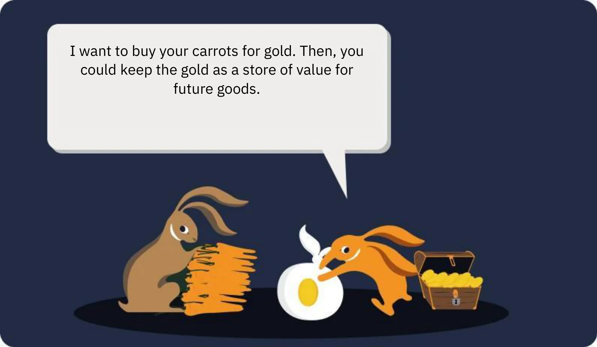


### Характеристики на парите


Златото идеално отговаря на критериите за ефективна валута: естествената му рядкост го прави ценно, а химическите му свойства гарантират, че не се разрушава с течение на времето. Тези характеристики са превърнали златото в чудесен **съхранител на стойност**, но не и в обичайна валута, тъй като тази форма на пари не е лесно делима и не може да се транспортира на големи разстояния. В един глобализиран и цифров свят златото трудно върви в крак и се нуждае от централен субект, който да го направи делимо и лесно разменяемо (т.е. чрез сечени монети).


Обратно, държавните фидуциарни валути (фиат) са лесно използваеми, но постоянно се обезценяват от субектите, които ги контролират (крале, централни банки, императори, диктатори).


За да обясним по-добре тази концепция, ще разгледаме характеристиките на ефективната валута:


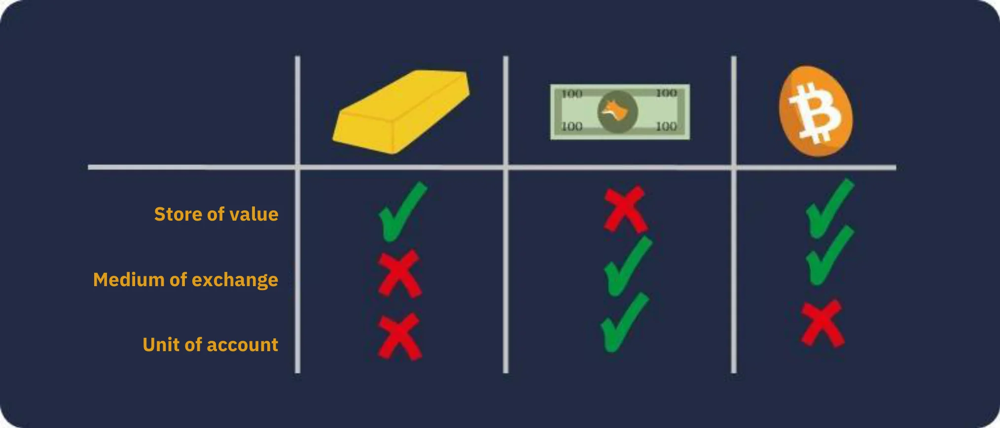


- Възпроизводимост**, което означава, че тя може да се заменя с друга единица от същия вид без загуба на стойност;
- Делимост**, тъй като може да бъде разделена на по-малки единици, за да се улеснят транзакции с различен обем;
- Ликвидност**, което означава, че е лесно конвертируем в стоки или услуги.


За да отговори на тези критерии, валутата в миналото се е развивала чрез различни стъпки:


- Суров камък -> Монета
- Банкнота -> Банкова карта
- Блокчейн -> Светкавичната мрежа на Биткойн


Валутите продължават да се развиват и до днес, като адаптират формите си към различни случаи на употреба. Както казахме, макар златото да е отличен носител на стойност, то вече не е подходящо за настоящата глобализирана икономика. По същия начин фиатните валути като долара и еврото са много ликвидни и лесно преносими, тъй като сега са предимно цифрови, но стойността им постоянно се понижава от паричната инфлация.


От друга страна, биткойнът открива нови перспективи. Неговите свойства, по-специално строго ограниченото предлагане, го правят отличен резерв на стойност. Също така, като неутрална интернет валута, той представлява жизнеспособно **средство за размяна**, способно да преодолява границите. Въпреки това, въпреки непрекъснатото му приемане (както показва [картата на BTCmap](https://btcmap.org/map)), той все още не е широко приет в търговията днес.


## Фидуциарни валути


<chapterId>25151d46-7db1-5b48-8bba-cbde1944555a</chapterId>


> "Онези, които не помнят миналото, са обречени да го повтарят", казва Джордж Сантаяна.

Истина, която звучи добре, когато става дума за настоящата парична система.


### Фидуциар = доверие


Днес основните валути, като еврото и долара, се считат за фиатни и фидуциарни. Това означава, че те нямат вътрешна стойност и зависят изцяло от доверието, което оказваме на институциите, които ги управляват.


Фидуциарната валута е форма на пари, която е обявена за такава от институция, т.е. от държава, като Китай с юана, или от политико-икономически съюз, като Европейския съюз с еврото. Структурата, която отговаря за емитирането ѝ, е централната банка (например можем да споменем Народната банка на Китай, Федералния резерв на САЩ или Централната банка на Република Гвинея). Точно тези структури отговарят за формулирането на паричната политика и следователно за това колко пари трябва да бъдат пуснати в обращение или отпечатани.


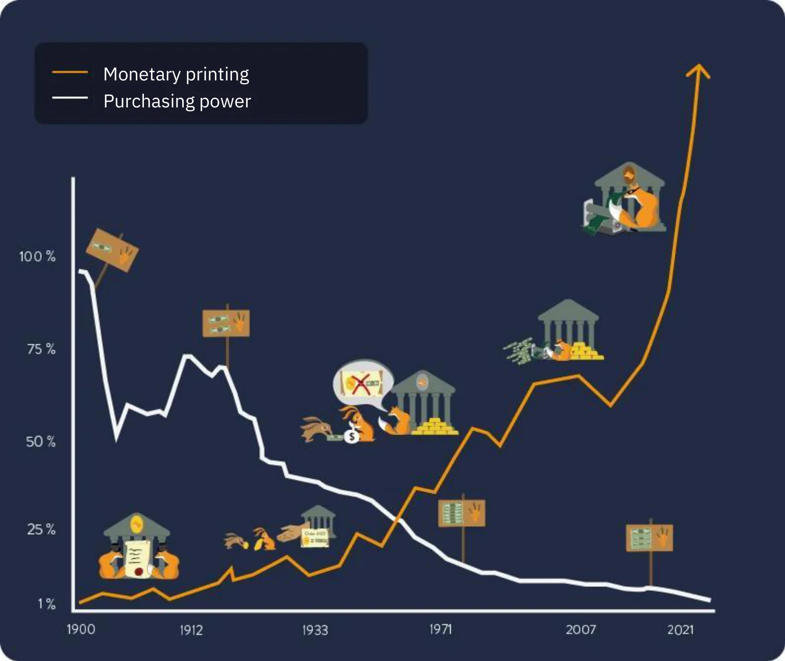


### Парична девалвация: стратегия, стара като Римската империя


Още от древността златото е служило като паричен еталон, но неговата твърдост често е карала лидерите, било то римски императори или съвременни правителства, да приемат алтернативни валути, често фидуциарни.


Механизмът е прост и е вдъхновен от практики, съществуващи от началото на цивилизацията. Лидерите, желаещи да упражнят контрол върху богатството, започват с централизирането на златото, като често използват властта си и обещават защита и сигурност. С този скъпоценен резерв в ръцете си те въвеждат нова валута, равностойна по стойност на златото, но изработена по тяхно подобие. След това тази валута започва да циркулира и хората бързо се приспособяват към удобството на нейната проста употреба.


След това обаче тези лидери започват постепенно да обезценяват новата валута, като де факто намаляват стойността ѝ с няколко процента всяка година в сравнение с първоначалната цена на златото. Тази тиха девалвация често се оправдава с това, че е в интерес на народа. В действителност тези, които спестяват в тази фиатна валута, виждат как стойността на спестяванията им намалява, докато държавата финансира проектите си чрез инфлация. Освен това тази девалвация улеснява изплащането на дълговете.


В критичен момент лидерът прави изявлението: валутата вече не е обезпечена със злато. Обществото, свикнало вече с фиатната валута и често дезинформирано по финансовите въпроси, приема тази реалност, позволявайки на държавата свободно да манипулира паричната маса и да печата огромни суми пари почти без никакви разходи.


След това печатането на валута води до инфлация и постепенно обеднява населението. Освен това финансовата система се регулира и ограничава, за да се избегне нейният срив, тъй като всяко смущение може да предизвика голяма икономическа криза. За разлика от масите, финансовите институции и богатите индивиди извличат големи ползи от тази система, което създава неравенство и благоприятства авторитаризма. В този контекст те не са стимулирани да правят радикални промени, което позволява на системата да продължи своя ход до евентуална имплозия.


Когато е добре изпълнена, тази стратегия може да продължи десетилетия. Важно е обаче да се отбележи, че една много бърза девалвация или загуба на доверие може да доведе до хиперинфлация (вж. следващата глава). Историята показва, че доларът е загубил 98% от стойността си за 100 години, еврото - 30% за 20 години, а британският паунд - 99% от създаването си.


В крайна сметка валутата може вече да няма никаква връзка със златото, подобно на римските монети в края на империята, или дори да бъде сведена до проста числова стойност, откъсната от материалната реалност.


Днес сме свидетели на исторически обрат. Доларът, който дълго време доминираше, изглежда е в упадък, а златото загуби централната си роля. Стоим на прага на нов паричен цикъл, който ни напомня, че уроците на историята често се забравят


### Решение ли е Биткойн?


Благодарение на тези предпоставки революцията на Биткойн набира скорост. За разлика от предишните валути, тя не изисква **надеждна трета страна** и има за цел да отдели държавата от парите.


Всъщност Биткойн се представя като отговор на тези системни предизвикателства, като предлага децентрализирано решение и нова паралелна парична система. Исторически погледнато, ако златото е било предпочитано като парична единица поради своята устойчивост на фалшифициране, то биткойн по същия начин не може да бъде фалшифицирана. Освен това, благодарение на децентрализирания си и криптографски характер, тя е ограничена до 21 милиона единици. биткойн е валута, която разчита на прозрачност и неутралност, предлагайки привлекателна алтернатива на настоящата централизирана парична система.


Друга причина, поради която Биткойн привлече вниманието, е появата на цифрови валути на централните банки, или CBDC, която изглежда неизбежна. Тази нова форма на пари би развила по-централизирано планирана икономика и би могла както да попречи на финансовата свобода на индивидите, така и да улесни авторитарните злоупотреби.

Можем да завършим тази глава с цитат от Нобеловия лауреат Ф. А. Хайек от 1984 г:


> "Не вярвам, че някога отново ще имаме добри пари, преди да измъкнем нещата от ръцете на правителството. Ако не можем да ги отнемем насилствено от ръцете на правителството, единственото, което можем да направим, е по някакъв хитър или заобиколен начин да въведем нещо, което те не могат да спрат."

За да научите повече за икономическите заблуди и свободата, ви каним да се запознаете с нашия курс ECO102, който проследява живота и идеите на Фредерик Бастиа - френски мислител от XIX век, който със сигурност би оценил появата на биткойн:


https://planb.academy/courses/d07b092b-fa9a-4dd7-bf94-0453e479c7df

## Хиперинфлация


<chapterId>b04c024c-54f3-50cb-997f-58721cfc74be</chapterId>


Хиперинфлацията е парично явление, характерно за фиатните валути: тя се характеризира с пълна загуба на доверие в дадена валута и драстично нарастване на инфлацията вследствие на печатането на парични знаци от страна на властите. В резултат на това спестяванията, натрупани от хората, могат да се разпилеят за сравнително кратък период от време, тласкайки страната на ръба на икономически, социален и политически колапс.


### Дива инфлация!


За да разберем влиянието на инфлацията върху спестяванията, трябва да вземем предвид различните темпове на инфлация.


- При 2% инфлация губите 2% от покупателната си способност годишно, което прави 10% за 5 години.
- Със 7% губите половината от сумата за 10 години.
- С 20% губите почти половината от сумата за 3 години.


Когато настъпи хиперинфлация, вече не става дума за 20 % годишно, а за 20 % месечно, а в пиковия момент - дори за ДЕН. Изживяването на 100% инфлация на ден в продължение на три дни е реалистичен сценарий, който се е случил и продължава да се случва в нашия свят.


От решаващо значение е да се разбере, че хиперинфлацията не се случва случайно, от капитализма или от политически атаки от страна на опонентите. Хиперинфлацията е пряка последица от лоши парични решения, взети от централните банкери и политиците. Нейните последици засягат всеки гражданин и дори оказват влияние върху следващите поколения. Любезно ви приканваме да отделите пет минути за четене на следващата таблица, за да осъзнаете напълно реалното въздействие на това явление (курсът ECO204 задълбочава тази тема). Както виждате, нито една държава или валута не е в потенциална безопасност.


### Какви са фазите на хиперинфлацията?


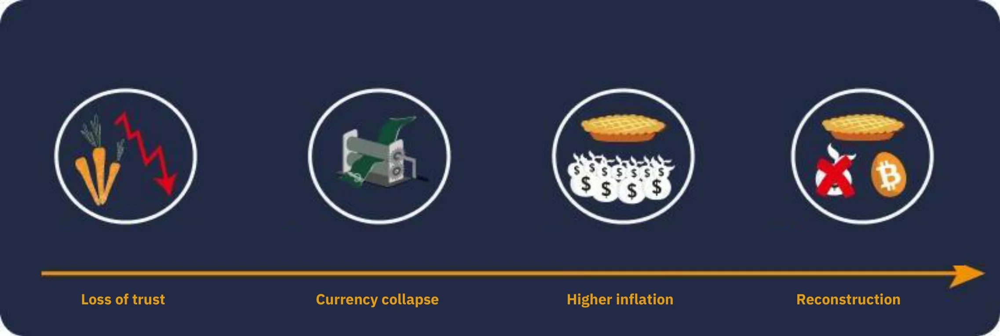


За да настъпи хиперинфлация, трябва да се случат определени събития.


Фаза 1 - Загуба на доверие


- Централизацията на паричната власт улеснява създаването на пари и злоупотребите с тях. В този контекст външни фактори като войни, правителствени политики или повишаващи се цени на ключови ресурси - като пшеница или бензин - могат да предизвикат хиперинфлация. По този начин може да възникне загуба на доверие в дадена валута и хората да започнат да поставят под въпрос произхода на парите и ползите от мандатната парична политика.


Фаза 2 - Срив на валутата и повишаване на цените


- Тъй като правителствата губят контрол върху доверието, хората започват да обменят своята валута за по-стабилна, както се случи във Венецуела с щатския долар. Това обстоятелство води до повишаване на цените, създавайки порочен кръг, в който стоките и услугите стават все по-скъпи. За да посрещне тези нужди и да коригира паричната политика, държавата печата повече пари, което води до експоненциална инфлация.


Фаза 3 - Омагьосаният кръг на печатането на пари


- Така за закупуване на стоки са необходими все повече банкноти, което води до недостиг на книжни пари. В отговор на това правителствата прибягват до печатане на още банкноти, което още повече засилва инфлацията.


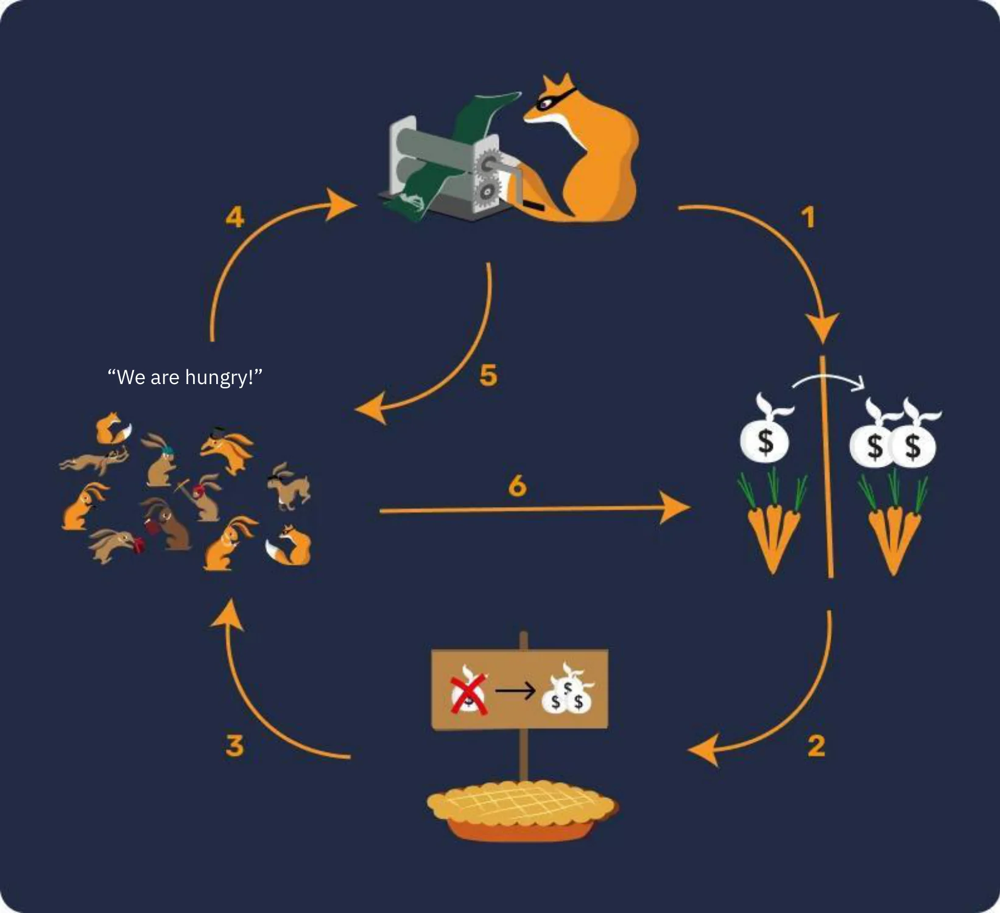


Фаза 4 - появата на нова валута


- След това се въвежда нова валута на мястото на старата, за да се прекъсне цикълът на инфлация чрез въвеждане на по-строг контрол, който не е бил въведен при предишното законно платежно средство.


Разрешаването на кризата с хиперинфлацията често изисква радикални промени, като например революции, смяна на правителството, смяна на централните банкери и др. Загубата на доверие, сривът на валутата и възстановяването са основни етапи за съживяване на икономика, основана на фиатни валути.


### Три забележителни примера


- Германия, 1922-1923 г.


Един от най-ярките примери за хиперинфлация се наблюдава в германската Ваймарска република след Първата световна война.


Германия е взела назаем огромни суми пари, за да финансира войната. Германия обаче не само загуби войната, но и трябваше да плати милиарди долари за репарации. Месецът с най-висок процент на инфлация е октомври 1923 г., когато той достига 29 500%, което се равнява на инфлация от 20,9% на ден. Цените се удвоявали на всеки 3.7 дни!

Германската валута става толкова безполезна, че някои граждани предпочитат да горят хартиените си пари вместо дърва, защото така е по-евтино. Разказва се дори, че в ресторантите сервитьорите трябвало да обявяват цените в менюто на всеки 30 минути, за да отчитат инфлацията.


В крайна сметка властите създават нова валута, обезпечена с дълговете на Германия, Франция и Англия и гарантирана с германски земи.


- Унгария, 1945-1946 г


Страната, преживяла най-тежкия период на хиперинфлация досега, определено е Унгария след Втората световна война.


Унгария се оказва от губещата страна на конфликта, като по-голямата част от индустриалния ѝ производствен капацитет е унищожена. Месецът с най-висока инфлация е юли 1946 г., когато се наблюдава зашеметяваща инфлация на цените от 41 900 000 000 000 000 000 %, което се равнява на 207 % на ден. Цените се удвояват на всеки 15 часа!


Последната банкнота, пусната в обращение, е 100 милиона милиарда пенго (100 000 000 000 000 000 000 000) през 1946 г.


- Зимбабве, 2007-2008 г


До 2000 г. Зимбабве си е осигурявала сама почти всички свои нужди с изключение на петрола.


През 1997 г. зимбабвийският долар се срива с над 72%, след като правителството се съгласява да обезщети ветераните от войната с равностойността на 450 милиона щатски долара. Тъй като правителството не разполагаше с такава сума в запасите си, то прибягна до печатницата. През 2005 г. инфлацията достига 586%, но пикът е в средата на ноември 2008 г., като темпът ѝ се оценява на 79 600 000 000% на месец.


През юни 2007 г. правителството вече реагира, като наложи ценови контрол, но това действие не оказа никакво влияние върху икономиката. Магазините действително бяха разграбени и търговците вече нямаха средства да попълнят запасите си.


През април 2009 г. министърът на финансите обяви спирането на зимбабвийския долар и разреши използването на различни чуждестранни валути за търговия. Всички банкови сметки, пенсии и финансови институции изпариха салдата си за една нощ.


В заключение, хиперинфлацията води до бързо намаляване на стойността на валутата, което води до намаляване на спестяванията и загуба на доверие в паричната система. Както Волтер веднъж е предположил, една фиатна валута винаги в крайна сметка губи присъщата си стойност и клони към нула.

Валута, която разчита на доверена трета страна като финансова институция, на практика и в дългосрочен план е дефектна, тъй като не може да гарантира покупателната способност или да запази спестяванията.


За да навлезете по-дълбоко в темата за хиперинфлацията, ви препоръчваме курса ECO204 на Дейвид Сент-Ондж, в който ще научите какво представляват хиперинфлационните цикли и какво е реалното им въздействие върху живота ни. Ще откриете също така приликите между тези цикли и, най-важното, как да се предпазите от тях.


https://planb.academy/courses/caa75343-ac90-4249-bcca-0e2e57c3a0f1

## 21 милиона биткойна


<chapterId>f4a06d76-1963-56fd-93ff-dfa41489bcde</chapterId>


### Парична политика на биткойн


Биткойн е децентрализирана цифрова валута с предварително определено максимално количество от **21 милиона единици**. Тази вътрешно присъща характеристика на оскъдност се определя от нейния компютърен код и се подсилва от консенсуса на всички потребители, участващи в протокола.


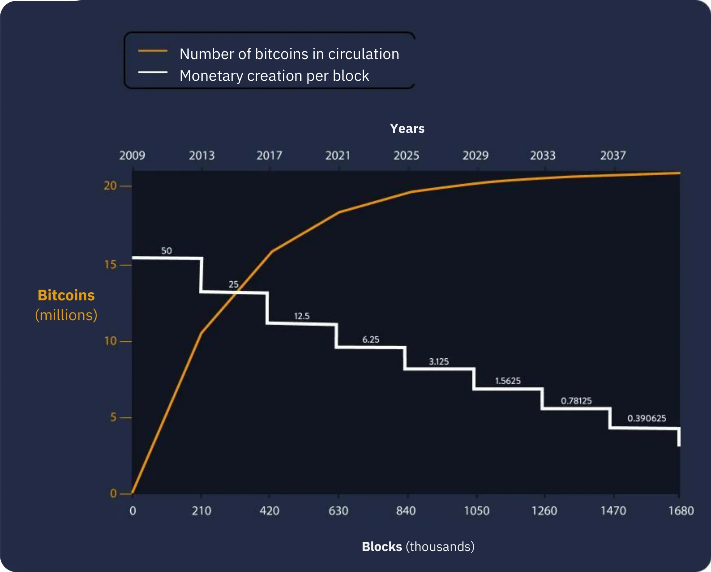


Нейната парична емисия може да се илюстрира с крива, която представя количеството създадени биткойни с течение на времето. Например през 2022 г. в обращение са били приблизително 18,5 млн. биткойна. Прогнозите сочат, че до 2025 г. ще има около 19,5 млн. биткойна, което представлява около 93% от общото предлагане, а до 2037 г. тази цифра ще достигне 20,4 млн.


### Как се създават нови биткойни?


Създаването на нови биткойни е резултат от процеса на копаене. Накратко казано, миньорите използват мощни компютри, които решават сложни математически задачи (хеш), с които се валидират и защитават транзакциите. След като задачата бъде решена (или бъде намерен валиден хеш), миньорът добавя нов блок от трансакции към блокчейна - децентрализирана и разпределена счетоводна книга, в която се записват всички трансакции, извършени в мрежата. Блокверигата осигурява прозрачност и сигурност, тъй като всеки блок е свързан с предишния, което прави почти невъзможно да се променят минали данни без консенсус от мрежата.


След като успешно изпълнят тази задача, миньорите получават възнаграждение - на всеки десет минути се издават нови биткойни. Това възнаграждение е програмирано да намалява наполовина на всеки 210 000 блока, което е приблизително на всеки четири години (събитие, известно като "халвинг"), което придава на кривата на емитиране на парични единици форма, наподобяваща стълба. Благодарение на този механизъм може математически да се предвиди, че създаването на нови биткойни ще спре около 2140 г., когато общият им брой достигне лимита си от 21 милиона.


| Халвинг | Номер на блок | Награда от биткойни след халвинга  | Парично предлагане на биткойни след халвинга |
| -------------- | ------------ | ------------------------- | ------------------------------------------ |
| 1              | 210,000      | 25 BTC                    | 10,500,000 BTC                             |
| 2              | 420,000      | 12.5 BTC                  | 15,750,000 BTC                             |
| 3              | 630,000      | 6.25 BTC                  | 18,375,000 BTC                             |
| 4              | 840,000      | 3.125 BTC                 | 19,687,500 BTC                             |
| 5              | 1,050,000    | 1.5625 BTC                | 20,343,750 BTC                             |
| 6              | 1,260,000    | 0.78125 BTC               | 20,671,875 BTC                             |
| 7              | 1,470,000    | 0.390625 BTC              | 20,835,937.5 BTC                           |
| 8              | 1,680,000    | 0.1953125 BTC             | 20,917,968.75 BTC                          |
| 9              | 1,890,000    | 0.09765625 BTC            | 20,958,984.375 BTC                         |
| 10             | 2,100,000    | 0.048828125 BTC           | 20,979,492.188 BTC                         |
| 11             | 2,310,000    | 0.0244140625 BTC          | 20,989,746.094 BTC                         |
| 12             | 2,520,000    | 0.01220703125 BTC         | 20,994,873.047 BTC                         |
| 13             | 2,730,000    | 0.006103515625 BTC        | 20,997,436.523 BTC                         |
| 14             | 2,940,000    | 0.0030517578125 BTC       | 20,998,718.262 BTC                         |
| 15             | 3,150,000    | 0.00152587890625 BTC      | 20,999,359.131 BTC                         |
| 16             | 3,360,000    | 0.000762939453125 BTC     | 20,999,679.566 BTC                         |
| 17             | 3,570,000    | 0.0003814697265625 BTC    | 20,999,839.783 BTC                         |
| 18             | 3,780,000    | 0.00019073486328125 BTC   | 20,999,919.892 BTC                         |
| 19             | 3,990,000    | 0.000095367431640625 BTC  | 20,999,959.946 BTC                         |
| 20             | 4,200,000    | 0.0000476837158203125 BTC | 20,999,979.973 BTC                         |

Ще се върнем към концепцията за копаене по-подробно в главата [Миньори](https://planb.academy/courses/2b7dc507-81e3-4b70-88e6-41ed44239966/dbb8264a-7434-57e4-9d1b-fbd1bae37fdf).


### Гарантиране на цифров недостиг


Границата от 21 милиона е в основата на недостига на биткойн и се гарантира от два ключови механизма: регулирането на трудността на копаене и теорията на игрите.


- Коригирането на трудността на копаене е процес, който се извършва на всеки 2016 блока или около две седмици, за да се гарантира, че нов блок се добавя в блокчейна средно на всеки десет минути. Тази честота на създаване на блокове и общото количество биткойни са фиксирани аспекти на протокола Биткойн и не могат да бъдат променяни без общ консенсус, за разлика от произволните решения, вземани в традиционните парични системи.


Трудността за намиране на валиден хеш следва своеобразен цикъл: ако броят на миньорите се увеличава и повече блокове се намират по-бързо, това води до намаляване на средното време за намиране на блок и така трудността се увеличава. Вследствие на това броят на блоковете, които миньорите намират, се намалява, което означава, че механизмът се връща към средната стойност от 10 минути на блок. Моля, вижте изображението по-долу за визуално представяне.


И обратното, ако работят по-малко миньори и блоковете отнемат повече време, трудността на копаене намалява, което ускорява средното време за блок отново.


Знаете ли, че миньорите са стимулирани да разработват даден блок, за да печелят нови биткойни чрез субсидията за блока, както и чрез транзакционните такси от транзакциите, които включват в този блок?


По този начин, когато броят на издадените биткойни се приближи до границата от 21 милиона, миньорите ще получават по-голямо възнаграждение от таксите си за транзакции, отколкото от блоковата субсидия.


- Теорията на игрите е математическа концепция, която се основава на човешката рационалност. Тя предполага, че хората действат логично, стремейки се да максимизират собствените си ползи, като същевременно вземат предвид потенциалните решения на другите. В биткойн теорията на игрите помага да се гарантира, че мнозинството миньори и потребители ще действат в най-добрия интерес на мрежата. Всъщност, тъй като промените в протокола се гласуват от потребителите, всяка промяна в протокола на Биткойн би изисквала съгласието на цялата общност от потребители, което е много сложно. Така че, ако някой иска да създаде 22 млн. биткойни, той ще трябва да убеди всички потребители доброволно да обезценят собствените си спестявания, което е малко вероятно да се случи, тъй като Биткойн е глобален и не се управлява от централна група.


Идеята за девалвация на валутата противоречи на основната философия на Биткойн, така че промяна в общото й количество е малко вероятна.


### Одитируема парична политика: всяка секунда, от самото начало и завинаги!


Оскъдността на биткойн е основно предимство, а максималното количество от 21 милиона биткойна в обращение е публично и може да бъде проверено от всеки.


Всъщност всеки може да направи това чрез биткойн възел (т.е. валидатор на транзакции), като просто въведе следната команда: `bitcoin-cli gettxoutsetinfo`. Тази прозрачност укрепва доверието в системата биткойн, която не се основава на централни институции или отделни лица, а на математическите и криптографските гаранции, заложени в нейния протокол (Ще научите как да направите това лесно в LNP201).


```json
{
"height": 710560,
"bestblock": "0000000000000000000887384d67103412ea7f18a43953e65c8c4ac36bf42e54",
"transactions": 473244,
"txouts": 1018917,
"bogosize": 2183872374,
"hash_serialized_2": "eebb9987337700ffaacbbaa11223344",
"disk_size": 178239584,
"total_amount": 18745998.12345678
}
```


Биткойн гарантира стабилно парично управление, като ограничава създаването си по дизайн, което я прави много различна от другите валути, тъй като може да защити спестяванията на потребителите. Съобразена с принципите на Австрийската икономическа школа, нейното стабилно количество и предвидимо разпределение я предпазват от присъщите рискове от инфлация, с които се сблъскват традиционните валути (за да научите повече, вижте курса ECO201).


В обобщение, Биткойн, със своята децентрализирана природа, програмиран недостиг и прозрачност, предлага уникална алтернатива на традиционните парични системи. Тя илюстрира как технологията може да се използва за създаване на валута, която не само е полезна и проверима, но и запазва стойността на спестяванията на потребителите, като строго ограничава предлагането им.


# Биткойн портфейли


<partId>28860585-4f61-59d9-b242-f4c57d837cc1</partId>


## Какво представляват биткойн портфейлите?


<chapterId>1c0166ab-cb7a-5bc6-9175-d13482bd91f1</chapterId>


В раздел 2 ще разгледаме съхранението и сигурността на биткойн чрез използването на портфейли, за да разберем къде се намират тези известни биткойни и как да взаимодействаме с тях!


### Демистифициране на биткойн портфейлите


Използваме портфейли, за да взаимодействаме с мрежата Биткойн по три основни начина:


- Получаване на биткойни
- Изпращане на биткойни
- За да ги предпазите от опити за хакерство и кражба


Биткойн портфейлите може да имат много форми: софтуер на вашия компютър, приложение на вашия смартфон, физическо устройство като USB ключ или дори лист хартия. Всяко от тях обслужва различни случаи на употреба. Всъщност някои от тях са предназначени за големи транзакции с акцент върху сигурността, докато други дават приоритет на неприкосновеността на личния живот, или са предназначени за ежедневни плащания на малки суми.


По този начин портфейлите могат да бъдат категоризирани в широки групи за използване, които винаги са съсредоточени около един ключов въпрос: Вие ли сте собственик на средствата или оставяте контрола върху парите си на трета страна? Ще разгледаме подробно тази тема в следващата глава, но въпросът остава ясен: парите във вашия джоб ли са или в джоба на вашия банкер?


### Как работи биткойн портфейлът?


Независимо дали става въпрос за вашия биткойн "банкер" или за вас самите, по-голямата част от портфейлите работят с подобна технология, базирана на асиметрична криптография, която включва система от двойки ключове: частен ключ за харчене и публичен ключ за получаване.


- Частен ключ


При инициализирането на нов портфейл се генерира тайна фраза за възстановяване, известна също като мнемонична фраза (частен ключ), която ви се представя под формата на 12 или 24 думи.


Частният ключ е от основно значение, тъй като той определя собствеността върху биткойните и следователно правото да ги използвате или изпращате. Следователно притежателят на частния ключ е истинският собственик на биткойните. Както гласи популярното твърдение: "Нямате ключ, нямате биткойн"


Този ключ трябва да бъде пазен в тайна и добре защитен, тъй като той отключва вашето богатство!


- Публичен ключ и адрес


Публичният ключ се генерира от частния ключ и се свързва с него. Споделянето на публичния ключ крие рискове за неприкосновеността на личния живот (защото другите потребители могат да видят баланса ви), но не и за сигурността (защото те не могат да изразходват средствата ви, без да притежават частния ключ). На свой ред публичният ключ се използва за създаване на биткойн адреси и по този начин за получаване на пари.


Тези адреси се създават автоматично от вашия портфейл и могат да се споделят по сигурен начин. За да увеличите поверителността си, е препоръчително да ги използвате само веднъж.


В обобщение, тази технология ни дава възможност да получаваме биткойни, без получателят да може да открадне средствата ни! Пощенската кутия може да бъде подходяща метафора: хората могат да депозират пари в нея, но само вие можете да я отворите.


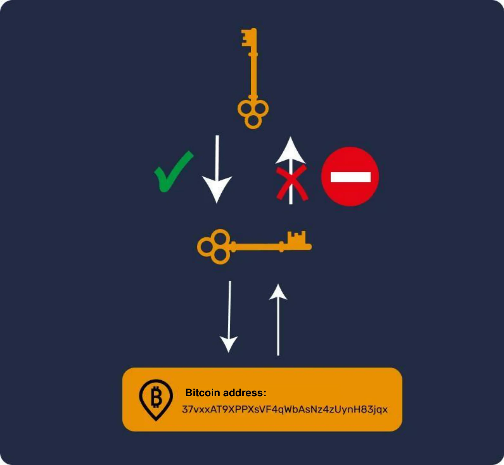


### Има ли биткойни в портфейла?


Въпреки че ключовете ви се съхраняват в портфейла, самите биткойни всъщност се "съхраняват" върху блокчейна на Биткойн, който е публична разпределена счетоводна книга в мрежата Биткойн (ще го разгледаме в раздел 3). Това означава, че загубата на устройството, съдържащо вашия портфейл, не води непременно до загуба на вашите биткойни. Това, което ви позволява да пресъздадете портфейл и да похарчите биткойните си, всъщност е частният ключ, така че винаги не забравяйте да го защитите правилно!


За щастие, от 2017 г. насам частният ключ може да бъде представен чрез прост списък от 12 или 24 думи, известни като "мнемонична фраза", които са доста лесни за запаметяване. Тази фраза служи като резервно копие на вашите средства и ви позволява да пресъздадете своя портфейл с помощта на всеки софтуер или приложение. Следователно всеки, който намери този списък с думи, може да получи достъп до вашите биткойни.


### Какво да кажем за хакерите?


Какво ще стане, ако някой случайно познае списъка ни от 12 или 24 думи? Краткият отговор е, че това е много малко вероятно благодарение на криптографията, използвана за създаването на портфейла. За да го представим в перспектива, случайното откриване на същата ваша мнемонична фраза прилича на намирането на "правилното" число между 1 и 2, повдигнато на степен 256, което е почти равносилно на намирането на "правилния" атом във Вселената. Ако обаче не сте доволни от тази сигурност по подразбиране, винаги можете да я подобрите, като добавите 25-та дума наречена passphrase (допълнителна дума) към вашия портфейл.


Така вероятността да хакнете вашия биткойн портфейл е астрономически ниска, ако следвате добрите практики за сигурност, които ще опишем подробно в следващия раздел.


Имайте предвид да изберете правилния портфейл за вашите нужди и употреба: подробни уроци за управление и защита на различни портфейли са налични в раздела [учебна секция в нашия университет](https://planb.academy/tutorials/wallet).


Ако по време на пътуването си по заешката дупка искате да научите повече за изграждането на биткойн портфейл, от ентропията до получаването на адреси, препоръчваме курса CYP201, посветен на тази тема:


https://planb.academy/courses/46b0ced2-9028-4a61-8fbc-3b005ee8d70f

## Биткойн портфейли и сигурност


<chapterId>00c1afea-e54a-511f-bab3-2efc2fbfa6a1</chapterId>


### Задаване на правилните въпроси преди започване на работа


Когато притежавате биткойни, сигурността на средствата ви е основна грижа. Най-добрият начин да определите нивото на сигурност, което е подходящо за вашата ситуация, е да си зададете поредица от въпроси:


- Кой има достъп до вашите средства? С други думи, вие ли имате едноличен достъп до вашите биткойни или трета страна (например компания) ви предоставя достъп до вашите средства?
- Как смятате да използвате биткойните в този конкретен портфейл? Редовно? За средносрочни или дългосрочни спестявания?
- Какви са техническите ви умения?
- Какъв е бюджетът ви за сигурност?


Всъщност няма универсален отговор или решение, затова отделете време да отговорите на тези въпроси, тъй като това ще ви помогне да адаптирате мерките за сигурност към вашите нужди.


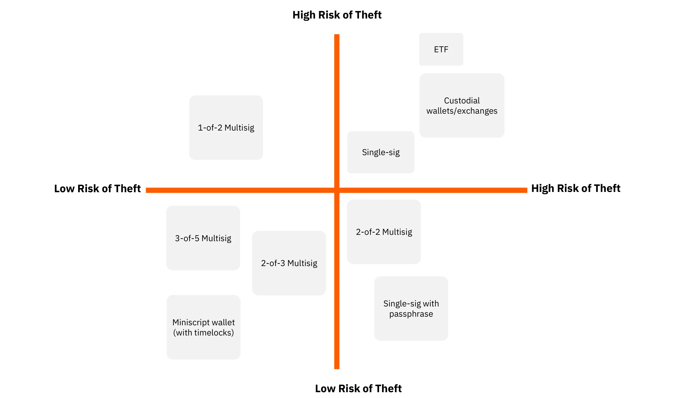


### Мислене за биткойн портфейлите от гледна точка на сложността


По-долу ще дефинираме няколко нива на сигурност:


- На ниво 0** използвате така наречената "попечителска услуга", при която не сте единственият притежател на своите биткойни. Имайте предвид, че тази доверена трета страна може да ограничи достъпа ви до вашите средства по всяко време. В този случай нивото ви на финансов суверенитет е подобно на това на традиционната банкова система с банкова сметка.


- Ниво 1** - използвате биткойн портфейл на телефона или компютъра си, където сте единственият притежател на своите биткойни и можете лесно да извършвате транзакции. Гореспоменатият инструмент се нарича "горещ портфейл", тъй като частният ключ се съхранява на устройство с достъп до интернет. В този случай е изключително важно да направите резервно копие на мнемоничната си фраза, за да възстановите достъпа до средствата си в случай на загуба на телефона или компютъра си.


Например, можете да използвате Sparrow Wallet като горещ портфейл:


https://planb.academy/tutorials/wallet/desktop/sparrow-c674e2ac-d46f-4c82-92a7-7d1b0e262f5d


- Ниво 2**, използвате физически портфейл и сте осигурили списъка си с 12/24 думи. Често се нарича "студен портфейл", тъй като ключовете ви се съхраняват на устройство, което не е свързано с интернет. В този случай винаги ще трябва да подписвате всяка транзакция с устройството си, което прави средствата ви по-малко достъпни на ежедневна база.


Например можете да използвате Ledger, Satochip или Tapsigner:


https://planb.academy/tutorials/wallet/hardware/ledger-nano-s-plus-75043cb3-2e8e-43e8-862d-ca243b8215a4

https://planb.academy/tutorials/wallet/hardware/satochip-e9bc81d9-d59b-420d-9672-3360212237ba

https://planb.academy/tutorials/wallet/hardware/tapsigner-ab2bcdf9-9509-4908-9a4a-2f2be1e7d5d2


- Ниво 3** - използвате портфейл от ниво 1 или 2, но сте добавили допълнителен passphrase. В този случай имайте предвид, че трябва да направите резервно копие както на списъка с 12/24 думи, така и на вашия passphrase. В идеалния случай тези две части от информацията се съхраняват на две различни места.


За да научите повече за използването и функционирането на BIP39 passphrase:


https://planb.academy/tutorials/wallet/backup/passphrase-a26a0220-806c-44b4-af14-bafdeb1adce7


- На ниво 4** използвате набор от портфейли, за да създадете "multisig" портфейл, което означава, че за извършването на транзакция са необходими няколко подписа. В този случай имайте предвид, че всяка част от "multisig" трябва да се съхранява на различни места. Този подход често се счита за разширено използване на биткойн, предимно за управление на големи суми и за корпоративни цели.


Разбира се, различните случаи на използване изискват и различни портфейли биткойн и няма универсално решение.


### Сигурността трябва да се адаптира


Размерът на сумата, която човек е готов да остави на определено ниво на сигурност, зависи от всеки отделен човек. За някои е разумно да оставят 1 BTC на горещ портфейл, докато за други е точно обратното. Във всеки случай, когато искате да подсигурите малка сума, съветваме да не харчите твърде много за сигурност, като купувате физически портфейл. Освен това имайте предвид, че прекаленото усложняване на сигурността и достъпността на вашите биткойни може да бъде пагубно, особено ако недобре се справите с резервните копия на портфейлите си.


В заключение, пряката собственост върху биткойните е съществен елемент за осигуряване на финансов суверенитет. Препоръчва се използването на мобилен портфейл за ежедневни разходи и офлайн, или "студен", физически портфейл за съхранение на по-големи суми. От друга страна, фирмите трябва да обмислят използването на системи с много подписи или "multisig" за по-голяма и споделена сигурност. Важно е също така да се избягват попечителските услуги, които могат да възпроизведат някои уязвимости на традиционната финансова система.


Имайки предвид това, можем да преминем към следващия раздел, в който ще опишем как да създадем биткойн портфейл. Въпреки това, ако желаете да разгледате по-подробно темата за сигурността, можете да прочетете тази [статия от DarthCoin](https://asi0.substack.com/p/биткойн-soyez-votre-propre-banque).


## Настройка на портфейл


<chapterId>615519eb-4565-557d-86a0-021badf7616f</chapterId>


Сигурността на вашите биткойни е от решаващо значение и една проста грешка може да има катастрофални последици. Ето защо трябва да научим най-добрите практики, които да възприемем при създаването на нова биткойн портфейл.


Моля, обърнете внимание, че курсът BTC102 ще ви помогне да преминете през тази стъпка.


https://planb.academy/courses/f3e3843d-1a1d-450c-96d6-d7232158b81f

### Тази стъпка не е шега!


Когато настройвате портфейл, софтуерът обикновено създава вашия частен ключ, който обикновено се представя като списък от 12/24 думи (често наричани "сийд фраза" или "мнемонична фраза"): тези думи представляват достъпа до вашите средства. Ако този ключ някога бъде разкрит на трета страна, трябва да считате, че свързаните с него средства са компрометирани. Ето защо, когато настройвате своя портфейл, е важно да спазвате тези правила:


- Покрийте всички камери.
- Не снимайте списъка с думи.
- Не го въвеждайте на компютър или телефон.
- Не го запазвайте като контакт и не го изпращайте до себе си чрез SMS.
- Никога не оставяйте думите си без надзор на бюрото си.
- Никога не крийте списъка си с думи на необичайно място.


Трябва буквално да вземете празен лист хартия или да разпечатате този [шаблон](https://биткойнer.guide/backup.pdf) и да напишете списъка с думи с химикал, като следвате представения ред внимателно и ясно. Имайте предвид, че ако мастилото избледнее с течение на времето, може да загубите средствата си. Ето защо е важно да съхранявате този лист хартия защитен от онези фактори на околната среда, които потенциално могат да го повредят, като влага или огън.


По-долу ще намерите пример за съставяне на документа: думите са фалшиви, затова не ги използвайте!


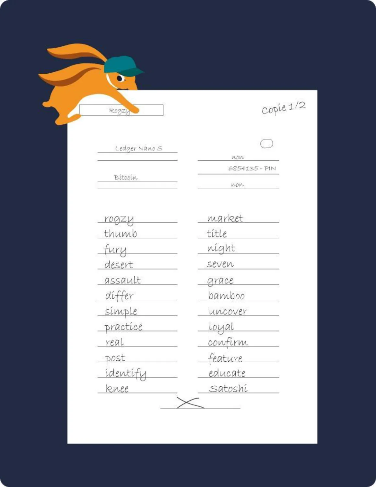


### Съветите ни за правилно изпълнение


Внимавайте да не допуснете грешки при ясното и четливо копиране на мнемоничната фраза, защото в противен случай наследниците ви може да се затруднят да я прочетат и да не успеят да възстановят средствата. След като запишете думите, препоръчително е да създадете второ копие и да го съхранявате на място, различно от първото. Това ви гарантира, че имате резервно копие, в случай че оригиналът бъде изгубен или повреден.


Списъците с думи трябва да се съхраняват на сигурно място, което лесно можете да запомните. Избягвайте да създавате прекалено сложни планове за скриване, които могат да доведат до загубването им.


**Твоите думи = твоите пари.**


И "студените", и "горещите" портфейли използват метода на списъка с думи като стандарт за архивиране на частни ключове. В резултат на това можете да въведете мнемоничната си фраза във всеки съвместим софтуер или устройство, за да възстановите достъпа си. От друга страна, силно ви съветваме да не използвате портфейли, които не предоставят сийд фраза, тъй като те могат да изискват от вас да предоставите акаунт, имейл адрес или, още по-лошо, лична карта.


**ВНИМАНИЕ: Липсата на списък с 12/24 думи трябва да ви предупреди.**


Ако искате да разберете стъпка по стъпка как да създадете свой собствен портфейл и да получите първите си биткойни, препоръчваме ви да се включите в този друг курс:


https://planb.academy/courses/f3e3843d-1a1d-450c-96d6-d7232158b81f

## Издържане на теста на времето


<chapterId>f58cd446-c202-5eff-aab7-e61cc40e5c06</chapterId>


Подобно на всяка друга форма на богатство, вашите биткойни трябва да бъдат защитени от загуба, кражба и влошаване, особено в дългосрочен план. Защитата на вашите биткойни изисква някои технически познания и разбиране на свързаните с тях рискове, което открива пътя към две основни стратегии: гравиране на вашите биткойни върху стоманена плоча и създаване на план за наследяване.


### Гравиране в стомана


Един от начините да защитите своите биткойни в дългосрочен план е да гравирате своята мнемонична фраза върху изключително издръжлив материал като стомана. По този начин се създава физическо резервно копие на вашите ключове, което е устойчиво на повреда от вода и пожар.


Предлагат се различни решения: някои от тях са евтини, като например "Blockmit", докато други могат да изискват по-специализирано оборудване. Можете да разгледате тази тема по-подробно в раздела [уроци](https://planb.academy/en/tutorials/wallet) на нашата академия.


### Помислете за следващото поколение!


Наред с тази първа практика създаването на план за наследяване е важна стъпка, за да се гарантира, че вашите биткойни ще бъдат правилно управлявани след смъртта ви. Този план включва изготвянето на ръкописно писмо, в което описвате естеството на активите си, методите за достъп до тях и информацията за контакт с доверените лица, които носят отговорност за тях. Важно е също така да обсъдите наследяването на биткойни със счетоводител и/или адвокат по имуществени въпроси, за да се гарантира спазването на данъчното законодателство, дори ако на това лице никога не трябва да се възлага пряко управлението на вашите биткойни.


Ако желаете да разгледате по-подробно темата за плана за наследяване на вашите биткойни, препоръчваме ви да прочетете книгата на Памела Морган [План за наследяване на криптоактиви](https://planb.academy/resources/books/28) или да се запишете в курса BTC102, където ще ви дадем насоки за създаването на вашия план.


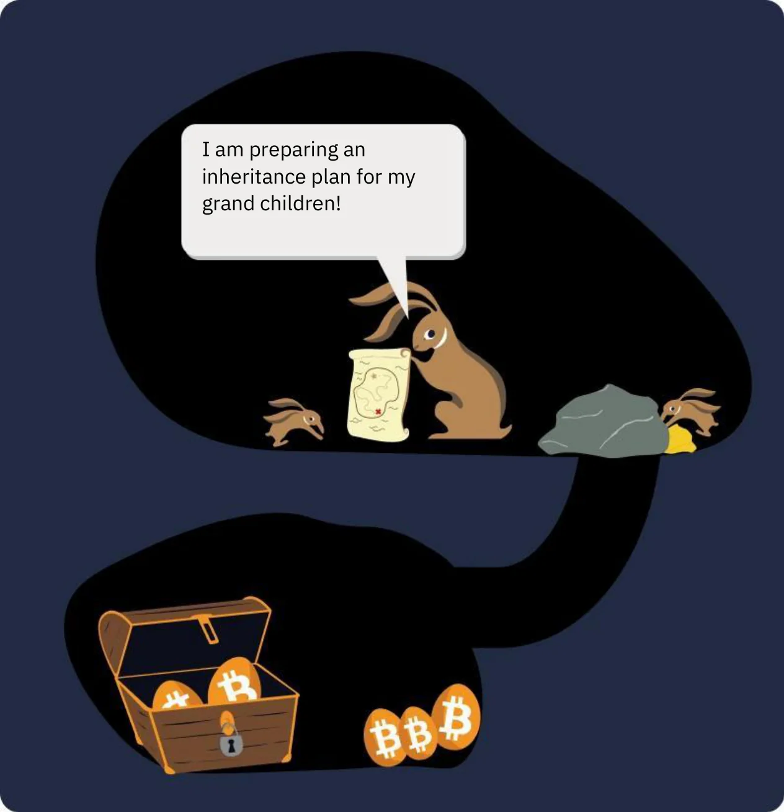


### Поверителността е важна


Освен създаването на физически резервни копия и разработването на план за наследяване, поверителността е друга важна тема, когато става въпрос за дългосрочната сигурност на вашите биткойни. Например за предпочитане е да купувате биткойни, без да предоставяте документ за самоличност, за да сведете до минимум рисковете от кражба на самоличност или проследяване на средствата ви от субекти с подходящи инструменти.


Що се отнася до неприкосновеността на личния живот, изключително важно е да избягвате да говорите с когото и да било за своите биткойни. Не можем да предвидим как тази технология ще бъде възприемана в бъдеще, така че запазването на дискретност по отношение на собствеността ви е мъдър избор: не искате да привличате внимание към себе си или към вашия портфейл.


По същия начин избягвайте да споделяте открито подробности за вашата система за сигурност по време на срещи с биткойн или с непознати...


### Обобщение на сигурността


Биткойн портфейлите ви позволяват да имате достъп до биткойни и да извършвате транзакции. Съществуват няколко вида:


- мобилни или компютърни портфейли, удобни за малки суми и/или редовни разходи;
- физически портфейли, които са по-подходящи за съхранение на биткойни в средносрочен и дългосрочен план;
- многосигнални портфейли, които са по-сложни за управление и изискват множество подписи за извършване на транзакции.


Когато създавате портфейл, е изключително важно първо да направите резервно копие на списъка си от 12 или 24 думи върху лист хартия или метална плоча. Тази така наречена мнемонична фраза ви позволява да възстановите портфейла чрез всяко приложение за биткойн. Имайте предвид, че всеки, който получи достъп до този списък, получава достъп и до вашите средства.


В света на биткойн финансовият суверенитет е тясно свързан с индивидуалната отговорност, поради което е важно да осигурите достъп до портфейлите и резервните си копия. За да постигнете това, е важно да следвате определени насоки:


- Създайте план за наследяване, за да сте сигурни, че близките ви ще могат да получат парите в случай на проблем.
- Избягвайте да оставяте биткойните си в платформи за обмен, тъй като те могат да бъдат уязвими за хакерски атаки.
- Адаптирайте нивото на сигурност към нуждите и случаите на употреба, за да изберете добре сред многото различни налични портфейли биткойн.


След като вече разгледахме основите на портфейлите биткойн и най-добрите практики за тяхната защита, в следващата глава ще разгледаме техническите характеристики на биткойн. Още веднъж, разбирането на основите на протокола биткойн ще подобри разбирането ви за това как работи той, което ще ви даде възможност да го използвате по-добре.


# Технически аспекти на Биткойн.


<partId>a86d7439-e7a2-5f21-b1e9-6b5e23ca265b</partId>


## Стартирането на Биткойн


<chapterId>b7561082-8943-519d-95d1-a5f60dd2686d</chapterId>


### Нека започнем с малко история.


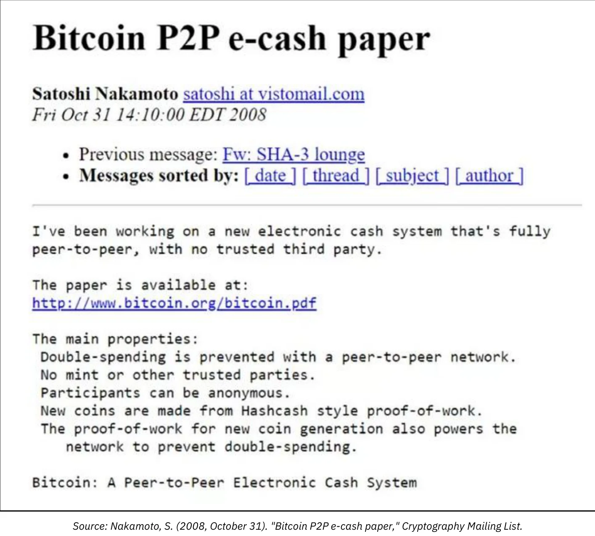


На 31 октомври 2008 г. се ражда новата финансова технология Биткойн. На този ден анонимният Сатоши Накамото представя своята иновация на света чрез имейл, изпратен до пощенския списък от шифърпънкове - общност от ентусиасти в областта на криптографията, посветена на насърчаването на неприкосновеността на личния живот в интернет. Това електронно писмо съдържаше документ, наречен "Бяла книга", в който се представяше как работи Биткойн.


Тази инициатива не предизвика веднага ентусиазъм, вероятно поради предишните неуспехи в опитите за създаване на цифрови парични системи. Въпреки това тази Бяла книга в крайна сметка се превърна в референция за потребителите на биткойн и през годините беше предмет на много дебати в екосистемата на Биткойн.


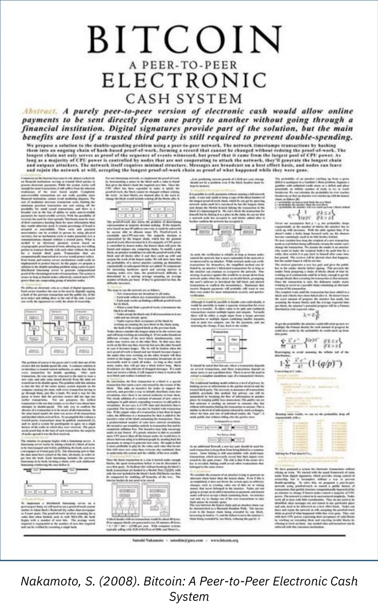


На 3 януари 2009 г. Сатоши официално открива мрежата Биткойн, като създава първия блок, известен още като "блок Genesis", с който се поставя началото на блокчейна на Биткойн. Този блок съдържа разкриващо послание, отразяващо мисията на Биткойн: "3/януари/2009 Канцлерът на ръба на втора спасителна помощ за банките"


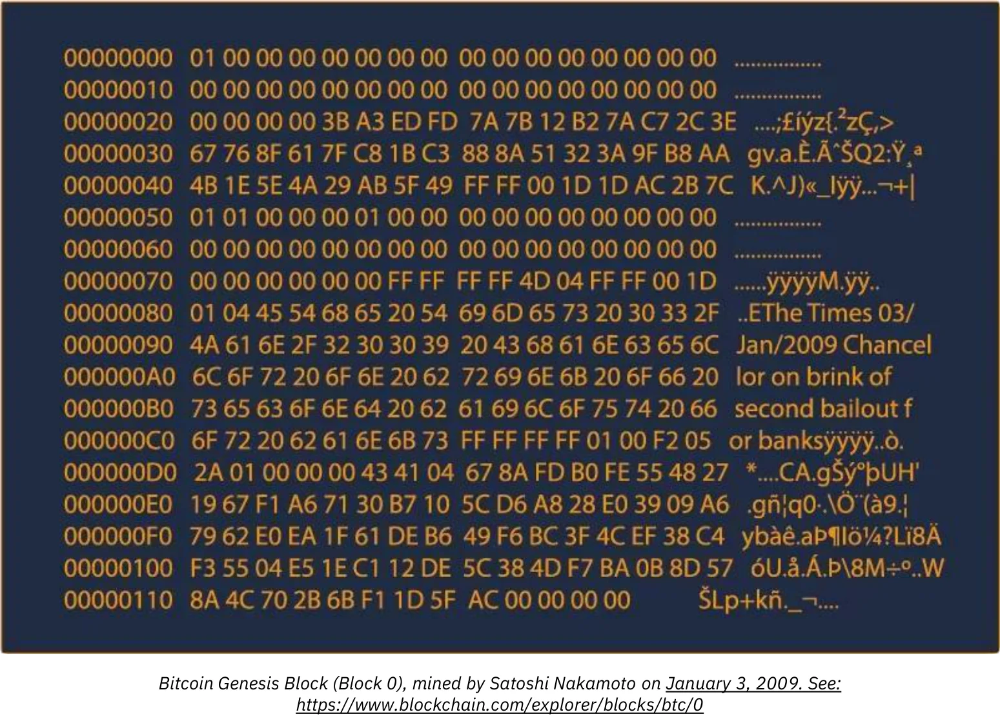


> "Можем да спечелим важна битка в надпреварата във въоръжаването и да спечелим
> нова територия на свободата в продължение на няколко години." - Сатоши Накамото

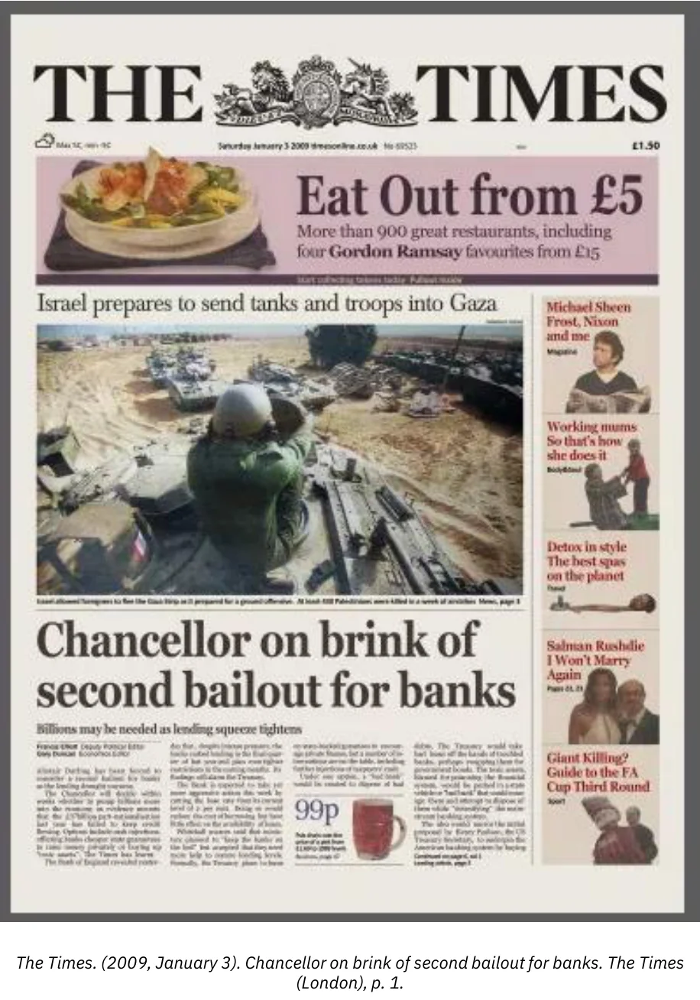


### Протоколът Биткойн оживява


На 9 януари 2009 г. Сатоши обяви пускането на версия биткойн 0.1.0. Малко след това Хал Фини се сдобива със софтуера и се присъедини към мрежата, с което отбеляза наличието на два възела и следователно на двама миньори в мрежата. Фини дори увековечи тази стъпка, като написа в Туитър: "Изпълнявам Биткойн". На 12 януари 2009 г. между Сатоши и Хал Фини беше извършена първата транзакция на биткойн от 10 BTC, която можете лесно да откриете, ако се върнете към блок 170.


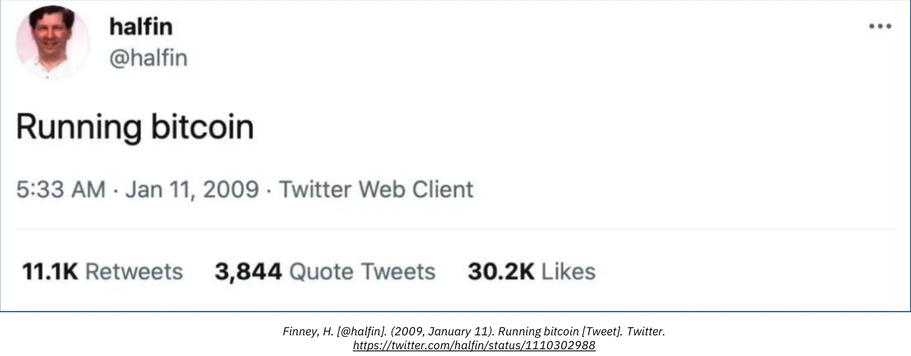


Интересът към Биткойн нарасна бързо, което накара много хора да го тестват, да участват в дебати, да решават проблеми и да обмислят етичните, икономическите и философските му аспекти. Хората бяха толкова запленени, че на 22 ноември 2009 г. Сатоши създаде форума BitcoinTalk, за да улесни този вид комуникации.

Форумът бързо се превърна в предпочитано място за дискусии за потребителите на биткойн, дотолкова, че от него се родиха известни мемета и символи, свързани с биткойн, като например [логото на биткойн](https://bitcointalk.org/index.php?topic=64.0), известният [Hodl](https://bitcointalk.org/index.php?topic=375643.0) или дори [денят на пицата](https://bitcointalk.org/index.php?topic=137.msg1195).


**Знаете ли, че?** На 22 май 2010 г. Ласло Ханиец влезе в историята, като предложи да купи две пици за 10 000 BTC: това беше първият път, когато биткойн беше използван за закупуване на физически стоки.


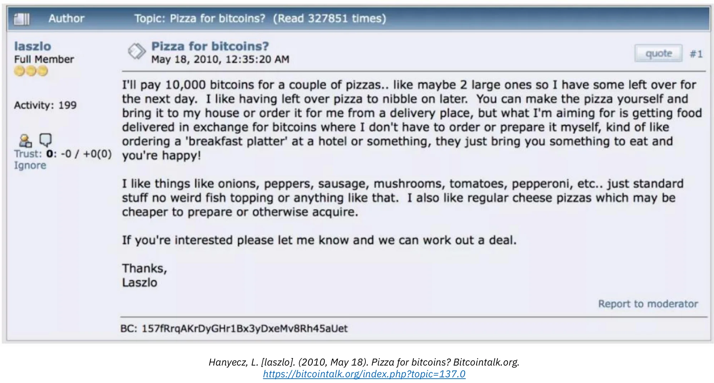


### Изчезването на Сатоши Накамото


През 2010 г., когато биткойн започва да привлича вниманието на медиите, Сатоши решава да се дистанцира, като обявява напускането си в публикация във форума на 12 декември 2010 г. На 23 април 2011 г. той прави последния си известен личен обмен по имейл, след което изчезва, оставяйки творението си в ръцете на общността.


> "Правителствата са добри в отрязването на главите на централно
> контролирани мрежи като Napster, но чисти P2P мрежи като
> Gnutella и Tor изглежда могат да се справят сами." - Сатоши Накамото

Въпреки отсъствието на Сатоши, Биткойн продължава да се разработва: историята на Биткойн се пише на всеки 10 минути, а протоколът продължава да функционира и до днес по предназначение. Независимо от всеки страх, несигурност или съмнение, Биткойн продължава да се движи напред, с много силна онлайн наличност. Всъщност, според този [уебсайт](https://bitcoinuptime.com/), Биткойн е функционирал и е работил без масови проблеми през 99,988% от времето, откакто е създаден.


За някои Биткойн се определя като гъбично образувание, подобно на [мицел](https://brandonquittem.com/bitcoin-is-the-mycelium-of-money/), докато други го описват като [черна дупка](https://dergigi.com/). Обичан или мразен, Биткойн продължава да съществува, с постоянния си ритъм от 10 минути на блок, като сърцебиене на нова парична система.


За да научите повече за писанията на Сатоши Накамото, препоръчваме да прочетете ["Книгата на Сатоши"](https://planb.academy/en/resources/books/98) от Фил Шампан или документалния филм на ARTE "Le mystaire Satoshi".


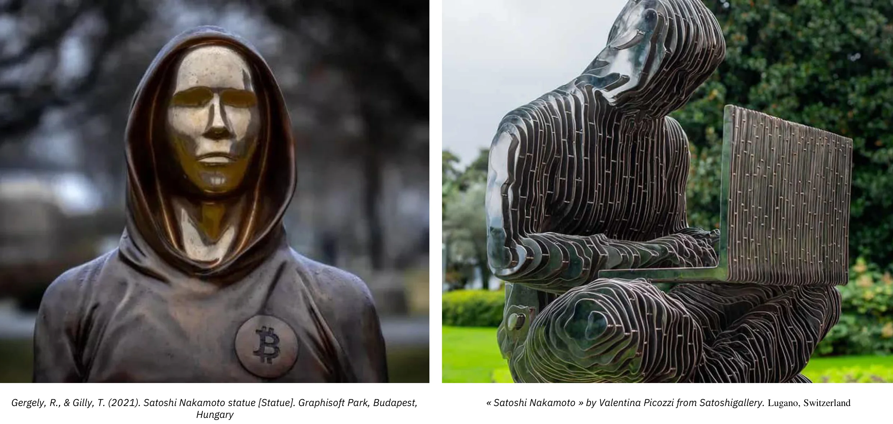


> "Основният проблем на конвенционалната валута е доверието, което се изисква, за да функционира. Трябва да се вярва на централната банка, че няма да обезцени валутата, но историята на фиатните валути е пълна с нарушения на това доверие. На банките трябва да се вярва, че ще съхраняват парите ни и ще ги прехвърлят по електронен път, но те ги отпускат на вълни от кредитни балони, като едва ли имат и частица в резерв." - [Сатоши Накамото](https://satoshi.nakamotoinstitute.org/posts/p2pfoundation/1/)

Сега, след като вече имаме известна информация, нека разгледаме как работи транзактирането с биткойн като цяло.


## Транзактиране с биткойни


<chapterId>03482644-5473-590b-975b-b43bb65eac21</chapterId>


Биткойн транзакцията е прехвърляне на собственост върху биткойни чрез използване на биткойн адреси. За да опишем този процес, нека представим двама главни герои: Алиса и Боб. Aлиса желае да придобие биткойни, докато Боб вече притежава някои от тях.


### Стъпка 1 - Създаване на транзакция чрез портфейл


За да може Боб да прехвърли биткойни на Aлиса, тя трябва да му предостави един от своите адреси, които са уникални за нейния биткойн портфейл. Точно както частният ключ се използва да създаде публичен ключ, последният след това се използва да създаде адреси.


По-конкретно, когато Aлиса отвори своя портфейл и натисне "получавам", ще се покаже QR код или адрес (като този bc1q7957hh3nj47efn8t2r6xdzs2cy3wjcyp8pch6hfkggy7jwrzj93sv4uykr). Това служи като своеобразен "биткойн IBAN", който тя предоставя на Боб.


След това Боб извършва транзакция, като отваря своя биткойн портфейл и натиска "изпрати". След това той копира и вмъква адреса на Aлиса в изискваното поле, добавя сумата, която иска да изпрати, и взема решение за таксите за транзакцията, които служат като стимул за миньорите да включат транзакцията в следващия блок. Всъщност колкото по-високи са таксите, които Боб плаща, толкова по-големи са шансовете му транзакцията да бъде включена в следващия блок, добавен към блокчейна, т.е. публичната и неизменна счетоводна книга, в която се записват всички транзакции на Биткойн.


За да финализира транзакцията, Боб трябва да я подпише със своя частен ключ, за да потвърди, че е собственик на биткойните, които иска да прехвърли. Тази стъпка обикновено е автоматична при мобилните портфейли или е под формата на потвърждение на вашия физически портфейл: "Сигурни ли сте, че искате да изпратите X на Y? Да или не".


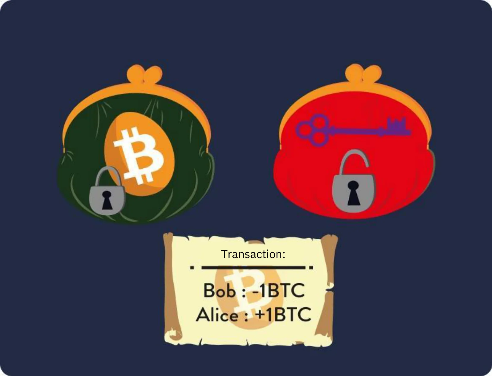


**Защо плащаме такси?** Таксите са от съществено значение за създаването на свободен пазар за включване на трансакции в блокове. Всъщност размерът на блока е 1 MB (след обновяването на Segwit той беше увеличен на 4 MB), така че броят на транзакциите, които могат да бъдат "вмъкнати" в блока, е ограничен до няколко хиляди транзакции на блок. Размерът на транзакцията зависи от нейната сложност. Поради това за по-сложните трансакции обикновено се начисляват по-високи такси.


### Стъпка 2: Разпространение на транзакцията чрез възлите


На този етап транзакцията е създадена и портфейлът на Боб ще я сподели с мрежата. За тази цел неговият портфейл ще се свърже с възел от мрежата, който ще разпространи тази информация до други възли. Този вид процес позволява на цялата мрежа да види тази нова транзакция и да я вземе под внимание.


В този момент, въпреки че тази транзакция е известна на всички (чрез инструмент, наречен Mempool), тя не може да се счита за потвърдена, докато не бъде вкарана в блок от миньор, който е единственият, който потвърждава транзакциите, като ги включва в блокчейна.


Всъщност миньорите имат задачата да събират валидни и непотвърдени транзакции, за да ги съставят в блок. Накратко, те трябва да решат криптографски пъзел в процес, наречен "доказателство за работа", за да може техният блок да бъде следващият в блокчейна.


### Стъпка 3: Транзакцията се добавя в блок от миньор.


Системата за "доказване на работа" изисква намирането на валиден "хеш" за въпросния блок: представете си го като уникален пръстов отпечатък, свързан с блока, съставен от 256 символа. Валидността на този хеш зависи от степента на трудност на мрежата Биткойн (ще навлезем в повече подробности по-късно). Засега считайте, че един миньор е намерил валиден блок и че транзакцията на Боб към Aлиса е включена в него. След това новият валиден блок се добавя в блокчейна - общата счетоводна книга за всички потребители на биткойн.


### Стъпка 4: Блокът е валиден и се проверява от референтния възел на Алиса.


На този етап транзакцията се счита за валидна: след това миньорът ще разпространи новия блок в мрежата чрез своя възел и портфейлът на Алиса ще бъде актуализиран.


**Забележка:** Дори Алиса да бъде уведомена, че е получила биткойни на един от своите адреси, препоръчително е да считате транзакцията за непроменима едва след като е получила **шест** потвърждения. Това означава, че върху блока, съдържащ транзакцията на Боб, трябва да се изкопаят още шест блока. С други думи, колкото по-стара е една транзакция в блокчейна, толкова по-неизменна става тя.


### Какво е значението на този процес?


Системата за транзакции с биткойн е децентрализирана и работи по принципа "peer-to-peer", без доверени посредници.


Боб изпраща транзакцията си в мрежата на Биткойн и когато миньор публикува валиден блок, съдържащ транзакцията на Боб, Алиса може да започне да смята, че биткойните принадлежат на нея. Доверие не се изисква на нито един етап от прехвърлянето на собствеността върху биткойните: правилата на протокола и икономическите стимули сами по себе си правят злоумишлените действия в системата биткойн прекалено скъпи.


Всъщност потребителите прехвърлят собствеността върху средствата си чрез цифрово подписване на трансакциите със собствените си частни ключове. От друга страна, миньорите притежават ограничена власт, а потребителите поддържат значителен контрол, като използват възли биткойн за валидиране на новите блокове и включените в тях транзакции. Всеки възел разполага с пълно или частично копие на счетоводната книга, така че мрежата, формирана от възли, прави системата наистина децентрализирана.


В резултат на това, за да бъде напълно унищожена мрежата Биткойн, трябва да бъде премахнато всяко копие на блокчейна на всички възли, което е практически невъзможна задача поради географското разпределение на тези възли и трудността те да бъдат физически иззети.


Нека разгледаме по-отблизо как работи един възел.


## Биткойн възли


<chapterId>8533cebc-f799-528b-89df-8d75d4c37f1c</chapterId>


Възлите са основен елемент от архитектурата на мрежата, тъй като изпълняват различни важни функции:


- Поддържане на копие на блокчейна на Биткойн
- Потвърждаване на транзакции
- Предаване на информация към други възли
- Прилагане на правилата на протокола на Биткойн.


Следователно всяко устройство, работещо с част от софтуера на Биткойн, наречено възел (често използващ [Bitcoin Core](https://bitcoin.org/en/bitcoin-core/)), допринася за децентрализацията на мрежата.


### Възлите са централното ядро на Биткойн.


Всеки възел притежава копие на блокчейна, което позволява проверка на транзакциите и предотвратява всякакви опити за измама. Децентрализираният характер на мрежата дава на биткойн изключителна устойчивост и надеждност. Всъщност, за да се спре протоколът на Биткойн, би трябвало да се изключат всички възли по света. Към септември 2023 г. има приблизително [45 000 възела](https://bitnodes.io/nodes/all/), разпределени по целия свят.


Възлите са в състояние да проверяват валидността на блоковете и транзакциите, тъй като следват консенсусните правила. Тези правила определят паричната политика на Биткойн, като например размера на възнаграждението на миньорите (което ще обсъдим по-подробно в следващия раздел) и количеството биткойни в обращение. В известен смисъл възлите действат като правната система на мрежата, тъй като те налагат правилата на Биткойн, поддържайки неутралността на мрежата. Правилата за консенсус почти не се променят, ако изобщо се променят, защото за да се направят промени, е необходимо одобрението на всички възли.


Управлението в рамките на протокола е извън обхвата на този основен курс, но е важно да се отбележи, че всеки потребител, който управлява възел, може да реши кои правила да следва. Даден потребител може да реши да се придържа към различни правила (т.е. да направи промени в кода), но ако тези промени обезсилват действащите правила за консенсус, този възел вече няма да бъде част от мрежата. Следователно големите модификации са рядкост и изискват значителна координация между хиляди участници с различни идеологии и интереси, което ги принуждава да предоставят актуализации, които се считат за "по-добри" от всички потребители на Биткойн.


### Как изглежда един възел?


Когато искате да инсталирате собствен възел, има няколко варианта с различни разходи за поддръжка. Можете просто да стартирате софтуера на Bitcoin Core на компютъра си, но това ще изисква значително количество място за съхранение, тъй като блокчейнът е около ~500 GB. За да преодолеете това ограничение, можете да изберете да запазите в паметта само последните N блока, като създадете "pruned node" или олекотен възел. За това второ решение разходите са пренебрежимо малки, тъй като възелът е активен само когато имате нужда от него.


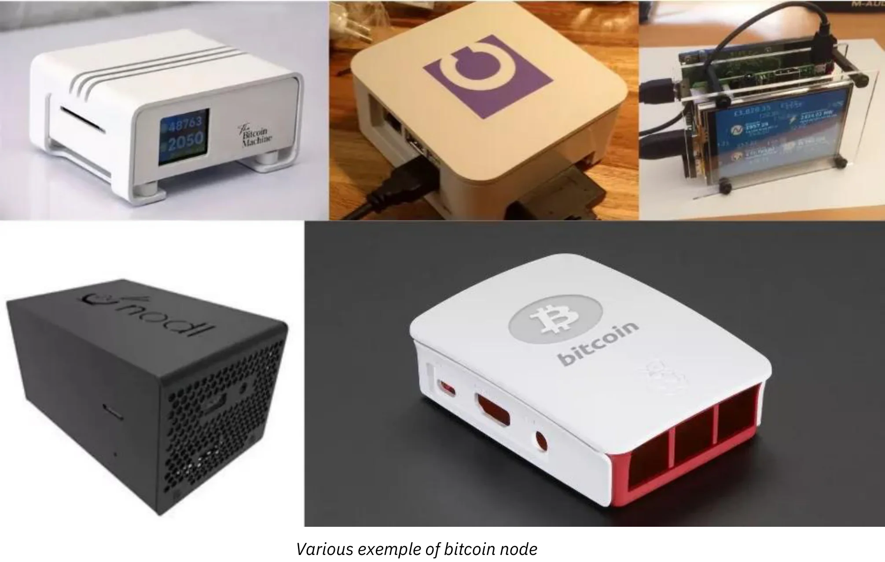


Вторият вариант е да използвате специален хардуер за тази цел, например Raspberry Pi 4 с достатъчно голям SSD диск (около ~2 TB). Тази друга опция е по-скъпа, ако трябва да закупите хардуера, но представлява малко по-малко от 10,00 EUR на година по отношение на потреблението на електроенергия.

От гледна точка на широчината на честотната лента, като се има предвид 1 блок от 1 MB на всеки 10 минути, това съответства приблизително на 5 GB на месец.


### Възлите трябва да останат достъпни за всички!


Достъпната цена по отношение на хардуерните ресурси, съхранението и широчината на честотната лента е много важна характеристика, тъй като улеснява децентрализацията на мрежата.


Всъщност всеки има основателна причина да управлява възел! Разходите и усилията са минимални в сравнение с получената полза. Просто трябва да се впуснете в приключението и да се присъедините към хиляди други биткойнъри, за да създадете заедно мрежата на Биткойн.


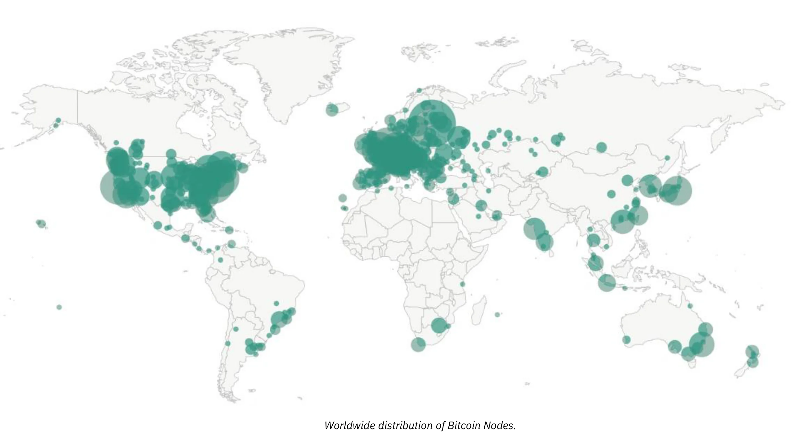


Напротив, ако блоковете бяха 100 пъти по-тежки, със сигурност щяхме да можем да извършваме 100 пъти повече транзакции на всеки 10 минути, но за работата на един възел щеше да е необходим твърд диск с капацитет 50 TB, пропускателна способност над 500 GB/месец и хардуер, способен да валидира стотици хиляди транзакции за по-малко от 10 минути. В тази хипотетична ситуация със 100 пъти по-големи блокове управлението на възел не би било достъпно за обикновения човек, което би компрометирало както децентрализацията на протокола, така и неизменността на транзакциите и правилата за консенсус.


По този начин ограниченията на протокола са разработени така, че да позволят на възможно най-много хора да управляват свои собствени възли. Всъщност 2017 г. беше белязана от интензивна полемика, известна като "block size war" или война за големината на един блок. Този конфликт противопостави тези, които искаха да модифицират Биткойн, като увеличат размера на блоковете, за да увеличат капацитета на транзакциите (миньори, борси и институции), на тези, които се стремяха да запазят независимостта и властта на потребителите (възли). В крайна сметка втората страна триумфира.


След тази победа възлите активираха актуализация, наречена SegWit, с което проправиха пътя за въвеждането на Светкавичната мрежа - мрежа за незабавни плащания с биткойн, изградена като втори слой на блокчейна. Тази ситуация показва, че потребителите, чрез своите възли, притежават реална власт в рамките на Биткойн, което им позволява да се противопоставят на големите институции в моменти на несъгласие.


## Миньори


<chapterId>dbb8264a-7434-57e4-9d1b-fbd1bae37fdf</chapterId>


**Миньорите защитават мрежата и добавят транзакции към блоковете. Те изразходват електричество чрез [ASIC](https://planb.academy/resources/glossary/asic) машини, за да следват консенсус механизма "доказателство за работа".**


### Обяснение на "доказателство за работа"


"Proof of Work" (PoW), преведено като "доказателство за работа", е консенсусният механизъм за сигурност на протокола Биткойн. Той е в основата на всичко и играе ключова роля в теорията на игрите на Биткойн.


За да обясним как работи, представете си универсална лотария, в която всеки може да участва. Целта е да се намери определено число, което да позволи на победителя да подпише валиден блок, печелейки награда в биткойн. Това число е много лесно за проверка с помощта на хеш-функцията SHA-256, но е трудно за намиране: участниците (миньори) ще изпробват милиарди и милиарди възможности, като например 1, 52, 2648, 26874615, 15344854131318631 и т.н., докато открият правилната.


Ако избраното число е правилно: Джакпот! В противен случай търсенето продължава.

За да оптимизират броя на опитите, те използват специални машини, наречени ASIC, които имат единствената задача да изчисляват милиарди възможности в секунда (общото количество опити се нарича "хашрейт"). За да работят тези машини, трябва да се консумира голямо количество електроенергия. Ето защо PoW трансформира енергията във валута, като свързва реалния и цифровия свят, за да създаде първата валута, базирана на енергията.


Машините работят непрекъснато и след средно 10 минути се излъчва победител: този участник успешно е намерил правилния хеш, който е под прага на трудност. След това този единствен победител подписва новия блок на сървъра за времеви печати, като го добавя към блокчейна. Те получават наградите си и се връщат, за да опитат късмета си в копаене на следващия блок. Този процес продължава вече повече от десет години, като на всеки 10 минути един победител потвърждава транзакциите в биткойн, като същевременно подсигурява и миналите транзакции, като по този начин прави блокчейна на Биткойн по-стабилен и сигурен.


На всеки 2016 блока (приблизително на всеки две седмици) **корекцията на трудността** възстановява баланса на глобалното копаене в зависимост от броя на участниците. Тази корекция е необходима, тъй като броят на миньорите и тяхната комбинирана изчислителна мощност може да варира значително с течение на времето. За да се поддържа целевото време за добив на блокове, мрежата калибрира отново нивото на трудност въз основа на това колко бързо са били добити последните 2016 блока. Ако те са били добити твърде бързо, трудността се увеличава, което затруднява намирането на правилния хеш. Напротив, ако те са били добивани твърде бавно, трудността намалява, което улеснява задачата.


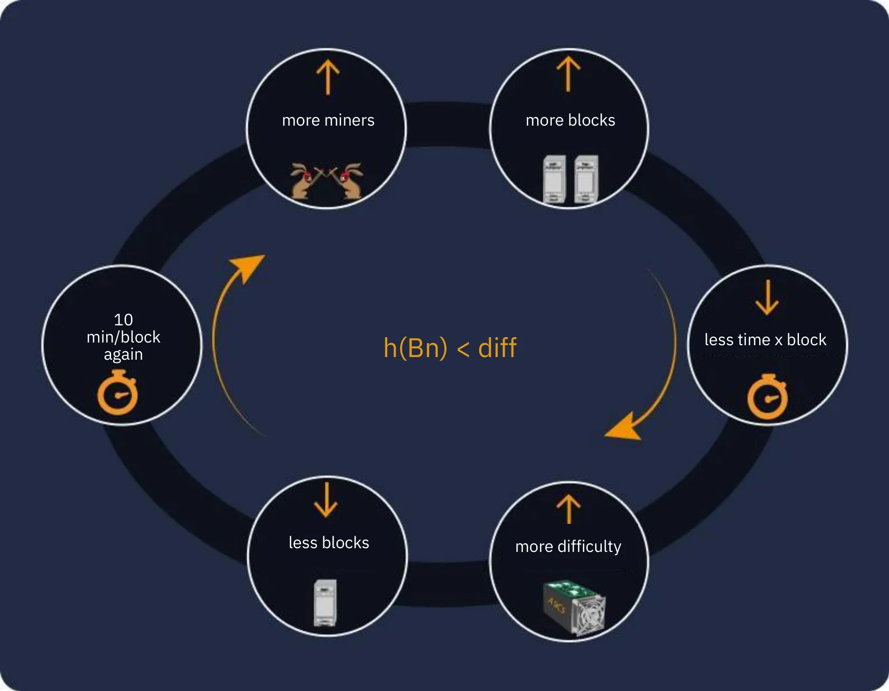


### Копаенето се развива непрекъснато


С течение на годините миньорите са се оборудвали с все по-ефективен компютърен хардуер, за да произвеждат възможно най-много хешове в секунда (хашрейт), като същевременно консумират най-малко енергия по възможно най-рентабилния начин. Първите миньори, като Сатоши или Хал Фини, копаеха само с мощта на процесора си, а след това други започнаха копаене с видеокарти. В днешно време миньорите използват ASIC (Application-Specific Integrated Circuit): машини, предназначени единствено за прилагане на алгоритъма SHA256.


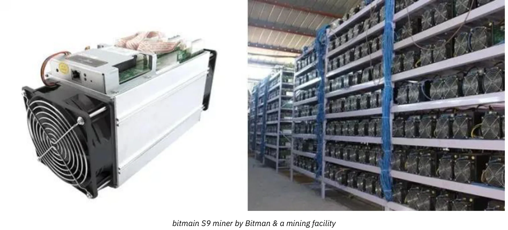


Хашрейтът на мрежата на Биткойн представлява броят на опитите за намиране на следващия блок, направени за секунда. Днес той надхвърля 500 TH/s, което е 500 000 милиарда опита в секунда! Колкото по-висок е глобалният хашрейт, толкова по-трудно е за един злонамерен участник да монополизира ресурсите, необходими за получаване на по-голямата част от мощността на копаене, и да изразходва средствата си повече от веднъж (проблем с двойното изразходване). Следователно е икономически по-изгодно да се спазват правилата на протокола Биткойн, отколкото да се действа против тях.


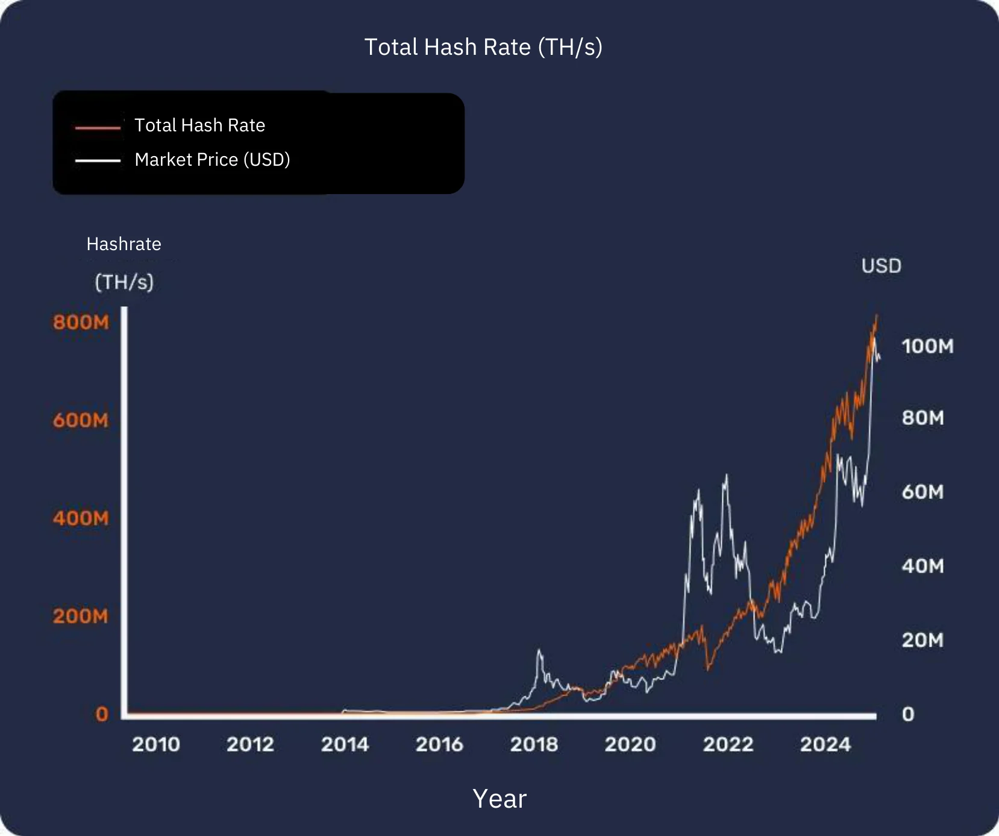


### Какво може да се намери в един блок?


Заглавието на блока съдържа няколко елемента, като например времето, целта на трудността, номера на последния блок, използваната версия и коренът на Меркъл с предишните транзакции.


Така наречената транзакция **coinbase** винаги е първата транзакция, включена в блока: тя съдържа възнаграждението на миньора за извършване на работа. След това идват валидираните транзакции. Миньорите ще изберат да включат трансакциите, които им носят най-голяма печалба, а именно трансакции с малък размер и максимални такси.


### Компенсация за миньорите


Първоначално миньорът получава компенсация, когато намери валиден блок. По-конкретно, те се възнаграждават по два начина:


- чрез субсидията (новоизпечени биткойни), включена в блока;
- чрез такси за транзакции от транзакциите, включени в блока.


Размерът на субсидията се определя от консенсусните правила и зависи от епохата: **възнаграждение за новоизкопан блок = субсидия за блок + такси за транзакция**.


За първите блокове субсидията за новоизкопан блок беше 50 биткойна. На всеки 210 000 блока (приблизително на всеки 4 години) тази сума се намалява наполовина. Днес (през 2024 г.) се намираме в 5-та епоха, което означава, че субсидията е 3,125 биткойна. Накратко, това е автоматичният механизъм, който освобождава нови биткойни в системата. Субсидията намалява с времето, докато достигне лимита за емитиране от 21 млн. биткойна. В обращение вече са над 19.4 млн. биткойна, което представлява над 92%.


Вторият метод на компенсация се определя от сумата, избрана от потребителите за такси за трансакции, които показват спешността на потребителя да включи своята трансакция в следващия блок. Тъй като миньорите искат да максимизират приходите си, те ще са склонни да дават приоритет на трансакциите с високи трансакционни такси.


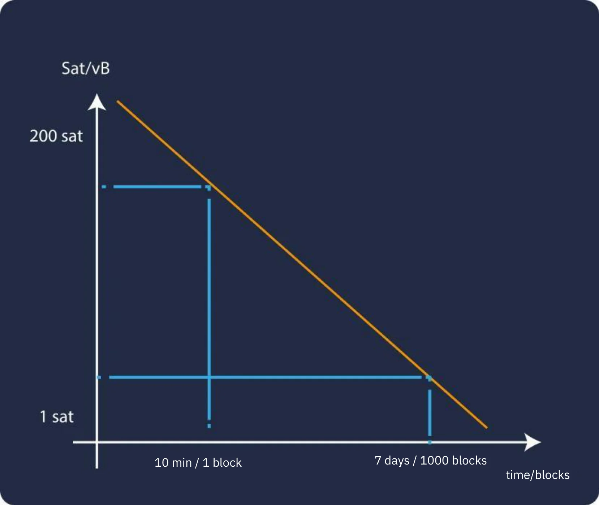


За да стабилизират бизнес модела си, който разчита на възнагражденията, които получават за всеки валиден блок, миньорите често създават групи чрез "миньорски басейни", в които обединяват изчислителните си ресурси.


### Защо да се занимаваме с всичко това?


Накратко, нововъведението на Биткойн се състои в това да предложи решение на проблема с двойното харчене чрез използването на блокчейн, базиран на Proof-of-Work с плаваща трудност. В цифровия свят концепцията за собственост се различава от тази във физическия свят. Всъщност в цифровия свят всичко може да бъде копирано и вмъкнато, което създава риск от използване на цифрови активи със стойност повече от веднъж, или двойно харчене. Създадени са надеждни посредници, като например банките, за да решат този технологичен проблем и да гарантират, че когато даден актив бъде прехвърлен, той вече не принадлежи на изпращача.


Но как може да се направи това без доверен посредник? Този проблем е добре описан чрез парадокса на византийските генерали - проблем за координиране на информацията в система, в която на различните участници не може да се има доверие. В проблема на византийските генерали група генерали трябва да координират нападение срещу град, но някои от тях може да са предатели, които се опитват да нарушат плана. Предизвикателството е лоялните генерали да постигнат консенсус дали да атакуват или да се оттеглят, въпреки че получават потенциално подвеждащи съобщения от предателите.


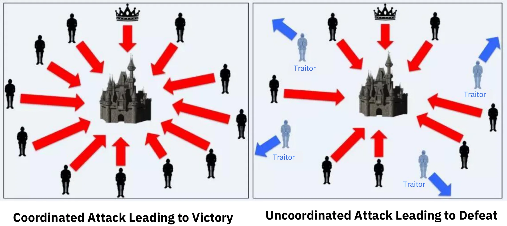


Следователно Биткойн е своеобразно решение на този проблем или поне начин да го заобиколим. "Генералите" на Биткойн, или миньорите, създават блокове (с информация), а възлите на Биткойн проверяват финансовите транзакции, като използват консенсусни правила, за да гарантират автентичността на информацията. Асиметрията в енергийните разходи между производството на информация и проверката гарантира надеждността на информацията, без да е необходима доверена трета страна.


Миньорите са създателите на мрежовата сигурност. Като изразходват енергия за производство на хешове, те изграждат стена, която прави изключително скъпо за злонамерен агент да пренапише историята на трансакциите, и този икономически стимул възпира другите да се държат нечестно.


Дори в случай на 51%-ова атака, при която един агент притежава повече от половината хашрейт, мрежата ще остане сигурна, тъй като нападателят трябва да изразходва толкова енергия, колкото всички миньори заедно, за да се опита да модифицира блокчейна. Този енергоемък механизъм proof-of-work е това, което гарантира сигурността на мрежата.


### В обобщение


Теорията на игрите, приложена към Биткойн, елиминира нечестните миньори, които използват ASIC машини, за да добиват и да получават възнаграждение в случай на успех. Освен това те често се присъединяват към миньорски басейни, за да споделят изчислителната си мощ и да получават по-малки, но по-редовни награди. Въпреки че биткойн копаенето е високи разходи за енергия, тя е от решаващо значение за функционирането и сигурността на мрежата. Механизмът proof-of-work и блокчейн технологията решават проблема за двойното харчене и гарантират целостта на информацията, без да разчитат на доверена трета страна. Въпреки че създаването на информация изисква значителни енергийни разходи, проверката на тази информация е свързана с незначителни разходи. Тази асиметрия засилва сигурността на мрежата, като прави по-икономически изгодно придържането към правилата на консенсуса, вместо опитите за тяхното нарушаване.


Ако искате да навлезете по-дълбоко в конкретната тема за биткойн копаенето, може да погледнете нашия курс MIN201. Ще откриете функционирането и ролята на Proof-of-Work, както и механиката на миньорската индустрия. Също така обясняваме как да превърнете ASIC в нагревател, което ще ви позволи да добиете първите си сатоши, докато отоплявате дома си!


https://planb.academy/courses/ce272232-0d97-4482-884a-0f77a2ebc036

## Биткойн и екология


<chapterId>4b227ae6-443a-5739-b443-60b7931130d9</chapterId>


В предишния раздел разбрахме, че сигурността на протокола Биткойн се основава на висока консумация на енергия за създаване на публична счетоводна книга на транзакциите без доверена трета страна. В масовите медии общите разходи за енергия често се сравняват с потреблението на електроенергия в малка държава. Но има ли смисъл това сравнение? Уместно ли е да се разберат причините, които стоят зад тези разходи?


### Енергийни разходи за биткойн.


Първо, нека да оценим качествено екологичната цена на копаенето. Един миньор трябва да разполага с машина като ASIC и източник на енергия под формата на електричество, за да задвижва тези машини. ASIC са изработени предимно от алуминий и могат да бъдат рециклирани или използвани повторно за втора цел (както показва проектът Attakaï, описан в нашия курс MIN201), който превръща Antminer S9 в отоплителен уред). Следователно основният проблем е потреблението на енергия.


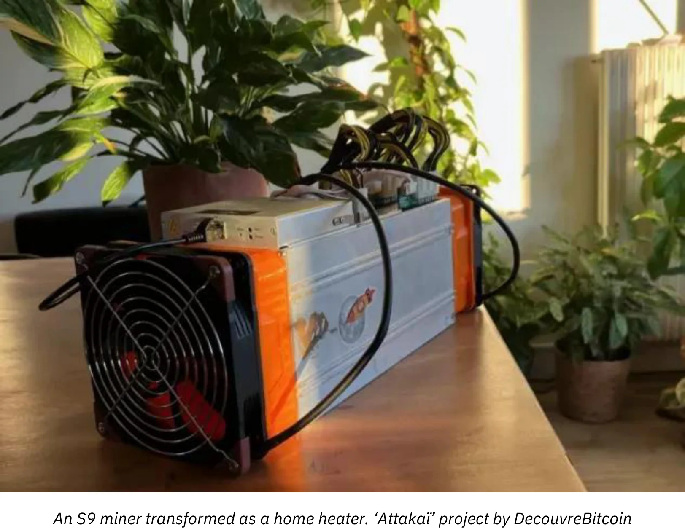


Консумацията на електроенергия представлява почти всички разходи на един миньор. Ето защо те се насърчават да намерят евтин източник на електроенергия, за да могат да отидат на места, където са инсталирани електроцентрали, но все още не са свързани с електрическата мрежа на територията. В този случай миньорите действат като купувач от последна инстанция, което позволява на електроцентралите да си осигурят финансиране още преди да бъдат свързани към електрическата мрежа. Когато те бъдат свързани, търсенето на електроенергия ще се увеличи, което ще повиши цената и ще направи по-малко изгодно за миньорите да се снабдяват с електроенергия на тези места. Тъй като машините могат лесно да бъдат премествани, тогава миньорите ще решат да вземат инсталацията си и да се установят по-далеч, където търсенето е ниско, както и цената, най-често в райони, където могат да получават енергия от зелени електроцентрали.


### Безкраен дебат


Следователно дебатът относно екологичното въздействие на Биткойн често е погрешен, главно поради недостатъчното разбиране на неговата полезност. Биткойн не може да бъде оценена просто по отношение на енергийните разходи за транзакция, тъй като миньорите осигуряват както текущата, така и историческата мрежа, а транзакциите са групирани и не всички са еквивалентни. Освен това въздействието на Светкавичната мрежа дори не е взето предвид. Тези, които твърдят, че Биткойн консумира твърде много енергия, може да имат политически мотиви или да се стремят да продадат свое собствено блокчейн решение. Много пъти екологичният претекст се използва, за да се оправдае забраната на Биткойн.


Важно е да се подчертае, че Биткойн, като революционно изобретение, предоставя на хората, живеещи под финансово потисничество или диктаторски режими, средство да се борят за свободата си. В краен случай Биткойн предлага път към финансова независимост чрез заобикаляне на цензурата и банковите ограничения. Повече от валута, биткойн служи като форма на комуникация и символ на свободата, а енергията, изразходвана от миньорите, играе решаваща роля в защитата на тази свобода, позволявайки еманципация от финансова система, доминирана от дългове и прекомерно създаване на пари от централните банки.


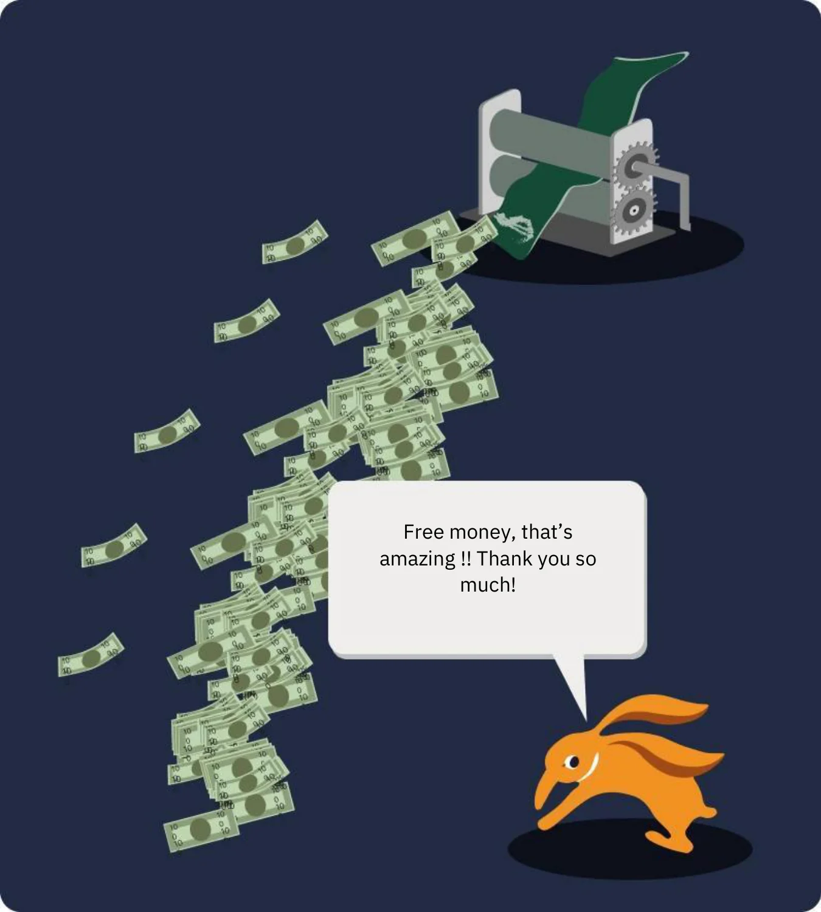


За хората, живеещи в страни с високи нива на инфлация, биткойн е въпрос на оцеляване. Той осигурява средства за оцеляване в несигурни финансови ситуации. Освен това Биткойн предлага по-справедлива и безпристрастна финансова система, която осигурява на милиарди хора по света достъп до финансови ресурси. От тази гледна точка оправдано ли е потреблението на енергия?


### Биткойн може да бъде положителен за околната среда


Накрая е важно да се обсъдят икономическите и екологичните последици от приемането на биткойн.


В сравнение с настоящата финансова система, последната, поради насърчаването на свръхпотреблението и задлъжняването, създава сериозни проблеми. Фактори като лесния достъп до кредити, паричното емитиране от страна на банките и практиката на банкиране с частични резерви допринасят за свръхзадлъжнялост и в резултат на това - за прекомерно потребление.


Необходимо е да се реформира паричната система, за да се отрази оскъдността на нашите ресурси с оскъдността на нашата валута. Това ще насърчи по-отговорното потребление и дългосрочната визия. Обратно, инфлацията, като насърчава потреблението и инвестициите, има отрицателно дългосрочно въздействие върху околната среда.


Настоящата финансова система съответства на идеите на кейнсианската икономика, която, за разлика от Австрийската школа, не отчита времевите и динамичните аспекти на ситуациите и ресурсите. С други думи, една неограничена валута не може да представлява ефективно ограничените ресурси на нашата планета.


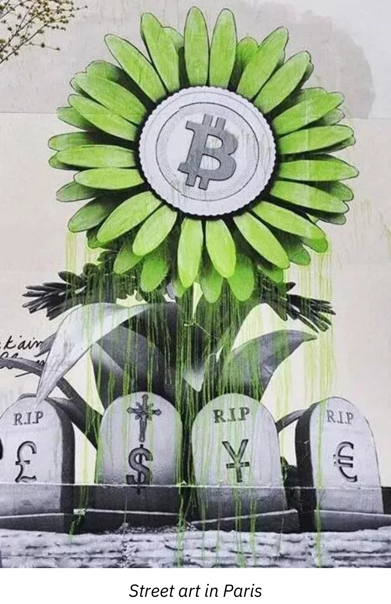


Политиците обикновено имат краткосрочна визия и се нуждаят от икономически растеж, за да бъдат преизбрани, така че не са в състояние да решат екологичните проблеми в дългосрочен план. Приемането на стабилна валута като биткойн е потенциална алтернатива, която би могла да даде икономически възможности на хората.


Критиците не признават, че Биткойн насърчава използването на зелена енергия. Например пламъците, запалени на местата за петролни кладенци, за да се изгори метанът и да се предотврати замърсяването, могат да бъдат потушени от миньорите на биткойн, тъй като метанът може да се превърне в електричество, което да захранва машините за копаене, което е полезно за околната среда.


**Следете една от максимите на биткойн: Не се доверявайте, а проверете сами!**


### Кратко резюме на техническите характеристики на биткойн


Сатоши Накамото пусна протокола Биткойн през януари 2009 г., който оттогава се развива благодарение на нарастващата общност от разработчици, миньори и потребители с възли. Като поддържат свое собствено копие на блокчейна на Биткойн - публична счетоводна книга на всички транзакции в биткойн, тези възли могат да гарантират валидността на транзакциите в съответствие с правилата за консенсус. Това включва гарантиране, че миньорите произвеждат валидни блокове, които съдържат хиляди чакащи транзакции.


Средно на всеки 10 минути се създава блок, а миньорът, който открие валиден хеш за следващия блок, се възнаграждава от протокола както със сума на субсидията, която се определя от правилата за консенсус, така и с таксите за транзакции от всички транзакции, включени във валидния блок. Тъй като резултатът от хеширащия алгоритъм (SHA256) за даден вход се счита за непредсказуем, процесът по копаене включва изграждане на множество кандидат-блокове и тестване дали техният хеш е валиден или не. Въпреки това, за да се гарантира, че средното време между два блока остава постоянно (~10 мин.), независимо от броя на миньорите и тяхната изчислителна мощ, трудността за намиране на валиден хеш се коригира на всеки 2016 блока, приблизително на всеки 2 седмици. С течение на времето миньорите са разработили специализирани машини за SHA256, наречени ASIC, за да увеличат скоростта на хеширане за джаул, което означава броя на опитите за секунда за консумираната енергия.


За да бъдат миньорите възможно най-печеливши от дейността си, те трябва да се снабдяват с възможно най-евтината електроенергия, която често се намира на отдалечени места, в електроцентрали, които все още не са свързани с мрежата. В този случай миньорът действа като купувач от последна инстанция и щом цената на електроенергията се повиши поради нарастване на търсенето, миньорът ще се стреми да премести дейността си на друго място.


По този начин протоколът Биткойн е нечувана и неудържима парична система, тъй като всеки компонент на протокола е разпределен географски по целия свят. Например, има повече от 40 000 биткойн възела на всички континенти. Правилата за консенсус на Биткойн са такива, че е икономически по-изгодно да ги спазваш, отколкото да се опитваш да ги нарушаваш, и затова не се изисква доверие между участниците. Биткойн няма лидер и не може да бъде спрян. Дори ако е възможно да се регулират борсите, за да се ограничи Биткойн, този подход има незначително въздействие върху системата. Накратко, никой съдия или държава не може да цензурира или спре Биткойн.


# Как се получава биткойн?


<partId>517e1bb7-f032-51a0-930a-a91fe5148d3f</partId>


## Биткойн никога не спи!


<chapterId>d5e35e41-ea26-5478-8eb9-07daf9dff508</chapterId>


Цената на биткойн често се характеризира със значителна волатилност. Нейната стойност може да се колебае значително в зависимост от пазарните колебания или от бичи и мечи фази, подобно на всеки друг финансов пазар.


Казано по-просто, хората са склонни да купуват всичко наведнъж и да продават всичко наведнъж. **Биткойн не е имунизиран срещу човешката природа**


### Разбиране вълните на адопцията


Както развитието, така и еволюцията на Биткойн са до голяма степен свързани с различните групи участници, които постепенно са се включили в неговата екосистема.


- Вярващите:


Първите потребители на Биткойн бяха предимно технофили, шифърпънкове, либертарианци и любители на златото. Тези групи бяха привлечени от него заради стойността му като електронни пари без нужда от доверие, устойчивостта му на цензура и прозрачната му, неизменна парична политика.


- Тъмната мрежа и престъпниците


След това употребата на биткойн се разпространи в тъмните интернет пазари като Silk Road, до голяма степен поради неконтролируемия и псевдонимен характер, който привлече и лица извън тази платформа, включително някои хора, занимаващи се с престъпни дейности. Важно е обаче да се подчертае, че законността се определя от приложението на даден инструмент, а не от самия инструмент. Незаконното използване на биткойн не превръща по своята същност някого в престъпник; по-скоро конкретните действия могат да бъдат класифицирани като незаконни. Например използването на биткойн за закупуване на определени наркотици може да бъде законно или незаконно в зависимост от разпоредбите, регулиращи територията, на която се извършва сделката.


- Манията по ICO и появата на широката публика.


2017 г. беше белязана от значителен спекулативен балон в света на криптовалутите, особено с пускането на хиляди първични предлагания на койни (ICO). Много от тези нови криптовалути обаче нямаха конкретно развитие или полезност и бързо изчезнаха. Този балон през 2017 г. беше последван от силна корекция през 2018-2019 г.


- Балонът на NFT и децентрализирани финанси


През 2020 г. пазарът преживя друг спекулативен балон, който повиши цената на биткойн до 60 000 USD. Този балон се различаваше от предишните поради по-широката диверсификация на инвеститорите, включително финансови институции и големи корпорации. Въпреки това, както и при предишните балони, след отшумяването на първоначалната еуфория обикновено следват значителни корекции.


### Биткойн и променливост


Въз основа на минали цикли изглежда, че периодичността на икономическите цикли на биткойн е еквивалентна на продължителността между две половинчавания, може би защото събитието на половинчаването действа като спусък, като намалява наполовина емисията на нови биткойни.


Тези значителни колебания са спечелили на биткойн репутацията на силно променлив актив, което често води до значителни загуби за неговите потребители. Въпреки че цената може да спадне с 10%, 20% или дори 50% в рамките на няколко дни, важно е да се разбере, че самият протокол Биткойн не се влияе от ценовите промени.


Тази значителна волатилност днес се приема напълно от участниците в Биткойн и може да бъде смекчена чрез няколко решения, като например финансово хеджиране, силна дългосрочна вяра или просто избягване на риска от инвестиране на 100% от средствата в биткойн без солидно разбиране. Ето защо разбирането на причините за толкова големите колебания в цената на биткойн е от съществено значение за напредъка в тази индустрия, тъй като в крайна сметка именно ценовите движения и цикли помагат за успокояването и регулирането на пазара до известна степен. Въпреки това е важно да се отбележи, че с нарастването и узряването на биткойн, колебанията стават по-малко влиятелни.


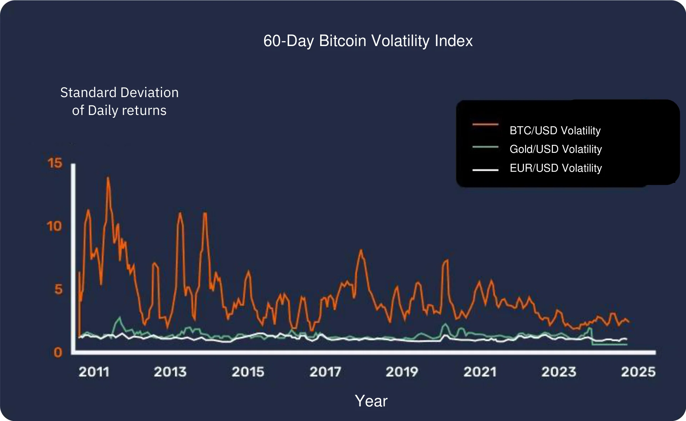


Въпреки че двойката BTC/USD се колебае в краткосрочен план, биткойнът, поради ограниченото си количество от 21 милиона биткойна и т.нар. халвинг (разполовяване количеството на новосъздадени биткойни средно на всеки 4 години), следва обща възходяща тенденция по квазимеханичен начин. Разбира се, както всеки финансов актив, биткойнът е обект на икономически цикли, включително периоди на еуфория, спекулативни балони и корекции. Това явление е доста често срещано при нововъзникващите технологии, където пазарът невинаги е рационален или ефективен.


### Уникален пазар


Тези цикли на спекулативни балони са доста уникални в света, тъй като рядко се случва един актив да преживее такава поредица от последователни балони. Този феномен може да се обясни с факта, че биткойн не е просто балон, който трябва да се спука. По-скоро той функционира като валута, която се използва активно по целия свят. Протоколът Биткойн се отличава със способността си да функционира в глобален мащаб, 24 часа в денонощието, 7 дни в седмицата, което поставя значителни предизвикателства пред финансовите органи, опитващи се да го регулират.


Днес биткойн продължава да оцелява и да се разраства още повече, като се интегрира все повече в традиционния пазар, а въвеждането на биткойн борсово-търгувани фондове, по-ясните разпоредби и подобрените инструменти за придобиване и съхранение допринасят за тази положителна динамика. Биткойн ЗАЕДНО преживя своя спекулативен балон, така че може би все пак не е само горещ въздух!


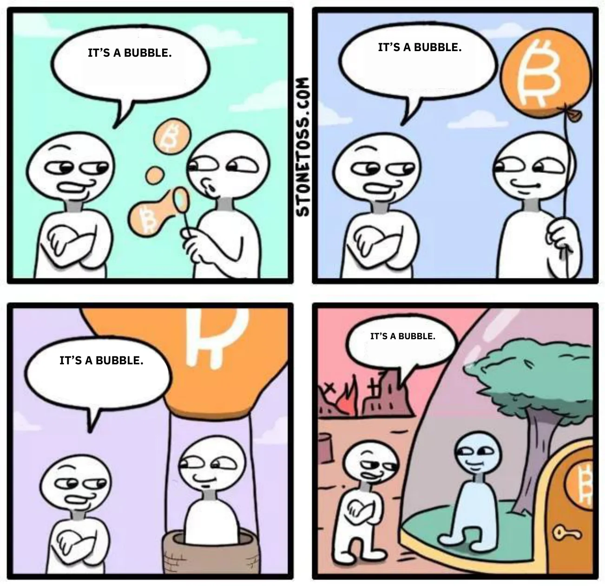


## Получаване на биткойни чрез работа


<chapterId>be2d83be-406f-582c-83ca-6aa905ff7b04</chapterId>


### Развива се паралелна икономика


Биткойн може да се разглежда като инструмент за създаване на паралелна икономика на фиатните валути, тъй като е възможно да се продават стоки или услуги и да се плаща в биткойни. Сделките могат да се извършват директно в биткойн, без да е необходимо да се минава през платформа за обмен, а просто да се преминава от биткойн портфейл към друг.


Икономиката на биткойн съществува и се развива в някои региони на света, като например в Ел Салвадор, където биткойн стана законно платежно средство през 2021 г. За съжаление, на 2025 г. януари Народното събрание прие нов закон, с който биткойн беше лишен от титлата "законно платежно средство", уж след като е получил известен натиск от Международния валутен фонд. Съгласно новия закон хората вече не са задължени да приемат биткойн в бизнеса си и не могат да плащат данъци с него. Приемането му остава доброволно.


Въпреки това в Ел Салвадор и в други части на света има все повече физически лица, фирми и организации, които приемат биткойн като средство за плащане на своите продукти или услуги.


*Източник : [Wicked Smart Bitcoin](https://wickedsmartbitcoin.com)*

Освен това беше стартиран съвместен проект с отворен код [BTCMap](https://btcmap.org/map#2/21.28937/5.46680), за да се улесни използването на биткойн в ежедневните транзакции. В тази платформа са изброени всички търговци, които приемат биткойн, както и различните общности на биткойн по света, така че можете да посетите техния уебсайт, за да откриете екосистемата на биткойн около вас. Така, въпреки трудностите и колебанията, съществуват инициативи като BTCMap, които допринасят за това икономиката на биткойн да стане по-достъпна и удобна за всички.


### Защо трябва да приемаме биткойн за стоки и услуги, вместо да го купим?


За да се сдобиете с биткойни, можете да ги закупите от платформи, регулирани от организации като AMF (Autorité des Marchés Financiers) във Франция или Securities & Exchange Commission (SEC) в САЩ, но това решение е свързано с проследяване на вашите транзакции. Друг метод за получаване на биткойни е да ги приемате като средство за плащане на продуктите или услугите, които предлагате, така че можете да придобивате биткойни чрез работата си, без постоянно да се притеснявате за цената биткойн.


Освен това приемането на биткойн като търговец има редица предимства, включително устойчивост на цензура, намалени такси за транзакции, повишена ефективност, защита срещу инфлация, както и финансова свобода и суверенитет.


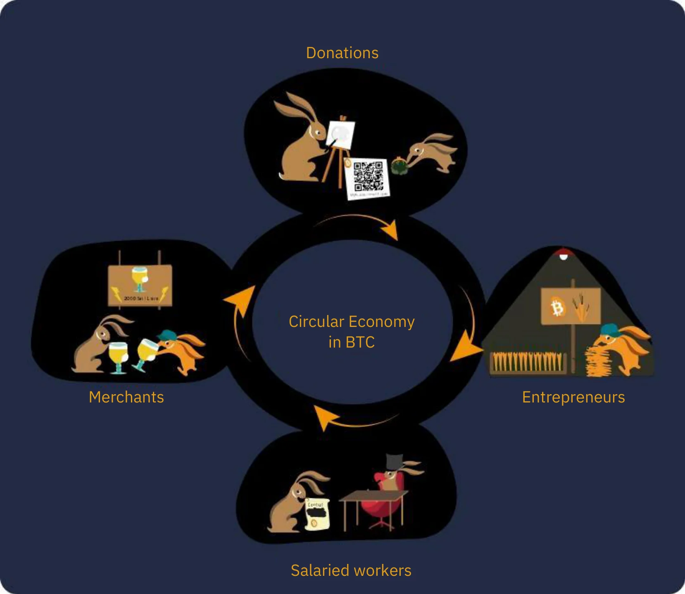


### Как да действате?


За да приемете биткойн, е необходимо да проучите различните налични решения и да изберете това, което най-добре отговаря на вашия бизнес. Няма перфектно решение и за да направите своя избор, трябва да вземете предвид няколко фактора, като например очаквания обем на трансакциите, отпуснатия бюджет и вида на бизнеса (онлайн или физически).


Ще разгледаме тази тема подробно в друг курс, но за да я опростим, можем да разгледаме няколко категории предприятия и съответно свързаните с тях решения.


- Просто онлайн решение: OpenNode


https://planb.academy/tutorials/business/point-of-sale/open-node-e69a0c1c-47f7-4932-8494-e6f26c3c9784


- Решение за търговци аматьори: Swiss Bitcoin Pay


https://planb.academy/tutorials/business/point-of-sale/swiss-биткойн-pay-2-a78b057e-ed11-47ac-860c-71019fcb451a


- Решение за големи организации или страстни биткойнери: BTCpay Server


За по-задълбочено изучаване на тази тема ви препоръчваме нашия курс BIZ101! Открийте как ефективно да интегрирате биткойн в компанията си, да приемате биткойн като платежно средство в съответствие с профила на организацията си и да разбирате свързаните с това данъчни и счетоводни изисквания:


https://planb.academy/courses/a804c4b6-9ff5-4a29-a530-7d2f5d04bb7a

## Спестяване с биткойн


<chapterId>1d9570c6-5b63-51a6-b87c-7bdb0fc4aa87</chapterId>


### Предупреждение преди да започнете!


Биткойн се превърна в основен финансов актив, главно поради ограниченото си предлагане и нарастващото търсене. Въпреки това закупуването на биткойн крие рискове, които изискват специално внимание. Ето защо се препоръчва да проведете собствено проучване и да научите повече по темата, за да се запознаете с технологията, преди да инвестирате каквито и да било средства.


- Инвестирайте само това, което можете да си позволите да загубите.
- Биткойн е силно волатилен финансов актив и цената му може да падне до 0.
- Миналото представяне не е надежден показател за бъдещо такова.
- Ако е необходимо, свържете се с финансовия си консултант.


**Академията на План ₿ не предоставя инвестиционни съвети и нищо от посоченото тук не трябва да се счита за такъв**


### Мини контролен списък, преди да се впуснете в проекта


Преди да се впуснете в покупка на биткойн, уверете се, че имате:


- Сигурен портфейл.
- Добри познания за биткойн.
- План за спестяване, който да следвате.
- Дългосрочна визия.


Ако темата все още е неясна, имайте предвид, че курсът BTC102 ще ви помогне да си осигурите и придобиете първите си биткойни. Тук само ще нахвърлим повърхността на темата.


Конкретно, има два въпроса, които трябва да си зададете:


- Дали трябва да приемете стратегия за постепенно закупуване на определени интервали (dollar cost average) или наведнъж?
- Трябва ли да използвате регулирана или нерегулирана платформа?


### Стратегии за придобиване


- Покупки на определени интервали във времето чрез усредняването на разходите за покупка (DCA, dollar cost average)


Тази стратегия включва повтарящи се покупки, т.е. закупуване на малки количества биткойн на равни интервали от време. Този метод изглажда цената с течение на времето и осигурява непрекъснато нарастване на количеството притежавани биткойни. Той е идеално решение за дългосрочни спестявания и облекчава опасенията относно нестабилността на цената на биткойн. След като го настроите, можете просто да забравите за него и да наблюдавате как инвестицията ви расте.


**Предпазвайте се от UTXO**: Не забравяйте от време на време да консолидирате своите UTXO в портфейлите си. Тази практика е от съществено значение за ефективното управление на вашите биткойни и за избягване на ненужни такси по време на транзакции.


[UTXO](https://planb.academy/en/resources/glossary/utxo) е резултат от транзакция, който все още не е изразходван, т.е. не е използван като вход за нова транзакция. Консолидирането им означава обединяване на няколко малки UTXO в една по-голяма, за да се намали "теглото" на трансакцията и по този начин да се платят по-ниски такси.


- Eднократна покупка (lump sum)


Решението за еднократна покупка може да бъде спонтанно, което се използва за незабавно запознаване с биткойн. Независимо дали става въпрос за покупка по време на срив или за възползване от бонус, решението е ваше. Ще трябва да съберете смелост и да натиснете бутона за покупка.


В този случай трябва да бъдете внимателни и да контролирате емоциите си, тъй като цената на биткойн може да бъде доста променлива. Всъщност FOMO (Fear of Missing Out) и FUD (Fear, Uncertainty, Doubt) са най-големите ви врагове! Не забравяйте да запазите спокойствие и да следвате стратегията, която сте установили предварително, за да избегнете импулсивно и потенциално вредно вземане на решения.


### От кого трябва да купуваме биткойн?


Съществуват няколко начина за придобиване на биткойни, като всеки от тях се подчинява на собствен набор от правила, които могат да варират в зависимост от юрисдикцията. Някои платформи изискват идентификация за проверка (KYC), а други - не. Ето защо е от решаващо значение да се разберат разпоредбите, свързани с всяка платформа.


- Платформи за DCA


Както представихме по-горе, често срещан метод за натрупване на биткойни е усредняването на разходите за покупка (DCA), което включва редовно купуване на малки количества. Няколко платформи предлагат тази услуга, като например изброените на нашата [специална страница](https://planb.academy/tutorials/exchange). В допълнение към простотата на създаването на DCA, тегленията към вашата портфейл обикновено са автоматични, което означава, че винаги ще имате контрол над активите си.


Днес почти всички решения на DCA са сравнително ефективни и имат почти сходни такси, така че изборът ще зависи повече от наличието им във вашата страна.


- Брокерски платформи


За мащабни инвестиции се препоръчват регулирани и признати платформи като Kraken, Bitstamp и Paymium. Те предлагат сигурна и защитена среда за транзакции с голям обем.


Използването им е лесно и достъпно за всеки:


1. Създаване на акаунт след KYC проверка

2. Прехвърляне на средства в сметката ви

3. Закупуване на биткойн

4. Изтеглете биткойн от вашия портфейл


След покупката е препоръчително незабавно да изтеглите биткойните от платформите за обмен, за да сведете до минимум рисковете от хакерски атаки и блокиране на средства. Имайте предвид, че таксите за теглене могат да бъдат високи, понякога до 25 евро в зависимост от платформата.


**Наредбите за познаване на клиента (KYC) изискват от потребителите да предоставят идентификационни данни с цел борба с финансирането на тероризма, укриването на данъци и изпирането на пари.**


От съществено значение е да се признае, че KYC е важна тема за обсъждане в Биткойн индустрията. Макар че много хора обсъждат нейната ефективност, съществуват множество опасения, свързани с нея. В много от програмите за обучение и съдържанието на нашата академия съветваме напредналите потребители да избягват платформи, които изискват KYC, тъй като често има алтернативи, които са по-фокусирани върху неприкосновеността на личния живот.


### Решения, които не са свързани с KYC


Освен това има няколко [пазари](https://planb.academy/tutorials/exchange), където можете да купувате и продавате биткойни в обмен между равнопоставени партньори. Като цяло можете да разгледате следните:


- Биткойн банкомати (т.нар. битомати)
- Физически срещи с други биткойн ентусиасти
- Незаконни и нерегулирани платформи
- Решения за срещи peer-to-peer
- Необанки, опериращи в държави, които подкрепят биткойн.


И накрая, важно е да се отбележи, че данъчните задължения могат да варират в зависимост от юрисдикцията, така че силно ви препоръчваме да се консултирате с нормативната уредба във вашата страна, преди да предприемете каквито и да било действия, които могат да ви изложат на риск.


Ако желаете да задълбочите познанията си за стратегиите за закупуване, използване и защита на биткойните, препоръчвам ви след този курс да се включите в **BTC102**. Там ще откриете, наред с други неща, препоръки за инструменти, подходящи за вашия профил, нужди и лични цели:


https://planb.academy/courses/f3e3843d-1a1d-450c-96d6-d7232158b81f

## Хипербиткоинизация


<chapterId>b7275d31-3b60-5fb7-b9f5-030097010553</chapterId>


### Дивата надпревара тепърва започва!


Подобно на всяка нова технология, приемането на биткойн следва S-образна крива, илюстрираща прогреса от ранните потребители към по-широкото приемане. Отминахме епохата на ранните осиновители и показателите сочат потенциална демократизация на биткойн. В края на краищата това е вирусна технология, която не може да бъде лесно спряна. От една страна, Ел Салвадор предприе смелата стъпка да приеме изцяло биткойн като законно платежно средство. От друга страна, други държави реагираха, като го забраниха и криминализираха използването му, което показва, че приемането на биткойн е сложно и е изложено на влиянието на културни, исторически и национални фактори.


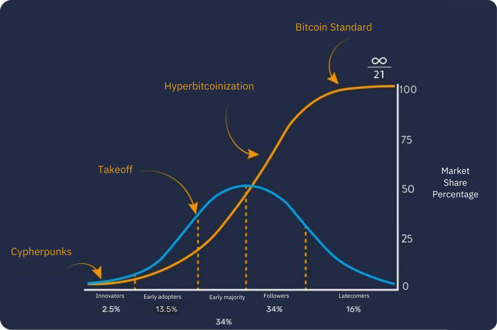


Възходът на биткойн принуждава компаниите, университетите, регулаторните органи и частните лица да се съобразяват с тази нова технология. Необходимо е да се създадат нови инструменти, да се адаптират услугите и да продължат иновациите, за да се гарантира тяхното оцеляване. Този контекст повдига много въпроси, свързани с различни области, включително криптография, теория на игрите, икономика и парична политика, компютърни науки, философия, енергетика, закони и регулиране. Накратко, биткойн е мултидисциплинарен предмет.


### Биткойн е от 0 до 1


Накрая ви приканваме да се замислите за тази нова парична революция. С биткойн има толкова много за изследване, че е сложно да се асимилира всичко наведнъж. Не бързайте, биткойн няма да изчезне. Напротив, революцията току-що е започнала. Вярваме, че сме способни да създадем света, който искаме да поверим на децата си: свят, в който човешкият суверенитет е право, в който неприкосновеността на личния живот се зачита по подразбиране и в който парите не се манипулират. Надяваме се, че заедно ще постигнем това.


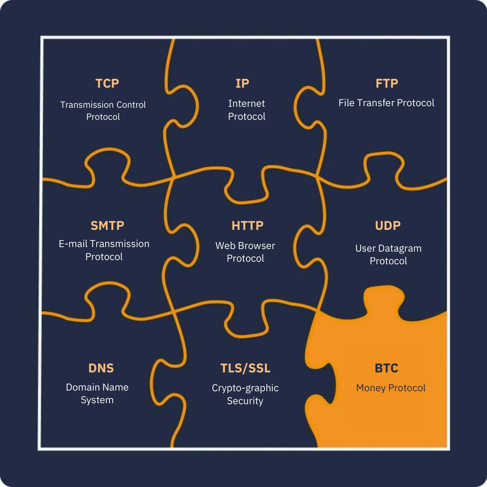


Ако искате да разширите познанията си за биткойн, сега е точният момент: голям брой автори, мислители и есеисти са създали образователно съдържание за биткойн. През последните няколко години ние изброяваме и категоризираме тези произведения, за да предложим [библиотека от ресурси](https://planb.academy/resources) на най-любопитните от вас. В този раздел ще намерите най-добрите подкастове, уебсайтове, статии, уроци, книги и друго съдържание.


> "Мисля, че интернет ще бъде една от основните сили за намаляване на ролята на правителството. Единственото нещо, което липсва, но което скоро ще бъде разработено, е надежден електронен кеш - метод, чрез който в интернет можете да прехвърляте средства от А на Б, без А да знае Б или Б да знае А." - Предсказание на Милтън Фридман през 1999 г


# Бъдещето на Bitcoin

<partId>899fd35e-39e6-5a25-a73e-6fed6e725094</partId>

## Lightning мрежата: бързи плащания в биткойни с ниски такси

<chapterId>b403f1e4-f1ff-572b-a242-9b58cb3736d0</chapterId>

След като вече познавате основите на протокола Bitcoin, ще представим основната платежна мрежа, изградена върху Bitcoin: Lightning Network (често съкращавана като "LN"). Нейната цел е проста: да позволи плащания в BTC с почти мигновена финалност, без да се претоварва блокчейнът и с обикновено много ниски такси.

### Блокчейнът не може да прави всичко

Блокчейнът на Bitcoin е проектиран така, че да бъде проверим от възможно най-много участници, без разрешение и без доверие. Това изискване налага структурни ограничения: блокчейнът не може да обработва неограничен брой транзакции, тъй като блоковете трябва да останат разумни по размер за изтегляне, съхранение и проверка от независими възли, без необходимост от прекалено скъп хардуер. Този компромис често се обобщава с т.нар. трилема: децентрализация, сигурност и мащабируемост. Система, базирана на блокчейн, не може да максимизира и трите свойства едновременно. Bitcoin дава приоритет на децентрализацията и сигурността, което естествено ограничава броя на възможните onchain транзакции.


В Bitcoin разработчиците са направили съзнателни избори в тази посока. От една страна, ограничението на размера на блоковете до 1 MB и средното време от 10 минути между блоковете позволяват работата на Bitcoin възел на ниска цена, което насърчава децентрализацията на мрежата. От друга страна, създаването на блокове чрез доказателство за работа прави всякакъв опит за измама изключително скъп, като същевременно улеснява проверката от възлите и укрепва цялостната сигурност на протокола.

Тези избори обаче водят до важно ограничение: броят на транзакциите, които могат да бъдат включени във всеки блок, е ограничен. Това се равнява на едва няколко транзакции в секунда. Тази стойност е нищожна в сравнение с капацитета на централизирани платежни системи като VISA (която има теоретичен максимален капацитет от около 65 000 транзакции в секунда), но това ограничение е цената, която се плаща за транзакции без цензура и без доверена трета страна.

На практика това означава две много важни неща за ежедневната употреба на Bitcoin:
* когато търсенето на блоково пространство нараства, onchain таксите могат да станат много високи;
* onchain плащанията изискват потвърждения, което не винаги е подходящо за ежедневни покупки.

Lightning Network е именно отговор на тези проблеми. Идеята на Lightning се вписва в подход на слоеве: Bitcoin остава базовият слой (слоят за сетълмент, здрав и много сигурен), докато Lightning служи като бърз платежен слой отгоре.


### Платежни канали, закотвени в Bitcoin

Lightning се основава на двупосочни платежни канали. Един канал представлява техническа връзка между двама участници, която им позволява да обменят сатошита offchain, тоест без да записват всяко плащане в блокчейна.

От гледна точка на Bitcoin (onchain), отварянето на канал означава заключване на средства в специална транзакция. Това може да се разглежда като форма на ескроу: средствата са блокирани по такъв начин, че само валидно затваряне на канала може да ги разпредели отново.

От гледна точка на Lightning, същият този механизъм се превръща в канал, в който двете страни могат да актуализират състоянието на разпределение на сатошитата толкова пъти, колкото пожелаят, почти мигновено и без да е необходимо всяко плащане да се записва в основния блокчейн.

Механизмът е следният:
* отварянето и затварянето на Lightning канал са Bitcoin транзакции (и следователно се публикуват onchain);
* плащанията между отварянето и затварянето са offchain актуализации, които не се виждат в основния блокчейн.


По този начин двама души, които споделят Lightning канал, могат да извършат много голям брой плащания, без да правят onchain транзакция всеки път. Тук отново се проявява логиката на мащабируемостта: блокчейнът се запазва за редки и важни операции (отваряне и затваряне на канал, тоест финалния сетълмент), а останалите малки междинни плащания се преместват в по-ефективен слой.

### Мрежа от взаимосвързани канали

Lightning не е просто сбор от изолирани канали. Това е мрежа: хиляди възли са свързани помежду си чрез канали и образуват граф от връзки.


Благодарение на тази мрежа можете да платите на получател, дори ако нямате директен канал с него, при условие че съществува път от канали, който позволява плащането да бъде маршрутизирано. То преминава през няколко междинни възела, скок по скок.

Тук се появява важно понятие в Lightning: ликвидността. Капацитетът на един канал съответства на общия размер на средствата, заключени в него, а ликвидността съответства на разпределението на тези средства между двете страни на канала и следователно на посоката, в която сатошитата могат да се движат. С други думи, един канал може да има голям капацитет, но да бъде неизползваем в дадена посока, ако ликвидността е от грешната страна. Успехът на плащанията зависи не само от съществуването на път, но и от наличната ликвидност по цялото му протежение.

### Препращане на плащане без доверие в посредниците

Lightning е проектиран така, че да позволява плащания чрез посредници, без да им се гласува доверие. За тази цел протоколът използва интелигентни договори, наречени HTLC (*Hashed Time-Locked Contracts*). Без да навлизаме във всички детайли, запомнете основния механизъм:
* плащането е обвързано с разкриването на тайна (предобраз);
* ако крайният получател разкрие тази тайна, той получава средствата, а посредниците от своя страна могат да получат дължимото им;
* ако плащането се провали, сроковете изтичат и всеки си възстановява средствата.

Това функциониране дава едно съществено свойство: плащането е атомарно. То или се осъществява изцяло, или се проваля без междинни загуби.

Накрая, Lightning включва и механизъм за санкции: ако някой от участниците се опита да измами, като публикува старо състояние на канала (което вече не отразява реалността), другият може да го накаже и да получи всички средства. Това правило силно стимулира честното поведение, дори в неблагоприятна среда.

### Lightning възел, Lightning портфейл: какво означава това

В onchain Bitcoin портфейлът е софтуер, който управлява ключове и изгражда транзакции. В Lightning ситуацията е по-двусмислена, тъй като реалната некостодиална употреба се основава на Lightning възел (дори когато този възел е скрит зад опростен интерфейс).

На практика съществуват две основни категории приложения за използване на Lightning:
* Костодиални услуги: приложението ви показва баланс, но средствата се контролират от доставчик. Вашият баланс е счетоводно записване в тяхната система, подобно на платформа за обмен;
* Некостодиални решения: вие реално контролирате ключовете и възможността да възстановите средствата си. Това може да бъде приложение, което вгражда възел с минимално управление, за да опрости потребителското изживяване (например Phoenix, Zeus...), или пълноценен Lightning възел, който управлявате изцяло сами.

https://planb.academy/tutorials/wallet/mobile/phoenix-0f681345-abff-4bdc-819c-4ae800129cdf

https://planb.academy/tutorials/wallet/mobile/zeus-embedded-c67fa8bb-9ff5-430d-beee-80919cac96b9

Днес съществуват и self-custodial портфейли, които могат индиректно да поддържат Lightning плащания, като използват атомни суапове, задействани при поискване за всяко входящо или изходящо плащане (например Bull Bitcoin Wallet, Aqua…). Тези портфейли обикновено използват sidechain-а Liquid като слой за сетълмент (ще видим в следващата глава какво представлява това).

https://planb.academy/tutorials/wallet/mobile/bull-bitcoin-2c72127c-a228-4f50-b833-c6183d56aaf6

https://planb.academy/tutorials/wallet/mobile/aqua-8e6d7dd3-8c03-45cc-90dd-fe3899a7d125

### Конкретни случаи на употреба: какво Lightning прави възможно

Lightning отключва набор от приложения, които преди бяха непрактични или дори невъзможни само с onchain Bitcoin.

- **Ежедневни плащания (онлайн и на място)**

За плащане на каса или онлайн покупка Lightning позволява почти мигновена финалност с обикновено ниски такси. Това прави биткойна използваем за малки суми, дори когато основният блокчейн е натоварен.

- **Микроплащания и streaming money**

Възможността да се изпращат изключително малки суми отваря нови икономически модели: заплащане според употребата, плащане на минута, периодични дарения, бакшиши… Това е идеята за "streaming money": плащане според реалното потребление на съдържание или услуга, вместо чрез фиксиран абонамент.

- **Създатели на съдържание, подкасти и дарения**

Lightning често се използва за микродонации или механизми за възнаграждение. Приложения като Fountain или Rumble добре илюстрират тази логика: плащането става гранулирано и естествено част от изживяването, вместо да бъде тежък и рядък акт. Същата логика е интегрирана и в Plan ₿ Academy, тъй като можете лесно да изпращате малки дарения на любимите си преподаватели, за да им благодарите.

- **Игри и дигитални икономики**

Видео игрите и дигиталните среди естествено се поддават на микротранзакции: малки залози, награди, виртуални предмети… Въвеждането на минимален паричен залог може също да увеличи цената на спама и определени злоупотреби (ботове), като същевременно остава достъпно.


### Основни имплементации на Lightning

Както и при Bitcoin, Lightning е протокол, а не един-единствен софтуер. Съществуват няколко имплементации, които остават съвместими благодарение на общите спецификации (BOLT):
* LND (Lightning Labs);
* Core Lightning (Blockstream);
* Éclair (ACINQ);
* LDK (Spiral/Block);
* и други.

### Lightning като част от еволюцията на Bitcoin

Lightning не заменя блокчейна на Bitcoin: той го допълва. Блокчейнът остава крайният слой за сетълмент, бавен, но изключително устойчив. Lightning е бързият платежен слой, предназначен за честа употреба и малки суми.

През 2025 г. Lightning е по-достъпен от първите си години, благодарение на портфейли и услуги, които скриват част от сложността. Но той запазва и своите компромиси: ликвидност, onchain разходи за каналите и понякога избори между простота, суверенитет и поверителност.

Ако искате да разберете Lightning в дълбочина (канали, ликвидност, маршрутизация, управление на риска), препоръчвам пълния теоретичен курс LNP 201 на Fanis Michalakis:

https://planb.academy/courses/34bd43ef-6683-4a5c-b239-7cb1e40a4aeb

А ако искате да се впуснете в приключението по експлоатация на собствен Lightning възел, предлагаме и практическия курс LNP 202, посветен специално на тази тема:

https://planb.academy/courses/593e483e-1785-4e83-aa7e-32b99056844c


## Отвъд Lightning: други протоколи за развитие на Bitcoin

<chapterId>684e31f9-ebd1-51b6-91c0-1e6a315f1141</chapterId>

Както видяхме в предишните глави, Bitcoin е проектиран като изключително здрав базов слой: публичен регистър, прост, сигурен, но естествено ограничен по отношение на скорост, програмируемост и капацитет за плащания. Вместо да се опитва този слой да прави всичко (както е например при Ethereum), екосистемата на Bitcoin постепенно възприе слоест подход: блокчейнът служи като основа (краен сетълмент), а по-горните слоеве добавят нови свойства, като по-бързи плащания, по-голяма поверителност или емитиране на активи (стейбълкойни, токенизирани ценни книжа…).

Bitcoin не се развива само чрез промени в основния си протокол. Той се развива и чрез надграждане, със решения, които правят различни компромиси според търсената цел. Някои целят мащабируемост на плащанията, други програмируемост (в широк смисъл) и емитиране на активи, а трети се опитват да комбинират и двете.

В тази глава представяме четири важни протокола, които предлагат нови възможности върху Bitcoin: sidechains (включително Liquid), Ark, RGB и Taproot Assets.

### Sidechains: паралелни блокчейни, свързани с Bitcoin

Sidechain е блокчейн, отделен от този на Bitcoin, проектиран да функционира паралелно със собствени правила и собствен механизъм за консенсус. Той е свързан с Bitcoin чрез механизъм за двупосочно закотвяне (*2WP*), който на практика позволява използването на биткойни в sidechain под представителна форма (често биткойн, заключен в Bitcoin и пресъздаден в sidechain), а след това и връщане обратно към основната верига.

Предимството на sidechain е, че предлага функционалности, които са трудни за постигане в самия Bitcoin: по-бързи транзакции, функционалности за активи, повишена поверителност или по-голяма гъвкавост за разработка. В замяна sidechain винаги прави компромиси спрямо Bitcoin, особено по отношение на модела на доверие или децентрализацията.

Най-известният sidechain върху Bitcoin вероятно е **Liquid**, разработен от Blockstream. Той е създаден, за да ускори определени случаи на употреба: бързи трансфери между платформи, по-чести сетълменти и емитиране на активи (стейбълкойни, ценни книжа…), с повишена поверителност. В Liquid използваните биткойни се наричат L-BTC: те са проектирани да бъдат обвързани 1 към 1 с BTC чрез механизъм за двупосочно закотвяне.


Основната разлика спрямо Bitcoin е в модела на сигурност и децентрализация: Liquid не разчита на доказателството за работа на Bitcoin, а на федерация от оператори (идентифицирана група), която осигурява създаването на блокове и функционирането на мостовете между BTC и L-BTC.

https://planb.academy/courses/d3ca6943-b22c-4e50-b62d-9431460525bc

### Ark: споделяне на UTXO-та за намаляване на разходите и подобряване на изживяването

Ark обозначава семейство от предложения и имплементации, насочени към подобряване на мащабируемостта на Bitcoin чрез групиране на множество операции на потребители в ограничен брой Bitcoin транзакции. Идеята е сравнително проста: вместо да се създава onchain транзакция за всеки потребител, се създава една onchain транзакция, която представлява пакет, а след това правата на всеки участник се развиват основно извън веригата, докато не се пожелае окончателен сетълмент в Bitcoin.

Тази идея за протокол от втори слой беше представена от Burak през май 2023 г. Подобно на Lightning Network, Ark е система, която се разгръща върху основната верига на Bitcoin. Тя би позволила плащания в биткойни извън веригата по бърз, анонимен и евтин начин. В сравнение с Lightning, Ark не изисква налична входяща ликвидност за получаване на плащания, което значително подобрява потребителското изживяване. Освен това предлага ниво на поверителност, близко до coinjoin транзакциите. Ark може също да бъде неинтерактивен, ако в Bitcoin бъдат добавени ковенанти.

Burak често критикува способността на Lightning да се мащабира поради зависимостта му от основната верига и предполага, че Ark теоретично би могъл да интегрира цялото световно население в self-custody. Въпреки че Ark може да се разглежда като конкурентен протокол на Lightning Network, в действителност двата могат да съществуват съвместно и дори да се допълват.

Ark остава много активна, но все още млада област: целта е обещаваща (драстично намаляване на onchain отпечатъка на потребител), но трябва да се има предвид, че това е по-сложна архитектура с различни допускания и рискове в сравнение с Bitcoin и Lightning.

### RGB: договори и активи с валидация от страна на клиента

RGB е система за интелигентни договори и активи върху Bitcoin, която възприема радикално различен подход от този на универсалните блокчейни. Основната ѝ идея е валидацията от страна на клиента: вместо пълното състояние на даден договор да се публикува в глобален блокчейн, участниците съхраняват и валидират локално историите, които ги интересуват, докато блокчейнът на Bitcoin служи единствено за закотвяне на криптографски ангажименти и за предотвратяване на двойно харчене.

С други думи:
* блокчейнът на Bitcoin играе ролята на минимален арбитър и времеви печат;
* подробните данни (правила на договора, състояния, преходи) се обменят извън веригата между засегнатите страни;
* проверката се извършва локално, което подобрява мащабируемостта и може да подобри поверителността, тъй като не съществува глобален регистър на всички RGB активности, видим за всички.


RGB може да служи като основа за емитиране и управление на голямо разнообразие от активи: токени (включително стейбълкойни), NFT или цифрови ценни книжа, както и за изграждане на по-сложни договорни логики, без да се натоварва базовият слой.

Недостатъкът е управлението на данните: ако трябва да валидирате от страна на клиента, трябва също така да съхранявате и архивирате правилно доказателствата за правата си.

RGB е протокол в развитие от много години. Напредъкът е постепенен, но днес вече съществуват конкретни приложения, които се възползват от RGB. За да навлезете по-дълбоко, предлагаме в Plan ₿ Academy експертен курс, който подробно разглежда функционирането на този протокол:

https://planb.academy/courses/3ce1d37c-05ba-4f54-aa15-7586d37b2bb7

### Taproot Assets: емитиране на активи върху Bitcoin и прехвърлянето им през Lightning

Taproot Assets (по-рано "Taro") е протокол, разработван от Lightning Labs, който цели да позволи емитирането на активи върху Bitcoin, с възможност те да бъдат прехвърляни впоследствие чрез Lightning мрежата за бързи и евтини трансфери.

Това често се посочва като елемент от разказа за "програмируеми пари" върху Bitcoin: не защото Bitcoin се превръща в глобален компютър, а защото могат да се наслагват финансови инструменти (активи) върху базовия слой на Bitcoin и след това да се движат ефективно чрез Lightning.

### Bitcoin се засилва, като позволява иновации в горните слоеве

Днес най-точният образ на екосистемата на Bitcoin не е този на застинал протокол, нито на суперблокчейн, който прави всичко, както при Ethereum. По-скоро това е умишлено консервативен фундамент, заобиколен от слоеве и протоколи, които експериментират и позволяват иновации с минимален риск.


## Червено хапче или синьо хапче?


<chapterId>c81cdb45-6aa9-5462-9835-c4852084b2cc</chapterId>


Както казва Морфей на Нео: "Вземаш синьото хапче, историята свършва, събуждаш се в леглото си и вярваш в каквото искаш да вярваш. Ако вземеш червеното хапче, оставаш в Страната на чудесата и аз ти показвам колко дълбока е заешката дупка." Готови ли сте да изследвате заешката дупка на биткойн? Бъдете внимателни, защото може да преоткриете финансовата си свобода!


### Технологичното бъдеще и неговите последици


Технологиите се развиват експоненциално и никой не може да предвиди със сигурност бъдещото им развитие. Световната свързаност и изкуственият интелект продължават да се развиват, а знанията, които човек може да придобие чрез интернет, стават все по-неизмерими с течение на времето.


Ако вземем за пример изкуствения интелект, тези технологии вече са надминали или се доближават до човешкото ниво на работа във все повече области, като видеоигри, създаване на изображения и текстове и анализ на данни. Едно от потенциалните последствия е, че над 80 % от работните места ще изчезнат вследствие на ИИ и автоматизацията. Вследствие на това пред нас има няколко възможности, като например да ограничим технологичния напредък или да използваме увеличения капитал от повишаването на производителността, създадено от ИИ.


Трябва да си зададем някои важни въпроси:


- Как да управляваме общество, в което 80% от работните места ще изчезнат?
- Как да съживим едно население?
- Има ли нужда от толкова много учители?
- Геополитическите, политическите и човешките последици от автоматизацията не се обсъждат в достатъчна степен.

Компютрите, интернет, стриймингът и виртуалната реалност ще променят образованието. Бихме могли да имаме универсален курс за всички френски ученици, управляван от правителството, и учители, които вече няма да изнасят лекции, а директно ще придружават учениците. Децата биха могли да попаднат във виртуален свят и да бъдат придружавани в изучаването на историята.


- Къде е границата между учител и олицетворение на изкуствен интелект?
- Как можем да гарантираме общество, което живее в просперитет?


Тези фундаментални въпроси за нашето бъдеще трябва да бъдат обсъдени и решени колективно.

Каква е връзката с Биткойн? Точно както интернет направи революция в начините на комуникация, Биткойн представлява технологична революция за нови форми на широкомащабна организация, която ни позволява да обменяме стойност, без да разчитаме на доверена трета страна. Искаме ли да възпрепятстваме технологичната еволюция на паричната система, или искаме да приемем потенциала за увеличаване на капитала чрез десетократното повишаване на производителността, предлагано от използването на протоколите Биткойн и Светкавичната мрежа?


### Какво е бъдещето на финансите?


Тези съображения повдигат и въпроси за това кой трябва да съхранява, разрешава и проследява парите, които използваме. Целта е да се вземе решение между затворена система с неизбрани лидери или отворена система без доверени трети страни, в която преобладава неутралността.


- Валутата форма на частна собственост ли е?
- Може ли да се блокират акаунти на протестиращи без заповед на Върховния съд?
- Кой гарантира финансовата система?
- Как човек може да бъде суверен над парите си и да разчита на доверена трета страна?
- Може ли да се изпратят пари до другия край на света без такси и посредници?


Възприемането на тези нови технологии може да доведе до огромни икономии от мащаба в световен мащаб. Трябва ли да позволим свободното движение на капиталовите потоци? Международните блокади имат икономически и политически последици. Етично ли е да се използват финансови посредници като Western Union, които понякога начисляват до 25% такси? Вярваме, че в един все по-дигитален свят парите трябва да се демократизират и да се считат за общо благо, принадлежащо на хората, а не на държавата или на непрозрачни финансови институции.


Въпросът за това кой трябва да контролира банковата система е от решаващо значение, тъй като правилата на банковата игра не са прозрачни и разбираеми за всички, което позволява на каста от политици и регулатори да запазят хватката си върху системата, така че е важно да се постави въпросът дали свободният пазар или група интелектуалци трябва да има власт над нея.


### Свободата ни е застрашена.


Цензурата също трябва да бъде поставена под въпрос: кой има знанието да решава какво трябва да бъде цензурирано или не? Медиите са променили позицията си по отношение на определена информация и тези, които са били цензурирани преди, днес вече не са цензурирани.


- Кой решава какво е цензура или пропаганда?
- Кой има божествената ръка над нашата система?


Твърдо вярваме, че толерирането на цензурата може да унищожи свободата на изразяване и правото на събрания, тъй като може да има отрицателно въздействие върху иновациите и свободната воля. Налагането на цензура е технически трудно, без да се създаде пълна антиутопия. Следователно, кой субект трябва да има право на цензура? Въпросът е сложен, а също така е трудно да се реши кой трябва да бъде ограничаван или не.


В света има 2.4 милиарда души, които нямат банкова сметка, което неминуемо създава географски неравенства. От друга страна, Биткойн осигурява равенство на транзакциите, без да се взема предвид социалният ви статус или политическата ви позиция. Протоколът е аполитичен и не предоставя специфични привилегии на лидери или други влиятелни фигури, като гарантира, че всички имат еднакви възможности да движат развитието напред, а не позволява на малцина да останат на върха, докато другите остават назад. Трябва ли всички да имат достъп до една и съща валута, независимо от социалния си статус? От съществено значение е да помислим за света, който искаме да оставим на децата си, и се стремим да създадем отворен свят, в който те са свободни да управляват парите си по свой избор.


Биткойн е важен и не бива да се смята само за игра на късмета, затова е изключително важно да продължаваме да задаваме въпроси за Биткойн и последиците от него за света.


### Биткойн: революционен протокол


Както видяхме в предишната глава, протоколът Биткойн е неутрален по отношение на всички свои потребители. Благодарение на правилата за консенсус и криптографията можем да записваме неизменно транзакциите в глобална публична счетоводна книга, като гарантираме прехвърлянето на парична стойност без доверена трета страна. Инфраструктурата на втория слой (а скоро и на третия слой, с RGB, или "Really Good Bitcoin") се използва за мащабируемост на мрежата и разработване на нови функционалности.


Биткойн притежава всички необходими характеристики, за да бъде ефективна и здравословна валута: делима, мигновено преносима, нецензурируема, с пренебрежимо малки разходи за проверка и с парична политика, която вече е определена на 21 милиона единици за векове напред. Биткойн е псевдонимна и може да бъде обменяна навсякъде по света, без да е необходимо разрешение от която и да е организация. Трябва само да притежавате собствените си частни ключове и да помните поговорката "Нямате ключ, нямате биткойн".


Той е приет от различни групи хора - от шифърпънкове, през либертарианци, до традиционни предприятия и дори цели държави. Въпреки това биткойн е за всички и с нарастването на броя на потребителите расте и броят на възлите, които служат като пазители на историята на транзакциите, осигурявайки нейната децентрализация.


Биткойн не може да бъде спрян и не може да бъде цензуриран повече. Това е мирна революция, която променя паричната система и дава възможност за финансово приобщаване. Потребителите могат да се сдобият с биткойни, като ги приемат за своя търговия или като ги купуват чрез регулирани или нерегулирани платформи. Те могат да съхраняват средствата в своите портфейли, мобилни приложения или физически устройства, без да се нуждаят от доверени посредници. Биткойн се застъпва за прозрачност, свобода и индивидуална отговорност: както се казва "Не се доверявай, а проверявай".


Сатоши създаде биткойн през 2008 г., за да предложи промяна на финансовата система чрез копаене на валута. Той смяташе, че лесното създаване на фиатни пари представлява корупционен риск - правителствата могат да злоупотребяват с тях и го правят. Биткойн е неутрална алтернатива, която ни еманципира от банките и предизвиква мирна революция в начина, по който гледаме на парите.


Готови ли сте да се присъедините?


# Последен раздел


<partId>9ed4b454-2950-40b4-a56b-68d109689a82</partId>


## Отзиви и оценки


<chapterId>585729e2-b0ab-51b5-89ec-593e3ea22c57</chapterId>

<isCourseReview>true</isCourseReview>

## Заключителен изпит


<chapterId>8410e961-3841-5abf-a51d-04fc0139dd59</chapterId>

<isCourseExam>true</isCourseExam>

## Заключение


<chapterId>dfc534be-44a9-5e8c-9c98-e51ef0554e91</chapterId>

<isCourseConclusion>true</isCourseConclusion>
