# Petualangan Bitcoin Pertama Anda

Di Dalam kursus ini, kami akan menjelaskan dasar-dasar Bitcoin dalam 25 bab, sehingga Anda dapat memahami teknologi ini dengan cara yang sederhana dan efektif. Kursus ini mengeksplorasi dasar-dasar industri secara keseluruhan, termasuk topik-topik seperti penambangan, dompet, platform jual-beli, dan banyak lagi. Materi edukasi tambahan akan tersedia di sepanjang perjalanan, dan kami juga mengundang Anda untuk memeriksa "21 Poster" di bagian resources setelah Anda menyelesaikan kursus ini.

Tidak diperlukan pengetahuan sebelumnya untuk memulai kursus ini. BTC 101 dirancang agar dapat diakses oleh semua orang, terlepas dari tingkat pengalaman Anda.

+++


# Pendahuluan

<partId>3cd2ac82-026c-53e1-874a-baf5842adc6d</partId>

## Ikhtisar Kursus

<chapterId>27e3fb60-4b50-556b-9e70-c4f5475c121d</chapterId>

Selamat datang di kursus BTC101!

Bitcoin adalah revolusi teknologi dan moneter, yang mampu membuat kita mempertanyakan hubungan kita dengan uang dan masyarakat. Faktanya, Bitcoin (disebut sebagai BTC) adalah mata uang yang **netral** dan **terdesentralisasi**, yang berarti tidak dikontrol oleh entitas atau institusi manapun. Ini adalah sebuah inovasi yang lebih dari sekadar "mata uang internet": Bitcoin adalah protokol komputer (Bitcoin) dan unit moneter (bitcoin).

Protokol ini menggunakan teknologi dasar seperti kriptografi, komunikasi jaringan, dan "[blockchain](https://planb.academy/resources/glossary/blockchain)" yang terkenal, sementara unit bitcoin berfungsi sebagai mata uang yang diperlukan untuk berfungsinya protokol ini. Dalam kehidupan sehari-hari, warga El Salvador dan para pengguna bitcoin di seluruh dunia menggunakan mata uang bitcoin untuk membeli dan menjual barang dan jasa, dengan mengandalkan teknologi ini untuk membuat hidup mereka lebih baik.

**Sebuah kurikulum yang lengkap namun mudah diakses:**

Dalam kursus ini, kita akan membahas beberapa aspek moneter Bitcoin, termasuk cara membeli dan menjual bitcoin, menyimpannya dengan aman di dompet digital, dan menggunakannya untuk bertransaksi. Kita juga akan membahas peran para penambang, yang sangat penting untuk menciptakan bitcoin baru dan mengamankan jaringan Bitcoin. Terakhir, kita akan mengeksplorasi masa depan Bitcoin dan bagaimana teknologi Lightning Network dapat meningkatkan transaksi Bitcoin.


Sangat penting untuk memahami bahwa Bitcoin adalah sistem moneter baru yang sepenuhnya mengubah hubungan kita dengan uang, jadi mempelajari cara menggunakannya adalah keterampilan yang diperlukan bagi siapa saja yang ingin mengendalikan dana mereka sendiri.


Sebelum memperkenalkan definisi uang dan fungsinya dalam masyarakat (Bab 1), kita harus mulai dari asal mula Bitcoin. Diluncurkan pada tahun 2009, Bitcoin merupakan teknologi yang relatif baru dan berbeda dengan yang lainnya. Oleh karena itu, wajar jika kita tidak dapat memahami segala sesuatu tentang Bitcoin sekaligus. Faktanya, seperti halnya ketika mempelajari cara menggunakan Internet atau mengendarai mobil, Anda tidak perlu langsung mengetahui semua detail teknisnya: Anda bisa mulai dengan mempelajari cara menerima, membayar, dan mengamankan dana Anda, lalu mengambil langkah-langkah kecil untuk mempelajarinya lebih dalam.

Bagaimanapun, kita baru berada pada tahap awal pengadopsiannya, karena kita telah melewati fase lepas landas: Anda tepat pada waktunya untuk memperoleh pengetahuan sebanyak yang Anda inginkan mengenai inovasi penting ini.


Poin penting di sini adalah untuk memahami teknologi baru ini secara umum, jadi kami harap Anda menikmati kursus ini dan terus membuat kemajuan dalam paradigma moneter global yang baru ini.

Siap menyelami dunia Bitcoin yang menakjubkan dan memahami semua mekanismenya? Ayo mulai!


## Prasejarah Bitcoin

<chapterId>9a94b627-5b69-5d81-9125-f1fa9b0aa6ad</chapterId>

Sebelum istilah "Bitcoin" menjadi identik dengan mata uang digital dan transformasi keuangan, dasar penciptaannya diletakkan oleh serangkaian ide, inovasi, dan gerakan sosial. Di antaranya, gerakan [cypherpunk](https://planb.academy/resources/glossary/cypherpunks) menonjol sebagai elemen kunci dalam prasejarah Bitcoin.

### Cypherpunks: para visioner dunia digital

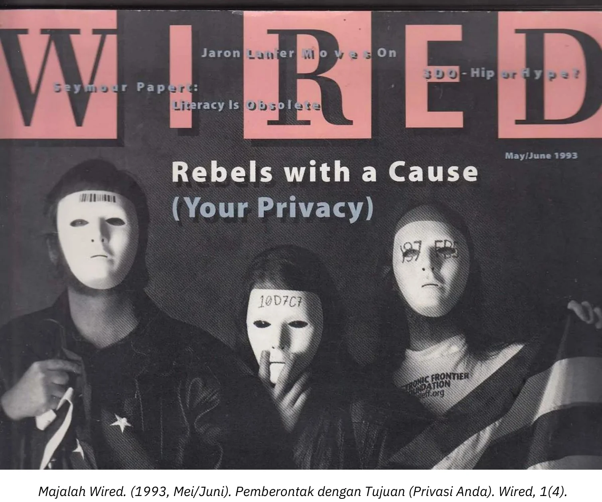

Di tengah-tengah evolusi teknologi pada tahun 1980-an dan 1990-an, sekelompok orang mulai mempertanyakan secara mendalam peran privasi dan kebebasan di era digital. Orang-orang ini, yang kemudian dikenal sebagai "cypherpunks", sangat yakin bahwa [kriptografi](https://planb.academy/resources/glossary/cryptography) dapat berfungsi sebagai alat untuk melindungi hak-hak individu dari campur tangan pemerintah dan perusahaan-perusahaan besar.

Tokoh-tokoh ikonik seperti Julian Assange, Wei Dai, Tim May, dan David Chaum memainkan peran penting dalam membentuk filosofi dan visi gerakan ini. Para pemikir ini membagikan ide-ide mereka di milis yang berpengaruh, di mana para peserta dari seluruh dunia terlibat dalam perdebatan tentang cara-cara terbaik untuk memanfaatkan teknologi demi kebebasan individu yang lebih besar.

### Tiga makalah fundamental dari Cypherpunks

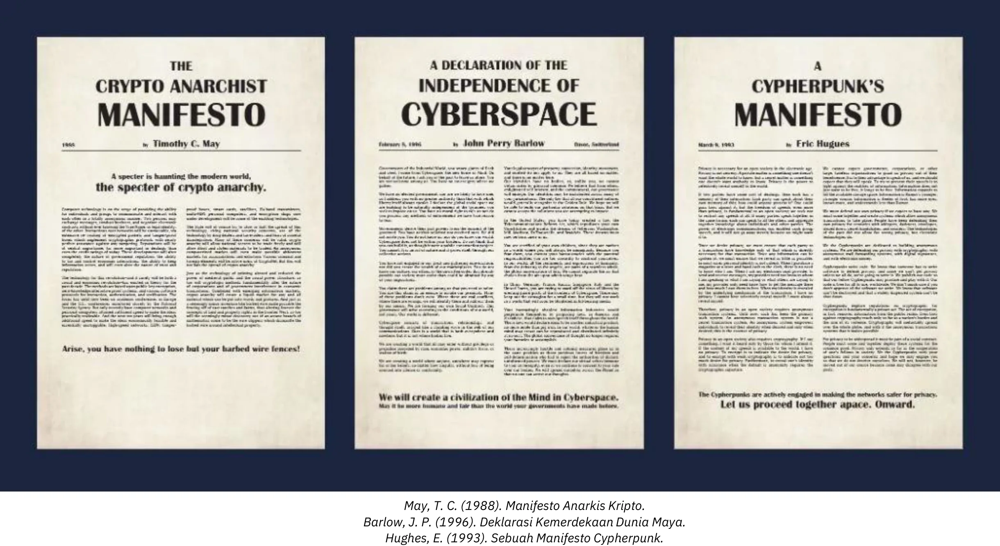

Gerakan cypherpunk, yang berakar kuat pada aktivisme digital dan kriptografi, mengacu pada beberapa teks dasar untuk mengartikulasikan prinsip-prinsip dan visinya untuk masa depan. Di antara tulisan-tulisan ini, ada tiga yang paling menonjol:

- "Manifesto Cypherpunk":

ditulis oleh Eric Hughes pada tahun 1993, "Cypherpunk Manifesto" menegaskan bahwa privasi adalah hak yang mendasar. Penulis berpendapat bahwa kemampuan untuk berkomunikasi secara bebas dan rahasia sangat penting bagi masyarakat yang bebas. Manifesto tersebut menyatakan: "Kita tidak bisa mengharapkan pemerintah, perusahaan, atau organisasi besar tak berwujud lainnya untuk memberikan privasi kepada kita [...]. Kita harus mempertahankan privasi kita sendiri jika kita berharap untuk memilikinya".

- "Manifesto Kripto-Anarkis":

ditulis oleh Timothy C. May pada tahun 1992, dokumen ini menjelaskan bagaimana penggunaan kriptografi dapat mengarah pada era anarki kriptografi di mana pemerintah tidak akan berdaya untuk mencampuri urusan pribadi warga negara. Mungkin membayangkan masa depan di mana orang-orang secara anonim bertukar informasi dan uang tanpa campur tangan pihak ketiga.

- "Deklarasi Kemerdekaan Dunia Maya":

meskipun tidak secara eksklusif cypherpunk, teks ini mencerminkan sentimen dari banyak peserta dalam gerakan ini. Ditulis pada tahun 1996 oleh John Perry Barlow, deklarasi ini merupakan respons terhadap meningkatnya regulasi Internet oleh pemerintah. Deklarasi ini menegaskan bahwa dunia maya adalah dunia yang berbeda dari dunia fisik dan tidak harus tunduk pada hukum yang sama. Seperti yang dinyatakan, "Kami tidak memiliki pemerintah yang dipilih, dan kami juga tidak ingin memilikinya".

### Para pendahulu Bitcoin

Sebelum kemunculan Bitcoin, telah ada beberapa upaya untuk menciptakan mata uang digital. Sebagai contoh, David Chaum memperkenalkan konsep "uang elektronik anonim" dengan proyeknya "[DigiCash](https://planb.academy/resources/glossary/ecash-david-chaum)" pada tahun 1980-an. Sayangnya, karena berbagai kendala, DigiCash tidak pernah berkembang pesat.

Pendahulu penting lainnya adalah "[B-money](https://planb.academy/resources/glossary/bmoney)" dari Wei Dai. Meskipun tidak pernah diimplementasikan, ini menyajikan ide mata uang digital anonim di mana pendeteksi penipuan dilakukan oleh komunitas penilai dan bukan oleh otoritas sentral.

Gambar di bawah ini dengan jelas menggambarkan perkembangan gerakan ini melalui berbagai inovasi teknologinya.

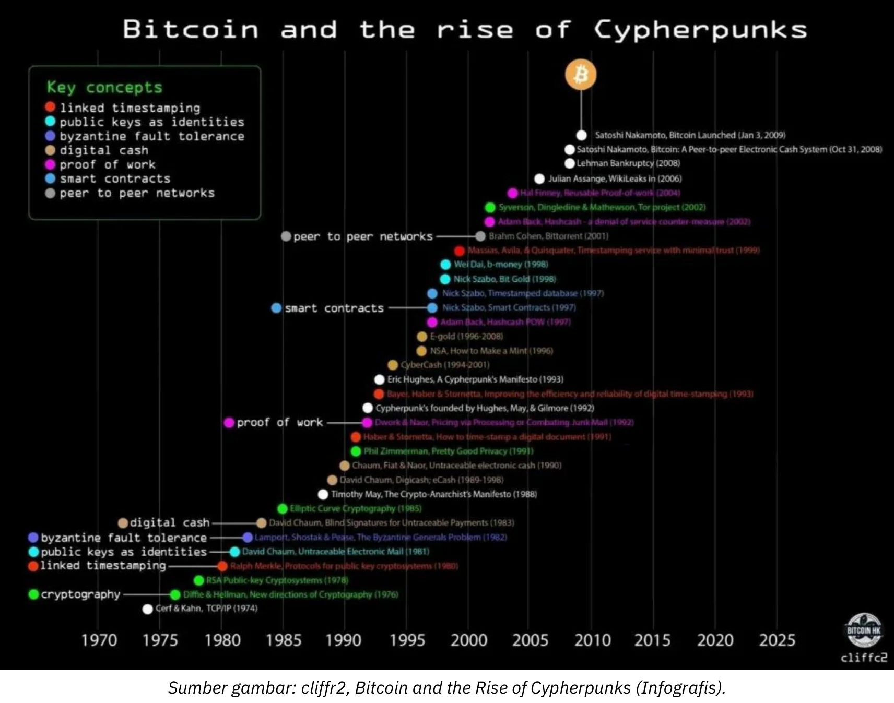

Dalam lingkungan yang mendukung inilah [Satoshi Nakamoto](https://planb.academy/resources/glossary/nakamoto-satoshi) yang misterius menerbitkan [whitepaper](https://planb.academy/resources/glossary/white-paper) Bitcoin pada tahun 2008. Dalam dokumen ini, ia menggabungkan beberapa ide dari gerakan cypherpunk, seperti [proof of work](https://planb.academy/resources/glossary/proof-of-work) dan [stempel waktu](https://planb.academy/resources/glossary/timestamp) kriptografi, untuk menciptakan mata uang digital yang [terdesentralisasi](https://planb.academy/resources/glossary/distributed) dan tahan sensor.

Namun, Bitcoin lebih dari sekadar itu: Bitcoin mewakili pencapaian cita-cita cypherpunk. Di luar teknologinya, Bitcoin melambangkan sebuah revolusi melawan sistem keuangan tradisional dan menawarkan sebuah alternatif berdasarkan transparansi, desentralisasi, dan kedaulatan individu.

### Kesimpulan

Prasejarah Bitcoin berakar kuat pada gerakan cypherpunk dan pencarian kolektif untuk kebebasan yang lebih besar di era digital. Dengan menggabungkan prinsip-prinsip kriptografi, desentralisasi, dan integritas, Bitcoin telah menjadi lebih dari sekadar mata uang. Faktanya, Bitcoin adalah produk dari revolusi filosofis dan teknologi yang terus membentuk kembali dunia kita.

Oleh karena itu, Bitcoin adalah protokol yang membentang dalam jangka waktu yang panjang, dan mendorong kita untuk mempertanyakan hubungan kita dengan energi, waktu, dan uang.

Namun, apakah Bitcoin adalah mata uang "nyata"? Untuk memahami hal ini, pertama-tama kita perlu memahami konsep uang dan berbagai bentuknya, yang akan kita bahas pada bab berikutnya.

Jika Anda ingin menjelajahi sejarah Bitcoin secara lebih detail, kami sangat merekomendasikan kursus HIS 201, di mana Anda akan menemukan asal-usul dan kemunculan Bitcoin, serta awal mula sejarah dan komunitasnya. Kursus ini sepenuhnya didokumentasikan dan bersumber, dengan, tentu saja, banyak anekdot:

https://planb.academy/courses/a51c7ceb-e079-4ac3-bf69-6700b985a082

# Uang

<partId>e913df1a-4cbd-5380-ba67-ca2a0414f671</partId>

## Uang Sepanjang Sejarah

<chapterId>c838e64d-d59f-5703-8c74-ea5e8c4fdd31</chapterId>

Evolusi uang adalah aspek menarik dari sejarah manusia yang mencerminkan kecerdikan peradaban sepanjang zaman dalam memenuhi kebutuhan ekonomi yang terus berkembang.


### Dari cangkang hingga rekening bank

Pada awalnya, mata uang adalah aset berwujud, seperti biji-bijian, ternak, atau komoditas lainnya. Namun, barang-barang ini memiliki kelemahan utama yaitu mudah rusak, sehingga sulit untuk menggunakannya sebagai media tabungan jangka panjang. Misalnya, panen yang buruk atau hama hewan dapat menghancurkan kekayaan seseorang dalam semalam.

Dengan demikian, ketika peradaban maju dan perdagangan meluas ke daerah-daerah baru, kebutuhan akan alat tukar yang universal muncul. Orang-orang pertama kali bereksperimen dengan benda-benda seperti kerang dan batu permata, tetapi benda-benda tersebut tidak tahan lama atau langka seperti yang mereka yakini. Akhirnya, emas menjadi standar, karena kelangkaan, daya tahan, dan kemampuannya untuk dibagi-bagi. Emas, dan tetap menjadi simbol kekayaan dan kekuasaan hingga hari ini.


### Apa peran uang?

Uang adalah alat komunikasi yang sangat canggih:

- Hal ini memungkinkan komunikasi antara masa kini dan masa depan, karena hal ini mengubah waktu dan energi kita menjadi sebuah aset yang dapat digunakan kembali di masa yang akan datang tanpa risiko devaluasi.
- Ini memfasilitasi komunikasi dalam bahasa universal: tanpa mengenal satu sama lain atau berbicara dalam bahasa yang sama, dua orang asing dapat bertukar, berdagang, dan menyepakati nilai sesuatu.

Fungsinya di dunia kita sulit untuk ditiru secara artifisial. Faktanya, tidak ada individu atau kelompok yang dapat menciptakan uang, karena ini adalah fenomena alami yang harus muncul dari pasar dan [konsensus](https://planb.academy/resources/glossary/consensus) sukarela. Dalam hal ini, harga berfungsi sebagai sinyal dan informasi yang memandu masyarakat dalam mengalokasikan sumber daya.

Karena alasan ini, emas sebagai uang adalah hasil dari 4.000 tahun Darwinisme moneter yang didasarkan pada fungsi-fungsi Aristoteles berikut ini:

- Penyimpan nilai\*\*: uang dapat digunakan untuk mentransfer daya beli ke masa depan, jadi uang haruslah bahan yang tahan lama;
- Alat tukar\*\*: uang dapat digunakan untuk menukar barang dan jasa alih-alih barter, sehingga menghindari ketidakcocokan keinginan di antara para pedagang;
- Unit akun\*\*: uang juga memungkinkan kita untuk membandingkan nilai barang yang berbeda untuk lebih memahami relatifitas kenyamananya.

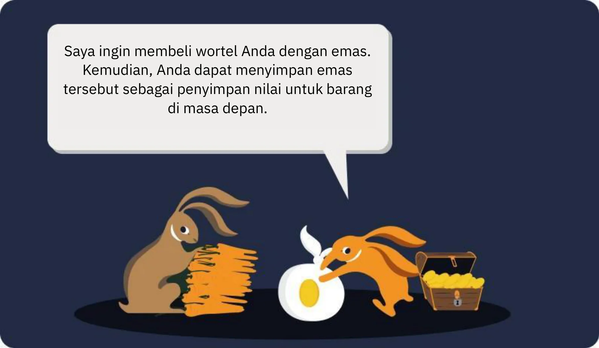

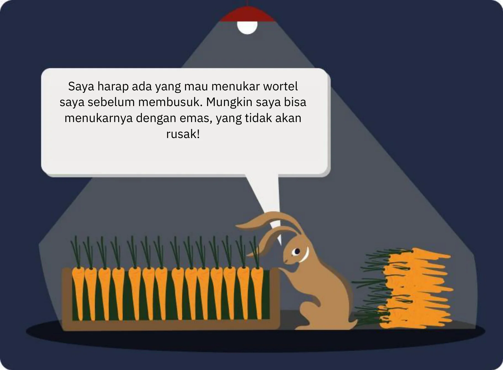


### Karakteristik uang

Emas secara ideal memenuhi kriteria mata uang yang efisien: kelangkaan alaminya membuatnya berharga, sementara sifat kimianya memastikan nilai emas tidak terkikis seiring waktu. Fitur-fitur ini menjadikan emas sebagai penyimpan nilai yang hebat, tetapi bukan mata uang yang umum, karena bentuk uang ini tidak mudah dibagi atau diangkut dalam jarak jauh. Di dunia yang terglobalisasi dan digital, emas berjuang untuk mengimbangi dan membutuhkan entitas pusat untuk membuatnya dapat dibagi dan mudah ditukar (misalnya melalui koin yang dicetak).

Sebaliknya, mata uang yang di akui negara ([fiat](https://planb.academy/resources/glossary/fiat)) dapat digunakan dengan mudah, tetapi nilainya berkurang terus-menerus oleh entitas yang mengendalikannya (raja, bank sentral, kaisar, diktator).

Untuk menjelaskan konsep ini dengan lebih baik, kita akan mengeksplorasi karakteristik mata uang yang efektif:

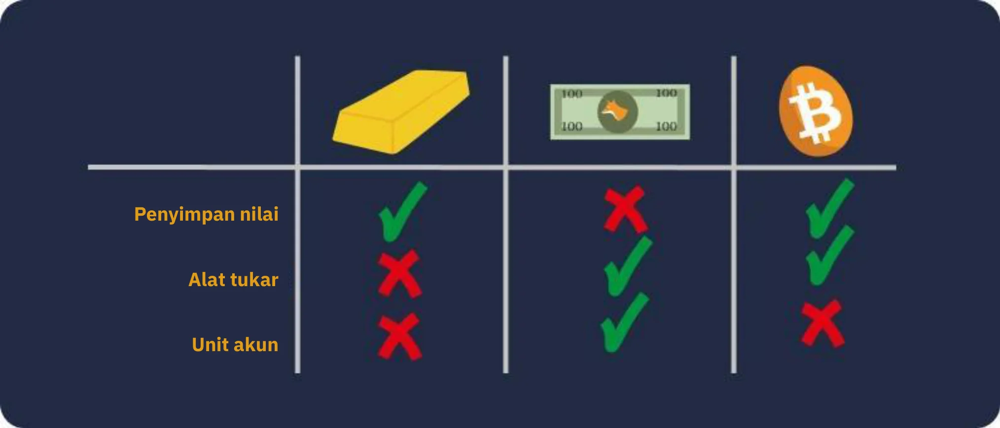

- [Fungibility](https://planb.academy/resources/glossary/fungibility)\*\*, artinya dapat dipertukarkan dengan unit lain yang sejenis tanpa kehilangan nilainya;
- Divisibilitas\*\*, karena dapat dibagi menjadi unit-unit yang lebih kecil untuk memfasilitasi transaksi dengan volume yang berbeda-beda;
- Likuiditas\*\*, yang berarti mudah dikonversi menjadi barang atau jasa.

Untuk memenuhi kriteria ini, mata uang secara historis telah berevolusi dengan mengambil langkah-langkah yang berbeda:

- Batu  -> Koin
- Uang kertas -> Kartu kredit/debit bank
- [Blockchain](https://planb.academy/resources/glossary/blockchain) -> [Jaringan Lightning](https://planb.academy/resources/glossary/lightning-network)

Mata uang masih terus berkembang hingga hari ini, bentuknya beradaptasi untuk memenuhi berbagai kasus penggunaan. Seperti yang telah kami katakan, meskipun emas adalah penyimpan nilai yang sangat baik, emas tidak lagi cocok untuk ekonomi global saat ini. Demikian pula, mata uang fiat seperti dolar dan euro sangat likuid dan mudah diangkut karena sebagian besar mata uang tersebut sekarang berbentuk digital, tetapi nilainya terus menurun karena [inflasi](https://planb.academy/resources/glossary/inflation) moneter.

Di sisi lain, Bitcoin membuka perspektif baru. Sifat-sifatnya, khususnya pasokan yang sangat terbatas, menjadikannya penyimpan nilai yang sangat baik. Selain itu, sebagai mata uang internet yang netral, Bitcoin merupakan **alat tukar** yang layak, mampu melampaui batas negara. Namun demikian, meskipun adopsinya terus berlanjut (sebagaimana ditunjukkan oleh [peta BTCmap](https://btcmap.org/map)), saat ini Bitcoin belum diterima secara luas dalam perdagangan.

## Mata uang fidusia/fiat

<chapterId>25151d46-7db1-5b48-8bba-cbde1944555a</chapterId>

> "Mereka yang tidak dapat mengingat masa lalu dikutuk untuk mengulanginya" kata George Santayana.
> Sebuah kebenaran yang beresonansi dengan baik dalam hal sistem moneter saat ini.

### Fidusia = Kepercayaan

Saat ini, mata uang utama seperti Euro dan Dolar dianggap sebagai fidusia. Ini berarti mata uang ini tidak memiliki nilai intrinsik dan sepenuhnya bergantung pada kepercayaan dan keyakinan yang kita tempatkan pada institusi yang mengaturnya.

Mata uang fidusia adalah bentuk uang yang ditetapkan oleh sebuah institusi, misalnya negara, seperti Cina dengan Yuan, atau perserikatan ekonomi-politik, seperti Uni Eropa dengan Euro. Entitas yang bertanggung jawab atas penerbitannya adalah bank sentral (Misalnya, kita dapat menyebutkan Bank Rakyat Tiongkok, Federal Reserve Amerika Serikat, atau Bank Sentral Republik Guinea). Entitas inilah yang bertanggung jawab untuk merumuskan kebijakan moneter dan oleh karena itu berapa banyak uang yang harus diedarkan atau dicetak.

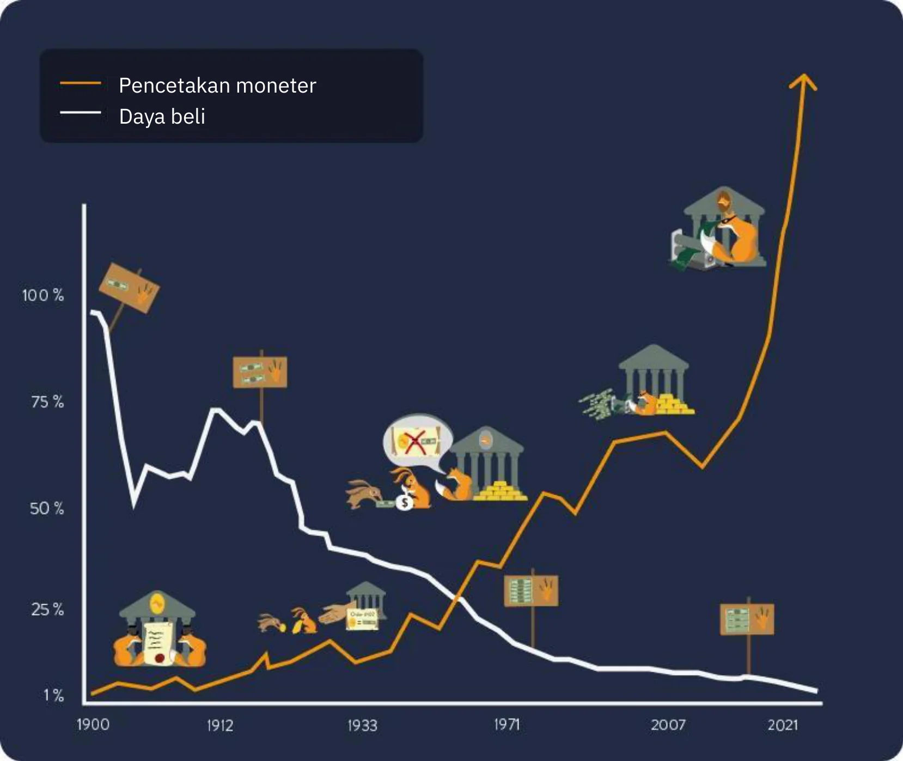

### Devaluasi moneter: strategi yang sudah ada sejak zaman Kekaisaran Romawi

Sejak jaman dahulu, emas telah berfungsi sebagai referensi moneter, tetapi kekakuannya sering kali membuat para pemimpin, baik kaisar Romawi maupun pemerintah modern, mengadopsi mata uang alternatif, yang sering kali berupa fidusia.

Mekanismenya sederhana dan terinspirasi dari praktik-praktik yang sudah ada sejak awal mula peradaban. Para pemimpin, yang ingin mengendalikan kekayaan, memulai dengan mensentralisasi emas, sering kali dengan mengeksploitasi kekuasaan mereka dan menjanjikan perlindungan dan keamanan. Dengan cadangan berharga ini di tangan mereka, mereka memperkenalkan mata uang baru, yang nilainya setara dengan emas, tetapi dicetak dengan lambang mereka. Mata uang ini kemudian mulai beredar, dan orang-orang dengan cepat beradaptasi dengan kenyamanan penggunaannya yang sederhana.

Namun, para pemimpin ini kemudian mulai mendevaluasi mata uang baru ini secara bertahap, secara de facto mengurangi nilainya beberapa persen setiap tahun dibandingkan dengan harga emas awal. Devaluasi diam-diam ini sering kali dibenarkan sebagai kepentingan rakyat. Pada kenyataannya, mereka yang menabung dalam mata uang fidusia ini melihat nilai tabungan mereka terkikis, sementara negara membiayai proyek-proyeknya melalui inflasi. Lebih jauh lagi, devaluasi ini membuat utang menjadi lebih mudah untuk dilunasi.


Pada saat yang kritis, sang pemimpin membuat pengumuman: mata uang tidak lagi didukung oleh emas. Publik, yang kini terbiasa dengan mata uang fidusia dan sering mendapat informasi yang salah tentang masalah keuangan, menerima kenyataan ini, sehingga negara dapat dengan bebas memanipulasi jumlah uang beredar dan mencetak uang dalam jumlah yang sangat banyak tanpa biaya.

Pencetakan uang kemudian menyebabkan inflasi dan secara bertahap memiskinkan penduduk. Selain itu, sistem keuangan diatur dan dibatasi untuk menghindari keruntuhannya, karena gangguan apa pun dapat memicu krisis ekonomi yang besar. Berlawanan dengan rakyat kebanyakan, lembaga keuangan dan individu-individu kaya sangat diuntungkan oleh sistem ini, yang menciptakan kesenjangan ketidaksetaraan dan mendukung otoritarianisme. Dalam konteks ini, mereka tidak diberi insentif untuk melakukan perubahan radikal, sehingga memungkinkan sistem ini untuk terus berjalan sampai kemungkinan terjadinya ledakan.

Jika dijalankan dengan baik, strategi ini dapat bertahan selama beberapa dekade. Namun, penting untuk dicatat bahwa devaluasi yang sangat cepat atau hilangnya kepercayaan dapat menyebabkan hiperinflasi (lihat bab berikutnya). Sejarah menunjukkan bahwa dolar telah kehilangan 98% nilainya dalam 100 tahun, euro 30% dalam 20 tahun, dan poundsterling 99% sejak penciptaannya.

Pada akhirnya, mata uang ini mungkin tidak lagi memiliki hubungan dengan emas, sama halnya dengan koin Romawi di akhir Kekaisaran, atau bahkan direduksi menjadi nilai numerik sederhana, terputus dari realitas nyata.

Hari ini, kita menyaksikan titik balik bersejarah. Dolar, yang telah lama mendominasi, tampaknya mengalami penurunan, sementara emas telah kehilangan peran sentralnya. Kita berdiri di ambang siklus moneter baru, yang mengingatkan kita bahwa pelajaran sejarah sering kali dilupakan


### Apakah Bitcoin merupakan solusi?

Karena alasan-alasan ini, revolusi Bitcoin mendapatkan momentumnya. Berlawanan dengan mata uang sebelumnya, mata uang ini tidak memerlukan pihak ketiga yang terpercaya dan bertujuan untuk memisahkan uang dari negara.


Faktanya, Bitcoin hadir sebagai jawaban atas tantangan sistemik ini dengan mengajukan solusi terdesentralisasi dan sistem moneter paralel yang baru. Secara historis, jika emas disukai sebagai mata uang karena ketahanannya terhadap pemalsuan, Bitcoin juga tidak dapat dipalsukan. Selain itu, Bitcoin dibatasi hingga [21 juta unit](https://planb.academy/resources/glossary/limite-demission), berkat sifat desentralisasi dan kriptografinya. Bitcoin adalah mata uang yang mengandalkan transparansi dan netralitas, menawarkan alternatif yang menarik untuk sistem moneter yang tersentral/terpusat saat ini.

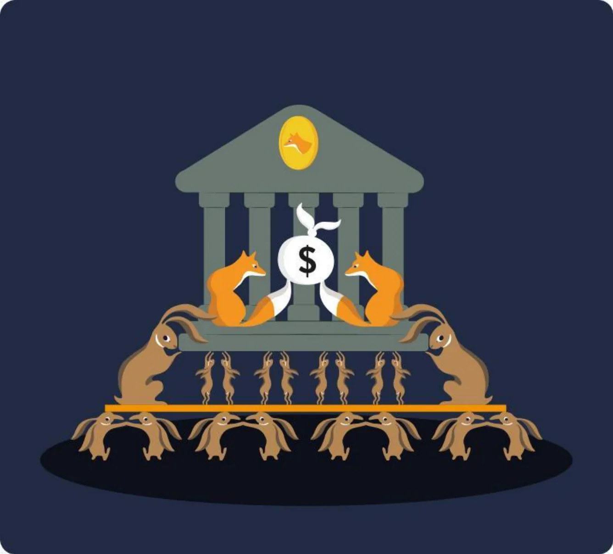

Alasan lain mengapa Bitcoin menarik perhatian adalah kemunculan mata uang digital bank sentral, atau CBDC, yang tampaknya tidak dapat dihindari. Bentuk uang baru ini akan mengembangkan ekonomi yang lebih terencana secara tersentral, dan dapat menghalangi kebebasan finansial individu dan memfasilitasi penyalahgunaan otoritas.

Kita dapat menyimpulkan bab ini dengan kutipan dari pemenang Hadiah Nobel F.A Hayek pada tahun 1984:

> "Saya tidak percaya kalau kita akan memiliki uang yang baik lagi, sebelum kita mengambil alih hal tersebut dari tangan pemerintah. Jika kita tidak dapat mengambilnya secara kasar dari tangan pemerintah, yang dapat kita lakukan adalah dengan cara yang licik atau tidak langsung memperkenalkan sesuatu yang tidak dapat mereka hentikan."

> Untuk mempelajari lebih lanjut tentang kekeliruan ekonomi dan kebebasan, kami mengundang Anda untuk mempelajari kursus ECO 102, yang menelusuri kehidupan dan ide-ide Frédéric Bastiat, seorang pemikir Prancis abad ke-19 yang pasti akan menghargai kemunculan Bitcoin:

https://planb.academy/courses/d07b092b-fa9a-4dd7-bf94-0453e479c7df

## Hiperinflasi

<chapterId>b04c024c-54f3-50cb-997f-58721cfc74be</chapterId>

Hiperinflasi adalah fenomena moneter yang khusus terjadi pada mata uang fiat: fenomena ini ditandai dengan hilangnya kepercayaan terhadap mata uang dan peningkatan inflasi secara drastis karena pencetakan uang oleh pihak berwenang. Akibatnya, tabungan yang dikumpulkan oleh individu dapat lenyap dalam waktu yang relatif singkat, mendorong negara ke ambang kehancuran ekonomi, sosial, dan politik.

### Inflasi semakin liar!

Untuk memahami dampak inflasi terhadap tabungan, kita perlu mempertimbangkan tingkat inflasi yang berbeda.

- Dengan inflasi 2%, Anda akan kehilangan 2% daya beli Anda setiap tahunnya, yang berarti 10% selama 5 tahun.
- Dengan 7%, Anda akan kehilangan setengahnya dalam 10 tahun.
- Dengan 20%, Anda kehilangan hampir setengahnya dalam 3 tahun.

Ketika hiperinflasi terjadi, kita tidak lagi berbicara tentang 20% per tahun, melainkan 20% per bulan atau, pada puncaknya, bahkan per HARI. Mengalami inflasi 100% per hari selama tiga hari adalah skenario realistis yang pernah dan terus terjadi di dunia kita.

Sangat penting untuk memahami bahwa hiperinflasi tidak terjadi secara kebetulan, karena kapitalisme, atau karena serangan politik dari lawan. Hiperinflasi adalah konsekuensi langsung dari keputusan moneter yang buruk yang dibuat oleh para gubernur bank sentral dan politisi. Dampaknya mempengaruhi setiap warga negara dan bahkan berdampak pada generasi berikutnya. Kami mengundang Anda untuk meluangkan waktu lima menit membaca tabel berikut ini untuk sepenuhnya menyadari dampak nyata dari fenomena ini (kursus ECO204 akan membahas lebih lanjut mengenai hal ini). Seperti yang Anda lihat, tidak ada negara atau mata uang yang berpotensi aman.


### Apa saja fase-fase hiperinflasi?

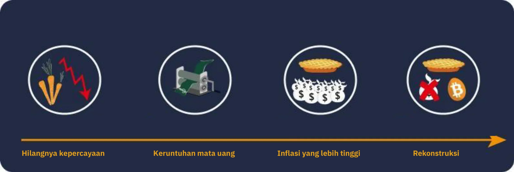

Agar hiperinflasi dapat terjadi, beberapa peristiwa tertentu harus terjadi.

Fase 1 - Kehilangan kepercayaan diri

- Sentralisasi kekuasaan sistem moneter memfasilitasi penciptaan uang dan penyalahgunaannya. Dalam konteks ini, beberapa faktor eksternal dapat memicu hiperinflasi, biasanya perang, tindakan sosial, atau kenaikan harga sumber daya utama seperti gandum atau bensin. Dengan demikian, hilangnya kepercayaan terhadap mata uang dapat terjadi, dan individu mulai mempertanyakan asal-usul uang dan manfaat dari kebijakan moneter yang diamanatkan.

Fase 2 - Keruntuhan mata uang dan kenaikan harga

- Ketika pemerintah kehilangan kendali atas kepercayaan, individu mulai menukarkan mata uang mereka dengan mata uang yang lebih stabil, seperti yang terjadi di Venezuela dengan dolar AS. Keadaan ini menyebabkan kenaikan harga, menciptakan lingkaran setan di mana barang dan jasa menjadi semakin mahal. Untuk memenuhi kebutuhan ini dan memperbaiki kebijakan moneter, negara mencetak lebih banyak uang, yang mengakibatkan inflasi eksponensial.

Fase 3 - Lingkaran setan pencetakan uang

- Dengan demikian, semakin banyak uang kertas yang dibutuhkan untuk membeli barang, yang berakibat pada kelangkaan uang kertas. Sebagai tanggapan, pemerintah terpaksa mencetak lebih banyak uang kertas, yang memicu inflasi lebih lanjut.

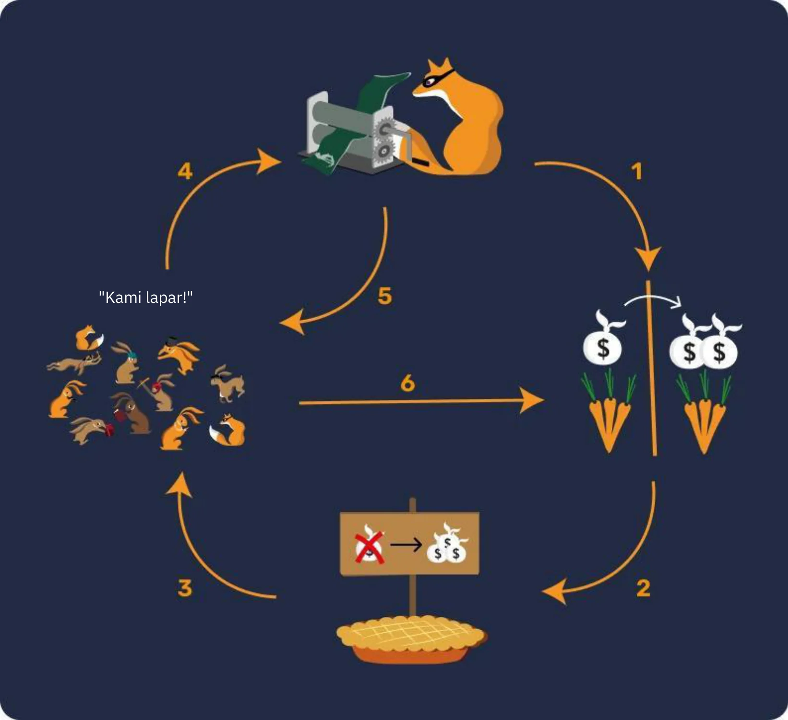

Fase 4 - Munculnya mata uang baru

- Mata uang baru kemudian diperkenalkan untuk menggantikan mata uang lama, untuk memutus siklus inflasi dengan menerapkan kontrol yang lebih ketat yang tidak ada pada alat pembayaran legal sebelumnya.

Menyelesaikan krisis hiperinflasi sering kali membutuhkan perubahan radikal, seperti revolusi, pergantian pemerintahan, pergantian gubernur bank sentral, dan lain-lain. Hilangnya kepercayaan, keruntuhan mata uang, dan rekonstruksi adalah fase penting untuk menghidupkan kembali ekonomi yang berbasis mata uang fiat.

### Tiga contoh penting

- Jerman, 1922-1923.

Salah satu contoh hiperinflasi yang paling mencolok terjadi di Republik Weimar Jerman setelah Perang Dunia I.

Jerman telah meminjam uang dalam jumlah yang sangat besar untuk membiayai perang. Namun, Jerman tidak hanya kehilangan uang tersebut, tetapi juga harus membayar miliaran dolar untuk reparasi. Tingkat inflasi tertinggi adalah pada bulan Oktober 1923, yang mencapai puncaknya pada 29.500%, yang setara dengan tingkat inflasi 20,9% per hari. Harga-harga naik dua kali lipat setiap 3,7 hari!

Mata uang Jerman menjadi sangat tidak berguna sehingga beberapa warga lebih memilih untuk membakar uang kertas mereka dari pada kayu karena lebih murah. Bahkan diceritakan bahwa di restoran-restoran, para pelayan harus mengumumkan harga menu setiap 30 menit untuk memperhitungkan inflasi.

Pada akhirnya, pihak berwenang menciptakan mata uang baru, yang didukung oleh utang Jerman, Prancis, dan Inggris, dan dijamin oleh tanah Jerman.


- Hungaria, 1945-1946

Negara yang mengalami periode hiperinflasi terburuk hingga saat ini adalah Hungaria setelah Perang Dunia II.

Hungaria berada di pihak yang kalah dalam konflik ini, dengan sebagian besar kapasitas produksi industrinya hancur. Bulan dengan inflasi tertinggi adalah Juli 1946, yang mengalami inflasi harga yang mengejutkan sebesar 41.900.000.000.000%, setara dengan 207% per hari. Harga naik dua kali lipat setiap 15 jam!

Uang kertas terakhir yang diedarkan adalah 100 juta miliar Pengo (100.000.000.000.000) pada tahun 1946.


- Zimbabwe, 2007-2008

Hingga tahun 2000, Zimbabwe swasembada untuk hampir semua kebutuhannya kecuali minyak.

Pada tahun 1997, nilai dolar Zimbabwe anjlok lebih dari 72% setelah pemerintah setuju untuk memberikan kompensasi kepada para veteran perang dengan jumlah yang setara dengan 450 juta dolar AS. Karena pemerintah tidak memiliki uang sebanyak itu, pemerintah terpaksa menjalankan mesin cetak. Pada tahun 2005, inflasi mencapai 586%, tetapi puncaknya terjadi pada pertengahan November 2008 dengan tingkat yang diperkirakan mencapai 79.600.000.000% per bulan.

Pada bulan Juni 2007, pemerintah telah bereaksi dengan memberlakukan kontrol harga, namun tindakan ini tidak memberikan pengaruh apapun terhadap perekonomian. Toko-toko benar-benar "dijarah", dan para pedagang tidak lagi memiliki sarana untuk mengisi kembali dagangan mereka.

Pada bulan April 2009, Menteri Keuangan mengumumkan penangguhan dolar Zimbabwe dan mengizinkan penggunaan mata uang asing yang berbeda untuk perdagangan. Semua rekening bank, dana pensiun, dan lembaga keuangan hangus dalam semalam.


Kesimpulannya, hiperinflasi memiliki efek menurunkan nilai mata uang dengan cepat, yang mengarah pada erosi tabungan dan hilangnya kepercayaan pada sistem moneter. Seperti yang pernah dikatakan oleh Voltaire, mata uang fiat pada akhirnya akan selalu kehilangan nilai intrinsiknya dan akan menuju nol.

Mata uang yang bergantung pada pihak ketiga yang tepercaya seperti lembaga keuangan, dalam praktiknya dan dalam jangka panjang, adalah mata uang yang cacat, karena tidak dapat menjamin daya beli atau menjaga tabungan.

Untuk mempelajari lebih dalam tentang hiperinflasi, kami merekomendasikan kursus ECO 204 dari David St-Onge, di mana Anda akan mempelajari apa itu siklus hiperinflasi dan dampaknya terhadap kehidupan kita. Anda juga akan menemukan kesamaan antara siklus-siklus ini dan, yang paling penting, bagaimana melindungi diri Anda dari siklus-siklus tersebut.

https://planb.academy/courses/caa75343-ac90-4249-bcca-0e2e57c3a0f1

## 21 juta bitcoin

<chapterId>f4a06d76-1963-56fd-93ff-dfa41489bcde</chapterId>

### Kebijakan moneter Bitcoin

Bitcoin adalah mata uang digital terdesentralisasi dengan jumlah maksimum yang telah ditentukan sebelumnya, yaitu 21 juta unit. Karakteristik kelangkaan intrinsik ini ditentukan oleh kode komputernya dan diperkuat oleh konsensus semua pengguna yang berpartisipasi dalam protokol.

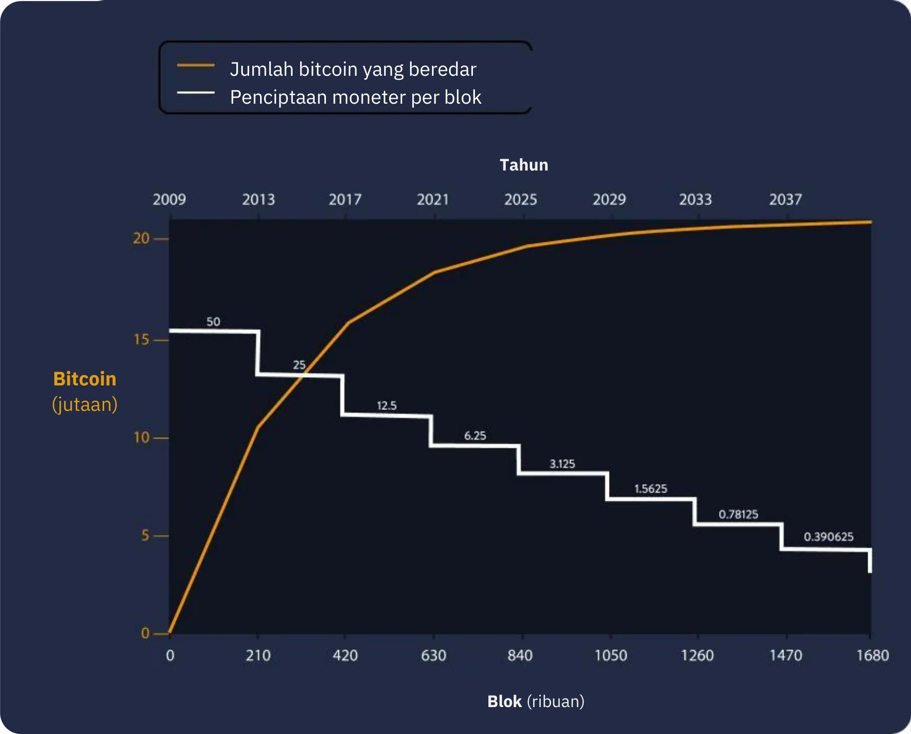

Penerbitan moneternya dapat diilustrasikan dengan kurva yang mewakili jumlah bitcoin yang dibuat dari waktu ke waktu. Sebagai contoh, pada tahun 2022, sekitar 18,5 juta bitcoin beredar. Perkiraan menunjukkan bahwa pada tahun 2025, akan ada sekitar 19,5 juta bitcoin, yang mewakili sekitar 93% dari total pasokan, dan pada tahun 2037, angka ini akan mencapai 20,4 juta.

### Bagaimana bitcoin baru dibuat?

Penciptaan bitcoin baru adalah hasil dari proses [penambangan](https://planb.academy/resources/glossary/mining). Singkatnya, para penambang menggunakan komputer canggih untuk memecahkan masalah matematika yang kompleks, yang memvalidasi dan mengamankan transaksi. Setelah masalah terpecahkan, penambang menambahkan [blok](https://planb.academy/resources/glossary/block) transaksi baru ke dalam blockchain, sebuah buku besar terdesentralisasi dan terdistribusi yang mencatat semua transaksi yang dilakukan di jaringan. Blockchain memastikan transparansi dan keamanan, karena setiap blok terhubung dengan blok sebelumnya, sehingga hampir tidak mungkin untuk mengubah data sebelumnya tanpa persetujuan dari jaringan.


Setelah berhasil melakukan tugas ini, para penambang akan mendapatkan imbalan berupa penerbitan bitcoin baru setiap sepuluh menit. Hadiah ini diprogram untuk membagi dua setiap 210.000 blok, yang kira-kira setiap empat tahun (sebuah peristiwa yang dikenal sebagai "halving"), memberikan kurva penerbitan moneter bentuk seperti tangga. Karena mekanisme ini, secara matematis dapat diprediksi bahwa penciptaan bitcoin baru akan berhenti pada tahun 2140, ketika jumlahnya mencapai batas 21 juta.

| Jumlah Halving | Tinggi Blok | Hadiah BTC Setelah Halving  | Perkiraan BTC yang Beredar Setelah Halving |
| -------------- | ------------ | ------------------------- | ------------------------------------------ |
| 1              | 210,000      | 25 BTC                    | 10,500,000 BTC                             |
| 2              | 420,000      | 12.5 BTC                  | 15,750,000 BTC                             |
| 3              | 630,000      | 6.25 BTC                  | 18,375,000 BTC                             |
| 4              | 840,000      | 3.125 BTC                 | 19,687,500 BTC                             |
| 5              | 1,050,000    | 1.5625 BTC                | 20,343,750 BTC                             |
| 6              | 1,260,000    | 0.78125 BTC               | 20,671,875 BTC                             |
| 7              | 1,470,000    | 0.390625 BTC              | 20,835,937.5 BTC                           |
| 8              | 1,680,000    | 0.1953125 BTC             | 20,917,968.75 BTC                          |
| 9              | 1,890,000    | 0.09765625 BTC            | 20,958,984.375 BTC                         |
| 10             | 2,100,000    | 0.048828125 BTC           | 20,979,492.188 BTC                         |
| 11             | 2,310,000    | 0.0244140625 BTC          | 20,989,746.094 BTC                         |
| 12             | 2,520,000    | 0.01220703125 BTC         | 20,994,873.047 BTC                         |
| 13             | 2,730,000    | 0.006103515625 BTC        | 20,997,436.523 BTC                         |
| 14             | 2,940,000    | 0.0030517578125 BTC       | 20,998,718.262 BTC                         |
| 15             | 3,150,000    | 0.00152587890625 BTC      | 20,999,359.131 BTC                         |
| 16             | 3,360,000    | 0.000762939453125 BTC     | 20,999,679.566 BTC                         |
| 17             | 3,570,000    | 0.0003814697265625 BTC    | 20,999,839.783 BTC                         |
| 18             | 3,780,000    | 0.00019073486328125 BTC   | 20,999,919.892 BTC                         |
| 19             | 3,990,000    | 0.000095367431640625 BTC  | 20,999,959.946 BTC                         |
| 20             | 4,200,000    | 0.0000476837158203125 BTC | 20,999,979.973 BTC                         |

Kami akan meninjau kembali konsep penambangan secara lebih rinci dalam [bab penambang](https://planb.academy/courses/2b7dc507-81e3-4b70-88e6-41ed44239966/dbb8264a-7434-57e4-9d1b-fbd1bae37fdf).

### Menjamin kelangkaan digital

Batas 21 juta adalah dasar dari kelangkaan Bitcoin, dan dijamin oleh dua mekanisme utama: penyesuaian tingkat kesulitan penambangan dan game teori.

- [Penyesuaian tingkat kesulitan penambangan](https://planb.academy/resources/glossary/difficulty-adjustment) adalah sebuah proses yang dilakukan setiap 2016 blok, atau sekitar dua minggu, untuk memastikan bahwa sebuah blok baru ditambahkan ke dalam blockchain setiap sepuluh menit sekali. Frekuensi pembuatan blok dan jumlah total bitcoin merupakan aspek yang tetap dalam protokol Bitcoin dan tidak dapat diubah tanpa adanya konsensus umum, tidak seperti keputusan sewenang-wenang yang dibuat dalam sistem moneter tradisional.

Kesulitan untuk menemukan [hash](https://planb.academy/resources/glossary/hash-function) yang valid mengikuti sebuah siklus: jika jumlah penambang meningkat, itu berarti jumlah blok yang mereka temukan lebih tinggi, yang menyebabkan penurunan waktu rata-rata untuk menemukan sebuah blok. Oleh karena itu, tingkat kesulitannya pun meningkat. Akibatnya, jumlah blok yang ditemukan penambang berkurang, yang berarti mekanismenya kembali ke rata-rata 10 menit per blok. Silakan lihat gambar di bawah ini untuk tampilan visual.

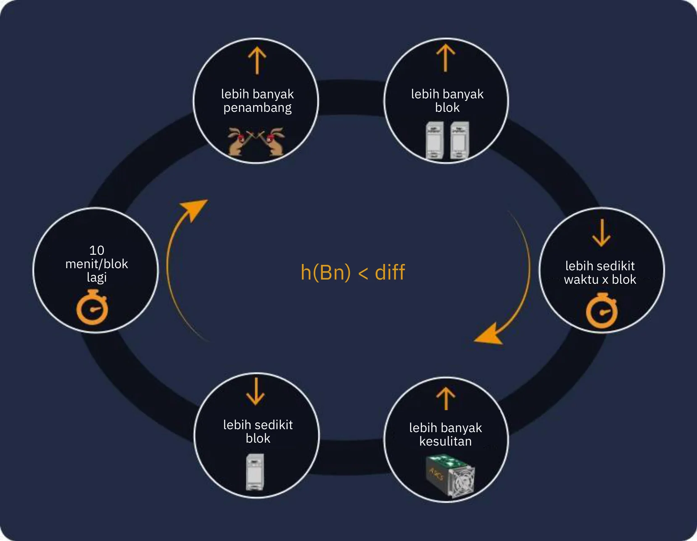

Tahukah Anda bahwa para penambang diberi insentif untuk menambang sebuah blok untuk mendapatkan bitcoin baru melalui [subsidi blok](https://planb.academy/resources/glossary/block-subsidy), serta [biaya transaksi](https://planb.academy/resources/glossary/transaction-fees) dari transaksi yang mereka masukkan ke dalam blok tersebut?

Dengan demikian, ketika jumlah bitcoin yang diterbitkan mendekati batas 21 juta, penambang akan dibayar lebih banyak melalui biaya transaksi mereka dibandingkan dengan subsidi blok.

- Game Teori adalah konsep matematika yang mengandalkan rasionalitas manusia. Teori ini mengasumsikan bahwa setiap orang bertindak secara logis, berusaha untuk memaksimalkan keuntungan mereka sendiri sambil mempertimbangkan potensi keputusan orang lain. Dalam Bitcoin, game teori membantu memastikan bahwa mayoritas penambang dan pengguna akan bertindak demi kepentingan jaringan. Faktanya, karena perubahan protokol dipilih oleh para pengguna, setiap modifikasi pada protokol Bitcoin akan membutuhkan persetujuan dari seluruh komunitas pengguna, yang mana hal ini sangat kompleks. Jadi, jika seseorang ingin membuat 22 juta bitcoin, mereka harus meyakinkan semua pengguna untuk secara sukarela mendevaluasi tabungan mereka sendiri, yang tidak mungkin terjadi karena Bitcoin bersifat global dan tidak diatur oleh sebuah kelompok yang tersentral atau terpusat.


Ide mendevaluasi mata uang bertentangan dengan filosofi dasar Bitcoin, sehingga perubahan dalam jumlah keseluruhan sangat tidak mungkin terjadi.

### Sebuah molekuler moneter yang dapat diaudit: setiap detik, dari awal dan selamanya!

Kelangkaan Bitcoin adalah aset utama, dan jumlah maksimum 21 juta bitcoin yang beredar adalah publik dan dapat diverifikasi oleh siapa saja.

Bahkan, siapa pun dapat melakukan ini melalui [node](https://planb.academy/resources/glossary/node) Bitcoin (yaitu validator transaksi) hanya dengan memasukkan perintah berikut: `bitcoin-cli gettxoutsetinfo`. Transparansi ini memperkuat kepercayaan terhadap sistem Bitcoin, yang tidak didasarkan pada institusi pusat atau individu, melainkan pada jaminan matematika dan kriptografi yang melekat pada protokolnya (Anda akan mempelajari cara melakukannya dengan mudah di LNP201).

```json
{
  "height": 710560,
  "bestblock": "0000000000000000000887384d67103412ea7f18a43953e65c8c4ac36bf42e54",
  "transactions": 473244,
  "txouts": 1018917,
  "bogosize": 2183872374,
  "hash_serialized_2": "eebb9987337700ffaacbbaa11223344",
  "disk_size": 178239584,
  "total_amount": 18745998.12345678
}
```

Bitcoin menjamin manajemen moneter yang baik dengan membatasi pembuatannya berdasarkan desain, yang membuatnya sangat berbeda dari mata uang lain karena dapat melindungi tabungan pengguna. Sejalan dengan prinsip-prinsip ekonomi Austrian, kuantitasnya yang stabil dan distribusinya yang dapat diprediksi melindunginya dari risiko inflasi yang harus dihadapi oleh mata uang tradisional (lihat kursus ECO201 untuk mengetahui lebih lanjut).

Singkatnya, Bitcoin, dengan sifatnya yang terdesentralisasi, kelangkaan yang terprogram, dan transparansi, menawarkan sebuah alternatif yang unik untuk sistem moneter tradisional. Hal ini mengilustrasikan bagaimana teknologi dapat digunakan untuk menciptakan mata uang yang tidak hanya berguna dan dapat diverifikasi, tetapi juga menjaga nilai tabungan pengguna dengan membatasi pasokannya secara ketat.


# Dompet Bitcoin

<partId>28860585-4f61-59d9-b242-f4c57d837cc1</partId>

## Apa yang dimaksud dengan dompet Bitcoin?

<chapterId>1c0166ab-cb7a-5bc6-9175-d13482bd91f1</chapterId>

Pada bagian 2, kita akan menjelajahi penyimpanan dan keamanan Bitcoin melalui penggunaan [dompet](https://planb.academy/resources/glossary/wallet), untuk memahami di mana letak bitcoin yang terkenal ini dan bagaimana cara berinteraksi dengannya!

### Menguak misteri dompet Bitcoin

Kami menggunakan dompet untuk berinteraksi dengan jaringan Bitcoin dalam tiga cara utama:

- Untuk menerima bitcoin
- Untuk mengirim bitcoin
- Untuk mengamankan mereka dari upaya peretasan dan pencurian

Dompet Bitcoin dapat memiliki banyak bentuk dan rupa: perangkat lunak di komputer Anda, aplikasi di smartphone Anda, perangkat fisik seperti kunci USB, atau bahkan selembar kertas. Masing-masing memiliki kasus penggunaan yang berbeda. Bahkan, beberapa di antaranya dirancang untuk transaksi dalam jumlah besar dengan penekanan pada keamanan, sementara yang lain memprioritaskan privasi, atau ditujukan untuk pembayaran harian dalam jumlah kecil.

Dengan demikian, portofolio dapat dikategorikan ke dalam kelompok penggunaan yang luas, yang selalu berpusat pada pertanyaan kunci: apakah Anda pemilik dana atau Anda menyerahkan kendali atas uang Anda kepada pihak ketiga? Kita akan membahas topik ini secara mendetail pada bab berikutnya, namun pertanyaannya tetap sederhana: apakah uang itu ada di kantong Anda atau di kantong bankir Anda?


### Bagaimana cara kerja dompet Bitcoin?

Baik itu "bankir" Bitcoin Anda atau Anda sendiri, sebagian besar dompet Bitcoin bekerja dengan teknologi yang sama berdasarkan kriptografi asimetris, yang melibatkan sistem pasangan kunci: [kunci privat](https://planb.academy/resources/glossary/private-key) untuk pengeluaran dan [kunci publik](https://planb.academy/resources/glossary/public-key) untuk penerimaan.

- Kunci pribadi

Ketika menginisialisasi dompet, sebuah [frasa pemulihan rahasia](https://planb.academy/resources/glossary/recovery-phrase) (kunci pribadi) dibuat dan diperlihatkan kepada Anda dalam bentuk 12 atau 24 kata.

Kunci pribadi merupakan hal yang sangat penting karena itu merupakan kepemilikan bitcoin Anda dan itu merupakan hak Anda untuk menggunakan atau mengirimnya. Oleh karena itu, pemegang kunci pribadi adalah pemilik sebenarnya dari bitcoin.

Kunci ini harus dirahasiakan dan dilindungi dengan baik, karena kunci ini akan membuka keberuntungan Anda!

- Kunci & alamat publik

Kunci publik dibuat dari kunci privat dan saling terhubung. Membagikan kunci publik memiliki risiko terhadap privasi (karena pengguna lain dapat melihat saldo Anda), tetapi tidak dengan keamananya (karena mereka tidak dapat membelanjakan dana Anda tanpa memiliki kunci privat). Pada gilirannya, kunci publik digunakan untuk membuat [alamat Bitcoin](https://planb.academy/resources/glossary/receiving-address), dan menerima uang.

Alamat-alamat ini secara otomatis dibuat oleh dompet Anda dan dapat dibagikan dengan aman. Untuk memaksimalkan privasi Anda, disarankan untuk menggunakannya hanya sekali.

Singkatnya, teknologi ini memberdayakan kita untuk menerima bitcoin tanpa memungkinkan penerima untuk mencuri dana kita! Sebuah kotak surat bisa menjadi metafora yang tepat: orang bisa menyetor uang ke dalamnya, tetapi hanya Anda yang bisa membukanya.

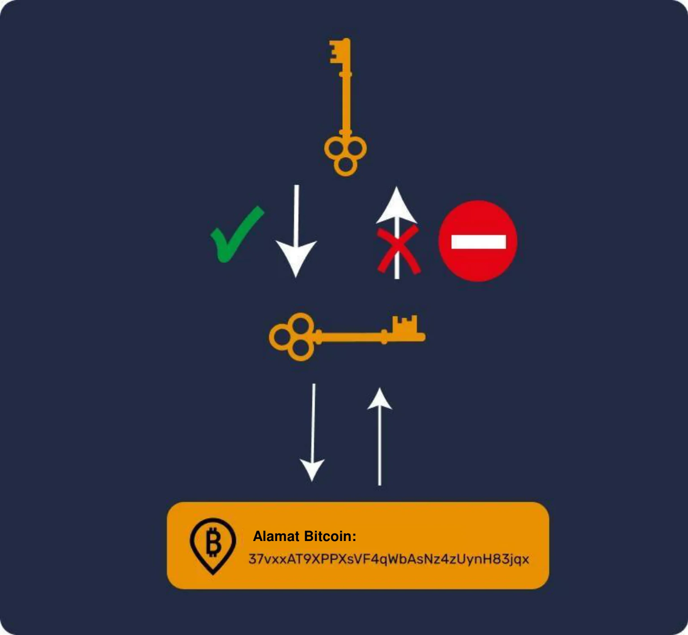

### Apakah bitcoin ada di dalam dompet?

Walaupun kunci Anda disimpan di dalam dompet, bitcoinya itu sendiri sebenarnya "tersimpan" di dalam blockchain Bitcoin, yang merupakan sebuah buku besar terdistribusi publik di dalam jaringan [peer-to-peer](https://planb.academy/resources/glossary/peertopeer-p2p) Bitcoin (kita akan membahasnya di bagian 3). Ini berarti bahwa kehilangan perangkat yang berisi dompet Anda tidak serta merta mengakibatkan hilangnya bitcoin Anda. Yang memungkinkan Anda untuk membuat ulang dompet Anda dan membelanjakan bitcoin Anda sebenarnya adalah kunci privat, jadi ingatlah selalu untuk mengamankannya dengan baik!


Untungnya, sejak tahun 2017, kunci pribadi dapat diwakili oleh sebuah daftar sederhana yang terdiri dari 12 atau 24 kata, yang dikenal sebagai 'mnemonic phrase, yang cukup mudah untuk disimpan. Frasa ini berfungsi sebagai cadangan untuk dana Anda dan memungkinkan Anda untuk membuat ulang dompet Anda menggunakan perangkat lunak atau aplikasi dompet Bitcoin. Oleh karena itu, siapa pun yang menemukan daftar kata ini dapat mengakses bitcoin Anda.

### Bagaimana dengan peretas?

Bagaimana jika seseorang secara tidak sengaja menebak daftar 12 atau 24 kata yang kita miliki? Jawaban singkatnya adalah hal ini sangat tidak mungkin terjadi, berkat kriptografi yang digunakan untuk membuat dompet. Sebagai gambaran, secara tidak sengaja menemukan frasa mnemonic yang sama sama halnya dengan menemukan angka yang "tepat" antara 1 dan 2 pangkat 256, yang hampir sama dengan menemukan atom yang "tepat" di alam semesta. Akan tetapi, jika Anda tidak puas dengan keamanan default ini, Anda dapat meningkatkannya dengan menambahkan [kata sandi](https://planb.academy/resources/glossary/passphrase-bip39) (sebuah kata tambahan) ke dalam dompet Bitcoin Anda.


Dengan demikian, kemungkinan peretasan dompet Bitcoin Anda sangat kecil jika Anda mengikuti praktik keamanan yang baik yang akan kami jelaskan di bagian selanjutnya.

Ingatlah untuk memilih dompet yang tepat untuk kebutuhan dan penggunaan Anda: tutorial terperinci tentang mengelola dan mengamankan berbagai dompet tersedia di [bagian tutorial di universitas kami](https://planb.academy/tutorials/wallet).

Jika, selama perjalanan Anda menyusuri lebih dalam, Anda ingin mempelajari lebih lanjut tentang membuat dompet Bitcoin, mulai dari entropi hingga menerima alamat, kami merekomendasikan kursus CYP 201 yang didedikasikan untuk topik ini:

https://planb.academy/courses/46b0ced2-9028-4a61-8fbc-3b005ee8d70f

## Dompet dan Keamanan Bitcoin

<chapterId>00c1afea-e54a-511f-bab3-2efc2fbfa6a1</chapterId>

### Mengajukan pertanyaan yang tepat sebelum memulai

Ketika Anda memiliki bitcoin, keamanan dana Anda menjadi perhatian utama. Cara terbaik untuk menentukan tingkat keamanan yang sesuai dengan situasi Anda adalah dengan mengajukan beberapa pertanyaan kepada diri Anda sendiri:

- Siapa saja yang dapat mengakses dana Anda? Dengan kata lain, apakah Anda memiliki akses tunggal ke bitcoin Anda, atau apakah pihak ketiga (seperti perusahaan) memberi Anda akses ke dana Anda?
- Bagaimana Anda berencana untuk menggunakan bitcoin di dompet tersebut? Secara teratur? Untuk tabungan jangka menengah atau jangka panjang?
- Apa keterampilan teknis Anda?
- Berapa anggaran keamanan Anda?

Sebenarnya tidak ada jawaban atau solusi universal, jadi luangkan waktu untuk menjawab pertanyaan-pertanyaan ini, karena ini akan membantu menyesuaikan langkah-langkah keamanan Anda dengan kebutuhan Anda.

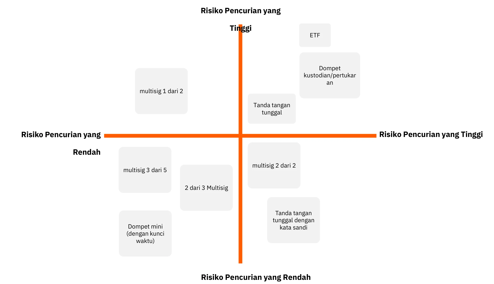

### Berpikir tentang dompet Bitcoin dalam hal kerumitanya

Di bawah ini, kami akan mendefinisikan beberapa tingkat keamanan:

- Level 0\*\*, Anda menggunakan apa yang disebut "[layanan kustodian](https://planb.academy/resources/glossary/custody)" di mana Anda bukan satu-satunya pemegang bitcoin Anda. Perlu diketahui bahwa pihak ketiga tepercaya ini dapat membatasi akses Anda ke dana Anda kapan saja. Dalam hal ini, tingkat kedaulatan keuangan Anda mirip dengan sistem perbankan tradisional dengan rekening bank.


- Level 1\*\*, Anda menggunakan dompet Bitcoin di ponsel atau komputer Anda, di mana Anda adalah satu-satunya pemegang bitcoin Anda dan Anda dapat dengan mudah melakukan transaksi. Alat yang disebutkan di atas disebut sebagai "hot wallet", karena kunci pribadi disimpan di perangkat yang memiliki akses internet. Dalam hal ini, sangat penting untuk membuat mnemonic phrase cadangan Anda untuk mendapatkan kembali akses ke dana Anda jika Anda kehilangan ponsel atau komputer Anda.

Misalnya, Anda dapat menggunakan Sparrow Wallet sebagai hot wallet:

https://planb.academy/tutorials/wallet/desktop/sparrow-c674e2ac-d46f-4c82-92a7-7d1b0e262f5d

- Level 2\*\*, Anda menggunakan dompet fisik, dan Anda telah mengamankan daftar 12/24 kata. Ini sering disebut sebagai "[Cold Wallet](https://planb.academy/resources/glossary/cold-wallet)" karena kunci Anda disimpan di perangkat yang tidak terhubung ke internet. Dalam hal ini, Anda harus selalu menandatangani setiap transaksi dengan perangkat Anda, yang membuat dana Anda tidak dapat diakses setiap hari.

Sebagai contoh, Anda dapat menggunakan Ledger, Satochip, atau Tapsigner:

https://planb.academy/tutorials/wallet/hardware/ledger-nano-s-plus-75043cb3-2e8e-43e8-862d-ca243b8215a4

https://planb.academy/tutorials/wallet/hardware/satochip-e9bc81d9-d59b-420d-9672-3360212237ba

https://planb.academy/tutorials/wallet/hardware/tapsigner-ab2bcdf9-9509-4908-9a4a-2f2be1e7d5d2


- Level 3**, anda menggunakan dompet level 1 atau 2, tetapi anda menambahkan sebuah kata sandi tambahan. Dalam kasus ini, perlu diketahui bahwa Anda perlu membuat cadangan baik daftar 12/24 kata **dan\*\* kata sandi Anda. Idealnya, kedua informasi ini disimpan di dua tempat yang berbeda.

Untuk mempelajari lebih lanjut tentang penggunaan dan fungsi frasa sandi BIP39:

https://planb.academy/tutorials/wallet/backup/passphrase-a26a0220-806c-44b4-af14-bafdeb1adce7

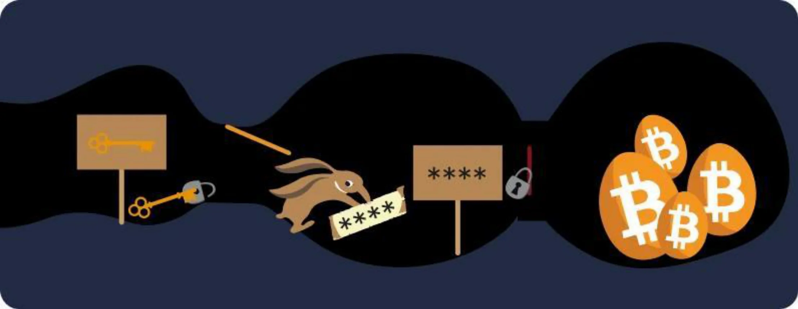

- Level 4\*\*, Anda menggunakan satu set dompet untuk membuat sebuah dompet "[multisig](https://planb.academy/resources/glossary/multisig)", yang berarti dibutuhkan beberapa tanda tangan untuk melakukan sebuah transaksi. Dalam hal ini, perlu diketahui bahwa setiap bagian dari multisig harus disimpan di lokasi yang berbeda. Pendekatan ini sering dianggap sebagai penggunaan Bitcoin tingkat lanjut, terutama untuk mengelola jumlah yang besar dan untuk tujuan korporat.


Tentu saja, kasus penggunaan yang berbeda juga membutuhkan dompet Bitcoin yang berbeda, dan tidak ada solusi yang cocok untuk semua.

### Keamanan harus disesuaikan

Jumlah yang ingin ditinggalkan pada tingkat keamanan tertentu tergantung pada masing-masing individu. Bagi sebagian orang, menyisakan 1 BTC di hot wallet adalah hal yang wajar, sementara bagi sebagian orang lainnya, hal ini justru sebaliknya. Bagaimanapun, ketika Anda ingin mengamankan jumlah yang kecil, kami menyarankan untuk tidak menghabiskan terlalu banyak uang untuk keamanan dengan membeli dompet fisik. Selain itu, perlu diingat bahwa terlalu mempersulit keamanan dan aksesibilitas bitcoin Anda dapat merugikan, terutama jika Anda salah menyimpan cadangan dompet Anda.

Kesimpulannya, kepemilikan langsung atas bitcoin seseorang merupakan elemen penting untuk memastikan kedaulatan finansial. Disarankan untuk menggunakan dompet mobile untuk pengeluaran harian dan dompet fisik offline atau "dingin" untuk menyimpan jumlah yang lebih besar. Di sisi lain, bisnis harus mempertimbangkan untuk menggunakan sistem tanda tangan multi, atau "multisig", untuk meningkatkan keamanan bersama. Penting juga untuk menghindari layanan kustodian, yang dapat mereplikasi beberapa kerentanan sistem keuangan tradisional.

Dengan mengingat hal ini, sekarang kita dapat beralih ke bagian selanjutnya di mana kami akan menjelaskan bagaimana cara membuat dompet Bitcoin. Namun, jika Anda ingin mendalami topik keamanan lebih lanjut, Anda dapat membaca [artikel dari DarthCoin](https://asi0.substack.com/p/bitcoin-soyez-votre-propre-banque).

## Menyiapkan Dompet

<chapterId>615519eb-4565-557d-86a0-021badf7616f</chapterId>

Keamanan bitcoin Anda sangatlah penting, dan kesalahan kecil saja bisa berakibat fatal. Itulah mengapa kita perlu mempelajari praktik-praktik terbaik untuk diterapkan saat membuat dompet Bitcoin baru.

Harap diperhatikan bahwa kursus BTC102 akan memandu Anda melalui langkah ini.

https://planb.academy/courses/f3e3843d-1a1d-450c-96d6-d7232158b81f

### Langkah ini tidak main-main!

Ketika Anda membuat dompet, perangkat lunak biasanya membuat kunci pribadi Anda, biasanya diwakili oleh daftar 12/24 kata (sering disebut "seed phrase" atau "mnemonic phrase"): kata-kata ini merupakan akses ke dana Anda. Jika kunci ini ter-akses ke pihak ketiga, Anda harus mempertimbangkan bahwa dana yang terkait telah dikompromikan. Oleh karena itu, ketika mengatur dompet Anda, sangat penting untuk mengikuti aturan-aturan ini:

- Tutupi semua kamera.
- Jangan mengambil foto daftar kata.
- Jangan memasukkannya di komputer atau ponsel.
- Jangan menyimpannya sebagai kontak atau mengirimkannya ke diri Anda sendiri melalui SMS.
- Jangan pernah meninggalkan kata-kata Anda tanpa pengawasan di atas meja Anda.
- Jangan pernah menyembunyikan daftar kata Anda di tempat yang tidak biasa.

Anda harus benar-benar mengambil selembar kertas kosong atau mencetak [template] ini (https://bitcoiner.guide/backup.pdf), dan menulis daftar kata dengan pena, mengikuti urutan yang disajikan dengan rapi dan jelas. Ketahuilah bahwa jika tinta memudar seiring berjalannya waktu, Anda mungkin akan kehilangan dana Anda. Oleh karena itu, penting untuk menjaga selembar kertas ini terlindung dari faktor lingkungan yang berpotensi merusaknya, seperti kelembaban atau api.

Silakan lihat contoh cara menyusun makalah di bawah ini: kata-kata tersebut palsu, jadi jangan gunakan!


### Tips kami untuk melakukannya dengan benar

Selain itu, pastikan untuk tidak membuat kesalahan saat menyalin, jika tidak, ahli waris Anda mungkin akan kesulitan membacanya dan mungkin tidak dapat memulihkan dana tersebut. Selain itu, setelah Anda menyimpan kata-katanya, disarankan untuk membuat salinan kedua dan menyimpannya di lokasi yang berbeda dari yang pertama. Hal ini memastikan Anda memiliki cadangan jika dokumen asli hilang atau rusak.


Daftar kata harus disimpan di tempat yang aman dan mudah diingat. Hindari membuat rencana penyembunyian yang terlalu rumit yang dapat menyebabkan hilangnya daftar kata tersebut.

**Kata-kata Anda = uang Anda.**

Baik 'cold wallet' atau 'hot wallet' menggunakan metode daftar kata sebagai standar untuk mencadangkan kunci pribadi. Sebagai hasilnya, anda dapat memasukkan mnemonic phrase anda ke dalam perangkat lunak atau perangkat dompet yang kompatibel untuk memulihkan akses anda. Di sisi lain, kami sangat menyarankan untuk tidak menggunakan dompet yang tidak menyediakan seed phrase, karena mereka mungkin mengharuskan Anda untuk memberikan akun, alamat email, atau, lebih buruk lagi, ID.

**PERHATIAN: Ketiadaan daftar 12/24 kata harus mengingatkan Anda.**

Jika Anda ingin mengetahui, langkah demi langkah, cara membuat wallet Anda sendiri dan mendapatkan bitcoin pertama Anda, kami juga merekomendasikan untuk mengikuti kursus lainnya:

https://planb.academy/courses/f3e3843d-1a1d-450c-96d6-d7232158b81f

## Melewati Ujian Waktu

<chapterId>f58cd446-c202-5eff-aab7-e61cc40e5c06</chapterId>

Seperti halnya bentuk kekayaan lainnya, bitcoin Anda harus dilindungi dari kehilangan, pencurian, dan penurunan nilai, terutama dalam jangka panjang. Melindungi bitcoin Anda membutuhkan pengetahuan teknis dan pemahaman tentang risiko yang terkait, yang membuka jalan menuju dua strategi utama: mengukir bitcoin Anda di atas pelat baja dan membuat rencana warisan.

### Mengukir dalam baja

Salah satu metode untuk mengamankan bitcoin Anda dalam jangka panjang adalah dengan mengukir frasa mnemonik Anda pada bahan yang tahan lama seperti baja, dengan membuat cadangan fisik dari kunci Anda yang tahan terhadap kerusakan akibat air dan api.

Berbagai solusi tersedia: beberapa di antaranya berbiaya rendah, seperti "Blockmit", sementara yang lain mungkin memerlukan peralatan yang lebih khusus. Anda dapat menjelajahi topik ini lebih lanjut di bagian [tutorial](https://planb.academy/en/tutorials/wallet) di akademi kami.


### Pikirkan tentang generasi berikutnya!

Bersamaan dengan praktik pertama ini, membuat rencana warisan adalah langkah penting untuk memastikan bahwa bitcoin Anda dikelola dengan baik setelah Anda meninggal. Rencana ini melibatkan penulisan surat dengan tangan di mana Anda menguraikan sifat aset Anda, metode aksesnya, dan informasi kontak dari orang-orang tepercaya yang bertanggung jawab atas aset tersebut. Penting juga untuk mendiskusikan pewarisan bitcoin dengan notaris untuk memastikan kepatuhan pajak, meskipun orang ini tidak boleh dipercayakan secara langsung untuk mengelola bitcoin Anda.

Jika Anda ingin menjelajahi lebih jauh subjek rencana warisan untuk bitcoin Anda, kami sarankan untuk membaca buku Pamela Morgan [Rencana Warisan Aset Kripto](https://planb.academy/resources/books/28) atau mendaftar di kursus BTC102, di mana kami memberikan panduan untuk membuat rencana Anda.

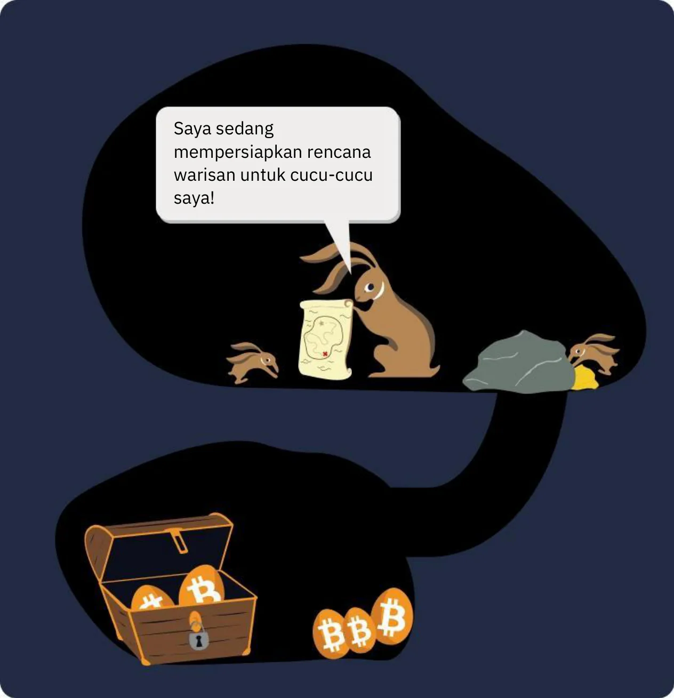

### Privasi itu penting

Selain membuat cadangan fisik atau mengembangkan rencana warisan, privasi merupakan topik penting lainnya dalam hal keamanan jangka panjang bitcoin Anda. Sebagai contoh, akan lebih baik jika Anda membeli bitcoin tanpa memberikan identifikasi untuk meminimalkan risiko pencurian identitas atau pelacakan dana Anda oleh pihak-pihak yang memiliki alat yang tepat.

Mengenai privasi, sangat penting untuk menghindari membicarakan bitcoin Anda kepada semua orang. Kami tidak dapat memprediksi bagaimana teknologi ini akan dianggap di masa depan, jadi menjaga kerahasiaan tentang kepemilikan Anda adalah pilihan yang bijaksana: Anda tidak ingin menarik perhatian pada diri sendiri atau dompet Anda.

Demikian pula, hindari membagikan detail mengenai sistem keamanan Anda secara terbuka selama pertemuan atau pertemuan dengan orang asing...

### Rangkuman tentang Keamanan Dompet Bitcoin

Dompet Bitcoin adalah perangkat lunak yang memungkinkan Anda untuk menyimpan bitcoin dan melakukan transaksi. Ada beberapa jenis:

- dompet ponsel atau PC, nyaman untuk jumlah kecil dan/atau pengeluaran rutin;
- dompet fisik, lebih cocok untuk menyimpan bitcoin dalam jangka menengah dan panjang;
- dompet multisig, yang lebih rumit untuk dikelola dan membutuhkan banyak tanda tangan untuk melakukan transaksi.

Ketika membuat dompet, Anda harus terlebih dahulu membuat cadangan daftar 12 atau 24 kata pada selembar kertas atau lempengan logam. Frasa mnemonik ini memungkinkan Anda untuk memulihkan dompet Anda melalui aplikasi dompet Bitcoin apa pun. Ketahuilah bahwa siapa pun yang mendapatkan akses ke daftar ini juga mendapatkan akses ke dana Anda.

Dalam dunia Bitcoin, kedaulatan finansial sangat erat kaitannya dengan tanggung jawab individu, sehingga sangat penting untuk mengamankan akses ke dompet dan cadangan Anda. Untuk mencapai hal ini, penting untuk mengikuti panduan tertentu:

- Buatlah rencana warisan untuk memastikan bahwa orang yang Anda cintai dapat mengambil uang tersebut jika terjadi masalah.
- Hindari meninggalkan Bitcoin Anda di platform bursa karena rentan terhadap serangan peretas.
- Sesuaikan tingkat keamanan Anda dengan kebutuhan dan kasus penggunaan Anda, agar dapat memilih dengan baik di antara berbagai dompet Bitcoin yang tersedia.

Sekarang kita telah membahas dasar-dasar dompet Bitcoin dan praktik terbaik untuk mengamankannya, di bab selanjutnya kita akan menjelajahi fitur-fitur teknis Bitcoin. Sekali lagi, memahami dasar-dasar protokol Bitcoin akan meningkatkan pemahaman Anda mengenai cara kerjanya, sehingga Anda dapat memanfaatkannya dengan lebih baik.

# Aspek Teknis Bitcoin.

<partId>a86d7439-e7a2-5f21-b1e9-6b5e23ca265b</partId>

## Meluncurkan Bitcoin

<chapterId>b7561082-8943-519d-95d1-a5f60dd2686d</chapterId>

### Mari kita mulai dengan sedikit sejarah.

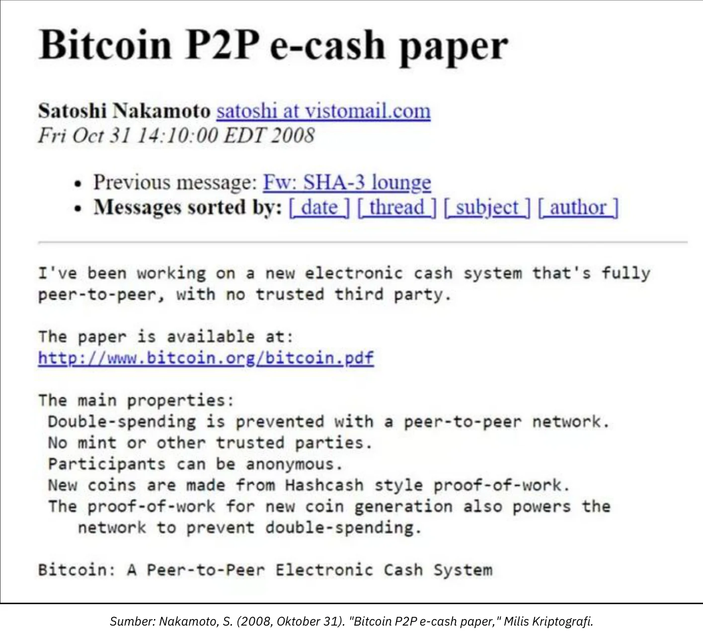

Tanggal 31 Oktober 2008 menandai lahirnya teknologi keuangan baru yaitu Bitcoin. Pada hari ini, Satoshi Nakamoto yang tidak disebutkan namanya mempresentasikan inovasinya kepada dunia melalui sebuah email yang dikirim ke daftar e-mail cypherpunks, sebuah komunitas penggemar kriptografi yang didedikasikan untuk mempromosikan privasi di internet. Email ini berisi sebuah dokumen yang disebut "White Paper", yang mempresentasikan cara kerja Bitcoin.

Inisiatif ini tidak langsung menimbulkan antusiasme, mungkin karena kegagalan sebelumnya dalam upaya menciptakan sistem uang digital. Namun demikian, Buku Putih ini akhirnya menjadi referensi bagi para pengguna Bitcoin dan telah menjadi bahan perdebatan dalam ekosistem Bitcoin selama bertahun-tahun.

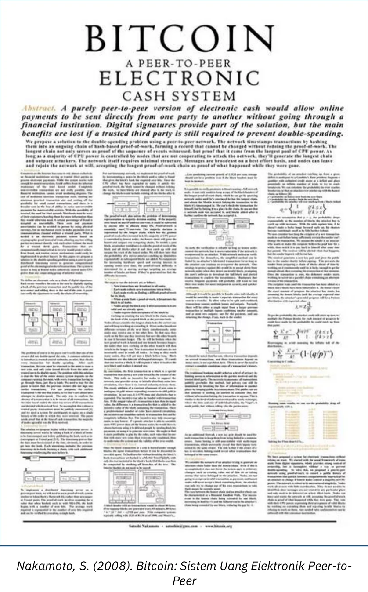

Pada tanggal 3 Januari 2009, Satoshi secara resmi meresmikan jaringan Bitcoin dengan menciptakan blok pertama, yang juga dikenal sebagai "[Genesis block](https://planb.academy/resources/glossary/genesis-block)", yang menandai peluncuran blockchain Bitcoin. Blok ini berisi sebuah pesan yang mencerminkan misi Bitcoin: "03/jan/2009 Chancellor on brink of second bailout for banks."

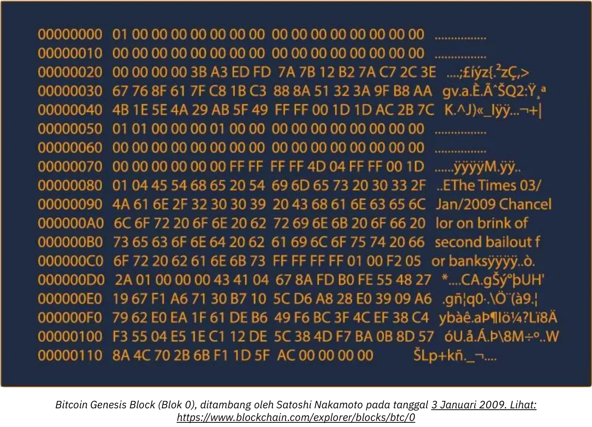

> "Kita dapat memenangkan pertempuran besar dalam perlombaan senjata dan mendapatkan
> wilayah kebebasan baru selama beberapa tahun." - Satoshi Nakamoto
> 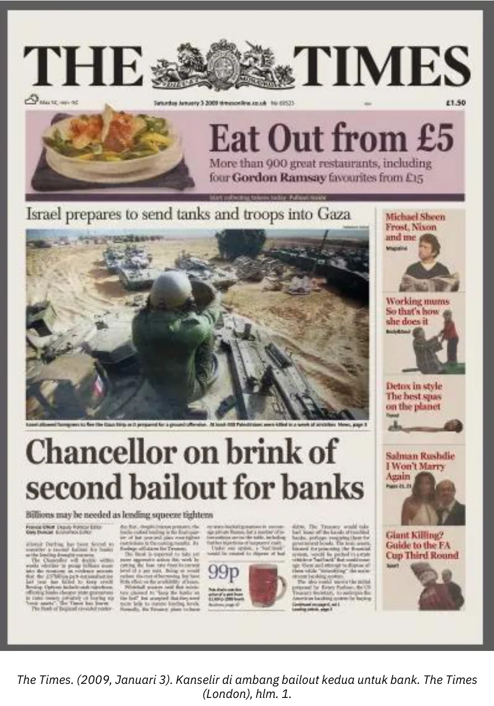

### Protokol Bitcoin menjadi lebih hidup

Pada tanggal 9 Januari 2009, Satoshi mengumumkan peluncuran Bitcoin versi 0.1.0. Tak lama setelah itu, Hal Finney memegang perangkat lunak dan bergabung dengan jaringan, yang menandai kehadiran dua node dan, oleh karena itu, dua penambang dalam jaringan. Finney bahkan mengabadikan langkah ini dengan men-tweet, 'Menjalankan Bitcoin'. Pada tanggal 12 Januari 2009, transaksi Bitcoin pertama sebesar 10 BTC dilakukan antara Satoshi dan Hal Finney, dan Anda dapat dengan mudah menemukannya, jika Anda kembali ke blok 170.

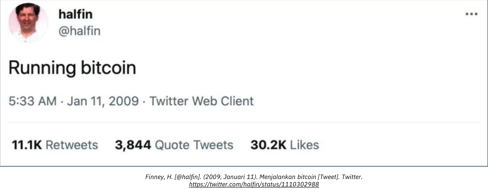

Ketertarikan terhadap Bitcoin tumbuh dengan cepat, membuat banyak orang mengujinya, terlibat dalam perdebatan, memecahkan masalah, dan merefleksikan aspek etika, ekonomi, dan filosofinya. Orang-orang begitu terpikat sehingga Satoshi menciptakan forum BitcoinTalk pada tanggal 22 November 2009, untuk memfasilitasi jenis konfrontasi ini.

Forum ini dengan cepat menjadi tempat diskusi yang disukai oleh para pengguna Bitcoin, sedemikian rupa sehingga meme dan simbol terkenal yang terkait dengan Bitcoin lahir darinya, seperti [logo Bitcoin](https://bitcointalk.org/index.php?topic=64.0), [Hodl](https://bitcointalk.org/index.php?topic=375643.0) yang terkenal, atau bahkan [hari Pizza](https://bitcointalk.org/index.php?topic=137.msg1195).

\*\*Tahukah Anda? Pada tanggal 22 Mei 2010, Laszlo Hanyecz membuat sejarah dengan menawarkan untuk membeli dua pizza seharga 10.000 BTC: ini adalah pertama kalinya Bitcoin digunakan untuk membeli barang fisik.


### Hilangnya Satoshi Nakamoto

Pada tahun 2010, ketika Bitcoin mulai menarik perhatian media, Satoshi memutuskan untuk menjauhkan diri dengan mengumumkan kepergiannya di sebuah posting forum pada tanggal 12 Desember 2010. Pada tanggal 23 April 2011, ia melakukan pertukaran pribadi terakhirnya yang diketahui melalui email, kemudian menghilang, meninggalkan ciptaannya di tangan komunitas.

> "Pemerintah pandai menghentikan jaringan terkontrol
> yang terpusat seperti Napster, tetapi jaringan P2P murni seperti
> Gnutella dan Tor tampaknya akan bertahan dengan sendirinya." - Satoshi Nakamoto
> Terlepas dari ketidakhadiran Satoshi, Bitcoin terus dikembangkan: sejarah Bitcoin ditulis setiap 10 menit, dan protokolnya terus berfungsi hingga hari ini sebagaimana mestinya. Terlepas dari ketakutan, ketidakpastian, atau keraguan, Bitcoin terus bergerak maju, dengan ketersediaan online yang sangat kuat. Faktanya, menurut [situs web] ini (https://bitcoinuptime.com/), Bitcoin telah berfungsi dan berjalan tanpa masalah besar selama 99,988% dari waktu sejak diciptakan.

Bagi sebagian orang, Bitcoin didefinisikan sebagai entitas jamur seperti [miselium](https://brandonquittem.com/bitcoin-is-the-mycelium-of-money/), sementara yang lain menggambarkannya sebagai [lubang hitam](https://dergigi.com/). Suka atau tidak suka, Bitcoin terus ada, dengan ritme konstan 10 menit per blok, seperti detak jantung sistem moneter baru.

Untuk memperdalam pemahaman tentang tulisan-tulisan Satoshi Nakamoto, saya merekomendasikan membaca [*The Book of Satoshi*](https://planb.academy/resources/books/the-book-of-satoshi-61dea136-f12b-4a19-bdb4-0272bca2ab30) karya Phil Champagne, yang menghimpun dan mengontekstualisasikan teks-teks utamanya, serta dokumenter ARTE [*Le mystère Satoshi*](https://planb.academy/resources/movies/f48841f0-b9ab-4d44-96e7-84fd5b70e91c), yang menawarkan penyelidikan yang mudah diakses dan terdokumentasi dengan baik mengenai identitas dan warisannya.

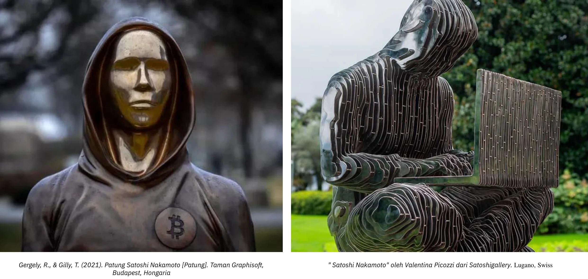

> "Akar masalah dari mata uang konvensional adalah dibutuhkan kepercayaan untuk membuatnya berjalan. Bank sentral harus dipercaya untuk tidak men-devaluasi nilai mata uang, namun sejarah mata uang fiat penuh dengan pelanggaran kepercayaan tersebut. Bank harus dipercaya untuk menyimpan uang kita dan mentransfernya secara elektronik, tetapi mereka meminjamkannya dalam gelombang gelembung kredit dengan cadangan yang nyaris tidak ada" - [Satoshi Nakamoto](https://satoshi.nakamotoinstitute.org/posts/p2pfoundation/1/)
> Setelah mengetahui latar belakangnya, mari kita lihat bagaimana cara kerja transaksi Bitcoin secara umum.

## Transaksi Bitcoin

<chapterId>03482644-5473-590b-975b-b43bb65eac21</chapterId>

Transaksi Bitcoin adalah sebuah transfer kepemilikan bitcoin melalui penggunaan alamat Bitcoin. Untuk menggambarkan proses ini, mari kita perkenalkan dua tokoh utama: Alice dan Bob. Alice ingin mendapatkan bitcoin, sedangkan Bob sudah memiliki beberapa bitcoin.

### Langkah 1 - Membuat transaksi melalui dompet

Agar Bob dapat mentransfer bitcoin kepada Alice, Alice harus memberikan salah satu alamat Bitcoin-nya, yang unik  tersebut untuk dompet Bitcoin-nya. Sama seperti kunci privat yang digunakan untuk menghasilkan kunci publik, kunci publik kemudian digunakan untuk menghasilkan alamat.

Secara konkretnya, ketika Alice membuka dompetnya dan menekan "terima", sebuah kode QR atau sebuah alamat (seperti bc1q7957hh3nj47efn8t2r6xdzs2cy3wjcyp8pch6hfkggy7jwrzj93sv4uykr) akan ditampilkan. Ini berfungsi sebagai 'Bitcoin IBAN' miliknya, yang kemudian diberikan kepada Bob.

Setelah itu, Bob melakukan transaksi dengan membuka dompet Bitcoinnya dan menekan "kirim". Dia kemudian menyalin dan menempelkan alamat Alice ke dalam kolom yang diperlukan, menambahkan jumlah yang ingin dia kirimkan, dan menentukan biaya transaksi, yang berfungsi sebagai insentif bagi para penambang untuk menyertakan transaksi tersebut ke dalam blok berikutnya. Faktanya, semakin tinggi biaya yang dibayarkan Bob, semakin besar peluangnya untuk memasukkan transaksi tersebut ke dalam blok berikutnya ke dalam blockchain, yaitu sebuah buku besar yang bersifat publik dan tidak dapat diubah yang mencatat semua transaksi Bitcoin.

Untuk menyelesaikan transaksi, Bob harus menandatanganinya dengan kunci pribadinya untuk memverifikasi bahwa ia adalah pemilik bitcoin yang ingin ia transfer. Langkah ini biasanya dilakukan secara otomatis pada dompet seluler, atau dalam bentuk [konfirmasi](https://planb.academy/resources/glossary/confirmation) pada dompet fisik Anda: "Apakah Anda yakin ingin mengirim X ke Y? Ya atau tidak".

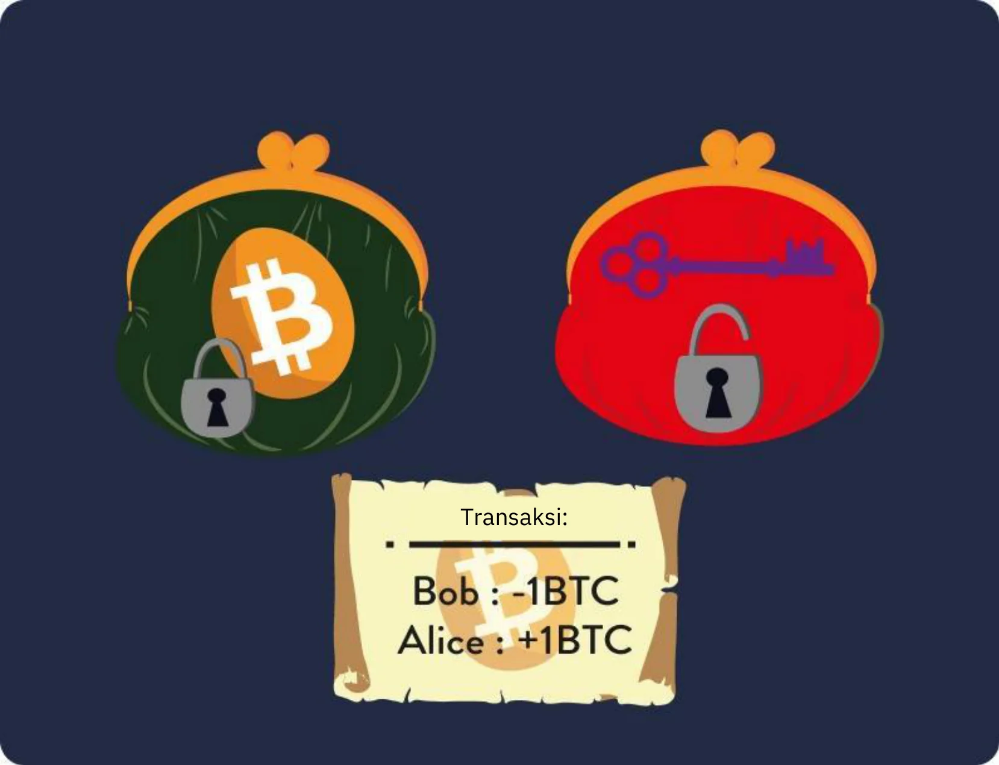

\*\*Mengapa kita membayar biaya? Biaya sangat penting untuk menciptakan pasar bebas untuk memasukkan transaksi ke dalam blok. Faktanya, sebuah blok memiliki ukuran 1 MB (yang diperluas menjadi 4MB setelah pembaruan [Segwit](https://planb.academy/resources/glossary/segwit)), sehingga jumlah transaksi yang dapat "disisipkan" ke dalam sebuah blok terbatas pada beberapa ribu transaksi per blok. Ukuran sebuah transaksi tergantung pada kompleksitasnya. Oleh karena itu, transaksi yang lebih kompleks biasanya dikenakan biaya yang lebih tinggi.

### Langkah 2: Perbanyakan transaksi melalui node

Pada tahap ini, transaksi telah dibuat dan dompet Bob akan membagikanya dengan jaringan Bitcoin. Untuk melakukan hal ini, dompetnya akan berkomunikasi dengan sebuah node di jaringan Bitcoin, yang akan menyebarkan informasi ini ke node lainnya. Proses semacam ini memungkinkan seluruh jaringan untuk melihat transaksi baru ini dan memperhitungkannya.


Pada titik ini, walaupun transaksi ini diketahui oleh semua orang (melalui alat yang disebut [Mempool](https://planb.academy/resources/glossary/mempool)), transaksi ini tidak dapat dianggap terkonfirmasi hingga dimasukkan ke dalam blok oleh seorang penambang, yang merupakan satu-satunya orang yang memvalidasi transaksi dengan memasukkannya ke dalam blockchain.

Faktanya, para penambang memiliki peran untuk mengumpulkan transaksi yang valid dan belum dikonfirmasi untuk disusun menjadi sebuah blok. Singkatnya, mereka harus memecahkan teka-teki kriptografi dalam sebuah proses yang disebut 'proof of work atau "bukti kerja" agar blok mereka menjadi blok berikutnya dalam blockchain Bitcoin.


### Langkah 3: Transaksi ditambang dalam sebuah blok oleh penambang.

Sistem Proof of work membutuhkan pencarian "hash" yang valid untuk blok yang bersangkutan: anggap saja sebagai sidik jari unik yang terkait dengan blok tersebut, yang terdiri dari 256 karakter. Validitas hash ini bergantung pada tingkat kesulitan jaringan Bitcoin (kita akan membahasnya lebih lanjut nanti). Untuk saat ini, anggap saja seorang penambang telah menemukan sebuah blok yang valid, dan transaksi Bob ke Alice termasuk di dalamnya. Kemudian, blok baru yang valid tersebut ditambahkan ke dalam blockchain, yaitu buku besar umum untuk semua pengguna Bitcoin.


### Langkah 4: Blok tersebut valid dan diverifikasi oleh simpul rujukan Alice.

Pada tahap ini, transaksi dianggap sah: penambang akan menyebarkan blok baru ke jaringan melalui node mereka, dan dompet Alice akan diperbarui.


**Catatan:** Meskipun Alice diberitahu bahwa ia telah menerima bitcoin di salah satu alamatnya, disarankan untuk menganggap transaksi tersebut tidak akan dapat dirubah jika sudah menerima **enam** konfirmasi. Ini berarti enam blok tambahan harus ditambang di atas blok yang berisi transaksi Bob. Dengan kata lain, semakin lama sebuah transaksi berada di dalam blockchain, maka semakin tidak dapat dirubah.

### Apa pentingnya proses ini?

Sistem transaksi Bitcoin terdesentralisasi dan bekerja secara peer-to-peer, tanpa pihak perantara tepercaya.

Bob mengirimkan transaksinya ke jaringan Bitcoin, dan ketika seorang penambang menerbitkan blok valid yang berisi transaksi Bob, Alice dapat mulai menganggap bahwa bitcoin tersebut adalah miliknya. Kepercayaan tidak diperlukan pada setiap langkah transfer kepemilikan bitcoin: aturan protokol dan insentif ekonomi yang ada membuatnya sangat mahal untuk bertindak jahat dalam sistem Bitcoin.

Faktanya, pengguna memindahkan kepemilikan dana mereka dengan menandatangani transaksi secara digital dengan kunci pribadi mereka sendiri. Di sisi lain, para penambang memiliki kekuasaan yang terbatas, dan para pengguna memiliki kontrol yang signifikan dengan menggunakan node Bitcoin untuk memvalidasi blok-blok baru dan transaksi-transaksi yang disertakan. Setiap node memiliki salinan penuh atau sebagian dari buku besar, sehingga jaringan yang dibentuk oleh node Bitcoin membuat sistem ini benar-benar terdesentralisasi.

Sebagai konsekuensinya, agar jaringan Bitcoin dapat dihancurkan sepenuhnya, setiap salinan blockchain pada semua node Bitcoin harus dihilangkan, yang merupakan sebuah tugas yang secara praktis tidak mungkin dilakukan karena distribusi geografis node-node tersebut dan sulitnya untuk mengambilnya secara fisik.

Mari kita lihat lebih dekat bagaimana cara kerja node Bitcoin.

## Simpul Bitcoin

<chapterId>8533cebc-f799-528b-89df-8d75d4c37f1c</chapterId>

Node adalah elemen fundamental dalam arsitektur jaringan Bitcoin, karena node menjalankan berbagai fungsi penting:

- Menyimpan salinan blockchain Bitcoin
- Memvalidasi transaksi
- Mengirimkan informasi ke node lain
- Menegakkan aturan protokol Bitcoin.

Oleh karena itu, setiap perangkat yang menjalankan perangkat lunak Bitcoin, yang disebut Bitcoin [node](https://planb.academy/resources/glossary/node) (sering kali menggunakan [Bitcoin Core](https://bitcoin.org/en/bitcoin-core/)), berkontribusi pada desentralisasi jaringan.


### Node adalah inti utama dari Bitcoin.

Setiap node menyimpan salinan blockchain, yang memungkinkan verifikasi transaksi dan mencegah upaya penipuan. Sifat jaringan yang terdesentralisasi memberikan Bitcoin ketahanan dan kekuatan yang luar biasa. Faktanya, untuk menghentikan protokol Bitcoin, semua node di seluruh dunia harus dimatikan. Sebagai informasi, pada September 2023, ada sekitar [45.000 node](https://bitnodes.io/nodes/all/) yang tersebar di seluruh dunia.

Node mampu memverifikasi keabsahan blok dan transaksi karena mereka mengikuti aturan konsensus Bitcoin. Aturan-aturan ini menetapkan kebijakan moneter Bitcoin, seperti jumlah upah penambang (yang akan kita bahas secara lebih rinci di bagian selanjutnya) dan jumlah bitcoin yang beredar. Di satu sisi, node bertindak sebagai sistem hukum jaringan karena semua peserta jaringan mengikuti aturan yang sama, sehingga memastikan netralitas protokol Bitcoin. Aturan konsensus hampir tidak pernah berubah, jika ada, karena untuk membuat perubahan, diperlukan persetujuan dari semua node.


Tata kelola dalam protokol berada di luar cakupan kursus dasar ini, tetapi penting untuk dicatat bahwa setiap pengguna yang menjalankan node Bitcoin dapat memutuskan aturan mana yang akan diikuti. Seorang pengguna dapat memilih untuk mengikuti aturan yang berbeda (misalnya, melakukan modifikasi pada kode), tetapi jika perubahan ini membatalkan aturan konsensus saat ini, maka node tersebut tidak lagi menjadi bagian dari jaringan Bitcoin. Oleh karena itu, modifikasi besar jarang terjadi dan membutuhkan koordinasi yang signifikan di antara ribuan partisipan dengan ideologi dan kepentingan yang beragam, yang memaksa mereka untuk memberikan pembaruan yang dianggap 'lebih baik' oleh semua pengguna Bitcoin.

### Seperti apa bentuk sebuah simpul?

Ada beberapa opsi yang tersedia ketika Anda ingin memasang node Anda sendiri, dengan biaya pemeliharaan yang berbeda. Anda cukup menjalankan perangkat lunak Bitcoin Core di komputer Anda, tetapi ini akan membutuhkan ruang penyimpanan yang cukup besar, karena ukuran blockchain sekitar ~500GB. Untuk mengatasi kendala ini, Anda dapat memilih untuk hanya menyimpan N blok terakhir dalam memori dengan membuat "pruned node". Untuk solusi kedua ini, biayanya dapat diabaikan karena node hanya aktif ketika Anda membutuhkannya.

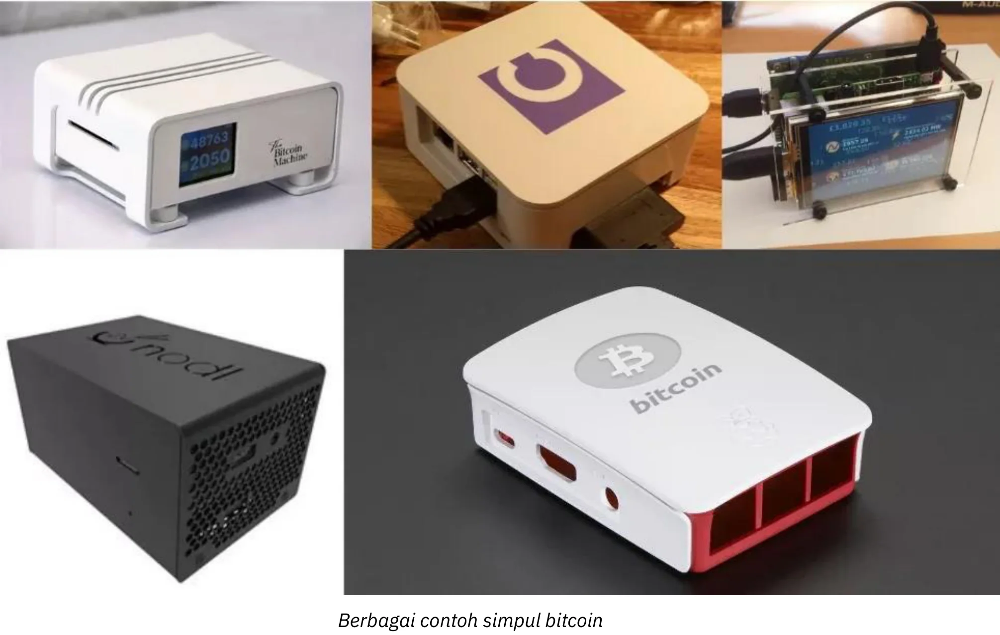

Pilihan kedua adalah menggunakan perangkat keras khusus untuk tujuan ini, seperti Raspberry Pi 4 dengan SSD yang cukup besar (sekitar ~2TB). Pilihan lain ini lebih mahal jika Anda harus membeli perangkat kerasnya, tetapi ini mewakili kurang dari €10,00 per tahun dalam hal konsumsi listrik.

Dari perspektif bandwidth, dengan mempertimbangkan 1 blok 1MB setiap 10 menit, ini setara dengan 5GB per bulan.

### Node harus tetap dapat diakses oleh semua orang!

Biaya yang terjangkau dan aksesibilitas node Bitcoin dalam hal sumber daya perangkat keras, penyimpanan, dan bandwidth adalah karakteristik yang sangat penting, karena memfasilitasi desentralisasi jaringan.

Memang, setiap orang memiliki alasan yang bagus untuk menjalankan sebuah node! Biaya dan usaha yang dikeluarkan sangat kecil dibandingkan dengan manfaat yang diperoleh. Anda hanya perlu memulai petualangan dan bergabung dengan ribuan bitcoiners lainnya untuk membentuk jaringan Bitcoin bersama-sama.

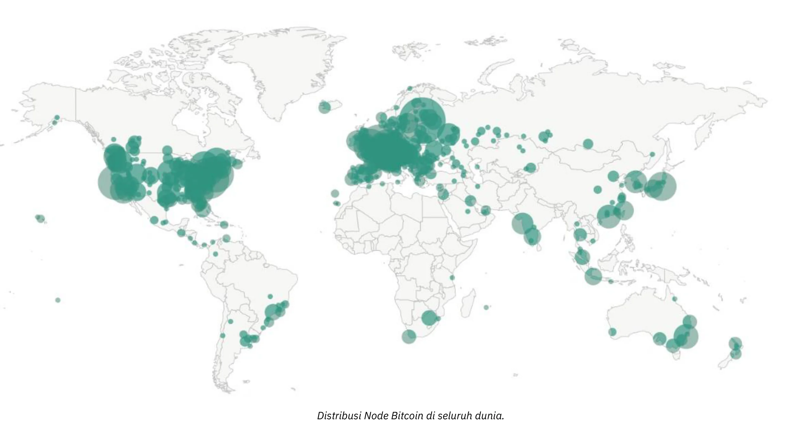

Sebaliknya, jika blok-blok tersebut 100 kali lebih besar, kita tentu saja dapat melakukan 100 kali lebih banyak transaksi setiap 10 menit, tetapi menjalankan sebuah node Bitcoin akan membutuhkan hard disk sebesar 50TB, bandwidth lebih dari 500GB/bulan, dan perangkat keras yang dapat memvalidasi ratusan ribu transaksi dalam waktu kurang dari 10 menit. Dalam situasi hipotetis dengan blok yang 100 kali lebih besar, menjalankan sebuah node Bitcoin tidak akan dapat diakses oleh kebanyakan orang, yang akan membahayakan desentralisasi protokol dan kekekalan transaksi serta aturan konsensus.

Oleh karena itu, batasan protokol telah dirancang untuk memungkinkan sebanyak mungkin orang menjalankan node Bitcoin mereka sendiri. Faktanya, tahun 2017 ditandai dengan kontroversi sengit yang dikenal sebagai "block size war". Konflik ini mempertemukan pihak-pihak yang ingin memodifikasi Bitcoin dengan meningkatkan ukuran blok untuk meningkatkan kapasitas transaksi (penambang, platform bursa pertukaran, dan institusi) dengan pihak-pihak yang ingin mempertahankan kemandirian dan kekuatan pengguna (node dan pengguna). Pada akhirnya, pihak kedua menang.

Setelah kemenangan ini, node-node tersebut mengaktifkan pembaruan yang disebut SegWit, membuka jalan untuk implementasi Lightning Network, sebuah jaringan pembayaran Bitcoin instan yang dibangun sebagai lapisan kedua blockchain Bitcoin. Situasi ini menunjukkan bahwa para pengguna, melalui node mereka, memiliki kekuatan yang nyata di dalam Bitcoin, yang memungkinkan mereka untuk melawan institusi besar pada saat terjadi perselisihan.

## Penambang

<chapterId>dbb8264a-7434-57e4-9d1b-fbd1bae37fdf</chapterId>

**Penambang mengamankan jaringan dan menambahkan transaksi ke dalam blok. Mereka menggunakan listrik melalui mesin ASIC untuk menyelesaikan (proof of work)bukti kerja Bitcoin.**


### Penjelasan tentang Bukti Pekerjaan (Proof of Work)

"Proof of Work" (POW) adalah mekanisme konsensus keamanan protokol Bitcoin. Ini adalah fondasi dari segalanya dan memainkan peran penting dalam teori permainan Bitcoin.

Untuk menjelaskan cara kerjanya, bayangkan sebuah lotere universal di mana semua orang dapat berpartisipasi. Tujuannya adalah untuk menemukan nomor tertentu yang memungkinkan pemenang untuk menandatangani blok yang valid, dan mendapatkan hadiah dalam bentuk Bitcoin. Nomor ini sangat mudah diverifikasi menggunakan fungsi hash SHA-256, tetapi sulit ditemukan: peserta (penambang) akan mencoba miliaran kemungkinan, seperti 1, 52, 2648, 26874615, 15344854131318631, dan seterusnya, hingga mereka menemukan nomor yang tepat.

Jika nomor yang dipilih benar: Jackpot! Jika tidak, pencarian berlanjut.

Untuk mengoptimalkan jumlah percobaan, mereka akan menggunakan mesin khusus yang disebut ASIC, yang memiliki peran tunggal untuk menghitung miliaran kemungkinan per detik (jumlah total percobaan disebut "[HashRate](https://planb.academy/resources/glossary/hashrate)"). Untuk mengoperasikan mesin-mesin ini, listrik dalam jumlah besar harus dikonsumsi. Oleh karena itu, POW mengubah energi menjadi mata uang, menghubungkan dunia nyata dan dunia digital untuk menciptakan mata uang berbasis energi pertama.

Mesin-mesin tersebut beroperasi terus menerus, dan setelah rata-rata 10 menit, seorang pemenang akan muncul: peserta ini telah berhasil menemukan hash yang benar yang berada di bawah ambang batas kesulitan. Pemenang utama dan satu-satunya kemudian akan menandatangani blok baru dari server stempel waktu (Time Stamp), menambahkannya ke blockchain. Mereka akan menerima hadiah dan kembali untuk mencoba peruntungan mereka dalam menambang blok berikutnya. Proses ini telah berlangsung selama lebih dari sepuluh tahun, dengan seorang pemenang yang mengonfirmasi transaksi Bitcoin setiap 10 menit dan juga mengamankan transaksi-transaksi yang telah terjadi sebelumnya, sehingga membuat blockchain Bitcoin menjadi lebih kuat dan aman.

Setiap 2016 blok (kira-kira setiap dua minggu), **penyesuaian tingkat kesulitan** menyeimbangkan kembali permainan penambangan global berdasarkan jumlah peserta. Penyesuaian ini diperlukan karena jumlah penambang dan daya komputasi gabungan mereka dapat bervariasi secara signifikan dari waktu ke waktu. Untuk mempertahankan target waktu blok, jaringan mengkalibrasi ulang tingkat kesulitan berdasarkan seberapa cepat blok 2016 terakhir ditambang. Jika blok-blok tersebut ditambang terlalu cepat, tingkat kesulitannya akan meningkat, sehingga lebih sulit untuk menemukan hash yang benar. Sebaliknya, jika ditambang terlalu lambat, tingkat kesulitannya akan berkurang, sehingga lebih mudah.


### Pertambangan terus berkembang

Selama bertahun-tahun, para penambang telah melengkapi diri mereka dengan perangkat keras komputer yang semakin efisien untuk menghasilkan sebanyak mungkin hash per detik (HashRate) dengan menggunakan energi yang paling sedikit dengan cara yang seefektif mungkin. Penambang awal seperti Satoshi atau Hal Finney menambang hanya dengan menggunakan CPU mereka, kemudian penambang lainnya mulai menambang dengan kartu grafis mereka. Saat ini, para penambang menggunakan ASIC (Application-Specific Integrated Circuit): mesin yang dirancang khusus untuk menerapkan algoritme SHA256.

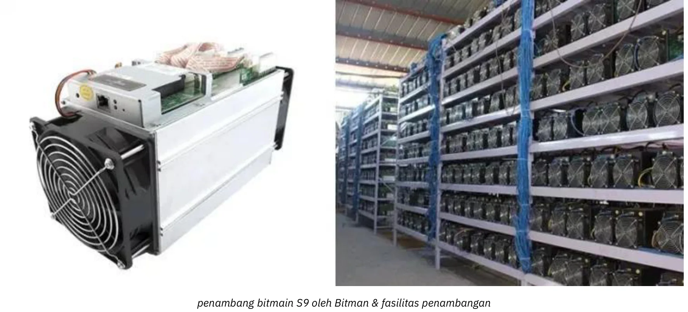

Hashrate dari jaringan Bitcoin menunjukkan jumlah percobaan yang dilakukan per detik untuk menemukan blok berikutnya. Saat ini, hashrate bahkan telah melampaui 500 TH/s, yaitu 500.000 miliar percobaan per detik! Semakin tinggi hashrate global, semakin sulit bagi pelaku kejahatan untuk memonopoli sumber daya yang dibutuhkan untuk mendapatkan mayoritas kekuatan penambangan dan membelanjakan dana mereka lebih dari satu kali (masalah [pembelanjaan ganda](https://planb.academy/resources/glossary/double-spending-attack)). Oleh karena itu, akan lebih ekonomis untuk mengikuti aturan protokol Bitcoin daripada melawannya.

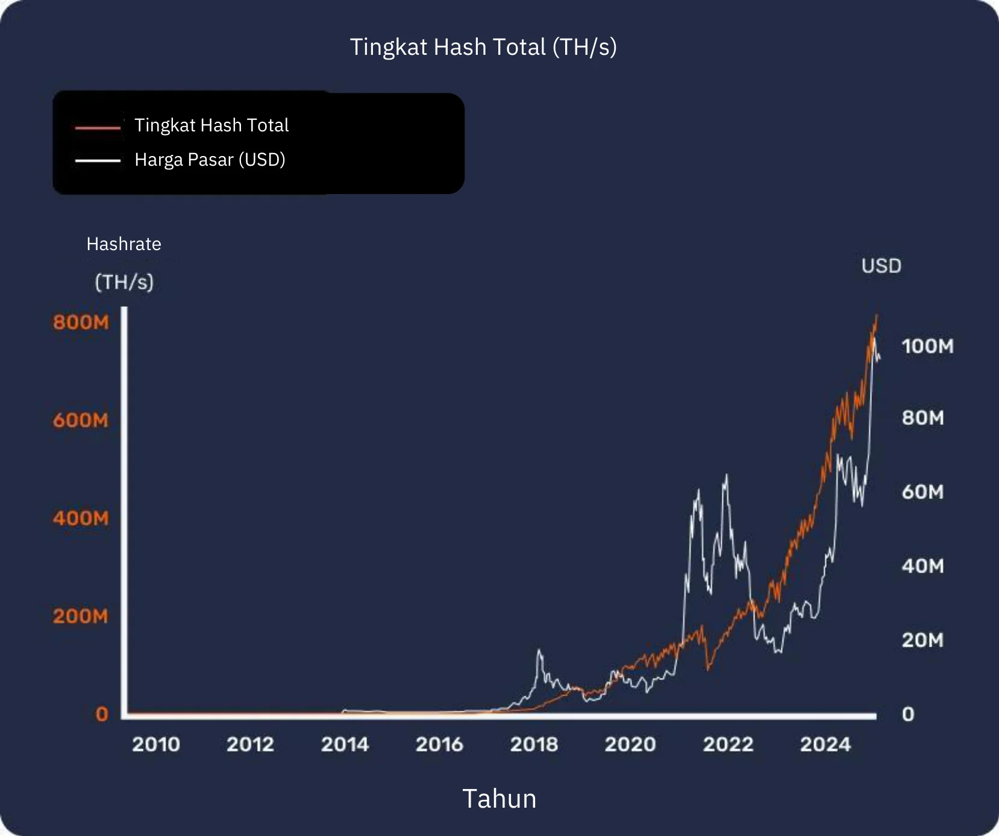

### Apa saja yang dapat ditemukan dalam satu blok?

Header blok berisi beberapa elemen seperti waktu, target kesulitan, jumlah blok terakhir, versi yang digunakan, dan Akar Merkle (merkle root) dari transaksi sebelumnya.

Transaksi **[coinbase](https://planb.academy/resources/glossary/coinbase-transaction)** selalu menjadi transaksi pertama yang dimasukkan ke dalam blok: transaksi ini berisi upah penambang karena telah melakukan pekerjaan validator. Kemudian datanglah transaksi-transaksi yang telah divalidasi. Penambang akan memilih untuk memasukkan transaksi yang memberikan keuntungan paling besar, yaitu transaksi berukuran kecil dengan biaya maksimum.

### Kompensasi penambang

Pada awalnya, penambang akan mendapatkan kompensasi ketika mereka menemukan blok yang valid. Lebih tepatnya, mereka diberi imbalan dalam dua cara:

- melalui subsidi (bitcoin yang baru dicetak) yang disertakan dalam blok;
- melalui biaya transaksi dari transaksi yang termasuk dalam blok tersebut.

Jumlah subsidi ditentukan oleh aturan konsensus dan tergantung pada Epoch: **Hadiah blok = subsidi blok + biaya transaksi**.

Memang, untuk blok pertama, subsidi blok adalah 50 bitcoin. Setiap 210.000 blok (kira-kira setiap 4 tahun), jumlah ini dikurangi setengahnya. Hari ini (tahun 2024), kita berada di Epoch ke-5, yang berarti subsidinya adalah 3,125 bitcoin. Singkatnya, ini adalah mekanisme otomatis yang melepaskan bitcoin baru di dalam sistem. Subsidi akan berkurang seiring berjalannya waktu, hingga mencapai batas penerbitan 21 juta bitcoin. Sudah ada lebih dari 19,4 juta bitcoin yang beredar, yaitu lebih dari 92%.


Metode kompensasi yang kedua ditentukan oleh jumlah yang dipilih oleh pengguna untuk biaya transaksi, yang menunjukkan urgensi pengguna untuk memasukkan transaksi mereka ke dalam blok berikutnya. Karena penambang ingin memaksimalkan pendapatan mereka, mereka akan cenderung memprioritaskan transaksi dengan biaya transaksi yang tinggi.

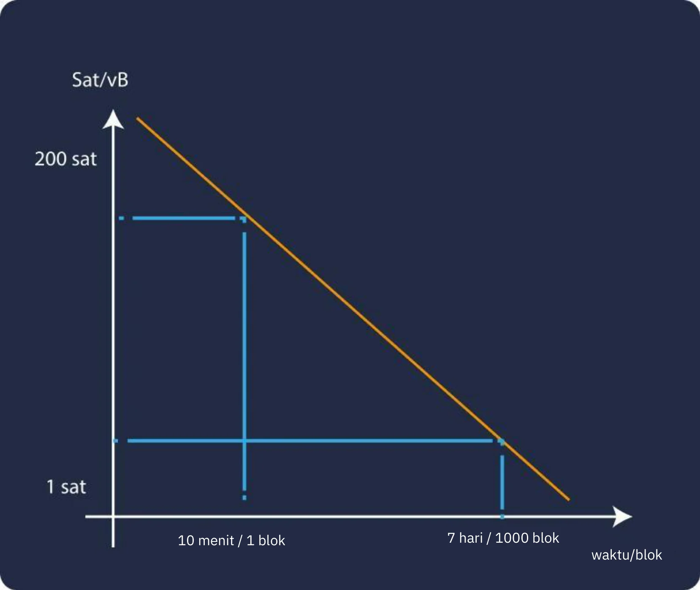

Untuk menstabilkan model bisnis mereka, yang bergantung pada upah yang mereka terima untuk setiap blok yang valid, para penambang sering kali membuat grup melalui "[mining pool](https://planb.academy/resources/glossary/pool-mining)", di mana mereka mengumpulkan sumber daya komputasi mereka.

### Mengapa repot-repot melakukan semua ini?

Singkatnya, inovasi Bitcoin adalah mengusulkan solusi untuk masalah pembelanjaan ganda melalui penggunaan blockchain berdasarkan Proof of Work dengan tingkat kesulitan yang mengambang. Dalam dunia digital, konsep kepemilikan berbeda dengan dunia fisik. Faktanya, di dunia digital, segala sesuatu dapat disalin dan ditempelkan, yang menciptakan risiko penggunaan aset digital yang bernilai lebih banyak. Perantara pihak tepercaya, seperti bank, telah diciptakan untuk mengatasi masalah teknologi ini dan memastikan bahwa ketika sebuah aset ditransfer, aset tersebut tidak lagi menjadi milik pengirim.

Namun, bagaimana hal ini dapat dilakukan tanpa perantara yang dapat dipercaya? Masalah ini digambarkan dengan baik melalui paradoks Jenderal Bizantium, sebuah masalah koordinasi informasi dalam sebuah sistem di mana berbagai aktor tidak dapat dipercaya. Dalam Masalah Jenderal Bizantium, sekelompok jenderal harus mengoordinasikan serangan ke sebuah kota, tetapi beberapa di antaranya mungkin adalah pengkhianat yang mencoba mengganggu rencana tersebut. Tantangannya adalah agar para jenderal yang setia mencapai konsensus apakah akan menyerang atau mundur, meskipun menerima pesan yang berpotensi menyesatkan dari pengkhianat.

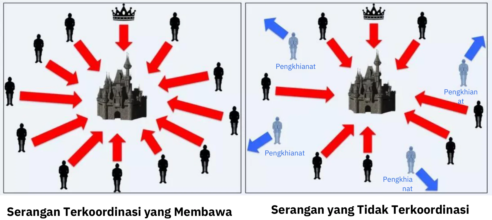

Oleh karena itu, Bitcoin merupakan sebuah solusi untuk menyelesaikan masalah ini, atau setidaknya untuk mengatasinya. Para "jenderal" Bitcoin, atau para penambang, memproduksi blok-blok (informasi) dan node Bitcoin memverifikasi transaksi keuangan dengan menggunakan aturan konsensus untuk memastikan keaslian informasi. Asimetri dalam biaya energi antara produksi dan verifikasi informasi memastikan keandalan informasi, tanpa pihak ketiga yang dapat dipercaya.

Para penambang adalah pembangun keamanan jaringan Bitcoin. Dengan menghabiskan energi untuk menghasilkan hash, mereka membangun tembok yang membuatnya sangat mahal bagi agen jahat untuk menulis ulang riwayat transaksi, dan disinsentif ekonomi ini menghalangi orang lain untuk berperilaku tidak jujur.

Bahkan dalam kasus serangan 51%, di mana seorang agen akan memiliki lebih dari setengah hashrate, jaringan akan tetap aman karena penyerang harus mengeluarkan energi sebanyak gabungan semua penambang untuk mencoba memodifikasi blockchain. Mekanisme proof-of-work yang membutuhkan banyak energi inilah yang menjamin keamanan jaringan.

### Singkatnya

Teori permainan yang diterapkan pada Bitcoin mengeliminasi para penambang yang tidak jujur, yang menggunakan mesin ASIC untuk menambang dan menerima hadiah jika berhasil. Selain itu, mereka sering kali bergabung dengan kelompok penambangan untuk berbagi daya komputasi dan menerima hadiah yang lebih kecil tetapi lebih teratur. Walaupun penambangan Bitcoin membutuhkan biaya energi yang tinggi, namun hal ini sangat penting untuk operasi dan keamanan jaringan Bitcoin. Mekanisme proof-of-work dan teknologi blockchain mengatasi masalah pengeluaran ganda dan memastikan integritas informasi tanpa bergantung pada pihak ketiga yang tepercaya. Meskipun memproduksi informasi membutuhkan pengeluaran energi yang signifikan, memverifikasi informasi tersebut membutuhkan biaya yang tidak terlalu besar. Asimetri ini memperkuat keamanan jaringan, membuatnya lebih ekonomis untuk mematuhi aturan konsensus daripada mencoba melanggarnya.


Jika Anda ingin memperdalam topik khusus mengenai penambangan Bitcoin, Anda dapat merujuk ke kursus MIN 101 kami. Di sana Anda akan menemukan penjelasan teoretis yang rinci tentang prinsip proof of work dan cara kerjanya, serta seluruh konsep yang terkait dengannya.

https://planb.academy/courses/d1ce86d9-c983-49bc-92b3-e3c5269f239e

Saya juga menyarankan Anda untuk menemukan kursus praktis yang lebih lanjutan ini, di mana kami menjelaskan bagaimana mengubah ASIC menjadi sistem pemanas rumah DIY, guna memanfaatkan panas yang dihasilkan oleh penambangan dan memperoleh satoshi pertama Anda!

https://planb.academy/courses/ce272232-0d97-4482-884a-0f77a2ebc036

## Bitcoin dan Ekologi

<chapterId>4b227ae6-443a-5739-b443-60b7931130d9</chapterId>

Pada bagian sebelumnya, kita telah memahami bahwa keamanan protokol Bitcoin bergantung pada konsumsi energi yang tinggi untuk menghasilkan sebuah buku besar transaksi tanpa pihak ketiga yang terpercaya. Di media mainstream, biaya energi secara keseluruhan sering kali dibandingkan dengan penggunaan listrik di sebuah negara kecil. Tetapi apakah perbandingan ini masuk akal? Apakah relevan untuk memahami alasan di balik biaya tersebut?

### Biaya energi Bitcoin.

Pertama, mari kita menilai secara kualitatif biaya lingkungan dari pertambangan. Seorang penambang harus memiliki mesin seperti ASIC dan sumber energi dalam bentuk listrik untuk menyalakan mesin tersebut. ASIC sebagian besar terbuat dari aluminium dan dapat didaur ulang atau digunakan kembali untuk tujuan lain (seperti yang ditunjukkan oleh proyek Attakaï yang dijelaskan dalam kursus kami MIN201), yang mengubah Antminer S9 menjadi pemanas ruangan). Oleh karena itu, perhatian utamanya adalah konsumsi energi.

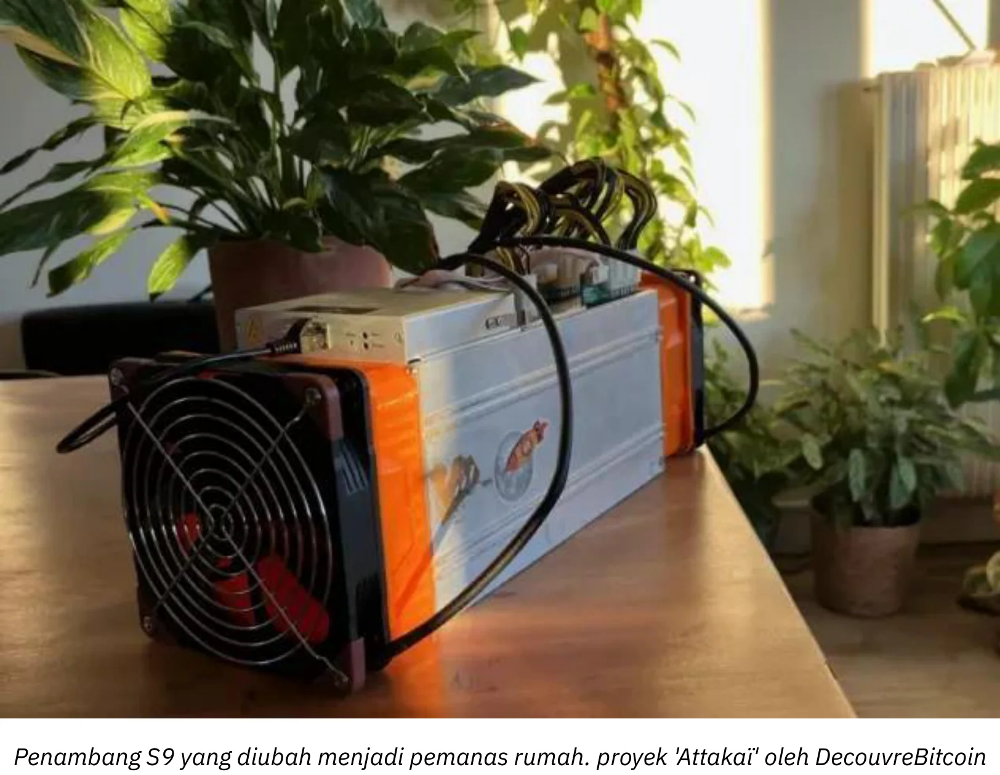

Konsumsi listrik mewakili hampir seluruh biaya yang dikeluarkan oleh seorang penambang. Oleh karena itu, mereka terdorong untuk mencari sumber listrik yang murah, sehingga mereka dapat pergi ke tempat-tempat di mana pembangkit listrik telah terpasang tetapi belum terhubung ke jaringan listrik di wilayah tersebut. Dalam hal ini, para penambang bertindak sebagai pembeli pilihan terakhir, sehingga pembangkit listrik dapat memperoleh pembiayaan bahkan sebelum terhubung ke jaringan listrik. Ketika jaringan listrik tersambung, permintaan listrik akan meningkat, yang akan menaikkan harga dan membuatnya kurang menguntungkan bagi para penambang untuk mendapatkan listrik di tempat-tempat tersebut. Karena mesin-mesin tersebut dapat dengan mudah dipindahkan, para penambang kemudian akan memutuskan untuk memindahkan instalasi mereka dan menetap lebih jauh di tempat yang permintaannya rendah dan begitu pula dengan harganya, biasanya di daerah di mana mereka dapat memperoleh energi dari pembangkit listrik ramah lingkungan.

### Perdebatan yang tak ada habisnya

Oleh karena itu, perdebatan mengenai dampak ekologis Bitcoin sering kali salah arah, terutama karena kurangnya pemahaman mengenai kegunaannya. Bitcoin tidak dapat dievaluasi hanya dalam hal biaya energi per transaksi, karena penambang mengamankan jaringan saat ini dan historis, dan transaksi dikelompokkan dan tidak semuanya setara. Selain itu, dampak dari Lightning Network juga tidak diperhitungkan. Mereka yang mengklaim bahwa Bitcoin menghabiskan terlalu banyak energi mungkin memiliki motivasi politik atau ingin menjual solusi blockchain mereka sendiri. Sering kali, dalih ekologis digunakan untuk membenarkan banned terhadap Bitcoin.

Penting untuk ditekankan bahwa Bitcoin, sebagai sebuah penemuan revolusioner, menyediakan sarana bagi individu yang hidup di bawah penindasan finansial atau rezim diktator untuk memperjuangkan kebebasan mereka. Sebagai pilihan terakhir, Bitcoin menawarkan sebuah jalan menuju kemandirian finansial dengan menghindari sensor dan pembatasan perbankan. Lebih dari sekadar mata uang, Bitcoin berfungsi sebagai bentuk komunikasi dan simbol kebebasan, dan energi yang dikeluarkan oleh para penambang memainkan peran penting dalam mempertahankan kebebasan ini, memungkinkan pembebasan dari sistem keuangan yang didominasi oleh utang dan penciptaan moneter yang berlebihan oleh bank sentral.

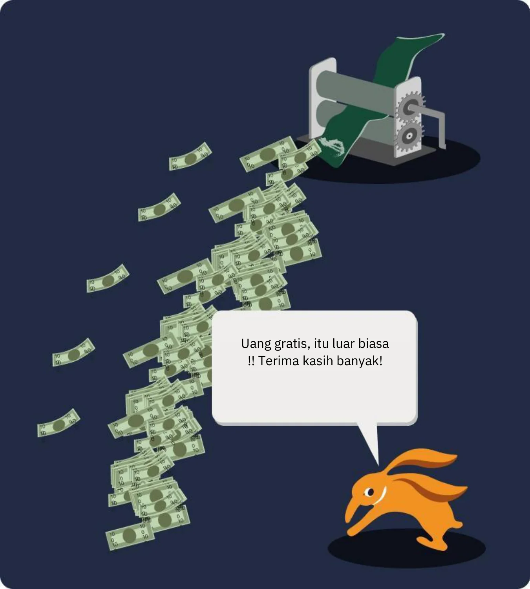

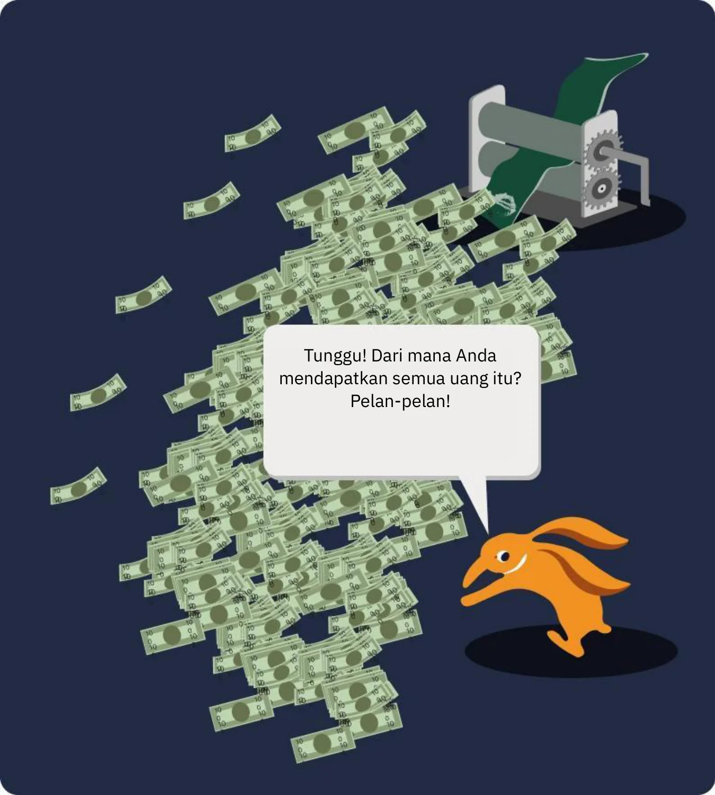

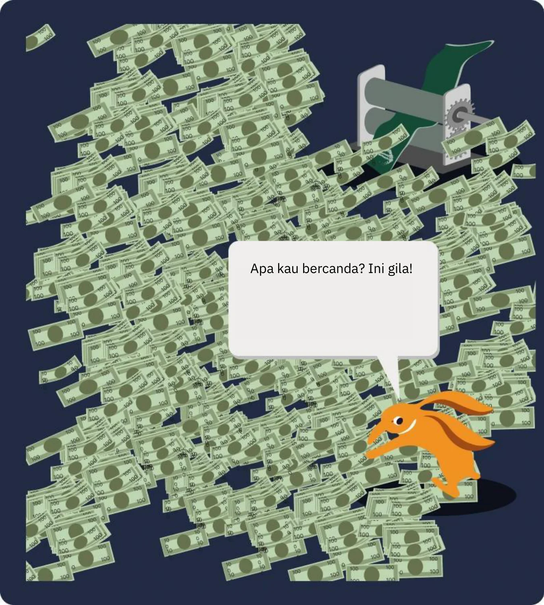

Bagi mereka yang tinggal di negara-negara dengan tingkat inflasi yang tinggi, Bitcoin adalah sebuah alat untuk bertahan hidup. Bitcoin menyediakan sarana untuk bertahan hidup dalam situasi keuangan yang genting. Selain itu, Bitcoin menawarkan sistem keuangan yang lebih adil dan tidak memihak, memberikan akses ke sumber daya keuangan kepada miliaran orang di seluruh dunia. Dengan perspektif ini, apakah konsumsi energi dapat dibenarkan?

### Bitcoin dapat memberikan dampak positif bagi lingkungan

Terakhir, sangat penting untuk mendiskusikan konsekuensi ekonomi dan lingkungan dari adopsi Bitcoin.

Jika dibandingkan dengan sistem keuangan saat ini, sistem keuangan saat ini, karena mendorong konsumsi berlebihan dan utang, menimbulkan masalah serius. Faktor-faktor seperti kemudahan akses ke kredit, penerbitan moneter oleh bank, dan praktik fractional reserve banking, semuanya berkontribusi pada utang yang berlebihan dan, sebagai akibatnya, konsumsi yang berlebihan.


Penting untuk mereformasi sistem moneter untuk mencerminkan kelangkaan sumber daya kita dengan kelangkaan mata uang kita. Hal ini akan mendorong konsumsi yang lebih bertanggung jawab dan memiliki visi jangka panjang. Sebaliknya, inflasi, dengan mendorong konsumsi dan investasi, memiliki dampak jangka panjang yang negatif terhadap lingkungan.

Sistem keuangan saat ini selaras dengan gagasan ekonomi Keynesian, yang tidak seperti ekonomi Austria, tidak memperhitungkan aspek temporal dan dinamis dari situasi dan sumber daya. Dengan kata lain, mata uang yang tidak terbatas tidak dapat secara efektif mewakili sumber daya yang terbatas di planet kita.

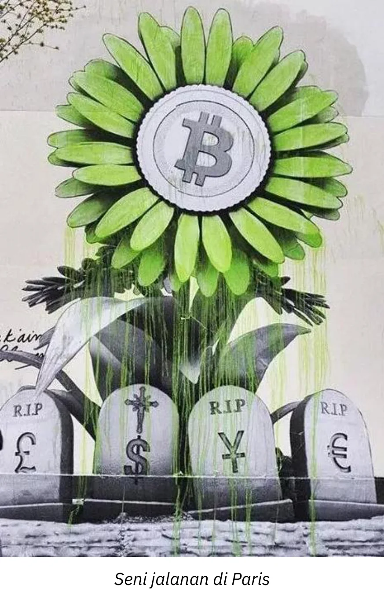

Di sisi lain, para politisi biasanya memiliki visi jangka pendek dan mereka membutuhkan pertumbuhan ekonomi agar dapat terpilih kembali, sehingga mereka tidak dapat menyelesaikan masalah ekologi dalam jangka panjang. Sebaliknya, adopsi mata uang yang baik seperti Bitcoin adalah alternatif potensial yang dapat memberdayakan masyarakat secara ekonomi.

Mereka tidak mengakui bahwa Bitcoin mempromosikan penggunaan energi hijau. Sebagai contoh, api yang dinyalakan di lokasi sumur minyak untuk membakar metana dan mencegah polusi dapat dipadamkan oleh para penambang Bitcoin, karena metana dapat dikonversi menjadi listrik untuk menyalakan mesin pertambangan, yang bermanfaat bagi lingkungan.

**Ikuti salah satu pepatah Bitcoin: Jangan percaya, verifikasi sendiri!**

### Rangkuman singkat mengenai fitur-fitur teknis Bitcoin

Satoshi Nakamoto merilis protokol Bitcoin pada bulan Januari 2009, yang kemudian berkembang berkat komunitas pengembang, penambang, dan pengguna yang terus bertambah dengan node Bitcoin. Dengan menyimpan salinan blockchain Bitcoin mereka sendiri, sebuah buku besar publik untuk semua transaksi Bitcoin, node-node ini dapat memastikan keabsahan transaksi sesuai dengan aturan konsensus Bitcoin. Hal ini termasuk memastikan bahwa para penambang menghasilkan blok yang valid, yang berisi ribuan transaksi yang tertunda.

Rata-rata, sebuah blok dibuat setiap 10 menit, dan penambang yang menemukan hash yang valid untuk blok berikutnya akan diberi imbalan oleh protokol dengan jumlah yang ditentukan oleh aturan konsensus, dan juga biaya transaksi dari semua transaksi yang termasuk dalam blok yang valid. Karena hasil algoritma hashing (SHA256) untuk input yang diberikan tidak dapat diprediksi, proses penambangan melibatkan pembuatan banyak kandidat blok dan menguji apakah hash mereka valid atau tidak. Akan tetapi, untuk memastikan bahwa waktu rata-rata antara dua blok tetap konstan (~10 menit) terlepas dari jumlah penambang dan daya komputasi mereka, kesulitan untuk menemukan hash yang valid menyesuaikan setiap 2016 blok, kira-kira setiap 2 minggu. Para penambang telah mengembangkan mesin SHA256 khusus dari waktu ke waktu, yang disebut ASICS, untuk meningkatkan tingkat hash per joule, yang berarti jumlah percobaan per detik dan energi yang dikonsumsi.

Agar para penambang dapat memperoleh keuntungan semaksimal mungkin dalam kegiatan mereka, mereka harus mendapatkan listrik semurah mungkin, yang sering kali berada di lokasi terpencil, di dalam pembangkit listrik yang belum terhubung ke jaringan listrik. Penambang kemudian bertindak sebagai pembeli terakhir, dan, segera setelah harga listrik meningkat karena kenaikan permintaan, penambang akan cenderung memindahkan aktivitas mereka ke tempat lain.

Dengan demikian, protokol Bitcoin merupakan sistem moneter yang tidak dapat disensor dan tidak dapat dihentikan karena setiap komponen protokol didistribusikan secara geografis ke seluruh dunia. Sebagai contoh, terdapat lebih dari 40.000 node Bitcoin di seluruh benua. Aturan konsensus Bitcoin dibuat sedemikian rupa sehingga secara ekonomi lebih menguntungkan untuk mengikutinya daripada mencoba melanggarnya, dan oleh karena itu tidak ada kepercayaan yang dibutuhkan di antara para pelaku. Bitcoin tidak memiliki pemimpin dan tidak dapat dihentikan. Bahkan jika memungkinkan untuk mengatur platform bursa untuk membatasi Bitcoin, pendekatan ini memiliki dampak yang kecil pada sistem. Singkatnya, tidak ada hakim atau negara yang dapat menyensor atau menghentikan Bitcoin.

# Bagaimana Anda Mendapatkan Bitcoin?

<partId>517e1bb7-f032-51a0-930a-a91fe5148d3f</partId>

## Bitcoin Tidak Pernah Tidur!

<chapterId>d5e35e41-ea26-5478-8eb9-07daf9dff508</chapterId>

Harga Bitcoin sering kali ditandai dengan volatilitas yang signifikan. Nilainya dapat berfluktuasi secara signifikan tergantung pada variasi pasar atau pada fase bullish dan bearish, seperti halnya pasar keuangan lainnya.

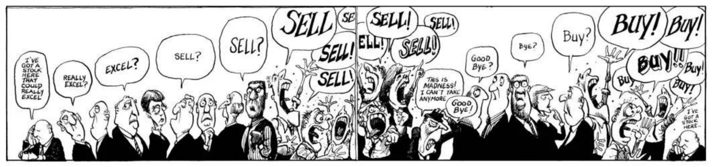

Sederhananya, manusia cenderung membeli segala sesuatu sekaligus dan menjual segala sesuatu sekaligus. **Bitcoin tidak kebal terhadap sifat alamiah manusia.**

### Memahami gelombang adopsi

Perkembangan dan evolusi Bitcoin sebagian besar terkait dengan berbagai kelompok pelaku yang secara bertahap mengintegrasikan ekosistemnya.


- Para pendukungnya:

Pengguna awal Bitcoin sebagian besar adalah para technophiles, cypherpunks, libertarian, dan penggemar emas. Kelompok-kelompok ini tertarik dengan Bitcoin karena nilainya sebagai uang elektronik yang tidak memerlukan kepercayaan pihak ketiga, ketahanannya terhadap sensor, dan kebijakan moneternya yang transparan dan tidak dapat diubah.

- Web gelap & penjahat

Kemudian, penggunaan Bitcoin meluas ke pasar web gelap seperti Silk Road, sebagian besar karena sifatnya yang tidak dapat dikontrol dan pseudonim, yang juga menarik orang-orang di luar platform tersebut, termasuk beberapa orang yang terlibat dalam kegiatan kriminal. Akan tetapi, penting untuk ditekankan bahwa yang menentukan legalitas adalah penggunaan sebuah alat, dan bukan alat itu sendiri. Penggunaan Bitcoin secara ilegal tidak serta merta membuat seseorang menjadi seorang kriminal; namun, tindakan-tindakan tertentu yang dapat diklasifikasikan sebagai ilegal. Sebagai contoh, menggunakan Bitcoin untuk membeli obat-obatan tertentu dapat dianggap legal atau ilegal tergantung pada peraturan yang mengatur wilayah tempat transaksi terjadi.

- Kegilaan ICO dan kedatangan masyarakat umum.

Tahun 2017 ditandai dengan gelembung spekulatif yang signifikan di dunia mata uang kripto, terutama dengan peluncuran ribuan Initial Coin Offerings (ICO). Namun, banyak dari mata uang kripto baru ini tidak memiliki perkembangan atau kegunaan yang konkret, dan dengan cepat menghilang. Gelembung tahun 2017 ini diikuti oleh koreksi yang kuat pada tahun 2018-2019.

- Gelembung NFT dan DeFi

Kemudian pada tahun 2020, pasar mengalami gelembung spekulatif lainnya yang mendorong harga Bitcoin ke $60.000. Gelembung ini berbeda dengan gelembung sebelumnya karena diversifikasi investor yang lebih luas, termasuk lembaga keuangan dan perusahaan besar. Namun, seperti gelembung sebelumnya, koreksi signifikan cenderung terjadi setelah euforia awal memudar.

### Bitcoin dan volatilitas

Berdasarkan siklus masa lalu, tampaknya periodisitas siklus ekonomi Bitcoin setara dengan durasi antara dua [halving](https://planb.academy/resources/glossary/halving), mungkin karena peristiwa halving bertindak sebagai pemicu dengan memotong emisi bitcoin baru menjadi dua.

Fluktuasi yang signifikan ini membuat Bitcoin memiliki reputasi sebagai aset yang sangat fluktuatif, yang sering kali menyebabkan kerugian besar bagi penggunanya. Meskipun harga dapat turun 10%, 20% atau bahkan 50% dalam beberapa hari, penting untuk dipahami bahwa protokol Bitcoin itu sendiri tidak terpengaruh oleh perubahan harga.

Volatilitas yang signifikan ini sepenuhnya diterima oleh para pelaku Bitcoin saat ini dan dapat dimitigasi dengan beberapa solusi seperti lindung nilai keuangan (stablecoin), keyakinan jangka panjang yang kuat (hodling), atau sekadar menghindari risiko menginvestasikan 100% dana seseorang dalam Bitcoin tanpa pemahaman yang kuat. Oleh karena itu, memahami mengapa harga Bitcoin berfluktuasi sangat tinggi sangat penting untuk kemajuan dalam industri ini, karena pada akhirnya pergerakan dan siklus harga yang membantu meredam dan mengatur pasar sampai batas tertentu. Namun, sangat penting untuk diperhatikan bahwa seiring dengan pertumbuhan dan kedewasaan Bitcoin, volatilitas akan berkurang dampaknya.

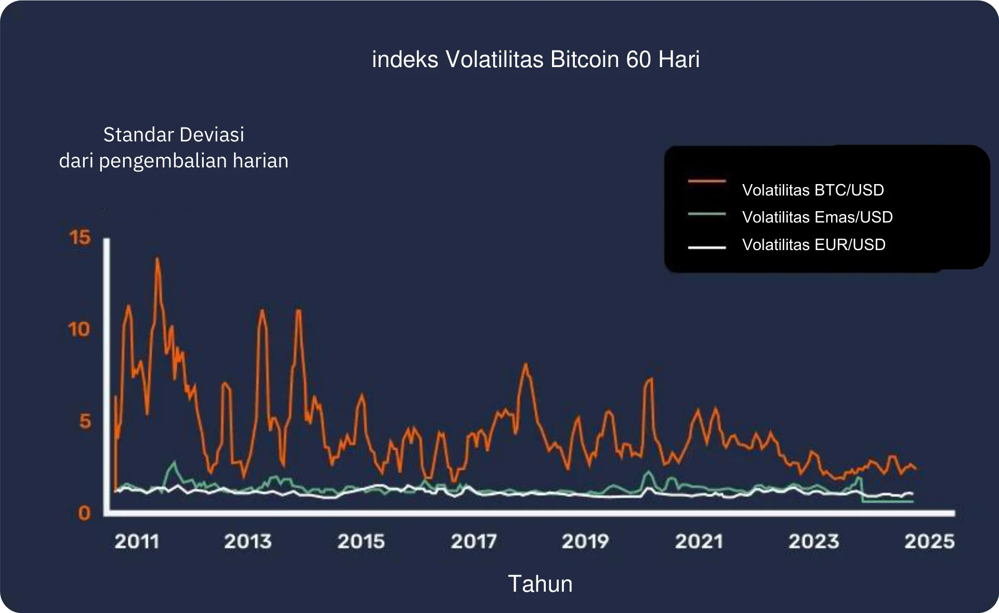

Meskipun pasangan btc/dolar berfluktuasi dalam jangka pendek, bitcoin, karena jumlahnya yang terbatas yaitu 21 juta bitcoin dan proses halving-nya (membagi dua penciptaan moneter rata-rata setiap 4 tahun), mengikuti tren kenaikan secara umum dengan cara yang semu. Tentu saja, seperti aset keuangan lainnya, bitcoin tunduk pada siklus ekonomi termasuk periode euforia, gelembung spekulatif, dan koreksi. Fenomena ini sangat umum terjadi pada teknologi baru, di mana pasar tidak selalu rasional atau efisien.

### Pasar yang unik

Siklus gelembung spekulatif ini cukup unik di dunia, karena jarang sekali ada aset tunggal yang mengalami serangkaian gelembung seperti ini secara berurutan. Fenomena ini dapat dikaitkan dengan fakta bahwa Bitcoin bukan sekadar gelembung yang ditakdirkan untuk meledak. Melainkan, Bitcoin berfungsi sebagai mata uang yang secara aktif digunakan di seluruh dunia. Protokol Bitcoin menonjol karena kemampuannya untuk beroperasi dalam skala global, 24/7, yang memberikan tantangan yang signifikan bagi otoritas keuangan yang mencoba mengaturnya.


Saat ini, Bitcoin terus bertahan dan semakin berkembang dengan semakin diintegrasikan ke dalam pasar tradisional, dan pengenalan ETF Bitcoin, peraturan yang lebih jelas, dan alat yang lebih baik untuk akuisisi dan penyimpanan, semuanya berkontribusi pada momentum positif ini. Bitcoin SEKALI LAGI selamat dari gelembung spekulatifnya, jadi mungkin Bitcoin bukan hanya angin lalu!

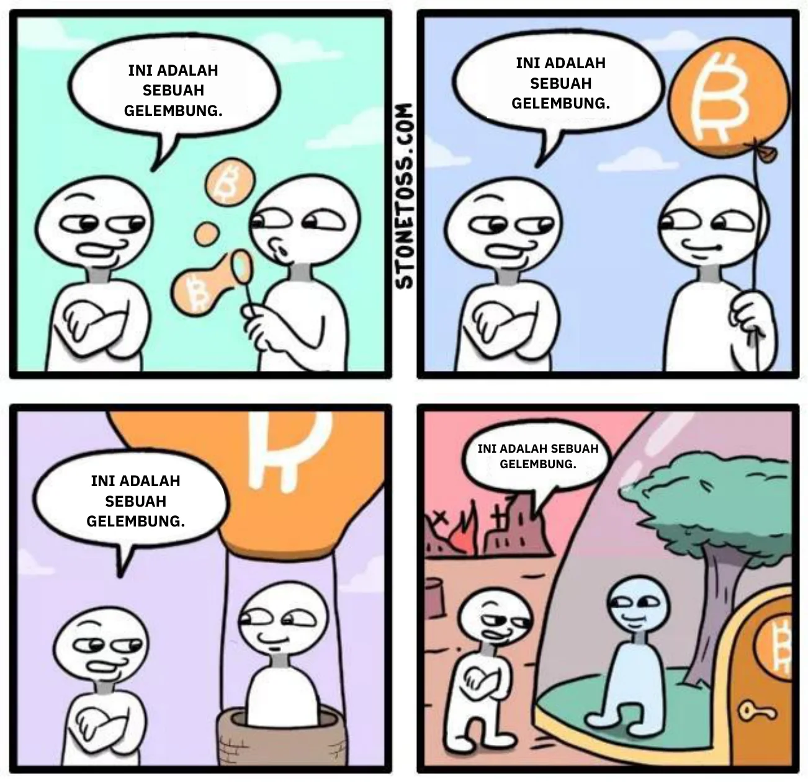


## Mendapatkan Bitcoin dengan Bekerja

<chapterId>be2d83be-406f-582c-83ca-6aa905ff7b04</chapterId>

### Ekonomi paralel sedang berkembang

Bitcoin dapat dilihat sebagai alat untuk menciptakan ekonomi paralel dengan mata uang fiat, karena memungkinkan untuk menjual barang atau jasa dan dibayar dengan bitcoin. Transaksi dapat dilakukan secara langsung dengan Bitcoin, tanpa perlu melalui platform pertukaran, tetapi cukup dengan berpindah dari dompet Bitcoin ke dompet Bitcoin lainnya.

Ekonomi Bitcoin ada dan sedang berkembang di daerah-daerah tertentu di dunia, seperti di El Salvador, di mana Bitcoin menjadi alat pembayaran yang sah pada tahun 2021. Sayangnya, pada Januari 2025, majelis mengesahkan undang-undang baru yang mencabut gelar "alat pembayaran yang sah" dari Bitcoin, diduga setelah menerima tekanan dari Dana Moneter Internasional. Di bawah undang-undang baru ini, orang-orang tidak lagi diwajibkan untuk menerima Bitcoin dalam bisnis mereka, dan tidak dapat lagi membayar pajak menggunakan Bitcoin. Penerimaan tetap bersifat sukarela.

Namun, di El Salvador dan di bagian lain dunia, semakin banyak individu, bisnis, dan organisasi yang menerima Bitcoin sebagai alat pembayaran untuk produk atau layanan mereka.


*Sumber : [Wicked Smart Bitcoin](https://wickedsmartbitcoin.com)*

Selain itu, sebuah proyek open-source dan kolaboratif telah diluncurkan, [BTCMap](https://btcmap.org/map#2/21.28937/5.46680), untuk memfasilitasi penggunaan Bitcoin dalam transaksi sehari-hari. Platform ini mencantumkan semua pedagang yang menerima Bitcoin, serta berbagai komunitas Bitcoin di seluruh dunia, sehingga Anda dapat mengunjungi situs web mereka untuk menemukan ekosistem Bitcoin di sekitar Anda. Jadi, terlepas dari kesulitan dan keraguan, ada inisiatif seperti BTCMap yang berkontribusi untuk membuat ekonomi Bitcoin lebih mudah diakses dan nyaman bagi semua orang.

### Mengapa kita harus menerima Bitcoin dan bukan membelinya?

Untuk mendapatkan bitcoin, Anda bisa membelinya di platform yang diatur oleh organisasi seperti AMF (Autorité des Marchés Financiers) di Prancis, atau Securities & Exchange Commission (SEC) di Amerika Serikat, tetapi solusi ini memerlukan pelacakan transaksi Anda. Metode lain untuk mendapatkan bitcoin adalah dengan menerimanya sebagai alat pembayaran untuk produk atau layanan yang Anda tawarkan, sehingga Anda bisa mendapatkan bitcoin melalui pekerjaan Anda tanpa perlu mengkhawatirkan harga Bitcoin.

Selain itu, menerima Bitcoin sebagai pedagang memiliki beberapa keuntungan, termasuk resistensi terhadap sensor, pengurangan biaya transaksi, peningkatan efisiensi, perlindungan terhadap inflasi, serta kebebasan dan kedaulatan finansial.

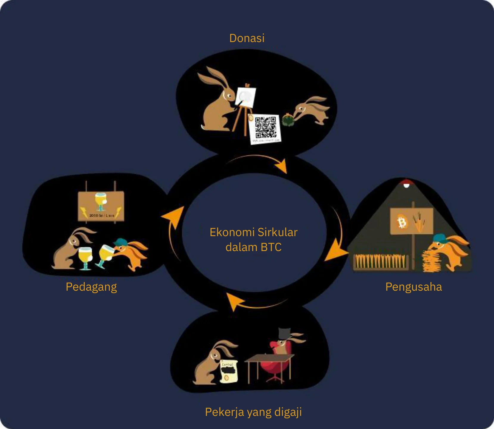

### Bagaimana Anda dapat melanjutkan?

Untuk menerima Bitcoin, Anda perlu mempelajari berbagai solusi yang tersedia dan memilih salah satu yang paling sesuai dengan bisnis Anda. Tidak ada solusi yang sempurna, dan beberapa faktor harus dipertimbangkan untuk menentukan pilihan Anda, seperti volume transaksi yang diharapkan, anggaran yang dialokasikan, dan jenis bisnis (online atau fisik).

Kami akan membahas topik ini secara rinci dalam kursus lain, tetapi untuk mempermudah, kami dapat mempertimbangkan beberapa kategori bisnis dan solusi terkait.

- Solusi online yang sederhana: OpenNode

https://planb.academy/tutorials/business/point-of-sale/open-node-e69a0c1c-47f7-4932-8494-e6f26c3c9784

- Solusi untuk pedagang amatir: Pembayaran Bitcoin Swiss

https://planb.academy/tutorials/business/point-of-sale/swiss-bitcoin-pay-2-a78b057e-ed11-47ac-860c-71019fcb451a

- Solusi untuk struktur besar atau pengguna bitcoin yang bersemangat: Server BTCpay

Untuk mempelajari lebih lanjut tentang topik ini, kami merekomendasikan pelatihan kami BIZ101! Temukan cara mengintegrasikan bitcoin secara efektif ke dalam kas perusahaan Anda, menerima bitcoin sebagai alat pembayaran sesuai dengan profil organisasi Anda, dan memahami persyaratan pajak dan akuntansi terkait:

https://planb.academy/courses/a804c4b6-9ff5-4a29-a530-7d2f5d04bb7a

## Menabung dengan Bitcoin

<chapterId>1d9570c6-5b63-51a6-b87c-7bdb0fc4aa87</chapterId>

### Peringatan sebelum memulai!

Bitcoin telah menjadi aset keuangan utama, terutama karena pasokannya yang terbatas dan permintaan yang terus meningkat. Namun, membeli Bitcoin memiliki risiko yang memerlukan perhatian khusus. Oleh karena itu, disarankan untuk melakukan riset sendiri dan mempelajari lebih lanjut tentang subjek ini agar terbiasa dengan teknologi sebelum menginvestasikan dana apa pun.

- Hanya investasikan apa yang Anda mampu untuk kehilangan.
- Bitcoin adalah aset finansial yang sangat fluktuatif, dan harganya bisa turun hingga 0.
- Kinerja masa lalu bukanlah indikator yang dapat diandalkan untuk kinerja masa depan.
- Hubungi penasihat keuangan Anda jika diperlukan.

**Plan ₿ Academy tidak memberikan nasihat investasi apa pun, dan tidak ada yang dinyatakan di sini yang dapat dianggap sebagai nasihat investasi**

### Daftar Periksa Mini sebelum mengambil risiko

Sebelum membeli Bitcoin, pastikan Anda sudah memilikinya:

- Dompet yang aman.
- Pemahaman yang kuat tentang Bitcoin.
- Rencana tabungan yang harus diikuti.
- Visi jangka panjang.

Jika topik ini masih belum jelas, ketahuilah bahwa kursus BTC102 akan memandu Anda dalam mengamankan dan memperoleh bitcoin pertama Anda. Di sini, kita hanya akan membahas permukaan dari topik ini.

Secara konkret, ada dua pertanyaan yang perlu Anda tanyakan pada diri Anda sendiri:

- Haruskah Anda mengadopsi strategi akuisisi bertahap atau sekaligus?
- Haruskah Anda menggunakan platform teregulasi atau tidak teregulasi?

### Strategi akuisisi

- Dollar Cost Averaging/Rata-rata Biaya Dolar

Strategi bertahap melibatkan pembelian berulang, yang berarti membeli sejumlah kecil Bitcoin secara berkala. Metode ini menghaluskan harga dari waktu ke waktu dan memberikan pertumbuhan berkelanjutan dalam jumlah bitcoin yang dimiliki. Ini adalah solusi ideal untuk tabungan jangka panjang, dan mengurangi kekhawatiran tentang volatilitas harga Bitcoin. Setelah diatur, Anda bisa melupakannya dan melihat investasi Anda tumbuh.


**Waspadalah terhadap UTXO**: Ingatlah untuk menggabungkan UTXO Anda di dompet Anda dari waktu ke waktu. Praktik ini sangat penting untuk mengelola bitcoin Anda secara efektif dan menghindari biaya yang tidak perlu selama transaksi.

Sebuah [UTXO](https://planb.academy/resources/glossary/utxo#:~:text=utxo) adalah output dari sebuah transaksi yang belum dibelanjakan, yaitu belum digunakan sebagai input untuk transaksi baru. Mengonsolidasikannya berarti menggabungkan beberapa UTXO kecil menjadi satu yang lebih besar, sehingga mengurangi "berat" transaksi dan dengan demikian membayar biaya yang lebih sedikit.


- Pembelian spontan

Solusi sekaligus bisa berupa pembelian spontan, yang digunakan untuk segera mendapatkan eksposur ke bitcoin. Entah itu membeli saat harga jatuh atau memanfaatkan bonus, keputusan ada di tangan Anda. Anda harus mengumpulkan keberanian dan menekan tombol beli.

Dalam hal ini, Anda harus berhati-hati dan mengendalikan emosi Anda, karena harga bitcoin bisa sangat fluktuatif. Faktanya, FOMO (Fear of Missing Out) dan FUD (Fear, Uncertainty, Doubt) adalah musuh terburuk Anda! Ingatlah untuk tetap tenang dan ikuti strategi yang telah Anda tetapkan sebelumnya, untuk menghindari pengambilan keputusan yang impulsif dan berpotensi merugikan.

### Dari siapa kita harus membeli bitcoin?

Ada beberapa cara untuk mendapatkan bitcoin, masing-masing tunduk pada peraturannya sendiri yang dapat bervariasi menurut yurisdiksi. Beberapa platform memerlukan identifikasi untuk verifikasi ([KYC](https://planb.academy/resources/glossary/kyc-know-your-customer)), sementara yang lain tidak. Oleh karena itu, sangat penting untuk memahami peraturan yang terkait dengan setiap platform.

- Platform DCA

Seperti yang telah kami perkenalkan di atas, metode umum untuk mengumpulkan bitcoin adalah [Dollar Cost Averaging (DCA)](https://planb.academy/resources/glossary/dollar-cost-averaging-dca), yang melibatkan pembelian dalam jumlah kecil secara teratur. Beberapa platform menawarkan layanan ini, seperti yang tercantum di [halaman khusus](https://planb.academy/tutorials/exchange). Selain kemudahan dalam menyiapkan DCA, penarikan ke dompet Anda umumnya dilakukan secara otomatis, yang berarti Anda akan selalu memiliki kendali atas aset Anda.

Saat ini, hampir semua solusi DCA relatif efisien dan memiliki biaya yang hampir sama, sehingga pilihannya akan lebih bergantung pada ketersediaan di negara Anda.

- Platform pialang

Untuk investasi skala besar, platform yang teregulasi dan diakui seperti Kraken, Bitstamp, dan Paymium direkomendasikan. Platform-platform ini menawarkan lingkungan yang aman dan terjamin untuk transaksi bervolume tinggi.

Penggunaannya sederhana dan dapat diakses oleh semua orang:

1. Menyiapkan akun KYC/\*

2. Transfer dana ke rekening Anda

3. Beli bitcoin

4. Menarik bitcoin ke dompet Anda


Setelah pembelian, disarankan untuk segera menarik bitcoin dari platform bursa untuk meminimalkan risiko peretasan dan pemblokiran dana. Ketahuilah bahwa biaya penarikan bisa tinggi, terkadang hingga 25 euro tergantung pada platformnya.

**Peraturan Know Your Customer (KYC) mengharuskan pengguna untuk memberikan identifikasi untuk memerangi pendanaan terorisme, penghindaran pajak, dan pencucian uang.**

Sangat penting untuk mengetahui bahwa KYC adalah topik diskusi yang signifikan dalam industri Bitcoin. Meskipun banyak orang memperdebatkan efektivitasnya, ada banyak kekhawatiran yang terkait dengannya. Dalam banyak program pelatihan dan konten akademi kami, kami menyarankan pengguna tingkat lanjut untuk menghindari platform yang mengharuskan KYC, karena sering kali ada alternatif yang lebih berfokus pada privasi yang tersedia.

### Solusi non-KYC

Selain itu, ada beberapa [pasar](https://planb.academy/tutorials/exchange) tempat untuk membeli dan menjual bitcoin dalam pertukaran peer-to-peer. Secara umum, Anda dapat mempertimbangkan yang berikut ini:

- ATM Bitcoin
- Pertemuan fisik dengan penggemar bitcoin lainnya
- Platform ilegal dan tidak teregulasi
- Solusi peer-to-peer
- Neobank beroperasi di negara-negara yang ramah terhadap Bitcoin.


Terakhir, penting untuk diperhatikan bahwa kewajiban pajak dapat bervariasi tergantung pada yurisdiksi, jadi kami sangat menganjurkan Anda untuk membaca peraturan di negara Anda sebelum melakukan tindakan apa pun yang dapat menimbulkan risiko bagi Anda.

Jika Anda ingin memperdalam pengetahuan Anda tentang strategi pembelian, penggunaan, dan pengamanan bitcoin Anda, saya sangat menyarankan Anda untuk mengikuti kursus **BTC 102** setelah yang satu ini. Di sana Anda akan menemukan, antara lain, rekomendasi alat yang sesuai dengan profil, kebutuhan, dan tujuan pribadi Anda:

https://planb.academy/courses/f3e3843d-1a1d-450c-96d6-d7232158b81f

## Hiper-koinisasi

<chapterId>b7275d31-3b60-5fb7-b9f5-030097010553</chapterId>

### Perlombaan liar baru saja dimulai!

Seperti teknologi baru lainnya, adopsi Bitcoin mengikuti kurva-S, yang menggambarkan perkembangan dari pengadopsi awal ke penerimaan yang lebih luas. Kita telah bergerak melampaui era pengguna awal, dan indikator-indikator menunjukkan potensi demokratisasi Bitcoin. Bagaimanapun juga, ini adalah teknologi viral yang tidak dapat dengan mudah dihentikan. Di satu sisi, El Salvador telah mengambil langkah berani dengan sepenuhnya mengadopsi Bitcoin sebagai alat pembayaran yang sah. Di sisi lain, negara-negara lain menanggapi dengan melarang dan mengkriminalisasi penggunaannya, yang menunjukkan bahwa adopsi Bitcoin itu kompleks dan terpapar oleh pengaruh faktor budaya, sejarah, dan nasional.

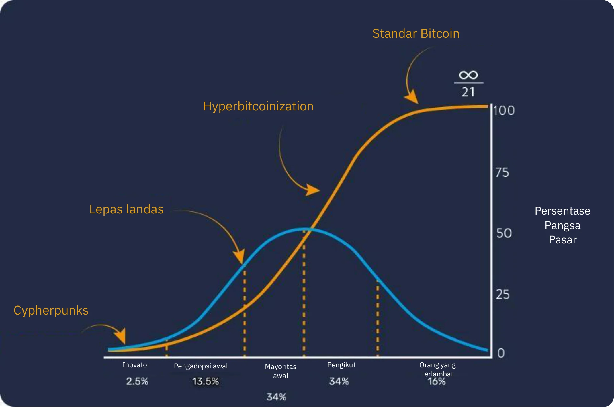

Kemunculan Bitcoin memaksa perusahaan, universitas, regulator, dan individu untuk mempertimbangkan teknologi baru ini. Alat-alat baru perlu diciptakan, layanan perlu diadaptasi, dan inovasi harus terus dilakukan untuk memastikan kelangsungan hidupnya. Konteks ini menimbulkan banyak pertanyaan yang berkaitan dengan berbagai bidang, termasuk kriptografi, teori permainan, ekonomi dan kebijakan moneter, ilmu komputer, filosofi, energi, hukum, dan regulasi. Singkatnya, Bitcoin adalah subjek multidisiplin.


### Bitcoin adalah 0 sampai 1

Pada akhirnya, kami mengundang Anda untuk merenungkan revolusi moneter yang baru ini. Ada begitu banyak hal yang dapat dieksplorasi dengan Bitcoin sehingga sulit untuk mengasimilasi semuanya sekaligus. Luangkan waktu Anda, Bitcoin tidak akan menghilang. Sebaliknya, revolusi ini baru saja dimulai. Kami percaya bahwa kami mampu menciptakan dunia yang ingin kami wariskan kepada anak-anak kami: dunia di mana kedaulatan manusia adalah hak, di mana privasi dihormati secara default, dan di mana uang tidak dimanipulasi. Kami berharap, bersama-sama, kita dapat mewujudkannya.

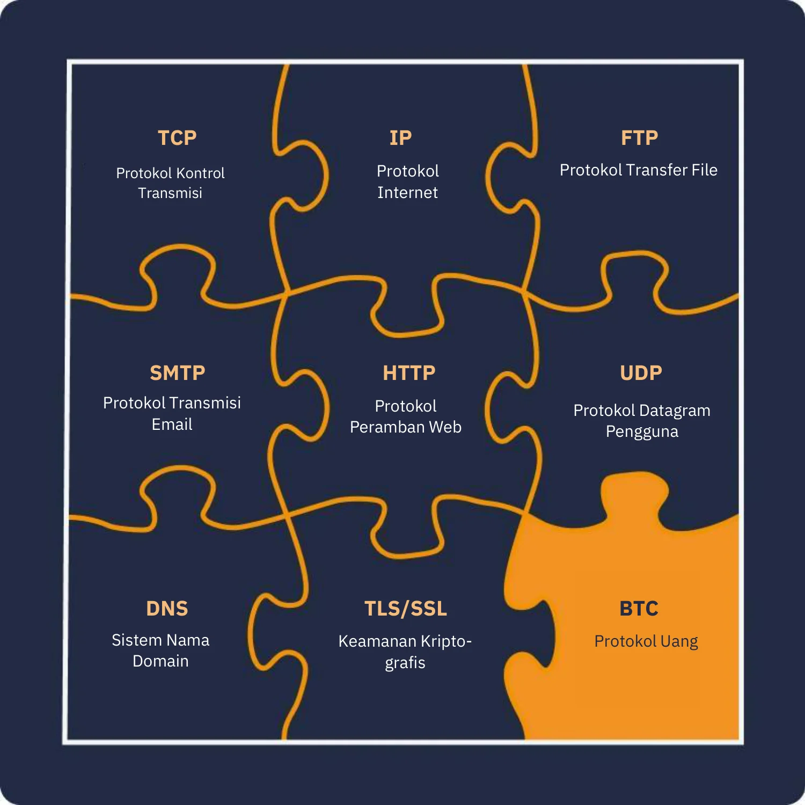

Jika Anda ingin memperluas pengetahuan Anda mengenai Bitcoin, inilah saat yang tepat: banyak penulis, pemikir, dan penulis esai yang telah membuat konten edukasi mengenai Bitcoin. Selama beberapa tahun terakhir, kami telah membuat daftar dan mengkategorikan karya-karya tersebut untuk menawarkan [perpustakaan sumber daya](https://planb.academy/resources) kepada Anda yang paling ingin tahu di antara lingkungan Anda. Di bagian tersebut, Anda akan menemukan podcast, situs web, artikel, tutorial, buku, dan konten lainnya yang terbaik.

> "Saya pikir Internet akan menjadi salah satu kekuatan utama untuk mengurangi peran pemerintah. Satu hal yang belum ada, namun akan segera dikembangkan, adalah e-cash yang dapat diandalkan - sebuah metode di mana di Internet Anda dapat mentransfer dana dari A ke B tanpa A mengetahui B atau B mengetahui A." - Prediksi Milton Friedman pada tahun 1999


# Masa depan Bitcoin

<partId>899fd35e-39e6-5a25-a73e-6fed6e725094</partId>

## Jaringan Lightning: membayar dengan bitcoin secara cepat, dengan biaya rendah

<chapterId>b403f1e4-f1ff-572b-a242-9b58cb3736d0</chapterId>

Sekarang setelah Anda memahami dasar-dasar protokol Bitcoin, kita akan memperkenalkan jaringan pembayaran utama yang dibangun di atas Bitcoin: Lightning Network (sering disingkat "LN"). Tujuannya sederhana: memungkinkan pembayaran BTC dengan finalitas hampir instan, tanpa membebani blockchain, dan dengan biaya yang umumnya sangat rendah.

### Blockchain tidak bisa melakukan segalanya

Blockchain Bitcoin dirancang agar dapat diverifikasi oleh sebanyak mungkin orang, tanpa izin dan tanpa kepercayaan. Persyaratan ini membawa batasan struktural: blockchain tidak dapat memproses jumlah transaksi yang tidak terbatas, karena blok harus tetap masuk akal untuk diunduh, disimpan, dan diverifikasi oleh node independen, tanpa harus berinvestasi pada perangkat keras yang terlalu mahal. Inilah kompromi yang sering dirangkum dalam trilema: desentralisasi, keamanan, dan skalabilitas. Sebuah sistem berbasis blockchain tidak dapat memaksimalkan ketiga properti ini secara bersamaan. Bitcoin memprioritaskan desentralisasi dan keamanan, yang secara alami membatasi throughput transaksi [onchain](https://planb.academy/resources/glossary/onchain) yang memungkinkan.

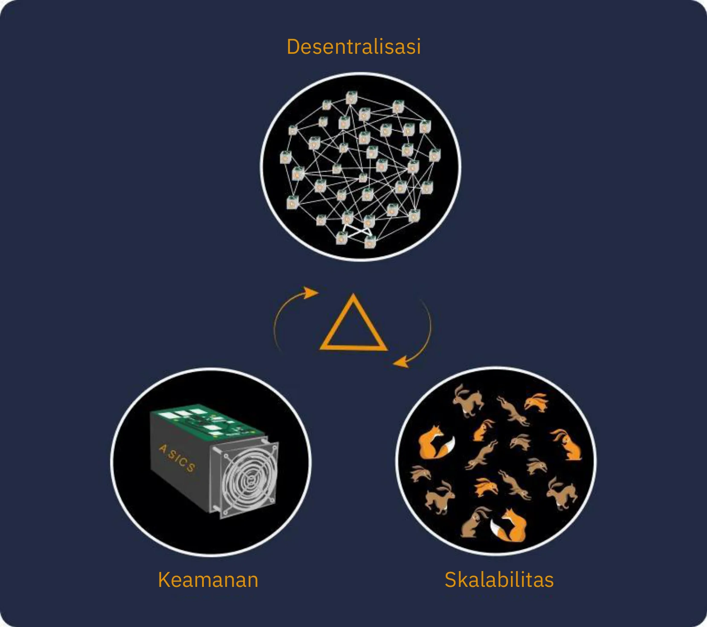

Di Bitcoin, para pengembang membuat pilihan yang disengaja untuk memprioritaskan hal tersebut. Di satu sisi, ukuran blok yang dibatasi hingga 1 MB dan waktu rata-rata 10 menit antarblok memungkinkan menjalankan node Bitcoin dengan biaya rendah, yang mendorong desentralisasi jaringan. Di sisi lain, produksi blok melalui proof of work membuat setiap upaya penipuan menjadi sangat mahal, sekaligus memudahkan verifikasi oleh node dan memperkuat keamanan keseluruhan protokol.

Namun, pilihan-pilihan ini membawa satu kendala penting: jumlah transaksi yang dapat dimasukkan ke dalam setiap blok terbatas. Ini setara dengan hanya beberapa transaksi per detik. Angka ini sangat kecil dibandingkan dengan kapasitas sistem pembayaran terpusat seperti VISA (yang memiliki kapasitas maksimum teoretis sekitar 65.000 transaksi per detik), tetapi batasan ini adalah harga yang harus dibayar untuk memungkinkan transaksi tanpa sensor dan tanpa pihak ketiga tepercaya.

Secara konkret, ini berarti 2 hal yang sangat penting untuk penggunaan Bitcoin sehari-hari:
* ketika permintaan ruang blok meningkat, biaya onchain dapat menjadi sangat tinggi;
* pembayaran onchain memerlukan konfirmasi, yang tidak selalu cocok untuk pembelian sehari-hari.

Lightning Network justru merupakan jawaban atas permasalahan ini. Gagasan Lightning mengikuti pendekatan berlapis: Bitcoin tetap menjadi lapisan dasar (lapisan penyelesaian, kuat dan sangat aman), sementara Lightning berfungsi sebagai lapisan pembayaran cepat di atasnya.

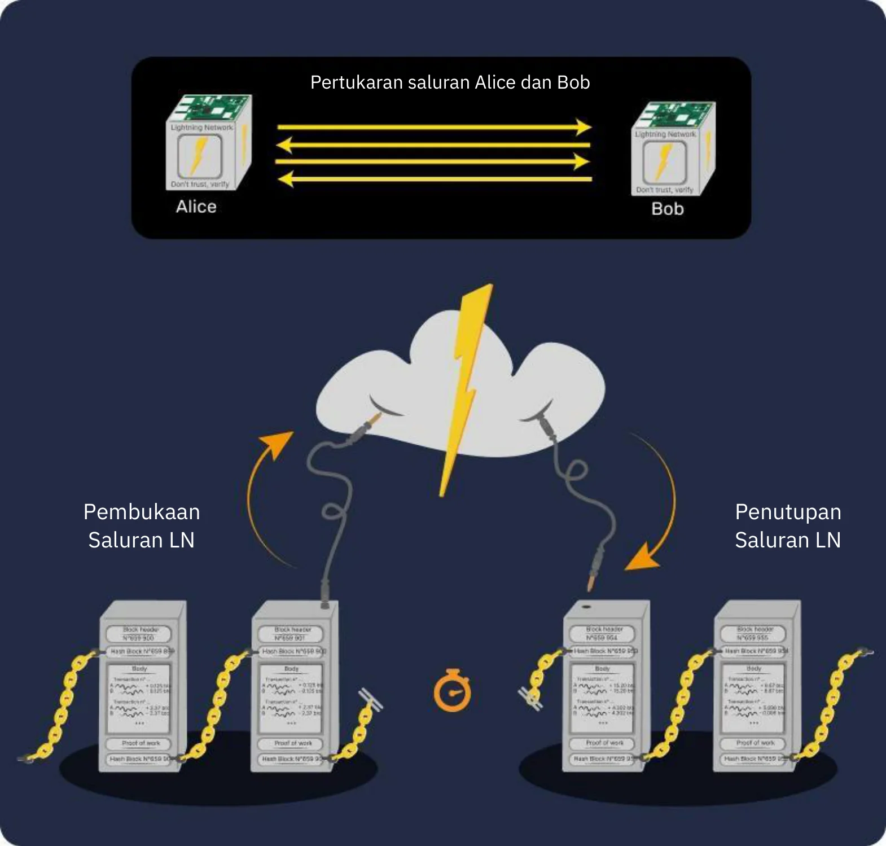

### Kanal pembayaran yang berbasis Bitcoin

Lightning bergantung pada [kanal pembayaran](https://planb.academy/resources/glossary/payment-channel) dua arah. Sebuah kanal adalah hubungan teknis antara dua peserta, yang memungkinkan mereka bertukar [sats](https://planb.academy/resources/glossary/satoshi-sat) secara [offchain](https://planb.academy/resources/glossary/offchain), yaitu tanpa mencatat setiap pembayaran di blockchain.

Dari sudut pandang Bitcoin (onchain), membuka sebuah kanal berarti mengunci dana dalam sebuah transaksi khusus. Ini dapat dilihat sebagai bentuk escrow: dana dikunci sedemikian rupa sehingga hanya penutupan kanal yang valid yang dapat mendistribusikannya kembali.

Dari sudut pandang Lightning, mekanisme yang sama ini menjadi sebuah kanal di mana kedua pihak dapat memperbarui status distribusi sat sebanyak yang mereka inginkan, hampir secara instan, dan tanpa harus mencatat setiap pembayaran di blockchain utama.

Dengan demikian, mekanismenya adalah sebagai berikut:
* pembukaan dan penutupan kanal Lightning adalah transaksi Bitcoin (dan karena itu dipublikasikan onchain);
* pembayaran antara pembukaan dan penutupan adalah pembaruan offchain, yang tidak terlihat di blockchain utama.

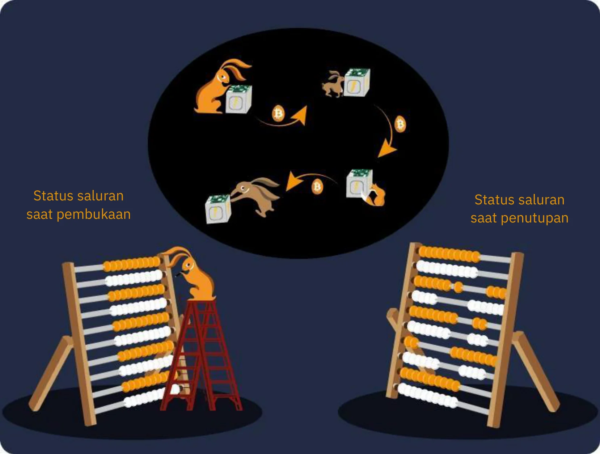

Dengan demikian, dua orang yang berbagi sebuah kanal Lightning dapat melakukan sejumlah besar pembayaran tanpa harus membuat transaksi onchain setiap kali. Di sini kita kembali melihat logika skalabilitas: blockchain dicadangkan untuk operasi yang jarang dan penting (pembukaan dan penutupan kanal, yaitu penyelesaian akhir), sementara pembayaran kecil perantara dipindahkan ke lapisan yang lebih efisien.

### Jaringan kanal yang saling terhubung

Lightning bukan sekadar kumpulan kanal yang terisolasi. Ini adalah sebuah jaringan: ribuan node saling terhubung melalui kanal, membentuk sebuah grafik koneksi.

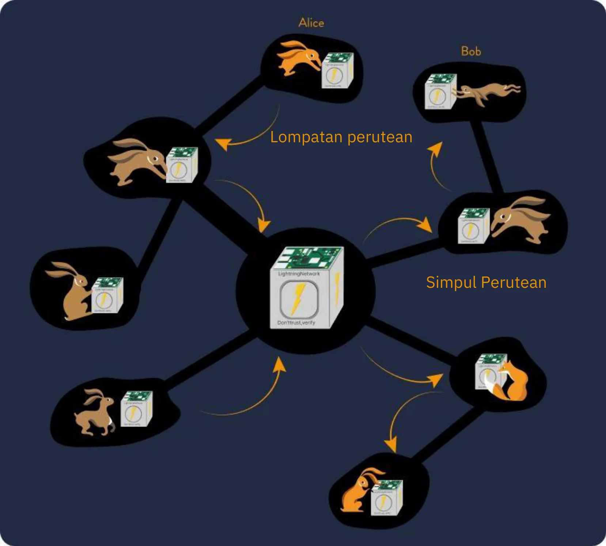

Berkat jaringan ini, Anda dapat membayar seorang penerima bahkan jika Anda tidak memiliki kanal langsung dengannya, selama terdapat jalur kanal yang memungkinkan pembayaran tersebut dialihkan. Pembayaran tersebut kemudian melewati beberapa node perantara, dari satu hop ke hop berikutnya.

Di sinilah muncul konsep penting dalam Lightning: likuiditas. Kapasitas sebuah kanal adalah total dana yang terkunci di kanal tersebut, dan likuiditas adalah distribusi dana tersebut di antara kedua sisi kanal, dan dengan demikian arah di mana sat dapat mengalir. Dengan kata lain, sebuah kanal dapat memiliki kapasitas besar, namun tetap tidak dapat digunakan ke satu arah tertentu jika likuiditas berada di sisi yang salah. Keberhasilan pembayaran bergantung tidak hanya pada keberadaan jalur, tetapi juga pada likuiditas yang tersedia di sepanjang jalur tersebut.

### Merutekan pembayaran tanpa mempercayai perantara

Lightning dirancang untuk memungkinkan pembayaran melalui perantara tanpa harus mempercayai mereka. Untuk itu, protokol ini menggunakan kontrak pintar yang disebut [HTLC](https://planb.academy/resources/glossary/htlc) (*Hashed Time-Locked Contracts*). Tanpa masuk ke semua detail, mekanisme umumnya adalah sebagai berikut:
* pembayaran bergantung pada pengungkapan sebuah rahasia (preimage);
* jika penerima akhir mengungkapkan rahasia tersebut, ia menerima dana, dan para perantara pada gilirannya dapat menerima apa yang menjadi hak mereka;
* jika pembayaran gagal, batas waktu berakhir dan setiap pihak mendapatkan kembali dananya.

Cara kerja ini memberikan satu properti penting: pembayaran bersifat atomik. Entah berhasil sepenuhnya, atau gagal tanpa kerugian di tengah jalan.

Terakhir, Lightning mengintegrasikan mekanisme penalti: jika salah satu peserta mencoba berbuat curang dengan mempublikasikan status kanal lama (yang tidak lagi mencerminkan kenyataan), pihak lainnya dapat menghukumnya dan mengambil seluruh dana. Aturan ini sangat mendorong kejujuran, bahkan dalam lingkungan yang bersifat adversarial.

### Node Lightning, wallet Lightning: apa artinya

Pada Bitcoin onchain, sebuah wallet adalah perangkat lunak yang mengelola kunci dan membangun transaksi. Pada Lightning, situasinya lebih ambigu, karena penggunaan non-kustodial yang sesungguhnya bergantung pada sebuah node Lightning (meskipun node tersebut tersembunyi di balik antarmuka yang sederhana).

Dalam praktiknya, ada dua kategori besar aplikasi untuk menggunakan Lightning:
* Layanan kustodial: aplikasi menampilkan saldo kepada Anda, tetapi dana dikendalikan oleh penyedia layanan. Saldo Anda adalah catatan pembukuan dalam sistem mereka, seperti pada sebuah platform bursa;
* Solusi non-kustodial: Anda benar-benar mengendalikan kunci dan kemampuan untuk memulihkan dana Anda. Ini bisa berupa aplikasi yang menyertakan sebuah node dengan pengelolaan minimal, sehingga menyederhanakan pengalaman pengguna (misalnya Phoenix, Zeus...), atau sebuah node Lightning penuh yang Anda kelola sepenuhnya.

https://planb.academy/tutorials/wallet/mobile/phoenix-0f681345-abff-4bdc-819c-4ae800129cdf

https://planb.academy/tutorials/wallet/mobile/zeus-embedded-c67fa8bb-9ff5-430d-beee-80919cac96b9

Saat ini juga terdapat wallet self-custodial yang mampu menangani pembayaran Lightning secara tidak langsung, dengan mengandalkan atomic swap yang dipicu sesuai permintaan untuk setiap pembayaran masuk atau keluar (misalnya Bull Bitcoin Wallet, Aqua...). Wallet-wallet ini umumnya menggunakan sidechain Liquid sebagai lapisan penyelesaian (kita akan melihat apa artinya pada bab berikutnya).

https://planb.academy/tutorials/wallet/mobile/bull-bitcoin-2c72127c-a228-4f50-b833-c6183d56aaf6

https://planb.academy/tutorials/wallet/mobile/aqua-8e6d7dd3-8c03-45cc-90dd-fe3899a7d125

### Kasus penggunaan konkret: apa yang akhirnya dimungkinkan oleh Lightning

Lightning membuka berbagai macam penggunaan yang sebelumnya tidak praktis, bahkan mustahil, hanya dengan Bitcoin onchain.

- **Pembayaran sehari-hari (online dan fisik)**

Untuk pembayaran di kasir atau pembelian online, Lightning memungkinkan finalitas hampir instan, dengan biaya yang umumnya rendah. Ini membuat bitcoin dapat digunakan untuk jumlah kecil, bahkan ketika blockchain utama sedang padat.

- **Mikropembayaran dan streaming money**

Kemampuan untuk mengirim jumlah yang sangat kecil membuka model ekonomi baru: pembayaran sesuai penggunaan, pembayaran per menit, donasi berulang, tip... Inilah gagasan "streaming money": membayar seiring dengan konsumsi nyata suatu konten atau layanan, alih-alih melalui langganan tetap.

- **Kreator konten, podcast, dan donasi**

Lightning sering digunakan untuk mikro-donasi atau mekanisme penghargaan. Aplikasi seperti Fountain atau Rumble menggambarkan logika ini dengan baik: pembayaran menjadi lebih detail dan terintegrasi dengan pengalaman pengguna, bukan lagi menjadi tindakan yang berat untuk sesekali dilakukan. Kami juga telah mengintegrasikan logika ini di Plan ₿ Academy, karena Anda dapat dengan mudah mengirim donasi kecil kepada pengajar favorit Anda sebagai bentuk terima kasih.

- **Game dan ekonomi digital**

Game video dan lingkungan digital secara alami cocok untuk mikrotransaksi: taruhan kecil, hadiah, objek virtual... Memperkenalkan insentif moneter kecil juga dapat meningkatkan biaya spam dan beberapa penyalahgunaan (bot), sambil tetap dapat diakses.

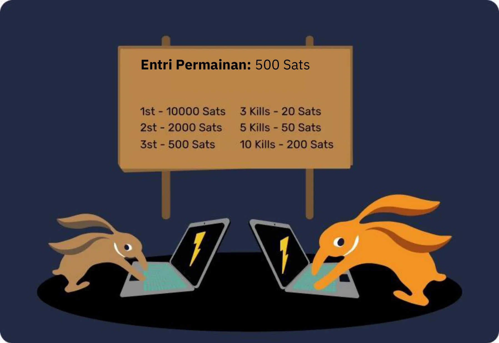

### Implementasi utama Lightning

Seperti halnya Bitcoin, Lightning adalah sebuah protokol, bukan satu perangkat lunak tunggal. Beberapa implementasi hidup berdampingan dan tetap saling interoperabel berkat spesifikasi bersama (BOLT):
* LND (Lightning Labs);
* Core Lightning (Blockstream);
* Éclair (ACINQ);
* LDK (Spiral/Block);
* dll.

### Lightning sebagai bagian dari evolusi Bitcoin

Lightning tidak menggantikan blockchain Bitcoin: ia melengkapinya. Blockchain tetap menjadi lapisan penyelesaian akhir, lambat tetapi sangat kuat. Lightning adalah lapisan pembayaran cepat, yang dirancang untuk penggunaan yang sering dan jumlah kecil.

Pada tahun 2025, Lightning lebih mudah diakses dibandingkan masa awalnya, berkat wallet dan layanan yang menyembunyikan sebagian kompleksitas. Namun, Lightning tetap memiliki kompromi: likuiditas, biaya onchain dari kanal, dan terkadang pertukaran antara kesederhanaan, kedaulatan, dan privasi.

Jika Anda ingin memahami Lightning secara mendalam (kanal, likuiditas, routing, manajemen risiko), saya merekomendasikan kursus teoretis lengkap LNP 201 oleh Fanis Michalakis:

https://planb.academy/courses/34bd43ef-6683-4a5c-b239-7cb1e40a4aeb

Dan jika Anda ingin memulai petualangan menjalankan node Lightning Anda sendiri, kami juga memiliki kursus praktis LNP 202 yang secara khusus didedikasikan untuk topik ini:

https://planb.academy/courses/593e483e-1785-4e83-aa7e-32b99056844c


## Melampaui Lightning: protokol lain untuk mengembangkan Bitcoin

<chapterId>684e31f9-ebd1-51b6-91c0-1e6a315f1141</chapterId>

Seperti yang telah kita lihat pada bab-bab sebelumnya, Bitcoin dirancang sebagai lapisan dasar yang sangat kuat: sebuah buku besar publik yang sederhana dan aman, tetapi secara alami terbatas dalam kecepatan, kemampuan pemrograman, dan kapasitas pembayaran. Alih-alih memaksa lapisan ini untuk melakukan segalanya (seperti yang dilakukan pada Ethereum, misalnya), ekosistem Bitcoin secara bertahap mengadopsi pendekatan berlapis: blockchain berfungsi sebagai fondasi (penyelesaian akhir), sementara lapisan di atasnya menambahkan properti baru, seperti pembayaran yang lebih cepat, privasi yang lebih baik, atau penerbitan aset (stablecoin, sekuritas yang ditokenisasi...).

Bitcoin tidak hanya berkembang dengan memodifikasi protokol dasarnya. Ia juga berkembang dengan membangun di atasnya, dengan solusi yang membuat kompromi berbeda tergantung pada tujuan yang dicari. Beberapa berfokus pada skalabilitas pembayaran, yang lain pada kemampuan pemrograman (dalam arti luas) dan penerbitan aset, dan yang lain lagi mencoba menggabungkan keduanya.

Dalam bab ini, kami memperkenalkan empat protokol penting yang masing-masing menawarkan kemungkinan baru di Bitcoin: [sidechain](https://planb.academy/resources/glossary/sidechain) (terutama Liquid), Ark, RGB, dan Taproot Assets.

### Sidechain: blockchain paralel yang terhubung ke Bitcoin

Sidechain adalah blockchain yang terpisah dari Bitcoin, dirancang untuk beroperasi secara paralel dengan aturan dan mekanisme konsensusnya sendiri. Sidechain terhubung ke Bitcoin melalui mekanisme pengikatan dua arah (*2WP*) yang memungkinkan, dalam praktiknya, penggunaan bitcoin di sidechain dalam bentuk representatif (sering kali bitcoin yang dikunci di Bitcoin dan diciptakan kembali di sidechain), lalu kembali ke rantai utama.

Keunggulan sidechain adalah kemampuannya menawarkan fungsi yang sulit dicapai langsung di Bitcoin: transaksi lebih cepat, fitur aset, privasi yang ditingkatkan, atau fleksibilitas pengembangan yang lebih besar. Sebagai gantinya, sidechain selalu membuat kompromi dibandingkan Bitcoin, terutama dalam hal model kepercayaan atau desentralisasi.

Sidechain paling dikenal di Bitcoin kemungkinan besar adalah **Liquid**, yang dikembangkan oleh Blockstream. Liquid dirancang khusus untuk mempercepat beberapa penggunaan: transfer cepat antar platform, penyelesaian yang lebih sering, dan penerbitan aset (stablecoin, sekuritas...), dengan privasi yang ditingkatkan. Di Liquid, bitcoin yang digunakan disebut L-BTC: dirancang agar terikat 1 banding 1 dengan BTC, melalui mekanisme pengikatan dua arah.


Perbedaan utama dengan Bitcoin terletak pada model keamanan dan desentralisasi: Liquid tidak bergantung pada proof of work Bitcoin, melainkan pada sebuah federasi operator (kelompok yang teridentifikasi) yang memastikan produksi blok dan pengoperasian jembatan antara BTC dan L-BTC.

https://planb.academy/courses/d3ca6943-b22c-4e50-b62d-9431460525bc

### Ark: berbagi UTXO untuk mengurangi biaya dan meningkatkan pengalaman

Ark merujuk pada sekumpulan proposal dan implementasi yang bertujuan meningkatkan skalabilitas Bitcoin dengan mengelompokkan banyak operasi pengguna ke dalam jumlah transaksi Bitcoin yang lebih sedikit. Idenya cukup sederhana: alih-alih membuat satu transaksi onchain per pengguna, dibuat satu transaksi onchain yang mewakili sebuah batch, lalu hak masing-masing berkembang terutama secara offchain, hingga saat penyelesaian akhir di Bitcoin diperlukan.

Gagasan protokol lapisan kedua ini diperkenalkan oleh Burak pada Mei 2023. Seperti Lightning Network, Ark adalah sistem yang diterapkan di atas rantai utama Bitcoin. Ark memungkinkan pembayaran bitcoin secara offchain dengan cepat, anonim, dan berbiaya rendah. Dibandingkan Lightning, Ark tidak memerlukan likuiditas masuk untuk menerima pembayaran, sehingga secara signifikan meningkatkan pengalaman pengguna. Selain itu, Ark memberikan tingkat privasi yang mendekati transaksi [coinjoin](https://planb.academy/resources/glossary/coinjoin). Ark juga dapat bersifat non-interaktif jika covenant ditambahkan ke Bitcoin.

Burak sering mengkritik kemampuan Lightning untuk berkembang karena ketergantungannya pada rantai utama, dan menyarankan bahwa Ark secara teoretis dapat mengintegrasikan seluruh populasi dunia dalam self-custody. Meskipun Ark dapat dipandang sebagai protokol yang bersaing dengan Lightning Network, keduanya sebenarnya dapat hidup berdampingan, bahkan bersifat saling melengkapi.

Ark tetap menjadi bidang yang sangat aktif namun masih muda: tujuannya menjanjikan (mengurangi jejak onchain per pengguna secara drastis), tetapi perlu diingat bahwa ini adalah arsitektur yang lebih kompleks, dengan asumsi dan risiko yang berbeda dari Bitcoin dan Lightning.

### RGB: kontrak dan aset dengan validasi sisi klien

RGB adalah sistem kontrak pintar dan aset di Bitcoin yang mengadopsi pendekatan yang sangat berbeda dari blockchain generalis. Gagasan utamanya adalah validasi sisi klien: alih-alih mempublikasikan status lengkap sebuah kontrak di blockchain global, para peserta menyimpan dan memvalidasi secara lokal riwayat yang relevan bagi mereka, sementara blockchain Bitcoin hanya berfungsi untuk menjangkar komitmen kriptografis dan mencegah double spend.

Dengan kata lain:
* blockchain Bitcoin berperan sebagai fondasi penanda waktu dan arbiter minimal;
* data terperinci (aturan kontrak, status, transisi) beredar secara offchain di antara pihak-pihak terkait;
* verifikasi dilakukan secara lokal, yang meningkatkan skalabilitas dan dapat meningkatkan privasi, karena tidak ada buku besar global dari semua aktivitas RGB yang terlihat oleh semua orang.


RGB dapat menjadi dasar untuk menerbitkan dan mengelola berbagai jenis aset: token (termasuk stablecoin), NFT, atau sekuritas digital, bahkan untuk membangun logika kontrak yang lebih kompleks, semuanya tanpa membebani lapisan dasar.

Sisi negatifnya adalah pengelolaan data: jika Anda harus memvalidasi di sisi klien, Anda juga harus menyimpan dan mencadangkan dengan benar data yang membuktikan hak Anda.

RGB adalah protokol yang telah dikembangkan selama bertahun-tahun. Perkembangannya bertahap, tetapi saat ini sudah ada aplikasi konkret yang memanfaatkan RGB. Untuk melangkah lebih jauh, kami menawarkan di Plan ₿ Academy sebuah kursus tingkat ahli yang merinci secara mendalam cara kerja protokol ini:

https://planb.academy/courses/3ce1d37c-05ba-4f54-aa15-7586d37b2bb7

### Taproot Assets: menerbitkan aset di Bitcoin dan memindahkannya ke Lightning

Taproot Assets (sebelumnya "Taro") adalah protokol yang dikembangkan oleh Lightning Labs, yang bertujuan memungkinkan penerbitan aset di Bitcoin, dengan kemungkinan untuk kemudian mentransfernya melalui jaringan Lightning untuk pertukaran yang cepat dan berbiaya rendah.

Ini sering disebut sebagai salah satu elemen dalam narasi "programmable money" di Bitcoin: bukan karena Bitcoin menjadi komputer global, tetapi karena instrumen keuangan (aset) dapat ditumpangkan di atas fondasi Bitcoin, lalu diedarkan secara efisien melalui Lightning.

### Bitcoin menjadi lebih kuat dengan membiarkan lapisan atas berinovasi

Saat ini, gambaran paling akurat dari ekosistem Bitcoin bukanlah sebuah protokol yang kaku, maupun sebuah super blockchain yang melakukan segalanya seperti Ethereum. Sebaliknya, Bitcoin adalah sebuah fondasi yang secara sengaja konservatif, dikelilingi oleh lapisan dan protokol yang bereksperimen dan memungkinkan inovasi dengan pengambilan risiko yang minimal.


## Pil Merah atau Pil Biru?

<chapterId>c81cdb45-6aa9-5462-9835-c4852084b2cc</chapterId>

Seperti yang dikatakan Morpheus kepada Neo: "Kamu meminum pil biru, ceritanya berakhir, kamu terbangun di tempat tidurmu, dan kamu percaya apa pun yang ingin kamu percayai. Anda meminum pil merah, Anda akan tetap berada di Wonderland, dan saya akan menunjukkan kepada Anda seberapa dalam lubang kelinci itu." Apakah Anda siap untuk menjelajahi lubang kelinci Bitcoin? Berhati-hatilah, karena Anda mungkin akan menemukan kembali kebebasan finansial Anda!

### Masa depan teknologi dan implikasinya

Teknologi berkembang secara eksponensial, dan tidak ada yang dapat memprediksi perkembangannya di masa depan dengan pasti. Konektivitas dunia dan kecerdasan buatan terus berkembang, dan pengetahuan yang dapat diperoleh seseorang melalui internet menjadi semakin tak terukur dari waktu ke waktu.

Jika kita mengambil AI sebagai contoh, teknologi ini telah melampaui atau mendekati kinerja tingkat manusia di berbagai bidang, seperti video game, produksi gambar dan teks, dan analisis data. Salah satu implikasi potensial adalah bahwa lebih dari 80% pekerjaan akan hilang karena AI dan otomatisasi. Sebagai konsekuensinya, ada beberapa pilihan yang tersedia bagi kita, seperti menahan kemajuan teknologi atau memanfaatkan peningkatan modal dari peningkatan produktivitas yang diciptakan oleh AI.

Kami memiliki beberapa pertanyaan penting untuk ditanyakan pada diri kami sendiri:

- Bagaimana kita mengelola masyarakat di mana 80% pekerjaan akan hilang?
- Bagaimana kita merevitalisasi populasi?
- Apakah masih membutuhkan banyak tenaga pengajar?
- Konsekuensi geopolitik, politik, dan manusia dari otomatisasi tidak dibahas secara memadai.

Komputasi, internet, streaming, dan VR akan mengubah pendidikan. Kita bisa memiliki kursus universal untuk semua siswa Prancis yang dikelola oleh pemerintah dan guru yang tidak lagi memberikan ceramah tetapi langsung menemani siswa. Anak-anak dapat masuk ke dunia virtual dan ditemani dalam belajar sejarah.

- Di manakah batas antara seorang guru dan personifikasi AI?
- Bagaimana kita dapat menjamin masyarakat yang hidup sejahtera?

Pertanyaan-pertanyaan mendasar untuk masa depan kita harus diperdebatkan dan diputuskan secara kolektif.

Apa hubungannya dengan Bitcoin? Seperti halnya Internet yang merevolusi mode komunikasi, Bitcoin mewakili revolusi teknologi untuk format baru organisasi berskala besar, yang memungkinkan kita untuk menukarkan nilai tanpa bergantung pada pihak ketiga yang tepercaya. Apakah kita ingin menghalangi evolusi teknologi dari sistem moneter, atau apakah kita ingin merangkul potensi peningkatan modal melalui peningkatan produktivitas sepuluh kali lipat yang ditawarkan dengan menggunakan protokol Bitcoin dan Lightning?

### Bagaimana masa depan keuangan?

Pertimbangan ini juga menimbulkan pertanyaan tentang siapa yang seharusnya memegang, mengotorisasi, dan melacak uang yang kita gunakan. Tujuannya adalah untuk memutuskan antara sistem tertutup dengan pemimpin yang tidak dipilih atau sistem terbuka tanpa pihak ketiga yang dipercaya, di mana netralitas berlaku.

- Apakah mata uang merupakan bentuk kepemilikan pribadi?
- Dapatkah akun pengunjuk rasa diblokir tanpa perintah Mahkamah Agung?
- Siapa yang menjamin sistem keuangan?
- Bagaimana seseorang dapat berdaulat atas uangnya dan mengandalkan pihak ketiga yang tepercaya?
- Dapatkah uang dikirim ke belahan dunia lain tanpa biaya atau perantara?

Menerima teknologi baru ini dapat menghasilkan skala ekonomi yang sangat besar di seluruh dunia. Haruskah kita mengizinkan pergerakan bebas arus modal? Blokade internasional memiliki konsekuensi ekonomi dan politik. Apakah etis untuk menggunakan perantara keuangan seperti Western Union, yang terkadang mengenakan biaya hingga 25%? Kami percaya bahwa dalam dunia yang semakin digital, uang harus didemokratisasi dan dianggap sebagai barang milik bersama, bukan milik negara atau lembaga keuangan yang tidak jelas.

Pertanyaan tentang siapa yang harus mengendalikan sistem perbankan sangat penting karena aturan main perbankan tidak transparan dan dapat dimengerti oleh semua orang, sehingga memungkinkan kasta politisi dan regulator untuk mempertahankan cengkeraman mereka pada sistem, sehingga penting untuk mempertanyakan apakah pasar bebas atau sekelompok intelektual yang seharusnya berkuasa.

### Kebebasan kami dipertaruhkan.

Penyensoran juga harus dipertanyakan: siapa yang memiliki pengetahuan untuk memutuskan apa yang harus disensor atau tidak? Media telah mengubah posisi mereka terhadap informasi tertentu dan mereka yang tadinya disensor sekarang tidak lagi disensor.

- Siapa yang memutuskan apa yang disebut sensor atau propaganda?
- Siapa yang memiliki tangan ilahi atas sistem kita?

Kami sangat yakin bahwa mentolerir penyensoran dapat menghancurkan kebebasan berekspresi dan hak untuk berkumpul, karena hal ini dapat berdampak negatif terhadap inovasi dan kehendak bebas. Menerapkan penyensoran secara teknis sulit dilakukan tanpa menciptakan distopia total. Jadi, entitas mana yang seharusnya memiliki kekuatan untuk menyensor? Masalahnya rumit, dan juga sulit untuk memutuskan siapa yang harus dibatasi atau tidak.

Ada 2,4 miliar orang di dunia yang tidak memiliki rekening bank, yang tentu saja menciptakan ketidaksetaraan geografis. Di sisi lain, Bitcoin memberikan kesetaraan transaksi, tanpa menghiraukan status sosial atau posisi politik Anda. Protokol ini bersifat apolitis dan tidak memberikan hak istimewa khusus kepada para pemimpin atau tokoh berpengaruh lainnya, memastikan bahwa setiap orang memiliki kesempatan yang sama untuk mendorong perkembangan ke depan, daripada membiarkan beberapa orang tetap berada di atas sementara yang lain tertinggal. Haruskah setiap orang memiliki akses ke mata uang yang sama, terlepas dari status sosial mereka? Sangat penting untuk mempertimbangkan dunia yang ingin kita tinggalkan untuk anak-anak kita, dan kita bercita-cita untuk menciptakan dunia yang terbuka di mana mereka bebas mengelola uang mereka sesuai pilihan mereka.

Bitcoin itu penting dan tidak boleh dianggap sebagai permainan untung-untungan, jadi sangat penting untuk terus bertanya tentang Bitcoin dan konsekuensinya terhadap dunia.

### Bitcoin: protokol yang revolusioner

Seperti yang telah kita lihat pada bab sebelumnya, protokol Bitcoin bersifat netral terhadap semua penggunanya. Berkat aturan konsensus dan kriptografi, kita dapat secara permanen mencatat transaksi dalam buku besar publik global, menjamin transfer nilai moneter tanpa pihak ketiga yang terpercaya. Infrastruktur lapisan kedua (dan segera lapisan ketiga, dengan RGB) digunakan untuk skalabilitas jaringan dan pengembangan fungsi-fungsi baru.

Bitcoin memiliki semua karakteristik yang diperlukan untuk menjadi mata uang yang efisien dan sehat: dapat dibagi, dapat ditransportasikan secara instan, tidak dapat disensor, biaya verifikasi yang dapat diabaikan, dan dengan kebijakan moneter yang telah ditetapkan hingga 21 juta unit untuk berabad-abad yang akan datang. Bitcoin bersifat pseudonim dan dapat ditukarkan di mana saja di seluruh dunia tanpa otorisasi dari entitas mana pun. Anda hanya perlu memegang kunci pribadi Anda sendiri dan ingatlah pepatah "Bukan kunci Anda, bukan bitcoin Anda".

Bitcoin diadopsi oleh berbagai kelompok orang, mulai dari kriptografer, libertarian, bisnis tradisional, dan bahkan seluruh negara. Akan tetapi, Bitcoin adalah untuk semua orang, dan seiring dengan bertambahnya jumlah pengguna, begitu pula dengan jumlah node Bitcoin yang berfungsi sebagai penjaga riwayat transaksi, yang memastikan desentralisasinya.

Bitcoin tidak dapat dihentikan dan tidak dapat disensor lagi. Ini adalah revolusi damai yang mengubah sistem moneter dan memungkinkan inklusivitas keuangan. Pengguna dapat memperoleh bitcoin dengan menerimanya untuk perdagangan mereka atau dengan membelinya melalui platform yang diatur atau tidak diatur. Mereka dapat menyimpan dana di dompet, aplikasi seluler, atau perangkat fisik mereka, tanpa perlu perantara tepercaya. Bitcoin mendukung transparansi, kebebasan, dan tanggung jawab individu: seperti kata pepatah "Jangan Percaya, Verifikasi".

Satoshi menciptakan Bitcoin pada tahun 2008 untuk mengusulkan perubahan sistem keuangan, melalui perubahan mata uang, karena dia tahu bahwa memiliki akses yang mudah dan "ajaib" terhadap uang akan mengarah pada praktik korupsi. Oleh karena itu, Bitcoin merupakan alternatif untuk membangun sistem moneter baru yang netral, karena memungkinkan emansipasi dari sistem perbankan. Pada akhirnya, ini adalah fenomena sosial yang mendorong kita untuk berpartisipasi dalam revolusi damai.

Apakah Anda siap untuk bergabung?

# Bagian Akhir

<partId>9ed4b454-2950-40b4-a56b-68d109689a82</partId>

## Ulasan & Peringkat

<chapterId>585729e2-b0ab-51b5-89ec-593e3ea22c57</chapterId>

<isCourseReview>true</isCourseReview>

## Ujian Akhir

<chapterId>8410e961-3841-5abf-a51d-04fc0139dd59</chapterId>

<isCourseExam>true</isCourseExam>

## Kesimpulan

<chapterId>dfc534be-44a9-5e8c-9c98-e51ef0554e91</chapterId>

<isCourseConclusion>true</isCourseConclusion>


