# 初めてのビットコイン・アドベンチャー

このコースでは、ビットコインという技術をわかりやすく効果的に理解できるよう、ビットコインの基本を 25 の章に分けて解説します。このコースでは、マイニング、ウォレット、売買プラットフォームなどのトピックを含め、業界全体の基本を探ります。また、このコースを終了した後には、リソースセクションの「21 のポスター」をご覧ください。

このコースを始めるにあたって、事前の知識は必要ありません。BTC 101は、経験レベルに関係なく、すべての人が利用できるように設計されています。

+++

# はじめに

<partId>3cd2ac82-026c-53e1-874a-baf5842adc6d</partId>

## コース概要

<chapterId>27e3fb60-4b50-556b-9e70-c4f5475c121d</chapterId>

BTC101 コースへようこそ！

ビットコインは技術的にも通貨の在り方という点でも革新的であり、私たちとお金、さらには社会との関係そのものを見直すきっかけになり得ます。実際、ビットコイン（BTC と呼ばれる）は**中立的**で**非中央集権的**な通貨です。単なる「インターネット通貨」を超えたイノベーションであり、コンピュータ・プロトコルの仕組み（ビットコイン）であると同時に通貨単位（ビットコイン）でもあります。

このプロトコルは、暗号技術、ネットワーク通信、有名な「ブロックチェーン」などの基礎技術を使用し、ビットコイン単位はこのプロトコルが適切に機能するために必要な通貨として機能しています。日常生活で用いられている例としては、サルバドリア人と世界中のビットコイナーがビットコイン通貨を使用して商品やサービスを売買し、この技術によって生活をより良くしている例などがあります。

**包括的でありながらアクセスしやすいカリキュラム：**

このコースでは、ビットコインの売買方法、デジタルウォレットへの安全な保管方法、取引への使用方法など、ビットコインの貨幣的側面について説明します。また、新しいビットコインを作成し、ビットコインネットワークを保護するために不可欠なマイナーの役割についても検討します。最後に、ビットコインの将来と、ライトニング・ネットワーク技術がビットコイン取引をどのように改善できるかを探ります。


ビットコインは、お金との関係を完全に変える新しい通貨システムであり、その使い方を学ぶことは、自分の資金をコントロールしたい人にとって必要なスキルであることを理解することが重要です。


貨幣の定義と社会における機能（第 1 章）を紹介する前に、ビットコインの成り立ちから説明します。2009 年に登場したビットコインは、他の何とも異なる比較的新しい技術です。そのため、そのすべてを一度に理解できないのが普通でしょう。実際、インターネットの使い方や車の運転方法を学ぶときと同じように、すぐに技術的な詳細をすべて知る必要はありません。資金の受け取り方、支払い方、セキュリティの確保方法などを学ぶことから始めて、少しずつ深く勉強することをおすすめします。

立ち上げ段階を過ぎた今、私たちはその導入の初期段階にいるに過ぎません。この重要な技術革新について、あなたが望むだけの知識を得るにはちょうどいい時期だと言えます。

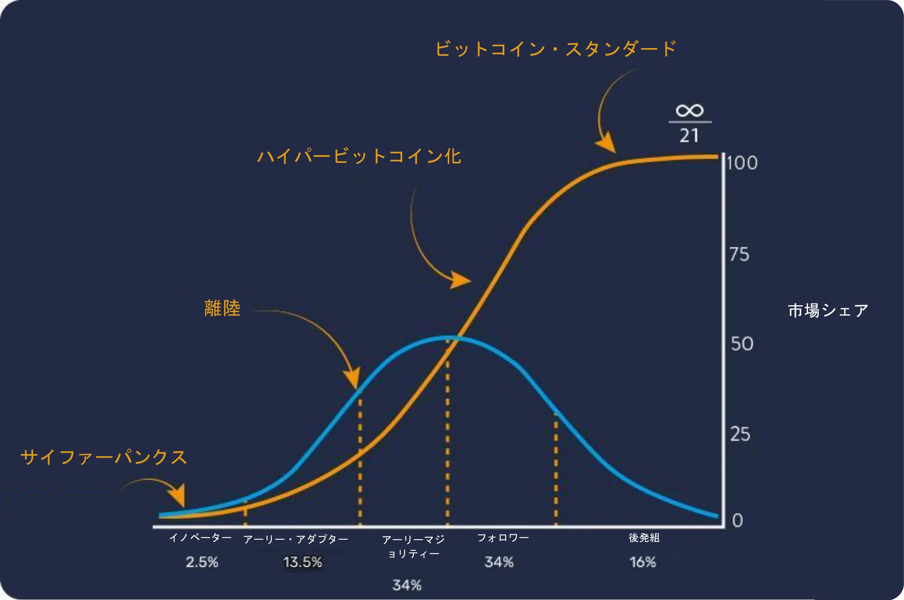

ここで重要なのは、この新しいテクノロジーの一般的な知識を得ることです。このコースを楽しみながら、この新しいお金のあり方をめぐる世界的枠組みの中で皆さんが前向きに歩みを進めることを願っています。

ビットコインの魅力的な世界に飛び込み、そのすべての仕組みを理解する準備はできましたか？さあ、始めましょう！


## ビットコイン前史

<chapterId>9a94b627-5b69-5d81-9125-f1fa9b0aa6ad</chapterId>

「ビットコイン」という言葉がデジタル通貨と金融変革の代名詞となる前に、その誕生の下地は一連のアイデア、イノベーション、社会運動によって築かれた。中でもサイファーパンク運動は、ビットコインの前史における重要な要素として際立っている。

### サイファーパンクス：デジタル世界の先見者たち

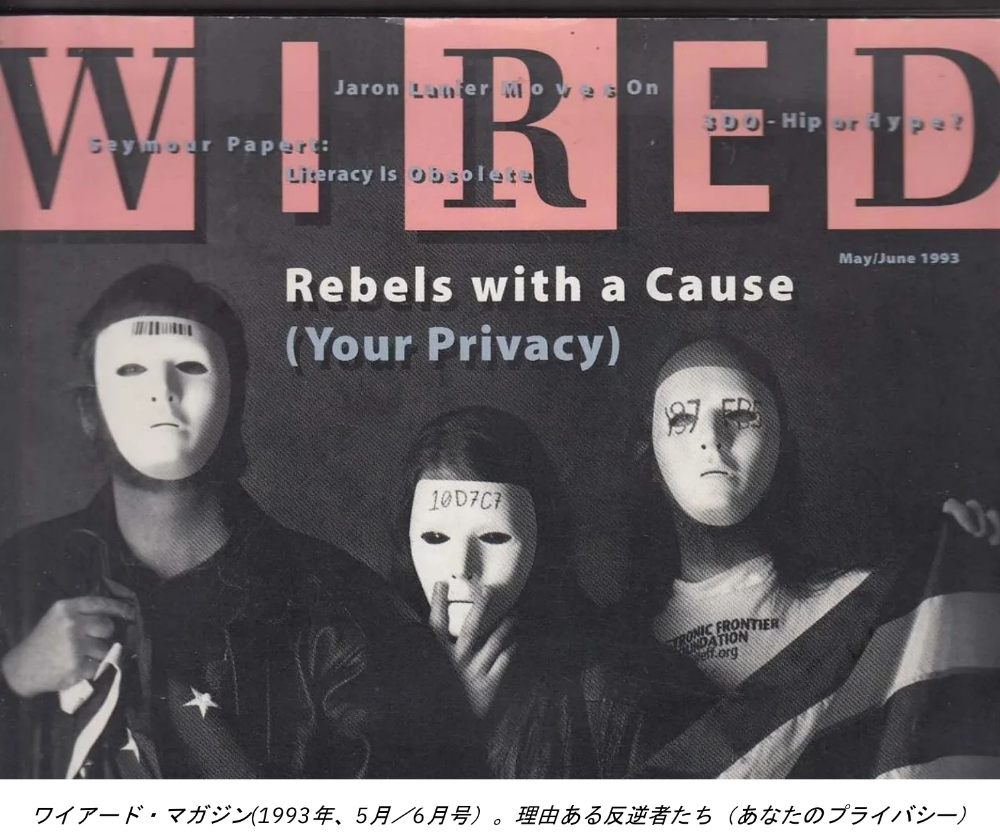

1980 年代から 1990 年代にかけての技術進化の中心で、デジタル時代におけるプライバシーと自由の役割に深い疑問を抱き始めた人々がいた。後に「サイファーパンク」と呼ばれるようになるこれらの人々は、暗号が政府や大企業の干渉から個人の権利を守るツールとして機能すると固く信じていた。

ジュリアン・アサンジ、ウェイ・ダイ、ティム・メイ、デイヴィッド・チョームといった象徴的な人物たちが、この運動の理念とビジョンを形成する上で極めて重要な役割を果たした。これらの思想家たちは、影響力のあるメーリングリスト上でアイデアを共有し、世界中の参加者が個人の自由を拡大するためにテクノロジーを活用する最善の方法について議論を交わした。

### サイファーパンクスの 3 つの基本文書

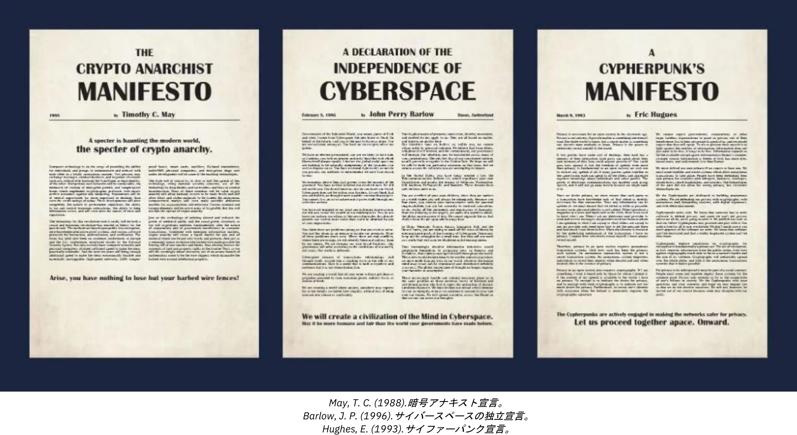

デジタル・アクティヴィズムと暗号技術に深く根ざしたサイファーパンク・ムーブメントは、その理念と未来へのビジョンを明確にするために、いくつかの基本的なテキストを利用した。その中でも、特に 3 つの著作が際立っている：

- 「サイファーパンク宣言」：

1993 年にエリック・ヒューズによって書かれた「サイファーパンク宣言」は、プライバシーは基本的権利であると主張している。著者は、自由な社会には自由で内密なコミュニケーション能力が不可欠であると主張した。マニフェストにはこうある：「政府、企業、その他の顔の見えない大組織が私たちにプライバシーを与えてくれることを期待することはできない。もしプライバシーがあると期待するならば、私たちは自分自身のプライバシーを守らなければならない」と述べている。

- 「暗号アナキスト宣言」：

1992 年にティモシー・C・メイによって書かれたこの文書は、暗号を使用することで、政府が市民の私的な問題に干渉できないような、暗号による無政府の時代がどのように到来するかを説明している。メイは、人々が第三者の介入なしに匿名で情報や金銭をやり取りする未来を思い描いていた。

- 「サイバースペース独立宣言」：

サイファーパンクに限ったことではないが、この文章はこの運動に参加する多くの人々の気持ちを反映している。1996 年にジョン・ペリー・バーロウによって書かれたこの文章は、各国政府によるインターネットの規制が強まることへの反論である。この宣言は、サイバースペースは物理的な領域とは異なる領域であり、同じ法律の適用を受けるべきではないと主張しています。私たちは選挙で選ばれた政府を持たないし、持つ可能性もない」と述べた。

### ビットコインの前身

ビットコインが登場する以前にも、デジタル通貨を作ろうとする試みはいくつかあった。例えば、デビッド・チャウムは 1980 年代に「DigiCash」というプロジェクトで「匿名の電子マネー」というコンセプトを導入した。残念ながら、さまざまな制約のため、デジキャッシュがブームになることはなかった。

もうひとつの重要な先駆けは、Wei Dai の「B-money」である。実装されることはなかったが、中央当局ではなく、評価者のコミュニティによって不正検知が行われる匿名のデジタル通貨というアイデアを提示した。

下の画像は、数々の技術革新によるムーブメントの発展を端的に示している。

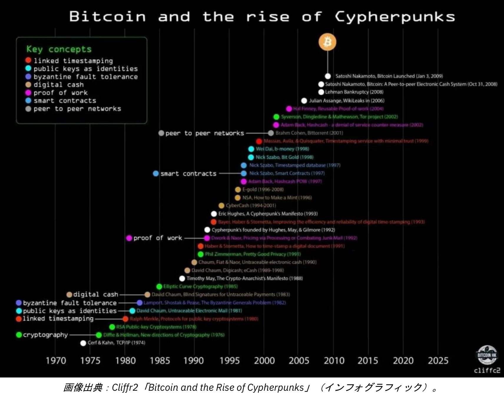

2008 年、謎の人物サトシ・ナカモトがビットコインの公式文書を発表したのは、このような肥沃な環境の中でのことだった。この文書で彼は、プルーフ・オブ・ワークや暗号タイムスタンプなど、サイファーパンク・ムーブメントからのいくつかのアイデアを組み合わせ、分散型で検閲に強いデジタル通貨を作り上げた。

しかし、ビットコインはそれ以上に、サイファーパンクの理想の達成を象徴していた。そのテクノロジーを超えて、伝統的な金融システムに対する革命を象徴し、透明性、分散化、個人主権に基づく代替案を提供した。

### 結論

ビットコインの前史は、サイファーパンク運動とデジタル時代におけるより大きな自由への集団的探求に深く根ざしている。暗号化、分散化、完全性の原則を組み合わせることで、ビットコインは通貨以上のものになった。実際、ビットコインは哲学的・技術的革命の産物であり、私たちの世界を再構築し続けている。

従って、ビットコインは長期にわたるプロトコルであり、私たちにエネルギー、時間、お金との関係を問うことを促している。

しかし、ビットコインは「本物の」通貨なのだろうか。これを理解するためには、まず貨幣の概念とその様々な形態を理解する必要がある。

ビットコインの歴史をより詳しく知りたい方は、ビットコインの起源とゆっくりとした出現、そしてその歴史とコミュニティの始まりを発見する HIS 201 コースを強くお勧めします。このコースは完全に文書化され、ソースが提供され、もちろん多くの逸話がある：

https://planb.academy/courses/a51c7ceb-e079-4ac3-bf69-6700b985a082

# お金

<partId>e913df1a-4cbd-5380-ba67-ca2a0414f671</partId>

## 歴史の中のお金

<chapterId>c838e64d-d59f-5703-8c74-ea5e8c4fdd31</chapterId>

貨幣の進化は人類史の魅惑的な側面であり、絶えず進化する経済的ニーズに対応する文明の創意工夫を反映している。


### 貝殻から銀行口座まで

元来、通貨は穀物や家畜などの有形資産であった。しかし、これらの商品は腐りやすいという大きな欠点があり、長期的な貯蓄手段としては使いにくかった。例えば、不作や家畜の病気は、一夜にして個人の富を破壊する可能性がある。

こうして文明が進歩し、交易が新しい地域に拡大するにつれ、世界共通の交換媒体の必要性が生じた。人々はまず貝殻や宝石を試してみたが、彼らが考えていたほど耐久性も希少性もなかった。やがて、その希少性、耐久性、分割可能性から、金が標準となった。金は富と権力の象徴であり、今日の価値に至っている。

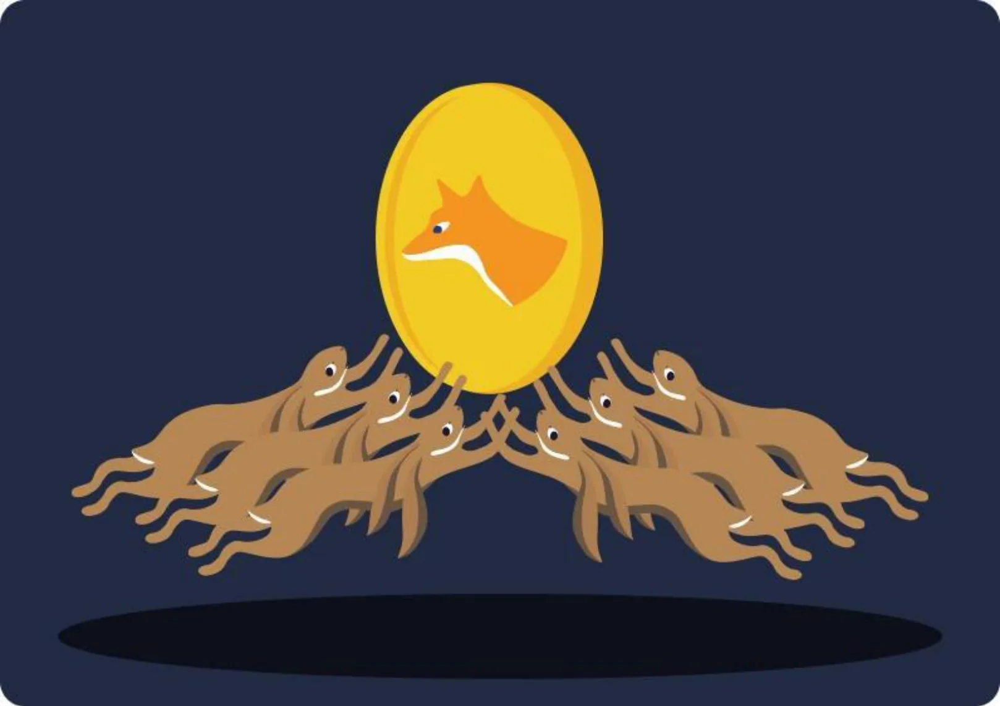

### お金の役割とは？

お金は高度に洗練されたコミュニケーションツールである：

- 現在と未来のコミュニケーションを可能にするものであり、私たちの時間とエネルギーを、切り捨てのリスクなしに来るべき時代に再利用できる資産に変えるものだからだ。
- お互いを知らなくても、同じ言葉を話さなくても、見知らぬ者同士が交換し、取引し、物の価値について合意することができる。

この世界における貨幣の機能を人為的に再現することは難しい。実際、個人も集団も貨幣を作り出すことはできない。貨幣は市場と自発的な合意から生まれるべき自然現象だからだ。この意味で、価格は社会が資源を配分する際の指針となるシグナルであり、情報の一部である。

こうした理由から、貨幣としての金は、以下のようなアリストテレス的機能に基づく 4 千年にわたる貨幣進化論の結果なのである：

- 価値の貯蔵\*\*：貨幣は購買力を将来に移転するために使用されるため、耐久性のある素材である必要がある；
- 交換媒体\*\*：物々交換の代わりに、財やサービスの交換に貨幣を使うことができる；
- 勘定単位\*\*：貨幣はまた、異なる商品の価値を比較し、その相対的な利便性をよりよく理解することを可能にする。


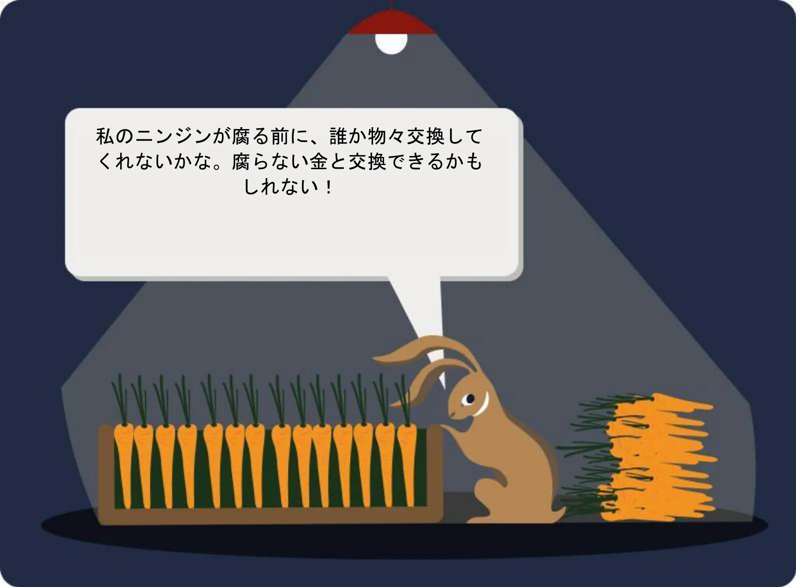


### お金の特徴

金は効率的な通貨の条件を理想的に満たしている。天然の希少性が価値を高め、その化学的性質が時間の経過とともに侵食されないことを保証している。このような特徴から、金は偉大な**価値の貯蔵庫**となったが、一般的な通貨にはなり得なかった。グローバル化し、デジタル化した世界では、金はそのペースを維持するのに苦労し、金を分割可能にし、簡単に交換できるようにする（つまり、鋳造されたコインを通して）中央の主体を必要とする。

反対に、国家の信託通貨（不換紙幣）は簡単に使えるが、それを管理する主体（王、中央銀行、皇帝、独裁者）によって常に切り下げられる。

この概念をよりよく説明するために、効果的な通貨の特徴を探ってみよう：

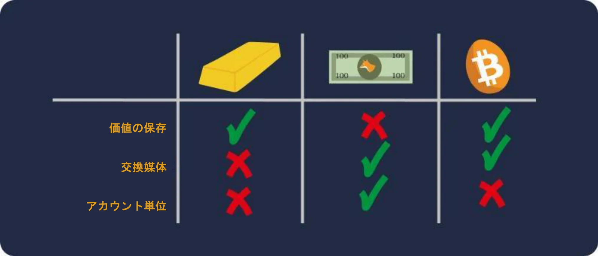

- 貨幣価値\*\*、つまり、価値を失うことなく同種の別の単位と交換可能であること；
- 分割可能性\*\*：様々な量の取引を容易にするために、より小さな単位に分割することができるため；
- 流動性\*\*、つまり商品やサービスに容易に換金できること。

こうした基準を満たすために、通貨は歴史的にさまざまなステップを踏んで進化してきた：

- 原石 → コイン
- 紙幣 → 銀行カード
- ブロックチェーン → ライトニング・ネットワーク

通貨は現在でも進化を続けており、さまざまな用途に合わせてその形態を変えている。先にも述べたように、金は優れた価値貯蔵手段ではあるが、現在のグローバル化した経済にはもはや適さない。同様に、ドルやユーロのようなフィデューシャリー・カレンシーは、現在そのほとんどがデジタル化されているため、流動性が高く、簡単に持ち運べるが、通貨インフレによってその価値は常に下がっている。

一方で、ビットコインは新たな展望を切り開いている。特に供給量が厳格に制限されているという特性により、優れた価値の保存手段となっている。また、中立的なインターネット通貨として、国境を越えることのできる実行可能な**交換手段**を構成している。しかし、継続的な採用が進んでいるにもかかわらず（[BTCmapの地図](https://btcmap.org/map)が示すとおり）、現時点では商取引において広く受け入れられてはいない。

## 受託通貨

<chapterId>25151d46-7db1-5b48-8bba-cbde1944555a</chapterId>

> 「過去を思い出せない者は、それを繰り返す運命にある」ジョージ・サンタヤーナの言葉である。
> 現在の通貨制度に関して言えば、この真理は効果的に響く。

### 受託者＝信託

今日、ユーロやドルなどの主要通貨は受託通貨とみなされている。つまり、通貨には本質的な価値がなく、私たちが通貨を管理する機関に寄せる信頼と信用に全面的に依存しているのだ。

フィデューシャリー・カレンシーとは、人民元を発行する中国やユーロを発行する欧州連合など、国家や政治経済連合といった機関によってそのように定められた貨幣のことである。その発行を担当するのは中央銀行である（たとえば、中国人民銀行、米国連邦準備制度理事会、ギニア共和国中央銀行など）。金融政策を策定するのはまさにこれらの機関であり、したがって、どれだけの通貨を流通させるか、あるいは印刷するかを決定するのもこれらの機関である。


### 通貨切り下げ：ローマ帝国と同じくらい古い戦略

古代以来、金は貨幣の基準として機能してきたが、その硬直性から、ローマ皇帝であれ近代政府であれ、指導者たちはしばしば代替通貨を採用するようになった。

その仕組みは単純で、文明の起源から存在する慣習に着想を得ている。指導者たちは富を支配しようと躍起になり、まず金を一元化し、しばしば権力を利用し、保護と安全を約束する。この貴重な埋蔵金を手にした指導者たちは、金と同等の価値を持つが、自分たちを模して鋳造された新しい通貨を導入する。この通貨はその後流通し始め、人々はすぐにそのシンプルな使用の利便性に順応する。

しかし、こうした指導者たちはその後、新しい通貨の価値を徐々に下げ始め、事実上、最初の金価格と比べて毎年数パーセントずつ価値を下げていく。この無言の切り下げは、しばしば国民の利益のためであると正当化される。実際には、この受託通貨で貯蓄している人々は、貯蓄の価値が下がるのを目の当たりにし、国家はインフレによってプロジェクトの資金を調達する。さらに、この切り下げは借金の返済を容易にする。


重大な局面で、指導者は「通貨はもはや金に裏打ちされていない」と発表する。今や受託通貨に慣れ親しみ、金融に関してしばしば誤った情報を得ている国民は、この現実を受け入れ、国家が自由に通貨供給量を操作し、ほとんどコストをかけずに巨額の貨幣を印刷することを許してしまっている。

通貨増刷はインフレを引き起こし、国民を徐々に貧困化させる。その上、金融システムは崩壊を避けるために規制され、制限されている。大衆とは反対に、金融機関や富裕層はこのシステムから大きな利益を得ているため、不平等が生じ、権威主義が助長される。このような状況では、抜本的な改革を行うインセンティブが働かず、崩壊の可能性があるまで体制が継続することになる。

この戦略がうまく実行されれば、何十年も続く可能性がある。しかし、非常に速いスピードで切り下げが行われたり、信用が失われたりすると、ハイパーインフレにつながる可能性があることに注意することが重要である（次章参照）。歴史によると、ドルは 100 年間で 98％、ユーロは 20 年間で 30％、ポンドは創設以来 99％の価値を失っている。

最終的には、帝国末期のローマ硬貨のように、通貨はもはや金とは何の関係も持たなくなるか、あるいは目に見える現実から切り離された単純な数値に還元されるかもしれない。

今日、私たちは歴史的な転換点を目の当たりにしている。長い間支配的だったドルは衰退し、金は中心的な役割を失っているように見える。私たちは新たな通貨サイクルの入り口に立っており、歴史の教訓はしばしば忘れ去られることを思い知らされる。

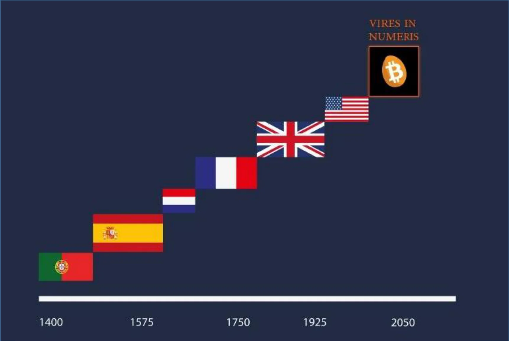

### ビットコインは解決策になるか？

こうした前提から、ビットコイン革命は勢いを増している。これまでの通貨とは異なり、**信頼できる第三者**を必要とせず、貨幣から国家を切り離すことを目指している。


実際、ビットコインは分散型ソリューションと新たな並列通貨システムを提案することで、こうしたシステム上の課題への対応策を提示している。歴史的に、金が偽造に強いことから通貨として支持されてきたとすれば、ビットコインも同様に偽造ができない。さらに、分散型で暗号化されているため、2,100 万単位に制限されている。ビットコインは透明性と中立性に依拠した通貨であり、現在の中央集権的な通貨システムに代わる魅力的な選択肢を提供している。


ビットコインが注目されるもう一つの理由は、中央銀行デジタル通貨（CBDC）の出現である。この新しい形態の貨幣は、より中央集権的に計画された経済を発展させ、個人の金融の自由を妨げ、権威主義的な濫用を助長する可能性がある。

この章の最後に、1984 年のノーベル賞受賞者 F.A.ハイエクの言葉を引用しよう：

> 「政府の手を離れる前に、もう二度と良いお金を手にすることはないだろう。政府の手から暴力的に引き離すことができないのであれば、私たちにできることは、何かずる賢く回りくどい方法で、政府が止められないようなものを導入することだ。」
> このコースでは、ビットコインの出現を高く評価したであろう 19 世紀フランスの思想家、フレデリック・バスティアの生涯と思想をたどります：

https://planb.academy/courses/d07b092b-fa9a-4dd7-bf94-0453e479c7df

## ハイパーインフレ

<chapterId>b04c024c-54f3-50cb-997f-58721cfc74be</chapterId>

ハイパーインフレは、不換紙幣に特有の通貨現象である。通貨に対する信用が完全に失われ、当局による通貨刷り込みによってインフレ率が急激に上昇することで成立する。その結果、個人によって蓄積された貯蓄は比較的短期間で散逸し、国は経済的、社会的、政治的に崩壊の危機に瀕する。

### インフレの暴走

インフレが貯蓄に与える影響を理解するためには、さまざまなインフレ率を考慮に入れる必要がある。

- インフレ率が 2％の場合、毎年 2％の購買力を失い、5 年間で 10％になる。
- 7％では 10 年で半分を失う。
- 20％では、3 年間で半分近くを失うことになる。

ハイパーインフレが起きると、もはや年率 20％という話ではなく、月率 20％、ピーク時には 1 日あたりさえも 20％という話になる。3 日間で 1 日あたり 100％のインフレが起こるというのは、現実的なシナリオであり、この世界で起こり続けている。

ハイパーインフレは、資本主義によって、あるいは反対派からの政治的攻撃によって偶然起こるのではないことを理解することが重要である。ハイパーインフレは、中央銀行家や政治家による誤った金融政策の直接的な結果なのだ。その余波はすべての国民に影響を与え、次の世代にまで影響を及ぼす。以下の表を 5 分ほど読んで、この現象の本当の影響を十分に理解していただきたい（ECO204 のコースではこのテーマをさらに掘り下げている）。おわかりのように、安全な国や通貨はありません。


### ハイパーインフレの段階とは？

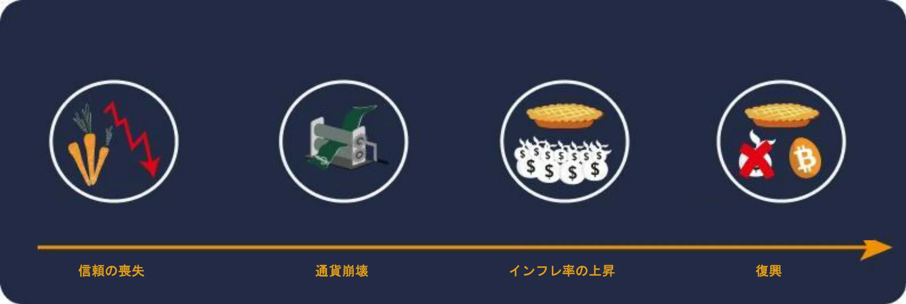

ハイパーインフレが起こるには、ある出来事が起こらなければならない。

第 1 段階 - 信頼の喪失

- 通貨権力の中央集権化は、貨幣の創造とその乱用を促進する。このような状況において、何らかの外的要因がハイパーインフレの引き金となる。典型的なものは、戦争、社会的措置、小麦やガソリンなどの主要資源の価格上昇である。こうして通貨に対する信頼が失われ、個人は貨幣の起源や強制された金融政策の利点に疑問を持ち始める。

第 2 段階 - 通貨崩壊と物価上昇

- 政府が信頼を失うと、ベネズエラで米ドルに起こったように、個人は自国の通貨をより安定したものと交換し始める。こうした状況は物価の上昇を招き、商品やサービスがますます高くなるという悪循環を生む。このようなニーズを満たし、金融政策を修正するために、国家はより多くの通貨を印刷し、その結果、指数関数的なインフレが起こる。

第 3 段階 - マネープリンティングの悪循環

- こうして、商品を購入するためにますます多くの紙幣が必要となり、その結果、紙幣が不足することになる。これに対して政府は紙幣を増刷し、インフレをさらに加速させる。

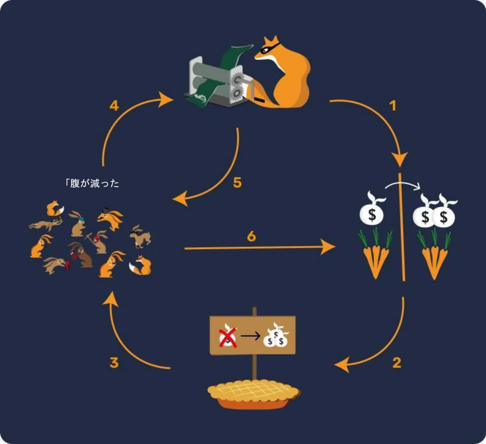

第 4 段階 - 新通貨の出現

- そして古い通貨に代わって新しい通貨が導入され、以前の法定通貨にはなかった厳格な管理を実施することでインフレの連鎖を断ち切る。

ハイパーインフレの危機を解決するには、多くの場合、革命、政府の交代、中央銀行の交代など、抜本的な変革が必要である。信用の喪失、通貨の崩壊、そして復興は、不換紙幣に基づく経済を再生させるために不可欠な段階である。

### 注目すべき 3 つの例

- ドイツ、1922-1923 年

ハイパーインフレの最も顕著な例は、第一次世界大戦後のドイツ・ワイマール共和国で起こった。

ドイツは戦争資金を調達するために巨額の借金をした。しかし、ドイツはそれを失っただけでなく、何十億ドルもの賠償金を支払わなければならなかった。インフレ率が最も高かった月は 1923 年 10 月で、ピーク時のインフレ率は 29,500％。物価は 3.7 日ごとに 2 倍になった！

ドイツの通貨は使い物にならなくなり、一部の市民は薪の代わりに紙幣を燃やしたがった。レストランでは、インフレを考慮して、ウェイターが 30 分ごとにメニューの値段を発表しなければならなかったとさえ言われている。

結局、当局はドイツ、フランス、イギリスの債務を裏付けとし、ドイツの国土が保証する新しい通貨を作った。


- ハンガリー、1945-1946

これまでで最悪のハイパーインフレを経験した国は、第二次世界大戦後のハンガリーである。

ハンガリーは紛争の敗戦国側となり、工業生産能力の大半が破壊された。最もインフレ率が高かった月は 1946 年 7 月で、1 日あたり 207％に相当する 419 億ドルという驚異的な物価上昇率を記録した。物価は 15 時間ごとに倍増した！

最後に流通した紙幣は、1946 年の 1 億億ペンゴ（100,000,000,000,000,000）である。


- ジンバブエ（2007-2008 年

2000 年まで、ジンバブエは石油を除くほぼすべての自給自足をしていた。

1997 年、ジンバブエ政府は退役軍人に 4 億 5000 万米ドル相当の補償を行うことで合意し、ジンバブエ・ドルは 72％以上暴落した。政府はそのような金額を保有していなかったため、印刷機を動かすことに頼った。2005 年のインフレ率は 586％に達したが、ピークは 2008 年 11 月中旬で、1 カ月あたり 796 億％と推定されている。

2007 年 6 月、政府はすでに価格統制を実施することで対応していたが、この措置は経済に何の影響も与えなかった。商店は文字通り "略奪 "され、商人たちはもはや店に商品を補充する手段を持っていなかった。

2009 年 4 月、財務大臣はジンバブエ・ドルの停止を発表し、貿易にさまざまな外貨を使用することを許可した。すべての銀行口座、年金、金融機関の残高は一夜にして蒸発した。


結論から言えば、ハイパーインフレは通貨価値を急速に低下させ、貯蓄の目減りと通貨制度への信頼の喪失を招く。かつてヴォルテールが示唆したように、不換紙幣はいずれ必ず本来の価値を失い、ゼロに向かって収束する。

金融機関のような信頼できる第三者に依存する通貨は、購買力を保証することも貯蓄を維持することもできないため、実際上も長期的にも欠陥通貨である。

ハイパーインフレとは何か、そしてハイパーインフレが私たちの生活に与える実際の影響について学びます。このコースでは、ハイパーインフレのサイクルとは何か、そして私たちの生活に実際にどのような影響を及ぼすのかを学びます。また、これらのサイクルの類似点や最も重要なハイパーインフレから身を守る方法を発見するでしょう。

https://planb.academy/courses/caa75343-ac90-4249-bcca-0e2e57c3a0f1

## 2100 万ビットコイン

<chapterId>f4a06d76-1963-56fd-93ff-dfa41489bcde</chapterId>

### ビットコインの金融政策

ビットコインは分散型デジタル通貨であり、最大数量はあらかじめ 2,100 万単位\*\*と定められている。この本質的な希少性の特性は、そのコンピュータコードによって決定され、プロトコルに参加するすべてのユーザーの合意によって強化される。

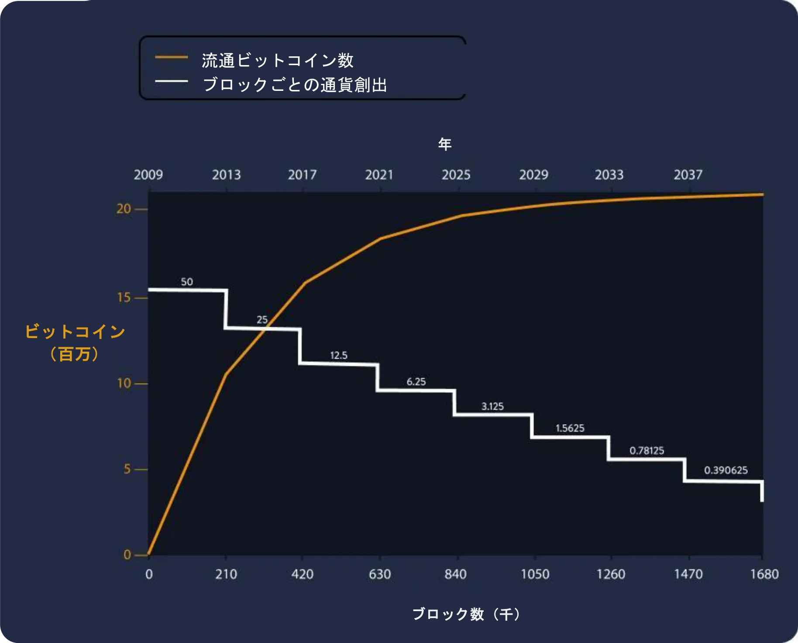

その通貨発行量は、時間の経過とともに作成されるビットコインの量を表す曲線で示すことができる。例えば、2022 年には約 1,850 万ビットコインが流通していた。予測によると、2025 年には約 1950 万ビットコインとなり、総供給量の約 93％を占め、2037 年には 2040 万ビットコインに達する。

### 新しいビットコインはどのようにして作られるのか？

新しいビットコインの生成は、マイニングプロセスの結果である。一言で言えば、採掘者は複雑な数学的問題を解く強力なコンピュータを使用し、取引を検証して安全性を確保する。問題が解決されると、採掘者はブロックチェーン（ネットワーク上で行われたすべての取引を記録する分散型分散台帳）に取引の新しいブロックを追加します。ブロックチェーンは透明性と安全性を保証し、各ブロックは前のブロックとリンクしているため、ネットワークからの合意なしに過去のデータを変更することはほぼ不可能である。


この作業に成功すると、マイナーは 10 分ごとに新しいビットコインを発行して報酬を得る。この報酬は 21 万ブロックごと、つまり約 4 年ごとに半減するようにプログラムされており（「半減」と呼ばれるイベント）、通貨発行曲線は階段状になっている。このメカニズムにより、ビットコインの総数が 2100 万枚に達する 2140 年には、新しいビットコインの発行が停止することが数学的に予測できる。

| 半減数｜ブロックの高さ｜半減後の BTC 報酬｜半減後の推定流通 BTC ｜半減後の推定流通 BTC |
| -------------- | ------------ | ------------------------- | ------------------------------------------ |
| 1              | 210,000      | 25 BTC                    | 10,500,000 BTC                             |
| 2              | 420,000      | 12.5 BTC                  | 15,750,000 BTC                             |
| 3              | 630,000      | 6.25 BTC                  | 18,375,000 BTC                             |
| 4              | 840,000      | 3.125 BTC                 | 19,687,500 BTC                             |
| 5              | 1,050,000    | 1.5625 BTC                | 20,343,750 BTC                             |
| 6              | 1,260,000    | 0.78125 BTC               | 20,671,875 BTC                             |
| 7              | 1,470,000    | 0.390625 BTC              | 20,835,937.5 BTC                           |
| 8              | 1,680,000    | 0.1953125 BTC             | 20,917,968.75 BTC                          |
| 9              | 1,890,000    | 0.09765625 BTC            | 20,958,984.375 BTC                         |
| 10             | 2,100,000    | 0.048828125 BTC           | 20,979,492.188 BTC                         |
| 11             | 2,310,000    | 0.0244140625 BTC          | 20,989,746.094 BTC                         |
| 12             | 2,520,000    | 0.01220703125 BTC         | 20,994,873.047 BTC                         |
| 13             | 2,730,000    | 0.006103515625 BTC        | 20,997,436.523 BTC                         |
| 14             | 2,940,000    | 0.0030517578125 BTC       | 20,998,718.262 BTC                         |
| 15             | 3,150,000    | 0.00152587890625 BTC      | 20,999,359.131 BTC                         |
| 16             | 3,360,000    | 0.000762939453125 BTC     | 20,999,679.566 BTC                         |
| 17             | 3,570,000    | 0.0003814697265625 BTC    | 20,999,839.783 BTC                         |
| 18             | 3,780,000    | 0.00019073486328125 BTC   | 20,999,919.892 BTC                         |
| 19             | 3,990,000    | 0.000095367431640625 BTC  | 20,999,959.946 BTC                         |
| 20             | 4,200,000    | 0.0000476837158203125 BTC | 20,999,979.973 BTC                         |

マイニングの概念については、[マイナーの章](https://planb.academy/courses/2b7dc507-81e3-4b70-88e6-41ed44239966/dbb8264a-7434-57e4-9d1b-fbd1bae37fdf)で詳しく説明する。

### デジタルの希少性を保証する

2100 万という上限はビットコインの希少性の基礎であり、採掘難易度の調整とゲーム理論という 2 つの重要なメカニズムによって保証されている。

- 採掘難易度の調整は、平均 10 分ごとに新しいブロックがブロックチェーンに追加されるように、2016 ブロックごと、つまり約 2 週間ごとに行われるプロセスである。このブロック作成の頻度とビットコインの総量は、どちらもビットコインのプロトコルの固定された側面であり、従来の通貨システムで行われる恣意的な決定とは異なり、一般的な合意なしに変更することはできません。

有効なハッシュを見つける難易度は一種のサイクルに従う。マイナーの数が増えれば、彼らが見つけるブロックの数も増え、ブロックを見つける平均時間が短縮される。その結果、難易度が上がる。その結果、採掘者が見つけるブロックの数が減り、1 ブロックあたり平均 10 分のメカニズムに戻ります。視覚的な表示については、以下の画像をご覧ください。

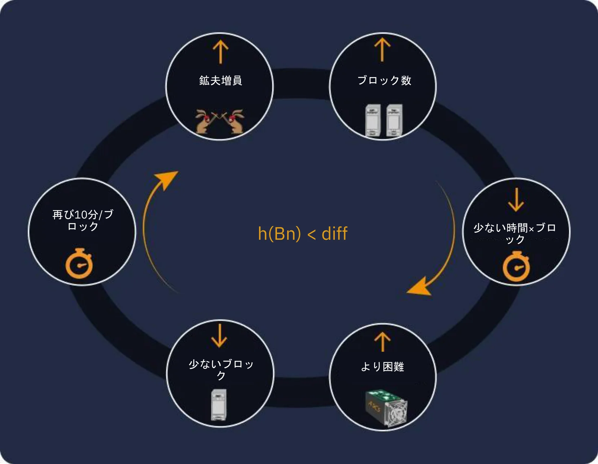

マイナーは、ブロック補助金や、そのブロックに含まれるトランザクションからの取引手数料を通じて、新しいビットコインを獲得するためにブロックをマイニングするインセンティブを得ていることをご存知だろうか？

このため、ビットコインの発行枚数が 2100 万枚に近づくにつれ、マイナーはブロック補助金よりも取引手数料で多くの報酬を得ることになる。

- ゲーム理論とは、人間の合理性に依拠した数学的概念である。これは、個人が論理的に行動し、他人の潜在的な決定を考慮しながら、自分自身の利益を最大化しようとすることを前提としている。ビットコインでは、ゲーム理論は、大多数のマイナーとユーザーがネットワークの最善の利益のために行動することを保証するのに役立つ。実際、プロトコルの変更はユーザーによって投票されるため、ビットコインのプロトコルを変更するには、ユーザーのコミュニティ全体の合意が必要となり、非常に複雑なものとなる。つまり、誰かが 2200 万ビットコインを作りたければ、全ユーザーが自発的に自分の貯蓄を切り下げるよう説得しなければならないが、ビットコインはグローバルであり、中央集権によって統治されていないため、それは起こりそうもないと言える。


通貨を切り下げるという考えはビットコインの基本的な哲学に反するため、全体的な数量が変更される可能性は極めて低い。

### 監査可能な金銭的モラシー：最初から、そして永遠に、毎秒！

ビットコインの希少性は大きな資産であり、最大 2100 万ビットコインの流通量は公開されており、誰でも検証可能である。

実際、以下のコマンドを入力するだけで、誰でもビットコインノード（つまりトランザクションバリデータ）を通してこれを行うことができる：bitcoin-cli gettxoutsetinfo`。この透明性は、中央機関や個人ではなく、そのプロトコルに内在する数学的・暗号学的保証に基づくビットコインシステムに対する信頼を強化する（LNP201 でこれを簡単に行う方法を学ぶことができる）。

```json
{
  "height": 710560,
  "bestblock": "0000000000000000000887384d67103412ea7f18a43953e65c8c4ac36bf42e54",
  "transactions": 473244,
  "txouts": 1018917,
  "bogosize": 2183872374,
  "hash_serialized_2": "eebb9987337700ffaacbbaa11223344",
  "disk_size": 178239584,
  "total_amount": 18745998.12345678
}
```

ビットコインは、設計上その生成を制限することで健全な通貨管理を保証しており、利用者の貯蓄を保護することができるため、他の通貨とは大きく異なる。オーストリア経済学の原則に沿い、その安定した量と予測可能な分配は、従来の通貨が直面しなければならないインフレの本質的なリスクからビットコインを保護する（詳しくは ECO201 コースをご覧ください）。

要約すると、ビットコインは、その分散化された性質、プログラムされた希少性、透明性により、従来の通貨システムに代わるユニークな選択肢を提供している。ビットコインは、有用で検証可能であるだけでなく、供給を厳しく制限することで利用者の貯蓄の価値を維持する通貨を作るために、テクノロジーをどのように利用できるかを示している。


# ビットコイン財布

<partId>28860585-4f61-59d9-b242-f4c57d837cc1</partId>

## ビットコイン・ウォレットとは？

<chapterId>1c0166ab-cb7a-5bc6-9175-d13482bd91f1</chapterId>

セクション 2 では、有名なビットコインがどこにあるのか、どのようにビットコインとやり取りするのかを理解するために、ウォレットを利用したビットコインの保管とセキュリティについて探っていく！

### ビットコイン・ウォレットを解明する

私たちはウォレットを使用して、主に 3 つの方法でビットコインネットワークとやり取りする：

- ビットコインを受け取るには
- ビットコインを送るには
- ハッキングや盗難から守るため

ビットコイン・ウォレットには、コンピュータ上のソフトウェア、スマートフォン上のアプリケーション、USB キーのような物理的なデバイス、あるいは紙切れなど、さまざまな形や形態がある。それぞれが異なる使用ケースに対応している。実際、セキュリティに重点を置いた大規模な取引用に設計されたものもあれば、プライバシーを優先したもの、あるいは少額の日常的な支払いを目的としたものもある。

このように、ポートフォリオは用途別に大まかに分類することができるが、その中心は常に「資金の所有者はあなたなのか、それとも第三者に資金の管理を任せているのか」という重要な問いにある。このトピックについては次章で詳しく説明するが、「資金はあなたのポケットにあるのか、それとも銀行員のポケットにあるのか？


### ビットコイン・ウォレットはどのように機能するのか？

ビットコインの「バンカー」であれ、自分自身であれ、大半のビットコインウォレットは非対称暗号に基づく同様の技術で動作している。

- 秘密鍵

ウォレットを初期化する際、秘密のリカバリーフレーズ（秘密鍵）が生成され、12 語または 24 語の形で提示される。

秘密鍵は、ビットコインの所有権を構成し、ビットコインを使用または送信する権利を構成するため、基本的なものである。したがって、秘密鍵の所有者がビットコインの真の所有者である。

この鍵は、あなたの幸運を解き放つものであるため、秘密にし、しっかりと守らなければならない！

- 公開鍵とアドレス

公開鍵は秘密鍵から生成され、秘密鍵とリンクしている。公開鍵を共有することは、プライバシー（他のユーザーがあなたの残高を見ることができるため）に対するリスクはあるが、セキュリティ（秘密鍵を所有しなければあなたの資金を使うことができないため）に対するリスクはない。また、公開鍵はビットコインアドレスを作成するために使用されるため、資金を受け取ることができる。

これらのアドレスはあなたのウォレットによって自動的に作成され、安全に共有することができます。プライバシーを最大限に守るため、これらのアドレスは一度しか使用しないことをお勧めします。

要約すると、このテクノロジーは、ビットコインを受け取る側が資金を盗むことなく、ビットコインを受け取れるようにするものだ！郵便受けにお金を預けることはできるが、開けることができるのは自分だけなのだ。

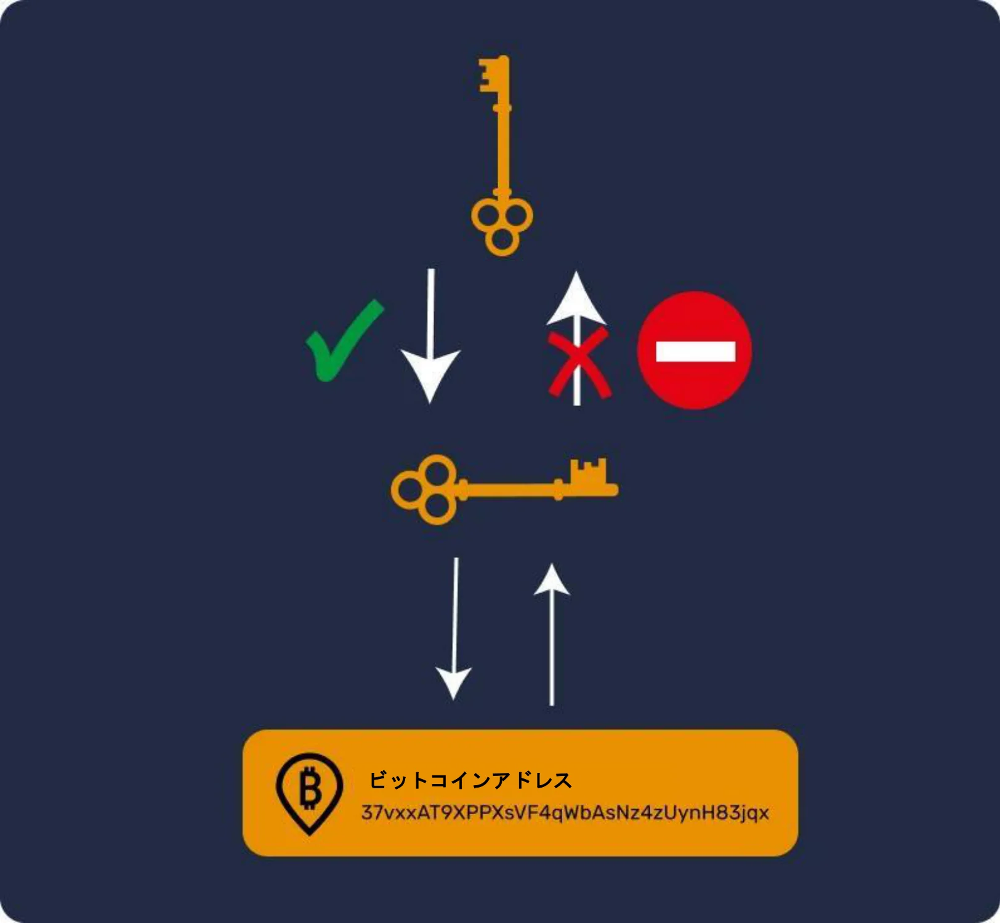

### ビットコインは財布の中にあるのか？

鍵はウォレットに保管されていますが、ビットコイン自体は実際にはビットコインのブロックチェーンに「保管」されている。ブロックチェーンはビットコインのピアツーピアネットワーク内の公開分散台帳である（第 3 章で詳しく説明します）。つまり、ウォレットが入ったデバイスを紛失しても、ビットコインが失われるとは限らない。ウォレットを再作成し、ビットコインを使用することができるのは、実際には秘密鍵であるため、常に適切に保護することを忘れないように！


幸いなことに、2017 年以降、秘密鍵は「ニーモニックフレーズ」として知られる 12 または 24 の単語の単純なリストで表すことができ、非常に簡単に保存できる。このフレーズはあなたの資金のバックアップとして機能し、任意のビットコインウォレットソフトウェアまたはアプリを使用してウォレットを再作成することができる。したがって、この単語のリストを見つけた人は誰でもあなたのビットコインにアクセスすることができるのだ。

### ハッカーはどうなのか？

もし誰かが私たちの 12 語や 24 語のリストを誤って推測してしまったら？簡単に言うと、ウォレットの作成に使われている暗号技術のおかげで、その可能性は極めて低い。例えて言うなら、同じニーモニック・フレーズを偶然に発見することは、1 から2の256乗 の間で「正しい」数字を見つけることに似ており、それは宇宙で「正しい」原子を見つけることにほぼ等しい。しかし、この既存のセキュリティに満足できない場合は、ビットコインウォレットにパスフレーズ（追加の単語）を追加することで、いつでもセキュリティを強化することができる。


したがって、次のセクションで詳しく説明する優れたセキュリティ慣行に従えば、ビットコイン・ウォレットをハッキングされる確率は天文学的に低くなる。

あなたのニーズと使い方に合ったウォレットを選択することに留意してください。様々なウォレットの管理とセキュリティに関する詳細なチュートリアルは、[本学のチュートリアルセクション](https://planb.academy/tutorials/wallet)にある。

ビットコイン・ウォレットの構築について、エントロピーからアドレスの受信まで、さらに詳しく学びたい場合は、このトピックに特化した CYP 201 コースをお勧めします：

https://planb.academy/courses/46b0ced2-9028-4a61-8fbc-3b005ee8d70f

## ビットコイン・ウォレットとセキュリティ

<chapterId>00c1afea-e54a-511f-bab3-2efc2fbfa6a1</chapterId>

### 始める前に正しい質問をする

ビットコインを所有する場合、資金のセキュリティは大きな関心事です。あなたの状況に適したセキュリティレベルを定義する最善の方法は、一連の質問を自問することである：

- 誰があなたの資金にアクセスできますか？言い換えれば、ビットコインへのアクセス権はあなただけにあるのですか、それとも第三者（企業など）があなたの資金へのアクセスを許可しているのですか？
- そのウォレットにあるビットコインをどのように使う予定ですか？定期的に？中期的、長期的な貯蓄？
- 技術的なスキルは？
- セキュリティ予算はいくらですか？

万能の答えや解決策はないので、これらの質問に時間をかけて答えてください。

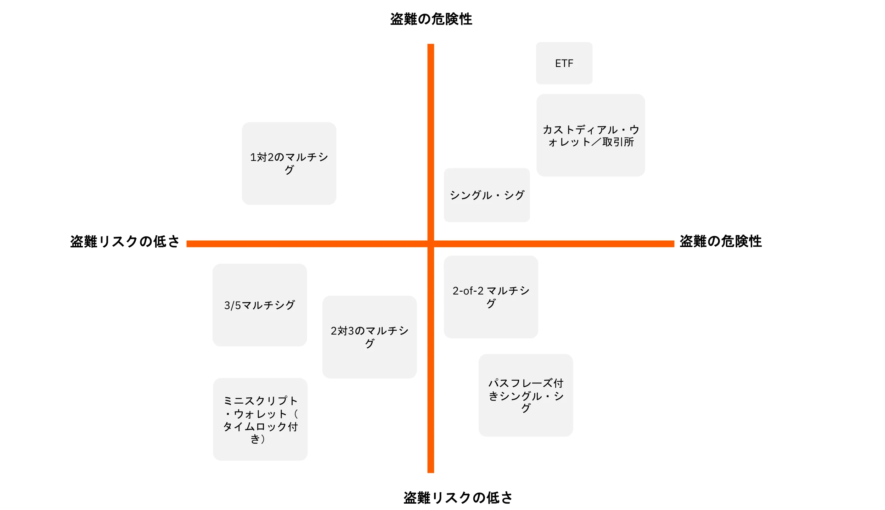

### ビットコイン・ウォレットを複雑さの観点から考える

以下では、いくつかのセキュリティ・レベルを定義する：

- レベル 0\*\*では、いわゆる「カストディアルサービス」を利用し、お客様がビットコインの唯一の保有者ではありません。この信頼できる第三者は、あなたの資金へのアクセスをいつでも制限できることに注意してください。この場合、あなたの金融主権レベルは、銀行口座を持つ伝統的な銀行システムと同様です。


- レベル 1\*\*では、携帯電話やコンピュータ上のビットコインウォレットを使用し、ビットコインの唯一の所有者となり、簡単に取引を行うことができます。前述のツールは「ホットウォレット」と呼ばれ、秘密鍵がインターネットにアクセスできるデバイスに保存されるためです。この場合、携帯電話やコンピュータを紛失した場合に資金へのアクセスを回復するために、ニーモニックフレーズをバックアップすることが極めて重要です。

例えば、Sparrow Wallet をホットウォレットとして使うことができる：

https://planb.academy/tutorials/wallet/desktop/sparrow-c674e2ac-d46f-4c82-92a7-7d1b0e262f5d

- レベル 2\*\*では、物理的なウォレットを使用し、12/24 ワードのリストを確保します。あなたの鍵はインターネットに接続されていないデバイスに保存されるため、しばしば「コールドウォレット」と呼ばれます。この場合、取引のたびにデバイスで署名する必要があるため、日常的に資金にアクセスしにくくなります。

例えば、Ledger、Satochip、Tapsigner を使うことができる：

https://planb.academy/tutorials/wallet/hardware/ledger-nano-s-plus-75043cb3-2e8e-43e8-862d-ca243b8215a4

https://planb.academy/tutorials/wallet/hardware/satochip-e9bc81d9-d59b-420d-9672-3360212237ba

https://planb.academy/tutorials/wallet/hardware/tapsigner-ab2bcdf9-9509-4908-9a4a-2f2be1e7d5d2


- レベル 3\*\*では、レベル 1 または 2 のウォレットを使用し、パスフレーズを追加します。この場合、12/24 ワードのリストとパスフレーズの両方をバックアップする必要があることに注意してください。理想的には、これら 2 つの情報は 2 つの異なる場所に保存されます。

BIP39 パスフレーズの使用と機能についての詳細はこちら：

https://planb.academy/tutorials/wallet/backup/passphrase-a26a0220-806c-44b4-af14-bafdeb1adce7


- レベル 4\*\*では、一連のウォレットを使って "マルチシグ "ウォレットを作成する。この場合、マルチシグの各部分は異なる場所に保管する必要があることに注意する。このアプローチはビットコインの高度な使用方法と見なされることが多く、主に巨額の管理や企業目的のために使用される。


もちろん、異なるユースケースには異なるビットコイン・ウォレットも必要であり、万能のソリューションは存在しません。

### セキュリティは適応されなければならない

特定のセキュリティーレベルにどれだけの金額を置いておくかは、個人によって異なる。ホットウォレットに 1BTC を預けるのが妥当な人もいれば、その逆の人もいる。いずれにせよ、少額を確保したい場合は、物理的なウォレットを購入してセキュリティにあまりお金をかけないことをお勧めします。また、ビットコインのセキュリティやアクセス性を複雑にしすぎると、特にウォレットのバックアップを誤操作した場合、不利になる可能性があることを覚えておいてください。

結論として、自分のビットコインを直接所有することは、金融主権を確保するために不可欠な要素である。日常的な出費にはモバイルウォレットを使用し、大きな金額を保管する場合はオフラインの、つまり「コールド」の物理的なウォレットを使用することをお勧めします。一方、企業はセキュリティを高め、共有するために、マルチシグネチャーシステム（マルチシグ）の利用を検討すべきである。また、従来の金融システムの脆弱性を再現する可能性のあるカストディアル・サービスを避けることも不可欠である。

これを念頭に置いて、ビットコイン・ウォレットの作成方法を説明する次のセクションに移ることができる。ただし、セキュリティのトピックをさらに掘り下げたい場合は、こちらの[DarthCoin による記事](https://asi0.substack.com/p/bitcoin-soyez-votre-propre-banque)をお読みください。

## ウォレットの設定

<chapterId>615519eb-4565-557d-86a0-021badf7616f</chapterId>

ビットコインのセキュリティは極めて重要であり、単純なミスが悲惨な結果を招く可能性があります。そのため、新しいビットコインウォレットを作成する際に採用すべきベストプラクティスを学ぶ必要があります。

BTC102 コースがこのステップを指導しますので、ご注意ください。

https://planb.academy/courses/f3e3843d-1a1d-450c-96d6-d7232158b81f

### このステップは冗談ではない！

ウォレットをセットアップすると、ソフトウェアは通常、12/24 の単語のリスト（しばしば「シードフレーズ」または「ニーモニックフレーズ」と呼ばれる）で表される秘密鍵を作成します。この鍵が第三者に漏れた場合、関連する資金は危険にさらされると考えるべきです。したがって、ウォレットをセットアップする際には、これらのルールに従うことが不可欠です：

- すべてのカメラをカバーする。
- 単語リストの写真は撮らないでください。
- パソコンや電話では入力しないでください。
- 連絡先として保存したり、SMS で自分自身に送信したりしないでください。
- 自分の言葉を机の上に放置してはならない。
- 単語リストをいつもと違う場所に隠さないこと。

文字通り白紙か、この[テンプレート](https://bitcoiner.guide/backup.pdf)を印刷し、ペンで単語リストを書き、提示された順序にしたがって、きれいに、はっきりと書くこと。時間が経つにつれてインクが薄くなってしまうと、資金を失う可能性があるので注意してください。したがって、この紙を湿気や火など、紙を損傷する可能性のある環境要因から保護しておくことが重要です。

以下、論文のまとめ方の例をご覧ください：言葉は偽物ですので、使用しないでください！


### 正しく行うためのヒント

その上、コピーの際にミスをしないように注意すること。そうしないと、相続人がそれを読むのに苦労し、資金を回収できなくなる可能性があります。また、一度保存したら、2 枚目のコピーを作成し、1 枚目とは別の場所に保管することをお勧めします。こうすることで、原本が紛失したり破損したりした場合のバックアップを確保することができます。


単語リストは、すぐに思い出せる安全な場所に保管すること。紛失につながるような複雑すぎる隠し方は避けること。

\*\*あなたの言葉＝あなたのお金。

コールド」ウォレットと「ホット」ウォレットの両方が、秘密鍵のバックアップの標準としてワードリスト方式を採用しています。その結果、互換性のあるウォレットソフトウェアやデバイスにニーモニックフレーズを入力することで、アクセスを復元することができます。一方、シードフレーズを提供しないウォレットは、アカウント、E メールアドレス、あるいはさらに悪いことに ID の提供を要求される可能性があるため、使用しないことを強くお勧めします。

\*\*注意：12/24 の単語リストがないのは警告である。

自分のウォレットをセットアップし、最初のビットコインを手に入れる方法をステップ・バイ・ステップで学びたい場合は、この他のコースも受講することをお勧めします：

https://planb.academy/courses/f3e3843d-1a1d-450c-96d6-d7232158b81f

## 時の試練を乗り越える

<chapterId>f58cd446-c202-5eff-aab7-e61cc40e5c06</chapterId>

他の富と同様に、あなたのビットコインも紛失、盗難、劣化から、特に長期にわたって保護されなければなりません。ビットコインを保護するには、技術的な知識と関連するリスクを理解することが必要であり、これには 2 つの主要な戦略があります。

### スチール彫刻

長期的にビットコインを保護する方法のひとつは、鋼鉄のような耐性のある素材にニーモニックフレーズを刻印し、水や火による損傷に強い鍵の物理的バックアップを作成することです。

ブロックミット」のように低価格のものもあれば、より専門的な装置が必要なものもあります。私たちのアカデミーの[チュートリアル](https://planb.academy/en/tutorials/wallet)セクションで、このトピックについてさらに調べることができます。


### 次の世代のことを考えてみてください！

あなたの死後、ビットコインが適切に管理されるようにするためには、この最初の実践と並行して、相続計画を作成することが重要なステップとなります。このプランでは、あなたの資産の性質、アクセス方法、それらを管理する信頼できる個人の連絡先などの概要を記した手紙を手書きします。また、たとえ公証人に直接ビットコインの管理を任せてはならないとしても、税務コンプライアンスを確保するために、公証人とビットコインの相続について話し合うことも重要です。

ビットコインの相続プランについてさらに詳しくお知りになりたい場合は、パメラ・モーガンの著書[Cryptoasset Inheritance Plan](https://planb.academy/resources/books/28)をお読みになるか、プラン作成のガイダンスを提供する BTC102 コースに参加されることをお勧めします。

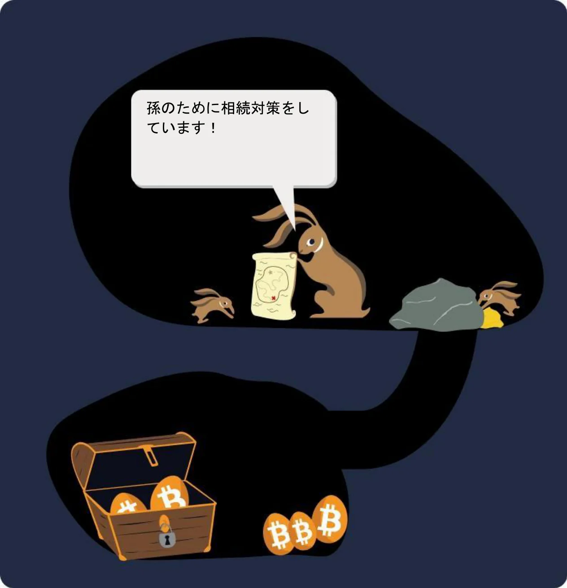

### プライバシーは重要

物理的なバックアップの作成や相続計画の策定に加え、ビットコインの長期的なセキュリティに関しては、プライバシーも重要なトピックです。例えば、身分証明書を提示せずにビットコインを購入し、個人情報の盗難や、適切なツールを持つ組織による資金の追跡のリスクを最小限に抑えることが望ましいでしょう。

プライバシーに関しては、自分のビットコインについて皆に話さないようにすることが重要です。この技術が将来どのように受け止められるかは予測できないので、自分の所有について慎重さを保つことは賢明な選択です。

同様に、ビットコインのミーティングや見知らぬ人との出会いの場では、自分のセキュリティ・システムの詳細をオープンにしないことが非常に大切です....。

### ビットコイン・ウォレットのセキュリティに関するまとめ

ビットコインウォレットは、ビットコインを保管し、取引を行うためのソフトウェアです。いくつかの種類があります：

- 少額または定期的な出費に便利な、モバイルまたは PC ウォレット；
- 物理的なウォレットは、中長期的にビットコインを保管するのに適している；
- マルチシグ・ウォレットは管理がより複雑で、取引を実行するために複数の署名を必要とする。

ウォレットを作成する際には、まず 12 または 24 の単語のリストを紙や金属板にバックアップする必要があります。このいわゆるニーモニックフレーズにより、どのビットコインウォレットアプリケーションからでもウォレットを復元できるようになります。このリストにアクセスした人は、あなたの資金にもアクセスできることに注意してください。

ビットコインの世界では、金融主権は個人の責任と密接に結びついており、ウォレットとバックアップへのアクセスを確保することが不可欠です。そのためには、一定のガイドラインに従うことが重要です：

- 万が一の場合に、あなたの大切な人たちがお金を取り戻せるように、相続対策を立てましょう。
- 取引所プラットフォームはハッカーの攻撃を受けやすいため、ビットコインを取引所プラットフォームに預けることは避けてください。
- 利用可能なさまざまなビットコインウォレットの中からうまく選択するために、セキュリティのレベルをニーズや使用ケースに合わせましょう。

ビットコイン・ウォレットの基礎と、その安全性を確保するためのベストプラクティスを説明したところで、次の章ではビットコインの技術的な特徴を探ります。繰り返しになりますが、ビットコインプロトコルの基本を理解することで、ビットコインの仕組みに対する理解が深まり、ビットコインをより活用できるようになります。

# ビットコインの技術的側面。

<partId>a86d7439-e7a2-5f21-b1e9-6b5e23ca265b</partId>

## ビットコインの立ち上げ

<chapterId>b7561082-8943-519d-95d1-a5f60dd2686d</chapterId>

### まず、歴史を少し振り返ってみよう。

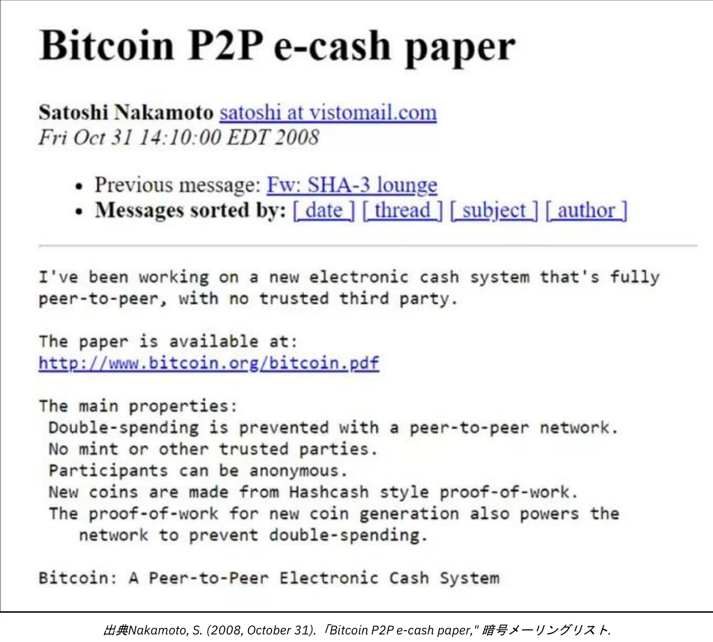

2008 年 10 月 31 日、ビットコインという新しい金融技術が誕生した。この日、匿名のサトシ・ナカモトは、インターネット上のプライバシーを促進することを目的とした暗号技術愛好家のコミュニティである cypherpunks のメーリングリストに送られた電子メールを通じて、世界に向けて自身の革新的技術を発表した。このメールには「ホワイトペーパー」と呼ばれる文書が含まれており、ビットコインの仕組みが紹介されていた。

この構想はすぐには熱狂的な支持を得られなかったが、それはおそらく、デジタル・キャッシュ・システムを構築する試みが過去に失敗していたからだろう。とはいえ、この文書は最終的にビットコインユーザーの参考資料となり、長年にわたってビットコインのエコシステムで多くの議論の対象となってきた。

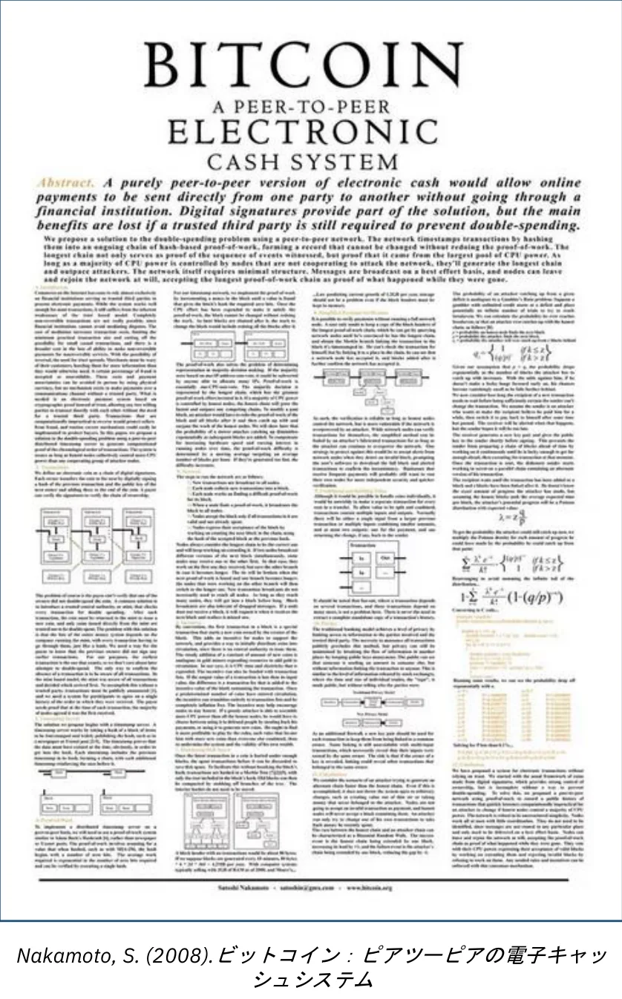

2009 年 1 月 3 日、サトシは「創世記ブロック」とも呼ばれる最初のブロックを作成することで、ビットコイン・ネットワークを正式に発足させた。このブロックには、ビットコインの使命を反映した次のようなメッセージが含まれている。"2009 年 1 月 3 日 首相、銀行に対する 2 度目の救済措置の瀬戸際に"

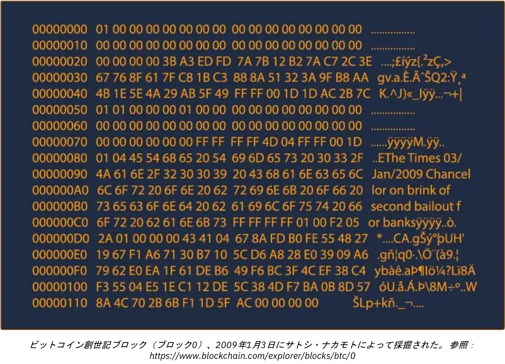

> 「我々は軍拡競争において大きな戦いに勝つことができる。
> 数年にわたる自由の新領域" - サトシ・ナカモト
> 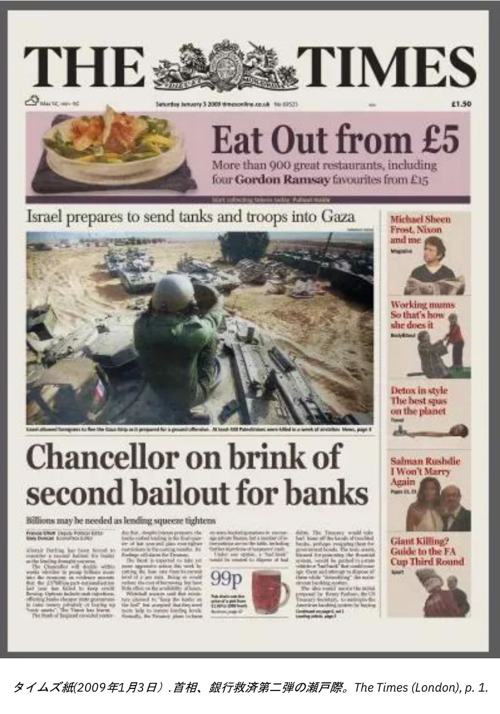

### ビットコインのプロトコルに命が吹き込まれる

2009 年 1 月 9 日、サトシはビットコイン 0.1.0 のリリースを発表した。その直後、ハル・フィニーがこのソフトウェアを手にし、ネットワークに参加したことで、ネットワークに 2 つのノード、つまり 2 人のマイナーが存在することになった。フィニーは「ビットコインを実行中」とツイートして、このステップを不朽のものとした。2009 年 1 月 12 日、10 BTC の最初のビットコイン取引がサトシとハル・フィニーの間で行われた。

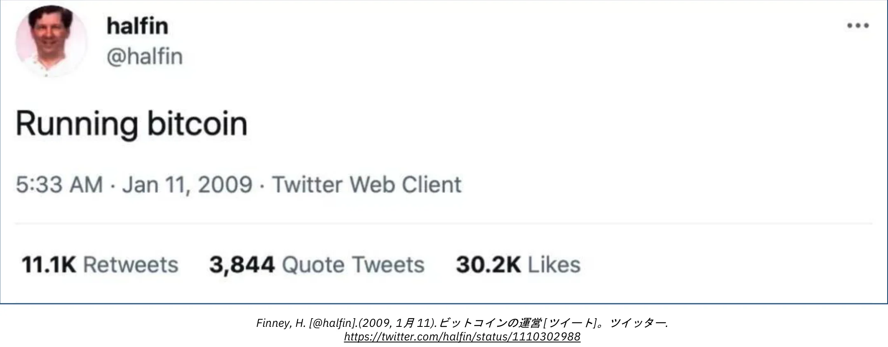

ビットコインへの関心は急速に高まり、多くの人々がビットコインをテストし、議論に参加し、バグを解決し、その倫理的、経済的、哲学的側面について考えるようになった。人々は魅了され、サトシは 2009 年 11 月 22 日、このような対立を促進するために BitcoinTalk フォーラムを創設した。

このフォーラムは瞬く間にビットコインユーザーの議論の場となり、[Bitcoin logo](https://bitcointalk.org/index.php?topic=64.0)、有名な[Hodl](https://bitcointalk.org/index.php?topic=375643.0)、さらには[Pizza day](https://bitcointalk.org/index.php?topic=137.msg1195)など、ビットコインに関連する有名なミームやシンボルがここから生まれたほどだ。

\*\*2010 年 5 月 22 日、Laszlo Hanyecz は 10,000BTC でピザ 2 枚を購入することを提案し、歴史に名を刻んだ。


### サトシ・ナカモトの失踪

2010 年、ビットコインがメディアの注目を集め始めると、サトシは 2010 年 12 月 12 日のフォーラムへの投稿で自身の離脱を発表し、距離を置くことを決めた。2011 年 4 月 23 日、サトシは電子メールによる最後のプライベートなやり取りを行った後、コミュニティの手に彼の創造物を託して姿を消した。

> 「政府は中央の首を切るのが得意だ。
> ナップスターのような管理されたネットワークではなく、純粋な P2P ネットワークである。
> Gnutella と Tor は持ちこたえつつあるようだ」。 - サトシ・ナカモト
> サトシの不在にもかかわらず、ビットコインは開発され続けた。ビットコインの歴史は 10 分ごとに書かれ、プロトコルは今日まで意図された通りに機能し続けている。恐怖、不確実性、疑念に関係なく、ビットコインは前進し続け、オンラインでの利用可能性は非常に高い。実際、この[ウェブサイト](https://bitcoinuptime.com/)によると、ビットコインは作成されてから 99.988％の間、大規模な問題なく機能し、稼働している。

ある人にとっては、ビットコインは[菌糸体](https://brandonquittem.com/bitcoin-is-the-mycelium-of-money/)のような菌類のような存在と定義され、ある人にとっては[ブラックホール](https://dergigi.com/)と形容される。好むと好まざるとにかかわらず、ビットコインは 1 ブロック 10 分という一定のリズムで、新しい通貨システムの鼓動のように存在し続けている。

サトシ・ナカモトの著作をより深く理解するために、主要なテキストを収集し文脈化したフィル・シャンパーニュ著の [*The Book of Satoshi*](https://planb.academy/resources/books/the-book-of-satoshi-61dea136-f12b-4a19-bdb4-0272bca2ab30) と、彼の正体と遺産について分かりやすく十分に調査された検証を提供するARTEのドキュメンタリー [*Le mystère Satoshi*](https://planb.academy/resources/movies/f48841f0-b9ab-4d44-96e7-84fd5b70e91c) の視聴をおすすめします。


> 「従来の通貨の根本的な問題は、通貨を機能させるために必要なすべての信頼にある。中央銀行は通貨を暴落させないことを信頼されなければならないが、不換紙幣の歴史はその信頼違反でいっぱいだ。銀行は、私たちのお金を預かり、電子的に送金することを信頼されなければならないのに、ほんのわずかの準備金もないまま、信用バブルの波にのって貸し出している」- [サトシ・ナカモト](https://satoshi.nakamotoinstitute.org/posts/p2pfoundation/1/)
> さて、背景を理解したところで、ビットコイン取引が一般的にどのように機能するかを検証してみよう。

## ビットコイン取引

<chapterId>03482644-5473-590b-975b-b43bb65eac21</chapterId>

ビットコイン取引とは、ビットコインアドレスを利用したビットコインの所有権移転のことである。このプロセスを説明するために、2 人の主人公を紹介しよう：アリスとボブである。アリスはビットコインを取得したいが、ボブはすでにビットコインを所有している。

### ステップ 1 - ウォレット経由でトランザクションを作成する

ボブがアリスにビットコインを送金するためには、アリスは自分のビットコインウォレットに固有のビットコインアドレスを彼に提供しなければならない。秘密鍵が公開鍵を生成するのに使われるように、後者はアドレスを生成するのに使われる。

具体的には、アリスがウォレットを開いて「受け取る」を押すと、QR コードかアドレス（この bc1q7957hhh3nj47efn8t2r6xdzs2cy3wjcyp8pch6hfkggy7jwrzj93sv4ykr のようなもの）が表示される。これが彼女の「ビットコイン IBAN」となり、彼女はこれをボブに提供する。

その後、ボブはビットコインウォレットを開き、"send "を押して取引を行う。そしてアリスのアドレスを必要なフィールドにコピー＆ペーストし、送金したい金額を追加し、次のブロックに取引を含めるためのマイナーのインセンティブとなる取引手数料を決定する。実際、ボブが支払う手数料が高ければ高いほど、その取引がブロックチェーン、すなわちすべてのビットコイン取引を記録する公開かつ不変の台帳に追加される次のブロックに含まれる可能性が高くなる。

取引を完了させるために、Bob は秘密鍵で署名し、自分が送金したいビットコインの所有者であることを確認する必要があります。このステップは通常、モバイルウォレットでは自動で行われ、物理的なウォレットでは確認という形を取ります：「本当に X を Y に送りたいですか？はい、いいえ"。

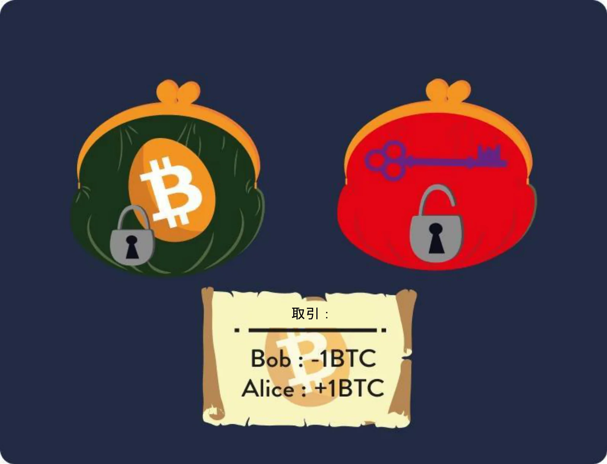

\*\*手数料は、ブロックにトランザクションを含めるための自由な市場を創出するために不可欠である。実際、1 ブロックのサイズは 1MB（Segwit 更新後は 4MB に拡大）であるため、ブロックに「挿入」できるトランザクションの数は 1 ブロックあたり数千件に制限される。トランザクションのサイズはその複雑さに依存する。したがって、複雑なトランザクションほど手数料が高くなるのが一般的である。

### ステップ 2：ノードを介したトランザクションの伝播

この段階でトランザクションが作成され、ボブのウォレットはそれをビットコインネットワークと共有する。これを行うために、彼のウォレットはビットコインネットワークのノードと通信し、そのノードがこの情報を他のノードに伝播する。このようなプロセスにより、ネットワーク全体がこの新しいトランザクションを見ることができ、それを踏まえることができる。


この時点で、このトランザクションは（Mempool と呼ばれるツールを介して）誰もが知っているにもかかわらず、マイナーによってブロックに挿入されるまでは確認されたとはみなされない。

実際、マイナーは有効な取引と未確認の取引を集めてブロックにまとめる役割を持っている。一言で言えば、自分のブロックがビットコインのブロックチェーンの次のブロックになるためには、「プルーフ・オブ・ワーク」と呼ばれるプロセスで暗号パズルを解かなければならない。


### ステップ 3：取引はマイナーによってブロック内で採掘される。

プルーフ・オブ・ワーク（[proof of work](https://planb.academy/resources/glossary/proof-of-work)）システムでは、問題のブロックに対して有効な「ハッシュ」を見つける必要がある。これは、256 文字で構成されるブロックに関連付けられた一意の指紋だとも言える。このハッシュの有効性はビットコインネットワークの難易度に依存する（詳細は後述する）。今のところ、マイナー（採掘者）が有効なブロックを見つけ、その中にボブからアリスへの取引が含まれていると考える。そして、新しい有効なブロックは、すべてのビットコインユーザーの共通台帳であるブロックチェーンに追加される。


### ステップ 4：ブロックは有効で、アリスの参照ノードによって検証される。

この段階で、取引は有効とみなされる。マイナーはその後、新しいブロックを自分のノードを通してネットワークに伝搬し、アリスのウォレットは更新される。


**注意:** アリスが自分のアドレスの一つでビットコインを受け取ったと通知されたとしても、その取引は**6**回の確認を受けた後でのみ不変と考えることが望ましい。これは、ボブの取引を含むブロックの上にさらに 6 つのブロックを採掘しなければならないことを意味する。言い換えれば、ブロックチェーンにおける取引が古ければ古いほど、その取引はより不変になる。

### このプロセスの重要性とは？

ビットコインの取引システムは分散型であり、信頼できる仲介者を介さずにピアツーピアで動作する。

ボブが自分の取引をビットコインネットワークに送信し、マイナーがボブの取引を含む有効なブロックを発行すると、アリスはビットコインが自分のものであると考え始めることができる。プロトコルのルールと経済的インセンティブだけで、ビットコインシステム内で悪意を持って行動することは法外にコストがかかる。

実際、ユーザーは自分の秘密鍵で取引に電子署名することで、資金の所有権を移転する。一方、マイナーは限られた権力を持ち、ユーザーはビットコインノードを使用して新しいブロックと含まれるトランザクションを検証することで、重要な制御を維持する。すべてのノードは台帳の完全コピーまたは部分的コピーのいずれかを持っているため、ビットコインノードによって形成されるネットワークは、システムを真に非中央集権的なものにしている。

その結果、ビットコインネットワークを完全に破壊するためには、すべてのビットコインノード上のブロックチェーンのコピーをすべて消去する必要があるが、これはノードの地理的な分布や物理的な押収の難しさから、現実的には不可能な作業である。

ビットコインノードの仕組みを詳しく見てみよう。

## ビットコインノード

<chapterId>8533cebc-f799-528b-89df-8d75d4c37f1c</chapterId>

ノードはさまざまな重要な機能を果たすため、ビットコインのネットワークアーキテクチャの基本的な要素です：

- ビットコインのブロックチェーンのコピーの維持
- トランザクションの検証
- 他のノードに情報を送信する
- ビットコインのプロトコルのルールを強制する。

したがって、ビットコインノードと呼ばれるビットコインソフトウェアの一部を実行しているデバイス（多くの場合、[Bitcoin Core](https://bitcoin.org/en/bitcoin-core/)を使用している）は、ネットワークの分散化に貢献しています。


### ノードはビットコインの中心的な核である。

各ノードはブロックチェーンのコピーを保持し、取引の検証を可能にし、あらゆる詐欺の試みを防止する。ネットワークの非中央集権的な性質は、ビットコインに卓越した回復力と堅牢性を与えている。実際、ビットコインのプロトコルを停止するには、世界中のすべてのノードを停止しなければならない。ちなみに、2023 年 9 月現在、世界中に約[45,000 ノード](https://bitnodes.io/nodes/all/)が分散している。

ノードはビットコインのコンセンサスのルールに従っているため、ブロックとトランザクションの妥当性を検証することができる。これらのルールは、マイナーの報酬額（次のセクションで詳しく説明する）やビットコインの流通量など、ビットコインの通貨政策を確立する。ノードのおかげで、すべてのネットワーク参加者が同じルールに従うため、ある意味、ノードはネットワークの法制度として機能し、ビットコインプロトコルの中立性を保証します。コンセンサスルールは、変更を加えるには全ノードの承認が必要であるため、変わることはあってもほとんどありません。


プロトコル内のガバナンスは、この基礎講座の範囲を超えているが、ビットコインノードを実行している各ユーザーが、どのルールに従うかを決定できることに注意することが重要である。ユーザーは異なるルールに従う（つまりコードに修正を加える）ことを選択することができるが、これらの変更が現在の合意ルールを無効にする場合、そのノードはもはやビットコインネットワークの一部ではなくなる。その結果、大規模な修正はまれであり、多様なイデオロギーや利害を持つ何千もの参加者の間で重要な調整を必要とするため、すべてのビットコインユーザーが「より良い」と考えるアップデートを提供せざるを得ない。

### ノードとはどのようなものですか？

自分のノードをインストールしたい場合、いくつかの選択肢があり、維持費も異なる。単純にビットコインコアソフトウェアをコンピュータ上で実行することもできるが、ブロックチェーンが約 500GB あるため、かなりのストレージ容量が必要になる。この制約を克服するには、「刈り込まれたノード」を作成することで、最後の N ブロックだけをメモリに残すことを選択できる。この 2 番目のソリューションでは、ノードは必要なときだけアクティブになるため、コストは無視できるのだ。

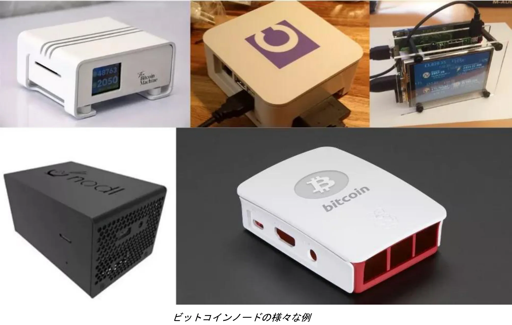

第二の選択肢は、十分に大きな SSD（〜2TB 程度）を搭載した Raspberry Pi 4 など、この目的専用のハードウェアを使うことだ。この別の選択肢は、ハードウェアを購入しなければならない場合、より高価になるが、電力消費量に換算すると、年間 10,00 ユーロを少し下回る。

帯域幅の観点から、10 分ごとに 1MB のブロックを 1 ブロックと考えると、1 ヶ月あたり約 5GB に相当する。

### ノードは誰もがアクセスできる状態を維持しなければならない！

ハードウェアリソース、ストレージ、帯域幅の面でビットコインノードの手頃なコストとアクセス可能性は、ネットワークの分散化を促進するため、非常に重要な特性である。

実際、誰もがノードを運営する正当な理由を持っている！コストと労力は、得られる利益に比べればごく僅かだ。あなたはただ冒険に乗り出し、何千人ものビットコイナーと一緒になってビットコインネットワークを形成するだけでいいのである。

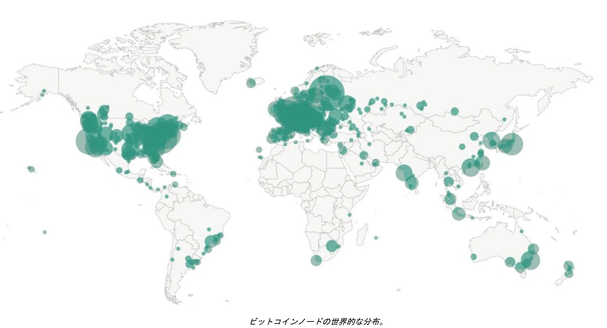

逆に、ブロックが 100 倍重ければ、確かに 10 分ごとに 100 倍のトランザクションを行うことができるが、ビットコインノードを実行するには、50TB のハードディスク、500GB/月以上の帯域幅、10 分以内に数十万件のトランザクションを検証できるハードウェアが必要になる。100 倍のブロックを持つこの仮想的な状況では、ビットコインノードを実行することは一般人にはアクセスできないだろう。これは、プロトコルの分散化とトランザクションとコンセンサスルールの不変性の両方を損なうことになる。

このように、プロトコルの制約は、できるだけ多くの人が自分のビットコインノードを運営できるように設計されてきた。実際、2017 年は「ブロックサイズ戦争」として知られる激しい論争が繰り広げられた。この抗争では、取引能力を高めるためにブロックサイズを大きくしてビットコインを改変しようとする者（マイナー、取引所プラットフォーム、機関）と、ユーザーの独立性と権力を維持しようとする者（ノードとユーザー）が対立した。結局、後者が勝利した。

この勝利の後、ノードは SegWit と呼ばれるアップデートを有効化し、ビットコイン・ブロックチェーンの第 2 レイヤーとして構築された即時ビットコイン決済ネットワークであるライトニング・ネットワークの実装への道を開いた。この状況は、ノードを通じてユーザーがビットコイン内で真の力を持ち、意見の相違があるときに大規模な機関に立ち向かうことができることを示している。

## 鉱山労働者

<chapterId>dbb8264a-7434-57e4-9d1b-fbd1bae37fdf</chapterId>

\*\*マイナーはネットワークを保護し、トランザクションをブロックに追加する。ビットコインのプルーフ・オブ・ワークを解決するために [ASIC](https://planb.academy/resources/glossary/asic) マシンを通して電力を使用する。

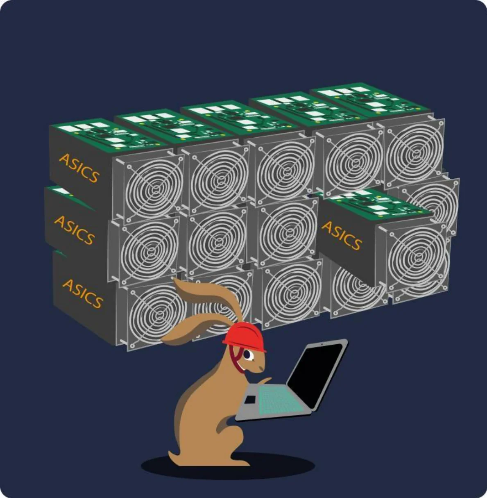

### 作品証明の説明

「プルーフ・オブ・ワーク」（POW）は、ビットコインのプロトコルのセキュリティ・コンセンサス・メカニズムである。これはすべての基礎であり、ビットコインのゲーム理論において重要な役割を果たしている。

その仕組みを説明するために、誰もが参加できるユニバーサルくじを想定してみよう。ゴールは、当選者が有効なブロックに署名し、ビットコインで報酬を得ることを可能にする特定の数字を見つけることである。この数字は SHA-256 ハッシュ関数を使って検証するのは非常に簡単だが、見つけるのは難しい。参加者（マイナー）は、正しい数字を見つけるまで、1、52、2648、26874615、153448541318631 など、何十億、何百億もの可能性を試すことになる。

選ばれた数字が正しければジャックポット！そうでない場合は、検索を続行します。

試行回数を最適化するために、ASIC と呼ばれる特定のマシンを使用する。ASIC は、1 秒間に何十億もの可能性を計算する唯一の役割を担っている（試行回数の合計は「HashRate」と呼ばれる）。これらのマシンを作動させるためには、大量の電力を消費しなければならない。したがって、POW はエネルギーを通貨に変換し、現実世界とデジタル世界を結びつけ、初のエネルギーベースの通貨を生み出す。

この参加者は、難易度の閾値を下回る正しいハッシュを見つけることに成功した。唯一の勝者は、タイムスタンプサーバーの新しいブロックに署名し、ブロックチェーンに追加する。彼らは報酬を受け取り、次のブロックのマイニングの運試しに戻る。このプロセスは 10 年以上続いており、勝者は 10 分ごとにビットコインの取引を確認すると同時に、過去の取引を保護し、ビットコインのブロックチェーンをより強固で安全なものにしている。

2016 ブロックごと（約 2 週間ごと）に、**難易度調整**が参加者数に基づいてグローバルマイニングゲームのバランスを調整する。この調整が必要なのは、マイナーの数とその合計計算能力が時間とともに大きく変化する可能性があるためである。目標ブロックタイムを維持するために、ネットワークは直近の 2016 ブロックがどれだけ早く採掘されたかに基づいて難易度を再調整する。採掘が早すぎた場合は難易度が上がり、正しいハッシュを見つけるのが難しくなる。逆に、採掘が遅すぎた場合は難易度が下がり、より簡単になる。


### マイニングは常に進化している

長年にわたり、マイナーは、最も費用対効果の高い方法で最小限のエネルギーを消費しながら、1 秒間に可能な限り多くのハッシュ（HashRate）を生成するために、ますます効率的なコンピュータハードウェアを装備してきた。サトシやハル・フィニーのような初期のマイナーは CPU だけで採掘を行い、その後他のマイナーはグラフィックカードで採掘を始めた。現在では、SHA256 アルゴリズムを適用するためだけに設計されたマシンである ASIC（特定用途向け集積回路）を使用している。

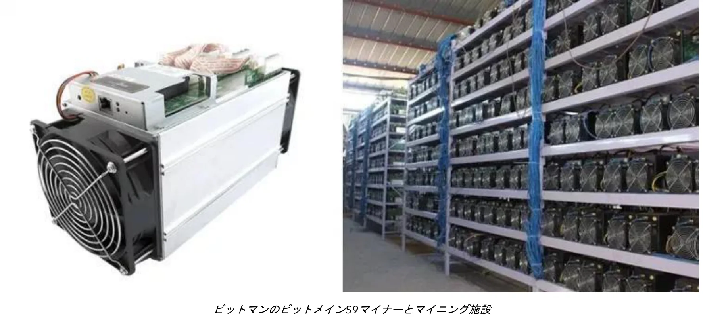

ビットコインネットワークのハッシュレートは、次のブロックを見つけるために 1 秒間に行われる試行回数を表している。今日、ハッシュレートは 500TH/s を超え、これは 1 秒間に 500,000 億回の試行が行われたことになるのだ！世界的なハッシュレートが高ければ高いほど、悪意のある行為者がマイニングパワーの大部分を得るために必要なリソースを独占し、資金を複数回使用することが難しくなる（二重支出問題）。したがって、ビットコインのプロトコルのルールに反する行為をするよりも、そのルールに従う方が経済的に実行可能である。

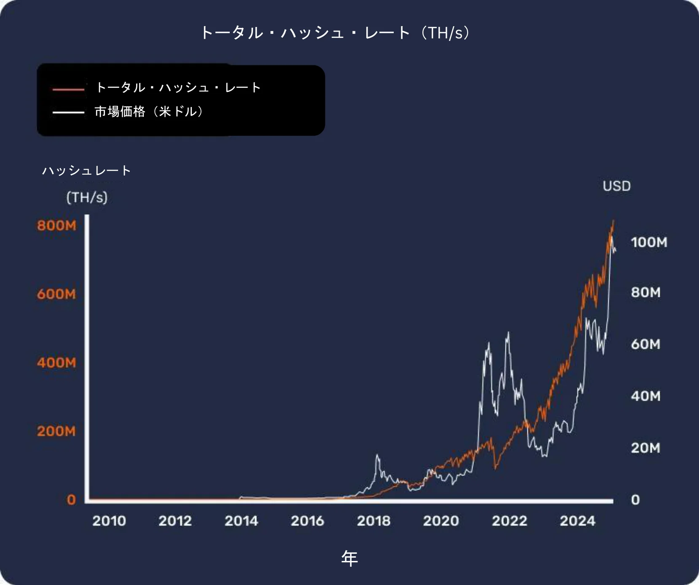

### ブロックには何があるのか？

ブロックヘッダには、時間、難易度ターゲット、最後のブロックの番号、使用されたバージョン、前のトランザクションの Merkle Root など、いくつかの要素が含まれている。

コインベース取引\*\*は常にブロックに含まれる最初の取引である。次にバリデートされたトランザクションが来る。この取引には、バリデータの作業に対するマイナーの報酬が含まれている。次に、検証された取引が登場する。マイナーは、自分たちに最も利益をもたらす取引、すなわち手数料が最大となる小規模の取引を挿入することを選択する。

### 鉱山労働者の補償

最初に、マイナーは有効なブロックを見つけると報酬を得る。より正確には、2 つの方法で報酬が支払われる：

- ブロックに含まれる補助金（新しく鋳造されたビットコイン）を通じて；
- ブロックに含まれる取引からの取引手数料を通じて。

補助金の額はコンセンサスルールによって定義され、エポックに依存する： **ブロック報酬 = ブロック補助金 + 取引手数料**.

実際、最初のブロックでは、ブロック補助金は 50 ビットコインだった。21 万ブロックごとに（およそ 4 年ごとに）、この金額は半分になる。今日（2024 年）は第 5 エポックであり、補助金は 3.125 ビットコインということになる。要するに、これが新しいビットコインをシステムに放出する自動メカニズムです。補助金は時間の経過とともに減少し、2100 万ビットコインの発行上限を満たすまで減少する。すでに 1,940 万ビットコイン以上が流通しており、これは 92％を超えている。


2 つ目の報酬方法は、ユーザーが選択した取引手数料の額によって定義される。この取引手数料は、次のブロックに自分の取引が含まれることに対するユーザーの緊急度を示している。マイナーは収入を最大化したいので、取引手数料の高い取引を優先する傾向がある。

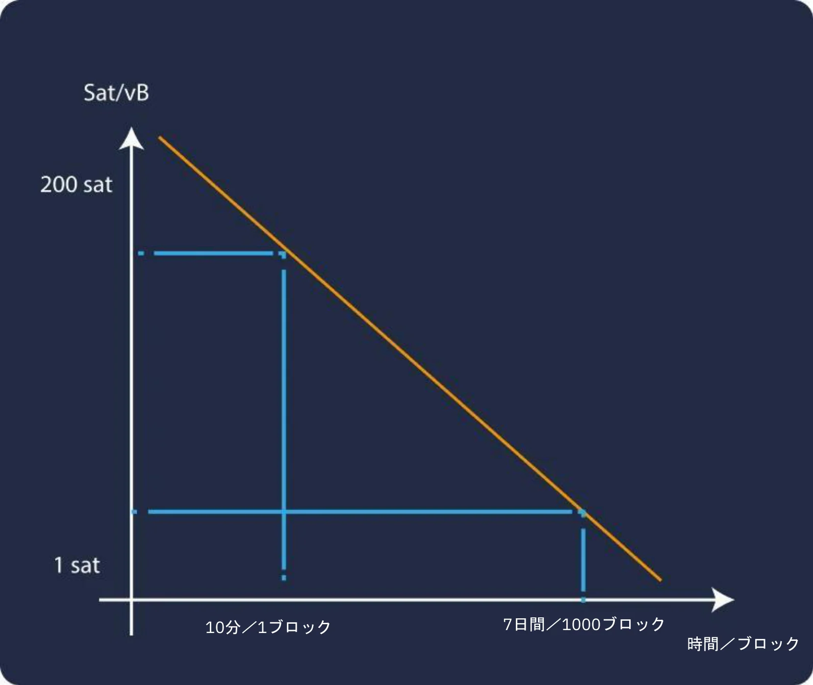

有効なブロックごとに受け取る報酬に依存する彼らのビジネスモデルを安定させるため、マイナーはしばしば「マイニングプール」を通じてグループを作り、計算資源を共有する。

### なぜわざわざこんなことをするのか？

つまり、ビットコインの革新性は、浮動難易度を持つプルーフ・オブ・ワークに基づくブロックチェーンの使用を通じて、二重支出の問題に対する解決策を提案することにある。デジタルの世界では、所有権の概念が物理的な世界とは異なる。実際、デジタルの世界ではあらゆるものがコピー＆ペーストできるため、価値のあるデジタル資産を何度も使用するリスクが生じる。銀行のような信頼できる仲介機関は、この技術的な問題を解決し、資産が譲渡された時点で、その資産がもはや送り主のものでないことを保証するために創設された。

しかし、信頼できる仲介者なしに、どうやってこれを行うことができるのだろうか？この問題は、ビザンチン将軍のパラドックス（様々なアクターが信頼できないシステムにおける情報調整の問題）によってよく説明される。ビザンチン将軍の問題では、将軍のグループが都市への攻撃を調整しなければならないが、中には計画を妨害しようとする裏切り者がいるかもしれない。裏切り者から誤解を招くようなメッセージを受け取る可能性があるにもかかわらず、忠実な将軍たちが攻撃か撤退かのコンセンサスを得ることが課題である。

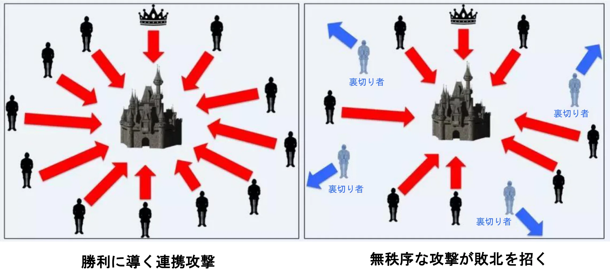

したがって、ビットコインはこの問題を解決する、あるいは少なくとも回避するための一種のソリューションである。ビットコインの "将軍 "であるマイナーは（情報の）ブロックを生成し、ビットコインノードはコンセンサスルールを使って金融取引を検証し、情報の信憑性を保証する。情報の生産と検証の間のエネルギーコストの非対称性は、信頼できる第三者なしで、情報の信頼性を保証する。

マイナーはビットコインのネットワークセキュリティの構築者である。ハッシュを生成するためにエネルギーを費やすことで、彼らは悪意のあるエージェントが取引履歴を書き換えるのに非常にコストがかかる壁を築き、この経済的な阻害要因が他の人が不正行為をするのを抑止する。

あるエージェントがハッシュレートの半分以上を所有する 51％攻撃の場合でも、攻撃者はブロックチェーンを変更しようとするために、すべてのマイナーを合わせたのと同じだけのエネルギーを費やさなければならないため、ネットワークの安全性は保たれる。このエネルギー集約的なプルーフ・オブ・ワークの仕組みが、ネットワークの安全性を保証している。

### 要約すると

ビットコインに適用されるゲーム理論は、ASIC マシンを使って採掘し、成功した場合に報酬を受け取る不正なマイナーを排除する。さらに、マイニング・プールに参加してコンピューティング・パワーを共有し、より少ないが定期的な報酬を受け取ることも多い。ビットコインの採掘には高いエネルギーコストがかかるが、ビットコインネットワークの運営とセキュリティには不可欠である。プルーフ・オブ・ワークの仕組みとブロックチェーン技術は、二重支出の問題に対処し、信頼できる第三者に頼ることなく情報の完全性を保証する。情報の生成には多大なエネルギー消費が必要だが、その情報の検証には無視できるほどのコストがかかる。この非対称性がネットワークのセキュリティを強化し、合意ルールを破ろうとするよりも、むしろそれを遵守する方が経済的に実行可能である。

ビットコインマイニングの具体的なトピックを深く掘り下げたい場合は、MIN 201 コースをご参照ください。このコースでは、Proof-of-Work の仕組みや役割、マイニング業界の仕組みについて学びます。また、ASIC をヒーターに変換する方法も説明しますので、ご自宅を暖めながら最初のサトシを採掘することができます！

https://planb.academy/courses/ce272232-0d97-4482-884a-0f77a2ebc036

## ビットコインとエコロジー

<chapterId>4b227ae6-443a-5739-b443-60b7931130d9</chapterId>

前節では、ビットコインプロトコルのセキュリティが、信頼できる第三者なしに取引の公開台帳を作成するための高いエネルギー消費に依存していることを理解した。主流メディアでは、全体的なエネルギーコストはしばしば小国の電力使用量と比較される。しかし、この比較は意味があるのだろうか？このようなコストの背後にある理由を理解することは適切なのだろうか？

### ビットコインのエネルギーコスト

まず、マイニングの環境コストを定性的に評価しよう。採掘者は、ASIC のような機械と、これらの機械に電力を供給するための電力というエネルギー源を持たなければならない。ASIC はほとんどがアルミニウムでできており、リサイクルするか、第二の目的のために再利用することができる（私たちのコース MIN201 で説明されている Antminer S9 をスペースヒーターに変える Attakaï プロジェクトで実証されている）。したがって、主な関心事はエネルギー消費である。

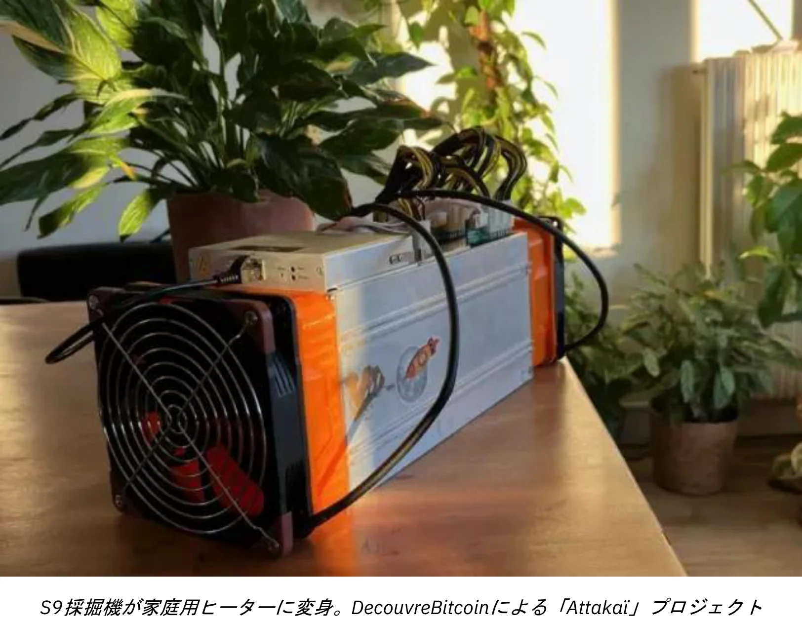

鉱山労働者にとって、電力消費はコストのほとんどを占める。そのため、採掘者は安価な電力源を探すよう奨励され、発電所が設置されているがまだ電力網に接続されていない場所に行くことができる。この場合、採掘業者は最後の買い手として機能し、発電所が電力網に接続される前であっても資金を確保することができる。電力網に接続されれば、電力需要が増加し、価格が上昇し、採掘業者にとって採算が合わなくなる。採掘機は簡単に移動できるため、採掘者たちは設置場所を決め、需要が少なく価格も安い、グリーン電力発電所からエネルギーを得ることができる地域に移転する。

### 終わりのない議論

このように、ビットコインの生態系への影響に関する議論は、主にその有用性に対する理解が不十分なために、しばしば見当違いなものとなっている。ビットコインは、単純にトランザクションあたりのエネルギーコストで評価することはできない。なぜなら、マイナーは現在のネットワークと過去のネットワークの両方を保護し、トランザクションはグループ化されており、すべてが等価ではないからである。その上、ライトニングネットワークの影響も考慮されていない。ビットコインのエネルギー消費量が多すぎると主張する人々は、政治的な動機があったり、独自のブロックチェーン・ソリューションを売り込もうとしているのかもしれない。ビットコインの禁止を正当化するために、生態学的な口実が使われることも多い。

ビットコインは革命的な発明であり、金融抑圧や独裁政権下で暮らす個人が自由のために戦う手段を提供するものであることを強調することは重要である。最後の手段として、ビットコインは検閲や銀行規制を回避することで、経済的自立への道を提供する。マイナーが費やすエネルギーは、この自由を守るために重要な役割を果たし、中央銀行による負債と過剰な通貨創造に支配された金融システムからの解放を可能にする。

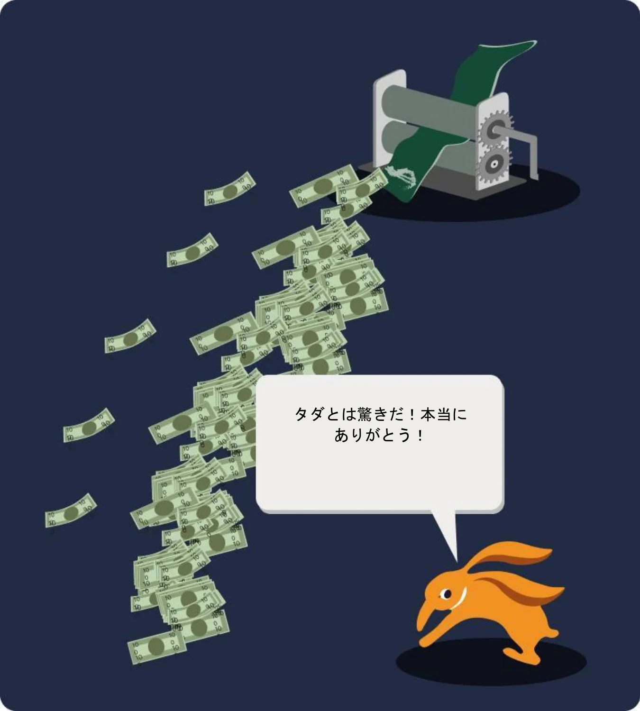


インフレ率の高い国に住む人々にとって、ビットコインは生存に関わる問題だ。ビットコインは、不安定な経済状況下で生き残る手段を提供する。さらに、ビットコインはより公平で公正な金融システムを提供し、世界中の何十億もの人々に金融資源へのアクセスを提供する。このような観点から考えると、エネルギー消費は正当化されるのだろうか？

### ビットコインは環境にとってプラスになる可能性がある

最後に、ビットコインの導入による経済的、環境的な影響について議論することが不可欠である。

現在の金融システムと比較した場合、後者は過剰消費と債務を助長しているため、深刻な問題を引き起こしている。与信への容易なアクセス、銀行による貨幣発行、分数準備銀行の慣行などの要因はすべて、過剰債務とその結果としての過剰消費を助長している。


資源の希少性を通貨の希少性に反映させるために、通貨制度を改革する必要がある。そうすることで、より責任ある消費と長期的な視野が促される。逆にインフレは、消費と投資を促進することによって、環境に長期的に悪影響を及ぼす。

現在の金融システムは、オーストリア経済学とは異なり、状況や資源の時間的・動的側面を考慮しないケインズ経済学の考え方に沿っている。つまり、無制限の通貨では、地球の限られた資源を効果的に表すことはできないのだ。

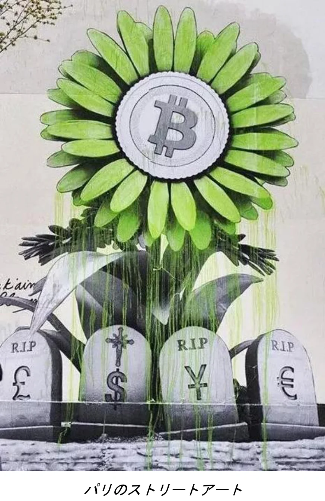

一方、政治家は通常短期的なビジョンを持っており、再選されるためには経済成長が必要であるため、長期的にエコロジー問題を解決することはできない。逆に、ビットコインのような健全な通貨を採用することは、人々に経済的な力を与える可能性がある。

彼らは、ビットコインがグリーンエネルギーの使用を促進していることを知らない。例えば、メタンを燃やして汚染を防ぐために油井で点火された炎は、ビットコインのマイナーによって消すことができる。

\*\*ビットコインの格言に従え：信用するな、自分で確かめろ。

### ビットコインの技術的特徴の簡単な要約

サトシ・ナカモトは 2009 年 1 月にビットコインのプロトコルをリリースし、その後、開発者、マイナー、ビットコインノードを持つユーザーのコミュニティが拡大したおかげで進化してきた。ビットコインの全取引の公開台帳であるビットコイン・ブロックチェーンの独自のコピーを保持することで、これらのノードはビットコインのコンセンサス・ルールに従って取引の正当性を保証することができる。これには、何千もの保留中のトランザクションを含む有効なブロックをマイナーに生成させることも含まれる。

平均して 10 分ごとにブロックが作成され、次のブロックの有効なハッシュを見つけたマイナーは、コンセンサスルールによって定義された金額と、有効なブロックに含まれるすべての取引から得られる取引手数料の両方でプロトコルから報酬を得る。与えられた入力に対するハッシュアルゴリズム（SHA256）の結果は予測不可能と考えられているため、マイニングプロセスでは多数の候補ブロックを構築し、そのハッシュが有効かどうかをテストする。しかし、マイナーの数や計算能力にかかわらず、2 ブロック間の平均時間が一定（～ 10 分）に保たれるように、有効なハッシュを見つける難易度は 2016 ブロックごと、およそ 2 週間ごとに調整される。マイナーは、ASICS と呼ばれる特殊な SHA256 マシンを時間をかけて開発し、1 ジュールあたりのハッシュレート、つまり 1 秒あたりの試行回数と消費エネルギーあたりのハッシュレートを向上させてきた。

採掘者がその活動で可能な限り利益を上げるためには、可能な限り安価な電力を入手しなければならないが、それは多くの場合、グリッドにまだ接続されていない発電所内の遠隔地にある。そして、採掘者は最後の買い手として機能し、需要の増加によって電力価格が上昇するとすぐに、採掘者は活動を他の場所に移す傾向がある。

このように、ビットコインのプロトコルは、プロトコルの各コンポーネントが世界中に地理的に分散しているため、検閲不能で止められない通貨システムとなっている。例えば、ビットコインのノードは全大陸に 4 万以上存在する。ビットコインのコンセンサス・ルールは、それを破ろうとするよりもそれに従う方が経済的に有益であるため、行為者間の信頼は必要ない。ビットコインにはリーダーがおらず、止めることはできない。ビットコインを制限するために取引プラットフォームを規制することが可能だとしても、このアプローチがシステムに与える影響はわずかである。要するに、いかなる裁判官も国家も、ビットコインを検閲したり止めたりすることはできないのだ。

# ビットコインはどうやって入手するのか？

<partId>517e1bb7-f032-51a0-930a-a91fe5148d3f</partId>

## ビットコインは眠らない

<chapterId>d5e35e41-ea26-5478-8eb9-07daf9dff508</chapterId>

ビットコインの価格はしばしば大きなボラティリティを特徴とする。その価値は、他の金融市場と同様に、市場の変動や強気・弱気の局面によって大きく変動する可能性がある。


簡単に言えば、人間は何でも一度に買い、何でも一度に売る傾向がある。 \*\*ビットコインは人間の性質を免れない。

### 採用の波を理解する

ビットコインの発展も進化も、そのエコシステムを徐々に統合してきたさまざまなアクターグループに大きく関係している。


- 信者たち：

ビットコインの初期のユーザーは、主に技術愛好家、サイファーパンク、リバタリアン、金愛好家であった。これらのグループがビットコインに魅了された理由は、信頼性のない電子現金としての価値、検閲への耐性、透明で不変の通貨政策にあった。

- ダークウェブと犯罪者

その後、ビットコインの使用はシルクロードのようなダークウェブ・マーケットプレイスへと拡大したが、その主な理由はその制御不能で偽名的な性質にあり、犯罪行為に従事する一部の人々を含む、そのプラットフォームを超えた個人をも魅了した。しかし、合法性を決定するのはツールそのものではなく、ツールのアプリケーションであることを強調することが重要である。ビットコインを違法に使用したからといって、本質的に誰かが犯罪者になるわけではなく、むしろ違法と分類され得るのは具体的な行為である。例えば、特定の薬物を購入するためにビットコインを使用することは、取引が行われる地域を管理する規制によって、合法である場合もあれば違法である場合もある。

- ICO の熱狂と一般大衆の到来。

2017 年は暗号通貨の世界で大きな投機バブルが発生し、特に数千もの ICO（Initial Coin Offering）が開始された。しかし、これらの新しい暗号通貨の多くは具体的な発展や実用性がなく、すぐに姿を消した。この 2017 年のバブルの後、2018 年から 2019 年にかけて強い調整が行われた。

- NFT バブルと DeFi

そして 2020 年、市場は再び投機的なバブルに見舞われ、ビットコイン価格は 60,000 ドルまで上昇した。このバブルは、金融機関や大企業など、投資家が多様化したことが、以前のバブルとは異なる点であった。しかし、以前のバブルと同様に、最初の幸福感が薄れると、大幅な調整が続く傾向がある。

### ビットコインとボラティリティ

過去のサイクルに基づくと、ビットコインの経済サイクルの周期性は 2 回の半減の間の期間と同じであるように思われるが、これはおそらく半減イベントが新しいビットコインの排出を半分に減らすことによってトリガーとして機能するためであろう。

このような大幅な変動により、ビットコインは非常に不安定な資産という評価を得ており、しばしばユーザーに大きな損失をもたらしている。価格は数日で 10％、20％、あるいは 50％下落することもあるが、ビットコインのプロトコル自体は価格変動の影響を受けないことを理解することが重要である。

この大幅な変動は、今日ビットコイン関係者によって完全に受け入れられており、金融ヘッジ（安定コイン）、強力な長期的信念（ホドリング）、または単に確かな理解なしに自分の資金を 100％ビットコインに投資するリスクを避けるなど、いくつかの解決策によって軽減することができる。なぜビットコインの価格が大きく変動するのかを理解することは、この業界で進歩するために不可欠である。しかし、ビットコインが成長し成熟するにつれて、ボラティリティの影響は小さくなることに注意することが基本である。

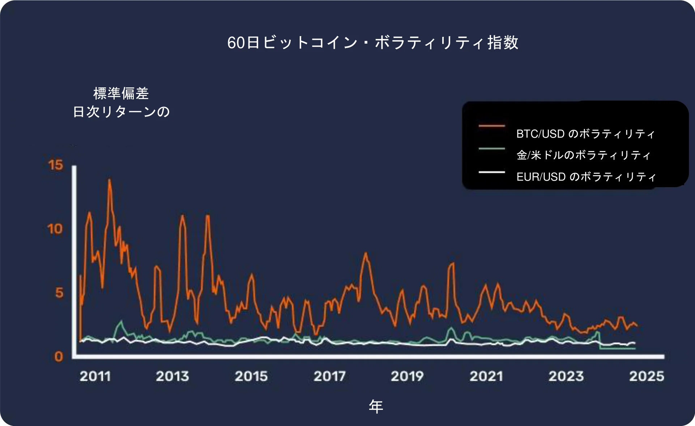

btc/ドルのペアは短期的に変動するが、ビットコインは 2100 万ビットコインという限られた数量とその半減プロセス（平均 4 年ごとに通貨創造を半減する）により、準機械的な方法で全般的な上昇トレンドをたどる。もちろん、他の金融資産と同様に、ビットコインは陶酔期、投機的バブル期、調整期などの経済サイクルに左右される。このような現象は、市場が必ずしも合理的で効率的でない新興技術ではよく見られることである。

### ユニークな市場

このような投機的バブルのサイクルは世界でも極めてユニークなもので、一つの資産がこれほど連続してバブルを経験することは稀である。この現象は、ビットコインが単に崩壊する運命にあるバブルではないという事実に起因している。むしろ、世界中で活発に利用されている通貨として機能している。ビットコインのプロトコルは、24 時間 365 日、世界規模で運用できるという点で際立っており、規制を試みる金融当局にとって大きな課題となっている。


今日、ビットコインは伝統的な市場にますます統合されることで生き残り、さらに成長し続けている。ビットコイン ETF の導入、より明確な規制、取得と保管のためのツールの改善はすべて、このポジティブな勢いに貢献している。ビットコインは再び投機的バブルを乗り越えた！

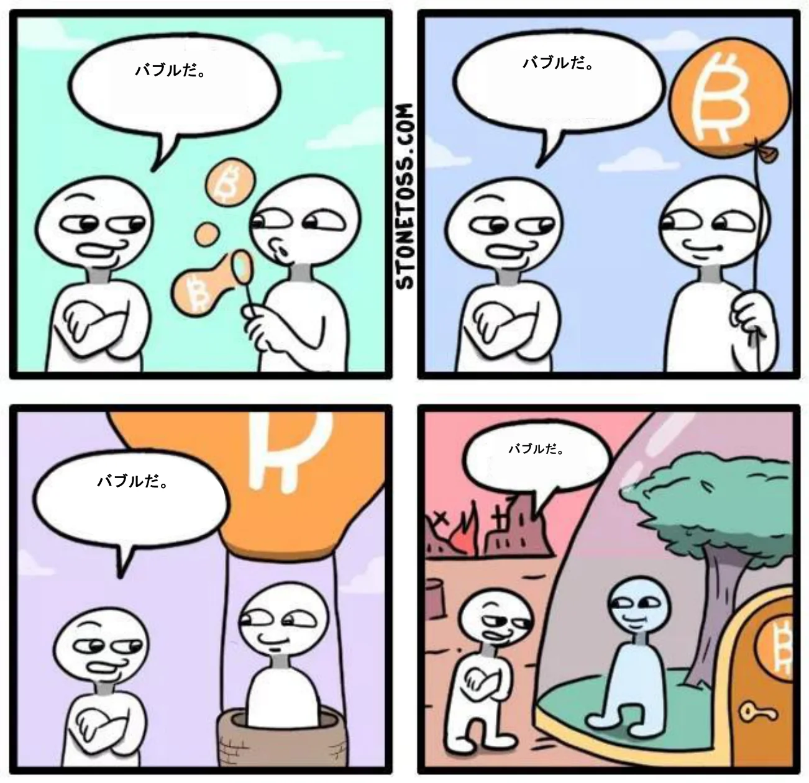


## 働いてビットコインを得る

<chapterId>be2d83be-406f-582c-83ca-6aa905ff7b04</chapterId>

### 並行経済が発展している

ビットコインは、商品やサービスを販売し、ビットコインで支払いを受けることが可能であるため、不換紙幣のパラレルエコノミーを生み出すツールと見なすことができる。取引はビットコインで直接行うことができ、取引所を経由する必要はなく、ビットコインのウォレットから別のウォレットへ移動するだけでよい。

Translation failed: Authorization failure, check auth_key, message: Forbidden. You can find more info in our docs: https://developers.deepl.com/docs/getting-started/auth

ビットコイン経済は存在し、エルサルバドルのような世界の特定の地域で発展しています。エルサルバドルでは、2021年にビットコインが法定通貨となりました。残念ながら、2025年1月に議会はビットコインから「法定通貨」のタイトルを剥奪する新しい法律を可決しました。これは、国際通貨基金からの圧力を受けた結果だとされています。新しい法律の下では、人々はもはやビットコインを自分のビジネスで受け入れる義務がなくなり、ビットコインを使って税金を支払うこともできなくなりました。受け入れは任意のままです。

それにもかかわらず、エルサルバドルや世界の他の地域では、ますます多くの個人、企業、組織が自分たちの製品やサービスの支払い手段としてビットコインを受け入れています。


*出典 : [Wicked Smart Bitcoin](https://wickedsmartbitcoin.com)*

さらに、日常的な取引におけるビットコインの利用を促進するために、オープンソースかつ共同プロジェクトである[BTCMap](https://btcmap.org/map#2/21.28937/5.46680)が立ち上げられた。このプラットフォームは、ビットコインを受け入れるすべてのマーチャントと、世界中のさまざまなビットコインコミュニティをリストアップしているので、ウェブサイトを訪問して、あなたの周りのビットコインエコシステムを発見することができます。このように、困難や躊躇にもかかわらず、BTCMap のような取り組みがあり、ビットコイン経済をより身近で便利なものにすることに貢献している。

### なぜビットコインを買うのではなく、受け入れるべきなのか？

ビットコインを入手するには、フランスの AMF (Autorité des Marchés Financiers)や米国の SEC (Securities & Exchange Commission)などの組織が規制するプラットフォームで購入することができますが、このソリューションでは取引のトレーサビリティが必要になります。ビットコインを入手するもう一つの方法は、あなたが提供する製品やサービスの支払い手段としてビットコインを受け入れることです。

さらに、ビットコインを加盟店として受け入れることには、検閲への耐性、取引手数料の削減、効率の向上、インフレからの保護、金融の自由と主権など、いくつかの利点がある。

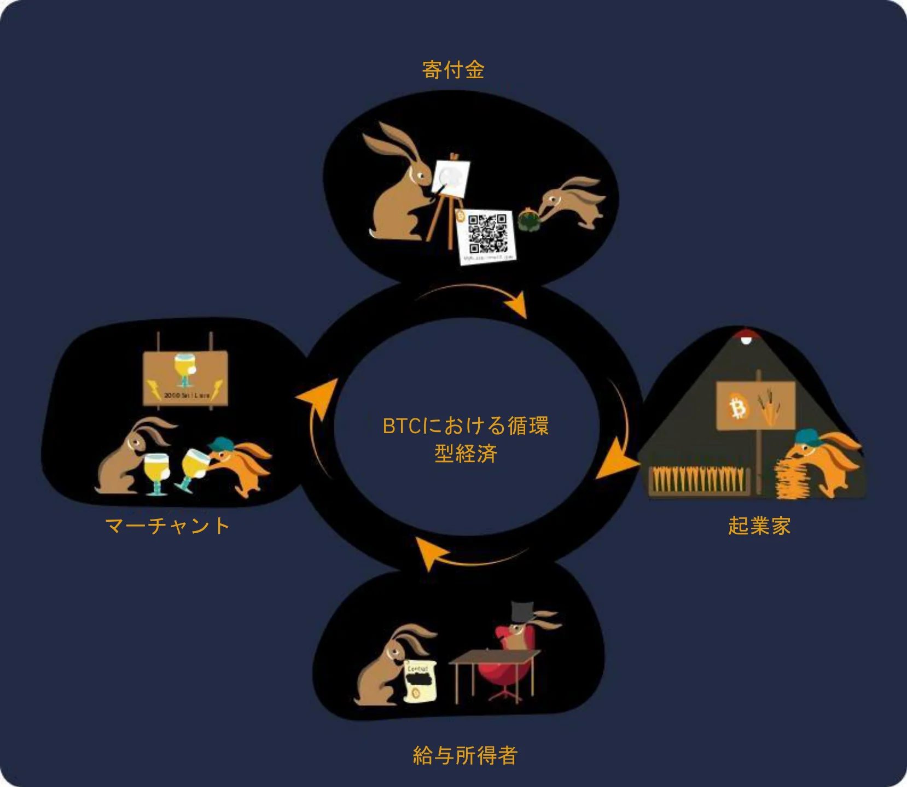

### どうすればいいのか？

ビットコインを受け入れるには、利用可能なさまざまなソリューションを研究し、ビジネスに最も適したものを選択する必要があります。完璧なソリューションは存在せず、予想される取引量、割り当てられた予算、ビジネスのタイプ（オンラインまたは実店舗）など、いくつかの要素を考慮して選択する必要があります。

このトピックについては、別のコースで詳しく取り上げる予定だが、シンプルにするために、いくつかのカテゴリーのビジネスと、それに関連するソリューションを考えてみよう。

- シンプルなオンラインソリューションオープンノード

https://planb.academy/tutorials/business/point-of-sale/open-node-e69a0c1c-47f7-4932-8494-e6f26c3c9784

- アマチュアのためのソリューション：スイス・ビットコイン・ペイ

https://planb.academy/tutorials/business/point-of-sale/swiss-bitcoin-pay-2-a78b057e-ed11-47ac-860c-71019fcb451a

- 大規模な組織や情熱的なビットコイナー向けのソリューション：BTCpay サーバー

このトピックをさらに掘り下げるために、BIZ101トレーニングをお勧めします！ ビットコインを企業の財務に効果的に統合する方法、組織のプロファイルに応じてビットコインを支払い手段として受け入れる方法、関連する税務および会計要件を理解する方法を学びましょう：

https://planb.academy/courses/a804c4b6-9ff5-4a29-a530-7d2f5d04bb7a

## ビットコインで貯蓄

<chapterId>1d9570c6-5b63-51a6-b87c-7bdb0fc4aa87</chapterId>

### 始める前の警告だ！

ビットコインは、主にその限られた供給と需要の増加により、主要な金融資産となっている。しかし、ビットコインの購入には特別な注意を要するリスクが伴う。そのため、資金を投資する前に、自分で調査を行い、このテーマについて詳しく学び、技術に精通することをお勧めする。

- 損してもいい額だけを投資する。
- ビットコインはボラティリティの高い金融資産であり、価格が 0 になることもある。
- 過去の実績は将来の実績を示す信頼できる指標ではない。
- 必要に応じてファイナンシャル・アドバイザーにご相談ください。

**Plan ȏ Network は投資アドバイスを提供するものではなく、ここに記載されている内容はそのようなものとみなされるべきものではありません**。

### ミニ・チェックリスト

ビットコインを購入する前に、以下のことを確認してください：

- 安全な財布。
- ビットコインに対する確かな理解
- 貯蓄計画
- 長期的なビジョン

BTC102 コースでは、最初のビットコインの確保と取得について説明する。ここでは、このトピックの表面をなぞるだけである。

具体的には、自問自答するべき項目が 2 つある：

- 段階的な買収戦略を採用すべきか、それとも一気に買収戦略を採用すべきか？
- 規制されているプラットフォームと規制されていないプラットフォームのどちらを使うべきか？

### 買収戦略

- ドルコスト平均

漸進的な戦略としては定期的な購入が挙げられる。これは定期的な間隔で少量のビットコインを購入することを意味する。この方法は、時間の経過とともに価格を平均化し、所有するビットコインの量を継続的に増加させるだろう。長期的な貯蓄に適した方法であり、ビットコインの価格変動に関する懸念を軽減する。一度仕組みを設定すれば、あとは忘れて投資額の成長を見守るだけで良い。


**UTXO に注意**：UTXO を時々ウォレットに統合することを忘れないでください。この習慣は、ビットコインを効果的に管理し、取引中の不要な手数料を避けるために不可欠です。

[UTXO](https://planb.academy/resources/glossary/utxo#:~:text=utxo)（未使用トランザクション出力）は、まだ使われていないトランザクションの出力であり、新しいトランザクションの入力として使用されていないことを意味します。UTXOを統合することは、いくつかの小さなUTXOを1つの大きなUTXOにまとめることを意味し、トランザクションの「重さ」を減らし、結果として手数料を低く抑えることができます。

- 自発的な購入

一度に投資する方法としては、ビットコインを即座に保有するための自発的な購入が考えられる。暴落時に購入するか、ボーナスなどの余剰資金を利用するか、決断はあなた次第だ。この方法では、勇気を出して購入を決意する必要がある。

この場合、ビットコインの価格はかなり変動しやすいので、感情をコントロールすることが非常に重要になる。実際、FOMO (Fear of Missing Out) と FUD (Fear, Uncertainty, Doubt) は、投資判断を誤らせる大きな要因となり得る。衝動的で結果的に不利な意思決定を避けるために、冷静さを保ち、事前に確立した戦略に則ることを忘れてはならない。

### ビットコインは誰から買うべきか？

ビットコインを取得する方法はいくつかあり、それぞれ管轄地域によって異なる規制の対象となる。プラットフォームの中には、本人確認（KYC）を必要とするものもあれば、そうでないものもあります。したがって、各プラットフォームに関連する規制を理解することが極めて重要である。

- DCA プラットフォーム

上記で紹介したように、ビットコインを貯める一般的な方法として、定期的に少額を購入する「ドルコスト平均法（DCA）」がある。専用ページ](https://planb.academy/tutorials/exchange)に掲載しているような、いくつかのプラットフォームがこのサービスを提供しています。DCAの設定が簡単なことに加え、ウォレットへの引き出しは通常自動で行われるため、常に資産を管理することができる。

今日、ほとんどすべての DCA ソリューションが比較的効率的で、料金もほぼ同じである。

- ブローカー・プラットフォーム

大規模な投資には、Kraken、Bitstamp、Paymium などの規制され、認知されたプラットフォームが推奨される。これらのプラットフォームは、大量の取引に安全で健全な環境を提供する。

使い方は簡単で、誰でも利用できる：

1.KYC/アカウントの設定

2.口座への送金

3.ビットコイン購入

4.あなたのウォレットにビットコインを引き出す


購入後、ハッキングや資金ブロックのリスクを最小限に抑えるため、すぐに取引所プラットフォームからビットコインを引き出すことをお勧めします。プラットフォームによっては、引き出し手数料が最大 25 ユーロと高額になることもあるので注意が必要だ。

\*\*KYC（Know Your Customer）規制は、テロ資金調達、脱税、マネーロンダリングに対抗するため、利用者に身分証明書の提出を義務付けている。

KYC はビットコイン業界において重要な話題であることを認識することが不可欠である。多くの人がその有効性について議論する一方で、それに関連する懸念も数多くあります。私たちのアカデミーのトレーニングプログラムやコンテンツの多くで、私たちは上級ユーザーに対し、KYC を必要とするプラットフォームを避けるようアドバイスしています。

### 非 KYC ソリューション

さらに、ピアツーピア取引所でビットコインを売買できる[マーケットプレイス](https://planb.academy/tutorials/exchange)もいくつかあります。一般的には、以下のようなものがあります：

- ビットコイン ATM
- 他のビットコイン愛好家との物理的な会合
- 違法で規制されていないプラットフォーム
- ピアツーピア・マッチング・ソリューション
- ビットコインに優しい国で運営されているネオバンク


最後に、納税義務は司法管轄区域によって異なる場合があることに留意することが重要であるため、リスクを負う可能性のある行動を取る前に、各国の規制を参照することを強くお勧めする。

ビットコインの購入、利用、およびセキュリティ戦略についての知識をさらに深めたい場合は、この講座に続いて **BTC 102** コースを受講することを強くお勧めします。そこでは、あなたのプロフィール、ニーズ、および個人的な目標に適したツールの推奨事項などを学ぶことができます:

https://planb.academy/courses/f3e3843d-1a1d-450c-96d6-d7232158b81f

## 超ビットコイン化

<chapterId>b7275d31-3b60-5fb7-b9f5-030097010553</chapterId>

### ビットコイン民主化の序章！

他の新しいテクノロジーと同様に、ビットコインの採用は S 字カーブを描き、アーリーアダプターからより広範な受容への進行を示している。我々はアーリーアダプターの時代を超え、指標はビットコインの民主化の可能性を示唆している。結局のところ、ビットコインは簡単には止められないバイラル・テクノロジーなのだ。一方では、エルサルバドルがビットコインを法定通貨として完全採用するという大胆な一歩を踏み出した。このことは、ビットコインの導入が複雑で、文化的、歴史的、国家的要因の影響にさらされていることを示している。

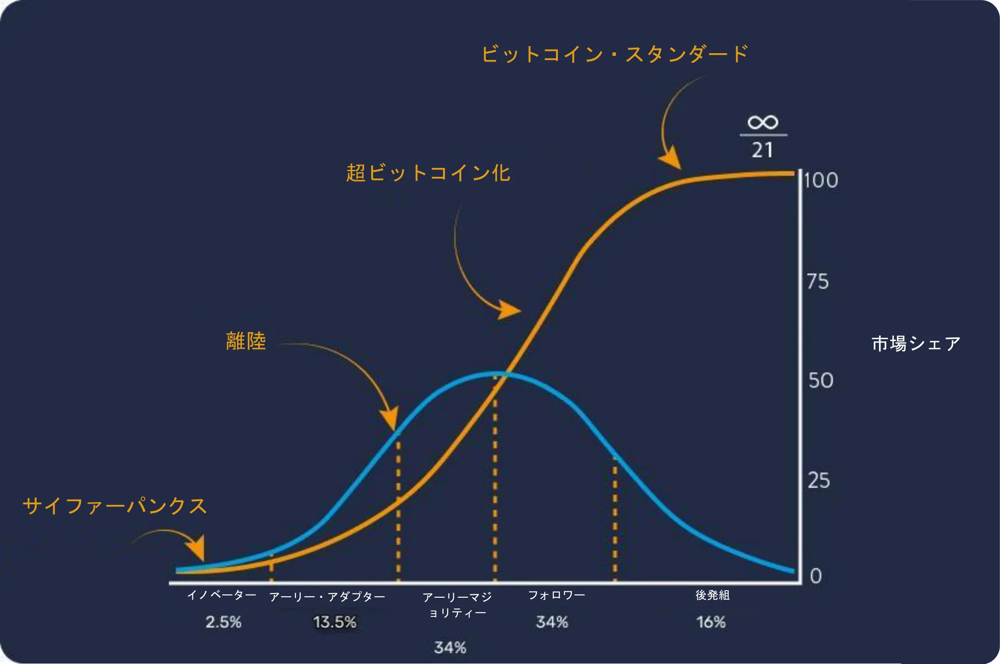

ビットコインの台頭により、企業、大学、規制当局、そして個人は、この新しいテクノロジーを考慮する必要に迫られている。新たなツールを生み出し、サービスを適合させ、イノベーションを継続させなければ生き残れない。この文脈は、暗号、ゲーム理論、経済学と金融政策、コンピュータ科学、哲学、エネルギー、法律、規制など、さまざまな分野に関連する多くの問題を提起している。つまり、ビットコインは学際的なテーマなのである。


### ビットコインは 0 から 1

最後に、この新しい通貨革命について考えていただきたい。ビットコインには探求すべきことがたくさんあり、一度にすべてを吸収するのは複雑だ。ビットコインはなくならない。それどころか、革命は始まったばかりである。人間の主権が権利であり、プライバシーが常に尊重され、貨幣が操作されない世界です。私たちは、一丸となってこれを達成したいと願っている。

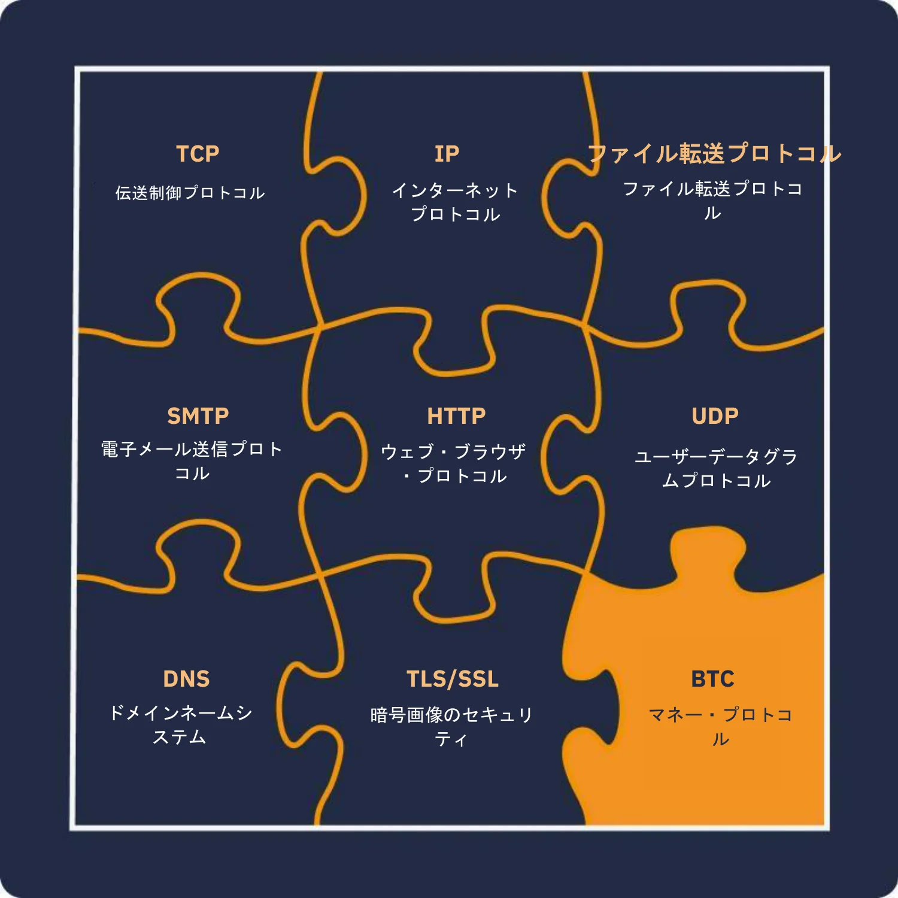

ビットコインに関する知識を深めたいのであれば、今がチャンスだ：多くの著者、思想家、エッセイストがビットコインに関する教育的コンテンツを作成しています。過去数年間、私たちは最も好奇心旺盛な皆さんに[リソースライブラリ](https://planb.academy/resources)を提供するために、これらの作品をリストアップし、分類してきた。このセクションでは、最高のポッドキャスト、ウェブサイト、記事、チュートリアル、書籍、その他のコンテンツを見つけることができる。

> 「インターネットは、政府の役割を減らす大きな力のひとつになると思います。今ひとつ欠けているが、やがて開発されるであろうものは、信頼性の高い電子マネーである。」 - 1999 年のミルトン・フリードマンの予言

# Bitcoinの未来

<partId>899fd35e-39e6-5a25-a73e-6fed6e725094</partId>

## Lightningネットワーク：低手数料でビットコインを高速に支払う

<chapterId>b403f1e4-f1ff-572b-a242-9b58cb3736d0</chapterId>

Bitcoinプロトコルの基礎を理解したところで、次にBitcoinの上に構築された主要な決済ネットワークであるLightning Network（一般に「LN」と略されます）を紹介する。その目的は非常にシンプルである。ブロックチェーンを混雑させることなく、ほぼ即時に確定するBTC決済を、一般的に非常に低い手数料で実現することだ。

### ブロックチェーンはすべてを担えない

Bitcoinのブロックチェーンは、できる限り多くの人が、許可不要かつ信頼に依存せずに検証できるよう設計されている。この要件には構造的な制約が伴う。すなわち、ブロックは独立したノードが高価なハードウェアに投資せずともダウンロード・保存・検証できる範囲に収める必要があるため、ブロックチェーンは無制限のトランザクションを処理できない。これはしばしば「トリレンマ」として要約される。分散性、セキュリティ、スケーラビリティです。ブロックチェーンを基盤とするシステムは、これら3つの性質を同時に最大化することはできない。Bitcoinは分散性とセキュリティを優先しており、その結果、オンチェーンで処理可能なトランザクション数は自然と制限される。

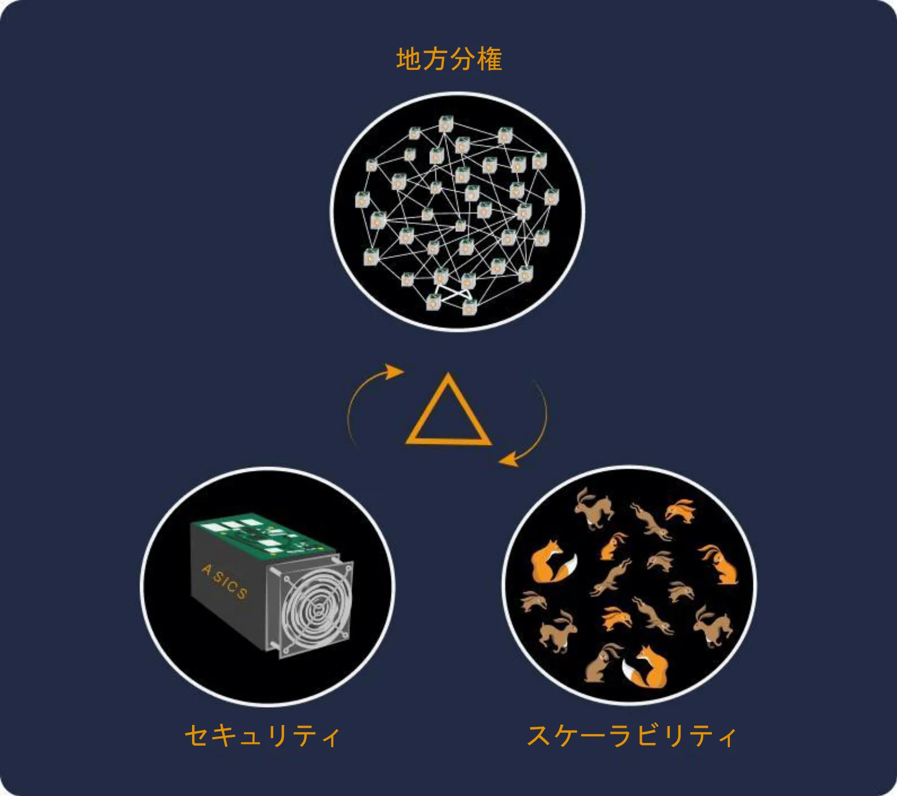

Bitcoinでは、開発者たちがこれらを重視するために明らかな選択を行ってきた。一方では、ブロックサイズを1MBに制限し、ブロック生成間隔を平均10分とすることで、低コストでBitcoinノードを運用でき、ネットワークの分散性が促進される。他方では、プルーフ・オブ・ワークによるブロック生成によって不正行為は極めて高コストとなり、ノードによる検証が容易になると同時に、プロトコル全体のセキュリティが強化される。

しかし、これらの選択には重要な制約も伴う。各ブロックに含められるトランザクション数が限られているのだ。これは1秒あたり数件のトランザクションに過ぎない。この数値は、VISAのような中央集権的決済システム（理論上の最大処理能力は約65,000件/秒）と比べると非常に小さいものである。しかし、この制限こそが、検閲されず、信頼できる第三者を必要としないトランザクションを可能にするための代償だと言える。

具体的には、これはBitcoinの日常利用において非常に重要な2つの意味を持つ。
* ブロックスペースの需要が高まると、オンチェーン手数料が非常に高騰する可能性がある；
* オンチェーン決済には承認が必要であり、日常的な買い物には必ずしも適していない

Lightning Networkは、まさにこれらの課題に対する回答である。Lightningの考え方はレイヤー構造のアプローチに基づいている。Bitcoinは引き続き基盤レイヤー（堅牢で非常に安全な決済レイヤー）として機能し、Lightningはその上に高速な決済レイヤーとして位置づけられる。

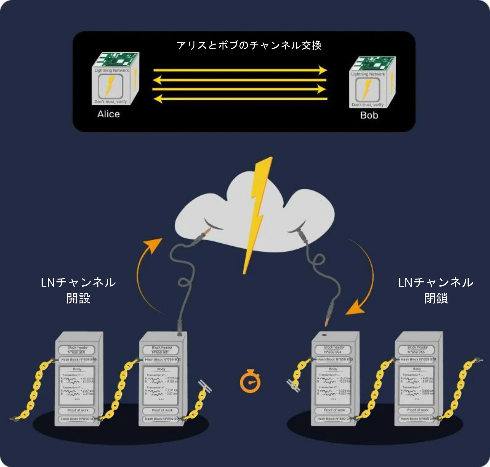

### Bitcoinにアンカーされたペイメントチャネル

Lightningは双方向のペイメントチャネルに基づいている。チャネルとは、2人の参加者間の技術的な関係であり、各支払いをブロックチェーンに記録することなく、オフチェーンでサトシをやり取りできる仕組みである。

Bitcoin（オンチェーン）の視点では、チャネルを開くことは特別なトランザクションで資金をロックすることを意味する。これはエスクローのようなものと捉えることができます。資金は、有効なチャネルクローズによってのみ再分配できる形でロックされる。

Lightningの視点では、同じ仕組みが、両当事者がサトシの分配状態を何度でも、ほぼ即時に更新できるチャネルとして機能する。しかも、そのたびにメインのブロックチェーンへ記録する必要はない。

仕組みは次の通りである。
* Lightningチャネルの開設と閉鎖はBitcoinトランザクションであり、オンチェーンに公開される；
* 開設から閉鎖までの間の支払いはオフチェーンの更新であり、メインのブロックチェーンには表示されない。

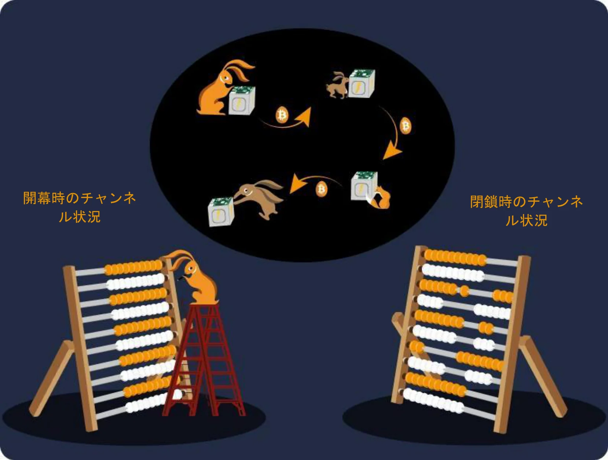

このように、Lightningチャネルを共有する2人は、毎回オンチェーントランザクションを行うことなく、非常に多くの支払いを実行できる。ここにもスケーラビリティの考え方がある。ブロックチェーンは稀で重要な操作（チャネルの開設と閉鎖、すなわち最終決済）のみに用い、その他の小額で中間的な支払いは、より効率的なレイヤーへ移すのだ。

### 相互接続されたチャネルのネットワーク

Lightningは単なる孤立したチャネルの集合ではない。これはネットワークである。数千のノードがチャネルによって相互に接続され、接続グラフを形成している。

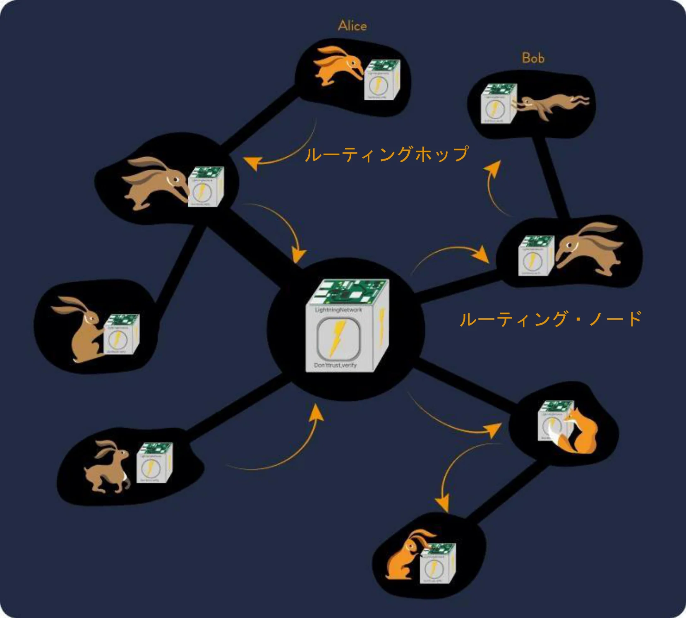

このネットワークのおかげで、直接のチャネルを持っていない相手に対しても、支払いをルーティングできる経路が存在すれば支払いが可能である。その場合、支払いは複数の中継ノードを経由し、ホップごとに転送される。

ここでLightningの重要な概念である「流動性」が登場する。チャネルの容量とは、そのチャネルにロックされている資金の総額を指す。一方、流動性とは、その資金がチャネルのどちら側に配置されているか、つまりサトシがどの方向に流れるかを意味する。言い換えると、チャネルは大きな容量を持っていても、流動性が反対側に偏っていれば、特定の方向では利用できない場合がある。支払いの成功は、経路の存在だけでなく、その経路全体にわたる流動性にも依存する。

### 仲介者を信頼せずに支払いをルーティングする

Lightningは、仲介者を信頼することなく支払いを経由できるよう設計されています。そのために、HTLC（Hashed Time-Locked Contracts）と呼ばれるスマートコントラクトが用いられます。詳細には踏み込みませんが、基本的な仕組みは次の通りです。
* 支払いは秘密（プレイメージ）の開示に条件付けられる；
* 最終受取人がその秘密を公開すれば資金を受け取り、中継者もそれぞれ報酬を受け取れる；
* 支払いが失敗した場合、タイムロックが失効し、各参加者は自分の資金を取り戻す。

この仕組みにより、重要な性質が得られます。それが原子性です。支払いは完全に成功するか、あるいは中間的な損失なしに失敗します。

さらにLightningにはペナルティメカニズムがあります。参加者の一方が、もはや正しくない過去のチャネル状態を公開して不正を試みた場合、もう一方はそれを罰し、すべての資金を回収できます。このルールは、敵対的な環境であっても誠実な行動を強く促します。

### LightningノードとLightningウォレットの意味

Bitcoinオンチェーンでは、ウォレットとは鍵を管理し、トランザクションを構築するソフトウェアです。一方Lightningでは、状況はより曖昧です。真のノンカストディアルな利用はLightningノードに依存しており、そのノードがシンプルなインターフェースの背後に隠されている場合もあります。

実際には、Lightningを利用するアプリケーションには大きく2つのカテゴリがあります。
* カストディアルサービス：アプリは残高を表示しますが、資金はサービス提供者が管理します。残高は取引所と同様、その内部システム上の会計記録です；
* ノンカストディアルソリューション：鍵と資金回収の権限を自分で管理します。管理が最小限に抑えられたノードを内蔵するアプリ（Phoenix、Zeusなど）や、自分で完全に運用する本格的なLightningノードが該当します。

https://planb.academy/tutorials/wallet/mobile/phoenix-0f681345-abff-4bdc-819c-4ae800129cdf

https://planb.academy/tutorials/wallet/mobile/zeus-embedded-c67fa8bb-9ff5-430d-beee-80919cac96b9

また近年では、オンデマンドで実行されるアトミックスワップを用いて、間接的にLightning決済を扱えるセルフカストディ型ウォレットも存在します（Bull Bitcoin Wallet、Aquaなど）。これらのウォレットは、一般的にLiquidサイドチェーンを決済レイヤーとして利用します（これについては次の章で説明します）。

https://planb.academy/tutorials/wallet/mobile/bull-bitcoin-2c72127c-a228-4f50-b833-c6183d56aaf6

https://planb.academy/tutorials/wallet/mobile/aqua-8e6d7dd3-8c03-45cc-90dd-fe3899a7d125

### 具体的なユースケース：Lightningが可能にすること

Lightningは、従来はBitcoinオンチェーンだけでは不便、あるいは不可能だった多様な使われ方の例を解き放ちます。

- **日常的な支払い（オンラインおよび実店舗）**

レジでの支払いやオンライン購入において、Lightningはほぼ即時の確定と低い手数料を実現します。これにより、メインのブロックチェーンが混雑している場合でも、小額決済にBitcoinを利用できます。

- **マイクロペイメントとストリーミングマネー**

極めて少額の送金が可能になることで、新しいビジネスモデルが生まれます。利用量に応じた課金、分単位の支払い、定期的な寄付、チップなどです。これが「ストリーミングマネー」という考え方で、定額サブスクリプションではなく、実際の消費に応じて支払います。

- **コンテンツ制作者、ポッドキャスト、寄付**

Lightningはマイクロ寄付や報酬メカニズムによく利用されます。FountainやRumbleのようなアプリは、この考え方をよく示しています。支払いは重く単発の行為ではなく、体験に自然に組み込まれた細かなものになります。Plan ₿ Academyでも同様に、お気に入りの講師へ簡単に少額の寄付を送ることができます。

- **ゲームとデジタル経済**

ビデオゲームやデジタル環境は、マイクロトランザクションと非常に相性が良い分野です。小さな賭け、報酬、仮想アイテムなどです。わずかな金銭的インセンティブを導入することで、スパムや一部の不正（ボット）のコストを高めつつ、利用しやすさを保てます。

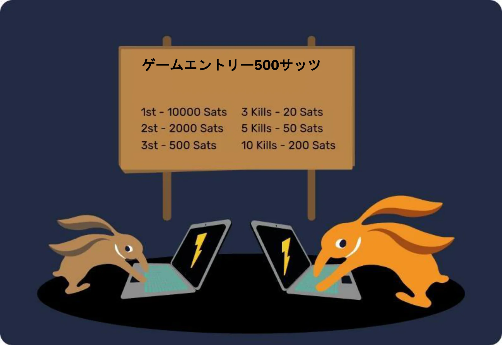

### Lightningの主要な実装

Bitcoinと同様に、Lightningは単一のソフトウェアではなくプロトコルです。共通仕様（BOLT）により、複数の実装が相互運用可能な形で共存しています。
* LND（Lightning Labs）；
* Core Lightning（Blockstream）；
* Éclair（ACINQ）；
* LDK（Spiral/Block）；
* など。

### Bitcoinの進化におけるLightningの位置付け

LightningはBitcoinのブロックチェーンを置き換えるものではなく、それを補完する存在です。ブロックチェーンは最終決済レイヤーとして、遅いものの非常に堅牢です。Lightningは、高頻度かつ少額の支払い向けに設計された高速決済レイヤーです。

2025年現在、Lightningは初期の頃よりもアクセスしやすくなっています。複雑さの一部を隠蔽するウォレットやサービスが登場したためです。しかし依然として、流動性、チャネルのオンチェーンコスト、そして場合によっては、シンプルさ・主権性・プライバシーの間でのトレードオフといった妥協点が存在します。

Lightningを深く理解したい方（チャネル、流動性、ルーティング、リスク管理）には、Fanis Michalakisによる理論コースLNP 201をおすすめします。

https://planb.academy/courses/34bd43ef-6683-4a5c-b239-7cb1e40a4aeb

また、自身のLightningノードを運用する冒険に踏み出したい方には、そのために特化した実践コースLNP 202も用意されています。

https://planb.academy/courses/593e483e-1785-4e83-aa7e-32b99056844c


## Lightningを超えて：Bitcoinを進化させるその他のプロトコル

<chapterId>684e31f9-ebd1-51b6-91c0-1e6a315f1141</chapterId>

前章までで見てきたように、Bitcoinは極めて堅牢なベースレイヤーとして設計されています。すなわち、公開され、シンプルで安全な台帳ですが、速度、プログラマビリティ、決済スループットには本質的な制限があります。イーサリアムのように、このレイヤーにすべてを担わせるのではなく、Bitcoinエコシステムは段階的にレイヤー構造のアプローチを採用してきました。ブロックチェーンが基盤（最終決済）として機能し、その上にあるレイヤーが高速決済、より高いプライバシー、資産発行（ステーブルコイン、トークン化証券など）といった新しい性質を付加します。

Bitcoinは、基本プロトコルを変更することだけで進化するわけではありません。その上に構築されることで、目的に応じて異なる妥協点を持つソリューションが生まれます。支払いのスケーラビリティを重視するもの、広義のプログラマビリティや資産発行を目指すもの、そしてその両方を組み合わせようとするものがあります。

本章では、Bitcoin上で新たな可能性を提供する4つの重要なプロトコルを紹介します。サイドチェーン（特にLiquid）、Ark、RGB、そしてTaproot Assetsです。

### サイドチェーン：Bitcoinに接続された並列ブロックチェーン

サイドチェーンとは、Bitcoinとは別個のブロックチェーンであり、独自のルールとコンセンサスメカニズムを持ちながら並行して動作します。これは双方向ペグ（*2WP*）と呼ばれる仕組みによってBitcoinと接続され、実際にはBitcoin上でロックされたBTCを、サイドチェーン上で表現的な形として利用し、後にメインチェーンへ戻すことが可能です。

サイドチェーンの利点は、Bitcoin本体では実現が難しい機能を提供できる点にあります。高速なトランザクション、資産機能、強化されたプライバシー、あるいはより柔軟な開発などです。その一方で、サイドチェーンは常にBitcoinに対する何らかの妥協、特に信頼モデルや分散性に関する妥協を伴います。

Bitcoin上で最も有名なサイドチェーンは、Blockstreamが開発した**Liquid**でしょう。これは、プラットフォーム間の高速な送金、より頻繁な決済、資産発行（ステーブルコイン、証券など）を目的として設計され、強化されたプライバシーを備えています。Liquid上で使われるビットコインはL-BTCと呼ばれ、双方向ペグによってBTCと1対1で対応しています。


Bitcoinとの大きな違いは、セキュリティと分散性のモデルにあります。LiquidはBitcoinのプルーフ・オブ・ワークには依存せず、ブロック生成とBTCとL-BTC間のブリッジ運用を担う、特定されたオペレーターの連合体（フェデレーション）に基づいています。

https://planb.academy/courses/d3ca6943-b22c-4e50-b62d-9431460525bc

### Ark：UTXOを共有してコストを削減し、体験を向上させる

Arkは、多数のユーザー操作を少数のBitcoinトランザクションに集約することで、Bitcoinのスケーラビリティを向上させる提案および実装の総称です。考え方は非常にシンプルです。ユーザーごとにオンチェーントランザクションを作成する代わりに、1つのオンチェーントランザクションでまとめて表現し、その後は主にオフチェーンで各自の権利を更新し、最終的にBitcoin上で決済したいときにのみオンチェーンへ戻します。

このセカンドレイヤープロトコルの構想は、2023年5月にBurakによって発表されました。Lightning Networkと同様に、ArkはBitcoinのメインチェーンの上に展開されるシステムです。高速、匿名、低コストでオフチェーンのビットコイン決済を可能にします。Lightningと比較して、Arkは支払いを受け取るためにインバウンド流動性を必要とせず、ユーザー体験を大きく改善します。また、CoinJoinに近いプライバシーも提供します。さらに、Bitcoinにcovenantが追加されれば、Arkは非対話的にもなり得ます。

Burakは、Lightningがメインチェーンへの依存によってスケールしにくい点をしばしば批判し、Arkは理論上、世界中の人々を「自分の資産は、自分で守る」管理方法に統合できる可能性があると述べています。ArkはLightning Networkの競合と見なされることもありますが、実際には両者は共存でき、むしろ補完的な関係になり得ます。

Arkは依然として非常に活発で若い分野です。目標は魅力的（ユーザーあたりのオンチェーン負荷を大幅に削減）ですが、BitcoinやLightningとは異なる仮定とリスクを持つ、より複雑な構造である点を理解しておく必要があります。

### RGB：クライアントサイド検証によるコントラクトと資産

RGBは、Bitcoin上のスマートコントラクトおよび資産システムであり、汎用ブロックチェーンとは根本的に異なるアプローチを採用しています。その中心的な概念はクライアントサイド検証です。グローバルなブロックチェーンにコントラクトの完全な状態を公開するのではなく、参加者は自分に関係する履歴のみをローカルに保持・検証し、Bitcoinのブロックチェーンは暗号学的コミットメントのアンカーおよび二重支払い防止の役割のみを果たします。

言い換えると：
* Bitcoinのブロックチェーンは、タイムスタンプ基盤および最小限の裁定者として機能する；
* 詳細なデータ（コントラクトのルール、状態、遷移）は、関係者間でオフチェーンに流通する；
* 検証はローカルで行われるため、スケーラビリティが向上し、全てのRGB活動を誰もが閲覧できるグローバル台帳が存在しないことで、プライバシー向上も期待できる。


RGBは、トークン（ステーブルコインを含む）、NFT、デジタル証券など、さまざまな資産の発行・管理の基盤として利用でき、さらに高度なコントラクトロジックを構築することも可能です。しかも、ベースレイヤーを肥大化させることはありません。

その代償はデータ管理です。クライアントサイドで検証する以上、自身の権利を証明するデータを適切に保存・バックアップする必要があります。

RGBは長年にわたって開発が続けられているプロトコルです。進展は段階的ですが、すでにRGBを活用する具体的なアプリが存在します。さらに理解を深めたい方には、Plan ₿ Academyでこのプロトコルを詳しく解説するエキスパート向けコースを提供しています。

https://planb.academy/courses/3ce1d37c-05ba-4f54-aa15-7586d37b2bb7

### Taproot Assets：Bitcoin上で資産を発行し、Lightningで移転する

Taproot Assets（旧称「Taro」）はLightning Labsが推進するプロトコルで、Bitcoin上で資産を発行し、それらをLightningネットワーク経由で高速かつ低コストに移転できるようにすることを目的としています。

これは、Bitcoinにおける「プログラマブルマネー」という物語でよく言及される要素です。Bitcoinがグローバルコンピューターになるからではなく、Bitcoinという基盤の上に金融商品（資産）を重ね、それをLightningによって効率的に流通させられるからです。

### 上位レイヤーの革新によって強化されるBitcoin

現在のBitcoinエコシステムを最も正確に表すイメージは、固定されたプロトコルでも、イーサリアムのように何でもこなすスーパー・ブロックチェーンでもありません。むしろ、それは意図的に保守的な基盤であり、その周囲を、最小限のリスクで実験と革新を可能にするレイヤーやプロトコルが取り囲んでいる姿です。


## 赤い薬か青い薬か？

<chapterId>c81cdb45-6aa9-5462-9835-c4852084b2cc</chapterId>

モーフィアスがネオに言ったように、「青いピルを飲めば、物語は終わり、ベッドで目覚め、信じたいことを信じる。赤いピルを飲めば、不思議の国にとどまり、ウサギの穴の深さを教えてやろう」。ビットコインのウサギの穴を探検する準備はできていますか？経済的な自由を再発見することになるかもしれないので、気をつけて！

### 技術の未来とその意味

テクノロジーは指数関数的に進化しており、誰も将来の発展を確実に予測することはできない。世界の接続性と人工知能は進歩し続けており、インターネットを通じて個人が獲得できる知識は、時代とともにますます計り知れないものになっています。

AI を例にとれば、これらのテクノロジーは、ビデオゲーム、画像やテキストの作成、データ分析など、ますます多くの領域で、すでに人間レベルのパフォーマンスを凌駕、あるいはそれに近づきつつあります。潜在的な意味合いとしては、AI と自動化によって 80％以上の仕事が消滅することが挙げられます。その結果、技術的進歩を抑制するか、AI が生み出す生産性向上による資本増加を利用するかなど、いくつかの選択肢が私たちに用意されているのです。

私たちには自問自答すべき本質的な問いがあります：

- 雇用の 80％が消滅する社会をどう管理するのか？
- どうやって人口を活性化させるのか？
- 多くの教師が必要なのだろうか？
- 自動化がもたらす地政学的、政治的、人間的な影響については、十分に議論されていないのでは？

コンピューティング、インターネット、ストリーミング、VR は教育を変えていくでしょう。政府によって管理されるフランスの全生徒を対象とした共通カリキュラムが整備され、教師はもはや一方的な講義を行わず、生徒に直接寄り添いながら学びをサポートします。子供たちはバーチャルな世界に入り、例えば歴史を学ぶ際には、過去の世界を体験する形で学習を進めることになるかもしれません。

- 教師と AI の擬人化の境界線はどこにあるのか？
- 繁栄に生きる社会を保証するにはどうすればいいのか？

私たちの未来に対するこれらの根本的な問題もまた、議論され、集団で決定されなければならないでしょう。

ビットコインとの関係は？インターネットが通信手段に革命を起こしたように、ビットコインは大規模な組織の新しい形態に技術革命をもたらし、信頼できる第三者に頼ることなく価値を交換することを可能にします。私たちは、通貨システムの技術的進化を妨げたいのか、それともビットコインとライトニング・プロトコルの使用によってもたらされる 10 倍の生産性向上による資本増加の可能性を受け入れたいのでしょうか。

### 金融の未来とは？

このような検討は、私たちが使用する資金を誰が保有し、承認し、追跡するべきかについても問題を提起します。目標は、選挙で選ばれないリーダーを持つ閉鎖的なシステムか、中立性が優先される信頼できる第三者のいないオープンなシステムかを決めることです。

- 通貨は私有財産の一形態か？
- 最高裁の命令なしにデモ参加者のアカウントをブロックすることは可能か？
- 誰が金融システムを保証するのか？
- 個人が自分のお金に対して主権を持ち、信頼できる第三者に頼ることができるのだろうか？
- 手数料や仲介者なしで地球の裏側に送金できるのか？

このような新技術を受け入れることで、世界中で大規模なスケールメリットが生まれる可能性があります。資本移動の自由を認めるべきか？国際的な封鎖は世界に経済的・政治的な影響を及ぼします。ウエスタンユニオンのような金融仲介業者を利用することは倫理的か？私たちは、ますますデジタル化が進む世界において、貨幣は民主化され、国家や不透明な金融機関ではなく、人々に帰属する共有財とみなされるべきだと考えます。

というのも、銀行ゲームのルールは透明性が低く、誰にでも理解できるものではないため、政治家や規制当局のカーストが銀行システムを支配し続けているからです。

### 私たちの自由は危機に瀕している。

何が検閲されるべきか否かを決定する知識を誰が持っているのか？メディアは特定の情報に対する立場を変えており、以前は検閲されていたものが、今日では検閲されなくなっています。

- 何が検閲かプロパガンダかは誰が決めるのか？
- 我々のシステムを支配しているのは誰なのか？

私たちは、検閲を容認することは表現の自由や集会の権利を破壊し、イノベーションや自由意志に悪影響を及ぼす可能性があると強く信じています。検閲を課すことは、完全なディストピアを作り出さなければ技術的に難しいのです。では、どのような主体が検閲権を持つべきなのでしょうか。この問題は複雑であり、誰を制限すべきか否かを決めるのも難しいでしょう。

世界には銀行口座を持たない人が 24 億人もおり、必然的に地理的な不平等が生まれています。一方、ビットコインは、社会的地位や政治的立場を無視して、取引を平等にします。このプロトコルは非政治的であり、指導者やその他の影響力のある人物に特定の特権を与えることはないため、一部の人がトップにとどまり、他の人が取り残されるのではなく、誰もが同じ機会を得て開発を推進することができるのです。社会的地位に関係なく、誰もが同じ通貨を利用できるようにすべきなのでしょうか？私たちが子どもたちに残したい世界を考えることは不可欠であり、子どもたちが自由にお金を管理できる開かれた世界を作りたいと願っています。

ビットコインは重要であり、単なる偶然のゲームと考えるべきではないでしょう。

### ビットコイン：革命的なプロトコル

前章で見てきたように、ビットコインのプロトコルはすべてのユーザーに対して中立です。コンセンサスルールと暗号のおかげで、グローバルな公開台帳に取引を不変に記録することができ、信頼できる第三者がいなくても金銭的価値の移転が保証されます。第 2 層のインフラストラクチャー（そして間もなく第 3 層となる RGB）は、ネットワークのスケーラビリティと新機能の開発のために使用されます。

ビットコインは、効率的で健全な通貨となるために必要な特性をすべて備えているのです。すなわち、分割可能で、瞬時に輸送可能で、検閲不可能で、検証コストは無視でき、通貨政策はすでに 2100 万単位に設定されており、今後何世紀にもわたって続きます。ビットコインは仮名であり、いかなる組織からの承認もなく、世界中どこでも交換することができます。あなた自身の秘密鍵を保持し、「あなたの鍵ではなく、あなたのビットコインではない」ということわざを覚えておくだけでいいのです。

暗号学者からリバタリアン、伝統的な企業、さらには国全体まで、多様なグループによって採用されています。しかし、ビットコインは万人のためのものであり、ユーザー数が増加するにつれ、取引履歴の保護者としての役割を果たすビットコインノードの数も増加し、分散化が保証されています。

ビットコインはもう止めることも検閲することもできないのです。通貨システムを変え、金融の包括性を可能にする平和的な革命だと言えます。ユーザーは、ビットコインを取引に使ったり、規制されたプラットフォームや規制されていないプラットフォームを通じてビットコインを購入したりすることで、ビットコインを手に入れることができます。信頼できる仲介者を介さずに、ウォレット、モバイルアプリケーション、または物理的なデバイスに資金を保管することができるのです。ビットコインは透明性、自由、個人の責任を提唱しています。

サトシは 2008 年、通貨を変えることによって金融システムを変えることを提案するためにビットコインを作りました。ビットコインは、銀行システムからの解放を可能にするため、新しい中立的な通貨システムを構築するための代替手段です。結局のところ、ビットコインは平和的革命への参加を促す社会現象なのだと言えます。

参加する準備はできていますか？

# 最終セクション

<partId>9ed4b454-2950-40b4-a56b-68d109689a82</partId>

## レビュー＆評価

<chapterId>585729e2-b0ab-51b5-89ec-593e3ea22c57</chapterId>

<isCourseReview>true</isCourseReview>

## 最終試験

<chapterId>8410e961-3841-5abf-a51d-04fc0139dd59</chapterId>

<isCourseExam>true</isCourseExam>

## 結論

<chapterId>dfc534be-44a9-5e8c-9c98-e51ef0554e91</chapterId>

<isCourseConclusion>true</isCourseConclusion>


