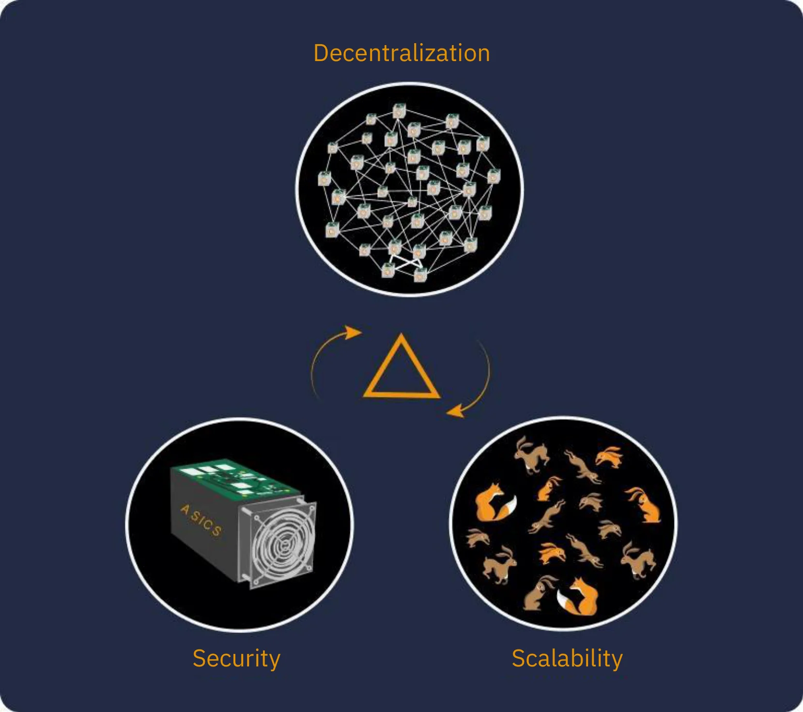
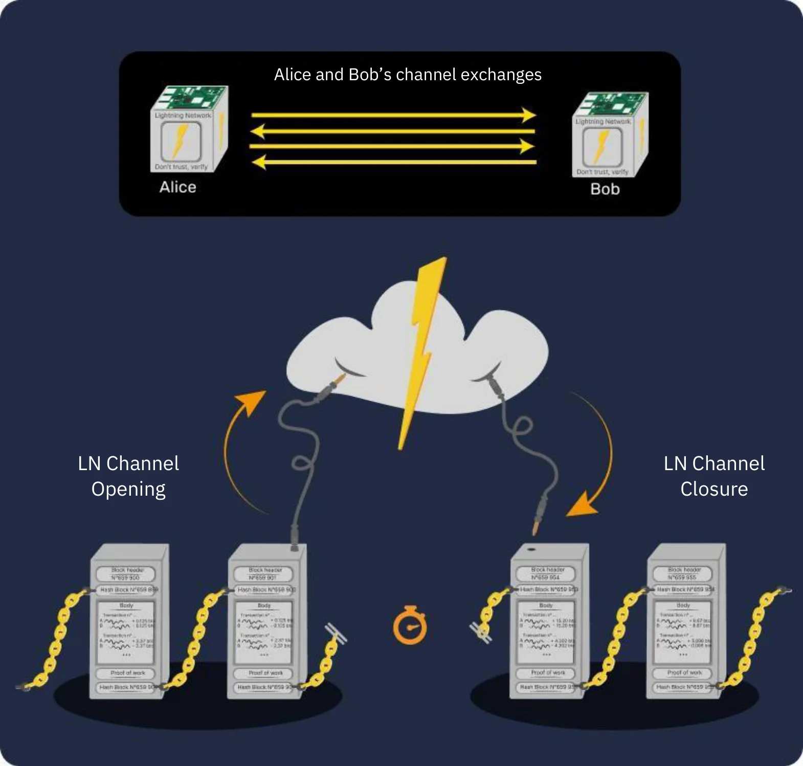
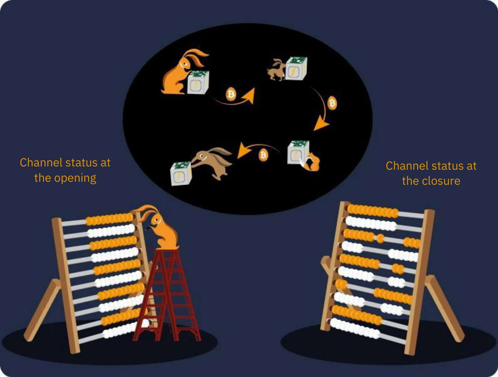
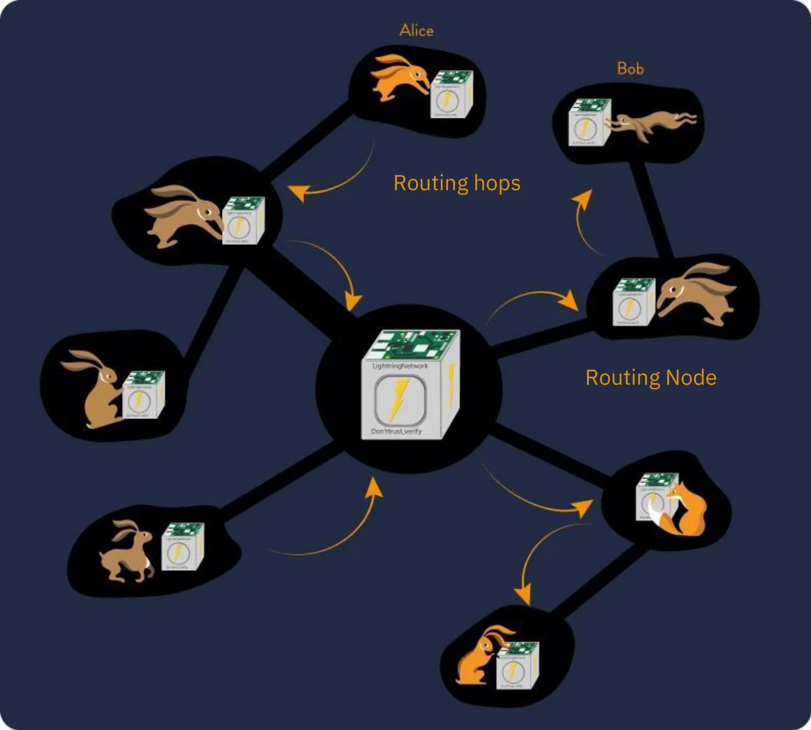
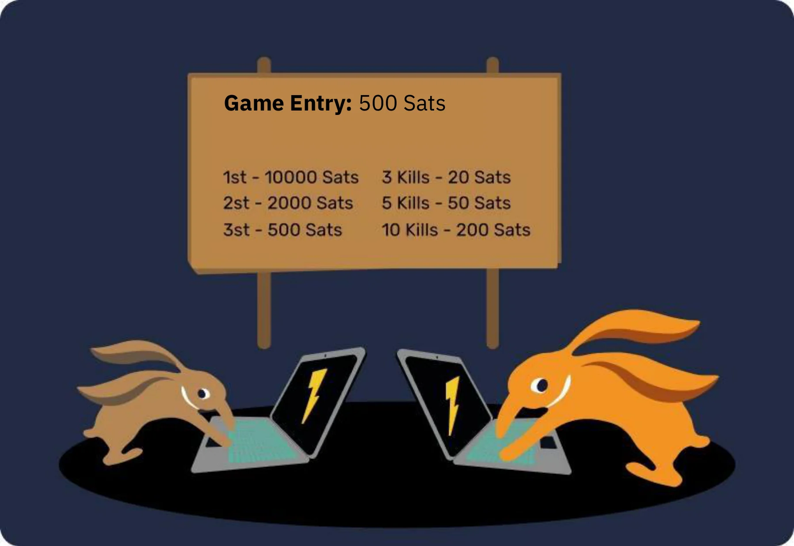

# การผจญภัย Bitcoin ครั้งแรกของคุณ


ในหลักสูตรนี้ เราจะอธิบายพื้นฐานของ Bitcoin ใน 25 บท เพื่อให้คุณเข้าใจเทคโนโลยีนี้ในวิธีที่ง่ายและมีประสิทธิภาพ หลักสูตรนี้สำรวจพื้นฐานของอุตสาหกรรมโดยรวม รวมถึงหัวข้อต่างๆ เช่น mining, กระเป๋าเงิน, แพลตฟอร์มการซื้อ/ขาย และอื่นๆ วัสดุการศึกษาเพิ่มเติมจะมีให้ตลอดการเดินทาง และเรายังเชิญคุณตรวจสอบ "21 โปสเตอร์" ในส่วนทรัพยากรหลังจากที่คุณจบหลักสูตรนี้


ไม่จำเป็นต้องมีความรู้มาก่อนเพื่อเริ่มต้นหลักสูตรนี้ BTC 101 ถูกออกแบบมาให้เข้าถึงได้สำหรับทุกคน ไม่ว่าคุณจะมีประสบการณ์ระดับใดก็ตาม


+++

# บทนำ


<partId>3cd2ac82-026c-53e1-874a-baf5842adc6d</partId>


## ภาพรวมของหลักสูตร


<chapterId>27e3fb60-4b50-556b-9e70-c4f5475c121d</chapterId>


ยินดีต้อนรับสู่หลักสูตร BTC101!


Bitcoin เป็นการปฏิวัติทางเทคโนโลยีและการเงิน ที่สามารถทำให้เราตั้งคำถามกับความสัมพันธ์ของเรากับเงินและสังคม ในความเป็นจริง Bitcoin (เรียกอีกอย่างว่า BTC) เป็นสกุลเงินที่**เป็นกลาง**และ**กระจายอำนาจ** ซึ่งหมายความว่ามันไม่ได้ถูกควบคุมโดยหน่วยงานหรือสถาบันใด ๆ มันเป็นนวัตกรรมที่ไปไกลกว่าสกุลเงินอินเทอร์เน็ตธรรมดา: มันเป็นทั้งโปรโตคอลคอมพิวเตอร์ (Bitcoin) และหน่วยเงินตรา (bitcoin)


โปรโตคอล Bitcoin ใช้เทคโนโลยีพื้นฐานเช่น การเข้ารหัส การสื่อสารเครือข่าย และ "[บล็อกเชน](https://planb.academy/resources/glossary/blockchain)" ที่มีชื่อเสียง ในขณะที่หน่วยบิตคอยน์ทำหน้าที่เป็นสกุลเงินที่จำเป็นสำหรับการทำงานที่เหมาะสมของโปรโตคอลนี้ ในชีวิตประจำวัน ชาวซัลวาดอร์และผู้ใช้บิตคอยน์ทั่วโลกใช้สกุลเงินบิตคอยน์ในการซื้อและขายสินค้าและบริการ โดยพึ่งพาเทคโนโลยีนี้เพื่อทำให้ชีวิตของพวกเขาดีขึ้น


**หลักสูตรที่ครอบคลุมแต่เข้าถึงได้ง่าย:**


ในหลักสูตรนี้ เราจะพูดคุยเกี่ยวกับแง่มุมทางการเงินบางประการของ Bitcoin รวมถึงวิธีการซื้อและขายบิตคอยน์ การเก็บรักษาอย่างปลอดภัยในกระเป๋าเงินดิจิทัล และการใช้สำหรับการทำธุรกรรม นอกจากนี้เราจะตรวจสอบบทบาทของนักขุด ซึ่งมีความสำคัญในการสร้างบิตคอยน์ใหม่และรักษาความปลอดภัยของเครือข่าย Bitcoin สุดท้ายเราจะสำรวจอนาคตของ Bitcoin และวิธีที่เทคโนโลยี Lightning Network สามารถปรับปรุงการทำธุรกรรมของ Bitcoin ได้


สิ่งสำคัญคือต้องเข้าใจว่า Bitcoin เป็นระบบการเงินใหม่ที่เปลี่ยนแปลงความสัมพันธ์ของเรากับเงินอย่างสิ้นเชิง ดังนั้นการเรียนรู้วิธีการใช้งานจึงเป็นทักษะที่จำเป็นสำหรับใครก็ตามที่ต้องการควบคุมเงินทุนของตนเอง


**Section 1 - บทนำ**


- บทที่ 1 - ภาพรวมของหลักสูตร
- บทที่ 2 - ประวัติศาสตร์ก่อนยุคของ Bitcoin


**Section 2 - เงิน**


- บทที่ 3 - เงินตราตลอดประวัติศาสตร์
- บทที่ 4 - สกุลเงินเฟียต
- บทที่ 5 - ภาวะเงินเฟ้อสูง
- บทที่ 6 - 21 ล้านบิตคอยน์


**ส่วนที่ 3 - กระเป๋าเงิน Bitcoin**


- บทที่ 7 - Bitcoin Wallet คืออะไร?
- บทที่ 8 - กระเป๋าเงิน Bitcoin และความปลอดภัย
- บทที่ 9 - การตั้งค่า Wallet
- บทที่ 10 - ยืนหยัดผ่านการทดสอบของเวลา


**ส่วนที่ 4 - ด้านเทคนิคของ Bitcoin**


- บทที่ 11 - การเปิดตัว Bitcoin
- บทที่ 12 - ธุรกรรม Bitcoin
- บทที่ 13 - โหนด Bitcoin
- บทที่ 14 - คนงานเหมือง
- บทที่ 15 - Bitcoin และนิเวศวิทยา


**Section 5 - วิธีการรับบิตคอยน์?**


- บทที่ 16 - Bitcoin ไม่เคยหลับ!
- บทที่ 17 - การหา Bitcoin ผ่านการทำงาน
- บทที่ 18 - การออมกับ Bitcoin
- บทที่ 19 - Hyperbitcoinization


**ส่วนที่ 6 - อนาคตของ Bitcoin: Lightning Network**


- บทที่ 20 - บทนำสั้นๆ เกี่ยวกับ Lightning Network
- บทที่ 21 - กรณีการใช้งาน Lightning Network
- บทที่ 22 - ยาเม็ดสีแดงหรือยาเม็ดสีน้ำเงิน?


ก่อนที่จะนำเสนอคำจำกัดความของเงินและบทบาทของมันในสังคม (บทที่ 1) เราควรเริ่มจากจุดกำเนิดของ Bitcoin เปิดตัวในปี 2009 Bitcoin เป็นเทคโนโลยีใหม่ที่ไม่เหมือนใคร ดังนั้นจึงเป็นเรื่องปกติที่จะไม่เข้าใจทุกอย่างเกี่ยวกับมันในทันที ในความเป็นจริง เช่นเดียวกับการเรียนรู้วิธีการใช้อินเทอร์เน็ตหรือขับรถ คุณไม่จำเป็นต้องรู้รายละเอียดทางเทคนิคทั้งหมดในทันที: คุณสามารถเริ่มต้นด้วยการเรียนรู้วิธีการรับ จ่าย และรักษาความปลอดภัยของเงินทุนของคุณ จากนั้นค่อยๆ ศึกษาให้ลึกซึ้งยิ่งขึ้น


ท้ายที่สุดแล้ว เราเพิ่งอยู่ในช่วงเริ่มต้นของการนำไปใช้ เนื่องจากเราได้ผ่านพ้นช่วงการเริ่มต้นไปแล้ว: คุณมาทันเวลาพอดีที่จะได้รับความรู้มากเท่าที่คุณต้องการเกี่ยวกับนวัตกรรมที่สำคัญนี้


ประเด็นสำคัญที่นี่คือการทำความเข้าใจเทคโนโลยีใหม่นี้ในแบบทั่วไป ดังนั้นเราหวังว่าคุณจะสนุกกับหลักสูตรนี้และก้าวหน้าต่อไปในกระบวนทัศน์การเงินโลกใหม่นี้


พร้อมที่จะดำดิ่งสู่โลกที่น่าหลงใหลของ Bitcoin และเข้าใจการทำงานภายในทั้งหมดหรือยัง? ไปกันเลย!


**หมายเหตุ**: หากคุณพบคำศัพท์ที่ไม่คุ้นเคยระหว่างหลักสูตร โปรดปรึกษา [อภิธานศัพท์](https://planb.academy/resources/glossary) สำหรับคำจำกัดความ


## ยุคก่อนประวัติศาสตร์ของ Bitcoin


<chapterId>9a94b627-5b69-5d81-9125-f1fa9b0aa6ad</chapterId>


ก่อนที่คำว่า "Bitcoin" จะกลายเป็นคำพ้องความหมายกับสกุลเงินดิจิทัลและการเปลี่ยนแปลงทางการเงิน พื้นฐานสำหรับการสร้างมันถูกวางไว้โดยชุดของแนวคิด นวัตกรรม และการเคลื่อนไหวทางสังคม ในบรรดาสิ่งเหล่านี้ การเคลื่อนไหวของไซเฟอร์พังก์โดดเด่นเป็นองค์ประกอบสำคัญในประวัติศาสตร์ก่อนของ Bitcoin


### Cypherpunks: ผู้มองการณ์ไกลแห่งโลกดิจิทัล


ในใจกลางของวิวัฒนาการทางเทคโนโลยีในช่วงทศวรรษ 1980 และ 1990 กลุ่มคนกลุ่มหนึ่งเริ่มตั้งคำถามอย่างลึกซึ้งเกี่ยวกับบทบาทของความเป็นส่วนตัวและเสรีภาพในยุคดิจิทัล บุคคลเหล่านี้ซึ่งต่อมาจะเป็นที่รู้จักในนาม "cypherpunks" เชื่อมั่นอย่างแน่วแน่ว่าการเข้ารหัสสามารถทำหน้าที่เป็นเครื่องมือในการปกป้องสิทธิส่วนบุคคลจากการแทรกแซงของรัฐบาลและบรรษัทขนาดใหญ่


บุคคลที่มีชื่อเสียงเช่น Julian Assange, Wei Dai, Tim May, และ David Chaum มีบทบาทสำคัญในการกำหนดปรัชญาและวิสัยทัศน์ของการเคลื่อนไหวนี้ นักคิดเหล่านี้ได้แบ่งปันแนวคิดของพวกเขาผ่านรายการส่งจดหมายที่มีอิทธิพล ซึ่งผู้เข้าร่วมจากทั่วโลกได้มีส่วนร่วมในการอภิปรายเกี่ยวกับวิธีที่ดีที่สุดในการใช้เทคโนโลยีเพื่อเสรีภาพส่วนบุคคลที่มากขึ้น


### เอกสารพื้นฐานสามฉบับของ Cypherpunks


ขบวนการไซเฟอร์พังก์ ซึ่งหยั่งรากลึกในกิจกรรมดิจิทัลและการเข้ารหัส ได้อ้างอิงถึงข้อความพื้นฐานหลายฉบับเพื่อแสดงหลักการและวิสัยทัศน์สำหรับอนาคต ในบรรดาข้อความเหล่านี้ มีสามฉบับที่โดดเด่นเป็นพิเศษ:


- "แถลงการณ์ของ Cypherpunk":


เขียนโดย Eric Hughes ในปี 1993 ยืนยันว่าความเป็นส่วนตัวเป็นสิทธิขั้นพื้นฐาน ผู้เขียนโต้แย้งว่าความสามารถในการสื่อสารอย่างเสรีและเป็นความลับเป็นสิ่งจำเป็นสำหรับสังคมที่เสรี แถลงการณ์ระบุว่า: "เราไม่สามารถคาดหวังให้รัฐบาล บริษัท หรือองค์กรขนาดใหญ่ที่ไม่มีหน้าให้ความเป็นส่วนตัวแก่เรา [...]. เราต้องปกป้องความเป็นส่วนตัวของเราเองหากเราคาดหวังว่าจะมี"


- "แถลงการณ์อนาธิปไตยคริปโต":


เขียนโดย Timothy C. May ในปี 1992 เอกสารนี้อธิบายถึงวิธีการที่การใช้การเข้ารหัสลับอาจนำไปสู่ยุคของอนาธิปไตยทางการเข้ารหัสลับที่รัฐบาลจะไร้อำนาจในการแทรกแซงในกิจการส่วนตัวของพลเมือง May จินตนาการถึงอนาคตที่ผู้คนแลกเปลี่ยนข้อมูลและเงินอย่างไม่ระบุตัวตนโดยไม่มีการแทรกแซงจากบุคคลที่สาม


- "คำประกาศอิสรภาพของไซเบอร์สเปซ":


แม้ว่าจะไม่ใช่เฉพาะกลุ่มไซเฟอร์พังค์ แต่ข้อความนี้สะท้อนถึงความรู้สึกของผู้เข้าร่วมหลายคนในขบวนการนี้ เขียนขึ้นในปี 1996 โดย John Perry Barlow เป็นการตอบสนองต่อการเพิ่มขึ้นของการควบคุมอินเทอร์เน็ตโดยรัฐบาล คำประกาศนี้ยืนยันว่าไซเบอร์สเปซเป็นอาณาจักรที่แตกต่างจากโลกทางกายภาพและไม่ควรถูกบังคับใช้ด้วยกฎหมายเดียวกัน ดังที่กล่าวไว้ว่า "เราไม่มีรัฐบาลที่มาจากการเลือกตั้ง และก็ไม่น่าจะมี"


### บรรพบุรุษของ Bitcoin


ก่อนการเกิดขึ้นของ Bitcoin มีความพยายามหลายครั้งในการสร้างสกุลเงินดิจิทัล ยกตัวอย่างเช่น David Chaum ได้แนะนำแนวคิดของ "เงินอิเล็กทรอนิกส์แบบไม่ระบุตัวตน" กับโครงการ "DigiCash" ของเขาในทศวรรษที่ 1980 น่าเสียดายที่เนื่องจากข้อจำกัดต่าง ๆ DigiCash ไม่เคยเติบโตอย่างที่คาดหวัง


อีกหนึ่งบรรพบุรุษที่สำคัญคือ "B-money" ของ Wei Dai แม้ว่ามันจะไม่เคยถูกนำมาใช้จริง แต่มันได้นำเสนอแนวคิดของสกุลเงินดิจิทัลที่ไม่ระบุตัวตนซึ่งการตรวจจับการฉ้อโกงถูกดำเนินการโดยชุมชนของผู้ประเมินแทนที่จะเป็นหน่วยงานกลาง


ภาพด้านล่างแสดงให้เห็นถึงการพัฒนาของการเคลื่อนไหวผ่านนวัตกรรมทางเทคโนโลยีมากมายอย่างชัดเจน


ในสภาพแวดล้อมที่อุดมสมบูรณ์นี้เองที่ Satoshi Nakamoto ผู้ลึกลับได้ตีพิมพ์เอกสารไวท์เปเปอร์ Bitcoin ในปี 2008 ในเอกสารนี้ เขาได้รวมแนวคิดหลายอย่างจากขบวนการไซเฟอร์พังค์ เช่น [proof of work](https://planb.academy/resources/glossary/proof-of-work) และการประทับเวลาคริปโตกราฟี เพื่อสร้างสกุลเงินดิจิทัลที่กระจายอำนาจและต้านทานการเซ็นเซอร์


อย่างไรก็ตาม Bitcoin เป็นมากกว่านั้น: มันเป็นตัวแทนของการบรรลุอุดมการณ์ของไซเฟอร์พังค์ นอกเหนือจากเทคโนโลยีของมันแล้ว มันยังเป็นสัญลักษณ์ของการปฏิวัติต่อต้านระบบการเงินแบบดั้งเดิมและเสนอทางเลือกที่ยึดตามความโปร่งใส การกระจายอำนาจ และอธิปไตยของปัจเจกบุคคล


### บทสรุป


ประวัติศาสตร์ก่อนยุคของ Bitcoin ฝังรากลึกในขบวนการไซเฟอร์พังค์และการแสวงหาความเป็นอิสระที่มากขึ้นในยุคดิจิทัล โดยการผสมผสานหลักการของการเข้ารหัสลับ การกระจายอำนาจ และความซื่อสัตย์ Bitcoin ได้กลายเป็นมากกว่าสกุลเงิน ในความเป็นจริง มันเป็นผลผลิตของการปฏิวัติทางปรัชญาและเทคโนโลยีที่ยังคงเปลี่ยนแปลงโลกของเราอย่างต่อเนื่อง


ดังนั้น Bitcoin เป็นโปรโตคอลที่ขยายออกไปในช่วงเวลาที่ยาวนาน และกระตุ้นให้เราตั้งคำถามเกี่ยวกับความสัมพันธ์ของเรากับพลังงาน เวลา และเงิน


อย่างไรก็ตาม Bitcoin เป็น "สกุลเงิน" จริงหรือไม่? เพื่อที่จะเข้าใจเรื่องนี้ เราจำเป็นต้องเข้าใจแนวคิดของเงินและรูปแบบต่าง ๆ ของมันก่อน ซึ่งเราจะสำรวจในบทถัดไป


หากคุณต้องการสำรวจประวัติศาสตร์ของ Bitcoin อย่างละเอียดมากขึ้น เราขอแนะนำหลักสูตร HIS 201 ของเรา ที่ซึ่งคุณจะได้ค้นพบต้นกำเนิดและการเกิดขึ้นอย่างช้าๆ ของ Bitcoin รวมถึงจุดเริ่มต้นของประวัติศาสตร์และชุมชนของมัน หลักสูตรนี้มีการบันทึกและอ้างอิงอย่างครบถ้วน พร้อมด้วยเกร็ดเล็กเกร็ดน้อยมากมาย:


https://planb.academy/courses/a51c7ceb-e079-4ac3-bf69-6700b985a082

# เงิน


<partId>e913df1a-4cbd-5380-ba67-ca2a0414f671</partId>


## เงินตลอดประวัติศาสตร์


<chapterId>c838e64d-d59f-5703-8c74-ea5e8c4fdd31</chapterId>


วิวัฒนาการของเงินเป็นแง่มุมที่น่าหลงใหลของประวัติศาสตร์มนุษย์ที่สะท้อนถึงความชาญฉลาดของอารยธรรมต่าง ๆ ตลอดยุคสมัยในการตอบสนองความต้องการทางเศรษฐกิจที่เปลี่ยนแปลงอยู่เสมอ


### จากเปลือกหอยสู่บัญชีธนาคาร


ในตอนแรก สกุลเงินเป็นสินทรัพย์ที่จับต้องได้ เช่น ธัญพืช ปศุสัตว์ หรือสินค้าโภคภัณฑ์อื่น ๆ อย่างไรก็ตาม สินค้าเหล่านี้มีข้อเสียใหญ่หลวงคือเน่าเสียได้ ทำให้ยากต่อการใช้เป็นสื่อในการออมระยะยาว ตัวอย่างเช่น การเก็บเกี่ยวที่ไม่ดีหรือการเจ็บป่วยของสัตว์สามารถทำลายความมั่งคั่งของบุคคลได้ในชั่วข้ามคืน

ดังนั้น เมื่ออารยธรรมก้าวหน้าและการค้าแผ่ขยายไปยังภูมิภาคใหม่ ๆ ความต้องการสื่อกลางในการแลกเปลี่ยนที่เป็นสากลจึงเกิดขึ้น ผู้คนเริ่มทดลองใช้วัตถุต่าง ๆ เช่น เปลือกหอยและอัญมณี แต่พวกมันไม่ได้ทนทานหรือหายากอย่างที่พวกเขาเชื่อ ในที่สุด ทองคำก็กลายเป็นมาตรฐาน เนื่องจากความหายาก ความทนทาน และความสามารถในการแบ่งแยกของมัน มันเป็น และยังคงเป็นสัญลักษณ์ของความมั่งคั่งและอำนาจมาจนถึงทุกวันนี้


### บทบาทของเงินคืออะไร?


เงินเป็นเครื่องมือสื่อสารที่ซับซ้อนสูง:


- มันช่วยให้เกิดการสื่อสารระหว่างปัจจุบันและอนาคต เพราะมันเปลี่ยนเวลาและพลังงานของเราให้กลายเป็นสินทรัพย์ที่สามารถนำกลับมาใช้ใหม่ได้ในอนาคตโดยไม่มีความเสี่ยงที่จะลดค่า


- มันอำนวยความสะดวกในการสื่อสารในภาษาสากล: โดยไม่ต้องรู้จักกันหรือพูดภาษาเดียวกัน คนแปลกหน้าสองคนสามารถแลกเปลี่ยน ซื้อขาย และตกลงในมูลค่าของสิ่งต่างๆ ได้


หน้าที่ของมันในโลกของเรานั้นยากที่จะจำลองขึ้นมาได้อย่างเทียม ในความเป็นจริง ไม่มีบุคคลหรือกลุ่มใดสามารถสร้างเงินได้ เพราะมันเป็นปรากฏการณ์ธรรมชาติที่ต้องเกิดขึ้นจากตลาดและความเห็นพ้องต้องกันโดยสมัครใจ ในแง่นี้ ราคาทำหน้าที่เป็นสัญญาณและชิ้นส่วนของข้อมูลที่นำทางสังคมในการจัดสรรทรัพยากร


ด้วยเหตุผลเหล่านี้ ทองคำในฐานะเงินเป็นผลลัพธ์ของวิวัฒนาการทางการเงินกว่า 4,000 ปี โดยอิงจากหน้าที่ตามแนวคิดของอริสโตเติลดังต่อไปนี้:


- Store of value**: เงินสามารถใช้ในการโอนอำนาจการซื้อไปยังอนาคตได้ ดังนั้นจึงจำเป็นต้องเป็นวัสดุที่ทนทาน;
- สื่อกลางในการแลกเปลี่ยน**: เงินสามารถใช้ในการแลกเปลี่ยนสินค้าและบริการแทนการแลกเปลี่ยนสินค้าโดยตรง จึงหลีกเลี่ยงความบังเอิญของความต้องการระหว่างผู้ค้า;
- หน่วยของบัญชี**: เงินยังช่วยให้เราสามารถเปรียบเทียบมูลค่าของสินค้าต่างๆ เพื่อให้เข้าใจถึงความสะดวกสบายที่สัมพันธ์กันได้ดียิ่งขึ้น


### ลักษณะของเงิน


ทองคำตอบสนองเกณฑ์ของสกุลเงินที่มีประสิทธิภาพได้อย่างดีเยี่ยม: ความหายากตามธรรมชาติทำให้มันมีค่า ในขณะที่คุณสมบัติทางเคมีของมันทำให้ไม่สึกกร่อนไปตามกาลเวลา คุณลักษณะเหล่านี้ทำให้ทองคำเป็น **ที่เก็บมูลค่า** ที่ยอดเยี่ยม แต่ไม่ใช่สกุลเงินทั่วไป เพราะรูปแบบของเงินนี้ไม่สามารถแบ่งย่อยหรือขนส่งได้ง่ายในระยะทางไกล ในโลกที่เป็นโลกาภิวัตน์และดิจิทัล ทองคำต้องดิ้นรนเพื่อให้ทันและต้องการหน่วยงานกลางเพื่อทำให้มันสามารถแบ่งย่อยและแลกเปลี่ยนได้ง่าย (เช่น ผ่านเหรียญที่ถูกผลิตขึ้น)


ในทางตรงกันข้าม สกุลเงินที่รัฐเป็นผู้ดูแล (fiat) สามารถใช้งานได้ง่าย แต่ถูกลดค่าอย่างต่อเนื่องโดยหน่วยงานที่ควบคุมมัน (กษัตริย์ ธนาคารกลาง จักรพรรดิ์ เผด็จการ)


เพื่ออธิบายแนวคิดนี้ให้ดียิ่งขึ้น เราจะสำรวจลักษณะของสกุลเงินที่มีประสิทธิภาพ:


- ความสามารถในการทดแทน**, หมายถึงการที่สามารถแลกเปลี่ยนกับหน่วยอื่นที่มีลักษณะเดียวกันได้โดยไม่สูญเสียมูลค่า;
- ความสามารถในการแบ่งแยก**, เนื่องจากสามารถแบ่งออกเป็นหน่วยย่อยเพื่ออำนวยความสะดวกในการทำธุรกรรมในปริมาณที่แตกต่างกัน;
- สภาพคล่อง**, ซึ่งหมายความว่าสามารถแปลงเป็นสินค้าและบริการได้อย่างง่ายดาย


เพื่อให้เป็นไปตามเกณฑ์เหล่านี้ สกุลเงินได้พัฒนามาโดยตลอดผ่านขั้นตอนต่างๆ:


- หินดิบ -> Coin
- ธนบัตร -> บัตรธนาคาร
- Blockchain -> Lightning Network


สกุลเงินยังคงพัฒนาอย่างต่อเนื่องจนถึงทุกวันนี้ โดยปรับรูปแบบของตนเพื่อตอบสนองการใช้งานที่แตกต่างกัน ดังที่เราได้กล่าวไว้ แม้ว่าทองคำจะเป็นที่เก็บมูลค่าที่ดีเยี่ยม แต่ก็ไม่เหมาะสมกับเศรษฐกิจโลกในปัจจุบันอีกต่อไป ในทำนองเดียวกัน สกุลเงินที่มีมูลค่าตามคำสั่งเช่นดอลลาร์และยูโรมีสภาพคล่องสูงและสามารถขนส่งได้ง่ายเพราะปัจจุบันส่วนใหญ่เป็นดิจิทัล แต่ค่าของมันลดลงอย่างต่อเนื่องจากเงินเฟ้อทางการเงิน


ในทางกลับกัน Bitcoin นำเสนอความเป็นไปได้ใหม่ ๆ คุณสมบัติต่าง ๆ เช่น การจำกัดอุปทานอย่างเข้มงวด ทำให้มันเป็นแหล่งเก็บมูลค่าที่ดีเยี่ยม นอกจากนี้ ในฐานะที่เป็นสกุลเงินอินเทอร์เน็ตที่เป็นกลาง มันทำหน้าที่เป็น **สื่อกลางในการแลกเปลี่ยน** ที่ข้ามพรมแดนได้ อย่างไรก็ตาม มันยังไม่ได้รับการยอมรับอย่างกว้างขวางในเชิงพาณิชย์ในปัจจุบัน แม้จะมี [การยอมรับอย่างต่อเนื่อง](https://btcmap.org/map)


## สกุลเงินที่มีมูลค่าตามความเชื่อมั่น


<chapterId>25151d46-7db1-5b48-8bba-cbde1944555a</chapterId>


> "ผู้ที่ไม่สามารถจดจำอดีตได้จะถูกลงโทษให้ทำซ้ำ" จอร์จ ซานตายานา กล่าว

ความจริงที่สะท้อนอย่างชัดเจนเมื่อพูดถึงระบบการเงินในปัจจุบัน


### Fiduciary = ความไว้วางใจ


วันนี้ สกุลเงินหลัก ๆ เช่น ยูโรและดอลลาร์ถือว่าเป็นเงินตราที่มีมูลค่าตามความเชื่อถือ ซึ่งหมายความว่าพวกมันไม่มีมูลค่าในตัวเองและขึ้นอยู่กับความไว้วางใจและความเชื่อมั่นที่เรามีต่อสถาบันที่ควบคุมพวกมันอย่างเต็มที่


สกุลเงินที่เป็นทรัพย์สินเป็นรูปแบบของเงินที่ถูกกำหนดให้เป็นเช่นนั้นโดยสถาบัน เช่น รัฐ อย่างเช่นจีนกับหยวน หรือสหภาพการเมือง-เศรษฐกิจ เช่น สหภาพยุโรปกับยูโร หน่วยงานที่รับผิดชอบในการออกสกุลเงินนี้คือธนาคารกลาง (ตัวอย่างเช่น เราสามารถกล่าวถึงธนาคารประชาชนแห่งประเทศจีน, ธนาคารกลางสหรัฐอเมริกา, หรือธนาคารกลางแห่งสาธารณรัฐกินี) หน่วยงานเหล่านี้มีหน้าที่ในการกำหนดนโยบายการเงินและดังนั้นจึงกำหนดว่าควรมีเงินหมุนเวียนหรือพิมพ์ออกมาเท่าใด


### การลดค่าเงิน: กลยุทธ์ที่มีมาตั้งแต่สมัยจักรวรรดิโรมัน


ตั้งแต่สมัยโบราณ ทองคำได้ทำหน้าที่เป็นมาตรฐานทางการเงิน แต่ความแข็งตัวของมันมักทำให้ผู้นำ ไม่ว่าจะเป็นจักรพรรดิโรมันหรือรัฐบาลสมัยใหม่ หันมาใช้สกุลเงินทางเลือก ซึ่งมักเป็นเงินตราเชื่อถือได้


กลไกนี้เรียบง่ายและได้รับแรงบันดาลใจจากวิธีปฏิบัติที่มีมาตั้งแต่ต้นกำเนิดของอารยธรรม ผู้นำที่กระตือรือร้นที่จะควบคุมความมั่งคั่งเริ่มต้นด้วยการรวมศูนย์ทองคำ มักจะโดยการใช้ประโยชน์จากอำนาจของพวกเขาและสัญญาการคุ้มครองและความปลอดภัย ด้วยการสำรองที่มีค่าในมือพวกเขาแนะนำสกุลเงินใหม่ที่มีมูลค่าเทียบเท่ากับทองคำ แต่ถูกผลิตขึ้นในภาพลักษณ์ของพวกเขา สกุลเงินนี้เริ่มหมุนเวียนและผู้คนปรับตัวอย่างรวดเร็วกับความสะดวกในการใช้งานที่เรียบง่าย


อย่างไรก็ตาม ผู้นำเหล่านี้เริ่มลดค่าเงินใหม่ในลักษณะที่ค่อยเป็นค่อยไป โดยลดค่าลงไม่กี่เปอร์เซ็นต์ทุกปีเมื่อเทียบกับราคาทองคำเริ่มต้น การลดค่าเงินอย่างเงียบ ๆ นี้มักถูกอ้างว่าเป็นประโยชน์ต่อประชาชน ในความเป็นจริง ผู้ที่ออมเงินในสกุลเงินที่ไม่มีมูลค่าที่แท้จริงนี้จะเห็นมูลค่าของการออมของพวกเขาลดลง ในขณะที่รัฐใช้เงินเฟ้อในการจัดหาเงินทุนสำหรับโครงการต่าง ๆ นอกจากนี้ การลดค่าเงินนี้ยังทำให้การชำระหนี้ง่ายขึ้นอีกด้วย


ในช่วงเวลาสำคัญ ผู้นำได้ประกาศว่า: สกุลเงินไม่ได้รับการสนับสนุนจากทองคำอีกต่อไป สาธารณชนที่คุ้นเคยกับสกุลเงินที่มีมูลค่าตามความเชื่อถือและมักจะได้รับข้อมูลผิดเกี่ยวกับเรื่องการเงิน ยอมรับความจริงนี้ ทำให้รัฐสามารถจัดการปริมาณเงินได้อย่างอิสระและพิมพ์เงินจำนวนมหาศาลได้ในเกือบไม่มีค่าใช้จ่าย


การพิมพ์เงินนำไปสู่ภาวะเงินเฟ้อและค่อยๆ ทำให้ประชากรยากจนลง นอกจากนี้ ระบบการเงินยังถูกควบคุมและจำกัดเพื่อหลีกเลี่ยงการล่มสลาย เนื่องจากการหยุดชะงักใดๆ อาจก่อให้เกิดวิกฤตเศรษฐกิจครั้งใหญ่ ตรงกันข้ามกับมวลชน สถาบันการเงินและบุคคลที่มั่งคั่งได้รับประโยชน์อย่างมากจากระบบนี้ ซึ่งสร้างช่องว่างความไม่เท่าเทียมกันและสนับสนุนลัทธิเผด็จการ ในบริบทนี้ พวกเขาไม่มีแรงจูงใจที่จะทำการเปลี่ยนแปลงครั้งใหญ่ ทำให้ระบบดำเนินต่อไปได้จนกว่าจะเกิดการระเบิดขึ้นได้


เมื่อดำเนินการอย่างดี กลยุทธ์นี้สามารถคงอยู่ได้นานหลายทศวรรษ อย่างไรก็ตาม สิ่งสำคัญคือต้องทราบว่าการลดค่าอย่างรวดเร็วหรือการสูญเสียความเชื่อมั่นอย่างมากสามารถนำไปสู่ภาวะเงินเฟ้อสูง (ดูบทถัดไป) ประวัติศาสตร์แสดงให้เห็นว่า ดอลลาร์สูญเสียมูลค่าไป 98% ใน 100 ปี ยูโร 30% ใน 20 ปี และปอนด์สเตอร์ลิง 99% นับตั้งแต่การสร้างขึ้น


ในที่สุดแล้ว สกุลเงินอาจไม่มีความเชื่อมโยงใดๆ กับทองคำอีกต่อไป เช่นเดียวกับเหรียญโรมันในช่วงสิ้นสุดของจักรวรรดิ หรืออาจถูกลดทอนให้เหลือเพียงค่าตัวเลขง่ายๆ ที่ไม่เชื่อมโยงกับความเป็นจริงที่จับต้องได้


วันนี้ เรากำลังเป็นพยานในจุดเปลี่ยนทางประวัติศาสตร์ ดอลลาร์ซึ่งครองความเป็นใหญ่มาอย่างยาวนาน ดูเหมือนจะอยู่ในช่วงขาลง ในขณะที่ทองคำได้สูญเสียบทบาทสำคัญไปแล้ว เรากำลังยืนอยู่ที่ธรณีประตูของวัฏจักรการเงินใหม่ เตือนให้เราระลึกว่าบทเรียนจากประวัติศาสตร์มักถูกลืม


### Bitcoin เป็นทางออกหรือไม่?


เนื่องจากหลักการเหล่านี้ การปฏิวัติ Bitcoin กำลังได้รับแรงผลักดัน ตรงกันข้ามกับสกุลเงินก่อนหน้านี้ มันไม่ต้องการ **บุคคลที่สามที่เชื่อถือได้** และมุ่งหวังที่จะแยกรัฐออกจากเงิน


ในความเป็นจริง Bitcoin นำเสนอตัวเองเป็นการตอบสนองต่อความท้าทายเชิงระบบเหล่านี้โดยเสนอวิธีแก้ปัญหาแบบกระจายศูนย์และระบบการเงินคู่ขนานใหม่ ในประวัติศาสตร์ หากทองคำได้รับความนิยมในฐานะสกุลเงินเนื่องจากความต้านทานต่อการปลอมแปลง Bitcoin ก็ไม่สามารถปลอมแปลงได้เช่นกัน นอกจากนี้ยังจำกัดอยู่ที่ 21 ล้านหน่วย ด้วยธรรมชาติที่กระจายศูนย์และเข้ารหัส Bitcoin เป็นสกุลเงินที่พึ่งพาความโปร่งใสและความเป็นกลาง เสนอทางเลือกที่น่าสนใจต่อระบบการเงินแบบรวมศูนย์ในปัจจุบัน


อีกเหตุผลหนึ่งที่ทำให้ Bitcoin ได้รับความสนใจคือการเกิดขึ้นของสกุลเงินดิจิทัลของธนาคารกลาง หรือ CBDCs ซึ่งดูเหมือนจะหลีกเลี่ยงไม่ได้ รูปแบบเงินใหม่นี้จะพัฒนาเศรษฐกิจที่มีการวางแผนจากศูนย์กลางมากขึ้น และอาจขัดขวางเสรีภาพทางการเงินของบุคคลและเอื้อต่อการละเมิดอำนาจเผด็จการ

เราสามารถสรุปบทนี้ด้วยคำพูดจากผู้ชนะรางวัลโนเบล F.A Hayek ในปี 1984:


> "ฉันไม่เชื่อว่าเราควรจะมีเงินที่ดีอีกครั้ง ก่อนที่เราจะนำสิ่งนั้นออกจากมือของรัฐบาล หากเราไม่สามารถนำมันออกจากมือของรัฐบาลด้วยความรุนแรง สิ่งที่เราทำได้คือการแนะนำบางสิ่งที่พวกเขาไม่สามารถหยุดได้ด้วยวิธีที่แยบยลหรืออ้อมค้อม"

หากต้องการเรียนรู้เพิ่มเติมเกี่ยวกับความเข้าใจผิดทางเศรษฐกิจและเสรีภาพ เราขอเชิญคุณมาสำรวจหลักสูตร ECO 102 ของเรา ซึ่งติดตามชีวิตและแนวคิดของ Frédéric Bastiat นักคิดชาวฝรั่งเศสในศตวรรษที่ 19 ผู้ซึ่งน่าจะชื่นชมการเกิดขึ้นของ Bitcoin:


https://planb.academy/courses/d07b092b-fa9a-4dd7-bf94-0453e479c7df

## ภาวะเงินเฟ้อขั้นสูง


<chapterId>b04c024c-54f3-50cb-997f-58721cfc74be</chapterId>


ภาวะเงินเฟ้อรุนแรงเป็นปรากฏการณ์ทางการเงินที่เฉพาะเจาะจงกับสกุลเงินที่ไม่มีสินทรัพย์หนุนหลัง: มันถูกระบุด้วยการสูญเสียความเชื่อมั่นในสกุลเงินอย่างสิ้นเชิงและการเพิ่มขึ้นของเงินเฟ้ออย่างรุนแรงเนื่องจากการพิมพ์เงินโดยหน่วยงานที่มีอำนาจ ส่งผลให้เงินออมที่สะสมโดยบุคคลสามารถหายไปในช่วงเวลาสั้น ๆ ผลักดันประเทศไปสู่ขอบเหวของการล่มสลายทางเศรษฐกิจ สังคม และการเมือง


### เงินเฟ้อพุ่งกระฉูด!


เพื่อที่จะเข้าใจผลกระทบของเงินเฟ้อที่มีต่อการออม เราจำเป็นต้องพิจารณาอัตราเงินเฟ้อที่แตกต่างกัน


- ด้วยอัตราเงินเฟ้อ 2% คุณจะสูญเสียอำนาจการซื้อของคุณ 2% ต่อปี ซึ่งคิดเป็น 10% ในระยะเวลา 5 ปี
- ด้วย 7% คุณจะเสียครึ่งหนึ่งใน 10 ปี
- ด้วย 20% คุณจะสูญเสียเกือบครึ่งหนึ่งใน 3 ปี


เมื่อเกิดภาวะเงินเฟ้อรุนแรง เราไม่ได้พูดถึง 20% ต่อปีอีกต่อไป แต่เป็น 20% ต่อเดือน หรือในช่วงสูงสุด อาจถึงต่อวัน การประสบกับเงินเฟ้อ 100% ต่อวันเป็นเวลาสามวันเป็นสถานการณ์ที่เกิดขึ้นจริงและยังคงเกิดขึ้นในโลกของเรา


สิ่งสำคัญคือต้องเข้าใจว่า ภาวะเงินเฟ้อรุนแรงไม่ได้เกิดขึ้นโดยบังเอิญ โดยระบบทุนนิยม หรือโดยการโจมตีทางการเมืองจากฝ่ายตรงข้าม ภาวะเงินเฟ้อรุนแรงเป็นผลโดยตรงจากการตัดสินใจทางการเงินที่ผิดพลาดโดยธนาคารกลางและนักการเมือง ผลกระทบของมันส่งผลต่อพลเมืองทุกคนและแม้กระทั่งส่งผลกระทบต่อคนรุ่นต่อไป เราขอเชิญคุณใช้เวลาห้านาทีอ่านตารางต่อไปนี้เพื่อให้เข้าใจถึงผลกระทบที่แท้จริงของปรากฏการณ์นี้ (หลักสูตร ECO204 จะเจาะลึกในหัวข้อนี้เพิ่มเติม) ดังที่คุณเห็น ไม่มีประเทศหรือสกุลเงินใดที่ปลอดภัยอย่างแท้จริง


### เฟสของภาวะเงินเฟ้อสูงมีอะไรบ้าง?


สำหรับภาวะเงินเฟ้อรุนแรงที่จะเกิดขึ้น เหตุการณ์บางอย่างต้องเกิดขึ้น


เฟส 1 - การสูญเสียความมั่นใจ


- การรวมศูนย์อำนาจทางการเงินเอื้อต่อการสร้างเงินและการใช้อำนาจในทางที่ผิด ในบริบทนี้ ปัจจัยภายนอกเช่น สงคราม นโยบายของรัฐบาล หรือราคาที่เพิ่มขึ้นของทรัพยากรสำคัญ — เช่น ข้าวสาลีหรือแก๊สโซลีน — สามารถกระตุ้นให้เกิดภาวะเงินเฟ้อรุนแรง ดังนั้น ความเชื่อมั่นในสกุลเงินอาจสูญเสียไป และบุคคลอาจเริ่มตั้งคำถามถึงที่มาของเงินและประโยชน์ของนโยบายการเงินที่ถูกบังคับใช้


เฟส 2 - การล่มสลายของสกุลเงินและการเพิ่มขึ้นของราคา


- เมื่อรัฐบาลสูญเสียการควบคุมความเชื่อมั่น บุคคลเริ่มแลกเปลี่ยนสกุลเงินของตนเป็นสกุลเงินที่มีเสถียรภาพมากขึ้น เช่นที่เกิดขึ้นในเวเนซุเอลากับดอลลาร์สหรัฐ สถานการณ์นี้นำไปสู่การเพิ่มขึ้นของราคา สร้างวงจรอุบาทว์ที่สินค้าบริการมีราคาแพงขึ้นเรื่อย ๆ เพื่อตอบสนองความต้องการเหล่านี้และแก้ไขนโยบายการเงิน รัฐจึงพิมพ์เงินเพิ่มขึ้น ส่งผลให้เกิดภาวะเงินเฟ้ออย่างรวดเร็ว


เฟส 3 - วงจรอุบาทว์ของการพิมพ์เงิน


- ดังนั้น จำเป็นต้องใช้ธนบัตรมากขึ้นในการซื้อสินค้า ซึ่งส่งผลให้เกิดการขาดแคลนธนบัตร ในการตอบสนอง รัฐบาลจึงหันไปพิมพ์ธนบัตรเพิ่มขึ้น ซึ่งยิ่งกระตุ้นให้เกิดภาวะเงินเฟ้อเพิ่มขึ้นอีก


เฟส 4 - การเกิดขึ้นของสกุลเงินใหม่


- จากนั้นมีการแนะนำสกุลเงินใหม่เพื่อแทนที่สกุลเงินเก่า เพื่อทำลายวงจรของเงินเฟ้อโดยการใช้การควบคุมที่เข้มงวดขึ้นซึ่งไม่ได้มีอยู่กับเงินที่ใช้ชำระหนี้ตามกฎหมายก่อนหน้านี้


การแก้ไขวิกฤตเงินเฟ้อสูงมักต้องการการเปลี่ยนแปลงที่รุนแรง เช่น การปฏิวัติ การเปลี่ยนแปลงรัฐบาล การเปลี่ยนแปลงผู้บริหารธนาคารกลาง และอื่น ๆ การสูญเสียความเชื่อมั่น การล่มสลายของสกุลเงิน และการสร้างใหม่เป็นขั้นตอนสำคัญในการฟื้นฟูเศรษฐกิจที่อิงกับเงินตราเฟียต


### ตัวอย่างที่โดดเด่นสามประการ


- เยอรมนี, 1922-1923.


หนึ่งในตัวอย่างที่โดดเด่นที่สุดของภาวะเงินเฟ้อรุนแรงเกิดขึ้นในสาธารณรัฐไวมาร์ของเยอรมนีหลังสงครามโลกครั้งที่หนึ่ง


เยอรมนีได้กู้ยืมเงินจำนวนมหาศาลเพื่อเป็นทุนในการทำสงคราม อย่างไรก็ตาม ไม่เพียงแต่เยอรมนีจะแพ้สงคราม แต่ยังต้องจ่ายค่าชดเชยเป็นพันล้านดอลลาร์อีกด้วย เดือนที่มีอัตราเงินเฟ้อสูงสุดคือเดือนตุลาคม 1923 โดยสูงสุดที่ 29,500% ซึ่งเท่ากับอัตราเงินเฟ้อ 20.9% ต่อวัน ราคาสินค้าเพิ่มขึ้นเป็นสองเท่าทุกๆ 3.7 วัน!

สกุลเงินของเยอรมันกลายเป็นสิ่งไร้ค่าอย่างมากจนบางพลเมืองเลือกที่จะเผาเงินกระดาษแทนไม้เพราะมันถูกกว่าจริงๆ มีการเล่าว่าในร้านอาหาร พนักงานเสิร์ฟต้องประกาศราคาเมนูทุกๆ 30 นาทีเพื่อปรับตามอัตราเงินเฟ้อ


ในที่สุด ทางการได้สร้างสกุลเงินใหม่ขึ้นมา โดยมีหนี้สินของเยอรมนี ฝรั่งเศส และอังกฤษเป็นหลักประกัน และรับประกันโดยที่ดินของเยอรมนี


- ฮังการี, 1945-1946


ประเทศที่ประสบกับภาวะเงินเฟ้อขั้นรุนแรงที่สุดจนถึงปัจจุบันคือฮังการีหลังสงครามโลกครั้งที่สอง


ฮังการีพบว่าตัวเองอยู่ฝ่ายแพ้ในความขัดแย้ง โดยที่กำลังการผลิตอุตสาหกรรมส่วนใหญ่ถูกทำลาย เดือนที่มีอัตราเงินเฟ้อสูงสุดคือเดือนกรกฎาคม 1946 ซึ่งมีอัตราเงินเฟ้อราคาสูงถึง 41,900,000,000,000,000% เทียบเท่ากับ 207% ต่อวัน ราคาสินค้าเพิ่มขึ้นเป็นสองเท่าทุกๆ 15 ชั่วโมง!


ธนบัตรใบสุดท้ายที่ถูกนำออกใช้หมุนเวียนคือ 100 ล้านพันล้านเป็งโก (100,000,000,000,000,000) ในปี 1946


- ซิมบับเว, 2007-2008


จนถึงปี 2000 ซิมบับเวสามารถพึ่งพาตนเองได้เกือบทุกความต้องการ ยกเว้นน้ำมัน


ในปี 1997 ดอลลาร์ซิมบับเวล่มสลายลงกว่า 72% หลังจากที่รัฐบาลตกลงที่จะชดเชยทหารผ่านศึกสงครามเป็นจำนวนเงินเทียบเท่า 450 ล้านดอลลาร์สหรัฐ เนื่องจากรัฐบาลไม่มีจำนวนเงินดังกล่าวในคลัง จึงหันไปใช้การพิมพ์ธนบัตร ในปี 2005 อัตราเงินเฟ้อพุ่งขึ้นถึง 586% แต่จุดสูงสุดเกิดขึ้นในช่วงกลางเดือนพฤศจิกายน 2008 โดยมีอัตราที่ประมาณ 79,600,000,000% ต่อเดือน


ในเดือนมิถุนายน 2007 รัฐบาลได้ตอบสนองโดยการกำหนดการควบคุมราคาแล้ว แต่การกระทำนี้ไม่มีอิทธิพลใดๆ ต่อเศรษฐกิจ ร้านค้าถูกปล้นจริงๆ และพ่อค้าไม่มีวิธีการที่จะเติมสินค้าคงคลังในร้านของพวกเขาอีกต่อไป


ในเดือนเมษายน 2009 รัฐมนตรีว่าการกระทรวงการคลังได้ประกาศระงับการใช้เงินดอลลาร์ซิมบับเวและอนุญาตให้ใช้สกุลเงินต่างประเทศในการค้า บัญชีธนาคารทั้งหมด เงินบำนาญ และสถาบันการเงินต่างๆ เห็นยอดคงเหลือของพวกเขาหายไปในชั่วข้ามคืน


โดยสรุปแล้ว ภาวะเงินเฟ้อรุนแรงมีผลทำให้มูลค่าของสกุลเงินลดลงอย่างรวดเร็ว นำไปสู่การกัดกร่อนของการออมและการสูญเสียความเชื่อมั่นในระบบการเงิน ดังที่โวลแตร์เคยกล่าวไว้ว่า สกุลเงินที่ไม่มีมูลค่าที่แท้จริงจะสูญเสียมูลค่าภายในตัวเองและมุ่งสู่ศูนย์ในที่สุด

สกุลเงินที่ต้องพึ่งพาบุคคลที่สามที่เชื่อถือได้ เช่น สถาบันการเงิน ในทางปฏิบัติและในระยะยาวถือว่าเป็นสกุลเงินที่มีข้อบกพร่อง เพราะไม่สามารถรับประกันอำนาจการซื้อหรือรักษาการออมได้


เพื่อเจาะลึกในหัวข้อของภาวะเงินเฟ้อสูง เราขอแนะนำหลักสูตร ECO 204 ของ David St-Onge ซึ่งคุณจะได้เรียนรู้ว่ารอบเงินเฟ้อสูงคืออะไรและผลกระทบที่แท้จริงต่อชีวิตของเรา คุณยังจะได้ค้นพบความคล้ายคลึงกันระหว่างรอบเหล่านี้และที่สำคัญที่สุดคือวิธีการป้องกันตัวเองจากมัน


https://planb.academy/courses/caa75343-ac90-4249-bcca-0e2e57c3a0f1

## 21 ล้านบิตคอยน์


<chapterId>f4a06d76-1963-56fd-93ff-dfa41489bcde</chapterId>


### นโยบายการเงินของ Bitcoin


Bitcoin เป็นสกุลเงินดิจิทัลแบบกระจายศูนย์ที่มีจำนวนสูงสุดที่กำหนดไว้ล่วงหน้าที่ **21 ล้านหน่วย** ลักษณะเฉพาะนี้ของความขาดแคลนถูกกำหนดโดยรหัสคอมพิวเตอร์และเสริมด้วยฉันทามติของผู้ใช้ทั้งหมดที่เข้าร่วมในโปรโตคอล


การออกเงินของมันสามารถแสดงได้ด้วยกราฟที่แสดงปริมาณของบิตคอยน์ที่ถูกสร้างขึ้นตามเวลา ตัวอย่างเช่น ในปี 2022 มีบิตคอยน์หมุนเวียนอยู่ประมาณ 18.5 ล้านบิตคอยน์ การคาดการณ์ระบุว่าในปี 2025 จะมีประมาณ 19.5 ล้านบิตคอยน์ ซึ่งคิดเป็นประมาณ 93% ของอุปทานทั้งหมด และในปี 2037 ตัวเลขนี้จะเพิ่มขึ้นเป็น 20.4 ล้าน


### บิตคอยน์ใหม่ถูกสร้างขึ้นอย่างไร?


การสร้างบิตคอยน์ใหม่เป็นผลมาจากกระบวนการ mining โดยสรุปแล้ว นักขุดใช้คอมพิวเตอร์ที่มีประสิทธิภาพสูงในการแก้ปัญหาทางคณิตศาสตร์ที่ซับซ้อน (แฮช) ซึ่งจะตรวจสอบและรักษาความปลอดภัยของธุรกรรม เมื่อปัญหาถูกแก้ไข (หรือพบแฮชที่ถูกต้อง) นักขุดจะเพิ่มบล็อกธุรกรรมใหม่ลงในบล็อกเชน ซึ่งเป็นบัญชีแยกประเภทที่กระจายและกระจายศูนย์ที่บันทึกธุรกรรมทั้งหมดที่เกิดขึ้นในเครือข่าย บล็อกเชนช่วยให้มั่นใจในความโปร่งใสและความปลอดภัย เนื่องจากแต่ละบล็อกเชื่อมโยงกับบล็อกก่อนหน้า ทำให้แทบจะเป็นไปไม่ได้ที่จะเปลี่ยนแปลงข้อมูลในอดีตโดยไม่ได้รับความเห็นชอบจากเครือข่าย


หลังจากทำภารกิจนี้สำเร็จ นักขุดจะได้รับรางวัลเป็นการออกบิตคอยน์ใหม่ทุก ๆ สิบนาที รางวัลนี้ถูกตั้งโปรแกรมให้ลดลงครึ่งหนึ่งทุก ๆ 210,000 บล็อก ซึ่งประมาณทุก ๆ สี่ปี (เหตุการณ์ที่เรียกว่า "[halving](https://planb.academy/resources/glossary/halving)"), ทำให้เส้นโค้งการออกเงินมีลักษณะคล้ายบันได เนื่องจากกลไกนี้ สามารถคาดการณ์ทางคณิตศาสตร์ได้ว่าการสร้างบิตคอยน์ใหม่จะหยุดลงประมาณปี 2140 เมื่อจำนวนทั้งหมดถึงขีดจำกัดที่ 21 ล้าน


| Halving Number | Block Height | BTC Reward After Halving  | Estimated BTC in Circulation After Halving |
| -------------- | ------------ | ------------------------- | ------------------------------------------ |
| 1              | 210,000      | 25 BTC                    | 10,500,000 BTC                             |
| 2              | 420,000      | 12.5 BTC                  | 15,750,000 BTC                             |
| 3              | 630,000      | 6.25 BTC                  | 18,375,000 BTC                             |
| 4              | 840,000      | 3.125 BTC                 | 19,687,500 BTC                             |
| 5              | 1,050,000    | 1.5625 BTC                | 20,343,750 BTC                             |
| 6              | 1,260,000    | 0.78125 BTC               | 20,671,875 BTC                             |
| 7              | 1,470,000    | 0.390625 BTC              | 20,835,937.5 BTC                           |
| 8              | 1,680,000    | 0.1953125 BTC             | 20,917,968.75 BTC                          |
| 9              | 1,890,000    | 0.09765625 BTC            | 20,958,984.375 BTC                         |
| 10             | 2,100,000    | 0.048828125 BTC           | 20,979,492.188 BTC                         |
| 11             | 2,310,000    | 0.0244140625 BTC          | 20,989,746.094 BTC                         |
| 12             | 2,520,000    | 0.01220703125 BTC         | 20,994,873.047 BTC                         |
| 13             | 2,730,000    | 0.006103515625 BTC        | 20,997,436.523 BTC                         |
| 14             | 2,940,000    | 0.0030517578125 BTC       | 20,998,718.262 BTC                         |
| 15             | 3,150,000    | 0.00152587890625 BTC      | 20,999,359.131 BTC                         |
| 16             | 3,360,000    | 0.000762939453125 BTC     | 20,999,679.566 BTC                         |
| 17             | 3,570,000    | 0.0003814697265625 BTC    | 20,999,839.783 BTC                         |
| 18             | 3,780,000    | 0.00019073486328125 BTC   | 20,999,919.892 BTC                         |
| 19             | 3,990,000    | 0.000095367431640625 BTC  | 20,999,959.946 BTC                         |
| 20             | 4,200,000    | 0.0000476837158203125 BTC | 20,999,979.973 BTC                         |

เราจะกลับมาทบทวนแนวคิดของ mining อย่างละเอียดใน [บทนักขุด](https://planb.academy/courses/2b7dc507-81e3-4b70-88e6-41ed44239966/dbb8264a-7434-57e4-9d1b-fbd1bae37fdf)


### รับประกันความขาดแคลนในรูปแบบดิจิทัล


ขีดจำกัดที่ 21 ล้านเป็นพื้นฐานของความขาดแคลน Bitcoin และได้รับการรับรองโดยกลไกสำคัญสองประการ: การปรับความยากของ mining และทฤษฎีเกม


- การปรับความยาก mining เป็นกระบวนการที่เกิดขึ้นทุก ๆ 2016 บล็อก หรือประมาณสองสัปดาห์ เพื่อให้แน่ใจว่ามีการเพิ่มบล็อกใหม่ในบล็อกเชนทุก ๆ สิบนาทีโดยเฉลี่ย ความถี่ของการสร้างบล็อกและปริมาณรวมของบิตคอยน์เป็นทั้งสองแง่มุมที่ถูกกำหนดไว้ในโปรโตคอล Bitcoin และไม่สามารถเปลี่ยนแปลงได้หากไม่มีฉันทามติทั่วไป ซึ่งแตกต่างจากการตัดสินใจตามอำเภอใจในระบบการเงินแบบดั้งเดิม


ความยากในการหาค่าแฮชที่ถูกต้องจะเป็นไปตามวงจรบางอย่าง: หากจำนวนของนักขุดเพิ่มขึ้นและมีการพบบล็อกมากขึ้นเร็วขึ้น จะทำให้เวลาเฉลี่ยในการหาบล็อกลดลงและความยากจะเพิ่มขึ้น เป็นผลให้จำนวนบล็อกที่นักขุดพบลดลง ซึ่งหมายความว่ากลไกจะกลับไปที่ค่าเฉลี่ย 10 นาทีต่อบล็อก โปรดดูภาพด้านล่างสำหรับการแสดงผลแบบภาพ


ในทางกลับกัน หากมีคนขุดน้อยลงและบล็อกใช้เวลานานขึ้น ความยากของ mining จะลดลง ทำให้เวลาเฉลี่ยของบล็อกกลับมาเร็วขึ้น


คุณรู้หรือไม่ว่า นักขุดได้รับแรงจูงใจในการขุดบล็อกเพื่อรับบิตคอยน์ใหม่ผ่านการอุดหนุนบล็อก รวมถึงค่าธรรมเนียมการทำธุรกรรมจากธุรกรรมที่พวกเขารวมไว้ในบล็อกนั้น?


ดังนั้น เมื่อจำนวนบิตคอยน์ที่ออกมาเข้าใกล้ขีดจำกัด 21 ล้าน นักขุดจะได้รับค่าตอบแทนมากขึ้นผ่านค่าธรรมเนียมการทำธุรกรรมมากกว่าผ่านเงินอุดหนุนบล็อก


- ทฤษฎีเกมเป็นแนวคิดทางคณิตศาสตร์ที่พึ่งพาความมีเหตุผลของมนุษย์ มันถือว่าบุคคลจะกระทำอย่างมีเหตุผล โดยมุ่งหวังที่จะเพิ่มประโยชน์ของตนเองให้สูงสุดในขณะที่พิจารณาการตัดสินใจที่เป็นไปได้ของผู้อื่น ใน Bitcoin ทฤษฎีเกมช่วยให้มั่นใจได้ว่าส่วนใหญ่ของนักขุดและผู้ใช้จะกระทำในผลประโยชน์ที่ดีที่สุดของเครือข่าย ในความเป็นจริง เนื่องจากการเปลี่ยนแปลงโปรโตคอลจะถูกลงคะแนนโดยผู้ใช้ การปรับเปลี่ยนใด ๆ ต่อโปรโตคอล Bitcoin จะต้องได้รับความเห็นชอบจากชุมชนผู้ใช้ทั้งหมด ซึ่งซับซ้อนมาก ดังนั้น หากมีใครต้องการสร้างบิตคอยน์ที่ 22 ล้าน พวกเขาจะต้องโน้มน้าวผู้ใช้ทั้งหมดให้ยอมลดค่าการออมของตนเอง ซึ่งไม่น่าจะเกิดขึ้นได้เพราะ Bitcoin เป็นระดับโลกและไม่ได้ถูกควบคุมโดยกลุ่มศูนย์กลาง


แนวคิดในการลดค่าเงินขัดกับปรัชญาพื้นฐานของ Bitcoin ดังนั้นการเปลี่ยนแปลงในปริมาณรวมจึงมีโอกาสเกิดขึ้นได้น้อยมาก


### นโยบายการเงินที่ตรวจสอบได้: ทุกวินาที ตั้งแต่เริ่มต้นและตลอดไป!


ความขาดแคลนของ Bitcoin เป็นทรัพย์สินที่สำคัญ และจำนวนสูงสุดของบิตคอยน์ที่หมุนเวียนอยู่ที่ 21 ล้านเหรียญนั้นเป็นข้อมูลสาธารณะที่ใคร ๆ ก็สามารถตรวจสอบได้


ในความเป็นจริง ใครๆ ก็สามารถทำสิ่งนี้ได้ผ่าน Bitcoin [node](https://planb.academy/resources/glossary/node) (เช่น ตัวตรวจสอบธุรกรรม) โดยเพียงแค่ป้อนคำสั่งต่อไปนี้: `bitcoin-cli gettxoutsetinfo` ความโปร่งใสนี้ช่วยเสริมสร้างความเชื่อมั่นในระบบ Bitcoin ซึ่งไม่ได้ขึ้นอยู่กับสถาบันหรือบุคคลกลาง แต่ขึ้นอยู่กับการรับประกันทางคณิตศาสตร์และการเข้ารหัสที่มีอยู่ในโปรโตคอลของมัน (คุณจะได้เรียนรู้วิธีทำสิ่งนี้ได้อย่างง่ายดายใน LNP201)


```json
{
"height": 710560,
"bestblock": "0000000000000000000887384d67103412ea7f18a43953e65c8c4ac36bf42e54",
"transactions": 473244,
"txouts": 1018917,
"bogosize": 2183872374,
"hash_serialized_2": "eebb9987337700ffaacbbaa11223344",
"disk_size": 178239584,
"total_amount": 18745998.12345678
}
```


Bitcoin รับประกันการจัดการทางการเงินที่ดีโดยการจำกัดการสร้างขึ้นตามการออกแบบ ซึ่งทำให้แตกต่างจากสกุลเงินอื่น ๆ เพราะสามารถปกป้องการออมของผู้ใช้ได้ สอดคล้องกับหลักการของเศรษฐศาสตร์ออสเตรีย ปริมาณที่คงที่และการกระจายที่คาดการณ์ได้ช่วยปกป้องจากความเสี่ยงของเงินเฟ้อที่สกุลเงินแบบดั้งเดิมต้องเผชิญ (ดูหลักสูตร ECO201 เพื่อทราบข้อมูลเพิ่มเติม)


โดยสรุป Bitcoin ด้วยลักษณะที่กระจายอำนาจ การขาดแคลนที่ถูกโปรแกรมไว้ และความโปร่งใส เสนอทางเลือกที่ไม่เหมือนใครให้กับระบบการเงินแบบดั้งเดิม มันแสดงให้เห็นว่าเทคโนโลยีสามารถถูกใช้เพื่อสร้างสกุลเงินที่ไม่เพียงแต่มีประโยชน์และตรวจสอบได้ แต่ยังรักษามูลค่าของการออมของผู้ใช้โดยการจำกัดปริมาณอย่างเข้มงวด


# Bitcoin Wallets


<partId>28860585-4f61-59d9-b242-f4c57d837cc1</partId>


## กระเป๋า Bitcoin คืออะไร?


<chapterId>1c0166ab-cb7a-5bc6-9175-d13482bd91f1</chapterId>


ในส่วนที่ 2 เราจะสำรวจการจัดเก็บและความปลอดภัยของ Bitcoin ผ่านการใช้กระเป๋าเงิน เพื่อทำความเข้าใจว่า bitcoins ที่มีชื่อเสียงเหล่านี้อยู่ที่ไหนและวิธีการโต้ตอบกับพวกมัน!


### การทำความเข้าใจเกี่ยวกับกระเป๋าเงิน Bitcoin


เราใช้กระเป๋าเงินเพื่อโต้ตอบกับเครือข่าย Bitcoin ในสามวิธีหลัก:


- เพื่อรับบิตคอยน์
- เพื่อส่งบิตคอยน์
- เพื่อป้องกันพวกเขาจากการแฮ็กและการพยายามขโมย


Bitcoin wallet สามารถมีหลายรูปแบบและลักษณะ: ซอฟต์แวร์บนคอมพิวเตอร์ของคุณ, แอปพลิเคชันบนสมาร์ทโฟนของคุณ, อุปกรณ์ทางกายภาพเช่น USB key, หรือแม้กระทั่งกระดาษแผ่นหนึ่ง แต่ละอย่างมีการใช้งานที่แตกต่างกันไป ในความเป็นจริง บางอย่างถูกออกแบบมาสำหรับการทำธุรกรรมขนาดใหญ่โดยเน้นที่ความปลอดภัย ในขณะที่บางอย่างให้ความสำคัญกับความเป็นส่วนตัว หรือถูกออกแบบมาสำหรับการชำระเงินรายวันในจำนวนเล็กน้อย


พอร์ตโฟลิโอสามารถแบ่งออกเป็นกลุ่มใหญ่ ๆ ของการใช้งาน โดยมุ่งเน้นไปที่คำถามสำคัญ: คุณเป็นเจ้าของเงินทุนหรือคุณกำลังมอบการควบคุมเงินของคุณให้กับบุคคลที่สาม? เราจะสำรวจหัวข้อนี้อย่างละเอียดในบทถัดไป แต่คำถามยังคงตรงไปตรงมา: เงินอยู่ในกระเป๋าของคุณหรือในกระเป๋าของนายธนาคารของคุณ?


### Bitcoin wallet ทำงานอย่างไร?


ไม่ว่าจะเป็น Bitcoin "banker" ของคุณหรือของตัวคุณเอง กระเป๋าเงิน Bitcoin ส่วนใหญ่ทำงานด้วยเทคโนโลยีที่คล้ายกันซึ่งอิงตามการเข้ารหัสแบบอสมมาตร ซึ่งเกี่ยวข้องกับระบบคู่คีย์: คีย์ส่วนตัวสำหรับการใช้จ่ายและคีย์สาธารณะสำหรับการรับ


- กุญแจส่วนตัว


เมื่อเริ่มต้นใช้งาน wallet จะมีการสร้างวลีการกู้คืนลับ หรือที่รู้จักกันในชื่อวลีช่วยจำ (กุญแจส่วนตัว) และจะแสดงให้คุณในรูปแบบของคำ 12 หรือ 24 คำ


[คีย์ส่วนตัว](https://planb.academy/resources/glossary/private-key) มีความสำคัญพื้นฐานเพราะมันเป็นตัวแทนของการครอบครองบิตคอยน์และสิทธิ์ในการใช้หรือส่งบิตคอยน์ ดังนั้นผู้ถือคีย์ส่วนตัวจึงเป็นเจ้าของที่แท้จริงของบิตคอยน์ ตามที่คำกล่าวที่เป็นที่นิยมว่า "ไม่ใช่คีย์ของคุณ ก็ไม่ใช่เหรียญของคุณ"


กุญแจนี้ต้องเก็บเป็นความลับและปกป้องอย่างดี เพราะมันปลดล็อกโชคลาภของคุณ!


- คีย์สาธารณะ & ที่อยู่


คีย์สาธารณะถูกสร้างขึ้นจากคีย์ส่วนตัวและมีการเชื่อมโยงกัน การแชร์คีย์สาธารณะมีความเสี่ยงต่อความเป็นส่วนตัว (เพราะผู้ใช้อื่นสามารถเห็นยอดเงินของคุณ) แต่ไม่เสี่ยงต่อความปลอดภัย (เพราะพวกเขาไม่สามารถใช้จ่ายเงินของคุณได้หากไม่มีคีย์ส่วนตัว) ในทางกลับกัน คีย์สาธารณะถูกใช้เพื่อสร้างที่อยู่ Bitcoin และดังนั้นจึงสามารถรับเงินได้


ที่อยู่เหล่านี้ถูกสร้างขึ้นโดยอัตโนมัติโดย wallet ของคุณและสามารถแชร์ได้อย่างปลอดภัย เพื่อเพิ่มความเป็นส่วนตัวของคุณ ขอแนะนำให้ใช้เพียงครั้งเดียวเท่านั้น


โดยสรุป เทคโนโลยีนี้ช่วยให้เราสามารถรับบิตคอยน์ได้โดยไม่ทำให้ผู้รับสามารถขโมยเงินของเราได้! ตู้จดหมายอาจเป็นอุปมาอุปไมยที่เหมาะสม: คนอื่นสามารถฝากเงินเข้าไปได้ แต่คุณเป็นคนเดียวที่สามารถเปิดมันได้


### บิทคอยน์อยู่ใน wallet หรือไม่?


แม้ว่ากุญแจของคุณจะถูกเก็บไว้ใน wallet แต่บิตคอยน์เองจะถูก "เก็บ" ไว้ในบล็อกเชน Bitcoin ซึ่งเป็นบัญชีแยกประเภทสาธารณะที่กระจายอยู่ภายในเครือข่ายเพียร์ทูเพียร์ Bitcoin (เราจะเจาะลึกในส่วนที่ 3) ซึ่งหมายความว่าการสูญเสียอุปกรณ์ที่มี wallet ของคุณไม่ได้หมายความว่าคุณจะสูญเสียบิตคอยน์ของคุณ สิ่งที่ช่วยให้คุณสร้าง wallet ขึ้นใหม่และใช้จ่ายบิตคอยน์ของคุณได้จริง ๆ คือกุญแจส่วนตัว ดังนั้นอย่าลืมรักษาความปลอดภัยให้ดี!


โชคดีที่ตั้งแต่ปี 2017 เป็นต้นมา คีย์ส่วนตัวสามารถแสดงด้วยรายการคำ 12 หรือ 24 คำที่เรียกว่า 'วลีช่วยจำ' ซึ่งค่อนข้างง่ายต่อการบันทึก วลีนี้ทำหน้าที่เป็นการสำรองข้อมูลสำหรับเงินของคุณและช่วยให้คุณสร้าง wallet ของคุณขึ้นมาใหม่โดยใช้ซอฟต์แวร์หรือแอป Bitcoin wallet ใดๆ ดังนั้นใครก็ตามที่พบรายการคำนี้สามารถเข้าถึงบิตคอยน์ของคุณได้


### แล้วแฮกเกอร์ล่ะ?


จะเกิดอะไรขึ้นถ้ามีคนเดา 12 หรือ 24 คำของเราได้โดยบังเอิญ? คำตอบสั้น ๆ คือมันเป็นไปได้ยากมาก ต้องขอบคุณการเข้ารหัสที่ใช้ในการสร้าง wallet เพื่อให้เห็นภาพ การค้นพบวลีช่วยจำเดียวกันโดยบังเอิญนั้นเปรียบเสมือนการหาตัวเลข "ที่ถูกต้อง" ระหว่าง 1 และ 2 ยกกำลัง 256 ซึ่งเกือบเทียบเท่ากับการหาตัวอะตอม "ที่ถูกต้อง" ในจักรวาล อย่างไรก็ตาม หากคุณไม่พอใจกับความปลอดภัยเริ่มต้นนี้ คุณสามารถเพิ่มความปลอดภัยได้เสมอโดยการเพิ่ม passphrase (คำพิเศษ) ลงใน Bitcoin wallet ของคุณ


ดังนั้น ความน่าจะเป็นในการแฮ็ก Bitcoin wallet ของคุณจึงต่ำมากหากคุณปฏิบัติตามแนวทางปฏิบัติด้านความปลอดภัยที่ดีที่เราจะอธิบายในส่วนถัดไป


โปรดจำไว้ว่าให้เลือก wallet ที่เหมาะสมกับความต้องการและการใช้งานของคุณ: มีบทแนะนำโดยละเอียดเกี่ยวกับการจัดการและการรักษาความปลอดภัยกระเป๋าเงินต่างๆ ใน [ส่วนบทแนะนำของมหาวิทยาลัยของเรา](https://planb.academy/tutorials/wallet)


หากในระหว่างการเดินทางของคุณลงไปในโพรงกระต่าย คุณต้องการเรียนรู้เพิ่มเติมเกี่ยวกับการสร้าง Bitcoin wallet ตั้งแต่เอนโทรปีไปจนถึงการรับที่อยู่ เราขอแนะนำหลักสูตร CYP 201 ที่อุทิศให้กับหัวข้อนี้:


https://planb.academy/courses/46b0ced2-9028-4a61-8fbc-3b005ee8d70f

## กระเป๋าสตางค์ Bitcoin และความปลอดภัย


<chapterId>00c1afea-e54a-511f-bab3-2efc2fbfa6a1</chapterId>


### การถามคำถามที่ถูกต้องก่อนเริ่มต้น


เมื่อคุณเป็นเจ้าของบิตคอยน์ ความปลอดภัยของเงินทุนของคุณเป็นเรื่องที่น่ากังวล วิธีที่ดีที่สุดในการกำหนดระดับความปลอดภัยที่เหมาะสมกับสถานการณ์ของคุณคือการถามตัวเองด้วยคำถามหลายๆ ข้อ:


- ใครสามารถเข้าถึงเงินของคุณได้? กล่าวอีกนัยหนึ่ง คุณมีสิทธิ์เข้าถึงบิตคอยน์ของคุณเพียงผู้เดียวหรือไม่ หรือมีบุคคลที่สาม (เช่น บริษัท) ที่ให้สิทธิ์คุณเข้าถึงเงินของคุณ?
- คุณวางแผนที่จะใช้บิตคอยน์ใน wallet นั้นอย่างไร? ใช้เป็นประจำ? สำหรับการออมระยะกลาง หรือระยะยาว?
- ทักษะทางเทคนิคของคุณคืออะไร?
- งบประมาณด้านความปลอดภัยของคุณคือเท่าไร?


ในความเป็นจริงแล้วไม่มีคำตอบหรือวิธีแก้ปัญหาที่เป็นสากล ดังนั้นให้ใช้เวลาในการตอบคำถามเหล่านี้ เพราะมันจะช่วยปรับมาตรการรักษาความปลอดภัยให้เหมาะสมกับความต้องการของคุณ


### กำลังคิดเกี่ยวกับกระเป๋าเงิน Bitcoin ในแง่ของความซับซ้อน


ด้านล่างนี้ เราจะกำหนดระดับความปลอดภัยหลายระดับ:


- ระดับ 0** คุณใช้สิ่งที่เรียกว่า "บริการรับฝาก" ซึ่งคุณไม่ได้เป็นผู้ถือครองบิตคอยน์เพียงผู้เดียว โปรดทราบว่าบุคคลที่สามที่คุณไว้วางใจนี้สามารถจำกัดการเข้าถึงเงินของคุณได้ตลอดเวลา ในกรณีนี้ ระดับอธิปไตยทางการเงินของคุณจะคล้ายกับระบบธนาคารแบบดั้งเดิมที่มีบัญชีธนาคาร


- ระดับ 1** คุณใช้ Bitcoin wallet บนโทรศัพท์หรือคอมพิวเตอร์ของคุณ ซึ่งคุณเป็นผู้ถือบิตคอยน์เพียงคนเดียวและสามารถทำธุรกรรมได้อย่างง่ายดาย เครื่องมือที่กล่าวถึงนี้เรียกว่า "hot wallet" เพราะคีย์ส่วนตัวถูกเก็บไว้บนอุปกรณ์ที่มีการเชื่อมต่ออินเทอร์เน็ต ในกรณีนี้ การสำรองวลีช่วยจำของคุณเป็นสิ่งสำคัญเพื่อให้สามารถเข้าถึงเงินของคุณได้อีกครั้งในกรณีที่คุณทำโทรศัพท์หรือคอมพิวเตอร์หาย


ตัวอย่างเช่น คุณสามารถใช้ Sparrow Wallet เป็น wallet ที่ร้อน:


https://planb.academy/tutorials/wallet/desktop/sparrow-c674e2ac-d46f-4c82-92a7-7d1b0e262f5d


- ระดับ 2** คุณใช้ wallet แบบกายภาพ และคุณได้รักษารายการคำ 12/24 ของคุณไว้แล้ว มักเรียกว่า "wallet แบบเย็น" เพราะกุญแจของคุณถูกเก็บไว้ในอุปกรณ์ที่ไม่ได้เชื่อมต่อกับอินเทอร์เน็ต ในกรณีนี้ คุณจะต้องเซ็นชื่อทุกธุรกรรมด้วยอุปกรณ์ของคุณเสมอ ซึ่งทำให้เงินของคุณเข้าถึงได้น้อยลงในแต่ละวัน


ตัวอย่างเช่น คุณสามารถใช้ Ledger, Satochip หรือ Tapsigner:


https://planb.academy/tutorials/wallet/hardware/ledger-nano-s-plus-75043cb3-2e8e-43e8-862d-ca243b8215a4

https://planb.academy/tutorials/wallet/hardware/satochip-e9bc81d9-d59b-420d-9672-3360212237ba

https://planb.academy/tutorials/wallet/hardware/tapsigner-ab2bcdf9-9509-4908-9a4a-2f2be1e7d5d2


- ระดับ 3** คุณใช้ wallet ระดับ 1 หรือ 2 แต่คุณได้เพิ่ม passphrase เพิ่มเติม ในกรณีนี้ โปรดทราบว่าคุณจำเป็นต้องสำรองข้อมูลทั้งรายการคำ 12/24 **และ** passphrase ของคุณ โดยอุดมคติแล้ว ข้อมูลสองชิ้นนี้ควรเก็บไว้ในสองสถานที่ที่แตกต่างกัน


หากต้องการเรียนรู้เพิ่มเติมเกี่ยวกับการใช้งานและการทำงานของ BIP39 passphrase:


https://planb.academy/tutorials/wallet/backup/passphrase-a26a0220-806c-44b4-af14-bafdeb1adce7


- ระดับ 4** คุณใช้ชุดกระเป๋าเงินเพื่อสร้าง "multisig" wallet ซึ่งหมายความว่าต้องใช้ลายเซ็นหลายรายการในการดำเนินการธุรกรรม ในกรณีนี้ โปรดทราบว่าควรจัดเก็บแต่ละส่วนของ multisig ในสถานที่ต่างๆ วิธีการนี้มักถือว่าเป็นการใช้งานขั้นสูงของ Bitcoin โดยหลักแล้วสำหรับการจัดการจำนวนเงินมากและเพื่อวัตถุประสงค์ขององค์กร


แน่นอนว่า กรณีการใช้งานที่แตกต่างกันก็ต้องการกระเป๋า Bitcoin ที่แตกต่างกัน และไม่มีวิธีแก้ปัญหาแบบเดียวที่เหมาะกับทุกคน


### ความปลอดภัยต้องได้รับการปรับให้เหมาะสม


จำนวนที่แต่ละคนยินดีจะทิ้งไว้ในระดับความปลอดภัยเฉพาะนั้นขึ้นอยู่กับแต่ละบุคคล สำหรับบางคน การทิ้ง 1 BTC ไว้ใน wallet แบบร้อนเป็นเรื่องที่สมเหตุสมผล ในขณะที่สำหรับคนอื่น ๆ อาจตรงกันข้าม ไม่ว่าในกรณีใด เมื่อคุณต้องการรักษาความปลอดภัยจำนวนเล็กน้อย เราแนะนำว่าอย่าใช้จ่ายมากเกินไปกับความปลอดภัยโดยการซื้อ wallet แบบกายภาพ นอกจากนี้ ควรจำไว้ว่าการทำให้ความปลอดภัยและการเข้าถึงบิตคอยน์ของคุณซับซ้อนเกินไปอาจเป็นอันตรายได้ โดยเฉพาะอย่างยิ่งหากคุณจัดการการสำรองข้อมูลของกระเป๋าเงินของคุณผิดพลาด


โดยสรุปแล้ว การเป็นเจ้าของบิตคอยน์โดยตรงเป็นองค์ประกอบสำคัญในการรับรองอธิปไตยทางการเงิน ขอแนะนำให้ใช้ wallet บนมือถือสำหรับค่าใช้จ่ายประจำวัน และใช้ wallet แบบออฟไลน์ หรือ "cold" สำหรับเก็บเงินจำนวนมากขึ้น ในทางกลับกัน ธุรกิจควรพิจารณาใช้ระบบหลายลายเซ็น หรือ "multisig" เพื่อเพิ่มความปลอดภัยและการแบ่งปัน นอกจากนี้ยังจำเป็นต้องหลีกเลี่ยงบริการรับฝากทรัพย์สิน ซึ่งอาจทำให้เกิดช่องโหว่บางประการของระบบการเงินแบบดั้งเดิมได้


ด้วยเหตุนี้ เราสามารถย้ายไปยังส่วนถัดไปที่เราจะอธิบายวิธีการสร้าง Bitcoin wallet อย่างไรก็ตาม หากคุณต้องการสำรวจหัวข้อด้านความปลอดภัยเพิ่มเติม คุณสามารถอ่าน [บทความโดย DarthCoin](https://asi0.substack.com/p/bitcoin-soyez-votre-propre-banque)


## การตั้งค่า Wallet


<chapterId>615519eb-4565-557d-86a0-021badf7616f</chapterId>


ความปลอดภัยของบิตคอยน์ของคุณมีความสำคัญอย่างยิ่ง และความผิดพลาดเล็กน้อยอาจส่งผลร้ายแรงได้ นั่นคือเหตุผลที่เราจำเป็นต้องเรียนรู้แนวทางปฏิบัติที่ดีที่สุดในการนำมาใช้เมื่อสร้าง Bitcoin wallet ใหม่


โปรดทราบว่าหลักสูตร BTC102 จะนำคุณผ่านขั้นตอนนี้


https://planb.academy/courses/f3e3843d-1a1d-450c-96d6-d7232158b81f

### ขั้นตอนนี้ไม่ใช่เรื่องตลก!


เมื่อคุณตั้งค่า wallet ซอฟต์แวร์มักจะสร้างกุญแจส่วนตัวของคุณ ซึ่งมักจะแสดงด้วยรายการคำ 12/24 คำ (มักเรียกว่า "seed phrase" หรือ "mnemonic phrase"): คำเหล่านี้เป็นการเข้าถึงเงินทุนของคุณ หากกุญแจนี้ถูกเปิดเผยต่อบุคคลที่สาม คุณควรพิจารณาว่าเงินทุนที่เกี่ยวข้องนั้นถูกคุกคาม ดังนั้น เมื่อคุณตั้งค่า wallet จึงจำเป็นต้องปฏิบัติตามกฎเหล่านี้:


- ปิดกล้องทั้งหมด
- อย่าถ่ายรูปของรายการคำศัพท์
- ห้ามป้อนลงในคอมพิวเตอร์หรือโทรศัพท์
- อย่าบันทึกเป็นผู้ติดต่อหรือส่งให้ตัวเองผ่าน SMS.
- อย่าปล่อยให้คำพูดของคุณถูกทิ้งไว้บนโต๊ะทำงานของคุณ
- อย่าซ่อนรายการคำศัพท์ของคุณในที่ที่ไม่ปกติ


คุณควรใช้กระดาษเปล่าหรือพิมพ์ [เทมเพลตนี้](https://bitcoiner.guide/backup.pdf) และเขียนรายการคำด้วยปากกา โดยทำตามลำดับที่นำเสนออย่างเรียบร้อยและชัดเจน โปรดทราบว่าหากหมึกจางหายไปตามกาลเวลา คุณอาจสูญเสียเงินทุนของคุณ ดังนั้นจึงเป็นเรื่องสำคัญที่จะต้องเก็บกระดาษแผ่นนี้ให้พ้นจากปัจจัยสิ่งแวดล้อมที่อาจทำให้เกิดความเสียหาย เช่น ความชื้นหรือไฟ


โปรดดูตัวอย่างวิธีการรวบรวมเอกสารด้านล่างนี้: คำเหล่านี้เป็นคำปลอม ดังนั้นอย่าใช้มัน!


### เคล็ดลับของเราในการทำให้ถูกต้อง


โปรดระวังอย่าทำผิดพลาดขณะคัดลอกวลีช่วยจำอย่างชัดเจนและอ่านง่าย มิฉะนั้นทายาทของคุณอาจมีปัญหาในการอ่านและอาจไม่สามารถกู้คืนเงินได้ เมื่อคุณบันทึกคำแล้ว ขอแนะนำให้สร้างสำเนาที่สองและเก็บไว้ในสถานที่ที่แตกต่างจากที่แรก เพื่อให้แน่ใจว่าคุณมีสำรองในกรณีที่ต้นฉบับสูญหายหรือเสียหาย


รายการคำควรเก็บไว้ในที่ปลอดภัยที่คุณสามารถจำได้ง่าย หลีกเลี่ยงการสร้างแผนการซ่อนที่ซับซ้อนเกินไปซึ่งอาจทำให้สูญหายได้


**คำพูดของคุณ = เงินของคุณ**


ทั้ง 'cold' และ 'hot' wallets ใช้วิธีการรายการคำเป็นมาตรฐานสำหรับการสำรองข้อมูล private keys ดังนั้น คุณสามารถป้อนวลีช่วยจำของคุณลงในซอฟต์แวร์หรืออุปกรณ์ wallet ที่เข้ากันได้เพื่อกู้คืนการเข้าถึงของคุณ ในทางกลับกัน เราขอแนะนำอย่างยิ่งให้หลีกเลี่ยงการใช้กระเป๋าเงินที่ไม่ให้วลี seed เนื่องจากอาจต้องการให้คุณให้บัญชี ที่อยู่อีเมล หรือที่แย่กว่านั้นคือ ID


**คำเตือน: การไม่มีรายการคำ 12/24 ควรทำให้คุณตื่นตัว.**


หากคุณต้องการค้นพบทีละขั้นตอนเกี่ยวกับวิธีการตั้งค่า wallet ของคุณเองและรับบิตคอยน์ครั้งแรกของคุณ เราขอแนะนำให้คุณเข้ารับหลักสูตรนี้:


https://planb.academy/courses/f3e3843d-1a1d-450c-96d6-d7232158b81f

## ผ่านการทดสอบของกาลเวลา


<chapterId>f58cd446-c202-5eff-aab7-e61cc40e5c06</chapterId>


เช่นเดียวกับรูปแบบความมั่งคั่งอื่น ๆ บิตคอยน์ของคุณต้องได้รับการปกป้องจากการสูญหาย การโจรกรรม และการเสื่อมสภาพ โดยเฉพาะในระยะยาว การปกป้องบิตคอยน์ของคุณต้องการความรู้ทางเทคนิคบางประการและความเข้าใจในความเสี่ยงที่เกี่ยวข้อง ซึ่งเปิดทางไปสู่กลยุทธ์หลักสองประการ: การสลักบิตคอยน์ของคุณบนแผ่นเหล็กและการจัดทำแผนมรดก


### การแกะสลักในเหล็ก


วิธีหนึ่งในการรักษาความปลอดภัยของบิตคอยน์ในระยะยาวคือการสลักวลีช่วยจำของคุณลงบนวัสดุที่ทนทานอย่างยิ่งเช่นเหล็ก การทำเช่นนี้จะสร้างการสำรองข้อมูลทางกายภาพของกุญแจของคุณที่ทนทานต่อความเสียหายจากน้ำและไฟ


มีวิธีแก้ปัญหาหลายแบบที่มีอยู่: บางวิธีมีต้นทุนต่ำ เช่น "Blockmit" ในขณะที่บางวิธีอาจต้องใช้อุปกรณ์เฉพาะทางมากขึ้น คุณสามารถสำรวจหัวข้อนี้เพิ่มเติมได้ในส่วนของ [บทเรียน](https://planb.academy/en/tutorials/wallet) ของสถาบันของเรา


### คิดถึงคนรุ่นต่อไป!


ควบคู่ไปกับการปฏิบัติครั้งแรกนี้ การสร้างแผนการสืบทอดเป็นขั้นตอนสำคัญเพื่อให้แน่ใจว่า bitcoins ของคุณได้รับการจัดการอย่างเหมาะสมหลังจากที่คุณเสียชีวิต แผนนี้เกี่ยวข้องกับการเขียนจดหมายด้วยลายมือที่คุณระบุลักษณะของสินทรัพย์ วิธีการเข้าถึง และข้อมูลติดต่อของบุคคลที่เชื่อถือได้ซึ่งมีความรับผิดชอบต่อสินทรัพย์เหล่านั้น นอกจากนี้ยังเป็นสิ่งสำคัญที่จะต้องพูดคุยเกี่ยวกับการสืบทอด bitcoins กับนักบัญชีและ/หรือทนายความด้านอสังหาริมทรัพย์เพื่อให้แน่ใจว่าปฏิบัติตามกฎหมายภาษี แม้ว่าบุคคลนี้ไม่ควรได้รับความไว้วางใจโดยตรงในการจัดการ bitcoins ของคุณก็ตาม


หากคุณต้องการสำรวจเพิ่มเติมเกี่ยวกับแผนการสืบทอดสำหรับบิตคอยน์ของคุณ เราขอแนะนำให้อ่านหนังสือของ Pamela Morgan เรื่อง [Cryptoasset Inheritance Plan](https://planb.academy/resources/books/28) หรือสมัครเข้าร่วมหลักสูตร BTC102 ซึ่งเราจะให้คำแนะนำในการสร้างแผนของคุณ


### ความเป็นส่วนตัวเป็นสิ่งสำคัญ


นอกเหนือจากการสร้างการสำรองข้อมูลทางกายภาพและการพัฒนาแผนการสืบทอดแล้ว ความเป็นส่วนตัวเป็นอีกหัวข้อสำคัญเมื่อพูดถึงความปลอดภัยระยะยาวของบิตคอยน์ของคุณ ตัวอย่างเช่น ควรซื้อบิตคอยน์โดยไม่ต้องให้ข้อมูลประจำตัวเพื่อที่จะลดความเสี่ยงของการขโมยข้อมูลส่วนตัวหรือการติดตามเงินทุนของคุณโดยหน่วยงานที่มีเครื่องมือที่เหมาะสม


เกี่ยวกับความเป็นส่วนตัว สิ่งสำคัญคือการหลีกเลี่ยงการพูดคุยกับใครเกี่ยวกับบิตคอยน์ของคุณ เราไม่สามารถคาดการณ์ได้ว่าเทคโนโลยีนี้จะถูกมองอย่างไรในอนาคต ดังนั้นการรักษาความลับเกี่ยวกับการเป็นเจ้าของของคุณจึงเป็นทางเลือกที่ชาญฉลาด: คุณไม่ต้องการดึงดูดความสนใจมาที่ตัวคุณหรือ wallet ของคุณ


ในทำนองเดียวกัน หลีกเลี่ยงการเปิดเผยรายละเอียดเกี่ยวกับระบบความปลอดภัยของคุณในระหว่างการประชุมบิทคอยน์หรือการพบปะกับคนแปลกหน้า...


### สรุปเกี่ยวกับความปลอดภัยของ Bitcoin Wallet


กระเป๋าเงิน Bitcoin ช่วยให้คุณเข้าถึงบิตคอยน์และทำธุรกรรมได้ มีหลายประเภท:


- กระเป๋าเงินมือถือหรือพีซี สะดวกสำหรับจำนวนเงินเล็กน้อยและ/หรือค่าใช้จ่ายประจำ;
- กระเป๋าสตางค์แบบกายภาพ เหมาะสมกว่าสำหรับการเก็บบิตคอยน์ในระยะกลางและระยะยาว;
- กระเป๋าเงิน multisig ซึ่งมีความซับซ้อนมากกว่าในการจัดการและต้องการลายเซ็นหลายรายการเพื่อดำเนินการธุรกรรม


เมื่อสร้าง wallet สิ่งที่สำคัญอย่างยิ่งคือคุณต้องสำรองรายการคำ 12 หรือ 24 คำของคุณบนกระดาษหรือแผ่นโลหะก่อน วลีที่เรียกว่าชุดคำช่วยจำนี้จะช่วยให้คุณกู้คืน wallet ของคุณผ่านแอปพลิเคชัน Bitcoin wallet ใด ๆ ได้ โปรดทราบว่าผู้ใดก็ตามที่เข้าถึงรายการนี้ได้ก็จะสามารถเข้าถึงเงินทุนของคุณได้เช่นกัน


ในโลกของ Bitcoin อธิปไตยทางการเงินเชื่อมโยงอย่างใกล้ชิดกับความรับผิดชอบส่วนบุคคล ทำให้การรักษาความปลอดภัยในการเข้าถึงกระเป๋าเงินและการสำรองข้อมูลของคุณเป็นสิ่งสำคัญ ในการบรรลุเป้าหมายนี้ จำเป็นต้องปฏิบัติตามแนวทางบางประการ:


- สร้างแผนการสืบทอดเพื่อให้แน่ใจว่าคนที่คุณรักสามารถเข้าถึงเงินได้ในกรณีที่เกิดปัญหาใด ๆ
- หลีกเลี่ยงการเก็บบิตคอยน์ของคุณไว้บนแพลตฟอร์มแลกเปลี่ยน เนื่องจากอาจเสี่ยงต่อการถูกโจมตีจากแฮกเกอร์ได้
- ปรับระดับความปลอดภัยให้เหมาะสมกับความต้องการและกรณีการใช้งานของคุณ เพื่อเลือกกระเป๋า Bitcoin ที่หลากหลายได้อย่างเหมาะสม


ตอนนี้ที่เราได้ครอบคลุมพื้นฐานของกระเป๋าเงิน Bitcoin และแนวทางปฏิบัติที่ดีที่สุดในการรักษาความปลอดภัยแล้ว ในบทถัดไปเราจะสำรวจคุณสมบัติทางเทคนิคของ Bitcoin อีกครั้ง การเข้าใจพื้นฐานของโปรโตคอล Bitcoin จะช่วยเพิ่มความเข้าใจของคุณเกี่ยวกับวิธีการทำงาน ทำให้คุณสามารถใช้งานได้ดีขึ้น


# แง่มุมทางเทคนิคของ Bitcoin


<partId>a86d7439-e7a2-5f21-b1e9-6b5e23ca265b</partId>


## เปิดตัว Bitcoin


<chapterId>b7561082-8943-519d-95d1-a5f60dd2686d</chapterId>


### มาเริ่มต้นด้วยประวัติศาสตร์กันสักหน่อย


วันที่ 31 ตุลาคม 2008 เป็นวันที่เกิดเทคโนโลยีการเงินใหม่ที่ชื่อว่า Bitcoin ในวันนี้ Satoshi Nakamoto ผู้ไม่เปิดเผยตัวตนได้นำเสนอนวัตกรรมของเขาต่อโลกผ่านทางอีเมลที่ส่งไปยังรายชื่อผู้รับของกลุ่ม cypherpunks ซึ่งเป็นชุมชนของผู้ที่สนใจในวิทยาการเข้ารหัสที่มุ่งเน้นการส่งเสริมความเป็นส่วนตัวบนอินเทอร์เน็ต อีเมลนี้มีเอกสารที่เรียกว่า "[White Paper](https://planb.academy/resources/glossary/white-paper)" ซึ่งนำเสนอวิธีการทำงานของ Bitcoin


ความคิดริเริ่มนี้ไม่ได้รับความกระตือรือร้น generate ในทันที อาจเป็นเพราะความล้มเหลวครั้งก่อนในการพยายามสร้างระบบเงินสดดิจิทัล อย่างไรก็ตาม เอกสารไวท์เปเปอร์นี้ในที่สุดก็กลายเป็นข้อมูลอ้างอิงสำหรับผู้ใช้ Bitcoin และเป็นหัวข้อของการถกเถียงมากมายในระบบนิเวศ Bitcoin ตลอดหลายปีที่ผ่านมา


เมื่อวันที่ 3 มกราคม 2009 Satoshi ได้เปิดตัวเครือข่าย Bitcoin อย่างเป็นทางการโดยการสร้างบล็อกแรก ซึ่งรู้จักกันในชื่อ "บล็อก Genesis" ซึ่งเป็นการเปิดตัวบล็อกเชน Bitcoin บล็อกนี้มีข้อความเปิดเผยที่สะท้อนถึงภารกิจของ Bitcoin: "03/jan/2009 Chancellor on brink of second bailout for banks."


> "เราสามารถชนะการต่อสู้ครั้งใหญ่ในสงครามอาวุธและได้รับ"
> ดินแดนใหม่แห่งเสรีภาพเป็นเวลาหลายปี” - Satoshi Nakamoto


### โปรโตคอล Bitcoin มีชีวิตขึ้นมา


เมื่อวันที่ 9 มกราคม 2009 Satoshi ได้ประกาศเปิดตัว Bitcoin เวอร์ชัน 0.1.0 ไม่นานหลังจากนั้น Hal Finney ก็ได้เข้าถือครองซอฟต์แวร์และเข้าร่วมเครือข่าย ซึ่งเป็นการบ่งบอกถึงการมีอยู่ของโหนดสองโหนดและดังนั้นจึงมีนักขุดสองคนในเครือข่าย Finney ยังได้ทำให้ขั้นตอนนี้เป็นอมตะด้วยการทวีตว่า 'Running Bitcoin' เมื่อวันที่ 12 มกราคม 2009 การทำธุรกรรม Bitcoin ครั้งแรกจำนวน 10 BTC ได้เกิดขึ้นระหว่าง Satoshi และ Hal Finney และคุณสามารถค้นหาได้ง่าย ๆ หากคุณย้อนกลับไปที่บล็อก 170


ความสนใจใน Bitcoin เติบโตอย่างรวดเร็ว ทำให้หลายคนทดสอบมัน มีส่วนร่วมในการอภิปราย แก้ไขข้อบกพร่อง และสะท้อนถึงแง่มุมทางจริยธรรม เศรษฐกิจ และปรัชญา ผู้คนหลงใหลมากจน Satoshi สร้างฟอรัม BitcoinTalk ขึ้นเมื่อวันที่ 22 พฤศจิกายน 2009 เพื่ออำนวยความสะดวกในการสื่อสารประเภทนี้

ฟอรัมกลายเป็นสถานที่พูดคุยที่ผู้ใช้ Bitcoin นิยมอย่างรวดเร็ว จนกระทั่งมีมีมและสัญลักษณ์ที่มีชื่อเสียงเกี่ยวข้องกับ Bitcoin เกิดขึ้นจากที่นี่ เช่น [โลโก้ Bitcoin](https://bitcointalk.org/index.php?topic=64.0), [Hodl](https://bitcointalk.org/index.php?topic=375643.0) ที่มีชื่อเสียง, หรือแม้กระทั่ง [Pizza day](https://bitcointalk.org/index.php?topic=137.msg1195).


**คุณรู้หรือไม่?** เมื่อวันที่ 22 พฤษภาคม 2010 Laszlo Hanyecz ได้สร้างประวัติศาสตร์ด้วยการเสนอซื้อพิซซ่าสองถาดในราคา 10,000 BTC: นี่เป็นครั้งแรกที่ Bitcoin ถูกใช้ในการซื้อสินค้าทางกายภาพ


### การหายตัวไปของ Satoshi Nakamoto


ในปี 2010 เมื่อ Bitcoin เริ่มได้รับความสนใจจากสื่อ Satoshi ตัดสินใจที่จะสร้างระยะห่างโดยประกาศการจากไปของเขาในโพสต์บนฟอรัมเมื่อวันที่ 12 ธันวาคม 2010 ในวันที่ 23 เมษายน 2011 เขาได้ทำการแลกเปลี่ยนส่วนตัวครั้งสุดท้ายผ่านอีเมล จากนั้นก็หายตัวไป ทิ้งสิ่งที่เขาสร้างไว้ในมือของชุมชน


> "รัฐบาลเก่งในการตัดหัวของระบบที่มีศูนย์กลาง"
> เครือข่ายที่ควบคุมเช่น Napster แต่เครือข่าย P2P บริสุทธิ์เช่น
> Gnutella และ Tor ดูเหมือนจะยืนหยัดได้ด้วยตัวเอง” - Satoshi Nakamoto

แม้ว่า Satoshi จะไม่อยู่ แต่ Bitcoin ยังคงถูกพัฒนา: ประวัติของ Bitcoin ถูกเขียนขึ้นทุก ๆ 10 นาที และโปรโตคอลยังคงทำงานจนถึงทุกวันนี้ตามที่ตั้งใจไว้ ไม่ว่าจะมีความกลัว ความไม่แน่นอน หรือความสงสัยใด ๆ Bitcoin ยังคงก้าวไปข้างหน้า ด้วยความพร้อมใช้งานออนไลน์ที่แข็งแกร่งมาก ในความเป็นจริง ตามข้อมูลจาก [เว็บไซต์นี้](https://bitcoinuptime.com/) Bitcoin ได้ทำงานและดำเนินการโดยไม่มีปัญหาใหญ่ ๆ ถึง 99.988% ของเวลาตั้งแต่ถูกสร้างขึ้น


สำหรับบางคน Bitcoin ถูกกำหนดให้เป็นสิ่งมีชีวิตเชื้อราเหมือนกับ [mycelium](https://brandonquittem.com/bitcoin-is-the-mycelium-of-money/) ในขณะที่คนอื่นอธิบายว่าเป็น [หลุมดำ](https://dergigi.com/) จะรักหรือเกลียดมัน Bitcoin ยังคงมีอยู่ ด้วยจังหวะคงที่ของ 10 นาทีต่อบล็อก เหมือนกับการเต้นของหัวใจของระบบการเงินใหม่


หากต้องการเรียนรู้เพิ่มเติมเกี่ยวกับงานเขียนของ Satoshi Nakamoto เราขอแนะนำให้อ่าน ["The Book of Satoshi"](https://planb.academy/en/resources/books/98) โดย Phil Champagne หรือสารคดี ARTE "Le mystaire Satoshi"


> “ปัญหารากฐานของสกุลเงินแบบดั้งเดิมคือความไว้วางใจทั้งหมดที่จำเป็นในการทำให้มันทำงานได้ ธนาคารกลางต้องได้รับความไว้วางใจว่าจะไม่ลดค่าเงิน แต่ประวัติศาสตร์ของสกุลเงินเฟียตเต็มไปด้วยการละเมิดความไว้วางใจนั้น ธนาคารต้องได้รับความไว้วางใจในการถือเงินของเราและโอนเงินทางอิเล็กทรอนิกส์ แต่พวกเขาปล่อยกู้ในคลื่นของฟองสบู่เครดิตโดยมีเงินสำรองเพียงเศษเสี้ยว” - [Satoshi Nakamoto](https://satoshi.nakamotoinstitute.org/posts/p2pfoundation/1/)

ตอนนี้ที่เรามีข้อมูลพื้นฐานแล้ว มาดูกันว่าโดยทั่วไปแล้วการทำธุรกรรม Bitcoin ทำงานอย่างไร


## ธุรกรรม Bitcoin


<chapterId>03482644-5473-590b-975b-b43bb65eac21</chapterId>


ธุรกรรม Bitcoin เป็นเพียงการโอนกรรมสิทธิ์ของบิตคอยน์ผ่านการใช้ที่อยู่ Bitcoin เพื่ออธิบายกระบวนการนี้ เรามาแนะนำตัวละครสองตัว: Alice และ Bob Alice ต้องการที่จะได้บิตคอยน์ ในขณะที่ Bob เป็นเจ้าของอยู่แล้ว


### ขั้นตอนที่ 1 - การสร้างธุรกรรมผ่าน wallet


สำหรับ Bob ที่จะโอนบิตคอยน์ไปยัง Alice เธอต้องให้ที่อยู่ Bitcoin หนึ่งในที่อยู่ของเธอแก่เขา ซึ่งเป็นเอกลักษณ์เฉพาะสำหรับ Bitcoin wallet ของเธอ เช่นเดียวกับที่ใช้กุญแจส่วนตัวในการ generate กุญแจสาธารณะ ซึ่งต่อมาจะใช้ในการ generate ที่อยู่


ในแง่ที่เป็นรูปธรรม เมื่อ Alice เปิด wallet ของเธอและกด "รับ" จะมีการแสดง QR code หรือที่อยู่ (เช่นนี้ bc1q7957hh3nj47efn8t2r6xdzs2cy3wjcyp8pch6hfkggy7jwrzj93sv4uykr) ซึ่งทำหน้าที่เป็น 'Bitcoin IBAN' ของเธอ ซึ่งเธอจะให้กับ Bob


หลังจากนั้น Bob ทำธุรกรรมโดยเปิด Bitcoin wallet ของเขาและกด "ส่ง" จากนั้นเขาคัดลอกและวางที่อยู่ของ Alice ลงในช่องที่ต้องการ เพิ่มจำนวนเงินที่เขาต้องการส่ง และตัดสินใจเกี่ยวกับค่าธรรมเนียมการทำธุรกรรม ซึ่งทำหน้าที่เป็นแรงจูงใจให้กับนักขุดในการรวมธุรกรรมในบล็อกถัดไป ในความเป็นจริง ยิ่ง Bob จ่ายค่าธรรมเนียมสูงเท่าไร โอกาสที่ธุรกรรมของเขาจะถูกรวมในบล็อกถัดไปที่เพิ่มลงในบล็อกเชนก็จะยิ่งดีขึ้นเท่านั้น กล่าวคือ เป็นบัญชีแยกประเภทสาธารณะและไม่เปลี่ยนแปลงที่บันทึกธุรกรรม Bitcoin ทั้งหมด


ในการทำธุรกรรมให้เสร็จสมบูรณ์ Bob ต้องลงนามด้วยกุญแจส่วนตัวของเขาเพื่อยืนยันว่าเขาเป็นเจ้าของบิตคอยน์ที่เขาต้องการโอน ขั้นตอนนี้มักจะเป็นอัตโนมัติบนกระเป๋าเงินมือถือ หรืออาจอยู่ในรูปแบบของการยืนยันบน wallet ของคุณ: "คุณแน่ใจหรือไม่ว่าต้องการส่ง X ไปยัง Y? ใช่หรือไม่"


**ทำไมเราต้องจ่ายค่าธรรมเนียม?** ค่าธรรมเนียมเป็นสิ่งจำเป็นในการสร้างตลาดเสรีสำหรับการรวมธุรกรรมในบล็อก ในความเป็นจริง บล็อกมีขนาด 1 MB (ซึ่งขยายเป็น 4MB หลังจากการอัปเดต Segwit) ดังนั้นจำนวนธุรกรรมที่สามารถ "แทรก" ในบล็อกจึงจำกัดอยู่ที่ไม่กี่พันธุรกรรมต่อบล็อก ขนาดของธุรกรรมขึ้นอยู่กับความซับซ้อนของมัน ดังนั้น ธุรกรรมที่ซับซ้อนมากขึ้นมักจะมีค่าธรรมเนียมสูงขึ้น


### ขั้นตอนที่ 2: การแพร่กระจายของธุรกรรมผ่านโหนด


ในขั้นตอนนี้ ธุรกรรมได้ถูกสร้างขึ้นแล้วและ Bob ของ wallet จะทำการแชร์กับเครือข่าย Bitcoin เพื่อทำเช่นนี้ wallet ของเขาจะสื่อสารกับโหนดของเครือข่าย Bitcoin ซึ่งจะเผยแพร่ข้อมูลนี้ไปยังโหนดอื่นๆ กระบวนการประเภทนี้ทำให้เครือข่ายทั้งหมดสามารถเห็นธุรกรรมใหม่นี้และนำมาพิจารณาได้


ณ จุดนี้ แม้ว่าธุรกรรมนี้จะเป็นที่รู้จักของทุกคน (ผ่านเครื่องมือที่เรียกว่า Mempool) แต่ก็ไม่สามารถถือว่ายืนยันได้จนกว่าจะถูกแทรกในบล็อกโดยนักขุด ซึ่งเป็นผู้เดียวที่ยืนยันธุรกรรมโดยการรวมไว้ในบล็อกเชน


ในความเป็นจริง นักขุดมีบทบาทในการรวบรวมธุรกรรมที่ถูกต้องและยังไม่ได้รับการยืนยันเพื่อนำมารวมกันเป็นบล็อก กล่าวโดยย่อ พวกเขาต้องแก้ปริศนาการเข้ารหัสในกระบวนการที่เรียกว่า "proof of work" เพื่อให้บล็อกของพวกเขาเป็นบล็อกถัดไปในบล็อกเชน Bitcoin


### ขั้นตอนที่ 3: การทำธุรกรรมถูกขุดในบล็อกโดยนักขุด


ระบบ Proof of work ต้องการการค้นหา "แฮช" ที่ถูกต้องสำหรับบล็อกที่กำลังพิจารณา: คิดว่าเป็นลายนิ้วมือที่ไม่ซ้ำกันที่เกี่ยวข้องกับบล็อก ประกอบด้วย 256 ตัวอักษร ความถูกต้องของแฮชนี้ขึ้นอยู่กับอัตราความยากของเครือข่าย Bitcoin (เราจะอธิบายรายละเอียดเพิ่มเติมในภายหลัง) สำหรับตอนนี้ ให้พิจารณาว่านักขุดได้พบกับบล็อกที่ถูกต้องแล้ว และการทำธุรกรรมของ Bob ไปยัง Alice ได้ถูกรวมอยู่ในนั้น จากนั้น บล็อกที่ถูกต้องใหม่จะถูกเพิ่มลงในบล็อกเชน ซึ่งเป็นบัญชีแยกประเภททั่วไปสำหรับผู้ใช้ Bitcoin ทั้งหมด


### ขั้นตอนที่ 4: บล็อกได้รับการตรวจสอบและยืนยันโดยโหนดอ้างอิงของ Alice


ณ ขั้นตอนนี้ การทำธุรกรรมถือว่าถูกต้อง: นักขุดจะเผยแพร่บล็อกใหม่ไปยังเครือข่ายผ่านโหนดของพวกเขา และ Alice's wallet จะได้รับการอัปเดต


**หมายเหตุ:** แม้ว่า Alice จะได้รับการแจ้งเตือนว่าเธอได้รับบิตคอยน์ที่หนึ่งในที่อยู่ของเธอแล้ว แต่ขอแนะนำให้พิจารณาว่าธุรกรรมนั้นไม่สามารถเปลี่ยนแปลงได้ก็ต่อเมื่อได้รับการยืนยัน **หก** ครั้ง ซึ่งหมายความว่าจะต้องมีการขุดบล็อกเพิ่มเติมอีกหกบล็อกบนบล็อกที่มีธุรกรรมของ Bob กล่าวอีกนัยหนึ่งคือ ยิ่งธุรกรรมเก่าในบล็อกเชนมากเท่าไร ก็ยิ่งไม่สามารถเปลี่ยนแปลงได้มากขึ้นเท่านั้น


### ความสำคัญของกระบวนการนี้คืออะไร?


ระบบธุรกรรม Bitcoin เป็นระบบกระจายศูนย์และทำงานแบบเพียร์ทูเพียร์ โดยไม่มีตัวกลางที่เชื่อถือได้ใดๆ


Bob ส่งธุรกรรมของเขาไปยังเครือข่าย Bitcoin และเมื่อมีนักขุดเผยแพร่บล็อกที่ถูกต้องซึ่งมีธุรกรรมของ Bob อยู่ Alice ก็สามารถเริ่มพิจารณาว่าบิตคอยน์นั้นเป็นของเธอได้ การโอนไม่จำเป็นต้องใช้ความไว้วางใจในขั้นตอนใด ๆ ของการโอนกรรมสิทธิ์บิตคอยน์: กฎของโปรโตคอลและแรงจูงใจทางเศรษฐกิจเพียงอย่างเดียวทำให้การกระทำที่เป็นอันตรายในระบบ Bitcoin มีค่าใช้จ่ายสูงจนไม่คุ้มที่จะทำ


ในความเป็นจริง ผู้ใช้โอนกรรมสิทธิ์ของเงินทุนโดยการลงนามธุรกรรมดิจิทัลด้วยกุญแจส่วนตัวของตนเอง ในทางกลับกัน นักขุดมีอำนาจจำกัด และผู้ใช้ยังคงควบคุมได้อย่างมากโดยใช้โหนด Bitcoin เพื่อยืนยันบล็อกใหม่และธุรกรรมที่รวมอยู่ ทุกโหนดมีสำเนาของบัญชีแยกประเภททั้งแบบเต็มหรือบางส่วน ดังนั้นเครือข่ายที่เกิดจากโหนด Bitcoin ทำให้ระบบเป็นแบบกระจายศูนย์อย่างแท้จริง


ผลที่ตามมาคือ สำหรับเครือข่าย Bitcoin ที่จะถูกทำลายอย่างสมบูรณ์ จำเป็นต้องกำจัดสำเนาของบล็อกเชนในทุกโหนดของ Bitcoin ซึ่งเป็นงานที่แทบจะเป็นไปไม่ได้เนื่องจากการกระจายตัวทางภูมิศาสตร์ของโหนดเหล่านี้และความยากลำบากในการยึดโหนดเหล่านี้ทางกายภาพ


ลองมาดูวิธีการทำงานของโหนด Bitcoin อย่างละเอียดกันเถอะ


## Bitcoin Nodes


<chapterId>8533cebc-f799-528b-89df-8d75d4c37f1c</chapterId>


โหนดเป็นองค์ประกอบพื้นฐานของสถาปัตยกรรมเครือข่าย Bitcoin เนื่องจากพวกมันทำหน้าที่สำคัญต่างๆ:


- การรักษาสำเนาของบล็อกเชน Bitcoin
- การตรวจสอบความถูกต้องของธุรกรรม
- ส่งข้อมูลไปยังโหนดอื่น
- บังคับใช้กฎของโปรโตคอล Bitcoin


ดังนั้น อุปกรณ์ใด ๆ ที่รันซอฟต์แวร์ Bitcoin ซึ่งเรียกว่า Bitcoin node (มักใช้ [Bitcoin Core](https://bitcoin.org/en/bitcoin-core/)) จะมีส่วนช่วยในการกระจายศูนย์ของเครือข่าย


### โหนดเป็นแกนกลางของ Bitcoin


แต่ละโหนดจะถือสำเนาของบล็อกเชน ซึ่งอนุญาตให้มีการตรวจสอบธุรกรรมและป้องกันความพยายามในการฉ้อโกง ลักษณะการกระจายศูนย์ของเครือข่ายทำให้ Bitcoin มีความยืดหยุ่นและความแข็งแกร่งเป็นพิเศษ ในความเป็นจริง เพื่อหยุดโปรโตคอล Bitcoin จะต้องปิดโหนดทั้งหมดทั่วโลก ณ เดือนกันยายน 2023 มีโหนดประมาณ [45,000 โหนด](https://bitnodes.io/nodes/all/) กระจายอยู่ทั่วโลก


โหนดสามารถตรวจสอบความถูกต้องของบล็อกและธุรกรรมได้เพราะพวกเขาปฏิบัติตามกฎของฉันทามติ Bitcoin กฎเหล่านี้กำหนดนโยบายการเงินของ Bitcoin เช่น จำนวนรางวัล mining (ซึ่งเราจะพูดถึงในรายละเอียดเพิ่มเติมในส่วนถัดไป) และจำนวนบิตคอยน์ที่หมุนเวียนอยู่ ในทางหนึ่ง โหนดทำหน้าที่เป็นระบบกฎหมายของเครือข่ายเนื่องจากพวกเขาบังคับใช้กฎของ Bitcoin ทำให้เครือข่ายเป็นกลาง กฎของฉันทามติแทบจะไม่เปลี่ยนแปลงเลย เพราะการเปลี่ยนแปลงต้องได้รับการอนุมัติจากโหนดทั้งหมด


การกำกับดูแลภายในโปรโตคอลนั้นอยู่นอกเหนือขอบเขตของหลักสูตรพื้นฐานนี้ แต่สิ่งสำคัญคือต้องทราบว่าผู้ใช้แต่ละคนที่รันโหนด Bitcoin สามารถตัดสินใจได้ว่าจะปฏิบัติตามกฎใด ผู้ใช้อาจเลือกที่จะปฏิบัติตามกฎที่แตกต่างกัน (เช่น ทำการแก้ไขโค้ด) แต่หากการเปลี่ยนแปลงเหล่านี้ทำให้กฎฉันทามติปัจจุบันเป็นโมฆะ โหนดนั้นจะไม่เป็นส่วนหนึ่งของเครือข่าย Bitcoin อีกต่อไป ดังนั้น การแก้ไขครั้งใหญ่จึงเกิดขึ้นได้ยากและต้องการการประสานงานอย่างมากในหมู่ผู้เข้าร่วมหลายพันคนที่มีอุดมการณ์และผลประโยชน์ที่หลากหลาย ซึ่งบังคับให้พวกเขาต้องจัดหาอัปเดตที่ถือว่า 'ดีกว่า' โดยผู้ใช้ Bitcoin ทั้งหมด


### โหนดมีลักษณะอย่างไร?


มีตัวเลือกหลายอย่างที่คุณสามารถใช้เมื่อต้องการติดตั้งโหนดของคุณเอง โดยมีค่าใช้จ่ายในการบำรุงรักษาที่แตกต่างกัน คุณสามารถเรียกใช้ซอฟต์แวร์ Bitcoin Core บนคอมพิวเตอร์ของคุณได้อย่างง่ายดาย แต่จะต้องใช้พื้นที่จัดเก็บข้อมูลจำนวนมาก เนื่องจากบล็อกเชนมีขนาดประมาณ ~500GB เพื่อเอาชนะข้อจำกัดนี้ คุณสามารถเลือกที่จะเก็บเฉพาะบล็อก N ล่าสุดในหน่วยความจำโดยการสร้าง "โหนด pruned" สำหรับวิธีแก้ปัญหาที่สองนี้ ค่าใช้จ่ายจะน้อยมากเพราะโหนดจะทำงานเฉพาะเมื่อคุณต้องการเท่านั้น


ตัวเลือกที่สองคือการใช้ฮาร์ดแวร์เฉพาะสำหรับวัตถุประสงค์นี้ เช่น Raspberry Pi 4 พร้อม SSD ที่มีขนาดใหญ่เพียงพอ (ประมาณ ~2TB) ตัวเลือกนี้มีค่าใช้จ่ายสูงกว่าหากคุณต้องซื้อฮาร์ดแวร์ แต่จะมีค่าใช้จ่ายด้านการใช้ไฟฟ้าต่อปีน้อยกว่า €10.00 เล็กน้อย

จากมุมมองของแบนด์วิดท์ เมื่อพิจารณาบล็อกขนาด 1MB ทุก ๆ 10 นาที จะเทียบเท่าประมาณ 5GB ต่อเดือน


### โหนดต้องยังคงเข้าถึงได้สำหรับทุกคน!


ต้นทุนที่ไม่แพงและการเข้าถึงของโหนด Bitcoin ในแง่ของทรัพยากรฮาร์ดแวร์, การจัดเก็บข้อมูล, และแบนด์วิดท์เป็นลักษณะที่สำคัญมาก เนื่องจากช่วยให้การกระจายศูนย์ของเครือข่ายเป็นไปได้ง่ายขึ้น


แน่นอน ทุกคนมีเหตุผลที่ดีในการรันโหนด! ค่าใช้จ่ายและความพยายามนั้นน้อยมากเมื่อเทียบกับประโยชน์ที่ได้รับ คุณเพียงแค่ต้องเริ่มการผจญภัยและเข้าร่วมกับบิตคอยเนอร์คนอื่นๆ นับพันเพื่อสร้างเครือข่าย Bitcoin ร่วมกันทั้งหมด


ในทางตรงกันข้าม หากบล็อกมีน้ำหนักมากขึ้น 100 เท่า เราสามารถทำธุรกรรมได้มากขึ้น 100 เท่าทุกๆ 10 นาที แต่การรันโหนด Bitcoin จะต้องใช้ฮาร์ดดิสก์ขนาด 50TB แบนด์วิดท์มากกว่า 500GB/เดือน และฮาร์ดแวร์ที่สามารถตรวจสอบธุรกรรมหลายแสนรายการในเวลาน้อยกว่า 10 นาที ในสถานการณ์สมมุตินี้ที่บล็อกมีขนาดใหญ่ขึ้น 100 เท่า การรันโหนด Bitcoin จะไม่สามารถเข้าถึงได้สำหรับคนทั่วไป ซึ่งจะส่งผลกระทบต่อการกระจายอำนาจของโปรโตคอลและความไม่เปลี่ยนแปลงของธุรกรรมและกฎเกณฑ์การเห็นพ้องต้องกัน


ดังนั้น ข้อจำกัดของโปรโตคอลจึงถูกออกแบบมาเพื่อให้คนจำนวนมากที่สุดสามารถรันโหนด Bitcoin ของตนเองได้ ในความเป็นจริง ปี 2017 ถูกจดจำด้วยความขัดแย้งอย่างรุนแรงที่รู้จักกันในชื่อ "block size war" ความขัดแย้งนี้เกิดขึ้นระหว่างผู้ที่ต้องการแก้ไข Bitcoin โดยการเพิ่มขนาดบล็อกเพื่อเพิ่มความสามารถในการทำธุรกรรม (นักขุด, แพลตฟอร์มแลกเปลี่ยน, และสถาบัน) กับผู้ที่ต้องการรักษาความเป็นอิสระและอำนาจของผู้ใช้ (โหนดและผู้ใช้) ในที่สุด ฝ่ายที่สองก็ได้รับชัยชนะ


หลังจากชัยชนะนี้ โหนดได้เปิดใช้งานการอัปเดตที่เรียกว่า SegWit ซึ่งปูทางสำหรับการใช้งาน Lightning Network ซึ่งเป็นเครือข่ายการชำระเงิน Bitcoin ทันทีที่สร้างขึ้นเป็นเลเยอร์ที่สองของบล็อกเชน Bitcoin สถานการณ์นี้แสดงให้เห็นว่าผู้ใช้ผ่านโหนดของพวกเขามีอำนาจที่แท้จริงภายใน Bitcoin ทำให้พวกเขาสามารถยืนหยัดต่อสู้กับสถาบันขนาดใหญ่ในช่วงเวลาที่ไม่เห็นด้วยได้


## คนงานเหมือง


<chapterId>dbb8264a-7434-57e4-9d1b-fbd1bae37fdf</chapterId>


**นักขุดทำหน้าที่รักษาความปลอดภัยของเครือข่ายและเพิ่มธุรกรรมลงในบล็อก พวกเขาใช้ไฟฟ้าผ่านเครื่อง [ASIC](https://planb.academy/resources/glossary/asic) เพื่อแก้ไข Bitcoin proof of work.**


### คำอธิบายของ Proof of Work


"Proof of Work" (POW) เป็นกลไกฉันทามติด้านความปลอดภัยของโปรโตคอล Bitcoin มันเป็นพื้นฐานของทุกสิ่งและมีบทบาทสำคัญในทฤษฎีเกมของ Bitcoin


เพื่ออธิบายวิธีการทำงาน ลองจินตนาการถึงลอตเตอรี่สากลที่ทุกคนสามารถเข้าร่วมได้ เป้าหมายคือการหาหมายเลขเฉพาะที่ช่วยให้ผู้ชนะสามารถเซ็นบล็อกที่ถูกต้องและได้รับรางวัลในรูปแบบของ Bitcoin หมายเลขนี้สามารถตรวจสอบได้ง่ายมากโดยใช้ฟังก์ชันแฮช SHA-256 แต่ยากที่จะหา: ผู้เข้าร่วม (นักขุด) จะลองความเป็นไปได้หลายพันล้านครั้ง เช่น 1, 52, 2648, 26874615, 15344854131318631 และอื่น ๆ จนกว่าจะค้นพบหมายเลขที่ถูกต้อง


หากหมายเลขที่เลือกถูกต้อง: แจ็คพอต! มิฉะนั้น การค้นหาจะดำเนินต่อไป

เพื่อเพิ่มประสิทธิภาพจำนวนครั้งของการพยายาม พวกเขาจะใช้เครื่องจักรเฉพาะที่เรียกว่า ASICs ซึ่งมีบทบาทเฉพาะในการคำนวณความเป็นไปได้หลายพันล้านครั้งต่อวินาที (จำนวนรวมของการพยายามเรียกว่า "HashRate") ในการใช้งานเครื่องจักรเหล่านี้ จำเป็นต้องใช้ไฟฟ้าจำนวนมาก ดังนั้น POW จึงเปลี่ยนพลังงานให้เป็นสกุลเงิน เชื่อมต่อโลกจริงและโลกดิจิทัลเพื่อสร้างสกุลเงินแรกที่ใช้พลังงานเป็นฐาน


เครื่องจักรทำงานอย่างต่อเนื่อง และหลังจากเฉลี่ย 10 นาที ผู้ชนะจะปรากฏ: ผู้เข้าร่วมนี้ได้ค้นพบแฮชที่ถูกต้องซึ่งต่ำกว่าระดับความยาก ผู้ชนะเพียงคนเดียวนี้จะเซ็นชื่อบล็อกใหม่ของเซิร์ฟเวอร์ประทับเวลา เพิ่มมันลงในบล็อกเชน พวกเขาจะได้รับรางวัลและกลับมาลองเสี่ยงโชคที่ mining ในบล็อกถัดไป กระบวนการนี้ดำเนินมาเป็นเวลากว่าสิบปี โดยมีผู้ชนะยืนยันธุรกรรม Bitcoin ทุก ๆ 10 นาที ในขณะเดียวกันก็รักษาความปลอดภัยให้กับธุรกรรมที่ผ่านมา ทำให้บล็อกเชน Bitcoin แข็งแกร่งและปลอดภัยยิ่งขึ้น


ทุก ๆ 2016 บล็อก (ประมาณทุกสองสัปดาห์) **การปรับความยาก** จะปรับสมดุลเกม mining ทั่วโลกตามจำนวนผู้เข้าร่วม การปรับนี้จำเป็นเพราะจำนวนของนักขุดและพลังการประมวลผลรวมของพวกเขาสามารถเปลี่ยนแปลงได้อย่างมากตามเวลา เพื่อรักษาเวลาเป้าหมายของบล็อก เครือข่ายจะปรับระดับความยากตามความเร็วที่บล็อก 2016 บล็อกสุดท้ายถูกขุด หากถูกขุดเร็วเกินไป ความยากจะเพิ่มขึ้น ทำให้การหาค่าแฮชที่ถูกต้องยากขึ้น ในทางตรงกันข้าม หากถูกขุดช้าเกินไป ความยากจะลดลง ทำให้ง่ายขึ้น


### Mining กำลังพัฒนาอย่างต่อเนื่อง


ในช่วงหลายปีที่ผ่านมา นักขุดได้ติดตั้งฮาร์ดแวร์คอมพิวเตอร์ที่มีประสิทธิภาพมากขึ้นเรื่อย ๆ เพื่อผลิตแฮชให้ได้มากที่สุดต่อวินาที (HashRate) ในขณะที่ใช้พลังงานให้น้อยที่สุดในวิธีที่คุ้มค่าที่สุด นักขุดยุคแรก ๆ เช่น Satoshi หรือ Hal Finney ขุดโดยใช้เพียง CPU ของพวกเขา จากนั้นคนอื่น ๆ ก็เริ่ม mining ด้วยการ์ดกราฟิกของพวกเขา ปัจจุบันนักขุดใช้ ASICs (Application-Specific Integrated Circuit): เครื่องจักรที่ออกแบบมาเฉพาะเพื่อใช้กับอัลกอริทึม SHA256


hashrate ของเครือข่าย Bitcoin แสดงถึงจำนวนความพยายามที่ทำต่อวินาทีเพื่อค้นหาบล็อกถัดไป วันนี้ hashrate เกิน 500 TH/s ซึ่งคือ 500,000 พันล้านความพยายามต่อวินาที! ยิ่ง hashrate ทั่วโลกสูงขึ้นเท่าใด ก็ยิ่งยากขึ้นสำหรับผู้ไม่หวังดีที่จะผูกขาดทรัพยากรที่จำเป็นในการได้รับพลัง mining ส่วนใหญ่และใช้จ่ายเงินของพวกเขามากกว่าหนึ่งครั้ง (ปัญหาการใช้จ่ายซ้ำซ้อน) ดังนั้นจึงเป็นไปได้มากกว่าในเชิงเศรษฐกิจที่จะปฏิบัติตามกฎของโปรโตคอล Bitcoin มากกว่าที่จะกระทำการต่อต้านพวกเขา


### สามารถพบอะไรได้ในบล็อก?


ส่วนหัวของบล็อกประกอบด้วยหลายองค์ประกอบ เช่น เวลา เป้าหมายความยาก จำนวนของบล็อกสุดท้าย เวอร์ชันที่ใช้ และ Merkle Root ของธุรกรรมก่อนหน้า


**coinbase transaction** เป็นธุรกรรมแรกที่รวมอยู่ในบล็อกเสมอ: มันประกอบด้วยรางวัลของนักขุดสำหรับการดำเนินการ proof-of-work จากนั้นจะเป็นธุรกรรมที่ได้รับการตรวจสอบแล้ว นักขุดจะเลือกแทรกธุรกรรมที่ให้ผลกำไรสูงสุดแก่พวกเขา ซึ่งได้แก่ ธุรกรรมขนาดเล็กที่มีค่าธรรมเนียมสูงสุด


### Miner การชดเชย


ในขั้นต้น นักขุดจะได้รับค่าตอบแทนเมื่อพวกเขาพบบล็อกที่ถูกต้อง กล่าวให้ชัดเจนกว่านั้น พวกเขาจะได้รับรางวัลในสองวิธี:


- ผ่านการอุดหนุน (บิตคอยน์ที่เพิ่งสร้างใหม่) ที่รวมอยู่ในบล็อก;
- ผ่านค่าธรรมเนียมการทำธุรกรรมจากธุรกรรมที่รวมอยู่ในบล็อก


จำนวนเงินอุดหนุนถูกกำหนดโดยกฎของฉันทามติและขึ้นอยู่กับ Epoch: **รางวัลบล็อก = เงินอุดหนุนบล็อก + ค่าธรรมเนียมการทำธุรกรรม**.


สำหรับบล็อกแรก ๆ เงินอุดหนุนบล็อกคือ 50 บิตคอยน์ ทุก ๆ 210,000 บล็อก (ประมาณทุก ๆ 4 ปี) จำนวนนี้จะลดลงครึ่งหนึ่ง วันนี้ (ในปี 2024) เราอยู่ในยุคที่ 5 ซึ่งหมายความว่าเงินอุดหนุนคือ 3.125 บิตคอยน์ โดยสรุป นี่คือกลไกอัตโนมัติที่ปล่อยบิตคอยน์ใหม่เข้าสู่ระบบ เงินอุดหนุนจะลดลงตามเวลา จนกว่าจะถึงขีดจำกัดการออก 21 ล้านบิตคอยน์ ขณะนี้มีบิตคอยน์หมุนเวียนแล้วกว่า 19.4 ล้านบิตคอยน์ ซึ่งคิดเป็นกว่า 92%


วิธีการชดเชยที่สองถูกกำหนดโดยจำนวนเงินที่ผู้ใช้เลือกสำหรับค่าธรรมเนียมการทำธุรกรรม ซึ่งแสดงถึงความเร่งด่วนของผู้ใช้ในการให้การทำธุรกรรมของพวกเขาถูกรวมอยู่ในบล็อกถัดไป เนื่องจากนักขุดต้องการเพิ่มรายได้สูงสุด พวกเขาจะมีแนวโน้มที่จะให้ความสำคัญกับการทำธุรกรรมที่มีค่าธรรมเนียมการทำธุรกรรมสูง


เพื่อสร้างเสถียรภาพให้กับรูปแบบธุรกิจของพวกเขา ซึ่งอาศัยรางวัลที่ได้รับสำหรับแต่ละบล็อกที่ถูกต้อง นักขุดมักจะสร้างกลุ่มผ่าน "mining pools" ซึ่งพวกเขารวมทรัพยากรการคำนวณของพวกเขาเข้าด้วยกัน


### ทำไมต้องยุ่งยากทำทั้งหมดนี้?


โดยสรุป นวัตกรรมของ Bitcoin คือการเสนอวิธีแก้ปัญหาการใช้จ่ายซ้ำซ้อนผ่านการใช้บล็อกเชนที่อิงกับ Proof-of-Work โดยมีความยากลอยตัว ในโลกดิจิทัล แนวคิดเรื่องความเป็นเจ้าของแตกต่างจากโลกทางกายภาพ ในความเป็นจริง ในโลกดิจิทัล ทุกสิ่งสามารถคัดลอกและวางได้ ซึ่งสร้างความเสี่ยงในการใช้สินทรัพย์ดิจิทัลที่มีมูลค่ามากกว่าหนึ่งครั้ง หรือการใช้จ่ายซ้ำซ้อน ตัวกลางที่เชื่อถือได้ เช่น ธนาคาร ถูกสร้างขึ้นเพื่อแก้ปัญหาทางเทคโนโลยีนี้และรับรองว่าเมื่อสินทรัพย์ถูกโอนแล้ว จะไม่เป็นของผู้ส่งอีกต่อไป


แต่จะทำเช่นนี้ได้อย่างไรโดยไม่มีตัวกลางที่เชื่อถือได้? ปัญหานี้ถูกอธิบายไว้อย่างดีผ่านปริศนาของนายพลไบแซนไทน์ ซึ่งเป็นปัญหาของการประสานข้อมูลในระบบที่ไม่สามารถเชื่อถือผู้กระทำต่างๆ ได้ ในปัญหานายพลไบแซนไทน์ กลุ่มนายพลต้องประสานการโจมตีเมือง แต่บางคนอาจเป็นคนทรยศที่พยายามขัดขวางแผน ความท้าทายคือการที่นายพลที่ภักดีจะต้องบรรลุฉันทามติว่าจะโจมตีหรือถอยทัพ แม้จะได้รับข้อความที่อาจทำให้เข้าใจผิดจากคนทรยศก็ตาม


Bitcoin จึงเป็นวิธีแก้ปัญหานี้ หรืออย่างน้อยก็เป็นวิธีหลีกเลี่ยง "นายพล" ของ Bitcoin หรือที่เรียกว่านักขุด ทำการผลิตบล็อก (ข้อมูล) และโหนดของ Bitcoin ทำการตรวจสอบธุรกรรมทางการเงินโดยใช้กฎฉันทามติเพื่อให้แน่ใจในความถูกต้องของข้อมูล ความไม่สมดุลในต้นทุนพลังงานระหว่างการผลิตและการตรวจสอบข้อมูลช่วยให้มั่นใจในความน่าเชื่อถือของข้อมูล โดยไม่ต้องมีบุคคลที่สามที่เชื่อถือได้


นักขุดคือผู้สร้างความปลอดภัยของเครือข่าย Bitcoin โดยการใช้พลังงานในการผลิตแฮช พวกเขาสร้างกำแพงที่ทำให้มีค่าใช้จ่ายสูงมากสำหรับผู้ไม่หวังดีที่จะเขียนประวัติการทำธุรกรรมใหม่ และการไม่จูงใจทางเศรษฐกิจนี้จะยับยั้งผู้อื่นจากการประพฤติไม่ซื่อสัตย์


แม้ในกรณีของการโจมตี 51% ซึ่งตัวแทนจะครอบครองมากกว่าครึ่งหนึ่งของ hashrate เครือข่ายก็ยังคงปลอดภัยเพราะผู้โจมตีต้องใช้พลังงานมากเท่ากับนักขุดทั้งหมดรวมกันเพื่อพยายามแก้ไขบล็อกเชน กลไก proof-of-work ที่ใช้พลังงานสูงนี้คือสิ่งที่ทำให้เครือข่ายปลอดภัย


### โดยสรุป


ทฤษฎีเกมที่ประยุกต์ใช้กับ Bitcoin กำจัดนักขุดที่ไม่ซื่อสัตย์ ซึ่งใช้เครื่อง ASIC ในการขุดและรับรางวัลในกรณีที่ประสบความสำเร็จ นอกจากนี้ พวกเขามักจะเข้าร่วมกลุ่ม mining เพื่อแบ่งปันพลังการประมวลผลและรับรางวัลที่น้อยลงแต่สม่ำเสมอมากขึ้น แม้ว่า Bitcoin mining จะมีค่าใช้จ่ายด้านพลังงานสูง แต่ก็มีความสำคัญต่อการดำเนินงานและความปลอดภัยของเครือข่าย Bitcoin กลไก proof-of-work และเทคโนโลยีบล็อกเชนแก้ไขปัญหา double-spending และรับรองความสมบูรณ์ของข้อมูลโดยไม่ต้องพึ่งพาบุคคลที่สามที่เชื่อถือได้ แม้ว่าการผลิตข้อมูลจะต้องใช้พลังงานอย่างมาก แต่การตรวจสอบข้อมูลนั้นมีค่าใช้จ่ายที่น้อยมาก ความไม่สมดุลนี้เสริมสร้างความปลอดภัยของเครือข่าย ทำให้การปฏิบัติตามกฎฉันทามติมีความคุ้มค่าทางเศรษฐกิจมากกว่าการพยายามทำลายกฎเหล่านั้น


หากคุณต้องการเจาะลึกในหัวข้อเฉพาะของ Bitcoin mining คุณสามารถปรึกษาหลักสูตร MIN 201 ของเราได้ คุณจะได้ค้นพบการทำงานและบทบาทของ Proof-of-Work รวมถึงกลไกของอุตสาหกรรม mining นอกจากนี้เรายังอธิบายวิธีการแปลง ASIC ให้เป็นเครื่องทำความร้อน ช่วยให้คุณขุดซาโตชิแรกของคุณในขณะที่ทำให้บ้านของคุณอบอุ่น!


https://planb.academy/courses/ce272232-0d97-4482-884a-0f77a2ebc036

## Bitcoin และนิเวศวิทยา


<chapterId>4b227ae6-443a-5739-b443-60b7931130d9</chapterId>


ในส่วนก่อนหน้านี้ เราเข้าใจว่าความปลอดภัยของโปรโตคอล Bitcoin ขึ้นอยู่กับการใช้พลังงานสูงเพื่อสร้างบัญชีแยกประเภทสาธารณะของธุรกรรมโดยไม่ต้องมีบุคคลที่สามที่เชื่อถือได้ ในสื่อกระแสหลัก มักมีการเปรียบเทียบค่าใช้จ่ายด้านพลังงานโดยรวมกับการใช้ไฟฟ้าของประเทศเล็ก ๆ แต่การเปรียบเทียบนี้มีเหตุผลหรือไม่? มันเกี่ยวข้องกับการทำความเข้าใจเหตุผลเบื้องหลังค่าใช้จ่ายเหล่านี้หรือไม่?


### ค่าใช้จ่ายด้านพลังงานของ Bitcoin


ก่อนอื่น มาประเมินต้นทุนด้านสิ่งแวดล้อมของ mining ในเชิงคุณภาพกันก่อน นักขุดต้องมีเครื่องจักรเช่น ASIC และแหล่งพลังงานในรูปแบบของไฟฟ้าเพื่อให้พลังงานแก่เครื่องจักรเหล่านี้ ASICs ส่วนใหญ่ทำจากอะลูมิเนียมและสามารถนำไปรีไซเคิลหรือใช้ซ้ำเพื่อวัตถุประสงค์ที่สองได้ (ตามที่แสดงโดยโครงการ Attakaï ที่อธิบายไว้ในหลักสูตรของเรา MIN201) ซึ่งเปลี่ยน Antminer S9 ให้เป็นเครื่องทำความร้อนในพื้นที่ ดังนั้นความกังวลหลักจึงอยู่ที่การใช้พลังงาน


การใช้ไฟฟ้าเป็นตัวแทนของค่าใช้จ่ายเกือบทั้งหมดสำหรับนักขุด ดังนั้นพวกเขาจึงได้รับการสนับสนุนให้หาที่มาของไฟฟ้าที่ราคาถูก เพื่อที่พวกเขาจะสามารถไปยังสถานที่ที่มีการติดตั้งโรงไฟฟ้าแต่ยังไม่ได้เชื่อมต่อกับโครงข่ายไฟฟ้าของพื้นที่ ในกรณีนี้ นักขุดทำหน้าที่เป็นผู้ซื้อทางเลือกสุดท้าย ทำให้โรงไฟฟ้าสามารถรับประกันการเงินได้แม้กระทั่งก่อนที่จะเชื่อมต่อกับเครือข่ายไฟฟ้า เมื่อพวกเขาเชื่อมต่อแล้ว ความต้องการไฟฟ้าจะเพิ่มขึ้น ซึ่งจะทำให้ราคาสูงขึ้นและทำให้การได้มาซึ่งไฟฟ้าในสถานที่เหล่านี้ไม่คุ้มค่าสำหรับนักขุด เนื่องจากเครื่องจักรสามารถเคลื่อนย้ายได้ง่าย นักขุดจึงตัดสินใจย้ายการติดตั้งของพวกเขาไปยังที่ที่ความต้องการต่ำและราคาก็ต่ำเช่นกัน ส่วนใหญ่ในพื้นที่ที่พวกเขาสามารถรับพลังงานจากโรงไฟฟ้าสีเขียวได้


### การถกเถียงที่ไม่มีที่สิ้นสุด


ดังนั้น การถกเถียงเกี่ยวกับผลกระทบทางนิเวศวิทยาของ Bitcoin มักจะถูกชี้นำผิด ส่วนใหญ่เนื่องจากความเข้าใจที่ไม่เพียงพอเกี่ยวกับประโยชน์ของมัน Bitcoin ไม่สามารถประเมินได้เพียงแค่ในแง่ของต้นทุนพลังงานต่อธุรกรรม เพราะนักขุดทำหน้าที่รักษาความปลอดภัยทั้งเครือข่ายปัจจุบันและประวัติศาสตร์ และธุรกรรมถูกจัดกลุ่มและไม่เทียบเท่ากันทั้งหมด นอกจากนี้ ผลกระทบของ Lightning Network ยังไม่ได้รับการพิจารณา ผู้ที่อ้างว่า Bitcoin ใช้พลังงานมากเกินไปอาจมีแรงจูงใจทางการเมืองหรือพยายามขายโซลูชันบล็อกเชนของตนเอง หลายครั้งที่ข้ออ้างทางนิเวศวิทยาถูกใช้เพื่อสนับสนุนการแบน Bitcoin


สิ่งสำคัญคือต้องเน้นว่า Bitcoin ในฐานะสิ่งประดิษฐ์ที่ปฏิวัติวงการ มอบวิธีการให้กับบุคคลที่อาศัยอยู่ภายใต้การกดขี่ทางการเงินหรือระบอบเผด็จการในการต่อสู้เพื่อเสรีภาพของพวกเขา ในฐานะทางเลือกสุดท้าย Bitcoin เสนอเส้นทางสู่ความเป็นอิสระทางการเงินโดยการหลีกเลี่ยงการเซ็นเซอร์และข้อจำกัดทางการธนาคาร มากกว่าแค่สกุลเงิน Bitcoin ทำหน้าที่เป็นรูปแบบการสื่อสารและสัญลักษณ์ของเสรีภาพ และพลังงานที่ใช้โดยนักขุดมีบทบาทสำคัญในการปกป้องเสรีภาพนี้ ช่วยให้หลุดพ้นจากระบบการเงินที่ถูกครอบงำโดยหนี้สินและการสร้างเงินที่มากเกินไปโดยธนาคารกลาง


สำหรับผู้ที่อาศัยอยู่ในประเทศที่มีอัตราเงินเฟ้อสูง Bitcoin เป็นเรื่องของการอยู่รอด มันให้วิธีการในการเอาชีวิตรอดในสถานการณ์ทางการเงินที่ไม่แน่นอน นอกจากนี้ Bitcoin ยังเสนอระบบการเงินที่เท่าเทียมและเป็นธรรมมากขึ้น โดยให้ผู้คนหลายพันล้านคนทั่วโลกเข้าถึงทรัพยากรทางการเงิน จากมุมมองนี้ การใช้พลังงานนั้นมีเหตุผลหรือไม่?


### Bitcoin อาจเป็นผลบวกสุทธิสำหรับสิ่งแวดล้อม


สุดท้ายนี้ จำเป็นต้องพูดคุยเกี่ยวกับผลกระทบทางเศรษฐกิจและสิ่งแวดล้อมจากการนำ Bitcoin มาใช้


เมื่อเปรียบเทียบกับระบบการเงินในปัจจุบัน ระบบหลังเนื่องจากการส่งเสริมการบริโภคเกินและหนี้สิน ก่อให้เกิดปัญหาร้ายแรง ปัจจัยต่างๆ เช่น การเข้าถึงเครดิตได้ง่าย การออกเงินโดยธนาคาร และการปฏิบัติของการธนาคารสำรองบางส่วน ล้วนมีส่วนทำให้เกิดหนี้สินเกินตัว และผลที่ตามมาคือการบริโภคที่มากเกินไป


จำเป็นต้องปฏิรูประบบการเงินเพื่อสะท้อนถึงความขาดแคลนของทรัพยากรของเรากับความขาดแคลนของสกุลเงินของเรา สิ่งนี้จะส่งเสริมการบริโภคอย่างมีความรับผิดชอบมากขึ้นและวิสัยทัศน์ระยะยาว ในทางกลับกัน ภาวะเงินเฟ้อโดยการส่งเสริมการบริโภคและการลงทุนมีผลกระทบระยะยาวในทางลบต่อสิ่งแวดล้อม


ระบบการเงินในปัจจุบันสอดคล้องกับแนวคิดเศรษฐศาสตร์แบบเคนส์ ซึ่งแตกต่างจากเศรษฐศาสตร์แบบออสเตรียที่ไม่คำนึงถึงแง่มุมเชิงเวลาและพลวัตของสถานการณ์และทรัพยากร กล่าวอีกนัยหนึ่งคือ สกุลเงินที่ไม่จำกัดไม่สามารถแทนทรัพยากรที่จำกัดของโลกเราได้อย่างมีประสิทธิภาพ


นักการเมืองมักมีวิสัยทัศน์ระยะสั้นและพวกเขาต้องการการเติบโตทางเศรษฐกิจเพื่อที่จะได้รับการเลือกตั้งใหม่ ดังนั้นพวกเขาจึงไม่สามารถแก้ไขปัญหาทางนิเวศวิทยาในระยะยาวได้ การนำสกุลเงินที่มั่นคงเช่น Bitcoin มาใช้เป็นทางเลือกที่มีศักยภาพซึ่งสามารถเสริมสร้างพลังทางเศรษฐกิจให้กับประชาชนได้


นักวิจารณ์ไม่ยอมรับว่า Bitcoin ส่งเสริมการใช้พลังงานสีเขียว ตัวอย่างเช่น เปลวไฟที่จุดติดในแหล่งน้ำมันเพื่อเผาไหม้มีเทนและป้องกันมลพิษสามารถดับได้โดยนักขุด Bitcoin เพราะมีเทนสามารถแปลงเป็นไฟฟ้าเพื่อจ่ายพลังงานให้กับเครื่องจักร mining ซึ่งเป็นประโยชน์ต่อสิ่งแวดล้อม


**ปฏิบัติตามหนึ่งในสุภาษิตของ Bitcoin: อย่าไว้ใจ ตรวจสอบด้วยตัวคุณเอง!**


### สรุปคุณสมบัติทางเทคนิคของ Bitcoin


Satoshi Nakamoto ได้ปล่อยโปรโตคอล Bitcoin ในเดือนมกราคม 2009 ซึ่งได้พัฒนาขึ้นเรื่อยๆ ด้วยชุมชนของนักพัฒนา นักขุด และผู้ใช้ที่มีโหนด Bitcoin ที่เติบโตขึ้นเรื่อยๆ โดยการเก็บสำเนาของบล็อกเชน Bitcoin ซึ่งเป็นบัญชีแยกประเภทสาธารณะของธุรกรรม Bitcoin ทั้งหมด โหนดเหล่านี้สามารถรับรองความถูกต้องของธุรกรรมตามกฎฉันทามติของ Bitcoin ซึ่งรวมถึงการรับรองว่านักขุดสร้างบล็อกที่ถูกต้อง ซึ่งมีธุรกรรมที่รอดำเนินการนับพันรายการ


โดยเฉลี่ยแล้ว บล็อกจะถูกสร้างขึ้นทุกๆ 10 นาที และนักขุดที่พบแฮชที่ถูกต้องสำหรับบล็อกถัดไปจะได้รับรางวัลจากโปรโตคอลด้วยจำนวนเงินอุดหนุนที่กำหนดโดยกฎของฉันทามติ รวมถึงค่าธรรมเนียมการทำธุรกรรมจากธุรกรรมทั้งหมดที่รวมอยู่ในบล็อกที่ถูกต้อง เนื่องจากผลลัพธ์ของอัลกอริธึมแฮช (SHA256) สำหรับข้อมูลที่กำหนดถือว่าไม่สามารถคาดเดาได้ กระบวนการ mining จึงเกี่ยวข้องกับการสร้างบล็อกผู้สมัครจำนวนมากและทดสอบว่าแฮชของพวกเขาถูกต้องหรือไม่ อย่างไรก็ตาม เพื่อให้แน่ใจว่าเวลาระหว่างสองบล็อกยังคงคงที่ (~10 นาที) โดยไม่คำนึงถึงจำนวนของนักขุดและพลังการคำนวณของพวกเขา ความยากในการค้นหาแฮชที่ถูกต้องจะปรับทุกๆ 2016 บล็อก ประมาณทุกๆ 2 สัปดาห์ นักขุดได้พัฒนาเครื่องจักร SHA256 เฉพาะทางเมื่อเวลาผ่านไป เรียกว่า ASICS เพื่อเพิ่มอัตราแฮชต่อจูล ซึ่งหมายถึงจำนวนความพยายามต่อวินาทีต่อพลังงานที่ใช้ไป


เพื่อให้คนขุดเหมืองสามารถทำกำไรได้มากที่สุดจากกิจกรรมของพวกเขา พวกเขาต้องได้รับไฟฟ้าที่ราคาถูกที่สุดเท่าที่จะเป็นไปได้ ซึ่งมักจะอยู่ในสถานที่ห่างไกล ภายในโรงไฟฟ้าที่ยังไม่ได้เชื่อมต่อกับโครงข่ายไฟฟ้า คนขุดเหมืองจึงทำหน้าที่เป็นผู้ซื้อสุดท้าย และทันทีที่ราคาของไฟฟ้าเพิ่มขึ้นเนื่องจากความต้องการที่เพิ่มขึ้น คนขุดเหมืองจะมีแนวโน้มที่จะย้ายกิจกรรมของพวกเขาไปที่อื่น


ดังนั้น โปรโตคอล Bitcoin จึงเป็นระบบการเงินที่ไม่สามารถถูกเซ็นเซอร์และหยุดยั้งได้ เพราะแต่ละองค์ประกอบของโปรโตคอลถูกกระจายไปทั่วโลก ตัวอย่างเช่น มีโหนด Bitcoin มากกว่า 40,000 โหนดกระจายอยู่ในทุกทวีป กฎการเห็นพ้องของ Bitcoin ถูกออกแบบให้มีความคุ้มค่าทางเศรษฐกิจมากกว่าการพยายามทำลาย ดังนั้นจึงไม่จำเป็นต้องมีความไว้วางใจระหว่างผู้ใช้งาน Bitcoin ไม่มีผู้นำและไม่สามารถถูกหยุดได้ แม้ว่าจะสามารถควบคุมแพลตฟอร์มการแลกเปลี่ยนเพื่อจำกัด Bitcoin ได้ แต่วิธีนี้มีผลกระทบเพียงเล็กน้อยต่อระบบ กล่าวโดยสรุป ไม่มีผู้พิพากษาหรือรัฐใดสามารถเซ็นเซอร์หรือหยุด Bitcoin ได้


# คุณจะได้รับ Bitcoin ได้อย่างไร?


<partId>517e1bb7-f032-51a0-930a-a91fe5148d3f</partId>


## Bitcoin ไม่เคยหลับ!


<chapterId>d5e35e41-ea26-5478-8eb9-07daf9dff508</chapterId>


ราคาของ Bitcoin มักมีความผันผวนอย่างมาก มูลค่าของมันสามารถเปลี่ยนแปลงได้อย่างมากขึ้นอยู่กับความแปรปรวนของตลาดหรือในช่วงขาขึ้นและขาลง เช่นเดียวกับตลาดการเงินอื่น ๆ


พูดง่ายๆ ก็คือ มนุษย์มักจะซื้อทุกอย่างพร้อมกันและขายทุกอย่างพร้อมกัน **Bitcoin ไม่ได้ปลอดภัยจากธรรมชาติของมนุษย์**


### ทำความเข้าใจเกี่ยวกับคลื่นการยอมรับ


ทั้งการพัฒนาและวิวัฒนาการของ Bitcoin มีความเชื่อมโยงอย่างมากกับกลุ่มนักแสดงที่แตกต่างกันซึ่งค่อยๆ เข้ามาเป็นส่วนหนึ่งของระบบนิเวศของมัน


- ผู้ศรัทธา:


ผู้ใช้กลุ่มแรก ๆ ของ Bitcoin ส่วนใหญ่เป็นผู้ที่ชื่นชอบเทคโนโลยี, cypherpunks, เสรีนิยม, และผู้ที่ชื่นชอบทองคำ กลุ่มเหล่านี้ถูกดึงดูดเข้าหามันเพราะคุณค่าของมันในฐานะเงินสดอิเล็กทรอนิกส์ที่ไม่ต้องพึ่งพาความไว้วางใจ, ความต้านทานต่อการเซ็นเซอร์, และนโยบายการเงินที่โปร่งใสและไม่เปลี่ยนแปลง


- เว็บมืด & อาชญากร


จากนั้น การใช้ Bitcoin ได้ขยายไปยังตลาดมืดบนอินเทอร์เน็ตเช่น Silk Road ส่วนใหญ่เนื่องจากลักษณะที่ไม่สามารถควบคุมได้และการใช้นามแฝง ซึ่งยังดึงดูดบุคคลนอกเหนือจากแพลตฟอร์มนั้น รวมถึงบางคนที่มีส่วนร่วมในกิจกรรมทางอาญา อย่างไรก็ตาม สิ่งสำคัญคือต้องเน้นว่ามันคือการประยุกต์ใช้เครื่องมือ ไม่ใช่ตัวเครื่องมือเอง ที่กำหนดความถูกต้องตามกฎหมาย การใช้ Bitcoin อย่างผิดกฎหมายไม่ได้ทำให้ใครบางคนเป็นอาชญากรโดยเนื้อแท้ แต่เป็นการกระทำเฉพาะที่สามารถจัดประเภทเป็นผิดกฎหมายได้ ตัวอย่างเช่น การใช้ Bitcoin เพื่อซื้อยาบางชนิดอาจถูกกฎหมายหรือผิดกฎหมายขึ้นอยู่กับกฎระเบียบที่ควบคุมดินแดนที่เกิดการทำธุรกรรม


- ความคลั่งไคล้ ICO และการมาถึงของสาธารณชนทั่วไป


ปี 2017 ถูกจดจำว่าเป็นปีที่มีฟองสบู่การเก็งกำไรอย่างมากในโลกของสกุลเงินดิจิทัล โดยเฉพาะกับการเปิดตัวของ Initial Coin Offerings (ICOs) หลายพันรายการ อย่างไรก็ตาม สกุลเงินดิจิทัลใหม่เหล่านี้หลายรายการไม่มีการพัฒนาหรือประโยชน์ใช้สอยที่ชัดเจน และหายไปอย่างรวดเร็ว ฟองสบู่ในปี 2017 นี้ตามมาด้วยการปรับฐานอย่างรุนแรงในปี 2018-2019


- ฟองสบู่ NFT และ DeFi


แล้วอีกครั้งในปี 2020 ตลาดได้ประสบกับฟองสบู่เก็งกำไรอีกครั้งที่ทำให้ราคาของ Bitcoin พุ่งขึ้นถึง $60,000 ฟองสบู่นี้แตกต่างจากครั้งก่อน ๆ เนื่องจากการกระจายการลงทุนที่กว้างขึ้นของนักลงทุน รวมถึงสถาบันการเงินและบริษัทขนาดใหญ่ อย่างไรก็ตาม เช่นเดียวกับฟองสบู่ก่อนหน้านี้ การปรับฐานที่สำคัญมักจะตามมาเมื่อความตื่นเต้นในช่วงแรกเริ่มจางหายไป


### Bitcoin และความผันผวน


จากวัฏจักรที่ผ่านมา ดูเหมือนว่าความถี่ของวัฏจักรเศรษฐกิจของ Bitcoin จะเท่ากับระยะเวลาระหว่างการลดลงครึ่งหนึ่งสองครั้ง อาจเป็นเพราะเหตุการณ์การลดลงครึ่งหนึ่งทำหน้าที่เป็นตัวกระตุ้นโดยการลดการปล่อยบิตคอยน์ใหม่ลงครึ่งหนึ่ง


ความผันผวนที่สำคัญเหล่านี้ทำให้ Bitcoin ได้รับชื่อเสียงว่าเป็นสินทรัพย์ที่มีความผันผวนสูง ซึ่งมักนำไปสู่การสูญเสียอย่างมากสำหรับผู้ใช้ แม้ว่าราคาจะลดลง 10%, 20% หรือแม้กระทั่ง 50% ในไม่กี่วัน แต่สิ่งสำคัญคือต้องเข้าใจว่าโปรโตคอล Bitcoin เองไม่ได้รับผลกระทบจากการเปลี่ยนแปลงของราคา


ความผันผวนที่สำคัญนี้ได้รับการยอมรับอย่างเต็มที่ในวันนี้โดยผู้มีส่วนร่วมใน Bitcoin และสามารถบรรเทาได้ด้วยวิธีการหลายอย่าง เช่น การป้องกันความเสี่ยงทางการเงิน (stablecoins) ความเชื่อมั่นในระยะยาวที่แข็งแกร่ง (hodling) หรือเพียงแค่หลีกเลี่ยงความเสี่ยงในการลงทุน 100% ของเงินทุนใน Bitcoin โดยไม่มีความเข้าใจที่มั่นคง การทำความเข้าใจว่าทำไมราคาของ Bitcoin ถึงผันผวนมากจึงเป็นสิ่งสำคัญต่อความก้าวหน้าในอุตสาหกรรมนี้ เนื่องจากในที่สุดแล้วการเคลื่อนไหวของราคาและวัฏจักรจะช่วยบรรเทาและควบคุมตลาดในระดับหนึ่ง อย่างไรก็ตาม เป็นสิ่งสำคัญพื้นฐานที่ต้องทราบว่าเมื่อ Bitcoin เติบโตและพัฒนา ความผันผวนจะมีผลกระทบน้อยลง


แม้ว่าคู่ btc/dollar จะมีความผันผวนในระยะสั้น แต่บิตคอยน์ เนื่องจากมีจำนวนจำกัดที่ 21 ล้านบิตคอยน์และกระบวนการฮาล์ฟวิ่ง (การลดการสร้างเงินลงครึ่งหนึ่งทุกๆ 4 ปีโดยเฉลี่ย) จะมีแนวโน้มเพิ่มขึ้นในลักษณะกึ่งกลไก แน่นอนว่าเช่นเดียวกับสินทรัพย์ทางการเงินใดๆ บิตคอยน์ยังคงอยู่ภายใต้วัฏจักรเศรษฐกิจ รวมถึงช่วงเวลาแห่งความคึกคัก ฟองสบู่เก็งกำไร และการปรับฐาน ปรากฏการณ์นี้พบได้บ่อยในเทคโนโลยีเกิดใหม่ ที่ซึ่งตลาดไม่จำเป็นต้องมีเหตุผลหรือมีประสิทธิภาพเสมอไป


### ตลาดที่ไม่เหมือนใคร


วงจรของฟองสบู่เก็งกำไรเหล่านี้มีความเป็นเอกลักษณ์ในโลก เนื่องจากเป็นเรื่องที่หายากที่สินทรัพย์เดียวจะประสบกับฟองสบู่ต่อเนื่องกันเช่นนี้ ปรากฏการณ์นี้สามารถอธิบายได้ว่า Bitcoin ไม่ใช่เพียงแค่ฟองสบู่ที่ถูกกำหนดให้แตกออก แต่ทำหน้าที่เป็นสกุลเงินที่ถูกใช้งานอย่างแพร่หลายทั่วโลก โปรโตคอล Bitcoin โดดเด่นด้วยความสามารถในการดำเนินการในระดับโลกตลอด 24 ชั่วโมง ซึ่งเป็นความท้าทายอย่างมากสำหรับหน่วยงานการเงินที่พยายามจะควบคุมมัน


วันนี้ Bitcoin ยังคงอยู่รอดและเติบโตมากขึ้นโดยการผสมผสานเข้ากับตลาดดั้งเดิมมากขึ้นเรื่อย ๆ และการเปิดตัว Bitcoin ETFs กฎระเบียบที่ชัดเจนขึ้น และเครื่องมือที่พัฒนาขึ้นสำหรับการเข้าซื้อและการจัดเก็บ ล้วนมีส่วนช่วยให้เกิดแรงผลักดันในเชิงบวกนี้ Bitcoin ได้รอดพ้นจากฟองสบู่การเก็งกำไรอีกครั้ง ดังนั้นบางทีมันอาจจะไม่ใช่แค่ลมร้อนก็ได้!


## การรับบิตคอยน์โดยการทำงาน


<chapterId>be2d83be-406f-582c-83ca-6aa905ff7b04</chapterId>


### เศรษฐกิจคู่ขนานกำลังพัฒนา


Bitcoin สามารถถูกมองว่าเป็นเครื่องมือในการสร้างเศรษฐกิจคู่ขนานกับสกุลเงินเฟียต เพราะสามารถขายสินค้าและบริการและรับชำระเงินเป็นบิตคอยน์ได้ การทำธุรกรรมสามารถทำได้โดยตรงใน Bitcoin โดยไม่จำเป็นต้องผ่านแพลตฟอร์มแลกเปลี่ยน เพียงแค่ย้ายจาก Bitcoin wallet ไปยังอีกที่หนึ่ง


เศรษฐกิจ Bitcoin มีอยู่และกำลังพัฒนาในบางภูมิภาคของโลก เช่น ในเอลซัลวาดอร์ ที่ Bitcoin กลายเป็นเงินที่ถูกกฎหมายในปี 2021 น่าเสียดายที่ในเดือนมกราคม 2025 สภาได้ผ่านกฎหมายใหม่ที่ถอด Bitcoin ออกจากสถานะ "เงินที่ถูกกฎหมาย" โดยอ้างว่าได้รับแรงกดดันจากกองทุนการเงินระหว่างประเทศ ภายใต้กฎหมายใหม่นี้ ผู้คนไม่จำเป็นต้องยอมรับ Bitcoin ในธุรกิจของพวกเขาอีกต่อไป และไม่สามารถชำระภาษีด้วยมันได้ การยอมรับยังคงเป็นไปโดยสมัครใจ


อย่างไรก็ตาม ในเอลซัลวาดอร์และในส่วนอื่น ๆ ของโลก มีบุคคล ธุรกิจ และองค์กรจำนวนมากขึ้นเรื่อย ๆ ที่ยอมรับ Bitcoin เป็นวิธีการชำระเงินสำหรับผลิตภัณฑ์หรือบริการของพวกเขา


*แหล่งที่มา : [Wicked Smart Bitcoin](https://wickedsmartbitcoin.com)*


นอกจากนี้ โครงการโอเพ่นซอร์สและการทำงานร่วมกันได้ถูกเปิดตัวขึ้น, [BTCMap](https://btcmap.org/map#2/21.28937/5.46680), เพื่ออำนวยความสะดวกในการใช้ Bitcoin ในการทำธุรกรรมประจำวัน แพลตฟอร์มนี้แสดงรายชื่อร้านค้าทั้งหมดที่รับ Bitcoin รวมถึงชุมชน Bitcoin ต่างๆ ทั่วโลก คุณสามารถเยี่ยมชมเว็บไซต์ของพวกเขาเพื่อค้นพบระบบนิเวศ Bitcoin รอบตัวคุณ ดังนั้น แม้จะมีความยากลำบากและความลังเล แต่ก็มีโครงการริเริ่มอย่าง BTCMap ที่มีส่วนช่วยทำให้เศรษฐกิจ Bitcoin เข้าถึงได้ง่ายและสะดวกสบายยิ่งขึ้นสำหรับทุกคน


### ทำไมเราควรยอมรับ Bitcoin แทนที่จะซื้อ?


ในการรับบิตคอยน์ คุณสามารถซื้อได้บนแพลตฟอร์มที่ได้รับการควบคุมโดยองค์กรต่างๆ เช่น AMF (Autorité des Marchés Financiers) ในฝรั่งเศส หรือ Securities & Exchange Commission (SEC) ในสหรัฐอเมริกา แต่ทางเลือกนี้มีการติดตามการทำธุรกรรมของคุณ อีกวิธีหนึ่งในการรับบิตคอยน์คือการยอมรับเป็นวิธีการชำระเงินสำหรับผลิตภัณฑ์หรือบริการที่คุณเสนอ ดังนั้นคุณสามารถรับบิตคอยน์ผ่านการทำงานของคุณโดยไม่ต้องกังวลเกี่ยวกับราคาของ Bitcoin อย่างต่อเนื่อง


ยิ่งไปกว่านั้น การยอมรับ Bitcoin ในฐานะผู้ค้า มีข้อดีหลายประการ รวมถึงการต้านทานการเซ็นเซอร์ ค่าธรรมเนียมการทำธุรกรรมที่ลดลง ประสิทธิภาพที่เพิ่มขึ้น การป้องกันเงินเฟ้อ รวมถึงเสรีภาพทางการเงินและอธิปไตย


### คุณจะดำเนินการอย่างไร?


ในการยอมรับ Bitcoin จำเป็นต้องศึกษาวิธีแก้ปัญหาที่มีอยู่ต่างๆ และเลือกวิธีที่เหมาะสมที่สุดกับธุรกิจของคุณ ไม่มีวิธีแก้ปัญหาที่สมบูรณ์แบบ และมีหลายปัจจัยที่ต้องพิจารณาในการตัดสินใจเลือก เช่น ปริมาณธุรกรรมที่คาดหวัง งบประมาณที่จัดสรร และประเภทของธุรกิจ (ออนไลน์หรือร้านค้า)


เราจะครอบคลุมหัวข้อนี้อย่างละเอียดในหลักสูตรอื่น แต่เพื่อให้เข้าใจง่าย เราสามารถพิจารณาหมวดหมู่ของธุรกิจหลายประเภทและดังนั้นจึงมีวิธีแก้ปัญหาที่เกี่ยวข้อง


- โซลูชันออนไลน์ที่ง่าย: OpenNode


https://planb.academy/tutorials/business/point-of-sale/open-node-e69a0c1c-47f7-4932-8494-e6f26c3c9784


- ทางออกสำหรับพ่อค้าแม่ค้ามือสมัครเล่น: Swiss Bitcoin Pay


https://planb.academy/tutorials/business/point-of-sale/swiss-bitcoin-pay-2-a78b057e-ed11-47ac-860c-71019fcb451a


- โซลูชันสำหรับองค์กรขนาดใหญ่หรือผู้ที่หลงใหลในบิตคอยน์: BTCpay Server


หากต้องการสำรวจหัวข้อนี้เพิ่มเติม เราขอแนะนำหลักสูตร BIZ101 ของเรา! ค้นพบวิธีการผสานรวมบิตคอยน์เข้ากับคลังของบริษัทของคุณอย่างมีประสิทธิภาพ ยอมรับบิตคอยน์เป็นวิธีการชำระเงินตามโปรไฟล์ขององค์กรของคุณ และเข้าใจข้อกำหนดด้านภาษีและการบัญชีที่เกี่ยวข้อง:


https://planb.academy/courses/a804c4b6-9ff5-4a29-a530-7d2f5d04bb7a

## การประหยัดด้วย Bitcoin


<chapterId>1d9570c6-5b63-51a6-b87c-7bdb0fc4aa87</chapterId>


### คำเตือนก่อนเริ่มต้น!


Bitcoin ได้กลายเป็นสินทรัพย์ทางการเงินที่สำคัญ ส่วนใหญ่เนื่องจากอุปทานที่จำกัดและความต้องการที่เพิ่มขึ้น อย่างไรก็ตาม การซื้อ Bitcoin มีความเสี่ยงที่ต้องให้ความสนใจเป็นพิเศษ ดังนั้นจึงแนะนำให้ทำการวิจัยของคุณเองและเรียนรู้เพิ่มเติมเกี่ยวกับเรื่องนี้เพื่อทำความคุ้นเคยกับเทคโนโลยีก่อนที่จะลงทุนเงินใด ๆ


- ลงทุนเฉพาะสิ่งที่คุณสามารถยอมเสียได้เท่านั้น
- Bitcoin เป็นสินทรัพย์ทางการเงินที่มีความผันผวนสูง และราคาของมันสามารถลดลงเหลือ 0 ได้
- ผลการดำเนินงานในอดีตไม่ใช่ตัวบ่งชี้ที่เชื่อถือได้ของผลการดำเนินงานในอนาคต
- ติดต่อที่ปรึกษาทางการเงินของคุณหากจำเป็น


**Plan ₿ Academy ไม่ได้ให้คำแนะนำด้านการลงทุน และไม่มีข้อความใดที่กล่าวถึงที่นี่ควรถูกพิจารณาว่าเป็นเช่นนั้น**


### รายการตรวจสอบขนาดเล็กก่อนที่จะดำดิ่ง


ก่อนที่จะดำเนินการซื้อ Bitcoin, ตรวจสอบให้แน่ใจว่าคุณมี:


- wallet ที่ปลอดภัย
- ความเข้าใจอย่างถ่องแท้เกี่ยวกับ Bitcoin
- แผนการออมเงินที่ควรปฏิบัติตาม
- วิสัยทัศน์ระยะยาว


หากหัวข้อยังไม่ชัดเจน โปรดทราบว่าหลักสูตร BTC102 จะช่วยแนะนำคุณในการรักษาความปลอดภัยและการได้มาซึ่งบิตคอยน์แรกของคุณ ที่นี่เราจะเพียงแค่กล่าวถึงพื้นฐานของหัวข้อนี้เท่านั้น


ในแง่ที่เป็นรูปธรรม มีคำถามสองข้อที่คุณควรถามตัวเอง:


- คุณควรใช้กลยุทธ์การเข้าซื้อแบบค่อยเป็นค่อยไปหรือแบบทั้งหมดในครั้งเดียว?
- คุณควรใช้แพลตฟอร์มที่มีการควบคุมหรือไม่มีการควบคุม?


### กลยุทธ์การเข้าซื้อกิจการ


- ค่าเฉลี่ยต้นทุนดอลลาร์


กลยุทธ์แบบค่อยเป็นค่อยไปนี้เกี่ยวข้องกับการซื้อซ้ำ ซึ่งหมายถึงการซื้อ Bitcoin ในปริมาณเล็กน้อยเป็นระยะๆ วิธีนี้ช่วยให้ราคามีความราบรื่นตลอดเวลาและให้การเติบโตอย่างต่อเนื่องในจำนวนบิตคอยน์ที่เป็นเจ้าของ เป็นทางออกที่เหมาะสำหรับการออมระยะยาว และบรรเทาความกังวลเกี่ยวกับความผันผวนของราคา Bitcoin เมื่อจัดตั้งขึ้นแล้ว คุณสามารถลืมมันไปได้เลยและดูการลงทุนของคุณเติบโต


**ระวัง UTXOs**: อย่าลืมรวม UTXOs ในกระเป๋าเงินของคุณเป็นระยะ ๆ การปฏิบัตินี้มีความสำคัญสำหรับการจัดการบิตคอยน์ของคุณอย่างมีประสิทธิภาพและหลีกเลี่ยงค่าธรรมเนียมที่ไม่จำเป็นในระหว่างการทำธุรกรรม


[UTXO](https://planb.academy/en/resources/glossary/utxo) คือผลลัพธ์ของธุรกรรมที่ยังไม่ได้ถูกใช้จ่าย หมายความว่ายังไม่ได้ถูกใช้เป็นอินพุตสำหรับธุรกรรมใหม่ การรวมพวกมันหมายถึงการรวม UTXO ขนาดเล็กหลายๆ อันเข้าด้วยกันเป็นอันที่ใหญ่กว่า เพื่อที่จะลด "น้ำหนัก" ของธุรกรรม และจ่ายค่าธรรมเนียมที่ต่ำลง


- การซื้อแบบฉับพลัน


การแก้ปัญหาทั้งหมดในครั้งเดียวอาจเป็นการซื้อแบบฉับพลัน ซึ่งใช้เพื่อรับการเปิดเผยต่อบิทคอยน์ทันที ไม่ว่าจะเป็นการซื้อในช่วงที่ราคาตกหรือการใช้ประโยชน์จากโบนัส การตัดสินใจเป็นของคุณ คุณจะต้องรวบรวมความกล้าและกดปุ่มซื้อ


ในกรณีนี้ คุณควรระมัดระวังและควบคุมอารมณ์ของคุณ เนื่องจากราคาของบิทคอยน์สามารถผันผวนได้มาก ในความเป็นจริง FOMO (Fear of Missing Out) และ FUD (Fear, Uncertainty, Doubt) คือศัตรูที่เลวร้ายที่สุดของคุณ! จำไว้ว่าต้องใจเย็นและปฏิบัติตามกลยุทธ์ที่คุณได้วางไว้ล่วงหน้า เพื่อหลีกเลี่ยงการตัดสินใจที่หุนหันพลันแล่นและอาจเป็นอันตรายได้


### เราควรซื้อบิทคอยน์จากใคร?


มีหลายวิธีในการรับบิตคอยน์ แต่ละวิธีมีข้อบังคับของตัวเองที่อาจแตกต่างกันไปตามเขตอำนาจศาล บางแพลตฟอร์มต้องการการยืนยันตัวตน (KYC) ในขณะที่บางแพลตฟอร์มไม่ต้องการ ดังนั้นจึงเป็นสิ่งสำคัญที่จะต้องเข้าใจข้อบังคับที่เกี่ยวข้องกับแต่ละแพลตฟอร์ม


- แพลตฟอร์ม DCA


ตามที่เราได้แนะนำไว้ข้างต้น วิธีทั่วไปในการสะสมบิตคอยน์คือการเฉลี่ยต้นทุนเป็นดอลลาร์ (Dollar Cost Averaging - DCA) ซึ่งเกี่ยวข้องกับการซื้อจำนวนเล็กน้อยเป็นประจำ มีหลายแพลตฟอร์มที่ให้บริการนี้ เช่น ที่ระบุไว้ใน [หน้าที่เราจัดทำขึ้น](https://planb.academy/tutorials/exchange) นอกจากความง่ายในการตั้งค่า DCA แล้ว การถอนเงินไปยัง wallet ของคุณมักจะเป็นอัตโนมัติ ซึ่งหมายความว่าคุณจะมีการควบคุมทรัพย์สินของคุณเสมอ


วันนี้ โซลูชัน DCA เกือบทั้งหมดมีประสิทธิภาพค่อนข้างสูงและมีค่าธรรมเนียมที่คล้ายคลึงกัน ดังนั้นการเลือกจะขึ้นอยู่กับความพร้อมใช้งานในประเทศของคุณมากกว่า


- แพลตฟอร์มนายหน้า


สำหรับการลงทุนขนาดใหญ่ แพลตฟอร์มที่ได้รับการควบคุมและยอมรับ เช่น Kraken, Bitstamp และ Paymium เป็นที่แนะนำ พวกเขาเสนอสิ่งแวดล้อมที่ปลอดภัยและมั่นคงสำหรับการทำธุรกรรมปริมาณสูง


การใช้งานของพวกเขานั้นง่ายและเข้าถึงได้สำหรับทุกคน:


1. ตั้งค่าบัญชี KYC

2. โอนเงินไปยังบัญชีของคุณ

3. ซื้อบิตคอยน์

4. ถอนบิตคอยน์ไปยัง wallet


หลังจากการซื้อ ขอแนะนำให้ถอนบิตคอยน์ออกจากแพลตฟอร์มแลกเปลี่ยนทันทีเพื่อลดความเสี่ยงจากการถูกแฮ็กและการบล็อกเงินทุน โปรดทราบว่าค่าธรรมเนียมการถอนอาจสูงได้ บางครั้งอาจสูงถึง 25 ยูโร ขึ้นอยู่กับแพลตฟอร์ม


**กฎระเบียบการรู้จักลูกค้า (KYC) กำหนดให้ผู้ใช้ต้องแสดงตัวตนเพื่อป้องกันการสนับสนุนทางการเงินแก่การก่อการร้าย การหลีกเลี่ยงภาษี และการฟอกเงิน**


สิ่งสำคัญคือต้องตระหนักว่า KYC เป็นหัวข้อที่มีการพูดคุยกันอย่างมากในอุตสาหกรรม Bitcoin แม้ว่าหลายคนจะถกเถียงถึงประสิทธิภาพของมัน แต่ก็มีข้อกังวลมากมายที่เกี่ยวข้องกับมัน ในโปรแกรมการฝึกอบรมและเนื้อหาของสถาบันการศึกษาของเราหลายแห่ง เราแนะนำให้ผู้ใช้ขั้นสูงหลีกเลี่ยงแพลตฟอร์มที่ต้องการ KYC เนื่องจากมักจะมีทางเลือกที่เน้นความเป็นส่วนตัวมากกว่า


### โซลูชันที่ไม่ต้องใช้ KYC


นอกจากนี้ ยังมี [ตลาด](https://planb.academy/tutorials/exchange) หลายแห่งที่สามารถซื้อและขายบิตคอยน์ในการแลกเปลี่ยนแบบเพียร์ทูเพียร์ โดยทั่วไป คุณอาจพิจารณาสิ่งต่อไปนี้:


- Bitcoin ตู้เอทีเอ็ม
- การประชุมแบบพบปะกับผู้ที่ชื่นชอบบิตคอยน์คนอื่น ๆ
- แพลตฟอร์มที่ผิดกฎหมายและไม่ได้รับการควบคุม
- โซลูชันการจับคู่แบบเพียร์ทูเพียร์
- Neobanks ที่ดำเนินการในประเทศที่เป็นมิตรกับ Bitcoin


สุดท้ายนี้ สิ่งสำคัญคือต้องทราบว่าภาระภาษีอาจแตกต่างกันไปตามเขตอำนาจศาล ดังนั้นเราขอแนะนำอย่างยิ่งให้คุณปรึกษากฎระเบียบในประเทศของคุณก่อนดำเนินการใดๆ ที่อาจทำให้คุณเสี่ยง


หากคุณต้องการเพิ่มพูนความรู้เกี่ยวกับกลยุทธ์ในการซื้อ ใช้ และรักษาความปลอดภัยของบิตคอยน์ของคุณ ฉันขอแนะนำอย่างยิ่งให้เข้าร่วมหลักสูตร **BTC 102** หลังจากหลักสูตรนี้ ที่นั่นคุณจะค้นพบสิ่งต่างๆ เช่น คำแนะนำเครื่องมือที่เหมาะสมกับโปรไฟล์ ความต้องการ และเป้าหมายส่วนตัวของคุณ:


https://planb.academy/courses/f3e3843d-1a1d-450c-96d6-d7232158b81f

## ไฮเปอร์-บิตคอยไนเซชัน


<chapterId>b7275d31-3b60-5fb7-b9f5-030097010553</chapterId>


### การแข่งขันที่ดุเดือดเพิ่งเริ่มต้นขึ้น!


เช่นเดียวกับเทคโนโลยีใหม่ ๆ การนำ Bitcoin มาใช้จะเป็นไปตามเส้นโค้ง S ซึ่งแสดงถึงความก้าวหน้าจากผู้เริ่มใช้ในระยะแรกไปจนถึงการยอมรับในวงกว้าง เราได้ก้าวข้ามยุคของผู้เริ่มใช้ในระยะแรกแล้ว และตัวชี้วัดบ่งชี้ถึงความเป็นไปได้ในการทำให้ Bitcoin เป็นที่ยอมรับในวงกว้าง ท้ายที่สุดแล้ว มันเป็นเทคโนโลยีที่แพร่กระจายอย่างรวดเร็วและไม่สามารถหยุดยั้งได้ง่าย ในด้านหนึ่ง เอลซัลวาดอร์ได้ก้าวไปข้างหน้าอย่างกล้าหาญโดยการยอมรับ Bitcoin เป็นเงินที่ถูกกฎหมายอย่างเต็มที่ ในทางตรงกันข้าม ประเทศอื่น ๆ ได้ตอบสนองโดยการห้ามใช้และทำให้การใช้งานเป็นอาชญากรรม ซึ่งแสดงให้เห็นว่าการนำ Bitcoin มาใช้นั้นมีความซับซ้อนและได้รับอิทธิพลจากปัจจัยทางวัฒนธรรม ประวัติศาสตร์ และชาติ


การเพิ่มขึ้นของ Bitcoin บีบบังคับให้บริษัท มหาวิทยาลัย หน่วยงานกำกับดูแล และบุคคลทั่วไปต้องคำนึงถึงเทคโนโลยีใหม่นี้ จำเป็นต้องสร้างเครื่องมือใหม่ ปรับบริการให้เหมาะสม และนวัตกรรมต้องดำเนินต่อไปเพื่อให้พวกเขาอยู่รอด บริบทนี้ก่อให้เกิดคำถามมากมายที่เกี่ยวข้องกับหลายสาขา รวมถึงการเข้ารหัสลับ ทฤษฎีเกม เศรษฐศาสตร์และนโยบายการเงิน วิทยาการคอมพิวเตอร์ ปรัชญา พลังงาน กฎหมาย และการกำกับดูแล กล่าวโดยย่อ Bitcoin เป็นหัวข้อสหวิทยาการ


### Bitcoin คือ 0 ถึง 1


ในที่สุด เราขอเชิญคุณไตร่ตรองถึงการปฏิวัติทางการเงินครั้งใหม่นี้ มีสิ่งมากมายให้สำรวจเกี่ยวกับ Bitcoin ซึ่งซับซ้อนเกินกว่าจะเข้าใจได้ทั้งหมดในคราวเดียว ใช้เวลาของคุณ Bitcoin จะไม่หายไปไหน ในทางตรงกันข้าม การปฏิวัติเพิ่งเริ่มต้นขึ้น เราเชื่อว่าเรามีความสามารถในการสร้างโลกที่เราต้องการมอบให้กับลูกหลานของเรา: โลกที่อธิปไตยของมนุษย์เป็นสิทธิ์ ที่ความเป็นส่วนตัวได้รับการเคารพโดยปริยาย และที่เงินไม่ถูกบิดเบือน เราหวังว่าเราจะบรรลุสิ่งนี้ร่วมกัน


หากคุณต้องการขยายความรู้เกี่ยวกับ Bitcoin นี่คือเวลาที่เหมาะสม: มีผู้เขียน นักคิด และนักเขียนเรียงความจำนวนมากที่ได้สร้างเนื้อหาการศึกษาเกี่ยวกับ Bitcoin ในช่วงไม่กี่ปีที่ผ่านมา เราได้ทำการจัดลิสต์และจัดหมวดหมู่ผลงานเหล่านี้เพื่อเสนอ [ห้องสมุดทรัพยากร](https://planb.academy/resources) ให้กับผู้ที่อยากรู้อยากเห็นที่สุด ในส่วนนั้น คุณจะพบกับพอดแคสต์ เว็บไซต์ บทความ บทแนะนำ หนังสือ และเนื้อหาอื่น ๆ ที่ดีที่สุด


> "ผมคิดว่าอินเทอร์เน็ตจะเป็นหนึ่งในพลังสำคัญที่ลดบทบาทของรัฐบาล สิ่งหนึ่งที่ยังขาดอยู่ แต่จะพัฒนาในไม่ช้านี้ คือ e-cash ที่เชื่อถือได้ - วิธีการที่คุณสามารถโอนเงินจาก A ไปยัง B บนอินเทอร์เน็ตโดยที่ A ไม่รู้จัก B หรือ B ไม่รู้จัก A" - การทำนายของ Milton Friedman ในปี 1999

# อนาคตของ Bitcoin


<partId>899fd35e-39e6-5a25-a73e-6fed6e725094</partId>


## Lightning Network: ชำระเงินด้วยบิตคอยน์อย่างรวดเร็ว พร้อมค่าธรรมเนียมต่ำ


<chapterId>b403f1e4-f1ff-572b-a242-9b58cb3736d0</chapterId>


ตอนนี้ที่คุณคุ้นเคยกับพื้นฐานของโปรโตคอล Bitcoin แล้ว เราสามารถแนะนำเครือข่ายการชำระเงินหลักที่สร้างขึ้นบน Bitcoin: Lightning Network (มักย่อว่า "LN") เป้าหมายของมันง่ายมาก: ช่วยให้การชำระเงิน BTC เสร็จสิ้นเกือบจะทันที โดยไม่ทำให้บล็อกเชนแออัด และโดยทั่วไปมีค่าธรรมเนียมต่ำมาก


### บล็อกเชนไม่สามารถทำทุกอย่างได้


บล็อกเชน Bitcoin ถูกออกแบบมาให้สามารถตรวจสอบได้โดยคนจำนวนมากที่สุดเท่าที่จะเป็นไปได้ โดยไม่ต้องมีการอนุญาตและไม่ต้องมีความเชื่อถือ ข้อกำหนดนี้บ่งบอกถึงขีดจำกัดเชิงโครงสร้าง: บล็อกเชนไม่สามารถประมวลผลธุรกรรมได้ไม่จำกัดจำนวน เพราะบล็อกต้องมีขนาดที่เหมาะสมในการดาวน์โหลด จัดเก็บ และตรวจสอบโดยโหนดอิสระ โดยไม่ต้องใช้ฮาร์ดแวร์ที่มีราคาแพง การแลกเปลี่ยนนี้มักสรุปได้ด้วยไตรลักษณ์: การกระจายศูนย์ ความปลอดภัย ความสามารถในการขยายตัว ระบบที่ใช้บล็อกเชนไม่สามารถเพิ่มคุณสมบัติทั้งสามนี้ได้สูงสุดในเวลาเดียวกัน Bitcoin ให้ความสำคัญกับการกระจายศูนย์และความปลอดภัย ซึ่งจำกัดความสามารถในการประมวลผลธุรกรรมบนเชนโดยธรรมชาติ





บน Bitcoin นักพัฒนาได้ทำการเลือกอย่างจงใจเพื่อสนับสนุนคุณสมบัติเหล่านี้ ในด้านหนึ่ง ขนาดบล็อกที่จำกัดที่ 1 MB และเวลาเฉลี่ย 10 นาทีระหว่างบล็อกทำให้สามารถรันโหนด Bitcoin ได้ในต้นทุนต่ำ ซึ่งสนับสนุนการกระจายศูนย์ของเครือข่าย ในอีกด้านหนึ่ง การผลิตบล็อกผ่าน proof of work ทำให้ความพยายามในการฉ้อโกงมีค่าใช้จ่ายสูงมาก ในขณะเดียวกันก็ทำให้การตรวจสอบโดยโหนดง่ายขึ้นและเสริมสร้างความปลอดภัยโดยรวมของโปรโตคอล


ตัวเลือกเหล่านี้ยังคงแนะนำข้อจำกัดที่สำคัญ: จำนวนธุรกรรมที่สามารถรวมในแต่ละบล็อกนั้นมีจำกัด ซึ่งสอดคล้องกับธุรกรรมเพียงไม่กี่รายการต่อวินาที ตัวเลขนี้ถือว่าน้อยมากเมื่อเทียบกับความสามารถของระบบการชำระเงินแบบรวมศูนย์ เช่น VISA (ซึ่งมีความสามารถสูงสุดทางทฤษฎีประมาณ 65,000 ธุรกรรมต่อวินาที) แต่ข้อจำกัดนี้เป็นราคาที่ต้องจ่ายเพื่อให้สามารถทำธุรกรรมที่ต้านทานการเซ็นเซอร์ได้โดยไม่ต้องมีบุคคลที่สามที่เชื่อถือได้


ในทางปฏิบัติ นี่หมายถึงสองสิ่งที่สำคัญมากสำหรับการใช้งาน Bitcoin ในชีวิตประจำวัน:


- เมื่อความต้องการพื้นที่บล็อกเพิ่มขึ้น ค่าธรรมเนียมบนเชนสามารถสูงขึ้นมาก;
- การชำระเงินบนบล็อกเชนต้องการการยืนยัน ซึ่งไม่เหมาะสมเสมอไปสำหรับการซื้อในชีวิตประจำวัน


Lightning Network เป็นการตอบสนองต่อปัญหาเหล่านี้อย่างแม่นยำ แนวคิดเบื้องหลัง Lightning ใช้วิธีการแบบชั้น: Bitcoin ยังคงเป็นชั้นฐาน (ชั้นการชำระบัญชีที่แข็งแกร่งและปลอดภัยสูง) ในขณะที่ Lightning ทำหน้าที่เป็นชั้นการชำระเงินที่รวดเร็วบนชั้นฐาน





### ช่องทางการชำระเงินที่ยึดกับ Bitcoin


Lightning อาศัยช่องทางการชำระเงินสองทิศทาง ช่องทางคือความสัมพันธ์ทางเทคนิคระหว่างผู้เข้าร่วมสองคนที่ช่วยให้พวกเขาสามารถแลกเปลี่ยน sats นอกเชน ซึ่งหมายถึงการไม่บันทึกการชำระเงินทุกครั้งบนบล็อกเชน


จากมุมมองของ Bitcoin (onchain) การเปิดช่องทางหมายถึงการล็อคเงินทุนในธุรกรรมพิเศษ ซึ่งสามารถมองได้ว่าเป็นการฝากเงินแบบเอสโครว์: เงินทุนถูกล็อคในลักษณะที่เฉพาะการปิดช่องทางที่ถูกต้องเท่านั้นที่สามารถแจกจ่ายเงินเหล่านั้นได้


จากมุมมองของ Lightning กลไกเดียวกันนี้กลายเป็นช่องทางที่ทั้งสองฝ่ายสามารถอัปเดตสถานะการกระจายของ sats ได้หลายครั้งตามต้องการ เกือบจะทันที และโดยไม่ต้องบันทึกการชำระเงินแต่ละครั้งบนบล็อกเชนหลัก


กลไกทำงานดังนี้:


- การเปิดและปิดช่องทาง Lightning เป็นธุรกรรม Bitcoin (และดังนั้นจึงถูกเผยแพร่บนเชน);
- การชำระเงินระหว่างการเปิดและปิดเป็นการอัปเดตนอกเชน ซึ่งไม่ปรากฏบนบล็อกเชนหลัก





ผลลัพธ์คือ คนสองคนที่แชร์ช่องทาง Lightning สามารถทำการชำระเงินจำนวนมากได้โดยไม่ต้องทำธุรกรรมบนเชนทุกครั้ง ที่นี่เราเห็นตรรกะของการขยายขนาดอีกครั้ง: บล็อกเชนถูกสงวนไว้สำหรับการดำเนินการที่หายากและสำคัญ (การเปิดและปิดช่องทาง เช่น การชำระบัญชีขั้นสุดท้าย) ในขณะที่การชำระเงินขนาดเล็กจำนวนมากในระหว่างนั้นถูกย้ายไปยังเลเยอร์ที่มีประสิทธิภาพมากขึ้น


### เครือข่ายของช่องทางที่เชื่อมต่อกัน


ฟ้าแลบไม่ใช่แค่การรวมตัวของช่องทางที่แยกออกจากกัน มันคือเครือข่าย: โหนดนับพันเชื่อมต่อกันผ่านช่องทางต่าง ๆ ก่อให้เกิดกราฟของการเชื่อมต่อ





ด้วยเครือข่ายนี้ คุณสามารถชำระเงินให้กับผู้รับได้แม้ว่าคุณจะไม่มีช่องทางตรงกับพวกเขา ตราบใดที่มีเส้นทางของช่องทางที่อนุญาตให้ชำระเงินได้ การชำระเงินจะผ่านโหนดกลางหลายแห่งทีละขั้นตอน


นี่คือจุดที่แนวคิดสำคัญของ Lightning ปรากฏขึ้น: สภาพคล่อง ความจุของช่องสัญญาณสอดคล้องกับจำนวนเงินทั้งหมดที่ถูกล็อกในช่องนั้น และสภาพคล่องหมายถึงวิธีที่เงินเหล่านั้นถูกแจกจ่ายระหว่างสองด้านของช่องสัญญาณ และดังนั้นทิศทางที่ sats สามารถไหลได้ กล่าวอีกนัยหนึ่ง ช่องสัญญาณสามารถมีความจุขนาดใหญ่แต่ไม่สามารถใช้งานได้ในทิศทางที่กำหนดหากสภาพคล่องอยู่ด้านที่ผิด การชำระเงินที่ประสบความสำเร็จจึงขึ้นอยู่กับไม่เพียงแค่การมีอยู่ของเส้นทาง แต่ยังขึ้นอยู่กับสภาพคล่องที่มีอยู่ตลอดเส้นทางทั้งหมดด้วย


### การกำหนดเส้นทางการชำระเงินโดยไม่ต้องเชื่อถือคนกลาง


Lightning ได้รับการออกแบบมาเพื่อให้สามารถชำระเงินผ่านตัวกลางโดยไม่ต้องเชื่อใจพวกเขา เพื่อให้บรรลุเป้าหมายนี้ โปรโตคอลใช้สัญญาอัจฉริยะที่เรียกว่า HTLCs (*Hashed Time-Locked Contracts*) โดยไม่ต้องลงลึกในรายละเอียดทั้งหมด กลไกทั่วไปมีดังนี้:


- การชำระเงินมีเงื่อนไขขึ้นอยู่กับการเปิดเผยความลับ (ภาพก่อนหน้า);
- หากผู้รับสุดท้ายเปิดเผยความลับนี้ พวกเขาจะได้รับเงินทุน และตัวกลางสามารถเรียกร้องสิ่งที่พวกเขาเป็นหนี้ได้;
- หากการชำระเงินล้มเหลว การล็อกเวลาจะหมดอายุและทุกคนจะได้รับเงินคืน


การออกแบบนี้มีคุณสมบัติที่สำคัญ: การชำระเงินเป็นแบบอะตอมมิก ไม่ว่าจะสำเร็จทั้งหมดหรือไม่ก็ล้มเหลวโดยไม่มีการสูญเสียระหว่างกลาง


ในที่สุด Lightning ก็มีกลไกการลงโทษ: หากผู้เข้าร่วมคนใดพยายามโกงโดยการเผยแพร่สถานะช่องทางเก่าที่ไม่สะท้อนความเป็นจริงอีกต่อไป อีกฝ่ายสามารถลงโทษพวกเขาและกู้คืนเงินทั้งหมดได้ กฎนี้กระตุ้นให้เกิดพฤติกรรมที่ซื่อสัตย์อย่างมาก แม้ในสภาพแวดล้อมที่เป็นปฏิปักษ์


### Lightning node, Lightning wallet: หมายความว่าอย่างไร


บน Bitcoin onchain, wallet เป็นซอฟต์แวร์ที่จัดการคีย์และสร้างธุรกรรม บน Lightning สถานการณ์มีความคลุมเครือมากขึ้น เพราะการใช้งานแบบไม่ฝากทรัพย์สินจริง ๆ ต้องพึ่งพาโหนด Lightning (แม้ว่าโหนดนั้นจะถูกซ่อนอยู่หลังอินเทอร์เฟซที่เรียบง่าย)


ในการปฏิบัติจริง มีการใช้งาน Lightning สองประเภทหลัก:


- บริการรับฝากทรัพย์สิน: แอปพลิเคชันจะแสดงยอดคงเหลือให้คุณเห็น แต่เงินทุนถูกควบคุมโดยผู้ให้บริการ ยอดคงเหลือของคุณเป็นรายการบัญชีในระบบของพวกเขา คล้ายกับการแลกเปลี่ยน;
- โซลูชันที่ไม่ต้องมีการควบคุม: คุณควบคุมกุญแจและความสามารถในการกู้คืนเงินของคุณได้อย่างแท้จริง นี่อาจเป็นแอปพลิเคชันที่ฝังโหนดด้วยการจัดการที่น้อยที่สุด ทำให้ประสบการณ์ของผู้ใช้เรียบง่ายขึ้น (เช่น Phoenix, Zeus...) หรือโหนด Lightning เต็มรูปแบบที่คุณจัดการเองทั้งหมด


https://planb.academy/tutorials/wallet/mobile/phoenix-0f681345-abff-4bdc-819c-4ae800129cdf

https://planb.academy/tutorials/wallet/mobile/zeus-embedded-c67fa8bb-9ff5-430d-beee-80919cac96b9

ทุกวันนี้ยังมีวอลเล็ตแบบ self-custodial ที่สามารถรองรับการชำระเงินผ่าน Lightning ได้โดยอ้อม โดยอาศัยการแลกเปลี่ยนอะตอมที่ถูกกระตุ้นตามความต้องการสำหรับการชำระเงินที่เข้ามาหรือออกไปแต่ละครั้ง (เช่น Bull Bitcoin Wallet, Aqua...) วอลเล็ตเหล่านี้มักใช้ Liquid sidechain เป็นชั้นการชำระบัญชีของพวกเขา (เราจะเห็นว่าสิ่งนี้สอดคล้องกับอะไรในบทถัดไป)


https://planb.academy/tutorials/wallet/mobile/bull-bitcoin-2c72127c-a228-4f50-b833-c6183d56aaf6

https://planb.academy/tutorials/wallet/mobile/aqua-8e6d7dd3-8c03-45cc-90dd-fe3899a7d125

### กรณีการใช้งานที่เป็นรูปธรรม: สิ่งที่ Lightning ทำให้เป็นไปได้ในที่สุด


Lightning ปลดล็อกการใช้งานที่หลากหลายซึ่งก่อนหน้านี้ไม่สามารถทำได้หรือเป็นไปไม่ได้ด้วย onchain Bitcoin เพียงอย่างเดียว


- การชำระเงินในชีวิตประจำวัน (ออนไลน์และด้วยตนเอง)**


สำหรับการชำระเงินที่จุดชำระเงินหรือการซื้อออนไลน์ Lightning ช่วยให้การทำธุรกรรมเสร็จสิ้นได้เกือบจะทันทีด้วยค่าธรรมเนียมที่ต่ำโดยทั่วไป ซึ่งทำให้บิตคอยน์สามารถใช้งานได้สำหรับจำนวนเงินที่น้อย แม้ว่าเครือข่ายบล็อกเชนหลักจะมีความแออัดก็ตาม


- การชำระเงินขนาดเล็กและการสตรีมเงิน**


ความสามารถในการส่งจำนวนเงินที่น้อยมากเปิดโอกาสให้กับโมเดลเศรษฐกิจใหม่: จ่ายตามการใช้งาน, จ่ายต่อนาที, การบริจาคที่เกิดขึ้นประจำ, ทิป... นี่คือแนวคิดของ "การสตรีมเงิน": การจ่ายเงินขณะที่คุณบริโภคเนื้อหาหรือบริการ แทนที่จะจ่ายผ่านการสมัครสมาชิกแบบคงที่


- ผู้สร้างเนื้อหา, พอดแคสต์, และการบริจาค**


Lightning มักถูกใช้สำหรับการบริจาคขนาดเล็กหรือกลไกการให้รางวัล แอปพลิเคชันอย่าง Fountain หรือ Rumble แสดงให้เห็นถึงตรรกะนี้ได้ดี: การชำระเงินกลายเป็นสิ่งที่ละเอียดและเป็นธรรมชาติในประสบการณ์ แทนที่จะเป็นการกระทำที่หนักและเป็นครั้งคราว เราได้รวมตรรกะนี้เข้าไปใน Plan ₿ Academy ด้วยเช่นกัน เนื่องจากคุณสามารถส่งเงินบริจาคเล็กๆ น้อยๆ ให้กับผู้สอนที่คุณชื่นชอบเพื่อขอบคุณพวกเขาได้อย่างง่ายดาย


- เกมและเศรษฐกิจดิจิทัล**


วิดีโอเกมและสภาพแวดล้อมดิจิทัลมีแนวโน้มที่จะใช้ไมโครทรานแซคชัน: การเดิมพันเล็กน้อย, รางวัล, ไอเท็มเสมือน... การแนะนำแรงจูงใจทางการเงินขั้นต่ำยังสามารถเพิ่มต้นทุนของสแปมและการละเมิดบางอย่าง (บอท) ในขณะที่ยังคงเข้าถึงได้





### การใช้งาน Lightning หลัก


เช่นเดียวกับ Bitcoin, Lightning เป็นโปรโตคอล ไม่ใช่ซอฟต์แวร์ชิ้นเดียว การใช้งานหลายแบบอยู่ร่วมกันและยังคงสามารถทำงานร่วมกันได้ด้วยข้อกำหนดที่ใช้ร่วมกัน (the BOLTs):


- LND (Lightning Labs);
- Core Lightning (Blockstream);
- Éclair (ACINQ);
- LDK (เกลียว/บล็อก);
- ฯลฯ


### ฟ้าผ่าเป็นส่วนหนึ่งของวิวัฒนาการ Bitcoin


ฟ้าแลบไม่ได้แทนที่บล็อกเชน Bitcoin: มันเสริมกัน บล็อกเชนยังคงเป็นชั้นการชำระบัญชีขั้นสุดท้าย ช้าแต่แข็งแกร่งมาก ฟ้าแลบเป็นชั้นการชำระเงินที่รวดเร็ว ออกแบบมาสำหรับการใช้งานบ่อยและจำนวนเงินที่น้อย


ในปี 2025 Lightning เข้าถึงได้ง่ายกว่าสมัยแรก ๆ เนื่องจากกระเป๋าเงินและบริการที่ซ่อนความซับซ้อนบางส่วนไว้ อย่างไรก็ตาม ยังคงมีการแลกเปลี่ยน: สภาพคล่อง, ค่าใช้จ่ายบนเชนสำหรับช่องทาง, และบางครั้งการประนีประนอมระหว่างความเรียบง่าย, อธิปไตย, และความเป็นส่วนตัว


หากคุณต้องการทำความเข้าใจเกี่ยวกับ Lightning อย่างลึกซึ้ง (ช่องทาง, สภาพคล่อง, การกำหนดเส้นทาง, การจัดการความเสี่ยง) ฉันขอแนะนำหลักสูตรทฤษฎีครบถ้วน LNP 201 โดย Fanis Michalakis:


https://planb.academy/courses/34bd43ef-6683-4a5c-b239-7cb1e40a4aeb

และหากคุณต้องการเริ่มต้นการผจญภัยในการรัน Lightning node ของคุณเอง เราก็มีหลักสูตรปฏิบัติ LNP 202 ที่มุ่งเน้นเฉพาะเรื่องนี้:


https://planb.academy/courses/593e483e-1785-4e83-aa7e-32b99056844c


## นอกเหนือจาก Lightning: โปรโตคอลอื่นๆ เพื่อขยาย Bitcoin


<chapterId>684e31f9-ebd1-51b6-91c0-1e6a315f1141</chapterId>


ตามที่เราได้เห็นในบทก่อนหน้า Bitcoin ถูกออกแบบมาให้เป็นชั้นฐานที่มีความแข็งแกร่งอย่างยิ่ง: เป็นบัญชีแยกประเภทสาธารณะที่เรียบง่าย ปลอดภัย แต่มีข้อจำกัดตามธรรมชาติในด้านความเร็ว การเขียนโปรแกรม และปริมาณการชำระเงิน แทนที่จะบังคับให้ชั้นนี้ทำทุกอย่าง (เช่นเดียวกับที่ทำบน Ethereum) ระบบนิเวศของ Bitcoin ได้ค่อยๆ นำแนวทางแบบชั้นมาใช้: บล็อกเชนทำหน้าที่เป็นรากฐาน (การชำระเงินขั้นสุดท้าย) ในขณะที่ชั้นที่สูงขึ้นเพิ่มคุณสมบัติใหม่ เช่น การชำระเงินที่เร็วขึ้น ความเป็นส่วนตัวที่มากขึ้น หรือการออกสินทรัพย์ (stablecoins, หลักทรัพย์ที่ถูกโทเค็น...)


Bitcoin ไม่ได้พัฒนาเพียงแค่การปรับเปลี่ยนโปรโตคอลพื้นฐานเท่านั้น แต่ยังพัฒนาต่อไปโดยการสร้างบนพื้นฐานนั้นด้วยโซลูชันที่ทำการแลกเปลี่ยนที่แตกต่างกันขึ้นอยู่กับวัตถุประสงค์ที่ต้องการ บางส่วนมุ่งเน้นไปที่การขยายขนาดการชำระเงิน บางส่วนมุ่งเน้นไปที่การเขียนโปรแกรม (ในความหมายกว้าง) และการออกสินทรัพย์ และบางส่วนพยายามรวมทั้งสองอย่างเข้าด้วยกัน


ในบทนี้ เราจะแนะนำโปรโตคอลสำคัญสี่ตัวที่แต่ละตัวนำเสนอความเป็นไปได้ใหม่ๆ บน Bitcoin: sidechains (รวมถึง Liquid), Ark, RGB, และ Taproot Assets.


### ไซด์เชน: บล็อกเชนคู่ขนานที่เชื่อมต่อกับ Bitcoin


ไซด์เชนคือบล็อกเชนที่แยกจาก Bitcoin ซึ่งออกแบบมาให้ทำงานคู่ขนานกัน โดยมีกฎและกลไกฉันทามติของตัวเอง มันเชื่อมต่อกับ Bitcoin ผ่านกลไกสองทาง (*2WP*) ซึ่งในทางปฏิบัติอนุญาตให้บิตคอยน์ถูกใช้บนไซด์เชนในรูปแบบตัวแทน (มักจะเป็นบิตคอยน์ที่ถูกล็อคบน Bitcoin และสร้างใหม่บนไซด์เชน) และสามารถกลับไปยังเชนหลักได้ในภายหลัง


ความน่าสนใจของไซด์เชนอยู่ที่การนำเสนอฟังก์ชันที่ยากต่อการบรรลุโดยตรงบน Bitcoin: การทำธุรกรรมที่เร็วขึ้น, คุณสมบัติของสินทรัพย์, ความเป็นส่วนตัวที่เพิ่มขึ้น, หรือความยืดหยุ่นในการพัฒนาที่มากขึ้น ในทางกลับกัน ไซด์เชนมักจะต้องมีการประนีประนอมเมื่อเทียบกับ Bitcoin โดยเฉพาะในแง่ของโมเดลความไว้วางใจหรือการกระจายอำนาจ


ไซด์เชนที่เป็นที่รู้จักมากที่สุดบน Bitcoin น่าจะเป็น **Liquid** ซึ่งพัฒนาโดย Blockstream มันถูกออกแบบมาเพื่อเร่งกรณีการใช้งานบางอย่าง: การโอนย้ายระหว่างแพลตฟอร์มที่รวดเร็วขึ้น, การชำระบัญชีที่บ่อยขึ้น, และการออกสินทรัพย์ (stablecoins, securities...) พร้อมกับความเป็นส่วนตัวที่เพิ่มขึ้น บน Liquid บิตคอยน์ที่ใช้เรียกว่า L-BTC: มันถูกออกแบบมาให้ผูกติด 1 ต่อ 1 กับ BTC ผ่านกลไกสองทาง peg


ความแตกต่างที่สำคัญเมื่อเทียบกับ Bitcoin อยู่ที่รูปแบบความปลอดภัยและการกระจายอำนาจ: Liquid ไม่ได้พึ่งพา proof of work ของ Bitcoin แต่พึ่งพาสหพันธ์ของผู้ดำเนินการ (กลุ่มที่ระบุ) ที่รับประกันการผลิตบล็อกและการดำเนินงานของสะพานระหว่าง BTC และ L-BTC


https://planb.academy/courses/d3ca6943-b22c-4e50-b62d-9431460525bc

### Ark: การแชร์ UTXOs เพื่อลดค่าใช้จ่ายและปรับปรุงประสบการณ์


Ark หมายถึงกลุ่มของข้อเสนอและการดำเนินการที่มุ่งเน้นการปรับปรุงความสามารถในการขยายตัวของ Bitcoin โดยการรวมการดำเนินการของผู้ใช้หลายคนเข้าเป็นจำนวนธุรกรรม Bitcoin ที่ลดลง แนวคิดนี้ค่อนข้างง่าย: แทนที่จะสร้างธุรกรรมบนเชนหนึ่งรายการต่อผู้ใช้ จะมีการสร้างธุรกรรมบนเชนหนึ่งรายการที่แสดงถึงชุดข้อมูล และจากนั้นสิทธิ์ของผู้เข้าร่วมแต่ละคนจะพัฒนาไปในทางที่ไม่อยู่บนเชนเป็นหลัก จนกว่าจะต้องการการชำระบัญชีขั้นสุดท้ายบน Bitcoin


แนวคิดโปรโตคอลชั้นที่สองนี้ถูกเปิดเผยโดย Burak ในเดือนพฤษภาคม 2023 เช่นเดียวกับ Lightning Network, Ark เป็นระบบที่ถูกนำไปใช้บนเครือข่ายหลักของ Bitcoin มันจะช่วยให้การชำระเงินด้วยบิตคอยน์สามารถทำได้แบบ offchain อย่างรวดเร็ว, ไม่เปิดเผยตัวตน, และมีค่าธรรมเนียมต่ำ เมื่อเปรียบเทียบกับ Lightning, Ark ไม่จำเป็นต้องมีสภาพคล่องขาเข้าเพื่อรับการชำระเงิน ซึ่งช่วยปรับปรุงประสบการณ์ของผู้ใช้ได้อย่างมาก นอกจากนี้ยังให้ระดับความเป็นส่วนตัวที่ใกล้เคียงกับการทำธุรกรรมแบบ coinjoin Ark ยังสามารถเป็นแบบ non-interactive ได้หากมีการเพิ่ม covenants ลงใน Bitcoin


Burak มักวิจารณ์ความสามารถในการขยายตัวของ Lightning เนื่องจากการพึ่งพาเครือข่ายหลักและแนะนำว่า Ark สามารถรองรับประชากรทั้งโลกในรูปแบบการดูแลตนเองได้ในทางทฤษฎี แม้ว่า Ark อาจถูกมองว่าเป็นโปรโตคอลที่แข่งขันกับ Lightning Network แต่ทั้งสองสามารถอยู่ร่วมกันได้จริง ๆ พวกเขาอาจจะเสริมกันและกันด้วยซ้ำ


Ark ยังคงเป็นสาขาที่มีความเคลื่อนไหวสูงแต่ยังคงใหม่: วัตถุประสงค์นั้นน่าดึงดูด (ลดรอยเท้าบนเชนต่อผู้ใช้ลงอย่างมาก) แต่ต้องคำนึงว่านี่เป็นสถาปัตยกรรมที่ซับซ้อนกว่า โดยมีสมมติฐานและความเสี่ยงที่แตกต่างจาก Bitcoin และ Lightning


### RGB: สัญญาและสินทรัพย์ที่มีการตรวจสอบจากฝั่งลูกค้า


RGB เป็นระบบของสมาร์ทคอนแทรคและสินทรัพย์บน Bitcoin ที่ใช้วิธีการที่แตกต่างอย่างมากจากบล็อกเชนทั่วไป แนวคิดหลักคือการตรวจสอบฝั่งไคลเอนต์: แทนที่จะเผยแพร่สถานะทั้งหมดของสัญญาบนบล็อกเชนระดับโลก ผู้เข้าร่วมจะจัดเก็บและตรวจสอบประวัติที่สำคัญต่อพวกเขาในเครื่อง ในขณะที่บล็อกเชน Bitcoin จะทำหน้าที่เพียงยึดข้อผูกพันทางการเข้ารหัสและป้องกันการใช้จ่ายซ้ำซ้อนเท่านั้น


กล่าวอีกนัยหนึ่ง:


- บล็อกเชน Bitcoin ทำหน้าที่เป็นฐานการประทับเวลาและผู้ตัดสินขั้นต่ำ;
- ข้อมูลรายละเอียด (กฎของสัญญา, สถานะ, การเปลี่ยนแปลง) หมุนเวียนอยู่นอกเชนระหว่างฝ่ายที่เกี่ยวข้อง;
- การตรวจสอบจะดำเนินการในท้องถิ่น ซึ่งช่วยเพิ่มความสามารถในการขยายตัวและสามารถเพิ่มความเป็นส่วนตัว เนื่องจากไม่มีการลงทะเบียนทั่วโลกของกิจกรรม RGB ทั้งหมดที่ทุกคนสามารถมองเห็นได้


RGB สามารถทำหน้าที่เป็นพื้นฐานสำหรับการออกและจัดการสินทรัพย์หลากหลายประเภท: โทเค็น (รวมถึง stablecoins), NFTs, หรือหลักทรัพย์ดิจิทัล และแม้กระทั่งสำหรับการสร้างตรรกะสัญญาที่ซับซ้อนมากขึ้น ทั้งหมดนี้โดยไม่เป็นภาระต่อชั้นฐาน


ข้อเสียคือการจัดการข้อมูล: หากคุณต้องตรวจสอบความถูกต้องที่ฝั่งไคลเอ็นต์ คุณต้องจัดเก็บและสำรองข้อมูลที่พิสูจน์สิทธิ์ของคุณอย่างถูกต้องด้วย


RGB เป็นโปรโตคอลที่ได้รับการพัฒนามาหลายปีแล้ว ความก้าวหน้าเป็นไปอย่างค่อยเป็นค่อยไป แต่ในปัจจุบันมีการใช้งานที่เป็นรูปธรรมที่ใช้ RGB แล้ว เพื่อก้าวไปข้างหน้า เราขอเสนอหลักสูตรระดับผู้เชี่ยวชาญเกี่ยวกับ Plan ₿ Academy ที่สำรวจโปรโตคอลนี้อย่างลึกซึ้ง:


https://planb.academy/courses/3ce1d37c-05ba-4f54-aa15-7586d37b2bb7

### Taproot สินทรัพย์: การออกสินทรัพย์บน Bitcoin และย้ายไปยัง Lightning


Taproot Assets (เดิมชื่อ "Taro") เป็นโปรโตคอลที่นำโดย Lightning Labs ซึ่งมีเป้าหมายเพื่อให้สามารถออกสินทรัพย์บน Bitcoin ได้ โดยมีความเป็นไปได้ในการโอนย้ายสินทรัพย์เหล่านั้นผ่านทาง Lightning Network สำหรับการแลกเปลี่ยนที่รวดเร็วและมีต้นทุนต่ำ


มักถูกอ้างถึงว่าเป็นส่วนประกอบสำคัญในเรื่องราวของ "เงินที่โปรแกรมได้" บน Bitcoin: ไม่ใช่เพราะ Bitcoin กลายเป็นคอมพิวเตอร์ระดับโลก แต่เพราะเครื่องมือทางการเงิน (สินทรัพย์) สามารถถูกวางซ้อนบนฐานของ Bitcoin และหมุนเวียนได้อย่างมีประสิทธิภาพผ่าน Lightning.


### Bitcoin เติบโตแข็งแกร่งขึ้นโดยการให้ชั้นบนสุดสร้างนวัตกรรม


วันนี้ ภาพที่แม่นยำที่สุดของระบบนิเวศ Bitcoin ไม่ใช่ภาพของโปรโตคอลที่หยุดนิ่ง หรือภาพของซูเปอร์บล็อกเชนที่ทำทุกอย่างได้เหมือนกับ Ethereum แต่เป็นรากฐานที่ตั้งใจให้อนุรักษ์นิยม ล้อมรอบด้วยชั้นและโปรโตคอลที่ทดลองและเปิดโอกาสให้เกิดนวัตกรรมด้วยความเสี่ยงที่น้อยที่สุด


## ยาเม็ดสีแดงหรือยาเม็ดสีน้ำเงิน?


<chapterId>c81cdb45-6aa9-5462-9835-c4852084b2cc</chapterId>


ตามที่ Morpheus กล่าวกับ Neo: "คุณเลือกยาสีน้ำเงิน เรื่องราวก็จบลง คุณตื่นขึ้นมาในเตียงของคุณ และคุณเชื่อในสิ่งที่คุณอยากจะเชื่อ คุณเลือกยาสีแดง คุณจะอยู่ในดินแดนมหัศจรรย์ และฉันจะแสดงให้คุณเห็นว่ารูหนูนั้นลึกแค่ไหน" คุณพร้อมที่จะสำรวจรูหนูของ Bitcoin หรือยัง? ระวังให้ดี เพราะคุณอาจจะค้นพบอิสรภาพทางการเงินของคุณอีกครั้ง!


### อนาคตทางเทคโนโลยีและผลกระทบของมัน


เทคโนโลยีกำลังพัฒนาอย่างรวดเร็วแบบทวีคูณ และไม่มีใครสามารถทำนายการพัฒนาในอนาคตได้อย่างแน่นอน การเชื่อมต่อทั่วโลกและปัญญาประดิษฐ์ยังคงก้าวหน้า และความรู้ที่บุคคลสามารถได้รับผ่านอินเทอร์เน็ตกำลังเพิ่มขึ้นอย่างไม่สามารถวัดได้มากขึ้นเรื่อย ๆ ตามกาลเวลา


หากเรานำ AI มาเป็นตัวอย่าง เทคโนโลยีเหล่านี้ได้ก้าวข้ามหรือกำลังเข้าใกล้ประสิทธิภาพในระดับมนุษย์ในหลาย ๆ ด้านที่เพิ่มขึ้น เช่น วิดีโอเกม การผลิตภาพและข้อความ และการวิเคราะห์ข้อมูล หนึ่งในผลกระทบที่อาจเกิดขึ้นคือกว่า 80% ของงานจะหายไปเนื่องจาก AI และระบบอัตโนมัติ เป็นผลให้มีหลายทางเลือกที่เราสามารถทำได้ เช่น การจำกัดความก้าวหน้าทางเทคโนโลยีหรือการใช้ประโยชน์จากทุนที่เพิ่มขึ้นจากการเพิ่มผลผลิตที่สร้างโดย AI


เรามีคำถามสำคัญบางข้อที่ต้องถามตัวเอง:


- เราจะจัดการกับสังคมที่งาน 80% จะหายไปได้อย่างไร?
- เราจะฟื้นฟูประชากรได้อย่างไร?
- มีความจำเป็นต้องมีครูมากขนาดนั้นหรือไม่?
- ผลกระทบทางภูมิรัฐศาสตร์ การเมือง และมนุษย์จากระบบอัตโนมัติยังไม่ได้รับการพูดคุยอย่างเพียงพอ

การคำนวณ, อินเทอร์เน็ต, การสตรีม, และ VR จะเปลี่ยนแปลงการศึกษา เราอาจมีหลักสูตรสากลสำหรับนักเรียนชาวฝรั่งเศสทุกคนที่บริหารจัดการโดยรัฐบาลและครูที่ไม่ต้องบรรยายอีกต่อไปแต่คอยติดตามนักเรียนโดยตรง เด็ก ๆ อาจเข้าสู่โลกเสมือนจริงและได้รับการติดตามในการเรียนรู้ประวัติศาสตร์


- ขอบเขตระหว่างครูกับการจำลองบุคลิกภาพของ AI อยู่ที่ไหน?
- เราจะรับประกันสังคมที่อยู่ในความเจริญรุ่งเรืองได้อย่างไร?


คำถามพื้นฐานเหล่านี้สำหรับอนาคตของเราต้องได้รับการอภิปรายและตัดสินใจร่วมกัน

การเชื่อมต่อกับ Bitcoin คืออะไร? เช่นเดียวกับที่อินเทอร์เน็ตได้ปฏิวัติรูปแบบการสื่อสาร Bitcoin แสดงถึงการปฏิวัติทางเทคโนโลยีสำหรับรูปแบบใหม่ของการจัดองค์กรขนาดใหญ่ ทำให้เราสามารถแลกเปลี่ยนมูลค่าได้โดยไม่ต้องพึ่งพาบุคคลที่สามที่เชื่อถือได้ เราต้องการขัดขวางวิวัฒนาการทางเทคโนโลยีของระบบการเงิน หรือเราต้องการยอมรับศักยภาพในการเพิ่มทุนผ่านการเพิ่มผลผลิตสิบเท่าที่เสนอโดยการใช้โปรโตคอล Bitcoin และ Lightning?


### อนาคตของการเงินคืออะไร?


ข้อพิจารณาเหล่านี้ยังทำให้เกิดคำถามเกี่ยวกับว่าใครควรถือครอง อนุมัติ และติดตามเงินที่เราใช้ จุดมุ่งหมายคือการตัดสินใจระหว่างระบบปิดที่มีผู้นำที่ไม่ได้มาจากการเลือกตั้งหรือระบบเปิดที่ไม่มีบุคคลที่สามที่เชื่อถือได้ ซึ่งความเป็นกลางจะมีอิทธิพลเหนือกว่า


- สกุลเงินเป็นรูปแบบหนึ่งของทรัพย์สินส่วนตัวหรือไม่?
- สามารถบล็อกบัญชีของผู้ประท้วงได้โดยไม่ต้องมีคำสั่งศาลฎีกาหรือไม่?
- ใครเป็นผู้รับประกันระบบการเงิน?
- บุคคลจะสามารถมีอำนาจอธิปไตยเหนือเงินของตนเองและพึ่งพาบุคคลที่สามที่เชื่อถือได้ได้อย่างไร?
- สามารถส่งเงินไปยังอีกซีกโลกหนึ่งได้โดยไม่มีค่าธรรมเนียมหรือคนกลางหรือไม่?


การยอมรับเทคโนโลยีใหม่เหล่านี้อาจทำให้เกิด generate ขนาดเศรษฐกิจที่ใหญ่โตทั่วโลก เราควรอนุญาตให้มีการเคลื่อนย้ายเงินทุนอย่างเสรีหรือไม่? การปิดกั้นระหว่างประเทศมีผลกระทบทางเศรษฐกิจและการเมือง การใช้ตัวกลางทางการเงินเช่น Western Union ซึ่งบางครั้งคิดค่าธรรมเนียมสูงถึง 25% เป็นเรื่องที่มีจริยธรรมหรือไม่? เราเชื่อว่าในโลกที่เป็นดิจิทัลมากขึ้น เงินควรถูกทำให้เป็นประชาธิปไตยและถือว่าเป็นทรัพย์สินร่วมที่เป็นของประชาชนมากกว่าที่จะเป็นของรัฐหรือสถาบันการเงินที่ไม่โปร่งใส


คำถามที่ว่าใครควรควบคุมระบบธนาคารนั้นมีความสำคัญอย่างยิ่ง เพราะกฎของเกมธนาคารไม่โปร่งใสและเข้าใจได้สำหรับทุกคน ทำให้กลุ่มนักการเมืองและผู้กำกับดูแลสามารถรักษาการควบคุมระบบไว้ได้ ดังนั้นจึงเป็นเรื่องสำคัญที่จะต้องตั้งคำถามว่าตลาดเสรีหรือกลุ่มปัญญาชนควรมีอำนาจเหนือมันหรือไม่


### เสรีภาพของเรากำลังตกอยู่ในอันตราย


การเซ็นเซอร์ต้องถูกตั้งคำถาม: ใครมีความรู้ที่จะตัดสินว่าอะไรควรถูกเซ็นเซอร์หรือไม่? สื่อได้เปลี่ยนจุดยืนของพวกเขาในข้อมูลบางอย่างและผู้ที่เคยถูกเซ็นเซอร์ก่อนหน้านี้ก็ไม่ได้ถูกเซ็นเซอร์ในวันนี้แล้ว


- ใครเป็นผู้ตัดสินว่าอะไรคือการเซ็นเซอร์หรือโฆษณาชวนเชื่อ?
- ใครมีมือเทพเหนือระบบของเรา?


เราเชื่ออย่างยิ่งว่าการยอมรับการเซ็นเซอร์สามารถทำลายเสรีภาพในการแสดงออกและสิทธิในการชุมนุมได้ เนื่องจากมันสามารถส่งผลกระทบในทางลบต่อการสร้างสรรค์และเจตจำนงเสรี การบังคับใช้การเซ็นเซอร์นั้นเป็นเรื่องยากในทางเทคนิคหากไม่สร้างสังคมดิสโทเปียอย่างสมบูรณ์ ดังนั้น หน่วยงานใดควรมีอำนาจในการเซ็นเซอร์? เรื่องนี้ซับซ้อน และยังยากที่จะตัดสินใจว่าใครควรถูกจำกัดหรือไม่ควรถูกจำกัด


มีคนจำนวน 2.4 พันล้านคนในโลกที่ไม่มีบัญชีธนาคาร ซึ่งทำให้เกิดความไม่เท่าเทียมกันทางภูมิศาสตร์ ในทางกลับกัน Bitcoin มอบความเท่าเทียมกันในการทำธุรกรรม โดยไม่คำนึงถึงสถานะทางสังคมหรือสถานะทางการเมืองของคุณ โปรโตคอลนี้ไม่มีการเมืองและไม่มอบสิทธิพิเศษเฉพาะให้กับผู้นำหรือบุคคลที่มีอิทธิพลอื่น ๆ เพื่อให้แน่ใจว่าทุกคนมีโอกาสเท่าเทียมกันในการขับเคลื่อนการพัฒนาไปข้างหน้า แทนที่จะปล่อยให้บางคนอยู่บนยอดในขณะที่คนอื่น ๆ ถูกทิ้งไว้ข้างหลัง ทุกคนควรมีสิทธิ์เข้าถึงสกุลเงินเดียวกันหรือไม่ โดยไม่คำนึงถึงสถานะทางสังคมของพวกเขา? เป็นสิ่งสำคัญที่จะต้องพิจารณาถึงโลกที่เราต้องการทิ้งไว้ให้ลูกหลานของเรา และเรามุ่งหวังที่จะสร้างโลกที่เปิดกว้างที่พวกเขามีอิสระในการจัดการเงินของพวกเขาตามที่พวกเขาเลือก


Bitcoin มีความสำคัญและไม่ควรถูกมองว่าเป็นเพียงเกมแห่งโอกาส ดังนั้นจึงเป็นเรื่องสำคัญที่จะต้องตั้งคำถามเกี่ยวกับ Bitcoin และผลกระทบของมันต่อโลกอย่างต่อเนื่อง


### Bitcoin: โปรโตคอลปฏิวัติวงการ


ตามที่เราได้เห็นในบทก่อนหน้า โปรโตคอล Bitcoin มีความเป็นกลางต่อผู้ใช้ทุกคน ด้วยกฎเกณฑ์ของฉันทามติและการเข้ารหัสลับ เราสามารถบันทึกธุรกรรมในบัญชีแยกประเภทสาธารณะทั่วโลกอย่างไม่เปลี่ยนแปลง รับประกันการโอนมูลค่าเงินโดยไม่ต้องมีบุคคลที่สามที่เชื่อถือได้ โครงสร้างพื้นฐานชั้นที่สอง (และเร็ว ๆ นี้ชั้นที่สาม กับ RGB หรือ "Bitcoin ที่ดีจริง ๆ") ถูกใช้เพื่อความสามารถในการขยายเครือข่ายและการพัฒนาฟังก์ชันใหม่ ๆ


Bitcoin มีลักษณะที่จำเป็นทั้งหมดในการเป็นสกุลเงินที่มีประสิทธิภาพและสุขภาพดี: แบ่งแยกได้, ขนส่งได้ทันที, ไม่สามารถถูกเซ็นเซอร์, มีค่าใช้จ่ายในการตรวจสอบที่น้อยนิด, และมีนโยบายการเงินที่ตั้งไว้แล้วที่ 21 ล้านหน่วยสำหรับศตวรรษที่จะมาถึง Bitcoin เป็นสกุลเงินที่ไม่ระบุตัวตนและสามารถแลกเปลี่ยนได้ทุกที่ในโลกโดยไม่ต้องได้รับอนุญาตจากหน่วยงานใด ๆ คุณเพียงแค่ต้องถือกุญแจส่วนตัวของคุณเองและจำคำกล่าวที่ว่า "ไม่ใช่กุญแจของคุณ, ไม่ใช่บิทคอยน์ของคุณ"


มันถูกนำไปใช้โดยกลุ่มคนที่หลากหลาย ตั้งแต่นักเข้ารหัสลับ นักเสรีนิยม ไปจนถึงธุรกิจแบบดั้งเดิม และแม้แต่ประเทศทั้งประเทศ อย่างไรก็ตาม Bitcoin นั้นสำหรับทุกคน และเมื่อจำนวนผู้ใช้เพิ่มขึ้น จำนวนโหนด Bitcoin ที่ทำหน้าที่เป็นผู้พิทักษ์ประวัติการทำธุรกรรมก็เพิ่มขึ้นด้วย เพื่อให้มั่นใจถึงการกระจายอำนาจของมัน


Bitcoin ไม่สามารถหยุดยั้งและไม่สามารถถูกเซ็นเซอร์ได้อีกต่อไป มันคือการปฏิวัติอย่างสันติที่เปลี่ยนแปลงระบบการเงินและเปิดโอกาสให้ทุกคนเข้าถึงการเงินได้ ผู้ใช้สามารถรับบิตคอยน์ได้โดยการยอมรับในการค้าของพวกเขาหรือโดยการซื้อผ่านแพลตฟอร์มที่มีการควบคุมหรือไม่มีการควบคุม พวกเขาสามารถเก็บเงินในกระเป๋าเงิน แอปพลิเคชันมือถือ หรืออุปกรณ์ทางกายภาพ โดยไม่จำเป็นต้องมีตัวกลางที่เชื่อถือได้ Bitcoin สนับสนุนความโปร่งใส เสรีภาพ และความรับผิดชอบส่วนบุคคล: ตามคำกล่าวที่ว่า "อย่าเชื่อ ตรวจสอบ"


Satoshi สร้าง Bitcoin ในปี 2008 เพื่อเสนอการเปลี่ยนแปลงในระบบการเงินโดยการออกแบบสกุลเงินใหม่ เขามองว่าการสร้างเงินเฟียตได้ง่ายเป็นความเสี่ยงต่อการทุจริต - รัฐบาลสามารถและทำการละเมิดได้ Bitcoin เป็นทางเลือกที่เป็นกลาง ปลดปล่อยเราจากธนาคารและจุดประกายการปฏิวัติอย่างสันติในวิธีที่เรามองเงิน


คุณพร้อมที่จะเข้าร่วมไหม?


# ส่วนสุดท้าย


<partId>9ed4b454-2950-40b4-a56b-68d109689a82</partId>


## รีวิวและการให้คะแนน


<chapterId>585729e2-b0ab-51b5-89ec-593e3ea22c57</chapterId>

<isCourseReview>true</isCourseReview>

## การสอบปลายภาค


<chapterId>8410e961-3841-5abf-a51d-04fc0139dd59</chapterId>

<isCourseExam>true</isCourseExam>

## บทสรุป


<chapterId>dfc534be-44a9-5e8c-9c98-e51ef0554e91</chapterId>

<isCourseConclusion>true</isCourseConclusion>