# İlk Bitcoin Maceranız


Bu eğitimde, Bitcoin'nin temellerini 25 bölümde açıklayacağız, böylece bu teknolojiyi basit ve etkili bir şekilde anlayabilirsiniz. Eğitim, Mining, cüzdanlar, alım/satım platformları ve daha fazlası gibi konular da dahil olmak üzere sektörün temellerini bir bütün olarak incelemektedir. Yolculuk boyunca ek eğitim materyalleri sunulacak ve ayrıca bu kursu bitirdikten sonra sizi kaynaklar bölümündeki "21 Poster "i kontrol etmeye davet ediyoruz.


Başlamak için herhangi bir özel bilgiye ihtiyacınız yok. Aslında, aşağıdaki içerik her seviyeden öğrencinin erişimine açıktır ve tamamlanması yaklaşık 15 saat sürecektir.


+++

# Giriş


<partId>3cd2ac82-026c-53e1-874a-baf5842adc6d</partId>


## Kursa genel bakış


<chapterId>27e3fb60-4b50-556b-9e70-c4f5475c121d</chapterId>


BTC101 kursuna hoş geldiniz!


Bitcoin, para ve toplumla olan ilişkimizi sorgulamamıza neden olabilecek teknolojik ve parasal bir devrimdir. Aslında, Bitcoin (BTC olarak anılır) **nötr** ve **merkezi olmayan** bir para birimidir, yani herhangi bir varlık veya kurum tarafından kontrol edilmemektedir. Sadece bir "internet para biriminin" ötesine geçen bir yeniliktir: hem bir bilgisayar protokolü (Bitcoin) hem de bir parasal birimdir (Bitcoin).


Bitcoin protokolü kriptografi, ağ iletişimi ve ünlü "Blockchain" gibi temel teknolojileri kullanırken, Bitcoin birimi bu protokolün düzgün işlemesi için gerekli para birimi olarak hizmet vermektedir. Günlük yaşamda, dünyanın dört bir yanındaki Salvadorlular ve bitcoin kullanıcıları, hayatlarını daha iyi hale getirmek için bu teknolojiye güvenerek mal ve hizmet alıp satmak için Bitcoin para birimini kullanıyor.


**Kapsamlı ancak erişilebilir bir müfredat:**


Bu derste, bitcoinlerin nasıl alınıp satılacağı, dijital cüzdanlarda güvenli bir şekilde nasıl saklanacağı ve işlemler için nasıl kullanılacağı da dahil olmak üzere Bitcoin'ün bazı parasal yönlerini tartışacağız. Ayrıca, yeni bitcoinler yaratmak ve Bitcoin ağını güvence altına almak için gerekli olan madencilerin rolünü de inceleyeceğiz. Son olarak, Bitcoin'ün geleceğini ve Lightning Network teknolojisinin Bitcoin işlemlerini nasıl geliştirebileceğini keşfedeceğiz.


Bitcoin'ün parayla olan ilişkimizi tamamen değiştiren yeni bir para sistemi olduğunu anlamak çok önemlidir, bu nedenle nasıl kullanılacağını öğrenmek, kendi fonlarının kontrolünü elinde tutmak isteyen herkes için gerekli bir beceridir.


**Bölüm 1 - Giriş**


- Bölüm 1 - Kursa Genel Bakış
- Bölüm 2 - Bitcoin'in Tarih Öncesi


**Bölüm 2 - Para**


- Bölüm 3 - Tarih Boyunca Para
- Bölüm 4 - Fiat Para Birimleri
- Bölüm 5 - Hiperenflasyon
- Bölüm 6 - 21 Milyon Bitcoin


**Bölüm 3 - Bitcoin Cüzdanlar**


- Bölüm 7 - Bitcoin Wallet nedir?
- Bölüm 8 - Bitcoin Cüzdanlar ve Güvenlik
- Bölüm 9 - Bir Wallet Kurulumu
- Bölüm 10 - Zamanın Testine Dayanmak


**Bölüm 4 - Bitcoin**'in Teknik Yönleri


- Bölüm 11 - Bitcoin'nin Başlatılması
- Bölüm 12 - Bitcoin İşlemleri
- Bölüm 13 - Bitcoin Düğümleri
- Bölüm 14 - Madenciler
- Bölüm 15 - Bitcoin ve Ekoloji


**Bölüm 5 - Bitcoin Nasıl Elde Edilir?**


- Bölüm 16 - Bitcoin Asla Uyumaz!
- Bölüm 17 - Çalışarak Bitcoin Kazanmak
- Bölüm 18 - Bitcoin ile Tasarruf
- Bölüm 19 - Hiperbitcoinizasyon


**Bölüm 6 - Bitcoin'un Geleceği: Lightning Network**


- Bölüm 20 - Lightning Network'a Kısa Bir Giriş
- Bölüm 21 - Lightning Network Kullanım Örnekleri
- Bölüm 22 - Kırmızı Hap mı Mavi Hap mı?


Paranın tanımını ve toplumdaki işlevini (Bölüm 1) açıklamadan önce, Genesis'ün Bitcoin'sinden başlamalıyız. 2009 yılında piyasaya sürülen Bitcoin, başka hiçbir şeye benzemeyen nispeten yeni bir teknolojidir. Bu nedenle onunla ilgili her şeyi bir anda anlamamak normaldir. Aslında, tıpkı internet kullanmayı veya araba sürmeyi öğrenirken olduğu gibi, tüm teknik ayrıntıları hemen bilmeniz gerekmez: fonlarınızı nasıl alacağınızı, ödeyeceğinizi ve güvence altına alacağınızı öğrenerek başlayabilir ve ardından daha derinlemesine çalışmak için küçük adımlar atabilirsiniz.


Ne de olsa, kalkış aşamasını geçtiğimiz için henüz benimsenmesinin başlangıç aşamasındayız: bu önemli yenilikle ilgili istediğiniz kadar bilgi edinmek için tam zamanındasınız.


Burada önemli olan nokta, bu yeni teknolojiyi genel bir şekilde anlamaktır, bu nedenle bu kurstan keyif alacağınızı ve bu yeni küresel para paradigmasında ilerleme kaydetmeye devam edeceğinizi umuyoruz.


Bitcoin'ün büyüleyici dünyasına dalmaya ve tüm iç işleyişini anlamaya hazır mısınız? Hadi başlayalım!


**Not**: Kurs sırasında tanıdık olmayan terimlerle karşılaşırsanız, tanımlar için lütfen [sözlüğe](https://planb.network/resources/glossary) başvurun.

## Bitcoin'in Tarih Öncesi


<chapterId>9a94b627-5b69-5d81-9125-f1fa9b0aa6ad</chapterId>


"Bitcoin" terimi dijital para birimi ve finansal dönüşüm ile eşanlamlı hale gelmeden önce, bu terimin yaratılmasına zemin hazırlayan bir dizi fikir, yenilik ve sosyal hareket vardı. Bunlar arasında Cypherpunk hareketi, Bitcoin'nin tarih öncesindeki önemli bir unsur olarak öne çıkmaktadır.


### Cypherpunk'lar: dijital dünyanın vizyonerleri


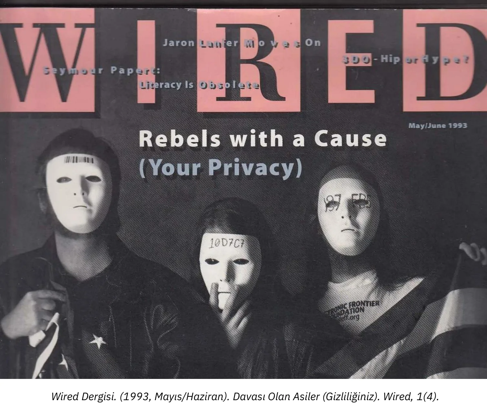

1980'lerin ve 1990'ların teknolojik evriminin tam ortasında, bir grup insan dijital çağda mahremiyet ve özgürlüğün rolünü derinden sorgulamaya başladı. Daha sonra "cypherpunks" olarak anılacak olan bu kişiler, kriptografinin hükümetlerin ve büyük şirketlerin müdahalelerine karşı bireysel hakları korumak için bir araç olarak kullanılabileceğine inanıyorlardı.


Julian Assange, Wei Dai, Tim May ve David Chaum gibi ikonik isimler hareketin felsefesini ve vizyonunu şekillendirmede önemli bir rol oynadı. Bu düşünürler fikirlerini, dünyanın dört bir yanından katılımcıların daha fazla bireysel özgürlük için teknolojiden yararlanmanın en iyi yolları hakkında tartışmalara girdiği etkili bir e-posta listesinde paylaştılar.


### Cypherpunks'ın üç temel belgesi


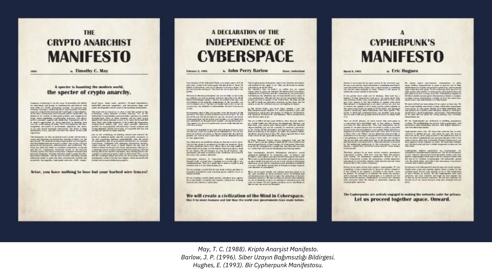


Kökleri dijital aktivizm ve kriptografiye dayanan Cypherpunk hareketi, ilkelerini ve gelecek vizyonunu ifade etmek için çeşitli temel metinlerden yararlanmıştır. Bu yazılar arasında özellikle üç tanesi öne çıkmaktadır:


- "Bir Cypherpunk'un Manifestosu":

eric Hughes tarafından 1993 yılında yazılan bu kitap, mahremiyetin temel bir hak olduğunu ileri sürmektedir. Yazar, özgürce ve gizlilik içinde iletişim kurabilmenin özgür bir toplum için gerekli olduğunu savunmaktadır. Manifesto şöyle diyor: "Hükümetlerden, şirketlerden veya diğer büyük, yüzsüz kuruluşlardan bize mahremiyet vermelerini bekleyemeyiz [...]. Eğer bir mahremiyetimiz olmasını istiyorsak, kendi mahremiyetimizi savunmalıyız".


- "Kripto Anarşist Manifesto":

timothy C. May tarafından 1992 yılında yazılan bu belge, kriptografi kullanımının nasıl hükümetlerin vatandaşların özel işlerine müdahale edemeyeceği bir kriptografik anarşi çağına yol açabileceğini açıklamaktadır. May, insanların üçüncü bir tarafın müdahalesi olmadan anonim olarak Exchange bilgi ve para paylaştığı bir gelecek tasavvur ediyordu.


- "Siber Uzayın Bağımsızlığı Bildirgesi":

gW-41'e özel olmasa da, bu metin hareketin pek çok katılımcısının duygularını yansıtmaktadır. 1996 yılında John Perry Barlow tarafından kaleme alınan metin, İnternet'in hükümetler tarafından giderek daha fazla düzenlenmesine bir yanıt niteliğindedir. Bildiri, siber uzayın fiziksel alandan ayrı bir alan olduğunu ve aynı yasalara tabi olmaması gerektiğini ileri sürmektedir. Bildiride belirtildiği gibi, "Seçilmiş bir hükümetimiz yok ve olması da muhtemel değil".


### Bitcoin'nin öncülleri


Bitcoin'ün ortaya çıkmasından önce, dijital bir para birimi yaratmaya yönelik birkaç girişim olmuştu. Örneğin, David Chaum 1980'lerde "DigiCash" projesiyle "anonim elektronik para" kavramını ortaya atmıştır. Ne yazık ki, çeşitli kısıtlamalar nedeniyle DigiCash hiçbir zaman patlama yapamadı.


Bir diğer önemli öncü de Wei Dai'nin "B-para "sıdır. Hiçbir zaman uygulanmamış olmasına rağmen, dolandırıcılık tespitinin merkezi bir otorite yerine bir değerlendiriciler topluluğu tarafından gerçekleştirildiği anonim bir dijital para birimi fikrini sunmuştur.


Aşağıdaki resim, birçok teknolojik yenilikle hareketin gelişimini açıkça göstermektedir.


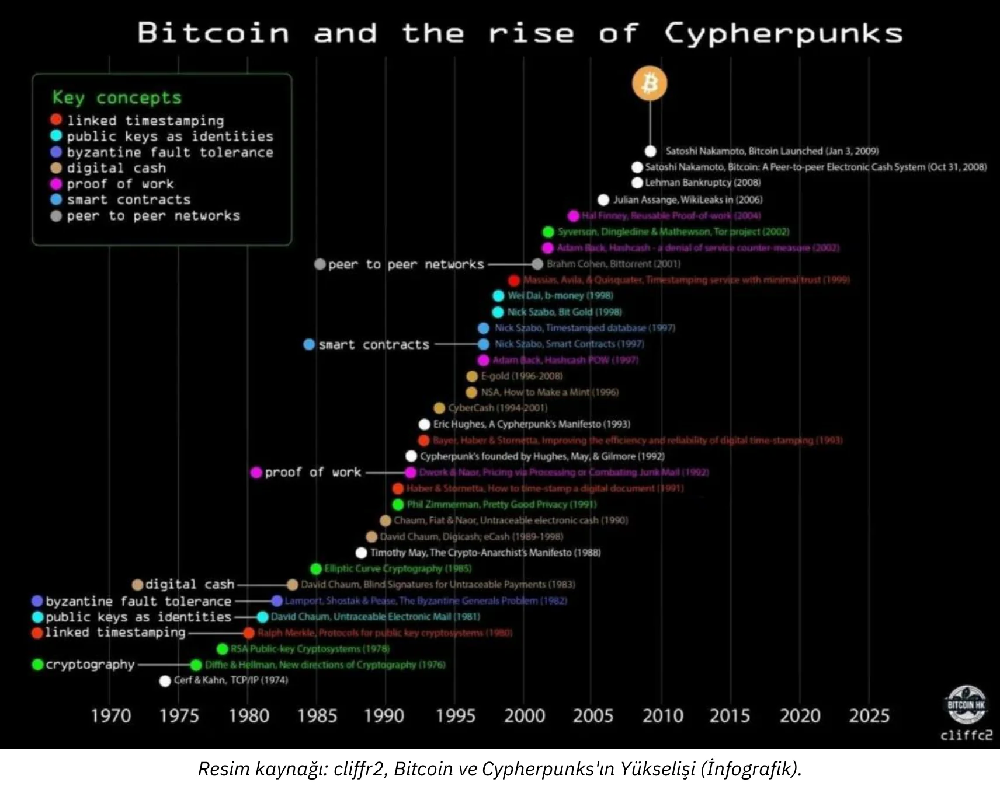


İşte bu verimli ortamda gizemli Satoshi Nakamoto 2008 yılında Bitcoin whitepaper'ını yayınladı. Bu belgede, merkezi olmayan ve sansüre dirençli bir dijital para birimi yaratmak için Cypherpunk hareketinden Proof of Work ve kriptografik zaman damgaları gibi çeşitli fikirleri birleştirdi.


Ancak, Bitcoin bundan daha fazlasıydı: Cypherpunk ideallerinin başarısını temsil ediyordu. Teknolojisinin ötesinde, geleneksel finansal sistemlere karşı bir devrimi simgeliyor ve şeffaflık, ademi merkeziyetçilik ve bireysel egemenliğe dayalı bir alternatif sunuyordu.


### Sonuç


Bitcoin'in tarih öncesi, Cypherpunk hareketine ve dijital çağda daha fazla özgürlük için kolektif arayışa dayanmaktadır. Kriptografi, ademi merkeziyetçilik ve bütünlük ilkelerini bir araya getiren Bitcoin, bir para biriminden çok daha fazlası haline gelmiştir. Aslında, dünyamızı yeniden şekillendirmeye devam eden felsefi ve teknolojik bir devrimin ürünüdür.


Dolayısıyla Bitcoin uzun zaman dilimlerine yayılan ve bizi enerji, zaman ve parayla olan ilişkimizi sorgulamaya teşvik eden bir protokoldür.


Ancak, Bitcoin "gerçek" bir para birimi midir? Bunu anlamak için öncelikle para kavramını ve bir sonraki bölümde inceleyeceğimiz çeşitli biçimlerini anlamamız gerekir.


Bitcoin'ün tarihini daha ayrıntılı olarak keşfetmek istiyorsanız, Bitcoin'ün kökenlerini ve yavaş yavaş ortaya çıkışını, ayrıca tarihinin ve topluluğunun başlangıcını keşfedeceğiniz HIS 201 kursumuzu şiddetle tavsiye ediyoruz. Bu kurs, elbette birçok anekdotla birlikte tamamen belgelenmiş ve kaynaklandırılmıştır:


https://planb.network/courses/a51c7ceb-e079-4ac3-bf69-6700b985a082

# Para


<partId>e913df1a-4cbd-5380-ba67-ca2a0414f671</partId>


## Tarih Boyunca Para


<chapterId>c838e64d-d59f-5703-8c74-ea5e8c4fdd31</chapterId>


Paranın evrimi, çağlar boyunca uygarlıkların sürekli gelişen ekonomik ihtiyaçları karşılamadaki ustalığını yansıtan insanlık tarihinin büyüleyici bir yönüdür.


### Kabuklardan banka hesaplarına


Başlangıçta para birimi tahıl, canlı hayvan ya da başka bir emtia gibi somut bir varlıktı. Ancak bu malların en büyük dezavantajı bozulabilir olmalarıydı ve bu da uzun vadeli bir tasarruf aracı olarak kullanılmalarını zorlaştırıyordu. Örneğin, kötü hasat ya da hayvan hastalıkları bir bireyin servetini bir gecede yok edebilirdi.

Böylece, medeniyetler ilerledikçe ve ticaret yeni bölgelere yayıldıkça, evrensel bir Exchange aracına ihtiyaç duyuldu. Bireyler ilk olarak deniz kabukları ve değerli taşlar gibi nesneleri denediler, ancak bunlar sandıkları kadar dayanıklı ya da kıt değildi. Sonunda altın, nadirliği, dayanıklılığı ve bölünebilirliği nedeniyle standart haline geldi. Altın, zenginliğin ve gücün bir sembolüydü ve günümüzde de öyle olmaya devam etmektedir.


### Paranın rolü nedir?


Para son derece sofistike bir iletişim aracıdır:


- Bugün ile gelecek arasında iletişim kurulmasına olanak tanır, çünkü zamanımızı ve enerjimizi, değer kaybetme riski olmadan gelecek zamanda yeniden kullanılabilecek bir varlığa dönüştürür.


- Evrensel bir dilde iletişimi kolaylaştırır: birbirini tanımadan veya aynı dili konuşmadan iki yabancı Exchange yapabilir, ticaret yapabilir ve eşyaların değeri konusunda anlaşabilir.


Dünyamızdaki işlevini yapay olarak taklit etmek zordur. Aslında hiçbir birey ya da grup para yaratamaz, çünkü para piyasadan ve gönüllü mutabakattan doğması gereken doğal bir olgudur. Bu anlamda fiyatlar, kaynakların tahsisinde topluma rehberlik eden sinyaller ve bilgi parçaları olarak hizmet eder.


Bu nedenlerle, para olarak altın, aşağıdaki Aristotelesçi işlevlere dayanan 4.000 yıllık parasal Darwinizmin sonucudur:


- **Değer deposu**: para, satın alma gücünü geleceğe aktarmak için kullanılabilir, bu nedenle dayanıklı bir malzeme olması gerekir;
- **Exchange Aracı**: Exchange'de takas yerine mal ve hizmetler için para kullanılabilir, böylece tüccarlar arasında isteklerin çakışması önlenir;
- **Hesap birimi**: para aynı zamanda farklı malların değerlerini karşılaştırarak göreceli uygunluklarını daha iyi anlamamızı sağlar.


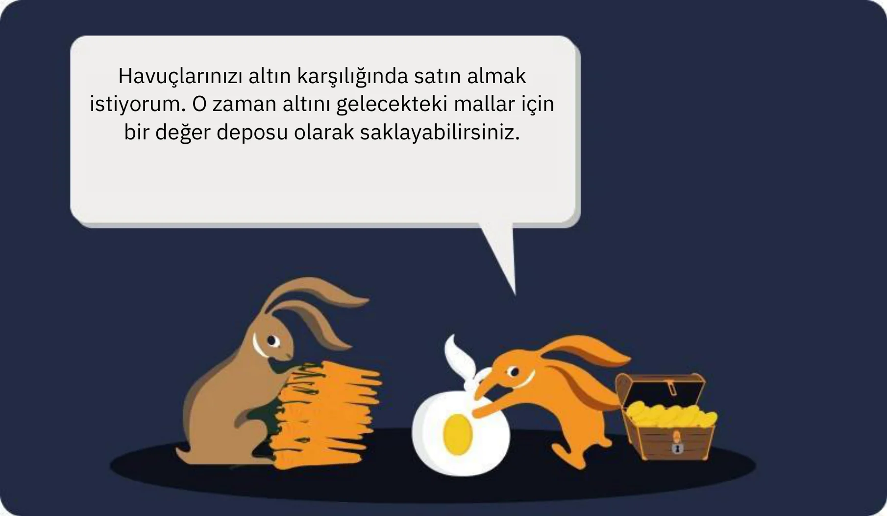

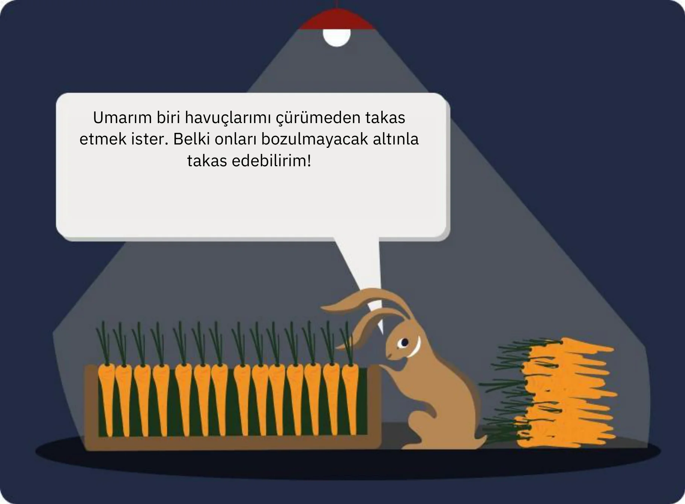


### Paranın özellikleri


Altın ideal olarak verimli bir para biriminin kriterlerini karşılar: doğal olarak nadir bulunması onu değerli kılarken, kimyasal özellikleri zaman içinde aşınmamasını sağlar. Bu özellikler altını büyük bir **değer deposu** haline getirmiştir, ancak yaygın bir para birimi değildir, çünkü bu para biçimi kolayca bölünebilir veya uzun mesafelere taşınabilir değildir. Küreselleşmiş ve dijitalleşmiş bir dünyada, altın buna ayak uydurmakta zorlanır ve bölünebilir ve kolayca değiştirilebilir (yani basılmış madeni paralar yoluyla) hale getirmek için merkezi bir varlığa ihtiyaç duyar.


Tam tersine, devlet güvenceli para birimleri (fiat) kolayca kullanılabilir, ancak onları kontrol eden varlıklar (krallar, merkez bankaları, imparatorlar, diktatörler) tarafından sürekli olarak devalüe edilir.


Bu kavramı daha iyi açıklamak için etkin bir para biriminin özelliklerini inceleyeceğiz:


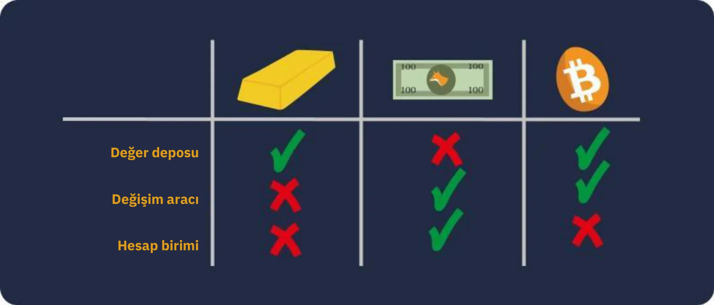


- **Değiştirilebilirlik**, yani değer kaybı olmaksızın aynı türden başka bir birimle değiştirilebilir;
- **Bölünebilirlik**, farklı hacimlerdeki işlemleri kolaylaştırmak için daha küçük birimlere bölünebilir;
- **Likidite**, yani kolayca mal veya hizmete dönüştürülebilir.


Bu kriterleri karşılamak için para birimi tarihsel olarak farklı adımlar atarak gelişmiştir:


- Ham taş -> Coin
- Banknot -> Banka kartı
- Blockchain -> Lightning Network


Para birimleri bugün hala evrim geçirmekte ve farklı kullanım durumlarını karşılamak için biçimlerini uyarlamaktadır. Söylediğimiz gibi, altın mükemmel bir değer deposu olsa da, artık mevcut küreselleşmiş ekonomi için uygun değildir. Benzer şekilde, dolar ve euro gibi güvene dayalı para birimleri çok Liquid'dir ve artık çoğunlukla dijital oldukları için kolayca taşınabilirler, ancak değerleri parasal enflasyon tarafından sürekli olarak düşürülmektedir.


Öte yandan, Bitcoin yeni olanaklar sunmaktadır. Kesinlikle sınırlı olan Supply gibi özellikleri onu mükemmel bir değer deposu haline getirmektedir. Dahası, tarafsız bir internet para birimi olarak, sınırları aşan uygulanabilir bir **Exchange** aracı olarak hizmet vermektedir. Bununla birlikte, [sürekli benimsenmesine] rağmen bugün ticarette hala yaygın olarak kabul görmemektedir (https://btcmap.org/map).


## Güvene dayalı para birimleri


<chapterId>25151d46-7db1-5b48-8bba-cbde1944555a</chapterId>


> george Santayana "Geçmişi hatırlayamayanlar onu tekrar etmeye mahkumdurlar" demiştir.

Bu gerçek, mevcut parasal sistem söz konusu olduğunda güçlü bir şekilde yankılanmaktadır.


### Emanetçi = Güven


Günümüzde Avro ve Dolar gibi başlıca para birimleri güvene dayalı olarak kabul edilmektedir. Bu da onların içsel değerden yoksun oldukları ve tamamen onları yöneten kurumlara duyduğumuz güven ve itimada bağlı oldukları anlamına gelmektedir.


Güvene dayalı bir para birimi, bir kurum, yani Yuan ile Çin gibi bir devlet veya Euro ile Avrupa Birliği gibi bir politik-ekonomik birlik tarafından bu şekilde kararlaştırılan bir para biçimidir. İhracından sorumlu kuruluş merkez bankasıdır (Örneğin, Çin Halk Bankası, ABD Merkez Bankası veya Gine Cumhuriyeti Merkez Bankası'ndan bahsedebiliriz). Para politikasını formüle etmekten ve dolayısıyla ne kadar paranın dolaşıma sokulması veya basılması gerektiğinden sorumlu olan tam da bu kuruluşlardır.


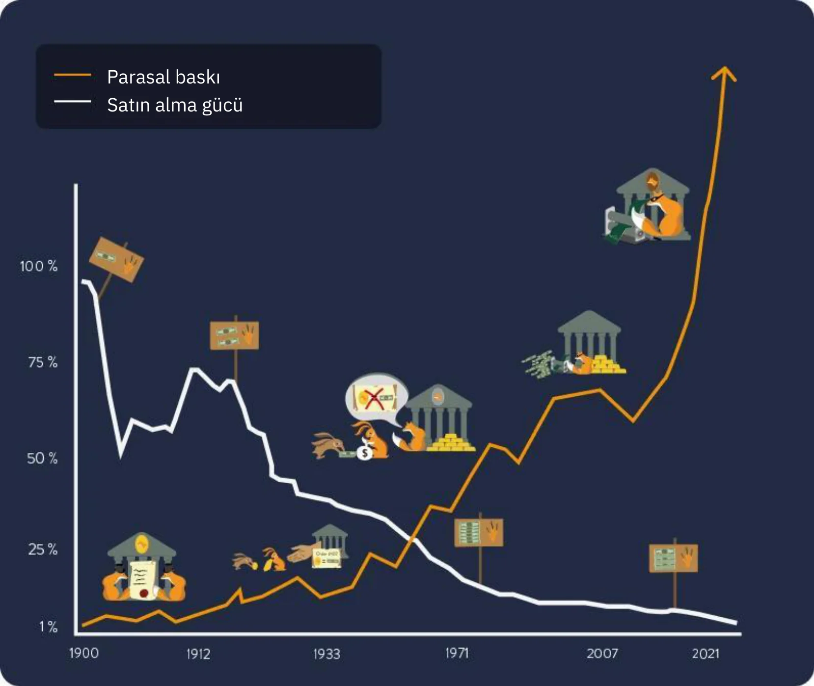


### Parasal devalüasyon: Roma İmparatorluğu kadar eski bir strateji


Antik çağlardan bu yana altın parasal bir referans olarak kullanılmış, ancak altının katılığı, ister Roma imparatorları ister modern hükümetler olsun, liderleri genellikle güvene dayalı alternatif para birimlerini benimsemeye yöneltmiştir.


Mekanizma basittir ve uygarlığın başlangıcından beri var olan uygulamalardan esinlenmiştir. Servet üzerinde kontrol sahibi olmak isteyen liderler, genellikle güçlerini kullanarak ve koruma ve güvenlik vaat ederek altını merkezileştirmekle işe başlarlar. Ellerindeki bu değerli rezervle, değer olarak altına eşdeğer, ancak kendi suretlerinde basılmış yeni bir para birimi çıkarırlar. Bu para birimi daha sonra dolaşıma girer ve insanlar basit kullanımının rahatlığına hızla adapte olurlar.


Ancak bu liderler daha sonra yeni para biriminin değerini kademeli bir şekilde düşürmeye başlar ve fiili olarak her yıl başlangıçtaki altın fiyatına kıyasla değerini yüzde birkaç oranında azaltır. Bu sessiz devalüasyon genellikle halkın yararına olduğu şeklinde gerekçelendirilir. Gerçekte ise, bu emanet para biriminde tasarruf edenler tasarruflarının değerinin düştüğünü görürken, devlet projelerini enflasyon yoluyla finanse etmektedir. Dahası, bu devalüasyon borçların geri ödenmesini kolaylaştırmaktadır.


Kritik bir anda lider bir duyuru yapar: para birimi artık altınla desteklenmemektedir. Artık güvene dayalı para birimine alışmış ve mali konularda genellikle yanlış bilgilendirilmiş olan halk bu gerçeği kabul eder ve devletin Supply parasını serbestçe manipüle etmesine ve neredeyse hiçbir maliyet olmadan muazzam miktarlarda para basmasına izin verir.


Parasal baskı daha sonra enflasyona yol açar ve nüfusu giderek yoksullaştırır. Ayrıca, herhangi bir aksaklık büyük bir ekonomik krize neden olabileceğinden, finansal sistem çöküşünü önlemek için düzenlenir ve kısıtlanır. Kitlelerin aksine, finans kurumları ve varlıklı bireyler, eşitsizlik uçurumu yaratan ve otoriterliği destekleyen bu sistemden büyük ölçüde faydalanmaktadır. Bu bağlamda, radikal değişiklikler yapmaya teşvik edilmiyorlar ve sistemin olası bir patlamaya kadar yoluna devam etmesine izin veriyorlar.


İyi uygulandığında bu strateji on yıllarca sürebilir. Ancak çok hızlı bir devalüasyonun ya da güven kaybının hiperenflasyona yol açabileceğini unutmamak gerekir (bkz. bir sonraki bölüm). Tarih, doların 100 yılda değerinin %98'ini, avronun 20 yılda %30'unu ve sterlinin kuruluşundan bu yana %99'unu kaybettiğini göstermektedir.


Sonunda, İmparatorluğun sonundaki Roma sikkelerinde olduğu gibi, para biriminin artık altınla hiçbir bağlantısı kalmayabilir, hatta somut gerçeklikten kopuk basit bir sayısal değere indirgenebilir.


Bugün tarihi bir dönüm noktasına tanıklık ediyoruz. Uzun zamandır egemen olan dolar düşüşte görünürken, altın merkezi rolünü kaybetti. Tarihten alınan derslerin çoğu zaman unutulduğunu hatırlatan yeni bir parasal döngünün eşiğinde duruyoruz


### Bitcoin bir çözüm mü?


Bu öncüller nedeniyle Bitcoin devrimi ivme kazanıyor. Önceki para birimlerinin aksine, **güvenilir bir üçüncü taraf** gerektirmiyor ve Devleti paradan ayırmayı amaçlıyor.


Aslında Bitcoin, merkezi olmayan bir çözüm ve yeni bir paralel para sistemi önererek kendisini bu sistemik zorluklara bir yanıt olarak sunmaktadır. Tarihsel olarak, altın sahteciliğe karşı direnci nedeniyle bir para birimi olarak tercih edilmişse, Bitcoin de benzer şekilde sahtesi yapılamaz. Dahası, merkezi olmayan ve kriptografik yapısı sayesinde 21 milyon birimle sınırlıdır. Bitcoin şeffaflık ve tarafsızlığa dayanan bir para birimidir ve mevcut merkezi para sistemine cazip bir alternatif sunmaktadır.


Bitcoin'un dikkat çekmesinin bir diğer nedeni de kaçınılmaz görünen merkez bankası dijital para birimlerinin ya da CBDC'lerin ortaya çıkmasıdır. Bu yeni para biçimi daha merkezi planlı bir ekonomi geliştirecek ve hem bireylerin finansal özgürlüğünü engelleyebilecek hem de otoriter suiistimalleri kolaylaştırabilecektir.

Bu bölümü Nobel Ödülü sahibi F.A Hayek'in 1984 yılında yaptığı bir alıntı ile bitirebiliriz:


> "Bu işi hükümetin elinden almadan bir daha asla iyi bir paraya sahip olabileceğimize inanmıyorum. Eğer bunları hükümetin elinden şiddetle alamıyorsak, yapabileceğimiz tek şey sinsi ya da dolambaçlı bir yolla onların durduramayacağı bir şey ortaya koymaktır."

Ekonomik yanılgılar ve özgürlük hakkında daha fazla bilgi edinmek için sizi, Bitcoin'in ortaya çıkışını kesinlikle takdir edecek bir 19. yüzyıl Fransız düşünürü olan Frédéric Bastiat'nın hayatının ve fikirlerinin izini süren ECO 102 kursumuzu keşfetmeye davet ediyoruz:


https://planb.network/courses/d07b092b-fa9a-4dd7-bf94-0453e479c7df

## Hiperenflasyon


<chapterId>b04c024c-54f3-50cb-997f-58721cfc74be</chapterId>


Hiperenflasyon, itibari para birimlerine özgü parasal bir olgudur: bir para birimine olan güvenin tamamen kaybolması ve yetkililer tarafından para basılması nedeniyle enflasyonda ciddi bir artışla karakterize edilir. Sonuç olarak, bireylerin biriktirdiği tasarruflar nispeten kısa bir süre içinde yok olabilir ve ülkeyi ekonomik, sosyal ve siyasi çöküşün eşiğine getirebilir.


### Enflasyon çıldırıyor!


Enflasyonun tasarruflar üzerindeki etkisini anlamak için farklı enflasyon oranlarını dikkate almamız gerekir.


- 2'lik bir enflasyonla, satın alma gücünüzün yıllık %2'sini kaybedersiniz, bu da 5 yılda %10'a denk gelir.
- 7 ile 10 yıl içinde yarısını kaybedersiniz.
- 20 ile neredeyse yarısını 3 yıl içinde kaybedersiniz.


Hiperenflasyon gerçekleştiğinde, artık yılda %20'den değil, ayda %20'den, hatta zirveye ulaştığında GÜNDE %20'den bahsediyoruz. Üç gün boyunca günde %100 enflasyon yaşamak, dünyamızda gerçekleşmiş ve gerçekleşmeye devam eden gerçekçi bir senaryodur.


Hiperenflasyonun tesadüfen, kapitalizm tarafından ya da muhaliflerin siyasi saldırıları sonucu meydana gelmediğini anlamak çok önemlidir. Hiperenflasyon, merkez bankacıları ve politikacılar tarafından alınan kötü parasal kararların doğrudan sonucudur. Sonuçları her vatandaşı ve hatta gelecek nesilleri etkiler. Bu olgunun gerçek etkisini tam olarak anlamak için sizi aşağıdaki tabloyu okumaya beş dakikanızı ayırmaya davet ediyoruz (ECO204 kursu bu konuyu daha ayrıntılı olarak ele almaktadır). Gördüğünüz gibi, hiçbir ülke ya da para birimi potansiyel olarak güvenli değildir.


### Hiperenflasyonun aşamaları nelerdir?


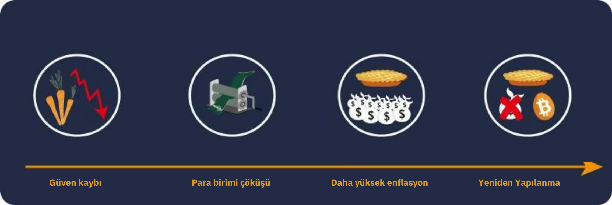


Hiperenflasyonun meydana gelmesi için belirli olayların gerçekleşmesi gerekir.


Aşama 1 - Güven kaybı


- Parasal gücün merkezileşmesi paranın yaratılmasını ve kötüye kullanılmasını kolaylaştırır. Bu bağlamda, savaşlar, hükümet politikaları ya da buğday veya benzin gibi temel kaynakların fiyatlarının yükselmesi gibi dış etkenler hiperenflasyonu tetikleyebilir. Böylece, bir para birimine karşı güven kaybı ortaya çıkabilir ve bireyler paranın kaynağını ve zorunlu para politikasının faydalarını sorgulamaya başlar.


2. Aşama - Para biriminin çöküşü ve fiyat artışı


- Hükümetler güven kontrolünü kaybettikçe, bireyler daha istikrarlı bir para birimi için Exchange'e geçmeye başlar, Venezuela'da ABD dolarında olduğu gibi. Bu durum fiyatların yükselmesine yol açarak mal ve hizmetlerin giderek pahalılaştığı bir kısır döngü yaratır. Bu ihtiyaçları karşılamak ve para politikasını düzeltmek için devlet daha fazla para basar ve bu da üstel enflasyona neden olur.


3. Aşama - Para basmanın kısır döngüsü


- Böylece, mal satın almak için giderek daha fazla banknota ihtiyaç duyulur ve bu da kağıt para kıtlığına neden olur. Buna karşılık olarak hükümetler daha fazla kağıt para basma yoluna gider, bu da enflasyonu daha da körükler.


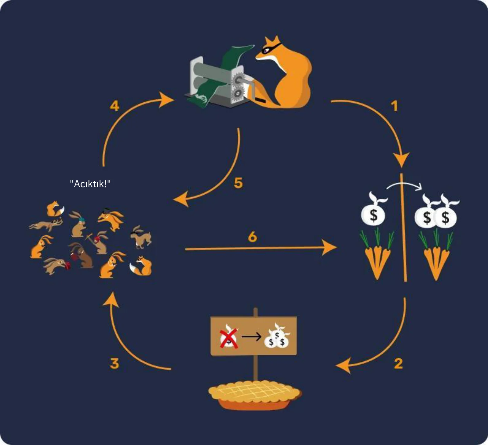


4. Aşama - Yeni bir para biriminin ortaya çıkışı


- Daha sonra, önceki yasal para biriminde olmayan daha sıkı kontroller uygulayarak enflasyon döngüsünü kırmak amacıyla eskisinin yerine yeni bir para birimi getirilir.


Bir hiperenflasyon krizinin çözülmesi genellikle devrimler, hükümet değişiklikleri, merkez bankacılarının değişmesi gibi radikal değişiklikler gerektirir. Güven kaybı, para biriminin çöküşü ve yeniden yapılanma, itibari paraya dayalı bir ekonomiyi canlandırmak için gerekli aşamalardır.


### Kayda değer üç örnek


- Almanya, 1922-1923.


Hiperenflasyonun en çarpıcı örneklerinden biri I. Dünya Savaşı'ndan sonra Alman Weimar Cumhuriyeti'nde yaşanmıştır.


Almanya savaşı finanse etmek için muazzam miktarlarda borç almıştı. Ancak Almanya sadece savaşı kaybetmekle kalmadı, aynı zamanda milyarlarca dolar tazminat ödemek zorunda kaldı. En yüksek enflasyon oranına sahip ay Ekim 1923'tü ve %29.500 ile zirve yaptı, bu da günde %20,9'luk bir enflasyon oranına eşitti. Fiyatlar her 3,7 günde bir ikiye katlanıyordu!

Alman para birimi o kadar işe yaramaz hale geldi ki bazı vatandaşlar odun yerine kağıt paralarını yakmayı tercih etti çünkü bu daha ucuzdu. Hatta restoranlarda garsonların enflasyonu hesaba katmak için her 30 dakikada bir menü fiyatlarını açıklamak zorunda kaldığı söylenir.


Sonunda yetkililer Almanya, Fransa ve İngiltere'nin borçlarıyla desteklenen ve Alman toprakları tarafından garanti edilen yeni bir para birimi yarattı.


- Macaristan, 1945-1946


Bugüne kadar en kötü hiperenflasyon dönemini yaşayan ülke, açık ara farkla İkinci Dünya Savaşı sonrası Macaristan'dır.


Macaristan kendisini çatışmanın kaybeden tarafında buldu ve endüstriyel üretim kapasitesinin çoğu yok edildi. En yüksek enflasyonun yaşandığı ay, günde %207'ye denk gelen %41.900.000.000.000.000 gibi şaşırtıcı bir fiyat enflasyonunun yaşandığı Temmuz 1946'ydı. Fiyatlar her 15 saatte bir ikiye katlanıyordu!


Tedavüle sürülen son banknot 1946 yılında 100 milyon milyar Pengo (100,000,000,000,000,000) olmuştur.


- Zimbabve, 2007-2008


2000 yılına kadar Zimbabve, petrol hariç neredeyse tüm ihtiyaçları için kendi kendine yeterliydi.


1997 yılında, hükümetin savaş gazilerine 450 milyon ABD doları tutarında tazminat ödemeyi kabul etmesinin ardından Zimbabve doları %72'nin üzerinde değer kaybetti. Hükümetin elinde böyle bir miktar olmadığı için matbaaya başvurdu. 2005 yılında %586'ya ulaşan enflasyon, 2008 Kasım ayı ortasında aylık %79.600.000.000 olarak tahmin edilen bir oranla zirve yapmıştır.


Haziran 2007'de hükümet zaten fiyat kontrolleri uygulayarak tepki göstermişti, ancak bu eylemin ekonomi üzerinde herhangi bir etkisi olmadı. Dükkânlar yağmalanmış ve tüccarların artık dükkânlarını yeniden dolduracak imkânları kalmamıştı.


Nisan 2009'da Maliye Bakanı Zimbabve dolarının askıya alındığını duyurdu ve ticaret için farklı yabancı para birimlerinin kullanılmasına izin verdi. Tüm banka hesapları, emekli maaşları ve finans kurumları bakiyelerinin bir gecede buharlaştığını gördü.


Sonuç olarak hiperenflasyon, para biriminin değerini hızla düşürerek tasarrufların erozyona uğramasına ve parasal sisteme olan güvenin kaybolmasına neden olur. Voltaire'in bir zamanlar önerdiği gibi, itibari bir para birimi her zaman eninde sonunda gerçek değerini kaybedecek ve sıfıra doğru yaklaşacaktır.

Bir finans kurumu gibi güvenilir bir üçüncü tarafa dayanan bir para birimi, pratikte ve uzun vadede kusurlu bir para birimidir, çünkü satın alma gücünü garanti edemez veya tasarrufları koruyamaz.


Hiperenflasyon konusunu daha derinlemesine incelemek için David St-Onge'un ECO 204 dersini tavsiye ediyoruz; bu derste hiperenflasyonist döngülerin ne olduğunu ve hayatlarımız üzerindeki gerçek etkilerini öğreneceksiniz. Ayrıca bu döngüler arasındaki benzerlikleri ve en önemlisi kendinizi bunlardan nasıl koruyacağınızı keşfedeceksiniz.


https://planb.network/courses/caa75343-ac90-4249-bcca-0e2e57c3a0f1

## 21 milyon bitcoin


<chapterId>f4a06d76-1963-56fd-93ff-dfa41489bcde</chapterId>


### Bitcoin'nin para politikası


Bitcoin, önceden tanımlanmış maksimum miktarı **21 milyon birim** olan merkezi olmayan bir dijital para birimidir. Bu içsel kıtlık özelliği, bilgisayar kodu tarafından belirlenir ve protokole katılan tüm kullanıcıların fikir birliği ile güçlendirilir.


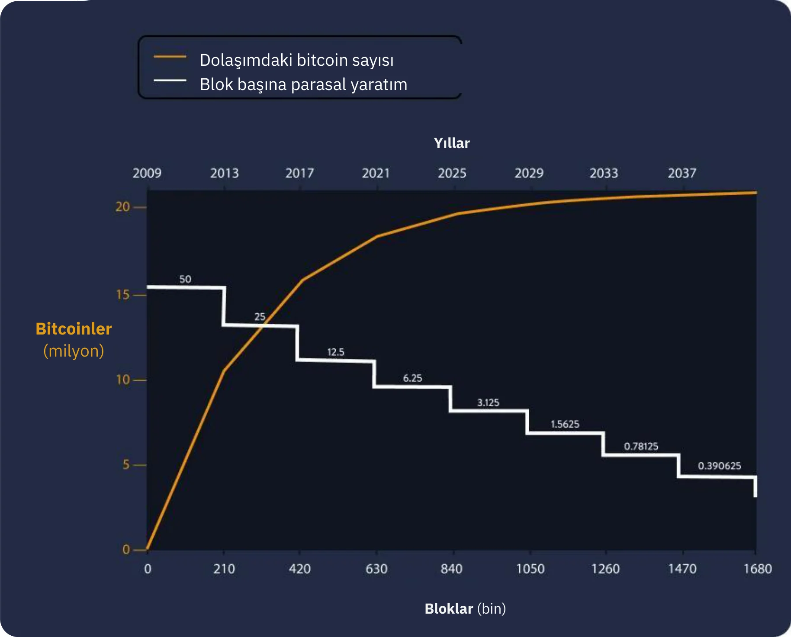


Parasal ihracı, zaman içinde yaratılan bitcoin miktarını temsil eden bir eğri ile gösterilebilir. Örneğin, 2022 yılında dolaşımda yaklaşık 18,5 milyon bitcoin bulunmaktaydı. Tahminler, 2025 yılına kadar toplam Supply'ün yaklaşık %93'ünü temsil eden yaklaşık 19,5 milyon bitcoin olacağını ve 2037 yılına kadar bu rakamın 20,4 milyona ulaşacağını göstermektedir.


### Yeni bitcoinler nasıl yaratılıyor?


Yeni bitcoinlerin yaratılması Mining sürecinin sonucudur. Özetle, madenciler işlemleri doğrulayan ve güvence altına alan karmaşık matematiksel problemleri (Hash) çözen güçlü bilgisayarlar kullanır. Bir problem çözüldüğünde (ya da geçerli bir Hash bulunduğunda), Miner, ağ üzerinde yapılan tüm işlemleri kaydeden merkezi olmayan ve dağıtılmış bir Ledger olan Blockchain'e yeni bir işlem bloğu ekler. Blockchain şeffaflık ve güvenlik sağlar, çünkü her blok bir öncekine bağlıdır ve ağın mutabakatı olmadan geçmiş verileri değiştirmeyi neredeyse imkansız hale getirir.


Bu görevi başarıyla yerine getirdikten sonra madenciler her on dakikada bir yeni bitcoin ihracı ile ödüllendirilir. Bu ödül her 210.000 blokta, yani yaklaşık her dört yılda bir ("Halving" olarak bilinen bir olay) yarıya inecek şekilde programlanmış olup, para basma eğrisine merdiven benzeri bir şekil vermektedir. Bu mekanizma nedeniyle, matematiksel olarak yeni bitcoin yaratımının 2140 yılında, toplam sayı 21 milyon sınırına ulaştığında duracağı tahmin edilebilir.


| Halving Number | Block Height | BTC Reward After Halving  | Estimated BTC in Circulation After Halving |
| -------------- | ------------ | ------------------------- | ------------------------------------------ |
| 1              | 210,000      | 25 BTC                    | 10,500,000 BTC                             |
| 2              | 420,000      | 12.5 BTC                  | 15,750,000 BTC                             |
| 3              | 630,000      | 6.25 BTC                  | 18,375,000 BTC                             |
| 4              | 840,000      | 3.125 BTC                 | 19,687,500 BTC                             |
| 5              | 1,050,000    | 1.5625 BTC                | 20,343,750 BTC                             |
| 6              | 1,260,000    | 0.78125 BTC               | 20,671,875 BTC                             |
| 7              | 1,470,000    | 0.390625 BTC              | 20,835,937.5 BTC                           |
| 8              | 1,680,000    | 0.1953125 BTC             | 20,917,968.75 BTC                          |
| 9              | 1,890,000    | 0.09765625 BTC            | 20,958,984.375 BTC                         |
| 10             | 2,100,000    | 0.048828125 BTC           | 20,979,492.188 BTC                         |
| 11             | 2,310,000    | 0.0244140625 BTC          | 20,989,746.094 BTC                         |
| 12             | 2,520,000    | 0.01220703125 BTC         | 20,994,873.047 BTC                         |
| 13             | 2,730,000    | 0.006103515625 BTC        | 20,997,436.523 BTC                         |
| 14             | 2,940,000    | 0.0030517578125 BTC       | 20,998,718.262 BTC                         |
| 15             | 3,150,000    | 0.00152587890625 BTC      | 20,999,359.131 BTC                         |
| 16             | 3,360,000    | 0.000762939453125 BTC     | 20,999,679.566 BTC                         |
| 17             | 3,570,000    | 0.0003814697265625 BTC    | 20,999,839.783 BTC                         |
| 18             | 3,780,000    | 0.00019073486328125 BTC   | 20,999,919.892 BTC                         |
| 19             | 3,990,000    | 0.000095367431640625 BTC  | 20,999,959.946 BTC                         |
| 20             | 4,200,000    | 0.0000476837158203125 BTC | 20,999,979.973 BTC                         |

Mining kavramını [Miner bölümünde] (https://planb.network/courses/2b7dc507-81e3-4b70-88e6-41ed44239966/dbb8264a-7434-57e4-9d1b-fbd1bae37fdf) daha ayrıntılı olarak tekrar ele alacağız.


### Dijital kıtlığın garanti altına alınması


21 milyon sınırı Bitcoin kıtlığının temelidir ve iki temel mekanizma ile garanti altına alınmıştır: Mining zorluğunun ayarlanması ve oyun teorisi.


- Mining zorluk ayarlaması, Blockchain'e ortalama her on dakikada bir yeni bir blok eklenmesini sağlamak için her 2016 blokta veya yaklaşık iki haftada bir gerçekleşen bir süreçtir. Bu blok oluşturma sıklığı ve toplam bitcoin miktarı Bitcoin protokolünün sabit unsurlarıdır ve geleneksel para sistemlerinde alınan keyfi kararların aksine genel bir mutabakat olmadan değiştirilemez.


Geçerli bir Hash bulmanın zorluğu bir tür döngüyü takip eder: madencilerin sayısı artar ve daha fazla blok daha hızlı bulunursa, bu bir blok bulmak için ortalama sürenin azalmasına neden olur ve böylece zorluk artar. Sonuç olarak, madencilerin bulduğu blok sayısı azalır, bu da mekanizmanın blok başına ortalama 10 dakikaya geri döndüğü anlamına gelir. Görsel bir gösterim için lütfen aşağıdaki resme bakın.


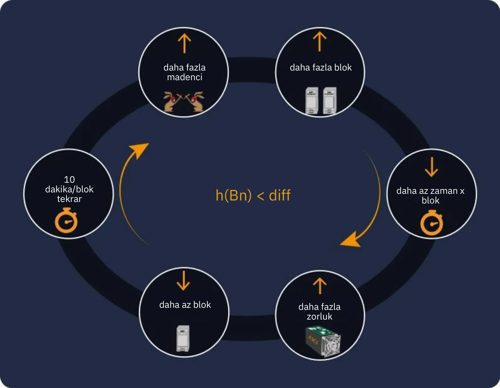


Tersine, daha az madenci çalışırsa ve bloklar daha uzun sürerse, Mining zorluğu azalır ve ortalama blok süresini tekrar hızlandırır.


Madencilerin blok sübvansiyonu yoluyla yeni bitcoinler kazanmak için bir bloğu kazmaya teşvik edildiklerini ve bu bloğa dahil ettikleri işlemlerden işlem ücretleri aldıklarını biliyor muydunuz?


Böylece, çıkarılan bitcoin sayısı 21 milyon sınırına yaklaştıkça, madencilere blok sübvansiyonundan ziyade işlem ücretleri yoluyla daha fazla ödeme yapılacaktır.


- Oyun teorisi, insan rasyonalitesine dayanan matematiksel bir kavramdır. Bireylerin mantıklı hareket ettiklerini, başkalarının potansiyel kararlarını göz önünde bulundururken kendi faydalarını en üst düzeye çıkarmaya çalıştıklarını varsayar. Bitcoin'da oyun teorisi, madencilerin ve kullanıcıların çoğunluğunun ağın çıkarına en uygun şekilde hareket etmesini sağlamaya yardımcı olur. Aslında, protokol değişiklikleri kullanıcılar tarafından oylandığından, Bitcoin protokolünde yapılacak herhangi bir değişiklik tüm kullanıcı topluluğunun onayını gerektirir ki bu da oldukça karmaşıktır. Dolayısıyla, eğer birisi 22 milyonluk bir Bitcoin yaratmak isterse, tüm kullanıcıları kendi birikimlerinin değerini gönüllü olarak düşürmeye ikna etmek zorunda kalacaktır ki Bitcoin küresel olduğu ve merkezi bir grup tarafından yönetilmediği için bunun gerçekleşmesi pek olası değildir.


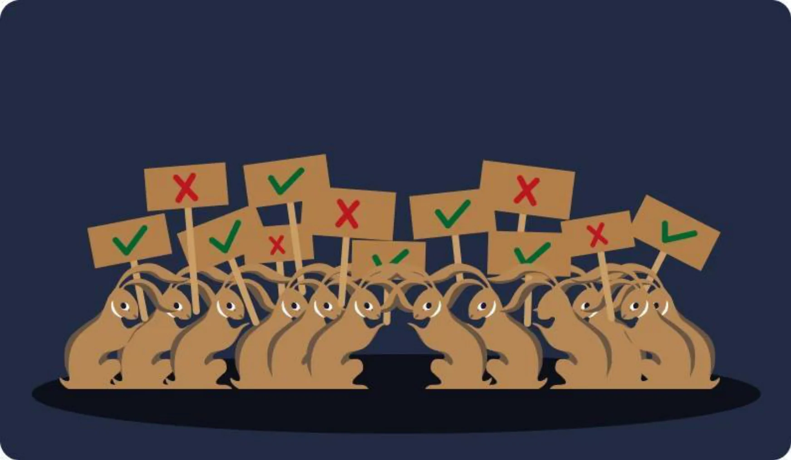


Para biriminin değerinin düşürülmesi fikri Bitcoin'in temel felsefesine aykırıdır, bu nedenle toplam miktarında bir değişiklik olması pek olası değildir.


### Denetlenebilir bir para politikası: her saniye, başlangıçtan itibaren ve sonsuza kadar!


Bitcoin'nin kıtlığı önemli bir değerdir ve dolaşımdaki maksimum 21 milyon bitcoin miktarı herkese açıktır ve herkes tarafından doğrulanabilir.


Aslında, herkes bunu bir Bitcoin düğümü (yani bir işlem doğrulayıcı) aracılığıyla sadece aşağıdaki komutu girerek yapabilir: `bitcoin-cli gettxoutsetinfo`. Bu şeffaflık, merkezi kurumlara veya kişilere değil, protokolünün doğasında bulunan matematiksel ve kriptografik garantilere dayanan Bitcoin sistemine olan güveni güçlendirir (Bunu nasıl kolayca yapacağınızı LNP201'de öğreneceksiniz).


```json
{
"height": 710560,
"bestblock": "0000000000000000000887384d67103412ea7f18a43953e65c8c4ac36bf42e54",
"transactions": 473244,
"txouts": 1018917,
"bogosize": 2183872374,
"hash_serialized_2": "eebb9987337700ffaacbbaa11223344",
"disk_size": 178239584,
"total_amount": 18745998.12345678
}
```


Bitcoin, tasarım gereği yaratımını sınırlandırarak sağlam bir parasal yönetimi garanti eder, bu da onu diğer para birimlerinden çok farklı kılar çünkü kullanıcıların tasarruflarını koruyabilir. Avusturya ekonomisi ilkelerine uygun olarak, istikrarlı miktarı ve öngörülebilir dağılımı onu geleneksel para birimlerinin karşı karşıya olduğu enflasyon risklerinden korur (daha fazla bilgi için ECO201 kursuna bakın).


Özetle Bitcoin, merkezi olmayan yapısı, programlanmış kıtlığı ve şeffaflığı ile geleneksel para sistemlerine benzersiz bir alternatif sunmaktadır. Sadece kullanışlı ve doğrulanabilir olmakla kalmayıp aynı zamanda Supply'yi sıkı bir şekilde sınırlandırarak kullanıcıların birikimlerinin değerini koruyan bir para birimi yaratmak için teknolojinin nasıl kullanılabileceğini göstermektedir.


# Bitcoin Cüzdanlar


<partId>28860585-4f61-59d9-b242-f4c57d837cc1</partId>


## Bitcoin cüzdanları nedir?


<chapterId>1c0166ab-cb7a-5bc6-9175-d13482bd91f1</chapterId>


Bölüm 2'de, bu ünlü bitcoinlerin nerede bulunduğunu ve onlarla nasıl etkileşime girileceğini anlamak için cüzdan kullanımı yoluyla Bitcoin'ün depolanmasını ve güvenliğini keşfedeceğiz!


### Bitcoin cüzdanlarının gizemini çözme


Bitcoin ağı ile üç ana şekilde etkileşim kurmak için cüzdanları kullanıyoruz:


- Bitcoin almak için
- Bitcoin göndermek için
- Onları bilgisayar korsanlığı ve hırsızlık girişimlerine karşı korumak için


Bir Bitcoin Wallet birçok şekil ve formda olabilir: bilgisayarınızdaki bir yazılım, akıllı telefonunuzdaki bir uygulama, USB anahtarı gibi fiziksel bir cihaz veya hatta bir kağıt parçası. Bunların her biri farklı kullanım durumlarına hizmet eder. Aslında, bazıları güvenliğe vurgu yapan büyük işlemler için tasarlanırken, diğerleri gizliliğe öncelik verir veya küçük miktarlarda günlük ödemeler için tasarlanmıştır.


Dolayısıyla portföyler, her zaman kilit bir soru etrafında toplanan geniş kullanım ailelerine ayrılabilir: fonların sahibi siz misiniz yoksa paranızın kontrolünü üçüncü bir tarafa mı bırakıyorsunuz? Bu konuyu bir sonraki bölümde ayrıntılı olarak inceleyeceğiz, ancak soru basittir: para sizin cebinizde mi yoksa bankacınızın cebinde mi?


### Bitcoin Wallet nasıl çalışır?


İster Bitcoin "bankacınız" ister kendiniz olun, Bitcoin cüzdanlarının büyük çoğunluğu, anahtar çiftleri sistemini içeren asimetrik kriptografiye dayalı benzer bir teknolojiyle çalışır: harcama için bir özel anahtar ve alım için bir ortak anahtar.


- Özel anahtar


Bir Wallet başlatılırken, Mnemonic cümlesi (özel anahtar) olarak da bilinen gizli bir kurtarma cümlesi oluşturulur ve 12 veya 24 kelime şeklinde size sunulur.


Özel anahtar çok önemlidir çünkü bitcoinlerin Ownership'unu ve dolayısıyla bunları kullanma veya gönderme hakkını oluşturur. Bu nedenle, özel anahtarın sahibi bitcoinlerin gerçek sahibidir. Popüler ifadeyle, "Ne anahtarlarınız, ne de paralarınız."


Bu anahtar gizli tutulmalı ve iyi korunmalıdır, çünkü servetinizin kilidini açar!


- Açık anahtar & Address


Açık anahtar özel anahtardan üretilir ve ona bağlıdır. Açık anahtarın paylaşılması gizlilik için risk oluşturur (çünkü diğer kullanıcılar bakiyenizi görebilir) ancak güvenlik için risk oluşturmaz (çünkü özel anahtara sahip olmadan paranızı harcayamazlar). Buna karşılık, açık anahtar Bitcoin adresleri oluşturmak ve böylece para almak için kullanılır.


Bu adresler Wallet cihazınız tarafından otomatik olarak oluşturulur ve güvenli bir şekilde paylaşılabilir. Gizliliğinizi en üst düzeye çıkarmak için bunları yalnızca bir kez kullanmanız önerilir.


Özetle bu teknoloji, alıcının fonlarımızı çalmasına izin vermeden bitcoin almamızı sağlıyor! Bir posta kutusu uygun bir metafor olabilir: insanlar içine para yatırabilir, ancak onu açabilecek tek kişi sizsiniz.


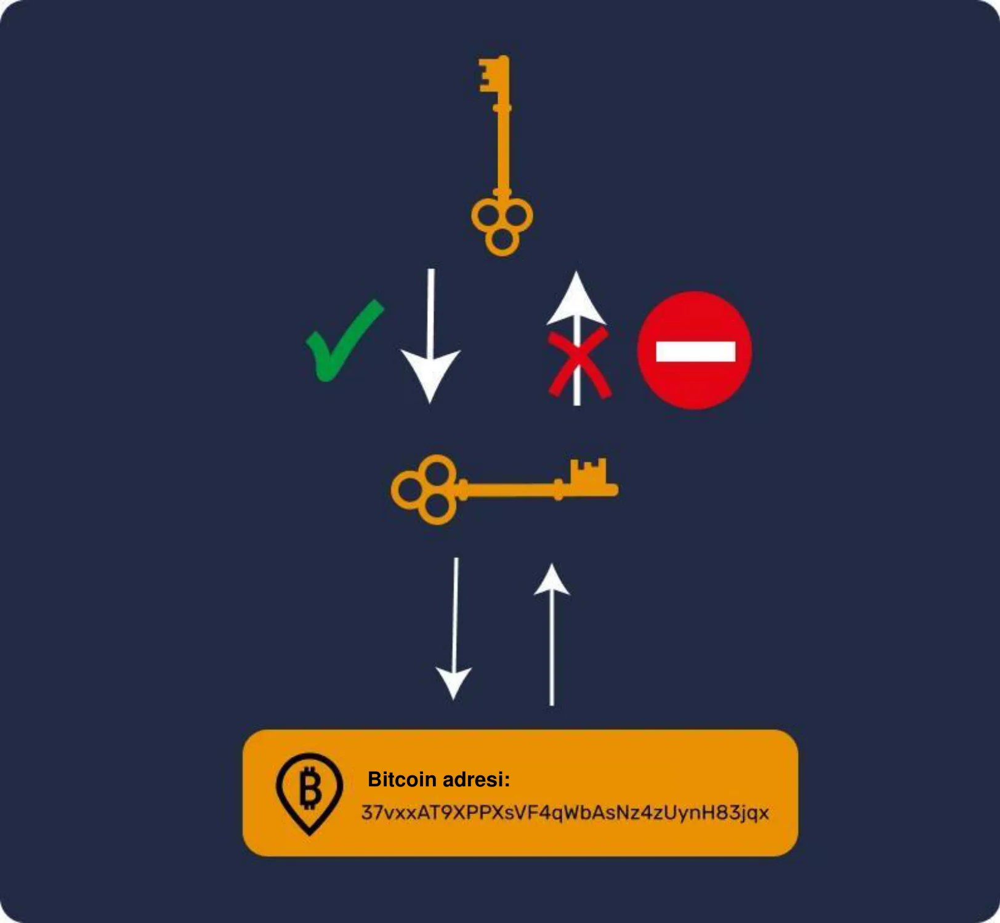


### Bitcoinler Wallet'ün içinde mi?


Anahtarlarınız Wallet'inizde saklansa da, bitcoinlerin kendileri aslında Bitcoin eşler arası ağ içinde halka açık dağıtılmış bir Ledger olan Blockchain'te "saklanır" (bu konuya 3. bölümde değineceğiz). Bu da Wallet'inizi içeren cihazı kaybetmenizin bitcoinlerinizi kaybetmenize neden olmayacağı anlamına gelir. Wallet'inizi yeniden oluşturmanızı ve Bitcoin'nızı harcamanızı sağlayan şey aslında özel anahtardır, bu nedenle her zaman düzgün bir şekilde güvence altına almayı unutmayın!


Neyse ki, 2017'den bu yana, özel anahtar, 'Mnemonic cümlesi' olarak bilinen ve kaydedilmesi oldukça kolay olan 12 veya 24 kelimelik basit bir liste ile temsil edilebilmektedir. Bu ifade, fonlarınız için bir yedek görevi görür ve herhangi bir Bitcoin Wallet yazılımı veya uygulaması kullanarak Wallet'inizi yeniden oluşturmanıza olanak tanır. Bu nedenle, bu kelime listesini bulan herkes bitcoinlerinize erişebilir.


### Peki ya hackerlar?


Ya birisi yanlışlıkla 12 veya 24 kelimelik listemizi tahmin ederse? Kısa cevap, Wallet'i oluşturmak için kullanılan kriptografi sayesinde bunun pek olası olmadığıdır. Bir perspektife oturtmak gerekirse, yanlışlıkla aynı Mnemonic ifadenizi keşfetmek, 1 ile 2 arasındaki "doğru" sayıyı 256'nın gücüne yükseltilmiş olarak bulmaya benzer ki bu da neredeyse Evren'deki "doğru" atomu bulmakla eşdeğerdir. Bununla birlikte, bu varsayılan güvenlikten memnun değilseniz, Bitcoin Wallet'inize bir passphrase (ekstra bir kelime) ekleyerek her zaman geliştirebilirsiniz.


Bu nedenle, bir sonraki bölümde detaylandıracağımız iyi güvenlik uygulamalarını takip ederseniz Bitcoin Wallet'nizin hacklenme olasılığı astronomik derecede düşüktür.


İhtiyaçlarınız ve kullanımınız için doğru Wallet'i seçmeyi unutmayın: farklı cüzdanları yönetme ve güvence altına alma konusunda ayrıntılı eğitimler üniversitemizin [eğitim bölümü] (https://planb.network/tutorials/wallet) adresinde mevcuttur.


Tavşan deliğindeki yolculuğunuz sırasında, entropiden adres almaya kadar bir Bitcoin Wallet oluşturma hakkında daha fazla bilgi edinmek istiyorsanız, bu konuya adanmış CYP 201 kursunu öneririz:


https://planb.network/courses/46b0ced2-9028-4a61-8fbc-3b005ee8d70f

## Bitcoin Cüzdanlar ve Güvenlik


<chapterId>00c1afea-e54a-511f-bab3-2efc2fbfa6a1</chapterId>


### Başlamadan önce doğru soruları sormak


Bitcoin sahibi olduğunuzda, fonlarınızın güvenliği büyük bir endişe kaynağıdır. Durumunuza uygun bir güvenlik seviyesi belirlemenin en iyi yolu kendinize bir dizi soru sormaktır:


- Fonlarınıza kim erişebilir? Başka bir deyişle, bitcoinlerinize tek başınıza mı erişebiliyorsunuz yoksa üçüncü bir taraf (örneğin bir şirket) size fonlarınıza erişim izni veriyor mu?
- Söz konusu Wallet'deki bitcoinleri nasıl kullanmayı planlıyorsunuz? Düzenli olarak mı? Orta vadeli mi yoksa uzun vadeli birikimler için mi?
- Teknik becerileriniz nelerdir?
- Güvenlik bütçeniz nedir?


Aslında evrensel bir cevap veya çözüm yoktur, bu nedenle güvenlik önlemlerinizi ihtiyaçlarınıza göre uyarlamanıza yardımcı olacağından bu soruları yanıtlamak için zaman ayırın.


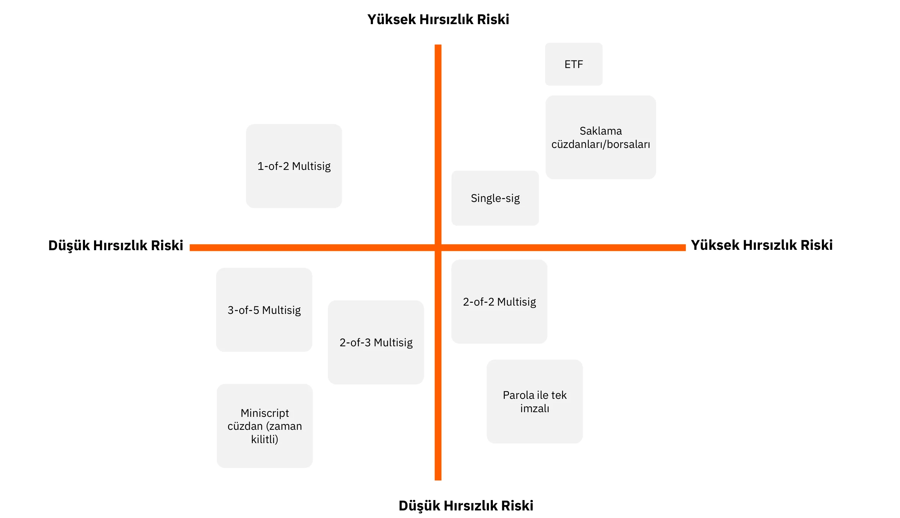


### Bitcoin cüzdanları hakkında karmaşıklık açısından düşünmek


Aşağıda, çeşitli güvenlik seviyeleri tanımlayacağız:


- **Seviye 0**, bitcoinlerinizin tek sahibi olmadığınız bir "saklama hizmeti" kullanırsınız. Bu güvenilir üçüncü tarafın istediğiniz zaman fonlarınıza erişiminizi kısıtlayabileceğini unutmayın. Bu durumda, finansal egemenlik düzeyiniz, bir banka hesabına sahip geleneksel bir bankacılık sistemindekine benzer.


- **Seviye 1**, telefonunuzda veya bilgisayarınızda bir Bitcoin Wallet kullanırsınız, burada bitcoinlerinizin tek sahibi siz olursunuz ve işlemlerinizi kolayca gerçekleştirebilirsiniz. Yukarıda bahsedilen araç "Hot Wallet" olarak adlandırılır, çünkü özel anahtar internet erişimi olan bir cihazda saklanır. Bu durumda, telefonunuzu veya bilgisayarınızı kaybetmeniz durumunda fonlarınıza yeniden erişim sağlamak için Mnemonic ifadenizi yedeklemeniz çok önemlidir.


Örneğin, Sparrow wallet'i Hot Wallet olarak kullanabilirsiniz:


https://planb.network/tutorials/wallet/desktop/sparrow-c674e2ac-d46f-4c82-92a7-7d1b0e262f5d


- **Seviye 2**, fiziksel bir Wallet kullanıyorsunuz ve 12/24 kelimelik listenizi güvence altına aldınız. Genellikle "Cold Wallet" olarak adlandırılır çünkü anahtarlarınız internete bağlı olmayan bir cihazda saklanır. Bu durumda, her zaman her işlemi cihazınızla imzalamanız gerekecektir, bu da fonlarınızı günlük olarak daha az erişilebilir hale getirir.


Örneğin, bir Ledger, bir Satochip veya bir Tapsigner kullanabilirsiniz:


https://planb.network/tutorials/wallet/hardware/ledger-nano-s-plus-75043cb3-2e8e-43e8-862d-ca243b8215a4

https://planb.network/tutorials/wallet/hardware/satochip-e9bc81d9-d59b-420d-9672-3360212237ba

https://planb.network/tutorials/wallet/hardware/tapsigner-ab2bcdf9-9509-4908-9a4a-2f2be1e7d5d2


- **Seviye 3**, seviye 1 veya 2 Wallet kullanıyorsunuz, ancak ek bir passphrase eklediniz. Bu durumda, hem 12/24 kelimelik listeyi **hem de passphrase'ünüzü** yedeklemeniz gerektiğini unutmayın. İdeal olarak, bu iki bilgi parçası iki farklı yerde saklanır.


BIP39 passphrase'nın kullanımı ve işleyişi hakkında daha fazla bilgi edinmek için:


https://planb.network/tutorials/wallet/backup/passphrase-a26a0220-806c-44b4-af14-bafdeb1adce7


- **Seviye 4**, bir "Multisig" Wallet oluşturmak için bir dizi cüzdan kullanırsınız, bu da bir işlem yapmak için birden fazla imzanın gerekli olduğu anlamına gelir. Bu durumda, Multisig'nin her bir parçasının farklı konumlarda saklanması gerektiğini unutmayın. Bu yaklaşım genellikle büyük miktarların yönetimi ve kurumsal amaçlar için Bitcoin'in gelişmiş bir kullanımı olarak kabul edilir.


Elbette, farklı kullanım durumları da farklı Bitcoin cüzdanları gerektirir ve herkese uyan tek bir çözüm yoktur.


### Güvenlik uyarlanmalıdır


Kişinin belirli bir güvenlik seviyesinde bırakmak istediği miktar her bireye göre değişir. Bazıları için Hot Wallet üzerinde 1 BTC bırakmak makul iken, diğerleri için bunun tam tersi geçerlidir. Her durumda, küçük bir miktarı güvence altına almak istediğinizde, fiziksel bir Wallet satın alarak güvenlik için çok fazla harcama yapmamanızı tavsiye ederiz. Ayrıca, bitcoinlerinizin güvenliğini ve erişilebilirliğini aşırı karmaşık hale getirmenin, özellikle de cüzdanlarınızın yedeklerini yanlış kullanırsanız, zararlı olabileceğini unutmayın.


Sonuç olarak, kişinin bitcoinlerinin doğrudan Ownership'ü finansal egemenliği sağlamak için önemli bir unsurdur. Günlük harcamalar için mobil bir Wallet ve daha büyük miktarları saklamak için çevrimdışı veya "Cold" fiziksel bir Wallet kullanılması tavsiye edilir. Öte yandan işletmeler, daha fazla ve ortak güvenlik için çoklu imza sistemleri veya "Multisig" kullanmayı düşünmelidir. Geleneksel finansal sistemin bazı güvenlik açıklarını kopyalayabilen saklama hizmetlerinden kaçınmak da önemlidir.


Bunu akılda tutarak, şimdi bir Bitcoin Wallet'in nasıl oluşturulacağını açıkladığımız bir sonraki bölüme geçebiliriz. Bununla birlikte, güvenlik konusunu daha fazla araştırmak isterseniz, bu [DarthCoin tarafından yazılan makale] (https://asi0.substack.com/p/Bitcoin-soyez-votre-propre-banque) okuyabilirsiniz.


## Wallet kurulumu


<chapterId>615519eb-4565-557d-86a0-021badf7616f</chapterId>


Bitcoinlerinizin güvenliği çok önemlidir ve basit bir hata feci sonuçlar doğurabilir. Bu nedenle yeni bir Bitcoin Wallet oluştururken benimsememiz gereken en iyi uygulamaları öğrenmemiz gerekir.


BTC102 kursunun bu adımda size rehberlik edeceğini lütfen unutmayın.


https://planb.network/courses/f3e3843d-1a1d-450c-96d6-d7232158b81f

### Bu adımın şakası yok!


Bir Wallet kurduğunuzda, yazılım genellikle 12/24 kelimelik bir liste ile temsil edilen özel anahtarınızı oluşturur (genellikle "seed cümlesi" veya "Mnemonic cümlesi" olarak adlandırılır): bu kelimeler fonlarınıza erişimi oluşturur. Bu anahtar üçüncü bir tarafa ifşa edilirse, ilgili fonların tehlikeye girdiğini düşünmelisiniz. Bu nedenle, Wallet'ünüzü kurarken bu kurallara uymanız çok önemlidir:


- Tüm kameraları kapatın.
- Kelime listesinin fotoğrafını çekmeyin.
- Bilgisayara veya telefona girmeyin.
- Kişi olarak kaydetmeyin veya SMS yoluyla kendinize göndermeyin.
- Sözcüklerinizi asla masanızın üzerinde başıboş bırakmayın.
- Kelime listenizi asla alışılmadık bir yerde saklamayın.


Kelimenin tam anlamıyla boş bir kağıt almalı veya bu [şablonu] (https://bitcoiner.guide/backup.pdf) yazdırmalı ve sunulan sırayı düzgün ve net bir şekilde takip ederek kelime listesini bir kalemle yazmalısınız. Mürekkebin zamanla solması halinde paranızı kaybedebileceğinizi unutmayın. Bu nedenle, bu kağıt parçasını nem veya yangın gibi potansiyel olarak zarar verebilecek çevresel faktörlerden korumak önemlidir.


Lütfen makalenin nasıl derleneceğine dair bir örneği aşağıda bulabilirsiniz: kelimeler sahtedir, bu yüzden onları kullanmayın!


### Doğru yapmak için ipuçlarımız


Mnemonic cümlesini açık ve okunaklı bir şekilde kopyalarken herhangi bir hata yapmadığınızdan emin olun, aksi takdirde mirasçılarınız bunu okumakta zorlanabilir ve fonları geri alamayabilir. Kelimeleri kaydettikten sonra, ikinci bir kopya oluşturmanız ve bunu ilkinden farklı bir yerde saklamanız tavsiye edilir. Bu, orijinalin kaybolması veya hasar görmesi durumunda bir yedeğinizin olmasını sağlar.


Kelime listeleri kolayca hatırlayabileceğiniz güvenli bir yerde saklanmalıdır. Kaybetmenize yol açabilecek aşırı karmaşık gizleme planları oluşturmaktan kaçının.


**Sözleriniz = paranız.**


Hem 'Cold' hem de 'Hot' cüzdanları, özel anahtarları yedeklemek için standart olarak kelime listesi yöntemini kullanır. Sonuç olarak, erişiminizi geri yüklemek için Mnemonic ifadenizi uyumlu herhangi bir Wallet yazılımına veya cihazına girebilirsiniz. Öte yandan, bir hesap, bir e-posta Address veya daha da kötüsü bir kimlik sağlamanızı gerektirebileceğinden, bir seed ifadesi sağlamayan cüzdanları kullanmamanızı şiddetle tavsiye ederiz.


**DİKKAT: 12/24 kelimelik bir listenin olmaması sizi uyarmalıdır.**


Kendi Wallet'nizi nasıl kuracağınızı ve ilk bitcoinlerinizi nasıl elde edeceğinizi adım adım keşfetmek istiyorsanız, bu diğer kursu almanızı öneririz:


https://planb.network/courses/f3e3843d-1a1d-450c-96d6-d7232158b81f

## Zamanın Sınavından Geçmek


<chapterId>f58cd446-c202-5eff-aab7-e61cc40e5c06</chapterId>


Her tür servet gibi, bitcoinleriniz de özellikle uzun vadede kayıp, hırsızlık ve bozulmaya karşı korunmalıdır. Bitcoinlerinizi korumak bazı teknik bilgiler ve ilgili risklerin anlaşılmasını gerektirir, bu da iki ana stratejinin yolunu açar: bitcoinlerinizi çelik bir plakaya kazımak ve bir miras planı oluşturmak.


### Çelik üzerine gravür


Bitcoinlerinizi uzun vadede güvence altına almanın bir yöntemi, Mnemonic ifadenizi çelik gibi son derece dayanıklı bir malzeme üzerine kazımaktır. Bunu yapmak, anahtarlarınızın hem suya hem de yangın hasarına karşı dayanıklı fiziksel bir yedeğini oluşturur.


Çeşitli çözümler mevcuttur: "Blockmit" gibi bazıları düşük maliyetlidir, diğerleri ise daha özel ekipman gerektirebilir. Bu konuyu akademimizin [tutorials](https://planb.network/en/tutorials/wallet) bölümünde daha ayrıntılı olarak inceleyebilirsiniz.


### Gelecek nesli düşünün!


Bu ilk uygulamanın yanı sıra, bir miras planı oluşturmak, bitcoinlerinizin ölümünüzden sonra düzgün bir şekilde yönetilmesini sağlamak için çok önemli bir adımdır. Bu plan, varlıklarınızın niteliğini, erişim yöntemlerini ve bunlar üzerinde sorumluluğu olan güvenilir kişilerin iletişim bilgilerini özetlediğiniz bir mektubu el yazısıyla yazmayı içerir. Ayrıca, bitcoinlerinizin yönetiminin doğrudan bu kişiye verilmemesi gerekse bile, vergi uyumluluğunu sağlamak için bitcoinlerin miras bırakılması konusunu bir muhasebeci ve/veya emlak avukatı ile görüşmek de önemlidir.


Bitcoinleriniz için miras planı konusunu daha fazla araştırmak isterseniz, Pamela Morgan'ın [Cryptoasset Inheritance Plan] (https://planb.network/resources/books/28) kitabını okumanızı veya planınızı oluşturma konusunda rehberlik sağladığımız BTC102 kursuna kaydolmanızı öneririz.


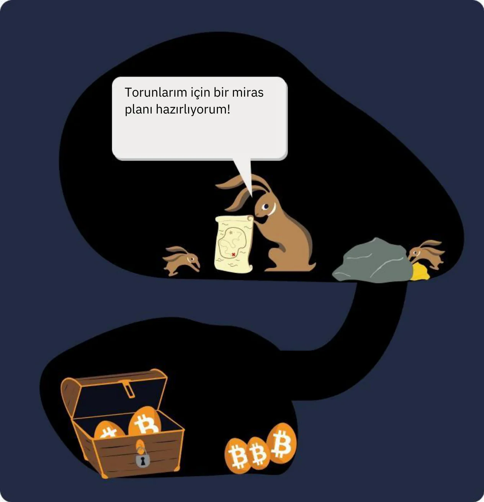


### Gizlilik önemlidir


Fiziksel yedekler oluşturmanın ve bir miras planı geliştirmenin yanı sıra, bitcoinlerinizin uzun vadeli güvenliği söz konusu olduğunda gizlilik de bir diğer önemli konudur. Örneğin, kimlik hırsızlığı veya fonlarınızın doğru araçlara sahip kuruluşlar tarafından takip edilmesi risklerini en aza indirmek için kimlik belirtmeden bitcoin satın almak tercih edilebilir.


Gizlilikle ilgili olarak, bitcoinleriniz hakkında kimseyle konuşmaktan kaçınmak çok önemlidir. Bu teknolojinin gelecekte nasıl algılanacağını tahmin edemeyiz, bu nedenle Ownership'iniz hakkında ihtiyatlı davranmak akıllıca bir seçimdir: dikkatleri kendinize veya Wallet'nıza çekmek istemezsiniz.


Benzer şekilde, Bitcoin toplantıları sırasında veya yabancılarla karşılaştığınızda güvenlik sisteminizle ilgili ayrıntıları açıkça paylaşmaktan kaçının...


### Bitcoin Wallet Güvenlik Hakkında Özet


Bitcoin cüzdanları bitcoinlere erişmenizi ve işlem yapmanızı sağlar. Birkaç türü vardır:


- küçük miktarlar ve/veya düzenli harcamalar için uygun mobil veya PC cüzdanları;
- fiziksel cüzdanlar, bitcoinleri orta ve uzun vadede saklamak için daha uygundur;
- Yönetimi daha karmaşık olan ve işlem gerçekleştirmek için birden fazla imza gerektiren Multisig cüzdanları.


Bir Wallet oluştururken, öncelikle 12 veya 24 kelimelik listenizi bir kağıt parçası veya metal bir plaka üzerine yedeklemeniz son derece önemlidir. Mnemonic olarak adlandırılan bu ifade, Wallet'ünüzü herhangi bir Bitcoin Wallet uygulaması aracılığıyla geri yüklemenizi sağlar. Bu listeye erişim sağlayan herkesin aynı zamanda fonlarınıza da erişim sağladığını unutmayın.


Bitcoin dünyasında, finansal egemenlik bireysel sorumlulukla yakından bağlantılıdır ve bu da cüzdanlarınıza ve yedeklerinize erişimi güvence altına almayı gerekli kılar. Bunu başarmak için belirli yönergeleri takip etmek önemlidir:


- Herhangi bir sorun durumunda sevdiklerinizin parayı geri alabilmesini sağlamak için bir miras planı oluşturun.
- Bitcoin'lerinizi Exchange platformlarında bırakmaktan kaçının çünkü bunlar hacker saldırılarına açık olabilir.
- Mevcut birçok farklı Bitcoin cüzdanı arasından iyi bir seçim yapmak için güvenlik seviyenizi ihtiyaçlarınıza ve kullanım durumlarınıza göre uyarlayın.


Bitcoin cüzdanlarının temellerini ve bunları güvence altına almak için en iyi uygulamaları ele aldığımıza göre, bir sonraki bölümde Bitcoin'in teknik özelliklerini inceleyeceğiz. Bir kez daha, Bitcoin protokolünün temellerini anlamak, nasıl çalıştığını anlamanızı geliştirecek ve onu daha iyi kullanmanızı sağlayacaktır.


# Bitcoin'un Teknik Yönleri.


<partId>a86d7439-e7a2-5f21-b1e9-6b5e23ca265b</partId>


## Bitcoin fırlatılıyor


<chapterId>b7561082-8943-519d-95d1-a5f60dd2686d</chapterId>


### Biraz tarihçeyle başlayalım.


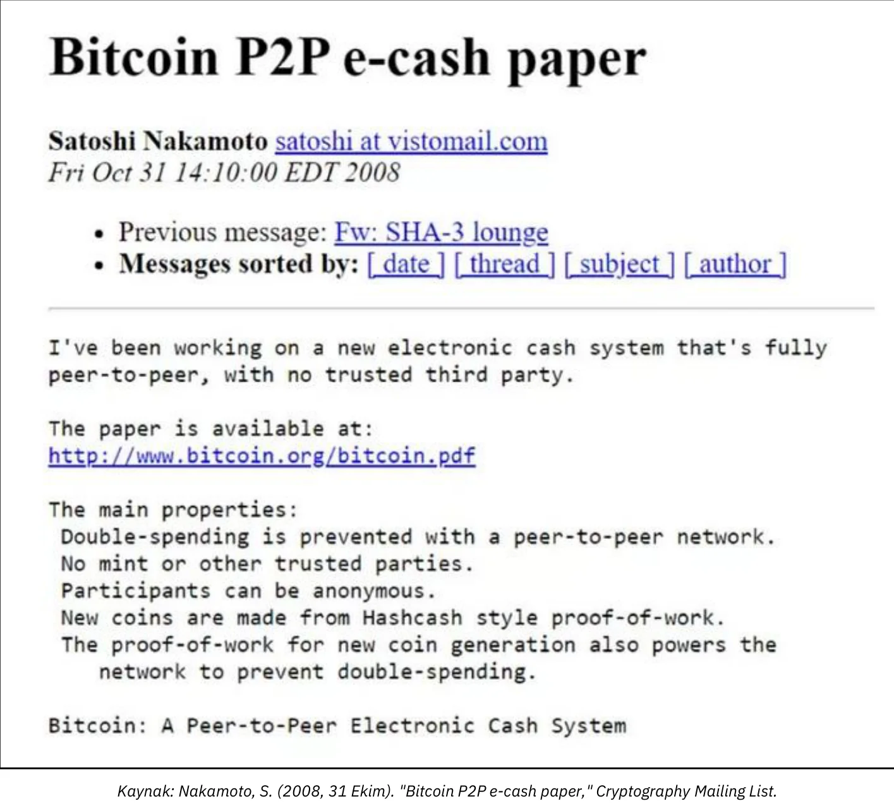


31 Ekim 2008, yeni finansal teknoloji Bitcoin'in doğuşuna işaret etmektedir. Bu gün, anonim Satoshi Nakamoto, internette gizliliği teşvik etmeye adanmış bir kriptografi meraklıları topluluğu olan cypherpunks'ın posta listesine gönderdiği bir e-posta aracılığıyla yeniliğini dünyaya sundu. Bu e-posta, Bitcoin'in nasıl çalıştığını gösteren "Beyaz Kitap" adlı bir belge içeriyordu.


Bu girişim, muhtemelen dijital nakit sistemleri oluşturma girişimlerindeki önceki başarısızlıklar nedeniyle generate'ün hemen ilgisini çekmedi. Bununla birlikte, bu Beyaz Kitap sonunda Bitcoin kullanıcıları için bir referans haline geldi ve yıllar boyunca Bitcoin ekosisteminde birçok tartışmaya konu oldu.


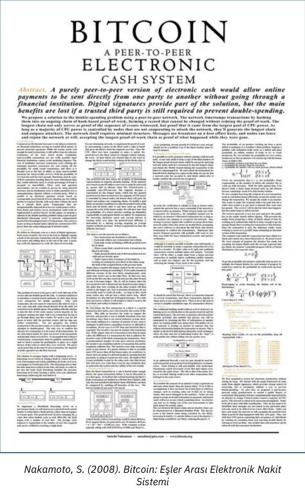


3 Ocak 2009'da Satoshi, "Genesis bloğu" olarak da bilinen ve Bitcoin Blockchain'in lansmanını işaret eden ilk bloğu oluşturarak Bitcoin ağının resmi açılışını yaptı. Bu blok Bitcoin'nın misyonunu yansıtan açıklayıcı bir mesaj içermektedir: "03/jan/2009 Şansölye bankalar için ikinci kurtarma paketinin eşiğinde."


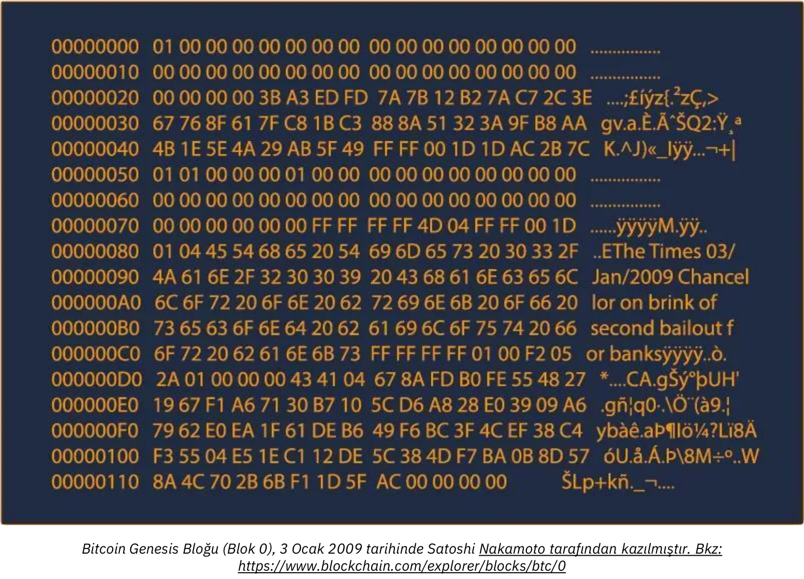


> "Silahlanma yarışında büyük bir savaşı kazanabilir ve
> birkaç yıl boyunca yeni özgürlük alanı." - Satoshi Nakamoto

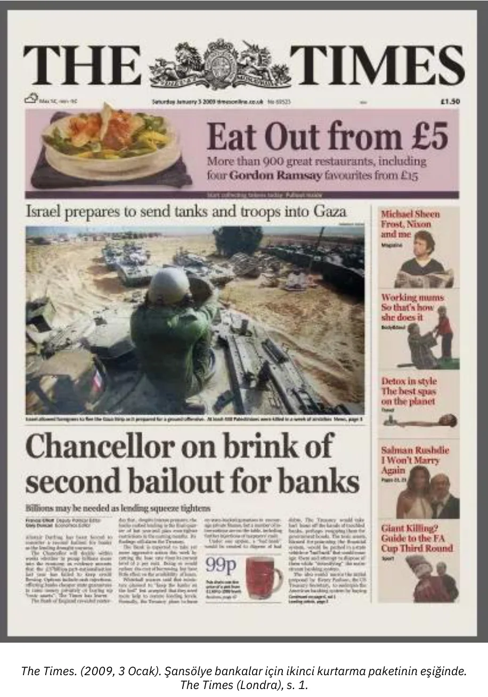


### Bitcoin protokolü hayata geçiyor


9 Ocak 2009'da Satoshi, Bitcoin 0.1.0 sürümünün yayınlandığını duyurdu. Kısa bir süre sonra, Hal Finney yazılımı ele geçirdi ve ağa katıldı, bu da ağda iki düğümün ve dolayısıyla iki madencinin varlığına işaret etti. Hatta Finney bu adımı 'Running Bitcoin' şeklinde bir tweet atarak ölümsüzleştirdi. 12 Ocak 2009'da Bitcoin ve Hal Finney arasında 10 BTC'lik ilk Satoshi işlemi yapıldı ve 170. bloğa geri dönerseniz bunu kolayca bulabilirsiniz.


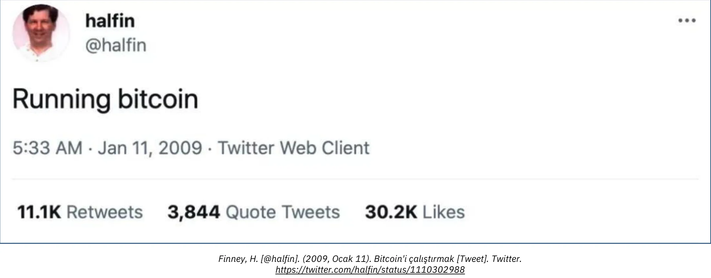


Bitcoin'e olan ilgi hızla artarak birçok insanın onu test etmesine, tartışmalara katılmasına, hataları çözmesine ve etik, ekonomik ve felsefi yönleri üzerine düşünmesine yol açtı. İnsanlar öylesine büyülendi ki, Satoshi bu tür iletişimleri kolaylaştırmak için 22 Kasım 2009'da BitcoinTalk forumunu oluşturdu.

Forum kısa sürede Bitcoin kullanıcıları için tercih edilen tartışma yeri haline geldi, öyle ki [Bitcoin logosu] (https://bitcointalk.org/index.php?topic=64.0), ünlü [HODL] (https://bitcointalk.org/index.php?topic=375643.0) ve hatta [Pizza günü] (https://bitcointalk.org/index.php?topic=137.msg1195) gibi Bitcoin ile ilişkili ünlü memler ve semboller buradan doğdu.


**Laszlo Hanyecz 22 Mayıs 2010 tarihinde 10.000 BTC karşılığında iki pizza almayı teklif ederek tarihe geçti: Bitcoin ilk kez fiziksel mal satın almak için kullanıldı.**


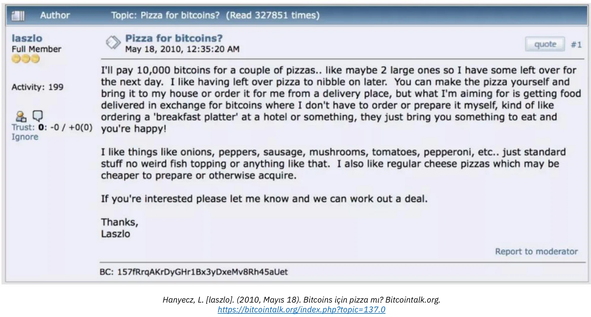


### Satoshi Nakamoto'nun ortadan kaybolması


2010 yılında, Bitcoin medyanın ilgisini çekmeye başladığında, Satoshi 12 Aralık 2010'da bir forum gönderisinde ayrıldığını duyurarak kendini uzaklaştırmaya karar verdi. 23 Nisan 2011'de, bilinen son özel Exchange'u e-posta yoluyla yaptı ve ardından yaratımını topluluğun ellerine bırakarak ortadan kayboldu.


> "Hükümetler, merkezden yönetilen bir ekonominin başını kesmekte iyidir
> napster gibi kontrollü ağlar, ancak P2P gibi saf ağlar
> Gnutella ve Tor kendi başlarına ayakta duruyor gibi görünüyor." - Satoshi Nakamoto

Satoshi'in yokluğuna rağmen, Bitcoin geliştirilmeye devam etti: Bitcoin'ün tarihi her 10 dakikada bir yazılıyor ve protokol bugüne kadar amaçlandığı gibi çalışmaya devam ediyor. Herhangi bir korku, belirsizlik veya şüpheye bakılmaksızın, Bitcoin çok güçlü bir çevrimiçi kullanılabilirlik ile ilerlemeye devam ediyor. Aslında, bu [web sitesine] (https://bitcoinuptime.com/) göre, Bitcoin oluşturulduğu zamandan bu yana %99.988 oranında işlevsel ve büyük sorunlar olmadan çalışmaktadır.


Bazıları için Bitcoin bir [miselyum](https://brandonquittem.com/Bitcoin-is-the-mycelium-of-money/) gibi mantar bir varlık olarak tanımlanırken, diğerleri onu bir [kara delik](https://dergigi.com/) olarak tanımlamaktadır. Sevin ya da nefret edin, Bitcoin yeni bir para sisteminin kalp atışı gibi blok başına 10 dakikalık sabit ritmiyle var olmaya devam ediyor.


Satoshi Nakamoto'nun yazıları hakkında daha fazla bilgi edinmek için Phil Champagne tarafından yazılan ["The Book of Satoshi"] (https://planb.network/en/resources/books/98) veya ARTE belgeseli "Le mystaire Satoshi "yi okumanızı öneririz.


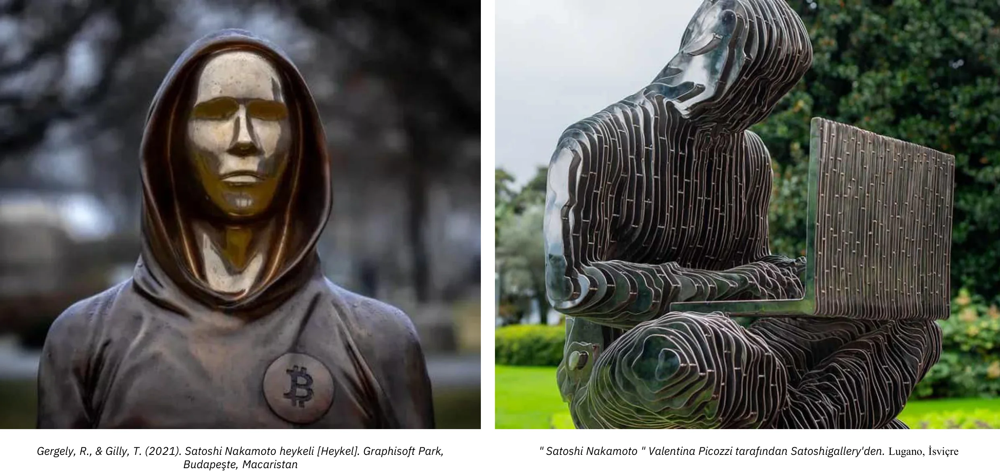


> "Geleneksel para biriminin temel sorunu, işlemesi için gereken güven unsurudur. Para biriminin değerini düşürmemesi için merkez bankasına güvenilmelidir, ancak itibari para birimlerinin tarihi bu güvenin ihlal edilmesiyle doludur. Bankalara paramızı tutacakları ve elektronik olarak transfer edecekleri konusunda güvenilmelidir, ancak onlar paranın çok az bir kısmını rezervlerinde tutarak kredi balonu dalgaları halinde ödünç verirler." - [Satoshi Nakamoto](https://Satoshi.nakamotoinstitute.org/posts/p2pfoundation/1/)

Şimdi biraz arka planımız olduğuna göre, bir Bitcoin işleminin genel olarak nasıl çalıştığını inceleyelim.


## Bitcoin İşlemleri


<chapterId>03482644-5473-590b-975b-b43bb65eac21</chapterId>


Bir Bitcoin işlemi, basitçe bir Bitcoin Address kullanımı yoluyla Ownership bitcoin transferidir. Bu süreci açıklamak için iki kahramanı tanıtalım: Alice ve Bob. Alice bitcoin edinmek isterken, Bob zaten bir miktar bitcoine sahiptir.


### Adım 1 - Wallet aracılığıyla işlem oluşturma


Bob'in Alice'a bitcoin transfer edebilmesi için Bitcoin Wallet'a özgü olan Bitcoin adreslerinden birini ona vermesi gerekir. Tıpkı özel anahtarın açık anahtarı generate yapmak için kullanıldığı gibi, açık anahtar da generate adreslerini yapmak için kullanılır.


Somut olarak, Alice Wallet'ünü açıp "al" tuşuna bastığında, bir QR kodu veya bir Address (bunun gibi bc1q7957hh3nj47efn8t2r6xdzs2cy3wjcyp8pch6hfkggy7jwrzj93sv4uykr) görüntülenecektir. Bu, daha sonra Bob'ya sağladığı bir tür 'Bitcoin IBAN'ı olarak hizmet eder.


Daha sonra Bob, Bitcoin Wallet'ini açıp "gönder" tuşuna basarak işlemi gerçekleştirir. Daha sonra Alice'nin Address'ini kopyalayıp gerekli alana yapıştırır, göndermek istediği miktarı ekler ve madencilerin işlemi bir sonraki bloğa dahil etmeleri için bir teşvik görevi gören işlem ücretlerine karar verir. Aslında, Bob ne kadar yüksek ücret öderse, işlemin Blockchain'ye, yani tüm Bitcoin işlemlerini kaydeden halka açık ve değişmez bir Ledger'a eklenen bir sonraki bloğa dahil edilme şansı o kadar yüksek olur.


İşlemi sonuçlandırmak için Bob, transfer etmek istediği bitcoinlerin sahibi olduğunu doğrulamak için özel anahtarıyla imzalamalıdır. Bu adım genellikle mobil cüzdanlarda otomatiktir veya fiziksel Wallet'ünüzde bir onay şeklini alır: "X'i Y'ye göndermek istediğinizden emin misiniz? Evet ya da hayır".


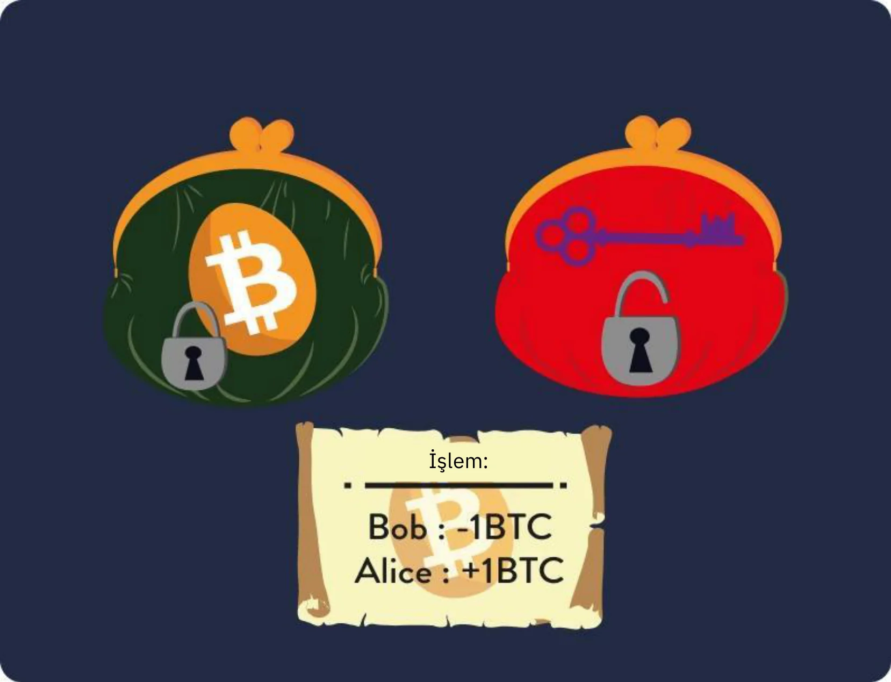


**Neden ücret ödüyoruz? ** Ücretler, bloklara işlem eklemek için serbest bir piyasa oluşturmak için gereklidir. Aslında, bir bloğun boyutu 1 MB'dir (SegWit güncellemesinden sonra 4 MB'ye genişletilmiştir), bu nedenle bir bloğa "eklenebilecek" işlem sayısı blok başına birkaç bin işlemle sınırlıdır. Bir işlemin boyutu karmaşıklığına bağlıdır. Bu nedenle, daha karmaşık işlemler genellikle daha yüksek ücretlere tabidir.


### Adım 2: İşlemin düğümler arasında yayılması


Bu aşamada, işlem oluşturulmuştur ve Bob'un Wallet'i bunu Bitcoin ağıyla paylaşacaktır. Bunu yapmak için, Wallet, bu bilgiyi diğer düğümlere yayacak olan Bitcoin ağının bir düğümü ile iletişim kuracaktır. Bu tür bir işlem tüm ağın bu yeni işlemi görmesini ve dikkate almasını sağlar.


Bu noktada, bu işlem herkes tarafından biliniyor olsa da (Mempool adı verilen bir araç aracılığıyla), işlemleri Blockchain'ye dahil ederek doğrulayan tek kişi olan Miner tarafından bir bloğa eklenene kadar onaylanmış sayılamaz.


Aslında madenciler, geçerli ve onaylanmamış işlemleri bir blok halinde derlemek için toplama rolüne sahiptir. Özetle, bloklarının Bitcoin Blockchain'te bir sonraki blok olması için "Proof of Work" adı verilen bir süreçte kriptografik bir bulmacayı çözmeleri gerekir.


### 3. Adım: İşlem bir Miner tarafından bir blok halinde çıkarılır.


Proof of Work sistemi söz konusu blok için geçerli bir "Hash" bulmayı gerektirir: bunu blokla ilişkili 256 karakterden oluşan benzersiz bir parmak izi olarak düşünün. Bu Hash'ün geçerliliği Bitcoin ağının zorluk oranına bağlıdır (daha sonra daha fazla ayrıntıya gireceğiz). Şimdilik, bir Miner'nin geçerli bir blok bulduğunu ve Bob'ün Alice'e yaptığı işlemin buna dahil olduğunu düşünün. Ardından, yeni geçerli blok tüm Bitcoin kullanıcıları için ortak Ledger olan Blockchain'e eklenir.


### Adım 4: Blok geçerlidir ve Alice'in referans düğümü tarafından doğrulanır.


Bu aşamada işlem geçerli kabul edilir: Miner daha sonra yeni bloğu kendi düğümü aracılığıyla ağa yayar ve Alice'nin Wallet'sı güncellenir.


**Not:** Alice'e adreslerinden birinde bitcoin aldığı bildirilse bile, işlemin ancak **altı** onay aldıktan sonra değişmez olarak kabul edilmesi tavsiye edilir. Bu, Bob'in işlemini içeren bloğun üzerine altı blok daha kazılması gerektiği anlamına gelir. Başka bir deyişle, bir işlem Blockchain'da ne kadar eski olursa, o kadar değişmez hale gelir.


### Bu sürecin önemi nedir?


Bitcoin işlem sistemi merkezi değildir ve herhangi bir güvenilir aracı olmadan eşler arası çalışır.


Bob işlemini Bitcoin ağına gönderir ve bir Miner, Bob'nin işlemini içeren geçerli bir blok yayınladığında, Alice bitcoinlerin kendisine ait olduğunu düşünmeye başlayabilir. Bitcoin Ownership transferinin herhangi bir adımında güven gerekli değildir: protokol kuralları ve ekonomik teşvikler tek başına Bitcoin sistemi içinde kötü niyetli davranmayı engelleyici derecede maliyetli hale getirir.


Aslında, kullanıcılar fonlarının Ownership'ini işlemleri kendi özel anahtarlarıyla dijital olarak imzalayarak aktarırlar. Öte yandan, madenciler sınırlı güce sahiptir ve kullanıcılar yeni blokları ve dahil edilen işlemleri doğrulamak için Bitcoin düğümlerini kullanarak önemli bir kontrol sağlarlar. Her düğüm Ledger'in tam ya da kısmi bir kopyasına sahiptir, bu nedenle Bitcoin düğümlerinin oluşturduğu ağ sistemi gerçekten merkezi olmayan hale getirir.


Sonuç olarak, Bitcoin ağının tamamen yok edilmesi için tüm Bitcoin düğümlerindeki Blockchain'in her kopyasının ortadan kaldırılması gerekir ki bu da bu düğümlerin coğrafi dağılımı ve fiziksel olarak ele geçirilmelerinin zorluğu nedeniyle pratikte imkansız bir görevdir.


Bir Bitcoin düğümünün nasıl çalıştığına daha yakından bakalım.


## Bitcoin Düğümleri


<chapterId>8533cebc-f799-528b-89df-8d75d4c37f1c</chapterId>


Düğümler, çeşitli önemli işlevleri yerine getirdikleri için Bitcoin ağ mimarisinin temel bir unsurudur:


- Bitcoin Blockchain'nın bir kopyasını muhafaza etme
- İşlemleri doğrulama
- Diğer düğümlere bilgi aktarımı
- Bitcoin protokolünün kurallarını uygulamak.


Bu nedenle, Bitcoin düğümü olarak adlandırılan (genellikle [Bitcoin core](https://Bitcoin.org/en/Bitcoin-core/)) bir parça Bitcoin yazılımı çalıştıran herhangi bir cihaz, ağın merkezsizleştirilmesine katkıda bulunur.


### Düğümler Bitcoin'in merkezi çekirdeğidir.


Her düğüm, işlem doğrulamasına izin veren ve herhangi bir dolandırıcılık girişimini önleyen Blockchain'nin bir kopyasını tutar. Ağın merkezi olmayan yapısı Bitcoin'e olağanüstü bir esneklik ve sağlamlık kazandırmaktadır. Aslında, Bitcoin protokolünü durdurmak için dünyadaki tüm düğümlerin kapatılması gerekir. Eylül 2023 itibariyle dünya geneline dağılmış yaklaşık [45.000 düğüm] (https://bitnodes.io/nodes/all/) bulunmaktadır.


Düğümler blokların ve işlemlerin geçerliliğini doğrulayabilir çünkü Bitcoin mutabakatının kurallarını takip ederler. Bu kurallar, Bitcoin'ün Mining ödül miktarı (bir sonraki bölümde daha ayrıntılı olarak tartışacağız) ve dolaşımdaki Bitcoin miktarı gibi para politikasını belirler. Düğümler, Bitcoin'ün kurallarını uygulayarak ağın tarafsız kalmasını sağladıkları için bir bakıma ağın hukuk sistemi olarak hareket ederler. Mutabakat kuralları neredeyse hiç değişmez, çünkü değişiklik yapmak için tüm düğümlerin onayı gereklidir.


Protokol içindeki yönetişim bu temel kursun kapsamı dışındadır, ancak bir Bitcoin düğümünü çalıştıran her kullanıcının hangi kurallara uyacağına karar verebileceğini belirtmek önemlidir. Bir kullanıcı farklı kurallara uymayı seçebilir (yani kodda değişiklikler yapabilir), ancak bu değişiklikler mevcut fikir birliği kurallarını geçersiz kılarsa, o düğüm artık Bitcoin ağının bir parçası olmayacaktır. Sonuç olarak, büyük değişiklikler nadirdir ve farklı ideolojilere ve çıkarlara sahip binlerce katılımcı arasında önemli bir koordinasyon gerektirir, bu da onları tüm Bitcoin kullanıcıları tarafından 'daha iyi' olarak kabul edilen güncellemeler sağlamaya zorlar.


### Bir düğüm neye benzer?


Kendi node'unuzu kurmak istediğinizde, farklı bakım maliyetlerine sahip çeşitli seçenekler mevcuttur. Bitcoin core yazılımını bilgisayarınızda çalıştırabilirsiniz, ancak Blockchain yaklaşık ~500GB olduğundan önemli miktarda depolama alanı gerektirecektir. Bu kısıtlamanın üstesinden gelmek için, bir "pruned düğümü" oluşturarak yalnızca son N bloğu bellekte tutmayı seçebilirsiniz. Bu ikinci çözüm için maliyet ihmal edilebilir düzeydedir çünkü düğüm yalnızca ihtiyaç duyduğunuzda aktif olur.


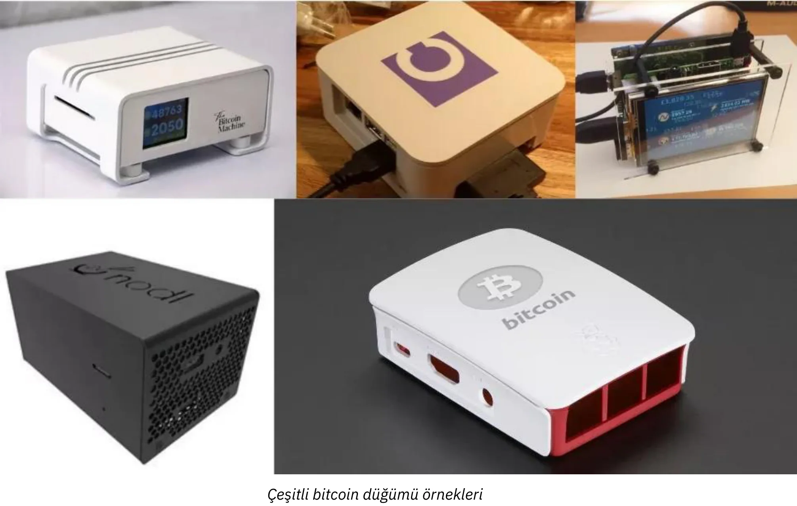


İkinci bir seçenek ise bu amaç için yeterince büyük bir SSD'ye (yaklaşık ~2TB) sahip Raspberry Pi 4 gibi özel bir donanım parçası kullanmaktır. Donanımı satın almanız gerekiyorsa bu diğer seçenek daha pahalıdır, ancak elektrik tüketimi açısından yılda 10,00 € 'dan biraz daha azını temsil eder.

Bant genişliği açısından bakıldığında, her 10 dakikada 1 MB'lık 1 blok düşünüldüğünde, bu yaklaşık olarak ayda 5 GB'a karşılık gelmektedir.


### Düğümler herkes tarafından erişilebilir olmalıdır!


Bir Bitcoin düğümünün donanım kaynakları, depolama ve bant genişliği açısından uygun maliyeti ve erişilebilirliği, ağın merkezsizleştirilmesini kolaylaştırdığı için çok önemli bir özelliktir.


Gerçekten de herkesin bir düğüm çalıştırmak için iyi bir nedeni vardır! Maliyetler ve çabalar, elde edilen faydaya kıyasla minimum düzeydedir. Tek yapmanız gereken maceraya atılmak ve Bitcoin ağını hep birlikte oluşturmak için binlerce diğer bitcoin kullanıcısına katılmak.


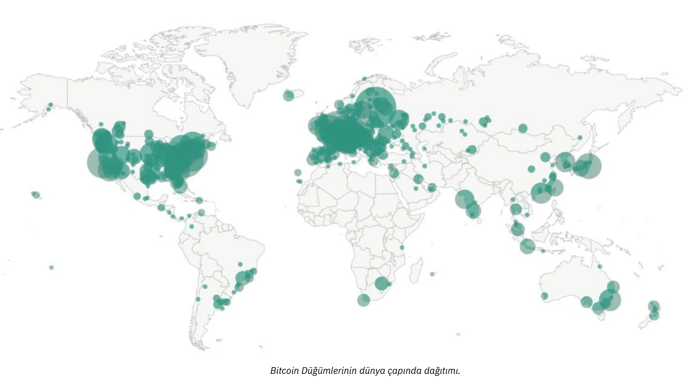


Aksine, bloklar 100 kat daha ağır olsaydı, her 10 dakikada 100 kat daha fazla işlem yapabilirdik, ancak bir Bitcoin düğümü çalıştırmak için 50 TB'lık bir Hard diski, ayda 500 GB'ın üzerinde bir bant genişliği ve 10 dakikadan daha kısa bir sürede yüz binlerce işlemi doğrulayabilen bir donanım parçası gerekirdi. Blokların 100 kat daha büyük olduğu bu varsayımsal durumda, bir Bitcoin düğümünü çalıştırmak ortalama bir insan için erişilebilir olmayacaktır, bu da hem protokolün merkeziyetsizliğini hem de işlemlerin ve mutabakat kurallarının değişmezliğini tehlikeye atacaktır.


Bu nedenle, protokol kısıtlamaları mümkün olduğunca çok kişinin kendi Bitcoin düğümlerini çalıştırmasını sağlayacak şekilde tasarlanmıştır. Aslında 2017 yılına "block size war" olarak bilinen yoğun bir tartışma damgasını vurmuştur. Bu çatışma, işlem kapasitesini artırmak için blok boyutunu artırarak Bitcoin'yı değiştirmek isteyenlerle (madenciler, Exchange platformları ve kurumlar) kullanıcıların bağımsızlığını ve gücünü korumak isteyenleri (düğümler ve kullanıcılar) karşı karşıya getirdi. Sonunda, ikinci taraf zafer kazandı.


Bu zaferin ardından, düğümler SegWit adlı bir güncellemeyi etkinleştirerek Lightning Network'nin ikinci bir Layer'i olarak inşa edilen anlık bir Bitcoin ödeme ağı olan Blockchain'in uygulanmasının önünü açtı. Bu durum, kullanıcıların düğümleri aracılığıyla Bitcoin içinde gerçek bir güce sahip olduklarını ve anlaşmazlık zamanlarında büyük kurumlara karşı durabildiklerini göstermektedir.


## Madenciler


<chapterId>dbb8264a-7434-57e4-9d1b-fbd1bae37fdf</chapterId>


**Madenciler ağın güvenliğini sağlar ve bloklara işlem ekler. Bitcoin Proof of Work'yi çözmek için ASIC makineleri aracılığıyla elektrik kullanırlar.**


### Proof of Work'in Açıklaması


"Proof of Work" (POW), Bitcoin protokolünün güvenlik mutabakat mekanizmasıdır. Her şeyin temelidir ve Bitcoin'nin oyun teorisinde çok önemli bir rol oynar.


Nasıl çalıştığını açıklamak için, herkesin katılabileceği evrensel bir piyango hayal edin. Amaç, kazananın geçerli bir blok imzalamasını ve Bitcoin cinsinden bir ödül kazanmasını sağlayan belirli bir sayı bulmaktır. Bu sayının SHA-256 Hash işlevi kullanılarak doğrulanması çok basittir, ancak bulunması zordur: katılımcılar (madenciler) doğru sayıyı bulana kadar 1, 52, 2648, 26874615, 15344854131318631 ve benzeri milyarlarca olasılığı deneyeceklerdir.


Eğer seçilen numara doğruysa: Jackpot! Aksi takdirde, arama devam eder.

Deneme sayısını optimize etmek için ASIC adı verilen ve tek görevi saniyede milyarlarca olasılığı hesaplamak olan özel makineler kullanacaklardır (toplam deneme sayısı "Hashrate" olarak adlandırılır). Bu makineleri çalıştırmak için büyük miktarlarda elektrik tüketilmelidir. Bu nedenle POW, enerjiyi para birimine dönüştürerek gerçek dünya ile dijital dünyayı birbirine bağlar ve ilk enerji tabanlı para birimini yaratır.


Makineler sürekli çalışır ve ortalama 10 dakika sonra bir kazanan ortaya çıkar: bu katılımcı zorluk eşiğinin altında kalan doğru Hash'i başarıyla bulmuştur. Bu tek kazanan daha sonra Timestamp sunucusunun yeni bloğunu imzalayarak Blockchain'e ekler. Ödüllerini alırlar ve bir sonraki blokta Mining'te şanslarını denemek için geri dönerler. Bu süreç on yıldan uzun bir süredir devam etmektedir ve her 10 dakikada bir kazanan Bitcoin işlemlerini onaylarken aynı zamanda geçmiş işlemleri de güvence altına alarak Bitcoin Blockchain'i daha sağlam ve güvenli hale getirmektedir.


Her 2016 blokta (yaklaşık iki haftada bir), **zorluk ayarlaması** küresel Mining oyununu katılımcı sayısına göre yeniden dengeler. Bu ayarlama gereklidir çünkü madencilerin sayısı ve birleşik hesaplama güçleri zaman içinde önemli ölçüde değişebilir. Hedef blok süresini korumak için ağ, son 2016 bloğunun ne kadar hızlı çıkarıldığına bağlı olarak zorluk seviyesini yeniden ayarlar. Eğer çok hızlı kazılmışlarsa, zorluk seviyesi artar ve doğru Hash'yi bulmak zorlaşır. Aksine, eğer çok yavaş çıkarılmışlarsa, zorluk azalır ve daha kolay hale gelir.


### Mining sürekli gelişiyor


Yıllar içinde madenciler, mümkün olan en düşük maliyetle en az miktarda enerji tüketirken saniyede mümkün olduğunca çok hash üretmek (Hashrate) için kendilerini giderek daha verimli bilgisayar donanımlarıyla donattılar. Satoshi veya Hal Finney gibi ilk madenciler yalnızca CPU'larını kullanarak madencilik yaparken, diğerleri Mining'i grafik kartlarıyla kullanmaya başladı. Günümüzde madenciler ASIC'ler (Uygulamaya Özel Entegre Devre) kullanmaktadır: yalnızca SHA256 algoritmasını uygulamak için tasarlanmış makineler.


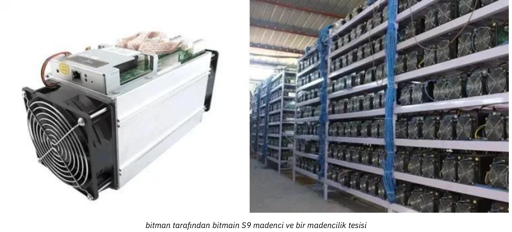


Bitcoin ağının Hashrate değeri, bir sonraki bloğu bulmak için saniyede yapılan deneme sayısını temsil eder. Bugün Hashrate 500 TH/s'yi, yani saniyede 500.000 milyar denemeyi aşmaktadır! Küresel Hashrate ne kadar yüksek olursa, kötü niyetli bir aktörün Mining gücünün çoğunluğunu elde etmek için gereken kaynakları tekeline alması ve fonlarını birden fazla kez harcaması (çifte harcama sorunu) o kadar zor olur. Bu nedenle Bitcoin protokolünün kurallarına uymak, onlara aykırı hareket etmekten ekonomik açıdan daha uygundur.


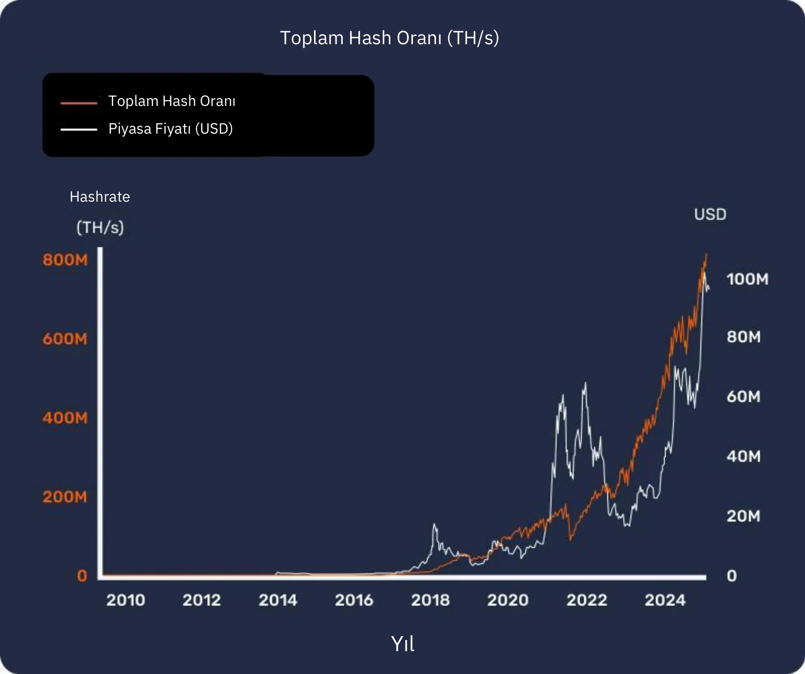


### Bir blokta ne bulunabilir?


Blok başlığı zaman, zorluk hedefi, son bloğun numarası, kullanılan sürüm ve önceki işlemlerin Merkle Root'i gibi çeşitli Elements içerir.


**Coinbase Transaction** her zaman bir blokta yer alan ilk işlemdir: Proof-of-Work'i gerçekleştiren Miner'un ödülünü içerir. Ardından onaylanmış işlemler gelir. Madenciler, kendilerine en fazla karı sağlayacak işlemleri, yani maksimum ücrete sahip küçük boyutlu işlemleri eklemeyi seçeceklerdir.


### Miner tazminat


Başlangıçta, bir Miner geçerli bir blok bulduğunda ödüllendirilir. Daha doğrusu, iki şekilde ödüllendirilirler:


- blokta yer alan sübvansiyon (yeni basılan bitcoinler) aracılığıyla;
- blokta yer alan işlemlerden alınan işlem ücretleri aracılığıyla.


Sübvansiyon miktarı mutabakat kuralları tarafından tanımlanır ve Epoch'a bağlıdır: **Block reward = blok sübvansiyonu + işlem ücretleri**.


İlk bloklar için blok sübvansiyonu 50 bitcoin idi. Her 210.000 blokta bir (yaklaşık her 4 yılda bir) bu miktar yarıya indirilir. Bugün (2024'te) 5. Dönemdeyiz, bu da sübvansiyonun 3.125 bitcoin olduğu anlamına geliyor. Kısacası bu, sisteme yeni bitcoinler salan otomatik bir mekanizmadır. Sübvansiyon, 21 milyon bitcoinlik ihraç sınırına ulaşana kadar zaman içinde azalır. Halihazırda dolaşımda 19.4 milyonun üzerinde bitcoin bulunmaktadır ve bu da %92'nin üzerindedir.


İkinci telafi yöntemi, kullanıcılar tarafından işlem ücretleri için seçilen miktar ile tanımlanır ve bu da kullanıcının işleminin bir sonraki bloğa dahil edilmesi için aciliyetini gösterir. Madenciler gelirlerini maksimize etmek istediklerinden, yüksek işlem ücretlerine sahip işlemlere öncelik verme eğiliminde olacaklardır.


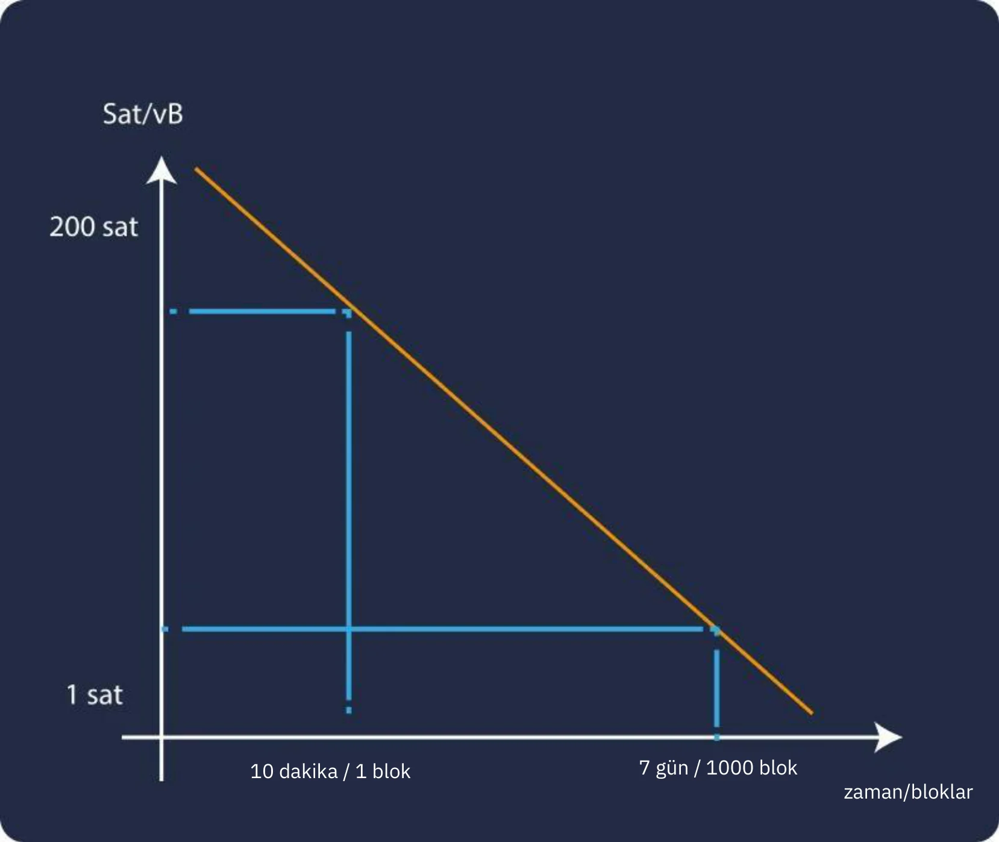


Her geçerli blok için aldıkları ödüllere dayanan iş modellerini istikrara kavuşturmak için madenciler genellikle "Mining havuzları" aracılığıyla bilgi işlem kaynaklarını bir araya getirdikleri gruplar oluştururlar.


### Neden tüm bunları yapmaya zahmet ediyorsunuz?


Kısacası, Bitcoin'nin yeniliği, Proof-of-Work'e dayanan bir Blockchain'in yüzen bir zorlukla kullanılması yoluyla çifte harcama sorununa bir çözüm önermektir. Dijital dünyada, Ownership kavramı fiziksel dünyadakinden farklıdır. Aslında, dijital dünyada her şey kopyalanıp yapıştırılabilir, bu da değerli dijital varlıkların birden fazla kez kullanılması veya çifte harcama riski yaratır. Bankalar gibi güvenilir aracılar, bu teknolojik sorunu çözmek ve bir varlık transfer edildiğinde artık gönderene ait olmamasını sağlamak için oluşturulmuştur.


Ancak bu güvenilir bir aracı olmadan nasıl yapılabilir? Bu sorun, çeşitli aktörlere güvenilemeyen bir sistemde bilgiyi koordine etme sorunu olan Bizans Generalleri paradoksu ile iyi bir şekilde tanımlanmıştır. Bizans Generalleri Probleminde, bir grup generalin bir şehre yapılacak saldırıyı koordine etmesi gerekir, ancak bazıları planı bozmaya çalışan hainler olabilir. Buradaki zorluk, sadık generallerin, hainlerden potansiyel olarak yanıltıcı mesajlar almalarına rağmen, saldırı veya geri çekilme konusunda bir fikir birliğine varmalarıdır.


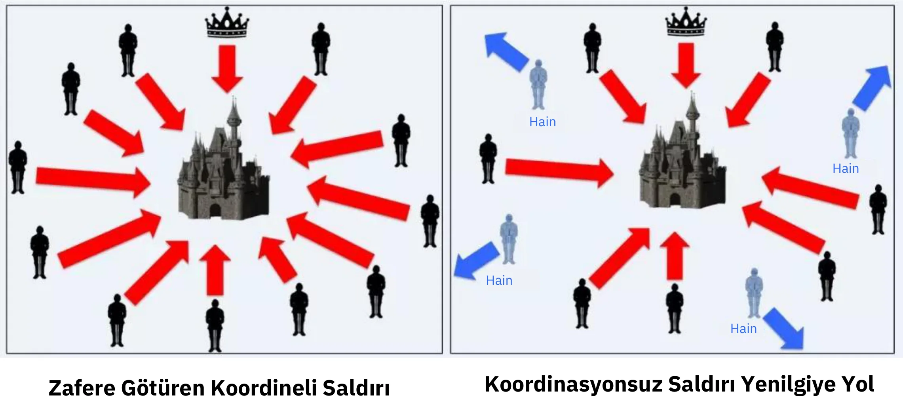


Bitcoin bu nedenle bu soruna bir tür çözümdür ya da en azından bu sorunun etrafından dolaşmak içindir. Bitcoin'in "generalleri" veya madencileri bloklar (bilgi) üretir ve Bitcoin düğümleri bilginin gerçekliğini sağlamak için mutabakat kurallarını kullanarak finansal işlemleri doğrular. Bilgi üretimi ve doğrulama arasındaki enerji maliyetindeki asimetri, güvenilir bir üçüncü taraf olmadan bilginin güvenilirliğini sağlar.


Madenciler Bitcoin ağ güvenliğinin kurucularıdır. Hash üretmek için enerji harcayarak, kötü niyetli bir ajanın işlem geçmişini yeniden yazmasını son derece maliyetli hale getiren bir duvar inşa ederler ve bu ekonomik caydırıcılık diğerlerini dürüst olmayan davranışlardan caydırır.


Bir ajanın Hashrate'nin yarısından fazlasına sahip olduğu %51'lik bir saldırı durumunda bile ağ güvenli kalacaktır çünkü saldırganın Blockchain'i değiştirmeye çalışmak için tüm madencilerin toplamı kadar enerji harcaması gerekmektedir. Bu enerji yoğun Proof-of-Work mekanizması ağın güvenliğini sağlayan şeydir.


### Özet olarak


Bitcoin'ye uygulanan oyun teorisi, madencilik yapmak için ASIC makinelerini kullanan ve başarı durumunda ödül alan dürüst olmayan madencileri ortadan kaldırır. Ayrıca, bilgi işlem güçlerini paylaşmak ve daha küçük ama daha düzenli ödüller almak için genellikle Mining havuzlarına katılırlar. Bitcoin Mining yüksek enerji maliyetlerine neden olsa da, Bitcoin ağının çalışması ve güvenliği için çok önemlidir. Proof-of-Work mekanizması ve Blockchain teknolojisi Address Double-spending sorununu çözmekte ve güvenilir bir üçüncü tarafa güvenmeden bilginin bütünlüğünü sağlamaktadır. Bilgi üretmek önemli miktarda enerji harcaması gerektirse de, bu bilginin doğrulanması ihmal edilebilir bir maliyete neden olur. Bu asimetri ağın güvenliğini güçlendirir ve mutabakat kurallarını çiğnemeye çalışmak yerine bunlara uymayı ekonomik açıdan daha uygun hale getirir.


Bitcoin Mining özel konusunu daha derinlemesine incelemek istiyorsanız MIN 201 kursumuza başvurabilirsiniz. Proof-of-Work'ın işleyişi ve rolünün yanı sıra Mining endüstrisinin mekaniğini keşfedeceksiniz. Ayrıca bir ASIC'ü nasıl ısıtıcıya dönüştürebileceğinizi açıklayarak evinizi ısıtırken ilk satoshi madenciliğinizi yapmanıza olanak tanıyoruz!


https://planb.network/courses/ce272232-0d97-4482-884a-0f77a2ebc036

## Bitcoin ve Ekoloji


<chapterId>4b227ae6-443a-5739-b443-60b7931130d9</chapterId>


Önceki bölümde, Bitcoin protokolünün güvenliğinin, güvenilir bir üçüncü taraf olmadan halka açık bir Ledger işlemi üretmek için yüksek enerji tüketimine dayandığını anladık. Ana akım medyada, toplam enerji maliyeti genellikle küçük bir ülkenin elektrik kullanımıyla karşılaştırılır. Ancak bu karşılaştırma mantıklı mı? Bu tür maliyetlerin arkasındaki nedenleri anlamak anlamlı mı?


### Bitcoin'nin enerji maliyetleri.


İlk olarak, Mining'in çevresel maliyetini niteliksel olarak değerlendirelim. Bir Miner, ASIC gibi bir makineye ve bu makineleri çalıştırmak için elektrik şeklinde bir enerji kaynağına sahip olmalıdır. ASIC'ler çoğunlukla alüminyumdan yapılır ve geri dönüştürülebilir ya da ikinci bir amaç için yeniden kullanılabilir (MIN201 kursumuzda açıklanan ve bir Antminer S9'u bir alan ısıtıcısına dönüştüren Attakaï projesinde gösterildiği gibi). Bu nedenle asıl endişe enerji tüketimidir.


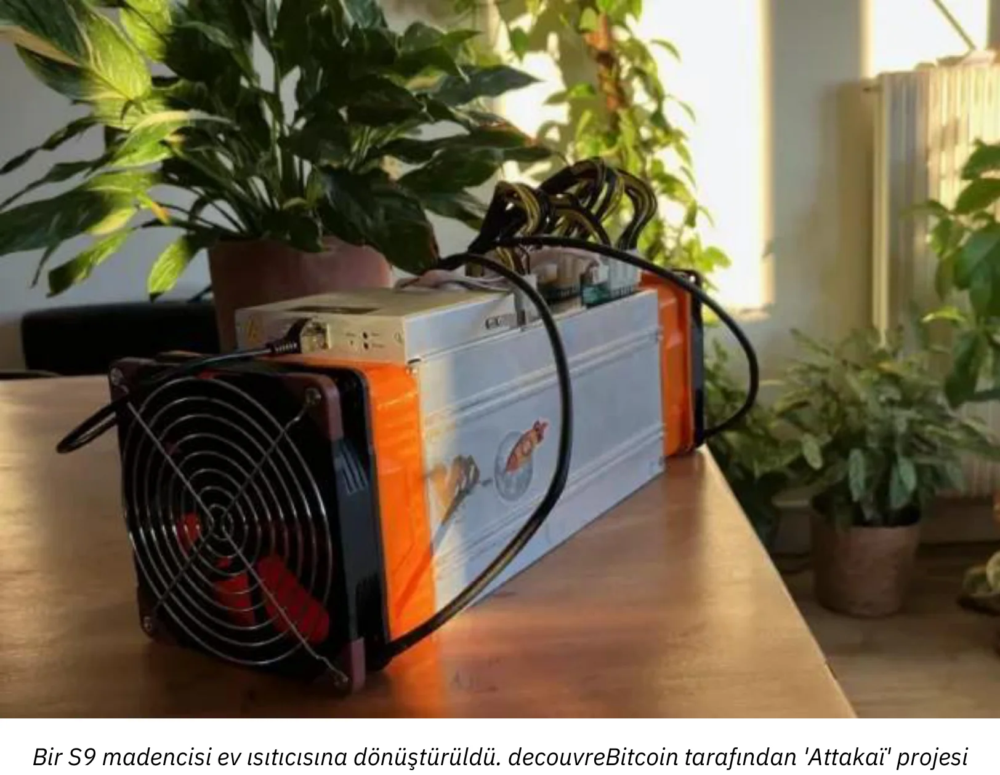


Elektrik tüketimi bir Miner için neredeyse tüm maliyetleri temsil etmektedir. Bu nedenle, ucuz bir elektrik kaynağı bulmaya teşvik edilirler, böylece enerji santrallerinin kurulu olduğu ancak henüz bölgenin elektrik şebekesine bağlı olmadığı yerlere gidebilirler. Bu durumda, madenciler son çare alıcı olarak hareket ederek, elektrik santrallerinin elektrik şebekesine bağlanmadan önce bile finansman sağlamasına olanak tanır. Bağlandıklarında, elektrik talebi artacak, bu da fiyatı yükseltecek ve madenciler için bu yerlerde elektrik elde etmeyi daha az karlı hale getirecektir. Makineler kolayca taşınabildiğinden, madenciler kurulumlarını alıp talebin ve dolayısıyla fiyatın düşük olduğu daha uzak yerlere, çoğunlukla Green enerji santrallerinden enerji alabilecekleri bölgelere yerleşmeye karar vereceklerdir.


### Sonu gelmeyen bir tartışma


Bu nedenle, Bitcoin'in ekolojik etkisi üzerine yapılan tartışmalar, esas olarak yararlılığının yeterince anlaşılmaması nedeniyle genellikle yanlış yönlendirilmektedir. Bitcoin sadece işlem başına enerji maliyetleri açısından değerlendirilemez, çünkü madenciler hem mevcut hem de geçmiş ağın güvenliğini sağlar ve işlemler gruplandırılır ve hepsi eşdeğer değildir. Ayrıca, Lightning Network'ün etkisi dikkate bile alınmamıştır. Bitcoin'in çok fazla enerji tükettiğini iddia edenlerin siyasi motivasyonları olabilir veya kendi Blockchain çözümlerini satmaya çalışabilirler. Çoğu zaman, Bitcoin'in yasaklanmasını haklı göstermek için ekolojik bahane kullanılmaktadır.


Bitcoin'nın devrimci bir buluş olarak, finansal baskı veya diktatörlük rejimleri altında yaşayan bireylere özgürlükleri için mücadele etme imkânı sağladığını vurgulamak önemlidir. Son çare olarak Bitcoin, sansür ve bankacılık kısıtlamalarını aşarak finansal bağımsızlığa giden bir yol sunmaktadır. Bir para biriminden daha fazlası olan Bitcoin, bir iletişim biçimi ve özgürlük sembolü olarak hizmet eder ve madenciler tarafından harcanan enerji, bu özgürlüğün savunulmasında çok önemli bir rol oynar ve merkez bankaları tarafından borç ve aşırı para yaratmanın hakim olduğu bir finansal sistemden kurtulmayı sağlar.


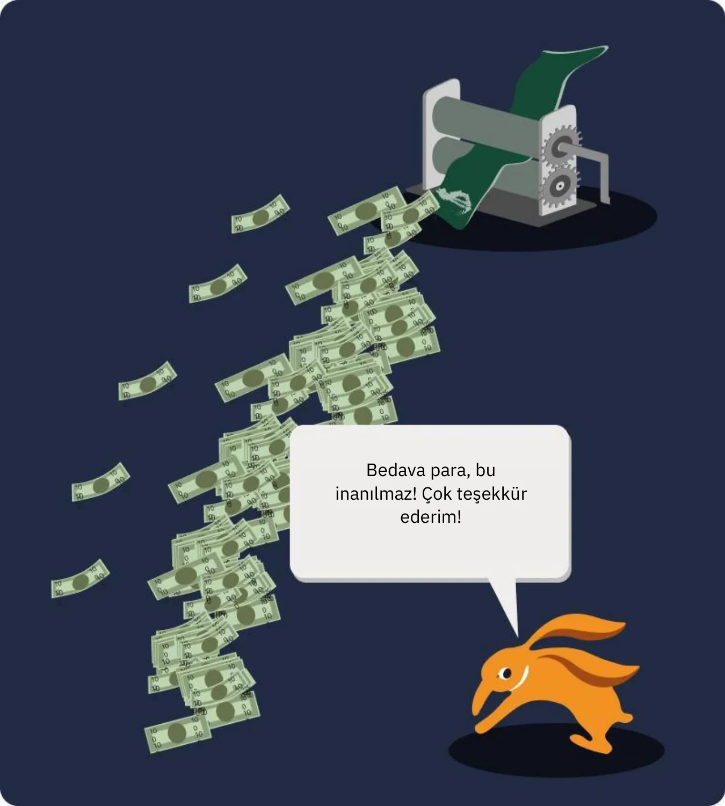

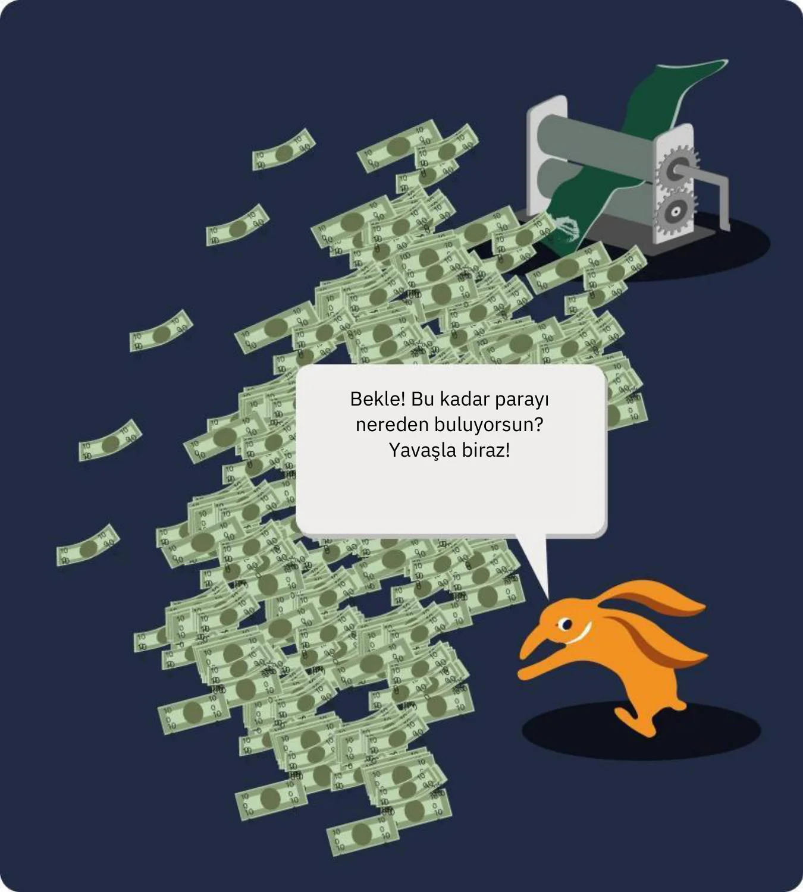

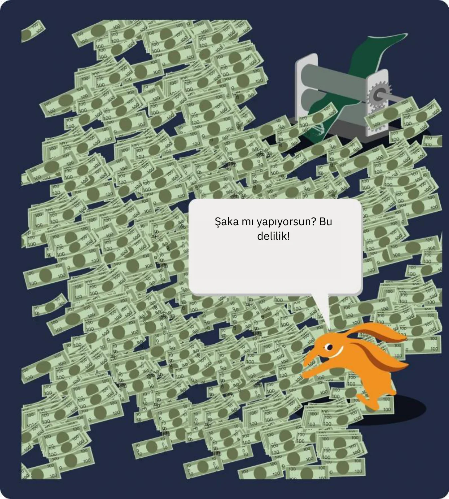


Yüksek enflasyon oranlarına sahip ülkelerde yaşayanlar için Bitcoin bir hayatta kalma meselesidir. Tehlikeli finansal durumlarda hayatta kalmak için bir araç sağlar. Dahası, Bitcoin daha adil ve tarafsız bir finansal sistem sunarak dünya çapında milyarlarca insanın finansal kaynaklara erişimini sağlamaktadır. Bu perspektiften bakıldığında, enerji tüketimi haklı mıdır?


### Bitcoin çevre için net bir pozitif olabilir


Son olarak, Bitcoin'un benimsenmesinin ekonomik ve çevresel sonuçlarını tartışmak önemlidir.


Mevcut finansal sistemle karşılaştırıldığında, aşırı tüketimi ve borcu teşvik etmesi nedeniyle ikincisi ciddi sorunlara yol açmaktadır. Krediye kolay erişim, bankaların para basması ve kısmi rezerv bankacılığı uygulaması gibi faktörlerin hepsi aşırı borçlanmaya ve bunun sonucunda aşırı tüketime katkıda bulunmaktadır.


Kaynaklarımızın kıtlığını para birimimizin kıtlığı ile yansıtmak için para sisteminde reform yapılması gerekmektedir. Bu daha sorumlu bir tüketimi ve uzun vadeli bir vizyonu teşvik edecektir. Buna karşılık enflasyon, tüketim ve yatırımı teşvik ederek çevre üzerinde uzun vadede olumsuz bir etki yaratır.


Mevcut finansal sistem, Avusturya ekonomisinin aksine, durumların ve kaynakların zamansal ve dinamik yönlerini dikkate almayan Keynesyen ekonominin fikirleriyle uyumludur. Başka bir deyişle, sınırsız bir para birimi gezegenimizin sınırlı kaynaklarını etkin bir şekilde temsil edemez.


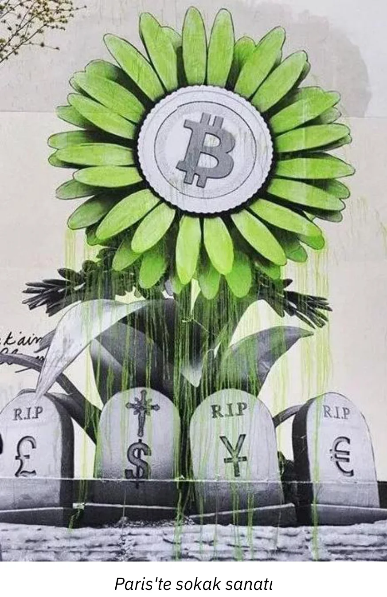


Politikacılar genellikle kısa vadeli vizyona sahiptir ve yeniden seçilmek için ekonomik büyümeye ihtiyaç duyarlar, bu nedenle ekolojik sorunları uzun vadede çözemezler. Bitcoin gibi sağlam bir para biriminin benimsenmesi, insanları ekonomik olarak güçlendirebilecek potansiyel bir alternatiftir.


Eleştirmenler Bitcoin'in Green enerji kullanımını teşvik ettiğini kabul etmemektedir. Örneğin, metan yakmak ve kirliliği önlemek için petrol kuyuları sahalarında tutuşturulan alevler Bitcoin madencileri tarafından söndürülebilir, çünkü metan Mining makinelerine güç sağlamak için elektriğe dönüştürülebilir, bu da çevre için faydalıdır.


**Bitcoin'ün özdeyişlerinden birini takip edin: Güvenmeyin, kendiniz doğrulayın!**


### Bitcoin'in teknik özelliklerinin kısa özeti


Satoshi Nakamoto, Ocak 2009'da Bitcoin protokolünü yayınladı ve o zamandan beri Bitcoin düğümlerine sahip geliştiriciler, madenciler ve kullanıcılardan oluşan büyüyen bir topluluk sayesinde gelişti. Bu düğümler, tüm Bitcoin işlemlerinin halka açık bir Ledger'u olan Bitcoin Blockchain'nın kendi kopyalarını tutarak, Bitcoin'nin mutabakat kurallarına göre işlemlerin geçerliliğini sağlayabilir. Bu, madencilerin binlerce bekleyen işlem içeren geçerli bloklar üretmesini sağlamayı da içerir.


Ortalama olarak, her 10 dakikada bir blok oluşturulur ve bir sonraki blok için geçerli bir Hash bulan Miner, protokol tarafından hem mutabakat kuralları tarafından tanımlanan bir sübvansiyon miktarı hem de geçerli blokta yer alan tüm işlemlerden elde edilen işlem ücretleri ile ödüllendirilir. Belirli bir girdi için hashing algoritmasının (SHA256) sonucu tahmin edilemez olarak kabul edildiğinden, Mining süreci çok sayıda aday blok oluşturmayı ve Hash'lerinin geçerli olup olmadığını test etmeyi içerir. Bununla birlikte, iki blok arasındaki ortalama sürenin madenci sayısı ve hesaplama güçlerinden bağımsız olarak sabit kalmasını (~10 dakika) sağlamak için, geçerli bir Hash bulma zorluğu her 2016 blokta bir, yaklaşık 2 haftada bir ayarlanır. Madenciler zaman içinde ASICS adı verilen özel SHA256 makineleri geliştirerek joule başına Hash oranını, yani tüketilen enerji başına saniye başına deneme sayısını artırmışlardır.


Madencilerin faaliyetlerinde mümkün olduğunca karlı olabilmeleri için mümkün olan en ucuz elektriği elde etmeleri gerekir; bu da genellikle uzak yerlerde, henüz şebekeye bağlı olmayan enerji santrallerinde olur. Miner daha sonra son çare alıcı olarak hareket eder ve talepteki artış nedeniyle elektrik fiyatı artar artmaz, Miner faaliyetlerini başka bir yere taşıma eğiliminde olacaktır.


Dolayısıyla, Bitcoin protokolü sansürlenemez ve durdurulamaz bir para sistemidir çünkü protokolün her bir bileşeni coğrafi olarak dünya genelinde dağıtılmıştır. Örneğin, tüm kıtalarda 40.000'den fazla Bitcoin düğümü bulunmaktadır. Bitcoin'in mutabakat kuralları, onları takip etmenin onları bozmaya çalışmaktan ekonomik olarak daha karlı olduğu ve bu nedenle aktörler arasında güven gerekmediği şekildedir. Bitcoin'in lideri yoktur ve durdurulamaz. Exchange platformlarını Bitcoin'i sınırlandıracak şekilde düzenlemek mümkün olsa bile, bu yaklaşımın sistem üzerinde marjinal bir etkisi vardır. Kısacası, hiçbir yargıç ya da devlet Bitcoin'i sansürleyemez ya da durduramaz.


# Bitcoin Nasıl Temin Edilir?


<partId>517e1bb7-f032-51a0-930a-a91fe5148d3f</partId>


## Bitcoin Asla Uyumaz!


<chapterId>d5e35e41-ea26-5478-8eb9-07daf9dff508</chapterId>


Bitcoin'in fiyatı genellikle önemli bir dalgalanma ile karakterize edilir. Değeri, tıpkı diğer finansal piyasalarda olduğu gibi, piyasa değişimlerine veya yükseliş ve düşüş aşamalarına bağlı olarak önemli ölçüde dalgalanabilir.


Basitçe söylemek gerekirse, insanlar her şeyi bir kerede satın alma ve her şeyi bir kerede satma eğilimindedir. **Bitcoin insan doğasına karşı bağışık değildir.**


### Benimseme dalgalarını anlama


Bitcoin'ün hem gelişimi hem de evrimi büyük ölçüde ekosistemini kademeli olarak entegre eden farklı aktör gruplarıyla bağlantılıdır.


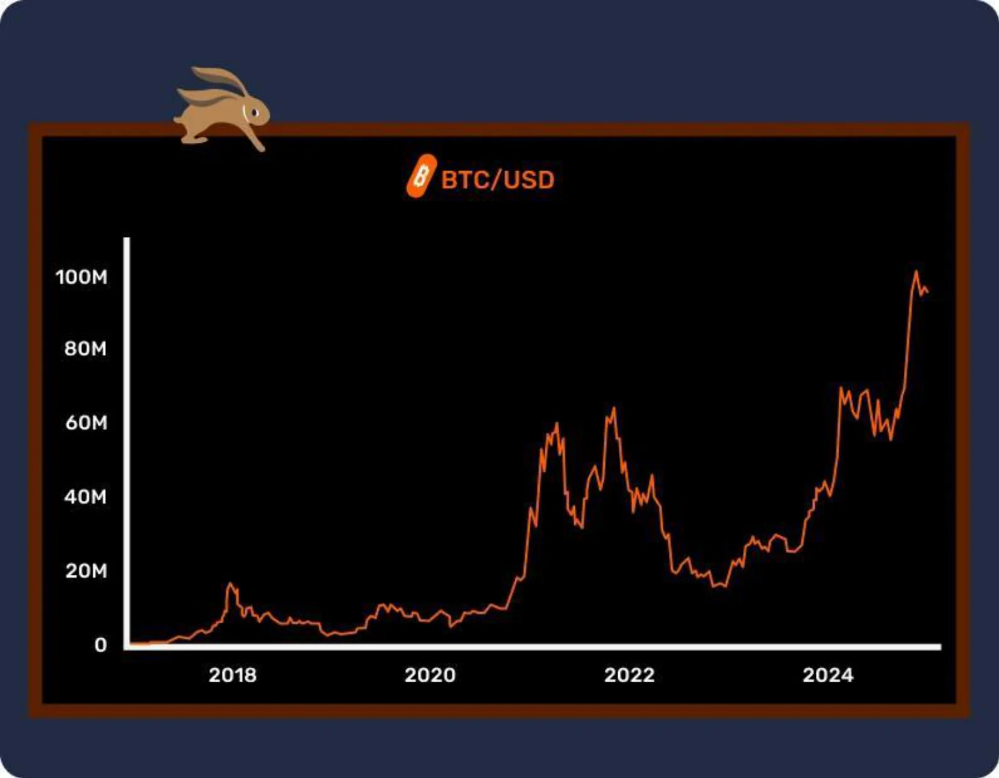


- İnananlar:


Bitcoin'nin ilk kullanıcıları çoğunlukla teknofiller, cypherpunklar, liberterler ve altın meraklılarıydı. Bu gruplar Trustless'in elektronik para olarak değeri, sansüre karşı direnci ve şeffaf, değişmez para politikası nedeniyle ona ilgi duydular.


- Karanlık ağ ve suçlular


Daha sonra Bitcoin'ün kullanımı, büyük ölçüde kontrol edilemeyen ve takma ad kullanan doğası nedeniyle Silk Road gibi karanlık web pazarlarına yayıldı ve bu platformun ötesinde, suç faaliyetlerinde bulunan bazı kişiler de dahil olmak üzere bireyleri cezbetti. Bununla birlikte, yasallığı belirleyenin aracın kendisinden ziyade aracın uygulanması olduğunu vurgulamak önemlidir. Bitcoin'ün yasadışı kullanımı bir kişiyi doğal olarak suçlu yapmaz; daha ziyade, yasadışı olarak sınıflandırılabilecek belirli eylemlerdir. Örneğin, belirli uyuşturucuları satın almak için Bitcoin kullanmak, işlemin gerçekleştiği bölgeyi yöneten düzenlemelere bağlı olarak yasal veya yasadışı olabilir.


- ICO çılgınlığı ve genel halkın gelişi.


2017 yılı, özellikle binlerce İlk Coin Teklifinin (ICO) piyasaya sürülmesiyle kripto para dünyasında önemli bir spekülatif balonla geçti. Ancak, bu yeni kripto para birimlerinin çoğunun somut bir gelişimi veya faydası yoktu ve hızla ortadan kayboldu. Bu 2017 balonunu 2018-2019'da güçlü bir düzeltme takip etti.


- NFT balonu ve DeFi


Ardından 2020'de piyasa, Bitcoin'in fiyatını 60.000 $'a çıkaran başka bir spekülatif balon yaşadı. Bu balon, finansal kurumlar ve büyük şirketler de dahil olmak üzere yatırımcıların daha geniş bir çeşitliliğe sahip olması nedeniyle öncekilerden farklıydı. Bununla birlikte, önceki balonlarda olduğu gibi, ilk coşku azaldığında önemli düzeltmeler takip etme eğilimindedir.


### Bitcoin ve volatilite


Geçmiş döngülere dayanarak, Bitcoin'nin ekonomik döngülerinin periyodikliğinin, belki de Halving olayının yeni bitcoin emisyonunu yarıya indirerek bir tetikleyici görevi görmesi nedeniyle, iki yarılanma arasındaki süreye eşit olduğu görülmektedir.


Bu önemli dalgalanmalar, Bitcoin'a oldukça değişken bir varlık olarak ün kazandırmış ve genellikle kullanıcıları için önemli kayıplara yol açmıştır. Fiyat birkaç gün içinde %10, %20 ve hatta %50 oranında düşebilse de, Bitcoin protokolünün kendisinin fiyat değişikliklerinden etkilenmediğini anlamak önemlidir.


Bu önemli dalgalanma bugün Bitcoin aktörleri tarafından tamamen kabul edilmektedir ve finansal riskten korunma (sabit paralar), güçlü bir uzun vadeli inanç (hodling) veya sağlam bir anlayış olmadan kişinin fonlarının %100'ünü Bitcoin'a yatırma riskinden kaçınma gibi çeşitli çözümlerle azaltılabilir. Bu nedenle, Bitcoin fiyatının neden bu kadar dalgalandığını anlamak, bu sektörde ilerlemek için çok önemlidir, çünkü nihayetinde piyasayı bir dereceye kadar yumuşatmaya ve düzenlemeye yardımcı olan fiyat hareketleri ve döngüleridir. Bununla birlikte, Bitcoin büyüdükçe ve olgunlaştıkça dalgalanmanın daha az etkili hale geldiğine dikkat etmek önemlidir.


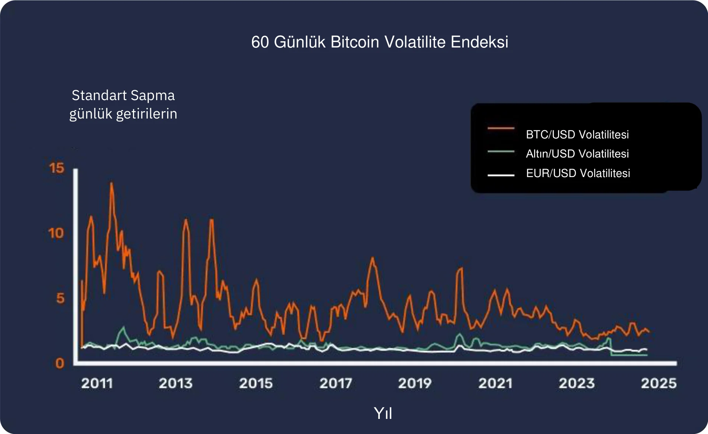


Btc/dolar paritesi kısa vadede dalgalansa da, Bitcoin, 21 milyon bitcoinlik sınırlı miktarı ve Halving süreci (Halving ortalama her 4 yılda bir parasal yaratım) nedeniyle, yarı-mekanik bir şekilde genel bir yükseliş eğilimi izlemektedir. Elbette, her finansal varlık gibi Bitcoin de coşku dönemleri, spekülatif balonlar ve düzeltmeler dahil olmak üzere ekonomik döngülere tabidir. Bu olgu, piyasanın her zaman rasyonel veya verimli olmadığı gelişmekte olan teknolojilerde oldukça yaygındır.


### Benzersiz bir pazar


Bu spekülatif balon döngüleri dünyada oldukça benzersizdir, zira tek bir varlığın bu tür bir balon serisini art arda yaşaması nadir görülen bir durumdur. Bu olgu, Bitcoin'ün yalnızca patlamaya mahkum bir balon olmadığı gerçeğine bağlanabilir. Aksine, dünya çapında aktif olarak kullanılan bir para birimi olarak işlev görmektedir. Bitcoin protokolü, küresel ölçekte 7/24 çalışabilme kabiliyetiyle öne çıkmakta ve bu da onu düzenlemeye çalışan finans otoriteleri için önemli zorluklar teşkil etmektedir.


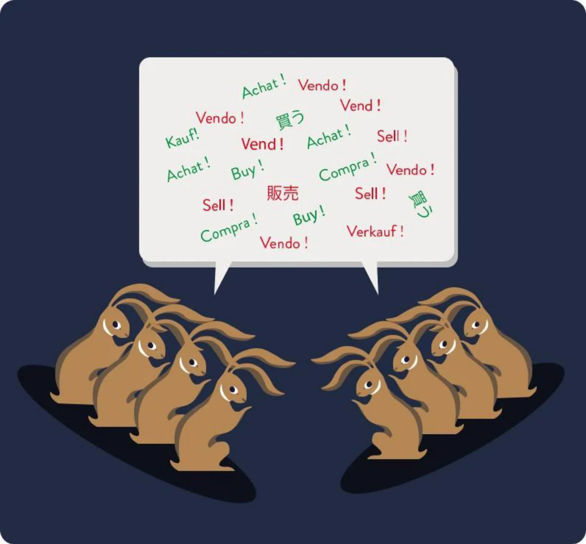


Bugün Bitcoin, geleneksel pazara giderek daha fazla entegre olarak hayatta kalmaya ve daha da büyümeye devam ediyor ve Bitcoin ETF'lerinin tanıtımı, daha net düzenlemeler ve satın alma ve depolama için geliştirilmiş araçların tümü bu olumlu ivmeye katkıda bulunuyor. Bitcoin BİR KEZ DAHA spekülatif balonundan kurtuldu, bu yüzden belki de sadece Hot havası değildir!


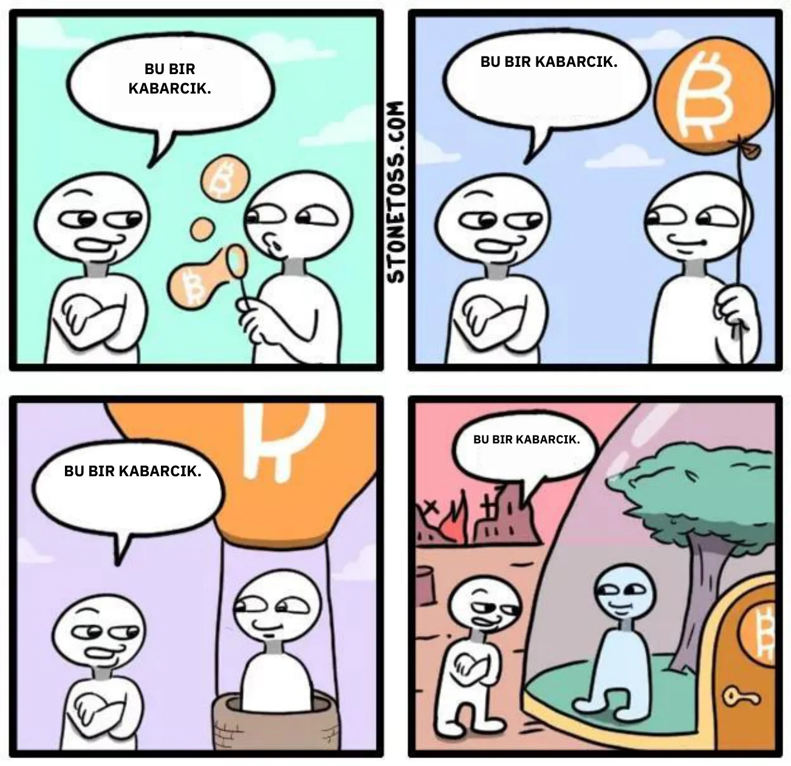


## Çalışarak Bitcoin Elde Etmek


<chapterId>be2d83be-406f-582c-83ca-6aa905ff7b04</chapterId>


### Paralel bir ekonomi gelişiyor


Bitcoin, fiat para birimlerine paralel bir ekonomi yaratma aracı olarak görülebilir, çünkü mal veya hizmet satmak ve Bitcoin ile ödeme almak mümkündür. İşlemler, bir Exchange platformundan geçmeye gerek kalmadan doğrudan Bitcoin'de yapılabilir, ancak sadece bir Bitcoin Wallet'den diğerine geçilebilir.


Bitcoin ekonomisi, Bitcoin'un 2021'de yasal ödeme aracı haline geldiği El Salvador'da olduğu gibi dünyanın belirli bölgelerinde mevcuttur ve gelişmektedir. Ne yazık ki, Ocak 2025'te meclis, iddiaya göre Uluslararası Para Fonu'ndan gelen baskılar sonucunda Bitcoin'u "yasal ödeme aracı" statüsünden çıkaran yeni bir yasa kabul etti. Yeni yasaya göre, insanlar artık işletmelerinde Bitcoin'u kabul etmek zorunda değil ve artık bunu kullanarak vergi ödeyemezler. Kabul gönüllülük esasına dayanıyor.


Bununla birlikte, El Salvador'da ve dünyanın diğer bölgelerinde, Bitcoin'yi ürünleri veya hizmetleri için bir ödeme aracı olarak kabul eden giderek daha fazla kişi, işletme ve kuruluş var.


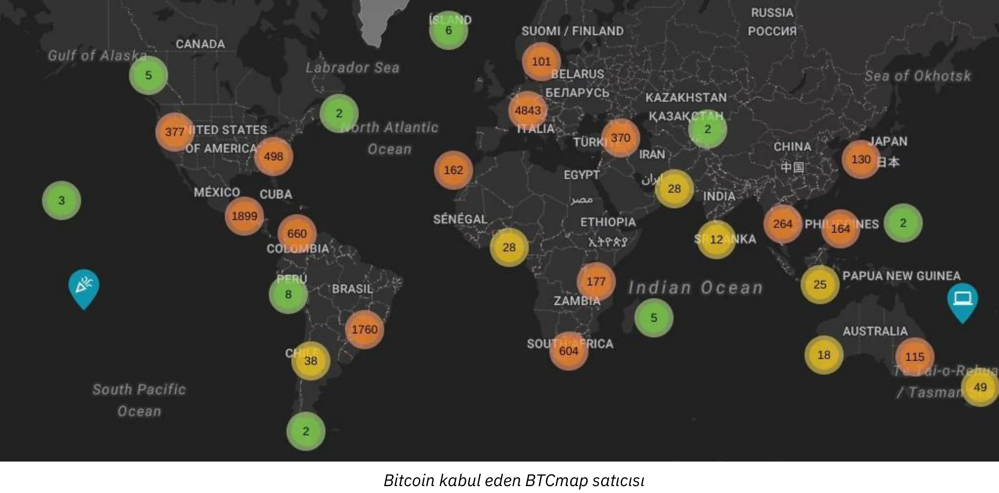


Buna ek olarak, günlük işlemlerde Bitcoin kullanımını kolaylaştırmak için [BTCMap] (https://btcmap.org/map#2/21.28937/5.46680) adlı açık kaynaklı ve işbirliğine dayalı bir proje başlatılmıştır. Bu platform, Bitcoin'i kabul eden tüm tüccarların yanı sıra dünyadaki farklı Bitcoin topluluklarını listeler; böylece çevrenizdeki Bitcoin ekosistemini keşfetmek için web sitelerini ziyaret edebilirsiniz. Dolayısıyla, zorluklara ve tereddütlere rağmen, BTCMap gibi Bitcoin ekonomisini herkes için daha erişilebilir ve kullanışlı hale getirmeye katkıda bulunan girişimler vardır.


### Satın almak yerine neden Bitcoin'yi kabul etmeliyiz?


Bitcoin elde etmek için, bunları Fransa'daki AMF (Autorité des Marchés Financiers) veya ABD'deki Menkul Kıymetler ve Exchange Komisyonu (SEC) gibi kuruluşlar tarafından düzenlenen platformlardan satın alabilirsiniz, ancak bu çözüm işlemlerinizin izlenebilirliğini gerektirir. Bitcoin elde etmenin bir başka yöntemi de bunları sunduğunuz ürün veya hizmetler için bir ödeme aracı olarak kabul etmektir, böylece Bitcoin fiyatı hakkında sürekli endişelenmeden işiniz aracılığıyla bitcoin elde edebilirsiniz.


Ayrıca, Bitcoin'i bir tüccar olarak kabul etmenin sansüre karşı direnç, düşük işlem ücretleri, artan verimlilik, enflasyona karşı koruma, finansal özgürlük ve egemenlik gibi çeşitli avantajları vardır.


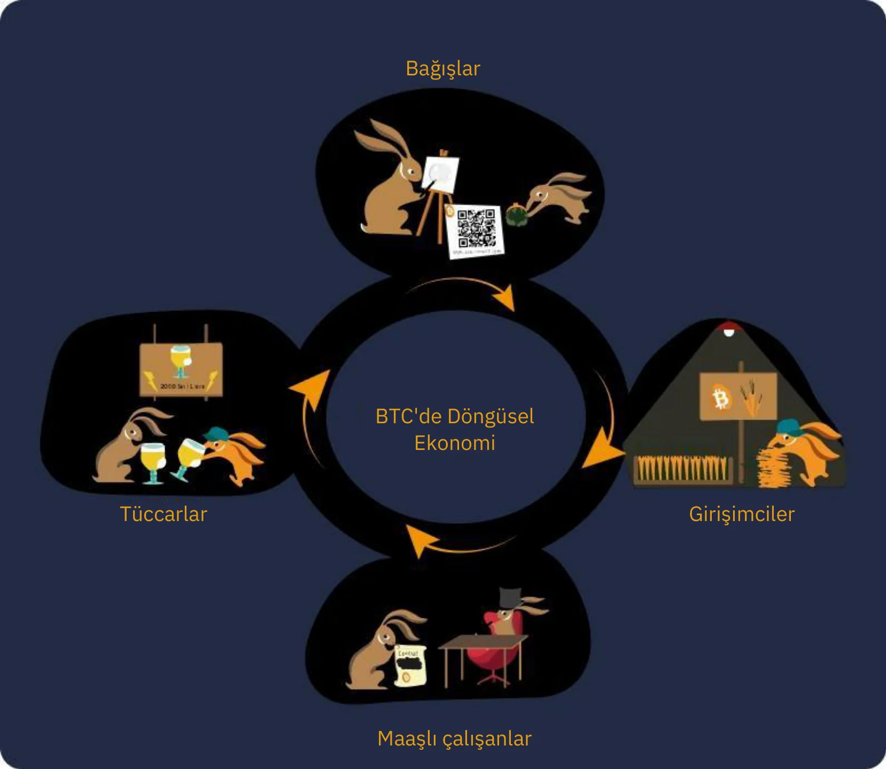


### Nasıl devam edebilirsiniz?


Bitcoin'yı kabul etmek için mevcut farklı çözümleri incelemek ve işletmenize en uygun olanı seçmek gerekir. Mükemmel bir çözüm yoktur ve seçiminizi yapmak için beklenen işlem hacmi, tahsis edilen bütçe ve işletme türü (çevrimiçi veya fiziksel) gibi çeşitli faktörler dikkate alınmalıdır.


Bu konuyu başka bir derste ayrıntılı olarak ele alacağız, ancak basit tutmak için birkaç işletme kategorisini ve dolayısıyla ilgili çözümleri ele alabiliriz.


- Basit çevrimiçi çözüm: OpenNode


https://planb.network/tutorials/business/point-of-sale/open-node-e69a0c1c-47f7-4932-8494-e6f26c3c9784


- Amatör tüccarlar için çözüm: Swiss Bitcoin Pay


https://planb.network/tutorials/business/point-of-sale/swiss-bitcoin-pay-2-a78b057e-ed11-47ac-860c-71019fcb451a


- Büyük kuruluşlar veya tutkulu bitcoin kullanıcıları için çözüm: BTCpay Sunucusu


Bu konuyu daha fazla keşfetmek için BIZ101 kursumuzu tavsiye ediyoruz! Bitcoin'i şirketinizin hazinesine nasıl etkili bir şekilde entegre edeceğinizi, kuruluşunuzun profiline göre Bitcoin'i bir ödeme aracı olarak nasıl kabul edeceğinizi ve ilgili vergi ve muhasebe gereksinimlerini nasıl anlayacağınızı keşfedin:


https://planb.network/courses/a804c4b6-9ff5-4a29-a530-7d2f5d04bb7a

## Bitcoin ile Tasarruf


<chapterId>1d9570c6-5b63-51a6-b87c-7bdb0fc4aa87</chapterId>


### Başlamadan önce bir uyarı!


Bitcoin, esas olarak sınırlı Supply ve artan talep nedeniyle önemli bir finansal varlık haline gelmiştir. Ancak, Bitcoin satın almak özel dikkat gerektiren riskler taşır. Bu nedenle, herhangi bir fon yatırımı yapmadan önce teknolojiye aşina olmak için kendi araştırmanızı yapmanız ve konu hakkında daha fazla bilgi edinmeniz önerilir.


- Sadece kaybetmeyi göze alabileceğiniz kadar yatırım yapın.
- Bitcoin oldukça değişken bir finansal varlıktır ve fiyatı 0'a kadar düşebilir.
- Geçmiş performans, gelecekteki performansın güvenilir bir göstergesi değildir.
- Gerekirse mali danışmanınızla iletişime geçin.


**Plan ₿ Network herhangi bir yatırım tavsiyesi vermemektedir ve burada belirtilen hiçbir şey bu şekilde değerlendirilmemelidir**


### Atılmadan önce Mini Kontrol Listesi


Bitcoin'ü satın almadan önce, sahip olduğunuzdan emin olun:


- Güvenli bir Wallet.
- Bitcoin hakkında sağlam bir anlayış.
- Takip edilecek bir tasarruf planı.
- Uzun vadeli bir vizyon.


Konu hala net değilse, BTC102 kursunun ilk bitcoinlerinizi güvence altına almanızda ve edinmenizde size rehberlik edeceğini unutmayın. Burada, konunun sadece yüzeyine göz atacağız.


Somut olarak, kendinize sormanız gereken iki soru var:


- Kademeli mi yoksa bir kerede satın alma stratejisi mi benimsemelisiniz?
- Düzenlenmiş bir platform mu yoksa düzenlenmemiş bir platform mu kullanmalısınız?


### Satın alma stratejileri


- Dolar Maliyet Ortalaması


Bu kademeli strateji, düzenli aralıklarla küçük miktarlarda Bitcoin satın almak anlamına gelen yinelenen satın alımları içerir. Bu yöntem, fiyatı zaman içinde düzeltir ve sahip olunan Bitcoin miktarında sürekli büyüme sağlar. Uzun vadeli tasarruflar için ideal bir çözümdür ve Bitcoin'nin fiyat oynaklığına ilişkin endişeleri hafifletir. Bir kez kurulduktan sonra, bunu unutabilir ve yatırımınızın büyümesini izleyebilirsiniz.


**UTXO'lara dikkat edin**: UTXO'larınızı zaman zaman cüzdanlarınızda birleştirmeyi unutmayın. Bu uygulama, bitcoinlerinizi etkili bir şekilde yönetmek ve işlemler sırasında gereksiz ücretlerden kaçınmak için çok önemlidir.


Bir [UTXO](https://planb.network/en/resources/glossary/utxo) henüz harcanmamış bir işlemin çıktısıdır, yani yeni bir işlem için girdi olarak kullanılmamıştır. Bunları birleştirmek, işlemin "ağırlığını" azaltmak ve böylece daha düşük ücretler ödemek için birkaç küçük UTXO'yu daha büyük bir UTXO'da birleştirmek anlamına gelir.


- Spontane satın alma


Bir kerelik bir çözüm, Bitcoin'a hemen maruz kalmak için kullanılan spontane bir satın alma olabilir. İster bir çöküş sırasında satın alın ister bir ikramiyeden yararlanın, karar sizin. Cesaretinizi toplamanız ve satın alma düğmesine basmanız gerekecektir.


Bu durumda, Bitcoin'ın fiyatı oldukça değişken olabileceğinden dikkatli olmalı ve duygularınızı kontrol etmelisiniz. Aslında, FOMO (Fear of Missing Out) ve FUD (Fear, Uncertainty, Doubt) en büyük düşmanlarınızdır! Dürtüsel ve potansiyel olarak zararlı kararlardan kaçınmak için sakin kalmayı ve önceden belirlediğiniz stratejiyi takip etmeyi unutmayın.


### Bitcoin'i kimden satın almalıyız?


Bitcoin edinmenin, her biri yargı yetkisine göre değişebilen kendi düzenlemelerine tabi olan çeşitli yolları vardır. Bazı platformlar doğrulama için kimlik tespiti (KYC) gerektirirken, diğerleri gerektirmez. Bu nedenle, her platformla ilgili düzenlemeleri anlamak çok önemlidir.


- DCA platformları


Yukarıda tanıttığımız gibi, bitcoin biriktirmek için yaygın bir yöntem, düzenli olarak küçük miktarlarda satın almayı içeren Dolar Maliyet Ortalamasıdır (DCA). Bu hizmeti, [özel sayfamızda] (https://planb.network/tutorials/exchange) listelenenler gibi çeşitli platformlar sunmaktadır. Bir DCA kurmanın basitliğine ek olarak, Wallet'ünüze para çekme işlemleri genellikle otomatiktir, yani varlıklarınız üzerinde her zaman kontrol sahibi olursunuz.


Bugün, neredeyse tüm DCA çözümleri nispeten verimlidir ve neredeyse benzer ücretlere sahiptir, bu nedenle seçim daha çok ülkenizdeki kullanılabilirliğe bağlı olacaktır.


- Broker platformları


Büyük ölçekli yatırımlar için Kraken, Bitstamp ve Paymium gibi düzenlenmiş ve tanınmış platformlar önerilir. Yüksek hacimli işlemler için güvenli ve emniyetli bir ortam sunarlar.


Kullanımları basit ve herkes için erişilebilirdir:


1. Bir KYC hesabı oluşturun

2. Hesabınıza para aktarın

3. Bitcoin Satın Alın

4. Bitcoin'i Wallet'nıza geri çekin


Satın alma işleminden sonra, bilgisayar korsanlığı ve fon bloke etme risklerini en aza indirmek için bitcoinlerin Exchange platformlarından derhal çekilmesi tavsiye edilir. Para çekme ücretlerinin yüksek olabileceğini, platforma bağlı olarak bazen 25 Euro'ya kadar çıkabileceğini unutmayın.


**Müşterini Tanı (KYC) düzenlemeleri, terörizmin finansmanı, vergi kaçakçılığı ve kara para aklama ile mücadele için kullanıcıların kimliklerini bildirmelerini gerektirmektedir.**


KYC'nin Bitcoin sektöründe önemli bir tartışma konusu olduğunu kabul etmek önemlidir. Birçok kişi KYC'nin etkinliğini tartışırken, KYC ile ilgili çok sayıda endişe de bulunmaktadır. Akademimizin birçok eğitim programında ve içeriğinde, ileri düzey kullanıcılara KYC gerektiren platformlardan kaçınmalarını tavsiye ediyoruz, çünkü genellikle daha fazla gizlilik odaklı alternatifler mevcuttur.


### KYC dışı çözümler


Buna ek olarak, eşler arası Exchange'da bitcoin alıp satabileceğiniz birkaç [pazar yeri] (https://planb.network/tutorials/exchange) vardır. Genel olarak, aşağıdakileri göz önünde bulundurabilirsiniz:


- Bitcoin ATM'ler
- Diğer Bitcoin meraklıları ile fiziksel buluşmalar
- Yasadışı ve düzenlenmemiş platformlar
- Eşler arası eşleştirme çözümleri
- Bitcoin dostu ülkelerde faaliyet gösteren neobankalar.


Son olarak, vergi yükümlülüklerinin yargı yetkisine bağlı olarak değişebileceğini unutmamak önemlidir, bu nedenle sizi riske atabilecek herhangi bir işlem yapmadan önce ülkenizdeki düzenlemelere başvurmanızı şiddetle tavsiye ederiz.


## Hiper-bitcoinizasyon


<chapterId>b7275d31-3b60-5fb7-b9f5-030097010553</chapterId>


### Çılgın yarış daha yeni başlıyor!


Her yeni teknolojide olduğu gibi, Bitcoin'ün benimsenmesi de bir S-eğrisi izler ve erken benimseyenlerden daha geniş kabul görenlere doğru ilerlemeyi gösterir. Erken benimseyenler döneminin ötesine geçtik ve göstergeler Bitcoin'ün potansiyel bir demokratikleşmesine işaret ediyor. Sonuçta bu, kolayca durdurulamayacak viral bir teknolojidir. Bir yandan El Salvador, Bitcoin'ü tamamen yasal ödeme aracı olarak kabul ederek cesur bir adım attı. Diğer yandan, diğer ülkeler buna yasaklayarak ve kullanımını suç sayarak karşılık vermiştir; bu da Bitcoin'ün benimsenmesinin karmaşık olduğunu ve kültürel, tarihi ve ulusal faktörlerin etkisine maruz kaldığını göstermektedir.


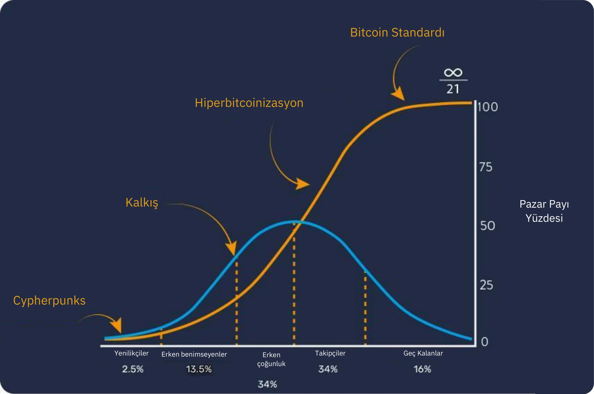


Bitcoin'ün yükselişi şirketleri, üniversiteleri, düzenleyicileri ve bireyleri bu yeni teknolojiyi dikkate almaya zorluyor. Yeni araçlar yaratılmalı, hizmetler uyarlanmalı ve hayatta kalmalarını sağlamak için inovasyon devam etmelidir. Bu bağlam kriptografi, oyun teorisi, ekonomi ve para politikası, bilgisayar bilimi, felsefe, enerji, yasalar ve düzenlemeler gibi çeşitli alanlarla ilgili birçok soruyu gündeme getirmektedir. Kısacası, Bitcoin multidisipliner bir konudur.


### Bitcoin 0'dan 1'e kadar


Son olarak, sizi bu yeni parasal devrim üzerinde düşünmeye davet ediyoruz. Bitcoin ile keşfedilecek o kadar çok şey var ki, her şeyi bir kerede özümsemek karmaşık. Acele etmeyin, Bitcoin ortadan kalkmayacak. Aksine, devrim daha yeni başladı. Çocuklarımıza emanet etmek istediğimiz dünyayı yaratabileceğimize inanıyoruz: insan egemenliğinin bir hak olduğu, mahremiyete varsayılan olarak saygı duyulduğu ve paranın manipüle edilmediği bir dünya. Birlikte bunu başaracağımızı umuyoruz.


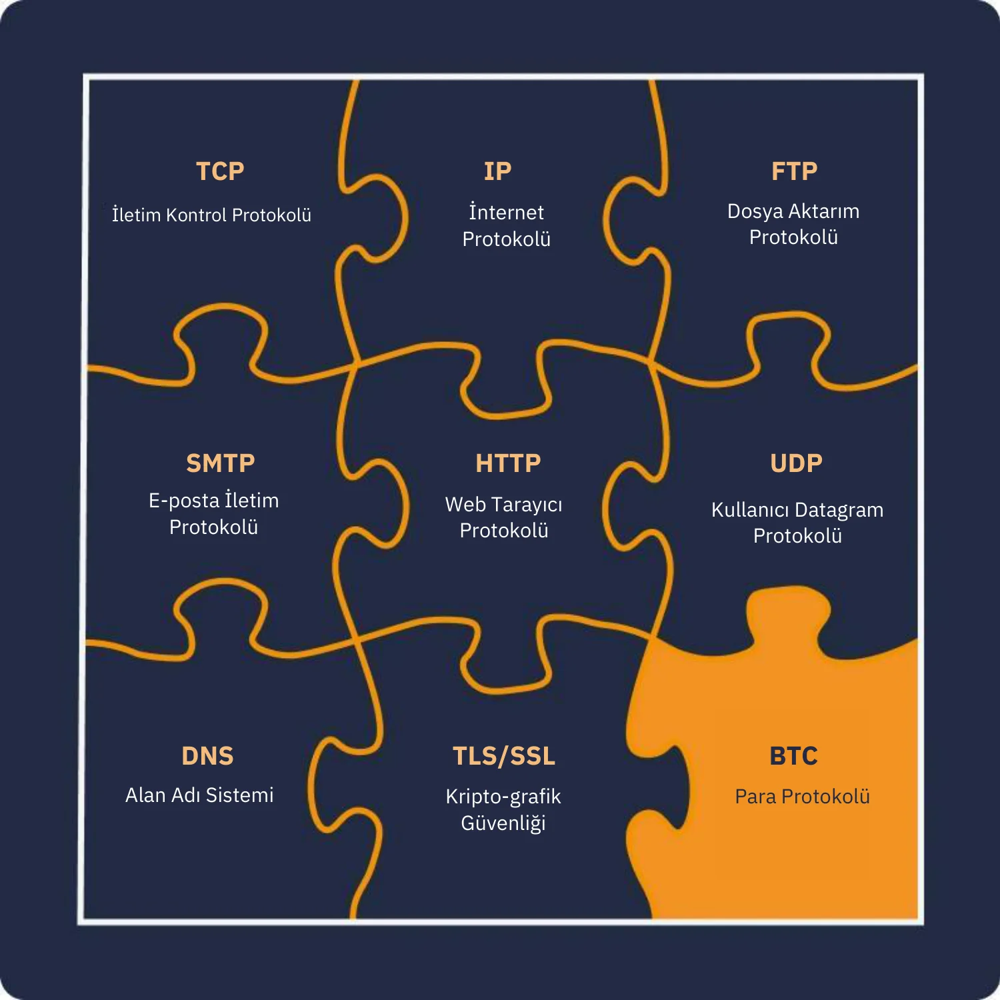


Bitcoin hakkındaki bilgilerinizi genişletmek istiyorsanız, şimdi doğru zaman: çok sayıda yazar, düşünür ve denemeci Bitcoin hakkında eğitici içerik oluşturdu. Son birkaç yıldır, aranızdaki en meraklılara bir [kaynak kütüphanesi] (https://planb.network/resources) sunmak için bu çalışmaları listeliyor ve kategorize ediyoruz. Bu bölümde en iyi podcast'leri, web sitelerini, makaleleri, eğitimleri, kitapları ve diğer içerikleri bulacaksınız.


> "Bence internet, devletin rolünü azaltacak en önemli güçlerden biri olacak. Eksik olan ama yakında geliştirilecek olan tek şey, güvenilir bir e-nakittir - A'nın B'den, B'nin de A'dan haberi olmadan internet üzerinden A'dan B'ye para transferi yapabileceğiniz bir yöntem." - Milton Friedman'ın 1999 yılındaki öngörüsü

# Bitcoin'un Geleceği: Lightning Network


<partId>899fd35e-39e6-5a25-a73e-6fed6e725094</partId>


## Lightning Network'a Kısa Bir Giriş


<chapterId>b403f1e4-f1ff-572b-a242-9b58cb3736d0</chapterId>


Artık Bitcoin protokolünün temellerini öğrendiğimize göre, yıldırım hızında işlemleri mümkün kılmak için Bitcoin protokolünü kullanan bir ödeme ağını tanıtacağız: Lightning Network!


Aşağıdakilerin yalnızca genel bir açıklama olduğunu unutmayın, bu nedenle daha derin ayrıntılarla anlamak istiyorsanız sizi LNP201 kursumuza katılmaya davet ediyoruz.


### Özetle


Lightning Network, Bitcoin'ün ölçeklenebilirlik sorununu çözdüğü için Bitcoin algımızı derinden değiştiren devrim niteliğinde bir teknolojidir.


Lightning Network'i tam olarak kavramak için Bitcoin'nin altyapı katmanlarında nasıl evrimleştiğini ve geliştiğini anlamak çok önemlidir: ilk Layer, Blockchain'dır ve ikincisi Lightning Network'tir.


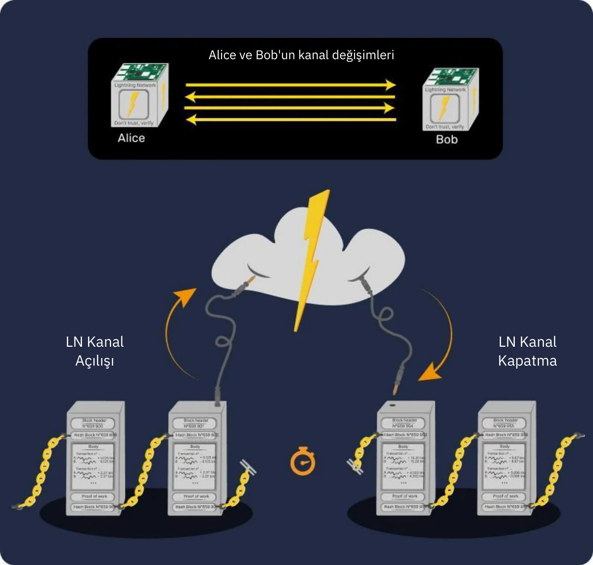


### Bir Blockchain sonsuza kadar büyüyemez


Lightning Network, anında ve düşük maliyetli Bitcoin işlemlerine olanak sağladığı için Bitcoin'in ölçeklenebilirlik sorununu çözmek üzere 2017 yılında onaylanmış ve uygulamaya konmuştur.


Ölçeklenebilirlik sorunu, artan benimsemeye yanıt olarak saniye başına sürekli artan sayıda işlem sağlayabilen bir parasal sistemin uygulanmasındaki zorluğu ifade eder. Bu sorun Blockchain trilemması ile ilgilidir. Köşeleri ademi merkeziyetçilik, güvenlik ve ölçeklenebilirlik olan bir üçgen hayal edin.


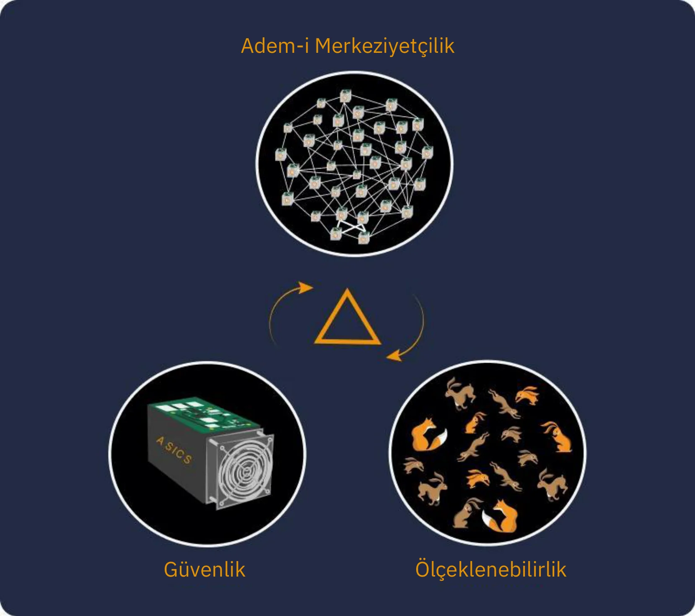


Buna göre, Blockchain tabanlı bir protokol bu üç özellikten yalnızca ikisini karşılayabilir. Bitcoin protokolünde, geliştiriciler merkeziyetsizliği ve güvenliği destekleyecek seçimler yapmıştır. Bir yandan, 1MB'lık blok boyutu ve iki blok arasındaki süre (ortalama 10 dakika), bir Bitcoin düğümünün daha düşük bir maliyetle çalıştırılmasına olanak tanıyarak ademi merkeziyetçiliği desteklemektedir. Öte yandan, blokların Proof-of-Work aracılığıyla üretilmesi protokol dahilindeki sahtekarlığı son derece maliyetli hale getirirken, ağ düğümleri tarafından doğrulamayı kolaylaştırır ve güvenliği destekler. Bununla birlikte, bu tercihler bir bloktaki ortalama işlem sayısına, kabaca saniyede birkaç işleme karşılık gelen bir sınır getirmektedir. Bu sayı VISA gibi ödeme işlemcilerinin hesaplama kapasitesi (1700/s) ile karşılaştırıldığında gülünçtür, ancak bu sınır Bitcoin ile sansüre dayanıklı ve Trustless bir şekilde işlem yapmak için gereklidir. Bununla birlikte, Bitcoin'yı geliştirenler başından beri bu sorun üzerinde düşünmektedirler.


### Üstte bir Layer olarak yıldırım


Yıllarca düşündükten ve birçok denemeden sonra Lightning protokolü ortaya çıktı. Belirli sayıda spesifikasyon kullanan bu protokol, Bitcoin'in işlem protokolünün güvenliğinden ve programlanabilirliğinden yararlanarak eşler arası bir ödeme ağı oluşturur. Lightning Network, bir ödeme kanalları ağı olarak hareket ederek gönderici için düşük ücretlerle anında işlem yapılmasını sağlar ve hatta doğrudan kanal bağlantısı olmayan kişiler arasında Exchange rotaları oluşturur.


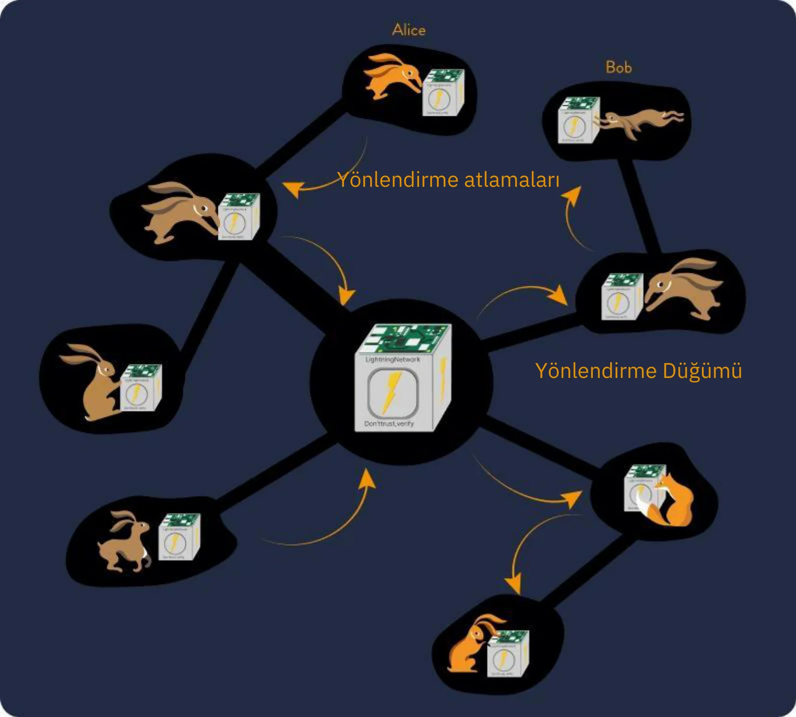


Western Union, merkez bankaları, Visa ve Mastercard gibi geleneksel para transferi hizmetleri, mevcut ödeme sistemlerinden daha verimli ve uygun maliyetli olan Lightning Network teknolojisini benimsemedikleri takdirde ortadan kalkabilir. Aslında Lightning Network, bir kanalı paylaşan iki eş arasında neredeyse sınırsız işlem yapılmasına olanak tanıyarak, her bir işlem yerine yalnızca kanalın oluşturulduğunu duyurmak için yapılan işlemle ilişkili enerji maliyetlerine katlanılmasını sağlar.


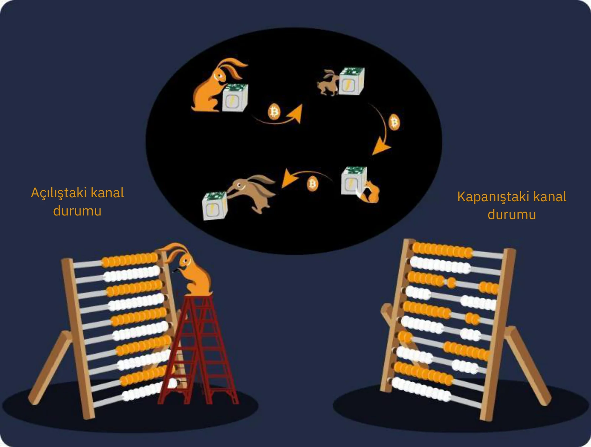


İşlemler kriptografi yoluyla ve dolaylı olarak Bitcoin üzerindeki madenciler tarafından tüketilen enerji yoluyla güvence altına alınır. Coğrafi sınırlamalar olmaksızın, son derece düşük ücretlerle (genellikle %0,5'ten az) anında yapılabilirler.


Özetle, Lightning Network, Bitcoin'te alım satım yapmak için etkili bir ödeme sistemi uygulamaya yönelik umut verici bir girişimdir. Eğitim bölümümüzde veya Lightning Network kurslarımızda keşfedebileceğiniz çok sayıda Lightning cüzdanı zaten mevcuttur.


Bu girişin ötesine geçmek ve Lightning Network'in tüm işleyişini anlamak istiyorsanız, Fanis Michalakis'in konuyla ilgili bu mükemmel kursunu almanızı öneririz:


https://planb.network/courses/34bd43ef-6683-4a5c-b239-7cb1e40a4aeb

## Lightning Network Kullanım Örnekleri


<chapterId>684e31f9-ebd1-51b6-91c0-1e6a315f1141</chapterId>


Az önce gördüğümüz gibi, Bitcoin protokolü devrim niteliğinde olmasına rağmen, günlük işlemlerimizin tümünü gerçekleştirmek için gereken ölçeklenebilirlik açısından önemli zorluklarla karşı karşıyadır. Bu sorunları çözmek için Lightning Network önerildi ve o zamandan beri hepsi birlikte çalışabilir olan birkaç farklı uygulamaya dönüştü:


- Blockstream'den Core-lightning
- Eclair by Acinq
- Yıldırım çarpması sonucu LND


Bu eşler arası ağ, aksi takdirde Bitcoin Blockchain'daki yüksek ücretler ve uzun onay süreleri nedeniyle pratik olmayacak mikro işlemleri (çok düşük değerli) kolaylaştırmayı amaçlamaktadır.


### Ağın kullanım durumları nelerdir?


Bu teknoloji, Bitcoin'ün güvenliğini ve merkezsizleştirilmesini sağlamak için gerekli kısıtlamalar nedeniyle daha önce ulaşılamayan Bitcoin için çok çeşitli potansiyel uygulamalara kapı açmaktadır. Bu günlük kullanım alanları arasında, hem fiziksel hem de çevrimiçi ticarette anında faturalandırma, gerçek zamanlı ödemeler için para akışı ve içerik oluşturucular için mikro bağışlar sayılabilir. Neredeyse anında, güvenli ve düşük maliyetli (ortalama %0,5'ten az) işlemlerden oluşan bir ağ sağlayarak, daha önce hayal bile edilemeyen birçok iş modeli gerçekleştirilebilir. Lightning Network, Bitcoin'ün en küçük birimi olan satoshis (Sats) kullanarak çalıştığı için bu mümkün olmaktadır.


Video oyun endüstrisi, Lightning Network'in mevcut iş modellerini dönüştürmek için nasıl kullanılabileceğine dair özellikle ilginç bir örnek sunmaktadır. "Oyuna dahil olma" kavramı bu bağlamda son zamanlarda popülerlik kazanmış bir fikirdir. Esasen bir oyunun sonucundan finansal bir pay almayı içerir. Aslında Lightning Network, oyuncuların oyun oynarken birkaç satoshis (yaklaşık bir euro sentin bir kısmı) gibi çok küçük miktarlarda para yatırarak rekabeti teşvik eden ve bot kullanma maliyetini önemli ölçüde artıran bir bahis oluşturmalarına olanak tanır.


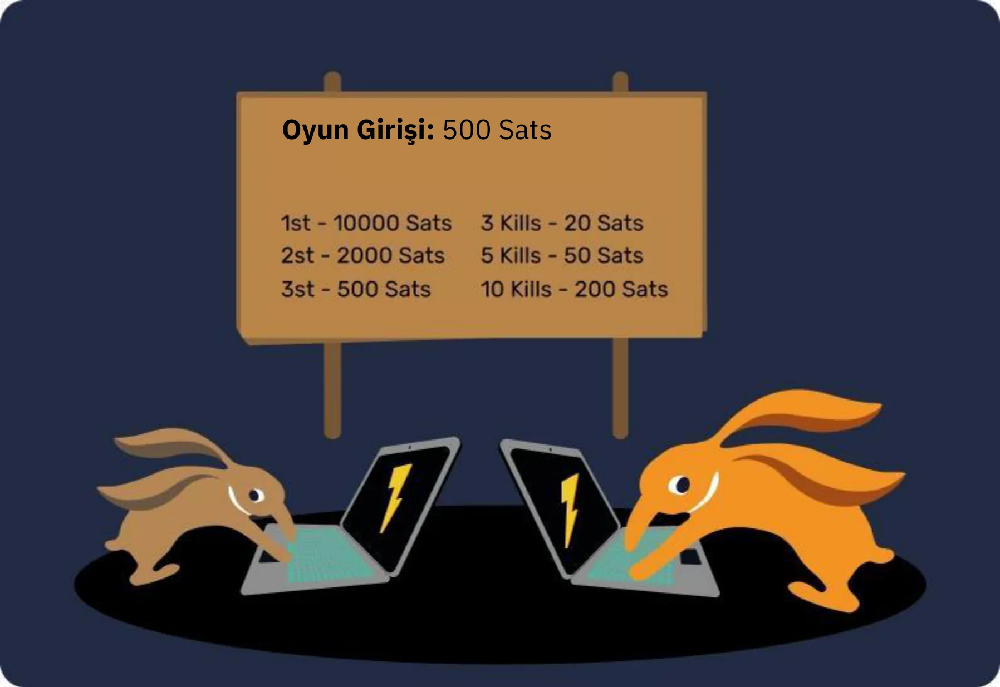


Özetle, Bitcoin ile mikro işlemlerin geleceği, Lightning Network gibi yenilikler sayesinde umut verici görünüyor. Bu teknolojiler gelişmeye ve olgunlaşmaya devam ettikçe, yakın gelecekte yeni ve heyecan verici uygulamaların ortaya çıkmasını bekleyebiliriz.


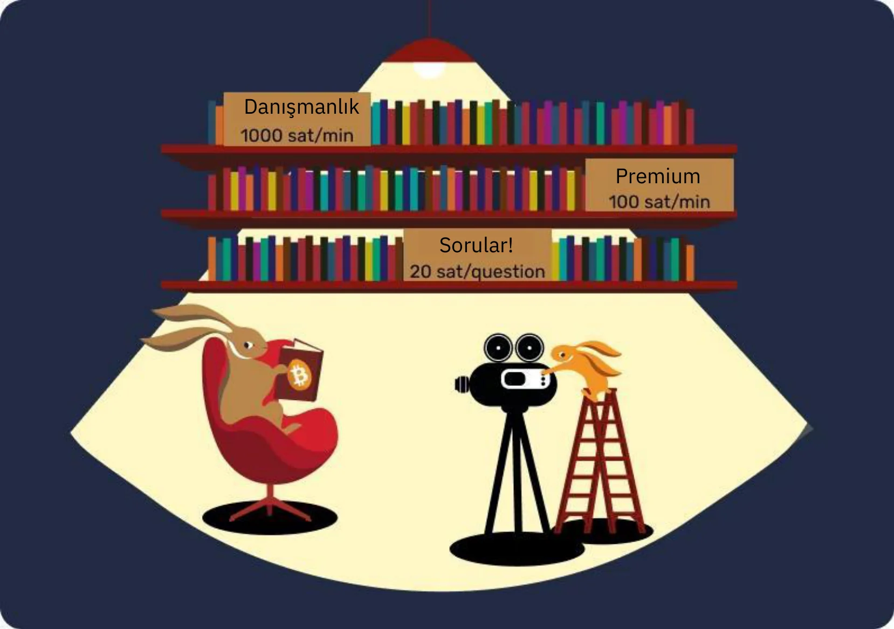


Bir başka örnek de "para akışı" olabilir: Lightning Network aracılığıyla her dakika mikro işlemler yapabiliriz (potansiyel olarak güvenilir bir üçüncü taraf olmadan), bu da tüketicilerin gerçek tüketimlerine dayalı olarak içerik için ödeme yaptıkları ekonomik modellerin denenmesine kapı açar. Bu sistemin mal kiralamak için kullanılması bile düşünülebilir. Böyle bir sistemde para, bir hizmet ya da ürüne katkıda bulunan farklı kişiler arasında önceden tanımlanmış bir yüzdeye göre otomatik olarak bölüştürülür. Bu, ödeme modelleri hakkındaki düşüncelerimizde devrim yaratabilir: bir hizmet için aylık abonelik ödemek yerine, kullanıcılardan hizmeti kullanarak geçirdikleri süre için dakika, hatta saniye başına ücret alınabilir. Böyle bir ekonomik modelin, kullanıcıların dikkatini çekmek için kaliteli içerik üretmeye teşvik edilecek olan içerik yaratıcıları için derin etkileri olabilir.


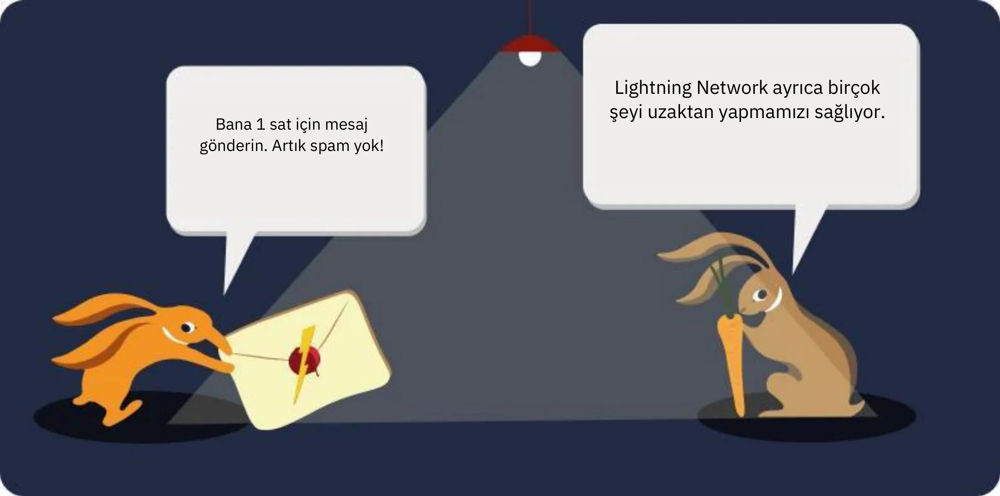


Sonuç olarak, Lightning Network, Bitcoin kullanıcıları için çok sayıda heyecan verici kullanım alanı açmaktadır. Ortaya çıkan ekonomik modeller ve iş fırsatları çok sayıda ve çeşitlidir ve en sevdiğiniz podcast'leri dinlediğiniz için birkaç Sats ile ödüllendirilmenizi sağlayan podcast uygulamasını [Fountain] (https://www.fountain.fm/) deneyerek kendiniz kontrol etmenizi öneririz!


## Kırmızı Hap mı Mavi Hap mı?


<chapterId>c81cdb45-6aa9-5462-9835-c4852084b2cc</chapterId>


Morpheus'un Neo'ya dediği gibi: "Mavi hapı alırsın, hikaye biter, yatağında uyanırsın ve neye inanmak istiyorsan ona inanırsın. Kırmızı hapı alırsan Harikalar Diyarı'nda kalırsın ve sana tavşan deliğinin ne kadar derin olduğunu gösteririm." Bitcoin'nin tavşan deliğini keşfetmeye hazır mısınız? Dikkatli olun, çünkü finansal özgürlüğünüzü yeniden keşfedebilirsiniz!


### Teknolojik gelecek ve etkileri


Teknoloji katlanarak gelişiyor ve hiç kimse gelecekteki gelişmelerini kesin olarak tahmin edemiyor. Dünya bağlantısı ve yapay zeka ilerlemeye devam ediyor ve bir bireyin internet aracılığıyla edinebileceği bilgiler zaman içinde giderek ölçülemez hale geliyor.


Örnek olarak yapay zekayı ele alırsak, bu teknolojiler video oyunları, görüntü ve metin üretimi ve veri analizi gibi giderek artan sayıda alanda insan düzeyindeki performansı çoktan aşmış veya yaklaşmıştır. Bunun potansiyel sonuçlarından biri, yapay zeka ve otomasyon nedeniyle işlerin %80'inden fazlasının ortadan kalkacak olmasıdır. Sonuç olarak, teknolojik ilerlemeyi kısıtlamak ya da YZ'nin yarattığı üretkenlik kazanımlarından artan sermayeyi kullanmak gibi çeşitli seçenekler önümüzde durmaktadır.


Kendimize sormamız gereken bazı temel sorular var:


- İşlerin %80'inin yok olacağı bir toplumu nasıl yöneteceğiz?
- Bir nüfusu nasıl yeniden canlandırabiliriz?
- Bu kadar çok öğretmene ihtiyaç var mı?
- Otomasyonun jeopolitik, siyasi ve insani sonuçları yeterince tartışılmamaktadır.

Bilgisayar, internet, yayın akışı ve sanal gerçeklik eğitimi değiştirecek. Tüm Fransız öğrenciler için hükümet tarafından yönetilen evrensel bir kursumuz olabilir ve öğretmenler artık ders vermeyip doğrudan öğrencilere eşlik edebilir. Çocuklar sanal bir dünyaya girebilir ve tarih öğrenirken onlara eşlik edebilirler.


- Bir öğretmen ile bir yapay zeka kişileştirmesi arasındaki sınır nerede?
- Refah içinde yaşayan bir toplumu nasıl garanti altına alabiliriz?


Geleceğimize yönelik bu temel sorular tartışılmalı ve birlikte karar verilmelidir.

Bitcoin ile bağlantısı nedir? İnternetin iletişim biçimlerinde devrim yaratması gibi, Bitcoin de yeni büyük ölçekli organizasyon biçimleri için teknolojik bir devrimi temsil etmekte ve herhangi bir güvenilir üçüncü tarafa güvenmeden Exchange değerine ulaşmamızı sağlamaktadır. Parasal sistemin teknolojik evrimini engellemek mi istiyoruz, yoksa Bitcoin ve Lightning protokollerini kullanmanın sunduğu on kat verimlilik artışı yoluyla artan sermaye potansiyelini kucaklamak mı istiyoruz?


### Finansın geleceği nedir?


Bu hususlar, kullandığımız parayı kimin tutması, yetkilendirmesi ve izini sürmesi gerektiğine dair soruları da gündeme getirmektedir. Amaç, seçilmemiş liderlerin olduğu kapalı bir sistem ile tarafsızlığın hakim olduğu, güvenilir üçüncü tarafların olmadığı açık bir sistem arasında karar vermektir.


- Para birimi bir özel mülkiyet biçimi midir?
- Yüksek Mahkeme kararı olmadan protestocuların hesapları engellenebilir mi?
- Finansal sistemi kim garanti ediyor?
- Bir birey kendi parası üzerinde nasıl egemen olabilir ve güvenilir bir üçüncü tarafa nasıl güvenebilir?
- Dünyanın diğer ucuna ücret veya aracı olmadan para gönderilebilir mi?


Bu yeni teknolojileri kabul etmek dünya çapında generate büyük ölçek ekonomilerine yol açabilir. Sermaye akışının serbest dolaşımına izin vermeli miyiz? Uluslararası blokajların ekonomik ve siyasi sonuçları vardır. Western Union gibi bazen %25'e varan ücretler talep eden finansal aracıları kullanmak etik midir? Giderek dijitalleşen bir dünyada paranın demokratikleştirilmesi ve devlete ya da şeffaf olmayan finans kurumlarına değil, insanlara ait ortak bir mal olarak görülmesi gerektiğine inanıyoruz.


Bankacılık sistemini kimin kontrol etmesi gerektiği sorusu çok önemlidir çünkü bankacılık oyununun kuralları şeffaf ve herkes tarafından anlaşılabilir değildir, bu da politikacılar ve düzenleyicilerden oluşan bir kastın sistem üzerindeki hakimiyetini sürdürmesine izin vermektedir, bu nedenle serbest piyasanın mı yoksa bir grup entelektüelin mi bu sistem üzerinde söz sahibi olması gerektiğini sorgulamak önemlidir.


### Özgürlüğümüz tehlikede.


Sansür de sorgulanmalıdır: Neyin sansürlenip sansürlenmeyeceğine karar verecek bilgiye kim sahiptir? Medya bazı bilgilere karşı tutumunu değiştirdi ve daha önce sansürlenenler bugün artık sansürlenmiyor.


- Neyin sansür ya da propaganda olduğuna kim karar veriyor?
- Sistemimiz üzerindeki ilahi el kimin elindedir?


Sansüre tolerans göstermenin ifade özgürlüğü ve toplanma hakkını yok edebileceğine, inovasyon ve özgür irade üzerinde olumsuz bir etkisi olabileceğine inanıyoruz. Tam bir distopya yaratmadan sansür uygulamak teknik olarak zordur. Dolayısıyla, sansür yetkisi hangi kurumda olmalıdır? Konu karmaşıktır ve kimin kısıtlanıp kısıtlanmaması gerektiğine karar vermek de zordur.


Dünyada banka hesabı olmayan 2,4 milyar insan var ve bu da zorunlu olarak coğrafi eşitsizlikler yaratıyor. Öte yandan Bitcoin, sosyal statünüzü veya siyasi konumunuzu göz ardı ederek işlem eşitliği sağlar. Protokol apolitiktir ve liderlere ya da diğer nüfuzlu kişilere özel ayrıcalıklar tanımaz; böylece birkaç kişi zirvede kalırken diğerlerinin geride kalması yerine herkesin kalkınmayı ilerletmek için aynı fırsatlara sahip olmasını sağlar. Sosyal statülerinden bağımsız olarak herkes aynı para birimine erişebilmeli mi? Çocuklarımıza bırakmak istediğimiz dünyayı düşünmek çok önemlidir ve biz onların paralarını istedikleri gibi yönetmekte özgür oldukları açık bir dünya yaratmayı arzuluyoruz.


Bitcoin önemlidir ve sadece bir şans oyunu olarak görülmemelidir, bu nedenle Bitcoin ve dünya üzerindeki sonuçları hakkında sorular sormaya devam etmek çok önemlidir.


### Bitcoin: devrim niteliğinde bir protokol


Önceki bölümde gördüğümüz gibi, Bitcoin protokolü tüm kullanıcılarına karşı tarafsızdır. Mutabakat kuralları ve kriptografi sayesinde, işlemleri küresel bir halka açık Ledger'da değişmez bir şekilde kaydedebilir ve herhangi bir güvenilir üçüncü taraf olmadan parasal değer transferlerini garanti edebiliriz. İkinci Layer altyapısı (ve yakında RGB veya "Gerçekten İyi Bitcoin" ile üçüncü Layer) ağ ölçeklenebilirliği ve yeni işlevlerin geliştirilmesi için kullanılır.


Bitcoin verimli ve sağlıklı bir para birimi olmak için gerekli tüm özelliklere sahiptir: bölünebilir, anında taşınabilir, sansürlenemez, ihmal edilebilir doğrulama maliyetleri ve gelecek yüzyıllar için 21 milyon birime ayarlanmış bir para politikası. Bitcoin takma isimlidir ve dünyanın herhangi bir yerinde herhangi bir kuruluştan izin alınmaksızın takas edilebilir. Sadece kendi özel anahtarlarınıza sahip olmanız ve "Ne anahtarlarınız, ne de bitcoinleriniz" sözünü hatırlamanız gerekir.


Kriptograflardan özgürlükçülere, geleneksel işletmelere ve hatta tüm ülkelere kadar çeşitli insan grupları tarafından benimsenmiştir. Bununla birlikte, Bitcoin herkes içindir ve kullanıcı sayısı arttıkça, işlem geçmişinin koruyucuları olarak hizmet veren ve merkezsizleşmesini sağlayan Bitcoin düğümlerinin sayısı da artmaktadır.


Bitcoin artık durdurulamaz ve sansürlenemez. Parasal sistemi değiştiren ve finansal kapsayıcılığı mümkün kılan barışçıl bir devrimdir. Kullanıcılar bitcoinleri ticaretleri için kabul ederek ya da düzenlenmiş veya düzenlenmemiş platformlar aracılığıyla satın alarak elde edebilirler. Güvenilir aracılara ihtiyaç duymadan fonlarını cüzdanlarında, mobil uygulamalarında veya fiziksel cihazlarında saklayabilirler. Bitcoin şeffaflığı, özgürlüğü ve bireysel sorumluluğu savunur: "Güvenme, Doğrula" deyişinde olduğu gibi.


Satoshi, para birimini yeniden tasarlayarak finansal sistemde bir değişiklik önermek için 2008 yılında Bitcoin'yı yarattı. Kolayca yaratılabilen fiat'ı bir yolsuzluk riski olarak görüyordu - hükümetler bunu kötüye kullanabilir ve kullanıyor da. Bitcoin, bizi bankalardan özgürleştiren ve paraya bakış açımızda barışçıl bir devrim başlatan tarafsız bir alternatiftir.


Katılmaya hazır mısınız?


# Son Bölüm


<partId>9ed4b454-2950-40b4-a56b-68d109689a82</partId>


## Yorumlar & Derecelendirmeler


<chapterId>585729e2-b0ab-51b5-89ec-593e3ea22c57</chapterId>

<isCourseReview>true</isCourseReview>

## Final Sınavı


<chapterId>8410e961-3841-5abf-a51d-04fc0139dd59</chapterId>

<isCourseExam>true</isCourseExam>

## Sonuç


<chapterId>dfc534be-44a9-5e8c-9c98-e51ef0554e91</chapterId>

<isCourseConclusion>true</isCourseConclusion>


