# Пътешествие към първите ви биткойни

Екосистемата Биткойн преживява впечатляващ и безпрецедентен растеж. Технологичните, икономическите и социалните трансформации, задвижвани от изобретението на Сатоши Накамотo, се засилват с всеки изминал ден и постепенно отварят вратите на един нов свят, от който вече можете да се възползвате пълноценно.

Гмуркането в "Заешката дупка" на Биткойн е вълнуващо интелектуално приключение, което ще стимулира критичното ви мислене и ще постави под въпрос много от убежденията ви. Това изследване ще ви даде не само дълбоко разбиране за това как работи Биткойн, но и реална възможност да си възвърнете личната свобода, да защитите личния си живот и да постигнете истински финансов суверенитет.

За да ви напътствам ефективно в това пътуване, създадох този напълно безплатен курс. В него фокусът е изключително върху Биткойн. Никакви несъществени дискусии, никакво споменаване на други криптовалути, само ясно, точно и непосредствено съдържание.

Този курс е разработен така, че да ви даде пълен контрол върху начина на учене, като ви позволи да изучавате Биткойн със собствено темпо, следвайки пътя, който най-добре отговаря на вашите интереси и цели.

+++
# Въведение

<partId>008c49b7-5e17-5973-87f2-ba28429b2697</partId>

## Преглед на курса

<chapterId>bfc96999-0ee1-5c41-8297-1b629f50cffc</chapterId>

:::video id=58e578ef-bb3c-423d-8431-0c16db8e5f29:::

Добре дошли в BTC102! Ако вече сте завършили BTC101, сте се запознали с ключовите теоретични концепции за това защо Биткойн е толкова революционна технология. Сега, с BTC102, е време да приложите тези знания в действие. Този курс има за цел да ви помогне да изградите своя личен план за Биткойн, стъпка по стъпка.

В следващите глави ще ви запознаем с практическите стъпки, за да **получите първите си биткойни**, да ги **защитете** правилно и уверено да направите първите си стъпки в тази бързо развиваща се екосистема.

https://planb.academy/courses/2b7dc507-81e3-4b70-88e6-41ed44239966

Въпреки че Биткойн съществува от повече от 16 години, индустрията е все още млада, динамична и дълбоко вкоренена в свободата. Нейният основен протокол е напълно децентрализиран и устойчив на контрол от страна на който и да е централен орган, което позволява на екосистемата да се развива по естествен и органичен начин.

Въпреки че тази свобода подхранва невероятна вълна от иновации и възможности, тя носи и определени рискове, включително измами, често срещани грешки и капани, които често произтичат от липсата на знания. Основната цел на този курс е да ви помогне да се ориентирате в тази нова екосистема с увереност и сигурност.

За тази цел курсът BTC102 е разделен на няколко части, всяка от които е посветена на ключов аспект от пътуването ви в Биткойн:

Първият раздел, "Предпоставки за разбиране на Биткойн", ефективно ви подготвя за предстоящия път. Ще се научите да разпознавате основните капани, свързани с измами и финансови злоупотреби, които могат да съществуват в екосистемата на Биткойн. След това ще разгледаме съществените основи на онлайн сигурността.

Накрая ще ви дам няколко практически съвета, специално разработени за начинаещи, които ще ви помогнат да избегнете често срещани грешки при първата работа с Биткойн.

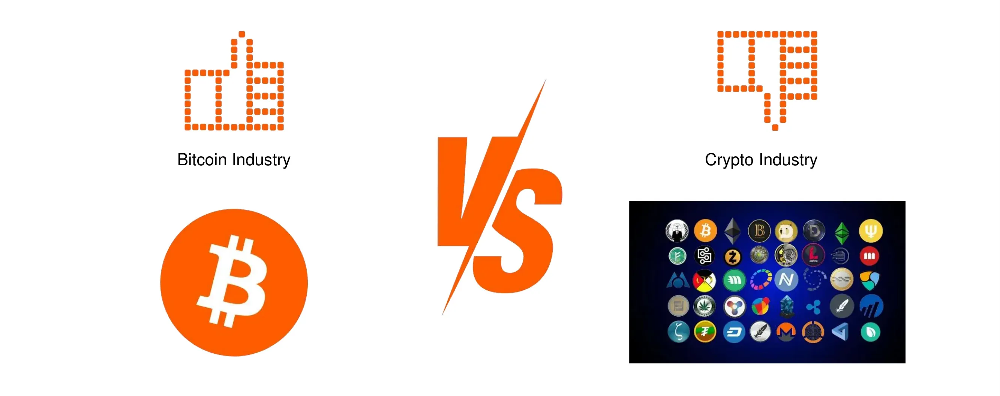

Вторият раздел, "Да разбереш в какво се забъркваш", ще задълбочи цялостното ви разбиране за Биткойн. Ще започнем с преглед, за да сме сигурни, че напълно разбирате основните концепции.

След това ще ви обясним защо Биткойн е фундаментално важен от технологична, икономическа и социална гледна точка, като затвърдим убеждението ви в неговата стойност. Също така ще разгледате индустрията Биткойн като цяло: нейните ключови участници, организация и развитие през годините. И накрая, ще разгледаме многопластовата архитектура на екосистемата Биткойн - ключова концепция за разбирането на това как тази система продължава да се обновява, без да нарушава целостта на основния си протокол.

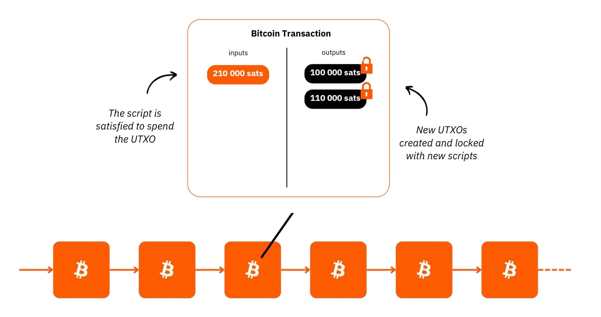

Третият раздел, "Изготвяне на план", е посветен на личния ви подход към Биткойн. Ще започнем, като ви помогнем да определите потребителския си профил от четири основни категории:

- HODL-er*, фокусиран върху дългосрочното държане на биткойн;
- подреждащият*, който купува редовно и методично;
- потребителят*, който приоритетно използва биткойн ежедневно;
- и накрая *параноикът*, който иска максимална сигурност, за да защити ефективно имуществото си и личния си живот.

Ще ви напътстваме при прилагането на стратегия, която отговаря на вашия профил и ви помага да постигнете личните си цели.

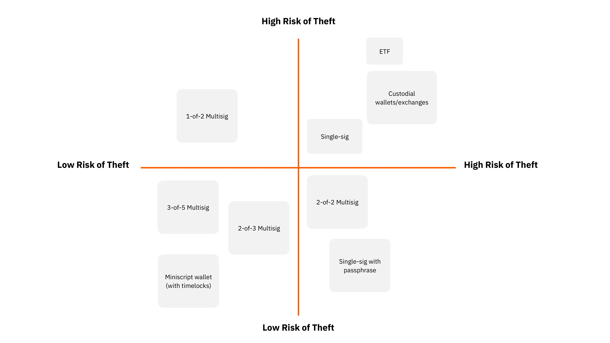

И накрая, четвъртият раздел, "Защита на наследниците и богатството ви", обхваща важна тема, която често се пренебрегва: как да гарантирате, че вашият биткойн ще бъде предаден на близките ви в случай на неочаквано събитие. Ще научите как да създадете и настроите план за наследяване на биткойн, гарантиращ запазването на вашето богатство след края на живота ви.

В края на този курс ще разполагате с всички практически инструменти, които са ви необходими, за да се ориентирате уверено в екосистемата на Биткойн и да станете един от най-напредналите ѝ потребители!

Готови ли сте да започнете своето пътешествие в света на Биткойн? Хайде!

**N.B.**: Ако по време на курса се сблъскате с непознати термини, моля, потърсете дефиниции в [речника](https://planb.academy/resources/glossary).

# Предпоставки за разбиране на Биткойн

<partId>4481fc4b-0f83-489e-ad07-81517c5d6bad</partId>

## Измами и финансови измами

<chapterId>8af2948b-2ab5-54c4-862c-3414b8a285a2</chapterId>

:::video id=9f3a7b2e-2c4d-4c1e-8b1f-3a2c1d4e5f6a:::

Екосистемата Биткойн и заобикалящата я среда са все още сравнително млади и слабо регулирани в зависимост от държавата. Въпреки че тази свобода открива огромни възможности, тя също така създава благоприятна почва за финансови измами, мошеничества и различни форми на манипулация. Ето защо първата глава е толкова важна: разбирането на често срещаните капани ще ви помогне да ги избегнете. Финансовата ви сигурност е приоритет, защото лошият опит не засяга само вас, а цялата общност на Биткойн.

### Биткойн срещу криптовалути: разбиране на разликите

Преди да продължим, е важно да направим ясно разграничение между два коренно различни свята:

- Екосистемата Биткойн** е съсредоточена около идеята за стабилни пари, изградени върху силна децентрализация, дългосрочна устойчивост, неприкосновеност на личния живот и индивидуален суверенитет. От стартирането си през 2009 г. Биткойн функционира надеждно и сигурно, подкрепяна от глобална, ангажирана общност от разработчици. Това не е преходна тенденция, а стабилен и утвърден протокол, проектиран да запази стойността си във времето.

- Индустрията на криптовалутите**, от друга страна, е много по-голяма и включва десетки хиляди различни проекти, всеки от които има собствен токен. Това пространство често се движи от бързи иновации, шумотевица и краткосрочни финансови спекулации. Много от тези проекти са централизирани, по-малко сигурни и не предлагат голяма реална стойност - въпреки смелите обещания и бляскавия маркетинг.

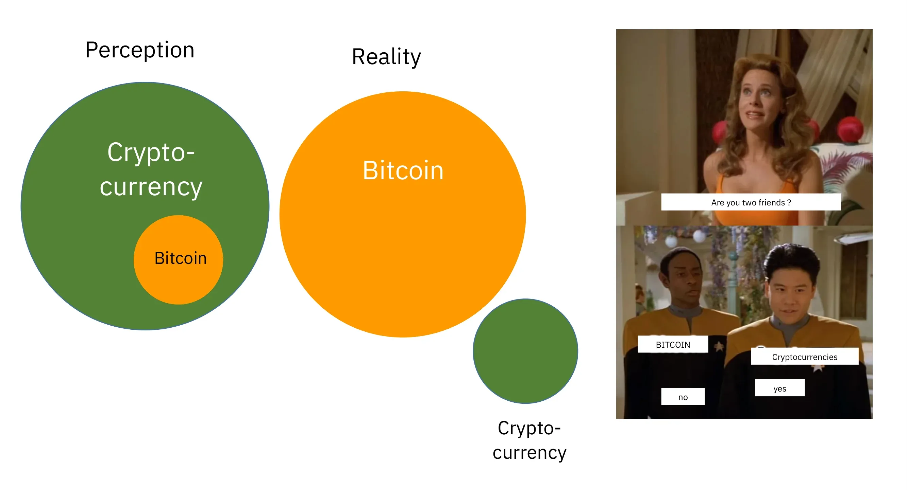

Ако искате да разберете по-добре откъде идва Биткойн и какво наистина го отличава от други проекти, препоръчвам ви да разгледате този безплатен допълнителен курс за историята на Биткойн по-късно:

https://planb.academy/courses/a51c7ceb-e079-4ac3-bf69-6700b985a082

Както знаете, платформата Plan ₿ е посветена изключително на Биткойн. Въпреки това, разбирането на разликата с други криптовалути ще ви помогне да избегнете капаните, свързани с безполезни, а понякога дори измамни проекти.

### Основните измами, които трябва да избягвате

Ето кои са най-често срещаните измами, на които може да се натъкнете по време на пътуването си:

#### Пирамидални схеми и схеми на Понци

Това са някои от най-често срещаните измами в света на криптовалутите. При схемата на Понци ранните участници получават плащания, като използват парите на по-новите участници; не от реална инвестиция или продукт. Не се създава действителна стойност. Системата работи само докато нови хора продължават да се присъединяват. Щом потокът от нови участници се забави, цялата схема се разпада.

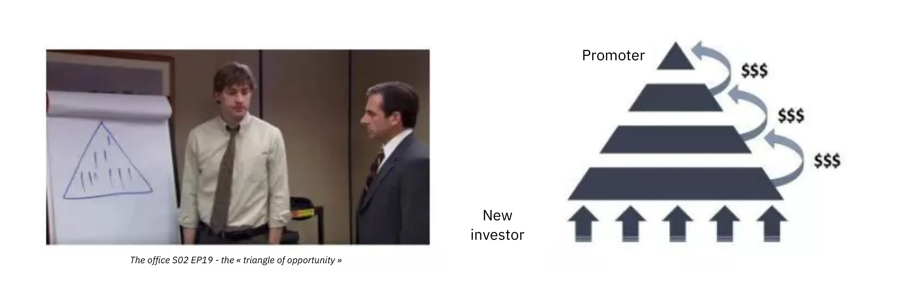

Тези измами обикновено включват:

- Нереалистични обещания за гарантирана възвръщаемост (напр. 20% гарантирана възвръщаемост);
- Забавяне или трудности при опит да изтеглите инвестираните средства;
- Силни стимули за набиране на нови членове, които да поддържат работата на системата;
- Пълна липса на прозрачност относно истинския източник на обещаните печалби.

В крайна сметка всички пирамиди и схеми на Понци са обречени на провал. Тяхната основна слабост се крие в постоянната необходимост от привличане на нови инвеститори, за да се изплатят печалбите на предишните участници. Тази нужда става математически невъзможна за поддържане с течение на времето, тъй като броят на необходимите нови участници нараства експоненциално с разрастването на системата. Когато се достигне критична точка, участниците започват да се съмняват, доверието изчезва и цялата пирамида се срива. На този етап последните присъединили се хора, често най-малко информирани, губят цялата си инвестиция, без да могат да я възстановят, докато организаторите или ранните инвеститори обикновено вече са изтеглили средствата си и са напуснали системата.

В света на криптовалутите схемите на Понци могат да приемат различни форми, често създадени, за да прикрият измамната си същност зад технологична или финансова маска. Тези измами могат да се появят под формата на нови предлагания на токен или първоначални предлагания на койни (ICO), които представляват операции за набиране на средства, при които нова криптовалута се продава на обществеността. Зад технически термини като "блокчейн", "интелигентни договори" или "залагане" някои проекти всъщност крият сложни пирамидални схеми. Други твърдят, че предлагат висока възвръщаемост, като комбинират съмнителни криптоактиви със системи за възнаграждение, които разчитат изцяло на непрекъснатия приток на нови инвеститори.

Неотдавна схемите на Понци се разпространиха и в света на децентрализираното финансиране (DeFi). Макар че DeFi има за цел да предоставя финансови услуги без посредници, някои проекти го използват, за да придадат фалшиво усещане за легитимност на своите измами. Някои DeFi платформи обещават висока, гарантирана възвръщаемост в замяна на депозити на криптовалута в автоматизирани протоколи. Тези привлекателни обещания често са подкрепени от непрозрачни и непроверими механизми, като токените са създадени специално за измамата. В действителност тези системи нямат устойчив бизнес модел - възвръщаемостта просто се изплаща от средствата на новите потребители, точно както при традиционната схема на Понци. Когато доверието започне да ерозира или притокът на нови участници се забави, тези системи неминуемо се сриват, което води до значителни загуби за нищо неподозиращите инвеститори.

Моля, обърнете внимание, че съдържанието на този курс е само с образователна цел и не трябва да се тълкува като финансов съвет. Вашата финансова сигурност зависи от способността ви да останете предпазливи, скептични и добре информирани при всяко финансово решение, което вземате.

Най-добрата защита е винаги да задавате този прост въпрос: Откъде всъщност идва обещаната печалба? Ако отговорът не е ясен, веднага бягайте.

#### Помпа и крах

Този вид измама включва изкуствено завишаване на цената на актив - често нисколиквидна криптовалута - чрез координирана маркетингова кампания, обикновено водена от група инвеститори. Типичната Pump & Dump схема следва този модел:

- Група вътрешни лица или влиятелни фигури тихомълком натрупват голямо количество от целевия актив.
- След това те започват агресивна промоционална кампания, за да предизвикат шум и да повишат цената.
- Широката общественост, водена от FOMO (Fear of Missing Out), започва масово да купува активите, което води до още по-голямо покачване на цената.
- В разгара на шумотевицата вътрешните лица разпродават своите дялове наведнъж.
- Цената се срива, а закъснелите купувачи търпят големи загуби.

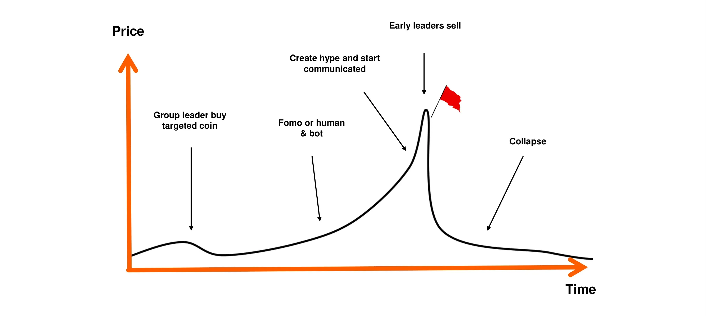

Важно е да се отбележи, че стратегиите Pump & Dump са незаконни в много страни и се считат за форма на манипулиране на пазара. Въпреки това подобни схеми продължават да процъфтяват, особено в пространството на криптовалутите, където регулацията все още наваксва.

Бъдете особено предпазливи към частните групи за сигнали в платформи като Telegram, Discord или други канали на социалните медии. Те често се управляват от влиятелни личности или самопровъзгласили се експерти, като някои от тях дори събират такси за участие. Въпреки че тези групи твърдят, че предлагат изключителни възможности за инвестиции, реалността е далеч по-едностранчива: само организаторите печелят, докато повечето участници в крайна сметка губят парите си.

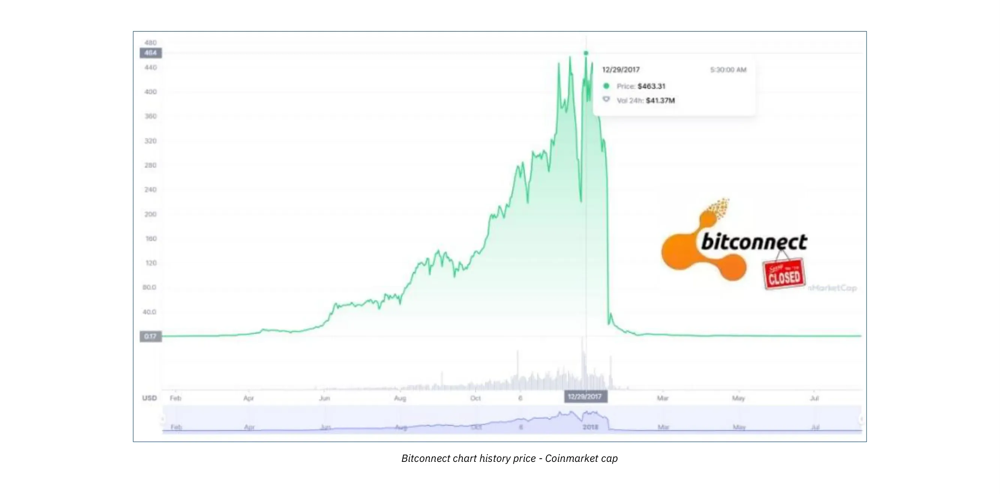

Вярно е, че някои участници могат временно да се възползват от този вид пазарни манипулации, но техният успех обикновено се основава само на късмет и перфектно подбрани моменти. В дългосрочен план тези схеми не са устойчиви. Те изискват постоянна високорискова ангажираност и многократно участие в измамни схеми, които неминуемо се провалят.

Още по-лошо, те подхранват една опасна илюзия: убеждението, че е възможно да се печелят бързо и лесно пари, без да се разбира как всъщност работят финансовите системи. Този начин на мислене не само излага на риск отделните лица, но и подкопава доверието в цялата екосистема на криптовалутите

Поради всички тези причини най-добрата стратегия е да се придържате към сериозен и обмислен подход към инвестирането, който се основава на финансово образование, солидно разбиране на основите и дългосрочна перспектива.

Ако търпеливо трупате знания, ще бъдете много по-малко уязвими към емоционални манипулации и нереалистични обещания и много по-добре подготвени да избягвате финансовите капани, които могат да доведат до реални загуби.

#### Дарение, лотария и фалшиви измами с подаръци

Този тип измами обещават безплатни биткойни или други награди в замяна на изпращане на малка сума пари. Важно е да запомните: никое легитимно лице или организация никога няма да ви помоли да изпратите криптовалута предварително с обещанието да ви изпрати повече в замяна.

Измамниците често се представят за известни публични личности (като Елон Мъск или други знаменитости), за да привличат жертви чрез социалните медии. Винаги проверявайте два пъти легитимността на акаунтите и уебсайтовете, преди да се свържете с тях, и никога не се доверявайте на оферти, които изглеждат прекалено щедри или твърде добри, за да са истина.

Понякога тези измами изглеждат като измами с "авансови такси". Обещават ви награда или възнаграждение (пари, продукт или услуга), но първо от вас се иска да платите такса, уж за покриване на разходи като доставка, данъци или транзакция. След като плащането бъде извършено, измамникът изчезва, а обещаната награда така и не пристига.

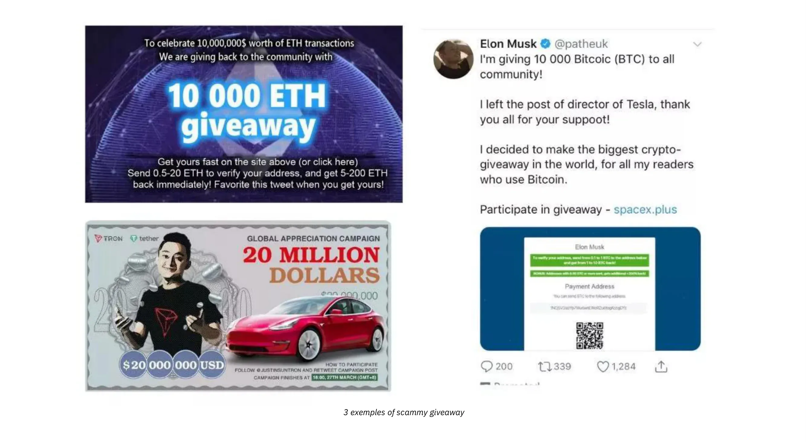

#### Предлагани криптовалути

Централизираните проекти за криптовалути понякога предлагат безплатни токени ("*airdrops*"), за да привлекат потребители. Тези токени обикновено имат малка или никаква реална стойност и се използват главно за създаване на илюзия за популярност или за подхранване на спекулации. Бъдете изключително предпазливи с този вид промоционални оферти; те често са по-скоро маркетингови капани, отколкото истински възможности.

#### Кражба на самоличност и фишинг

Нападателите често използват фалшиви уебсайтове, акаунти в социални медии или измамни имейли, за да се опитат да откраднат средствата ви. Тези измами могат да се осъществяват по всеки канал за комуникация: имейл, социални мрежи, телефонни обаждания или дори традиционна поща...

Преди да кликнете върху връзка или да предприемете каквото и да е действие, винаги проверявайте самоличността на изпращача. При съмнение посетете уебсайта ръчно, вместо да използвате предоставената връзка. Най-важното е никога да не споделяте личните си ключове или пароли с никого.

#### Биткойн хард форкове

През годините Биткойн преживя няколко *твърди разклонения*, които доведоха до създаването на алтернативни версии на оригиналната криптовалута. С прости думи, *hard fork* е разделяне на мрежата, което води до две отделни блокчейн вериги, като и двете споделят една и съща история до момента на разделянето. Тези разклонения обикновено се случват, когато част от общността на разработчиците или по-широката екосистема на Биткойн иска да въведе значителни промени в оригиналния протокол, но не може да постигне широк консенсус. Вместо да се откажат от идеите си, те решават да стартират нова версия на Биткойн (с променени правила), надявайки се, че потребителите и миньорите ще изберат да следват техния форк вместо това.

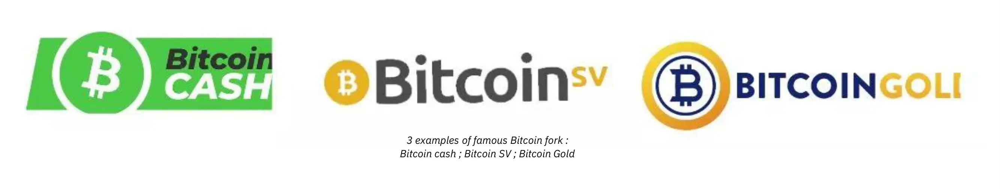

Не всички *твърди разклонения* са измамни, тъй като някои от тях са резултат от технически или идеологически разногласия в общността. Други обаче се ръководят от търговски интереси или дори от нечестни подбуди. Най-известните примери за такива твърди разклонения са **Bitcoin Cash (BCH)** и **Bitcoin Satoshi Vision (BSV)**. Стартирани съответно през 2017 г. и 2018 г., тези алтернативни валути често твърдят, че са "по-добри версии" на оригиналната Биткойн. Те популяризират предполагаеми предимства, като например по-ниски такси за трансакции или по-бързи трансакции благодарение на увеличените размери на блоковете. Тези технически промени обаче са свързани със значителни компромиси по отношение на сигурността, децентрализацията и надеждността; елементи, които могат да влязат в противоречие с основополагащите принципи на Биткойн.

Освен техническите разлики, тези алтернативни валути често се възползват от объркването, за да привлекат неинформирани инвеститори. Те могат да използват маркетингови тактики, предназначени умишлено да заблудят новодошлите, които вярват, че купуват истински биткойн (BTC).

За да не попадате в този капан, винаги проверявайте валутата, която купувате. Оригиналът на Биткойн използва обозначението **BTC**, докато Bitcoin Cash и неговите производни използват различни акроними, като BCH или BSV.

#### Нечестни инфлуенсъри и фалшиви гурута

С нарастването на вниманието към криптовалутите в социалните медии се наблюдава рязко увеличение на броя на инфлуенсърите, самопровъзгласилите се експерти и така наречените "*крипто гурута*". Макар че някои от тях могат да предложат истински образователни прозрения, много други се възползват от своята видимост, за да популяризират съмнителни проекти или опасно рискови (а понякога и откровено измамни) стратегии за търговия. Тези лица обикновено са мотивирани от лични финансови интереси, като често получават пряко или непряко възнаграждение за популяризирането на определени токени или платформи.

Тези инфлуенсъри често разчитат на доказани тактики за привличане на начинаещи: те показват впечатляващи финансови резултати (които често са фалшиви или непроверими), демонстрират луксозен начин на живот като предполагаемо доказателство за успеха си и популяризират "чудодейни" инвестиционни стратегии. Целта е да предизвикат FOMO - страх от пропуснати ползи - и да подтикнат аудиторията си към импулсивни решения и безразсъдни инвестиции.

Важно е да разберете, че повечето "безплатни" съвети от тези личности никога не са наистина безплатни. Зад фасадата на щедрост често се крие пресметната стратегия за насочване на хората към закупуване на съмнителни активи. И дори ако някои влиятелни личности са честни, възпроизвеждането на техните резултати би било почти невъзможно; успехът им често зависи от специфичен момент, вътрешни познания или уникални обстоятелства, до които вие просто нямате достъп.

Някои инфлуенсъри могат да ви поканят да се присъедините към частни, платени групи, в които твърдят, че споделят ексклузивни сигнали за търговия или вътрешни съвети, които обещават бързи и лесни печалби. В действителност тези групи са от полза предимно за самите организатори. Те често използват последователите си като източник на ликвидност, като по същество разтоварват активи с цел лична печалба. Абонатите обикновено в крайна сметка губят пари, тъй като не са в състояние да реагират толкова бързо, колкото вътрешните лица, които организират сделките (вж. раздела за Pump & Dump схеми).

С оглед на тази реалност, ето няколко добри навика, които да възприемете, за да не попадате в капаните, заложени от недобросъвестни инфлуенсъри:

- Бъдете много предпазливи с всякакви препоръки за крипто инвестиции.**

Надежден и компетентен човек никога няма да ви притисне да купите криптовалута, без да ви насърчи първо да направите собствено проучване.

- Платените курсове за търговия или инвестиции не винаги са знак за качество.**

Много от тези курсове популяризират рискови или твърде опростени стратегии; често това е същата информация, която можете да намерите безплатно онлайн.

- Няма такъв гарантиран начин да копирате нечии сделки и да получите идентични резултати.**

Всяка инвестиционна стратегия зависи от личния контекст, времето, знанията и други фактори, които не могат да бъдат възпроизведени точно.

- Бъдете особено предпазливи по отношение на съвети, които звучат твърде добре, за да са истина.**

Нереалистичните обещания или гарантираните печалби почти винаги са признак за манипулация. Запомнете: това, че някой казва нещо уверено, не го прави вярно.

Винаги помнете, че всеки, с когото се сблъсквате в Биткойн или в по-широката криптоекосистема, има лична цел; независимо дали е заявена открито, или е скрита между редовете. Няма такова нещо като чисто неутрална информация. Дори този курс, BTC102, има ясна цел: *да насърчи по-доброто разбиране на Биткойн.*

Ето защо е важно да сте наясно с истинските мотиви зад всяко съдържание, което консумирате. И никога не забравяйте това златно правило на интернет:

*Ако даден продукт или услуга изглеждат безплатни, има вероятност вие да сте продуктът.*

В крайна сметка най-добрата ви защита е личното образование, здравословният скептицизъм и най-вече навикът да проверявате фактите за себе си.

### Как да избегнете измами

**За да сте в безопасност онлайн, особено в света на криптовалутите, имайте предвид следните основни принципи:**

- Никога не се доверявайте сляпо: "*Не се доверявай, а проверявай*";
- Бъдете скептично настроени към гарантирана или необичайно висока доходност;
- Никога не споделяйте частните си ключове с никого;
- Не изпращайте биткойн (или други криптографски данни) на непознати адреси;
- Ако се съмнявате, направете пауза. Отстъпете назад и помислете, преди да предприемете действие. FOMO е най-големият ви враг;
- Избягвайте платени групи за търговия или общности, които дават нереалистични обещания;
- Повечето раздавания или "безплатни" онлайн лотарии са измами или силно манипулирани;
- Винаги ще спечелите повече в дългосрочен план, ако се учите, отколкото ако играете хазарт.

Защитата от измами е важна първа стъпка в опазването на активите ви, но не е достатъчна. Поддържането на добра цифрова хигиена е също толкова важно. Ето защо в следващата глава ще разгледаме как да укрепите онлайн сигурността си и най-добрите практики, които трябва да възприемете, за да се защитите в цифровия свят.

## Онлайн сигурност

<chapterId>f0873bf2-6a6f-5485-bb7a-d84be14f404d</chapterId>

:::video id=2a1b3c4d-5e6f-7a8b-9c0d-1e2f3a4b5c6d:::

Веднага щом започнете да се занимавате с Биткойн, бързо ще осъзнаете, че основната киберсигурност не е задължителна - тя е от съществено значение. Измамите и измамите са само върхът на айсберга. Случайната загуба на данни, зловредният софтуер и компрометираните пароли могат да бъдат също толкова опустошителни, особено когато управлявате собствените си ключове.

В тази глава са описани някои прости и практични стъпки, с които да подобрите дигиталната си хигиена и да се защитите в пространството.

Ако искате да навлезете по-дълбоко, курсът SEC101 на Plan ₿  предлага изчерпателна разбивка на стратегиите за киберсигурност, специално разработени за потребителите на Биткойн.

https://planb.academy/courses/99c46148-7080-4915-a7e0-9df0e145cd47

### Защо киберсигурността е важна

Биткойн ви дава възможност да държите парите си директно (без банки), без посредници. Но този вид финансов суверенитет е свързан със сериозна отговорност: ако вашите BTC бъдат откраднати поради пропуск в сигурността, няма начин да отмените транзакцията. За разлика от традиционното банкиране, няма бюро за помощ, няма иск за измама и няма застраховка, която да ви спаси.

Освен това финансовата стойност на Биткойн я превръща в цел с висока стойност. Хакер, който компрометира вашия портфейл, може незабавно да прехвърли средствата ви на адрес, който контролира (без въпроси и без възможност да ги върне).

### Чист и актуален компютър

Един от най-пренебрегваните аспекти на личната сигурност е поддържането на операционната система и софтуера в актуално състояние. Много от актуализациите закърпват известни уязвимости, които иначе биха могли да бъдат използвани от нападателите. Въпреки че някои хора избягват актуализациите, опасявайки се от проблеми с производителността, истинският риск се крие в използването на остарял софтуер, който хакерите вече знаят как да пробият.

Препоръчва се също така да използвате надеждна антивирусна програма. При Windows вграденият Windows Defender обикновено е достатъчен за повечето потребители. Ако предпочитате допълнителни функции или спокойствие, на разположение са и комерсиални варианти като Kaspersky. При macOS заплахите от злонамерен софтуер са исторически по-редки **но не и несъществуващи**, така че все пак е разумно да останете предпазливи.

Освен системните актуализации и антивирусната защита, бъдете изключително предпазливи при изтеглянето на софтуер от съмнителни уебсайтове или така наречените "универсални" портали за изтегляне. Когато имате нужда от инструмент или приложение, винаги отивайте направо при официалния източник;Това драстично намалява риска от инсталиране на зловреден софтуер, маскиран като легитимен софтуер.

Друг интелигентен навик е да проверявате автентичността и целостта на всеки софтуер, преди да го инсталирате на компютъра си. Ако не сте сигурни как да го направите, не се притеснявайте, че сме подготвили специален урок, който ще ви преведе през този процес:

https://planb.academy/tutorials/computer-security/data/integrity-authenticity-21d0420a-be02-4663-94a3-8d487f23becc

И накрая, правете редовно резервни копия на важните си данни. Външният твърд диск или SSD диск е надежден вариант за поддържане на дубликат на файловете ви в случай на внезапна повреда, хакерска атака или случайно изтриване. По-късно ще си благодарите.

Ако предпочитате облачни решения, помислете за използване на сигурна услуга като Proton Drive. Просто се уверете, че избраната опция зачита поверителността ви и предлага силно криптиране.

https://planb.academy/tutorials/computer-security/data/proton-drive-03cbe49f-6ddc-491f-8786-bc20d98ebb16

Широко препоръчвана стратегия за архивиране е правилото "3-2-1". То има за цел да защити данните ви от случайна загуба, кибератаки или дори природни бедствия.

Идеята е проста:

- Съхранявайте **най-малко 3 копия** на важните си данни,
- Съхранявайте ги на **най-малко 2 различни вида носители** (напр. външен твърд диск и облачно хранилище),
- И се уверете, че **1 от тези копия се съхранява извън сайта** (физически отделено от основното ви местоположение).

Този подход осигурява висока устойчивост и помага да се гарантира, че данните ви ще оцелеят, дори ако нещо сериозно се обърка.

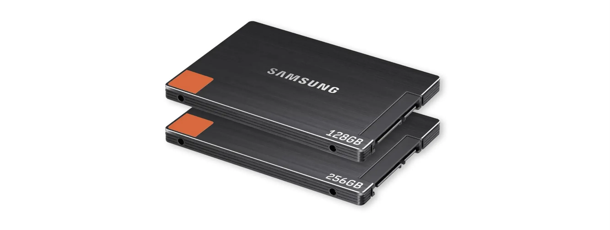

### Решението на кошмара с идентификаторите

Една от най-честите причини за хакване е използването на слаби пароли. Значителен брой потребители все още използват една и съща парола за множество акаунти или избират варианти, които са лесни за отгатване. Мениджърите на пароли са идеалното решение на този проблем.

Мениджърът на пароли ви позволява:

- Съхранявайте всичките си пароли на сигурно място** в криптирано хранилище
- Автоматично генериране на дълги, сложни и уникални пароли** за всеки акаунт
- Използвайте само една главна парола**, за да имате сигурен достъп до всичко

С мениджъра на пароли никога повече няма да ви се налага да натискате бутона "Забравена парола" или да разчитате на слаби, многократно използвани данни. Освен това повечето мениджъри на пароли се синхронизират безпроблемно с всички ваши устройства (настолен компютър, телефон, таблет) и дори автоматично попълват формуляри за вход, което прави сигурния достъп лесен и ефективен.

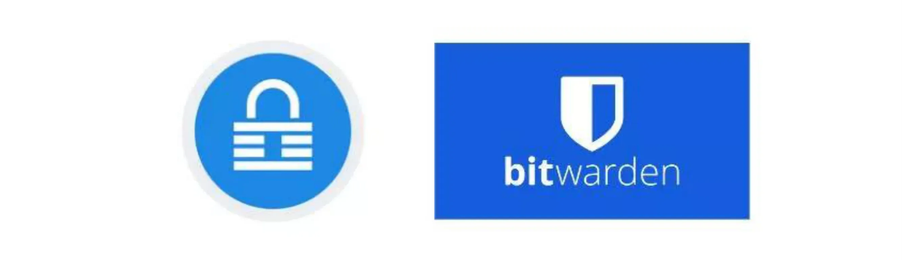

Има много мениджъри на пароли, но мога да препоръчам два стабилни варианта в зависимост от нуждите ви. Ако търсите нещо лесно за използване, което да се синхронизира безпроблемно с множество устройства, Bitwarden е отличен избор:

https://planb.academy/tutorials/computer-security/authentication/bitwarden-0532f569-fb00-4fad-acba-2fcb1bf05de9

Ако предпочитате да съхранявате всичко локално на собственото си устройство, KeePass е чудесен вариант:

https://planb.academy/tutorials/computer-security/authentication/keepass-f8073bb7-5b4a-4664-9246-228e307be246

### 2FA: двойна защита

В Биткойн вие сте собствената си банка. Това означава, че сте и свой собствен екип за сигурност. Дори и със силна парола, няма такова нещо като нулев риск - ето защо включването на двуфакторно удостоверяване (2FA) е от съществено значение.

2FA добавя второ ниво на защита, като изисква еднократен код, базиран на времето (обикновено 6 цифри), генериран от приложение като Google Authenticator или Authy. Така че дори някой да успее да получи паролата ви, той все още няма достъп до профила ви без физически достъп до телефона ви.

https://planb.academy/tutorials/computer-security/authentication/authy-a76ab26b-71b0-473c-aa7c-c49153705eb7

Когато активирате 2FA, не забравяйте да запазите ключа за възстановяване на приложението си на сигурно място. Това ще ви позволи да възстановите кодовете си, ако загубите или смените телефона си. Макар че 2FA, базирано на SMS или имейл, е по-добро от нищо, то е много по-малко сигурно. Атака с подмяна на SIM картата, при която някой поема контрола над телефонния ви номер, може лесно да заобиколи този вид защита.

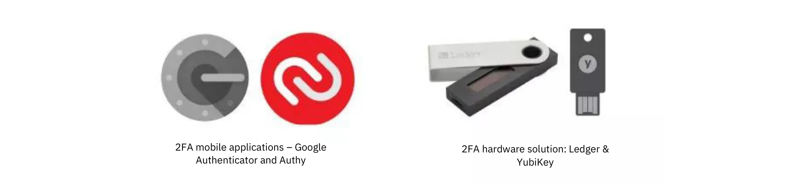

За тези, които искат да направят още една стъпка напред в сигурността, физическите ключове като YubiKey осигуряват още по-високо ниво на защита.

https://planb.academy/tutorials/computer-security/authentication/security-key-61438267-74db-4f1a-87e4-97c8e673533e

### Защита на поверителността ви

Поверителността и киберсигурността са тясно свързани: колкото повече информация оставяте свободно достъпна, толкова по-голяма е вероятността да станете мишена.

**VPN** (*Виртуална частна мрежа*) е проста, но ефективна стъпка за прикриване на вашия IP адрес и криптиране на интернет трафика. Макар че няма да ви направи напълно невидими (тъй като доставчикът на VPN все още може да вижда дейността ви), тя значително затруднява всеки, който се опитва да ви шпионира или да следи навиците ви за сърфиране.

Ключът е в избора на надежден VPN доставчик, който:

- Не изисква личната ви информация
- Позволява плащане чрез BTC
- Има строга политика за забрана на записите

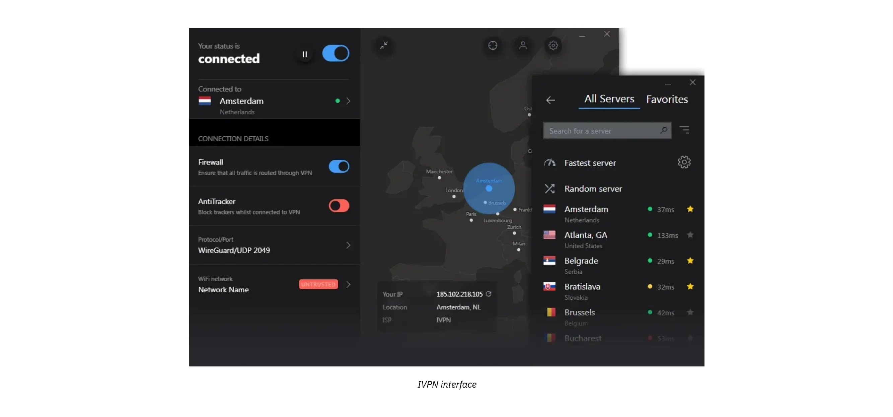

Имаме няколко урока в Plan ₿ Academy, които могат да ви помогнат лесно да настроите VPN услуга. Особено препоръчвам IVPN или Mullvad:

https://planb.academy/tutorials/computer-security/communication/ivpn-5a0cd5df-29f1-4382-a817-975a96646e68

https://planb.academy/tutorials/computer-security/communication/mullvad-968ec5f5-b3f0-4d23-a9e0-c07a3e85aaa8

Основните стъпки за защита на поверителността ви онлайн включват също:

- Използване на **платформи за криптирани съобщения** като Signal, SimpleX или Session;
- Използване на браузъри, ориентирани към защита на личните данни, като Firefox, Brave или Tor (за по-голяма анонимност);

https://planb.academy/tutorials/computer-security/communication/tor-browser-a847e83c-31ef-4439-9eac-742b255129bb

- Използване на **защитена пощенска кутия**, като например ProtonMail;

https://planb.academy/tutorials/computer-security/communication/proton-mail-c3b010ce-254d-4546-b382-19ab9261c6a2

- Криптиране** на файловете ви с инструменти като Bitlocker (за Windows) или VeraCrypt (наличен за различни платформи).

https://planb.academy/tutorials/computer-security/data/veracrypt-d5ed4c83-7c1c-4181-95ea-963fdf2d83c5

### Стъпка по стъпка

Киберсигурността може да изглежда като огромно начинание и за начинаещите е лесно да се претоварят и да се откажат, защото изглежда твърде сложно. Трикът е да се подхожда стъпка по стъпка. Започнете с нещо просто, като например инсталиране на мениджър на пароли. Дайте си няколко седмици, за да се почувствате комфортно с него, след което преминете към следващата стъпка: като например активиране на 2FA на един от акаунтите ви.

Когато станете по-уверени в тези инструменти, ще сте готови да добавите по-напреднали практики, като например използване на вторичен имейл, преминаване към ProtonMail, създаване на VPN или сърфиране с Tor, когато е необходимо.

Когато навлезете по-дълбоко в света на Биткойн, ще забележите, че рисковете нарастват с увеличаването на стойността на вашия портфейл. Изграждането на стабилни навици за сигурност, защитата на личните ви данни и настройването на правилните инструменти не само ще ви осигурят спокойствие, но и ще укрепят суверенитета, който е свързан с Биткойн.

Накратко: не подценявайте киберсигурността, отделете време за създаване на основните елементи и не забравяйте, че последователността е от ключово значение. Без добра дигитална хигиена дори и най-добрите инструменти няма да ви помогнат много.

Също така не забравяйте да разгледате [нашите уроци по компютърна сигурност](https://planb.academy/tutorials/computer-security) в Plan ₿ Academy.

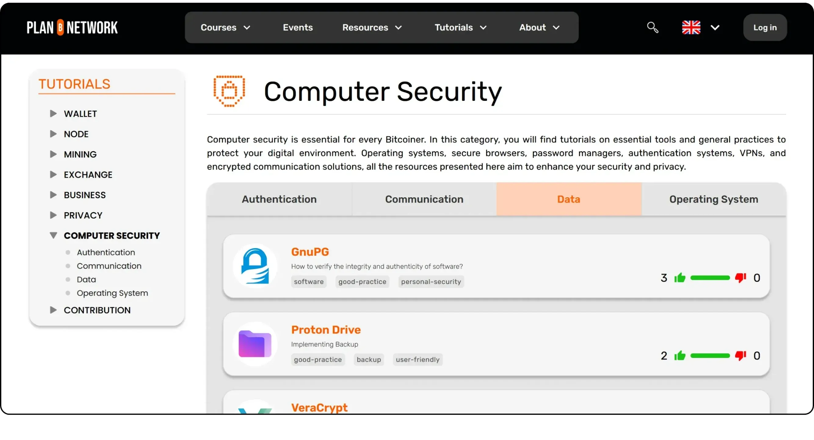

В следващата глава ще споделя още няколко съвета, които ще ви помогнат да започнете уверено пътуването си с Биткойн и да избегнете многото капани, които могат да изненадат новаците.

## Съвети за начинаещи

<chapterId>33134b3f-92c1-5185-afb6-88599e47e801</chapterId>

:::video id=7e9f3b2c-4d1a-4c5e-8b0d-3a2c1d4e5f6b:::

Участието в Биткойн може да бъде вълнуващо, но е свързано и с доста рискове. Светът на криптовалутите не прилича на никой друг; дивите колебания на цените, непознатите технологии и реалната възможност да загубите средствата си завинаги поради прости грешки или лош инвестиционен избор са капани, с които новите потребители трябва да са наясно.

В тази глава ще споделя някои практически съвети и общи насоки за всички, които правят първите си стъпки, особено за тези, които правят първата си покупка или изследват по-широкия свят на финансовите инвестиции.

Ето кои са основните моменти, които ще разгледаме заедно:

- Пазете се от други безполезни криптовалути;
- Инвестирайте само **пари, които можете да си позволите да загубите**;
- Да знаете каква е разликата между **търговия** и **инвестиране**;
- Бъдете наясно с **данъчните последици** на вашите инвестиции;
- Защитавайте внимателно своята **фраза за възстановяване**;
- Останете скромни и се дръжте **ниско** (дискретността е част от сигурността);
- Мислете в дългосрочен план**, увеличете мащаба и бъдете търпеливи (мислете за това като за маратон, а не като за спринт).

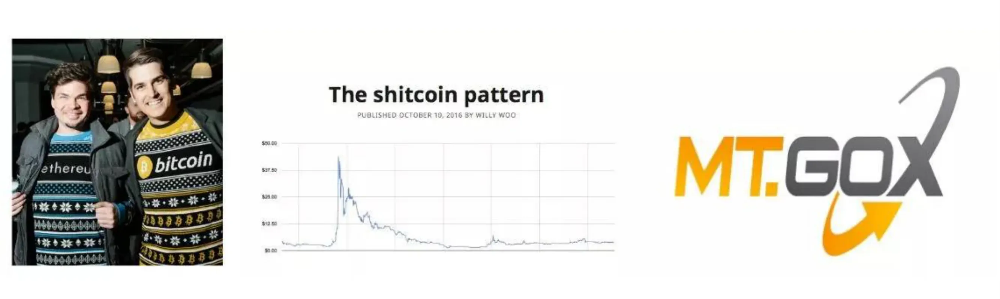

### Често срещани грешки, които трябва да избягвате

Биткойн е отворен за всички, но това не означава, че трябва да се впуснете в него неподготвени. Ето някои от класическите грешки, допускани от новодошлите:

**Технологични грешки:**

- Загуба на сийд фразата:** Вашата фраза за възстановяване (обикновено 12 или 24 думи) е единственият начин за достъп до вашите биткойни, ако нещо се случи с вашия портфейл. Ако я изгубите, средствата ви ще изчезнат завинаги;
- Съхраняване на вашите биткойни в платформа на трета страна:** Ако вашите монети са в централизирана платформа, вие всъщност не ги притежавате. Изложени сте на рискове като хакове, сривове на платформата или дори конфискация на средства;
- Пренебрегване на неприкосновеността на личния живот:** Защитата на личния ви живот е основна част от защитата на активите ви. Публичното разкриване на количеството притежавани от вас биткойни може да ви превърне в мишена;
- Недостатъчна онлайн сигурност:** Ако не защитите устройствата си с основни средства за защита (като актуализации, силни пароли или 2FA), ставате лесна мишена за нападателите и това може да ви струва всичко.

**Финансови грешки:**

- Да инвестирате повече, отколкото можете да си позволите да загубите**: Никога не задлъжнявайте и не влагайте парите си за наем в биткойн. Основната ви финансова стабилност винаги трябва да е на първо място.

- Не познавате разликата между търговия и инвестиране**: Търговията изисква време, умения и сериозна емоционална дисциплина. Дългосрочното инвестиране е много по-удобно за начинаещи.

- Забравяне на данъците**: Всяка страна има свои собствени данъчни правила за криптовалутите. Пренебрегването им може да доведе до болезнени изненади по пътя.

- Попадате на FOMO**: Импулсивното купуване от страх да не пропуснете нещо обикновено води до лошо време и лоши решения. Търпението е най-добрият ви съюзник.

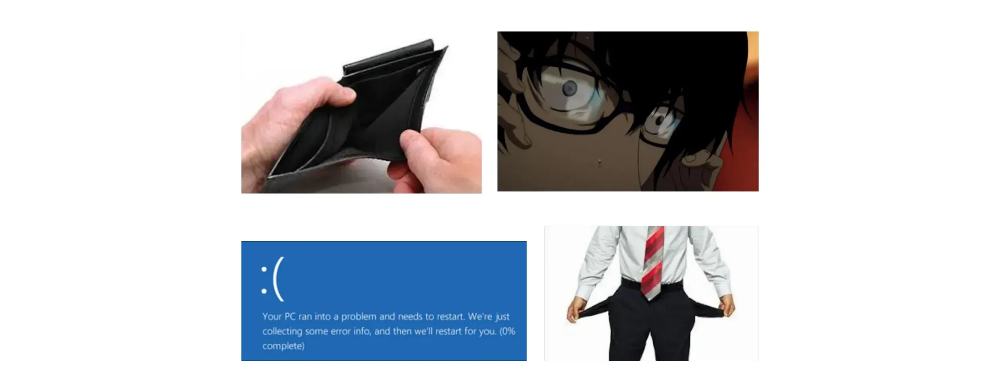

### Определяне на инвестиционна стратегия

Преди да купите първия си биткойн, е важно да разберете защо и как инвестирате в него. Това означава да имате ясен финансов план, съобразен с личното ви положение и дългосрочните ви цели.

Започнете с прецизно определяне на своя **бюджет**. Не избирайте просто произволно число. Отделете време, за да изчислите месечния си доход, да извадите постоянните си разходи (като наем, заеми, данъци, комунални услуги), както и ежедневните си разходи за живот (храна, транспорт, свободно време и т.н.). Каквото остане, е вашият спестовен резерв и само от тази част трябва да помислите за инвестиране.

Този подход ви гарантира, че не излагате финансовото си благосъстояние на риск, особено в случай на спад на пазара. Обмислената стратегия е в основата на дългосрочната устойчивост.

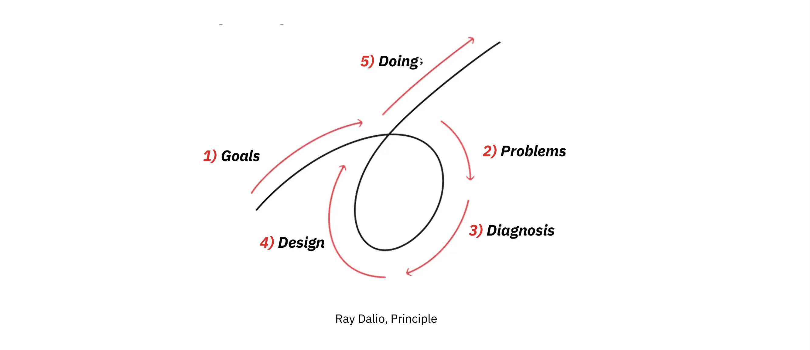

След като определите бюджета си, помислете как искате да инвестирате. Един от най-удобните за начинаещи и широко препоръчани методи е [Dollar Cost Averaging (DCA)](https://planb.academy/resources/glossary/dollar-cost-averaging-dca), при който се купува фиксирано количество биткойни на редовни интервали (седмично, месечно и т.н.). Тази стратегия помага да изгладите средната си входна цена с течение на времето и намалява емоционалното въздействие на ценовите колебания. Това е интелигентен подход за повечето хора, особено за начинаещите.

След това се запитайте: Какъв е моят времеви хоризонт?

Искате ли да правите бързи движения на пазара и извън него (търговия)? Или сте по-скоро привърженик на дългосрочното мислене за държане на биткойн в продължение на няколко години (HODL-er)? Ако сте HODL-ър, вероятно сте по-малко загрижени за ежедневните колебания на цените и сте по-фокусирани върху дългосрочната сигурност и самонаблюдение. Ако търгувате, ще бъдете по-изложени на краткосрочен пазарен шум, по-висок риск и стрес, който често е свързан с бързото вземане на решения. Няма универсален отговор, но познаването на собствения ви подход ще ви помогне да направлявате решенията си.

Най-важното е да не вземате инвестиционни решения въз основа на емоции или страх. Определете предварително стратегия, запишете я и се придържайте към нея.

Ако все още не сте сигурни, **започнете с учене.**

Прекарайте няколко часа в проучване на биткойн, разгледайте безплатните ресурси на Plan ₿ Academy, прочетете няколко книги, хвърлете пет евро, за да я изпробвате, и гледайте качествено съдържание онлайн. Останете любопитни. Колкото по-комфортно се чувствате, толкова по-лесно ще ви бъде да преразгледате стратегията си, да коригирате подхода си и да продължите напред с увереност.

### Разбиране на волатилността на BTC

Биткойн е известен с драматичните си ценови колебания. Не са необичайни движения от 10%, 20% или дори 50% само за няколко дни. За новаците този вид волатилност може да бъде дезориентиращ. Лесно е да се увлечете в хайпа по време на бичи периоди или да изпаднете в паника по време на спадове; и двете често водят до погрешни решения, като например продажба на загуба.

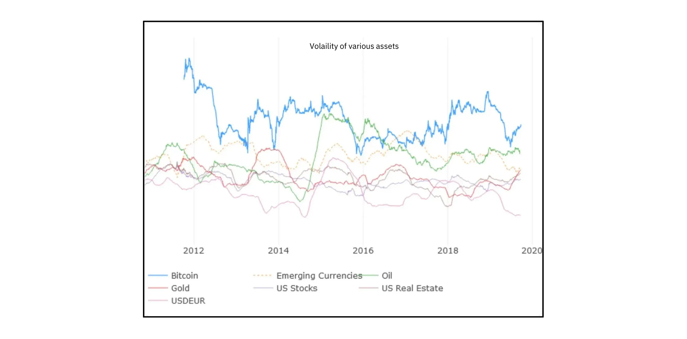

Ето защо е изключително важно да **разберете и приемете нестабилността на биткойн**, преди да инвестирате. Тези ценови колебания не са грешка, а характеристика на все още зрелия актив. Ако внезапните възходи и спадове ви карат да не спите през нощта или ви тласкат към емоционални решения, има вероятност да сте вложили повече, отколкото ви е удобно да рискувате. В такъв случай направете крачка назад и преоценете стратегията и толерантността си към риска. Не се колебайте да намалите позицията си, докато се почувствате по-спокойни.

Преди всичко, никога не инвестирайте повече, отколкото можете да си позволите да загубите. Избягвайте да вземате пари назаем, за да си купите биткойн (особено ако все още изучавате основите). Солидната основа започва с премерени стъпки, а не с необмислени залози.

### Управление и защита на вашия биткойн портфейл

Една от най-мощните (и често недооценявани) функции на Биткойн е **самостоятелното притежание**. При портфейл със самостоятелно държане на ключовете само вие носите отговорност за своите средства. Тези портфейли обикновено се генерират от **фраза за възстановяване** (известна също като сийд фраза) - поредица от 12 или 24 думи, която предоставя пълен достъп до вашите BTC. Ако загубите тази фраза (или ако някой друг се сдобие с нея), вашите биткойни изчезват завинаги. **Няма поддръжка на клиенти. Няма бутон за нулиране**

Ето защо златното правило в Биткойн е:

"***Нямаш ключ, нямаш биткойн***". Ако не контролирате лично частните си ключове, вие не притежавате истински своите биткойни. Макар че борсите могат да бъдат удобни (особено когато започвате), те държат вашите ключове вместо вас. Това означава, че средствата ви са изложени на риск, ако платформата бъде хакната, замрази сметката ви или фалира.

За да избегнете този риск, силно се препоръчва да създадете своя **собствен портфейл**, в която само вие имате достъп до фразата за възстановяване. Тази фраза винаги трябва да се записва на ръка и да се съхранява **офлайн** на сигурно място. Някои потребители дори **поддържат няколко резервни копия**, съхранявани на отделни географски места за по-голяма сигурност.

** Никога не съхранявайте фразата си за възстановяване на устройство, свързано с интернет, или в облака**.

**Единствено хакване или нарушаване на сигурността на данните може да доведе до необратими загуби**

Ако сте готови да поемете собствеността върху своите биткойни и искате да се запознаете по-задълбочено с най-добрите практики за защита на фразата за възстановяване, препоръчвам ви да разгледате тази статия:

https://planb.academy/tutorials/wallet/backup/backup-mnemonic-22c0ddfa-fb9f-4e3a-96f9-46e2a7954270

### Поверителност и дискретност

В днешния цифров свят **дискретността често се пренебрегва**, но тя е важна част от сигурността, особено когато става въпрос за Биткойн. Колкото по-открито говорите за авоарите си, толкова по-вероятно е да станете мишена на измамници, киберпрестъпници или дори на по-традиционни заплахи като изнудване или шантаж.

В цял свят има многобройни случаи, при които лица, за които се знае, че притежават големи количества BTC, са били отвличани или нападани.

**Избягвайте да се хвалите със скритите си биткойни**; било то в социалните мрежи или дори в случайни разговори. Разкриването на чувствителна финансова информация няма предимства, а рисковете са реални.

Също така е разумно да **разпределите дейността си онлайн**. Например:

- За всичко, свързано с Биткойн, използвайте отделен имейл адрес, различен от личния или служебния ви акаунт.
- Бъдете предпазливи към опити за фишинг, подозрителни връзки и фалшиви уебсайтове, които имитират надеждни платформи.
- Бъдете нащрек! дискретността и бдителността често са най-добрата ви защита.

Ако сте готови да навлезете по-дълбоко в темата за поверителността на Биткойн, препоръчваме ви да продължите с нашия курс за поверителност Year 2, където ще научите по-напреднали техники за запазване на самоличността и дейността ви:

https://planb.academy/courses/65c138b0-4161-4958-bbe3-c12916bc959c

### Данъчни последици

Въпреки че е децентрализирана валута, **биткойн не е освободена от данъчните закони и разпоредби** на вашата страна. Всяка юрисдикция има свой собствен подход към начина на облагане на печалбите от криптовалути.

На някои места печалбите се облагат като капиталова печалба при продажба. На други места може да се изисква деклариране на всяка сделка, а на трети се прилагат по-рядко срещани правила, като например данъци върху богатството или социални вноски.

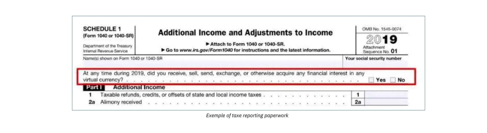

Преди да извършите значителни транзакции, силно препоръчваме да се консултирате с данъчен специалист или да прегледате официалните указания на вашето правителство. Отделянето на време, за да разберете предварително данъчните си задължения, може да ви спаси от неочаквани проблеми по-късно (като глоби, одити или санкции), особено ако планирате големи продажби или преразпределение на портфейла.

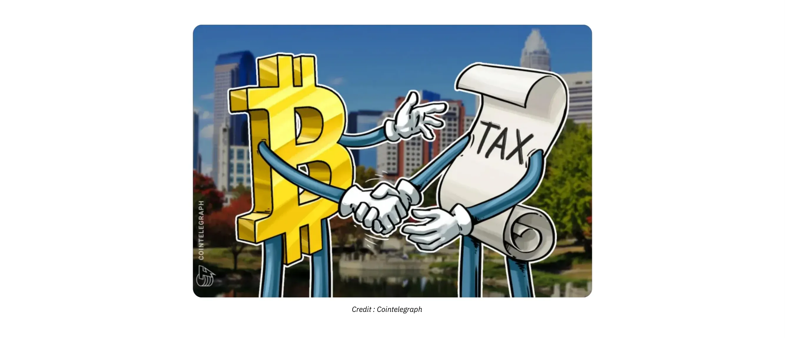

### Разликата между търговия, инвестиране и държане

Биткойн често е заобиколен от популярни погрешни схващания; едно от най-разпространените е, че това е бърз път към забогатяване чрез търговия. Но е важно да се разбере ясното разграничение между търговия, инвестиране и държане, тъй като всеки подход е свързан със собствен начин на мислене, набор от умения и ниво на риск.

- Търговия:**

Нека бъдем честни: **вероятно не трябва да търгувате.**

Търговията включва краткосрочни спекулации (понякога с ливъридж) с цел печалба от колебанията в цената на биткойн. Макар да звучи привлекателно, успешната търговия изисква напреднали технически познания (като анализ на графики и управление на риска), емоционална дисциплина и постоянно внимание към пазара. Тя е психически натоварваща и отнемаща време, а суровата истина е, че **повечето начинаещи губят пари**, защото подценяват колко взискателна е в действителност.

Както казва Уорън Бъфет:

"**Ако не сте готови да държите дадена акция десет години, не си и помисляйте да я държите десет минути**."

Биткойн не е схема за бързо забогатяване.

- Инвестиции:**

Инвеститорите възприемат средносрочна и дългосрочна перспектива, като купуват биткойн с убеждението, че стойността му ще нараства с течение на времето (месеци, години или дори десетилетия). Разбира се, все още има риск, тъй като цената на биткойн може да се колебае значително. Но този подход като цяло е по-спокоен и далеч по-практичен за повечето хора, особено за тези, които не искат да прекарват часове, залепени за графиките всеки ден.

- HODL:**

"HODL" започва като печатна грешка за "hold" и бързо става част от културата на Биткойн. Днес това е почетен знак.

HODL-ърите не продават в продължение на много дълъг период от време, понякога десет или повече години. Те съхраняват своите биткойни на сигурно място и просто изчакват, водени от силната си убеденост в дългосрочния потенциал на биткойн. Те не се притесняват от ежедневните колебания на цените или от мечите пазари. Начинът им на мислене е прост: натрупват, подсигуряват се и седят спокойно.

|          | Трейдинг | Инвестиция | HODL |
| ---------------------- | ----------- | -------------- | --------------- |
| Левъридж | Да  | Не | Не |
| Времетраене | Краткосрочно | Средносрочно | Дългосрочно |
| Вид актив | Договор | Истински биткойн | Истински биткойн |
| Ниво на риск | Много високо | високо | високо |
| Трудност | Много висока | Висока | Висока |
| Крива на учене | Продължителна | Продължителна | Продължителна |
| Потенциална загуба | Неограничена | Лимитирана | Лимитирана |
| Най-подходящо за | Малко на брой опитни потребители | Почти всички | Дългосрочно гледащи хора |

### Продължавайте да се учите

Никога не е твърде рано (или твърде късно) да започнете да се образовате за парите, инвестирането и действителното функциониране на финансовата система. Не е необходимо да ставате експерт или да се задълбочавате във всеки технически детайл; солидното разбиране на общата картина е достатъчно, за да вземате информирани решения и да избегнете заблуда от финансови продукти, които не отговарят на вашите интереси (често рекламирани от банки или консултанти).

Чудесна отправна точка е книгата *Богат татко, беден татко* на Робърт Т. Кийосаки. Тя е широко известна със своя достъпен стил и фундаментални уроци, като разбирането на разликата между активи и пасиви и защо финансовото образование е ключът към дългосрочната независимост.

Ако сте готови да навлезете по-дълбоко, подкасти като *The Investors Podcast* предлагат задълбочени дискусии за инвестирането, пазарите и икономическите принципи. От време на време те обхващат и Биткойн, което ги прави солидна следваща стъпка за тези, които са любопитни да разберат как Биткойн се вписва в по-широкия финансов пейзаж.

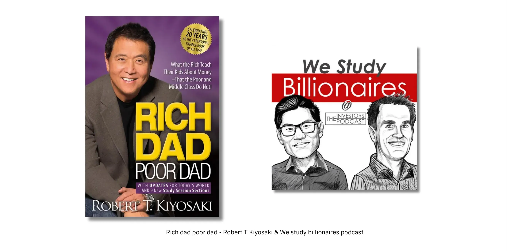

### Златни правила, които трябва да имате предвид

В заключение ви предлагаме няколко вечни принципа, които всеки потребител на биткойни (особено начинаещият) трябва да има предвид:

- Правило № 1**: Никога не инвестирайте повече, отколкото можете да си позволите да загубите. Биткойн е нестабилен актив. Не рискувайте финансовата си стабилност в преследване на печалби. Основните ви нужди и спокойствието ви винаги трябва да са на първо място.
- Правило № 2**: Не следвайте сляпо шумотевицата и не се доверявайте на чудодейни съвети. Игнорирайте тенденциите и светкавичните обещания. Вместо това се съсредоточете върху вземането на добре информирани и рационални решения. Когато се съмнявате, преспете; обсъдете въпроса с хора, на които имате доверие. По-добре е да действате бавно и обмислено, отколкото да се втурнете към скъпоструващи грешки.
- Правило № 3**: Изградете план и се придържайте към дългосрочна визия.

Последователността, търпението и дисциплината ще ви отведат по-далеч от краткотрайните вълнения. Не се стремете към успехи, а към устойчив растеж. Избягвайте фатални грешки и позволявайте на малките победи да се натрупват с течение на времето.

Като следвате тези принципи, ще можете да подходите към инвестирането в биткойн с повече яснота и спокойствие. Да, биткойн е нестабилен и в началото може да бъде плашещ, но когато се подхожда с предпазливост, търпение и обосновано мислене, притежава неоспорим потенциал. Отделете време за натрупване на знания, преразглеждайте стратегията си, когато е необходимо, и преди всичко помнете: бавният и стабилен напредък винаги ще ви послужи по-добре, отколкото прибързаното навлизане от страх или нетърпение.

# Да разберете в какво се впускате

<partId>a42355a3-9dd8-57ed-b590-32a333fe09ea</partId>

## Биткойн за 5 минути

<chapterId>ae122ad9-9b4d-5229-9038-e1b99d5cfc83</chapterId>

:::video id=3c2d1e4f-5a6b-7c8d-9e0f-1a2b3c4d5e6f:::

Основната цел на този курс е да ви помогне да придобиете и защитите първите си биткойни. Но преди да се потопите в практическите стъпки (как да купувате BTC, кои портфейли да използвате и т.н.), е важно да направите крачка назад и да разберете какво всъщност представлява Биткойн. Разбирането на по-дълбоката същност на Биткойн ще ви помогне да разберете защо милиони хора се обръщат към тази технология и защо е изключително важно да разберете основите, преди да вложите спестяванията си в такъв нов и нестабилен актив.

С течение на годините Биткойн придобива признание като глобална парична мрежа. Наричат я "цифрово злато", "протокол за доверие" и дори "паралелна финансова система" Но какво всъщност означават тези термини? За да отговорим на този въпрос, ще разгледаме по-отблизо същността на Биткойн: историята на неговия произход, техническите му основи, паричните му свойства и потенциалното му въздействие; не само върху отделните хора, но и върху глобалната финансова система като цяло.

### Произходът: Проект, породен от дългогодишно търсене

#### Шифърпънк и изобретяването на система извън банковия контрол

Биткойн не се ражда за една нощ. Тя е резултат от десетилетия на изследвания и експерименти в областта на криптографията, компютърните науки и паричната теория. Преди стартирането му през 2009 г. няколко проекта (като eCash, b-money, Bit Gold и RPOW) се опитаха да създадат цифрови валути. Всички те се сблъскваха с един и същ основен проблем: как да се предотврати двойното харчене в децентрализирана система, без да се разчита на централен орган.

Това предизвикателство остава нерешено до края на 2008 г., когато някой, използващ името Сатоши Накамотo, публикува Бялата книга Биткойн. Няколко месеца по-късно първата версия на софтуера с отворен код на Биткойн беше пусната в действие, с което се постави началото на система, която може да работи независимо от банки или правителства.

Проектът беше силно повлиян от идеята на Cypherpunk - общност от разработчици и мислители, които вярваха в използването на криптографията за защита на личните свободи онлайн. За тях неприкосновеността на личния живот и децентрализацията не бяха технически предпочитания, а идеологическа необходимост. Биткойн се превърна в най-успешното въплъщение на тези идеали: равноправна парична мрежа, която всеки може да използва, никой не може да контролира и всеки може да провери.

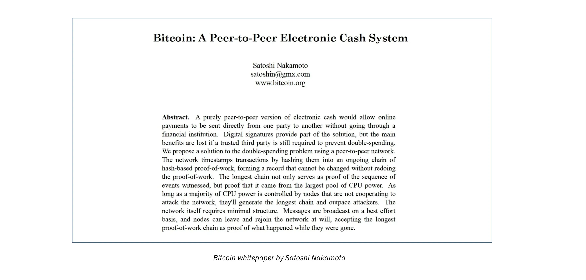

Шифърпънковете са неформална международна общност от хора, които се застъпват за използването на криптографията за защита на личните свободи онлайн. Те силно вярват в правото на личността на неприкосновеност на личния живот, особено в свят, който все повече се оформя от правителствено наблюдение и корпоративна експлоатация на данни.

Корените на движението датират от началото на 90-те години на миналия век, когато групи криптографи, програмисти и либертарианци започнаха да изследват политическите последици от криптографията по време на срещи в Силициевата долина. Един от най-изявените гласове в общността е Тим Мей, който през 1988 г. е автор на Манифеста на криптоанархистите; основополагащ текст, очертаващ визия за свят, в който криптирането ще даде възможност на индивидите да действат извън обсега на правителствата и централизирания контрол.

Важен етап в движението настъпва през 1992 г. със създаването на пощенския списък Cypherpunks - форум, в който могат да се развиват идеи, проекти и политически дискусии за неприкосновеността на личния живот и криптографията. След това, през 1993 г., Ерик Хюз публикува Манифеста на шифърпънка - кратка, но силна декларация, която ясно изразява мисията и убежденията на общността.

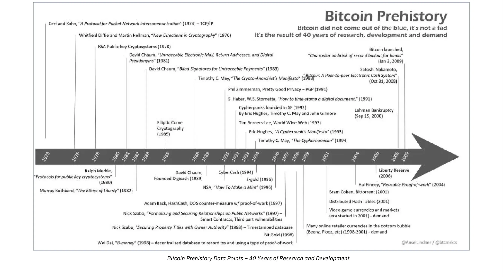

Идеята за цифрова валута, която функционира независимо от централен орган (като Биткойн), е дълбоко вкоренена в тяхната философия.

#### Момент след финансовата криза

Биткойн не се появява просто от нищото. Тя беше създадена в много конкретен момент - веднага след световната финансова криза от 2008 г. Сривът на жилищния пазар в САЩ и кризата с високорисковите кредити доведоха до фалит на големи банки и разклатиха доверието на хората в цялата финансова система.

Именно в тази среда на страх и несигурност се ражда Биткойн. Създателят, известен като Сатоши Накамото, включи много символично послание в първия блок на блокчейна Биткойн, известен като блок Genesis. Съобщението беше:

> **"The Times 03/януари/2009 Канцлерът е на ръба на втора спасителна програма за банките "**

Това не беше просто дата или техническа бележка; това беше тих, но силен протест. Той показа, че Биткойн е замислена като нещо коренно различно: финансова система, която не зависи от банки, спасителни програми или правителствени решения.

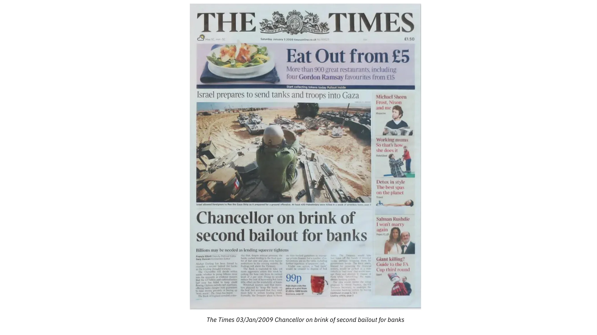

Мнозина тълкуват това като цел на Биткойн: да предложи начин за прехвърляне на стойност без нужда от посредници, контролиран от ясни правила, вместо от често неясните решения, вземани от централните банки или правителствата.

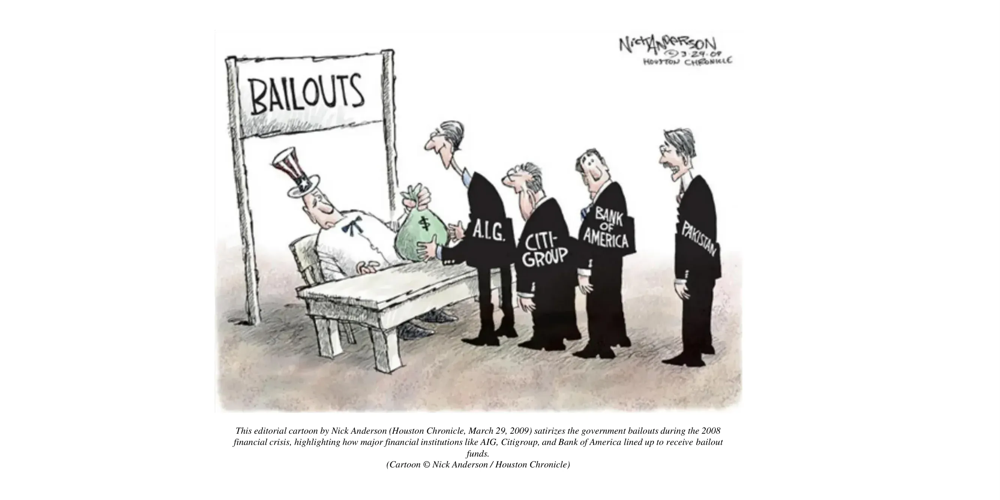

За да задълбочите познанията си за произхода на Биткойн, предлагаме безплатен, изчерпателен и добре документиран курс за обучение по темата:

https://planb.academy/courses/a51c7ceb-e079-4ac3-bf69-6700b985a082

### Децентрализирана мрежа за прехвърляне на стойност

#### Партньорски отношения и липса на централен орган

Биткойн се определя като "електронна парична система от типа peer-to-peer" Това означава, че всеки може да се свърже с мрежата, като използва съответния софтуер (възел на Биткойн), и да взаимодейства директно с други потребители, без да разчита на централен сървър. Целта на тази децентрализация е да се попречи на всеки отделен субект (например банка, правителство или голяма корпорация) да контролира, цензурира или спира системата. Биткойн работи 24 часа в денонощието, 7 дни в седмицата, в световен мащаб и е достъпна за всички без никакви условия.

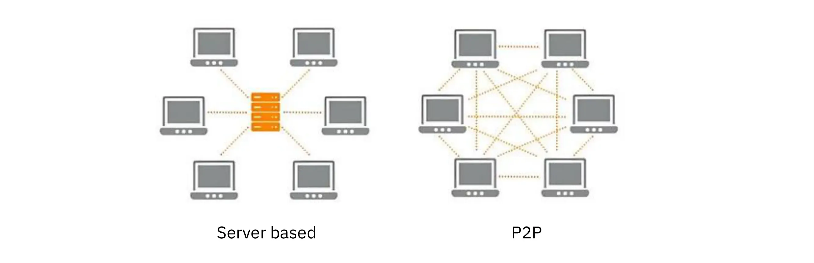

Казано по-просто, всеки участник в мрежата Биткойн (наричан "възел") има пълно копие на главната книга на трансакциите, известна като блокчейн. Когато се осъществи нова транзакция, тя се излъчва в мрежата. След това миньорите потвърждават тези транзакции, като ги групират в блокове, които след това се добавят в края на веригата (оттук и името "блокчейн").

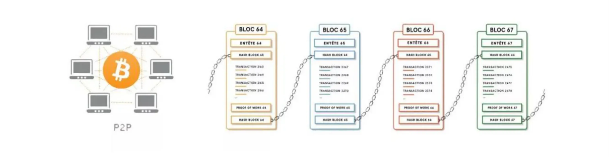

#### Блокчейн: счетоводна книга

Представете си блокчейна като гигантска счетоводна книга, в която всеки ред представлява транзакция. В традиционната банкова система базата данни се съхранява на сървърите на банката, която може да прави промени, когато пожелае. От друга страна, в Биткойн **всички промени се потвърждават в цялата мрежа**: след като нов блок от транзакции бъде добавен в блокчейна, е почти невъзможно да бъде променен по-късно. Това децентрализирано валидиране прави главната книга на Биткойн сигурна и прозрачна.

### Ролята на миньорите и Proof-of-Work

#### Как се създават блокове: копаене

Копаенето е процесът, при който компютри (или големи миньоески ферми) предоставят **изчислителна мощ**, за да защитят историята на транзакциите в Биткойн и да създадат нови блокове. Миньорите се състезават за решаване на математически пъзел - по-конкретно за намиране на частична колизия на хешове. Този процес изисква значителни количества енергия и ресурси. След като миньорът намери валидно решение, той излъчва блока към мрежата, която го проверява и приема за валиден.

Като възнаграждение миньорът получава новосъздадени биткойни (наречени блокова субсидия), както и таксите за транзакциите от всички транзакции, включени в този блок.

#### Халвинг: Намаляване на блоковата субсидия

За да се гарантира лимитът на биткойн, субсидията за блоковете е програмирана да се намалява наполовина на всеки 210 000 блока; приблизително на всеки четири години. Това събитие е известно като "намаляване наполовина" Когато Биткойн стартира, миньорите печелят по 50 BTC на блок. През 2025 г. това възнаграждение е спаднало до 3.125 BTC и ще продължи да намалява с течение на времето.

Накрая, около 2140 г., субсидията ще достигне нула, тъй като общото предлагане на Биткойн ще се ограничи до 21 милиона монети. Тази предвидима крива на емитиране имитира недостига на физически стоки като златото; една от причините Биткойн често да се нарича **цифрово злато**.

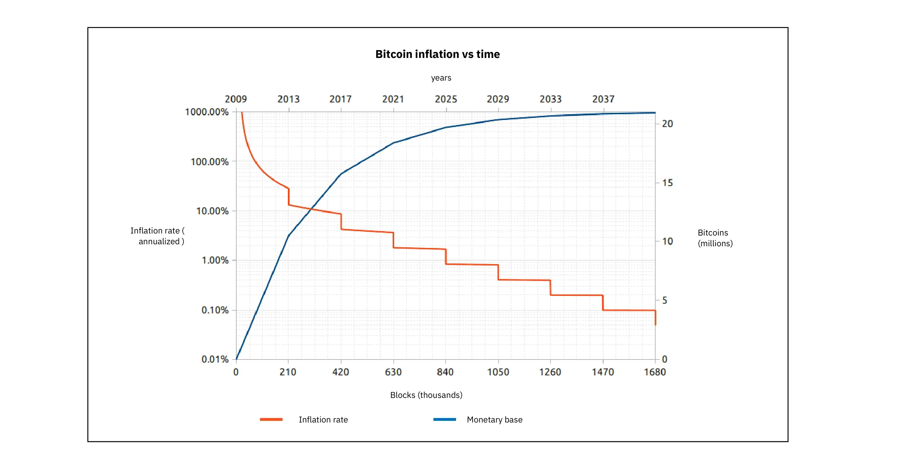

### Парични свойства на Биткойн

#### Оскъдност и фиксирана парична политика

Една от най-мощните характеристики на Биткойн е нейната *предсказуема и непроменяема парична политика*. За разлика от традиционните фиатни валути (като долара, еврото или йената), които могат да бъдат печатани по желание от централните банки (което често води до инфлация или икономически изкривявания), Биткойн работи по прозрачен набор от правила, вградени в нейния код.

Винаги ще има само 21 милиона биткойна, а скоростта, с която се емитират нови монети, е предварително известна на всички в мрежата.

Никое правителство, институция или отделно лице не може едностранно да промени този лимит на доставките или правилата за разпределение. Единственият начин да се променят тези параметри е да се промени протоколът на Биткойн, но дори и за това е необходим консенсус от мнозинството от икономическите участници в мрежата.

Този вграден недостиг е основна притегателна сила за тези, които искат да се откажат от непредсказуемата парична политика или да избегнат постепенното намаляване на покупателната си способност поради инфлацията. С течение на времето това може да представлява промяна във финансовото мислене, при която спестяването в дефлационен актив като Биткойн става по-привлекателно, отколкото разчитането на традиционните, податливи на инфлация валути.

#### Разделимост и достъпност

Едно от най-подценяваните предимства на Биткойн е неговата делимост. Всеки биткойн може да бъде разделен на 100 милиона единици, известни като сатоши (или накратко sats). Това означава, че не е необходимо да похарчите десетки хиляди евро или долари, за да започнете; можете да купите само биткойн на стойност няколко евро, до дребни части.

### Откритост и прозрачност

#### Публичен протокол, който може да бъде проверен от всички

Биткойн работи с публичен протокол с **отворен код** (най-вече чрез [Bitcoin Core](https://github.com/bitcoin/bitcoin)). Това означава, че кодът му е свободно достъпен за всеки, който може да го проверява, одитира и подобрява. Няма скрити механизми или затворени системи; всичко, свързано с работата на Биткойн, е открито.

Това ниво на прозрачност прави изключително трудно въвеждането на задни вратички или извършването на тайни промени. Всеки, който има технически умения, може да управлява възел, да допринася за разработването или да създава съвместими инструменти. В Биткойн доверието се печели чрез кода и консенсуса, а не чрез централизиран контрол.

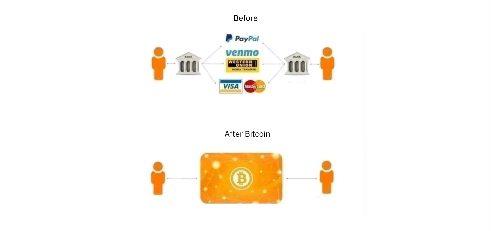

Тази прозрачност е една от основните причини хората да се доверяват на протокола Биткойн; тя не позволява на малка група разработчици да манипулират мрежата за собствена изгода. Биткойн работи на прост, но мощен принцип: ако не сте съгласни с предложените промени, можете да не актуализирате софтуера си. В някои случаи това няма да доведе до никакви смущения; все пак ще останете в синхрон с останалата част от мрежата. Но в други случаи това може да доведе до т.нар. твърд форк, при който мрежата се разделя на две и се създава нова версия на Биткойн. Точно това се случи през 2017 г. с разделянето на Bitcoin (BTC) и Bitcoin Cash (BCH).

Макар че този вид управление може да бъде бавно и понякога объркано, то е и силна страна; то гарантира, че нито един субект не може едностранно да поеме контрола, което помага на Биткойн да остане стабилна, неутрална и устойчива на централизация.

#### Индивидуално валидиране: възли

Биткойн позволява на всеки да провери точността на блокчейна, като стартира "възел" на своя компютър или сървър. Това означава да изтеглите софтуера Bitcoin Core (или друга версия на протокола Биткойн) и да проверите всички транзакции и блокове от 2009 г. насам. След като вашият възел бъде създаден и синхронизиран, той се превръща в пълно копие на блокчейна и помага за поддържането на мрежата.

Въпреки че този подход е по-технически, той предлага на най-взискателните потребители възможността да се откажат да се доверяват на трети страни. Пускането на възел гарантира, че потребителите могат да участват в процеса на консенсус и да останат нецензурирани, като допринасят пряко за сигурността и децентрализацията на мрежата.

### Случаи на употреба

#### Устойчив метод за трансгранично плащане

Благодарение на децентрализирания си характер Биткойн работи 24 часа в денонощието, 7 дни в седмицата, без да се влияе от граници или часови зони. В региони, където липсва традиционна банкова инфраструктура, Биткойн често се използва като бързо и евтино решение за изпращане или получаване на средства, без да се разчита на скъпи посредници. Въпреки че таксите за транзакциите могат да варират в зависимост от претоварването на мрежата, те обикновено са много по-ниски от таксите, начислявани от банките за международни преводи. Освен това решенията от второ ниво като Светкавичната мрежа позволяват още по-бързи и по-евтини транзакции с Биткойн.

#### Съхранение на стойност

Поради своята ограниченост (лимитирана на 21 милиона BTC) и присъщата си устойчивост Биткойн често се разглежда като дългосрочна гаранция за спестявания. Въпреки че цената му може да бъде нестабилна в краткосрочен план, Биткойн като цяло следва възходяща тенденция през годините от създаването си. Някои инвеститори купуват BTC с убеждението, че тя може да служи като средство за съхранение на стойност, особено в условията на инфлация или финансови кризи.

#### Инструмент за финансова свобода и устойчивост

Освен инвестиции Биткойн предлага и начин за защита на финансовия суверенитет. В страни с авторитарни режими или с тежки парични ограничения притежаването на биткойн портфейл (с частни ключове) осигурява форма на свобода. Никой не може да блокира или конфискува тези BTC, стига притежателят им да си осигури фраза за възстановяване.

Тази особеност е особено привлекателна за онези, които се страхуват от цензура или замразяване на банкови сметки. То намира отклик и сред населението, страдащо от хиперинфлация, както се вижда във Венецуела и Зимбабве, където притежаването на BTC се оказа по-стабилно от съхраняването на местната валута, която бързо се обезценяваше.

### Дълъг път предстои

Биткойн може да се разглежда като "от нула до едно": радикално скъсване с установените финансови парадигми. За пръв път в историята глобална парична мрежа, достъпна за всички, функционира без централен орган, като дава възможност за устойчиви на цензура и частни транзакции.

Въпреки това, след повече от десетилетие съществуване, Биткойн продължава да предизвиква дебати и страсти. Приемането му се разраства, появяват се решения от второ ниво (като Светкавичната мрежа), които подобряват скоростта на транзакциите и намаляват таксите, а предприятията по целия свят експериментират с нови случаи на използване. Вероятно Биткойн ще продължи да оказва влияние върху платежните системи и дори върху начина, по който възприемаме парите, през следващите десетилетия.

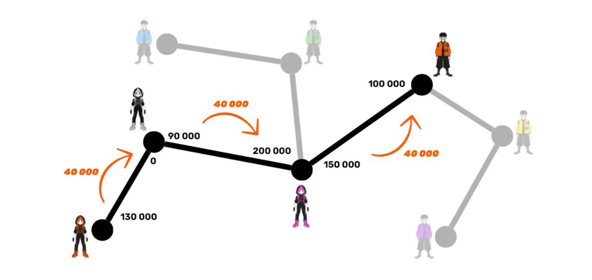

Ако искате да разширите знанията си, можете да се включите в курса BTC101 в Plan ₿ Academy, който предлага по-задълбочено проучване на техническите и икономическите основи на Биткойн.

https://planb.academy/courses/2b7dc507-81e3-4b70-88e6-41ed44239966

След това въведение в Биткойн (което може да е отнело малко повече от 5 минути!) вече сте по-добре подготвени да обмислите закупуването и обезпечаването на биткойни. В следващите глави на курса ще се потопим по-дълбоко в значението на Биткойн, функционирането на неговата индустрия и развитието на различните му слоеве. След това, в предстоящия раздел, ще обсъдим как да създадете свой личен план.

## Защо е важен Биткойн?

<chapterId>d4327ac4-9ff8-5192-b542-cb78c0bd0aa7</chapterId>

:::video id=5f6e7d8c-9b0a-1c2d-3e4f-5a6b7c8d9e0f:::

Защо Биткойн е толкова важен? Това е основният въпрос на този курс. Независимо дали е свързано с обучението ви или с инвестиционната ви стратегия, без ясно разбиране на значението на Биткойн има риск да се отклоните от плана си. Целта е винаги да имате предвид фундаменталните принципи на Биткойн, за да сте сигурни, че стратегията ви остава в съответствие с вашите убеждения.

### Универсална валута

Барак Обама веднъж нарече Биткойн "швейцарска банка в джоба ви" и имаше основателна причина за това. Биткойн предлага еднакви възможности на всички, независимо от това кои са те. Независимо дали сте тийнейджър, президент, протестиращ в Хонконг или "жълта жилетка" във Франция, всички имат равен достъп до един и същ протокол и инструменти:

- Създаване на безплатни и неограничени портфейли (в Биткойн всъщност не говорим за "акаунти", а по-скоро за "портфейли").
- Изпращайте пари навсякъде и на всеки.
- Няма нужда от идентификация или административни процедури.
- Достъпни за всички, независимо от възраст, пол, религия, държава или ниво на доходи.
- Поверителност и прозрачност по ваша преценка.
- Без посредници и скрити такси.
- Биткойн е свързан с интернет, което означава, че всеки, който има достъп до интернет, може да го използва.

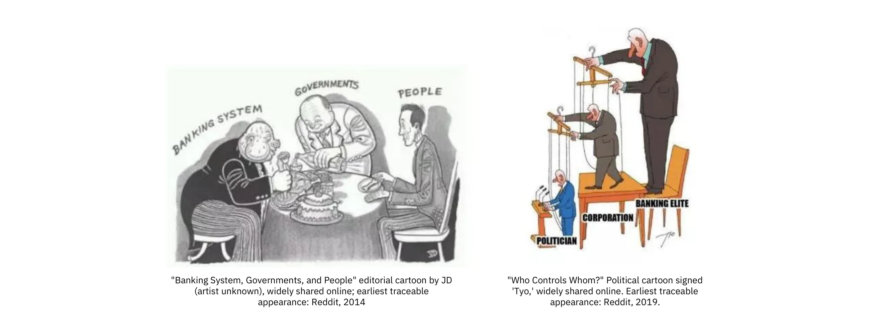

Биткойн може да се разглежда като истинска "народна валута" - алтернативна парична система, която не разчита на централна власт и се основава на неизменни правила, а не на произволни решения. Нейният отворен и достъпен характер я прави потенциално революционен инструмент за милиарди хора по света, независимо дали са изключени от традиционната банкова система или просто търсят по-суверенна алтернатива.

Това ни води до един фундаментален, почти философски въпрос, който разделя ентусиастите на Биткойн на два основни светогледа. От една страна, някои виждат в Биткойн решение за насърчаване на финансовото приобщаване, което дава възможност на милиардите лица, които нямат банкови сметки, най-накрая да получат достъп до глобална парична инфраструктура. От друга страна, някои гледат на Биткойн като на инструмент за финансово освобождение, целящ да предложи изход на милиардите хора, които вече са интегрирани в банковата система, но желаят да се освободят от нейната зависимост и да си възвърнат пълния контрол върху парите си. Този размисъл заслужава нашето внимание и ние ще се върнем към него по-подробно по-късно.

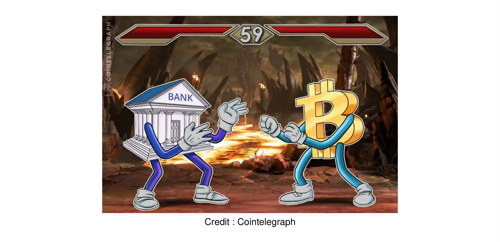

### Защита срещу валутни кризи

В продължение на векове светът е преживявал парични кризи, които са имали опустошително въздействие върху населението. Милиарди хора все още страдат от последиците на лошо управляваните парични политики, при които манипулирането на паричното предлагане и лихвените проценти създава системни дисбаланси. Тези кризи не са просто случайни събития - те са резултат от система, изградена върху интервенции и манипулиране на парите и стойностите на времето.

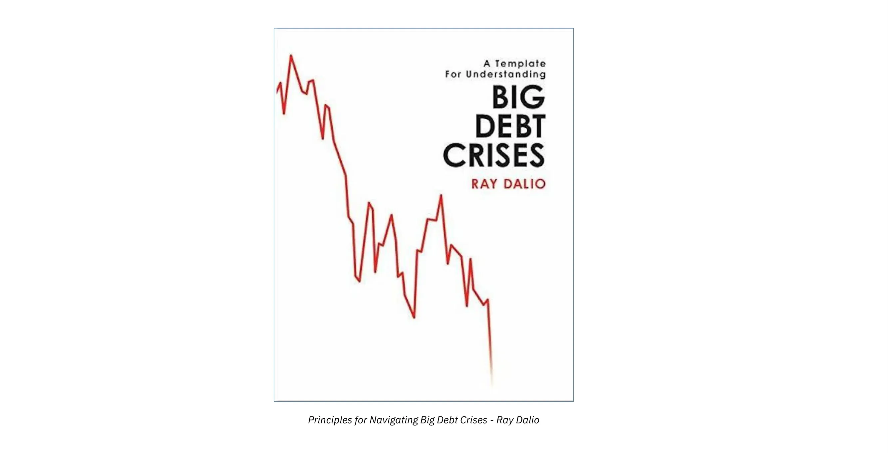

Тези кризи могат да приемат различни форми. Хиперинфлацията, например, унищожава дадена валута, като постепенно унищожава покупателната способност на хората; това се наблюдава в страни като Зимбабве и Венецуела. От друга страна, строгият паричен контрол може да ограничи достъпа до средства и да лиши хората от икономическа свобода, както се случи с банковите ограничения в Гърция и Ливан.

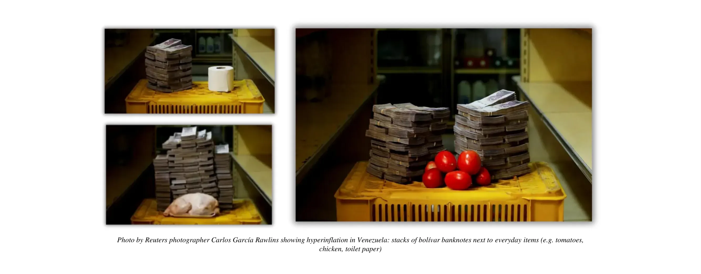

И накрая, когато правителствата девалвират националните си валути, това постепенно води до намаляване на спестяванията на хората - невидимо, но постоянно източване на тяхното богатство. В много отношения това прилича на скрит данък. Докато паричната политика остава в ръцете на централизирани органи, тези цикли ще се повтарят.

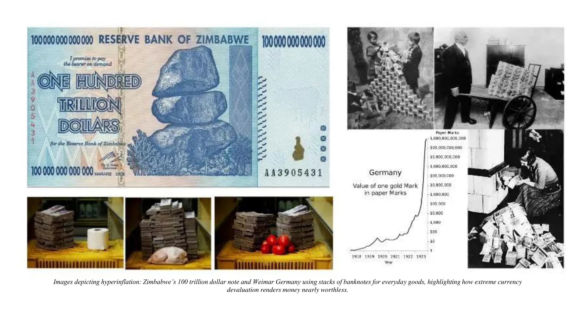

Биткойн представлява смела алтернатива на този цикъл на хронична парична нестабилност. За разлика от емитираните от държавата валути, тя е изградена върху неизменни, основани на математиката правила, които се прилагат с консенсус, а не от правителства или централни банки. Емитирането ѝ е предвидимо и ограничено до около 21 млн. монети, което я прави форма на стабилни пари, проектирана да запази стойността си във времето. Тъй като е устойчива на цензура, всеки може да съхранява и прехвърля стойност, без да разчита на институция. А благодарение на своята делимост и преносимост тя е едновременно достъпна и практична; финансова инфраструктура за всеки и навсякъде.

**Знаете ли, че?** В историята са документирани поне 56 случая на хиперинфлация в световен мащаб. В много от тези случаи цели икономики са се сринали, спестяванията са били унищожени, а милиони са изпаднали в крайна бедност. Още по-лошо е, че тези парични провали често служат като трамплин за политически сътресения; понякога водят до авторитарни режими, както се случва в Германия през 20-те години на ХХ век и в Чили през 70-те години на ХХ век.

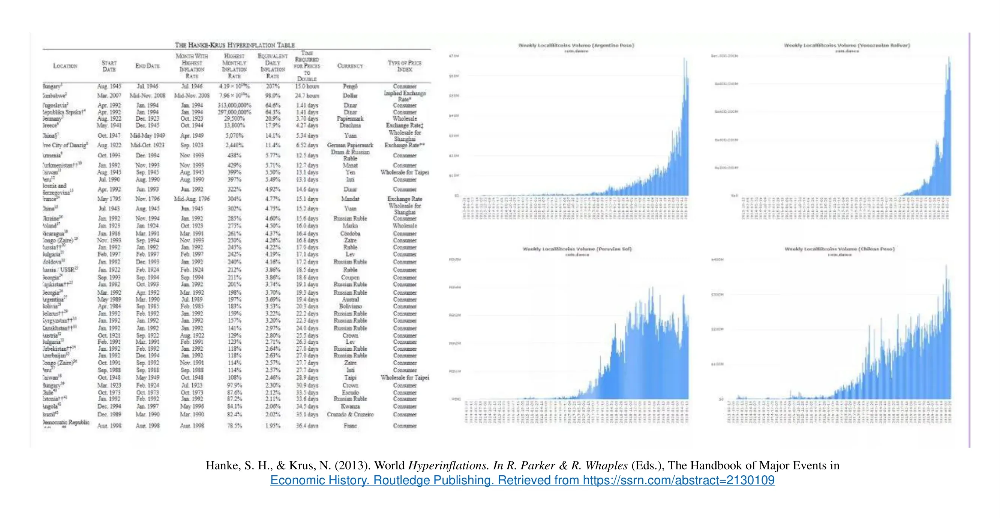

Hanke, S. H., & Krus, N. (2013). *Световни хиперинфлации*. In R. Parker & R. Whaples (Eds.), The Handbook of Major Events in Economic History (Ръководство за важни събития в икономическата история). Routledge Publishing. Взето от https://ssrn.com/abstract=2130109

Сривът на фиатните валути не е историческа случайност, а модел, който се повтаря. Днес Биткойн предлага изход: уникална възможност да защитите богатството си извън контролираните от правителството парични системи. В този момент въпросът не е дали ще има друга криза, а кога. С Биткойн вече имате възможност да се откажете от тези разрушителни цикли и да изберете парична система, изградена върху прозрачност, предвидимост и индивидуален суверенитет.

### Отговор на държавния контрол и несправедливостта

Нарастващото икономическо неравенство по света винаги е било благоприятна почва за социални вълнения и възход на политическия екстремизъм. Историята показва, че когато разликата между богати и бедни стане твърде голяма, това често води до напрежение, кризи и дори до възход на авторитарни режими. Пред лицето на тези рискове защитата на финансовата ви свобода не е просто лукс, а необходимост за всеки, който иска да запази своята самостоятелност и да осигури бъдещето на семейството си.

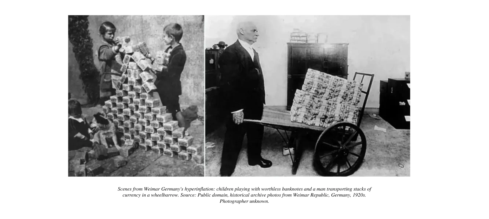

Но в свят, в който държавата може да упражнява пълен контрол върху активите и транзакциите, какви са реалните възможности да защитите спестяванията си?

- Банковите сметки** могат да бъдат замразени за миг, запорирани с обикновена правителствена заповед или източвани чрез прекомерни парични ограничения.

- Златото**, въпреки че от хилядолетия служи за съхранение на стойност, е трудно за разделяне, неудобно за транспортиране и непрактично за използване в спешни кризисни ситуации.

- Парите в брой**, макар и анонимни, са обемисти, лесни за конфискуване и постоянно губят стойността си поради инфлацията.

Но Биткойн е нещо повече от практически инструмент. Той е и **мирна форма на протест**; декларация за независимост от финансова система, основана на произволна власт, централизация и системно неравенство. Изборът на Биткойн означава отхвърляне на манипулацията, обезценяването и наблюдението. Това означава да си възвърнете **суверенитета**, да осигурите бъдещето си и да защитите правото си да контролирате собственото си богатство.

В тази светлина Биткойн е нещо повече от технология. Тя е инструмент на естественото право, начин хората да отстояват основните си права, дори когато тези права се отричат от законите на страната. Той връща властта на хората, но не чрез революция, а чрез кодекс.

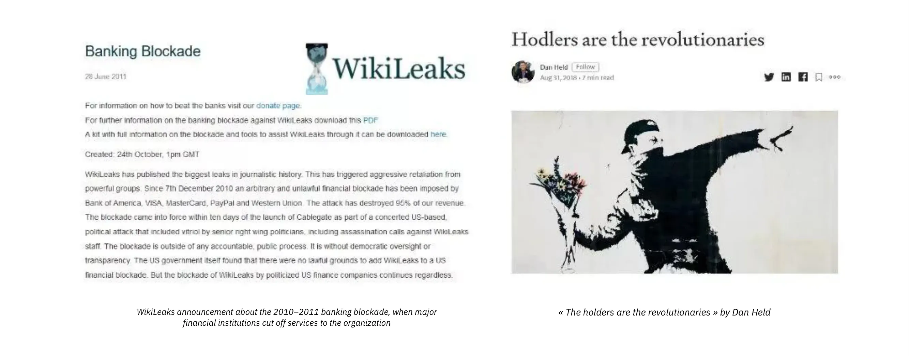

**Знаете ли**? Биткойн е псевдоанонимен, а не анонимен. Потребителите могат да създават адреси, без да разкриват истинската си самоличност, което им позволява да изпращат и получават средства извън традиционната банкова система.

Въпреки това, противно на общоприетото схващане, Биткойн не осигурява пълна анонимност. Всяка транзакция се записва в публична счетоводна книга (блокчейн), до която всеки може да получи достъп и да провери. Въпреки че адресите не са свързани с имена, финансовата дейност на потребителя все пак може да бъде проследена и анализирана, ако не се спазват подходящи практики за защита на личните данни.

### Решение за паричната и банковата корупция

Чрез експанзионистичната си парична политика централните банки постоянно намаляват покупателната ви способност. Чрез инфлацията и прекомерното печатане на пари (често прикрито като количествени улеснения) те постоянно намаляват стойността на валутата в обращение. Това действа като невидим данък, който година след година намалява богатството на тези, които спестяват в емитирани от държавата пари.

Противно на общоприетото схващане, че инфлацията е естествено икономическо явление, тя всъщност е инструмент за паричен контрол; инструмент, който бавно обеднява населението, като същевременно облагодетелства притежателите на финансови активи.

Ако богатството ви не е обезпечено с непарични активи (например недвижими имоти, облигации или акции), спестяванията ви неизбежно ще загубят стойността си с течение на времето. В същото време тези, които имат достъп до финансови инструменти, продължават да увеличават богатството си, като увеличават пропастта между икономическия елит и останалата част от обществото.

Това не е недостатък на системата, а умишлен механизъм. Централните банки и правителствата го използват, за да стимулират изкуствено икономическия растеж и да подтикват хората към постоянно потребление и увеличаване на дълга.

Съвременната ни финансова система е изградена върху цикъл на задлъжняване, в който вземането на заеми не просто се насърчава, а е практически неизбежно. Хората вземат заеми, за да поддържат начина си на живот, само за да се окажат в капана на система, в която трябва да изплащат лихви на банки, които създават пари от въздуха. Това не е случайно, а е структурен замисъл, целящ да облагодетелства финансовите институции за сметка на обикновените граждани.

Системата е опорочена от влиянието на централните банки и тяхната безконтролна власт да манипулират паричното предлагане. *алтернативата е *Биткойн.**

За разлика от фиатните валути, Биткойн се управлява от правила, които се налагат с консенсус. Нейното предлагане е ограничено; никога няма да съществуват повече от 21 милиона биткойна (всъщност малко по-малко поради начина, по който е структурирано емитирането). Никое правителство, централна банка или отделен икономически субект не може да промени това ограничение.

Това означава, че Биткойн функционира в предвидима парична рамка, в която инфлацията е не само прозрачна, но и е проектирана така, че да спре напълно, след като бъде добит последният биткойн.

В миналото златото служеше като предпазна мярка срещу неконтролируемата парична експанзия. Но след рухването на златния стандарт през 1971 г. нито една национална валута (независимо дали е долар, евро или йена) не е обезпечена с материален актив. Това откъсване даде на централните банки свободна воля да печатат пари без ограничения, проправяйки пътя за десетилетия на агресивна парична експанзия, повтарящи се балони на активи и повтарящи се финансови кризи.

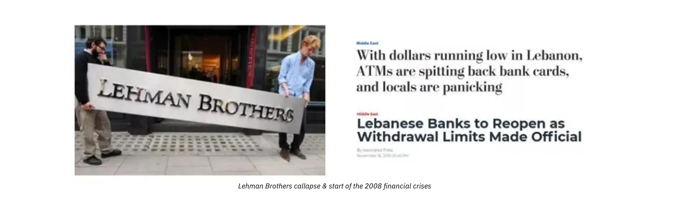

Когато депозирате пари в банка, те вече не са истински ваши.

Повечето хора не осъзнават това: парите, които държите в банкова сметка, технически не са ваша собственост. От юридическа и практическа гледна точка това е заем, който предоставяте на банката си и който банката може да използва за собствените си операции и инвестиции.

Тази система се основава на сляпото обществено доверие във финансовите институции, но крие сериозни рискове:

- Дори при схеми за застраховане на депозити историята показва, че тези гаранции могат да се провалят по време на системни кризи.
- Ако банката ви ограничи достъпа до средствата ви, може да не можете да изтеглите или използвате собствените си пари**. Това се е случвало много пъти: по време на икономическия срив в Гърция, Ливан и Аржентина или в условията на политически репресии като протестите на шофьорите на камиони в Канада.

Биткойн предлага коренно различен режим - отворен, неутрален и неподкупен. Неговите правила са твърдо кодирани чрез консенсус и се прилагат еднакво за всички участници в мрежата.

Тук се появява основният принцип:

**"Нямате ключ, нямате биткойн. "**

Ако не контролирате частните ключове на своите биткойни, значи не ги притежавате истински. Те са в ръцете на трета страна; точно както фиат в банка. Но ако държите частните си ключове, вие и само вие имате пълен контрол върху средствата си. Нито една институция, нито едно правителство, нито един орган не може да замрази, конфискува или ограничи достъпа ви.

Именно това превръща Биткойн в мощна алтернатива на уязвимостта и прекомерните възможности на традиционната финансова система: паричен суверенитет.

### Биткойн: Политическо движение?

Биткойн променя баланса на силите между физическите лица и финансовите институции. Той дава възможност на всеки да поеме пълен контрол върху парите си, да защити спестяванията си от инфлация и да се освободи от паричните ограничения, наложени от държавите. Като отворена и безгранична система Биткойн предлага по-справедлива алтернатива; достъпна за всички, независимо от социалния статус, националността или произхода.

Приемането на Биткойн означава да се изберат разумни пари. Това е отказ да останем просто още едно колело в инфлационната, задвижвана от дългове машина на сегашната финансова система. Това е акт на личен суверенитет и мирна съпротива срещу паричната корупция и ерозията на богатството.

Биткойн потребителите са от различни сфери на живота, но имат обща визия: свят, в който паричният суверенитет е в ръцете на отделните хора, а не на институциите. Сред тях са:

- Шифърпънковете**, които защитават неприкосновеността на личния живот и се противопоставят на наблюдението;
- Потиснати граждани**, търсещи убежище от авторитарни режими и контрол върху капитала;
- Анархисти**, които разглеждат Биткойн като инструмент за освобождаване от държавния контрол;
- Икономисти от Австрийска школа**, които се застъпват за стабилни пари и свобода от правителствени манипулации;
- Инженери, финансисти и защитници на свободата на словото**, които осъзнават дълбоките обществени последици от тази нова парична парадигма.

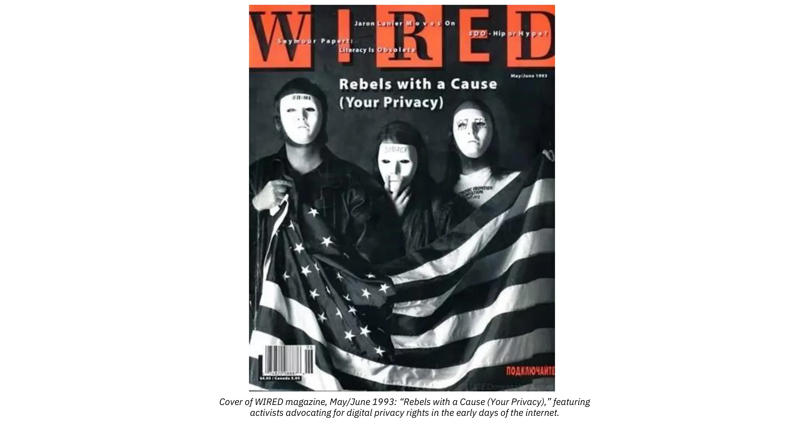

Биткойн по замисъл надхвърля политическите и идеологическите различия. Той не е ляв или десен, либертариански или колективистичен. Той е неутрален протокол, управляван от правила (а не от владетел), които се прилагат еднакво за всички. И все пак самото му съществуване поставя под въпрос световното финансово статукво. Биткойн се е превърнал в символ на съпротивата, защото хората са го приели като алтернатива на фиатните валути и централизираната финансова инфраструктура; системи, които все повече се разглеждат като несправедливи, манипулируеми и изключващи.

За шифърпънковия ум Биткойн е нещо повече от цифров актив. Той се противопоставя на постоянното намаляване на неприкосновеността на личния живот в свят, в който изчезването на парите в брой често се оправдава под претекст за "сигурност".

Биткойн дава възможност за устойчиви на цензура цифрови транзакции от типа "peer-to-peer", без посредници или пазачи. Както е предвидил Накамото, Satoshi предлага цифровия еквивалент на парите в брой: начин за свободен обмен на стойност, без да е необходимо разрешение.

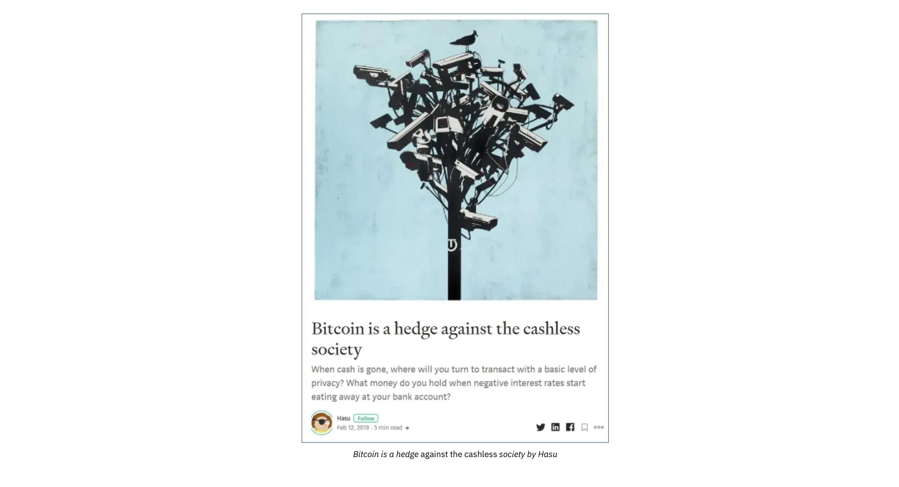

Биткойн не е организация или политическа партия, но безспорно носи мощно философско послание. Тя предефинира отношенията между индивида и държавата, като оспорва монопола на централните банки върху създаването на пари и икономическия контрол.

Независимо дали е приет от борци за свобода или от тези, които просто искат да запазят покупателната си способност, Биткойн бележи началото на нова ера, в която финансовият суверенитет се превръща в основно човешко право, достъпно за всички.

След като разгледахме дълбокото значение на изобретението на Сатоши Накамото, следващата глава ще ни запознае с изключителната индустрия, която се разви около този протокол; цяла екосистема, която променя финансите, технологиите и обществото.

## Разбиране на Биткойн индустрията

<chapterId>e106c6f1-d75b-5a62-b245-0ea2e4d02ef8</chapterId>

:::video id=8a9b0c1d-2e3f-4a5b-6c7d-8e9f0a1b2c3d:::

От стартирането си през 2009 г. от псевдонимния създател Сатоши Накамото, Биткойн предизвика възхода на изцяло нова индустрия, която сега се оценява на стотици милиарди долари. Въпреки сравнително кратката си история тази екосистема преживя експлозивен растеж, развивайки се с експоненциални темпове през последното десетилетие. Всеки ден нови участници (от институционални инвеститори и гъвкави стартъпи до технологични гиганти) влагат значителен капитал и ресурси, за да заявят претенциите си в този бързо развиващ се сектор.

Днес Биткойн е достигнал критичен праг - точка, от която няма връщане назад. Правителствата, централните банки, финтех корпорациите и традиционните финансови институции вече не могат да си позволят да го игнорират. Независимо дали чрез регулиране, предпазливо приемане или открита конфронтация, те вече признават неизбежното въздействие на Биткойн върху световната икономика.

### Раждането на една глобална индустрия

Биткойн е радикална иновация, скок от нула към едно. Тя представлява пълно откъсване от традиционната парична парадигма. За някои това прекъсване е заплаха; екзистенциално предизвикателство за тяхната установена власт и привилегии. За тях Биткойн е кутията на Пандора, която никога не е трябвало да бъде отваряна, и те ще използват всички налични средства, за да й се противопоставят.

Други обаче виждат в Биткойн възможност, която се случва веднъж на поколение: инструмент за индивидуална свобода, катализатор за трансформиране на световната финансова система и път към по-прозрачна и справедлива алтернатива. Това са строителите, осиновителите и сътрудниците (тези, които формират бъдещето).

*самият *Биткойн** остава неутрален. Той не иска разрешение. Той не иска одобрение.

**Това просто съществува.**

В тази глава ще разгледаме ключовите играчи, които движат индустрията на Биткойн напред. Разбирането на техните роли, стимули и взаимодействия е от съществено значение за разбирането на динамиката на тази разрастваща се екосистема и за по-доброто ориентиране във възможностите и предизвикателствата, които тя предоставя.

### Разпространението на алткойните

Технически погледнато, създаването на нова криптовалута е изключително лесно; може да отнеме само няколко минути и не изисква почти никакви иновации. Истинското предизвикателство не е в създаването, а в стойността. А стойността, в света на цифровите активи, се определя единствено от пазара; от доверието и търсенето на неговите потребители.

През декември 2019 г. CoinMarketCap включи в списъка над 5000 токена. До 2025 г. този брой ще нарасне до милиони благодарение на възхода на НФТ, децентрализираните финанси (DeFi) и безброй други приложения (някои легитимни, много съмнителни). Тези токени са във всякакви форми: някои претендират да са валути, други функционират като ценни книжа, платформени комунални услуги, странични вериги или токенизирани представяния на дигитално изкуство.

Но нека сме наясно: **повечето от тези криптовалути са малко повече от измами**.

Зад воала на лъскавата технология и елегантната търговска марка много от тези проекти са задвижвани от агресивни маркетингови стратегии, предназначени да направят едно нещо - да **извлекат вашите биткойни**. Те се възползват от алчността и невежеството на инвеститорите, като разказват съблазнителни истории за революционни технологии или гарантирана възвръщаемост; твърдения, които рядко издържат на проверката.

Разбира се, в това море от шум има малка шепа проекти, които наистина се опитват да разширят границите. Някои от тях се фокусират върху решаването на реални технически предизвикателства (мащабируемост, поверителност, програмируемост) и могат да допринесат с ценни идеи за по-широкото пространство. Вероятно с течение на времето някои от тези експерименти ще доведат до полезни иновации

Но основният въпрос остава:

**Могат ли тези иновации да се развиват извън Биткойн?**

Засега се откроява една истина: Биткойн остава единствените истински децентрализирани, устойчиви на цензура цифрови пари, подкрепени от глобална мрежа и нарастващо приемане. За разлика от алткойните, Биткойн не е поддържан от централизирани компании или управляван от шепа разработчици и ранни инвеститори. Това е единственият проект, който е заслужил тежестта на хиляди часове изследвания, разработки и непрестанно усъвършенстване.

| Характеристика               | Биткойн                  | Алткойни (99.9% от всичките)       |
| ---------------------|--------------------------|--------------------------------|
| **Ликвидност**         | Висока                     | Ниска                            |
| **Адопция** | Глобална и нарастваща       | Много ограничена                   |
| **Екип**              | Децентрализиран | Централизиран         |
| **Репутация**        | Силна и глобално разпозната        | Често съмнителна     |
| **Инфраструктура**    | Стабилна и сигурна        | Нестабилна и уязвима        |
| **Децентрализация**  | Да                      | Рядко                         |
| **Риск от измама**             | Не                       | Доста вероятно                    |
| **Полезност?**     | Да                      | По-скоро не                      |

**Внимавайте с подвеждащи твърдения като:**

- "Блокчейн, а не Биткойн"
- "XRP е следващият Биткойн"
- "Libra ще замени Биткойн"
- "Моят проект е по-добра версия на Биткойн"
- "Цифровите валути на централните банки ще направят Биткойн ненужен"

Преди да инвестирате времето или ресурсите си в някой алткойн, направете собствено проучване, тъй като не това е целта на нашата работа.

**Ние сме тук, за да покрием Биткойн и само Биткойн.**

### Приемане от големи институции

След бума на ICO през 2017 г. институциите започнаха да проявяват сериозен интерес към блокчейн, но често без да разбират какво наистина го прави революционен. Сега централните банки и правителствата проучват цифровите валути на централните банки (CBDC), надявайки се да модернизират финансовата инфраструктура, като същевременно запазят пълен контрол върху трансакциите на потребителите. Проектите вече са в ход в страни като Швеция, ЕС, Русия и Китай.

Технологичните гиганти също се включиха в надпреварата. Фейсбук (сега Мета) стартира своята инициатива за стабилни монети - Libra - с цел създаване на цифрова валута, подкрепена от кошница от фиатни валути. Но проектът срещна бърза съпротива от страна на регулаторните органи и в крайна сметка беше изоставен.

| Характеристика                    | Биткойн | Алткойни | Facebook-Coin | FedCoin |
|---------------------------|---------|----------|---------------|---------|
| **Публичен**                | Да     | Зависи   | Не            | Не      |
| **Отворен**                  | Да     | Зависи   | Не            | Не      |
| **Безграничен**            | Да     | Зависи   | Не            | Не      |
| **Неутрален**               | Да     | Зависи   | Не            | Не      |
| **Устойчив на цензура**  | Да     | Зависи   | Не            | Не      |

Въпреки смелия маркетинг, тези инициативи не се конкурират с Биткойн; те имитират неговия език, като отхвърлят основните му принципи. Те са създадени за спазване на правилата, а не за свобода. Те са създадени, за да разширят наблюдението, а не да защитават личния живот. Те укрепват контрола, вместо да го разпространяват.

Libra на Facebook никога не е имала за цел да оспорва статуквото; тя е създадена, за да работи със системата. За разлика от него Биткойн съществува изцяло извън тази система. Той не иска разрешение. Тя не разчита на доверие. И работи безупречно (без лидери, прекъсвания или централен контрол) вече повече от десетилетие.

### Регулиране и правителствени подходи

По своята същност Биткойн действа извън традиционните рамки. Тя не разчита на централен орган и не може да бъде контролирана или променяна от нито един субект. Но докато самият протокол е имунизиран срещу регулации, участниците, които взаимодействат с него (борси, предприятия и потребители), все още са обект на националните закони.

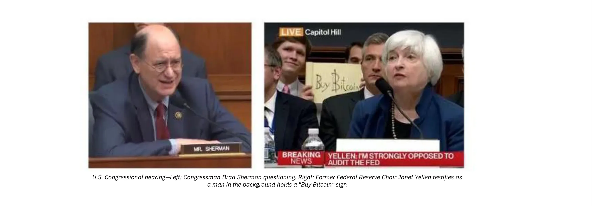

Тъй като Биткойн е глобална мрежа, страните реагираха по много различни начини:

- Някои от тях налагат сериозни ограничения**, като Китай, опитвайки се да ограничат употребата, без да я спрат наистина.

- Някои други страни, като Швейцария и Канада, предлагат по-благоприятна среда**, като виждат в Биткойн по-скоро възможност, отколкото заплаха.

- Повечето от тях все още не са взели решение**, като експериментират с регулациите, опитвайки се да балансират между иновациите и надзора.

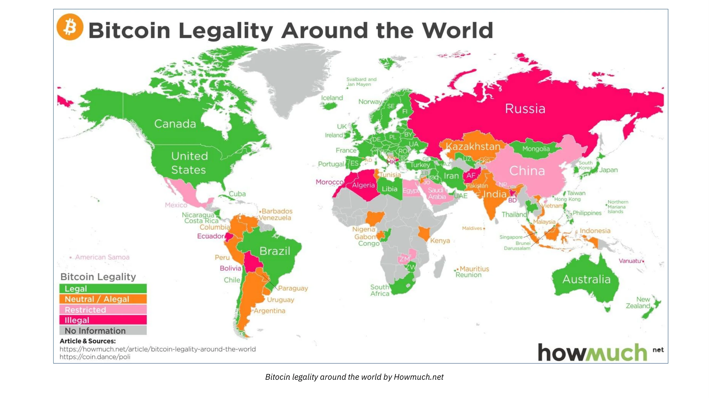

Правителствата и институциите често се затрудняват да класифицират точно Биткойн (дали това са пари, собственост или нещо съвсем ново?). В резултат на това регулациите обикновено са реактивни, непоследователни и постоянно се развиват. Ако участвате в Биткойн, е важно да сте информирани за местната обстановка; особено когато става въпрос за данъци, банков достъп и правила за съответствие.

### Позиция на банките по отношение на Биткойн

Като крайъгълни камъни на традиционната финансова система, банките виждат в Биткойн пряка заплаха за своя икономически модел, който е съсредоточен върху посредничеството и контрола на финансовите потоци. Това обяснява защо много банки по света са наложили ограничения на предприятията и физическите лица, използващи Биткойн. Някои от тях стигат до закриване на сметки или ограничаване на достъпа до услуги на компании, опериращи в сектора на криптовалутите, като често се позовават на опасения, свързани с борбата с изпирането на пари (AML) и финансирането на тероризма (CTF).

Въпреки това, макар Биткойн да се разглежда като конкурент, много от същите банки активно инвестират в блокчейн изследвания и разработки, опитвайки се да използват иновациите на Биткойн, без да се отказват от контрола си. Те разбират, че блокчейн предлага значителен потенциал, но се стремят да контролират начина, по който той е интегриран в съществуващата им инфраструктура, вместо да приемат децентрализирания, отворен модел на Биткойн.

### Борси за криптовалути и попечителство на Биткойн

Борсите играят решаваща роля в екосистемата на Биткойн, като служат като мост между фиатните валути и Биткойн. Те позволяват на потребителите да купуват, продават, а понякога и да разменят Биткойн за други цифрови активи. Не всички борси обаче са равни и е важно да изберете тази, която съответства на вашите нужди, като същевременно минимизирате рисковете. Ето кои са ключовите фактори, които трябва да вземете предвид, преди да използвате дадена борса:

- солидна репутация на сигурна услуга;
- достатъчна ликвидност, за да се осигури бърза търговия без екстремни колебания на цените;
- отзивчиво и ефективно обслужване на клиентите;
- Удобен за потребителя интерфейс, който улеснява навигацията в транзакциите;
- опция за автоматично повтарящи се покупки (ARP);
- лесно и безплатно теглене на биткойни в личен портфейл.

Борсите, които спазват местните разпоредби, обикновено трябва да спазват строги протоколи за "познаване на клиента"** (KYC), като изискват от потребителите да предоставят документи за самоличност, преди да получат достъп до услугите. Въпреки че тези процеси са предназначени за предотвратяване на незаконни дейности, те могат да компрометират неприкосновеността на личния живот, която Биткойн по своята същност предлага.

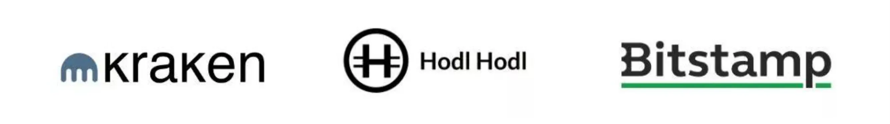

Платформите с KYC събират личната ви информация под прикритието на сигурността. Тези данни могат да бъдат използвани от правителствата за наблюдение на финансовите ви транзакции и за ограничаване на достъпа ви до определени операции.

Въпреки това има алтернативи за придобиване на биткойни, без да е необходимо да се изисква KYC:

- P2P закупуване на платформи като Bisq, Robosat, LNP2PBot, Peach, HODL HODL и др;
- Директни покупки в брой, например на местни срещи на Биткойн;
- Регулирани платформи за покупка без KYC, които се срещат рядко, но са налични в някои държави;
- Биткойн банкомати;
- Работа в замяна на биткойни;
- Копаене на биткойни.

Съществуват няколко вида платформи, всяка от които е подходяща за специфични цели:

- Платформи за обмен между равнопоставени партньори (P2P)**

Тези платформи позволяват на потребителите да купуват и продават биткойни директно помежду си, без централизиран посредник. Те предлагат по-голяма неприкосновеност на личния живот, особено защото работят без KYC. Можете да намерите местни продавачи, с които да извършвате лични транзакции или да използвате различни методи за онлайн плащане (SEPA, Revolut, Wise и др.).

**Предпазливост:** За всяка физическа транзакция избирайте публично и сигурно място, за да избегнете потенциални измами.

https://planb.academy/tutorials/exchange/peer-to-peer/bisq-v2-c1c6a702-6c16-4101-8b90-62c424017b80

https://planb.academy/tutorials/exchange/peer-to-peer/hodlhodl-d7344cd5-6b18-40f5-8e78-2574a93a3879

https://planb.academy/tutorials/exchange/peer-to-peer/lnp2pbot-v2-e6bcb210-610b-487d-970c-7cce85273e3c

https://planb.academy/tutorials/exchange/peer-to-peer/peach-c6143241-d900-4047-9b73-1caba5e1f874

https://planb.academy/tutorials/exchange/peer-to-peer/robosats-b60e4f7c-533a-4295-9f6d-5368152e8c06

- Платформи за обмен само на Биткойн**

Тези платформи са ориентирани към потребителите и предлагат лесни и прозрачни услуги. Те са предназначени само за Биткойн. Те често прилагат решения за закупуване на биткойни чрез осредняване на разходите в долари (DCA) и предлагат автоматично изтегляне на средства към личен портфейл. Те са особено подходящи за начинаещи, които искат да натрупват биткойни по прогресивен и сигурен начин. Примери: Relai, Bull Bitcoin, StackinSat, Bitstack...

https://planb.academy/tutorials/exchange/centralized/bitstack-29fd71be-9570-42c6-8f6f-cd355d62e746

https://planb.academy/tutorials/exchange/centralized/bull-bitcoin-europe-0ccf713e-efcd-44ec-8205-211f49ac7d53

https://planb.academy/tutorials/exchange/centralized/relai-v2-30a9671d-e407-459d-9203-4c3eae15b30e

https://planb.academy/tutorials/exchange/centralized/stackinsat-5af6a380-f3c6-4246-9f81-9957a16ab066

- Платформи с общо предназначение или ориентирани към търговия**

Тези платформи предлагат усъвършенствани функции, които надхвърлят простото закупуване на Биткойн, включително ливъридж и деривати. Въпреки това, ние силно съветваме да не търгувате. Вместо това препоръчваме да закупите Биткойн и да го прехвърлите във ваш портфейл. Търговията е високорискова дейност и като цяло не е подходяща за тези, които са фокусирани върху дългосрочно натрупване. Да останете извън играта на търговия често е по-разумният път.

https://planb.academy/tutorials/exchange/centralized/bitfinex-dc306d39-bd96-4ab9-a278-a322316716db

https://planb.academy/tutorials/exchange/centralized/bitstamp-5a36c896-bff5-46d7-b505-ff069c3ac47c

https://planb.academy/tutorials/exchange/centralized/kraken-1ef03e25-9b42-49bd-a47d-249e1a13cfc6

https://planb.academy/tutorials/exchange/centralized/paymium-92603f76-b985-49ce-81e5-f4fa0df776e5

**Платформите Exchange не са сигурни портфейли**. Оставянето на вашите биткойни на борса ви излага на значителен риск. Няколко сценария могат да доведат до загуба на вашите средства:

- Хакване**: Много биткойни са били откраднати от компрометирани платформи (напр. MtGox);
- Държавна конфискация**: Правителството може да затвори платформата и да замрази средствата на нейните потребители;
- Банкрут или измама**: Много платформи са изчезнали с парите на клиентите си (напр. FTX).

Златното правило е просто: **Ако не притежавате частните си ключове, не притежавате истински своите биткойни**. Винаги изтегляйте средствата си в личен портфейл възможно най-скоро, за да си осигурите пълен суверенитет над парите си.

### Портфейли, копаене и развитие: стълбовете на екосистемата

#### Биткойн портфейли

В основата на притежанието на Биткойн е портфейлът - специализиран инструмент, който съхранява по сигурен начин частните ключове, необходими за достъп и управление на вашите биткойни. Портфейлът може да има много форми: специално хардуерно устройство, мобилно или настолно приложение или дори лист хартия с написан ключ. Тези портфейли свързват цифровото ви богатство с реалния свят, като правят Биткойн използваем в ежедневието.

Всеки тип портфейл предлага различен баланс на:

- Поверителност
- Защита
- Лесно използване
- Разходи

Производството на Биткойн портфейл е разделено на няколко категории, всяка от които отговаря на различни нужди и нива на технически опит:

- Производители на хардуерни портфейли**: Тези компании разработват физически устройства, предназначени за сигурно съхранение на ключове. Някои от тях са с отворен код, а други предлагат патентовани решения с различни характеристики и нива на сигурност. Сред известните имена са Ledger, Trezor, Coinkite, Foundation и Shiftcrypto.
- Разработчици на софтуерни портфейли**: Това са както компании, така и независими разработчици, които създават мобилни и настолни приложения. Техните предложения се различават по отношение на потребителското изживяване, сигурността и функциите. Примери за това са Sparrow, Wizard Sardine, Galoy, Synonym и Blockstream.
- Портфейли "Направи си сам"**: Тези решения с отворен код са предназначени за напреднали потребители, които искат пълен контрол и минимална зависимост от трети страни. Изграждането на собствен портфейл намалява доверителните зависимости и може да повиши сигурността ви. Известни варианти "Направи си сам" включват Seedsigner и Specter DIY.

Портфейлите играят основна роля в Биткойн и ще бъдат разгледани по-задълбочено по-късно в този курс.

#### Копаене

Копаенето е основна функция на мрежата на Биткойн. Тя осигурява сигурността на системата и поддържа функционирането на блокчейн. Миньорите потвърждават трансакциите и осигуряват сигурността на мрежата, като извършват енергоемки изчисления, известни като Proof of Work. Всеки новоизкопан блок добавя партида трансакции към блокчейна и освобождава нови биткойни в съответствие с графика за емитиране на протокола.

В ранните дни на Биткойн копаенето можеше да се прави от персонален компютър. Днес това е конкурентна, глобална индустрия, доминирана от компании със значителни финансови и технически ресурси. Търсенето на евтини енергийни източници се е превърнало в основен фокус, тъй като миньорите се стремят да оптимизират оперативните разходи и рентабилността. Операциите сега варират от огромни промишлени съоръжения до малки инсталации, работещи в домове или гаражи.

Екосистемата на копачите се състои от няколко основни участници:

- Производители на хардуер**:Компании като Bitmain проектират и произвеждат ASIC (Application-Specific Integrated Circuits) - ултраспециализирани чипове, създадени единствено за копаене на биткойн.
- Миньорски басейни**:Това са колективи от миньори, които обединяват изчислителната си мощ, за да подобрят шансовете си за получаване на награди. Като се има предвид нарастващата трудност, басейните предлагат по-предсказуеми печалби, като разпределят блоковите награди (новоизкопани биткойни и транзакционни такси) между участниците въз основа на техния принос. Примери за това са Foundry USA, AntPool, F2Pool, MARA Pool и Braiins Pool.
- Миньори**:Това са лицата или организациите, които използват хардуера и софтуера на копачите. От едната страна са дребните миньори, които използват машини като Antminer S9, а от другата - индустриални операции като Galaxy Digital, които управляват огромни съоръжения, предназначени за копаене.

Копаенето е самостоятелен свят с много пластове, които трябва да се изследват; в него влизат технически предизвикателства, икономически стимули и енергийни съображения. За тези, които се интересуват от по-задълбочено изучаване на тази област и разбиране на нейното функциониране, нашият курс MIN201 ще ви запознае с всичко, което трябва да знаете.

https://planb.academy/courses/ce272232-0d97-4482-884a-0f77a2ebc036

#### Развитие в екосистемата

В основата на техническата еволюция на Биткойн стои Bitcoin Core - най-широко използваният софтуерен клиент за работа с възел Биткойн. Това е проект с отворен код, който е напълно прозрачен и публично достъпен в GitHub: [където всеки може да прегледа кода, да следи дискусиите и да види как се развива протоколът. Въпреки че се предлагат и обсъждат актуализации, никой не е принуден да ги приема и потребителите продължават да контролират коя версия използват.

Развитието на Биткойн може да бъде разбрано чрез няколко отделни групи участници:

- Биткойн Основни разработчици**, Това са лицата, които поддържат и подобряват основния клиентски софтуер. Сред тях са и поддържащите, които държат ключовете за управление на хранилището. В 2025 г. те са пет: Хеннадий Степанов, Майкъл Форд, Ава Чоу, Глория Жао и Райън Офски. След това са сътрудниците, които изпращат промени в кода, поправки на грешки или подобрения. Тези предложения преминават през партньорска проверка и обсъждане в общността, преди да бъдат приети.
- Разработчици на многопластови протоколи**,Тази група работи по технологии, които се изграждат върху Биткойн, като [Lightning Network](https://planb.academy/resources/glossary/lightning-network) или RGB, с цел разширяване на възможностите на Биткойн, без да се променя сърцевината му.
- Независими разработчици**, Тези разработчици се фокусират върху създаването на инструменти и приложения за подобряване на потребителското изживяване, като например Mempool.space (визуален интерфейс за проследяване на активността на транзакциите) или Alby (инструменти за използване на Lightning плащания в браузъри и приложения).

Всеки може да предложи промени в ядрото на Биткойн, но процесът е умишлено строг. Усъвършенстването на новите идеи често отнема години и изисква задълбочено техническо разбиране, широко участие на общността и многопластова проверка. Предложенията обикновено се подават под формата на **Предложения за подобряване на Биткойн (BIPs)**; някои от тях никога не влизат в протокола.

Иновацията е добре дошла, но само когато е подкрепена със солидна аргументация, консенсус в общността и внимателно тестване.

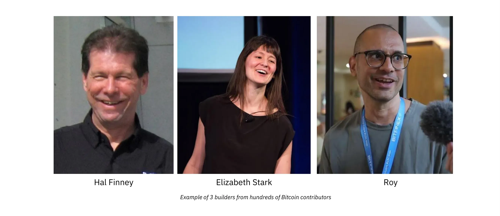

Независимо от това, което някои смятат, никой няма едностранен контрол върху Биткойн; дори и поддържащите Bitcoin Core. Тяхната роля е да управляват хранилището на софтуера, а не самия протокол.

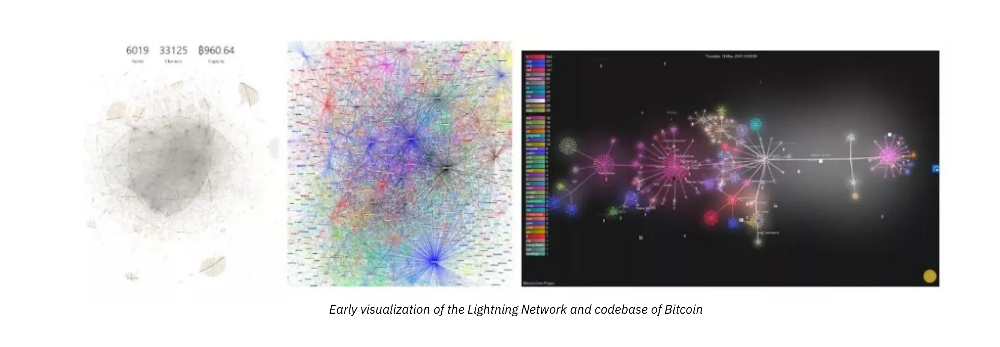

Дори ако някой поддържащ одобри спорна промяна, тя няма да се отрази на мрежата, освен ако **възлите (управлявани от потребители)** действително не приемат и не използват тази версия. В крайна сметка кодът на Биткойн има значение само ако хората решат да го използват.

Струва си също да се отбележи, че **Bitcoin Core не е единственият клиент**. Алтернативи като Bitcoin Knots също прилагат протокола Биткойн, което дава на потребителите по-голям избор и засилва децентрализацията на системата:

https://planb.academy/tutorials/node/bitcoin/bitcoin-knots-e04b2196-4df2-4246-86ef-c02269c29098

## Многопластовата архитектура на Биткойн

<chapterId>03017765-53cf-5f14-9682-e99ca02d2241</chapterId>

:::video id=6b7c8d9e-0f1a-2b3c-4d5e-6f7a8b9c0d1e:::

Биткойн е отворена система, проектирана да бъде минималистична, надеждна и сигурна от самото начало. За да се добави функционалност, без да се променят основите ѝ, еволюцията обикновено се извършва чрез добавяне на **протоколни слоеве** и допълнителни приложения, които обогатяват екосистемата, без да се нарушава децентрализацията и устойчивостта на основната система. Тази гъвкавост е позволила на множество компании и независими разработчици да изградят инфраструктура около Биткойн, добавяйки иновации, адаптирани към различни случаи на използване.

### Допълнителните слоеве

Многопластовият подход позволява Биткойн да се подобрява, без да се променя основният му протокол, като се гарантира стабилността и сигурността на основната система. Този метод е подобен на начина, по който работи интернет, където множество протоколи се надграждат един над друг, за да предлагат различни функционалности, като същевременно поддържат безпроблемна оперативна съвместимост.

Сред основните системи за наслагване, които обогатяват екосистемата Биткойн, са:

- Lightning Network**:

Lightning Network (Светкавичната мрежа), създадена от Тадеус Дрия и Джоузеф Пун през 2016 г., е решение от второ ниво, предназначено да позволява незабавни и евтини плащания. Двама потребители могат да отворят частен канал, в който да извършват трансакции, като балансът се актуализира в блокчейна само при отваряне или затваряне на канала. Транзакциите в рамките на канала се осъществяват off-chain, което означава, че не е необходимо да се записват поотделно в блокчейна. Тази структура позволява незабавни транзакции и минимални такси, което я прави идеална за транзакции с ниска стойност, които изискват бързо потвърждение.

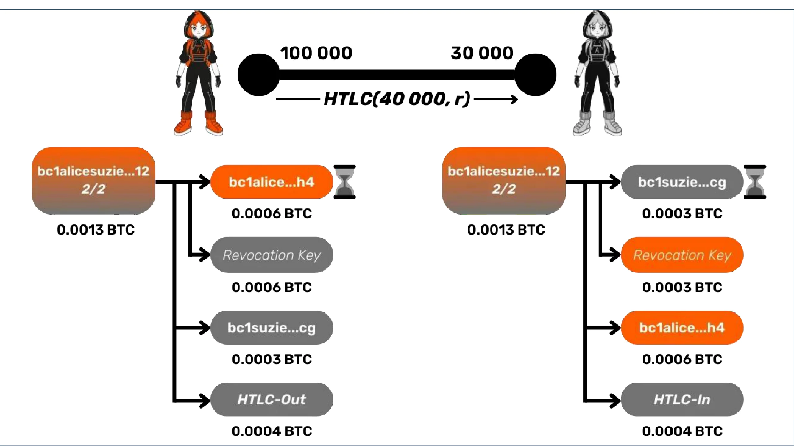

Да речем, че купувате кафе с Биткойн, използвайки основния слой. За да бъде потвърдено плащането (и за да може кафенето да се увери, че наистина сте платили), транзакцията трябва да бъде включена в блок. Това може да отнеме няколко минути, в зависимост от таксата, която сте избрали. Технически погледнато, търговецът трябва да изчака шест потвърждения (около час), за да е напълно сигурен, че плащането е окончателно. Очевидно е, че подобно изчакване не работи, когато стоите на гишето. С Lightning Network плащането преминава само за няколко секунди; така че кафето ви е платено и сервирано, преди дори да има време да изстине.

Ако искате да научите повече за това как работи Lightning, предлагаме отличен курс за втори курс, посветен на тази тема:

https://planb.academy/courses/34bd43ef-6683-4a5c-b239-7cb1e40a4aeb

- Странични вериги**:

Страничните вериги са блокови вериги, които работят паралелно с основната блокова верига на Биткойн. Те са свързани чрез двупосочно обвързване, което гарантира, че активът, който се движи между веригите, запазва същата стойност; това означава, че един биткойн в страничната верига все още струва един биткойн в основната верига. Всяка странична верига има свой собствен консенсусен механизъм, който може да бъде напълно отделен или частично зависим от този на Биткойн.

Основното предимство на страничните вериги е, че те могат да предлагат функции, които не са налични в базовия слой на Биткойн, или да ги предлагат по подобрен начин. Това включва по-голяма гъвкавост за разработчиците, по-бързи и/или по-частни транзакции и по-голяма пропускателна способност на транзакциите. За да осигурят тези предимства обаче, страничните вериги често правят различни компромиси в сравнение с основната верига на Биткойн.

Концепцията за страничните вериги е въведена през 2014 г. от Адам Бек, Мат Корало, Люк Дашър, Марк Фриденбах, Грегъри Максуел, Андрю Милър, Андрю Поелстра, Хорхе Тимон и Питер Вуйле. Към 2025 г. най-известните странични вериги в екосистемата Биткойн са Liquid и RSK (Rootstock).

Ако искате да разгледате Liquid по-подробно, предлагаме курс за напреднали за трети курс по темата:

https://planb.academy/courses/6d26bcff-51a3-405f-bcdd-9af8297ce727

- RGB**:

RGB е децентрализирана система за интелигентни договори с фокус върху неприкосновеността на личния живот, проектирана да работи върху Биткойн и Lightning Network. За разлика от традиционните платформи за интелигентни договори, RGB използва модел за валидиране от страна на клиента (което означава, че пълното състояние на договора се съхранява в off-chain, а в блокчейна на Биткойн се публикуват само криптографски ангажименти). Този дизайн подобрява както мащабируемостта, така и поверителността. С RGB потребителите могат да създават усъвършенствани интелигентни договори за издаване на токени, НФТ, децентрализирани самоличности или дори DeFi приложения, директно в Биткойн или Lightning.

Ключова характеристика на RGB е неговата защита срещу двойното харчене, постигната с помощта на криптографска техника, наречена "Печати за еднократна употреба". Този механизъм разчита на факта, че UTXO (неизразходвани транзакционни изходи) на Биткойн могат да бъдат изразходвани само веднъж. Автентичността на токените се осигурява чрез валидиране от страна на потребителя на цялата история на договора (от създаването му до текущото му състояние).

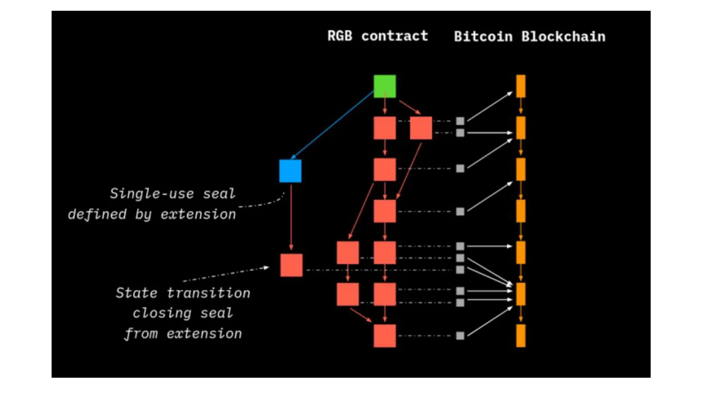

За да задълбочите познанията си за RGB, предлагаме курс на обучение за четвърти курс (моля, имайте предвид, че той е с високо техническо ниво):

https://planb.academy/courses/3ce1d37c-05ba-4f54-aa15-7586d37b2bb7

RGB е само един от многото протоколи, изградени върху Биткойн. Някои от тях са по-широко приети от други, но продължават да се появяват и нови. Общата нишка е идеята за оптимизиране на всеки слой за конкретна задача, като същевременно се запазва целостта и неизменността на базовия протокол Биткойн.

Този многопластов дизайн е в контраст с голяма част от криптоиндустрията, която често се стреми да обедини много функции в един протокол. Като запазваме Биткойн прост и тясно фокусиран, ние намаляваме повърхността на атаките, което означава по-голяма сигурност. Един икономичен протокол е по-лесен за защита, поддръжка и мащабиране. Биткойн е проектиран да прави едно нещо изключително добре: да осигурява стабилни, децентрализирани пари. Всичко останало (интелигентни договори, токени, плащания и др.) може да бъде напластено отгоре, което позволява иновации, без да се компрометира ядрото.

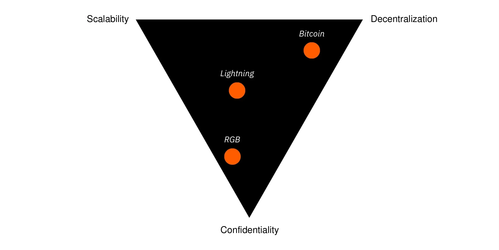

**Знаете ли, че**?Интернет не е създаден наведнъж; той се развива като съвкупност от оперативно съвместими протоколи. Например TCP/IP управлява мрежовата комуникация, HTTP захранва мрежата, а много други слоеве изпълняват специфични функции. Всеки слой е оптимизиран за своята работа, което създава стабилна и модулна система. Биткойн следва същата философия. Неговият основен слой е силен и минимален, а допълнителната функционалност се добавя чрез многослойни протоколи като Lightning, Liquid или RGB; всеки от тях е насочен към решаване на различни потребителски нужди, като същевременно запазва основата непокътната.

### Търговски инструменти за приемане на Биткойн

Днес има много инструменти за търговците, които искат да приемат Биткойн като форма на плащане. За малките предприятия, които търсят проста настройка, използването на горещ портфейл (или дори Lightning портфейл) често е достатъчно, за да започнат да приемат директно плащания. По-големите бизнеси, които изискват подходящо счетоводство и отчетност, обикновено предпочитат по-усъвършенствани системи за обработка на плащания. За щастие има няколко налични опции в зависимост от вашите нужди.

Ако предпочитате решение, което не е свързано с ръцете ви, и искате да получавате фиатна валута директно в банковата си сметка, попечителските услуги като OpenNode предлагат опростено преживяване:

https://planb.academy/tutorials/business/point-of-sale/open-node-e69a0c1c-47f7-4932-8494-e6f26c3c9784

За търговците, които имат по-технически наклонности и искат да имат пълен контрол върху процеса, BTCPay Server е фантастична опция с отворен код. Основният му недостатък е, че изисква време за настройка и поддръжка, както и някои технически познания:

https://planb.academy/tutorials/business/point-of-sale/btcpay-server-928eb01e-824b-4b57-a3e8-8727633beddc

Някъде по средата ще откриете Swiss Bitcoin Pay - удобно за използване, но мощно решение, което постига добър баланс между лекота на използване, функционалност и сигурност. То работи добре както за малки търговци на дребно, така и за по-големи предприятия:

https://planb.academy/tutorials/business/point-of-sale/swiss-bitcoin-pay-2-a78b057e-ed11-47ac-860c-71019fcb451a

Приемането на Биткойн може да донесе редица практически и финансови ползи за бизнеса. Подобно на парите в брой, Биткойн позволява директни плащания между клиента и търговеца (без необходимост от традиционна банка). Плащанията, извършени чрез Lightning Network, са незабавни и окончателни, което намалява риска от обратни плащания. А когато търговците държат биткойни на свой ключ, те придобиват по-голяма финансова автономност.

Тя може също така да помогне за намаляване на разходите, тъй като премахва банковите такси и необходимостта от традиционни терминали за плащане; често ви е необходим само смартфон или лаптоп. Дори и при участието на платежни процесори, таксите обикновено са по-ниски от тези, начислявани от банките.

За разлика от традиционните валути, които губят стойността си с течение на времето поради инфлацията, Биткойн има фиксирано предлагане от 21 милиона монети. Това я прави ценен актив за запазване и диверсифициране на бизнес хазната в дългосрочен план.

В ежедневните операции Биткойн опростява плащанията, като премахва необходимостта от физически пари в брой, намалява рисковете от кражби и елиминира възможността за фалшиви пари. Това е глобална валута, което я прави идеална за международни клиенти, тъй като няма нужда от конвертиране на валута. За онлайн магазините Биткойн е особено сигурен и ефективен.

Освен това приемането на Биткойн може да бъде умен маркетингов ход. Той показва, че вашият бизнес е напредничав и може да привлече нови клиенти (особено сред по-младите поколения като Gen Z). Това е нискорискова, стратегическа възможност с минимални разходи, ограничени най-вече до първоначалната настройка; която сега е по-лесна от всякога с правилните инструменти.

Ако искате да проучите как Биткойн може да бъде интегриран във вашия бизнес (като метод за плащане, като финансов актив или и като двете), предлагаме курс за начинаещи, съобразен с тези нужди:

https://planb.academy/courses/a804c4b6-9ff5-4a29-a530-7d2f5d04bb7a

Биткойн набира все по-голяма популярност като средство за размяна, като все повече се прилага в много отрасли. Lightning Network направи плащанията по-бързи и по-евтини, което допълнително увеличи привлекателността на Биткойн за търговците.

Достигнахме етап, в който всеки може да се включи в екосистемата на Биткойн - като я използва в ежедневието, внедрява я в бизнеса, допринася за образованието, помага за подобряване на кода или създава нови приложения.

Биткойн вече е неудържим.

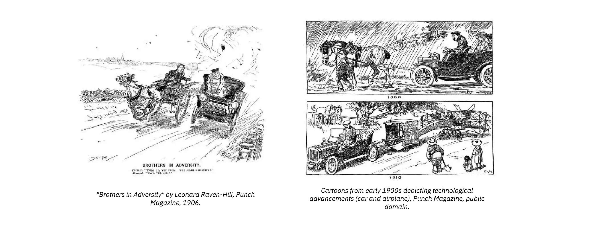

### Моята лична гледна точка

Винаги съм смятал, че метафората "магистрала Биткойн" е един от най-точните и убедителни начини да се разбере как се развива екосистемата и накъде се движи. Биткойн не са просто цифрови пари; това е **развиваща се алтернативна финансова система** със свои силни страни и недостатъци. Макар и все още млада и изправена пред предизвикателства, нейната устойчивост е неоспорима. Тя няма да изчезне. Напротив, подобно на черна дупка, тя постепенно ще погълне всичко около себе си, докато се превърне в неоспорим паричен стандарт.

Представете си Биткойн като път, по който шофирате. В момента, за да се погрижите за ежедневните си нужди (да си купите храна, да платите за услуги или да ремонтирате колата си), понякога трябва да излезете от този път, т.е. временно се връщате към старата финансова система. Това е така, защото инфраструктурата на Биткойн все още е в процес на изграждане и някои части от ежедневието все още разчитат на фиатна валута и банки.

Но с течение на времето този път ще се превърне в напълно изградена магистрала.

Ето как виждам бъдещето на Биткойн. Той може да не замени напълно традиционните финанси, но ще ги надмине в ключови области (ефективност, сигурност и приемане от потребителите), докато се превърне в стандарт за по-голямата част от света.

Ако си спомням правилно, тази метафора за магистралата Биткойн беше представена за първи път от Андреас Антонопулос. Неговата визия е актуална и днес, а с всяка стъпка напред сме все по-близо до осъществяването ѝ.[@aantonop](https://x.com/aantonop)

Следващият етап от курса: ще ви помогнем да определите своя профил на биткойнър въз основа на личната си ситуация и цели.

# Изготвяне на план

<partId>3801faf6-7915-56fa-baf5-ee63ad03b7cf</partId>

## Изберете своя профил

<chapterId>c5d87903-a5f2-5eec-887a-f662734ce49b</chapterId>

:::video id=1a2b3c4d-5e6f-7a8b-9c0d-1e2f3a4b5c6d:::

След като усвоихте теоретичните основи на Биткойн, е време да преминете към практическата част. Този раздел ще ви помогне да разберете как да придобиете първите си биткойни, как да ги съхранявате сигурно и как да адаптирате подхода си в зависимост от личната си ситуация. Целта е да ви помогнем да определите какъв тип потребител сте, за да можете да възприемете стратегия, която отговаря на вашите нужди и ограничения.

Биткойн не е като традиционните активи. Той изисква обмислен подход и солидно разбиране както на техническите, така и на икономическите последици от използването му. За разлика от фиатните валути, Биткойн функционира по модела на индивидуалния суверенитет; това означава, че вие сте изцяло отговорни за управлението и сигурността на вашите средства. Както обсъдихме в по-ранните раздели, тази финансова автономия е голямо предимство, но тя е свързана и със специфични най-добри практики, които ще разгледаме в следващите няколко глави.

Този курс предполага, че тепърва започвате работа с Биткойн. Затова ще се съсредоточим върху прости, удобни за начинаещи решения, които са лесни за настройка. Няма да разглеждаме непреки методи за експозиция като копаене, закупуване на акции в компании, свързани с Биткойн, или сложни финансови стратегии. Целта ни е да ви помогнем да изберете портфейл, който отговаря на ситуацията ви, и да придобиете безопасно първите си биткойни.

### Защо да дефинирате потребителския си профил?

Няма универсален подход за закупуване и управление на BTC. Всеки потребител има уникален контекст, оформен от неговото финансово състояние, технически познания и очаквания относно Биткойн. Ето защо е важно да изберете стратегия, която съответства на вашия личен профил. Познаването на собствения ви подход ви помага да вземате по-добри решения и да избягвате често срещаните грешки, които произтичат от неправилна преценка на нуждите ви.

Ето някои от факторите, които трябва да вземете предвид, когато избирате най-добрия начин за закупуване и съхранение на биткойни:

- Сумата, която искате да инвестирате**: Купувате ли малка сума, за да експериментирате и да се учите, без да поемате голям риск? Или планирате по-значителна инвестиция, която да бъде държана дългосрочно?
- Честотата на инвестициите ви**: Искате ли да направите еднократна покупка и да осигурите средствата си веднага, или предпочитате да разпределите покупките си във времето, като използвате стратегия като Dollar-Cost Averaging (DCA), за да изгладите колебанията на цените?
- Какво искате да правите с вашите биткойни**: Държите ли ги стриктно като дългосрочни спестявания? Използвате ги за ежедневни плащания? Или може би и двете по малко?
- Позицията ви по отношение на поверителността**: Удобно ли ви е да предоставяте лична информация и да използвате централизирани платформи, за да купувате биткойни? Или предпочитате методи, които са насочени към защита на личните данни, като например обмен между равнопоставени партньори, при който не се изисква проверка на самоличността?
- Вашият личен, правен и географски контекст**: В зависимост от мястото, където живеете, достъпът до определени борси може да е ограничен. Местните закони и данъчни правила също могат да повлияят на начина, по който съхранявате и използвате своите биткойни.

Всеки един от тези фактори играе роля при определянето на правилната за вас стратегия. Някои потребители ще оценят простотата и лекотата на използване чрез регулирани услуги, докато други ще предпочетат по-автономен подход, ориентиран към защитата на личните данни.

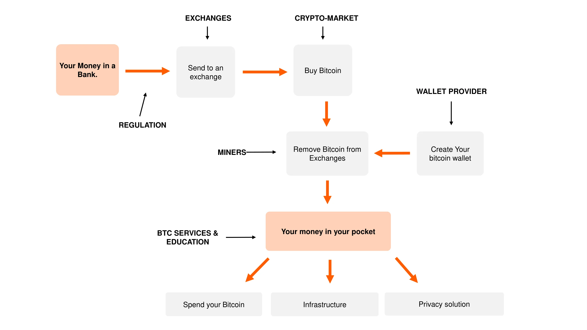

Ето какво ще разгледаме по-нататък: различните начини за придобиване и защита на вашите биткойни, за да можете да вземате информирани решения въз основа на вашия профил и вашите цели.

### Основните критерии за определяне на вашия профил

Изборът на правилната стратегия за придобиване и защита на вашите биткойни започва с честна оценка на личното ви положение. Няколко фактора оказват влияние върху тези решения, включително рисковете, с които може да се сблъскате, начина ви на живот и начина, по който планирате да използвате своите биткойни.

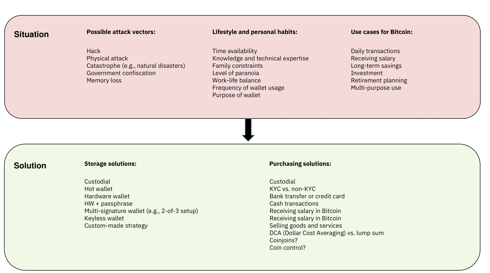

#### Потенциални рискове и заплахи

Изборът на правилната стратегия за придобиване и защита на вашите биткойни започва с честна оценка на личното ви положение. Няколко фактора оказват влияние върху тези решения, включително рисковете, с които може да се сблъскате, начина ви на живот и начина, по който планирате да използвате своите биткойни:

- Кибератаки**: Ако не сте добре запознати с киберсигурността или използвате уязвими устройства, можете да станете мишена на онлайн атаки. В такъв случай съхраняването на вашите биткойни офлайн (студено съхранение) може да е по-безопасен вариант.
- Физически заплахи**: За съжаление се случват физически атаки: взломни кражби, обири и дори отвличания са били насочени към притежатели на биткойни. Макар че тези инциденти все още са редки и засягат предимно високопоставени лица, струва си да ги вземете предвид от самото начало, когато проектирате настройките си за сигурност.

- Природни бедствия**: Ако живеете в район, склонен към горски пожари, наводнения или други екстремни метеорологични явления, е от решаващо значение да разполагате с устойчива система за архивиране, която защитава вашите частни ключове.

- Конфискация от правителството**: Ако в страната ви има рестриктивни или нестабилни финансови правила, може да се сблъскате с ограничения при закупуването или използването на биткойн. В такива случаи ще предпочетете частни решения, които не са свързани с конфискация.

- Загуба на памет или загуба на данни**: Управлението на частни ключове изисква да съхранявате и извличате чувствителна информация. Ако се притеснявате от забравяне или потенциални здравословни проблеми, е разумно да въведете силни системи за архивиране; или дори да включите доверено лице в плана си за сигурност.

За да разберете по-добре уязвимостта си, оценете всеки от тези рискове по скала от 0 (нисък) до 10 (висок). Тази самооценка ще ви помогне да приоритизирате правилните защити занапред.

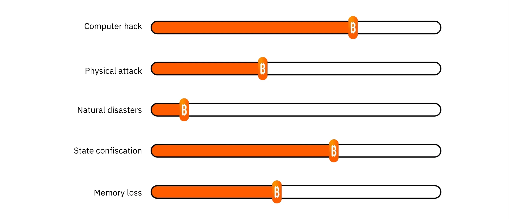

#### Начин на живот и лични навици

Ежедневието ви също играе голяма роля за това как ще управлявате биткойните си. Изборът на конфигурация, която съответства на начина ви на живот, ще улесни нещата и ще ви помогне да избегнете ненужни затруднения.

**Ограничен срок или лихва?** Изберете прости, автоматизирани решения, като например планирани покупки, които автоматично се прехвърлят в защитено хранилище.

**Технически грамотни или практични?** Може би предпочитате по-усъвършенствани решения като многозначни портфейли, които предлагат по-голям контрол и сигурност.

**Инвестиране за близки или бъдещи поколения?** Помислете отрано за наследството. Има начини да се уверите, че вашите биткойни могат да бъдат предадени по сигурен начин, ако нещо се случи с вас.

**Съзнание за поверителност?** Някои методи за покупка изискват лична информация (KYC платформи), докато други (като peer-to-peer или копаене) предлагат повече дискретност.

#### Използване на вашите биткойни

Стратегията ви за съхранение и управление трябва да отразява начина, по който възнамерявате да използвате своите биткойни. Ако сте наясно с това от самото начало, това ще ви помогне да вземете решения.

- Дългосрочни спестявания**: Купувате биткойн като инвестиция и не планирате да го използвате скоро. В този случай максималната сигурност и минимизираният риск от достъп са от ключово значение.
- Постепенно натрупване**: Редовно купувате малки количества. Стратегия като Dollar Cost Averaging (DCA), съчетана със сигурен портфейл, работи добре.
- Ежедневни разходи**: използвате биткойн като пари. Използвайте мобилен портфейл за малки ежедневни плащания (може и с Lightning) и съхранявайте по-голямата част от своите биткойни на по-сигурно място.
- Подготовка за пенсиониране или предаване на богатството**: Искате да предадете своите биткойни на някого по-късно. Използвайте инструменти, които позволяват лесно и сигурно прехвърляне на средства, когато настъпи подходящият момент. Могат да се въведат стратегии като Multisig с таймлоук или специфични планове за наследяване, за да се гарантира, че средствата ви няма да бъдат загубени, нито пък ще получите достъп до тях твърде рано.

След като обмислите рисковете, начина си на живот и целите си, ще сте готови да направите интелигентен избор за пътуването си с биткойн.

Ето четирите основни неща, които трябва да решите:

- Кой портфейл да използвате
- Как да защитите своя биткойн
- Как ще купите биткойн
- Каква сума ще превеждате

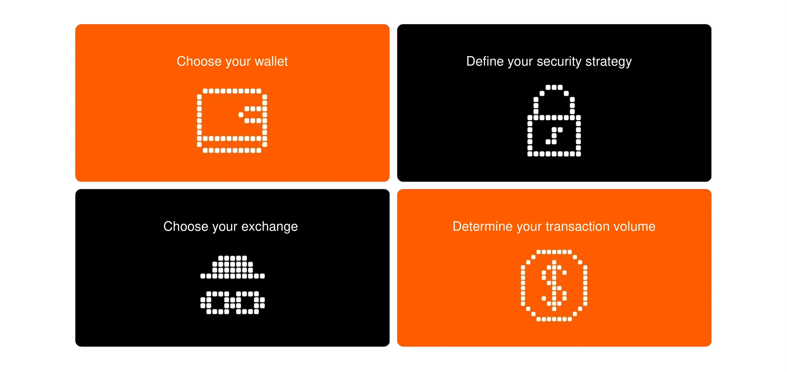

### Портфейли и стратегии за сигурност

Защитата на частните ключове (тези, които дават достъп до вашите биткойни) е най-важната част от притежаването и използването на Биткойн. За разлика от традиционната банкова сметка, при която трета страна управлява средствата ви, Биткойн ви предоставя пълен контрол. Но с тази свобода идва и отговорността: ако загубите ключовете си, вашите биткойни ще изчезнат завинаги. Съществуват няколко вида портфейли, които можете да използвате. Всеки от тях има своите плюсове и минуси в зависимост от вашите нужди и ниво на опит.

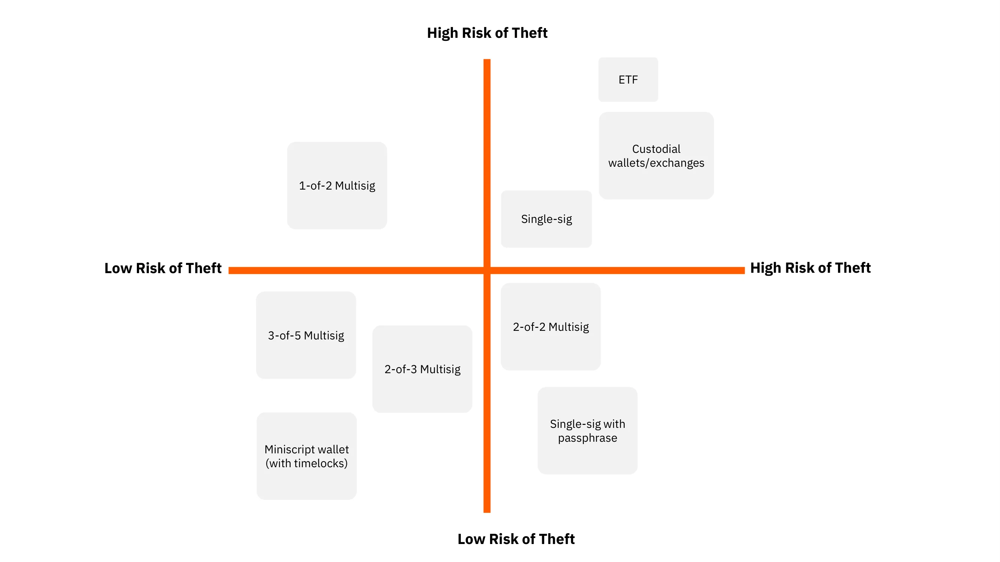

#### Горещ портфейл

Това са приложения или софтуер, свързани с интернет. Те съхраняват частните ви ключове на същото устройство, на което са инсталирани. Тези портфейли са чудесни за ежедневна употреба или за съхранение на малки количества биткойн.

Примери: Blue Wallet, Green Wallet, Sparrow Wallet

С поддръжка на Lightning: Phoenix, Wallet of Satoshi, BitKit

**Предимства**:

- Лесен за използване и бърз достъп до средствата ви.
- Чудесен за малки плащания и ежедневна употреба.
- Някои от тях поддържат Lightning Network за бързи и евтини транзакции.

**Недостатъци**:

- По-малко сигурно: ключовете ви са на устройство, свързано с интернет, което увеличава риска от хакерски атаки.
- Не е подходящ за дългосрочно съхранение на големи количества.

Най-добър за: Начинаещи, малки салда и чести транзакции.

#### Хардуерни портфейли

Хардуерните портфейли са физически устройства, които съхраняват частните ви ключове напълно офлайн. Те са много по-сигурни от горещите портфейли, тъй като намаляват риска от онлайн атаки.

Примери: Ledger, Trezor, Coldcard, Jade, BitBox

**Предимства**:

- Ключовете са офлайн = много по-трудно достъпни за хакерите.
- Специално проектирани за сигурност.

**Недостатъци**:

- По-бавно използване; трябва да свържете устройството и да потвърдите физически трансакциите.
- Трябва да закупите устройството, което може да ви струва доста пари.

Най-добър за: Дългосрочни притежатели и всички, които обезпечават по-големи суми.

#### Портфейли с много подписи

Multisig (портфейлите с много подписи) изискват повече от един ключ за одобряване на транзакция. Представете си го като трезор, който се нуждае от две или три комбинации, за да се отвори. Тези настройки са идеални за напреднали потребители, фирми или за всеки, който търси сигурност от най-високо ниво.

Примери: Liana, Casa, Specter, Sparrow

**Предимства**:

- Много силна защита; ако един от ключовете е компрометиран, средствата ви все още са в безопасност.
- Може да намали рисковете от кражба, загуба или принуда.
- Можете да разпределяте ключове между хора или места.

**Недостатъци**:

- По-сложно е да се настроят и управляват.
- Може да се изисква координация между няколко души/устройства.
- Риск от загуба на средства в случай на неправилно управление на Multisig;
- По-високи първоначални разходи за придобиване, което може да наложи закупуването на няколко хардуерни портфейла.

Най-добър за: Напреднали потребители, семейства, компании и дългосрочно съхранение с висока степен на сигурност.

#### Попечителски услуги и борсово-търгувани фондове (ETF)

Някои хора избират да съхраняват биткойни в услуги на трети страни, като борси, попечители или ETF. Това ви позволява да придобиете експозиция към биткойн, без сами да управлявате частни ключове. Но това е свързано с големи компромиси.

Примери: Борси като Coinbase или Binance, финансови продукти като Биткойн ETF на BlackRock.

**Предимства**:

- Лесен за използване; не е необходимо да боравите сами с ключове или портфейли.
- Полезно за хора, които просто искат да инвестират, а не да използват биткойн директно.

**Недостатъци**:

- Всъщност вие не притежавате своите биткойни, а попечителят. Ако той се срине, това може да се случи и с вашите средства (просто попитайте потребителите на Mt. Gox или FTX).
- Потенциално по-високи такси и по-малко поверителност.
- Зависимост от доверена трета страна, което означава отказ от суверенитет - едно от основните предимства на Биткойн;
- Не получавате всички предимства на Биткойн по отношение на неприкосновеността на личния живот и финансовата независимост.

**Правило на палеца: Нямате ключове, нямате биткойни.**

Не препоръчваме попечителски услуги дори за начинаещи. Много по-добре е да отделите време, за да се научите как да защитите правилно своите биткойни, отколкото да рискувате да загубите всичко, защото някой друг се е провалил. Но ако сте тук и четете за портфейли и управление на ключове, вероятно вече сте разбрали защо този принцип е важен.

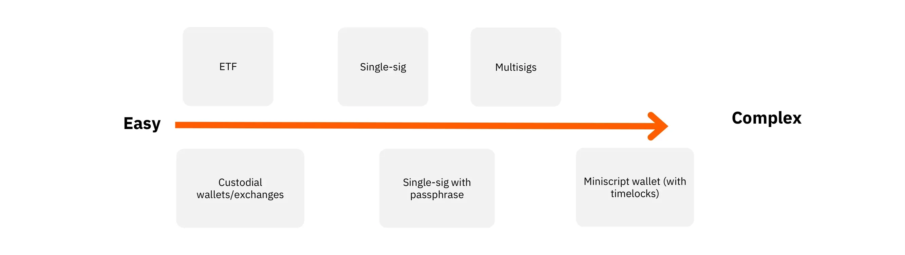

Изборът на портфейл и на метод за сигурност зависи от това, какво количество съхранявате, от нивото ви на опит и от потенциалните рискове, които виждате. Хибридният подход обаче може да бъде интелигентен вариант:

- Използвайте горещ или Lightning портфейл за ежедневни транзакции;
- Използвайте хардуерен портфейл за защита на по-голямата част от вашите биткойни, които са предназначени за дългосрочни спестявания.

Ако горещият ви портфейл натрупа твърде много биткойни, можете да прехвърлите част от тях в студения. От друга страна, ако имате нужда от повече биткойни за ежедневни разходи, можете да изтеглите от студения.

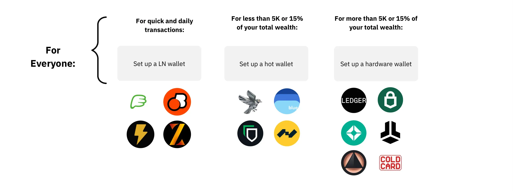

В крайна сметка сигурността до голяма степен зависи от начина, по който използвате инструментите. Хардуерният портфейл няма да ви донесе много полза, ако загубите, изложите или компрометирате мнемоничната фраза. Предпазливостта и дисциплината са най-добрата ви защита срещу загуба на биткойни. За повече информация по този въпрос ви препоръчвам да прочетете тази статия:

https://planb.academy/tutorials/wallet/backup/backup-mnemonic-22c0ddfa-fb9f-4e3a-96f9-46e2a7954270

### Методи на придобиване и обеми на транзакциите

Съществуват различни начини за придобиване на биткойни в зависимост от това колко поверителност ви е необходима, какви са правилата във вашата страна и каква сума искате да придобиете. Съществуват два основни подхода:

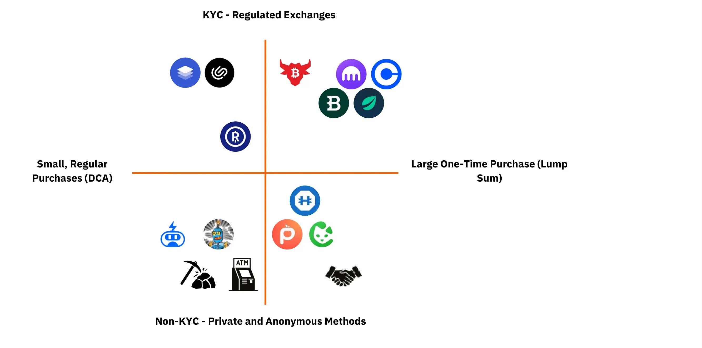

#### Придобиване с проверка на самоличността (KYC)

Регулираните платформи обикновено изискват от вас да потвърдите самоличността си, преди да закупите биткойн. Това означава, че ще трябва да предоставите официални документи (паспорт, лична карта, доказателство за адрес и т.н.), за да създадете акаунт и да получите достъп до услугите за покупка и продажба.

**Предимства**:

- Опростен процес на закупуване, често подходящ за начинаещи;
- Възможност за закупуване на големи количества наведнъж;
- Достъп до допълнителни услуги (DCA, автоматична конверсия, лесно теглене на фиат);
- Висока ликвидност с малка разлика между цените на покупка и продажба.

**Недостатъци**:

- Високи такси за конвертиране и теглене;
- Някои платформи са сложни и могат да ви затрупат с разширени функции за търговия или алткойни;
- Основни проблеми с поверителността.

Най-големият недостатък на обмена на KYC е рискът за неприкосновеността на личния живот, който може да засегне и личната ви сигурност. KYC позволява на борсите да свържат истинската ви самоличност с вашите адреси за теглене на Биткойн. Тази информация се превръща в идеална отправна точка за блокчейн анализ. След като адресът бъде идентифициран, е възможно да се проследят всички свързани с него транзакции, което компрометира поверителността. Без допълнителни защитни мерки цялата ви дейност в Биткойн може да бъде проследена до вас.

Друг голям риск е, че правителството, което има достъп до базите данни на регулираните платформи, може лесно да идентифицира лицата, които са закупили BTC. Макар че днес това може да изглежда безобидно, то може да се превърне в проблем, ако бъдат наложени икономически или политически ограничения. Освен това регулираните платформи трябва да докладват за всички подозрителни транзакции, което увеличава шансовете за целенасочено наблюдение от страна на публичните органи.

Освен това платформите за KYC съхраняват много чувствителни данни, включително документи за самоличност и доказателства за адрес. Тези данни често се възлагат на доставчици от трети страни, които се занимават с проверка на самоличността. Ако платформата бъде хакната или се провали, тази информация може да бъде разкрита и използвана за фишинг, опити за изнудване или дори за физическа кражба. За разлика от други случаи на нарушаване на сигурността на данните, изтичането на информация, свързано с Биткойн, е особено рисковано, тъй като може да разкрие, че притежавате ценни активи.

Затова е важно да разберете, че преминаването през KYC не е просто незначителна стъпка; **тя засяга личната ви сигурност**. Правителствата, които изискват тези проверки на самоличността, не само нарушават естествените ви права, но и ви излагат на рискове. Въпреки че използването на тези платформи може да ви помогне да започнете с Биткойн, трябва да сте наясно с рисковете, свързани с тях, и да обмислите проучване на методи, различни от KYC, за да придобиете Биткойн по-късно.

#### Придобиване без проверка на самоличността (No-KYC)

Закупуването на Биткойн, без да разкривате самоличността си, е опция за тези, които отдават приоритет на неприкосновеността на личния живот. Този метод може да включва няколко подхода:

- Peer-to-peer (P2P) между частни лица**: Купувайки директно в брой от човек, на когото имате доверие (приятели, семейство, местна мрежа, срещи...), се избягват всякакви официални записи на транзакциите и не се включвате в банковата система. Въпреки че това вероятно е най-добрият начин за придобиване или продажба на Биткойн, той е свързан с риск от физическо нападение, тъй като става дума за размяна лице в лице.
- P2P Платформи**: Платформи като Bisq, RoboSats и Peach улесняват обмена между частни лица, без да е необходима проверка на самоличността, като използват системи за доверително управление за защита на транзакциите. Тези платформи все още носят риск от кражба, ако другата страна не сътрудничи, но рискът е сведен до минимум чрез ескроу услугите.
- Биткойн  банкомати**: Някои банкомати позволяват закупуване на Биткойн в брой, въпреки че таксите обикновено са високи, а някои изискват проверка на самоличността при по-големи транзакции.
- Платформи за обмен, свободни от KYC**: Някои платформи, особено в Швейцария, ви позволяват да купувате малки количества Биткойн, без да изискват проверка на самоличността.
- Копаене**: Лицата могат да добиват Биткойн. По-стари или по-малки машини са достъпни, което осигурява нетрадиционен начин за придобиване на Биткойн без KYC. Присъединявайки се към миньорски басейн, можете да получавате редовни плащания дори с основно оборудване. За повече информация [разгледайте нашите уроци за копаене](https://planb.academy/tutorials/mining).
- Плащания/заплата в биткойни**: Ако имате бизнес, можете да приемате Биткойн като плащане. Ако сте наети, в зависимост от юрисдикцията ви, може да поискате да ви се плаща в Биткойн. Тези методи ви позволяват да придобиете Биткойн без KYC.

**Предимства**:

- В зависимост от метода той помага за запазване на поверителността ви, като ограничава връзките между вашата самоличност и дейността ви в Биткойн;
- Намалява риска от цензура, замразяване на средства или държавна намеса.
- Позволява достъп до Биткойн дори в строго регулирани среди.

**Недостатъци**:

- Обикновено са по-сложни от платформите KYC;
- По-ниска ликвидност и по-малък брой транзакции;
- Закупуването на P2P често е свързано с премия;
- По-голям риск за контрагента при обмен между частни лица (измами, мошеничество, нападение и др.).

### 4 типа потребители на Биткойн

Въз основа на критериите, които обсъдихме, можем да определим няколко типични профила на потребителите на Биткойн. Тези профили са гъвкави и могат да се развиват, но те помагат да се изяснят стратегиите, подходящи за всеки тип, и да се ориентирате в избора на правилните инструменти.

#### 1. Hodl-ър

Инвеститор, който купува Биткойн с дългосрочна визия и не планира да го докосва в продължение на няколко години. За разлика от биткойнъра, който купува редовно с течение на времето, той обикновено прави по-големи, случайни покупки и след това просто държи своят Биткойн.

Предпочитана стратегия:

- Да купуват чрез платформа с или без KYC в зависимост от техните нужди за поверителност;
- Съхраняване в хардуерен портфейл или използване на решение с много подписи за допълнителна сигурност;
- редки транзакции, като се свежда до минимум взаимодействието с екосистемата Биткойн.

Той разглежда Биткойн като средство за съхранение на стойност, подобно на инвеститор във физическо злато. Основното предизвикателство пред тях е безопасното съхранение на Биткойн и осигуряването на възможност за предаването му на наследниците.

#### 2. Уредът за подреждане

Уредникът е човек, който прилага по-постепенен и последователен подход. Те купуват Биткойн редовно, често чрез стратегия за усредняване на разходите по долари (DCA). Тяхната цел е да разпределят цената на покупката във времето и да намалят влиянието на волатилността на Биткойн.

Предпочитана стратегия:

- Използвайте автоматизирано закупуване чрез KYC платформа, предлагаща DCA;
- Редовно прехвърляне на средства в хардуерен портфейл за сигурно съхранение;
- Умерено чувствителен към неприкосновеността на личния живот, но дава приоритет на сигурността и лекотата на натрупване.

Stacker не се фокусира върху краткосрочни спекулации или често използване на Биткойн. Те гледат на Биткойн като на дългосрочен план за спестяване, обхващащ години или дори десетилетия. Това, което отличава Stacker от Hodler, е техният метод на придобиване и обем на транзакциите.

#### 3. Активният потребител

Активният потребител гледа на Биткойн главно като на средство за размяна, а не само като на средство за съхранение на стойност. Те го използват редовно за транзакции, плащания или като част от кръговата икономика.

Предпочитана стратегия:

- Използвайте горещ портфейл на мобилен или настолен компютър за ежедневни транзакции;
- Използвайте Lightning Network за бързи и евтини плащания;
- Поддържайте хибриден подход, като използвате мобилен портфейл за разходи и хардуерен портфейл за спестявания;
- Чувствителността на поверителност варира в зависимост от конкретните нужди.

Активният потребител може да е предприемач, специалист на свободна практика или човек, който живее в среда, благоприятна за Биткойн, където използването на Биткойн за ежедневни плащания е обичайно. Техният основен приоритет е удобството, като се стремят да постигнат баланс между сигурност и достъпност.

#### 4. Параноикът

Параноичният потребител е напреднал човек, който отдава приоритет на поверителността и сигурността. Те възприемат Биткойн като инструмент за лична свобода и искат да сведат до минимум излагането на доверие и регулиране от трети страни.

Предпочитана стратегия:

- Придобийте Биткойн само чрез канали, които не са свързани с KYC;
- Използвайте портфейли, усъвършенствани с пароли BIP39 и настройки с множество подписи;
- Съхранявайте Биткойн на няколко физически устройства на различни места;
- Избягвайте централизирани услуги, които могат да нарушат поверителността.

Този профил е особено подходящ за хора, живеещи в среда, враждебна на Биткойн, където притежаването или употребата на БТК може да доведе до санкции. Това е по-сложен подход, изискващ определена степен на технически познания и строга дисциплина, за да се избегне всякаква загуба на достъп до средствата.

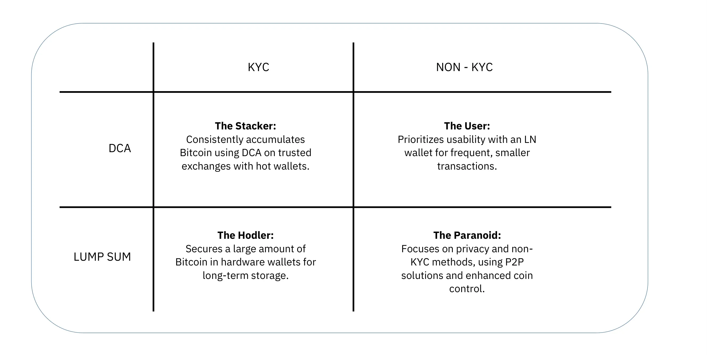

### Кой профил е подходящ за вас?

Имайте предвид, че тези профили не са взаимно изключващи се. Възможно е да се идентифицирате с повече от един от тях и подходът ви да се променя с течение на времето. Например, може да започнете като потребител, който събира информация, и постепенно да се превърнете в по-активен потребител или дори да възприемете параноична нагласа за сигурност. Може да сте дългосрочен HODL-ър, като същевременно продължавате да използвате Биткойн в ежедневието си.

**Най-важното е да съобразите стратегията си с текущата ситуация и дългосрочната визия.**

В следващите глави ще разгледаме подробно всеки от тези профили, за да можете да разберете кой от тях ви подхожда най-добре и да приложите подхода, който е най-целесъобразен за вашите цели. Ще разгледаме и инструментите, които съответстват на всеки профил, като ви дадем основата за изграждане на собствен план за придобиване и сигурност.

## HODL-ър: Инвестиране в дългосрочен план

<chapterId>baf1adc2-3828-5265-8ee5-130be547585c</chapterId>

:::video id=3f4e5d6c-7b8a-9c0d-1e2f-3a4b5c6d7e8f:::

В общността на Биткойн терминът "hodler" се отнася за човек, който прилага дългосрочен инвестиционен подход. Думата произхожда от известна печатна грешка на "hold" във форума Bitcoin Talk преди години и оттогава се е превърнала в символ на ангажираност: дръжте биткойна си независимо от всичко, без да се стресирате от краткосрочните пазарни колебания.

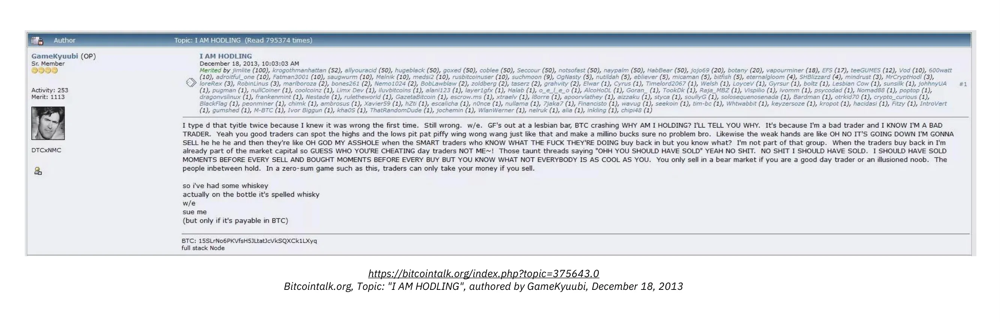

HODL-ърите вярват в стойността на Биткойн. С фиксирано предлагане от 21 млн. монети те виждат Биткойн като дългосрочно хранилище на стойност (цифрово злато).

### Защо да изберете стратегия за Hodling?

В исторически план ходлингът е бил най-печелившият подход за повечето непрофесионални инвеститори. Той премахва необходимостта от определяне на пазарното време, което е пословично трудно и емоционално изтощително. Като просто купуват и държат, ходърите избягват стреса от търговията и лошите решения, които често са свързани с емоционални реакции.

Биткойн има тенденция да се движи на цикли; големи бичи периоди, последвани от резки корекции, след което дълги периоди на затишие. Между 2013 г. и 2025 г. Биткойн преживя няколко такива цикъла, като понякога губеше до 80% от стойността си по време на мечите пазари. Тези фази могат да подложат на изпитание търпението на играчите, но тези, които се придържат към курса, обикновено са възнаградени с течение на времето.

Разбирането на тези цикли помага за управлението на емоциите. Опитните ходелци знаят, че е губещо да се опитват да продават на върха или да купуват на дъното. Вместо това, дисциплинираното дългосрочно държане се е доказало като печеливша стратегия.

### Инвестиционен план за Hodl-ър

HODL-ърите възприемат прост, дългосрочен подход: придобиват Биткойн, обезопасяват го правилно и го оставят на мира. Те не търгуват и не харчат монетите си. Тяхната цел е да натрупват и защитават притежанията си с минимално управление.

Ето един солиден план за HODL-ър:

#### 1. Избор и настройка на хардуерен портфейл

Първо: сигурност. Хардуерният портфейл е задължителен. Той съхранява частните ви ключове офлайн, като защитава средствата ви от онлайн атаки.

Ето няколко урока за портфейли, които са подходящи за ходели:

https://planb.academy/tutorials/wallet/hardware/coldcard-q-73e86d1a-6fe6-4d8b-bb15-8690298020e3

https://planb.academy/tutorials/wallet/hardware/jade-plus-green-873099a4-35ec-4be8-b31a-6e7cd6a41ec0

https://planb.academy/tutorials/wallet/hardware/ledger-nano-s-plus-75043cb3-2e8e-43e8-862d-ca243b8215a4

https://planb.academy/tutorials/wallet/hardware/ledger-flex-3728773e-74d4-4177-b39f-bd923700c76a

https://planb.academy/tutorials/wallet/hardware/passport-74e53858-3fa2-43f9-b866-573297546236

https://planb.academy/tutorials/wallet/hardware/bitbox02-6af8940f-e19b-4008-8c83-81017032608c

След като настроите портфейл, не забравяйте да създадете резервно копие на фразата за възстановяване с 12 или 24 думи на траен физически носител. За да научите повече за това какъв носител да изберете за фразата си, следвайте това ръководство:

https://planb.academy/tutorials/wallet/backup/backup-mnemonic-22c0ddfa-fb9f-4e3a-96f9-46e2a7954270

За да сте по-спокойни, можете да добавите нива на защита, като например:

- портфейл с множество подписи и часовников механизъм:

https://planb.academy/tutorials/wallet/desktop/liana-306ef457-700c-4fdd-b07a-8fb7a8a29f04

- A BIP39 passphrase:

https://planb.academy/tutorials/wallet/backup/passphrase-a26a0220-806c-44b4-af14-bafdeb1adce7

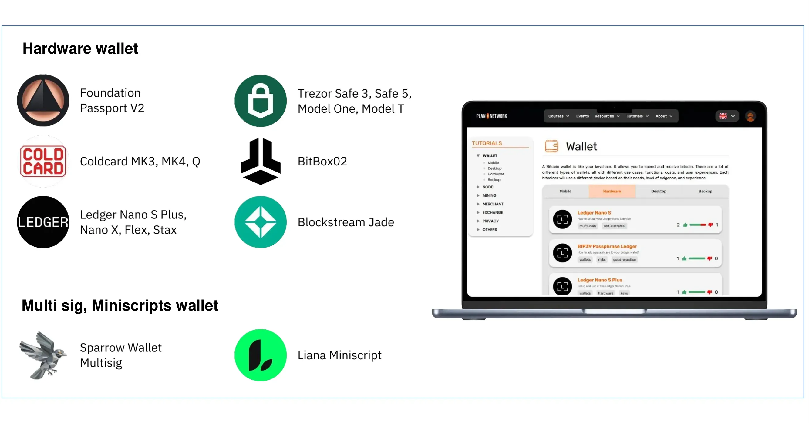

#### 2. Купете Биткойн и го изтеглете

HODL-ърите никога не оставят монетите си на борсите. Платформите могат да бъдат хакнати, да фалират или да бъдат конфискувани. След като купите, преместете Биткойн направо в хардуерния си портфейл.

Тъй като HODL-ърите са склонни да инвестират по-големи суми, те се нуждаят от борси с висока ликвидност. Ето няколко, които отговарят на изискванията:

https://planb.academy/tutorials/exchange/centralized/bitfinex-dc306d39-bd96-4ab9-a278-a322316716db

https://planb.academy/tutorials/exchange/centralized/kraken-1ef03e25-9b42-49bd-a47d-249e1a13cfc6

https://planb.academy/tutorials/exchange/centralized/bitstamp-5a36c896-bff5-46d7-b505-ff069c3ac47c

https://planb.academy/tutorials/exchange/centralized/bull-bitcoin-europe-0ccf713e-efcd-44ec-8205-211f49ac7d53

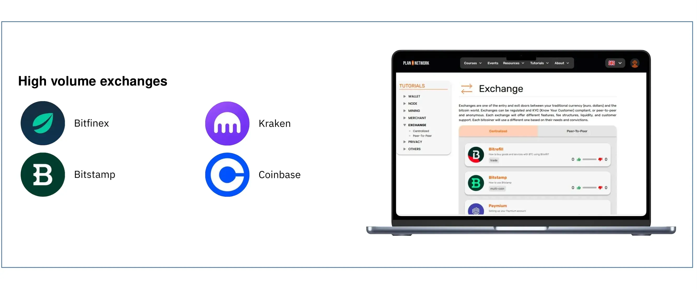

Някои от тях прилагат и хибриден подход, като използват DCA (Dollar Cost Averaging) - редовно купуват малки суми, за да изгладят колебанията на пазара.

#### 3. Изготвяне на план за приемственост

Това често се пренебрегва. Но Биткойн не прощава; ако частните ви ключове бъдат загубени, монетите ви ще изчезнат завинаги. Планирането за неспособност или смърт е от решаващо значение.

Основни стъпки:

- Напишете подробно ръководство, в което да обясните как да получите достъп до вашия Биткойн, ако не можете да го направите;
- Използвайте конфигурация с множество подписи, за да осигурите достъп, като същевременно намалите риска от загуба;
- Споделяйте ключова информация с човек, на когото имате доверие.

Ще разгледаме по-задълбочено планирането на наследството в последния раздел на този курс.

#### 4. Останете търпеливи по време на циклите

HODL означава да играете дългосрочно. Ще трябва да запазите спокойствие както по време на сривове на цените, така и по време на еуфорични бичи пазари.

Няколко най-добри практики:

- Проверявайте периодично портфейла, но не прекалено често. Постоянното наблюдение води до емоционални решения;
- Не продавайте панически по време на пазарните спадове. Корекциите са част от играта;
- Бъдете информирани за развитието на Биткойн, но избягвайте медийната шумотевица, особено по време на спад;
- Периодично проверявайте целостта на фразата за възстановяване. Проверете дали пликът не е бил подправен и дали носителят все още е четлив. Ако нещо изглежда нередно, generate ново резервно копие от вашия портфейл;

За да наблюдавате авоарите си, без да компрометирате частните си ключове, помислете за използване на портфейл само за наблюдение. Той ви позволява да следите салдата и транзакциите, като използвате само публичните си ключове.

https://planb.academy/tutorials/wallet/mobile/blockstream-app-watch-only-66c3bc5a-5fa1-40ef-9998-6d6f7f2810fb

Стратегията на HODL-ърът е проста, но мощна: купувай, подсигурявай и забравяй. Истинското предизвикателство не е техническо, а психологическо. Най-трудната част е да устоите на желанието да продавате твърде рано или да изпадате в паника по време на спад на цените. Но ако останете дисциплинирани и мислите в дългосрочен план, ходлингът се е доказал като надежден начин за запазване на стойността и натрупване на богатство с течение на времето.

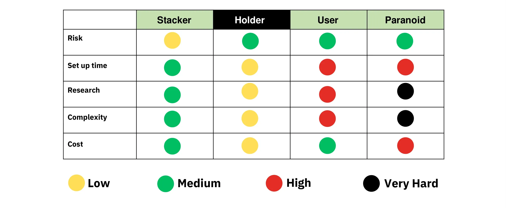

### Оценяване на профила на Hodler

Ако разпознавате себе си в тези личностни характеристики, вероятно сте естествен HODL-ър:

- Търпение**: HODL-ърът проявява изключително търпение. Те са готови да държат Биткойн в продължение на години (понякога десетилетия), без да се притесняват от ежедневните колебания на цените. Те разбират, че Биткойн се движи циклично, и не изпадат в паника, когато цената се срива. Корекциите са просто част от играта. За HODL-ерите стойността се измерва не в месеци, а в дългосрочен план;
- Дългосрочна визия**: HODL-ърът мисли далеч отвъд краткосрочните печалби. Те вярват в структурния растеж на Биткойн и постепенното му приемане в световен мащаб. Въпреки волатилността те виждат възходяща траектория; траектория на разширяване, последвана от консолидация. За тях Биткойн е дълготраен актив, хедж срещу инфлацията и ключова част от една по-голяма парична революция;
- Самодисциплина**: Психическата дисциплина е в основата на начина на мислене на HODL-ър. Парадоксално, но най-голямото предизвикателство за тях е да не действат. Те устояват на желанието да продават по време на ценови скокове и не се поддават на страха по време на сривове. Те разбират, че Биткойн е оцелял на много жестоки мечи пазари; и че тези, които издържат през болката, често печелят най-много;
- Емоционална устойчивост**: Цената на Биткойн може да спадне с 50% или повече в рамките на няколко седмици и въпреки това холерът остава спокоен. Те са усвоили идеята, че волатилността не подкопава основите на Биткойн. Тази емоционална устойчивост им позволява да запазят спокойствие по време на несигурност и да поддържат рационален поглед, когато другите изпадат в паника;
- Вяра в технологиите**: HODL-ърът не разглежда Биткойн само като спекулативен актив. Те вярват в нейната технология и в нейния разрушителен потенциал. За много от тях не става въпрос само за пари, а за свобода. На Биткойн се гледа като на устойчива, аполитична валута и реална алтернатива на традиционното банкиране, даваща на хората по-голям финансов суверенитет.

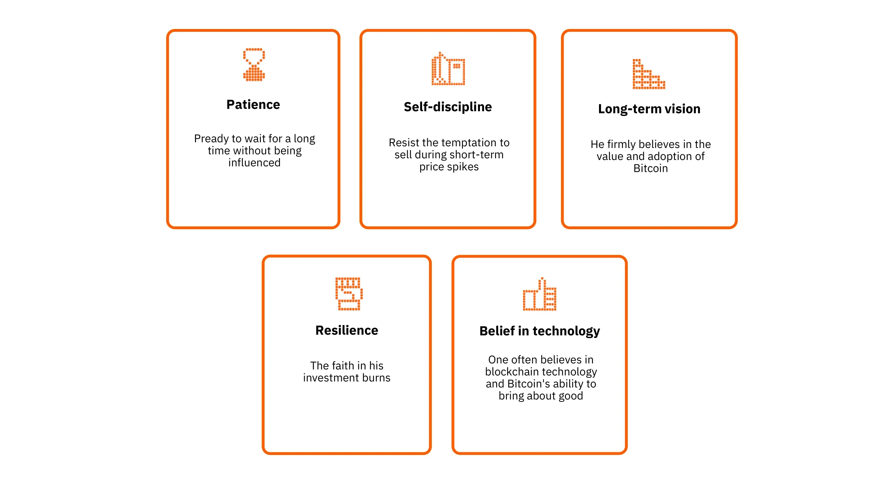

Стратегията за HODL е простa, ефективнa и достъпнa, дори за начинаещи.

В следващата глава ще разгледаме подобен, но по-активен профил - този на stacker-ът.

## Stacking: Натрупване на сатошита

<chapterId>0daf450d-1b91-5d99-9c31-b52ab52a5e21</chapterId>

:::video id=4e5f6a7b-8c9d-0e1f-2a3b-4c5d6e7f8a9b:::

В екосистемата на Биткойн stack-ър е човек, който прилага последователен и дългосрочен подход към натрупването на сатоши (или "sats") - най-малката единица Биткойн. Вместо да инвестира голяма сума наведнъж, биткойнърът редовно купува малки количества биткойни, независимо от пазарните условия.

Идеята е проста: някога ще има само около 21 милиона биткойна и всяка частица е от значение. Мисията на биткойнърът е да натрупва постоянно колкото се може повече sats.

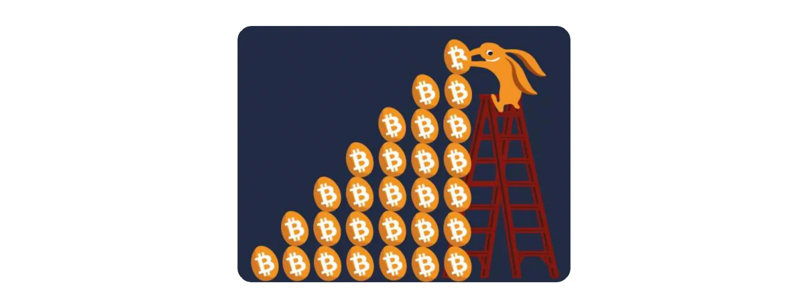

### Защо да изберете стратегия за трупане?

Тя е изключително ефективна инвестиционна стратегия за тези, които искат да намалят излагането си на пазарна волатилност, като същевременно постепенно изграждат позиция в биткойн. За разлика от инвестирането на еднократни суми или спекулативното определяне на пазарния момент, биткойнърите обикновено използват техника, наречена Dollar-Cost Averaging (DCA); инвестират фиксирана сума на редовни интервали (дневни, седмични, месечни...), независимо от текущата цена на биткойн.

Предимства:

- Намалена волатилност**: Редовните покупки спомагат за изглаждане на ценовите колебания, тъй като купувате повече sats, когато цените са ниски, и по-малко, когато са високи; усреднявате базата си за разходите и намалявате емоционалния стрес.
- Достъпност**: Не се нуждаете от голям първоначален капитал. Можете да започнете само с 10 евро на месец и с течение на времето да увеличавате сумата на DCA.
- Дисциплина и автоматизация**: биткойнърите избягват емоционалното вземане на решения. Автоматизираните повтарящи се покупки осигуряват последователност и намаляват риска от импулсивни движения.
- Дългосрочна стратегия**: Постепенното инвестиране увеличава шансовете за извличане на ползи от бичи пазари и същевременно намалява риска по време на спадове.

Този метод е особено **подходящ за начинаещи**; той премахва натиска за определяне на времето на пазара и позволява стабилно натрупване без участие на ръцете.

### Инвестиционен план

Целта е да се създаде устойчива, автоматизирана и сигурна стратегия за натрупване на биткойни за дълъг период от време. Ето основните стъпки за изпълнение на вашия инвестиционен план за биткойнъри:

#### 1. Избор на правилния тип портфейл

Това е комбинация, която балансира между лесната употреба и дългосрочната сигурност.

- Hot портфейл**: Идеални за начинаещи, мобилните или настолните портфейли ви позволяват лесно да получавате sats и да извършвате плащания. Те обаче са най-подходящи за малки суми. Портфейлите на веригата са предпочитани за натрупване пред портфейлите Lightning поради по-доброто управление на UTXO. Препоръчителни софтуерни портфейли: Green Wallet, Blue Wallet, Sparrow Wallet, Bitkit, Nunchuk, Aqua, Proton

https://planb.academy/tutorials/wallet/mobile/aqua-8e6d7dd3-8c03-45cc-90dd-fe3899a7d125

https://planb.academy/tutorials/wallet/mobile/bitkit-a7224674-85c4-4045-9baf-37018d89550c

https://planb.academy/tutorials/wallet/mobile/blockstream-app-onchain-e84edaa9-fb65-48c1-a357-8a5f27996143

https://planb.academy/tutorials/wallet/desktop/blockstream-app-desktop-c1503adf-1404-4328-b814-aa97fcf0d5da

https://planb.academy/tutorials/wallet/mobile/blue-wallet-2f4093da-6d03-4f26-8378-b9351d0dbc90

https://planb.academy/tutorials/wallet/mobile/nunchuk-6cbcb406-ec84-478f-afac-bb4da366a6fa

https://planb.academy/tutorials/wallet/desktop/proton-wallet-0bee0bba-ab62-4db0-8c63-b2ad698ca178

https://planb.academy/tutorials/wallet/desktop/sparrow-c674e2ac-d46f-4c82-92a7-7d1b0e262f5d

- Hardware портфейл**: С нарастването на наличностите ви от биткойни е важно да защитите средствата си, за да сведете до минимум риска от кражба. Сериозните биткойнъри редовно преместват средства от горещия си портфейл в хардуерен. Примери: Bitbox02, Trezor, Ledger, Coldcard, Jade...

https://planb.academy/tutorials/wallet/hardware/coldcard-q-73e86d1a-6fe6-4d8b-bb15-8690298020e3

https://planb.academy/tutorials/wallet/hardware/jade-plus-green-873099a4-35ec-4be8-b31a-6e7cd6a41ec0

https://planb.academy/tutorials/wallet/hardware/ledger-nano-s-plus-75043cb3-2e8e-43e8-862d-ca243b8215a4

https://planb.academy/tutorials/wallet/hardware/ledger-flex-3728773e-74d4-4177-b39f-bd923700c76a

https://planb.academy/tutorials/wallet/hardware/passport-74e53858-3fa2-43f9-b866-573297546236

https://planb.academy/tutorials/wallet/hardware/bitbox02-6af8940f-e19b-4008-8c83-81017032608c

Най-ефективният подход е да се използват и двете: горещ портфейл за ежедневно подреждане и хардуерен портфейл за дългосрочно съхранение в хладилник. Горещият портфейл е лесен и удобен за използване. Тя ви позволява бързо да влезете във владение на вашите биткойни, вместо да ги оставяте на платформата, където те могат да бъдат изложени на риск. Въпреки това, в сравнение с хардуерен портфейл, горещият предлага много по-малка сигурност. Затова биткойнърът трябва редовно да прехвърля средствата си в студен портфейл, за да подсигури дългосрочните си спестявания и да избягва да държи твърде много средства в горещия. Периодично биткойнърът консолидира UTXO при прехвърляне в студеното хранилище; обединява малки входове, за да оптимизира бъдещите такси за транзакции.

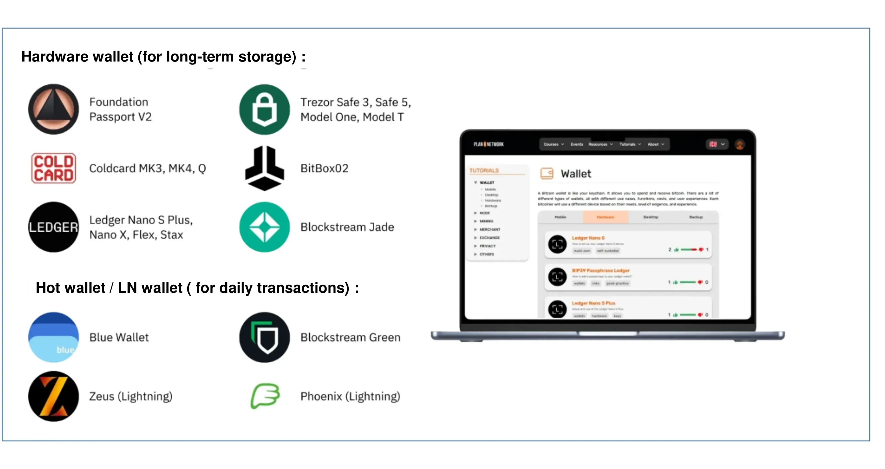

#### 2. Създаване на план за закупуване на DCA

Усредняването на разходите в долари (DCA) е инвестиционна стратегия, при която на равни интервали от време купувате малки количества Биткойн, независимо от цената му. За да създадете ефективен план за DCA, трябва да определите два ключови елемента:

- Честота на закупуване**: Седмично, двуседмично или месечно; изберете според доходите и целите си. Избягвайте твърде честите покупки, ако това води до много малки UTXO, които по-късно са скъпи за харчене.Базирайте се на бюджета си и толерантността си към риск.Последователността е по-важна от размера; по-добре е да трупате скромни суми в продължение на години, отколкото да се ангажирате прекомерно и да се откажете. Естествено, размерът на DCA може да се коригира в зависимост от развитието на финансовото ви състояние.

След това имате две възможности за настройка на DCA: да го автоматизирате или да го управлявате ръчно. Повечето регулирани платформи за търговия вече предлагат възможност за автоматизиране на вашия DCA. При достатъчно фиат в сметката ви платформата автоматично ще изпълни вашите поръчки за покупка въз основа на зададените от вас параметри. Нараства и броят на платформите, посветени на автоматизацията на DCA, които предлагат допълнителни услуги, като например автоматично теглене на средства към вашия хардуерен портфейл или закръгляне на дневните ви разходи. Ако използвате регулирана платформа, горещо ви препоръчвам да автоматизирате DCA за по-голямо спокойствие при ежедневното управление.

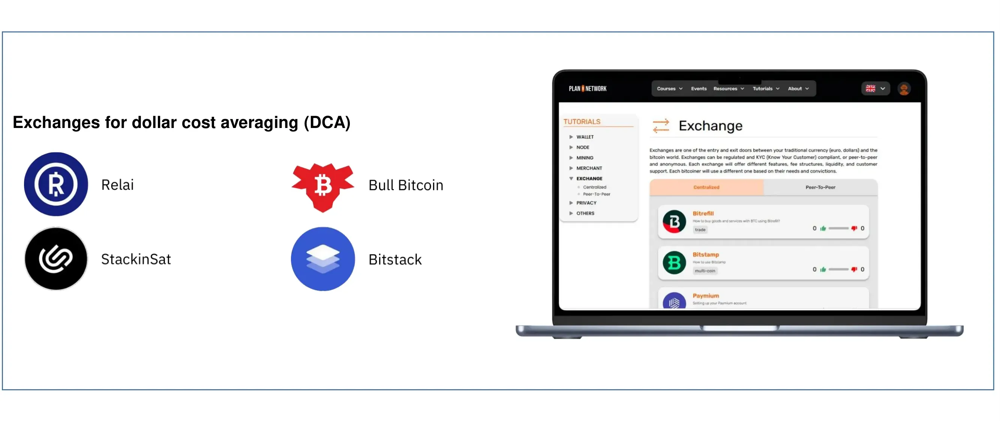

Примери за платформи на DCA:

https://planb.academy/tutorials/exchange/centralized/bitstack-29fd71be-9570-42c6-8f6f-cd355d62e746

https://planb.academy/tutorials/exchange/centralized/relai-v2-30a9671d-e407-459d-9203-4c3eae15b30e

https://planb.academy/tutorials/exchange/centralized/stackinsat-5af6a380-f3c6-4246-9f81-9957a16ab066

Основни борси, подкрепящи DCA:

https://planb.academy/tutorials/exchange/centralized/bitfinex-dc306d39-bd96-4ab9-a278-a322316716db

https://planb.academy/tutorials/exchange/centralized/bitstamp-5a36c896-bff5-46d7-b505-ff069c3ac47c

https://planb.academy/tutorials/exchange/centralized/bull-bitcoin-europe-0ccf713e-efcd-44ec-8205-211f49ac7d53

https://planb.academy/tutorials/exchange/centralized/kraken-1ef03e25-9b42-49bd-a47d-249e1a13cfc6

https://planb.academy/tutorials/exchange/centralized/paymium-92603f76-b985-49ce-81e5-f4fa0df776e5

Потребителите на стекове може също така да искат да подобрят поверителността си, дори това да не е основната им цел. В този случай те трябва да обмислят използването на метод за придобиване на P2P, извън регулираните платформи. За разлика от автоматизираните покупки на DCA, тези методи изискват да управлявате стратегията си за закупуване ръчно, така че дисциплината е от ключово значение, за да се придържате към плана.

https://planb.academy/tutorials/exchange/peer-to-peer/bisq-v2-c1c6a702-6c16-4101-8b90-62c424017b80

https://planb.academy/tutorials/exchange/peer-to-peer/hodlhodl-d7344cd5-6b18-40f5-8e78-2574a93a3879

https://planb.academy/tutorials/exchange/peer-to-peer/lnp2pbot-v2-e6bcb210-610b-487d-970c-7cce85273e3c

https://planb.academy/tutorials/exchange/peer-to-peer/peach-c6143241-d900-4047-9b73-1caba5e1f874

https://planb.academy/tutorials/exchange/peer-to-peer/robosats-b60e4f7c-533a-4295-9f6d-5368152e8c06

#### 3. Теглене и защита на биткойни

След като стратегията ви за покупка е готова, просто изтеглете биткойна си от борсата и го прехвърлете редовно в хардуера си портфейл. Това гарантира пълно самонаблюдение и дългосрочна защита.

#### 4. Изчакване на няколко цикъла

Биткойнърите мислят с години, а не с месеци. Те трябва да се противопоставят на паниката по време на пазарни сривове или на еуфорията по време на бичи периоди.

Основни навици:

- Не проверявайте портфейлите си твърде често, за да избегнете стреса;
- Никога не продавайте по време на спад; корекциите са нормални;
- Бъдете информирани за развитието на технологията Биткойн;
- Периодично проверявайте резервните копия на фразата и състоянието на хардуерния портфейл: Сега, след като портфейлите ви са настроени, е важно да настроите редовно наблюдение. Периодично проверявайте дали вашата мнемонична фраза все още се намира на мястото за съхранение и дали непрозрачният ѝ плик не е отворен. По време на тези проверки можете също така да отворите плика, за да проверите състоянието на носителя. Уверете се, че той не е повреден и че изречението все още е напълно четливо. Ако има някакви признаци на повреда, най-добре е да създадете ново копие от вашия хардуерен портфейл. Можете също така редовно да проверявате хардуерните си портфейли.

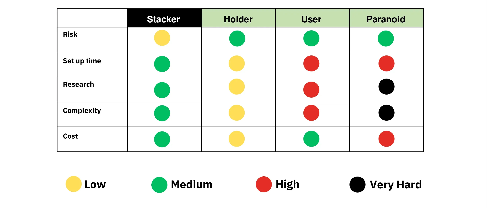

За лесно наблюдение, без да се нарушава сигурността, настройте портфейл само за наблюдение, за да следите салдата с помощта на публичен ключ.

https://planb.academy/tutorials/wallet/mobile/blockstream-app-watch-only-66c3bc5a-5fa1-40ef-9998-6d6f7f2810fb

### Преценка на профила на стелажа

Успешните специалисти по подреждане демонстрират тези качества:

- Организация**: Придържайте се към бюджета, спазвайте плана си. Подреждащите трябва да гарантират, че техният план за натрупване е жизнеспособен в продължение на няколко години.
- Дисциплина**: Следвайте графика си, без да реагирате на пазарния шум. Редовността има предимство пред импулсивните корекции. Все пак е възможно да се правят разумни корекции.
- Търпение**: Наградите от подреждането не са незабавни. Тази стратегия се разгръща в продължение на дълги периоди, понякога години, преди да даде осезаеми резултати. Тези, които успяват, са тези, които могат да останат търпеливи, без да се влияят от краткосрочната нестабилност.
- Финансови познания**: Доброто разбиране на DCA, управлението на риска и основите на пазара Биткойн ви помага да инвестирате уверено. Информираният биткойнър е по-добре подготвен да устоява на съмненията и да избягва вземането на импулсивни решения в периоди на висока волатилност.
- Дългосрочна визия**: A stacker вярва силно в технологичния потенциал на Биткойн. Той не се фокусира върху краткосрочните колебания на цените, а върху стабилното увеличаване на своите дялове през годините.

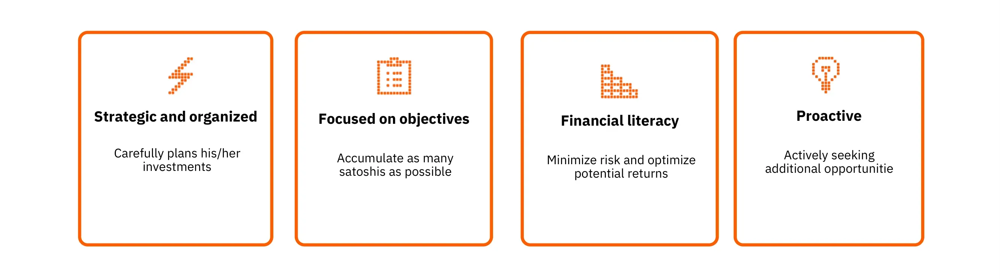

Накратко, подреждането е идеално за тези, които искат да изградят позиция в биткойн с течение на времето, да намалят рисковете от волатилност и да запазят пълен суверенитет; без да са залепени за графиките.

След това ще разгледаме един коренно различен профил на биткойнър - активния потребител.

## Активният потребител на Биткойн: интегриране на Биткойн във всекидневния живот

<chapterId>e0a022ab-207c-571f-b4ad-c432214a756c</chapterId>

:::video id=5f6a7b8c-9d0e-1f2a-3b4c-5d6e7f8a9b0c:::

Да станете активен потребител на Биткойн означава да излезете извън рамките на дългосрочните инвестиционни стратегии. За разлика от ходелера или склададжията, които предимно спестяват, без да харчат, активният потребител третира Биткойн като истинско **средство за размяна**. Те го използват, за да плащат за стоки и услуги и да участват активно в контраикономиката.

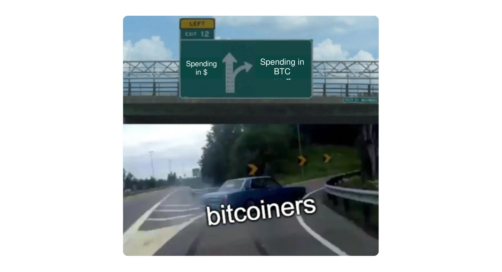

### Защо да приемете стратегия за активен потребител?

Ежедневното използване на Биткойн предлага както индивидуални, така и колективни предимства:

- Подкрепете екосистемата на Биткойн чрез приемане**:

Всяка транзакция укрепва легитимността на Биткойн като валута и насърчава повече търговци и услуги да я приемат. Използването на Биткойн е гласуване за неговата полезност. Стойността на парите се дължи на способността им да улесняват търговията, а не на бартера. Ако нито един търговец не приема дадена валута, тя няма обективна стойност. Колкото повече стоки и услуги можете да закупите с нея, толкова по-полезна става тя. Като избирате да плащате в Биткойн, насочвате стойността си към търговците, които я приемат. Това увеличава техните печалби и с течение на времето може да намали печалбите на конкурентите, които я отхвърлят. В цялата общност тази динамика може да стимулира по-широкото приемане на Биткойн и да допринесе за благоприятен цикъл на приемане.

- Възползвайте се от уникалните функции на Биткойн**:

Биткойн предлага няколко мощни функции, като например бързи транзакции чрез Lightning Network и свобода от цензура, финансово наблюдение и сеирджийство. Неговата основна стойност се състои в премахването на правителствения контрол върху паричното предлагане и осигуряването на възможност за транзакции без цензура. Ако тези предимства съвпадат с личните ви нужди и ценности, може да откриете, че профилът "Активен потребител" ви подхожда добре.

- Научете се чрез правене**:

Активното използване на Биткойн ви помага да придобиете опит в реалния свят. Ще се запознаете с видовете портфейли, поверителността на плащанията и управлението на UTXO. Ежедневното използване се превръща в практическа среда за обучение.

Предизвикателствата включват техническа сложност, нестабилност на цените и необходимост от добра хигиена на сигурността, за да се предотврати загубата на средства.

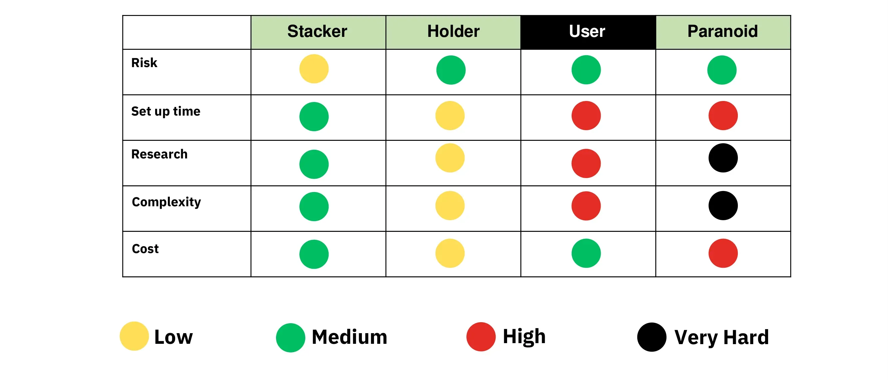

### Инвестиционен план за активен потребител

Приемането на Биткойн за ежедневни плащания изисква обмислен и структуриран подход. За разлика от Hodler или Stacker, активният потребител трябва да управлява както дългосрочната сигурност на своите средства, така и удобството на ежедневните транзакции. Постигането на правилния баланс между сигурното студено съхранение и лесния достъп до разходните средства е от съществено значение за ефективното функциониране на тази стратегия.

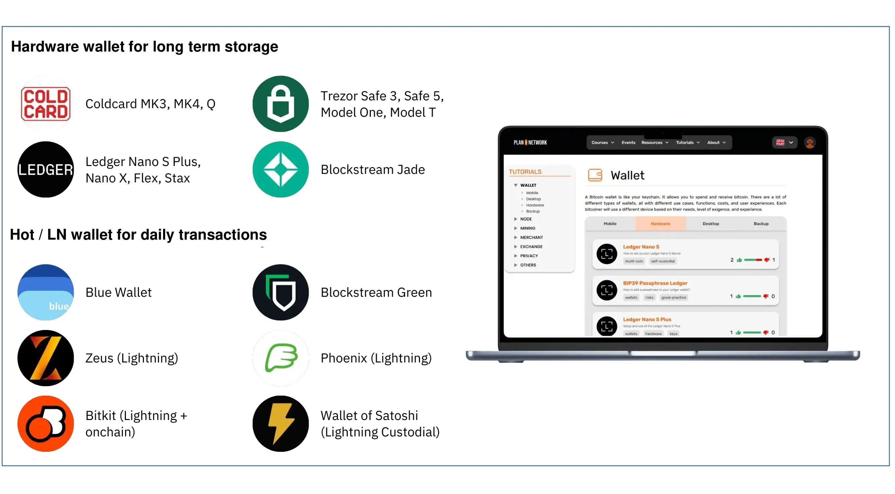

#### 1. Ясно разделение на портфейлите

Активните потребители трябва да използват два различни вида портфейли, за да балансират между сигурността и удобството:

- Студен портфейл (хардуерен портфейл) за осигуряване на дългосрочни спестявания.

https://planb.academy/tutorials/wallet/hardware/coldcard-q-73e86d1a-6fe6-4d8b-bb15-8690298020e3

https://planb.academy/tutorials/wallet/hardware/jade-plus-green-873099a4-35ec-4be8-b31a-6e7cd6a41ec0

https://planb.academy/tutorials/wallet/hardware/ledger-nano-s-plus-75043cb3-2e8e-43e8-862d-ca243b8215a4

https://planb.academy/tutorials/wallet/hardware/ledger-flex-3728773e-74d4-4177-b39f-bd923700c76a

https://planb.academy/tutorials/wallet/hardware/passport-74e53858-3fa2-43f9-b866-573297546236

https://planb.academy/tutorials/wallet/hardware/bitbox02-6af8940f-e19b-4008-8c83-81017032608c

https://planb.academy/tutorials/wallet/hardware/portal-bd6e83f0-0100-4689-aeb3-513cca944ace

https://planb.academy/tutorials/wallet/hardware/satochip-e9bc81d9-d59b-420d-9672-3360212237ba

https://planb.academy/tutorials/wallet/hardware/seedsigner-2b274bff-6fc8-407a-92d7-f6ec4d1fadfb

https://planb.academy/tutorials/wallet/hardware/tapsigner-ab2bcdf9-9509-4908-9a4a-2f2be1e7d5d2

- Един или повече мобилни "горещи" портфейли за ежедневни транзакции. Обикновено един активен потребител разполага както с горещ on-chain, така и с Lightning портфейл.

https://planb.academy/tutorials/wallet/mobile/aqua-8e6d7dd3-8c03-45cc-90dd-fe3899a7d125

https://planb.academy/tutorials/wallet/mobile/bitkit-a7224674-85c4-4045-9baf-37018d89550c

https://planb.academy/tutorials/wallet/mobile/blink-7ea5f5a4-e728-4ff9-b3f9-cf20aa6fc2bd

https://planb.academy/tutorials/wallet/mobile/blixt-04b319cf-8cbe-4027-b26f-840571f2244f

https://planb.academy/tutorials/wallet/mobile/blockstream-app-onchain-e84edaa9-fb65-48c1-a357-8a5f27996143

https://planb.academy/tutorials/wallet/mobile/blue-wallet-2f4093da-6d03-4f26-8378-b9351d0dbc90

https://planb.academy/tutorials/wallet/mobile/breez-46a6867b-c74b-45e7-869c-10a4e0263c06

https://planb.academy/tutorials/wallet/mobile/lipa-61019fbd-deb7-4b3c-8cda-0402a4b2e780

https://planb.academy/tutorials/wallet/mobile/nunchuk-6cbcb406-ec84-478f-afac-bb4da366a6fa

https://planb.academy/tutorials/wallet/mobile/phoenix-0f681345-abff-4bdc-819c-4ae800129cdf

https://planb.academy/tutorials/wallet/mobile/wallet-of-satoshi-39149d86-e42b-4e8f-ae9f-7e061e7784f7

https://planb.academy/tutorials/wallet/mobile/zeus-embedded-advanced-3e89603c-501d-439c-8691-d4a0d0de459b

Разделянето на средствата по този начин помага да се намали рискът в случай на компрометиране на портфейл, използван за ежедневни плащания.

#### 2. Създаване на собствен възел

Активните потребители често се стремят да намалят зависимостта си от доверени трети страни в зависимост от личните си обстоятелства. Един от най-ефективните начини за постигане на тази цел е да се управлява собствен възел в Биткойн. Това им позволява да използват мрежата независимо, като същевременно повишават поверителността на своите транзакции.

https://planb.academy/tutorials/node/bitcoin/bitcoin-core-linux-568c13a6-8746-4d63-8e95-f4a61c5ae0ed

https://planb.academy/tutorials/node/bitcoin/bitcoin-core-mac-windows-9684ab02-e0af-41c9-8102-86ac7c7727f3

https://planb.academy/tutorials/node/bitcoin/bitcoin-knots-e04b2196-4df2-4246-86ef-c02269c29098

https://planb.academy/tutorials/node/bitcoin/raspiblitz-d8cdba2e-a682-46cf-9fdc-d8602fbeac02

https://planb.academy/tutorials/node/bitcoin/mynode-a481fef3-2fd3-4df3-91c0-112cffa094eb

https://planb.academy/tutorials/node/bitcoin/start9-8c8b6827-8423-4929-bcba-89057670ed6a

За тези, които редовно използват Lightning Network, управлението на собствен възел LND, LDK или Core-Lightning може да бъде умен ход. То им дава пълен контрол върху отварянето и затварянето на каналите, увеличава самостоятелността и дори може да помогне за намаляване на таксите за транзакции; особено в сравнение с автоматизирани решения като Phoenix или още по-лошо - попечителски Lightning портфейли.

https://planb.academy/tutorials/node/lightning-network/alby-hub-62e6356c-6a6d-4134-8f22-c3b6afb9882a

#### 3. Редовно придобиване на Биткойн

Активните потребители трябва да намерят баланс между дългосрочните си спестявания и количеството Биткойн, което да държат в наличност за ежедневна употреба.

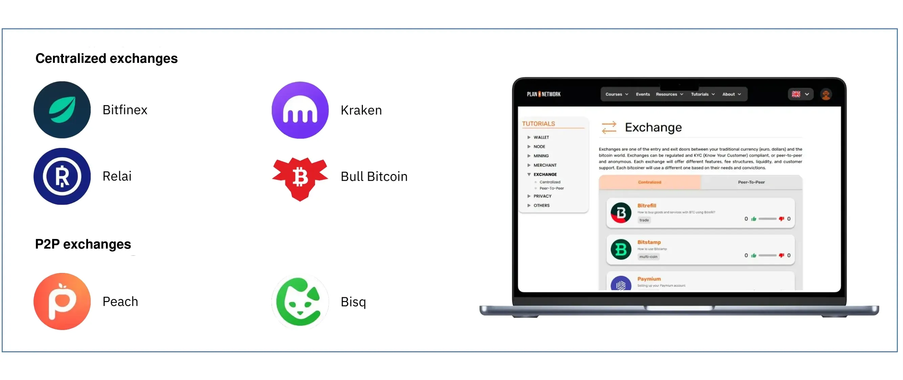

Има няколко начина за придобиване на Биткойн в зависимост от нивото на поверителност, което търсите:

- Традиционна покупка чрез регулирани платформи** като Bitfinex или Bull Bitcoin (идеално за допълване на студения портфейл);

https://planb.academy/tutorials/exchange/centralized/bitfinex-dc306d39-bd96-4ab9-a278-a322316716db

https://planb.academy/tutorials/exchange/centralized/bitstack-29fd71be-9570-42c6-8f6f-cd355d62e746

https://planb.academy/tutorials/exchange/centralized/bitstamp-5a36c896-bff5-46d7-b505-ff069c3ac47c

https://planb.academy/tutorials/exchange/centralized/bull-bitcoin-europe-0ccf713e-efcd-44ec-8205-211f49ac7d53

https://planb.academy/tutorials/exchange/centralized/kraken-1ef03e25-9b42-49bd-a47d-249e1a13cfc6

https://planb.academy/tutorials/exchange/centralized/paymium-92603f76-b985-49ce-81e5-f4fa0df776e5

https://planb.academy/tutorials/exchange/centralized/relai-v2-30a9671d-e407-459d-9203-4c3eae15b30e

https://planb.academy/tutorials/exchange/centralized/stackinsat-5af6a380-f3c6-4246-9f81-9957a16ab066

- Придобиване на информация без КYC** чрез партньорски услуги, като Peach, Robosats или Биткойн банкомати, което ви позволява да добавяте към своя портфейл, без да разкривате лична информация.

https://planb.academy/tutorials/exchange/peer-to-peer/bisq-v2-c1c6a702-6c16-4101-8b90-62c424017b80

https://planb.academy/tutorials/exchange/peer-to-peer/hodlhodl-d7344cd5-6b18-40f5-8e78-2574a93a3879

https://planb.academy/tutorials/exchange/peer-to-peer/lnp2pbot-v2-e6bcb210-610b-487d-970c-7cce85273e3c

https://planb.academy/tutorials/exchange/peer-to-peer/peach-c6143241-d900-4047-9b73-1caba5e1f874

https://planb.academy/tutorials/exchange/peer-to-peer/robosats-b60e4f7c-533a-4295-9f6d-5368152e8c06

- Печелене в Биткойн**, Да си активен потребител не означава само да харчиш BTC, но и да печелиш. Ако имате бизнес, помислете дали да не приемате Биткойн като плащане. Ако сте служител, проверете дали работодателят ви предлага възможност да получавате цялата или част от заплатата си в BTC.

https://planb.academy/tutorials/business/point-of-sale/swiss-bitcoin-pay-2-a78b057e-ed11-47ac-860c-71019fcb451a

https://planb.academy/tutorials/business/point-of-sale/open-node-e69a0c1c-47f7-4932-8494-e6f26c3c9784

https://planb.academy/tutorials/business/point-of-sale/btcpay-server-928eb01e-824b-4b57-a3e8-8727633beddc

#### 4. Активно управление на разходите

Изборът да се харчат биткойни често е обект на критики. Някои потребители на Биткойн предпочитат да харчат фиатни валути, които смятат за по-некачествени и поради това желаят да премахнат, вместо да харчат биткойни.Но този начин на мислене има два основни недостатъка: първо, той не отчита предимствата на Биткойн като платежно средство (вж. предишния раздел), и второ, той повдига въпроса: защо да се държи фиатна валута, която се смята за по-малко ценна, за харчене?

По-логичният подход е методът "изразходвай и замени". Това означава, че харчите Биткойн по всички споменати по-горе причини, а след това, вместо да оставите спестяванията си от Биткойн да се свият, заменяте похарчените sats, като купувате нови с фиатна валута.

За да улесните харченето на Биткойн, има много инструменти, като например [BTC Map](https://btcmap.org/), който ви показва търговците по света, които приемат Биткойн. Някои от тези търговци дори ви позволяват да поръчвате онлайн и да ви доставят продуктите.

Тъй като все още сме в преходна фаза, в която не всички търговци приемат BTC, има някои прости, но ефективни начини за заобикаляне. Например закупуването на карти за подаръци с Биткойн е практично решение и много доставчици като Bitrefill, Coinsbee или The Bitcoin Company предлагат тази услуга.

https://planb.academy/tutorials/exchange/centralized/bitrefill-8c588412-1bfc-465b-9bca-e647a647fbc1

#### 5. Технологична осведоменост и гъвкавост

Протоколът Биткойн, заедно със системите от втори слой като Lightning Network и целия приложен слой, свързан с тези екосистеми, се развива бързо. Като активен потребител трябва да:

- Бъдете в крак с новите решения, които улесняват ежедневната работа;
- Редовно тестваме нови инструменти и услуги, за да подобрим потребителското изживяване;
- Коригирайте стратегията си в зависимост от технологичния напредък и промените на пазара.

### Преценка на профила на активния ви потребител

Можете ли да бъдете активен потребител на Биткойн? Ето кои са основните характеристики, които определят този профил:

- Прагматизъм:** Мотивирани сте да интегрирате Биткойн в ежедневието си и да играете активна роля в развитието на неговата екосистема. Осъзнавате както ползите, така и предизвикателствата, които идват с нея.
- Технически познания:** Или вече имате солидни познания за работата на портфейлите Биткойн и Lightning Network, или имате желание да се научите. Удобно се ориентирате в напреднали концепции като управлението на UTXO.
- Гъвкавост и адаптивност:** Отворени сте да изпробвате нови инструменти, да превключвате между решения и да променяте практиките си в зависимост от развитието на екосистемата на Биткойн и от промените във вашите нужди.
- Финансова дисциплина:** Управлявате внимателно разходите и спестяванията си по Биткойн. Разбирате важността на ясното отделяне на ежедневните средства от дългосрочните спестявания.

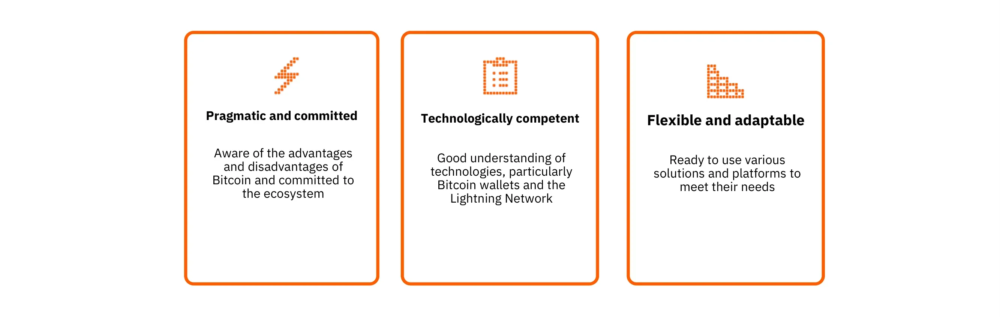

В заключение, активният потребител играе пряка роля в развитието на екосистемата на Биткойн. Включвайки Биткойн в ежедневните си навици, те не само подпомагат нейното приемане, но и развиват собствения си опит.

В следващата глава ще разгледаме последния и може би най-интригуващ профил на потребителя на Биткойн: параноичният потребител.

## Параноичният Биткойнър: Поверителността е над всичко

<chapterId>5c624acd-662e-5134-ab7a-fb75cde7c3f8</chapterId>

:::video id=6a7b8c9d-0e1f-2a3b-4c5d-6e7f8a9b0c1d:::

За параноичните потребители на Биткойн поверителността не е задължителна, а от съществено значение. В свят, в който почти всяка финансова стъпка се проследява, те смятат, че защитата на самоличността им и историята на трансакциите е задължителна част от използването на Биткойн. Обикновено те са много наясно с рисковете, свързани с разкриването на лични данни (особено когато използват борси, отговарящи на изискванията на KYC, които изискват проверка на самоличността).

За тях всяко действие е от значение. Всяка транзакция, всяка настройка на портфейл и всяко взаимодействие с мрежата се обмислят внимателно. Един-единствен пропуск може да разкрие чувствителна информация, която свързва самоличността им с притежаваните от тях Биткойн. Крайната им цел? Да използват Биткойн по начин, който запазва самоличността, местоположението и финансовото им състояние напълно поверителни.

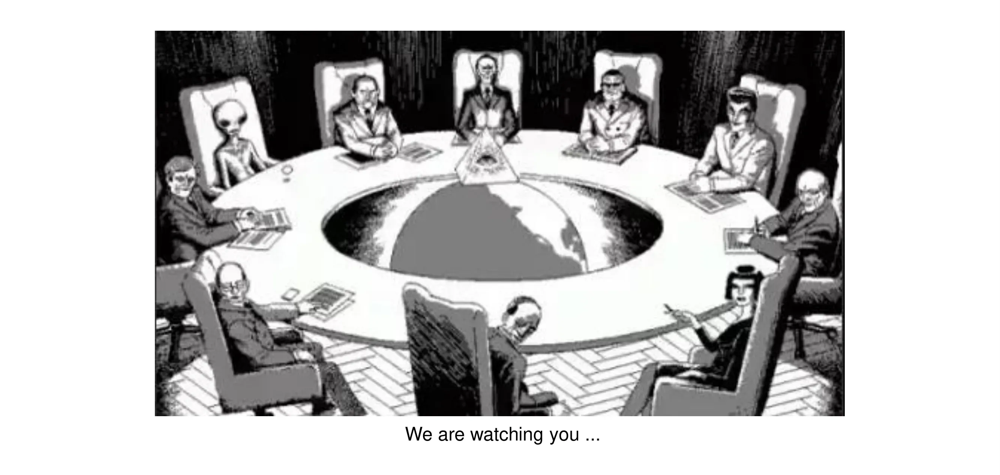

### Защо да подхождате толкова предпазливо?

Изборът на мислене, ориентирано към поверителността, предлага няколко основни предимства:

- Финансова независимост:** Като не попадате в полезрението на банките, правителствата и корпорациите, се предпазвате от наблюдение и нежелана намеса.
- Защита на активите:** Ако икономическите или политическите условия станат нестабилни, за трети страни е много по-трудно да проследят или конфискуват вашия Биткойн, ако той не е свързан с вашата самоличност.
- Подобрена лична безопасност:** Хората, за които се знае, че притежават големи количества Биткойн, могат да станат мишена. Запазването на самоличността ви в тайна намалява риска да станете мишена.
- Свобода от дискриминация**: Някои услуги или правителства могат да блокират трансакции или сметки въз основа на предишни действия или на това, кой сте. Поверителността на личните данни държи тази власт под контрол.
- Оставаме верни на корените на Биткойн:** Биткойн е замислена като устойчива на цензура и без разрешение форма на пари. Защитата на личните ви данни е част от спазването на тази първоначална мисия.

Това е интелигентен и пресметнат отговор на съвсем реалните заплахи, които съществуват в днешния цифров и финансов пейзаж. Да, този подход изисква повече усилия. Той изисква време, технически познания и дисциплина. Но за тези, които изберат този път, не става дума само за използването на Биткойн; става дума за възвръщане на контрола върху парите, самоличността и свободата им.

Те не са просто инвеститори или потребители, а се отказват от системата, която иска да знае всичко за тях.

### Параноичен инвестиционен план

Параноичният Биткойнър следва строга стратегия, изградена около две основни цели: запазване на анонимността и максимална сигурност. Този тип потребители се стремят да избегнат излагането на регулираните платформи (особено тези, които изискват KYC), да премахнат проследяването на трансакциите и да защитят средствата си от наблюдение, конфискация и други външни заплахи.

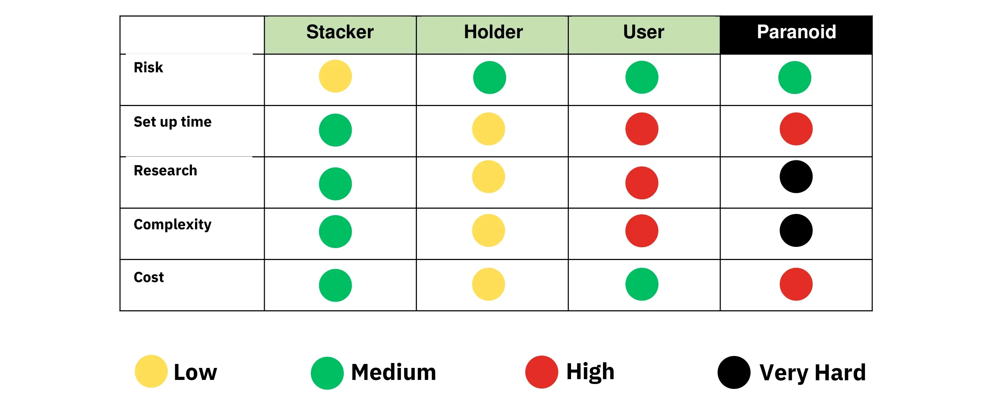

#### 1. Създаване на портфейли и възли

Параноичният потребител никога не смесва средства въз основа на техния произход или употреба. Вместо това той разделя своите Биткойн по предназначение, като използва множество специализирани портфейли:

- Студен портфейл (с въздушна херметизация и/или тип "направи си сам")** Дългосрочните авоари се съхраняват в силно защитени портфейли с въздушна херметизация или тип "направи си сам". Обикновено това са устройства с отворен код или такива с проверим код, като Jade, Coldcard, SeedSigner, Portal или Passport... Винаги, когато е възможно, те ще придобиват тези устройства анонимно; или като плащат в брой или с помощта на биткойн във физически магазин, или като поръчват онлайн с възможности за дискретна доставка и плащания с BTC. Във Франция, например, [Bitcoin Bazar](https://bitcoinbazar.fr/) е един такъв магазин. Можете да потърсите подобни доставчици във вашия регион.

https://planb.academy/tutorials/wallet/hardware/jade-plus-sparrow-938abf16-e10a-4618-860d-cd771373a262

https://planb.academy/tutorials/wallet/hardware/coldcard-q-advanced-b8cc3f29-eea9-48fe-a953-b003d5b115e0

https://planb.academy/tutorials/wallet/hardware/passport-74e53858-3fa2-43f9-b866-573297546236

https://planb.academy/tutorials/wallet/hardware/portal-bd6e83f0-0100-4689-aeb3-513cca944ace

- Горещ портфейл за ежедневни транзакции**, За редовни разходи параноичните потребители избират портфейли с фокус върху неприкосновеността на личния живот като Ashigaru, Wasabi Wallet или Sparrow Wallet. Тези портфейли поддържат усъвършенствани функции, като например: транзакции с мини CoinJoin разходи, payjoins, потенциално CoinJoin инструменти, контрол на монетите, UTXO маркиране или възможност за свързване чрез собствен Биткойн възел.

https://planb.academy/tutorials/wallet/desktop/sparrow-c674e2ac-d46f-4c82-92a7-7d1b0e262f5d

https://planb.academy/tutorials/wallet/desktop/wasabi-a0b51540-32d2-4ed2-98aa-801da5d35cf6

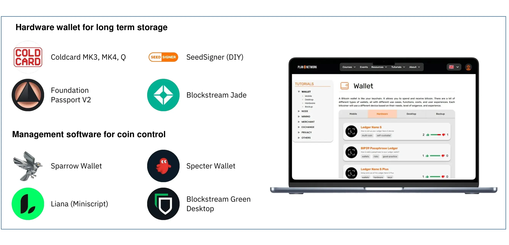

- От съществено значение е наличието на собствен възел **Биткойн**. Той осигурява пълен контрол върху излъчването на транзакциите и избягва зависимостта от инфраструктурата на трети страни. Освен това той защитава личните данни, предотвратява цензурата и им позволява да проверяват независимо правилата на протокола Биткойн. Независимо дали става въпрос за Linux, Windows, macOS или за plug-and-play настройки като RaspiBlitz, myNode или Start9, параноичният потребител се отнася към своя възел като към незаобиколим стълб на суверенитета.

https://planb.academy/tutorials/node/bitcoin/bitcoin-core-linux-568c13a6-8746-4d63-8e95-f4a61c5ae0ed

https://planb.academy/tutorials/node/bitcoin/bitcoin-core-mac-windows-9684ab02-e0af-41c9-8102-86ac7c7727f3

https://planb.academy/tutorials/node/bitcoin/bitcoin-knots-e04b2196-4df2-4246-86ef-c02269c29098

https://planb.academy/tutorials/node/bitcoin/raspiblitz-d8cdba2e-a682-46cf-9fdc-d8602fbeac02

https://planb.academy/tutorials/node/bitcoin/mynode-a481fef3-2fd3-4df3-91c0-112cffa094eb

https://planb.academy/tutorials/node/bitcoin/start9-8c8b6827-8423-4929-bcba-89057670ed6a

- За да могат да извършват трансакции през **Lightning Network**, като запазят същото ниво на контрол и дискретност, те управляват и свой собствен възел Lightning. Това им позволява да управляват каналите директно и да харчат по начин, който свежда до минимум наблюдението или зависимостта от попечителски услуги.

https://planb.academy/tutorials/node/lightning-network/alby-hub-62e6356c-6a6d-4134-8f22-c3b6afb9882a

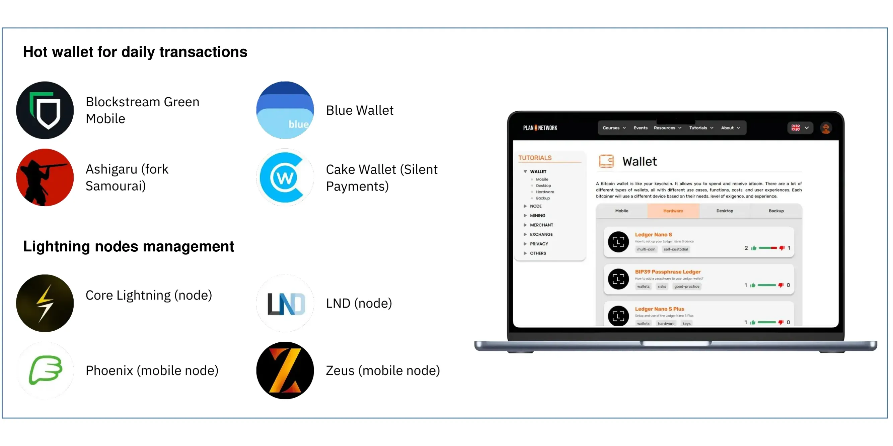

Сигурността не спира дотук. За архивиране на фрази seed параноичният потребител използва метални резервни копия, комбинирани с пликове с възможност за подправяне. Той редовно проверява дали резервните копия остават безкомпромисни и тества процедурите за възстановяване на портфейл, за да е готов за всякакви непредвидени ситуации.

https://planb.academy/tutorials/wallet/backup/backup-mnemonic-22c0ddfa-fb9f-4e3a-96f9-46e2a7954270

https://planb.academy/tutorials/wallet/backup/recovery-test-5a75db51-a6a1-4338-a02a-164a8d91b895

Когато става въпрос за гарантиране на спестяванията, те могат да прилагат по-сложни настройки, като например портфейли с множество подписи (със или без таймер).

https://planb.academy/tutorials/wallet/desktop/liana-306ef457-700c-4fdd-b07a-8fb7a8a29f04

Тези конфигурации намаляват рисковете. Добавянето на BIP39 passphrase към фразата seed добавя още едно ниво на защита и гарантира, че достъпът до техните средства не може да бъде компрометиран от едно-единствено откритие.

https://planb.academy/tutorials/wallet/backup/passphrase-a26a0220-806c-44b4-af14-bafdeb1adce7

Разбира се, един параноичен потребител на биткойни ще има добре обмислен план за наследяване на своите биткойни. Тази важна тема ще бъде разгледана подробно в следващата част на курса.

В по-широк план този тип потребители прилагат усъвършенстван подход към компютрите като цяло, като се съобразяват с поверителността им. Те разчитат на сигурни инструменти с отворен код, които зачитат неприкосновеността на личния живот на потребителя на всяко ниво от цифровия му живот:

- Операционни системи**, както на телефона, така и на компютъра;

https://planb.academy/tutorials/computer-security/operating-system/grapheneos-08d43d7a-0b22-4638-a151-578d48d32d88

https://planb.academy/tutorials/computer-security/operating-system/linux-mint-da44852e-513f-4004-949a-8fde60c1bca5

https://planb.academy/tutorials/computer-security/operating-system/ubuntu-78a3be56-5d51-4ec3-8629-0dd27c352ab5

- Инструменти за удостоверяване**;

https://planb.academy/tutorials/computer-security/authentication/authy-a76ab26b-71b0-473c-aa7c-c49153705eb7

https://planb.academy/tutorials/computer-security/authentication/bitwarden-0532f569-fb00-4fad-acba-2fcb1bf05de9

https://planb.academy/tutorials/computer-security/authentication/keepass-f8073bb7-5b4a-4664-9246-228e307be246

https://planb.academy/tutorials/computer-security/authentication/security-key-61438267-74db-4f1a-87e4-97c8e673533e

- Комуникационни инструменти**;

https://planb.academy/tutorials/computer-security/communication/ivpn-5a0cd5df-29f1-4382-a817-975a96646e68

https://planb.academy/tutorials/computer-security/communication/mullvad-968ec5f5-b3f0-4d23-a9e0-c07a3e85aaa8

https://planb.academy/tutorials/computer-security/communication/proton-mail-c3b010ce-254d-4546-b382-19ab9261c6a2

https://planb.academy/tutorials/computer-security/communication/tor-browser-a847e83c-31ef-4439-9eac-742b255129bb

- Инструменти за управление на данни**.

https://planb.academy/tutorials/computer-security/data/integrity-authenticity-21d0420a-be02-4663-94a3-8d487f23becc

https://planb.academy/tutorials/computer-security/data/proton-drive-03cbe49f-6ddc-491f-8786-bc20d98ebb16

https://planb.academy/tutorials/computer-security/data/veracrypt-d5ed4c83-7c1c-4181-95ea-963fdf2d83c5

Ако искате да научите повече за ИТ сигурността, предлагаме пълен курс за първата година, посветен на тази тема:

https://planb.academy/courses/99c46148-7080-4915-a7e0-9df0e145cd47

#### 2. Анонимно купуване на биткойни

Основният принцип на параноичния инвеститор е да придобива биткойни, без да ги свързва с реалната си самоличност. За да избегнат платформите KYC и да предотвратят пръстовите отпечатъци on-chain, те се обръщат към няколко стратегии:

- Платформи за закупуване на P2P**, като Bisq, Robosat, LNP2PBot, Peach, HODL HODL и др;

https://planb.academy/tutorials/exchange/peer-to-peer/bisq-v2-c1c6a702-6c16-4101-8b90-62c424017b80

https://planb.academy/tutorials/exchange/peer-to-peer/hodlhodl-d7344cd5-6b18-40f5-8e78-2574a93a3879

https://planb.academy/tutorials/exchange/peer-to-peer/lnp2pbot-v2-e6bcb210-610b-487d-970c-7cce85273e3c

https://planb.academy/tutorials/exchange/peer-to-peer/peach-c6143241-d900-4047-9b73-1caba5e1f874

https://planb.academy/tutorials/exchange/peer-to-peer/robosats-b60e4f7c-533a-4295-9f6d-5368152e8c06

- Размяна на пари в брой**, например на местни срещи на Биткойн;

https://planb.academy/courses/1c643dc9-a15f-4f9e-93b6-cb3c58b4ee35

- Банкомати с биткойн**;
- Спечелване на сатошита** чрез предоставяне на стоки или услуги в замяна на биткойн;
- Копаене на биткойн**.

https://planb.academy/tutorials/mining/hardware/attakai-0d177e6b-e167-4b25-8e38-4ec74213d1fb

https://planb.academy/tutorials/mining/hardware/braiins-mini-miner-f5aec001-fb05-4e89-b3b2-a31abec1253c

https://planb.academy/tutorials/mining/hardware/bitaxe-d317e1a7-d775-401d-85df-51f4f2217566

Централизираният обмен се избягва изцяло поради рисковете, които крие; както за неприкосновеността на личния живот, така и за потенциална цензура или конфискация.

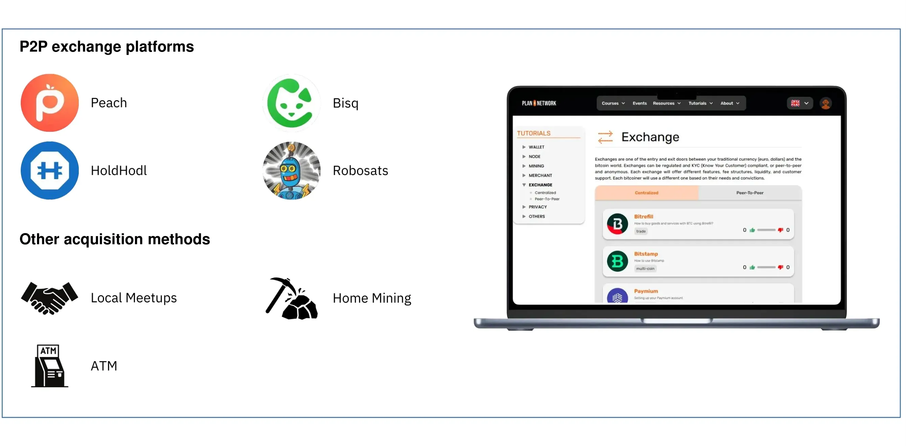

#### 3. Предотвратяване на проследяването във веригата

Дори и след анонимно придобиване на монети, все още е възможно да изтекат лични данни on-chain, ако не сте внимателни. Параноичният потребител предприема допълнителни стъпки за защита на личните данни на ниво транзакция:

- Избягване на повторното използване на адреси** - ръчно или с помощта на усъвършенствани инструменти като Silent Payments или BIP47;
- Етикетиране на вашите UTXOs**;
- Практикуване на контрол върху монетите при харчене**;
- Избягване на консолидацията на UTXO**;
- Използване на структури на транзакциите, които защитават личните данни**: coinjoins, payjoins, ricochets и mini-payment coinjoins...

Те са запознати и с основите на блокчейн наблюдението и знаят как компаниите проследяват дейността си. Като разбират евристиката и моделите, използвани от фирмите за анализ на вериги, те могат да предприемат активни действия, за да не попаднат в известните капани.

За тези, които искат да навлязат по-дълбоко в on-chain Защита на личните данни и устойчивост на наблюдение, предлагаме обучение за напреднали за втора година по Биткойн Практики за защита на личните данни:

https://planb.academy/courses/65c138b0-4161-4958-bbe3-c12916bc959c

#### 4. Бъдете бдителни и актуализирайте стратегията си

Протоколът Биткойн, Lightning Network и свързаните с него инструменти се развиват непрекъснато. Един параноичен потребител остава нащрек и се адаптира:

- Поддържане на информация за нови техники за защита на личните данни и инструменти за сигурност
- Редовно тестване на нови инструменти и услуги, за да се поддържат оперативните им настройки
- Рутинна проверка дали хардуерните портфейли и възли са актуализирани и функционират правилно
- Периодично проверяване дали резервните копия (например запечатани пликове с мнемони) не са били подправени
- Проследяване на регулаторните промени, за да адаптират стратегията си в реално време

### Оценка на параноичния ви профил

Приемането на параноична стратегия не е случайно решение.  То изисква строга дисциплина, постоянно усърдие и значителна инвестиция на време за овладяване на инструментите и най-добрите практики за защита на личните данни.

Подходящ ли е този подход за вас?

Ето кои са основните характеристики на параноичния биткойнър:

- Бдителен и загрижен за сигурността**: Цените изключително много неприкосновеността на личния си живот и сте готови да вземете допълнителни предпазни мерки, за да предотвратите изтичането на лична информация. Възприемате финансовото наблюдение като сериозна заплаха и активно търсите начини да се предпазите от него.
- Независим**: Отказвате да разчитате на услуги на трети страни за съхранение, управление или прехвърляне на вашите биткойни. Готови сте да хоствате свои собствени възли Биткойн и Lightning, да използвате сложни портфейли и да поемете пълна отговорност за управлението на резервните копия и частните си ключове.
- Недоверчив**: Активно избягвате платформите KYC и предпочитате анонимни методи за придобиване на P2P, дори ако това означава да платите по-висока цена за тях. Разбирате, че всички споделени лични данни един ден могат да бъдат използвани срещу вас.
- Знаещи и дисциплинирани**: Имате страст към киберсигурността и технологиите за подобряване на поверителността. Отделяте време да проучвате наличните решения, да тествате инструментите, да се обучавате на най-добрите практики и да прилагате строги методологии за минимизиране на рисковете.
- Прагматичен и реалистичен**: Вие разбирате, че пълната анонимност е почти невъзможна, но се стремите да намалите излагането си на риск колкото е възможно повече, като същевременно балансирате между поверителност, сигурност и използваемост. Подходът ви непрекъснато се развива в отговор на нови заплахи и технологично развитие.

Ако тези характеристики ви звучат познато, тази стратегия вероятно е подходяща за вас. Тя е взискателна и изисква постоянни усилия, но осигурява високо ниво на финансова независимост и защита срещу наблюдение, конфискация или проследяване на средствата ви.

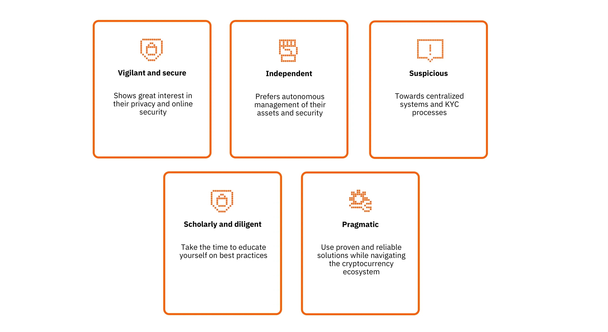

Този подход е особено подходящ, ако:

- Притежавате значителни количества биткойни,
- Живеете в авторитарен режим,
- е необходимо да защитите анонимността си по лични, професионални или идеологически причини.

В следващия раздел на курса ще обсъдим важна тема, която често се пренебрегва: как да предадете биткойните си в случай на спешност.

# Защита на наследниците и богатството ви

<partId>0b8a9528-719b-4a2d-bd50-1e173a896570</partId>

## Създаване на план за наследяване

<chapterId>233c88d3-2e8e-5eba-ac06-efe67a209038</chapterId>

:::video id=7b8c9d0e-1f2a-3b4c-5d6e-7f8a9b0c1d2e:::

Гарантирането на предаването на вашите биткойни е отговорност, която често се пренебрегва, но е от решаващо значение. Финансовият суверенитет, който Биткойн предлага, идва и с необходимостта от внимателно управление на имуществото. Без това вашите наследници може да се окажат в невъзможност да получат достъп до трудно спечелените ви средства. В тази глава ще разгледаме основите на планирането на имуществото, тъй като то се отнася за Биткойн.

### Защо е необходимо да се изготви план за приемственост на Биткойн?

Представете си внезапно събитие (злополука или непредвидено обстоятелство) и вече не сте тук. Семейството ви, което вече скърби, сега е изправено пред друго предизвикателство: достъп до вашите биткойни. Те може да са ви чували да говорите за частни ключове, мнемонични фрази и необратимост на транзакциите, но тези понятия може да са им неясни. Остава им да се опитат да ги разберат сами.

След това имате две възможности:

- Отделете време, за да съставите ясен и структуриран план, който ще позволи на близките ви да имат лесен и сигурен достъп до вашите биткойни;
- Не правим нищо, надявайки се, че те ще се справят сами. Но ако допуснат грешка, загубят достъп до портфейла или случайно изпратят средствата на грешен адрес, богатството ви може да бъде загубено завинаги.

Отделянето на само 15 минути до един час за изготвяне на план за наследяване може да е от голямо значение. Това е не само въпрос на предпазливост, но и начин да покажете отговорност към тези, които могат да разчитат на вас.

### Цели на плана за приемственост на Биткойн

Памела Морган в книгата си *[Планиране на наследството на криптоактиви](https://www.amazon.com/gp/product/1947910116/)* очертава четири ключови цели за солиден план за наследяване:

- Осигурете на наследниците си достъп до вашите биткойни в подходящия момент (но не и преди това);
- Минимизиране на риска от кражба или компрометиране, преди те да наследят биткойните;
- Уверете се, че наследниците ви знаят как да защитят биткойните в дългосрочен план, ако желаят;
- Избягвайте семейни спорове и ограничавайте правните усложнения при предаването на криптоактиви.

Добре обмисленият план не е само за прехвърляне на богатство, но и за защита на близките ви от често срещани грешки и потенциални заплахи.

Тази глава е вдъхновена от работата на [Pamela Morgan](https://x.com/pamelawjd). [Нейната книга](https://www.amazon.com/gp/product/1947910116/) и макар че книгата ѝ предлага подробен и експертно потвърден метод за създаване на план за наследяване Биткойн, **това съдържание не представлява правен съвет**.  Това е доказан подход, но всеки човек трябва да направи собствено проучване и да адаптира препоръките към личната си ситуация и юрисдикция.

[Памела Морган](https://x.com/pamelawjd) щедро разреши използването на [нейната работа](https://www.amazon.com/gp/product/1947910116/) за този курс и ние ще следваме нейния подход за създаване на конкретен план за наследяване на Биткойн. В тази глава ще се съсредоточим върху първата част на нейната книга.

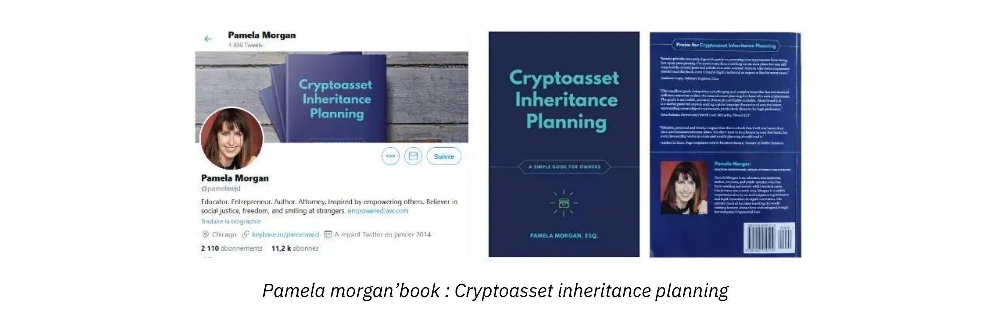

За да разберем по-добре как да създадем план за наследяване на Биткойн, ще разгледаме примера на Седрик, типичен потребител на Биткойн, който трябва да организира как ще бъде предадено богатството му, ако се случи нещо неочаквано.

Неговият профил:

- Дългосрочен инвеститор, който не търгува често;
- Притежава хардуерен портфейл и мобилен портфейл за случайна употреба;
- Използва една единствена платформа за обмен на KYC, за да купува своите биткойни;
- Запознат с Биткойн от своя братовчед;
- Не разполага с алткойни и не използва мрежата Lightning.

Целта ни е да създадем прост и ефективен план, съобразен с профила на Седрик, преди да преминем към по-сложни сценарии, включващи други видове потребители.

### Преди да започнете

Отделете 30 минути от времето си. Не за себе си, а за тези, които зависят от вас. Планирането на имуществото е важна задача, която обаче често се отлага, пренебрегва или дори игнорира. Твърде много хора, дори и най-предпазливите, го отлагат... докато не стане твърде късно. Хиляди биткойни вече са били загубени поради липса на предвидливост. Не допускайте тази грешка! Това е **окончателната стъпка** по пътя ви към финансов суверенитет: да осигурите богатството си Биткойн за близките си.

#### От какво се нуждаете?

Уверете се, че разполагате със спокойна среда без разсейване, след което съберете тези няколко инструмента:

- 4 до 5 листа бяла хартия;
- Перо;
- 2 плика;
- Телефонна или адресна книга;
- Компютър (по избор).

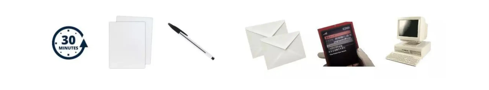

#### Често срещани погрешни схващания относно планирането на наследството

Много хора отлагат тази стъпка поради погрешни схващания, които им пречат да предприемат действия. Ето някои често срещани митове, изложени от Памела Морган в _Cryptoasset Inheritance Planning_ (стр. 18):

- "*Трябва да наема адвокат*"** → **Невярно**. Макар че адвокатът може да е полезен по правни въпроси, техническият план за наследство Биткойн може да бъде създаден и без него. Най-важното е да имате ясни и достъпни инструкции;
- "*Трябва да се доверя на трета страна.*"** → **Невярно**. Вашият план може да бъде разработен по такъв начин, че да се сведе до минимум необходимостта от доверие, като например разпределяне на информацията между няколко страни или използване на решения за многократен подпис, със или без времево заключване;
- "*Планирането ще направи активите ми лесни за кражба.*"** → **Невярно**. Добре обмисленият план предпазва от опити за кражба, като същевременно гарантира, че наследниците ви ще могат да възстановят средствата ви по сигурен начин. Важно е обаче да се отбележи, че нито едно решение не е безотказно: планът за наследяване увеличава риска от кражба в зависимост от това каква информация се споделя. Ще обсъдим това по-подробно по-късно;
- "*Стойността на моите биткойни е твърде малка, за да се планира.*"** → **Невярно**. Винаги е по-добре да се планира предварително. Вашите близки вероятно не знаят точната сума на Биткойн, която притежавате, и това е добре. Но ако нещо се случи с вас, няма ли да искат да го възстановят, дори и да не знаят точното количество? Стойността на Биткойн може да нарасне значително с течение на времето, така че е разумно да улесните достъпа им до вашите средства и да избягвате да им давате фалшиви надежди за стойността или да ги оставяте да търсят нещо, което може да не съществува.
- "*Наследниците ми сами ще се справят с това.*"** → **Невярно**. Биткойн не е като обикновена банкова сметка. Без ясни инструкции близките Ви може никога да не получат достъп до Вашите средства или да открият само част от тях. За разлика от банковите сметки, при които финансовите институции или нотариусите се свързват с членовете на семейството след смъртта, при Биткойн портфейл няма посредник, който да информира близките ви. Ето защо от вас зависи изрично да го включите в плана си за наследство;
- "*Умен договор може да управлява всичко.*"** → **Невярно**. Интелигентният договор, например multi-sig портфейл с времеви блокаж, може да бъде част от решението, но никога няма да замени добре структуриран план, особено за хора, които не са запознати с Биткойн. И двете решения се допълват.

Време е да предприемете действия. Прекарайте тези 30 минути в създаване на план за наследяване. Това е проста стъпка, но тя може да има решаващо значение за вашите близки.

### Стъпка 1: Изберете правилните хора, които да помагат на наследниците ви

Когато става въпрос за предаване на наследство в Биткойн, близките ви вероятно няма да са запознати с управлението на частни ключове или възстановяването на портфейли. Те ще се нуждаят от външна помощ от компетентни и надеждни лица. Идеалният подход е да изберете поне двама различни души:

- Доверен роднина**, който ще осигури безпроблемното изпълнение на плана ви. Не е задължително той да има задълбочени познания по Биткойн, но трябва да е човек, на когото вашите наследници могат да разчитат.
- Опитен потребител на Биткойн**, който може да предостави техническа помощ за възстановяване на средствата, управление на портфейли и разбиране на съответните процеси.

Избраните от вас хора никога не трябва да имат пряк достъп до вашите частни ключове (или до вашата мнемонична фраза), но трябва да могат да го направят:

- Напътствайте наследниците си при възстановяването и осигуряването на средствата;
- Обяснете основите на портфейлите Биткойн, фразите за възстановяване и транзакциите;
- Помогнете да се избегнат често срещани грешки.

Върху хартията, която ще се превърне във вашия план за наследяване на Биткойн, създайте сравнителна таблица на потенциалните кандидати, като оцените нивото на доверие към тях, познанията им за Биткойн и начина, по който да се свържете с тях. Например:

| Човек               | Ниво на доверие     | Познания за Биткойн   | Методи на общуване         | Бележки                                                                                                                   |
|----------------------|-----------------|----------------------|--------------------------|------------------------------------------------------------------------------------------------------------------------|
| Брат ми Боб       | Много високо       | Ниски                  | Телефон            | Не разбира биткойн, но може да му се има доверие.                        |
| Братовчед ми Нейтън     | Високо            | Средни               | Телефон        | Има относителни знания и е наясно със стъпките. №1 в списъка с кандидати.                   |
| Рик (приятел биткойнър) | Средно      | Много високи            | Имейл, телефон   | Много технически грамотен, но не трябва да има достъп до средствата, само за консултации по технически въпроси.            |
| Биткойнър онлайн     | Ниско             | Високи                 | Онлайн          | Добър източник за информация, но не може да бъде въвлечен в процеса.                                                   |

Ако нямате надежден или компетентен член на семейството, можете да помислите и за наемане на професионалист, например адвокат, специализиран в областта на наследството Биткойн, или специализирана услуга за планиране на наследството. Ключът е в това, че вашите наследници имат достъп до надеждна техническа помощ, като същевременно се запазва сигурността и поверителността на вашите средства.

### Стъпка 2: Създаване на бърз и лесен инвентар

Преди да се замислите за защита или предаване на вашите биткойни, е важно да направите ясен опис на активите си Биткойн. Този опис ще послужи като основа за организиране на вашия план за наследяване и ще помогне на вашите наследници да разберат къде се намират вашите активи и как да имат достъп до тях.

Целта тук не е да подобрите сигурността си веднага, а просто да каталогизирате текущата си ситуация. Това е моментна снимка на вашите биткойни и средствата за достъп до тях. Можете да коригирате и укрепите сигурността по-късно, след като тази първа инвентаризация е завършена.

Помислете за всички места, където имате биткойни или фиатна валута, свързани с Биткойн. Това може да включва:

- Борси**:  Сметки с BTC или фиат, свързани с вашите покупки в Биткойн.
- Горещи портфейли (мобилни или настолни)**: Приложения, инсталирани на вашия телефон, използвани за ежедневни транзакции;
- Хардуерни портфейли**: Физически устройства, които съхраняват частните ви ключове офлайн;
- Други решения**: Multisig, хартиени портфейли, специално съхранявани частни ключове и др.

Използвайте таблица, за да структурирате този опис. Идеята е да не съхранявате този документ онлайн, а да го държите на сигурно място, най-добре на хартия. Например:

| Решение | Тип съхранение | Актив | Локализация | Мнемоничнo резервна копие | Парола (PIN, passphrase...) | Бележки |
| --------------------- | ---------------- | -------------- | --------------------------------- | ------------------------------------------------------------------------ | ----------------------------------------------------------------------------------------------- | --------------------------------------------------------------------------------------------------------------- |
| Bitfinex | BTC & евро | Онлайн | Няма | | Bitwarden & 2FA мениджър за пароли | Купих си BTC от тук. Средствата трябва да бъдат теглени след покупката. |
| Физически портфейл | Jade Plus | BTC | Личен сейф вкъщи | Копие при чичо ми Боб и в банков сейф в BNP Paribas | паролата е съхранена у майка ми. ПИН кодът е съхранен в мениджъра на пароли Bitwarden. | Използвам 2 отделни портфейла: един нормален, само с мнемоничната фраза, и един с парола.. |
| Green Wallet | BTC | На телефона ми | Копие от фразата в сейфа ми у дома | PIN код, съхранен в мениджъра на пароли Bitwarden. | Приложението е в скрит режим. | Приложението е в скрит режим. |

На този етап може да ви се прииска незабавно да коригирате разпределението на средствата си, да подобрите сигурността си или дори да купите или продадете повече биткойни. Все още не действайте! Целта тук не е да предприемете действия, а да установите моментна снимка на текущото си положение. Винаги можете да подобрите плана си по-късно, но засега останете фокусирани върху това да завършите инвентаризацията възможно най-обстойно.

След като бъде направена тази инвентаризация, ще бъде много по-лесно да се идентифицират слабите места и да се организира сигурен и ефективен процес на предаване.

### Стъпка 3: Напишете писмото

#### Защо писмо, написано на ръка?

Изключително важно е планът ви за наследяване да бъде ясен, четлив и сигурен. За да постигнете това, напишете писмото на ръка с мастило върху хартия и избягвайте цифрови документи, които могат да бъдат компрометирани. Това писмо не е завещание или правна декларация, а практическо ръководство, което да помогне на близките ви да възстановят безопасно вашите биткойни.

Писмото трябва да е просто, директно и да съдържа следните основни елементи:

- Въведение, в което се обяснява естеството на активите, които трябва да бъдат възстановени;
- Контакти с доверени лица, които могат да помогнат на вашите наследници в процеса на възстановяване;
- Ясен опис на активите, включително методите за съхранение и данните за достъп;
- Специфични инструкции за сигурност, за да избегнете грешки или измами;
- Заключително послание, заедно с всички правни инструкции, ако е приложимо.

#### Пример за писмо за наследство

Ето един модел, вдъхновен от "Планиране на наследството на криптоактиви" на Памела Морган. Разбира се, трябва да го адаптирате към личната си ситуация:

---
**Дата: `Посочете датата`**

Уважаеми `Имена на наследници`,

Ако четете това писмо, аз вече не съм тук. Преди всичко знайте, че ви обичам и отделих време да подготвя този документ, за да ви помогна да управлявате моите биткойни, които може да имат стойност. Това не е сложна задача, но изисква внимание и предпазливост. Биткойн е система от типа "peer-to-peer": няма право на обратна връзка, ако бъде допусната грешка. Моля, отделете време да прочетете изцяло това писмо, преди да предприемете каквото и да е действие.

#### 1. Свържете се с доверени лица

Определих няколко души, които да ви помогнат в разбирането на Биткойн и възстановяването на активите ми. Те никога не трябва да имат пряк достъп до средствата, но могат да ви напътстват в процеса:

- Брат ми Боб: +33 6 00 00 00 00; bobmybrother@supermail.com. Можете да се доверите на Боб да ви помогне в този процес. Макар че той не е най-технически запознат с Биткойн, той е правилният човек, който може да постави всичко под въпрос и да гарантира предпазливост, за да ви гарантира безопасен успех.
- Братовчед ми Нейтън: +33 6 00 00 00 00; nathandelacroix@supermail.com. Нейтън ме запозна с Биткойн. Той е много опитен в областта на компютрите и може да отговори на повечето ви въпроси. Той също така притежава няколко Биткойн и може да ви насочи технически. Срещали сте го на семейни събирания, а тук съм включил негова снимка.
- Рик: @RiccoSuperBitcoiner в Twitter; ricco425@supermail.com. Работя в тясно сътрудничество с Рик от години. Никога не сте го срещали, затова се уверете, че се свързвате с правилния човек, като го попитате "Как се казва кучето на Седрик?" Ако отговори "12", това е той. Много приятелски настроен и опитен експерт по Биткойн. Той ще отговори на всичките ви въпроси и можете да се доверите на преценката му относно сигурността на Биткойн. Не се колебайте да се свържете с него, но никога не му предоставяйте пряк достъп до средствата.

Може да ви звучи странно, но се свържете с всички тях. Освен това можете да научите повече, като слушате Андреас Антонопулос в YouTube и като си купите книгата *Cryptoasset Inheritance Planning* на Памела Морган.

Свържете се с всички тези хора и проверете мненията им, преди да вземете важни решения. **Не се доверявайте сляпо на никого.**

#### 2. Къде са моите биткойни?

Ето подробен опис на моите притежания, тяхното местоположение и как да получите достъп до тях.

- Използвам телефона си (Samsung Galaxy S8) за достъп до моя Samourai wallet. Фразата за възстановяване за този портфейл е записана в две копия: едното се съхранява в банковия трезор, а другото при чичо Боб. ПИН кодът, необходим за отключване както на телефона ми, така и на портфейл, се съхранява в дома ми и при баба ми.
- Имам достъп до онлайн платформата за обмен Bitfinex чрез моя лаптоп Dell 2018. Възможно е все още да има биткойни или долари. За да възстановите тези средства, ще трябва или да се свържете директно с Bitfinex, или да опитате да получите достъп до моя акаунт. (**Внимавайте, това може да е незаконно - проверете местните закони**).
- Подсигурих достъпа до онлайн акаунтите си с помощта на мениджър на пароли. Резервно копие на този мениджър се съхранява в банковия трезор. Моят акаунт в Bitfinex също е защитен с двуфакторна автентикация, до която имам достъп чрез телефона си (Samsung Galaxy S8, приложението Authy) или чрез използване на резервния код, който пазя вкъщи.
- Притежавам хардуер портфейл на Trezor Model One, до който имам достъп чрез компютъра си с помощта на софтуер Sparrow Wallet. Фразата за възстановяване за този портфейл се съхранява в две копия: едното е в банковия трезор, а другото - при чичо Боб. ПИН кодът за този портфейл се съхранява в дома ми и при майка ми. Самото устройство вероятно се съхранява в сейф в офиса ми. Използвам BIP39 passphrase на моя Trezor Model One. Този passphrase е от решаващо значение за достъпа до средствата в устройството. Резервно копие на този passphrase се съхранява на две места: в дома ми и при майка ми.

Вземете всички необходими предпазни мерки, преди да боравите с тези средства. Никога не разкривайте пълния размер на възстановяването на един човек и споделяйте тези подробности само ако е абсолютно необходимо.

#### 3. Предпазни мерки и инструкции за безопасност

- Не бързайте**. Отделете време, за да се научите, преди да действате. Биткойн е безопасен, когато се използва правилно.
- Никога не давайте изречението от 24 думи само на един човек**. Ако някой ви поиска пълен достъп, бъдете предпазливи.
- Не свързвайте портфейлите ми с непознат компютър**. Използвайте защитена среда, по възможност офлайн.
- Пазете се от измами**. Около Биткойн има много измами. Доверявайте се само на хората, посочени в това писмо.
- Запазвайте всичко, което правите**.  Водете си бележки, записвайте важни стъпки и защитавайте достъпа.

#### 4. Правна информация и заключително послание

Копие от завещанието ми ще намерите в личното ми досие и при нотариуса. Това писмо не замества официалното завещание, но ще ви помогне да управлявате моите биткойни.

Грижете се за себе си и помнете, че ви обичам. Моето желание е тези активи да ви бъдат полезни и да ви помогнат да продължите напред със спокойствие.

Ръкописен подпис

Вашето име

Дата

---
Това е конкретен пример за наследствено писмо. Не забравяйте да го адаптирате към вашата лична ситуация. Също така е важно да решите колко подробности да включите в процеса на възстановяване. Ако се опасявате, че наследниците ви няма да могат да възстановят вашите биткойни с тази минимална информация, помислете за написване на ръководство стъпка по стъпка, в което подробно да обясните процеса.

Освен това ще трябва да прецените колко информация да разкриете в този план за наследяване. Колкото повече споделяте за методите си за сигурност, толкова повече рискувате да компрометирате сигурността си, докато сте живи, ако това писмо попадне в неподходящи ръце. Например, взломаджия, който намери това писмо, веднага ще разбере къде да търси критична информация за портфейла. От друга страна, ако споделяте твърде малко, излагате наследниците си на риска да нямат достъп до вашите биткойни. Затова трябва да намерите среден вариант.

В крайна сметка дилемата с плана за наследяване е огледална на стратегиите за сигурност: винаги става въпрос за балансиране на риска от загуба и риска от кражба. Недостатъчното документиране на информацията увеличава риска наследниците ви да загубят достъп до биткойните, докато споделянето на твърде много информация може да повиши риска от кражба сега.

### Стъпка 4: Преглед и съхранение на писмото

Преди да приключите, уверете се, че писмото ви съдържа:

- Ясен списък на доверени лица с тяхната информация за контакт
- Подробен опис на активите ви и къде да ги намерите
- Точни инструкции за достъп и сигурност
- Внимателно и състрадателно послание към вашите наследници

В зависимост от личната ви ситуация създайте няколко ръкописни копия на това писмо и ги съхранявайте на сигурни места (сейф, при доверено лице и т.н.). Информирайте наследниците си, че този план за наследяване съществува, без да е задължително да разкривате съдържанието му веднага. За допълнителна защита може да искате да поставите писмото в непрозрачен плик с възможност за подправяне, за да сте сигурни, че до него не е имало достъп без ваше разрешение.

Ако е необходимо, консултирайте се с адвокат или нотариус, за да включите официално плана си в правна рамка.

**Споздравления!** Извършихте важна стъпка в осигуряването на богатството си от биткойни. Сега можете да усъвършенствате плана си за наследяване, като го преглеждате периодично и проучвате по-напреднали решения, като например намаляващи мултисиг настройки с таймлокове:

https://planb.academy/tutorials/wallet/desktop/liana-306ef457-700c-4fdd-b07a-8fb7a8a29f04

Справка: [*Криптографско планиране на наследството, просто ръководство за собственици* - Памела Морган, 2018 г.](https://www.amazon.com/gp/product/1947910116/)

Специални благодарности на [Pamela Morgan](https://x.com/pamelawjd) за нейната работа и за разрешението това съдържание да бъде адаптирано.

## Вече сте сред първите 0,1% най-подготвени биткойнери

<chapterId>5f4cfab9-9af1-584b-a1fe-a0769a991f19</chapterId>

:::video id=8c9d0e1f-2a3b-4c5d-6e7f-8a9b0c1d2e3f:::

Ако сте стигнали дотук, значи вече сте част от просветено малцинство! Много малко хора стигат толкова далеч с Bitcoin и вие можете да се гордеете с това, че сте стигнали дотук. Може би сте проследили всички уроци, предложени в този курс на обучение: Създали сте план за осредняване на разходите в долари (DCA), Придобили сте биткойни с и без KYC, Дори сте планирали наследството си в биткойни. Всяка стъпка, която сте направили, е скок към истински финансов суверенитет.

Дори ако все още не сте направили всичко, но сте се ангажирали да го направите скоро, вече сте изпреварили времето. Тази решимост да учите и да действате е това, което наистина има значение. Сега разбирате защо Bitcoin представлява толкова важна промяна за нашето индивидуално и колективно бъдеще.

Откакто започнах да обучавам хората за Биткойн, както екосистемата, така и аз се развихме значително. Този курс е напълно актуализиран, за да отразява най-доброто от това, което Биткойн може да предложи днес. Заедно изминахме доста дълъг път!

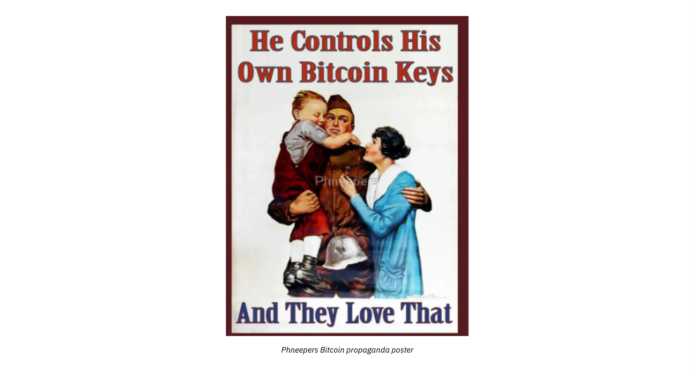

### Какво следва за Биткойн?

Ако погледнем логаритмичната крива на цените, ще видим едно нещо: никога не знаем къде точно се намираме в циклите. Може би четете този курс тъкмо когато започва нова фаза на растеж, а може би се намирате в средата на мечи пазар. Какъвто и да е случаят, циклите продължават, неизбежно прекъсвани от впечатляващи върхове, а понякога и от жестоки корекции.

Но освен цената, растежът на Bitcoin е поразителен. Това, което започна като неясен проект сред шифърпънкарите, се превърна в глобално движение. От "Пътя на коприната" до институционалното приемане, Биткойн се е утвърдил в глобалния финансов пейзаж. Тя вече не се разглежда като маргинален експеримент, а като сериозен клас активи, приет от институции и милиони физически лица по целия свят.

Тази промяна във възприятията се случва успоредно с непрекъснатия технически прогрес. Портфейлите и инфраструктурата непрекъснато се усъвършенстват. Всяка година се появяват нови решения, които правят Биткойн по-сигурен, устойчив и удобен за ползване. Днес Биткойн е по-децентрализирана, по-достъпна и по-добре разбираема от всякога.

Разбира се, остават предизвикателства: регулиране, защита на личните данни, по-широко приемане и развитие на кръговата икономика. Но докато общността е активна, любопитна и ангажирана, Биткойн ще остане мощна алтернатива на традиционната финансова система.

Едно нещо е сигурно: Биткойн ще продължи да съществува; ще произвежда нов блок приблизително на всеки 10 минути, неуморно, ден след ден, година след година. Ще станем свидетели на повече потребители, портфейли, борси, а също и на повече регулации, технически пречки, кризи и иновации.

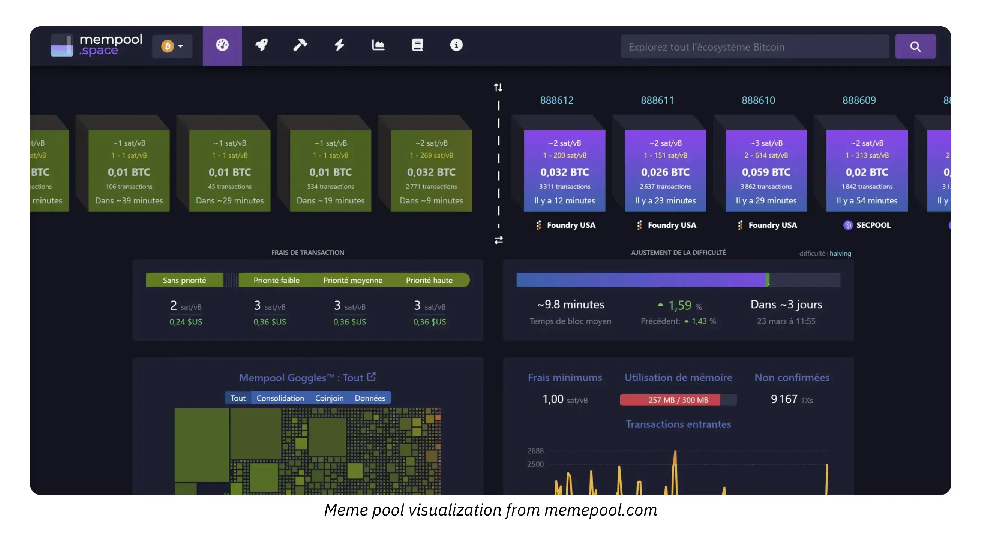

Тъй като глобалните кризи продължават, а инфлацията намалява покупателната способност на фиатните валути, Биткойн естествено ще привлича все повече хора, които търсят финансова свобода и индивидуален суверенитет. Тази динамика ще продължи да укрепва Биткойн и да привлича нови таланти, които да подобряват нейния протокол, слоевете за мащабиране и случаите на ежедневна употреба по отношение на сигурността, неприкосновеността на личния живот и полезността.

### Какъв е следващият ви ход?

По ирония на съдбата най-голямата промяна няма да бъде Биткойн, а вие.

Ще се развие начинът, по който използвате, разбирате и се отнасяте към Биткойн. Може би ще развиете истинска страст към него, достатъчна, за да започнете да обучавате други, да се включите в общността или просто да запазите богатството си в дългосрочен план. Какъвто и да е пътят ви, Биткойн ще е променил мирогледа ви, а вероятно и отношението ви към свободата и финансовата отговорност.

Ето няколко насоки, които можете да предприемете:

#### 1. Запазете инерцията

Ако сегашната ви стратегия работи добре, просто продължете.

Продължавайте да подреждате sats редовно и да поддържате най-добрите практики за сигурност. Вече сте изградили здрава основа и няма нужда да отивате по-далеч, ако основната ви цел е просто да защитите спестяванията си в биткойни.

Отделете време, за да наблюдавате развитието на екосистемата, да усъвършенствате стратегията си и да укрепите настройките си, ако е необходимо.

#### 2. Задълбочете знанията си

Пътуването ви не свършва дотук. Биткойн е постоянно развиващ се свят и винаги има какво да откриете. Ето няколко посоки, които може да искате да проучите, за да задълбочите разбирането си за Биткойн:

- За да повишите нивото на цифровата си сигурност, започнете с нашия встъпителен курс по сигурност:

https://planb.academy/courses/99c46148-7080-4915-a7e0-9df0e145cd47

- Ако ви интересува икономическата и философската страна на Биткойн, разгледайте тези задълбочени курсове:

https://planb.academy/courses/d07b092b-fa9a-4dd7-bf94-0453e479c7df

https://planb.academy/courses/caa75343-ac90-4249-bcca-0e2e57c3a0f1

https://planb.academy/courses/9d1bde6a-33e5-45dd-b7c0-94da72e45b11

- Собствениците на фирми, които се интересуват от интегрирането на Биткойн в стратегията на компанията си, не трябва да пропускат:

https://planb.academy/courses/a804c4b6-9ff5-4a29-a530-7d2f5d04bb7a

- За да научите завладяващата история зад създаването на Биткойн и ранните години на системата, горещо ви препоръчвам този курс:

https://planb.academy/courses/a51c7ceb-e079-4ac3-bf69-6700b985a082

- И накрая, ако се интересувате от техническите аспекти на Биткойн и неговата екосистема, разгледайте тези курсове за обучение:

https://planb.academy/courses/34bd43ef-6683-4a5c-b239-7cb1e40a4aeb

https://planb.academy/courses/46b0ced2-9028-4a61-8fbc-3b005ee8d70f

https://planb.academy/courses/65c138b0-4161-4958-bbe3-c12916bc959c

#### 3. Принос към екосистемата Биткойн

Биткойн е нещо повече от финансов инструмент - това е движение. В зависимост от уменията и интересите ви има много начини, по които можете да дадете своя принос:

- Обучение и повишаване на осведомеността**: Помогнете на близките си да разберат Биткойн, споделете знанията си и участвайте в местни дискусии;
- Разработване на инструменти и приложения**: Ако имате технически умения, приносът към инструменти с отворен код е чудесен начин да допринесете за стойността на Биткойн;
- Присъединете се към местна общност**: Участвайте в събития, срещи и форуми, за да се запознаете с други биткойнисти и да обмените мнения за последните развития.

Ако искате да помогнете за обучението на другите, Plan ₿ Academy винаги търси сътрудници! Цялото ни образователно съдържание е с отворен код и се хоства в GitHub. Приветстваме сътрудници, които да помагат за коригирането и превеждането на съдържанието на различни езици; в замяна на няколко sats! Независимо дали сега, или на по-късен етап от пътуването си с Биткойн, ви каним да се присъедините към [нашата Telegram група за сътрудници](https://t.me/PlanBNetwork_ContentBuilder) на Plan ₿ Academy.

### Последни думи

Много ви благодаря, че взехте участие в курса BTC102.

Казвам се Рогзи, основател на Découvre Bitcoin и съосновател на Академията Plan ₿; платформа, която стана възможна благодарение на нашите невероятни нови партньори, Tether и Fulgur Ventures, и на общата ни мисия да образоваме възможно най-много хора за Биткойн.

Вашата обратна връзка е изключително ценна. Чувствайте се свободни да оставяте коментари в платформата и да ни кажете какво мислите за тази актуализирана версия на курса. Вашите предложения ни помагат да продължим да подобряваме качеството на нашето съдържание.

Сега сте готови да се явите на финалния изпит - тест с 40 въпроса, който ще потвърди знанията ви и ще ви издаде сертификат.

Късмет!

Надявам се скоро да се видим отново в друг курс на Plan ₿ Academy; независимо дали е мой или на друг невероятен учител от общността. И кой знае, може би дори ще се срещнем лично на някоя конференция, събитие или среща на Биткойн.

Още веднъж ви поздравявам за това, че сте стигнали толкова далеч. И не забравяйте, че основната ми цел винаги ще си остане същата:

**Да помогнем на възможно най-много хора да постигнат финансов суверенитет чрез Биткойн.**

**Пожелаваме ви всичко най-добро в пътуването ви с Биткойн!**

# Последен раздел

<partId>a8425389-4a53-4b57-b9b4-36c1cab12de5</partId>

## Отзиви и оценки

<chapterId>3f43175a-fb7a-5b1c-a887-7dcf615d7a3a</chapterId>

<isCourseReview>true</isCourseReview>
## Заключителен изпит

<chapterId>f3ff8089-8f89-56a8-be8c-b60296b4d91f</chapterId>

<isCourseExam>true</isCourseExam>
## Заключение

<chapterId>b082b8eb-dabc-5d79-94cf-eb8f48fc1968</chapterId>

<isCourseConclusion>true</isCourseConclusion>
