# İlk bitcoinlerinize doğru bir yolculuk

Bitcoin ekosistemi muhteşem ve benzeri görülmemiş bir büyüme yaşıyor. Satoshi Nakamoto'nun icadının yol açtığı teknolojik, ekonomik ve sosyal dönüşümler gün geçtikçe yoğunlaşıyor ve artık tam olarak yararlanabileceğiniz yeni bir dünyanın kapılarını yavaş yavaş açıyor.

Bitcoin Tavşan Deliğine dalmak, eleştirel düşünmenizi teşvik edecek ve birçok inancınıza meydan okuyacak heyecan verici bir entelektüel maceradır. Bu keşif size sadece Bitcoin'ün nasıl çalıştığına dair derin bir anlayış kazandırmakla kalmayacak, aynı zamanda kişisel özgürlüğünüzü geri kazanmak, mahremiyetinizi korumak ve gerçek finansal egemenliğe ulaşmak için gerçek bir fırsat sunacaktır.

Bu yolculukta size etkili bir şekilde rehberlik etmek için bu tamamen ücretsiz kursu oluşturdum. Burada odak noktası yalnızca Bitcoin'tir. Alakasız tartışmalar yok, diğer kripto paralardan bahsedilmiyor, sadece açık, net ve anlaşılır bir içerik var.

Bu kurs, ilgi alanlarınıza ve hedeflerinize en uygun yolu izleyerek Bitcoin'yı kendi hızınızda keşfetmenize olanak tanıyarak öğrenme şekliniz üzerinde tam kontrol sahibi olmanızı sağlamak üzere tasarlanmıştır.

+++
# Giriş

<partId>008c49b7-5e17-5973-87f2-ba28429b2697</partId>

## Kursa genel bakış

<chapterId>bfc96999-0ee1-5c41-8297-1b629f50cffc</chapterId>

:::video id=58e578ef-bb3c-423d-8431-0c16db8e5f29:::

BTC102'ye hoş geldiniz! BTC101'i zaten tamamladıysanız, Bitcoin'nin neden bu kadar devrimci bir teknoloji olduğunun arkasındaki temel teorik kavramları keşfettiniz. Şimdi BTC102 ile bu bilgileri eyleme dökme zamanı. Bu kurs, kişisel Bitcoin planınızı adım adım oluşturmanıza yardımcı olmak için tasarlanmıştır.

Önümüzdeki bölümlerde, **ilk bitcoinlerinizi** almanız, **doğru bir şekilde güvence altına almanız** ve hızla büyüyen bu ekosisteme ilk adımlarınızı güvenle atmanız için pratik adımlar konusunda size rehberlik edeceğiz.

https://planb.academy/courses/2b7dc507-81e3-4b70-88e6-41ed44239966

Bitcoin 16 yılı aşkın bir süredir var olmasına rağmen, endüstri hala genç, dinamik ve kökleri özgürlüğe dayanmaktadır. Temel protokolü tamamen merkezi olmayan ve herhangi bir merkezi otorite tarafından kontrol edilmeye karşı dirençli olup, ekosistemin doğal ve organik bir şekilde büyümesine izin vermektedir.

Bu özgürlük inanılmaz bir yenilik ve fırsat dalgasını beslerken, aynı zamanda dolandırıcılık, yaygın hatalar ve genellikle bilgi eksikliğinden kaynaklanan tuzaklar da dahil olmak üzere belirli riskleri de beraberinde getiriyor. Bu eğitimin temel amacı, bu yeni ekosistemde güven ve emniyetle yol almanıza yardımcı olmaktır.

Bunu başarmak için BTC102 kursu, her biri Bitcoin ile yolculuğunuzun önemli bir yönüne odaklanan birkaç bölüme ayrılmıştır:

İlk bölüm olan "Bitcoin'u anlamak için ön koşullar", sizi önünüzdeki yola etkili bir şekilde hazırlar. Bitcoin ekosisteminde var olabilecek dolandırıcılık ve finansal sahtekarlıklarla ilgili ana tuzakları tanımlamayı öğreneceksiniz. Daha sonra çevrimiçi güvenliğin temel esaslarını ele alacağız.

Son olarak, Bitcoin ile ilk kez çalışırken yaygın hatalardan kaçınmanıza yardımcı olmak için yeni başlayanlar için özel olarak tasarlanmış birkaç pratik ipucu vereceğim.

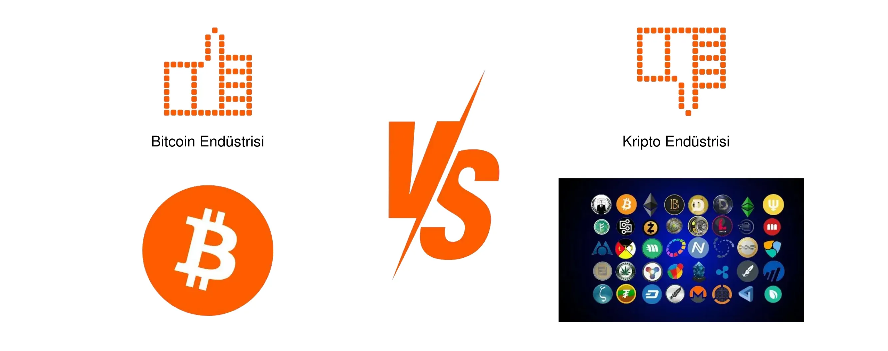

İkinci bölüm olan "Neye Başladığınızı Anlamak", Bitcoin hakkındaki genel anlayışınızı derinleştirecektir. Temel kavramları tam olarak anladığınızdan emin olmak için bir gözden geçirme ile başlayacağız.

Ardından, Bitcoin'ün teknolojik, ekonomik ve sosyal açılardan neden temelde önemli olduğunu açıklayarak, değerine olan inancınızı güçlendireceğiz. Ayrıca Bitcoin endüstrisini bir bütün olarak keşfedeceksiniz: kilit oyuncuları, organizasyonu ve yıllar içindeki evrimi. Son olarak, bu sistemin çekirdek protokolünün bütünlüğünden ödün vermeden nasıl yenilik yapmaya devam ettiğini anlamak için çok önemli bir kavram olan Bitcoin ekosisteminin katmanlı mimarisini ele alacağız.

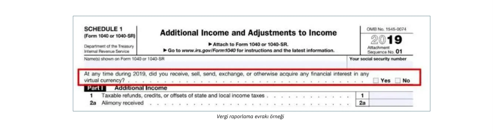

"Planınızı oluşturmak" başlıklı üçüncü bölüm, Bitcoin'e kişisel yaklaşımınıza odaklanmaktadır. Dört ana kategoriden kullanıcı profilinizi tanımlamanıza yardımcı olarak başlayacağız:

- hodler*, Bitcoin'i uzun vadede tutmaya odaklanmıştır;
- düzenli ve metodik olarak satın alan istifleyici*;
- gW-16'yı günlük olarak kullanmaya öncelik veren kullanıcı*;
- ve son olarak varlıklarını ve mahremiyetini etkin bir şekilde korumak için maksimum güvenlik isteyen *paranoyak*.

Profilinize uygun ve kişisel hedeflerinize ulaşmanıza yardımcı olacak bir stratejinin uygulanmasında size rehberlik edeceğiz.

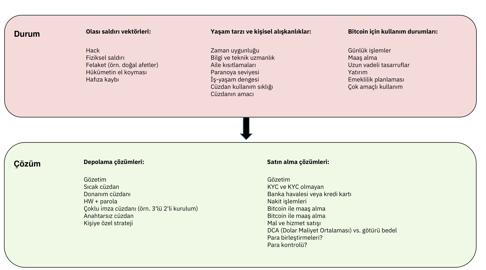

Son olarak, "Varislerinizi ve Servetinizi Korumak" başlıklı dördüncü bölüm, genellikle göz ardı edilen çok önemli bir konuyu ele almaktadır: beklenmedik bir olay durumunda Bitcoin'nizin sevdiklerinize aktarılmasını nasıl sağlayacağınız. Bir Bitcoin miras planını nasıl oluşturacağınızı ve ayarlayacağınızı öğrenecek ve servetinizin yaşam sürenizin ötesinde korunmasını sağlayacaksınız.

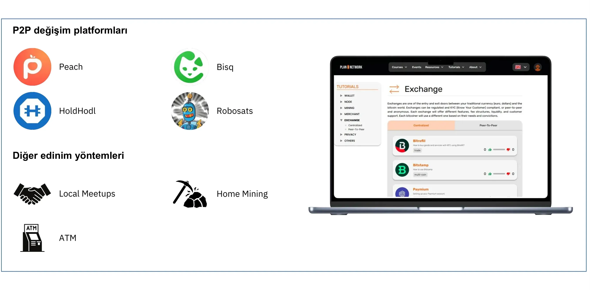

Bu eğitimin sonunda, Bitcoin ekosisteminde güvenle gezinmek ve en gelişmiş kullanıcılarından biri olmak için ihtiyacınız olan tüm pratik araçlara sahip olacaksınız!

Bitcoin dünyasına yolculuğunuza başlamaya hazır mısınız? Hadi başlayalım!

**N.B.**: Kurs sırasında bilmediğiniz terimlerle karşılaşırsanız, lütfen tanımlar için [sözlüğe](https://planb.academy/resources/glossary) başvurunuz.

# Bitcoin'yi anlamak için ön koşullar

<partId>4481fc4b-0f83-489e-ad07-81517c5d6bad</partId>

## Dolandırıcılık ve mali sahtekarlık

<chapterId>8af2948b-2ab5-54c4-862c-3414b8a285a2</chapterId>

:::video id=9f3a7b2e-2c4d-4c1e-8b1f-3a2c1d4e5f6a:::

Bitcoin ekosistemi ve çevresindeki ortam hala nispeten gençtir ve ülkeye bağlı olarak gevşek bir şekilde düzenlenmektedir. Bu özgürlük büyük fırsatlar yaratırken, aynı zamanda finansal dolandırıcılıklar, sahtekarlıklar ve çeşitli manipülasyon biçimleri için verimli bir zemin oluşturmaktadır. Bu nedenle ilk bölüm çok önemlidir: yaygın tuzakları anlamak bunlardan kaçınmanıza yardımcı olacaktır. Finansal güvenliğiniz bir önceliktir çünkü kötü bir deneyim sadece sizi etkilemez, tüm Bitcoin topluluğunu etkiler.

### Bitcoin vs kriptolar: farkları anlamak

Daha ileri gitmeden önce, temelde farklı olan iki dünya arasında net bir ayrım yapmak önemlidir:

- Bitcoin ekosistemi** güçlü ademi merkeziyetçilik, uzun vadeli esneklik, mahremiyet ve bireysel egemenlik üzerine inşa edilmiş sağlam para fikri etrafında şekillenmiştir. Bitcoin, 2009'daki lansmanından bu yana, küresel ve kararlı bir geliştirici topluluğu tarafından desteklenerek güvenilir ve emniyetli bir şekilde faaliyet göstermektedir. Bu geçici bir trend değil, zaman içinde değeri korumak için tasarlanmış istikrarlı ve köklü bir protokoldür.

- Öte yandan kripto para sektörü** çok daha büyüktür ve her biri kendi token'üne sahip on binlerce farklı proje içerir. Bu alan genellikle hızlı inovasyon, yutturmaca ve kısa vadeli finansal spekülasyonlarla yönlendirilmektedir. Bu projelerin çoğu merkezileştirilmiş, daha az güvenli ve cesur vaatlere ve gösterişli pazarlamaya rağmen çok fazla gerçek değer sunmuyor.

Bitcoin'in nereden geldiğini ve onu diğer projelerden gerçekten farklı kılan şeyin ne olduğunu daha iyi anlamak istiyorsanız, daha sonra Bitcoin'in tarihçesi hakkındaki bu ücretsiz takip kursuna göz atmanızı tavsiye ederim:

https://planb.academy/courses/a51c7ceb-e079-4ac3-bf69-6700b985a082

Bildiğiniz gibi, Plan ₿ Academy platformu yalnızca Bitcoin'ye adanmıştır. Bununla birlikte, diğer kripto para birimleriyle olan farkı anlamak, yararsız ve hatta bazen hileli projelerle ilişkili tuzaklardan kaçınmanıza yardımcı olacaktır.

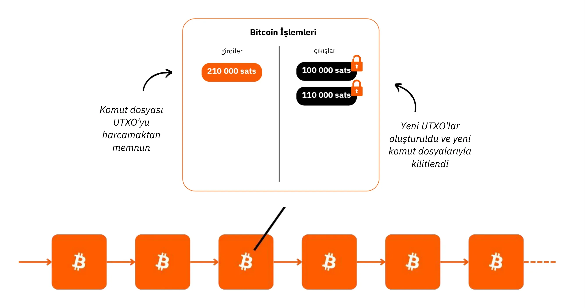

### Kaçınılması gereken başlıca dolandırıcılıklar

İşte yolculuğunuzda karşılaşabileceğiniz en yaygın dolandırıcılıklar:

#### Piramit şemaları ve saadet zincirleri

Bunlar kripto dünyasındaki en yaygın dolandırıcılıklardan bazılarıdır. Bir saadet zincirinde, ilk katılımcılar herhangi bir gerçek yatırım veya üründen değil, yeni katılımcıların parasını kullanarak ödeme alırlar. Ortada yaratılan gerçek bir değer yoktur. Sistem yalnızca yeni insanlar katılmaya devam ettiği sürece çalışır. Yeni katılımcı akışı yavaşladığında, tüm şema dağılır.

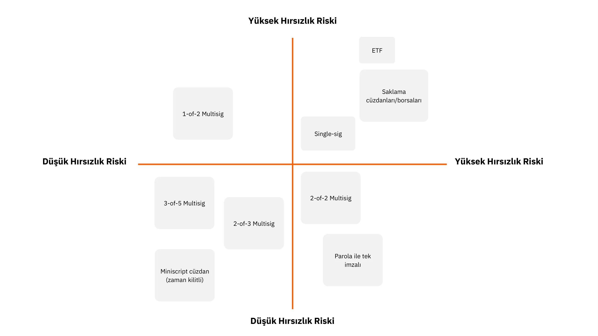

Bu dolandırıcılıklar genellikle

- Gerçekçi olmayan garantili getiri vaatleri (örneğin %20 garantili getiri);
- Yatırdığınız fonları çekmeye çalışırken gecikmeler veya zorluklar;
- Sistemin işlemeye devam etmesi için yeni üye alımına yönelik güçlü teşvikler;
- Vaat edilen getirilerin gerçek kaynağı konusunda tam bir şeffaflık eksikliği.

Nihayetinde, tüm piramit ve saadet zincirleri başarısız olmaya mahkumdur. Temel zayıflıkları, daha önceki katılımcılara getiri ödemek için sürekli yeni yatırımcılar getirme ihtiyacında yatmaktadır. Bu ihtiyacın zaman içinde sürdürülmesi matematiksel olarak imkansız hale gelir çünkü sistem büyüdükçe gereken yeni katılımcı sayısı katlanarak artar. Kritik bir noktaya ulaşıldığında, katılımcılar şüphe duymaya başlar, güven kaybolur ve tüm piramit çöker. Bu aşamada, en son katılan ve genellikle en az bilgi sahibi olan kişiler tüm yatırımlarını kaybeder ve bunu geri almanın hiçbir yolu yoktur; organizatörler veya ilk yatırımcılar ise genellikle fonlarını çoktan çekmiş ve sistemden ayrılmışlardır.

Kripto para dünyasında saadet zincirleri, genellikle hileli doğalarını teknolojik veya finansal bir maskenin arkasına gizlemek için tasarlanmış birçok şekilde olabilir. Bu dolandırıcılıklar, yeni bir kripto para biriminin halka satıldığı fon toplama işlemleri olan yeni token teklifleri veya İlk Coin Teklifleri (ICO'lar) olarak görünebilir. "Blockchain", "akıllı sözleşmeler" veya "stake etme" gibi teknik terimlerin ardında, bazı projeler aslında karmaşık piramit şemalarını gizlemektedir. Diğerleri ise şüpheli kripto varlıkları tamamen yeni yatırımcıların sürekli akışına dayanan tazminat sistemleriyle birleştirerek yüksek getiri sağladıklarını iddia etmektedir.

Daha yakın zamanlarda saadet zincirleri Merkezi Olmayan Finans (DeFi) dünyasına da yayıldı. DeFi'nin amacı aracılar olmadan finansal hizmetler sunmak olsa da, bazı projeler bunu dolandırıcılıklarına sahte bir meşruiyet duygusu katmak için kullanıyor. Bazı DeFi platformları, otomatik protokollere kripto para yatırılması karşılığında Exchange cinsinden yüksek ve garantili getiriler vaat eder. Bu cazip vaatler genellikle opak ve doğrulanamaz mekanizmalarla desteklenir ve özellikle dolandırıcılık için yaratılmış tokenlarla desteklenir. Gerçekte, bu sistemlerin sürdürülebilir bir iş modeli yoktur - getiriler, tıpkı geleneksel bir saadet zinciri gibi, yeni kullanıcıların fonlarından ödenir. Güven aşınmaya başladığında veya yeni katılımcı akışı yavaşladığında, bu sistemler kaçınılmaz olarak çökmekte ve şüphelenmeyen yatırımcılar için önemli kayıplara yol açmaktadır.

Lütfen bu kursun içeriğinin yalnızca eğitim amaçlı olduğunu ve finansal tavsiye olarak yorumlanmaması gerektiğini unutmayın. Finansal güvenliğiniz, aldığınız her finansal kararda temkinli, şüpheci ve bilgili kalabilmenize bağlıdır.

En iyi koruma her zaman şu basit soruyu sormaktır: Vaat edilen getiri gerçekte nereden geliyor? Eğer cevap net değilse, hemen kaçın.

#### Pompa ve Boşaltma

Bu dolandırıcılık türü, genellikle bir grup yatırımcı tarafından yönetilen koordineli bir pazarlama kampanyası yoluyla bir varlığın (genellikle düşük likiditeye sahip bir kripto para birimi olan token) fiyatının yapay olarak şişirilmesini içerir. Tipik Pump & Dump şeması bu modeli takip eder:

- İçeriden veya nüfuzlu kişilerden oluşan bir grup sessizce hedeflenen varlıktan büyük miktarda biriktirir.
- Daha sonra generate'ü abartmak ve fiyatı yükseltmek için agresif bir tanıtım kampanyası başlatırlar.
- FOMO (Kaybetme Korkusu) ile hareket eden genel halk, varlığı çok sayıda satın almaya başlar ve fiyatı daha da yükseltir.
- Heyecanın doruğa ulaştığı anda, içeridekiler ellerindeki hisseleri bir anda satarlar.
- Fiyat düşer ve geç gelenler ağır kayıplar yaşar.

Pump & Dump stratejilerinin birçok ülkede yasa dışı olduğunu ve bir tür piyasa manipülasyonu olarak kabul edildiğini unutmamak önemlidir. Buna rağmen, bu tür planlar, özellikle düzenlemelerin hala yetişmekte olduğu kripto para alanında gelişmeye devam ediyor.

Telegram, Discord veya diğer sosyal medya kanalları gibi platformlardaki özel "sinyal" gruplarına karşı özellikle dikkatli olun. Bunlar genellikle influencer'lar veya kendini uzman ilan edenler tarafından yönetilir ve hatta bazıları giriş ücreti alır. Bu gruplar özel yatırım fırsatları sunduğunu iddia etse de, gerçek çok daha tek taraflıdır: yalnızca organizatörler kâr ederken, çoğu katılımcı parasını kaybeder.

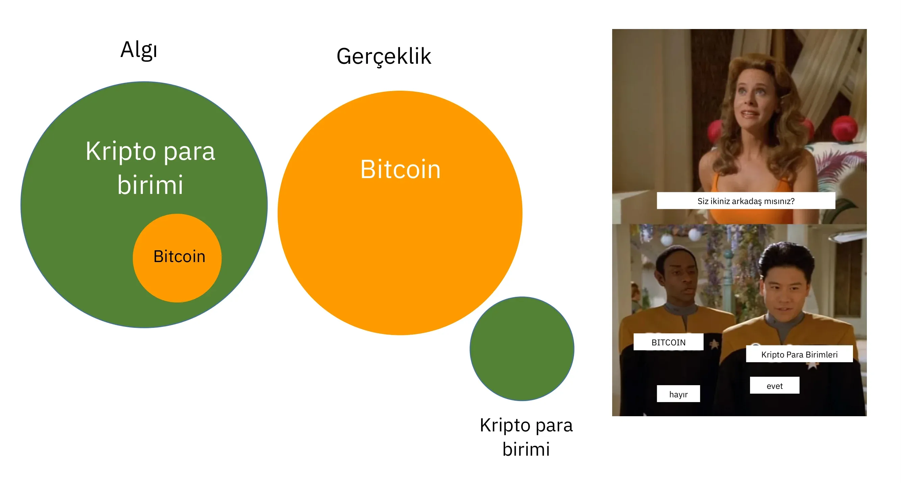

Bazı katılımcıların bu tür piyasa manipülasyonlarından geçici olarak kâr elde edebileceği doğrudur, ancak başarıları genellikle şans ve mükemmel zamanlamadan başka bir şeye dayanmaz. Uzun vadede bu planlar sürdürülebilir değildir. Sürekli yüksek riskli katılım ve kaçınılmaz olarak çöken hileli düzeneklere tekrar tekrar katılım gerektirirler.

Daha da kötüsü, tehlikeli bir yanılsamayı besliyorlar: finansal sistemlerin gerçekte nasıl çalıştığını anlamadan hızlı ve kolay para kazanmanın mümkün olduğu inancı. Bu zihniyet yalnızca bireyleri riske atmakla kalmaz, aynı zamanda tüm kripto para ekosisteminin güvenilirliğine de zarar verir

Tüm bu nedenlerden dolayı, en iyi strateji, finansal eğitime, temellerin sağlam bir şekilde anlaşılmasına ve uzun vadeli bir bakış açısına dayanan ciddi, düşünceli bir yatırım yaklaşımına bağlı kalmaktır.

Sabırla bilgi birikiminizi geliştirerek, duygusal manipülasyonlara ve gerçekçi olmayan vaatlere karşı çok daha az savunmasız olacaksınız; ve gerçek kayıplara yol açabilecek finansal tuzaklardan kaçınmak için çok daha donanımlı olacaksınız.

#### Bağış, Piyango ve Sahte Çekiliş Dolandırıcılığı

Bu tür bir dolandırıcılık, önce küçük bir miktar para göndermeniz karşılığında ücretsiz Bitcoin veya Exchange cinsinden başka ödüller vaat eder. Unutmamak önemlidir: hiçbir meşru kişi veya kuruluş, karşılığında size daha fazlasını gönderme vaadiyle sizden önceden kripto para göndermenizi istemez.

Dolandırıcılar genellikle tanınmış kişileri (Elon Musk veya diğer ünlüler gibi) taklit ederek sosyal medya aracılığıyla kurbanları cezbetmeye çalışırlar. Hesaplarla ve web siteleriyle etkileşime geçmeden önce her zaman meşruiyetlerini iki kez kontrol edin ve aşırı cömert veya gerçek olamayacak kadar iyi görünen tekliflere asla güvenmeyin.

Bazen bu dolandırıcılıklar "avans ücreti" dolandırıcılığı olarak ortaya çıkar. Size bir ödül veya mükafat (para, ürün veya hizmet) vaat edilir, ancak önce sözde nakliye, vergiler veya işlem maliyetleri gibi şeyleri karşılamak için bir ücret ödemeniz istenir. Ödeme yapıldıktan sonra dolandırıcı ortadan kaybolur ve vaat edilen ödül asla gelmez.

#### Bok paralar ve kripto paralar teklif ediliyor

Merkezi kripto para projeleri bazen kullanıcıları çekmek için ücretsiz tokenlar ("*airdrop*") sunar. Bu tokenlar genellikle çok az ya da hiç gerçek değere sahip değildir ve çoğunlukla popülerlik yanılsaması yaratmak ya da spekülasyonu körüklemek için kullanılır. Bu tür promosyon tekliflerine karşı son derece dikkatli olun; bunlar genellikle gerçek fırsatlardan ziyade pazarlama tuzaklarıdır.

#### Kimlik hırsızlığı ve oltalama

Saldırganlar paranızı çalmak için genellikle sahte web siteleri, sosyal medya hesapları veya aldatıcı e-postalar kullanırlar. Bu dolandırıcılıklar herhangi bir iletişim kanalından gelebilir: e-posta, sosyal ağlar, telefon aramaları ve hatta geleneksel posta...

Bir bağlantıya tıklamadan veya herhangi bir işlem yapmadan önce, gönderenin kimliğini her zaman iki kez kontrol edin. Şüpheye düştüğünüzde, sağlanan bir bağlantıyı kullanmak yerine web sitesini manuel olarak ziyaret edin. En önemlisi, özel anahtarlarınızı veya şifrelerinizi asla kimseyle paylaşmayın.

#### Bitcoin Hardforks

Yıllar içinde Bitcoin, orijinal kripto para biriminin alternatif versiyonlarının yaratılmasıyla sonuçlanan birkaç *Hard çatalı* yaşadı. Basit bir ifadeyle, *Hard Fork* ağda, her ikisi de bölünme anına kadar aynı geçmişi paylaşan iki ayrı blok zincirine yol açan bir bölünmedir. Bu çatallanmalar genellikle geliştirici topluluğunun bir kısmı veya daha geniş Bitcoin ekosistemi orijinal protokolde büyük değişiklikler yapmak istediğinde ancak yaygın bir fikir birliğine ulaşamadığında meydana gelir. Fikirlerinden vazgeçmek yerine, kullanıcıların ve madencilerin bunun yerine Fork'u takip etmeyi seçeceklerini umarak Bitcoin'in yeni bir sürümünü (değiştirilmiş kurallarla) piyasaya sürmeye karar verirler.

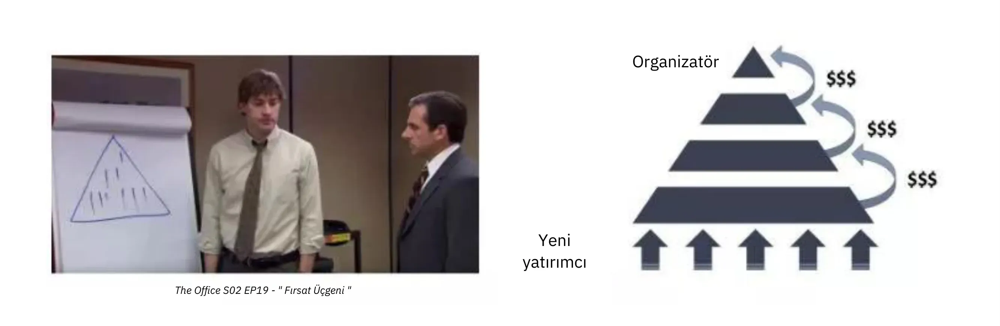

Bazıları topluluk içindeki teknik veya ideolojik anlaşmazlıklardan kaynaklandığı için tüm *Hard çatalları* hileli değildir. Bununla birlikte, diğerleri ticari çıkarlar ve hatta dürüst olmayan güdüler tarafından yönlendirilmektedir. Bu hardfork'ların en iyi bilinen örnekleri **Bitcoin Cash (BCH)** ve **Bitcoin Satoshi Vision (BSV)**'dir. Sırasıyla 2017 ve 2018'de piyasaya sürülen bu alternatif para birimleri genellikle orijinal Bitcoin'nin "daha iyi versiyonları" olduklarını iddia etmektedir. Daha düşük işlem ücretleri veya artan blok boyutları nedeniyle daha hızlı işlemler gibi sözde avantajlar sunuyorlar. Ancak bu teknik değişiklikler güvenlik, merkeziyetsizlik ve sağlamlık açısından Elements'in temel ilkeleriyle çelişebilecek önemli ödünleşmeleri beraberinde getirmektedir.

Teknik farklılıkların ötesinde, bu alternatif para birimleri genellikle bilgisiz yatırımcıları çekmek için kafa karışıklığından faydalanır. Gerçek Bitcoin (BTC) satın aldıklarını düşünen yeni gelenleri kasıtlı olarak yanıltmak için tasarlanmış pazarlama taktikleri kullanabilirler.

Bu tuzağa düşmemek için her zaman satın aldığınız para birimini doğrulayın. Orijinal Bitcoin **BTC** kısaltmasını kullanırken, Bitcoin Cash ve türevleri BCH veya BSV gibi farklı kısaltmalar kullanır.

#### Dürüst olmayan influencer'lar ve sahte gurular

Kripto paralar yaygın ilgi gördükçe, sosyal medyada influencer'lar, kendi kendini ilan eden uzmanlar ve sözde "*kripto guruları*" çoğaldı. Bunlardan birkaçı gerçek eğitici bilgiler sunabilirken, diğerleri şüpheli projeleri veya tehlikeli derecede riskli (ve bazen düpedüz hileli) alım satım stratejilerini tanıtmak için görünürlüklerinden faydalanmaktadır. Bu kişiler genellikle kişisel mali çıkarları doğrultusunda hareket eder ve belirli tokenları ya da platformları tanıtmak için doğrudan ya da dolaylı olarak tazminat alırlar.

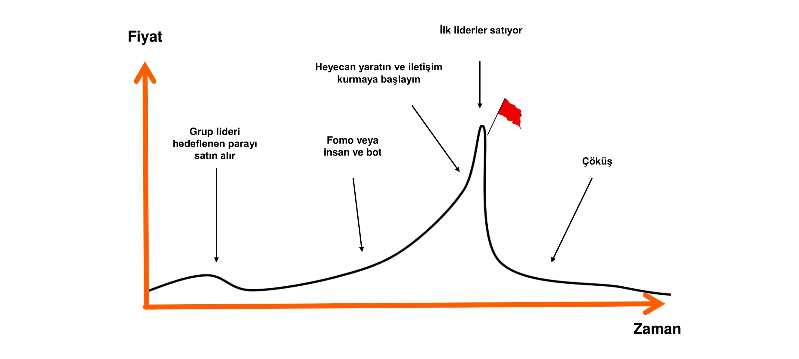

Bu influencer'lar yeni başlayanları cezbetmek için genellikle kanıtlanmış taktiklere başvuruyor: etkileyici finansal sonuçlar (genellikle sahte veya doğrulanamaz) sergiliyorlar, başarılarının sözde kanıtı olarak lüks bir yaşam tarzı sergiliyorlar ve "mucize" yatırım stratejilerini tanıtıyorlar. Amaç, FOMO'yu (kaçırma korkusu) tetiklemek ve izleyicilerini düşüncesizce kararlar almaya ve pervasız yatırımlar yapmaya itmektir.

Bu kişilerden gelen "ücretsiz" tavsiyelerin çoğunun asla gerçekten ücretsiz olmadığını anlamak önemlidir. Cömertlik görüntüsünün ardında genellikle insanları şüpheli varlıkları satın almaya yönlendirmek için hesaplanmış bir strateji yatar. Ve bazı influencer'lar dürüst olsalar bile, sonuçlarını tekrarlamak neredeyse imkansızdır; başarıları genellikle belirli bir zamanlamaya, içeriden bilgiye veya sizin erişemeyeceğiniz benzersiz koşullara bağlıdır.

Bazı influencer'lar sizi, hızlı ve kolay kâr vaat eden özel alım satım sinyalleri veya içeriden ipuçları paylaştıklarını iddia ettikleri özel, ücretli gruplara katılmaya davet edebilir. Gerçekte, bu gruplar esas olarak organizatörlerin kendilerine fayda sağlar. Takipçilerini genellikle bir likidite kaynağı olarak kullanır, esasen kişisel kazanç için varlıkları elden çıkarırlar. Aboneler, alım satımları düzenleyen içeriden kişiler kadar hızlı tepki veremedikleri için genellikle para kaybederler (Pump & Dump planları bölümüne bakın).

Bu gerçek ışığında, dürüst olmayan influencer'ların kurduğu tuzaklara düşmekten kaçınmak için benimsenmesi gereken bazı iyi alışkanlıkları burada bulabilirsiniz:

- Herhangi bir kripto yatırım önerisi konusunda çok dikkatli olun.**

Güvenilir ve bilgili bir kişi, sizi önce kendi araştırmanızı yapmaya teşvik etmeden asla bir kripto para birimi satın almanız için baskı yapmayacaktır.

- Ücretli ticaret veya yatırım kursları her zaman kalite göstergesi değildir.**

Bu kursların çoğu riskli veya aşırı basit stratejileri teşvik eder; genellikle aynı bilgileri internette ücretsiz olarak bulabilirsiniz.

- Birinin işlemlerini kopyalamanın ve aynı sonuçları elde etmenin garantili bir yolu diye bir şey yoktur

Her yatırım stratejisi kişisel bağlama, zamanlamaya, bilgiye ve birebir kopyalanamayan diğer faktörlere bağlıdır.

- Özellikle kulağa gerçek olamayacak kadar iyi gelen tavsiyelere karşı dikkatli olun.**

Gerçekçi olmayan vaatler veya garantili kârlar neredeyse her zaman manipülasyon belirtileridir. Unutmayın: Birinin kendinden emin bir şekilde bir şey söylemesi onu doğru yapmaz.

Bitcoin veya daha geniş kripto ekosisteminde karşılaştığınız herkesin kişisel bir gündemi olduğunu her zaman unutmayın; ister açıkça ifade edilsin ister satır aralarında gizlensin. Tamamen tarafsız bilgi diye bir şey yoktur. BTC102 adlı bu kursun bile açık bir amacı vardır: *Bitcoin'nin daha iyi anlaşılmasını sağlamak.*

Bu nedenle, tükettiğiniz her içeriğin ardındaki gerçek motivasyonların farkında olmak çok önemlidir. Ve internetin bu altın kuralını asla unutmayın:

*Bir ürün veya hizmet ücretsiz görünüyorsa, büyük olasılıkla ürün sizsinizdir.*

Nihayetinde, en iyi savunmanız kişisel eğitim, sağlıklı şüphecilik ve en önemlisi, gerçekleri kendiniz doğrulama alışkanlığıdır.

### Dolandırıcılıktan nasıl kaçınılır

**Çevrimiçi ortamda, özellikle de kripto dünyasında güvende kalmak için şu temel ilkeleri aklınızda bulundurun:**

- Asla körü körüne güvenmeyin: "*Güvenmeyin, doğrulayın*";
- Garantili veya olağandışı yüksek getirilere şüpheyle yaklaşın;
- Özel anahtarlarınızı asla kimseyle paylaşmayın;
- Bitcoin'i (veya herhangi bir kriptoyu) bilinmeyen adreslere göndermeyin;
- Şüpheye düştüğünüzde durun. Harekete geçmeden önce geri adım atın ve düşünün. FOMO en büyük düşmanınızdır;
- Gerçekçi olmayan vaatlerde bulunan ücretli ticaret gruplarından veya topluluklarından kaçının;
- İnternetteki eşantiyonların veya "ücretsiz" piyangoların çoğu dolandırıcılıktır veya büyük ölçüde hilelidir;
- Uzun vadede öğrenerek kumar oynamaktan her zaman daha fazla kazanç elde edersiniz.

Kendinizi dolandırıcılıktan korumak, varlıklarınızı korumak için çok önemli bir ilk adımdır; ancak yeterli değildir. Güçlü bir dijital hijyen sağlamak da bir o kadar önemlidir. Bu nedenle, bir sonraki bölümde çevrimiçi güvenliğinizi nasıl güçlendireceğinizi ve dijital dünyada kendinizi korumak için benimsemeniz gereken en iyi uygulamaları inceleyeceğiz.

## Çevrimiçi güvenlik

<chapterId>f0873bf2-6a6f-5485-bb7a-d84be14f404d</chapterId>

:::video id=2a1b3c4d-5e6f-7a8b-9c0d-1e2f3a4b5c6d:::

Bitcoin'a girmeye başlar başlamaz, temel siber güvenliğin isteğe bağlı olmadığını, çok önemli olduğunu hemen fark edeceksiniz. Dolandırıcılık ve sahtekarlık buzdağının sadece görünen kısmıdır. Kazara veri kaybı, kötü amaçlı yazılımlar ve ele geçirilen şifreler, özellikle de kendi anahtarlarınızı yönetiyorsanız, aynı derecede yıkıcı olabilir.

Bu bölüm, dijital hijyeninizi yükseltmek ve kendinizi bu alanda korumak için bazı basit ve pratik adımlar konusunda size yol gösteriyor.

Daha derine inmek istiyorsanız, Plan ₿ Academy'nin SEC101 kursu, özellikle Bitcoin kullanıcıları için tasarlanmış siber güvenlik stratejilerinin kapsamlı bir dökümünü sunar.

https://planb.academy/courses/99c46148-7080-4915-a7e0-9df0e145cd47

### Siber Güvenlik Neden Önemlidir?

Bitcoin size paranızı doğrudan (bankalar olmadan), aracılar olmadan tutma gücü verir. Ancak bu tür bir finansal egemenlik ciddi bir sorumluluğu da beraberinde getirir: BTC'niz bir güvenlik açığı nedeniyle çalınırsa, işlemi tersine çevirmenin bir yolu yoktur. Geleneksel bankacılığın aksine, yardım masası, dolandırıcılık iddiası ve sizi kurtaracak bir sigorta yoktur.

Bunun da ötesinde, Bitcoin'ün finansal değeri onu yüksek değerli bir hedef haline getirir. Wallet'inizi ele geçiren bir bilgisayar korsanı, paranızı anında kontrol ettikleri bir Address'e aktarabilir (soru sorulmadan, geri almanın yolu yok).

### Temiz, güncel bir bilgisayar

Kişisel güvenliğin en çok göz ardı edilen yönlerinden biri işletim sisteminizi ve yazılımınızı güncel tutmaktır. Birçok güncelleme, aksi takdirde saldırganlar tarafından istismar edilebilecek bilinen güvenlik açıklarını yamalar. Bazı insanlar performans sorunlarından korkarak güncellemelerden kaçınsa da, asıl risk bilgisayar korsanlarının nasıl kırılacağını zaten bildiği eski yazılımları çalıştırmaktır.

Ayrıca güvenilir bir antivirüs kullanmanız şiddetle tavsiye edilir. Windows'ta, yerleşik Windows Defender çoğu kullanıcı için genellikle yeterlidir. Ek özellikler veya gönül rahatlığı tercih ediyorsanız, Kaspersky gibi ticari seçenekler de mevcuttur. MacOS'te, kötü amaçlı yazılım tehditleri tarihsel olarak daha az yaygındır **ancak mevcut değildir**, bu nedenle yine de dikkatli olmak akıllıca olacaktır.

Sistem güncellemeleri ve antivirüs korumasının ötesinde, şüpheli web sitelerinden veya sözde "evrensel" indirme portallarından yazılım indirmeye karşı son derece dikkatli olun. Bir araca veya uygulamaya ihtiyacınız olduğunda, her zaman doğrudan resmi kaynağa gidin; bu, yasal yazılım olarak gizlenmiş kötü amaçlı yazılım yükleme riskini büyük ölçüde azaltır.

Bir başka akıllıca alışkanlık da herhangi bir yazılımı makinenize yüklemeden önce gerçekliğini ve bütünlüğünü doğrulamaktır. Bunu nasıl yapacağınızdan emin değilseniz, endişelenmeyin, süreç boyunca size yol gösterecek özel bir eğitimimiz var:

https://planb.academy/tutorials/computer-security/data/integrity-authenticity-21d0420a-be02-4663-94a3-8d487f23becc

Son olarak, önemli verilerinizin düzenli yedeklerini alın. Harici bir Hard sürücü veya SSD, ani arıza, bilgisayar korsanlığı veya kazara silme durumlarına karşı dosyalarınızın bir kopyasını saklamak için sağlam bir seçenektir. Daha sonra kendinize teşekkür edeceksiniz.

Bulut çözümlerini tercih ediyorsanız, Proton Drive gibi güvenli bir hizmet kullanmayı düşünün. Seçtiğiniz seçeneğin gizliliğinize saygı duyduğundan ve güçlü şifreleme sunduğundan emin olun.

https://planb.academy/tutorials/computer-security/data/proton-drive-03cbe49f-6ddc-491f-8786-bc20d98ebb16

Yaygın olarak önerilen bir yedekleme stratejisi "3-2-1 kuralı "dır. Verilerinizi kazara kayıplara, siber saldırılara ve hatta doğal afetlere karşı korumak için tasarlanmıştır.

Fikir basit:

- Önemli verilerinizin **en az 3 kopyasını** saklayın,
- Bunları **en az 2 farklı medya türünde** saklayın (örneğin, harici bir Hard sürücüsü ve bulut depolama),
- Ve bu kopyalardan **1 tanesinin tesis dışında** (ana konumunuzdan fiziksel olarak ayrı) saklandığından emin olun.

Bu yaklaşım güçlü bir esneklik sunar ve bir şeyler ciddi şekilde ters gitse bile verilerinizin hayatta kalmasını sağlamaya yardımcı olur.

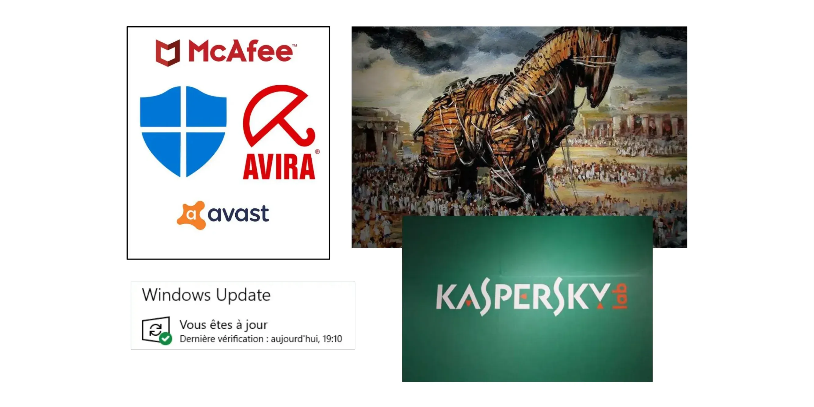

### Kimlik kabusuna çözüm

İnsanların saldırıya uğramasının en büyük nedenlerinden biri zayıf parolalar kullanmaktır. Kullanıcıların önemli bir kısmı hala aynı parolayı birden fazla hesapta tekrar kullanıyor ya da tahmin edilmesi kolay varyasyonlar seçiyor. Parola yöneticileri bu sorun için mükemmel bir çözümdür.

Bir parola yöneticisi size izin verir:

- Tüm parolalarınızı güvenli bir şekilde** şifreli bir kasada saklayın
- generate her hesap için otomatik olarak uzun, karmaşık ve benzersiz parolalar**
- Her şeye güvenli bir şekilde erişmek için sadece bir ana şifre** kullanın

Bir parola yöneticisi ile bir daha asla "Parolamı unuttum" seçeneğine tıklamak veya zayıf, yeniden kullanılan kimlik bilgilerine güvenmek zorunda kalmazsınız. Ayrıca, çoğu parola yöneticisi cihazlarınız (masaüstü, telefon, tablet) arasında sorunsuz bir şekilde senkronize olur ve hatta giriş formlarını otomatik doldurarak güvenli erişimi hem zahmetsiz hem de verimli hale getirir.

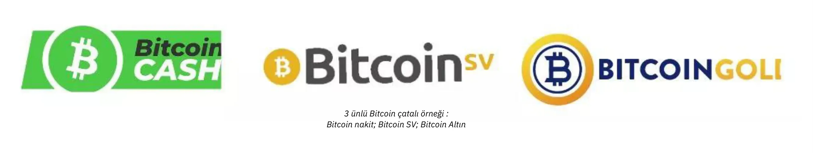

Piyasada birçok şifre yöneticisi var, ancak ihtiyaçlarınıza bağlı olarak iki sağlam seçenek önerebilirim. Birden fazla cihazda sorunsuz bir şekilde senkronize olan, kullanımı kolay bir şey arıyorsanız Bitwarden mükemmel bir seçimdir:

https://planb.academy/tutorials/computer-security/authentication/bitwarden-0532f569-fb00-4fad-acba-2fcb1bf05de9

Her şeyi yerel olarak kendi cihazınızda tutmayı tercih ediyorsanız, KeePass harika bir seçenektir:

https://planb.academy/tutorials/computer-security/authentication/keepass-f8073bb7-5b4a-4664-9246-228e307be246

### 2FA: çift koruma

Bitcoin'da kendi bankanızsınız. Bu, aynı zamanda kendi güvenlik ekibiniz olduğunuz anlamına gelir. Güçlü bir parolaya sahip olsanız bile sıfır risk diye bir şey yoktur; bu nedenle iki faktörlü kimlik doğrulamayı (2FA) etkinleştirmek çok önemlidir.

2FA, Google Authenticator veya Authy gibi bir uygulama tarafından oluşturulan zamana dayalı tek seferlik bir kod (genellikle 6 basamaklı) gerektirerek ikinci bir Layer koruması ekler. Yani birisi şifrenizi ele geçirmeyi başarsa bile, telefonunuza fiziksel erişim olmadan hesabınıza erişemez.

https://planb.academy/tutorials/computer-security/authentication/authy-a76ab26b-71b0-473c-aa7c-c49153705eb7

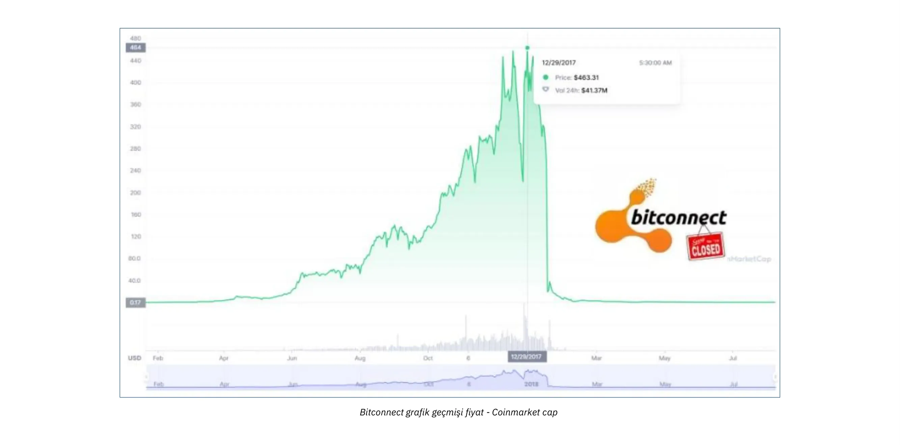

2FA'yı etkinleştirdiğinizde, uygulamanızın kurtarma anahtarını güvenli bir yere kaydettiğinizden emin olun. Bu, telefonunuzu kaybetmeniz veya değiştirmeniz durumunda kodlarınızı geri yüklemenizi sağlayacaktır. SMS veya e-posta tabanlı 2FA hiç yoktan iyi olsa da, çok daha az güvenlidir. Birinin telefon numaranızın kontrolünü ele geçirdiği bir SIM takas saldırısı, bu tür bir korumayı kolayca atlatabilir.

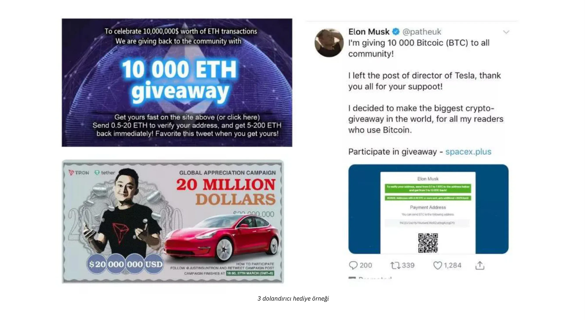

Güvenliği bir adım öteye taşımak isteyenler için YubiKey gibi fiziksel anahtarlar daha da yüksek düzeyde koruma sağlar.

https://planb.academy/tutorials/computer-security/authentication/security-key-61438267-74db-4f1a-87e4-97c8e673533e

### Gizliliğinizi korumak

Gizlilik ve siber güvenlik birbiriyle yakından bağlantılıdır: ne kadar çok bilgiyi serbestçe erişilebilir bırakırsanız, hedef olma olasılığınız o kadar artar.

Bir **VPN** (*Sanal Özel Ağ*), IP Address'inizi maskelemek ve internet trafiğinizi şifrelemek için basit ama etkili bir adımdır. Sizi tamamen görünmez yapmasa da (VPN sağlayıcısı etkinliğinizi hala görebildiği için), sizi gözetlemeye veya tarama alışkanlıklarınızı izlemeye çalışan herhangi biri için önemli ölçüde zorlaştırır.

Anahtar, güvenilir bir VPN sağlayıcısı seçmektir:

- Kişisel bilgilerinizi gerektirmez
- BTC ile ödemeye izin verir
- Sıkı bir kayıt tutmama politikası vardır

Plan ₿ Academy'de VPN'i kolayca kurmanız için size rehberlik edebilecek çeşitli eğitimlerimiz mevcut. Özellikle IVPN veya Mullvad'ı tavsiye ederim:

https://planb.academy/tutorials/computer-security/communication/ivpn-5a0cd5df-29f1-4382-a817-975a96646e68

https://planb.academy/tutorials/computer-security/communication/mullvad-968ec5f5-b3f0-4d23-a9e0-c07a3e85aaa8

Çevrimiçi gizliliğinizi korumak için gerekli adımlar arasında şunlar da yer almaktadır:

- Signal, SimpleX veya Session gibi **şifreli mesajlaşma platformlarını** kullanma;
- Firefox, Brave veya Tor (gelişmiş anonimlik için) gibi gizlilik odaklı tarayıcılar kullanmak;

https://planb.academy/tutorials/computer-security/communication/tor-browser-a847e83c-31ef-4439-9eac-742b255129bb

- ProtonMail gibi bir **güvenli posta kutusu** kullanmak;

https://planb.academy/tutorials/computer-security/communication/proton-mail-c3b010ce-254d-4546-b382-19ab9261c6a2

- Dosyalarınızı Bitlocker (Windows için) veya VeraCrypt (çoklu platformda kullanılabilir) gibi araçlarla şifrelemek**.

https://planb.academy/tutorials/computer-security/data/veracrypt-d5ed4c83-7c1c-4181-95ea-963fdf2d83c5

### Adım adım ilerleme

Siber güvenlik büyük bir girişim gibi görünebilir ve yeni başlayanlar için çok karmaşık göründüğü için bunalmak ve vazgeçmek kolaydır. İşin püf noktası bu konuya adım adım yaklaşmaktır. Bir parola yöneticisi kurmak gibi basit bir şeyle başlayın. Bu konuda rahatlamak için kendinize birkaç hafta verin, ardından bir sonraki adıma geçin: hesaplarınızdan birinde 2FA'yı etkinleştirmek gibi.

Bu araçlarla kendinize daha fazla güvendikçe, ikincil bir e-posta kullanmak, ProtonMail'e geçmek, bir VPN kurmak veya gerektiğinde Tor ile gezinmek gibi daha gelişmiş uygulamaları eklemeye hazır olacaksınız.

Bitcoin dünyasının derinliklerine daldıkça, Wallet'ünüzün değeri arttıkça risklerin de arttığını fark edeceksiniz. Sağlam güvenlik alışkanlıkları oluşturmak, gizliliğinizi korumak ve doğru araçları kurmak size sadece huzur vermekle kalmayacak, aynı zamanda Bitcoin'ün egemenliğini de güçlendirecektir.

Kısacası: siber güvenliği hafife almayın, temelleri kurmak için zaman ayırın ve tutarlılığın anahtar olduğunu unutmayın. İyi bir dijital hijyen olmadan, en iyi araçlar bile sizin için fazla bir şey yapmayacaktır.

Ayrıca Plan ₿ Academy'teki [bilgisayar güvenliği eğitimlerimize](https://planb.academy/tutorials/computer-security) göz attığınızdan emin olun.

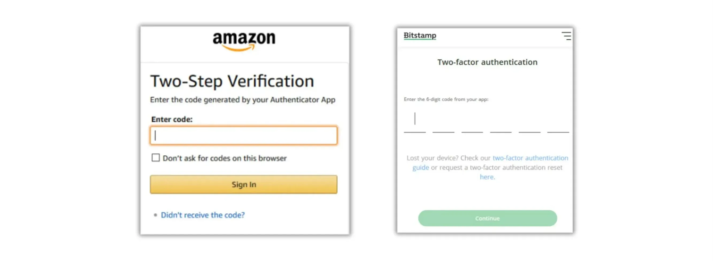

Bir sonraki bölümde, Bitcoin yolculuğunuza güvenle başlamanıza yardımcı olacak birkaç ipucu daha paylaşacağım; ve yeni gelenleri hazırlıksız yakalayabilecek birçok tuzaktan uzak durmak için.

## Yeni gelenler için ipuçları

<chapterId>33134b3f-92c1-5185-afb6-88599e47e801</chapterId>

:::video id=7e9f3b2c-4d1a-4c5e-8b0d-3a2c1d4e5f6b:::

Bitcoin'ye girmek heyecan verici olabilir; ancak aynı zamanda adil risk payıyla birlikte gelir. Kripto dünyası diğerlerinden farklıdır; vahşi fiyat dalgalanmaları, alışılmadık teknoloji ve basit hatalar veya kötü yatırım seçimleri nedeniyle fonlarınızı sonsuza kadar kaybetme olasılığı, yeni kullanıcıların farkında olması gereken tuzaklardır.

Bu bölümde, ilk adımlarını atan herkes için, özellikle de ilk satın alımlarını yapan veya daha geniş finansal yatırım dünyasını keşfedenler için bazı pratik tavsiyeler ve genel rehberlik paylaşacağım.

İşte birlikte üzerinden geçeceğimiz kilit noktalar:

- Shitcoins** ve diğer işe yaramaz kripto para birimlerine dikkat edin;
- Yalnızca kaybetmeyi göze alabileceğiniz **parayla** yatırım yapın;
- Ticaret** ile **yatırım** arasındaki farkı bilin;
- Yatırımlarınızın **vergi etkilerinin** farkında olun;
- Kurtarma cümlenizi** dikkatle koruyun;
- Alçakgönüllü olun ve **düşük profil** sergileyin (sağduyu güvenliğin bir parçasıdır);
- Uzun vadeli düşünün**, uzaklaşın ve sabırlı olun (bunu bir maraton olarak düşünün, koşu değil).

### Kaçınılması gereken yaygın hatalar

Bitcoin herkese açıktır, ancak bu hazırlıksız dalmanız gerektiği anlamına gelmez. İşte yeni gelenler tarafından yapılan klasik hatalardan bazıları:

**Teknolojik hatalar:**

- seed cümlenizi kaybetmek:** Kurtarma cümleniz (genellikle 12 veya 24 kelime), Wallet'inize bir şey olması durumunda Bitcoin'unuza erişmenin tek yoludur. Eğer kaybederseniz, fonlarınız kalıcı olarak yok olur;
- Bitcoinlerinizi üçüncü taraf bir platformda saklamak:** Coin'leriniz merkezi bir platformdaysa, onlara gerçekten sahip değilsiniz demektir. Hacklenme, platform arızaları ve hatta fonlara el konulması gibi risklere maruz kalırsınız;
- Gizliliği ihmal etmek:** Gizliliğinizi korumak, varlıklarınızı güvence altına almanın temel bir parçasıdır. Elinizde ne kadar Bitcoin olduğunu kamuya açıklamak sizi hedef haline getirebilir;
- Yetersiz çevrimiçi güvenlik:** Cihazlarınızı temel korumalarla (güncellemeler, güçlü parolalar veya 2FA gibi) güvence altına almamak sizi saldırganlar için kolay bir hedef haline getirir ve her şeyinize mal olabilir.

**Finansal hatalar:**

- Kaybetmeyi göze alabileceğinizden daha fazla yatırım yapın**: Asla borca girmeyin veya kira paranızı Bitcoin'e yatırmayın. Temel finansal istikrarınız her zaman önce gelmelidir.

- Ticaret ve yatırım arasındaki farkı bilmemek**: Alım satım yapmak zaman, beceri ve ciddi bir duygusal disiplin gerektirir. Uzun vadeli yatırım çok daha acemi dostudur.

- Vergileri unutmak**: Her ülkenin kripto için kendi vergi kuralları vardır. Bunları göz ardı etmek, ileride acı verici sürprizlere yol açabilir.

- FOMO'ya** kapılmak: Kaybetme korkusuyla düşünmeden satın almak genellikle kötü zamanlamaya ve kötü kararlara yol açar. Sabır en iyi müttefikinizdir.

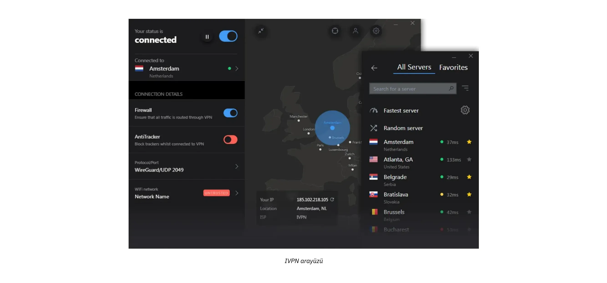

### Bir yatırım stratejisinin tanımlanması

İlk Satoshi'inizi satın almadan önce, Bitcoin'e neden ve nasıl yatırım yaptığınızı anlamanız çok önemlidir. Bu, kişisel durumunuza ve uzun vadeli hedeflerinize göre uyarlanmış net bir finansal plana sahip olmak anlamına gelir.

İşe **bütçenizi** hassas bir şekilde tanımlayarak başlayın. Sadece rastgele bir sayı seçmeyin. Aylık gelirinizi hesaplamak için zaman ayırın, sabit giderlerinizi (kira, krediler, vergiler, kamu hizmetleri gibi) ve günlük yaşam maliyetlerinizi (gıda, ulaşım, eğlence vb.) çıkarın. Geriye kalan miktar sizin tasarruf marjınızdır ve sadece bu kısımdan yatırım yapmayı düşünmelisiniz.

Bu şekilde yaklaşmak, özellikle bir piyasa gerilemesi durumunda finansal refahınızı riske atmamanızı sağlar. Düşünceli bir strateji, uzun vadeli dayanıklılığın temelidir.

Bütçenizi belirledikten sonra nasıl yatırım yapmak istediğinizi düşünün. En acemi dostu ve yaygın olarak önerilen yöntemlerden biri Dolar Maliyet Ortalamasıdır (DCA), düzenli aralıklarla (haftalık, aylık vb.) sabit miktarda Bitcoin satın almaktır. Bu strateji, zaman içinde ortalama giriş fiyatınızı düzeltmenize yardımcı olur ve fiyat dalgalanmalarının duygusal etkisini azaltır. Çoğu insan, özellikle de yeni başlayanlar için akıllıca bir yaklaşımdır.

O zaman kendinize sorun: Benim zaman ufkum nedir?

Piyasaya hızlı bir şekilde girip çıkmak mı istiyorsunuz (alım satım)? Yoksa Bitcoin'yi birkaç yıl boyunca elde tutma (hodler) gibi uzun vadeli bir zihniyete mi daha yakınsınız? Eğer bir hodler iseniz, muhtemelen günlük fiyat dalgalanmalarıyla daha az ilgileniyor ve daha çok uzun vadeli güvenliğe ve kendi kendinizi korumaya odaklanıyorsunuzdur. Alım satım yapıyorsanız, kısa vadeli piyasa gürültüsüne, daha yüksek riske ve genellikle hızlı karar vermenin getirdiği strese daha fazla maruz kalacaksınız. Herkese uyan tek bir cevap yoktur, ancak kendi yaklaşımınızı bilmek kararlarınızı yönlendirmenize yardımcı olacaktır.

En önemlisi, yatırım kararlarınızı duygulara veya korkuya dayalı olarak vermeyin. Önceden bir strateji belirleyin, bunu yazın ve buna bağlı kalın.

Hala emin değilseniz, **öğrenerek başlayın.**

Bitcoin'u keşfetmek için birkaç saat harcayın, Plan ₿ Academy'deki ücretsiz kaynaklara göz atın, birkaç kitap okuyun, sadece denemek için beş avro atın ve çevrimiçi olarak bazı kaliteli içerikler izleyin. Meraklı kalın. Ne kadar rahat olursanız, stratejinizi yeniden gözden geçirmek, yaklaşımınızı değiştirmek ve güvenle ilerlemek o kadar kolay olacaktır.

### BTC'nin oynaklığını anlamak

Bitcoin dramatik fiyat dalgalanmalarıyla bilinir. Sadece birkaç gün içinde %10, %20 ve hatta %50'lik hareketler olağandışı değildir. Yeni başlayanlar için bu tür bir dalgalanma kafa karıştırıcı olabilir. Boğa koşuları sırasında heyecana kapılmak veya düşüşler sırasında paniğe kapılmak kolaydır; her ikisi de genellikle zararına satış yapmak gibi kötü kararlara yol açar.

Bu nedenle yatırım yapmadan önce Bitcoin'in oynaklığını **anlamak ve kabul etmek** çok önemlidir. Bu fiyat dalgalanmaları bir hata değil, henüz olgunlaşmakta olan bir varlığın özelliğidir. Ani iniş çıkışlar sizi geceleri uykusuz bırakıyor ya da duygusal kararlar almaya itiyorsa, riske atabileceğinizden daha fazlasını yatırmış olma ihtimaliniz yüksektir. Bu durumda, bir adım geri atın ve stratejinizi ve risk toleransınızı yeniden değerlendirin. Kendinizi daha rahat hissedene kadar pozisyonunuzu küçültmekten çekinmeyin.

Hepsinden önemlisi, asla kaybetmeyi göze alabileceğinizden daha fazla yatırım yapmayın. Bitcoin satın almak için borç para almaktan kaçının (özellikle de hala temelleri öğreniyorsanız). Sağlam bir temel, pervasız bahislerle değil ölçülü adımlarla başlar.

### Bitcoin'ünüzü yönetme ve güvenliğini sağlama Wallet

Bitcoin'in en güçlü (ve genellikle hafife alınan) özelliklerinden biri **kendi kendine saklama** özelliğidir. Kendi kendine barındırılan bir Wallet ile, fonlarınızdan yalnızca siz sorumlusunuz. Bu cüzdanlar tipik olarak BTC'nize tam erişim sağlayan 12 veya 24 kelimeden oluşan bir dizi **kurtarma cümlesi** (seed cümlesi olarak da bilinir) ile oluşturulur. Bu cümleyi kaybederseniz (veya başka birinin eline geçerse) bitcoinleriniz sonsuza kadar gider. **Müşteri desteği yok. Sıfırlama düğmesi yok.**

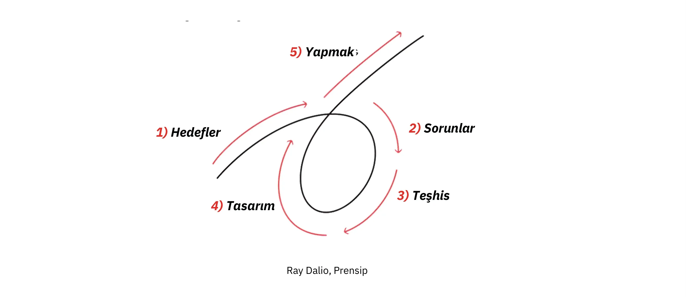

Bu yüzden Bitcoin'de altın kural şudur:

"***Not your keys, not your coins***". Özel anahtarlarınızı kişisel olarak kontrol etmiyorsanız, Bitcoin'unuza gerçekten sahip değilsiniz demektir. Borsalar kullanışlı olsa da (özellikle başlangıç aşamasında) anahtarlarınızı sizin için tutarlar. Bu da platformun saldırıya uğraması, hesabınızın dondurulması ya da iflas etmesi durumunda fonlarınızın risk altında olduğu anlamına gelir.

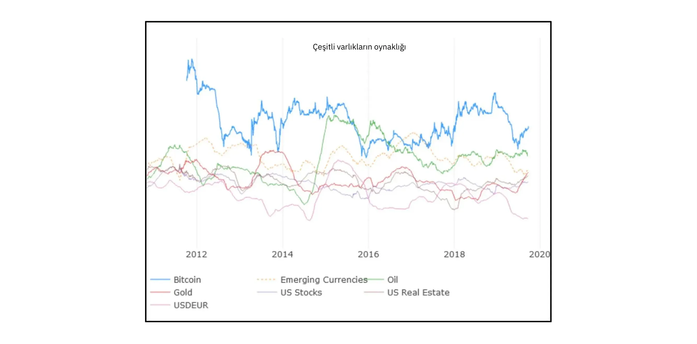

Bu riskten kaçınmak için, kurtarma ifadesine yalnızca sizin erişebileceğiniz **kendi Wallet**'ınızı kurmanız şiddetle tavsiye edilir. Bu ifade her zaman elle yazılmalı ve **çevrimdışı** olarak güvenli bir yerde saklanmalıdır. Hatta bazı kullanıcılar daha fazla güvenlik için ayrı coğrafi konumlarda saklanan **çoklu yedekler** tutarlar.

**Kurtarma ifadenizi asla internete bağlı bir cihazda veya bulutta saklamayın**.

**Tek bir bilgisayar korsanlığı veya veri ihlali geri dönüşü olmayan kayıplara yol açabilir.**

Ownership'inizin Bitcoin'sini almaya hazırsanız ve kurtarma ifadenizin güvenliğini sağlamaya yönelik en iyi uygulamaları daha derinlemesine incelemek istiyorsanız, bu makaleye göz atmanızı şiddetle tavsiye ederim:

https://planb.academy/tutorials/wallet/backup/backup-mnemonic-22c0ddfa-fb9f-4e3a-96f9-46e2a7954270

### Gizlilik ve sağduyu

Günümüzün dijital dünyasında **sağduyu genellikle göz ardı edilir**; ancak özellikle Bitcoin söz konusu olduğunda güvende kalmanın çok önemli bir parçasıdır. Sahip olduklarınız hakkında ne kadar açık konuşursanız, dolandırıcıların, siber suçluların ve hatta gasp veya şantaj gibi daha geleneksel tehditlerin hedefi olma olasılığınız o kadar artar.

Dünya genelinde büyük miktarlarda BTC'ye sahip olduğu bilinen kişilerin kaçırıldığı ya da saldırıya uğradığı çok sayıda vaka yaşanmıştır.

**Bitcoin Stash**'iniz hakkında övünmekten kaçının; ister sosyal medyada ister sıradan sohbetlerde olsun. Hassas finansal bilgileri ifşa etmenin hiçbir avantajı yoktur ve riskler gerçektir.

Çevrimiçi faaliyetlerinizi **bölümlere ayırmak** da akıllıca olacaktır. Örneğin:

- Address ile ilgili her şey için kişisel veya iş hesaplarınızdan ayrı bir Bitcoin e-postası kullanın.
- Kimlik avı girişimlerine, şüpheli bağlantılara ve güvenilir platformları taklit eden sahte web sitelerine karşı dikkatli olun.
- Tetikte olun! İhtiyat ve dikkat çoğu zaman en iyi savunmanızdır.

Bitcoin gizlilik konusunu daha derinlemesine incelemeye hazırsanız, kimliğinizi ve faaliyetlerinizi güvende tutmak için daha gelişmiş teknikler öğreneceğiniz 2. Yıl Gizlilik Kursumuza devam etmenizi öneririz:

https://planb.academy/courses/65c138b0-4161-4958-bbe3-c12916bc959c

### Vergi etkileri

Merkezi olmayan bir para birimi olmasına rağmen, **Bitcoin ülkenizin vergi yasalarından ve düzenlemelerinden** muaf değildir. Her yargı yetkisinin, kripto para birimlerinden elde edilen kazançların nasıl vergilendirileceğine ilişkin kendi yaklaşımı vardır.

Bazı yerlerde, kârlar satıldığında sermaye kazancı olarak vergilendirilir. Diğerleri her ticareti beyan etmenizi gerektirebilir ve bazıları servet vergileri veya sosyal katkılar gibi daha az yaygın kurallar uygular.

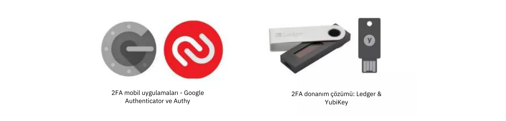

Herhangi bir önemli işlem yapmadan önce, bir vergi uzmanına danışmanız veya hükümetinizin resmi kılavuzunu gözden geçirmeniz şiddetle tavsiye edilir. Vergi yükümlülüklerinizi önceden anlamak için zaman ayırmak, özellikle büyük satışlar veya portföy yeniden tahsisleri planlıyorsanız, sizi daha sonra beklenmedik sorunlardan (para cezaları, denetimler veya cezalar gibi) kurtarabilir.

### Alım Satım, Yatırım ve Holding Arasındaki Fark

Bitcoin genellikle popüler yanlış anlamalarla çevrilidir; en yaygın olanlarından biri, ticaret yoluyla zengin olmaya giden hızlı bir yol olduğu fikridir. Ancak alım satım, yatırım ve elde tutma arasındaki net ayrımı anlamak önemlidir, çünkü her yaklaşım kendi zihniyetini, beceri setini ve risk düzeyini beraberinde getirir.

- Ticaret:**

Dürüst olalım: **muhtemelen ticaret yapmamalısınız.**

Alım satım, Bitcoin'in fiyat dalgalanmalarından kâr elde etmeyi amaçlayan kısa vadeli spekülasyonları (bazen kaldıraçla) içerir. Kulağa cazip gelse de başarılı bir alım satım için ileri düzeyde teknik bilgi (grafik analizi ve risk yönetimi gibi), duygusal disiplin ve piyasaya sürekli dikkat etmek gerekir. Zihinsel olarak yorucu ve zaman alıcıdır ve Hard gerçeği şudur ki **yeni başlayanların çoğu para kaybeder** çünkü bunun gerçekten ne kadar zorlu olduğunu hafife alırlar.

Warren Buffett'ın meşhur dediği gibi:

"**Eğer bir hisse senedini on yıl boyunca elinizde tutmak istemiyorsanız, on dakika bile tutmayı düşünmeyin**."

Bitcoin hızlı zengin olma planı değildir.

- Yatırım:**

Yatırımcılar, değerinin zaman içinde (aylar, yıllar, hatta on yıllar) artacağı inancıyla Bitcoin satın alarak orta ila uzun vadeli bir bakış açısına sahip olurlar. Elbette Bitcoin'ün fiyatı önemli ölçüde dalgalanabileceği için hala risk vardır. Ancak bu yaklaşım genellikle daha sakin ve çoğu insan için, özellikle de her gün grafiklere bağlı kalarak saatler geçirmek istemeyenler için çok daha pratiktir.

- Holding (HODL):**

"HODL", "hold" için bir yazım hatası olarak başladı ve kısa sürede Bitcoin kültürünün bir parçası haline geldi. Bugün ise bir onur nişanı.

Hodler'lar bu işi çok uzun vadeli yapıyorlar; bazen on yıl veya daha fazla. Bitcoin'lerini güvenli bir şekilde saklıyor ve Bitcoin'in uzun vadeli potansiyeline duydukları güçlü inançla sadece bekliyorlar. Günlük fiyat dalgalanmalarından veya ayı piyasalarından etkilenmiyorlar. Zihniyetleri basit: biriktir, güvende tut ve bekle.

|          | Trading | Investment | Holding |
| ---------------------- | ----------- | -------------- | --------------- |
| Leverage | Yes  | No | No |
| Timeframe | Short-term | Medium-term | Very long-term |
| Asset Type | Contracts | Actual BTC | Actual BTC |
| Risk Level | Very high | High | High |
| Difficulty | Very Hard | Hard | Hard |
| learning curve | Long learning curve | Long learning curve | Long learning curve |
| Potential Loss | UnLimited | Limited | Limited |
| Best For | A few experienced users | Most People | Long-term Believers |

### Öğrenmeye Devam Edin

Para, yatırım ve finansal sistemin gerçekte nasıl işlediği hakkında kendinizi eğitmeye başlamak için asla çok erken (veya çok geç) değildir. Bir uzman olmanıza veya her teknik detaya dalmanıza gerek yoktur; bilinçli kararlar vermek ve çıkarlarınıza hizmet etmeyen finansal ürünler (genellikle bankalar veya danışmanlar tarafından tanıtılır) tarafından yanlış yönlendirilmekten kaçınmak için sağlam, büyük resimli bir anlayışa sahip olmak yeterlidir.

Robert T. Kiyosaki'nin *Zengin Baba, Yoksul Baba* kitabı harika bir başlangıç noktasıdır. Varlıklar ve yükümlülükler arasındaki farkı anlamak ve finansal eğitimin neden uzun vadeli bağımsızlık için anahtar olduğu gibi yaklaşılabilir tarzı ve temel dersleri ile yaygın olarak bilinir.

Daha derine inmeye hazırsanız, *The Investors Podcast* gibi podcast'ler yatırım, piyasalar ve ekonomik ilkeler hakkında aydınlatıcı tartışmalar sunar. Zaman zaman Bitcoin'u da ele alırlar, bu da Bitcoin'un daha geniş finansal manzaraya nasıl uyduğunu merak edenler için sağlam bir sonraki adımdır.

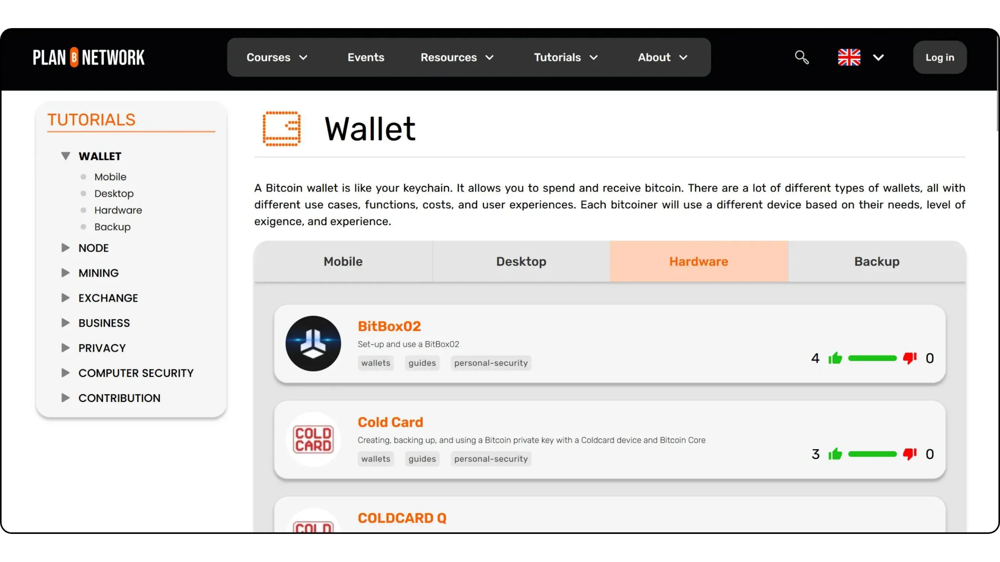

### Akılda Tutulması Gereken Altın Kurallar

Toparlamak gerekirse, her Bitcoin kullanıcısının (özellikle de yeni başlayanların) aklında tutması gereken birkaç zamansız ilke var:

- Kural n°1**: Asla kaybetmeyi göze alabileceğinizden daha fazla yatırım yapmayın. Bitcoin değişken bir varlıktır. Kazanç peşinde koşarak finansal istikrarınızı riske atmayın. Temel ihtiyaçlarınız ve huzurunuz her zaman önce gelmelidir.
- Kural n°2**: Yutturmacayı körü körüne takip etmeyin veya mucize tavsiyelere güvenmeyin. Trendleri ve gösterişli vaatleri görmezden gelin. Bunun yerine iyi bilgilendirilmiş, rasyonel kararlar almaya odaklanın. Şüpheye düştüğünüzde, üzerinde uyuyun; güvendiğiniz kişilerle konuşun. Yavaş ve düşünceli hareket etmek, maliyetli hatalara acele etmekten daha iyidir.
- Kural n°3**: Bir plan oluşturun ve uzun vadeli bir vizyona bağlı kalın.

Tutarlılık, sabır ve disiplin sizi kısa vadeli heyecandan daha ileriye götürecektir. Ay atışlarını hedeflemeyin; sürdürülebilir büyümeyi hedefleyin. Ölümcül hatalardan kaçının ve küçük kazançların zamanla birleşmesine izin verin.

Bu ilkeleri takip ederek, Bitcoin yatırımına daha net ve gönül rahatlığıyla yaklaşabileceksiniz. Evet, Bitcoin istikrarsızdır ve ilk başta göz korkutucu olabilir; ancak dikkatli, sabırlı ve ayakları yere basan bir zihniyetle yaklaşıldığında, inkar edilemez bir potansiyele sahiptir. Bilginizi geliştirmek için zaman ayırın, gerektiğinde stratejinizi yeniden gözden geçirin ve her şeyden önce şunu unutmayın: yavaş ve istikrarlı ilerleme, korku veya sabırsızlıktan acele etmekten her zaman daha iyi hizmet edecektir.

# Neye bulaştığınızı anlamak

<partId>a42355a3-9dd8-57ed-b590-32a333fe09ea</partId>

## 5 dakika içinde Bitcoin

<chapterId>ae122ad9-9b4d-5229-9038-e1b99d5cfc83</chapterId>

:::video id=3c2d1e4f-5a6b-7c8d-9e0f-1a2b3c4d5e6f:::

Bu kursta öncelikli hedef, ilk bitcoinlerinizi edinme ve güvence altına alma konusunda size rehberlik etmektir. Ancak pratik adımlara geçmeden önce (BTC nasıl satın alınır, hangi cüzdanlar kullanılır vb.) bir adım geri atıp Bitcoin'ün gerçekte ne olduğunu anlamak önemlidir. Bitcoin'ün derin doğasını kavramak, milyonlarca insanın neden bu teknolojiye yöneldiğini ve birikimlerinizi böylesine yeni ve değişken bir varlığa yatırmadan önce temelleri anlamanın neden çok önemli olduğunu görmenize yardımcı olacaktır.

Yıllar içinde Bitcoin küresel bir para ağı olarak tanınırlık kazanmıştır. "Dijital altın", "güven protokolü" ve hatta "paralel finansal sistem" olarak adlandırıldı Peki bu terimler gerçekten ne anlama geliyor? Bunu yanıtlamak için Bitcoin'ün özüne daha yakından bakacağız: köken hikayesi, teknik temelleri, parasal özellikleri ve potansiyel etkisi; yalnızca bireyler üzerinde değil, bir bütün olarak küresel finans sistemi üzerinde.

### Kökenleri: Uzun Süreli Bir Arayıştan Doğan Bir Proje

#### Cypherpunks ve bankacılık kontrolünün ötesinde bir sistemin icadı

Bitcoin bir gecede doğmadı. Kriptografi, bilgisayar bilimi ve para teorisi alanlarında onlarca yıl süren araştırma ve deneylerin sonucudur. 2009'da piyasaya sürülmeden önce, birkaç proje (eCash, b-money, Bit Gold ve RPOW gibi) dijital para birimleri yaratmaya çalıştı. Hepsi aynı temel sorunla karşı karşıyaydı: merkezi olmayan bir sistemde merkezi bir otoriteye güvenmeden çifte harcamanın nasıl önleneceği.

Bu sorun, Satoshi Nakamoto adını kullanan birinin Bitcoin teknik incelemesini yayınladığı 2008 yılının sonlarına kadar çözümsüz kaldı. Birkaç ay sonra, Bitcoin'nın açık kaynaklı yazılımının ilk sürümü yayınlanarak bankalardan veya hükümetlerden bağımsız olarak çalışabilecek bir sistem başlatıldı.

Proje, çevrimiçi bireysel özgürlükleri korumak için kriptografiyi kullanmaya inanan geliştiriciler ve düşünürlerden oluşan bir topluluk olan Cypherpunk ethosundan büyük ölçüde etkilenmiştir. Onlar için gizlilik ve ademi merkeziyetçilik teknik tercihler değil, ideolojik gerekliliklerdi. Bitcoin bu ideallerin en başarılı uygulaması olarak ortaya çıktı: herkesin kullanabileceği, kimsenin kontrol edemeyeceği ve herkesin doğrulayabileceği eşler arası bir para ağı.

Cypherpunks, çevrimiçi kişisel özgürlükleri savunmak için kriptografi kullanımını savunan bireylerin oluşturduğu gayri resmi, uluslararası bir topluluktur. Bireyin mahremiyet hakkına güçlü bir şekilde inanmaktadırlar; özellikle de hükümet gözetimi ve kurumsal veri sömürüsü tarafından giderek daha fazla şekillendirilen bir dünyada.

Cypherpunk hareketinin kökleri, kriptograflar, programcılar ve özgürlükçülerden oluşan grupların Silikon Vadisi'ndeki buluşmalar sırasında kriptografinin siyasi etkilerini araştırmaya başladığı 1990'ların başına kadar uzanmaktadır. Topluluktaki en önemli seslerden biri, 1988 yılında Kripto Anarşist Manifestosu'nu yazan Tim May'di; şifrelemenin bireyleri hükümetlerin ve merkezi kontrolün erişiminin ötesinde faaliyet göstermeleri için güçlendireceği bir dünya vizyonunu özetleyen temel bir metin.

Harekette önemli bir dönüm noktası 1992 yılında gizlilik ve kriptografi ile ilgili fikirlerin, projelerin ve politik tartışmaların gelişebileceği bir forum olan Cypherpunks posta listesinin oluşturulmasıyla geldi. Ardından 1993 yılında Eric Hughes, topluluğun misyonunu ve inançlarını açıkça ifade eden kısa ama güçlü bir bildiri olan Cypherpunk Manifestosu'nu yayınladı.

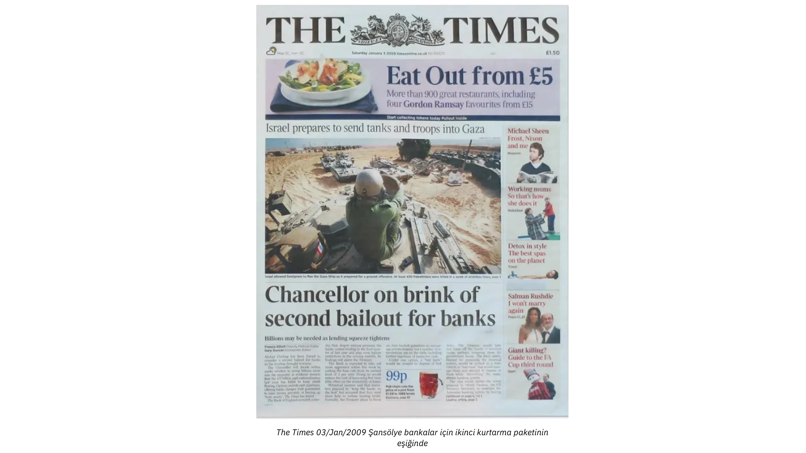

Herhangi bir merkezi otoriteden bağımsız olarak çalışan (Bitcoin gibi) bir dijital para birimi fikri, Cypherpunk felsefesine derinlemesine dayanmaktadır.

#### Finansal Kriz Sonrası An

Bitcoin durup dururken ortaya çıkmadı. Çok özel bir anda, 2008 küresel mali krizinin hemen ardından yaratıldı. ABD konut piyasasının çöküşü ve subprime kredi krizi büyük bankaların batmasına neden oldu ve insanların tüm finansal sisteme olan güvenini sarstı.

İşte bu korku ve belirsizlik ortamında Bitcoin doğdu. Satoshi Nakamoto olarak bilinen yaratıcı, Bitcoin Blockchain'in Genesis bloğu olarak bilinen ilk bloğuna çok sembolik bir mesaj dahil etti. Mesaj şöyleydi:

> **"The Times 03/Jan/2009 Şansölye bankalar için ikinci kurtarma paketinin eşiğinde "**

Bu sadece bir tarih ya da teknik bir not değildi; sessiz ama güçlü bir protestoydu. Bitcoin'un kökten farklı bir şey olarak tasarlandığını gösteriyordu: bankalara, kurtarma paketlerine veya hükümet kararlarına bağlı olmayan bir finansal sistem.

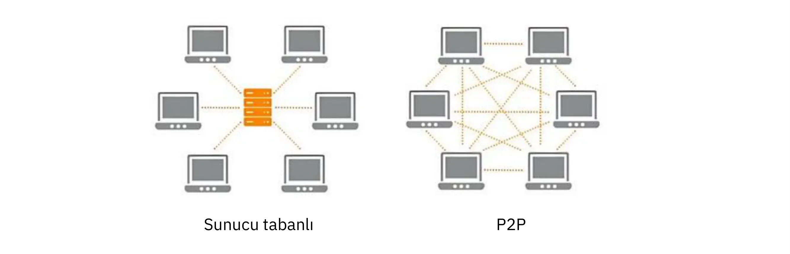

Birçok kişi bunu Bitcoin'un amacı olarak yorumluyor: aracılara ihtiyaç duymadan, merkez bankaları veya hükümetler tarafından alınan genellikle belirsiz kararlar yerine net kurallarla kontrol edilen bir değer transferi yolu sunmak.

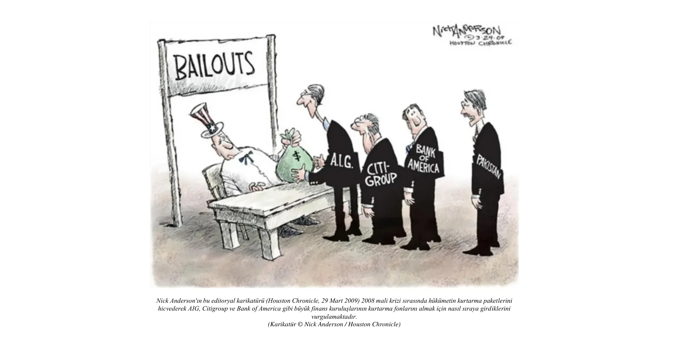

Bitcoin'in kökenleri hakkındaki bilgilerinizi derinleştirmek için konuyla ilgili ücretsiz, kapsamlı ve iyi belgelenmiş bir eğitim kursu sunuyoruz:

https://planb.academy/courses/a51c7ceb-e079-4ac3-bf69-6700b985a082

### Değer aktarımı için merkezi olmayan bir ağ

#### Eşler arası ve merkezi bir organ yok

Bitcoin "eşler arası elektronik nakit sistemi" olarak tanımlanmaktadır Bu, herkesin uygun yazılımı (bir Bitcoin düğümü) kullanarak ağa bağlanabileceği ve merkezi bir sunucuya güvenmeden doğrudan diğer kullanıcılarla etkileşime girebileceği anlamına gelir. Bu ademi merkeziyetçiliğin amacı, herhangi bir tek birimin (banka, hükümet veya büyük şirket gibi) sistemi kontrol etmesini, sansürlemesini veya durdurmasını önlemektir. Bitcoin 7/24, küresel olarak çalışır ve herhangi bir koşul olmaksızın herkes tarafından erişilebilir.

Basit bir ifadeyle, Bitcoin ağındaki her katılımcı ("düğüm" olarak adlandırılır) Blockchain olarak bilinen Ledger işleminin tam bir kopyasına sahiptir. Yeni bir işlem gerçekleştiğinde, bu işlem ağa yayınlanır. Madenciler daha sonra bu işlemleri bloklar halinde gruplandırarak onaylar ve bunlar zincirin sonuna eklenir (dolayısıyla "Blockchain" adı verilir).

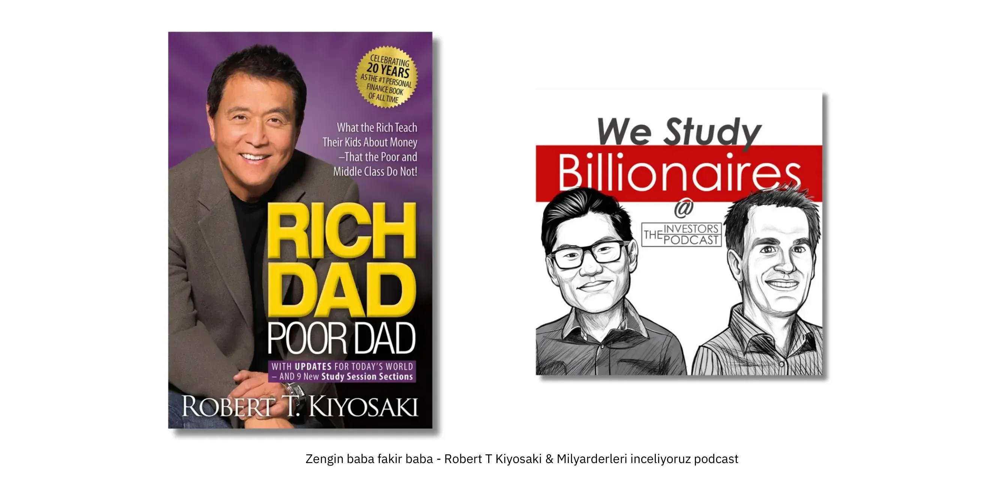

#### Blockchain: bir muhasebe Ledger

Blockchain'i, her satırın bir işlemi temsil ettiği dev bir muhasebe Ledger'ı olarak düşünün. Geleneksel bir bankacılık sisteminde, veritabanı bir bankanın sunucularında saklanır ve banka istediği zaman değişiklik yapabilir. Öte yandan, Bitcoin'da **tüm değişiklikler tüm ağ üzerinde doğrulanır**: Blockchain'e yeni bir işlem bloğu eklendiğinde, daha sonra değiştirmek neredeyse imkansızdır. Bu merkezi olmayan doğrulama, Bitcoin'un Ledger'ını güvenli ve şeffaf hale getirir.

### Madencilerin ve Proof-of-Work'in Rolü

#### Bloklar Nasıl Oluşturulur? Mining

Mining, bilgisayarların (veya büyük Mining çiftliklerinin) Bitcoin'ün işlem geçmişini güvence altına almak ve yeni bloklar oluşturmak için **bilgisayar gücüne** katkıda bulunduğu süreçtir. Madenciler matematiksel bir bulmacayı çözmek için yarışırlar - özellikle de kısmi bir Hash çarpışması bulmak için. Bu süreç önemli miktarda enerji ve kaynak gerektirir. Bir Miner geçerli bir çözüm bulduğunda, bloğu doğrulayan ve geçerli olarak kabul eden ağa yayınlar.

Ödül olarak Miner, o blokta yer alan tüm işlemlerden elde edilen işlem ücretleriyle birlikte yeni oluşturulan bitcoinleri (blok sübvansiyonu olarak adlandırılır) alır.

#### Halving: Blok Sübvansiyonunun Azaltılması

Bitcoin'un kıtlığını sağlamak için blok sübvansiyonu her 210.000 blokta bir, yani kabaca her dört yılda bir yarıya inecek şekilde programlanmıştır. Bu olay "Halving" olarak bilinmektedir Bitcoin başlatıldığında madenciler blok başına 50 BTC kazanıyordu. 2025 yılında bu ödül 3.125 BTC'ye düştü ve zaman içinde azalmaya devam edecek.

Sonunda, 2140 yılı civarında, Bitcoin'in toplam Supply'si 21 milyon sikke ile sınırlanacağından sübvansiyon sıfıra ulaşacaktır. Bu öngörülebilir ihraç eğrisi, altın gibi fiziksel emtiaların kıtlığını taklit eder; Bitcoin'in genellikle **dijital altın** olarak anılmasının bir nedeni de budur.

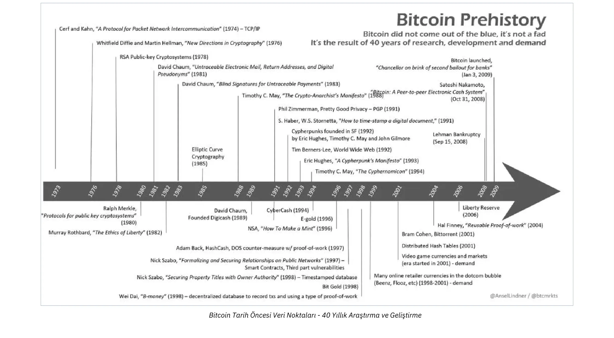

### Bitcoin Parasal Özellikler

#### Kıtlık ve Sabit Para Politikası

Bitcoin'ün en güçlü özelliklerinden biri *öngörülebilir ve değiştirilemez para politikasıdır*. Merkez bankaları tarafından isteğe bağlı olarak basılabilen (genellikle enflasyona veya ekonomik bozulmalara yol açan) geleneksel itibari para birimlerinin (dolar, euro veya yen gibi) aksine Bitcoin, koduna gömülü şeffaf bir dizi kural altında çalışır.

Her zaman yalnızca 21 milyon bitcoin olacaktır ve yeni coinlerin çıkarılma oranı ağdaki herkes tarafından önceden bilinmektedir.

Hiçbir hükümet, kurum ya da birey bu Supply üst sınırını ya da dağıtım kurallarını tek taraflı olarak değiştiremez. Bu parametreleri değiştirmenin tek yolu Bitcoin'in protokolünü değiştirmek olacaktır; ve bu bile ağın ekonomik katılımcılarının çoğunluğunun mutabakatını gerektirecektir.

Bu yerleşik kıtlık, öngörülemeyen para politikalarından vazgeçmek veya satın alma güçlerinin enflasyon yoluyla kademeli olarak erozyona uğramasını önlemek isteyenler için önemli bir çekiciliktir. Zamanla bu durum, Bitcoin gibi deflasyonist bir varlıkta tasarruf etmenin geleneksel, enflasyona eğilimli para birimlerine güvenmekten daha cazip hale geldiği finansal düşüncede bir değişimi temsil edebilir.

#### Bölünebilirlik ve Erişilebilirlik

Bitcoin'in en küçümsenen güçlü yönlerinden biri bölünebilirliğidir. Her bir Bitcoin, satoshis (veya kısaca Sats) olarak bilinen 100 milyon birime bölünebilir. Bu, başlamak için on binlerce avro veya dolar harcamanıza gerek olmadığı anlamına gelir; küçük küsuratlara kadar sadece birkaç avro değerinde Bitcoin satın alabilirsiniz.

### Açıklık ve Şeffaflık

#### Herkes tarafından doğrulanabilen bir kamu protokolü

Bitcoin halka açık, **açık kaynaklı** bir protokol üzerinde çalışır (en önemlisi [Bitcoin core](https://github.com/Bitcoin/Bitcoin)). Bu, kodunun herkesin incelemesi, denetlemesi ve geliştirmesi için serbestçe erişilebilir olduğu anlamına gelir. Gizli mekanizmalar veya kapalı sistemler yoktur; Bitcoin'in nasıl çalıştığı ile ilgili her şey açıktır.

Bu şeffaflık seviyesi, arka kapılar eklemeyi veya gizli değişiklikler yapmayı inanılmaz derecede zorlaştırır. Teknik becerilere sahip herkes bir node çalıştırabilir, geliştirmeye katkıda bulunabilir veya uyumlu araçlar oluşturabilir. Bitcoin'de güven, merkezi kontrol yoluyla değil, kod ve fikir birliği yoluyla kazanılır.

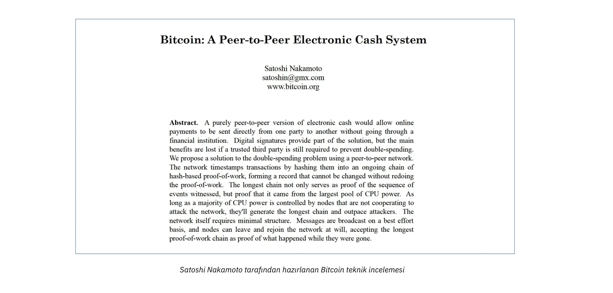

Bu şeffaflık, insanların Bitcoin protokolüne güvenmesinin temel nedenlerinden biridir; küçük bir grup geliştiricinin ağı kendi çıkarları için manipüle etmesini engeller. Bitcoin basit ama güçlü bir ilkeye göre çalışır: önerilen değişikliklere katılmıyorsanız, yazılımınızı güncellememekte özgürsünüz. Bazı durumlarda bu herhangi bir kesintiye neden olmaz; ağın geri kalanıyla senkronize olmaya devam edersiniz. Ancak diğer durumlarda bu, ağın ikiye bölündüğü ve Bitcoin'ün yeni bir versiyonunun yaratıldığı Hard Fork olarak bilinen duruma yol açabilir. 2017'de Bitcoin (BTC) ve Bitcoin Cash (BCH) arasındaki bölünme tam olarak bu şekilde gerçekleşmişti.

Bu tür bir yönetişim yavaş ve bazen dağınık olsa da, aynı zamanda bir güçtür; tek bir varlığın tek taraflı olarak kontrolü ele geçirememesini sağlayarak Bitcoin'in istikrarlı, tarafsız ve merkezileşmeye karşı dirençli kalmasına yardımcı olur.

#### Bireysel Doğrulama: düğümler

Bitcoin, herkesin kendi bilgisayarında veya sunucusunda bir "düğüm" çalıştırarak Blockchain'nin doğruluğunu kontrol etmesine olanak tanır. Bu, Bitcoin core yazılımını (veya Bitcoin protokolünün başka bir sürümünü) indirmek ve 2009'dan bu yana tüm işlemleri ve blokları doğrulamak anlamına gelir. Düğümünüz kurulup senkronize edildikten sonra Blockchain'nin tam bir kopyası haline gelir ve ağın desteklenmesine yardımcı olur.

Bu yaklaşım daha teknik olmasına rağmen, en talepkar kullanıcılara üçüncü taraflara güvenmemeyi tercih etme olanağı sunar. Bir düğümün çalıştırılması, kullanıcıların mutabakat sürecine katılabilmesini ve sansürlenmemesini sağlayarak ağın güvenliğine ve merkezsizleşmesine doğrudan katkıda bulunur.

### Kullanım örnekleri

#### Esnek, Sınır Ötesi Bir Ödeme Yöntemi

Merkezi olmayan yapısı nedeniyle Bitcoin, sınırlardan veya saat dilimlerinden etkilenmeden 7/24 çalışır. Geleneksel bankacılık altyapısının eksik olduğu bölgelerde, Bitcoin genellikle pahalı aracılara güvenmeden para göndermek veya almak için hızlı, düşük maliyetli bir çözüm olarak kullanılır. İşlem ücretleri ağ tıkanıklığına bağlı olarak değişebilmekle birlikte, genellikle uluslararası transferler için bankalar tarafından alınan ücretlerden çok daha düşüktür. Ayrıca, Layer gibi [Lightning Network](https://planb.academy/resources/glossary/lightning-network)-2 çözümleri daha da hızlı ve ucuz Bitcoin işlemlerine olanak sağlar.

#### Bir değer deposu

Kıtlığı (21 milyon BTC ile sınırlandırılmıştır) ve doğal esnekliği nedeniyle Bitcoin genellikle uzun vadeli bir tasarruf güvencesi olarak görülmektedir. Fiyatı kısa vadede değişkenlik gösterse de, Bitcoin başlangıcından bu yana yıllar boyunca genellikle yükseliş eğilimi göstermiştir. Bazı yatırımcılar BTC'yi, özellikle enflasyon veya finansal krizler karşısında bir değer deposu olarak hizmet edebileceği inancıyla satın almaktadır.

#### Finansal özgürlük ve dayanıklılık için bir araç

Yatırımın ötesinde, Bitcoin finansal egemenliği korumak için bir yol sunar. Otoriter rejimler altındaki veya ağır parasal kısıtlamalarla karşı karşıya olan ülkelerde, bir Bitcoin Wallet'e (özel anahtarlarla) sahip olmak bir tür özgürlük sağlar. Sahibi kurtarma ifadesini güvence altına aldığı sürece hiç kimse bu BTC'leri bloke edemez veya el koyamaz.

Bu özellik özellikle sansürden veya banka hesaplarının dondurulmasından korkanlar için caziptir. Ayrıca, BTC tutmanın hızla değer kaybeden yerel para birimini tutmaktan daha istikrarlı olduğu Venezuela veya Zimbabwe'de görüldüğü gibi hiperenflasyondan muzdarip nüfuslarda da yankı buluyor.

### Önümüzde uzun bir yol var

Bitcoin bir "Sıfırdan Bire" olarak görülebilir: yerleşik finansal paradigmalardan radikal bir kopuş. Tarihte ilk kez, herkesin erişebileceği küresel bir para ağı, merkezi bir otorite olmadan çalışmakta, sansüre dayanıklı ve özel işlemlere olanak sağlamaktadır.

Bununla birlikte, on yılı aşkın bir süredir varlığını sürdüren Bitcoin tartışmalara ve tutkulara yol açmaya devam ediyor. Benimsenmesi artıyor, işlem hızını artırmak ve ücretleri düşürmek için ikinci Layer çözümleri (Lightning Network gibi) ortaya çıkıyor ve dünya çapındaki işletmeler yeni kullanım durumlarını deniyor. Muhtemelen Bitcoin önümüzdeki on yıllar boyunca ödeme sistemlerini ve hatta parayı algılama biçimimizi etkilemeye devam edecek.

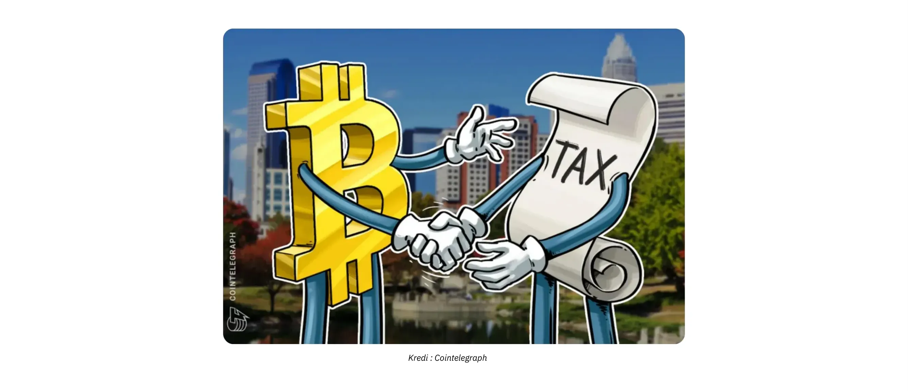

Bilginizi daha da genişletmek isterseniz, Bitcoin'in teknik ve ekonomik temellerini daha derinlemesine inceleyen BTC101 Plan ₿ Academy kursuna katılabilirsiniz.

https://planb.academy/courses/2b7dc507-81e3-4b70-88e6-41ed44239966

Bitcoin'e bu girişten sonra (5 dakikadan biraz daha uzun sürmüş olabilir!), artık bitcoin satın almayı ve güvenliğini sağlamayı düşünmek için daha donanımlısınız. Kursun ilerleyen bölümlerinde, Bitcoin'in önemini, endüstrisinin işleyişini ve çeşitli katmanlarının gelişimini daha derinlemesine inceleyeceğiz. Bir sonraki bölümde ise kendi kişisel planınızı nasıl oluşturacağınızı tartışacağız.

## Bitcoin neden önemlidir?

<chapterId>d4327ac4-9ff8-5192-b542-cb78c0bd0aa7</chapterId>

:::video id=5f6e7d8c-9b0a-1c2d-3e4f-5a6b7c8d9e0f:::

Bitcoin neden bu kadar önemli? Bu dersin ana sorusu budur. İster çalışmalarınızla ister yatırım stratejinizle ilgili olsun, Bitcoin'ün önemini net bir şekilde anlamadan planınızdan sapma riski vardır. Amaç, stratejinizin inançlarınızla uyumlu kalmasını sağlamak için Bitcoin'ün temel ilkelerini her zaman akılda tutmaktır.

### Evrensel bir para birimi

Barack Obama bir keresinde Bitcoin'ten "cebinizdeki İsviçre bankası" olarak bahsetmişti ve bunun iyi bir nedeni vardı. Bitcoin kim olursa olsun herkese aynı fırsatları sunuyor. İster bir genç, ister bir başkan, ister Hong Kong'da bir protestocu ya da Fransa'da bir "Sarı Yelekli" olun, herkes aynı protokol ve araçlara eşit erişime sahiptir:

- Ücretsiz ve sınırsız cüzdanlar oluşturun (Bitcoin ile gerçekten "hesaplardan" değil, "cüzdanlardan" bahsediyoruz).
- İstediğiniz yere, istediğiniz kişiye para gönderin.
- Kimlik tespitine veya herhangi bir idari prosedüre gerek yoktur.
- Yaş, cinsiyet, din, ülke veya gelir düzeyinden bağımsız olarak herkes için erişilebilirdir.
- Gizlilik ve şeffaflık sizin takdirinize bağlı olarak mevcuttur.
- Aracılar veya gizli ücretler yok.
- Bitcoin internete özgüdür, yani web erişimi olan herkes kullanabilir.

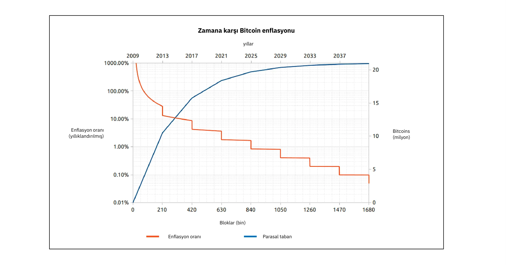

Bitcoin, herhangi bir merkezi otoriteye dayanmayan ve keyfi kararlar yerine değişmez kurallara dayanan alternatif bir para sistemi olan gerçek "halkın para birimi" olarak görülebilir. Açık ve erişilebilir yapısı, ister geleneksel bankacılık sisteminden dışlanmış olsunlar, isterse sadece daha egemen bir alternatif arayışında olsunlar, onu dünya çapında milyarlarca insan için potansiyel olarak devrimci bir araç haline getirmektedir.

Bu da bizi Bitcoin meraklılarını iki ana dünya görüşüne ayıran temel, neredeyse felsefi bir soruya götürüyor. Bir tarafta, bazıları Bitcoin'i finansal katılımı teşvik etmek için bir çözüm olarak görüyor ve milyarlarca bankasız bireyin nihayet küresel bir parasal altyapıya erişmesini sağlıyor. Diğer tarafta ise bazıları Bitcoin'i halihazırda bankacılık sistemine entegre olmuş, ancak bu sisteme bağımlılıktan kurtulmak ve paraları üzerinde tam kontrol sahibi olmak isteyen milyarlarca insan için bir çıkış yolu sunmayı amaçlayan bir finansal özgürleşme aracı olarak görüyor. Bu düşünce dikkatimizi hak etmektedir ve daha sonra bu konuya daha ayrıntılı olarak döneceğiz.

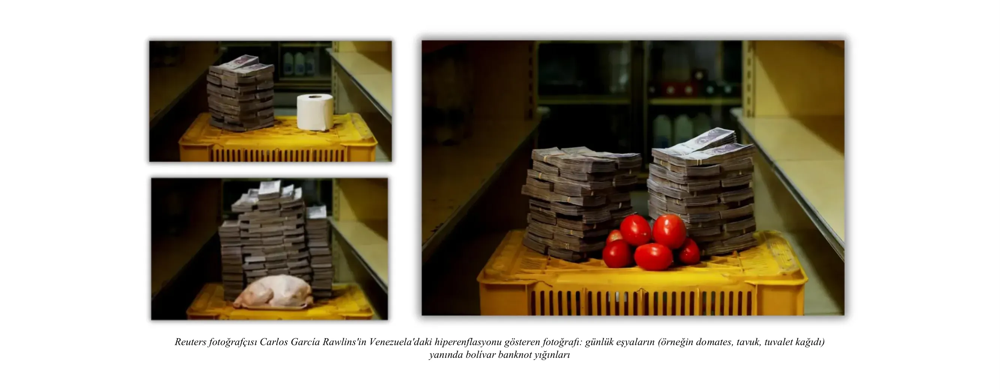

### Döviz krizlerine karşı koruma

Yüzyıllar boyunca dünya, halklar üzerinde yıkıcı etkileri olan parasal krizler yaşamıştır. Milyarlarca insan hala, para Supply ve faiz oranlarının manipülasyonunun sistemik dengesizlikler yarattığı, kötü yönetilen para politikalarının sonuçlarından muzdarip. Bu krizler sadece rastgele olaylar değildir; müdahaleler, para ve zaman değerlerinin manipülasyonu üzerine kurulu bir sistemin sonucudur.

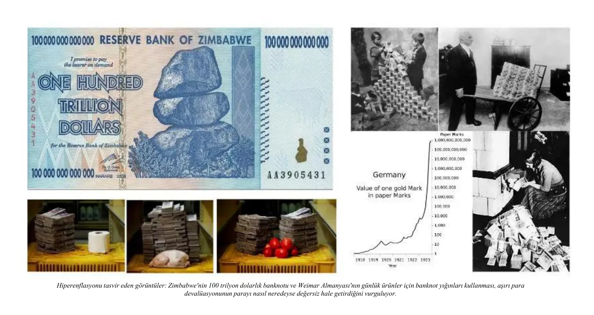

Bu krizler çok farklı şekillerde ortaya çıkabilir. Örneğin hiperenflasyon, Zimbabwe ve Venezuela gibi ülkelerde görüldüğü gibi, insanların satın alma gücünü kademeli olarak yok ederek bir para birimini ortadan kaldırır. Öte yandan, Yunanistan ve Lübnan'daki bankacılık kısıtlamalarında olduğu gibi, sıkı parasal kontroller fonlara erişimi sınırlayabilir ve bireylerin ekonomik özgürlüklerini ellerinden alabilir.

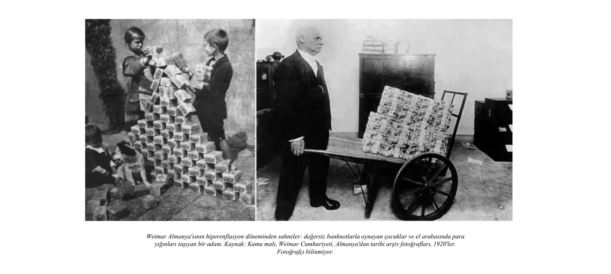

Ve son olarak, hükümetler ulusal para birimlerini devalüe ettiklerinde, insanların tasarruflarını kademeli olarak aşındırır; servetlerinde görünmez ama sürekli bir azalma olur. Birçok yönden gizli bir vergi gibi hareket eder. Para politikası merkezi otoritelerin elinde kaldığı sürece, bu döngüler tekrarlanmaya mahkumdur.

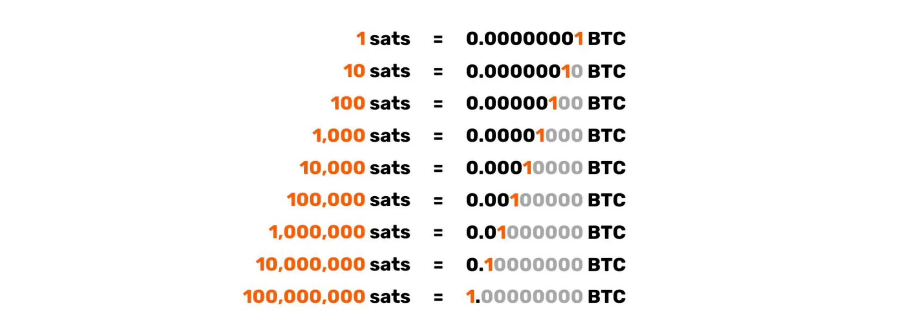

Bitcoin, bu kronik parasal istikrarsızlık döngüsüne cesur bir alternatif sunuyor. Devlet tarafından çıkarılan para birimlerinin aksine, hükümetler veya merkez bankaları tarafından değil, fikir birliği ile uygulanan değiştirilemez, matematik tabanlı kurallar üzerine inşa edilmiştir. İhracı öngörülebilir ve yaklaşık 21 milyon coin ile sınırlandırılmıştır, bu da onu zaman içinde değerini korumak için tasarlanmış sağlam bir para biçimi haline getirmektedir. Sansüre karşı dirençli olduğundan, herkes bir kuruma güvenmeden değer depolayabilir ve transfer edebilir. Bölünebilirliği ve taşınabilirliği sayesinde hem erişilebilir hem de pratiktir; herkes için, her yerde finansal altyapı.

**Biliyor muydunuz? Tarih boyunca dünya çapında belgelenmiş en az 56 hiperenflasyon vakası yaşanmıştır. Bu vakaların çoğunda tüm ekonomiler çökmüş, yaşam birikimleri yok olmuş ve milyonlarca insan aşırı yoksulluğa itilmiştir. Daha da kötüsü, bu parasal başarısızlıklar genellikle siyasi ayaklanmalar için bir sıçrama tahtası görevi görmüş; 1920'lerde Almanya'da ve 1970'lerde Şili'de olduğu gibi bazen otoriter rejimlere yol açmıştır.

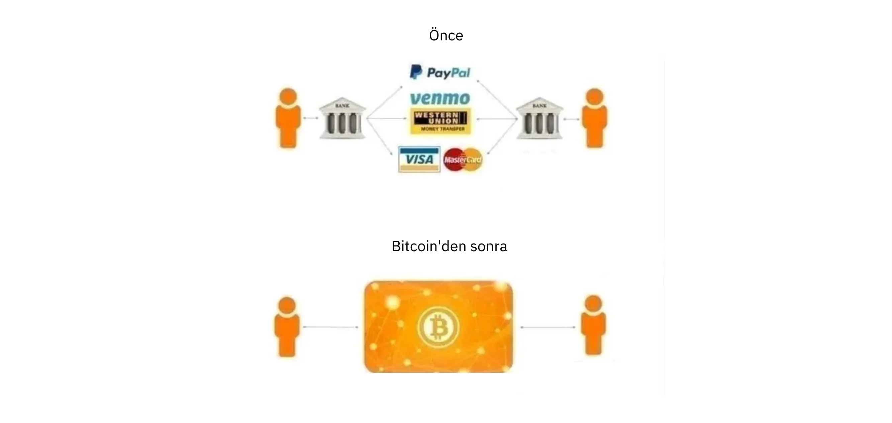

Hanke, S. H., & Krus, N. (2013). *Dünya Hiperenflasyonları*. R. Parker & R. Whaples (der.), The Handbook of Major Events in Economic History içinde. Routledge Yayıncılık. Https://ssrn.com/abstract=2130109 adresinden alındı

İtibari para birimlerinin çöküşü tarihsel bir tesadüf değildir; bu kendini tekrar eden bir modeldir. Bugün, Bitcoin bir çıkış yolu sunuyor: servetinizi hükümet kontrolündeki para sistemlerinin dışında korumak için eşsiz bir fırsat. Bu noktada soru, başka bir krizin olup olmayacağı değil, ne zaman olacağıdır. Bitcoin ile artık bu yıkıcı döngülerin dışında kalma ve şeffaflık, öngörülebilirlik ve bireysel egemenlik üzerine kurulu bir para sistemi seçme seçeneğine sahipsiniz.

### Devlet kontrolüne ve adaletsizliğe karşı bir yanıt

Dünya genelinde artan ekonomik eşitsizlik her zaman toplumsal huzursuzluk ve siyasi aşırılığın yükselişi için verimli bir zemin olmuştur. Tarih, zengin ve fakir arasındaki uçurum çok genişlediğinde, bunun genellikle gerginliğe, krize ve hatta otoriter rejimlerin yükselişine yol açtığını göstermektedir. Bu riskler karşısında, finansal özgürlüğünüzü korumak sadece bir lüks değil; özerkliklerini korumak ve ailelerinin geleceğini güvence altına almak isteyen herkes için bir gerekliliktir.

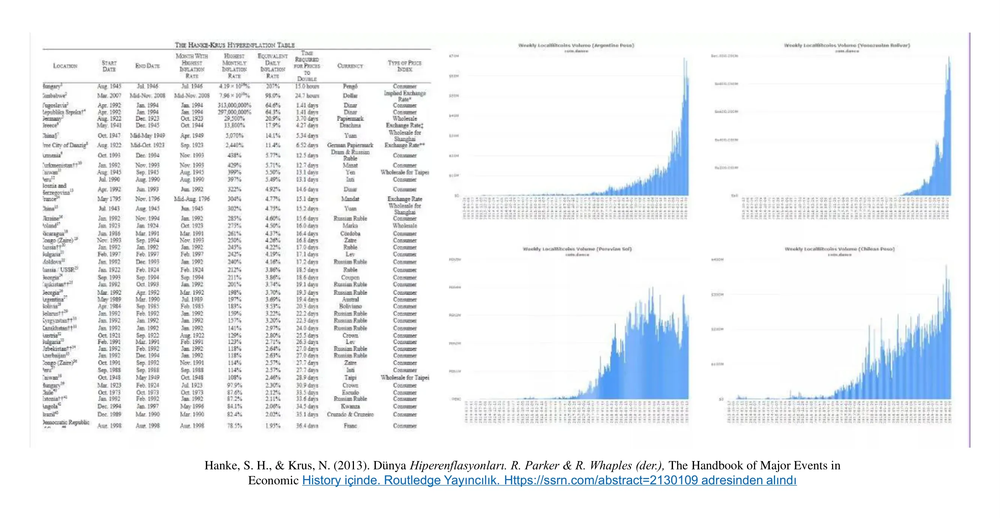

Ancak devletin varlıklar ve işlemler üzerinde tam kontrol uygulayabildiği bir dünyada, birikimlerinizi korumak için hangi gerçek seçenekler var?

- Banka hesapları** bir anda dondurulabilir, basit bir hükümet emriyle el konulabilir veya aşırı parasal kısıtlamalarla boşaltılabilir.

- Altın**, binlerce yıldır değer saklama aracı olarak kullanılmasına rağmen, bölünmesi Hard, taşınması zahmetli ve acil kriz durumlarında kullanılması pratik değildir.

- Nakit**, anonim olsa da hacimlidir, el konulması kolaydır ve enflasyon nedeniyle sürekli değer kaybeder.

Ancak Bitcoin pratik bir araçtan çok daha fazlasıdır. Aynı zamanda **barışçıl bir protesto biçimidir**; keyfi güce, merkezileşmeye ve sistemik eşitsizliğe dayalı bir finansal sistemden bağımsızlık ilanıdır. Bitcoin'ü seçmek manipülasyonu, değersizleştirmeyi ve gözetimi reddetmek anlamına gelir. Bu, **egemenliğinizi** geri almak, geleceğinizi güvence altına almak ve kendi servetinizi kontrol etme hakkınızı savunmakla ilgilidir.

Bu açıdan bakıldığında, Bitcoin teknolojiden daha fazlasıdır. Doğal hukukun bir aracı, bireylerin temel haklarını, bu haklar ülke yasaları tarafından reddedilse bile, ileri sürmelerinin bir yoludur. Gücü devrim yoluyla değil, kod yoluyla insanlara geri verir.

**Biliyor muydunuz**? Bitcoin anonim değil, takma addır. Kullanıcılar gerçek kimliklerini açıklamadan Wallet adresleri oluşturabilir ve bu sayede geleneksel bankacılık sistemi dışında para gönderip alabilirler.

Ancak sanılanın aksine Bitcoin tam bir anonimlik sunmamaktadır. Her işlem, herkesin erişebileceği ve doğrulayabileceği halka açık bir Ledger (Blockchain) üzerine kaydedilir. Wallet adresleri isimlere bağlı olmasa da, uygun gizlilik uygulamaları takip edilmezse bir kullanıcının finansal faaliyeti yine de izlenebilir ve analiz edilebilir.

### Parasal ve Bankacılık Yolsuzluğuna Bir Çözüm

Merkez bankaları, genişlemeci para politikaları yoluyla, satın alma gücünüzü sürekli olarak aşındırmaktadır. Enflasyon ve aşırı para basımı (genellikle Niceliksel Gevşeme olarak gizlenir) yoluyla dolaşımdaki para biriminin değerini sürekli olarak düşürürler. Bu, her yıl devlet tarafından basılan parayla tasarruf edenlerin servetini azaltan görünmez bir vergi görevi görür.

Enflasyonun doğal bir ekonomik olgu olduğu yönündeki yaygın inanışın aksine, enflasyon aslında bir parasal kontrol aracıdır; finansal varlıkları elinde bulunduranlara fayda sağlarken genel nüfusu yavaş yavaş yoksullaştıran bir araçtır.

Servetiniz parasal olmayan varlıklarda (gayrimenkul, tahvil veya hisse senedi gibi) güvence altına alınmamışsa; birikimleriniz kaçınılmaz olarak zaman içinde değer kaybedecektir. Bu arada, finansal araçlara erişimi olanlar servetlerini artırmaya devam ederek ekonomik elit ile toplumun geri kalanı arasındaki uçurumu genişletir.

Bu sistemdeki bir kusur değil; kasıtlı bir mekanizma. Merkez bankaları ve hükümetler bunu ekonomik büyümeyi yapay olarak teşvik etmek ve insanları sürekli tüketime ve artan borca itmek için kullanıyor.

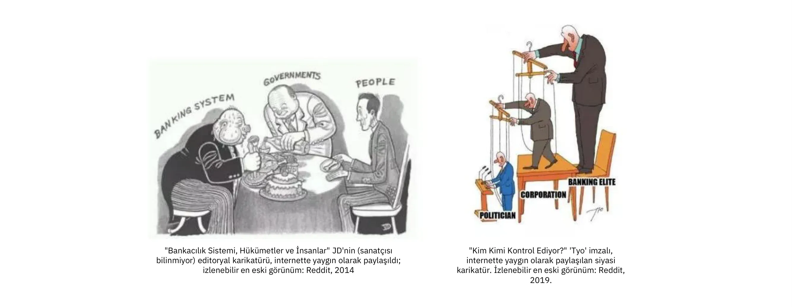

Modern finansal sistemimiz bir borç döngüsü üzerine inşa edilmiştir; borçlanmanın sadece teşvik edilmediği, pratikte kaçınılmaz olduğu bir sistem. Bireyler yaşam tarzlarını sürdürebilmek için kredi almakta, ancak kendilerini havadan para yaratan bankalara faiz ödemek zorunda oldukları bir sistemde kapana kısılmış olarak bulmaktadırlar. Bu tesadüfi bir durum değildir; sıradan vatandaşların zararına finans kurumlarına fayda sağlamayı amaçlayan yapısal bir tasarımdır.

Sistem, merkez bankalarının etkisi ve parasal Supply'yi manipüle etme konusundaki kontrolsüz güçleri nedeniyle bozulmuştur. **Bitcoin alternatiftir.**

Fiat para birimlerinin aksine, Bitcoin fikir birliği ile uygulanan kurallar tarafından yönetilir. Supply sınırlandırılmıştır; hiçbir zaman 21 milyondan fazla bitcoin bulunmayacaktır (aslında, ihracın nasıl yapılandırıldığı nedeniyle biraz daha az). Hiçbir hükümet, merkez bankası ya da tek bir ekonomik aktör bu sınırı değiştiremez.

Bu, Bitcoin'in öngörülebilir bir parasal çerçeve altında çalıştığı anlamına gelir; enflasyonun yalnızca şeffaf olmadığı, aynı zamanda nihai Bitcoin çıkarıldıktan sonra tamamen azalacak şekilde tasarlandığı bir çerçeve.

Geçmişte altın, kontrolsüz parasal genişlemeye karşı bir kontrol işlevi görüyordu. Ancak 1971'de altın standardının çöküşünden bu yana hiçbir ulusal para birimi (dolar, euro ya da yen) somut bir varlıkla desteklenmiyor. Bu kopukluk, merkez bankalarına hiçbir kısıtlama olmaksızın para basma özgürlüğü vererek onlarca yıl süren agresif parasal genişlemenin, tekrarlanan varlık balonlarının ve yinelenen finansal krizlerin önünü açtı.

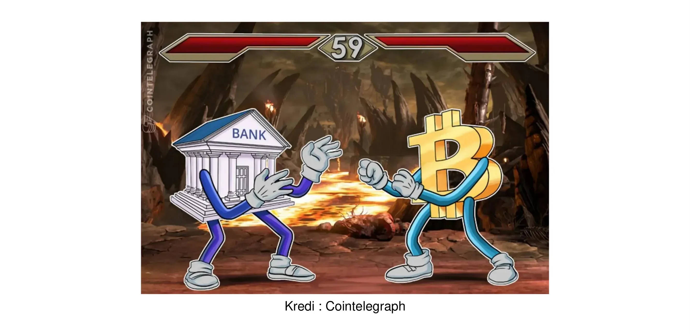

Bir Bankaya Para Yatırdığınızda, Artık Gerçekten Sizin Değildir.

Çoğu insan bunun farkında değildir: bir banka hesabında tuttuğunuz para teknik olarak sizin mülkünüz değildir. Yasal ve pratik anlamda, bankanıza verdiğiniz bir kredidir; bankanın kendi operasyonları ve yatırımları için kullanmakta özgür olduğu bir kredidir.

Bu sistem, finansal kurumlara duyulan kör kamu güveni üzerine inşa edilmiştir, ancak ciddi riskler taşımaktadır:

- Bankanız çökerse, paranız yok olabilir.** Mevduat sigortası planları olsa bile, tarih bu garantilerin sistemik krizler sırasında başarısız olabileceğini göstermiştir.
- Bankanız fonlarınıza erişimi kısıtlarsa, kendi paranızı çekemeyebilir veya kullanamayabilirsiniz**. Bu durum Yunanistan, Lübnan ve Arjantin'deki ekonomik çöküşler sırasında veya Kanada'daki kamyoncu protestoları gibi siyasi baskılar sırasında birçok kez yaşanmıştır.

Bitcoin tamamen farklı bir mod sunar; açık, tarafsız ve bozulamaz. Kuralları fikir birliği ile kodlanmıştır ve tüm ağ katılımcıları için eşit olarak geçerlidir.

İşte temel ilke burada devreye giriyor:

**"Anahtarlarınız değil, Bitcoin'niz değil. "**

Eğer bitcoinlerinizin özel anahtarlarını kontrol etmiyorsanız, o zaman onlara gerçekten sahip değilsiniz demektir. Üçüncü bir tarafın elindedirler; tıpkı bir bankadaki fiat gibi. Ancak özel anahtarlarınız sizdeyse, fonlarınız üzerinde sadece ve sadece siz tam kontrole sahip olursunuz. Hiçbir kurum, hiçbir hükümet, hiçbir otorite erişiminizi donduramaz, el koyamaz ya da kısıtlayamaz.

Bitcoin'i geleneksel finansal sistemin kırılganlıklarına ve aşırılıklarına karşı güçlü bir alternatif haline getiren de budur: parasal egemenlik.

### Bitcoin: Siyasi Bir Hareket mi?

Bitcoin bireyler ve finansal kurumlar arasındaki güç dengesini yeniden şekillendirir. Herkese parasının tam kontrolünü ele geçirme, birikimlerini enflasyondan koruma ve devletler tarafından dayatılan parasal kısıtlamalardan kurtulma yetkisi verir. Açık ve sınırsız bir sistem olarak Bitcoin, sosyal statü, milliyet veya kökene bakılmaksızın herkesin erişebileceği daha adil bir alternatif sunmaktadır.

Bitcoin'i benimsemek, sağlam parayı seçmektir. Bu, mevcut finansal sistemin enflasyonist, borç güdümlü makinesinde sadece bir dişli olarak kalmayı reddetmektir. Bu bir kişisel egemenlik eylemidir ve parasal yozlaşmaya ve servetin erozyonuna karşı barışçıl bir direniştir.

Bitcoin'ciler hayatın her kesiminden geliyorlar, ancak ortak bir vizyonu paylaşıyorlar: parasal egemenliğin kurumların değil bireylerin elinde olduğu bir dünya. Bunların arasında

- Gizliliği savunan ve gözetime direnen Cypherpunks**;
- Otoriter rejimlerden ve sermaye kontrollerinden kaçan mazlum vatandaşlar**;
- Bitcoin'yi devlet kontrolünden kurtuluş için bir araç olarak gören anarşistler**;
- Avusturyalı ekonomistler**, sağlam para ve hükümet manipülasyonundan özgürlüğü savunurlar;
- Bu yeni parasal paradigmanın derin toplumsal etkilerinin farkında olan mühendisler, finansörler ve ifade özgürlüğü savunucuları**.

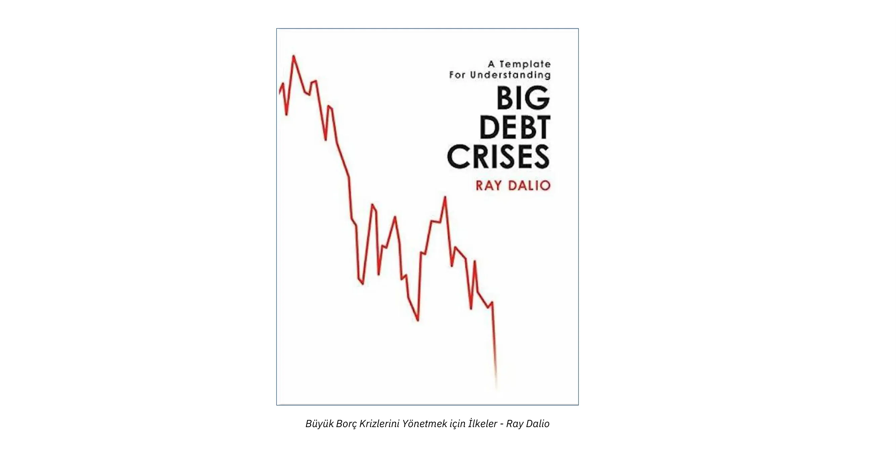

Bitcoin, tasarımı gereği, siyasi ve ideolojik ayrımları aşar. Sol ya da sağ, özgürlükçü ya da kolektivist değildir. Herkese eşit olarak uygulanan kurallarla (cetvelle değil) yönetilen tarafsız bir protokoldür. Yine de sadece varlığı bile küresel finansal statükoya meydan okumaktadır. Bitcoin bir direniş sembolü haline gelmiştir çünkü insanlar onu itibari para birimlerine ve merkezi finansal altyapıya bir alternatif olarak benimsemiştir; sistemler giderek daha adaletsiz, manipüle edilebilir ve dışlayıcı olarak görülmektedir.

Cypherpunk'e göre Bitcoin dijital bir varlıktan çok daha fazlasıdır. Nakit paranın ortadan kaybolmasının genellikle "güvenlik" kisvesi altında meşrulaştırıldığı bir dünyada mahremiyetin sürekli erozyona uğramasına karşı durmaktadır

Bitcoin sansüre dayanıklı, eşler arası dijital işlemlere olanak tanır; aracılardan veya bekçilerden bağımsızdır. Satoshi Nakamoto'nun öngördüğü gibi, paranın dijital eşdeğerini sunar: Exchange izne ihtiyaç duymadan özgürce değer biçmenin bir yolu.

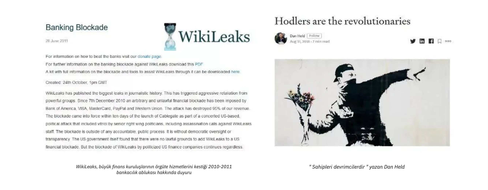

Bitcoin bir örgüt ya da siyasi parti değildir, ancak inkar edilemez bir şekilde güçlü bir felsefi mesaj taşımaktadır. Merkez bankalarının para yaratma ve ekonomik kontrol üzerindeki tekeline meydan okuyarak birey ve devlet arasındaki ilişkiyi yeniden tanımlamaktadır.

İster özgürlük savaşçıları isterse sadece satın alma güçlerini korumak isteyenler tarafından benimsensin, Bitcoin yeni bir dönemin başlangıcına işaret ediyor; finansal egemenliğin herkes tarafından erişilebilir temel bir insan hakkı haline geldiği bir dönem.

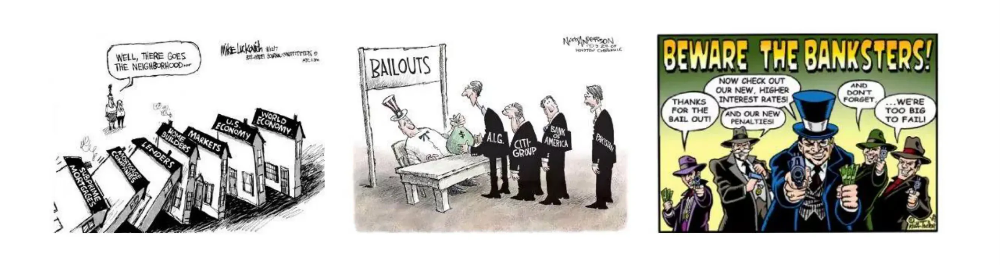

Satoshi Nakamoto'nun icadının derin önemini keşfettiğimize göre, bir sonraki bölüm bizi bu protokol etrafında büyüyen olağanüstü endüstriye götürecek; finans, teknoloji ve toplumu yeniden şekillendiren bütün bir ekosistem.

## Bitcoin endüstrisini anlamak

<chapterId>e106c6f1-d75b-5a62-b245-0ea2e4d02ef8</chapterId>

:::video id=8a9b0c1d-2e3f-4a5b-6c7d-8e9f0a1b2c3d:::

Satoshi Nakamoto takma adlı yaratıcısı tarafından 2009 yılında piyasaya sürülmesinden bu yana, Bitcoin tamamen yeni bir endüstrinin yükselişini tetikledi; şu anda yüz milyarlarca dolar değerinde. Nispeten kısa geçmişine rağmen, bu ekosistem son on yılda üstel bir hızla gelişerek patlayıcı bir büyüme yaşadı. Her gün yeni oyuncular (kurumsal yatırımcılardan çevik startup'lara ve teknoloji devlerine kadar) hızla genişleyen bu sektörde yerlerini almak için önemli miktarda sermaye ve kaynak aktarmaktadır.

Bugün Bitcoin kritik bir eşiğe; geri dönüşü olmayan bir noktaya ulaşmıştır. Hükümetler, merkez bankaları, fintech şirketleri ve geleneksel finans kurumları artık bunu görmezden gelemez. İster düzenleme, ister temkinli benimseme, isterse açık bir yüzleşme yoluyla olsun, artık Bitcoin'in küresel ekonomi üzerindeki kaçınılmaz etkisini kabul ediyorlar.

### Küresel bir endüstrinin doğuşu

Bitcoin radikal bir yeniliktir, sıfırdan bire bir sıçramadır. Geleneksel parasal paradigmadan tam bir kopuşu temsil etmektedir. Bazıları için bu bozulma bir tehdittir; yerleşik güç ve ayrıcalıklarına karşı varoluşsal bir meydan okumadır. Onlar için Bitcoin asla açılmaması gereken bir Pandora'nın kutusudur ve buna direnmek için ellerindeki her türlü aracı kullanacaklardır.

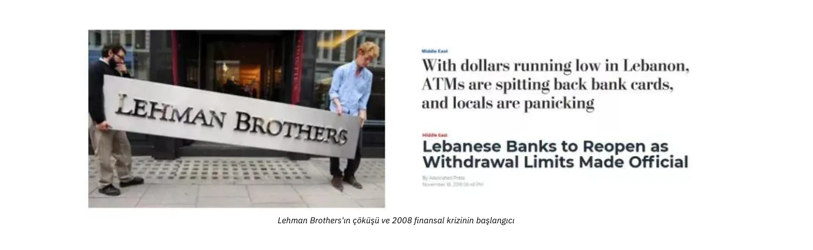

Diğerleri ise Bitcoin'yi nesilde bir kez ortaya çıkacak bir fırsat olarak görüyor: bireysel özgürlük için bir araç, küresel finans sistemini dönüştürmek için bir katalizör ve daha şeffaf ve adil bir alternatife giden bir yol. Bunlar kurucular, benimseyenler ve katkıda bulunanlar (geleceği şekillendirenler).

**Bitcoin** kendisi tarafsız kalır. İzin istemez. Onay istemez.

**Bu sadece var.**

Bu bölümde, Bitcoin endüstrisini ileriye götüren kilit oyuncuları inceleyeceğiz. Rollerini, teşviklerini ve etkileşimlerini anlamak, bu büyüyen ekosistemin dinamiklerini kavramak ve sunduğu fırsat ve zorlukları daha iyi yönlendirmek için gereklidir.

### Altcoinlerin çoğalması

Teknik olarak konuşmak gerekirse, yeni bir kripto para birimi oluşturmak inanılmaz derecede kolaydır; sadece birkaç dakika sürebilir ve çok az veya hiç gerçek yenilik gerektirmez. Asıl zorluk yaratımda değil, değerdedir. Ve dijital varlıklar dünyasında değer, tamamen piyasa tarafından belirlenir; kullanıcılarının güveni ve talebi ile.

Aralık 2019'da CoinMarketCap 5.000'in üzerinde token listeledi. NFT'lerin, merkezi olmayan finansın (DeFi) ve sayısız diğer uygulamanın (bazıları meşru, birçoğu şüpheli) yükselişi sayesinde 2025 yılına kadar bu sayı milyonlara ulaştı. Bu tokenlar farklı şekil ve biçimlerde karşımıza çıkmaktadır: bazıları para birimi olduğunu iddia ederken, diğerleri menkul kıymetler, platform araçları, yan zincirler veya dijital sanatın tokenlaştırılmış temsilleri olarak işlev görmektedir.

Ama açık olalım: **Bu kripto para birimlerinin çoğu dolandırıcılıktan biraz daha fazlasıdır.

Gösterişli teknoloji ve kaygan markalaşma perdesinin ardında, bu projelerin çoğu tek bir şey yapmak için tasarlanmış agresif pazarlama stratejileriyle desteklenmektedir, **Bitcoin'unuzu çıkarın**. Yatırımcıların açgözlülüğüne ve cehaletine oynayarak, devrim niteliğindeki teknoloji veya garantili getiriler hakkında baştan çıkarıcı hikayeler uydururlar; bu iddialar nadiren incelemeye tabi tutulur.

Elbette, bu gürültü denizi içinde, küçük bir avuç proje gerçekten sınırları zorlamaya çalışıyor. Bazıları gerçek teknik zorlukları (ölçeklenebilirlik, gizlilik, programlanabilirlik) çözmeye odaklanır ve daha geniş bir alana değerli fikirler katabilir. Zaman içinde bu deneylerden birkaçının faydalı yeniliklere yol açması muhtemeldir

Ancak temel soru hâlâ ortada duruyor:

**Bu yenilikler Bitcoin dışında da gelişebilir mi?

Şimdiye kadar bir gerçek öne çıktı: Bitcoin, küresel bir ağ tarafından desteklenen ve giderek daha fazla benimsenen, gerçekten merkezi olmayan, sansüre dayanıklı tek dijital para olmaya devam ediyor. Altcoinlerin aksine, Bitcoin merkezi şirketler tarafından desteklenmiyor ya da bir avuç geliştirici ve erken yatırımcı tarafından yönetilmiyor. Binlerce saatlik araştırma, geliştirme ve durmak bilmeyen iyileştirme çalışmalarının ağırlığını hak eden tek projedir.

| Feature               | Bitcoin                  | Altcoins (99.9% of them)       |
| ---------------------|--------------------------|--------------------------------|
| **Liquidity**         | High                     | Low                            |
| **Adoption (Real-World)** | Global and growing       | Very limited                   |
| **Team**              | Decentralized and robust | Centralized and opaque         |
| **Reputation**        | Strong and globally recognized        | Varies, often questionable     |
| **Infrastructure**    | Stable and secure        | Unstable and vulnerable        |
| **Decentralization**  | Yes                      | Rarely                         |
| **Scam Risk**             | No                       | Very likely                    |
| **Real utility?**     | Yes                      | Debatable                      |

**Aşağıdaki gibi yanıltıcı iddialara karşı dikkatli olun:**

- "Blockchain, Bitcoin değil"
- "XRP bir sonraki Bitcoin"
- "Libra, Bitcoin'nın yerini alacak
- "Benim projem Bitcoin'nin daha iyi bir versiyonu"
- "Merkez bankası dijital para birimleri Bitcoin'i geçersiz kılacak"

Zamanınızı veya kaynaklarınızı herhangi bir Altcoin'a yatırmadan önce kendi araştırmanızı yapın, çünkü burada ele alacağımız konu bu değil.

**Sadece Bitcoin ve Bitcoin'ı kapsamak için buradayız.**

### Büyük kurumlar tarafından benimsenme

2017'deki ICO patlamasından sonra kurumlar Blockchain'e ciddi ilgi göstermeye başladı; ancak çoğu zaman onu gerçekten devrimci yapan şeyin ne olduğunu kavrayamadılar. Merkez bankaları ve hükümetler artık kullanıcı işlemleri üzerinde tam kontrol sağlarken finansal altyapıyı modernize etmeyi umarak Merkez Bankası Dijital Para Birimlerini (CBDC'ler) araştırıyor. İsveç, AB, Rusya ve Çin gibi ülkelerde projeler halihazırda devam etmektedir.

Teknoloji devleri de yarışa katıldı. Facebook (şimdi Meta), fiat para birimlerinden oluşan bir sepetle desteklenen dijital bir para birimi yaratmayı amaçlayan stabilcoin girişimi Libra'yı başlattı. Ancak proje hızlı bir düzenleyici dirençle karşılaştı ve sonunda terk edildi.

| Feature                    | Bitcoin | Altcoins | Facebook-Coin | FedCoin |
|---------------------------|---------|----------|---------------|---------|
| **Public**                | Yes     | Varies   | No            | No      |
| **Open**                  | Yes     | Varies   | No            | No      |
| **Borderless**            | Yes     | Varies   | No            | No      |
| **Neutral**               | Yes     | Varies   | No            | No      |
| **Censorship-resistant**  | Yes     | Varies   | No            | No      |

Cesur pazarlamalarına rağmen, bu girişimler Bitcoin ile rekabet etmiyor; onun dilini taklit ederken temel ilkelerini reddediyorlar. Özgürlük için değil, uyum için inşa edilmişlerdir. Mahremiyeti korumak için değil, gözetimi genişletmek için tasarlanmışlardır. Kontrolü dağıtmak yerine sağlamlaştırıyorlar.

Facebook'un Libra'sı hiçbir zaman statükoya meydan okumak için tasarlanmadı; sistemle birlikte çalışmak üzere inşa edildi. Buna karşılık, Bitcoin tamamen bu sistemin dışında var oluyor. İzin istemiyor. Güvene dayanmıyor. Ve on yılı aşkın bir süredir kusursuz bir şekilde (liderler, kesinti süreleri veya merkezi kontrol olmadan) çalışıyor.

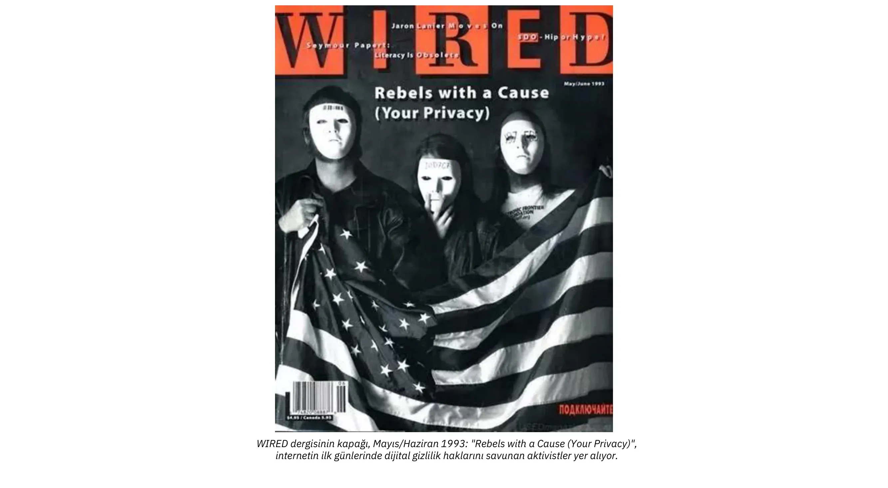

### Düzenleme ve Hükümet Yaklaşımları

Bitcoin, doğası gereği geleneksel çerçevelerin dışında çalışır. Merkezi bir otoriteye dayanmaz ve tek bir kuruluş tarafından kontrol edilemez veya değiştirilemez. Ancak protokolün kendisi düzenlemeden muaf olsa da, onunla etkileşime giren katılımcılar (borsalar, işletmeler ve kullanıcılar) hala ulusal yasalara tabidir.

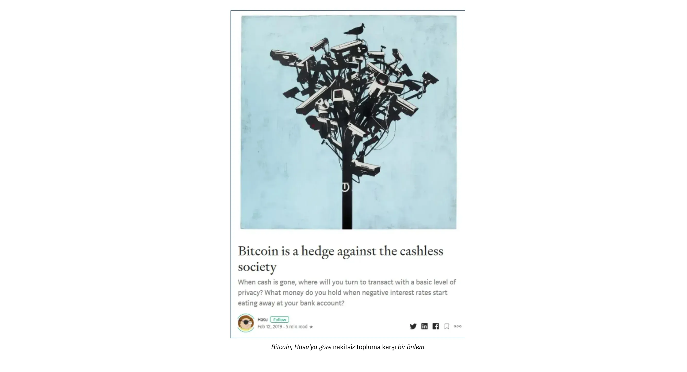

Bitcoin küresel bir ağ olduğundan, ülkeler çok farklı şekillerde yanıt vermiştir:

- Çin gibi bazıları ağır kısıtlamalar** getirerek, kullanımı gerçekten durdurmadan engellemeye çalışmaktadır.

- Bitcoin'yı bir tehditten ziyade bir fırsat olarak gören İsviçre veya Kanada gibi diğer bazı ülkeler daha sıcak ortamlar** sunmaktadır.

- Çoğu hala kararsız**, inovasyon ile gözetimi dengelemeye çalışırken bir yandan da düzenlemeleri deniyor.

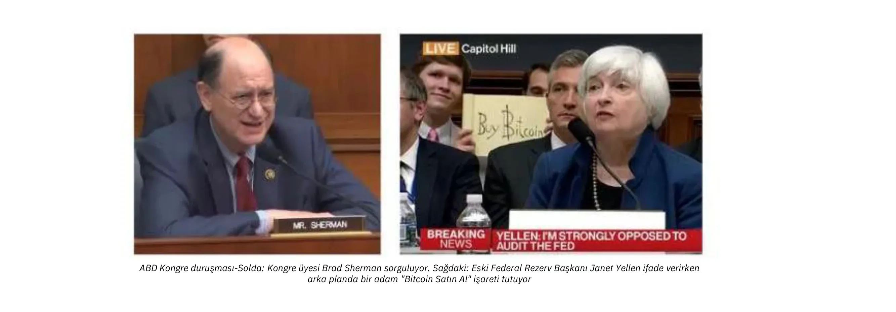

Hükümetler ve kurumlar genellikle Bitcoin'yi doğru bir şekilde sınıflandırmakta zorlanırlar (para mı, mülk mü, yoksa tamamen yeni bir şey mi?). Sonuç olarak, yönetmelikler tepkisel, tutarsız ve sürekli gelişen niteliktedir. Bitcoin ile ilgileniyorsanız, özellikle vergiler, bankacılık erişimi ve uyum kuralları söz konusu olduğunda, yerel ortamınız hakkında bilgi sahibi olmanız çok önemlidir.

### Bankaların Bitcoin Konusundaki Tutumu

Geleneksel finans sisteminin temel taşları olan bankalar, Bitcoin'u, aracılık ve finansal akışların kontrolü etrafında şekillenen ekonomik modellerine doğrudan bir tehdit olarak görmektedir. Bu durum, dünya genelinde birçok bankanın Bitcoin kullanan işletmelere ve bireylere neden kısıtlamalar getirdiğini açıklamaktadır. Bazıları, genellikle kara para aklamayı önleme (AML) ve terörle mücadele finansmanı (CTF) endişelerini gerekçe göstererek, kripto para sektöründe faaliyet gösteren şirketlerin hesaplarını kapatmaya veya hizmetlere erişimi sınırlamaya kadar gitmektedir.

Bununla birlikte, Bitcoin bir rakip olarak görülürken, aynı bankaların çoğu Blockchain araştırma ve geliştirmesine aktif olarak yatırım yapıyor ve kontrollerini bırakmadan Bitcoin'in yeniliklerinden yararlanmaya çalışıyor. Blockchain'nin önemli bir potansiyel sunduğunun farkındalar, ancak Bitcoin'in merkezi olmayan, açık modelini benimsemek yerine mevcut altyapılarına nasıl entegre edileceğini kontrol etmeyi amaçlıyorlar.

### Kripto Para Borsaları ve Bitcoin Saklama

Borsalar, fiat para birimleri ile Bitcoin arasında köprü görevi görerek Bitcoin ekosisteminde kritik bir rol oynar. Kullanıcıların Bitcoin almasına, satmasına ve bazen diğer dijital varlıklarla takas etmesine olanak tanırlar. Bununla birlikte, tüm borsalar eşit yaratılmamıştır ve riskleri en aza indirirken ihtiyaçlarınıza uygun olanı seçmek çok önemlidir. İşte bir Exchange kullanmadan önce göz önünde bulundurmanız gereken temel faktörler:

- güvenli olma konusunda sağlam bir üne sahiptir;
- aşırı fiyat dalgalanmaları olmaksızın hızlı alım satımı sağlamak için yeterli likidite;
- duyarlı ve verimli müşteri hizmetleri;
- İşlemlerde gezinmeyi kolaylaştıran kullanıcı dostu bir Interface;
- otomatik yinelenen satın alımlar (ARP) için bir seçenek;
- kişisel bir Wallet'ya kolay, ücretsiz bitcoin çekme.

Yerel düzenlemelere uyan borsalar genellikle katı **"Müşterini Tanı "** (KYC) protokollerini takip etmek zorundadır ve kullanıcıların hizmetlere erişmeden önce kimlik belgelerini sağlamalarını gerektirir. Bu süreçler yasadışı faaliyetleri önlemek için tasarlanmış olsa da, Bitcoin'nin doğası gereği sunduğu gizliliği tehlikeye atabilir.

KYC platformları kişisel bilgilerinizi güvenlik kisvesi altında toplar. Bu veriler, finansal işlemlerinizi izlemek ve belirli işlemlere erişiminizi kısıtlamak için hükümetler tarafından kullanılabilir.

Bununla birlikte, KYC'ye başvurmadan bitcoin edinmek için alternatifler vardır:

- P2P Bisq, Robosat, LNP2PBot, Peach, HODL HODL gibi platformları satın alır;
- Doğrudan nakit alımlar, örneğin yerel Bitcoin buluşmalarında;
- KYC'siz düzenlenmiş satın alma platformları nadirdir ancak bazı ülkelerde mevcuttur;
- Bitcoin ATM'ler;
- Bitcoins için Exchange'de çalışıyorum;
- Mining bitcoins.

Her biri belirli kullanımlar için uygun olan çeşitli platform türleri vardır:

- Eşler arası Exchange platformları (P2P)**

Bu platformlar, kullanıcıların merkezi bir aracı olmadan doğrudan birbirleriyle bitcoin alıp satmalarına olanak tanır. Özellikle KYC olmadan çalıştıkları için daha fazla gizlilik sunarlar. Yüz yüze işlem yapabileceğiniz veya çeşitli çevrimiçi ödeme yöntemlerini (SEPA, Revolut, Wise, vb.) kullanabileceğiniz yerel satıcılar bulabilirsiniz.

**Dikkat:** Herhangi bir fiziksel işlemde, olası dolandırıcılıklardan kaçınmak için halka açık ve güvenli bir yer seçin.

https://planb.academy/tutorials/exchange/peer-to-peer/bisq-v2-c1c6a702-6c16-4101-8b90-62c424017b80

https://planb.academy/tutorials/exchange/peer-to-peer/hodlhodl-d7344cd5-6b18-40f5-8e78-2574a93a3879

https://planb.academy/tutorials/exchange/peer-to-peer/lnp2pbot-v2-e6bcb210-610b-487d-970c-7cce85273e3c

https://planb.academy/tutorials/exchange/peer-to-peer/peach-c6143241-d900-4047-9b73-1caba5e1f874

https://planb.academy/tutorials/exchange/peer-to-peer/robosats-b60e4f7c-533a-4295-9f6d-5368152e8c06

- Yalnızca Bitcoin Exchange platformları**

Bu platformlar basit ve şeffaf bir hizmet sunarak kullanıcı dostu bir yaklaşım benimsemektedir. Yalnızca Bitcoin'dirler. Genellikle Dolar-Maliyet Ortalaması (DCA) yoluyla bitcoin satın almak için çözümler uygularlar ve kişisel bir Wallet'a otomatik para çekme imkanı sunarlar. Özellikle aşamalı ve güvenli bir şekilde bitcoin biriktirmek isteyen yeni başlayanlar için uygundurlar. Örnekler: Relai, Bull Bitcoin, StackinSat, Bitstack...

https://planb.academy/tutorials/exchange/centralized/bitstack-29fd71be-9570-42c6-8f6f-cd355d62e746

https://planb.academy/tutorials/exchange/centralized/bull-bitcoin-europe-0ccf713e-efcd-44ec-8205-211f49ac7d53

https://planb.academy/tutorials/exchange/centralized/relai-v2-30a9671d-e407-459d-9203-4c3eae15b30e

https://planb.academy/tutorials/exchange/centralized/stackinsat-5af6a380-f3c6-4246-9f81-9957a16ab066

- Genel Amaçlı veya Ticaret Odaklı Exchange Platformları**

Bu platformlar, kaldıraç ve türevler dahil olmak üzere sadece Bitcoin satın almanın ötesinde gelişmiş özellikler sunar. Ancak, ticarete karşı şiddetle tavsiye ediyoruz. Bunun yerine, Bitcoin satın almanızı ve kendi Wallet'nize taşımanızı öneririz. Alım satım yüksek riskli bir faaliyettir ve genellikle uzun vadeli birikime odaklananlar için uygun değildir. Ticaret oyununun dışında kalmak genellikle daha akıllıca bir yoldur.

https://planb.academy/tutorials/exchange/centralized/bitfinex-dc306d39-bd96-4ab9-a278-a322316716db

https://planb.academy/tutorials/exchange/centralized/bitstamp-5a36c896-bff5-46d7-b505-ff069c3ac47c

https://planb.academy/tutorials/exchange/centralized/kraken-1ef03e25-9b42-49bd-a47d-249e1a13cfc6

https://planb.academy/tutorials/exchange/centralized/paymium-92603f76-b985-49ce-81e5-f4fa0df776e5

**Exchange platformları güvenli cüzdanlar değildir**. Bitcoinlerinizi bir Exchange'te bırakmak sizi önemli risklere maruz bırakır. Çeşitli senaryolar paranızın kaybolmasına neden olabilir:

- Bilgisayar korsanlığı**: Güvenliği ihlal edilmiş platformlardan (örneğin MtGox) çok sayıda bitcoin çalınmıştır;
- Devlet el koyması**: Bir hükümet bir platformu kapatabilir ve kullanıcılarının fonlarını dondurabilir;
- İflas veya dolandırıcılık**: Çok sayıda platform müşterilerinin paralarıyla birlikte ortadan kaybolmuştur (örn. FTX).

Altın kural basittir: **Eğer özel anahtarlarınıza sahip değilseniz, bitcoinlerinize de gerçekten sahip değilsiniz demektir**. Paranız üzerinde tam egemenlik sağlamak için fonlarınızı her zaman mümkün olan en kısa sürede kişisel bir Wallet'e çekin.

### Cüzdanlar, Mining ve kalkınma: ekosistemin temel taşları

#### Bitcoin cüzdanlar

Bitcoin Ownership'nin kalbinde, bitcoinlerinize erişmek ve yönetmek için gereken özel anahtarları güvenli bir şekilde saklayan özel bir araç olan Wallet yatmaktadır. Bir Wallet birçok şekilde olabilir: özel bir donanım cihazı, bir mobil veya masaüstü uygulaması veya hatta üzerinde anahtar yazılı bir kağıt parçası. Bu cüzdanlar dijital servetinizi gerçek dünya ile birleştirerek Bitcoin'i günlük hayatta kullanılabilir hale getirir.

Her bir Wallet tipi farklı bir denge sunar:

- Gizlilik
- Güvenlik
- Kullanım kolaylığı
- Maliyet

Bitcoin Wallet endüstrisi, her biri farklı ihtiyaçlara ve teknik uzmanlık seviyelerine hitap eden çeşitli kategorilere ayrılmıştır:

- [Hardware Wallet](https://planb.academy/resources/glossary/hardware-wallet) Üreticileri**: Bu şirketler güvenli anahtar depolama için tasarlanmış fiziksel cihazlar geliştirmektedir. Bazıları açık kaynaklıdır, diğerleri ise çeşitli özelliklere ve güvenlik seviyelerine sahip tescilli çözümler sunar. Önemli isimler arasında Ledger, Trezor, Coinkite, Foundation ve Shiftcrypto bulunmaktadır.
- Software Wallet Geliştiriciler**: Bunlar, mobil ve masaüstü uygulamalar yaratan şirketlerden bağımsız geliştiricilere kadar uzanmaktadır. Sundukları teklifler kullanıcı deneyimi, güvenlik ve özellikler açısından farklılık gösterir. Örnekler arasında Sparrow, Wizard Sardine, Galoy, Synonym ve Blockstream bulunmaktadır.
- DIY (*Kendin Yap*) Cüzdanlar**: Bu açık kaynaklı çözümler, tam kontrol ve üçüncü taraflara minimum bağımlılık isteyen ileri düzey kullanıcılar için tasarlanmıştır. Kendi Wallet'nizi oluşturmak güven bağımlılıklarını azaltır ve güvenlik duruşunuzu artırabilir. Önemli DIY seçenekleri arasında Seedsigner ve Specter DIY bulunmaktadır.

Cüzdanlar Bitcoin'de temel bir rol oynamaktadır ve bu kursun ilerleyen bölümlerinde daha derinlemesine incelenecektir.

#### Bitcoin Mining

Mining, Bitcoin ağının temel bir işlevidir. Sistemin güvenliğini sağlar ve Blockchain'yi çalışır durumda tutar. Madenciler işlemleri doğrular ve Proof of Work olarak bilinen enerji yoğun hesaplamaları gerçekleştirerek ağın güvenliğini sağlar. Yeni çıkarılan her blok Blockchain'ye bir grup işlem ekler ve protokolün çıkarma programına göre yeni bitcoinler çıkarır.

Bitcoin'in ilk günlerinde Mining kişisel bir bilgisayardan yapılabiliyordu. Bugün ise, önemli finansal ve teknik kaynaklara sahip şirketlerin hakim olduğu rekabetçi, küresel bir sektördür. Madenciler işletme maliyetlerini ve karlılığı optimize etmeyi amaçladıklarından, ucuz enerji kaynakları arayışı kilit bir odak noktası haline gelmiştir. Mining operasyonları artık devasa endüstriyel tesislerden evlerde veya garajlarda çalışan küçük ölçekli kurulumlara kadar uzanıyor...

Mining ekosistemi birkaç büyük oyuncudan oluşmaktadır:

- Donanım Üreticileri**: Bitmain gibi şirketler, yalnızca Mining Bitcoin için oluşturulan ultra özel çipler olan ASIC'leri (Uygulamaya Özel Entegre Devreler) tasarlar ve üretir.
- Mining havuzları**: Bunlar, ödül kazanma şanslarını artırmak için bilgi işlem güçlerini birleştiren madenci kolektifleridir. Mining'ün artan zorluğu göz önüne alındığında, havuzlar blok ödüllerini (yeni çıkarılan bitcoinler ve işlem ücretleri) katkılarına göre katılımcılar arasında dağıtarak daha öngörülebilir ödemeler sunar. Örnekler arasında Foundry USA, AntPool, F2Pool, MARA Pool ve Braiins Pool bulunmaktadır.
- Madenciler**: Bunlar Mining donanım ve yazılımını çalıştıran kişi veya kuruluşlardır. Bir tarafta Antminer S9 gibi makineleri kullanan küçük ölçekli madenciler, diğer tarafta ise Mining'e adanmış devasa tesisleri yöneten Galaxy Digital gibi endüstriyel operasyonlar bulunmaktadır.

Mining, keşfedilecek birçok katmanı olan kendi başına bir dünyadır; teknik zorluklar, ekonomik teşvikler ve enerji hususlarının tümü devreye girer. Bu alanı daha fazla keşfetmek ve nasıl çalıştığını gerçekten anlamak isteyenler için MIN201 kursumuz bilmeniz gereken her şeyi size sunuyor.

https://planb.academy/courses/ce272232-0d97-4482-884a-0f77a2ebc036

#### Bitcoin ekosisteminde gelişim

Bitcoin'in teknik gelişiminin merkezinde, bir Bitcoin düğümünü çalıştırmak için en yaygın kullanılan yazılım istemcisi olan Bitcoin core yatmaktadır. Açık kaynaklı bir projedir, tamamen şeffaftır ve GitHub'da herkese açıktır: herkesin kodu inceleyebileceği, tartışmaları takip edebileceği ve protokolün nasıl geliştiğini görebileceği [https://github.com/Bitcoin/Bitcoin](https://github.com/Bitcoin/Bitcoin). Güncellemeler önerilip tartışılsa da, kimse bunları benimsemeye zorlanmaz ve kullanıcılar hangi sürümü çalıştırdıklarının kontrolünü elinde tutar.

Bitcoin'nın gelişimi, katkıda bulunan birkaç farklı grup aracılığıyla anlaşılabilir:

- Bitcoin core geliştiricileri**, Bunlar ana yazılım istemcisini koruyan ve geliştiren bireylerdir. Bunların arasında, depoyu yönetmenin anahtarlarını elinde tutan bakımcılar da vardır. 2025 yılında bunlardan beş tanesi bulunmaktadır: Hennadii Stepanov, Michael Ford, Ava Chow, Gloria Zhao ve Ryan Ofsky. Bir de kod değişiklikleri, hata düzeltmeleri veya iyileştirmeler gönderen katılımcılar var. Bu teklifler kabul edilmeden önce akran değerlendirmesinden ve topluluk tartışmasından geçiyor.
- Katmanlı protokol geliştiricileri**, Bu grup, Bitcoin'un çekirdeğini değiştirmeden yeteneklerini genişletmeyi amaçlayan Lightning Network veya RGB gibi Bitcoin'un üzerine inşa edilen teknolojiler üzerinde çalışmaktadır.
- Bağımsız geliştiriciler**, Bu geliştiriciler, Mempool.space (işlem etkinliğini izlemek için görsel bir Interface) veya Alby (tarayıcılarda ve uygulamalarda Lightning ödemelerini kullanmaya yönelik araçlar) gibi kullanıcı deneyimini iyileştirmeye yönelik araçlar ve uygulamalar oluşturmaya odaklanır.

Herkes Bitcoin core'te değişiklik önerebilir, ancak süreç kasıtlı olarak titizdir. Yeni fikirlerin rafine edilmesi genellikle yıllar alır ve derin teknik anlayış, geniş topluluk katılımı ve birden fazla inceleme katmanı gerektirir. Teklifler tipik olarak **Bitcoin İyileştirme Teklifleri (BIPs)** şeklinde sunulur; bunlardan bazıları asla protokole girmez.

Yenilik hoş karşılanır, ancak yalnızca sağlam gerekçeler, topluluk fikir birliği ve dikkatli testlerle desteklendiğinde.

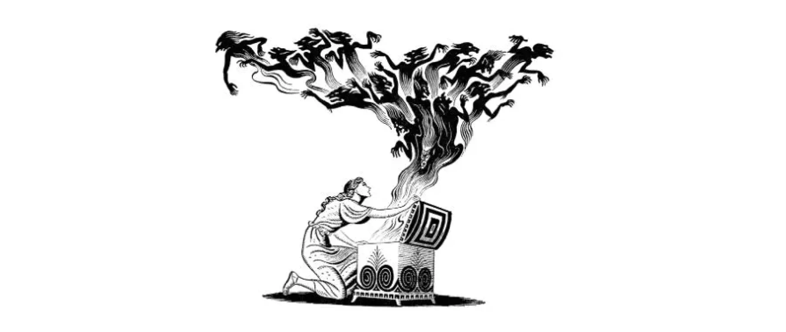

Bazılarının inandığının aksine, hiç kimse Bitcoin üzerinde tek taraflı kontrole sahip değildir; Bitcoin core'nın bakımcıları bile. Onların rolü yazılım havuzunu yönetmektir, protokolün kendisini değil.

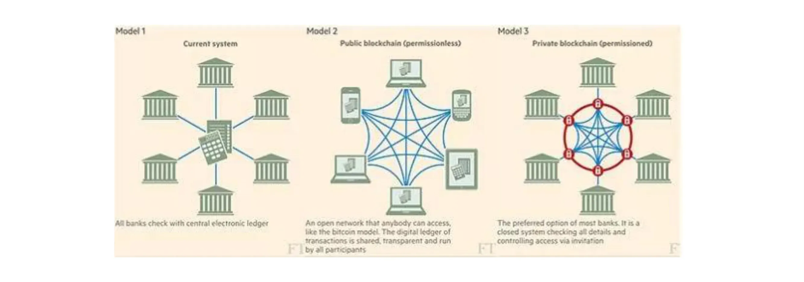

Bir bakımcı tartışmalı bir değişikliği onaylasa bile, **node'lar (kullanıcılar tarafından işletilen)** bu sürümü gerçekten benimseyip çalıştırmadıkça ağı etkilemeyecektir. Sonuçta, Bitcoin'in kodu yalnızca insanlar onu çalıştırmayı seçerse önemlidir.

Ayrıca **Bitcoin core'nin tek istemci olmadığını** da belirtmek gerekir. Bitcoin Knots gibi alternatifler de Bitcoin protokolünü uygulayarak kullanıcılara daha fazla seçenek sunar ve sistemin ademi merkeziyetini güçlendirir:

https://planb.academy/tutorials/node/bitcoin/bitcoin-knots-e04b2196-4df2-4246-86ef-c02269c29098

## Bitcoin'nin Katmanlı Mimarisi

<chapterId>03017765-53cf-5f14-9682-e99ca02d2241</chapterId>

:::video id=6b7c8d9e-0f1a-2b3c-4d5e-6f7a8b9c0d1e:::

Bitcoin, başlangıçtan itibaren minimalist, sağlam ve güvenli olacak şekilde tasarlanmış açık bir sistemdir. Temellerini değiştirmeden işlevsellik eklemek için, evrimler genellikle **protokol katmanları** ve ana sistemin ademi merkeziyetçiliğinden ve esnekliğinden ödün vermeden ekosistemi zenginleştiren tamamlayıcı uygulamalar eklenerek yapılır. Bu esneklik, çok sayıda şirketin ve bağımsız geliştiricinin Bitcoin etrafında bir altyapı oluşturmasını ve farklı kullanım durumlarına uyarlanmış yenilikler eklemesini sağlamıştır.

### Ek katmanlarla Bitcoin uzantısı

Katmanlı yaklaşım, Bitcoin'in temel protokolünü değiştirmeden geliştirilmesine olanak tanıyarak ana sistemin istikrarını ve güvenliğini garanti eder. Bu yöntem, sorunsuz birlikte çalışabilirliği korurken farklı işlevler sunmak için birden fazla protokolün birbiri üzerine inşa edildiği İnternet'in çalışma şekline benzer.

Bitcoin ekosistemini zenginleştiren ana kaplama sistemleri arasında şunlar yer almaktadır:

- Lightning Network**:

Thaddeus Dryja ve Joseph Poon tarafından 2016 yılında yaratılan Lightning Network, anında ve düşük maliyetli ödemeleri mümkün kılmak için tasarlanmış ikinci bir Layer çözümüdür. İki kullanıcı, yalnızca kanal açıldığında veya kapatıldığında Blockchain'da güncellenen bakiye ile işlem yapabilecekleri özel bir kanal açabilir. Kanal içindeki işlemler off-chain'da gerçekleşir, yani Bitcoin Blockchain'da ayrı ayrı kaydedilmeleri gerekmez. Bu yapı, anlık işlemlere ve minimum ücretlere olanak tanıyarak hızlı onay gerektiren düşük değerli işlemler için idealdir.

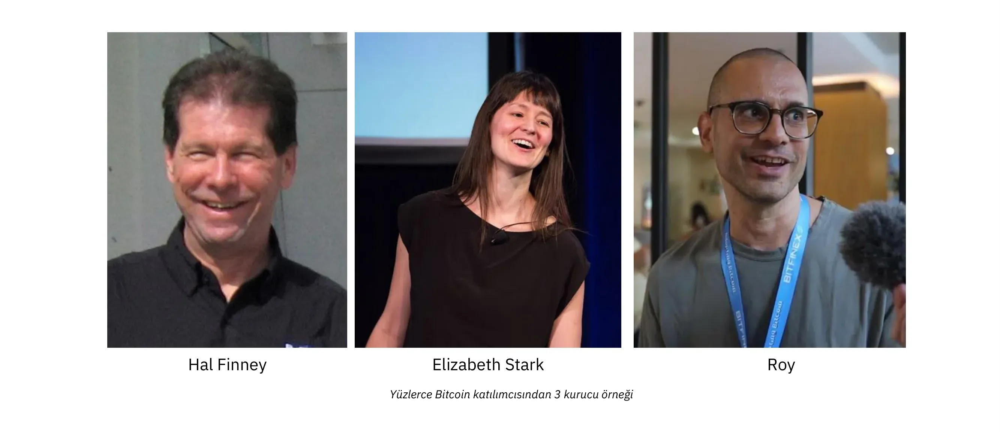

Diyelim ki Bitcoin ile Layer tabanını kullanarak bir kahve satın alıyorsunuz. Ödemenin onaylanması için (ve kafenin gerçekten ödeme yaptığınızdan emin olması için) işlemin bir bloğa dahil edilmesi gerekir. Bu, seçtiğiniz ücrete bağlı olarak birkaç dakika sürebilir. Teknik olarak, satıcının ödemenin kesinleştiğinden tam olarak emin olması için altı onay (yaklaşık bir saat) beklemesi gerekir. Açıkçası, gişede durduğunuzda bu tür bir bekleme işe yaramıyor. Lightning Network ile ödeme sadece birkaç saniye içinde gerçekleşir; böylece kahveniz soğumaya bile vakit bulamadan ödemesi yapılır ve servis edilir.

Lightning'in nasıl çalıştığı hakkında daha fazla bilgi edinmek istiyorsanız, bu konuya adanmış mükemmel bir ikinci yıl kursu sunuyoruz:

https://planb.academy/courses/34bd43ef-6683-4a5c-b239-7cb1e40a4aeb

- Yan zincirler**:

Yan zincirler, Bitcoin'in ana Blockchain'sına paralel olarak çalışan blok zincirleridir. Bunlar, zincirler arasında hareket eden varlığın aynı değeri korumasını sağlayan iki yönlü bir peg aracılığıyla birbirine bağlanır; yani Sidechain'deki bir Bitcoin, ana zincirde hala bir Bitcoin değerindedir. Her Sidechain'nin tamamen ayrı veya kısmen Bitcoin'lere bağımlı olabilen kendi mutabakat mekanizması vardır.

Yan zincirlerin ana avantajı, Bitcoin temel Layer'ta bulunmayan özellikleri sunabilmeleri veya bunları geliştirilmiş şekillerde sunabilmeleridir. Buna geliştiriciler için daha fazla esneklik, daha hızlı ve/veya daha özel işlemler ve daha yüksek işlem hacmi dahildir. Ancak, bu faydaları sağlamak için yan zincirler genellikle Bitcoin'un ana zincirine kıyasla farklı ödünler verir.

Yan zincir kavramı 2014 yılında Adam Back, Matt Corallo, Luke Dashjr, Mark Friedenbach, Gregory Maxwell, Andrew Miller, Andrew Poelstra, Jorge Timon ve Pieter Wuille tarafından ortaya atılmıştır. 2025 itibariyle Bitcoin ekosisteminde en çok bilinen yan zincirler Liquid ve RSK'dır (Rootstock).

Liquid'ü daha ayrıntılı olarak incelemek isterseniz, konuyla ilgili ileri düzey bir üçüncü sınıf kursu sunuyoruz:

https://planb.academy/courses/6d26bcff-51a3-405f-bcdd-9af8297ce727

- RGB**:

RGB, Bitcoin ve Lightning Network'nın üzerinde çalışmak üzere tasarlanmış merkezi olmayan ve gizlilik odaklı bir Smart contract sistemidir. Geleneksel Smart contract platformlarının aksine, RGB bir Client-side Validation modeli kullanır (yani tüm Contract State off-chain'de saklanır ve Bitcoin Blockchain'a yalnızca kriptografik taahhütler yayınlanır). Bu tasarım hem ölçeklenebilirliği hem de gizliliği artırır. RGB ile kullanıcılar token, NFT, merkeziyetsiz kimlik ve hatta DeFi uygulamalarını doğrudan Bitcoin veya Lightning üzerinde yayınlamak için gelişmiş akıllı sözleşmeler oluşturabilir.

RGB'nın önemli bir özelliği, Tek Kullanımlık Mühürler adı verilen bir kriptografik teknik kullanılarak elde edilen Double-spending'e karşı korumasıdır. Bu mekanizma, Bitcoin'in UTXO'larının (Harcanmamış İşlem Çıktıları) yalnızca bir kez harcanabileceği gerçeğine dayanır. Token'ların gerçekliği, Contract'ün tüm geçmişinin (oluşturulmasından mevcut durumuna kadar) kullanıcı tarafında doğrulanmasıyla sağlanır.

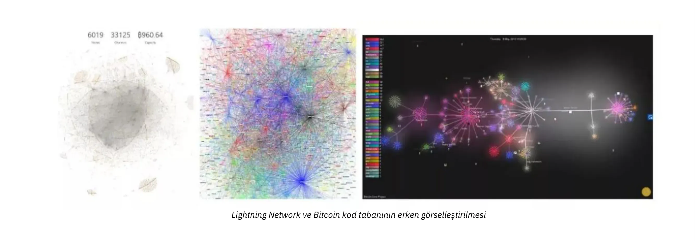

RGB hakkındaki bilgilerinizi derinleştirmek için dördüncü yıl eğitim kursu sunuyoruz (lütfen oldukça teknik olduğunu unutmayın):

https://planb.academy/courses/3ce1d37c-05ba-4f54-aa15-7586d37b2bb7

RGB, Bitcoin'in üzerine inşa edilen birçok protokolden sadece biridir. Bazıları diğerlerinden daha yaygın olarak benimsenmiş olsa da yenileri ortaya çıkmaya devam etmektedir. Ortak nokta, Bitcoin'in temel protokolünün bütünlüğünü ve değişmezliğini korurken, her bir Layer'u belirli bir görev için optimize etme fikridir.

Bu katmanlı tasarım, genellikle birçok özelliği tek bir protokolde toplamaya çalışan daha geniş kripto endüstrisinin çoğunun aksine durmaktadır. Bitcoin'i basit ve dar odaklı tutarak saldırı yüzeyini azaltıyoruz; bu da daha fazla güvenlik anlamına geliyor. Yalın bir protokolün güvenliği, bakımı ve ölçeklendirilmesi daha kolaydır. Bitcoin tek bir şeyi son derece iyi yapmak üzere tasarlanmıştır: sağlam, merkezi olmayan para sağlamak. Diğer her şey (akıllı sözleşmeler, tokenlar, ödemeler ve daha fazlası), çekirdekten ödün vermeden yeniliğe izin verecek şekilde katmanlandırılabilir.

**İnternet bir kerede inşa edilmedi; birlikte çalışabilir protokollerden oluşan bir yığın olarak gelişti. Örneğin, TCP/IP ağ iletişimini yönetir, HTTP web'e güç verir ve diğer birçok katman belirli işlevlere hizmet eder. Her bir Layer kendi işi için optimize edilerek sağlam ve modüler bir sistem yaratılmıştır. Bitcoin de aynı felsefeyi takip eder. Temel Layer güçlü ve minimaldir ve Lightning, Liquid veya RGB gibi katmanlı protokoller aracılığıyla ek işlevler eklenir; her biri temeli sağlam tutarken farklı kullanıcı ihtiyaçlarını çözmeye odaklanmıştır.

### Bitcoin'yı Kabul Etmek için Satıcı Araçları

Günümüzde, Bitcoin'yi bir ödeme şekli olarak kabul etmek isteyen tüccarlar için pek çok araç mevcuttur. Basit bir kurulum arayan küçük işletmeler için bir Hot Wallet (veya hatta bir Lightning Wallet) kullanmak, ödemeleri doğrudan kabul etmeye başlamak için genellikle yeterlidir. Uygun muhasebe ve raporlama gerektiren daha büyük işletmeler genellikle daha gelişmiş ödeme işleme sistemlerini tercih edecektir. Neyse ki, ihtiyaçlarınıza bağlı olarak çeşitli seçenekler mevcuttur.

Uygulamadan bağımsız bir çözümü tercih ediyor ve itibari para birimini doğrudan banka hesabınıza almak istiyorsanız OpenNode gibi saklama hizmetleri kolaylaştırılmış bir deneyim sunar:

https://planb.academy/tutorials/business/point-of-sale/open-node-e69a0c1c-47f7-4932-8494-e6f26c3c9784

Teknik açıdan daha yatkın olan ve süreç üzerinde tam kontrol sahibi olmak isteyen tüccarlar için BTCPay Server harika bir açık kaynak seçeneğidir. Ana dezavantajı, bazı teknik bilgilerle birlikte kurulum ve bakım için zaman gerektirmesidir:

https://planb.academy/tutorials/business/point-of-sale/btcpay-server-928eb01e-824b-4b57-a3e8-8727633beddc

Bu ikisinin arasında bir yerde, kullanım kolaylığı, işlevsellik ve güvenlik arasında iyi bir denge kuran, kullanıcı dostu ancak güçlü bir çözüm olan Swiss Bitcoin Pay'i bulacaksınız. Hem küçük perakendeciler hem de daha büyük işletmeler için iyi çalışır:

https://planb.academy/tutorials/business/point-of-sale/swiss-bitcoin-pay-2-a78b057e-ed11-47ac-860c-71019fcb451a

Bitcoin'yi kabul etmek bir işletmeye çeşitli pratik ve finansal faydalar sağlayabilir. Tıpkı nakit para gibi, Bitcoin de müşteri ile satıcı arasında doğrudan ödeme yapılmasına olanak tanır (geleneksel bir bankaya gerek yoktur). Lightning Network aracılığıyla yapılan ödemeler anında ve nihaidir, bu da ters ibraz riskini azaltır. Ve tüccarlar kendi Bitcoin'lerini tuttuklarında (öz saklama), daha fazla finansal özerklik kazanırlar.

Ayrıca bankacılık ücretlerini ve geleneksel ödeme terminallerine olan ihtiyacı ortadan kaldırarak maliyetleri düşürmeye yardımcı olabilir; genellikle ihtiyacınız olan tek şey bir akıllı telefon veya dizüstü bilgisayardır. Ödeme işlemcileri dahil olsa bile, ücretler genellikle bankalar tarafından tahsil edilenlerden daha düşüktür.

Enflasyon nedeniyle zaman içinde değer kaybeden geleneksel para birimlerinin aksine, Bitcoin 21 milyon madeni paradan oluşan sabit bir Supply'e sahiptir. Bu da onu uzun vadede işletme hazinesini korumak ve çeşitlendirmek için değerli bir varlık haline getirmektedir.

Günlük operasyonlarda Bitcoin, fiziksel nakit ihtiyacını ortadan kaldırarak, hırsızlık risklerini azaltarak ve sahte para olasılığını ortadan kaldırarak ödemeleri basitleştirir. Küresel bir para birimi olduğundan, para birimi dönüştürmeye gerek olmadığından uluslararası müşteriler için idealdir. Online mağazalar için Bitcoin özellikle güvenli ve verimlidir.

Bunun da ötesinde, Bitcoin'yı kabul etmek akıllı bir pazarlama hamlesi olabilir. İşletmenizin ileri görüşlü olduğunu gösterir ve yeni müşteriler çekebilir (özellikle Z kuşağı gibi genç nesiller arasında). Bu, çoğunlukla ilk kurulumla sınırlı minimum maliyetli, düşük riskli, stratejik bir fırsattır; doğru araçlarla artık her zamankinden daha kolay.

Bitcoin'nin işletmenize nasıl entegre edilebileceğini (bir ödeme yöntemi, bir hazine varlığı veya her ikisi olarak) keşfetmek istiyorsanız, bu ihtiyaca göre uyarlanmış başlangıç düzeyinde bir kurs sunuyoruz:

https://planb.academy/courses/a804c4b6-9ff5-4a29-a530-7d2f5d04bb7a

Bitcoin, birçok sektörde artan benimseme ile Exchange'un bir aracı olarak zemin kazanıyor. Lightning Network ödemeleri daha hızlı ve daha ucuz hale getirerek Bitcoin'in tüccarlar için cazibesini daha da artırdı.

Herkesin Bitcoin ekosistemine dahil olabileceği bir noktaya ulaştık; ister günlük hayatta kullanarak, ister iş dünyasında benimseyerek, eğitime katkıda bulunarak, kodun geliştirilmesine yardımcı olarak veya yeni uygulamalar oluşturarak.

Bitcoin artık durdurulamaz.

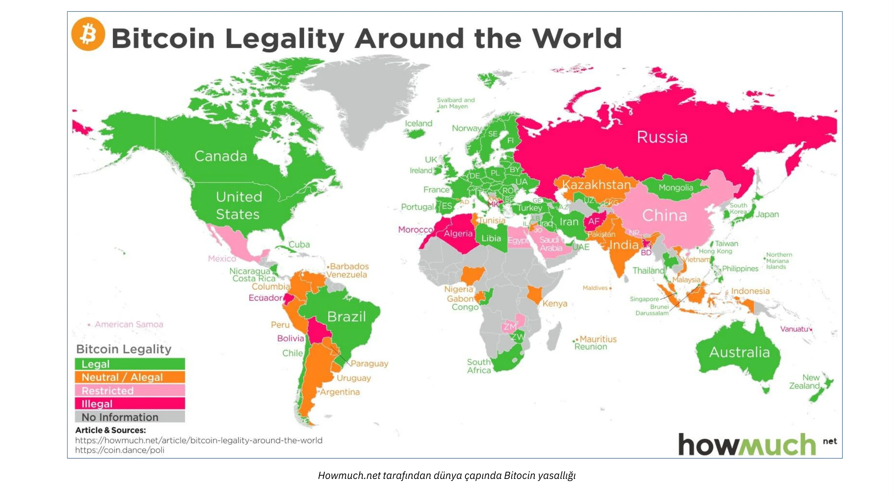

### Kişisel Perspektifim

"Bitcoin otoyolu" metaforunu her zaman ekosistemin nasıl geliştiğini ve nereye gittiğini anlamanın en doğru ve ilgi çekici yollarından biri olarak görmüşümdür. Bitcoin sadece dijital para değil; kendi güçlü ve kusurlu yönleriyle büyüyen alternatif bir finansal sistem**. Hala genç ve zorluklarla karşı karşıya olsa da, esnekliği inkar edilemez. Yok olup gitmiyor. Aksine, bir kara delik gibi, inkar edilemez bir parasal standart haline gelene kadar etrafındaki her şeyi yavaş yavaş emecektir.

Bitcoin'ü araba kullandığınız bir yol olarak hayal edin. Şu anda, günlük temel ihtiyaçlarınızı karşılamak için (market alışverişi yapmak, hizmetler için ödeme yapmak veya arabanızı tamir ettirmek) bazen bu yoldan çıkmanız gerekiyor; yani geçici olarak eski finansal sisteme geri dönüyorsunuz. Bunun nedeni, Bitcoin altyapısının hala yapım aşamasında olması ve günlük yaşamın bazı bölümlerinin hala itibari para birimine ve bankalara dayanmasıdır.

Ancak zamanla bu yol tamamen yapılaşmış bir otoyol haline gelecektir.

Bitcoin'in geleceğini bu şekilde görüyorum. Geleneksel finansın yerini tamamen alamayabilir, ancak dünyanın çoğu için standart hale gelene kadar temel alanlarda (verimlilik, güvenlik ve kullanıcı benimsemesi) ondan daha iyi performans gösterecektir.

Doğru hatırlıyorsam, bu Bitcoin otoyolu metaforu ilk olarak Andreas Antonopoulos tarafından ortaya atılmıştı. Onun vizyonu bugün hala geçerliliğini koruyor ve ileriye doğru atılan her adımda onu yaşamaya daha da yaklaşıyoruz.[@aantonop](https://x.com/aantonop)

Kursta bir sonraki adım: pratik yapacağız ve kişisel durumunuza ve hedeflerinize göre bitcoiner profilinizi tanımlamanıza yardımcı olacağız.

# Planınızı oluşturma

<partId>3801faf6-7915-56fa-baf5-ee63ad03b7cf</partId>

## Profilinizi seçin

<chapterId>c5d87903-a5f2-5eec-887a-f662734ce49b</chapterId>

:::video id=1a2b3c4d-5e6f-7a8b-9c0d-1e2f3a4b5c6d:::

Artık Bitcoin'nin teorik temellerini öğrendiğinize göre, pratik tarafına geçmenin zamanı geldi. Bu bölüm, ilk bitcoinlerinizi nasıl elde edeceğinizi, bunları nasıl güvenli bir şekilde saklayacağınızı ve yaklaşımınızı kişisel durumunuza göre nasıl uyarlayacağınızı anlamanıza yardımcı olacaktır. Amaç, ne tür bir kullanıcı olduğunuzu belirlemenize yardımcı olmaktır, böylece ihtiyaçlarınıza ve kısıtlamalarınıza uygun bir strateji benimseyebilirsiniz.

Bitcoin geleneksel varlıklar gibi değildir. Düşünceli bir yaklaşım ve onu kullanmanın hem teknik hem de ekonomik sonuçlarının sağlam bir şekilde anlaşılmasını gerektirir. Fiat para birimlerinin aksine, Bitcoin bireysel egemenlik modeli üzerinde çalışır; yani fonlarınızın yönetiminden ve güvenliğinden tamamen siz sorumlusunuz. Daha önceki bölümlerde tartıştığımız gibi, bu finansal özerklik büyük bir avantajdır, ancak aynı zamanda önümüzdeki birkaç bölümde inceleyeceğimiz belirli en iyi uygulamalarla birlikte gelir.

Bu eğitim, Bitcoin'u kullanmaya yeni başladığınızı varsaymaktadır. Bu nedenle, kurulumu kolay, basit, acemi dostu çözümlere odaklanacağız. Mining gibi dolaylı maruz kalma yöntemlerini, Bitcoin ile ilgili şirketlerden hisse senedi satın almayı veya karmaşık finansal stratejileri ele almayacağız. Buradaki amaç, durumunuza uygun bir Wallet seçmenize ve ilk bitcoinlerinizi güvenli bir şekilde edinmenize yardımcı olmaktır.

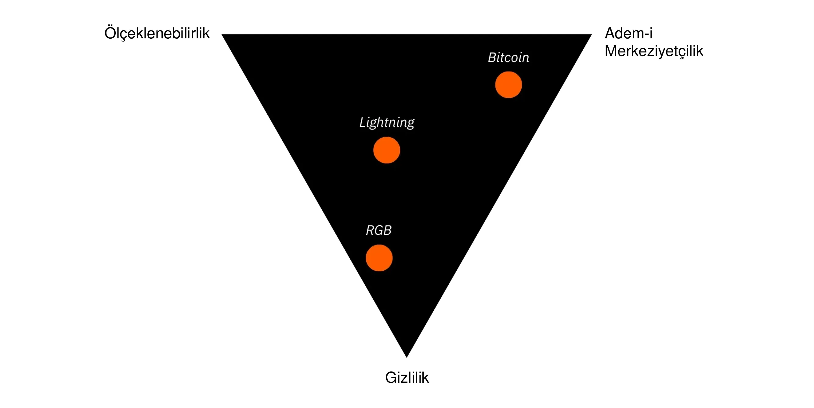

### Neden kullanıcı profilinizi tanımlıyorsunuz?

BTC satın almak ve yönetmek için herkese uyan tek bir yaklaşım yoktur. Her kullanıcının mali durumu, teknik bilgisi ve Bitcoin'ye ilişkin beklentileriyle şekillenen benzersiz bir bağlamı vardır. Bu nedenle kişisel profilinize uygun bir strateji seçmeniz önemlidir. Kendi yaklaşımınızı bilmek, daha iyi kararlar vermenize ve ihtiyaçlarınızı yanlış değerlendirmekten kaynaklanan yaygın hatalardan kaçınmanıza yardımcı olur.

İşte bitcoinlerinizi satın almanın ve saklamanın en iyi yolunu bulurken göz önünde bulundurmanız gereken bazı faktörler:

- Yatırım yapmak istediğiniz miktar**: Fazla risk almadan sadece denemek ve öğrenmek için küçük bir miktar mı satın alıyorsunuz? Yoksa uzun vadede elde tutulacak daha önemli bir yatırım mı planlıyorsunuz?
- Yatırım sıklığınız**: Tek seferlik bir satın alma işlemi yapıp fonlarınızı hemen güvence altına almak mı istiyorsunuz yoksa fiyat dalgalanmalarını yumuşatmak için Dolar-Maliyet Ortalaması (DCA) gibi bir strateji kullanarak satın alma işlemlerinizi zamana yaymayı mı tercih ediyorsunuz?
- Bitcoinlerinizle ne yapmak istiyorsunuz**: Kesinlikle uzun vadeli tasarruf olarak mı tutuyorsunuz? Günlük ödemeler için mi kullanıyorsunuz? Ya da belki ikisinden de biraz?
- Gizlilik konusundaki tutumunuz**: Bitcoin satın almak için kişisel bilgilerinizi vermek ve merkezi platformları kullanmak konusunda rahat mısınız? Yoksa eşler arası, KYC'siz borsalar gibi gizlilik öncelikli yöntemleri mi tercih edersiniz?
- Kişisel, yasal ve coğrafi bağlamınız**: Yaşadığınız yere bağlı olarak, belirli borsalara erişim kısıtlanmış olabilir. Yerel yasalar ve vergi kuralları da Bitcoin'ünüzü nasıl saklayacağınızı ve kullanacağınızı etkileyebilir.

Bu faktörlerin her biri sizin için doğru stratejinin şekillendirilmesinde rol oynar. Bazı kullanıcılar düzenlenmiş hizmetler aracılığıyla basitliğe ve kullanım kolaylığına değer verirken, diğerleri daha özerk ve gizlilik odaklı bir yaklaşımı tercih edecektir.

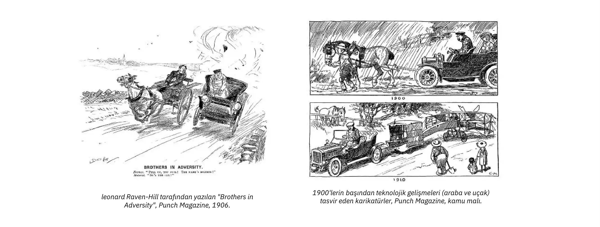

Şimdi inceleyeceğimiz konu da bu: profilinize ve hedeflerinize göre bilinçli kararlar verebilmeniz için bitcoinlerinizi edinmenin ve güvence altına almanın farklı yolları.

### Profilinizi tanımlamak için ana kriterler

Bitcoinlerinizi edinmek ve güvence altına almak için doğru stratejiyi seçmek, kişisel durumunuzun dürüst bir değerlendirmesiyle başlar. Karşılaşabileceğiniz riskler, yaşam tarzınız ve bitcoinlerinizi nasıl kullanmayı planladığınız gibi çeşitli faktörler bu kararları etkiler.

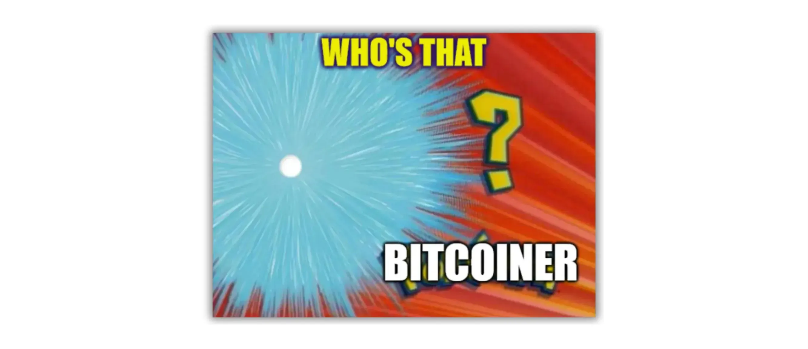

#### Potansiyel riskler ve tehditler

Bitcoinlerinizi edinmek ve güvence altına almak için doğru stratejiyi seçmek, kişisel durumunuzun dürüst bir değerlendirmesiyle başlar. Karşılaşabileceğiniz riskler, yaşam tarzınız ve bitcoinlerinizi nasıl kullanmayı planladığınız gibi çeşitli faktörler bu kararları etkiler:

- Siber saldırılar**: Siber güvenlik konusunda bilgili değilseniz veya savunmasız cihazlar kullanıyorsanız, çevrimiçi saldırıların hedefi haline gelebilirsiniz. Bu durumda, bitcoinlerinizi çevrimdışı olarak saklamak (Cold depolama) daha güvenli bir seçenek olabilir.
- Fiziksel tehditler**: Ne yazık ki fiziksel saldırılar gerçekleşmektedir; hırsızlık, soygun ve hatta adam kaçırma olayları Bitcoin sahiplerini hedef almıştır. Bu olaylar hala nadir olsa ve çoğunlukla yüksek profilli kişileri etkilese de, güvenlik kurulumunuzu tasarlarken bunları en baştan dikkate almaya değer.

- Doğal afetler**: Orman yangınlarına, sellere veya diğer aşırı hava olaylarına eğilimli bir bölgede yaşıyorsanız, özel anahtarlarınızı koruyan esnek bir yedekleme sistemine sahip olmanız çok önemlidir.

- Devletin el koyması**: Ülkenizde kısıtlayıcı veya istikrarsız mali düzenlemeler varsa, Bitcoin satın alma veya kullanma konusunda sınırlamalarla karşılaşabilirsiniz. Bu gibi durumlarda, özel, gözetim dışı çözümleri tercih etmek isteyeceksiniz.

- Hafıza kaybı veya veri kaybı**: Özel anahtarları yönetmek, hassas bilgileri saklamanızı ve geri almanızı gerektirir. Unutkanlık veya potansiyel sağlık sorunları konusunda endişeleriniz varsa, güçlü yedekleme sistemleri uygulamak, hatta güvenlik planınıza güvendiğiniz bir kişiyi dahil etmek akıllıca olacaktır.

Güvenlik açıklarınızı daha iyi anlamak için, bu risklerin her birini 0 (düşük) ile 10 (yüksek) arasında bir ölçekte derecelendirin. Bu öz değerlendirme, ileriye dönük doğru korumalara öncelik vermenize yardımcı olacaktır.

#### Yaşam Tarzı ve Kişisel Alışkanlıklar

Günlük yaşamınız da bitcoinlerinizi nasıl yöneteceğiniz konusunda büyük bir rol oynar. Yaşam tarzınıza uygun bir kurulum seçmek işleri kolaylaştıracak ve gereksiz sürtüşmelerden kaçınmanıza yardımcı olacaktır.

**Basit, otomatik çözümleri tercih edin; otomatik olarak güvenli depoya aktarılan planlanmış satın alımlar gibi.

**Daha fazla kontrol ve güvenlik sunan Multisig cüzdanları gibi daha gelişmiş çözümleri tercih edebilirsiniz.

**Sevdikleriniz veya gelecek nesiller için yatırım mı yapıyorsunuz? ** Miras konusunu erkenden düşünün. Size bir şey olması durumunda bitcoinlerinizin güvenli bir şekilde aktarılabileceğinden emin olmanın yolları vardır.

**Bazı satın alma yöntemleri kişisel bilgi gerektirirken (KYC platformları), diğerleri (eşler arası veya Mining gibi) daha fazla gizlilik sunar.

#### Bitcoin'lerinizi kullanma

Depolama ve yönetim stratejiniz, Bitcoin'ünüzü nasıl kullanmayı düşündüğünüzü yansıtmalıdır. Bu konuda en başından itibaren net olmanız kararlarınızı yönlendirecektir.

- Uzun vadeli tasarruf**: Bitcoin'i bir yatırım olarak satın alıyorsunuz ve yakın zamanda kullanmayı planlamıyorsunuz. Bu durumda, maksimum güvenlik ve en aza indirilmiş erişim riski çok önemlidir.
- Kademeli birikim**: Düzenli olarak küçük miktarlarda alım yapıyorsunuz. Güvenli bir Wallet ile eşleştirilmiş Dolar Maliyet Ortalaması (DCA) gibi bir strateji iyi çalışır.
- Günlük harcamalar**: Bitcoin'ü para gibi kullanın. Küçük günlük ödemeler için mobil bir Wallet kullanın (belki Lightning ile) ve Bitcoin'ünüzün çoğunu daha güvenli bir yerde saklayın.
- Emekliliğe hazırlanıyor veya servetinizi devrediyorsunuz**: Bitcoin'nızı daha sonra birine devretmek istiyorsunuz. Doğru zaman geldiğinde fon aktarımını kolay ve güvenli hale getiren araçlar kullanın. Zaman kilitli Multisig veya özel miras planları gibi stratejiler, fonlarınızın kaybolmamasını veya çok erken erişilmemesini sağlamak için devreye sokulabilir.

Risklerinizi, yaşam tarzınızı ve hedeflerinizi gözden geçirdikten sonra, Bitcoin yolculuğunuz için akıllı seçimler yapmaya hazır olacaksınız.

İşte karar vermeniz gereken dört önemli şey:

- Hangi Wallet kullanılmalı
- Bitcoin'unuzun güvenliği nasıl sağlanır
- Bitcoin'u nasıl satın alacaksınız
- Ne kadar işlem yapacaksınız

### Cüzdanlar ve Güvenlik Stratejileri

Özel anahtarlarınızı (bitcoinlerinize erişim sağlayan anahtarlar) güvence altına almak, Bitcoin'e sahip olmanın ve kullanmanın en önemli parçasıdır. Üçüncü bir tarafın fonlarınızı yönettiği geleneksel bir banka hesabının aksine, Bitcoin tüm kontrolü size verir. Ancak bu özgürlükle birlikte sorumluluk da gelir: anahtarlarınızı kaybederseniz, Bitcoin'iniz sonsuza dek yok olur. Kullanabileceğiniz çeşitli cüzdan türleri vardır. İhtiyaçlarınıza ve deneyim seviyenize bağlı olarak her birinin kendi artıları ve eksileri vardır.

#### Hot Wallet

Hot cüzdanları internete bağlı uygulamalar veya yazılımlardır. Özel anahtarlarınızı yüklendikleri aynı cihazda saklarlar. Bu cüzdanlar günlük kullanım veya küçük miktarlarda Bitcoin saklamak için mükemmeldir.

Örnekler: Mavi Wallet, Green Wallet, Sparrow wallet

Lightning desteği ile: Phoenix, Satoshi'un Wallet'si, BitKit

**Avantajlar**:

- Kullanımı kolay ve fonlarınıza hızlı erişim.
- Küçük ödemeler ve günlük kullanım için idealdir.
- Bazıları hızlı ve ucuz işlemler için Lightning Network'i desteklemektedir.

**Dezavantajlar**:

- Daha az güvenli: Anahtarlarınız internete bağlı bir cihazdadır, bu da bilgisayar korsanlığı riskini artırır.
- Uzun vadede büyük miktarlarda depolamak için uygun değildir.

Şunun için en iyisi: Yeni başlayanlar, küçük bakiyeler ve sık işlemler.

#### Donanım Cüzdanları

Donanım cüzdanları, özel anahtarlarınızı tamamen çevrimdışı olarak saklayan fiziksel cihazlardır. Hot cüzdanlarından çok daha güvenlidirler çünkü çevrimiçi saldırı riskini azaltırlar.

Örnekler: Ledger, Trezor, Coldcard, Jade, BitBox

**Avantajlar**:

- Anahtarlar çevrimdışıdır = bilgisayar korsanlarının erişmesi çok daha zordur.
- Güvenlik için özel olarak tasarlanmıştır.

**Dezavantajlar**:

- Kullanımı daha yavaş; cihazı bağlamanız ve işlemleri fiziksel olarak onaylamanız gerekiyor.
- Cihazı satın almanız gerekecek ve bu da size oldukça pahalıya mal olabilir.

En iyisi için: Uzun vadeli sahipleri ve daha büyük miktarları güvence altına alan herkes.

#### Çoklu İmza Cüzdanları

Multisig (Çoklu imza) cüzdanları, bir işlemi onaylamak için birden fazla anahtar gerektirir. Bunu, açmak için iki veya üç kombinasyona ihtiyaç duyan bir kasa gibi düşünün. Bu kurulumlar ileri düzey kullanıcılar, işletmeler veya üst düzey güvenlik arayan herkes için idealdir.

Örnekler: Liana, Casa, Spectre, Sparrow

**Avantajlar**:

- Çok güçlü koruma; bir anahtar tehlikeye girerse, fonlarınız hala güvendedir.
- Hırsızlık, kayıp veya zorlamadan kaynaklanan riskleri azaltabilir.
- Anahtarları kişiler veya konumlar arasında dağıtabilirsiniz.

**Dezavantajlar**:

- Kurulumu ve yönetimi daha karmaşıktır.
- Birden fazla kişi/cihaz arasında koordinasyon gerektirebilir.
- Multisig'nin kötü yönetilmesi halinde fon kaybı riski;
- Daha yüksek ilk edinim maliyeti, potansiyel olarak birkaç donanım cüzdanının satın alınmasını gerektirir.

En iyi kullanım alanı: Güçlü kullanıcılar, aileler, şirketler ve yüksek güvenlikli uzun süreli depolama.

#### Saklama hizmetleri ve ETF'ler

Bazı kişiler Bitcoin'i borsalar, saklayıcılar veya ETF'ler gibi üçüncü taraf hizmetlerle saklamayı tercih eder. Bu, özel anahtarları kendiniz yönetmeden Bitcoin'e maruz kalmanızı sağlar. Ancak büyük ödünlerle birlikte gelir.

Örnekler: Coinbase veya Binance gibi borsalar, BlackRock'ın Bitcoin ETF'si gibi finansal ürünler.

**Avantajlar**:

- Kullanımı kolay; anahtarları veya cüzdanları kendiniz taşımanıza gerek yok.
- Bitcoin'u doğrudan kullanmak için değil, sadece yatırıma maruz kalmak isteyen kişiler için kullanışlıdır.

**Dezavantajlar**:

- Bitcoin'iniz aslında size ait değildir; saklayıcınıza aittir. Eğer onlar batarsa, sizin fonlarınız da batabilir (Mt. Gox ya da FTX kullanıcılarına sorun).
- Potansiyel olarak daha yüksek ücretler ve daha az gizlilik.
- Güvenilir bir üçüncü tarafa bağımlılık, Bitcoin'nin temel faydalarından biri olan egemenlikten vazgeçmek anlamına gelir;
- Gizlilik ve mali egemenlik açısından Bitcoin'ün tüm avantajlarını elde edemezsiniz.

**Temel kural: Anahtarlarınız değil, bozuk paralarınız değil.**

Yeni başlayanlar için bile saklama hizmetlerini önermiyoruz. Bitcoin'ünüzü doğru şekilde nasıl güvence altına alacağınızı öğrenmek için zaman ayırmak, başka biri başarısız olduğu için hepsini kaybetme riskini almaktan çok daha iyidir. Ancak burada cüzdanlar ve anahtar yönetimi hakkında okuyorsanız, muhtemelen bu ilkenin neden önemli olduğunu zaten anlamışsınızdır.

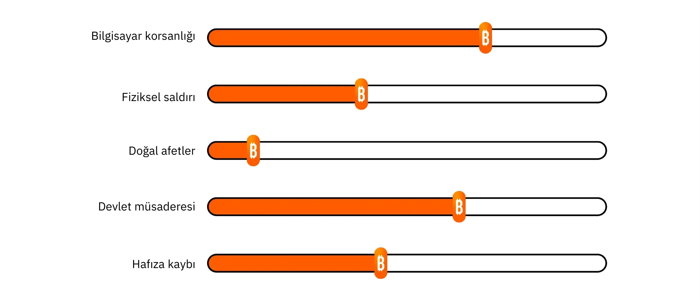

Wallet ve güvenlik yöntemi seçimi ne kadar depolama yaptığınıza, uzmanlık seviyenize ve algıladığınız potansiyel risklere bağlıdır. Bununla birlikte, hibrit bir yaklaşım akıllıca bir seçenek olabilir:

- Günlük işlemler için telefonda bir Hot Wallet veya bir Lightning Wallet kullanın;
- Uzun vadeli birikimler için tasarlanmış bitcoinlerinizin çoğunu güvence altına almak için bir Hardware Wallet kullanın.

Hot Wallet'unuzda çok fazla bitcoin birikirse, bir kısmını Cold deponuza aktarabilirsiniz. Öte yandan, günlük harcamalarınız için daha fazla bitcoine ihtiyacınız varsa, Cold Wallet'unuzdan çekebilirsiniz.

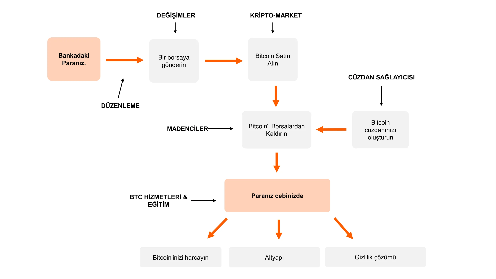

Sonuç olarak, güvenlik büyük ölçüde araçları nasıl kullandığınıza bağlıdır. Mnemonic ifadesini kaybederseniz, ifşa ederseniz veya tehlikeye atarsanız Hardware Wallet'nin size pek bir faydası olmaz. Dikkat ve disiplin, bitcoin kaybetmeye karşı en iyi korumanızdır. Bu konuda daha fazla bilgi için bu makaleyi okumanızı şiddetle tavsiye ederim:

https://planb.academy/tutorials/wallet/backup/backup-mnemonic-22c0ddfa-fb9f-4e3a-96f9-46e2a7954270

### Edinim Yöntemleri ve İşlem Hacimleri

Ne kadar gizliliğe ihtiyaç duyduğunuza, ülkenizdeki düzenlemelere ve elde etmek istediğiniz miktara bağlı olarak bitcoin edinmenin çeşitli yolları vardır. İki ana yaklaşım vardır:

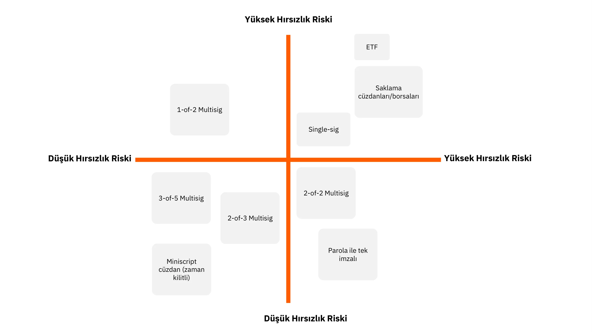

#### Kimlik Doğrulama (KYC) ile Edinim

Düzenlenmiş platformlar genellikle Bitcoin satın almadan önce kimliğinizi doğrulamanızı gerektirir. Bu, bir hesap oluşturmak ve alım satım hizmetlerine erişmek için resmi belgeler (pasaport, kimlik, Address kanıtı vb.) sağlamanız gerektiği anlamına gelir.

**Avantajlar**:

- Basit satın alma süreci, genellikle yeni başlayanlar için uygundur;
- Tek seferde büyük miktarlarda satın alma imkanı;
- Ek hizmetlere erişim (DCA, otomatik dönüştürme, kolay fiat çekme);
- Alış ve satış fiyatları arasında küçük bir farkla yüksek likidite.

**Dezavantajlar**:

- Dönüşümler ve para çekme işlemleri için yüksek ücretler;
- Bazı platformlar karmaşıktır ve sizi gelişmiş ticaret özellikleri veya altcoinlerle boğabilir;
- Büyük gizlilik sorunları.

KYC borsalarının en büyük dezavantajı, kişisel güvenliğinizi de etkileyebilecek gizlilik riskidir. KYC, borsaların gerçek kimliğinizi Bitcoin para çekme adreslerinizle ilişkilendirmesine olanak tanır. Bu bilgi Blockchain analizi için ideal bir başlangıç noktası haline gelir. Bir Address tanımlandıktan sonra, On-Chain gizliliğinizi tehlikeye atan tüm ilişkili işlemleri izlemek mümkündür. Ekstra koruyucu önlemler alınmazsa, tüm Bitcoin faaliyetleriniz size kadar izlenebilir.

Bir diğer büyük risk ise, düzenlenmiş platformların veri tabanlarına erişimi olan hükümetin BTC satın alan kişileri kolayca tespit edebilmesidir. Bu durum bugün için zararsız görünse de, ekonomik ya da siyasi kısıtlamalar getirilmesi halinde bir sorun haline gelebilir. Ayrıca, düzenlenmiş platformlar şüpheli işlemleri bildirmek zorundadır, bu da kamu yetkilileri tarafından hedefli gözetim şansını artırır.

Ayrıca KYC platformları, kimlikler ve Address kanıtı dahil olmak üzere çok sayıda hassas veriyi depolar. Bu veriler genellikle kimlik doğrulama işlemlerini gerçekleştiren üçüncü taraf sağlayıcılara verilir. Bir platform saldırıya uğrar veya başarısız olursa, bu bilgiler açığa çıkabilir ve kimlik avı, gasp girişimleri ve hatta fiziksel hırsızlık için kullanılabilir. Diğer veri ihlallerinin aksine, Bitcoin ile ilgili sızıntılar özellikle risklidir çünkü değerli varlıklara sahip olduğunuzu ortaya çıkarabilirler.

Bu nedenle, KYC'den geçmenin sadece küçük bir adım olmadığını anlamak önemlidir; **kişisel güvenliğinizi etkiler**. Bu kimlik kontrollerini zorunlu kılan hükümetler yalnızca doğal haklarınızı ihlal etmekle kalmıyor, aynı zamanda sizi risklere de maruz bırakıyor. Bu platformları kullanmak Bitcoin kullanmaya başlamanıza yardımcı olsa da, ilgili risklerin farkında olmalı ve daha sonra Bitcoin edinmek için KYC dışı yöntemleri keşfetmeyi düşünmelisiniz.

#### Kimlik Doğrulaması Olmadan Edinim (No-KYC)

Kimliğinizi açıklamadan Bitcoin satın almak, gizliliğe öncelik verenler için bir seçenektir. Bu yöntem birkaç yaklaşım içerebilir:

- Özel kişiler arasında eşler arası (P2P)**: Güvendiğiniz bir kişiden (arkadaşlar, aile, yerel ağ, buluşmalar...) doğrudan nakit olarak satın almak, herhangi bir resmi işlem kaydını önler ve sizi bankacılık sisteminin dışında tutar. Bu muhtemelen Bitcoin edinmenin veya satmanın en iyi yolu olsa da, yüz yüze bir Exchange olduğu için fiziksel saldırı riskini de beraberinde getirir.
- P2P Platformları**: Bisq, RoboSats ve Peach gibi platformlar, işlemleri güvence altına almak için emanet sistemleri kullanarak kimlik doğrulamasına gerek kalmadan özel kişiler arasında alışverişi kolaylaştırır. Bu platformlar, karşı tarafın işbirliği yapmaması halinde hırsızlık riskini hala taşımaktadır, ancak risk emanet hizmetleri ile en aza indirilmiştir.
- Bitcoin Otomatik Vezne Makineleri (ATM'ler)**: Bazı ATM'ler (kiosklar) nakit para ile Bitcoin satın almanıza izin verir, ancak ücretler yüksek olma eğilimindedir ve bazıları daha büyük işlemler için kimlik doğrulaması gerektirir.
- KYC içermeyen Exchange platformları**: Özellikle İsviçre'deki bazı platformlar, kimlik doğrulaması gerektirmeden küçük miktarlarda Bitcoin satın almanıza izin verir.
- Mining**: Bireyler Bitcoin madenciliği yapabilir. Daha eski veya daha küçük makinelere erişilebilir ve KYC olmadan Bitcoin elde etmek için geleneksel olmayan bir yol sağlar. Bir Mining pool'e katılarak, temel ekipmanlarla bile düzenli ödemeler kazanabilirsiniz. Daha fazla bilgi için [Mining eğitimlerimize göz atın](https://planb.academy/tutorials/mining).
- Ödemeler / Maaş bitcoin olarak**: Eğer bir işletme işletiyorsanız, ödeme olarak Bitcoin kabul edebilirsiniz. Çalışıyorsanız, yargı alanınıza bağlı olarak, Bitcoin ile ödeme yapılmasını isteyebilirsiniz. Bu yöntemler KYC olmadan Bitcoin elde etmenizi sağlar.

**Avantajlar**:

- Yönteme bağlı olarak, kimliğiniz ve Bitcoin etkinliğiniz arasındaki bağlantıları sınırlandırarak gizliliğinizi korumaya yardımcı olur;
- Sansür, fonların dondurulması veya devlet müdahalesi riskini azaltır.
- Yüksek denetimli ortamlarda bile Bitcoin'ya erişim sağlar.

**Dezavantajlar**:

- Genellikle KYC platformlarından daha karmaşıktır;
- Daha düşük likidite ve daha az işlem;
- P2P satın almak genellikle bir primle birlikte gelir;
- Özel kişiler arasındaki alışverişlerde daha fazla karşı taraf riski (dolandırıcılık, sahtekarlık, saldırı vb.).

### 4 Tip Bitcoin Kullanıcısı

Tartıştığımız kriterlere dayanarak birkaç tipik Bitcoin kullanıcı profili belirleyebiliriz. Bu profiller esnektir ve gelişebilir, ancak her tür için uygun stratejileri netleştirmeye yardımcı olur ve doğru araçları seçmenizde size rehberlik eder.

#### 1. Hodler

Hodler, Bitcoin'i uzun vadeli bir vizyonla satın alan ve birkaç yıl boyunca dokunmayı planlamayan bir yatırımcıdır. Zaman içinde düzenli olarak alım yapan İstifleyicinin aksine, Hodler genellikle daha büyük, ara sıra alımlar yapar ve ardından Bitcoin'lerini ellerinde tutar.

Tercih edilen strateji:

- Gizlilik ihtiyaçlarına bağlı olarak KYC veya KYC olmayan bir platform üzerinden satın alın;
- Hardware Wallet üzerinde depolama veya ekstra güvenlik için çoklu imza çözümü kullanma;
- nadir işlemler, Bitcoin ekosistemi ile etkileşimi en aza indirir.

Hodler, Bitcoin'ü fiziksel altın yatırımcısına benzer şekilde bir değer deposu olarak görüyor. Asıl zorlukları Bitcoin'lerini güvenli bir şekilde saklamak ve mirasçılarına aktarabilmelerini sağlamak.

#### 2. İstifleyici

İstifleyici, daha kademeli ve tutarlı bir yaklaşım benimseyen kişidir. Genellikle Dolar-Maliyet Ortalaması (DCA) stratejisiyle düzenli olarak Bitcoin satın alırlar. Amaçları, satın alma fiyatlarını zamana yaymak ve Bitcoin'ün volatilitesinin etkisini azaltmaktır.

Tercih edilen strateji:

- DCA sunan bir KYC platformu aracılığıyla otomatik satın alma kullanın;
- Güvenli depolama için fonların düzenli olarak Hardware Wallet'e aktarılması;
- Gizlilik konusunda orta derecede hassas ancak güvenlik ve birikim kolaylığına öncelik veriyor.

Stacker kısa vadeli spekülasyonlara veya Bitcoin'larını sık kullanmaya odaklanmıyor. Bitcoin'yı yıllara hatta on yıllara yayılan uzun vadeli bir tasarruf planı olarak görüyorlar. Stacker'ı Hodler'dan ayıran şey, satın alma yöntemleri ve işlem hacimleridir.

#### 3. Aktif kullanıcı

Aktif Kullanıcı Bitcoin'i sadece bir değer deposu olarak değil, esas olarak bir Exchange aracı olarak görür. Düzenli olarak işlemler, ödemeler için veya döngüsel ekonominin bir parçası olarak kullanırlar.

Tercih edilen strateji:

- Günlük işlemler için mobil veya masaüstünde bir Hot Wallet kullanın;
- Hızlı ve ucuz ödemeler için Lightning Network'i kullanın;
- Harcamalar için mobil bir Wallet ve tasarruflar için bir Hardware Wallet kullanarak hibrit bir yaklaşım sürdürün;
- Gizlilik hassasiyeti özel ihtiyaçlara bağlı olarak değişir.

Aktif Kullanıcı bir girişimci, serbest çalışan veya günlük ödemeler için Bitcoin kullanımının yaygın olduğu Bitcoin dostu bir ortamda yaşayan biri olabilir. Ana öncelikleri kolaylıktır ve güvenlik ile erişilebilirlik arasında bir denge kurmayı amaçlarlar.

#### 4. Paranoyak

Paranoyak Kullanıcı, gizlilik ve güvenliğe öncelik veren gelişmiş bir bireydir. Bitcoin'i kişisel özgürlük için bir araç olarak görürler ve üçüncü taraf güven ve düzenlemelerine maruz kalmayı en aza indirmek isterler.

Tercih edilen strateji:

- Bitcoin'yı yalnızca KYC dışı kanallar aracılığıyla edinin;
- BIP39 parolaları ve çoklu imza kurulumları ile geliştirilmiş cüzdanları kullanın;
- Bitcoin'yi farklı konumlardaki birden fazla fiziksel cihazda depolayın;
- Gizliliği tehlikeye atabilecek merkezi hizmetlerden kaçının.

Bu profil özellikle BTC bulundurmanın veya kullanmanın yaptırımlarla sonuçlanabileceği Bitcoin'e düşman ortamlarda yaşayan insanlar için uygundur. Bu daha karmaşık bir yaklaşımdır ve fonlara erişim kaybını önlemek için bir dereceye kadar teknik uzmanlık ve sıkı disiplin gerektirir.

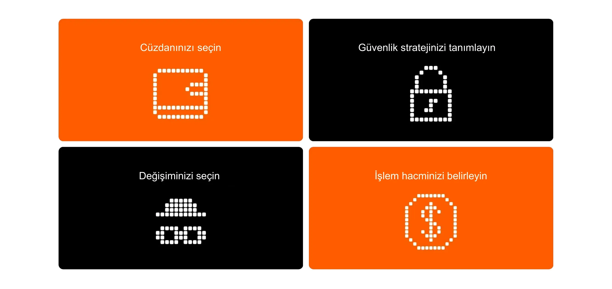

### Hangi profil sizin için doğru?

Bu profillerin birbirini dışlamadığını unutmayın. Kendinizi birden fazla profille özdeşleştirebilirsiniz ve yaklaşımınız zaman içinde değişebilir. Örneğin, bir istifleyici olarak başlayıp yavaş yavaş daha aktif bir kullanıcıya dönüşebilir ve hatta paranoyak bir güvenlik zihniyetini benimseyebilirsiniz. Günlük hayatınızda Bitcoin'u kullanmaya devam ederken uzun vadeli bir hodler olabilirsiniz.

**En önemli şey, stratejinizi mevcut durumunuz ve uzun vadeli vizyonunuzla uyumlu hale getirmektir.**

Sonraki bölümlerde, bu profillerin her birini ayrıntılı olarak inceleyeceğiz; böylece hangisinin size en uygun olduğunu anlayabilir ve hedefleriniz için en mantıklı yaklaşımı uygulayabilirsiniz. Ayrıca her bir profile uyan araçları da ele alarak kendi edinim ve güvenlik planınızı oluşturmanız için size temel sağlayacağız.

## Hodler: Uzun Vadeli Yatırım

<chapterId>baf1adc2-3828-5265-8ee5-130be547585c</chapterId>

:::video id=3f4e5d6c-7b8a-9c0d-1e2f-3a4b5c6d7e8f:::

Bitcoin topluluğunda "hodler" terimi, uzun vadeli bir yatırım yaklaşımı benimseyen birini ifade eder. Bu kelime, yıllar önce Bitcoin Talk forumunda "hold" kelimesinin ünlü bir yazım hatasından kaynaklanmıştır ve o zamandan beri Commitment'ın bir sembolü haline gelmiştir: kısa vadeli piyasa dalgalanmaları üzerinde stres yapmadan, ne olursa olsun Bitcoin'inizi tutun.

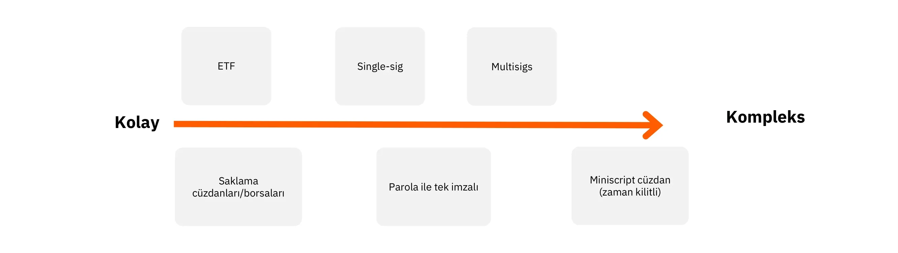

Hodlers, Bitcoin'nin değer önerisine inanmaktadır. Supply'ü 21 milyon madeni paradan oluşan sabit bir Bitcoin ile uzun vadeli bir değer deposu (dijital altın) olarak görüyorlar.

### Neden Bir Hodling Stratejisi Seçmelisiniz?

Tarihsel olarak, hodling profesyonel olmayan çoğu yatırımcı için en karlı yaklaşım olmuştur. Bu yaklaşım, piyasada zamanlama yapma ihtiyacını ortadan kaldırır ki bu da oldukça zor ve duygusal olarak yıpratıcıdır. Sadece satın alarak ve elde tutarak, hodling yapanlar ticaretin stresinden ve genellikle duygusal tepkilerle gelen kötü kararlardan kaçınırlar.

Bitcoin döngüler halinde hareket etme eğilimindedir; büyük boğa koşularını keskin düzeltmeler ve ardından uzun sessiz dönemler takip eder. Bitcoin, 2013 ile 2025 yılları arasında bu döngülerden birden fazlasını yaşamış ve ayı piyasaları sırasında bazen değerinin %80'ine kadarını kaybetmiştir. Bu aşamalar bir hodler'ın sabrını test edebilir, ancak rotada kalanlar genellikle zaman içinde ödüllendirilmiştir.

Bu döngüleri anlamak duyguları yönetmeye yardımcı olur. Tecrübeli hodlerlar, zirvede satmaya veya dipte almaya çalışmanın kaybettiren bir oyun olduğunu bilir. Bunun yerine, disiplinli bir şekilde uzun vadeli elde tutmanın kazanan bir strateji olduğu kanıtlanmıştır.

### Bir Hodler için yatırım planı

Hodlerlar basit ve uzun vadeli bir yaklaşım benimser: Bitcoin'i edinir, uygun şekilde korur ve kendi haline bırakırlar. Madeni paralarını takas etmez veya harcamazlar. Amaçları, minimum yönetimle varlıklarını biriktirmek ve korumaktır.

İşte bir hodler için sağlam bir plan:

#### 1. Bir Hardware Wallet Seçin ve Kurun

Her şeyden önce güvenlik. Bir Hardware Wallet şarttır. Özel anahtarlarınızı çevrimdışı olarak saklar ve fonlarınızı çevrimiçi saldırılara karşı korur.

İşte hodlers için harika olan cüzdanlar için bazı öğreticiler:

https://planb.academy/tutorials/wallet/hardware/coldcard-q-73e86d1a-6fe6-4d8b-bb15-8690298020e3

https://planb.academy/tutorials/wallet/hardware/jade-plus-green-873099a4-35ec-4be8-b31a-6e7cd6a41ec0

https://planb.academy/tutorials/wallet/hardware/ledger-nano-s-plus-75043cb3-2e8e-43e8-862d-ca243b8215a4

https://planb.academy/tutorials/wallet/hardware/ledger-flex-3728773e-74d4-4177-b39f-bd923700c76a

https://planb.academy/tutorials/wallet/hardware/passport-74e53858-3fa2-43f9-b866-573297546236

https://planb.academy/tutorials/wallet/hardware/bitbox02-6af8940f-e19b-4008-8c83-81017032608c

Wallet'iniz kurulduktan sonra, 12 veya 24 kelimelik kurtarma ifadenizi dayanıklı bir fiziksel ortama yedeklediğinizden emin olun. İfadeniz için hangi ortamı seçeceğiniz hakkında daha fazla bilgi edinmek için bu eğitimi izleyin:

https://planb.academy/tutorials/wallet/backup/backup-mnemonic-22c0ddfa-fb9f-4e3a-96f9-46e2a7954270

Daha fazla gönül rahatlığı için, aşağıdaki gibi koruma katmanları ekleyebilirsiniz:

- Zaman kilitli çoklu-imzalı bir Wallet:

https://planb.academy/tutorials/wallet/desktop/liana-306ef457-700c-4fdd-b07a-8fb7a8a29f04

- BIR BIP39 passphrase:

https://planb.academy/tutorials/wallet/backup/passphrase-a26a0220-806c-44b4-af14-bafdeb1adce7

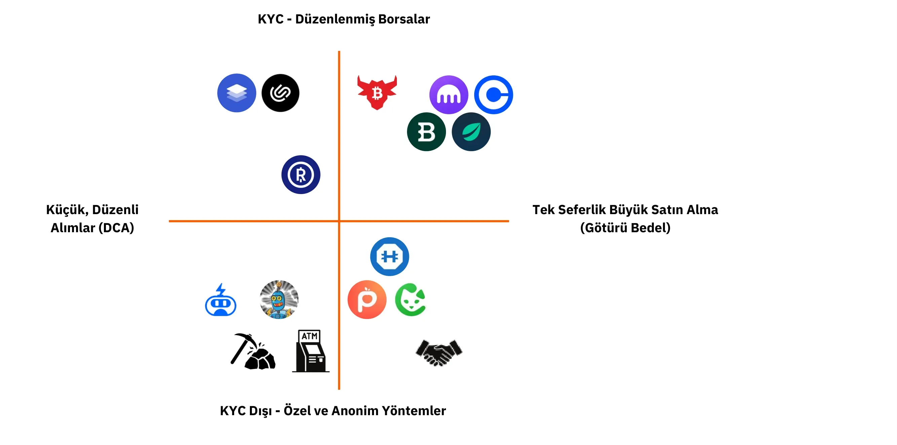

#### 2. Bitcoin Satın Alın ve Geri Çekin

Hodlerlar coinlerini asla borsalarda bırakmazlar. Platformlar saldırıya uğrayabilir, iflas edebilir ya da el konulabilir. Satın aldıktan sonra, Bitcoin'ünüzü doğrudan Hardware Wallet'nize taşıyın.

Hodlerlar daha büyük miktarlarda yatırım yapma eğiliminde olduklarından, güçlü likiditeye sahip borsalara ihtiyaç duyarlar. İşte faturaya uyan birkaç tanesi:

https://planb.academy/tutorials/exchange/centralized/bitfinex-dc306d39-bd96-4ab9-a278-a322316716db

https://planb.academy/tutorials/exchange/centralized/kraken-1ef03e25-9b42-49bd-a47d-249e1a13cfc6

https://planb.academy/tutorials/exchange/centralized/bitstamp-5a36c896-bff5-46d7-b505-ff069c3ac47c

https://planb.academy/tutorials/exchange/centralized/bull-bitcoin-europe-0ccf713e-efcd-44ec-8205-211f49ac7d53

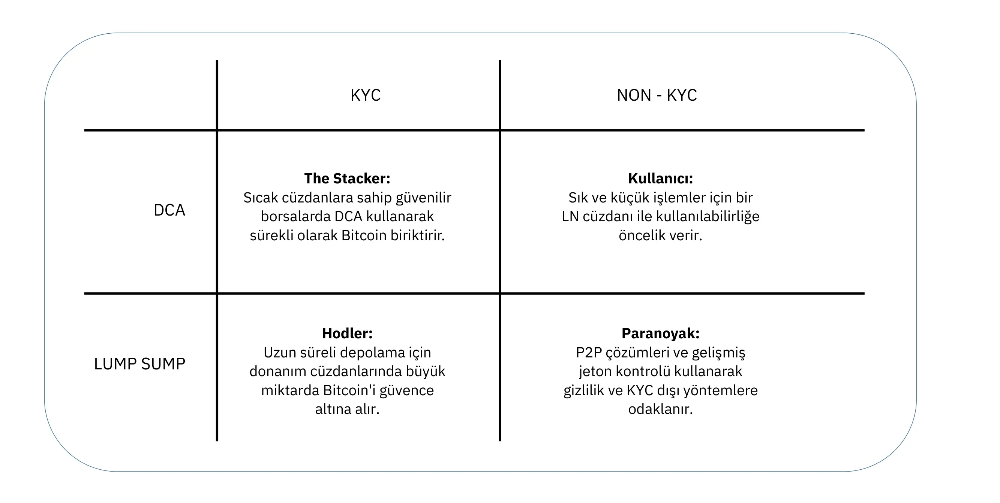

Bazı hodlerlar da DCA (Dolar Maliyet Ortalaması) kullanarak karma bir yaklaşım benimser - piyasa oynaklığını yumuşatmak için düzenli olarak küçük miktarlarda alım yapmak.

#### 3. Bir halefiyet planı oluşturmak

Bu genellikle göz ardı edilir. Ancak Bitcoin affetmez; özel anahtarlarınız kaybolursa, madeni paralarınız sonsuza dek yok olur. Yetersizlik veya ölüm için planlama yapmak çok önemlidir.

Anahtar adımlar:

- Bitcoin'inize erişemiyorsanız nasıl erişeceğinizi açıklayan ayrıntılı bir kılavuz yazın;
- Kayıp riskini azaltırken erişim sağlamak için çok imzalı bir kurulum kullanın;
- Önemli bilgileri güvendiğiniz biriyle paylaşın.

Bu kursun son bölümünde miras planlaması konusuna daha derinlemesine değineceğiz.

#### 4. Döngüler Boyunca Sabırlı Kalın

Hodling uzun vadeli oynamak demektir. Hem fiyat çöküşleri hem de coşkulu boğa piyasaları sırasında sakin kalmanız gerekir.

Birkaç en iyi uygulama:

- Wallet'nızı periyodik olarak kontrol edin; ancak çok sık değil. Sürekli izleme duygusal kararlara yol açar;
- Piyasa düşüşleri sırasında panikle satış yapmayın. Düzeltmeler oyunun bir parçasıdır;
- Bitcoin gelişmeleri hakkında bilgi sahibi olun, ancak özellikle kriz dönemlerinde medyanın abartılı haberlerinden kaçının;
- Kurtarma ifadenizin bütünlüğünü periyodik olarak doğrulayın. Zarfın kurcalanmadığını ve ortamın hala okunaklı olduğunu kontrol edin. Herhangi bir sorun varsa, generate'den Wallet'a yeni bir yedekleme yapın;

Özel anahtarlarınızdan ödün vermeden varlıklarınızı izlemek için bir Watch-only wallet kullanmayı düşünün. Yalnızca açık anahtarlarınızı kullanarak bakiyeleri ve işlemleri izlemenizi sağlar.

https://planb.academy/tutorials/wallet/mobile/blockstream-app-watch-only-66c3bc5a-5fa1-40ef-9998-6d6f7f2810fb

Hodler'ın stratejisi basit ama güçlüdür: satın al, güvenceye al ve unut. Asıl zorluk teknik değil; psikolojiktir. En zor kısım, çok erken satma veya fiyat düşüşleri sırasında panik yapma dürtüsüne direnmektir. Ancak disiplinli kalır ve uzun vadeli düşünürseniz, hodling'in değeri korumanın ve zaman içinde servet oluşturmanın güvenilir bir yolu olduğu kanıtlanmıştır.

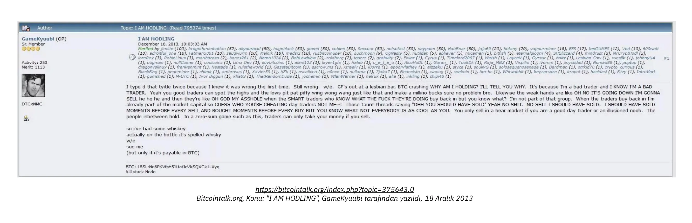

### Hodler profilinizi değerlendirin

Kendinizi bu kişilik özelliklerinde tanıyorsanız, muhtemelen doğal bir Hodler'sınız:

- Sabır**: Bir hodler olağanüstü sabır gösterir. Günlük fiyat dalgalanmalarından etkilenmeden Bitcoin'i yıllarca (bazen on yıllarca) ellerinde tutmaya isteklidirler. Bitcoin'in döngüler halinde hareket ettiğini anlarlar ve fiyat düştüğünde paniğe kapılmazlar. Düzeltmeler sadece oyunun bir parçasıdır. Hodlerlar için değer aylarla değil, uzun vadeyle ölçülür..;
- Uzun vadeli vizyon**: Hodler kısa vadeli kârların çok ötesinde düşünüyor. Bitcoin'nin yapısal büyümesine ve kademeli olarak küresel çapta benimsenmesine inanıyorlar. Dalgalanmalara rağmen, yukarı yönlü bir yörünge görüyorlar; bir genişleme ve ardından konsolidasyon. Onlara göre Bitcoin uzun ömürlü bir varlık, enflasyona karşı bir koruma ve daha büyük bir parasal devrimin önemli bir parçasıdır;
- Öz disiplin**: Zihinsel disiplin, hodler zihniyetinin temelidir. Paradoksal olarak, en büyük zorlukları harekete geçmemektir. Fiyat dalgalanmaları sırasında satma dürtüsüne direnirler ve çöküşler sırasında korkuya teslim olmazlar. Bitcoin'ün pek çok acımasız ayı piyasasından sağ çıktığını ve acıya dayanabilenlerin genellikle en çok faydayı sağladığını bilirler;
- Duygusal esneklik**: Bitcoin'ün fiyatı birkaç hafta içinde %50 veya daha fazla düşebilir; yine de hodler sakin kalır. Dalgalanmanın Bitcoin'ün temellerini zayıflatmadığı fikrini içselleştirmişlerdir. Bu duygusal dayanıklılık, belirsizlik sırasında sakin kalmalarını ve diğerleri paniğe kapıldığında rasyonel bir bakış açısını korumalarını sağlar;
- Teknolojiye olan inanç**: Hodlers, Bitcoin'i sadece spekülatif bir varlık olarak görmüyor. Teknolojisine ve yıkıcı potansiyeline inanıyorlar. Birçoğu için bu sadece parayla ilgili değil; özgürlükle ilgili. Bitcoin esnek, apolitik bir para birimi ve geleneksel bankacılığa gerçek bir alternatif olarak görülüyor ve bireyleri daha fazla finansal egemenlikle güçlendiriyor.

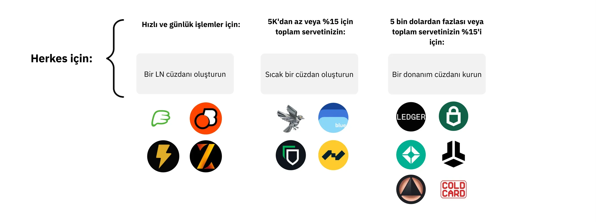

Hodling basit, etkili ve erişilebilirdir; yeni başlayanlar için bile.

Bir sonraki bölümde, benzer ancak daha aktif bir profili inceleyeceğiz: istifleyici.

## İstifleyici: Satoshileri Biriktirmek

<chapterId>0daf450d-1b91-5d99-9c31-b52ab52a5e21</chapterId>

:::video id=4e5f6a7b-8c9d-0e1f-2a3b-4c5d6e7f8a9b:::

Bitcoin ekosisteminde bir istifleyici, Bitcoin'nın en küçük birimi olan satoshi (veya "Sats") biriktirmek için tutarlı ve uzun vadeli bir yaklaşım benimseyen kişidir. Bir kerede büyük bir meblağ yatırmak yerine, bir istifleyici piyasa koşullarından bağımsız olarak düzenli olarak küçük miktarlarda Bitcoin satın alır.

Fikir basit: sadece yaklaşık 21 milyon bitcoin olacak ve her kesir önemli. İstifleyicinin görevi, mümkün olduğunca çok sayıda Sats'i istikrarlı bir şekilde biriktirmektir.

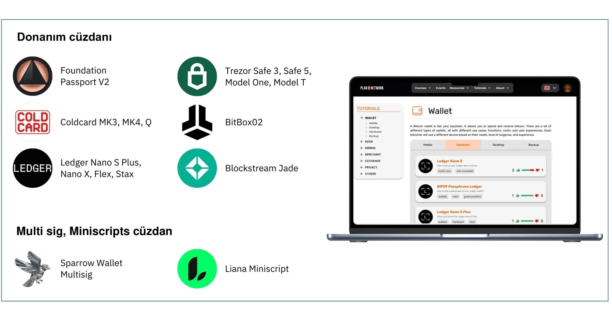

### Neden Bir İstifleme Stratejisi Seçmelisiniz?

Biriktirme, kademeli olarak bir Bitcoin pozisyonu oluştururken piyasa oynaklığına maruz kalma riskini azaltmak isteyenler için oldukça etkili bir yatırım stratejisidir. Toplu yatırım veya spekülatif piyasa zamanlamasının aksine, biriktiriciler tipik olarak Dolar-Maliyet Ortalaması (DCA) adı verilen bir teknik kullanır; Bitcoin'un mevcut fiyatından bağımsız olarak düzenli aralıklarla (günlük, haftalık, aylık...) sabit bir miktar yatırım yapar.

İstiflemenin avantajları:

- Azaltılmış oynaklık**: Düzenli alımlar, fiyatlar düşükken daha fazla ve yüksekken daha az Sats satın aldığınız için fiyat dalgalanmalarını yumuşatmaya yardımcı olur; maliyet temelinizin ortalamasını alır ve duygusal stresi azaltır.
- Erişilebilirlik**: Büyük bir başlangıç sermayesine ihtiyacınız yok. Aylık 10 € gibi düşük bir miktarla başlayabilir ve zaman içinde DCA miktarınızı artırabilirsiniz.
- Disiplin ve otomasyon**: İstifleyiciler duygusal karar vermekten kaçınır. Otomatik olarak yinelenen satın alımlar tutarlılık sağlar ve düşünmeden hareket etme riskini azaltır.
- Uzun Vadeli Strateji**: Kademeli yatırım, düşüş dönemlerinde riski azaltırken boğa piyasalarından yararlanma şansını artırır.

Bu yöntem özellikle yeni başlayanlar için **uygundur**; piyasayı zamanlama baskısını ortadan kaldırır ve istikrarlı, el değmeden birikime olanak tanır.

### İstifçinin Yatırım Planı

Amaç, uzun bir süre boyunca Bitcoin biriktirmek için sürdürülebilir, otomatik ve güvenli bir strateji oluşturmaktır. İşte istifleyici yatırım planınızı uygulamak için temel adımlar:

#### 1. Doğru Wallet tipini seçme

Bir istifleyici, kullanım kolaylığı ile uzun vadeli güvenliği dengeleyen bir Wallet kurulumuna ihtiyaç duyar.

- Hot Wallet**: Yeni başlayanlar için ideal olan mobil veya masaüstü cüzdanlar, kolayca Sats almanıza ve ödeme yapmanıza olanak tanır. Ancak, küçük miktarlar için en uygun olanlardır. On-Chain cüzdanları, daha iyi UTXO yönetimi nedeniyle Lightning cüzdanlarına göre istifleme için tercih edilir. Önerilen yazılım cüzdanları: Green Wallet, Blue Wallet, Sparrow wallet, Bitkit, Nunchuk, Aqua, Proton

https://planb.academy/tutorials/wallet/mobile/aqua-8e6d7dd3-8c03-45cc-90dd-fe3899a7d125

https://planb.academy/tutorials/wallet/mobile/bitkit-a7224674-85c4-4045-9baf-37018d89550c

https://planb.academy/tutorials/wallet/mobile/blockstream-app-onchain-e84edaa9-fb65-48c1-a357-8a5f27996143

https://planb.academy/tutorials/wallet/desktop/blockstream-app-desktop-c1503adf-1404-4328-b814-aa97fcf0d5da

https://planb.academy/tutorials/wallet/mobile/blue-wallet-2f4093da-6d03-4f26-8378-b9351d0dbc90

https://planb.academy/tutorials/wallet/mobile/nunchuk-6cbcb406-ec84-478f-afac-bb4da366a6fa

https://planb.academy/tutorials/wallet/desktop/proton-wallet-0bee0bba-ab62-4db0-8c63-b2ad698ca178

https://planb.academy/tutorials/wallet/desktop/sparrow-c674e2ac-d46f-4c82-92a7-7d1b0e262f5d

- Hardware Wallet**: Bitcoin varlıklarınız arttıkça, hırsızlık riskini en aza indirmek için fonlarınızı bir Cold Wallet ile güvence altına almak çok önemlidir. Ciddi bir istifleyici fonlarını düzenli olarak Hot Wallet'ten Hardware Wallet'ye taşır. Örnekler: Bitbox02, Trezor, Ledger, Coldcard, Jade...

https://planb.academy/tutorials/wallet/hardware/coldcard-q-73e86d1a-6fe6-4d8b-bb15-8690298020e3

https://planb.academy/tutorials/wallet/hardware/jade-plus-green-873099a4-35ec-4be8-b31a-6e7cd6a41ec0

https://planb.academy/tutorials/wallet/hardware/ledger-nano-s-plus-75043cb3-2e8e-43e8-862d-ca243b8215a4

https://planb.academy/tutorials/wallet/hardware/ledger-flex-3728773e-74d4-4177-b39f-bd923700c76a

https://planb.academy/tutorials/wallet/hardware/passport-74e53858-3fa2-43f9-b866-573297546236

https://planb.academy/tutorials/wallet/hardware/bitbox02-6af8940f-e19b-4008-8c83-81017032608c

En etkili yaklaşım her ikisini de kullanmaktır: günlük istifleme için bir Hot Wallet ve uzun süreli Cold depolama için bir Hardware Wallet. Hot Wallet'un kullanımı kolay ve rahattır. Bitcoinlerinizi riske maruz kalabilecekleri platformda bırakmak yerine hızlı bir şekilde sahiplenmenizi sağlar. Ancak, Hardware Wallet ile karşılaştırıldığında, Hot Wallet çok daha az güvenlik sunar. Bu nedenle istifleyici, uzun vadeli birikimlerini güvence altına almak ve Hot Wallet'da çok fazla fon tutmaktan kaçınmak için fonlarını düzenli olarak Cold Wallet'a aktarmalıdır. İstifleyici, Cold deposuna transfer yaparken periyodik olarak UTXO'ları birleştirir; gelecekteki işlem ücretlerini optimize etmek için küçük girdileri birleştirir.

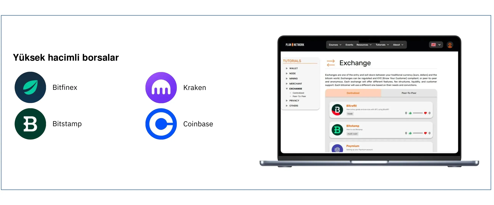

#### 2. Bir DCA satın alma planı oluşturun

Dolar-Maliyet Ortalaması (DCA), fiyatından bağımsız olarak düzenli aralıklarla küçük miktarlarda Bitcoin satın aldığınız bir yatırım stratejisidir. Etkili bir DCA planı oluşturmak için iki temel Elements tanımlamanız gerekir:

- Satın alma sıklığı**: Haftalık, iki haftada bir veya aylık; gelirinize ve hedeflerinize göre seçim yapın. Daha sonra harcanması maliyetli olan çok sayıda küçük UTXO'larla sonuçlanırsa çok sık satın alımlardan kaçının Bunu bütçenize ve risk toleransınıza dayandırın Tutarlılık boyuttan daha önemlidir; yıllarca mütevazı miktarlar biriktirmek, aşırı taahhütte bulunup bırakmaktansa daha iyidir. Doğal olarak, DCA miktarınız mali durumunuz geliştikçe ayarlanabilir.

Ardından, DCA'nızı ayarlamak için iki seçeneğiniz vardır: otomatikleştirmek veya manuel olarak yönetmek. Düzenlenmiş işlem platformlarının çoğu artık DCA'nızı otomatikleştirme seçeneği sunmaktadır. Hesabınızda yeterli fiat varsa, platform belirlediğiniz parametrelere göre alım emirlerinizi otomatik olarak gerçekleştirecektir. Ayrıca, DCA otomasyonuna adanmış, kendi kendine saklama Wallet'ünüze otomatik para çekme veya günlük harcamalarınızı yuvarlama gibi ek hizmetler sunan artan sayıda platform da vardır. Düzenlemeye tabi bir platform kullanıyorsanız, günlük yönetiminizde daha fazla gönül rahatlığı için DCA'nızı otomatikleştirmenizi şiddetle tavsiye ederim.

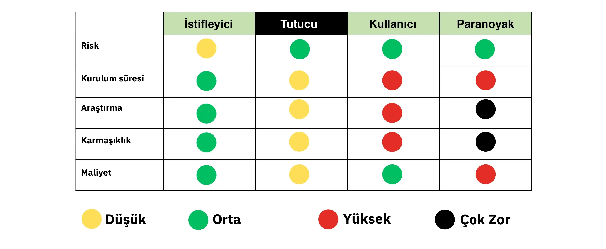

DCA platformlarına örnekler:

https://planb.academy/tutorials/exchange/centralized/bitstack-29fd71be-9570-42c6-8f6f-cd355d62e746

https://planb.academy/tutorials/exchange/centralized/relai-v2-30a9671d-e407-459d-9203-4c3eae15b30e

https://planb.academy/tutorials/exchange/centralized/stackinsat-5af6a380-f3c6-4246-9f81-9957a16ab066

DCA'yı destekleyen ana akım borsalar:

https://planb.academy/tutorials/exchange/centralized/bitfinex-dc306d39-bd96-4ab9-a278-a322316716db

https://planb.academy/tutorials/exchange/centralized/bitstamp-5a36c896-bff5-46d7-b505-ff069c3ac47c

https://planb.academy/tutorials/exchange/centralized/bull-bitcoin-europe-0ccf713e-efcd-44ec-8205-211f49ac7d53

https://planb.academy/tutorials/exchange/centralized/kraken-1ef03e25-9b42-49bd-a47d-249e1a13cfc6

https://planb.academy/tutorials/exchange/centralized/paymium-92603f76-b985-49ce-81e5-f4fa0df776e5

İstifleyiciler, birincil amaçları bu olmasa bile gizliliklerini artırmak da isteyebilirler. Bu durumda, düzenlenmiş platformların dışında bir P2P satın alma yöntemi kullanmayı düşünmelidirler. Otomatik DCA alımlarının aksine, bu yöntemler satın alma stratejinizi manuel olarak yönetmenizi gerektirir, bu nedenle disiplin, yolda kalmanın anahtarıdır.

https://planb.academy/tutorials/exchange/peer-to-peer/bisq-v2-c1c6a702-6c16-4101-8b90-62c424017b80

https://planb.academy/tutorials/exchange/peer-to-peer/hodlhodl-d7344cd5-6b18-40f5-8e78-2574a93a3879

https://planb.academy/tutorials/exchange/peer-to-peer/lnp2pbot-v2-e6bcb210-610b-487d-970c-7cce85273e3c

https://planb.academy/tutorials/exchange/peer-to-peer/peach-c6143241-d900-4047-9b73-1caba5e1f874

https://planb.academy/tutorials/exchange/peer-to-peer/robosats-b60e4f7c-533a-4295-9f6d-5368152e8c06

#### 3. Bitcoinlerin çekilmesi ve güvence altına alınması

Satın alma stratejiniz belirlendikten sonra Bitcoin'inizi Exchange'den çekip düzenli olarak Hardware Wallet'nıza aktarmanız yeterlidir. Bu, tam öz saklama ve uzun vadeli koruma sağlar.

#### 4. Birkaç döngü için bekleme

İstifçiler aylarla değil yıllarla düşünür. Hodlerlar gibi, piyasa çöküşleri sırasında paniğe veya boğa koşusu sırasında coşkuya direnmelidirler.

Anahtar alışkanlıklar:

- Stresten kaçınmak için cüzdanlarınızı çok sık kontrol etmeyin;
- Bir gerileme döneminde asla satış yapmayın; düzeltmeler normaldir;
- Bitcoin teknolojisindeki gelişmelerden haberdar olun;
- seed yedeklerinizi ve Hardware Wallet durumunuzu periyodik olarak kontrol edin: Artık cüzdanlarınız kurulduğuna göre, düzenli izleme ayarlamak önemlidir. Periyodik olarak Mnemonic ifadenizin hala saklandığı yerde olduğunu ve opak zarfının açılmadığını kontrol edin. Bu kontroller sırasında, medyanın durumunu incelemek için zarfı da açabilirsiniz. Zarfın hasarsız olduğundan ve cümlenin hala mükemmel şekilde okunabilir olduğundan emin olun. Herhangi bir hasar belirtisi varsa, en iyisi Hardware Wallet'nizden yeni bir kopya oluşturmaktır. Donanım cüzdanlarınızı da düzenli olarak kontrol edebilirsiniz.

Güvenlikten ödün vermeden kolay izleme için, açık anahtar kullanarak bakiyeleri izlemek üzere bir Watch-only wallet kurun.

https://planb.academy/tutorials/wallet/mobile/blockstream-app-watch-only-66c3bc5a-5fa1-40ef-9998-6d6f7f2810fb

### İstifleyici profilinizi değerlendirin

Başarılı istifçiler bu özellikleri gösterirler:

- Organizasyon**: Bütçenizi aşmayın, planınıza sadık kalın. İstifleyiciler, birikim planlarının birkaç yıl boyunca uygulanabilir olmasını sağlamalıdır.
- Disiplin**: Piyasa gürültüsüne tepki vermeden programınızı takip edin. Düzenlilik, dürtüsel ayarlamalardan daha önceliklidir. Ancak yine de makul ayarlamalar yapmak mümkündür.
- Sabır**: İstiflemenin ödülleri hemen gelmez. Bu strateji, somut sonuçlar vermeden önce uzun dönemler boyunca, bazen yıllar alarak gelişir. Başarılı olanlar, kısa vadeli dalgalanmalardan etkilenmeden sabırlı kalabilenlerdir.
- Finansal bilgi**: DCA, risk yönetimi ve Bitcoin piyasa temelleri hakkında sağlam bir anlayış, güvenle yatırım yapmanıza yardımcı olur. Bilgili bir istifleyici, yüksek dalgalanma dönemlerinde şüphelere direnmek ve fevri kararlar almaktan kaçınmak için daha donanımlıdır.
- Uzun vadeli vizyon**: Bir istifleyici Bitcoin'in teknolojik potansiyeline güçlü bir şekilde inanmaktadır. Odak noktaları kısa vadeli fiyat dalgalanmaları değil, yıllar içinde varlıklarını istikrarlı bir şekilde büyütmektir.

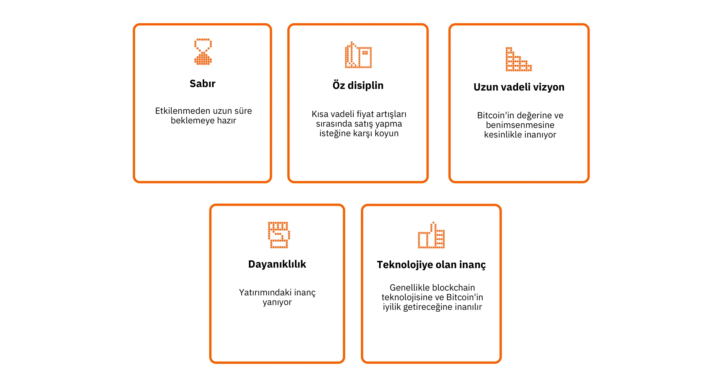

Kısacası, istifleme, zaman içinde bir Bitcoin pozisyonu oluşturmak, volatilite risklerini azaltmak ve tam egemenliği sürdürmek isteyenler için idealdir; grafiklere bağlı kalmadan.

Sırada: tamamen farklı bir bitcoin kullanıcı profilini keşfedeceğiz; aktif kullanıcı.

## Aktif Bitcoin Kullanıcısı: Bitcoin'yi Günlük Yaşama Entegre Etme

<chapterId>e0a022ab-207c-571f-b4ad-c432214a756c</chapterId>

:::video id=5f6a7b8c-9d0e-1f2a-3b4c-5d6e7f8a9b0c:::

Aktif bir Bitcoin kullanıcısı olmak, uzun vadeli yatırım stratejilerinin ötesine geçmek anlamına gelir. Öncelikle harcama yapmadan tasarruf eden hodler veya stacker'ın aksine, aktif kullanıcı Bitcoin'u gerçek bir **Exchange** aracı olarak ele alır. Bunu mal ve hizmetler için ödeme yapmak ve karşı-ekonomiye aktif olarak katılmak için kullanırlar.

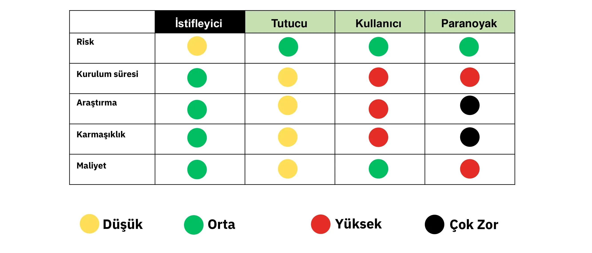

### Neden aktif bir kullanıcı stratejisi benimsemelisiniz?

Bitcoin'ı günlük olarak kullanmak hem bireysel hem de kolektif avantajlar sunar:

- Benimseme yoluyla Bitcoin ekosistemini destekleyin**:

Her işlem Bitcoin'nin bir para birimi olarak meşruiyetini güçlendirir ve daha fazla tüccar ve hizmeti kabul etmeye teşvik eder. Bitcoin'yi kullanmak, onun faydası için oy vermektir. Para değerini ticareti kolaylaştırma kabiliyetinden alır; takastan değil. Eğer hiçbir tüccar bir para birimini kabul etmiyorsa, o paranın nesnel bir değeri yoktur. Onunla ne kadar çok mal ve hizmet satın alabilirseniz, o kadar kullanışlı hale gelir. Bitcoin ile ödeme yapmayı seçerek, değeri onu kabul eden tüccarlara yönlendirmiş olursunuz. Bu onların karlarını artırır ve zamanla bunu reddeden rakiplerin karlarını azaltabilir. Bir topluluk genelinde bu dinamik, Bitcoin'nin daha geniş çapta kabul görmesini sağlayabilir ve erdemli bir benimseme döngüsüne katkıda bulunabilir.

- Bitcoin'ün benzersiz özelliklerinden** yararlanın:

Bitcoin, Lightning Network aracılığıyla hızlı işlemler ve sansür, mali gözetim ve senyorajdan muafiyet gibi çeşitli güçlü özellikler sunar. Temel değeri, para Supply üzerindeki devlet kontrolünü ortadan kaldırması ve sansürlenemeyen işlemlere olanak tanımasıdır. Bu avantajlar kişisel ihtiyaçlarınız ve değerlerinizle örtüşüyorsa, Aktif Kullanıcı profilinin size uygun olduğunu görebilirsiniz.

- Yaparak öğrenin**:

Bitcoin'yi aktif olarak kullanmak, gerçek dünya deneyimi geliştirmenize yardımcı olur. Wallet türlerine, ödeme gizliliğine ve UTXO yönetimine aşina olacaksınız. Günlük kullanım pratik bir öğrenme ortamı haline gelir.

Zorluklar arasında teknik karmaşıklık, fiyat oynaklığı ve fon kaybını önlemek için iyi bir güvenlik hijyeni ihtiyacı yer almaktadır.

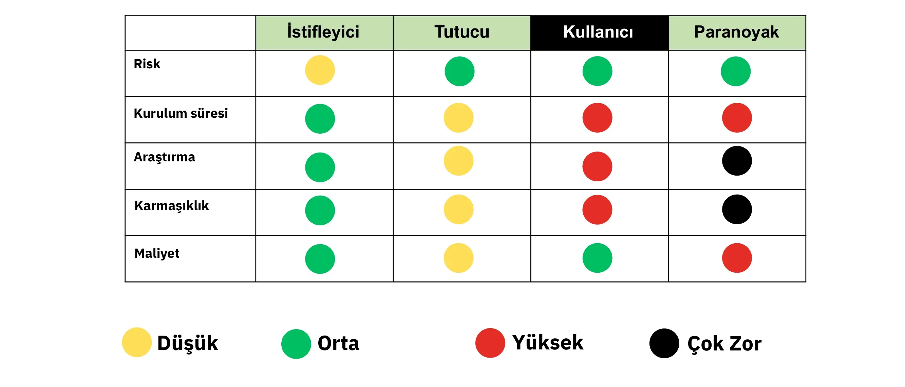

### Aktif bir kullanıcı için yatırım planı

Günlük ödemeler için Bitcoin'i benimsemek, düşünceli ve yapılandırılmış bir yaklaşım gerektirir. Bir Hodler veya Stacker'ın aksine, Aktif Kullanıcı hem fonlarının uzun vadeli güvenliğini hem de günlük işlemlerin rahatlığını yönetmelidir. Güvenli Cold depolama ile harcama fonlarına kolay erişim arasında doğru dengeyi kurmak, bu stratejinin etkili bir şekilde işlemesi için çok önemlidir.

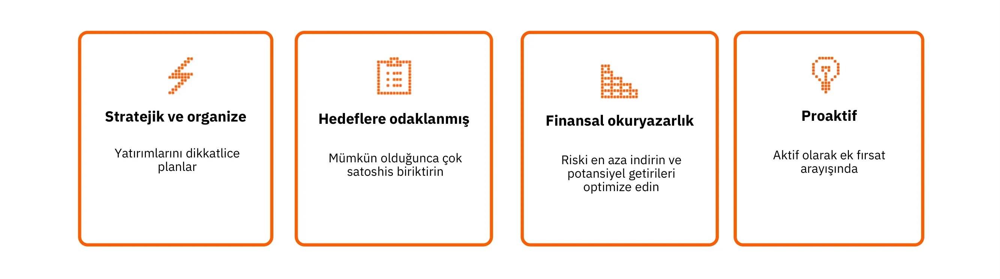

#### 1. Cüzdanların net bir şekilde ayrılması

Aktif kullanıcılar, güvenlik ve rahatlığı dengelemek için iki farklı cüzdan türü kullanmalıdır:

- Uzun vadeli tasarruf sağlamak için bir Cold Wallet (Hardware Wallet).

https://planb.academy/tutorials/wallet/hardware/coldcard-q-73e86d1a-6fe6-4d8b-bb15-8690298020e3

https://planb.academy/tutorials/wallet/hardware/jade-plus-green-873099a4-35ec-4be8-b31a-6e7cd6a41ec0

https://planb.academy/tutorials/wallet/hardware/ledger-nano-s-plus-75043cb3-2e8e-43e8-862d-ca243b8215a4

https://planb.academy/tutorials/wallet/hardware/ledger-flex-3728773e-74d4-4177-b39f-bd923700c76a

https://planb.academy/tutorials/wallet/hardware/passport-74e53858-3fa2-43f9-b866-573297546236

https://planb.academy/tutorials/wallet/hardware/bitbox02-6af8940f-e19b-4008-8c83-81017032608c

https://planb.academy/tutorials/wallet/hardware/portal-bd6e83f0-0100-4689-aeb3-513cca944ace

https://planb.academy/tutorials/wallet/hardware/satochip-e9bc81d9-d59b-420d-9672-3360212237ba

https://planb.academy/tutorials/wallet/hardware/seedsigner-2b274bff-6fc8-407a-92d7-f6ec4d1fadfb

https://planb.academy/tutorials/wallet/hardware/tapsigner-ab2bcdf9-9509-4908-9a4a-2f2be1e7d5d2

- Günlük işlemler için bir veya daha fazla mobil Hot cüzdanı. Tipik olarak, aktif bir kullanıcı hem bir On-Chain Hot Wallet hem de bir Lightning Wallet'ya sahip olacaktır.

https://planb.academy/tutorials/wallet/mobile/aqua-8e6d7dd3-8c03-45cc-90dd-fe3899a7d125

https://planb.academy/tutorials/wallet/mobile/bitkit-a7224674-85c4-4045-9baf-37018d89550c

https://planb.academy/tutorials/wallet/mobile/blink-7ea5f5a4-e728-4ff9-b3f9-cf20aa6fc2bd

https://planb.academy/tutorials/wallet/mobile/blixt-04b319cf-8cbe-4027-b26f-840571f2244f

https://planb.academy/tutorials/wallet/mobile/blockstream-app-onchain-e84edaa9-fb65-48c1-a357-8a5f27996143

https://planb.academy/tutorials/wallet/mobile/blue-wallet-2f4093da-6d03-4f26-8378-b9351d0dbc90

https://planb.academy/tutorials/wallet/mobile/breez-46a6867b-c74b-45e7-869c-10a4e0263c06

https://planb.academy/tutorials/wallet/mobile/lipa-61019fbd-deb7-4b3c-8cda-0402a4b2e780

https://planb.academy/tutorials/wallet/mobile/nunchuk-6cbcb406-ec84-478f-afac-bb4da366a6fa

https://planb.academy/tutorials/wallet/mobile/phoenix-0f681345-abff-4bdc-819c-4ae800129cdf

https://planb.academy/tutorials/wallet/mobile/wallet-of-satoshi-39149d86-e42b-4e8f-ae9f-7e061e7784f7

https://planb.academy/tutorials/wallet/mobile/zeus-embedded-advanced-3e89603c-501d-439c-8691-d4a0d0de459b

Fonlarınızı bu şekilde ayırmak, günlük ödemeler için kullanılan Wallet'in tehlikeye girmesi durumunda riski azaltmaya yardımcı olur.

#### 2. Kendi düğümünüzü kurun

Aktif kullanıcılar genellikle kişisel durumlarına bağlı olarak güvenilir üçüncü taraflara olan bağımlılıklarını azaltmayı hedefler. Bunu başarmanın en etkili yollarından biri kendi Bitcoin düğümlerini çalıştırmaktır. Bu, işlemlerinin gizliliğini artırırken ağı bağımsız olarak kullanmalarına olanak tanır.

https://planb.academy/tutorials/node/bitcoin/bitcoin-core-linux-568c13a6-8746-4d63-8e95-f4a61c5ae0ed

https://planb.academy/tutorials/node/bitcoin/bitcoin-core-mac-windows-9684ab02-e0af-41c9-8102-86ac7c7727f3

https://planb.academy/tutorials/node/bitcoin/bitcoin-knots-e04b2196-4df2-4246-86ef-c02269c29098

https://planb.academy/tutorials/node/bitcoin/raspiblitz-d8cdba2e-a682-46cf-9fdc-d8602fbeac02

https://planb.academy/tutorials/node/bitcoin/mynode-a481fef3-2fd3-4df3-91c0-112cffa094eb

https://planb.academy/tutorials/node/bitcoin/start9-8c8b6827-8423-4929-bcba-89057670ed6a

Lightning Network'i düzenli olarak kullananlar için kendi LND, LDK veya Core-Lightning düğümlerini yönetmek akıllıca bir hareket olabilir. Bu onlara kanalların açılması ve kapatılması üzerinde tam kontrol sağlar, kendi egemenliklerini artırır ve hatta işlem ücretlerinin düşürülmesine yardımcı olabilir; özellikle Phoenix gibi otomatik çözümlerle veya daha kötüsü emanet Lightning cüzdanlarıyla karşılaştırıldığında.

https://planb.academy/tutorials/node/lightning-network/alby-hub-62e6356c-6a6d-4134-8f22-c3b6afb9882a

#### 3. Düzenli Bitcoin Alımı

Aktif kullanıcıların uzun vadeli tasarrufları ile günlük kullanım için ellerinde bulundurdukları Bitcoin miktarı arasında bir denge kurmaları gerekir.

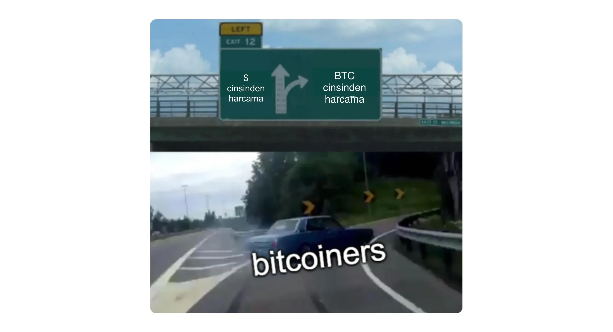

Aradığınız gizlilik düzeyine bağlı olarak Bitcoin'ü edinmenin birkaç yolu vardır:

- Bitfinex veya Bull Bitcoin gibi düzenlenmiş platformlar** aracılığıyla geleneksel satın alma (Cold Wallet'nızı doldurmak için ideal);

https://planb.academy/tutorials/exchange/centralized/bitfinex-dc306d39-bd96-4ab9-a278-a322316716db

https://planb.academy/tutorials/exchange/centralized/bitstack-29fd71be-9570-42c6-8f6f-cd355d62e746

https://planb.academy/tutorials/exchange/centralized/bitstamp-5a36c896-bff5-46d7-b505-ff069c3ac47c

https://planb.academy/tutorials/exchange/centralized/bull-bitcoin-europe-0ccf713e-efcd-44ec-8205-211f49ac7d53

https://planb.academy/tutorials/exchange/centralized/kraken-1ef03e25-9b42-49bd-a47d-249e1a13cfc6

https://planb.academy/tutorials/exchange/centralized/paymium-92603f76-b985-49ce-81e5-f4fa0df776e5

https://planb.academy/tutorials/exchange/centralized/relai-v2-30a9671d-e407-459d-9203-4c3eae15b30e

https://planb.academy/tutorials/exchange/centralized/stackinsat-5af6a380-f3c6-4246-9f81-9957a16ab066

- Peach, Robosats veya Bitcoin ATM'leri gibi eşler arası hizmetler aracılığıyla KYC dışı edinim**; kişisel bilgilerinizi açıklamadan Wallet'unuza ekleme yapmanıza olanak tanır.

https://planb.academy/tutorials/exchange/peer-to-peer/bisq-v2-c1c6a702-6c16-4101-8b90-62c424017b80

https://planb.academy/tutorials/exchange/peer-to-peer/hodlhodl-d7344cd5-6b18-40f5-8e78-2574a93a3879

https://planb.academy/tutorials/exchange/peer-to-peer/lnp2pbot-v2-e6bcb210-610b-487d-970c-7cce85273e3c

https://planb.academy/tutorials/exchange/peer-to-peer/peach-c6143241-d900-4047-9b73-1caba5e1f874

https://planb.academy/tutorials/exchange/peer-to-peer/robosats-b60e4f7c-533a-4295-9f6d-5368152e8c06

- Bitcoin'da Kazanç**, Aktif bir kullanıcı olmak sadece BTC harcamakla ilgili değildir; aynı zamanda onu kazanmakla da ilgilidir. Bir işletme işletiyorsanız, Bitcoin'ı ödeme olarak kabul etmeyi düşünün. Eğer bir çalışansanız, işvereninizin maaşınızın tamamını veya bir kısmını BTC olarak alma seçeneği sunup sunmadığına bakın.

https://planb.academy/tutorials/business/point-of-sale/swiss-bitcoin-pay-2-a78b057e-ed11-47ac-860c-71019fcb451a

https://planb.academy/tutorials/business/point-of-sale/open-node-e69a0c1c-47f7-4932-8494-e6f26c3c9784

https://planb.academy/tutorials/business/point-of-sale/btcpay-server-928eb01e-824b-4b57-a3e8-8727633beddc

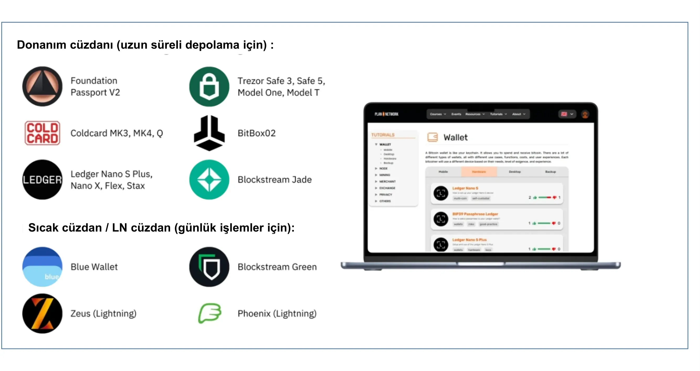

#### 4. Aktif gider yönetimi

Bitcoin harcama tercihi sıklıkla eleştiri konusu olmaktadır. Bazı Bitcoin kullanıcıları, bitcoin harcamak yerine daha düşük kalitede olduğunu düşündükleri ve bu nedenle ortadan kaldırmak istedikleri itibari para birimlerini harcamayı tercih etmektedir. Ancak bu zihniyetin iki önemli kusuru vardır: birincisi, bir ödeme aracı olarak Bitcoin'in avantajlarını göz ardı eder (önceki bölüme bakın) ve ikincisi, şu soruyu gündeme getirir: neden daha az değerli görülen itibari para birimini harcamak için tutalım?

Daha mantıklı bir yaklaşım "Harca ve Değiştir" yöntemidir. Bu, daha önce bahsedilen tüm nedenlerle Bitcoin harcamak ve ardından Bitcoin birikimlerinizin azalmasına izin vermek yerine, fiat para birimi ile yenilerini satın alarak harcanan Sats'ü değiştirmek anlamına gelir.

Bitcoin harcamalarını kolaylaştırmak için, dünya çapında Bitcoin kabul eden tüccarları gösteren [BTC Map](https://btcmap.org/) gibi birçok araç mevcuttur. Bu tüccarlardan bazıları çevrimiçi sipariş vermenize ve ürünlerin teslim edilmesine bile izin verir.

Hala tüm günlük tüccarların BTC'yi kabul etmediği bir geçiş aşamasında olduğumuz için, bazı basit ama etkili geçici çözümler var. Örneğin, Bitcoin ile hediye kartları satın almak pratik bir çözümdür ve Bitrefill, Coinsbee veya The Bitcoin Company gibi birçok sağlayıcı bu hizmeti sunmaktadır.

https://planb.academy/tutorials/exchange/centralized/bitrefill-8c588412-1bfc-465b-9bca-e647a647fbc1

#### 5. Teknolojik Farkındalık ve Esneklik

Bitcoin protokolü, Layer gibi Lightning Network-2 sistemleri ve bu ekosistemlerle ilgili tüm Layer uygulaması ile birlikte hızla gelişmektedir. Aktif bir kullanıcı olarak şunları yapmalısınız:

- Günlük uygulamaları kolaylaştıran yeni çözümlerden haberdar olun;
- Kullanıcı deneyimini iyileştirmek için yeni araç ve hizmetleri düzenli olarak test edin;
- Stratejinizi teknolojik gelişmelere ve pazar değişikliklerine göre ayarlayın.

### Aktif kullanıcı profilinizi değerlendirin

Aktif bir Bitcoin kullanıcısı olmak için biçilmiş kaftan mısınız? İşte bu profili tanımlayan temel özellikler:

- Pragmatizm ve Commitment:** Bitcoin'i günlük hayatınıza entegre etmek ve ekosisteminin büyümesinde aktif bir rol oynamak için motive oluyorsunuz. Bununla birlikte gelen hem faydaların hem de zorlukların farkındasınız.
- Teknik Yeterlilik:** Ya Bitcoin cüzdanlarının ve Lightning Network'nin nasıl çalıştığını zaten biliyorsunuz; ya da öğrenmeye heveslisiniz. UTXO yönetimi gibi gelişmiş kavramlarda rahatça gezinebilirsiniz.
- Esneklik ve Uyarlanabilirlik:** Bitcoin ekosistemi geliştikçe ve ihtiyaçlarınız değiştikçe yeni araçlar denemeye, çözümler arasında geçiş yapmaya ve uygulamalarınızı ayarlamaya açıksınız.
- Mali Disiplin:** Bitcoin harcamalarınızı ve tasarruflarınızı özenle yönetiyorsunuz. Günlük fonlarınızı uzun vadeli birikimlerinizden net bir şekilde ayırmanın önemini anlıyorsunuz.

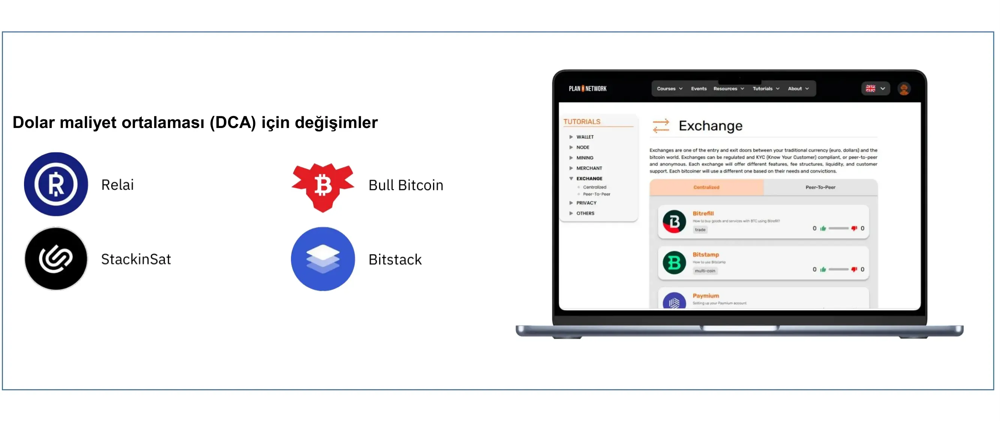

Sonuç olarak, aktif kullanıcı Bitcoin'nin ekosistemini ileriye taşımada doğrudan bir rol oynamaktadır. Bitcoin'yi günlük alışkanlıklarına dahil ederek, yalnızca benimsenmesini desteklemekle kalmaz, aynı zamanda kendi uzmanlıklarını da geliştirirler.

Bir sonraki bölümde, son ve belki de en ilgi çekici Bitcoin kullanıcı profilini inceleyeceğiz: paranoyak kullanıcı.

## Paranoyak Bitcoinci: Gizlilik Her Şeyin Üstünde

<chapterId>5c624acd-662e-5134-ab7a-fb75cde7c3f8</chapterId>

:::video id=6a7b8c9d-0e1f-2a3b-4c5d-6e7f8a9b0c1d:::

Paranoyak Bitcoin kullanıcıları için gizlilik isteğe bağlı değildir; olmazsa olmazdır. Neredeyse her finansal hareketin takip edildiği bir dünyada, kimliklerini ve işlem geçmişlerini korumayı Bitcoin kullanmanın tartışılmaz bir parçası olarak görürler. Genellikle kişisel verileri ifşa etmenin içerdiği risklerin farkındadırlar (özellikle de kimlik doğrulaması gerektiren KYC uyumlu borsaları kullanırken).

Onlar için her eylem önemlidir. Her işlem, her Wallet kurulumu ve ağ ile her etkileşim dikkatle değerlendirilir. Tek bir hata, kimliklerini Bitcoin holdinglerine bağlayan hassas bilgileri açığa çıkarabilir. Nihai hedefleri? Bitcoin'u kimliklerini, konumlarını ve finansal durumlarını tamamen gizli tutacak şekilde kullanmak.

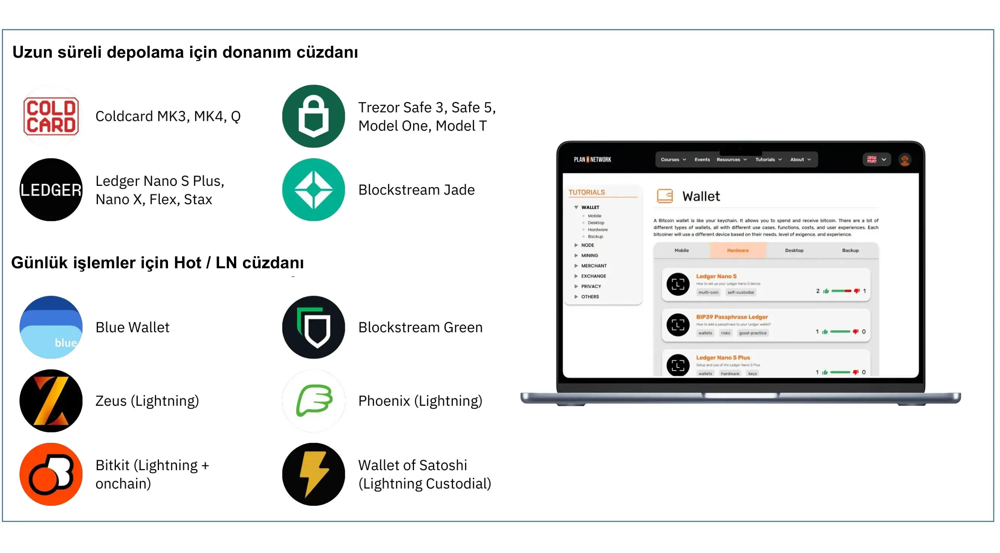

### Neden bu kadar temkinli bir yaklaşım benimsiyorsunuz?

Gizlilik öncelikli bir zihniyet seçmek birkaç önemli avantaj sunar:

- Finansal özerklik:** Bankaların, hükümetlerin ve şirketlerin radarından uzak durarak kendinizi gözetimden ve istenmeyen müdahalelerden korursunuz.
- Varlık koruması:** Ekonomik veya siyasi koşullar istikrarsız hale gelirse, kimliğinizle bağlantılı değilse üçüncü tarafların Bitcoin'nizi izlemesi veya ele geçirmesi çok daha zordur.
- Geliştirilmiş kişisel güvenlik:** Yüksek miktarda Bitcoin bulundurduğu bilinen kişiler hedef haline gelebilir. Kimliğinizi gizli tutmanız hedef olma riskinizi azaltır.
- Ayrımcılığa karşı özgürlük**: Bazı hizmetler veya devletler, geçmiş faaliyetlerinize veya kim olduğunuza bağlı olarak işlemleri veya hesapları engelleyebilir. Gizlilik bu gücü kontrol altında tutar.
- Bitcoin'ün köklerine sadık kalmak:** Bitcoin sansüre dirençli ve izinsiz bir para biçimi olarak tasarlanmıştır. Gizliliğinizi korumak, bu orijinal misyonu onurlandırmanın bir parçasıdır.

Bu, günümüzün dijital ve finansal ortamında var olan çok gerçek tehditlere karşı akıllıca ve hesaplanmış bir yanıttır. Evet, bu yaklaşım daha fazla çaba gerektiriyor. Zaman, teknik bilgi ve disiplin gerektirir. Ancak bu yolu seçenler için mesele sadece Bitcoin kullanmak değil; paraları, kimlikleri ve özgürlükleri üzerindeki kontrolü geri almaktır.

Onlar sadece yatırımcı ya da kullanıcı değiller; onlar hakkında her şeyi bilmek isteyen bir sistemden vazgeçiyorlar.

### Paranoyak yatırım planı

Paranoyak Bitcoin kullanıcısı, iki temel hedef etrafında inşa edilmiş katı bir strateji izler: anonimliği korumak ve güvenliği en üst düzeye çıkarmak. Bu tür kullanıcılar, düzenlenmiş platformlara (özellikle KYC gerektirenlere) maruz kalmaktan kaçınmaya, işlem izlenebilirliğini ortadan kaldırmaya ve fonlarını gözetim, el koyma ve diğer dış tehditlere karşı korumaya çalışır.

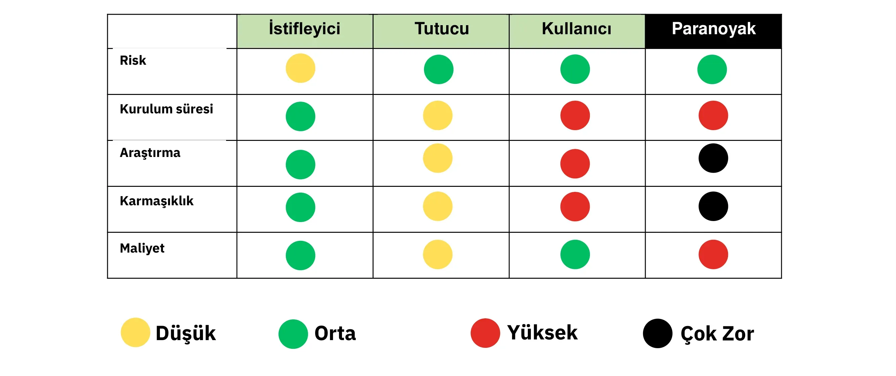

#### 1. Cüzdanları ve düğümleri ayarlama

Paranoyak kullanıcı fonları asla kaynağına veya kullanımına göre karıştırmaz. Bunun yerine, birden fazla özel cüzdan kullanarak Bitcoin'larını amaçlarına göre bölümlere ayırırlar:

- Bir Cold Wallet (hava boşluklu ve/veya kendin yap)** Uzun vadeli varlıklar yüksek güvenlikli, hava boşluklu veya kendin yap cüzdanlarda saklanır. Bunlar genellikle açık kaynaklı cihazlar veya Jade, Coldcard, SeedSigner, Portal veya Passport gibi doğrulanabilir koda sahip cihazlardır... Mümkün olduğunda, bu cihazları anonim olarak edinecekler; ya nakit ödeme yaparak ya da fiziksel bir mağazada Bitcoin kullanarak ya da gizli nakliye seçenekleri ve BTC ödemeleri ile çevrimiçi sipariş vererek. Örneğin Fransa'da [Bitcoin Bazar](https://bitcoinbazar.fr/) böyle bir mağaza. Bölgenizdeki benzer sağlayıcıları arayabilirsiniz.

https://planb.academy/tutorials/wallet/hardware/jade-plus-sparrow-938abf16-e10a-4618-860d-cd771373a262

https://planb.academy/tutorials/wallet/hardware/coldcard-q-advanced-b8cc3f29-eea9-48fe-a953-b003d5b115e0

https://planb.academy/tutorials/wallet/hardware/passport-74e53858-3fa2-43f9-b866-573297546236

https://planb.academy/tutorials/wallet/hardware/portal-bd6e83f0-0100-4689-aeb3-513cca944ace

- Günlük işlemler için bir Hot Wallet**, Düzenli harcamalar için paranoyak kullanıcılar Ashigaru, Wasabi Wallet veya Sparrow wallet gibi gizlilik odaklı cüzdanları tercih eder. Bu cüzdanlar, mini CoinJoin harcama işlemleri, payjoins, potansiyel CoinJoin araçları, Coin kontrolü, UTXO etiketleme veya kendi Bitcoin düğümünüz üzerinden bağlanma yeteneği gibi gelişmiş özellikleri destekler.

https://planb.academy/tutorials/wallet/desktop/sparrow-c674e2ac-d46f-4c82-92a7-7d1b0e262f5d

https://planb.academy/tutorials/wallet/desktop/wasabi-a0b51540-32d2-4ed2-98aa-801da5d35cf6

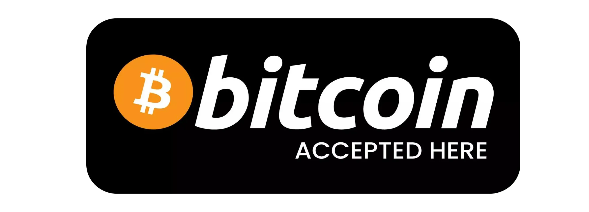

- Kendi **Bitcoin düğümlerini** çalıştırmak esastır. İşlem yayını üzerinde tam kontrol sağlar ve üçüncü taraf altyapısına bağımlılığı önler. Ayrıca gizliliği korur, sansürü önler ve Bitcoin protokolünün kurallarını bağımsız olarak doğrulamalarını sağlar. İster Linux, Windows, macOS üzerinde ister RaspiBlitz, myNode veya Start9 gibi tak ve çalıştır kurulumlar aracılığıyla olsun, paranoyak kullanıcı kendi düğümünü egemenliğin tartışılmaz bir sütunu olarak görür.

https://planb.academy/tutorials/node/bitcoin/bitcoin-core-linux-568c13a6-8746-4d63-8e95-f4a61c5ae0ed

https://planb.academy/tutorials/node/bitcoin/bitcoin-core-mac-windows-9684ab02-e0af-41c9-8102-86ac7c7727f3

https://planb.academy/tutorials/node/bitcoin/bitcoin-knots-e04b2196-4df2-4246-86ef-c02269c29098

https://planb.academy/tutorials/node/bitcoin/raspiblitz-d8cdba2e-a682-46cf-9fdc-d8602fbeac02

https://planb.academy/tutorials/node/bitcoin/mynode-a481fef3-2fd3-4df3-91c0-112cffa094eb

https://planb.academy/tutorials/node/bitcoin/start9-8c8b6827-8423-4929-bcba-89057670ed6a

- Aynı düzeyde kontrol ve takdir yetkisini koruyarak **Lightning Network** üzerinden işlem yapmak için kendi Lightning düğümlerini de işletirler. Bu, kanalları doğrudan yönetmelerine ve gözetimi veya saklama hizmetlerine bağımlılığı en aza indirecek şekilde harcama yapmalarına olanak tanır.

https://planb.academy/tutorials/node/lightning-network/alby-hub-62e6356c-6a6d-4134-8f22-c3b6afb9882a

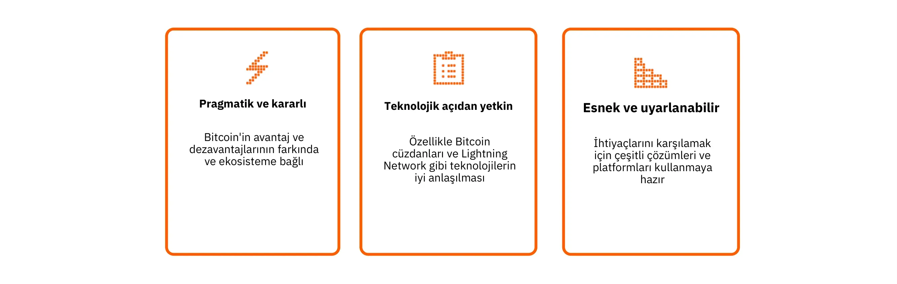

Güvenlik bununla da bitmiyor. Paranoyak kullanıcılar seed cümlelerini yedeklemek için kurcalanmaya karşı korumalı mühürlü zarflarla birleştirilmiş metal yedekler kullanır. Yedeklerin tehlikesiz kaldığını düzenli olarak doğrular ve her türlü olasılığa hazır olmak için Wallet kurtarma prosedürlerini test ederler.

https://planb.academy/tutorials/wallet/backup/backup-mnemonic-22c0ddfa-fb9f-4e3a-96f9-46e2a7954270

https://planb.academy/tutorials/wallet/backup/recovery-test-5a75db51-a6a1-4338-a02a-164a8d91b895

Tasarrufların güvence altına alınması söz konusu olduğunda, çoklu imza cüzdanları (zaman kilitli veya kilitsiz) gibi daha sofistike kurulumlar uygulayabilirler.

https://planb.academy/tutorials/wallet/desktop/liana-306ef457-700c-4fdd-b07a-8fb7a8a29f04

Bu yapılandırmalar riskleri azaltır. seed ifadesine bir BIP39 passphrase eklemek, bir Layer koruması daha ekler ve fonlarına erişimin tek bir keşifle tehlikeye atılmamasını sağlar.

https://planb.academy/tutorials/wallet/backup/passphrase-a26a0220-806c-44b4-af14-bafdeb1adce7

Paranoyak bir Bitcoin kullanıcısı elbette bitcoinleri için iyi düşünülmüş bir miras planına sahip olacaktır. Bu önemli konu, kursun bir sonraki bölümünde ayrıntılı olarak ele alınacaktır.

Daha geniş anlamda, bu tür kullanıcılar bir bütün olarak bilişime gelişmiş, gizlilik bilincine sahip bir yaklaşım uygular. Dijital yaşamlarının her Layer'ünde kullanıcı gizliliğine saygı gösteren açık kaynaklı, güvenli araçlara güvenirler:

- Hem telefonlarındaki hem de bilgisayarlarındaki işletim sistemleri**;

https://planb.academy/tutorials/computer-security/operating-system/grapheneos-08d43d7a-0b22-4638-a151-578d48d32d88

https://planb.academy/tutorials/computer-security/operating-system/linux-mint-da44852e-513f-4004-949a-8fde60c1bca5

https://planb.academy/tutorials/computer-security/operating-system/ubuntu-78a3be56-5d51-4ec3-8629-0dd27c352ab5

- Kimlik doğrulama araçları**;

https://planb.academy/tutorials/computer-security/authentication/authy-a76ab26b-71b0-473c-aa7c-c49153705eb7

https://planb.academy/tutorials/computer-security/authentication/bitwarden-0532f569-fb00-4fad-acba-2fcb1bf05de9

https://planb.academy/tutorials/computer-security/authentication/keepass-f8073bb7-5b4a-4664-9246-228e307be246

https://planb.academy/tutorials/computer-security/authentication/security-key-61438267-74db-4f1a-87e4-97c8e673533e

- İletişim araçları**;

https://planb.academy/tutorials/computer-security/communication/ivpn-5a0cd5df-29f1-4382-a817-975a96646e68

https://planb.academy/tutorials/computer-security/communication/mullvad-968ec5f5-b3f0-4d23-a9e0-c07a3e85aaa8

https://planb.academy/tutorials/computer-security/communication/proton-mail-c3b010ce-254d-4546-b382-19ab9261c6a2

https://planb.academy/tutorials/computer-security/communication/tor-browser-a847e83c-31ef-4439-9eac-742b255129bb

- Veri yönetim araçları**.

https://planb.academy/tutorials/computer-security/data/integrity-authenticity-21d0420a-be02-4663-94a3-8d487f23becc

https://planb.academy/tutorials/computer-security/data/proton-drive-03cbe49f-6ddc-491f-8786-bc20d98ebb16

https://planb.academy/tutorials/computer-security/data/veracrypt-d5ed4c83-7c1c-4181-95ea-963fdf2d83c5

BT güvenliği konusu hakkında daha fazla bilgi edinmek isterseniz, bu konuya adanmış eksiksiz bir birinci yıl kursu sunuyoruz:

https://planb.academy/courses/99c46148-7080-4915-a7e0-9df0e145cd47

#### 2. Anonim olarak bitcoin satın alma

Paranoyak yatırımcılar için temel ilke, Bitcoin'yı gerçek dünyadaki kimlikleriyle ilişkilendirmeden elde etmektir. KYC platformlarından kaçınmak ve On-Chain parmak izinin alınmasını önlemek için çeşitli stratejilere başvururlar:

- Bisq, Robosat, LNP2PBot, Peach, HODL HODL, vb. gibi P2P satın alma platformları**;

https://planb.academy/tutorials/exchange/peer-to-peer/bisq-v2-c1c6a702-6c16-4101-8b90-62c424017b80

https://planb.academy/tutorials/exchange/peer-to-peer/hodlhodl-d7344cd5-6b18-40f5-8e78-2574a93a3879

https://planb.academy/tutorials/exchange/peer-to-peer/lnp2pbot-v2-e6bcb210-610b-487d-970c-7cce85273e3c

https://planb.academy/tutorials/exchange/peer-to-peer/peach-c6143241-d900-4047-9b73-1caba5e1f874

https://planb.academy/tutorials/exchange/peer-to-peer/robosats-b60e4f7c-533a-4295-9f6d-5368152e8c06

- Yüz yüze nakit takası**, örneğin yerel Bitcoin buluşmalarında;

https://planb.academy/courses/1c643dc9-a15f-4f9e-93b6-cb3c58b4ee35

- Bitcoin ATM'ler**;
- Bitcoin için Exchange'de mal veya hizmet sağlayarak Sats** kazanmak;
- Mining bitcoins**.

https://planb.academy/tutorials/mining/hardware/attakai-0d177e6b-e167-4b25-8e38-4ec74213d1fb

https://planb.academy/tutorials/mining/hardware/braiins-mini-miner-f5aec001-fb05-4e89-b3b2-a31abec1253c

https://planb.academy/tutorials/mining/hardware/bitaxe-d317e1a7-d775-401d-85df-51f4f2217566

Hem gizlilik hem de potansiyel sansür veya el koyma riskleri nedeniyle merkezi borsalardan tamamen kaçınılmaktadır.

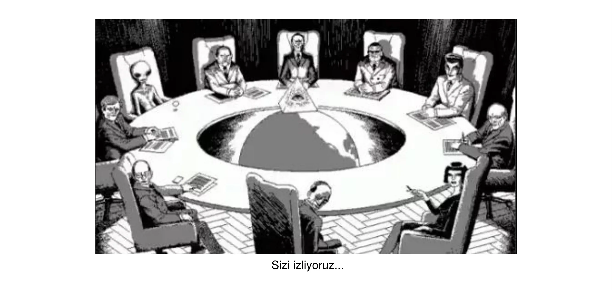

#### 3. Zincir üzerinde izlemeyi önleme

Coinleri anonim olarak aldıktan sonra bile, dikkatli olmazsanız kişisel verilerinizi On-Chain'e sızdırmanız hala mümkündür. Paranoyak kullanıcı, işlem düzeyinde gizliliği korumak için ek adımlar atar:

- Manuel olarak ya da Sessiz Ödemeler veya BIP47 gibi gelişmiş araçlar kullanarak Address'nın yeniden kullanımından** kaçınmak;
- UTXO'larınızı etiketleyin**;
- Harcama yaparken Coin kontrolünü uygulamak**;
- UTXO'ların** konsolidasyonundan kaçınılması;
- Gizliliği koruyan işlem yapılarını kullanma**: coinjoins, payjoins, ricochets ve mini-payment coinjoins...

Ayrıca Blockchain gözetiminin temellerine aşinadırlar ve şirketlerin faaliyetleri nasıl izlediğini bilirler. Zincir analiz firmaları tarafından kullanılan sezgisel yöntemleri ve kalıpları anlayarak, bilinen tuzaklara düşmekten kaçınmak için aktif adımlar atabilirler.

On-Chain gizlilik ve gözetim direnci konusunda daha derinlere inmek isteyenler için, Bitcoin gizlilik uygulamaları konusunda ileri düzey bir ikinci yıl eğitimi sunuyoruz:

https://planb.academy/courses/65c138b0-4161-4958-bbe3-c12916bc959c

#### 4. Tetikte olmak ve stratejilerini güncellemek

Bitcoin protokolü, Lightning Network ve ilgili araçlar sürekli olarak gelişmektedir. Paranoyak bir kullanıcı tetikte ve uyarlanabilir kalır:

- Yeni gizlilik teknikleri ve güvenlik araçları hakkında bilgi sahibi olmak
- Operasyonel kurulumlarını keskin tutmak için düzenli olarak yeni araç ve hizmetleri test etmek
- Donanım cüzdanlarının ve düğümlerin güncel olup olmadığının ve doğru çalışıp çalışmadığının rutin olarak kontrol edilmesi
- Yedeklerin (örn. mühürlü Mnemonic zarfları) kurcalanmadığının periyodik olarak doğrulanması
- Stratejilerini gerçek zamanlı olarak uyarlamak için düzenleyici gelişmeleri takip etmek

### Paranoyak profilinizin değerlendirilmesi

Paranoyak bir strateji benimsemek sıradan bir karar değildir.  Araçlarda ve en iyi gizlilik uygulamalarında uzmanlaşmak için sıkı bir disiplin, sürekli özen ve önemli bir zaman yatırımı gerektirir.

Bu yaklaşım sizin için doğru mu?

İşte paranoyak bir bitcoin kullanıcısının temel özellikleri:

- Uyanık ve Güvenlik Bilincine Sahip**: Gizliliğinize büyük değer veriyorsunuz ve kişisel bilgilerinizin sızmasını önlemek için ekstra önlemler almaya hazırsınız. Finansal gözetimi ciddi bir tehdit olarak görüyor ve kendinizi bundan korumanın yollarını arıyorsunuz.
- Bağımsız**: Bitcoinlerinizi saklamak, yönetmek veya transfer etmek için herhangi bir üçüncü taraf hizmetine güvenmeyi reddediyorsunuz. Kendi Bitcoin ve Lightning düğümlerinizi barındırmaya, karmaşık cüzdanlar kullanmaya ve yedeklemelerinizi ve özel anahtarlarınızı yönetmek için tüm sorumluluğu almaya hazırsınız.
- Güvensiz**: KYC platformlarından aktif olarak kaçınıyor ve anonim P2P edinme yöntemlerini tercih ediyorsunuz, bunun için prim ödemek anlamına gelse bile. Paylaşılan tüm kişisel verilerin bir gün size karşı kullanılabileceğinin farkındasınız.
- Bilgili ve Disiplinli**: Siber güvenlik ve gizliliği artıran teknolojilere karşı bir tutkunuz var. Mevcut çözümleri incelemek, araçları test etmek, en iyi uygulamalar konusunda kendinizi eğitmek ve riskleri en aza indirmek için katı metodolojiler uygulamak için zaman ayırırsınız.
- Pragmatik ve Gerçekçi**: Tam anonimliğin neredeyse imkansız olduğunu biliyorsunuz, ancak gizlilik, güvenlik ve kullanılabilirlik arasında denge kurarken maruz kaldığınız riskleri mümkün olduğunca azaltmaya çalışıyorsunuz. Yaklaşımınız yeni tehditlere ve teknolojik gelişmelere yanıt olarak sürekli gelişir.

Bu özellikler tanıdık geliyorsa, bu strateji muhtemelen sizin için uygundur. Zorludur ve sürekli çaba gerektirir, ancak yüksek düzeyde finansal egemenlik ve fonlarınızın gözetimine, el konulmasına veya izlenebilirliğine karşı koruma sağlar.

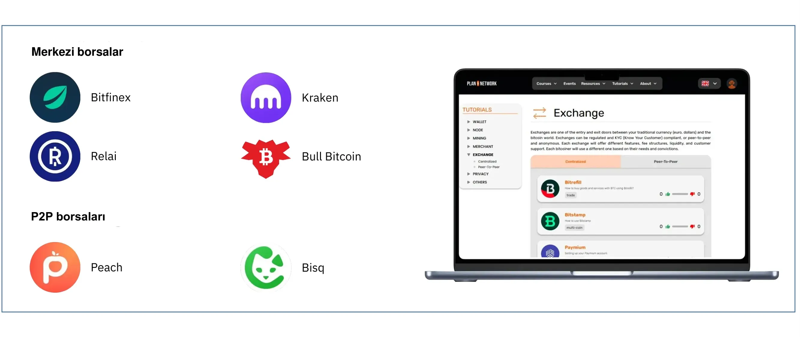

Bu yaklaşım özellikle şu durumlarda geçerlidir:

- Önemli miktarda Bitcoin bulundurun,
- Otoriter bir rejim altında yaşamak,
- kişisel, profesyonel veya ideolojik nedenlerle anonimliğinizi korumanız gerekir.

Kursun bir sonraki bölümünde, genellikle göz ardı edilen çok önemli bir konuyu ele alacağız: acil bir durumda bitcoinlerinizi nasıl devredeceğiniz.

# Varislerinizi ve Servetinizi Korumak

<partId>0b8a9528-719b-4a2d-bd50-1e173a896570</partId>

## Miras planı oluşturma

<chapterId>233c88d3-2e8e-5eba-ac06-efe67a209038</chapterId>

:::video id=7b8c9d0e-1f2a-3b4c-5d6e-7f8a9b0c1d2e:::

Bitcoinlerinizin iletimini sağlamak, genellikle göz ardı edilen ancak çok önemli olan bir sorumluluktur. Bitcoin'nin sunduğu finansal egemenlik, dikkatli bir emlak yönetimi ihtiyacını da beraberinde getirir. Bu yapılmadığı takdirde, mirasçılarınız kendilerini Hard ile kazandığınız fonlara erişemez halde bulabilirler. Bu bölümde, Bitcoin için geçerli olan emlak planlamasının temellerini inceleyeceğiz.

### Bitcoin halefiyet planı hazırlamak neden gereklidir?

Ani bir olay (bir kaza veya öngörülemeyen bir durum) olduğunu ve artık burada olmadığınızı düşünün. Zaten yas tutan aileniz şimdi başka bir zorlukla karşı karşıya: bitcoinlerinize erişmek. Özel anahtarlar, Mnemonic ifadeleri ve işlemlerin geri döndürülemezliği hakkında konuştuğunuzu duymuş olabilirler, ancak bu kavramlar onlar için belirsiz olabilir. Kendi başlarına anlamaya çalışmak zorunda kalırlar.

O zaman iki seçeneğiniz var:

- Sevdiklerinizin bitcoinlerinize kolay ve güvenli bir şekilde erişmesini sağlayacak net, yapılandırılmış bir plan oluşturmak için zaman ayırın;
- Hiçbir şey yapmamak, kendi başlarına çözeceklerini ummak. Ancak bir hata yaparlarsa, Wallet'ye erişimlerini kaybederlerse veya fonları yanlışlıkla yanlış Address'e gönderirlerse, servetiniz sonsuza kadar kaybolabilir.

Miras planı için sadece 15 dakika ila bir saat harcamak büyük fark yaratabilir. Bu sadece tedbirli olmanın değil, aynı zamanda size güvenebilecek kişilere karşı sorumluluk göstermenin de bir yoludur.

### Bitcoin Yedekleme Planının Hedefleri

Pamela Morgan, *[Cryptoasset Inheritance Planning](https://www.amazon.com/gp/product/1947910116/)* adlı kitabında, sağlam bir miras planı için dört temel hedefin ana hatlarını çizmektedir:

- Mirasçılarınızın bitcoinlerinize doğru zamanda (ancak daha önce değil) erişebilmelerini sağlayın;
- Bitcoinleri miras almadan önce hırsızlık veya tehlikeye girme riskini en aza indirin;
- Mirasçılarınızın isterlerse bitcoinleri uzun vadede nasıl güvence altına alacaklarını bildiklerinden emin olun;
- Kripto varlıkları devrederken aile içi anlaşmazlıkları önleyin ve yasal komplikasyonları sınırlayın.

İyi düşünülmüş bir plan sadece servetin aktarılmasıyla ilgili değildir; aynı zamanda sevdiklerinizi yaygın hatalardan ve potansiyel tehditlerden korumakla da ilgilidir.

Bu bölüm [Pamela Morgan](https://x.com/pamelawjd)'ın çalışmalarından esinlenerek hazırlanmıştır. [Kitabı](https://www.amazon.com/gp/product/1947910116/) ve kitabı Bitcoin miras planı oluşturmak için ayrıntılı ve uzmanlarca onaylanmış bir yöntem sunarken, **bu içerik yasal tavsiye niteliği taşımamaktadır**.  Bu kanıtlanmış bir yaklaşımdır, ancak her kişi kendi araştırmasını yapmalı ve önerileri kendi kişisel durumuna ve yargı yetkisine uyacak şekilde uyarlamalıdır.

[Pamela Morgan](https://x.com/pamelawjd) bu kurs için [çalışmasının](https://www.amazon.com/gp/product/1947910116/) kullanımına cömertçe izin verdi ve somut bir Bitcoin miras planı oluşturmak için onun yaklaşımını takip edeceğiz. Bu bölümde, kitabının ilk bölümüne odaklanacağız.

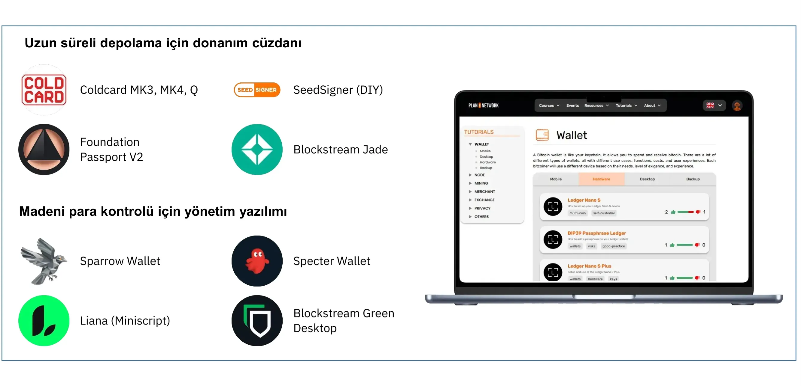

Bir Bitcoin halefiyet planının nasıl oluşturulacağını daha iyi anlamak için, beklenmedik bir şey olması durumunda servetinin nasıl aktarılacağını düzenlemesi gereken tipik bir Bitcoin kullanıcısı olan Cédric örneğine bakacağız.

Profili:

- Sık işlem yapmayan uzun vadeli yatırımcı;
- Ara sıra kullanmak için bir Hardware Wallet ve bir mobil Wallet'e sahiptir;
- Bitcoinlerini satın almak için tek bir KYC Exchange platformu kullanır;
- Kuzeni tarafından Bitcoin ile tanıştırıldı;
- Altcoinleri yoktur veya Lightning Network kullanmaz.

Amacımız, diğer kullanıcı türlerini içeren daha karmaşık senaryolara geçmeden önce Cédric'in profiline uygun basit ve etkili bir plan oluşturmaktır.

### Başlamadan önce

30 dakikanızı ayırın. Kendiniz için değil, size bağımlı olanlar için. Emlak planlaması önemli bir görevdir, ancak genellikle ertelenen, ihmal edilen ve hatta göz ardı edilen bir görevdir. Çok fazla insan, en tedbirli olanlar bile, çok geç olana kadar erteliyor. Öngörü eksikliği nedeniyle binlerce bitcoin çoktan kaybedildi. Siz bu hatayı yapmayın! Bu, finansal egemenliğe giden yolculuğunuzdaki **SON ADIM**: Bitcoin servetinizi sevdikleriniz için güvence altına almak.

#### Neye ihtiyacın var?

Sakin, dikkat dağıtıcı olmayan bir ortamınız olduğundan emin olun, ardından bu birkaç aracı bir araya getirin:

- 4 ila 5 yaprak beyaz kağıt;
- Kalem;
- 2 zarf;
- Bir telefon veya Address defteri;
- Bir bilgisayar (isteğe bağlı).

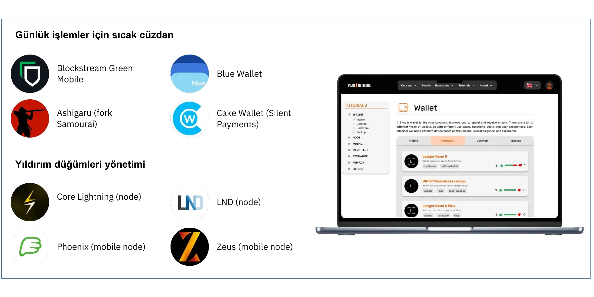

#### Miras planlaması hakkında yaygın yanlış anlamalar

Birçok kişi, harekete geçmelerini engelleyen yanlış kanılar nedeniyle bu adımı ertelemektedir. İşte Pamela Morgan'ın _Cryptoasset Inheritance Planning_ (sayfa 18) adlı kitabında özetlediği bazı yaygın efsaneler:

- "*Bir avukat tutmam gerekiyor.*"** → **Yanlış**. Yasal konularda bir avukat yardımcı olsa da, teknik bir Bitcoin miras planı avukat olmadan da oluşturulabilir. En önemli şey açık ve erişilebilir talimatlara sahip olmaktır;
- "*Üçüncü bir tarafa güvenmem gerekiyor.*"** → **Yanlış**. Planınız, bilgileri birden fazla tarafa dağıtmak veya zaman kilidi olsun ya da olmasın çoklu imza çözümleri kullanmak gibi güven ihtiyacını en aza indirecek şekilde tasarlanabilir;
- "*Planlama, varlıklarımın çalınmasını kolaylaştıracaktır.*"** → **Yanlış**. İyi düşünülmüş bir plan, hırsızlık girişimlerine karşı koruma sağlarken mirasçılarınızın fonlarınızı güvenli bir şekilde geri alabilmesini sağlar. Bununla birlikte, hiçbir çözümün kusursuz olmadığını belirtmek önemlidir: bir miras planı, hangi bilgilerin paylaşıldığına bağlı olarak hırsızlık riskini artırır. Bu konuyu daha sonra daha ayrıntılı olarak ele alacağız;
- "*Bitcoinlerimin değeri plan yapmak için çok küçük. "** → **Yanlış**. Önceden plan yapmak her zaman daha iyidir. Sevdikleriniz muhtemelen sahip olduğunuz Bitcoin miktarını tam olarak bilmiyordur ve bu iyi bir şeydir. Ancak size bir şey olursa, tam miktarı bilmeseler bile onu geri almak istemezler mi? Bitcoin'in değeri zaman içinde önemli ölçüde artabilir, bu nedenle fonlarınıza erişmelerini kolaylaştırmak ve onlara değer hakkında yanlış umut vermekten veya onları var olmayan bir şeyi aramak zorunda bırakmaktan kaçınmak akıllıca olacaktır.
- "*Varislerim bunu kendi başlarına halledecekler. "** → **Yanlış**. Bitcoin normal bir banka hesabı gibi değildir. Açık talimatlar olmadan, sevdikleriniz fonlarınıza asla erişemeyebilir veya sadece bir kısmını bulabilir. Finans kuruluşlarının veya noterlerin ölüm halinde aile üyeleriyle iletişime geçtiği banka hesaplarının aksine, ailenizi Bitcoin Wallet'niz hakkında bilgilendirecek bir aracı yoktur. Bu nedenle, bunu miras planınıza açıkça dahil etmek size bağlıdır;
- "*Bir Smart contract her şeyi yönetebilir.*"** → **Yanlış**. Zaman kilidi olan bir Smart contract multi-sig Wallet gibi bir multi-sig çözümün bir parçası olabilir, ancak özellikle Bitcoin'e aşina olmayan kişiler için asla iyi yapılandırılmış bir planın yerini almayacaktır. Her iki çözüm de birbirini tamamlayıcı niteliktedir.

Harekete geçme zamanı. Bu 30 dakikayı miras planınızı oluşturmak için harcayın. Bu basit bir adım, ancak sevdikleriniz için büyük fark yaratabilir.

### Adım 1: Mirasçılarınıza yardımcı olacak doğru kişileri seçin

Bitcoin'de bir mirası devretmek söz konusu olduğunda, sevdikleriniz muhtemelen özel anahtarları yönetmeye veya cüzdanları kurtarmaya aşina olmayacaktır. Yetkin ve güvenilir kişilerden dışarıdan yardım almaları gerekecektir. İdeal yaklaşım en az iki farklı kişi seçmektir:

- Planınızın sorunsuz bir şekilde yürütülmesini sağlayacak güvenilir bir akraba**. Bu kişinin Bitcoin hakkında derin bilgiye sahip olması gerekmez, ancak mirasçılarınızın güvenebileceği biri olmalıdır.
- Fonların kurtarılması, cüzdanların yönetilmesi ve ilgili süreçlerin anlaşılması için teknik destek sağlayabilecek deneyimli bir Bitcoin kullanıcısı**.

Seçtiğiniz kişilerin özel anahtarlarınıza (veya Mnemonic ifadenize) asla doğrudan erişimi olmamalıdır, ancak bunu yapabilmeleri gerekir:

- Varislerinize fonları geri alma ve güvence altına alma konusunda rehberlik edin;
- Bitcoin cüzdanlarının, kurtarma ifadelerinin ve işlemlerinin temellerini açıklar;
- Yaygın hatalardan kaçınmaya yardımcı olun.

Bitcoin miras planınız olacak kağıt üzerinde, potansiyel adayların güven düzeylerini, Bitcoin hakkındaki bilgilerini ve onlarla nasıl iletişime geçeceğinizi değerlendiren bir karşılaştırma tablosu oluşturun. Örneğin:

| Person               | Trust Level     | Bitcoin Knowledge   | Contact Methods         | Notes                                                                                                                   |
|----------------------|-----------------|----------------------|--------------------------|------------------------------------------------------------------------------------------------------------------------|
| My brother Bob       | Very high       | Low                  | Phone & email            | Bob doesn't know Bitcoin well, but he's 100% reliable. He can ensure the process goes smoothly.                        |
| My cousin Nathan     | High            | Medium               | Phone & Instagram        | Has some Bitcoin knowledge and can guide my heirs. Aware of the plan. #1 to talk to in case of need.                   |
| Ricco (Bitcoiner friend) | Medium      | Very high            | Twitter, email & photo   | Very technically skilled, but should never have access to the funds. To be contacted for technical support.            |
| Bitcoin YouTuber     | Low             | High                 | YouTube channel          | Good information source for learning, but cannot intervene directly.                                                   |

Güvenilir veya yetkin bir aile üyeniz yoksa, Bitcoin miras konusunda uzmanlaşmış bir avukat veya özel bir emlak planlama hizmeti gibi bir profesyonel tutmayı da düşünebilirsiniz. Önemli olan, mirasçılarınızın fonlarınızın güvenliğini ve gizliliğini korurken güvenilir teknik yardıma erişebilmeleridir.

### Adım 2: Hızlı ve kolay bir envanter oluşturun

Bitcoinlerinizi güvence altına almayı veya aktarmayı düşünmeden önce, Bitcoin varlıklarınızın net bir envanterini çıkarmak önemlidir. Bu envanter, miras planınızı düzenlemek için temel oluşturacak ve mirasçılarınızın varlıklarınızın nerede olduğunu ve onlara nasıl erişeceklerini anlamalarına yardımcı olacaktır.

Buradaki amaç güvenliğinizi hemen artırmak değil, sadece mevcut durumunuzu kataloglamaktır. Bu, bitcoinlerinizin ve onlara erişim araçlarınızın anlık bir görüntüsüdür. Bu ilk envanter tamamlandıktan sonra güvenliği daha sonra ayarlayabilir ve güçlendirebilirsiniz.

Bitcoin ile ilişkili bitcoin veya fiat para biriminizin olduğu tüm yerleri düşünün. Buna şunlar dahil olabilir:

- Exchange platformları**:  Bitcoin satın alımlarınızla bağlantılı BTC veya fiat içeren hesaplar.
- Hot cüzdanları (mobil veya masaüstü)**: Telefonunuza yüklenen, günlük işlemler için kullanılan uygulamalar;
- Donanım cüzdanları**: Özel anahtarlarınızı çevrimdışı olarak saklayan fiziksel cihazlar;
- Diğer çözümler**: Multisig, kağıt cüzdanlar, özel olarak saklanan özel anahtarlar vb.

Bu envanteri yapılandırmak için bir tablo kullanın. Buradaki fikir, bu belgeyi çevrimiçi olarak saklamak değil, ideal olarak kağıt üzerinde güvenli bir yerde tutmaktır. Örneğin:

| General | Storage type | Assets held | Localization | Mnemonic backup | Password (PIN, passphrase...) | Notes |
| --------------------- | ---------------- | -------------- | --------------------------------- | ------------------------------------------------------------------------ | ----------------------------------------------------------------------------------------------- | --------------------------------------------------------------------------------------------------------------- |
| Bitfinex | BTC & Euros | Accessible online | None (custodial platform) | | Bitwarden & 2FA password manager with Authy app on my phone | I bought my BTC here. Funds must be withdrawn after purchase |
| Physical wallet | Jade Plus | BTC | Personal safe at home | Copy at my Uncle Bob's and in a bank safe at BNP Paribas | passphrase stored at my mother's. PIN code stored on Bitwarden password manager. | I use 2 separate wallets: a normal one with only the mnemonic phrase and one with a passphrase. |
| Green Wallet | BTC | On my Iphone 15 | Copy of the seed in my safe at home | PIN code stored on the Bitwarden password manager. | The application is in hidden mode. | The application is in hidden mode |

Bu aşamada, fon dağılımınızı hemen ayarlama, güvenliğinizi artırma ve hatta daha fazla bitcoin satın alma veya satma dürtüsü hissedebilirsiniz. Henüz harekete geçmeyin! Buradaki amaç harekete geçmek değil, mevcut durumunuzun anlık bir görüntüsünü oluşturmaktır. Planınızı daha sonra her zaman geliştirebilirsiniz, ancak şimdilik envanteri olabildiğince eksiksiz bir şekilde tamamlamaya odaklanın.

Bu envanter yapıldıktan sonra, zayıf noktaları belirlemek ve güvenli ve etkili bir iletim süreci düzenlemek çok daha kolay olacaktır.

### Adım 3: Mektubu Yazın

#### Neden el yazısıyla yazılmış bir mektup?

Miras planınızın açık, okunabilir ve güvenli olması çok önemlidir. Bunu başarmak için, mektubu kağıda mürekkeple elle yazın ve tehlikeye girebilecek dijital belgelerden kaçının. Bu mektup bir vasiyetname veya yasal bir beyan değil, sevdiklerinizin bitcoinlerinizi güvenli bir şekilde geri almalarına yardımcı olacak pratik bir rehberdir.

Mektup basit, doğrudan olmalı ve aşağıdaki temel Elements'i içermelidir:

- Geri kazanılacak varlıkların niteliğini açıklayan bir giriş;
- Mirasçılarınıza kurtarma sürecinde yardımcı olabilecek güvenilir kişilerin irtibat bilgileri;
- Depolama yöntemleri ve erişim detayları da dahil olmak üzere varlıkların net bir envanteri;
- Hata veya dolandırıcılıktan kaçınmak için özel güvenlik talimatları;
- Varsa yasal talimatlarla birlikte son bir mesaj.

#### Örnek Miras Mektubu

İşte Pamela Morgan'ın Kripto Varlık Miras Planlamasından esinlenen bir model. Elbette bunu kişisel durumunuza göre uyarlamalısınız:

---
**Tarih: `Tarih belirtiniz`**

Sevgili "Varislerin isimleri",

Eğer bu mektubu okuyorsanız, ben artık burada değilim. Her şeyden önce, sizi sevdiğimi ve değerli olabilecek bitcoinlerimi yönetmenize yardımcı olmak için bu belgeyi hazırlamak için zaman ayırdığımı bilin. Bu karmaşık bir görev değildir, ancak dikkat ve ihtiyat gerektirir. Bitcoin eşler arası bir sistemdir: bir hata yapılırsa geri dönüşü yoktur. Lütfen herhangi bir işlem yapmadan önce bu mektubu tamamen okumak için zaman ayırın.

#### 1. Güvenilir Kişilerle İletişime Geçin

Bitcoin'yi anlamanıza ve varlıklarımı geri almanıza yardımcı olacak birkaç kişi belirledim. Bu kişilerin fonlara asla doğrudan erişimi olmamalıdır ancak süreç boyunca size rehberlik edebilirler:

- Kardeşim Bob: +33 6 00 00 00; bobmybrother@supermail.com. Bu süreçte size yardımcı olması için Bob'a güvenebilirsiniz. Bitcoin hakkında teknik olarak en bilgili kişi olmasa da, her şeyi sorgulayacak ve başarınızı güvenli bir şekilde garanti altına almak için dikkatli olmanızı sağlayacak doğru kişidir.
- Kuzenim Nathan: +33 6 00 00 00; nathandelacroix@supermail.com. Nathan beni Bitcoin ile tanıştırdı. Kendisi bilgisayar konusunda çok yetenekli ve sorularınızın çoğunu yanıtlayabilir. Kendisinin de Bitcoin'ü var ve size teknik olarak rehberlik edebilir. Onunla aile toplantılarında tanışmışsınızdır ve ben de buraya bir fotoğrafını ekledim.
- Ricco: twitter'da @RiccoSuperBitcoiner; ricco425@supermail.com. Ricco ile yıllardır yakın çalışıyorum. Onunla hiç tanışmadınız, bu yüzden ona "Cédric'in köpeğinin adı ne?" diye sorarak doğru kişiyle iletişime geçtiğinizden emin olun Eğer "12" diye cevap verirse, o kişidir. Ricco çok cana yakın ve yetenekli bir Bitcoin uzmanıdır. Tüm sorularınızı yanıtlayacaktır ve Bitcoin güvenliği konusunda onun kararlarına güvenebilirsiniz. Onunla iletişime geçmekten çekinmeyin, ancak asla fonlara doğrudan erişim izni vermeyin.

Kulağa garip gelebilir ama hepsiyle iletişime geçin. Ayrıca, YouTube'da Andreas Antonopoulos'u dinleyerek ve Pamela Morgan'ın *Kripto Varlık Miras Planlaması* kitabını satın alarak daha fazla bilgi edinebilirsiniz.

Tüm bu kişilerle iletişime geçin ve önemli kararlar almadan önce görüşlerini çapraz kontrol edin. **Kimseye körü körüne güvenmeyin

#### 2. Bitcoinlerim Nerede?

Burada sahip olduklarımın, konumlarının ve onlara nasıl erişebileceğimin ayrıntılı bir envanteri var.

- Samourai Wallet cihazıma erişmek için telefonumu (Samsung Galaxy S8) kullanıyorum. Bu Wallet için kurtarma cümlesi iki kopya halinde kaydedilmiştir: biri banka kasasında, diğeri Bob Amca'da saklanmaktadır. Hem telefonumun hem de Wallet'nin kilidini açmak için gereken PIN evimde ve büyükannemde saklanıyor.
- Dell 2018 dizüstü bilgisayarım aracılığıyla çevrimiçi Exchange platformu Bitfinex'e erişiyorum. Hala bitcoin veya dolar olabilir. Bu paraları kurtarmak için ya doğrudan Bitfinex ile iletişime geçmeniz ya da hesabıma erişmeyi denemeniz gerekecek. (**Dikkatli olun, bu yasa dışı olabilir - yerel yasalarınızı kontrol edin**)...
- Bir şifre yöneticisi kullanarak çevrimiçi hesaplarıma erişimi güvence altına aldım. Bu yöneticinin bir yedeği banka kasasında saklanıyor. Bitfinex hesabım da telefonumdan (Samsung Galaxy S8, Authy uygulaması) ya da evde sakladığım yedek kodu kullanarak erişilebilen iki faktörlü kimlik doğrulama ile korunuyor.
- Bilgisayarım üzerinden Sparrow wallet yazılımı kullanılarak erişilen bir Trezor Model One Hardware Wallet'e sahibim. Bu Wallet için kurtarma ifadesi iki kopya halinde saklanıyor: biri banka kasasında, diğeri Bob Amca'da. Bu Wallet'in PIN kodu evimde ve annemde saklanıyor. Cihazın kendisi muhtemelen ofisimdeki bir kasada saklanıyor. Trezor Model One cihazımda bir BIP39 passphrase kullanıyorum. Bu passphrase cihazdaki fonlara erişim için çok önemlidir. Bu passphrase'nin bir yedeği iki yerde saklanıyor: evimde ve annemde.

Bu fonları kullanmadan önce gerekli tüm önlemleri alın. Geri kazanım ifadesinin tamamını asla bir kişiye açıklamayın ve bu ayrıntıları yalnızca kesinlikle gerekliyse paylaşın.

#### 3. Güvenlik önlemleri ve talimatları

- Acele etmeyin**. Harekete geçmeden önce öğrenmek için zaman ayırın. Bitcoin doğru kullanıldığında güvenlidir.
- 24 kelimelik cümleyi asla tek bir kişiye vermeyin**. Eğer birisi sizden tam erişim isterse, dikkatli olun.
- Cüzdanlarımı bilinmeyen bir bilgisayara** bağlamayın. Mümkünse çevrimdışı, güvenli bir ortam kullanın.
- Dolandırıcılıklara dikkat edin**. Bitcoin'i çevreleyen birçok dolandırıcılık var. Sadece bu mektupta adı geçen kişilere güvenin.
- Yaptığınız her şeyi kaydedin**.  Not alın, önemli adımları kaydedin ve erişimi koruyun.

#### 4. Yasal bilgiler ve son mesaj

Vasiyetimin bir kopyasını kişisel dosyamda ve noterimde bulabilirsiniz. Bu mektup resmi bir vasiyetname yerine geçmez, ancak bitcoinlerimi yönetirken size yol gösterecektir.

Kendinize iyi bakın ve sizi sevdiğimi unutmayın. Dileğim, bu varlıkların size faydalı olması ve gönül rahatlığıyla ilerlemenize yardımcı olmasıdır.

El Yazısı İmza

Sizin adınız

Tarih

---
Bu, somut bir miras mektubu örneğidir. Bunu kişisel durumunuza uyarladığınızdan emin olun. Kurtarma sürecine ne kadar ayrıntı dahil edeceğinize karar vermeniz de önemlidir. Mirasçılarınızın bu asgari bilgi ile bitcoinlerinizi kurtaramayacağından korkuyorsanız, süreci ayrıntılı olarak açıklayan adım adım bir öğretici yazmayı düşünün.

Ayrıca, bu miras planında ne kadar bilgi vereceğinizi de dengelemeniz gerekecektir. Güvenlik yöntemleriniz hakkında ne kadar çok şey paylaşırsanız, bu mektubun yanlış ellere geçmesi durumunda siz hayattayken güvenliğinizi tehlikeye atma riskiniz o kadar artar. Örneğin, bu mektubu bulan bir hırsız kritik Wallet bilgilerini nerede arayacağını hemen bilecektir. Öte yandan, çok az şey paylaşırsanız, mirasçılarınızı bitcoinlerinize erişememe riskiyle karşı karşıya bırakırsınız. Bu nedenle, bir orta yol bulmalısınız.

Sonuç olarak, miras planı ikilemi güvenlik stratejilerini yansıtır: her zaman kayıp riski ile hırsızlık riskini dengelemekle ilgilidir. Yeterli bilginin belgelenmemesi mirasçılarınızın bitcoinlere erişimini kaybetme riskini artırırken, çok fazla bilgi paylaşımı da hırsızlık riskini artırabilir.

### Adım 4: Mektubunuzu İnceleyin ve Saklayın

Bitirmeden önce, mektubunuzun şunları içerdiğinden emin olun:

- İletişim bilgileriyle birlikte güvenilir kişilerin açık bir listesi
- Varlıklarınızın ayrıntılı bir envanteri ve onları nerede bulacağınız
- Erişim ve güvenlikle ilgili kesin talimatlar
- Varislerinize düşünceli ve şefkatli bir mesaj

Kişisel durumunuza bağlı olarak, bu mektubun birden fazla el yazısı kopyasını oluşturun ve bunları güvenli yerlerde saklayın (kasa, güvenilir bir kişi vb.). İçeriğini hemen açıklamadan mirasçılarınızı bu miras planının varlığından haberdar edin. Daha fazla koruma için mektubu, izniniz olmadan erişilmediğinden emin olmak amacıyla kurcalanmaya karşı dayanıklı opak bir zarfa koymak isteyebilirsiniz.

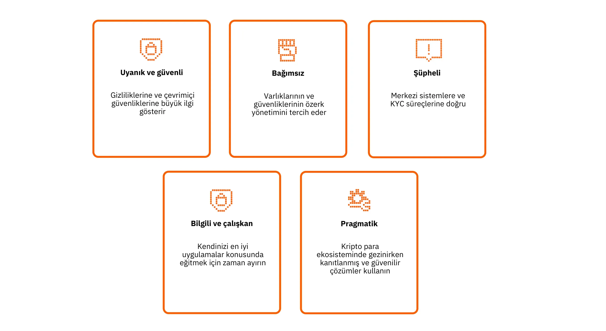

Gerekirse, planınızı resmi olarak yasal bir çerçeveye entegre etmek için bir avukata veya notere danışın.

**Tebrikler!** Bitcoin servetinizi güvence altına almak için kritik bir adımı tamamladınız. Artık miras planınızı periyodik olarak gözden geçirerek ve zaman kilitli Multisig kurulumlarını azaltmak gibi daha gelişmiş çözümleri keşfederek iyileştirebilirsiniz:

https://planb.academy/tutorials/wallet/desktop/liana-306ef457-700c-4fdd-b07a-8fb7a8a29f04

Referans: [*Kripto Varlık Miras Planlaması, Sahipler için Basit Bir Kılavuz* - Pamela Morgan, 2018.](https://www.amazon.com/gp/product/1947910116/)

Çalışmaları ve bu içeriğin uyarlanmasına izin verdiği için [Pamela Morgan]'a (https://x.com/pamelawjd) özel teşekkürler.

## Artık En Hazırlıklı %0,1 Bitcoin Kullanıcısı Arasındasınız

<chapterId>5f4cfab9-9af1-584b-a1fe-a0769a991f19</chapterId>

:::video id=8c9d0e1f-2a3b-4c5d-6e7f-8a9b0c1d2e3f:::

Buraya kadar gelebildiyseniz, artık aydınlanmış bir azınlığın parçasısınız! Çok az insan Bitcoin ile bu kadar ileri gidebilir ve ne kadar ilerlediğinizle gurur duyabilirsiniz. Belki de bu eğitim kursunda sunulan tüm eğitimleri takip ettiniz: İlk Hardware Wallet'inizi kurdunuz, Kurtarma cümlenizi güvence altına aldınız, Bir dolar-maliyet ortalaması (DCA) planı oluşturdunuz, KYC ile ve KYC olmadan Bitcoin edindiniz, Hatta Bitcoin mirasınızı planladınız. Attığınız her adım, gerçek finansal egemenliğe doğru bir sıçramadır.

Henüz hepsini yapmamış olsanız bile, yakında yapmaya kararlıysanız, zaten eğrinin önündesiniz demektir. Asıl önemli olan öğrenme ve harekete geçme kararlılığınızdır. Şimdi Bitcoin'nin bireysel ve kolektif geleceğimiz için neden bu kadar önemli bir değişimi temsil ettiğini anlıyorsunuz.

İnsanları Bitcoin hakkında eğitmeye başladığımdan beri hem ekosistem hem de ben önemli ölçüde geliştik. Bu kurs, Bitcoin'in bugün sunabileceği en iyi şeyleri yansıtacak şekilde tamamen güncellendi. Birlikte büyük bir yolculuk yaptık!

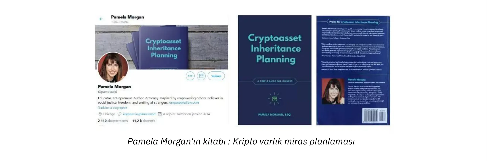

### Bitcoin için Sırada Ne Var?

Logaritmik fiyat eğrisine bakarsak bir şey netleşir: Döngülerde tam olarak nerede olduğumuzu asla bilemeyiz. Belki de bu dersi tam da yeni bir büyüme evresi başlarken okuyorsunuz ya da belki de bir ayı piyasasının ortasındasınız. Durum ne olursa olsun, döngüler devam eder, kaçınılmaz olarak muhteşem zirveler ve bazen de acımasız düzeltmelerle noktalanır.

Ancak fiyatın ötesinde, Bitcoin'nin büyümesi şaşırtıcı. Cypherpunks arasında belirsiz bir proje olarak başlayan şey küresel bir hareket haline geldi. İpek Yolu'ndan kurumsal benimsemeye kadar, Bitcoin küresel finans dünyasına sağlam bir şekilde yerleşti. Artık uç bir deney olarak değil, dünya çapında kurumlar ve milyonlarca birey tarafından benimsenen ciddi bir varlık sınıfı olarak görülüyor.

Algıdaki bu değişim, sürekli teknik ilerlemeyle birlikte geldi. Cüzdanlar ve altyapı sürekli olarak gelişmektedir. Her yıl, Bitcoin'i daha güvenli, esnek ve kullanıcı dostu hale getiren yeni çözümler ortaya çıkmaktadır. Bugün Bitcoin her zamankinden daha merkeziyetsiz, daha erişilebilir ve daha iyi anlaşılıyor.

Elbette düzenleme, gizlilik, daha geniş çapta benimsenme ve döngüsel bir ekonomi geliştirme gibi zorluklar devam etmektedir. Ancak topluluk aktif, meraklı ve ilgili kaldığı sürece, Bitcoin geleneksel finans sistemine güçlü bir alternatif olmaya devam edecektir.

Kesin olan bir şey var: Bitcoin var olmaya devam edecek; yorulmadan, her gün, her yıl, yaklaşık her 10 dakikada bir yeni bir blok üretecek. Daha fazla kullanıcı, cüzdan, borsa ve ayrıca daha fazla düzenleme, teknik engeller, krizler ve yenilikler göreceğiz.

Küresel krizler devam ettikçe ve enflasyon itibari para birimlerinin satın alma gücünü aşındırdıkça, Bitcoin doğal olarak finansal özgürlük ve bireysel egemenlik arayan daha fazla insanı kendine çekecektir. Bu dinamik Bitcoin'ü güçlendirmeye ve protokolünü, ölçeklendirme katmanlarını ve güvenlik, gizlilik ve fayda açısından günlük kullanım durumlarını iyileştirmek için yeni yetenekleri çekmeye devam edecektir.

### Bir sonraki hamlen ne olacak?

İronik bir şekilde, en büyük değişiklik Bitcoin değil; siz olacaksınız.

Bitcoin'yı kullanma, anlama ve onunla ilişki kurma şekliniz gelişecek. Belki de başkalarına öğretmeye başlayacak, topluma dahil olacak veya sadece servetinizi uzun vadede koruyacak kadar gerçek bir tutku geliştireceksiniz. Yolunuz ne olursa olsun, Bitcoin dünya görüşünüzü ve muhtemelen özgürlük ve finansal sorumlulukla olan ilişkinizi değiştirecektir.

İşte bundan sonra izleyebileceğiniz birkaç yol:

#### 1. Momentumu koruyun

Mevcut stratejiniz sizin için işe yarıyorsa, devam edin.

Sats'i düzenli olarak istiflemeye ve güvenlik için en iyi uygulamaları sürdürmeye devam edin. Zaten güçlü bir temel oluşturdunuz ve ana hedefiniz sadece Bitcoin birikimlerinizi korumaksa daha ileri gitmenize gerek yok.

Ekosistemin gelişimini gözlemlemek, stratejinizi geliştirmek ve gerektiğinde kurulumunuzu güçlendirmek için zaman ayırın.

#### 2. Bilginizi derinleştirin

Yolculuğunuz burada bitmiyor. Bitcoin sürekli gelişen bir dünyadır ve her zaman keşfedilecek daha çok şey vardır. İşte Bitcoin hakkındaki anlayışınızı derinleştirmek için keşfetmek isteyebileceğiniz birkaç yön:

- Dijital güvenliğinizi bir üst seviyeye taşımak için giriş seviyesindeki güvenlik kursumuzla başlayın:

https://planb.academy/courses/99c46148-7080-4915-a7e0-9df0e145cd47

- Bitcoin'un ekonomik ve felsefi yönü ilginizi çekiyorsa, bu derinlemesine kurslara göz atın:

https://planb.academy/courses/d07b092b-fa9a-4dd7-bf94-0453e479c7df

https://planb.academy/courses/caa75343-ac90-4249-bcca-0e2e57c3a0f1

https://planb.academy/courses/9d1bde6a-33e5-45dd-b7c0-94da72e45b11

- Bitcoin'i şirket stratejilerine entegre etmek isteyen işletme sahipleri kaçırmamalı:

https://planb.academy/courses/a804c4b6-9ff5-4a29-a530-7d2f5d04bb7a

- Bitcoin'nin yaratılışının ve sistemin ilk yıllarının ardındaki büyüleyici hikayeyi keşfetmek için bu kursu şiddetle tavsiye ediyorum:

https://planb.academy/courses/a51c7ceb-e079-4ac3-bf69-6700b985a082

- Son olarak, Bitcoin ve ekosisteminin teknik yönlerini merak ediyorsanız, bu eğitim kurslarını keşfedin:

https://planb.academy/courses/34bd43ef-6683-4a5c-b239-7cb1e40a4aeb

https://planb.academy/courses/46b0ced2-9028-4a61-8fbc-3b005ee8d70f

https://planb.academy/courses/65c138b0-4161-4958-bbe3-c12916bc959c

#### 3. Bitcoin Ekosistemine Katkıda Bulunun

Bitcoin finansal bir araçtan daha fazlasıdır; bu bir harekettir. Becerilerinize ve ilgi alanlarınıza bağlı olarak, katkıda bulunabileceğiniz birçok yol vardır:

- Eğitin ve farkındalığı artırın**: Sevdiklerinizin Bitcoin'yı anlamasına yardımcı olun, bilginizi paylaşın ve yerel tartışmalara katılın;
- Araçlar ve uygulamalar geliştirin**: Teknik becerileriniz varsa, açık kaynaklı araçlara katkıda bulunmak Bitcoin'ye değer katmanın harika bir yoludur;
- Yerel bir topluluğa katılın**: Diğer bitcoin kullanıcılarıyla tanışmak ve en son gelişmeler hakkında Exchange görüşlerini almak için etkinliklere, buluşmalara ve forumlara katılın.

Başkalarını eğitmeye yardımcı olmak isterseniz, Plan ₿ Academy her zaman katkıda bulunacak kişiler arıyor! Tüm eğitim içeriğimiz açık kaynaklıdır ve GitHub'da barındırılmaktadır. İçeriği düzeltmeye ve çeşitli dillere çevirmeye yardımcı olacak katılımcıları bekliyoruz; birkaç Sats için Exchange'da! İster şimdi ister daha sonra Bitcoin yolculuğunuzda, Plan ₿ Academy'un [katkıda bulunanlar için Telegram grubumuza](https://t.me/PlanBNetwork_ContentBuilder) katılmaya davetlisiniz.

### Son Sözler

BTC102 kursunu aldığınız için çok teşekkür ederiz.

Adım Rogzy, Découvre Bitcoin'ün kurucusu ve Plan ₿ Academy'ün kurucu ortağıyım; inanılmaz yeni ortaklarımız Tether ve Fulgur Ventures tarafından ve Bitcoin hakkında mümkün olduğunca çok insanı eğitme ortak misyonumuzla mümkün kılınan bir platform.

Geri bildirimleriniz son derece değerli. Platforma yorum bırakmaktan çekinmeyin ve kursun bu güncellenmiş versiyonu hakkında ne düşündüğünüzü bize bildirin. Önerileriniz, içeriğimizin kalitesini geliştirmeye devam etmemize yardımcı oluyor.

Artık final sınavına girmeye hazırsınız; anladığınızı doğrulayacak ve size sertifikanızı verecek 40 soruluk bir test.

İyi şanslar!

Umarım yakında Plan ₿ Academy ile ilgili başka bir kursta tekrar görüşürüz; ister benim kursum olsun, ister topluluktaki başka bir harika öğretmenin kursu olsun. Ve kim bilir, belki bir konferansta, etkinlikte veya Bitcoin buluşmasında yüz yüze bile tanışırız.

Geldiğiniz nokta için bir kez daha tebrikler. Ve unutmayın; öncelikli hedefim her zaman aynı kalacaktır:

**Bitcoin.** aracılığıyla mümkün olduğunca çok sayıda insanın finansal egemenlik elde etmesine yardımcı olmak

**Bitcoin ile yolculuğunuzda size başarılar dilerim!

# Son Bölüm

<partId>a8425389-4a53-4b57-b9b4-36c1cab12de5</partId>

## Yorumlar & Derecelendirmeler

<chapterId>3f43175a-fb7a-5b1c-a887-7dcf615d7a3a</chapterId>

<isCourseReview>true</isCourseReview>
## Final Sınavı

<chapterId>f3ff8089-8f89-56a8-be8c-b60296b4d91f</chapterId>

<isCourseExam>true</isCourseExam>
## Sonuç

<chapterId>b082b8eb-dabc-5d79-94cf-eb8f48fc1968</chapterId>

<isCourseConclusion>true</isCourseConclusion>
