# Postanite suvereni bitkoiner


Verovatno ste upoznati sa izrekom "Nisu tvoji ključevi, nisu tvoji novčići", koja podstiče samostalno čuvanje vaših bitkoina. Držanje sopstvenih ključeva je zaista osnovni prvi korak, ali nije dovoljno. Da biste postigli pravu monetarnu suverenost, takođe treba da instalirate i koristite sopstveni Bitcoin čvor. Ovaj kurs je dizajniran da vas vodi kroz ovaj osnovni korak na vašem Bitcoin putovanju!


BTC 202 je pristupačan kurs osmišljen da vas nauči kako da sami ispletete svoj Bitcoin čvor, čak i ako niste tehnički stručnjak. Počećemo definisanjem šta je Bitcoin čvor, čemu služi i zašto je apsolutno neophodno da ga sami ispletete. Zatim ću vas korak po korak voditi kroz izbor hardvera, instalaciju potrebnog softvera, povezivanje vašeg Wallet i pravljenje prvih mogućih optimizacija kako biste ga unapredili.


Pokretanje Bitcoin čvora nije samo opcija za stručnjake; to je nužnost. To je alat za otpornost koji svaki korisnik treba da razume i primeni. Ovaj kurs je vaša početna tačka ka tome da postanete suvereni bitkoiner!


+++


# Uvod


<partId>fc46ccd7-5d6d-40c3-9e9f-fbbb323c760a</partId>


## Pregled kursa


<chapterId>916b1f86-38a4-4ede-bdb7-83841d5a7abe</chapterId>


Dobrodošli u BTC 202, gde ćete naučiti kako da instalirate, konfigurišete i koristite Bitcoin čvor lako i samostalno. Ali to nije sve: takođe ćete saznati više o mestu i funkciji čvorova u Bitcoin sistemu. Kurs se izmjenjuje između teorijskih objašnjenja i vođene praktične vežbe.


### Deo 1 - Uvod


U ovom prvom delu kursa, razjasnićemo osnovne pojmove, a zatim preći na preciznije definicije. Šta je čvor? Koje su razlike između čvora, Wallet i Miner? Zatim ćete naučiti o Bitcoin core i implementacijama protokola. Cilj je govoriti istim jezikom, izbeći zabunu i uspostaviti čvrstu teorijsku osnovu.


### Deo 2 - Postati suvereni bitkoiner


U ovom drugom delu, počeću objašnjavajući zašto je važno pokrenuti sopstveni Bitcoin čvor. Zatim ćemo istražiti različite tipove čvorova koji postoje (kompletni, pruned, SPV...), kako funkcionišu i njihove tehničke implikacije.


Zatim ćemo vam pružiti pregled softvera dostupnog za pokretanje Bitcoin čvora, uključujući njegove prednosti i nedostatke. Na kraju, zaključićemo sa nekoliko veoma praktičnih preporuka za odabir pravog hardvera prema vašim potrebama i budžetu.


Ovaj odeljak, dakle, ilustruje put suverenog bitkoinera: razumevanje zašto je neophodno pokrenuti čvor, izbor tipa čvora, na osnovu ovog izbora, odabir softvera, i, u zavisnosti od izabranog softvera, određivanje odgovarajućeg hardvera.


### Deo 3 - Lako instaliranje Bitcoin čvora


Kada je ova priprema završena, vreme je da pređemo na praktični deo sa Delom 3 posvećenim Umbrelu: kućnom cloud operativnom sistemu koji pojednostavljuje samostalno hostovanje i instalaciju Bitcoin i Lightning čvora.


Nakon kratkog uvoda u Umbrel, pružićemo detaljan vodič koji će vas voditi kroz proces instalacije i konfiguracije na vašoj sopstvenoj DIY mašini. Cilj ovog dela je jasan: imati vaš prvi potpuno funkcionalan i sinhronizovan Bitcoin čvor.


### Deo 4 - Povezivanje vašeg Wallet sa vašim čvorom


Sada kada ste postavili Bitcoin čvor, vreme je da ga koristite! U ovom odeljku ćete naučiti kako da povežete vaš Wallet softver za upravljanje (kao što je Sparrow wallet) sa vašim sopstvenim Address indeksatorom (Electrs ili Fulcrum), ili direktno sa Bitcoin core, tako da više ne zavisite od javnih servera.


Takođe ćemo ispitati ulogu indeksatora i različite metode povezivanja sa vašim čvorom (LAN, Tor, Tailscale, itd.). Na kraju, u poslednjem poglavlju, pregledaćemo najkorisnije aplikacije dostupne na Umbrel-u za svakodnevnog bitkoinera.


### Deo 5 - Napredni koncepti i najbolje prakse


U ovom završnom delu BTC 202, cilj je produbiti vaše znanje. Prvo ćemo pogledati najbolje prakse koje treba usvojiti sa vašim novim Bitcoin čvorom i kako ga održavati na duži rok.


Zatim ćemo odvojiti vreme da pregledamo neke od teorija obrađenih ranije u kursu, uključujući razumevanje IBD procesa i otkrivanje vršnjaka u detalje, istraživanje anatomije čvora, i na kraju učenje kako koristiti `Bitcoin.conf` fajl za fino podešavanje vaših postavki.


### Deo 6 - Završni deo


Kao i kod svih Plan ₿ Network kurseva, u poslednjem delu ćete pronaći završni ispit za testiranje vašeg znanja o Bitcoin čvorovima.


Dakle, jeste li spremni da uključite svoj prvi Bitcoin čvor? Postavite kurs za suverenitet!


## Šta je Bitcoin čvor?


<chapterId>0a9fd4e0-94ab-405e-924c-023397393027</chapterId>


Kako je opisao njegov tvorac, Satoshi Nakamoto, Bitcoin se predstavlja kao peer-to-peer elektronski gotovinski sistem. Ova jednostavna rečenica, koja je naslov Bele knjige, sadrži mnoge tragove o prirodi Bitcoin:


- Prvo, Satoshi opisuje Bitcoin kao "sistem", drugim rečima, koherentan skup hardverskih i softverskih komponenti koje međusobno deluju kako bi pružile određenu uslugu ili izvršile određenu funkciju;
- Dalje, on objašnjava da ovaj sistem omogućava korišćenje elektronskog novca, tj. oblika nematerijalne valute;
- Na kraju, on ističe da ovaj sistem nije zavisan od bilo koje centralne entitete: on je "peer-to-peer", što znači da su sami korisnici ti koji upravljaju sistemom.


Pošto je Bitcoin sistem, mora se nužno pokretati na računarima. I, zbog svoje peer-to-peer prirode, sami korisnici preuzimaju odgovornost za pokretanje ovih mašina. Ono što nazivamo "Bitcoin čvor" je upravo taj računar na kojem se pokreće softver koji implementira Bitcoin protokol (kao Bitcoin core, ali o tome ćemo kasnije). Ovo je ono što omogućava Bitcoin da funkcioniše bez centralnog autoriteta: validacija se sprovodi na distribuiran način, od strane hiljada nezavisnih mašina koje pripadaju hiljadama korisnika.


Nakamoto, S. (2008). *Bitcoin: A Peer-to-Peer Electronic Cash System*. https://Bitcoin.org/Bitcoin.pdf


Upravo ti korisnici osiguravaju bezbednost Bitcoin. Kako Eric Voskuil objašnjava u svojoj knjizi *Cryptoeconomics*, bezbednost Bitcoin ne zavisi ni od Blockchain, ni od snage heširanja, ni od validacije, decentralizacije, kriptografije, otvorenog koda, niti teorije igara. Bezbednost Bitcoin zavisi prvenstveno od pojedinaca koji su spremni da se izlože ličnom riziku. Decentralizacija omogućava da se ovaj rizik raspodeli na veliki broj pojedinaca, i samo njihova sposobnost da odole osigurava otpornost sistema.


Ovaj princip je lako razumeti: ako bi Bitcoin zavisio od jednog čvora u vlasništvu jedne osobe, zatvaranje te osobe bilo bi dovoljno da se ugasi mreža, jer bi samo oni preuzeli sve rizike. Sa desetinama hiljada čvorova rasprostranjenih širom sveta, rizik je raspršen: svaki od ovih operatera bi morao biti neutralisan da bi se ugasio Bitcoin.


Možemo tako razlikovati i imenovati nekoliko pojmova kako bismo razjasnili stvari za ostatak ovog kursa:


- Bitcoin valuta: jedinica obračuna koja se koristi za transakcije unutar ovog sistema;
- Mreža Bitcoin: skup svih povezanih čvorova;
- Bitcoin čvorovi: mašine koje pokreću implementaciju Bitcoin;
- implementacije Bitcoin: softver koji prevodi protokol u izvršne instrukcije;
- Bitcoin protokol: skup pravila koja upravljaju radom sistema;
- Sistem Bitcoin: koherentna kombinacija svih ovih Elements.


### Uloga Bitcoin čvora


Bitcoin čvorovi zajedno formiraju ono što je poznato kao Bitcoin mreža. Oni omogućavaju celom sistemu da radi autonomno, bez oslanjanja na centralni autoritet ili hijerarhiju servera.


Od samog početka, Bitcoin je dizajniran da omogući svakom korisniku da pokrene lični čvor. Ovaj slučaj ostaje važeći i sa današnjim Bitcoin core softverom, koji kombinuje uloge Wallet i čvora. Ali danas se ova funkcija često razdvaja: mnogi moderni Bitcoin novčanici su samo novčanici koji se povezuju na eksterne čvorove (u vlasništvu iste osobe ili ne).


### Zadrži Blockchain


Prvi zadatak čvora je da održava lokalnu kopiju Blockchain. Da bi se sprečio Double-spending na Bitcoin bez uključivanja centralnog autoriteta, svaki korisnik mora proveriti da ne postoji transakcija u sistemu. Jedini način da se u to bude siguran je da se poznaju sve transakcije napravljene na Bitcoin. Iz tog razloga, sve transakcije su vremenski označene i grupisane u blokove, a svaki čvor skladišti ceo Blockchain.


> Jedini način da potvrdite odsustvo transakcije je da budete svesni svih transakcija.

Nakamoto, S. (2008). *Bitcoin: A Peer-to-Peer Electronic Cash System*. https://Bitcoin.org/Bitcoin.pdf


Blockchain je stoga evoluirajući registar: svaki put kada Miner objavi novi blok, čvor proverava njegovu validnost pre nego što ga doda svojoj lokalnoj kopiji lanca. Zaključno sa današnjim danom (jul 2025), kompletan Blockchain premašuje 675 GB, a ova veličina nastavlja da raste, jer se u proseku novi blok dodaje svakih 10 minuta.


Čvor takođe održava lokalni zapis svih UTXO-a koji postoje u bilo kom trenutku, poznat kao **UTXO skup**. Ova baza podataka sadrži sve nepotrošene Bitcoin fragmente. Ovu temu ćemo detaljno razmotriti u završnom delu kursa.


### Verifikuj i distribuiraj transakcije


Druga uloga čvora je da osigura verifikaciju i propagaciju transakcija. Kada nova transakcija stigne do čvora (bilo putem Wallet softvera ili drugog čvora), proveriće da li je u skladu sa skupom pravila (pravila konsenzusa i pravila prenosa). Na primer:


- potrošeni bitkoini moraju postojati u svom UTXO skupu (bazi podataka nepotrošenih izlaza);
- potpis mora biti važeći, i svi uslovi potrošnje moraju biti ispunjeni (važeći skript);
- ukupna količina izlaza ne sme premašiti ukupnu količinu ulaza, što znači da troškovi ne mogu biti negativni.


Nakon validacije, transakcija se čuva u čvoru Mempool, privremenom memorijskom prostoru rezervisanom za nepotvrđene transakcije, a zatim se prenosi drugim mrežnim čvorovima na koje je povezana. Ovaj mehanizam distribucije i validacije nastavlja se od čvora do čvora. Na ovaj način, transakcija se propagira kroz Bitcoin mrežu, i svaki čvor je čuva u Mempool dok nije uključena u važeći blok od strane Miner, koji zatim deluje na njenu prvu potvrdu.


### Proveri i distribuiraj blokove


Treća uloga čvora uključuje upravljanje iskopanim blokovima. Kada Miner otkrije novi blok sa važećim Proof of Work, on se emituje na mreži. Čvorovi ga primaju, proveravaju da li je u skladu sa svim pravilima protokola, i zatim ga integrišu u svoju lokalnu kopiju Blockchain ako je važeći. Kao i kod transakcija, novo potvrđeni blokovi se zatim prenose svim čvorovima povezanim na čvor. Ovaj proces se nastavlja dok svi čvorovi na Bitcoin mreži ne budu obavešteni o novom bloku.


## Koja je razlika između luka i Wallet?


<chapterId>de5af634-a628-4b90-b869-468c208e178b</chapterId>


Važno je razlikovati između dve različite vrste softvera kada koristite Bitcoin: čvor i Wallet.


Čvor Bitcoin, kao što je gore pomenuto, je deo softvera koji aktivno učestvuje u peer-to-peer mreži. Obavlja tri glavna zadatka:


- backup of Blockchain,
- validacija i prosleđivanje transakcija,
- blok validacija i prosleđivanje.


S druge strane, Bitcoin Wallet je softverski alat dizajniran za čuvanje i upravljanje vašim privatnim ključevima. Ovi ključevi omogućavaju vam da trošite svoje bitkoine ispunjavanjem skripti za zaključavanje (obično putem potpisa). Wallet može da se poveže sa čvorom (bilo lokalnim ili udaljenim) kako bi proverio status Blockchain i emitovao transakcije koje kreira, ali kao takav nije učesnik u mreži.


U nekim slučajevima, ove dve funkcije koegzistiraju unutar istog softvera, kao što je slučaj sa Bitcoin core, koji služi i kao Full node i kao Wallet. Međutim, mnogi popularni Wallet programi (Sparrow, BlueWallet, itd.) zahtevaju vezu sa eksternim čvorom (bilo vašim ili treće strane) za emitovanje transakcija i određivanje Wallet stanja.


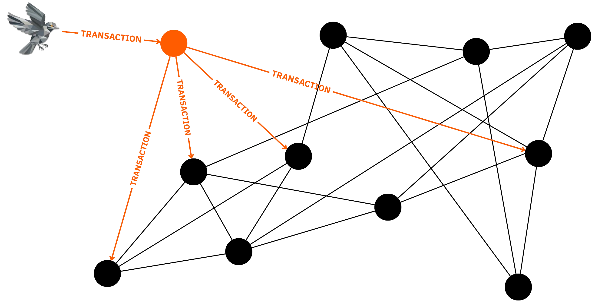


## Koja je razlika između čvora i Miner?


<chapterId>d2992614-7ab7-4bf9-81b1-f548cda67257</chapterId>


Pojmovi čvora i Miner se često mešaju. Ipak, ova dva Elements obavljaju radikalno različite funkcije unutar sistema.


U početku, kada je Bitcoin lansiran od strane Satoshi Nakamoto 2009. godine, očekivalo se da svaki korisnik učestvuje u mreži kao celini. Tako je originalni Bitcoin softver kombinovao nekoliko funkcija odjednom: delovao je kao Wallet, čvor, i takođe kao Miner, sposoban za generisanje novih blokova. U to vreme, težina Mining je bila veoma niska. Sve što je trebalo da uradite bilo je da pokrenete Bitcoin softver na svom računaru kako biste pronašli blokove i dobili bitkoine kao nagradu.


Međutim, sa postepenom popularizacijom Bitcoin i povećanjem broja rudara, konkurentski pejzaž u Mining doživeo je radikalnu promenu. Danas je Mining postala izuzetno konkurentna aktivnost, kojom dominiraju industrijski igrači opremljeni specijalizovanom infrastrukturom. Snaga potrebna za rudarenje novog bloka sada je toliko velika da je praktično nemoguće da pojedinačni korisnik to postigne koristeći samo konvencionalni računar. Kao rezultat toga, Mining se sada prvenstveno obavlja korišćenjem specijalizovanih mašina nazvanih ASICs (*Application-Specific Integrated Circuits*). Ovi čipovi su optimizovani isključivo za pokretanje dvostrukog SHA-256, algoritma koji se koristi za Mining na Bitcoin.


Suočeni sa ovom evolucijom, uloge čvora Bitcoin i Miner postale su jasno različite. Kao što je prikazano gore, uloga čvora Bitcoin je isključivo informativna i zasnovana na validaciji. Uloga Miner je drugačija:


- Odabire transakcije na čekanju u Mempool.
- Gradi kandidatski blok integrišući ove transakcije.
- On traži metodom pokušaja i greške validan Proof of Work.
- Ako pronađe važeći dokaz, emituje blok putem svog čvora ka ostalim čvorovima.


Miner treba Bitcoin čvor za interakciju sa mrežom.


Uloga Miner se ponekad razlikuje od one koju ima seckalica. Mašina za mlevenje je uređaj čiji je zadatak da Hash šablonske blokove koje obezbeđuje server bazena, tražeći heševe koji zadovoljavaju cilj težine definisan za deonice, a ne onaj od Bitcoin. Ostatak Mining procesa, koji uključuje stvarnu izgradnju blokova, izbor transakcija ili Proof-of-Work pretragu prema sopstvenoj težini Bitcoin, kao i distribuciju, direktno obavljaju bazeni.


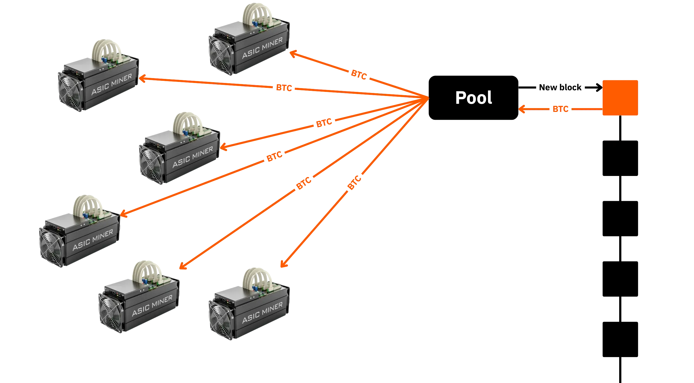


Konačno, postoji važna razlika u smislu ekonomskog podsticaja između Miner i čvora. Pokretanje Bitcoin čvora ne donosi direktnu novčanu korist. S druge strane, učešće u Mining donosi nagrade (subvencije i naknade za transakcije) za svaki pronađeni blok.


U Delu 2, istražićemo detaljnije praktične i lične prednosti instaliranja i korišćenja Bitcoin čvora, izvan isključivo finansijskih.


## Bitcoin core i implementacije protokola


<chapterId>72381876-9317-4faa-8d41-2b252a945b8a</chapterId>


Bitcoin protokol nije softver: to je skup prećutnih pravila koja dele korisnici mreže. On definiše uslove validnosti transakcija, mehanizme kreiranja novca, format bloka, uslove Proof-of-Work i mnoge druge specifikacije. Da bi interagovali sa ovim protokolom, korisnici moraju pokrenuti softver koji implementira ova pravila: ovo je poznato kao **implementacija** Bitcoin.


Implementacija je stoga softver čvora: program sposoban za interakciju sa drugim mašinama na Bitcoin mreži, preuzimanje, verifikaciju, skladištenje i propagaciju blokova i transakcija, i lokalno sprovođenje pravila konsenzusa i prenosa. Svaka implementacija je konkretna interpretacija protokola, napisana u određenom programskom jeziku, sa svojom arhitekturom, performansama i ergonomijom. Svaka implementacija će takođe imati svoju razvojnu organizaciju, sa sopstvenom podelom odgovornosti.


Među ovim implementacijama, jedna daleko dominira: **Bitcoin core**.


### Istorijska implementacija koja je postala merilo


Bitcoin core je referentni softver za Bitcoin protokol. Izveden je iz originalnog koda koji je napisao Satoshi Nakamoto 2008-2009. godine i predstavlja direktan nastavak tog koda. U početku poznat kao "*Bitcoin*", zatim "*Bitcoin QT*" (zbog dodavanja grafičkog Interface putem Qt biblioteke), preimenovan je u "*Bitcoin core*" 2014. godine kako bi se jasno razlikovao softver od mreže. Od verzije 0.5, distribuira se sa dva komponenta: `Bitcoin-qt` (grafički Interface) i `bitcoind` (komandno-linijski Interface).


U teoriji, Bitcoin core ne predstavlja Bitcoin protokol; već je samo jedna implementacija među mnogima. Međutim, odlikuje se masovnim usvajanjem, svojom starošću, robusnošću svog koda i rigoroznošću svog razvojnog procesa. Shodno tome, u praksi, pravila koja primenjuje Bitcoin core su de facto pravila Bitcoin protokola: korisnici, programeri, rudari i usluge ekosistema se gotovo isključivo na njega pozivaju.


### Trenutna distribucija implementacija


Prema [podacima prikupljenim u avgustu 2025. od strane Luke Dashjr](https://luke.dashjr.org/programs/Bitcoin/files/charts/software.html) (poznatog programera u ekosistemu), distribucija implementacija među javnim čvorovima mreže je sledeća:


- Bitcoin core**: 87.3% čvorova
- Bitcoin Knots**: 12.5
- Ostale kumulativne implementacije**: 0.2% (btcsuite, Bcoin, BTCD...)


Drugim rečima, oko 9 od 10 javnih čvorova koristi Bitcoin core. Ostatak mreže se oslanja na marginalnije klijente (iako je udeo Knots-a naglo porastao u poslednjim mesecima, posebno nakon debata o ograničenju veličine `OP_RETURN`). Ove alternativne implementacije često održava jedna osoba ili mali tim.


**Napomena:** Ove brojke su i dalje procene, jer se zasnivaju prvenstveno na *čvorištima koja slušaju*, tj. čvorištima koja prihvataju dolazne veze (sa otvorenim portom 8333). *Čvorišta koja ne slušaju* su mnogo složenija za brojanje, jer je nemoguće direktno se povezati sa njima: morate čekati da inicijativa dođe od njih, u obliku odlazne veze. Sajt Luke Dashjr tvrdi da pokušava da broji i ova *čvorišta koja ne slušaju*, ali ostaje nemoguće dobiti potpuno tačne podatke o njima, a ažuriranje ovih statistika neizbežno zaostaje za stvarnošću.


### Interna operacija Bitcoin core


Bitcoin core je napisan u C++. Takođe je open source projekat koji održava zajednica programera koji volontiraju ili su plaćeni od strane različitih entiteta (često od strane kompanija u ekosistemu koje imaju interes u razvoju Core-a). [Kod je hostovan na GitHub-u](https://github.com/Bitcoin/Bitcoin), a razvoj prati rigorozan:


- Doprinosioci** podnose predloge u obliku _pull request_ (PR). U principu, svako može predložiti izmenu, ali ona mora biti testirana, dokumentovana i proći kroz proces recenzije od strane kolega.
- **Održavaoci** imaju pravo da odobravaju i spajaju PR-ove. Oni su ti koji garantuju koherentnost i stabilnost projekta. U julu 2025. godine, njih petoro su: Hennadii Stepanov, Michael Ford, Andrew Chow, Gloria Zhao i Ryan Ofsky.
- Nije bilo **glavnog održavaoca** od februara 2023. Ovu ulogu je u početku imao Satoshi Nakamoto prilikom lansiranja Bitcoin, zatim Gavin Andresen nakon Nakamotovog odlaska početkom 2011, i na kraju Wladimir J. Van Der Laan od 2014. do 2023.


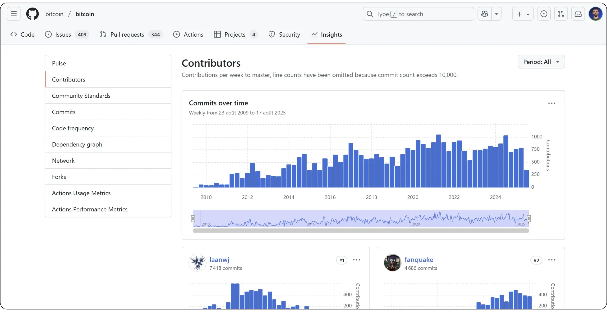


Razvoj Bitcoin core prati meritokratsku logiku: novi saradnici se podstiču da pregledaju i testiraju kod pre nego što sami predlože bilo kakve izmene. Odluke se donose na osnovu tehničkog konsenzusa, a veće izmene (posebno u oblastima konsenzusa) zahtevaju diskusije uzvodno na javnim kanalima, kao što su mejling liste ili klubovi za pregled PR-a.


### Druge implementacije Bitcoin


Iako marginalni u smislu usvajanja, postoje i drugi klijenti. Glavni je Bitcoin Knots, koji je razvio Luke Dashjr, Fork od Bitcoin core koji uključuje dodatne opcije i konzervativniji pristup razvoju. Ovo uključuje strožija ograničenja na formate transakcija.


Možemo takođe pomenuti:


- Libbitcoin**: modularna C++ biblioteka koju je razvio Amir Taaki i održava Eric Voskuil;
- Bcoin**: JavaScript implementacija, više se ne održava;
- BTCD/btcsuit**e: implementacija u Go jeziku.


Ovi projekti doprinose raznolikosti ekosistema, ali njihovo usvajanje ostaje veoma ograničeno, što otežava da Bitcoin core evoluira nezavisno.


### Moć Core programera


Možda mislite da Bitcoin core developeri imaju direktnu kontrolu nad Bitcoin, ali to nije slučaj. Oni ne mogu nametnuti promenu u protokolu. Njihova uloga je da predlože kod. Na svakom korisniku je, putem njihovog čvora, da odluči da li će koristiti taj kod ili ne.


To znači da ako promena u Bitcoin core ne postigne konsenzus, čvorovi je mogu ignorisati, bilo tako što neće ažurirati Bitcoin core ili jednostavno promenom implementacije. Suprotno tome, ako je funkcija koju korisnici žele blokirana u procesu razvoja Core-a, uvek je moguće preći na drugu implementaciju ili Fork projekat.


Kao što ćemo kasnije diskutovati u ovom kursu, čvorovi, prema njihovoj ekonomskoj težini (tj. trgovci), su ti koji daju korisnost verziji protokola (i stoga odgovarajućoj valuti), prihvatajući jedinice koje poštuju njegova pravila. Prava moć upravljanja nad Bitcoin, stoga, leži kod ovih trgovaca, a ne kod programera.


# Postanite suvereni bitkoiner


<partId>df64cad2-e92d-4949-9cca-14394aad0bc6</partId>


## Zašto vezati svoj čvor?


<chapterId>39c0cd19-67f9-4c64-bfb3-dbd6eec0bf42</chapterId>


Postoji široko rasprostranjeno verovanje da je upravljanje Bitcoin čvorom isključivo altruistički čin, bez lične koristi, samo u službi decentralizacije mreže. Neki to smatraju oblikom dužnosti za bitkoinere da podrže sistem i pokažu svoju zahvalnost Bitcoin.


Zaista, kao što smo istakli u prethodnim poglavljima, nema direktne finansijske dobiti u pletenju čvora. Stoga bi se moglo pomisliti da ne postoji lični interes za to. Ipak, vođenje sopstvenog čvora donosi mnoge individualne koristi. Da bih vas ubedio u to, u ovom poglavlju ću predstaviti sve razloge, kako tehničke tako i strateške, zašto bi trebalo da instalirate i koristite sopstveni Bitcoin čvor.


### Više poverljivo širenje transakcija


Kada se softver Wallet poveže sa spoljnim čvorom, prenosi svoje transakcije na infrastrukturu koja nije pod vašom kontrolom. Ovo generiše očigledne rizike od nadzora: operater udaljenog čvora može analizirati detalje vaših transakcija, uključujući iznose i učestalost, i, ukrštanjem određenih metapodataka (kao što su IP adrese, vremena i lokacije), potencijalno ih povezati sa vašim identitetom.


Zaista, kao što je istaknuto u prethodnom poglavlju, novčanici ne komuniciraju sa Bitcoin mrežom magijom; moraju se povezati sa čvorom kako bi proverili stanja ili emitovali transakcije. Ako nikada niste postavili svoj čvor, to znači da vaš Wallet zavisi od infrastrukture treće strane (obično kompanije koja stoji iza softvera). Ova treća strana, posebno ako je kompanija, može posmatrati, iskoristiti ili čak otkriti ove podatke: bilo iz komercijalnih razloga, pod zakonskim pritiskom, ili kao rezultat piraterije.


Korišćenjem sopstvenog čvora, direktno emitujete svoje transakcije na mrežu, zaobilazeći posrednike. Pod uslovom da pravilno obezbedite svoj čvor (o čemu ćemo kasnije razgovarati) ili se pridržavate određenih standarda, nijedna informacija nije izložena: ni vaš IP Address niti detalji vaših transakcija ne prolaze kroz entitet koji ne kontrolišete. Ovo je osnovni preduslov za očuvanje vaše poverljivosti na Bitcoin.


https://planb.network/courses/65c138b0-4161-4958-bbe3-c12916bc959c

### Transakcije koje se ne mogu cenzurisati


Iz istih razloga navedenih gore, Wallet softver zasnovan na čvoru treće strane je podložan riziku cenzure: operater udaljenog čvora može odbiti da prosledi određene transakcije iz raznih razloga. Može ih smatrati sumnjivim ili suprotnim svojoj politici. Transakcija takođe može biti blokirana ako nije u skladu sa pravilima prosleđivanja čvora. Na kraju, operater može specifično ciljati vaš IP Address kako bi blokirao emitovanje vaših transakcija.


Suprotno tome, korišćenjem sopstvenog čvora, obezbeđujete propagaciju svojih transakcija unutar peer-to-peer mreže. To znači da zadržavate potpunu kontrolu nad distribucijom svojih transakcija, bez zavisnosti od posrednika. Sve dok transakcija ispunjava konsenzus i pravila prenosa čvorova povezanih sa vašim, biće emitovana na mreži, a zatim, pod uslovom da su uključene dovoljne naknade, integrisana u blok od strane Miner. Imati sopstveni čvor garantuje neutralnu, bezdozvolnu potvrdu vaših transakcija.


### Nezavisna verifikacija podataka


Bez ličnog čvora, ostajete zavisni od treće strane za pristup informacijama, kao što su vaš Address saldo, status potvrde transakcije i validnost bloka. Ovo podrazumeva implicitno poverenje u tačnost i integritet eksternog čvora.


Pokretanje Full node znači da možete sami proveriti sva pravila protokola, za svaku transakciju i svaki blok. Kao rezultat, saldo prikazan na vašem Wallet nije podatak primljen sa udaljenog servera, već rezultat izračunat lokalno iz kompletne kopije Blockchain, validirane blok po blok. Ovaj pristup daje puno značenje maksimi bitkoinera:


> Ne veruj, proveri.

### Bolja distribucija sigurnosti sistema


Svaki čvor koji se pridruži mreži pojačava redundanciju i otpornost Bitcoin. Olakšava širenje informacija i omogućava novim vršnjacima da se međusobno povežu. Bez čvorova, sistem bi jednostavno bio neoperativan.


Kao što smo videli, bezbednost Bitcoin nije zasnovana na decentralizaciji, Mining, ili kriptografiji: kao i kod svakog sistema, oslanja se na pojedince. Tačnije, zavisi od sposobnosti operatera čvorova da se odupru prinudi.


Ono što razlikuje decentralizovane sisteme poput Bitcoin je raspodela rizika među svim učesnicima u njihovom radu. Pokretanje sopstvenog Bitcoin čvora znači prihvatanje dela ovog rizika obezbeđivanjem sigurnosti vaše instance; na taj način, takođe olakšavate teret rizika za druge operatere čvorova.


Dakle, to nije direktna lična korist: pokretanje čvora čini vas delimično odgovornim za bezbednost mreže. Iznad svega, to je kolektivna korist, jer vaše učešće pomaže u širenju rizika. Zauzvrat, povećavate sopstvenu sposobnost pouzdanog korišćenja Bitcoin.


### Produbite svoje razumevanje sistema


Instalacija Full node nije trivijalan zadatak. Uključuje instalaciju softvera, razumevanje osnovnog rada, praćenje sinhronizacije, pregledanje logova u slučaju problema, pa čak i korišćenje terminala. Ovo će vas nužno navesti da produbite svoje razumevanje protokola. Ovo je indirektna, ali ne i beznačajna prednost.


Sticanje ovog znanja jača vaše poverenje u alat i može smanjiti rizik od greške ili izloženosti prevarama. Pravljenje sopstvenog čvora je takođe oblik učenja.


### Odabir pravila koja će se primeniti


Važan aspekt, koji se često pogrešno shvata, jeste da upravljanje čvorom omogućava da izaberete pravila koja primenjujete lokalno. Postoje dve glavne vrste pravila:


- Pravila konsenzusa**:


Ovo su osnovna pravila Bitcoin protokola, koja osiguravaju integritet sistema i uspostavljaju kriterijume za validaciju transakcija i blokova. Bilo koja transakcija koja ne ispunjava ova pravila konsenzusa nikada ne može biti uključena u važeći blok. Na primer, transakcija sa nevažećim potpisom na jednom od svojih unosa će biti sistematski isključena.


Promena ovih pravila je ekvivalentna promeni protokola, a samim tim i valute (Hard Fork). Međutim, čak i bez pokušaja da ih modifikujemo, sama činjenica striktne primene postojećih pravila daje određenu moć: ako blok krši pravila, čvor ga odmah odbacuje.


- Pravila štafete**:


Ovo su pravila specifična za svaki Bitcoin čvor, koja se dodaju konsenzus pravilima kako bi se definisala struktura nepotvrđenih transakcija prihvaćenih u Mempool i prosleđenih vršnjacima. Svaki čvor konfiguriše i primenjuje ova pravila lokalno, što objašnjava zašto se mogu razlikovati od jednog čvora do drugog. Ona se primenjuju samo na nepotvrđene transakcije: transakcija koju čvor smatra "nestandardnom" biće prihvaćena samo ako se već pojavljuje u važećem bloku. Promena ovih pravila ne isključuje čvor iz Bitcoin sistema.


Na primer, transakcija bez naknada je, prema pravilima konsenzusa, potpuno validna, ali će biti odbijena po defaultu prema Bitcoin core politici prosleđivanja, jer je parametar `minRelayTxFee` postavljen na `0.00001` (u BTC/kB). Međutim, moguće je, na vašem sopstvenom čvoru, smanjiti ovaj prag kako bi se prosleđivale transakcije sa nižim naknadama, ili, obrnuto, povećati limit, na primer, na 2 Sats/vB, kako bi se izbeglo prosleđivanje transakcija sa niskim naknadama.


Pokretanje sopstvenog čvora znači tvrditi: "Validiram ono što odlučim da validiram, prema pravilima koja sam sam usvojio"*. Tako postajete akter u upravljanju sistemom, sposoban da odbacite evoluciju koja vam se čini neprihvatljivom, ili da odobrite ažuriranje prema sopstvenim kriterijumima.


Tako možemo brzo pokušati da razumemo koliko moći imate nad pravilima zahvaljujući vašem čvoru. A obim ove moći zavisiće od tipa pravila.


#### Za pravila releja


Što se tiče pravila prenosa, suštinska stvar je jednostavno posedovanje čvora, bez obzira na njegovu ekonomsku aktivnost. Ono što je ovde u pitanju jeste da li se slažete da prenosite određene tipove transakcija.


Ako, na primer, verujete da transakcije sa naknadama manjim od 1 sat/vB treba da budu prihvaćene na Bitcoin, možete prilagoditi ovo pravilo na svom čvoru tako da emituje te transakcije, olakšavajući njihovo širenje na mreži dok ih Miner na kraju ne uključi u važeći blok. U suštini, to je pitanje moći nad širenjem transakcija: svaki čvor ima moć donošenja odluka, jer pristajanje na prosleđivanje određene vrste transakcije je jednako promovisanju njenog prihvatanja na Bitcoin mreži. Kao rezultat toga, ako upravljate sa nekoliko čvorova, imate veći uticaj na politiku prosleđivanja, jer svaki čvor ima svoje veze i oblasti uticaja na mreži.


Zaista, imati jedan ili više čvorova konfigurisanih sa specifičnim pravilima prenosa znači odrediti koji deo mreže prihvata da propagira određenu vrstu transakcije. Širenje poruke u peer-to-peer grafu, kao što je slučaj za Bitcoin transakcije, prati logiku teorije perkolacije. Zamislite svaki čvor kao mesto koje može biti aktivno (`p` = prenosi) ili neaktivno (`1-p`). Čim proporcija `p` pređe kritični prag (`p_c`), pojavljuje se džinovska komponenta: transakcija uspeva da pređe mrežu i ima svaku šansu da stigne do Miner. U mreži kao što je Bitcoin, gde svaki čvor održava u proseku 8 odlaznih veza, prag `p_c` je generalno postavljen na samo nekoliko procenata, čak i niže ako neki čvorovi imaju veoma veliki broj veza.


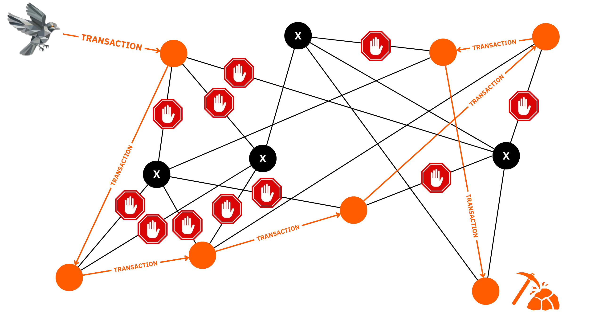


Sve dok je `p` ispod `p_c`, transakcija ostaje ograničena na izolovane džepove i ne doseže Miner. Čim se ovaj prag prekorači, širi se gotovo trenutno kroz celu mrežu.


Na kraju, uvek su rudari ti koji odlučuju da li će uključiti transakciju u blok ili ne. Međutim, čvorovi intervenišu uzvodno utičući na distribuciju transakcija: oni određuju da li će rudari biti svesni određene transakcije ili ne. Ako transakcija nije prosleđena rudarima, očigledno je nemoguće da je uključe u blok.


Dodavanje još nekoliko čvorova će stoga imati samo marginalni uticaj ako je mreža već u fazi perkolacije za datu vrstu transakcije, ali može biti presudno kako se prag perkolacije približava. Posedovanje ili uticaj na nekoliko čvorova, posebno ako su dobro povezani, može povećati ili smanjiti vrednost `p` i, posledično, indirektno usmeriti pravila prenosa koja određuju koje transakcije se vide i na kraju prihvataju od strane rudara.


#### Za pravila konsenzusa


Kada je reč o uticaju vašeg čvora na pravila konsenzusa, njegova ekonomska težina je, pre svega, ono što će biti presudno. Ovo je ključni koncept: vrednost bilo koje valute je direktno povezana sa njenom sposobnošću da olakša Exchange. Zaista, ako neki predmet nije prihvaćen od strane bilo koga u Exchange za robu ili usluge, teoretski nema monetarnu korisnost. Na primer, ako nijedan trgovac ne prihvata kamenčiće kao sredstvo plaćanja, oni nemaju upotrebu kao novac. Naravno, korisnost ostaje subjektivni pojam na individualnom nivou, ali na datoj teritoriji, što je veći broj trgovaca koji prihvataju neki predmet kao sredstvo Exchange, veća je verovatnoća da taj predmet ima monetarnu korisnost za ljude koji žive na toj teritoriji.


Uzmimo primer sela gde mnogi trgovci prihvataju zlato u Exchange za robu: verovatno je da zlato ima monetarnu korisnost za seljane. Ovo ukazuje da korisnost valute direktno zavisi od odluka trgovaca da je prihvate ili odbiju.


Ovaj koncept je ključan za razumevanje dinamike moći u sistemu Bitcoin. Satoshi jasno pokazuje: Bitcoin je elektronski sistem gotovine; drugim rečima, pruža uslugu koja nudi oblik valute, Bitcoin (ili BTC). Kada se pravila protokola modifikuju na način koji nije unazad kompatibilan (Hard Fork), to znači stvaranje novog sistema i stoga nove valute. Uspeh ili neuspeh ovog Fork zatim zavisi od veličine njegove ekonomije, koja je zauzvrat određena brojem trgovaca koji prihvataju ovaj novi oblik valute.


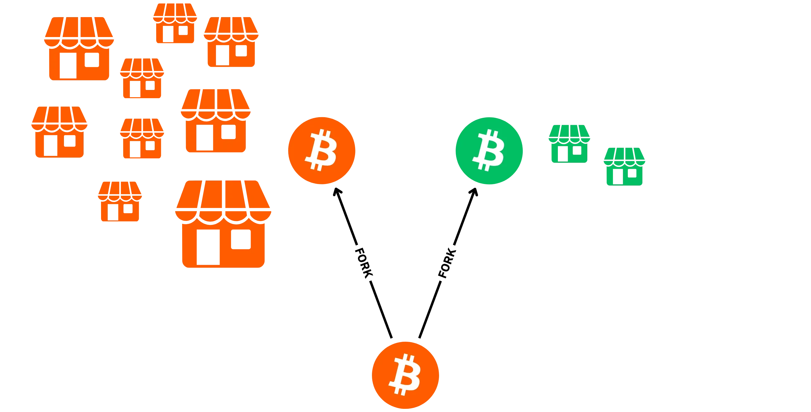


Hajde da uzmemo primer: pretpostavimo da Bitcoin doživi Hard Fork. Tada bi postojala 2 različita oblika valute: BTC-1 (originalna, nepromenjena verzija) i BTC-2 (nova valuta sa različitim pravilima konsenzusa). Ako svi trgovci koji su prihvatali BTC-1 nastave da to čine, ali odbiju BTC-2, onda bi potonja, u teoriji, imala veoma ograničenu monetarnu korisnost. Kao korisnik, ne bih imao interes da zadržim i koristim BTC-2, znajući da ga nijedan trgovac ne bi želeo u Exchange za robu ili usluge. Suprotno tome, ako 50% trgovaca odluči da prihvati isključivo BTC-2, a preostalih 50% uzima samo BTC-1, tada bi korisnost BTC-1, u teoriji, bila prepolovljena. Koristim termin "u teoriji" jer korisnost ostaje subjektivna na individualnom nivou i zavisi od mnoštva faktora (kao što su teritorija i potrošačke navike) koje je teško razumeti na pojedinačnoj osnovi.


Na Bitcoin, uloga "trgovca", shvaćena kao bilo koji entitet s određenom ekonomskom težinom, naravno uključuje preduzeća (fizičke prodavnice, sajtove za online prodaju, pružaoce usluga, itd.), ali takođe i Exchange platforme, budući da prihvataju Bitcoin u Exchange za druge valute, i rudare, budući da prihvataju Bitcoin putem naknada u Exchange za uslugu uključivanja transakcije u blok.


Što se tiče pravila konsenzusa, vaš čvor vam omogućava da usmerite svoju ekonomsku aktivnost ka jednoj ili drugoj valuti. Na primer, ako imate 10 punih čvorova kod kuće, ali nemate značajnu ekonomsku aktivnost, vaš uticaj tokom Fork će biti gotovo nikakav. Suprotno tome, jedan čvor koji se koristi za upravljanje lancem od 200 prodavnica koje prihvataju Bitcoin daje značajnu ekonomsku težinu.


Dakle, nije važan broj čvorova, već važnost ekonomske aktivnosti koju podržavaju. Štaviše, ako vaša ekonomska aktivnost zavisi od čvora koji ne kontrolišete, njegov vlasnik će odlučiti koju valutu koristite, sve dok ostanete povezani s tim čvorom. Zato je pokretanje i korišćenje sopstvenog čvora posebno važno u kontekstu upravljanja sistemom:


> Nije tvoj čvor, nisu tvoja pravila.


## Različite vrste Bitcoin čvorova


<chapterId>be8f0baa-41f2-4b54-b011-092f4ccc93aa</chapterId>


Čvor Bitcoin je, dakle, mašina koja pokreće implementaciju protokola Bitcoin. Iza ove uobičajene definicije čvorova, postoji nekoliko mogućih konfiguracija, od kojih ne nude sve isti nivo autonomije, potrošnje resursa i korisnosti za mrežu. U ovom poglavlju pokušaćemo da razumemo ove razlike kako bismo vam pomogli da izaberete arhitekturu čvora koja odgovara vašoj upotrebi i hardverskim ograničenjima.


### Kompletan čvor


Full node je jednostavno Bitcoin čvor koji preuzima ceo Blockchain iz Genesis bloka, nezavisno validira svaki blok i lokalno čuva istoriju celog tog Blockchain. Ovo je "normalan" oblik Bitcoin čvora, kako ga je zamislio Satoshi Nakamoto.


Full node ne mora da veruje nikome jer validira i zna sve informacije u sistemu. To je tip čvora koji vam pruža najviše garancija: znate, bez oslanjanja na treću stranu, da li je uplata validna, da li je blok validan, da li je reorganizacija legitimna, i tako dalje.


U praksi, Full node zahteva netrivijalne resurse, uključujući nekoliko stotina gigabajta za blok fajlove, procesor sposoban za validaciju skripti, RAM za Mempool i keš memoriju, kao i stabilnu propusnost. Prva sinhronizacija (*IBD*) čita i verifikuje kompletnu istoriju: to je intenzivno, ali se dešava samo jednom. Full node aktivno učestvuje u mreži, prosleđuje blokove i transakcije, i može prihvatiti dolazne konekcije kako bi pomogao drugim čvorovima.


U zavisnosti od vaših potreba, možete dodati indeksator na vaš Full node. Bitcoin core nudi indeksiranje transakcija kao opcionalnu funkciju (deaktiviranu po defaultu), što može biti korisno za specifične svrhe. Međutim, ne uključuje Address indeksator, koji je često najtraženija funkcija za individualne korisnike. Da biste to rešili, možete instalirati posvećeni softver na vaš čvor, kao što su Electrs ili Fulcrum, kako biste ubrzali Address upite za verifikaciju stanja iz povezanih UTXO-a. Vratit ćemo se na ulogu indeksatora detaljnije u posebnom poglavlju.


### pruned čvor


Čvor pruned validira sve kao Full node, od bloka Genesis do glave lanca sa najviše rada, ali **čuva samo najnoviji deo blok fajlova**. Kada se stari blokovi provere, postepeno ih briše kako bi ostao ispod ograničenja prostora koje možete postaviti. Ova konfiguracija je idealna ako imate ograničenja u prostoru na disku: zadržavate nezavisnost validacije blokova, bez čuvanja kompletne arhive istorije Blockchain. Ova opcija je posebno korisna ako jednostavno želite da instalirate Bitcoin core na svom ličnom računaru, bez korišćenja posvećene mašine.


Tehničke implikacije ove opcije su prilično jednostavne: čvor pruned je savršeno sposoban da emituje vaše transakcije, učestvuje u prenosu, verifikuje blokove i transakcije, i prati lanac. S druge strane, ne može služiti kao izvor istorijskih podataka izvan svojih granica za druge aplikacije (npr. puni istraživači, indeksatori, novčanici). Funkcije koje zahtevaju arhivu (ili globalni indeks) stoga neće biti dostupne.


U praktičnom smislu, možete koristiti pruned čvor za povezivanje Wallet softvera za upravljanje kao što je Sparrow wallet. Međutim, nećete moći skenirati transakcije na vašem Wallet koje su starije od limita za obrezivanje. Na primer, ako imate transakciju registrovanu u bloku 901 458, ali vaš čvor čuva samo blokove od 905 402 pa naviše (jer su najstariji bili pruned), nećete moći da skenirate ovu transakciju. S druge strane, ako ste je već skenirali kada je vaš čvor još uvek imao ovu visinu bloka, tada će vaš Wallet softver za upravljanje sačuvati informacije i prikazati saldo odgovarajućih UTXO-a ispravno.


Ukratko, praćenje Wallet funkcioniše bez problema na pruned čvoru ako kreirate novi Wallet dok je vaš softver već povezan sa tim čvorom. S druge strane, možete naići na poteškoće ako obnovite stari Wallet, jer prošle transakcije koje čvor više ne čuva očigledno neće biti dostupne.


### The light knot / SPV


SPV (*Simplified Payment Verification*) čvor, ili lagani čvor, zadržava samo zaglavlja blokova, a ne detalje transakcija, i oslanja se na druge pune čvorove da dobije dokaz da je transakcija u bloku (Merkle dokazi putem stabala) za koji ima zaglavlje. Koncept pojednostavljene verifikacije plaćanja nije nov, predložio ga je Satoshi Nakamoto lično u delu 8 Belog papira.


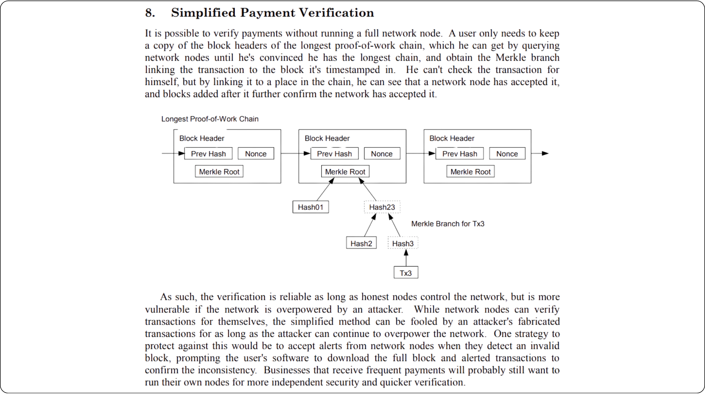


Nakamoto, S. (2008). *Bitcoin: A Peer-to-Peer Electronic Cash System*. https://Bitcoin.org/Bitcoin.pdf


Ovaj tip čvora je očigledno mnogo lakši u pogledu skladištenja i korišćenja CPU-a od Full node ili čak pruned čvora. SPV čvor je stoga dobro prilagođen manjim uređajima i povremenim vezama. Zapravo, često je direktno integrisan u Wallet, posebno u mobilni softver kao što je Blockstream App.


Kompromis je poverenje i poverljivost: SPV klijent ne proverava skripte ili politike validacije sam; pretpostavlja da je lanac sa najviše rada validan i zavisi od jednog ili više punih čvorova za odgovore. Korišćenje ovog tipa čvora je stoga bolja opcija nego povezivanje sa čvorom treće strane; međutim, i dalje je manje povoljno nego imati Full node ili čak pruned čvor.


### Koji čvor za koju potrebu?


- Mobilni / početni korisnik


Za početnika koji koristi samo Wallet na mobilnoj aplikaciji, korišćenje SPV čvora je sigurno najbolji način za početak. Instalacija je brza, zahteva malo resursa, a iskustvo je jednostavno i fluidno. To znači da možete sami verifikovati određene informacije i, stoga, manje se oslanjati na čvorove trećih strana dok istovremeno postajete nezavisniji kada je u pitanju emitovanje transakcija.


- PC / srednji korisnik


Korisnik srednjeg nivoa sa PC-jem može instalirati pruned čvor kako bi iskoristio gotovo sve prednosti Full node, bez svakodnevnog preopterećenja svog računara: puna validacija, umjerena upotreba diska i jednostavno održavanje. To je idealno rešenje za povezivanje vaših desktop novčanika i ostajanje nezavisnim u distribuciji vaših transakcija, bez ulaganja u posvećenu mašinu ili preopterećenja prostora na disku.


- Suvereni Bitcoiner / napredno


Full node ostaje najbolje rešenje ako želite da budete potpuno nezavisni u korišćenju Bitcoin i da se kasnije ne ograničavate na napredne upotrebe kao što su indeksator, Lightning čvor, ili čak Block explorer. Upravo to ćemo istražiti u ovom kursu!


## Pregled softverskih rešenja


<chapterId>0d48b89a-e8b5-441e-a707-537a035fc15e</chapterId>


Sa softverske strane, postoje 2 glavna načina za pokretanje Bitcoin čvora:


- direktno instalirajte implementaciju protokola, kao što je Bitcoin core (preporučeno), ili Bitcoin Knots,
- ili koristiti turnkey distribuciju (često nazvanu "_node-in-a-box_") koja integriše Bitcoin implementaciju na isti način, ali takođe uključuje Interface administrativni sistem, prodavnicu aplikacija i alate spremne za upotrebu (Lightning, pretraživače, serverske indekse, čak i aplikacije za samostalno hostovanje van Bitcoin...).


Oba pristupa vode istom cilju: imati svoj čvor, ali se razlikuju u pogledu instalacije i korišćenja Interface, održavanja, proširivosti i troškova. To ćemo istražiti u ovom poglavlju.


### Sirovi Bitcoin čvor implementacije


Instaliranje sirove implementacije znači direktno korišćenje softvera implementacije Bitcoin protokola (kao što je Core), bez dodatnog softvera Layer. Sami upravljate konfiguracijom, ažuriranjima i povezanim uslugama (indeksiranje, API, Lightning, bekapovi, itd.) prema vašim potrebama.


Ovo je najviše suvereni i fleksibilni pristup: tačno znate šta se pokreće, gde su podaci i kako sve funkcioniše. S druge strane, postaje složenije čim želite da pređete jednostavno rukovanje Bitcoin čvorom. Ako vam je cilj samo da imate čvor, složenost je uporediva sa čvorom-u-kutiji, ili čak manja, jer je jednostavno pitanje instaliranja softvera.


#### Bitcoin core (ultra-većinska mušterija)


[Bitcoin core je ultra-većinski klijent mreže](https://bitcoincore.org/). Preuzima, validira i održava Blockchain, pruža RPC/REST API-je i može integrisati Wallet. Ako preferirate standardne alate i osećate se prijatno da sami dodajete usluge (kao što su Electrum server, explorer i LND), bolje je da koristite Core kakav jeste.


**Prednosti:** Maksimalna stabilnost, predvidljivo ponašanje, sirovo iskustvo, lako za instalaciju i konfiguraciju.


**Nedostaci:** Morate ručno izgraditi ostatak steka kako biste kreirali kompletno aplikaciono okruženje, a ne samo Bitcoin čvor.


https://planb.network/tutorials/node/bitcoin/bitcoin-core-linux-568c13a6-8746-4d63-8e95-f4a61c5ae0ed

https://planb.network/tutorials/node/bitcoin/bitcoin-core-mac-windows-9684ab02-e0af-41c9-8102-86ac7c7727f3

#### Bitcoin Knots (glavni alternativni kupac)


[Bitcoin Knots je Fork od Bitcoin core](https://bitcoinknots.org/), koji održava Luke Dashjr. To je glavna alternativna klijent za Core za implementaciju Bitcoin protokola. Potpuno kompatibilan sa ostatkom mreže (nikako nije Hard Fork kao Bitcoin Cash), ipak nudi dodatne funkcije, uključujući opcije politike prenosa koje su odsutne iz Core-a, ili se primenjuju strožije po defaultu kako bi se ograničilo ono što neki smatraju spamom.


Postoje 2 moguća razloga za odabir Knots-a umesto Core-a:


- Tehnike**: Različite opcije iz Core-a, posebno u smislu upravljanja relejima, određivanjem koje transakcije prihvata i emituje vaš čvor.
- Policy**: Neki ljudi preferiraju korišćenje alternativnih klijenata kao što je Knots iz netehničkih razloga, posebno da bi podržali alternativu Core-u i tako smanjili njegov monopol. Ako bi Core ikada bio kompromitovan, bilo bi korisno ne samo imati solidne, dobro održavane alternativne klijente već i znati kako ih efikasno koristiti. Drugi koriste Knots iz protesta, jer su izgubili poverenje u Core-ove programere ili ne odobravaju većinu upravljanja klijentom.


https://planb.network/tutorials/node/bitcoin/bitcoin-knots-e04b2196-4df2-4246-86ef-c02269c29098

Lično, preporučujem da izaberete Core, prvenstveno da biste brže iskoristili sigurnosne zakrpe. Naime, neke ranjivosti otkrivene u Knots-u se ispravljaju sa zakašnjenjem. Generalno gledano, razvojni proces Core-a je solidno strukturiran i podržan od strane velikog broja saradnika, dok Knots održava jedna osoba i ima mnogo manju zajednicu. S druge strane, pravila releja danas imaju tendenciju da gube svoju korisnost, posebno kada ih primenjuje samo mali deo mreže (prema teoriji perkolacije).


### Node-in-a-box distribucije


_node-in-a-box_ kombinuje Bitcoin core (ili Knots) sa unapred konfiguriranim operativnim sistemom, Interface Web, i App Store-om za samohostujuće usluge (Lightning, explorers, Electrum server, Mempool, BTCPay Server, Nextcloud, itd.). Samo jednim klikom možete instalirati, ažurirati i međusobno povezati ove različite module.


To je mnogo jednostavnije rešenje za pokretanje i upravljanje brojnim pomoćnim aplikacijama na dnevnoj bazi. Nedostatak je što kada se pojavi problem (npr. sukob Docker slika, neispravna ažuriranja, oštećena baza podataka), otklanjanje grešaka može postati veoma složeno, jer zavisite od integracije same distribucije. Štaviše, podrška zajednice ili zvanična podrška često je komplikovana.


Dakle, čvor-u-kutiji je izuzetno lak za korišćenje sve dok sve radi kako treba, ali u slučaju greške, morate biti spremni da sprovedete dugotrajne pretrage, čekate pomoć i "zaprljate ruke".


Većina ovih rešenja dostupna je u dva formata:


- Unapred sastavljena mašina: kompletan računar sa već instaliranim operativnim sistemom. Ove mašine na principu "plati kako koristiš" jednostavno treba priključiti na struju i povezati na Internet da bi bile operativne. Ako vaš budžet to dozvoljava, ova opcija ima prednost što je vrlo jednostavna za postavljanje, često nudi prioritetnu podršku i doprinosi finansiranju razvoja, s obzirom da je poslovni model ovih kompanija uglavnom zasnovan na prodaji hardvera.
- "Uradi sam": instaliraj distribucioni OS na svoju mašinu (stari PC, NUC, Raspberry Pi, kućni server...). Ovo je najekonomičnije rešenje, jer možete reciklirati staru mašinu ili odabrati hardver koji tačno odgovara vašim potrebama i budžetu. Takođe je najfleksibilnija opcija i najzadovoljavajuća za konfigurisanje. Ovaj pristup ćemo istražiti u praktičnom delu kursa.


Evo je pregleda glavnih rešenja node-in-a-box dostupnih (2025. godine):


### Umbrel (umbrelOS & Umbrel Home)


[Danas je Umbrel lider u rešenjima za node-in-a-box (https://umbrel.com/). Njegov uspeh je u velikoj meri zahvaljujući jednostavnosti instalacije (kada je lansiran na jednostavnom Raspberry Pi), njegovom elegantnom i intuitivnom Interface, i ekosistemu aplikacija koji je brzo rastao i sada je izuzetno obiman.


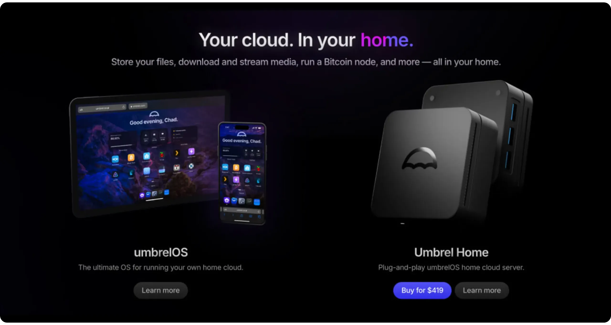


Pokrenut 2020. godine kao jednostavan Bitcoin čvor praćen nekolicinom pomoćnih aplikacija, Umbrel je postepeno evoluirao u potpuno opremljen, moderan kućni oblak.


Neću ulaziti u više detalja ovde o tome kako funkcioniše i njegovim specifičnim karakteristikama, jer ćemo ih detaljnije ispitati u prvom poglavlju sledećeg dela. Zaista, za potrebe ovog BTC 202 kursa, odlučio sam da koristim UmbrelOS, za koji verujem da je trenutno najbolje rešenje za čvor-u-kutiji za početnike i korisnike srednjeg nivoa.


https://planb.network/tutorials/node/bitcoin/umbrel-8b0e3b5b-d3cf-4a1e-8bb8-1ad2db4dd848

### Start9 (StartOS)


[Start9 nudi StartOS (https://start9.com/), sistem dizajniran za "suvereno računarstvo": cilj je da svako poseduje i upravlja sopstvenim privatnim serverom, unapređen tržištem aplikacija koje se samostalno hostuju. Možete kupiti Start9 server (Server One za $619, Server Pure za $899) ili sastaviti svoj u DIY režimu na sopstvenoj mašini.


Na strani Bitcoin, StartOS vam omogućava instalaciju Full node, Lightning čvora, BTCPay Servera, Electrs-a i mnogih drugih servisa. Međutim, privlačnost Start9 seže dalje od ovoga: nudi mogućnost otkrivanja, konfiguracije i izlaganja različitog softvera (oblak za fajlove, poruke, nadgledanje) na jedinstven način, uz potpunu kontrolu. Projekat je stoga namenjen korisnicima koji žele robusnu platformu za samostalno hostovanje, a ne samo jednostavan Bitcoin čvor. Verovatno je najkompletniji ekosistem posle Umbrel-a.


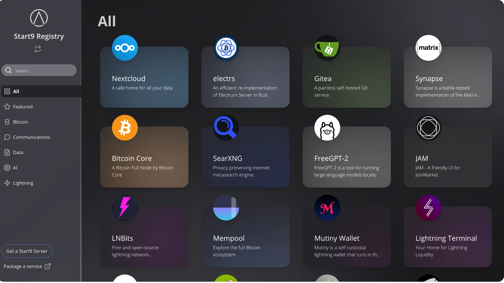


Glavna razlika sa Umbrelom leži u Interface. Umbrel se oslanja na visoko uglađen UX, dok Start9 nudi grublji, funkcionalniji Interface. Ekosistem aplikacija Start9 je manje bogat od Umbrelovog, ali to nadoknađuje sa nekoliko tehničkih prednosti: pristup naprednim postavkama aplikacija je pojednostavljen, dok Umbrel brzo postaje restriktivan ako željena opcija nije obezbeđena od strane Interface. Start9 takođe briljira u upravljanju rezervnim kopijama: osim Umbrelovog efikasnog rešenja za LND, ne postoji jedinstveni mehanizam, za razliku od Start9. Štaviše, nudi pristupačnije alate za nadgledanje i šifrovanu daljinsku vezu (`https`), dok je lokalni pristup Umbrelu putem `http`.


Ukratko, ako vam jednostavno trebaju osnovne aplikacije za Bitcoin, bez posebnog interesa za Umbrel-ov vrlo bogat ekosistem, i korisnik Interface nije prioritet, onda je Start9 bolja opcija. U suprotnom, Umbrel je bolji izbor.


https://planb.network/tutorials/node/bitcoin/start9-8c8b6827-8423-4929-bcba-89057670ed6a

### MyNode


[MyNode je distribucija fokusirana isključivo na Bitcoin i Lightning](https://mynodebtc.com/), koja nudi web Interface, tržište aplikacija i nadogradnje jednim klikom. Možete kupiti gotov hardver (*Model Two* dostupan za $549) ili instalirati MyNode besplatno na sopstvenoj mašini. Projekat takođe nudi *Premium* verziju softvera ($94), koja uključuje prioritetnu podršku i napredne funkcije.


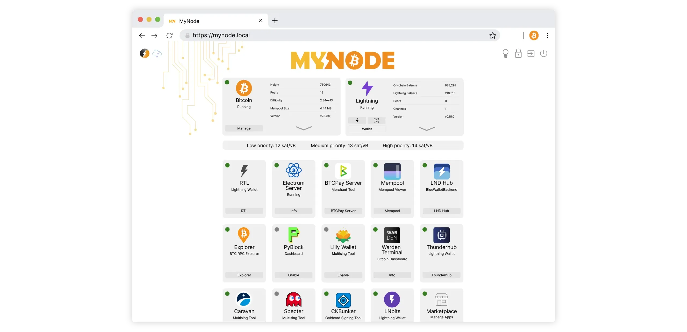


U praksi, MyNode okuplja sve osnovne građevinske blokove potrebne za rad sa Full node, kao i aplikacije neophodne korisnicima Bitcoin. Stoga je to prikladno rešenje ako vam nisu potrebne aplikacije izvan ekosistema Bitcoin, kao što su aplikacije koje se samostalno hostuju i koje se nalaze u Start9 i Umbrel sistemima.


https://planb.network/tutorials/node/bitcoin/mynode-a481fef3-2fd3-4df3-91c0-112cffa094eb

### RaspiBlitz


[RaspiBlitz je 100% open source projekat](https://docs.raspiblitz.org/) (MIT licenca) za montiranje Bitcoin čvora i Lightning čvora na Raspberry Pi. Jednostavno preuzmite sliku, pokrenite je, a zatim pratite čarobnjaka da biste imali funkcionalan čvor-u-kutiji na vašem Raspberry Pi-ju. Unapred sastavljeni kompleti su takođe dostupni od trećih strana, obično između $300 i $400, u zavisnosti od hardvera. RaspiBlitz takođe nudi niz dodatnih, lako instalirajućih aplikacija.


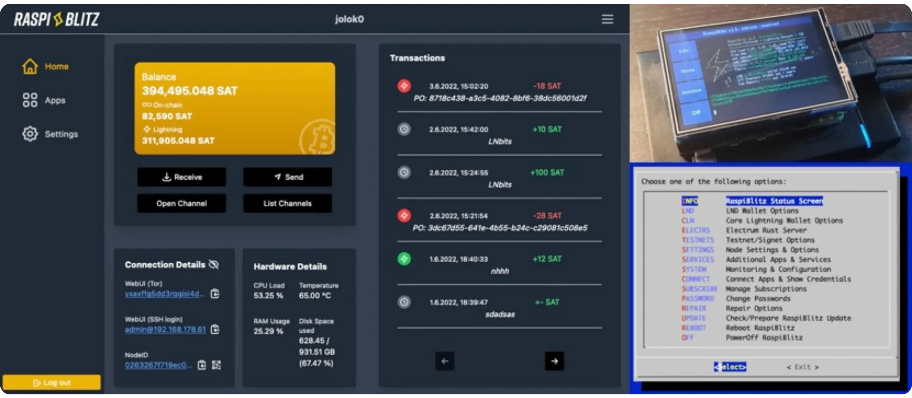


Ako posedujete Raspberry Pi, ovo je odlična opcija, jer sve kompletniji sistemi poput Umbrel postaju sve zahtevniji za ovu vrstu mini-PC-ja.


https://planb.network/tutorials/node/bitcoin/raspiblitz-d8cdba2e-a682-46cf-9fdc-d8602fbeac02

### RoninDojo


[RoninDojo je čvor-u-kutiji fokusiran na privatnost](https://wiki.ronindojo.io/en/home) koji automatizuje implementaciju Samurai Dojo i Whirlpool, sa posvećenim Interface i dodacima posebno dizajniranim za Samurai ekosistem.


Princip je jednostavan: ako koristite Ashigaru Wallet (naslednik Fork Samurai Wallet, nakon hapšenja njegovih programera) ili ako želite da iskoristite napredne alate za privatnost, RoninDojo je za vas.


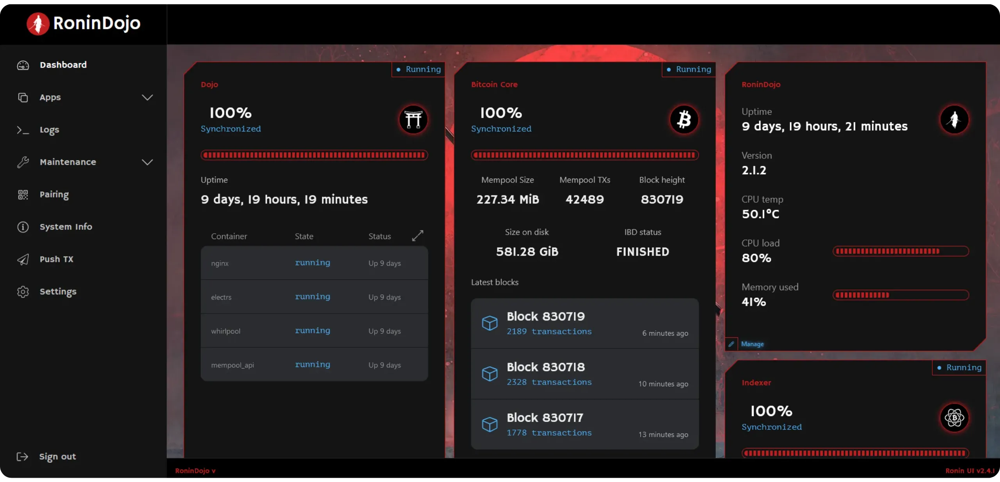


Projekat je ranije nudio unapred konfigurisan uređaj pod nazivom Tanto, ali trenutno nije dostupan. Možda će se vratiti kasnije. U međuvremenu, moguće je lako instalirati RoninDojo na Rock5B+ ili Rockpro64, ili čak indirektno na Raspberry Pi.


https://planb.network/tutorials/node/bitcoin/ronin-dojo-v2-0ddb3854-6f38-4466-b4e2-f66c028e0dd8

### Nodl


Još jedno [rešenje "node-in-a-box" je Nodl](https://www.nodl.eu/). Kao i kod prethodnih projekata, možete ili kupiti unapred konfigurisan hardver (između €599 i €799, u zavisnosti od modela) ili ga sami instalirati u DIY režimu.


Na softverskoj strani, Nodl integriše Bitcoin core, LND, BTCPay Server, Electrs, Dojo, Whirlpool, Lightning Terminal, RTL, kao i BTC RPC Explorer, sve sa integrisanim lancem ažuriranja i open-source kodom pod MIT licencom.


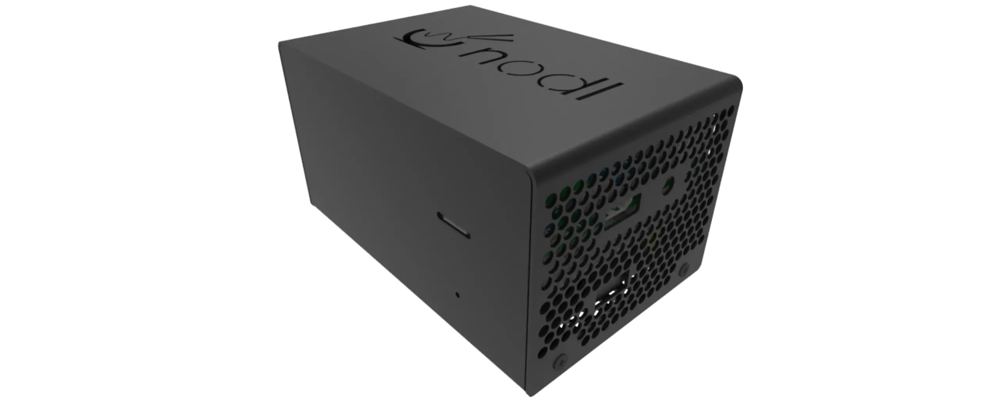


Nakon što ste istražili različita softverska rešenja, sada je vreme da izaberete mašinu koja će ugostiti vaš čvor!


## Pregled hardverskih rešenja


<chapterId>245d6add-9cda-46b9-9343-31dcdd70456e</chapterId>


Sada kada smo istražili sve softverske mogućnosti, usredsredimo se na hardver potreban za vaš čvor. Pružiću vam konkretne savete o izboru komponenti, zajedno sa konfiguracijama prilagođenim različitim budžetima. Naravno, ovo je moje lično mišljenje i povratne informacije: sigurno postoje i druge relevantne alternative pored onih predstavljenih ovde. Nadalje, neću ponovo razmatrati unapred sastavljene mašine koje nude projekti čvor-u-kutiji, koje smo već pokrili u prethodnom poglavlju. Ovde ćemo se isključivo fokusirati na DIY rešenja.


### Da li vam zaista treba posvećena mašina?


Tokom proteklih nekoliko godina, bitkoineri su postali sve svesniji uobičajene zablude, posebno sa popularizacijom node-in-a-box početkom 2020-ih: Bitcoin čvor treba nužno da radi na mašini posvećenoj isključivo ovoj svrsi. Ali to nije tačno. Ne treba vam nužno posvećen računar za pokretanje Bitcoin čvora: Bitcoin core je savršeno sposoban da radi na vašem svakodnevnom računaru. Ako imate dovoljno prostora na disku za Blockchain ili omogućite pruning, možete validirati lanac, povezati svoj Wallet, pa čak i zatvoriti program kada završite sa korišćenjem. Prednost ovog pristupa je značajna: nulta početna investicija i minimalna složenost.


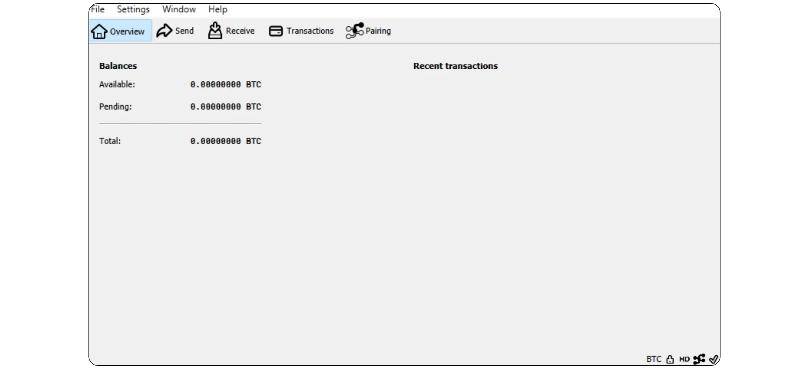


To je rečeno, korišćenje posvećene mašine je često udobnije. Može raditi neprekidno (24/7), biti daljinski dostupna u svakom trenutku, ne monopolizovati resurse vaše glavne mašine, i, iznad svega, izolovati upotrebe (dobra sigurnosna praksa: ako vaš lični računar naiđe na problem, vaš čvor nastavlja da funkcioniše, i obrnuto). Dakle, pitanje nije "Da li treba da posvetim mašinu?", već "Da li mi treba čvor koji je stalno online, dostupan drugim uređajima, i sposoban za evoluciju?" (Lightning, indeksatori, dodatne aplikacije...). Ako je odgovor da, izbor zasebne mašine će stvari učiniti mnogo jednostavnijim.


### 3 metode nabavke: reciklaža, polovno i novo


#### Recikliranje starog PC-ja


To je najekonomičnije rešenje. Većina nas ima stari PC koji skuplja Dust kod kuće, ili kod prijatelja i porodice: ovo je savršena prilika da ga vratite u upotrebu! Da biste ga prilagodili za korišćenje kao Bitcoin čvor, jednostavno dodajte 2TB SSD i, u zavisnosti od vaših potreba, zamenite ili dodajte RAM memorijske module kako biste povećali RAM. Očekujte da ćete platiti između €100 i €200 za potpuno funkcionalnu mašinu.


Pre nego što kupite bilo koji hardver, proverite broj dostupnih slotova za diskove, tip konekcije (M.2 ili SATA), format RAM-a (SODIMM ili DIMM) i njegovu generaciju (DDR4, itd.). Takođe, iskoristite priliku da očistite mašinu, posebno ventilator, kako biste osigurali optimalne performanse.


Međutim, budite oprezni ako koristite laptop: baterija može postati problem tokom vremena (više o tome kasnije u poglavlju).


#### Rekondicionirano ili polovno


Tržište je puno obnovljenih poslovnih mini-PC-ja kao što su *Lenovo ThinkCentre Tiny*, *HP EliteDesk Mini* ili *Dell OptiPlex Micro*. Ove mašine su čvrste, kompaktne, tihe i energetski efikasne. Njihova cena je znatno niža od novih, i lako je pronaći modele opremljene sa 6. do 10. generacijom i5/i7 procesora i 8 do 16 GB RAM-a, sve po vrlo atraktivnim cenama, uglavnom između €70 i €200, u zavisnosti od konfiguracije. Po mom mišljenju, ovo je verovatno najbolja opcija ako tražite posvećenu mašinu za vaš Bitcoin čvor.


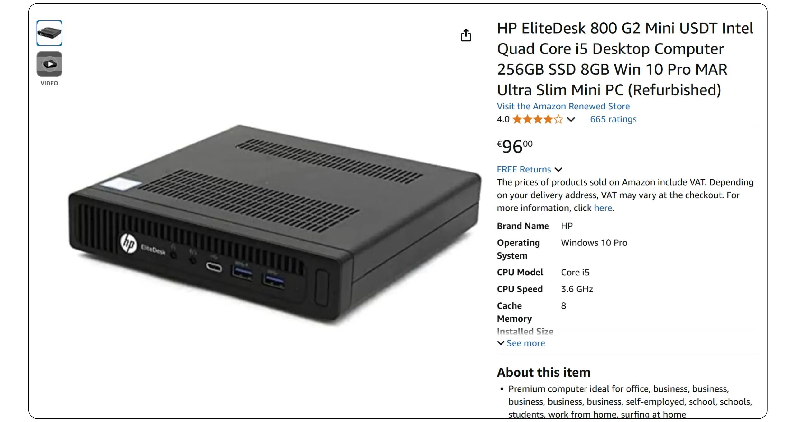


Takođe je moguće pronaći polovne računare i laptopove starih nekoliko godina, sa zanimljivim konfiguracijama i odličnim odnosom cene i kvaliteta.


**Napomena:** mašine iz korporativnih flota, kao što je *ThinkCentre Tiny*, često su opremljene samo sa *DisplayPort* (DP) priključkom za ekran, bez HDMI izlaza. Zato ne zaboravite da ponesete adapter ili DP-u-HDMI kabl ako vam je potreban.


#### Kupovina novog


Ako vaš budžet dozvoljava, možete se odlučiti i za novu mašinu. Ovo je dobra opcija ako želite da imate nedavni hardver sa dobrim performansama, posebno ako planirate da koristite Umbrel ili Start9 sa dodatnim aplikacijama van Bitcoin ekosistema za samohostovanje.


### Koju vrstu mašine treba da izaberem?


#### Mini-PC "NUC" / barebone


Mini-PC-ovi, po mom mišljenju, nude najbolji kompromis za hostovanje Bitcoin čvora kod kuće. Štede prostor, lako se uklapaju na policu, troše minimalnu energiju i omogućavaju jednostavne hardverske modifikacije, kao što su dodavanje RAM-a ili zamena SSD-a.


Lično, više volim *Lenovo ThinkCentre Tiny*, koji je veoma rasprostranjen na tržištu polovnih uređaja (iz korporativnih flota); posebno su robusni i laki za modifikaciju. Naravno, postoje mnogi ekvivalenti od drugih proizvođača: *Dell OptiPlex Micro*, *HP ProDesk / EliteDesk Mini / Micro*, *Intel NUC*, *Gigabyte BRIX*, *MSI Cubi*..


**Ističe se:** mali otisak, umerena potrošnja energije, nizak nivo buke, skalabilnost (u zavisnosti od modela) i pouzdanost.


**Slabosti:** malo skuplji od SBC-a tipa Raspberry Pi, nema ugrađen ekran (daljinski pristup ili putem spoljnog monitora), nema bateriju (iznenadno gašenje u slučaju nestanka struje).


#### Posvećen laptop


To je odlična jeftina alternativa mini-PC-ju: danas možete pronaći polovne ili čak nove laptopove po niskim cenama, opremljene pristojnim procesorima, brojnim portovima, kao i integrisanim ekranom i tastaturom (veoma praktično za početnu instalaciju). Iznad svega, baterija deluje kao prirodni UPS: u slučaju nestanka struje, čvor se ne gasi naglo i može ostati operativan čak nekoliko sati.


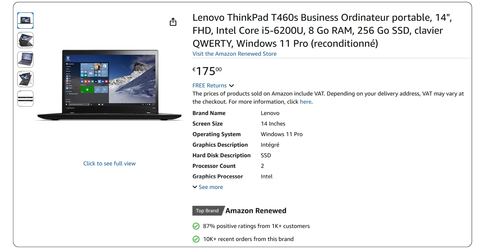


**Istaknuto:** Sve-u-jednom rešenje, baterija deluje kao UPS (bez prekida napajanja), pojednostavljena instalacija zahvaljujući integrisanom ekranu i tastaturi, integrisana Wi-Fi kartica i širok izbor korišćenih i novih tržišta (što često znači da možete pregovarati o cenama).


**Slabosti:** nešto veća potrošnja energije u poređenju sa golim Mini-PC-jem, postepeno trošenje baterije pri 24/7 radu uz gubitak kapaciteta, retki ali stvarni rizik od oticanja baterije ili termalnog bekstva sa starošću. Upravo ovaj aspekt me navodi da smatram mini-PC boljom opcijom od laptopa: postepena degradacija baterije i povezani rizici.


Ako izaberete ovo rešenje, preporučujem da pažljivo pratite stanje baterije kako biste sprečili bilo kakvu opasnost. Obratite pažnju na prekomernu toplotu, neobične mirise, nestabilnost ili deformisanu školjku. U slučaju alarma, odmah isključite i odspojite računar, a zatim odložite bateriju u specijalizovani centar za reciklažu.


**Savjet:** Ako BIOS/UEFI ili alat proizvođača to omogućava, postavite ograničenje opterećenja (npr. 60% ili 80%) kako biste produžili vek trajanja baterije.


#### Raspberry Pi i drugi SBC-ovi: pogrešna ideja


Početkom 2020-ih, sa porastom softvera node-in-a-box, Raspberry Pi manija se takođe pojavila kao sredstvo za pokretanje Bitcoin čvora. Ideja je delovala privlačno: jeftino, kompaktno i pristupačno.


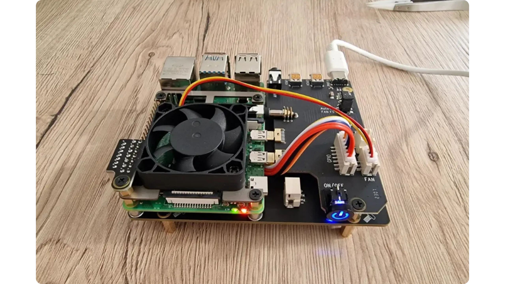


U praksi, ako je vaš cilj isključivo pokretanje Bitcoin čvora bez dodatnih aplikacija, Raspberry Pi može biti dovoljan. Ali čim želite koristiti Umbrel, Start9 ili bogatiji ekosistem (Block explorer, Address indeksator, Lightning čvor, aplikacije za samostalno hostovanje...), mašina brzo dostiže svoje granice.


Raspberry Pi ima nekoliko nedostataka:


- procesori koji su previše tanki, sa ARM arhitekturom koja je ponekad nekompatibilna sa određenim softverom ili zahteva više rukovanja;
- Zalemljeni RAM, nemoguće ga je nadograditi, sa ograničenim konfiguracijama (često maksimalno 8 GB);
- spoljašnji kućišta za SSD-ove povezana kablom, česti izvori grešaka, zahtevaju kupovinu specifične kartice za stabilan SSD;
- tendencija brzog zagrevanja i poteškoće u osiguravanju pravilnog hlađenja;
- treba kupiti dodatni hardver (kućište, ventilator, SSD kartica, itd.);
- veoma ograničena povezanost.


Istorijski gledano, velika prednost SBC-ova poput Raspberry Pi-ja bila je njihova cena: za nekoliko desetina evra mogli ste dobiti namenski uređaj. Međutim, danas su cene naglo porasle, i kada dodate sav neophodan dodatni hardver, trošak se približava ceni prvih polovnih ili obnovljenih x86 mini-PC-jeva, koji, po mom mišljenju, nude mnogo više prednosti. Iz tog razloga, ne preporučujem izbor SBC-a.


### Odabir komponenti


#### Skladištenje na disku: SSD obavezno, minimum 2 TB


Tehnički, moguće je pokrenuti Bitcoin čvor na HDD-u. Problem je što će se sve znatno usporiti, posebno IBD, koji će postati izuzetno dug zbog intenzivne upotrebe diska kao keša od strane Bitcoin core (posebno za UTXO set). Zato snažno savetujem protiv korišćenja HDD-a: stvara pravi usko grlo, ozbiljno ograničava buduću evoluciju (npr. za Lightning čvor), i može čak dovesti do nesklada u sinhronizaciji sa Blockchain glavom. Štaviše, konstantan stres na mehaničkom disku povećava rizik od prevremenog habanja.


SSD-ovi radikalno menjaju vaše korisničko iskustvo: sve postaje brže i glađe, uz daleko veću pouzdanost. Korišćenje SSD-a je stoga (gotovo) obavezno za vaš čvor, i nećete zažaliti, posebno jer su modeli velikog kapaciteta sada relativno pristupačni.


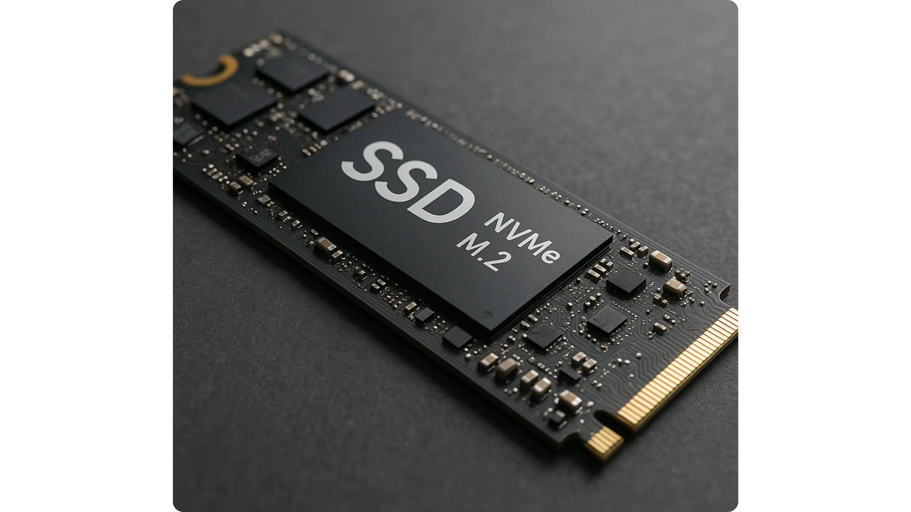


U smislu kapaciteta, 2TB se postepeno uspostavlja kao nova razumna minimalna vrednost. U leto 2025. godine, Blockchain već dostiže 700 GB, a ako dodate Umbrel, Address indeksator i nekoliko aplikacija, 1 TB SSD će se brzo zasićiti. Sa 2TB, imate udobnu marginu za godine koje dolaze (u širokoj proceni, između 5 i 15 godina). Takođe možete odabrati 4TB ako planirate koristiti mnogo aplikacija na Umbrel-u, skladištiti velike fajlove u samohostingu, ili ako želite da u velikoj meri predvidite svoje potrebe za diskovnim prostorom.


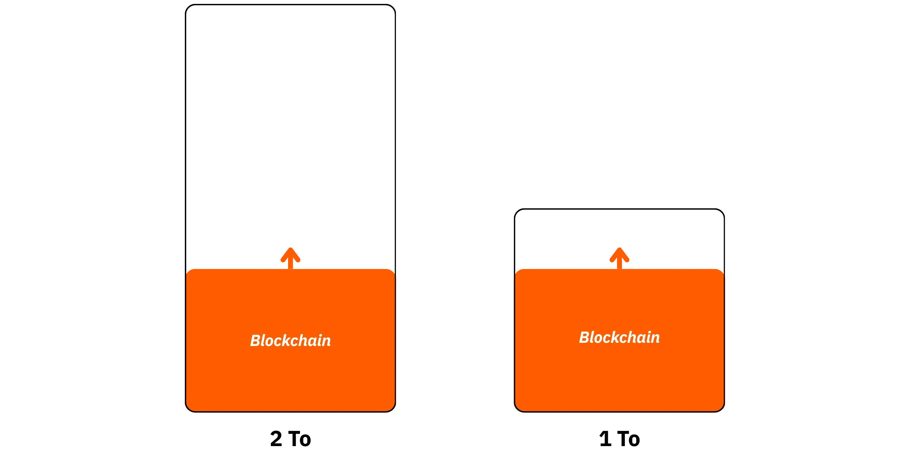


Što se tiče formata, to će zavisiti od portova dostupnih na vašem uređaju; međutim, ako je moguće, preporučujem korišćenje NVMe M.2 SSD-a.


#### Memorija (RAM): 8 do 16 GB


Za Bitcoin core sam (bez Umbrel sloja), preporuke programera ukazuju na minimum od 256 MB RAM-a sa podešavanjima prilagođenim na najniže postavke, 512 MB sa podrazumevanim podešavanjima i 1 GB za normalnu upotrebu.


S druge strane, ako koristite sistem "node-in-a-box" kao što su Umbrel ili Start9, zahtevi za RAM-om su značajno veći. Programeri Umbrela preporučuju minimum od 4 GB RAM-a. Ovo može biti dovoljno samo za pokretanje Core-a, ali ćete uskoro biti ograničeni. Stoga preporučuju 8 GB, što i ja smatram minimumom za osnovnu konfiguraciju oko Bitcoin (Core, LND, indeksator i nekoliko aplikacija). Po mom iskustvu, sa Umbrelom i nekoliko dodatnih usluga, 8 GB je i dalje malo tesno. Da biste bili zaista komforni i imali neku rezervu, preporučio bih 16 GB RAM-a.


#### Procesor (CPU)


Za Umbrel čvor, minimalni zahtev je dvojezgarni 64-bitni procesor od Intela ili AMD-a. Ako želite da koristite nekoliko aplikacija pored Bitcoin core, četvorojezgarni (ili jači) procesor će napraviti stvarnu razliku u pogledu fluidnosti. Na primer, procesori i5/i7 od 6. do 10. generacije su odlične opcije na tržištu polovnih uređaja.


### Primeri konkretnih konfiguracija


Ispod predlažem tri konkretne konfiguracije, prilagođene različitim budžetima i potrebama, sa preciznim modelima koji ih podržavaju. Ovi izbori su dati kao primeri da ilustruju informacije u ovom poglavlju; niste obavezni da izaberete tačno ove modele. Kako smatram da je Mini-PC najbolja opcija na duži rok, oslanjaću se na ovaj format za tri predložene konfiguracije.


*Cene prikazane ispod su samo indikativne i mogu varirati u zavisnosti od regiona, prodavca i perioda*


Prvo i najvažnije, potreban vam je SSD koji je dovoljno velik da primi Blockchain, a da pritom ostane prostora za manevrisanje. SSD-ovi imaju ograničen vek trajanja u smislu ciklusa pisanja i ukupne količine podataka koji se pišu. Međutim, Bitcoin čvor stavlja značajno opterećenje na disk prilikom pisanja. Zato ne preporučujem modele početnog nivoa; umesto toga, predlažem NVMe SSD, koji nudi značajno bolje performanse.


Kao primer, za potrebe ovog kursa, izabrao sam sledeći model: *Samsung 990 EVO Plus NVMe M.2 SSD 2Tb*, dostupan za oko €120 na Amazonu. Takođe možete odabrati druge poznate brendove kao što su Crucial, Western Digital ili Kingston.


#### Konfiguracija niskog budžeta


Očigledno, ako je vaš budžet veoma ograničen (ispod €200), savetovao bih vam da ne investirate u namenski uređaj, već da instalirate Bitcoin core direktno na vaš svakodnevni PC (u pruned modu ako vam nedostaje prostora na disku).


Inače, za početni budžet preporučujem *HP EliteDesk 800 G2 Mini*. Našao sam obnovljeni model za 96 € na Amazonu, opremljen Intel Core i5 procesorom 6. generacije i 8 GB RAM-a. Ovo je posebno zanimljiva opcija za početnike: ovaj procesor i ova količina memorije su više nego dovoljni za pokretanje Core na Umbrel, kao i nekoliko aplikacija istovremeno, kao što su Electrs indeksator, Lightning čvor i Mempool instanca, pod uslovom da ne dodelite previše keša za Core. Štaviše, ovaj tip mini-PC-a omogućava lako povećanje RAM-a na 16 GB, na primer, ako se ukaže potreba (očekujte da ćete platiti oko 30-40 € dodatno za jedan ili dva kvalitetna memorijska štapića).


Zatim jednostavno dodajte SSD u budžet. Počevši sa Samsung 2TB po ceni od €120, dobijamo ukupni trošak od €216 za kompletnu, funkcionalnu mašinu.


#### Konfiguracija srednjeg budžeta


Ako imate prosečan budžet od oko €300 za mašinu koja će hostovati vaš čvor, preporučujem *Lenovo ThinkCentre Tiny*, na primer, opremljen procesorom visokih performansi i dovoljnom količinom RAM-a. Našao sam obnovljeni model na Amazonu za €180, sa Intel Core i7 procesorom 6. generacije i 16GB RAM-a. Uz dodatak 2TB SSD-a po ceni od €120, ukupni trošak iznosi €300.


Sa ovom mašinom, imate udobnu konfiguraciju: brz IBD i mogućnost pokretanja brojnih aplikacija na vašem Umbrel ili Start9 bez poteškoća. Ovo je upravo konfiguracija koju koristim za ovaj BTC 202 kurs.


#### Visokokvalitetna konfiguracija


Sa većim budžetom, mogućnosti postaju značajno šire. Možete izabrati DIY konfiguraciju, ili čak odabrati unapred sastavljenu mašinu koju nudi direktno projekat node-in-a-box.


Na primer, *ASUS NUC 14 Pro* je dostupan nov na Amazonu za €540. Za ovu cenu, dobijate Intel Core Ultra 5 procesor (noviji i posebno visokih performansi), praćen sa 16 GB DDR5 RAM-a. Sa takvom konfiguracijom, moći ćete da završite IBD u rekordnom vremenu i instalirate zahtevne aplikacije bez poteškoća.


Ovo je izuzetno udobna konfiguracija, čak i preterana ako je početni cilj jednostavno pokretanje Bitcoin čvora. S druge strane, ako želite da u potpunosti iskoristite sve aplikacije za samostalno hostovanje dostupne na Umbrel i Start9, ovaj nivo snage je upravo pravi za vas.


U zavisnosti od vaše namene, možete se odlučiti za SSD od 2TB, kao u drugim konfiguracijama, ili direktno za SSD od 4TB po ceni od €260 ako takođe želite da skladištite lične fajlove i proširite svoje samostalno hostovanje. Sa SSD-om od 2TB, ukupna cena konfiguracije je €660, dok sa SSD-om od 4TB dostiže €800.


### Još nekoliko saveta


- Ako želite da kupite polovnu opremu i platite u bitkoinima, pridružite se okupljanju u vašoj blizini! Razgovarajući sa drugim učesnicima, sigurno ćete pronaći odgovarajuću opremu po povoljnoj ceni, dok pomažete da se održi cirkularna ekonomija oko Bitcoin. To je takođe prilika da dobijete korisne savete od zajednice.


- Za internet konekciju, biće vam potreban RJ45 Ethernet kabl, barem za instalaciju sistema.


- Neka okruženja, kao što je Umbrel, omogućavaju korišćenje Wi-Fi-ja, ali performanse će generalno biti lošije (posebno ako želite da koristite svoj Lightning čvor na daljinu, jer to može imati uticaj). Ako izaberete Wi-Fi, osigurajte da vaš uređaj ima ugrađenu karticu ili dodajte kompatibilni dongle.


- Uvek koristite originalni proizvođačev napajanje Supply za vašu mašinu. Ovo je ključno kako biste sprečili oštećenje vaše opreme i rizik od izbijanja požara.


- Ako vaša mašina nema ugrađenu bateriju, dobra je ideja uložiti u inverter kako biste izbegli iznenadna gašenja.


- U zavisnosti od vrednosti vaše opreme i vaše geografske lokacije, sistem za zaštitu od groma može biti takođe prikladan, bilo direktno na razvodnoj tabli ili na korišćenoj produžnoj letvi.


- Na kraju, zapamtite da optimizujete hlađenje vaše mašine: redovno je čistite i instalirajte na hladnom, dobro provetrenom, urednom mestu kako biste izbegli pregrevanje, što može dovesti do smanjenja performansi (dobrovoljno ograničenje brzine vašeg procesora).


# Instaliranje Bitcoin čvora jednostavno


<partId>ca6cf2a5-0bcc-41d9-b556-0d38865bf98f</partId>


## Umbrel: mnogo više od Bitcoin čvora


<chapterId>dd4c04f1-924a-43e1-94f3-ea9fbc83dd43</chapterId>


Umbrel je operativni sistem za lične servere dizajniran da učini samostalno hostovanje pristupačnim: instalirate Umbrel, otvorite pregledač na `umbrel.local` i upravljate svime putem jednostavnog daljinskog Interface.


Projekat je prvo popularizovao ideju o Bitcoin i Lightning čvoru na jedan klik, a zatim se proširio u pravi "kućni oblak": skladištenje fajlova i fotografija, multimedijalni streaming, mrežni alati, kućna automatizacija, lokalna AI i stotine aplikacija koje se mogu instalirati iz integrisane prodavnice aplikacija.


U Umbrelu, svaka aplikacija radi u Docker containeru (izolacija, atomska ažuriranja, nezavisno pokretanje/zaustavljanje). Interface centralizuje pristup svim ovim aplikacijama, nudeći jedinstvenu prijavu (sa opcionalnim 2FA), ažuriranja jednim klikom za OS i aplikacije, praćenje rada mašine u realnom vremenu (CPU, RAM, temperatura, skladište), upravljanje dozvolama između aplikacija i pregled njihove potrošnje.


Cilj Umbrela je stoga da vam vrati kontrolu i poverljivost nad vašim podacima, bez oslanjanja na cloud usluge, izvan jednostavnog upravljanja Bitcoin čvorom.


### Umbrel Home vs umbrelOS


Umbrel nudi dva različita pristupa:


- [**Umbrel Home**](https://umbrel.com/umbrel-home): ovo je mini-server spreman za upotrebu, posebno dizajniran i optimizovan za umbrelOS. Kompaktan, tih, povezan putem Ethernet-a, opremljen je NVMe SSD-om (opciono do 4TB), 16GB RAM-a i četvorojezgarnim CPU-om. Naručite ga, priključite i idete na `umbrel.local`. Možete imati operativni Umbrel u funkciji za nekoliko minuta. To je plug-and-play opcija.


- [**umbrelOS**](https://umbrel.com/umbrelos): ovo je operativni sistem koji možete sami instalirati na svoj hardver (mini-PC, NUC, tower, posvećeni laptop...). Imate isti Interface i istu App Store kao na Umbrel Home.


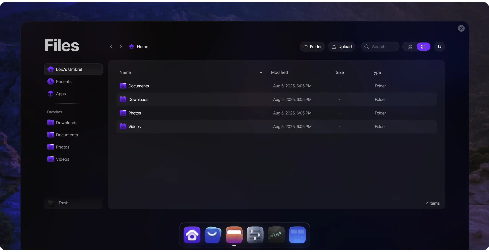


U oba slučaja, korisničko iskustvo je identično sa softverske strane: administracija putem pregledača, ažuriranja jednim klikom, instalacija aplikacija na zahtev... DIY rešenje je često ekonomičnije od kupovine Umbrel Home-a (u zavisnosti od korišćene mašine). Međutim, ne bih nužno preporučio da uvek birate DIY opciju, jer **kupovina Umbrel Home-a direktno doprinosi finansiranju razvoja projekta**, s obzirom da je njegov poslovni model zasnovan na prodaji hardvera. I iskreno, po ceni od 389 € za 2TB skladišta, cena ostaje vrlo razumna s obzirom na kvalitet mašine koja se nudi.


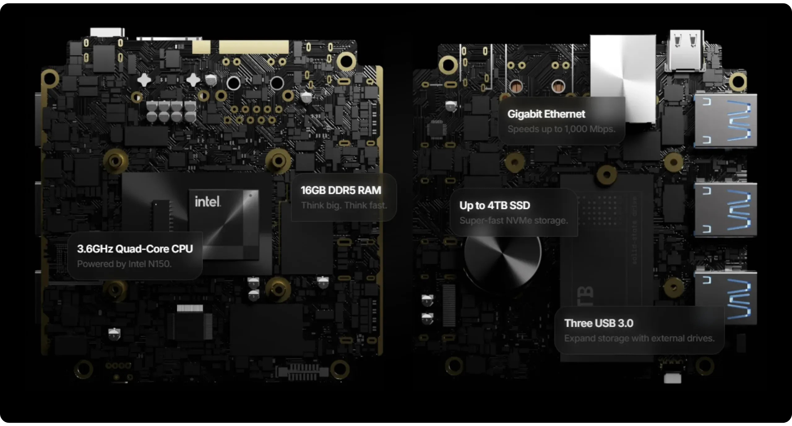


U sledećem poglavlju, istražićemo kako instalirati umbrelOS DIY na vašoj sopstvenoj mašini. Međutim, možete pratiti ovaj BTC 202 kurs na isti način ako ste se odlučili za Umbrel Home.


### Slučaj upotrebe: od Bitcoin čvora do kućnog oblaka


Umbrel može ostati vrlo minimalistički i fokusiran isključivo na Bitcoin, ili se razviti u pravi multifunkcionalni lični server, u zavisnosti od vaših potreba. Ovde su glavne upotrebe za Umbrel:


- Jednostavan Bitcoin čvor**: ovo je osnova na kojoj se Umbrel oslanjao od samog početka. Možete pokrenuti Bitcoin core (ili Knots), direktno povezati svoje novčanike sa svojim čvorom, izložiti Electrum server, hostovati svoj Mempool Block explorer za pregled Blockchain, i proceniti troškove... Na ove upotrebe ćemo se fokusirati u ovom kursu.


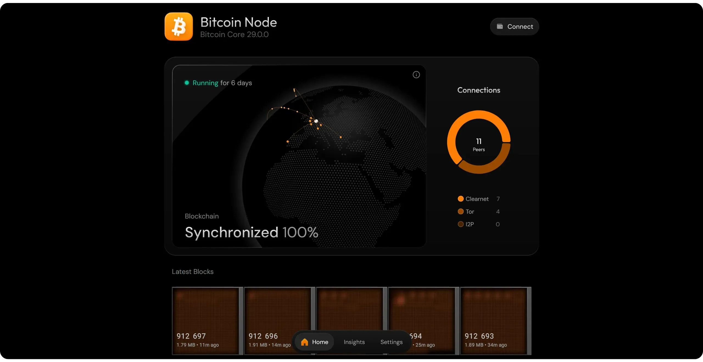


- Lightning Network**: Umbrel vam takođe omogućava da implementirate LND ili Core Lightning, dve implementacije Lightning Network, kako biste upravljali sopstvenim Lightning čvorom. Moći ćete da otvarate kanale, upravljate svojom likvidnošću, vršite plaćanja, automatizujete balansiranje, nudite usluge, povežete udaljeni Wallet, ili iskoristite napredno upravljanje Interface zahvaljujući mnogim dostupnim aplikacijama. Ovaj specifičan slučaj upotrebe ćemo razmatrati u našem sledećem LNP 202 kursu.


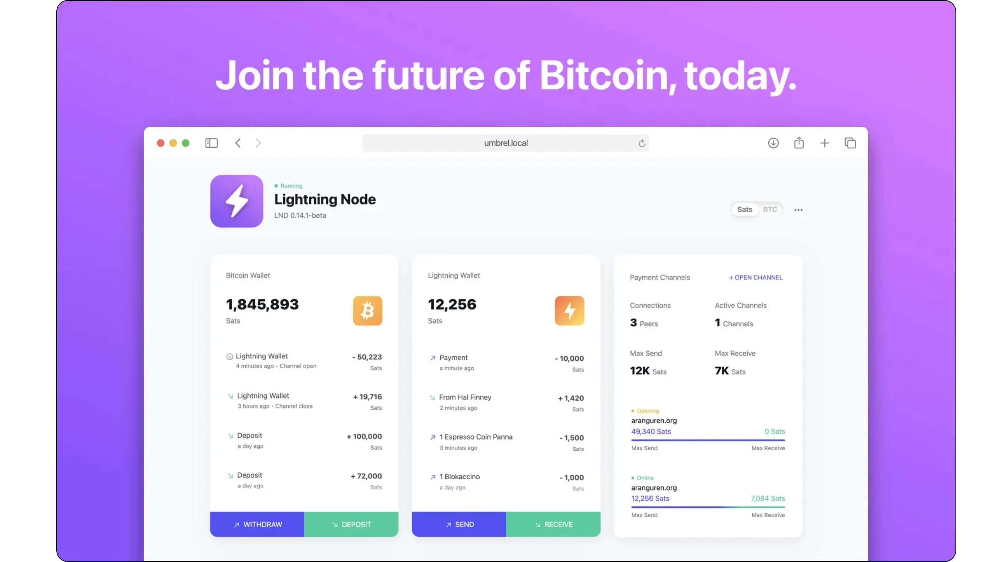


- Opšte samostalno hostovanje**: sa Nextcloud, Immich, Jellyfin/Plex, DNS-širokim blokatorima oglasa (Pi-hole/AdGuard), VPN-ovima (WireGuard, Tailscale), kućnom automatizacijom (Home Assistant), rezervnim kopijama, upravljanjem beleškama, kancelarijskim alatima, lokalnom veštačkom inteligencijom (Ollama + Open WebUI)... Umbrel može postati vaš lični server, omogućavajući vam da povratite kontrolu nad vašim podacima. Sami hostujete usluge koje svakodnevno koristite, sa uglađenim korisničkim iskustvom koje blisko podseća na spoljne solucije, dok zadržavate potpunu kontrolu nad vašim podacima i privatnošću.


Korišćenjem aplikacija u kontejnerima, možete oblikovati Umbrel po želji: počnite sa jednostavnim Bitcoin čvorom i nekoliko aplikacija povezanih sa njegovim ekosistemom, zatim instalirajte Lightning čvor pored vašeg Bitcoin čvora, i postepeno obogatite svoju instancu sa aplikacijama za samostalno hostovanje koje su vam potrebne.


### Zajednica i uzajamna pomoć


Jedna od ključnih prednosti Umbrela u odnosu na konkurenciju je njegova velika i veoma aktivna zajednica korisnika. Možete ih kontaktirati uglavnom putem [njihovog Discorda](https://discord.gg/efNtFzqtdx) i [njihovog online foruma](https://community.umbrel.com/). Ovde ćete pronaći ne samo praktične savete već, pre svega, rešenja za rešavanje problema ili ispravljanje grešaka. To je odlično mesto za početak, napredovanje i, na kraju, pomoć drugim korisnicima, tako da niste sami sa svojim Coin.


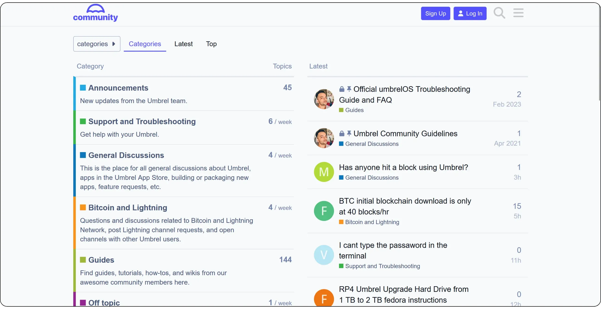


### Licenca za UmbrelOS


Umbrelov kod je javno dostupan (možete ga pregledati, Fork, i modifikovati), ali nije pod pravom open-source licencom. Zapravo, umbrelOS se distribuira pod [*PolyForm Noncommercial 1.0*] licencom (https://polyformproject.org/licenses/noncommercial/1.0.0/), iako su neki povezani alati za razvoj dostupni pod MIT licencom.


U praktičnom smislu, možete raditi gotovo sve što želite sa umbrelOS, sve dok je to za ličnu, nekomercijalnu upotrebu: modifikacija, redistribucija u neprofitne svrhe, kreiranje izvedenica za sebe ili za neprofitne organizacije, pod uslovom da poštujete pravne napomene.


Međutim, zabranjeno je prodavati Umbrel ili njegove derivate (na primer, unapred sastavljenu mašinu sa unapred instaliranim umbrelOS-om), nuditi usluge povezane sa Umbrelom komercijalno, ili integrisati njegov kod u proizvod radi profita.


Tehnički, ova licenca ne ograničava instalaciju, reviziju ili prilagođavanje Umbrela za ličnu upotrebu. Pravno, štiti projekat od neovlašćene preprodaje ili komercijalnog hostinga, posebno od strane cloud provajdera. Umbrel stoga nije open source, iako je njegov kod javno dostupan.


Međutim, svaka aplikacija u Prodavnici zadržava svoju licencu, često otvorenog koda.


## Instalacija Full node sa Umbrel


<chapterId>61bc09c7-787d-4649-b142-457ec018b0f4</chapterId>


Sada kada imamo sve potrebne informacije, vreme je da se upustimo u detalje. U ovom vodiču pokazaćemo vam kako da instalirate kompletan Bitcoin čvor koristeći UmbrelOS.


### Potrebni materijali


Ovde ćemo koristiti UmbrelOS x86 sliku (tačnije, x86_64 verziju). Moći ćete da pratite ovaj vodič na bilo kojoj mašini koju izaberete, sve dok nije opremljena procesorom ARM arhitekture (bez Apple Silicon, Raspberry Pi, itd.). To znači da će bilo koji računar sa Intel ili AMD 64-bitnim procesorom biti dovoljan, sve dok ispunjava minimalne zahteve, u zavisnosti od toga kako nameravate da koristite svoj Umbrel (preporučuje se barem dvojezgarni procesor).


Ako ste se odlučili za Raspberry Pi 5 (opcija koju ne preporučujem, kao što je pomenuto u prethodnom odeljku), instalacija je malo drugačija. Zatim možete pratiti ovaj posvećeni vodič i vratiti se na moj kurs kada budete na Interface web `http://umbrel.local`:


https://planb.network/tutorials/node/bitcoin/umbrel-8b0e3b5b-d3cf-4a1e-8bb8-1ad2db4dd848

Kao što je pomenuto u prethodnom delu, odlučio sam da pokrenem ovaj tutorijal na malom obnovljenom računaru koji sam pronašao po povoljnoj ceni: *Lenovo ThinkCentre M900 Tiny* opremljen Intel Core i7 procesorom i 16 GB RAM-a. Ovo je veoma udobna konfiguracija za pokretanje Umbrel-a, posebno za Bitcoin čvor. Međutim, izabrao sam ovu konfiguraciju jer želim da instaliram Lightning čvor i druge zahtevnije aplikacije kasnije. Takođe sam dodao 2TB SSD svom ThinkCentre-u kako bih zadržao puni Blockchain i još uvek imao udobnu marginu. Sa ovom konfiguracijom, ukupni trošak je 270 €, uključujući sve troškove.


Posebno mi se sviđa Lenovo ThinkCentre Tiny serija, jer su to kompaktne, tihe i veoma robusne mašine. Ovi računari su veoma popularni među preduzećima i stoga su brojni na tržištu polovnih uređaja, gde možete pronaći zanimljive konfiguracije između €70 i €200.


Ako ste, poput mene, odabrali PC bez monitora, **trebaće vam da povežete monitor i tastaturu** samo tokom trajanja instalacije. Nakon toga, moći ćete da mu pristupite daljinski sa drugog računara na istoj mreži (ili putem drugih metoda koje ćemo pokriti u kasnijim poglavljima). Takođe će vam biti potreban RJ45 Ethernet kabl da povežete vaš uređaj na lokalnu mrežu, i USB ključ od najmanje 4 GB za čuvanje instalacione slike.


Da rezimiramo, ovde su zahtevi za opremu:


- Računar sa x86_64 procesorom (minimalno Dvojezgarni, preporučeno Četvorojezgarni);
- RAM memorija (minimum 4 GB, preporučeno 8 GB ili više za produženu upotrebu);
- SSD (preporučeno + 2 TB);
- USB ključ (+ 4 GB) za instalaciju UmbrelOS slike;
- Monitor i tastatura (korisno samo za početnu instalaciju ako računar nije opremljen jednim);
- RJ45 Ethernet kabl.


### Korak 1 - Montiranje računara


U zavisnosti od hardvera koji ste odabrali, prvi korak je sastavljanje različitih komponenti vašeg računara. Na primer, u mom slučaju, originalni SSD je imao kapacitet od samo 256 GB, pa ću ga reciklirati za drugu upotrebu i zameniti sa SSD-om od 2 TB. Ako takođe želite da zamenite RAM module, sada je vreme da to uradite.


### Korak 2: Pripremite USB ključ za pokretanje


Pre nego što instalirate UmbrelOS na vaš uređaj, potrebno je da napravite USB ključ sa kojeg se može pokrenuti operativni sistem. Svi koraci u koraku 2 moraju biti izvedeni na vašem ličnom računaru (a ne direktno na računaru koji će postati vaš čvor).


- Počnite preuzimanjem najnovije verzije UmbrelOS-a u USB formatu:


Idite na [zvaničnu Umbrel veb stranicu da preuzmete ISO sliku](https://download.umbrel.com/release/latest/umbrelos-amd64-usb-installer.iso) za instalaciju putem USB ključa. Uverite se da ste izabrali verziju kompatibilnu sa x86_64 arhitekturom (datoteka nazvana `umbrelos-amd64-usb-installer.iso`). Preuzimanje može potrajati, jer je slika prilično velika.


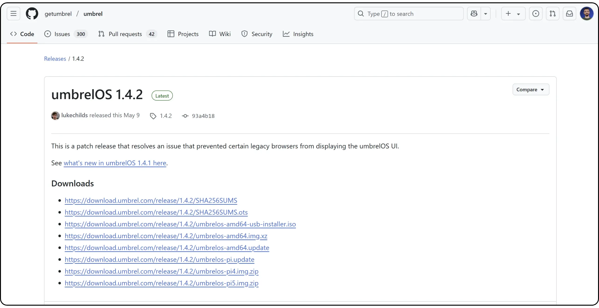


- Instalirajte Balena Etcher:


Da biste kreirali USB stik sa mogućnošću pokretanja, koristićete jednostavan alat koji radi na više platformi, pod nazivom [Balena Etcher](https://www.balena.io/etcher/). Preuzmite ga i instalirajte na vašem računaru.


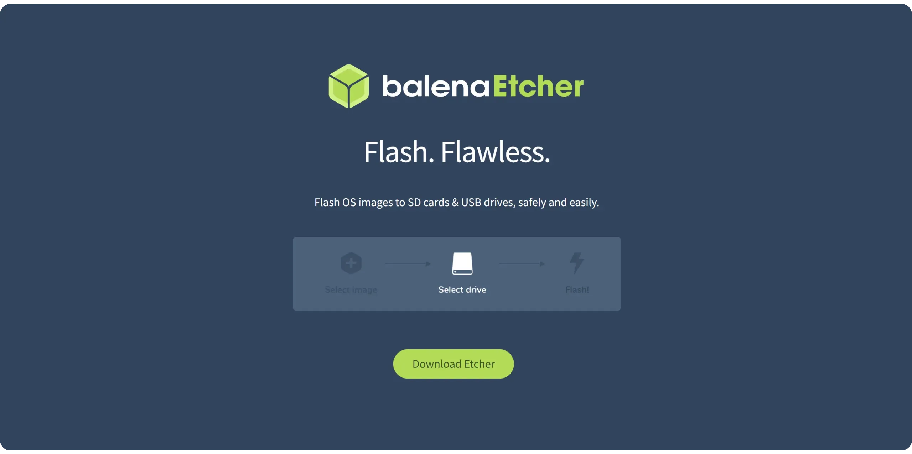


- Umetnite prazan USB ključ od najmanje 4 GB:


Priključite USB ključ u svoj računar (onaj na koji ste upravo preuzeli UmbrelOS i Balena Etcher sliku). **Upozorenje: svi podaci na ključu će biti obrisani**. Uverite se da ne sadrži važne fajlove.


- Narežite ISO sliku na USB stik pomoću Balena Etcher:


Pokrenite Balena Etcher i izaberite ISO datoteku `umbrelos-amd64-usb-installer.iso` koju ste upravo preuzeli klikom na dugme "*Flash from file*". Zatim, izaberite USB ključ kao ciljni uređaj i kliknite na "*Flash!*" da započnete pisanje.


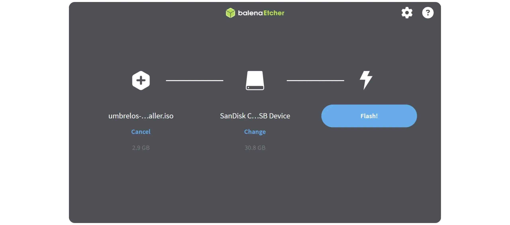


Kada je operacija završena, imaćete USB ključ sa kojeg se može pokrenuti UmbrelOS, spreman za pokretanje i instalaciju Umbrela na vašem računaru.


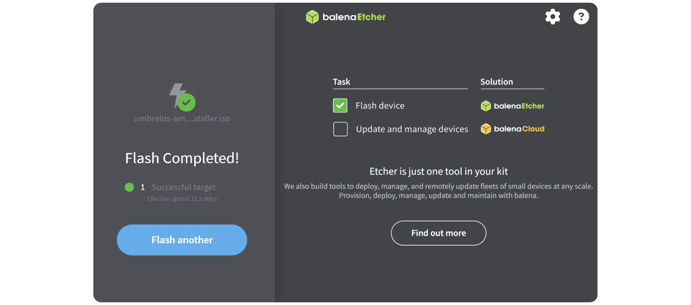


### Korak 3: Pokretanje računara sa USB ključa


Sada kada je vaš USB stik sa UmbrelOS-om spreman, možete pokrenuti računar sa njega kako biste započeli instalaciju sistema. Isključite USB ključ iz vašeg glavnog računara i umetnite ga u uređaj na koji želite instalirati Umbrel i vaš Bitcoin čvor.


Kao što je objašnjeno na početku ovog poglavlja, za dovršetak instalacije biće vam potreban uređaj za prikaz i uređaj za unos. Povežite uređaj za prikaz putem HDMI (ili drugog porta, u zavisnosti od vašeg računara) i povežite tastaturu putem USB-a sa vašom mašinom. Ovi uređaji su potrebni samo za instalaciju; neće vam biti potrebni kasnije, jer će se Umbrel pristupati daljinski sa drugog računara. Povežite ova dva uređaja sa vašim računarom.


**Savjet:** Ako kod kuće nemate periferni ekran, možete koristiti svoj TV. Sa svojim HDMI (ili drugim) ulazom, može se koristiti kao privremeni ekran dok instalirate operativni sistem.


Umbrel očigledno zahteva internet konekciju. Povežite RJ45 Ethernet kabl između vašeg uređaja i vašeg rutera.


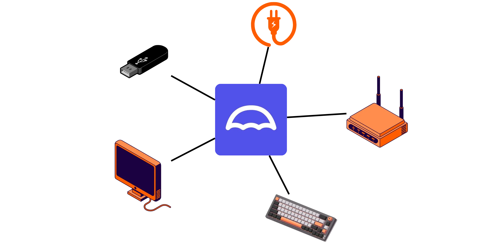


Uključite svoju mašinu. U većini slučajeva, ona bi automatski trebalo da detektuje USB ključ i pokrene se sa njega. Zatim će se pojaviti instalacioni ekran UmbrelOS Interface.


Ako se uređaj pokrene na drugom sistemu ili prikaže poruku o grešci, to verovatno znači da se ne pokreće automatski sa USB ključa. U tom slučaju, ponovo pokrenite uređaj i uđite u BIOS/UEFI podešavanja (obično se pristupa pritiskom na `DEL`, `F2`, `F12`, ili `ESC`, u zavisnosti od proizvođača računara). Zatim promenite redosled pokretanja kako biste dali prioritet USB ključu. Potom ponovo pokrenite uređaj da biste pokrenuli UmbrelOS.


### Korak 4: Instalirajte UmbrelOS na vaš računar


Kada se uređaj pokrene sa USB memorije, dočekaće vas instalacija Interface UmbrelOS-a. Ovaj korak podrazumeva instaliranje sistema direktno na interni Hard disk vaše mašine.


Ekran koji se pojavljuje prikazuje sve interne uređaje za skladištenje koje je računar detektovao. Svaki disk je praćen brojem, imenom i kapacitetom skladištenja. Pronađite disk na koji želite instalirati Umbrel. **Upozorenje: svi fajlovi na ovom disku će biti trajno obrisani.**


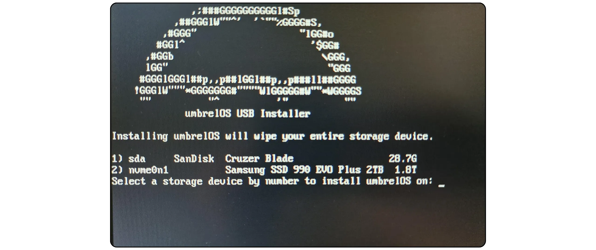


Jednom kada identifikujete ispravan disk (obično onaj sa najvećim kapacitetom, da smesti Blockchain), zabeležite broj koji mu je dodeljen. Na primer, ako se disk koji ste odabrali pojavljuje pod brojem `2`, jednostavno unesite `2`, zatim pritisnite taster `Enter` na tastaturi.


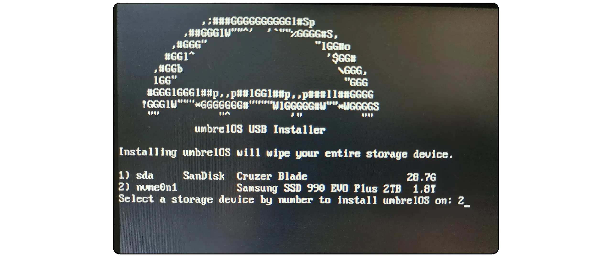


Program će formatirati izabrani disk, instalirati UmbrelOS i automatski konfigurisati sistem. Ovo može potrajati nekoliko minuta. Pustite proces da teče bez prekida.


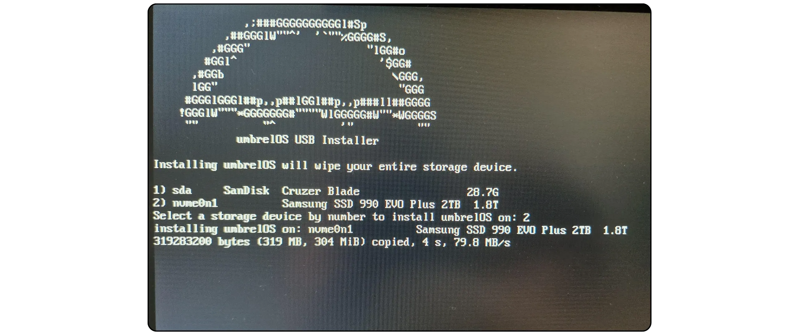


Kada je instalacija završena, bićete upitani da isključite uređaj. Pritisnite bilo koji taster da isključite računar.


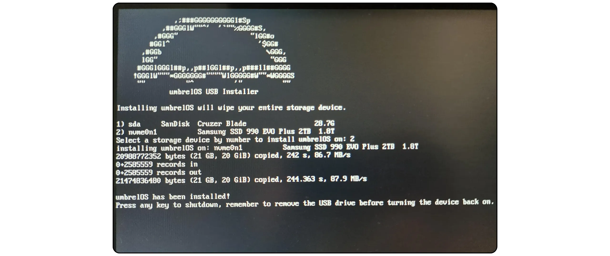


Sada možete ukloniti USB ključ, tastaturu i ekran, koji više nisu potrebni za vaš Umbrel. Sve što ostaje od vašeg čvora je napajanje Supply i RJ45 Ethernet kabl.


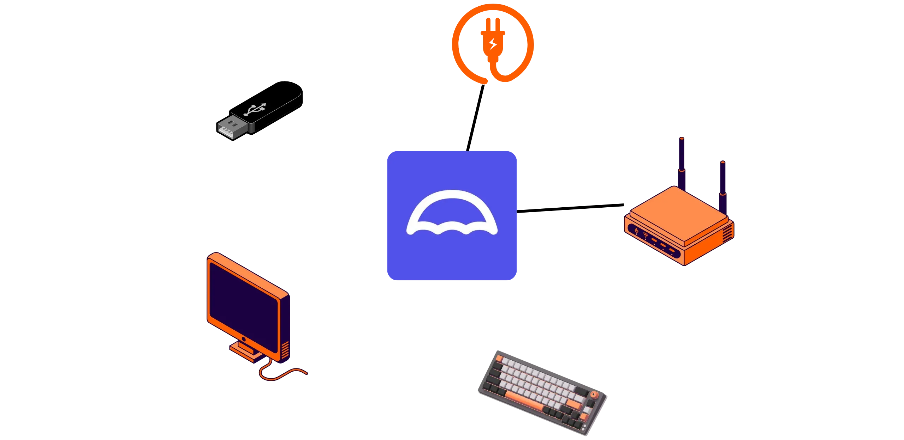


Pre nego što ponovo pokrenete uređaj, proverite sledeće dve tačke:


- USB ključ je isključen**: ako ostane povezan, sistem se može ponovo pokrenuti na njemu umesto na internom disku;
- Ethernet kabl je priključen**: uređaj mora biti povezan sa vašim ruterom da bi radio.


Pritisnite dugme za napajanje. Sistem se automatski pokreće sa internog diska gde je UmbrelOS instaliran. Prvo pokretanje može trajati približno **5 minuta**. Tokom ovog vremena, Umbrel inicijalizuje svoje servise i Interface.


Sa drugog računara (vaš svakodnevni PC) povezanog na **istu lokalnu mrežu**, otvorite web pregledač (Firefox, Chrome...) i idite na:


```
http://umbrel.local
```


Ovaj Address se koristi za pristup Umbrel Interface grafičkom korisničkom Interface na daljinu i započinjanje konfiguracije.


Ako Address `http://umbrel.local` ne radi na vašem pregledaču nakon čekanja od najmanje 5 minuta, jednostavno pokušajte:


```
http://umbrel
```


Ako ovo i dalje ne radi, unesite lokalnu IP adresu vašeg Umbrela Address direktno u pregledač. Na primer (zamenite `42` brojem vaše mašine koja hostuje Umbrel na lokalnoj mreži):


```
http://192.168.1.42
```


Da biste identifikovali IP adresu vašeg Umbrel-a Address, postoji nekoliko metoda, od najjednostavnijih do najnaprednijih:


- Pristupite administraciji rutera Interface i pronađite IP Address Umbrel uređaja na lokalnoj mreži.


- Koristite softver za skeniranje mreže kao što je Angry IP Scanner da biste otkrili povezane uređaje i locirali IP adresu vašeg Umbrela Address.


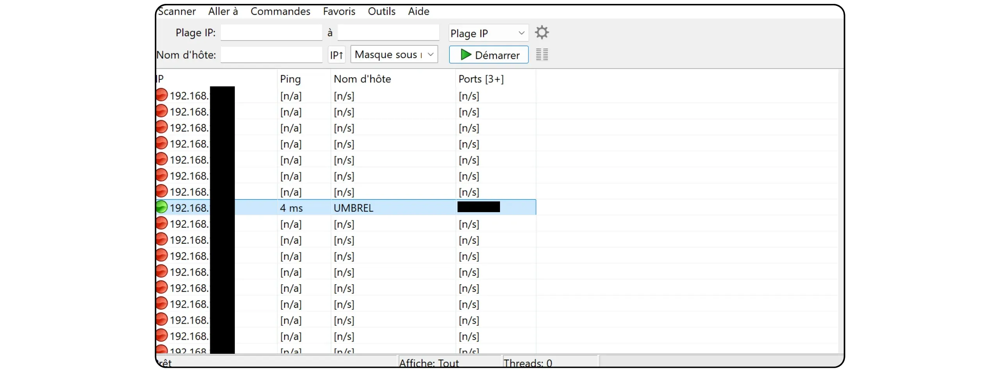


https://planb.network/tutorials/computer-security/communication/angry-ip-scanner-47f7c943-53b7-4098-b167-4cec8e747b5d


- Kao poslednje rešenje, ponovo povežite monitor i tastaturu na uređaj, prijavite se (podrazumevani login: `umbrel`, lozinka: `umbrel`), zatim unesite sledeću komandu:


```
hostname -I
```


Sada ste spremni da koristite Umbrel!


### Korak 5: Početak rada sa Umbrelom


Da biste započeli konfiguraciju svog Umbrela, kliknite na dugme "*Start*".


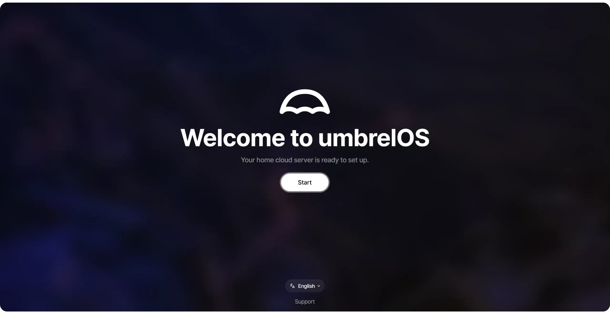


#### Kreiraj nalog


Izaberite pseudonim ili unesite svoje ime, zatim postavite jaku lozinku. Budite pažljivi: ova lozinka je jedina barijera koja štiti pristup vašem Umbrelu sa vaše mreže (i stoga, potencijalno, vašim bitcoinima ako pokrećete Lightning čvor na Umbrelu). Takođe štiti daljinski pristup putem Tor-a ili VPN-a, ako su ove usluge omogućene.


Izaberite jaku lozinku i obavezno sačuvajte barem jednu rezervnu kopiju (preporučuje se menadžer lozinki).


https://planb.network/tutorials/computer-security/authentication/bitwarden-0532f569-fb00-4fad-acba-2fcb1bf05de9

https://planb.network/tutorials/computer-security/authentication/keepass-f8073bb7-5b4a-4664-9246-228e307be246

Kada unesete svoju lozinku, kliknite na dugme "*Create*".


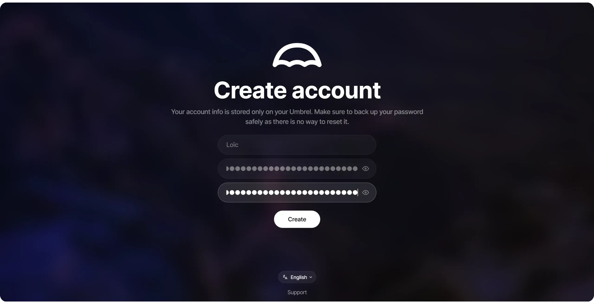


Vaša Umbrel konfiguracija je sada završena.


#### Otkrivanje Interface


Umbrelov Interface je prilično intuitivan:


- Na početnoj stranici možete videti vaše instalirane aplikacije i widgete.


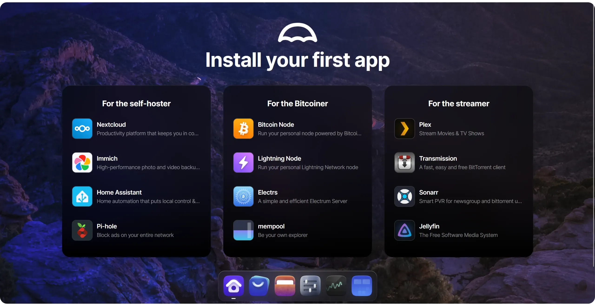


- "*App Store*" vam omogućava instaliranje novih aplikacija,


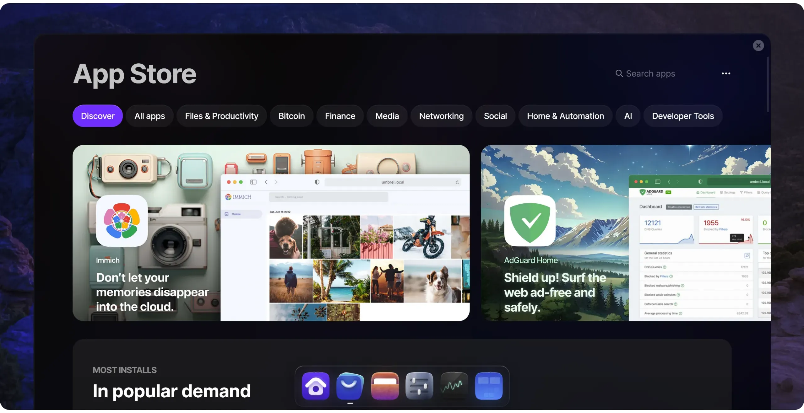


- Meni "*Files*" centralizuje sve dokumente pohranjene na vašem Umbrelu.


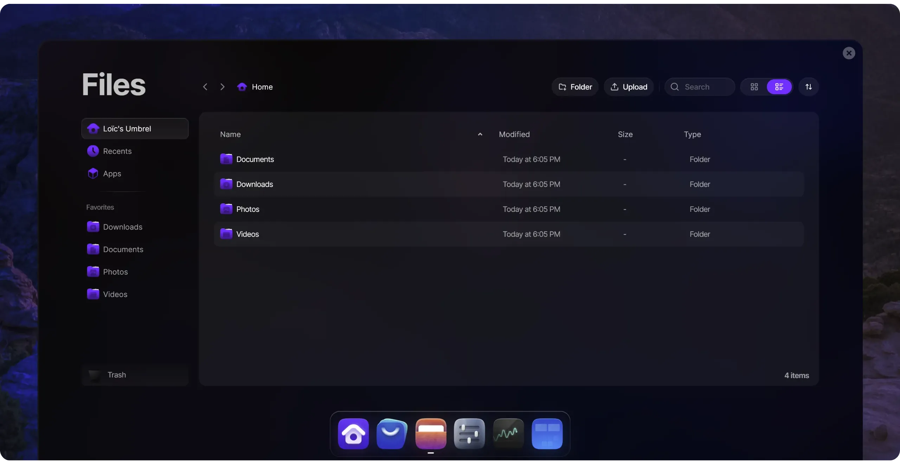


- Meni "*Settings*" vam omogućava da izmenite postavke vašeg Umbrela i pristupite njegovim informacijama, uključujući:
    - Ažuriraj, ponovo pokreni ili zaustavi svoju mašinu;
    - Proverite dostupni prostor za skladištenje, korišćenje RAM-a i temperaturu procesora;
    - Promeni pozadinu;
    - Upravljajte daljinskim pristupom putem Tor-a, aktivirajte Wi-Fi ili 2FA.


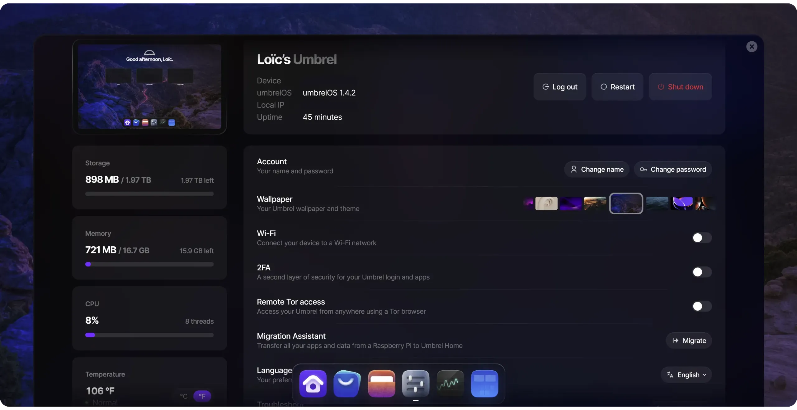


#### Bezbednosna i podešavanja veze


Prvo i najvažnije, toplo preporučujem omogućavanje dvofaktorske autentifikacije (2FA). Ovo dodaje dodatni Layer sigurnosti vašoj lozinki. Gotovo je neophodno ako planirate koristiti svoj Umbrel za čuvanje ličnih fajlova, pokretanje Lightning čvora ili obavljanje bilo koje druge osetljive aktivnosti.


https://planb.network/tutorials/computer-security/authentication/authy-a76ab26b-71b0-473c-aa7c-c49153705eb7

Da biste to uradili, kliknite na odgovarajuće polje u podešavanjima.


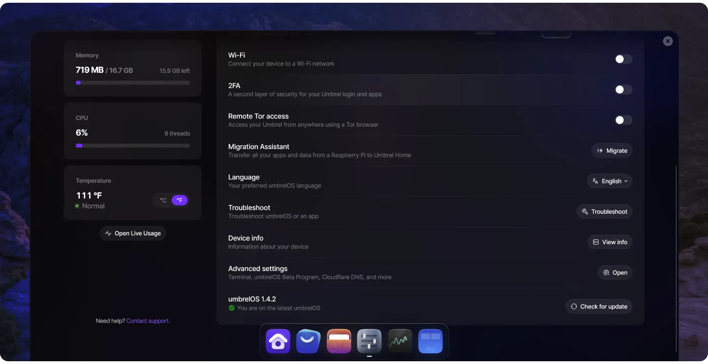


Zatim skenirajte prikazani QR kod koristeći vašu aplikaciju za autentifikaciju. Zatim unesite 6-cifreni dinamički kod u predviđeno polje na vašem Umbrel-u.


Od sada će svaka nova veza na vaš Umbrel zahtevati i lozinku i 6-cifreni kod generisan od strane vaše aplikacije za dvofaktorsku autentifikaciju (2FA).


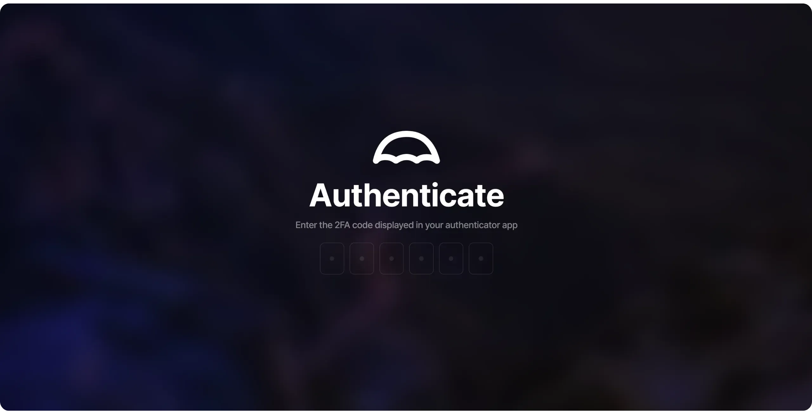


Što se tiče daljinskog pristupa putem Tor-a, ako vam nije potreban, preporučujem da ovu opciju ostavite onemogućenju kako biste ograničili površinu napada na vaš Umbrel. Podrazumevano, vaš čvor može biti pristupljen samo sa mašine povezane na istu lokalnu mrežu. Omogućavanje pristupa putem Tor-a će vam ipak omogućiti da upravljate vašim Umbrel-om u pokretu.


Ako omogućite ovu funkciju, teoretski postaje moguće da bilo koja mašina na svetu pokuša da se poveže sa vašim čvorom, pod uslovom da zna Tor Address. Međutim, vaša lozinka i 2FA će vas i dalje štititi.


Ako aktivirate ovu opciju, osigurajte da imate omogućenu dvofaktorsku autentifikaciju (2FA), jaku lozinku i nikada ne otkrivajte vašu Tor vezu Address.


Jednostavno unesite ovaj Tor Address u vaš Tor pregledač da biste pristupili Umbrelovom Interface sa bilo koje mreže.


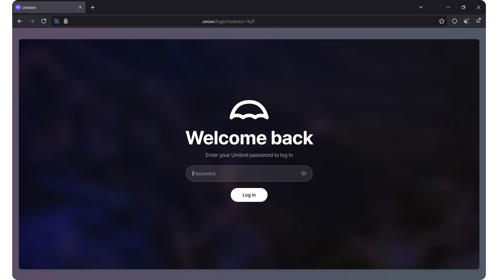


Konačno, na ovoj stranici sa podešavanjima, možete takođe aktivirati Wi-Fi konekciju. Ako vaša mašina koja hostuje Umbrel ima Wi-Fi mrežnu karticu ili Wi-Fi dongle, ovo vam omogućava pristup Internetu bez korišćenja RJ45 kabla. Međutim, u zavisnosti od vaše konfiguracije, ovo rešenje može usporiti konekciju, što može uticati na inicijalnu sinhronizaciju (IBD) i buduće korišćenje čvora (npr. za Lightning transakcije). Lično, ne preporučujem ovu opciju, jer čvor nije namenjen za mobilnu upotrebu: uvek mu se pristupa na daljinu, pa ga možete ostaviti priključenim.


### Korak 6: Instalirajte Bitcoin čvor na Umbrel


Sada kada je UmbrelOS ispravno instaliran i konfigurisan na vašem uređaju, možete nastaviti sa instalacijom vašeg Bitcoin čvora. Ništa lakše: idite u App Store, otvorite kategoriju "*Bitcoin*", zatim izaberite aplikaciju "*Bitcoin Node*" (zapravo je Bitcoin core).


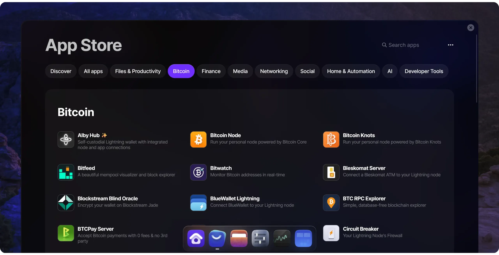


Zatim kliknite na dugme "*Install*".


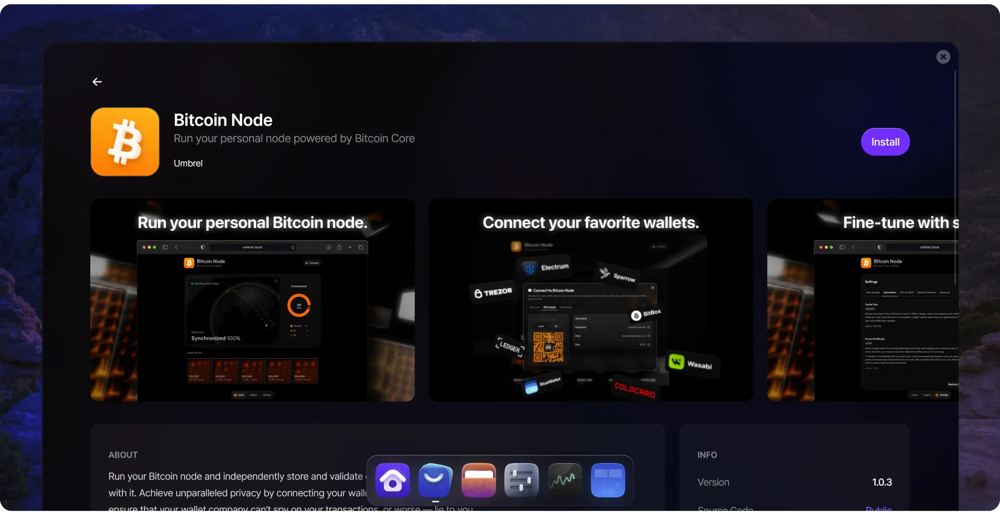


Kada je instalacija završena, vaš Bitcoin čvor će pokrenuti svoj IBD (*Initial Block Download*): preuzeće i validirati sve transakcije i blokove od kada je Bitcoin kreiran 2009. godine.


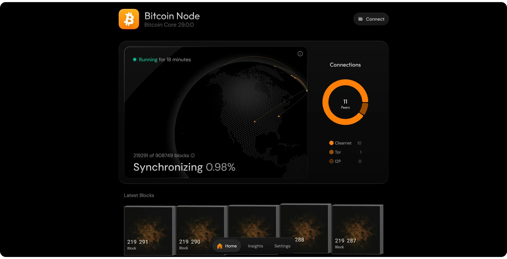


Ova faza je posebno vremenski zahtevna, jer njeno trajanje zavisi od nekoliko faktora, uključujući količinu RAM-a dodeljenog kešu čvora, brzinu diska, brzinu internet konekcije i snagu procesora. Opseg trajanja je stoga veoma širok, u zavisnosti od konfiguracije. Sa visokoperformansnim računarom (NVMe SSD, +32 GB RAM, snažan procesor i dobra internet konekcija), IBD se može završiti za oko deset sati. S druge strane, stari procesor, mala količina RAM-a ili, još gore, mehanički Hard disk (strogo se ne preporučuje) mogu produžiti ovu operaciju na nekoliko nedelja.


Sa PC-jem normalne konfiguracije (pristojan procesor, 8 do 16 GB RAM-a i SSD), omogućava oko 2 do 7 dana.


Da biste malo ubrzali IBD, možete povećati RAM dodeljen kešu čvora (koji se prvenstveno koristi za UTXO set, koji ćemo kasnije ponovo razmotriti na kursu) putem `dbcache` parametra. Na Umbrel-u, ova izmena se vrši u parametrima vašeg čvora, u kartici "*Optimization*".


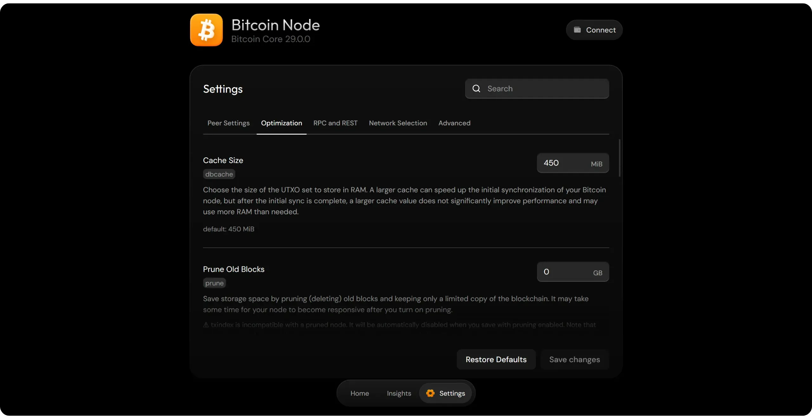


Podrazumevano, vrednost parametra `dbcache` u Bitcoin core je postavljena na 450 MiB, ili oko 472 MB. Povećanjem ove vrednosti, možete blago ubrzati IBD. Međutim, ne bih nužno preporučio da ovaj parametar postavite previše visoko: čak i postavljanje na 4 GiB će samo učiniti sinhronizaciju oko 10% bržom, i može uzrokovati gubitak vremena u slučaju prekida tokom IBD.


Budite oprezni da ne dodelite vrednost koja je prevelika za vašu mašinu. Ako RAM dostupan za UmbrelOS ponestane, vaš čvor može naglo prestati sa radom, prekidajući IBD i zahtevajući da ga ručno ponovo pokrenete, što može rezultirati značajnim gubitkom vremena.


Da biste saznali više o uticaju parametra `dbcache` na početnu sinhronizaciju, preporučujem ovu analizu Jamesona Loppa: [*Effects of DBcache Size on Bitcoin Node Sync Speed*](https://blog.lopp.net/effects-dbcache-size-Bitcoin-node-sync-speed/)


Kada je IBD vašeg čvora završen (100% sinhronizacija), sada imate potpuno operativan Bitcoin čvor. Čestitamo, sada ste integralni deo Bitcoin mreže!


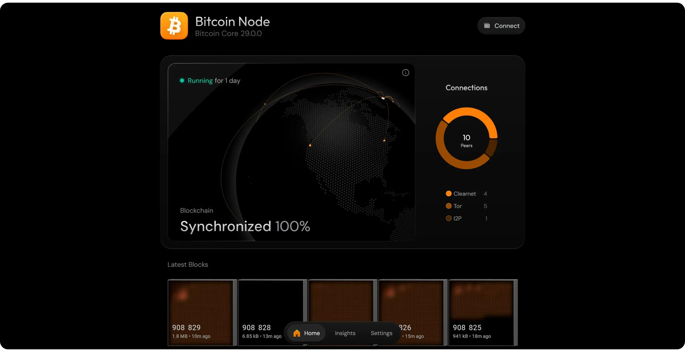


U sledećem delu, istražićemo praktičnu upotrebu vašeg novog čvora: kako povezati vaš Wallet sa njim i koje aplikacije treba da instalirate da biste postali suvereni Bitcoiner.


# Povezivanje vašeg Wallet sa vašim čvorom


<partId>418d0afd-3a61-4b5a-9db4-203c0335fd29</partId>


## Indekseri: uloga, rad i rešenja


<chapterId>4f93c07a-f0cb-435f-8b68-162f316d7039</chapterId>


Ako ste već istraživali Bitcoin čvorove pre nego što ste pohađali ovaj kurs, možda ste naišli na termin "indekser". To su alati kao što su Electrs ili Fulcrum, koji se mogu dodati na Bitcoin core čvor. Ali koja je tačno njihova uloga? Kako funkcionišu u praksi? I da li bi trebalo da instalirate jedan na vaš novi Bitcoin čvor? To je ono što ćemo istražiti u ovom poglavlju.


### Šta je indeksator?


Generalno govoreći, indeksator je program koji skenira skup sirovih podataka, izdvaja relevantne ključeve (kao što su reči, identifikatori i adrese), i gradi pomoćnu datoteku, nazvanu "indeks", gde se svaki ključ odnosi na tačnu lokaciju podataka u korpusu. Ova faza predobrade koristi CPU vreme i zahteva određeni prostor na disku, ali eliminiše potrebu za obradom celog korpusa svaki put kada se baza podataka pretražuje; jednostavno ispitivanje indeksa daje gotovo trenutni odgovor.


U laičkim terminima, to je isti princip kao indeks u knjizi: ako tražite određenu informaciju, umesto da ponovo čitate celu knjigu, konsultujete indeks da direktno pronađete stranicu na kojoj se pojavljuje informacija koju tražite.


U Bitcoin čvoru, kao što su Bitcoin core, Blockchain podaci se čuvaju u svom sirovom, hronološkom obliku. Svaki blok sadrži transakcije, koje zauzvrat sadrže ulaze i izlaze, bez ikakve posebne klasifikacije po Address, identifikatoru, ili Wallet. Ova linearna organizacija je optimizovana za validaciju blokova, ali nije pogodna za ciljane pretrage. Na primer, ako želite pronaći sve transakcije povezane sa određenim Address u neindeksiranom čvoru, morali biste ručno pregledati ceo Blockchain, blok po blok i transakciju po transakciju. Upravo tu dolazi indeksator na vašem Bitcoin čvoru.


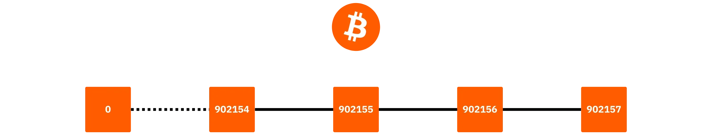


Indekser je specijalizovani softverski program koji analizira ovu masu sirovih podataka (Blockchain, Mempool, UTXO set) i izvlači ključeve, kao što su identifikatori transakcija, adrese i visine blokova. Iz ovih ključeva, on gradi svoj indeks, povezujući svaki ključ sa tačnom lokacijom informacija u skladištu čvora.


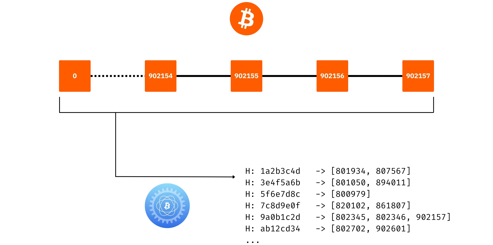


Indeksiranje vam omogućava da brzo, precizno i efikasno pretražujete informacije na vašem čvoru. Na primer, kada povežete Wallet kao što je Sparrow sa vašim čvorom, može gotovo trenutno prikazati stanje Address. Konkretno, postavlja upit indeksatoru sa zahtevom kao što je: "_Koji UTXO-i su povezani sa ovim skriptom-Hash?_" Indeksator odgovara gotovo odmah, bez potrebe da ponovo čita ceo Blockchain, jer su ovi podaci već navedeni u njegovoj bazi podataka.


### Da li Bitcoin core ima indeksator?


Bez potrebe za dodatnim softverom, Bitcoin core, strogo govoreći, ne nudi kompletan Address indeksator uporediv sa onima koji se nalaze u softverima kao što su Electrs ili Fulcrum. Ipak, on uključuje nekoliko internih mehanizama za indeksiranje, kao i opcione opcije za proširenje svojih mogućnosti upita. Da bismo u potpunosti razumeli situaciju, potrebno je da napravimo zaobilaznicu u istoriju projekta.


Do verzije Bitcoin core 0.8.0, validacija transakcija se zasnivala na globalnom indeksu transakcija, poznatom kao `txindex`. Ovaj indeks je referencirao sve Blockchain transakcije i njihove izlaze. Kada bi čvor primio novu transakciju, konsultovao bi ovaj indeks da verifikuje da li konzumirani izlazi (u ulazima) zaista postoje i da nisu već potrošeni. `txindex` je stoga bio neophodan za validaciju transakcija u to vreme.


Međutim, ovaj pristup imao je svoja ograničenja: bio je spor, skup u pogledu skladištenja i suvišan u pogledu informacija. Da bi se to rešilo, verzija 0.8.0 uvodi prepravku modela validacije pod nazivom ***Ultraprune***. Umesto da skladišti sve u obliku indeksa transakcija, Bitcoin core održava jednostavnu bazu podataka posvećenu isključivo UTXO-ima, nazvanu `chainstate` (u svakodnevnom jeziku, ovo je poznato kao "UTXO set"), i ažurira svoju listu kako se izlazi troše i kreiraju.


Ova metoda je mnogo brža i čuva samo trenutno stanje registra, čineći `txindex` indeksator nepotrebnim. Međutim, umesto brisanja `txindex` koda, programeri su odlučili da zadrže ovu funkcionalnost iza jednostavnog parametra (`txindex=1`). Omogućavanjem ove opcije na vašem čvoru, možete upitati bilo koju transakciju iz njenog `txid`.


Suprotno uvreženom mišljenju, Bitcoin core ne nudi indeksiranje zasnovano na Address kao što to čine Electrs ili Fulcrum. Postoji nekoliko razloga za ovaj izbor:


- Uloga Bitcoin core nije da postane potpuni Block explorer, niti da obezbedi API prilagođen svakoj upotrebi. Integrisanje indeksa zasnovanog na Address podrazumevalo bi dugoročnu održavanje Commitment koja prevazilazi početni opseg softvera.


- Većina slučajeva upotrebe može se već pokriti na druge načine. Na primer, da biste procenili saldo Address, možete koristiti komandu `scantxoutset`, koja direktno ispituje skup UTXO bez potrebe za punim indeksom.


- Svaki softverski program ima specifične zahteve u vezi sa formatom ili tipom podataka koji treba indeksirati (Address, Hash skripta, vlasnički tag, itd.). Fleksibilnije je i logičnije dozvoliti tim programima da izgrade sopstvene prilagođene indekse nego primeniti generičko rešenje u Bitcoin core.


Bitcoin core ima opcioni indeksator transakcija (`txindex`), ostatak iz njegove istorijske operacije, ali ne pruža Address indeks, niti direktan Interface za složene pretrage. U nekim slučajevima, stoga, može biti korisno dodati eksterni indeksator.


### Da li treba da dodate Address indeksator na vaš čvor?


Dodavanje Address indeksatora, kao što su Electrs ili Fulcrum, nije obavezno; zavisi od vaših specifičnih potreba.


Ako jednostavno želite da povežete Wallet, kao što je Sparrow, sa svojim čvorom da biste pregledali stanja i emitovali transakcije, ovo je potpuno moguće direktno putem Bitcoin core's Interface RPC, bilo lokalno ili na daljinu putem Tor-a.


S druge strane, za korišćenje naprednijeg softvera, kao što je pokretanje Mempool.Lokalno, instalacija Address indeksatora postaje neophodna za prostor Block explorer.


Indekser zahteva određeno vreme za sinhronizaciju (manje od IBD) i zauzeće dodatni prostor na disku. Ako vaš SSD i dalje ima dovoljno slobodnog prostora nakon preuzimanja Blockchain, možete lako dodati indekser.


### Koji indeksator odabrati?


Dva softverska programa se obično koriste za izradu ove vrste Address indeksa i omogućavanje pristupa: **Electrs** i **Fulcrum**. Ovi alati indeksiraju Blockchain prema script-Hash (adresama) i zatim predlažu standardizovani Interface (Electrum protokol), na koji se povezuje mnoštvo novčanika, kao što su Electrum Wallet, Sparrow, ili Phoenix.


Jednostavno rečeno, Electrs je prilično kompaktan: indeksira Blockchain brže i zauzima manje prostora na disku, ali ima nešto slabije performanse u upitima u poređenju sa Fulcrumom. Nasuprot tome, Fulcrum troši više prostora na disku i duže traje indeksiranje, ali nudi superiorne performanse upita.


Za individualnu upotrebu, preporučujem Electrs: zauzima manje prostora, dobro je održavan, i, iako je malo sporiji kod određenih zahteva u poređenju sa Fulcrumom, i dalje je više nego dovoljan za svakodnevnu upotrebu. Ako imate vremena i prostora na disku, možete isprobati i Fulcrum, koji će raditi značajno bolje, posebno na novčanicima sa brojnim adresama za verifikaciju.


U konkretnim terminima, u avgustu 2025. godine, Electrs će zahtevati približno 56 GB skladišta, u poređenju sa približno 178 GB za Fulcrum. Vaš izbor indeksatora, dakle, takođe zavisi od vašeg kapaciteta skladišta:


- Ako vam je prostor na disku veoma ograničen, moraćete da se snađete sa Bitcoin core bez spoljnog Address indeksatora.
- Ako želite da koristite indeksator, ali ste i dalje ograničeni kapacitetom, odlučite se za Electrs.
- Ako imate dovoljno prostora na disku, Fulcrum može biti upravo ono što tražite.


Za ostatak ovog BTC 202 kursa, koristiću Electrs, ali možete lako pratiti sa Fulcrum: procedura instalacije je identična, kao i Interface konekcija na Wallet, pošto oba izlažu Electrum server.


### Kako da instaliram indeksator na Umbrel?


Da biste instalirali Electrs (ili Fulcrum) na vaš Umbrel, postupak je jednostavan: idite u App Store, potražite odgovarajuću aplikaciju (nalazi se na kartici Bitcoin), a zatim kliknite na dugme "*Install*".


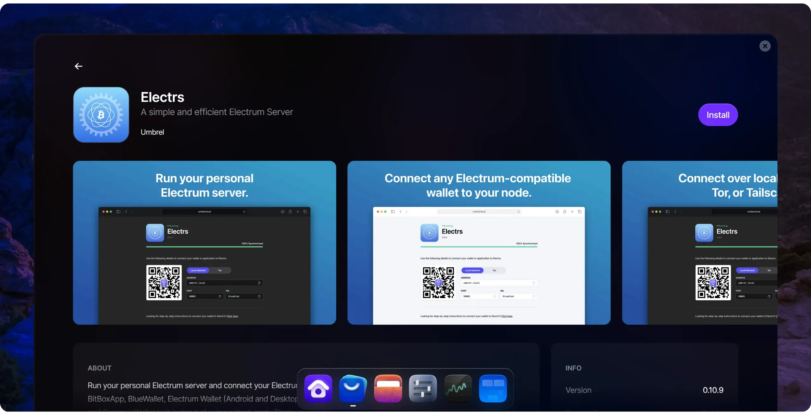


Kada je instalacija završena, Electrs će nastaviti sa fazom sinhronizacije (indeksiranja), koja može potrajati nekoliko sati.


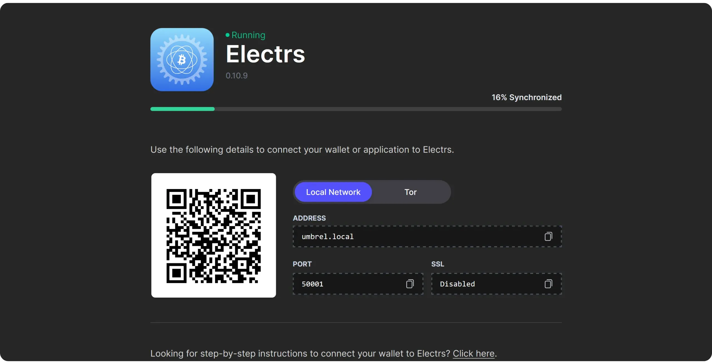


Kada je sinhronizacija završena, možete povezati svoj Wallet softver sa vašim Electrum serverom, koji je hostovan na Umbrel.


## Kako da povežem svoj Wallet sa svojim Bitcoin čvorom?


<chapterId>35519b1a-f681-4a69-a652-9fbe510cd17f</chapterId>


Sada kada imate kompletan Bitcoin čvor, vreme je da ga iskoristite na pravi način! U sledećem poglavlju, istražićemo druge potencijalne upotrebe za vašu Umbrel instancu. Međutim, počnimo sa osnovama: povezivanje vašeg Wallet softvera kako biste koristili informacije sa vašeg sopstvenog Blockchain i distribuirali transakcije kroz vaš sopstveni čvor.


Kao što je gore pomenuto, postoje dva glavna interfejsa za povezivanje:


- Direktna veza sa Bitcoin core preko RPC;
- Ili se povežite sa Electrum serverom (Electrs ili Fulcrum).


U ovom vodiču, fokusiraćemo se na povezivanje sa vašim čvorom putem Tor-a, jer je ovo jednostavno i sigurno rešenje za početnike. Snažno savetujem protiv izlaganja RPC porta vašeg čvora u otvorenom obliku, jer pogrešna konfiguracija predstavlja značajan rizik za sigurnost i poverljivost vaših podataka. Glavni nedostatak komunikacije putem Tor-a je njegova sporost. U sledećem poglavlju, istražićemo brzu i sigurnu alternativu za Tor za daljinski pristup vašem čvoru: VPN.


Koristićemo Sparrow kao primer u ovom poglavlju, ali procedura je ista za sav ostali Wallet softver za upravljanje koji prihvata veze sa Electrum serverima. Jednostavno pronađite odgovarajuće podešavanje u parametrima vaše aplikacije (obično u "*Server*", "*Network*", "*Node*"...).


Na Sparrow, otvorite karticu "*File*" i idite na meni "Settings".


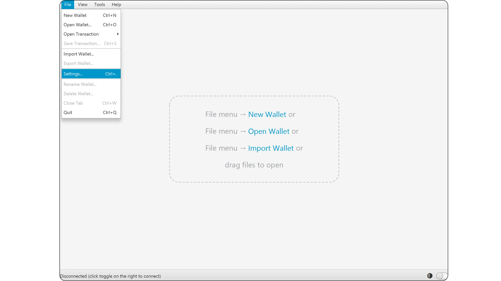


Zatim kliknite na "*Server*" da pristupite parametrima veze.


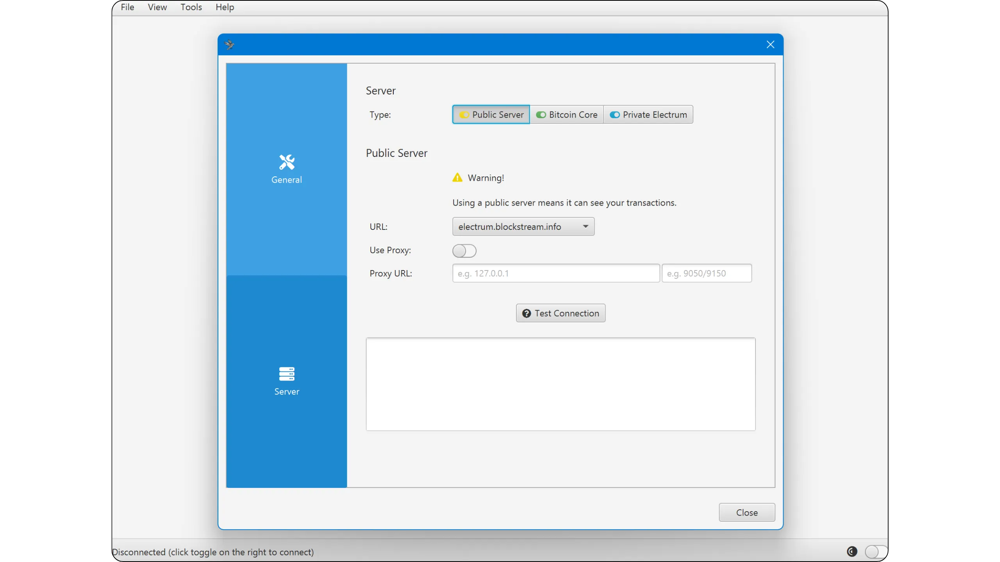


Zatim ćete otkriti tri opcije za povezivanje vašeg softvera sa Bitcoin čvorom:


- Javni Server* (žuto): po podrazumevanoj postavci, ako ne posedujete Bitcoin čvor, ova opcija vas povezuje sa javnim čvorom koji ne posedujete (obično kompanijskim). Ova opcija nije relevantna ovde, jer imate svoj čvor na Umbrel.
- Bitcoin core* (Green): ova opcija odgovara povezivanju putem Interface RPC, tj. direktno na Bitcoin core.
- Privatni Electrum* (plavo): ova opcija vam omogućava povezivanje putem vašeg indekserskog Interface Electrum Servera (Electrs ili Fulcrum).


### Povezivanje sa Bitcoin core RPC


Ako vaš Umbrel čvor nema indeksator, ovo je opcija koju treba da odaberete. Na Sparrow, kliknite na "*Bitcoin core*".


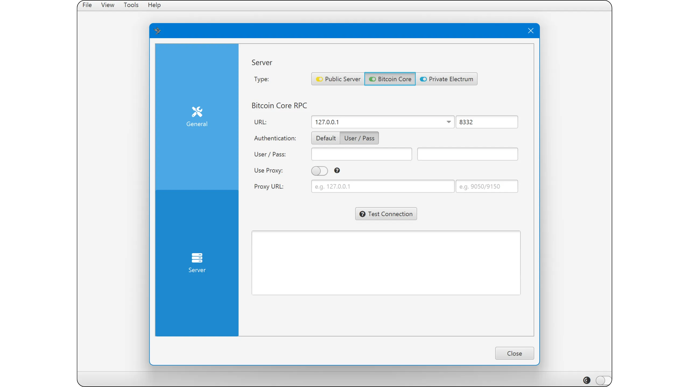


Trebaće da unesete nekoliko informacija kako biste uspostavili vezu sa vašim čvorom. Svi ovi podaci mogu se pristupiti iz aplikacije "*Bitcoin Node*" na Umbrel-u klikom na dugme "*Connect*" u gornjem desnom uglu Interface.


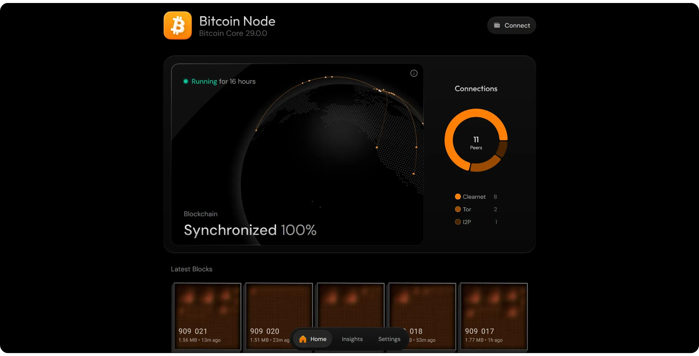


Kartica "*RPC Details*" prikazuje sve potrebne informacije za povezivanje. Izaberite povezivanje putem Tor Address (u `.onion`).


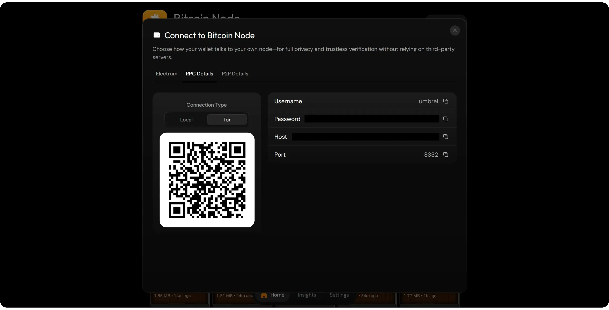


Unesite ove podatke u odgovarajuća polja na Sparrow wallet, zatim kliknite na dugme "*Test Connection*".


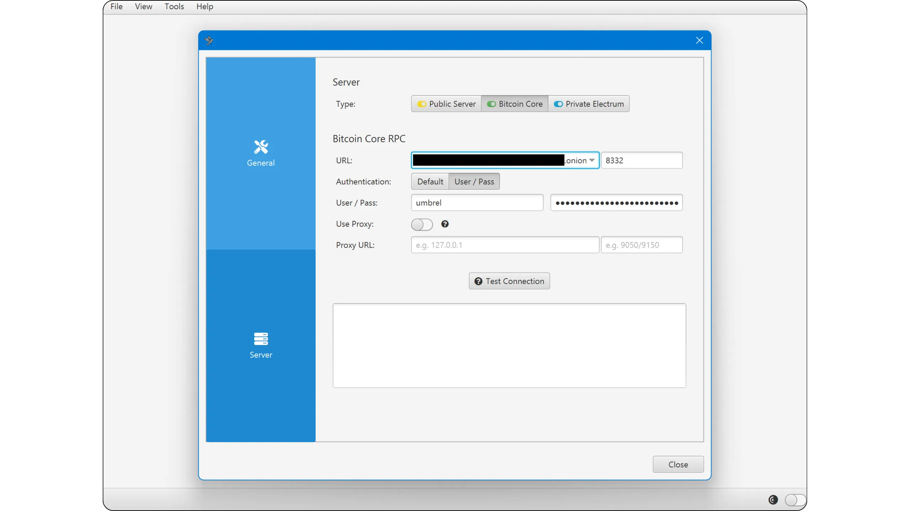


Ako je veza uspešna, pojaviće se oznaka Green i poruka o potvrdi.


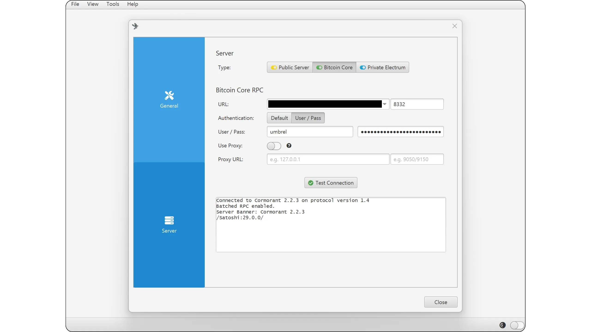


Oznaka na dnu desno Interface Sparrow wallet sada će biti Green (označavajući direktnu vezu sa Bitcoin core).


**Napomena:** Da bi veza bila uspešna, vaš čvor mora biti 100% sinhronizovan. Ako to nije slučaj, molimo vas da sačekate do kraja IBD-a.


### Poveži se sa Electrs


Ako vaš čvor ima indeksator, bolje je povezati se s njim nego koristiti Bitcoin core direktno, jer će vaši upiti biti obrađeni brže.


Na Sparrow, idite na karticu "*Private Electrum*".


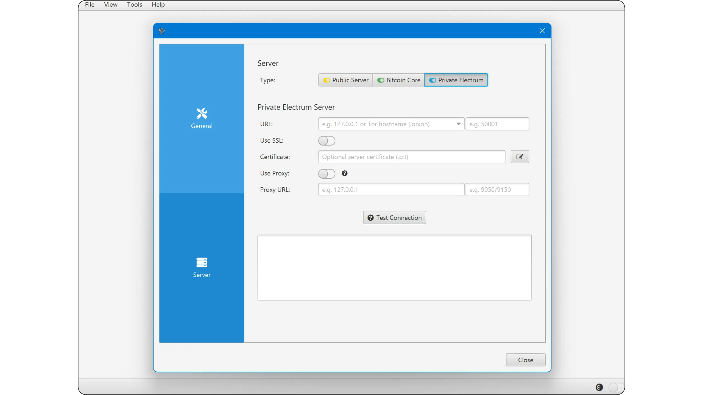


Zatim ćete morati uneti nekoliko informacija kako biste uspostavili vezu sa vašim indeksatorom. Ove podatke ćete pronaći u aplikaciji "*Electrs*" (ili, gde je primenljivo, "*Fulcrum*") na Umbrel-u.


Odaberite karticu "*Tor*" da biste dobili `.onion` vezu Address. Ako želite da povežete mobilni softver Wallet, možete direktno skenirati QR kod.


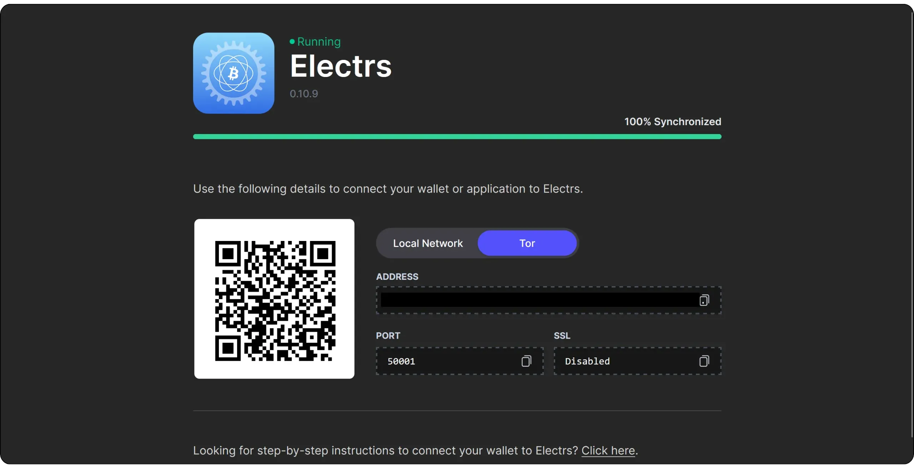


Jednostavno unesite Tor Address vašeg Electrum servera u polje "*URL*", zatim kliknite na dugme "*Test Connection*".


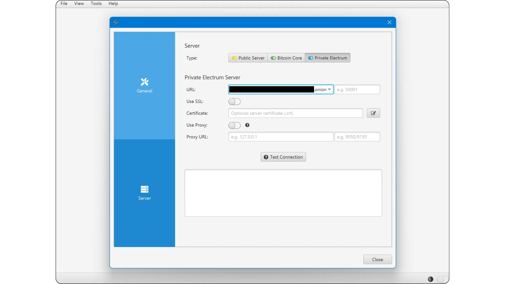


Ako je veza uspešna, biće prikazana oznaka za potvrdu i poruka o potvrdi.


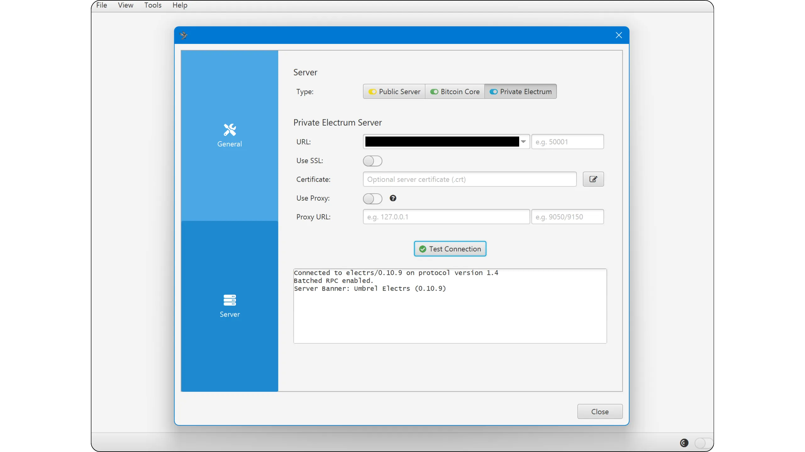


Oznaka u donjem desnom uglu Interface Sparrow wallet će postati plava (boja povezana sa povezivanjem na Electrum server).


**Napomena:** Da bi veza funkcionisala, vaš indeksator mora biti 100% sinhronizovan. Ako to nije slučaj, sačekajte da se proces indeksiranja završi.


Sada znate kako da povežete svoj Wallet sa svojim Bitcoin čvorom! U sledećem poglavlju, predstaviću vam nekoliko dodatnih aplikacija dostupnih na Umbrel-u koje su mi posebno drage, a koje će vam omogućiti da unapredite svakodnevno korišćenje Bitcoin preko vašeg čvora.


## Pregled dostupnih aplikacija


<chapterId>2a5ccfbe-0b17-44c9-863c-b7e8cb4b4594</chapterId>


Umbrel nudi opsežnu prodavnicu aplikacija. Kao što ćete videti, postoji mnogo alata povezanih sa Bitcoin, ali i širok spektar aplikacija u veoma različitim oblastima: rešenja za samostalno hostovanje usluga i fajlova, aplikacije za produktivnost, opštiji finansijski alati, upravljanje medijima, bezbednost i administracija mreže, razvoj, veštačka inteligencija, društvene mreže, pa čak i automatizacija doma.


U ovom kursu BTC 202, fokusiraćemo se isključivo na aplikacije povezane sa Bitcoin. Međutim, slobodno istražite ostatak kataloga za alate koji vam mogu biti od koristi.


Naravno, bilo bi nemoguće navesti sve Bitcoin aplikacije ovde. U ovom poglavlju, želeo bih da vas upoznam sa osnovnim alatima koji će olakšati i obogatiti vašu svakodnevnu upotrebu Bitcoin.


### Mempool.space


U svakodnevnoj upotrebi Bitcoin, ako postoji jedan alat koji je zaista nezamenljiv, to je Block explorer. Bilo da je dostupan online ili instaliran lokalno, on transformiše sirove podatke Blockchain u strukturiran, jasan i lako čitljiv format. Takođe poseduje pretraživač koji omogućava korisnicima da brzo pronađu određeni blok, transakciju ili Address.


U konkretnim terminima, istraživač vam omogućava da procenite naknade potrebne za uključivanje vaše transakcije u blok, zatim pratite njen napredak: saznajte da li će verovatno biti uključena u bliskoj budućnosti, u zavisnosti od tržišta naknada, i konačno potvrdite da je zaista uključena u blok. Takođe nudi mogućnost analize vaših prošlih transakcija i konsultovanja njihove istorije. Ukratko, to je švajcarski nož za bitkoinere.


Kao što je ranije pomenuto, explorer može biti hostovan online na vebsajtu ili pokrenut lokalno na vašem računaru. Glavni nedostatak online usluga je što mogu ugroziti vašu privatnost. Bez VPN-a ili Tor-a, server koji hostuje explorer može povezati vaš IP Address sa transakcijama koje pregledate, što može pružiti idealnu ulaznu tačku za analizu lanca.


https://planb.network/courses/65c138b0-4161-4958-bbe3-c12916bc959c

Štaviše, vaš Internet provajder (ISP) može znati da pregledate određenu transakciju putem Block explorer sajta. Ovo takođe postavlja pitanje poverenja: morate se osloniti na onlajn servis da vam pruži tačne informacije o vašim transakcijama, bez mogućnosti da sami proverite njihovu istinitost.


Zato je uvek najbolje koristiti svoj lokalni Block explorer. Na ovaj način, nijedan podatak vezan za vašu pretragu neće procuriti, jer se svi upiti obrađuju direktno na mašini koju kontrolišete, bez prolaska kroz Internet. Štaviše, lokalni istraživač se oslanja na podatke sa vašeg sopstvenog Bitcoin čvora, koji ste sami validirali, prema sopstvenim pravilima, i kojem možete verovati.


Umbrel nudi nekoliko istraživača blokova:


- Mempool.Space
- Bitfeed
- BTC RPC Explorer


Posebno mi se sviđa Mempool.Space, koji sam instalirao na svom čvoru. Imajte na umu: za korišćenje većine blok istraživača na Umbrel-u, potreban je Address indeksator. Stoga vam je potrebna aplikacija Bitcoin Node (ili Bitcoin Knots), koja ima 100% sinhronizovan Blockchain, kao i indeksator kao što su Electrs ili Fulcrum, koji je takođe 100% sinhronizovan.


Jednom kada je aplikacija instalirana, jednostavno je otvorite da biste pristupili svom istraživaču.


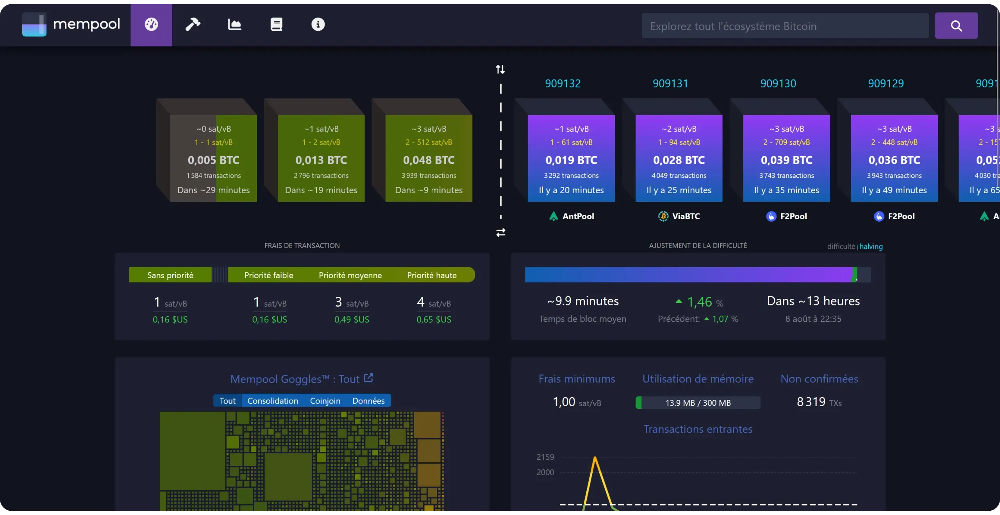


Da biste saznali više o korišćenju Mempool.Space explorer, preporučujem ovaj sveobuhvatan vodič:


https://planb.network/tutorials/privacy/analysis/mempool-space-f3e468a1-92f1-43ce-b2e4-c3298fa0e02f

### Lightning Node


Sada kada imate svoj Bitcoin čvor, možete postaviti i svoj Lightning čvor za obavljanje off-chain transakcija, bez oslanjanja na infrastrukturu treće strane.


Umbrel nudi brojne aplikacije koje će vam pomoći da pokrenete vaš Lightning čvor. Već možete birati između dve glavne implementacije:


- LND, putem aplikacije *Lightning Node*;
- Core Lightning.


https://planb.network/tutorials/node/lightning-network/umbrel-lnd-b12e0b5b-12ff-45f1-978e-62f4b4a8ba16

Zatim možete upravljati svojim čvorom sa glavnog Interface, ili, za još veću funkcionalnost i napredne opcije, instalirati *Ride The Lightning* ili *ThunderHub*. Ovi alati će vam pružiti mnogo sveobuhvatniji web-bazirani sistem upravljanja Interface za vaš čvor.


https://planb.network/tutorials/node/lightning-network/ride-the-lightning-ca007688-0653-490c-8349-81d330d744b5

https://planb.network/tutorials/node/lightning-network/thunderhub-16909a39-2484-408e-a118-4e34e249bb9a

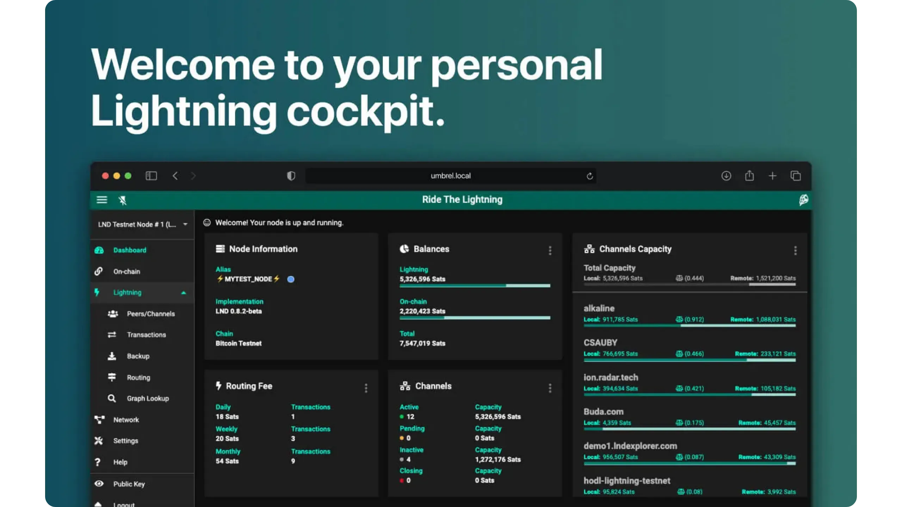


Na kraju, preporučujem aplikaciju *Lightning Network+*, koja vam omogućava pronalaženje partnera sa kojima možete otvoriti kanale, omogućavajući i odlazne i dolazne novčane transakcije.


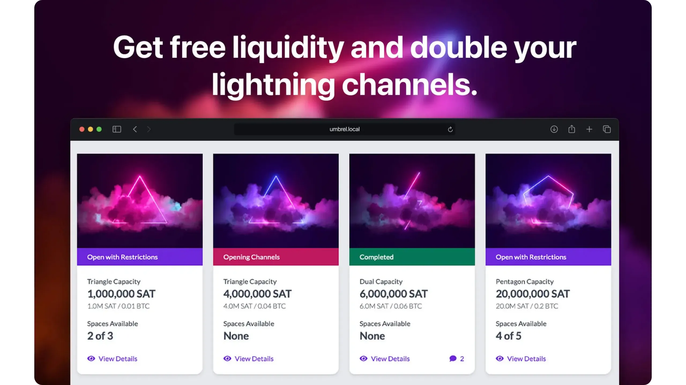


Zahvaljujući Umbrel-u, upravljanje ličnim Lightning čvorom je značajno pojednostavljeno, ali je i dalje relativno složeno. Iz tog razloga, detaljnije ćemo se baviti ovom temom u budućem kursu posvećenom isključivo ovoj upotrebi.


### Tailscale


Još jedna aplikacija koja mi se posebno sviđa na Umbrel-u je Tailscale. To je VPN aplikacija dizajnirana da pojednostavi kreiranje sigurnih mreža između više uređaja, gde god da se nalaze u svetu. Za razliku od tradicionalnih VPN-ova, koji se oslanjaju na centralizovane servere, Tailscale koristi WireGuard protokol za uspostavljanje end-to-end enkriptovanih veza između vaših različitih mašina. To znači da možete postaviti funkcionalan VPN za samo nekoliko minuta, bez potrebe za komplikovanim mrežnim konfiguracijama.


Na Umbrel-u, instalacija Tailscale-a povezuje vaš Bitcoin čvor sa vašom sopstvenom virtuelnom privatnom mrežom. Kada se konfiguriše, vaš čvor dobija privatnu Tailscale IP adresu Address, dostupnu samo sa drugih uređaja povezanih na istu Tailscale mrežu (kao što su računari, pametni telefoni i tableti). Ova veza je end-to-end enkriptovana i ne prolazi kroz nezaštićenu javnu mrežu, što značajno poboljšava sigurnost u poređenju sa neenkriptovanom vezom.


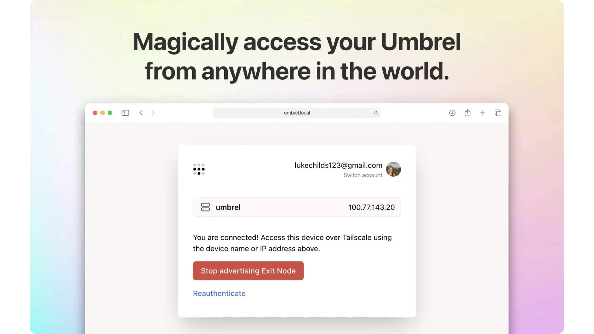


U konkretnim terminima, Tailscale vam nudi nekoliko prednosti kada koristite vaš Umbrel:


- Možete upravljati Interface Umbrelom ili pristupiti aplikacijama povezanim s vašim čvorom (kao što su Mempool, Ride The Lightning, ThunderHub...) s bilo kojeg mesta, kao da ste na istoj lokalnoj mreži, bez otvaranja portova na Internetu i bez korišćenja Tor-a, koji je veoma spor;


- Možete se povezati sa svojim Electrum serverom (Electrs ili Fulcrum) ili direktno na Bitcoin core putem vašeg VPN-a, zaobilazeći Tor. Ovo pruža sigurnu vezu, uporedivu sa korišćenjem Tor-a, ali sa mnogo većom brzinom i smanjenom latencijom. Ukratko, zadržavate prednosti privatnosti i sigurnosti Tor-a dok uživate u brzini Clearnet veze. Za On-Chain Wallet, ovaj dobitak može delovati marginalno, ali ako planirate da kasnije postavite svoj Lightning čvor, razlika je značajna. Naime, plaćanja putem vašeg čvora u pokretu na Tor-u su izuzetno spora zbog brojnih razmena koje su potrebne, dok sa Tailscale-om, radi savršeno.


- Nema potrebe za konfigurisanje NAT pravila, otvaranje portova ili postavljanje konvencionalnog VPN servera. Kada je aplikacija instalirana na Umbrel i vaše uređaje, mreža se automatski uspostavlja.


Tailscale na Umbrelu je stoga veoma interesantno rešenje ako želite da pristupite svom čvoru sa bilo kog mesta na svetu na siguran, visokoperformansan i jednostavan način za konfiguraciju, bez žrtvovanja privatnosti ili sigurnosti.


Da biste instalirali i konfigurisali Tailscale na vašem Umbrelu, pogledajte ovaj vodič, odeljak 4: "*Korišćenje Tailscale-a na Umbrelu*":


https://planb.network/tutorials/computer-security/communication/tailscale-9acbd7de-04d9-40f6-ab80-35f0dfedb632

### Nostr


Nostr, akronim za "*Notes and Other Stuff Transmitted by Relays*", je otvoreni, decentralizovani protokol dizajniran da omogući objavljivanje i razmenu poruka na Internetu bez oslanjanja na centralizovanu platformu. Svaki korisnik ima par kriptografskih ključeva: javni ključ (`npub`), koji služi kao identifikator, i privatni ključ (`nsec`), koji se koristi za potpisivanje poruka i garantovanje njihove autentičnosti.


Poruke se prenose putem mreže nezavisnih releja. Ova distribuirana arhitektura čini Nostr otpornim na cenzuru: nijedan pojedinačni server ne kontroliše pristup ili distribuciju, a korisnik se može povezati sa onoliko releja koliko želi.


Ovaj protokol je veoma popularan unutar Bitcoin zajednice jer, kao i Bitcoin, Nostr rešava pitanja digitalnog suvereniteta i kontrole podataka. Njegov tvorac, Fiatjaf, je programer već prepoznat u ekosistemu po svojim brojnim doprinosima.


Sa vašim Umbrelom, možete optimizovati korišćenje Nostr-a. Instaliranjem aplikacije ***Nostr Relay***, možete hostovati sopstveni privatni relej direktno na vašem uređaju, osiguravajući da svi vaši postovi i interakcije na Nostr-u budu sačuvani lokalno i ne mogu biti izgubljeni brisanjem od strane javnih releja.


Nostr klijenti ***noStrudel*** ili ***Snort*** su takođe dostupni na Umbrel-u. Zahvaljujući ovim aplikacijama, možete objavljivati, čitati, pretraživati profile i komunicirati sa Nostr ekosistemom direktno sa Interface web-a na vašem Umbrel-u.


Konačno, tu je aplikacija ***Nostr Wallet Connect*** na Umbrel-u, koja omogućava nativna Lightning plaćanja u Nostr-u. Konkretno, možete povezati vaš budući Lightning čvor sa vašim Nostr korisnicima kako biste slali mikro-plaćanja, nazvana "*zaps*", za nagrađivanje sadržaja ili interakciju na monetizovan način, bez potrebe za korišćenjem usluga treće strane. Ova plaćanja se šalju direktno sa vašeg ličnog čvora putem vaših kanala.


Da biste saznali kako koristiti sve ove aplikacije, preporučujem da pogledate ovaj kompletan vodič:


https://planb.network/tutorials/node/others/umbrel-nostr-7ae147e8-f5cd-46e1-861b-17c2ea1e08fd

### BTCPay Server


BTCPay Server je besplatan, open-source procesor plaćanja koji vam omogućava da prihvatate uplate putem Bitcoin i Lightning Network bez posrednika, zadržavajući samostalno staranje o sredstvima.


Arhitektura BTCPay Server-a zasnovana je na čvoru Bitcoin, a za Lightning na kompatibilnoj implementaciji (LND, Core Lightning...), što ga čini jednim od retkih potpuno ne-kustodijalnih PoS rešenja. Takođe je najopsežniji softver za praćenje i računovodstvo.


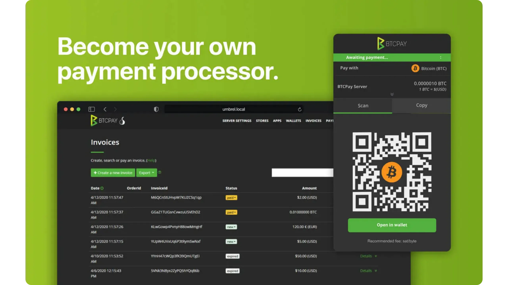


Ako posedujete biznis i želite da prihvatate Bitcoin uplate direktno putem vašeg Umbrel čvora, BTCPay Server aplikacija je idealna za vas. Da biste saznali više o ovoj temi, preporučujem da konsultujete sledeće resurse:


- Kurs BIZ 101 o korišćenju Bitcoin u vašem poslovanju:


https://planb.network/courses/a804c4b6-9ff5-4a29-a530-7d2f5d04bb7a


- Kurs POS 305 o korišćenju BTCPay Servera:


https://planb.network/courses/6fc12131-e464-4515-9d3f-9255365d5fa1


- BTCPay Server vodič:


https://planb.network/tutorials/business/point-of-sale/btcpay-server-928eb01e-824b-4b57-a3e8-8727633beddc


# Napredni koncepti i najbolje prakse


<partId>fc77a62a-8d9f-4144-9080-3057b04db2c6</partId>


## Održavanje vašeg Umbrel čvora


<chapterId>06d77d09-bf24-4555-b2ba-c08bbda477c7</chapterId>


Da započnemo ovaj poslednji deo, i pre nego što pređemo na napredniju teoriju, voleo bih da ispitam najbolje prakse i konkretne akcije koje možete preduzeti kada je vaš Umbrel čvor instaliran, sinhronizovan i pravilno konfigurisan u ovom kratkom poglavlju. Kako ga održavati svakodnevno?


### Održavanje opreme zdravom


Pouzdani čvor počinje sa stabilnim hardverom. Osigurajte da je mašina koja sadrži vaš čvor pravilno ventilisana, bez Dust, i instalirana u suvom okruženju, daleko od bilo kakvih izvora toplote i vlage. Izbegavajte da je smestite u skučen prostor i odlučite se za dobro ventilisanu lokaciju.


Na Raspberry Pi i mini-PC-jevima, Dust na kraju začepljuje hladnjake, podižući temperaturu i dovodeći do usporavanja (dobrovoljno ograničenje korišćenja resursa), što zauzvrat rezultira padom efikasnosti vašeg čvora. Zato preporučujem periodično čišćenje ulaza za vazduh i ventilatora, idealno svakih nekoliko meseci.


Osigurajte da koristite visokokvalitetni napajanje Supply, jer nestabilan napon može dovesti do oštećenja sistema, pa čak i predstavljati opasnost od požara. Idealno bi bilo da koristite originalno napajanje Supply koje je isporučio proizvođač vaše mašine. Takođe, pazite na pregrevanje zbog Džulovog efekta na produžnim kablovima: uvek poštujte maksimalnu dozvoljenu snagu i nikada ne povezujte više produžnih kablova u kaskadu.


Takođe preporučujem ulaganje u UPS. Ovo štiti vaš čvor od naglih gašenja, omogućava Umbrelu da se ispravno isključi u slučaju nestanka struje i osigurava kontinuitet rada tokom mikro prekida ili kratkotrajnih kvarova.


Na strani skladištenja, pratite napredak: ako se disk približava zasićenju, razmislite o oslobađanju prostora (deinstalirajte neiskorišćene aplikacije, prilagodite postavke indeksatora) ili migrirajte na veći SSD. Nedostatak pune Bitcoin čvorne tačke je što se njeni zahtevi za skladištenjem kontinuirano povećavaju, jer se novi blok generiše svakih 10 minuta i stari blokovi ne mogu biti obrisani (osim ako čvor nije pruned). Stoga vam savetujem da planirate dovoljno veliki kapacitet prilikom kupovine vaše opreme (minimum 2 TB).


### Ažuriranje


Ažuriranja čvorova su važna iz tri glavna razloga: prvo, bezbednost (zakrpe za ranjivosti, jačanje mreže i zaštita od DoS napada); drugo, kompatibilnost (promene u politici prenosa, promene formata i nadogradnje protokola); i treće, pouzdanost i performanse (ispravke grešaka, potrošnja resursa i druga poboljšanja). Zato periodično proveravajte da li su UmbrelOS i vaše aplikacije ažurirane:


- Da biste ažurirali sistem: Otvorite meni sa podešavanjima, zatim kliknite na dugme "*Check for Update*" pored parametra "*UmbrelOS*".


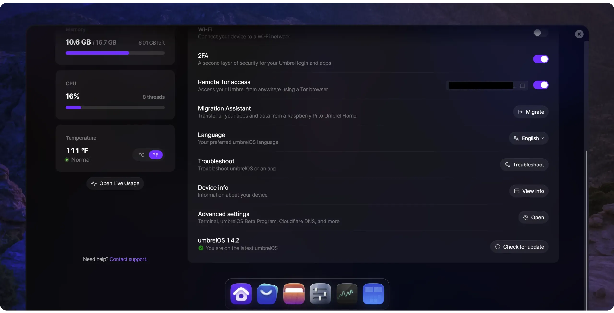


- Da biste ažurirali aplikacije: Idite na App Store. Ako neka od vaših aplikacija zahteva ažuriranje, dugme sa crvenim mehurićem će se pojaviti u gornjem desnom uglu Interface. Jednostavno kliknite na njega, a zatim ažurirajte svaku aplikaciju.


Redovno izvodite ovu operaciju kako biste održavali vaš operativni sistem i aplikacije ažurnim.


### Bekapovi


Ako koristite samo svoj Bitcoin čvor za validaciju i distribuciju vaših transakcija, ali su vaši novčanici upravljani izvan Umbrel-a (npr. sa Hardware Wallet i Sparrow wallet), nema ničega što bi se direktno bekapovalo na Umbrel. U ovom slučaju, osnovni bekap ostaje onaj od fraze za oporavak i Descriptor vašeg spoljnog Wallet, i to važi bez obzira da li koristite svoj čvor ili ne. Dakle, ništa se ne menja u odnosu na vašu prethodnu konfiguraciju.


S druge strane, u zavisnosti od dodatnih aplikacija koje koristite na Umbrel-u, mogu biti potrebne dodatne rezervne kopije. Ovo je posebno slučaj ako upravljate Lightning čvorom na Umbrel-u. U ovom slučaju, apsolutno je neophodno napraviti rezervnu kopiju seed koji je isporučen kada ste instalirali vaš Lightning čvor. Pored seed, potrebno je imati ažuriranu ***Static Channel Backup (SCB)*** kako biste mogli da povratite vaš Lightning čvor u slučaju problema. SCB vam omogućava da povratite svoja sredstva prisilnim zatvaranjem kanala. Ako nedostaje ili seed ili SCB, nemoguće je povratiti Lightning čvor.


Umbrel takođe nudi opciju automatskog i dinamičkog bekapovanja ovog SCB-a na njihovim serverima, putem Tor-a, kako bi se osiguralo da je uvek dostupan ažuriran fajl. U ovom slučaju, potreban je samo seed za vraćanje čvora.


Ponovo ćemo razmotriti ove aspekte detaljno u sledećem LNP202 kursu.


### Bezbednost svakodnevnog poslovanja


U smislu bezbednosti, koristite dugu, jedinstvenu i nasumičnu lozinku za Interface Umbrel, i ne zaboravite da aktivirate dvofaktorsku autentifikaciju (2FA). Za aplikacije koje nude zaštitu lozinkom i 2FA, uvek aktivirajte obe opcije i promenite podrazumevane lozinke.


Nikada ne izlažite kontrolnu tablu internetu bez korišćenja sigurnog prolaza (kao što su VPN, Tor, ili samo lokalni pristup). Ograničite broj aplikacija koje instalirate i redovno brišite one koje vam više nisu potrebne, kako biste smanjili površinu napada.


Da biste produbili svoje znanje o računarskoj bezbednosti uopšte, toplo preporučujem da pogledate ovaj drugi besplatni kurs:


https://planb.network/courses/4ba0e3de-e67f-4ea1-a514-f111206810d1

### Dijagnoza i samopomoć


U slučaju greške na vašem Umbrel-u, prvo generate dijagnostički paket putem odeljka za rešavanje problema u UmbrelOS-u ili u odgovarajućoj aplikaciji, zatim čisto restartujte aplikaciju. Ako je potrebno, pokušajte i sa potpunim restartovanjem sistema.


Ako problem potraje, preporučujem da [pristupite Umbrel korisničkoj zajednici na njihovom Discord-u](https://discord.gg/efNtFzqtdx). Počnite pretragom kako biste utvrdili da li je neko već naišao na isti problem i pronašao rešenje. Ako nije, možete postaviti poruku u `general-support` kanalu. Takođe možete koristiti [Umbrel forum](https://community.umbrel.com/).


Ova područja će vam omogućiti ne samo da pratite sigurnosne najave i ažuriranja, već i da postavljate pitanja i, na kraju, da pomažete drugim korisnicima. Često se u tim razmenama otkrivaju najbolje prakse.


Uz ove jednostavne navike, vaš Umbrel čvor će ostati stabilan, siguran i koristan, kako za vas tako i za Bitcoin mrežu.


## Razumevanje IBD i procesa otkrivanja vršnjaka


<chapterId>175ac9d1-ea23-45d9-9918-d3e7352435cd</chapterId>


Vaš Bitcoin čvor se pokreće bez ikakvog prethodnog znanja o istoriji transakcija. U početku, to je samo računar koji pokreće softver (Bitcoin core ili sličan). Da bi postao potpuno sinhronizovan i operativan Bitcoin čvor, mora lokalno rekonstruisati stanje Ledger proveravajući sve blokove objavljene od Genesis bloka (blok 0, objavljen od strane Satoshi Nakamoto 3. januara 2009). Ovaj korak se zove **IBD (_Initial Block Download_)**.


IBD se sastoji od preuzimanja i verifikacije svakog bloka i transakcije pojedinačno, primenjujući pravila konsenzusa, kako bi se izgradila sopstvena verzija Blockchain. Cilj nije samo preuzimanje kopije neproverenih podataka, već dolazak do istog zaključka potpuno nezavisno, kao poštena većina mreže.


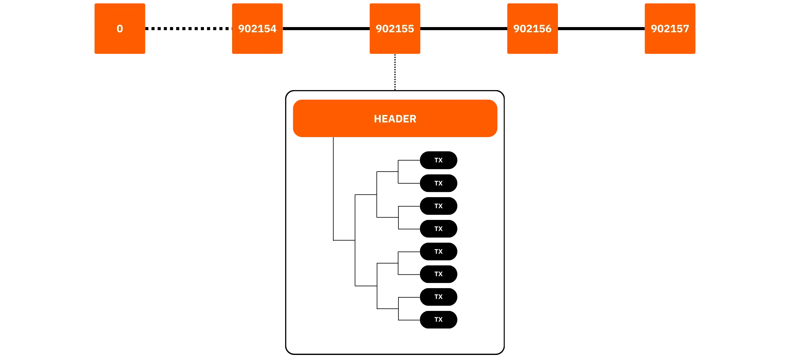


### IBD prekretnice


Sinhronizacija počinje sa korakom _**headers-first**_. Vaš čvor zahteva sekvencu zaglavlja blokova od nekoliko vršnjaka i, za svako od njih, proverava Proof of Work, prilagođavanje težine, sintaksu, kao i Timestamp i pravila verzije broja. Ukratko, osigurava da svako primljeno zaglavlje ispunjava pravila konsenzusa.


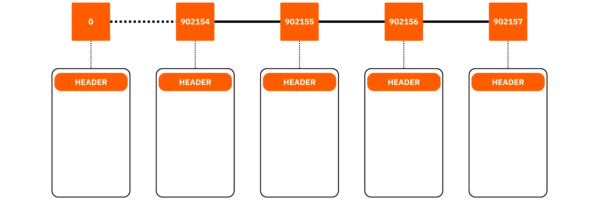


Kao podsetnik, Bitcoin blok se sastoji od zaglavlja od 80 bajtova i liste transakcija. Otisak bloka se dobija primenom dvostrukog SHA-256 Hash na ovo zaglavlje, koje sadrži 6 polja:


- verzija
- Hash prethodnog bloka
- Merkle Root transakcija
- Timestamp (veće od srednjeg vremena prethodnih 11 blokova)
- ciljna težina
- Nonce


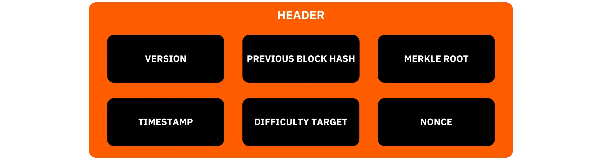


Transakcije su posvećene Merkle Tree. Ovo je struktura koja sumira veliki skup podataka (u ovom slučaju, sve transakcije u bloku) agregiranjem njihovih heševa progresivno dva po dva do jednog "korena", čime se dokazuje da element pripada skupu (i otkriva bilo kakva modifikacija). Na ovaj način, svaka modifikacija transakcije takođe menja koren Merkle Tree i stoga otisak zaglavlja bloka. SegWit je uveo zaseban dodatni Commitment za kolačiće (potpise), postavljen u coinbase.


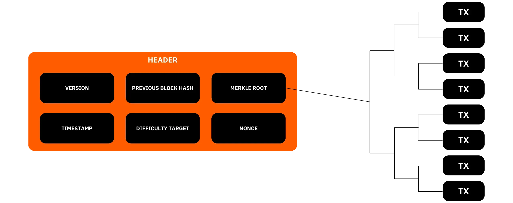


Ovaj korak _**headers-first**_ omogućava čvoru da identifikuje granu sa najviše rada (bez obzira na broj blokova), što je grana na kojoj se Bitcoin čvorovi sinhronizuju. Kada je ova grana identifikovana, čvor preuzima sadržaj blokova paralelno sa nekoliko veza, zatim validira svaku transakciju: format, validnost skripti (osim `assumevalid=1`), iznose i odsustvo dvostrukog trošenja. Sa svakom uspešnom proverom, trenutno stanje nepotrošenih novčića (UTXO set) se ažurira u `chainstate/` bazi podataka: potrošeni izlazi se uklanjaju, dok se novi validni izlazi dodaju.


S druge strane, Mempool dolazi u igru samo kada se približava vrhu lanca: sve dok čvor ostaje kasno, nema transakcija na čekanju za skladištenje.


Kada je IBD završen, čvor ulazi u svoju normalnu fazu: validira nove blokove kako se objavljuju, održava svoj Mempool sa transakcijama na čekanju prema svojim pravilima prenosa, prenosi transakcije i blokove, i upravlja bilo kakvim reorganizacijama lanca.


### PretpostaviVažeće


Bitcoin core uključuje mehanizam dizajniran da smanji vreme potrebno pre nego što čvor postane potpuno operativan, dok zadržava suštinu principa autonomne verifikacije: AssumeValid.


Parametar `assumevalid` zasnovan je na referentnom bloku iz prošlosti, Hash, koji je integrisan u svaku verziju softvera. Tokom IBD-a, ako vaš čvor ustanovi da se ovaj blok zaista nalazi na grani sa najviše rada, može ignorisati verifikaciju skripti za sve transakcije pre ove tačke.


Sva ostala pravila (blok struktura, Proof of Work, ograničenja veličine, iznosi transakcija, UTXO-i, itd.) ostaju potpuno verifikovana. Samo se izračunavanje skripti pre ovog referentnog bloka ignoriše. Dobitak u performansama je značajan na IBD-u, jer verifikacija potpisa čini veliki deo opterećenja CPU-a. Nakon ovog referentnog bloka, verifikacija se vraća u svoje normalno stanje.


Možete primorati punu validaciju svih skripti onemogućavanjem ovog mehanizma, po cenu mnogo dužeg IBD, koristeći parametar `assumevalid=0` u `Bitcoin.conf` fajlu.


### PretpostaviUTXO


`assumeutxo` je još jedan postojeći parametar, ali za razliku od `assumevalid`, nije aktiviran po defaultu. Ovaj mehanizam omogućava softveru da učita snimak UTXO seta, zajedno sa njegovim metapodacima, i privremeno ga smatra referentnim stanjem, nakon što potvrdi da zaglavlja zaista vode do Blockchain sa najviše rada.


Čvor tako brzo postaje operativan za uobičajene upotrebe (RPC, povezivanje novčanika, itd.), dok istovremeno pokreće kompletnu, verifikovanu rekonstrukciju sopstvenog UTXO seta u pozadini. Kada je ova faza završena, početni snimak se zamenjuje lokalno rekonstruisanim stanjem. Ovaj pristup odvaja brzo obezbeđivanje čvora od potpune verifikacije, bez kompromitovanja iste.


### Otkrivanje partnera: Kako vaš čvor pronalazi Bitcoin mrežu?


Kada se čvor prvi put pokrene, još uvek ne zna nijednog vršnjaka. Međutim, mora pronaći druge Bitcoin čvorove na Internetu kako bi zatražio zaglavlja, a zatim blokove, da bi završio svoj IBD. Da bi pokrenuo ove veze, Bitcoin core prati prioritetnu logiku.


Kada se čvor ponovo pokrene nakon što je već bio korišćen, Core prvo pokušava da se ponovo poveže sa odlaznim čvorovima registrovanim pre gašenja, informacijama koje su sačuvane u datoteci `anchors.dat`. Zatim konsultuje svoju IP Address knjigu **`peers.dat`**, koja čuva listu prethodno susretanih čvorova, kako bi se ponovo povezao sa njima. Ovo je jednostavno lokalna datoteka, koju Core ažurira i održava. S druge strane, za novi čvor koji je tek pokrenut, ove 2 datoteke su prazne, jer još uvek nije komunicirao sa drugim Bitcoin čvorovima.


U ovom slučaju, softver upituje _**DNS seeds**_. To su [serveri koje održavaju priznati programeri ekosistema](https://github.com/Bitcoin/Bitcoin/blob/master/src/kernel/chainparams.cpp), koji vraćaju listu IP adresa pretpostavljenih aktivnih čvorova. Ove adrese omogućavaju novom čvoru da započne svoje prve konekcije i zatraži potrebne podatke od IBD-a. Evo liste *DNS seeds* aktivnih do danas (avgust 2025):


- Pieter Wuille: `seed.Bitcoin.sipa.be.`
- Matt Corallo: `dnsseed.bluematt.me.`
- Luke Dashjr: `dnsseed.Bitcoin.dashjr-list-of-P2P-nodes.us.`
- Jonas Schnelli: `seed.Bitcoin.jonasschnelli.ch.`
- Peter Todd: `seed.btc.petertodd.net.`
- Sjors Provoost: `seed.Bitcoin.sprovoost.nl.`
- Stephan Oeste: `dnsseed.emzy.de.`
- Jason Maurice: `seed.Bitcoin.wiz.biz.`
- Ava Chow: `seed.Mainnet.achownodes.xyz.`


U velikoj većini slučajeva, korak *DNS seeds* je dovoljan za uspostavljanje prvih veza sa drugim čvorovima. Ako, izuzetno, ovi serveri ne odgovore u roku od 60 sekundi, čvor prelazi na drugi metod: [statistička lista sa preko 1.000 adresa](https://github.com/Bitcoin/Bitcoin/blob/master/src/chainparamsseeds.h) _seed čvorova_ je ugrađena u kod Bitcoin core i redovno se ažurira. Ako prva dva metoda dobijanja IP adresa ne uspeju, ovo poslednje rešenje uspostavlja početnu vezu, od koje čvor može zatim zatražiti nove IP adrese.


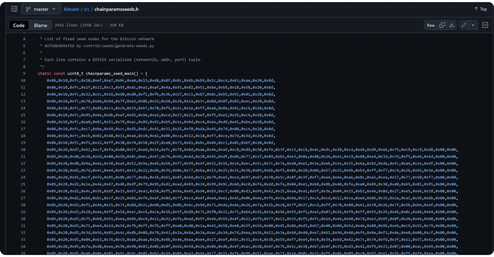


Kao poslednja opcija, možete ručno dodati Supply IP adrese putem `peers.dat` fajla da biste forsirali specifične konekcije.


Jednom kada se pokrene, interni Address menadžer diversifikuje izvore (odvojene autonomne mreže, clearnet i Tor, kao i različite geografske oblasti) kako bi smanjio rizik od topološke izolacije. Čvor uspostavlja ove odlazne veze (veze koje sam bira, i koje su stoga sigurnije).


Ako vaš čvor sluša na otvorenom portu (po defaultu, 8333), prihvata dolazne veze. Ove veze pojačavaju ukupnu otpornost mreže pružajući tačku kontakta za nove čvorove, bez donošenja posebne koristi vašem sopstvenom IBD-u. Ako vaš čvor radi na Tor-u, logika ostaje ista, ali korišćene adrese su `.onion` servisi.


## Anatomija vašeg Bitcoin čvora


<chapterId>b420bd9d-7e2a-4984-bc70-2b732a94c8ce</chapterId>


Kada vaš čvor završi svoju početnu sinhronizaciju, lokalno skladišti nekoliko komplementarnih skupova podataka, omogućavajući mu da validira blokove i transakcije, opslužuje mrežne peer-ove i brzo se ponovo pokrene dok održava svoje stanje. 3 glavne cigle su ključne na čvoru:


- gW-402 **blokova** pohranjenih na disku,
- **UTXO set** održavan u bazi podataka ključ-vrednost,
- i **Mempool** se čuva u RAM-u i povremeno serijalizuje.


Pored toga, nekoliko pomoćnih fajlova (peers, procene naknada, liste isključenja, novčanici, itd.) upotpunjuju sliku. Hajde da otkrijemo ulogu svih ovih fajlova.


### Gde se podaci čvora zapravo nalaze?


Podrazumevano, Bitcoin core čuva svoje podatke u specifičnom radnom direktorijumu. Pod GNU/Linux-om, to je obično u `~/.Bitcoin/`, pod Windows-om u `%APPDATA%\Bitcoin/`, a pod macOS-om u `~/Library/Application Support/Bitcoin/`. Ako koristite pakovano rešenje (npr. unutar node distribucije), ovaj direktorijum može biti montiran na drugom mestu, ali njegova struktura ostaje ista. Važni pod-folderi i fajlovi opisani u nastavku i dalje se nalaze ovde.


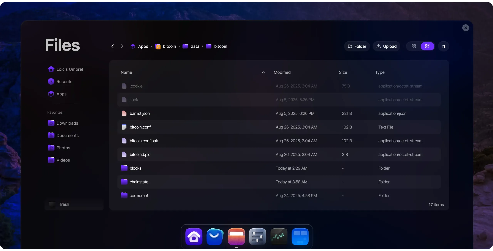


### Blokovi


Blockchain je, dakle, kolekcija blokova. Full node skladišti ove blokove kao sekvencijalne ravne fajlove i održava paralelni indeks za brzo preuzimanje. Kada je potrebno (reorganizacija, Wallet ponovno skeniranje, usluga vršnjaka), ovi podaci se ponovo čitaju u izvornom obliku.


**Napomena:** Reorganizacija, ili resinhronizacija, je fenomen u kojem Blockchain prolazi kroz modifikaciju svoje strukture zbog postojanja konkurentskih blokova na istoj visini. Ovo se dešava kada se deo Blockchain zameni drugim lancem sa većom količinom akumuliranog rada. Ove resinhronizacije su prirodni deo rada Bitcoin, gde različiti rudari mogu pronaći nove blokove gotovo istovremeno, čime se Bitcoin mreža deli na dva dela. U takvim slučajevima, mreža se može privremeno podeliti na konkurentske lance. Na kraju, kako jedan od ovih lanaca akumulira više rada, drugi lanci bivaju napušteni od strane čvorova, a njihovi blokovi postaju poznati kao "zastareli blokovi" ili "blokovi siročad". Ovaj proces zamene jednog lanca drugim naziva se resinhronizacija.


#### Blk*.dat datoteke (sirovi blok podaci)


Primljeni i validirani blokovi se upisuju u sekvencijalne kontejnere nazvane `blkNNNNN.dat`, smeštene u fascikli `blocks/`. Svaka datoteka se popunjava redom dok ne dostigne maksimalnu veličinu od 128 MiB, nakon čega Core otvara sledeću datoteku. Unutra, svaki blok je serijalizovan u mrežnom formatu, prethodi mu magični identifikator i dužina. Ova organizacija omogućava brzo pisanje na disk i olakšava uslugu blokova za sinhronizaciju sa vršnjacima.


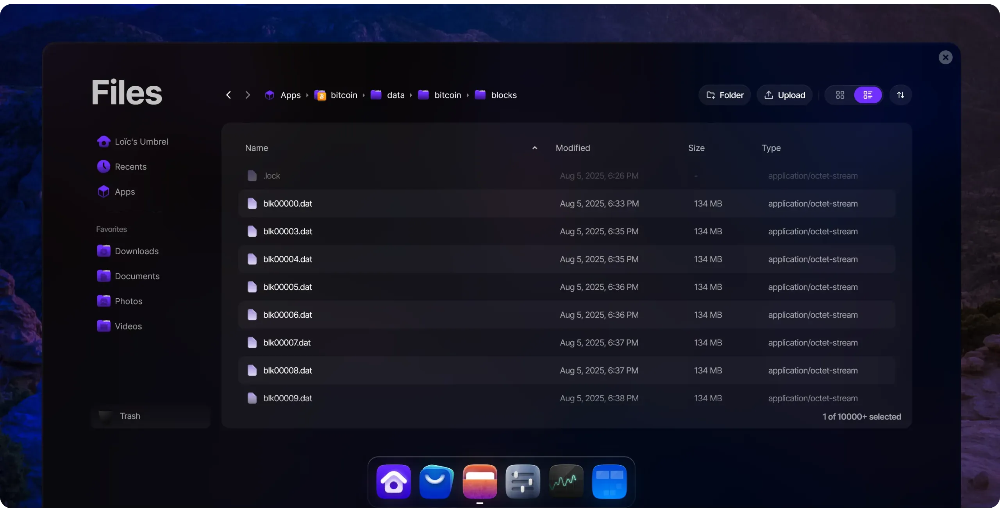


U pruned režimu, čvor zadržava samo nedavni prozor ovih datoteka kako bi ograničio otisak na disku. Briše najstarije `blk*.dat` kontejnere čim se dostigne konfigurisana ciljana veličina prostora, dok zadržava dovoljno istorije da ostane konzistentan sa najbolje poznatim lancem. Indeks i UTXO set ostaju normalni, omogućavajući validaciju sledećih transakcija i blokova.


#### Rev*.dat fajlovi (podaci o otkazivanju)


Kako bi mogao da se vrati u prošlost tokom reorganizacije, Core čuva, paralelno sa svakim `blk` fajlom, `revNNNNN.dat` fajl u `blocks/`. Ovaj fajl sadrži informacije potrebne za poništavanje efekta bloka na UTXO skup: za svaki izlaz koji blok potroši, prethodno stanje odgovarajućeg UTXO se čuva (iznos, skripta, visina...). U slučaju prekida bloka, čvor može brzo rekonstituisati prethodno stanje bez potrebe za ponovnim skeniranjem celog lanca.


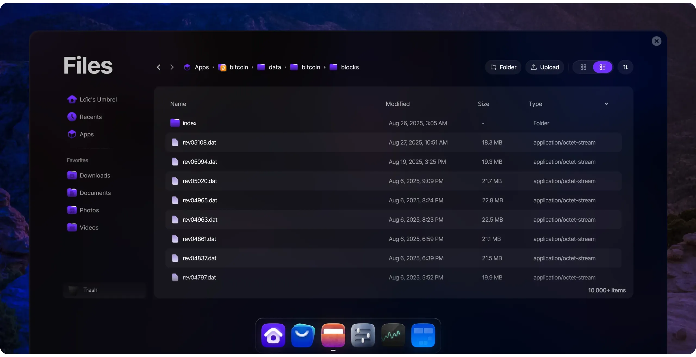


#### Indeks blokova (blocks/index)


Pretraživanje bloka direktno u flat fajlovima bi bilo previše vremenski zahtevno. Core stoga održava LevelDB bazu podataka u `blocks/index/` koja navodi, za svaki poznati blok, metapodatke kao što su Hash, visina, status validacije, `blk` fajl i pomeraj gde se nalazi. Kada peer zatraži blok, ili kada interni komponent treba da pristupi specifičnom bloku, ovaj indeks omogućava brz pristup. Bez ovog indeksa, bilo bi potrebno previše operacija.


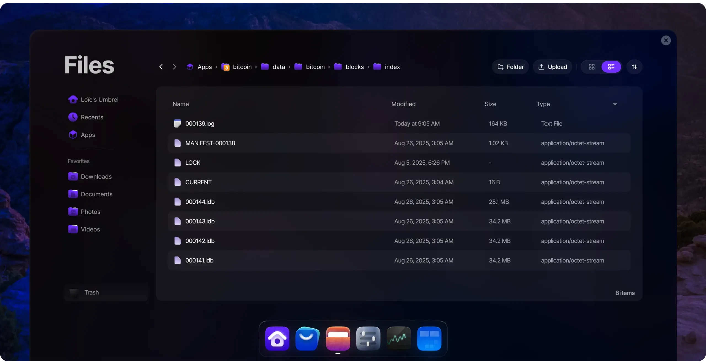


#### Opcionalni indeksi (indexes/)


Neki indeksi su opcionalni i po defaultu su onemogućeni, jer povećavaju zauzeće diska:


- `indexes/txindex/`, koji smo već pomenuli, pruža tabelu mapiranja transakcija → lokacija, omogućavajući pronalaženje bilo koje potvrđene transakcije bez poznavanja bloka koji je sadrži. Ovo je korisno za off-Wallet `getrawtransaction` tip RPC upita, ali je prilično skupo.
- indeksi/blockfilter/` koji može sadržati kompaktne blok filtere (BIP157/158) za tanke klijente. Ove strukture ubrzavaju verifikaciju na strani klijenta na račun dodatnog skladištenja na indekserskom čvoru.


### UTXO set (chainstate)


Model UTXO (*Unspent Transaction Output*) je računovodstveni prikaz Bitcoin: svaki neutrošeni izlaz je dostupan "Coin" koji se može koristiti kao ulaz za buduću transakciju.


Ukupnost svih ovih delova u datom trenutku T čini UTXO skup: veliku listu svih delova koji su sada dostupni. Ovo je stanje koje čvor konsultuje da odluči da li transakcija troši legitimne jedinice koje nisu već korišćene u prethodnoj transakciji (da bi se izbegao Double-spending).


UTXO set je smešten u fascikli `chainstate/` kao kompaktna LevelDB baza podataka. Svaki deo povezuje ključ izveden iz Hash transakcije i izlazni indeks sa vrednošću koja sadrži: iznos, `scriptPubKey` zaključavanje, visinu bloka kreacije i indikator coinbase-a.


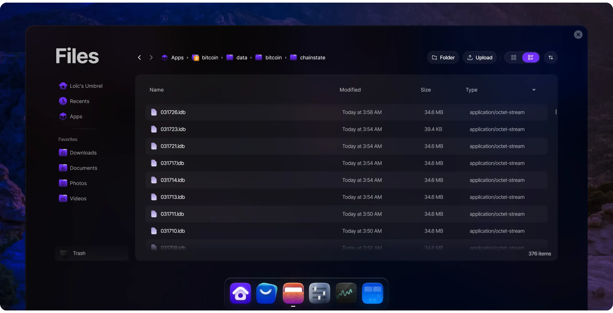


Čvor održava memorijsku keš memoriju iznad LevelDB-a kako bi apsorbovao učestale operacije čitanja i pisanja. Parametar `dbcache` može se koristiti za modifikaciju veličine ove keš memorije: što je veća, to više koristi IBD i trenutna validacija imaju od pristupa memoriji, po cenu veće potrošnje RAM-a. Kada Miner pronađe novi blok, čvor briše iz skupa UTXO izlaze koji su potrošeni (ili konzumirani) transakcijama uključenim u blok i dodaje novo kreirane izlaze.


Teoretski, mogli bismo potvrditi transakciju ponovnim skeniranjem istorije blokova kako bismo proverili da izlaz nikada nije potrošen. U praksi, međutim, ovo bi bilo previše vremenski zahtevno, jer bi ceo Blockchain morao biti skeniran za svaku novu transakciju. Skup UTXO, stoga, pruža minimalni pregled potreban da se lokalno i u razumnom vremenskom periodu dokaže odsustvo Double-spending.


Imajte na umu da je set UTXO često u centru zabrinutosti oko decentralizacije Bitcoin, jer se njegova veličina prirodno brzo povećava. Ovo je delimično zbog rastuće cene Bitcoin, koja podstiče fragmentaciju delova, a delimično zbog sve veće usvajanja sistema: što je više korisnika, veća je potražnja za UTXO-ima.


Rast rasta UTXO takođe proizlazi iz strukture jednostavnih platnih transakcija na Bitcoin. Zaista, kada izvršite uplatu, koristite jedan UTXO kao ulaz i kreirate 2 nova UTXO-a kao izlaz (jedan za uplatu i drugi za Exchange). Na kraju, heuristika analize lanca, nazvana CIOH (*Common Input Ownership Heuristic*), pruža dodatni podsticaj da se izbegne konsolidacija Coin.


https://planb.network/courses/65c138b0-4161-4958-bbe3-c12916bc959c

Pošto se deo toga mora čuvati u RAM-u kako bi se transakcije verifikovale u razumnom vremenu, set UTXO može postepeno učiniti rad Full node previše skupim. Da bi se rešio ovaj problem, već postoji nekoliko predloga, posebno [Utreexo](https://planb.network/resources/glossary/utreexo).


### Mempool


Mempool je lokalni skup važećih transakcija koje su primljene, ali još nisu potvrđene. Kao podsetnik, "potvrđena transakcija" je ona koja je uključena u važeći blok. Svaki čvor održava svoj Mempool, koji može da se razlikuje od onog drugih čvorova u mreži u zavisnosti od:


- veličina dodeljena Mempool putem parametra `maxmempool`: čvor sa većim Mempool moći će da drži više transakcija nego čvor sa manjim Mempool (osim ako se potonji ne isprazni);
- gW-433 pravila: ovo je podskup pravila prenosa čvora i definiše karakteristike koje nepotvrđena transakcija mora ispuniti da bi bila prihvaćena u Mempool;
- transakcija perkolacija: zbog različitih faktora, određena transakcija može biti distribuirana jednom delu mreže, ali još uvek nije stigla do drugog.


Važno je napomenuti da čvorovi mempool-a nemaju konsenzusnu vrednost. Bitcoin radi savršeno čak i ako svaki čvor ima različit Mempool. Na kraju, autoritativni blokovi su uvek oni dodati u Blockchain. Na primer, čak i ako čvor u početku odbije određenu transakciju u svom Mempool (validnu prema pravilima konsenzusa), biće obavezan da je prihvati ako je na kraju uključena u blok sa validnim Proof of Work. Ako to ne učini i odbije ovaj blok, iako je u skladu sa pravilima konsenzusa, to bi pokrenulo Hard Fork, tj. stvaranje novog, odvojenog Bitcoin na kojem bi bio sam.


#### Politika i upravljanje memorijom


Kada se transakcija primi, Core primenjuje niz provera prema pravilima konsenzusa (sintaksa, validni skriptovi, bez dvostrukog trošenja, itd.) i Mempool pravilima, koja su lokalna politika (RBF, minimalni pragovi naplate, ograničenje podataka u `OP_RETURN`, itd.). Ako transakcija poštuje ova pravila, ona se čuva u memoriji.


Veličina Mempool je ograničena parametrima `maxmempool` u datoteci `Bitcoin.conf` (više o tome u sledećem poglavlju). Podrazumevano, ograničenje je 300 MB. Kada je popunjen, čvor dinamički podiže svoj minimalni prag naplate i izbacuje najmanje profitabilne transakcije prvo (tj. zadržava transakcije koje bi trebalo prvo da budu rudarske). Transakcije koje su previše stare takođe mogu isteći nakon podešenog kašnjenja.


#### Mempool postojanost na disku


Da bi se ubrzala ponovna pokretanja, Core periodično serijalizuje stanje Mempool u datoteku `Mempool.dat` kada se čvor isključi. Pored stvarnog Mempool, koji ostaje u memoriji, Core čuva ovu datoteku `Mempool.dat` na disku. Sledeći put kada se čvor pokrene, on ponovo učitava ovu snimku i briše sve što više nije važeće za trenutni Blockchain.


### Pomoćne datoteke i baze podataka


Nekoliko drugih fajlova na istom nivou kao `blocks/`, `chainstate/` i `indexes/` učestvuju u pravilnom funkcionisanju:


- `peers.dat` čuva IP Address knjigu potencijalnih vršnjaka, dopunjenu inicijalnim DNS otkrivanjem, mrežnim razmenama i ručnim dodacima. Kada se čvor pokrene, može koristiti ovu datoteku za uspostavljanje odlaznih veza.
- Kada je čvor isključen, `anchors.dat` čuva adrese odlaznih vršnjaka, tako da možete brzo pokušati da ih kontaktirate ponovo sledeći put kada pokrenete sistem.
- `banlist.json` sadrži lokalne zabrane koje je odredio operater ili čvor (ponovljeno nevažeće ponašanje), kako bi se sprečilo da se čvor ponovo poveže ili prihvati veze od ovih specifičnih vršnjaka.
- `fee_estimates.dat` skladišti statistiku vremenskog horizonta o posmatranim potvrđivanjima, koju koristi procenjivač naknada za predlaganje stopa naknada u skladu sa ciljevima kašnjenja izabranim prilikom kreiranja transakcije.
- gW-446.conf` sadrži parametre konfiguracije vašeg čvora. Ovde možete prilagoditi pravila releja. Reći ću vam više o tome u narednom poglavlju.
- Datoteka `settings.json` sadrži dodatne parametre za `Bitcoin.conf`.
- `debug.log` je dijagnostički tekstualni log, koji se može koristiti za razumevanje aktivnosti čvora u slučaju greške.
- gW-448.pid` skladišti identifikator procesa u vreme izvršavanja, omogućavajući drugim aplikacijama ili skriptama da lako identifikuju bitcoind (*Bitcoin daemon*) i interaguju s njim ako je potrebno. Kreira se pri pokretanju čvora i briše pri gašenju.
- `ip_asn.map` je tabela mapiranja IP → ASN (samostalni sistem) koja se koristi za grupisanje i diversifikaciju peer-ova (opcija `-asmap`).
- `onion_v3_private_key` čuva privatni ključ Tor v3 servisa kada je opcija `-listenonion` omogućena, kako bi se održao stabilan onion Address između ponovnih pokretanja.
- `i2p_private_key` čuva I2P privatni ključ kada se koristi `-i2psam=`, za uspostavljanje odlaznih i moguće dolaznih veza na I2P.
- `.cookie` sadrži efemerni RPC autentifikacioni token (kreiran pri pokretanju, obrisan pri gašenju) kada se koristi autentifikacija putem kolačića. Ovo se može koristiti, na primer, za povezivanje Wallet softvera.
- `.lock` je zaključavanje direktorijuma podataka, koje sprečava više instanci da istovremeno pišu u isti datadir.
- `guisettings.ini.bak` je automatsko čuvanje GUI podešavanja (*Bitcoin Qt*) kada se koristi opcija `-resetguisettings`.


Kao što smo videli u prvim delovima ovog BTC 202 kursa, Bitcoin core je i Bitcoin čvor softver i Wallet. Međutim, to nije nužno rešenje koje bih preporučio za upravljanje vašim novčanicima, jer njegov Interface ostaje osnovni i njegove funkcionalnosti su ograničene u poređenju sa modernim softverom kao što su Sparrow ili Liana. Core takođe uključuje fajlove za upravljanje vašim novčanicima:


- `wallets/` je podrazumevani direktorijum koji sadrži jedan ili više;
- `wallets/<name>/Wallet.dat` je SQLite baza podataka Wallet (ključevi, deskriptori, metapodaci transakcija, itd.);
- wallets/<name>/Wallet.dat-journal` je SQLite rollback log.


Da rezimiramo, ovde je struktura datoteke Bitcoin core:


```
~/.bitcoin/
├── bitcoin.conf
├── blocks/
│   ├── blk00000.dat
│   ├── blk00001.dat
│   ├── rev00000.dat
│   ├── rev00001.dat
│   └── index/
├── chainstate/
├── indexes/
│   ├── txindex/
│   ├── blockfilter/
│   │   └── basic/
│   │       ├── db/
│   │       └── fltrNNNNN.dat
│   └── coinstats/
│       └── db/
├── wallets/
│   └── <wallet_name>/
│       ├── wallet.dat
│       └── wallet.dat-journal
├── peers.dat
├── anchors.dat
├── banlist.json
├── mempool.dat
├── fee_estimates.dat
├── bitcoind.pid
├── debug.log
├── ip_asn.map
├── onion_v3_private_key
├── i2p_private_key
├── settings.json
├── guisettings.ini.bak
├── .cookie
└── .lock
```


### Put za validaciju novog bloka


Po prijemu novog bloka, vaš čvor proverava Proof of Work i, generalno, usklađenost sa pravilima konsenzusa. Ako je sve u redu, primenjuje promene transakciju po transakciju na svoj UTXO skup: proverava da svaki unos troši postojeće UTXO-e sa važećim skriptom, briše te UTXO-e i dodaje nove izlaze. Ako je sve validno, promene se primenjuju na `chainstate/`.


Paralelno, podaci za poništavanje se upisuju u `rev*.dat`, a metapodaci u indeks `blocks/index/`. Blok se zatim serijalizuje u odgovarajući `blk*.dat` fajl. U slučaju reorganizacije, čvor čita `rev*.dat` unazad kako bi čisto diskonektovao napuštene blokove, obnovio UTXO skup, a zatim povezao blokove novog najboljeg lanca.


## Razumevanje Bitcoin.conf


<chapterId>c54a629a-ddb1-41cb-9a88-21dfd9be50ca</chapterId>


Datoteka `Bitcoin.conf` je glavna konfiguraciona datoteka Interface za Bitcoin core. Omogućava vam da prilagodite ponašanje i parametre vašeg čvora bez potrebe za rekompajliranjem izvornog koda ili pravljenjem izmena u komandnoj liniji. Konkretno, to je obična tekstualna datoteka strukturirana u parovima ključ-vrednost, što znači da svaka linija datoteke referencira određeni parametar (ključ) i njegovu pridruženu vrednost, koja se može modifikovati da bi se prilagodio taj parametar.


Mreža, prenos transakcija, performanse, indeksiranje, logovanje i parametri pristupa RPC mogu biti definisani u `Bitcoin.conf`. Međutim, ova konfiguraciona datoteka nikada ne menja pravila konsenzusa protokola: ona samo postavlja lokalnu politiku čvora (pravila prenosa), način na koji se povezuje, indeksira i izlaže usluge.


### Lokacija i prioritet


Podrazumevano, `Bitcoin.conf` se nalazi u Bitcoin core direktorijumu podataka. Ovo je čuveni direktorijum koji smo pomenuli u prethodnom poglavlju. Međutim, ovaj fajl nije automatski kreiran od strane Bitcoin core, osim u određenim okruženjima, kao što je Umbrel. Ako već ne postoji, moraćete da ga generate sami tako što ćete jednostavno kreirati fajl pod nazivom `Bitcoin.conf`, a zatim ga otvoriti u tekst editoru da biste izvršili svoje izmene.


Parametri definisani u `Bitcoin.conf` mogu biti prepisani sa 2 sloja:


- `settings.json` (napisan dinamički od strane Interface grafike ili nekog RPC),
- i opcije modifikovane putem komandnih linija.


Imajte na umu da svaka izmena u `Bitcoin.conf` zahteva ponovno pokretanje čvora da bi stupila na snagu.


### Format i struktura


Format `Bitcoin.conf` je stoga veoma jednostavan: jedna linija po opciji, u obliku `opcija=vrednost`. Nepotrebni razmaci i prazne linije se ignorišu, a komentari u kodu počinju sa `#`.


Gotovo sve Booleove opcije mogu biti onemogućene sa prefiksom `no`. Na primer, `listen=0` i `nolisten=1` su ekvivalentni u zavisnosti od verzije.


Da biste segmentirali konfiguraciju po mreži, možete koristiti sekcije: `[main]`, `[test]` (testnet3), `[testnet4]`, `[bookmark]`, `[regtest]`. Alternativno, možete prefiksirati naziv opcije sa `regtest.maxmempool=100`.


### Šta Bitcoin.conf može, a šta ne može da uradi


Kao što je objašnjeno gore, pravila konsenzusa očigledno nisu konfigurisana u `Bitcoin.conf`, jer bi to moglo stvoriti Hard Fork. S druge strane, mnogi drugi aspekti su konfigurisani. Postoje 3 korisne klase koje treba imati na umu:


- Isključivo lokalni parametri. Oni utiču samo na vaš čvor: veličina keša (`dbcache`), pruned režim (`prune`), opcioni indeksi... Oni utiču na performanse vaše mašine, ali ne i na mrežu.
- Prosleđivanje i Mempool politike. One odlučuju šta vaš čvor prihvata, zadržava i prosleđuje pre potvrde: minimalni prag naknade (`minrelaytxfee`), veličina i vreme zadržavanja Mempool (`maxmempool`, `mempoolexpiry`), zamena transakcija (RBF)... Ova pravila nisu deo konsenzusa, tako da dva različita čvora mogu imati različite politike i i dalje biti potpuno kompatibilni. S druge strane, ovi parametri će imati uticaj na Bitcoin mrežu (kao što je objašnjeno u prvom delu, naročito sa teorijom perkolacije).
- Povezivanje na mrežu. Ove opcije određuju kako vaš čvor pronalazi peer-ove, sluša, prelazi preko NAT-a, koristi Tor ili proxy, ili ograničava svoj propusni opseg. One oblikuju vašu topologiju, ali ne menjaju prosleđivanje transakcija.


Razumevanje ove razdvojenosti je ključno: ako transakcija ne poštuje pravila konsenzusa, vaš čvor će je u svakom slučaju odbiti. Ali stroža lokalna politika može odbiti da prosledi transakciju koja je validna u smislu konsenzusa.


### Mreža i topologija


Prvo i najvažnije, važno je jasno razlikovati između 2 tipa veze koje Bitcoin čvor može imati:


- Izlazne veze, koje inicira naš čvor prema drugom čvoru;


- Dolazne veze, inicirane od strane drugog čvora ka našem.


Ove dve vrste veze su savršeno sposobne za razmenu istih podataka u oba smera; nije pitanje ograničavanja smera protoka, već samo razlike u inicijatoru veze. Sa stanovišta našeg čvora, odlazne veze se generalno smatraju sigurnijim, jer ih mi iniciramo i precizno biramo sa kojim čvorom ćemo se povezati, što čini malo verovatnim da je veza zlonamerna. Po defaultu, Bitcoin core održava 10 odlaznih veza (8 "*full-relay*" + 2 "*block-relay-only*").


Full node dodaje veću vrednost mreži prihvatanjem dolaznih konekcija. Parametar `listen=1` omogućava slušanje na podrazumevanom portu 8333 mreže o kojoj je reč, omogućavajući prijem ovih dolaznih konekcija na clearnet-u. Da bi ovo funkcionisalo, ovaj port mora biti otvoren i na vašem ruteru. Ako nije, vaš čvor će nastaviti da radi samo sa odlaznim konekcijama, što neće imati uticaja na vašu ličnu upotrebu Bitcoin. Izbor da li ćete dozvoliti dolazne konekcije je vaš; ne postoji "najbolji izbor."


Ako ne želite da otvorite port na svom ruteru, ali i dalje želite da prihvatate dolazne konekcije, možete aktivirati parametar `listenonion=1`. Ovo će postići isti rezultat, ali samo preko Tor mreže umesto preko clearnet-a.


Na nivou mreže, takođe imamo:


- `addnode`: dodaje prijateljski peer za kontakt pored uobičajenog otkrivanja (može se navesti više puta).
- connect`: strogo ograničava veze na navedeni Address (može biti specificirano više puta). Jezgro se neće povezivati ni sa jednim drugim čvorom.
- `seednode`: se koristi samo za popunjavanje book-Address prilikom povezivanja na čvor, zatim se prekida veza.
- `maxconnections`: definiše globalni plafon za dolazne + odlazne konekcije. Po podrazumevanim postavkama, ovaj parametar je postavljen na 125, što znači da vaš čvor nikada neće prihvatiti više od 125 konekcija.
- maxuploadtarget`: ograničava otpremu kako bi se ograničila širina pojasa tokom kliznog 24-časovnog perioda. Ovo ograničenje ne žrtvuje širenje esencijalnog nedavnog Elements.
- `onlynet`: ograničava odlazne veze samo na odabrane mreže (`ipv4`, `ipv6`, `onion`, `i2p`, `cjdns`). Na primer, ako želite da se vaš čvor povezuje na Bitcoin mrežu samo putem Tor-a, možete omogućiti `onlynet=onion` parametar i onemogućiti dolazne veze (ili dozvoliti veze samo putem Tor-a).
- `dnsseed`: omogućava ili onemogućava _DNS seeds_ da zahtevaju peer-ove kada je vaš lokalni Address pool nizak (podrazumevano: `1`, osim ako je `-connect` ili `-maxconnections=0`).
- `forcednsseed`: forsira _DNS seeds_ da budu zatraženi pri pokretanju, čak i ako već imate adrese na raspolaganju (podrazumevano: `0`).
- `fixedseeds`: Dozvoli korišćenje *seed čvorova* (hardkodovana Address lista) ako _DNS semena_ ne uspeju ili su onemogućena (podrazumevano: `1`).
- `dns`: Ovlašćuje DNS rezolucije uopšte (npr. za `-addnode`/`-seednode`/`-connect`).


Podrazumevano, vaš čvor komunicira preko clearnet-a, Tor-a i I2P-a. To znači da vršnjaci sa kojima se povezuje na clearnet-u mogu videti vaš javni IP Address, a vaš ISP će verovatno moći da otkrije da pokrećete Bitcoin čvor (iako P2P Transport V2 otežava ISP-u prisluškivanje). Ovo nije nužno problem, ali ako želite da izbegnete bilo kakvo curenje ovih informacija, možete povezati svoj čvor isključivo putem Tor mreže.


Da bi bio potpuno omogućen za Tor, potrebno je prisiliti Bitcoin core da koristi samo ovu mrežu i da kreira skriveni servis za dolazne veze (ako želite da ih omogućite). U `Bitcoin.conf`, potrebno je dodati ovu konfiguraciju:


- `samonion=uključen`,
- `proxy=127.0.0.1:9050`,
- `listenonion=1`,
- `torcontrol=127.0.0.1:9051`,
- `proxyrandomize=1`,
- `listen=1`,
- bind=127.0.0.1`,
- `upnp=0`,
- `natpmp=0`.


Sve vaše P2P konekcije idu kroz Tor. Vaš čvor prima `.onion` Address za dolazne konekcije, tako da nije potrebno otvarati portove na ruteru. Vaš ISP vidi samo Tor saobraćaj, a vaši vršnjaci nisu svesni vaše stvarne javne IP adrese Address.


Da biste izbegli DNS razrešavanje u otvorenom obliku, možete dodati `dnsseed=0` i `dns=0` u vašu konfiguraciju. Zatim ćete morati ručno da obezbedite `.onion` čvorove putem `seednode=` ili `addnode=`, jer će otkrivanje novih čvorova inače biti teško.


Očigledno, ako ste početnik, savetovao bih vam da za sada ostavite sva ova mrežna podešavanja na miru. Podrazumevana konfiguracija je često dovoljna.


### Mempool i politika releja


#### Osnovni parametri


Evo osnovnih parametara koje možete modifikovati u vašem `Bitcoin.conf` u vezi sa upravljanjem vašim Mempool i prosleđivanjem nepotvrđenih transakcija:


- `maxmempool=<n>`: Ograničava maksimalnu veličinu lokalnog Mempool na `<n>` megabajta (podrazumevano: `300`). Kada se dostigne limit, vaš čvor dinamički povećava svoj efektivni prag naknade i daje prioritet najmanje profitabilnim transakcijama (na osnovu stope naknade, a ne apsolutne vrednosti) kako bi ostao ispod limita. Možete ostaviti ovo podešavanje kao podrazumevano. Povećanje može biti korisno ako ste Mining solo, ili ako želite da dobijete tačniji prikaz zagušenja Mempool i poboljšate procenu naknada. Suprotno tome, smanjenje će uštedeti RAM i, u manjoj meri, druge sistemske resurse.


- `mempoolexpiry=<n>`: Maksimalno vreme zadržavanja nepotvrđenih transakcija u Mempool (u satima, podrazumevano: `336`). Nakon ovog vremena, transakcije se uklanjaju čak i ako ima dostupnog prostora.


- `persistmempool=1`: Čuva snimak Mempool u stanju mirovanja i ponovo ga učitava pri ponovnom pokretanju (podrazumevano: `1`). Ovo ubrzava oporavak nakon ponovnog pokretanja, izbegavajući potrebu za ponovnim učenjem stanja putem mreže.


- `maxorphantx=<n>`: Maksimalan broj siročić transakcija koje se zadržavaju (zavisni ulazi iz UTXO-a koji još nisu viđeni u UTXO skupu, podrazumevano: `100`). Preko ovog praga, najstarije transakcije se brišu kako bi se izbegao nekontrolisani rast keša.


- blocksonly=1`: Onemogućava prihvatanje i ponovni prenos nepotvrđenih transakcija primljenih od vršnjaka (osim ako nisu dodeljene posebne dozvole). Čvor sada samo učitava i oglašava blokove. Transakcije kreirane lokalno i dalje mogu biti emitovane (za korišćenje vašeg čvora sa vašim Wallet softverom). Ovo značajno smanjuje zahteve za propusnim opsegom i RAM-om, iako na račun smanjene korisnosti za relej i potpune nepoznatosti sa Mempool.


- `minrelaytxfee=<n>`: Minimalna tarifa (u BTC/kvB) ispod koje transakcije nisu prihvaćene u čvoru Mempool i nisu prosleđene vršnjacima (podrazumevano: `0.00001` = 1 sat/vB). Što je ova vrednost viša, vaš čvor agresivnije filtrira transakcije niskih troškova.


- `mempoolfullrbf=1`: Prihvati RBF transakcije čak i bez eksplicitnog RBF signaliziranja u zamenjenoj transakciji. Sa ovom politikom "*full-RBF*", transakcija koja nudi višu stopu naknade može zameniti drugu u Mempool ako su ispunjeni ostali uslovi zamene.


Kao podsetnik, RBF je transakcioni mehanizam koji omogućava pošiljaocu da zameni transakciju onom koja ima veće naknade kako bi ubrzao potvrdu. Ako transakcija sa preniskom naknadom ostane blokirana, pošiljalac može koristiti *Replace-by-fee* da poveća naknadu i prioritizuje svoju zamensku transakciju u mempool-ovima i kod rudara.


#### Napredna i specifična podešavanja


Evo su napredna podešavanja za Mempool i politiku releja. Ako ste početnik, ne bi trebalo da menjate ova podešavanja:


- datacarrier=1`: Omogućava prosleđivanje i (ako je Mining preko čvora) uključivanje transakcija koje nose nefinansijske podatke putem `OP_RETURN` izlaza (podrazumevano: `1`). Deaktiviranje ovog parametra blago smanjuje površinu za spam nefinansijskih podataka, po cenu smanjene kompatibilnosti sa određenim upotrebama. U svim slučajevima, morate prihvatiti iskopane `OP_RETURN`.


- `datacarriersize=<n>`: Maksimalna veličina (u bajtovima) `OP_RETURN` koju čvor prenosi (podrazumevano: `83`). Smanjenje ove vrednosti ograničava terete prenesene putem `OP_RETURN`. Imajte na umu da će ovo ograničenje biti uklonjeno po podrazumevanju u budućoj verziji Bitcoin core.


- `bytespersigop=<n>`: Parametar koji konvertuje transakcije sa potpisom u ekvivalentne bajtove za evaluaciju limita prenosa (podrazumevano: `20`). Ovo će uticati na prihvatanje transakcija bogatih `sigops` prema lokalnim pravilima politike.


- `permitbaremultisig=1`: Omogućava prosleđivanje *bare-Multisig* P2MS transakcija (podrazumevano: `1`). Ovo je najstariji skript šablon za uspostavljanje multisignature uslova na UTXO (izumljen 2011. od strane Gavina Andresena).


- `whitelistrelay=1`: Automatski daje dozvolu za prosleđivanje dolaznim čvorovima na beloj listi (podrazumevano: `1`). Ovi čvorovi imaju svoje transakcije prihvaćene od strane releja čak i ako vaš čvor nije u opštem režimu prosleđivanja.


- `whitelistforcerelay=1`: Dodeljuje dozvolu "*forcerelay*" peer-ovima sa liste dozvoljenih sa podrazumevanim dozvolama (podrazumevano: `0`). Čvor tada prosleđuje njihove transakcije čak i ako su već prisutne u Mempool, čime se zaobilaze mehanizmi protiv redundancije.


- `whitebind=<[permissions@]addr>` / `whitelist=<[permissions@]CIDR>`: Povezuje opseg Interface ili Address i dodeljuje precizne dozvole odgovarajućim peer-ovima: `relay`, `forcerelay`, `Mempool` (zahtev za sadržajem Mempool), `noban`, `download`, `addr`, `bloomfilter`. Ovo može biti korisno za davanje privilegovanog tretmana pouzdanim peer-ovima (kao što su gateway-i, LAN-ovi i interne usluge).


- peerbloomfilters=1`: Omogućite podršku za Bloom filtere (BIP37) kako biste opsluživali filtrirane blokove/transakcije tankim klijentima (podrazumevano: `0`). Upozorenje: ovo povećava opterećenje vaših resursa.


- peerblockfilters=1`: Služi BIP157 (*Neutrino*) kompaktne filtere vršnjacima (podrazumevano: `0`).


- `blockreconstructionextratxn=<n>`: Dodatni broj transakcija zadržanih u memoriji za rekonstrukciju kompaktnih blokova (podrazumevano: `100`). Poboljšava uspeh rekonstrukcija tokom kompaktnih sinhronizacija, uz cenu malo memorije.


Kao podsetnik, sva ova pravila releja nemaju uticaj na validnost transakcija uključenih u važeći blok. Ona služe za prilagođavanje vašeg doprinosa releju, zaštitu vaših resursa i čine vaš čvor predvidljivim u ograničenim okruženjima, ali nikada ne dozvoljavaju da odbijete blokove koji poštuju pravila konsenzusa.


### Novčanici


Takođe možete prilagoditi način na koji se vaši novčanici upravljaju u datoteci `Bitcoin.conf`. Ako ne koristite direktno Wallet u Core, već eksterni softver za upravljanje kao što su Sparrow ili Liana, ovi parametri će biti od male važnosti:


- addresstype=<legacy|P2SH-SegWit|bech32|bech32m>`: Definiše format adresa generisanih Wallet za prijem.


- `changetype=<legacy|P2SH-SegWit|bech32|bech32m>`: Forsiraj Exchange Address format (ostatak unosa na jednoj uplati).


- `Wallet=<path>`: Učitava postojeći Wallet pri pokretanju (može se ponoviti za učitavanje više novčanika).


- `walletdir=<dir>`: Direktorijum koji sadrži novčanike (podrazumevano: `<datadir>/wallets` ako postoji, u suprotnom `<datadir>`). Ovo može biti korisno ako želite da čuvate novčanike na posvećenom ili enkriptovanom volumenu.


- `walletbroadcast=1`: Automatski emituje transakcije kreirane od strane učitanih novčanika (podrazumevano: `1`). Postavite na `0` ako želite da upravljate emitovanjem putem drugog kanala.


- `walletrbf=1`: Omogućava RBF opt-in da signalizira RBF na svim transakcijama (podrazumevano: `1`). Omogućava vam da kasnije povećate naknade u slučaju blokirane transakcije.


- `txconfirmtarget=<n>`: Ciljni broj blokova za potvrdu transakcije (u broju blokova, podrazumevano: `6`). Wallet će automatski postaviti naknadu za transakciju kako bi bila potvrđena unutar ovog broja blokova.


- `paytxfee=<amt>`: Fiksna stopa naknade (BTC/kvB) primenjena na Wallet transakcije. Generalno izbegavati: koristiti adaptivnu procenu putem `txconfirmtarget`.


- fallbackfee=<amt>`: Rezervna stopa (BTC/kvB) koja se koristi ako procenjivač ostane bez podataka (podrazumevano: `0.00`). Postavljanje na 0 potpuno onemogućava rezervu.


- `mintxfee=<amt>`: Minimalni prag (BTC/kvB) za Wallet da kreira transakcije (podrazumevano: `0.00001`). Wallet će odbiti da napravi transakciju ispod ovog praga.


- `maxtxfee=<amt>`: Apsolutna granica za ukupne naknade za Wallet transakciju (podrazumevano: `0.10` BTC). Štiti od abnormalno visokih naknada koje bi nepotrebno uništile bitkoine.


- `avoidpartialspends=1`: Odabira UTXO-e po Address klasterima kako bi se izbeglo delimično trošenje.


- `spendzeroconfchange=1`: Dozvoljava da se nepotvrđeni UTXO Exchange ponovo iskoristi kao unos u novoj transakciji (podrazumevano: `1`).


- `consolidatefeerate=<amt>`: Maksimalna stopa (BTC/kvB) iznad koje Wallet izbegava dodavanje više ulaza nego što je potrebno za konsolidaciju. Ovo omogućava oportunističke konsolidacije po niskim cenama i smanjuje troškove kada su troškovi visoki.


- `maxapsfee=<n>`: Budžet za dodatne troškove (BTC, apsolutna vrednost) koje Wallet pristaje da plati da bi aktivirao opciju "*izbegni delimična trošenja*".


- `discardfee=<amt>`: Stopa (BTC/kvB) koja označava vašu toleranciju da odbacite Exchange dodavanjem na naknadu. Izlazi koji bi koštali više od trećine njihove vrednosti po ovoj stopi se odbacuju.


- `keypool=<n>`: Veličina unapred generisanog Address pool-a (podrazumevano: `1000`). Vrednosti koje su previše male povećavaju rizik od nepotpunih obnova.


- `disablewallet=1`: Pokreće Bitcoin core bez podsistema Wallet i onemogućava povezane RPC-ove. Smanjuje površinu napada i otisak ako se čvor koristi samo za validaciju/puštanje.


### Skladištenje, indeksiranje i performanse


Datoteka konfiguracije takođe vam omogućava da prilagodite parametre vezane za vašu mašinu. Ovo može biti posebno relevantno ako imate ograničene resurse, ili, naprotiv, veliku količinu dostupnog kapaciteta:


- `datadir=<dir>`: Postavlja glavni direktorijum podataka za Bitcoin core.


- `blocksdir=<dir>`: Razdvaja lokaciju blok fajlova (`blocks/blk*.dat` i `blocks/rev*.dat`) od `datadir`. Ovo može biti korisno za postavljanje arhive blokova na drugi volumen, dok se osnovno stanje (`chainstate/`) drži na bržem medijumu, na primer.


- `dbcache=<n>`: Alocira `<n>` MiB za keš baze podataka (*LevelDB*) koji koristi indeks blokova i `chainstate` (podrazumevano: `450`). Što je veća vrednost, brži su IBD i trenutna validacija, uz cenu veće potrošnje RAM-a.


- `prune=<n>`: Omogućava obrezivanje blok fajlova i postavlja cilj za prostor na disku u MiB (podrazumevano: `0` = onemogućeno; `1` = ručno obrezivanje putem RPC; `>=550` = automatsko obrezivanje ispod cilja). Nekompatibilno sa `txindex=1`. Čvor ostaje potpuno validirajući čvor, ali više ne može pružiti staru istoriju. Ova opcija je posebno korisna ako je vaš prostor na disku ograničen, na primer, kada instalirate čvor na vašem kućnom računaru.


- txindex=1`: Gradi i održava globalni indeks potvrđenih transakcija. Neophodan za određene upite (`getrawtransaction` non-Wallet) i za svrhe istraživanja, ali značajno povećava zauzeće diska. Nekompatibilan sa pruned režimom.


- `assumevalid=<hex>`: Označava blok koji se smatra validnim, omogućavajući vam da preskočite provere skripti za njegove pretke (postavite `0` da proverite sve). Pogledajte prethodno poglavlje za više informacija.


- `reindex=1`: Rekonstruiše indekse blokova i stanje (`chainstate`) iz `blk*.dat` fajlova na disku. Takođe ponovo izgrađuje opcione aktivne indekse. Ovo je vremenski zahtevan proces koji se koristi za popravku oštećene baze podataka ili za čisto aktiviranje/deaktiviranje teških indeksa.


- `reindex-chainstate=1`: Ponovno izgrađuje samo `chainstate` iz trenutnog indeksa blokova. Preporučuje se kada su blok fajlovi ispravni.


- `blockfilterindex=<type>`: Održava indekse kompaktnih blok filtera (npr. `basic`) koje koriste tanki klijenti (BIP157/158) i neki RPC-ovi. Podrazumevano je onemogućeno (`0`). Troši dodatni prostor na disku i vreme za indeksiranje.


- `coinstatsindex=1`: Održava UTXO indeks statistike skupa kojim upravlja poziv `gettxoutsetinfo`. Korisno za revizije i metrike, eliminiše potrebu za skupim preračunavanjem. Onemogućeno po defaultu.


- `loadblock=<file>`: Uvozi blokove pri pokretanju iz spoljašnje `blk*.dat` datoteke. Koristi se za unapredno učitavanje istorije iz vanjskog izvora (lokalna kopija, spoljašnji medij) kako bi se ubrzala inicijalizacija.


- `par=<n>`: Postavlja broj niti za verifikaciju skripte (od `-10` do `15`, `0` = automatski, `<0` = ostavlja ovaj broj jezgara slobodnim). Omogućava podešavanje paralelizma CPU-a tokom validacije. Automatski režim je pogodan u većini slučajeva.


- `debuglogfile=<file>`: Specificira lokaciju `debug.log` loga.


- `shrinkdebugfile=1`: Smanjuje veličinu `debug.log` pri pokretanju (podrazumevano: `1` kada `-debug` nije aktivan).


- `settings=<file>`: Putanja do datoteke sa dinamičkim postavkama `settings.json`.


### RPC pristup i operativna sigurnost


Konačno, datoteka `Bitcoin.conf` takođe vam omogućava da konfigurišete parametre pristupa za vaš čvor. Budite oprezni sa ovim postavkama, posebno ako ste tek počeli: izbegavajte njihovo menjanje bez potpunog razumevanja posledica, jer to može uvesti ranjivosti.


- `server=1`: Aktivira JSON-RPC server. Neophodno ako upravljate `bitcoind` putem `bitcoin-cli` ili aplikacije treće strane. Onemogućite (`0`) na čvoru koji isključivo vrši validaciju i ne izlaže nikakav API, ili već koristi Electrum server.


- `rpcbind=<addr>[:port]`: RPC server sluša Address/port. Podrazumevano, sluša se samo lokalno (`127.0.0.1` i `::1`). Ovaj parametar se ignoriše ako `rpcallowip` nije takođe definisan. Koristite ga da eksplicitno ograničite Interface.


- `rpcport=<port>`: RPC port (default: `8332` na Mainnet, `18332` na Testnet, `38332` na bookmark, `18443` na regtest).


- `rpcallowip=<ip|cidr>`: Dozvoljava RPC klijentima sa date IP adrese ili podmreže (može se ponoviti). Koristite u kombinaciji sa `rpcbind` da izložite API samo pouzdanom segmentu (LAN/VPN).


- `rpcauth=<USERNAME>:<SALT>$<Hash>`: Preporučeni RPC metod autentifikacije (heširana lozinka). Omogućava više unosa i izbegava čuvanje tajne u čistom tekstu.


- `rpccookiefile=<path>`: Putanja do kolačića za autentifikaciju (podrazumevano: `.cookie` datoteka u okviru `datadir/`). Ovo se koristi za lokalni pristup od strane istog korisnika bez upravljanja trajnim lozinkama. Na primer, možete ga koristiti za povezivanje Liana Wallet sa vašim Bitcoin core na istom računaru.


- `rpcuser=<user>` / `rpcpassword=<pw>`: Klasična RPC autentifikacija sa lozinkom u običnom tekstu. Izbegavajte korišćenje ovoga u korist `rpcauth` ili kolačića.


- `rpcthreads=<n>`: Broj niti za opsluživanje RPC poziva (podrazumevano: `4`). Povećajte ako imate visoke vršne pozive na strani alata za nadgledanje/spoljni alat.


- `rpcwhitelist=<USERNAME>:<rpc1>,<rpc2>,...`: Lista dozvoljenih API-ja. Smanjuje površinu napada ograničavanjem dostupnih metoda.


- `rpcwhitelistdefault=1|0`: Podrazumevano ponašanje bele liste: ako je omogućeno i koristi se bela lista, nepopisani pozivi se odbijaju. Ovo takođe može forsirati podrazumevani prazan skup (nijedan poziv nije dozvoljen) sve dok ništa nije eksplicitno navedeno.


- `rest=1`: Omogući javni REST API (podrazumevano onemogućen). Treba da bude izložen samo na pouzdanoj mreži (ista opreznost kao kod JSON-RPC).


- `conf=<file>`: Specifikuje, samo na komandnoj liniji, datoteku konfiguracije samo za čitanje. Korisno za zamrzavanje profila izvršavanja (nepromenljiv) na strani operacija.


- `includeconf=<file>`: Učitava dodatnu konfiguracionu datoteku (putanja relativna na `datadir/`). Omogućava razdvajanje uloga: zajednička baza + osetljivo lokalno preopterećenje.


- `daemon=1` / `daemonwait=1`: Pokreće `bitcoind` u pozadini i, sa `daemonwait`, čeka da se inicijalizacija završi pre nego što preda kontrolu. Ovo olakšava integraciju sa nadzornicima (systemd, runit).


- `pid=<file>`: Lokacija PID datoteke.


- `sandbox=<log-and-abort|abort>`: Omogućava eksperimentalno peskovanje sistemskih poziva: dozvoljeni su samo očekivani sistemski pozivi.


- `startupnotify=<cmd>` / `shutdownnotify=<cmd>`: Izvršava komandu pri pokretanju ili gašenju.


- `alertnotify=<cmd>`: Pokreće komandu pri prijemu upozorenja.


- `blocknotify=<cmd>`: Izvršava komandu za svaki novi blok.


- `debug=<category>|1` / `debugexclude=<category>`: Omogućava/onemogućava detaljne kategorije logova (npr. `net`, `Mempool`, `RPC`, `validation`...).


- `logips=1`: Beleži IP adrese.


- `logsourcelocations=1` / `logthreadnames=1` / `logtimestamps=1`: Dodaje lokacije izvora, imena niti i precizne vremenske oznake u logove, respektivno.


- `printtoconsole=1`: Šalje tragove/debugove na konzolu (*stdout*).


- `help-debug=1`: Prikazuje pomoć za opciju otklanjanja grešaka i izlazi.


- `uacomment=<cmt>`: Dodaje komentar na User-Agent P2P.


Sada smo završili sa nabrajanjem većine parametara konfiguracije. Ovaj `Bitcoin.conf` fajl stoga predstavlja pravu komandnu tablu vašeg čvora: definiše mrežnu konfiguraciju, upravljanje Mempool, korišćenje diska i memorije, indeksiranje i opštu administraciju. Ako želite da saznate više o ovom fajlu i kreirate jedan prilagođen vašim potrebama, preporučujem korišćenje [Jameson Lopp-ovog generatora](https://jlopp.github.io/Bitcoin-core-config-generator/).


Došli smo do zaključka ovog BTC 202 kursa, koji će vam omogućiti ne samo da razumete osnove kako čvorovi funkcionišu i kako međusobno deluju unutar sistema, već i da postavite svoj sopstveni. Sada ste suvereni Bitcoiner, sa sopstvenim samostalnim čuvanjem Wallet, emitujući svoje transakcije putem svog čvora. Čestitamo!


Sada možete preći na poslednji deo kursa, gde ćete moći da ocenite BTC 202, a zatim uzmete svoju diplomu da proverite da li ste savladali sve obuhvaćene koncepte.


Sada imate nekoliko opcija na raspolaganju. Sledeći logičan korak je da postavite svoj sopstveni Lightning čvor, što će vam omogućiti da budete potpuno nezavisni za vaše off-chain transakcije. Ovo će biti tema predstojećeg kursa, koji će biti objavljen ove jeseni 2025. na Plan ₿ Network.


U međuvremenu, pozivam vas da otkrijete obuku BTC 204, koja će vam omogućiti da razumete i savladate principe zaštite privatnosti u vašem korišćenju Bitcoin:


https://planb.network/courses/65c138b0-4161-4958-bbe3-c12916bc959c


# Finalni deo


<partId>679169f5-b990-47e1-9a00-45098ba8096b</partId>


## Recenzije i Ocene


<chapterId>c18f672d-1074-427e-9505-eecd7ae43e71</chapterId>


<isCourseReview>true</isCourseReview>


## Završni ispit


<chapterId>a4c97701-996c-4cc5-81fa-37d2dc4ee856</chapterId>


<isCourseExam>true</isCourseExam>


## Zaključak


<chapterId>28c5cf1f-7b9c-4b68-8b8f-eee109629764</chapterId>


<isCourseConclusion>true</isCourseConclusion>