# Bitcoin에서 개인 정보 보호


금융 거래의 기밀 유지가 점차 사치가 되어가는 세상에서 Bitcoin를 사용할 때 개인정보 보호 원칙을 이해하고 숙지하는 것은 필수적입니다. 이 과정은 이를 자율적으로 달성하기 위한 이론과 실무의 모든 열쇠를 제공합니다.


오늘날 많은 회사가 Blockchain에 대한 Bitcoin 분석을 전문으로 합니다. 이들의 핵심 비즈니스는 정확히 사용자의 사적인 영역에 침입하여 거래의 기밀성을 침해하는 것입니다. 실제로 Bitcoin에는 '프라이버시 권리'와 같은 것은 존재하지 않습니다. 다른 누구도 대신해 줄 수 없으므로 사용자의 당연한 권리를 주장하고 거래의 기밀을 보호하는 것은 사용자 본인에게 달려 있습니다.


이 과정은 포괄적이고 일반적인 내용을 다루도록 설계되었습니다. 각 기술 개념은 상세하게 다루어지며 설명 다이어그램으로 뒷받침됩니다. 목표는 모든 사람이 지식에 접근할 수 있도록 하는 것입니다. 따라서 BTC204는 초보자와 중급자에게 합리적인 가격입니다. 이 과정은 또한 종종 오해하는 특정 기술 개념을 더 깊이 파고들기 때문에 경험이 많은 비트코인 사용자에게도 부가 가치를 제공합니다.


Bitcoin의 사용을 혁신하고 기밀 유지 및 개인정보 보호와 관련된 문제를 이해할 수 있는 정보에 입각한 사용자가 되기 위해 저희와 함께하세요.


+++
# 소개


<partId>e17474a8-8899-4bdb-a7f8-bc52ddb01440</partId>


## 코스 개요


<chapterId>08ba1933-f393-4fb5-8279-777d874caedb</chapterId>


BTC204 과정에 오신 것을 환영합니다!


금융 거래의 기밀 유지가 점차 사치가 되어가는 세상에서 Bitcoin 사용 시 개인정보 보호 원칙을 이해하고 숙지하는 것은 필수입니다. 이 과정은 이를 자율적으로 달성하기 위한 이론과 실무의 모든 열쇠를 제공합니다.


오늘날 많은 회사가 Bitcoin에 대한 Blockchain 분석을 전문으로 합니다. 이들의 핵심 사업은 정확히 사용자의 사적인 영역에 침입하여 거래의 기밀성을 침해하는 것입니다. 실제로 Bitcoin에는 '프라이버시 권리'와 같은 것이 존재하지 않습니다. 따라서 다른 누구도 대신해 줄 수 없으므로 사용자의 당연한 권리를 주장하고 거래의 기밀을 보호하는 것은 사용자 본인에게 달려 있습니다.


Bitcoin는 단순히 '숫자 늘리기'와 저축의 가치 보존에 관한 것이 아닙니다. 독특한 특징과 역사를 지닌 이 제품은 무엇보다도 역경제의 도구입니다. 이 강력한 발명품 덕분에 누구의 간섭도 받지 않고 자유롭게 돈을 처분하고, 소비하고, 축적할 수 있습니다.


Bitcoin은 국가의 멍에에서 평화롭게 탈출하여 기존 법률에 의해 도전할 수 없는 자연권을 온전히 누릴 수 있게 해줍니다. Satoshi 나카모토의 발명 덕분에 여러분은 사유 재산을 존중하고 계약을 체결할 자유를 되찾을 수 있는 힘을 갖게 됩니다.


그러나 Bitcoin는 기본적으로 익명성이 보장되지 않기 때문에 특히 권위주의 통치하의 지역에서 반경제에 관여하는 개인에게 위험을 초래할 수 있습니다. 하지만 이것이 유일한 위험은 아닙니다. Bitcoin는 귀중하고 값비싼 자산이기 때문에 도둑들의 표적이 될 수 있습니다. 따라서 개인 정보를 보호하는 것은 해킹과 물리적 공격을 방지하는 데 도움이 될 수 있으므로 보안의 문제이기도 합니다.


앞으로 살펴보겠지만, 프로토콜은 자체적으로 특정 기밀성 보호 기능을 제공하지만, 이러한 기밀성을 최적화하고 방어하기 위해서는 추가 도구를 사용하는 것이 중요합니다.


이 과정은 Bitcoin 기밀성을 둘러싼 문제에 대한 포괄적인 개요를 제공합니다. 각 기술 개념은 설명 다이어그램을 통해 자세히 다룹니다. 초보자부터 중급 사용자까지 누구나 이 지식을 쉽게 이해할 수 있도록 하는 것이 목표입니다. 숙련된 비트코인 사용자를 위해 각 주제에 대한 이해를 심화하기 위해 고도로 기술적이고 때로는 잘 알려지지 않은 개념도 강좌 전반에 걸쳐 다룹니다.


이 과정의 목적은 Bitcoin을 사용할 때 완전히 익명으로 처리하는 것이 아니라, 개인 목표에 따라 기밀을 보호할 수 있는 필수 도구를 갖추도록 하는 것입니다. 제시된 개념과 도구 중에서 자유롭게 선택하여 특정 목표와 필요에 맞는 자신만의 전략을 개발할 수 있습니다.


**섹션 1: 정의 및 주요 개념**


먼저 Bitcoin의 작동을 지배하는 기본 원칙을 살펴본 다음, 기밀 유지와 관련된 개념을 차분히 살펴볼 수 있도록 Address을 살펴보겠습니다. 다음 섹션에서 다룰 개념을 완전히 이해하려면 UTXO, 수신 주소 및 스크립팅과 같은 몇 가지 기본 개념을 숙지하는 것이 필수적입니다. 또한 Satoshi 나카모토가 상상한 Bitcoin의 일반적인 기밀성 모델을 소개하여 관련 이해관계와 위험을 파악할 수 있도록 할 것입니다.


**섹션 2: 체인 분석에 대한 이해와 보호**


두 번째 섹션에서는 Blockchain 분석 회사가 Bitcoin에서 사용자의 활동을 추적하기 위해 사용하는 기술을 살펴봅니다. 이러한 방법을 이해하는 것은 개인 정보 보호를 강화하는 데 매우 중요합니다. 이 섹션의 목적은 공격자의 전략을 살펴봄으로써 위험을 더 잘 이해하고 다음 섹션에서 연구하는 기법에 대한 근거를 마련하는 것입니다. 거래 패턴, 내부 및 외부 휴리스틱, 그리고 이러한 패턴에 대한 가능한 해석을 분석할 것입니다. 이론과 더불어 실제 예제와 연습을 통해 체인 분석에 Block explorer를 사용하는 방법을 배웁니다.


**섹션 3: 개인 정보 보호를 위한 모범 사례 마스터하기**


이 과정의 세 번째 섹션에서는 핵심인 연습에 대해 알아봅니다! Bitcoin 사용자라면 누구나 자연스럽게 익힐 수 있는 모든 필수 모범 사례를 마스터하는 것이 목표입니다. 빈 주소 사용, 태그 지정, 통합, Full node 사용법은 물론 KYC 및 획득 방법도 다룹니다. 개인정보 보호를 위한 견고한 기반을 구축하는 데 있어 피해야 할 함정에 대한 포괄적인 개요를 제공하는 것이 목표입니다. 이러한 사례 중 일부에 대해서는 구현 방법에 대한 구체적인 튜토리얼로 안내합니다.


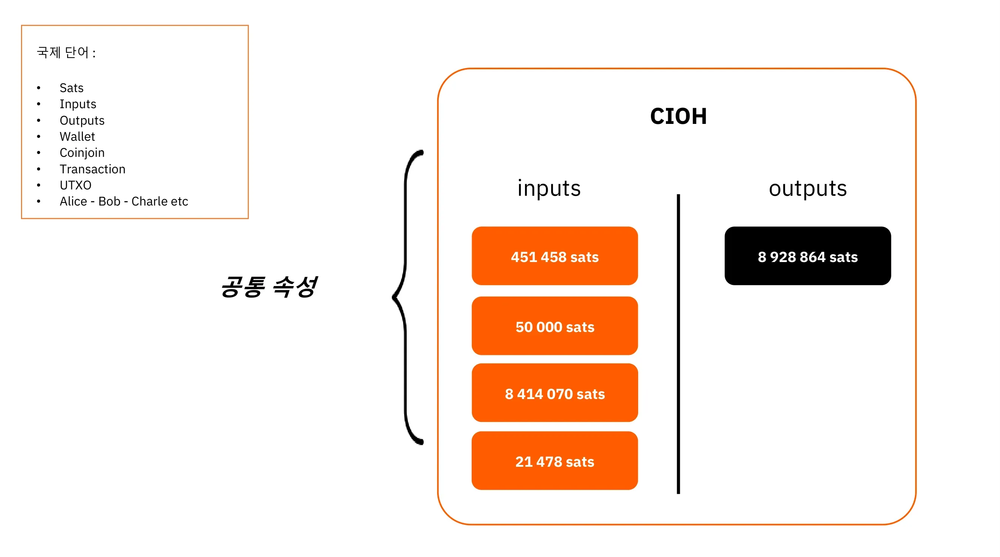


**섹션 4: CoinJoin 트랜잭션 이해하기**


코인 조인을 언급하지 않고 어떻게 Bitcoin의 프라이버시에 대해 이야기할 수 있을까요? 섹션 4에서는 이 혼합 방법에 대해 알아야 할 모든 것을 알려드리겠습니다. 코인조인이 무엇인지, 코인조인의 역사와 목적은 무엇인지, 그리고 존재하는 다양한 유형의 코인조인에 대해 알아볼 것입니다. 마지막으로, 경험이 많은 사용자를 위해 익명 집합과 엔트로피가 무엇인지, 그리고 이를 계산하는 방법을 살펴보겠습니다.


**섹션 5: 기타 고급 기밀성 기술의 과제 이해하기**


다섯 번째 섹션에서는 CoinJoin를 제외하고 Bitcoin에서 개인정보를 보호할 수 있는 다른 모든 기술을 살펴보겠습니다. 수년 동안 개발자들은 개인정보 보호 전용 도구를 설계하는 데 있어 놀라운 창의력을 발휘해 왔습니다. PayJoin, 공동 거래, Coin 스왑, 아토믹 스왑 등 다양한 방법을 살펴보고 작동 방식, 목표, 잠재적인 약점을 자세히 살펴보겠습니다.


또한 노드 네트워크와 트랜잭션 전파 수준에서의 프라이버시도 살펴볼 것입니다. 또한 정적 Address 프로토콜을 포함하여 Bitcoin에서 사용자 프라이버시를 강화하기 위해 수년 동안 제안되어 온 다양한 프로토콜에 대해서도 논의할 것입니다.


Bitcoin의 복잡한 개인정보 보호에 대해 알아볼 준비가 되셨나요? 시작하세요!


# 정의 및 주요 개념


<partId>b9bbbde3-34c0-4851-83e8-e2ffb029cf31</partId>


## Bitcoin의 UTXO 모델


<chapterId>8d6b50c5-bf74-44f4-922b-25204991cb75</chapterId>


Bitcoin은 무엇보다도 통화이지만, 실제로 BTC가 프로토콜에서 어떻게 표시되는지 알고 계십니까?


### Bitcoin의 UTXO: 무엇인가요?


Bitcoin 프로토콜은 "미사용 트랜잭션 출력"의 약자인 UTXO 모델을 기반으로 합니다.


이 모델은 계좌와 잔액 메커니즘에 의존해 금융 흐름을 추적하는 기존 은행 시스템과는 크게 다릅니다. 실제로 은행 시스템에서는 특정 신원과 연결된 계좌에 개별 잔액이 유지됩니다. 예를 들어, 제빵사로부터 빵을 구매하면 은행에서 구매 금액을 계좌에서 인출하여 잔액이 감소하고, 제빵사의 계좌에는 동일한 금액이 입금되어 잔액이 증가합니다. 이 시스템에서는 거래 기록을 제외하고는 계좌로 들어오는 돈과 계좌에서 나가는 돈 사이에 연결 고리가 없다는 개념이 없습니다.


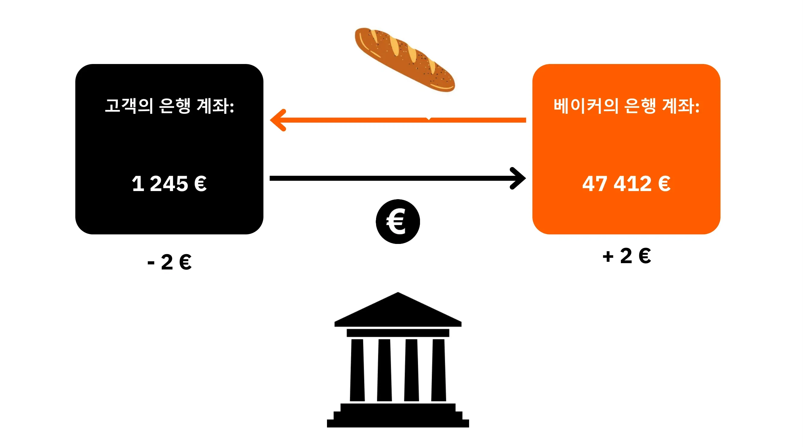


Bitcoin는 다르게 작동합니다. 계정이라는 개념이 존재하지 않으며, 화폐 단위는 잔액이 아닌 UTXO를 통해 관리됩니다. UTXO는 아직 사용되지 않은 특정 수량의 비트코인을 나타내며, 따라서 크거나 작을 수 있는 "Bitcoin 조각"을 형성합니다. 예를 들어, 하나의 UTXO는 '500 BTC' 또는 단순히 '700 Sats'의 가치가 있을 수 있습니다.


**참고: ** 흔히 sat으로 줄여서 부르는 Satoshi은 Bitcoin의 가장 작은 단위로, 법정 화폐의 센티미터에 해당합니다.


```plaintext
1 BTC = 100 000 000 SATS
```


이론적으로 UTXO은 1비트코인에서 이론상 최대 약 2,100만 BTC에 이르는 모든 비트코인 가치를 나타낼 수 있습니다. 그러나 2,100만 비트코인을 모두 소유하는 것은 논리적으로 불가능하며, Dust이라는 더 낮은 경제적 임계값이 있으며, 그 이하에서는 UTXO을 소비하는 것이 경제적으로 수익성이 없는 것으로 간주됩니다.


**알고 계셨나요?** Bitcoin에서 생성된 역대 최대 규모의 UTXO은 **500,000 BTC**의 가치를 가졌습니다. 이는 2011년 11월 통합 작업 중 마운트곡스 플랫폼에서 생성되었습니다: [29a3efd3ef04f9153d47a990bd7b048a4b2d213daaa5fb8ed670fb85f13bdbcf](https://Mempool.space/tx/29a3efd3ef04f9153d47a990bd7b048a4b2d213daaa5fb8ed670fb85f13bdbcf)


### UTXO 및 지출 조건


UTXO는 Bitcoin에서 Exchange의 도구입니다. 각 트랜잭션은 입력으로 UTXO를 소비하고 출력으로 새로운 UTXO를 생성합니다. 트랜잭션이 완료되면 입력으로 사용된 UTXO는 "소비"된 것으로 간주되고, 새로운 UTXO가 생성되어 트랜잭션 출력에 표시된 수신자에게 할당됩니다. 따라서 UTXO는 단순히 사용되지 않은 트랜잭션 출력을 나타내며, 따라서 주어진 시간에 사용자에게 속한 비트코인의 수량을 나타냅니다.


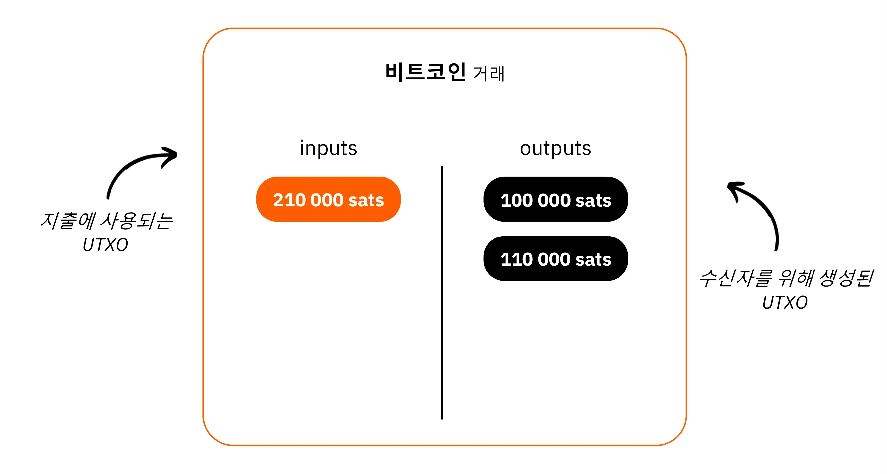


모든 UTXO는 사용 가능한 조건을 정의하는 스크립트에 의해 보호됩니다. UTXO을 사용하려면 사용자는 해당 UTXO을 보호하는 스크립트에 명시된 조건을 충족한다는 것을 네트워크에 입증해야 합니다. 일반적으로 UTXO는 공개 키(또는 이 공개 키를 나타내는 수신 Address)로 보호됩니다. 이 공개 키와 연결된 UTXO을 사용하려면 사용자는 이 키로 만든 디지털 서명을 제공하여 해당 개인 키를 보유하고 있음을 증명해야 합니다. 그렇기 때문에 Bitcoin Wallet에는 실제로 비트코인이 들어 있지 않지만 개인키가 저장되어 있으며, 이를 통해 UTXO에 대한 액세스 권한과 더 나아가 비트코인을 사용할 수 있는 권한을 부여합니다.


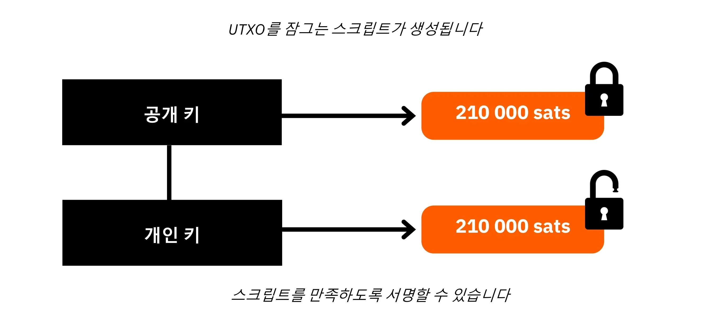


Bitcoin에는 계정이라는 개념이 없으므로 Wallet의 잔액은 단순히 사용할 수 있는 모든 UTXO의 가치를 합산한 것입니다. 예를 들어 Bitcoin Wallet이 다음 4개의 UTXO를 사용할 수 있는 경우입니다:


```plaintext
- 2 BTC
- 8 BTC
- 5 BTC
- 2 BTC
```


Wallet의 총 잔액은 `17 BTC`가 됩니다.


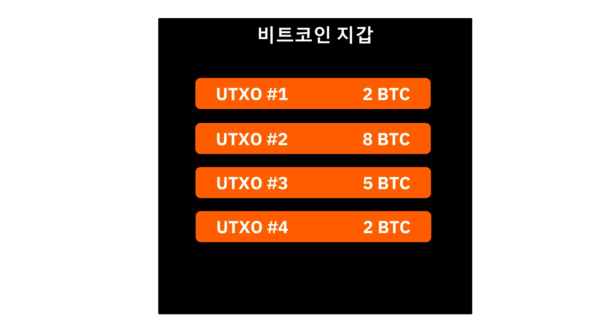


## Bitcoin 트랜잭션의 구조


<chapterId>29d3aaab-de2e-4746-ab40-c9748898850c</chapterId>


### 트랜잭션 입력 및 출력


Bitcoin 트랜잭션은 Blockchain에 기록된 작업으로, 한 사람으로부터 다른 사람에게 Bitcoin의 Ownership를 전송하는 작업입니다. 더 정확하게는 UTXO 모델을 사용하고 있고 계정이 없기 때문에 이 트랜잭션은 하나 이상의 UTXO를 확보한 지출 조건을 충족하고, 이를 소비하며, 마찬가지로 새로운 지출 조건으로 새로운 UTXO를 생성합니다. 간단히 말해, 트랜잭션은 비트코인을 만족하는 스크립트에서 비트코인을 확보하도록 설계된 새로운 스크립트로 이동합니다.


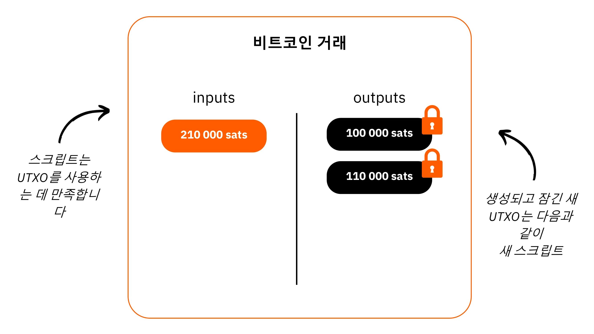


따라서 각 Bitcoin 트랜잭션은 하나 이상의 입력과 하나 이상의 출력으로 구성됩니다. 입력은 트랜잭션이 generate 출력에 소비하는 UTXO입니다. 출력은 향후 트랜잭션의 입력으로 사용할 수 있는 새로운 UTXO입니다.


**알고 계셨나요?** 이론적으로 Bitcoin 트랜잭션은 입력과 출력의 개수가 무한대로 늘어날 수 있습니다. 유일한 제한은 최대 블록 크기입니다.


Bitcoin 트랜잭션의 각 입력은 이전에 사용되지 않은 UTXO을 참조합니다. UTXO을 입력으로 사용하려면 소유자는 관련 스크립트의 유효성을 검사하여, 즉 부과된 지출 조건을 충족하여 자신이 정당한 소유자임을 입증해야 합니다. 일반적으로 이는 처음에 이 UTXO을 보호한 공개 키에 해당하는 개인 키로 생성한 디지털 서명을 제공하는 것을 의미합니다. 따라서 스크립트는 서명이 자금을 받을 때 사용된 공개 키와 일치하는지 확인하는 것으로 구성됩니다.


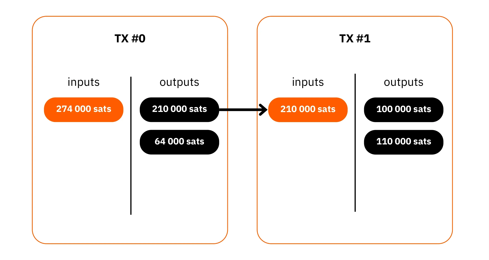


각 출력은 차례로 송금할 비트코인의 양과 수신자를 지정합니다. 후자는 새 스크립트에 의해 정의되며, 일반적으로 수신 Address 또는 새 공개 키로 새로 생성된 UTXO을 차단합니다.


합의 규칙에 따라 트랜잭션이 유효한 것으로 간주되려면 총 출력이 총 입력보다 작거나 같아야 합니다. 즉, 트랜잭션에 의해 생성된 새로운 UTXO의 합이 입력으로 소비된 UTXO의 합을 초과하지 않아야 합니다. 이 원칙은 논리적입니다. `500,000 Sats`만 가지고 있다면 `700,000 Sats`를 구매할 수 없습니다.


### Exchange 및 Bitcoin 트랜잭션에서 병합하기


따라서 UTXO에 대한 Bitcoin 트랜잭션의 동작은 금 Coin을 재주조하는 것과 비교할 수 있습니다. 실제로 UTXO는 분할할 수 없고 융합만 가능합니다. 즉, 사용자는 특정 양의 Bitcoin을 나타내는 UTXO를 단순히 여러 개의 작은 UTXO로 나눌 수 없습니다. 출력값이 초기값보다 작거나 같아야 하는 임의의 값을 가진 하나 이상의 새로운 UTXO를 생성하려면 트랜잭션에서 이를 완전히 소비해야 합니다.


이 메커니즘은 금 Coin의 메커니즘과 유사합니다. 판매자가 거스름돈을 줄 수 없다고 가정하고 2온스 Coin을 소유하고 있는데 1온스로 결제하려고 한다고 가정해 보겠습니다. Coin을 녹여서 각각 1온스 무게의 새 금화 두 개를 주조해야 합니다.


Bitcoin도 비슷한 방식으로 작동합니다. Alice이 `10,000 Sats`의 UTXO를 가지고 있고 `4,000 Sats`의 빵을 구매하고자 한다고 가정해 봅시다. Alice은 `10,000 Sats`의 UTXO 1개를 입력으로 하여 전량 소비하고, `4,000 Sats`와 `6,000 Sats`의 UTXO 2개를 출력으로 하여 거래를 진행합니다. 4,000 Sats`의 UTXO는 제빵사에게 바게트 대금으로 보내지고, `6,000 Sats`의 UTXO는 잔돈의 형태로 Alice에게 돌아갑니다. 거래의 원래 발행자에게 반환되는 이 UTXO를 Bitcoin 전문 용어로 "Exchange"이라고 합니다.


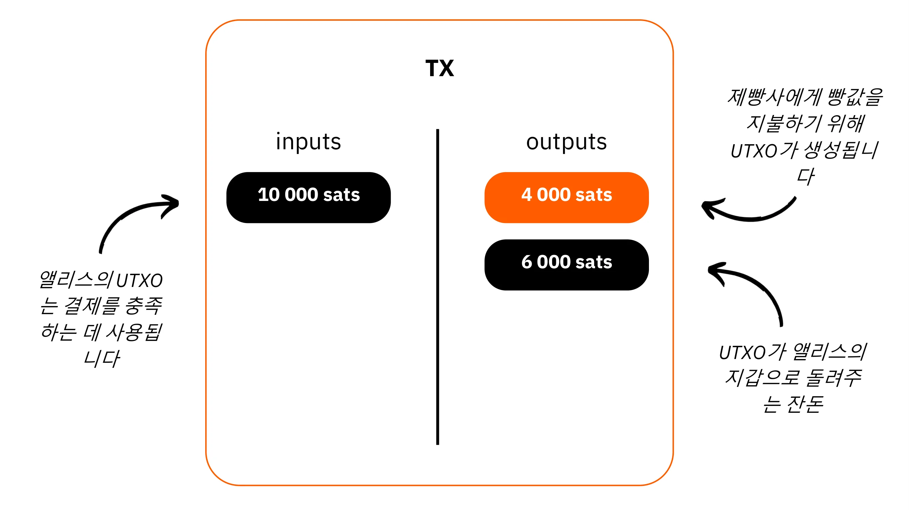


이제 Alice에 `10,000 Sats`의 UTXO이 하나만 있는 것이 아니라 각각 `3,000 Sats`의 UTXO 두 개가 있다고 가정해 보겠습니다. 이 상황에서는 두 UTXO 중 어느 하나만으로는 완드의 `4,000 Sats`을 설정하기에 충분하지 않습니다. 따라서 Alice은 `3,000 Sats`의 UTXO 2개를 동시에 트랜잭션에 입력으로 사용해야 합니다. 이렇게 하면 총 입력 금액이 `6,000 Sats`에 도달하여 제빵사에게 지불해야 하는 `4,000 Sats`을 충족할 수 있습니다. 트랜잭션에 대한 입력으로 여러 UTXO를 함께 그룹화하는 이 방법을 종종 "병합"이라고 합니다.


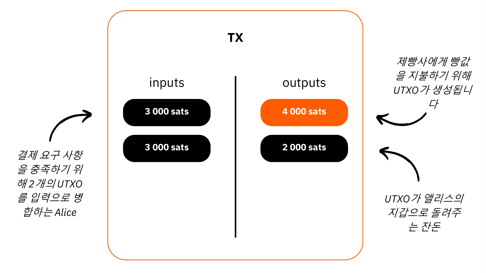


### 거래 수수료


직관적으로 거래 비용도 거래의 결과물을 나타낸다고 생각할 수 있습니다. 하지만 실제로는 그렇지 않습니다. 거래 비용은 총 입력과 총 출력의 차이를 나타냅니다. 즉, 거래에서 원하는 산출물을 충당하기 위해 입력값의 일부를 사용하고 나면 특정 입력값의 합계가 사용되지 않은 채로 남게 됩니다. 이 잔여 합계가 거래 비용을 구성합니다.


```plaintext
Frais = total inputs - total outputs
```


UTXO이 `10,000 Sats`이고 빵을 `4,000 Sats`에 구매하고자 하는 Alice의 예를 들어보겠습니다. Alice는 UTXO의 `10,000 Sats`을 입력으로 트랜잭션을 생성합니다. 그런 다음 그녀는 제빵사에게 바게트 값을 지불하기 위해 `4,000 Sats`의 산출물을 생성합니다. 채굴자들이 자신의 트랜잭션을 블록에 통합하도록 장려하기 위해 Alice는 수수료로 `200 Sats`을 할당합니다. 그런 다음 그녀는 두 번째 산출물인 거스름돈을 생성하고, 이는 그녀에게 반환되며, 이는 `5,800 Sats`에 달합니다.


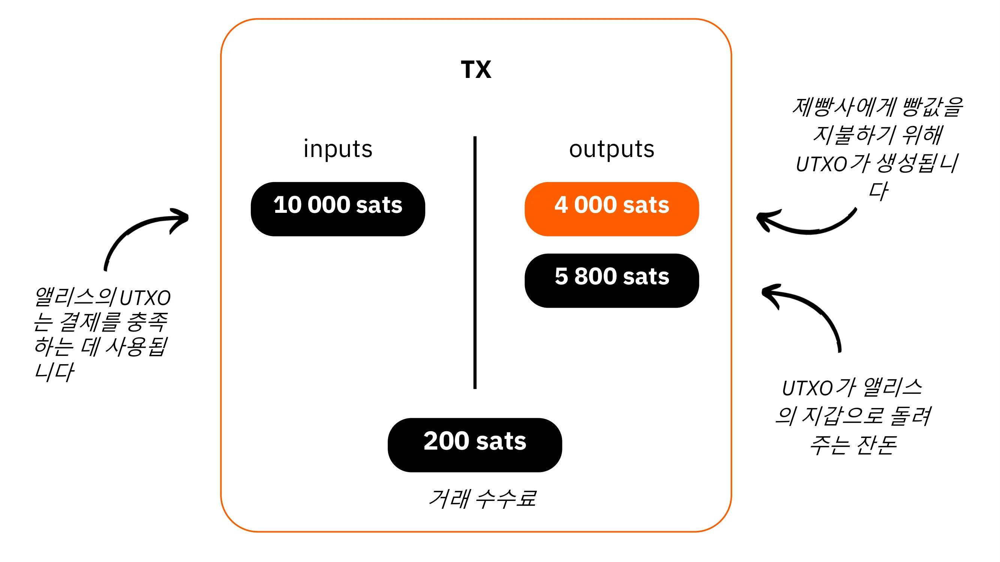


수수료 공식을 적용하면 실제로 미성년자에게 '200Sats'가 남아 있음을 알 수 있습니다:


```plaintext
Frais = total inputs - total outputs
Frais = 10 000 - (4 000 + 5 800)
Frais = 10 000 - 9 800
Frais = 200
```


Miner이 블록을 성공적으로 검증하면 소위 "코인베이스" 거래를 통해 블록에 포함된 모든 거래에 대해 수수료를 징수할 권한이 주어집니다.


### Bitcoin에서 UTXO 만들기


이전 단락을 주의 깊게 살펴보셨다면, 이제 다른 기존 UTXO를 소비해야만 UTXO를 생성할 수 있다는 것을 알 수 있을 것입니다. 이러한 방식으로 Bitcoin 코인은 연속적인 체인을 형성합니다. 하지만 이 체인의 첫 번째 부분이 어떻게 시작되었는지 궁금하실 것입니다. 이는 닭과 달걀의 문제와 비슷한 문제를 제기합니다. 즉, 최초의 UTXO는 어디에서 왔을까요?


그 답은 **거래 코인베이스**에 있습니다.


코인베이스는 각 블록에 고유한 특정 유형의 Bitcoin 트랜잭션으로, 항상 최초의 트랜잭션입니다. 이를 통해 유효한 Proof of Work을 찾은 Miner은 Block reward을 받을 수 있습니다. 이 보상은 두 개의 Elements로 구성됩니다: *이전 섹션에서 설명한 대로* **블록 보조금**과 **거래 수수료**입니다.


Coinbase Transaction은 generate 출력에 대한 입력을 소비할 필요 없이 비트코인을 무에서 유를 창조할 수 있는 유일한 제품이라는 점에서 독특합니다. 이렇게 새로 생성된 비트코인을 "오리지널 UTXO"라고 부를 수 있습니다


블록 보조금 비트코인은 합의 규칙에 미리 정해진 발행 일정에 따라 처음부터 새로 생성되는 BTC입니다. 블록 보조금은 약 4년마다, 즉 210,000블록마다 절반으로 줄어드는데, 이는 "Halving"으로 알려진 프로세스입니다 원래는 각 보조금으로 50 비트코인이 생성되었지만, 이 양은 점차 감소하여 현재는 블록당 3.125비트코인입니다.


트랜잭션 수수료는 새로 생성된 BTC를 나타내기도 하지만, 블록 내 모든 트랜잭션의 총 입력과 출력의 차이를 초과해서는 안 됩니다. 앞서 트랜잭션 수수료는 트랜잭션 출력에 사용되지 않은 입력 부분을 나타낸다는 점을 살펴보았습니다. 이 부분은 트랜잭션 중에 기술적으로 "손실"되며, Miner는 하나 이상의 새로운 UTXO의 형태로 이 값을 다시 생성할 수 있는 권리를 가집니다. 이는 트랜잭션 발행자와 이를 Blockchain에 추가하는 Miner 간의 가치 이전입니다.


**알고 계셨나요?** Coinbase Transaction에서 생성된 비트코인은 100블록의 만기 기간이 적용되며, 이 기간 동안은 Miner에서 사용할 수 없습니다. 이 규칙은 나중에 쓸모없게 될 수 있는 체인에서 새로 생성된 비트코인을 사용하는 것과 관련된 합병증을 피하기 위해 고안되었습니다.


### UTXO 모델의 의미


첫째, UTXO 모델은 Bitcoin의 트랜잭션 수수료에 직접적인 영향을 미칩니다. 각 블록의 용량이 제한되어 있기 때문에 채굴자는 블록에서 차지하는 공간에 비해 가장 높은 수수료를 제공하는 트랜잭션을 선호합니다. 실제로 트랜잭션의 입력과 출력에 더 많은 UTXO가 포함될수록 트랜잭션의 무게가 무거워지므로 더 높은 수수료가 필요합니다. 이것이 바로 저희가 Wallet에서 UTXO의 수를 줄이려고 하는 이유 중 하나이며, 이는 기밀성에도 영향을 미칠 수 있습니다(이 과정의 세 번째 파트에서 Address에서 자세히 다룰 주제입니다).


둘째, 이전 섹션에서 언급했듯이 Bitcoin 코인은 본질적으로 UTXO의 체인입니다. 따라서 각 거래는 과거 UTXO와 미래 UTXO 사이의 링크를 생성합니다. 따라서 UTXO를 사용하면 비트코인의 생성부터 현재 지출까지의 경로를 명시적으로 추적할 수 있습니다. 이러한 투명성은 각 사용자가 받은 비트코인의 진위 여부를 확인할 수 있다는 점에서 긍정적으로 볼 수 있습니다. 그러나 Blockchain 분석의 기반이 되는 추적성과 감사 가능성 또한 이러한 원칙에 따라 사용자의 기밀성을 침해할 수 있습니다. 이 과정의 두 번째 파트에서 이 관행에 대해 자세히 살펴보겠습니다.


## Bitcoin의 개인정보 보호 모델


<chapterId>769d8963-3ed5-4094-b21d-9203c7d9e465</chapterId>


### 돈: 진위성, 무결성 및 이중 지출


화폐의 기능 중 하나는 욕구의 이중 일치 문제를 해결하는 것입니다. 물물교환을 기반으로 하는 시스템에서 Exchange을 완성하려면 내 필요와 일치하는 재화를 기꺼이 나눠줄 사람을 찾아야 할 뿐만 아니라, 그 사람에게 자신의 필요를 충족하는 동등한 가치의 재화를 제공해야 합니다. 이 균형을 맞추는 것은 복잡한 문제입니다.


그렇기 때문에 우리는 공간과 시간 모두에서 가치를 이동하는 데 돈을 사용합니다.


코인이 이 문제를 해결하려면 재화나 서비스를 제공하는 당사자가 나중에 해당 금액을 소비할 수 있다는 확신을 가져야 합니다. 따라서 디지털이든 실물이든 Coin을 받으려는 합리적인 개인은 두 가지 기본 기준을 충족하는지 확인해야 합니다:


- UTXO는 **무결성과 신뢰성**이 있어야 합니다.
- 이중으로 사용해서는 안 됩니다.


실물 화폐를 사용하는 경우, 가장 주장하기 어려운 첫 번째 특성은 바로 이 점입니다. 역사상 여러 시대에 걸쳐 금속 동전의 무결성은 종종 다듬거나 구멍을 뚫는 등의 관행에 의해 영향을 받아왔습니다. 예를 들어 고대 로마에서는 시민들이 금화의 가장자리를 긁어 소량의 귀금속을 수집하는 동시에 향후 거래를 위해 보관하는 것이 일반적인 관행이었습니다. 따라서 Coin의 내재 가치는 감소했지만 액면가는 동일하게 유지되었습니다. 이것이 나중에 Coin의 가장자리가 플루티드 처리된 이유 중 하나입니다.


진위 여부는 실제 화폐 매체에서 확인하기 어려운 특성이기도 합니다. 오늘날의 위조 화폐 방지 기술은 점점 더 복잡해져 소매업체는 값비싼 인증 시스템에 투자해야 합니다.


반면에 Double-spending은 그 특성상 실물 화폐에는 문제가 되지 않습니다. 내가 당신에게 10유로 지폐를 주면, 그것은 내 소유를 떠나 당신의 소유로 들어가기 때문에 자연스럽게 화폐 단위를 여러 번 사용할 수 있는 가능성을 배제합니다. 요컨대, 저는 이 10유로 지폐를 다시는 사용할 수 없습니다.


디지털 화폐의 경우 난이도가 다릅니다. Coin의 진위성과 무결성을 보장하는 것은 종종 더 간단한 프로세스입니다. 이전 섹션에서 살펴본 것처럼 Bitcoin의 UTXO 모델을 사용하면 Coin의 출처를 역추적할 수 있으므로 합의 규칙에 따라 Miner이 실제로 생성했는지 확인할 수 있습니다.


반면에 모든 디지털 상품은 본질적으로 정보이기 때문에 Double-spending이 없는지 확인하는 것은 더 복잡합니다. 실물 상품과 달리 정보는 교환될 때 분할되지 않고 증식하여 확산됩니다. 예를 들어 제가 이메일로 문서를 보내면 그 문서는 복제됩니다. 제가 원본 문서를 삭제했는지 확인할 수 없습니다.


### Bitcoin에서 Double-spending 방지


이러한 디지털 자산의 중복을 방지하는 유일한 방법은 시스템의 모든 거래소를 파악하는 것입니다. 이렇게 하면 누가 무엇을 소유하고 있는지 파악하고 수행된 거래에 따라 각 개인의 보유 자산을 업데이트할 수 있습니다. 예를 들어 은행 시스템에서 경전 화폐를 예로 들면 이런 일이 일어납니다. 신용카드로 판매자에게 10유로를 지불하면 은행은 Exchange를 기록하고 계정 장부를 업데이트합니다.


Bitcoin에서는 Double-spending도 같은 방식으로 방지됩니다. 저희는 해당 코인을 이미 사용한 거래가 없는지 확인합니다. 코인을 사용한 적이 없다면 Double-spending이 발생하지 않을 것이라고 확신할 수 있습니다. 이 원칙은 나카모토 Satoshi가 백서에서 유명한 문구와 함께 설명했습니다:


**거래가 없음을 확인하는 유일한 방법은 모든 거래를 파악하는 것입니다**


하지만 은행 모델과 달리 Bitcoin는 중앙 기관을 신뢰할 필요가 없습니다. 따라서 모든 사용자는 제3자에 의존하지 않고도 Double-spending의 부재를 확인할 수 있어야 합니다. 따라서 모든 사람이 모든 Bitcoin 트랜잭션을 알고 있어야 합니다. 그렇기 때문에 Bitcoin 트랜잭션은 모든 네트워크 노드에 공개적으로 브로드캐스트되고 Blockchain에 명확한 텍스트로 기록됩니다.


Bitcoin에서 개인 정보 보호를 복잡하게 만드는 것은 바로 이러한 정보의 공개적인 전파입니다. 기존 은행 시스템에서는 이론적으로 금융 기관만 수행된 거래를 알 수 있습니다. 반면에 Bitcoin에서는 모든 사용자가 각자의 노드를 통해 모든 거래에 대한 정보를 얻습니다.


### 기밀성 모델: 은행 시스템 대 Bitcoin


기존 시스템에서는 은행 계좌가 사용자의 신원과 연결됩니다. 은행원은 어떤 은행 계좌가 어떤 고객에게 속해 있는지, 어떤 거래가 그와 연관되어 있는지 알 수 있습니다. 그러나 이러한 정보 흐름은 은행과 퍼블릭 도메인 사이에서 단절됩니다. 즉, 다른 개인이 소유한 은행 계좌의 잔액과 거래 내역을 알 수 없습니다. 은행만이 이 정보에 액세스할 수 있습니다.


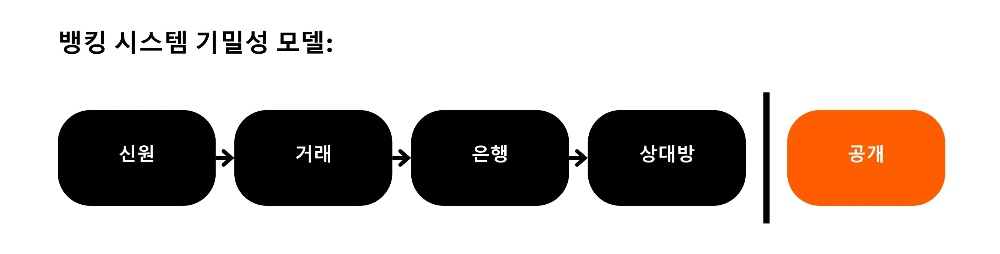


예를 들어, 은행원은 매일 아침 동네 빵집에서 바게트를 구입한다는 사실을 알고 있지만 이웃은 이 거래에 대해 알지 못합니다. 이러한 방식으로 정보의 흐름은 관련 당사자, 특히 은행은 액세스할 수 있지만 외부인은 액세스할 수 없습니다.


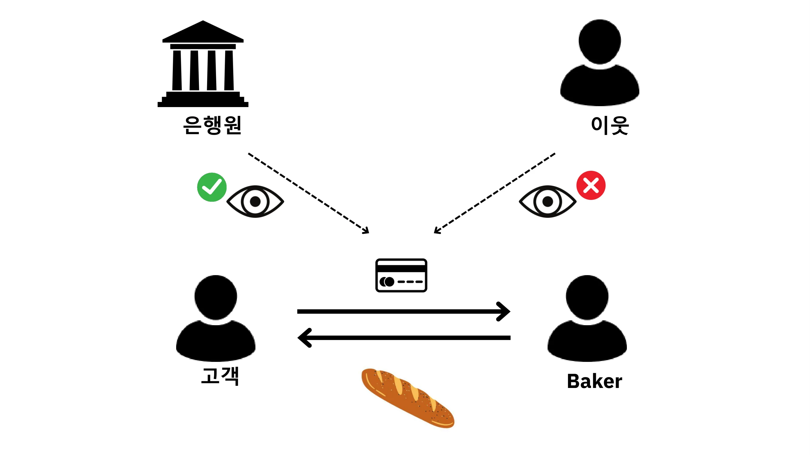


이전 섹션에서 살펴본 거래의 공개 전파에 대한 제약으로 인해 Bitcoin의 기밀성 모델은 은행 시스템의 모델을 따를 수 없습니다. Bitcoin의 경우 거래와 퍼블릭 도메인 간에 정보의 흐름을 분리할 수 없기 때문에 **개인정보 보호 모델은 사용자의 신원과 거래 자체의 분리에 의존합니다**.


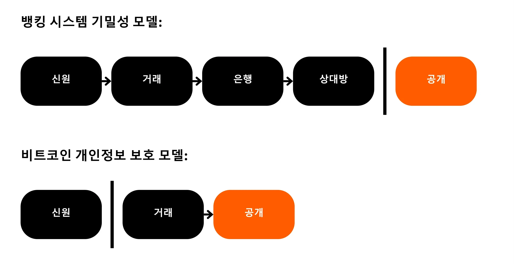


예를 들어, 제빵사에서 빵을 구매하고 비트코인으로 결제하는 경우, 자신의 Full node를 가지고 있는 이웃은 시스템의 다른 모든 거래를 볼 수 있는 것처럼 여러분의 거래가 진행되는 것을 볼 수 있습니다. 그러나 기밀 유지 원칙을 준수한다면 이웃은 이 특정 거래를 회원님의 신원과 연결할 수 없어야 합니다.


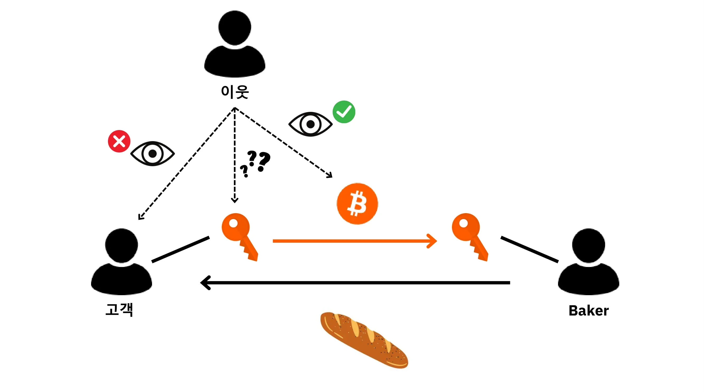


그러나 Bitcoin 거래는 공개되어 있기 때문에 거래 간의 연관성을 파악하여 관련 당사자에 대한 정보를 추론하는 것은 여전히 가능합니다. 이 활동은 그 자체로 "Blockchain 분석"이라는 전문 분야가 되기도 합니다. 이번 강좌의 다음 부분에서는 Blockchain 분석의 기초를 살펴보고 비트코인이 어떻게 추적되는지 이해하고 이를 더 잘 방어할 수 있도록 여러분을 초대합니다.


# 체인 분석에 대한 이해와 보호


<partId>4739371e-9fef-45b0-bcaa-b7a4df6b4470</partId>


## Bitcoin 체인 분석이란 무엇인가요?


<chapterId>7d198ba6-4af2-4f24-86cb-3c79cb25627e</chapterId>


### 정의 및 운영


Blockchain 분석은 Blockchain에서 비트코인의 흐름을 추적하는 작업입니다. 일반적으로 체인 분석은 이전 거래의 샘플에서 특성을 관찰하는 것을 기반으로 합니다. 그런 다음 분석하고자 하는 거래에서 동일한 특성을 식별하고 이를 통해 그럴듯한 해석을 추론하는 과정을 거칩니다. 만족스러운 해결책을 찾기 위한 실용적인 접근 방식을 기반으로 하는 이 문제 해결 방법을 "휴리스틱"이라고 합니다


쉽게 설명하자면, 체인 분석에는 세 가지 주요 단계가 있습니다:


1. **Blockchain 준수;**


2. **알려진 기능의 식별;**


3. **가정의 공제**


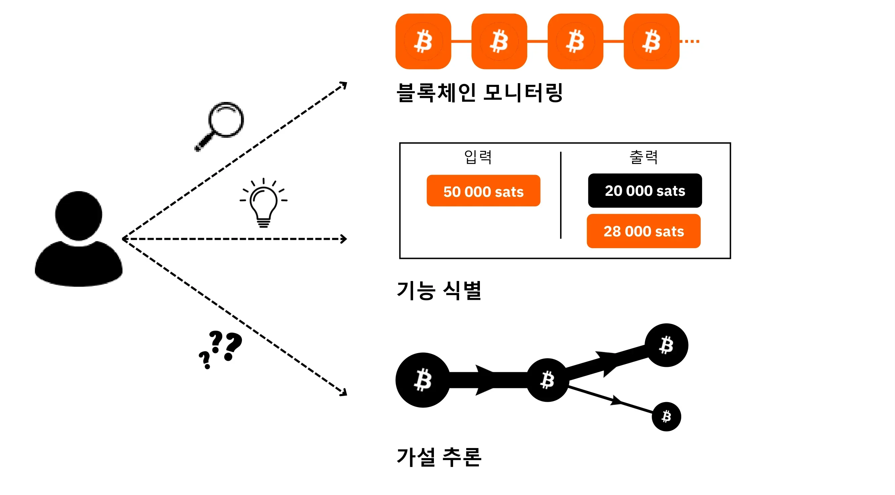


Blockchain 분석은 누구나 수행할 수 있습니다. 거래 움직임을 관찰하고 가설을 세우기 위해 Full node을 통해 Blockchain의 공개 정보에 액세스하기만 하면 됩니다. 이 섹션의 마지막 두 장에서 자세히 살펴보게 될 [OXT.me](https://oxt.me/)와 같이 이러한 분석을 용이하게 해주는 무료 도구도 있습니다. 그러나 기밀성에 대한 주요 위험은 문자열 분석 전문 회사에서 발생합니다. 이러한 회사들은 Blockchain 분석을 산업적 규모로 발전시켜 금융 기관과 정부에 서비스를 판매하고 있습니다. 이 회사들 중 가장 잘 알려진 회사는 Chainalysis입니다.


### 체인 분석 목표


Blockchain 분석의 목표 중 하나는 Bitcoin의 다양한 활동을 그룹화하여 이를 수행한 사용자의 고유성을 파악하는 것입니다. 그런 다음 이 활동 클러스터를 실제 신원과 연결할 수 있습니다.


이전 장으로 돌아가 보겠습니다. Bitcoin의 개인정보 보호 모델이 원래 사용자 신원과 트랜잭션의 분리를 기반으로 하는 이유를 설명했습니다. 따라서 On-Chain 활동을 집계하더라도 실제 신원과 연결할 수 없기 때문에 Blockchain 분석이 쓸모없다고 생각할 수 있습니다.


이론적으로 이 진술은 맞습니다. 이 과정의 첫 번째 파트에서는 암호화 키 쌍이 UTXO의 조건을 설정하는 데 사용된다는 것을 살펴보았습니다. 본질적으로 이러한 키 쌍은 소유자의 신원에 대한 정보를 공개하지 않습니다. 따라서 서로 다른 키 쌍과 관련된 활동을 함께 그룹화하더라도 이러한 활동의 배후에 있는 주체에 대해서는 아무것도 알 수 없습니다.


그러나 실제 현실은 훨씬 더 복잡합니다. 실제 신원을 On-Chain 활동과 연결할 수 있는 수많은 행동이 있습니다. 분석에서는 이를 엔트리 포인트라고 하며, 수많은 엔트리 포인트가 존재합니다.


가장 일반적인 것은 KYC(*고객알기제도*)입니다. 규제 대상 플랫폼에서 개인 수신 주소 중 하나로 비트코인을 출금하면 일부 사람이 사용자의 신원을 해당 Address에 연결할 수 있습니다. 더 넓게 보면 진입점은 실제 생활과 Bitcoin 거래 사이의 모든 형태의 상호작용이 될 수 있습니다. 예를 들어, 소셜 네트워크에 Address를 받는 것을 게시하는 경우, 이것이 분석의 진입점이 될 수 있습니다. 제빵사에게 비트코인으로 결제하면 제빵사는 사용자의 얼굴(신원의 일부)을 Bitcoin Address와 연관시킬 수 있습니다.


이러한 진입점은 Bitcoin을 사용할 때 사실상 피할 수 없는 부분입니다. 범위를 제한하려고 노력하더라도 이러한 진입점은 항상 존재할 것입니다. 그렇기 때문에 개인정보를 보호할 수 있는 방법을 조합하는 것이 중요합니다. 실제 신원과 거래 내역을 분리하는 것은 흥미로운 접근 방식이지만, 오늘날에는 여전히 불충분합니다. 실제로 모든 On-Chain 활동을 함께 그룹화할 수 있다면 아무리 작은 진입점이라도 설정한 단일 Layer의 기밀성이 손상될 수 있습니다.


### 체인 분석으로부터 자신을 방어하기


따라서 Bitcoin을 사용할 때 Blockchain 분석에도 대응할 수 있어야 합니다. 이를 통해 활동의 집계를 최소화하고 엔트리 포인트가 개인 정보 보호에 미치는 영향을 제한할 수 있습니다.


Blockchain 분석에 대응하는 가장 좋은 방법은 분석에 사용된 방법에 대해 알아보는 것일까요? Bitcoin 개인 정보 보호를 강화하려면 이러한 방법을 이해하는 것이 필수적입니다. 이렇게 하면 CoinJoin 또는 PayJoin(이 과정의 마지막 부분에서 살펴볼 기법)와 같은 기법을 더 잘 이해하고 실수를 줄일 수 있습니다.


https://planb.network/tutorials/privacy/on-chain/coinjoin-samourai-wallet-e566803d-ab3f-4d98-9136-5462009262ef

https://planb.network/tutorials/privacy/on-chain/payjoin-848b6a23-deb2-4c5f-a27e-93e2f842140f

여기서 우리는 암호화와 암호 분석에 비유할 수 있습니다. 훌륭한 암호학자는 무엇보다도 숙련된 암호 분석가입니다. 새로운 암호화 알고리즘을 고안하려면 어떤 공격에 직면하게 될지 알아야 하고, 이전 알고리즘이 왜 깨졌는지도 연구해야 합니다. Bitcoin 개인 정보 보호에도 동일한 원칙이 적용됩니다. Blockchain 분석 방법을 이해하는 것이 보호의 핵심입니다. 그렇기 때문에 이 강좌에 on chain 분석에 대한 전체 섹션을 포함시켰습니다.


### 체인 분석 방법


문자열 분석은 정확한 과학이 아니라는 점을 이해하는 것이 중요합니다. 이전의 관찰이나 논리적 해석에서 도출된 휴리스틱에 의존합니다. 이러한 규칙을 통해 절대적인 정확도는 아니지만 상당히 신뢰할 수 있는 결과를 얻을 수 있습니다. 다시 말해, **연쇄 분석은 항상 도달한 결론에 확률의 차원을 포함**합니다. 예를 들어, 두 개의 주소가 동일한 주체에 속한다고 다양한 정도의 확실성을 가지고 추정할 수는 있지만, 완전한 확실성은 항상 도달할 수 없습니다.


연쇄 분석의 주된 목적은 다양한 휴리스틱을 취합하여 오류의 위험을 최소화하는 것입니다. 어떤 의미에서는 현실에 더 가까이 다가갈 수 있는 증거의 축적이라고 할 수 있습니다.


이러한 유명한 휴리스틱은 여러 가지 범주로 분류할 수 있으며, 아래에서 자세히 설명하겠습니다:


- 거래 패턴**;**
- 트랜잭션 내부 휴리스틱**;**
- 트랜잭션 외부의 휴리스틱.


### Satoshi 나카모토와 체인 분석


처음 두 가지 체인 분석 휴리스틱은 Satoshi 나카모토가 직접 발견했습니다. 그는 Bitcoin 백서 10부에서 이에 대해 이야기합니다. 맞습니다:


- cIOH(*공통 입력 Ownership 휴리스틱*);
- 및 Address 재사용.


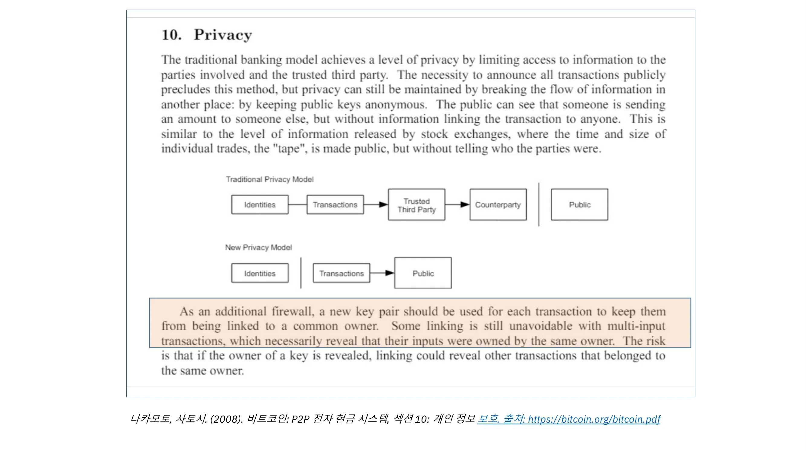


출처: S. Nakamoto, "Bitcoin: 피어 투 피어 전자 현금 시스템", https://Bitcoin.org/Bitcoin.pdf, 2009.


다음 장에서 자세히 살펴보겠지만, 이 두 가지 휴리스틱이 오늘날에도 여전히 체인 분석에서 우위를 점하고 있다는 사실은 이미 흥미롭습니다.


## 거래 패턴


<chapterId>d365a101-2d37-46a5-bfb9-3c51e37bf96b</chapterId>


트랜잭션 패턴은 단순히 일반적인 트랜잭션의 전체 모델 또는 구조로, Blockchain에서 찾을 수 있으며 해석 가능성이 알려진 것입니다. 패턴을 연구할 때는 하나의 트랜잭션에 집중하여 높은 수준에서 분석합니다.


즉, 트랜잭션의 보다 구체적인 세부 사항이나 환경을 자세히 살펴보지 않고 입력에 포함된 UTXO의 수와 출력에 포함된 UTXO의 수만 살펴볼 것입니다. 관찰된 패턴을 바탕으로 트랜잭션의 성격을 해석할 수 있습니다. 그런 다음 구조의 특성을 살펴보고 해석을 도출합니다.


이 섹션에서는 체인 분석에서 발생하는 주요 트랜잭션 모델을 함께 살펴보겠습니다. 각 모델에 대해 구체적인 예시와 함께 이 구조에 대한 가능한 해석을 제공하겠습니다.


### 단일 배송(또는 단일 결제)


대부분의 Bitcoin 결제에서 나타나는 매우 일반적인 패턴부터 시작하겠습니다. 간편 결제 모델은 하나 이상의 UTXO를 입력으로 소비하고 2개의 UTXO를 출력으로 생성하는 것이 특징입니다. 따라서 이 모델은 다음과 같습니다:


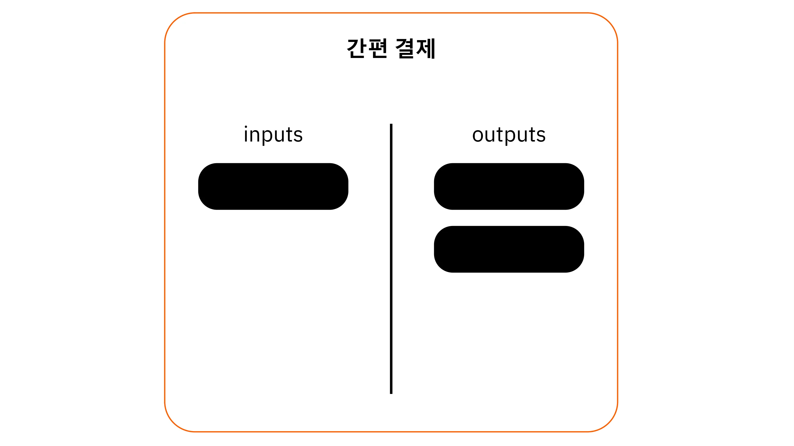


Blockchain에서 이 트랜잭션 구조를 발견하면 이미 해석을 도출할 수 있습니다. 이름에서 알 수 있듯이 이 모델은 송금 또는 결제 트랜잭션이 진행 중임을 나타냅니다. 사용자는 자신의 UTXO을 입력으로 소비하여 지불 UTXO과 잔돈 UTXO(같은 사용자에게 반환된 돈)의 출력을 충족시켰습니다.


따라서 관찰된 사용자는 두 개의 출력 UTXO 중 하나(결제 UTXO)는 더 이상 소유하지 않지만 다른 하나(변경 UTXO)는 여전히 소유하고 있을 가능성이 높습니다.


현재로서는 패턴 연구의 목적이 아니기 때문에 어떤 출력이 어떤 UTXO를 나타내는지 지정할 수 없습니다. 다음 섹션에서 연구할 휴리스틱을 통해 이를 파악할 수 있습니다. 이 단계에서 우리의 목표는 해당 트랜잭션의 성격(이 경우 단순 전송)을 식별하는 것으로 제한됩니다.


예를 들어, 다음은 단순 전송 패턴을 채택한 Bitcoin 트랜잭션입니다:


```plaintext
b6cc79f45fd2d7669ff94db5cb14c45f1f879ea0ba4c6e3d16ad53a18c34b769
```


출처: [Mempool.space](https://Mempool.space/tx/b6cc79f45fd2d7669ff94db5cb14c45f1f879ea0ba4c6e3d16ad53a18c34b769)


이 첫 번째 예시를 통해 '트랜잭션 모델'을 연구한다는 것이 무엇을 의미하는지 더 잘 이해하셨을 것입니다. 트랜잭션의 환경이나 구체적인 세부 사항을 고려하지 않고 트랜잭션의 구조에만 집중하여 트랜잭션을 조사합니다. 이 첫 번째 단계에서는 큰 그림만 살펴봅니다.


이제 패턴이 무엇인지 이해했으니 다른 기존 모델로 넘어가 보겠습니다.


### 스위핑


이 두 번째 모델은 단일 UTXO를 입력으로 소비하고 단일 UTXO를 출력으로 생산하는 것이 특징입니다.


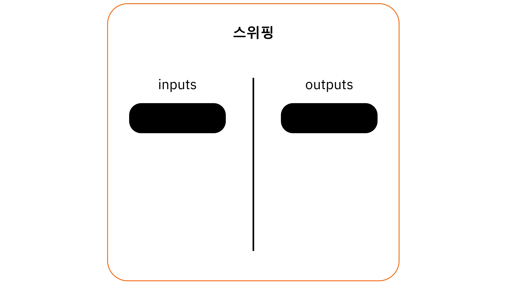


이 모델의 해석은 자체 전송이 존재한다는 것입니다. 사용자가 자신의 비트코인을 본인 소유의 다른 Address으로 이체했습니다. 트랜잭션에 변화가 없으므로 결제가 존재할 가능성은 거의 없습니다. 실제로 결제가 이루어지면 결제자가 판매자가 요구한 금액에 거래 수수료를 더한 금액과 정확히 일치하는 UTXO를 보유하는 것은 거의 불가능합니다. 따라서 일반적으로 결제자는 잔액 출력을 생성해야 할 의무가 있습니다.


그러면 관찰된 사용자가 이 UTXO을 여전히 소유하고 있을 가능성이 높다는 것을 알 수 있습니다. 체인 분석의 맥락에서 트랜잭션의 입력으로 사용된 UTXO이 Alice의 소유라는 것을 알고 있다면, 출력으로 사용된 UTXO도 그녀의 소유라고 가정할 수 있습니다. 이 가정을 강화할 수 있는 트랜잭션 내부의 휴리스틱을 식별하는 것은 나중에 흥미로운 일이 될 것입니다(3.3장에서 이러한 휴리스틱에 대해 살펴보겠습니다).


예를 들어, 다음은 스윕 패턴을 채택한 Bitcoin 트랜잭션입니다:


```plaintext
35f1072a0fda5ae106efb4fda871ab40e1f8023c6c47f396441ad4b995ea693d
```


출처: [Mempool.space](https://Mempool.space/tx/35f1072a0fda5ae106efb4fda871ab40e1f8023c6c47f396441ad4b995ea693d)


그러나 이러한 유형의 패턴은 암호화폐 Exchange 플랫폼의 계정으로 자체 이체하는 것으로도 나타날 수 있으니 주의하시기 바랍니다. 알려진 주소와 거래의 맥락을 연구하여 자체 보관 Wallet으로 스와이프하는 것인지 플랫폼으로 인출하는 것인지를 알 수 있습니다. 실제로 Exchange 플랫폼의 주소는 쉽게 식별할 수 있는 경우가 많습니다.


Alice의 예를 다시 살펴봅시다: 스캔 결과 플랫폼(예: 바이낸스)에 알려진 Address로 연결된다면, 이는 비트코인을 판매하거나 이 플랫폼에 보관할 의도로 Alice의 직접 소유에서 벗어나 전송된 것으로 볼 수 있습니다. 반면에 목적지 Address을 알 수 없는 경우, Alice이 여전히 소유하고 있는 또 다른 Wallet라고 가정하는 것이 합리적입니다. 그러나 이러한 유형의 연구는 패턴보다는 휴리스틱의 범주에 더 가깝습니다.


### 통합


이 모델은 입력에서 여러 개의 UTXO를 소비하고 출력에서 단일 UTXO를 생산하는 것이 특징입니다.


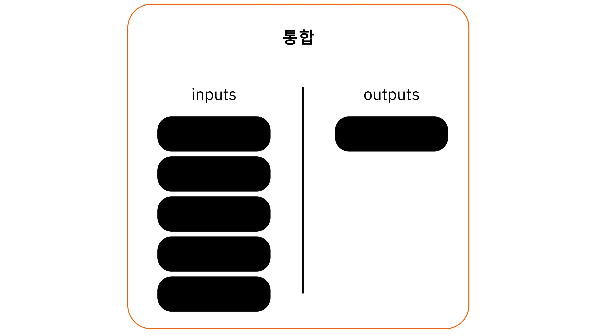


이 패턴의 해석은 통합이 진행되고 있다는 것입니다. 이는 거래 수수료가 인상될 것을 예상하여 여러 UTXO를 병합하는 Bitcoin 사용자들 사이에서 흔히 볼 수 있는 관행입니다. 수수료가 낮은 기간에 이 작업을 수행하면 향후 수수료를 절약할 수 있습니다. 이 방법은 4.3장에서 자세히 설명하겠습니다.


이 트랜잭션 모델의 배후에 있는 사용자가 입력에 있는 모든 UTXO를 소유하고 있으며 출력에 있는 UTXO을 계속 소유하고 있을 가능성이 높다고 추론할 수 있습니다. 따라서 자동 전송일 가능성이 높습니다.


스윕과 마찬가지로 이러한 유형의 패턴은 Exchange 플랫폼 계정으로의 자체 이체를 나타낼 수도 있습니다. 알려진 주소와 거래의 컨텍스트에 대한 연구를 통해 자체 보관 Wallet로의 통합인지 아니면 플랫폼으로의 출금인지 알 수 있습니다.


예를 들어, 다음은 통합 패턴을 채택한 Bitcoin 트랜잭션입니다:


```plaintext
77c16914211e237a9bd51a7ce0b1a7368631caed515fe51b081d220590589e94
```


출처: [Mempool.space](https://Mempool.space/tx/77c16914211e237a9bd51a7ce0b1a7368631caed515fe51b081d220590589e94)


체인 분석에서 이 모델은 많은 정보를 밝혀낼 수 있습니다. 예를 들어, 입력 중 하나가 Alice에 속한다는 것을 알고 있다면 다른 모든 입력과 이 트랜잭션의 출력도 Alice에 속한다고 가정할 수 있습니다. 이 가정을 통해 이전 트랜잭션의 체인을 역추적하여 Alice과 연관되었을 가능성이 있는 다른 트랜잭션을 식별하고 분석할 수 있습니다.


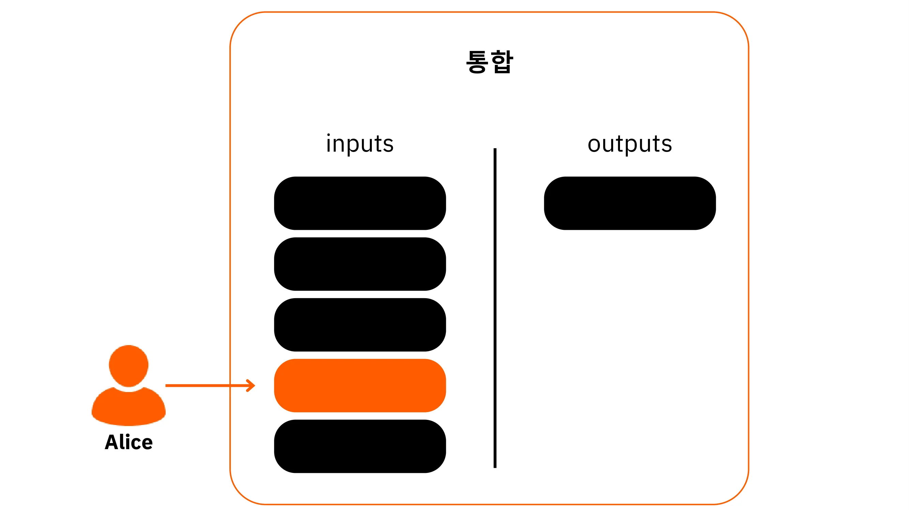


### 그룹화된 지출


이 모델은 소수의 UTXO를 입력으로 소비하고(종종 단 한 개만) 다수의 UTXO를 출력으로 생성하는 것이 특징입니다.


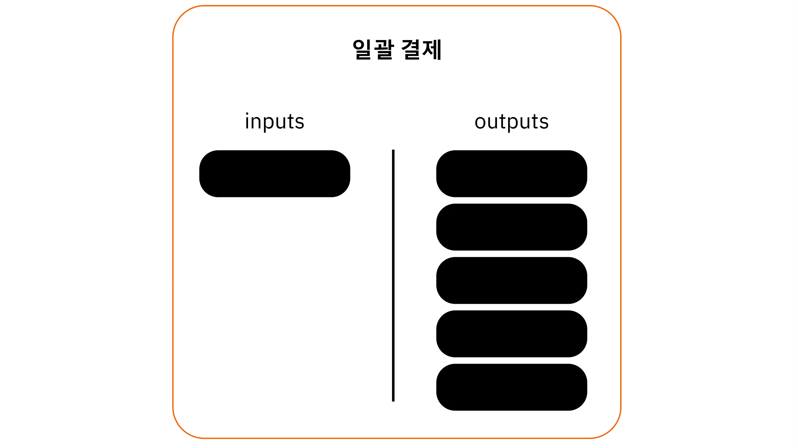


이 모델의 해석은 우리가 그룹화된 지출을 하고 있다는 것입니다. 이는 Exchange 플랫폼과 같은 중요한 경제 활동을 드러내는 관행일 가능성이 높습니다. 그룹화된 지출을 통해 이러한 단체는 단일 거래에서 비용을 결합하여 비용을 절감할 수 있습니다.


이 모델을 통해 투입되는 UTXO은 높은 수준의 경제 활동을 하는 회사에서 발생하며, 산출되는 UTXO는 분산될 것이라는 점을 추론할 수 있습니다. 대부분은 플랫폼에서 비트코인을 인출한 회사의 고객에 속할 것입니다. 일부는 파트너 회사로 갈 수도 있습니다. 마지막으로, 하나 이상의 변경 사항이 발행 회사로 다시 전송될 것입니다.


예를 들어, 다음은 번들 지출 패턴을 채택한 Bitcoin 트랜잭션입니다(아마도 바이비트 플랫폼에서 발행한 트랜잭션일 것으로 추정됩니다):


```plaintext
8a7288758b6e5d550897beedd13c70bcbaba8709af01a7dbcc1f574b89176b43
```


출처: [Mempool.space](https://Mempool.space/tx/8a7288758b6e5d550897beedd13c70bcbaba8709af01a7dbcc1f574b89176b43)


### 프로토콜별 트랜잭션


트랜잭션 패턴 중에서도 특정 프로토콜의 사용을 드러내는 패턴을 식별할 수도 있습니다. 예를 들어, 5부에서 설명한 Whirlpool 코인조인은 다른 기존 거래와 쉽게 구분할 수 있는 구조를 가지고 있습니다.


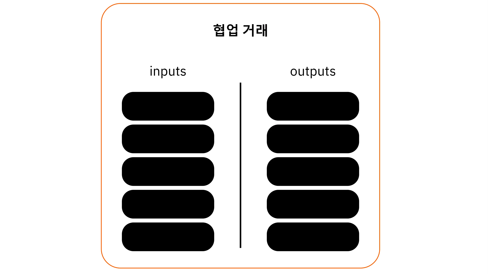


이 패턴을 분석해 보면 협업 거래가 존재할 가능성이 높다는 것을 알 수 있습니다. CoinJoin을 관찰할 수도 있습니다. 이 후자의 가설이 맞다면, 출구 수를 통해 CoinJoin의 참여자 수를 대략적으로 추정할 수 있습니다.


예를 들어, 다음은 CoinJoin 협업 트랜잭션 패턴을 채택한 Bitcoin 트랜잭션입니다:


```plaintext
00601af905bede31086d9b1b79ee8399bd60c97e9c5bba197bdebeee028b9bea
```


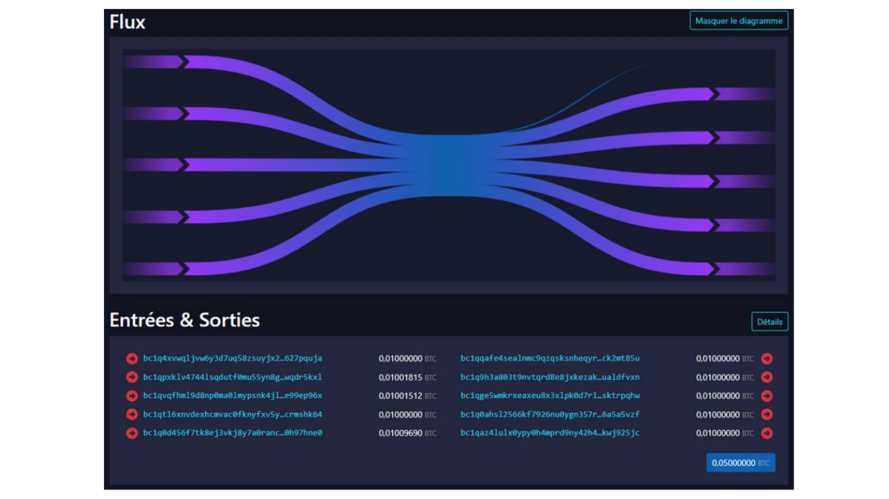


출처: [Mempool.space](https://Mempool.space/tx/00601af905bede31086d9b1b79ee8399bd60c97e9c5bba197bdebeee028b9bea)


이 외에도 고유한 구조를 가진 많은 프로토콜이 있습니다. 예를 들어 와비사비 트랜잭션, 스탬프 트랜잭션, 룬 트랜잭션 등이 있습니다.


이러한 트랜잭션 패턴 덕분에 이미 특정 트랜잭션에 대한 일정량의 정보를 해석할 수 있습니다. 하지만 트랜잭션 구조만이 분석에 필요한 유일한 정보 소스는 아닙니다. 거래의 세부 사항도 연구할 수 있습니다. 이러한 내부 세부 정보를 저는 '내부 휴리스틱'이라고 부르며, 다음 장에서 살펴보겠습니다.


## 내부 휴리스틱


<chapterId>c54b5abe-872f-40f4-a0d0-c59faff228ba</chapterId>


내부 휴리스틱은 거래 환경을 조사할 필요 없이 거래 자체 내에서 식별하여 추론할 수 있는 특정 특성을 말합니다. 높은 수준에서 거래의 전체 구조에 초점을 맞추는 패턴과 달리 내부 휴리스틱은 추출 가능한 데이터 집합을 기반으로 합니다. 여기에는 다음이 포함됩니다:


- 다양한 UTXO가 들어오고 나가는 양입니다;
- 스크립트와 관련된 모든 것: 수신 주소, 버전 관리, 잠금 시간...


일반적으로 이러한 유형의 휴리스틱을 사용하면 특정 트랜잭션의 변경 사항을 식별할 수 있습니다. 이렇게 하면 여러 트랜잭션에 걸쳐 하나의 엔티티를 추적할 수 있습니다. 실제로 추적하고자 하는 사용자의 UTXO을 식별하는 경우, 해당 사용자가 거래를 수행할 때 어떤 출력이 다른 사용자에게 전송되었는지, 어떤 출력이 변경 사항을 나타내는지, 따라서 해당 사용자가 소유하고 있는지를 파악하는 것이 중요합니다.


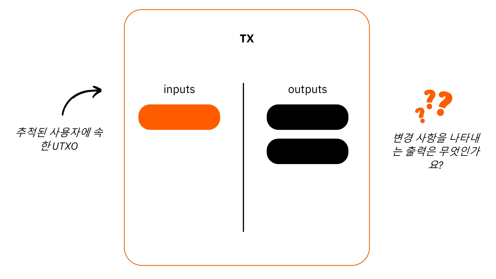


다시 한 번 말씀드리지만, 이러한 휴리스틱이 절대적으로 정확한 것은 아닙니다. 이러한 휴리스틱을 개별적으로 적용하면 가능성이 있는 시나리오를 식별할 수 있을 뿐입니다. 불확실성을 완전히 제거할 수는 없지만 불확실성을 줄이는 데 도움이 되는 것은 여러 가지 휴리스틱을 축적하는 것입니다.


### 내부 유사성


이 휴리스틱은 동일한 트랜잭션의 입력과 출력 간의 유사성을 조사하는 것입니다. 입력과 트랜잭션의 출력 중 하나에서만 동일한 특성이 관찰되면 이 출력이 변경을 구성할 가능성이 높습니다.


가장 눈에 띄는 특징은 동일한 거래에서 수신 Address를 재사용할 수 있다는 점입니다.


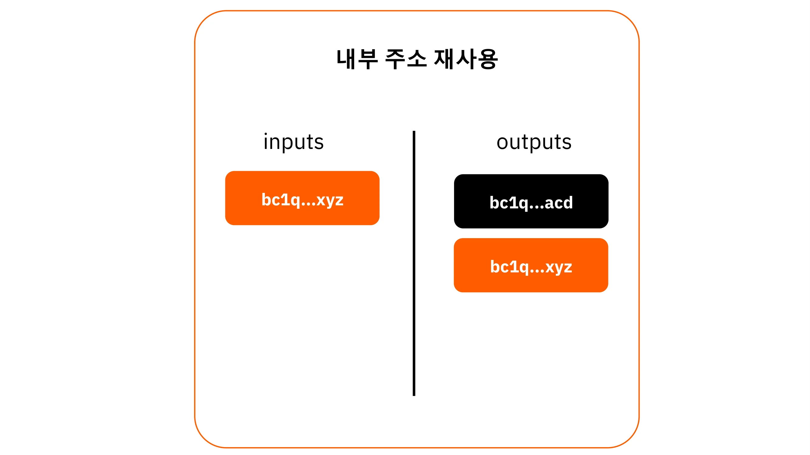


이 휴리스틱은 의심의 여지를 거의 남기지 않습니다. 개인키가 해킹당하지 않는 한, 동일한 Address을 수신하면 반드시 한 사용자의 활동이 드러나기 때문입니다. 결과적으로 트랜잭션 변경은 입력과 동일한 Address을 사용한 출력이라는 해석이 가능합니다. 그러면 이 변경을 통해 개인을 계속 추적할 수 있습니다.


예를 들어, 다음은 이 휴리스틱을 적용할 수 있는 트랜잭션입니다:


```plaintext
54364146665bfc453a55eae4bfb8fdf7c721d02cb96aadc480c8b16bdeb8d6d0
```


출처: [Mempool.space](https://Mempool.space/tx/54364146665bfc453a55eae4bfb8fdf7c721d02cb96aadc480c8b16bdeb8d6d0)


입력과 출력 간의 이러한 유사성은 Address 재사용에만 그치지 않습니다. 스크립트 사용의 모든 유사성은 휴리스틱을 적용하는 데 사용될 수 있습니다. 예를 들어, 입력과 트랜잭션 출력 중 하나 사이에 동일한 버전 관리를 관찰할 수 있습니다.


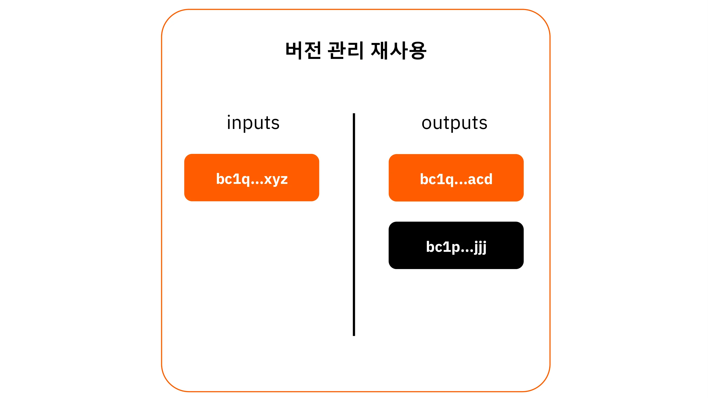


이 다이어그램에서 입력 0번은 P2WPKH 스크립트(`bc1q`로 시작하는 SegWit V0)를 잠금 해제하는 것을 볼 수 있습니다. 출력 0번은 동일한 유형의 스크립트를 사용합니다. 반면에 출력 1번은 P2TR 스크립트(`bc1p`로 시작하는 SegWit V1)를 사용합니다. 이 기능의 해석은 입력과 동일한 버전이 있는 Address이 변경된 Address일 가능성이 높다는 것입니다. 따라서 항상 동일한 사용자에게 속하게 됩니다.


다음은 이 휴리스틱을 적용할 수 있는 트랜잭션입니다:


```plaintext
db07516288771ce5d0a06b275962ec4af1b74500739f168e5800cbcb0e9dd578
```


출처: [Mempool.space](https://Mempool.space/tx/db07516288771ce5d0a06b275962ec4af1b74500739f168e5800cbcb0e9dd578)


후자의 경우 입력 0번과 출력 1번은 P2WPKH 스크립트(SegWit V0)를 사용하는 반면, 출력 0번은 다른 P2PKH 스크립트(레거시)를 사용하는 것을 볼 수 있습니다.


2010년대 초반에는 당시 사용 가능한 스크립트 유형이 제한되어 있었기 때문에 스크립트 버전 관리를 기반으로 한 이 휴리스틱은 상대적으로 도움이 되지 못했습니다. 하지만 시간이 지나고 Bitcoin이 지속적으로 업데이트되면서 점점 더 다양한 스크립트 유형이 도입되었습니다. 따라서 스크립트 유형이 다양해짐에 따라 사용자가 더 작은 그룹으로 나뉘어 내부 버전 관리 재사용 휴리스틱을 적용할 가능성이 높아지면서 이 휴리스틱의 관련성이 점점 더 높아지고 있습니다. 따라서 기밀성 관점에서만 본다면 가장 일반적인 유형의 스크립트를 선택하는 것이 좋습니다. 예를 들어, 이 줄을 작성할 때 Taproot 스크립트(`bc1p`)는 SegWit V0 스크립트(`bc1q`)보다 덜 자주 사용됩니다. 전자는 특정 특정 상황에서 경제적 및 기밀성 이점을 제공하지만, 보다 전통적인 단일 서명 용도의 경우 새 표준이 더 널리 채택될 때까지 기밀성 이유로 이전 표준을 고수하는 것이 합리적일 수 있습니다.


### 라운드 번호 결제


변화를 식별하는 데 도움이 되는 또 다른 내부 휴리스틱은 라운드 숫자 휴리스틱입니다. 일반적으로 간단한 결제 패턴(입력 1개, 출력 2개)이 있을 때 출력 중 하나가 반올림된 금액을 지출하면 해당 결제를 나타냅니다.


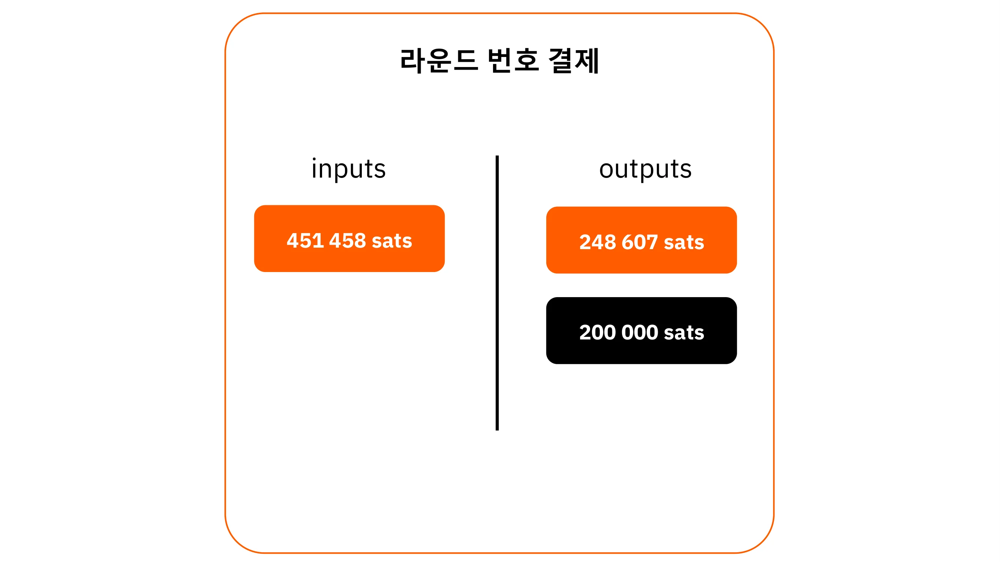


제거를 통해 하나의 출력이 지불을 나타내면 다른 하나는 변경을 나타냅니다. 따라서 입력 사용자가 항상 변경 사항으로 식별되는 출력을 소유하고 있을 가능성이 높다고 추론할 수 있습니다.


대부분의 결제는 여전히 신탁 계좌 단위로 이루어지기 때문에 이 휴리스틱이 항상 적용되는 것은 아니라는 점을 강조해야 합니다. 실제로 프랑스의 소매업체가 Bitcoin을 수락하는 경우 일반적으로 Sats로 안정된 가격을 표시하지 않습니다. 대신 유로로 표시된 가격과 지불할 비트코인의 금액 사이의 변환을 선택할 것입니다. 따라서 거래가 끝날 때 반올림 숫자가 없어야 합니다.


그럼에도 불구하고 분석가는 트랜잭션이 네트워크에서 브로드캐스트된 시점에 유효한 Exchange 비율을 고려하여 이 변환을 시도할 수 있습니다. 입력이 `97,552 Sats`이고 출력이 `31,085 Sats`와 `64,152 Sats`인 트랜잭션의 예를 들어 보겠습니다. 언뜻 보기에 이 거래는 반올림 금액이 포함되지 않은 것처럼 보입니다. 그러나 거래 당시의 Exchange 환율인 64,339유로를 적용하면 다음과 같이 유로로 환산할 수 있습니다:


- 62.76유로의 입력값입니다;
- 20유로 출력;
- 41.27유로의 결과물.


법정 화폐로 변환된 이 거래는 반올림 금액 결제 휴리스틱을 적용하는 데 사용할 수 있습니다. 20유로는 판매자에게 전달되었거나 최소한 Ownership으로 변경되었을 것입니다. 공제를 통해 41.27유로의 결과물은 원래 사용자의 소유로 남아있을 가능성이 높습니다.


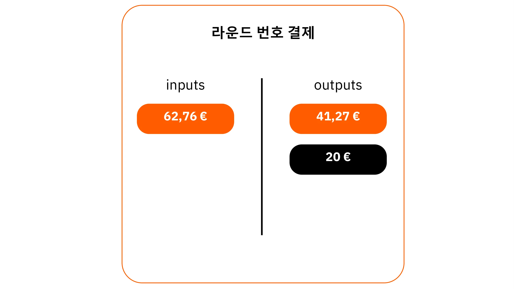


언젠가 Bitcoin이 거래소에서 선호하는 계정 단위가 된다면, 이 휴리스틱은 분석에 더욱 유용하게 사용될 수 있습니다.


예를 들어, 다음은 이 휴리스틱을 적용할 수 있는 트랜잭션입니다:


```plaintext
2bcb42fab7fba17ac1b176060e7d7d7730a7b807d470815f5034d52e96d2828a
```


출처: [Mempool.space](https://Mempool.space/tx/2bcb42fab7fba17ac1b176060e7d7d7730a7b807d470815f5034d52e96d2828a)


### 가장 큰 출력


간편결제 모델에서 두 거래 결과값 사이에 충분히 큰 차이가 있는 경우, 가장 큰 결과값이 변경될 가능성이 높다고 추정할 수 있습니다.


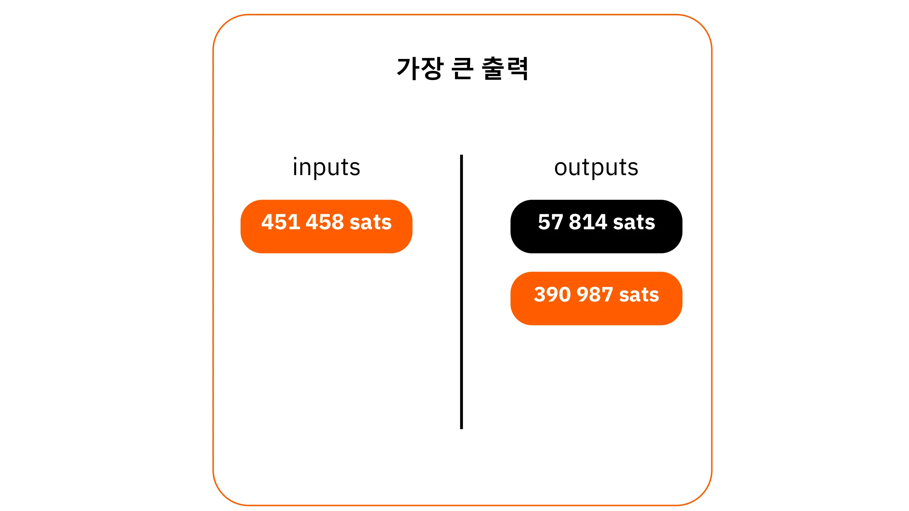


이 가장 큰 출력 휴리스틱은 가장 부정확한 휴리스틱임에 틀림없습니다. 그 자체로는 매우 약합니다. 하지만 이 기능을 다른 휴리스틱과 결합하여 해석의 불확실성을 줄일 수 있습니다.


예를 들어, 라운드 결제와 더 큰 결제 금액이 있는 거래를 살펴보고 있는 경우 라운드 결제 휴리스틱과 더 큰 결제 휴리스틱을 함께 적용하면 불확실성 수준이 줄어듭니다.


예를 들어, 다음은 이 휴리스틱을 적용할 수 있는 트랜잭션입니다:


```plaintext
b79d8f8e4756d34bbb26c659ab88314c220834c7a8b781c047a3916b56d14dcf
```


출처: [Mempool.space](https://Mempool.space/tx/b79d8f8e4756d34bbb26c659ab88314c220834c7a8b781c047a3916b56d14dcf)


## 외부 휴리스틱


<chapterId>4a170e3b-200d-431a-8285-18a23ff617ba</chapterId>


외부 휴리스틱에 대한 연구는 거래 자체에 국한되지 않는 특정 Elements의 유사성, 패턴, 특성을 분석하는 것을 의미합니다. 즉, 이전에는 내부 휴리스틱으로 거래에 내재된 Elements를 활용하는 데 국한했다면, 이제는 외부 휴리스틱을 통해 거래의 환경을 포함하도록 분석 범위를 넓히고 있습니다.


### Address 재사용


이는 비트코인 사용자들 사이에서 가장 잘 알려진 휴리스틱 중 하나입니다. Address 재사용을 통해 서로 다른 트랜잭션과 UTXO 간의 연결 고리를 구축할 수 있습니다. 이는 Address을 수신하는 Bitcoin이 여러 번 사용될 때 발생합니다.


따라서 이전 장에서 살펴본 것처럼 동일한 트랜잭션 내에서 Address 재사용을 내부 휴리스틱으로 활용하여 변경 사항을 식별할 수 있습니다. 그러나 Address 재사용은 여러 트랜잭션의 배후에 있는 엔티티의 고유성을 식별하기 위한 외부 휴리스틱으로도 사용할 수 있습니다.


Address의 재사용에 대한 해석은 해당 Address에서 차단된 모든 UTXO가 동일한 엔티티에 속해 있거나 속해 있었다는 것입니다. 이 휴리스틱은 불확실성의 여지를 거의 남기지 않습니다. 일단 식별되면 결과 해석이 현실과 일치할 가능성이 높습니다. 따라서 서로 다른 On-Chain 활동을 그룹화할 수 있습니다.


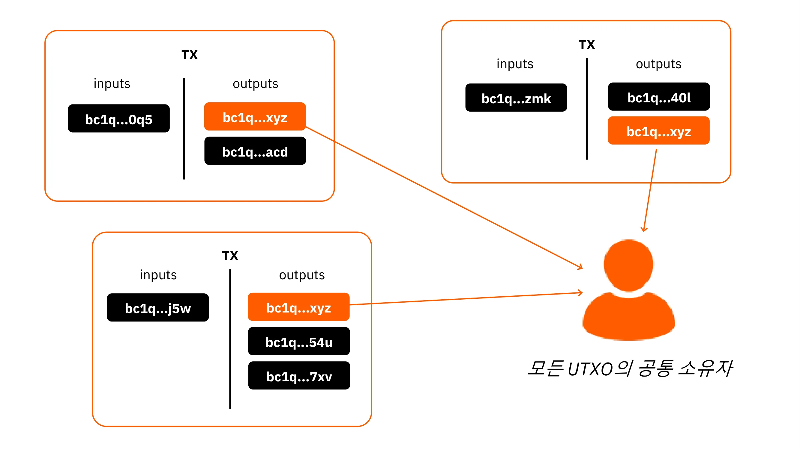


3부 소개에서 설명했듯이, 이 휴리스틱은 Satoshi 나카모토가 직접 발견한 것입니다. 백서에서 그는 사용자가 이를 생성하지 않도록 돕는 해결책으로 새로운 트랜잭션마다 빈 Address을 사용하는 방법을 언급했습니다:


"_추가 방화벽으로 각 트랜잭션에 대해 새로운 키 쌍을 사용하여 공통 소유자와 연결되지 않도록 유지할 수 있습니다."


출처: S. Nakamoto, "Bitcoin: 피어투피어 전자 현금 시스템", https://Bitcoin.org/Bitcoin.pdf, 2009.


예를 들어 다음은 여러 트랜잭션에서 재사용되는 Address입니다:


```plaintext
bc1qqtmeu0eyvem9a85l3sghuhral8tk0ar7m4a0a0
```


출처: [Mempool.space](https://Mempool.space/Address/bc1qqtmeu0eyvem9a85l3sghuhral8tk0ar7m4a0a0)


### 스크립트 유사성 및 Wallet 임프린트


Address 재사용 외에도 작업을 동일한 Wallet 또는 Address 클러스터에 연결할 수 있는 다른 많은 휴리스틱이 있습니다.


첫째, 분석가는 스크립트 사용의 유사점을 찾을 수 있습니다. 예를 들어, Multisig과 같은 특정 소수 스크립트는 SegWit V0 스크립트보다 발견하기가 더 쉬울 수 있습니다. 우리가 숨어 있는 그룹이 클수록 우리를 발견하기가 더 어려워집니다. 이것이 좋은 CoinJoin 프로토콜에서 모든 참가자가 정확히 동일한 유형의 스크립트를 사용하는 이유 중 하나입니다.


보다 일반적으로 분석가는 Wallet의 특징적인 지문에 집중할 수도 있습니다. 이는 추적 휴리스틱으로 활용하기 위해 식별할 수 있는 용도별 프로세스입니다. 즉, 추적된 엔터티에 기인한 거래에서 동일한 내부 특성이 축적되는 것을 관찰하면 다른 거래에서도 동일한 특성을 식별하려고 시도할 수 있습니다.


예를 들어, 추적된 사용자가 체계적으로 P2TR 주소(`bc1p...`)로 변경 사항을 보낸다는 것을 식별할 수 있습니다. 이 프로세스가 반복되면 나머지 분석에서 휴리스틱으로 사용할 수 있습니다. UTXO의 순서, 출력의 변경 위치, RBF(Replace-by-fee) 신호 또는 버전 번호, `nSequence` 필드, `nLockTime` 필드와 같은 다른 지문을 사용할 수도 있습니다.


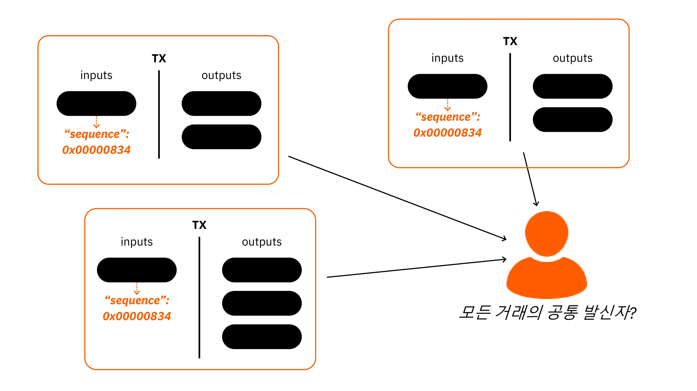


로랑엠티](https://twitter.com/LaurentMT)가 [Space Kek #19](https://podcasters.spotify.com/pod/show/decouvrebitcoin/episodes/SpaceKek-19---Analyse-de-chane--anonsets-et-entropie-e1vfuji)(프랑스어 팟캐스트)에서 지적했듯이, 체인 분석에서 Wallet 핑거프린트의 유용성은 시간이 지남에 따라 크게 증가하고 있습니다. 실제로 스크립트 유형의 수가 증가하고 Wallet 소프트웨어에 이러한 새로운 기능이 점점 더 점진적으로 배포되면서 그 차이가 더욱 두드러지고 있습니다. 경우에 따라서는 추적 대상 기업이 사용하는 정확한 소프트웨어를 식별하는 것도 가능합니다. 따라서 Wallet 발자국 연구는 2010년대 초반에 시작된 거래보다는 최근 거래와 특히 관련이 있다는 점을 이해하는 것이 중요합니다.


요약하자면, 풋프린트란 Wallet이 자동으로 수행하거나 사용자가 수동으로 수행하여 다른 트랜잭션에서 식별하여 분석을 지원할 수 있는 모든 특정 행위일 수 있습니다.


### 공통 입력 Ownership 휴리스틱(CIOH)


공통 입력 Ownership 휴리스틱(CIOH)은 거래에 여러 개의 입력이 있는 경우 모두 단일 엔터티에서 발생할 가능성이 높다는 휴리스틱입니다. 따라서 Ownership은 일반적입니다.


CIOH를 적용하려면 먼저 여러 개의 입력이 있는 트랜잭션을 관찰합니다. 입력이 2개일 수도 있고 30개일 수도 있습니다. 이 특성이 확인되면 트랜잭션이 알려진 트랜잭션 모델과 일치하는지 확인합니다. 예를 들어, 금액이 거의 같은 입력이 5개이고 금액이 정확히 같은 출력이 5개인 경우, 이것이 CoinJoin의 구조임을 알 수 있습니다. CIOH를 적용할 수 없습니다.


반면에 거래가 알려진 협업 거래 모델에 맞지 않는다면, 모든 입력이 동일한 주체에 의해 이루어졌을 가능성이 높다고 해석할 수 있습니다. 이는 이미 알려진 클러스터를 확장하거나 추적을 계속할 때 매우 유용할 수 있습니다.


CIOH는 Satoshi 나카모토가 발견했습니다. 그는 백서 10부에서 이에 대해 이야기합니다:


"_[...] 다중 입력 거래에서는 연결이 불가피하며, 이는 필연적으로 동일한 소유자가 해당 항목을 보유했음을 드러냅니다. 키의 소유자가 밝혀지면 링크를 통해 동일한 소유자의 다른 트랜잭션이 드러날 수 있다는 위험이 있습니다."


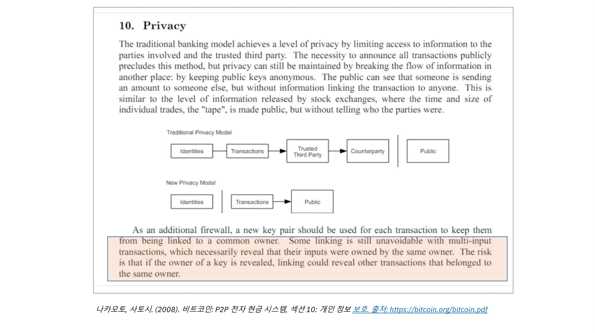


Bitcoin가 공식 출시되기 전에도 나카모토 Satoshi이 이미 사용자의 두 가지 주요 개인정보 취약점, 즉 CIOH와 Address 재사용을 파악했다는 점은 특히 흥미롭습니다. 이러한 선견지명은 매우 놀랍습니다. 이 두 가지 휴리스틱은 오늘날에도 Blockchain 분석에서 가장 유용한 것으로 남아 있기 때문입니다.


예를 들어, 다음은 CIOH를 적용할 수 있는 트랜잭션입니다:


```plaintext
20618e63b6eed056263fa52a2282c8897ab2ee71604c7faccfe748e1a202d712
```


출처: [Mempool.space](https://Mempool.space/tx/20618e63b6eed056263fa52a2282c8897ab2ee71604c7faccfe748e1a202d712)


### off-chain 데이터


물론 연쇄 분석은 On-Chain 데이터에만 국한되지 않습니다. 이전 분석의 데이터 또는 인터넷에서 사용할 수 있는 모든 데이터를 사용하여 분석을 구체화할 수도 있습니다.


예를 들어, 추적된 거래가 동일한 Bitcoin 노드에서 체계적으로 브로드캐스트되는 것을 관찰하고 해당 IP Address을 식별할 수 있다면 동일한 주체의 다른 거래를 식별할 수 있을 뿐만 아니라 발행자의 신원을 일부 파악할 수 있습니다. 이 방법은 수많은 노드를 운영해야 하므로 쉽게 달성할 수 있는 방법은 아니지만, Blockchain 분석을 전문으로 하는 일부 회사에서 이 방법을 사용할 수 있습니다.


분석가는 이전에 오픈소스로 공개된 분석 자료나 자신이 이전에 수행한 분석 자료를 사용할 수도 있습니다. 이미 식별한 주소 클러스터를 가리키는 출력을 찾을 수 있을 수도 있습니다. 때로는 이러한 회사의 주소가 일반적으로 알려져 있기 때문에 Exchange 플랫폼을 가리키는 출력에 의존할 수도 있습니다.


같은 방식으로 제거를 통해 분석을 수행할 수 있습니다. 예를 들어, 두 개의 출력으로 트랜잭션을 분석할 때 그 중 하나가 이미 알려진 Address 클러스터와 관련이 있지만 추적 중인 엔터티와는 다른 것으로 밝혀지면 다른 출력은 아마도 변경 사항을 나타내는 것으로 해석할 수 있습니다.


채널 분석에는 인터넷 검색을 포함하는 약간 더 일반적인 OSINT(*오픈 소스 정보*) 요소도 포함됩니다. 이러한 이유로 익명이든 아니든 소셜 네트워크나 웹사이트에 주소를 직접 게시하지 않는 것이 좋습니다.


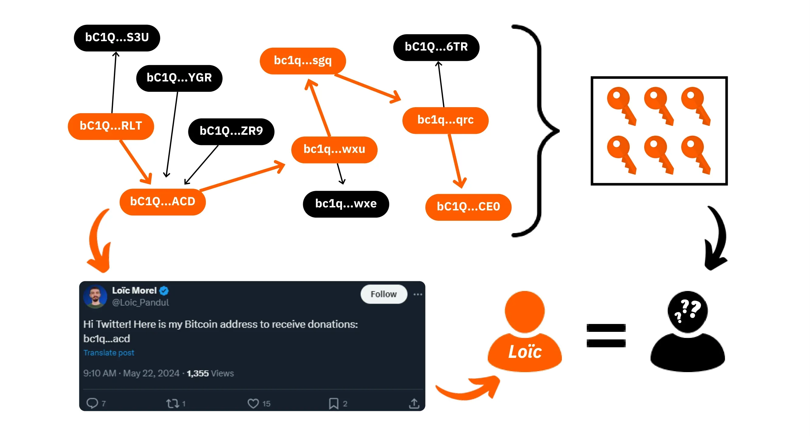


### 시간적 모델


우리는 잘 생각하지 않지만 특정 인간의 행동은 On-Chain으로 알아볼 수 있습니다. 분석에서 가장 유용한 측면은 아마도 수면 패턴일 것입니다. 예, 잠을 잘 때는 Bitcoin 트랜잭션을 방송하지 않습니다. 하지만 일반적으로 거의 같은 시간에 잠을 자게 됩니다. 그렇기 때문에 Blockchain 분석에서 시간 분석을 사용하는 것이 일반적인 관행입니다. 간단히 말해, 특정 엔티티의 트랜잭션이 Bitcoin 네트워크에 브로드캐스트되는 시간을 조사하는 것입니다. 이러한 시간적 패턴을 분석함으로써 풍부한 정보를 추론할 수 있습니다.


우선, 시간적 분석을 통해 추적 대상의 특성을 파악할 수 있는 경우가 있습니다. 24시간 동안 지속적으로 거래가 중계되는 것을 관찰한다면 이는 높은 수준의 경제 활동을 의미할 수 있습니다. 이러한 거래의 배후에는 자동화된 사내 절차를 갖춘 국제적인 기업일 가능성이 높습니다.


예를 들어, [수수료로 19 비트코인이 잘못 할당된 거래](https://Mempool.space/tx/d5392d474b4c436e1c9d1f4ff4be5f5f9bb0eb2e26b61d2781751474b7e870fd)를 분석할 때 몇 달 전에 이 패턴을 알아챘습니다(https://twitter.com/Loic_Pandul/status/1701127409712452072). 간단한 시간적 분석을 통해 자동화된 서비스, 즉 Exchange 플랫폼과 같은 대형 업체를 상대하고 있을 가능성이 높다는 가설을 세울 수 있었습니다.


실제로 며칠 후, 이 자금이 Paxos Exchange 플랫폼을 통해 PayPal에 귀속된 것으로 밝혀졌습니다.


반대로 시간적 패턴이 16개의 특정 시간에 걸쳐 있는 것을 관찰하면 교환되는 양에 따라 개인 사용자 또는 지역 기업을 대상으로 하는 것으로 추정할 수 있습니다.


시간 패턴은 관찰된 개체의 특성 외에도 시간대 덕분에 사용자가 대략 어디에 있는지 알려줄 수 있습니다. 이러한 방식으로 다른 트랜잭션과 매칭하고 타임스탬프를 추가 휴리스틱으로 활용하여 분석을 강화할 수 있습니다.


예를 들어 앞서 언급한 다중 사용 Address에서는 수신 및 발신 트랜잭션이 모두 13시간 간격으로 집중되는 것을 볼 수 있습니다.


```plaintext
bc1qqtmeu0eyvem9a85l3sghuhral8tk0ar7m4a0a0
```


출처: OXT.me


이 범위는 아마도 유럽, 아프리카 또는 중동에 해당할 것입니다. 따라서 이러한 거래의 배후에 있는 사용자가 해당 지역에 거주한다고 가정할 수 있습니다.


다른 맥락에서, 이 유형의 시간 분석은 Satoshi 나카모토가 일본이 아닌 미국에서 운영되었다는 가설로 이어졌습니다: [*The Time Zones of Satoshi Nakamoto*](https://medium.com/@insearchofsatoshi/the-time-zones-of-Satoshi-nakamoto-aa40f035178f)


## Block explorer으로 실행에 옮기기


<chapterId>6493cf2f-225c-405f-9375-c4304f1087ed</chapterId>


이 마지막 장에서는 지금까지 공부한 개념을 실제로 적용해 보겠습니다. 실제 Bitcoin 트랜잭션의 예를 보여드리고, 여러분은 제가 요청하는 정보를 추출해야 합니다.


이러한 연습을 수행하려면 전문 체인 분석 도구를 사용하는 것이 이상적입니다. 하지만 사무라이 Wallet의 개발자가 체포된 이후 유일한 무료 분석 도구인 OXT.me는 더 이상 사용할 수 없습니다. 따라서 이 연습에서는 클래식 Block explorer를 선택하겠습니다. 다양한 기능과 다양한 체인 분석 도구를 제공하는 [Mempool.space](https://Mempool.space/)를 사용하는 것이 좋지만, [Bitcoin Explorer](https://bitcoinexplorer.org/)와 같은 다른 탐색기를 선택할 수도 있습니다.


먼저 연습 문제를 소개해 드리겠습니다. Block explorer를 사용하여 문제를 풀고 종이에 답을 적으세요. 그런 다음 이 장의 마지막에 답을 제공하여 결과를 확인하고 수정할 수 있도록 하겠습니다.


*이 연습을 위해 선택한 거래는 순전히 특성에 따라 다소 무작위적인 방식으로 선택되었습니다. 이 장은 교육 및 정보 제공 목적으로만 사용됩니다. 악의적인 목적으로 이러한 도구를 사용하는 것을 지지하거나 권장하지 않는다는 점을 분명히 말씀드리고 싶습니다. 이 장의 목적은 문자열 분석으로부터 자신을 보호하는 방법을 알려드리는 것이지 다른 사람의 개인정보를 노출하기 위한 분석을 수행하는 것이 아닙니다*


### 연습 1


분석할 트랜잭션의 식별자입니다:


```plaintext
3769d3b124e47ef4ffb5b52d11df64b0a3f0b82bb10fd6b98c0fd5111789bef7
```


이 거래의 모델명은 무엇이며, 해당 모델, 즉 거래의 구조만 살펴봐도 어떤 그럴듯한 해석을 도출할 수 있나요?


### 연습 2


분석할 트랜잭션의 식별자입니다:


```plaintext
baa228f6859ca63e6b8eea24ffad7e871713749d693ebd85343859173b8d5c20
```


이 거래의 모델명은 무엇이며, 해당 모델, 즉 거래의 구조만 살펴봐도 어떤 그럴듯한 해석을 도출할 수 있나요?


### 연습 3


분석할 트랜잭션의 식별자입니다:


```plaintext
3a9eb9ccc3517cc25d1860924c66109262a4b68f4ed2d847f079b084da0cd32b
```


이 거래의 모델은 무엇인가요?


트랜잭션의 내부 휴리스틱을 사용하여 모델을 식별한 후, 변경이 어떤 결과를 나타낼 가능성이 있나요?


### 연습 4


분석할 트랜잭션의 식별자입니다:


```plaintext
35f0b31c05503ebfdf7311df47f68a048e992e5cf4c97ec34aa2833cc0122a12
```


이 거래의 모델은 무엇인가요?


거래의 내부 휴리스틱을 사용하여 모델을 식별한 후, Exchange은 어떤 결과를 나타낼 가능성이 있을까요?


### 연습 5


로익이 소셜 네트워크 트위터에 Bitcoin 수신 주소 중 하나를 게시했다고 가정해 보겠습니다:


```plaintext
bc1qja0hycrv7g9ww00jcqanhfpqmzx7luqalum3vu
```


이 정보를 바탕으로 **Address 재사용 휴리스틱**만 사용하여 Loïc의 신원과 연결할 수 있는 Bitcoin 트랜잭션은 무엇인가요?


*분명히 저는 이 수신기 Address의 실제 소유자가 아니며 소셜 네트워크에 게시하지 않았습니다. Blockchain*에서 무작위로 가져온 Address입니다


### 연습 6


연습 5에서 Address 재사용 휴리스틱 덕분에 Loïc이 연루된 것으로 보이는 여러 Bitcoin 트랜잭션을 식별할 수 있었습니다. 일반적으로는 식별된 트랜잭션 중에서 이 트랜잭션을 발견했어야 합니다:


```plaintext
2d9575553c99578268ffba49a1b2adc3b85a29926728bd0280703a04d051eace
```


이 거래는 Loïc의 Address로 자금을 송금한 첫 번째 거래입니다. 이 트랜잭션을 통해 로익이 받은 비트코인의 출처는 어디라고 생각하시나요?


### 연습 7


연습 5에서 Address 재사용 휴리스틱을 사용하여 Loïc이 관련된 것으로 보이는 여러 Bitcoin 트랜잭션을 식별할 수 있었습니다. 이제 Loïc의 출처를 알아내야 합니다. 발견된 트랜잭션을 기반으로 시간 분석을 수행하여 Loïc이 사용했을 가능성이 가장 높은 시간대를 찾습니다. 이 시간대에서 Loïc이 거주할 것으로 보이는 위치(국가, 주/지역, 도시...)를 결정합니다.


### 연습 8


공부할 Bitcoin 트랜잭션은 다음과 같습니다:


```plaintext
bb346dae645d09d32ed6eca1391d2ee97c57e11b4c31ae4325bcffdec40afd4f
```


이 거래만 놓고 보면 어떤 정보를 해석할 수 있을까요?


### 운동 솔루션


***연습 1:***


이 트랜잭션의 모델은 간편결제 모델입니다. 그 구조만 살펴보면, 하나의 출력은 잔돈을 나타내고 다른 출력은 실제 결제를 나타내는 것으로 해석할 수 있습니다. 따라서 관찰된 사용자는 출력된 두 개의 UTXO 중 하나(결제용)는 더 이상 가지고 있지 않지만 다른 하나(거스름돈용)는 여전히 가지고 있을 가능성이 높다는 것을 알 수 있습니다.


***연습 2:***


이 거래의 모델은 그룹화된 지출 모델입니다. 이 모델은 아마도 Exchange 플랫폼과 같은 대규모 경제 활동을 나타낼 것입니다. 우리는 입력 UTXO가 높은 수준의 경제 활동을 하는 회사에서 나온 것이며, 출력 UTXO는 흩어져 있을 것이라고 추론할 수 있습니다. 일부는 자기 보관 지갑으로 비트코인을 출금한 회사 고객의 소유가 될 것입니다. 다른 일부는 파트너 회사로 갈 수도 있습니다. 마지막으로, 일부 변경 사항은 의심할 여지없이 발행 회사로 다시 전달될 것입니다.


***연습 3:***


이 거래의 모델은 간편 결제입니다. 따라서 거래에 내부 휴리스틱을 적용하여 변경 사항을 식별할 수 있습니다.


저는 개인적으로 동일한 가설을 뒷받침하는 내부 휴리스틱을 최소 두 가지 이상 확인했습니다:


- 동일한 유형의 스크립트를 재사용하는 행위;
- 가장 큰 출력.


가장 확실한 휴리스틱은 같은 유형의 스크립트를 재사용하는 것입니다. 실제로 출력 `0`은 `3`으로 시작하는 수신 Address로 인식할 수 있는 `P2SH`입니다:


```plaintext
3Lcdauq6eqCWwQ3UzgNb4cu9bs88sz3mKD
```


출력 `1`은 `P2WPKH`이지만, `bc1q`로 시작하는 Address로 식별할 수 있습니다:


```plaintext
bc1qya6sw6sta0mfr698n9jpd3j3nrkltdtwvelywa
```


이 트랜잭션의 입력으로 사용된 UTXO도 `P2WPKH` 스크립트를 사용합니다:


```plaintext
bc1qyfuytw8pcvg5vx37kkgwjspg73rpt56l5mx89k
```


따라서 출력 `0`은 결제에 해당하고 출력 `1`은 트랜잭션 변경에 해당한다고 가정할 수 있으며, 이는 입력 사용자가 항상 출력 `1`을 소유하고 있음을 의미합니다.


이 가설을 뒷받침하거나 반박하기 위해 우리의 생각을 확인하거나 가설이 맞을 확률을 낮추는 다른 휴리스틱을 찾아볼 수 있습니다.


다른 휴리스틱을 하나 이상 확인했습니다. 가장 큰 출력 휴리스틱입니다. 출력 `0`은 `123,689Sats`을 측정하고, 출력 `1`은 `505,839Sats`을 측정합니다. 따라서 이 두 출력 사이에는 상당한 차이가 있습니다. 가장 큰 출력 휴리스틱은 가장 큰 출력이 변경될 가능성이 높다는 것을 시사합니다. 이 휴리스틱은 우리의 초기 가설을 더욱 강화합니다.


따라서 UTXO를 입력으로 제공한 사용자가 여전히 `1` 출력을 보유하고 있는 것으로 보이며, 이는 트랜잭션의 변경을 구현하는 것으로 보입니다.


***연습 4:***


이 거래의 모델은 간편 결제입니다. 따라서 거래에 내부 휴리스틱을 적용하여 변경 사항을 식별할 수 있습니다.


저는 개인적으로 동일한 가설을 뒷받침하는 내부 휴리스틱을 최소 두 가지 이상 확인했습니다:


- 동일한 유형의 스크립트를 재사용하는 행위;
- 원형 포스트 출력입니다.


가장 확실한 휴리스틱은 같은 유형의 스크립트를 재사용하는 것입니다. 실제로 출력 `0`은 `3`으로 시작하는 수신 Address으로 인식할 수 있는 `P2SH`입니다:


```plaintext
3FSH5Mnq6S5FyQoKR9Yjakk3X4KCGxeaD4
```


출력 `1`은 `P2WPKH`이지만, `bc1q`로 시작하는 Address로 식별할 수 있습니다:


```plaintext
bc1qvdywdcfsyavt4v8uxmmrdt6meu4vgeg439n7sg
```


이 트랜잭션의 입력으로 사용된 UTXO도 `P2WPKH` 스크립트를 사용합니다:


```plaintext
bc1qku3f2y294h3ks5eusv63dslcua2xnlzxx0k6kp
```


따라서 출력 `0`은 결제에 해당하고 출력 `1`은 트랜잭션 변경에 해당한다고 가정할 수 있으며, 이는 입력 사용자가 항상 출력 `1`을 소유하고 있음을 의미합니다.


이 가설을 뒷받침하거나 반박하기 위해 우리의 생각을 확인하거나 가설이 맞을 확률을 낮추는 다른 휴리스틱을 찾아볼 수 있습니다.


다른 휴리스틱을 하나 이상 확인했습니다. 그것은 라운드 금액 출력입니다. 출력 `0`은 `70,000 Sats`이고, 출력 `1`은 `22,962 Sats`입니다. 따라서 BTC 계정 단위의 출력이 완벽하게 반올림됩니다. 라운드 출력 휴리스틱은 라운드 금액이 있는 UTXO이 결제 금액일 가능성이 가장 높고, 제거하면 다른 금액이 변화를 나타낸다는 것을 암시합니다. 이 휴리스틱은 우리의 초기 가설을 더욱 강화합니다.


그러나 이 예제에서는 다른 휴리스틱이 초기 가설에 도전할 수 있습니다. 실제로 출력 `0`이 출력 `1`보다 큽니다. 일반적으로 가장 큰 출력이 변화를 나타낸다는 휴리스틱에 따라, 출력 `0`이 변화를 나타낸다고 추론할 수 있습니다. 그러나 다른 두 휴리스틱이 가장 큰 출력 휴리스틱보다 훨씬 더 설득력 있게 보이기 때문에 이 반가설은 믿을 수 없는 것으로 보입니다. 따라서 이러한 명백한 모순에도 불구하고 초기 가설을 유지하는 것이 합리적입니다.


따라서 UTXO을 입력으로 제공한 사용자가 여전히 `1` 출력을 보유하고 있는 것으로 보이며, 이는 트랜잭션의 변경을 구현하는 것으로 보입니다.


***연습 5:***


로익의 신원과 연관된 거래가 8건이라는 것을 알 수 있습니다. 이 중 4건은 비트코인 수령과 관련된 거래입니다:


```plaintext
2d9575553c99578268ffba49a1b2adc3b85a29926728bd0280703a04d051eace
8b70bd322e6118b8a002dbdb731d16b59c4a729c2379af376ae230cf8cdde0dd
d5864ea93e7a8db9d3fb113651d2131567e284e868021e114a67c3f5fb616ac4
bc4dcf2200c88ac1f976b8c9018ce70f9007e949435841fc5681fd33308dd762
```


나머지 4건은 Bitcoin 배송에 관한 것입니다:


```plaintext
8b52fe3c2cf8bef60828399d1c776c0e9e99e7aaeeff721fff70f4b68145d540
c12499e9a865b9e920012e39b4b9867ea821e44c047d022ebb5c9113f2910ed6
a6dbebebca119af3d05c0196b76f80fdbf78f20368ebef1b7fd3476d0814517d
3aeb7ce02c35eaecccc0a97a771d92c3e65e86bedff42a8185edd12ce89d89cc
```


***연습 6:***


이 거래의 모델을 살펴보면 번들 지출이 포함되어 있다는 것을 알 수 있습니다. 실제로 이 거래에는 하나의 입력과 51개의 출력이 있으며, 이는 높은 수준의 경제 활동을 나타냅니다. 따라서 로익이 Exchange 플랫폼에서 비트코인을 인출했다는 가설을 세울 수 있습니다.


몇 가지 요인이 이 가설을 뒷받침합니다. 첫째, UTXO 입력 보안에 사용되는 스크립트 유형이 P2SH 2/3 Multisig 스크립트이며, 이는 Exchange 플랫폼에서 일반적으로 사용되는 고급 보안 수준을 나타냅니다:


```plaintext
OP_PUSHNUM_2
OP_PUSHBYTES_33 03eae02975918af86577e1d8a257773118fd6ceaf43f1a543a4a04a410e9af4a59
OP_PUSHBYTES_33 03ba37b6c04aaf7099edc389e22eeb5eae643ce0ab89ac5afa4fb934f575f24b4e
OP_PUSHBYTES_33 03d95ef2dc0749859929f3ed4aa5668c7a95baa47133d3abec25896411321d2d2d
OP_PUSHNUM_3
OP_CHECKMULTISIG
```


또한, Address에서 연구한 `3PUv9tQMSDCEPSMsYSopA5wDW86pwRFbNF`는 22만 개 이상의 다른 거래에서 재사용되었으며, 이는 일반적으로 기밀성을 염려하지 않는 Exchange 플랫폼의 특징이기도 합니다.


이 Address에 적용된 시간적 휴리스틱은 3개월 동안 거의 매일 거래가 정기적으로 방송되고 24시간 이상 연장된 시간을 보여줌으로써 Exchange 플랫폼의 지속적인 활동을 암시합니다.


마지막으로, 이 주체가 처리한 거래량은 엄청납니다. Address은 2022년 12월부터 2023년 3월까지 222,262건의 거래에서 44 BTC를 송수신했습니다. 이러한 대량의 거래량은 Exchange 플랫폼의 활동 가능성이 높다는 것을 더욱 확인시켜줍니다.


***연습 7:***


거래 확인 시간을 분석하면 다음과 같은 UTC 시간을 확인할 수 있습니다:


```plaintext
05:43
20:51
18:12
17:16
04:28
23:38
07:45
21:55
```


이러한 스케줄을 분석한 결과 UTC-7과 UTC-8은 대부분의 스케줄에서 현재 인간의 활동 범위(08:00~23:00 사이)와 일치하는 것으로 나타났습니다:


```plaintext
05:43 UTC > 22:43 UTC-7
20:51 UTC > 13:51 UTC-7
18:12 UTC > 11:12 UTC-7
17:16 UTC > 10:16 UTC-7
04:28 UTC > 21:28 UTC-7
23:38 UTC > 16:38 UTC-7
07:45 UTC > 00:45 UTC-7
21:55 UTC > 14:55 UTC-7
05:43 UTC > 21:43 UTC-8
20:51 UTC > 12:51 UTC-8
18:12 UTC > 10:12 UTC-8
17:16 UTC > 09:16 UTC-8
04:28 UTC > 20:28 UTC-8
23:38 UTC > 15:38 UTC-8
07:45 UTC > 23:45 UTC-8
21:55 UTC > 13:55 UTC-8
```


UTC-7 표준 시간대는 다음과 같은 주와 지역을 포함하므로 여름철에 특히 적합합니다:


- 캘리포니아(로스앤젤레스, 샌프란시스코, 샌디에이고 등의 도시 포함);
- 네바다(라스베가스 포함);
- 오리건주(포틀랜드 포함);
- 워싱턴(시애틀 포함);
- 캐나다 브리티시컬럼비아주 지역(밴쿠버, 빅토리아 등의 도시 포함).


이 정보는 로익이 미국 서부 해안이나 캐나다에 거주하고 있을 가능성이 높다는 것을 시사합니다.


***운동 8:***


이 트랜잭션을 분석해 보면 5개의 입력과 하나의 출력이 있으며, 이는 통합을 시사합니다. CIOH 휴리스틱을 적용하면 모든 입력 UTXO가 단일 엔터티에 의해 소유되고 출력 UTXO도 이 엔터티에 속한다고 가정할 수 있습니다. 사용자는 자신이 소유한 여러 개의 UTXO를 결합하여 출력에서 하나의 UTXO를 형성하도록 선택했으며, 이는 UTXO를 통합하기 위한 목적으로 보입니다. 이러한 움직임은 당시의 낮은 거래 비용을 활용하여 향후 비용을 절감하고자 하는 욕구에서 비롯된 것으로 보입니다.


___


**이 파트 3 on chain 분석을 작성하기 위해 다음과 같은 리소스를 활용했습니다**


- OXT를 통한 Bitcoin 개인정보 보호의 이해](https://medium.com/oxt-research/understanding-Bitcoin-privacy-with-oxt-part-1-4-8177a40a5923)라는 제목으로 4회에 걸쳐 연재됩니다
- **OXT Research**(https://medium.com/oxt-research)의 다양한 보고서와 무료 Blockchain 분석 도구(*사무라이 Wallet의 설립자 체포 이후 현재는 더 이상 제공되지 않음*)를 제공합니다
- 더 넓게는 [@LaurentMT](https://twitter.com/LaurentMT)와 [@ErgoBTC](https://twitter.com/ErgoBTC)의 다양한 트윗과 콘텐츠에서 얻은 지식입니다
- 제가 참여한 [스페이스 켁 #19](https://podcasters.spotify.com/pod/show/decouvrebitcoin/episodes/SpaceKek-19---Analyse-de-chane--anonsets-et-entropie-e1vfuji)에는 [@louneskmt](https://twitter.com/louneskmt), [@TheoPantamis](https://twitter.com/TheoPantamis), [@Sosthene___](https://twitter.com/Sosthene___), [@LaurentMT](https://twitter.com/LaurentMT)가 함께했습니다


*저자, 개발자, 프로듀서에게 감사의 말씀을 전하고 싶습니다. 이 파트 3의 기반이 된 기사를 꼼꼼하게 교정해 주고 전문적인 조언을 해주신 교정자 여러분께도 감사드립니다.*


- [질 카디뇽](https://twitter.com/gillesCadignan);*
- [루도빅 라스](https://viresinnumeris.fr/)


# 개인 정보 보호를 위한 모범 사례 마스터하기


<partId>9bd04b63-f1af-4e50-9061-6bc90009df68</partId>


## Address 재사용


<chapterId>f3e97645-3df3-41bc-a4ed-d2c740113d96</chapterId>


Bitcoin에서 기밀성을 손상시킬 수 있는 기술을 살펴본 후, 이번 3부에서는 기밀성 보호를 위해 채택할 수 있는 모범 사례를 살펴보겠습니다. 이 파트의 목적은 나중에 다룰 주제인 기밀성을 개선하는 방법을 모색하는 것이 아니라, 추가 기술을 사용하지 않고도 Bitcoin과 올바르게 상호 작용하여 자연스럽게 기밀성을 유지하는 방법을 이해하는 데 있습니다.


이 세 번째 파트에서는 Address 재사용에 대해 알아보겠습니다. 이 현상은 사용자 기밀성에 대한 주요 위협입니다. 이 장은 전체 과정 중 가장 중요한 내용입니다.


### 수신 Address이란 무엇인가요?


Address를 수신하는 Bitcoin는 Wallet에서 비트코인을 수신하는 데 사용되는 문자열 또는 식별자입니다.


엄밀히 말하자면, Address을 받는 Bitcoin은 문자 그대로 비트코인을 "받는" 것이 아니라 비트코인을 사용할 수 있는 조건을 정의하는 역할을 합니다. 구체적으로 설명하자면, 송금인이 사용자에게 결제를 전송하면 송금인의 트랜잭션은 입력으로 소비한 UTXO를 출력으로 새로운 UTXO를 생성합니다. 이 출력에는 이 UTXO가 나중에 어떻게 사용될 수 있는지 정의하는 스크립트가 첨부됩니다. 이 스크립트는 "*ScriptPubKey*" 또는 "*잠금 스크립트*"로 알려져 있습니다. 수신하는 Address, 더 정확하게는 페이로드가 이 스크립트에 통합됩니다. 쉽게 설명하자면 이 스크립트는 기본적으로 다음과 같습니다:


> "*이 새 UTXO을 사용하려면 이 수신 Address과 연결된 개인 키를 사용하여 디지털 서명을 제공해야 합니다*."
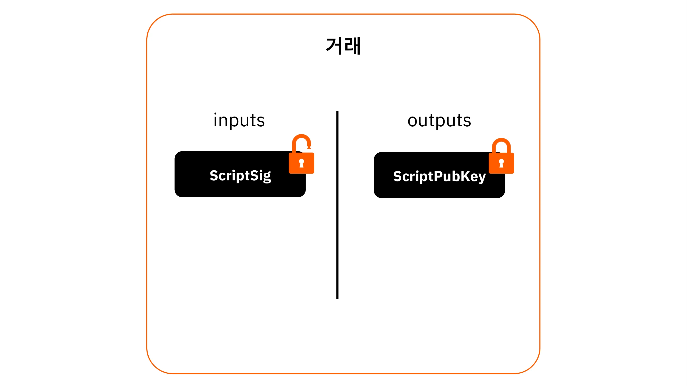


Bitcoin 주소는 사용되는 스크립팅 모델에 따라 다양한 유형으로 제공됩니다. **레거시**로 알려진 첫 번째 모델에는 'P2PKH'(*Pay-to-PubKey-Hash*) 및 'P2SH'(*Pay-to-Script-Hash*) 주소가 포함됩니다. P2PKH 주소는 항상 `1`로 시작하고, P2SH는 `3`으로 시작합니다. 여전히 안전하지만, 이러한 형식은 더 높은 거래 비용을 수반하고 새로운 표준보다 기밀성이 떨어지기 때문에 이제 더 이상 사용되지 않습니다.


SegWit V0(`P2WPKH` 및 `P2WSH`) 및 Taproot/SegWit V1(`P2TR`) 주소는 최신 형식을 나타냅니다. SegWit 주소는 `bc1q`로 시작하고, 2021년에 도입된 Taproot 주소는 `bc1p`로 시작합니다.


예를 들어, 다음은 Taproot 수신 Address입니다:


```text
bc1ps5gd2ys8kllz9alpmcwxqegn7kl3elrpnnlegwkm3xpq2h8da07spxwtf5
```


스크립트펍키가 구성되는 방식은 사용 중인 표준에 따라 다릅니다:


| ScriptPubKey       | Script template                                         |
|--------------------|--------------------------------------------------------|
| P2PKH              | OP_DUP OP_HASH160 `<pubKeyHash>` OP_EQUALVERIFY OP_CHECKSIG |
| P2SH               | OP_HASH160 `<scriptHash>` OP_EQUAL                    |
| P2WPKH             | 0 `<pubKeyHash>`                                      |
| P2WSH              | 0 `<witnessScriptHash>`                               |
| P2SH - P2WPKH      | OP_HASH160 `<redeemScriptHash>` OP_EQUAL              |
| P2SH - P2WSH       | OP_HASH160 `<redeemScriptHash>` OP_EQUAL              |
| P2TR               | 1 `<pubKey>`                                          |


수신 주소의 구성은 선택한 스크립트 모델에 따라 달라집니다:


- P2PKH` 및 `P2WPKH` 주소의 경우 페이로드, 즉 Address의 핵심은 공개키의 Hash를 나타냅니다;
- P2SH` 및 `P2WSH` 주소의 경우 페이로드는 a의 Hash를 나타냅니다;
- P2TR` 주소의 경우 페이로드는 조정된 공개키입니다. P2TR 출력은 _Pay-to-PubKey_와 _Pay-to-Script_의 측면을 결합한 것입니다. 조정된 공개 키는 비트코인을 사용하는 데에도 사용할 수 있는 스크립트 세트의 Merkle Root에서 파생된 "조정"을 통해 기존 지출 공개 키에 추가한 결과입니다.


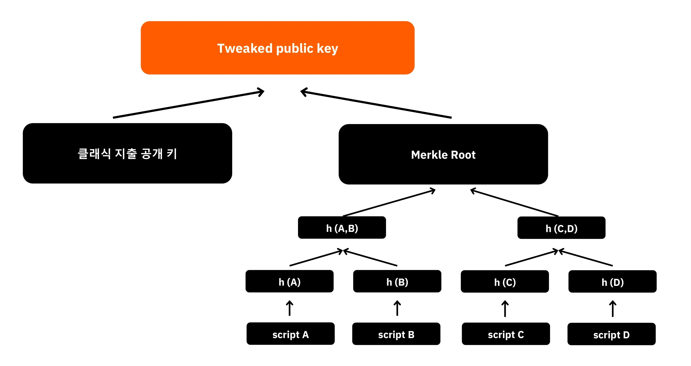


Wallet 소프트웨어에 표시되는 주소에는 HRP(*인간 판독 가능 부분*)가 포함되며, 일반적으로 SegWit 이후 주소의 경우 `bc`, `1` 구분자, 버전 번호 `q`는 SegWit V0, `p`는 Taproot/SegWit V1을 나타냅니다. 또한 전송 중 Address의 무결성과 유효성을 보장하기 위해 체크섬이 추가됩니다.


마지막으로 주소가 표준 형식으로 입력됩니다:


- Base58이전 레거시 주소를 확인합니다;
- SegWit 주소용 Bech32;
- Taproot 주소용 Bech32m.


다음은 베이스 10의 bech32 및 bech32m 형식(SegWit 및 Taproot)에 대한 덧셈 행렬입니다:


| +  | 0 | 1 | 2 | 3 | 4 | 5 | 6 | 7 |
|----|---|---|---|---|---|---|---|---|
| 0  | q | p | z | r | y | 9 | x | 8 |
| 8  | g | f | 2 | t | v | d | w | 0 |
| 16 | s | 3 | j | n | 5 | 4 | k | h |
| 24 | c | e | 6 | m | u | a | 7 | l |


### Address 재사용이란 무엇인가요?


Address 재사용은 동일한 수신 Address을 사용하여 여러 개의 다른 UTXO를 차단하는 것을 말합니다.


이전 섹션에서 살펴본 것처럼, 각 UTXO에는 자체 ScriptPubKey가 있으며, 이를 잠그고 새 트랜잭션의 입력으로 UTXO를 사용하려면 이를 충족해야 합니다. 페이로드 주소가 통합되는 것은 바로 이 ScriptPubKey 내에 있습니다.


여러 스크립트펍키에 동일한 수신 Address이 포함되어 있는 경우, 이를 Address 재사용이라고 합니다. 실제로 이는 사용자가 여러 번의 결제를 통해 비트코인을 받기 위해 동일한 Address을 발신자에게 반복적으로 제공했음을 의미합니다. 그리고 바로 이러한 관행이 사용자의 개인정보 보호에 재앙을 초래합니다.


### Address 재사용이 문제가 되는 이유는 무엇인가요?


Blockchain는 공개되어 있으므로 어떤 주소가 어떤 UTXO을 잠그는지, 얼마나 많은 비트코인이 잠겨 있는지 쉽게 확인할 수 있습니다. 여러 거래에 동일한 Address이 사용되면 해당 Address과 관련된 모든 비트코인이 같은 사람의 소유라고 추론할 수 있습니다. 이러한 관행은 서로 다른 거래와 비트코인 사이에 결정론적 연결고리를 설정하고 Blockchain에서 비트코인을 추적할 수 있게 함으로써 사용자의 프라이버시를 침해합니다. Satoshi 나카모토는 이미 Bitcoin의 백서에서 이 문제를 강조했습니다:


> *추가 방화벽으로 각 트랜잭션에 대해 새로운 키 쌍을 사용하여 공통 소유자와 연결되지 않도록 유지할 수 있습니다*
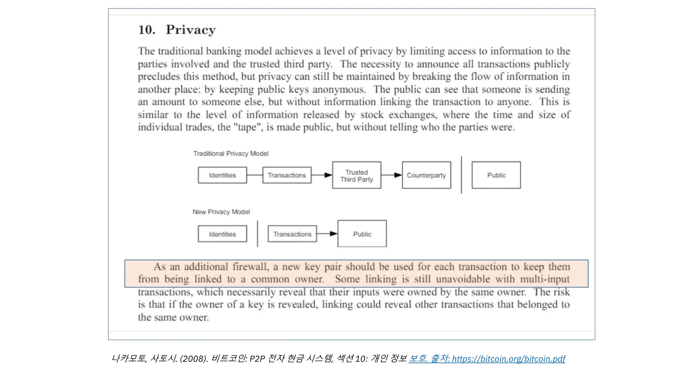


출처: S. Nakamoto, "Bitcoin: 피어투피어 전자 현금 시스템", https://Bitcoin.org/Bitcoin.pdf, 2009.


이 문장에서 Satoshi의 의도는 사용자의 신원과 Bitcoin의 키 쌍이 연결될 경우 추가적인 방화벽을 만들어 사용자의 전체 활동이 공개적으로 신원과 연결되는 것을 방지하는 것이었습니다. 오늘날 Blockchain 분석 회사와 KYC 규정이 확산되면서 고유 주소 사용은 더 이상 '추가 방화벽'이 아니라 최소한의 개인정보 보호를 유지하고자 하는 모든 사람에게 필수 불가결한 관행이 되었습니다.


Address을 재사용하면 해당 Address과 관련된 모든 거래에 거의 부인할 수 없는 연결 고리가 만들어집니다. 타원 곡선 암호화가 개인 키의 보안을 보장하기 때문에 자금이 직접적으로 위험에 처하지는 않지만, 활동을 모니터링하기는 더 쉬워집니다. 실제로 노드를 가진 사람은 누구나 주소의 거래와 잔액을 관찰할 수 있어 익명성이 완전히 손상될 수 있습니다.


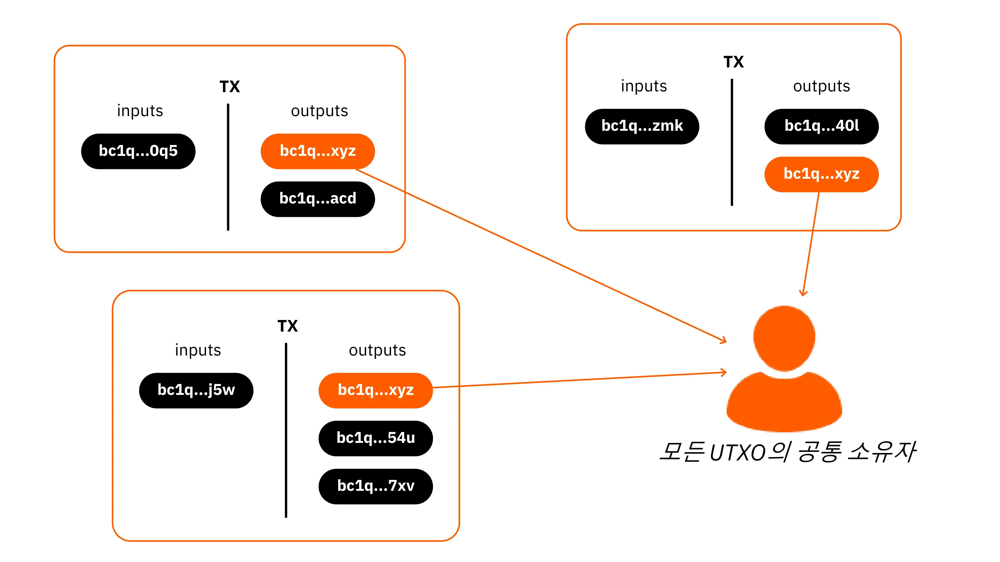


이 점을 설명하기 위해 DCA에서 정기적으로 소량의 비트코인을 구매하고 항상 동일한 Address로 송금하는 사용자 Bob의 예를 들어보겠습니다. 2년이 지난 지금, 이 Address에는 상당한 양의 비트코인이 들어 있습니다. Bob이 이 Address를 사용하여 지역 상인에게 결제하면, 후자는 모든 관련 자금을 확인하고 Bob의 재산을 추론할 수 있습니다. 이는 절도나 강탈 미수와 같은 개인 보안 위험으로 이어질 수 있습니다. Bob이 주기적으로 구매할 때마다 빈 Address를 사용했다면 판매자에게 훨씬 적은 정보를 공개할 수 있었을 것입니다.


문자열 분석에는 두 가지 유형의 Address 재사용이 있습니다:


- 외부 재사용;
- 거래 내 내부 재사용.


첫 번째는 Address가 여러 다른 Bitcoin 트랜잭션에서 재사용되는 경우입니다. 이 휴리스틱은 이 Address를 통과한 모든 UTXO가 단일 엔티티에 속한다고 추론합니다.


내부 Address 재사용은 여러 트랜잭션에 걸쳐 있을 때 발생하는 것이 아니라 단일 트랜잭션 내에서 발생할 때 발생합니다. 실제로 입력을 잠그는 데 사용된 것과 동일한 Address이 트랜잭션의 출력으로 사용된다면, 이 출력은 여전히 동일한 사용자(변경)의 것이며 두 번째 출력은 실제 지불을 나타낸다고 추론할 수 있습니다. 이 다른 휴리스틱을 사용하면 여러 트랜잭션에 걸쳐 자금을 추적할 수 있습니다.


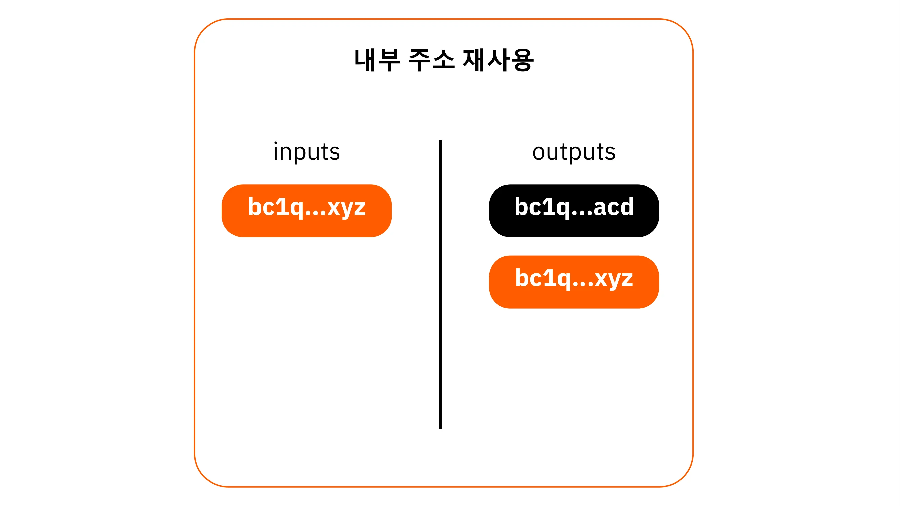


Address 재사용은 Bitcoin의 중요한 문제입니다. OXT.me 웹사이트(현재 액세스할 수 없음)에 따르면, 2022년 Address의 전체 재사용률은 약 52%였습니다:


이 비율은 엄청나지만, 개인 사용자보다는 Exchange 플랫폼에서 압도적으로 많이 발생합니다.


### Address 재사용을 방지하는 방법은 무엇인가요?


Address 재사용을 방지하는 방법은 아주 간단합니다: **Wallet에 대한 모든 신규 결제에 새 Address를 사용하기만 하면 됩니다**.


BIP32 덕분에 최신 지갑은 이제 결정론적이고 계층적입니다. 즉, 사용자는 하나의 초기 정보인 seed에서 많은 수의 주소를 generate로 만들 수 있습니다. 이 단일 정보를 저장하면 Wallet의 모든 개인 키를 복원하여 해당 주소로 보호된 자금에 액세스할 수 있습니다.


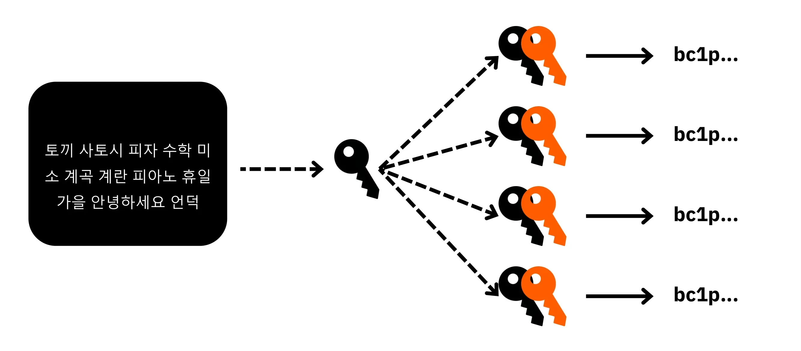


그렇기 때문에 Wallet 소프트웨어에서 "*수신*" 버튼을 누르면 매번 사용하지 않은 수신 Address이 제안됩니다. 이 Address에서 비트코인을 받으면 소프트웨어가 자동으로 새 비트코인을 제안합니다.


> *참고: 최근 일부 Wallet 소프트웨어 프로그램에서는 당국에 의해 자금 세탁의 한 형태로 인식될 것을 우려하여 빈 주소 생성을 중단하겠다는 의사를 밝혔습니다. 사용 중인 소프트웨어가 이러한 소프트웨어 중 하나에 해당하는 경우, 이는 사용자에게 허용되지 않으므로 즉시 교체할 것을 강력히 권장합니다*
기부금과 같은 결제를 받기 위해 정적 식별자가 필요한 경우 재사용의 위험이 있으므로 기존 Bitcoin Address을 사용하는 것은 바람직하지 않습니다. 대신 Lightning Address을 사용하거나 BIP47 또는 자동 결제와 같은 정적 On-Chain 결제 식별자를 선택하세요. 이러한 프로토콜은 이 과정의 파트 6에 자세히 설명되어 있습니다.


## UTXO 라벨링 및 확인


<chapterId>fbdb07cd-c025-48f2-97b0-bd1bc21c68a8</chapterId>


문자열 분석 섹션에서 살펴본 것처럼, 수많은 휴리스틱과 패턴을 사용하여 거래에 대한 정보를 유추할 수 있습니다. 사용자는 이러한 기법으로부터 자신을 더 잘 보호하기 위해 이러한 기법을 숙지하는 것이 중요합니다.


이를 위해서는 자체 보관 중인 Wallet를 엄격하게 관리해야 하며, 이는 UTXO의 출처를 파악하고 결제할 때 사용할 UTXO를 신중하게 선택해야 함을 의미합니다. 이러한 효율적인 Wallet 관리는 우수한 Bitcoin 지갑의 두 가지 중요한 기능인 태깅과 Coin 제어에 의존합니다.


이 장에서는 이러한 기능을 살펴보고 작업 부하를 크게 늘리지 않고도 이러한 기능을 지능적으로 사용하여 Bitcoin에서 개인 정보를 크게 최적화할 수 있는 방법을 살펴봅니다.


### 라벨링이란 무엇인가요?


라벨링은 Bitcoin Wallet에서 특정 UTXO에 주석 또는 라벨을 할당하는 작업입니다. 이러한 주석은 Wallet 소프트웨어에 의해 로컬에 저장되며 Bitcoin 네트워크를 통해 전송되지 않습니다. 따라서 라벨링은 개인 관리 도구입니다.


예를 들어, 찰스와 함께 Bisq에서 P2P을 구매한 UTXO을 가지고 있다면 "비 KYC Bisq 찰스"라는 라벨을 붙일 수 있습니다.


태그 지정은 UTXO의 출발지 또는 목적지를 기억하는 데 도움이 되는 좋은 관행이므로 자금 관리와 개인 정보 보호 최적화를 용이하게 합니다. 실제로 Bitcoin Wallet는 여러 개의 UTXO를 확실히 보호합니다. 이러한 UTXO의 출처가 다른 경우 향후에 이러한 UTXO를 병합하지 않을 수 있으며, 그렇지 않은 경우 공통 Ownership를 공개할 수 있습니다. 모든 UTXO에 적절한 라벨을 붙이면 몇 년 후에도 사용해야 할 때 출처를 기억할 수 있습니다.


### 코너 컨트롤이란 무엇인가요?


Wallet 소프트웨어의 Coin 제어 옵션과 결합하면 라벨링의 적극적인 사용이 더욱 흥미로워집니다.


Coin 제어는 우수한 Bitcoin Wallet 소프트웨어에 있는 기능으로, 거래를 완료하기 위한 입력으로 사용할 특정 UTXO를 수동으로 선택할 수 있는 기능을 제공합니다. 사실, 출력 결제를 충족하려면 그 대가로 입력 UTXO을 소비해야 합니다. 나중에 살펴볼 몇 가지 이유로 인해 특정 결제를 이행하기 위해 입력으로 사용할 UTXO를 정확하게 선택해야 할 수 있습니다. Coin 컨트롤을 사용하면 바로 이 작업을 수행할 수 있습니다. 비유를 들어 설명하자면, 이 기능은 바게트를 결제할 때 Wallet에서 특정 Coin을 선택하는 것과 유사합니다.


Coin 제어와 함께 Wallet 소프트웨어를 UTXO 라벨링과 함께 사용하면 사용자가 거래에 사용할 UTXO를 구별하고 정확하게 선택할 수 있습니다.


### UTXO에 어떻게 라벨을 붙이나요?


UTXO에 라벨을 부착하는 만능 방법은 없습니다. Wallet에 대해 이해하기 쉬운 라벨링 시스템을 정의하는 것은 사용자의 몫입니다. 어떤 경우든 좋은 라벨링은 필요할 때 이해할 수 있는 라벨링이라는 점을 명심하세요. Bitcoin Wallet의 주된 목적이 비용 절감이라면 라벨은 향후 수십 년 동안 유용하지 않을 수 있습니다. 라벨이 명확하고 정확하며 포괄적인지 확인하세요.


언젠가 사랑하는 사람이 Wallet에 액세스해야 하는 경우 자금의 출처를 쉽게 확인할 수 있도록 하는 것이 중요합니다. 이는 기밀 유지의 이유와 당국에 자금의 출처를 정당화해야 하는 경우 법적 목적 모두에 도움이 될 것입니다.


라벨에서 가장 중요한 것은 UTXO의 출처입니다. Coin이 Wallet에 어떻게 들어왔는지 간단히 표시해야 합니다. Exchange 플랫폼에서 구매한 결과인가요? 고객의 Invoice 결제 결과인가요? 피어 투 피어 Exchange? 아니면 비용의 변경을 나타내는 건가요? 예를 들어 다음과 같이 지정할 수 있습니다:


- gW-443.com`을 제거합니다;
- 고객 결제 David`;
- gW-444 찰스`를 구입합니다;
- '소파 구매 변경'


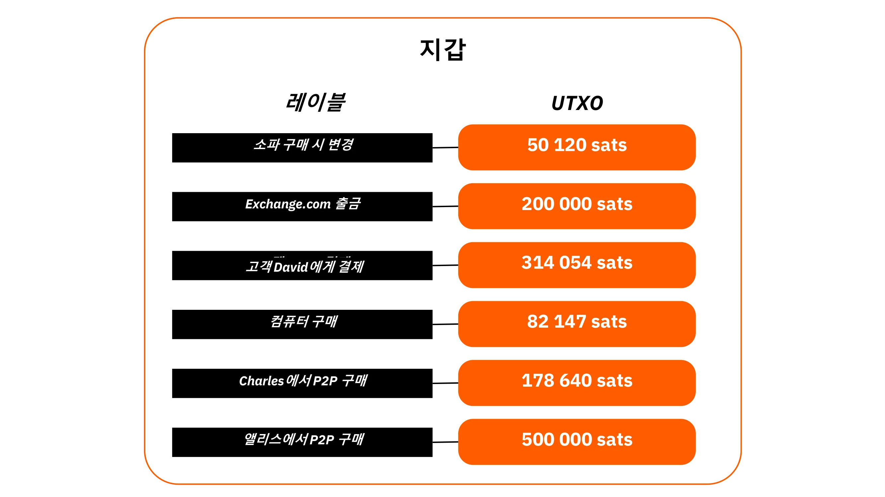


UTXO 관리를 세밀하게 조정하고 Wallet 내에서 자금 분리 전략을 존중하려면 이러한 분리를 반영하는 추가 지표를 사용하여 레이블을 강화할 수 있습니다. Wallet에 혼합하지 않으려는 두 가지 UTXO 카테고리가 포함되어 있는 경우, 라벨에 마커를 통합하여 이러한 그룹을 명확하게 구분할 수 있습니다. 이러한 구분 마커는 KYC를 수반하는 인수 프로세스에서 발생한 UTXO를 구분하거나 전문 자금과 개인 자금을 구분하는 등 자체 기준에 따라 달라질 수 있습니다. 위에서 언급한 라벨의 예를 들면 다음과 같이 해석할 수 있습니다:


- `KYC - 출금 Exchange.com`;
- `KYC - 고객 결제 데이비드`;
- `NO KYC - P2P 찰스 구매`;
- 'NO KYC - 소파 구매 변경'


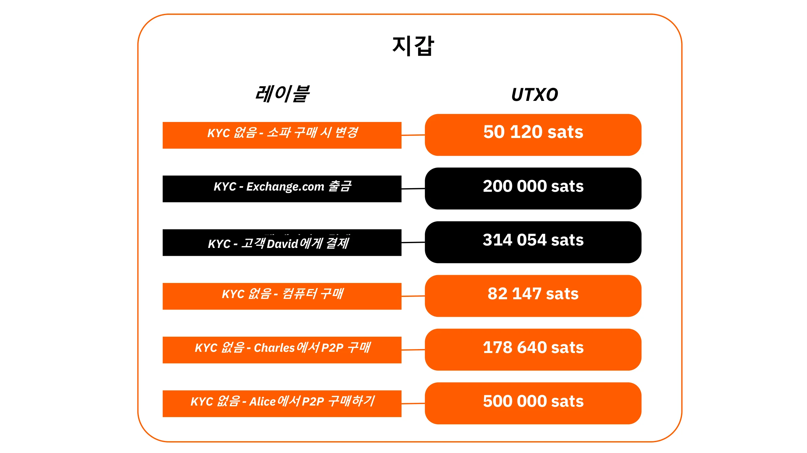


또한 거래가 진행되는 동안 UTXO의 라벨링을 영구적으로 유지하는 것이 좋습니다. 예를 들어, UTXO 무 KYC를 통합할 때는 결과 UTXO를 단순히 '통합'이 아닌 '통합 무 KYC'로 표시하여 코인의 출처를 명확히 기록해 두어야 합니다.


마지막으로, 라벨에 날짜를 표시하는 것은 필수가 아닙니다. 대부분의 Wallet 소프트웨어에는 이미 거래 날짜가 표시되어 있으며, txid를 통해 Block explorer에서도 이 정보를 언제든지 찾을 수 있습니다.


### 적합한 UTXO를 선택하는 방법은 무엇인가요?


트랜잭션을 수행할 때 Coin 컨트롤을 사용하면 결제 출력을 충족하기 위해 입력으로 사용할 UTXO를 구체적으로 선택할 수 있습니다. 이 선택에는 두 가지 측면이 있습니다:


- 결제 수신자가 신원 정보의 일부를 입력에 사용된 UTXO에 연결할 수 있는 가능성;
- 외부 관찰자가 입력으로 소비된 모든 UTXO 간의 링크를 설정할 수 있는 기능입니다.


첫 번째 요점을 설명하기 위해 구체적인 예를 들어보겠습니다. 제빵사로부터 비트코인으로 빵을 구매한다고 가정해 보겠습니다. 여러분은 최소한 바게트 가격과 거래 수수료를 출력으로 충족하기 위해 하나 이상의 UTXO를 인풋으로 사용합니다. 그러면 제빵사는 잠재적으로 여러분의 얼굴 또는 여러분이 알고 있는 신원의 다른 부분을 입력으로 사용된 코인과 연관시킬 수 있습니다. 이 링크의 존재를 알면 결제할 때 특정 UTXO를 다른 코인보다 선호할 수 있습니다.


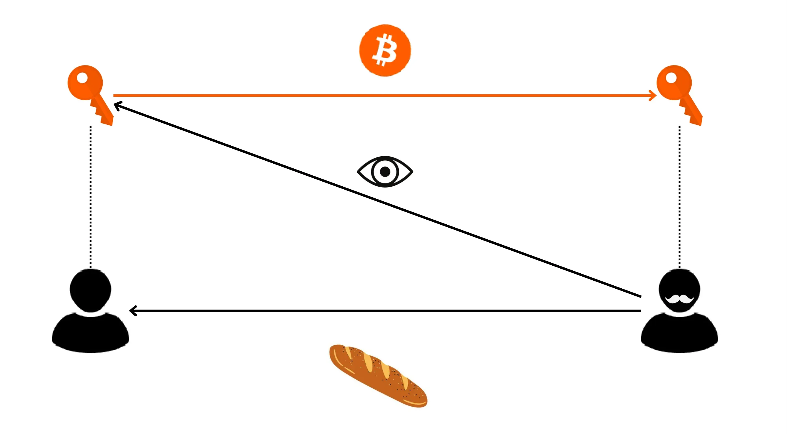


예를 들어, Exchange 플랫폼에서 생성된 UTXO 중 하나가 있는데 베이커가 해당 플랫폼에서 내 계정에 대해 알지 못하도록 하려면 해당 UTXO을 결제에 사용하지 않을 수 있습니다. 상당한 양의 비트코인이 포함된 고가의 UTXO을 보유하고 있는 경우, 베이커가 BTC 자산을 알 수 없도록 하기 위해 사용하지 않을 수도 있습니다.


따라서 이 첫 번째 포인트에 사용할 UTXO를 선택하는 것은 개인적인 결정이며, 공개할 것인지 여부에 따라 영향을 받습니다. UTXO를 받을 때 라벨을 지정하면 사용 후 수신자에게 공개해도 괜찮은 정보만 노출할 수 있는 라벨을 선택하는 데 도움이 됩니다.


수신자에게 잠재적으로 공개되는 정보 외에도, 입력 선택은 Blockchain의 모든 관찰자에게 공개되는 정보에도 영향을 미칩니다. 실제로 여러 UTXO를 거래의 입력으로 사용하면 CIOH 휴리스틱(_공통 입력 Ownership 휴리스틱_)에 따라 동일한 주체가 소유하고 있음을 드러낼 수 있습니다.


따라서 UTXO를 선택할 때는 생방송하려는 트랜잭션이 사용되는 모든 UTXO 간에 링크를 생성한다는 점을 염두에 두어야 합니다. 이 링크는 특히 UTXO가 서로 다른 출처에서 발생한 경우 개인 정보 보호에 위험을 초래할 수 있습니다.


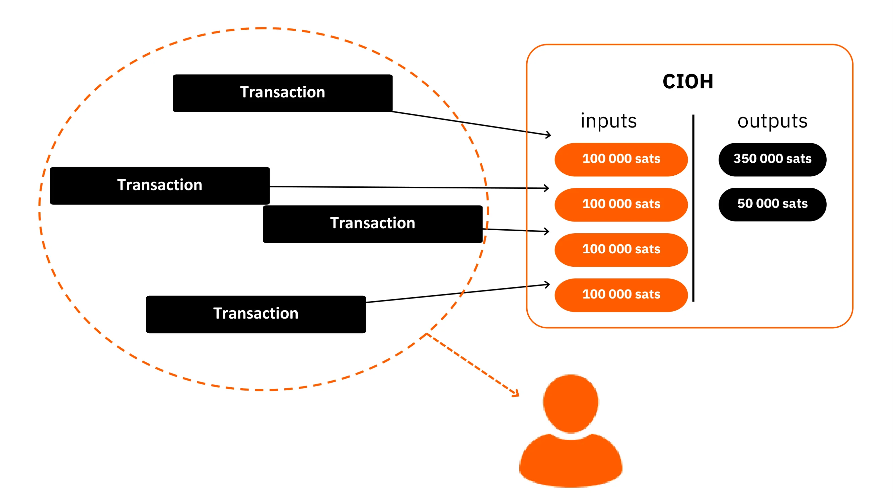


제 신원을 알고 있는 규제 대상 플랫폼의 UTXO과 결합하는 것을 피하고 싶은데, Bisq에서 구매한 무 KYC UTXO을 예로 들어보겠습니다. 실제로 이 두 개의 UTXO를 동일한 거래의 입력으로 사용하면 규제 대상 플랫폼은 이전에 내 신원과 연결되지 않았던 Bisq에서 구매한 UTXO과 내 신원을 연결할 수 있습니다.


마지막으로, 트랜잭션 입력으로 사용할 UTXO를 선택할 때 가장 중요한 것은 여러 개의 UTXO를 사용하지 않는 것입니다. 가능하다면 결제를 충족할 수 있을 만큼 충분히 큰 단일 Coin을 선택해야 합니다. 이렇게 하면 CIOH와 관련된 위험을 완전히 피할 수 있습니다. 그러나 하나의 UTXO로는 결제를 충족하기에 충분하지 않고 여러 개를 사용해야 하는 경우, 원치 않는 링크의 위험을 최소화하기 위해 유사한 출처에서 온 것인지 확인하세요. 또한 수신자가 귀하에 대해 보유한 정보를 거래에 사용된 코인의 내역과 연관시킬 수 있다는 점을 염두에 두시기 바랍니다.


### UTXO 자동 선택 이해


이전 섹션에서는 트랜잭션에 사용할 UTXO를 수동으로 선택하는 방법에 대해 설명했습니다. 하지만 Wallet 소프트웨어가 이 선택을 자동으로 수행하면 어떻게 될까요? 어떤 코인을 소비할지 결정하는 데는 여러 가지 방법이 존재하며, UTXO 선택은 Bitcoin의 진정한 연구 분야입니다. 이 자동화된 프로세스의 주요 목표는 사용자의 거래 비용을 최소화하는 것입니다.


FIFO(*선입선출*) 및 LIFO(*후입선출*)와 같은 UTXO 선택 방법은 가장 간단하지만 효율성이 가장 낮은 방법 중 하나입니다. FIFO를 사용하면 Wallet에서 가장 오래된 UTXO가 먼저 사용됩니다. 이 접근 방식은 상대적 타임록을 사용하고 정기적으로 갱신해야 하는 경우를 제외하고는 일반적으로 트랜잭션 비용을 최소화하고 기밀성을 유지하는 데 비효율적입니다. 반대로 LIFO는 가장 최근의 UTXO를 우선적으로 사용합니다. 두 가지 방법 모두 간단하지만 종종 비효율적인 것으로 판명됩니다.


더 고급 방법은 *Knapsack Solver*입니다. 이 방법은 버전 0.17까지 Bitcoin core Wallet에서 사용되었습니다. 이는 Wallet에서 반복적으로 무작위로 UTXO를 선택해 하위 집합으로 추가하고 트랜잭션 무게를 최대한 최소화하는 솔루션을 유지하여 사용자의 비용을 줄이는 방식으로 구성됩니다.


발명자의 이름을 따 "머치 알고리즘"이라는 별명을 가진 *브랜치 앤 바운드*(BNB)는 버전 0.17부터 Bitcoin core에서 *냅색 솔버*를 대체했습니다. 이 고급 방법은 트랜잭션의 출력을 만족시키는 데 필요한 금액과 정확히 일치하는 UTXO 집합을 찾는 것을 목표로 합니다. BNB의 목표는 Exchange의 즉각적인 비용과 예상되는 미래 비용을 모두 고려하는 소위 낭비 기준을 줄임으로써 변경 금액과 수수료를 최소화하는 것입니다. 이 방법은 1960년 아일사 랜드와 앨리슨 하코트가 고안한 *브랜치 앤 바운드*의 원래 개념에서 파생되었으며, *냅색 솔버*보다 더 정밀한 수수료 최적화 기능을 제공합니다.


이러한 모든 자동 UTXO 선택 방법은 거래 비용을 줄이는 데는 효과적일 수 있지만, 사용자 기밀성 유지에는 효과적이지 않은 경우가 많습니다. 실제로 이러한 알고리즘은 여러 개의 UTXO를 입력으로 병합할 수 있으며, 따라서 CIOH로 인해 이러한 UTXO의 공통 속성이 드러날 수 있습니다. 물론 이러한 방법은 UTXO에 부착된 레이블을 설명할 수는 없지만, 그럼에도 불구하고 거래 수신자에게 공개할 UTXO를 의식적으로 선택하는 데 중요합니다. 현재로서는 코인을 선택할 때 기밀성을 최적화할 수 있는 유일한 방법은 수동으로 선택하는 것입니다.


### UTXO 라벨 제작 튜토리얼


UTXO에 태그를 지정하는 방법을 알아보려면 주요 Bitcoin Wallet 소프트웨어에 대한 종합적인 튜토리얼을 참조하세요:


https://planb.network/tutorials/privacy/on-chain/utxo-labelling-d997f80f-8a96-45b5-8a4e-a3e1b7788c52

## KYC 및 키 식별


<chapterId>cec6b9d9-0eed-4f85-bc4e-1e9aa59ca605</chapterId>


KYC는 "고객 알기"의 약자입니다. 이는 Bitcoin 부문에서 활동하는 특정 회사에서 시행하는 규제 절차입니다. 이 절차의 목적은 자금 세탁 및 테러 자금 조달을 방지하기 위한 목적으로 고객의 신원을 확인하고 등록하는 것입니다.


실제로 KYC에는 고객으로부터 다양한 개인 데이터를 수집하는 것이 포함되며, 이는 관할 지역에 따라 다를 수 있지만 일반적으로 신분증, 사진, Address 증명서가 포함됩니다. 그런 다음 이 정보를 확인하여 향후 사용을 위해 저장합니다.


이 절차는 대부분의 서구 국가에서 규제를 받는 모든 Exchange 플랫폼에 의무적으로 적용되고 있습니다. 즉, 이러한 플랫폼을 통해 Exchange 주 통화를 Bitcoin로 전환하고자 하는 사람은 KYC 요건을 준수해야 합니다.


이 절차는 사용자의 개인정보와 보안에 위험을 수반합니다. 이 장에서는 이러한 위험을 자세히 살펴보고 KYC 및 신원 확인 절차가 Bitcoin 사용자의 개인정보 보호에 미치는 구체적인 영향을 분석합니다.


### On-Chain 추적 촉진


KYC와 관련된 첫 번째 위험은 Blockchain 분석을 위한 특권적인 진입점을 제공한다는 것입니다. 이전 섹션에서 살펴본 것처럼 분석가는 트랜잭션 패턴과 휴리스틱을 사용하여 Blockchain의 활동을 클러스터링하고 추적할 수 있습니다. 사용자의 On-Chain 활동을 클러스터링하는 데 성공하면, 사용자의 모든 트랜잭션과 키 중에서 기밀성을 완전히 침해할 수 있는 단일 진입점을 찾기만 하면 됩니다.


KYC를 수행하면 Blockchain 플랫폼에서 비트코인을 출금할 때 사용한 수신 주소를 완전히 검증된 신원과 연결하므로 Exchange 분석을 위한 고품질 진입점을 제공하게 됩니다. 이론상 이 정보는 정보를 제공한 회사만 알 수 있지만, 아래에서 살펴보겠지만 데이터 유출의 위험은 실제로 존재합니다. 또한 공유하지 않더라도 회사가 이 정보를 보유하고 있다는 사실만으로도 문제가 될 수 있습니다.


따라서 Blockchain에서 활동의 집계를 제한하는 다른 조치를 취하지 않으면 이 KYC 진입 지점을 알고 있는 사람은 Bitcoin에서의 모든 활동을 잠재적으로 사용자의 신원과 연결할 수 있습니다. 해당 회사의 관점에서 보면 Bitcoin을 사용하는 것은 기밀을 침해하는 행위입니다.


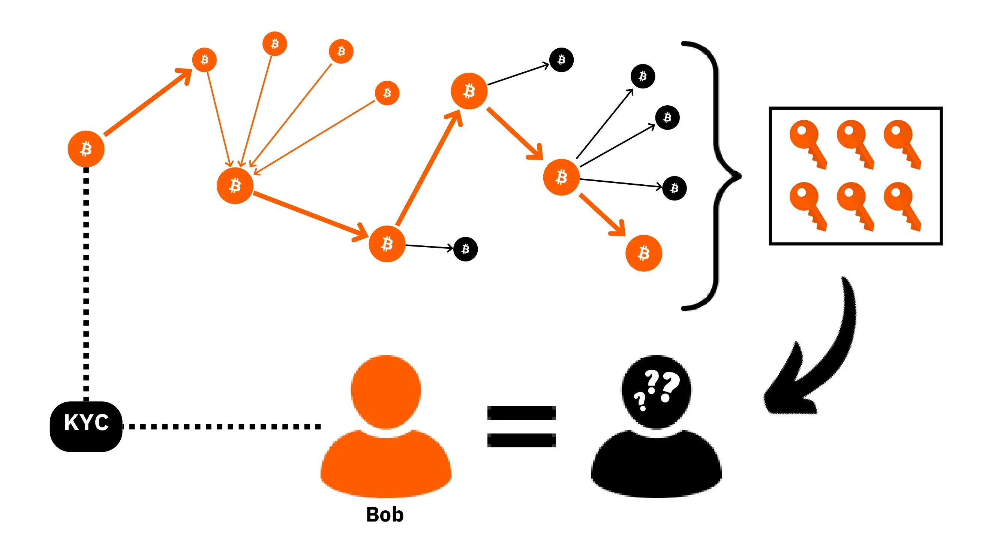


이를 비교를 통해 설명하자면, *은행 X*의 은행원이 *은행 X*와의 모든 거래에 액세스할 수 있을 뿐만 아니라 *은행 Y*와의 거래 및 모든 현금 거래도 관찰할 수 있다고 가정해 보겠습니다.


이 과정의 첫 번째 부분을 기억하세요: Satoshi 나카모토가 고안한 Bitcoin의 기밀성 모델은 사용자의 신원과 공개 및 개인 키 쌍의 분리를 기반으로 합니다. 오늘날 이 Layer의 기밀성은 더 이상 충분하지 않지만, 여전히 성능 저하를 최대한 제한하는 것이 현명합니다.


### 국가 감시에 노출


KYC의 두 번째 주요 문제점은 특정 시점에 Bitcoin을 소유한 사실이 국가에 공개된다는 것입니다. 규제 기관을 통해 비트코인을 구매하면 국가가 이 소유 사실을 알게 될 수 있습니다. 지금 당장은 사소해 보일 수 있지만, 국가의 정치적, 경제적 미래가 여러분의 손에 달려 있다는 점을 기억하는 것이 중요합니다.


첫째, 국가는 빠르게 권위주의적인 태도를 취할 수 있습니다. 역사는 갑작스러운 변화를 겪은 정책의 사례로 가득합니다. 오늘날 유럽에서 비트코인은 Bitcoin에 관한 기사를 작성하고, 컨퍼런스에 참여하고, 자기 관리로 지갑을 관리할 수 있습니다. 하지만 내일은 어떻게 될지 누가 장담할 수 있을까요? Bitcoin가 갑자기 공공의 적이 된다면, 정부 파일에 Bitcoin와 연관되어 있는 것이 문제가 될 수 있습니다.


심각한 경제 위기에 직면하면 국가는 시민들이 보유한 비트코인을 압수할 수도 있습니다. 아마도 내일이면 비트코인을 보유한 사람들은 위기 수익자로 인식되어 특히 법정화폐 평가절하로 인해 자본 이득에 대해 과도한 세금이 부과될 것입니다.


비트코인이 섞여 있어 추적이 불가능하기 때문에 문제가 되지 않는다고 생각할 수도 있습니다. 하지만 여기서는 추적이 문제가 아닙니다. 진짜 문제는 귀하가 Bitcoin을 소유하고 있다는 것을 국가가 알고 있다는 것입니다. 이 정보만으로도 귀하를 기소하거나 책임을 묻기에 충분할 수 있습니다. 비트코인을 사용했다고 주장할 수도 있지만, 이는 세금 신고서에 반영되어야 하며 적발될 수 있습니다. 보트 사고로 열쇠를 잃어버렸다고 말할 수도 있지만, 트위터 농담으로 끝날 일이 아니라면 정말 면책이 될 수 있을까요?


따라서 지금은 그 위험이 멀리 떨어져 있는 것처럼 보이더라도 국가가 귀하의 BTC Ownership를 인지할 수 있는 위험을 고려하는 것이 필수적입니다.


국가 감독 측면에서 KYC가 제기하는 또 다른 문제는 규제 대상 플랫폼의 의무적인 보고입니다. 다른 관할권의 규제에 대해서는 잘 모르지만, 프랑스의 경우 *Prestataires de Services sur Actifs Numériques*(PSAN)는 의심스러운 자금 이동에 대해 금융 감독 당국에 보고해야 합니다.


2023년 프랑스에서는 1,449건의 의심스러운 행위가 PSAN에 의해 신고되었습니다. 현재로서는 이러한 행위의 대부분이 범죄와 관련이 있습니다. 그러나 당국은 규제 대상 플랫폼에 의심스러운 Bitcoin 거래를 구조만 보고 신고하도록 요청하고 있습니다. 공동 거래를 수행하거나 약간 비정형적인 패턴의 거래를 수행하고 이러한 거래가 이러한 플랫폼에서 비트코인을 인출하는 것과 멀지 않은 시점에 발생하면 당국에 신고될 수 있습니다. 불법 행위가 없고 합법적인 권리 행사인 경우에도 이러한 신고로 인해 확인과 감시가 강화될 수 있으며, KYC가 없었다면 피할 수 있었던 불편을 겪을 수 있습니다.


### 개인 데이터 유출 위험


KYC의 또 다른 문제점은 모든 개인 데이터를 개인 회사의 서버에 저장해야 한다는 점입니다.


최근의 사건은 누구도 금융 또는 IT 장애로부터 자유로울 수 없다는 사실을 일깨워주었습니다. 2022년에 Celsius 고객들이 그 피해를 입었습니다. 회사가 파산한 후 미국 법원은 행정 절차를 진행하는 동안 채권자의 이름과 자산 규모를 공개했습니다.


불과 2년 전, 주요 암호화폐 사이버 보안 회사가 해킹을 당해 고객의 개인 데이터가 도난당하는 사건이 발생했습니다. 이 사건은 비트코인 구매와 직접적으로 연결되지는 않았지만, Exchange 플랫폼에도 이러한 위험은 여전히 존재합니다. 따라서 개인 데이터와 관련된 분명한 위험이 존재합니다.


이미 많은 개인 데이터를 민간 기업에 위탁하고 있는 것은 사실입니다. 하지만 이 데이터는 사용자를 식별할 뿐만 아니라 Bitcoin에서의 활동과도 연결되기 때문에 위험은 두 가지입니다. 실제로 해커가 Exchange 플랫폼에서 고객의 데이터에 액세스하면 해당 고객이 비트코인을 보유하고 있다고 합리적으로 추정할 수 있습니다. 이러한 위험은 다른 귀중한 자산과 마찬가지로 Bitcoin이 도둑들의 관심을 끌기 때문에 더욱 커집니다.


데이터 유출이 발생하면 기껏해야 표적 피싱 시도의 표적이 될 수 있습니다. 최악의 경우 집에 대한 물리적 위협의 중심에 서게 될 수도 있습니다.


Bitcoin와 관련된 특정 위험 외에도 신원 문서 전송과 관련된 위험도 있습니다. 실제로 데이터 유출이 발생하면 신원 도용의 피해자가 될 수 있습니다. 따라서 거래의 기밀성 보호에만 국한되는 것이 아니라 각 개인의 개인 보안과도 관련이 있습니다.


### KYC에 대한 몇 가지 선입견


트위터에서 또는 비트코인 사용자들과의 거래에서 자주 접하게 되는 고객신원확인에 대한 선입견을 해소하는 것이 중요합니다.


우선, KYC를 통해 획득한 비트코인의 개인 정보를 보호하는 것이 무의미하다고 생각하는 것은 부정확한 생각입니다. Bitcoin의 개인정보 보호 도구와 방법은 다양하고 목적이 다릅니다. 예를 들어 KYC를 통해 획득한 비트코인에 CoinJoin 트랜잭션을 사용하는 것은 나쁜 생각이 아닙니다. 물론 계정이 동결되거나 금지되는 것을 피하기 위해 규제를 받는 Exchange 플랫폼에 주의해야 하지만, 엄밀한 기술적 관점에서 보면 이러한 관행은 양립할 수 없는 것은 아닙니다. CoinJoin은 Coin의 기록을 차단하는 효과가 있으므로 KYC와 관련된 특정 체인 분석 위험을 차단하는 데 도움이 됩니다. 모든 위험을 제거하지는 못하지만 상당한 이점을 제공합니다.


Bitcoin의 기밀성은 "익명" 비트코인과 그렇지 않은 비트코인을 구분하는 이분법적인 방식으로 이해해서는 안 됩니다. KYC를 통해 획득한 비트코인을 소유한다고 해서 모든 것을 잃는 것은 아니며, 오히려 기밀성 도구를 사용하면 훨씬 더 많은 이점을 얻을 수 있습니다.


반대로 비 KYC 방법을 통해 Bitcoin를 획득한다고 해서 완벽한 기밀성이 보장되는 것은 아니며, 다른 보호 조치를 취해야 할 필요성이 면제되는 것도 아닙니다. 비 KYC Bitcoin를 보유하고 있지만 수신 주소를 여러 번 재사용하는 경우 거래 내역이 추적 및 집계될 수 있습니다. Bitcoin 외부 세계와 조금이라도 연결되면 유일한 기밀인 Layer이 손상될 수 있습니다. 따라서 Bitcoin와 관련된 모든 개인정보 보호 강화 도구와 방법을 상호 보완적인 것으로 고려하는 것이 중요합니다. 각 기술은 특정 위험을 해결하고 Layer의 보호 수준을 추가할 수 있습니다. 따라서 KYC가 아닌 Bitcoin를 소유하고 있다고 해서 다른 예방 조치를 취할 필요가 없다는 의미는 아닙니다.


### KYC를 취소할 수 있나요?


가끔 KYC를 수행한 후 "다시 돌아갈 수 있는지"에 대한 질문을 받는데, 앞 단락에서 짐작할 수 있듯이 대답은 미묘한 차이가 있습니다. KYC와 관련된 위험을 피하는 가장 간단한 방법은 비트코인을 획득할 때 이를 사용하지 않는 것입니다. 다음 장에서 이 주제에 대해 더 자세히 살펴보겠습니다. 하지만 이미 KYC를 수행하고 비트코인을 구매했다면 관련 위험을 완화할 수 있는 방법이 있을까요?


거래 추적의 위험에 대해서는 CoinJoin을 사용하는 것이 해결책입니다. 이 방법의 뒷부분에서 자세히 살펴보겠지만, CoinJoin을 사용하면 Coin의 기록을 끊고 과거-현재 및 현재-과거 추적을 방지할 수 있다는 점을 알아두셔야 합니다. 규제된 플랫폼을 통해 획득한 BTC의 경우에도 이 기술을 사용하면 추적을 방지할 수 있습니다.


그러나 CoinJoin는 KYC와 관련된 두 번째 위험, 즉 국가가 사용자의 비트코인 보유 사실을 알 수 있다는 사실을 없애지는 못합니다. 실제로 코인을 더 이상 추적할 수 없더라도 관할권에 따라 국가가 암호화폐 자산 이전 신고서에 액세스할 수 있습니다. 이러한 위험은 기술적인 문제가 아니라 관리적인 문제이므로 애초에 KYC에 노출되지 않는 것 외에 이를 제거할 수 있는 Bitcoin 전용 솔루션은 없습니다. 이러한 위험을 완화할 수 있는 유일한 합법적인 방법은 규제 플랫폼을 통해 획득한 비트코인을 규제 플랫폼에서 판매한 다음 KYC가 필요 없는 방법으로 재구매하는 것입니다. 판매하고 이전을 신고함으로써 당국은 귀하가 더 이상 비트코인을 소유하지 않는다는 것을 확인해야 합니다.


개인 데이터 및 신원 문서 유출 위험과 관련하여 이는 Bitcoin 외부의 위험이며, 이를 완화할 수 있는 기술적 해결책은 없습니다. 일단 데이터가 공개되면 작업을 취소하기가 어렵습니다. 플랫폼에서 계정을 해지할 수는 있지만, 특히 신원 확인이 아웃소싱된 경우 KYC 데이터의 삭제를 보장하지는 않습니다. 회원님의 정보가 완전히 삭제되었는지 확인하는 것은 불가능합니다. 따라서 이러한 위험을 완전히 방지하고 더 이상 존재하지 않도록 보장할 수 있는 해결책은 없습니다.


### KYC와 키 식별의 차이점


간혹 일부 비트코인 사용자들은 은행 송금이나 신용 카드 결제와 관련된 모든 BTC Exchange에 "KYC"라는 용어를 확장하는 경향이 있는데, 이러한 수단도 KYC와 마찬가지로 결제의 출처를 밝힐 수 있기 때문입니다. 그러나 KYC를 키 신원 확인과 혼동해서는 안 됩니다. 개인적으로 이 주제에 대한 저의 인식이 시간이 지남에 따라 변화했음을 인정하지 않을 수 없습니다.


KYC는 특정 회사가 고객의 신원을 확인하고 등록하기 위해 시행하는 규제 절차를 구체적으로 말합니다. 비트코인을 획득할 때 KYC를 수행하거나 수행하지 않을 수 있습니다. 그러나 사용자 신원의 한 측면과 On-Chain 활동 사이의 연결과 관련된 키 식별은 이분법적인 것이 아니라 연속성을 나타냅니다. 실제로 Bitcoin 획득 또는 전송의 맥락에서 이러한 식별은 항상 다양한 수준으로 가능합니다.


예를 들어 스위스의 규제된 플랫폼에서 비트코인을 구매하는 경우 KYC가 필요하지 않습니다. 하지만 은행 계좌를 통해 구매했기 때문에 키가 식별될 수 있습니다. KYC와 관련된 처음 두 가지 위험, 즉 On-Chain 추적의 용이성과 국가 감시에 대한 노출은 KYC가 없는 Exchange에서도 나타날 수 있습니다. 스위스 법인이 의심스러운 거래를 해당 국가의 당국에 신고하면 구매에 사용된 은행 계좌를 확인하여 신원을 파악할 수 있습니다. 따라서 규제된 플랫폼에서 KYC 없이 구매하는 것은 신원 확인에 대한 위험도가 다소 높습니다.


그러나 규제 대상 플랫폼을 피하고 P2P 획득 방법을 선택한다고 해서 키 식별의 위험이 완전히 사라지는 것은 아니며 단지 감소할 뿐입니다. Bisq 또는 다른 P2P(P2P) 플랫폼에서 구매하는 경우를 예로 들어보겠습니다. 거래 상대방에게 대금을 지불하기 위해 은행 계좌를 사용할 것입니다. 당국이 거래 상대방에게 신원 조회를 하고 이름을 묻는다면 위험 1과 2로 돌아가게 됩니다. 이러한 위험은 KYC가 없는 플랫폼에서 구매할 때보다 훨씬 낮고, KYC를 통해 구매할 때보다 훨씬 낮지만 여전히 어느 정도는 존재합니다.


마지막으로, 실제 Exchange을 통해 현금으로 비트코인을 획득하더라도 완전히 익명이 보장되는 것은 아닙니다. 비트코인을 주고받은 상대방은 신원의 일부인 여러분의 얼굴을 본 것입니다. 이 예시에서는 미미하지만 여전히 신원 확인의 가능성이 있습니다.


결론적으로 비트코인을 다른 자산으로 교환할 때, 국가 통화로 구매하든 실물 자산으로 판매하든 항상 어떤 형태의 키 식별이 필요합니다. 선택한 Exchange 방식에 따라 이 식별의 강도는 달라질 수 있습니다. 이러한 신원 확인을 잘 정의된 규제 프로세스인 KYC와 혼동하지 않는 것이 중요합니다. 그러나 KYC가 스펙트럼의 상위 단계에 위치하여 당국이 사용자 키를 체계적으로 식별할 수 있도록 하기 때문에 KYC와 식별 스펙트럼 사이에는 연관성이 있습니다.


## 판매 및 획득 방법


<chapterId>756598af-95aa-4c77-ac48-243c7ad89530</chapterId>


이전 챕터를 읽고 나면 KYC와 관련된 위험을 피하기 위해 신원 확인 절차를 거치지 않고 Bitcoin을 어떻게 구매하거나 판매할 수 있는지 궁금하실 것입니다. Bitcoin을 거래하는 방법에는 여러 가지가 있습니다.


### P2P 현금 교환


지금까지 살펴본 바와 같이 기밀성 측면에서 가장 좋은 방법은 현금 결제를 통한 P2P(개인 대 개인) Exchange입니다. 이 방법을 사용하면 흔적이 남는 것을 최소화하고 구매 또는 판매 여부에 관계없이 키 식별 가능성을 상당히 줄일 수 있습니다.


그럼에도 불구하고 개인 보안에는 위험이 있습니다. 가장 큰 위험은 Exchange 기간 동안 상대방이 현금이나 비트코인으로 많은 돈을 보유하고 있다는 사실을 알게 된다는 사실에 있습니다. 이 정보는 악의적인 사람들의 관심을 끌 수 있습니다. 따라서 일반적으로 Bitcoin 보유에 대해 신중을 기하는 것이 좋습니다. 이 조언은 현금에도 적용될 수 있습니다. 하지만 대면으로 교환할 때는 불가피하게 자신의 비트코인을 공개할 수밖에 없으며, 이로 인해 원치 않는 관심을 끌 수 있습니다.


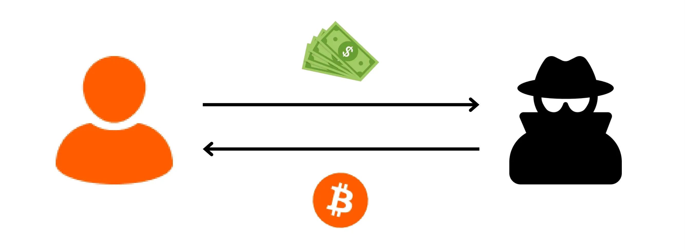


이러한 위험을 줄이려면 가족이나 친한 친구 등 신뢰할 수 있는 사람과 현금으로 거래하는 것이 좋습니다. 또는 [지역 Bitcoin 모임](https://btcmap.org/communities/map)에 몇 번 참석한 후 거래를 고려할 수도 있습니다. 이렇게 하면 다른 참가자들을 더 잘 알 수 있고 물리적으로 교류할 때 외롭지 않을 수 있습니다. 하지만 P2P 현금 거래는 본질적으로 규제된 플랫폼과 은행 계좌를 통해 구매할 때와는 달리 개인 보안에 대한 위험이 존재한다는 점을 인식하는 것이 중요합니다.


또한 지역에 따라 Bitcoin이든 현금이든 거액의 돈을 운송하고 보관하는 것은 위험할 수 있습니다.


현금을 환전하면 경찰이나 기타 검문 시 법적 위험에 노출될 수도 있습니다. 대부분의 국가에서 휴대할 수 있는 현금의 양에는 제한이 없지만 과도한 금액은 의심을 받을 수 있습니다. 특히 장거리 여행을 해야 하는 경우, 거액을 소지하는 것을 정당화할 필요가 없도록 한 번에 여러 번 큰 금액의 거래를 하지 않도록 주의하세요.


마지막으로, P2P 구매의 또 다른 단점은 가격이 규제 플랫폼보다 높은 경우가 많다는 것입니다. 판매자는 종종 1%에서 때로는 10% 이상의 마크업을 부과합니다. 이러한 가격 차이에는 몇 가지 이유가 있습니다. 첫째, 이는 시간이 지남에 따라 확립된 P2P 판매자 사이의 일반적인 관행입니다. 둘째, 판매자는 구매자에게 자금을 송금하는 데 드는 비용을 충당하기 위해 거래와 관련된 수수료를 받습니다. 또한 플랫폼 거래에 비해 P2P 판매는 도난 위험이 더 높기 때문에 이에 대한 보상이 정당화됩니다. 마지막으로, 추가 비용은 기밀성 측면에서 Exchange의 수요 및 품질과 관련이 있을 수 있습니다. 구매자의 입장에서는 기밀성 확보에 따른 이득에 대가가 따르며, 이는 판매자가 적용하는 마크업에 반영됩니다. 일부 비트코인 사용자들은 P2P에서 구매한 BTC의 마크업 가격이 실제 가격을 반영한다고 믿으며, 규제 플랫폼의 낮은 가격은 개인 데이터의 기밀성이 훼손된 결과라고 주장하기도 합니다.


### 매치메이킹 플랫폼을 통한 P2P 교환


개인 보안 측면에서 덜 위험한 대안은 페이팔, 은행 송금 또는 Revolut과 같은 전자 결제 수단을 사용하여 온라인에서만 P2P 교환을 진행하는 것입니다.


이 방식은 현금 거래와 관련된 많은 위험을 피할 수 있습니다. 하지만 온라인 Exchange에서는 거래 상대방이 채무 불이행을 일으킬 위험이 더 큽니다. 실제로 실물 Exchange에서는 비트코인을 보내지 않는 판매자에게 돈을 건네주면 판매자가 바로 앞에 서 있기 때문에 즉시 계좌를 추적할 수 있습니다. 반면 온라인에서는 비트코인을 훔친 사람을 추적하는 것이 불가능한 경우가 많습니다.


이러한 위험을 완화하기 위해 P2P(P2P) 거래소를 위한 전문 플랫폼을 활용할 수 있습니다. 이러한 플랫폼은 분쟁 해결 메커니즘을 사용하여 불만을 품은 사용자를 보호합니다. 일반적으로 판매자가 법정화폐로 결제를 확인할 때까지 비트코인을 보관하는 에스크로 시스템을 제공합니다.


개인 보안 측면에서 이 구매 방법은 직접 현금을 교환하는 것보다 훨씬 안전합니다. 하지만 위에서 언급했듯이 온라인 P2P 교환은 오프라인 교환보다 더 많은 흔적을 남기므로 Bitcoin의 개인정보 보호에 해로울 수 있습니다. 은행과 같은 온라인 법정화폐 결제 수단을 사용하면 키 식별을 용이하게 할 수 있는 더 많은 정보를 노출하게 됩니다.


다시 한 번 말씀드리지만, 이러한 플랫폼에서 한 번에 너무 많은 금액을 거래하는 것은 권장하지 않습니다. 거래를 분할하면 거래 상대방 도난의 위험이 분산됩니다.


다시 한 번 강조하지만, P2P 구매의 또 다른 단점은 가격이 규제된 플랫폼보다 높은 경우가 많다는 것입니다. 판매자는 종종 1%에서 때로는 10% 이상에 이르는 마크업을 부과합니다. 이러한 가격 차이에는 몇 가지 이유가 있습니다. 첫째, 이는 시간이 지남에 따라 확립된 P2P 판매자 사이의 일반적인 관행입니다. 둘째, 판매자는 구매자에게 자금을 송금하는 데 드는 비용을 충당하기 위해 거래와 관련된 수수료를 받습니다. 또한 플랫폼 거래에 비해 P2P 판매는 도난 위험이 더 높기 때문에 이에 대한 보상이 정당화됩니다. 마지막으로, 추가 비용은 기밀성 측면에서 Exchange의 수요 및 품질과 관련이 있을 수 있습니다. 구매자의 입장에서는 기밀성 확보에 따른 이득에 대가가 따르며, 이는 판매자가 적용하는 마크업에 반영됩니다. 일부 비트코인 사용자들은 P2P에서 구매한 BTC의 마크업 가격이 실제 가격을 반영한다고 믿으며, 규제 플랫폼의 낮은 가격은 개인 데이터의 기밀성이 손상된 결과라고 주장하기도 합니다.


솔루션에 관한 한, 저는 개인적으로 항상 [Bisq](https://bisq.network/)를 사용해 왔으며 매우 만족하고 있습니다. 이 회사의 시스템은 많은 테스트를 거쳤으며 신뢰할 수 있는 것 같습니다. 하지만 Bisq는 PC에서만 사용할 수 있으며, Interface는 초보자에게는 너무 복잡할 수 있습니다. 또 다른 단점은 Bisq는 On-Chain 트랜잭션으로만 작동하기 때문에 Bitcoin 트랜잭션 수수료가 높은 기간에는 비용이 많이 들 수 있다는 것입니다.


-> Bisq 튜토리얼을 참조하세요.


https://planb.network/tutorials/exchange/peer-to-peer/bisq-fe244bfa-dcc4-4522-8ec7-92223373ed04

더 간단한 옵션을 원한다면 분쟁 해결 시스템이 내장된 구매자와 판매자를 연결해주는 모바일 앱인 [Peach](https://peachbitcoin.com/)를 사용해 보세요. 프로세스는 Bisq보다 직관적입니다.


-> Peach 튜토리얼을 참조하세요.


https://planb.network/tutorials/exchange/peer-to-peer/peach-c6143241-d900-4047-9b73-1caba5e1f874

또 다른 온라인 옵션으로는 개인적으로 테스트해 보지는 않았지만 좋은 유동성을 제공하는 잘 알려진 플랫폼인 [HodlHodl](https://hodlhodl.com/)이 있습니다.


-> HodlHodl 튜토리얼을 참조하세요.


https://planb.network/tutorials/exchange/peer-to-peer/hodlhodl-d7344cd5-6b18-40f5-8e78-2574a93a3879

Lightning Network 기반 솔루션의 경우, [RoboSats](https://learn.robosats.com/) 및 [LNP2PBot](https://lnp2pbot.com/)을 사용해 보세요. RoboSats는 웹사이트를 통해 액세스할 수 있으며 사용법이 비교적 간단합니다. LNP2PBot은 텔레그램 메시징 애플리케이션 내의 Exchange 시스템을 통해 작동하기 때문에 좀 더 비정형적입니다.


-> 로보샛 튜토리얼을 참조하세요.


-> LNP2PBot 튜토리얼을 참조하세요.


https://planb.network/tutorials/exchange/peer-to-peer/robosats-b60e4f7c-533a-4295-9f6d-5368152e8c06

https://planb.network/tutorials/exchange/peer-to-peer/lnp2pbot-v2-e6bcb210-610b-487d-970c-7cce85273e3c


### KYC가 없는 규제 플랫폼


거주 국가에 따라 비트코인을 구매하거나 판매할 때 KYC 절차가 필요 없는 규제 플랫폼에 액세스할 수 있습니다. 예를 들어 스위스에서는 이전에는 [Relai](https://relai.app/)와 [MtPelerin](https://www.mtpelerin.com/)을 이용할 수 있었지만, 현재는 KYC 규정에 따라 서비스를 제공하고 있습니다.


-> Relai에 대한 튜토리얼을 참조하세요.


https://planb.network/tutorials/exchange/centralized/relai-v2-30a9671d-e407-459d-9203-4c3eae15b30e

이전 장에서 살펴본 바와 같이 이러한 유형의 플랫폼은 KYC 절차와 관련된 위험을 완화하지만, 키 신원 확인에 대한 위험도도 더 높습니다. 따라서 Bitcoin 기밀성 측면에서 이러한 플랫폼은 KYC를 통한 구매 방법보다 더 나은 보호 기능을 제공하지만, P2P 거래소보다는 덜 매력적입니다.


그러나 개인 보안 측면에서 이러한 플랫폼을 사용하는 것은 P2P 거래소보다 훨씬 덜 위험합니다. 또한 P2P 플랫폼보다 사용하기가 더 간단한 경우가 많습니다.


### ATM


KYC 없이 비트코인을 구매하거나 판매할 수 있는 또 다른 옵션은 암호화폐 ATM입니다. 개인적으로 이 솔루션은 우리나라에서는 사용할 수 없기 때문에 테스트할 기회가 없었습니다. 하지만 이 방법은 거주 지역에 따라 매우 흥미로울 수 있습니다.


ATM의 문제는 일부 국가에서는 사용이 금지되거나 다른 국가에서는 규제가 심하다는 것입니다. ATM에 신원 확인 절차가 필요한 경우, KYC 규제를 받는 플랫폼에 내재된 위험과 동일한 위험에 노출됩니다. 반면에 ATM이 소액에 대해 신원 확인 없이 거래를 허용하는 경우, 이러한 유형의 Exchange과 관련된 대부분의 위험을 피하면서 P2P 현금 Exchange과 비슷한 수준의 기밀성을 제공할 수 있습니다.


ATM의 가장 큰 단점은 교환 금액의 몇 퍼센트에서 많게는 15%까지 높은 Exchange 수수료를 부과하는 경우가 많다는 것입니다.


### 기프트 카드


마지막으로 비트코인을 법정화폐로 판매하지 않고 매일 구매에 사용하고자 하는 분들에게 적합한 솔루션을 소개해드리고자 합니다.


물론 BTC를 사용하는 가장 좋은 방법은 Bitcoin 또는 Lightning Network을 직접 사용하여 상품이나 서비스를 구매하는 것입니다. 하지만 많은 국가에서 Bitcoin을 사용할 수 있는 가맹점의 수는 여전히 제한적입니다. 현실적인 대안은 기프트 카드를 사용하는 것입니다.


KYC 절차가 필요하지 않은 몇몇 플랫폼에서는 비트코인을 주요 소매점에서 사용할 수 있는 기프트 카드로 교환할 수 있는 기능을 제공합니다. 여기에는 [코인비](https://www.coinsbee.com/), [Bitcoin 회사](https://thebitcoincompany.com/), [비트필](https://www.bitrefill.com/)이 포함됩니다. 이러한 플랫폼을 사용하면 비트코인을 법정 화폐로 변환하지 않고도 다양한 상품과 서비스를 이용할 수 있어 일상에서 비트코인을 훨씬 쉽게 사용할 수 있습니다.


https://planb.network/tutorials/exchange/centralized/bitrefill-8c588412-1bfc-465b-9bca-e647a647fbc1


### 기타 획득 방법


개인정보를 보호하면서 비트코인을 획득하는 다른 방법으로는 물론 Mining가 있습니다. Mining Sats를 시작하려면 신원을 밝힐 필요 없이 유효한 Proof of Work을 찾아 네트워크에 제출하기만 하면 됩니다. 풀 Mining를 선택하는 경우, 일부 풀은 KYC와 같은 신원 확인을 요구하는 반면, 그렇지 않은 풀도 있습니다.


또 다른 방법은 비트코인을 위해 Exchange에서 작업하는 것입니다. 이 획득 방법은 흥미로울 수 있지만 필요한 신원 확인의 정도는 상황에 따라 상당히 다릅니다.


*이 장을 작성하기 위해 [@pivi___](https://x.com/pivi___)가 Plan ₿ Network에서 제공하는 BTC205 강좌를 사용했습니다(현재는 프랑스어로만 제공됨)*


## 통합, UTXO 관리 및 CIOH


<chapterId>d0486c8f-332d-402b-ae2e-949416752b9c</chapterId>


셀프 커스터디 Wallet를 운영할 때 가장 복잡한 측면 중 하나는 통합입니다. 통합해야 할까요? 통합해야 하는 이유는 무엇인가요? UTXO의 크기는 어느 정도여야 하나요? 기밀성 측면에서 타협점은 무엇인가요? 이 섹션에서는 이러한 내용을 살펴볼 것입니다.


### 통합이란 무엇인가요?


Bitcoin은 경매 시장처럼 운영되며, 채굴자는 가장 낮은 수수료를 제시하는 거래를 우선시합니다. 그러나 각 블록에는 최대 가중치가 있어 그 안에 포함될 수 있는 트랜잭션의 수가 제한됩니다. 블록은 평균 10분마다 생성되므로 각 블록에서 사용할 수 있는 공간은 희소한 자원입니다.


전기, 고정 자산, 유지보수 측면에서 상당한 비용을 지출하는 채굴자는 당연히 수익성을 극대화하고자 합니다. 따라서 이들은 무게에 비해 수수료가 가장 높은 거래를 선호하는 경향이 있습니다.


모든 Bitcoin 트랜잭션의 무게가 동일한 것은 아닙니다. 입력과 출력이 많은 트랜잭션의 무게가 더 무겁습니다. 예를 들어 2개의 트랜잭션이 있다고 가정해 보겠습니다:


- 트랜잭션 A는 1개의 입력과 1개의 출력으로 구성됩니다. 1,994Sats의 수수료를 할당하고 141vB의 가중치를 가집니다;
- 2개의 입력과 2개의 출력이 있는 더 복잡한 거래인 거래 B는 220vB의 가중치에 대해 2,640Sats의 수수료를 할당합니다.


이 예시에서는 트랜잭션 B가 더 높은 총 수수료를 제공하지만, 채굴자는 가중치 대비 수수료 비율이 더 높은 트랜잭션 A를 선호할 것입니다. 각 트랜잭션에 대한 계산은 가상 바이트당 Sats(sat/vB)으로 표현됩니다:


```text
TXA: 1994 / 141 = 14 sats/vB
TXB: 2640 / 220 = 12 sats / vB
```


즉, 무게 단위당 거래 A가 거래 B보다 더 많은 비용을 제공하지만 절대적인 비용은 거래 B가 더 높다는 의미입니다.


따라서 사용자는 트랜잭션에서 가능한 한 적은 인풋을 소비하는 것이 항상 더 흥미롭습니다. 그러나 출력 지불을 충족하기 위해서는 충분한 양을 소비해야 합니다. Wallet을 관리할 때는 충분히 큰 UTXO를 보유해야 합니다.


통합의 원칙은 Bitcoin에서 수수료가 낮은 시기를 이용해 작은 UTXO를 하나의 큰 UTXO로 통합하는 것입니다. 이렇게 하면 Bitcoin에서 수수료가 상승할 때 최소한의 입력으로 거래를 할 수 있으므로 절대적인 측면에서 수수료 지출을 줄일 수 있습니다. 따라서 수수료가 높은 기간 동안 강제 거래가 발생할 것을 예상하고 대비하는 것이 목표입니다.


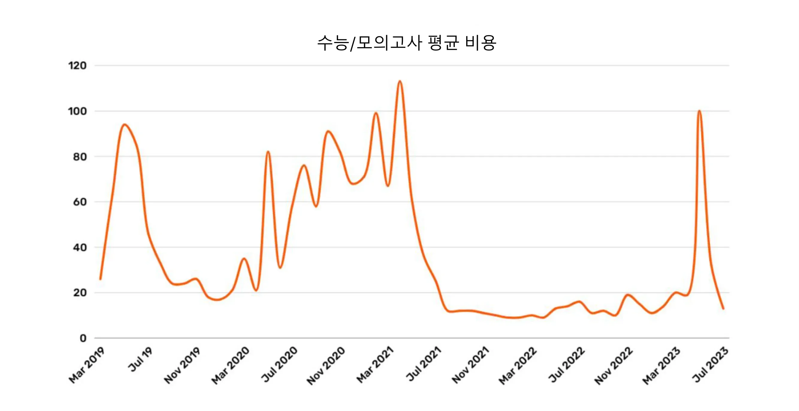


거래 비용을 절감할 수 있을 뿐만 아니라, UTXO를 통합하면 "Dust"의 형성을 방지할 수 있습니다. Dust'는 Sats의 가치가 너무 낮아 이를 사용하는 데 필요한 거래 비용을 충당하기에 불충분한 UTXO를 말합니다. 따라서 거래 비용이 높게 유지되는 한 이러한 UTXO를 사용하는 것은 경제적으로 비합리적입니다. UTXO를 사전에 풀링하면 손실되는 것을 방지하여 모든 자금을 계속 사용할 수 있습니다.


### UTXO의 최소 크기는 얼마인가요?


가끔 UTXO의 권장 최소값이 얼마인지 묻는 질문을 받곤 합니다. 안타깝게도 선호도와 수수료 시장의 상황에 따라 달라지므로 보편적인 답은 없습니다. 하지만 다음은 필요에 맞는 임계값을 결정하는 데 도움이 될 수 있는 공식입니다:


$$
\frac {P \times F}T = M
$$


Where:


- p$는 트랜잭션 가중치입니다;
- f$는 헤지하는 v바이트당 최대 사토시 요금(Sats/vB)을 나타냅니다;
- t$는 UTXO의 총 가치 대비 지불하고자 하는 거래 수수료의 백분율입니다;
- m$는 각 UTXO에 대한 최소 사토시 단위의 금액입니다.


입력 1개, 출력 2개, 141vB의 표준 SegWit 거래에 대한 수수료를 충당할 계획이라고 가정해 보겠습니다. 최대 800 Sats/vB까지 헤지하고 최대 UTXO 가치의 12%까지 수수료로 지출할 의향이 있다면 다음과 같이 계산할 수 있습니다:


$$
\frac{141 \times 800}{0.12} = 940\ 000
$$


따라서 이 예제에서는 Wallet의 UTXO에 대해 최소값 940,000 Sats를 유지하는 것이 현명합니다.


### 통합 및 CIOH


Blockchain 분석에서 가장 널리 사용되는 휴리스틱 중 하나는 Ownership 트랜잭션에 대한 모든 입력이 동일한 엔티티에 속한다고 가정하는 CIOH(*공통 입력 Bitcoin 휴리스틱*)입니다. 통합의 기본 원리는 여러 개의 UTXO를 입력으로 사용하고 하나의 UTXO을 출력으로 생성하는 것입니다. 따라서 통합을 통해 ICOH를 적용할 수 있습니다.


실제로 이는 외부 관찰자가 통합된 모든 UTXO가 동일한 사람의 소유일 가능성이 높으며, 생성된 고유 출력도 그 사람의 소유라고 추론할 수 있다는 것을 의미합니다. 이러한 상황은 서로 다른 거래 내역을 연결하여 기밀성을 위태롭게 할 수 있습니다. 예를 들어 P2P를 통해 획득한 3개의 UTXO를 KYC가 필요한 플랫폼을 통해 획득한 1개의 UTXO와 통합한다고 가정해 보겠습니다:


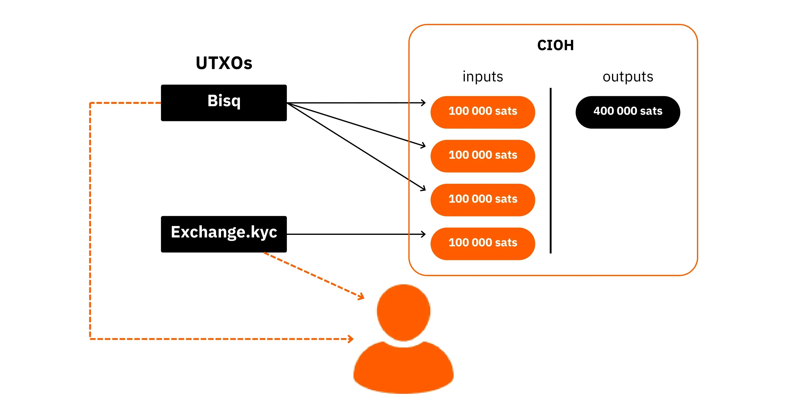


이렇게 하면 정부 기관을 포함해 Exchange 플랫폼의 데이터에 액세스할 수 있는 모든 기관이 제가 다른 양의 BTC를 소유하고 있다는 사실을 확인할 수 있습니다. 이전에는 이러한 UTXO가 제 신원과 직접적으로 연결되지 않았지만, 이제는 연결됩니다. 또한, 모든 출처에 제가 일정량의 비트코인을 소유하고 있다는 사실이 공개됩니다.


UTXO를 관리할 때 비용 절감을 위해 통합을 추진하는 경제적 고려사항은 개인정보 보호 모범 사례와 충돌하게 되며, 따라서 UTXO를 통합하지 않는 것이 좋습니다. 따라서 경제성과 개인정보 보호 중 어떤 것을 선택할지는 각 사용자의 우선순위에 따라 달라집니다.


통합을 피하면서 상당한 UTXO를 유지할 수 있다면 가장 이상적입니다. 이렇게 하려면 획득 방법을 최적화하세요. DCA로 비트코인을 구매하는 경우, 가능한 한 일회성 구매를 최대한 분산하여 더 적은 UTXO로 가치를 통합하세요. 매주 120유로를 구매하는 것보다 2개월에 한 번씩 1,000유로를 구매하는 것이 더 관리하기 쉽습니다. 이렇게 하면 생성되는 UTXO의 수를 최소화하고 Wallet 관리를 간소화하여 기밀을 유지할 수 있습니다.


비트코인을 통합해야 하는 경우, 같은 출처의 UTXO를 우선적으로 통합하세요. 예를 들어, 단일 플랫폼에서 10개의 UTXO를 통합하는 것이 A 플랫폼에서 5개의 UTXO를 B 플랫폼에서 5개의 UTXO와 혼합하는 것보다 기밀성에 영향을 덜 줍니다. 다양한 소스의 통합이 불가피한 경우, 특성에 따라 구분하여 통합하시기 바랍니다. 예를 들어 한 거래에서는 KYC를 통해 획득한 UTXO를, 다른 거래에서는 P2P을 통해 획득한 UTXO를 함께 그룹화합니다.


어떤 경우든 통합은 필연적으로 기밀성 손실을 수반한다는 사실을 잊지 마세요. CIOH를 고려하여 이 작업의 필요성과 개인정보 보호에 미치는 잠재적 영향을 신중하게 평가하세요.


## 기타 모범 사례


<chapterId>b5216965-7d13-4ea1-9b7c-e292966a487b</chapterId>


Bitcoin에서 개인정보 보호를 강화하기 위한 몇 가지 추가 모범 사례를 살펴보겠습니다.


### 완벽한 매듭


비트코인을 자기 소유로 보관하는 것도 좋지만, 자체 Full node을 사용하면 더 좋습니다! Bitcoin을 완전히 주권적으로 사용하려면 자체 노드를 보유하는 것이 중요한 이유는 다음과 같습니다:


- **검열에 대한 저항**: 귀하의 거래는 누구도 차단할 수 없습니다;
- **제3자로부터의 독립성**: 더 이상 Blockchain 데이터 확인을 위해 외부 서비스에 의존하지 않습니다;
- **적극적인 참여**: 직접 검증 규칙을 정의하고 합의에 직접 참여할 수 있습니다;
- **네트워크 기여**: 노드를 실행하면 Bitcoin 네트워크를 강화하고 배포하는 데 도움이 됩니다;
- **기술 교육**: Full node를 관리하면 Bitcoin에 대한 기술 지식을 심화할 수 있습니다.


이러한 이점 외에도 Full node을 사용하면 거래를 브로드캐스팅할 때 기밀성이 향상됩니다. 트랜잭션을 발행하면 먼저 Wallet을 통해 트랜잭션이 생성되고 서명됩니다. Bitcoin 네트워크에서 이를 브로드캐스트하려면 적어도 하나의 노드에서 이를 알고 있어야 합니다. 자신의 노드를 사용하면 이 배포를 직접 제어할 수 있으므로 기밀성을 강화하고 데이터 유출 위험을 제한할 수 있습니다.


자체 Bitcoin 노드가 없는 경우, Wallet 소프트웨어 제공업체에서 제공하는 타사 노드를 사용해야 합니다. Wallet은 거래 브로드캐스팅 외에도 보류 중인 거래, 주소와 연결된 잔액, 거래 확인 횟수 등 다양한 정보에 액세스할 수 있어야 합니다. 이 모든 데이터에 액세스하려면 노드를 쿼리해야 합니다.


자체 Bitcoin 노드를 사용하지 않을 때 가장 큰 위험은 타사 노드 운영자가 Blockchain에서 사용자의 활동을 관찰하거나 심지어 이 정보를 다른 기관과 공유할 수 있다는 것입니다. 이러한 위험을 완화하기 위한 중간 해결책은 토르 네트워크를 통해 연결을 마스킹하는 Wallet 소프트웨어를 사용하는 것입니다. 이렇게 하면 데이터 노출을 줄일 수 있습니다. 그러나 최적의 해결책은 자체 Bitcoin 노드를 보유하여 트랜잭션을 브로드캐스트하는 것입니다. 물론 노드를 통해 정보가 유출되지 않도록 주의해야 하지만, 이는 다음 섹션에서 살펴볼 또 다른 주제입니다.


개인 정보 보호에 대한 분명한 이점 외에도, Full node를 보유하면 Blockchain에 있는 데이터의 진실성을 보장하고 검열로부터 사용자를 보호하며 Bitcoin의 거버넌스에 적극적으로 참여할 수 있습니다. 자신의 노드를 사용함으로써 자신이 선택한 체인에 경제적 가중치를 부여할 수 있으며, 이는 예를 들어 2015년부터 2017년까지의 블록사이즈 전쟁과 같은 커뮤니티 내 분쟁이 발생할 때 중요한 역할을 합니다. Fork의 경우, 타사 노드를 사용하면 노드 운영자가 대신 선택하기 때문에 원하지 않는 체인을 지지하게 될 수 있습니다.


보시다시피, 기밀 유지와 개인 주권을 위해 Full node을 직접 실행하고 사용하는 것이 필수적입니다!


### 속이는 분석 휴리스틱


더 넓게 보면, 이전 섹션에서 설명한 휴리스틱을 더 잘 피하거나 속이기 위해서는 휴리스틱을 이해하는 것이 필수적입니다. 일련의 모범 사례를 채택하는 것은 필수적이지는 않더라도 도움이 될 수 있습니다. Bitcoin를 사용할 때 기밀을 유지하는 데 중요할 수 있는 추가적인 Layer 보호 기능을 제공합니다.


제가 드릴 수 있는 첫 번째 조언은 가장 밀집된 군중과 섞이는 것입니다. Bitcoin에서는 가장 널리 채택된 스크립트 템플릿을 사용하라는 뜻입니다. 예를 들어, SegWit V0 Multisig 구성에 자주 사용되는 P2WSH 스크립트는 매우 드문 경우입니다. 이 스크립트는 대규모 익명성 세트에서 숨을 수 없습니다. P2PKH 또는 P2SH와 같은 이전 모델에도 동일하게 적용됩니다. UTXO 세트에 널리 존재하지만 새로운 트랜잭션에는 점점 더 적게 사용됩니다.


일반적으로 가장 최근의 스크립팅 표준이 충분히 채택되었다면 이를 선택하는 것이 현명합니다. 따라서 2022년에는 채택률이 낮기 때문에 P2TR(Taproot)을 사용하지 않는 것이 좋다고 조언했다면, 2024년에는 P2TR을 사용하는 트랜잭션 수가 매우 큰 비중을 차지하기 시작하므로 이 유형의 스크립트를 대신 선택하거나 그렇지 않다면 SegWit V0 스크립트를 사용하는 것이 좋습니다.


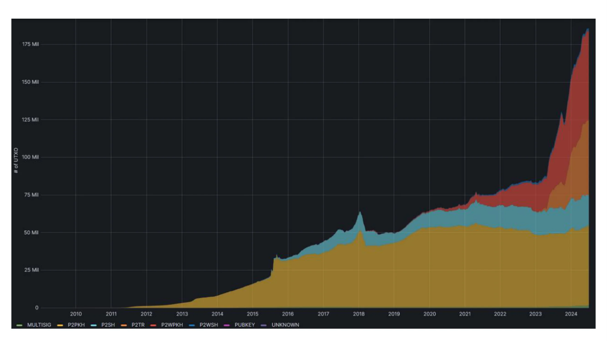


출처: [txstats.com](https://txstats.com/d/000000054/UTXO-set-repartition-by-output-type)


기밀을 유지하기 위한 또 다른 팁은 내부 거래 휴리스틱을 우회하는 것입니다. 예를 들어, 결제를 할 때 반올림된 금액으로 출력을 만들면 다른 출력이 변경된 금액이라는 신호를 줄 수 있으므로 피하세요. 친구에게 100,000 Sats을 송금해야 하는 경우 이 휴리스틱을 피하기 위해 약간 더 높은 금액을 송금하는 것이 좋습니다. 마찬가지로, 지불한 금액에 비해 불균형적으로 높은 잔액 출력을 만들지 않도록 하세요. 어떤 출력이 잔액을 나타내는지 알 수 있기 때문입니다.


마지막으로, Bitcoin 트랜잭션을 정기적으로 수행하는 경우 항상 동시에 브로드캐스트하지 않도록 하세요. 거래 브로드캐스트를 하루와 일주일에 걸쳐 분산하면 외부 관찰자가 분석을 강화할 수 있는 시간대 기반 시간 패턴을 감지할 수 있는 기회를 제공하지 않게 됩니다.


이러한 모든 모범 사례를 매일 채택하는 것 외에도 비트코인의 추적성을 완전히 차단할 수 있는 훨씬 더 효과적인 방법이 있습니다. 여기에는 물론 다음 섹션에서 자세히 살펴보게 될 CoinJoin 트랜잭션이 포함됩니다.


# CoinJoin 트랜잭션 이해


<partId>6d0bbf16-3714-4db1-9897-2d45019f6bdc</partId>


## CoinJoin 트랜잭션이란 무엇인가요?


<chapterId>0862bc6b-1c48-4aa4-b76d-4f547b469008</chapterId>


개인정보 보호의 기본 사항을 살펴보았으니, 이제 Bitcoin 기록을 익명화하여 사용자의 기밀을 적극적으로 보호하기 위한 보다 정교한 기법을 살펴보겠습니다. 다음 부분에서는 다양한 소규모 기법을 살펴보겠습니다. 먼저 CoinJoin에 대해 소개하겠습니다.


CoinJoin은 종종 Bitcoin 사용자의 개인정보를 보호하는 가장 효과적인 방법으로 간주됩니다. 그렇다면 CoinJoin 트랜잭션이란 정확히 무엇일까요? 알아봅시다.


### CoinJoin의 기본 원칙


CoinJoin은 Blockchain에서 Bitcoin 트랜잭션의 추적을 차단하는 데 도움이 되는 기술입니다. 이는 CoinJoin 트랜잭션으로 알려진 특정 구조의 협업 트랜잭션을 기반으로 합니다.


이 과정의 첫 번째 파트에서 살펴본 것처럼 Bitcoin 트랜잭션은 노드를 통해 모든 사용자에게 알려져 있습니다. 따라서 각 Coin의 전자 서명 체인을 쉽게 확인하고 그 이력을 관찰할 수 있습니다. 즉, 모든 사용자가 다른 사용자의 트랜잭션을 분석할 수 있습니다. 결과적으로 거래 수준에서의 익명성은 불가능합니다. 그러나 개인 식별 수준에서는 익명성이 유지됩니다. 각 계좌가 개인 신원과 연결되는 기존 은행 시스템과 달리, Bitcoin에서는 자금이 암호화 키 쌍(또는 스크립트)과 연결되어 사용자에게 암호화 식별자 뒤에 가명성을 제공합니다.


외부 관찰자가 특정 UTXO를 식별된 사용자와 연결할 수 있게 되면 Bitcoin의 기밀성이 훼손됩니다. 이러한 연결이 설정되면 해당 사용자의 거래를 추적하고 Bitcoin 기록을 분석할 수 있게 됩니다. CoinJoin는 UTXO의 추적을 차단하기 위해 특별히 고안된 기술로, Bitcoin 사용자에게 트랜잭션 수준에서 일정 수준의 기밀성을 제공합니다.


코인조인은 외부 관찰자의 체인 분석을 더욱 복잡하게 만들어 Bitcoin 사용자의 기밀성을 강화합니다. 코인조인의 구조는 서로 다른 사용자의 여러 코인을 하나의 트랜잭션에 병합하여 경계를 모호하게 만들고 입력 주소와 출력 주소 사이의 연결 고리를 파악하기 어렵게 만들 수 있습니다.


CoinJoin 트랜잭션의 주요 목적은 Coin의 기록을 숨기는 것임을 이해하는 것이 중요합니다. 이 기술은 생각과 달리 영구적인 익명성을 부여하거나 Bitcoin 추적을 확실하게 차단하지 않습니다. CoinJoin은 CoinJoin 트랜잭션이 수행되는 지점에서만 이력을 차단하는 것을 목표로 합니다. 그러나 이 작업 전후로 Coin은 기밀성 측면에서 동일한 위험에 노출됩니다.


### 코인조인은 어떻게 작동하나요?


CoinJoin 원칙은 협업 방식을 기반으로 합니다. 비트코인을 혼합하고자 하는 여러 사용자가 동일한 거래에 동일한 금액을 입력으로 예치합니다. 그런 다음 이 금액은 각 사용자에게 동일한 가치의 출력으로 재분배됩니다.


트랜잭션이 끝나면 특정 출력이 입력으로 사용되었기 때문에 사용자와 특정 출력을 연결하는 것이 불가능해집니다. 입력과 출력 사이에 직접적인 연결이 없으므로 사용자와 해당 UTXO 간의 연결은 물론 각 UTXO의 기록도 끊어집니다.


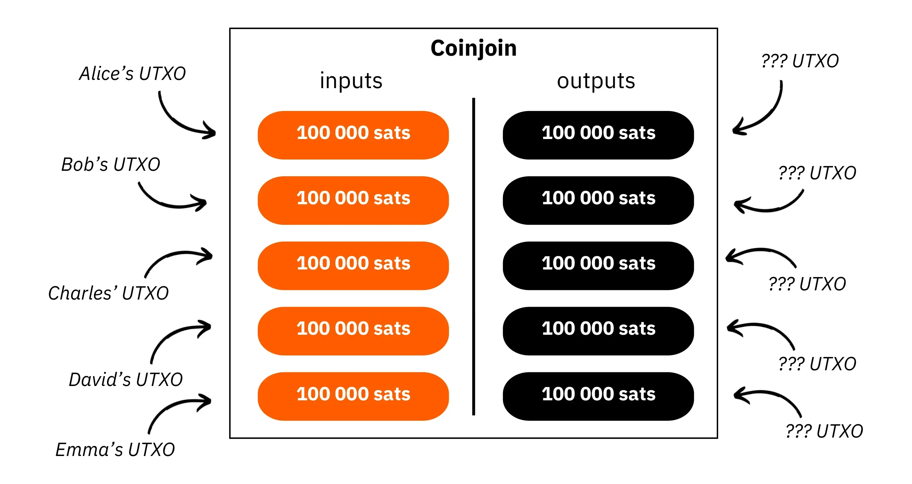


Alice의 예를 들어 보겠습니다. 그녀는 여동생 이브의 생일을 맞아 약 100,000 Sats를 보내고 싶어 합니다. 하지만 Alice는 자신이 얼마나 많은 비트코인을 보유하고 있는지, 어떻게 얻었는지 밝히고 싶지 않기 때문에 이브가 자신의 거래 내역을 추적하는 것을 원하지 않습니다. 이를 위해 Alice는 CoinJoin 트랜잭션으로 UTXO 기록을 깨기로 결정합니다. 그녀는 Bob, 찰스, 데이비드, 프랭크와 협력하여 공동 거래를 진행합니다:


- Alice, Bob, 찰스, 데이비드, 프랭크는 각각 105,000 Sats의 UTXO을 거래에 투입합니다(Mining 수수료로 5,000 Sats 포함):


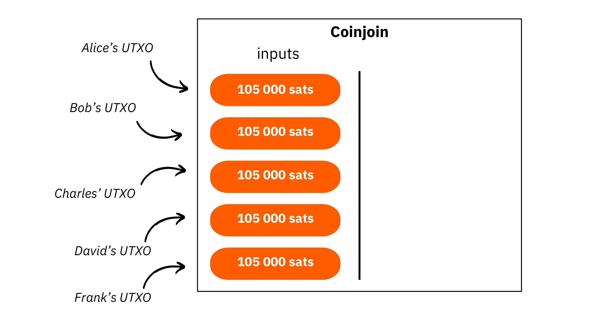


- 이러한 입력을 소비하는 대가로 각각 빈 Address을 생성하여 각각 100,000개의 동일한 Sats 출력을 5개 생성합니다. 각각 하나의 출력을 검색합니다:


- Alice는 이력이 뒤섞인 100,000개의 Sats 중 UTXO을 발견합니다. 그녀는 새로운 거래에서 이 UTXO을 사용하여 이브의 생일에 해당 금액을 이브에게 보냅니다:


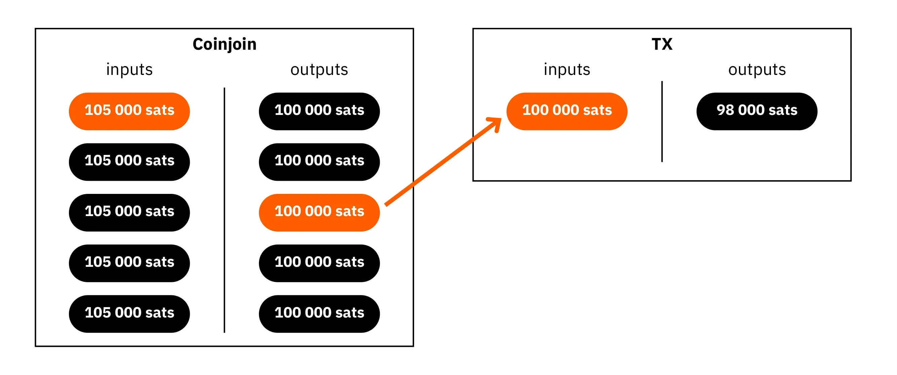


- 이브가 정보를 추출하기 위해 이 트랜잭션을 분석하려고 하면 Alice, Bob, 찰스, 데이비드, 프랭크가 관련된 CoinJoin 트랜잭션과 마주하게 됩니다. 금액의 균일성 때문에 어떤 입력이 누구의 것인지 구분할 수 없는 이브는 Alice의 UTXO 기록을 추적할 수 없으며, 동생이 얼마나 많은 비트코인을 소유하고 있는지 또는 어떻게 획득했는지 확인할 수 없습니다:


이 경우, Alice은 소급 분석의 맥락에서 기밀성을 강화하기 위해 CoinJoin 기법을 사용했습니다. 사실상 Alice은 특정 거래에서 시작하여 UTXO의 기록을 거슬러 올라가는 Eve의 분석 가능성으로부터 자신을 보호하고 있는 것입니다. 현재에서 과거로의 분석에 대한 이러한 보호 기능을 역방향 무설정이라고 합니다. 이 개념은 이 섹션의 마지막 장에서 더 자세히 살펴보겠습니다.


하지만 CoinJoin는 과거에서 현재로 기밀성을 강화할 수 있는 기능, 즉 순방향 익명 설정 기능도 제공합니다. Alice이 이브의 생일에 98,000개의 Sats를 보냈지만 역할이 뒤바뀐 예를 다시 살펴보겠습니다. 이제 프라이버시가 걱정되는 사람이 이브라고 가정해 봅시다. 실제로 Alice은 이브가 보낸 Coin을 추적하여 정보를 빼내려는 유혹을 받을 수 있습니다. 이브는 방금 받은 UTXO을 다른 모든 UTXO와 통합하여 Wallet에 있는 비트코인의 양을 Alice에게 알려줄 수 있습니다. 이를 피하기 위해 이브는 방금 받은 Coin의 기록을 깨뜨릴 수도 있습니다:


- 이브, 그레이스, 말로리, 오스카, 빅터는 각각 Bitcoin 트랜잭션에 98,000 Sats를 입력했습니다:


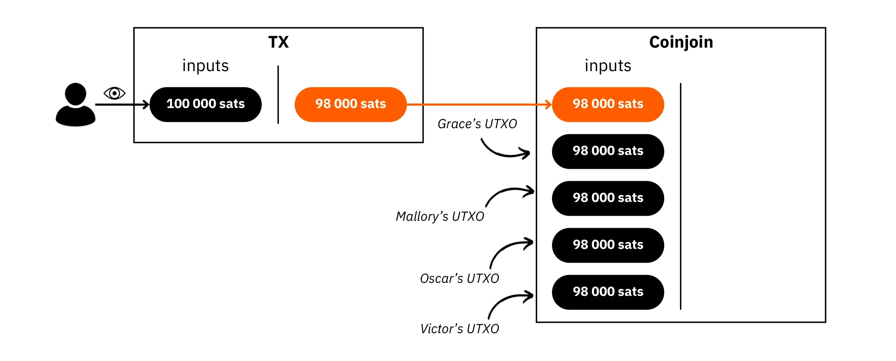


- 이러한 입력을 소비하는 대가로 각 사용자는 빈 Address를 제공하여 완벽하게 동일한 97,500개의 Sats 출력을 5개 생성하는 데 사용할 수 있습니다. 각 사용자는 하나의 출력을 얻습니다:


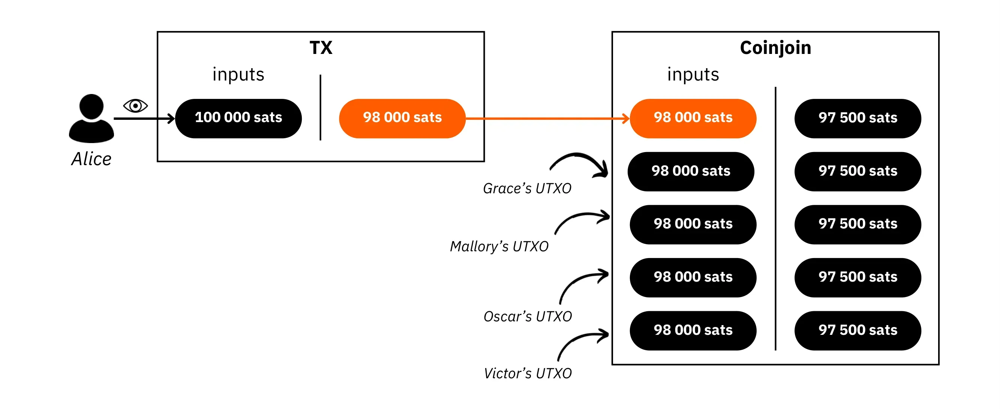


- 이브는 이제 97,500개의 Sats 중 UTXO를 보유하고 있으며, 이 기록은 깨졌습니다. 이브는 향후 거래를 진행할 때 두려움 없이 사용할 수 있습니다. 실제로 Alice이 이브에게 보낸 비트코인을 추적하려고 하면 CoinJoin 거래와 마주하게 됩니다. 그녀는 어떤 발신 UTXO가 이브에게 속하는지 확인할 수 없게 됩니다. 분석이 불가능해집니다:


첫 번째 예에서는 CoinJoin이 과거와 관련하여 방의 프라이버시를 보호하는 방법을, 두 번째 예에서는 미래와 관련하여 방의 이력을 보호하는 방법을 살펴보았습니다. 그렇기 때문에 CoinJoin은 UTXO의 기록을 양방향으로 분할하는 일회성 이벤트로 보아야 한다고 언급했습니다:


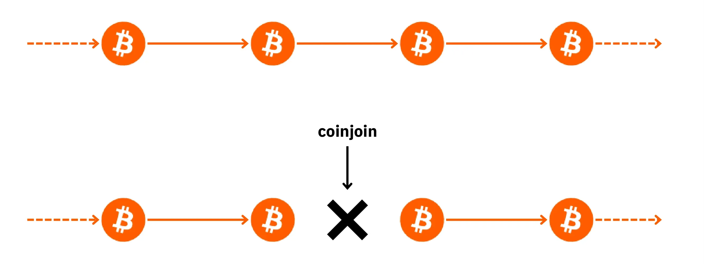


### 믹서, CoinJoin, 믹서... 차이점은 무엇인가요?


코인조인은 때때로 "믹서"로 묘사되기도 하는데, 일부 비트코인 사용자들은 커스터디 믹서와 혼동될 수 있다는 우려로 이를 거부하기도 합니다. 그러나 수학적 맥락에서 볼 때 CoinJoin은 믹싱의 개념을 정확하게 구현하고 있기 때문에 이러한 우려는 근거가 없다고 생각합니다.


수학의 일반 분야에서 혼합은 일정 시간이 지나면 초기 공간의 모든 부분이 이론적으로 다른 부분과 혼합될 수 있는 동역학 시스템의 특성을 말합니다. 혼합은 입자의 위치 또는 시스템의 상태가 초기 분포와 무관하게 미래 분포가 진화하여 초기 상태의 특성이 시스템 공간 전체에 균일하게 분포하는 상태에 도달하는 것을 의미합니다. 이것이 바로 CoinJoin와 Bitcoin에서 일어나는 일입니다. 제 생각에 CoinJoin는 실제로 Coin 혼합의 한 형태입니다.


한편, CoinJoin과 셔플러를 구분하는 것이 중요합니다. 셔플러는 사용자가 비트코인을 전송해 셔플하는 서비스입니다. 이러한 서비스는 2010년대 인기를 끌었지만, CoinJoin에 비해 두 가지 큰 단점으로 인해 사용이 감소했습니다:


- 블렌딩 과정에서 사용자가 자금의 소유권을 포기해야 하므로 도난의 위험에 노출됩니다.
- 믹서가 거래 세부 정보를 기록하거나 체인 분석 회사에 이 정보를 판매하지 않는다는 보장은 없습니다.


따라서 오늘날의 사용자들은 프로세스 전반에 걸쳐 자금에 대한 완전한 통제권을 유지할 수 있는 CoinJoin을 선호합니다. CoinJoin 참여자는 다른 UTXO가 자신의 비트코인을 도난당할 위험이 없습니다. 다음 장에서 이 모든 것이 어떻게 가능한지 살펴보겠습니다.


## 제로링크와 차우미안 코인조인


<chapterId>326c9654-b359-4906-b23d-d6518dd5dc3e</chapterId>


CoinJoin가 제공하는 개인정보 보호는 UTXO이 숨겨져 있는 그룹의 규모에 따라 달라집니다. 즉, 가능한 한 많은 참가자를 찾아야 합니다. CoinJoin를 수동으로 생성하는 것은 완벽하게 가능하지만, 이는 복잡한 과정으로 중요한 익명 정보를 얻지 못합니다.


이것이 바로 CoinJoin 코디네이터가 Bitcoin에서 개발된 이유입니다. 코디네이터의 역할은 다양한 사용자를 서로 연결하고 필요한 정보를 전송하여 협업 거래를 원활하게 하는 것입니다.


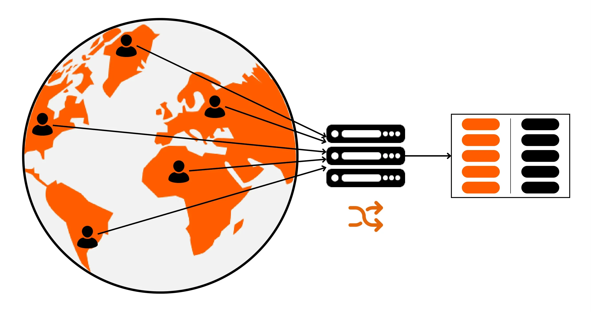


하지만 코디네이터가 사용자의 비트코인에 절대 접근할 수 없도록 하려면 어떻게 해야 할까요? 그리고 그가 CoinJoin 트랜잭션을 구축하는 사람임에도 불구하고, 기밀 유출이 될 수 있는 사용자의 입력과 출력을 연결하는 것을 어떻게 막을 수 있을까요?


### 차움의 블라인드 서명


최신 CoinJoin 구현에서는 정보 유출을 방지하기 위해 데이비드 차움의 블라인드 서명을 활용합니다. 이러한 블라인드 서명이 어떻게 작동하는지 간단히 살펴보겠습니다.


차움의 블라인드 서명은 서명 발급자가 자신이 서명하는 메시지의 내용을 모르는 디지털 서명의 한 형태입니다. 하지만 서명은 원본 메시지와 대조하여 확인할 수 있습니다. 이 기술은 1983년 암호학자 데이비드 차움이 개발했습니다.


Contract와 같은 기밀 문서를 내용을 공개하지 않고 인증하고자 하는 회사의 예를 들어 보겠습니다. 이 회사는 원본 문서를 되돌릴 수 있는 방식으로 암호화하여 변환하는 마스킹 프로세스를 적용합니다. 이렇게 수정된 문서는 인증 기관으로 전송되며, 인증 기관은 기본 내용을 알지 못한 채 블라인드 서명을 첨부합니다. 서명된 문서를 받은 후 회사는 서명의 마스크를 해제합니다. 그 결과 인증 기관은 원본 콘텐츠를 전혀 보지 못한 채 인증 기관의 서명으로 인증된 원본 문서가 생성됩니다.


따라서 차움의 블라인드 서명은 문서의 내용을 알지 못해도 문서의 진위를 인증할 수 있으므로 사용자 데이터의 기밀성과 서명된 문서의 무결성을 모두 보장합니다.


### 차우미안 코인조인


소위 "차우미안" 코인 조인은 토르와 데이비드 차움의 블라인드 서명을 결합하여 코디네이터가 어떤 출력이 어떤 사용자에게 속하는지 알 수 없도록 합니다.


CoinJoin 트랜잭션 구성 프로세스는 입력 등록, 출력 등록, 트랜잭션 서명의 세 가지 주요 단계로 구성됩니다. CoinJoin 참여자 중 하나인 Alice의 예를 통해 이 과정을 살펴보겠습니다. 다른 모든 참가자는 각각 Alice과 동일한 단계를 따릅니다.


**1단계: 입력 등록**


- Alice는 코디네이터에게 트랜잭션의 입력으로 사용하고자 하는 UTXO과 비트코인을 받기 위한 출력으로 사용하고자 하는 마스크된 수신 Address을 전송합니다. 따라서 코디네이터는 Alice의 Address을 알 수 있는 방법이 없습니다. 오직 마스크된 버전만 볼 수 있습니다:


- 코디네이터는 입력의 유효성을 확인한 다음 자신의 개인 키로 Alice의 마스킹된 Address에 서명합니다. 그리고 블라인드 서명을 Alice에게 반환합니다:


**2단계: 출력물 등록**


- Alice는 이제 코디네이터의 개인 키로 서명된 Address의 마스크를 해제할 수 있습니다. 그녀는 다른 토르 신원으로 새로운 연결을 설정합니다. 코디네이터는 이 새로운 신원으로 연결한 사람이 Alice라는 것을 식별할 수 없습니다:


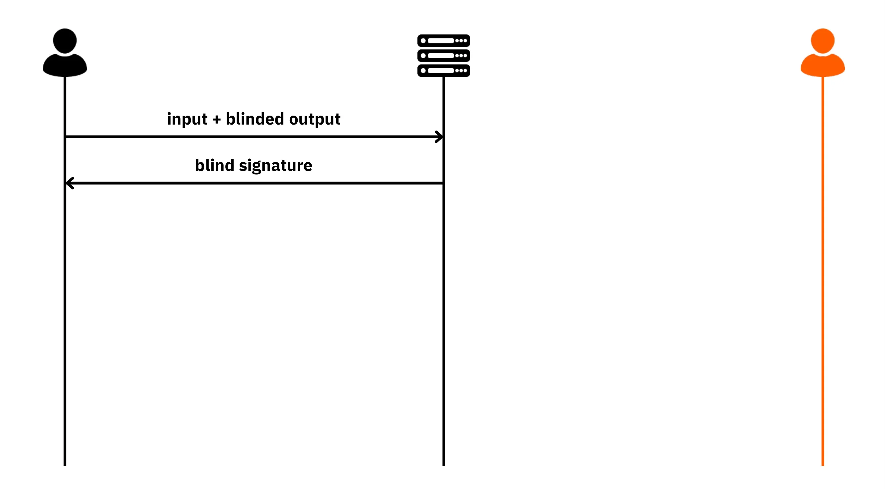


- Alice은 마스크를 벗은 Address와 서명을 코디네이터에게 보냅니다(아직 Alice인지 모르는 코디네이터):


**3단계: 거래 서명**


- 같은 방식으로 코디네이터는 모든 참가자로부터 마스킹되지 않은 결과물을 검색합니다. 연결된 서명 덕분에 익명으로 제출된 각 출력물이 자신의 개인 키로 서명되었는지 미리 확인할 수 있으므로 합법성을 보장할 수 있습니다. 그런 다음 CoinJoin 트랜잭션을 작성하고 서명을 위해 참가자에게 전송할 준비가 된 것입니다:


- Alice은 다른 참가자들과 마찬가지로 자신의 입력과 출력이 코디네이터가 구성한 트랜잭션에 올바르게 포함되었는지 확인합니다. 모든 것이 만족스러우면 입력 스크립트의 잠금을 해제하는 서명을 코디네이터에게 보냅니다:


- 모든 CoinJoin 참가자로부터 서명을 수집한 후 코디네이터는 트랜잭션을 Bitcoin 네트워크에 브로드캐스트하여 블록에 추가할 수 있습니다.


이 시스템에서 코디네이터는 입력을 특정 출력에 연결할 수 없습니다. 또한, 코디네이터는 참가자의 UTXO를 잠금 해제하는 데 필요한 개인 키에 액세스할 수 없으므로 참가자의 자금을 적절하게 사용할 수 없습니다. 이 과정에서 3단계가 끝날 때까지 그는 서명에도 접근할 수 없습니다. Alice과 다른 참가자가 글로벌 트랜잭션에 서명하면, 모든 것이 올바른지 확인한 후 코디네이터는 더 이상 트랜잭션을 무효화하지 않고는 출력을 포함한 트랜잭션을 수정할 수 없습니다. 이는 코디네이터가 비트코인을 훔치는 것을 방지합니다.


마지막으로, CoinJoin 사용자는 거래에 자신의 산출물을 등록할 때 선거에서 투표하는 시민과 유사한 보장을 받기를 원합니다. 이러한 행동의 공적 측면과 사적 측면에는 이중성이 있습니다. 한편으로는 유권자의 경우 투표용지가 자신의 신원과 연결되는 것을 원하지 않고, CoinJoin 사용자의 경우 자신의 입력이 출력과 연결되는 것을 원하지 않는 등 비공개로 유지하고자 하는 측면이 있습니다. 실제로 코디네이터 또는 다른 당사자가 입력과 출력 간의 연결을 설정하면 CoinJoin는 모든 이점을 잃게 됩니다. 위에서 설명한 것처럼 CoinJoin는 Coin의 기록에서 중단 역할을 해야 합니다. 이러한 중단은 CoinJoin 트랜잭션에서 특정 입력을 특정 출력과 연결할 수 없거나(포워드 논셋) 그 반대의 경우(백워드 논셋)가 불가능하기 때문에 정확하게 발생합니다.


반면에 공공적인 측면이 있습니다. 유권자는 자신의 투표용지가 투표함에 포함되기를 원하며, 마찬가지로 CoinJoin 사용자도 자신의 출력물이 CoinJoin 트랜잭션에 포함되기를 원합니다. 실제로 CoinJoin 참여자는 거래에 서명하기 전에 자신의 출력물이 있는지 반드시 확인할 수 있어야 하며, 그렇지 않을 경우 코디네이터가 자금을 훔칠 수 있습니다.


데이비드 차움의 블라인드 서명을 통해 구현된 이 두 가지 공개 및 비공개 측면은 차우미안 코인 참여자들이 비트코인을 도난당하지 않고 자금 추적이 불가능하다는 것을 보장합니다.


### CoinJoin 컨셉은 누가 개발했나요?


누가 CoinJoin 아이디어를 Bitcoin에 처음 도입했는지, 그리고 이러한 맥락에서 데이비드 차움의 블라인드 서명을 활용하는 아이디어를 누가 고안했는지 확인하기는 어렵습니다. 2013년 비트코인토크의 메시지](https://bitcointalk.org/index.php?topic=279249.0)에서 처음 언급한 사람이 그레고리 맥스웰이라고 생각하는 경우가 많습니다:


> *"차움의 블라인드 서명을 사용합니다: 사용자가 로그인하여 입력값(및 Exchange 주소)과 비공개 UTXO를 전송하고자 하는 Address의 암호화된 blinded 버전을 제공하면 서버는 토큰에 서명하고 다시 전송합니다. 사용자는 익명으로 다시 연결하여 출력 주소의 마스크를 해제하고 다시 서버로 전송합니다. 서버는 모든 출력이 서명되었는지, 따라서 모든 출력이 유효한 참가자로부터 비롯되었는지 확인할 수 있습니다. 나중에 사람들이 다시 연결하여 로그인합니다"*
맥스웰, G. (2013, 8월 22일). *CoinJoin: 현실 세계를 위한 Bitcoin 프라이버시*. 비트코인토크 포럼. https://bitcointalk.org/index.php?topic=279249.0


그러나 믹싱의 UTXO로서의 차움 서명과 코인 조인에 대한 다른 언급도 이전에 있었습니다. [2011년 6월, 던컨 타운센드는 비트코인토크](https://bitcointalk.org/index.php?topic=12751.0)에서 현대의 차움 코인조인과 매우 유사한 방식으로 차움 서명을 사용하는 믹서를 발표했습니다.


같은 스레드에서 [해시코인이 던컨 타운센드에게 보낸 메시지](https://bitcointalk.org/index.php?topic=12751.msg315793#msg315793)에서 믹서 개선을 위한 해시코인의 메시지를 확인할 수 있습니다. 이 메시지에 설명된 프로세스가 바로 코인조인의 핵심입니다. 비슷한 시스템이 [2012년 알렉스 미즈라히가 보낸 메시지](https://gist.github.com/killerstorm/6f843e1d3ffc38191aebca67d483bd88#file-laundry)에서도 언급되는데, 그는 나중에 라이트코인을 만드는 데 기초가 된 최초의 알트코인 중 하나인 테네브릭스의 제작자에게 조언을 제공했습니다. 심지어 "CoinJoin"이라는 용어 자체도 그렉 맥스웰이 만든 것이 아니라 피터 토드의 아이디어에서 나온 것으로 알려져 있습니다.


### 제로링크


제로링크는 차우미안 코인조인과 다양한 전략을 통합하여 여러 형태의 체인 분석으로부터 사용자의 익명성을 보호하고 특히 Wallet 관리와 관련된 오류를 최소화하는 포괄적인 혼합 프로토콜입니다. 이 프로토콜은 [2017년 nopara73과 TDevD에 의해 소개되었습니다](https://github.com/nopara73/ZeroLink/blob/master/README.md).


이름에서 알 수 있듯이 제로링크의 원리는 입력과 출력 간의 링크를 추적할 수 없도록 CoinJoin 트랜잭션을 생성하는 것입니다. 이는 모든 출력이 완벽하게 동일한 금액을 갖도록 함으로써 달성됩니다.


제로링크가 취한 중요한 예방 조치는 별도의 암호화 키 세트 또는 별도의 지갑을 사용하여 혼합되지 않은 UTXO를 혼합된 UTXO와 완전히 분리하는 것입니다. 이는 "*프리믹스*"를 차별화합니다 믹싱 전 UTXO를 위한 Wallet과 "*post-mix *" Wallet은 혼합이 완료된 UTXO를 위해 예약되어 있습니다.


이렇게 엄격하게 UTXO를 분리하는 것은 무엇보다도 혼합된 UTXO과 혼합되지 않은 UTXO이 우발적으로 연결되는 것을 방지하기 위한 것입니다. 실제로 이러한 연결이 발생하면 사용자가 인지하지 못하는 사이에 혼합된 UTXO에 대한 CoinJoin의 효력이 손상되어 기록이 깨졌다고 생각한 UTXO의 기밀성이 위태로워질 수 있습니다. 이러한 연결 고리는 혼합된 UTXO을 혼합되지 않은 UTXO으로 보호할 때 Address 재사용을 통해 발생하거나 사용자가 동일한 트랜잭션의 입력으로 혼합 및 혼합되지 않은 UTXO를 사용하는 경우 CIOH(_공통 입력-Ownership 휴리스틱_)의 적용을 통해 발생할 수 있습니다. 사전 혼합 지갑과 사후 혼합 지갑을 분리함으로써 이러한 우발적인 연결을 방지하고 의도치 않은 오류로부터 사용자를 보호합니다.


또한 이러한 분리를 통해 Wallet 소프트웨어 수준에서 프리믹스 지갑과 포스트믹스 지갑 간에 별개의 규칙을 적용할 수 있습니다. 예를 들어, 포스트 믹스 Wallet에서 소프트웨어는 사용자의 익명 설정을 손상시킬 수 있는 CIOH의 적용을 방지하기 위해 UTXO를 입력에 병합하는 것을 금지할 수 있습니다. 또한 스크립트 및 거래 옵션(예: RBF 보고)의 사용을 표준화하여 Wallet 지문에 의한 식별을 방지할 수 있습니다.


현재 제로링크 프로토콜을 엄격하게 적용하는 CoinJoin 구현은 Whirlpool이 유일합니다. 다음 장에서는 현존하는 다양한 CoinJoin 구현과 각각의 장단점에 대해 살펴보겠습니다.


## CoinJoin 구현


<chapterId>e37ed073-9498-4e4f-820b-30951e829596</chapterId>


*2024년에는 Bitcoin에서 코인 조인을 원하는 사용자가 사용할 수 있는 도구에 큰 변화가 있을 것으로 예상됩니다. 현재 저희는 전환점을 맞이하고 있으며, CoinJoin 시장은 대대적인 구조조정이 진행 중입니다. 이 챕터는 시간이 지남에 따라 업데이트될 예정입니다.*


현재로서는 Bitcoin에서 주로 3가지의 다른 CoinJoin 구현이 있습니다:


- Whirlpool;
- 와비사비;
- JoinMarket.


이러한 각 구현은 CoinJoin 트랜잭션을 통해 UTXO의 역사를 깨는 것을 목표로 합니다. 그러나 그 메커니즘은 상당히 다릅니다. 따라서 각각의 작동 방식을 이해해야 자신의 필요에 가장 적합한 옵션을 선택할 수 있습니다.


### JoinMarket


아담 깁슨과 크리스 벨처가 2015년에 설립한 조인마켓은 사용자 연결을 위한 독특한 모델 덕분에 다른 CoinJoin 구현과 확연히 차별화됩니다. 이 시스템은 일부 사용자, 즉 '메이커'가 자신의 비트코인을 혼합할 수 있도록 제공하고, 다른 사용자, 즉 '테이커'는 이 현금을 사용하여 수수료를 받고 코인 조인을 하는 P2P Exchange 마켓을 기반으로 합니다.


이 모델에서 '메이커'는 자신의 비트코인을 '테이커'에게 제공하고 서비스에 대한 수수료를 받습니다. 테이커는 메이커의 비트코인을 사용해 자신의 CoinJoin 트랜잭션을 수행하기 위해 수수료를 지불합니다. 서비스 수수료는 맡은 역할에 따라 달라집니다: '메이커'는 유동성 제공에 대한 수수료를 적립하고, '테이커'는 수수료를 지불합니다. 마켓은 사용 조건 없이 자유롭게 운영됩니다.


JoinMarket의 주요 단점 중 하나는 사용법이 복잡하다는 점으로, 효과적으로 작동하려면 단말기에 어느 정도 익숙해야 합니다. 이러한 복잡성은 숙련된 사용자에게는 장애물이 되지 않지만 일반 대중의 접근을 제한할 수 있습니다. 하지만 최근 JAM이라는 웹 Interface이 도입되면서 조금 더 쉽게 사용할 수 있게 되었습니다.


출처: 출처: [JAM](https://github.com/joinmarket-webui/jam/blob/devel/docs/assets/screenshot-dark.webp)


그러나 기술적 장벽은 여전히 주요 장애물로 남아 있습니다. 참여자 수에 따라 기밀성이 강화되는 CoinJoin 생태계에서 접근성을 감소시키는 모든 제한은 가용 유동성에 직접적인 영향을 미치며, 이는 조합의 효율성에 결정적인 요소입니다. 이미 금융 거래의 틈새 시장으로 자리 잡은 Bitcoin은 코인조인 사용을 하위 틈새 시장으로 보고 있으며, 조인마켓은 그보다 더 특화된 일부분을 차지하므로 사용자의 익명 자산 수를 늘릴 수 있는 잠재력을 제한하고 있습니다.


코인 조인을 위한 혁신적인 P2P 연결 모델에도 불구하고 JoinMarket은 특히 트랜잭션 구조 측면에서 몇 가지 중요한 단점이 있습니다. Whirlpool와 같은 다른 구현과 달리 JoinMarket은 출력 간의 완벽한 동등성을 보장하지 않으며, 입력과 출력 간의 결정론적 링크를 추적할 수 없습니다. 또한, 이미 혼합된 UTXO가 다시 혼합되는 것을 방지하는 도구가 부족하여 사용자가 원하는 기밀성을 손상시킬 수 있습니다.


마지막으로, 조인마켓 개념은 특히 역동적인 유동성 시장에 관심이 있는 사람들에게는 흥미롭지만, 구조적 약점과 기술적 복잡성으로 인해 CoinJoin 구현을 원하는 초보자와 전문가 모두에게 매력적이지 않다고 생각합니다.


### 와비사비


와비사비는 트랜잭션 조정을 중앙 집중화하는 접근 방식을 사용하는 또 다른 CoinJoin 구현입니다. 이 모델은 2021년에 아담 픽소르(nopara73), 유발 코그만, 루카스 온티베로, 이스트반 안드라스 세레스에 의해 구상되었으며, 이듬해 와사비 2.0 소프트웨어에 통합되었습니다. 와비사비는 2018년에 출시된 와사비 소프트웨어 CoinJoin 모델의 진화된 버전입니다.


2010년대 말, 와사비는 Whirlpool과는 근본적으로 다른 CoinJoin 트랜잭션 구조를 채택했습니다. 와사비는 참여자의 익명성을 높이기 위해 수십 명의 참여자가 참여하는 초대형 CoinJoin 트랜잭션을 사용했습니다. 반면, Whirlpool은 여러 개의 소규모 트랜잭션을 채택하여 각 주기에 따라 익명자산이 기하급수적으로 증가하도록 했습니다.


Exchange 관리 방법도 두 구현을 구분했습니다. Whirlpool에서는 다음 장에서 자세히 설명할 개념인 TX0 덕분에 변경 사항이 CoinJoin 주기 이전의 UTXO에서 제외되고 격리되었습니다. 반면에 와사비에서는 변경 사항이 CoinJoin 트랜잭션의 출력 중 하나를 형성하여 특정 입력과 출력 간의 결정론적 연결을 유지했습니다.


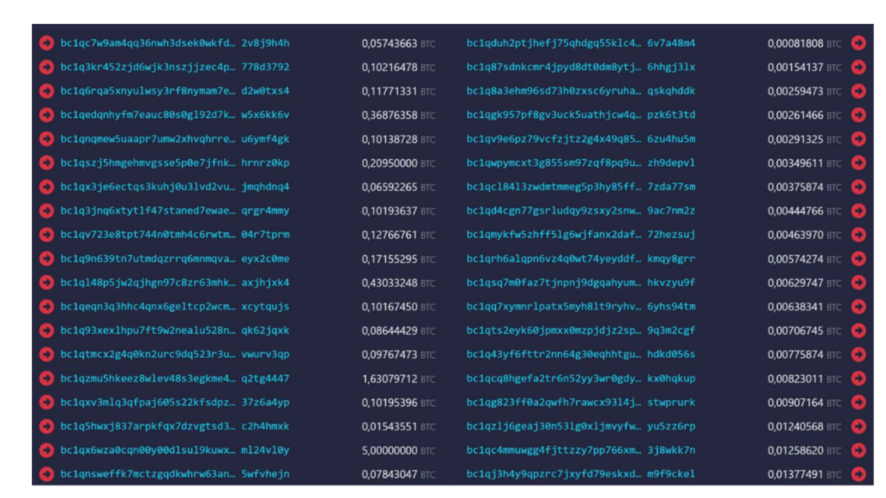


와비사비 버전 2.0은 코인조인에 대한 접근 방식을 Whirlpool과 일치하도록 조정했습니다. CoinJoin 트랜잭션은 여전히 매우 크지만, 이제 Whirlpool 모델에 따라 여러 개의 연속적인 주기를 체인화할 수 있습니다. 와비사비는 변경 사항이 사용자 입력에 직접 연결되었던 와사비 1.0과 달리, 변경 사항을 여러 개의 작은 금액으로 세분화하여 모든 참여자에게 동일한 액면가로 나누고자 합니다.


두 명의 사용자만 포함된 간단한 예시를 통해 이를 설명해 보겠습니다: Alice는 115,000개의 Sats을 믹스하고자 하고, Bob는 210,000개의 Sats을 믹스하고자 합니다. 수수료를 무시하고 와사비 1.0을 사용하면 CoinJoin 트랜잭션은 100,000 Sats의 출력 3건과 Alice의 경우 15,000 Sats의 변경 1건, Bob의 경우 10,000 Sats의 변경 1건을 생성했을 것입니다. 변경 출력은 여전히 입력에 연결됩니다:


와비사비에서는 동일한 거래가 100,000 Sats의 출력 3건과 5,000 Sats의 출력 5건을 생성하여 특정 입력으로 직접 연결될 수 없도록 변경 사항을 분산시켰습니다:


개인적으로 저는 와비사비의 변화 관리가 기밀성 측면에서 그 효과를 떨어뜨릴 수 있는 몇 가지 위험을 내포하고 있다고 생각합니다:


- 사용자가 다른 참여자보다 훨씬 큰 UTXO을 기여하면 필연적으로 자신의 입력과 연결된 변경 금액이 발생하게 됩니다. 이는 식별 가능한 모든 변경 사항을 제거하려는 프로토콜의 원래 목적에 반하는 것입니다.
- 변화를 세분화하기 위한 목적으로 단위가 많아지면 역설적으로 믹싱 효율성에 해가 될 수 있습니다. 이 과정에서 특정 출력에 대한 무설정값이 감소할 수 있는데, 이는 해당 출력의 식별이 더 쉬워지기 때문입니다;
- 이 방법은 또한 가치가 낮은 UTXO를 생성하여 사용자에게 관리 문제를 야기합니다. 이러한 작은 UTXO는 가치에 비해 지출 비용이 너무 높아지면 "Dust"이 될 수 있습니다. 이러한 현상으로 인해 사용자는 향후 거래를 위해 여러 개의 UTXO를 입력으로 병합하거나 단일 UTXO로 통합해야 합니다. 두 경우 모두 CIOH로 인해 획득한 익명 집합이 감소하거나 초기 CoinJoin에서 획득한 기밀성 이점이 완전히 상쇄될 수 있습니다.


제로링크 프로토콜을 구현하여 프리믹스와 포스트믹스 UTXO를 엄격하게 분리하는 Whirlpool과 달리 와비사비는 이러한 엄격한 분리를 유지하지 않습니다. 또한 일부 와사비 고객들이 Address을 재사용하는 문제가 발생했는데, 이는 명백히 사용자에게 매우 해로운 일입니다.


와사비 버전 2.0에서는 새로운 CoinJoin 수수료 정책이 시행되었습니다. 이제부터 0.01 Bitcoin 이상의 UTXO에 대해서는 코디네이터 수수료가 0.3%로 설정되며, 이보다 작은 UTXO의 경우 수수료가 전액 제공됩니다. 또한 이러한 소규모 UTXO의 리믹스는 무료로 제공되지만, 리믹스를 포함한 모든 거래에 대해 Mining 수수료는 여전히 사용자가 지불해야 합니다.


이는 획득한 아논셋의 규모에 관계없이 수수료가 고정되어 있는 Whirlpool의 정책과 대조적입니다. 와사비 2.0에서는 소규모 UTXO에 대해서는 코디네이터 수수료가 면제되지만, 리믹스를 포함한 모든 거래에 대해서는 여전히 Mining 수수료가 부과됩니다.


이 글을 쓰고 있는 지금, 와비사비의 사용은 최근의 사건으로 인해 훨씬 더 복잡해졌습니다. 사무라이 Wallet의 설립자들이 체포된 후 와사비의 개발 자금을 조달하고 관리하는 회사 zkSNACKs는 2024년 6월 1일에 CoinJoin 코디네이터 서비스가 중단될 것이라고 발표했습니다. 와사비에서 기본적으로 설정되어 있던 이 코디네이터는 유동성의 대부분을 담당했습니다.


이 메인 코디네이터가 중단됨에 따라 이제 사용자는 새로운 독립 코디네이터와 연결해야 합니다. 이러한 변화는 몇 가지 우려를 낳습니다. 한편으로는 새로운 코디네이터의 유동성이 충분하지 않을 수 있으며, 이로 인해 기밀성 측면에서 코인 조인의 효과가 떨어질 수 있습니다. 다른 한편으로는 악의적인 코디네이터를 만날 위험이 있습니다. 이러한 상황은 와비사비를 사용하고자 하는 사람들에게 상당한 새로운 위험을 추가합니다.


기술적 문제 외에도, 와사비 운영사인 zkSNACKs가 문자열 분석 회사의 서비스를 사용하여 CoinJoin 참여자를 필터링하기로 한 결정은 심각한 윤리적, 전략적 의문을 제기합니다. 초기 아이디어는 범죄자들이 와사비에서 코인조인을 사용하는 것을 막기 위한 것이었는데, 이는 합법적으로 보일 수 있습니다. 그러나 사용자 기밀을 강화하는 것이 주된 임무인 코디네이터에게 수수료를 지불하고, 동일한 기밀을 침해하는 것을 목표로 하는 회사에 자금을 지원하는 것은 역설을 불러일으킵니다.


더욱 우려스러운 것은 필터링 원칙인데, 이는 검열 없는 개방형 금융 시스템을 제공한다는 Bitcoin의 철학과는 근본적으로 상반되는 것입니다. 범죄 행위를 배제하는 것이 정당해 보일 수 있지만, 이러한 필터링은 특정 상황에서는 불법으로 분류되지만 도덕적으로 정당하거나 사회적으로 유익한 행동을 하는 개인에게도 영향을 미칠 수 있습니다. 에드워드 스노든의 사례는 이러한 이분법을 완벽하게 보여줍니다. 일부 정부에서는 그의 폭로로 인해 그를 범죄자로 간주하지만, 다른 정부에서는 공익을 위해 행동한 내부 고발자로 간주합니다. 이러한 복잡성은 필터링의 잠재적 위험성을 강조하며, 선의는 좋지만 궁극적으로 합법적인 사용자의 권리와 보안을 약화시킬 수 있습니다. 특정 권위주의 정권 하에서 박해를 받는 활동가나 언론인에 대해서도 언급할 수 있었습니다.


지금쯤이면 다들 아시겠지만, 저는 Bitcoin에서 코인 조인을 할 때 Whirlpool 모델을 선호합니다. 이 시스템은 엄격함이 돋보이며 뛰어난 기밀성 보장을 제공합니다. 또한 수학적 맥락에서 완벽하다고 여겨지는 믹스를 제공하는 유일한 시스템이기도 합니다. 제 생각에는 이 모델이 Bitcoin 네트워크에서 코인 조인의 미래를 대표한다고 생각합니다. 다음 장에서 이 모델을 더 자세히 살펴보시기 바랍니다.


## Whirlpool 작동 방식


<chapterId>bdbd7109-e36d-4b4f-a3c6-928df4e9bfda</chapterId>


Whirlpool가 다른 CoinJoin 방식과 차별화되는 점은 모든 입력과 출력 사이에 기술적으로 연결될 수 있는 가능성이 전혀 없는 "_ZeroLink_" 트랜잭션을 사용한다는 점입니다. 이 완벽한 조합은 각 참여자가 동일한 양의 입력(Mining 수수료 제외)을 기여하여 완벽하게 동일한 금액의 출력을 생성하는 구조를 통해 달성됩니다.


입력에 대한 이러한 제한적인 접근 방식은 Whirlpool의 CoinJoin 트랜잭션에 독특한 특징을 부여하는데, 바로 입력과 출력 사이에 결정론적 링크가 전혀 없다는 점입니다. 즉, 각 출력은 트랜잭션의 다른 모든 출력과 비교하여 모든 참여자에게 귀속될 확률이 동일합니다.


### Whirlpool 작동 방식


처음에 Whirlpool CoinJoin의 참여자 수는 신규 참여자 2명과 리믹서 3명으로 5명으로 제한되었습니다(이 개념은 나중에 설명하겠습니다). 그러나 2023년에 관찰된 On-Chain 거래 수수료의 증가는 사무라이 팀이 비용을 절감하면서 기밀성을 개선하는 것을 목표로 모델을 재고하게 만들었습니다. 따라서 수수료 시장 상황과 참여자 수를 고려하여 코디네이터는 이제 6명, 7명 또는 8명의 참여자를 포함한 코인 조인을 구성할 수 있습니다. 이러한 향상된 세션을 "서지 사이클"이라고 합니다. 구성에 관계없이 Whirlpool 코인조인에는 항상 두 명의 신규 참여자만 참여할 수 있다는 점에 유의해야 합니다.


따라서 Whirlpool 트랜잭션은 동일한 수의 입력과 출력을 특징으로 합니다:


- 5개의 입력과 5개의 출력;


- 6개의 입력과 6개의 출력;


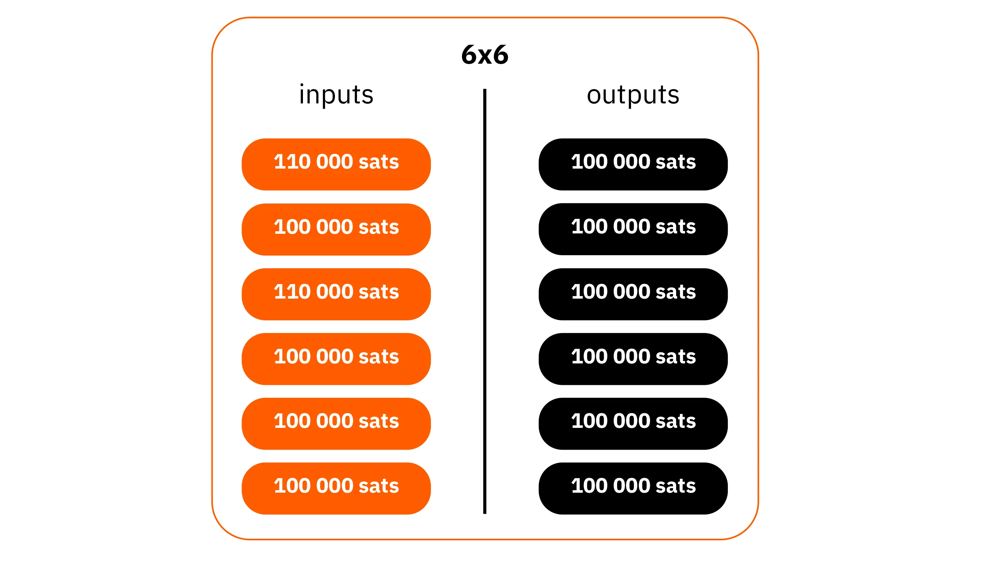


- 7개의 입력과 7개의 출력;


- 8개의 입력과 8개의 출력.


Whirlpool의 모델은 소규모 CoinJoin 트랜잭션을 기반으로 합니다. 단일 사이클(또는 몇 개의 사이클)의 참여자 수에 따라 아논셋의 견고성이 결정되는 와비사비나 조인마켓과 달리, Whirlpool는 여러 개의 작은 사이클의 순서에 의존합니다.


이 모델에서는 사용자가 풀에 처음 가입할 때만 수수료를 지불하므로 추가 비용 없이 여러 리믹스에 참여할 수 있습니다. 신규 참가자는 리믹서에 대해 Mining 수수료를 지불합니다.


CoinJoin이 참여하는 UTXO이 추가될 때마다, 그리고 과거에 만났던 동료가 추가될 때마다 익명 집합은 기하급수적으로 증가합니다. 목표는 이러한 무료 리믹스가 발생할 때마다 혼합된 각 UTXO과 관련된 익명 집합의 밀도를 강화하는 데 기여하는 이러한 무료 리믹스를 활용하는 것입니다.


Whirlpool는 두 가지 중요한 요구 사항을 염두에 두고 설계되었습니다:


- 사무라이 Wallet은 무엇보다도 스마트폰 애플리케이션이라는 점에서 모바일 기기에서의 구현 접근성을 고려했습니다;
- 빠른 리믹스 주기를 통해 아논셋을 크게 늘릴 수 있습니다.


이러한 필수 조건 때문에 사무라이 Wallet의 개발자들은 Whirlpool을 설계할 때 사이클당 참가자를 제한된 수로 제한했습니다. 너무 적으면 CoinJoin의 효율성이 저하되어 사이클당 생성되는 애논셋의 수가 크게 줄어들고, 너무 많으면 모바일 애플리케이션의 관리 문제가 발생하고 사이클 흐름에 지장을 줄 수 있었기 때문입니다.


마지막으로, 여러 CoinJoin 사이클의 누적에 따라 무합성이 이루어지기 때문에 Whirlpool에서 CoinJoin당 참여자 수가 많을 필요가 없습니다. 여기서 가장 중요한 원칙은 모든 참가자의 UTXO가 균질해야 완벽한 믹싱이 가능하므로 믹싱 및 리믹싱 사이클의 이점을 최대한 활용할 수 있다는 것입니다.


### CoinJoin 풀 및 수수료


이러한 여러 주기를 통해 혼합 UTXO의 익명 집합을 늘리려면 사용되는 UTXO의 양을 제한하는 특정 프레임워크가 필요합니다. Whirlpool은 다양한 풀을 정의합니다.


풀은 UTXO의 완벽한 동질성을 유지하면서 CoinJoin 프로세스를 최적화하는 데 사용할 UTXO의 양에 동의하여 리소스를 결합하고자 하는 사용자 그룹을 나타냅니다. 각 풀은 사용자가 참여하기 위해 준수해야 하는 고정된 UTXO 양을 지정합니다. 따라서 Whirlpool로 CoinJoin를 만들려면 풀을 선택해야 합니다. 현재 사용 가능한 풀은 다음과 같습니다:


- 0.5비트코인;
- 0.05 Bitcoin;
- 0.01 Bitcoin;
- 0.001 Bitcoin(= 100,000 Sats).


비트코인을 가지고 풀에 들어가면 풀의 다른 참가자의 비트코인과 완벽하게 동등한 generate UTXO까지 분할됩니다. 각 풀에는 최대 한도가 있으므로 이 한도를 초과하는 금액의 경우 같은 풀에 두 번 따로 참가하거나 더 많은 금액이 있는 다른 풀로 이동해야 합니다:


| Pool (bitcoin) | Maximum amount per entry (bitcoin) |
|----------------|------------------------------------|
| 0.5            | 35                                 |
| 0.05           | 3.5                                |
| 0.01           | 0.7                                |
| 0.001          | 0.025                              |

UTXO은 CoinJoin에 통합될 준비가 되면 풀에 속한 것으로 간주됩니다. 하지만 그렇다고 해서 사용자가 소유권을 잃는다는 의미는 아닙니다. 이 섹션의 첫 장에서 살펴본 것처럼, 다양한 혼합 주기를 통해 사용자는 키와 결과적으로 비트코인을 완전히 제어할 수 있습니다. 이것이 CoinJoin 기술이 다른 중앙 집중식 믹싱 기술과 차별화되는 점입니다.


CoinJoin 풀에 가입하려면 서비스 수수료와 Mining 수수료를 지불해야 합니다. 서비스 수수료는 각 풀마다 고정되어 있으며 Whirlpool의 개발 및 유지 관리를 담당하는 팀에 보상을 제공하기 위한 것입니다.


Whirlpool 사용에 대한 서비스 요금은 풀에 가입할 때 한 번만 지불하면 됩니다. 일단 가입하면 추가 비용 없이 무제한으로 리믹스에 참여할 수 있습니다. 다음은 각 풀의 현재 고정 요금입니다:


| Pool (bitcoin) | Entry fee (bitcoin)  |
| -------------- | -------------------- |
| 0,5            | 0,0175               |
| 0,05           | 0,00175              |
| 0,01           | 0,0005 (50 000 sats) |
| 0,001          | 0,00005 (5 000 sats) |

이 수수료는 기본적으로 CoinJoin에 입금한 금액과 관계없이 선택한 풀에 입장하는 티켓 역할을 합니다. 따라서 0.01 풀에 정확히 0.01 BTC를 넣든 0.5 BTC를 넣든 수수료는 절대적인 측면에서 동일하게 유지됩니다.


Whirlpool 코인조인을 진행하기 전에 사용자는 두 가지 전략 중 하나를 선택할 수 있습니다:


- 서비스 비용을 최소화하기 위해 더 작은 풀을 선택하고, 그 대가로 더 작은 UTXO를 여러 개 받을 수 있다는 점을 염두에 두세요;
- 또는 더 높은 수수료를 기꺼이 지불하고 더 큰 풀을 선택하지만 결국 더 적은 수의 더 높은 가치의 UTXO를 확보하게 될 수도 있습니다.


특히 공통 입력 Ownership 휴리스틱으로 인해 획득한 기밀성이 손상될 수 있으므로 일반적으로 CoinJoin 주기 후에 여러 개의 혼합 UTXO를 병합하는 것은 바람직하지 않습니다(CIOH: *Common-Input-Ownership-Heuristic*). 따라서 추가 비용이 발생하더라도 더 큰 풀을 선택하여 출력에서 작은 값의 UTXO 수를 최소화하는 것이 바람직할 수 있습니다. 사용자는 이러한 장단점을 평가하여 선호하는 풀을 선택해야 합니다.


서비스 수수료 외에도 Mining 거래와 관련된 Bitcoin 수수료도 고려해야 합니다. Whirlpool 사용자는 첫 번째 CoinJoin과 마찬가지로 준비 거래(`Tx0`)에 대한 Mining 수수료를 지불해야 합니다. 이후 모든 리믹스는 신규 참가자에 대한 유료화를 기반으로 하는 Whirlpool의 모델 덕분에 무료로 제공됩니다.


실제로 각 Whirlpool CoinJoin의 입력 중 2명의 사용자가 신규 참가자입니다. 다른 입력은 리믹서에서 나옵니다. 결과적으로 거래의 모든 참가자에 대한 Mining 비용은 이 2명의 신규 참가자가 부담하며, 이들은 무료 리믹스의 혜택도 누릴 수 있습니다:


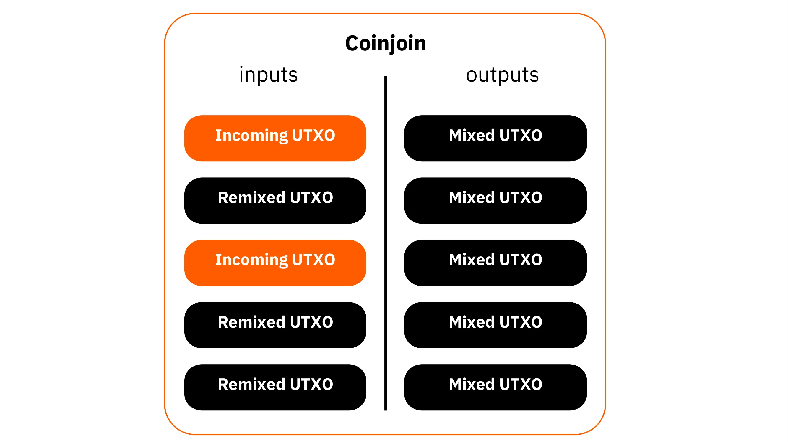


이 수수료 시스템 덕분에 Whirlpool은 다른 CoinJoin 구현에서 두드러지는데, 이는 UTXO의 익명성이 사용자가 지불한 가격에 비례하지 않기 때문입니다. 그 결과, 2개의 트랜잭션(`Tx0`과 초기 믹스)에 대해 풀 진입 수수료와 Mining 수수료만 지불하면 상당히 높은 수준의 익명성을 달성할 수 있습니다.


사용자가 추가 거래 없이 CoinJoin에서 직접 자금을 받을 수 있는 외부 Address을 제공하는 '믹스 투' 옵션을 선택하지 않은 경우, 여러 코인 조인을 완료한 후 풀에서 UTXO를 인출하려면 Mining 수수료를 지불해야 한다는 점에 유의해야 합니다.


### HD Wallet 계정


Whirlpool을 통해 CoinJoin을 생성하려면 Wallet이 여러 개의 개별 계정을 generate해야 합니다. 이것이 제로링크 프로토콜의 원리입니다. HD(계층적 결정론적) Wallet의 맥락에서 한 계정은 다른 계정과 완전히 분리된 섹션을 구성하며, 이러한 분리는 Wallet 계층 구조의 세 번째 수준, 즉 'xpub' 수준에서 이루어집니다.


HD Wallet는 이론적으로 최대 `2^(31)`개의 서로 다른 계정을 생성할 수 있습니다. 모든 Bitcoin 지갑에서 기본적으로 사용되는 초기 계정은 `0'` 인덱스에 해당합니다.


Whirlpool에 적용된 지갑의 경우 제로링크 프로세스의 요구 사항을 충족하기 위해 4개의 계정이 사용됩니다:


- 인덱스 `0'`으로 식별되는 **예금** 계정입니다;
- 인덱스 `2,147,483,644'`로 식별되는 **불량 은행**(또는 "독성 변경") 계정입니다;
- 인덱스 `2 147 483 645'`로 식별되는 **premix** 계정입니다;
- 인덱스 `2 147 483 646'`으로 식별되는 **postmix** 계정입니다.


이러한 각 계정은 CoinJoin 프로세스에서 특정 기능을 수행하며, 다음 섹션에서 살펴볼 것입니다.


이러한 모든 계정은 단일 seed에 연결되므로 사용자는 복구 문구와 해당되는 경우 passphrase을 사용하여 모든 비트코인에 대한 액세스를 복구할 수 있습니다. 그러나 복구 작업 중에는 소프트웨어에 사용된 다양한 계정 인덱스를 알려주어야 합니다.


이러한 계정 내에서 Whirlpool CoinJoin의 여러 단계를 살펴보겠습니다.


### TX0


Whirlpool CoinJoin의 시작점은 **예치금** 계정입니다. 이 계정은 새 Bitcoin Wallet를 만들 때 자동으로 사용하는 계정입니다. 이 계정에 혼합하려는 비트코인을 입금해야 합니다.


Tx0"는 Whirlpool의 믹싱 프로세스의 첫 번째 단계입니다. 이 단계의 목적은 균일한 믹싱을 보장하기 위해 선택한 풀의 양에 해당하는 단위로 나누어 CoinJoin에 사용할 UTXO를 준비하고 균등화하는 것입니다. 이렇게 이퀄라이징된 UTXO는 **premix** 계정으로 전송됩니다. 풀에 입력할 수 없는 차액은 특정 계정인 **배드 뱅크**(또는 "도틱 체인지")로 분리됩니다.


이 초기 `Tx0` 트랜잭션은 CoinJoin 코디네이터에 대한 서비스 수수료 지불에도 사용됩니다. 다음 단계와 달리 이 트랜잭션은 협업이 아니므로 사용자가 Mining의 모든 비용을 부담해야 합니다:


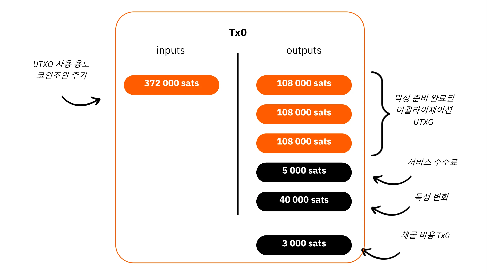


이 `Tx0` 트랜잭션의 예에서 **예금** 계정의 `372,000 Sats` 입력은 다음과 같이 여러 개의 출력 UTXO로 분할됩니다:


- 코디네이터의 서비스 수수료는 `5,000 Sats`이며, 풀 항목 `100,000 Sats`에 해당하는 금액입니다;
- 믹싱을 위해 준비된 3개의 UTXO가 **premix** 계정으로 리디렉션되어 코디네이터에게 등록되었습니다. 이 UTXO는 향후 초기 믹스에 필요한 Mining 비용을 충당하기 위해 각각 '108,000 Sats'으로 균등화됩니다;
- 너무 작아서 풀에 들어갈 수 없는 잉여금은 유독성 변경으로 간주됩니다. 특정 계정으로 전송됩니다. 여기서 이 변경은 `40,000 Sats`에 해당합니다;
- 마지막으로 `3,000 Sats`이 남았는데, 이는 출력은 아니지만 `Tx0`을 확인하는 데 필요한 Mining 비용입니다.


예를 들어, 다음은 실제 Whirlpool Tx0입니다(제가 만든 것이 아님): [edef60744f539483d868caff49d4848e5cc6e805d6cdc8d0f9bdbbaedcb5fc46](https://Mempool.space/tx/edef60744f539483d868caff49d4848e5cc6e805d6cdc8d0f9bdbbaedcb5fc46)


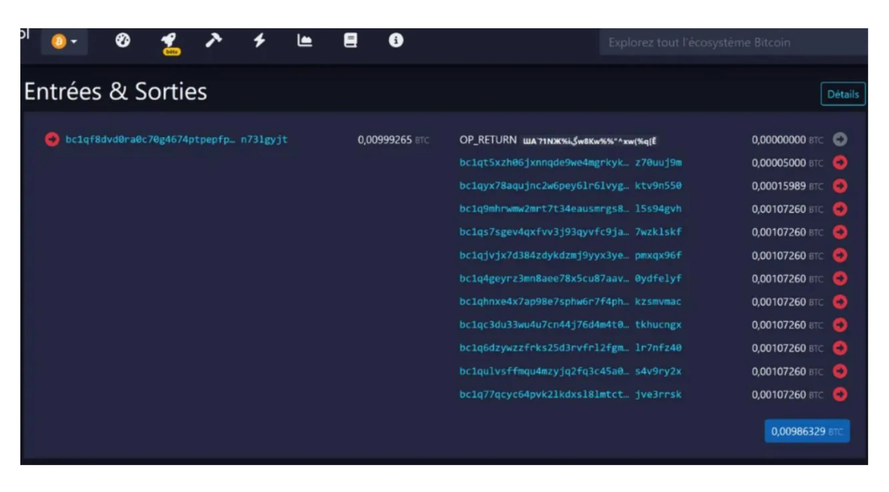


### 독성 변화


풀에 통합할 수 없는 잉여금(`40,000 Sats`에 해당)은 "독성 변경"이라고도 하는 **배드뱅크** 계정으로 리디렉션되어 Wallet의 다른 UTXO와 엄격하게 분리되어 있습니다.


이 UTXO는 여전히 과거와 연결되어 있으므로 잠재적으로 소유자의 신원과 연결될 수 있으므로 사용자의 기밀에 위협이 될 수 있습니다. 또한 CoinJoin을 만든 사용자의 소유로 기록되어 있습니다.


이 UTXO가 혼합 출력과 병합될 경우, 후자는 특히 CIOH(*Common-Input-Ownership-Heuristic*)로 인해 CoinJoin 주기 동안 얻은 모든 기밀성을 잃게 됩니다. 다른 독성 변경 사항과 병합되면 다양한 CoinJoin 주기 항목이 연결되기 때문에 기밀성을 잃을 위험이 있습니다. 따라서 신중하게 다루어야 합니다. 이 장의 마지막 섹션에서 이러한 UTXO의 독성 관리에 대해 자세히 설명하겠습니다.


### 초기 믹스


0x0` 이후, 이퀄라이제이션된 UTXO는 Wallet의 **premix** 계정으로 전송되어 "초기 믹스"라고도 하는 첫 번째 CoinJoin 사이클에 도입될 준비를 마칩니다. 예시에서와 같이 `Tx0`이 믹싱을 위해 여러 개의 UTXO를 생성하는 경우, 각각은 별도의 초기 믹스에 통합됩니다.


첫 번째 믹스가 끝나면 **프리믹스** 계정은 비워지고, 첫 번째 CoinJoin에 대한 Mining 수수료를 지불한 코인은 선택한 풀에서 정의한 금액으로 정확히 조정됩니다. 이 예시에서는 '108,000 Sats'의 초기 UTXO가 정확히 '100,000 Sats'으로 줄어들게 됩니다.


### 리믹스


초기 믹싱이 끝나면 UTXO는 **postmix** 계정으로 전송됩니다. 이 계정에는 이미 믹싱된 UTXO와 리믹싱 대기 중인 UTXO가 모입니다. Whirlpool 고객이 활성화되면 **postmix** 계정에 있는 UTXO는 자동으로 리믹스에 사용할 수 있으며, 새로운 사이클에 참여하도록 무작위로 선택됩니다.


다시 말해, 리믹스는 100% 무료이며 추가 서비스 요금이나 Mining 수수료가 필요하지 않습니다. 따라서 **postmix** 계정에 UTXO를 보관하면 가치를 보존하는 동시에 익명성을 강화할 수 있습니다. 그렇기 때문에 이러한 코인이 여러 번의 CoinJoin 사이클에 참여하도록 허용하는 것이 중요합니다. 비용이 전혀 들지 않고 익명성 수준도 높일 수 있습니다.


혼합 UTXO를 사용하려는 경우 이 **postmix** 계정에서 직접 사용할 수 있습니다. 무료 리믹스의 혜택을 누리고 기밀을 침해할 수 있는 Whirlpool 회로를 벗어나지 않도록 하기 위해 혼합 UTXO를 이 계정에 보관하는 것이 좋습니다.


### 포스트믹스는 어떻게 관리하나요?


CoinJoin 사이클을 실행한 후 가장 좋은 전략은 UTXO를 **postmix** 계정에 보관하여 나중에 사용할 때까지 기다리는 것입니다. 필요할 때까지 무기한으로 리믹스하는 것도 좋습니다.


일부 사용자는 혼합된 비트코인을 Hardware Wallet이 보호하는 Wallet로 옮기는 것을 고려할 수 있습니다. 이는 가능하지만, 이미 설정된 기밀성이 손상되지 않도록 사무라이 Wallet의 권장 사항을 엄격하게 따르는 것이 중요합니다.


UTXO 병합은 가장 흔한 실수입니다. CIOH(*Common-Input-Ownership-Heuristic*)를 방지하려면 동일한 트랜잭션에서 혼합된 UTXO를 혼합되지 않은 UTXO와 결합하지 않아야 합니다. 이를 위해서는 특히 라벨링 측면에서 Wallet 내에서 UTXO를 신중하게 관리해야 합니다.


혼합 UTXO를 통합할 때도 주의를 기울여야 합니다. 혼합 UTXO에 상당한 익명성이 있는 경우 중간 수준의 통합이 가능하지만, 이렇게 하면 필연적으로 UTXO의 기밀성이 저하될 수 있습니다. 통합이 너무 광범위하거나 리믹스 횟수가 불충분한 후에 수행되지 않도록 주의하세요. 이렇게 하면 CoinJoin 주기 전후에 UTXO 간에 추론 가능한 연결 고리가 설정될 수 있습니다. 이러한 조작이 의심스러운 경우, 가장 좋은 방법은 포스트믹스 UTXO를 통합하지 않고 하나씩 Hardware Wallet으로 전송하여 매번 새로운 빈 Address를 생성하는 것입니다. 다시 한 번, 받는 각 UTXO에 라벨을 붙이는 것을 잊지 마세요.


또한 널리 사용되지 않는 스크립트를 사용하여 포스트믹스 UTXO를 Wallet으로 전송하는 것은 바람직하지 않습니다. 예를 들어 'P2WSH' 스크립트를 사용하여 Multisig에서 Wallet으로 입력하는 경우 원래 같은 유형의 Wallet을 가지고 있던 다른 사용자와 섞일 가능성이 거의 없습니다. 동일한 Multisig Wallet으로 포스트믹스를 리믹스하면 혼합된 비트코인의 기밀성 수준이 크게 낮아집니다. 스크립트 외에도 여러분을 속일 수 있는 Wallet 지문이 많이 있습니다.


Bitcoin 거래와 마찬가지로 수신 Address을 재사용하지 않는 것도 중요합니다. 각각의 새 트랜잭션은 새롭고 빈 Address로 수신해야 합니다.


가장 간단하고 안전한 해결책은 혼합된 UTXO를 **postmix** 계정에 그대로 두고, 리믹싱을 허용한 다음 소비할 때만 터치하는 것입니다. 사무라이와 Sparrow 지갑은 이러한 모든 체인 분석 위험에 대한 추가적인 보호 기능을 제공합니다. 이러한 보호 기능은 실수를 방지하는 데 도움이 됩니다.


### 유해한 변화를 어떻게 관리하나요?


다음으로, CoinJoin 풀에 포함되지 않은 변경 사항인 독성 변경 사항을 관리할 때 주의해야 합니다. Whirlpool의 사용으로 인해 발생하는 이러한 독성 UTXO는 사용자와 CoinJoin 사용자 간의 연결 고리를 형성하기 때문에 개인 정보에 위험을 초래할 수 있습니다. 따라서 주의해서 관리하고 다른 UTXO, 특히 혼합 UTXO와 결합하지 않도록 주의해야 합니다.


다음은 이를 사용하기 위한 몇 가지 전략입니다:


- **작은 풀에 섞어 사용하기:** 독성이 있는 UTXO가 단독으로 작은 풀에 들어갈 수 있을 만큼 큰 경우, 혼합하여 사용하는 것을 고려하세요. 이것이 최선의 선택인 경우가 많습니다. 그러나 여러 개의 독성 UTXO를 병합하여 하나의 풀에 액세스하는 것은 서로 다른 항목을 연결할 수 있으므로 바람직하지 않습니다.
- "사용 불가"로 표시: **또 다른 방법은 사용을 중지하고 전용 계정에서 "사용 불가"로 표시한 후 HODL만 사용하는 것입니다.** 이렇게 하면 실수로 사용하지 않도록 방지할 수 있습니다. Bitcoin의 가치가 상승하면 독성 UTXO에 더 적합한 새로운 풀이 등장할 수 있습니다.
- 기부하기: **Bitcoin 및 관련 소프트웨어를 개발하는 개발자에게 적은 금액이라도 기부하는 것을 고려해 보세요.** BTC를 받는 협회에 기부할 수도 있습니다. 독성이 있는 UTXO를 관리하는 것이 너무 복잡해 보인다면 간단히 제거하고 기부할 수 있습니다.
- 기프트 카드 구매: **[Bitrefill](https://www.bitrefill.com/)과 같은 플랫폼에서는 다양한 가맹점에서 사용할 수 있는 기프트 카드로 906 비트코인을 GW할 수 있습니다.** 이는 관련 가치를 잃지 않고 독성이 있는 UTXO와 결별하는 방법이 될 수 있습니다.
- **모네로에 통합:** 사무라이 Wallet는 BTC와 XMR 간의 아토믹 스왑 서비스를 제공합니다. 이는 독성 UTXO를 Bitcoin로 다시 보내기 전에 CIOH를 통해 기밀성을 손상시키지 않고 모네로에 통합하여 관리하는 데 이상적입니다. 그러나 이 옵션은 유동성 제약으로 인해 Mining 수수료와 프리미엄 측면에서 비용이 많이 들 수 있습니다.
- **Lightning Network으로 전송:** 이러한 UTXO를 Lightning Network으로 전송하여 거래 수수료 할인 혜택을 받는 것은 매력적인 옵션이 될 수 있습니다. 하지만 이 방법은 Lightning 사용 방식에 따라 특정 정보가 노출될 수 있으므로 주의해서 사용해야 합니다.


### Whirlpool은 어떻게 사용하나요?


2024년 4월 24일 사무라이 Wallet의 창시자가 체포되고 서버가 압수됨에 따라, Whirlpool 도구는 자체 도장을 보유한 분들에게도 더 이상 작동하지 않습니다. 이전에는 사무라이 Wallet와 Sparrow wallet에서 사용할 수 있었습니다.


그러나 시험 결과에 따라 앞으로 몇 주 내에 이 도구가 다시 활성화되거나 다른 방식으로 재출시될 가능성이 남아 있습니다. 어쨌든 수요가 있기 때문에 Bitcoin CoinJoin 시장이 Supply 없이 오랫동안 지속되지는 않을 것으로 생각합니다. 또한 Whirlpool는 기밀성 측면에서 가장 진보된 모델이기 때문에 향후 구현에 가장 많이 선택될 것입니다.


저희는 이 사건과 관련 도구의 개발 상황을 면밀히 주시하고 있습니다. 새로운 정보가 입수되는 대로 이 강좌를 업데이트할 예정이니 안심하세요.


다음 장에서는 '무설정'이 무엇인지, 이러한 지표가 어떻게 계산되는지, 그리고 이 지표가 CoinJoin 사이클의 효율성을 추정하는 데 어떻게 도움이 되는지 알아보겠습니다.


https://planb.network/tutorials/privacy/on-chain/coinjoin-samourai-wallet-e566803d-ab3f-4d98-9136-5462009262ef


## 익명성 세트


<chapterId>be1093dc-1a74-40e5-9545-2b97a7d7d431</chapterId>


코인 조인의 작동 방식과 효과적인 믹싱과 관련된 문제를 살펴보았으니 이제 그 효과를 측정하는 방법을 살펴보겠습니다. 코인 조인 프로세스가 효과적인지, 그리고 UTXO이 어느 정도의 익명성을 확보했는지 어떻게 확인할 수 있을까요? 이 장에서는 "익명 집합"이라고도 하는 익명성 집합을 통해 이를 알아볼 것입니다


### CoinJoin의 유용성에 대한 알림


CoinJoin의 유용성은 구별할 수 없는 UTXO 그룹에 UTXO을 삽입하여 그럴듯한 부인 가능성을 생성하는 기능에 있습니다. 이 작업의 목적은 과거에서 현재로, 현재에서 과거로 이어지는 추적의 고리를 끊는 것입니다.


즉, CoinJoin 사이클 진입 시 초기 거래(`Tx0`)를 알고 있는 분석가는 리믹스 사이클 종료 시(사이클 진입에서 사이클 종료 분석) UTXO를 확실하게 식별할 수 없어야 합니다.


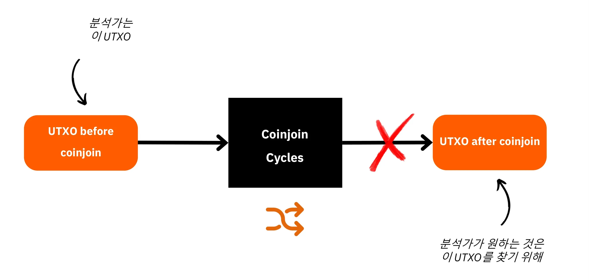


반대로, CoinJoin 사이클 종료 시점에 UTXO을 알고 있는 분석가는 사이클 진입 시점에 원래 트랜잭션을 확인할 수 없어야 합니다(사이클 종료에서 사이클 진입 분석).


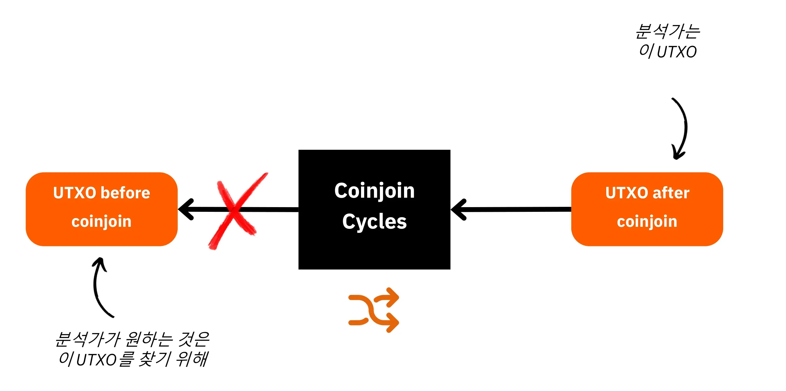


분석가가 과거와 현재를 연결하거나 그 반대로 연결하는 것이 얼마나 어려운지 평가하려면 UTXO이 숨겨져 있는 동질적인 UTXO 그룹의 크기를 정량화해야 합니다. 이 측정값은 얼마나 많은 분석이 동일한 확률을 갖는지 알려줍니다. 따라서 올바른 분석이 동일한 확률을 가진 3개의 다른 분석에 묻혀 있다면 은폐 수준이 매우 낮습니다. 반면에 동일한 확률의 20,000개의 분석 집합 내에서 올바른 분석이 발견되면 UTXO은 매우 잘 숨겨져 있습니다. 이러한 그룹의 크기는 "익명 집합"으로 알려진 지표를 나타냅니다.


### 무설정 이해하기


익명 세트는 특정 UTXO의 기밀성 정도를 평가하는 지표로 사용됩니다. 보다 구체적으로, 연구 중인 UTXO을 포함하는 세트 내에서 구별할 수 없는 UTXO의 수를 측정합니다. 균질한 UTXO 세트에 대한 요구 사항은 일반적으로 CoinJoin 주기에 대해 비셋을 계산한다는 것을 의미합니다. 이러한 지표의 사용은 균일성 때문에 Whirlpool 코인 조인과 특히 관련이 있습니다.


필요한 경우 익명 집합을 사용해 코인 조인의 품질을 판단할 수 있습니다. 익명 집합이 크다는 것은 동질 집합 내에서 특정 UTXO를 구별하기 어려워지기 때문에 익명성이 높다는 것을 의미합니다.


두 가지 유형의 익명 집합이 존재합니다:


- 전방 무설정;
- 역방향 무설정.


### 포워드 앤온셋


미래 전망 지표는 시작 시점의 UTXO이 주어졌을 때 사이클이 끝날 때 연구된 UTXO이 숨겨진 그룹의 크기, 즉 이 그룹 내에 존재하는 구별할 수 없는 UTXO의 수를 나타냅니다. 이 지표의 이름은 "미래 예측 지표"입니다.


이 지표는 과거-현재(입력-출력) 분석에 대한 회의실의 기밀성 저항을 측정합니다.


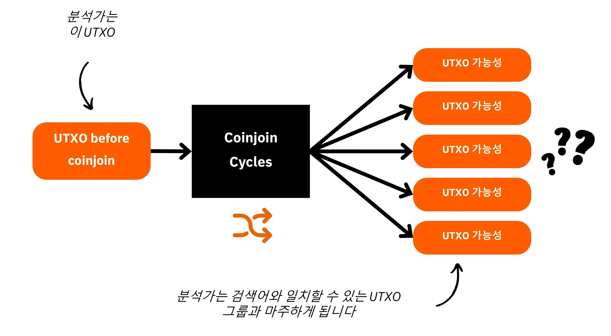


이 메트릭은 CoinJoin 프로세스의 진입 시점부터 종료 시점까지의 기록을 재구성하려는 시도로부터 UTXO가 어느 정도 보호되는지 추정하는 데 사용됩니다.


예를 들어, 거래가 첫 번째 CoinJoin 사이클에 참여했고 두 번의 하강 사이클이 더 완료된 경우, Coin의 전방 아논셋은 `13`이 됩니다:


예를 들어, CoinJoin 사이클이 시작될 때 Coin의 순방향 앤온셋이 `86,871`이라고 가정해 봅시다. 실질적으로 이것은 `86,871`개의 구별할 수 없는 UTXO 사이에 숨겨져 있다는 것을 의미합니다. CoinJoin 주기가 시작될 때 이 Coin를 알고 그 출구를 추적하려는 외부 관찰자의 경우, 그가 찾고 있는 Coin일 확률이 동일한 `86,871`개의 가능한 UTXO와 마주하게 됩니다.


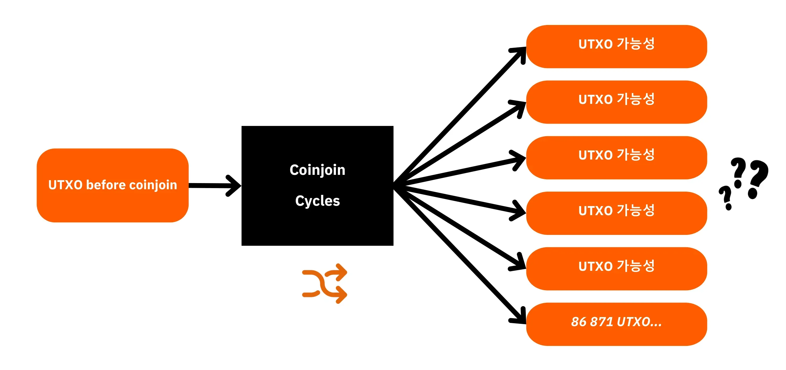


### 역방향 무설정


역방향 익명 설정은 사이클이 끝날 때 UTXO을 알고 있을 때 주어진 UTXO에 대해 가능한 소스의 수를 나타냅니다. 이 지표는 현재-과거(출력-입력) 분석에 대한 UTXO의 기밀성 저항, 즉 분석가가 CoinJoin 주기가 시작되기 전에 UTXO의 출처로 역추적하는 것이 얼마나 어려운지를 측정합니다. 이 지표의 이름은 "역방향 무설정" 또는 "역방향 메트릭"입니다.


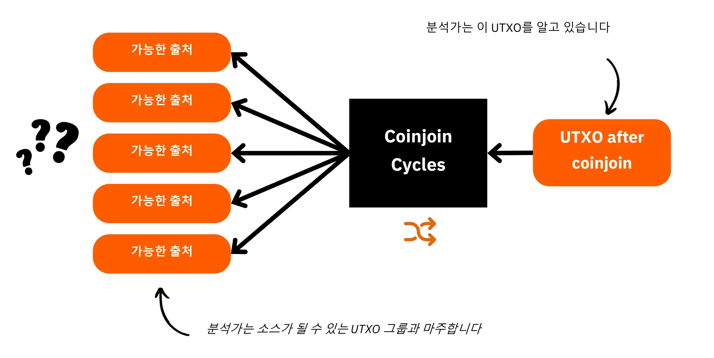


사이클 종료 시점의 UTXO을 알면 역방향 앤온셋은 CoinJoin 사이클 진입을 구성할 수 있었던 잠재적 Tx0 트랜잭션의 수를 결정합니다. 아래 다이어그램에서 이는 모든 주황색 거품의 합에 해당합니다.


예를 들어, CoinJoin UTXO의 역방향 앤온셋이 `42,185`라고 가정해 보겠습니다. 실질적으로 이것은 이 UTXO에 대해 `42,185`개의 잠재적 소스가 있다는 것을 의미합니다. 외부 관측자가 주기가 끝날 때 이 Coin를 식별하고 그 기원을 추적하려고 하면, 찾고자 하는 기원이 될 확률이 모두 동일한 '42,185'개의 가능한 출처와 마주하게 됩니다.


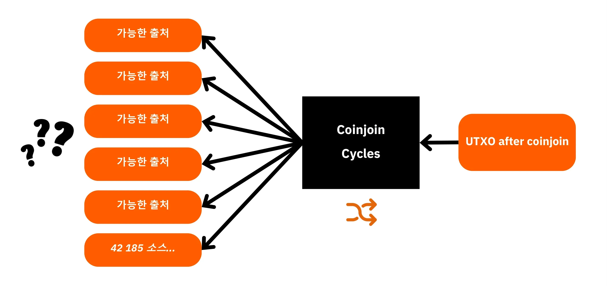


### 무설정값은 어떻게 계산하나요?


소규모 앙상블의 경우 Block explorer을 사용하여 수동으로 애니셋을 계산할 수 있습니다. 그러나 대규모 익명 집합의 경우 전문 도구를 사용하는 것이 필수적입니다. 제가 아는 한, 이 작업을 수행할 수 있는 유일한 소프트웨어는 Samourai와 OXT 팀이 개발한 Python 도구인 *Whirlpool 통계 도구*입니다. 안타깝게도 이 도구는 사무라이의 창립자가 체포되고 Blockchain에서 데이터를 추출하는 데 사용되던 OXT가 중단된 후 현재 서비스를 중단한 상태입니다.


이 장에서 살펴본 바와 같이 애니셋은 CoinJoin 구조에 일정한 동질성이 있는 경우에만 계산할 수 있습니다. 다음 장에서는 CoinJoin 트랜잭션이든 더 전통적인 트랜잭션이든 Bitcoin 트랜잭션에서 이러한 동질성을 정량화하는 방법을 알아보겠습니다.


## 엔트로피


<chapterId>e4fe289d-618b-49a2-84c9-68c562e708b4</chapterId>


코인 조인에 대한 이 섹션에서 살펴본 것처럼, 입력과 출력 모두에서 UTXO의 동질성은 Bitcoin 트랜잭션의 기밀성을 향상시키는 데 중요한 역할을 합니다. 이 매개변수는 Blockchain 분석에 직면했을 때 그럴듯한 부인 가능성을 만들어냅니다. 이 동질성을 측정하기 위해 여러 가지 방법을 사용할 수 있지만, 제 생각에 가장 효과적인 방법 중 하나는 OXT와 Samourai Wallet 팀이 개발한 *볼츠만* 도구에서 제공하는 지표, 특히 트랜잭션 엔트로피를 사용하는 것입니다. 이 장에서는 이에 대해 자세히 살펴보겠습니다.


일련의 트랜잭션을 기반으로 계산되는 무설정 지표와 달리, 여기에 제시된 지표는 CoinJoin이든 보다 전통적인 트랜잭션이든 단일 트랜잭션에 초점을 맞추고 있습니다.


### 해석 횟수


Bitcoin 트랜잭션에서 관찰할 수 있는 첫 번째 지표는 외부 관찰자가 트랜잭션을 분석할 때 관찰할 수 있는 가능한 해석의 총 개수입니다. 이 지표는 트랜잭션에 관련된 UTXO의 값을 고려하여 입력과 출력을 연결할 수 있는 방법의 수를 보여줍니다. 즉, 트랜잭션을 분석하는 외부 관찰자의 관점에서 트랜잭션이 도출할 수 있는 가능한 해석의 수를 결정합니다.


예를 들어, 하나의 입력과 두 개의 출력이 있는 간편결제 거래는 입력 #0이 출력 #0을 조달하고 출력 #1을 출력하는 한 가지 해석만 가능합니다. 다른 해석은 불가능합니다:


반면, Whirlpool 5x5 코너는 $1\,496$의 조합이 가능합니다:


Whirlpool 서지 사이클 8x8 CoinJoin는 $9\,934\,563$의 가능한 해석이 있습니다:


### 엔트로피


Bitcoin 트랜잭션의 해석 횟수를 통해 엔트로피를 계산할 수 있습니다.


암호화 및 정보의 일반적인 맥락에서 엔트로피는 데이터 소스 또는 무작위 프로세스와 관련된 불확실성 또는 예측 불가능성을 정량적으로 측정한 수치입니다. 즉, 엔트로피는 정보를 예측하거나 추측하기 어려운 정도를 측정합니다.


Blockchain 분석의 특정 맥락에서 엔트로피는 섀넌의 엔트로피와 [로랑MT가 개발한](https://gist.github.com/LaurentMT/e758767ca4038ac40aaf)에서 파생된 지표의 이름이기도 하며, Bitcoin 트랜잭션에서 계산할 수 있는 지표입니다.


거래에 가능한 해석이 많은 경우 엔트로피를 참조하는 것이 더 적절할 때가 많습니다. 이 지표는 트랜잭션의 정확한 구성에 대한 분석가의 지식 부족을 측정합니다. 즉, 엔트로피가 높을수록 분석가가 입력과 출력 사이의 비트코인 흐름을 파악하기가 더 어려워집니다.


실제로 엔트로피는 외부 관찰자의 관점에서 거래가 다른 외부 또는 내부 패턴과 휴리스틱을 고려하지 않고 입력 및 출력 금액만을 기준으로 여러 가지 해석이 가능한지 여부를 나타냅니다. 따라서 엔트로피가 높다는 것은 거래의 기밀성이 높다는 의미와 동의어입니다.


엔트로피는 가능한 조합의 수의 이진 로그로 정의됩니다. 다음은 트랜잭션의 엔트로피인 $E$와 가능한 해석의 수인 $C$에 사용되는 공식입니다:


$$
E = \log_2(C)
$$


수학에서 이항로그(기저-2 로그)는 2의 지수의 역연산입니다. 즉, $x$의 이항로그는 $x$를 구하기 위해 $2$를 올려야 하는 지수입니다. 따라서 이 지표는 비트로 표현됩니다.


이전 섹션에서 언급했듯이 $1\,496$의 다양한 해석이 가능한 Whirlpool 5x5 모델에 따라 구조화된 CoinJoin 트랜잭션의 엔트로피 계산을 예로 들어보겠습니다:


$$
\begin{align*}
C &= 1\,496 \\
E &= \log_2(1\,496) \\
E &= 10.5469 \text{ bits}
\end{align*}
$$


따라서 이 CoinJoin 트랜잭션의 엔트로피는 10.5469$ 비트이며, 이는 매우 만족스러운 수치로 간주됩니다. 이 값이 높을수록 트랜잭션이 더 다양한 해석을 허용하므로 기밀성 수준이 강화됩니다.


9\,934\,563$ 해석이 있는 CoinJoin 8x8 트랜잭션의 경우 엔트로피는 다음과 같습니다:


$$
\begin{align*}
C &= 9\,934\,563 \\
E &= \log_2(9\,934\,563) \\
E &= 23.244 \text{ bits}
\end{align*}
$$


입력이 1개, 출력이 2개인 일반적인 결제 트랜잭션을 예로 들어보겠습니다: [1b1b0c3f0883a99f1161c64da19471841ed12a1f78e77fab128c69a5f578ccce](https://Mempool.space/tx/1b1b0c3f0883a99f1161c64da19471841ed12a1f78e77fab128c69a5f578ccce)


이 트랜잭션의 경우, 가능한 유일한 해석은 '(In.0) > (Out.0; Out.1)`입니다. 따라서 엔트로피는 $0$입니다:


$$
\begin{align*}
C &= 1 \\
E &= \log_2(1) \\
E &= 0 \text{ bits}
\end{align*}
$$


### 효율성


트랜잭션의 엔트로피를 기반으로 기밀성 측면에서 트랜잭션의 효율성을 계산할 수도 있습니다. 이 지표는 동일한 구성에서 예상할 수 있는 최적의 트랜잭션과 비교하여 트랜잭션의 효율성을 평가합니다.


이는 특정 트랜잭션 구조가 이론적으로 달성할 수 있는 가장 높은 엔트로피에 해당하는 최대 엔트로피의 개념으로 이어집니다. 그런 다음 이 최대 엔트로피를 분석 대상 트랜잭션의 실제 엔트로피와 비교하여 트랜잭션 효율을 계산합니다.


사용된 공식은 다음과 같습니다:


- e_R$: 비트 단위로 표현된 트랜잭션의 실제 엔트로피입니다;
- e_M$: 트랜잭션 구조에 대해 가능한 최대 엔트로피로, 비트 단위로도 표현됩니다;
- ef$: 비트 단위의 트랜잭션 효율성:


$$
Ef = E_R - E_M
$$


예를 들어 Whirlpool 5x5 CoinJoin 구조의 경우 최대 엔트로피는 $10.5469$입니다:


$$
\begin{align*}
E_R &= 10.5469 \\
E_M &= 10.5469 \\
Ef &= E_R - E_M \\
Ef &= 10.5469 - 10.5469 \\
Ef &= 0 \text{ bits}
\end{align*}
$$


이 지표는 백분율로도 표시됩니다. 사용되는 공식은 다음과 같습니다:


- $c_R$: 가능한 실제 해석의 수입니다;
- $c_M$: 동일한 구조에 대해 가능한 최대 해석 수입니다;
- $Ef$: 백분율로 표시되는 효율성입니다:


$$
\begin{align*}
E_f &= \frac{C_R}{C_M} \\
E_f &= \frac{1\,496}{1\,496} \\
E_f &= 100 \%
\end{align*}
$$


100$의 효율성은 트랜잭션의 구조에 따라 기밀성 잠재력을 극대화하고 있음을 나타냅니다.


### 엔트로피 밀도


엔트로피는 트랜잭션의 기밀성을 측정하는 좋은 지표이지만, 부분적으로는 트랜잭션의 입력과 출력의 수에 따라 달라집니다. 입력과 출력의 수가 서로 다른 두 트랜잭션의 엔트로피를 비교하려면 엔트로피 밀도를 계산하면 됩니다. 이 지표는 트랜잭션의 각 입력 또는 출력과 관련된 엔트로피에 대한 관점을 제공합니다. 밀도는 크기가 다른 트랜잭션의 효율성을 평가하고 비교하는 데 유용합니다.


이를 계산하려면 트랜잭션의 총 엔트로피를 트랜잭션에 관련된 총 입력 및 출력 수로 나누기만 하면 됩니다:


- e_D$: 비트 단위로 표현되는 엔트로피 밀도입니다;
- e$: 비트 단위로 표현된 트랜잭션의 엔트로피입니다;
- t$: 트랜잭션의 총 입력 및 출력 수입니다:


$$
E_D = \frac{E}{T}
$$


Whirlpool 5x5 CoinJoin의 예를 들어 보겠습니다:


$$
\begin{align*}
T &= 5 + 5 = 10 \\
E &= 10.5469 \\
E_D &= \frac{E}{T} \\
E_D &= \frac{10.5469}{10} \\
E_D &= 1.054 \text{ bits}
\end{align*}
$$


8x8 Whirlpool CoinJoin의 엔트로피 밀도도 계산해 보겠습니다:


$$
\begin{align*}
T &= 8 + 8 = 16 \\
E &= 23.244 \\
E_D &= \frac{E}{T} \\
E_D &= \frac{23.244}{16} \\
E_D &= 1.453 \text{ bits}
\end{align*}
$$


이 두 가지 유형의 CoinJoin의 엔트로피 밀도를 분석해 보면, 엔트로피를 Elements의 수로 정규화하더라도 "서지 사이클 8x8" CoinJoin가 분석에 더 많은 불확실성을 발생시킨다는 것을 알 수 있습니다.


### 볼츠만 점수


트랜잭션에서 분석되는 또 다른 정보는 다른 요소에 대한 각 요소의 볼츠만 점수입니다. 이 표는 입력과 출력 간의 일치 확률을 표시합니다. 이 표는 볼츠만 점수를 통해 특정 입력이 주어진 출력에 연결될 조건부 확률을 나타냅니다. 따라서 이는 일련의 해석에서 이 이벤트의 유리한 발생 횟수와 가능한 총 발생 횟수의 비율을 기준으로 거래에서 입력과 출력 사이의 연관성이 발생할 조건부 확률을 정량적으로 측정한 것입니다.


조건부 확률 표는 각 입력과 출력 사이의 연결 가능성을 강조하여 트랜잭션의 연결 모호성을 정량적으로 측정할 수 있습니다:


| %       | Output 0 | Output 1 | Output 2 | Output 3 | Output 4 |
| ------- | -------- | -------- | -------- | -------- | -------- |
| Input 0 | 34%      | 34%      | 34%      | 34%      | 34%      |
| Input 1 | 34%      | 34%      | 34%      | 34%      | 34%      |
| Input 2 | 34%      | 34%      | 34%      | 34%      | 34%      |
| Input 3 | 34%      | 34%      | 34%      | 34%      | 34%      |
| Input 4 | 34%      | 34%      | 34%      | 34%      | 34%      |


분명히 각 입력은 모든 출력과 연결될 확률이 동일하므로 트랜잭션의 기밀성이 강화됩니다.


볼츠만 점수는 특정 이벤트가 발생한 해석의 수를 사용 가능한 총 해석의 수로 나누어 계산합니다. 따라서 입력 #0과 출력 #3($512$ 해석에 존재하는 이벤트)과 관련된 점수를 결정하려면 다음과 같이 진행합니다:


$$
\begin{align*}
\text{Interpretations (IN.0 > OUT.3)} &= 512 \\
\text{Interpretations totales} &= 1496 \\
\text{Score} &= \frac{512}{1496} \\
\text{Score} &= 34 \%
\end{align*}
$$


Whirlpool 8x8 서지 사이클 CoinJoin를 예로 들면 볼츠만 테이블은 다음과 같습니다:


| OUT.0 | OUT.1 | OUT.2 | OUT.3 | OUT.4 | OUT.5 | OUT.6 | OUT.7 |
|-------|-------|-------|-------|-------|-------|-------|-------|
| IN.0  | 23%   | 23%   | 23%   | 23%   | 23%   | 23%   | 23%   | 23%   |
| IN.1  | 23%   | 23%   | 23%   | 23%   | 23%   | 23%   | 23%   | 23%   |
| IN.2  | 23%   | 23%   | 23%   | 23%   | 23%   | 23%   | 23%   | 23%   |
| IN.3  | 23%   | 23%   | 23%   | 23%   | 23%   | 23%   | 23%   | 23%   |
| IN.4  | 23%   | 23%   | 23%   | 23%   | 23%   | 23%   | 23%   | 23%   |
| IN.5  | 23%   | 23%   | 23%   | 23%   | 23%   | 23%   | 23%   | 23%   |
| IN.6  | 23%   | 23%   | 23%   | 23%   | 23%   | 23%   | 23%   | 23%   |
| IN.7  | 23%   | 23%   | 23%   | 23%   | 23%   | 23%   | 23%   | 23%   |


그러나 입력이 하나이고 출력이 2개인 간단한 트랜잭션의 경우에는 상황이 다릅니다:


| Output 0 | Output 1 |
|----------|----------|
| Input 0  | 100%     | 100%    |


여기서 각 출력이 입력 #0에서 발생할 확률은 100%임을 알 수 있습니다. 따라서 확률이 낮을수록 기밀성이 높아져 입력과 출력 간의 직접적인 연결이 희석됩니다.


### 결정론적 링크


트랜잭션에서 결정적 링크의 수를 계산할 수도 있습니다. 이 지표는 분석된 트랜잭션에서 의심할 수 없는 입력과 출력 간의 연결 비율을 100%의 확률로 나타냅니다. 그런 다음 결정적 링크의 비율을 계산하여 이 지표를 완성할 수 있습니다. 이 비율은 트랜잭션의 전체 링크 내에서 이러한 결정적 링크의 가중치에 대한 인사이트를 제공합니다.


예를 들어, Whirlpool CoinJoin 거래에는 입력과 출력 사이에 결정적 링크가 없으므로 링크가 0개이고 비율이 0%인 표시기가 표시됩니다. 반대로 두 번째로 살펴본 간편결제 거래(입력 1개와 출력 2개)의 경우, 지표는 2개의 결정적 링크가 있음을 나타내며 비율은 100%에 이릅니다. 즉, 지표가 0이면 입력과 출력 사이에 직접적이고 확실한 연결 고리가 없기 때문에 기밀성이 우수함을 나타냅니다.


### 이러한 지표는 어떻게 계산하나요?


제공된 방정식을 사용하여 이러한 지표를 수동으로 계산하는 것은 비교적 간단합니다. 어려운 점은 주로 거래의 가능한 해석 수를 결정하는 데 있습니다. 기존 거래의 경우 이 계산을 수동으로 수행할 수 있습니다. 그러나 CoinJoin의 경우 이 작업은 훨씬 더 복잡합니다.


이전에는 OXT와 사무라이 팀이 개발한 _볼츠만 계산기_라는 파이썬 도구가 있었는데, 이 도구는 Bitcoin 트랜잭션의 모든 지표를 자동으로 계산해 주었습니다:


이러한 분석을 위해 KYCP.org 웹사이트를 사용할 수도 있었습니다:


안타깝게도 사무라이의 창립자가 체포된 이후 이러한 도구는 더 이상 운영되지 않습니다.


이제 코인 조인에 대해 자세히 살펴보았으니, 강좌의 마지막 섹션에서는 Bitcoin에서 사용할 수 있는 다른 개인정보 보호 기술을 살펴보겠습니다. 페이조인, 특정 의사 CoinJoin 트랜잭션 유형, 정적 Address 프로토콜, 트랜잭션 자체가 아닌 노드 네트워크 수준에서 기밀성을 강화하는 방법 등을 살펴볼 것입니다.


https://planb.network/tutorials/privacy/analysis/boltzmann-entropy-738e45af-18a6-4ce6-af1a-1bf58e15f1fe

# 기타 고급 기밀성 기술의 과제 이해


<partId>19989ae6-d608-4acf-b698-2cf1e7e5e6ae</partId>


## PayJoin 거래


<chapterId>c1e90b95-f709-4574-837b-2ec26b11286f</chapterId>


CoinJoin은 현재 체인 분석에서 UTXO 추적에 불확실성을 도입하는 가장 효과적인 방법입니다. 이전 장에서 살펴본 것처럼 고성능 믹스를 얻으려면 입력과 출력이 가능한 한 동질적이어야 합니다. 또한, UTXO를 가능한 한 큰 그룹에 통합하여 무형자산을 극대화하는 것이 중요합니다. 따라서 코인 조인이 효과적이려면 균일한 다수의 UTXO가 포함되어야 합니다. 이러한 다양한 요건은 CoinJoin 트랜잭션이 매우 엄격한 구조를 가지고 있음을 의미합니다. 금액이 미리 정해져 있고, 모든 참여자가 이를 준수해야 프로세스의 균일성을 보장할 수 있습니다. 또한 코인 조인은 트랜잭션 구성 중에 모든 참여자와 코디네이터 간의 동기화가 필요합니다.


이러한 요구 사항으로 인해 CoinJoin는 직접 결제에 적합하지 않습니다. 예를 들어, CoinJoin 풀에 1M-sat Coin이 있는 경우 이를 직접 결제 수단으로 사용하는 것은 복잡할 수 있습니다. 결제가 필요한 순간에 정확하게 협업 거래를 구축하려면 다른 참여자 및 코디네이터와 동기화해야 하며, 구매 금액이 Coin의 가치와 정확히 일치해야 하는데, 이는 사실상 불가능합니다. 따라서 CoinJoin 거래는 본질적으로 협업 스윕 거래, 즉 일반적으로 입력과 출력의 소유자가 동일한 거래입니다.


그러나 실용적인 방식으로 결제가 이뤄지는 동시에 체인 분석에 의심을 도입할 수 있는 거래 구조가 있다면 흥미로울 것입니다. 이번 장과 다음 장에서 살펴볼 것이 바로 이 부분입니다.


### PayJoin 트랜잭션이란 무엇인가요?


PayJoin은 결제 수취인과 협업하여 지출 시 사용자 개인정보 보호를 강화하는 특정 Bitcoin 거래 구조입니다.


여기](https://gist.githubusercontent.com/LaurentMT/e758767ca4038ac40aaf/raw/c8125f6a3c3d0e90246dc96d3b603690ab6f1dcc/gistfile1.txt)에 있는 문서에 따르면 LaurentMT가 "*스테가노그래피 트랜잭션*"이라는 이름으로 이 방법을 처음 논의한 것은 2015년이었습니다. 이 기술은 이후 사무라이 Wallet에 채택되었고, 2018년에는 스토와이어웨이 도구를 사용하여 이 기술을 구현한 최초의 고객이 되었습니다. PayJoin의 개념은 [BIP79](https://github.com/Bitcoin/BIPs/blob/master/BIP-0079.mediawiki), [BIP78](https://github.com/Bitcoin/BIPs/blob/master/BIP-0078.mediawiki), [BIP77](https://PayJoin.org/docs/how-it-works/PayJoin-v2-BIP-77/)에서도 찾아볼 수 있습니다. 따라서 PayJoin를 지칭하기 위해 여러 용어가 사용됩니다:


- PayJoin;
- 스타우어웨이;
- P2EP(*결제-종료 지점*);
- 스테가노그래피 트랜잭션.


PayJoin의 특별한 특징은 언뜻 평범해 보이지만 실제로는 두 사람 사이의 미니 CoinJoin인 거래를 generate로 만들 수 있다는 것입니다. 이를 위해 거래 구조에는 실제 송금인과 함께 결제 수취인이 입력에 포함됩니다. 따라서 수취인은 거래 중간에 자신에 대한 결제가 포함되며, 그 자체로 결제를 받을 수 있습니다.


이 프로세스를 더 잘 이해하기 위해 예를 들어 보겠습니다. Alice는 10,000 Sats의 UTXO을 사용하여 4,000 Sats에 빵을 구매하고 PayJoin을 선택합니다. 그녀의 제빵사 Bob은 자신이 소유한 15,000 Sats의 UTXO을 투입으로 추가하여 Alice의 4,000 Sats에 더해 전액을 산출로 회수합니다.


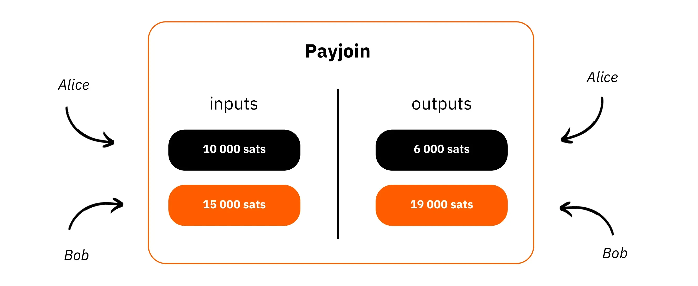


이 예에서 Bob은 15,000 Sats을 입력하고 19,000 Sats을 출력하므로 차액은 정확히 4,000 Sats, 즉 바게트 가격입니다. Alice 쪽에서는 10,000 Sats을 입력하고 6,000 Sats을 출력하므로 그 차이는 -4,000 Sats, 즉 바게트 가격을 나타냅니다. 예제를 단순화하기 위해 이 거래에서 Mining 비용은 의도적으로 생략했습니다.


### PayJoin의 용도는 무엇인가요?


PayJoin 거래는 두 가지 목적을 달성하여 사용자가 결제의 기밀성을 강화할 수 있도록 합니다.


첫째, PayJoin은 체인 분석에서 미끼를 만들어 외부 관찰자를 오도하는 것을 목표로 합니다. 이는 CIOH 휴리스틱(*공통 입력 Ownership 휴리스틱*)을 통해 가능합니다. 3부에서 살펴본 것처럼, Blockchain의 트랜잭션에 여러 개의 입력이 있는 경우 일반적으로 이러한 모든 입력은 동일한 엔터티 또는 사용자에게 속한 것으로 간주합니다.


따라서 분석가가 PayJoin 트랜잭션을 검토할 때 모든 입력이 동일한 사람으로부터 왔다고 믿게 됩니다. 그러나 수취인도 실제 지불자와 함께 입력에 기여하기 때문에 이러한 인식은 잘못된 것입니다. 따라서 연쇄 분석은 잘못된 것으로 판명된 해석으로 전환됩니다.


빵을 결제하는 PayJoin 트랜잭션을 예로 들어 보겠습니다:


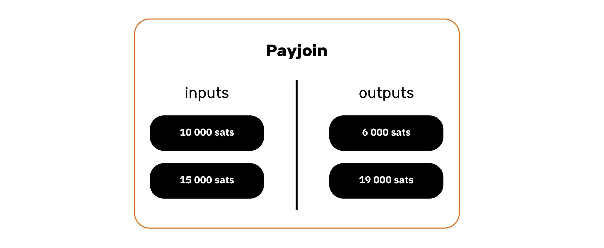


Blockchain에서 이 거래를 본 외부 관찰자는 Blockchain 분석의 일반적인 휴리스틱에 따라 다음과 같은 해석을 내릴 수 있습니다: "*Alice은 19,000 Sats을 Bob*에 지불하기 위해 2개의 UTXO를 거래의 입력으로 병합했습니다.".


이 해석은 명백히 잘못된 것입니다. 이미 아시다시피 입력에 있는 두 개의 UTXO는 같은 사람의 것이 아니기 때문입니다. 하나는 바게트 구매자인 Alice의 것이고 다른 하나는 제빵사인 Bob의 것입니다.


이러한 방식으로 외부 관찰자의 분석이 잘못된 결론을 내리는 것을 방지하여 이해관계자의 기밀을 보호할 수 있습니다.


### 스테가노그래피 트랜잭션


PayJoin의 두 번째 목적은 외부 관찰자가 실제 지급된 금액에 대해 오해를 불러일으키는 것입니다. 분석가는 거래 구조를 조사하여 결제 금액이 산출물 중 하나의 금액과 동일하다고 결론을 내릴 수 있습니다.


빵 구매의 예로 돌아가면 분석가는 결제 금액이 6,000 Sats의 UTXO 또는 19,000 Sats의 Sats에 해당한다고 결론을 내립니다. 이 경우 분석가는 출력에 UTXO가 2개 있고 그 중 적어도 하나가 6,000 Sats보다 크기 때문에 결제 금액이 19,000 Sats이라고 생각할 것입니다(단일 UTXO로도 이 결제 금액을 충족할 수 있는데 굳이 2개의 UTXO를 사용하여 6,000 Sats을 결제할 논리적 이유가 없음).


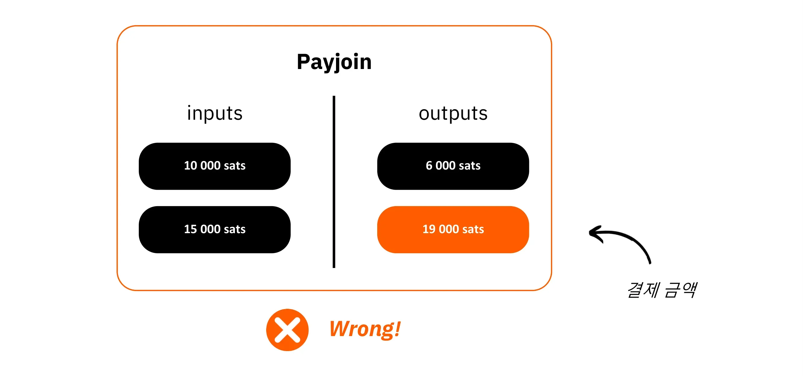


그러나 실제로는 이 분석에 결함이 있습니다. 지불 금액은 출력과 일치하지 않습니다. 실제로는 수취인의 UTXO 출력과 수취인의 UTXO 입력의 차이입니다.


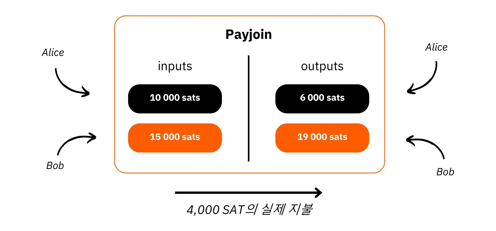


이러한 점에서 PayJoin 트랜잭션은 스테가노그래피의 영역에 속합니다. 이를 통해 실제 거래 금액은 미끼 역할을 하는 가짜 거래 안에 숨겨질 수 있습니다.


스테가노그래피는 다른 데이터나 객체 안에 정보를 숨겨 숨겨진 정보의 존재를 알아차리지 못하게 만드는 기술입니다. 예를 들어, 비밀 메시지를 관련 없는 텍스트의 점 안에 숨겨서 육안으로 감지할 수 없도록 할 수 있습니다([마이크로닷](https://fr.wikipedia.org/wiki/Micropoint) 기법).


복호화 키 없이는 정보를 이해할 수 없게 만드는 암호화와 달리 스테가노그래피는 정보를 수정하지 않습니다. 정보는 그대로 일반 텍스트로 표시됩니다. 오히려 비밀 메시지의 존재 자체를 숨기는 것이 목표인 반면, 암호화는 키 없이는 접근할 수 없지만 숨겨진 정보의 존재를 명확하게 드러냅니다. 이것이 바로 PayJoin의 원래 이름이 "스테가노그래피 트랜잭션"이었던 이유입니다.


암호화와 CoinJoin, 스테가노그래피와 PayJoin를 비유할 수 있습니다. CoinJoin은 암호화와 유사한 속성을 가지고 있습니다. 방법은 인식할 수 있지만 정보는 해독할 수 없습니다. 반대로 PayJoin는 스테가노그래피와 유사합니다. 이론적으로는 정보에 액세스할 수 있지만 은폐 방법을 인식할 수 없으므로 액세스할 수 없게 됩니다.


### PayJoin은 어떻게 사용하나요?


PayJoin를 지원하는 잘 알려진 소프트웨어 프로그램으로는 Sparrow wallet, 와사비 Wallet, 뮤티니, 비트마스크, 블루월렛, 조인마켓, 결제 프로세서 BTCPay 등이 있습니다.


가장 진보된 PayJoin 구현은 사무라이 Wallet의 Stowaway에만 있었습니다. 그러나 소프트웨어 개발자가 체포된 이후 이 도구는 현재 부분적으로만 작동합니다. 스토웨이의 장점은 포괄적이고 사용하기 쉬운 프로토콜을 제공하여 페이조인 수신과 송금을 모두 지원한다는 것입니다. 부분적으로 서명된 거래는 여러 개의 QR 코드를 스캔해 수동으로 교환하거나 토르를 통해 소로반을 통해 자동으로 교환할 수 있습니다. 후자의 통신 옵션은 현재 사용할 수 없습니다.


PayJoin 사용의 어려움은 판매자의 참여 여부에 따라 달라진다는 점입니다. 판매자가 지원하지 않는 경우 고객은 PayJoin을 사용할 수 없습니다. Bitcoin를 허용하는 판매자를 찾는 것도 어려울 뿐만 아니라 PayJoins를 지원하는 판매자까지 찾아야 한다면 구매 절차는 더욱 복잡해집니다.


한 가지 해결책은 수취인의 협조 없이 체인 분석에 모호성을 도입하는 거래 구조를 사용하는 것입니다. 이렇게 하면 판매자의 적극적인 참여에 의존하지 않고도 결제의 기밀성을 개선할 수 있습니다. 이것이 바로 다음 장에서 살펴볼 내용입니다.


https://planb.network/tutorials/privacy/on-chain/payjoin-samourai-wallet-48a5c711-ee3d-44db-b812-c55913080eab

## 결제 미니-CoinJoin


<chapterId>300777ee-30ae-43d7-ab00-479dac3522c1</chapterId>


어느 정도의 기밀을 유지하면서 결제 거래를 수행하려는 경우 PayJoin가 좋은 옵션입니다. 하지만 방금 살펴본 것처럼 PayJoin는 수신자의 참여가 필요합니다. 그렇다면 수신자가 유료 가입을 거부하거나 단순히 참여하지 않으려는 경우에는 어떻게 해야 할까요? 한 가지 대안은 스톤월 또는 스톤월 x2 트랜잭션을 사용하는 것입니다. 이 두 가지 유형의 트랜잭션에 대해 자세히 살펴보겠습니다.


### 스톤월 거래


스톤월은 실제로는 둘이 아닌 두 사람 사이에 가짜 CoinJoin을 모방하여 지출할 때 사용자 기밀성을 높이기 위해 고안된 특정 형태의 Bitcoin 트랜잭션입니다. 사실 이 트랜잭션은 공동 작업이 아닙니다. 사용자는 자신이 소유한 UTXO만 입력으로 사용하여 혼자서 구축할 수 있습니다. 다른 사용자나 수신자와 동기화할 필요 없이 언제든 스톤월 트랜잭션을 생성할 수 있습니다.


스톤월 트랜잭션은 다음과 같이 작동합니다: 트랜잭션의 입력으로 발행자는 자신이 소유한 UTXO 2개를 사용합니다. 트랜잭션이 출력되면 4개의 UTXO가 생성되며, 이 중 2개는 금액이 동일합니다. 나머지 2개의 UTXO가 변경 사항을 구성합니다. 동일한 금액의 출력물 2개 중 실제로 수취인에게 전송되는 것은 1개뿐입니다.


따라서 스톤월 트랜잭션에는 두 가지 역할만 존재합니다:


- 결제하는 발급자;
- 수취인은 거래의 구체적인 특성을 알지 못하고 단순히 발신자로부터 대금을 지급받기를 기대할 수 있습니다.


이 거래 구조를 이해하기 위해 예를 들어 보겠습니다. Alice이 4,000Sats인 바게트를 사기 위해 제빵사 Bob을 방문합니다. 그녀는 자신의 결제에 대한 기밀을 유지하면서 Bitcoin로 결제하기를 원합니다. 그래서 그녀는 결제를 위해 스톤월 트랜잭션을 구축하기로 결정합니다.


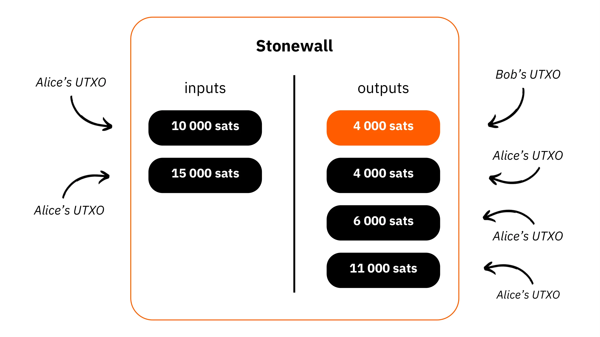


이 거래를 분석하면 제빵사가 실제로 바게트 대금으로 4,000 Bob을 받은 것을 알 수 있습니다. Alice는 2개의 UTXO를 입력으로 사용했는데, 하나는 10,000 Sats, 다른 하나는 15,000 Sats이었습니다. 출력에서는 4,000 Sats용 1개, 6,000 Sats용 1개, 11,000 Sats용 1개 등 3개의 UTXO를 회수했습니다. 따라서 Alice의 순 잔액은 이 거래에서 -4,000 Sats이며, 이는 바게트 가격에 해당합니다.


이 예시에서는 설명을 간소화하기 위해 의도적으로 Mining 수수료를 생략했습니다. 실제로 거래 비용은 전적으로 발행자가 부담합니다.


### 스톤월 거래의 목적은 무엇인가요?


스톤월 구조는 거래에 상당한 양의 엔트로피를 도입하여 체인 분석의 경계를 모호하게 만듭니다. 외부에서 볼 때 이러한 거래는 두 사람 사이의 미니 CoinJoin으로 해석될 수 있습니다. 하지만 실제로는 결제입니다. 따라서 이 방법은 체인 분석에 불확실성을 야기하거나 심지어 잘못된 리드로 이어질 수도 있습니다.


제빵사 Bob의 Alice를 예로 들어 보겠습니다. Blockchain의 트랜잭션은 다음과 같습니다:


일반적인 체인 분석 휴리스틱에 의존하는 외부 관찰자는 "*두 사람이 각각 하나의 UTXO을 입력으로, 두 개의 UTXO를 출력으로 사용하여 작은 CoinJoin을 만들었다*"고 잘못 결론을 내릴 수 있습니다. 외부에서 이 트랜잭션을 분석하면 같은 양의 출력이 두 개가 있다는 것은 CoinJoin 패턴을 암시하기 때문에 CIOH를 적용하지 않습니다. 따라서 외부에서 볼 때 이 특정 사례에는 CIOH가 적용되지 않습니다.


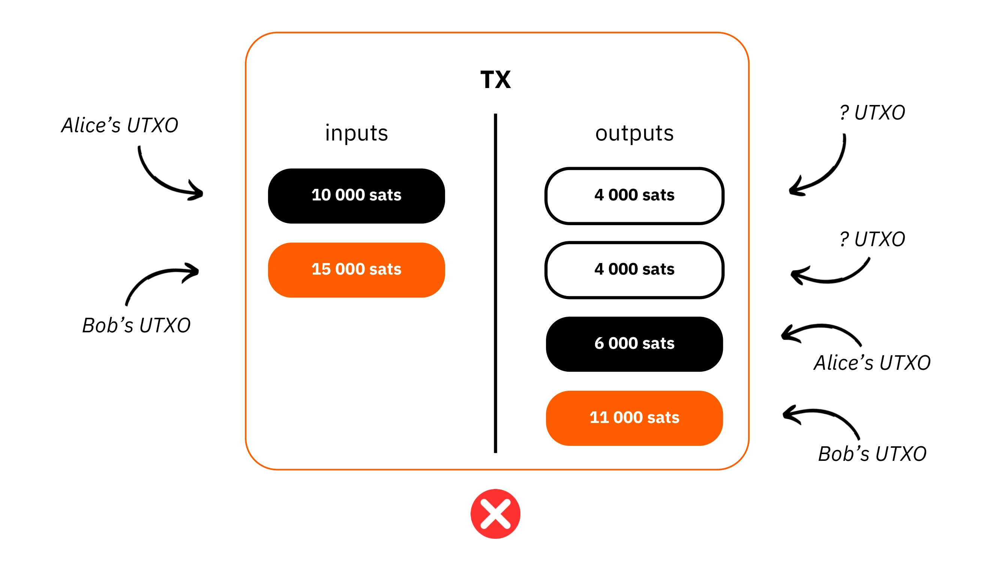


이 해석은 정확하지 않은데, 아시다시피 UTXO 1개는 제빵사 Bob에게 전송되었고, UTXO 입력 2개는 Alice에서 왔으며, 그녀는 3개의 잔돈 출력을 회수했기 때문입니다.


스톤월 거래의 구조에서 특히 흥미로운 점은 외부 관찰자의 관점에서 볼 때 모든 면에서 스톤월 x2 거래와 유사하다는 점입니다.


### 스톤월 거래 x2


스톤월 x2는 Bitcoin 거래의 또 다른 특정 형태로, 이번에는 해당 지출에 관여하지 않은 제3자와 협력하여 사용자 기밀성을 강화하는 것을 목표로 합니다. 이 방법은 두 명의 참여자 사이에서 의사 CoinJoin처럼 작동하며, 동시에 제3자에게 결제를 진행합니다.


스톤월 x2 트랜잭션의 작동은 비교적 간단합니다. 저희가 보유한 UTXO을 사용해 결제하고, 제3자의 도움을 받아 자신도 소유한 UTXO을 기부하는 방식입니다. 이 거래는 동일한 금액의 두 개는 수취인의 Address로, 나머지 하나는 공동 작업자의 Address로 전송되는 등 총 4개의 결과물을 생성합니다. 세 번째 UTXO은 협력자 소유의 다른 Address로 반환되어 협력자가 초기 금액을 회수할 수 있도록 하고(협력자에게는 중립적인 조치로, Mining 비용을 곱한 금액), 마지막 UTXO은 당사 소유의 Address로 반환되어 지불 변경을 구성합니다.


따라서 스톤월 x2 트랜잭션에는 세 가지 역할이 정의됩니다:


- 실제 결제를 하는 발급자;
- 수취인은 거래의 구체적인 특성을 알지 못하고 단순히 발신자로부터 대금을 지급받기를 기대할 수 있습니다;
- 협력자는 거래 분석에 의문을 제기하기 위해 비트코인을 제공하면서 마지막에 자신의 자금을 전액 회수합니다(Mining 비용을 곱한 중립적인 행동).


4,000Sats원인 바게트를 사기 위해 제과점 Bob에 있는 Alice의 예로 돌아가 보겠습니다. 그녀는 결제에 대한 일정 수준의 기밀을 유지하면서 Bitcoin로 결제하고 싶어 합니다. 그래서 그녀는 이 과정에서 도움을 줄 친구 찰스에게 전화를 겁니다.


이 거래를 분석하면 제빵사 Bob가 실제로 바게트에 대한 대가로 4,000 Sats을 받았음을 알 수 있습니다. Alice는 10,000 Sats을 투입으로 사용하고 6,000 Sats을 산출로 회수하여 순 잔액이 -4,000 Sats이 되었으며, 이는 바게트 가격에 해당합니다. 찰스의 경우 15,000 Sats을 투입으로 제공하고 4,000 Sats과 11,000 Sats의 두 가지 산출을 받았으므로 잔액은 0이 됩니다.


이 예에서는 이해하기 쉽도록 의도적으로 수수료를 생략했습니다. 실제로 Mining 수수료는 일반적으로 결제 발행자와 기여자가 균등하게 분담합니다.


### 스톤월 x2 거래의 목적은 무엇인가요?


스톤월 구조와 마찬가지로 스톤월 x2 구조는 트랜잭션에 상당한 엔트로피를 도입하여 체인 분석을 복잡하게 만듭니다. 외부에서 보면 이러한 트랜잭션은 두 사람 사이의 작은 CoinJoin으로 해석될 수 있습니다. 하지만 실제로는 지불입니다. 따라서 이 방법은 체인 분석에 불확실성을 야기하거나 심지어 잘못된 리드로 이어질 수도 있습니다.


Alice, Bob 제빵사, 찰스를 예로 들어 보겠습니다. Blockchain의 트랜잭션은 다음과 같습니다:


일반적인 체인 분석 휴리스틱에 의존하는 외부 관찰자는 "*Alice과 찰스가 입력에 각각 하나의 UTXO, 출력에 각각 2개의 UTXO가 있는 작은 CoinJoin을 수행했다*"고 잘못 결론을 내릴 수 있습니다. 다시 말하지만, 외부에서 이 트랜잭션을 분석해도 동일한 양의 출력이 두 개 존재한다는 것은 CoinJoin 패턴을 시사하므로 ICOH를 적용할 수 없습니다. 따라서 외부에서 볼 때 이 특정 사례에는 CIOH가 적용되지 않습니다.


아시다시피 UTXO는 제빵사 Bob에게 한 개만 전송되었고, Alice은 변경 출력이 하나만 있으며 Charles는 두 개를 가지고 있기 때문에 이 해석은 올바르지 않습니다.


다시 한 번 강조하지만, 스톤월 x2 거래의 구조에서 특히 흥미로운 점은 외부 관찰자의 관점에서 볼 때 모든 면에서 스톤월 거래와 유사하다는 점입니다.


### 스톤월과 스톤월 x2의 차이점은 무엇인가요?


스톤월X2 거래는 스톤월 거래와 똑같이 작동하지만, 전자는 협력적이지만 후자는 그렇지 않다는 점을 제외하면 스톤월 거래와 동일합니다. 앞서 살펴본 것처럼 스톤월 x2 거래에는 결제 외부에 있는 제3자(찰스)가 참여하며, 거래의 기밀성을 강화하기 위해 자신의 비트코인을 제공합니다. 일반적인 스톤월 거래에서는 공동 작업자의 역할은 발신자가 맡습니다.


외부에서 볼 때 거래 패턴은 동일하게 유지됩니다.


이 두 거래 구조가 정확히 동일한 패턴을 공유한다는 사실은 외부 관찰자가 "스톤월(x2)" 패턴을 식별하더라도 모든 정보를 알 수 없다는 것을 의미합니다. 그는 동일한 금액의 두 UTXO 중 어떤 것이 결제에 해당하는지 확인할 수 없습니다. 또한, 입력이 있는 두 개의 UTXO가 서로 다른 두 사람(스톤월 x2)으로부터 나온 것인지 아니면 이를 병합한 한 사람(스톤월)의 것인지도 확인할 수 없습니다.


마지막 요점은 스톤월 x2 트랜잭션이 스톤월 트랜잭션과 정확히 동일한 패턴을 따른다는 사실 때문입니다. 외부에서 볼 때 추가적인 컨텍스트 정보 없이는 스톤월 트랜잭션과 스톤월 x2 트랜잭션을 구분하는 것이 불가능합니다. 전자는 협업 거래가 아닌 반면, 후자는 협업 거래이기 때문입니다. 따라서 이러한 트랜잭션 중 하나를 분석할 때 더 많은 의구심이 생깁니다.


### 스톤월과 스톤월 x2 트랜잭션은 언제 사용해야 하나요?


비용으로 기밀 유지 도구를 사용하려는 경우 로직은 다음과 같아야 합니다:


- 우선적으로 PayJoin을 만들 수 있습니다.
- 판매자가 페이조인을 지원하지 않는 경우, 스톤월 x2 구조를 사용하여 결제 외부에서 다른 사람과 공동 거래를 할 수 있습니다.
- 스톤월 x2 트랜잭션을 만들 사람을 찾을 수 없는 경우, 스톤월 x2 트랜잭션의 동작을 모방하는 스톤월 전용 트랜잭션을 만들 수 있습니다.


### 스톤월과 스톤월 x2 트랜잭션은 어떻게 사용하나요?


스톤월 및 스톤월 x2 트랜잭션은 사무라이 Wallet 애플리케이션과 Sparrow wallet 소프트웨어 모두에서 사용할 수 있습니다.


그러나 페이조인과 마찬가지로 사무라이의 설립자가 체포된 이후 스톤월 x2 거래는 이제 관련 당사자 간에 수동으로 PSBT를 교환해야만 작동합니다. 안타깝게도 소로반을 통한 자동 Exchange는 더 이상 사용할 수 없습니다.


Bitcoin Wallet 소프트웨어에서 이러한 유형의 거래를 수동으로 수행할 수도 있습니다.


다음 장에서는 비교적 잘 알려지지 않았지만 이미 공부한 내용을 보완하는 데 매우 유용한 또 다른 기밀성 기법에 대해 살펴보겠습니다.


https://planb.network/tutorials/privacy/on-chain/stonewall-033daa45-d42c-40e1-9511-cea89751c3d4

https://planb.network/tutorials/privacy/on-chain/stonewall-x2-05120280-f6f9-4e14-9fb8-c9e603f73e5b

## 리쳇


<chapterId>db9a20ac-a149-443d-884b-ea6c03f28499</chapterId>


CoinJoin와 같이 체인 분석에 모호성을 더하는 Bitcoin 트랜잭션 구조를 사용하는 것은 개인 정보 보호에 특히 유용합니다. 그러나 페이조인 장에서 설명한 것처럼, CoinJoin 트랜잭션은 체인에서 자연스럽게 식별할 수 있습니다. 파일이 암호화되면 암호화된 파일을 발견한 제3자가 그 내용에 접근할 수는 없지만, 내용을 숨기기 위해 파일이 수정되었음을 명확하게 식별할 수 있다는 점을 암호화와 코인조인 사이에 비유한 것을 기억해주시기 바랍니다. 분석가가 CoinJoin 트랜잭션을 조사할 때 입력과 출력 간의 직접적인 연결 고리를 확인할 수는 없지만(또는 그 반대의 경우도 마찬가지), 관찰된 트랜잭션이 CoinJoin라는 것을 인식할 수 있습니다.


CoinJoin 주기 이후 UTXO을 어떻게 사용하려는 것인지에 따라 이 과정을 거쳤다는 사실이 문제가 될 수 있습니다. 예를 들어, 최근에 CoinJoin를 거친 규제된 Exchange 플랫폼에서 Coin을 판매하려는 경우 플랫폼의 체인 분석 도구가 이 사실을 감지합니다. 그러면 플랫폼에서 Coin으로 가입한 UTXO의 수락을 거부하거나 소명을 요구할 수 있으며, 계정이 정지되거나 자금이 동결될 위험이 있습니다. 경우에 따라서는 플랫폼이 주 당국에 사용자의 행동을 신고할 수도 있습니다(예: 프랑스에서는 TRACFIN이 PSAN에 대해 요구하거나 미국에서는 금융범죄단속네트워크(FinCEN)가 하는 것과 같이).


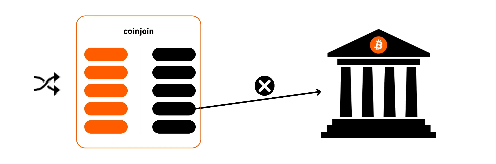


Bitcoin Coin의 과거 흔적을 흐리게 하여 어떤 형태의 대체 가능성을 복원할 수 있는 도구가 있습니다. 이것이 바로 리코쳇의 목적입니다.


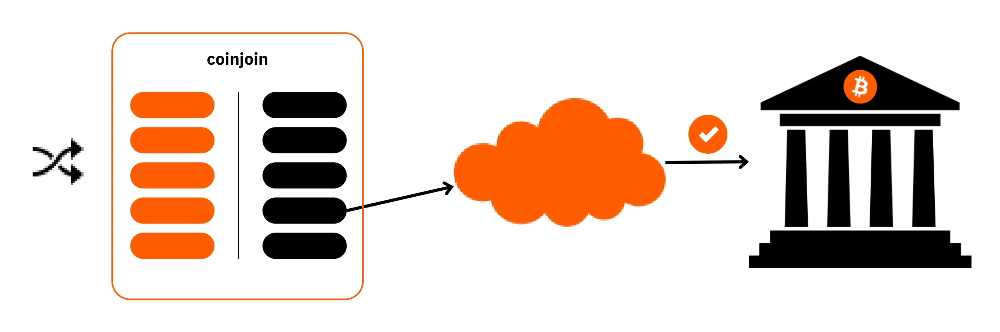


### 리쳇이란 무엇인가요?


리코쳇은 Bitcoin Ownership의 전송을 시뮬레이션하기 위해 자신에 대한 가상의 거래를 여러 번 수행(스위핑)하는 기법입니다. 이 도구는 전향적 익명성이 아니라 소급적 익명성이라는 점에서 앞서 설명한 다른 거래 구조와 다릅니다. 사실상, 리코쳇의 개념은 과거로 인해 Bitcoin Coin의 대체 가능성을 손상시킬 수 있는 특수성을 흐리게 합니다.


CoinJoin 사이클과 같은 과거 이벤트가 Coin에 남긴 흔적을 없애기 위해, 리코쳇은 사용자가 서로 다른 주소에서 자신에게 자금을 이체하는 네 번의 연속적인 거래를 실행합니다.


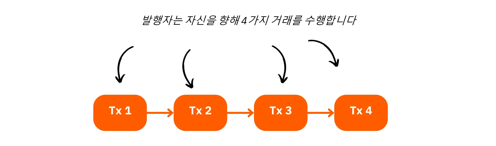


이러한 일련의 거래가 끝나면 리쳇 도구는 최종적으로 비트코인을 최종 목적지(예: Exchange 플랫폼)로 라우팅합니다.


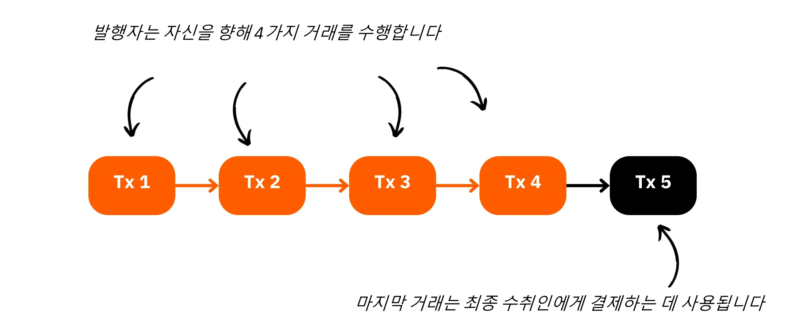


목표는 CoinJoin 거래와 같이 Coin의 대체 가능성에 영향을 미치는 거리를 만들고, 최종 지출 행위가 과거를 이유로 이 Coin를 거부할 수 있도록 하는 것입니다. 따라서 연쇄 분석 도구는 이벤트 이후 Ownership의 변경이 있었을 가능성이 있다고 결론을 내리고 이 Coin를 대체 가능한 것으로 간주할 수 있습니다. CoinJoin의 경우, Blockchain 분석 도구는 비트코인을 보낸 사람과 CoinJoin을 수행한 사람이 동일인이 아니라고 가정할 수 있으며, 따라서 발신자에 대한 조치를 취할 필요가 없다고 판단할 수 있습니다.


### 왜 작동하나요?


이러한 리카운트 방식에 직면하면 체인 분석 소프트웨어가 4번의 바운스 이상으로 검사를 심화할 것이라고 생각할 수 있습니다. 그러나 이러한 플랫폼은 탐지 임계값을 최적화하는 데 있어 딜레마에 직면합니다. 이들은 속성 변경이 발생했을 가능성이 있고 이전 이벤트(예: CoinJoin)와의 연결은 무시해야 한다는 것을 받아들이는 홉 수에 제한을 설정해야 합니다.


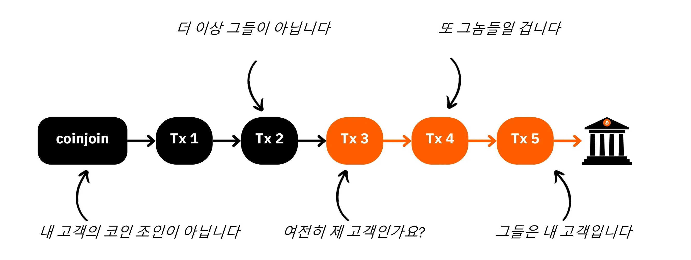


그러나 이 임계값을 설정하는 것은 위험합니다. 관찰된 점프 횟수가 증가할 때마다 오탐(실제로는 다른 사람이 작업을 수행했는데도 이벤트 참여자로 잘못 표시되는 경우)의 양이 기하급수적으로 증가하기 때문입니다. 이러한 시나리오는 오탐이 불만족으로 이어져 영향을 받은 고객을 경쟁업체로 유도할 수 있기 때문에 기업에게 상당한 위험을 초래할 수 있습니다. 장기적으로 탐지 임계값이 너무 높으면 플랫폼이 경쟁사보다 더 많은 고객을 잃게 되어 생존을 위협할 수 있습니다. 따라서 이러한 플랫폼은 관찰되는 바운스 수를 늘리는 것이 복잡하며, 분석에 대응하기 위해서는 4건이면 충분한 경우가 많습니다.


여기서 관찰되는 현상은 6각 분리 이론과 다소 유사합니다.


6단계 분리 이론에 따르면 지구상의 모든 사람은 최대 6명의 중개자로 구성된 관계의 사슬을 통해 다른 사람과 연결되어 있습니다. 따라서 전 세계의 모든 개인에게 도달하려면 각각 개인적으로 아는 6명의 사람을 거치는 것만으로도 충분합니다.


Bitcoin 트랜잭션의 경우에도 비슷한 현상이 관찰됩니다. 충분한 수의 Bitcoin 트랜잭션을 추적하면 필연적으로 CoinJoin을 발견할 수 있습니다. 리코쳇 방식은 Exchange 플랫폼이 합리적으로 추적할 수 있는 것보다 더 많은 수의 홉을 활용하여 이 원리를 활용합니다. 플랫폼이 더 많은 트랜잭션을 추적하기로 결정하면 간단히 홉을 추가하여 이 조치를 우회할 수 있습니다.


### 리코쳇은 언제 어떻게 사용하나요?


리코셰의 가장 일반적인 사용 사례는 소유한 UTXO에서 이전에 CoinJoin에 참여한 사실을 숨겨야 할 때 발생합니다. 이상적으로는 CoinJoin를 거친 비트코인을 규제 기관에 전송하지 않는 것이 가장 좋습니다. 그럼에도 불구하고 다른 방법이 없는 경우, 특히 비트코인을 국가 통화로 긴급히 청산해야 하는 경우, Ricochet은 효과적인 솔루션을 제공합니다.


이 방법은 코인 조인뿐만 아니라 UTXO의 대체 가능성을 손상시킬 수 있는 다른 모든 마크에도 효과적입니다.


이 리코쳇 방법에 대한 아이디어는 사무라이 Wallet 팀이 프로세스를 자동화하기 위해 애플리케이션에 통합한 것에서 비롯되었습니다. 리코쳇에는 100,000 Sats의 서비스 수수료와 Mining 비용이 포함되므로 이 서비스는 Samourai에서 무료로 제공되지 않습니다. 따라서 상당한 금액을 이체할 때 이 서비스를 사용하는 것이 좋습니다.


사무라이 애플리케이션은 두 가지 리쳇 변형을 제공합니다:


- 강화된 리코쳇 또는 "시차 전송"은 사무라이 서비스 요금을 5개의 연속된 거래에 걸쳐 분산시키는 이점을 제공합니다. 이 옵션은 또한 각 트랜잭션이 별도의 시간에 브로드캐스트되고 다른 블록에 기록되어 Ownership의 전송 동작을 최대한 가깝게 모방하도록 합니다. 이 방법은 느리지만 체인 분석에 대한 저항을 강화하여 리코셰의 효율성을 극대화하기 때문에 서두르지 않는 분들에게 선호됩니다.


- 클래식 리코쳇은 빠른 속도로 작업을 실행하도록 설계되어 모든 트랜잭션을 짧은 시간 간격으로 브로드캐스트합니다. 따라서 이 방법은 강화된 방법보다 기밀성이 떨어지고 분석에 대한 저항이 적습니다. 긴급한 배송에만 사용해야 합니다.


리코체팅은 간단히 말해 비트코인을 자신에게 보내는 것을 의미합니다. 전문 도구를 사용하지 않고도 Wallet 소프트웨어에서 수동으로 비트코인을 리코체팅하는 것은 완벽하게 가능합니다. 매번 새로운 빈 Address을 사용하여 동일한 Coin을 자신에게 연속적으로 전송하기만 하면 됩니다.


다음 장에서는 Ownership의 비밀 전송을 위한 다양한 기술을 살펴봅니다. 이러한 방법은 작동 방식과 결과 측면에서 지금까지 살펴본 방법과 근본적으로 다릅니다.


https://planb.network/tutorials/privacy/on-chain/ricochet-e0bb1afe-becd-44a6-a940-88a463756589

## Ownership의 비밀 전송


<chapterId>a2067036-849c-4d6b-87d2-44235cfae7a1</chapterId>


Bitcoin의 또 다른 기밀성 기술은 Ownership의 비밀 전송입니다. 이 방법은 Ownership에 거래가 명시적으로 표시되지 않고 한 사람에서 다른 사람으로 또는 그 반대로 비트코인을 전송하는 것을 목표로 합니다. 사용 가능한 다양한 기술과 장단점을 살펴보겠습니다.


### 코인 스왑


코인왑은 비교적 간단한 개념을 기반으로 합니다. 스마트 컨트랙트를 활용하여 두 사용자 간에 Bitcoin Ownership을 전송할 때 신뢰가 필요하지 않으며, 이 전송을 Blockchain에서 보이지 않게 하는 것입니다.


Alice과 Bob의 간단한 예를 들어보겠습니다. Alice은 개인키 $A$로 보안된 1BTC를 보유하고 있고, Bob도 개인키 $B$로 보안된 1BTC를 보유하고 있습니다. 이들은 이론적으로 외부 통신 채널을 통해 개인 키를 Exchange화하여 비밀 전송을 수행할 수 있습니다.


그러나 이 순진한 방법은 신뢰 측면에서 높은 위험을 내포하고 있습니다. Alice이 Exchange 이후에도 $A$ 개인 키의 사본을 보관하고 있다가 나중에 비트코인을 훔치는 데 사용하는 것을 막을 수 있는 방법은 없으며, 키가 Bob의 손에 들어가면 이를 막을 수 없습니다.


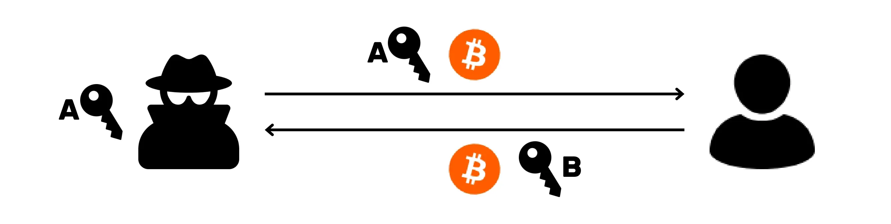


또한, Alice이 Bob의 개인 키 $B$를 받지 않고 Exchange에서 그녀의 개인 키 $A$를 전달하지 않는다는 보장은 없습니다. 따라서 이 Exchange는 당사자 간의 신뢰에 과도하게 의존하며 Ownership의 안전한 전송을 보장하는 데 효과적이지 않습니다.


이러한 문제를 해결하고 서로를 신뢰하지 않는 당사자 간의 교류를 가능하게 하기 위해 Smart contract 시스템을 사용할 것입니다. Smart contract는 미리 정의된 조건이 충족되면 자동으로 실행되는 프로그램입니다. 저희의 경우 상호 신뢰가 필요 없이 자동으로 자산의 Exchange이 발생하도록 보장합니다.


이는 HTLC(*Hash 시간 고정 계약*) 또는 PTLC(*포인트 시간 고정 계약*)를 사용하여 달성할 수 있습니다. 이 두 프로토콜은 비슷한 방식으로 작동하며, 시간 잠금 시스템을 활용하여 Exchange가 성공적으로 완료되거나 완전히 취소되도록 보장함으로써 양 당사자 자금의 무결성을 보호합니다. HTLC와 PTLC의 주요 차이점은 HTLC는 해시와 프리이미지를 사용해 거래를 보호하는 반면, PTLC는 어댑터 서명을 사용한다는 점입니다.


HTLC 또는 Alice과 Bob 사이의 PTLC를 사용하는 코인 스왑 시나리오에서 Exchange은 안전하게 진행되며, 성공하여 상대방의 BTC를 받거나 실패하여 각자 자신의 BTC를 보유합니다. 따라서 어느 한 쪽이 상대방의 BTC를 속이거나 훔치는 것이 불가능합니다.


> *HTLC는 Lightning Network의 양방향 채널*을 통해 결제를 안전하게 라우팅하는 데 사용되는 메커니즘이기도 합니다
어댑터 서명을 사용하면 기존 스크립트('_스크립트리스 스크립트'라고도 하는 메커니즘)를 생략할 수 있기 때문에 이러한 맥락에서 특히 흥미롭습니다. 이 기능은 Exchange과 관련된 비용을 줄여줍니다. 어댑터 서명의 또 다른 주요 장점은 트랜잭션의 양 당사자가 공통 Hash를 사용할 필요가 없으므로 특정 유형의 Exchange에서 당사자 간의 직접적인 링크를 드러낼 필요가 없다는 것입니다.


### 어댑터 서명


어댑터 서명은 유효한 서명과 "_어댑터 서명_"이라는 추가 서명을 통합하여 비밀 데이터를 공개하는 암호화 방식입니다. 이 메커니즘은 유효한 서명, 어댑터 서명, 비밀 등 Elements의 세 가지 요소 중 두 가지를 알면 누락된 세 번째 요소를 추론할 수 있도록 설계되었습니다. 이 방법의 흥미로운 특성은 상대방의 어댑터 서명과 해당 어댑터 서명을 계산하는 데 사용된 비밀과 관련된 타원 곡선의 특정 지점을 알고 있다면 비밀 자체에 직접 액세스하지 않고도 동일한 비밀과 호환되는 자체 어댑터 서명을 도출할 수 있다는 것입니다.


코인스왑에서 어댑터 서명을 사용하면 참여자 간에 민감한 정보 두 가지를 동시에 공개할 수 있으므로 상호 신뢰가 필요하지 않습니다. 이 과정을 설명하기 위해 각각 1 BTC씩을 Exchange에 소유하고 싶지만 서로를 신뢰하지 않는 Alice과 Bob을 예로 들어보겠습니다. 이들은 어댑터 서명을 사용해 이 Exchange에 대한 신뢰가 필요하지 않습니다. 방법은 다음과 같습니다:


- Alice은 Bob로 1 BTC를 전송하는 $m_A$ 트랜잭션을 생성하여 Exchange를 시작합니다. 이 트랜잭션의 유효성을 검사하는 서명 $s_A$를 생성하고, 개인 키 $p_A$($P_A = p_A \cdot G$), Nonce $n_A$($N_A = n_A \cdot G$) 및 비밀 $t$($T = t \cdot G$)를 사용하여 서명 $s_A$를 생성합니다:


$$s_A = n_A + t + H(N_A + T \평행 P_A \평행 m_A) \cdot p_A$$


- Alice은 실제 서명 $s_A$에서 비밀 $t$를 빼서 어댑터 서명 $s_A'$를 계산합니다:


$$s_A' = s_A - t$$


- Alice는 서명 어댑터 $s'_A$, 서명되지 않은 트랜잭션 $m_A$, 비밀에 해당하는 포인트($T$), Nonce에 해당하는 포인트($N_A$)를 Bob로 전송합니다. 이러한 Elements는 "어댑터"로 알려진 것을 구성합니다. 이 정보만으로는 Bob이 Alice의 BTC를 복구할 수 없다는 점에 유의해야 합니다.
- 그러나 Bob는 Alice이 자신을 훔치려 하지 않는지 확인할 수 있습니다. 이를 위해 그는 Alice의 어댑터 서명 $s_A'$가 실제로 제안된 트랜잭션 $m_A$와 일치하는지 확인합니다. 다음 방정식이 맞으면 Alice의 서명 어댑터가 유효하다는 것을 확인할 수 있습니다:


$$s_A' \cdot G = N_A + H(N_A + T \평행 P_A \평행 m_A) \cdot P_A$$


- 이 검증은 Bob가 완전한 자신감을 가지고 Exchange을 계속할 수 있도록 충분한 보증을 제공합니다. 그런 다음 Alice에게 1 BTC를 전송하기 위한 자신의 트랜잭션 $m_B$를 생성하고 어댑터 서명 $s_B'$를 생성하며, 이는 동일한 비밀 $t$에 연결될 것입니다. 이 단계에서는 Alice만이 $t$의 값을 알고 있으며, Bob는 Alice이 자신에게 전송한 해당 지점 $T$만 알고 있습니다:


$$s_B' = n_B + H(N_B + T \평행 P_B \평행 m_B) \cdot p_B$$


- Bob은 자신의 어댑터 서명 $s_B'$, 서명되지 않은 트랜잭션 $m_B$, 그리고 비밀에 해당하는 지점($T$)과 Nonce에 해당하는 지점($N_B$)을 Alice에게 보냅니다. 이제 비밀 $t$를 알고 있는 Alice는 Bob의 어댑터 서명 $s_B'$를 이 비밀과 결합하여 generate에게 Bob의 BTC를 전송할 거래 $m_B$에 대한 유효한 서명 $s_B$를 제공할 수 있습니다:


$$s_B = s_B' + t$$


$$(s_B' + t) \cdot G = N_B + T + H(N_B + T \parallel P_B \parallel m_B) \cdot P_B$$


- Alice는 이 서명된 $m_B$ 트랜잭션을 Bitcoin Blockchain에 브로드캐스트하여 Bob이 약속한 BTC를 가져옵니다. Bob이 Blockchain에서 이 트랜잭션을 확인하면 서명 $s_B = s_B' + t$를 추출할 수 있습니다. 이 정보를 통해 Bob은 그가 필요로 하는 유명한 비밀 $t$를 분리할 수 있습니다:


$$t = (s_B' + t) - s_B' = s_B - s_B'$$


- 그리고 이 비밀 $t$는 Alice의 어댑터 서명 $s_A'$에서 유효한 서명 $s_A$를 Bob에서 generate로 보내는 데 누락된 유일한 요소였습니다. 이 서명은 $m_A$ 트랜잭션의 유효성을 검사하여 Alice에서 Bob로 BTC를 전송합니다. 그런 다음 Bob는 $s_A$를 계산하고 Blockchain에서 $m_A$ 트랜잭션을 브로드캐스트합니다:


$$s_A = s_A' + t$$


$$(s_A' + t) \cdot G = N_A + T + H(N_A + T \parallel P_A \parallel m_A) \cdot P_A$$


어댑터 서명이 코인스왑에서 어떻게 작동하는지 요약해 보겠습니다. 처음에 Alice은 어댑터와 함께 서명되지 않은 트랜잭션을 Bob에게 전송하여 Bob이 나중에 공개된 비밀을 통해 비트코인에 액세스할 수 있는지 확인할 수 있도록 합니다. 그 대가로 Bob은 Alice에게 자신의 서명되지 않은 트랜잭션과 어댑터를 보냅니다. 그러면 Alice은 비밀 덕분에 유효한 트랜잭션을 브로드캐스트하여 Bob의 트랜잭션을 마무리하고 비트코인을 가져올 수 있습니다. 이 트랜잭션이 Blockchain에 게시되면 Bob은 비밀을 추출하여 Alice의 트랜잭션을 잠금 해제할 수 있습니다. 결과적으로 Alice이 Bob의 Bitcoin 전송을 시작하면 Bob은 상호 신뢰 없이도 Alice의 Bitcoin에 액세스할 수 있습니다.


코인스왑은 2013년 10월 [그레고리 맥스웰]이 비트코인토크(https://bitcointalk.org/index.php?topic=321228.0)에서 처음 제안한 개념입니다.


### 원자 스왑


코인스왑과 마찬가지로 동일한 유형의 스마트 컨트랙트를 사용하여 아토믹 스왑을 수행할 수도 있습니다. 아토믹 스왑을 사용하면 신뢰나 중개자의 개입 없이 두 사용자 간에 BTC와 XMR과 같은 서로 다른 암호화폐를 직접 교환할 수 있습니다. 이러한 교환은 스왑이 성공하여 두 당사자 모두 만족하거나, 실패하여 각자의 원래 암호화폐를 유지하여 상대방을 신뢰할 필요가 없는 두 가지 결과만 가능하기 때문에 "아토믹"이라고 불립니다.


아토믹 스왑과 코인스왑은 유사한 프로세스를 공유하며 기밀성 측면에서 동일한 장단점을 제공합니다. 실제로 Bitcoin의 관점에서 볼 때 아토믹 스왑은 두 단계로 진행되는 코인스왑과 비슷합니다. 먼저, BTC를 다른 암호화폐로 Exchange하고, 이 암호화폐를 다른 BTC로 교환할 수 있습니다. 결국 다른 사용자의 BTC를 회수하게 됩니다. 이것이 바로 기밀성 문제를 분석할 때 이 두 프로토콜을 독점적 비밀 교환이라는 카테고리로 분류하는 이유입니다.


그러나 코인스왑과 달리 아토믹 스왑은 특히 BTC/XMR 거래소에서 가용 유동성 측면에서 불균형이 발생할 수 있다는 점에 유의하시기 바랍니다. 일반적으로 비트코인을 알트코인으로 교환하는 것이 더 쉬운데, 이는 비트코인에 대한 수요가 많기 때문에 이 전환 방향에 대한 프리미엄이 낮게 유지되기 때문입니다. 그러나 알트코인을 BTC로 교환하는 것은 수요가 적기 때문에 더 복잡할 수 있으며, 종종 매우 높은 프리미엄이 발생할 수 있습니다.


마지막으로, 아토믹 스왑이 On-Chain 비트코인과 Lightning Network의 비트코인을 포함하는 경우 이를 "서브마린 스왑"이라고 합니다


### 정말 유용한가요?


코인스왑과 아토믹 스왑과 같은 Ownership의 비밀 전송은 체인 분석 휴리스틱을 피할 수 있다는 장점이 있습니다. 이러한 방법은 거래가 동일한 사용자와 관련되어 있지만 실제 Ownership의 주인이 바뀐 것처럼 보일 수 있습니다. 그러나 이러한 방법의 가장 큰 단점은 Coin의 기록을 깨는 추가 기술을 사용하지 않으면 매우 위험하다는 것입니다.


실제로 Alice이 Bob과 코인스왑 또는 아토믹 스왑을 수행하면 자신의 비트코인을 Bob의 비트코인과 교환하게 됩니다. 아토믹 스왑의 경우 Exchange에 Altcoin이 포함되지만 원칙은 동일하게 유지됩니다. 따라서 Alice은 $B$ Coin로, Bob은 $A$ Coin로 끝납니다. 이는 체인 분석에 의문을 제기하지만, 코인의 이력은 추적할 수 있습니다. 분석가가 UTXO $A$를 조사하면 Alice의 이전 활동을 추적할 수 있고, 그 반대의 경우 UTXO $B$를 추적할 수 있습니다.


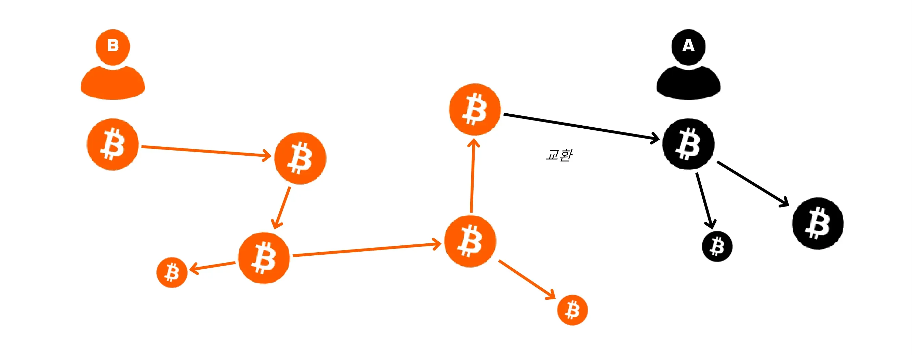


Alice의 관점에서 볼 때, $B$ Coin의 이력이 특정 단체에 의해 의심스러운 것으로 간주될 수 있다는 위험이 있습니다. 예를 들어 Bob가 해킹과 같은 범죄 행위를 통해 $B$ Coin를 획득한 경우, Coin는 그의 불법 활동과 연결된 상태로 남게 됩니다. 그러면 Alice은 Bob의 범죄와 아무런 관련이 없음에도 불구하고 자금이 동결되거나 Bob의 범죄로 고발될 위험 없이 규제 대상인 Exchange 플랫폼으로 전송할 수 없는 Coin를 소유하게 될 수 있습니다.


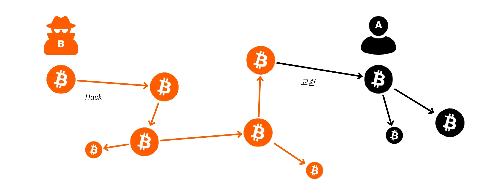


코인스왑이나 아토믹 스왑과 같은 기밀 유지 방법은 당국의 감시를 받는 범죄자들이 선호할 수밖에 없습니다. 이러한 프로토콜을 사용하면 Exchange의 감시를 받는 비트코인을 완벽하게 대체 가능한 비트코인으로 처분할 수 있습니다. 또한 당국의 감시를 다른 사용자로 유도하여 우회로를 만들 수 있습니다. 따라서 이들에게는 두 가지 목적이 있습니다.


CoinJoin을 사용하면 Coin가 모니터링되는 비트코인과 섞여 있더라도 Coin의 이력이 깨져 코인스왑이나 아토믹 스왑 같은 비밀 Ownership 전송 프로토콜에는 존재하지 않는 그럴듯한 부인 가능성을 제공할 수 있습니다.


Alice가 위험을 피하려면 코인 조인을 통해 $B$ Coin의 기록을 깨는 방법을 사용해야 합니다. 이는 Ownership과 CoinJoin의 비밀 전송을 결합하는 것의 유용성에 대한 의문을 제기합니다. CoinJoin은 Coin의 기록을 깨뜨림으로써 이미 Alice에 충분한 수준의 기밀성을 제공합니다. 따라서 Alice가 자신의 프라이버시를 보호하고자 한다면 코인 스왑에 참여한 후 CoinJoin로 이동하는 것보다 CoinJoin로 바로 이동하는 것이 더 현명할 것이라고 생각합니다.


비밀 Ownership 전송 방법이 진정으로 효과적이고 $A$ 사용자의 이력이 $B$ 사용자와 연결되는 위험을 피하려면, 역설적으로 그 사용법이 널리 알려질 필요가 있습니다. 코인스왑이 광범위하게 사용되고 당국이 이러한 일반적인 관행을 인지하고 있다면 그럴듯한 형태의 거부가 확립될 수 있을 것입니다. 그러나 이러한 이체 방식이 미미한 수준으로 유지되는 한, 이러한 방식은 사용자에게 너무 위험할 것이라고 생각합니다.


지금까지는 주로 트랜잭션 수준에서 기밀성을 유지하는 방법을 연구했습니다. 다음 장에서는 네트워크 수준과 트랜잭션 전파에 대한 문제를 살펴보겠습니다.


## P2P 네트워크의 개인정보 보호


<chapterId>04a2467b-db84-4076-a9ff-919be5135106</chapterId>


4부에서는 거래의 기밀성을 보호하기 위해 Full node을 사용하는 것의 중요성에 대해 설명했습니다. 그러나 노드가 사용자의 활동에 대한 정보를 추출하기 위한 공격에 취약할 수도 있다는 점을 인식하는 것이 중요합니다. 따라서 이 장에서는 트랜잭션 자체나 Bitcoin 플로우가 아닌 네트워크 수준에서 개인정보를 보호하기 위해 취할 수 있는 다양한 조치에 대해 살펴보겠습니다.


### 단델리온


다양한 익명화 해제 공격을 피하는 한 가지 방법은 단델리온 제안을 사용하는 것입니다. 이 브로드캐스트 프로토콜은 BIP156에서 공식화되었지만 Bitcoin에서는 구현된 적이 없습니다.


단델리온의 아이디어는 Bitcoin 네트워크에서 트랜잭션 라우팅의 기밀성을 강화하여 다양한 형태의 공격에 대응하는 것입니다. 주요 목표는 네트워크에서 트랜잭션을 처음 브로드캐스트하는 소스 노드를 숨기는 것입니다. 이 노드를 공개하면 Bitcoin 트랜잭션을 특정 IP Address(노드가 클리어넷에서 작동하는 경우)에 연결하여 체인 분석을 위한 진입점을 제공할 수 있습니다.


Bitcoin에서의 활동과 IP Address의 연결은 사용자 기밀성에 상당한 위험을 초래할 수 있습니다. 실제로 많은 기관이 IP Address을 개인 신원과 쉽게 연결할 수 있는 위치에 있습니다. 여기에는 정부 및 인터넷 서비스 제공업체가 포함됩니다. 또한, 예를 들어 웹사이트의 데이터베이스가 손상되어 IP Address과 개인 데이터가 유출되는 경우 이 정보는 공개적으로 액세스할 수 있게 될 수 있습니다.


기존 Bitcoin 작업에서는 사용자가 Wallet 소프트웨어에서 생성한 트랜잭션이 개인 노드로 전송됩니다. 이 노드는 즉시 연결된 모든 피어에게 새 트랜잭션을 브로드캐스트합니다.


그런 다음 이러한 피어는 트랜잭션이 합의 및 로컬 표준화 규칙을 준수하는지 확인합니다. 유효성이 확인되면 각 피어는 차례로 트랜잭션을 다른 피어에게 전달하는 등의 방식으로 트랜잭션을 전달합니다.


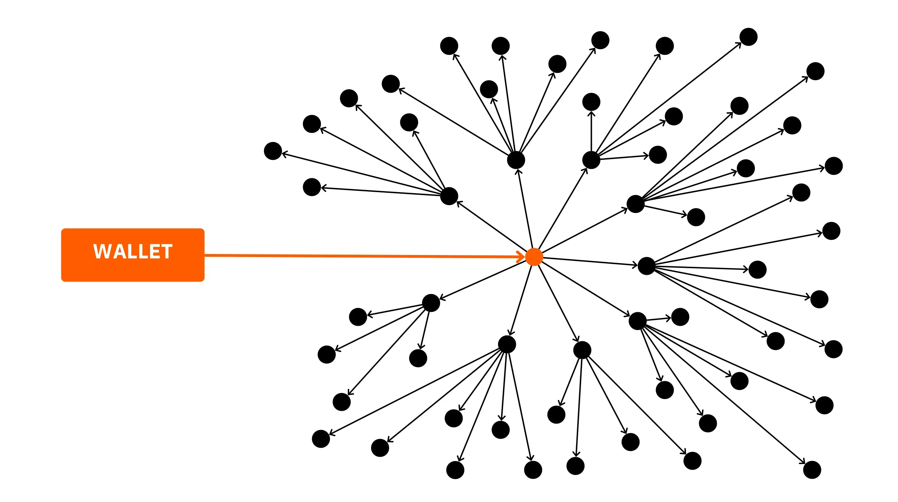


블록에 통합되기를 기다리는 트랜잭션의 분포는 상당히 균형 잡혀 있으며 통계적으로 예측할 수 있습니다. 이러한 약점은 네트워크를 모니터링하고 분석하기 위해 협력하는 스파이 노드의 공범이 트랜잭션을 브로드캐스트한 첫 번째 노드를 식별하기 위해 악용할 수 있습니다. 관찰자가 소스 노드를 성공적으로 찾으면 해당 노드의 운영자로부터 트랜잭션이 시작된 것으로 추정할 수 있습니다. 이러한 유형의 관찰은 일반적으로 익명의 트랜잭션을 특정 IP 주소에 연결하는 데 사용할 수 있습니다.


BIP156의 목표는 이 문제를 Address하는 것입니다. 이를 위해 새로운 트랜잭션이 널리 공개되기 전에 익명성을 유지하기 위해 새로운 트랜잭션 전파에 추가 단계를 도입합니다. 단델리온은 먼저 트랜잭션이 무작위 노드 경로를 통해 전송되는 "스템" 단계를 사용합니다.


그런 다음 트랜잭션은 '플러프' 단계에서 전체 네트워크에 브로드캐스트됩니다.


줄기와 '보풀'은 민들레의 모양과 진화 과정을 닮은 네트워크를 통해 트랜잭션이 전파되는 동작을 가리킵니다.


따라서 스파이 노드는 잠재적으로 "플러프" 단계(대량 브로드캐스트)를 시작한 노드로 트랜잭션을 추적할 수 있지만, 해당 노드는 스템의 마지막 노드로부터 트랜잭션을 수신했기 때문에 트랜잭션을 처음 브로드캐스트한 노드는 아닙니다. 스파이 노드가 스템을 추적할 수 없다면 소스 노드도 식별할 수 없습니다.


줄기 단계에서 스파이 노드가 존재하더라도 확산 그래프에서 정직한 노드를 만나면 이 노드가 원본 소스인지 아니면 단순한 중개자인지 판단할 수 없기 때문에 항상 의심이 남습니다.


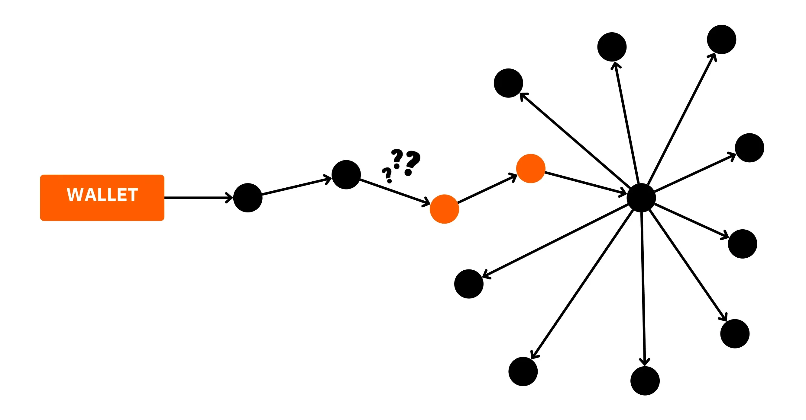


이 라우팅 방법은 소스 노드로 거슬러 올라가는 흔적을 흐리게 하여 네트워크를 통해 트랜잭션의 출처를 추적하기 어렵게 만듭니다. 따라서 단델리온은 공격자가 네트워크를 익명화할 수 있는 능력을 제한하여 기밀성을 강화합니다. 이 방법은 특히 '스템밍' 단계에서 트랜잭션이 Tor 또는 P2P Transport V2와 같이 네트워크 통신을 암호화하는 노드를 통과할 때 효과적입니다.


BIP156은 Bitcoin core에 통합되지 않았으며 현재 "거부됨"으로 분류되어 있습니다. 이 프로토콜의 주요 우려 사항 중 하나는 스템 단계에서 트랜잭션이 검증되기 전에 중간 노드를 통해 릴레이되어야 한다는 것입니다. 앞서 살펴본 바와 같이, 일반적인 Bitcoin 모델에서는 각 노드가 먼저 트랜잭션을 확인한 후 이를 동료에게 브로드캐스트합니다. 트랜잭션이 노드의 합의 규칙이나 로컬 표준화 규칙을 준수하지 않는 경우, 노드는 이를 무시하고 배포하지 않습니다. 이 프로세스는 유효한 트랜잭션만 전체 네트워크에 브로드캐스트되기 때문에 DoS 공격에 대응하는 데 매우 중요합니다. 네트워크에 과부하를 주기 위해 대량으로 생성될 수 있는 유효하지 않은 트랜잭션은 처음 발견되는 노드에서 중지되며 전파되지 않습니다. 단델리온의 주요 위험은 이 새로운 프로토콜이 네트워크의 일부에 유효하지 않은 트랜잭션이 브로드캐스트되도록 허용함으로써 DoS 공격의 새로운 벡터를 도입할 수 있다는 것입니다.


### P2P 운송 V2


P2P 전송 V2는 BIP324에 제시된 또 다른 네트워크 프로토콜입니다. 이는 노드 간 통신의 기밀성과 보안을 향상시키기 위해 기회주의 암호화를 통합한 Bitcoin P2P 전송 프로토콜의 새로운 버전입니다.


이 개선 사항은 P2P 프로토콜의 기본 버전의 몇 가지 문제를 해결하기 위해 고안되었습니다. 한편으로는 수동적인 관찰자가 교환되는 데이터를 인터넷에서 유통되는 다른 유형의 데이터와 구별할 수 없게 만듭니다. 주요 목적은 정부, ISP, VPN 제공업체가 Bitcoin 사용자에 대한 광범위한 모니터링을 수행하는 것을 방지하는 것입니다. 또한 이러한 기관이 인터넷 사용자가 Bitcoin 사용자인지 여부, 즉 Full node를 실행하고 있는지 여부를 판단하기가 더 어려워집니다.


또한 P2P V2는 데이터 패킷의 특정 패턴을 탐지하여 검열 및 공격의 위험을 줄이는 데 도움이 됩니다. 네트워크 수준에서 다양한 유형의 시빌 공격을 실행하는 과정을 복잡하게 만들고 비용을 증가시킵니다. Sybil Attack는 공격자가 부당한 이득을 취하기 위해 여러 개의 허위 신원을 생성할 때 발생합니다. Bitcoin 네트워크의 맥락에서 이는 종종 공격자가 다수의 풀 노드를 제어하고 이를 적극적으로 활용하여 여러 연결을 설정하는 것으로 나타납니다. 시빌 공격은 정보를 수집하고 사용자 기밀을 침해하는 수동적 공격이거나 이클립스 공격과 같은 능동적 공격일 수 있습니다. 후자는 특정 노드를 네트워크의 나머지 노드로부터 격리하여 사용자를 검열하거나 수신하는 데이터를 변경합니다. 마지막으로, P2P V2는 *Man-In-The-Middle*(MITM) 공격을 더 많은 비용으로 더 쉽게 탐지할 수 있게 해줍니다.


P2P V2가 구현하는 암호화에는 불필요한 복잡성을 추가하거나 네트워크의 무허가 기능을 손상시키지 않기 위해 인증이 포함되어 있지 않습니다. 그럼에도 불구하고 이 새로운 P2P 전송 프로토콜은 수동 공격에 대한 보안을 강화하고 능동 공격의 비용과 탐지 가능성을 훨씬 더 높입니다. 네트워크 메시지에 의사 무작위 데이터 스트림을 도입하면 공격자가 통신을 검열하거나 조작하기가 더 어려워집니다.


P2P V2 전송은 2023년 12월에 배포된 Bitcoin core 버전 26.0에서 옵션 기능(기본적으로 비활성화됨)으로 포함되었습니다. 그 후 2024년 4월 버전 27.0에서 기본으로 활성화되었습니다. 구성 파일에서 `v2transport=` 옵션을 사용하여 수정할 수 있습니다.


### Tor


네트워크 노드의 기밀성 손실 위험을 완화하는 또 다른 간단한 해결책은 전적으로 토르에서 실행하는 것입니다.


토르는 인터넷에서 TCP 연결의 출처를 익명화하는 릴레이 서버(노드) 네트워크입니다. 토르는 여러 암호화 계층으로 데이터를 캡슐화하는 방식으로 작동합니다. 각 릴레이 노드는 최종 목적지에 도달할 때까지 다음 노드의 Layer를 제거하여 Address을 공개합니다. 토르 네트워크는 중개 노드가 데이터의 출발지와 목적지를 모두 알 수 없도록 하여 익명성을 보장하므로, 관찰자가 사용자의 활동을 추적하기가 매우 어렵습니다.


토르는 데이터를 암호화할 뿐만 아니라 통신의 발신지와 목적지도 마스킹합니다. 개인 노드의 통신에 Tor를 사용하면 거래의 기밀성을 강화할 수 있습니다: ISP는 통신을 해독할 수 없으며, Bitcoin 네트워크의 다른 노드는 소스 노드의 IP Address을 식별할 수 없습니다. 뿐만 아니라, 토르는 사용자가 Bitcoin를 사용하는 사실 자체를 ISP로부터 숨깁니다.


이 방법의 가장 큰 위험은 토어가 Bitcoin와 독립적인 프로토콜이라는 점입니다. 토르에서 Bitcoin 노드를 실행 중인데 토르가 작동을 멈춘다면, Bitcoin 노드는 더 이상 통신할 수 없게 됩니다.


또한, 토르의 통신 속도가 느리다는 점도 주목할 필요가 있습니다. 이러한 지연은 노드를 처음 시작할 때 특히 짜증나는데, IBD(*초기 블록 다운로드*)에는 많은 통신이 필요하기 때문입니다. 그 결과, 토어를 사용하면 Bitcoin 네트워크와의 초기 동기화 시간이 훨씬 더 오래 걸릴 수 있습니다. 클리어넷에서 IBD를 수행한 다음 두 번째 단계로 토어를 활성화하는 것도 가능합니다. 이 방법은 ISP에 Bitcoin 노드의 존재를 공개하지만, 토르로 전환한 후에는 개인 거래 정보를 보호합니다.


네트워크 수준에서 기밀성을 유지하는 다양한 방법을 살펴본 후 다음 몇 장에서는 Address 재사용을 방지하는 두 가지 우아한 솔루션도 소개하겠습니다: BIP47과 사일런트 페이먼트입니다.


## BIP47 및 재사용 가능한 결제 코드


<chapterId>ad88e076-a04b-4aec-b3b2-7b4760175504</chapterId>


3부에서 살펴본 바와 같이 Address 재사용은 Bitcoin 프로토콜에서 사용자 기밀성에 중대한 장애물입니다. 이러한 위험을 완화하기 위해 Wallet에서 새로운 결제가 수신될 때마다 Address를 수신하는 공백을 generate에 생성하는 것이 좋습니다. 최신 소프트웨어와 계층적 결정론적 지갑을 사용하면 새로운 Address를 생성하는 것이 간소화되었지만, 이 방법은 직관적이지 않은 것처럼 보일 수 있습니다.


예를 들어 기존 은행 시스템에서 우리는 항상 동일하게 유지되는 IBAN을 공유하는 데 익숙합니다. 한 번 다른 사람에게 제공하면 다시 상호작용할 필요 없이 여러 번 송금할 수 있습니다. 또한 네오뱅크는 PayPal의 고유 이메일 주소나 Revolut의 RevTag를 사용하는 등 보다 현대적인 가능성을 제공합니다. 금융 분야가 아니더라도 우편번호 Address, 전화번호, 이메일 Address와 같은 일상적인 식별자 역시 고유하고 영구적입니다. 새로운 상호작용을 할 때마다 갱신할 필요가 없습니다.


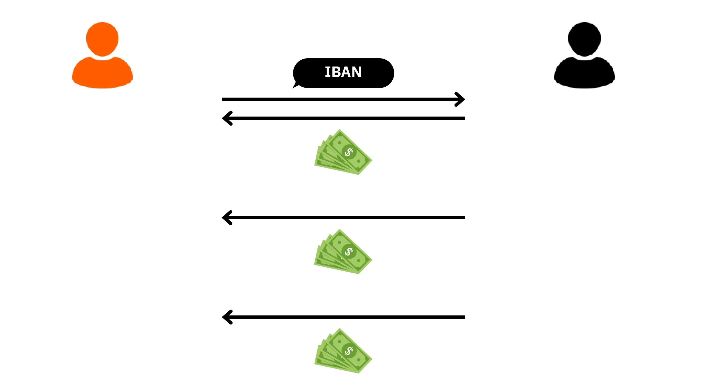


그러나 Bitcoin는 다르게 작동합니다. 수신되는 트랜잭션마다 새로운 수신 Address을 생성해야 합니다. 사용 편의성과 기밀성 사이의 이러한 타협은 Bitcoin 백서의 기원으로 거슬러 올라갑니다. 2008년 말 첫 번째 버전의 문서를 발표할 때 이미 Satoshi 나카모토는 이러한 위험에 대해 경고하고 있었습니다:


**추가 방화벽으로 각 트랜잭션에 대해 새로운 키 쌍을 사용하여 공통 소유자와 연결되지 않도록 유지할 수 있습니다.**


Address을 재사용할 필요 없이 단일 식별자를 사용하여 여러 결제를 받는 방법에는 여러 가지가 있습니다. 각 방법마다 장단점이 있습니다. 이러한 방법 중에는 저스터스 랜비어가 개발하여 2015년에 발표한 제안인 BIP47이 있습니다. 이 제안은 Address 재사용을 피하면서 동일한 사람에 대해 여러 거래를 수행할 수 있는 재사용 가능한 결제 코드를 만드는 것을 목표로 합니다. 요컨대, BIP47은 거래의 기밀성을 유지하면서 고유 식별자처럼 직관적인 결제 시스템을 제공하는 것을 목표로 합니다.


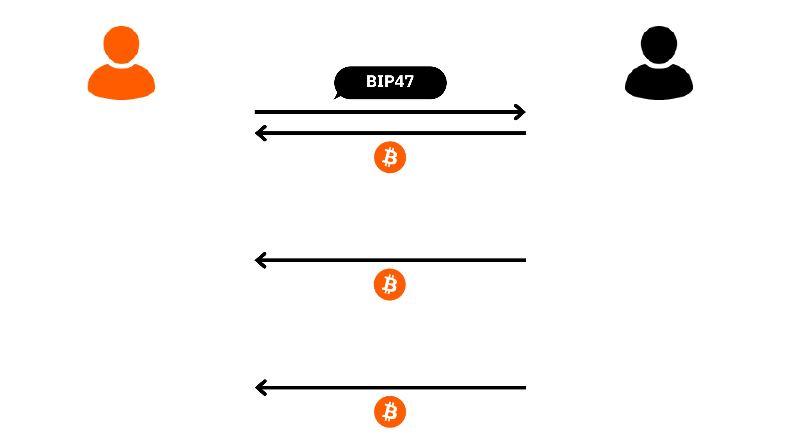


BIP47 결제는 빈 주소를 사용하는 기존 Bitcoin 거래와 동일한 수준의 기밀성을 제공하므로 BIP47이 사용자 기밀성을 직접적으로 향상시키지는 않습니다. 하지만 일반적으로 기밀성을 손상시킬 수 있는 Bitcoin을 더 편리하고 직관적으로 사용할 수 있게 해줍니다. BIP47 덕분에 이러한 사용 편의성은 기존 트랜잭션과 동일한 수준의 기밀성을 달성합니다. 그렇기 때문에 BIP47은 개인 정보 보호에 매우 유용한 도구입니다.


처음에 BIP47은 Bitcoin core에 통합하기 위해 제안되었지만 실제로 구현되지는 않았습니다. 그러나 일부 소프트웨어 애플리케이션은 자체적으로 구현하기로 결정했습니다. 예를 들어 Samourai Wallet 팀은 "PayNym"이라는 자체 BIP47 구현을 개발했습니다.


### BIP47 및 PayNym의 일반 원칙


BIP47의 목적은 주소를 재사용하지 않고도 대량의 결제를 받을 수 있도록 하는 것입니다. 이는 재사용 가능한 결제 코드의 사용을 기반으로 하며, 이를 통해 여러 발급자가 다른 사용자의 단일 코드로 여러 개의 결제를 보낼 수 있습니다. 따라서 수취인은 각 거래마다 새로운 빈 Address을 제공할 필요가 없으므로 기밀을 유지하면서 교환을 크게 용이하게 할 수 있습니다.


따라서 사용자는 기존 수신자 Address 또는 공개 키와 달리 기밀성 손실의 위험 없이 소셜 네트워크나 웹사이트에서 결제 코드를 완전히 자유롭게 공유할 수 있습니다.


거래를 수행하려면 양 당사자 모두 사무라이 Wallet 또는 Sparrow wallet의 PayNym과 같이 BIP47이 구현된 Bitcoin Wallet가 필요합니다. 결제 코드를 공동으로 사용하면 양 당사자 간에 비밀 채널이 생성됩니다. 이 채널을 효과적으로 설정하려면 발급자는 "알림 트랜잭션"이라고 하는 특정 트랜잭션을 Bitcoin Blockchain에서 수행해야 합니다(자세한 내용은 나중에 설명).


두 사용자의 결제 코드를 결합하면 공유 비밀이 생성되고, 이를 통해 많은 수의 고유한 Bitcoin 수신 주소(정확히 2^32 또는 약 40억 개)가 생성됩니다. 이러한 방식으로 BIP47을 통해 이루어진 결제는 실제로 결제 코드 자체가 아니라 관련 사용자의 결제 코드에서 파생된 기존 영수증 주소로 전달됩니다.


따라서 결제 코드는 Wallet seed에서 파생된 가상 식별자 역할을 합니다. Wallet의 계층적 파생 구조에서 결제 코드는 레벨 3, 즉 계정 레벨에 위치합니다.


BIP47의 파생 대상은 인덱스 `47'`(`0x8000002F`)로 식별되며, 이는 BIP47을 참조합니다. 재사용 가능한 결제 코드의 파생 경로의 예는 다음과 같습니다:


```plaintext
m/47'/0'/0'/
```


결제 코드가 어떻게 생겼는지 알려드리기 위해 제 결제 코드를 예로 들어보겠습니다:


```plaintext
PM8TJSBiQmNQDwTogMAbyqJe2PE2kQXjtgh88MRTxsrnHC8zpEtJ8j7Aj628oUFk8X6P5rJ7P5qDudE4Hwq9JXSRzGcZJbdJAjM9oVQ1UKU5j2nr7VR5
```


이 코드는 QR 코드로도 인코딩할 수 있으므로 기존 Address와 마찬가지로 더 쉽게 통신할 수 있습니다.


트위터에서 가끔 볼 수 있는 로봇인 PayNym 봇의 경우, 사무라이 Wallet에서 만든 결제 코드를 시각적으로 표현한 것입니다. Hash 함수를 사용하여 생성되어 거의 고유성을 갖습니다. 로봇은 `+`로 시작하는 작은 문자열의 형태를 취합니다:


```plaintext
+throbbingpond8B1
+twilightresonance487
+billowingfire340
```


이러한 아바타는 이미지로도 표현할 수 있습니다:


이러한 로봇은 BIP47 프레임워크 내에서 특별한 기술적 기능은 없지만, 쉽게 알아볼 수 있는 시각적 정체성을 제공하여 사용자 상호 작용을 촉진하는 역할을 합니다.


---
*이 장의 다음 섹션에서는 BIP47의 작동 방식을 자세히 살펴보고, 특히 사용된 암호화 방법을 중점적으로 살펴보겠습니다. 다소 기술적인 설명을 완전히 이해하려면 먼저 HD 지갑의 구조, 키 생성 절차, 타원 곡선 암호화의 기본을 이해해야 합니다. 이러한 개념에 대해 더 자세히 알아보고 싶으시다면 Plan ₿ Network*에서 또 다른 무료 강좌를 수강하실 수 있습니다


https://planb.network/courses/46b0ced2-9028-4a61-8fbc-3b005ee8d70f

*BIP47의 기술적 작동을 이해하면 다음 챕터*에서 설명할 다른 유사한 제안을 훨씬 쉽게 이해할 수 있으므로 이를 따르는 것이 좋습니다


---
### 재사용 가능한 결제 코드


앞서 언급했듯이 재사용 가능한 결제 코드는 HD Wallet의 깊이 3에 위치하며, Wallet 구조 내 위치와 역할 측면에서 'xpub'과 비슷합니다.


80바이트의 결제 코드는 다음과 같이 세분화됩니다:


- 바이트 `0`: **버전**. BIP47의 첫 번째 버전의 경우 이 바이트는 `0x01`로 설정됩니다.
- 바이트 `1`: **비트 필드**. 이 공간은 특정 용도에 대한 추가 표시를 통합하기 위해 예약되어 있습니다. 기존 PayNym 사용의 경우 이 바이트는 `0x00`으로 설정됩니다.
- 2` 바이트: **Y의 패리티**. 이 바이트는 `0x02` 또는 `0x03`으로, 압축된 공개키가 사용되므로 공개키의 서수가 짝수인지 홀수인지를 나타냅니다.
- 바이트 `3`에서 바이트 `34`까지: **X**의 값입니다. 이 바이트는 공개 키의 횡좌표를 나타냅니다. **X**의 연결과 `y`의 패리티가 완전한 압축 공개키를 형성합니다.
- 바이트 `35`에서 바이트 `66`까지: **문자열 코드**. 이 공간에는 공개 키와 연결된 문자열 코드가 포함됩니다.
- 바이트 `67`에서 바이트 `79`로: **패딩**. 이 공간은 향후 발전 가능성을 위한 것입니다. 현재 버전에서는 `OP_RETURN` 출력에 필요한 80바이트 크기에 도달하기 위해 여기에 0을 배치하기만 하면 됩니다.


이전 섹션에서 이미 설명한 재사용 가능한 결제 코드의 16진수 표현은 다음과 같습니다:


```plaintext
0x010002a0716529bae6b36c5c9aa518a52f9c828b46ad8d907747f0d09dcd4d9a39e97c3c5f37c470c390d842f364086362f6122f412e2b0c7e7fc6e32287e364a7a36a00000000000000000000000000
```


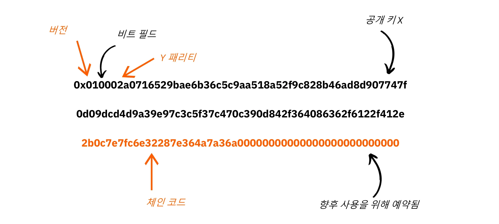


다음으로, 결제 코드임을 명확하게 표시하기 위해 앞에 `P` 접두사 바이트가 추가되어야 합니다. 이 바이트는 `0x47`로 표시됩니다:


```plaintext
0x47010002a0716529bae6b36c5c9aa518a52f9c828b46ad8d907747f0d09dcd4d9a39e97c3c5f37c470c390d842f364086362f6122f412e2b0c7e7fc6e32287e364a7a36a00000000000000000000000000
```


마지막으로 결제 코드의 무결성을 보장하기 위해 `HASH256`을 사용하여 체크섬 계산을 수행하며, 이 계산은 `SHA256` 함수를 사용하여 이중 Hash로 구성됩니다. 그런 다음 이 Hash의 처음 4바이트가 결제 코드 끝에 연결됩니다:


```plaintext
0x47010002a0716529bae6b36c5c9aa518a52f9c828b46ad8d907747f0d09dcd4d9a39e97c3c5f37c470c390d842f364086362f6122f412e2b0c7e7fc6e32287e364a7a36a00000000000000000000000000567080c4
```


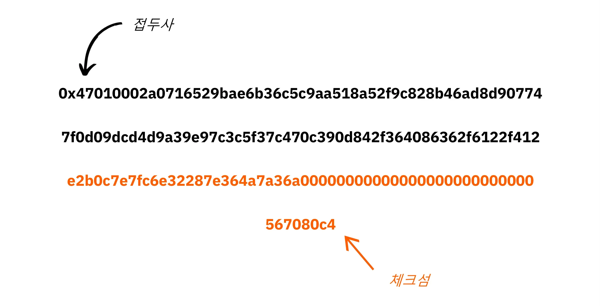


이 단계를 완료하면 결제 코드가 준비됩니다. 이제 최종 버전을 얻기 위해 베이스 58로 변환하는 작업만 남았습니다:


```plaintext
PM8TJSBiQmNQDwTogMAbyqJe2PE2kQXjtgh88MRTxsrnHC8zpEtJ8j7Aj628oUFk8X6P5rJ7P5qDudE4Hwq9JXSRzGcZJbdJAjM9oVQ1UKU5j2nr7VR5
```


결제 코드를 생성하는 과정에서는 압축된 공개 키와 문자열 코드를 사용합니다. 두 가지 모두 Wallet seed에서 결정론적 및 계층적으로 파생됩니다. 이를 위해 사용되는 파생 경로는 다음과 같습니다:


```plaintext
m/47'/0'/0'/
```


구체적으로, 재사용 가능한 결제 코드와 관련된 압축된 공개 키와 문자열 코드를 generate로 만들기 위해 Wallet seed에서 마스터 개인 키를 계산하는 것으로 시작합니다. 그런 다음 `47 + 2^31` 인덱스(강화 유도)를 사용하여 한 쌍의 도터 키를 유도합니다. 그 다음에는 각각 인덱스 `2^31`(강화된 유도)을 사용하여 도터 쌍을 두 번 더 연속적으로 유도합니다.


### 타원 곡선의 디피-헬만 키 Exchange(ECDH)


BIP47의 핵심이 되는 암호화 프로토콜은 *Eliptic-Curve Diffie-Hellman*의 약어인 ECDH로 알려져 있습니다. 이 방식은 원래의 Diffie-Hellman 키 Exchange의 변형입니다.


1976년에 도입된 Diffie-Hellman 키 합의 프로토콜은 각각 키 쌍(공개 및 비공개)을 갖춘 두 당사자가 보안되지 않은 공개 채널을 통해서만 통신할 때에도 공통의 비밀에 합의할 수 있도록 합니다.


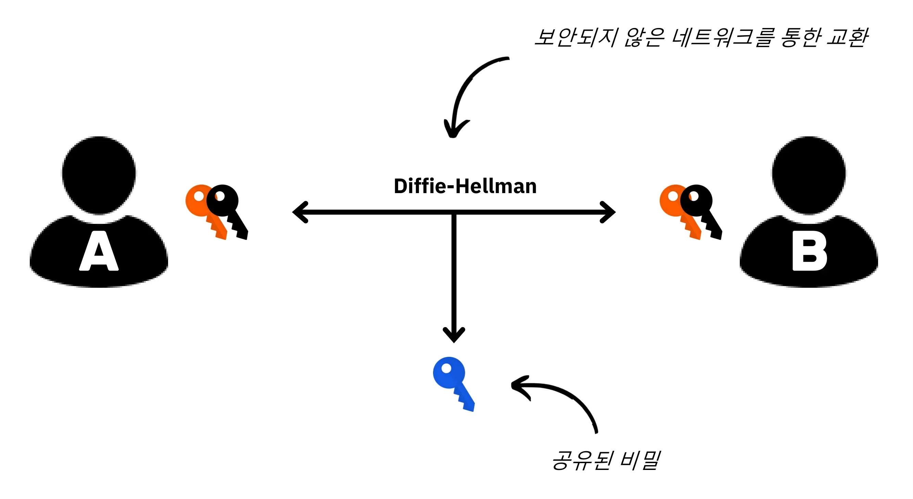


이 공유 비밀번호(이 경우 파란색 키)는 다른 작업에 사용할 수 있습니다. 일반적으로 이 공유 비밀은 보안되지 않은 네트워크에서 통신을 암호화하고 해독하는 데 사용할 수 있습니다:


이를 위해 Diffie-Hellman은 모듈식 산술을 사용하여 공유 비밀을 계산합니다. 쉽게 설명하면 다음과 같습니다:


- Alice과 Bob는 공통 색상(이 경우 노란색)에 동의하는데, 이는 공개 데이터입니다(공격자는 이 색상을 알고 있습니다).
- Alice는 비밀 색상(이 경우 빨간색)을 선택하고 두 색상을 혼합하여 주황색을 얻습니다.
- Bob은 또한 비밀 색상(이 경우 파란색)을 선택하고 노란색과 혼합하여 Green을 얻습니다.
- 그런 다음 결과 색상인 주황색과 Green를 Exchange로 변환합니다. 이 Exchange은 안전하지 않은 네트워크에서 발생할 수 있으며 공격자가 관찰할 수 있습니다.
- Bob의 Green과 자신의 비밀 색상을 혼합하여 Alice은 갈색을 생성합니다.
- Alice의 주황색과 시크릿 블루로 동일한 작업을 수행한 Bob도 갈색을 얻습니다.


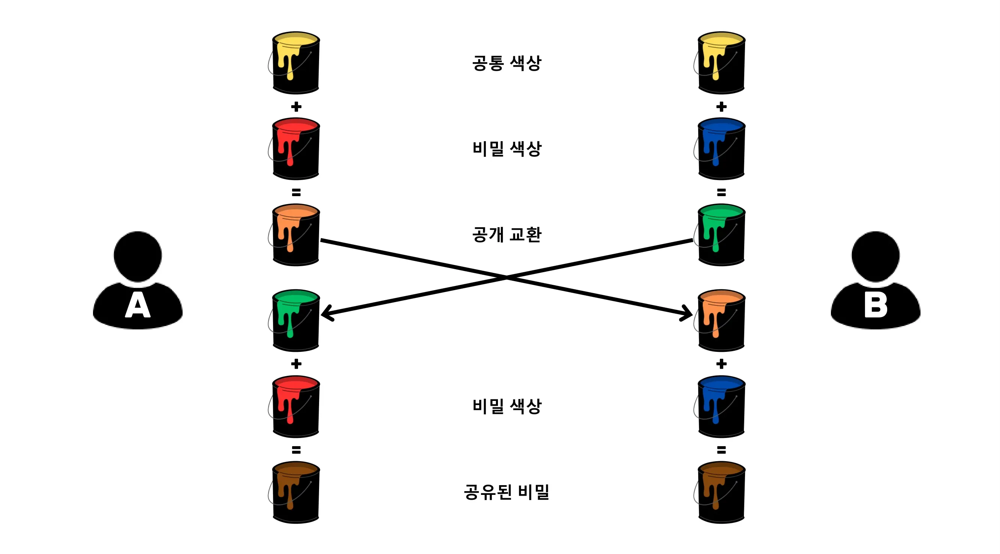


이 비유에서 갈색은 Alice와 Bob이 공유하는 비밀을 나타냅니다. 실제로 공격자가 Alice 또는 Bob의 비밀 색상을 찾기 위해 주황색과 Green을 분리하는 것은 불가능하다고 상상해 보십시오.


이제 이 프로토콜이 색상 비유가 아닌 실수와 모듈식 산술을 사용하여 실제로 어떻게 작동하는지 살펴봅시다!


디피-헬만 메커니즘에 대해 알아보기 전에 필요한 두 가지 필수 수학적 개념을 간략히 알려드리겠습니다:


- **소수**는 두 개의 제수만 있는 자연수입니다: $1$과 그 자체입니다. 예를 들어 $7$은 $1$과 $7$로만 나눌 수 있기 때문에 소수입니다. 반면에 $8$은 $1$, $2$, $4$, $8$로 나눌 수 있기 때문에 소수가 아닙니다. 따라서 두 개가 아닌 네 개의 양의 정수 제수를 가집니다.
- **모듈로**($mod$ 또는 $\%$로 표시)는 두 정수 사이에서 첫 번째 정수를 두 번째 정수로 나눈 나머지를 반환하는 수학적 연산입니다. 예를 들어, $16\bmod 5 = 1$입니다.


**Alice와 Bob 사이의 Diffie-Hellman 키 Exchange은 다음과 같이 작동합니다**


- Alice과 Bob는 $p$와 $g$라는 두 가지 공통 수에 동의합니다. $p$는 소수로, $p$의 값이 클수록 디피-헬만 알고리즘의 보안이 강화됩니다. g$는 $p$의 원근입니다. 이 두 숫자는 보안되지 않은 네트워크에서 공개적으로 통신할 수 있습니다. 이는 앞의 비유에서 **노란색**에 해당합니다. 따라서 Alice과 Bob는 $p$와 $g$에 대해 정확히 동일한 값을 사용하는 것이 중요합니다.
- 이러한 매개변수가 정의되면 Alice과 Bob는 각각 비밀 난수를 선택합니다. Alice은 자신의 비밀 난수 $a$(**빨간색**에 해당)를, Bob는 자신의 $b$(**파랑색**에 해당)를 지정합니다. 이 숫자는 비밀로 유지되어야 합니다.
- 숫자 $a$와 $b$를 직접 교환하는 대신, 각 당사자는 다음과 같이 $a$와 $b$를 계산합니다:


$A$는 $g$를 $a$ 모듈러 $p$의 거듭제곱으로 나눈 값과 같습니다:


$$
A = g^a \bmod p
$$


$B$는 $g$를 $b$ 모듈로 제곱한 $p$와 같습니다:


$$
B = g^b \bmod p
$$


- 두 당사자 간에 $A$(**주황색에 해당**)와 $B$(**Green에 해당**)라는 값이 교환됩니다. 이 Exchange는 보안되지 않은 네트워크에서 일반 텍스트로 이루어질 수 있습니다.
- B$를 수신한 Alice은 다음과 같이 $z$의 값을 계산합니다:


z$는 $B$를 $a$ 모듈러 $p$의 거듭제곱으로 나눈 값과 같습니다:


$$
z = B^a \bmod p
$$


알림입니다:


$$
B = g^b \bmod p
$$


결과는 다음과 같습니다:


$$
z = B^a \bmod p
$$


$$
z = (g^b)^a \bmod p
$$


전원 규칙을 적용합니다:


$$
(x^n)^m = x^{nm}
$$


결과는 다음과 같습니다:


$$
z = g^{ba} \bmod p
$$


- 그의 입장에서 $A$를 받은 Bob은 $z$의 값도 다음과 같이 계산합니다:


z$는 $A$를 $b$ 모듈로 $p$의 거듭제곱으로 나눈 값입니다:


$$
z = A^b \bmod p
$$


결과는 다음과 같습니다:


$$
z = (g^a)^b \bmod p
$$


$$
z = g^{ab} \bmod p
$$


$$
z = g^{ba} \bmod p
$$


모듈로 연산자의 분포성 덕분에 Alice와 Bob은 정확히 동일한 값 $z$를 얻습니다. 이 숫자는 앞서 페인트 통에 비유한 '갈색'에 해당하는 공통 비밀을 나타냅니다. 이제 이 공통 비밀을 사용하여 보안되지 않은 네트워크에서 통신을 대칭적으로 암호화할 수 있습니다.


공격자는 $p$, $g$, $A$, $B$(공개 값)를 가지고 있더라도 $a$, $b$, $z$(비공개 값)를 계산할 수 없습니다. 이를 위해서는 지수를 역산해야 하는데, 이는 유한 순환 군에서 이산 로그, 즉 지수의 역수를 계산하는 것과 같기 때문에 모든 가능성을 하나씩 시도하지 않고는 불가능한 연산입니다.


따라서 $a$, $b$, $p$의 값이 충분히 크다면 Diffie-Hellman 프로토콜은 안전합니다. 일반적으로 매개변수가 2048비트(600자리 십진수)인 경우, $a$와 $b$에 대한 모든 가능성을 테스트하는 것은 비현실적입니다. 현재까지 이러한 숫자를 사용하면 이 알고리즘은 안전한 것으로 간주됩니다.


여기에 디피-헬만 프로토콜의 주요 단점이 있습니다. 보안을 위해 알고리즘은 큰 숫자를 사용해야 합니다. 그렇기 때문에 요즘에는 대수 곡선, 특히 타원 곡선을 기반으로 하는 Diffie-Hellman의 변형인 ECDH(*Elliptic Curve Diffie-Hellman*) 알고리즘을 사용하는 것을 선호합니다. 이 접근 방식을 사용하면 동등한 보안을 유지하면서 훨씬 적은 숫자로 작업할 수 있으므로 계산 및 저장에 필요한 리소스를 줄일 수 있습니다.


알고리즘의 일반적인 원리는 동일하게 유지됩니다. 그러나 모듈식 지수에 의해 $a$에서 계산된 난수 $a$와 숫자 $A$를 사용하는 대신 타원 곡선 위에 설정된 한 쌍의 키를 사용합니다. 모듈로 연산자의 분포성에 의존하는 대신 타원 곡선의 군법칙, 더 정확하게는 연관 속성을 사용합니다.


타원 곡선에서의 암호화 원리를 간단히 설명하자면, 개인 키는 $1$에서 $n-1$ 사이의 난수로 표시되며, 여기서 $n$은 곡선의 순서를 나타냅니다. 반면에 공개 키는 이 곡선의 특정 점으로, 방정식에 따라 개인 키에서 생성 지점의 점을 더하고 곱하여 얻은 값입니다:


$$
K = k \cdot G
$$


이 공식에서 $K$는 공개 키, $k$는 개인 키, $G$는 생성 지점을 지정합니다.


이 키의 핵심적인 특징은 $k$와 $G$에서 $K$를 쉽게 계산할 수 있는 반면, $K$와 $G$에서 $k$를 찾는 것은 사실상 불가능하다는 점입니다. 이러한 비대칭성은 단방향 함수를 만듭니다. 즉, 개인키를 알고 있으면 공개키를 계산하는 것은 쉽지만, 공개키에서 개인키를 검색하는 것은 불가능합니다. 이러한 보안은 이산 로그의 계산 난이도 때문에 더욱 강화됩니다.


이 속성을 사용해 디피-헬만 알고리즘을 적용하겠습니다. **ECDH 작동 원리는 다음과 같습니다.**


- Alice과 Bob는 암호학적으로 안전한 타원 곡선과 그 매개변수에 동의합니다. 이 정보는 공개됩니다.
- Alice은 개인 키가 될 임의의 숫자 $ka$를 생성합니다. 이 개인 키는 비밀로 유지되어야 합니다. 선택한 타원 곡선의 점을 더하고 두 배로 늘려서 공개 키 $Ka$를 결정합니다:


$$
K_a = k_a \cdot G
$$


- Bob는 또한 개인 키가 될 난수 $kb$를 생성합니다. 그리고 연관된 공개 키 $Kb$를 계산합니다:


$$
K_b = k_b \cdot G
$$


- Alice 및 Bob은 보안되지 않은 공용 네트워크에서 공개 키 $Ka$ 및 $Kb$를 사용합니다.
- Alice은 자신의 개인 키 $ka$를 Bob의 공개 키 $Kb$에 적용하여 커브의 점 $(x,y)$를 계산합니다:


$$
(x,y) = k_a \cdot K_b
$$


- Bob은 자신의 개인 키 $kb$를 Alice의 공개 키 $Ka$에 적용하여 커브의 점 $(x,y)$를 계산합니다:


$$
(x,y) = k_b \cdot K_a
$$


- Alice와 Bob은 타원 곡선에서 같은 점을 얻습니다. 공유된 비밀은 이 점의 횡좌표 $x$입니다.


왜냐하면 그들은 같은 비밀을 공유하기 때문입니다:


$$
(x,y) = k_a \cdot K_b = k_a \cdot (k_b \cdot G) = (k_a \cdot k_b) \cdot G = (k_b \cdot k_a) \cdot G = k_b \cdot (k_a \cdot G) = k_b \cdot K_a
$$


보안되지 않은 공용 네트워크를 관찰하는 잠재적 공격자는 각 개인의 공개 키와 선택한 타원 곡선의 매개변수만 얻을 수 있습니다. 위에서 설명한 것처럼 이 정보만으로는 개인 키를 알아내기에는 충분하지 않습니다. 따라서 공격자는 Alice와 Bob 간에 공유된 비밀을 찾을 수 없습니다.


따라서 ECDH는 Exchange의 핵심 알고리즘입니다. 완전한 프로토콜을 구축하기 위해 다른 암호화 방법과 함께 사용되는 경우가 많습니다. 예를 들어, ECDH는 인터넷 전송 Layer에 사용되는 암호화 및 인증 프로토콜인 TLS(*Transport Layer Security*)의 핵심입니다. TLS는 키가 임시적인 ECDH의 변형인 Exchange 키에 ECDHE를 사용하여 지속적인 기밀성을 제공합니다. 또한 TLS는 ECDSA와 같은 인증 알고리즘, AES를 포함한 암호화 알고리즘, SHA-256과 같은 Hash 기능을 활용합니다.


TLS는 암호화 통신의 상징인 `https`의 `s`와 브라우저의 Address 표시줄에 있는 자물쇠를 담당합니다. 이 과정을 수강하면 자신도 모르게 일상적으로 ECDH를 사용하게 될 가능성이 높습니다.


### 알림 트랜잭션


이전 섹션에서 살펴본 바와 같이 ECDH는 타원 곡선 위에 설정된 키 쌍을 사용하는 Diffie-Hellman Exchange의 변형입니다. 다행히도 저희는 이미 Bitcoin 지갑에 이 표준을 준수하는 많은 키 쌍을 보유하고 있습니다. BIP47의 아이디어는 양 당사자의 계층적 결정론적 Bitcoin 지갑의 키 쌍을 사용해 양 당사자 간에 공유된 임시 비밀을 설정하는 것입니다. BIP47은 대신 ECDHE(*타원 곡선 디피-헬만 **임시적***)를 사용합니다.


ECDHE는 발신자에서 수신자에게 결제 코드를 전송하기 위해 BIP47에서 처음 사용됩니다. 이것이 바로 유명한 **알림 트랜잭션**입니다. 이 단계는 BIP47이 효과적으로 작동하려면 관련 당사자(발신자와 수신자)가 서로의 결제 코드를 알고 있어야 하기 때문에 필수적입니다. 이러한 지식을 통해 임시 공개키와 그에 따른 빈 수신 주소를 도출할 수 있습니다.


이 Exchange 이전에 발신자는 논리적으로 이미 수신자의 결제 코드를 알고 있으며, 예를 들어 웹사이트, Invoice 또는 소셜 네트워크에서 off-chain를 검색한 적이 있습니다. 그러나 수신자가 발신자의 결제 코드를 반드시 알고 있는 것은 아닙니다. 하지만 코드가 전송되지 않으면 비트코인이 저장된 주소를 식별하거나 자금에 액세스하는 데 필요한 임시 키를 얻을 수 없습니다. 발신자의 코드 전송은 기술적으로 다른 통신 수단을 통해 off-chain로 수행할 수 있지만, Wallet를 seed에서만 검색해야 하는 경우 문제가 발생합니다.


이는 기존 주소와 달리 BIP47 주소는 수신자의 seed에서 직접 파생되는 것이 아니라(이 경우 `xpub`을 사용하는 것이 더 간단합니다) 발신자와 수신자의 두 결제 코드를 결합하여 계산한 결과이기 때문입니다. 따라서 수신자가 Wallet를 분실하여 seed에서 복구를 시도하는 경우 seed에서 직접 파생된 자신의 결제 코드를 복구하게 됩니다. 그러나 임시 주소를 복구하려면 BIP47을 통해 비트코인을 보낸 모든 사람의 결제 코드도 필요합니다. 따라서 알림 트랜잭션의 중요성은 이 정보를 Bitcoin Blockchain에 저장하는 동시에 2009년 출시 이후 실행된 수십억 건의 거래를 검색하지 않고도 쉽게 검색할 수 있는 기능에 있습니다.


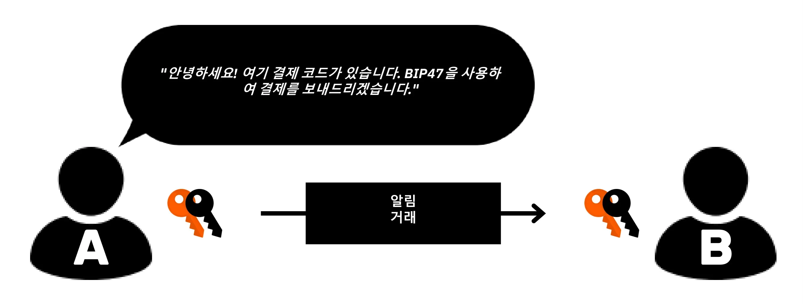


따라서 각 사용자가 상대방의 결제 코드 백업을 보관한다면 알림 트랜잭션을 사용하지 않고도 BIP47을 구현할 수 있습니다. 그러나 이 방법은 이러한 백업을 생성, 저장, 업데이트하는 간단하고 강력하며 효율적인 솔루션이 개발되기 전까지는 관리하기가 복잡합니다. 현재로서는 알림 트랜잭션은 거의 피할 수 없는 선택입니다.


하지만 다음 장에서는 BIP47과 비슷한 목적을 가지고 있지만 알림 트랜잭션이 필요하지 않은 다른 프로토콜에 대해 살펴보겠습니다. 그러나 이러한 대안에는 나름의 장단점이 있습니다.


알림 트랜잭션은 결제 코드를 저장하는 역할 외에도 이름에서 알 수 있듯이 수신자에게 알림 기능을 제공합니다. 수취인의 고객에게 새 결제 터널이 설정되었다는 사실을 알리고 임시 주소를 모니터링할 것을 제안합니다.


### BIP47 기밀성 모델


알림 트랜잭션의 기술적 작동을 자세히 설명하기 전에, 이 초기 트랜잭션을 생성할 때 취한 특정 조치를 정당화하는 BIP47과 관련된 기밀성 모델에 대해 논의하는 것이 중요합니다.


결제 코드 자체는 기밀성에 직접적인 위험을 초래하지 않습니다. 키와 주소의 익명성을 유지하여 사용자의 신원과 거래(공개)의 연결 고리를 끊는 것을 목표로 하는 기존의 Bitcoin 모델과 달리, 결제 코드는 위협 없이 공개적으로 신원과 연결될 수 있습니다.


이는 결제 코드가 BIP47 결제를 받는 주소를 직접 도출하는 데 사용되지 않기 때문입니다. 대신, 이러한 주소는 관련된 두 당사자의 결제 코드에서 파생된 키 사이에서 ECDH 애플리케이션을 통해 생성됩니다.


따라서 결제 코드 자체는 Address 알림에서만 파생되기 때문에 기밀성 손실로 직접 이어지지는 않습니다. 이 Address는 특정 정보를 공개할 수 있지만, 철저한 체인 분석이 수행되지 않는 한 일반적으로 거래 상대방을 공개하지 않습니다. 실제로 발신자가 자신의 신원과 연결될 수 있는 UTXO를 사용하여 알림 거래를 수행하는 경우, 발신자의 신원이 결제 코드에 대한 BIP47 결제와 연결되어 있을 가능성이 있다고 추론할 수 있습니다. 이렇게 하면 기본 거래가 드러나지는 않지만 거래가 존재할 가능성이 있음을 알 수 있습니다.


따라서 사용자의 결제 코드를 엄격하게 분리하는 것이 필수적입니다. 이를 염두에 두면, 코드의 최초 통신은 결제 기밀성을 위해 매우 중요한 순간이지만 프로토콜이 올바르게 작동하는 데 필수적인 순간이기도 합니다. 웹사이트처럼 결제 코드 중 하나를 공개적으로 얻을 수 있는 경우, 두 번째 코드인 발신자 코드는 어떠한 경우에도 첫 번째 코드와 연결되지 않아야 합니다.


구체적인 예를 들어 보겠습니다: BIP47을 통해 정치 운동에 기부하고 싶습니다:


- 이 조직은 웹사이트 또는 소셜 네트워크를 통해 결제 코드를 공개했습니다.
- 따라서 이 강령은 정치 운동과 관련이 있습니다.
- 이 결제 코드를 받았습니다.
- 보내기 전에 상대방이 내 결제 코드를 알고 있는지 확인해야 하는데, 이는 소셜 네트워크에서 거래를 받을 때 사용하므로 내 신원과도 연결됩니다.


어떻게 하면 위험 없이 코드를 전달할 수 있나요? 기존의 통신 수단을 사용하면 정보 유출로 이어질 수 있으며, 따라서 저를 정치적 운동과 연관시킬 수 있습니다. 알림 트랜잭션은 두 코드 사이의 이러한 연관성을 방지하는 Layer 암호화 덕분에 해결책을 제시합니다. 이 방법이 발신자의 결제 코드를 비밀리에 전송하는 유일한 방법은 아니지만 매우 효과적인 방법입니다.


아래 다이어그램에서 주황색 선은 정보 흐름을 차단해야 하는 지점을 나타내며, 검은색 화살표는 제3자가 관찰할 수 있는 연결 지점을 나타냅니다:


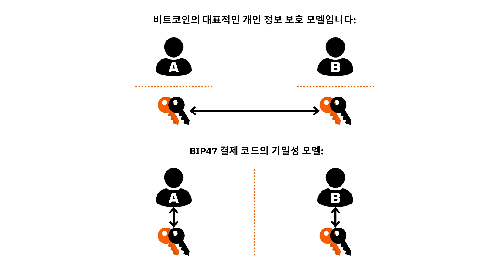


실제로 Bitcoin의 기존 기밀성 모델은 특히 원격 거래에서 키 쌍과 사용자 간의 정보 흐름을 완전히 분리하기 어렵게 만드는 경우가 많습니다. 예를 들어, 기부 캠페인의 경우 수신자는 웹사이트나 소셜 네트워크에 Address 또는 공개 키를 공개해야 합니다. 특히 알림 트랜잭션에서 BIP47을 올바르게 사용하면 ECDHE와 나중에 살펴볼 암호화 Layer을 통해 이 문제에 대한 해결책을 찾을 수 있습니다.


물론 두 결제 코드의 조합에서 파생되는 임시 공개 키에는 Bitcoin의 기존 기밀성 모델이 여전히 적용됩니다. 사실 두 모델은 상호 보완적인 관계에 있습니다. 여기서 강조하고 싶은 것은 비트코인을 받을 때 일반적으로 공개 키를 사용하는 것과 달리, 결제 코드는 "_앨리스가 밥과 거래 중입니다_"라는 정보가 다른 단계에서 깨지기 때문에 특정 신원과 연결될 수 있다는 것입니다. 결제 코드는 generate 결제 주소에 사용되지만, Blockchain을 관찰하는 것만으로는 관련 UTXO가 이전에 이미 신원과 연결되어 있고 사용자가 결제 코드를 각자의 신원과 연결하지 않는 한 BIP47 결제 거래를 실행하는 데 사용된 결제 코드와 연결하는 것은 불가능합니다.


요약하자면, BIP47 결제에서 제공하는 기밀성 모델이 Bitcoin의 기본 모델보다 우수하다고 볼 수 있지만, 그렇다고 해서 마법이 있는 것은 아닙니다.


### 알림 트랜잭션 구축하기


이제 이 알림 트랜잭션이 어떻게 작동하는지 살펴보겠습니다. Alice이 BIP47을 사용하여 Bob로 자금을 송금하고자 한다고 가정해 보겠습니다. 이 예제에서는 Alice이 발신자 역할을 하고 Bob가 수신자 역할을 합니다. Bob는 자신의 웹사이트에 결제 코드를 게시했습니다. 따라서 Alice은 이미 Bob의 결제 코드를 알고 있습니다.


**1- Alice은 ECDH와 공유 비밀을 계산합니다:**


- 결제 코드와 다른 지점에 있는 HD Wallet에서 키 쌍을 선택합니다. 이 키 쌍은 Alice의 알림 Address 또는 Alice의 ID와 쉽게 연결되지 않아야 합니다(이전 섹션 참조);
- Alice은 이 쌍에 대한 개인키를 선택합니다. 이를 $a$(소문자)라고 부릅니다;


$$
a
$$


- Alice는 Bob의 알림 Address과 관련된 공개 키를 검색합니다. 이 키는 Bob의 결제 코드(인덱스 $/0$)에서 파생된 첫 번째 자식입니다. 이 공개 키를 $B$(대문자)라고 합니다. 이 공개 키와 연결된 개인 키는 $b$(소문자)로 표시됩니다. b$는 $G$(생성 지점)에서 $b$(개인 키)로 타원 곡선의 점을 더하고 두 배로 늘려서 결정됩니다:


$$ B = b \cdot G $$


- Alice은 Bob의 공개 키 $B$에서 자신의 개인 키 $a$를 적용하여 타원 곡선의 비밀 점 $S$(대문자)를 더하고 두 배로 늘려서 비밀 점 $S$를 계산합니다.


$$ S = a \cdot B $$


- Alice는 결제 코드를 암호화하는 데 사용할 블라인드 계수 $f$를 계산합니다. 이를 위해 HMAC-SHA512 함수를 사용하여 의사 난수인 generate을 사용합니다. 이 함수의 두 번째 입력은 Bob만이 알아낼 수 있는 값입니다: 위에서 계산한 비밀 점의 횡좌표인 $x$입니다. 첫 번째 입력은 이 트랜잭션의 입력(아웃포인트)으로 소비된 UTXO인 $o$입니다.


$$ f = \text{HMAC-SHA512}(o, x) $$


**2 - Alice이 개인 결제 코드를 기본 2(이진)로 변환**


**이 블라인드 인자를 키로 사용하여 결제 코드의 페이로드에 대칭 암호화를 수행합니다.** 사용되는 암호화 알고리즘은 단순히 'XOR'입니다. 수행되는 연산은 "일회성 패드"라고도 알려진 Vernam 암호와 유사합니다


- Alice은 먼저 블라인드 인자를 두 개로 분할하여 처음 32바이트는 $f1$로, 마지막 32바이트는 $f2$로 명명합니다. 이렇게 해서


$$ f = f1 || f2 $$


- Alice는 결제 코드의 공개 키 $x$의 암호 $x'$와 문자열 코드 $c$의 암호 $c'$를 개별적으로 계산합니다. f1$과 $F2$는 각각 암호 키 역할을 합니다. 사용되는 연산은 `XOR`(또는 배타적)입니다.


$$ x' = x \oplus f1 $$


$$ c' = c \plus f2 $$


- Alice은 결제 코드에서 공개 키 횡좌표 $x$와 문자열 코드 $c$의 실제 값을 암호화된 값 $x'$와 $c'$로 대체합니다.


**따라서 Alice은 현재 암호화된 페이로드가 포함된 결제 코드를 가지고 있습니다. 그녀는 자신의 공개 키 $A$를 입력으로, Bob의 알림 Address를 출력으로, 암호화된 페이로드가 포함된 결제 코드가 포함된 출력 `OP_RETURN`을 출력으로 하는 트랜잭션을 구성하고 브로드캐스트할 것입니다. **이 트랜잭션이 알림 트랜잭션으로 사용됩니다


OP_RETURN`은 Bitcoin 트랜잭션의 출력을 유효하지 않은 것으로 표시하는 연산 코드입니다. 현재는 Bitcoin Blockchain의 정보를 브로드캐스트하거나 Anchor에 전송하는 데 사용됩니다. 최대 80바이트의 데이터를 저장할 수 있으며, 이 데이터는 체인에 기록되어 다른 모든 사용자가 볼 수 있습니다.


이전 섹션에서 살펴본 바와 같이 ECDH는 안전하지 않은 네트워크를 통해 통신하는 두 사용자 간의 공유 비밀을 generate에 사용하는데, 이는 공격자가 잠재적으로 관찰할 수 있습니다. BIP47에서는 본질적으로 투명한 통신 네트워크이며 많은 공격자가 관찰할 수 있는 Bitcoin 네트워크에서 통신하는 데 ECDH가 사용됩니다. 그런 다음 ECDH 키 Exchange를 통해 계산된 공유 비밀은 전송할 비밀 정보, 특히 발신자의 결제 코드(Alice)를 암호화하는 데 사용됩니다.


방금 살펴본 알림 트랜잭션을 수행하는 단계를 요약해 보겠습니다:


- Alice는 Bob의 결제 코드와 알림 Address을 검색합니다.
- Alice은 해당 키 쌍이 있는 HD Wallet에서 UTXO을 선택합니다.
- ECDH를 사용하여 타원 곡선의 비밀 점을 계산합니다.
- 이 비밀 포인트를 사용하여 블라인드 요소인 HMAC를 계산합니다.
- 그녀는 이 블라인드 요소를 사용하여 개인 결제 코드의 페이로드를 암호화합니다.
- 'OP_RETURN` 트랜잭션 출력을 사용하여 숨겨진 결제 코드를 Bob에 전달합니다.


### 거래 알림: 실용적인 연구


어떻게 작동하는지, 특히 `OP_RETURN`의 사용법을 더 자세히 이해하기 위해 실제 알림 트랜잭션을 살펴 보겠습니다. Testnet에서 이러한 트랜잭션을 수행했으며, [여기를 클릭하여](https://Mempool.space/Testnet/tx/0e2e4695a3c49272ef631426a9fd2dae6ec3a469e3a39a3db51aa476cd09de2e) 확인할 수 있습니다.


이 트랜잭션을 살펴보면 이미 하나의 입력과 4개의 출력이 있음을 알 수 있습니다:


- 첫 번째 출력은 제 숨겨진 결제 코드가 포함된 'OP_RETURN'입니다.
- 546 Sats의 두 번째 출력은 수신자의 알림 Address를 가리킵니다.
- 세 번째 출력인 15,000 Sats은 서비스 수수료로, 이 트랜잭션을 구축하는 데 Samourai Wallet을 사용했습니다.
- 네 번째 출력인 200만 Sats은 내 입력에서 남은 차액, 즉 내 소유의 다른 Address로 돌아가는 변화를 나타냅니다.


가장 흥미롭게 연구한 것은 당연히 `OP_RETURN`을 사용한 출력 0입니다. 그 내용을 자세히 살펴봅시다. 다음은 16진수로 된 `scriptPubKey`입니다:


```text
6a4c50010002b13b2911719409d704ecc69f74fa315a6cb20fdd6ee39bc9874667703d67b164927b0e88f89f3f8b963549eab2533b5d7ed481a3bea7e953b546b4e91b6f50d800000000000000000000000000
```


이 스크립트는 여러 부분으로 구성되어 있습니다. 먼저


```text
6a4c
```


옵코드 중 `OP_RETURN`를 지정하는 `0x6a`와 `OP_PUSHDATA1`을 지정하는 `0x4c`를 인식할 수 있습니다.


이 마지막 옵코드 뒤에 오는 바이트는 후속 페이로드의 크기를 나타냅니다. '0x50', 즉 80바이트를 나타냅니다:


```text
6a4c50
```


다음으로, 결제 코드의 메타데이터가 일반 텍스트로 표시됩니다:


```text
010002
```


내 결제 코드의 공개 키의 암호화된 횡좌표입니다:


```text
b13b2911719409d704ecc69f74fa315a6cb20fdd6ee39bc9874667703d67b164
```


내 결제 코드의 암호화된 문자열 코드입니다:


```text
927b0e88f89f3f8b963549eab2533b5d7ed481a3bea7e953b546b4e91b6f50d8
```


마지막으로 'OP_RETURN'의 표준 크기인 80바이트로 패딩합니다:


```text
00000000000000000000000000
```


이해를 돕기 위해 58번 베이스의 일반 텍스트로 된 결제 코드를 알려드리겠습니다:


```text
PM8TJQCyt6ovbozreUCBrfKqmSVmTzJ5vjqse58LnBzKFFZTwny3KfCDdwTqAEYVasn11tTMPc2FJsFygFd3YzsHvwNXLEQNADgxeGnMK8Ugmin62TZU
```


그리고 베이스 16에서:


```text
4701000277507c9c17a89cfca2d3af554745d6c2db0e7f6b2721a3941a504933103cc42add94881210d6e752a9abc8a9fa0070e85184993c4f643f1121dd807dd556d1dc000000000000000000000000008604e4db
```


평문 결제 코드와 `OP_RETURN`를 비교해보면 HRP(`0x47`)와 체크섬(`0x8604e4db`)이 전송되지 않는 것을 확인할 수 있습니다. 이 정보는 사람을 대상으로 하는 정보이므로 이는 정상입니다.


다음으로 버전(`0x01`), 비트 필드(`0x00`), 공개 키의 패리티(`0x02`)를 인식할 수 있습니다. 그리고 결제 코드 끝에 있는 빈 바이트(`0x0000000000000000000000`)는 총 80바이트까지 패딩을 허용합니다. 이 모든 메타데이터는 암호화되지 않은 상태로 전송됩니다.


마지막으로 공개 키 횡좌표(`0x77507c9c17a89cfca2d3af554745d6c2db0e7f6b2721a3941a504933103cc42a`)와 문자열 코드(`0xdd94881210d6e752a9abc8a9fa0070e85184993c4f643f1121dd807dd556d1dc`)가 암호화된 것을 관찰할 수 있습니다. 결제 코드의 페이로드입니다.


### XOR이란 무엇인가요?


이전 섹션에서 결제 코드가 XOR 연산을 사용하여 암호화되어 전송되는 것을 살펴보았습니다. 암호화에 널리 사용되는 이 연산자의 작동 원리를 자세히 살펴보겠습니다.


XOR은 부울 대수에 기반한 비트 단위 논리 연산자입니다. 두 피연산자가 비트 단위로 주어졌을 때 같은 순위의 비트가 다르면 `1`을 반환하고, 같은 순위의 비트가 같으면 `0`을 반환합니다. 피연산자 `D`와 `E`의 값에 따른 XOR 진리 테이블은 다음과 같습니다:

| D | E | D XOR E |
|---|---|---------|
| 0 | 0 | 0       |
| 0 | 1 | 1       |
| 1 | 0 | 1       |
| 1 | 1 | 0       |

예를 들어


$$
0110 \oplus 1110 = 1000
$$


또는:


$$
010011 \oplus 110110 = 100101
$$


ECDH를 사용하면 암호화 Layer로 XOR을 사용하는 것이 특히 일관성이 있습니다. 첫째, 이 연산자 덕분에 암호화는 대칭적입니다. 즉, 수신자는 암호화에 사용된 것과 동일한 키로 결제 코드를 해독할 수 있습니다. 암호화 및 암호 해독 키는 ECDH를 사용하여 공유 비밀에서 계산됩니다. 이러한 대칭성은 XOR 연산자의 공상성 및 연관성 특성으로 인해 가능합니다:


- 기타 속성:


$$
D \oplus D = 0
$$


$$
D \oplus 0 = D
$$


- 정류성:


$$
D \oplus E = E \oplus D
$$


- 연관성:


$$
D \oplus (E \oplus Z) = (D \oplus E) \oplus Z = D \oplus E \oplus Z
$$


만약:


$$
D \oplus E = L
$$


그러면


$$
D \oplus L = D \oplus (D \oplus E) = D \oplus D \oplus E = 0 \oplus E = E \\
\therefore D \oplus L = E
$$


둘째, 이 암호화 방식은 현재까지 알려진 암호화 알고리즘 중 유일하게 무조건적인(또는 절대적인) 보안을 제공하는 Vernam(일회용 패드) 암호와 매우 유사합니다. 버남 암호가 이 기능을 갖기 위해서는 암호화 키가 메시지와 같은 크기의 완벽한 무작위여야 하며 한 번만 사용해야 합니다. 여기서 BIP47에 사용되는 암호화 방식에서 키는 실제로 메시지와 같은 크기이며, 블라인드 인자는 공개 키의 가로와 결제 코드의 문자열 코드를 연결한 것과 정확히 같은 크기입니다. 이 암호화 키는 한 번만 사용됩니다. 반면에 이 키는 HMAC이기 때문에 완벽한 무작위성에서 파생되지 않습니다. 오히려 의사 무작위입니다. 따라서 버남 암호는 아니지만 방법은 비슷합니다.


### 알림 거래 수신


이제 Alice이 Bob에 알림 트랜잭션을 전송했으니 Bob이 이를 어떻게 해석하는지 살펴봅시다. 다시 한 번 말씀드리자면, Bob은 Alice의 결제 코드에 액세스할 수 있어야 합니다. 다음 섹션에서 살펴보겠지만, 이 정보가 없으면 Alice이 생성한 키 쌍을 도출할 수 없으므로 BIP47을 통해 받은 비트코인에 액세스할 수 없습니다. 현재 Alice의 결제 코드 페이로드는 암호화되어 있습니다. Bob이 이를 어떻게 해독하는지 살펴봅시다.


**1-** Bob는 자신의 알림 Address로 출력을 생성하는 트랜잭션을 모니터링합니다.


**2-** 트랜잭션의 알림 Address에 출력이 있는 경우, Bob는 이를 분석하여 BIP47 표준을 준수하는 OP_RETURN 출력이 포함되어 있는지 확인합니다.


**3-** OP_RETURN 페이로드의 첫 바이트가 `0x01`이면 Bob는 ECDH와 공유할 수 있는 비밀을 찾기 시작합니다:


- Bob은 트랜잭션에 대한 입력 공개 키를 선택합니다. 즉, Alice의 공개 키는 $A$로 명명됩니다:


$$ A = a \cdot G $$


- Bob은 자신의 개인 알림 Address과 연결된 개인 키 $b$를 선택합니다:


$$ b $$


- Bob은 타원 곡선에서 자신의 개인 키 $b$를 Alice의 공개 키 $A$에 적용하여 포인트를 더하고 배가하는 방식으로 비밀 포인트 $S$(공유 비밀 ECDH)를 계산합니다:


$$ S = b \cdot A $$


- Bob은 Alice의 결제 코드의 페이로드를 복호화할 수 있는 블라인드 계수 $f$를 결정합니다. Alice이 이전에 계산한 것과 동일한 방식으로, Bob은 비밀점 $S$의 횡좌표 값인 $x$와 이 알림 트랜잭션에 입력으로 소비된 UTXO인 $o$에 HMAC-SHA512를 적용하여 $f$를 찾습니다:


$$ f = \text{HMAC-SHA512}(o, x) $$


**4-** Bob는 알림 트랜잭션의 OP_RETURN 데이터를 결제 코드로 해석합니다. 그는 $f$ 블라인드 계수를 사용하여 이 잠재적 결제 코드의 페이로드를 간단히 해독합니다:


- Bob은 블라인드 계수 $f$를 두 부분으로 분할합니다. $f$의 첫 32바이트는 $f1$이 되고 마지막 32바이트는 $f2$가 됩니다;
- Bob은 Alice의 결제 코드 공개 키에서 암호화된 횡좌표 $x'$의 값을 복호화합니다:


$$ x = x' \oplus f1 $$


- Bob은 Alice의 결제 코드에서 암호화된 문자열 코드 $c'$의 값을 복호화합니다:


$$ c = c' \oplus f2 $$


**5-** Bob는 Alice의 결제 코드 공개 키 값이 secp256k1 그룹에 속하는지 확인합니다. 그렇다면 유효한 결제 코드로 해석합니다. 그렇지 않으면 트랜잭션을 무시합니다.


이제 Bob는 Alice의 결제 코드를 알고 있기 때문에 이러한 유형의 알림 트랜잭션을 반복할 필요 없이 최대 '2^32'개의 결제를 보낼 수 있습니다.


왜 작동하나요? Bob은 어떻게 Alice와 동일한 블라인드 인자를 결정하여 결제 코드를 해독할 수 있을까요? 방금 설명한 내용에서 ECDH의 동작을 자세히 살펴봅시다.


우선, 우리는 대칭 암호화를 다루고 있습니다. 즉, 암호화 키와 암호 해독 키가 동일한 값입니다. 알림 트랜잭션의 이 키가 바로 블라인드 요소입니다:


$$ f = f1 || f2 $$


따라서 공격자가 $f$를 훔쳐서 비밀 정보를 복호화할 수 있기 때문에 Alice과 Bob은 직접 전송하지 않고 동일한 값을 얻어야 합니다. 이 블라인드 계수는 두 값에 HMAC-SHA512를 적용하여 얻습니다:


- 비밀 점의 횡좌표입니다;
- 트랜잭션 입력 시 소비되는 UTXO입니다.


따라서 Bob는 Alice의 결제 코드 페이로드를 해독하기 위해 이 두 가지 정보가 모두 필요합니다. 입력 UTXO의 경우, Bob는 알림 트랜잭션을 관찰하여 간단히 검색할 수 있습니다. 비밀 포인트의 경우, Bob는 ECDH를 사용해야 합니다. Diffie-Hellman에 대한 이전 섹션에서 살펴본 것처럼, 각자의 공개 키를 교환하고 서로의 공개 키에 비밀리에 개인 키를 적용하면 Alice과 Bob는 타원 곡선에서 정확한 비밀 지점을 찾을 수 있습니다. 알림 트랜잭션은 이 메커니즘을 기반으로 합니다:


- Bob의 키 쌍:


$$ B = b \cdot G $$


- Alice의 키 쌍:


$$ A = a \cdot G $$


- 비밀 $S (x, y)$의 경우:


$$ S = a \cdot B = a \cdot (b \cdot G) = (b \cdot a) \cdot G = b \cdot A $$입니다


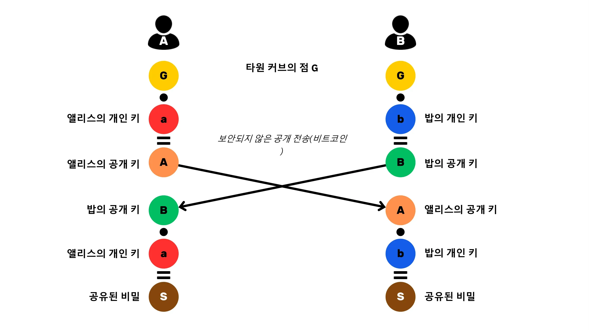


이제 Bob은 Alice의 결제 코드를 알았으므로, 그녀의 BIP47 결제를 감지하고 받은 비트코인을 차단하는 개인 키를 도출할 수 있습니다.


방금 살펴본 알림 트랜잭션을 수신하고 해석하는 단계를 요약해 보겠습니다:


- Bob은 자신의 알림 Address에 대한 트랜잭션 출력을 모니터링합니다.
- 이를 감지하면 OP_RETURN에 포함된 정보를 검색합니다.
- Bob은 공개키를 입력으로 선택하고 ECDH를 사용하여 비밀 포인트를 계산합니다.
- 이 비밀 포인트를 사용하여 블라인드 요소인 HMAC를 계산합니다.
- 이 블라인드 인자를 사용하여 OP_RETURN에 포함된 Alice의 결제 코드 페이로드를 해독합니다.


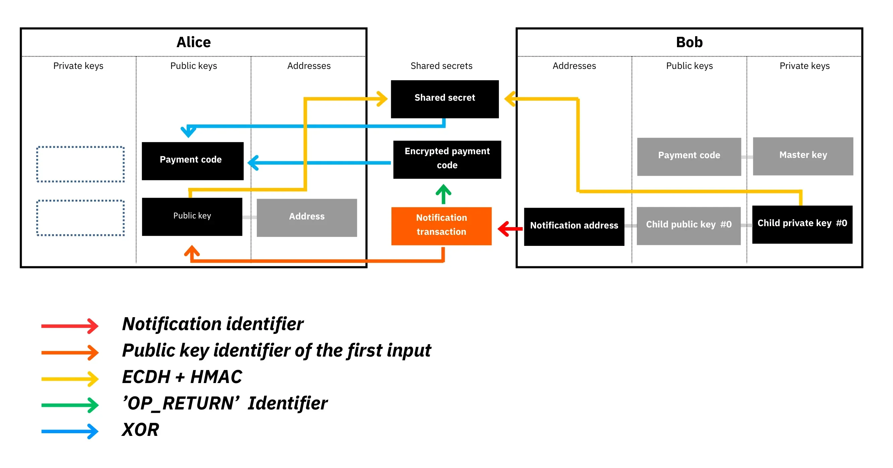


### BIP47 결제 거래


BIP47을 사용한 결제 프로세스를 살펴보겠습니다. 현재 상황을 상기시켜드리겠습니다:


- Alice은 Bob의 결제 코드를 알고 있는데, 그녀는 그의 웹사이트에서 간단히 검색했습니다.
- Bob은 알림 거래에서 Alice의 결제 코드를 알고 있습니다.
- Alice이 Bob에게 첫 번째 지불을 합니다. 그녀는 같은 방식으로 더 많은 돈을 벌 수 있습니다.


이 프로세스를 설명하기 전에 현재 작업 중인 인덱스를 기억해 두는 것이 중요합니다. 결제 코드의 파생 경로는 다음과 같습니다: `m/47'/0'/0'`. 인덱스의 깊이는 다음과 같이 나뉩니다:


- 첫 번째 일반(비강화) 도터 쌍은 이전 섹션에서 설명한 알림 Address을 generate에 사용하는 쌍인 `m/47'/0'/0'/0`입니다;
- 이 섹션에서 살펴볼 `m/47'/0'/0'/0`에서 `m/47'/0'/0'/2,147,483,647`까지 일반 도터 키 쌍은 ECDH에서 generate BIP47 결제 영수증 주소에 사용됩니다;
- 강화된 도터 키 쌍은 임시 결제 코드입니다: `m/47'/0'/0'/0'에서 `m/47'/0'/0'/2,147,483,647'`까지입니다.


Alice이 Bob에게 결제를 보내려고 할 때마다, Alice은 다시 한 번 ECDH 프로토콜을 사용하여 새롭고 고유한 빈 Address를 도출합니다:


- Alice는 재사용 가능한 개인 결제 코드에서 파생된 첫 번째 개인 키를 선택합니다:


$$ a $$


- Alice은 Bob의 결제 코드에서 파생된 첫 번째 미사용 공개키를 선택합니다. 이 공개 키를 $B$라고 부릅니다. 이 공개 키는 Bob에게만 알려진 개인 키 $b$와 연결됩니다:


$$ B = b \cdot G $$


- Alice은 Bob의 공개 키 $B$에서 자신의 개인 키 $a$를 적용하여 타원 곡선 상의 비밀 포인트 $S$를 더하고 두 배로 늘려서 계산합니다:


$$ S = a \cdot B $$


- 이 비밀 지점에서 Alice은 공유 비밀 $s$(소문자)를 계산합니다. 이를 위해 $Sx$라는 비밀 점 $S$의 횡좌표를 선택하고 이 값을 SHA256 Hash 함수에 전달합니다:


$$ S = (Sx, Sy) $$


$$ s = \text{SHA256}(Sx) $$


- Alice는 이 공유 비밀 $s$를 사용하여 Bitcoin 결제 수신 Address를 계산합니다. 먼저 $s$가 secp256k1 곡선의 순서대로 포함되어 있는지 확인합니다. 그렇지 않은 경우, Bob의 공개 키 인덱스를 증가시켜 다른 공유 비밀을 도출합니다.
- 두 번째 단계에서는 타원 곡선 상의 점 $B$와 $s-G$를 더하여 공개 키 $K0$를 계산합니다. 즉, Alice은 Bob의 결제 코드 $B$에서 파생된 공개 키를 secp256k1 곡선 생성기 포인트 $G$의 공유 비밀 $s$로 포인트를 더하고 배가하여 타원 곡선에서 계산된 다른 포인트에 추가합니다. 이 새로운 포인트는 공개 키를 나타내며, 이를 $K0$라고 부릅니다:


$$ K0 = B + s \cdot G $$


- 이 공개 키 $K0$를 사용하면 Alice은 표준 방식으로 빈 수신 Address을 도출할 수 있습니다(예: bech32의 SegWit V0).


Alice가 Address을 수신하는 Bob의 $K0$를 획득하면, 표준 방식으로 Bitcoin 트랜잭션을 수행할 수 있습니다. 이를 위해 그녀는 자신이 소유하고 있는 UTXO를 선택하고, 자신의 HD Wallet의 다른 브랜치에서 키 쌍으로 보안을 유지한 후 이를 소비하여 Bob의 $K0$ Address에 대한 출력을 충족시킵니다. Address이 파생되면 이 지불은 표준 프로세스를 따르며 더 이상 BIP47과 관련된 키에 의존하지 않는다는 점에 유의해야 합니다.


방금 살펴본 BIP47 결제를 전송하는 단계를 요약해 보겠습니다:


- Alice은 개인 결제 코드에서 파생된 첫 번째 딸 개인 키를 선택합니다.
- Bob의 결제 코드에서 파생된 첫 번째 미사용 도터 공개 키에서 ECDH를 사용하여 타원 곡선의 비밀 지점을 계산합니다.
- 이 비밀 포인트를 사용하여 SHA256과 공유 비밀을 계산합니다.
- 이 공유된 비밀을 사용하여 타원 곡선의 새로운 비밀 점을 계산합니다.
- 이 새로운 비밀 포인트를 Bob의 공개 키에 추가합니다.
- 그녀는 Bob만이 관련 개인키를 가지고 있는 새로운 임시 공개키를 얻습니다.
- Alice는 파생된 임시 수신 Address을 사용하여 Bob에 클래식 트랜잭션을 만들 수 있습니다.


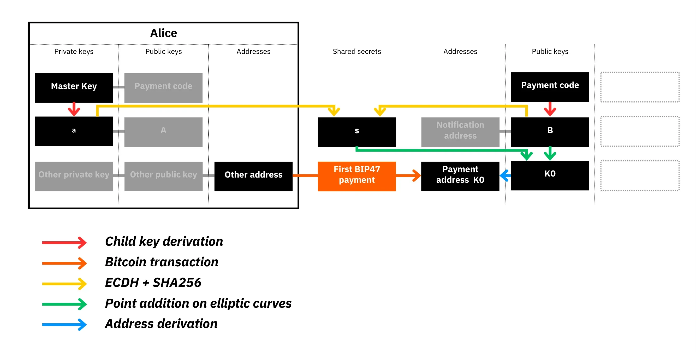


Alice가 두 번째 결제를 하려면 이전과 동일한 단계를 따르지만 이번에는 Bob의 결제 코드에서 파생된 두 번째 공개 키를 선택한다는 점을 제외하고는 동일합니다. 구체적으로, 그녀는 다음에 사용하지 않은 키를 사용합니다. 따라서 그녀는 $K1$로 지정된 Bob에 속하는 새로운 수신 Address를 얻게 됩니다:


이런 식으로 계속 진행하여 Bob에 속하는 `2^32` 빈 주소까지 도출할 수 있습니다.


외부에서 Blockchain을 살펴보면 이론적으로 BIP47 결제와 기존 결제를 구분하는 것은 불가능합니다. 다음은 Testnet의 BIP47 결제 거래 예시입니다:


```text
94b2e59510f2e1fa78411634c98a77bbb638e28fb2da00c9f359cd5fc8f87254
```


소비된 입력, 결제 출력, 잔액 UTXO이 있는 전형적인 트랜잭션처럼 보입니다:


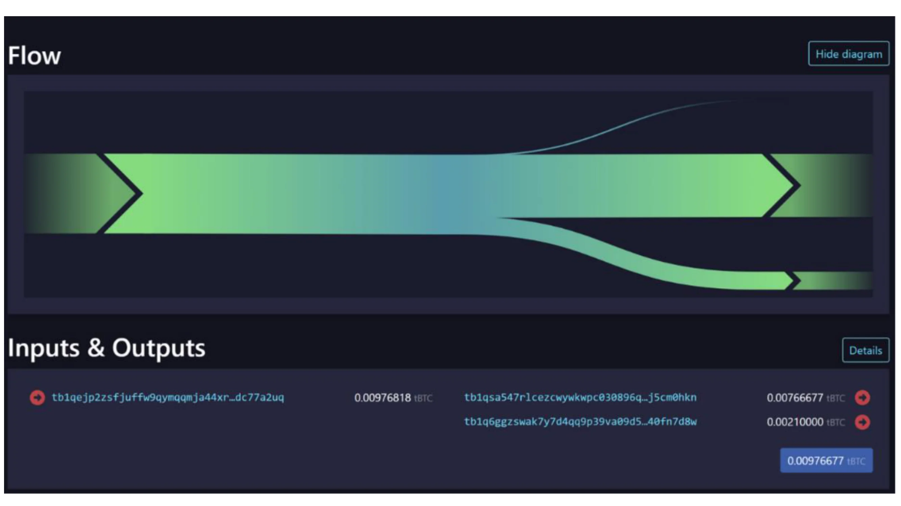


### BIP47 결제 수령 및 개인 키 도출


Alice가 방금 Bob이 소유한 빈 BIP47 Address에 첫 번째 지불을 했습니다. 이제 Bob이 이 결제를 어떻게 받는지 살펴보겠습니다. 또한 Alice가 방금 생성한 Address의 개인 키에 액세스할 수 없는 이유와 Bob이 이 키를 찾아 방금 받은 비트코인을 사용하는 방법도 살펴볼 것입니다.


Bob은 Alice로부터 알림 트랜잭션을 수신하는 즉시, 자신의 상대방이 지불을 보내기 전이라도 공개 키 BIP47 $K0$를 도출합니다. 따라서 그는 연결된 Address에 대한 모든 지불을 관찰합니다. 실제로 그는 즉시 관찰한 여러 주소($K0$, $K1$, $K2$, $K3$...)를 도출합니다. 이 공개 키 $K0$를 도출하는 방법은 다음과 같습니다:


- Bob은 자신의 결제 코드에서 파생된 첫 번째 딸 개인키를 선택합니다. 이 개인 키의 이름은 $b$입니다. 이 개인 키는 Alice이 이전 단계에서 계산을 수행한 공개 키 $B$와 연결됩니다:


$$ b $$


- Bob은 Alice의 결제 코드에서 파생된 첫 번째 공개 키를 선택합니다. 이 키의 이름은 $A$입니다. 이 키는 Alice가 계산을 수행한 개인 키 $a$와 연결되어 있으며, 이 키는 Alice에게만 알려져 있습니다. Bob은 알림 트랜잭션과 함께 전송된 Alice의 결제 코드를 알고 있기 때문에 이 프로세스를 수행할 수 있습니다:


$$ A = a \cdot G $$


- Bob는 자신의 개인 키 $b$를 Alice의 공개 키 $A$에 적용하여 타원 곡선의 점을 더하고 두 배로 늘려서 비밀 점 $S$를 계산합니다. 여기서도 ECDH는 이 점 $S$가 Bob와 Alice 모두에 대해 동일하다는 것을 보장하기 위해 사용됩니다:


$$ S = b \cdot A $$


- Alice과 같은 방식으로 Bob는 이 점 $S$의 횡좌표를 분리합니다. 이 값의 이름을 $Sx$라고 지었습니다. 그리고 이 값을 SHA256 함수에 전달하여 공유 비밀 $s$(소문자)를 찾습니다:


$$ s = \text{SHA256}(Sx) $$


- Alice와 같은 방식으로 Bob은 타원 곡선에서 $s-G$ 지점을 계산합니다. 그런 다음 이 비밀 점을 자신의 공개 키 $B$에 추가합니다. 그런 다음 타원 곡선에서 새로운 점을 얻고, 이를 공개 키 $K0$로 해석합니다:


$$ K0 = B + s \cdot G $$


Bob이 이 공개 키 $K0$를 획득하면, 그는 자신의 비트코인을 사용하기 위해 관련된 개인 키를 도출할 수 있습니다. 이 개인 키는 오직 generate만 사용할 수 있습니다:


- Bob는 자신의 개인 결제 코드에서 파생된 딸의 개인 키 $b$를 더합니다. 자신만이 $b$의 값을 얻을 수 있습니다. 그런 다음 공유 비밀 $s$에 $b$를 더하여 $K0$의 개인 키인 $k0$를 얻습니다:


$$ k0 = b + s $$


타원 곡선의 군법칙 덕분에 Bob은 Alice이 사용하는 공개 키에 해당하는 개인 키를 정확히 얻습니다. 따라서 우리는


$$ K0 = k0 \cdot G $$


방금 살펴본 BIP47 결제를 받고 해당 개인 키를 계산하는 단계를 요약해 보겠습니다:


- Bob는 자신의 개인 결제 코드에서 파생된 첫 번째 딸 개인 키를 선택합니다.
- Alice의 문자열 코드에서 파생된 첫 번째 딸의 공개 키에서 ECDH를 사용하여 타원 곡선의 비밀 지점을 계산합니다.
- 이 비밀 포인트를 사용하여 SHA256과 공유 비밀을 계산합니다.
- 그는 이 공유 비밀을 사용하여 타원 곡선의 새로운 비밀 점을 계산합니다;
- 이 새로운 비밀 포인트를 개인 공개 키에 추가합니다;
- 그는 Alice가 첫 번째 결제를 전송할 새 임시 공개 키를 얻습니다;
- Bob는 결제 코드에서 파생된 딸의 개인 키와 공유 비밀을 추가하여 이 임시 공개 키와 관련된 개인 키를 계산합니다.


Alice은 $b$(Bob의 개인 키)를 얻을 수 없기 때문에 $k0$(Bob의 BIP47이 Address을 수신하는 것과 관련된 개인 키)를 결정할 수 없습니다. 공유 비밀 $S$의 계산은 다음과 같이 개략적으로 표현할 수 있습니다:


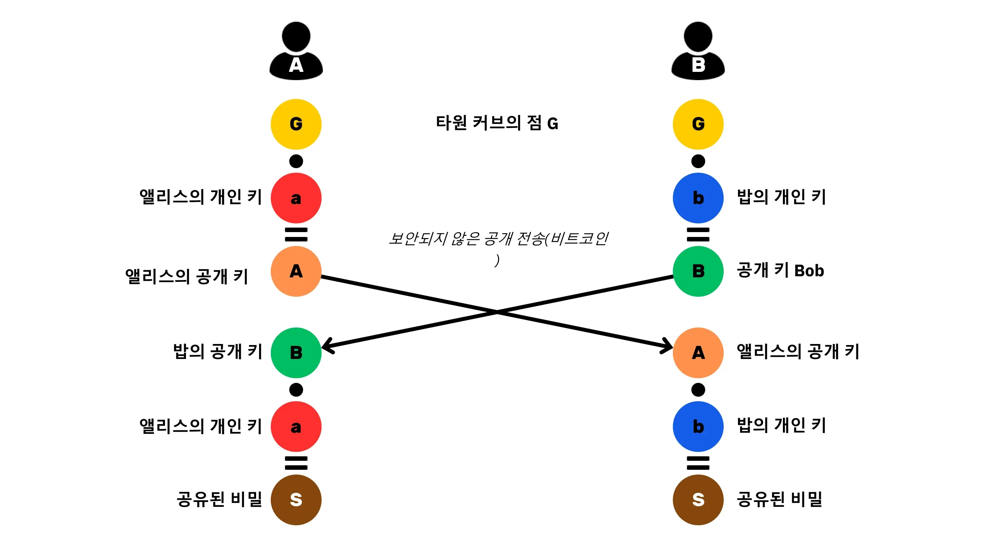


ECDH로 공유 비밀을 찾으면 Alice와 Bob은 BIP47 결제 공개 키 $K0$를 계산하고, Bob은 관련 개인 키 $k0$도 계산합니다:


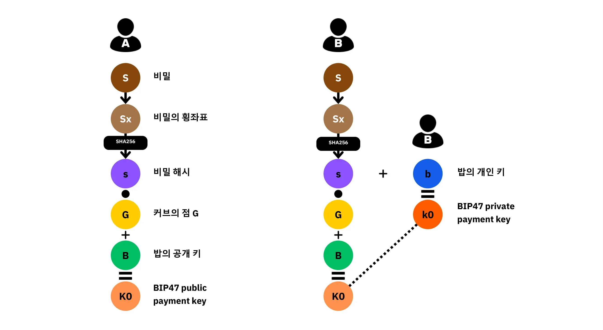


### BIP47 결제 환불


Bob은 Alice의 재사용 가능한 결제 코드를 알고 있으므로 환불을 보내는 데 필요한 모든 정보를 이미 가지고 있습니다. 그는 Alice에게 다시 연락하여 정보를 요청할 필요가 없습니다. 그는 알림 트랜잭션으로 그녀에게 알리기만 하면 seed로 그녀의 BIP47 주소를 검색할 수 있으며, 최대 '2^32'개의 결제를 보낼 수도 있습니다.


환불 기능은 BIP47에만 적용되는 기능으로, 이후 장에서 살펴볼 자동 결제와 같은 다른 방법과 비교했을 때 장점 중 하나입니다.


그런 다음 Bob는 Alice가 송금한 것과 같은 방식으로 Alice에게 상환할 수 있습니다. 역할이 뒤바뀌는 것입니다:


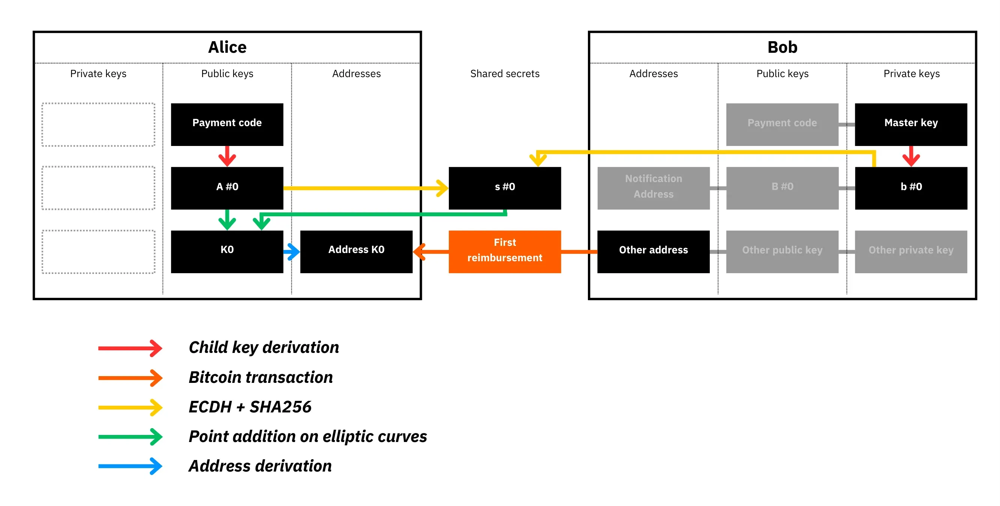


*이 장의 집필에 영감을 준 글에 대한 교정과 전문가 조언을 해주신* [Fanis Michalakis](https://x.com/FanisMichalakis)*님께 감사드립니다!*


https://planb.network/tutorials/privacy/on-chain/paynym-bip47-a492a70b-50eb-4f95-a766-bae2c5535093

## 자동 결제


<chapterId>2871d594-414e-4598-a830-91c9eb84dfb8</chapterId>


BIP47은 On-Chain의 비효율성으로 인해 많은 비판을 받아왔습니다. 이전 장에서 설명한 것처럼 새로운 수취인마다 알림 트랜잭션을 수행해야 합니다. 이 수신자와 지속 가능한 결제 채널을 구축하려는 경우 이러한 제약은 무시할 수 있는 수준이 됩니다. 실제로 한 번의 알림 트랜잭션은 거의 무한대에 가까운 후속 BIP47 결제를 위한 길을 열어줍니다.


그러나 특정 상황에서는 알림 트랜잭션이 사용자에게 장애물이 될 수 있습니다. 수신자에게 일회성 기부를 하는 경우를 예로 들어보겠습니다. 기존 Bitcoin Address에서는 한 번의 트랜잭션으로 기부를 완료할 수 있습니다. 하지만 BIP47을 사용하면 알림을 위한 트랜잭션과 실제 결제를 위한 트랜잭션, 두 개의 트랜잭션이 필요합니다. 블록 공간에 대한 수요가 적고 거래 수수료도 낮을 때는 일반적으로 이 추가 단계는 문제가 되지 않습니다. 그러나 혼잡한 시기에는 한 번의 결제에 거래 수수료가 엄청나게 높아져 표준 Bitcoin 거래에 비해 사용자가 부담하는 비용이 두 배가 될 수 있으며, 이는 사용자가 받아들이기 어려울 수 있습니다.


사용자가 정적 식별자에 대해 몇 번만 결제하려는 경우 다른 솔루션이 개발되었습니다. 여기에는 [BIP352](https://github.com/Bitcoin/BIPs/blob/master/BIP-0352.mediawiki)에 설명된 자동 결제가 포함됩니다. 이 프로토콜을 사용하면 Address를 재사용하지 않고 알림 트랜잭션 없이도 정적 식별자를 사용하여 결제를 받을 수 있습니다. 이 프로토콜이 어떻게 작동하는지 살펴보겠습니다.


---
*이 장을 완전히 이해하려면 HD Wallet에서 ECDH(타원 곡선 디피-헬만)와 암호화 키 도출의 작동 방식을 숙지하는 것이 중요합니다. 이러한 개념은 이전 장인 BIP47에서 자세히 다루었습니다. 여기서는 반복하지 않겠습니다. 아직 이러한 개념에 익숙하지 않다면 이 장을 계속하기 전에 이전 장을 참조하는 것이 좋습니다. 수취 주소 재사용과 관련된 위험이나 수취를 위한 고유 식별자 보유의 중요성에 대해서는 다시 언급하지 않겠습니다.* 여기서는 몇 가지 요점만 말씀드리겠습니다


---
### 알림을 이동하는 것은 어떨까요?


BIP47 장에서 설명한 대로 알림 트랜잭션에는 두 가지 주요 기능이 있습니다:


- 수신자에게 알림을 보냅니다.
- 발신자의 결제 코드를 전송합니다.


이 알림 프로세스가 off-chain로 수행될 수 있다고 순진하게 생각할 수도 있습니다. 이론적으로는 완벽하게 가능합니다. 수신자가 발신자로부터 BIP47 결제 코드를 수신할 수 있는 통신 수단을 표시하기만 하면 되기 때문입니다. 하지만 이 방식에는 두 가지 큰 문제가 있습니다:


- 첫째, 코드 전송 프로세스를 다른 통신 프로토콜로 옮길 것입니다. Exchange의 비용 및 기밀성과 관련된 문제는 그대로 유지되지만, 이 새로운 프로토콜로 이전될 뿐입니다. 기밀성 측면에서도 사용자의 신원과 On-Chain 활동 사이에 연결 고리가 생길 수 있는데, 이는 Blockchain에서 직접 알림을 수행함으로써 피하고자 하는 것입니다. 또한 Blockchain 외부에서 알림을 수행하면 Bitcoin에는 존재하지 않는 검열(예: 자금 차단)의 위험이 발생할 수 있습니다.
- 둘째, 이는 복구 문제를 야기할 수 있습니다. BIP47을 사용하면 수취인이 송금인의 결제 코드를 알고 있어야 자금에 액세스할 수 있습니다. 이는 자금 수령 시에도 마찬가지이지만, Wallet을 분실했을 때 seed를 통해 자금을 회수하는 경우에도 마찬가지입니다. On-Chain 알림을 사용하면 사용자가 seed만 알면 알림 거래를 검색하고 해독할 수 있으므로 이러한 위험을 피할 수 있습니다. 그러나 Blockchain 외부에서 알림이 전송되는 경우 사용자는 수신된 모든 결제 코드의 동적 백업을 유지해야 하므로 일반 사용자에게는 비현실적입니다.


이러한 모든 제약으로 인해 BIP47에서는 On-Chain 알림을 필수적으로 사용해야 합니다. 하지만 사일런트 페이먼트는 비용 때문에 이 On-Chain 알림 단계를 피하고자 합니다. 따라서 채택한 솔루션은 알림을 이동하는 것이 아니라 완전히 제거하는 것입니다. 이를 위해서는 스캔이라는 타협점을 받아들여야 합니다. 알림 거래 덕분에 사용자가 자금의 위치를 정확히 알 수 있는 BIP47과 달리, 자동 결제를 사용하면 사용자가 기존의 모든 Bitcoin 거래를 검사하여 해당 거래에 대한 결제를 감지해야 합니다. 이러한 운영 부담을 줄이기 위해 자동 결제 검색은 이러한 결제가 포함될 가능성이 있는 거래, 즉 Taproot P2TR 출력이 하나 이상 있는 거래로만 제한됩니다. 또한 이 검색은 Wallet 생성 날짜의 거래에만 초점을 맞춥니다(Wallet이 2024년에 생성된 경우 2009년부터의 거래는 스캔할 필요가 없습니다).


보시다시피, BIP47과 자동 결제는 비슷한 목적을 가지고 있지만 서로 다른 장단점을 가지고 있으므로 **실제로는 서로 다른 사용 사례**를 충족합니다. 기부금과 같은 일회성 결제의 경우, 비용이 저렴한 자동결제가 더 적합합니다. 반면, Exchange 플랫폼이나 Mining 풀의 경우처럼 동일한 수취인에게 정기적으로 거래하는 경우에는 BIP47이 선호되는 옵션일 수 있습니다.


자동 결제의 기술적 작동 방식을 살펴보고 무엇이 문제인지 더 깊이 이해해 보겠습니다. 이를 위해 BIP352 설명 문서에 설명된 것과 동일한 접근 방식을 채택할 것을 제안합니다. 수행해야 할 계산을 점진적으로 요소별로 세분화하여 각각의 새로운 추가 사항을 정당화할 것입니다.


### 이해해야 할 몇 가지 개념


시작하기 전에, 자동 결제는 P2TR(*Pay to Taproot*) 스크립트 유형만을 사용한다는 점을 알아두셔야 합니다. BIP47과 달리 해싱을 통해 하위 공개키에서 수신 주소를 도출할 필요가 없습니다. P2TR 표준에서는 조정된 공개키가 Address에서 암호화되지 않고 직접 사용됩니다. 따라서 Taproot 수신 Address는 본질적으로 일부 메타데이터가 포함된 공개 키입니다. 이 조정된 공개 키는 간단한 서명을 통해 직접적이고 전통적인 지출을 가능하게 하는 공개 키와 Merkle Tree에 잠재적으로 새겨진 조건 중 하나를 충족하는 조건에 따라 지출을 승인하는 MAST의 Merkle Root을 나타내는 다른 두 개의 공개 키의 집합체입니다.


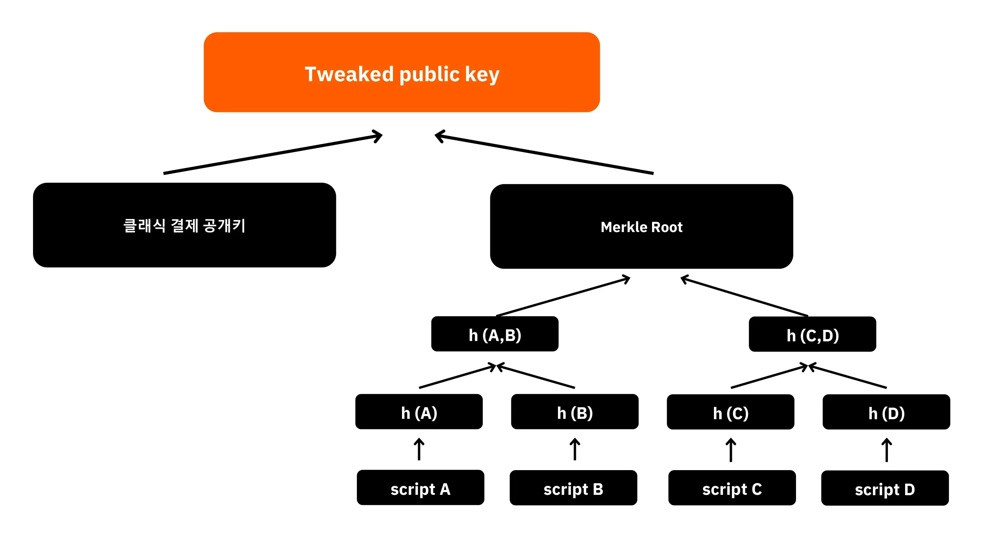


자동 결제를 Taproot로만 제한하기로 결정한 데에는 크게 두 가지 이유가 있습니다:


- 첫째, 하나의 표준만 준수하면 되기 때문에 Wallet 소프트웨어의 구현과 향후 업그레이드가 상당히 용이합니다;
- 둘째, 이 접근 방식은 사용자가 체인 분석에서 generate과 Wallet 지문을 구분하는 여러 유형의 스크립트를 구분하지 않도록 유도하여 사용자의 익명 설정을 개선하는 데 도움이 됩니다(이 개념에 대한 자세한 내용은 2부의 4장을 참조하세요).


### 사일런트 결제 공개 키의 순진한 도출


간단한 예시를 통해 자동 결제(SP)의 작동 방식을 이해해 보겠습니다. Alice과 Bob, 두 명의 Bitcoin 사용자를 예로 들어보겠습니다. Alice은 빈 수신 Address에서 Bob에게 비트코인을 보내려고 합니다. 이 과정에는 세 가지 목표가 있습니다:


- Alice는 빈 generate을 Address로 만들 수 있어야 합니다.
- Bob은 이 특정 Address으로 전송된 결제를 식별할 수 있어야 합니다.
- Bob가 자금을 사용하려면 이 Address과 연결된 개인 키를 얻을 수 있어야 합니다.


Alice는 보안 Bitcoin Wallet에 UTXO을 다음 키 쌍과 함께 가지고 있습니다:


- a$: 개인 키입니다;
- a$: 공개 키($A = \cdot G$)


Bob는 인터넷에 게시한 SP Address를 가지고 있습니다:


- b$: 개인 키입니다;
- b$: 공개 키($B = b \cdot G$)


Bob의 Address을 검색함으로써 Alice은 ECDH를 사용하여 Bob에 속하는 새로운 빈 Address을 계산할 수 있습니다. 이 Address을 $P$라고 부르겠습니다:


$$ P = B + \text{Hash}(a \cdot B) \cdot G $$


이 방정식에서 Alice은 자신의 개인 키인 $a$와 Bob의 공개 키인 $B$의 스칼라 곱을 간단히 계산했습니다. 그녀는 이 결과를 모든 사람에게 알려진 Hash 함수에 전달했습니다. 그런 다음 결과 값에 타원 곡선 `secp256k1`의 생성점 $G$를 스칼라 곱합니다. 마지막으로 Alice은 결과값을 Bob의 공개 키 $B$에 더합니다. Alice이 이 Address $P$를 갖게 되면 트랜잭션의 출력으로 사용하며, 즉 비트코인을 전송합니다.


> *자동 결제의 맥락에서 "Hash" 함수는 특별히 `BIP0352/SharedSecret` 태그가 붙은 SHA256 Hash 함수에 해당하며, 생성된 해시가 이 프로토콜에만 고유하고 다른 맥락에서 재사용할 수 없도록 보장하는 동시에 서명에서 논스의 재사용을 방지하는 추가적인 보호 기능을 제공합니다.* 이 표준은 [슈노르 서명을 위한 BIP340에 지정된](https://github.com/Bitcoin/BIPs/blob/master/BIP-0340.mediawiki) `secp256k1`에 해당합니다
ECDH의 기반이 되는 타원 곡선의 특성 덕분에 우리는 이를 알고 있습니다:


$$ a \cdot B = b \cdot A $$


따라서 Bob은 Alice이 비트코인을 송금한 Address의 수신자를 계산할 수 있습니다. 이를 위해 그는 자동 결제 기준을 충족하는 모든 Bitcoin 거래를 모니터링하고 각 거래에 다음 계산을 적용하여 해당 결제가 자신에게 전달되었는지 확인합니다(*스캔*):


$$ P' = B + \text{Hash}(b \cdot A) \cdot G $$


Alice의 트랜잭션을 스캔하면 $P'$가 $P$와 같다는 것을 알게 됩니다. 따라서 그는 지불이 그녀에게 전달되었음을 알 수 있습니다:


$$ P' = B + \text{Hash}(b \cdot A) \cdot G = B + \text{Hash}(a \cdot B) \cdot G = P $$입니다


여기에서 Bob은 개인 키 $p$를 계산할 수 있으며, 이를 통해 Address $P$를 사용할 수 있습니다:


$$ p = (b + \text{Hash}(b \cdot A)) \bmod n $$


보시다시피, 이 개인 키 $p$를 계산하려면 개인 키 $b$가 있어야 합니다. Bob만이 이 개인 키 $b$를 가지고 있습니다. 따라서 Address로 전송된 비트코인을 사용할 수 있는 사람은 이 사람뿐입니다.


*범례:*


- $B$: Bob에서 발행한 공개 키/정적 Address
- $b$: Bob의 개인 키
- $A$: 트랜잭션 입력으로 사용되는 Alice의 UTXO 공개 키
- $a$: Alice의 개인 키
- $G$: 타원 곡선 'secp256k1'의 생성 점입니다
- text{SHA256}$: BIP0352/SharedSecret` 태그가 붙은 SHA256 Hash 함수입니다
- $s$: ECDH 공통의 비밀
- $P$: Address에 지불하기 위한 공개 키/고유 Bob


다음은 Bob의 정적 Address, 즉 $B$를 사용해 비트코인을 전송할 고유한 Address $P$를 도출하는 다소 순진한 초기 접근 방식입니다. 그러나 이 방법은 너무 단순하며 수정해야 할 몇 가지 결함이 있습니다. 첫 번째 문제는 이 방식에서 Alice은 동일한 트랜잭션 내에서 Bob에 대한 여러 출력을 생성할 수 없다는 것입니다.


### 여러 개의 출력을 만들려면 어떻게 하나요?


이전 섹션의 예에서 Alice은 자신의 고유 Address인 $P$로 Bob에 전송할 단일 출력을 생성합니다. 동일한 입력을 선택한 경우, 사용된 방법은 항상 $P$, 즉 동일한 Address에 대해 동일한 결과를 가져오기 때문에 Alice이 Bob를 위해 별도의 빈 주소 두 개를 생성하는 것은 불가능합니다. 그러나 Alice이 Bob에 대한 지불금을 여러 개의 작은 금액으로 나누고 싶어하는 경우가 많을 수 있으므로 여러 개의 UTXO를 생성해야 합니다. 따라서 이를 달성할 수 있는 방법을 찾아야 합니다.


이를 위해 Alice이 $P$를 도출하기 위해 수행하는 계산을 약간 수정하여 Bob의 두 가지 주소, 즉 $P_0$와 $P_1$을 generate로 만들 수 있도록 합니다.


계산을 수정하여 두 개의 다른 주소를 얻으려면 결과를 수정하는 정수를 추가하기만 하면 됩니다. 따라서 Alice는 계산에 $0$을 추가하여 Address $P_0$을 얻고, $1$을 추가하여 Address $P_1$을 얻습니다. 이 정수를 $i$라고 부르겠습니다:


$$ P_i = B + \text{Hash}(a \cdot B \text{ ‖ } i) \cdot G $$


계산 과정은 이전 방법과 변함이 없지만, 이번에는 Alice가 Hash을 진행하기 전에 $a \cdot B$를 $i$와 연결한다는 점을 제외하면 계산 과정은 이전 방법과 동일합니다. 그런 다음 $i$를 수정하여 Bob에 속하는 새로운 Address을 얻으면 됩니다. 예를 들어


$$ P_0 = B + \text{Hash}(a \cdot B \text{ ‖ } 0) \cdot G $$


$$ P_1 = B + \text{Hash}(a \cdot B \text{ ‖ } 1) \cdot G $$


Bob이 Blockchain에서 자신을 대상으로 하는 자동 결제를 스캔할 때, 먼저 Address $P_0$에 $i = 0$을 사용합니다. 만약 $P_0$에서 어떤 결제도 발견하지 못하면, 그는 이 거래에 자신을 위한 자동 결제가 없다고 결론을 내리고 스캔을 포기합니다. 그러나 $P_0$이 유효하고 자신을 위한 결제가 포함되어 있다면, 그는 동일한 거래에서 $P_1$을 계속하여 Alice가 두 번째 결제를 했는지 확인합니다. P_1$이 유효하지 않은 것으로 판명되면 이 트랜잭션 검색을 중단하고, 그렇지 않으면 연속적인 $i$ 값을 계속 테스트합니다:


$$ P_0 = B + \text{Hash}(b \cdot A \text{ ‖ } 0) \cdot G $$


$$ P_1 = B + \text{Hash}(b \cdot A \text{ ‖ } 1) \cdot G $$


P_0$이 작동하지 않으면 Bob은 $i = 0$에서 즉시 중지되므로, 이 정수를 사용하면 트랜잭션 스캔 단계에서 Bob에 추가 작업 부하가 거의 추가되지 않습니다.


그런 다음 Bob는 같은 방식으로 개인 키를 계산할 수 있습니다:


$$
p_0 = (b + \text{hash}(b \cdot A \text{ ‖ } 0)) \bmod n
$$


$$
p_1 = (b + \text{hash}(b \cdot A \text{ ‖ } 1)) \bmod n
$$


*범례:*


- $B$: Address가 게시한 공개 키/정적 Bob
- $b$: Bob의 개인 키
- $A$: 트랜잭션 입력으로 사용된 Alice의 UTXO 공개 키
- $a$: Alice의 개인 키
- $G$: 타원 곡선 'secp256k1'의 생성 점입니다
- text{SHA256}$: BIP0352/SharedSecret`로 태그된 SHA256 Hash 함수입니다
- $s_0$: 첫 번째 공통 비밀 ECDH
- $s_1$: 두 번째 ECDH 공통 비밀
- $P_0$: Bob에 지불하기 위한 첫 번째 공개 키/고유 Address입니다
- $P_1$: Bob에 지불하기 위한 두 번째 공개 키/고유 Address입니다


이 방법을 통해 좋은 프로토콜을 확보하기 시작했지만, Address 재사용 방지 등 아직 극복해야 할 몇 가지 과제가 남아 있습니다.


### Address 재사용을 방지하는 방법은 무엇인가요?


이전 섹션에서 살펴본 것처럼 Alice는 UTXO을 보호하는 키 쌍을 사용하여 Bob과 ECDH 공유 비밀을 계산하는 데 소비합니다. 이 비밀을 통해 고유한 Address $P_0$을 도출할 수 있습니다. 그러나 Alice가 사용하는 키 쌍($a$, $A$)은 이 Address을 여러 번 재사용한 경우 여러 개의 UTXO를 보호할 수 있습니다. Alice가 동일한 키 $A$로 보안된 두 개의 UTXO를 사용하여 Bob의 정적 Address $B$에 두 번 지불하면 Address이 Bob에 재사용되는 결과가 됩니다.


> *Address 재사용은 사용자 기밀성 측면에서 좋지 않은 관행입니다. 그 이유를 알아보려면 이 과정의 첫 번째 부분을 검토하는 것이 좋습니다*
실제로 고유한 Address $P_0$은 $A$와 $B$에서 파생되므로, Alice가 동일한 키 $A$를 사용하여 $B$에 두 번째 지불을 위해 두 번째 Address을 파생하면 정확히 동일한 Address $P_0$에 도달하게 됩니다. 이러한 위험을 방지하고 자동 결제 내에서 Address 재사용을 방지하려면 계산을 약간 수정해야 합니다.


우리가 원하는 것은 Alice이 결제에 입력으로 사용하는 각 UTXO이 동일한 키 쌍으로 여러 개의 UTXO를 보호하더라도 Bob 측에 고유한 Address를 제공하는 것입니다. 따라서 고유한 Address $P_0$를 계산할 때 UTXO에 대한 참조를 추가하기만 하면 됩니다. 이 참조는 단순히 입력으로 소비되는 UTXO의 Hash이 됩니다:


$$ \text{inputHash} = \text{Hash}(\text{outpoint} \text{ ‖ } A) $$


그리고 Alice는 이 참조를 입력에 추가하여 고유한 Address $P_0$을 계산합니다:


$$ P_0 = B + \text{Hash}(\text{inputHash} \cdot a \cdot B \text{ ‖ } 0) \cdot G $$입니다


스캔할 때 Bob는 트랜잭션을 관찰하여 $\text{outpoint}$를 추론하기만 하면 되므로 $\text{inputHash}$를 추가할 수도 있습니다:


$$ P_0 = B + \text{Hash}(\text{inputHash} \cdot b \cdot A \text{ ‖ } 0) \cdot G $$입니다


유효한 $P_0$를 찾으면 해당 $p_0$ 개인키를 계산할 수 있습니다:


$$
p_0 = (b + \text{hash}(\text{inputHash} \cdot b \cdot A \text{ ‖ } 0)) \bmod n
$$


*범례:*


- $B$: Bob에서 발행한 공개 키/정적 Address
- $b$: Bob의 개인 키
- $A$: 트랜잭션 입력으로 사용된 Alice의 UTXO 공개 키
- $a$: Alice의 개인 키
- $H$: UTXO Hash 입력으로 사용됨
- $G$: 타원 곡선 'secp256k1'의 생성 점입니다
- $\text{SHA256}$: BIP0352/SharedSecret`로 태그된 SHA256 Hash 함수입니다
- $s_0$: 첫 번째 ECDH 공통 비밀
- $P_0$: Bob에 지불하기 위한 첫 번째 공개 키/고유 Address


현재로서는 Alice이 트랜잭션에 단일 입력을 사용한다고 가정하고 계산합니다. 그러나 그녀는 여러 입력을 사용할 수 있어야 합니다. 따라서 Bob의 입장에서는 여러 입력이 포함된 각 트랜잭션에 대해 이론적으로 각 입력에 대한 ECDH를 계산하여 결제가 자신을 위한 것인지 여부를 결정해야 합니다. 이 방법은 만족스럽지 않으므로 작업 부하를 줄일 수 있는 솔루션을 찾아야 합니다!


### 공개 키를 입력으로 조정하기


이 문제를 해결하기 위해 Alice 측에서 특정 입력을 보호하는 키 쌍을 사용하는 대신 트랜잭션의 입력에 사용된 모든 키 쌍의 합계를 사용합니다. 그러면 이 합이 새로운 키 쌍으로 간주됩니다. 이 기술을 "조정"이라고 합니다.


예를 들어 Alice의 트랜잭션에 3개의 입력이 있고 각각 다른 키 쌍으로 보안이 설정되어 있다고 가정해 보겠습니다:


- a_0$은 입력 #0을 보호하는 데 사용됩니다;
- a_1$은 입력 1번을 보호하는 데 사용됩니다;
- a_2$는 입력 2번을 보호합니다.


앞서 설명한 방법에 따라 Alice은 $a_0$, $a_1$, $a_2$ 중에서 단일 키 쌍을 선택하여 ECDH 비밀을 계산하고 Bob의 정적 Address $B$에서 단일 지불 Address $P$를 계산해야 합니다. 그러나 이 접근 방식은 Bob가 유효한 $P$ Address를 생성하는 쌍을 식별할 때까지 $a_0$부터 시작하여 $a_1$ 순으로 각 가능성을 순차적으로 테스트해야 합니다. 이 프로세스는 Bob가 모든 트랜잭션의 모든 입력에 대해 ECDH 계산을 실행해야 하므로 스캔의 운영 부하가 상당히 증가합니다.


이를 방지하기 위해 Alice에 모든 입력 키의 합계를 사용하여 $P$를 계산하도록 요청할 것입니다. 이 예시를 사용하면 조정된 개인 키 $a$는 다음과 같이 계산됩니다:


$$ a = a_0 + a_1 + a_2 $$


같은 방식으로 Alice과 Bob은 조정된 공개키를 계산할 수 있습니다:


$$ a = a_0 + a_1 + a_2 $$


이 방법을 사용하면 Bob은 거래의 공개 키의 합계만 계산한 다음 $A$에서만 ECDH 비밀을 계산하면 되므로 스캔 단계에 필요한 계산 횟수가 크게 줄어듭니다.


하지만 이전 섹션을 기억하세요. Address 재사용을 피하기 위해 계산에 $\text{inputHash}$ Hash을 추가했는데, 이는 Nonce으로 사용됩니다:


$$ \text{inputHash} = \text{Hash}(\text{outpoint} \text{ ‖ } A) $$


그러나 트랜잭션에 여러 개의 입력이 있는 경우 이 계산에서 어떤 $\text{outpoint}$가 선택되는지 결정할 수 있어야 합니다. BIP352에 따르면 사용되는 $\text{outpoint}$ 선택 기준은 사전적으로 가장 작은 것을 선택하는 것으로, 이는 알파벳 순서로 가장 먼저 나타나는 UTXO을 선택하는 것을 의미합니다. 이 방법은 각 트랜잭션에서 선택되는 UTXO을 표준화합니다. 예를 들어 사전적으로 가장 작은 $\text{outpoint}$가 $\text{outpoint}_L$이라면, $\text{inputHash}$의 계산은 다음과 같습니다:


$$ \text{inputHash} = \text{Hash}(\text{outpoint}_L \text{ ‖ } A) $$


계산은 이전 섹션에서 제시한 것과 동일하게 유지되지만 개인 키 $a$와 해당 공개 키 $A$가 더 이상 단일 입력을 보호하는 데 사용되는 쌍이 아니라 이제 입력의 모든 키 쌍에 대한 조정을 나타낸다는 점을 제외하면 다릅니다.


### 비용 및 스캔 키 분리


지금까지는 자동 결제 정적 Address $B$를 고유 공개 키라고 했습니다. Alice은 이 공개 키 $B$를 사용하여 공유 비밀 ECDH를 생성하고, 이를 통해 고유 결제 Address $P$를 계산한다는 점을 기억하세요. Bob은 이 공개 키 $B$와 해당 개인 키 $b$를 스캔 단계에 사용합니다. 그러나 개인 키 $b$를 사용하여 개인 키 $p$를 계산하여 Address $P$에서 지출할 수 있도록 합니다.


이 방법의 단점은 (자동 결제를 받은 주소의 모든 개인 키를 계산하는 데 사용되는) 개인 키 $b$도 Bob에서 거래를 스캔하는 데 사용된다는 것입니다. 이 단계를 수행하려면 인터넷에 연결된 Wallet 소프트웨어에서 $b$ 키를 사용할 수 있어야 하므로 Cold Wallet에 보관하는 것보다 도난 위험에 더 많이 노출될 수 있습니다. 이상적으로는 다른 모든 개인키에 대한 액세스를 제어하는 $b$ 개인키를 Hardware Wallet에 안전하게 보관하면서 자동 결제를 활용할 수 있는 것이 좋습니다. 다행히도 프로토콜은 이를 수용하도록 조정되었습니다.


이를 위해 BIP352는 수신자가 서로 다른 두 쌍의 키를 사용하도록 요구합니다:


- b_{\text{spend}}$: 고유 결제 주소의 개인 키를 계산합니다;
- b_{\text{scan}}$: 고유 결제 주소를 찾습니다.


이러한 방식으로 Bob는 개인 키 $b_{\text{spend}}$를 Hardware Wallet에 보관하고 온라인 소프트웨어에서 개인 키 $b_{\text{scan}}$을 사용하여 자신의 자동 결제를 찾을 수 있지만, $b_{\text{spend}}$는 노출하지 않을 수 있습니다. 반면, 공개 키 $b_{\text{scan}}$과 $b_{\text{spend}}$는 Bob의 정적 Address $b$에 위치하기 때문에 모두 공개적으로 드러납니다:


$$ B = B_{\text{scan}} \text{ ‖ } B_{\text{spend}} $$


Bob에 속하는 고유 결제 Address $P_0$를 계산하기 위해 이제 Alice은 다음 계산을 수행합니다:


$$ P_0 = B_{\text{spend}} + \text{Hash}(\text{inputHash} \cdot a \cdot B_{\text{scan}} \text{ ‖ } 0) \cdot G $$입니다


그에게 지급된 금액을 찾기 위해 Bob는 다음 계산을 수행합니다:


$$ P_0 = B_{\text{spend}} + \text{Hash}(\text{inputHash} \cdot b_{\text{scan}} \cdot A \text{ ‖ } 0) \cdot G $$입니다


보시다시피 지금까지 Bob은 자신의 Hardware Wallet에 있는 $b_{\text{spend}}$를 사용할 필요가 없었습니다. 그가 $P_0$와 관련된 UTXO를 사용하려면 다음 계산을 수행하여 개인 키 $p_0$를 찾을 수 있습니다:


$$ p_0 = (b_{\text{spend}} + \text{Hash}(\text{inputHash} \cdot b_{\text{scan}} \cdot A \text{ ‖ } 0)) \bmod n $$


*범례:*


- b_{\text{scan}}$: Bob의 공개 스캔 키(정적 Address)
- b_{\text{scan}}$: Bob의 비공개 스캔 키
- b_{\text{spend}}$: Bob의 공개 지출 키(정적 Address)
- b_{\text{spend}}$: Bob의 개인 지출 키
- $A$: 공개 키 입력의 합계(조정)
- $a$: 조정된 공개 키에 해당하는 개인 키입니다
- $H$: 입력으로 사용되는 가장 작은 Hash의 UTXO(사전적 의미)입니다
- $G$: 타원 곡선 'secp256k1'의 생성 점입니다
- $\text{SHA256}$: BIP0352/SharedSecret` 태그가 붙은 SHA256 Hash 함수입니다
- $s_0$: 첫 번째 공통 비밀 ECDH
- $P_0$: Bob에 지불하기 위한 첫 번째 공개 키/고유 Address


### 레이블이 있는 SP 주소 사용


따라서 Bob에는 다음과 같은 자동 결제에 대한 정적 Address $B$가 있습니다:


$$ B = B_{\text{scan}} \text{ ‖ } B_{\text{spend}} $$


이 방법의 문제점은 이 Address로 전송되는 서로 다른 결제를 분리할 수 없다는 것입니다. 예를 들어 Bob이 비즈니스에 두 명의 서로 다른 고객을 보유하고 있고 각각에 대한 결제를 구분하려는 경우 두 개의 서로 다른 고정 주소가 필요합니다. 현재 접근 방식의 순진한 해결책은 Bob이 각각 고유한 고정 Address를 사용하는 두 개의 별도 지갑을 만들거나 동일한 Wallet 내에 두 개의 다른 고정 주소를 설정하는 것입니다. 그러나 이 솔루션은 각 Address로 향하는 결제를 감지하기 위해 전체 Blockchain을 두 번(각 Address에 대해 한 번씩) 스캔해야 합니다. 이러한 이중 스캔은 Bob의 운영 부하를 부당하게 증가시킵니다.


이 문제를 해결하기 위해 BIP352는 Blockchain에서 자동 결제를 식별하는 작업량을 부당하게 늘리지 않고도 다양한 정적 주소를 사용할 수 있는 라벨 시스템을 활용합니다. 이를 위해 공개 지출 키 $B_{\text{spend}}$에 정수 $m$을 추가합니다. 이 정수는 첫 번째 정적 Address의 경우 $1$, 두 번째는 $2$의 값을 취할 수 있습니다. 이제 지출 키 $B_{\text{spend}}$는 $B_m$이라고 불리며 이러한 방식으로 구성됩니다:


$$ B_m = B_{\text{spend}} + \text{Hash}(b_{\text{scan}} \text{ ‖ } m) \cdot G $$


예를 들어 레이블이 $1$인 첫 번째 비용 키의 경우입니다:


$$ B_1 = B_{\text{spend}} + \text{Hash}(b_{\text{scan}} \text{ ‖ } 1) \cdot G $$


이제 Bob에서 게시한 정적 Address은 $B_{\text{scan}}$ 및 $B_m$으로 구성됩니다. 예를 들어, 레이블이 $1$인 첫 번째 정적 Address이 됩니다:


$$ B = B_{\text{scan}} \text{ ‖ } B_1 $$


> *레이블 0은 변경을 위해 예약되어 있으므로 레이블 1부터 시작합니다*
Alice는 이전과 동일한 방식으로 단일 결제 Address $P$를 도출하지만, $B_{\text{spend}}$ 대신 새로운 $B_1$을 사용합니다:


$$ P_0 = B_1 + \text{Hash}(\text{inputHash} \cdot a \cdot B_{\text{scan}} \text{ ‖ } 0) \cdot G $$입니다


실제로 Alice는 Bob이 제공한 정적 Address의 두 번째 부분(이 경우 $B_{text{spend}}$가 아닌 $B_1$ 값)을 사용하기 때문에 Address에 레이블이 붙어 있다는 사실조차 알지 못합니다.


결제를 스캔할 때 Bob는 항상 초기 정적 Address의 값에 $B_{\text{spend}}$를 사용하여 이러한 방식으로 결제를 스캔합니다:


$$ P_0 = B_{\text{spend}} + \text{Hash}(\text{inputHash} \cdot b_{\text{scan}} \cdot A \text{ ‖ } 0) \cdot G $$입니다


그런 다음 각 출력에서 $P_0$에 대해 찾은 값을 하나씩 빼기만 하면 됩니다. 그런 다음 이러한 빼기 결과 중 하나가 Wallet에서 사용 중인 레이블 중 하나의 값과 일치하는지 확인합니다. 예를 들어, 출력 #4가 $1$ 레이블과 일치하면 이 출력은 정적으로 레이블이 지정된 Address $B_1$과 연결된 자동 결제임을 의미합니다:


$$ Out_4 - P_0 = \text{Hash}(b_{\text{scan}} \text{ ‖ } 1) \cdot G $$


작동하는 이유는 다음과 같습니다:


$$ B_1 = B_{\text{spend}} + \text{Hash}(b_{\text{scan}} \text{ ‖ } 1) \cdot G $$


이 방법 덕분에 Bob는 기본 정적 Address에서 파생된 여러 정적 주소($B_1$, $B_2$, $B_3$...)를 사용할 수 있으며($B = B_{\text{scan}} \text{ ‖ } B_{\text{spend}}$), 이는 모두 별도의 사용을 유지하기 위해 사용량을 분리할 수 있습니다.


그러나 이러한 정적 주소의 분리는 개인 Wallet 관리 관점에서만 유효하며, 신원을 분리하지는 않는다는 점에 유의하세요. 모든 정적 주소는 모두 동일한 $B_{\text{scan}}$을 가지므로 모든 정적 주소를 함께 연결하여 단일 엔터티에 속한다고 추론하는 것은 매우 쉽습니다.


*범례:*


- b_{\text{scan}}$: Bob의 공개 스캔 키(정적 Address)
- b_{\text{scan}}$: Bob의 비공개 스캔 키
- b_{\text{spend}}$: Bob의 공개 지출 키(초기 Address)
- b_m$: Bob의 공개 지출 키 레이블 지정(정적 Address)
- b_m$: Bob의 개인 지출 키에 레이블이 지정되었습니다
- $A$: 공개 키 입력의 합계(조정)
- $a$: 조정된 공개 키에 해당하는 개인 키입니다
- $H$: 입력으로 사용되는 가장 작은 UTXO의 Hash(사전적 의미)입니다
- $G$: 타원 곡선 'secp256k1'의 생성 점입니다
- text{SHA256}$: BIP0352/SharedSecret` 태그가 붙은 SHA256 Hash 함수입니다
- $s_0$: 첫 번째 ECDH 공통 비밀
- $P_0$: Bob에 지불하기 위한 첫 번째 공개 키/고유 Address
- $p_0$: 첫 번째 고유 결제 Address~Bob의 개인 키입니다
- $X$: 레이블이 있는 스캔 개인 키의 Hash입니다


### 자동 결제 Address은 어떻게 구축하나요?


자동 결제 전용 Address을 구축하려면 먼저 Bitcoin HD Wallet에서 2개의 키 쌍을 도출해야 합니다:


- B_{\text{scan}}$, $B_{\text{scan}}$ 쌍을 사용하여 당사로 전달된 결제를 검색할 수 있습니다;
- B_{\text{spend}}$, $B_{\text{spend}}$ 쌍을 통해 우리가 받은 비트코인을 생각해 볼 수 있습니다.


이러한 쌍은 다음 경로를 사용하여 파생됩니다(*Bitcoin Mainnet*):


```text
scan: m / 352' / 0' / 0' / 1' / 0
spend: m / 352' / 0' / 0' / 0' / 0
```


이 두 쌍의 키가 확보되면 엔드 투 엔드로 연결하여 정적 Address 페이로드를 생성하기만 하면 됩니다:


$$ B = B_{\text{scan}} \text{ ‖ } B_{\text{spend}} $$


레이블을 사용하려면 $B_{\text{spend}}$를 $B_m$으로 바꾸면 됩니다:


$$ B = B_{\text{scan}} \text{ ‖ } B_m $$


레이블 $m$을 사용합니다:


$$ B_m = B_{\text{spend}} + \text{Hash}(b_{\text{scan}} \text{ ‖ } m) \cdot G $$


이 페이로드가 생성되면 HRP(*인간 판독 가능 부분*) `sp`와 버전 `q`(= 버전 0)를 추가합니다. 또한 체크섬을 추가하고 Address의 형식을 bech32m으로 지정합니다.


예를 들어, 여기 내 자동 결제 정적 Address가 있습니다:


```text
sp1qqvhjvsq2vz8zwrw372vuzle7472zup2ql3pz64yn5cpkw5ngv2n6jq4nl8cgm6zmu48yk3eq33ryc7aam6jrvrg0d0uuyzecfhx2wgsumcurv77e
```


이전 섹션에서 이해하셨을 정적 주소와 관련하여 중요한 점은 이러한 주소가 Bitcoin 트랜잭션에서는 표시되지 않는다는 것입니다. 출력에 사용되는 $P$ 결제 주소만 표준 Taproot 형식으로 Blockchain에 표시됩니다. 따라서 외부에서는 자동 결제가 포함된 트랜잭션과 P2TR 출력을 사용하는 일반 트랜잭션을 구분할 수 없습니다.


BIP47과 마찬가지로, 정적 Address $B$와 $B$에서 파생된 결제 Address $P$ 사이의 연결은 불가능합니다. 실제로 잠재적 공격자인 이브가 Blockchain를 Bob의 정적 $B$ Address로 스캔하려고 시도하더라도 $P$를 결정하는 데 필요한 계산을 수행할 수 없습니다. 그러기 위해서는 Bob의 개인 키 $b_{\text{scan}}$ 또는 발신자의 개인 키 $a$가 필요하지만, 물론 둘 다 개인 키입니다. 따라서 정적 Address를 일종의 개인 신원과 명시적으로 연결할 수 있습니다.


### 자동 결제는 어떻게 사용하나요?


사일런트 페이먼트 제안은 비교적 최근에 나온 것으로 현재 제한된 수의 지갑에서만 구현되고 있습니다. 제가 알기로는 이를 지원하는 소프트웨어 제품은 3개뿐입니다:


- [케이크월렛](https://cakewallet.com/)
- [실렌티움](https://app.silentium.dev/)
- [기부지갑](https://github.com/Sosthene00/donationwallet)


곧 자동 결제 정적 Address을 설정하는 방법에 대한 자세한 튜토리얼을 제공해드리겠습니다.


이 기능은 새로운 기능이므로 주의하여 Mainnet에서 많은 금액의 자동 결제를 사용하지 않는 것이 좋습니다.


*자동 결제에 대한 이 장을 작성하기 위해 [자동 결제 설명 사이트](https://silentpayments.xyz/)와 [BIP352 설명 문서](https://github.com/Bitcoin/BIPs/blob/master/BIP-0352.mediawiki)*를 사용했습니다


# 최종 섹션


<partId>2aee56c0-b285-4799-b4f7-373a552ee2b2</partId>


## 리뷰 및 평가


<chapterId>195d149f-80fa-5816-8b46-995a9226d082</chapterId>


<isCourseReview>true</isCourseReview>

## 최종 시험


<chapterId>e803d394-e3c1-5816-a6b4-a69a2472019c</chapterId>


<isCourseExam>true</isCourseExam>

## 결론


<chapterId>cd8e5c67-50e4-4dcd-8e04-88ba5ec95305</chapterId>


<isCourseConclusion>true</isCourseConclusion>
