# Bescherm uw privacy op Bitcoin


In een wereld waar de vertrouwelijkheid van financiële transacties langzamerhand een luxe wordt, is het begrijpen en beheersen van de principes van privacybescherming bij het gebruik van Bitcoin essentieel. Deze training geeft je alle sleutels, zowel theoretisch als praktisch, om dit zelfstandig te bereiken.


Vandaag de dag, op Bitcoin, specialiseren bedrijven zich in Blockchain analyse. Hun core business bestaat juist uit het binnendringen in je privé-sfeer, om de vertrouwelijkheid van je transacties in gevaar te brengen. In werkelijkheid bestaat er niet zoiets als een "recht op privacy" in Bitcoin. Het is dus aan jou, de gebruiker, om je natuurlijke rechten te laten gelden en de vertrouwelijkheid van je transacties te beschermen, want niemand anders gaat dat voor je doen.


De cursus is uitgebreid en algemeen van opzet. Elk technisch concept wordt in detail behandeld en ondersteund door verklarende diagrammen. Het doel is om de kennis voor iedereen toegankelijk te maken. BTC204 is daarom betaalbaar voor beginners en gemiddelde gebruikers. De cursus biedt ook toegevoegde waarde voor meer ervaren bitcoiners, omdat we dieper ingaan op bepaalde technische concepten die vaak verkeerd begrepen worden.


Doe met ons mee om uw gebruik van Bitcoin te veranderen en een geïnformeerde gebruiker te worden, die in staat is de problemen rond vertrouwelijkheid te begrijpen en uw privacy te beschermen.


+++
# Inleiding


<partId>e17474a8-8899-4bdb-a7f8-bc52ddb01440</partId>


## Cursusoverzicht


<chapterId>08ba1933-f393-4fb5-8279-777d874caedb</chapterId>


Welkom bij de BTC204-cursus!


In een wereld waar de vertrouwelijkheid van financiële transacties stilaan een luxe wordt, is het essentieel om de principes van privacybescherming bij het gebruik van Bitcoin te begrijpen en te beheersen. Deze training geeft je alle sleutels, zowel theoretisch als praktisch, om dit zelfstandig te bereiken.


Tegenwoordig, op Bitcoin, specialiseren bedrijven zich in Blockchain analyse. Hun core business bestaat juist uit het binnendringen in je privé-sfeer, om de vertrouwelijkheid van je transacties in gevaar te brengen. In werkelijkheid bestaat er niet zoiets als een "recht op privacy" in Bitcoin. Het is dus aan jou, de gebruiker, om je natuurlijke rechten te laten gelden en de vertrouwelijkheid van je transacties te beschermen, want niemand anders gaat dat voor je doen.


Bitcoin gaat niet alleen over "Number Go Up" en het behouden van de waarde van spaargeld. Met zijn unieke kenmerken en geschiedenis is het in de eerste plaats het gereedschap van de tegen-economie. Dankzij deze formidabele uitvinding kun je vrij over je geld beschikken, het uitgeven en accumuleren, zonder dat iemand je kan tegenhouden.


Bitcoin biedt een vreedzame ontsnapping aan het juk van de staat, waardoor je volledig kunt genieten van je natuurlijke rechten, die niet kunnen worden aangevochten door gevestigde wetten. Dankzij de uitvinding van Satoshi Nakamoto heb je de macht om respect voor je privébezit af te dwingen en de vrijheid van Contract terug te winnen.


Bitcoin is echter niet standaard anoniem, wat een risico kan vormen voor individuen die zich bezighouden met de tegeneconomie, vooral in regio's onder despotisch bewind. Maar dit is niet het enige gevaar. Omdat Bitcoin een waardevol en oncontroleerbaar bezit is, kan het een doelwit zijn voor dieven. Het beschermen van je privacy wordt dus ook een kwestie van veiligheid: het kan je helpen hacken en fysiek geweld te voorkomen.


Zoals we zullen zien, biedt het protocol op zichzelf al bepaalde bescherming voor vertrouwelijkheid, maar is het cruciaal om aanvullende hulpmiddelen te gebruiken om deze vertrouwelijkheid te optimaliseren en te verdedigen.


Deze training is ontworpen om een uitgebreid, algemeen overzicht te geven van de zaken die komen kijken bij Bitcoin vertrouwelijkheid. Elk technisch concept wordt in detail behandeld, ondersteund door verklarende diagrammen. Het doel is om deze kennis voor iedereen toegankelijk te maken, zelfs voor beginners en gevorderden. Voor de meer doorgewinterde Bitcoiners behandelen we ook zeer technische en soms weinig bekende concepten door de cursus heen, om het begrip van elk onderwerp te verdiepen.


Het doel van deze training is niet om je volledig anoniem te maken in je gebruik van Bitcoin, maar om je de essentiële tools te geven om te weten hoe je je vertrouwelijkheid kunt beschermen in overeenstemming met je persoonlijke doelstellingen. Je hebt de vrijheid om te kiezen uit de gepresenteerde concepten en tools om je eigen strategieën te ontwikkelen, aangepast aan je specifieke doelen en behoeften.


**Deel 1: Definities en kernbegrippen**


Om te beginnen gaan we de basisprincipes van de werking van Bitcoin doornemen, zodat we daarna rustig de begrippen met betrekking tot vertrouwelijkheid kunnen behandelen. Het is essentieel om een paar basisconcepten te beheersen, zoals UTXO, ontvangende adressen en scripting, voordat je de concepten die we in de volgende secties zullen behandelen volledig kunt begrijpen. We zullen ook het algemene vertrouwelijkheidsmodel van Bitcoin introduceren, zoals bedacht door Satoshi Nakamoto, dat ons in staat zal stellen de bijbehorende inzet en risico's te begrijpen.


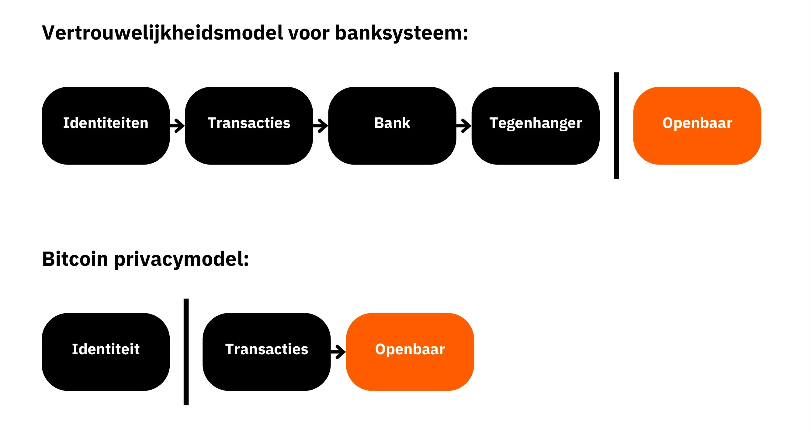


**Deel 2: Inzicht in en bescherming tegen ketenanalyse**


In het tweede deel kijken we naar de technieken die Blockchain analysebedrijven gebruiken om uw activiteiten op Bitcoin te volgen. Inzicht in deze methoden is cruciaal om je privacy beter te beschermen. Het doel van dit hoofdstuk is om de strategieën van aanvallers te onderzoeken om de risico's beter te begrijpen en de basis te leggen voor de technieken die we in de volgende hoofdstukken zullen bestuderen. We zullen transactiepatronen, interne en externe heuristieken en waarschijnlijke interpretaties van deze patronen analyseren. Naast de theorie zullen we leren hoe we een Block explorer kunnen gebruiken voor ketenanalyse, door middel van praktische voorbeelden en oefeningen.


**Sectie 3: De beste werkwijzen onder de knie krijgen om je privacy te beschermen**


In het derde deel van onze training komen we tot de kern: de praktijk! Het doel is om alle essentiële best practices onder de knie te krijgen die een natuurlijke reflex zouden moeten worden voor elke Bitcoin gebruiker. We behandelen het gebruik van lege adressen, tagging, consolidatie, het gebruik van complete nodes, KYC en acquisitiemethoden. Het doel is om je een uitgebreid overzicht te geven van de valkuilen die je moet vermijden om een solide basis te leggen in ons streven om privacy te beschermen. Voor sommige van deze praktijken wordt u doorverwezen naar een specifieke handleiding over hoe u ze kunt implementeren.


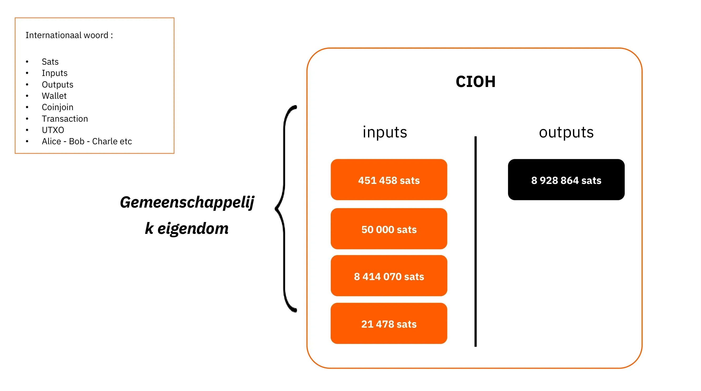


**Deel 4: CoinJoin transacties begrijpen**


Hoe kunnen we het hebben over privacy op Bitcoin zonder coinjoins te noemen? In hoofdstuk 4 kom je alles te weten over deze mengmethode. Je leert wat coinjoins zijn, hun geschiedenis en doelstellingen, en de verschillende typen CoinJoin die er bestaan. Tot slot, voor de meer ervaren gebruiker, kijken we naar wat anonsets en entropie zijn, en hoe je ze berekent.


**Sectie 5: De uitdagingen van andere geavanceerde vertrouwelijkheidstechnieken begrijpen**


In de vijfde sectie bekijken we alle andere technieken die beschikbaar zijn om je privacy te beschermen op Bitcoin, afgezien van CoinJoin. In de loop der jaren hebben ontwikkelaars een opmerkelijke creativiteit getoond in het ontwerpen van tools die gericht zijn op privacy. We zullen al deze methodes bekijken, zoals PayJoin, collaboratieve transacties, Coin Swap en Atomic Swap, met details over hoe ze werken, hun doelen en eventuele zwakheden.


We zullen ook kijken naar privacy op het niveau van het netwerk van knooppunten en de verspreiding van transacties. We bespreken ook de verschillende protocollen die in de loop der jaren zijn voorgesteld om de privacy van gebruikers op Bitcoin te verbeteren, waaronder statische Address protocollen.


Klaar om de fijne kneepjes van privacy op Bitcoin te ontdekken? Laten we gaan!


# Definities en kernbegrippen


<partId>b9bbbde3-34c0-4851-83e8-e2ffb029cf31</partId>


## Bitcoin's UTXO model


<chapterId>8d6b50c5-bf74-44f4-922b-25204991cb75</chapterId>


Bitcoin is in de eerste plaats een valuta, maar weet je eigenlijk wel hoe BTC worden weergegeven op het protocol?


### UTXO's op Bitcoin: wat zijn dat?


Het Bitcoin protocol is gebaseerd op het UTXO model, wat staat voor "Unspent Transaction Output".


Dit model verschilt sterk van traditionele banksystemen, die vertrouwen op een mechanisme van rekeningen en saldi om financiële stromen bij te houden. In het banksysteem worden individuele saldi bijgehouden op rekeningen die gekoppeld zijn aan een identiteit. Als je bijvoorbeeld een stokbrood koopt bij een bakker, schrijft je bank het aankoopbedrag af van je rekening, waardoor je saldo daalt, terwijl de rekening van de bakker wordt gecrediteerd met hetzelfde bedrag, waardoor zijn saldo stijgt. In dit systeem is er geen verband tussen het geld dat op je rekening binnenkomt en het geld dat er weer vanaf gaat, afgezien van transactiegegevens.


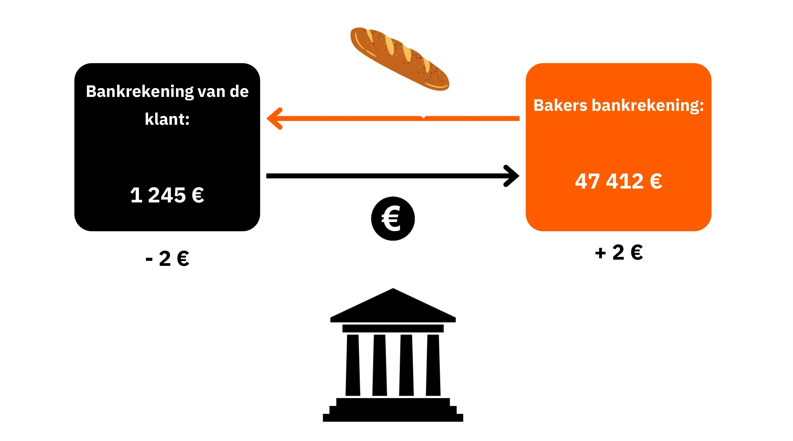


Bitcoin werkt anders. Het concept van een rekening bestaat niet, en monetaire eenheden worden niet beheerd via saldi, maar via UTXO's. Een UTXO vertegenwoordigt een specifieke hoeveelheid bitcoins die nog niet is uitgegeven, en vormt zo een "stuk Bitcoin", dat groot of klein kan zijn. Een UTXO kan bijvoorbeeld `500 BTC` waard zijn of simpelweg `700 Sats`.


**Herinneren:** De Satoshi, vaak afgekort tot sat, is de kleinste eenheid van Bitcoin, vergelijkbaar met de centime in fiatvaluta.


```plaintext
1 BTC = 100 000 000 SATS
```


Theoretisch kan één UTXO elke waarde in bitcoins vertegenwoordigen, variërend van een zat tot een theoretisch maximum van ongeveer 21 miljoen BTC. Het is echter logisch onmogelijk om alle 21 miljoen bitcoins te bezitten, en er is een lagere economische drempel genaamd "Dust", waaronder een UTXO wordt beschouwd als economisch onrendabel om uit te geven.


**Wist je dat?** De grootste UTXO ooit gecreëerd op Bitcoin had een waarde van `500.000 BTC`. Het werd gecreëerd door het MtGox platform tijdens een consolidatieoperatie in november 2011: [29a3efd3ef04f9153d47a990bd7b048a4b2d213daaa5fb8ed670fb85f13bdbcf](https://Mempool.space/fr/tx/29a3efd3ef04f9153d47a990bd7b048a4b2d213daaa5fb8ed670fb85f13bdbcf)


### UTXO's en bestedingsvoorwaarden


UTXO's zijn de instrumenten van Exchange op Bitcoin. Elke transactie resulteert in het verbruik van UTXO's als input en de creatie van nieuwe UTXO's als output. Wanneer een transactie is voltooid, worden de UTXO's die als inputs zijn gebruikt als "verbruikt" beschouwd, en nieuwe UTXO's worden gegenereerd en toegewezen aan de ontvangers die in de transactie-outputs zijn aangegeven. Een UTXO vertegenwoordigt dus simpelweg een niet uitgegeven transactie-output, en daarmee een hoeveelheid bitcoins die op een bepaald moment aan een gebruiker toebehoren.


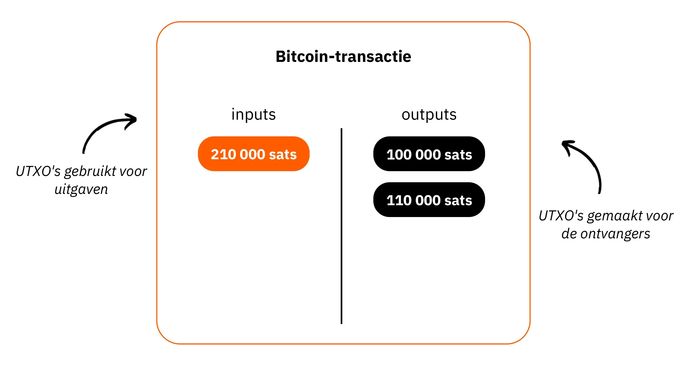


Alle UTXO's zijn beveiligd door scripts die de voorwaarden bepalen waaronder ze kunnen worden uitgegeven. Om een UTXO te consumeren, moet een gebruiker aan het netwerk aantonen dat hij of zij voldoet aan de voorwaarden van het script dat die UTXO beveiligt. UTXO's worden doorgaans beschermd door een publieke sleutel (of een ontvangende Address die deze publieke sleutel vertegenwoordigt). Om een UTXO geassocieerd met deze publieke sleutel uit te geven, moet de gebruiker bewijzen dat hij de corresponderende private sleutel bezit, door een digitale handtekening te leveren die met deze sleutel is gemaakt. Daarom zeggen we dat je Bitcoin Wallet eigenlijk geen bitcoins bevat, maar je private sleutels opslaat, die je op hun beurt toegang geven tot je UTXO's en, bij uitbreiding, tot de bitcoins die ze vertegenwoordigen.


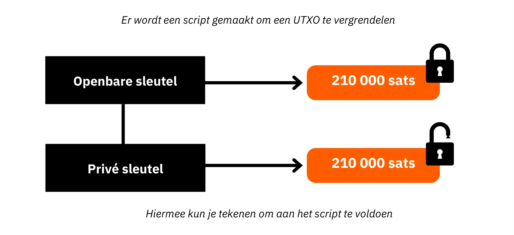


Omdat er in Bitcoin geen rekening is, is het saldo van een Wallet gewoon de som van de waarden van alle UTXO's die het kan uitgeven. Als je Bitcoin Wallet bijvoorbeeld de volgende 4 UTXO's kan uitgeven:


```plaintext
- 2 BTC
- 8 BTC
- 5 BTC
- 2 BTC
```


Het totale saldo van je portefeuille zou `17 BTC` zijn.


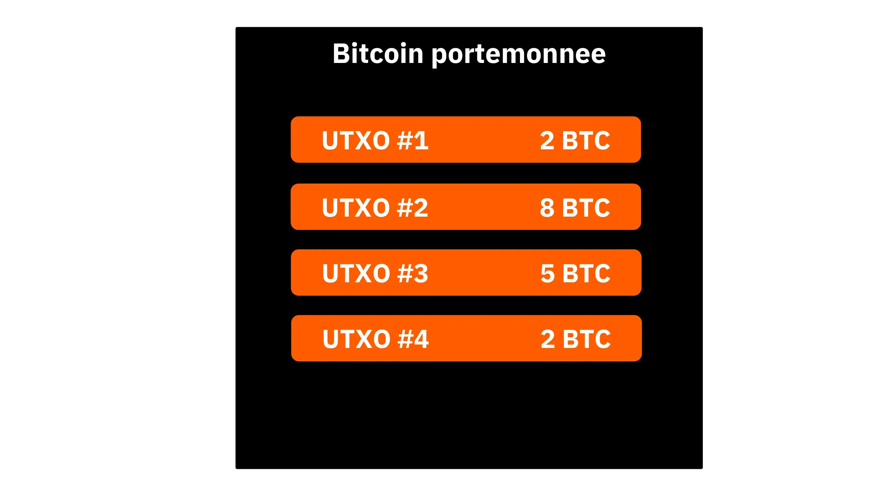


## De structuur van Bitcoin transacties


<chapterId>29d3aaab-de2e-4746-ab40-c9748898850c</chapterId>


### Transactie-ingangen en -uitgangen

Een Bitcoin transactie is een operatie die is vastgelegd op de Blockchain die Ownership aan bitcoins overdraagt van de ene persoon naar de andere. Om precies te zijn, aangezien we op een UTXO model zitten en er geen rekeningen zijn, voldoet de transactie aan de bestedingsvoorwaarden die een of meer UTXO's veiligstelden, verbruikt ze en creëert ze gelijkwaardig nieuwe UTXO's met nieuwe bestedingsvoorwaarden. Kortom, een transactie verplaatst bitcoins van een tevreden script naar een nieuw script dat is ontworpen om ze veilig te stellen.

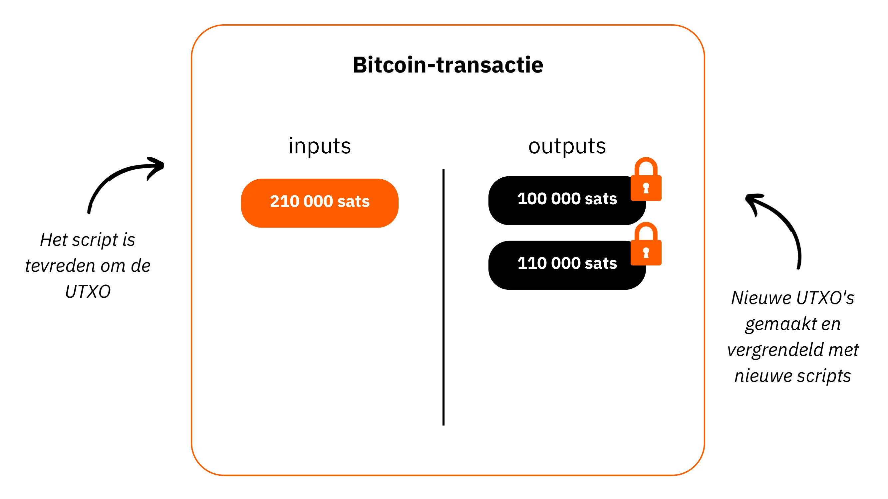

Elke Bitcoin transactie bestaat daarom uit een of meer ingangen en een of meer uitgangen. Inputs zijn UTXO's die door de transactie naar generate outputs worden verbruikt. Uitgangen zijn nieuwe UTXO's die kunnen worden gebruikt als invoer voor toekomstige transacties.


**Wist je dat?** Theoretisch kan een Bitcoin transactie een oneindig aantal in- en uitgangen hebben. De enige limiet is de maximale blokgrootte.

Elke invoer in een Bitcoin-transactie verwijst naar een eerder niet-uitgegeven UTXO. Om een UTXO als invoer te gebruiken, moet de houder ervan aantonen dat hij/zij de rechtmatige eigenaar is door het bijbehorende script te valideren, d.w.z. door te voldoen aan de opgelegde bestedingsvoorwaarde. In het algemeen betekent dit het leveren van een digitale handtekening, geproduceerd met de private sleutel die overeenkomt met de publieke sleutel waarmee deze UTXO initieel beveiligd werd. Het script bestaat dus uit het verifiëren dat de handtekening overeenkomt met de openbare sleutel die werd gebruikt toen het geld werd ontvangen.


Elke uitvoer specificeert op zijn beurt de hoeveelheid bitcoins die moet worden overgedragen, evenals de ontvanger. Deze laatste wordt gedefinieerd door een nieuw script, dat meestal de nieuw aangemaakte UTXO blokkeert met een ontvangende Address of een nieuwe publieke sleutel.

Wil een transactie geldig zijn volgens de consensusregels, dan moet de totale output kleiner zijn dan of gelijk aan de totale input. Met andere woorden, de som van de nieuwe UTXO's die door de transactie worden gegenereerd, mag niet groter zijn dan de som van de UTXO's die als inputs zijn verbruikt. Dit principe is logisch: als je maar `500.000 Sats` hebt, kun je geen aankoop doen van `700.000 Sats`.

### Exchange en samenvoegen in een Bitcoin transactie

De actie van een Bitcoin transactie op UTXO kan dus vergeleken worden met het omgieten van een gouden munt. Een UTXO is inderdaad niet deelbaar, maar alleen smeltbaar. Dit betekent dat een gebruiker een UTXO, die een bepaald bedrag in bitcoins vertegenwoordigt, niet eenvoudigweg kan verdelen in verschillende kleinere UTXO's. Hij moet het volledig verbruiken in een transactie om er één te creëren. Hij moet het volledig verbruiken in een transactie om één of meer nieuwe UTXO's te creëren van willekeurige waarden in outputs, die kleiner of gelijk moeten zijn aan de initiële waarde.

Dit mechanisme is vergelijkbaar met dat van een gouden munt. Laten we zeggen dat je een munt van 2 ounce bezit en een betaling van 1 ounce wilt doen, ervan uitgaande dat de verkoper je geen wisselgeld kan geven. Je zou dan je munt moeten omsmelten en 2 nieuwe munten van elk 1 ounce moeten gieten.

Bitcoin werkt op dezelfde manier. Stel, Alice heeft een UTXO van `10.000 Sats` en wil een stokbrood kopen van `4.000 Sats`. Alice zal een transactie maken met 1 UTXO van `10.000 Sats` als input, die ze volledig zal consumeren, en 2 UTXO's van `4.000 Sats` en `6.000 Sats` als output. De UTXO van `4.000 Sats` gaat naar de bakker als betaling voor het stokbrood, terwijl de UTXO van `6.000 Sats` teruggaat naar Alice in de vorm van wisselgeld. Deze UTXO, die terugkeert naar de oorspronkelijke uitgever van de transactie, staat bekend als "Exchange" in Bitcoin jargon.

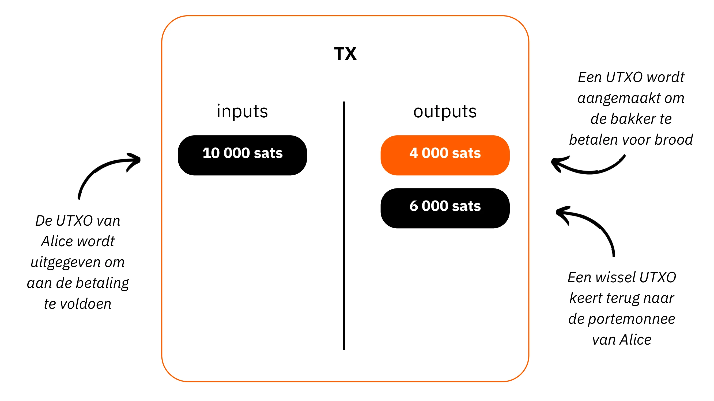

Laten we ons nu eens voorstellen dat Alice geen enkele UTXO van `10.000 Sats` heeft, maar eerder twee UTXO's van elk `3.000 Sats`. In deze situatie is geen van beide UTXO's afzonderlijk voldoende om de `4.000 Sats` van de toverstok in te stellen. Alice moet daarom tegelijkertijd de 2 UTXO's van `3.000 Sats` gebruiken als input voor haar transactie. Op deze manier zal de totale hoeveelheid inputs `6.000 Sats` bereiken, waardoor ze aan de `4.000 Sats` betaling aan de bakker kan voldoen. Deze methode, waarbij verschillende UTXO's worden samengevoegd als input voor een transactie, wordt vaak "samenvoegen" genoemd.

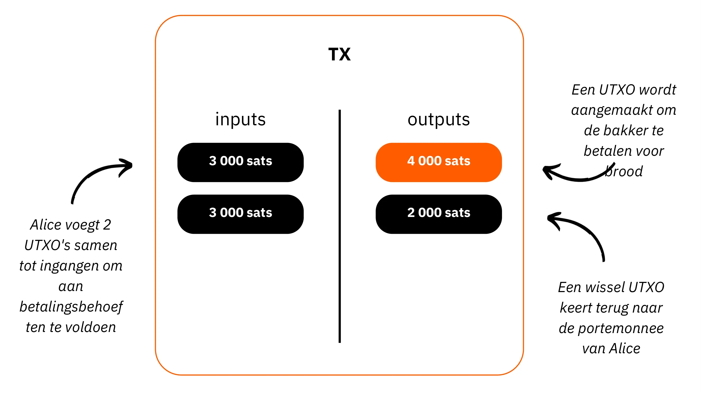

### Transactiekosten

Intuïtief zou je kunnen denken dat transactiekosten ook de output van een transactie vertegenwoordigen. Maar in werkelijkheid is dit niet het geval. Transactiekosten vertegenwoordigen het verschil tussen de totale input en de totale output. Dit betekent dat, nadat een deel van de waarde van de inputs is gebruikt om de gewenste outputs in een transactie te dekken, een bepaald bedrag van de inputs ongebruikt blijft. Dit resterende bedrag vormt de transactiekosten.

```plaintext
Frais = total inputs - total outputs
```

Laten we het voorbeeld nemen van Alice, die een UTXO heeft van `10.000 Sats` en een stokbrood wil kopen voor `4.000 Sats`. Alice creëert een transactie met haar UTXO van `10.000 Sats` als invoer. Ze genereert dan een output van `4.000 Sats` voor de bakker om te betalen voor het stokbrood. Om mijnwerkers aan te moedigen haar transactie in een blok te integreren, kent Alice `200 Sats` aan vergoedingen toe. Vervolgens creëert ze een tweede output, de Exchange, die aan haar wordt teruggegeven, ten bedrage van `5.800 Sats`.

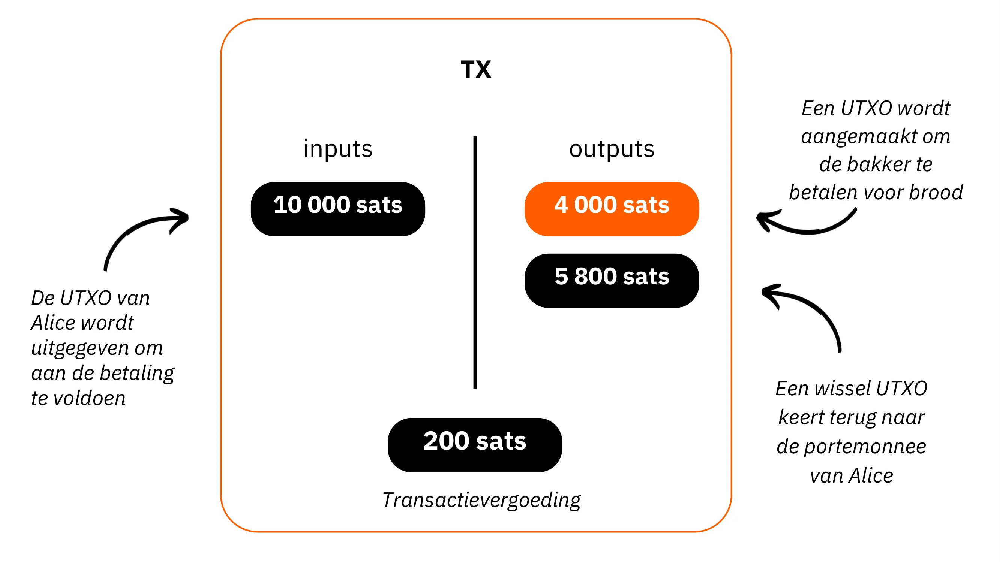

Als we de vergoedingsformule toepassen, zien we dat er inderdaad `200 Sats` over zijn voor minderjarigen:

```plaintext
Frais = total inputs - total outputs
Frais = 10 000 - (4 000 + 5 800)
Frais = 10 000 - 9 800
Frais = 200
```

Wanneer een Miner erin slaagt om een blok te valideren, is hij gemachtigd om deze vergoedingen te innen voor alle transacties in zijn blok, via de zogenaamde "coinbase" transactie.

### UTXO's aanmaken op Bitcoin

Als je de vorige paragrafen zorgvuldig hebt gevolgd, weet je nu dat UTXO's alleen kunnen worden gecreëerd door andere bestaande UTXO's te consumeren. Op deze manier vormen Bitcoin munten een ononderbroken keten. Je vraagt je echter misschien af hoe de eerste UTXO's in deze keten tot stand zijn gekomen. Dit roept een probleem op dat lijkt op dat van de kip en het ei: waar kwamen deze oorspronkelijke UTXO's vandaan?

Het antwoord ligt in de **transactie coinbase**.

De coinbase is een specifiek type Bitcoin transactie, die uniek is voor elk blok en altijd de eerste is. Hiermee kan de Miner die een geldige Proof of Work heeft gevonden, zijn Block reward ontvangen. Deze beloning bestaat uit twee Elements: **bloktoelage** en **transactievergoeding**, besproken in de vorige sectie.

De Coinbase Transaction is uniek omdat het als enige in staat is om ex nihilo bitcoins te creëren, zonder de noodzaak om inputs te consumeren voor generate outputs. Deze nieuw gecreëerde bitcoins kunnen we "originele UTXO's" noemen.


Bitcoins met bloksubsidie zijn nieuwe BTC die vanaf nul worden aangemaakt, volgens een vooraf vastgesteld uitgifteschema in de consensusregels. De bloksubsidie wordt elke 210.000 blokken gehalveerd, dat wil zeggen ongeveer elke vier jaar, in een proces dat bekend staat als "Halving". Oorspronkelijk werden er 50 bitcoins gecreëerd met elke subsidie, maar dit bedrag is geleidelijk afgenomen; momenteel is het 3,125 bitcoins per blok.

Wat de transactievergoedingen betreft, hoewel deze ook nieuw gecreëerde BTC vertegenwoordigen, mogen ze het verschil tussen de totale inputs en outputs van alle transacties in een blok niet overschrijden. We zagen eerder dat deze vergoedingen het deel van de inputs vertegenwoordigen dat niet wordt gebruikt in de outputs van de transacties. Dit deel is technisch gezien "verloren" gegaan tijdens de transactie, en de Miner heeft het recht om deze waarde opnieuw te creëren in de vorm van één of meer nieuwe UTXO's. Dit is een overdracht van waarde tussen de verschillende partijen. Dit is een overdracht van waarde tussen de uitgever van de transactie en de Miner die het toevoegt aan de Blockchain.

**Wist je dat?** Bitcoins gegenereerd door een Coinbase Transaction zijn onderhevig aan een vervalperiode van 100 blokken, waarin ze niet uitgegeven kunnen worden door de Miner. Deze regel is ontworpen om complicaties te vermijden die te maken hebben met het gebruik van nieuw gecreëerde bitcoins op een keten die later verouderd kunnen zijn.

### De implicaties van het UTXO model

Ten eerste beïnvloedt het UTXO model direct de transactiekosten van Bitcoin. Omdat de capaciteit van elk blok beperkt is, geven miners de voorkeur aan transacties die de beste vergoedingen bieden in verhouding tot de ruimte die ze innemen in het blok. Hoe meer UTXO's een transactie bevat in haar inputs en outputs, hoe zwaarder ze is en dus hogere vergoedingen vereist. Dit is een van de redenen waarom we vaak proberen het aantal UTXO's in onze portfolio te verminderen, wat ook invloed kan hebben op de vertrouwelijkheid, een onderwerp dat we in detail zullen behandelen in het derde deel van deze cursus.

Ten tweede, zoals vermeld in de vorige paragrafen, zijn Bitcoin munten in wezen een keten van UTXO's. Elke transactie creëert dus een link tussen een vroegere UTXO en een toekomstige UTXO. Elke transactie creëert dus een link tussen een UTXO uit het verleden en een UTXO uit de toekomst. UTXO's maken het dus mogelijk om expliciet het pad van Bitcoins te volgen vanaf hun creatie tot hun huidige uitgaven. Deze transparantie kan positief worden beoordeeld, omdat het elke gebruiker in staat stelt om de authenticiteit van de ontvangen Bitcoins vast te stellen. Het is echter ook op dit principe van traceerbaarheid en controleerbaarheid dat de Blockchain analyse gebaseerd is, een praktijk die ontworpen is om uw vertrouwelijkheid in gevaar te brengen. In het tweede deel van de cursus gaan we dieper in op deze praktijk.


## Bitcoin's privacymodel


<chapterId>769d8963-3ed5-4094-b21d-9203c7d9e465</chapterId>


### Geld: authenticiteit, integriteit en dubbele uitgaven


Een van de functies van geld is het oplossen van het probleem van het dubbel samenvallen van behoeften. In een systeem dat gebaseerd is op ruilhandel, vereist de voltooiing van een Exchange niet alleen het vinden van een individu dat een goed weggeeft dat overeenkomt met mijn behoefte, maar ook hem voorzien van een goed van gelijke waarde dat zijn eigen behoefte bevredigt. Het vinden van dit evenwicht is een complexe zaak.


Daarom gebruiken we geld om waarde te verplaatsen in zowel ruimte als tijd.


Om dit probleem met munten op te lossen, is het essentieel dat de partij die een goed of dienst levert, ervan overtuigd is dat hij dat bedrag op een later tijdstip kan uitgeven. Elk rationeel individu dat een munt wil accepteren, digitaal of fysiek, zal er dus voor zorgen dat deze aan twee fundamentele criteria voldoet:
- **Het stuk moet integer en authentiek zijn ;**
- **en mag niet dubbel worden uitgegeven.**


Als je fysieke valuta gebruikt, is het eerste kenmerk het meest complex om te bevestigen. In verschillende perioden in de geschiedenis werd de integriteit van metalen munten vaak aangetast door praktijken zoals bijsnijden of doorboren. In het oude Rome was het bijvoorbeeld gebruikelijk dat burgers de randen van gouden munten afschraapten om een beetje edelmetaal te verzamelen en ze te bewaren voor toekomstige transacties. De intrinsieke waarde van de munt werd zo verminderd, maar de nominale waarde bleef hetzelfde. Dit is een van de redenen waarom de rand van de munt later geribbeld werd.


Authenticiteit is ook een moeilijk kenmerk om te verifiëren op een fysieke gelddrager. De huidige technieken om vals geld te bestrijden worden steeds complexer, waardoor retailers genoodzaakt zijn om te investeren in kostbare verificatiesystemen.


Aan de andere kant is dubbele besteding vanwege hun aard geen probleem voor fysieke valuta. Als ik je een biljet van €10 geef, verlaat het onherroepelijk mijn bezit en komt het in jouw bezit, wat natuurlijk elke mogelijkheid uitsluit om de monetaire eenheden die het belichaamt meerdere keren uit te geven. Kortom, ik zal dit biljet van €10 niet opnieuw kunnen uitgeven.


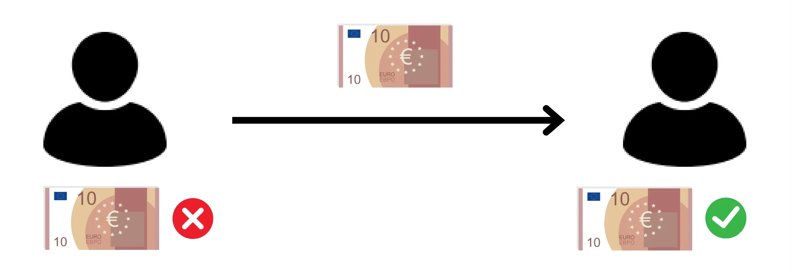


Voor digitale valuta is de moeilijkheid anders. Het is vaak eenvoudiger om de authenticiteit en integriteit van een munt te garanderen. Zoals we in de vorige paragraaf zagen, maakt het UTXO model van Bitcoin het mogelijk om een munt terug te voeren naar zijn oorsprong, en dus te verifiëren dat hij inderdaad is gecreëerd door een Miner in overeenstemming met de consensusregels.


Aan de andere kant is het complexer om ervoor te zorgen dat er geen Double-spending is, omdat alle digitale goederen in essentie informatie zijn. In tegenstelling tot fysieke goederen wordt informatie niet opgedeeld wanneer het wordt uitgewisseld, maar verspreidt het zich door vermenigvuldiging. Als ik je bijvoorbeeld een document per e-mail stuur, wordt het gedupliceerd. Je kunt er niet zeker van zijn dat ik het originele document heb verwijderd.


### Dubbele uitgaven aan Bitcoin voorkomen


De enige manier om deze duplicatie van een digitaal actief te vermijden, is om op de hoogte te zijn van alle uitwisselingen op het systeem. Op die manier kunnen we weten wie wat bezit en ieders bezit bijwerken op basis van de uitgevoerde transacties. Dit gebeurt bijvoorbeeld met giraal geld in het banksysteem. Wanneer je €10 betaalt aan een handelaar met een creditcard, registreert de bank de Exchange en werkt het rekeningboek bij.


Op Bitcoin wordt Double-spending op dezelfde manier voorkomen. We proberen te bevestigen dat er geen transactie heeft plaatsgevonden waarbij de betreffende munten al zijn uitgegeven. Als de munten nooit zijn gebruikt, kunnen we er zeker van zijn dat er geen dubbele uitgaven zullen plaatsvinden. Dit principe werd beschreven door Satoshi Nakamoto in het Witboek met de beroemde zin:


**De enige manier om de afwezigheid van een transactie te bevestigen is door op de hoogte te zijn van alle transacties**


Maar in tegenstelling tot het bankmodel, willen we geen centrale entiteit op Bitcoin hoeven vertrouwen. Dus alle gebruikers moeten deze afwezigheid van dubbele uitgaven kunnen bevestigen, zonder afhankelijk te zijn van een derde partij. Iedereen moet dus op de hoogte zijn van alle Bitcoin transacties. Daarom worden Bitcoin transacties publiekelijk uitgezonden op alle netwerkknooppunten en in duidelijke tekst opgeslagen op de Blockchain.


Het is precies deze publieke verspreiding van informatie die de bescherming van de privacy in Bitcoin bemoeilijkt. In het traditionele banksysteem is in theorie alleen de financiële instelling op de hoogte van de uitgevoerde transacties. Bij Bitcoin daarentegen zijn alle gebruikers via hun respectievelijke knooppunten op de hoogte van alle transacties.


### Het vertrouwelijkheidsmodel: banksysteem vs. Bitcoin


In het traditionele systeem is je bankrekening gekoppeld aan je identiteit. De bankier weet welke bankrekening aan welke klant toebehoort en welke transacties daaraan gekoppeld zijn. Deze informatiestroom is echter afgesneden tussen de bank en het publieke domein. Met andere woorden, het is onmogelijk om het saldo en de transacties van een bankrekening van een ander individu te kennen. Alleen de bank heeft toegang tot deze informatie.


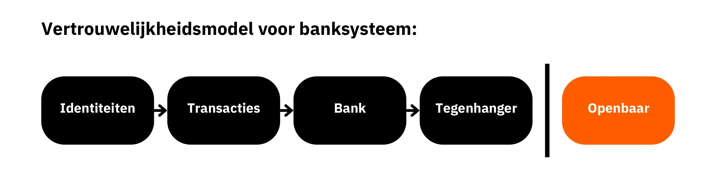


Je bankier weet bijvoorbeeld dat je elke ochtend je stokbrood koopt bij de plaatselijke bakker, maar je buurman heeft geen weet van deze transactie. Op deze manier is de informatiestroom toegankelijk voor de betrokken partijen, met name de bank, maar blijft deze ontoegankelijk voor buitenstaanders.


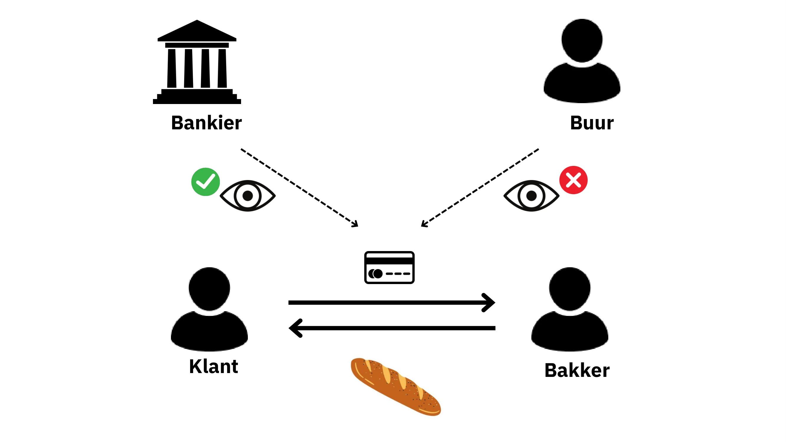


Vanwege de beperking van openbare verspreiding van transacties die we in de vorige paragraaf zagen, kan het vertrouwelijkheidsmodel van Bitcoin niet het model van het banksysteem volgen. In het geval van Bitcoin, omdat de informatiestroom niet verbroken kan worden tussen de transacties en het publieke domein, is **het privacymodel gebaseerd op de scheiding tussen de identiteit van de gebruiker en de transacties** zelf.


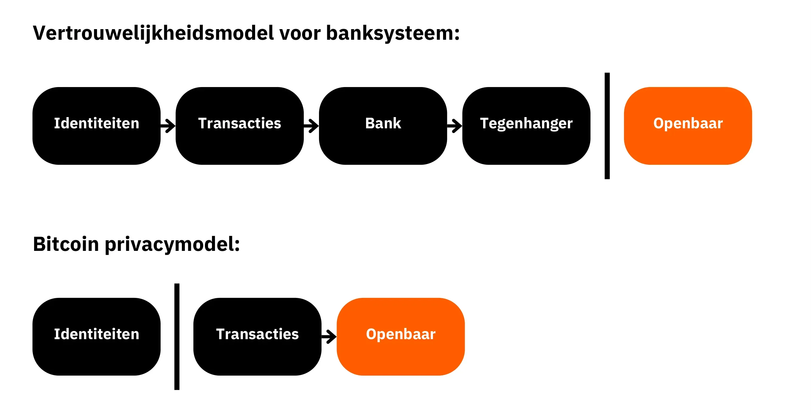


Als je bijvoorbeeld een stokbrood koopt bij de bakker en betaalt in BTC, kan je buurman, die zijn eigen volledige node heeft, jouw transactie zien doorgaan, net zoals hij alle andere transacties in het systeem kan zien. Maar als de vertrouwelijkheidsprincipes gerespecteerd worden, zou hij deze specifieke transactie niet moeten kunnen linken aan jouw identiteit.


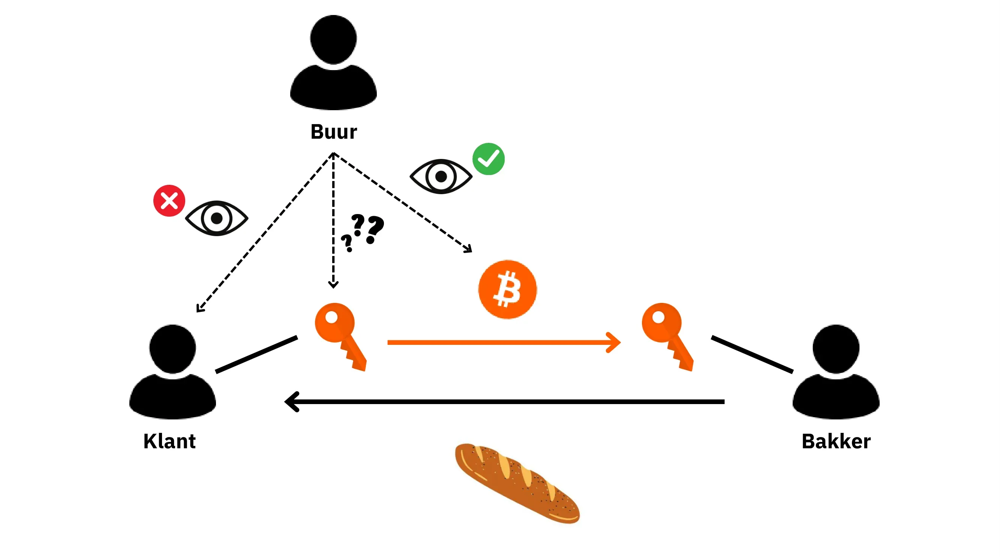


Maar omdat Bitcoin transacties openbaar worden gemaakt, is het nog steeds mogelijk om verbanden te leggen om informatie af te leiden over de betrokken partijen. Deze activiteit vormt zelfs een specialisme op zich, bekend als "Blockchain analyse". In het volgende deel van de cursus nodig ik je uit om de grondbeginselen van Blockchain analyse te verkennen, zodat je kunt begrijpen hoe je bitcoins worden getraceerd en je je er beter tegen kunt verdedigen.


# Inzicht in en bescherming tegen ketenanalyse


<partId>4739371e-9fef-45b0-bcaa-b7a4df6b4470</partId>


## Wat is Bitcoin ketenanalyse?


<chapterId>7d198ba6-4af2-4f24-86cb-3c79cb25627e</chapterId>


### Definitie en werking


Blockchain analyse is de praktijk van het traceren van de stroom bitcoins op de Blockchain. Over het algemeen is ketenanalyse gebaseerd op de observatie van karakteristieken in steekproeven van eerdere transacties. Het bestaat dan uit het identificeren van diezelfde kenmerken bij een transactie die we willen analyseren, en daaruit plausibele interpretaties af te leiden. Deze probleemoplossingsmethode, gebaseerd op een praktische benadering om een oplossing te vinden die goed genoeg is, staat bekend als een "heuristiek".


In lekentaal zijn er drie hoofdfasen in de ketenanalyse:
1. **Het observeren van de Blockchain ;**
2. **De identificatie van bekende kenmerken ;**
3. **Het aftrekken van aannames**


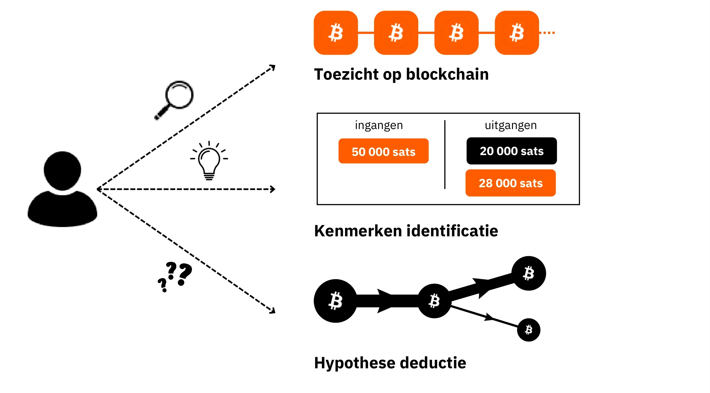


Blockchain analyse kan door iedereen worden uitgevoerd. Alles wat je nodig hebt is toegang tot de openbare informatie van de Blockchain via een compleet knooppunt om transactiebewegingen te observeren en hypotheses te maken. Er zijn ook gratis tools die deze analyse vergemakkelijken, zoals [OXT.me](https://oxt.me/), die we in detail zullen onderzoeken in de laatste twee hoofdstukken van deze sectie. Het grootste risico voor vertrouwelijkheid komt echter van bedrijven die gespecialiseerd zijn in stringanalyse. Deze bedrijven hebben Blockchain analyse op industriële schaal gebracht en verkopen hun diensten aan financiële instellingen en overheden. Van deze bedrijven is Chainalysis zeker het bekendst.


### Doelstellingen ketenanalyse


Eén van de doelen van de Blockchain analyse is het groeperen van verschillende activiteiten op Bitcoin om de uniciteit te bepalen van de gebruiker die ze uitvoerde. Vervolgens kan geprobeerd worden om dit cluster van activiteiten te koppelen aan een echte identiteit.


Denk terug aan het vorige hoofdstuk. Ik heb uitgelegd waarom het privacymodel van Bitcoin oorspronkelijk gebaseerd was op de scheiding van gebruikersidentiteit en transacties. Het zou daarom verleidelijk zijn om te denken dat Blockchain analyse nutteloos is, omdat zelfs als we erin slagen om onchain activiteiten te aggregeren, we ze niet kunnen associëren met een echte identiteit.


Theoretisch is deze bewering correct. In het eerste deel van deze cursus zagen we dat cryptografische sleutelparen gebruikt worden om voorwaarden te stellen aan UTXO. In essentie geven deze sleutelparen geen informatie vrij over hun houders. In essentie geven deze sleutelparen geen informatie vrij over de identiteit van hun houders. Dus zelfs als we erin slagen om de activiteiten geassocieerd met verschillende sleutelparen te groeperen, zegt dit ons niets over de entiteit achter deze activiteiten.


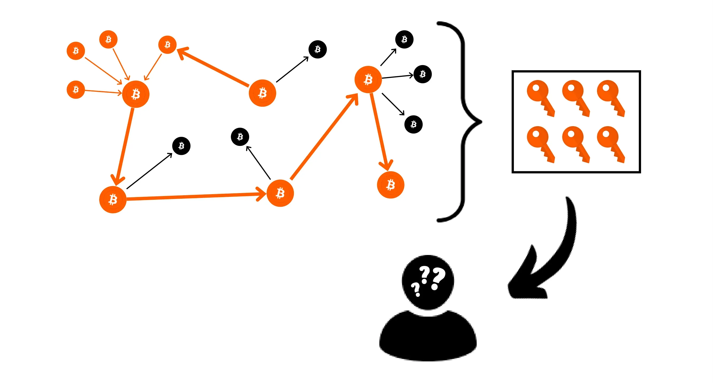


De praktische realiteit is echter veel complexer. Er is een veelheid aan gedragingen die een echte identiteit kunnen koppelen aan onchain-activiteiten. In analyse wordt dit een ingangspunt genoemd, en er zijn er een heleboel.


De meest voorkomende is KYC (*Know Your Customer*). Als je Bitcoins opneemt van een gereguleerd platform naar een van je persoonlijke ontvangstadressen, dan zijn sommige mensen in staat om jouw identiteit te koppelen aan die Address. In bredere zin kan een ingangspunt elke vorm van interactie zijn tussen jouw echte leven en een Bitcoin transactie. Als je bijvoorbeeld een ontvangende Address publiceert op je sociale netwerken, kan dit een ingang zijn voor analyse. Als je een betaling in Bitcoins doet aan je bakker, kan hij je gezicht (deel van je identiteit) associëren met een Bitcoin Address.


Deze ingangspunten zijn vrijwel onvermijdelijk bij het gebruik van Bitcoin. Ook al proberen we hun bereik te beperken, ze zullen altijd aanwezig zijn. Daarom is het cruciaal om methodes te combineren die gericht zijn op het beschermen van je privacy. Hoewel het handhaven van een scheiding tussen je echte identiteit en je transacties een interessante benadering is, blijft het vandaag de dag onvoldoende. Sterker nog, als al je onchain-activiteiten kunnen worden gegroepeerd, zal zelfs het kleinste toegangspunt waarschijnlijk de enige Layer van vertrouwelijkheid die je hebt ingesteld in gevaar brengen.


### Jezelf verdedigen tegen ketenanalyse


We moeten dus ook kunnen omgaan met Blockchain analyse in ons gebruik van Bitcoin. Door dit te doen, kunnen we de aggregatie van onze activiteiten minimaliseren en de impact van een toegangspunt op onze privacy beperken.


Wat is een betere manier om de analyse van Blockchain tegen te gaan dan te leren over de methodes die erin gebruikt worden? Als je wilt weten hoe je je privacy op Bitcoin kunt verbeteren, moet je deze methoden begrijpen. Dit geeft je een beter begrip van technieken zoals CoinJoin of PayJoin (technieken die we in de laatste delen van de cursus zullen bekijken), en vermindert de fouten die je zou kunnen maken.


https://planb.network/tutorials/privacy/on-chain/coinjoin-samourai-wallet-e566803d-ab3f-4d98-9136-5462009262ef

https://planb.network/tutorials/privacy/on-chain/payjoin-848b6a23-deb2-4c5f-a27e-93e2f842140f

Hierin kunnen we een analogie trekken met cryptografie en cryptoanalyse. Een goede cryptograaf is eerst en vooral een goede cryptanalist. Om een nieuw versleutelingsalgoritme te bedenken, moet je weten welke aanvallen het zal ondervinden en ook bestuderen waarom eerdere algoritmen gebroken zijn. Hetzelfde principe geldt voor Bitcoin privacy. Inzicht in Blockchain analysemethoden is de sleutel tot bescherming ertegen. Daarom heb ik een hele sectie on chain analyse in deze training opgenomen.


### Ketenanalysemethoden


Het is belangrijk om te begrijpen dat snaaranalyse geen exacte wetenschap is. Het is afhankelijk van heuristieken die zijn afgeleid van eerdere waarnemingen of logische interpretaties. Deze regels stellen ons in staat om redelijk betrouwbare resultaten te verkrijgen, maar nooit met absolute precisie. Met andere woorden, **kettinganalyse omvat altijd een dimensie van waarschijnlijkheid in de bereikte conclusies**. Het is bijvoorbeeld mogelijk om met verschillende mate van zekerheid te schatten dat twee adressen tot dezelfde entiteit behoren, maar volledige zekerheid zal altijd buiten bereik blijven.


Het hele punt van ketenanalyse ligt juist in het samenvoegen van verschillende heuristieken om het risico op fouten te minimaliseren. In zekere zin is het een opeenstapeling van bewijzen die ons dichter bij de werkelijkheid brengt.


Deze beroemde heuristieken kunnen gegroepeerd worden in verschillende categorieën, die we hieronder in detail zullen beschrijven:


- Transactiepatronen;
- Transactie-interne heuristiek ;**
- Heuristiek buiten de transactie.


### Satoshi Nakamoto en ketenanalyse


De eerste twee heuristieken voor ketenanalyse werden ontdekt door Satoshi Nakamoto zelf. Hij vertelt erover in deel 10 van Bitcoin's witboek. Het zijn :


- cIOH (*Common Input Ownership Heuristic*);
- en Address hergebruik.


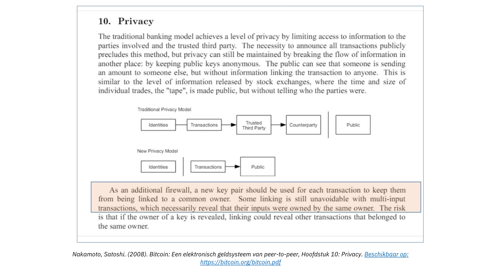


Bron: S. Nakamoto, "Bitcoin: Een Peer-to-Peer elektronisch geldsysteem", https://Bitcoin.org/Bitcoin.pdf, 2009.


We zullen in de volgende hoofdstukken zien welke dat zijn, maar het is nu al interessant om op te merken dat deze twee heuristieken vandaag de dag nog steeds een prominente plaats innemen in ketenanalyse.


## Transactiepatronen


<chapterId>d365a101-2d37-46a5-bfb9-3c51e37bf96b</chapterId>


Een transactiepatroon is eenvoudigweg een algemeen model of structuur van een typische transactie, die gevonden kan worden op de Blockchain, en waarvan de waarschijnlijke interpretatie bekend is. Bij het bestuderen van patronen richten we ons op een enkele transactie en analyseren die op een hoog niveau.


Met andere woorden, we gaan alleen kijken naar het aantal UTXO in de inputs en het aantal UTXO in de outputs, zonder in te gaan op de meer specifieke details of omgeving van de transactie. Op basis van het waargenomen patroon kunnen we de aard van de transactie interpreteren. We gaan dan op zoek naar kenmerken van de structuur en leiden daaruit een interpretatie af.


In dit gedeelte zullen we samen kijken naar de belangrijkste transactiemodellen die je tegenkomt bij ketenanalyse, en voor elk model geef ik je de waarschijnlijke interpretatie van deze structuur, evenals een concreet voorbeeld.


### Enkele zending (of enkele betaling)


Laten we beginnen met een veel voorkomend patroon, omdat dit het patroon is dat bij de meeste Bitcoin betalingen naar voren komt. Het eenvoudige betalingsmodel wordt gekenmerkt door het verbruik van één of meer UTXO's als input en de productie van 2 UTXO's als output. Dit model ziet er dus als volgt uit:


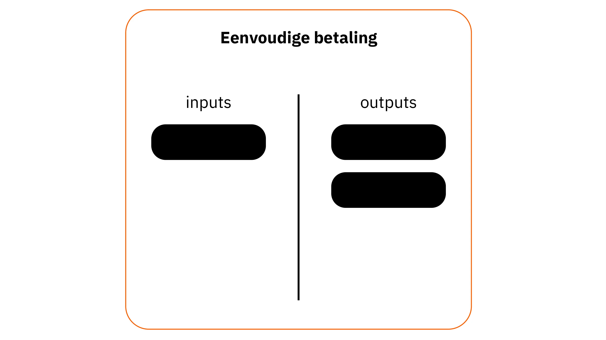


Wanneer we deze transactiestructuur op de Blockchain zien, kunnen we al een interpretatie trekken. Zoals de naam al aangeeft, geeft dit model aan dat we in de aanwezigheid zijn van een verzend- of betalingstransactie. De gebruiker heeft zijn eigen UTXO verbruikt in inputs om in outputs te voldoen aan een UTXO betaling en een Exchange UTXO (geld teruggegeven aan dezelfde gebruiker).


We weten dus dat de waargenomen gebruiker waarschijnlijk niet langer in het bezit is van één van de twee output UTXO's (de betaling UTXO), maar nog wel in het bezit is van de andere UTXO (de Exchange UTXO).


Op dit moment kunnen we niet specificeren welke uitvoer welke UTXO voorstelt, omdat dit niet het doel is van de patroonstudie. We komen er wel door te vertrouwen op de heuristieken die we in de volgende secties zullen bestuderen. In dit stadium is ons doel beperkt tot het identificeren van de aard van de transactie in kwestie, die in dit geval een eenvoudige verzending is.


Hier is bijvoorbeeld een Bitcoin transactie die het eenvoudige verzendpatroon gebruikt:


```plaintext
b6cc79f45fd2d7669ff94db5cb14c45f1f879ea0ba4c6e3d16ad53a18c34b769
```


Source : [Mempool.space](https://Mempool.space/fr/tx/b6cc79f45fd2d7669ff94db5cb14c45f1f879ea0ba4c6e3d16ad53a18c34b769)


Na dit eerste voorbeeld zou je beter moeten begrijpen wat het betekent om een "transactiemodel" te bestuderen. We onderzoeken een transactie door ons alleen te richten op de structuur, zonder rekening te houden met de omgeving of de specifieke details van de transactie. In deze eerste stap kijken we alleen naar het grote geheel.


Nu je begrijpt wat een patroon is, gaan we verder met de andere bestaande modellen.


### Vegen


Dit tweede model wordt gekenmerkt door het verbruik van één UTXO als input en de productie van één UTXO als output.


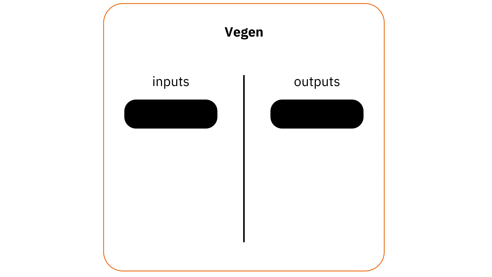


De interpretatie van dit model is dat we te maken hebben met een zelfoverdracht. De gebruiker heeft zijn bitcoins naar zichzelf overgedragen, naar een andere Address die van hem is. Aangezien er geen Exchange op de transactie staat, is het hoogst onwaarschijnlijk dat we hier te maken hebben met een betaling. Bij een betaling is het namelijk bijna onmogelijk dat de betaler een UTXO heeft die precies overeenkomt met het bedrag dat de verkoper nodig heeft, plus de transactiekosten. In het algemeen is de betaler daarom verplicht om een Exchange output te produceren.


We weten dan dat de waargenomen gebruiker waarschijnlijk nog steeds in het bezit is van deze UTXO. In de context van een ketenanalyse, als we weten dat de UTXO gebruikt als input voor de transactie, toebehoort aan Alice, kunnen we aannemen dat de UTXO gebruikt als output, ook aan haar toebehoort. Wat later interessant wordt, is het vinden van transactie-interne heuristieken die deze aanname kunnen versterken (we bekijken deze heuristieken in hoofdstuk 3.3).


Hier is bijvoorbeeld een Bitcoin transactie die het veegpatroon gebruikt:


```plaintext
35f1072a0fda5ae106efb4fda871ab40e1f8023c6c47f396441ad4b995ea693d
```


Source : [Mempool.space](https://Mempool.space/fr/tx/35f1072a0fda5ae106efb4fda871ab40e1f8023c6c47f396441ad4b995ea693d)


Pas echter op dat dit type patroon ook een zelfoverboeking naar de rekening van een cryptocurrency Exchange platform kan onthullen. Het zal de studie van bekende adressen en de context van de transactie zijn die ons zal vertellen of het een veeg is naar een zelfbewaarde Wallet of een opname naar een platform. De adressen van Exchange-platforms zijn namelijk vaak gemakkelijk te identificeren.


Laten we het voorbeeld van Alice nog eens nemen: als de scan leidt naar een Address die bekend is bij een platform (zoals Binance bijvoorbeeld), kan dit betekenen dat de bitcoins zijn overgedragen uit het directe bezit van Alice, waarschijnlijk met de bedoeling om ze te verkopen of op te slaan op dit platform. Aan de andere kant, als de bestemming Address onbekend is, is het redelijk om aan te nemen dat het gewoon een andere Wallet is die nog steeds bij Alice hoort. Maar dit soort onderzoek valt meer in de categorie heuristieken dan patronen.


### Consolidatie


Dit model wordt gekenmerkt door het verbruik van meerdere UTXO's aan de ingang en de productie van een enkele UTXO aan de uitgang.


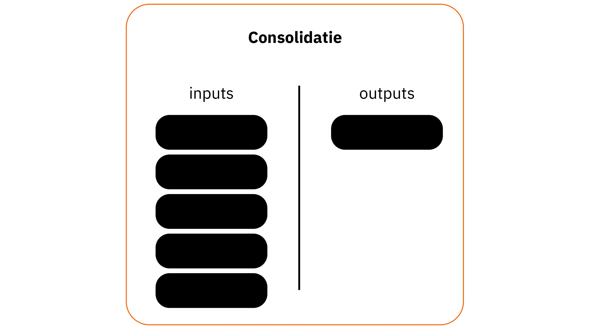


De interpretatie van dit patroon is dat we te maken hebben met consolidatie. Dit is een gebruikelijke praktijk onder Bitcoin gebruikers, gericht op het samenvoegen van verschillende UTXO's in afwachting van een mogelijke verhoging van de transactiekosten. Door deze operatie uit te voeren in een periode waarin de vergoedingen laag zijn, is het mogelijk om te besparen op toekomstige vergoedingen. We zullen meer over deze praktijk vertellen in hoofdstuk 4.3.


We kunnen afleiden dat de gebruiker achter dit transactiemodel waarschijnlijk in het bezit was van alle UTXO's in de invoer en nog steeds in het bezit is van de UTXO in de uitvoer. Het is dus waarschijnlijk een auto-transfer.


Net als de sweep kan dit type patroon ook een zelfoverboeking naar de rekening van een Exchange platform onthullen. De studie van bekende adressen en de context van de transactie zullen ons vertellen of het een consolidatie is naar een self-custody portefeuille of een opname naar een platform.


Hier is bijvoorbeeld een Bitcoin transactie die het consolidatiepatroon volgt:


```plaintext
77c16914211e237a9bd51a7ce0b1a7368631caed515fe51b081d220590589e94
```


Source : [Mempool.space](https://Mempool.space/fr/tx/77c16914211e237a9bd51a7ce0b1a7368631caed515fe51b081d220590589e94)


In een ketenanalyse kan dit model veel informatie onthullen. Als we bijvoorbeeld weten dat één van de inputs van Alice is, kunnen we aannemen dat alle andere inputs en de output van deze transactie ook van haar zijn. Deze aanname maakt het dan mogelijk om terug te gaan in de keten van eerdere transacties om andere transacties te ontdekken en te analyseren die waarschijnlijk verbonden zijn met Alice.


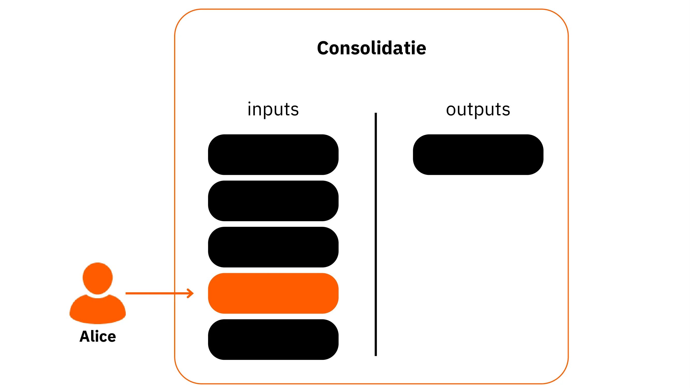


### Gegroepeerde uitgaven


Dit model wordt gekenmerkt door het verbruik van een paar UTXO's als input (vaak maar één) en de productie van veel UTXO's als output.


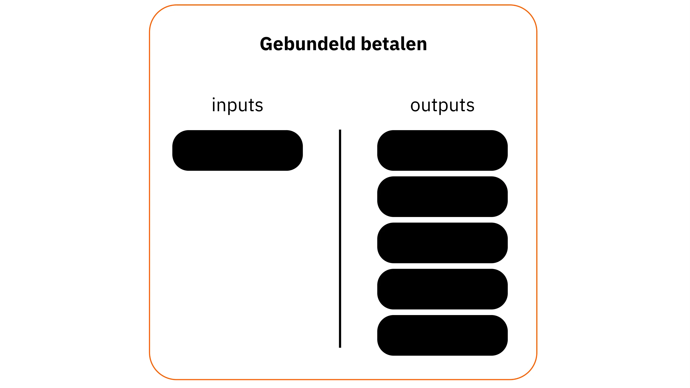


De interpretatie van dit model is dat we te maken hebben met gegroepeerde uitgaven. Het is een praktijk die waarschijnlijk een zeer grote economische activiteit onthult, zoals een Exchange platform. Gegroepeerde uitgaven stellen deze entiteiten in staat om kosten te besparen door hun uitgaven te combineren in een enkele transactie.


We kunnen uit dit model afleiden dat de UTXO in de input afkomstig is van een bedrijf met een hoog niveau van economische activiteit, en dat de UTXO's in de output zich zullen verspreiden. Veel zullen toebehoren aan de klanten van het bedrijf die bitcoins hebben opgenomen van het platform. Andere kunnen naar partnerbedrijven gaan. Tot slot zullen er zeker één of meer uitwisselingen zijn die teruggaan naar het bedrijf dat ze heeft uitgegeven.


Hier is bijvoorbeeld een Bitcoin transactie die het gebundelde uitgavenpatroon volgt (vermoedelijk is het een transactie uitgegeven door het Bybit platform):


```plaintext
8a7288758b6e5d550897beedd13c70bcbaba8709af01a7dbcc1f574b89176b43
```


Source : [Mempool.space](https://Mempool.space/fr/tx/8a7288758b6e5d550897beedd13c70bcbaba8709af01a7dbcc1f574b89176b43)


### Protocol-specifieke transacties


Onder de transactiepatronen kunnen we ook die identificeren die het gebruik van een specifiek protocol onthullen. Bijvoorbeeld, Whirlpool coinjoins (besproken in deel 5) hebben een gemakkelijk herkenbare structuur die ze onderscheidt van andere, meer conventionele transacties.


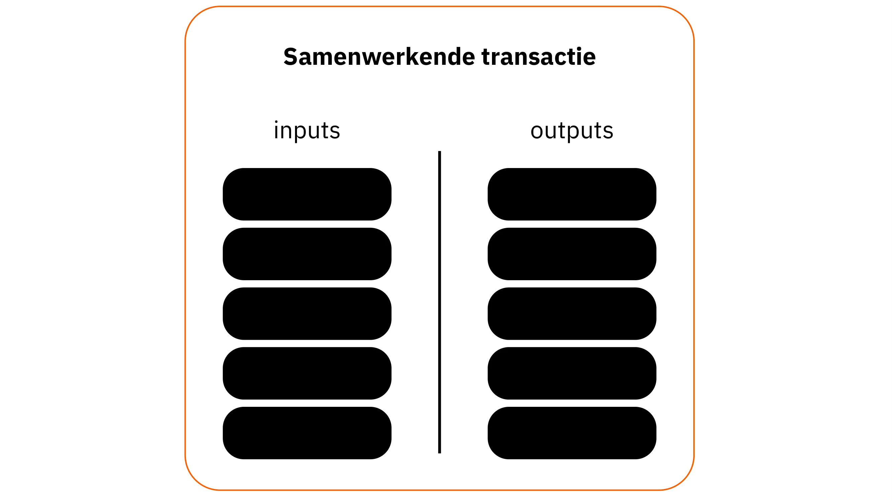


Analyse van dit patroon suggereert dat we ons waarschijnlijk in de aanwezigheid van een collaboratieve transactie bevinden. Het is ook mogelijk om een CoinJoin waar te nemen. Als deze laatste hypothese juist blijkt, dan kan het aantal exits ons een ruwe schatting geven van het aantal deelnemers aan de CoinJoin.


Hier is bijvoorbeeld een Bitcoin transactie die het CoinJoin collaboratieve transactiepatroon overneemt:


```plaintext
00601af905bede31086d9b1b79ee8399bd60c97e9c5bba197bdebeee028b9bea
```


Source : [Mempool.space](https://Mempool.space/fr/tx/00601af905bede31086d9b1b79ee8399bd60c97e9c5bba197bdebeee028b9bea)


Er zijn veel andere protocollen met hun eigen specifieke structuren. Er zijn bijvoorbeeld Wabisabi-transacties, Postzegeltransacties en Runentransacties.


Dankzij deze transactiepatronen kunnen we al een bepaalde hoeveelheid informatie over een bepaalde transactie interpreteren. Maar transactiestructuur is niet de enige bron van informatie voor analyse. We kunnen ook de details bestuderen. Deze interne details noem ik "interne heuristieken" en zullen we in het volgende hoofdstuk bekijken.


## Interne heuristieken


<chapterId>c54b5abe-872f-40f4-a0d0-c59faff228ba</chapterId>


Een interne heuristiek is een specifiek kenmerk dat we identificeren binnen een transactie zelf, zonder dat we de omgeving hoeven te onderzoeken, en dat ons in staat stelt om conclusies te trekken. In tegenstelling tot patronen, die zich richten op de algemene structuur van de transactie op een hoog niveau, zijn interne heuristieken gebaseerd op de set van extraheerbare gegevens. Dit omvat:


- De bedragen van de verschillende UTXO's in en uit;
- Alles wat met scripts te maken heeft: ontvangstadressen, versiebeheer, locktijden...


Over het algemeen stelt dit type heuristiek ons in staat om de Exchange in een specifieke transactie te identificeren. Door dit te doen, kunnen we de tracering van een entiteit voortzetten over verschillende transacties. Als we namelijk een UTXO identificeren, die toebehoort aan een gebruiker die we willen traceren, is het cruciaal om te bepalen, wanneer hij een transactie uitvoert, welke uitvoer is overgedragen aan een andere gebruiker en welke uitvoer de Exchange vertegenwoordigt, die dus in zijn bezit blijft.


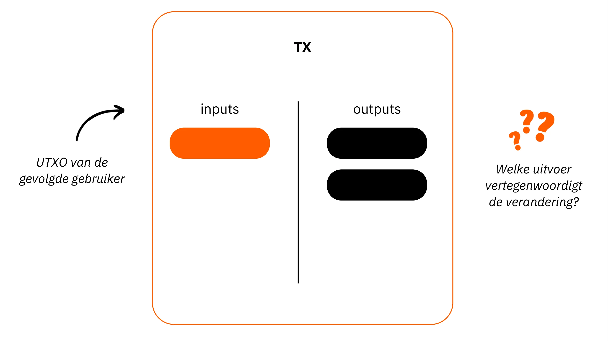


Ik wil je er nogmaals aan herinneren dat deze heuristieken niet absoluut nauwkeurig zijn. Individueel stellen ze ons alleen in staat om waarschijnlijke scenario's te identificeren. Het is de opeenstapeling van verschillende heuristieken die helpt om onzekerheid te verminderen, zonder deze ooit volledig te kunnen elimineren.


### Interne overeenkomsten


Bij deze heuristiek wordt gekeken naar overeenkomsten tussen de inputs en outputs van dezelfde transactie. Als hetzelfde kenmerk wordt waargenomen op de inputs en op slechts één van de outputs van de transactie, dan is het waarschijnlijk dat deze output de Exchange vormt.


De meest voor de hand liggende eigenschap is het hergebruik van een ontvangende Address in dezelfde transactie.


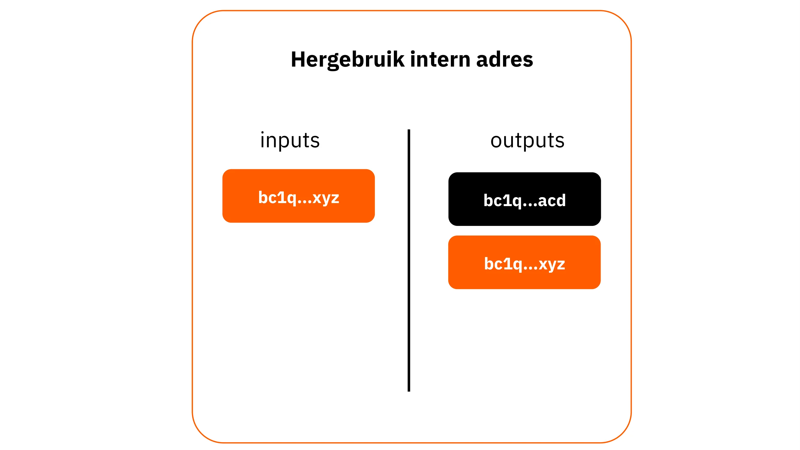


Deze heuristiek laat weinig ruimte voor twijfel. Tenzij zijn private sleutel gehackt is, onthult dezelfde ontvangen Address noodzakelijkerwijs de activiteit van een enkele gebruiker. De resulterende interpretatie is dat de transactie Exchange de uitvoer is met dezelfde Address als de invoer. We kunnen het individu dan verder traceren vanaf deze Exchange.


Hier is bijvoorbeeld een transactie waarop deze heuristiek waarschijnlijk kan worden toegepast:


```plaintext
54364146665bfc453a55eae4bfb8fdf7c721d02cb96aadc480c8b16bdeb8d6d0
```


Source : [Mempool.space](https://Mempool.space/tx/54364146665bfc453a55eae4bfb8fdf7c721d02cb96aadc480c8b16bdeb8d6d0)


Deze overeenkomsten tussen inputs en outputs stoppen niet bij Address hergebruik. Elke overeenkomst in het gebruik van scripts kan worden gebruikt om een heuristiek toe te passen. We kunnen bijvoorbeeld soms dezelfde versionering waarnemen tussen de invoer en een van de uitvoer van de transactie.


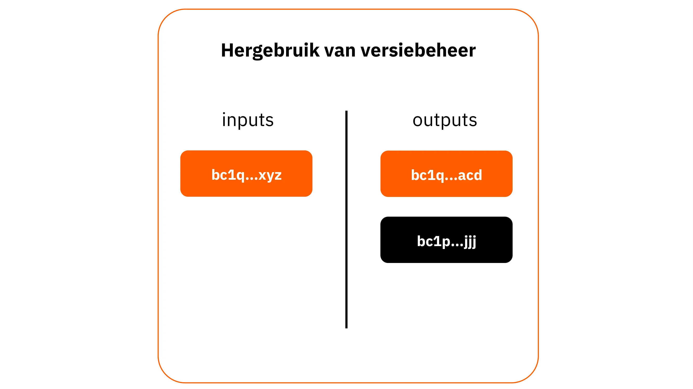


Op dit diagram kunnen we zien dat input n° 0 een P2WPKH script opent (SegWit V0 beginnend met `bc1q`). Output n° 0 gebruikt hetzelfde type script. Uitvoer nr. 1 daarentegen gebruikt een P2TR script (SegWit V1 beginnend met `bc1p`). De interpretatie van dit kenmerk is dat het waarschijnlijk is dat de Address met dezelfde versie als de invoer de Exchange Address is. Het zou dus altijd van dezelfde gebruiker zijn.


Hier is een transactie waarop deze heuristiek waarschijnlijk kan worden toegepast:


```plaintext
db07516288771ce5d0a06b275962ec4af1b74500739f168e5800cbcb0e9dd578
```


Source : [Mempool.space](https://Mempool.space/tx/db07516288771ce5d0a06b275962ec4af1b74500739f168e5800cbcb0e9dd578)


Op de laatste kunnen we zien dat ingang nr. 0 en uitgang nr. 1 P2WPKH scripts gebruiken (SegWit V0), terwijl uitgang nr. 0 een ander P2PKH script gebruikt (Legacy).


In het begin van 2010 was deze heuristiek op basis van scriptversie relatief nutteloos vanwege de beperkte beschikbare scripttypen. Na verloop van tijd en met opeenvolgende Bitcoin updates is er echter een toenemende diversiteit aan scripttypes geïntroduceerd. Deze heuristiek wordt daarom steeds relevanter, want met een breder scala aan scripttypen verdelen gebruikers zich in kleinere groepen, waardoor de kans toeneemt dat deze interne heuristiek voor hergebruik van versies wordt toegepast. Daarom is het, alleen al vanuit het oogpunt van vertrouwelijkheid, aan te raden om te kiezen voor het meest voorkomende type script. Bijvoorbeeld, terwijl ik deze regels schrijf, worden Taproot scripts (`bc1p`) minder vaak gebruikt dan SegWit V0 scripts (`bc1q`). Hoewel de eerste economische en vertrouwelijkheidsvoordelen bieden in bepaalde specifieke contexten, kan het voor meer traditionele toepassingen met één handtekening zinvol zijn om vast te houden aan een oudere standaard om vertrouwelijkheidsredenen, totdat de nieuwe standaard breder wordt aangenomen.


### Betalingen afronden


Een andere interne heuristiek die ons kan helpen de Exchange te identificeren is de ronde getallen heuristiek. In het algemeen geldt dat wanneer we worden geconfronteerd met een eenvoudig betalingspatroon (1 invoer en 2 uitgangen), als een van de uitgangen een rond bedrag uitgeeft, dit de betaling is.


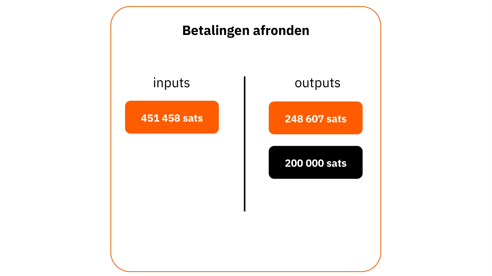


Door eliminatie, als de ene uitgang een betaling voorstelt, stelt de andere uitgang Exchange voor. Het kan daarom worden geïnterpreteerd als waarschijnlijk dat de inputgebruiker altijd in het bezit is van de output die is geïdentificeerd als Exchange.


Benadrukt moet worden dat deze heuristiek niet altijd toepasbaar is, omdat de meeste betalingen nog steeds in fiduciaire rekeneenheden worden gedaan. Wanneer een winkelier in Frankrijk Bitcoin accepteert, zal hij over het algemeen geen stabiele prijzen in Sats weergeven. In plaats daarvan zal hij kiezen voor een omrekening tussen de prijs in euro's en het te betalen bedrag in bitcoins. Er zouden dus geen ronde getallen moeten zijn aan het einde van de transactie.


Toch zou een analist kunnen proberen deze omrekening te maken door rekening te houden met het Exchange tarief dat van kracht was op het moment dat de transactie werd uitgezonden op het netwerk. Laten we het voorbeeld nemen van een transactie met een input van `97.552 Sats` en twee outputs, één van `31.085 Sats` en de andere van `64.152 Sats`. Op het eerste gezicht lijkt deze transactie geen ronde bedragen te bevatten. Maar door de Exchange koers van €64.339 toe te passen op het moment van de transactie, krijgen we de volgende omrekening in euro's:


- Een invoer van €62,76;
- Een productie van €20;
- Een opbrengst van €41,27.


Eenmaal omgezet in fiatvaluta, kan deze transactie gebruikt worden om de rond bedrag betaling heuristiek toe te passen. De €20 output ging waarschijnlijk naar een handelaar, of veranderde tenminste Ownership. De €41,27 output is waarschijnlijk in het bezit gebleven van de oorspronkelijke gebruiker.


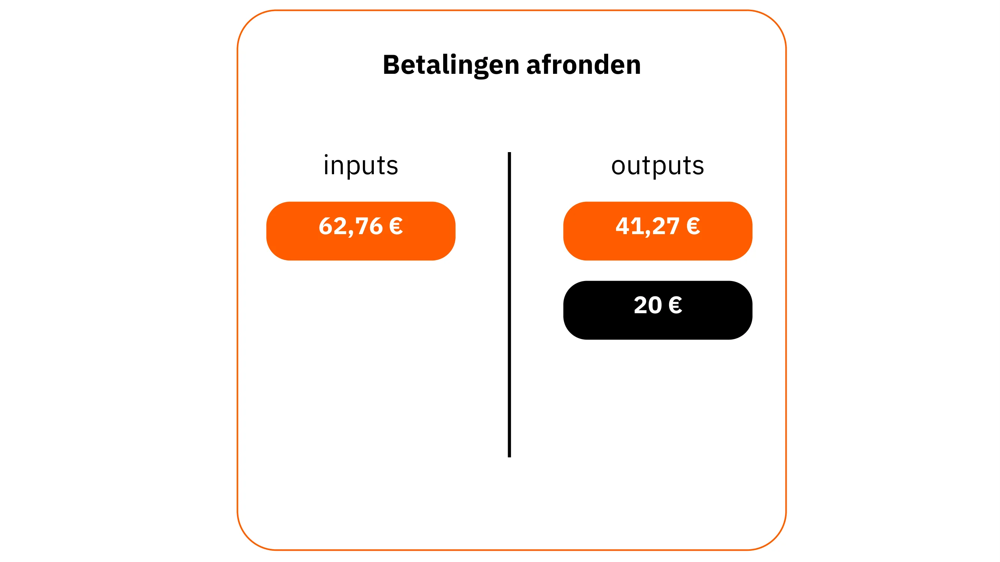


Als Bitcoin op een dag de favoriete rekeneenheid wordt in onze uitwisselingen, kan deze heuristiek nog nuttiger worden voor analyse.


Hier is bijvoorbeeld een transactie waarop deze heuristiek waarschijnlijk kan worden toegepast:


```plaintext
2bcb42fab7fba17ac1b176060e7d7d7730a7b807d470815f5034d52e96d2828a
```


Source : [Mempool.space](https://Mempool.space/tx/2bcb42fab7fba17ac1b176060e7d7d7730a7b807d470815f5034d52e96d2828a)


### De grootste uitvoer


Wanneer we een voldoende grote kloof tussen 2 transactieoutputs identificeren op een eenvoudig betalingsmodel, kunnen we schatten dat de grootste output waarschijnlijk buitenlands Exchange is.


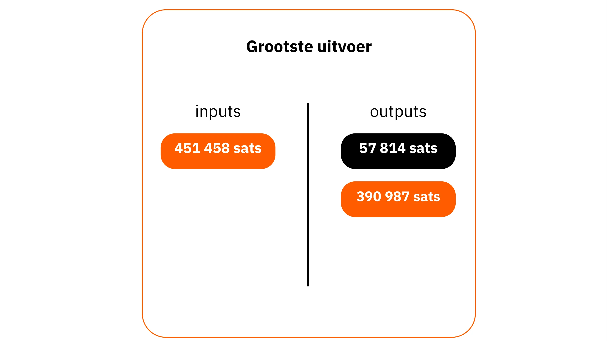


Deze grootste uitvoerheuristiek is zeker de meest onnauwkeurige van allemaal. Op zichzelf is hij behoorlijk zwak. Deze eigenschap kan echter worden gecombineerd met andere heuristieken om de onzekerheid van onze interpretatie te verminderen.


Als we bijvoorbeeld kijken naar een transactie met een ronde betaling en een grotere betaling, dan verminderen de toepassing van de heuristiek voor ronde betalingen en de heuristiek voor grotere betalingen samen onze mate van onzekerheid.


Hier is bijvoorbeeld een transactie waarop deze heuristiek waarschijnlijk kan worden toegepast:


```plaintext
b79d8f8e4756d34bbb26c659ab88314c220834c7a8b781c047a3916b56d14dcf
```


Source : [Mempool.space](https://Mempool.space/tx/b79d8f8e4756d34bbb26c659ab88314c220834c7a8b781c047a3916b56d14dcf)


## Externe heuristieken


<chapterId>4a170e3b-200d-431a-8285-18a23ff617ba</chapterId>


Het bestuderen van externe heuristieken betekent het analyseren van de overeenkomsten, patronen en kenmerken van bepaalde Elements die niet specifiek zijn voor de transactie zelf. Met andere woorden, terwijl we ons eerder beperkten tot het benutten van Elements die intrinsiek zijn aan de transactie met interne heuristieken, verbreden we nu ons analysegebied naar de omgeving van de transactie, dankzij externe heuristieken.


### Address hergebruik


Dit is een van de bekendste heuristieken van bitcoiners. Hergebruik van Address maakt het mogelijk om een verband te leggen tussen verschillende transacties en verschillende UTXO's. Dit gebeurt wanneer een Bitcoin die Address ontvangt meerdere keren wordt gebruikt. Dit gebeurt wanneer een Bitcoin ontvangende Address meerdere keren wordt gebruikt.


Het is dus mogelijk om Address hergebruik binnen dezelfde transactie te gebruiken als een interne heuristiek om de Exchange te identificeren (zoals we in het vorige hoofdstuk zagen). Maar Address hergebruik kan ook gebruikt worden als een externe heuristiek om de uniciteit van een entiteit achter verschillende transacties te herkennen.


De interpretatie van het hergebruik van een Address is dat alle UTXO's die op die Address geblokkeerd zijn tot dezelfde entiteit behoren (of hebben behoord). Deze heuristiek laat weinig ruimte voor onzekerheid. Eenmaal geïdentificeerd, komt de resulterende interpretatie waarschijnlijk overeen met de werkelijkheid. Het maakt daarom het groeperen van verschillende activiteiten op de keten mogelijk.


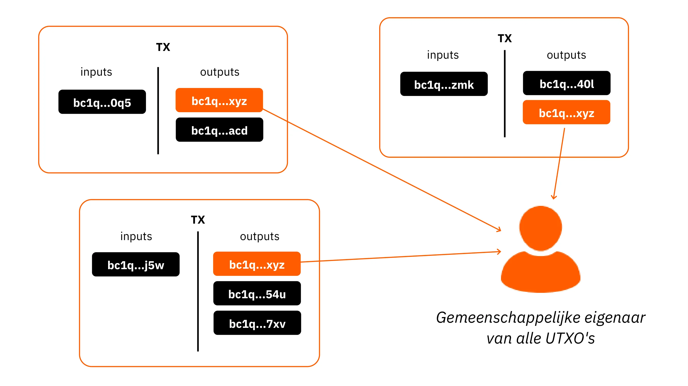


Zoals uitgelegd in de inleiding van deel 3, werd deze heuristiek ontdekt door Satoshi Nakamoto zelf. In het witboek noemt hij een oplossing om gebruikers te helpen voorkomen dat ze deze heuristiek genereren, namelijk gewoon een lege Address gebruiken voor elke nieuwe transactie:


"_Als extra firewall zou voor elke transactie een nieuw sleutelpaar gebruikt kunnen worden om ze niet te koppelen aan een gemeenschappelijke eigenaar._"


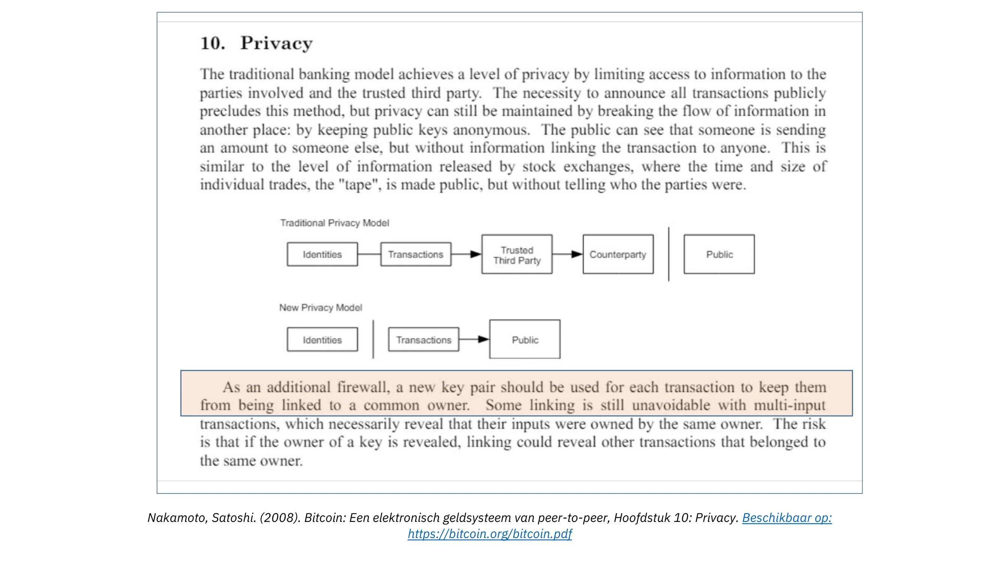


Bron: S. Nakamoto, "Bitcoin: A Peer-to-Peer Electronic Cash System", https://Bitcoin.org/Bitcoin.pdf, 2009.


Hier is bijvoorbeeld een Address die in meerdere transacties wordt hergebruikt:


```plaintext
bc1qqtmeu0eyvem9a85l3sghuhral8tk0ar7m4a0a0
```


Bron : [Mempool.space] (https://Mempool.space/Address/bc1qqtmeu0eyvem9a85l3sghuhral8tk0ar7m4a0a0)


### Gelijksoortige scripts en Wallet afdrukken


Naast het hergebruik van Address zijn er veel andere heuristieken waarmee je acties aan dezelfde portfolio of Address cluster kunt koppelen.


Ten eerste kan een analist zoeken naar overeenkomsten in scriptgebruik. Bepaalde minderheidsscripts zoals Multisig zijn bijvoorbeeld makkelijker te herkennen dan SegWit V0-scripts. Hoe groter de groep waarin we ons verbergen, hoe moeilijker het is om ons te herkennen. Dit is een van de redenen waarom bij goede CoinJoin protocollen alle deelnemers precies hetzelfde type script gebruiken.


Meer in het algemeen kan een analist zich ook richten op de karakteristieke vingerafdrukken van een portefeuille. Dit zijn gebruiksspecifieke processen die kunnen worden geïdentificeerd om ze te gebruiken als opsporingsheuristiek. Met andere woorden, als we een opeenstapeling van dezelfde interne kenmerken waarnemen bij transacties die worden toegeschreven aan de getraceerde entiteit, kunnen we proberen deze zelfde kenmerken te identificeren bij andere transacties.


We kunnen bijvoorbeeld vaststellen dat de getraceerde gebruiker zijn wijzigingen systematisch naar P2TR adressen stuurt (`bc1p...`). Als dit proces zich herhaalt, kunnen we het gebruiken als een heuristiek voor de rest van onze analyse. We kunnen ook andere vingerafdrukken gebruiken, zoals de volgorde van UTXO's, de plaats van de wijziging in de uitvoer, RBF (Replace-by-fee) signalering, of het versienummer, het `nSequence` veld en het `nLockTime` veld.


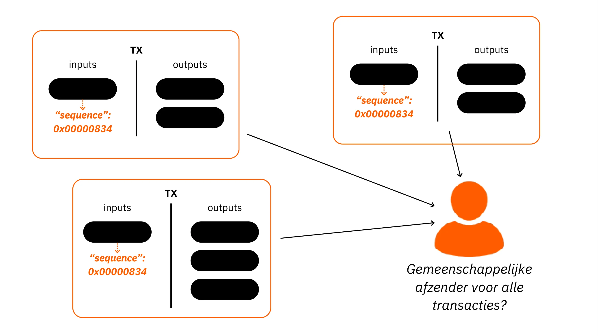


Zoals [@LaurentMT](https://twitter.com/LaurentMT) opmerkt in [Space Kek #19](https://podcasters.spotify.com/pod/show/decouvrebitcoin/episodes/SpaceKek-19---Analyse-de-chane--anonsets-et-entropie-e1vfuji) (een Franstalige podcast), neemt het nut van portfolio fingerprints in ketenanalyse in de loop der tijd aanzienlijk toe. Het groeiende aantal scripttypes en de steeds progressievere toepassing van deze nieuwe functies door portfoliosoftware accentueren de verschillen. In sommige gevallen is het zelfs mogelijk om de exacte software te identificeren die wordt gebruikt door de entiteit die wordt gevolgd. Het is daarom belangrijk om te begrijpen dat de studie van portfoliofootprints vooral relevant is voor recente transacties en niet zozeer voor transacties die begin 2010 zijn gestart.


Kortom, een footprint kan elke specifieke praktijk zijn, automatisch uitgevoerd door Wallet of handmatig door de gebruiker, die we kunnen vinden bij andere transacties om ons te helpen bij onze analyse.


### De Common Input Ownership Heuristiek (CIOH)


De Common Input Ownership Heuristic (CIOH) is een heuristiek die stelt dat wanneer een transactie meerdere inputs heeft, ze waarschijnlijk allemaal van één entiteit afkomstig zijn. Bijgevolg is hun Ownership gemeenschappelijk.


Om het CIOH toe te passen, observeren we eerst een transactie met meerdere ingangen. Dit kunnen 2 ingangen zijn, of 30 ingangen. Zodra dit kenmerk is geïdentificeerd, controleren we of de transactie past in een bekend transactiemodel. Als er bijvoorbeeld 5 ingangen zijn met ongeveer hetzelfde bedrag en 5 uitgangen met precies hetzelfde bedrag, dan weten we dat dit de structuur van een CoinJoin is. We kunnen de CIOH dan niet toepassen.


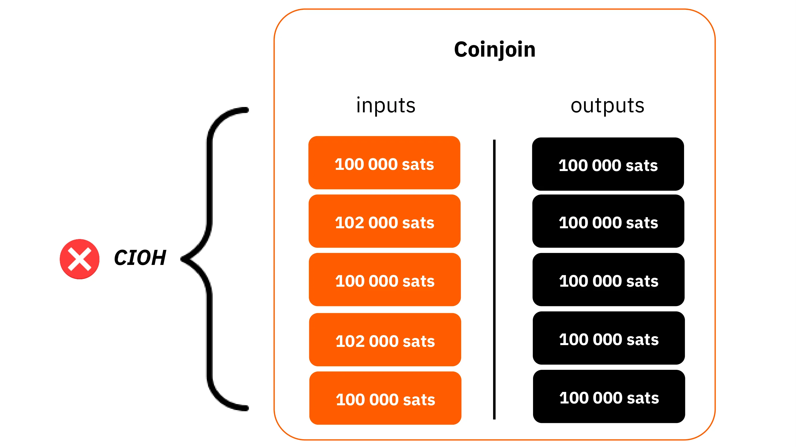


Aan de andere kant, als de transactie niet past in een bekend collaboratief transactiemodel, dan kunnen we interpreteren dat alle input waarschijnlijk van dezelfde entiteit komt. Dit kan erg nuttig zijn voor het uitbreiden van een al bekend cluster of het voortzetten van een spoor.


CIOH werd ontdekt door Satoshi Nakamoto. Hij vertelt erover in deel 10 van het witboek:


"_[...] linken is onvermijdelijk bij transacties met meerdere ingangen, waarbij noodzakelijkerwijs zichtbaar wordt dat hun ingangen van dezelfde eigenaar waren. Het risico is dat als de eigenaar van een sleutel wordt onthuld, de koppelingen andere transacties kunnen onthullen die aan dezelfde eigenaar toebehoorden._"


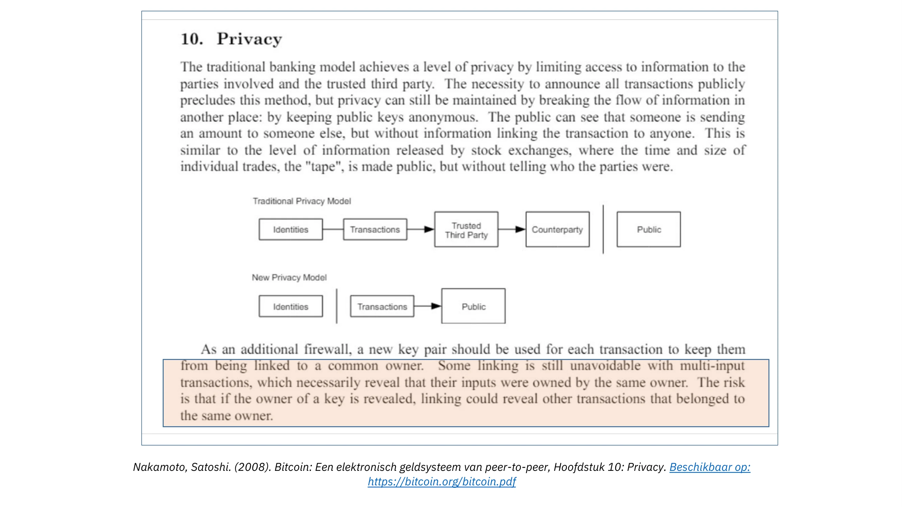


Het is vooral fascinerend om te zien dat Satoshi Nakamoto, zelfs voor de officiële lancering van Bitcoin, al de twee belangrijkste privacykwetsbaarheden voor gebruikers had geïdentificeerd, namelijk CIOH en Address hergebruik. Zo'n vooruitziende blik is opmerkelijk, omdat deze twee heuristieken zelfs vandaag de dag nog het meest bruikbaar zijn bij Blockchain analyse.


Om een voorbeeld te geven: hier is een transactie waarop we CIOH waarschijnlijk kunnen toepassen:


```plaintext
20618e63b6eed056263fa52a2282c8897ab2ee71604c7faccfe748e1a202d712
```


Source : [Mempool.space](https://Mempool.space/tx/20618e63b6eed056263fa52a2282c8897ab2ee71604c7faccfe748e1a202d712)


### off-chain gegevens


Natuurlijk is ketenanalyse niet uitsluitend beperkt tot gegevens over de keten. Alle gegevens uit een eerdere analyse of beschikbaar op internet kunnen ook worden gebruikt om een analyse te verfijnen.


Als we bijvoorbeeld zien dat getraceerde transacties systematisch worden uitgezonden vanaf hetzelfde Bitcoin knooppunt en we kunnen het IP Address identificeren, dan kunnen we mogelijk andere transacties van dezelfde entiteit identificeren en een deel van de identiteit van de emittent vaststellen. Hoewel deze praktijk niet gemakkelijk uitvoerbaar is, omdat het de werking van talrijke knooppunten vereist, kan het gebruikt worden door sommige bedrijven die gespecialiseerd zijn in Blockchain analyse.


De analist heeft ook de mogelijkheid om te vertrouwen op analyses die eerder open source zijn gemaakt, of op zijn eigen eerdere analyses. Misschien kunnen we een uitvoer vinden die wijst naar een cluster van adressen die we al geïdentificeerd hebben. Soms is het ook mogelijk om te vertrouwen op uitvoer die wijst naar een Exchange platform, omdat de adressen van deze bedrijven algemeen bekend zijn.


Op dezelfde manier kun je een analyse uitvoeren door eliminatie. Als bijvoorbeeld bij het analyseren van een transactie met twee uitgangen, één daarvan betrekking heeft op een Address cluster dat al bekend is, maar verschilt van de entiteit die we traceren, dan kunnen we interpreteren dat de andere uitgang waarschijnlijk Exchange voorstelt.


Kanaalanalyse omvat ook een iets algemenere OSINT-component (*Open Source Intelligence*), waarbij gezocht wordt op internet. Daarom raden we af om adressen rechtstreeks te publiceren op sociale netwerken of op een website, al dan niet onder een pseudoniem.


### Temporele modellen


We staan er minder bij stil, maar bepaalde menselijke gedragingen zijn aan een ketting te herkennen. Misschien wel het nuttigst in een analyse is je slaappatroon! Ja, als je slaapt, zend je geen Bitcoin transacties uit. Maar over het algemeen slaap je op ongeveer dezelfde tijd. Daarom is het gebruikelijk om temporele analyse te gebruiken bij Blockchain analyse. Simpel gezegd is dit een telling van de tijden waarop de transacties van een bepaalde entiteit worden uitgezonden naar het Bitcoin netwerk. Door deze temporele patronen te analyseren, kunnen we een schat aan informatie afleiden.


Allereerst kan een temporele analyse soms de aard van de getraceerde entiteit identificeren. Als we zien dat de transacties consistent over 24 uur worden uitgezonden, dan verraadt dit een hoog niveau van economische activiteit. De entiteit achter deze transacties is waarschijnlijk een bedrijf, mogelijk internationaal en misschien met geautomatiseerde interne procedures.


Bijvoorbeeld, [ik herkende dit patroon een paar maanden geleden](https://twitter.com/Loic_Pandul/status/1701127409712452072) bij het analyseren van [de transactie die per ongeluk 19 bitcoins aan vergoedingen had toegewezen](https://Mempool.space/tx/d5392d474b4c436e1c9d1f4ff4be5f5f9bb0eb2e26b61d2781751474b7e870fd). Een eenvoudige temporele analyse stelde me in staat om de hypothese te stellen dat we te maken hadden met een geautomatiseerde service, en dus waarschijnlijk met een grote entiteit zoals een Exchange platform.


Een paar dagen later werd inderdaad ontdekt dat het geld toebehoorde aan PayPal, via het Paxos Exchange platform.


Als we daarentegen kunnen zien dat het temporele patroon eerder verspreid is over 16 specifieke uren, dan kunnen we inschatten dat we te maken hebben met een individuele gebruiker, of misschien een lokaal bedrijf, afhankelijk van de uitgewisselde volumes.


Naast de aard van de waargenomen entiteit kan het temporele patroon ons ook vertellen waar de gebruiker zich ongeveer bevindt, dankzij tijdzones. Op deze manier kunnen we andere transacties matchen en hun tijdstempels gebruiken als een extra heuristiek die kan worden toegevoegd aan onze analyse.


Op de meervoudig gebruikte Address die ik eerder noemde, kunnen we bijvoorbeeld zien dat transacties, zowel inkomend als uitgaand, geconcentreerd zijn op een interval van 13 uur.


```plaintext
bc1qqtmeu0eyvem9a85l3sghuhral8tk0ar7m4a0a0
```


Bron : OXT.me


Dit bereik komt waarschijnlijk overeen met Europa, Afrika of het Midden-Oosten. We kunnen daarom aannemen dat de gebruiker achter deze transacties in deze gebieden woont.


Op een andere manier leidde een tijdanalyse van dit type ook tot de hypothese dat Satoshi Nakamoto niet opereerde vanuit Japan, maar vanuit de VS: [*The Time Zones of Satoshi Nakamoto*] (https://medium.com/@insearchofsatoshi/the-time-zones-of-Satoshi-nakamoto-aa40f035178f)


## In de praktijk brengen met een Block explorer


<chapterId>6493cf2f-225c-405f-9375-c4304f1087ed</chapterId>


In dit laatste hoofdstuk gaan we de concepten die we tot nu toe bestudeerd hebben in praktijk brengen. Ik laat je voorbeelden zien van echte Bitcoin transacties, en jij moet de informatie die ik je vraag eruit halen.


Idealiter zou het gebruik van een professioneel kettinganalyseprogramma de voorkeur verdienen om deze oefeningen uit te voeren. Echter, sinds de arrestatie van de makers van Samourai Wallet, is de enige gratis analyse tool OXT.me niet langer beschikbaar. Daarom kiezen we voor deze oefeningen voor een klassieke Block explorer. Ik raad je aan om [Mempool.space](https://Mempool.space/) te gebruiken, vanwege de vele mogelijkheden en de reeks hulpmiddelen voor ketenanalyse, maar je kunt ook kiezen voor een andere verkenner, zoals [Bitcoin Explorer](https://bitcoinexplorer.org/).


Om te beginnen zal ik je de oefeningen laten zien. Gebruik je Block explorer om ze in te vullen en schrijf je antwoorden op een vel papier. Aan het einde van dit hoofdstuk geef ik je de antwoorden, zodat je je resultaten kunt controleren en corrigeren.


*De transacties die voor deze oefeningen zijn geselecteerd, zijn enigszins willekeurig gekozen op basis van hun kenmerken. Dit hoofdstuk is alleen bedoeld voor educatieve en informatieve doeleinden. Ik wil graag duidelijk maken dat ik het gebruik van deze tools voor kwaadaardige doeleinden ondersteun noch aanmoedig. Het doel is om je te leren hoe je jezelf kunt beschermen tegen stringanalyse, niet om analyses uit te voeren om privé-informatie van anderen bloot te leggen.*


### Oefening 1


Identificatiecode van de te analyseren transactie :


```plaintext
3769d3b124e47ef4ffb5b52d11df64b0a3f0b82bb10fd6b98c0fd5111789bef7
```


Wat is de naam van het model van deze transactie en welke plausibele interpretaties kunnen worden getrokken door alleen naar het model te kijken, d.w.z. de structuur van de transactie?


### Oefening 2


Identificatiecode van de te analyseren transactie :


```plaintext
baa228f6859ca63e6b8eea24ffad7e871713749d693ebd85343859173b8d5c20
```


Wat is de naam van het model van deze transactie en welke plausibele interpretaties kunnen worden getrokken door alleen naar het model te kijken, d.w.z. de structuur van de transactie?


### Oefening 3


Identificatiecode van de te analyseren transactie :


```plaintext
3a9eb9ccc3517cc25d1860924c66109262a4b68f4ed2d847f079b084da0cd32b
```


Wat is het model voor deze transactie?


Welke uitvoer zal de Exchange waarschijnlijk voorstellen, nadat het model is geïdentificeerd met behulp van de interne heuristiek van de transactie?


### Oefening 4


Identificatiecode van de te analyseren transactie :


```plaintext
35f0b31c05503ebfdf7311df47f68a048e992e5cf4c97ec34aa2833cc0122a12
```


Wat is het model voor deze transactie?


Welke uitvoer zal de Exchange waarschijnlijk weergeven, nadat het model is geïdentificeerd met behulp van de interne heuristiek van de transactie?


### Oefening 5


Stel dat Loïc een van zijn Bitcoin ontvangstadressen heeft gepost op het sociale netwerk Twitter :


```plaintext
bc1qja0hycrv7g9ww00jcqanhfpqmzx7luqalum3vu
```


Gebaseerd op deze informatie en gebruikmakend van **alleen de Address hergebruik heuristiek**, welke Bitcoin transacties kunnen gelinkt worden aan Loïc's identiteit?


*Uiteraard ben ik niet de echte eigenaar van deze receptie Address en heb ik hem niet op sociale netwerken geplaatst. Het is een Address die ik willekeurig uit de Blockchain* heb gehaald


### Oefening 6


Na oefening 5 was je, dankzij de Address hergebruik heuristiek, in staat om verschillende Bitcoin transacties te identificeren waarbij Loïc betrokken lijkt te zijn. Normaal gesproken had je deze transactie moeten zien tussen de geïdentificeerde transacties:


```plaintext
2d9575553c99578268ffba49a1b2adc3b85a29926728bd0280703a04d051eace
```


Deze transactie is de allereerste die geld stuurt naar Loïc's Address. Waar denk je dat de bitcoins vandaan komen die Loïc via deze transactie heeft ontvangen?


### Oefening 7


Na oefening 5 heb je, dankzij de Address hergebruik heuristiek, verschillende Bitcoin transacties kunnen identificeren waarbij Loïc betrokken lijkt te zijn. Nu wil je uitzoeken waar Loïc vandaan kwam. Voer op basis van de gevonden transacties een tijdanalyse uit om de tijdzone te vinden die Loïc waarschijnlijk gebruikt. Bepaal vanuit deze tijdzone een locatie waar Loïc lijkt te wonen (land, staat/regio, stad...).


### Oefening 8


Hier is de Bitcoin transactie om te bestuderen:


```plaintext
bb346dae645d09d32ed6eca1391d2ee97c57e11b4c31ae4325bcffdec40afd4f
```


Welke informatie kunnen we interpreteren als we alleen naar deze transactie kijken?


### Oplossingen voor oefeningen


***Uitoefening 1:***


Het model voor deze transactie is het eenvoudige betalingsmodel. Als we alleen de structuur bestuderen, kunnen we interpreteren dat één uitgang het Exchange voorstelt en de andere uitgang een daadwerkelijke betaling. We weten daarom dat de waargenomen gebruiker waarschijnlijk niet langer in het bezit is van één van de twee UTXO's in de output (die van de betaling), maar nog wel in het bezit is van de andere UTXO (die van Exchange).


***Uitoefening 2:***


Het model voor deze transactie is dat van gegroepeerde uitgaven. Dit model laat waarschijnlijk een grootschalige economische activiteit zien, zoals een Exchange platform. We kunnen afleiden dat de input UTXO afkomstig is van een bedrijf met een hoog niveau van economische activiteit, en dat de output UTXO's verspreid zullen zijn. Sommige zullen toebehoren aan klanten van het bedrijf die hun bitcoins hebben opgenomen in self-custody wallets. Andere kunnen naar partnerbedrijven gaan. Ten slotte zullen er ongetwijfeld enkele Exchange teruggaan naar het bedrijf dat ze heeft uitgegeven.


***Uitoefening 3:***


Het model voor deze transactie is een eenvoudige betaling. We kunnen daarom interne heuristieken toepassen op de transactie om te proberen de Exchange te identificeren.


Ik heb zelf minstens twee interne heuristieken geïdentificeerd die dezelfde hypothese ondersteunen:


- Het hergebruik van hetzelfde type script ;
- De grootste uitvoer.


De meest voor de hand liggende heuristiek is die van het hergebruiken van hetzelfde type script. Inderdaad, uitvoer `0` is een `P2SH`, herkenbaar aan zijn ontvangst Address beginnend met `3` :


```plaintext
3Lcdauq6eqCWwQ3UzgNb4cu9bs88sz3mKD
```


Terwijl uitgang `1` een `P2WPKH` is, herkenbaar aan zijn Address beginnend met `bc1q` :


```plaintext
bc1qya6sw6sta0mfr698n9jpd3j3nrkltdtwvelywa
```


De UTXO die gebruikt wordt als invoer voor deze transactie gebruikt ook een `P2WPKH` script:


```plaintext
bc1qyfuytw8pcvg5vx37kkgwjspg73rpt56l5mx89k
```


We kunnen dus aannemen dat uitgang `0` overeenkomt met een betaling en uitgang `1` de transactie Exchange is, wat zou betekenen dat de input gebruiker altijd eigenaar is van uitgang `1`.


Om deze hypothese te ondersteunen of te weerleggen, kunnen we op zoek gaan naar andere heuristieken die onze denkwijze bevestigen of de waarschijnlijkheid dat onze hypothese juist is, verkleinen.


Ik heb minstens één andere heuristiek geïdentificeerd. Het is de grootste uitvoerheuristiek. Uitgang `0` meet `123.689 Sats`, terwijl uitgang `1` `505.839 Sats` meet. Er is dus een significant verschil tussen deze twee uitgangen. De grootste output heuristiek suggereert dat de grootste output waarschijnlijk buitenlands Exchange is. Deze heuristiek versterkt onze aanvankelijke hypothese nog verder.


Het lijkt daarom waarschijnlijk dat de gebruiker die de UTXO als invoer leverde nog steeds de `1` uitvoer heeft, die de Exchange van de transactie lijkt te belichamen.


***Uitoefening 4:***


Het model voor deze transactie is een eenvoudige betaling. We kunnen daarom interne heuristieken toepassen op de transactie om te proberen de Exchange te identificeren.


Ik heb zelf minstens twee interne heuristieken geïdentificeerd die dezelfde hypothese ondersteunen:


- Het hergebruik van hetzelfde type script ;
- De output van de ronde paal.


De meest voor de hand liggende heuristiek is die van het hergebruiken van hetzelfde type script. Inderdaad, uitvoer `0` is een `P2SH`, herkenbaar aan zijn ontvangst Address beginnend met `3` :


```plaintext
3FSH5Mnq6S5FyQoKR9Yjakk3X4KCGxeaD4
```


Terwijl uitgang `1` een `P2WPKH` is, identificeerbaar door zijn Address beginnend met `bc1q` :


```plaintext
bc1qvdywdcfsyavt4v8uxmmrdt6meu4vgeg439n7sg
```


De UTXO die gebruikt wordt als invoer voor deze transactie gebruikt ook een `P2WPKH` script:


```plaintext
bc1qku3f2y294h3ks5eusv63dslcua2xnlzxx0k6kp
```


Zo kunnen we aannemen dat uitgang `0` overeenkomt met een betaling en uitgang `1` de transactie Exchange is, wat zou betekenen dat de input gebruiker altijd eigenaar is van uitgang `1`.


Om deze hypothese te ondersteunen of te weerleggen, kunnen we op zoek gaan naar andere heuristieken die onze denkwijze bevestigen of de waarschijnlijkheid dat onze hypothese juist is, verkleinen.


Ik heb ten minste één andere heuristiek geïdentificeerd. Het is de ronde hoeveelheid uitvoer. Uitgang `0` meet `70.000 Sats`, terwijl uitgang `1` `22.962 Sats` meet. We hebben dus een perfect ronde uitvoer in de BTC rekeneenheid. De ronde output heuristiek suggereert dat de UTXO met een rond bedrag hoogstwaarschijnlijk die van betaling is, en dat door eliminatie, de andere Exchange voorstelt. Deze heuristiek versterkt verder onze initiële hypothese.


Maar in dit voorbeeld kan een andere heuristiek onze aanvankelijke hypothese in twijfel trekken. Output `0` is namelijk groter dan output `1`. Gebaseerd op de heuristiek dat de grootste output over het algemeen buitenlands Exchange is, zouden we kunnen afleiden dat output `0` buitenlands Exchange is. Deze tegenhypothese lijkt echter ongeloofwaardig, aangezien de andere twee heuristieken aanzienlijk overtuigender lijken dan de grootste output heuristiek. Bijgevolg lijkt het redelijk om onze aanvankelijke hypothese te handhaven ondanks deze schijnbare tegenspraak.


Het lijkt daarom waarschijnlijk dat de gebruiker die de UTXO als invoer leverde nog steeds de `1` uitvoer heeft, die de Exchange van de transactie lijkt te belichamen.


***Oefening 5:***


We zien dat 8 transacties kunnen worden gekoppeld aan de identiteit van Loïc. Hiervan hebben er 4 betrekking op de ontvangst van bitcoins:


```plaintext
2d9575553c99578268ffba49a1b2adc3b85a29926728bd0280703a04d051eace
8b70bd322e6118b8a002dbdb731d16b59c4a729c2379af376ae230cf8cdde0dd
d5864ea93e7a8db9d3fb113651d2131567e284e868021e114a67c3f5fb616ac4
bc4dcf2200c88ac1f976b8c9018ce70f9007e949435841fc5681fd33308dd762
```


De andere 4 hebben betrekking op Bitcoin zendingen:


```plaintext
8b52fe3c2cf8bef60828399d1c776c0e9e99e7aaeeff721fff70f4b68145d540
c12499e9a865b9e920012e39b4b9867ea821e44c047d022ebb5c9113f2910ed6
a6dbebebca119af3d05c0196b76f80fdbf78f20368ebef1b7fd3476d0814517d
3aeb7ce02c35eaecccc0a97a771d92c3e65e86bedff42a8185edd12ce89d89cc
```


***Uitoefening 6:***


Als we naar het model van deze transactie kijken, is het duidelijk dat het om een gebundelde uitgave gaat. De transactie heeft namelijk één input en 51 outputs, wat duidt op een hoog niveau van economische activiteit. We kunnen daarom de hypothese stellen dat Loïc bitcoins heeft opgenomen van een Exchange platform.


Verschillende factoren versterken deze hypothese. Ten eerste, het type script dat gebruikt werd om de UTXO invoer te beveiligen is een P2SH 2/3 Multisig script, wat duidt op een geavanceerd beveiligingsniveau dat typisch is voor Exchange platforms:


```plaintext
OP_PUSHNUM_2
OP_PUSHBYTES_33 03eae02975918af86577e1d8a257773118fd6ceaf43f1a543a4a04a410e9af4a59
OP_PUSHBYTES_33 03ba37b6c04aaf7099edc389e22eeb5eae643ce0ab89ac5afa4fb934f575f24b4e
OP_PUSHBYTES_33 03d95ef2dc0749859929f3ed4aa5668c7a95baa47133d3abec25896411321d2d2d
OP_PUSHNUM_3
OP_CHECKMULTISIG
```


Bovendien wordt de Address bestudeerde `3PUv9tQMSDCEPSMsYSopA5wDW86pwRFbNF` hergebruikt in meer dan 220.000 verschillende transacties, wat vaak kenmerkend is voor Exchange platforms, die zich over het algemeen geen zorgen maken over hun vertrouwelijkheid.


De temporele heuristiek toegepast op deze Address toont ook een regelmatige uitzending van transacties bijna dagelijks over een periode van 3 maanden, met uitgebreide uren over 24 uur, wat de continue activiteit van een Exchange platform suggereert.


Tot slot zijn de volumes die door deze entiteit worden verwerkt kolossaal. De Address ontving en verzond 44 BTC in 222.262 transacties tussen december 2022 en maart 2023. Deze grote volumes bevestigen de waarschijnlijke aard van de activiteit van een Exchange platform.


***Uitoefening 7:***


Door de transactiebevestigingstijden te analyseren, kunnen de volgende UTC-tijden worden geïdentificeerd:


```plaintext
05:43
20:51
18:12
17:16
04:28
23:38
07:45
21:55
```


Een analyse van deze tijdschema's laat zien dat UTC-7 en UTC-8 voor de meeste tijdschema's overeenkomen met de huidige menselijke activiteit (tussen 08:00 en 23:00 uur):


```plaintext
05:43 UTC > 22:43 UTC-7
20:51 UTC > 13:51 UTC-7
18:12 UTC > 11:12 UTC-7
17:16 UTC > 10:16 UTC-7
04:28 UTC > 21:28 UTC-7
23:38 UTC > 16:38 UTC-7
07:45 UTC > 00:45 UTC-7
21:55 UTC > 14:55 UTC-7
05:43 UTC > 21:43 UTC-8
20:51 UTC > 12:51 UTC-8
18:12 UTC > 10:12 UTC-8
17:16 UTC > 09:16 UTC-8
04:28 UTC > 20:28 UTC-8
23:38 UTC > 15:38 UTC-8
07:45 UTC > 23:45 UTC-8
21:55 UTC > 13:55 UTC-8
```


De tijdzone UTC-7 is vooral relevant in de zomer, omdat deze staten en regio's omvat zoals :


- Californië (met steden als Los Angeles, San Francisco en San Diego);
- Nevada (met Las Vegas) ;
- Oregon (met Portland) ;
- Washington (met Seattle) ;
- De Canadese regio British Columbia (met steden als Vancouver en Victoria).


Deze informatie suggereert dat Loïc waarschijnlijk aan de westkust van de Verenigde Staten of Canada woont.


***Uitoefening 8:***


Analyse van deze transactie laat 5 inputs en één output zien, wat duidt op consolidatie. Door de CIOH heuristiek toe te passen, kunnen we aannemen dat alle invoer UTXO's eigendom zijn van een enkele entiteit en dat de uitvoer UTXO ook tot deze entiteit behoort. Het lijkt erop dat de gebruiker ervoor koos om verschillende UTXO's die hij bezat samen te voegen tot één UTXO in uitvoer, met als doel zijn onderdelen te consolideren. Deze stap werd waarschijnlijk ingegeven door de wens om te profiteren van de lage transactiekosten in die tijd, om toekomstige kosten te verlagen.


___


*Om deze deel 3 on chain analyse te schrijven, heb ik gebruik gemaakt van de volgende bronnen:*


- De serie van vier artikelen getiteld: [Inzicht in Bitcoin Privacy met OXT](https://medium.com/oxt-research/understanding-Bitcoin-privacy-with-oxt-part-1-4-8177a40a5923), geproduceerd door Samourai Wallet in 2021;
- De verschillende rapporten van [OXT Research](https://medium.com/oxt-research), evenals hun gratis Blockchain analyse-tool (momenteel niet langer beschikbaar na de arrestatie van de oprichters van Samourai Wallet);
- Meer in het algemeen komt mijn kennis van verschillende tweets en inhoud van [@LaurentMT](https://twitter.com/LaurentMT) en [@ErgoBTC](https://twitter.com/ErgoBTC);
- De [Space Kek #19](https://podcasters.spotify.com/pod/show/decouvrebitcoin/episodes/SpaceKek-19---Analyse-de-chane--anonsets-et-entropie-e1vfuji) waaraan ik deelnam in het gezelschap van [@louneskmt](https://twitter.com/louneskmt), [@TheoPantamis](https://twitter.com/TheoPantamis), [@Sosthene___](https://twitter.com/Sosthene___) en [@LaurentMT](https://twitter.com/LaurentMT).


*Ik wil hun auteurs, ontwikkelaars en producenten bedanken. Dank ook aan de proeflezers die het artikel waarop dit deel 3 is gebaseerd nauwgezet hebben gecorrigeerd en mij hun deskundig advies hebben gegeven :*


- [Gilles Cadignan](https://twitter.com/gillesCadignan) ;*
- [Ludovic Lars](https://viresinnumeris.fr/)


# De beste praktijken om je privacy te beschermen


<partId>9bd04b63-f1af-4e50-9061-6bc90009df68</partId>


## Address hergebruik


<chapterId>f3e97645-3df3-41bc-a4ed-d2c740113d96</chapterId>


Na het bestuderen van de technieken die je vertrouwelijkheid op Bitcoin kunnen doorbreken, zullen we in dit derde deel kijken naar de beste manieren om jezelf te beschermen. Het doel van dit deel is niet om methoden te onderzoeken om de vertrouwelijkheid te verbeteren, een onderwerp dat later behandeld zal worden, maar om te begrijpen hoe je op de juiste manier met Bitcoin omgaat om de vertrouwelijkheid die het van nature biedt te behouden, zonder toevlucht te nemen tot extra technieken.


Om dit derde deel te beginnen, gaan we het natuurlijk hebben over Address hergebruik. Dit fenomeen is de belangrijkste bedreiging voor de vertrouwelijkheid van gebruikers. Dit hoofdstuk is zeker het belangrijkste van de hele cursus.


### Wat is een Address ontvangen?


Een Bitcoin ontvangende Address is een string of identifier die gebruikt wordt om bitcoins te ontvangen op een Wallet.


Technisch gezien "ontvangt" een Bitcoin ontvangende Address geen bitcoins in letterlijke zin, maar dient het om de voorwaarden te definiëren waaronder bitcoins kunnen worden uitgegeven. Concreet: wanneer een betaling naar jou wordt gestuurd, creëert de transactie van de verzender een nieuwe UTXO voor jou als uitvoer van de UTXO's die het als invoer heeft verbruikt. Op deze output wordt een script geplakt dat definieert hoe deze UTXO op een later tijdstip kan worden uitgegeven. Dit script staat bekend als "*ScriptPubKey*" of "*Locking Script*". Jouw ontvangen Address, of beter gezegd de payload ervan, is geïntegreerd in dit script. In lekentaal zegt dit script eigenlijk:


> "*Om deze nieuwe UTXO uit te geven, moet u een digitale handtekening zetten met de privésleutel die bij deze ontvangende Address hoort.*"
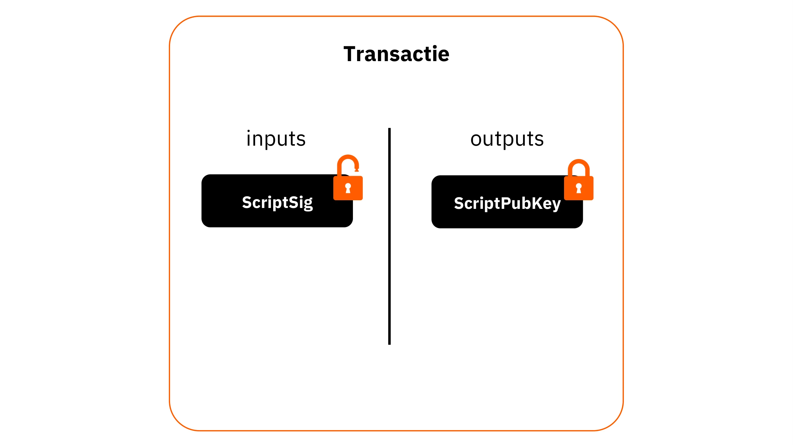


Bitcoin adressen zijn er in verschillende types, afhankelijk van het gebruikte scriptingmodel. De eerste modellen, bekend als **Legacy**, omvatten de `P2PKH` (*Pay-to-PubKey-Hash*) en `P2SH` (*Pay-to-Script-Hash*) adressen. P2PKH-adressen beginnen altijd met `1` en P2SH met `3`. Hoewel deze formaten nog steeds veilig zijn, zijn ze nu verouderd omdat ze hogere transactiekosten met zich meebrengen en minder vertrouwelijkheid bieden dan de nieuwe standaarden.


SegWit V0 (`P2WPKH` en `P2WSH`) en Taproot / SegWit V1 (`P2TR`) adressen vertegenwoordigen moderne formaten. SegWit adressen beginnen met `bc1q` en Taproot adressen, geïntroduceerd in 2021, beginnen met `bc1p`.


Hier is bijvoorbeeld een Taproot receptie Address:


```text
bc1ps5gd2ys8kllz9alpmcwxqegn7kl3elrpnnlegwkm3xpq2h8da07spxwtf5
```


Hoe de ScriptPubKey wordt opgebouwd, hangt af van de standaard die je gebruikt:


| ScriptPubKey | Script template
| ---------------- | ----------------------------------------------------------- |
| P2PKH | OP_DUP OP_HASH160 `<pubKeyHash>` OP_EQUALVERIFY OP_CHECKSIG |
| P2SH | OP_HASH160 `<scriptHash>` OP_EQUAL |
| P2WPKH | 0 `<pubKeyHash>` |
| P2WSH | 0 `<witnessScriptHash>` |
| P2SH - P2WPKH | OP_HASH160 `<redeemScriptHash>` OP_EQUAL |
| P2SH - P2WSH | OP_HASH160 `<redeemScriptHash>` OP_EQUAL |
| P2TR | 1 `<pubKey>` |

De opbouw van ontvangstadressen hangt ook af van het gekozen scriptmodel:


- Voor `P2PKH` en `P2WPKH` adressen vertegenwoordigt de payload, d.w.z. de kern van de Address, de Hash van de openbare sleutel;
- Voor `P2SH` en `P2WSH` adressen vertegenwoordigt de payload de Hash van een ;
- Net als bij `P2TR` adressen is de payload een aangepaste publieke sleutel. P2TR outputs combineren aspecten van _Pay-to-PubKey_ en _Pay-to-Script_. De getweakte publieke sleutel is het resultaat van het toevoegen van een klassieke uitgaven publieke sleutel met een "tweak", afgeleid van de Merkle Root van een set scripts die ook kunnen worden gebruikt om bitcoins uit te geven.


Adressen die worden weergegeven op je portfoliosoftware bevatten ook een HRP (*Human-Readable Part*), meestal `bc` voor post-SegWit adressen, een `1` scheidingsteken en een versienummer `q` voor SegWit V0 en `p` voor Taproot/SegWit V1. Er wordt ook een controlesom toegevoegd om de integriteit en geldigheid van de Address tijdens de transmissie te garanderen.


Tot slot worden de adressen in een standaard formaat gezet:


- Base58check voor oude legacy-adressen ;
- Bech32 voor SegWit adressen ;
- Bech32m voor Taproot adressen.


Hier is de optelmatrix voor bech32 en bech32m formaten (SegWit en Taproot) vanaf basis 10:


| + | 0 | 1 | 2 | 3 | 4 | 5 | 6 | 7 |
| --- | --- | --- | --- | --- | --- | --- | --- | --- |
| 0 | q | p | z | r | y | 9 | x | 8 |
| 8 | g | f | 2 | t | v | d | w | 0 |
| 16 | s | 3 | j | n | 5 | 4 | k | h |
| 24 | c | e | 6 | m | u | a | 7 | l |

### Wat is Address hergebruik?


Hergebruik van Address is het gebruik van dezelfde ontvangende Address om verschillende UTXO's te blokkeren.


Zoals we in de vorige sectie zagen, heeft elke UTXO zijn eigen ScriptPubKey, die het vergrendelt en waaraan voldaan moet worden om de UTXO te kunnen gebruiken als invoer in een nieuwe transactie. Het is binnen deze ScriptPubKey dat payload adressen worden geïntegreerd.


Wanneer verschillende ScriptPubKeys dezelfde ontvangende Address bevatten, wordt dit Address hergebruik genoemd. In de praktijk betekent dit dat een gebruiker herhaaldelijk dezelfde Address heeft verstrekt aan afzenders om bitcoins te ontvangen via meerdere betalingen. En juist deze praktijk is desastreus voor je privacy.


### Waarom is Address hergebruik een probleem?


Omdat de Blockchain openbaar is, is het eenvoudig om te zien welke adressen welke UTXO blokkeren en hoeveel bitcoins. Als dezelfde Address voor meerdere transacties wordt gebruikt, wordt het mogelijk om af te leiden dat alle bitcoins die aan die Address gekoppeld zijn, aan dezelfde persoon toebehoren. Deze praktijk brengt de privacy van gebruikers in gevaar, doordat er deterministische verbanden kunnen worden gelegd tussen verschillende transacties en bitcoins kunnen worden getraceerd op de Blockchain. Satoshi Nakamoto zelf wees al op dit probleem in het Bitcoin Witboek:


> *Als extra firewall kan voor elke transactie een nieuw sleutelpaar worden gebruikt om ze niet te koppelen aan een gemeenschappelijke eigenaar*
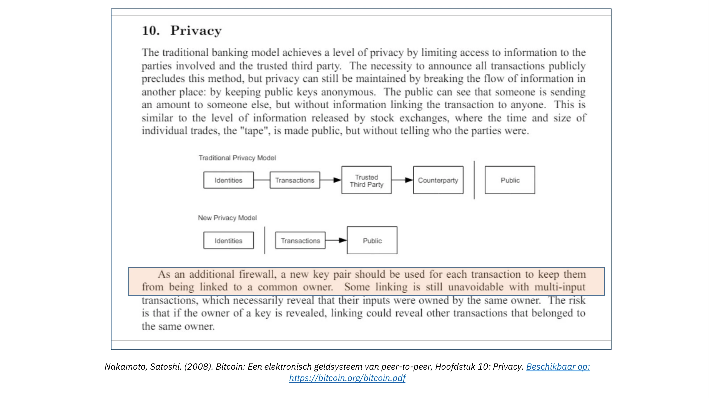


Bron: S. Nakamoto, "Bitcoin: Een Peer-to-Peer elektronisch geldsysteem", https://Bitcoin.org/Bitcoin.pdf, 2009.


De bedoeling van Satoshi in deze zin was om een extra firewall te creëren in het geval van een associatie tussen de identiteit van een gebruiker en een sleutelpaar op Bitcoin, om te voorkomen dat zijn hele activiteit publiekelijk gekoppeld zou worden aan zijn identiteit. Vandaag de dag, met de proliferatie van Blockchain analysebedrijven en KYC regelgeving, is het gebruik van unieke adressen niet langer een "extra firewall", maar een onmisbare praktijk voor iedereen die een minimum aan privacy wil behouden.


Wanneer je een Address hergebruikt, leg je een bijna onbetwistbare link tussen alle transacties die geassocieerd zijn met die Address. Hoewel dit je fondsen niet direct in gevaar brengt, omdat elliptische curve cryptografie de veiligheid van je privésleutels garandeert, maakt het het wel makkelijker om je activiteiten te controleren. Iedereen met een node kan de transacties en saldi van de adressen bekijken, waardoor je anonimiteit volledig in het gedrang komt.


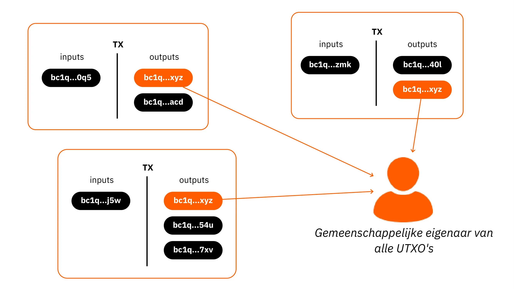


Om dit punt te illustreren, nemen we het voorbeeld van Bob, een gebruiker die regelmatig kleine hoeveelheden bitcoins koopt in DCA en deze altijd naar dezelfde Address stuurt. Na twee jaar bevat deze Address een aanzienlijke hoeveelheid bitcoins. Als Bob deze Address gebruikt om een betaling te doen aan een lokale handelaar, kan deze alle bijbehorende fondsen zien en de rijkdom van Bob afleiden. Dit kan leiden tot persoonlijke veiligheidsrisico's, zoals poging tot diefstal of afpersing. Als Bob een blanco Address had gebruikt om elke periodieke aankoop te ontvangen, zou hij oneindig veel minder informatie hebben onthuld aan zijn handelaar.


In de stringanalyse zijn er 2 types van Address hergebruik:


- Extern hergebruik ;
- Intern hergebruik binnen een transactie.


De eerste is wanneer een Address wordt hergebruikt in verschillende Bitcoin transacties. Dit is waar we het eerder over hadden: deze heuristiek leidt af dat alle UTXO's die door deze Address gaan, tot een enkele entiteit behoren.


Intern Address hergebruik vindt niet plaats wanneer hergebruik plaatsvindt over meerdere transacties, maar wanneer het plaatsvindt binnen een enkele transactie. Immers, als dezelfde Address die wordt gebruikt om een invoer te vergrendelen, wordt gebruikt als de uitvoer van een transactie, dan kunnen we afleiden dat deze uitvoer nog steeds toebehoort aan dezelfde gebruiker (Exchange), en dat de tweede uitvoer de werkelijke betaling voorstelt. Deze andere heuristiek maakt het mogelijk om een geldspoor over meerdere transacties te behouden.


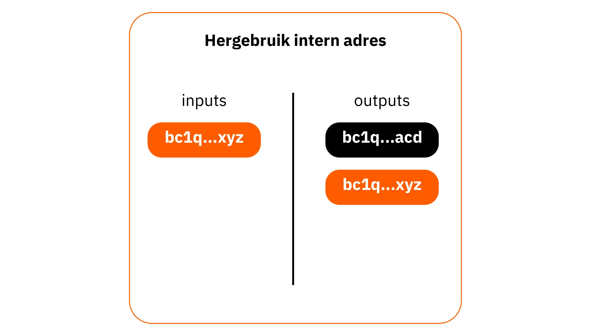


Hergebruik van Address is een echte plaag op Bitcoin. Volgens de OXT.me website (momenteel ontoegankelijk) was het algemene percentage van hergebruik van Address op Bitcoin ongeveer 52% in 2022:


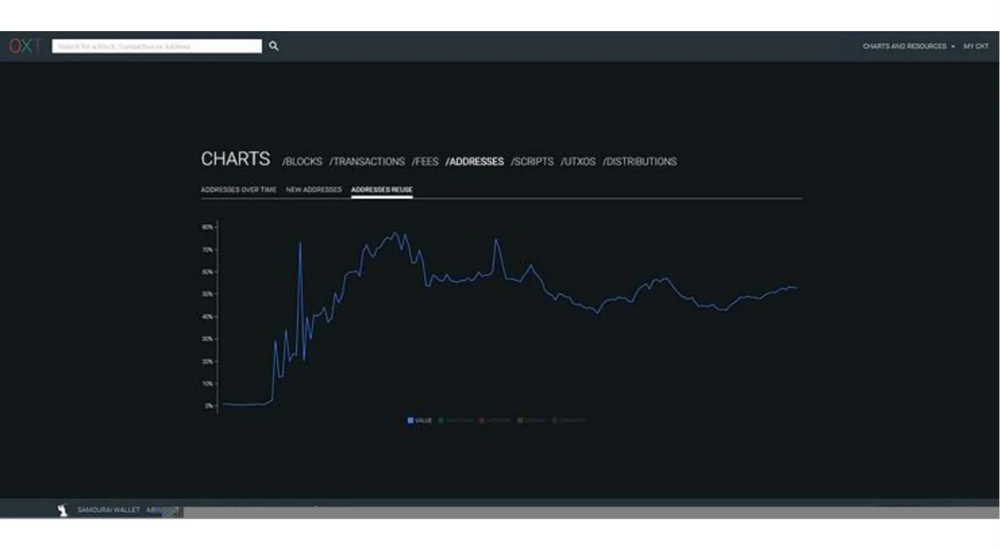


Dit percentage is enorm, maar het komt voor het overgrote deel van Exchange platforms in plaats van individuele gebruikers.


### Hoe voorkom je hergebruik van Address?


Hergebruik van Address vermijden is heel eenvoudig: **gebruik gewoon een nieuwe, lege Address voor alle nieuwe betalingen naar uw Wallet**.


Dankzij BIP32 zijn moderne portfolio's nu deterministisch en hiërarchisch. Dit betekent dat een gebruiker generate een groot aantal adressen kan koppelen aan één enkel initieel stukje informatie: de seed. Door dit ene stukje informatie op te slaan, is het mogelijk om alle privésleutels in de portefeuille te herstellen. Door dit ene stukje informatie op te slaan, is het mogelijk om alle privésleutels in de portefeuille te herstellen, waardoor toegang mogelijk wordt tot de fondsen die beveiligd zijn door de corresponderende adressen.


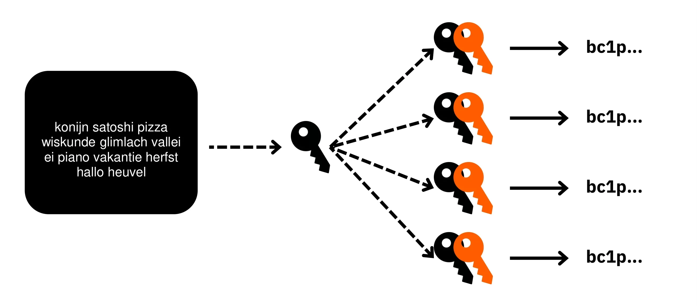


Daarom wordt, wanneer je op de knop "*ontvangen*" drukt in je Wallet-software, telkens een ongebruikte ontvangende Address voorgesteld. Na ontvangst van bitcoins op deze Address, stelt de software automatisch een nieuwe voor.


> *PS: Onlangs hebben sommige Wallet softwareprogramma's aangekondigd te willen stoppen met het genereren van blanco adressen, uit angst dat dit door de autoriteiten zal worden gezien als een vorm van geld witwassen. Als uw software een van deze programma's is, raad ik u ten zeerste aan deze onmiddellijk te vervangen, aangezien dit niet acceptabel is voor de gebruiker.*
Als je een statische identifier nodig hebt om betalingen te ontvangen, zoals donaties, is het niet aan te raden om een klassieke Bitcoin Address te gebruiken vanwege het risico op hergebruik. Gebruik in plaats daarvan een Lightning Address, of kies voor een statische onchain betalingsidentifier, zoals BIP47 of Silent Payments. Deze protocollen worden in detail uitgelegd in deel 6 van deze training.


## Etiketteren en controleren van onderdelen


<chapterId>fbdb07cd-c025-48f2-97b0-bd1bc21c68a8</chapterId>


Zoals we hebben ontdekt in het gedeelte over stringanalyse, zijn er veel heuristieken en patronen die kunnen worden gebruikt om informatie over een transactie af te leiden. Als gebruiker is het belangrijk om op de hoogte te zijn van deze technieken om jezelf er beter tegen te beschermen.


Dit betekent een rigoureus beheer van je Wallet in zelfbewaarneming, wat betekent dat je de herkomst van je UTXO's kent en zorgvuldig kiest welke UTXO's je gebruikt bij betalingen. Dit efficiënte Wallet beheer berust op twee belangrijke kenmerken van goede Bitcoin wallets: tagging en muntcontrole.


In dit hoofdstuk zullen we deze functies bekijken en zien hoe u ze intelligent kunt gebruiken, zonder teveel werklast toe te voegen, om uw privacy op Bitcoin sterk te optimaliseren.


### Wat is labelen?


Labelen is het toekennen van een annotatie of label aan een specifieke UTXO in een Bitcoin Wallet. Deze annotaties worden lokaal opgeslagen door de Wallet software en worden nooit verzonden via het Bitcoin netwerk. Labelen is daarom een persoonlijk beheertool.


Als ik bijvoorbeeld een UTXO heb van een P2P aankoop op Bisq met Charles, zou ik het kunnen labelen als "`Non-KYC Bisq Charles`".


Tagging is een goede gewoonte die helpt om de herkomst of beoogde bestemming van een UTXO te onthouden. Inderdaad, uw Bitcoin Wallet beveiligt zeker meerdere UTXO's. Als de bronnen van deze UTXO's verschillend zijn, wil je deze UTXO's in de toekomst misschien niet samenvoegen, omdat je anders hun gemeenschappelijke Ownership zou kunnen onthullen. Door al je onderdelen goed te labelen, weet je zeker dat je nog weet waar ze vandaan komen als je ze nodig hebt, zelfs als dat over jaren is.


### Wat is hoekcontrole?


Het actieve gebruik van labeling wordt nog interessanter wanneer het gekoppeld wordt aan een muntcontroleoptie in je portfoliosoftware.


Muntcontrole is een functie in goede Bitcoin Wallet software, die je de mogelijkheid geeft om handmatig specifieke UTXO's te selecteren om te gebruiken als invoer om een transactie te voltooien. In feite moet je, om aan een uitvoerbetaling te voldoen, in ruil daarvoor een UTXO invoer consumeren. Om een aantal redenen, die we later zullen bespreken, wil je misschien precies kiezen welke onderdelen je als input wilt gebruiken om een bepaalde betaling te voldoen. Dit is precies wat je met muntcontrole kunt doen. Om je een analogie te geven, deze functie is vergelijkbaar met het kiezen van een specifieke munt uit je Wallet wanneer je voor je stokbrood betaalt.


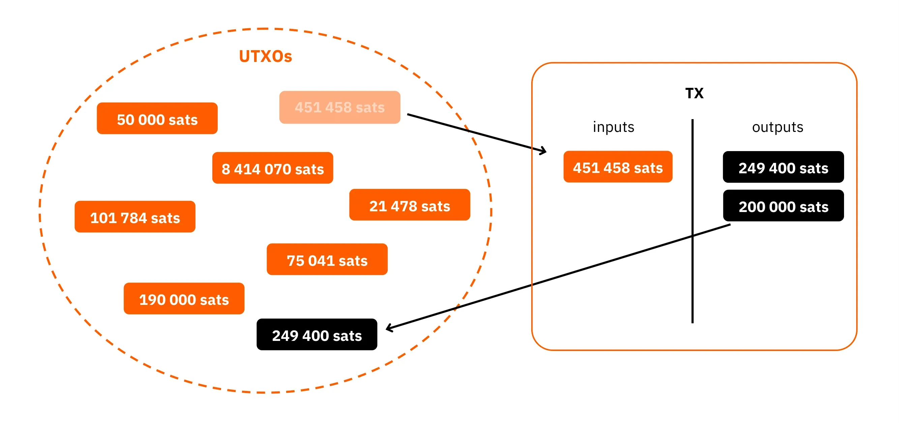


Het gebruik van portfoliosoftware met muntcontrole, gekoppeld aan UTXO labeling, stelt gebruikers in staat om UTXO's te onderscheiden en nauwkeurig te selecteren voor hun transacties.


### Hoe label je je UTXO's?


Er is geen standaardmethode om UTXO's te labelen. Het is aan jou om een labelsysteem te definiëren dat gemakkelijk te begrijpen is voor jouw portefeuille. Houd in elk geval in gedachten dat een goede etikettering een etikettering is die je kunt begrijpen wanneer je hem nodig hebt. Als je Bitcoin Wallet vooral bedoeld is om mee te sparen, heb je misschien tientallen jaren niets aan de labels. Zorg er dus voor dat ze duidelijk, precies en uitgebreid zijn.


Het is belangrijk dat je dierbaren gemakkelijk de herkomst van het geld kunnen achterhalen als ze op een dag toegang moeten hebben tot je portefeuille. Dit zal hen helpen, zowel om redenen van vertrouwelijkheid als voor juridische doeleinden, mochten ze de herkomst van het geld moeten rechtvaardigen tegenover een autoriteit.


Het belangrijkste om op het label te vermelden is de bron van de UTXO. Je moet gewoon aangeven hoe de munt in je Wallet terecht is gekomen. Is het het resultaat van een aankoop op een Exchange platform? Een Invoice betaling van een klant? Een peer-to-peer Exchange? Of vertegenwoordigt het de Exchange van een uitgave? U kunt bijvoorbeeld specificeren:


- gW-433.com verwijderen` ;
- klantbetaling David` ;
- gW-434 Charles kopen` ;
- `Wissel bank kopen`


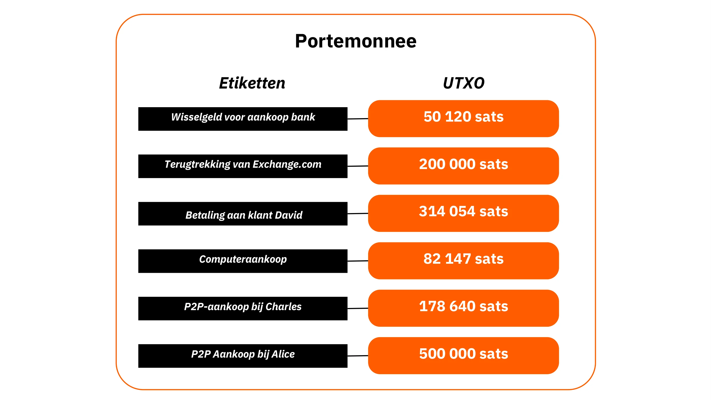


Om uw UTXO beheer te verfijnen en uw fondsscheidingsstrategieën binnen uw portefeuille te respecteren, kunt u uw labels verrijken met een extra indicator die deze scheidingen weergeeft. Als uw portefeuille twee categorieën UTXO bevat die u niet wilt mengen, kunt u een markering in uw labels opnemen om deze groepen duidelijk van elkaar te onderscheiden. Deze scheidingsmarkeringen zijn afhankelijk van je eigen criteria, zoals het onderscheid tussen UTXO's die voortkomen uit een overnameproces waarbij KYC betrokken is, of tussen professionele en persoonlijke fondsen. Als je de hierboven genoemde voorbeelden van labels neemt, zou dit zich kunnen vertalen in:


- `KYC - Geldopname Exchange.com` ;
- `KYC - Klantbetaling David` ;
- `NO KYC - P2P Charles` kopen` ;
- `NO KYC - Wijzig bank aankoop`


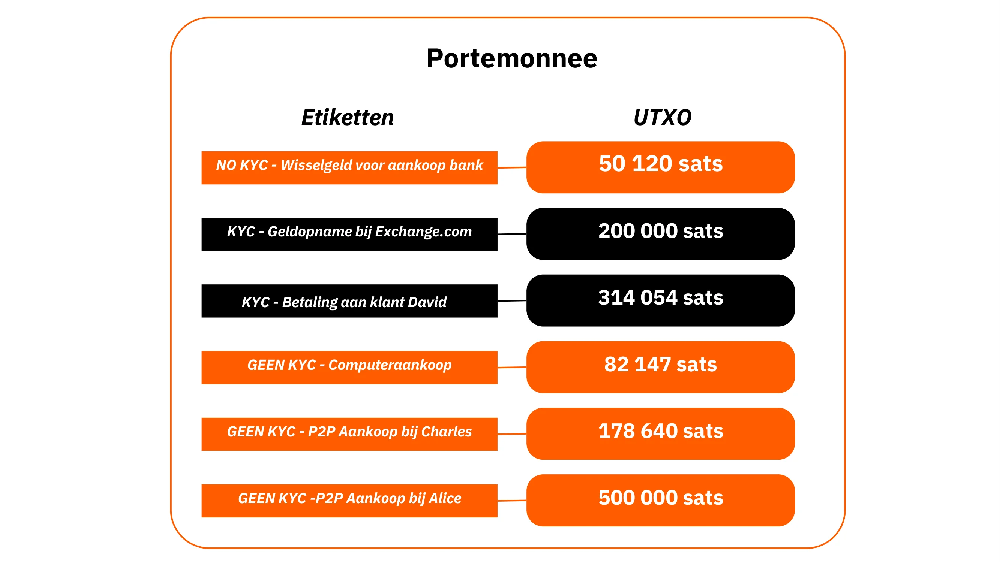


Het is ook raadzaam om de labeling van een onderdeel in de loop van transacties te bestendigen. Als je bijvoorbeeld UTXO no-KYC consolideert, zorg er dan voor dat je de resulterende UTXO niet alleen markeert als `consolidatie`, maar specifiek als `consolidatie no-KYC` om duidelijk bij te houden waar de munten vandaan komen.


Tot slot is het niet verplicht om een datum op een etiket te zetten. De meeste Wallet software geeft de transactiedatum al weer, en het is altijd mogelijk om deze informatie op een Block explorer te vinden dankzij de txid.


### Hoe kies je de juiste onderdelen?


Wanneer je een transactie uitvoert, kun je met de muntcontrole specifiek kiezen welke UTXO's je wilt gebruiken als invoer om aan de betalingsuitvoer te voldoen. Deze keuze heeft twee aspecten:


- De mogelijkheid voor de ontvanger van de betaling om een deel van je identiteit te koppelen aan de UTXO's die worden gebruikt bij invoer;
- Het vermogen van een externe waarnemer om verbanden te leggen tussen alle UTXO's die als invoer worden gebruikt.


Laten we een concreet voorbeeld nemen om het eerste punt te illustreren. Stel, je koopt een stokbrood in bitcoins van je bakker. Je gebruikt een of meer UTXO's die je als inputs hebt om ten minste de prijs van het stokbrood in outputs te voldoen, evenals de transactiekosten. Je bakker kan dan mogelijk je gezicht, of een ander deel van je identiteit dat hij kent, koppelen aan de munten die als inputs worden gebruikt. Als je weet dat deze link bestaat, kies je misschien liever een specifieke UTXO dan een andere wanneer je betaalt.


Als bijvoorbeeld één van je UTXO's afkomstig is van een Exchange platform en je hebt liever niet dat de bakker weet van je account op dat platform, dan vermijd je het gebruik van die UTXO voor betaling. Als je een UTXO met een hoge waarde hebt die een aanzienlijke hoeveelheid bitcoins onthult, zou je er ook voor kunnen kiezen deze niet te gebruiken om te voorkomen dat de bakker op de hoogte raakt van je BTC-fortuin.


De keuze welke UTXO's je gebruikt voor dit eerste punt is daarom een persoonlijke beslissing, beïnvloed door wat je wel of niet bereid bent te onthullen. De labels die je aan je UTXO's toekent wanneer je ze ontvangt, helpen je bij het selecteren van UTXO's die, wanneer ze eenmaal zijn uitgegeven, alleen informatie onthullen waarvan jij het prettig vindt om ze aan de ontvanger te onthullen.


Naast de informatie die mogelijk onthuld wordt aan de ontvanger, beïnvloedt de keuze van invoer ook wat je onthult aan alle waarnemers van Blockchain. Door meerdere UTXO's te gebruiken als invoer voor je transactie, onthul je namelijk dat ze eigendom zijn van dezelfde entiteit, volgens de CIOH heuristiek (_Common Input Ownership Heuristic_).


Wanneer je je onderdelen selecteert, moet je je er dus van bewust zijn dat de transactie die je gaat uitzenden een koppeling tot stand brengt tussen alle gebruikte UTXO's. Deze koppeling kan problematisch zijn voor je persoonlijke privacy, vooral als de UTXO's afkomstig zijn van verschillende bronnen. Deze koppeling kan problematisch zijn voor je persoonlijke privacy, vooral als de UTXO's van verschillende bronnen komen.


Laten we het voorbeeld nemen van mijn no-KYC UTXO van Bisq; ik wil voorkomen dat ik deze combineer met een UTXO van bijvoorbeeld een gereguleerd Exchange platform dat mijn identiteit kent. Immers, als ik ooit deze 2 UTXO's gebruik als input voor dezelfde transactie, zal het gereguleerde platform mijn identiteit kunnen koppelen aan de UTXO die ik kocht op Bisq, die nog niet eerder gekoppeld was aan mijn identiteit.


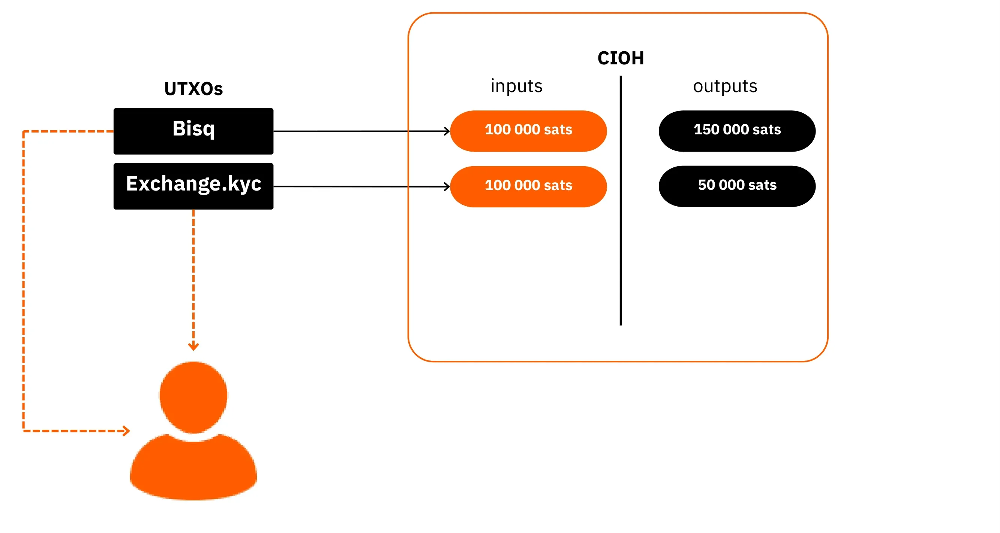


Tot slot, wanneer je kiest welke UTXO's je wilt gebruiken als input voor een transactie, is het belangrijkste om het gebruik van meerdere UTXO's te vermijden. Kies hooguit één munt die groot genoeg is om je betaling te voldoen. Op deze manier vermijd je de risico's van CIOH volledig. Echter, als geen enkele UTXO voldoende is voor betaling en je moet er meerdere consumeren, zorg er dan voor dat ze van vergelijkbare bronnen komen om het risico op ongewenste koppelingen te minimaliseren. Houd er ook rekening mee dat de ontvanger de informatie die ze over je hebben, kan koppelen aan de geschiedenis van de munten die bij de invoer zijn gebruikt.


### Automatische onderdeelselectie begrijpen


In de vorige paragrafen bespraken we de handmatige selectie van UTXO's die gebruikt moeten worden voor een transactie. Maar wat gebeurt er wanneer de Wallet software deze selectie automatisch uitvoert? Er bestaan verschillende methoden om te bepalen welke munten moeten worden gebruikt, en de selectie van UTXO's vormt een echt onderzoeksgebied voor Bitcoin. Het belangrijkste doel van dit automatische proces is vaak om de transactiekosten voor de gebruiker te minimaliseren.


UTXO selectiemethoden zoals FIFO (*First In First Out*) en LIFO (*Last In First Out*) behoren tot de eenvoudigste, maar ook de minst efficiënte. Met FIFO worden de oudste delen in de portefeuille eerst gebruikt. Deze aanpak is over het algemeen inefficiënt, zowel voor het minimaliseren van transactiekosten als voor het bewaren van vertrouwelijkheid, behalve in gevallen waar relatieve tijdsloten worden gebruikt die regelmatig vernieuwd moeten worden. Omgekeerd geeft LIFO voorrang aan het gebruik van de meest recente UTXO's. Hoewel beide methoden eenvoudig zijn, blijken ze vaak niet effectief.


Een meer geavanceerde methode is de *Knapsack Solver*. Deze werd gebruikt op de Bitcoin Kern Wallet tot versie 0.17. Het bestaat uit het iteratief en willekeurig selecteren van UTXO's uit de Wallet, ze bij elkaar optellen in deelverzamelingen en de oplossing kiezen die het transactiegewicht zoveel mogelijk vermindert, om de kosten voor de gebruiker te verlagen.


De *Branch-and-Bound* (BNB), vaak het "Murch algoritme" genoemd naar de uitvinder, heeft de *Knapsack Solver* vervangen in Bitcoin Core vanaf versie 0.17. Deze meer geavanceerde methode heeft als doel een set UTXO's te vinden die precies overeenkomt met het bedrag dat nodig is om aan de uitvoer van een transactie te voldoen. Het doel van BNB is om zowel het Exchange bedrag als de kosten te minimaliseren, door het zogenaamde afvalcriterium te verlagen, dat rekening houdt met zowel de directe kosten als de verwachte toekomstige kosten van de Exchange. Deze methode is afgeleid van het oorspronkelijke concept van *Branch-and-Bound*, bedacht in 1960 door Ailsa Land en Alison Harcourt, en biedt een nauwkeurigere optimalisatie van vergoedingen dan de *Knapsack Solver*.


Al deze automatische UTXO selectiemethoden kunnen effectief zijn in het verminderen van transactiekosten, maar ze zijn vaak niet effectief in het behouden van de vertrouwelijkheid van de gebruiker. Deze algoritmen kunnen namelijk meerdere UTXO's samenvoegen tot inputs, waardoor een gemeenschappelijke eigenschap van deze UTXO's door CIOH aan het licht komt. Uiteraard kunnen deze methoden geen rekening houden met de labels die zijn aangebracht op de UTXO's, die desalniettemin cruciaal zijn voor het bewust kiezen welke delen worden onthuld aan de ontvanger van de transactie. Op dit moment is de enige manier om de vertrouwelijkheid bij het selecteren van munten te optimaliseren, dit handmatig te doen.


### Handleiding voor UTXO-labeling


Als je wilt weten hoe je je UTXO's kunt labelen, dan hebben we een uitgebreide tutorial gemaakt over de belangrijkste Bitcoin Wallet software die er is:


https://planb.network/tutorials/privacy/on-chain/utxo-labelling-d997f80f-8a96-45b5-8a4e-a3e1b7788c52

## KYC en sleutelidentificatie


<chapterId>cec6b9d9-0eed-4f85-bc4e-1e9aa59ca605</chapterId>


KYC staat voor "Ken Uw Klant". Het is een regelgevingsprocedure die wordt toegepast door bepaalde bedrijven die actief zijn in de Bitcoin sector. Het doel van deze procedure is het verifiëren en registreren van de identiteit van hun klanten, met het verklaarde doel om het witwassen van geld en de financiering van terrorisme tegen te gaan.


Praktisch gezien houdt KYC in dat er verschillende persoonlijke gegevens van de klant worden verzameld, die per jurisdictie kunnen verschillen, maar over het algemeen ID, foto en bewijs van Address omvatten. Deze informatie wordt vervolgens geverifieerd en opgeslagen voor toekomstig gebruik.


Deze procedure is verplicht geworden voor alle gereguleerde Exchange platforms in de meeste westerse landen. Dit betekent dat iedereen die Exchange staatsvaluta's voor Bitcoin via deze platforms wil wisselen, moet voldoen aan de KYC-eisen.


Deze procedure is niet zonder risico's voor de privacy en veiligheid van gebruikers. In dit hoofdstuk onderzoeken we deze risico's in detail en analyseren we de specifieke impact van KYC en identificatieprocessen op de privacy van Bitcoin gebruikers.


### Onchain tracering vergemakkelijken


Het eerste risico van KYC is dat het een bevoorrechte ingang biedt voor Blockchain analyse. Zoals we in de vorige sectie zagen, kunnen analisten activiteit op de Blockchain clusteren en volgen met behulp van transactiepatronen en heuristieken. Als ze er eenmaal in geslaagd zijn om de onchain activiteit van een gebruiker te clusteren, hoeven ze alleen maar een enkel toegangspunt te vinden tussen al zijn transacties en sleutels om zijn vertrouwelijkheid volledig te compromitteren.


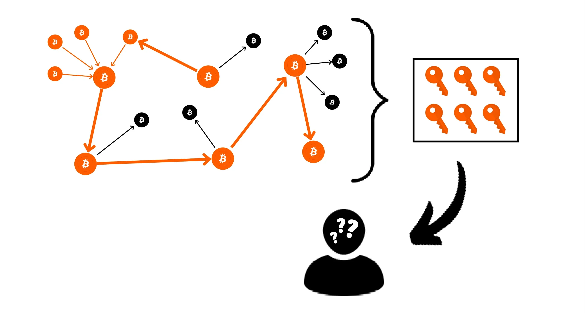


Als je een KYC uitvoert, lever je een hoogwaardig toegangspunt voor Blockchain analyse, omdat je de ontvangende adressen die je gebruikt bij het opnemen van je bitcoins van een Exchange platform koppelt aan je volledige, geverifieerde identiteit. In theorie is deze informatie alleen bekend bij het bedrijf waaraan je het hebt verstrekt, maar zoals we hieronder zullen zien, is het risico van gegevenslekken reëel. Bovendien kan alleen al het feit dat een bedrijf over deze informatie beschikt problematisch zijn, zelfs als ze het niet delen.


Dus als je geen andere stappen neemt om de samenvoeging van je activiteiten op Blockchain te beperken, kan iedereen met kennis van dit KYC-ingangspunt potentieel al je activiteiten op Bitcoin aan je identiteit koppelen. Vanuit het oogpunt van dat bedrijf verliest jouw gebruik van Bitcoin alle vertrouwelijkheid.


Om dit met een vergelijking te illustreren, is het alsof je bankier bij *Bank X* niet alleen toegang heeft tot al je transacties met *Bank X*, maar ook je transacties met *Bank Y* en al je contante transacties kan observeren.


Denk terug aan het eerste deel van deze training: Het vertrouwelijkheidsmodel van Bitcoin, zoals bedacht door Satoshi Nakamoto, is gebaseerd op de scheiding tussen de identiteit van de gebruiker en zijn sleutelparen. Hoewel dit Layer vertrouwelijkheidsmodel vandaag de dag niet meer volstaat, is het nog steeds verstandig om de degradatie ervan zoveel mogelijk te beperken.


### Blootstelling aan staatstoezicht


Het tweede grote probleem met KYC is dat het aan de staat onthult dat je op een bepaald moment Bitcoin in je bezit hebt gehad. Wanneer je bitcoins koopt via een gereguleerde speler, wordt het mogelijk voor de staat om te weten over dit bezit. Op dit moment lijkt dit misschien triviaal, maar het is belangrijk om te onthouden dat de politieke en economische toekomst van jouw land niet in jouw handen ligt.


Ten eerste kan de staat snel een autoritaire houding aannemen. De geschiedenis staat bol van voorbeelden waarbij het beleid abrupt veranderde. Vandaag de dag kunnen Bitcoiners in Europa artikelen schrijven over Bitcoin, deelnemen aan conferenties en hun portemonnee zelf beheren. Maar wie kan zeggen wat de toekomst brengt? Als Bitcoin plotseling volksvijand nummer één wordt, kan het problematisch zijn om ermee geassocieerd te worden in overheidsdossiers.


Dan, in het geval van een ernstige economische crisis, zou de staat kunnen overwegen om bitcoins die in het bezit zijn van burgers in beslag te nemen. Misschien worden bitcoiners morgen gezien als crisisprofiteurs en worden ze buitensporig belast voor hun vermogenswinsten in het licht van de devaluatie van fiatvaluta.


Je zou kunnen denken dat dit geen probleem is, omdat je bitcoins gemengd zijn en daarom niet te traceren zijn. Traceren is hier echter niet het probleem. Het echte probleem is dat de staat weet dat je Bitcoin bezat. Deze informatie alleen al kan genoeg zijn om je te beschuldigen of ter verantwoording te roepen. Je zou kunnen proberen te beweren dat je je bitcoins hebt uitgegeven, maar dat zou terug te vinden moeten zijn in je belastingaangifte en dan zou je gepakt worden. Je zou ook kunnen zeggen dat je je sleutels bent kwijtgeraakt tijdens een bootongeluk, maar denk je echt dat dat genoeg is om je vrij te pleiten?


Het is dus belangrijk om rekening te houden met het risico dat de staat weet dat je BTC bezit, hoe klein dat risico vandaag ook lijkt.


Een ander probleem van KYC in termen van overheidstoezicht is de verplichte rapportage door gereguleerde platforms. Hoewel ik niet bekend ben met regelgeving in andere rechtsgebieden, zijn in Frankrijk *Prestataires de Services sur Actifs Numériques* (PSAN) verplicht om elke geldbeweging die zij verdacht vinden te melden bij de financiële toezichthouders.


In Frankrijk werden in 2023 1.449 verdachte handelingen door PSAN's gemeld. Voorlopig zijn de meeste van deze handelingen gerelateerd aan criminaliteit. De autoriteiten vragen de gereguleerde platforms echter ook om verdachte Bitcoin-transacties alleen op basis van hun structuur te melden. Als je een gezamenlijke transactie uitvoert, of zelfs maar een transactie met een enigszins atypisch patroon, en deze transactie vindt niet ver van de opname van je Bitcoins van deze platforms plaats, dan kun je bij de autoriteiten worden aangegeven. Zelfs als er geen sprake is van wangedrag en u uw rechten legitiem uitoefent, kan zo'n melding leiden tot meer controles en toezicht, ongemakken die u had kunnen vermijden zonder KYC.


### Het risico van lekken van persoonlijke gegevens


Een ander probleem met KYC is dat het vereist dat al je persoonlijke gegevens worden opgeslagen op de servers van een privébedrijf.


Recente gebeurtenissen hebben ons eraan herinnerd dat niemand immuun is voor financiële of IT-fouten. In 2022 ondervonden klanten van Celsius de gevolgen. Na het faillissement van het bedrijf werden de namen van de schuldeisers en het bedrag van hun activa openbaar gemaakt door de Amerikaanse rechtbanken tijdens de administratieve procedure.


Iets meer dan twee jaar geleden zag een vlaggenschip in cryptocurrency cyberbeveiliging de persoonlijke gegevens van zijn klanten gestolen worden. Hoewel dit incident niet direct te maken had met de aankoop van bitcoins, blijft een dergelijk risico ook bestaan voor Exchange platforms. Er is dus zeker een risico verbonden aan persoonlijke gegevens.


Het is waar dat we al veel van onze persoonlijke gegevens aan particuliere bedrijven toevertrouwen. Het risico is hier echter tweeledig, omdat deze gegevens u niet alleen identificeren, maar ook gekoppeld zijn aan activiteiten op Bitcoin. Immers, wanneer een hacker toegang krijgt tot de klantgegevens van een Exchange platform, kan hij er redelijkerwijs van uitgaan dat deze klanten Bitcoins bezitten. Dit risico wordt vergroot door het feit dat Bitcoin, net als elk ander waardevol bezit, de aandacht van dieven trekt.


In het geval van een datalek kun je in het beste geval het doelwit zijn van gerichte phishingpogingen. In het ergste geval kunt u het doelwit worden van fysieke bedreigingen van uw huis.


Naast de specifieke risico's die Bitcoin met zich meebrengt, zijn er ook de gevaren die verbonden zijn aan de overdracht van identiteitsdocumenten. In het geval van een datalek is het namelijk mogelijk om slachtoffer te worden van identiteitsdiefstal. De inzet is dus niet alleen beperkt tot het beschermen van de vertrouwelijkheid van transacties, maar betreft ook de persoonlijke veiligheid van elk individu.


### Enkele vooropgezette ideeën over KYC


Het is belangrijk om een aantal vooroordelen over KYC te deconstrueren die we vaak tegenkomen op Twitter of in onze uitwisselingen tussen bitcoiners.


Ten eerste is het onjuist om te denken dat het beschermen van uw privacy voor Bitcoins die zijn verkregen via KYC zinloos is. Privacytools en -methoden op Bitcoin zijn gevarieerd en dienen verschillende doelen. Het gebruik van CoinJoin-transacties voor Bitcoins die via KYC zijn verkregen, is bijvoorbeeld geen slecht idee. Natuurlijk moet u voorzichtig zijn met gereguleerde Exchange platforms om te voorkomen dat uw account wordt bevroren of geblokkeerd, maar vanuit een strikt technisch oogpunt zijn deze praktijken niet onverenigbaar. CoinJoin heeft als effect dat de geschiedenis van een munt wordt doorbroken, waardoor je bepaalde ketenanalyserisico's in verband met KYC kunt omzeilen. Hoewel het niet alle risico's wegneemt, is het wel een belangrijk voordeel.


Vertrouwelijkheid op Bitcoin moet niet gezien worden op een binaire manier, als een onderscheid tussen "anonieme" bitcoins en andere die dat niet zijn. Het bezitten van Bitcoins die zijn verkregen via KYC betekent niet dat alles verloren is; integendeel, het gebruik van vertrouwelijkheidstools kan zelfs nog voordeliger zijn.


Omgekeerd garandeert het verkrijgen van Bitcoin via een niet-KYC methode geen perfecte vertrouwelijkheid, noch ontslaat het u van de noodzaak om andere beschermende maatregelen te nemen. Als u in het bezit bent van niet-KYC Bitcoin, maar meerdere keren ontvangstadressen gebruikt, kunnen uw transacties worden getraceerd en samengevoegd. De kleinste link met de wereld buiten Bitcoin kan de enige Layer vertrouwelijkheid die je hebt in gevaar brengen. Het is dus belangrijk om alle privacyverbeterende gereedschappen en methoden op Bitcoin als complementair te beschouwen. Elke techniek pakt een specifiek risico aan en kan een extra Layer aan bescherming toevoegen. Dus het bezitten van niet-KYC Bitcoin betekent niet dat je geen andere voorzorgsmaatregelen hoeft te nemen.


### Kan KYC worden geannuleerd?


Mij wordt soms gevraagd of het mogelijk is om "terug te gaan" na het uitvoeren van een KYC, en zoals je je kunt voorstellen uit de voorgaande paragrafen, is het antwoord genuanceerd. De eenvoudigste manier om de risico's van KYC te vermijden is om het niet te gebruiken bij het verwerven van bitcoins. We zullen in het volgende hoofdstuk dieper op dit onderwerp ingaan. Maar als KYC al is uitgevoerd en bitcoins zijn gekocht, zijn er dan manieren om de risico's te beperken?


Als het gaat om het risico van het traceren van je transacties, is het gebruik van CoinJoin een oplossing. We zullen deze methode later in de cursus in detail bekijken, maar je moet weten dat je met CoinJoin de geschiedenis van een munt kunt doorbreken en kunt voorkomen dat deze verleden-heden en heden-verleden kan worden getraceerd. Zelfs voor BTC die zijn verkregen via een gereguleerd platform, kan deze techniek hun traceerbaarheid voorkomen.


CoinJoin neemt echter het tweede risico van KYC niet weg: het feit dat de staat op de hoogte kan zijn van je bezit van bitcoins. Zelfs als uw munten niet meer traceerbaar zijn, kan de staat, afhankelijk van de jurisdictie, toegang hebben tot uw verklaringen van overdracht van crypto-activa. Aangezien dit risico niet technisch is, maar administratief, zijn er geen Bitcoin-specifieke oplossingen om het te elimineren, afgezien van jezelf in de eerste plaats niet bloot te stellen aan KYC. De enige legale manier om dit risico te beperken, is uw Bitcoins die u via gereguleerde platforms hebt verkregen, te verkopen op gereguleerde platforms en ze vervolgens terug te kopen via KYC-vrije middelen. Door te verkopen en de overdracht aan te geven, zouden de autoriteiten moeten zien dat u ze niet langer bezit.


Wat betreft het risico van het uitlekken van je persoonlijke gegevens en identiteitsdocumenten, dit is een gevaar dat buiten Bitcoin ligt, en er is geen technische oplossing om dit te voorkomen. Als je gegevens eenmaal zijn onthuld, is het moeilijk om de operatie ongedaan te maken. U kunt proberen uw account op het platform te sluiten, maar dit garandeert niet dat uw KYC-gegevens worden gewist, vooral wanneer de identiteitscontrole is uitbesteed. Controle op volledige verwijdering van je gegevens is onmogelijk. Er is daarom geen oplossing om dit risico volledig te voorkomen en ervoor te zorgen dat het niet meer bestaat.


### Het verschil tussen KYC en sleutelidentificatie


Soms hebben sommige bitcoiners de neiging om de term "KYC" uit te breiden naar elke BTC Exchange waarbij een bankoverschrijving of creditcardbetaling betrokken is, omdat deze middelen ook de herkomst van de betaling kunnen onthullen, net zoals een KYC dat zou doen. KYC mag echter niet verward worden met sleutelidentificatie. Persoonlijk moet ik toegeven dat mijn perceptie van dit onderwerp in de loop der tijd is geëvolueerd.


KYC verwijst specifiek naar een regelgevingsprocedure die door bepaalde bedrijven wordt geïmplementeerd om de identiteit van hun klanten te verifiëren en registreren. Het is een binair iets: wanneer je bitcoins verwerft, doe je KYC, of niet. Sleutelidentificatie, dat betrekking heeft op het verband tussen een facet van de identiteit van een gebruiker en onchain-activiteit, is echter niet zo binair, maar vertegenwoordigt eerder een continuüm. In de context van Bitcoin verwerving of overdracht is zulke identificatie altijd mogelijk, in verschillende mate.


Als je bijvoorbeeld bitcoins koopt op een gereguleerd platform in Zwitserland, is KYC niet vereist. Uw sleutels kunnen echter wel worden geïdentificeerd, aangezien de aankoop via uw bankrekening is gedaan. Dit is waar de eerste twee risico's verbonden aan KYC - vergemakkelijking van onchain tracing en blootstelling aan staatstoezicht - zich ook kunnen manifesteren in een Exchange zonder KYC. Als de Zwitserse entiteit verdachte transacties rapporteert aan de autoriteiten in jouw land, kunnen ze eenvoudigweg de bankrekening controleren die gebruikt is voor de aankoop om jouw identiteit te achterhalen. Kopen zonder KYC op gereguleerde platforms is dus vrij hoog op de risicoschaal voor sleutelidentificatie.


Het vermijden van gereguleerde platforms en kiezen voor P2P aankoopmethodes neemt het risico op sleutelidentificatie echter niet volledig weg, maar vermindert het slechts. Laten we het voorbeeld nemen van een aankoop op Bisq of een ander P2P platform. Om je tegenpartij te betalen, gebruik je waarschijnlijk je bankrekening. Als de autoriteiten de persoon met wie je hebt gehandeld ondervragen en om je naam vragen, zijn we weer terug bij risico 1 en 2. Hoewel deze risico's veel lager zijn dan wanneer je koopt op een platform zonder KYC, en zelfs lager dan wanneer je koopt met KYC, zijn ze nog steeds in mindere mate aanwezig.


Tot slot, zelfs als je je bitcoins verkrijgt via een fysieke Exchange voor contant geld, ben je niet helemaal anoniem. De persoon met wie je ruilt heeft je gezicht gezien, wat deel uitmaakt van je identiteit. Hoewel minimaal in dit voorbeeld, is er nog steeds een mogelijkheid tot sleutelidentificatie.


Concluderend, wanneer bitcoins worden uitgewisseld tegen andere activa, of het nu een aankoop is in staatsvaluta of een verkoop tegen een echt goed, is er altijd een vorm van sleutelidentificatie. Afhankelijk van de gekozen Exchange methode, kan deze identificatie variëren in intensiteit. Het is belangrijk om deze identificatie niet te verwarren met KYC, wat een goed gedefinieerd regelgevend proces is. Er is echter een verband tussen KYC en het identificatiespectrum, aangezien KYC zich aan de bovenkant van het spectrum bevindt, omdat het de identificatie van gebruikerssleutels door de autoriteiten systematisch vergemakkelijkt.


## Verkoop- en aankoopmethoden


<chapterId>756598af-95aa-4c77-ac48-243c7ad89530</chapterId>


Na het lezen van het vorige hoofdstuk, vraag je je misschien af hoe je Bitcoin kunt kopen of verkopen zonder een identiteitsverificatieprocedure te ondergaan, om de risico's van KYC te vermijden. Er zijn verschillende manieren om Bitcoin te verhandelen.


### P2P geldwissels


Zoals we hebben gezien, blijft de beste methode in termen van vertrouwelijkheid P2P (persoon-tot-persoon) Exchange met contante betaling. Met deze methode kun je de achtergelaten sporen minimaliseren en de mogelijkheid van sleutelidentificatie aanzienlijk verminderen, of je nu koopt of verkoopt.


Toch zijn er risico's voor de persoonlijke veiligheid. Het grootste gevaar ligt in het feit dat de tegenpartij tijdens de Exchange weet dat je een grote som geld in je bezit hebt, in contanten of in bitcoins. Deze informatie kan de aandacht trekken van kwaadwillende personen. Het is daarom over het algemeen aan te raden om discreet te zijn over je Bitcoin bezit. Dit advies kan ook worden toegepast op contant geld. Als je echter persoonlijk wisselt, is het onvermijdelijk om te onthullen dat je bitcoins bezit, en dit kan ongewenste aandacht trekken.


Om dit risico te beperken, raad ik je aan de voorkeur te geven aan contante transacties met vertrouwde personen, zoals familieleden of goede vrienden. Als alternatief kun je ook overwegen om te handelen op [lokale Bitcoin meetups] (https://btcmap.org/communities/map), nadat je een paar keer bent geweest. Zo leer je de andere deelnemers beter kennen en sta je er niet alleen voor wanneer je fysiek aan het ruilen bent. Het is echter belangrijk om te beseffen dat P2P contante uitwisselingen inherent risico's voor je persoonlijke veiligheid met zich meebrengen, die er niet zijn wanneer je via een gereguleerd platform en je bankrekening koopt.


Bovendien kan, afhankelijk van waar je woont, het vervoeren en opslaan van grote sommen geld riskant zijn, of het nu Bitcoin of contant geld is.


Contant geld wisselen kan ook juridische risico's met zich meebrengen in geval van politie- of andere controles. Hoewel er in de meeste landen geen beperkingen zijn op de hoeveelheid contant geld die je bij je mag hebben, kunnen te grote bedragen argwaan wekken. Wees dus voorzichtig, vooral als je lange afstanden moet afleggen, en doe niet te veel grote transacties tegelijk om het bezit van grote bedragen niet te hoeven verantwoorden.


Een ander nadeel van P2P aankopen is dat de prijs vaak hoger is dan op gereguleerde platforms. Verkopers rekenen vaak een toeslag van 1% tot soms meer dan 10%. Er zijn verschillende redenen voor dit prijsverschil. Ten eerste is dit een gangbare praktijk onder P2P verkopers die in de loop der tijd is ontstaan. Ten tweede hebben verkopers kosten verbonden aan de transactie om het geld naar de koper te sturen. Er is ook een verhoogd risico op diefstal bij de verkoop van P2P in vergelijking met platformtransacties, wat een compensatie voor het genomen risico rechtvaardigt. Ten slotte kunnen de extra kosten verband houden met de vraag naar en de kwaliteit van Exchange in termen van vertrouwelijkheid. Als koper heeft de winst in vertrouwelijkheid een prijs die wordt weerspiegeld in de marge die door de verkoper wordt toegepast. Sommige bitcoiners geloven ook dat de mark-up prijs van BTC gekocht op P2P de werkelijke prijs weerspiegelt, en beweren dat de lagere prijzen op gereguleerde platforms het resultaat zijn van een compromis over de vertrouwelijkheid van uw persoonlijke gegevens.


### P2P uitwisselingen via een matchmaking platform


Een minder riskant alternatief wat betreft persoonlijke veiligheid is om P2P uitsluitend online te ruilen, via elektronische betaalmethoden zoals PayPal, bankoverschrijvingen of Revolut.


Deze aanpak vermijdt veel van de risico's die gepaard gaan met contante transacties. Het risico dat de tegenpartij in gebreke blijft bij een online Exchange is echter groter. Bij een fysieke Exchange, als je geld overhandigt aan de verkoper die je geen bitcoins terugstuurt, kun je hem onmiddellijk ter verantwoording roepen, omdat hij voor je staat. Online is het daarentegen vaak onmogelijk om iemand op te sporen die van je gestolen heeft.


Om dit risico te beperken, is het mogelijk om gespecialiseerde platforms te gebruiken voor P2P uitwisselingen. Deze platforms gebruiken conflictoplossingsmechanismen om benadeelde gebruikers te beschermen. Meestal bieden ze een escrow-systeem aan, waarbij bitcoins worden vastgehouden totdat de betaling in fiatvaluta is bevestigd door de verkoper.


In termen van persoonlijke veiligheid is deze aankoopmethode aanzienlijk veiliger dan een fysiek geldbedrag Exchange. Zoals hierboven vermeld, laten online P2P uitwisselingen echter meer sporen na dan een fysieke Exchange, wat schadelijk kan zijn voor de privacy op Bitcoin. Door een online fiat betaalmethode zoals een bank te gebruiken, geef je meer informatie vrij die sleutelidentificatie kan vergemakkelijken.


Nogmaals, ik zou niet aanraden om te veel grote transacties in één enkele transactie te doen op deze platforms. Door je transacties op te splitsen, spreid je het risico van diefstal door een tegenpartij.


Een ander nadeel van P2P aankopen is dat de prijs vaak hoger is dan die op gereguleerde platforms. Verkopers rekenen vaak een toeslag van 1% tot soms meer dan 10%. Er zijn verschillende redenen voor dit prijsverschil. Ten eerste is dit een gangbare praktijk onder P2P verkopers die in de loop der tijd is ontstaan. Ten tweede hebben verkopers kosten verbonden aan de transactie om het geld naar de koper te sturen. Er is ook een verhoogd risico op diefstal bij de verkoop van P2P in vergelijking met platformtransacties, wat een compensatie voor het genomen risico rechtvaardigt. Tot slot kunnen de extra kosten verband houden met de vraag naar en de kwaliteit van Exchange in termen van vertrouwelijkheid. Als koper heeft de winst in vertrouwelijkheid een prijs die wordt weerspiegeld in de marge die de verkoper toepast. Sommige bitcoiners geloven ook dat de mark-up prijs van BTC gekocht op P2P de werkelijke prijs weerspiegelt, en beweren dat de lagere prijzen op gereguleerde platforms het resultaat zijn van een compromis over de vertrouwelijkheid van je persoonlijke gegevens.


Wat oplossingen betreft, heb ik persoonlijk altijd [Bisq](https://bisq.network/) gebruikt en ik ben er erg tevreden over. Hun systeem is beproefd en lijkt betrouwbaar. Bisq is echter alleen beschikbaar op de PC en de Interface is misschien te complex voor beginners. Een ander nadeel is dat Bisq alleen met onchain-transacties werkt, wat duur kan worden in perioden met hoge Bitcoin transactiekosten.


-> Bekijk onze Bisq-tutorial.


https://planb.network/tutorials/exchange/peer-to-peer/bisq-fe244bfa-dcc4-4522-8ec7-92223373ed04

Voor een eenvoudigere optie kun je [Peach](https://peachbitcoin.com/) proberen, een mobiele app die kopers en verkopers met elkaar verbindt met een ingebouwd conflictoplossingssysteem. Het proces is intuïtiever dan dat van Bisq.


-> Bekijk onze Peach-handleiding.


https://planb.network/tutorials/exchange/peer-to-peer/peach-c6143241-d900-4047-9b73-1caba5e1f874

Een andere online optie is [HodlHodl](https://hodlhodl.com/), een gerenommeerd platform dat goede liquiditeit biedt, hoewel ik het persoonlijk niet heb getest.


-> Bekijk onze HodlHodl tutorial.


https://planb.network/tutorials/exchange/peer-to-peer/hodlhodl-d7344cd5-6b18-40f5-8e78-2574a93a3879

Probeer voor Lightning Network-gebaseerde oplossingen [RoboSats](https://learn.robosats.com/) en [LNP2PBot](https://lnp2pbot.com/). RoboSats is toegankelijk via een website en is relatief eenvoudig te gebruiken. LNP2PBot is meer atypisch, omdat het werkt via een Exchange systeem op de Telegram berichtenapplicatie.


-> Bekijk onze RoboSats-handleiding.


-> Bekijk onze LNP2PBot handleiding.


https://planb.network/tutorials/exchange/peer-to-peer/robosats-b60e4f7c-533a-4295-9f6d-5368152e8c06

https://planb.network/tutorials/exchange/peer-to-peer/lnp2pbot-v2-e6bcb210-610b-487d-970c-7cce85273e3c


### Gereguleerde platforms zonder KYC


Afhankelijk van het land waar je woont, heb je mogelijk toegang tot gereguleerde platforms die geen KYC-procedures vereisen om bitcoins te kopen of verkopen. In Zwitserland kunt u bijvoorbeeld platforms zoals [Relai](https://relai.app/) en [MtPelerin](https://www.mtpelerin.com/) gebruiken.


-> Bekijk onze handleiding over Relai.


https://planb.network/tutorials/exchange/centralized/relai-v2-30a9671d-e407-459d-9203-4c3eae15b30e

Zoals we in het vorige hoofdstuk zagen, bespaart dit type platform je de risico's van KYC-procedures, maar ze brengen wel een hoger risiconiveau voor sleutelidentificatie met zich mee. In termen van Bitcoin vertrouwelijkheid bieden deze platforms dus een betere bescherming dan aankoopmethodes met KYC, maar ze blijven minder aantrekkelijk dan P2P exchanges.


Wat persoonlijke veiligheid betreft, is het gebruik van deze platforms echter veel minder riskant dan P2P-uitwisselingen. Ze zijn ook vaak eenvoudiger te gebruiken dan P2P-platforms.


### Pinautomaten


Een andere optie voor het kopen of verkopen van bitcoins zonder KYC zijn cryptocurrency geldautomaten. Persoonlijk heb ik nooit de kans gehad om deze oplossing te testen, omdat er geen zijn in mijn land. Maar deze methode kan erg interessant zijn, afhankelijk van waar je woont.


Het probleem met geldautomaten is dat ze in sommige landen verboden zijn of in andere sterk gereguleerd. Als een geldautomaat een procedure voor identiteitsverificatie vereist, dan staat hij bloot aan dezelfde risico's als de risico's die inherent zijn aan KYC-gereguleerde platforms. Aan de andere kant, als de geldautomaat transacties toestaat zonder identiteitsverificatie voor kleine bedragen, dan kan het gebruik ervan een niveau van vertrouwelijkheid bieden dat vergelijkbaar is met dat van een P2P contant geld Exchange, terwijl de meeste risico's die geassocieerd worden met dit type Exchange vermeden worden.


Het grootste nadeel van geldautomaten zijn de vaak hoge Exchange-kosten, variërend van een paar procent tot soms wel 15% van het gewisselde bedrag.


### Cadeaubonnen


Tot slot wilde ik je ook laten kennismaken met een oplossing die goed werkt voor degenen die hun bitcoins dagelijks willen gebruiken om aankopen te doen in plaats van ze te verkopen tegen fiatvaluta.


De beste manier om BTC uit te geven is natuurlijk door Bitcoin of de Lightning Network direct te gebruiken om een goed of dienst te kopen. In veel landen is het aantal winkeliers dat Bitcoin accepteert echter nog beperkt. Een praktisch alternatief is het gebruik van cadeaubonnen.


Verschillende platforms die geen KYC-procedures vereisen, bieden de mogelijkheid om bitcoins in te wisselen voor cadeaubonnen die gebruikt kunnen worden bij grote retailers. Deze omvatten [CoinsBee](https://www.coinsbee.com/), [The Bitcoin Company](https://thebitcoincompany.com/) en [Bitrefill](https://www.bitrefill.com/). Deze platforms maken het veel gemakkelijker om je bitcoins dagelijks te gebruiken, waardoor je toegang krijgt tot een breed scala aan producten en diensten zonder dat je ze hoeft om te zetten in fiatvaluta.


https://planb.network/tutorials/exchange/centralized/bitrefill-8c588412-1bfc-465b-9bca-e647a647fbc1


### Andere verwervingsmethoden


Andere manieren om bitcoins te verkrijgen terwijl je je privacy beschermt, zijn natuurlijk Mining. Om Mining Sats te starten, hoef je je identiteit niet bekend te maken; zoek gewoon een geldige Proof of Work en stuur deze naar het netwerk. Als je kiest voor pool Mining, vereisen sommige pools een vorm van identificatie, zoals een KYC, terwijl andere dat niet doen.


Een andere methode is om in Exchange te werken voor bitcoins. Deze methode kan interessant zijn, maar de mate van identificatie die nodig is, varieert aanzienlijk afhankelijk van de omstandigheden.


*Om dit hoofdstuk te schrijven, heb ik gebruik gemaakt van de BTC205 training gegeven door [@pivi___](https://x.com/pivi___) over de Plan ₿ Network (momenteel alleen beschikbaar in het Frans)*


## Consolidatie, UTXO beheer en CIOH


<chapterId>d0486c8f-332d-402b-ae2e-949416752b9c</chapterId>


Een van de meest ingewikkelde aspecten van het beheren van een self-custody portefeuille is consolidatie. Moet je consolideren? Wat is het nut? Welke grootte van UTXO moet worden gerespecteerd? Wat zijn de compromissen op het gebied van vertrouwelijkheid? Dat is wat we in deze sectie gaan bekijken.


### Wat is consolidatie?


Bitcoin werkt als een veilingmarkt, waarbij miners de voorkeur geven aan transacties die de laagste vergoedingen bieden. Elk blok heeft echter een maximaal gewicht, wat het aantal transacties dat kan worden opgenomen beperkt. Aangezien een blok gemiddeld elke 10 minuten wordt geproduceerd, is de beschikbare ruimte in elk blok een schaars goed.


Mijnbouwers, wier activiteiten generate aanzienlijke kosten met zich meebrengen in termen van elektriciteit, vaste activa en onderhoud, proberen natuurlijk hun winstgevendheid te maximaliseren. Daarom geven ze de voorkeur aan transacties met de hoogste generate vergoedingen in verhouding tot hun gewicht.


Niet alle Bitcoin transacties wegen even zwaar. De transacties met meer invoer en uitvoer wegen zwaarder. Stel je bijvoorbeeld 2 transacties voor:


- Transactie A bestaat uit 1 ingang en 1 uitgang. Ze wijst 1.994 Sats aan vergoedingen toe en heeft een gewicht van 141 vB ;
- Transactie B, een complexere transactie met 2 ingangen en 2 uitgangen, wijst 2.640 Sats aan vergoedingen toe voor een gewicht van 220 vB.


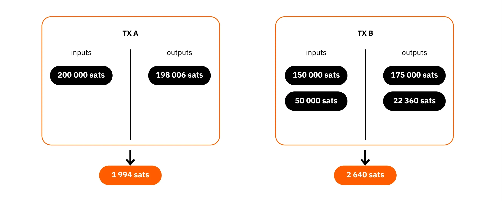


In dit voorbeeld zullen miners, hoewel transactie B een hogere totale vergoeding biedt, de voorkeur geven aan transactie A, omdat deze een betere verhouding tussen vergoeding en gewicht biedt. Hier is de berekening voor elke transactie, uitgedrukt in Sats per virtuele byte (sat/vB):


```text
TXA : 1994 / 141 = 14 sats/vB
TXB : 2640 / 220 = 12 sats / vB
```


Dit betekent dat transactie A per gewichtseenheid meer kosten met zich meebrengt dan transactie B, ook al brengt transactie B in absolute zin meer kosten met zich mee.


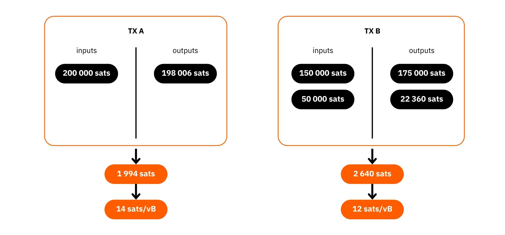


Het is daarom altijd interessanter voor de gebruiker om zo weinig mogelijk input te verbruiken in zijn transacties. Je moet echter wel voldoende consumeren om aan de outputbetaling te kunnen voldoen. Wanneer je je portefeuille beheert, moet je voldoende grote UTXO's hebben.


Het principe van consolidatie is juist om te profiteren van perioden waarin de kosten laag zijn op Bitcoin, om de kleinere UTXO's samen te voegen tot één grotere UTXO. Op deze manier kun je, wanneer de vergoedingen op Bitcoin stijgen, transacties maken met een minimum aan invoer, en dus in absolute zin minder uitgeven aan vergoedingen. Het doel is dus om te anticiperen op de verplichte transacties die moeten worden uitgevoerd tijdens perioden met hoge vergoedingen.


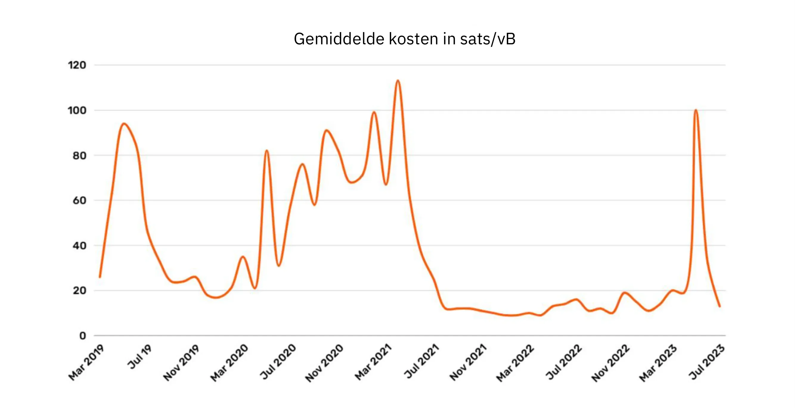


Naast het besparen op transactiekosten, helpt het consolideren van UTXO's de vorming van "Dust" voorkomen. Dust" verwijst naar UTXO's waarvan de waarde in Sats zo laag is dat het onvoldoende is om de transactiekosten te dekken die nodig zijn om ze uit te geven. Dit maakt deze UTXO's economisch irrationeel om te gebruiken zolang de transactiekosten hoog blijven. Door je UTXO's proactief samen te voegen, voorkom je dat ze in Dust veranderen, zodat al je fondsen bruikbaar blijven.


### Wat is de minimale grootte voor je UTXO's?


Mij wordt soms gevraagd wat de aanbevolen minimumwaarde voor een UTXO is. Helaas is er geen universeel antwoord, omdat het afhangt van je voorkeuren en de voorwaarden van de markt voor vergoedingen. Hier is echter een formule die je kan helpen bij het bepalen van een drempel die geschikt is voor jouw behoeften:


$$
\frac {P \times F}T = M
$$


Waar:


- p$ is het transactiegewicht;
- $F$ staat voor de maximale lading in satoshi's per vbyte (Sats/vB) waartegen je je indekt;
- t$ is het percentage van de transactiekosten dat u bereid bent te betalen in verhouding tot de totale waarde van de UTXO ;
- m$ is het minimumbedrag in satosjis voor elke UTXO.


Laten we aannemen dat je van plan bent de kosten te dekken voor een standaard SegWit transactie met 1 input en 2 outputs, met een gewicht van 141 vB. Als je tot 800 Sats/vB dekt en bereid bent om maximaal 12% van de UTXO waarde aan vergoedingen uit te geven, dan is de berekening als volgt:


$$
\frac{141 \times 800}{0.12} = 940\ 000
$$


In dit voorbeeld zou het daarom verstandig zijn om een minimale waarde van 940.000 Sats aan te houden voor UTXO's in je portefeuille.


### Consolidatie en CIOH


Een van de meest gebruikte heuristieken in Blockchain analyse is de CIOH (*Common Input Ownership Heuristic*), die aanneemt dat alle ingangen van een Bitcoin transactie tot dezelfde entiteit behoren. Het principe van consolidatie is juist om meerdere UTXO's als invoer te gebruiken en één UTXO als uitvoer te creëren. Consolidatie maakt het dus mogelijk om de ICOH toe te passen.


In de praktijk betekent dit dat een buitenstaander kan afleiden dat alle geconsolideerde UTXO's waarschijnlijk aan dezelfde persoon toebehoren en dat de gegenereerde unieke uitvoer ook aan hem of haar toebehoort. Deze situatie kan je vertrouwelijkheid in gevaar brengen door verschillende transactiegeschiedenissen met elkaar te associëren. Stel bijvoorbeeld dat ik 3 UTXO's, verkregen via P2P, consolideer met één UTXO, verkregen via een platform dat KYC vereist:


Door dit te doen, zal elke entiteit met toegang tot de gegevens van het Exchange platform, mogelijk inclusief overheidsinstanties, in staat zijn om te identificeren dat ik andere hoeveelheden BTC bezit. Voorheen waren deze UTXO's niet direct gekoppeld aan mijn identiteit; nu wel. Wat meer is, het onthult aan alle bronnen dat ik in het bezit ben van een bepaalde hoeveelheid bitcoins.


Als het gaat om het beheer van UTXO's, komen economische overwegingen, die consolidatie stimuleren om kosten te besparen, in conflict met goede privacypraktijken, die adviseren om nooit UTXO's samen te voegen. De keuze tussen zuinigheid en vertrouwelijkheid hangt dus af van de prioriteiten van elke gebruiker.


Als je consolidatie kunt vermijden met behoud van substantiële UTXO's, is dat ideaal. Om dit te doen, optimaliseer je je aankoopmethoden. Als je je bitcoins in DCA koopt, probeer dan je eenmalige aankopen zoveel mogelijk te spreiden om de waarde over minder UTXO's te consolideren. Het zal makkelijker zijn om elke 2 maanden een eenmalige aankoop van €1.000 te doen, in plaats van elke week een aankoop van €120. Dit minimaliseert het aantal gegenereerde UTXO's en vereenvoudigt het beheer van je portefeuille met behoud van je vertrouwelijkheid.


Als je je bitcoins moet consolideren, geef dan eerst de voorkeur aan het consolideren van UTXO's van dezelfde bron. Bijvoorbeeld, het samenvoegen van 10 UTXO's van één platform zal je vertrouwelijkheid minder beïnvloeden dan het mengen van 5 UTXO's van platform A met 5 UTXO's van platform B. Als consolidatie van verschillende bronnen onvermijdelijk is, probeer ze dan te scheiden op basis van hun kenmerken. Groepeer bijvoorbeeld UTXO's die via KYC zijn verkregen in één transactie en UTXO's die via P2P zijn verkregen in een andere.


Vergeet in elk geval niet dat elke consolidatie onvermijdelijk een verlies van vertrouwelijkheid met zich meebrengt. Beoordeel dus zorgvuldig de noodzaak van deze operatie en de mogelijke impact op je privacy, rekening houdend met het CIOH.


## Andere best practices


<chapterId>b5216965-7d13-4ea1-9b7c-e292966a487b</chapterId>


Laten we eens kijken naar een paar andere best practices voor het optimaliseren van je privacy op Bitcoin.


### De volledige knoop


Je bitcoins in eigen beheer hebben is geweldig, maar je eigen complete node gebruiken is nog beter! Hier is waarom het hebben van je eigen node cruciaal is voor een volledig soeverein gebruik van Bitcoin:


- **Weerstand tegen censuur**: Je transacties kunnen door niemand worden geblokkeerd;
- **Onafhankelijkheid van derden**: U bent niet langer afhankelijk van een externe service om Blockchain gegevens te verifiëren;
- **Actieve deelname**: Je kunt je eigen validatieregels definiëren en direct deelnemen aan de consensus;
- **Netwerkbijdrage**: Door een node te runnen, help je het Bitcoin netwerk te versterken en te verspreiden;
- **Technisch onderwijs**: Het beheren van een compleet knooppunt is een geweldige manier om je technische kennis van Bitcoin te verdiepen.


Naast deze voordelen verbetert het gebruik van een volledig knooppunt ook je vertrouwelijkheid bij het uitzenden van je transacties. Wanneer je een transactie uitvoert, wordt deze eerst via je Wallet aangemaakt en ondertekend. Om het op het Bitcoin netwerk uit te zenden, moet het bekend zijn bij minstens één knooppunt. Door je eigen node te gebruiken, heb je directe controle over deze verspreiding, waardoor je vertrouwelijkheid wordt versterkt en het risico op gegevenslekken wordt beperkt.


Als je geen eigen Bitcoin knooppunt hebt, ben je gedwongen een knooppunt van een derde partij te gebruiken, zoals het knooppunt dat wordt aangeboden door je Wallet softwareleverancier. Naast het uitzenden van transacties, heeft je Wallet toegang nodig tot verschillende gegevens, zoals openstaande transacties, saldi van je adressen en het aantal bevestigingen van je transacties. Om toegang te krijgen tot al deze gegevens, moet je een node bevragen.


Het grootste risico wanneer je niet je eigen Bitcoin node gebruikt, is dat de operator van de node van een derde partij jouw activiteiten op de Blockchain kan observeren, of zelfs deze informatie kan delen met andere entiteiten. Om dit risico te beperken, is een tussenoplossing om Wallet software te gebruiken die je verbindingen maskeert via Tor. Dit kan de blootstelling van je gegevens verminderen. De optimale oplossing is echter om je eigen Bitcoin node te hebben en die te gebruiken om je transacties uit te zenden. Natuurlijk moet je ook oppassen dat je geen informatie lekt via je node, maar dat is een ander onderwerp waar we later naar zullen kijken.


Naast het voor de hand liggende voordeel voor je privacy, verzekert het hebben van je eigen complete node je ook van de waarheidsgetrouwheid van gegevens op Blockchain, beschermt het je tegen censuur en stelt het je in staat om actief deel te nemen aan het bestuur van Bitcoin. Door je eigen node te gebruiken, draag je je economische gewicht bij aan de keten van jouw keuze, wat belangrijk is tijdens conflicten binnen de gemeenschap, zoals bijvoorbeeld tijdens de Blocksize War van 2015 tot 2017. In het geval van een Fork kan het gebruik van een node van een derde partij ertoe leiden dat je een keten steunt die je niet wilt steunen, omdat de nodeoperator de keuze voor jou maakt.


Zoals je kunt zien, is het in het belang van vertrouwelijkheid en individuele soevereiniteit essentieel om je eigen complete knooppunt te gebruiken!


### Misleidende analyse heuristieken


Meer in het algemeen is het belangrijk om de heuristieken waar we het in de vorige sectie over hadden te begrijpen, zodat je ze beter kunt vermijden of misleiden. Het toepassen van een aantal best practices kan nuttig zijn, zelfs als ze niet essentieel zijn. Ze bieden een extra Layer bescherming die belangrijk kan zijn bij het handhaven van vertrouwelijkheid bij het gebruik van Bitcoin.


Het eerste advies dat ik kan geven, is om op te gaan in de dichtste menigte. Op Bitcoin betekent dit het gebruik van de meest gebruikte scriptsjablonen. P2WSH scripts bijvoorbeeld, vaak gebruikt voor SegWit V0 Multisig configuraties, zijn erg ongebruikelijk. Je kunt je er niet mee verbergen in een grote anonimiteitsset. Hetzelfde geldt voor oudere modellen zoals P2PKH of P2SH. Hoewel ze veel voorkomen in de UTXO set, worden ze steeds minder gebruikt voor nieuwe transacties.


Over het algemeen is het verstandiger om te kiezen voor de meest recente scriptingstandaard, mits deze voldoende is geadopteerd. Dus als ik in 2022 het gebruik van P2TR (Taproot) zou hebben afgeraden vanwege de lage adoptie, zou ik in 2024 adviseren om in plaats daarvan voor dit type script te kiezen, of als dat niet lukt, voor SegWit V0 script, aangezien het aantal transacties dat P2TR gebruikt een zeer aanzienlijk deel begint uit te maken.


Bron : [txstats.com](https://txstats.com/d/000000054/UTXO-set-repartition-by-output-type)


Een andere tip om je vertrouwelijkheid te bewaren is om te proberen interne transactie heuristieken te omzeilen. Wanneer je bijvoorbeeld een betaling doet, kun je proberen te voorkomen dat je een uitgang creëert met een rond bedrag, omdat dit een signaal kan zijn dat de andere uitgang buitenlands Exchange vertegenwoordigt. Als je 100 k Sats naar een vriend moet sturen, overweeg dan een iets hoger bedrag over te maken om aan deze heuristiek te ontsnappen. Probeer ook geen uitvoer met buitenlands Exchange te maken die onevenredig hoog is in verhouding tot de betaling, omdat dit ook kan onthullen welke uitvoer buitenlands Exchange vertegenwoordigt.


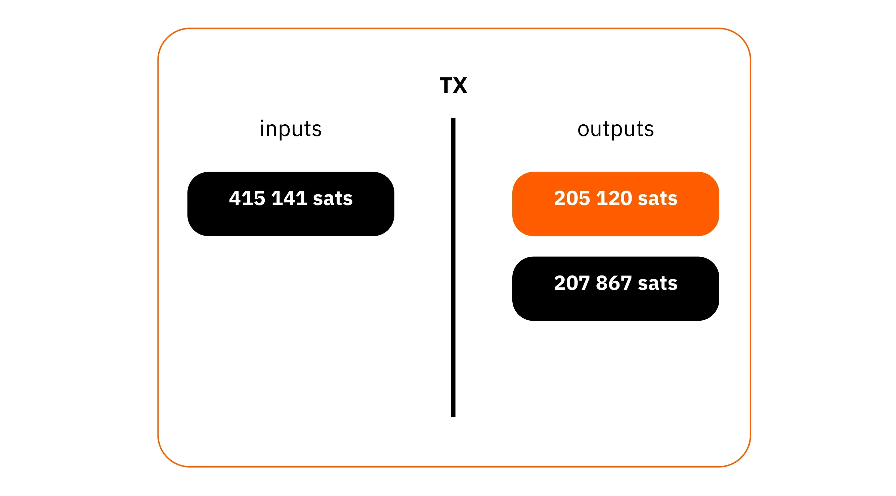


Tenslotte, als je regelmatig Bitcoin transacties uitvoert, zorg er dan voor dat je ze niet altijd op dezelfde tijden uitzendt. Door het uitzenden van je transacties over de dag en de week te spreiden, voorkom je dat externe waarnemers de kans krijgen om een op tijdzones gebaseerd tijdspatroon te ontdekken dat hun analyse zou kunnen versterken.


Naast al deze goede praktijken die je dagelijks moet toepassen, zijn er nog effectievere methodes om de traceerbaarheid van je bitcoins volledig te doorbreken. Deze omvatten natuurlijk CoinJoin transacties, waar we in de volgende sectie dieper op in zullen gaan.


# CoinJoin transacties begrijpen


<partId>6d0bbf16-3714-4db1-9897-2d45019f6bdc</partId>


## Wat is een CoinJoin transactie?


<chapterId>0862bc6b-1c48-4aa4-b76d-4f547b469008</chapterId>


Na het bestuderen van de basisprincipes van privacybescherming, gaan we nu kijken naar meer geavanceerde technieken om je vertrouwelijkheid actief te verdedigen, in het bijzonder door je Bitcoin geschiedenis te ontvlechten. In het volgende deel gaan we kijken naar een heleboel kleine technieken, maar eerst wil ik je vertellen over CoinJoin.


CoinJoin wordt vaak beschouwd als de meest effectieve methode om de privacy van Bitcoin gebruikers te beschermen. Maar wat is een CoinJoin transactie precies? Laten we dat eens uitzoeken.


### De basisprincipes van CoinJoin


CoinJoin is een techniek om Bitcoin tracking op de Blockchain te doorbreken. Het is gebaseerd op een collaboratieve transactie met een specifieke structuur met dezelfde naam: de CoinJoin transactie.


Zoals we in de eerste delen van deze cursus zagen, zijn Bitcoin transacties bekend bij alle gebruikers via hun node. Het is daarom eenvoudig om de elektronische handtekeningketen van elke munt te controleren en zijn geschiedenis te observeren. Dit betekent dat alle gebruikers kunnen proberen de transacties van andere gebruikers te analyseren. Hierdoor is anonimiteit op transactieniveau onmogelijk. De anonimiteit blijft echter behouden op het niveau van de individuele identificatie. In tegenstelling tot het conventionele banksysteem, waar elke rekening gekoppeld is aan een persoonlijke identiteit, worden op Bitcoin fondsen geassocieerd met cryptografische sleutelparen (of scripts), wat gebruikers een vorm van pseudonimiteit biedt achter cryptografische identifiers.


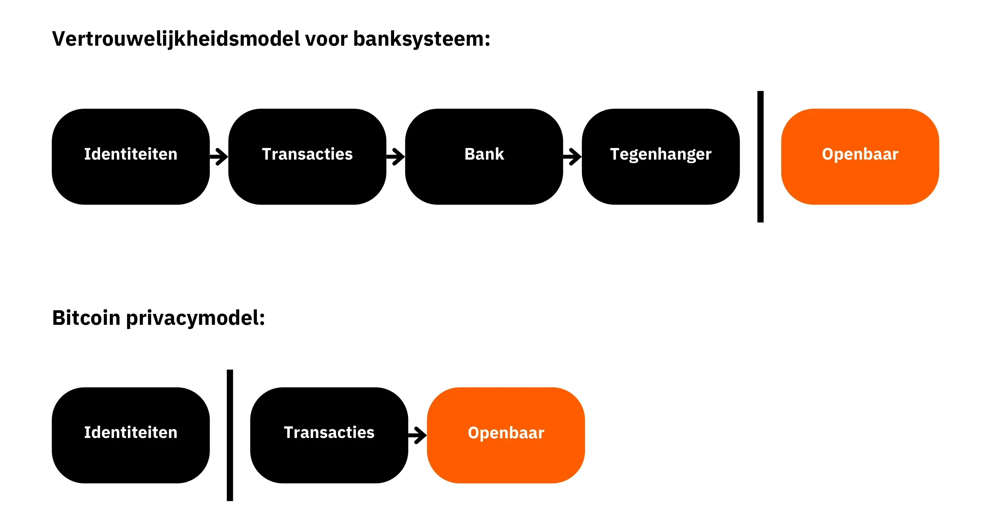


De vertrouwelijkheid van Bitcoin wordt ondermijnd wanneer externe waarnemers in staat zijn om specifieke UTXO's te associëren met geïdentificeerde gebruikers. Zodra deze associatie is vastgesteld, wordt het mogelijk om hun transacties te traceren en hun Bitcoin geschiedenis te analyseren. CoinJoin is juist een techniek die ontwikkeld is om de traceerbaarheid van UTXO's te doorbreken, om Bitcoin gebruikers een zekere Layer vertrouwelijkheid op transactieniveau te bieden.


Coinjoins versterken de vertrouwelijkheid van Bitcoin gebruikers door ketenanalyse ingewikkelder te maken voor externe waarnemers. Door hun structuur kunnen meerdere munten van verschillende gebruikers worden samengevoegd tot één transactie, waardoor de grenzen vervagen en het moeilijk wordt om de verbanden tussen invoer- en uitvoeradressen te bepalen.


Het is belangrijk om te begrijpen dat het doel van een CoinJoin transactie is om de geschiedenis van een munt te breken. Deze techniek verleent geen permanente anonimiteit of blokkeert definitief het volgen van Bitcoin, in tegenstelling tot wat je zou kunnen denken. CoinJoin heeft alleen tot doel de geschiedenis te breken op het moment dat de CoinJoin transactie wordt uitgevoerd. Voor en na deze operatie blijft de munt echter onderworpen aan dezelfde risico's in termen van vertrouwelijkheid.


### Hoe werken coinjoins?


Het CoinJoin principe is gebaseerd op een collaboratieve aanpak: verschillende gebruikers die hun bitcoins willen mixen storten identieke bedragen als input voor dezelfde transactie. Deze bedragen worden vervolgens herverdeeld in outputs van gelijke waarde voor elke gebruiker.


Aan het einde van de transactie wordt het onmogelijk om een specifieke output te associëren met een gebruiker die bekend staat als een input. Er is geen direct verband tussen inputs en outputs, waardoor de associatie tussen gebruikers en hun UTXO's wordt verbroken, evenals de geschiedenis van elk onderdeel.


Laten we het voorbeeld van Alice nemen. Ze wil ongeveer 100.000 Sats naar haar zus Eve sturen voor haar verjaardag. Alice wil echter niet dat Eve haar transactiegeschiedenis kan traceren, want ze wil niet onthullen hoeveel bitcoins ze heeft of hoe ze eraan komt. Daarom besluit Alice haar UTXO geschiedenis te breken met een CoinJoin transactie. Ze organiseert met Bob, Charles, David en Frank een gezamenlijke transactie:


- Alice, Bob, Charles, David en Frank verbinden elk een UTXO van 105.000 Sats (met 5.000 Sats voor Mining vergoedingen) als input voor de transactie:


- In ruil voor het verbruiken van deze inputs, genereert elk een lege Address om vijf identieke outputs van elk 100.000 Sats te maken. Elk haalt één uitgang op:


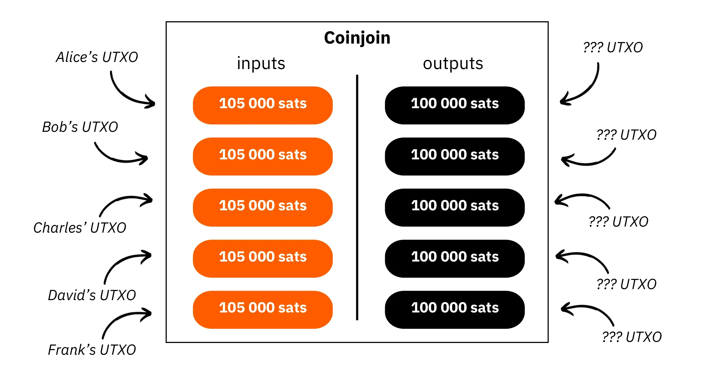


- Alice vindt zichzelf met een UTXO van 100.000 Sats waarvan de geschiedenis verward is. Ze gebruikt deze UTXO in een nieuwe transactie om het bedrag naar Eve te sturen voor haar verjaardag:


- Als Eve deze transactie probeert te analyseren om er informatie uit te halen, wordt ze geconfronteerd met de CoinJoin transactie waarbij Alice, Bob, Charles, David en Frank betrokken zijn. Omdat Eve niet kan onderscheiden welke input aan wie toebehoort door de uniformiteit van de bedragen, kan ze Alice's UTXO geschiedenis niet traceren, noch bepalen hoeveel bitcoins haar zus bezit of hoe ze deze verworven heeft:


In dit geval heeft Alice de CoinJoin techniek gebruikt om de vertrouwelijkheid met betrekking tot retrospectieve analyse te vergroten. In feite beschermt Alice zichzelf tegen een mogelijke analyse door Eve, die zou beginnen bij een specifieke transactie en terug zou werken door de geschiedenis van de UTXO. Deze bescherming tegen analyse vanuit het heden naar het verleden staat bekend als retrospectieve anonset. We zullen in de laatste hoofdstukken van dit hoofdstuk dieper op dit concept ingaan.


CoinJoin biedt echter ook de mogelijkheid om de vertrouwelijkheid te versterken bij een analyse van het verleden naar het heden, bekend als prospectieve anonset. Laten we teruggaan naar ons voorbeeld waar Alice Eve 98.000 Sats stuurde voor haar verjaardag, maar nu met de rollen omgedraaid. Laten we ons nu voorstellen dat Eve zich zorgen maakt over haar privacy. Alice zou in de verleiding kunnen komen om de munt die ze Eve stuurde te traceren om er informatie uit te halen. Eve zou deze UTXO, die ze net heeft ontvangen, kunnen consolideren met al haar andere UTXO's, wat Alice zou kunnen onthullen hoeveel bitcoins ze in haar Wallet heeft. Om dit te vermijden, kan Eve ook de geschiedenis breken van de munt die ze net heeft ontvangen:


- Eve, Grace, Mallory, Oscar en Victor zetten elk een UTXO van 98.000 Sats in als input voor een Bitcoin transactie:


- In ruil voor het verbruik van deze inputs levert elke gebruiker een lege Address die gebruikt kan worden om 5 outputs van 97.500 perfect gelijke Sats te maken. Elke gebruiker krijgt één uitgang:


- Eve heeft nu een UTXO van 97.500 Sats waarvan de geschiedenis is verbroken. Ze kan het zonder angst gebruiken om toekomstige transacties uit te voeren. Inderdaad, als Alice probeert de bitcoins te traceren die ze naar Eve heeft gestuurd, zal ze geconfronteerd worden met een CoinJoin transactie. Ze zal niet kunnen bepalen welke uitgaande UTXO van Eve is. Analyse wordt onmogelijk:


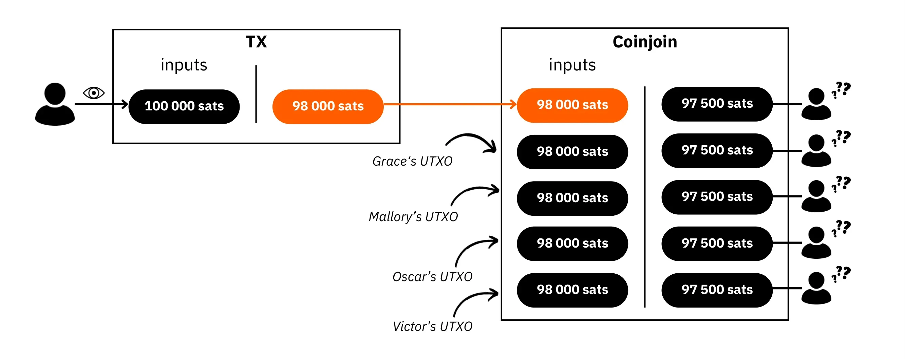


In het eerste voorbeeld zagen we hoe de CoinJoin de privacy van een kamer kan beschermen in relatie tot het verleden, en in het tweede voorbeeld hoe het ook de geschiedenis van een kamer kan veiligstellen in relatie tot de toekomst. Daarom zei ik dat de CoinJoin gezien moet worden als een eenmalige gebeurtenis die in beide richtingen een deel geschiedenis vastlegt:


### Mengpaneel, CoinJoin, mengpaneel... Wat is het verschil?


Coinjoins worden soms beschreven als "mixers", een term die sommige bitcoiners verwerpen uit angst dat hij verward zou kunnen worden met custodial mixers. Ik denk echter dat deze vrees ongegrond is, omdat CoinJoin in een wiskundige context precies het concept van mengen belichaamt.


In het algemene gebied van de wiskunde verwijst mengen naar de eigenschap van een dynamisch systeem waarbij, na een bepaalde tijd, alle delen van de beginruimte theoretisch vermengd kunnen raken met elk ander deel. Mengen houdt in dat de positie van een deeltje of de toestand van een systeem zodanig evolueert dat de toekomstige verdeling onafhankelijk is van de initiële verdeling, waardoor een toestand wordt bereikt waarin de eigenschappen van de initiële toestand uniform verdeeld zijn over de ruimte van het systeem. Dit is precies wat er gebeurt in een CoinJoin met bitcoins. Naar mijn mening is CoinJoin dus echt een methode om munten te mengen.


Aan de andere kant is het belangrijk om CoinJoin te onderscheiden van shufflers. Een shuffler is een dienst waarbij gebruikers hun bitcoins opsturen om ze te laten shuffelen. Deze diensten waren populair in de jaren 2010, maar het gebruik ervan is afgenomen vanwege twee grote nadelen in vergelijking met CoinJoin:


- Ze vereisen dat gebruikers afstand doen van het beheer van hun geld tijdens het mengproces, waardoor ze worden blootgesteld aan het risico van diefstal;
- Er is geen garantie dat de mixer geen transactiegegevens registreert of zelfs deze informatie verkoopt aan bedrijven die ketenanalyses uitvoeren.


De huidige gebruikers geven daarom de voorkeur aan CoinJoin, omdat ze gedurende het hele proces de volledige controle over hun fondsen behouden. CoinJoin deelnemers lopen geen risico dat hun bitcoins gestolen worden door de andere betrokken partijen. Hoe dit allemaal mogelijk is, bekijken we in het volgende hoofdstuk.


## Zerolink en chaumian medesamenvoegingen


<chapterId>326c9654-b359-4906-b23d-d6518dd5dc3e</chapterId>


De privacy die een CoinJoin biedt, wordt verdiend door de grootte van de groep waarin ons stuk verborgen is. Dit betekent dat we zoveel mogelijk deelnemers moeten vinden. Het is perfect mogelijk om handmatig een CoinJoin te maken, met gebruikers die we zelf hebben gevonden, maar dit is een ingewikkeld proces, en je zult er geen grote anonsets mee winnen.


Daarom hebben CoinJoin coördinatoren zich ontwikkeld op Bitcoin. Hun rol is om de verschillende gebruikers met elkaar in contact te brengen en de informatie door te geven die nodig is om de gezamenlijke transactie te voltooien.


Maar hoe kunnen we ervoor zorgen dat de coördinator nooit de bitcoins van gebruikers in handen heeft, en ondanks het feit dat hij de persoon is die de CoinJoin transactie bouwt, hoe kunnen we ervoor zorgen dat hij de inputs en outputs van gebruikers niet kan koppelen, wat een vertrouwelijkheidslek zou kunnen vormen?


### Chaums blinde handtekeningen


Moderne CoinJoin implementaties gebruiken David Chaum's blinde handtekeningen om het lekken van informatie te voorkomen. Laten we eens kijken hoe deze blinde handtekeningen werken.


Chaum's blinde handtekeningen zijn een vorm van digitale handtekening waarbij de uitgever van een handtekening de inhoud van het bericht dat hij ondertekent niet kent. Maar de handtekening kan dan worden geverifieerd aan de hand van het originele bericht. Deze techniek werd in 1983 ontwikkeld door cryptograaf David Chaum.


Laten we het voorbeeld nemen van een bedrijf dat een vertrouwelijk document, zoals een Contract, wil authenticeren zonder de inhoud te onthullen. Het bedrijf past een maskeerproces toe dat het originele document cryptografisch omvormt op een omkeerbare manier. Dit gewijzigde document wordt naar een certificeringsinstantie gestuurd, die een blinde handtekening aanbrengt zonder de onderliggende inhoud te kennen. Na ontvangst van het ondertekende document ontmaskert het bedrijf de handtekening. Het resultaat is een origineel document dat is geverifieerd door de handtekening van de certificeringsinstantie, zonder dat deze ooit de originele inhoud heeft gezien.


Chaum's blinde handtekeningen kunnen daarom de authenticiteit van een document certificeren zonder de inhoud ervan te kennen, waardoor zowel de vertrouwelijkheid van de gegevens van de gebruiker als de integriteit van het ondertekende document wordt gegarandeerd.


### Chaumian sluit zich aan bij


Zogenaamde "Chaumian" coinjoins combineren het gebruik van Tor en David Chaum's blinde handtekeningen om ervoor te zorgen dat de coördinator niet kan weten welke uitvoer bij welke gebruiker hoort.


Het CoinJoin transactieconstructieproces bestaat uit 3 hoofdfasen: invoerregistratie, uitvoerregistratie en transactieondertekening. Laten we dit proces bekijken aan de hand van het voorbeeld van Alice, één van de CoinJoin deelnemers. Alle andere deelnemers volgen dezelfde stappen als Alice, ieder voor zich.


**Stap 1: Invoerregistratie**


- Alice stuurt de coördinator de UTXO die ze wil gebruiken als invoer voor de transactie, evenals de gemaskeerde ontvangst Address die ze wil gebruiken als uitvoer om haar bitcoins te ontvangen. De coördinator kan dus op geen enkele manier de Address van Alice weten. Hij ziet alleen haar gemaskerde versie:


- De coördinator controleert de geldigheid van de ingangen en ondertekent dan de gemaskeerde Address van Alice met zijn privésleutel. Hij stuurt de blinde handtekening terug naar Alice:


**Stap 2: Uitvoerregistratie**


- Alice kan haar Address ontmaskeren, nu ondertekend door de private sleutel van de coördinator. Ze maakt een nieuwe verbinding onder een andere Tor-identiteit. De coördinator kan niet zien dat het Alice is die verbinding maakt onder deze nieuwe identiteit:


- Alice stuurt de ongemaskeerde Address en handtekening naar de coördinator (die nog steeds niet weet dat het Alice is):


**Stap 3: De transactie ondertekenen**


- Op dezelfde manier haalt de coördinator de ongemaskerde uitvoer van alle deelnemers op. Dankzij de bijbehorende handtekeningen kan hij controleren of elke anoniem ingediende uitvoer vooraf is ondertekend door zijn privésleutel, waardoor hun legitimiteit is gegarandeerd. Hij is dan klaar om de CoinJoin transactie op te bouwen en deze ter ondertekening naar de deelnemers te sturen:


- Alice controleert, net als de andere deelnemers, of haar invoer en uitvoer correct zijn opgenomen in de transactie die door de coördinator is geconstrueerd. Als alles naar wens is, stuurt ze de handtekening die haar invoerscript ontsluit naar de coördinator:


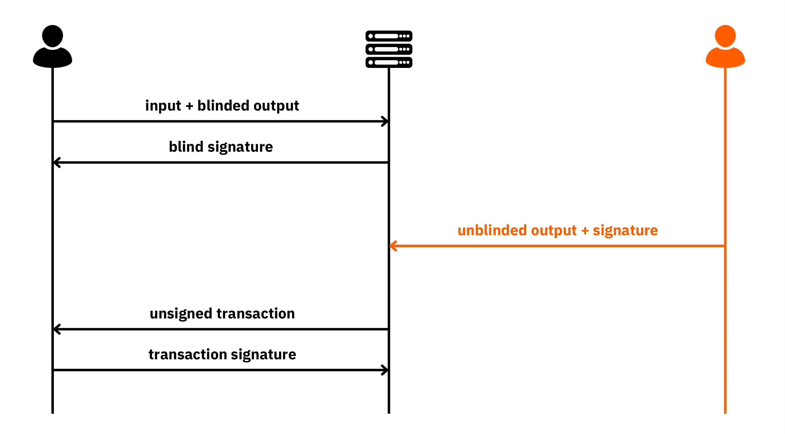


- Na het verzamelen van handtekeningen van alle CoinJoin deelnemers, kan de coördinator de transactie uitzenden op het Bitcoin netwerk, zodat deze kan worden toegevoegd aan een blok.


In dit systeem kan de coördinator geen input koppelen aan een specifieke output. Bovendien kan hij zich de fondsen van de deelnemers niet toe-eigenen, omdat hij nooit toegang heeft tot de privésleutels die nodig zijn om hun UTXO's te ontgrendelen. Gedurende het hele proces, tot het einde van stap 3, heeft hij ook geen toegang tot de handtekeningen. Wanneer Alice en de andere deelnemers de globale transactie ondertekenen, nadat ze hebben gecontroleerd of alles correct is, kan de coördinator de transactie niet meer wijzigen, inclusief de uitvoer, zonder deze ongeldig te maken. Dit voorkomt dat de coördinator bitcoins kan stelen.


Tenslotte wil de gebruiker van CoinJoin bij het registreren van zijn output in de transactie garanties hebben die vergelijkbaar zijn met die van een burger die stemt bij een verkiezing. Er is een dualiteit tussen de publieke en private aspecten van deze acties. Aan de ene kant is er wat je privé wilt houden: voor de kiezer wil hij niet dat zijn stembiljet gekoppeld wordt aan zijn identiteit; voor de CoinJoin gebruiker wil hij niet dat zijn output geassocieerd wordt met zijn input. Sterker nog, als de coördinator, of een andere partij, erin slaagt een link te leggen tussen een input en een output, verliest de CoinJoin alle interesse. Zoals hierboven uitgelegd, moet de CoinJoin functioneren als een onderbreking in de geschiedenis van een munt. Deze onderbreking ontstaat juist door de onmogelijkheid om een specifieke input te associëren met een specifieke output in de CoinJoin transactie (prospectieve anonset) en vice versa (retrospectieve anonset).


Aan de andere kant is er het publieke aspect: de kiezer wil er zeker van zijn dat zijn stembiljet in de stembus zit; net zo wil de CoinJoin gebruiker er zeker van zijn dat zijn uitvoer in de CoinJoin transactie zit. Inderdaad, CoinJoin deelnemers moeten absoluut in staat zijn om de aanwezigheid van hun uitvoer te verifiëren voordat ze de transactie ondertekenen, anders zou de coördinator het geld kunnen stelen.


Het zijn precies deze 2 publieke en private aspecten, mogelijk gemaakt door het gebruik van David Chaum's blinde handtekeningen, die deelnemers aan Chaumian coinjoins garanderen dat hun bitcoins niet gestolen zullen worden, en dat hun fondsen niet getraceerd kunnen worden.


### Wie heeft het CoinJoin concept uitgevonden?


Het is Hard om met zekerheid te zeggen wie het CoinJoin idee voor het eerst introduceerde bij Bitcoin, en wie op het idee kwam om David Chaum's blinde handtekeningen in deze context te gebruiken. Er wordt vaak gedacht dat het Gregory Maxwell was die het voor het eerst noemde in [een bericht op BitcoinTalk in 2013](https://bitcointalk.org/index.php?topic=279249.0) :


> *"Met behulp van Chaums blinde handtekeningen: Gebruikers loggen in en geven inputs (en Exchange adressen) en een cryptografisch blinded versie van de Address waarnaar ze hun private delen willen sturen; de server ondertekent de tokens en stuurt ze terug. Gebruikers maken opnieuw anoniem verbinding, ontmaskeren hun uitvoeradressen en sturen ze terug naar de server. De server kan zien dat alle outputs door hem zijn ondertekend en dat alle outputs dus afkomstig zijn van geldige deelnemers. Later maken mensen opnieuw verbinding en melden zich aan"*
Maxwell, G. (2013, augustus 22). *CoinJoin: Bitcoin privacy voor de echte wereld*. BitcoinTalk Forum. https://bitcointalk.org/index.php?topic=279249.0


Er zijn echter andere eerdere vermeldingen, zowel voor Chaum-handtekeningen als onderdeel van mixen, maar ook voor coinjoins. [In juni 2011 presenteerde Duncan Townsend op BitcoinTalk](https://bitcointalk.org/index.php?topic=12751.0) een mixer die Chaum-handtekeningen gebruikt op een manier die erg lijkt op moderne Chaumiaanse coinjoins.


In dezelfde thread vinden we [een bericht van hashcoin in antwoord op Duncan Townsend](https://bitcointalk.org/index.php?topic=12751.msg315793#msg315793) om zijn mixer te verbeteren. Het proces dat in dit bericht wordt beschreven is precies waar coinjoins over gaan. Vermelding van een soortgelijk systeem is ook te vinden in [een bericht van Alex Mizrahi in 2012](https://gist.github.com/killerstorm/6f843e1d3ffc38191aebca67d483bd88#file-laundry), toen hij advies gaf aan de makers van Tenebrix, een van de eerste altcoins die als basis diende voor de latere creatie van Litecoin. Zelfs de term "CoinJoin" zelf zou niet bedacht zijn door Greg Maxwell, maar afkomstig zijn van een idee van Peter Todd.


### Zerolink


Zerolink is een uitgebreid mengprotocol dat Chaumian coinjoins en verschillende strategieën bevat om de anonimiteit van gebruikers te beschermen tegen verschillende vormen van ketenanalyse, in het bijzonder door fouten te minimaliseren die geassocieerd worden met portefeuillebeheer. Dit protocol [werd geïntroduceerd door nopara73 en TDevD in 2017] (https://github.com/nopara73/ZeroLink/blob/master/README.md).


Zoals de naam al aangeeft, is het principe achter Zerolink om CoinJoin transacties te creëren die ervoor zorgen dat de links tussen inputs en outputs niet kunnen worden getraceerd. Dit wordt bereikt door ervoor te zorgen dat alle outputs perfect identieke bedragen hebben.


Een belangrijke preventieve maatregel van Zerolink is om ongemengde UTXO's volledig gescheiden te houden van gemengde UTXO's door aparte cryptografische sleutelsets of zelfs aparte portefeuilles te gebruiken. Dit onderscheidt de "*pre-mix*" Wallet, bedoeld voor onderdelen vóór het mengen, van het "*post-mix*" Wallet, gereserveerd voor onderdelen die gemengd zijn.


Deze strikte scheiding van UTXO's dient vooral om toevallige koppelingen tussen een gemengde UTXO en een ongemengde UTXO te voorkomen. Als zulke koppelingen namelijk voorkomen, wordt de effectiviteit van de CoinJoin op de gemengde UTXO geannuleerd zonder dat de gebruiker zich daarvan bewust is, waardoor de vertrouwelijkheid van een UTXO wordt aangetast waarvan hij dacht dat hij de geschiedenis had verbroken. Deze verbanden kunnen ontstaan door hergebruik van Address bij het veiligstellen van een gemengde UTXO met een ongemengde, of door de toepassing van CIOH (_Common-Input-Ownership Heuristic_), als de gebruiker gemengde en ongemengde UTXO's gebruikt als invoer voor dezelfde transactie. Door de pre-mix en post-mix portefeuilles te scheiden, voorkomen we zulke toevallige associaties en beschermen we de gebruiker tegen onbedoelde fouten.


Deze scheiding biedt ook de mogelijkheid om verschillende regels toe te passen tussen pre-mix en post-mix portefeuilles op het niveau van de portefeuillesoftware. In de post-mix portefeuille kan de software bijvoorbeeld het samenvoegen van UTXO's in inputs verbieden om de toepassing van CIOH te voorkomen, wat de anonset van de gebruiker in gevaar zou brengen. Het is ook mogelijk om het gebruik van scripts en transactieopties (zoals RBF rapportage) te standaardiseren om identificatie door Wallet vingerafdrukken te voorkomen.


Op dit moment is Whirlpool de enige CoinJoin implementatie die het Zerolink protocol strikt toepast. In het volgende hoofdstuk kijken we naar de verschillende CoinJoin implementaties die er zijn, en de voor- en nadelen van elk.


## CoinJoin implementaties


<chapterId>e37ed073-9498-4e4f-820b-30951e829596</chapterId>


*In 2024 zijn we getuige van grote veranderingen in de gereedschappen die beschikbaar zijn voor gebruikers die coinjoins willen maken op Bitcoin. We staan momenteel op een keerpunt en de CoinJoin markt ondergaat een grote herstructurering. Dit hoofdstuk zal in de loop van de tijd zeker worden bijgewerkt*


Op dit moment zijn er voornamelijk 3 verschillende CoinJoin implementaties op Bitcoin:


- Whirlpool;
- Wabisabi;
- JoinMarket.


Elk van deze implementaties heeft als doel de geschiedenis van UTXO's te doorbreken via CoinJoin transacties. Hun mechanismen verschillen echter aanzienlijk. Het is daarom essentieel om te begrijpen hoe ze werken, zodat je de optie kunt kiezen die het beste bij je behoeften past.


### JoinMarket


JoinMarket, opgericht in 2015 door Adam Gibson en Chris Belcher, onderscheidt zich duidelijk van andere CoinJoin implementaties dankzij zijn unieke model om gebruikers met elkaar in contact te brengen. Het systeem is gebaseerd op een P2P Exchange markt waar sommige gebruikers, de "makers", hun bitcoins beschikbaar stellen om te mengen, terwijl anderen, de "nemers", dit geld gebruiken om coinjoins te maken in ruil voor een vergoeding.


In dit model stellen "makers" hun bitcoins beschikbaar aan "nemers" en ontvangen een vergoeding voor hun dienst. De takers betalen op hun beurt om de bitcoins van de makers te gebruiken om hun eigen CoinJoin transacties uit te voeren. De servicekosten variëren afhankelijk van de rol die ze vervullen: "makers" verzamelen vergoedingen voor het aanbieden van liquiditeit, terwijl "nemers" de vergoedingen betalen. De markt werkt vrij, zonder gebruiksvoorwaarden.


Een van de belangrijkste nadelen van JoinMarket is de complexiteit van het gebruik. Om JoinMarket doeltreffend te kunnen gebruiken, moet je een beetje vertrouwd zijn met terminals. Hoewel deze complexiteit geen belemmering vormt voor de ervaren gebruiker, kan het de toegang voor het grote publiek beperken. De recente introductie van een web Interface genaamd JAM heeft het gebruik echter iets eenvoudiger gemaakt.


Bron : [JAM](https://github.com/joinmarket-webui/jam/blob/devel/docs/assets/screenshot-dark.webp)


De technische barrière blijft echter een groot obstakel. In het CoinJoin ecosysteem, waar vertrouwelijkheid wordt versterkt door het aantal deelnemers, heeft elke beperking van de toegankelijkheid direct invloed op de beschikbare liquiditeit, wat een cruciale factor is voor de efficiëntie van de mix. Bitcoin, dat al een niche in financiële transacties is, ziet het gebruik van coinjoins als een subniche, en JoinMarket vertegenwoordigt een nog meer gespecialiseerde fractie daarvan, waardoor het potentieel om de anonimiteit van zijn gebruikers te vergroten wordt beperkt.


Ondanks het innovatieve P2P koppelingsmodel voor coinjoiners, heeft JoinMarket een aantal belangrijke nadelen, met name op het gebied van transactiestructuur. In tegenstelling tot andere implementaties zoals Whirlpool, garandeert JoinMarket geen perfecte gelijkheid tussen outputs en is het mogelijk om deterministische links tussen inputs en outputs te traceren. Bovendien heeft het geen tools om te voorkomen dat onderdelen die al met elkaar zijn vermengd, opnieuw worden vermengd, wat de vertrouwelijkheid waar gebruikers naar streven in gevaar zou kunnen brengen.


Tot slot, hoewel het JoinMarket concept interessant is, vooral voor degenen die geïnteresseerd zijn in een dynamische liquiditeitsmarkt, maken de structurele zwakheden en technische complexiteit het naar mijn mening minder interessant voor zowel beginners als experts die op zoek zijn naar een CoinJoin implementatie.


### Wabisabi


Wabisabi is een andere CoinJoin implementatie, met een aanpak die transactiecoördinatie centraliseert. Dit model werd in 2021 bedacht door Ádám Ficsór (nopara73), Yuval Kogman, Lucas Ontivero en István András Seres, en werd het jaar daarop geïntegreerd in Wasabi 2.0 software. Wabisabi is precies een evolutie van het Wasabi-softwaremodel CoinJoin dat in 2018 werd gelanceerd.


Tegen het einde van de jaren 2010 paste Wasabi een radicaal andere CoinJoin transactiestructuur toe dan Whirlpool. Wasabi gebruikte zeer grote CoinJoin transacties, waarbij tientallen deelnemers betrokken waren, om de anonsets van haar deelnemers te vergroten. Whirlpool koos daarentegen voor meerdere kleine transacties, waardoor de anonimiteit bij elke cyclus exponentieel kon groeien.


Exchange beheermethoden onderscheidden ook de twee implementaties. Met Whirlpool werd buitenlands Exchange uitgesloten en geïsoleerd van UTXO's voorafgaand aan CoinJoin cycli dankzij TX0, een concept dat ik verder zal uitleggen in het volgende hoofdstuk. Met Wasabi daarentegen vormde buitenlands Exchange één van de uitgangen van de CoinJoin transactie, waarbij deterministische links tussen bepaalde ingangen en uitgangen werden onderhouden.


Met Wabisabi heeft Wasabi versie 2.0 zijn benadering van coinjoins aangepast aan die van Whirlpool. Hoewel CoinJoin transacties erg groot blijven, is het nu mogelijk om meerdere opeenvolgende cycli te chainen, volgens het Whirlpool model. Er is ook speciale aandacht besteed aan het beheer van de Exchange koers: in tegenstelling tot Wasabi 1.0, waar de Exchange koers direct gekoppeld was aan de input van gebruikers, probeert Wabisabi de Exchange koers onder te verdelen in verschillende kleine bedragen, verdeeld in gelijke denominaties voor alle deelnemers.


Laten we dit illustreren met een vereenvoudigd voorbeeld van slechts 2 gebruikers: Alice wil 115.000 Sats mengen en Bob, 210.000 Sats. Als we de kosten buiten beschouwing laten, zou een CoinJoin transactie met Wasabi 1.0 3 outputs van 100.000 Sats hebben gegenereerd, plus 1 Exchange van 15.000 Sats voor Alice en 1 Exchange van 10.000 Sats voor Bob. De Exchange-uitgangen zouden nog steeds gekoppeld zijn aan de ingangen:


Volgens Wabisabi zou dezelfde transactie 3 keer 100.000 Sats en 5 keer 5.000 Sats hebben opgeleverd, waardoor het Exchange zo verspreid zou zijn dat het niet direct aan een specifieke input kon worden gekoppeld:


Persoonlijk vind ik dat het buitenlandse Exchange-beheer van Wabisabi verschillende risico's met zich meebrengt die de effectiviteit op het gebied van vertrouwelijkheid in gevaar kunnen brengen:


- Wanneer een gebruiker een UTXO bijdraagt die aanzienlijk groter is dan die van andere deelnemers, eindigt hij onvermijdelijk met een Exchange-bedrag dat aan zijn inbreng wordt gekoppeld. Dit druist in tegen het oorspronkelijke doel van het protocol, namelijk het elimineren van alle identificeerbare uitwisselingen;
- Het vermenigvuldigen van benamingen met als doel de Exchange te fragmenteren kan paradoxaal genoeg nadelig zijn voor de efficiëntie van het mengen. Dit proces kan leiden tot een vermindering van anonsets voor bepaalde outputs, omdat ze gemakkelijker te identificeren zijn;
- Deze methode genereert ook UTXO's met een lage waarde die een beheersprobleem vormen voor de gebruiker. Deze kleine UTXO's kunnen, als ze te duur worden om uit te geven in verhouding tot hun waarde, "Dust" worden. Dit fenomeen leidt ertoe dat de gebruiker verschillende UTXO's samenvoegt tot inputs voor toekomstige transacties, of ze consolideert. In beide gevallen kan dit, vanwege het CIOH, de verkregen anonimiteit verminderen, of de vertrouwelijkheidsvoordelen verkregen door de initiële CoinJoin volledig teniet doen.


In tegenstelling tot Whirlpool, dat het ZeroLink protocol implementeert dat een strikte scheiding tussen pre-mix en post-mix UTXO's garandeert, handhaaft Wabisabi deze strikte scheiding niet. Er zijn ook problemen geweest met hergebruik van Address door sommige Wasabi-klanten, wat uiteraard zeer nadelig is voor de gebruiker.


In Wasabi versie 2.0 is een nieuw CoinJoin vergoedingenbeleid geïmplementeerd. Vanaf nu zijn de coördinatorvergoedingen vastgesteld op 0,3% voor UTXO's boven 0,01 Bitcoin, terwijl voor kleinere UTXO's deze vergoedingen volledig worden aangeboden. Bovendien zijn remixen voor deze kleinere UTXO's gratis, hoewel de gebruiker Mining vergoedingen blijft betalen voor alle transacties, inclusief remixen.


Dit in tegenstelling tot het beleid van Whirlpool, waar de vergoedingen vast blijven, ongeacht de grootte van de verkregen anonsets. Met Wasabi 2.0 worden coördinatorvergoedingen kwijtgescholden voor kleine UTXO's, maar de gebruiker moet nog steeds Mining vergoedingen betalen voor alle transacties, inclusief remixen.


Terwijl ik deze regels schrijf, is het gebruik van Wabisabi aanzienlijk complexer geworden als gevolg van recente gebeurtenissen. Na de arrestatie van de oprichters van Samourai Wallet, kondigde zkSNACKs, het bedrijf dat de ontwikkeling van Wasabi financiert en beheert, aan dat de CoinJoin coördinatordienst op 1 juni 2024 zou worden stopgezet. Deze coördinator, die standaard was ingesteld op Wasabi, was verantwoordelijk voor het overgrote deel van de liquiditeit.


Met het wegvallen van deze hoofdcoördinator moeten gebruikers nu verbinding maken met nieuwe, onafhankelijke coördinatoren. Deze verandering brengt een aantal problemen met zich mee: aan de ene kant hebben nieuwe coördinatoren mogelijk niet voldoende liquiditeit, waardoor de effectiviteit van coinjoins op het gebied van vertrouwelijkheid afneemt. Aan de andere kant bestaat het risico dat je een kwaadwillende coördinator tegen het lijf loopt. Deze situatie voegt aanzienlijke nieuwe risico's toe voor degenen die Wabisabi willen gebruiken.


Naast de technische kwesties roept de beslissing van zkSNACKs, het bedrijf achter Wasabi, om gebruik te maken van de diensten van een stringanalysebedrijf om CoinJoin deelnemers te filteren, ernstige ethische en strategische vragen op. Het oorspronkelijke idee was om het gebruik van coinjoins op Wasabi door criminelen te voorkomen, een zet die legitiem lijkt. Het roept echter een paradox op: geld betalen aan een coördinator wiens primaire missie is om de vertrouwelijkheid van gebruikers te versterken, om hem vervolgens een bedrijf te laten financieren wiens doel het is om diezelfde vertrouwelijkheid in gevaar te brengen.


Nog verontrustender is het principe van filteren, dat in schril contrast staat met de filosofie van Bitcoin om een open, ongecensureerd financieel systeem aan te bieden. Hoewel het gerechtvaardigd lijkt om criminele activiteiten te willen uitsluiten, zou dit filteren ook gevolgen kunnen hebben voor individuen wiens acties, hoewel ze in bepaalde contexten als illegaal worden geclassificeerd, moreel gerechtvaardigd of sociaal nuttig zouden kunnen zijn. Het voorbeeld van Edward Snowden illustreert deze dichotomie perfect: sommige regeringen beschouwen hem als een crimineel vanwege zijn onthullingen, terwijl anderen hem zien als een klokkenluider die handelde in het algemeen belang. Deze complexiteit onderstreept het potentiële gevaar van filteren dat, hoewel goed bedoeld, uiteindelijk de rechten en veiligheid van legitieme gebruikers kan ondermijnen. Ik had ook activisten en journalisten kunnen noemen die onder bepaalde autoritaire regimes worden vervolgd.


Zoals je inmiddels wel begrepen zult hebben, gaat mijn voorkeur absoluut uit naar het Whirlpool model voor coinjoins op Bitcoin. Dit systeem onderscheidt zich door zijn nauwkeurigheid en biedt superieure garanties voor vertrouwelijkheid. Het is ook het enige dat een mix biedt die in een wiskundige context als perfect wordt beschouwd. Naar mijn mening vertegenwoordigt dit model de toekomst van coinjoins op Bitcoin. Ik nodig je uit om dit model verder uit te diepen in het volgende hoofdstuk.


## Hoe Whirlpool werkt


<chapterId>bdbd7109-e36d-4b4f-a3c6-928df4e9bfda</chapterId>


Wat Whirlpool onderscheidt van andere CoinJoin methoden is het gebruik van "_ZeroLink_" transacties, die ervoor zorgen dat er strikt geen technisch verband mogelijk is tussen alle inputs en outputs. Deze perfecte mix wordt bereikt door een structuur waarin elke deelnemer een identieke hoeveelheid input bijdraagt (met uitzondering van de Mining-vergoedingen), waardoor een perfect gelijke output wordt gegenereerd.


Deze restrictieve benadering van inputs geeft Whirlpool's CoinJoin-transacties een uniek kenmerk: de totale afwezigheid van deterministische verbanden tussen inputs en outputs. Met andere woorden, elke output heeft een gelijke waarschijnlijkheid om te worden toegewezen aan een deelnemer, ten opzichte van alle andere outputs in de transactie.


### Hoe Whirlpool werkt


Aanvankelijk was het aantal deelnemers in elke Whirlpool CoinJoin beperkt tot 5, met 2 nieuwkomers en 3 remixers (we leggen deze concepten later uit). De stijging van de transactiekosten voor On-Chain die in 2023 werd waargenomen, zette de teams van Samourai er echter toe aan hun model te heroverwegen om de vertrouwelijkheid te verbeteren en tegelijkertijd de kosten te verlagen. Dus, rekening houdend met de situatie op de fee-markt en het aantal deelnemers, kan de coördinator nu coinjoins organiseren met 6, 7 of 8 deelnemers. Deze verbeterde sessies staan bekend als "Surge Cycles". Het is belangrijk op te merken dat, ongeacht de configuratie, er altijd slechts 2 nieuwe deelnemers zijn bij coinjoins van Whirlpool.


Zo worden Whirlpool-transacties gekenmerkt door een identiek aantal in- en uitgangen, die :


- 5 ingangen en 5 uitgangen ;


- 6 ingangen en 6 uitgangen ;


- 7 ingangen en 7 uitgangen ;


- 8 ingangen en 8 uitgangen.


Het model van Whirlpool is gebaseerd op kleine CoinJoin transacties. In tegenstelling tot Wabisabi en JoinMarket, waar de robuustheid van anonsets is gebaseerd op het volume van deelnemers in één cyclus (of een paar cycli), is Whirlpool gebaseerd op de opeenvolging van verschillende kleine cycli.


In dit model betalen gebruikers alleen wanneer ze voor het eerst lid worden van een pool, waardoor ze zonder extra kosten kunnen deelnemen aan een groot aantal remixes. Nieuwkomers betalen de Mining vergoedingen voor remixers.


Met elke extra CoinJoin waaraan een stuk deelneemt en met zijn soortgenoten uit het verleden, zullen de anonsets exponentieel groeien. Het doel is om te profiteren van deze gratis remixen, die elke keer dat ze voorkomen bijdragen aan het versterken van de dichtheid van de anonsets die geassocieerd zijn met elk gemixt stuk.


Whirlpool is ontworpen met twee belangrijke eisen in gedachten:


- De toegankelijkheid van de implementatie op mobiele apparaten, aangezien Samourai Wallet in de eerste plaats een smartphoneapplicatie is;
- Snelle remixcycli om een aanzienlijke toename in anonsets te bevorderen.


Deze vereisten leidden de keuzes van de ontwikkelaars van Samourai Wallet bij het ontwerpen van Whirlpool, waardoor ze het aantal deelnemers per cyclus beperkten. Te weinig deelnemers zou de efficiëntie van CoinJoin in gevaar hebben gebracht en het aantal gegenereerde anonsets per cyclus drastisch hebben verminderd, terwijl te veel deelnemers problemen zouden hebben opgeleverd bij het beheer van mobiele toepassingen en de doorstroming van de cyclus zouden hebben belemmerd.


Tenslotte is het niet nodig om een groot aantal deelnemers per CoinJoin op Whirlpool te hebben, omdat anonsets gemaakt worden op de accumulatie van meerdere CoinJoin cycli. Het belangrijkste principe hier is de homogeniteit van de UTXO's van alle deelnemers, omdat dit een perfecte menging garandeert, en dus volledig voordeel uit de meng- en remixcycli.


### CoinJoin zwembaden en vergoedingen


Voor deze meervoudige cycli om de anonsets van de gemengde onderdelen te verhogen, is een bepaald kader nodig om de gebruikte hoeveelheden UTXO's te beperken. Whirlpool definieert verschillende pools.


Een groep vertegenwoordigt een groep gebruikers die samen willen mengen en die het eens zijn over de hoeveelheid UTXO's die gebruikt moet worden om het CoinJoin proces te optimaliseren met behoud van perfecte onderdeelhomogeniteit. Elke pool specificeert een vaste UTXO hoeveelheid, waar de gebruiker zich aan moet houden om te kunnen deelnemen. Dus, om coinjoins te maken met Whirlpool, moet je een pool selecteren. De volgende pools zijn momenteel beschikbaar:


- 0.5 bitcoins ;
- 0.05 Bitcoin ;
- 0.01 Bitcoin ;
- 0.001 Bitcoin (= 100.000 Sats).


Als je een pool binnengaat met je bitcoins, worden ze verdeeld in generate UTXO's die perfect homogeen zijn met die van de andere deelnemers in de pool. Elke pool heeft een maximumlimiet, dus voor bedragen die deze limiet overschrijden, moet je of twee aparte entries maken in dezelfde pool, of naar een andere pool gaan met een hoger bedrag:


| Pool (bitcoin) | Maximum amount per entry (bitcoin) |
|----------------|--------------------------------------|
| 0,5 | 35 |
| 0,05 | 3,5 |
| 0,01 | 0,7 |
| 0,001 | 0,025 |

Een UTXO wordt geacht deel uit te maken van een pool wanneer deze gereed is om te worden geïntegreerd in een CoinJoin. Dit betekent echter niet dat de gebruiker het bezit ervan verliest. Zoals we in de eerste hoofdstukken van dit hoofdstuk zagen, behoud je tijdens de verschillende mengcycli de volledige controle over je sleutels en dus ook over je bitcoins. Dit is wat de CoinJoin techniek onderscheidt van andere gecentraliseerde mengtechnieken.


Om lid te worden van een CoinJoin pool, moet je een servicevergoeding en een Mining vergoeding betalen. De servicekosten zijn vastgesteld voor elke pool en zijn bedoeld om de teams te vergoeden die verantwoordelijk zijn voor de ontwikkeling en het onderhoud van Whirlpool.


De servicekosten voor het gebruik van Whirlpool betaal je eenmalig als je lid wordt van de pool. Als je eenmaal lid bent, kun je zonder extra kosten deelnemen aan een onbeperkt aantal remixes. Hier zijn de huidige vaste kosten voor elke pool:


| Pool (bitcoin) | Entry fee (bitcoin) |
|----------------|---------------------------------|
| 0,5 | 0,0175 |
| 0,05 | 0,00175 |
| 0.01 | 0.0005 (50,000 sats) |
| 0.001 | 0.00005 (5,000 sats) |

Deze fees fungeren in wezen als een toegangsticket tot de gekozen pool, ongeacht het bedrag dat je in CoinJoin stopt. Dus, of je nu de 0.01 pool instapt met precies 0.01 BTC of 0.5 BTC, de fees blijven hetzelfde in absolute termen.


Alvorens verder te gaan met Whirlpool coinjoins, kan de gebruiker kiezen uit 2 strategieën:


- Kies voor een kleinere pool om de servicekosten te minimaliseren, wetende dat hij er verschillende kleinere UTXO's voor terugkrijgt;
- Of je kiest voor een grotere pool en bent bereid om hogere vergoedingen te betalen, om uiteindelijk te eindigen met een kleiner aantal UTXO's met een hogere waarde.


Het is over het algemeen niet aan te raden om meerdere gemengde UTXO's samen te voegen na CoinJoin cycli, omdat dit de verkregen vertrouwelijkheid in gevaar kan brengen, met name door de gemeenschappelijke invoer Ownership heuristiek (CIOH: *Common-Input-Ownership-Heuristic*). Daarom kan het zinvol zijn om een grotere pool te kiezen, zelfs als dit betekent dat er meer betaald moet worden, om te voorkomen dat er te veel UTXO's met een kleine waarde in de uitvoer zitten. De gebruiker moet deze afwegingen evalueren om de pool te kiezen waaraan hij de voorkeur geeft.


Naast de servicekosten moet ook rekening worden gehouden met de Mining kosten die specifiek zijn voor Bitcoin transacties. Als Whirlpool gebruiker moet je de Mining vergoeding betalen voor de voorbereidingstransactie (`Tx0`) en voor de eerste CoinJoin. Alle volgende remixen zijn gratis, dankzij het model van Whirlpool dat gebaseerd is op het betalen van nieuwe gebruikers. Alle volgende remixen zijn gratis, dankzij het model van Whirlpool dat gebaseerd is op het betalen van nieuwe toetreders.


In feite zijn in elke Whirlpool CoinJoin 2 gebruikers onder de inputs nieuwkomers. De andere input is afkomstig van remixers. Als gevolg daarvan worden de Mining kosten voor alle deelnemers aan de transactie gedragen door deze 2 nieuwkomers, die vervolgens ook kunnen profiteren van gratis remixen:


Dankzij dit vergoedingensysteem onderscheidt Whirlpool zich echt van andere CoinJoin implementaties, omdat de anonimiteit van de UTXO's niet evenredig is met de prijs die de gebruiker betaalt. Hierdoor is het mogelijk om aanzienlijk hogere niveaus van anonimiteit te bereiken door alleen de pool entry fee en de Mining fee te betalen voor 2 transacties (de `Tx0` en de initiële mix).


Het is belangrijk op te merken dat de gebruiker ook de Mining kosten zal moeten betalen om zijn UTXO's uit de pool te halen na het voltooien van zijn meervoudige coinjoins, tenzij hij de `mix to` optie heeft geselecteerd, die een externe Address biedt die de fondsen direct uit CoinJoin zal ontvangen, zonder extra transactie.


### HD-portefeuilleaccounts


Om een CoinJoin via Whirlpool aan te maken, moet de Wallet generate verschillende aparte accounts hebben. Dit is het principe achter het ZeroLink protocol. Een account, in de context van een HD (*Hierarchical Deterministic*) portefeuille, vormt een sectie die volledig geïsoleerd is van de andere, deze scheiding vindt plaats op het niveau van de derde diepte van de portefeuillehiërarchie, d.w.z. op het `xpub` niveau.


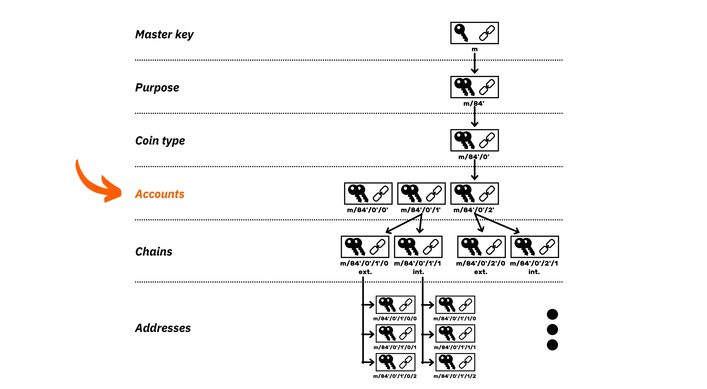


Een HD Wallet kan theoretisch tot `2^(31)` verschillende accounts afleiden. De initiële rekening, standaard gebruikt op alle Bitcoin portemonnees, komt overeen met de `0'` index.


Voor portefeuilles die zijn aangepast aan Whirlpool worden 4 accounts gebruikt om te voldoen aan de behoeften van het ZeroLink proces:


- De **deposito** rekening, geïdentificeerd door index `0'` ;
- De **slechte bank** (of "doxxic change") rekening, geïdentificeerd door de index `2,147,483,644'` ;
- De **premix**-rekening, geïdentificeerd met de index `2 147 483 645'` ;
- De **postmix** rekening, geïdentificeerd door de index `2 147 483 646'`.


Elk van deze accounts vervult een bepaalde functie in het CoinJoin proces, die we in de volgende secties zullen verkennen.


Al deze accounts zijn gekoppeld aan één seed, waardoor de gebruiker toegang kan krijgen tot al zijn bitcoins met behulp van zijn herstelzin en, indien van toepassing, zijn passphrase. Tijdens het herstel moet de software echter op de hoogte worden gebracht van de verschillende accountindexen die worden gebruikt.


Laten we eens kijken naar de verschillende stadia van een Whirlpool CoinJoin binnen deze accounts.


### De TX0


Het startpunt van elke Whirlpool CoinJoin is de **deposit** account. Dit is de rekening die je automatisch gebruikt als je een nieuwe Bitcoin Wallet aanmaakt. Deze rekening moet worden gecrediteerd met de bitcoins die je wilt mengen.


Tx0" is de eerste stap in het mengproces van de Whirlpool. Het doel is om de UTXO's voor de CoinJoin voor te bereiden en te egaliseren, door ze te verdelen in eenheden die overeenkomen met de hoeveelheid van de geselecteerde pool, om een homogene menging te garanderen. De aldus vereffende UTXO's worden vervolgens naar de **premix** rekening gestuurd. Het verschil dat niet in de pool kan, wordt gescheiden in een specifieke rekening: de **slechte bank** (of "doxxic change").


Deze initiële `Tx0` transactie wordt ook gebruikt om de service fee te betalen die verschuldigd is aan de CoinJoin coördinator. In tegenstelling tot de volgende stappen, werkt deze transactie niet samen, dus de gebruiker moet de volledige kosten van Mining dragen:


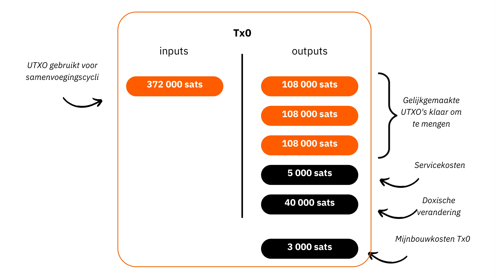


In dit voorbeeld van een `Tx0` transactie wordt een input van `372.000 Sats` van onze **deposito** rekening gesplitst in verschillende output UTXO's, die als volgt worden opgesplitst:


- Een bedrag van `5.000 Sats` voor de coördinator voor servicekosten, overeenkomend met de poolingang van `100.000 Sats`;
- 3 UTXO's klaargemaakt voor menging, doorgestuurd naar onze **premix** rekening en geregistreerd bij de coördinator. Deze UTXO's zijn geëgaliseerd op `108.000 Sats` per stuk, om de Mining kosten te dekken voor hun toekomstige eerste menging;
- Het overschot, dat niet in de pool kan omdat het te klein is, wordt beschouwd als giftig buitenlands Exchange. Het wordt naar zijn specifieke rekening gestuurd. Hier bedraagt dit Exchange `40.000 Sats`;
- Tenslotte zijn er nog `3.000 Sats` over, die geen output vormen, maar de Mining kosten zijn die nodig zijn om `Tx0` te bevestigen.


Hier is bijvoorbeeld een echte Whirlpool Tx0 (niet de mijne): [edef60744f539483d868caff49d4848e5cc6e805d6cdc8d0f9bdbbaedcb5fc46](https://Mempool.space/fr/tx/edef60744f539483d868caff49d4848e5cc6e805d6cdc8d0f9bdbbaedcb5fc46)


### De doxische veranderingen


Het overschot dat niet geïntegreerd kon worden in de pool, hier gelijk aan `40.000 Sats`, wordt omgeleid naar de **slechte bank** rekening, ook bekend als "doxxic Exchange", om strikte scheiding te garanderen van de andere UTXO's in de portefeuille.


Deze UTXO is gevaarlijk voor de vertrouwelijkheid van de gebruiker, omdat het niet alleen nog steeds verbonden is aan het verleden, en dus mogelijk aan de identiteit van de eigenaar, maar het staat ook genoteerd als behorend aan een gebruiker die een CoinJoin heeft gemaakt.


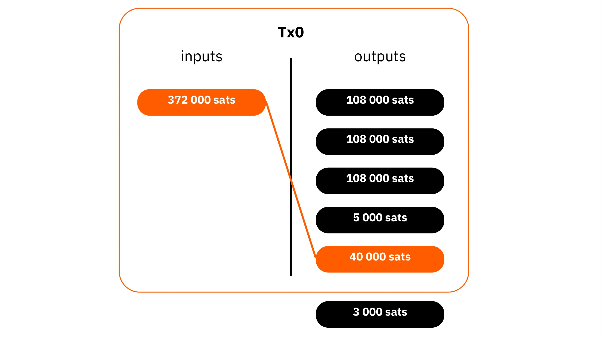


Als deze UTXO wordt samengevoegd met gemengde uitvoer, verliest deze alle vertrouwelijkheid die is verkregen tijdens CoinJoin cycli, met name door CIOH (*Common-Input-Ownership-Heuristic*). Als het wordt samengevoegd met andere doxische veranderingen, loopt de gebruiker het risico vertrouwelijkheid te verliezen, omdat het de verschillende CoinJoin cyclus ingangen zal koppelen. Het moet daarom met voorzichtigheid behandeld worden. In de laatste paragraaf van dit hoofdstuk gaan we dieper in op het beheer van deze UTXO's doxxic.


### De initiële mix


Na `Tx0` worden de geëgaliseerde UTXO's naar de **premix** account van onze portfolio gestuurd, klaar om te worden geïntroduceerd in hun eerste CoinJoin cyclus, ook bekend als de "initiële mix". Als, zoals in ons voorbeeld, de `Tx0` meerdere UTXO's genereert om te mengen, wordt elk van hen geïntegreerd in een aparte initiële mix.


Aan het einde van deze eerste mixen zal de **premix** rekening leeg zijn, terwijl onze munten, die de Mining kosten voor deze eerste CoinJoin hebben betaald, precies zullen worden aangepast aan het bedrag dat door de gekozen pool is gedefinieerd. In ons voorbeeld zullen onze initiële UTXO's van `108.000 Sats` gereduceerd zijn tot precies `100.000 Sats`.


### Remixen


Na de eerste mix worden de UTXO's overgebracht naar het **postmix** account. Dit account verzamelt UTXO's die al gemengd zijn en UTXO's die nog geremixt moeten worden. Wanneer de Whirlpool klant actief is, zijn UTXO's die zich in het **postmix** account bevinden automatisch beschikbaar voor remixen en worden willekeurig geselecteerd om deel te nemen aan deze nieuwe cycli.


Ter herinnering, remixen zijn dan 100% gratis: er zijn geen extra servicekosten of Mining kosten nodig. Door UTXO's op de **postmix** rekening te houden, blijft hun waarde intact en verbetert tegelijkertijd hun anonsets. Daarom is het belangrijk om deze munten deel te laten nemen aan verschillende CoinJoin cycli. Het kost je helemaal niets en verhoogt hun anonimiteit.


Als je besluit om gemengde UTXO's uit te geven, kun je dat rechtstreeks vanuit dit **postmix** account doen. We raden je aan om gemengde UTXO's op dit account te houden om te kunnen profiteren van gratis remixen en om te voorkomen dat ze het Whirlpool circuit verlaten, wat hun vertrouwelijkheid zou kunnen verminderen.


### Hoe beheer je je postmixen?


Na het uitvoeren van CoinJoin cycli is de beste strategie om je UTXO's in de **postmix** account te bewaren, in afwachting van toekomstig gebruik. Het is zelfs aan te raden om ze onbeperkt te laten remixen totdat je ze nodig hebt om uit te geven.


Sommige gebruikers zouden kunnen overwegen om hun gemengde bitcoins over te zetten naar een Wallet beveiligd door een Hardware Wallet. Dit is mogelijk, maar het is belangrijk om de aanbevelingen van Samourai Wallet nauwgezet op te volgen om de verkregen vertrouwelijkheid niet in gevaar te brengen.


Het samenvoegen van UTXO's is de meest voorkomende fout. Om CIOH (*Common-Input-Ownership-Heuristic*) te voorkomen, moet je voorkomen dat je gemengde UTXO's combineert met ongemengde UTXO's in dezelfde transactie. Dit vereist zorgvuldig beheer van uw UTXO's binnen uw portefeuille, met name in termen van labeling.


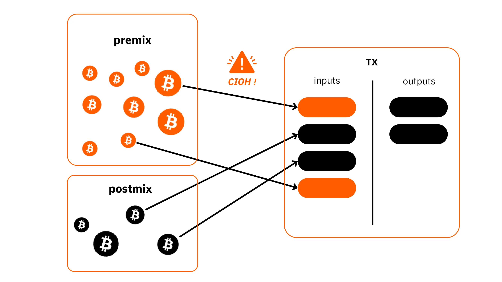


Voorzichtigheid is ook geboden bij het consolideren van gemengde UTXO's. Matige consolidatie is mogelijk als je gemengde UTXO's significante anonsets hebben, maar dit zal onvermijdelijk de vertrouwelijkheid van je onderdelen verminderen. Zorg ervoor dat consolidaties niet te uitgebreid zijn of na een onvoldoende aantal remixen worden uitgevoerd, met het risico dat er afleidbare verbanden ontstaan tussen uw UTXO's voor en na CoinJoin cycli. Bij twijfel over deze manipulaties is de beste praktijk om UTXO's na het mengen niet te consolideren, maar ze één voor één over te brengen naar uw Hardware Wallet, en telkens een nieuwe lege Address te genereren. Nogmaals, vergeet niet elke UTXO die u ontvangt te labelen.


Het is ook niet aan te raden om je postmix UTXOs naar een Wallet over te brengen met scripts die niet veel gebruikt worden. Als je bijvoorbeeld Whirlpool van een Multisig Wallet invoert met behulp van `P2WSH` scripts, is de kans klein dat je gemengd wordt met andere gebruikers die oorspronkelijk hetzelfde type Wallet hadden. Als u uw postmixen opnieuw mengt naar deze zelfde Multisig Wallet, zal het niveau van vertrouwelijkheid van uw gemengde bitcoins sterk afnemen. Naast scripts zijn er nog veel meer Wallet vingerafdrukken die u voor de gek kunnen houden.


Zoals bij elke Bitcoin-transactie, is het ook belangrijk om de ontvangende Address niet opnieuw te gebruiken. Elke nieuwe transactie moet worden ontvangen op een nieuwe, lege Address.


De eenvoudigste en veiligste oplossing is om je gemengde UTXO's te laten rusten in hun **postmix** account, ze te laten remixen en ze alleen aan te raken om uit te geven. Samurai en Sparrow wallets bieden extra bescherming tegen al deze risico's van ketenanalyse. Deze beschermingen helpen je fouten te vermijden.


### Hoe ga je om met giftige uitwisselingen?


Vervolgens moet je voorzichtig zijn met je beheer van doxisch Exchange, het Exchange dat niet in de CoinJoin pool terecht is gekomen. Deze giftige UTXO's, die het resultaat zijn van het gebruik van Whirlpool, vormen een risico voor je privacy, omdat ze een link leggen tussen jou en de CoinJoin gebruiker. Het is daarom noodzakelijk ze met zorg te beheren en ze niet te combineren met andere UTXO's, vooral gemengde UTXO's.


Hier volgen enkele strategieën om ze te gebruiken:


- **Mengen in kleinere zwembaden:** Als je giftige UTXO groot genoeg is om alleen in een kleiner zwembad te passen, overweeg dan om het te mengen. Dit is vaak de beste optie. Het is echter niet aan te raden om meerdere giftige UTXO's samen te voegen om toegang te krijgen tot een pool, omdat dit je verschillende inzendingen met elkaar kan verbinden;
- **Markeer ze als "onbesteedbaar":** Een andere aanpak is om ze niet meer te gebruiken, ze te markeren als "onbesteedbaar" in hun speciale account en gewoon HODL te gebruiken. Dit zorgt ervoor dat je ze niet per ongeluk uitgeeft. Als de waarde van Bitcoin stijgt, kunnen er nieuwe pools ontstaan die geschikter zijn voor jouw giftige UTXO's;
- **Donaties doen:** Overweeg donaties te doen, hoe bescheiden ook, aan ontwikkelaars die werken aan Bitcoin en gerelateerde software. Je kunt ook doneren aan verenigingen die BTC accepteren. Als het beheren van je giftige UTXO's te ingewikkeld lijkt, kun je ze gewoon weggooien en een donatie doen;
- Koop **cadeaubonnen:** Met platforms zoals [Bitrefill](https://www.bitrefill.com/) kun je Exchange bitcoins inruilen voor cadeaubonnen die je bij verschillende winkels kunt gebruiken. Dit kan een manier zijn om afstand te doen van je giftige UTXO's zonder de bijbehorende waarde te verliezen;
- Consolideer ze op **Monero**: Samourai Wallet biedt een atomic swap service tussen BTC en XMR. Dit is ideaal voor het beheren van giftige UTXO's door ze te consolideren op Monero, zonder je vertrouwelijkheid via CIOH in gevaar te brengen, voordat je ze terugstuurt naar Bitcoin. Deze optie kan echter duur zijn in termen van Mining vergoedingen en premie vanwege liquiditeitsbeperkingen;
- Stuur ze naar de Lightning Network: Deze UTXO's naar de Lightning Network sturen om te profiteren van lagere transactiekosten kan een aantrekkelijke optie zijn. Deze methode kan echter bepaalde informatie onthullen, afhankelijk van hoe je Lightning gebruikt, en moet daarom met voorzichtigheid worden gebruikt.


### Hoe gebruik ik Whirlpool?


Na de arrestatie van de oprichters van Samourai Wallet en de inbeslagname van hun servers op 24 april 2024, werkt de Whirlpool tool niet meer, zelfs niet voor degenen met een eigen Dojo. Voorheen was het beschikbaar op Samourai Wallet en Sparrow wallet.


Het blijft echter mogelijk dat dit hulpmiddel in de komende weken opnieuw geactiveerd wordt, afhankelijk van de uitkomst van de proeven, of op een andere manier opnieuw gelanceerd wordt. In elk geval denk ik niet dat de Bitcoin CoinJoin markt lang zonder Supply zal zitten, want de vraag is er. Bovendien is het model van Whirlpool het meest geavanceerde op het gebied van vertrouwelijkheid, zodat het in de toekomst zeker het voorkeursmodel zal zijn voor andere implementaties.


We houden deze zaak en de ontwikkelingen in de bijbehorende tools nauwlettend in de gaten. Wees gerust dat we deze training zullen bijwerken zodra er nieuwe informatie beschikbaar is.


In het volgende hoofdstuk zullen we ontdekken wat "anonsets" zijn, hoe deze indicatoren worden berekend en hoe ze ons kunnen helpen om de efficiëntie van CoinJoin cycli in te schatten.


https://planb.network/tutorials/privacy/on-chain/coinjoin-samourai-wallet-e566803d-ab3f-4d98-9136-5462009262ef


## Anonimiteit sets


<chapterId>be1093dc-1a74-40e5-9545-2b97a7d7d431</chapterId>


Nu we hebben bestudeerd hoe coinjoins werken en wat er allemaal komt kijken bij effectief mixen, gaan we uitzoeken hoe we de effectiviteit ervan kunnen meten. Hoe kunnen we bepalen of een coinjoiningproces effectief is geweest en welke mate van anonimiteit een onderdeel heeft verkregen? Dat gaan we in dit hoofdstuk uitzoeken met anonimiteitssets of "anonsets".


### Een herinnering aan het nut van CoinJoin


Het nut van CoinJoin ligt in de mogelijkheid om plausibele ontkenning te produceren, door jouw deel in te bedden in een groep van niet te onderscheiden delen. Het doel van deze actie is om de banden van traceerbaarheid te verbreken, zowel van het verleden naar het heden als van het heden naar het verleden.


Met andere woorden, een analist die uw initiële transactie (`Tx0`) bij het ingaan van CoinJoin cycli kent, zou niet in staat moeten zijn om met zekerheid uw UTXO bij het verlaten van remix cycli te identificeren (cyclus ingang tot cyclus uitgang analyse).


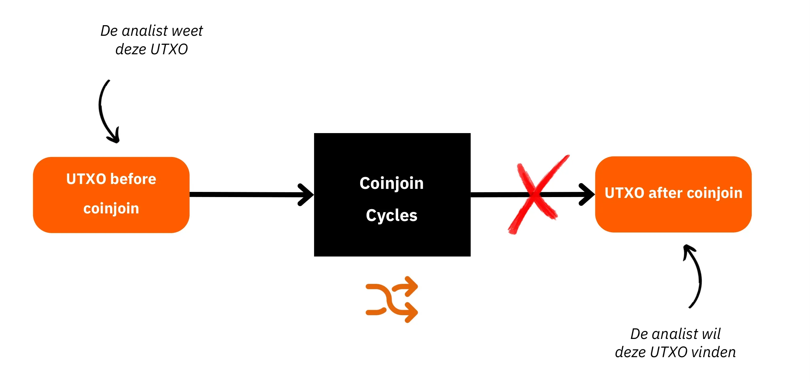


Omgekeerd moet een analist die uw UTXO bij het verlaten van CoinJoin cycli kent, niet in staat zijn om de oorspronkelijke transactie bij het binnenkomen van de cycli te bepalen (cyclus exit naar cyclus entry analyse).


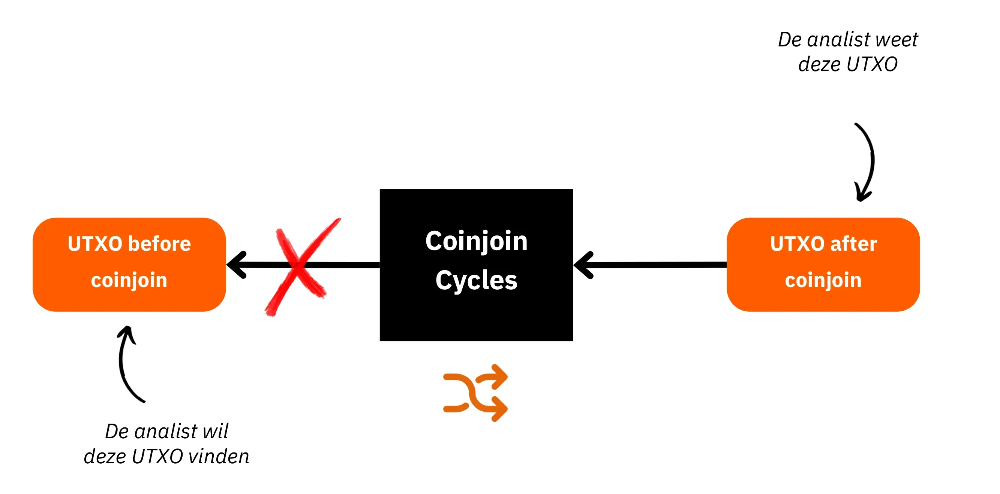


Om te beoordelen hoe moeilijk het is voor een analist om het verleden aan het heden te koppelen en vice versa, moeten we de grootte van de groepen homogene onderdelen waarbinnen jouw onderdeel verborgen zit kwantificeren. Deze maat vertelt ons hoeveel analyses dezelfde waarschijnlijkheid hebben. Dus, als de juiste analyse verdrinkt tussen 3 andere analyses met gelijke waarschijnlijkheid, dan is je niveau van verhulling erg laag. Aan de andere kant, als de juiste analyse wordt gevonden binnen een verzameling van 20.000 even waarschijnlijke analyses, dan is je deel zeer goed verborgen. De grootte van deze groepen vertegenwoordigt indicatoren die bekend staan als "anonsets".


### Anonsets begrijpen


Anonsets worden gebruikt als indicatoren om de mate van vertrouwelijkheid van een bepaalde UTXO te beoordelen. Meer specifiek meten ze het aantal niet te onderscheiden UTXO's binnen de set die het bestudeerde deel omvat. De eis voor een homogene set UTXO's betekent dat anonsets meestal berekend worden op CoinJoin cycli. Het gebruik van deze indicatoren is vooral relevant voor Whirlpool muntjoints, vanwege hun uniformiteit.


Indien nodig kunnen anonsets worden gebruikt om de kwaliteit van coinjoins te beoordelen. Een grote anonset betekent een hoog niveau van anonimiteit, aangezien het moeilijk wordt om een specifieke UTXO te onderscheiden binnen de homogene set.


er bestaan 2 soorten anonsets:


- De toekomstige anonimiteit;
- Retrospectieve anonset.


### De verwachte anonimiteit


De toekomstgerichte anonset geeft de grootte aan van de groep waartussen de bestudeerde UTXO aan het eind van de cyclus verborgen is, gegeven de UTXO aan het begin, d.w.z. het aantal niet te onderscheiden delen dat binnen deze groep aanwezig is. De naam van deze indicator is "toekomstgerichte metriek".


Deze indicator meet de weerstand van de vertrouwelijkheid van de ruimte tegen een analyse van verleden naar heden (input naar output).


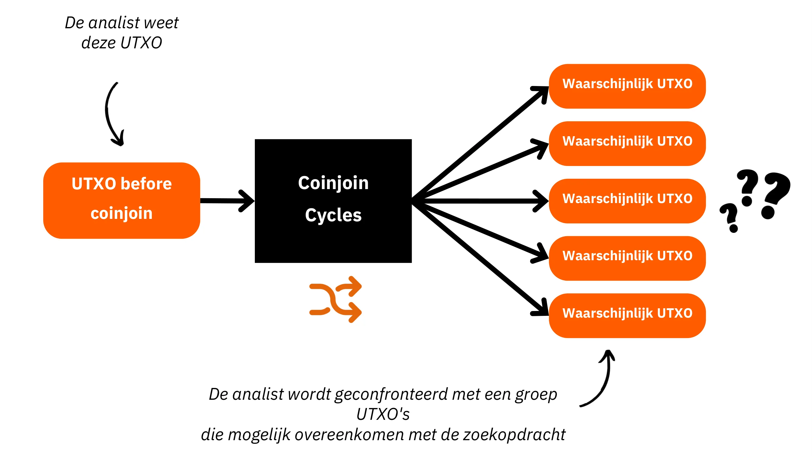


Deze metriek wordt gebruikt om in te schatten in hoeverre uw UTXO beschermd is tegen pogingen om zijn geschiedenis te reconstrueren vanaf het punt van binnenkomst tot het punt van uitgang in het CoinJoin proces.


Als je transactie bijvoorbeeld heeft deelgenomen aan de eerste CoinJoin cyclus en er zijn nog twee dalende cycli voltooid, dan zou de verwachte anonset van je munt `13` zijn:


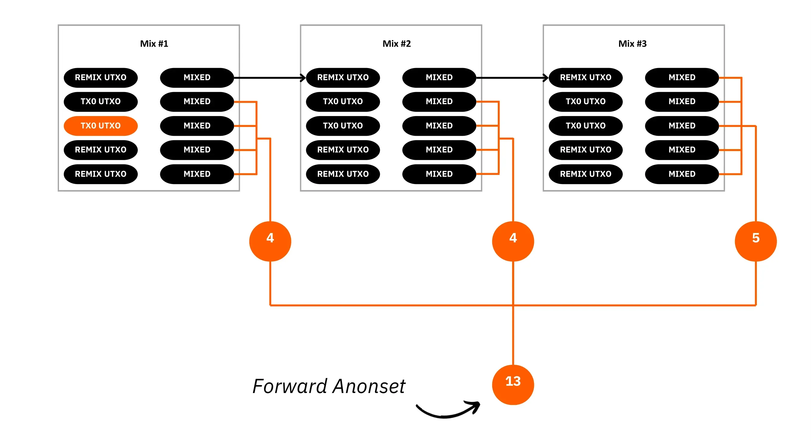


Laten we ons bijvoorbeeld voorstellen dat onze munt aan het begin van de CoinJoin cyclus een verwachte anonset heeft van `86.871`. In praktische termen betekent dit dat het verborgen is tussen `86.871` niet te onderscheiden delen. Voor een buitenstaander die deze munt kent aan het begin van de CoinJoin cycli en de uitgang ervan probeert te traceren, zal hij geconfronteerd worden met `86.871` mogelijke UTXO's, elk met een identieke waarschijnlijkheid de munt te zijn die hij zoekt.


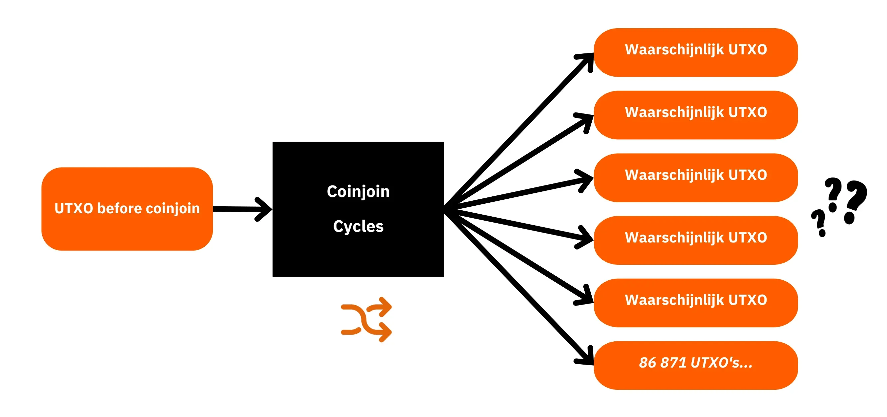


### De retrospectieve anonset


De retrospectieve anonset geeft het aantal mogelijke bronnen aan voor een bepaald onderdeel, de UTXO kennende aan het einde van de cyclus. Deze indicator meet de weerstand van de vertrouwelijkheid van het onderdeel tegen een heden-naar-verleden (output-naar-input) analyse, d.w.z. hoe moeilijk het is voor een analist om je onderdeel terug te traceren naar zijn oorsprong, voor de CoinJoin cycli. De naam van deze indicator is "backward anonset", of "backward-looking metrics".


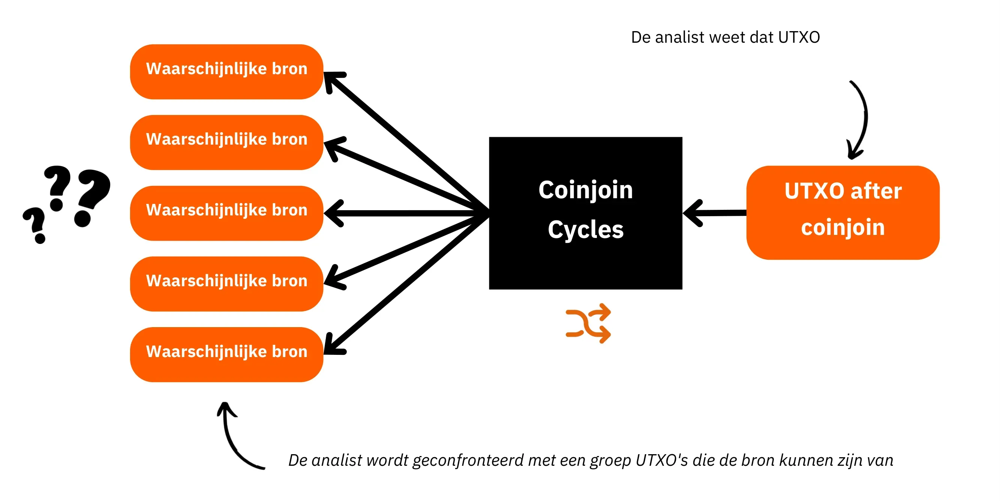


Door je UTXO bij het verlaten van de cycli te kennen, bepaalt de retrospectieve anonset het aantal potentiële Tx0 transacties die je ingang in de CoinJoin cycli hadden kunnen vormen. In het diagram hieronder komt dit overeen met de som van alle oranje bellen.


Laten we ons bijvoorbeeld voorstellen dat ons CoinJoin onderdeel een retrospectieve anonset heeft van `42.185`. Praktisch gezien betekent dit dat er `42.185` potentiële bronnen zijn voor deze UTXO. Als een externe waarnemer deze munt identificeert aan het einde van de cycli en de oorsprong probeert te achterhalen, zal hij of zij geconfronteerd worden met `42.185` mogelijke bronnen, die allemaal even waarschijnlijk de gezochte oorsprong zijn.


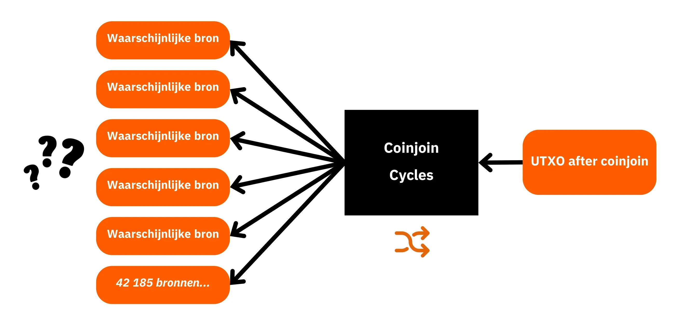


### Hoe bereken je anonsets?


Het is mogelijk om handmatig anonsets te berekenen met een Block explorer voor kleine ensembles. Maar voor grotere anonsets wordt het gebruik van een gespecialiseerde tool noodzakelijk. Voor zover ik weet is de enige software die deze taak kan uitvoeren *Whirlpool Stats Tool*, een Python-tool ontwikkeld door de Samourai- en OXT-teams. Helaas is deze tool momenteel buiten gebruik na de arrestatie van de oprichters van Samourai en de onderbreking van OXT, dat gebruikt werd om gegevens uit de Blockchain te halen.


Zoals we in dit hoofdstuk hebben gezien, kunnen anonsets alleen worden berekend als er een bepaalde homogeniteit is in de CoinJoin structuur. In het volgende hoofdstuk zullen we uitzoeken hoe we deze homogeniteit kunnen kwantificeren op een Bitcoin transactie, of het nu een CoinJoin of een meer traditionele transactie is.


## Entropie


<chapterId>e4fe289d-618b-49a2-84c9-68c562e708b4</chapterId>


Zoals we in dit gedeelte over coinjoins hebben gezien, speelt de homogeniteit van UTXO's in input en output een belangrijke rol in het verbeteren van de vertrouwelijkheid van een Bitcoin transactie. Deze parameter creëert een plausibele ontkenning voor Blockchain analyse. Er kunnen verschillende methoden gebruikt worden om deze homogeniteit te meten, maar een van de meest effectieve is naar mijn mening het gebruik van de indicatoren van de *Boltzmann* tool, ontwikkeld door de OXT en Samourai Wallet teams, en in het bijzonder de entropie van de transactie. Dit is waar we in dit hoofdstuk in detail naar zullen kijken.


In tegenstelling tot anonsets, die berekend worden op een reeks transacties, richten de hier gepresenteerde indicatoren zich op één enkele transactie, of het nu een CoinJoin of een meer traditionele transactie is.


### Het aantal interpretaties


De eerste indicator die kan worden waargenomen bij een Bitcoin transactie is het totale aantal mogelijke interpretaties bij een analyse van een buitenstaander. Rekening houdend met de waarden van de UTXO's die betrokken zijn bij de transactie, toont deze indicator het aantal manieren waarop inputs geassocieerd kunnen worden met outputs. Met andere woorden, de indicator bepaalt het aantal mogelijke interpretaties van een transactie in Bitcoin stromen vanuit het gezichtspunt van een externe waarnemer die de transactie analyseert.


Bijvoorbeeld, een eenvoudige betalingstransactie met 1 ingang en 2 uitgangen heeft maar één interpretatie, namelijk dat ingang #0 uitgang #0 en uitgang #1 heeft gefinancierd. Er is geen andere mogelijke interpretatie:


Aan de andere kant heeft een Whirlpool 5x5 hoek $1.496$ mogelijke combinaties:


Een Whirlpool Surge Cycle 8x8 CoinJoin heeft $9.934.563$ mogelijke interpretaties:


### Entropie


Uit het aantal interpretaties van een Bitcoin transactie kunnen we de entropie ervan berekenen.


In de algemene context van cryptografie en informatie is entropie een kwantitatieve maat voor de onzekerheid of onvoorspelbaarheid van een gegevensbron of willekeurig proces. Met andere woorden, entropie is een manier om te meten hoe moeilijk een stuk informatie te voorspellen of te raden is.


In de specifieke context van Blockchain analyse is entropie ook de naam van een indicator, afgeleid van Shannon's entropie en [uitgevonden door LaurentMT](https://gist.github.com/LaurentMT/e758767ca4038ac40aaf), die berekend kan worden op een Bitcoin transactie.


Als een transactie een groot aantal mogelijke interpretaties heeft, is het vaak relevanter om naar de entropie ervan te verwijzen. Deze indicator meet het gebrek aan kennis van de analisten over de exacte configuratie van de transactie. Met andere woorden, hoe hoger de entropie, hoe moeilijker het wordt voor analisten om de stroom bitcoins tussen inputs en outputs te identificeren.


In de praktijk laat entropie zien of een transactie, vanuit het oogpunt van een externe waarnemer, meerdere mogelijke interpretaties vertoont, uitsluitend gebaseerd op input- en outputbedragen, zonder rekening te houden met andere externe of interne patronen en heuristieken. Een hoge entropie staat daarom gelijk aan een grotere vertrouwelijkheid van de transactie.


Entropie wordt gedefinieerd als de binaire logaritme van het aantal mogelijke combinaties. Hier is de gebruikte formule met $E$ de entropie van de transactie en $C$ het aantal mogelijke interpretaties:


$$
E = \log_2(C)
$$


In de wiskunde is de binaire logaritme (basis-2 logaritme) de inverse bewerking van de exponent van 2. Met andere woorden, de binaire logaritme van $x$ is de exponent waartoe $2$ verheven moet worden om $x$ te verkrijgen. Deze indicator wordt daarom uitgedrukt in bits.


Laten we het voorbeeld nemen van de berekening van de entropie voor een CoinJoin transactie gestructureerd volgens het Whirlpool 5x5 model, dat, zoals vermeld in het vorige hoofdstuk, een aantal mogelijke interpretaties van $1.496$ heeft:


$$
\begin{align*}
C &= 1\,496 \\
E &= \log_2(1\,496) \\
E &= 10.5469 \text{ bits}
\end{align*}
$$


Deze CoinJoin transactie heeft dus een entropie van $10.5469$ bits, wat als zeer bevredigend wordt beschouwd. Hoe hoger deze waarde, hoe meer verschillende interpretaties de transactie toelaat, waardoor het niveau van vertrouwelijkheid wordt versterkt.


Voor een CoinJoin 8x8 transactie met $9.934.563$ interpretaties zou de entropie :


$$
\begin{align*}
C &= 9\,934\,563 \\
E &= \log_2(9\,934\,563) \\
E &= 23.244 \text{ bits}
\end{align*}
$$


Laten we nog een voorbeeld nemen met een klassieke betalingstransactie, met 1 invoer en 2 uitgangen: [1b1b0c3f0883a99f1161c64da19471841ed12a1f78e77fab128c69a5f578ccce](https://Mempool.space/tx/1b1b0c3f0883a99f1161c64da19471841ed12a1f78e77fab128c69a5f578ccce)


In het geval van deze transactie is de enige mogelijke interpretatie: `(In.0) > (Out.0 ; Out.1)`. Bijgevolg is de entropie $0$ :


$$
\begin{align*}
C &= 1 \\
E &= \log_2(1) \\
E &= 0 \text{ bits}
\end{align*}
$$


### Efficiëntie


Op basis van de entropie van de transactie kunnen we ook de efficiëntie ervan berekenen in termen van vertrouwelijkheid. Deze indicator evalueert de efficiëntie van de transactie door deze te vergelijken met de optimale transactie die kan worden overwogen in een identieke configuratie.


Dit brengt ons bij het concept van maximale entropie, dat overeenkomt met de hoogste entropie die een specifieke transactiestructuur theoretisch kan bereiken. De efficiëntie van een transactie wordt vervolgens berekend door deze maximale entropie te vergelijken met de werkelijke entropie van de geanalyseerde transactie.


De gebruikte formule is als volgt met :


- e_R$: de werkelijke entropie van de transactie uitgedrukt in bits;
- e_M$: de maximaal mogelijke entropie voor een transactiestructuur, ook uitgedrukt in bits;
- $Ef$: transactie-efficiëntie in bits :


$$
Ef = E_R - E_M
$$


Bijvoorbeeld, voor een Whirlpool 5x5 CoinJoin structuur is de maximale entropie $10.5469$ :


$$
\begin{align*}
E_R &= 10.5469 \\
E_M &= 10.5469 \\
Ef &= E_R - E_M \\
Ef &= 10.5469 - 10.5469 \\
Ef &= 0 \text{ bits}
\end{align*}
$$


Deze indicator wordt ook uitgedrukt als percentage. De gebruikte formule is als volgt: :


- c_R$ : het aantal mogelijke reële interpretaties ;
- c_M$: het maximale aantal mogelijke interpretaties van dezelfde structuur;
- $Ef$: efficiëntie uitgedrukt als percentage:


$$
\begin{align*}
E_f &= \frac{C_R}{C_M} \\
E_f &= \frac{1\,496}{1\,496} \\
E_f &= 100 \%
\end{align*}
$$


Een efficiëntie van $100$ geeft aan dat de transactie het vertrouwelijkheidspotentieel optimaal benut, afhankelijk van de structuur.


### Entropiedichtheid


Entropie is een goede indicator voor het meten van de vertrouwelijkheid van een transactie, maar is deels afhankelijk van het aantal in- en uitgangen in de transactie. Om de entropie van 2 verschillende transacties met verschillende aantallen in- en uitgangen te vergelijken, kunnen we de entropiedichtheid berekenen. Deze indicator geeft een beeld van de entropie ten opzichte van elke invoer of uitvoer van de transactie. Dichtheid is nuttig voor het evalueren en vergelijken van de efficiëntie van transacties van verschillende grootte.


Om deze te berekenen delen we simpelweg de totale entropie van de transactie door het totale aantal in- en uitgangen dat betrokken is bij de transactie:


- e_D$: entropiedichtheid uitgedrukt in bits;
- e$: de entropie van de transactie uitgedrukt in bits;
- t$: totaal aantal in- en uitgangen in de transactie:


$$
E_D = \frac{E}{T}
$$


Laten we het voorbeeld nemen van een Whirlpool 5x5 CoinJoin:


$$
\begin{align*}
T &= 5 + 5 = 10 \\
E &= 10.5469 \\
E_D &= \frac{E}{T} \\
E_D &= \frac{10.5469}{10} \\
E_D &= 1.054 \text{ bits}
\end{align*}
$$


Laten we ook de entropiedichtheid van een 8x8 Whirlpool CoinJoin berekenen:


$$
\begin{align*}
T &= 8 + 8 = 16 \\
E &= 23.244 \\
E_D &= \frac{E}{T} \\
E_D &= \frac{23.244}{16} \\
E_D &= 1.453 \text{ bits}
\end{align*}
$$


Door de entropiedichtheid van deze twee typen CoinJoin te analyseren, wordt het duidelijk dat, zelfs als we de entropie normaliseren door het aantal Elements, de "Surge Cycle 8x8" CoinJoin meer onzekerheid genereert voor de analyse.


### De Boltzmann score


Een ander stuk informatie dat wordt geanalyseerd in een transactie is de Boltzmann score van elk element ten opzichte van een ander. Dit is de tabel met overeenstemmingskansen tussen inputs en outputs. Deze tabel geeft via de Boltzmann score de voorwaardelijke waarschijnlijkheid aan dat een specifieke input gekoppeld is aan een bepaalde output. Het is dus een kwantitatieve maat voor de voorwaardelijke waarschijnlijkheid dat een associatie tussen een input en een output in een transactie zal voorkomen, gebaseerd op de verhouding van het aantal gunstige voorvallen van deze gebeurtenis tot het totale aantal mogelijke voorvallen, in een reeks interpretaties.


Als we het voorbeeld van een Whirlpool CoinJoin gebruiken, zou de voorwaardelijke waarschijnlijkheidstabel de kans op een verband tussen elke ingang en uitgang benadrukken, en een kwantitatieve maatstaf bieden voor de ambiguïteit van associaties in de transactie:


| % | Output 0 | Output 1 | Output 2 | Output 3 | Output 4 |
| ------- | -------- | -------- | -------- | -------- | -------- |
| Input 0 | 34% | 34% | 34% | 34% | 34% |
| Input 1 | 34% | 34% | 34% | 34% | 34% | 34% | Input 1
| Input 2 | 34% | 34% | 34% | 34% | 34% | 34% | 34% | 34% | 34% | 34% | 34% | 34% | 34% | 34% | 34
| Input 3 | 34% | 34% | 34% | 34% | 34% | 34% | Input 3
| Input 4 | 34% | 34% | 34% | 34% | 34% | 34% | 34% | 34% | 34% | 34% | 34% | 34% | 34% | 34% | 34

Het is duidelijk dat elke input een gelijke kans heeft om geassocieerd te worden met elke output, wat de vertrouwelijkheid van de transactie versterkt.


De Boltzmann score wordt berekend door het aantal interpretaties waarin een bepaalde gebeurtenis voorkomt te delen door het totale aantal beschikbare interpretaties. Dus om de score te bepalen die input #0 associeert met output #3 (gebeurtenis aanwezig in $512$ interpretaties), gaan we als volgt te werk:


$$
\begin{align*}
\text{Interpretations (IN.0 > OUT.3)} &= 512 \\
\text{Interpretations totales} &= 1496 \\
\text{Score} &= \frac{512}{1496} \\
\text{Score} &= 34 \%
\end{align*}
$$


Als we het voorbeeld nemen van een Whirlpool 8x8 Surge Cycle CoinJoin, dan zou de Boltzmann tabel er als volgt uitzien:


| OUT.0 | OUT.1 | OUT.2 | OUT.3 | OUT.4 | OUT.5 | OUT.6 | OUT.7 |
|-------|-------|-------|-------|-------|-------|-------|-------|-------|
| IN.0 | 23% | 23% | 23% | 23% | 23% | 23% | 23% | 23% |
| IN.1 | 23% | 23% | 23% | 23% | 23% | 23% | 23% | 23% |
| IN.2 | 23% | 23% | 23% | 23% | 23% | 23% | 23% | 23% |
| IN.3 | 23% | 23% | 23% | 23% | 23% | 23% | 23% | 23% |
| IN.4 | 23% | 23% | 23% | 23% | 23% | 23% | 23% | 23% |
| IN.5 | 23% | 23% | 23% | 23% | 23% | 23% | 23% | 23% |
| IN.6 | 23% | 23% | 23% | 23% | 23% | 23% | 23% | 23% |
| IN.7 | 23% | 23% | 23% | 23% | 23% | 23% | 23% | 23% |

In het geval van een eenvoudige transactie met een enkele invoer en 2 uitgangen is de situatie echter anders:


| Output 0 | Output 1 |
|---------|----------|----------|
| Input 0 | 100% | 100% |

Hier zien we dat de waarschijnlijkheid dat elke output afkomstig is van input #0 100% is. Een lagere waarschijnlijkheid weerspiegelt dus een grotere vertrouwelijkheid, waardoor de directe links tussen inputs en outputs verwateren.


### Deterministische koppelingen


We kunnen ook het aantal deterministische koppelingen in een transactie berekenen. Deze indicator laat zien hoeveel van de verbindingen tussen inputs en outputs in de geanalyseerde transactie onbetwistbaar zijn, met een waarschijnlijkheid van 100%. Deze indicator kan vervolgens worden aangevuld door de verhouding van deterministische links te berekenen. De ratio geeft een beeld van het gewicht van deze deterministische links binnen de totale links van de transactie.


Een Whirlpool CoinJoin transactie heeft bijvoorbeeld geen deterministische links tussen inputs en outputs, en toont daarom een indicator van 0 links en een ratio van 0%. In onze tweede onderzochte eenvoudige betalingstransactie (met één ingang en twee uitgangen) vertelt de indicator ons daarentegen dat er twee deterministische links zijn en dat de ratio 100% is. Met andere woorden, een indicator van nul wijst op een uitstekende vertrouwelijkheid, dankzij de afwezigheid van directe en onbetwistbare links tussen inputs en outputs.


### Hoe bereken je deze indicatoren?


Het handmatig berekenen van deze indicatoren met behulp van de vergelijkingen die ik heb gegeven is relatief eenvoudig. De moeilijkheid ligt vooral in het bepalen van het aantal mogelijke interpretaties van een transactie. Voor een klassieke transactie kan deze berekening met de hand worden gedaan. Voor een CoinJoin is de taak echter veel complexer.


Voorheen was er een Python tool genaamd _Boltzmann Calculator_, ontwikkeld door de OXT en Samourai teams, die automatisch al deze indicatoren berekende voor een Bitcoin transactie:


Het was ook mogelijk om de KYCP.org website te gebruiken voor deze analyses:


Na de arrestatie van de oprichters van Samourai zijn deze tools helaas niet meer operationeel.


Nu we coinjoins in detail hebben behandeld, kijken we naar de andere privacytechnieken die beschikbaar zijn op Bitcoin in het laatste deel van onze cursus. We zullen kijken naar payjoins, specifieke pseudo-CoinJoin transactietypen, statische Address protocollen en maatregelen om de vertrouwelijkheid te versterken, niet op het niveau van de transacties zelf, maar op het niveau van het netwerk van knooppunten.


https://planb.network/tutorials/privacy/analysis/boltzmann-entropy-738e45af-18a6-4ce6-af1a-1bf58e15f1fe

# De uitdagingen van andere geavanceerde vertrouwelijkheidstechnieken begrijpen


<partId>19989ae6-d608-4acf-b698-2cf1e7e5e6ae</partId>


## PayJoin transacties


<chapterId>c1e90b95-f709-4574-837b-2ec26b11286f</chapterId>


CoinJoin is momenteel de meest effectieve methode om onzekerheid te introduceren in de tracering van onderdelen in een ketenanalyse. Zoals we in eerdere hoofdstukken hebben gezien, moeten inputs en outputs zo homogeen mogelijk zijn om een hoogwaardige mix te verkrijgen. Daarnaast is het belangrijk dat onderdelen worden geïntegreerd in een zo groot mogelijke groep om anonsets te maximaliseren. Dus, om coinjoins effectief te laten zijn, moet er een groot aantal uniforme onderdelen bij betrokken zijn. Deze veelheid aan vereisten betekent dat CoinJoin transacties een zeer rigide structuur hebben: de bedragen staan van tevoren vast en alle deelnemers moeten zich eraan houden om de uniformiteit van het proces te garanderen. Bovendien vereisen coinjoins synchronisatie tussen alle deelnemers en de coördinator tijdens de constructie van de transactie.


Deze vereisten maken CoinJoin ongeschikt voor directe betalingen. Als je bijvoorbeeld een 1M Sats munt hebt in een CoinJoin pool, zou het direct gebruiken als betaling complex zijn. Het zou synchronisatie vereisen met de andere deelnemers en de coördinator om de gezamenlijke transactie precies op te bouwen op het moment dat je een betaling moet doen, en het aankoopbedrag zou precies moeten overeenkomen met de waarde van jouw munt, wat vrijwel onhaalbaar is. De CoinJoin transactie is daarom van nature een collaboratieve veegtransactie, d.w.z. het zijn meestal dezelfde eigenaren van de inputs die we terugvinden in de outputs.


Het zou echter interessant zijn om transactiestructuren te hebben die betalingen op een praktische manier mogelijk maken en tegelijkertijd twijfel introduceren in de ketenanalyse. Dit is precies waar we in dit hoofdstuk en het volgende naar zullen kijken.


### Wat is een PayJoin transactie?


De PayJoin is een specifieke Bitcoin transactiestructuur die de privacy van de gebruiker bij uitgaven verbetert door samen te werken met de ontvanger van de betaling.


In 2015 besprak LaurentMT deze methode voor het eerst onder de naam "*steganografische transacties*", volgens een document dat [hier] beschikbaar is (https://gist.githubusercontent.com/LaurentMT/e758767ca4038ac40aaf/raw/c8125f6a3c3d0e90246dc96d3b603690ab6f1dcc/gistfile1.txt). Deze techniek werd later overgenomen door de Samourai Wallet, die in 2018 de eerste client werd die het implementeerde met behulp van de Stowaway tool. Het concept van PayJoin is ook terug te vinden in [BIP79](https://github.com/Bitcoin/bips/blob/master/bip-0079.mediawiki), [BIP78](https://github.com/Bitcoin/bips/blob/master/bip-0078.mediawiki), en [BIP77](https://PayJoin.org/docs/how-it-works/PayJoin-v2-bip-77/). Er worden dus verschillende termen gebruikt om naar een PayJoin te verwijzen:


- PayJoin ;
- Verstekeling;
- P2EP (*Pay-to-End-Point*) ;
- Steganografische transactie.


Het bijzondere van PayJoin ligt in de mogelijkheid om generate een transactie te doen die op het eerste gezicht gewoon lijkt, maar in feite een mini CoinJoin is tussen twee mensen. Om dit te bereiken, betrekt de transactiestructuur de ontvanger van de betaling in de invoer naast de feitelijke verzender. De ontvanger neemt dus een betaling aan zichzelf op in het midden van de transactie, waardoor hij zelf betaald kan worden.


Laten we een voorbeeld nemen om dit proces beter te begrijpen. Alice koopt een stokbrood voor 4.000 Sats met een UTXO van 10.000 Sats en kiest voor een PayJoin. Haar bakker, Bob, voegt een UTXO van 15.000 Sats van hem toe als input, die hij volledig terugkrijgt als output, naast de 4.000 Sats van Alice.


In dit voorbeeld voert bakker Bob 15.000 Sats in en komt eruit met 19.000 Sats, het verschil is precies 4.000 Sats, d.w.z. de prijs van het stokbrood. Alice voert 10.000 Sats in en eindigt met 6.000 Sats aan output, wat neerkomt op een saldo van -4.000 Sats, ofwel de prijs van het stokbrood. Om het voorbeeld te vereenvoudigen, heb ik de Mining kosten in deze transactie bewust weggelaten.


### Waar is de PayJoin voor?


De PayJoin-transactie vervult twee doelen, waardoor gebruikers de vertrouwelijkheid van hun betaling kunnen verbeteren.


Ten eerste probeert PayJoin een buitenstaander te misleiden door een lokmiddel te creëren in de ketenanalyse. Dit wordt mogelijk gemaakt door de CIOH heuristiek (*Common Input Ownership Heuristiek*). Zoals we in deel 3 zagen, wordt gewoonlijk, wanneer een transactie op de Blockchain meerdere ingangen heeft, aangenomen dat al deze ingangen toebehoren aan dezelfde entiteit of gebruiker.


Dus wanneer een analist een PayJoin transactie onderzoekt, wordt hij of zij wijsgemaakt dat alle inputs van dezelfde persoon afkomstig zijn. Deze perceptie is echter verkeerd, omdat de begunstigde ook bijdraagt aan de inputs naast de eigenlijke betaler. De ketenanalyse wordt dus afgeleid naar een interpretatie die fout blijkt te zijn.


Laten we ons voorbeeld nemen van een PayJoin transactie voor de betaling van een baguette:


Bij het zien van deze transactie op de Blockchain, zou een buitenstaander die de gebruikelijke heuristieken van Blockchain analyse volgt, de volgende interpretatie maken: "*Alice voegde 2 UTXO's samen als input voor de transactie om 19.000 Sats te betalen aan Bob*".


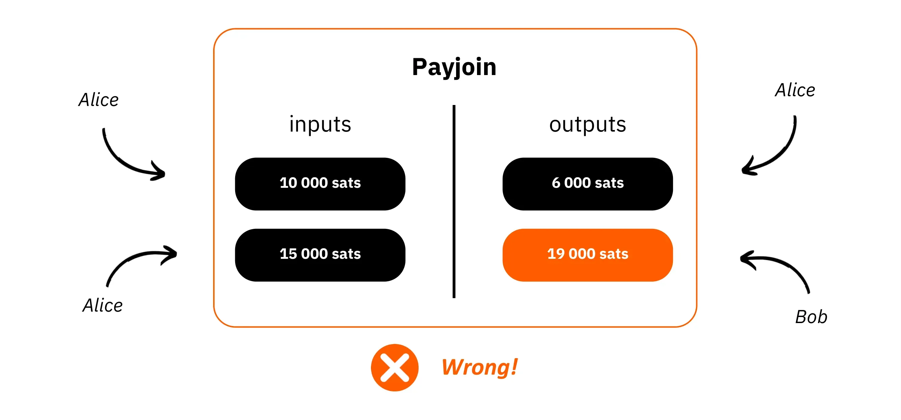


Deze interpretatie is duidelijk onjuist, want zoals je al weet, behoren de twee UTXO's in ingangen niet toe aan dezelfde persoon. De ene komt van Alice, de stokbroodkoper, en de andere van Bob, de bakker.


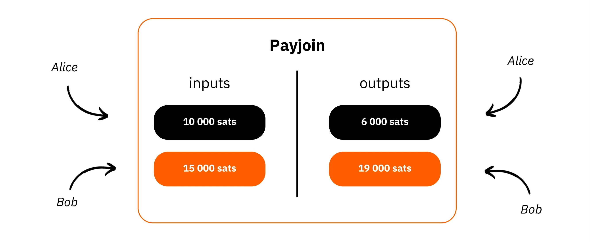


Op deze manier wordt de analyse van de externe waarnemer in de richting van een verkeerde conclusie gestuurd, waarbij de vertrouwelijkheid van de belanghebbenden gewaarborgd blijft.


### De steganografische transactie


Het tweede doel van PayJoin is om een buitenstaander te misleiden over het werkelijke bedrag van de betaling die is gedaan. Door de structuur van de transactie te onderzoeken, zou de analist kunnen geloven dat de betaling gelijk is aan het bedrag van een van de outputs.


Als we teruggaan naar ons voorbeeld van de aankoop van een stokbrood, zal de analist denken dat het betalingsbedrag ofwel overeenkomt met de UTXO van 6.000 Sats, of met de UTXO van 19.000 Sats. In dit geval zal de analist eerder denken dat het betalingsbedrag 19.000 Sats is, omdat er 2 UTXO's in uitgangen zijn, waarvan ten minste één groter is dan 6.000 Sats (er is geen logische reden om 2 UTXO's te gebruiken om 6.000 Sats te betalen, terwijl een enkele UTXO voldoende zou zijn geweest om deze betaling te voldoen).


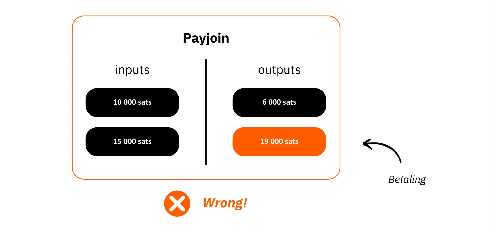


Maar in werkelijkheid is deze analyse gebrekkig. Het betalingsbedrag komt met geen enkele output overeen. Het is in feite het verschil tussen de UTXO van de ontvanger in output en de UTXO van de ontvanger in input.


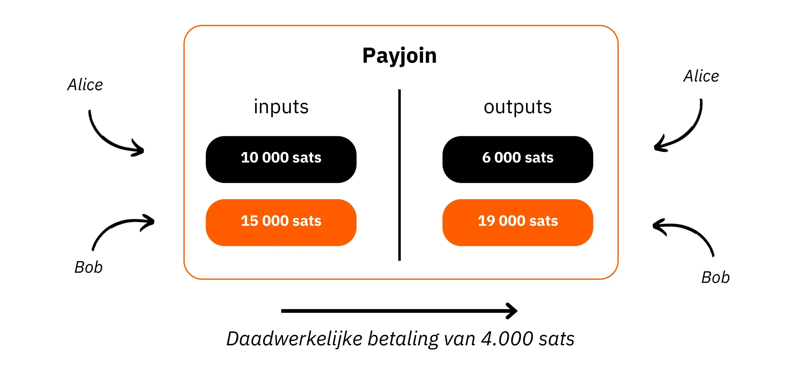


In dit opzicht valt de PayJoin transactie onder steganografie. Het maakt het mogelijk om het echte bedrag van een transactie te verbergen in een valse transactie die als afleiding dient.


Steganografie is een techniek om informatie te verbergen in andere gegevens of objecten, zodat de aanwezigheid van de verborgen informatie niet waarneembaar is. Een geheime boodschap kan bijvoorbeeld verborgen worden in een punt in ongerelateerde tekst, waardoor het niet met het blote oog waarneembaar is (dit is de [microdot](https://fr.wikipedia.org/wiki/Micropoint) techniek).


In tegenstelling tot encryptie, waarbij informatie onbegrijpelijk wordt zonder de decryptiesleutel, verandert steganografie de informatie niet. Het blijft weergegeven in duidelijke tekst. Het doel is eerder om het bestaan van de geheime boodschap zelf te verbergen, terwijl encryptie duidelijk de aanwezigheid van verborgen informatie onthult, zij het ontoegankelijk zonder sleutel. Daarom was de oorspronkelijke naam van PayJoin "steganografische transacties".


Er kan een analogie getrokken worden tussen cryptografie en CoinJoin, en tussen steganografie en PayJoin. CoinJoin heeft soortgelijke eigenschappen als encryptie: de methode is herkenbaar, maar de informatie is onleesbaar. Omgekeerd is PayJoin vergelijkbaar met steganografie: de informatie is theoretisch toegankelijk, maar omdat de methode van verbergen niet herkenbaar is, wordt het ontoegankelijk.


### Hoe gebruik ik PayJoin?


Bekende softwareprogramma's die PayJoin ondersteunen zijn Sparrow wallet, Wasabi Wallet, Mutiny, BitMask, BlueWallet en JoinMarket, evenals betalingsverwerker BTCPay.


De meest geavanceerde PayJoin implementatie was alleen Stowaway op Samourai Wallet. Echter, sinds de arrestatie van de oprichters van de software, is deze tool slechts gedeeltelijk functioneel. Het voordeel van Stowaway is dat het een uitgebreid, eenvoudig te gebruiken protocol is, dat zowel het ontvangen als het verzenden van payjoins ondersteunt. Gedeeltelijk ondertekende transacties kunnen handmatig worden uitgewisseld door verschillende QR-codes te scannen, of automatisch door Tor via Soroban. Deze laatste communicatieoptie is momenteel buiten gebruik.


De moeilijkheid bij het gebruik van PayJoin ligt in de afhankelijkheid van de deelname van de winkelier. Als klant kun je geen PayJoin gebruiken als de winkelier het niet ondersteunt. Dit voegt nog een extra moeilijkheid toe aan het aankoopproces: het is niet alleen moeilijk om winkeliers te vinden die Bitcoin accepteren, maar als je ook nog op zoek gaat naar winkeliers die payjoins ondersteunen, wordt het nog ingewikkelder.


Een oplossing zou zijn om transactiestructuren te gebruiken die ambiguïteit introduceren in de ketenanalyse zonder de medewerking van de ontvanger te vereisen. Dit zou ons in staat stellen om de vertrouwelijkheid van onze betalingen te verbeteren zonder afhankelijk te zijn van de actieve medewerking van winkeliers. Dit is precies waar we naar gaan kijken in het volgende hoofdstuk.


https://planb.network/tutorials/privacy/on-chain/payjoin-samourai-wallet-48a5c711-ee3d-44db-b812-c55913080eab

## Betaling mini-CoinJoin


<chapterId>300777ee-30ae-43d7-ab00-479dac3522c1</chapterId>


Wanneer je een betalingstransactie wilt uitvoeren met behoud van een zekere mate van vertrouwelijkheid, is PayJoin een goede optie. Maar zoals we net hebben gezien, vereist PayJoin de betrokkenheid van de ontvanger. Dus wat doe je als de ontvanger weigert mee te werken aan een PayJoin, of als je hem er gewoon liever niet bij betrekt? Een alternatief is om een Stonewall of Stonewall x2 transactie te gebruiken. Laten we deze twee soorten transacties eens nader bekijken.


### De Stonewall-transactie


Stonewall is een specifieke vorm van Bitcoin-transactie, ontworpen om de vertrouwelijkheid van de gebruiker te vergroten bij uitgaven door een pseudo-CoinJoin tussen twee mensen na te bootsen, zonder er daadwerkelijk een te zijn. In feite werkt deze transactie niet samen. Een gebruiker kan het zelf bouwen, met alleen de UTXO's die hij of zij bezit als invoer. Je kunt dus een Stonewall-transactie maken voor elke gelegenheid, zonder dat je hoeft te synchroniseren met een andere gebruiker of de ontvanger.


De Stonewall-transactie werkt als volgt: als invoer voor de transactie gebruikt de emittent 2 UTXO's die van hem zijn. Bij uitvoer levert de transactie 4 UTXO's op, waarvan 2 precies evenveel. De andere 2 UTXO's vormen buitenlands Exchange. Van de 2 outputs van hetzelfde bedrag gaat er slechts één daadwerkelijk naar de begunstigde.


Er zijn dus maar 2 rollen in een Stonewall-transactie:


- De uitgever, die de betaling uitvoert ;
- De ontvanger, die zich mogelijk niet bewust is van de specifieke aard van de transactie en gewoon betaling verwacht van de verzender.


Laten we een voorbeeld nemen om deze transactiestructuur te begrijpen. Alice gaat naar Bob de bakker om haar stokbrood te kopen, dat 4.000 Sats kost. Ze wil betalen in bitcoins, met behoud van enige vorm van vertrouwelijkheid over haar betaling. Dus besluit ze een Stonewall-transactie te bouwen voor de betaling.


Door deze transactie te analyseren, kunnen we zien dat Bob de bakker eigenlijk 4.000 Sats ontving als betaling voor het stokbrood. Alice gebruikte 2 UTXO's als input: één voor 10.000 Sats en één voor 15.000 Sats. Als output heeft ze 3 UTXO's teruggekregen: één voor 4.000 Sats, één voor 6.000 Sats en één voor 11.000 Sats. Alice heeft dus een nettosaldo van -4.000 Sats op deze transactie, wat overeenkomt met de prijs van het stokbrood.


In dit voorbeeld heb ik opzettelijk de Mining kosten verwaarloosd om het makkelijker te begrijpen te maken. In werkelijkheid worden transactiekosten volledig gedragen door de emittent.


### Wat zijn de doelstellingen van een Stonewall-transactie?


De Stonewall-structuur voegt een enorme hoeveelheid entropie toe aan de transactie, waardoor de lijnen van ketenanalyse vervagen. Van buitenaf gezien kan zo'n transactie geïnterpreteerd worden als een mini-CoinJoin tussen twee mensen. Maar in werkelijkheid is het een betaling. Deze methode zorgt dus voor onzekerheden in de ketenanalyse, of leidt zelfs tot valse aanwijzingen.


Laten we het voorbeeld nemen van Alice bij Bob de bakker. De transactie op Blockchain zou er als volgt uitzien:


Een waarnemer van buitenaf die vertrouwt op heuristieken voor gemeenschappelijke ketenanalyse zou ten onrechte kunnen concluderen dat "*twee mensen hebben een kleine CoinJoin gemaakt, met elk een UTXO als invoer en twee UTXO's elk als uitvoer*". Deze transactie van buitenaf analyseren leidt niet tot de toepassing van de CIOH, omdat de aanwezigheid van twee outputs van hetzelfde bedrag een CoinJoin patroon suggereert. Van buitenaf gezien is het CIOH in dit specifieke geval dus niet van toepassing.


Deze interpretatie is onjuist, want zoals je weet, werd één UTXO naar Bob de bakker gestuurd, kwamen de 2 UTXO inputs van Alice, en herstelde zij 3 Exchange outputs.


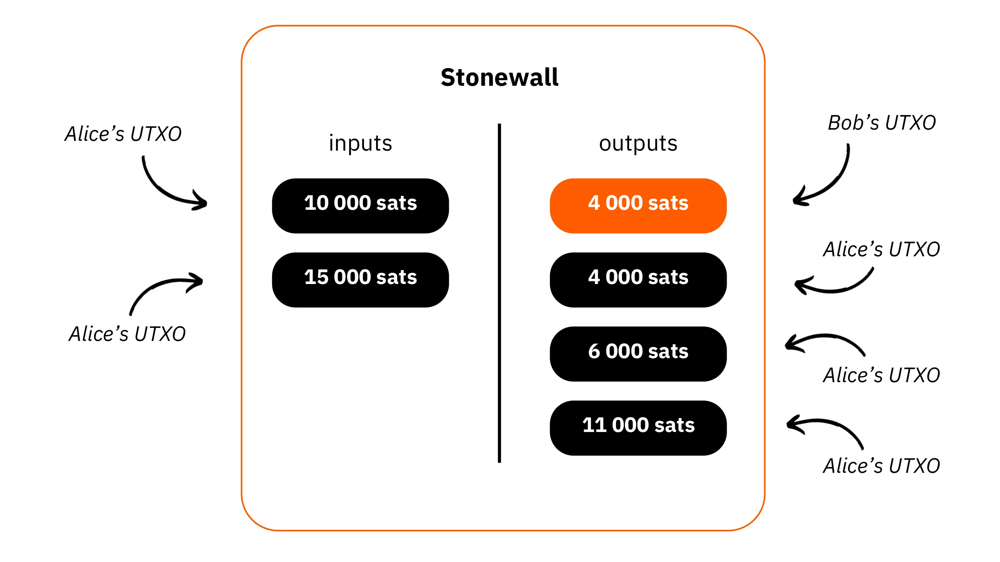


En wat bijzonder interessant is aan de structuur van de Stonewall-transactie is dat deze, vanuit het oogpunt van een buitenstaander, in alle opzichten lijkt op die van een Stonewall x2-transactie.


### De Stonewall-transactie x2


Stonewall x2 is een andere specifieke vorm van Bitcoin transactie die er ook op gericht is om de vertrouwelijkheid van de gebruiker te vergroten bij het doen van een uitgave, maar deze keer door samen te werken met een derde persoon die niet betrokken is bij die uitgave. Deze methode werkt als een pseudo-CoinJoin tussen twee deelnemers, terwijl er tegelijkertijd een betaling wordt gedaan aan een derde persoon.


De werking van de Stonewall x2 transactie is relatief eenvoudig: we gebruiken een UTXO in ons bezit om de betaling te doen, en roepen de hulp in van een derde partij die ook bijdraagt met een UTXO die van hem of haar is. De transactie eindigt met vier uitgangen: twee ervan in gelijke hoeveelheden, één bestemd voor de Address van de begunstigde, de andere voor een Address van de medewerker. Een derde UTXO wordt teruggestuurd naar een andere Address van de medewerker, waardoor hij het oorspronkelijke bedrag kan terugkrijgen (een neutrale actie voor hem, modulo de Mining kosten), en een laatste UTXO gaat terug naar een Address van ons, die de betaling Exchange vormt.


In Stonewall x2 transacties worden dus drie verschillende rollen gedefinieerd:


- De emittent, die de feitelijke betaling verricht ;
- De ontvanger, die zich mogelijk niet bewust is van de specifieke aard van de transactie en gewoon betaling verwacht van de verzender;
- De medewerker, die bitcoins beschikbaar stelt om de analyse van de transactie in twijfel te trekken, terwijl hij aan het eind zijn geld volledig terugkrijgt (een neutrale actie voor hem, afgezien van de Mining kosten).


Laten we teruggaan naar ons voorbeeld met Alice, die bij Bob de bakker is om haar stokbrood te kopen, dat 4.000 Sats kost. Ze wil in bitcoins betalen, met behoud van een zekere mate van vertrouwelijkheid over haar betaling. Dus doet ze een beroep op haar vriend Charles, die haar hierbij zal helpen.


Als we deze transactie analyseren, zien we dat bakker Bob in werkelijkheid 4.000 Sats ontving als betaling voor het stokbrood. Alice gebruikte 10.000 Sats als input en ontving 6.000 Sats als output, d.w.z. een nettosaldo van -4.000 Sats, wat overeenkomt met de prijs van het stokbrood. Charles gebruikte 15 000 Sats als input en ontving twee outputs: een van 4 000 Sats en de andere van 11 000 Sats, wat een saldo van 0 oplevert.


In dit voorbeeld heb ik de kosten bewust weggelaten om het begrijpelijker te maken. In werkelijkheid worden de kosten voor Mining over het algemeen gelijk verdeeld tussen de uitgever van de betaling en de bijdrager.


### Wat zijn de doelstellingen van een Stonewall x2-transactie?


Net als de Stonewall structuur voegt de Stonewall x2 structuur veel entropie toe aan de transactie en verwart de ketenanalyse. Van buitenaf gezien kan zo'n transactie worden geïnterpreteerd als een kleine CoinJoin tussen twee mensen. Maar in werkelijkheid is het een betaling. Deze methode zorgt dus voor onzekerheden in de ketenanalyse, of leidt zelfs tot valse leads.


Laten we het voorbeeld nemen van Alice, Bob de Bakker en Charles. De transactie op de Blockchain zou er als volgt uitzien:


Een externe waarnemer die vertrouwt op de heuristiek van gemeenschappelijke ketenanalyse zou ten onrechte kunnen concluderen dat "*Alice en Charles hebben een kleine CoinJoin uitgevoerd, met elk één UTXO als input en twee UTXO's als output*". Opnieuw leidt het analyseren van deze transactie van buitenaf niet tot de toepassing van de ICOH, omdat de aanwezigheid van twee uitgangen van hetzelfde bedrag een CoinJoin patroon suggereert. Van buitenaf gezien is het CIOH daarom niet van toepassing in dit specifieke geval.


Deze interpretatie is onjuist, omdat, zoals je weet, één UTXO naar Bob de bakker is gestuurd, Alice slechts één Exchange uitgang heeft en Charles er twee heeft.


En nogmaals, wat bijzonder interessant is aan de structuur van de Stonewall x2-transactie is dat deze, vanuit het oogpunt van een buitenstaander, in alle opzichten lijkt op die van een Stonewall-transactie.


### Wat is het verschil tussen Stonewall en Stonewall x2?


Een StonewallX2 transactie werkt precies hetzelfde als een Stonewall transactie, behalve dat de eerste gezamenlijk is, terwijl de laatste dat niet is. Zoals we hebben gezien, is er bij een StonewallX2-transactie een derde partij (Charles) betrokken, die buiten de betaling staat en die zijn bitcoins beschikbaar stelt om de vertrouwelijkheid van de transactie te vergroten. In een klassieke Stonewall-transactie wordt de rol van de medewerker aangenomen door de verzender.


Vanuit extern oogpunt is het transactiepatroon precies hetzelfde.


Het feit dat deze twee transactiestructuren precies hetzelfde patroon hebben, betekent dat zelfs als een externe waarnemer erin slaagt om een "Stonewall(x2)" patroon te identificeren, hij niet alle informatie zal hebben. Hij zal niet kunnen bepalen welke van de twee UTXO's met dezelfde bedragen overeenkomt met de betaling. Bovendien zal hij niet kunnen bepalen of de twee UTXO's met ingangen van twee verschillende mensen komen (Stonewall x2) of dat ze van één persoon zijn die ze heeft samengevoegd (Stonewall).


Dit laatste is te wijten aan het feit dat Stonewall x2 transacties precies hetzelfde patroon volgen als Stonewall transacties. Van buitenaf gezien, en zonder aanvullende contextuele informatie, is het onmogelijk om een Stonewall transactie te onderscheiden van een Stonewall x2 transactie. De eerste zijn geen collaboratieve transacties, terwijl de laatste dat wel zijn. Dit voegt nog meer twijfel toe aan de analyse van een van deze transacties.


### Wanneer moeten Stonewall en Stonewall x2 transacties worden gebruikt?


De logica moet als volgt zijn wanneer je een vertrouwelijkheidstool wilt gebruiken voor een uitgave:


- Als prioriteit kunnen we kiezen om een PayJoin te maken;
- Als de verkoper geen payjoins ondersteunt, kan een gezamenlijke transactie worden gedaan met een andere persoon buiten de betaling om met behulp van de Stonewall x2-structuur;
- Als je niemand kunt vinden die een Stonewall x2 transactie wil doen, kun je een Stonewall only transactie doen, die het gedrag van een Stonewall x2 transactie nabootst.


### Hoe gebruik ik Stonewall en Stonewall x2 transacties?


Stonewall en Stonewall x2 transacties zijn beschikbaar op zowel de Samourai Wallet applicatie als de Sparrow wallet software.


Net als bij payjoins werken Stonewall x2-transacties na de arrestatie van de oprichters van Samourai nu echter alleen door handmatig PSBT's uit te wisselen tussen de betrokken partijen. Helaas is automatische Exchange via Soroban niet langer beschikbaar.


Het is ook mogelijk om dit type transactie handmatig uit te voeren vanaf elke Bitcoin Wallet software.


In het volgende hoofdstuk kijken we naar een andere vertrouwelijkheidstechniek die relatief onbekend is, maar die erg nuttig is als aanvulling op wat we al bestudeerd hebben.


https://planb.network/tutorials/privacy/on-chain/stonewall-033daa45-d42c-40e1-9511-cea89751c3d4

https://planb.network/tutorials/privacy/on-chain/stonewall-x2-05120280-f6f9-4e14-9fb8-c9e603f73e5b

## De ketsen


<chapterId>db9a20ac-a149-443d-884b-ea6c03f28499</chapterId>


Het gebruik van Bitcoin transactiestructuren die ambiguïteit toevoegen aan ketenanalyse, zoals CoinJoin, is vooral gunstig voor privacybescherming. Echter, zoals we in het hoofdstuk over payjoins hebben besproken, zijn CoinJoin transacties natuurlijk identificeerbaar in de keten. Denk aan de analogie die we trokken tussen versleuteling en coinjoins: als een bestand versleuteld is, kan een derde partij die het versleutelde bestand ontdekt, niet bij de inhoud, maar kan wel duidelijk zien dat het bestand is aangepast om de inhoud te verbergen. Hetzelfde geldt voor CoinJoin: wanneer een analist een CoinJoin transactie onderzoekt, kan hij of zij, hoewel hij of zij geen directe links kan leggen tussen inputs en outputs (en vice versa), toch herkennen dat de geobserveerde transactie een CoinJoin is.


Afhankelijk van hoe je je onderdeel wilt gebruiken na CoinJoin cycli, kan het feit dat het dit proces heeft ondergaan problematisch zijn. Als je bijvoorbeeld van plan bent om je munt te verkopen op een gereguleerd Exchange platform, maar hij heeft onlangs een CoinJoin ondergaan, dan zal de ketenanalysetool van het platform dit feit detecteren. Het platform kan dan weigeren om je UTXO munt te accepteren, of zelfs een verklaring van je eisen, met het risico dat je account wordt opgeschort of je fondsen worden bevroren. In sommige gevallen kan het platform je gedrag ook rapporteren aan overheidsinstanties (dit is bijvoorbeeld wat TRACFIN vereist van PSAN's in Frankrijk).


Wat we nodig hebben om dit te voorkomen is een instrument dat de sporen van het verleden van een Bitcoin munt kan vervagen, om zo een vorm van fungibiliteit te herstellen. Dit is precies het doel van ricochet.


### Wat is een ricochet?


De ricochet is een techniek die bestaat uit het uitvoeren van verschillende fictieve transacties naar zichzelf (sweep) om een overdracht van Bitcoin Ownership te simuleren. Dit hulpmiddel verschilt van de andere transactiestructuren die we hebben besproken, omdat het geen prospectieve anonimiteit oplevert, maar eerder een vorm van retrospectieve anonimiteit. In feite vervaagt ricochet de specifieke kenmerken die de fungibiliteit van een Bitcoin munt in gevaar kunnen brengen vanwege het verleden.


Om de afdruk van een gebeurtenis uit het verleden op een munt, zoals CoinJoin cycli, glad te strijken, voert ricochet vier opeenvolgende transacties uit waarbij de gebruiker geld naar zichzelf overmaakt op verschillende adressen.


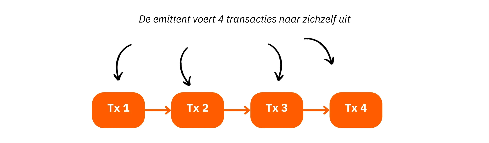


Na deze opeenvolging van transacties routeert de ricochet-tool de bitcoins uiteindelijk naar hun eindbestemming, zoals een Exchange platform.


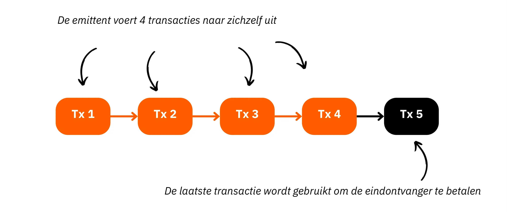


Het doel is om afstand te creëren die de fungibiliteit van de munt beïnvloedt, zoals een CoinJoin transactie, en de uiteindelijke uitgave, die deze munt zou kunnen verwerpen vanwege het verleden. Ketenanalysetools zouden dus kunnen concluderen dat er waarschijnlijk een Ownership verwisseld is na de gebeurtenis, en deze munt als fungibel beschouwen. In het geval van een CoinJoin, zouden Blockchain analyse tools dan kunnen aannemen dat het niet dezelfde persoon was die de bitcoins verstuurde en de CoinJoin uitvoerde, en dat het daarom geen zin heeft om actie te ondernemen tegen de verzender.


### Waarom werkt het?


Geconfronteerd met deze ricochetmethode zou je kunnen denken dat software voor ketenanalyse het onderzoek zou verdiepen tot meer dan vier stuiters. Deze platforms staan echter voor een dilemma bij het optimaliseren van de detectiedrempel. Ze moeten een grens stellen aan het aantal hops waarna ze accepteren dat er waarschijnlijk een verandering van eigenschap heeft plaatsgevonden en dat de link met een eerdere gebeurtenis (zoals een CoinJoin) genegeerd moet worden.


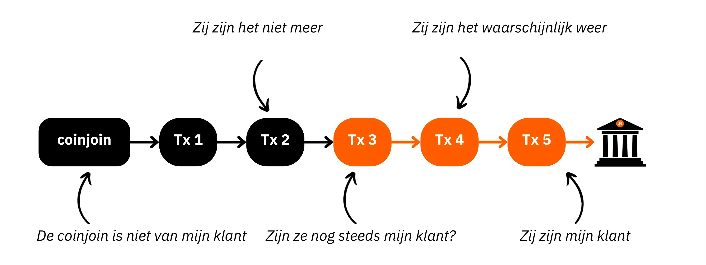


Het instellen van deze drempel is echter riskant: elke uitbreiding van het aantal waargenomen sprongen verhoogt exponentieel het aantal fout-positieven, d.w.z. individuen die ten onrechte als deelnemers aan een gebeurtenis worden gemarkeerd, terwijl de handeling in feite door iemand anders werd uitgevoerd. Dit scenario vormt een groot risico voor deze bedrijven, omdat fout-positieven leiden tot ontevredenheid, wat getroffen klanten naar de concurrentie kan drijven. Op de lange termijn leidt een te hoge detectiedrempel ertoe dat een platform meer klanten verliest dan zijn concurrenten, wat zijn levensvatbaarheid in gevaar kan brengen. Daarom is het voor deze platforms ingewikkeld om het aantal waargenomen bounces te verhogen, en 4 is vaak voldoende om hun analyses tegen te gaan.


Het fenomeen dat hier wordt waargenomen is enigszins analoog aan de theorie van de zes scheidingsgraden.


De theorie van de zes graden van scheiding suggereert dat elke persoon op aarde met elke andere persoon verbonden is door een keten van relaties die uit maximaal zes tussenpersonen bestaat. Het zou daarom voldoende zijn om door een reeks van zes mensen te gaan, waarbij elk persoon de volgende persoonlijk kent, om elk individu in de wereld te bereiken.


In het geval van Bitcoin transacties vinden we een vergelijkbaar fenomeen. Door een voldoende aantal Bitcoin transacties te traceren, komen we onvermijdelijk een CoinJoin tegen. De ricochet methode maakt gebruik van dit principe door een groter aantal hops te gebruiken dan de Exchange platforms redelijkerwijs kunnen traceren. Als de platforms besluiten om meer transacties te volgen, is het mogelijk om eenvoudig een extra hop toe te voegen om deze maatregel te omzeilen.


### Wanneer en hoe ricochet gebruiken?


De meest voorkomende toepassing van ricochet is wanneer het nodig is om een eerdere deelname aan een CoinJoin te verbergen op een UTXO die je bezit. Idealiter vermijd je best de overdracht van bitcoins die een CoinJoin hebben ondergaan naar gereguleerde entiteiten. Als je echter geen andere optie hebt, vooral als je dringend bitcoins in staatsvaluta moet liquideren, biedt ricochet een effectieve oplossing.


Deze methode is niet alleen effectief voor samenvoegingen, maar ook voor andere markeringen die de vervangbaarheid van een onderdeel in gevaar kunnen brengen.


Het idee voor deze ricochet-methode kwam oorspronkelijk van de Samourai Wallet teams, die het in hun applicatie integreerden om het proces te automatiseren. De dienst is niet gratis op Samourai, omdat een ricochet 100.000 Sats kost, plus Mining kosten. Het gebruik wordt daarom aanbevolen voor overschrijvingen van aanzienlijke bedragen.


De Samurai-toepassing biedt twee ricochet-varianten:


- Versterkte ricochet, of "gespreide levering", die het voordeel biedt van het spreiden van de Samurai servicekosten over de vijf opeenvolgende transacties. Deze optie zorgt er ook voor dat elke transactie op een apart tijdstip wordt uitgezonden en in een ander blok wordt vastgelegd, waardoor het gedrag van een verandering van eigenaar zo goed mogelijk wordt nagebootst. Hoewel deze methode langzamer is, verdient ze de voorkeur voor mensen die geen haast hebben, omdat ze de efficiëntie van de ricochet maximaliseert door de weerstand tegen ketenanalyse te versterken;


- De klassieke ricochet, die ontworpen is om de operatie snel uit te voeren, zendt alle transacties uit in een kort tijdsinterval. Deze methode biedt daarom minder vertrouwelijkheid en minder weerstand tegen analyse dan de versterkte methode. Deze methode mag alleen worden gebruikt voor dringende zendingen.


Ricochetten betekent gewoon bitcoins naar jezelf sturen. Het is perfect mogelijk om bitcoins handmatig te ricochetten op elke Wallet software, zonder een gespecialiseerde tool te gebruiken. Het enige wat je hoeft te doen is achtereenvolgens dezelfde munt naar jezelf overmaken, waarbij je telkens een nieuwe, lege Address gebruikt.


In het volgende hoofdstuk bekijken we verschillende technieken voor geheime overdrachten van Ownership. Deze methoden verschillen radicaal van de methoden die we tot nu toe hebben onderzocht, zowel wat betreft de werking als de resultaten.


https://planb.network/tutorials/privacy/on-chain/ricochet-e0bb1afe-becd-44a6-a940-88a463756589

## Geheime overdrachten van Ownership


<chapterId>a2067036-849c-4d6b-87d2-44235cfae7a1</chapterId>


Een andere vertrouwelijkheidstechniek van Bitcoin is de geheime overdracht van Ownership. Deze methode heeft als doel Ownership Bitcoins over te dragen van de ene persoon naar de andere, en vice versa, zonder dat de transactie expliciet zichtbaar is op de Blockchain. Laten we eens kijken naar de verschillende technieken die beschikbaar zijn, samen met hun voor- en nadelen.


### De muntenruil


Coinwap is gebaseerd op een relatief eenvoudig concept: het gebruikt slimme contracten om een overdracht van Bitcoin Ownership tussen twee gebruikers mogelijk te maken, zonder dat er vertrouwen nodig is en zonder dat deze overdracht expliciet zichtbaar is op de Blockchain.


Laten we een naïef voorbeeld nemen met Alice en Bob. Alice bezit 1 BTC beveiligd met privé-sleutel $A$, en Bob bezit ook 1 BTC beveiligd met privé-sleutel $B$. Ze kunnen theoretisch hun private sleutels Exchange via een extern communicatiekanaal om een geheime overdracht uit te voeren.


Deze naïeve methode brengt echter een groot vertrouwensrisico met zich mee. Niets houdt Alice tegen om een kopie van de $A$ private sleutel te bewaren na Exchange en deze later te gebruiken om de bitcoins te stelen, zodra de sleutel in Bob's handen is.


Verder is er geen garantie dat Alice niet Bob's privé sleutel $B$ ontvangt en nooit haar privé sleutel $A$ doorgeeft in Exchange. Deze Exchange berust dus op overmatig vertrouwen tussen de partijen en is niet effectief om een veilige geheime overdracht van Ownership te garanderen.


Om deze problemen op te lossen en uitwisselingen mogelijk te maken tussen partijen die elkaar niet vertrouwen, gaan we in plaats daarvan Smart contract systemen gebruiken. Een Smart contract is een programma dat automatisch wordt uitgevoerd wanneer aan vooraf gedefinieerde voorwaarden wordt voldaan. In ons geval zorgt dit ervoor dat de Exchange van eigendom automatisch plaatsvindt, zonder dat wederzijds vertrouwen nodig is.


Dit kan met HTLC (*Hash Time-Locked Contracts*) of PTLC (*Point Time-Locked Contracts*). Deze twee protocollen werken op een vergelijkbare manier en gebruiken een tijdvergrendelingssysteem dat ervoor zorgt dat de Exchange met succes wordt voltooid of volledig wordt geannuleerd, waardoor de integriteit van de fondsen van beide partijen wordt beschermd. Het belangrijkste verschil tussen HTLC en PTLC is dat HTLC hashes en preimages gebruikt om de transactie te beveiligen, terwijl PTLC Adaptor Signatures gebruikt.


In een coinswap-scenario met HTLC of PTLC tussen Alice en Bob, vindt de Exchange veilig plaats: of het slaagt en ieder ontvangt de BTC van de ander, of het mislukt en ieder behoudt zijn eigen BTC. Dit maakt het onmogelijk voor een van de partijen om vals te spelen of de BTC van de ander te stelen.


> *De HTLC is ook het mechanisme dat gebruikt wordt om betalingen veilig te routeren via de bidirectionele kanalen van de Lightning Network*
Het gebruik van Adaptor Signatures is in deze context bijzonder interessant, omdat het het mogelijk maakt om af te zien van traditionele scripts (een mechanisme dat soms "scriptloze scripts_" wordt genoemd). Deze functie vermindert de kosten die Exchange met zich meebrengt. Een ander groot voordeel van Adaptor-handtekeningen is dat ze niet het gebruik van een gemeenschappelijke Hash vereisen voor beide partijen bij de transactie, waardoor het niet nodig is om een directe link tussen hen te onthullen in bepaalde typen Exchange.


### Handtekeningen van adapters


Adaptorhandtekeningen zijn een cryptografische methode die een geldige handtekening integreert met een extra handtekening, genaamd de "_adaptorhandtekening_", om geheime gegevens te onthullen. Dit mechanisme is zo ontworpen dat kennis van 2 van de 3 volgende Elements: de geldige handtekening, de adapterhandtekening en het geheim, ons toelaat om het ontbrekende derde element af te leiden. Een interessante eigenschap van deze methode is dat, als we de adaptorhandtekening van onze peer kennen en het specifieke punt op de elliptische curve dat geassocieerd is met het geheim dat gebruikt is om die adaptorhandtekening te berekenen, we onze eigen adaptorhandtekening kunnen afleiden die compatibel zal zijn met datzelfde geheim, zonder ooit directe toegang te hebben tot het geheim zelf.


Bij een coinswap maakt het gebruik van Adaptor Signatures de gelijktijdige bekendmaking van twee stukken gevoelige informatie tussen deelnemers mogelijk, waardoor de noodzaak voor wederzijds vertrouwen wordt vermeden. Laten we een voorbeeld nemen om dit proces te illustreren met Alice en Bob, die elk 1 BTC willen Exchange bezitten, maar elkaar niet vertrouwen. Ze gebruiken Adaptor Signatures om de noodzaak om elkaar te vertrouwen in deze Exchange te elimineren. Dit is hoe ze het doen:


- Alice initieert de Exchange door een $m_A$ transactie aan te maken die 1 BTC naar Bob stuurt. Ze genereert een handtekening $s_A$, die deze transactie valideert, met haar private sleutel $p_A$ ($P_A = p_A \cdot G$), een Nonce $n_A$ ($N_A = n_A \cdot G$) en een geheime $t$ ($T = t \cdot G$) :


$$s_A = n_A + t + H(N_A + T \parallel P_A \parallel m_A) \cdot p_A$


- Alice berekent de adaptorhandtekening $s_A'$ door de geheime $t$ van zijn echte handtekening $s_A$ af te trekken:


$$s_A' = s_A - t$$


- Alice stuurt Bob haar handtekeningadapter $s'_A$, haar niet-ondertekende transactie $m_A$, het punt dat overeenkomt met het geheim ($T$) en het punt dat overeenkomt met de Nonce ($N_A$). Deze Elements vormen wat bekend staat als een "adapter". Het is belangrijk op te merken dat, met alleen deze informatie, Bob de BTC van Alice niet kan herstellen.
- Bob kan echter controleren of Alice niet van hem probeert te stelen. Om dit te doen, controleert hij of Alice's adapterhandtekening $s_A'$ daadwerkelijk overeenkomt met de voorgestelde transactie $m_A$. Als de volgende vergelijking klopt, dan kan hij er zeker van zijn dat de handtekeningadapter van Alice geldig is:


$$s_A' \cdot G = N_A + H(N_A + T \parallel P_A \parallel m_A) \cdot P_A$$


- Deze verificatie geeft Bob voldoende garanties dat hij de Exchange in alle vertrouwen kan voortzetten. Vervolgens creëert hij zijn eigen transactie $m_B$, bedoeld om 1 BTC naar Alice te sturen, en genereert hij zijn adaptorhandtekening $s_B'$, die ook aan hetzelfde geheime $t$ zal worden gekoppeld. In dit stadium kent alleen Alice de waarde van $t$; Bob kent alleen het corresponderende punt $T$ dat Alice aan hem heeft doorgegeven:


$$s_B' = n_B + H(N_B + T \parallel P_B \parallel m_B) \cdot p_B$$


- Bob stuurt Alice zijn adaptorhandtekening $s_B'$, zijn niet-ondertekende transactie $m_B$, evenals het punt dat overeenkomt met het geheim ($T$) en het punt dat overeenkomt met de Nonce ($N_B$). Alice, die het geheim $t$ kent, kan nu Bob's adaptorhandtekening $s_B'$ combineren met dit geheim om generate een geldige handtekening $s_B$ te geven voor de transactie $m_B$ die Bob's BTC naar haar zal overmaken:


$$s_B = s_B' + t$$


$$(s_B' + t) \cdot G = N_B + T + H(N_B + T \parallel P_B \parallel m_B) \cdot P_B$$


- Alice zendt deze ondertekende $m_B$ transactie uit op de Bitcoin Blockchain om de door Bob beloofde BTC op te halen. Wanneer Bob deze transactie op de Blockchain ziet, kan hij de handtekening $s_B = s_B' + t$ extraheren. Met deze informatie kan Bob het beroemde geheim $t$ isoleren dat hij nodig had:


$$t = (s_B' + t) - s_B' = s_B - s_B'$$


- En dit geheim $t$ was het enige element dat ontbrak voor Bob naar generate de geldige handtekening $s_A$ van Alice's adaptor handtekening $s_A'$. Deze handtekening valideert de $m_A$ transactie, die een BTC van Alice naar Bob stuurt. Bob berekent dan $s_A$ en zendt de $m_A$ transactie uit op de Blockchain:


$$s_A = s_A' + t$$


$$(s_A' + t) \cdot G = N_A + T + H(N_A + T \parallel P_A \parallel m_A) \cdot P_A$$


Laten we eens samenvatten hoe een adaptorhandtekening werkt in een coinswap. In eerste instantie stuurt Alice Bob een niet-ondertekende transactie vergezeld van een adapter, zodat Bob kan verifiëren dat het later onthulde geheim hem toegang geeft tot bitcoins. In ruil daarvoor stuurt Bob Alice zijn eigen niet-ondertekende transactie en adapter. Alice kan dan Bob's transactie afronden en de bitcoins ophalen door een geldige transactie uit te zenden dankzij het geheim. Wanneer deze transactie wordt gepubliceerd op Blockchain, kan Bob het geheim ontfutselen en zo Alice's transactie ontgrendelen. Bijgevolg, als Alice een overdracht van Bob's Bitcoin initieert, kan Bob op zijn beurt toegang krijgen tot Alice's Bitcoin zonder dat wederzijds vertrouwen nodig is.


Merk op dat coinswaps voor het eerst werden voorgesteld door [Gregory Maxwell in oktober 2013 op BitcoinTalk] (https://bitcointalk.org/index.php?topic=321228.0).


### Atoomverwisseling


Op een vergelijkbare manier als coinswap, en met behulp van dezelfde soorten smart contracts, is het ook mogelijk om atomic swaps uit te voeren. Een atomaire swap maakt een directe Exchange van verschillende cryptocurrencies mogelijk, zoals BTC en XMR, tussen twee gebruikers zonder de noodzaak van vertrouwen of de tussenkomst van een tussenpersoon. Deze uitwisselingen worden "atomair" genoemd omdat ze slechts twee mogelijke uitkomsten hebben: of de swap is succesvol en beide partijen zijn tevreden, of de swap mislukt en elk behoudt zijn oorspronkelijke cryptocurrencies, waardoor het niet meer nodig is om de andere partij te vertrouwen.


Atomic swap en coinswap hebben een vergelijkbare werkwijze en bieden dezelfde voor- en nadelen op het gebied van vertrouwelijkheid. Vanuit het oogpunt van Bitcoin is een atomic swap namelijk vergelijkbaar met een coinswap die in twee fasen wordt uitgevoerd. Eerst Exchange we onze BTC voor een andere cryptocurrency, dan kan deze cryptocurrency worden geruild voor andere BTC. Uiteindelijk krijgen we de BTC van een andere gebruiker terug. Daarom groepeer ik deze twee protocollen bij de analyse van vertrouwelijkheidsproblemen in de categorie van geheime uitwisselingen voor eigen gebruik.


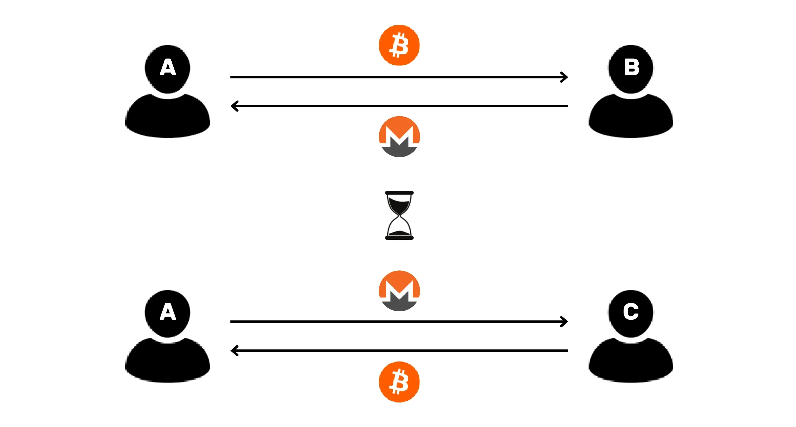


Pas echter op dat, in tegenstelling tot coinswap, atomic swap onevenwichtigheden kan hebben in termen van beschikbare liquiditeit, vooral in BTC/XMR exchanges. Het is over het algemeen gemakkelijker om bitcoins te ruilen voor altcoins, omdat er veel vraag is naar bitcoins, waardoor de premies voor deze conversierichting laag blijven. Het omwisselen van altcoins voor BTC kan echter complexer zijn vanwege de lagere vraag, wat vaak resulteert in zeer hoge premies.


Tot slot, wanneer een atomaire swap onchain bitcoins en bitcoins op de Lightning Network betreft, spreken we van een "onderzeese swap".


### Is het echt nuttig?


Geheime overdrachten van Ownership, zoals coinswaps en atomic swaps, hebben het voordeel dat ze de heuristiek van de ketenanalyse misleiden. Deze methoden kunnen suggereren dat de transacties betrekking hebben op dezelfde gebruiker, terwijl de werkelijke Ownership van eigenaar is gewisseld. Het grootste nadeel van deze methoden is echter dat ze erg riskant zijn zonder het gebruik van een extra techniek om de geschiedenis van de munt te breken.


Inderdaad, wanneer Alice een coinswap of atomic swap uitvoert met Bob, ruilt ze het bezit van haar bitcoins met die van Bob. In het geval van een atomic swap, omvat de Exchange een Altcoin, maar het principe blijft hetzelfde. Alice eindigt dus met de $B$ munt en Bob met de $A$ munt. Dit voegt twijfel toe aan de ketenanalyse, maar de geschiedenis van de munten blijft traceerbaar. Als een analist deel $A$ onderzoekt, kan hij of zij de eerdere activiteiten van Alice traceren, en omgekeerd voor deel $B$.


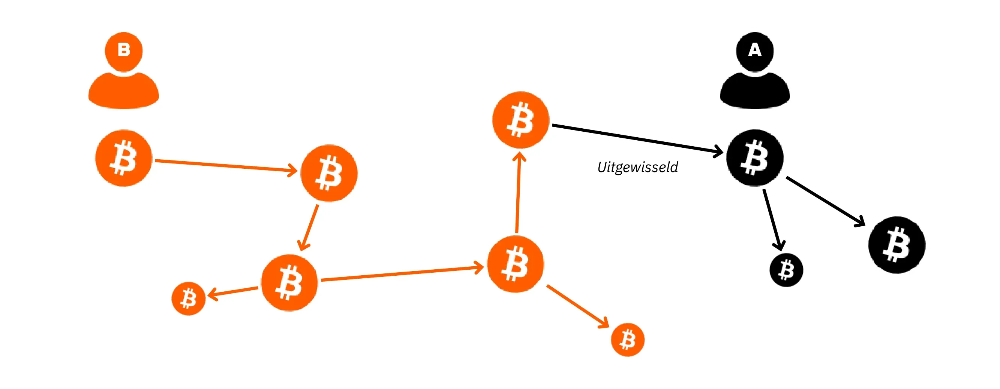


Vanuit het oogpunt van Alice is het risico dat de geschiedenis van de $B$-munt door bepaalde entiteiten als verdacht kan worden beschouwd. Als Bob bijvoorbeeld de $B$-munt had verkregen door een criminele daad, zoals hacken, zou de munt verbonden blijven aan zijn illegale activiteiten. Alice zou dan in het bezit kunnen komen van een munt die ze niet kan overdragen aan gereguleerde Exchange-platforms zonder het risico te lopen dat haar fondsen bevroren worden, of zelfs beschuldigd worden van Bob's misdaden, ook al had ze er niets mee te maken.


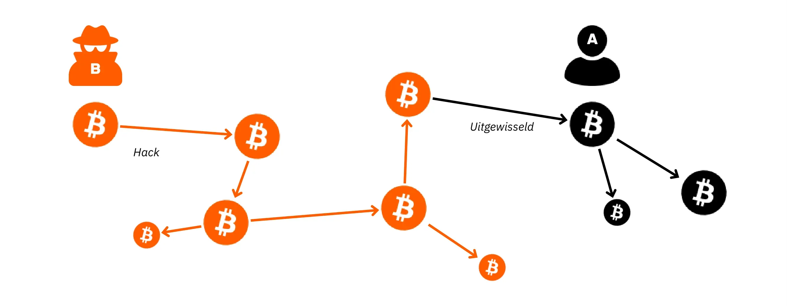


Het is onvermijdelijk dat vertrouwelijkheidsmethodes zoals coinswap of atomic swap de voorkeur genieten van criminelen wiens fondsen onder toezicht staan van de autoriteiten. Met deze protocollen kunnen ze hun bitcoins die onder toezicht staan in Exchange van de hand doen voor perfect fungibele bitcoins. Het stelt hen ook in staat om een afleiding te creëren, door de autoriteiten naar andere gebruikers te leiden. Deze mensen hebben dus een dubbel doel.


Met CoinJoin wordt de geschiedenis van de munt verbroken, zelfs als jouw munt vermengd is met gecontroleerde bitcoins. Dit biedt een vorm van plausibele ontkenning die niet bestaat in geheime Ownership overdrachtsprotocollen zoals coinswap of atomic swap.


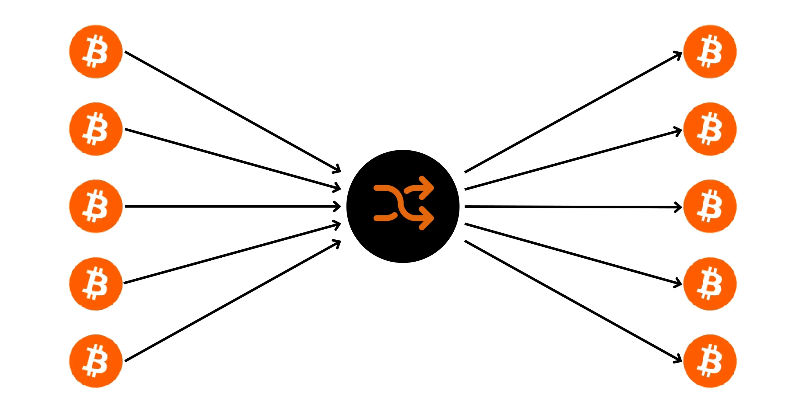


Als Alice elk risico wil vermijden, moet ze noodzakelijkerwijs een methode gebruiken om de geschiedenis van de $B$ munt te breken, zoals het passeren van coinjoins. Dit roept een vraag op over het nut van het combineren van de geheime overdracht van Ownership en de CoinJoin. De CoinJoin, door het breken van de geschiedenis van een munt, biedt al een voldoende niveau van vertrouwelijkheid voor Alice. Mijn mening is dus dat als Alice haar privacy wil beschermen, het verstandiger zou zijn om direct over te gaan op een CoinJoin in plaats van een coinswap gevolgd door een CoinJoin.


Om geheime Ownership overdrachtsmethodes echt effectief te laten zijn en het risico te vermijden dat de geschiedenis van een $A$ gebruiker aan een $B$ gebruiker wordt gekoppeld, zou het paradoxaal genoeg nodig zijn dat het gebruik ervan algemeen bekend is. Als coinswap massaal wordt gebruikt en de autoriteiten op de hoogte zijn van deze gangbare praktijk, dan zou een plausibele vorm van ontkenning kunnen worden vastgesteld. Maar zolang het gebruik van deze transfers marginaal blijft, denk ik dat deze methodes te riskant blijven voor gebruikers.


Tot nu toe hebben we vooral vertrouwelijkheidsmethoden bestudeerd op het niveau van de transacties zelf. In het volgende hoofdstuk kijken we naar problemen op netwerkniveau en de verspreiding van transacties.


## Privacy op het P2P-netwerk


<chapterId>04a2467b-db84-4076-a9ff-919be5135106</chapterId>


In Deel 4 hebben we besproken hoe belangrijk het is om een compleet knooppunt te gebruiken om de vertrouwelijkheid van je transacties te beschermen. Het is echter belangrijk om te begrijpen dat je knooppunt zelf onderhevig kan zijn aan aanvallen om informatie over je activiteiten te achterhalen. In dit hoofdstuk bekijken we daarom de verschillende maatregelen die je kunt nemen om je privacy te beschermen, niet op het niveau van de transacties zelf of de Bitcoin stromen, maar op het niveau van het netwerk.


### Paardenbloem


Een manier om de verschillende de-anonimiseringsaanvallen te omzeilen is het gebruik van het Dandelion voorstel. Dit broadcast protocol werd geformaliseerd in BIP156, maar is nooit geïmplementeerd op Bitcoin.


Het idee achter Dandelion is om de vertrouwelijkheid van de routering van transacties in het Bitcoin netwerk te verbeteren om verschillende vormen van aanvallen tegen te gaan. Het hoofddoel is het verbergen van het bronknooppunt dat in eerste instantie een transactie op het netwerk heeft uitgezonden. Openbaarmaking van dit knooppunt zou het mogelijk kunnen maken om een Bitcoin transactie te linken aan een specifiek IP Address (als het knooppunt opereert op het clearnet), wat een ingang zou kunnen bieden voor ketenanalyse.


Deze associatie tussen activiteit op Bitcoin en een IP Address vormt een aanzienlijk risico voor de vertrouwelijkheid van gebruikers. Veel entiteiten zijn namelijk in staat om een IP Address gemakkelijk te koppelen aan een persoonlijke identiteit. Hieronder vallen overheden en internetproviders. Bovendien kan deze informatie openbaar toegankelijk worden, bijvoorbeeld als je IP Address en persoonlijke gegevens uitlekken wanneer de database van een website wordt gehackt.


In de klassieke Bitcoin werking worden transacties die door een gebruiker op zijn Wallet software zijn gemaakt, naar zijn persoonlijke knooppunt gestuurd. Dit knooppunt zendt de nieuwe transactie onmiddellijk naar alle peers waarmee het verbonden is.


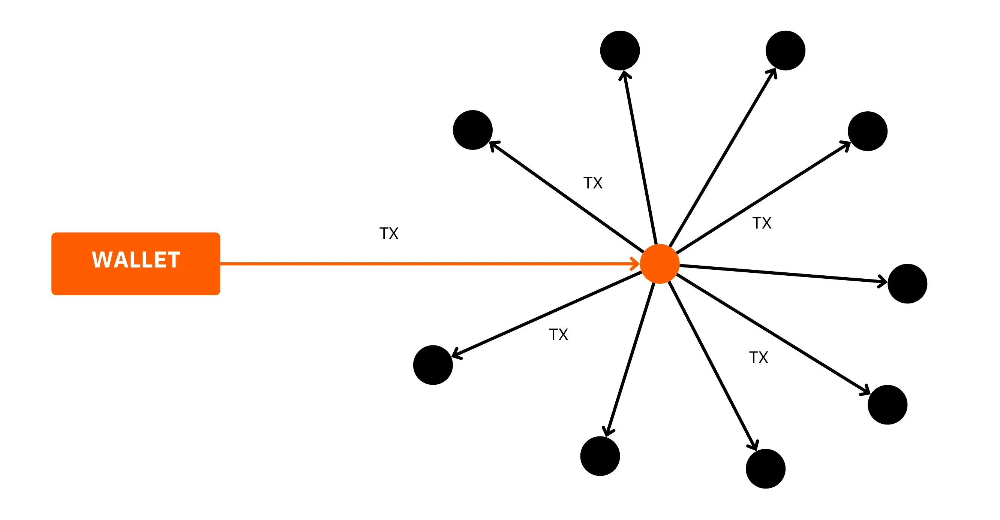


Deze peers controleren vervolgens de transactie om er zeker van te zijn dat deze voldoet aan de consensus en lokale standaardisatieregels. Na validatie stuurt elke peer op zijn beurt de transactie door naar zijn of haar peers, enzovoort.


Deze verdeling van transacties die wachten op integratie in een blok is redelijk evenwichtig en statistisch voorspelbaar. Deze zwakte kan worden uitgebuit door medeplichtige spionageknooppunten, die samenwerken om het netwerk te monitoren en te analyseren, om zo het eerste knooppunt te identificeren dat een transactie heeft uitgezonden. Als een waarnemer erin slaagt om het bronknooppunt te lokaliseren, kan hij of zij aannemen dat de transactie afkomstig is van de operator van dat knooppunt. Dit type observatie kan gebruikt worden om normaal gesproken anonieme transacties aan specifieke IP-adressen te koppelen.


Het doel van BIP156 is om Address dit probleem op te lossen. Om dit te doen, introduceert het een extra fase in de verspreiding van een nieuwe transactie om de anonimiteit te bewaren voordat deze breed openbaar wordt verspreid. Dandelion gebruikt eerst een "stam"-fase waarbij de transactie door een willekeurig pad van knooppunten wordt gestuurd.


De transactie wordt dan uitgezonden naar het hele netwerk tijdens de "Fluff" fase.


De stengel en de "Fluff" zijn verwijzingen naar het gedrag van transactiepropagatie door het netwerk, dat lijkt op de vorm en evolutie van een paardenbloem.


Spionnenknooppunten kunnen de transactie dus mogelijk terugleiden naar het knooppunt dat de "Fluff"-fase (de massale uitzending) heeft gestart, maar dat knooppunt is niet degene die de transactie als eerste heeft uitgezonden, omdat het de transactie van het laatste knooppunt van de stam heeft ontvangen. Als de spionnenknooppunten de stam niet kunnen traceren, kunnen ze ook het bronknooppunt niet identificeren.


Zelfs in de aanwezigheid van spionnenknooppunten tijdens de stamfase blijft er altijd twijfel bestaan, want zodra ze een eerlijk knooppunt tegenkomen in de verspreidingsgrafiek, kunnen de spionnen niet bepalen of dit knooppunt de originele bron is of gewoon een tussenpersoon.


Deze routeringsmethode vervaagt het spoor terug naar het bronknooppunt, waardoor het moeilijk wordt om een transactie door het netwerk terug te leiden naar de oorsprong. Dandelion verbetert dus de vertrouwelijkheid door het vermogen van tegenstanders om het netwerk te de-anonimiseren te beperken. Deze methode is des te effectiever wanneer de transactie tijdens de "stemming"-fase een knooppunt passeert dat zijn netwerkcommunicatie versleutelt, zoals bij Tor of P2P Transport V2.


BIP156 is niet geïntegreerd in Bitcoin Core en is momenteel geclassificeerd als "afgewezen". Een van de grootste bezwaren tegen dit protocol is dat transacties tijdens de stamfase via tussenliggende knooppunten moeten worden doorgestuurd voordat ze worden geverifieerd. Zoals we hebben gezien, verifieert in het normale Bitcoin model elk knooppunt eerst de transactie voordat het deze naar zijn peers uitzendt. Als een transactie niet voldoet aan de consensusregels of lokale standaardisatieregels van het knooppunt, negeert het knooppunt de transactie en verspreidt het deze niet. Dit proces is belangrijk om DoS-aanvallen tegen te gaan, omdat alleen geldige transacties naar het hele netwerk worden uitgezonden. Ongeldige transacties, die mogelijk massaal worden gegenereerd om het netwerk te overbelasten, worden gestopt bij het eerste knooppunt dat ze tegenkomen en verspreiden zich niet. Het grootste risico van Dandelion is dat dit nieuwe protocol nieuwe vectoren voor DoS aanvallen kan introduceren door toe te staan dat ongeldige transacties over een deel van het netwerk worden uitgezonden.


### P2P transport V2


P2P transport V2 is een ander netwerkprotocol dat wordt gepresenteerd in BIP324. Het is een nieuwe versie van het Bitcoin P2P transport protocol dat opportunistische encryptie bevat om de vertrouwelijkheid en veiligheid van communicatie tussen nodes te verbeteren.


Deze verbetering is ontworpen om verschillende problemen met de basisversie van het P2P protocol op te lossen. Enerzijds maakt het de uitgewisselde gegevens voor een passieve waarnemer niet te onderscheiden van andere soorten gegevens die op het internet circuleren. Het belangrijkste doel is om te voorkomen dat overheden, ISP's en VPN-providers Bitcoin-gebruikers massaal in de gaten houden. Dit maakt het ook moeilijker voor deze entiteiten om te bepalen of een internetgebruiker ook een Bitcoin gebruiker is, d.w.z. of hij of zij een compleet knooppunt bedient.


P2P V2 helpt ook het risico op censuur en aanvallen te verminderen door specifieke patronen in gegevenspakketten te detecteren. Het compliceert en maakt de uitvoering van verschillende soorten Sybil-aanvallen op netwerkniveau duurder. Een Sybil-aanval vindt plaats wanneer een actor meerdere valse identiteiten creëert om een oneerlijk voordeel te behalen. In de context van het Bitcoin netwerk manifesteert dit zich vaak als een actor die een groot aantal complete nodes controleert en deze agressief gebruikt om verbindingen te vermenigvuldigen. Sybil aanvallen kunnen passief zijn, om informatie te verzamelen en de vertrouwelijkheid van gebruikers in gevaar te brengen, of actief, in de vorm van Eclipse aanvallen. Deze laatste isoleren een specifiek knooppunt van de rest van het netwerk en censureren de gebruiker of veranderen de gegevens die het ontvangt. Ten slotte maakt P2P V2 ook *Man-In-The-Middle* (MITM) aanvallen kostbaarder en gemakkelijker op te sporen.


De versleuteling geïmplementeerd door P2P V2 bevat geen authenticatie, om geen onnodige complexiteit toe te voegen of het feit te compromitteren dat de verbinding met het netwerk zonder toestemming blijft. Desalniettemin biedt dit nieuwe P2P transportprotocol betere beveiliging tegen passieve aanvallen en maakt het actieve aanvallen aanzienlijk kostbaarder en detecteerbaarder. De introductie van een pseudo-willekeurige gegevensstroom in netwerkberichten maakt het moeilijker voor aanvallers om communicatie te censureren of te manipuleren.


P2P V2 transport werd opgenomen als een optie (standaard uitgeschakeld) in Bitcoin Core versie 26.0, ingezet in december 2023. Daarna werd het standaard ingeschakeld in versie 27.0 van april 2024. Het kan worden aangepast met de `v2transport=` optie in het configuratiebestand.


### Tor


Een andere eenvoudige oplossing om het risico op verlies van vertrouwelijkheid voor een netwerkknooppunt te vermijden, is om het volledig onder Tor te laten draaien.


Tor is een netwerk van relaisservers (nodes) dat de herkomst van TCP-verbindingen op het internet anonimiseert. Het werkt door gegevens in te kapselen in verschillende lagen van encryptie. Elk relaisknooppunt verwijdert een Layer om de Address van het volgende knooppunt te onthullen, totdat de eindbestemming is bereikt. Het Tor netwerk zorgt voor anonimiteit door te voorkomen dat tussenliggende knooppunten zowel de herkomst als de bestemming van gegevens kennen, waardoor het voor een waarnemer erg moeilijk wordt om de activiteit van een gebruiker te traceren.


Tor versleutelt niet alleen gegevens, maar maskeert ook de herkomst en bestemming van communicatie. Door Tor te gebruiken voor communicatie vanaf je persoonlijke knooppunt, versterk je de vertrouwelijkheid van je transacties: je ISP kan de communicatie niet ontsleutelen en andere knooppunten in het Bitcoin netwerk kunnen het IP van het bronknooppunt Address niet identificeren. Bovendien verbergt Tor ook jouw gebruik van Bitcoin voor je ISP.


Het grootste risico van deze methode is dat Tor een protocol is dat onafhankelijk is van Bitcoin. Als je een Bitcoin node hebt die onder Tor draait en Tor stopt met werken, dan kan je Bitcoin node niet meer communiceren.


Het is ook belangrijk om te weten dat de communicatie op Tor langzamer is. Deze latentie is vooral vervelend tijdens de initiële lancering van een node, omdat IBD (*Initial Block Download*) veel communicatie vereist. Als gevolg hiervan kan je initiële synchronisatie met het Bitcoin netwerk aanzienlijk langer duren als je Tor gebruikt. Het is ook mogelijk om IBD uit te voeren op het clearnet en dan Tor te activeren als tweede stap. Hoewel deze methode het bestaan van je Bitcoin node onthult aan je ISP, beschermt het je persoonlijke transactie informatie zodra je overschakelt naar Tor.


Na het verkennen van de verschillende methoden van vertrouwelijkheid op netwerkniveau, wil ik je in de volgende hoofdstukken ook kennis laten maken met twee elegante oplossingen om hergebruik van Address te voorkomen: BIP47 en Stille Betalingen.


## BIP47 en herbruikbare betaalcodes


<chapterId>ad88e076-a04b-4aec-b3b2-7b4760175504</chapterId>


Zoals we in deel 3 zagen, is hergebruik van Address een ernstig obstakel voor de vertrouwelijkheid van gebruikers van het Bitcoin protocol. Om deze risico's te beperken, is het sterk aanbevolen om generate een lege ontvangende Address te maken voor elke nieuwe betaling die in een Wallet wordt ontvangen. Hoewel het genereren van een nieuwe Address nu vereenvoudigd wordt door het gebruik van moderne software en hiërarchische deterministische wallets, kan deze praktijk contra-intuïtief lijken.


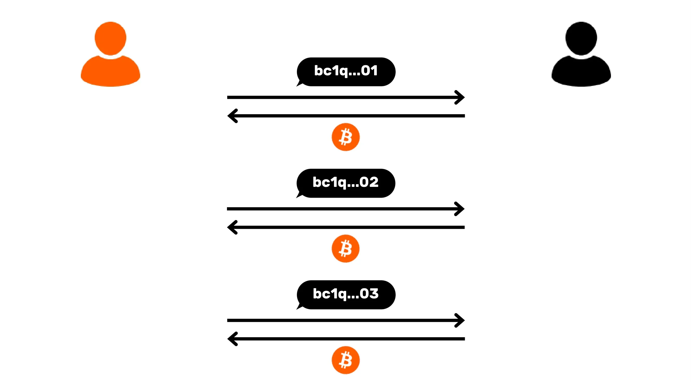


In het traditionele banksysteem zijn we bijvoorbeeld gewend om ons IBAN te delen, dat altijd hetzelfde blijft. Als we het eenmaal aan iemand hebben gegeven, kunnen ze ons meerdere betalingen sturen zonder opnieuw contact met ons op te hoeven nemen. Neo-banken bieden ook modernere mogelijkheden, zoals het gebruik van unieke e-mailadressen bij PayPal of RevTags bij Revolut. Zelfs buiten de financiële sfeer zijn onze dagelijkse identificaties zoals ons postnummer Address, telefoonnummer en e-mailadres Address ook uniek en permanent. We hoeven ze niet te vernieuwen voor elke nieuwe interactie.


Bitcoin werkt echter anders: voor elke inkomende transactie moet een nieuwe ontvangende Address worden gegenereerd. Dit compromis tussen gebruiksgemak en vertrouwelijkheid gaat terug tot de oorsprong van het Witboek van Bitcoin. Al bij de publicatie van de eerste versie van zijn document eind 2008, waarschuwde Satoshi Nakamoto ons voor dit risico:


**Als extra firewall kan voor elke transactie een nieuw sleutelpaar worden gebruikt om ze niet te koppelen aan een gemeenschappelijke eigenaar.**


Er zijn veel manieren om meerdere betalingen te ontvangen op een enkele identifier zonder een Address opnieuw te hoeven gebruiken. Elke methode heeft zijn eigen voor- en nadelen. Een van deze methoden is BIP47, een voorstel ontwikkeld door Justus Ranvier en gepubliceerd in 2015. Dit voorstel is gericht op het creëren van herbruikbare betaalcodes waarmee meerdere transacties tegen dezelfde persoon kunnen worden uitgevoerd, terwijl hergebruik van Address wordt vermeden. Kortom, BIP47 wil een betalingssysteem bieden dat net zo intuïtief is als een unieke identificatiecode, terwijl de vertrouwelijkheid van transacties behouden blijft.


BIP47 verbetert niet direct de vertrouwelijkheid van de gebruiker, aangezien een BIP47-betaling hetzelfde niveau van vertrouwelijkheid biedt als een klassieke Bitcoin-transactie waarbij blanco adressen worden gebruikt. Het maakt het gebruik van Bitcoin echter wel handiger en intuïtiever, een gemak dat normaal gesproken de vertrouwelijkheid in gevaar zou brengen. Dankzij BIP47 bereikt dit gebruiksgemak hetzelfde niveau van vertrouwelijkheid als een klassieke transactie. Daarom is BIP47 zo'n waardevol hulpmiddel voor het bewaren van privacy.


Aanvankelijk werd BIP47 voorgesteld voor integratie in Bitcoin Core, maar het werd nooit echt geïmplementeerd. Sommige softwaretoepassingen kozen er echter voor om het zelf te implementeren. De Samourai Wallet teams hebben bijvoorbeeld hun eigen implementatie van BIP47 ontwikkeld, genaamd "PayNym".


### Algemeen principe van BIP47 en PayNym


Het doel van BIP47 is om het mogelijk te maken een groot aantal betalingen te ontvangen zonder adressen te hergebruiken. Het is gebaseerd op het gebruik van een herbruikbare betaalcode, waardoor verschillende emittenten meerdere betalingen kunnen sturen naar één code die toebehoort aan een andere gebruiker. Hierdoor hoeft de ontvanger niet voor elke transactie een nieuwe, blanco Address op te geven, wat uitwisselingen aanzienlijk vergemakkelijkt terwijl de vertrouwelijkheid behouden blijft.


Een gebruiker kan zijn of haar betaalcode dus in alle vrijheid delen, op sociale netwerken of op zijn of haar website, zonder risico op verlies van vertrouwelijkheid, in tegenstelling tot een conventionele ontvanger Address of publieke sleutel.


Om een transactie uit te voeren, hebben beide partijen een Bitcoin Wallet met een BIP47-implementatie nodig, zoals PayNym op Samurai Wallet of Sparrow wallet. Het gezamenlijke gebruik van hun betaalcodes creëert een geheim kanaal tussen hen. Om dit kanaal effectief tot stand te brengen, moet de uitgever een specifieke transactie uitvoeren op de Bitcoin Blockchain, bekend als een "kennisgevingstransactie" (waarover later meer).


Het combineren van de betaalcodes van de twee gebruikers genereert gedeelde geheimen, die op hun beurt een groot aantal unieke Bitcoin ontvangstadressen creëren (precies 2^32, of ongeveer 4 miljard). Op deze manier worden betalingen via BIP47 niet geadresseerd aan de betaalcode zelf, maar aan klassieke ontvangstadressen die zijn afgeleid van de betaalcodes van de betrokken gebruikers.


De betalingscode dient dus als een virtuele identifier die is afgeleid van de portefeuille seed. In de hiërarchische afgeleide structuur van de portefeuille bevindt de betalingscode zich op niveau 3, d.w.z. op rekeningniveau.


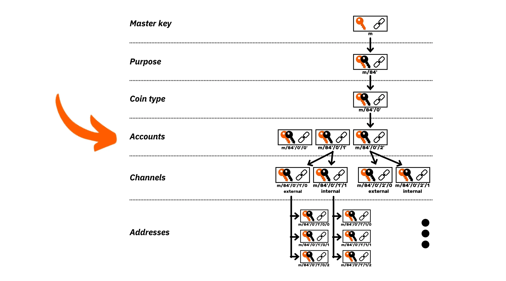


Het afleidingsdoel voor BIP47 wordt geïdentificeerd door de index `47'` (`0x8000002F`), verwijzend naar BIP47. Een voorbeeld van een afleidingspad voor een herbruikbare betaalcode zou er als volgt uitzien:


```plaintext
m/47'/0'/0'/
```


Om je een idee te geven van hoe een betaalcode eruitziet, zie je hier de mijne:


```plaintext
PM8TJSBiQmNQDwTogMAbyqJe2PE2kQXjtgh88MRTxsrnHC8zpEtJ8j7Aj628oUFk8X6P5rJ7P5qDudE4Hwq9JXSRzGcZJbdJAjM9oVQ1UKU5j2nr7VR5
```


Deze code kan ook worden gecodeerd als een QR-code, om de communicatie te vergemakkelijken, net als een conventionele ontvangst Address.


PayNym Bots, de robots die soms op Twitter te zien zijn, zijn visuele weergaven van de betalingscode, gemaakt door Samourai Wallet. Ze worden gegenereerd met een Hash functie, waardoor ze bijna uniek zijn. Ze hebben de vorm van een kleine tekenreeks die begint met `+` :


```plaintext
+throbbingpond8B1
+twilightresonance487
+billowingfire340
```


Deze avatars kunnen ook worden weergegeven als afbeeldingen:


Hoewel deze robots geen specifieke technische functionaliteit hebben binnen het BIP47 raamwerk, spelen ze wel een rol in het faciliteren van gebruikersinteractie door een gemakkelijk herkenbare visuele identiteit te bieden.


---
*In de volgende secties van dit hoofdstuk, gewijd aan BIP47, bekijken we in detail hoe het werkt, met de nadruk op de gebruikte cryptografische methoden. Om deze enigszins technische uitleg volledig te begrijpen, is het essentieel om eerst de structuur van HD wallets, sleutelafleidingsprocedures en de grondbeginselen van elliptische curve cryptografie te begrijpen. Als je dieper op deze concepten wilt ingaan, is er nog een gratis training beschikbaar op Plan ₿ Network :*


https://planb.network/courses/46b0ced2-9028-4a61-8fbc-3b005ee8d70f

*Ik raad je nog steeds aan om ze te volgen, want als je de technische werking van BIP47 begrijpt, wordt het veel gemakkelijker om andere, vergelijkbare voorstellen te begrijpen, die we in de volgende hoofdstukken zullen bespreken*


---
### De herbruikbare betaalcode


Zoals eerder vermeld, bevindt de herbruikbare betalingscode zich op diepte 3 van de HD Wallet, waardoor het vergelijkbaar is met een `xpub`, zowel wat betreft zijn positie in de Wallet structuur als zijn rol.


De 80-byte betalingscode is als volgt opgebouwd:


- Byte `0`: De **versie**. Voor de eerste versie van BIP47 is deze byte ingesteld op `0x01` ;
- Byte `1`: Het **bitveld**. Deze ruimte is gereserveerd voor het integreren van extra aanduidingen voor specifiek gebruik. Voor klassiek PayNym gebruik wordt deze byte op `0x00` gezet;
- De `2` byte: De pariteit van `y`. Deze byte is `0x02` of `0x03`, wat aangeeft of de ordinaat van de openbare sleutel even of oneven is, aangezien een gecomprimeerde openbare sleutel wordt gebruikt;
- Van byte `3` tot byte `34`: De waarde van `x`. Deze bytes vertegenwoordigen de abscis van de openbare sleutel. De aaneenschakeling van `x` en de pariteit van `y` vormt de volledige gecomprimeerde openbare sleutel;
- Van byte `35` tot byte `66`: De **stringcode**. Deze ruimte bevat de tekenreekscode die bij de openbare sleutel hoort;
- Van byte `67` tot byte `79`: De **opvulling**. Deze ruimte is bedoeld voor mogelijke toekomstige evoluties. Voor de huidige versie plaatsen we hier simpelweg nullen om de 80 bytes grootte te bereiken die nodig is voor `OP_RETURN` uitvoer.


Hier is de hexadecimale weergave van mijn herbruikbare betalingscode die ik al in de vorige sectie heb gepresenteerd:


```plaintext
0x010002a0716529bae6b36c5c9aa518a52f9c828b46ad8d907747f0d09dcd4d9a39e97c3c5f37c470c390d842f364086362f6122f412e2b0c7e7fc6e32287e364a7a36a00000000000000000000000000
```


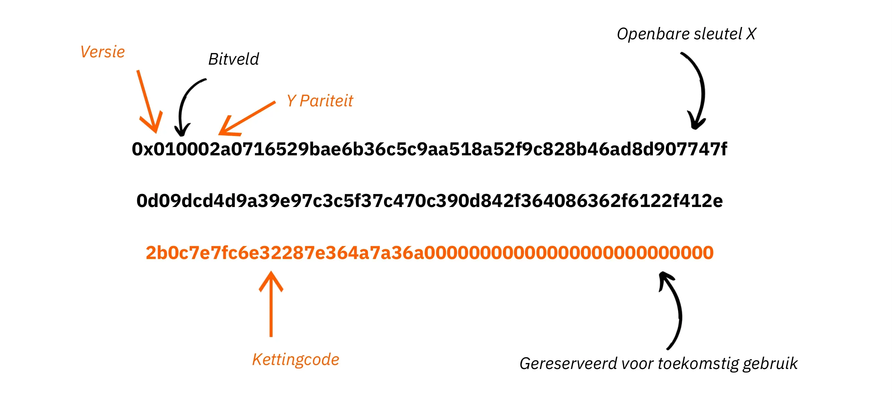


Vervolgens moet de `P` prefix byte aan het begin worden toegevoegd om duidelijk aan te geven dat dit een betaalcode is. Deze byte wordt weergegeven door `0x47` :


```plaintext
0x47010002a0716529bae6b36c5c9aa518a52f9c828b46ad8d907747f0d09dcd4d9a39e97c3c5f37c470c390d842f364086362f6122f412e2b0c7e7fc6e32287e364a7a36a00000000000000000000000000
```


Ten slotte wordt, om de integriteit van de betaalcode te waarborgen, een checksum berekening uitgevoerd met `HASH256`, die bestaat uit een dubbele Hash met behulp van de `SHA256` functie. De eerste vier bytes van deze Hash worden dan samengevoegd aan het einde van de betaalcode:


```plaintext
0x47010002a0716529bae6b36c5c9aa518a52f9c828b46ad8d907747f0d09dcd4d9a39e97c3c5f37c470c390d842f364086362f6122f412e2b0c7e7fc6e32287e364a7a36a00000000000000000000000000567080c4
```


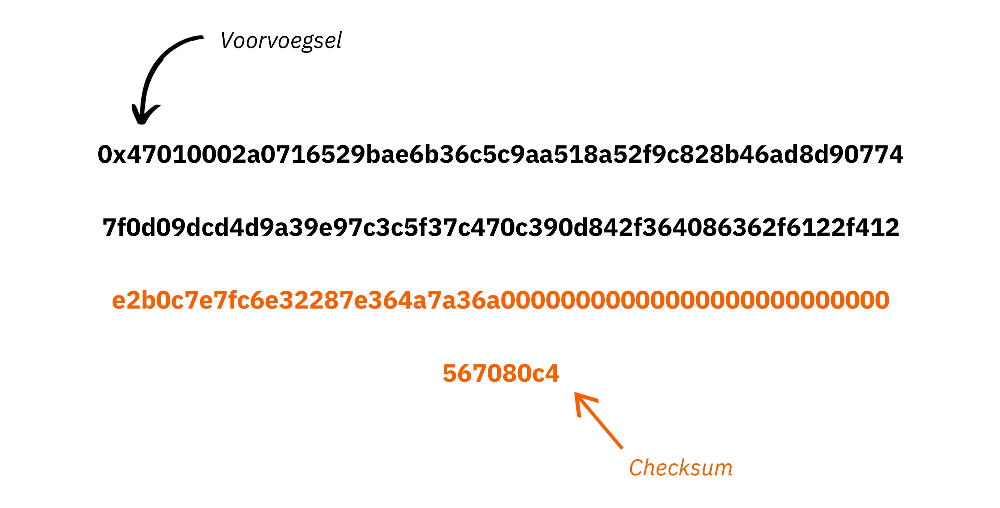


Zodra deze stappen zijn voltooid, is de betaalcode klaar. Je hoeft hem alleen nog maar om te zetten naar basis 58 om de definitieve versie te krijgen:


```plaintext
PM8TJSBiQmNQDwTogMAbyqJe2PE2kQXjtgh88MRTxsrnHC8zpEtJ8j7Aj628oUFk8X6P5rJ7P5qDudE4Hwq9JXSRzGcZJbdJAjM9oVQ1UKU5j2nr7VR5
```


Bij het aanmaken van de betaalcode gebruiken we een gecomprimeerde publieke sleutel en een stringcode. Beide worden deterministisch en hiërarchisch afgeleid van de Wallet seed. Het afleidingspad dat hiervoor wordt gebruikt, is :


```plaintext
m/47'/0'/0'/
```


Concreet, om generate de gecomprimeerde publieke sleutel en stringcode geassocieerd met de herbruikbare betalingscode te berekenen, beginnen we met het berekenen van de master private sleutel uit Wallet seed. Daarna leiden we een paar dochtersleutels af met de index `47 + 2^31` (versterkte afleiding). Dit wordt gevolgd door nog twee opeenvolgende afleidingen van dochterparen, elk met de index `2^31` (versterkte afleiding).


### Diffie-Hellman sleutel Exchange op elliptische krommen (ECDH)


Het cryptografische protocol in het hart van BIP47 staat bekend onder het acroniem ECDH, voor *Elliptic-Curve Diffie-Hellman*. Deze methode is een variant van de originele Diffie-Hellman sleutel Exchange.


Diffie-Hellman, geïntroduceerd in 1976, is een sleutelovereenkomstprotocol waarmee twee partijen, elk uitgerust met een sleutelpaar (openbaar en privé), het eens kunnen worden over een gemeenschappelijk geheim, zelfs als ze alleen communiceren via een openbaar, onbeveiligd kanaal.


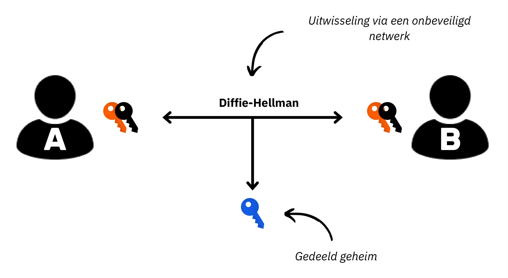


Dit gedeelde geheim (in dit geval de blauwe sleutel) kan dan gebruikt worden voor andere operaties. Dit gedeelde geheim kan bijvoorbeeld gebruikt worden om communicatie op een onbeveiligd netwerk te versleutelen en te ontsleutelen:


Om dit te bereiken gebruikt Diffie-Hellman modulaire rekenkunde om het gedeelde geheim te berekenen. Dit is hoe het werkt in lekentaal:


- Alice en Bob zijn het eens over een gemeenschappelijke kleur, in dit geval geel, wat openbare gegevens zijn (de aanvallers kennen deze kleur);
- Alice selecteert een geheime kleur, in dit geval rood, en mengt de twee om oranje te krijgen;
- Bob kiest ook een geheime kleur, in dit geval blauw, en mengt die met geel om Green te krijgen;
- Ze Exchange vervolgens de resulterende kleuren, oranje en Green. Dit Exchange kan plaatsvinden op een onveilig netwerk en geobserveerd worden door aanvallers;
- Door Bob's Green te mengen met haar eigen geheime kleur, Alice, ontstaat bruin;
- Bob, die hetzelfde doet met Alice's oranje en geheime blauw, krijgt ook bruin.


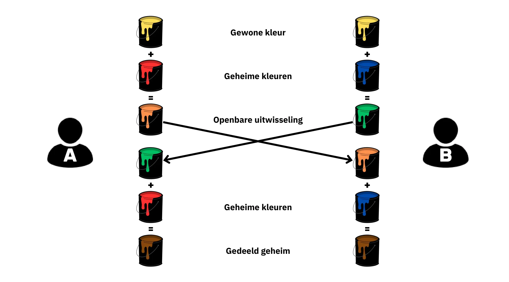


In deze popularisatie vertegenwoordigt de kleur bruin het geheim dat gedeeld wordt door Alice en Bob. Stel je voor dat het in werkelijkheid onmogelijk is voor de aanvaller om de kleuren oranje en Green te scheiden, om zo de geheime kleuren van Alice of Bob te vinden.


Laten we nu eens kijken hoe dit protocol eigenlijk werkt, niet met kleuranalogieën, maar met echte getallen en modulair rekenen!


Voordat we ons gaan verdiepen in de Diffie-Hellman mechanismen, wil ik u kort herinneren aan twee essentiële wiskundige concepten die we nodig hebben:


- Een **priemgetal** is een natuurlijk getal dat slechts twee delers heeft: $1$ en zichzelf. Bijvoorbeeld, $7$ is een priemgetal omdat het alleen kan worden gedeeld door $1$ en $7$. Anderzijds is $8$ geen priemgetal, omdat het deelbaar is door $1$, $2$, $4$ en $8$. Het heeft dus vier positieve gehele delers in plaats van twee;
- De **modulo** (ook wel $mod$ of $%$ genoemd) is een wiskundige bewerking die tussen twee gehele getallen de rest geeft van de Euclidische deling van de eerste door de tweede. Bijvoorbeeld: $16 modulo 5 = $1$.


**De Diffie-Hellman sleutel Exchange tussen Alice en Bob verloopt als volgt:**


- Alice en Bob zijn het eens over twee gemeenschappelijke getallen: $p$ en $g$. $p$ is een priemgetal en hoe groter het getal, hoe veiliger Diffie-Hellman zal zijn. $g$ is een primitieve wortel van $p$. Deze twee getallen kunnen ongecodeerd gecommuniceerd worden op een onbeveiligd netwerk. Ze vertegenwoordigen het equivalent van **de kleur geel** in de vorige popularisatie. Het is daarom belangrijk dat Alice en Bob precies dezelfde waarden voor $p$ en $g$ gebruiken.
- Zodra deze parameters zijn gedefinieerd, kiezen Alice en Bob elk een geheim willekeurig getal. Alice noemt haar geheime willekeurige getal $a$ (gelijk aan **de kleur rood**) en Bob noemt zijn getal $b$ (gelijk aan **de kleur blauw**). Deze getallen moeten geheim blijven.
- In plaats van de getallen $a$ en $b$ direct uit te wisselen, berekent elke partij $A$ en $B$ als volgt:


$A$ is gelijk aan $g$ verheven tot de macht $a$ modulo $p$ :


$$
A = g^a \bmod p
$$


$B$ is gelijk aan $g$ verheven tot de macht $b$ modulo $p$ :


$$
B = g^b \bmod p
$$


- De waarden $A$ (gelijk aan **de kleur oranje**) en $B$ (gelijk aan **de kleur Green**) worden uitgewisseld tussen de twee partijen. Deze Exchange kan in heldere tekst plaatsvinden op een onbeveiligd netwerk;
- Alice, die $B$ heeft ontvangen, berekent de waarde van $z$ als volgt:


$z$ is gelijk aan $B$ verheven tot de macht $a$ modulo $p$ :


$$
z = B^a \bmod p
$$


Een herinnering:


$$
B = g^b \bmod p
$$


Het resultaat is :


$$
z = B^a \bmod p
$$


$$
z = (g^b)^a \bmod p
$$


Door de machtsregels toe te passen :


$$
(x^n)^m = x^{nm}
$$


Het resultaat is :


$$
z = g^{ba} \bmod p
$$


- Bob van zijn kant, die $A$ heeft ontvangen, berekent ook de waarde van $z$ als volgt:


$z$ is gelijk aan $A$ verheven tot de macht $b$ modulo $p$ :


$$
z = A^b \bmod p
$$


Het resultaat is :


$$
z = (g^a)^b \bmod p
$$


$$
z = g^{ab} \bmod p
$$


$$
z = g^{ba} \bmod p
$$


Dankzij de distributiviteit van de modulo-operator krijgen Alice en Bob precies dezelfde waarde $z$. Dit getal vertegenwoordigt hun gemeenschappelijke geheim, gelijk aan **de kleur bruin** in de vorige popularisatie met verfblikken. Ze kunnen dit gemeenschappelijke geheim nu gebruiken om hun communicatie over een onbeveiligd netwerk symmetrisch te versleutelen.


Een aanvaller zal, zelfs als hij in het bezit is van $p$, $g$, $A$ en $B$ (de openbare waarden), niet in staat zijn om $a$, $b$ of $z$ (de privéwaarden) te berekenen. Om dit te bereiken zou de exponentiatie omgekeerd moeten worden, een operatie die onmogelijk is zonder alle mogelijkheden één voor één uit te proberen, omdat het neerkomt op het berekenen van de discrete logaritme, d.w.z. de reciproke van de exponentiaal in een eindige cyclische groep.


Dus zolang de waarden van $a$, $b$ en $p$ groot genoeg zijn, is het Diffie-Hellman protocol veilig. Met parameters van 2048 bits (een decimaal getal van 600 cijfers) zou het testen van alle mogelijkheden voor $a$ en $b$ onpraktisch zijn. Tot op heden wordt dit algoritme met dergelijke getallen als veilig beschouwd.


Hierin ligt het grootste nadeel van het Diffie-Hellman protocol. Om veilig te zijn, moet het algoritme grote getallen gebruiken. Daarom gebruiken we tegenwoordig liever het ECDH (*Elliptic Curve Diffie-Hellman*) algoritme, een variant van Diffie-Hellman gebaseerd op een algebraïsche curve, meer precies een elliptische curve. Deze aanpak maakt het mogelijk om met veel kleinere getallen te werken met behoud van een gelijkwaardige beveiliging, waardoor minder reken- en opslagmiddelen nodig zijn.


Het algemene principe van het algoritme blijft hetzelfde. Maar in plaats van een willekeurig getal $a$ en een getal $A$ berekend uit $a$ door modulaire exponentiatie, gebruiken we een sleutelpaar vastgesteld op een elliptische kromme. In plaats van te vertrouwen op de distributiviteit van de modulo operator, gebruiken we de groepswet op elliptische krommen, en meer precies de associativiteit van deze wet.


Om het principe van cryptografie op elliptische krommen kort uit te leggen: een privésleutel wordt voorgesteld door een willekeurig getal tussen $1$ en $n-1$, waarbij $n$ de orde van de kromme voorstelt. De publieke sleutel daarentegen is een specifiek punt op deze kromme, verkregen uit de private sleutel door punten van het genererende punt op te tellen en te verdubbelen, volgens de vergelijking :


$$
K = k \cdot G
$$


In deze formule duidt $K$ de openbare sleutel aan, $k$ de privésleutel en $G$ het generatorpunt.


Een essentieel kenmerk van deze sleutels is het gemak waarmee $K$ kan worden berekend uit $k$ en $G$, terwijl het vrijwel onmogelijk is om $k$ te vinden uit $K$ en $G$. Deze asymmetrie creëert een eenrichtingsfunctie. Met andere woorden, het is eenvoudig om de openbare sleutel te berekenen als je de privésleutel kent, maar het is onmogelijk om de privésleutel uit de openbare sleutel te halen. Deze veiligheid wordt verder ondersteund door de rekenmoeilijkheid van de discrete logaritme.


We zullen deze eigenschap gebruiken om ons Diffie-Hellman algoritme aan te passen. **Het werkingsprincipe van ECDH is als volgt:**


- Alice en Bob zijn het eens over een cryptografisch veilige elliptische curve en zijn parameters. Deze informatie is openbaar;
- Alice genereert een willekeurig getal $ka$ dat haar privésleutel wordt. Deze privésleutel moet geheim blijven. Ze bepaalt haar openbare sleutel $Ka$ door punten op de gekozen elliptische curve toe te voegen en te verdubbelen:


$$
K_a = k_a \cdot G
$$


- Bob genereert ook een willekeurig getal $kb$, dat zijn privésleutel wordt. Hij berekent de bijbehorende openbare sleutel $Kb$ :


$$
K_b = k_b \cdot G
$$


- Alice en Bob Exchange hun openbare sleutels $Ka$ en $Kb$ op een onbeveiligd openbaar netwerk.
- Alice berekent een punt $(x,y)$ op de curve door haar privésleutel $ka$ toe te passen op de openbare sleutel $Kb$ van Bob:


$$
(x,y) = k_a \cdot K_b
$$


- Bob berekent een punt $(x,y)$ op de curve door zijn privésleutel $kb$ toe te passen op de openbare sleutel $Ka$ van Alice:


$$
(x,y) = k_b \cdot K_a
$$


- Alice en Bob verkrijgen hetzelfde punt op de elliptische curve. Het gedeelde geheim is de abscis $x$ van dit punt.


Ze krijgen hetzelfde gedeelde geheim omdat :


$$
(x,y) = k_a \cdot K_b = k_a \cdot (k_b \cdot G) = (k_a \cdot k_b) \cdot G = (k_b \cdot k_a) \cdot G = k_b \cdot (k_a \cdot G) = k_b \cdot K_a
$$


Een potentiële aanvaller die het onbeveiligde openbare netwerk observeert, kan alleen de openbare sleutels van elk individu en de parameters van de gekozen elliptische curve verkrijgen. Zoals hierboven uitgelegd, is deze informatie alleen niet voldoende om de privésleutels te bepalen. Bijgevolg kan de aanvaller het gedeelde geheim tussen Alice en Bob niet vinden.


ECDH is daarom een Exchange sleutelalgoritme. Het wordt vaak gebruikt in combinatie met andere cryptografische methoden om een compleet protocol op te zetten. ECDH vormt bijvoorbeeld het hart van TLS (*Transport Layer Security*), een encryptie- en authenticatieprotocol dat gebruikt wordt voor het internettransport Layer. TLS gebruikt ECDHE voor sleutel Exchange, een variant van ECDH waarbij sleutels efemeer zijn, om aanhoudende vertrouwelijkheid te bieden. Daarnaast gebruikt TLS authenticatiealgoritmen zoals ECDSA, encryptiealgoritmen zoals AES en Hash functies zoals SHA256.


TLS is verantwoordelijk voor de `s` in `https` en het hangslotje in de Address balk van je browser - symbolen van versleutelde communicatie. Als je deze cursus volgt, gebruik je ECDH, en het is zeer waarschijnlijk dat je het dagelijks gebruikt zonder dat je het weet.


### De kennisgevingstransactie


Zoals we in de vorige sectie zagen, is ECDH een variant van de Diffie-Hellman Exchange waarbij sleutelparen op een elliptische curve worden gebruikt. Het is maar goed dat we al veel sleutelparen hebben die aan deze standaard voldoen in onze Bitcoin portemonnees! Het idee van BIP47 is om de sleutelparen van de hiërarchische deterministische Bitcoin wallets van beide partijen te gebruiken om gedeelde, kortstondige geheimen tussen hen vast te stellen. BIP47 gebruikt in plaats daarvan ECDHE (*Elliptic Curve Diffie-Hellman **Ephemeral***).


ECDHE wordt voor het eerst gebruikt in BIP47 om de betaalcode van de verzender naar de ontvanger te sturen. Dit is de beroemde **notificatietransactie**. Deze stap is essentieel omdat BIP47 alleen effectief kan werken als beide betrokken partijen (verzender en ontvanger) elkaars betaalcodes kennen. Deze kennis maakt het mogelijk om efemere publieke sleutels af te leiden en dus ook de bijbehorende lege ontvangstadressen.


Voorafgaand hieraan Exchange is de verzender logischerwijs al op de hoogte van de betaalcode van de ontvanger, omdat hij deze off-chain heeft opgehaald van bijvoorbeeld zijn of haar website, Invoice of sociale netwerken. De ontvanger is echter niet noodzakelijkerwijs op de hoogte van de betaalcode van de verzender. De code moet echter wel aan hem worden doorgegeven, anders kan hij niet de efemere sleutels afleiden die nodig zijn om de adressen te identificeren waar zijn bitcoins zijn opgeslagen, of toegang krijgen tot zijn geld. Hoewel deze overdracht van de code van de verzender technisch off-chain kan worden uitgevoerd via andere communicatiemiddelen, levert dit een probleem op als de Wallet alleen moet worden opgehaald uit de seed.


Dit komt omdat, in tegenstelling tot conventionele adressen, BIP47-adressen niet direct worden afgeleid van de seed van de ontvanger - het gebruik van een `xpub` zou in dit geval eenvoudiger zijn - maar het resultaat zijn van een berekening die de twee betaalcodes combineert: die van de verzender en die van de ontvanger. Dus, als de ontvanger zijn Wallet verliest en het probeert te herstellen vanuit zijn seed, zal hij zijn eigen betalingscode terugkrijgen, die direct is afgeleid van zijn seed. Om efemere adressen terug te krijgen, heeft hij echter ook de betaalcodes nodig van iedereen die hem bitcoins heeft gestuurd via BIP47. Vandaar het belang van de kennisgevingstransactie, die het mogelijk maakt om deze informatie op te slaan op de Bitcoin Blockchain, terwijl het nog steeds mogelijk is om het heel gemakkelijk terug te vinden zonder te hoeven zoeken in de miljard transacties die zijn uitgevoerd sinds de lancering in 2009.


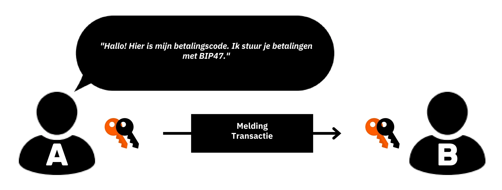


Het zou dus mogelijk zijn om BIP47 te implementeren zonder gebruik te maken van de kennisgevingstransactie, op voorwaarde dat elke gebruiker een back-up bijhoudt van de betalingscodes van zijn gelijken. Deze methode blijkt echter moeilijk te beheren totdat er een eenvoudige, robuuste en efficiënte oplossing is ontwikkeld voor het maken, opslaan en bijwerken van deze back-ups. In de huidige situatie is de kennisgevingstransactie bijna onvermijdelijk.


In de volgende hoofdstukken zullen we echter kijken naar andere protocollen met vergelijkbare doelstellingen als BIP47, maar die geen meldingstransactie vereisen. Deze alternatieven introduceren echter hun eigen afwegingen.


Naast het opslaan van betaalcodes heeft de kennisgevingstransactie ook een kennisgevingsfunctie voor de ontvanger, zoals de naam al aangeeft. Het waarschuwt de klant van de ontvanger dat er een nieuwe betalingstunnel is gemaakt en stelt voor dat hij of zij de resulterende efemere adressen in de gaten houdt.


### Het BIP47 vertrouwelijkheidsmodel


Alvorens in te gaan op de technische werking van de meldingstransactie, is het belangrijk om het vertrouwelijkheidsmodel van BIP47 te bespreken, dat bepaalde maatregelen bij het aanmaken van deze initiële transactie rechtvaardigt.


De betaalcode zelf vormt geen direct risico voor de vertrouwelijkheid. In tegenstelling tot het traditionele Bitcoin-model, dat de link tussen de identiteit van de gebruiker en zijn transacties (die openbaar zijn) wil verbreken door de anonimiteit van sleutels en adressen te bewaren, kan de betaalcode openlijk worden geassocieerd met een identiteit zonder een bedreiging te vormen.


Dit komt omdat de betaalcode niet wordt gebruikt om de adressen die BIP47-betalingen ontvangen rechtstreeks af te leiden. In plaats daarvan worden deze adressen via de ECDH-toepassing gegenereerd tussen de sleutels die zijn afgeleid van de betalingscodes van de twee betrokken partijen.


Een betaalcode op zich leidt dus niet direct tot verlies van vertrouwelijkheid, omdat alleen de melding Address ervan wordt afgeleid. Hoewel deze Address bepaalde informatie kan onthullen, onthult het normaal gesproken niet met welke partijen je een transactie doet, tenzij er een grondige ketenanalyse wordt uitgevoerd. Immers, als de verzender UTXO's gebruikt die aan zijn identiteit kunnen worden gekoppeld om de meldingstransactie uit te voeren, dan wordt het mogelijk om af te leiden dat zijn identiteit waarschijnlijk is gekoppeld aan BIP47-betalingen aan jouw betaalcode. Dit onthult niet de onderliggende transacties, maar geeft wel aan dat ze waarschijnlijk bestaan.


Het is daarom essentieel om deze strikte scheiding tussen de betalingscodes van gebruikers te handhaven. Met dit in gedachten is de eerste communicatie van de code een kritiek moment voor de vertrouwelijkheid van de betaling, maar wel een moment dat essentieel is voor de goede werking van het protocol. Als een van de betaalcodes openbaar kan worden verkregen (zoals op een website), mag de tweede code, die van de verzender, in geen geval worden gekoppeld aan de eerste.


Laten we een concreet voorbeeld nemen: Ik wil een donatie doen aan een politieke beweging via BIP47 :


- De organisatie heeft haar betaalcode openbaar gemaakt op haar website of via haar sociale netwerken;
- Deze code is daarom gekoppeld aan de politieke beweging;
- Ik krijg deze betalingscode ;
- Voordat ik een betaling verstuur, moet ik ervoor zorgen dat ze mijn eigen betaalcode kennen, die ook aan mijn identiteit is gekoppeld omdat ik deze gebruik om transacties te ontvangen op mijn sociale netwerken.


Hoe kan ik mijn code zonder risico doorgeven? Het gebruik van conventionele communicatiemiddelen zou kunnen leiden tot het uitlekken van informatie, waardoor ik geassocieerd zou worden met deze politieke beweging. De meldingstransactie biedt een oplossing, dankzij een Layer codering die precies zo'n associatie tussen twee codes voorkomt. Hoewel het niet de enige methode is om de betaalcode van de afzender stiekem te verzenden, is het een zeer effectieve methode.


In het onderstaande diagram geven de oranje lijnen de punten aan waar de informatiestroom moet worden onderbroken en de zwarte pijlen de verbindingen die mogelijk door derden kunnen worden waargenomen:


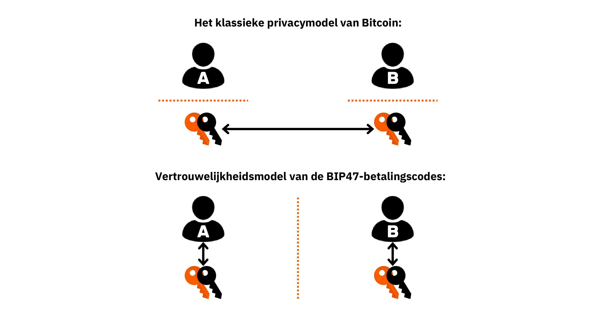


In werkelijkheid is het in het traditionele vertrouwelijkheidsmodel van Bitcoin vaak complex om de informatiestroom tussen het sleutelpaar en de gebruiker volledig te scheiden, vooral bij transacties op afstand. Bijvoorbeeld, in de context van een donatiecampagne moet de ontvanger onvermijdelijk een Address of publieke sleutel vrijgeven via zijn of haar website of sociale netwerken. Het juiste gebruik van BIP47, vooral bij de kennisgevingstransactie, maakt het mogelijk om dit probleem te omzeilen dankzij ECDHE en de Layer encryptie die we later zullen bekijken.


Natuurlijk is het klassieke vertrouwelijkheidsmodel van Bitcoin nog steeds van toepassing op efemere publieke sleutels, die zijn afgeleid van de combinatie van de twee betalingscodes. De twee modellen zijn in feite complementair. Wat ik hier wil benadrukken is dat, in tegenstelling tot het gebruikelijke gebruik van een publieke sleutel om Bitcoins te ontvangen, de betaalcode gekoppeld kan worden aan een specifieke identiteit, omdat de informatie "_Alice doet een transactie met Bob_" in een ander stadium verbroken wordt. De betaalcode wordt gebruikt voor generate betaaladressen, maar alleen gebaseerd op observatie van de Blockchain is het onmogelijk om een BIP47 betalingstransactie te koppelen aan de betaalcodes die gebruikt zijn om het uit te voeren, tenzij de betrokken UTXO's al eerder gekoppeld waren aan een identiteit en de gebruikers hun betaalcodes associeerden met hun respectievelijke identiteiten.


Kortom, het vertrouwelijkheidsmodel dat wordt aangeboden door BIP47 betalingen kan worden beschouwd als superieur aan het basismodel van Bitcoin, hoewel dit niet betekent dat het magisch is.


### De meldingstransactie bouwen


Laten we nu eens kijken hoe deze kennisgevingstransactie werkt. Stel dat Alice geld wil sturen naar Bob met behulp van BIP47. In mijn voorbeeld treedt Alice op als afzender en Bob als ontvanger. Bob heeft zijn betaalcode gepubliceerd op zijn website. Alice kent Bob's betaalcode dus al.


**1- Alice berekent een gedeeld geheim met ECDH :**


- Ze selecteert een sleutelpaar van haar HD Wallet op een andere tak dan haar betaalcode. Merk op dat dit paar niet gemakkelijk geassocieerd kan worden met Alice's kennisgeving Address, noch met Alice's identiteit (zie vorige sectie);
- Alice selecteert de privésleutel voor dit paar. We noemen het $a$ (kleine letters);


$$
a
$$


- Alice haalt de openbare sleutel op die hoort bij Bob's kennisgeving Address. Deze sleutel is het eerste kind dat is afgeleid van de betalingscode van Bob (index $/0$). We noemen deze openbare sleutel $B$ (hoofdletters). De privésleutel die bij deze openbare sleutel hoort, heet $b$ (kleine letters). $B$ wordt bepaald door het optellen en verdubbelen van punten op de elliptische curve van $G$ (het genererende punt) met $b$ (de privésleutel):


$$ B = b \dot G $$


- Alice berekent een geheim punt $S$ (hoofdletter) op de elliptische curve door punten op te tellen en te verdubbelen, waarbij ze haar privésleutel $a$ van Bob's openbare sleutel $B$ toepast.


$$ S = a \dot B $$


- Alice berekent de verblindingsfactor $f$ die gebruikt zal worden om haar betaalcode te versleutelen. Hiervoor gebruikt ze de HMAC-SHA512 functie om een pseudo-willekeurig getal te bepalen. De tweede invoer voor deze functie is een waarde die alleen Bob kan vinden: $x$, de abscis van het geheime punt dat hierboven is berekend. De eerste invoer is $o$, wat de UTXO is die als invoer voor deze transactie wordt gebruikt (uitvoerpunt).


$$ f = \text{HMAC-SHA512}(o, x) $$


**2 - Alice converteert haar persoonlijke betaalcode naar basis 2 (binair) **


**3- Het gebruikt deze verblindende factor als een sleutel om symmetrische versleuteling uit te voeren op de payload van zijn betaalcode.** Het gebruikte versleutelingsalgoritme is simpelweg een `XOR`. De uitgevoerde bewerking is vergelijkbaar met het Vernam-cijfer, ook bekend als "One-Time Pad".


- Alice splitst eerst haar verblindingsfactor in tweeën: de eerste 32 bytes heten $f1$ en de laatste 32 bytes heten $f2$. Dit geeft ons :


$$ f = f1 || f2 $$


- Alice berekent afzonderlijk de vercijfering $x'$ van de abscis van de openbare sleutel $x$ van haar betaalcode en de vercijfering $c'$ van haar stringcode $c$. respectievelijk $f1$ en $f2$ fungeren als cijfersleutels. De gebruikte operatie is `XOR` (of exclusief).


$$ x' = x \oplus f1 $$


$$ c' = c \oplus f2 $$


- Alice vervangt de werkelijke waarden van de openbare sleutel abscis $x$ en de stringcode $c$ in haar betalingscode door de versleutelde waarden $x'$ en $c'$.


**4-** Alice heeft dus op dit moment haar betalingscode met een versleutelde payload. Ze zal een transactie construeren en uitzenden met haar openbare sleutel $A$ als invoer, een uitvoer naar Bob's kennisgeving Address, en een uitvoer `OP_RETURN` bestaande uit haar betalingscode met de versleutelde lading. **Deze transactie is de kennisgevingstransactie**.


Een `OP_RETURN` is een opcode die de uitvoer van een Bitcoin transactie als ongeldig markeert. Tegenwoordig wordt het gebruikt om Anchor informatie over de Bitcoin Blockchain uit te zenden. Het kan tot 80 bytes aan data opslaan, die dan naar de ketting wordt geschreven en zichtbaar is voor alle andere gebruikers.


Zoals we in voorgaande secties hebben gezien, wordt ECDH gebruikt om generate een gedeeld geheim tussen twee gebruikers te communiceren over een onveilig netwerk, en mogelijk geobserveerd door aanvallers. In BIP47 wordt ECDH gebruikt om te communiceren op het Bitcoin netwerk, dat van nature een transparant communicatienetwerk is en door veel aanvallers kan worden geobserveerd. Het gedeelde geheim dat is berekend met de ECDH-sleutel Exchange wordt vervolgens gebruikt om de geheime informatie die moet worden verzonden te versleutelen: de betaalcode van de verzender (Alice).


Ik zal de stappen die we net hebben gezien samenvatten om een meldingstransactie uit te voeren:


- Alice haalt de betalingscode van Bob op en meldt Address;
- Alice selecteert een UTXO uit haar HD-portfolio met het bijbehorende sleutelpaar;
- Het berekent een geheim punt op de elliptische curve met ECDH ;
- Het gebruikt dit geheime punt om een HMAC te berekenen, wat de verblindingsfactor is;
- Ze gebruikt deze verblindende factor om de payload van haar persoonlijke betaalcode te versleutelen;
- Het gebruikt een `OP_RETURN` transactie-uitgang om de verborgen betalingscode door te geven aan Bob.


### Transactiemelding: een praktische studie


Om meer in detail te begrijpen hoe het werkt, en in het bijzonder het gebruik van `OP_RETURN`, laten we eens kijken naar een echte meldingstransactie. Ik heb een dergelijke transactie uitgevoerd op de Testnet, die je kunt vinden [door hier te klikken] (https://Mempool.space/fr/Testnet/tx/0e2e4695a3c49272ef631426a9fd2dae6ec3a469e3a39a3db51aa476cd09de2e).


Als we naar deze transactie kijken, kunnen we al zien dat deze een enkele ingang en 4 uitgangen heeft:


- De eerste uitvoer is de `OP_RETURN` die mijn verborgen betalingscode bevat;
- De tweede uitgang van 546 Sats wijst naar de melding Address van mijn ontvanger;
- De derde output van 15.000 Sats vertegenwoordigt de servicekosten, omdat ik Samourai Wallet heb gebruikt om deze transactie te bouwen;
- De vierde uitgang van 2 miljoen Sats vertegenwoordigt het Exchange tarief, d.w.z. het resterende verschil in mijn input dat terugkeert naar een andere Address die van mij is.


De meest interessante om te bestuderen is natuurlijk uitvoer 0 met `OP_RETURN`. Laten we eens kijken wat er in staat. Hier is de `scriptPubKey` in hexadecimale :


```text
6a4c50010002b13b2911719409d704ecc69f74fa315a6cb20fdd6ee39bc9874667703d67b164927b0e88f89f3f8b963549eab2533b5d7ed481a3bea7e953b546b4e91b6f50d800000000000000000000000000
```


Dit script bestaat uit verschillende delen. Ten eerste de :


```text
6a4c
```


Onder de opcodes kunnen we `0x6a` herkennen die de `OP_RETURN` aanduidt en `0x4c` die de `OP_PUSHDATA1` aanduidt.


De byte na deze laatste opcode geeft de grootte van de volgende payload aan. Het geeft `0x50` aan, of 80 bytes:


```text
6a4c50
```


Vervolgens hebben we de metagegevens van mijn betaalcode in duidelijke tekst:


```text
010002
```


De versleutelde abscis van de openbare sleutel van mijn betaalcode :


```text
b13b2911719409d704ecc69f74fa315a6cb20fdd6ee39bc9874667703d67b164
```


De gecodeerde stringcode van mijn betalingscode :


```text
927b0e88f89f3f8b963549eab2533b5d7ed481a3bea7e953b546b4e91b6f50d8
```


En tenslotte opvullen tot 80 bytes, de standaardgrootte van een `OP_RETURN` :


```text
00000000000000000000000000
```


Om je te helpen begrijpen, is hier mijn betalingscode in platte tekst in basis 58 :


```text
PM8TJQCyt6ovbozreUCBrfKqmSVmTzJ5vjqse58LnBzKFFZTwny3KfCDdwTqAEYVasn11tTMPc2FJsFygFd3YzsHvwNXLEQNADgxeGnMK8Ugmin62TZU
```


En in basis 16 :


```text
4701000277507c9c17a89cfca2d3af554745d6c2db0e7f6b2721a3941a504933103cc42add94881210d6e752a9abc8a9fa0070e85184993c4f643f1121dd807dd556d1dc000000000000000000000000008604e4db
```


Als we mijn plaintext betaalcode vergelijken met de `OP_RETURN`, zien we dat de HRP (`0x47`) en de checksum (`0x8604e4db`) niet worden verzonden. Dit is normaal, omdat deze informatie bedoeld is voor mensen.


Vervolgens herkennen we de versie (`0x01`), het bitveld (`0x00`) en de pariteit van de publieke sleutel (`0x02`). En, aan het einde van de betalingscode, de lege bytes (`0x00000000000000000000000000`) die opvulling mogelijk maken tot een totaal van 80 bytes. Al deze metadata wordt onversleuteld verzonden.


Tot slot kunnen we zien dat de openbare sleutel abscis (`0x77507c9c17a89cfca2d3af554745d6c2db0e7f6b2721a3941a504933103cc42a`) en de stringcode (`0xdd94881210d6e752a9abc8a9fa0070e85184993c4f643f1121dd807dd556d1dc`) zijn versleuteld. Dit is de payload van de betaalcode.


### Wat is XOR?


We hebben in de vorige secties gezien dat de betalingscode versleuteld wordt verzonden met behulp van de XOR-operatie. Laten we eens nader bekijken hoe deze operator werkt, aangezien deze veel wordt gebruikt in cryptografie.


XOR is een bitwise logische operator gebaseerd op Booleaanse algebra. Gegeven twee operanden in bits, retourneert het `1` als de bits van dezelfde rang verschillend zijn, en het retourneert `0` als de bits van dezelfde rang gelijk zijn. Hier is de XOR waarheidstabel volgens de waarden van de operanden `D` en `E` :


| D | E | D XOR E |
| --- | --- | ------- |
| 0 | 0 | 0 |
| 0 | 1 | 1 |
| 1 | 0 | 1 |
| 1 | 1 | 0 |

Bijvoorbeeld:


$$
0110 \oplus 1110 = 1000
$$


Of :


$$
010011 \oplus 110110 = 100101
$$


Met ECDH is het gebruik van XOR als versleuteling Layer bijzonder consistent. Ten eerste is de versleuteling dankzij deze operator symmetrisch. Dit betekent dat de ontvanger de betalingscode kan decoderen met dezelfde sleutel die is gebruikt voor de codering. De encryptie- en decryptiesleutels worden berekend op basis van het gedeelde geheim met behulp van ECDH. Deze symmetrie wordt mogelijk gemaakt door de commutativiteits- en associativiteitseigenschappen van de XOR-operator:


- Andere eigenschappen :


$$
D \oplus D = 0
$$


$$
D \oplus 0 = D
$$


- Commutativiteit :


$$
D \oplus E = E \oplus D
$$


- Associativiteit :


$$
D \oplus (E \oplus Z) = (D \oplus E) \oplus Z = D \oplus E \oplus Z
$$


Als :


$$
D \oplus E = L
$$


Dan :


$$
D \oplus L = D \oplus (D \oplus E) = D \oplus D \oplus E = 0 \oplus E = E \\
\therefore D \oplus L = E
$$


Ten tweede lijkt deze versleutelingsmethode erg op het Vernam (One-Time Pad) cijfer, het enige tot nu toe bekende versleutelingsalgoritme dat onvoorwaardelijke (of absolute) veiligheid biedt. Om Vernam's cijfer deze eigenschap te geven, moet de encryptiesleutel perfect willekeurig zijn, even groot als het bericht en slechts één keer gebruikt worden. In de vercijferingsmethode die hier wordt gebruikt voor BIP47 is de sleutel inderdaad even groot als het bericht en is de verblindingsfactor precies even groot als de aaneenschakeling van de abscis van de publieke sleutel met de stringcode van de betalingscode. Deze coderingssleutel wordt slechts één keer gebruikt. Aan de andere kant is deze sleutel niet afgeleid van een perfecte willekeur, aangezien het een HMAC is. Het is eerder pseudo-willekeurig. Het is dus geen Vernam-cijfer, maar de methode komt in de buurt.


### Ontvangst van melding transactie


Nu Alice de kennisgevingstransactie naar Bob heeft gestuurd, laten we eens kijken hoe Bob deze interpreteert. Ter herinnering, Bob moet toegang hebben tot Alice's betalingscode. Zonder deze informatie, zoals we in de volgende paragraaf zullen zien, zal hij niet in staat zijn om de sleutelparen af te leiden die Alice heeft gemaakt, en zal hij dus geen toegang hebben tot zijn bitcoins die hij via BIP47 heeft ontvangen. Op dit moment is de payload van Alice's betalingscode versleuteld. Laten we eens kijken hoe Bob het ontcijfert.


**1-** Bob bewaakt transacties die uitgangen creëren met zijn melding Address.


**2-** Wanneer een transactie een Address uitvoer op haar melding heeft, analyseert Bob deze om te zien of ze een OP_RETURN uitvoer bevat die voldoet aan de BIP47 standaard.


**3-** Als de eerste byte van de OP_RETURN payload `0x01` is, begint Bob zijn zoektocht naar een mogelijk geheim gedeeld met ECDH :


- Bob selecteert de openbare sleutel voor de transactie. Dat wil zeggen, Alice's openbare sleutel genaamd $A$ met :


$$ A = a \dot G $$


- Bob selecteert de privésleutel $b$ die geassocieerd is met zijn persoonlijke melding Address :


$$ b $$


- Bob berekent het geheime punt $S$ (gedeeld geheim ECDH) op de elliptische curve door punten op te tellen en te verdubbelen, waarbij hij zijn privésleutel $b$ toepast op de openbare sleutel $A$ van Alice:


$$ S = b \dot A $$


- Bob bepaalt de verblindingsfactor $f$ waarmee de payload van Alice's betalingscode kan worden ontcijferd. Op dezelfde manier als Alice het eerder had berekend, zal Bob $f$ vinden door HMAC-SHA512 toe te passen op $x$, de absciswaarde van het geheime punt $S$, en op $o$, de UTXO die als invoer voor deze kennisgevingstransactie heeft gebruikt:


$$ f = \text{HMAC-SHA512}(o, x) $$


**4-** Bob interpreteert de OP_RETURN gegevens in de kennisgevingstransactie als een betalingscode. Hij zal de payload van deze potentiële betaalcode eenvoudig ontsleutelen met behulp van de $f$ verblindingsfactor:


- Bob splitst de verblindingsfactor $f$ in 2 delen: de eerste 32 bytes van $f$ zijn $f1$ en de laatste 32 bytes zijn $f2$ ;
- Bob decodeert de waarde van de gecodeerde abscis $x'$ uit de openbare sleutel van de betalingscode van Alice:


$$ x = x' \oplus f1 $$


- Bob decodeert de waarde van de gecodeerde tekenreekscode $c'$ van de betalingscode van Alice:


$$ c = c' \oplus f2 $$


**5-** Bob controleert of de publieke sleutelwaarde van Alice's betaalcode deel uitmaakt van de secp256k1 groep. Zo ja, dan interpreteert hij dit als een geldige betaalcode. Zo niet, dan negeert hij de transactie.


Nu Bob de betalingscode van Alice kent, kan Alice hem tot `2^32` betalingen sturen, zonder ooit een kennisgevingstransactie van dit type te hoeven herhalen.


Waarom werkt het? Hoe kan Bob dezelfde verblindingsfactor bepalen als Alice, en zo haar betaalcode ontcijferen? Laten we de actie van ECDH eens nader bekijken in wat we zojuist beschreven hebben.


Allereerst hebben we te maken met symmetrische encryptie. Dit betekent dat de encryptiesleutel en de decryptiesleutel dezelfde waarde hebben. Deze sleutel in de kennisgevingstransactie is de verblindende factor:


$$ f = f1 || f2 $$


Alice en Bob moeten daarom dezelfde waarde voor $f$ verkrijgen, zonder deze direct te verzenden, omdat een aanvaller deze zou kunnen stelen en de geheime informatie zou kunnen ontsleutelen. Deze verblindingsfactor wordt verkregen door HMAC-SHA512 toe te passen op 2 waarden:


- de abscis van een geheim punt ;
- en de UTXO verbruikt bij de transactie-ingang.


Bob heeft daarom deze beide stukjes informatie nodig om de payload van Alice's betalingscode te ontsleutelen. Voor de invoer UTXO kan Bob deze eenvoudig achterhalen door de kennisgevingstransactie te observeren. Voor het geheime punt zal Bob ECDH moeten gebruiken. Zoals gezien in de vorige sectie over Diffie-Hellman, kunnen Alice en Bob door eenvoudigweg hun respectievelijke publieke sleutels uit te wisselen en in het geheim hun private sleutels toe te passen op elkaars publieke sleutel, een nauwkeurig geheim punt vinden op de elliptische curve. De kennisgevingstransactie is gebaseerd op dit mechanisme:


- Bob's sleutelpaar :


$$ B = b \dot G $$


- Alice's sleutelpaar :


$$ A = a \dot G $$


- Voor een geheim $S (x, y)$ :


$$ S = a \dot B = a \dot (b \dot G) = (b \dot a) \dot G = b \dot A $$


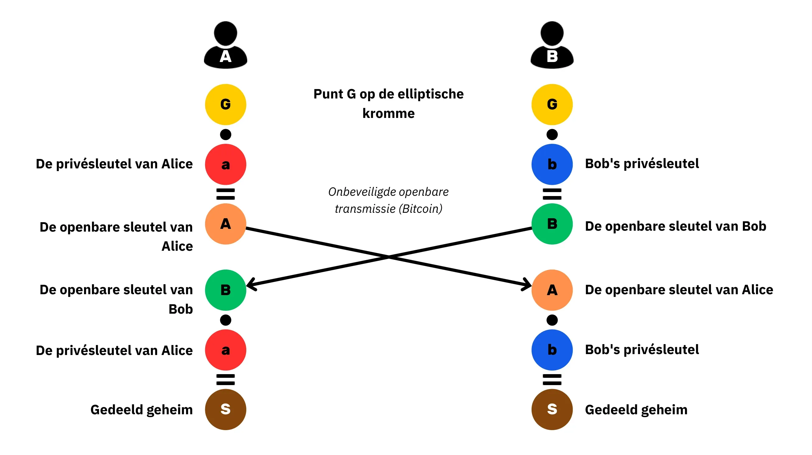


Nu Bob Alice's betalingscode kent, kan hij haar BIP47-betalingen opsporen en de privésleutels afleiden die de ontvangen bitcoins blokkeren.


Ik zal de stappen samenvatten die we zojuist hebben gezien om een meldingstransactie te ontvangen en te interpreteren:


- Bob controleert de uitvoer van transacties naar zijn melding Address;
- Wanneer het er een detecteert, haalt het de informatie uit de OP_RETURN;
- Bob selecteert de openbare sleutel als invoer en berekent een geheim punt met ECDH ;
- Het gebruikt dit geheime punt om een HMAC te berekenen, wat de verblindingsfactor is;
- Het gebruikt deze verblindende factor om de betalingscode payload van Alice in OP_RETURN te ontsleutelen.


### De BIP47-betalingstransactie


Laten we eens kijken naar het betalingsproces met BIP47. Om u te herinneren aan de huidige situatie :


- Alice kent de betalingscode van Bob, die ze eenvoudigweg van zijn website heeft gehaald;
- Bob kent de betalingscode van Alice van de aanmeldingstransactie;
- Alice doet haar eerste betaling aan Bob. Ze kan er op dezelfde manier nog veel meer doen.


Voordat ik dit proces uitleg, denk ik dat het belangrijk is om te onthouden aan welke indexen we op dit moment werken. Het afleidingspad voor een betaalcode wordt als volgt beschreven: `m/47'/0'/0'`. De volgende diepte verdeelt de indexen als volgt:


- Het eerste normale (niet-versterkte) dochterpaar is het paar dat gebruikt is voor generate de melding Address besproken in de vorige sectie: `m/47'/0'/0'/0` ;
- Normale dochter sleutelparen worden gebruikt binnen ECDH om generate BIP47 betalingsontvangst adressen, zoals we zullen zien in deze sectie: van `m/47'/0'/0'/0` tot `m/47'/0'/0'/2,147,483,647` ;
- Versterkte dochtersleutelparen zijn kortstondige betalingscodes: van `m/47'/0'/0'/0'` tot `m/47'/0'/0'/2,147,483,647'`.


Elke keer dat Alice een betaling naar Bob wil sturen, leidt ze een nieuwe, unieke, lege Address af, wederom met behulp van het ECDH-protocol:


- Alice selecteert de eerste private sleutel die is afgeleid van haar persoonlijke herbruikbare betaalcode :


$$ a $$


- Alice selecteert de eerste ongebruikte openbare sleutel die is afgeleid van de betalingscode van Bob. We noemen deze openbare sleutel $B$. Deze wordt geassocieerd met de privésleutel $b$ die alleen Bob kent:


$$ B = b \dot G $$


- Alice berekent een geheim punt $S$ op de elliptische curve door punten op te tellen en te verdubbelen door haar privésleutel $a$ van de openbare sleutel $B$ van Bob toe te passen:


$$ S = a \dot B $$


- Uit dit geheime punt berekent Alice het gedeelde geheim $s$ (kleine letters). Hiervoor selecteert ze de abscis van het geheime punt $S$ genaamd $Sx$, en geeft deze waarde door aan de SHA256 Hash functie:


$$ S = (Sx, Sy) $$


$$ s = \text{SHA256}(Sx) $$


- Alice gebruikt dit gedeelde geheim $s$ om een ontvangstbetaling Address voor Bitcoin te berekenen. Eerst controleert ze of $s$ in de orde van de secp256k1-curve zit. Als dit niet het geval is, verhoogt ze de openbare sleutelindex van Bob om een ander gedeeld geheim af te leiden;
- In een tweede stap berekent ze een openbare sleutel $K0$ door de punten $B$ en $s-G$ op de elliptische curve bij elkaar op te tellen. Met andere woorden, Alice voegt de openbare sleutel die is afgeleid van Bob's betalingscode $B$ toe aan een ander punt dat is berekend op de elliptische curve door punten toe te voegen en te verdubbelen met het gedeelde geheim $s$ van het secp256k1 curve generator punt $G$. Dit nieuwe punt vertegenwoordigt een openbare sleutel en we noemen het $K0$ :


$$ K0 = B + s ≤ G $$


- Met deze openbare sleutel $K0$ kan Alice op de standaardmanier een lege ontvangst van Address afleiden (bijv. SegWit V0 in bech32).


Zodra Alice de $K0$ ontvangende Address van Bob heeft verkregen, kan ze op de standaardmanier een Bitcoin transactie uitvoeren. Om dit te doen, kiest ze een UTXO die ze bezit, beveiligd door een sleutelpaar van een andere tak van haar HD Wallet, en verbruikt het om een uitvoer naar Bob's $K0$ Address te voldoen. Het is belangrijk op te merken dat deze betaling, zodra de Address is afgeleid, een klassiek proces volgt en niet langer afhankelijk is van de sleutels die geassocieerd zijn met de BIP47.


Ik zal de stappen samenvatten die we net hebben gezien om een BIP47-betaling te verzenden:


- Alice selecteert de eerste dochterprivésleutel die is afgeleid van haar persoonlijke betaalcode;
- Het berekent een geheim punt op de elliptische curve met behulp van ECDH uit de eerste ongebruikte dochter openbare sleutel die is afgeleid van de betaalcode van Bob;
- Het gebruikt dit geheime punt om een gedeeld geheim te berekenen met SHA256 ;
- Ze gebruikt dit gedeelde geheim om een nieuw geheim punt op de elliptische curve te berekenen;
- Ze voegt dit nieuwe geheime punt toe aan de publieke sleutel van Bob;
- Ze verkrijgt een nieuwe efemere publieke sleutel waarvan alleen Bob de bijbehorende privésleutel heeft;
- Alice kan een klassieke transactie maken naar Bob met de afgeleide efemere ontvangst Address.


Als Alice een tweede betaling wil doen, volgt ze dezelfde stappen als voorheen, behalve dat ze deze keer de tweede publieke sleutel selecteert die is afgeleid van de betalingscode van Bob. Om precies te zijn, gebruikt ze de eerstvolgende ongebruikte sleutel. Zo verkrijgt ze een nieuwe ontvangende Address van Bob, genaamd $K1$ :


Het kan op deze manier doorgaan en tot `2^32` lege adressen van Bob afleiden.


Van buitenaf gezien, kijkend naar de Blockchain, is het theoretisch onmogelijk om een BIP47 betaling te onderscheiden van een conventionele betaling. Hier is een voorbeeld van een BIP47 betalingstransactie op de Testnet:


```text
94b2e59510f2e1fa78411634c98a77bbb638e28fb2da00c9f359cd5fc8f87254
```


Het ziet eruit als een klassieke transactie met een verbruikte invoer, een betalingsuitvoer en een Exchange-tarief:


### Ontvangst van BIP47-betaling en afleiden van privésleutel


Alice heeft zojuist haar eerste betaling gedaan aan een lege BIP47 Address van Bob. Laten we nu eens kijken hoe Bob deze betaling ontvangt. We zullen ook zien waarom Alice geen toegang heeft tot de private sleutel van de Address die ze zojuist zelf heeft gegenereerd, en hoe Bob deze sleutel vindt om de bitcoins uit te geven die hij zojuist heeft ontvangen.


Zodra Bob de kennisgevingstransactie van Alice ontvangt, leidt hij de openbare sleutel BIP47 $K0$ af, nog voordat zijn correspondent een betaling heeft verzonden. Hij neemt dus elke betaling aan de geassocieerde Address waar. In feite leidt hij onmiddellijk verschillende adressen af die hij observeert ($K0$, $K1$, $K2$, $K3$...). Dit is hoe hij deze publieke sleutel $K0$ afleidt:


- Bob selecteert de eerste dochterprivésleutel die is afgeleid van zijn betalingscode. Deze privésleutel krijgt de naam $b$. Deze is gekoppeld aan de openbare sleutel $B$ waarmee Alice haar berekeningen in de vorige stap heeft gemaakt:


$$ b $$


- Bob selecteert de eerste openbare sleutel van Alice, afgeleid van haar betalingscode. Deze sleutel krijgt de naam $A$. Hij wordt geassocieerd met de privésleutel $a$ waarmee Alice haar berekeningen heeft gemaakt en die alleen Alice kent. Bob kan dit proces uitvoeren, omdat hij de betalingscode van Alice kent, die hem werd toegestuurd bij de kennisgevingstransactie:


$$ A = a \dot G $$


- Bob berekent het geheime punt $S$, door punten op de elliptische curve op te tellen en te verdubbelen, door zijn private sleutel $b$ toe te passen op Alice's publieke sleutel $A$. Ook hier wordt ECDH gebruikt om te garanderen dat dit punt $S$ hetzelfde zal zijn voor zowel Bob als Alice:


$$ S = b \dot A $$


- Op dezelfde manier als Alice isoleert Bob de abscis van dit punt $S$. We hebben deze waarde $Sx$ genoemd. Hij geeft deze waarde door aan de SHA256 functie om het gedeelde geheim $s$ (kleine letters) te vinden:


$$ s = \text{SHA256}(Sx) $$


- Op dezelfde manier als Alice berekent Bob het $s-G$ punt op de elliptische curve. Vervolgens voegt hij dit geheime punt toe aan zijn openbare sleutel $B$. Hij verkrijgt dan een nieuw punt op de elliptische curve, dat hij interpreteert als een publieke sleutel $K0$ :


$$ K0 = B + s ≤ G $$


Zodra Bob deze publieke sleutel $K0$ heeft, kan hij de bijbehorende privésleutel afleiden om zijn bitcoins uit te geven. Alleen hij kan deze privésleutel generate:


- Bob telt de privésleutel $b$ van zijn dochter op, afgeleid van zijn persoonlijke betaalcode. Alleen hij kan de waarde van $b$ krijgen. Vervolgens telt hij $b$ op bij het gedeelde geheim $s$ om $k0$, de privésleutel van $K0$, te verkrijgen:


$$ k0 = b + s $$


Dankzij de groepswet van de elliptische curve verkrijgt Bob precies de private sleutel die overeenkomt met de publieke sleutel die Alice heeft gebruikt. We hebben dus :


$$ K0 = k0 \dot G $$


Ik zal de stappen samenvatten die we zojuist hebben gezien om een BIP47 betaling te ontvangen en de bijbehorende privésleutel te berekenen:


- Bob selecteert de eerste dochterprivésleutel die is afgeleid van zijn persoonlijke betaalcode;
- Het berekent een geheim punt op de elliptische curve met behulp van ECDH uit de eerste openbare dochtersleutel die is afgeleid van de stringcode van Alice;
- Het gebruikt dit geheime punt om een gedeeld geheim te berekenen met SHA256 ;
- Hij gebruikt dit gedeelde geheim om een nieuw geheim punt op de elliptische curve te berekenen;
- Hij voegt dit nieuwe geheime punt toe aan zijn persoonlijke openbare sleutel;
- Hij verkrijgt een nieuwe efemere publieke sleutel, de sleutel waarnaar Alice haar eerste betaling zal sturen;
- Bob berekent de privésleutel die bij deze efemere openbare sleutel hoort door zijn dochterprivésleutel, afgeleid van zijn betaalcode, en het gedeelde geheim bij elkaar op te tellen.


Aangezien Alice niet aan $b$ (de privésleutel van Bob) kan komen, is ze niet in staat om $k0$ (de privésleutel van Bob's BIP47-ontvangst Address) te bepalen. Schematisch kunnen we de berekening van het gedeelde geheim $S$ als volgt weergeven:


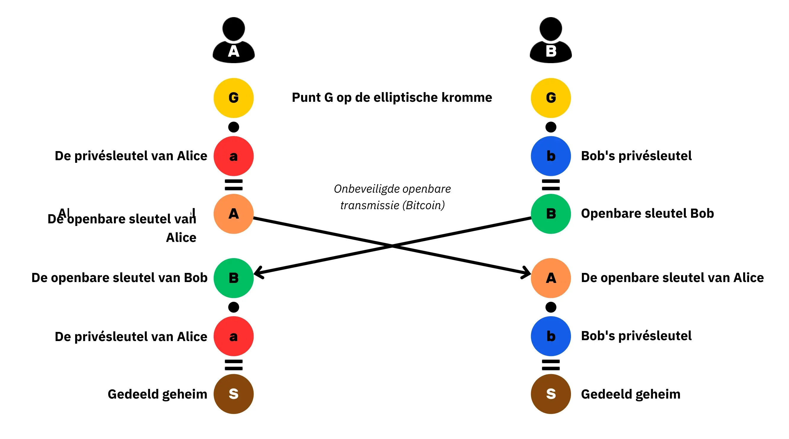


Zodra het gedeelde geheim is gevonden met ECDH, berekenen Alice en Bob de openbare sleutel $K0$ van de BIP47-betaling, en Bob berekent ook de bijbehorende privésleutel $k0$ :


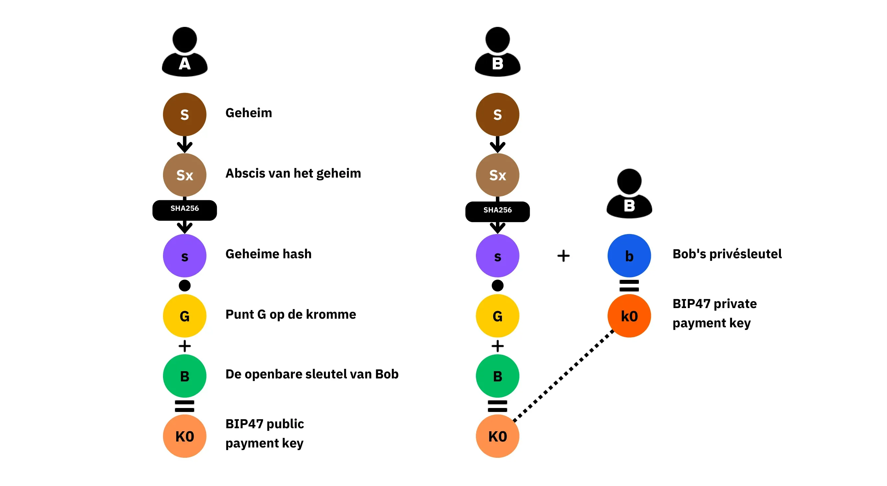


### Terugbetaling van BIP47-betaling


Omdat Bob de herbruikbare betalingscode van Alice kent, heeft hij al alle informatie die hij nodig heeft om haar een restitutie te sturen. Hij hoeft niet opnieuw contact op te nemen met Alice om informatie te vragen. Hij hoeft haar alleen maar op de hoogte te stellen met een kennisgevingstransactie, zodat ze haar BIP47-adressen kan ophalen met haar seed, en dan kan hij haar ook tot `2^32` betalingen sturen.


De terugbetalingsfunctie is specifiek voor BIP47 en is een van de voordelen ten opzichte van andere methoden, zoals Stille Betalingen, die we in latere hoofdstukken zullen bekijken.


Bob kan Alice dan terugbetalen op dezelfde manier waarop zij hem betalingen stuurde. De rollen zijn omgedraaid:


*Veel dank aan [Fanis Michalakis](https://x.com/FanisMichalakis) voor zijn proeflezen en deskundig advies over het artikel dat de inspiratie vormde voor het schrijven van dit hoofdstuk!*


https://planb.network/tutorials/privacy/on-chain/paynym-bip47-a492a70b-50eb-4f95-a766-bae2c5535093

## Stille betalingen


<chapterId>2871d594-414e-4598-a830-91c9eb84dfb8</chapterId>


BIP47 is alom bekritiseerd vanwege de onchain inefficiëntie. Zoals uitgelegd in het vorige hoofdstuk, moet er voor elke nieuwe ontvanger een kennisgevingstransactie worden uitgevoerd. Deze beperking wordt verwaarloosbaar als we van plan zijn om een duurzaam betalingskanaal met deze ontvanger op te zetten. Een enkele kennisgevingstransactie maakt de weg vrij voor een bijna oneindig aantal volgende BIP47 betalingen.


In bepaalde situaties kan de meldingstransactie echter een obstakel vormen voor de gebruiker. Laten we het voorbeeld nemen van een eenmalige donatie aan een ontvanger: met een klassieke Bitcoin Address is een enkele transactie voldoende om de donatie te voltooien. Maar met BIP47 zijn er twee transacties nodig: één voor de melding en één voor de daadwerkelijke betaling. Wanneer de vraag naar blokruimte laag is en de transactiekosten laag, is deze extra stap meestal geen probleem. In tijden van congestie kunnen de transactiekosten echter exorbitant hoog worden voor een enkele betaling, waardoor de kosten voor de gebruiker mogelijk verdubbelen in vergelijking met een standaard Bitcoin transactie, wat onaanvaardbaar kan blijken voor de gebruiker.


Voor situaties waarin de gebruiker slechts enkele betalingen aan een statische identifier wil doen, zijn andere oplossingen ontwikkeld. Deze omvatten Stille Betalingen, beschreven in [BIP352] (https://github.com/Bitcoin/bips/blob/master/bip-0352.mediawiki). Dit protocol maakt het mogelijk om een statische identifier te gebruiken om betalingen te ontvangen zonder Address hergebruik te produceren en zonder het gebruik van kennisgevingstransacties te vereisen. Laten we eens kijken hoe dit protocol werkt.


---
*Om dit hoofdstuk volledig te begrijpen, is het essentieel om de werking van ECDH (Elliptic Curve Diffie-Hellman) en cryptografische sleutelafleiding in een HD Wallet te beheersen. Deze concepten zijn in detail behandeld in het vorige hoofdstuk over BIP47. Ik zal ze hier niet herhalen. Als je nog niet bekend bent met deze concepten, raad ik je aan het vorige hoofdstuk te raadplegen voordat je verder gaat met dit hoofdstuk. Ik zal niet terugkomen op de risico's die verbonden zijn aan het hergebruik van ontvangstadressen, noch op het belang van het hebben van een unieke identificatiecode voor het ontvangen van betalingen.* Ik noem alleen een paar punten die ik hier naar voren wil brengen


---
### Waarom verplaatsen we de melding niet?


Zoals besproken in het hoofdstuk BIP47, heeft de meldingstransactie twee hoofdfuncties:


- Het stelt de ontvanger op de hoogte ;
- De betaalcode van de verzender wordt verzonden.


Men zou naïef kunnen denken dat dit kennisgevingsproces off-chain kan worden uitgevoerd. In theorie is het perfect haalbaar: de ontvanger hoeft alleen maar een communicatiemiddel aan te geven om de BIP47-betaalcodes van de verzenders te ontvangen. Er zijn echter twee grote problemen met deze aanpak:


- Ten eerste zou het codeoverdrachtsproces naar een ander communicatieprotocol worden verplaatst. Problemen met betrekking tot de kosten en vertrouwelijkheid van de Exchange zouden blijven bestaan, maar zouden simpelweg worden overgebracht naar dit nieuwe protocol. In termen van vertrouwelijkheid zou dit ook een link kunnen leggen tussen de identiteit van een gebruiker en activiteiten op de keten, wat we proberen te vermijden door de melding direct op de Blockchain uit te voeren. Bovendien zou het maken van de melding buiten de Blockchain risico's van censuur introduceren (zoals het blokkeren van fondsen) die niet bestaan op de Bitcoin;
- Ten tweede zou dit een terugvorderingsprobleem opleveren. Met BIP47 moet de ontvanger de betalingscodes van de verzenders kennen om toegang te krijgen tot de fondsen. Dit geldt bij ontvangst, maar ook in het geval dat fondsen worden teruggevorderd via de seed als de Wallet verloren gaat. Met onchain meldingen wordt dit risico vermeden, omdat de gebruiker de meldingstransacties kan opvragen en ontsleutelen door simpelweg zijn seed te kennen. Als de melding echter buiten de Blockchain wordt gedaan, zou de gebruiker een dynamische back-up van alle ontvangen betaalcodes moeten bijhouden, wat onpraktisch is voor de gemiddelde gebruiker.


Al deze beperkingen maken het gebruik van onchain notificatie essentieel voor BIP47. Silent Payments probeert deze onchain notificatiestap echter te vermijden, juist vanwege de kosten. De gekozen oplossing is daarom niet om de kennisgeving te verplaatsen, maar om deze volledig te elimineren. Om dit te bereiken moet een compromis worden aanvaard: scannen. In tegenstelling tot BIP47, waar de gebruiker dankzij notificatietransacties precies weet waar hij zijn geld kan vinden, moet de gebruiker met Silent Payments alle bestaande Bitcoin transacties onderzoeken om voor hem bestemde betalingen op te sporen. Om deze operationele last te verminderen, is de zoekopdracht voor Stille Betalingen beperkt tot transacties die waarschijnlijk dergelijke betalingen bevatten, d.w.z. transacties met ten minste één Taproot P2TR uitgang. De scan richt zich ook uitsluitend op transacties vanaf de aanmaakdatum van Wallet (het is niet nodig om transacties uit 2009 te scannen als de Wallet in 2024 werd aangemaakt).


Je ziet dus waarom BIP47 en Stille Betalingen, hoewel ze een gelijkaardig doel nastreven, verschillende afwegingen met zich meebrengen en daarom **eigenlijk voldoen aan verschillende use cases**. Voor eenmalige betalingen, zoals eenmalige donaties, zijn Stille Betalingen geschikter vanwege hun lagere kosten. Voor regelmatige transacties aan dezelfde ontvanger, zoals in het geval van Exchange-platforms of Mining-pools, kan BIP47 daarentegen de voorkeur hebben.


Laten we eens kijken naar de technische werking van Silent Payments om beter te begrijpen waar het om gaat. Om dit te doen, stel ik voor om dezelfde aanpak te volgen als in het toelichtend document van BIP352. We zullen de uit te voeren berekeningen geleidelijk opsplitsen, element per element, en elke nieuwe toevoeging rechtvaardigen.


### Een paar concepten om te begrijpen


Voordat we beginnen, is het belangrijk om erop te wijzen dat Silent Payments uitsluitend vertrouwt op het gebruik van P2TR (*Betalen aan Taproot*) scripttypes. In tegenstelling tot BIP47, is het niet nodig om ontvangstadressen af te leiden van child public keys door middel van hashing. In de P2TR standaard wordt de getweakte publieke sleutel direct en ongecodeerd gebruikt in de Address. Dus een Taproot ontvangende Address is in wezen een openbare sleutel met wat metadata. Deze aangepaste openbare sleutel is de samenvoeging van twee andere openbare sleutels: de ene maakt directe, traditionele uitgaven mogelijk via een eenvoudige handtekening, en de andere vertegenwoordigt de Merkle Root van de MAST, die uitgaven toestaat op voorwaarde dat aan een van de voorwaarden wordt voldaan die mogelijk in de Merkle Tree zijn opgenomen.


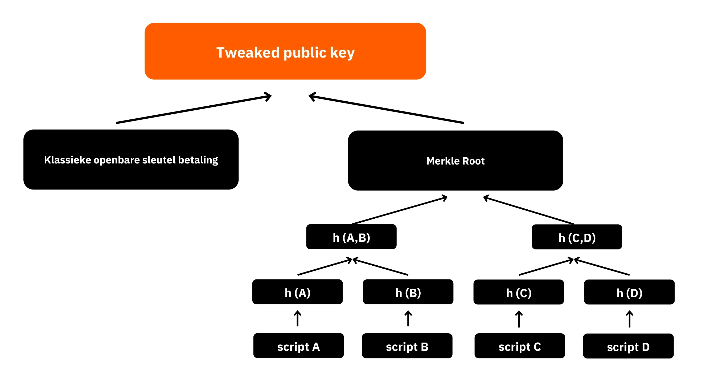


Er zijn twee belangrijke redenen voor de beslissing om Silent Payments uitsluitend te beperken tot Taproot:


- Ten eerste vergemakkelijkt het de implementatie en toekomstige upgrades van portfoliosoftware aanzienlijk, omdat slechts één standaard hoeft te worden gerespecteerd;
- Ten tweede helpt deze aanpak de anonimiteit van gebruikers te verbeteren door hen aan te moedigen zichzelf niet te verdelen in verschillende soorten scripts, die generate verschillende portfoliofingerprints in de ketenanalyse opleveren (voor meer informatie over dit concept, zie hoofdstuk 4 van deel 2).


### Naïeve afleiding van een openbare sleutel van Silent Payments


Laten we beginnen met een eenvoudig voorbeeld om tot de kern te komen van hoe SP's (Silent Payments) werken. Laten we Alice en Bob nemen, twee Bitcoin gebruikers. Alice wil Bitcoins sturen naar Bob op een lege ontvangende Address. Dit proces heeft drie doelen:


- Alice moet een lege Address kunnen generate;
- Bob moet een betaling kunnen identificeren die naar deze specifieke Address is gestuurd;
- Bob moet de private sleutel die bij deze Address hoort kunnen bemachtigen om zijn geld te kunnen uitgeven.


Alice heeft een UTXO in haar beveiligde Bitcoin Wallet met het volgende sleutelpaar:


- $a$: de privésleutel ;
- $A$: de openbare sleutel ($A = a cdot G$)


Bob heeft een SP Address die hij op het internet heeft gepubliceerd met :


- $b$: de privésleutel ;
- $B$: de openbare sleutel ($B = b ≤ G$)


Door Address van Bob op te halen, kan Alice met behulp van ECDH een nieuwe lege Address berekenen die bij Bob hoort. Laten we deze Address $P$ noemen:


$$ P = B + \text{Hash}(a \cdot B) \cdot G $$


In deze vergelijking heeft Alice eenvoudigweg het scalair product berekend van haar privésleutel $a$ en de publieke sleutel $B$ van Bob. Ze heeft dit resultaat doorgegeven aan een Hash functie die bij iedereen bekend is. De resulterende waarde wordt vervolgens scalair vermenigvuldigd met het genererende punt $G$ van de elliptische curve `secp256k1`. Tenslotte voegt Alice het resulterende punt toe aan de openbare sleutel $B$ van Bob. Zodra Alice deze Address $P$ heeft, gebruikt ze het als uitvoer in een transactie, d.w.z. ze stuurt er bitcoins naartoe.


> *In de context van Stille Betalingen komt de "Hash"-functie overeen met een SHA256 Hash-functie die specifiek gelabeld is met `BIP0352/SharedSecret`, wat garandeert dat de gegenereerde hashes uniek zijn voor dit protocol en niet hergebruikt kunnen worden in andere contexten, terwijl het extra bescherming biedt tegen het hergebruik van nonces in handtekeningen. Deze standaard komt overeen met die [gespecificeerd in BIP340 voor Schnorr-handtekeningen](https://github.com/Bitcoin/bips/blob/master/bip-0340.mediawiki) op `secp256k1`.*
Dankzij de eigenschappen van de elliptische curve waarop ECDH is gebaseerd, weten we dat :


$$ a \dot B = b \dot A $$


Bob kan dus berekenen naar welk ontvangend Address Alice de bitcoins heeft gestuurd. Om dit te doen, controleert hij alle Bitcoin transacties die voldoen aan de Silent Payments criteria en past de volgende berekening toe op elk van hen om te zien of de betaling aan hem is gericht (*scannen*):


$$ P' = B + \text{Hash}(b \cdot A) \cdot G $$


Als hij de transactie van Alice scant, ziet hij dat $P'$ gelijk is aan $P$. Hij weet dus dat de betaling aan haar is gericht:


$$ P' = B + \text{Hash}(b \cdot A) \cdot G = B + \text{Hash}(a \cdot B) \cdot G = P $$


Van hieruit kan Bob de privésleutel $p$ berekenen waarmee de Address $P$ kan uitgeven:


$$ p = (b + \text{Hash}(b \cdot A)) \bmod n $$


Zoals je kunt zien, moet je om deze privésleutel $p$ te berekenen, de privésleutel $b$ hebben. Alleen Bob heeft deze privésleutel $b$. Hij zal daarom de enige zijn die de bitcoins kan uitgeven die naar zijn Stille Betalingen Address zijn gestuurd.


*Legende:*


- $B$ : De openbare sleutel/static Address gepubliceerd door Bob
- $b$: Bob's privésleutel
- $A$ : Alice's UTXO publieke sleutel gebruikt als transactie-invoer
- $a$: Alice's privésleutel
- $G$: het voortbrengend punt van de elliptische kromme `secp256k1`
- $\text{SHA256}$ : De SHA256 Hash-functie getagd met `BIP0352/SharedSecret`
- $s$: het gemeenschappelijke geheim van ECDH
- $P$ : De openbare sleutel/unieke Address voor betaling aan Bob


Hier is een nogal naïeve eerste benadering om Bob's statische Address, genoteerd $B$, te gebruiken om een unieke Address $P$ af te leiden om bitcoins naartoe te sturen. Deze methode is echter te simplistisch en heeft verschillende fouten die gecorrigeerd moeten worden. Het eerste probleem is dat Alice in dit schema niet meerdere uitgangen naar Bob kan maken binnen dezelfde transactie.


### Hoe maak ik meerdere uitgangen?


In het voorbeeld uit de vorige sectie, creëert Alice een enkele uitgang die naar Bob gaat op zijn unieke Address $P$. Met dezelfde geselecteerde invoer is het voor Alice onmogelijk om twee aparte lege adressen voor Bob te maken, omdat de gebruikte methode altijd tot hetzelfde resultaat voor $P$ zou leiden, namelijk dezelfde Address. Er kunnen zich echter veel situaties voordoen waarin Alice haar betaling aan Bob in meerdere kleinere bedragen wil verdelen, waardoor er meerdere UTXO's ontstaan. Er moet dus een methode worden gevonden om dit te bereiken.


Om dit te bereiken, gaan we de berekening die Alice uitvoert om $P$ af te leiden iets aanpassen, zodat ze generate twee verschillende adressen kan geven aan Bob, namelijk $P_0$ en $P_1$.


Om de berekening te wijzigen en 2 verschillende adressen te verkrijgen, voeg je gewoon een geheel getal toe dat het resultaat wijzigt. Zo zal Alice $0$ toevoegen aan haar berekening om de Address $P_0$ te verkrijgen en $1$ om de Address $P_1$ te verkrijgen. Laten we dit geheel getal $i$ noemen:


$$ P_i = B + \text{Hash}(a \cdot B ‖ } i) \cdot G $$


Het berekeningsproces blijft ongewijzigd ten opzichte van de vorige methode, behalve dat Alice deze keer $a cdot B$ aaneenschakelt met $i$ voordat Hash verder gaat. Je wijzigt dan eenvoudig $i$ om een nieuwe Address te verkrijgen die bij Bob hoort. Bijvoorbeeld:


$$ P_0 = B + \text{Hash}(a \dot B ‖ } 0) \dot G $$


$$ P_1 = B + \text{Hash}(a \dot B \text{ ‖ } 1) \dot G $$


Wanneer Bob Blockchain scant op Stille Betalingen die voor hem bedoeld zijn, begint hij met $i = 0$ voor Address $P_0$. Als hij geen betalingen vindt op $P_0$, concludeert hij dat deze transactie geen Stille Betalingen bevat die voor hem bedoeld zijn, en staakt hij de scan. Als $P_0$ echter geldig is en een betaling voor hem bevat, gaat hij verder met $P_1$ in dezelfde transactie om te controleren of Alice een tweede betaling heeft gedaan. Als $P_1$ ongeldig blijkt te zijn, stopt hij met zoeken naar deze transactie; anders gaat hij door met het testen van opeenvolgende $i$ waarden:


$$ P_0 = B + \text{Hash}(b \text{ ‖ } 0) \cdot G $$


$$ P_1 = B + \text{Hash}(b \text{ ‖ } 1) \cdot G $$


Aangezien Bob onmiddellijk stopt bij $i = 0$ als $P_0$ niet werkt, voegt het gebruik van deze integer bijna geen extra operationele belasting toe aan Bob voor de fase waarin transacties worden gescand.


Bob kan dan op dezelfde manier de privésleutels berekenen:


$$
p_0 = (b + \text{hash}(b \cdot A \text{ ‖ } 0)) \bmod n
$$


$$
p_1 = (b + \text{hash}(b \cdot A \text{ ‖ } 1)) \bmod n
$$


*Legende:*


- $B$ : De openbare sleutel/static Address gepubliceerd door Bob
- $b$: Bob's privésleutel
- $A$ : Alice's UTXO publieke sleutel gebruikt als transactie-invoer
- $a$: Alice's privésleutel
- $G$: het voortbrengend punt van de elliptische kromme `secp256k1`
- $\text{SHA256}$ : De SHA256 Hash-functie getagd met `BIP0352/SharedSecret`
- $s_0$: het eerste gemeenschappelijke geheim ECDH
- $s_1$: het tweede gemeenschappelijke ECDH-geheim
- $P_0$ : De eerste openbare sleutel / unieke Address voor betaling aan Bob
- $P_1$ : De tweede openbare sleutel / unieke Address voor betaling aan Bob


Met deze methode beginnen we een aardig protocol te krijgen, maar er zijn nog een paar uitdagingen te overwinnen, niet in de laatste plaats het voorkomen van hergebruik van Address.


### Hoe voorkom je hergebruik van Address?


Zoals we in de vorige secties zagen, gebruikt Alice het sleutelpaar dat haar UTXO beveiligt, dat ze zal gebruiken om het gedeelde ECDH-geheim met Bob te berekenen. Dit geheim stelt haar in staat om de unieke Address $P_0$ af te leiden. Het sleutelpaar ($a$, $A$) dat Alice gebruikt, kan echter meerdere UTXO's beveiligen als ze deze Address meerdere keren heeft hergebruikt. In het geval dat Alice twee betalingen doet aan Bob's statische Address $B$ met behulp van twee UTXO's beveiligd door dezelfde sleutel $A$, zou dit resulteren in hergebruik van Address voor Bob.


> *Address hergebruik is een zeer slechte praktijk als het gaat om de vertrouwelijkheid van gebruikers. Om erachter te komen waarom, raad ik je aan de eerste delen van deze training door te nemen.*
Aangezien de unieke Address $P_0$ is afgeleid van $A$ en $B$, zal Alice, als ze een tweede Address afleidt voor een tweede betaling aan $B$, met dezelfde sleutel $A$, op precies dezelfde Address $P_0$ uitkomen. Om dit risico te vermijden en hergebruik van Address binnen Stille Betalingen te voorkomen, moeten we onze berekeningen een beetje aanpassen.


Wat we willen is dat elke UTXO die Alice gebruikt als invoer voor een betaling, een unieke Address oplevert aan Bob's kant, zelfs als meerdere UTXO's beveiligd zijn door hetzelfde sleutelpaar. We hoeven dus alleen maar een verwijzing naar de UTXO toe te voegen bij het berekenen van de unieke Address $P_0$. Deze referentie zal simpelweg de Hash zijn van de UTXO die als invoer wordt gebruikt:


$$ \text{inputHash} = \text{Hash}(\text{outpoint} \text{ ‖ } A) $$


En Alice voegt deze verwijzing toe aan de invoer voor haar berekening van de unieke Address $P_0$ :


$$ P_0 = B + \text{Hash}(\text{inputHash} \cdot a \cdot B \text{ ‖ } 0) \cdot G $$


Bij het scannen kan Bob ook ${inputHash}$ toevoegen, omdat hij alleen maar de transactie hoeft te observeren om ${outpoint}$ af te leiden:


$$ P_0 = B + \text{Hash}(\text{inputHash} \cdot b \cdot A \text{ ‖ } 0) \cdot G $$


Als het een geldige $P_0$ vindt, kan het de bijbehorende privésleutel $p_0$ berekenen:


$$
p_0 = (b + \text{hash}(\text{inputHash} \cdot b \cdot A \text{ ‖ } 0)) \bmod n
$$


*Legende:*


- $B$ : De openbare sleutel/static Address gepubliceerd door Bob
- $b$: Bob's privésleutel
- $A$ : Alice's UTXO publieke sleutel gebruikt als transactie-invoer
- $a$: Alice's privésleutel
- $H$ : UTXO Hash gebruikt als invoer
- $G$: het voortbrengend punt van de elliptische kromme `secp256k1`
- $\text{SHA256}$ : De SHA256 Hash-functie getagd met `BIP0352/SharedSecret`
- $s_0$: het eerste gemeenschappelijke ECDH-geheim
- $P_0$ : De eerste openbare sleutel / unieke Address voor betaling aan Bob


Voorlopig gaan onze berekeningen ervan uit dat Alice één ingang gebruikt voor haar transactie. Ze zou echter meerdere ingangen moeten kunnen gebruiken. Bijgevolg zou Bob voor elke transactie met meerdere ingangen theoretisch de ECDH voor elke ingang moeten berekenen om te bepalen of een betaling voor hem bedoeld is. Deze methode is niet bevredigend, dus we moeten een oplossing vinden om de werklast te verminderen!


### Openbare sleutels omzetten in invoer


Om dit probleem op te lossen, gebruiken we in plaats van het sleutelpaar dat een specifieke invoer aan Alice's kant beveiligt, de som van alle sleutelparen die in de invoer van de transactie zijn gebruikt. Deze som wordt dan beschouwd als een nieuw sleutelpaar. Deze techniek staat bekend als "tweaking".


Stel bijvoorbeeld dat de transactie van Alice 3 ingangen heeft, elk beveiligd met een ander sleutelpaar:


- $a_0$ wordt gebruikt om invoer #0 te beveiligen;
- $a_1$ wordt gebruikt om ingang #1 te beveiligen;
- $a_2$ beveiligt ingang #2.


Volgens de eerder beschreven methode zou Alice een enkel sleutelpaar moeten kiezen uit $a_0$, $a_1$ en $a_2$ om het ECDH-geheim te berekenen en generate de enkele betaling Address $P$ uit Bob's statische Address $B$. Deze aanpak vereist echter dat Bob elke mogelijkheid achtereenvolgens test, te beginnen met $a_0$, dan $a_1$, enzovoort, totdat hij een paar identificeert dat een geldige Address $P$ genereert. Dit proces vereist dat Bob de ECDH berekening uitvoert op alle ingangen van alle transacties, wat de operationele belasting van het scannen aanzienlijk verhoogt.


Om dit te vermijden, vragen we Alice om $P$ te berekenen met de som van alle ingevoerde sleutels. In ons voorbeeld wordt de getweakte privésleutel $a$ als volgt berekend:


$$ a = a_0 + a_1 + a_2 $$


Op dezelfde manier kunnen Alice en Bob de getweakte openbare sleutel berekenen:


$$ A = A_0 + A_1 + A_2 $$


Met deze methode hoeft Bob alleen de som van de openbare sleutels van de transactie te berekenen en vervolgens het ECDH-geheim van $A$ alleen, wat het aantal berekeningen dat nodig is voor de scanfase sterk vermindert.


Denk echter aan de vorige paragraaf. We hadden de Hash van ${inputHash}$ toegevoegd aan onze berekening, die wordt gebruikt als een Nonce om hergebruik van Address te voorkomen:


$$ \text{inputHash} = \text{Hash}(\text{outpoint} \text{ ‖ } A) $$


Maar als je meerdere ingangen in een transactie hebt, moet je kunnen bepalen welke $tekst{uitgangspunt}$ wordt gekozen in deze berekening. Volgens BIP352 is het te gebruiken selectiecriterium voor $tekst{uitgangspunt}$ om de kleinste lexicografisch te kiezen, wat betekent dat je de UTXO kiest die als eerste in alfabetische volgorde verschijnt. Deze methode standaardiseert de UTXO die bij elke transactie wordt gekozen. Als bijvoorbeeld de lexicografisch kleinste ${uitgangspunt}$ ${uitgangspunt}_L$ is, wordt de berekening van ${inputHash}$ :


$$ \text{inputHash} = \text{Hash}(\text{outpoint}_L \text{ ‖ } A) $$


De berekeningen blijven dan identiek aan die in de vorige sectie, behalve dat de privésleutel $a$ en de corresponderende openbare sleutel $A$ niet langer een paar zijn dat wordt gebruikt om een enkele invoer te beveiligen, maar nu de tweak vormen voor alle sleutelparen in de invoer.


### Aparte uitgave- en scansleutels


Op dit moment noemen we de Silent Payment static Address $B$ een unieke publieke sleutel. Onthoud dat het deze publieke sleutel $B$ is die Alice gebruikt om het gedeelde geheim ECDH te maken, dat op zijn beurt de unieke betaling Address $P$ berekent. Bob gebruikt deze publieke sleutel $B$ en de bijbehorende privésleutel $b$ voor de scanfase. Maar hij zal ook de privésleutel $b$ gebruiken om de privésleutel $p$ te berekenen die het mogelijk maakt om uit te geven van de Address $P$.


Het nadeel van deze methode is dat de $b$ privésleutel, die wordt gebruikt om alle privésleutels te berekenen van adressen die Stille Betalingen hebben ontvangen, ook door Bob wordt gebruikt om de transacties te scannen. Deze stap vereist dat de $b$ sleutel beschikbaar is op met internet verbonden Wallet software, wat het meer blootstelt aan het risico van diefstal dan wanneer het op een Cold wordt bewaard. Idealiter zou het voordelig zijn om te kunnen profiteren van Stille Betalingen terwijl de $b$ privésleutel, die de toegang tot alle andere privésleutels controleert, veilig op een Hardware Wallet bewaard wordt. Gelukkig is het protocol aangepast om precies dat mogelijk te maken.


Om dit te doen, moet de ontvanger van de BIP352 2 verschillende sleutelparen gebruiken:


- b_{text{spend}}$: om de privésleutels van unieke betaaladressen te berekenen;
- b_{{scan}}$: om unieke betalingsadressen te vinden.


Op deze manier kan Bob de privésleutel $b_{\text{spend}}$ op een Hardware Wallet bewaren en de privésleutel $b_{\text{scan}}$ op online software gebruiken om zijn Stille Betalingen te vinden, zonder $b_{\text{spend}}$ te onthullen. Aan de andere kant zijn de publieke sleutels $B_{\text{scan}}$ en $B_{\text{spend}}$ beide publiekelijk onthuld, omdat ze zich in Bob's statische Address $B$ bevinden:


$$ B = B_{{scan}} \‖ } B_{{uitgaven}} $$


Om een unieke betaling Address $P_0$ te berekenen die bij Bob hoort, zal Alice nu de volgende berekening uitvoeren:


$$ P_0 = B_{{spend}} + \text{Hash}(\text{inputHash} \cdot a \cdot B_{scan}} \text{ ‖ } 0) \cdot G $$


Om de betalingen te vinden die aan hem zijn gericht, voert Bob de volgende berekening uit:


$$ P_0 = B_{{spend}} + \text{Hash}(\text{inputHash} \cdot b_{scan} \cdot A \text{ ‖ } 0) \cdot G $$


Zoals je kunt zien, heeft Bob tot nu toe nog geen $b_{text{spend}}$ nodig gehad, die op zijn Hardware Wallet staat. Wanneer hij $P_0$ wil uitgeven, kan hij de volgende berekening doen om de private sleutel $p_0$ te vinden:


$$ p_0 = (b_{inputHash}} + \text{Hash}(\text{inputHash} \cdot b_{{text{scan}} \cdot A \text{ ‖ } 0)) \bmod n $$


*Legende:*


- $B_{{scan}}$: Bob's publieke scansleutel (statische Address)
- $b_{{scan}}$ : Bob's private scansleutel
- $B_{{spend}}$ : Bob's openbare bestedingssleutel (statisch Address)
- $b_{{spend}}$ : Bob's privé bestedingssleutel
- $A$ : Som van ingangen met openbare sleutel (tweak)
- $a$ : De privésleutel die overeenkomt met de aangepaste openbare sleutel
- $H$: de Hash van de kleinste UTXO (lexicografisch) gebruikt als invoer
- $G$: het voortbrengend punt van de elliptische kromme `secp256k1`
- $\text{SHA256}$ : De SHA256 Hash-functie getagd met `BIP0352/SharedSecret`
- $s_0$: het eerste gemeenschappelijke geheim ECDH
- $P_0$ : De eerste openbare sleutel / unieke Address voor betaling aan Bob


### SP-adressen met een label gebruiken


Bob heeft daarom een statische Address $B$ voor Stille Betalingen zoals :


$$ B = B_{{scan}} \‖ } B_{{uitgaven}} $$


Het probleem met deze methode is dat je de verschillende betalingen die naar deze Address worden gestuurd, niet kunt scheiden. Als Bob bijvoorbeeld 2 verschillende klanten heeft voor zijn bedrijf, en hij wil de betalingen aan elk van hen onderscheiden, dan heeft hij 2 verschillende statische adressen nodig. Een naïeve oplossing, met de huidige aanpak, zou voor Bob zijn om twee aparte portemonnees aan te maken, elk met zijn eigen statische Address, of zelfs om twee verschillende statische adressen aan te maken binnen dezelfde Wallet. Deze oplossing vereist echter dat de hele Blockchain twee keer wordt gescand (één keer voor elke Address) om betalingen te detecteren die respectievelijk voor elke Address bestemd zijn. Dit dubbele scannen verhoogt de operationele belasting van Bob op onredelijke wijze.


Om dit probleem op te lossen, gebruikt BIP352 een labelsysteem dat verschillende statische adressen toelaat, zonder de werklast voor het vinden van Stille Betalingen op de Blockchain onredelijk te verhogen. Hiervoor voegen we een geheel getal $m$ toe aan de openbare bestedingssleutel $B_{{spend}}$. Dit gehele getal kan de waarde $1$ aannemen voor de eerste statische Address, dan $2$ voor de tweede, enzovoort. De uitgavensleutels $B_{text{spend}}$ worden nu $B_m$ genoemd en worden op deze manier opgebouwd:


$$ B_m = B_{\text{spend}} + \text{Hash}(b_{scan}} \text{ ‖ } m) \cdot G $$


Bijvoorbeeld, voor de eerste onkostentoets met het label $1$ :


$$ B_1 = B_{\text{spend}}} + \text{Hash}(b_{scan}} \text{ ‖ } 1) \cdot G $$


De statische Address gepubliceerd door Bob zal nu bestaan uit $B_{{scan}}$ en $B_m$. Bijvoorbeeld, de eerste statische Address met het label $1$ zal :


$$ B = B_{{scan}} \‖ } B_1 $$


> *We beginnen pas bij label 1 omdat label 0 gereserveerd is voor de verandering.*
Alice zal op haar beurt de bedrijfstoeslag Address $P$ op dezelfde manier als voorheen afleiden, maar met de nieuwe $B_1$ in plaats van $B_{text{spend}}$ :


$$ P_0 = B_1 + \text{Hash}(\text{inputHash} \cdot a \cdot B_{scan} \text{ ‖ } 0) \cdot G $$


In werkelijkheid hoeft Alice niet eens te weten dat Bob een gelabelde Address heeft, want ze gebruikt gewoon het tweede deel van de statische Address die hij gaf, en in dit geval is dat de waarde $B_1$ in plaats van $B_{text{spend}}$.


Om betalingen te scannen zal Bob altijd de waarde van zijn initiële statische Address met $B_{text{spend}}$ op deze manier gebruiken:


$$ P_0 = B_{{bestedingen}} + \text{Hash}(\text{inputHash} \cdot b_{scan} \cdot A \text{ ‖ } 0) \cdot G $$


Vervolgens trekt hij de waarde die hij vindt voor $P_0$ één voor één af van elke uitvoer. Vervolgens controleert hij of een van de resultaten van deze aftrekkingen overeenkomt met de waarde van een van de labels die hij gebruikt voor zijn portfolio. Als bijvoorbeeld output #4 overeenkomt met het label $1$, betekent dit dat deze output een Stille Betaling is die geassocieerd is met zijn statisch gelabelde Address $B_1$ :


$$ Out_4 - P_0 = \text{Hash}(b_{scan}} \text{ ‖ } 1) \cdot G $$


Het werkt omdat :


$$ B_1 = B_{\text{spend}}} + \text{Hash}(b_{scan}} \text{ ‖ } 1) \cdot G $$


Dankzij deze methode kan Bob een veelheid aan statische adressen gebruiken ($B_1$, $B_2$, $B_3$...), allemaal afgeleid van zijn statische basis-Address ($B = B_{{scan}} ‖ } B_{{scan}}}$), om het gebruik gescheiden te houden.


Houd er echter rekening mee dat deze scheiding van statische adressen alleen geldig is vanuit het oogpunt van persoonlijk portefeuillebeheer, maar geen scheiding van identiteiten inhoudt. Aangezien ze allemaal dezelfde $B_{{scan}}$ hebben, is het heel gemakkelijk om alle statische adressen samen te brengen en af te leiden dat ze tot één entiteit behoren.


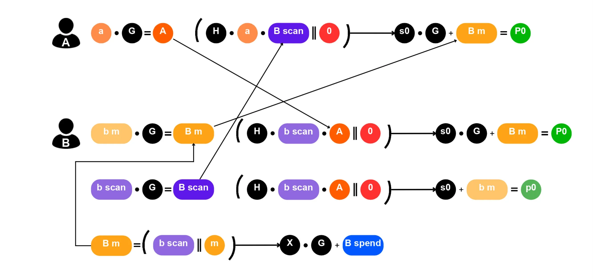


*Legende:*


- $B_{{scan}}$: Bob's publieke scansleutel (statisch Address)
- $b_{{scan}}$ : Bob's private scansleutel
- $B_{{spend}}$ : Bob's openbare bestedingssleutel (initieel Address)
- $B_m$ : Bob's publieke bestedingssleutel gelabeld (statisch Address)
- $b_m$: Bob's private bestedingssleutel gelabeld
- $A$ : Som van ingangen met openbare sleutel (tweak)
- $a$ : De privésleutel die overeenkomt met de aangepaste openbare sleutel
- $H$: de Hash van de kleinste UTXO (lexicografisch) gebruikt als invoer
- $G$: het voortbrengend punt van de elliptische kromme `secp256k1`
- $\text{SHA256}$ : De SHA256 Hash functie getagd met `BIP0352/SharedSecret`
- $s_0$: het eerste gemeenschappelijke ECDH-geheim
- $P_0$ : De eerste publieke sleutel / uniek Address voor betaling aan Bob
- $p_0$ : De private sleutel van de eerste unieke betaling Address aan Bob
- $X$ : De Hash van de particuliere sleutel van de scan met het label


### Hoe bouw ik een Silent Payments Address?


Om een Address voor Stille Betalingen te bouwen, moet je eerst 2 sleutelparen van je Bitcoin HD Wallet afleiden:


- Het paar $b_{{scan}}$, $B_{{scan}}$ om te zoeken naar aan ons geadresseerde betalingen;
- Het paar $b_{\text{spend}}$, $B_{\text{spend}}$ om te denken aan de bitcoins die we hebben ontvangen.


Deze paren zijn afgeleid met behulp van de volgende paden (*Bitcoin Mainnet*):


```text
scan : m / 352' / 0' / 0' / 1' / 0
spend : m / 352' / 0' / 0' / 0' / 0
```


Zodra we deze 2 sleutelparen hebben, voegen we ze eenvoudigweg samen (end-to-end) om de statische Address payload te creëren:


$$ B = B_{{scan}} \‖ } B_{{uitgaven}} $$


Als we labels willen gebruiken, vervangen we $B_{text{spend}}$ door $B_m$ :


$$ B = B_{{scan}} \‖ } B_m $$


Met label $m$ :


$$ B_m = B_{\text{spend}} + \text{Hash}(b_{scan}} \text{ ‖ } m) \cdot G $$


Zodra we deze payload hebben, voegen we de HRP (*Human-Readable Part*) `sp` en de versie `q` (= versie 0) toe. We voegen ook een checksum toe en formatteren de Address als bech32m.


Hier is bijvoorbeeld mijn Silent Payments static Address:


```text
sp1qqvhjvsq2vz8zwrw372vuzle7472zup2ql3pz64yn5cpkw5ngv2n6jq4nl8cgm6zmu48yk3eq33ryc7aam6jrvrg0d0uuyzecfhx2wgsumcurv77e
```


Een belangrijk punt met betrekking tot statische adressen, dat je misschien hebt begrepen in de vorige secties, is dat deze adressen niet zichtbaar zijn in Bitcoin transacties. Alleen de $P$ betalingsadressen die in uitgangen worden gebruikt, verschijnen op de Blockchain in het standaard Taproot formaat. Van buitenaf is het dus onmogelijk om een transactie met Stille Betaling te onderscheiden van een gewone transactie met P2TR uitgangen.


Net als bij BIP47 is het onmogelijk om een verband te leggen tussen een statische Address $B$ en een betalings-Address $P$ afgeleid van $B$. Zelfs als Eve, een potentiële aanvaller, probeert de Blockchain te scannen met de statische Address $B$ van Bob, zal ze niet in staat zijn de berekeningen uit te voeren die nodig zijn om $P$ te bepalen. Om dat te doen, zou ze ofwel de private sleutel $b_{scan}}$ van Bob nodig hebben, ofwel de private sleutels $a$ van de verzender, maar beide zijn natuurlijk privaat. Het is dus mogelijk om iemands statische Address expliciet te koppelen aan een vorm van persoonlijke identiteit.


### Hoe gebruik ik Stille Betalingen?


Het Silent Payments voorstel is relatief recent en wordt op dit moment slechts door een zeer beperkt aantal wallets geïmplementeerd. Bij mijn weten zijn er slechts 3 softwareproducten die ze ondersteunen:


- [CakeWallet](https://cakewallet.com/)
- [Silentium](https://app.silentium.dev/)
- [DonatieWallet](https://github.com/Sosthene00/donationwallet)


Binnenkort geven we je een gedetailleerde tutorial over het opzetten van je eigen Silent Payments statische Address.


Omdat deze functie nieuw is, raden we je aan voorzichtig te zijn en het gebruik van Stille Betalingen voor grote bedragen op Mainnet te vermijden.


*Om dit hoofdstuk over Stille Betalingen te maken, heb ik gebruik gemaakt van [de site met uitleg over Stille Betalingen](https://silentpayments.xyz/) en [het document met uitleg over BIP352](https://github.com/Bitcoin/bips/blob/master/bip-0352.mediawiki).*


# Laatste Sectie


<partId>2aee56c0-b285-4799-b4f7-373a552ee2b2</partId>


## Beoordelingen


<chapterId>195d149f-80fa-5816-8b46-995a9226d082</chapterId>


<isCourseReview>true</isCourseReview>

## Eindexamen


<chapterId>e803d394-e3c1-5816-a6b4-a69a2472019c</chapterId>


<isCourseExam>true</isCourseExam>

## Conclusie


<chapterId>cd8e5c67-50e4-4dcd-8e04-88ba5ec95305</chapterId>


<isCourseConclusion>true</isCourseConclusion>
