# Ukingire ubuzima bwite bwawe kuri Bitcoin.


Mu isi aho ibanga ry’ibikorwa vy’amahera ririko rigenda rihinduka ikintu c’agaciro, gutahura no kumenya neza ingingo ngenderwako zo kurinda ubuzima bwite igihe ukoresha Bitcoin ni ngombwa cane. Iryo shure riguha imfunguruzo zose, zo mu vyiyumviro no mu bikorwa, kugira ngo ivyo ubishikeko wigenga.


Ubu, kuri Bitcoin, amashirahamwe yizeye cane gusesangura Blockchain. Ivyo bakora canecane ni ukwinjira mu vyo ukora, kugira ngo bashobore guhungabanya ibanga ry’ivyo ukora. Mu vy'ukuri, nta kintu nk'ico "uburenganzira bwo kwirinda" kiri muri Bitcoin. Rero ni wewe ukoresha, ushobora kwemeza uburenganzira bwawe bwa kavukire no kurinda ibanga ry’amahera ukoresha, kuko nta wundi azobigukorera.


Iryo shure ryateguwe kugira ngo ribe ry’ibintu vyose kandi ry’ibintu rusangi. Iciyumviro cose c’ubuhinga kiravugwa mu buryo burambuye kandi gishigikirwa n’ibishushanyo vy’insobanuro. Intumbero ni ugutuma ubumenyi bushikira bose. BTC204 rero irashoboka ku batangura n’abayikoresha hagati. Iryo shure kandi ritanga agaciro kongerewe ku bahinga cane mu vy’ubuhinga bwa bitcoin, uko twinjira cane mu vyiyumviro bimwebimwe vy’ubuhinga akenshi bitatahurwa nabi.


Twifatanye natwe kugira ngo uhindure uko ukoresha Bitcoin maze ube umukoresha afise amakuru, ashobora gutahura ibibazo bijanye n’ibanga no kurinda ubuzima bwite bwawe.


+++
# Imenyekanisha


<partId>e17474a8-8899-4bdb-a7f8-bc52ddb01440</partId>


## Incamake y'amashure


<chapterId>08ba1933-f393-4fb5-8279-777d874caedb</chapterId>


Murakaze mu nyigisho ya BTC204!


Mu isi aho ibanga ry’ibikorwa vy’amahera ririko rigenda rihinduka ikintu c’agaciro, gutahura no kumenya neza ingingo ngenderwako zo kurinda ubuzima bwite igihe ukoresha Bitcoin ni ngombwa cane. Iryo shure riguha imfunguruzo zose, zo mu vyiyumviro no mu bikorwa, kugira ngo ivyo ubishikeko wigenga.


Ubu, kuri Bitcoin, amashirahamwe yizeye cane gusesangura Blockchain. Ivyo bakora canecane ni ukwinjira mu vyo ukora, kugira ngo bashobore guhungabanya ibanga ry’ivyo ukora. Mu vy'ukuri, nta kintu nk'ico "uburenganzira bwo kwirinda" kiri muri Bitcoin. Rero ni wewe ukoresha, ushobora kwemeza uburenganzira bwawe bwa kavukire no kurinda ibanga ry’amahera ukoresha, kuko nta wundi azobigukorera.


Bitcoin si "Number Go Up" gusa no kuzigama agaciro k'amahera uzigamye. Kubera ibiranga n’amateka yayo bidasanzwe, ni co gikoresho ca mbere c’ubutunzi bwo guhangana n’ubutunzi. Uciye kuri iyo nkuru iteye ubwoba, urashobora gukoresha amahera yawe mu mwidegemvyo, ukayakoresha kandi ukayarundanya, ata n’umwe ashobora kuguhagarika.


Bitcoin itanga ubuhungiro bw’amahoro ku ngǒgo ya Leta, ikaguha uburenganzira bwo kwinovora bimwe bishitse uburenganzira bwawe bwa kavukire, budashobora gushirwako umukono n’amategeko yashinzwe. Kubera ubuhinga bwa Satoshi Nakamoto, urafise ububasha bwo gutuma abantu bubaha umutungo wawe bwite no gusubira kuronka umwidegemvyo kuri Contract.


Ariko rero, Bitcoin ntabwo ari ikintu kitamenyekana, ivyo bikaba bishobora gutera ingorane abantu bifatanya n’ubutunzi, cane cane mu turere turi munsi y’ubutegetsi bw’agahomerabunwa. Ariko ivyo si vyo vyonyene bitera akaga. Kubera ko Bitcoin ari ikintu c’agaciro kandi kidashobora gushirwako umutima, gishobora kuba ikintu abasuma bashobora gutera. Rero kurinda ubuzima bwite bwawe na vyo nyene bica bihinduka ikibazo c’umutekano: birashobora kugufasha kwirinda gukubitwa n’abantu n’ugukubitwa ku mubiri.


Nk’uko tuzobibona, naho iyo porotokole itanga uburinzi bumwe bumwe bw’ibanga mu buryo bwayo bwite, birahambaye cane gukoresha ibindi bikoresho kugira ngo ukoreshe neza kandi ukingire iryo banga.


Iryo shure ryagenewe gutanga inyishu rusangi, yuzuye ku bibazo bijanye n’ibanga rya Bitcoin. Iciyumviro cose c’ubuhinga kiravugwa mu buryo burambuye, gishigikiwe n’ibishushanyo vy’insobanuro. Intumbero ni ugutuma ubwo bumenyi bushikira umuntu wese, mbere n’abatangura n’abari hagati. Ku ba Bitcoiners bamenyereye cane, turavuga kandi ivyiyumviro vy’ubuhinga bwinshi kandi rimwe na rimwe bitazwi cane mu nyigisho yose, kugira ngo dutahure cane icigwa cose.


Intumbero y’iri shure si iyo kukugira uwutamenyekana rwose mu gukoresha Bitcoin, ahubwo ni iyo kuguha ibikoresho vy’ingenzi vyo kumenya ingene wokingira ibanga ryawe bivanye n’intumbero zawe bwite. Uzogira umwidegemvyo wo guhitamwo mu vyiyumviro n’ibikoresho vyashikirijwe kugira ngo utegure ingamba zawe bwite, zihuye n’intumbero zawe n’ivyo ukeneye.


**Igice ca 1: Insobanuro n'ivyiyumviro nyamukuru**


Kugira ngo dutangure, turaza gusubiramwo ingingo ngenderwako z’ishimikiro zigenga ingene Bitcoin ikora, kugira ngo dushobore gutorera umuti ivyiyumviro bijanye n’ibanga. Ni ngombwa ko umenya neza ivyiyumviro bikeyi vy’ishimikiro, nka UTXO, kwakira amaderesi n’inyandiko, imbere y’uko ushobora gutahura neza ivyiyumviro tuzovuga mu bice bikurikira. Tuzozana kandi uburyo bwo gucungera ibanga rusangi bwa Bitcoin, nk’uko bwavyiyumviriye na Satoshi Nakamoto, buzotuma dushobora gutahura ingorane n’ingorane zijanye n’ivyo.


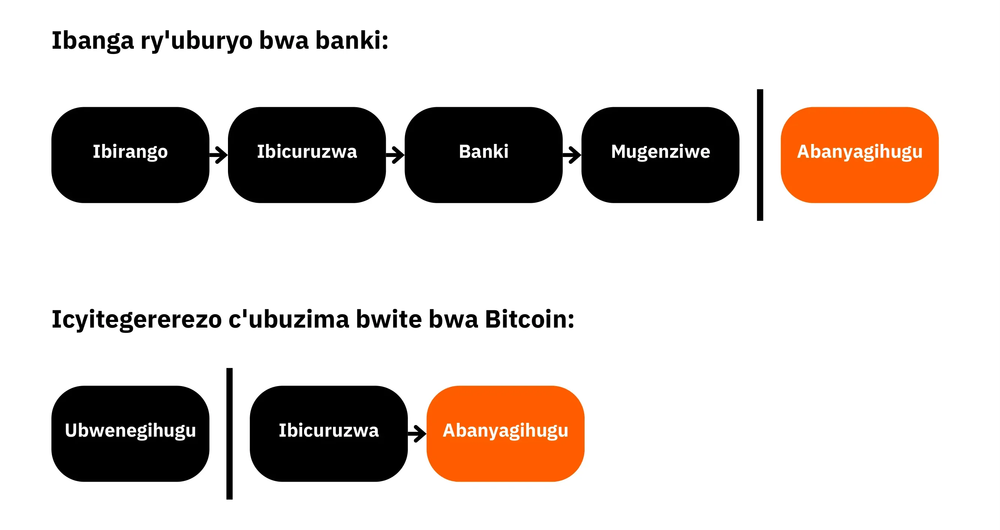


**Igice ca 2: Gutahura no kwikingira isesengura ry'uruzitiro**


Mu gice ca kabiri, turaba ubuhinga bukoreshwa n'amashirahamwe y'isesengura rya Blockchain kugira ngo akurikirane igikorwa cawe kuri Bitcoin. Gutahura ubwo buryo ni ikintu gihambaye cane kugira ngo ukomeze uburinzi bwawe bw’ibanga. Intumbero y’iki gice ni ugusuzuma ingamba z’abatera kugira ngo dutahure neza ingorane zishobora gushika no gutegura ubuhinga tuzokwiga mu bice bikurikira. Tuzosuzuma uburyo bwo gucuruza, ubuhinga bwo mu mutima n’ubwo hanze, n’insobanuro zishobora kuba z’ivyo bice. Uretse inyigisho, tuzokwiga ingene twokoresha Block explorer mu gusesangura uruhererekane, biciye ku ngero n’imyimenyerezo ngirakamaro.


**Igice ca 3: Kumenya neza ingendo nziza zo kurinda ubuzima bwite bwawe**


Mu gice ca gatatu c’inyigisho yacu, turamanuka ku bintu bitobito: kwimenyereza! Intumbero ni ukumenya neza ingendo nziza zose z’ingenzi zikwiye kuba ivyiyumviro vy’akameremere ku muntu wese akoresha Bitcoin. Tuzoba turiko turavuga ku gukoresha amaderesi ataco avuga, gushiramwo ibimenyetso, gushiramwo, gukoresha ama node yuzuye, hamwe n’uburyo bwo gukora KYC n’uburyo bwo kuronka. Intumbero ni ukuguha inyishu yuzuye y’imitego yo kwirinda kugira ngo dushireho umushinge ukomeye mu kurondera kwacu kwo kurinda ubuzima bwite. Ku bimwebimwe muri ivyo bikorwa, uzorongorwa n’inyigisho yihariye yerekeye ingene wobishira mu ngiro.


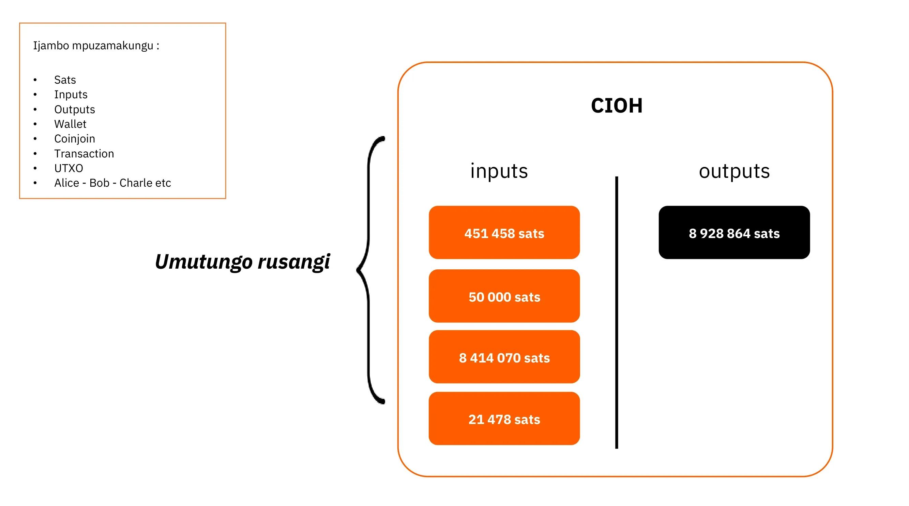


**Igice ca 4: Gutahura ibikorwa vya CoinJoin**


None twovuga gute ivyerekeye ubuzima bwite kuri Bitcoin tutavuze ama coinjoins? Mu gice ca 4, uzosanga ivyo ukeneye kumenya vyose ku bijanye n’ubu buryo bwo kuvanga. Uzomenya ivyo coinjoins arivyo, amateka yavyo n’intumbero zavyo, hamwe n’ubwoko butandukanye bwa CoinJoin buriho. Ubwa nyuma, ku muntu afise ubumenyi bwinshi, turaza kuraba ivyo anonsets na entropy ari vyo, n’ingene twobiharura.


**Igice ca 5: Gutahura ingorane z’ubundi buhinga buteye imbere bwo gucungera ibanga**


Mu gice ca gatanu, turaza kuraba ubundi buryo bwose bwo kurinda ubuzima bwite bwawe kuri Bitcoin, uretse CoinJoin. Mu myaka iheze, abahinguzi b’ibikoresho baragaragaje ubuhinga budasanzwe mu guhingura ibikoresho vyerekeye ubuzima bwite. Turaza kuraba ubwo buryo bwose, nka PayJoin, ubufatanye, Coin Swap na Atomic Swap, tuzodondora neza ingene bukora, intumbero zabwo n’intege nke zose zifise.


Turaza kandi kuraba ubuzima bwite ku rugero rw’uruzitiro rw’ibihimba n’ugukwiragira kw’ibikorwa. Turaza kandi kuganira ku mirongo ngenderwako itandukanye yashikirijwe mu myaka iheze kugira ngo yongere ubuzima bwite bw’abakoresha kuri Bitcoin, harimwo n’imirongo ngenderwako ya Address idahinduka.


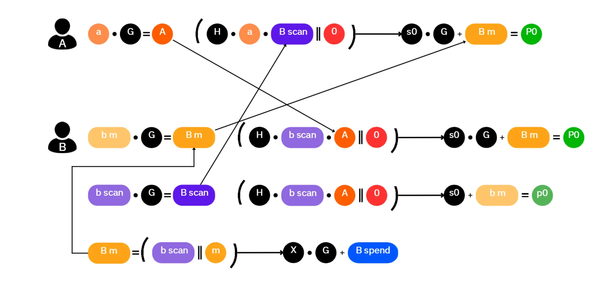

Ni mwiteguye gutohoza ivy’ubuzima bwite kuri Bitcoin? Reka tugende!


# Insobanuro n'ivyiyumviro nyamukuru


<partId>b9bbbde3-34c0-4851-83e8-e2ffb029cf31</partId>


## Igishushanyo ca Bitcoin ca UTXO


<chapterId>8d6b50c5-bf74-44f4-922b-25204991cb75</chapterId>


Bitcoin ni amafaranga mbere na mbere, ariko mu vy’ukuri woba uzi ingene BTC ziserukirwa kuri protocole?


### UTXOs kuri Bitcoin: ni ibiki?


Itegeko rya Bitcoin rishingiye ku citegererezo ca UTXO, risobanura "Igisubizo c'Ibikorwa Bitakoreshejwe".


Ico kigereranyo gitandukanye cane n’uburyo bwa kera bwo gukoresha amabanki, bushingiye ku buryo bwo gukurikirana ingene amahera agenda. Nkako, mu bijanye n’amabanki, amahera y’umuntu ku giti ciwe aguma mu makonti afatanye n’akaranga. Nk’akarorero, iyo uguze umukate ku muntu akora umukate, banki yawe irakura gusa amahera waguze kuri konti yawe, ivyo bikaba bigabanya amahera usigaranye, mu gihe kuri konti y’uwukora umukate na ho hashirwako ayo mahera nyene, ivyo bikaba bituma amahera asigaye arushirizaho. Muri iyo nzira, nta ciyumviro c’uko hariho isano hagati y’amahera yinjira muri konti yawe n’amahera asohoka muri yo, uretse amakuru y’ibikorwa.


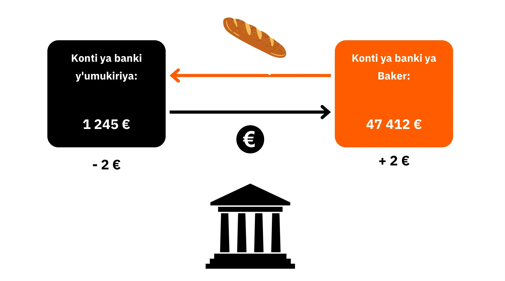


Bitcoin ikora mu buryo butandukanye. Iciyumviro ca konti ntaco kiriho, kandi amafaranga ntacungirwa biciye ku bipimo, ahubwo biciye ku ma UTXO. UTXO igereranya umubare wihariye w'ama bitcoins atarakoreshwa, gutyo bikaba bikora "igice ca Bitcoin", gishobora kuba kinini canke gito. Nk’akarorero, UTXO imwe yoshobora kuba ifise agaciro ka `500 BTC` canke gusa `700 Sats`.


**Icibutso:** Satoshi, akenshi ivugwa mu buryo bugufi ngo sat, ni igice gitoyi kuruta ibindi vyose ca Bitcoin, kigereranywa n’isenti mu mafaranga y’amahera.


```plaintext
1 BTC = 100 000 000 SATS
```


Mu vy’impwemu, UTXO imwe irashobora guserukira agaciro ako ari ko kose mu bitcoins, kuva ku sat gushika ku vyiyumviro vy’agaciro kanini cane hafi miliyoni 21 BTC. Ariko rero, birashoboka ko umuntu afise amafaranga yose y’ama bitcoins miliyoni 21, kandi hariho urugero rw’ubutunzi ruri hasi rwitwa "Dust", munsi yarwo UTXO ibonwa ko ata nyungu ifise mu vy’ubutunzi iyo umuntu akoresheje.


**Wari ubizi?** UTXO nini kuruta izindi zose zari zaremwe kuri Bitcoin zari zifise agaciro ka `500.000 BTC`. Yaremwe n’urubuga rwa MtGox mu gihe c’igikorwa co gukoranya ibintu mu kwezi kwa 11/2011: [29a3efd3ef04f9153d47a990bd7b048a4b2d213daaa5fb8ed670fb85f13bdbcf] -50.ikibanza/tx/29a3efd3ef04f9153d47a990bd7b048a4b2d213daaa5fb8ed670fb85f13bdbcf)


### UTXOs n'ingene amafaranga akoreshwa


UTXOs ni ibikoresho vya Exchange kuri Bitcoin. Igikorwa cose kivamwo ugukoresha ama UTXO nk’ibintu vy’injizwa no kurema ama UTXO mashasha nk’ibintu bisohoka. Iyo igikorwa co gucuruza kirangiye, ama UTXO akoreshwa nk'ibintu vy'injiza afatwa ko "yakoreshejwe", maze ama UTXO mashasha aravyarwa agahabwa abayaronka yerekanwa mu biva mu gicuruzwa. Gutyo, UTXO igereranya gusa umusaruro w’ibikorwa bitakoreshejwe, kandi rero umubare w’ama bitcoins ari ay’umuntu akoresha mu gihe kinaka.


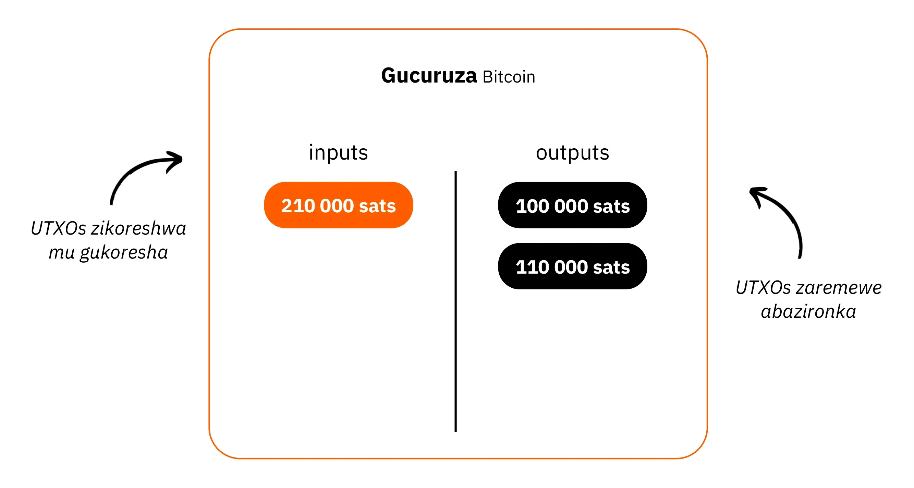


UTXO zose zikingiwe n’inyandiko zisobanura ingene zishobora gukoreshwa. Kugira ngo umuntu akoreshe UTXO, ategerezwa kwereka urubuga ko yuzuza ibisabwa n'inyandiko icungera iyo UTXO. Mu bisanzwe, UTXOs zikingirwa n’urufunguzo rwa bose (canke Address yakira iserukira urwo rufunguzo rwa bose). Kugira ngo umuntu akoreshe UTXO ifatanye n’urwo rufunguzo rwa bose, ategerezwa kwemeza ko afise urufunguzo rw’ibanga rujanye n’urwo rufunguzo, mu gutanga umukono wa digitale wakozwe n’urwo rufunguzo. Ni co gituma tuvuga ko Bitcoin Wallet yawe mu vy’ukuri idafise ama bitcoins, ariko ibika imfunguruzo zawe z’ibanga, ivyo navyo bikaba biguha uburenganzira bwo gushika ku ma UTXO yawe, kandi, mu kwagura, ku ma bitcoins aserukira.


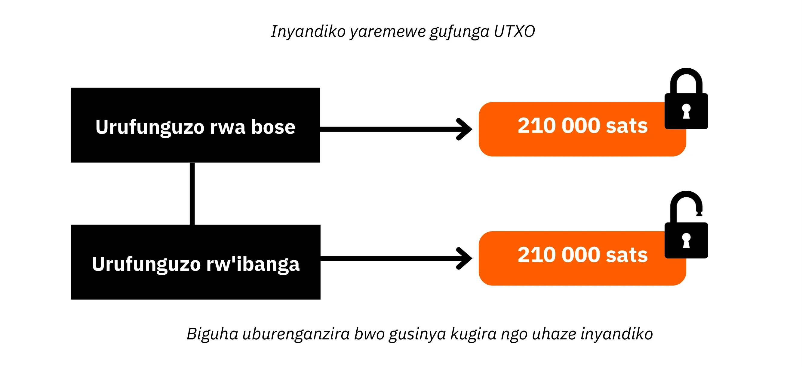


Kubera ko ata ciyumviro c'uko hariho konti muri Bitcoin, umubare w'amahera ya Wallet ni umubare w'agaciro k'ama UTXO yose ashobora gukoresha. Nk’akarorero, nimba Bitcoin Wallet yawe ishobora gukoresha UTXO 4 zikurikira:


```plaintext
- 2 BTC
- 8 BTC
- 5 BTC
- 2 BTC
```


Igitigiri cose c'ama Wallet yawe coba `17 BTC`.


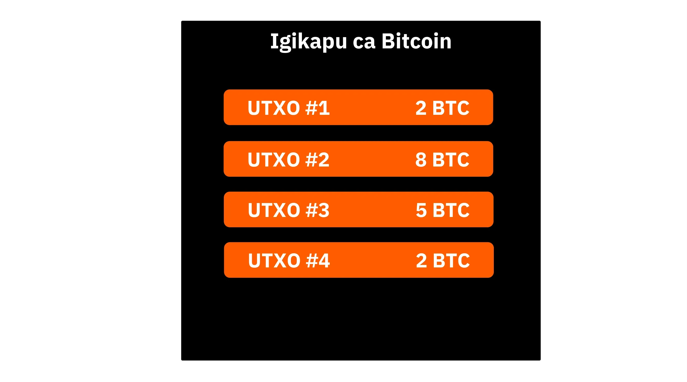


## Imiterere y'ibikorwa vya Bitcoin


<chapterId>29d3aaab-de2e-4746-ab40-c9748898850c</chapterId>


### Ivyinjizwa n'ibisohoka mu gucuruza


Igikoresho ca Bitcoin ni igikorwa canditswe kuri Blockchain kirungika Ownership y’ama bitcoins kuva ku muntu umwe kikaja ku wundi. Mu buryo bubereye, kuko turi ku citegererezo ca UTXO kandi ata makonti ariho, iyo nzira y’ugucuruza iraheza igashitsa ivyangombwa vy’ugukoresha amahera vyari vyarakingiye UTXO imwe canke nyinshi, ikazirya kandi bingana n’ivyo irema UTXO nshasha zifise ivyangombwa bishasha vyo gukoresha amahera. Muri make, ugucuruza bikura bitcoins mu nyandiko yuzuye bikaja mu nyandiko nshasha yagenewe kuyakingira.


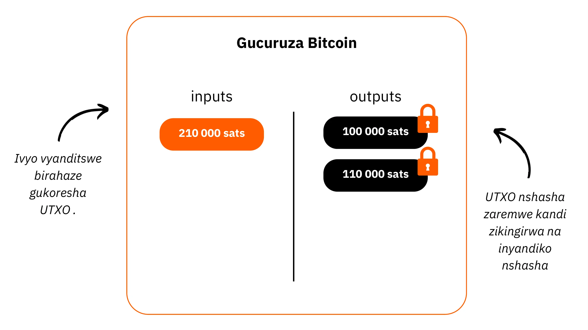


Igicuruzwa cose ca Bitcoin rero gifise ikintu kimwe canke vyinshi vyinjizwa n’ikintu kimwe canke vyinshi bisohoka. Ivyinjizwa ni UTXOs zikoreshwa n’ugucuruza ku bisohoka vya generate. Ivyiza biva ni UTXO nshasha zishobora gukoreshwa nk’ibintu vy’injiza mu bikorwa vyo muri kazoza.


**Wari uzi?** Mu vyiyumviro, igikorwa ca Bitcoin coshobora kugira umubare udahera w’ibintu vyinjizwa n’ibisohoka. Igitigiri conyene ni ubunini bw’ibarabara burengeye ubundi bwose.


Ivyo winjiza vyose mu gucuruza Bitcoin vyerekeye UTXO itakoreshejwe mbere. Kugira ngo umuntu akoreshe UTXO nk’inyungu, uwuyifise ategerezwa kwerekana ko ari we afise uburenganzira bwo kuyikoresha mu kwemeza inyandiko ijana na yo, ni ukuvuga mu gushitsa ivyangombwa vyo gukoresha amahera vyategekanijwe. Muri rusangi, ivyo bisigura gutanga umukono wa digitale ukoresheje urufunguzo rw'ibanga rujanye n'urufunguzo rwa bose rwabanje gukingira uru UTXO. Ico canditswe rero gishingiye ku kugenzura ko iyo sinyatire ihuye n’urufunguzo rwa bose rwakoreshejwe igihe amahera yaronswa.


Igisohoka cose, na co nyene, kigaragaza umubare w’ama bitcoins azorungikwa, hamwe n’uwuzoyakira. Ico ca nyuma gisobanurwa n’inyandiko nshasha, akenshi ibuza UTXO iherutse kuremwa n’i Address yakira canke urufunguzo rushasha rwa bose.


Kugira ngo igikorwa gifatwe ko gifise akamaro hakurikijwe amategeko y’uguhurizako, umusaruro wose utegerezwa kuba muto canke ungana n’umusaruro wose. Mu yandi majambo, umubare w’ama UTXO mashasha aterwa n’ugucuruza ntutegerezwa kurenga umubare w’ama UTXO akoreshwa nk’ibintu vy’inyungu. Iryo hame rirabereye: iyo ufise `500.000 Sats` gusa, ntushobora kugura `700.000 Sats`.


### Exchange no gufatanya mu gucuruza Bitcoin


Ico gikorwa c'ugucuruza Bitcoin kuri UTXO rero gishobora kugereranywa no gusubira gukora Coin y'inzahabu. Nkako, UTXO ntishobora kugabanywa, ahubwo irashobora gusenyuka gusa. Ivyo bisigura ko uwukoresha adashobora gusa kugabanya UTXO iserukira umubare kanaka mu ma bitcoins mu UTXO ntoyi nyinshi. Ategerezwa kuyikoresha yose mu gucuruza kugira ngo areme UTXO imwe canke nyinshi nshasha z’agaciro k’ububisha mu bisohoka, zitegerezwa kuba ziri munsi canke zingana n’agaciro k’intango.


Ubwo buryo busa n’ubw’inzahabu Coin. Reka tuvuge ko ufise Coin y’ama ounce 2 ugashaka kwishura ama ounce 1, twiyumvira ko uwugurisha adashobora kuguha amahera yo guhindura. Wobwirizwa gufukura Coin yawe ugatera 2 nshasha zifise ounce 1 kuri imwe yose.


Bitcoin na yo ikora mu buryo nk’ubwo nyene. Reka twiyumvire ko Alice ifise UTXO ya `10.000 Sats` kandi yipfuza kugura umukate ugura `4.000 Sats`. Alice izokora ibikorwa vy’ubudandaji n’amashanyarazi 1 UTXO ya `10.000 Sats` nk’ivyo azokoresha, ivyo azobikoresha vyose, n’ama UTXO 2 y’amashanyarazi `4.000 Sats` na `6.000 Sats` nk’ivyo azosohora. UTXO ya `4.000 Sats` izorungikirwa umutetsi mu kwishura baguette, mu gihe UTXO ya `6.000 Sats` izosubira kuri Alice mu buryo bw’ihinduka. Iyi UTXO, isubira ku muntu yatanze iyo nzira, izwi kw'izina rya "Exchange" mu rurimi rwa Bitcoin.


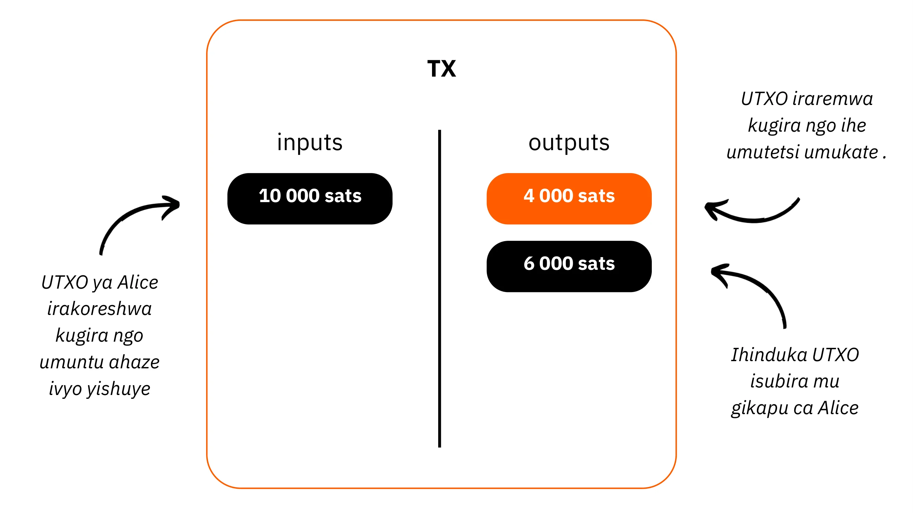


None reka twiyumvire ko Alice idafise UTXO imwe y’amashanyarazi `10.000 Sats`, ahubwo ifise UTXO zibiri z’amashanyarazi `3.000 Sats` imwe yose. Muri ivyo, nta n'imwe muri UTXOs ku giti cayo ihagije kugira ngo ishobore gushinga `4.000 Sats` y'inkoni. Alice rero ategerezwa gukoresha icarimwe izo UTXO 2 za `3.000 Sats` nk’ivyo akoresha mu gucuruza kwiwe. Muri ubwo buryo, umubare wose w’ibikoresho uzoshika ku `6.000 Sats`, bimushoboze guhazwa n’amahera `4.000 Sats` yari yarihaye umutetsi. Ubu buryo, aho UTXO nyinshi zihurizwa hamwe nk'inyungu mu gucuruza, akenshi bwitwa "gufatanya".


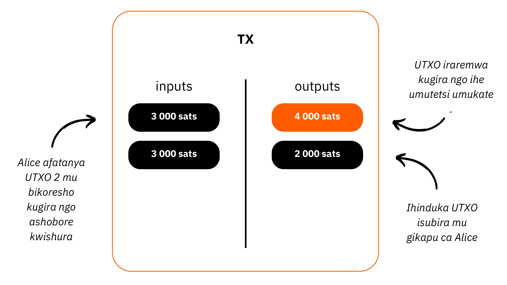


### Amafaranga y'ugucuruza


Mu buryo bw’ubuhinga, umuntu yoshobora kwiyumvira ko ibiciro vy’ugucuruza na vyo nyene bigereranya umusaruro w’ugucuruza. Ariko mu vy’ukuri, ivyo si ko biri. Ibiciro vy’ugucuruza bigereranya itandukaniro hagati y’ivyo vyose bishirwamwo n’ivyo vyose bisohoka. Ivyo bisigura ko, inyuma yo gukoresha igice c’agaciro k’ibintu vyinjijwe kugira ngo umuntu apfuke ibintu vyipfuzwa mu gucuruza, umubare kanaka w’ibintu vyinjijwe uguma udakoreshwa. Iryo shirahamwe ry’amasigarira ni ryo rigize amahera y’ugucuruza.


```plaintext
Frais = total inputs - total outputs
```


Reka dufate akarorero ka Alice, afise UTXO ya `10.000 Sats`, ashaka kugura umukate ku `4.000 Sats`. Alice irema ubucuruzi na UTXO yiwe ya `10.000 Sats` nk’inyungu. Araheza akazana umusaruro w’amafaranga `4.000 Sats` kugira ngo umutetsi ashobore kwishura iyo baguette. Kugira ngo abacukuzi b’amabuye y’agaciro bashire ibikorwa vyiwe mu gice, Alice itanga `200 Sats` mu mahera. Araheza akarema igisubizo ca kabiri, ihinduka, rizosubirwamwo, ringana na `5.800 Sats`.


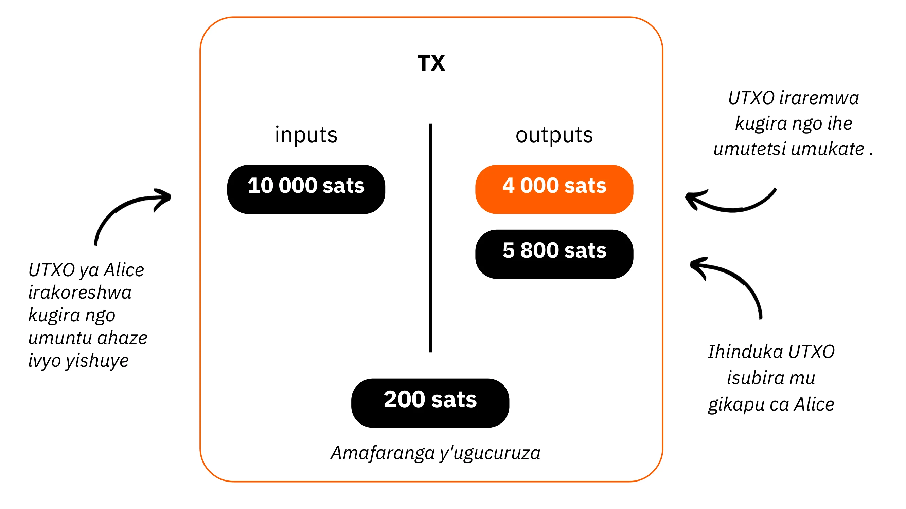


Dukoresheje uburyo bw’amahera, turabona ko vy’ukuri hariho `200 Sats` zisigaye ku bana bato:


```plaintext
Frais = total inputs - total outputs
Frais = 10 000 - (4 000 + 5 800)
Frais = 10 000 - 9 800
Frais = 200
```


Iyo Miner ashoboye kwemeza ububiko, arafise uburenganzira bwo gutora ayo mahera ku bikorwa vyose biri muri bubiko bwiwe, biciye ku vyo bita "coinbase" transaction.


### Gukora UTXOs kuri Bitcoin


Niba warakurikiye neza ibice vyabanje, ubu uzomenya ko UTXO zishobora kuremwa gusa mu kurya izindi UTXO zihari. Muri ubwo buryo, ibiceri vya Bitcoin birakora uruzitiro rudahengeshanya. Ariko rero, woshobora kuba uriko uribaza ingene ibihimba vya mbere vyo muri urwo ruhererekane vyabayeho. Ivyo bivyura ingorane isa n’iy’inkoko n’igi: izo UTXO z’intango zavuye hehe?


Inyishu iri mu **coinbase y’ibikorwa**.


Igikoresho c’amahera ni ubwoko bwihariye bw’ugucuruza kwa Bitcoin, ari bwo budasanzwe kuri buri bubiko kandi buhora ari ubwa mbere muri ivyo. Bituma Miner yaronse Proof of Work ibereye aronka Block reward yiwe. Iryo shimwe rigizwe n’ama Elements abiri: **block grant** na **amahera y’ugucuruza**, twavuze mu gice ca mbere.


Coinbase Transaction ni yo yihariye kuko ari yo yonyene ishobora kurema bitcoins ex nihilo, ata nkenerwa yo gukoresha ivyinjijwe ku bisohoka vya generate. Ivyo bice bishasha vyaremwe nivyo twokwita "UTXOs z'umwimerere".


Block-subsidized bitcoins ni BTC nshasha yaremwe kuva mu ntango, hakurikijwe urutonde rwo gutanga rwashinzwe imbere y’igihe mu mategeko y’uguhurizako. Infashanyo y'amabarabara igabanywa igice c'amabarabara 210.000, ni ukuvuga hafi buri myaka ine, mu buryo buzwi nka "Halving". Mu ntango, ama bitcoins 50 yararemwa n’infashanyo imwe imwe, ariko iyo nsiguro yaragabanutse buhoro buhoro; ubu, ni 3.125 bitcoins ku bubiko.


Naho ku bijanye n’amahera y’ibikorwa, naho nyene aserukira BTC nshasha yaremwe, ntashobora kurenga itandukaniro hagati y’ivyo vyose vyinjizwa n’ivyo bisohoka vy’ibikorwa vyose biri mu gice. Twarabonye mbere ko ayo mahera aserukira igice c’ibintu vyinjizwa bidakoreshwa mu biva mu bikorwa vy’ubudandaji. Ico gice "kirazimangana" mu buryo bw'ubuhinga mu gihe c'ugucuruza, kandi Miner irafise uburenganzira bwo gusubira kurema ako gaciro mu buryo bw'i UTXO imwe canke nyinshi nshasha. Ivyo ni uguhindura agaciro hagati y'uwutanga amafaranga n'uwa Miner ariyongera kuri Blockchain.


**Wari uzi?** Ama Bitcoins akomoka kuri Coinbase Transaction afise igihe co gukura c'ama blocks 100, muri ico gihe ntashobora gukoreshwa na Miner. Iri tegeko ryagenewe kwirinda ingorane zijanye n’ugukoresha ama bitcoins mashasha yaremwe ku ruzitiro rwoshobora guhinduka ubusa.


### Inkurikizi z'ikigereranyo ca UTXO


Mbere na mbere, urugero rwa UTXO ruragira ico rukoze ata guca ku ruhande ku mahera y’ugucuruza ya Bitcoin. Kubera ko ubushobozi bw’ibarabara rimwe rimwe ari buke, abacukuzi barakunda ibikorwa bitanga amahera meza kuruta ayandi yose ugereranije n’ahantu bazofata muri iryo barabara. Nkako, uko igikorwa gishiramwo ama UTXO menshi mu vyo yinjiza n’ivyo asohora, ni ko iremera, rero isaba amahera menshi. Iyi ni imwe mu mpamvu zituma kenshi tugerageza kugabanya igitigiri c’ama UTXO muri Wallet yacu, ivyo na vyo nyene bishobora gutuma habaho ibanga, ikintu tuzokwihweza mu buryo burambuye mu gice ca gatatu c’iri shure.


Ica kabiri, nk’uko vyavuzwe mu bice vyabanje, ibiceri vya Bitcoin mu vy’ukuri ni uruhererekane rw’ama UTXO. Igicuruzwa cose rero kiratuma habaho isano hagati ya UTXO ya kera n’iya UTXO izoza. UTXOs rero zituma bishoboka gukurikira mu buryo butomoye inzira ya Bitcoins kuva yaremwa gushika aho ikoresha ubu. Ukwo guseruka gushobora kubonwa neza, kuko gutuma uwukoresha wese ashobora kumenya neza ukuri kw’amahera ya bitcoins yaronse. Ariko kandi, ni kuri iyo ngingo ngenderwako y’ugukurikirana no gusuzuma ni ho isesengura rya Blockchain rishingiye, umugenzo ugamije gutuma ibanga ryawe rihungabana. Tuzoba turiko turaraba neza cane iyo ngeso mu gice ca kabiri c’amashure.


## Igishushanyo c'ubuzima bwite bwa Bitcoin


<chapterId>769d8963-3ed5-4094-b21d-9203c7d9e465</chapterId>


### Amahera: ukuri, ubunyankamugayo n'ugukoresha kabiri


Kimwe mu bikorwa vy’amahera ni ugutorera umuti ingorane y’uguhuza kabiri kw’ivyo umuntu akeneye. Mu buryo bushingiye ku guhinduranya, guheza Exchange ntibisaba gusa kurondera umuntu ariko aratanga ikintu gihuye n’ivyo nkeneye, ariko kandi no kumuha ikintu c’agaciro kangana kihaza ivyo we ubwiwe akeneye. Gushika kuri ubwo buringanire ni ikintu kigoye cane.


Ni co gituma dukoresha amahera kugira ngo twimure agaciro mu kibanza no mu gihe.


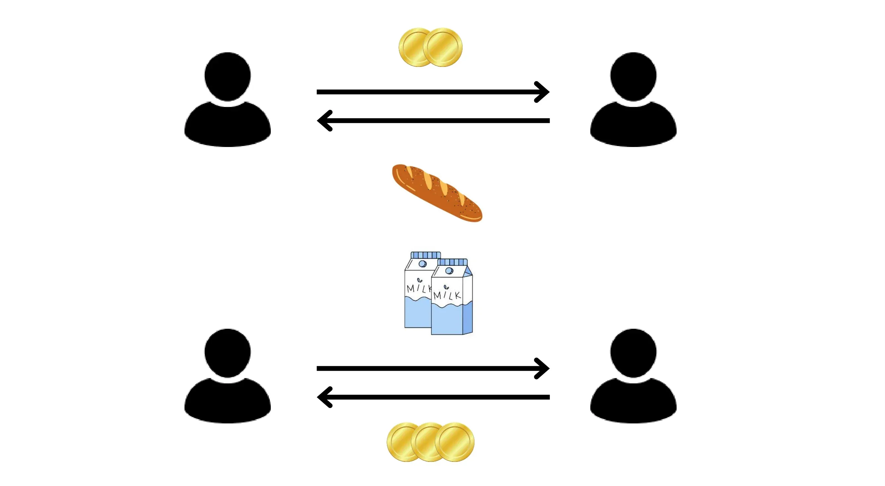


Kugira ngo amafaranga y’ibiceri atore umuti w’ico kibazo, birahambaye ko uwutanga ikintu canke igikorwa yemera neza ko afise ubushobozi bwo gukoresha ayo mahera mu nyuma. Gutyo, umuntu wese afise ivyiyumviro vyiza yipfuza kwemera Coin, yaba iyo kuri digitale canke iyo mu mubiri, azokwitwararika ko ihuye n’ingingo zibiri z’ishimikiro:


- Ico gice kigomba kuba gifise ubunyankamugayo n'ukuri;
- kandi ntibitegerezwa gukoreshwa kabiri.


Niba uriko urakoresha amafaranga y’umubiri, ni co kintu ca mbere kigoye cane kwemeza. Mu bihe bitandukanye vyo muri kahise, ubutungane bw’ibiceri vy’ivyuma bwarashikiwe kenshi n’imigenzo nk’ugukata canke gutobora. Nk’akarorero, i Roma ya kera, vyari bimenyerewe ko abanyagihugu bakaraba ku mpande z’ibiceri vy’inzahabu kugira ngo baronke utugingo ngengabuzima dutoduto tw’agaciro, mu gihe bakabizigama kugira ngo bazobikoreshe mu gihe kizoza. Agaciro k’imbere muri Coin rero karagabanutse, ariko agaciro kayo k’imbere karaguma ari uko nyene. Ivyo ni bimwe mu vyatumye uruhande rw’indege Coin rwaheza rugaterwa n’imirongo.


Ubunyakuri na bwo ni ikintu kigoye kugenzura ku buryo bw’amahera buboneka. Ubuhinga bwo kurwanya amahera y’ibinyoma bwo muri iki gihe buragenda burarushiriza kugorana, ivyo bikaba bituma abagurisha ibintu bashiramwo amahera menshi mu buryo bwo kugenzura amahera menshi.


Ku rundi ruhande, kubera kamere yavyo, gukoresha amahera incuro zibiri si ingorane ku mahera y’umubiri. Iyo nguhaye amafaranga y’amayero 10, arava mu vyo mfise ataco ahinduye, yinjira mu vyawe, ivyo bikaba bikuraho ubushobozi bwo gukoresha kenshi amafaranga afise. Muri make, sinzosubira gukoresha iyi fagitire y’amayero 10.


Ku mafaranga y’ubuhinga bwa none, ingorane ni itandukanye. Kumenya neza ko igitabu Coin ari ic’ukuri kandi ko kitagira agasembwa akenshi biroroshe. Nk’uko twabibonye mu gice ca mbere, igishushanyo ca Bitcoin ca UTXO kiratuma bishoboka gukurikirana Coin gushika aho yakomotse, gutyo bigasuzumwa ko vy’ukuri yaremwe na Miner hakurikijwe amategeko y’uguhurizako.


Ku rundi ruhande, kumenya neza ko ata Double-spending iriho biragoye cane, kuko ibintu vyose vy’ubuhinga bwa none ari amakuru nyayo. Amakuru atandukanye n’ibintu vy’umubiri, ntagabanywa iyo ahinduwe, ahubwo arakwiragira mu kugwiza. Nk’akarorero, iyo nkurungikiye inyandiko kuri e-mail, irakwisubirwamwo. Ntushobora kwemera neza ko nafuse inyandiko y’umwimerere.


### Gukingira gukoresha amahera kabiri kuri Bitcoin


Uburyo bumwe rudende bwo kwirinda iyo nzira yo kwisubiriza umutungo w’ubuhinga bwa none ni ukumenya ivy’uguhinduranya vyose kuri iyo sisitemu. Muri ubwo buryo, turashobora kumenya uwufise iki no guhindura ivyo umuntu wese afise bivanye n’ivyo akora. Ivyo ni vyo bishika nk’akarorero ku mahera y’ivyanditswe mu bijanye n’amabanki. Iyo urishe umucuruzi €10 ukoresheje ikarita y’inguzanyo, banki irandika Exchange maze igahindura igitabu ca konti.


Ku Bitcoin, Double-spending na yo irabujijwe muri ubwo buryo nyene. Turarondera kwemeza ko ata gicuruzwa camaze gukoresha ivyo biceri bivugwa. Nimba ivyo biceri bitigeze bikoreshwa, rero turashobora kwemera tudakeka ko ata n’umwe azokoresha amahera kabiri. Iryo hame ryadondowe na Satoshi Nakamoto mu gitabu cera n’amajambo azwi cane ngo:


**Uburyo bwonyene bwo kwemeza ko ata n'imwe igurishwa ni ukumenya ibikorwa vyose**


Ariko bitandukanye n'akarorero ka banki, ntidushaka kwizigira ikigo gikuru ku Bitcoin. Rero abakoresha bose barakeneye kumenya kwemeza uku kutagira amahera akoreshwa incuro zibiri, batizigiye uwundi muntu. Rero umuntu wese arakeneye kumenya amafaranga yose akoreshwa muri Bitcoin. Ni co gituma amafaranga y'ubudandaji ya Bitcoin atangazwa ku mugaragaro ku nzira zose z'urubuga kandi yandikwa mu nyandiko zitomoye kuri Blockchain.


Ukwo gukwiragiza amakuru ku mugaragaro ni kwo nyene gutuma ugukingira ubuzima bwite muri Bitcoin bigorana. Mu nzira ya kera y’amabanki, mu vyiyumviro, ikigo c’ivy’imari conyene ni co kimenya amafaranga akoreshwa. Ku rundi ruhande, na Bitcoin, abakoresha bose baramenyeshwa ivy’ibikorwa vyose, biciye ku nzira zabo.


### Icogereranyo c'ibanga: uburyo bwa banki n'uburyo bwa Bitcoin


Mu buryo bwa kera, konti yawe yo muri banki irahuye n’akaranga kawe. Uwo mukozi wa banki arashobora kumenya konti ya banki y’umukiriya uwuhe, n’amahera ajanye na yo. Ariko rero, iyo nzira y’amakuru iracika hagati ya banki n’ivy’abantu bose. Mu yandi majambo, ntibishoboka kumenya amahera asigaye n’amahera akoreshwa kuri konti ya banki y’uwundi muntu. Banki yonyene ni yo ishobora kuronka ayo makuru.


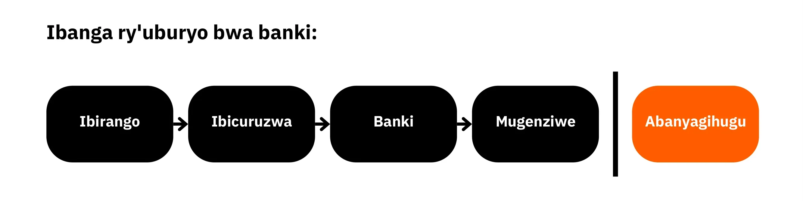


Nk’akarorero, umukozi wawe wo muri banki arazi ko ugura baguette yawe buri gitondo ku mutetsi wo mu karere kawe, mugabo umubanyi wawe ntaco azi ku bijanye n’ico gikorwa. Muri ubwo buryo, uruja n’uruza rw’amakuru rurashikirwa n’ababijejwe, cane cane banki, ariko ntirushikira abanyamahanga.


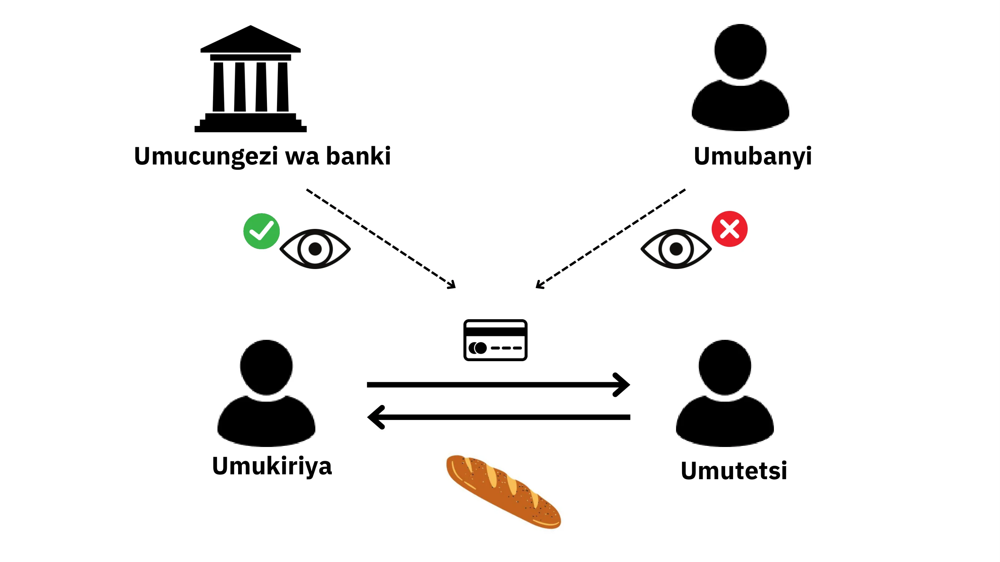


Kubera ingorane zo gukwiragiza amafaranga y’ubudandaji mu bantu bose twabonye mu gice ca mbere, uburyo bwo gucungera ibanga bwa Bitcoin ntibushobora gukurikira uburyo bwo gukoresha amabanki. Mu bijanye na Bitcoin, kubera ko uruja n’uruza rw’amakuru rudashobora guca hagati y’ibikorwa n’ivy’abantu bose, **akarorero k’ubuzima bwite bwishingikiriza ku gutandukanya akaranga k’ukoresha n’ibikorwa** ubwavyo.


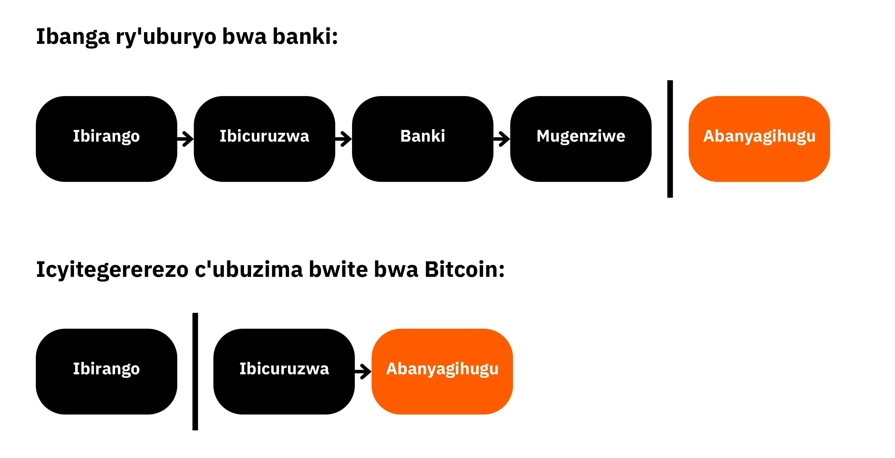


Nk’akarorero, iyo uguze umukate ku mutetsi, uriha muri BTC, umubanyi wawe afise Full node yiwe bwite, arashobora kubona ingene amafaranga yawe agenda, nk’uko nyene ashobora kubona ayandi mafaranga yose ari muri iyo sisitemu. Ariko rero, nimba ingingo ngenderwako z’ibanga zikurikizwa, ntakwiye kuba ashoboye guhuza iyo nzira yihariye n’akaranga kawe.


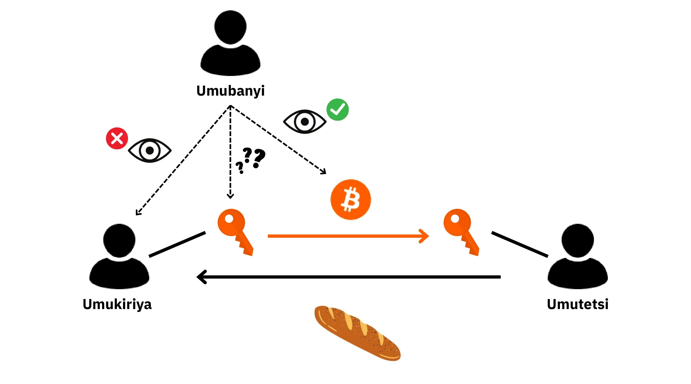


Ariko kubera ko amafaranga y’ubudandaji ya Bitcoin amenyeshwa abantu bose, birashoboka ko habaho amasano hagati yayo kugira ngo haboneke amakuru yerekeye ababigiramwo uruhara. Ico gikorwa mbere ni ikintu kidasanzwe mu burenganzira bwaco bwite, kizwi nka "isesengura rya Blockchain". Mu gice gikurikira c’amashure, ndabatumiye gutohoza ivy’ishimikiro vy’isesengura rya Blockchain, kugira ngo mushobore gutahura ingene ama bitcoins yanyu akurikiranywa no kwikingira neza.


# Gutahura no kwikingira isesengura ry'uruzitiro


<partId>4739371e-9fef-45b0-bcaa-b7a4df6b4470</partId>


## None isesengura ry’uruzitiro rwa Bitcoin ni iki?


<chapterId>7d198ba6-4af2-4f24-86cb-3c79cb25627e</chapterId>


### Insobanuro n'imikorere


Blockchain isesengura ni umugenzo wo gukurikirana uruja n'uruza rw'ama bitcoins kuri Blockchain. Muri rusangi, isesengura ry’uruzitiro rishingiye ku kwihweza ibiranga mu ngero z’ibikorwa vya kera. Bica biva ku kumenya ivyo bimenyetso nyene ku bijanye n’ugucuruza twipfuza gusuzuma, no kubikuramwo insobanuro zishoboka. Ubu buryo bwo gutorera umuti ingorane, bushingiye ku buryo bukora bwo kuronka umuti mwiza uhagije, buzwi nka "heuristic".


Mu majambo y’abanyabwenge, hariho intambwe zitatu nyamukuru mu gusesangura uruhererekane:


1. **Kwihweza Blockchain;**


2. **Ukumenya ibiranga bizwi;**


3. **Ugukuraho ivyiyumviro**


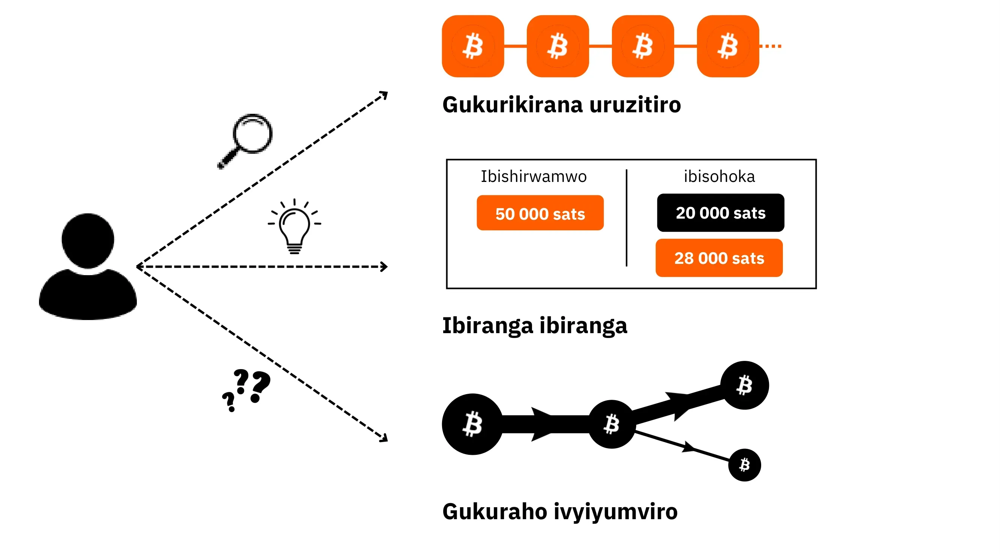


Isesengura rya Blockchain rishobora gukorwa n’umuntu wese. Ico ukeneye ni ukuronka amakuru ya bose ya Blockchain biciye ku Full node kugira ngo wihweze ingene amafaranga agenda no gukora ivyiyumviro. Hariho kandi ibikoresho vy’ubuntu vyorohereza iyo nseguro, nka [OXT.me](https://oxt.me/), tuzovyihweza mu buryo burambuye mu bice bibiri vya nyuma vy’iki gice. Ariko rero, ingorane nyamukuru yo gukingira ibanga iva ku masosiyete yizeye mu gusesangura imirongo. Izo sosiyete zatwaye isesengura rya Blockchain ku rugero rw’inganda, zigurisha ibikorwa vyazo ku bigo vy’imari na Leta. Muri izo sosiyete, Chainalysis ni yo izwi cane ata gukeka.


### Intumbero z'isesengura ry'uruhererekane


Kimwe mu ntumbero z’isesengura rya Blockchain ni ugushira hamwe ibikorwa bitandukanye kuri Bitcoin kugira ngo hamenyekane ubudasa bw’uwubikoresha yabikoze. Hanyuma, bizoba bishoboka kugerageza guhuza iryo tsinda ry’ibikorwa n’akaranga nyakuri.


Niwiyumvire ikigabane c’imbere. Nasiguye igituma uburyo bwo gucungera ubuzima bwite bwa Bitcoin bwari bushingiye ku gutandukanya akaranga k’ukoresha n’ibikorwa. Vyoshobora rero kuba ari ikigeragezo kwiyumvira ko isesengura rya Blockchain ata co rimaze, kuko naho twoshobora gukoranya ibikorwa vy’uruzitiro, ntidushobora kubifatanya n’akaranga nyakuri.


Mu vy’impwemu, iyo mvugo ni ukuri. Mu gice ca mbere c'iri shure, twabonye ko amafunguro abiri akoreshwa mu gushinga ivyangombwa kuri UTXO. Mu vy’ukuri, izo nzira zibiri z’ingenzi ntizitangaza amakuru yerekeye akaranga k’abazifise. Rero, naho twoshobora gukoranya ibikorwa bijanye n’imigwi itandukanye y’ingenzi, ivyo ntaco bitubwira ku bijanye n’ikigo kiri inyuma y’ivyo bikorwa.


Ariko rero, ukuri kw’ibikorwa ni ugukomeye kuruta. Hariho inyifato nyinshi zishobora guhuza akaranga nyakuri n’igikorwa c’uruzitiro. Mu gusesangura, ivyo vyitwa ikibanza co kwinjiramwo, kandi hariho ubwinshi bwavyo.


Igisanzwe ni KYC (*Menya Umukiriya Wawe*). Iyo ukuye Bitcoins zawe ku rubuga rutegekanijwe kuri imwe mu ma aderesi yawe bwite, rero hari abantu bashobora guhuza akaranga kawe n’iyo Address. Mu buryo bwagutse, ikibanza co kwinjiramwo gishobora kuba uburyo bwose bwo gukorana hagati y’ubuzima bwawe nyakuri n’ugucuruza kwa Bitcoin. Nk’akarorero, iyo usohoye Address y’ukwakira ku mbuga ngurukanabumenyi zawe, ivyo vyoshobora kuba ikintu co kwinjiramwo co gusuzuma. Iyo urishe mu Bitcoins umufumbi wawe, azoshobora gufatanya mu maso hawe (igice c’akaranga kawe) na Bitcoin Address.


Ivyo bibanza vyo kwinjiramwo ni nk'ibidashobora kwirindwa iyo ukoresheje Bitcoin. Naho tworondera guhagarika urugero rwavyo, bazokwama bariho. Ni co gituma bihambaye cane gufatanya uburyo bugamije kuzigama ubuzima bwite bwawe. Naho kuguma utandukanya akaranga kawe nyakuri n’ivyo ukora ari uburyo bushimishije, buracari ubudahagije muri iki gihe. Nkako, nimba ibikorwa vyawe vyose vyo kuri onchain bishobora gushirwa hamwe, rero n’aho winjira hatoyi cane birashobora gutuma Layer imwe gusa y’ibanga washizeho ihungabana.


### Kwikingira isesengura ry'uruzitiro


Rero turakeneye kandi kumenya guhangana n'isesengura rya Blockchain mu gukoresha kwacu Bitcoin. Mu kubigira, turashobora kugabanya ugukorana kw’ibikorwa vyacu no kugabanya ingaruka z’aho twinjira ku buzima bwacu bwite.


Ni ubuhe buryo bwiza bwo kurwanya isesengura rya Blockchain kuruta kumenya uburyo bukoreshwa muri ryo? Niba ushaka kumenya ingene wokwongerera ubushobozi ubuzima bwite bwawe kuri Bitcoin, urakeneye gutahura ubwo buryo. Ivyo bizotuma utahura neza ubuhinga nka CoinJoin canke PayJoin (ubuhinga tuzorabira mu bice vya nyuma vy’amashure), kandi ugabanye amakosa woshobora gukora.


https://planb.network/tutorials/privacy/on-chain/coinjoin-samourai-wallet-e566803d-ab3f-4d98-9136-5462009262ef

https://planb.network/tutorials/privacy/on-chain/payjoin-848b6a23-deb2-4c5f-a27e-93e2f842140f

Muri ivyo, turashobora gushushanya n’ubuhinga bwo gukingira amakuru n’ugusesangura amakuru. Umuhinga mu vy’amabanga ni mbere na mbere umuhinga mu vy’amabanga. Kugira ngo utegure ubuhinga bushasha bwo gupfuka amakuru, urakeneye kumenya ibitero buzohura navyo, kandi ukiga n’igituma ubuhinga bwa kera bwacitse. Iryo hame nyene rirakora no ku bijanye n’ubuzima bwite bwa Bitcoin. Gutahura uburyo bwo gusesangura Blockchain ni urufunguruzo rwo kuvyikingira. Ni co gituma muri iri shure nashizemwo igice cose c’isesengura rya on chain.


### Uburyo bwo gusesangura uruhererekane


Ni vyiza gutahura ko gusesangura imirongo atari ubuhinga nyabwo. Ishingiye ku buhinga bwo gutahura ibintu (heuristics) buva ku vyo umuntu yabonye mbere canke ku nsobanuro zijanye n’ubwenge. Aya mategeko aratuma turonka ibisubizo vyizigirwa, ariko ntitwigere turonka ivyo turonka mu buryo butagiramwo amahinyu. Mu yandi majambo, **isesengura ry’uruzitiro ryama rifise urugero rw’ibishoboka mu nsozero zishitsweko**. Nk’akarorero, birashoboka ko umuntu agereranya ata gukeka ko amaderesi abiri ari ay’ikigo kimwe, mugabo ukudakeka kwose kuzokwama kutaboneka.


Iciyumviro cose c’isesengura ry’uruzitiro kiri mu gukoranya ubuhinga butandukanye kugira ngo hagabanuke ingorane zo gukora amakosa. Mu buryo bumwe, ni ukwirundanira ibimenyamenya bituma twegera ukuri.


Ivyo bimenyetso bizwi cane bishobora gushirwa mu mice itandukanye, ivyo tuzobidondora mu buryo burambuye aha hepfo:


- Uburyo bwo gucuruza;
- Ivyiyumviro vy'imbere mu bikorwa vy'ubudandaji;
- Ivyiyumviro vyo hanze y'ugucuruza.


### Satoshi Nakamoto n'isesengura ry'uruzitiro


Ivyo bimenyetso bibiri vya mbere vy’ugusesangura uruhererekane vyavumbuwe na Satoshi Nakamoto ubwiwe. Arabivuga mu gice ca 10 c’Igitabu Cera ca Bitcoin. Ni:


- cIOH (*Ivyinjira rusangi Ownership Ivyiyumviro*);
- na Address gusubira gukoresha.


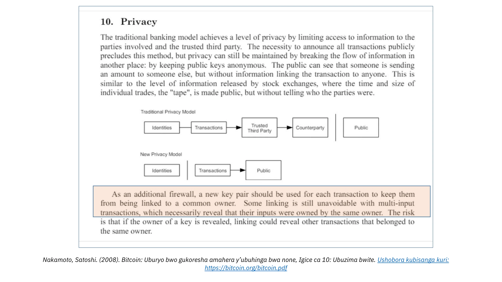


Inkomoko: S. Nakamoto, "Bitcoin: Uburyo bwo gutanga amafaranga y'ubuhinga bwa none", 2009.


Tuzobona ivyo ari vyo mu bice bikurikira, ariko birasanzwe bishimishije kumenya ko izo nzira zibiri ziguma zifise akamaro kanini mu gusesangura uruhererekane muri iki gihe.


## Uburyo bwo gucuruza


<chapterId>d365a101-2d37-46a5-bfb9-3c51e37bf96b</chapterId>


Igishushanyo c’ugucuruza ni gusa ikigereranyo rusangi canke imiterere y’ugucuruza gusanzwe, bishobora kuboneka kuri Blockchain, kandi insobanuro yavyo ishobora kuba izwi. Igihe twiga ivyerekanwa, twibanda ku gikorwa kimwe gusa maze tukagisuzuma ku rugero rwo hejuru.


Mu yandi majambo, tugiye kuraba gusa umubare wa UTXO mu vyo twinjiza n’umubare wa UTXO mu vyo usohoka, tutagumye ku bintu vyihariye canke ibidukikije vy’ugucuruza. Dushingiye ku citegererezo twabonye, ​​turashobora gusobanura kamere y’ugucuruza. Tuzoheza turonde ibiranga imiterere yayo maze dushiremwo insobanuro.


Muri iki gice, tuzorabira hamwe ivyerekanwa nyamukuru vy’ugucuruza bihura n’ugusesangura uruhererekane, kandi ku vyerekanwa vyose, nzoguha insobanuro ishoboka y’iyi mibumbe, hamwe n’akarorero nyako.


### Ugurungika rimwe (canke kwishura rimwe)


Reka dutangure n’ikigereranyo gisanzwe cane, kuko ari co kigaragara ku mahera menshi ya Bitcoin. Uburyo bwo kwishura bworoshe burangwa n’ugukoresha UTXO imwe canke nyinshi nk’ibintu vy’injiza no gukora UTXO 2 nk’ibintu vy’injiza. Iyi modele rero isa n’iyi:


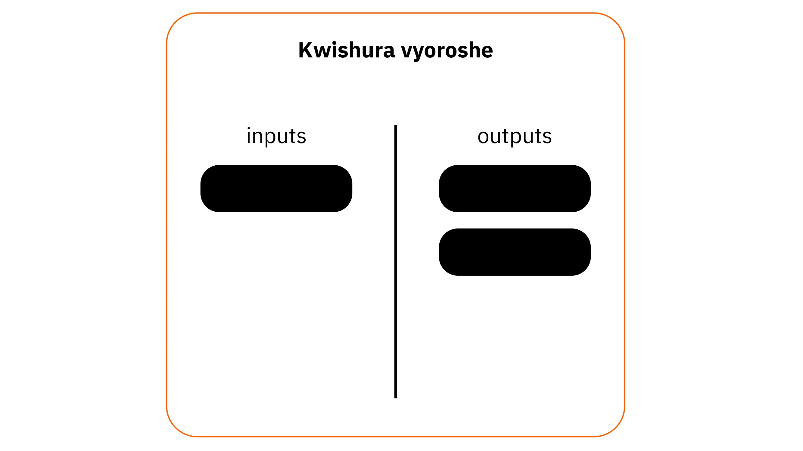


Iyo tubonye iyo nzira y’ugucuruza kuri Blockchain, turashobora guca dufata insobanuro. Nk’uko izina ryayo rivyerekana, iyo nzira yerekana ko turi mu gihe hariho igikorwa co kohereza canke co kwishura. Uwukoresha yakoresheje UTXO yiwe bwite mu vyo yinjiza kugira ngo ahaze mu vyo asohora UTXO y’ukwishura n’ihinduka UTXO (amahera asubizwa uwo mukoresha nyene).


Turazi rero ko uwukoresha yihwejwe kumbure atagifise imwe muri izo UTXO zibiri zisohoka (ivyo kwishura UTXO), ariko akaba agifise iyindi UTXO (ihinduka UTXO).


Kugeza ubu, ntidushobora gusobanura igisohoka giserukira UTXO iyihe, kuko iyo si yo ntumbero y’inyigisho y’akarorero. Tuzoshikayo twizigiye ubuhinga bwo kumenya ibintu (heuristics) tuzokwiga mu bice bikurikira. Muri iyi ntambwe, intumbero yacu ni iyo kumenya gusa uburyo bw’ugucuruza buvugwa, muri iki gihe ni ugutuma kworoshe.


Nk'akarorero, ng'iyi igikorwa ca Bitcoin gikoresha uburyo bworoshe bwo kohereza:


```plaintext
b6cc79f45fd2d7669ff94db5cb14c45f1f879ea0ba4c6e3d16ad53a18c34b769
```


Inkomoko: [Mempool.ikibanza](b6cc79f45fd2d7669ff94db5cb14c45f1f879ea0ba4c6e3d16ad53a18c34b769)


Inyuma y'akarorero ka mbere, ushobora gutahura neza ico bisobanura kwiga "akarorero k'ugucuruza". Turasuzuma igikorwa co gucuruza mu kwibanda gusa ku mibumbe yaco, tutazirikanye ibidukikije canke ido n’ido ry’ico gicuruzwa. Muri iyi ntambwe ya mbere, turiko turaraba gusa ishusho nini.


None ko mwatahuye ico ari co, reka tujane ku bindi bigereranyo biriho.


### Gukubura


Ico kigereranyo ca kabiri kirangwa n’ugukoresha UTXO imwe nk’inyungu n’uguhingura UTXO imwe nk’isohoka.


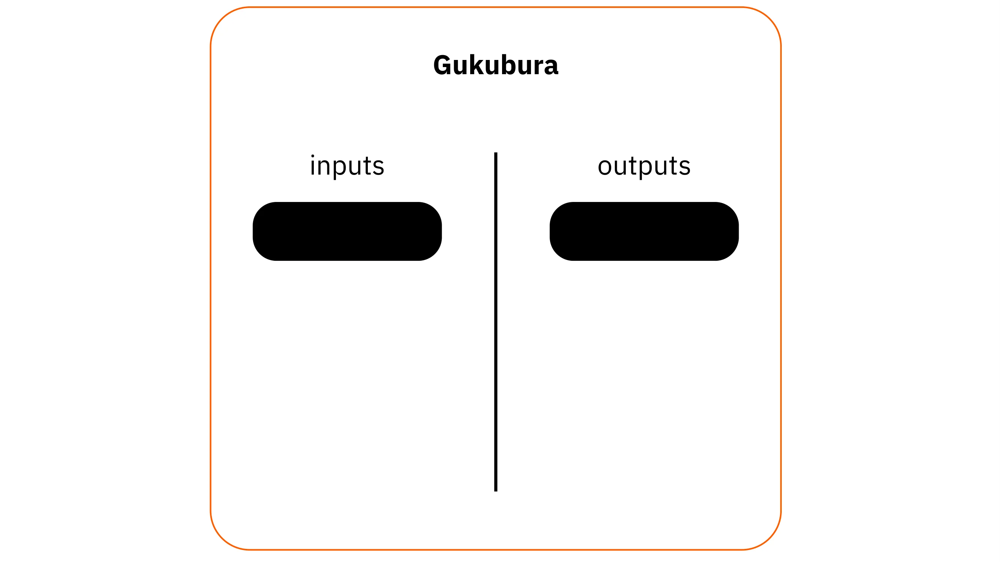


Insobanuro y’iki kigereranyo ni uko turi mu kubaho kw’ukwihindura. Uwukoresha yari yimuriye ama bitcoins yiwe, ayashira mu yindi Address yiwe. Kubera ko ata mpinduka iriho ku bijanye n’ugucuruza, birashoboka cane ko tuba turi mu gihe c’ugutanga amahera. Nkako, iyo umuntu yishuye, biragoye cane ko uwuyishuye agira urupapuro rwa UTXO rujanye n’amahera asabwa n’uwugurisha, akongerako amahera yo gucuruza. Muri rusangi, uwuriha rero ategerezwa gutanga umusaruro w’ihinduka.


Turamenya rero ko uwukoresha iyo UTXO ashobora kuba agifise. Mu bijanye n’isesengura ry’uruhererekane, nitwamenya ko UTXO ikoreshwa nk’inyungu mu gucuruza ari iya Alice, turashobora kwiyumvira ko UTXO ikoreshwa nk’isohoka na yo nyene ari iyawe. Icozoca gishimishije mu nyuma ni ukurondera ubuhinga bwo gukorana n’abantu bushobora gukomeza ivyo vyiyumviro (tuzobiraba mu kigabane ca 3.3).


Nk’akarorero, ng’iyi igikorwa co gucuruza Bitcoin gikoresha uburyo bwo gukubura:


```plaintext
35f1072a0fda5ae106efb4fda871ab40e1f8023c6c47f396441ad4b995ea693d
```


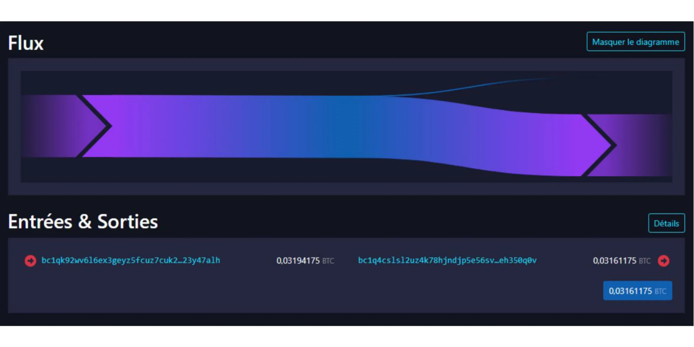


Inkomoko: [Mempool.ikibanza](Mempool.ikibanza/tx/35f1072a0fda5ae106efb4fda871ab40e1f8023c6c47f396441ad4b995ea693d)


Ariko rero, urabe neza ko ubwo bwoko bw’akarorero bushobora kandi guhishura ukwimurirwa kuri konti y’urubuga rw’amahera y’ibanga Exchange. Ni inyigisho y’amaderesi azwi n’aho ivy’ugucuruza bizotubwira nimba ari uguca ku nzira y’ukwicungera Wallet canke gukura ku rubuga. Nkako, akenshi amaderesi y’ibibanza vyo gukoreramwo Exchange aramenyekana bitagoranye.


Reka dusubire gufata akarorero ka Alice: iyo iyo scanner ijana kuri Address izwi ku rubuga (nk’akarorero Binance), ivyo bishobora gusobanura ko izo bitcoins zari zavuye mu maboko ya Alice ataco akora, kumbure n’intumbero yo kuzigurisha canke kuzibika kuri uru rubuga. Ku rundi ruhande, nimba aho Address ija itazwi, birabereye kwiyumvira ko ari uwundi Wallet ukiri uwa Alice. Ariko ubwo bwoko bw’inyigisho buri mu rwego rw’ubuhinga bwo kumenya ibintu kuruta ubuhinga bwo kumenya ibintu.


### Gushiramwo


Ico kigereranyo kirangwa no gukoresha UTXO nyinshi ku nzira y’injiza no gukora UTXO imwe ku nzira y’isohoka.


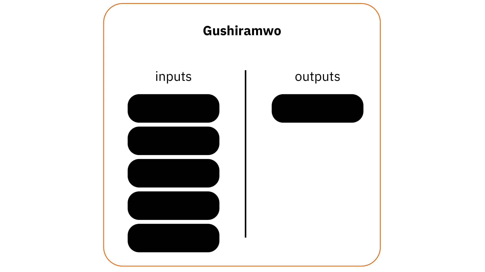


Insobanuro y’ico kigereranyo ni uko turi mu kubaho kw’ugushikama. Ivyo ni umugenzo usanzwe mu bakoresha Bitcoin, bigamije gufatanya UTXO nyinshi mu kwitega ko amafaranga y’ugucuruza yoshobora kwongerekana. Mu gukora iyo nzira mu kiringo amahera ari make, birashoboka ko umuntu azigama amahera azotanga muri kazoza. Tuzovuga vyinshi kuri iyo ngeso mu kigabane ca 4.3.


Turashobora gufata ingingo y’uko uwukoresha inyuma y’iyi nzira y’ugucuruza yari afise kumbure ama UTXO yose mu vyo yinjiza kandi aracari afise UTXO mu vyo asohora. Rero birashoboka ko ari uguhindura umuntu.


Cokimwe n’ugukubura, ubwo bwoko bw’akarorero burashobora kandi guhishura ukwimurirwa ku nkuru y’urubuga rwa Exchange. Ni inyigisho y’amaderesi azwi n’aho ivy’ugucuruza bizotubwira nimba ari ugushira hamwe ku Wallet y’ukwicungera canke ugukura ku rubuga.


Nk’akarorero, ng’iki igikorwa ca Bitcoin gikoresha uburyo bwo gushiramwo:


```plaintext
77c16914211e237a9bd51a7ce0b1a7368631caed515fe51b081d220590589e94
```


Inkomoko: [Mempool.ikibanza](Mempool.ikibanza/tx/77c16914211e237a9bd51a7ce0b1a7368631caed515fe51b081d220590589e94)


Mu gusesangura uruhererekane, iyo nzira irashobora guhishura amakuru menshi cane. Nk’akarorero, nitwamenya ko kimwe mu vyo twinjiza ari ica Alice, twoshobora kwiyumvira ko ibindi vyose vyinjizwa n’ivyo biva muri iyo nzira na vyo nyene ari ivyiwe. Ivyo vyiyumviro vyotuma rero bishoboka gusubira mu ruhererekane rw'ibikorwa vya kera kugira ngo umuntu abone kandi asesengure ibindi bikorwa bishobora kuba bifitaniye isano na Alice.


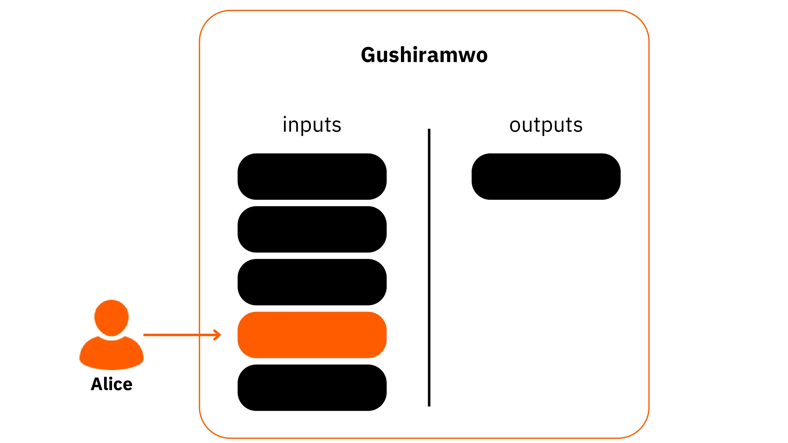


### Amafaranga yashizwe hamwe


Ico kigereranyo kirangwa n’ugukoresha ama UTXO makeyi nk’ibintu bikoreshwa (kenshi kimwe gusa) no gukora ama UTXO menshi nk’ibintu bisohoka.


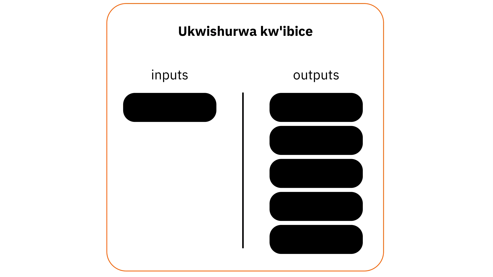


Insobanuro y’iki kigereranyo ni uko turi mu kubaho kw’amahera akoreshwa mu migwi. Ni umugenzo kumbure ugaragaza igikorwa kinini cane c’ubutunzi, nk’urubuga rwa Exchange. Gukoresha amahera mu migwi biratuma izo nzego zishobora kuzigama amahera mu gufatanya amahera zikoresha mu gikorwa kimwe.


Turashobora gukura muri iyo nzira ko UTXO mu vyo kwinjiza iva mw’ishirahamwe rifise ibikorwa vy’ubutunzi vy’agaciro kanini, kandi ko UTXOs mu vyo gusohora zizokwiragizwa. Benshi bazoba ari abo bakiriya b’iyo sosiyete bakuye ama bitcoins kuri iyo nzira. Abandi boshobora kuja mu mashirahamwe bafatanya. Ubwa nyuma, nta gukeka ko hazoba ihinduka rimwe canke menshi rizosubira ku sosiyete yatanze.


Nk'akarorero, ng'iyi igikorwa ca Bitcoin gikoresha uburyo bwo gukoresha amahera (bishoboka ko ari igikorwa casohowe n'urubuga rwa Bybit):


```plaintext
8a7288758b6e5d550897beedd13c70bcbaba8709af01a7dbcc1f574b89176b43
```


Inkomoko: [Mempool.ikibanza](8a7288758b6e5d550897beedd13c70bcbaba8709af01a7dbcc1f574b89176b43)


### Ibikorwa vyihariye vy'amasezerano


Mu mice y’ugucuruza, turashobora kandi kumenya iyo yerekana ikoreshwa ry’umurongo kanaka. Nk’akarorero, ama coinjoins ya Whirlpool (yavuzwe mu gice ca 5) azogira ubuhinga bwo kumenya bitagoranye buzoyatandukanya n’ibindi bikoresho bisanzwe.


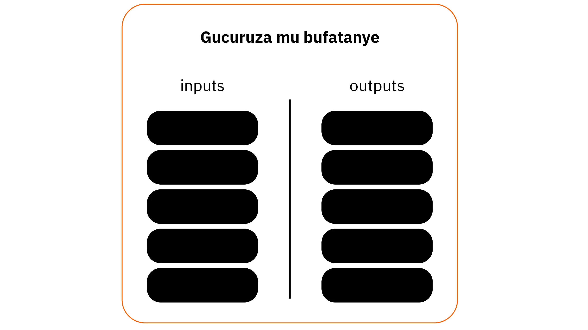


Isesengura ry’ico kigereranyo rirerekana ko bishoboka ko tuba turi mu kubaho kw’ugukorana n’abandi. Birashoboka kandi ko umuntu abona CoinJoin. Iyo iki ciyumviro ca nyuma kigaragaye ko ari ukuri, rero igitigiri c'abasohoka coshobora kuduha ingereranyo y'igitigiri c'abazoja muri CoinJoin.


Nk’akarorero, ng’iyi igikorwa co gucuruza ca Bitcoin gikoresha uburyo bwo gucuruza bwa CoinJoin:


```plaintext
00601af905bede31086d9b1b79ee8399bd60c97e9c5bba197bdebeee028b9bea
```


Inkomoko: [Mempool.ikibanza](Mempool.ikibanza/tx/00601af905bede31086d9b1b79ee8399bd60c97e9c5bba197bdebeee028b9bea)


Hariho n’izindi protocoles nyinshi zifise imiterere yazo yihariye. Nk’akarorero, hariho amafaranga y’i Wabisabi, amafaranga y’ibidodo n’amafaranga y’ama Runes.


Kubera izo nzira z’ugucuruza, turashobora gusobanura amakuru amwamwe yerekeye ugucuruza kanaka. Ariko imiterere y’ibikorwa si yo yonyene isoko y’amakuru yo gusesangura. Turashobora kandi kwiga ido n’ido ryaryo. Ivyo bintu vy'imbere nivyo nkunda kwita "internal heuristics", kandi tuzobiraba mu kigabane gikurikira.


## Ivyiyumviro vyo mu mutima


<chapterId>c54b5abe-872f-40f4-a0d0-c59faff228ba</chapterId>


Heuristic internal ni ikintu kidasanzwe tubona mu gikorwa ubwaco, tutakeneye gusuzuma ibidukikije vyaco, kandi kidushoboza gukuraho. Mu buryo butandukanye n’ibigereranyo, vyibanda ku mibumbe rusangi y’ugucuruza ku rugero rwo hejuru, ubuhinga bwo kumenya imbere mu mutima bushingiye ku makuru ashobora gukurwamwo. Ivyo birimwo:


- Amafaranga y’ama UTXO atandukanye yinjira n’asohoka;
- Ivyo vyose bijanye n'inyandiko: aderesi zo kwakira, guhindura, ibihe vyo gufunga..


Muri rusangi, ubwo bwoko bw’ubuhinga buzodushoboza kumenya ihinduka riri mu gicuruzwa kinaka. Mu kubigira, turashobora rero gukomeza gukurikirana ikintu ku bikorwa bitandukanye. Nkako, iyo tumenye UTXO y’umukoresha twipfuza gukurikirana, birahambaye cane kumenya, igihe akora igikorwa, ni igisohoka ikihe carungitswe ku wundi mukozi n’ico gisohoka giserukira ihinduka, rero kiguma mu minwe yiwe.


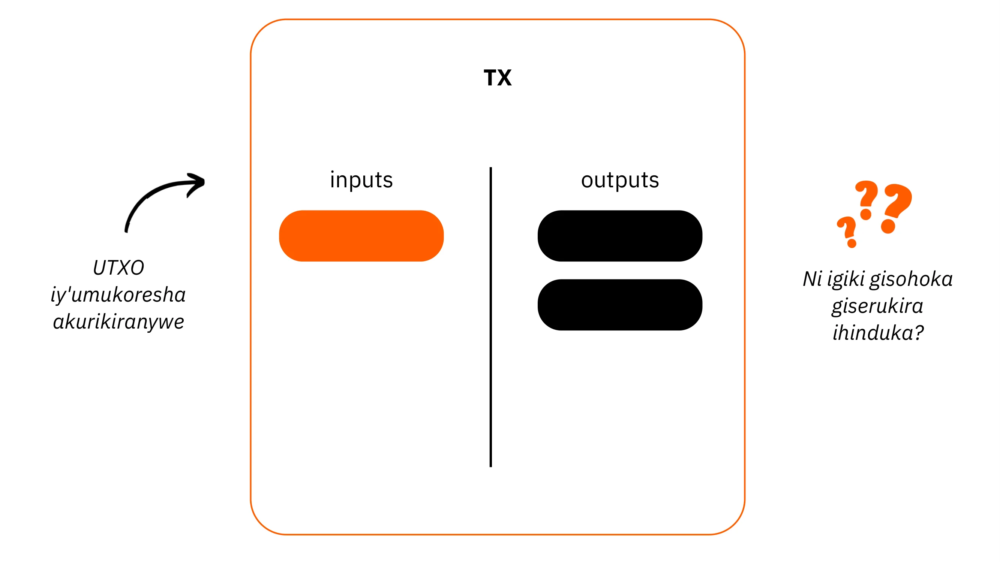


Reka nongere ndabibutse ko izo heuristics zitari nziza rwose. Iyo zifashwe umwumwe wese ku giti ciwe, zituma gusa tumenya ibintu bishobora gushika. Ni ukwirundanira kw’ibintu vyinshi bifasha kugabanya ukudakeka, ata n’umwe ashobora kubikuraho burundu.


### Ibisa n'ivyo mu mutima


Iryo koraniro ry’ubuhinga ryitwa heuristic ririmwo inyigisho y’ibintu bisa hagati y’ibintu vyinjizwa n’ibintu bisohoka mu gikorwa kimwe. Iyo iyo kamere nyene ibonetse ku bintu vyinjizwa no kuri kimwe gusa mu bisohoka vy’ugucuruza, rero birashoboka ko ico gisohoka ari co gihindura.


Ikintu kigaragara cane ni ugusubira gukoresha Address yakira muri iyo nzira nyene.


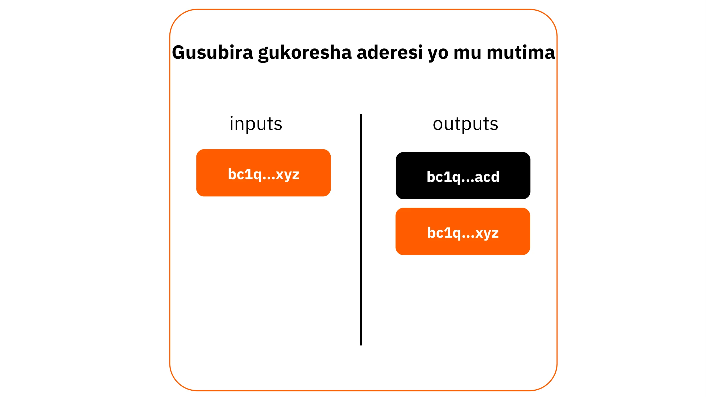


Iryo heuristic ntirisiga ikibanza kinini co gukekeranya. Keretse iyo afise urufunguzo rwiwe rw’ibanga rwaciwe, uwo nyene kwakira Address birahishura vy’ukuri igikorwa c’ukoresha umwe. Insobanuro ivamwo ni uko ihinduka ry’ugucuruza ari igisohoka gifise Address imwe n’iyinjira. Turashobora rero kubandanya gukurikirana uwo muntu kuva kuri iryo hinduka.


Nk'akarorero, ng'iyi igikorwa aho iyi heuristic ishobora gukoreshwa:


```plaintext
54364146665bfc453a55eae4bfb8fdf7c721d02cb96aadc480c8b16bdeb8d6d0
```


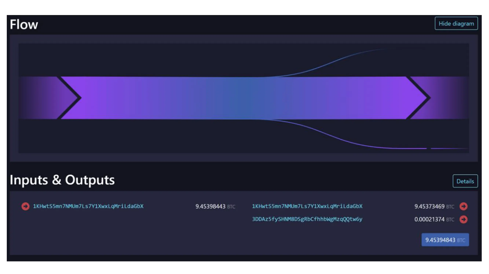


Inkomoko: [Mempool.ikibanza](Mempool.ikibanza/tx/54364146665bfc453a55eae4bfb8fdf7c721d02cb96aadc480c8b16bdeb8d6d0)


Ivyo bisa hagati y’ivyo winjiza n’ivyo usohora ntibihagarara ku gusubira gukoresha Address. Ivyo vyose bisa mu gukoresha inyandiko birashobora gukoreshwa mu gukoresha heuristic. Nk’akarorero, rimwe na rimwe turashobora kubona ubuhinga bumwe hagati y’ivyo twinjiza n’ivyo dusohora.


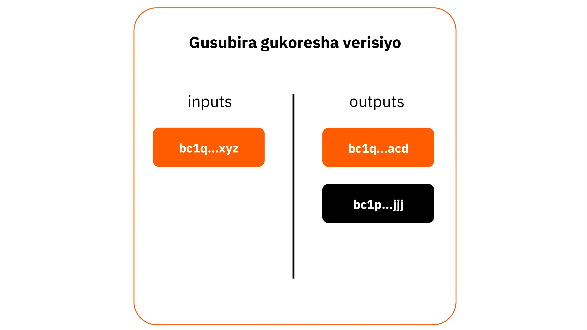


Kuri iki kigereranyo, turashobora kubona ko injiza n° 0 ifungura inyandiko ya P2WPKH (SegWit V0 itangura na `bc1q`). Igisohoka n° 0 gikoresha ubwoko bumwe bw'inyandiko. Igisohoka n° 1, ku rundi ruhande, gikoresha inyandiko ya P2TR (SegWit V1 itangura na `bc1p`). Insobanuro y'iki kintu ni uko bishoboka ko Address ifise verisiyo imwe n'iyo yinjijwe ari ihinduka Address. Vyoba rero vyama ari ivy’uwubikoresha umwe.


Aha niho hari ugucuruza aho iyi heuristic ishobora gukoreshwa:


```plaintext
db07516288771ce5d0a06b275962ec4af1b74500739f168e5800cbcb0e9dd578
```


Inkomoko: [Mempool.ikibanza](Mempool.ikibanza/tx/db07516288771ce5d06b275962ec4af1b74500739f168e5800cbcb0e9dd578)


Ku bijanye n’ivyo vya nyuma, turashobora kubona ko input no. 0 n’isohoka no. 1 ikoresha inyandiko za P2WPKH (SegWit V0), mu gihe igisohoka no. 0 ikoresha inyandiko itandukanye ya P2PKH (Iragi).


Mu ntango z’imyaka ya 2010, iyo heuristic ishingiye ku guhindura inyandiko ntiyari ifise akamaro kubera ubwoko buke bw’inyandiko bwariho. Ariko rero, uko igihe cagenda kirarenga be n’uko Bitcoin yagenda irahindurwa, harashizweho ubwoko bwinshi bw’inyandiko. Iyi heuristic rero iriko irarushiriza kuba ngirakamaro, nk’uko mu gihe c’ubwoko bwinshi bw’inyandiko, abakoresha bagabanya mu migwi mito mito, gutyo bikongera amahirwe yo gukoresha iyi heuristic yo gusubira gukoresha versioning y’imbere. Kubera iyo mpamvu, uhereye ku bijanye n’ibanga gusa, ni vyiza guhitamwo ubwoko bw’inyandiko busanzwe. Nk’akarorero, uko ndiko ndandika iyi mirongo, inyandiko za Taproot (`bc1p`) zikoreshwa cane kuruta inyandiko za SegWit V0 (`bc1q`). Naho ivya mbere bitanga inyungu mu vy’ubutunzi no mu vy’ibanga mu bihe bimwebimwe vyihariye, ku bijanye n’ugukoresha umukono umwe mu buryo busanzwe, vyoshobora kuba vyiza umuntu agumye ku ngingo ngenderwako ya kera kubera imvo z’ibanga, gushika iyo ngingo ngenderwako nshasha yemejwe cane.


### Igitigiri c'ukwishyura


Iyindi heuristic yo mu mutima ishobora kudufasha kumenya ihinduka ni heuristic y’umubare uzunguruka. Muri rusangi, iyo umuntu ahanganye n’uburyo bwo kwishura bworoshe (1 input na 2 outputs), iyo kimwe muri ivyo bisohoka gikoresheje amahera azunguruka, rero ivyo bigereranya ukwishura.


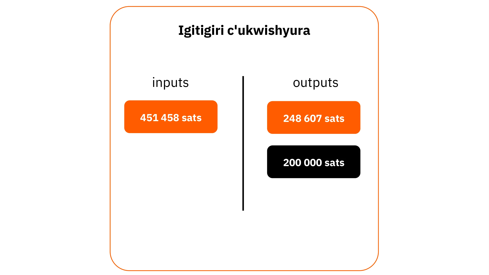


Mu gukuraho, iyo umusaruro umwe ugereranya ukwishyura, uwundi ugereranya uguhinduka. Bishobora rero gusobanurwamwo ko bishoboka ko uwukoresha inyungu yama afise igisohoka kigaragazwa nk’ihinduka.


Hakwiye gushimikwako ko iyo heuristic idahora ikoreshwa, kuko amahera menshi yishurwa aguma akoreshwa mu bice vy’ivy’ubuhinga. Nkako, iyo umucuruzi wo mu Bufaransa yemeye Bitcoin, muri rusangi ntazokwerekana ibiciro bihoraho mu Sats. Ahubwo azohitamwo guhindura hagati y’igiciro kiri mu ma euro n’amahera azorihwa mu ma bitcoins. Nta mibare rero izunguruka ikwiye kubaho ku mpera y’ugucuruza.


Naho ari ukwo, umuhinga mu vy’ugusesangura yoshobora kugerageza gukora iyo mpinduka azirikana igipimo ca Exchange cariho igihe iyo nzira yatangazwa ku rubuga. Reka dufate akarorero k’isoko rifise inyungu ya `97.552 Sats` n’inyungu zibiri, imwe ya `31.085 Sats` iyindi ya `64.152 Sats`. Umuntu aravye neza, iyo nzira y’ugucuruza ntiyiboneka ko irimwo amahera azunguruka. Ariko rero, dukoresheje igipimo ca Exchange c’amayero 64.339 igihe c’ugucuruza, turaronka uguhindura mu mayero nk’uko bikurikira:


- Ivyo winjiza ni €62,76;
- Igisohoka c’amayero 20;
- Ivyo bivako ni €41.27.


Iyo ihinduwe mu mafaranga y’amahera, iyo nzira ishobora gukoreshwa mu gukoresha ubuhinga bwo kwishura amahera azunguruka. Ivyo €20 vyasohotse birashoboka ko vyagiye ku mudandaza, canke n’imiburiburi vyahinduye Ownership. Mu gukuraho, umusaruro w’amayero 41,27 birashoboka ko wagumye mu minwe y’uwawukoresheje mbere.


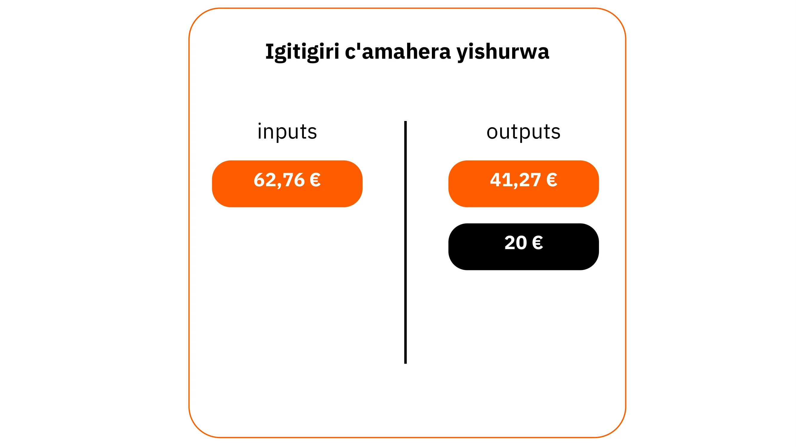


Iyo, umusi umwe, Bitcoin ibaye igice c’ikonti gikundwa cane mu guhanahana kwacu, iyo heuristic yoshobora mbere kuba ngirakamaro mu gusesangura.


Nk'akarorero, ng'iki igikorwa co gucuruza iyo heuristic ishobora gukoreshwako:


```plaintext
2bcb42fab7fba17ac1b176060e7d7d7730a7b807d470815f5034d52e96d2828a
```


Inkomoko: [Mempool.ikibanza](2bcb42fab7fba17ac176060e7d7d7730a7b807d470815f5034d52e96d2828a)


### Igisohoka kinini kuruta ibindi vyose


Iyo tubonye itandukaniro rinini rihagije hagati y’ibiva mu bikorwa 2 vy’ugucuruza ku buryo bworoshe bwo kwishura, turashobora kugereranya ko umusaruro munini cane ushobora kuba ari wo mpinduka.


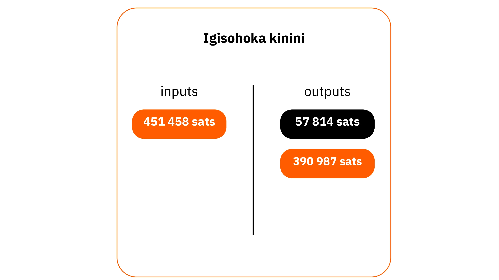


Iyi heuristic y’umusaruro nini kuruta izindi ni yo ata gukeka idatomoye kuruta izindi zose. Ku bwavyo, ni vyiza cane bigoyagoya. Ariko rero, ico kintu gishobora gufatanywa n’ibindi bimenyetso vy’ubuhinga (heuristics) kugira ngo bigabanye ukudakeka kw’insobanuro yacu.


Nk’akarorero, nimba turiko turaraba igikorwa gifise ukwishura gukikuje n’ukwishura kwinshi, gukoresha ubuhinga bwo kwishura buzunguruka n’ubuhinga bwo kwishura bunini hamwe bigabanya urugero rwacu rw’ukudakeka.


Nk'akarorero, ng'iyi igikorwa aho iyi heuristic ishobora gukoreshwa:


```plaintext
b79d8f8e4756d34bbb26c659ab88314c220834c7a8b781c047a3916b56d14dcf
```


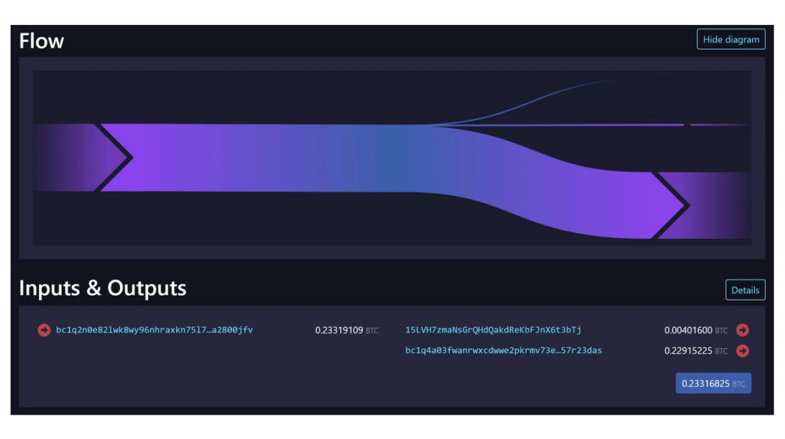


Inkomoko: [Mempool.ikibanza](b79d8f8e4756d34bbb26c659ab88314c220834c7a8b781c047a3916b56d14dcf)


## Ivyiyumviro vyo hanze


<chapterId>4a170e3b-200d-431a-8285-18a23ff617ba</chapterId>


Ivyigwa vy’ubuhinga bwo hanze bisigura gusuzuma ivyo bisa, uburyo n’ibiranga Elements zimwe zimwe zidasanzwe ku bijanye n’ugucuruza ubwavyo. Mu yandi majambo, naho mbere twari twigarukiye ku gukoresha Elements iri mu mutima w’ugucuruza n’ubuhinga bwo mu mutima, ubu turiko turagwiza igice cacu c’isesengura kugira ngo tushiremwo ibidukikije vy’ugucuruza, bivuye ku buhinga bwo hanze.


### Address gusubira gukoresha


Iyi ni imwe mu nzira zizwi cane z’aba bitcoiners. Gusubira gukoresha Address bituma bishoboka gushinga uruja n’uruza hagati y’ibikorwa bitandukanye n’ama UTXO atandukanye. Bishika iyo Bitcoin yakira Address ikoreshejwe incuro nyinshi.


Gutyo, birashoboka gukoresha Address gusubira gukoresha mu gihe c’ugucuruza kumwe nk’ubuhinga bwo kumenya ihinduka (nk’uko twabibonye mu kigabane c’imbere). Ariko Address gusubira gukoresha birashobora kandi gukoreshwa nk’ubuhinga bwo hanze kugira ngo umuntu amenye ubudasa bw’ikintu kiri inyuma y’ibikorwa vyinshi.


Insobanuro yo gusubira gukoresha Address ni uko UTXO zose zibujijwe kuri iyo Address ziri (canke zari ziri) z’ikigo kimwe. Iryo heuristic risiga umwanya mutoyi w’ukudakeka. Iyo bimaze kumenyekana, insobanuro ivamwo birashoboka ko ihuye n’ukuri. Bituma rero habaho ugushira mu mirwi ibikorwa bitandukanye vyo ku ruzitiro.


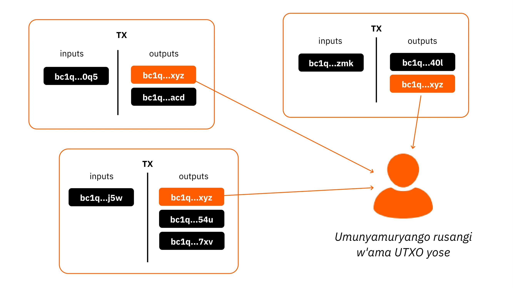


Nk’uko vyasiguwe mu ntangamarara y’igice ca 3, iyo heuristic yavumbuwe na Satoshi Nakamoto ubwiwe. Mu gitabu cera, avuga umuti wo gufasha abakoresha kwirinda kugitanga, ni ukuvuga gusa gukoresha Address ata co ivuga ku bijanye n’ugucuruza gushasha kwose:


"_Nk'uruhome rw'umuriro rw'inyongera, urufunguzo rushasha rushobora gukoreshwa kuri buri gucuruza kugira ngo rugume rudahuye na nyen'urufunguzo rusangi._"


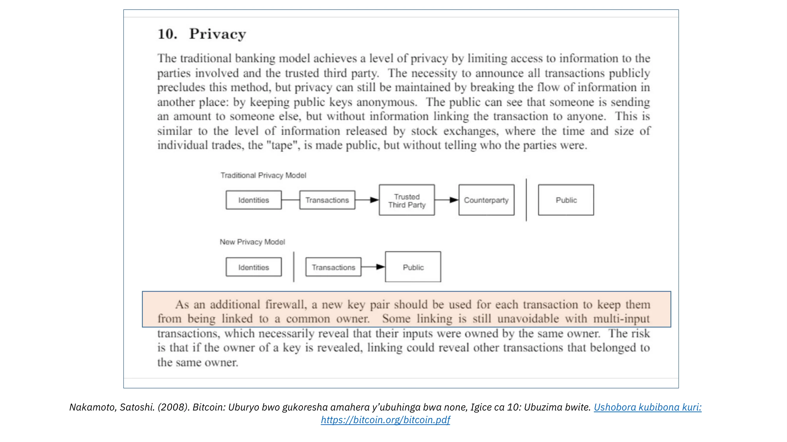


Inkomoko: S. Nakamoto, "Bitcoin: Uburyo bwo gutanga amafaranga y'ubuhinga bwa none", 2009.


Nk’akarorero, ng’iyi Address isubira gukoreshwa mu bikorwa vyinshi:


```plaintext
bc1qqtmeu0eyvem9a85l3sghuhral8tk0ar7m4a0a0
```


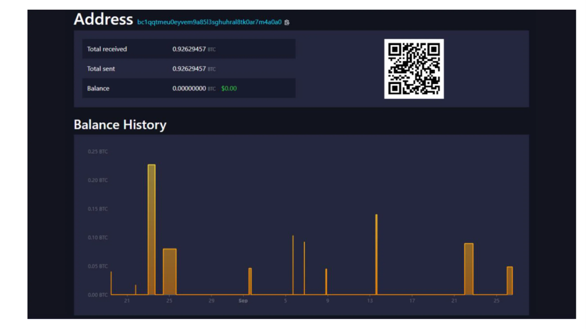


Inkomoko: [Mempool.ikibanza](Mempool.ikibanza/Address/bc1qqtmeu0eyvem9a85l3sghural8tk0ar7m4a0a0)


### Ugusa n'inyandiko n'icapa rya Wallet


Uretse gusubira gukoresha Address, hariho n’ibindi bimenyetso vyinshi bigufasha guhuza ibikorwa n’ikigwi kimwe ca Wallet canke Address.


Ica mbere, umusesanguzi arashobora kurondera ivyo bisa mu gukoresha inyandiko. Nk’akarorero, inyandiko zimwe zimwe z’abantu batobato nka Multisig zishobora kworoha kubona kuruta inyandiko za SegWit V0. Uko umugwi twihishamwo uba munini, ni ko bigorana kutubona. Iyi ni imwe mu mpamvu zituma, ku masezerano meza ya CoinJoin, abaje mu nama bose bakoresha ubwoko bumwe nyabwo bw’inyandiko.


Muri rusangi, umusesanguzi arashobora kandi kwibanda ku bimenyetso vy’intoke vy’i Wallet. Ivyo ni inzira zijanye n’ikoreshwa zishobora kumenyekana kugira ngo zikoreshwe nk’ubuhinga bwo gukurikirana. Mu yandi majambo, nitwabona ukwirundanira kw’ibiranga nyene vyo mu mutima ku bikorwa vy’ubudandaji vyerekeye ikigo gikurikiranywe, turashobora kugerageza kumenya ivyo biranga nyene ku bindi bikorwa vy’ubudandaji.


Nk'akarorero, tuzoshobora kumenya ko uwukoresha akurikiranye yohereza ihinduka ryiwe ku ma aderesi ya P2TR (`bc1p...`). Iyo iyo nzira isubiwemwo, turashobora kuyikoresha nk’ubuhinga bwo gutahura ibintu (heuristic) mu gihe gisigaye c’isesengura ryacu. Turashobora kandi gukoresha ibindi bimenyetso vy'intoke, nk'urutonde rwa UTXOs, ikibanza c'ihinduka mu bisohoka, ikimenyetso ca RBF (Replace-by-fee), canke inomero ya verisiyo, umwanya wa `nSequence` n'umwanya wa `nLockTime`.


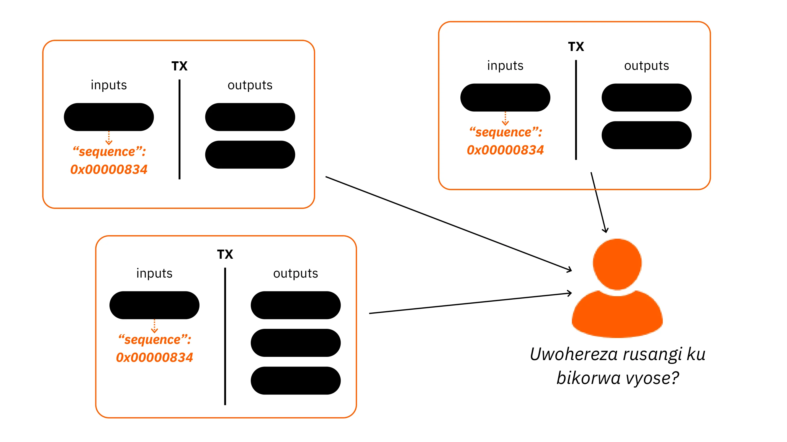


Nk’uko [@LaurentMT](https://twitter.com/LaurentMT) abivuga muri [Igitabu c’Ikirere #19](Ikiganiro c’Ikirere. Podcast yo mu rurimi rw’igifaransa), akamaro k’ibimenyetso vy’intoke vya Wallet mu gusesangura uruhererekane karagenda karagwira cane uko igihe kigenda kirarenga. Nkako, ukuntu ubwoko bw’inyandiko buriko buragwira be n’ukuntu ivyo bintu bishasha bigenda birakoreshwa na porogarama ya Wallet, biratuma habaho ubudasa. Mu bihe bimwebimwe, birashoboka mbere ko umuntu amenya porogarama nyayo ikoreshwa n’ico kigo gikurikirana. Ni ngombwa rero gutahura ko inyigisho y’ibirenge vya Wallet ari ngirakamaro cane cane ku bikorwa vy’ubudandaji biherutse gukorwa, aho gushingira ku vyo vyatanguye mu ntango z’imyaka ya 2010.


Mu guca irya n’ino, ikirenge gishobora kuba umugenzo uwo ari wo wose wihariye, ukorwa ubwawo na Wallet canke n’uwuwukoresha, dushobora gusanga ku bindi bikorwa kugira ngo bidufashe mu gusesangura kwacu.


### Injiza rusangi Ownership Ivyiyumviro (CIOH)


Igiharuro ca Common Input Ownership Heuristic (CIOH) ni igiharuro kivuga ko iyo igikorwa gifise ibiharuro vyinshi, vyose bishobora kuva ku kintu kimwe. Ku bw’ivyo, Ownership yabo irasanzwe.


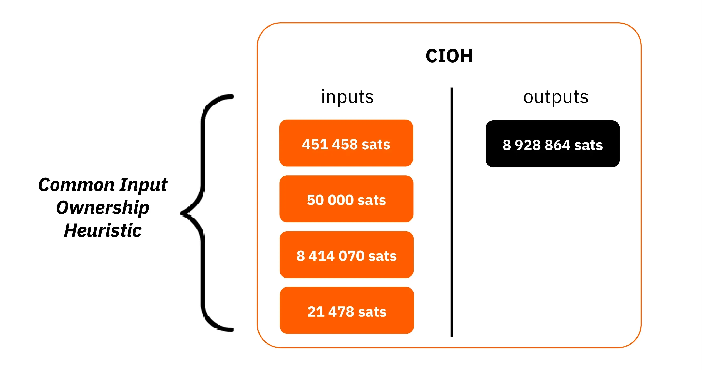


Kugira ngo dukoreshe CIOH, tubanje kwihweza igikorwa gifise ibintu vyinshi vyinjizwa. Ivyo bishobora kuba 2 vy’injiza, canke 30 vy’injiza. Ico kiranga kimaze kumenyekana, turasuzuma nimba iyo nzira y’ugucuruza ihuye n’akarorero k’ugucuruza kazwi. Nk'akarorero, nimba hariho ibintu 5 vyinjizwa bifise umubare umwe n'ibintu 5 bisohoka bifise umubare umwe, tuzomenya ko ari imiterere ya CoinJoin. Ntituzoshobora gukoresha CIOH.


Ku rundi ruhande, iyo igikorwa co gucuruza kitajanye n’uburyo bwo gucuruza buzwi bw’ubufatanye, rero turashobora gusobanura ko ivyo vyose bishobora kuva mu kigo kimwe. Ivyo birashobora kuba ngirakamaro cane mu kwagura ikirundo gisanzwe kizwi canke mu kubandanya urutonde.


CIOH yavumbuwe n’indege yitwa Satoshi yitwa Nakamoto. Abivuga mu gice ca 10 c’Igitabu Cera:


"_[...] guhuza ni ikintu kitari bwigere gishoboka n'ibikorwa vy'injira vyinshi, ivyo bikaba vyerekana ko ibikorwa vyavyo vyari bifiswe na nyen'urufunguzo umwe. Ico kibazo ni uko iyo nyir'urufunguzo ahishuwe, ayo mahuza ashobora kwerekana ayandi mafaranga yari aya nyen'urufunguzo umwe._"


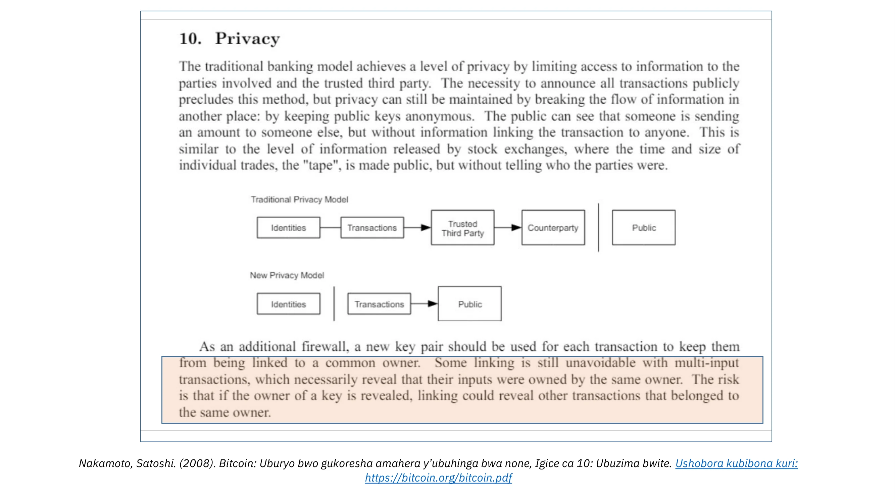


Biratangaje cane kubona ko Satoshi Nakamoto, mbere n’imbere y’uko Bitcoin itanguzwa ku mugaragaro, yari amaze kumenya ingorane zibiri nyamukuru z’ubuzima bwite ku bakoresha, ni ukuvuga CIOH na Address gusubira gukoresha. Mwene ukwo kubona imbere y’igihe ni ikintu gitangaje cane, kuko izo nzira zibiri ziguma, mbere n’ubu, ari zo ngirakamaro kuruta izindi mu gusesangura Blockchain.


Kugira ngo ndabahe akarorero, ng’iyi transaction kumbure dushobora gukoresha CIOH:


```plaintext
20618e63b6eed056263fa52a2282c8897ab2ee71604c7faccfe748e1a202d712
```


Inkomoko: [Mempool.ikibanza](20618e63b6eed056263fa52a2282c8897ab2ee71604c7faccfe748e1a202d712)


### Amakuru ya off-chain


Ego ni ko, isesengura ry’uruzitiro ntirigarukira gusa ku makuru yo ku ruzitiro. Amakuru yose ava mu gusesangura kwa kera canke aboneka kuri Internet na yo nyene arashobora gukoreshwa mu gutunganya isesengura.


Nk’akarorero, nitwabona ko amafaranga akurikiranywe atangazwa mu buryo butunganye avuye ku nzira imwe ya Bitcoin, maze tukamenya IP yayo Address, twoshobora kumenya ayandi mafaranga ava ku kigo kimwe, hamwe no kumenya igice c’akaranga k’uwutanga. Naho iyo ngeso idashoboka, kuko isaba gukoresha utugingo ngengabuzima twinshi, ishobora gukoreshwa n’amashirahamwe amwe amwe yizeye mu gusesangura Blockchain.


Uwo musesanguzi arafise kandi uburenganzira bwo kwizigira isesengura ry’imbere ryakozwe mu buryo bw’ubuhinga bufunguye, canke isesengura ryiwe bwite ry’imbere. Kumbure tuzoshobora kuronka igisohoka kigaragaza ikirundo c’amaderesi twamaze kumenya. Rimwe na rimwe, birashoboka kandi kwizigira ibisohoka vyerekana urubuga rwa Exchange, nk’uko amaderesi y’ayo masosiyete azwi muri rusangi.


Mu buryo nk’ubwo nyene, urashobora gukora isesengura mu gukuraho. Nk’akarorero, nimba igihe dusuzuma igikorwa gifise ibisohoka bibiri, kimwe muri vyo gifitaniye isano n’ikigwi ca Address gisanzwe kizwi, ariko gitandukanye n’ikintu turiko turakurikirana, rero turashobora gusobanura ko ikindi gisohoka gishobora kuba giserukira ihinduka.


Isesengura ry’imirongo kandi ririmwo igice ca OSINT (*Ubwenge bw’Isoko Yuguruye*) rusangi gatoyi, kirimwo ugushakashaka kuri internet. Ni co gituma duhanura ko umuntu adashobora gutangaza amaderesi ataco akora ku mbuga ngurukanabumenyi canke ku rubuga rwa interineti, yaba ari ay’uruyeri canke atari yo.


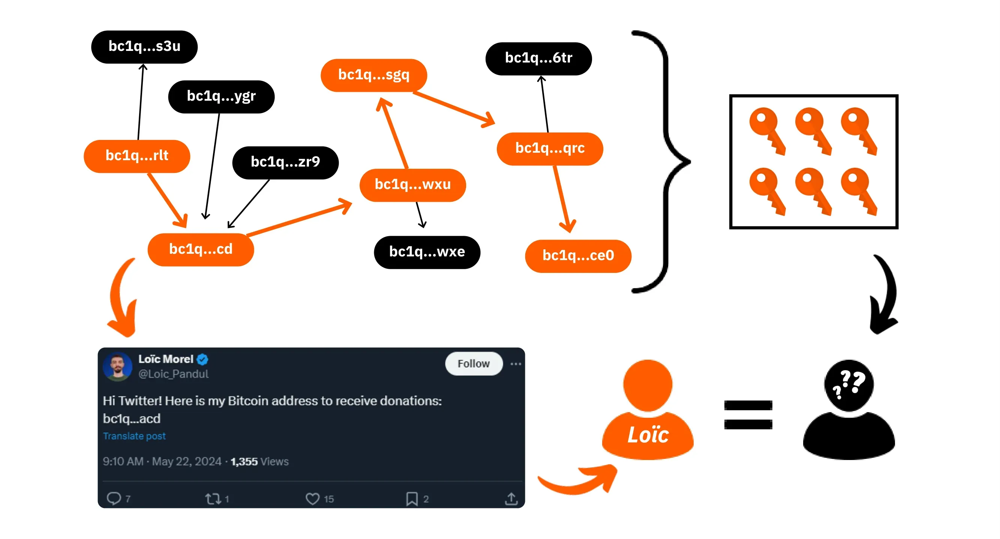


### Ivyitegererezo vy'igihe


Turavyiyumvira bike, ariko inyifato zimwe zimwe z’abantu ziramenyekana onchain. Kumbure ikintu gifise akamaro kuruta ibindi vyose mu gusuzuma ni ukuntu usinzira! Ego cane iyo uryamye, ntutangaza amakuru ya Bitcoin. Ariko muri rusangi uryama nk’isaha imwe. Ni co gituma ari umugenzo gukoresha isesengura ry'igihe mu isesengura rya Blockchain. Mu buryo bworoshe, iri ni ibarura ry’ibihe amafaranga y’ikigo kinaka atangazwa ku rubuga rwa Bitcoin. Dusuzumye ivyo bigereranyo vy’igihe, turashobora gukuramwo amakuru menshi cane.


Mbere na mbere, isesengura ry’igihe rimwe na rimwe rirashobora kugaragaza kamere y’ikintu gikurikiranywe. Nitwabona ko amafaranga atangazwa ata guhinduka mu masaha 24, ivyo rero bizogaragaza igikorwa c’ubutunzi kiri ku rugero rwo hejuru. Ikigo kiri inyuma y’ivyo bikorwa gishobora kuba ari ishirahamwe, rishobora kuba ari iryo kw’isi yose kandi kumbure rifise uburyo bwo gukora mu nzu.


Nk’akarorero, [Namenye iyo nzira mu mezi makeyi aheze] (https://witter.com/Loic_Pandul/status/1701127409712452072) igihe nariko ndasesangura [isoko ryari ryatanze mu makosa ama bitcoins 19 mu 2012). amafaranga](Mempool.ikibanza/tx/d5392d474b4c436e1c9d1f4ff4be5f9bb0eb2e26b61d2781751474b7e870fd). Isesengura ryoroshe ry’igihe ryatumye nshobora kwiyumvira ko twariko turakorana n’igikorwa c’ubuhinga, kandi rero kumbure n’ikintu kinini nk’urubuga rwa Exchange.


Nkako, haciye imisi mikeyi, vyavumbuwe ko ayo mahera ari aya PayPal, biciye ku rubuga rwa Paxos Exchange.


Ahubwo, nimba dushobora kubona ko igihe gica mu masaha 16, rero turashobora kugereranya ko turiko turakorana n’umuntu ku giti ciwe, canke kumbure ishirahamwe ryo mu karere bivanye n’ingero z’ibintu vyahinduwe.


Uretse kamere y’ikintu cihwejwe, urugero rw’igihe rurashobora kandi kutubwira hafi aho uwukoresha ari, bivuye ku bice vy’amasaha. Muri ubwo buryo, turashobora guhuza n’ibindi bikorwa, maze tugakoresha ibimenyetso vy’igihe vyavyo nk’inyongera y’ubuhinga bwo kumenya ibintu bishobora kwongerwa ku nseguro yacu.


Nk’akarorero, kuri Address ikoreshwa kenshi navuga, turashobora kubona ko amafaranga yinjira n’asohoka, yibanda ku kiringo c’amasaha 13.


```plaintext
bc1qqtmeu0eyvem9a85l3sghuhral8tk0ar7m4a0a0
```


Inkomoko: OXT.me


Ico kibanza gishobora kuba gihuye n’Uburayi, Afirika canke Uburasirazuba bwo Hagati. Turashobora rero kwiyumvira ko uwukoresha ivyo bicuruzwa aba muri ivyo bice.


Mu buryo butandukanye, isesengura ry’igihe ry’ubwo bwoko na ryo nyene ryatumye habaho iciyumviro c’uko Satoshi Nakamoto itariko irakora ivuye mu Buyapani, ariko ivuye muri Amerika: [*Ibihe vy’indege ya Satoshi Nakamoto*]


## Kubishira mu ngiro n’igitabu Block explorer .


<chapterId>6493cf2f-225c-405f-9375-c4304f1087ed</chapterId>


Muri iki gice ca nyuma, turaza gushiramwo ivyiyumviro twize gushika ubu mu ngiro. Ngiye kukwereka ingero z’ibikorwa vy’ukuri vya Bitcoin, kandi uzobwirizwa gukura amakuru ndiko ndagusaba.


Mu vyiza, kugira ngo umuntu akore ivyo vyiyumviro, vyoba vyiza akoresheje igikoresho c’umwuga co gusesangura uruhererekane. Ariko kuva abaremye Samourai Wallet bafashwe, igikoresho conyene co gusesangura ku buntu OXT.me ntikigihari. Tuzohitamwo rero Block explorer ya kera ku bw’ivyo bikorwa. Ndabagira inama yo gukoresha [Mempool.space](https://Mempool.space/) kubera ibiranga vyinshi n’urutonde rw’ibikoresho vyo gusesangura uruhererekane, ariko ushobora kandi guhitamwo uwundi mushakashatsi nka [Bitcoin Explorer](https://bitcoinexplorer.org/).


Kugira ntangire, nzobamenyesha imyimenyerezo. Koresha urupapuro rwawe rwa Block explorer kugira ngo uzizuze, hanyuma wandike inyishu zawe ku mpapuro. Hanyuma, mu mpera z’iki gice, nzobaha inyishu kugira ngo mushobore kugenzura no gukosora ivyo mwabonye.


*Imigenderanire yatowe muri ivyo bikorwa yatowe gusa kubera ibiranga mu buryo bumwe bumwe butari bwo. Iki gice kigenewe kwigisha no gutanga amakuru gusa. Ndashaka gusobanura neza ko ntashigikiye canke ngo ndemeshe gukoresha ivyo bikoresho mu ntumbero mbi. Intumbero ni ukukwigisha ingene wokwikingira gusesangura imirongo, atari ugusesangura kugira ngo ushire ahabona amakuru y’ibanga y’abandi.*


### Imyimenyerezo ya 1


Indangamuntu y'ugucuruza gusuzumwa:


```plaintext
3769d3b124e47ef4ffb5b52d11df64b0a3f0b82bb10fd6b98c0fd5111789bef7
```


Izina ry’ico kigereranyo c’iyi nzira y’ugucuruza ni irihe, kandi ni insobanuro izihe zishobora gutorwa mu gusuzuma gusa ikigereranyo caco, ni ukuvuga imiterere y’iyi nzira?


### Imyimenyerezo ya 2


Indangamuntu y'ubucuruzi buzosuzumwa:


```plaintext
baa228f6859ca63e6b8eea24ffad7e871713749d693ebd85343859173b8d5c20
```


Izina ry’ico kigereranyo c’iyi nzira y’ugucuruza ni irihe, kandi ni insobanuro izihe zishobora gutorwa mu gusuzuma gusa ikigereranyo caco, ni ukuvuga imiterere y’iyi nzira?


### Imyimenyerezo ya 3


Indangamuntu y'ugucuruza gusuzumwa:


```plaintext
3a9eb9ccc3517cc25d1860924c66109262a4b68f4ed2d847f079b084da0cd32b
```


None iyo nzira y’ugucuruza ni iyihe nzira?


Amaze kumenya akarorero kayo, akoresheje ubuhinga bwo mu mutima bw’ugucuruza, ni igiki gishobora guserukira iyo mpinduka?


### Imyimenyerezo ya 4


Indangamuntu y'ugucuruza gusuzumwa:


```plaintext
35f0b31c05503ebfdf7311df47f68a048e992e5cf4c97ec34aa2833cc0122a12
```


None iyo nzira y’ugucuruza ni iyihe nzira?


Amaze kumenya ivyerekanwa vyayo, akoresheje ubuhinga bwo mu mutima bw’ugucuruza, ni igiki Exchange ishobora guserukira?


### Imyimenyerezo ya 5


Reka twiyumvire ko Loïc yashize imwe mu nzira ziwe zo kwakira Bitcoin ku rubuga rwa Twitter:


```plaintext
bc1qja0hycrv7g9ww00jcqanhfpqmzx7luqalum3vu
```


Hashingiwe kuri ayo makuru no gukoresha **ubuhinga bwo gusubira gukoresha Address gusa**, ni ibihe bikorwa vya Bitcoin bishobora guhuzwa n’akaranga ka Loïc?


*Biragaragara ko ntari nyen'iyi reception Address vy'ukuri kandi sinayishize ku mbuga ngurukanabumenyi. Ni Address nafashe mu buryo bw'impfagusa muri Blockchain*


### Imyimenyerezo ya 6


Kubera umwimenyerezo wa 5, kubera ubuhinga bwo gusubira gukoresha Address, warashoboye kumenya amafaranga menshi ya Bitcoin Loïc asa n’uwurimwo. Mu bisanzwe, mu bikorwa vyamenyekanye, wari ukwiye kubona iki:


```plaintext
2d9575553c99578268ffba49a1b2adc3b85a29926728bd0280703a04d051eace
```


Iryo soko ni ryo rya mbere ryohereje amahera kuri Address ya Loïc. None mubona ama bitcoins Loïc yaronse biciye muri iyo transaction yava hehe?


### Imyimenyerezo ya 7


Kubera umwimenyerezo wa 5, kubera ubuhinga bwo gusubira gukoresha Address, warashoboye kumenya amafaranga menshi ya Bitcoin Loïc asa n’uwurimwo. None rero ushaka kumenya aho Loïc yava. Hashingiwe ku bikorwa vyabonetse, nukore isesengura ry’isaha kugira uronke isaha ishobora kuba ikoreshwa cane na Loïc. Uhereye kuri iyo saha, menya ahantu Loïc asa n’uwuba (igihugu, intara/akarere, igisagara...).


### Imyimenyerezo ya 8


Aha niho hari igikorwa ca Bitcoin co kwiga:


```plaintext
bb346dae645d09d32ed6eca1391d2ee97c57e11b4c31ae4325bcffdec40afd4f
```


Turavye iyo nzira yo gucuruza gusa, ni amakuru ayahe twoshobora gusobanura?


### Inyishu z'imyimenyerezo


***Imyimenyerezo ya 1:***


Icogereranyo c’ivyo bikorwa ni icogereranyo c’ukwishura gisanzwe. Twize gusa imiterere yayo, turashobora gusobanura ko igisohoka kimwe kigereranya ihinduka, ikindi gisohoka kigereranya ukwishyura nyakuri. Turazi rero ko uwukoresha yihwejwe kumbure atagifise imwe muri izo UTXO zibiri ziri mu vyo gusohora (izo kwishura), ariko akaba agifise iyindi UTXO (iyo y’ihinduka).


***Imyimenyerezo ya 2:***


Icogereranyo c’ivyo bikorwa ni ico gukoresha amahera mu migwi. Ico kigereranyo kumbure kigaragaza igikorwa c’ubutunzi kinini, nk’urubuga rwa Exchange. Turashobora gufata ingingo y’uko inyungu UTXO iva mw’ishirahamwe rifise ibikorwa vy’ubutunzi vy’agaciro kanini, kandi ko UTXO zisohoka zizosanzazwa. Bimwe bizoba ari ivy’abaguzi b’amashirahamwe bakuye ama bitcoins yabo mu bipapuro vy’amahera vy’ukwibika. Abandi boshobora kuja mu mashirahamwe bafatanya. Ubwa nyuma, nta gukeka ko hazoba ihinduka rizosubira ku sosiyete yatanze iyo mpapuro.


***Imyimenyerezo ya 3:***


Icogereranyo c’ivyo bikorwa ni ukwishura mu buryo bworoshe. Turashobora rero gukoresha ubuhinga bwo mu mutima ku bijanye n’ugucuruza kugira ngo tugerageze kumenya ihinduka.


Nanje ubwanje narabonye n’imiburiburi ubuhinga bubiri bwo mu mutima bushigikira iciyumviro kimwe:


- Gusubira gukoresha ubwoko bumwe bw’inyandiko;
- Igisohoka kinini kuruta ibindi vyose.


Ivyiyumviro bigaragara cane ni ivyo gusubira gukoresha ubwoko bumwe bw’inyandiko. Nkako, igisohoka `0` ni `P2SH`, kimenyekana ku kwakira kwaco Address gutangura na `3`:


```plaintext
3Lcdauq6eqCWwQ3UzgNb4cu9bs88sz3mKD
```


Mugihe igisohoka `1` ari `P2WPKH`, kimenyekana na Address yayo itangura na `bc1q`:


```plaintext
bc1qya6sw6sta0mfr698n9jpd3j3nrkltdtwvelywa
```


UTXO ikoreshwa nk'injiza muri iyi nzira nayo ikoresha inyandiko `P2WPKH`:


```plaintext
bc1qyfuytw8pcvg5vx37kkgwjspg73rpt56l5mx89k
```


Gutyo, turashobora kwiyumvira ko igisohoka `0` gihuye n'ukwishura kandi igisohoka `1` ni ihinduka ry'ibikorwa, ivyo vyoba bisobanura ko umukoresha w'inyungu yama afise igisohoka `1`.


Kugira ngo dushigikire canke tuhakane ico ciyumviro, turashobora kurondera izindi nzira zishobora kwemeza ivyiyumviro vyacu, canke zigabanura ubushobozi bw’uko iciyumviro cacu ari ukuri.


Nabonye n’imiburiburi uwundi murongo umwe w’ivy’ubuhinga. Ni umusaruro munini kuruta iyindi yose. Igisohoka `0` gipima `123.689 Sats`, mu gihe igisohoka `1` gipima `505.839 Sats`. Hari rero itandukaniro rikomeye hagati y’ivyo bivako bibiri. Igisubizo kinini cane heuristic kivuga ko igisubizo kinini cane gishobora kuba ari co gihinduka. Iryo heuristic rirushiriza gukomeza iciyumviro cacu ca mbere.


Bisa rero n'uko uwukoresha yatanze UTXO nk'inyungu agifise `1` output, isa n'iyirimwo ihinduka ry'ugucuruza.


***Imyimenyerezo ya 4:***


Icogereranyo c’ivyo bikorwa ni ukwishura mu buryo bworoshe. Turashobora rero gukoresha ubuhinga bwo mu mutima ku bijanye n’ugucuruza kugira ngo tugerageze kumenya ihinduka.


Nanje ubwanje narabonye n’imiburiburi ubuhinga bubiri bwo mu mutima bushigikira iciyumviro kimwe:


- Gusubira gukoresha ubwoko bumwe bw’inyandiko;
- Igisohoka c’iposita y’uruziga.


Ivyiyumviro bigaragara cane ni ivyo gusubira gukoresha ubwoko bumwe bw’inyandiko. Nkako, igisohoka `0` ni `P2SH`, kimenyekana ku kwakira kwaco Address gutangura na `3`:


```plaintext
3FSH5Mnq6S5FyQoKR9Yjakk3X4KCGxeaD4
```


Mugihe igisohoka `1` ari `P2WPKH`, kimenyekana na Address yayo itangura na `bc1q`:


```plaintext
bc1qvdywdcfsyavt4v8uxmmrdt6meu4vgeg439n7sg
```


UTXO ikoreshwa nk'injiza muri iyi nzira nayo ikoresha inyandiko `P2WPKH`:


```plaintext
bc1qku3f2y294h3ks5eusv63dslcua2xnlzxx0k6kp
```


Gutyo, turashobora kwiyumvira ko igisohoka `0` gihuye n'ukwishura kandi igisohoka `1` ni ihinduka ry'ibikorwa, ivyo vyoba bisobanura ko umukoresha w'inyungu yama afise igisohoka `1`.


Kugira ngo dushigikire canke tuhakane ico ciyumviro, turashobora kurondera izindi nzira zishobora kwemeza ivyiyumviro vyacu, canke zigabanura ubushobozi bw’uko iciyumviro cacu ari ukuri.


Nabonye n’imiburiburi uwundi murongo umwe w’ivy’ubuhinga. Ni igisohoka c’umubare w’uruziga. Igisohoka `0` gipima `70.000 Sats`, mu gihe igisohoka `1` gipima `22.962 Sats`. Turafise rero igisubizo gikikuje neza mu gice ca konti ca BTC. Ivyo bimenyetso vyerekana ko UTXO ifise amahera azunguruka ari yo yo kwishura, kandi ko mu gukuraho, uwundi aserukira ihinduka. Iryo heuristic rirushiriza gukomeza iciyumviro cacu ca mbere.


Ariko rero, muri aka karorero, uwundi murongo w’ubuhinga woshobora gutera umugere ivyiyumviro vyacu vya mbere. Nkako, igisohoka `0` ni kinini kuruta igisohoka `1`. Hashingiwe ku ciyumviro c'uko igisubizo kinini cane ari co gihinduka, twoshobora gufata ko igisubizo `0` ari co gihinduka. Ariko rero, iyo nkuru y’ugusubiza inyuma isa n’iyidashobora kwemerwa, kuko izindi nzira zibiri zisa n’izijijura cane kuruta nzira nini kuruta izindi zo gutanga umusaruro. Ku bw’ivyo, bisa n’ibibereye kuguma dufise iciyumviro cacu ca mbere naho ivyo bisa n’ibivuguruzanya.


Bisa rero n'uko uwukoresha yatanze UTXO nk'inyungu agifise `1` output, isa n'iyirimwo ihinduka ry'ugucuruza.


***Imyimenyerezo ya 5:***


Turashobora kubona ko amafaranga 8 ashobora gufatanywa n’akaranga ka Loïc. Muri ivyo, 4 birimwo kwakira amafaranga y’ibiceri:


```plaintext
2d9575553c99578268ffba49a1b2adc3b85a29926728bd0280703a04d051eace
8b70bd322e6118b8a002dbdb731d16b59c4a729c2379af376ae230cf8cdde0dd
d5864ea93e7a8db9d3fb113651d2131567e284e868021e114a67c3f5fb616ac4
bc4dcf2200c88ac1f976b8c9018ce70f9007e949435841fc5681fd33308dd762
```


Ibindi 4 vyerekeye ivyoherezwa vya Bitcoin:


```plaintext
8b52fe3c2cf8bef60828399d1c776c0e9e99e7aaeeff721fff70f4b68145d540
c12499e9a865b9e920012e39b4b9867ea821e44c047d022ebb5c9113f2910ed6
a6dbebebca119af3d05c0196b76f80fdbf78f20368ebef1b7fd3476d0814517d
3aeb7ce02c35eaecccc0a97a771d92c3e65e86bedff42a8185edd12ce89d89cc
```


***Imyimenyerezo ya 6:***


Turavye akarorero k’iyi nzira, biragaragara ko ari amafaranga akoreshwa hamwe. Nkako, iyo nzira y’ugucuruza ifise ikintu kimwe co kwinjiza n’ivyo gusohora 51, ivyo bikaba vyerekana ko igikorwa c’ubutunzi kiri ku rugero rwo hejuru. Turashobora rero kwiyumvira ko Loïc yakuye ama bitcoins ku rubuga rwa Exchange.


Hari ibintu vyinshi bikomeza iyo nyiyumvo. Ica mbere, ubwoko bw’inyandiko ikoreshwa mu gukingira injiza ya UTXO ni inyandiko ya P2SH 2/3 Multisig, yerekana urugero rwo hejuru rw’umutekano rusanzwe ku bikoresho vya Exchange:


```plaintext
OP_PUSHNUM_2
OP_PUSHBYTES_33 03eae02975918af86577e1d8a257773118fd6ceaf43f1a543a4a04a410e9af4a59
OP_PUSHBYTES_33 03ba37b6c04aaf7099edc389e22eeb5eae643ce0ab89ac5afa4fb934f575f24b4e
OP_PUSHBYTES_33 03d95ef2dc0749859929f3ed4aa5668c7a95baa47133d3abec25896411321d2d2d
OP_PUSHNUM_3
OP_CHECKMULTISIG
```


Ikindi, Address yize `3PUv9tQMSDCEPSMsYSopA5wDW86pwRFbNF` isubira gukoreshwa mu bikorwa bitandukanye birenga 220.000, ivyo bikaba akenshi biranga ama platforms ya Exchange, muri rusangi ataco yitwararika ku bijanye n’ibanga ryayo.


Ivyiyumviro vy’igihe vyakoreshejwe kuri iyi Address na vyo nyene vyerekana ugutangaza amakuru hafi ku musi ku musi mu kiringo c’amezi 3, n’amasaha yagutse arenga amasaha 24, bikaba vyerekana igikorwa gikomeza c’urubuga rwa Exchange.


Ubwa nyuma, ibitabu bikoreshwa n’ico kigo ni vyinshi cane. Address yaronse kandi yohereza 44 BTC mu bikorwa 222.262 hagati y’ukwezi kwa kigarama 2022 n’ukwezi kwa gatatu 2023. Ivyo bitabo vyinshi biremeza kandi uburyo igikorwa c’urubuga rwa Exchange gishobora kuba.


***Imyimenyerezo ya 7:***


Mu gusuzuma ibihe vy’ukwemeza amafaranga, ibihe vya UTC bikurikira birashobora kumenyekana:


```plaintext
05:43
20:51
18:12
17:16
04:28
23:38
07:45
21:55
```


Isesengura ry’izo nzira ryerekana ko UTC-7 na UTC-8 zihuye n’urutonde rw’ibikorwa vy’abantu biriho ubu (hagati ya 08:00 na 23:00) ku nzira nyinshi:


```plaintext
05:43 UTC > 22:43 UTC-7
20:51 UTC > 13:51 UTC-7
18:12 UTC > 11:12 UTC-7
17:16 UTC > 10:16 UTC-7
04:28 UTC > 21:28 UTC-7
23:38 UTC > 16:38 UTC-7
07:45 UTC > 00:45 UTC-7
21:55 UTC > 14:55 UTC-7
05:43 UTC > 21:43 UTC-8
20:51 UTC > 12:51 UTC-8
18:12 UTC > 10:12 UTC-8
17:16 UTC > 09:16 UTC-8
04:28 UTC > 20:28 UTC-8
23:38 UTC > 15:38 UTC-8
07:45 UTC > 23:45 UTC-8
21:55 UTC > 13:55 UTC-8
```


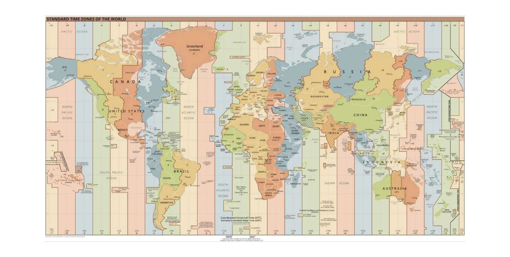


Isaha ya UTC-7 irakenewe cane cane mu ci, kuko irimwo intara n’uturere nka:


- Kaliforuniya (ifise ibisagara nka Los Angeles, San Fransisko na San Diego);
- Nevada (hamwe n’igisagara ca Las Vegas);
- Oregon (hamwe n’igisagara ca Porti);
- Washington (hamwe n’igisagara ca Seattle);
- Akarere ka Canada ka Kolombiya y’Ubwongereza (karimwo ibisagara nka Vancouver na Victoria).


Aya makuru yerekana ko Loïc ashobora kuba aba ku nkengera y’ikiyaga co mu burengero bwa Leta Zunze Ubumwe za Amerika canke Kanada.


***Imyimenyerezo ya 8:***


Isesengura ry’ivyo bikorwa ryerekana ivyinjizwa 5 n’isohoka rimwe, bikaba vyerekana ko hariho ugushira hamwe. Dukoresheje ubuhinga bwa CIOH, turashobora kwiyumvira ko ama UTXO yose yinjira ari ay’ikigo kimwe, kandi ko igisohoka UTXO na co nyene ari ic’ico kigo. Bisa n’uko uwukoresha yahisemwo gukoranya ama UTXO menshi yari afise, kugira ngo akore UTXO imwe mu vyo asohora, afise intumbero yo gukomeza ama UTXO yiwe. Ivyo bishobora kuba vyatumwe n’icipfuzo co kwungukira ku giciro gitoyi c’ugucuruza co muri ico gihe, kugira ngo bagabanye igiciro co muri kazoza.


___


*Kugira ngo ndiko ndandika iki gice ca 3 c'isesengura rya on chain, nakoresheje ibi bikurikira:*


- Urutonde rw'ingingo zine zifise umutwe uvuga ngo: [Gutahura ubuzima bwite bwa Bitcoin na OXT](https://medium.com/oxt-research/gutahura-ubuzima bwite-na-oxt igice-ca-1-4-8177a40a5923), zasohowe na Samou27;
- Raporo zitandukanye zivuye muri **ubushakashatsi bwa OXT**, hamwe n'igikoresho cabo co gusesangura Blockchain ku buntu (ntikigihari muri iki gihe gikurikira ugufatwa kw'abashinze Samourai Wallet);
- Mu buryo bwagutse, ubumenyi bwanje buva ku ma tweets atandukanye n'ibirimwo bivuye kuri [@LaurentMT](https://twitter.com/LaurentMT) na [@ErgoBTC](https://twitter.com/ErgoBTC);
- Ivyo [Space Kek #19] (abamenyeshamakuru b'ibiganiro. [@louneskmt](https://twitter.com/louneskmt), [@TheoPantamis](https://twitter.com/TheoPantamis), [@Sosthene___](https://twitter.com/Sosthene___) na [@LaurentMT](https://twitter.com/LaurentMT).


*Ndashima abanditsi bavyo, ababiteguye n'ababikora. Ndashimira kandi abakosora bakosoye neza ingingo iki gice ca 3 gishingiyeko, bakampa impanuro zabo z’abahinga:*


- [Gilles Cadignan](ku rubuga rwa Twitter);
- [Ludovic Lars](ibara ry'umugera.fr/)


# Kumenya ingendo nziza zo kurinda ubuzima bwite bwawe


<partId>9bd04b63-f1af-4e50-9061-6bc90009df68</partId>


## Address gusubira gukoresha


<chapterId>f3e97645-3df3-41bc-a4ed-d2c740113d96</chapterId>


Tumaze kwiga ubuhinga bushobora gusenyura ibanga ryawe kuri Bitcoin, muri iki gice ca gatatu ubu turaza kuraba uburyo bwiza bwo gukurikiza kugira ngo wikingire. Intumbero y’iki gice si ugutohoza uburyo bwo gutuma ibanga rigenda neza, ikintu kizokwihwezwa mu nyuma, ahubwo ni ugutahura ingene umuntu yokorana neza na Bitcoin kugira ngo agumane ibanga itanga mu buryo busanzwe, ata gukoresha ubuhinga bwo kwongerako.


Biragaragara ko kugira ngo dutangure iki gice ca gatatu, tuzovuga ku bijanye no gusubira gukoresha Address. Ico kintu ni co gitera ubwoba cane ibanga ry’abakoresha. Nta gukeka ko iki kigabane ari co gihambaye kuruta ibindi vyose.


### Address yakira ni iki?


Bitcoin yakira Address ni urudodo canke ikimenyetso gikoreshwa mu kwakira amafaranga kuri Wallet.


Mu buryo bw'ubuhinga, Bitcoin yakira Address nti "yakira" ama bitcoins mu buryo nyabwo, ahubwo ikoreshwa mu gusobanura ivy'ama bitcoins ashobora gukoreshwamwo. Mu majambo nyayo, iyo urungikiwe amahera, igikorwa c’uwagurungikiye kiguremera UTXO nshasha nk’isohoka rivuye mu ma UTXO yakoresheje nk’ibintu vy’injiza. Kuri iki gisohoka, gishirako inyandiko isobanura ingene iyo UTXO ishobora gukoreshwa mu nyuma. Iyi nyandiko izwi nka "*InyandikoPubKey*" canke "*Inyandiko yo Gufunga*". Ukwakira kwawe Address, canke neza cane umuzigo wayo, uri muri iyo nyandiko. Mu majambo y’abanyabwenge, iki canditswe ahanini kivuga ngo:


> "*Kugira ngo ukoreshe iyi UTXO nshasha, utegerezwa gutanga umukono wa digitale ukoresheje urufunguzo rw'ibanga rujanye n'iyi Address.*"
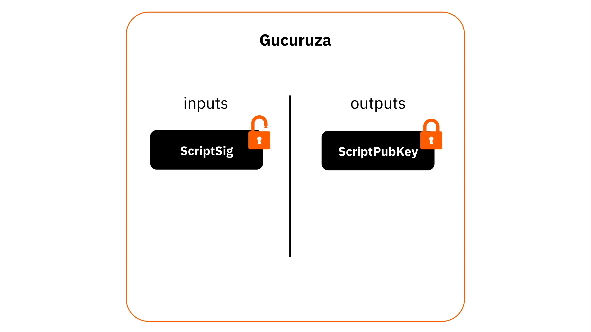


Amaderesi ya Bitcoin aza mu bwoko butandukanye, bivanye n'uburyo bwo kwandika bukoreshwa. Ivyitegererezo vya mbere, bizwi nka **Iragi**, birimwo aderesi `P2PKH` (**Ishura-ku-Rufunguzo-Hash**) na `P2SH` (**Pay-to-Script-Hash**). Amaderesi ya P2PKH yama atangura na `1`, na P2SH na `3`. Naho izo nzira zikiri zitekanye, ubu ntizikoreshwa, kuko zituma umuntu atanga amahera menshi kandi zikaba zitanga ibanga ritoyi kuruta izo nzira nshasha.


Amaderesi ya SegWit V0 (`P2WPKH` na `P2WSH`) n'aya Taproot / SegWit V1 (`P2TR`) agereranya imiterere y'ubu. Aderesi za SegWit zitangura na `bc1q` na aderesi za Taproot, zashizweho mu 2021, zitangura na `bc1p`.


Nk’akarorero, ng’iyi Taproot y’ukwakira Address:


```text
bc1ps5gd2ys8kllz9alpmcwxqegn7kl3elrpnnlegwkm3xpq2h8da07spxwtf5
```


Uko ScriptPubKey yubatswe bizovana n'urugero uriko urakoresha:


| ScriptPubKey       | Script template                                         |
|--------------------|--------------------------------------------------------|
| P2PKH              | OP_DUP OP_HASH160 `<pubKeyHash>` OP_EQUALVERIFY OP_CHECKSIG |
| P2SH               | OP_HASH160 `<scriptHash>` OP_EQUAL                    |
| P2WPKH             | 0 `<pubKeyHash>`                                      |
| P2WSH              | 0 `<witnessScriptHash>`                               |
| P2SH - P2WPKH      | OP_HASH160 `<redeemScriptHash>` OP_EQUAL              |
| P2SH - P2WSH       | OP_HASH160 `<redeemScriptHash>` OP_EQUAL              |
| P2TR               | 1 `<pubKey>`                                          |


Ubwubatsi bw’amaderesi y’ukwakira na bwo buvana n’akarorero k’inyandiko yatowe:


- Ku ma aderesi `P2PKH` na `P2WPKH`, umuzigo w’inyungu, ni ukuvuga umushinge wa Address, ugereranya Hash y’urufunguzo rwa bose;
- Ku maderesi `P2SH` na `P2WSH`, umuzigo w’inyungu ugereranya Hash ya a;
- Naho ku bijanye n'amaderesi ya `P2TR`, umuzigo ni urufunguzo rwa bose rwahinduwe. Ibisohoka vya P2TR bihuza imice ya _Kwishura-ku-PubKey_ na _Kwishura-ku-Script_. Urufunguzo rwa bose rwahinduwe ni ingaruka yo kwongerako urufunguzo rwa bose rwo gukoresha amahera rwa kera rufise "tweak", ruva kuri Merkle Root y'urutonde rw'inyandiko zishobora kandi gukoreshwa mu gukoresha amahera y'ibiceri.


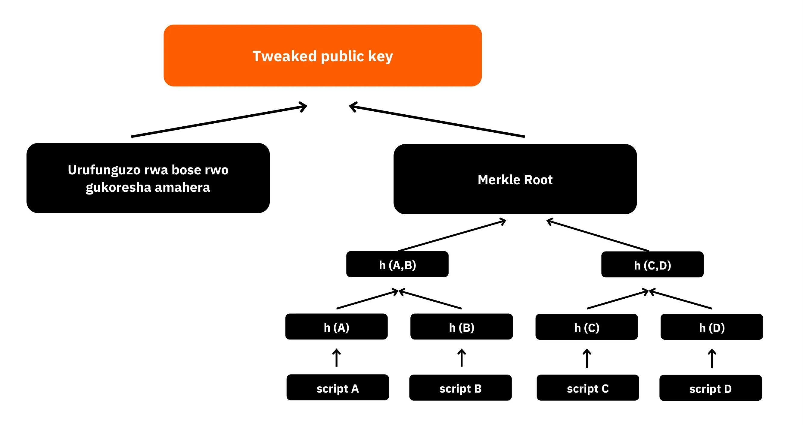


Amaderesi yerekanwa kuri porogaramu yawe ya Wallet na yo nyene arimwo HRP (*Igice Gisomwa n'Umuntu*), mu bisanzwe `bc` ku maderesi y'inyuma ya SegWit, itandukaniro `1`, n'inomero ya verisiyo `q` ku SegWit V0 na `p` ku Taproot/G1-3. Hariho kandi igitigiri c’ibintu bigenzurwa kugira ngo umuntu yizere ko Address ari nziza kandi ko ari nziza mu gihe co gutanga amakuru.


Ubwa nyuma, aderesi zishirwa mu buryo busanzwe:


- Base58suzuma amaderesi ya kera y'Iragi;
- Bech32 ku bijanye n’amaderesi ya SegWit;
- Bech32m ku bijanye n’amaderesi ya Taproot.


Aha niho hari urutonde rw'inyongezo ry'imiterere ya bech32 na bech32m (SegWit na Taproot) kuva ku rwego rwa 10:


| +  | 0 | 1 | 2 | 3 | 4 | 5 | 6 | 7 |
|----|---|---|---|---|---|---|---|---|
| 0  | q | p | z | r | y | 9 | x | 8 |
| 8  | g | f | 2 | t | v | d | w | 0 |
| 16 | s | 3 | j | n | 5 | 4 | k | h |
| 24 | c | e | 6 | m | u | a | 7 | l |


### None Address ni iki?


Address gusubira gukoresha ni ugukoresha iyo Address nyene yakira kugira ngo ihagarike UTXO zitandukanye.


Nk’uko twabibonye mu gice ca mbere, UTXO yose irafise ScriptPubKey yayo, iyo na yo ikayifunga kandi itegerezwa guhazwa kugira ngo UTXO ikoreshwe nk’injiza mu bikorwa bishasha. Ni muri iyi ScriptPubKey aho amaderesi y'umuzigo w'inyungu ashirwamwo.


Iyo ScriptPubKeys zitandukanye zirimwo Address imwe, ivyo vyitwa Address gusubira gukoresha. Mu bikorwa, ivyo bisigura ko uwukoresha yasubiyemwo Address imwe nyene ku bayirungitse kugira ngo aronke amafaranga y’ibiceri biciye mu kwishura kenshi. Kandi ni uwo mugenzo nyene utera akaga ku buzima bwawe bw’ibanga.


### Ni kuki Address yosubira gukoresha ari ingorane?


Kubera ko Blockchain ari iya bose, biroroshe kubona aderesi zifunga UTXO n’ama bitcoins angahe. Iyo iyo Address nyene ikoreshejwe mu bikorwa vyinshi, birashoboka ko umuntu afata ingingo y’uko ama bitcoins yose ajanye n’iyo Address ari ay’umuntu umwe. Ivyo bitera ingorane ubuzima bwite bw’abakoresha mu gutuma amahuzu ashobora gushingwa hagati y’ibikorwa bitandukanye n’amahera y’ibiceri bishobora gukurikiranywa kuri Blockchain. Satoshi Nakamoto ubwiwe yaramaze kugaragaza iyo ngorane mu gitabu cera ca Bitcoin:


> *Nk'uruhome rw'umuriro rw'inyongera, urufunguzo rushasha rwoshobora gukoreshwa ku bijanye n'ugucuruza kwose kugira ngo rugume rudahuye n'uwundi muntu rusangi*
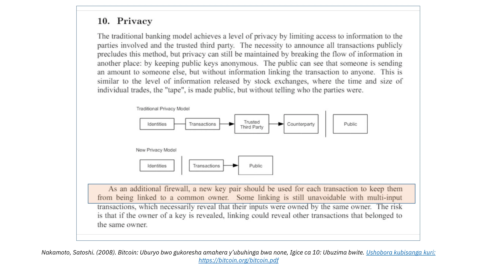


Inkomoko: S. Nakamoto, "Bitcoin: Uburyo bwo gutanga amafaranga y'ubuhinga bwa none", 2009.


Intumbero ya Satoshi muri iri rungane ryari iyo guhingura uruhome rw’umuriro rw’inyongera mu gihe hoba hariho isano hagati y’akaranga k’ukoresha n’urufunguzo rubiri kuri Bitcoin, kugira ngo igikorwa ciwe cose ntikihuzwe ku mugaragaro n’akaranga kiwe. Ubu, n'ukwiyongera kw'amashirahamwe y'isesengura rya Blockchain n'amabwirizwa ya KYC, gukoresha amaderesi yihariye ntibikiri "uruhome rw'umuriro rw'inyongera", ahubwo ni umugenzo w'ingenzi ku muntu wese yipfuza kuzigama ubuzima bwite bukeyi.


Iyo usubiye gukoresha Address, uba ugira isano hagati y'ibikorwa vyose bijanye n'iyo Address. Naho ivyo bidatera ingorane amahera yawe ataco uhinduye, nk’uko ubuhinga bwo gukingira amakuru y’ibanga (elliptic curve cryptography) butanga umutekano w’imfunguruzo zawe z’ibanga, biratuma vyoroha gukurikirana ibikorwa vyawe. Nkako, umuntu wese afise urudodo arashobora kwihweza ibikorwa n’imibare y’amaderesi, ivyo bikaba bishobora gutuma udashobora kumenyekana.


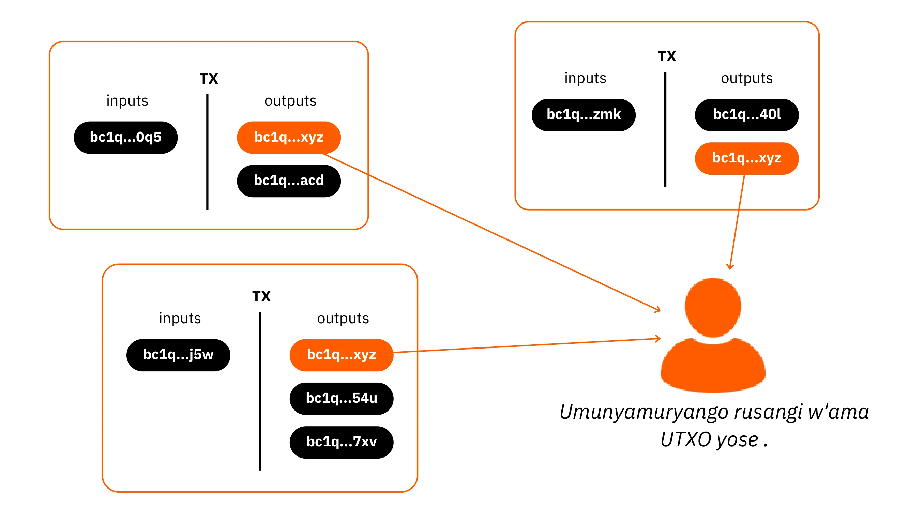


Kugira ngo tubone neza ico ciyumviro, reka dufate akarorero ka Bob, umukoresha akunda kugura ama bitcoins mu giciro gitoyi muri DCA kandi akama ayarungika kuri Address nyene. Inyuma y’imyaka ibiri, iyi Address irimwo amafaranga menshi cane yitwa bitcoins. Iyo Bob ikoresheje iyo Address kugira ngo yishure umudandaza wo mu karere, uwo mucuruzi azoshobora kubona amahera yose ajanye na yo maze akureho ubutunzi bwa Bob. Ivyo bishobora gutuma umuntu agira ingorane z’umutekano wiwe, nk’ukugerageza kwiba canke gufata amahera. Iyo Bob akoresha urupapuro rwa Address rudafise ikintu kugira ngo aronke ikintu cose agura mu bihe bitandukanye, yari guhishurira umudandaza wiwe amakuru make cane ataco amaze.


Mu gusesangura imirongo, hari ubwoko 2 bwo gusubira gukoresha Address:


- Gusubira gukoresha hanze;
- Gusubira gukoresha imbere mu gihe c’ugucuruza.


Ica mbere ni igihe Address isubiye gukoreshwa mu bikorwa vyinshi bitandukanye vya Bitcoin. Ivyo ni vyo twavuganye mbere: iyo heuristic ivuga ko ama UTXO yose yaciye muri iyi Address ari ay’ikigo kimwe.


Gusubira gukoresha Address yo mu mutima ntibishika iyo gusubira gukoresha bibaye mu bikorwa vyinshi, ariko iyo bibaye mu bikorwa bimwe. Nkako, iyo Address nyene ikoreshwa mu gufunga inyungu ikoreshwa nk’isohoka ry’ibikorwa, rero turashobora gufata ingingo y’uko iyo sohoka ikiri iy’uwo mukoresha umwe (ihinduka), kandi ko isohoka rya kabiri rigereranya ukwishyura nyakuri. Iyindi heuristic ituma bishoboka gukomeza urutonde rw’amahera ku bikorwa vyinshi.


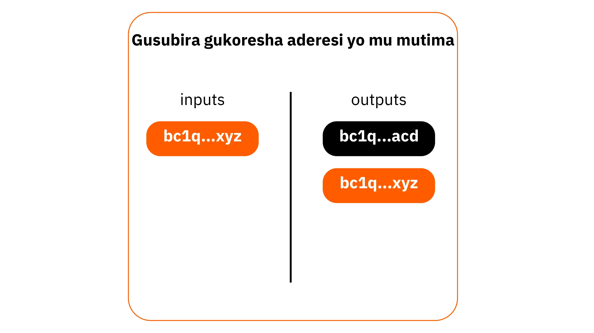


Address gusubira gukoresha ni ikiza nyaco kuri Bitcoin. Dushingiye ku rubuga rwa OXT.me (ubu ntirushobora gushikwako), igitigiri cose c’abasubira gukoresha Address kuri Bitcoin cari hafi 52% mu 2022:


Ico kigero ni kinini cane, ariko kiva cane cane ku bikoresho vya Exchange aho kuva ku bakoresha ku giti cabo.


### Ni gute twokwirinda gusubira gukoresha Address?


Kwirinda gusubira gukoresha Address ni vyoroshe cane: **koresha gusa Address nshasha, idafise ikintu ku vyo wishura vyose bishasha kuri Wallet yawe**.


Kubera BIP32, ama wallets y’ubu ubu aragenwa kandi arategekanijwe. Ivyo bisigura ko uwukoresha ashobora generate umubare munini w'amaderesi avuye ku makuru amwe y'intango: seed. Mu kubika ayo makuru amwe, birashoboka ko umuntu asubizaho imfunguruzo zose z’ibanga ziri muri Wallet, ivyo bikaba bituma umuntu ashobora kuronka amahera akingiwe n’amaderesi ahuye.


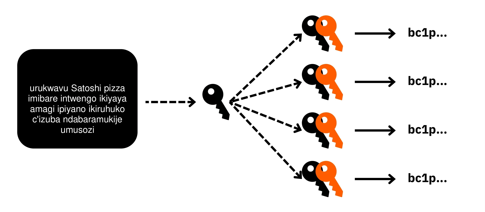


Ni co gituma, iyo ukanda kuri buto ya "*kwakira*" muri porogarama yawe ya Wallet, Address yakira itakoreshwa irasabwa igihe cose. Amaze kwakira ama bitcoins kuri iyi Address, iyo porogarama ica itanga iciyumviro c’iyindi nshasha.


> *PS: Vuba aha, hariho porogarama za Wallet zatangaje ko zizohagarika gutanga amaderesi ataco avuga, zitinya ko ivyo vyobonwa n’ubutegetsi nk’uburyo bwo gukoresha amahera mu buryo butari bwo. Nimba porogarama yawe ari imwe muri izo, ndaguhanura cane ko woyisubirira ubwo nyene, kuko ivyo ntivyemerwa n’uwuyikoresha.*
Niba ukeneye ikimenyetso kidahinduka kugira ngo ubone amahera, nk’intererano, si vyiza gukoresha Bitcoin Address ya kera kubera ingorane zo gusubira kuyikoresha. Ahubwo, koresha Lightning Address, canke uhitemwo ikimenyetso c’ukwishura ku ruzitiro rudahinduka, nka BIP47 canke Ukwishura mu gacerere. Ivyo bipimo birasigurwa mu buryo burambuye mu gice ca 6 c’iri shure.


## Gushirako ikimenyetso no kugenzura UTXOs


<chapterId>fbdb07cd-c025-48f2-97b0-bd1bc21c68a8</chapterId>


Nk’uko twabibonye mu gice kivuga ku gusesangura imirongo, hariho ubuhinga bwinshi bwo gutahura ibintu n’imirongo bishobora gukoreshwa mu gukuraho amakuru yerekeye igikorwa. Nk’uwukoresha, birahambaye ko umenya ubu buhinga kugira ngo ushobore kubukingira neza.


Ivyo birimwo gucunga neza Wallet yawe mu kwizigama, ivyo bisigura kumenya inkomoko y’ama UTXO yawe, hamwe no guhitamwo neza ama UTXO uzokoresha igihe uriko urishura. Ubu burongozi bwiza bwa Wallet bwishingikiriza ku bintu bibiri bihambaye vy’amasakoshi meza ya Bitcoin: gushiramwo ibimenyetso no kugenzura Coin.


Muri iki gice, turaza kuraba ivyo bikoresho maze turabe ingene wobikoresha mu buryo bw'ubwenge, utaronse akazi kenshi, kugira ngo ukoreshe neza cane ubuzima bwite bwawe kuri Bitcoin.


### Gushirako ikimenyetso ni iki?


Gushirako ikimenyetso ni umugenzo wo gushirako ikimenyetso canke ikimenyetso ku UTXO yihariye muri Bitcoin Wallet. Ivyo bisobanuro bibikwa aho hantu na porogarama ya Wallet kandi ntivyigera birungikwa ku rubuga rwa Bitcoin. Gushirako amazina rero ni igikoresho co kurongora umuntu ku giti ciwe.


Nk'akarorero, nimba mfise UTXO iva kuri P2P naguze kuri Bisq na Charles, noshobora kuyindika "`Bisq Charles atari KYC`".


Gushirako ibimenyetso ni akamenyero keza gafasha kwibuka inkomoko canke aho UTXO igamije kuja, ivyo bikaba rero bituma umuntu ashobora gucunga neza amahera no gutuma ubuzima bwiwe bwite bugenda neza. Nkako, Bitcoin Wallet yawe nta gukeka ko icungera UTXO nyinshi. Nimba inkomoko y'izo UTXO zitandukanye, ushobora kudashaka gufatanya izo UTXO muri kazoza, ahandi ho woshobora guhishura Ownership yabo rusangi. Mu gushiramwo neza UTXO zawe zose, urashobora kwizigira udakeka ko uzokwibuka aho zavuye igihe uzoba ukeneye kuzikoresha, naho vyoba imyaka ikurikira.


### None ubugenzuzi bw’imfuruka ni iki?


Ikoreshwa ry’ibikorwa ry’ugushirako amazina rirushiriza gushimisha iyo rifatanijwe n’uburyo bwo kugenzura Coin kuri porogarama yawe ya Wallet.


Coin control ni ikintu kiboneka muri porogaramu nziza Bitcoin Wallet, kiguha ubushobozi bwo guhitamwo n’amaboko UTXOs zihariye zo gukoresha nk’inyungu kugira ngo urangize igikorwa. Nkako, kugira ngo uhaze amahera y’isohoka, ukeneye gukoresha amahera y’injiza UTXO mu gusubiza. Kubera imvo zitari nke, tuzozirabira mu nyuma, ushobora guhitamwo neza neza ama UTXO uzokoresha nk’ibintu vyo gukoresha kugira ngo uhaze amahera yatanzwe. Ivyo nyene ni vyo ubugenzuzi bwa Coin buguha uburenganzira bwo gukora. Kugira ngo nkuhe ikigereranyo, iki kintu gisa n’uguhitamwo Coin yihariye muri Wallet yawe igihe uriha baguette yawe.


Ikoreshwa rya porogarama ya Wallet ifise ubugenzuzi bwa Coin, hamwe n’ugushirako ikimenyetso ca UTXO, bituma abakoresha bashobora gutandukanya no guhitamwo neza UTXOs ku bikorwa vyabo.


### None UTXO zanyu muzishirako gute?


Nta buryo bumwe bwo gushirako amazina UTXOs. Ni wewe ushobora gusobanura uburyo bwo gushirako amazina yoroshe gutahura kuri Wallet yawe. Uko biri kwose, nuzirikane ko gushirako ikimenyetso ciza ari ugushirako ikimenyetso ushobora gutahura igihe ubikeneye. Nimba Bitcoin Wallet yawe igenewe canecane kuzigama, ivyo bimenyetso vyoshobora kutagufasha mu myaka mirongo izoza. Rero urabe neza ko zitomoye, zitomoye kandi zitomoye.


Ni ngombwa ko abakunzi bawe bashobora kumenya neza aho ayo mahera akomoka nimba umusi umwe bakeneye kuronka igitabu cawe ca Wallet. Ivyo bizobafasha kubera imvo z’ibanga no kubera imvo zijanye n’amategeko, iyo bakeneye gushingira intahe ubuyobozi aho ayo mahera yava.


Ikintu gihambaye cane co kumenya ku rupapuro ni inkomoko ya UTXO. Ushobora gusa kwerekana ingene Coin yaje kuba muri Wallet yawe. Mbega ni ingaruka y’ugugura ku rubuga rwa Exchange? Igiciro ca Invoice kivuye ku mukiriya? Igikoresho c’urunganwe Exchange? Canke vyoba bigereranya uguhinduka kw’amahera akoreshwa? Nk'akarorero, ushobora gusobanura:


- gukuraho Exchange.com`;
- kwishura abakiriya Dawidi`;
- kugura P2P Karoli`;
- `Hindura ugugura sofa`


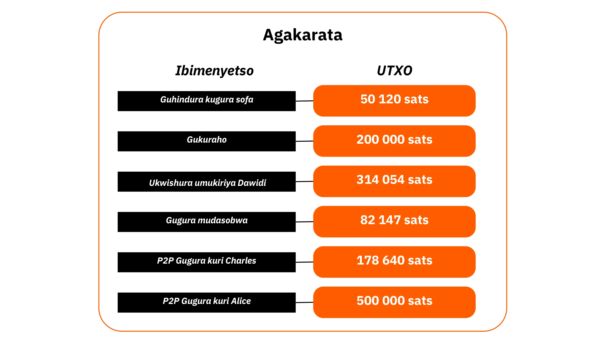


Kugira ngo utunganye neza uburongozi bwawe bwa UTXO no kwubahiriza ingamba zawe zo gutandukanya amafaranga muri Wallet yawe, woshobora gutunganya ibimenyetso vyawe n’ikimenyetso c’inyongera kigaragaza ivyo gutandukanya. Nimba Wallet yawe irimwo ivyiciro bibiri vya UTXO ushaka cane kudavanga, woshobora gushiramwo ikimenyetso mu bimenyetso vyawe kugira ngo ushobore gutandukanya neza iyo migwi. Ivyo bimenyetso vyo gutandukanya bizovana n’ingingo zawe bwite, nk’ugutandukanya hagati y’ama UTXO ava mu nzira y’ugugura irimwo KYC, canke hagati y’amahera y’umwuga n’ay’umuntu ku giti ciwe. Dufashe ingero z’ibimenyetso twavuze haruguru, ivyo vyoshobora guhinduka:


- `KYC - Gukuraho Exchange.com`;
- `KYC - Ukwishura kw'abaguzi Dawidi`;
- `NTA KYC - Gura P2P Karoli`;
- `NTA KYC - Hindura ugugura sofa`


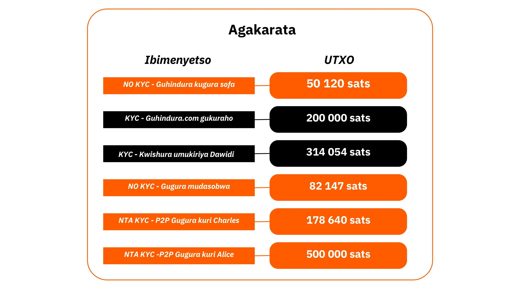


Ni vyiza kandi ko umuntu aguma ashirako ikimenyetso ku UTXO mu gihe c’amafaranga. Nk’akarorero, igihe ushize hamwe UTXO no-KYC, urabe neza ko UTXO ivuyemwo atari gusa `ugushiramwo`, ariko cane cane nk’`ugushiramwo no-KYC` kugira ngo ugume ufise inyandiko igaragara y’aho ivyo biceri vyavuye.


Ubwa nyuma, si ngombwa gushiramwo itariki ku kimenyetso. Porogaramu nyinshi za Wallet zirasanzwe zigaragaza itariki y'ugucuruza, kandi birashoboka kwama ubona aya makuru kuri Block explorer kubera txid yayo.


### Ni gute twohitamwo ama UTXO akwiriye?


Iyo ukora igikorwa, ubugenzuzi bwa Coin buragufasha guhitamwo vyihariye UTXOs zo gukoresha nk’ibintu vyinjizwa kugira ngo uhaze umusaruro w’ukwishyura. Hariho imice ibiri y’iryo hitamwo:


- Ubushobozi bw’uko uwuronka amahera yo guhuza igice c’akaranga kawe n’ama UTXO akoreshwa mu vyo kwinjiza;
- Ubushobozi bw’umugenzuzi wo hanze bwo gushinga amasano hagati y’ama UTXO yose akoreshwa nk’ibintu vy’injiza.


Kugira ngo dusobanure iciyumviro ca mbere, reka dufate akarorero nyako. Twibaze ko ugura umukate mu bitcoins ku mutetsi wawe. Ukoresha UTXO imwe canke nyinshi ufise nk’ibintu vy’injiza kugira ngo ushikire n’imiburiburi igiciro ca baguette mu bisohoka, hamwe n’amahera y’ugucuruza. Umutetsi wawe yoshobora rero gufatanya mu maso hawe, canke ikindi gice cose c’akaranga kawe azi, n’ibiceri bikoreshwa nk’ibintu vy’injiza. Kubera ko uzi ko iyo nzira iriho, woshobora guhitamwo UTXO yihariye aho guhitamwo iyindi igihe uriha.


Nk’akarorero, nimba imwe mu UTXO zawe iva ku rubuga rwa Exchange kandi ukaba ushaka ko umutetsi w’imikate atamenya ivyerekeye konti yawe kuri iyo rubuga, uzokwirinda gukoresha iyo UTXO kugira ngo wishyure. Niba ufise UTXO y’agaciro kanini yerekana amafaranga menshi cane, woshobora kandi guhitamwo kutayikoresha kugira ngo umutetsi ntamenye ubutunzi bwawe bwa BTC.


Guhitamwo UTXOs zo gukoresha kuri iyi ngingo ya mbere rero ni ingingo y’umuntu ku giti ciwe, ishingiye ku vyo wipfuza guhishura canke udashaka guhishura. Ivyo bimenyetso ushira ku ma UTXO yawe iyo uyakiriye bizokufasha guhitamwo ivyo, iyo umaze kubikoresha, bigaragaza gusa amakuru ushobora guhishurira uwuyakira.


Uretse amakuru ashobora guhishurirwa uwuyakira, uguhitamwo ivyo winjiza biragira ico bikoze ku vyo uhishurira abarorerezi bose ba Blockchain. Nkako, ukoresheje UTXO nyinshi nk’ibintu vyinjizwa mu gucuruza kwawe, uhishura ko ari ivy’ikigo kimwe, hakurikijwe ubuhinga bwa CIOH (_Common Input Ownership Heuristic_).


Igihe uhitamwo ama UTXO yawe rero, urakeneye kumenya ko igikorwa ugiye gutangaza kizotuma habaho ihuriro hagati y’ama UTXO yose akoreshwa. Iryo huriro rishobora kuba ingorane ku buzima bwawe bwite, cane cane iyo UTXOs zivuye mu bibanza bitandukanye.


Reka dufate akarorero k’iyi UTXO yanje idafise KYC iva muri Bisq; Nshaka kwirinda kubifatanya na UTXO iva, tuvuge, ku rubuga rwa Exchange rutegekanijwe ruzi akaranga kanje. Nkako, nivyashika nkoresheje izo UTXO 2 nk’ibintu vyinjizwa mu gikorwa kimwe, urubuga rutegekanijwe ruzoshobora guhuza akaranga kanje na UTXO naguze kuri Bisq, iyo mbere itari ifatanijwe n’akaranga kanje.


Ubwa nyuma, iyo uhisemwo UTXO zo gukoresha nk’inyungu mu gucuruza, ikintu gihambaye cane ni ukwirinda gukoresha UTXO nyinshi. Ivyinshi, iyo ushoboye, nuhitemwo Coin imwe nini bihagije kugira ngo uhaze ivyo uriha. Muri ubwo buryo, ukirinda rwose ingorane zijanye n’ugukoresha CIOH. Ariko rero, nimba ata UTXO imwe ihagije kugira ngo umuntu yishure kandi ukeneye gukoresha nyinshi, urabe neza ko ziva mu bibanza bisa n’ivyo kugira ngo ugabanye ingorane zo guhuza abantu udashaka. Kandi uzirikane ko uwuronka amakuru yoshobora gufatanya amakuru afise kuri wewe n’amateka y’ibiceri vyakoreshejwe mu gushiramwo ibintu.


### Gutahura uguhitamwo kwa UTXO


Mu bice vyabanje, twavuganye ku guhitamwo n’amaboko ama UTXO azokoreshwa mu gucuruza. Ariko none bigenda gute iyo porogarama ya Wallet ikoze ivyo guhitamwo ubwo nyene? Hari uburyo bwinshi bwo kumenya ibiceri vyo gukoresha, kandi guhitamwo UTXOs ni ikintu nyaco co gukora ubushakashatsi kuri Bitcoin. Intumbero ihambaye y’iyi nzira yikora kenshi ni ugugabanya amafaranga y’ugucuruza ku muntu akoresha.


Uburyo bwo guhitamwo UTXO nka FIFO (*Ubwa mbere Mu Mbere Gusohoka*) na LIFO (*Ubwa nyuma Mu Mbere Gusohoka*) ni bumwe mu buryo bworoshe, ariko kandi burakora neza cane. Na FIFO, UTXO za kera cane ziri muri Wallet ni zo zikoreshwa ubwa mbere. Ubwo buryo muri rusangi ntibukora neza mu kugabanya amafaranga y’ugucuruza no mu kuzigama ibanga, kiretse mu bihe aho hakoreshwa amasaha y’igihe kandi akeneye gusubirwamwo ubudasiba. Ku rundi ruhande, LIFO ishira imbere gukoresha ama UTXO aheruka cane. Ubwo buryo bwompi, naho bworoshe, akenshi buragaragara ko ata co bumaze.


Uburyo buteye imbere cane ni *Umutorera umuti w'Isakoshi*. Ivyo vyakoreshejwe kuri Bitcoin core Wallet gushika kuri verisiyo 0.17. Bigizwe no guhitamwo mu buryo busubiramwo kandi mu buryo butandukanye UTXOs muri Wallet, ukazishira mu bice bitobito, no kugumiza umuti ugabanya uburemere bw’ugucuruza uko bishoboka kwose, kugira ngo ugabanye igiciro ku wukoresha.


*Ishami-n'Imbohe* (BNB), akenshi yitwa "Murch algorithm" inyuma y'uwayihinguye, yasubiriye *Igisubizo c'Isakoshi* muri Bitcoin core kuva kuri verisiyo 0.17. Ubwo buryo buteye imbere cane bufise intumbero yo kurondera umugwi w'ama UTXO ahuye neza n'amahera akenewe kugira ngo umuntu ahaze ivyiza biva mu gucuruza. Intumbero ya BNB ni ugugabanya amafaranga y'ihinduka hamwe n'amahera, mu kugabanya ivyo bita ikigereranyo c'imyanda, kikaba gifata mu muzirikanyi amafaranga y'ubu nyene n'amafaranga yitezwe muri kazoza y'ivyo bikoresho vya Exchange. Ubu buryo buva ku ciyumviro c'intango c'*Ishami-n'Igihugu*, cavuzwe mu 1960 na Ailsa Land na Alison Harcourt, kandi butanga ugutunganya neza ama


Ubu buryo bwose bwo guhitamwo UTXO bwikora burashobora kuba bwiza mu kugabanya amahera y’ugucuruza, ariko kenshi ntibugira ico bukoze mu kuzigama ibanga ry’abakoresha. Nkako, izo algorithme zishobora gufatanya UTXO nyinshi mu vyo kwinjiza, gutyo zigahishura umutungo rusangi w’izo UTXO kubera CIOH. Biragaragara ko ubwo buryo butashobora kwitwararika ibimenyetso bishirwa ku ma UTXO, naho biri ukwo bikaba ari ngirakamaro mu guhitamwo neza ama UTXO yo guhishurira uwuronka amafaranga. Muri iki gihe, uburyo bumwe rudende bwo gutuma ibanga riguma ryiza igihe uhitamwo ibiceri ni ukubigira n’amaboko.


### Inyigisho ku gushirako ikimenyetso UTXO


Niba wifuza kumenya ingene woshirako amazina y'ama UTXO yawe, twakoze inyigisho yuzuye ku bijanye n'ubuhinga nyamukuru bwa Bitcoin Wallet hanze:


https://planb.network/tutorials/privacy/on-chain/utxo-labelling-d997f80f-8a96-45b5-8a4e-a3e1b7788c52

## KYC n'ikimenyetso c'urufunguzo


<chapterId>cec6b9d9-0eed-4f85-bc4e-1e9aa59ca605</chapterId>


KYC bisobanura "Menya umukiriya wawe". Ni uburyo bwo gutegeka bushirwa mu ngiro n’amashirahamwe amwe amwe akora mu rwego rwa Bitcoin. Intumbero y’iyi nzira ni ugusuzuma no kwandika akaranga k’abaguzi babo, n’intumbero yavuzwe yo kurwanya ugukoresha nabi amahera no gufasha iterabwoba.


Mu majambo y’ingirakamaro, KYC irimwo gukusanya amakuru atandukanye y’umuntu ku giti ciwe ku mukiriya, ashobora guhinduka bivanye n’ububasha, ariko muri rusangi harimwo indangamuntu, ifoto n’ikimenyamenya ca Address. Aya makuru araheza akagenzurwa maze akabikwa kugira ngo azokoreshwe muri kazoza.


Ubwo buryo bwacitse itegeko ku bikoresho vyose vy’ubuhinga bwa Exchange bitegekanijwe mu bihugu vyinshi vyo mu Burengero. Ivyo bisigura ko umuntu wese yipfuza Exchange amafaranga y’igihugu ku Bitcoin biciye kuri izo nzira ategerezwa kwubahiriza ibisabwa na KYC.


Ubwo buryo ntibutagira ingorane ku buzima bwite n’umutekano w’abakoresha. Muri iki gice, tuzosuzuma ivyo bibazo mu buryo burambuye kandi dusuzume ingaruka zidasanzwe za KYC n’imigenderanire yo kumenya umuntu ku buzima bwite bw’abakoresha Bitcoin.


### Gufasha gukurikirana onchain


Ico kibazo ca mbere gifitaniye isano na KYC ni uko itanga inzira y’agaciro yo kwinjira mu gusesangura Blockchain. Nk’uko twabibonye mu gice ca mbere, abasesangura barashobora gukoranya no gukurikirana ibikorwa kuri Blockchain bakoresheje uburyo bwo gukorana n’ubuhinga bwo kumenya ibintu. Bamaze kuroranirwa mu gukoranya igikorwa c’umukoresha onchain, ico bakeneye gukora n’ukurondera ahantu hamwe ho kwinjira mu bikorwa vyiwe vyose n’imfunguruzo kugira ngo bashobore guhungabanya ibanga ryiwe.


Iyo ukoze KYC, utanga ikibanza co kwinjiramwo c’agaciro kanini co gusesangura Blockchain, uko ufatanya amaderesi yawe yo kwakira akoreshwa igihe ukura amafaranga yawe y’ibiceri ku rubuga rwa Exchange n’akaranga kawe kuzuye, kagenzuwe. Mu vy’ukuri, ayo makuru amenyekana gusa n’ishirahamwe wayatanze, ariko nk’uko tuzobibona aha hepfo, ingorane yo gusohoka kw’amakuru ni nyayo. Ikindi kandi, kuba gusa ishirahamwe rifise ayo makuru birashobora gutera ingorane, naho boba batayasangiza abandi.


Rero, iyo udateye izindi ntambwe zo kugabanya ugukoranya ibikorwa vyawe kuri Blockchain, umuntu wese afise ubumenyi ku bijanye n’iyi nzira yo kwinjira muri KYC arashobora guhuza ibikorwa vyawe vyose kuri Bitcoin n’akaranga kawe. Uvuye ku mbonerahamwe y’iyo sosiyete, gukoresha kwawe Bitcoin biratakaza ibanga ryose.


Kugira ivyo tubigereranye n’ukugereranya, ni nk’aho umukozi wawe wo muri banki ya *Bank X* atari afise uburenganzira bwo kubona amafaranga yose ukoresha muri *Bank X* gusa, ariko kandi yari gushobora kwihweza amafaranga yose ukoresha muri *Bank Y* n’amafaranga yose ukoresha mu mafaranga.


Ibuka kuva mu gice ca mbere c’iri shure: Igishushanyo c’ibanga ca Bitcoin, nk’uko catekerejwe na Satoshi Nakamoto, gishingiye ku gutandukanya akaranga k’uwukoresha n’ababiri b’ingenzi ziwe. Naho iyo Layer y’ibanga itagihagije muri iki gihe, biracari vyiza ko umuntu agabanya ukuntu yononekaye uko bishoboka kwose.


### Gushikirwa n'ubugenzuzi bwa Leta


Ikibazo ca kabiri gikomeye kiri muri KYC ni uko ihishurira Leta ko wari ufise Bitcoin mu gihe kanaka. Iyo uguze bitcoins biciye ku mukinyi ategekanijwe, birashoboka ko Leta imenya ivy’ivyo bintu. Muri iki gihe, ivyo bishobora gusa n'ibidahambaye, ariko birahambaye kwibuka ko kazoza k'igihugu cawe mu vya politike n'ubutunzi katari mu maboko yawe.


Ica mbere, Leta irashobora kwihuta gufata ingingo y’ubutegetsi bw’agahomerabunwa. Amateka yuzuye ingero aho amategeko yahindutse bukwi na bukwi. Ubu, mu Buraya, aba Bitcoiners barashobora kwandika ingingo zivuga kuri Bitcoin, bagafata uruhara mu nama, bagacungera amasakoshi yabo mu kwizigama. Ariko none, ni nde yovuga ico ejo azoba? Iyo Bitcoin ihindutse umwansi wa bose mu kanya nk’ako gukubita, kuyifatanya na yo mu madosiye ya leta vyoshobora kuba ingorane.


Hanyuma, mu gihe habaye ingorane zikomeye z’ubutunzi, Leta yoshobora kwiyumvira gufata ama bitcoins afiswe n’abanyagihugu. Kumbure ejo, aba bitcoiners bazobonwa nk’abaronka inyungu mu bihe vy’amagorwa, kandi bazokorwako imisoro irenze urugero kubera inyungu zabo z’umutungo kamere mu gihe amafaranga y’ama fiat azoba ariko aragabanuka.


Ushobora kwibaza ko ivyo atari ikibazo, kuko ama bitcoins yawe aravanze, rero ntashobora gukurikirana. Ariko rero, gukurikirana si co kibazo kiri aha. Ikibazo nyaco ni uko Leta izi ko ufise Bitcoin. Aya makuru yonyene yoshobora kuba ahagije kugira ngo akugire icaha canke akugire ico ubazwa. Woshobora kugerageza kwivugira ko wakoresheje amahera yawe ya bitcoins, ariko ivyo vyobwirizwa kugaragara mu mpapuro zawe z’ikori, maze ugafatwa. Ushobora kandi kuvuga ko watakaje imfunguruzo zawe mu mpanuka y’ubwato, ariko uretse iyo nkuru y’agatwengo yo kuri Twitter, vy’ukuri wibaza ko ivyo vyoba bihagije kugira ngo urekure?


Ni ngombwa rero ko uzirikana ingorane za Leta kumenya ko ufise BTC, naho iyo ngorane yoba isa n’iyi kure gute uno musi.


Ikindi kibazo giterwa na KYC mu bijanye n’ukugenzura kwa Leta ni ugutanga raporo ku nguvu n’amashirahamwe ategekanijwe. Naho ntazi neza amategeko yo mu bindi bihugu, mu Bufaransa, *Prestataires de Services sur Actifs Numériques* (PSAN) zitegerezwa kumenyesha abajejwe kugenzura ivy’amahera iyo amahera yose abona ko ari ay’amakenga.


Mu Bufaransa mu mwaka w’2023, ibikorwa 1.449 biteye amakenga vyatangajwe n’aba PSAN. Kugeza ubu, vyinshi muri ivyo bikorwa bifitaniye isano n’ubugizi bwa nabi. Ariko kandi, abategetsi bariko barasaba amashirahamwe agengwa gutanga raporo ku bikorwa vyose biteye amakenga vy’ubuhinga bwa Bitcoin bishingiye gusa ku mibumbe yavyo. Iyo ukoze igikorwa co gukorana n’abandi, canke mbere igikorwa gusa gifise uburyo budasanzwe gatoyi, kandi ico gikorwa kikaba kitari kure y’ugukura ama Bitcoins yawe kuri izo nzira, woshobora kwisanga umenyeshejwe abategetsi. Naho ata bikorwa bibi vyakozwe kandi uburenganzira bwawe bukaba bukoreshwa mu buryo bubereye, mwene ukwo gutanga raporo kwoshobora gutuma habaho ugusuzuma n’ugucungera, ivyo bikaba ari ingorane wari kwirinda iyo utagira KYC.


### Ivyago vyo gusohoka kw'amakuru y'ibanga


Ikindi kibazo kiri muri KYC ni uko isaba ko amakuru yawe yose abikwa kuri servers z’ishirahamwe ry’abikorera ku giti cabo.


Ivyabaye vuba vyatwibukije ko ata n’umwe adashobora gushikirwa n’ingorane z’amahera canke z’ubuhinga bwa none. Muri 2022, abakiriya ba Celsius barashikiwe n'ingaruka. Inyuma y’aho iyo sosiyete ipfuye, amazina y’abayifitiye umwenda n’ingero y’itunga ryabo vyamenyeshejwe n’inkiko za Amerika mu gihe c’urubanza rw’ubutegetsi.


Haciye imyaka irenga ibiri gusa, yari igisagara gihambaye mu bijanye n’umutekano wo kuri internet w’amahera y’ibanga (cryptocurrency) cabonye amakuru y’ibanga y’abaguzi bayo yibwa. Naho ivyo bintu vyabaye bitajanye n’ugugura amafaranga y’ama bitcoins, mwene iyo ngorane iracariho no ku bikoresho vya Exchange. Hariho rero ingorane zitomoye zijanye n’amakuru y’umuntu ku giti ciwe.


Ni ukuri ko amakuru menshi y’ibanga dusanzwe tuyashira mu masosiyete yigenga. Ariko rero, ingorane iri aha ni zibiri, kuko ayo makuru atakumenya gusa, ariko kandi afitaniye isano n’ibikorwa biri kuri Bitcoin. Nkako, iyo umunyaruyeri aronse uburenganzira bwo gushika ku makuru y’abaguzi bo ku rubuga rwa Exchange, arashobora kwiyumvira ko abo baguzi bafise amafaranga yitwa Bitcoins. Ivyo bitera ingorane zirushirizwa n’uko Bitcoin, cokimwe n’ibindi bintu vyose vy’agaciro, ikwegera abasuma.


Mu gihe amakuru yoba yasohotse, mu vyiza woshobora kuba ari wo ugerageza guhenda abantu. Mu gihe kibi kuruta ibindi vyose, woshobora kwisanga uri hagati y’ibintu bishobora gutera ubwoba inzu yawe ku mubiri.


Uretse ingorane zidasanzwe zijanye n’inyandiko za Bitcoin, hariho kandi ingorane zijanye n’ugutanga inyandiko z’irangamuntu. Nkako, iyo amakuru asohotse, birashoboka ko umuntu yibwa akaranga. Rero ivyo bitera ntibigarukira gusa ku kurinda ibanga ry’amafaranga, ariko kandi birareba umutekano w’umuntu ku giti ciwe.


### Ivyiyumviro bimwebimwe vyerekeye KYC


Ni vyiza gusenyura bimwe mu vyiyumviro vy’imbere y’igihe ku bijanye na KYC dukunda guhura navyo kuri Twitter canke mu guhanahana amakuru hagati y’abakoresha amafaranga y’ama bitcoin.


Mbere na mbere, ntaco bimaze kwiyumvira ko kurinda ubuzima bwite bwawe ku Bitcoins uronka biciye ku KYC ata co bimaze. Ibikoresho n’uburyo bwo gucungera ubuzima bwite biri kuri Bitcoin biratandukanye kandi birafise intumbero zitandukanye. Gukoresha amafaranga y’ubudandaji ya CoinJoin ku ma Bitcoins yaronswe biciye ku KYC, nk’akarorero, si iciyumviro kibi. Ego ni ko, urakeneye kwiyubara ku bijanye n’amaporogarama ya Exchange ategekanijwe kugira ngo wirinde ko konti yawe ihagarara canke ngo ibuzwe, ariko mu bijanye n’ubuhinga bukomeye, ivyo bikorwa ntibihuye. CoinJoin irafise ingaruka zo guca amateka ya Coin, gutyo bikagufasha guhagarika ingorane zimwe zimwe zo gusesangura uruzitiro zijanye n’ivyo KYC ikora. Naho bidakuraho ingorane zose, biraserukira inyungu ikomeye.


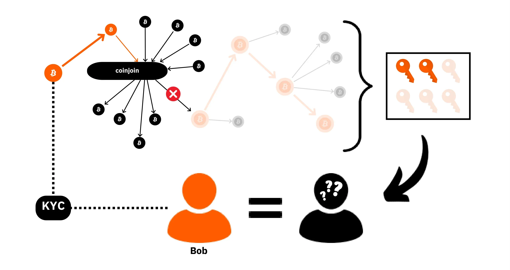


Ibanga kuri Bitcoin ntirikwiye kubonwa mu buryo bw'ibice bibiri, nk'itandukaniro hagati y'ibice vy'amahera "bitazwi" n'ibindi bitazwi. Kugira Bitcoins zironswa biciye ku KYC ntibisigura ko vyose vyatakaye; ahubwo gukoresha ibikoresho vyo gucungera ibanga birashobora mbere gutuma umuntu agira akamaro kuruta.


Ku rundi ruhande, kuronka Bitcoin biciye ku buryo butajanye n’ubuhinga bwa KYC ntibiguha ibanga ritagira agasembwa, eka mbere ntibigusonerwa gufata izindi ngingo zo kwikingira. Iyo ufise Bitcoin itari iya KYC ariko ugasubira gukoresha amaderesi y’ukwakira incuro nyinshi, amafaranga yawe yoshobora gukurikirana no gukoranirizwa hamwe. Ihuriro ritoyi n’isi iri hanze ya Bitcoin ryoshobora gutuma Layer yonyene y’ibanga ufise ihungabana. Ni ngombwa rero ko umuntu abona ibikoresho vyose n’uburyo bwo kwongereza ubuzima bwite biri kuri Bitcoin nk’ivyo kwuzuzanya. Ubuhinga bwose buratorera umuti ingorane yihariye kandi burashobora kwongerako Layer y’uburinzi. Rero kugira Bitcoin itari KYC ntibisigura ko udakeneye gufata ibindi bintu vyo kwirinda.


### Mbega KYC yoshobora gukurwaho?


Rimwe na rimwe ndabazwa nimba bishoboka "gusubira inyuma" umaze gukora KYC, kandi nk'uko mushobora kubibona mu ngingo zibanza, inyishu irafise utunenge. Uburyo bworoshe bwo kwirinda ingorane zijanye n’ivyo KYC ikora ni ukutayikoresha igihe uronka ama bitcoins. Tuzorabira kuri iyo nkuru mu buryo burambuye mu kigabane gikurikira. Ariko rero, nimba KYC yaramaze gukorwa kandi bitcoins zikaba zaguzwe, hari uburyo bwo kugabanya ingorane zirimwo?


Ku bijanye n’ingorane zo gukurikirana amafaranga yawe, gukoresha CoinJoin ni umuti. Tuzorabira ubu buryo mu buryo burambuye mu nyuma mu nyigisho, ariko ukwiye kumenya ko CoinJoin ishobora kugufasha guca amateka ya Coin no kuyibuza gukurikirana kahise-ubu n’ubu-kahise. Mbere no ku BTC zironswa biciye ku rubuga rutegekanijwe, ubu buhinga burashobora kubuza ko zishobora gukurikirana.


Ariko rero, CoinJoin ntizimanganya ingorane ya kabiri ijana na KYC: ukuntu Leta ishobora kumenyeshwa ko ufise amafaranga y’ibiceri. Nkako, naho ibiceri vyawe vyoba bitagishobora gukurikirana, Leta, bivanye n’ububasha, ishobora kuronka uburenganzira bwo kuronka amatangazo yawe yo kwimurira ivy’amahera y’amahera. Kubera ko iyo ngorane atari iyo mu vy’ubuhinga, ariko iyo ari iyo mu butegetsi, nta miti yihariye ya Bitcoin yo kuyikuraho, uretse kutavyishira mu nzira ya KYC mu ntango. Uburyo bumwe rudende bushingiye ku mategeko bwo kugabanya iyo ngorane ni ukugurisha ku mbuga zitegekanijwe Bitcoins zawe waronse biciye ku mbuga zitegekanijwe, hanyuma ukazisubira kuzigura biciye ku buryo butagira KYC. Mu kugurisha no kumenyesha ko wimuriwe, abategetsi bakwiye kubona ko utagifise.


Naho ku bijanye n’akaga ko gusohoka kw’amakuru yawe bwite n’inyandiko z’akaranga, ivyo ni akaga kari hanze ya Bitcoin, kandi nta muti w’ubuhinga wo kuvyirinda. Amakuru yawe amaze guhishurirwa, biragoye gusubiramwo igikorwa. Ushobora kugerageza gufunga konti yawe kuri iyo nzira, ariko ivyo ntivyemeza ko amakuru yawe ya KYC azokurwaho, cane cane iyo ugusuzuma akaranga kawe gushikirijwe abandi. Gusuzuma ko amakuru yawe yasimbuwe burundu ntibishoboka. Nta muti rero wo gukingira burundu iyo ngorane no kumenya ko itagihari.


### Itandukaniro hagati ya KYC n'ikimenyetso nyamukuru


Rimwe na rimwe, bamwe mu bakoresha bitcoiners bakunda kwagura ijambo "KYC" ku BTC Exchange iyo ari yo yose irimwo uguhererekanya amahera canke kwishura ku ikarita y'inguzanyo, kuko ubwo buryo bushobora kandi guhishura inkomoko y'ukwishura, nk'uko KYC yobigira. Ariko rero, KYC ntikwiye gutera urujijo n’ikimenyetso c’ingenzi. Ku bijanye n’ivyo jewe ubwanje, ntegerezwa kwemera ko ukuntu mbona iyo nkuru vyahindutse uko igihe cagenda kirarenga.


KYC yerekeza canecane ku buryo bwo gutegeka bushirwa mu ngiro n’amashirahamwe amwe amwe kugira ngo asuzume kandi yandike akaranga k’abaguzi babo. Ni ikintu c’ibice bibiri: iyo uronka ama bitcoins yawe, canke ukora KYC, canke ntubikore. Ariko rero, ikimenyetso c’urufunguzo, kijanye n’ihuriro hagati y’uruhande rw’akaranga k’ukoresha n’igikorwa c’uruzitiro, si nk’ivy’ibiri, ahubwo kigereranya igikorwa gikomeza. Nkako, mu bijanye no kuronka canke kwimurira Bitcoin, ukwo kumenya kwama gushoboka ku rugero rutandukanye.


Nk’akarorero, iyo uguze ama bitcoins ku rubuga rutegekanijwe mu Busuwisi, KYC ntibisabwa. Ariko rero, imfunguruzo zawe zirashobora kumenyekana, kuko ivyo waguze biciye ku konti yawe yo muri banki. Aho niho ingorane zibiri za mbere zijanye n’ubuhinga bwa KYC - kworohereza abantu gukurikirana onchain no gushikirwa n’ubugenzuzi bwa Leta - na zo nyene zishobora kwigaragaza muri Exchange itagira KYC. Iyo ishirahamwe ry’Ubusuwisi rimenyesheje abategetsi bo mu gihugu cawe amahera ateye amakenga, barashobora gusa gusuzuma konti ya banki yakoreshejwe mu kugura kugira ngo bamenye uwo uri we. Rero, kugura ata KYC ku mbuga zitegekanijwe ni vyiza cane ku rugero rw’ingorane zo kumenya ivy’ingenzi.


Ariko rero, kwirinda ama platforms ategekanijwe no guhitamwo uburyo bwo kuronka P2P ntibikuraho burundu ingorane zo kumenya urufunguruzo, ahubwo biragabanya gusa. Reka dufate akarorero k’ugugura kuri Bisq canke ku yindi nzira ya P2P. Kugira ngo wishyure uwo mugenzi wawe, birashoboka ko uzokoresha konti yawe yo muri banki. Iyo abategetsi babajije uwo mwagurishije bagasaba izina ryawe, turasubira ku bibazo 1 na 2. Naho ivyo bibazo biri hasi cane y’igihe ugura ku rubuga rudafise KYC, mbere bikaba biri hasi y’igihe ugura ufise KYC, biracariho ku rugero rutoyi.


Ubwa nyuma, naho woba uronka ama bitcoins yawe biciye ku Exchange y’umubiri ku mafaranga, ntuba utazwi rwose. Uwo mwaganiriye yarabonye mu maso hawe, ivyo bikaba ari kimwe mu bigize akaranga kawe. Naho ari bike cane muri aka karorero, haracariho ubushobozi bwo kumenya urufunguruzo.


Mu gusozera, iyo bitcoins zihinduwe n’ibindi bintu, haba ugugura mu mafaranga ya Leta canke ugurisha ku kintu nyaco, hama hariho uburyo bumwe bwo kumenya urufunguruzo. Bivanye n’uburyo bwa Exchange bwatowe, iyo nzira yo kumenya umuntu ishobora gutandukanywa mu buryo bukomeye. Ni ngombwa ko tutavanga iyo nzira y’ukumenyekana na KYC, ari yo nzira y’amategeko isobanuwe neza. Ariko rero, hariho isano hagati ya KYC n’urutonde rw’ibimenyetso, kuko KYC iri ku mpera y’urutonde rwo hejuru, kuko ifasha mu buryo butunganye kumenya imfunguruzo z’abakoresha n’ubutegetsi.


## Uburyo bwo kugurisha no kuronka


<chapterId>756598af-95aa-4c77-ac48-243c7ad89530</chapterId>


Uhejeje gusoma igice c’imbere, ushobora kuba uriko uribaza ingene woshobora kugura canke kugurisha Bitcoin utaciye mu buryo bwo kugenzura akaranga, kugira ngo wirinde ingorane zijanye n’ugukoresha KYC. Hari uburyo bwinshi bwo gucuruza Bitcoin.


### P2P amafaranga yo guhindura


Nk’uko twabibonye, ​​uburyo bwiza cane mu bijanye n’ibanga buguma ari P2P (umuntu ku muntu) Exchange n’amahera yo gutanga. Ubwo buryo buratuma ugabanya ibimenyetso bisigaye inyuma, kandi bikagabanya cane ubushobozi bwo kumenya urufunguruzo, waba uriko uragura canke uriko uragurisha.


Naho ari ukwo, hariho ingorane zishobora gutuma umuntu agira umutekano. Icoba ari ikibazo nyamukuru kiri mu kuba, mu gihe ca Exchange, uwo mugenzi azomenya ko ufise amahera menshi, yaba mu mafaranga canke mu bitcoins. Aya makuru arashobora gukwegera abantu b’abanyaruyeri. Nkako, muri rusangi ni vyiza kuba umuntu yiyubara ku bijanye n’ivyo ufise mu Bitcoin. Iyo mpanuro yoshobora no gukoreshwa ku bijanye n’amahera. Ariko rero, iyo muhanahana umuntu ku giti ciwe, nta nkeka ko muhishura ko mufise ama bitcoins, kandi ivyo bishobora gukwegera abantu batavyipfuza.


Kugira ngo ivyo bibeho, ndaguhanura ko wokunda gukoresha amahera n’abantu wizigira, nk’abo mu muryango canke abagenzi somambike. Canke, woshobora kandi kwiyumvira gucuruza mu [makoraniro ya Bitcoin yo mu karere](https://btcmap.org/communities/map), umaze kujayo incuro nkeyi. Ivyo bizotuma umenya neza abandi bari muri iyo nama kandi ntube wenyene igihe uriko urahanahana amakuru ku mubiri. Ariko rero, birahambaye kumenya ko amafaranga P2P ahindura amafaranga afise ingorane ku mutekano wawe bwite zitabaho iyo ugura biciye ku rubuga rutegekanijwe no kuri konti yawe ya banki.


Ikindi, bivanye n’aho uba, gutwara no kubika amahera menshi birashobora gutera ingorane, yaba ari Bitcoin canke amahera y’agaciro.


Guhindura amahera birashobora kandi gutera ingorane mu vy’amategeko iyo abapolisi canke abandi bagenzura. Naho mu bihugu vyinshi ata mategeko agenga amahera ushobora gutwara, amahera arenze urugero arashobora gutuma umuntu akekeranya. Rero, urabe maso canecane nimba ubwirizwa gukora ingendo ndende, kandi wirinde gukora amahera menshi cane icarimwe, kugira ngo ntubwirizwe kwishingira intahe ko ufise amahera menshi.


Ubwa nyuma, ikindi kibazo co kugura P2P ni uko igiciro gikunda kuba kinini kuruta ku bibanza bitegekanijwe. Abagurisha kenshi basaba igiciro kuva kuri 1% gushika rimwe na rimwe kirenze 10%. Hari imvo zitari nke zituma haba iyo ntandukaniro y’igiciro. Ica mbere, ivyo ni umugenzo usanzwe mu bagurisha P2P waciye ushinga imizi uko igihe kigenda kirarenga. Ica kabiri, abagurisha barafise amahera ajanye n’ugucuruza kugira ngo barungikire ayo mahera uwuguze. Hari kandi n’ingorane nyinshi z’ubusuma mu kugurisha P2P ugereranyije n’ugucuruza ku mbuga ngurukanabumenyi, ivyo bikaba bituma umuntu atanga indishi ku ngorane zafashwe. Ubwa nyuma, igiciro c’inyongera gishobora kuba gifitaniye isano n’ivyo abantu basaba be n’uko Exchange imeze mu bijanye n’ibanga. Nk’umuguzi, inyungu mu ibanga irafise igiciro kigaragara mu giciro gishirwako n’ugurisha. Bamwe mu ba bitcoiners na bo nyene bemera ko igiciro co gushiramwo ikimenyetso ca BTC yaguzwe kuri P2P kigaragaza igiciro cayo nyaco, kandi bavuga ko ibiciro bigabanutse ku mbuga zitegekanijwe ari ingaruka y’ugusenyura ibanga ry’amakuru yawe bwite.


### P2P ihinduranya biciye ku rubuga rwo gushaka abagenzi


Iyindi nzira idatera ingorane nyinshi mu bijanye n’umutekano w’umuntu ni uguhindura amafaranga P2P ku rubuga gusa, biciye ku buryo bwo kwishura bukoresheje ubuhinga bwa none nka PayPal, gutanga amafaranga muri banki canke Revolut.


Ubwo buryo buratuma umuntu yirinda ingorane nyinshi zijanye n’ugukoresha amahera. Ariko rero, ingorane yo gutakaza amahera y’uwundi muntu ku rubuga rwa Exchange ni nyinshi cane. Nkako, muri Exchange y’umubiri, iyo uhaye amahera uwugurisha atagurungikiye ama bitcoins mu gusubiza, urashobora guca umuhamagara ngo akureho, kuko ahagaze imbere yawe. Ku rundi ruhande, kuri Internet, kenshi ntibishoboka gukurikirana umuntu yakwivye.


Kugira ngo ivyo bigabanywe, birashoboka gukoresha ama platforms yihariye yo guhinduranya P2P. Izo mbuga zikoresha uburyo bwo gutorera umuti amakimbirane kugira ngo zikingire abakoresha bababajwe. Mu bisanzwe, batanga uburyo bwo gushiramwo amafaranga, aho amafaranga y’ama bitcoins aguma gushika aho amahera y’amahera y’amahera yemejwe n’uwugurisha.


Ku bijanye n’umutekano w’umuntu, ubu buryo bwo kugura buratekanye cane kuruta amahera y’umubiri Exchange. Ariko rero, nk’uko twabibonye haruguru, uguhinduranya P2P kuri Internet bisiga ibimenyetso vyinshi kuruta Exchange y’umubiri, ivyo bikaba bishobora kwonona ubuzima bwite kuri Bitcoin. Mu gukoresha uburyo bwo kwishura kuri internet nk’ubwa banki, urashira ahabona amakuru menshi yoshobora kworohereza umuntu kumenya urufunguzo.


Na none, sinzosaba gukora ubudandaji bwinshi cane mu gucuruza kumwe kuri izo mbuga. Mu gucapura amafaranga yawe, urakwiragiza ingorane zo kwibwa n’abandi.


Na none, ikindi kibazo co kugura P2P ni uko igiciro gikunda kuba kinini kuruta ico umuntu abona ku mbuga zitegekanijwe. Abagurisha kenshi basaba igiciro kuva kuri 1% gushika rimwe na rimwe kirenze 10%. Hari imvo zitari nke zituma haba iyo ntandukaniro y’igiciro. Ica mbere, ivyo ni umugenzo usanzwe mu bagurisha P2P waciye ushinga imizi uko igihe kigenda kirarenga. Ica kabiri, abagurisha barafise amahera ajanye n’ugucuruza kugira ngo barungikire ayo mahera uwuguze. Hari kandi n’ingorane nyinshi z’ubusuma mu kugurisha P2P ugereranyije n’ugucuruza ku mbuga, ivyo bikaba bituma umuntu atanga indishi ku ngorane zafashwe. Ubwa nyuma, igiciro c’inyongera gishobora kuba gifitaniye isano n’ivyo abantu basaba be n’uko Exchange imeze mu bijanye n’ibanga. Nk’umuguzi, inyungu mu ibanga irafise igiciro kigaragara mu giciro gishirwako n’ugurisha. Bamwe mu ba bitcoiners na bo nyene bemera ko igiciro co gushiramwo ikimenyetso ca BTC yaguzwe kuri P2P kigaragaza igiciro cayo nyaco, kandi bavuga ko ibiciro bigabanutse ku mbuga zitegekanijwe ari ingaruka y’ugusenyura ibanga ry’amakuru yawe bwite.


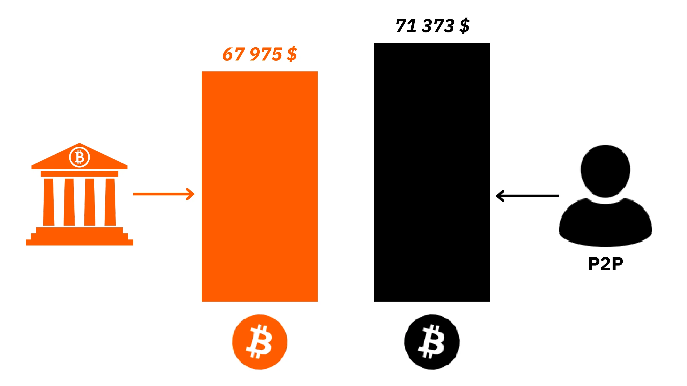


Ku bijanye n’imiti, jewe ubwanje nama nkoresha [Bisq](https://bisq.network/) kandi ndayinezerewe cane. Uburyo bwabo burageragezwa kandi busa n’ubwo kwizigirwa. Ariko Bisq iboneka kuri PC gusa kandi Interface yayo ishobora kuba igoye cane ku batangura. Ikindi kibazo ni uko Bisq ikora gusa n’amafaranga y’uruzitiro, ivyo bishobora gutwara amahera menshi mu bihe vy’amahera menshi y’amafaranga y’amafaranga Bitcoin.


-> Raba inyigisho yacu ya Bisq.


https://planb.network/tutorials/exchange/peer-to-peer/bisq-fe244bfa-dcc4-4522-8ec7-92223373ed04

Kugira ngo ubone uburyo bworoshe, urashobora kugerageza [Peach](https://peachbitcoin.com/), porogarama yo kuri telefone ngendanwa ihuza abaguzi n’abagurisha n’uburyo bwo gutorera umuti amatati bushizwemwo. Ivyo bikorwa birashoboka cane kuruta ivya Bisq.


-> Raba inyigisho yacu ya Peach.


https://planb.network/tutorials/exchange/peer-to-peer/peach-c6143241-d900-4047-9b73-1caba5e1f874

Iyindi nzira yo kuri internet ni [HodlHodl](https://hodlhodl.com/), urubuga rwashinzwe neza rutanga amahera meza, naho jewe ubwanje ntari naragerageje.


-> Raba inyigisho yacu ya HodlHodl.


https://planb.network/tutorials/exchange/peer-to-peer/hodlhodl-d7344cd5-6b18-40f5-8e78-2574a93a3879

Ku bijanye n’ibisubizo bishingiye kuri Lightning Network, gerageza [RoboSats] na [LNP2PBot]. RoboSats ushobora kuyironka biciye ku rubuga kandi yoroshe gukoresha. LNP2PBot ni ikintu kidasanzwe, kuko ikora biciye ku nzira ya Exchange ku rubuga rwo gutanga ubutumwa rwa Telegram.


-> Raba inyigisho yacu ya RoboSats.


-> Raba inyigisho yacu ya LNP2PBot.


https://planb.network/tutorials/exchange/peer-to-peer/robosats-b60e4f7c-533a-4295-9f6d-5368152e8c06

https://planb.network/tutorials/exchange/peer-to-peer/lnp2pbot-v2-e6bcb210-610b-487d-970c-7cce85273e3c


### Imbuga zitunganijwe ata KYC


Bivanye n’igihugu ubamwo, ushobora kuronka uburenganzira bwo gukoresha ama platforms ategekanijwe adasaba uburyo bwa KYC kugira ngo ugure canke ugurishe ama bitcoins. Nk’akarorero, mu Busuwisi, mbere woshobora gukoresha [Relai](https://relai.app/) na [MtPelerin](https://www.mtpelerin.com/), ubu zitanga ibikorwa vyazo hakurikijwe amabwirizwa ya KYC.


-> Raba inyigisho yacu kuri Relai.


https://planb.network/tutorials/exchange/centralized/relai-v2-30a9671d-e407-459d-9203-4c3eae15b30e

Nk’uko twabibonye mu kigabane c’imbere, ubwo bwoko bw’urubuga buragukiza ingorane zijanye n’uburyo bwa KYC, ariko buratanga urugero rwo hejuru rw’ingorane zo kumenya ivy’ingenzi. Ku bijanye n’ibanga rya Bitcoin rero, izo nzira zitanga uburinzi bwiza kuruta uburyo bwo kugura hakoreshejwe KYC, ariko ziguma zidakwegera cane nk’uguhinduranya P2P.


Ariko rero, ku bijanye n’umutekano w’umuntu ku giti ciwe, gukoresha izo nzira ni ikintu giteye akaga gato cane kuruta gukoresha ubuhinga bwa P2P. Akenshi kandi ziroroshe gukoresha kuruta ama platforms ya P2P.


### Ama ATM


Iyindi nzira yo kugura canke kugurisha amafaranga y’ama bitcoins ata KYC ni ama ATM y’amafaranga y’ama cryptocurrency. Ku bwanje, sinigeze ngira akaryo ko kugerageza uwo muti, kuko mu gihugu canje nta n’umwe uriho. Ariko ubu buryo burashobora gushimisha cane, bivanye n’aho uba.


Ikibazo c’ama ATM ni uko abujijwe mu bihugu bimwe bimwe, canke akagenzurwa cane mu bindi. Iyo ATM isaba uburyo bwo kugenzura akaranga, rero irashikirwa n’ingorane nk’izo ziri mu bibanza bigenzurwa na KYC. Ku rundi ruhande, iyo ATM yemerera gukoresha amafaranga ata kugenzura akaranga k’amahera makeyi, rero gukoresha kwayo birashobora gutanga urugero rw’ibanga rugereranywa n’urw’amahera P2P Exchange, mu gihe umuntu yirinda ingorane nyinshi zijanye n’ubwo bwoko bwa Exchange.


Intambamyi nyamukuru y’ama ATM ni amahera akenshi atanga cane Exchange, kuva ku bice bike kw’ijana gushika rimwe na rimwe ku bice 15 kw’ijana vy’amahera ahindurwa.


### Ikarata y'ingabire


Mu gusozera, nashaka kandi kubamenyesha umuti ukora neza ku bashaka gukoresha amafaranga yabo ya bitcoins ku musi ku musi kugira ngo bagure aho kuyagurisha ku mafaranga ya fiat.


Uburyo bwiza bwo gukoresha BTC ni, birumvikana, gukoresha Bitcoin canke Lightning Network ataco uhinduye kugira ngo ugure ikintu canke igikorwa. Ariko rero, mu bihugu vyinshi, igitigiri c’abadandaza bemera Bitcoin kiracari gito. Iyindi nzira ngirakamaro ni ugukoresha amakarata y’ingabirano.


Ivyuma vyinshi bidasaba uburyo bwa KYC biratanga ubushobozi bwo guhindura amafaranga y’ama bitcoins ku makarita y’ingabirano ashobora gukoreshwa ku maduka akomeye. Ivyo birimwo [CoinsBee](Ishirahamwe Bitcoin](Ishirahamwe ry’Ibiceri) na [Bitrefill](Ishirahamwe ry’Ibiceri.com/). Izo nzira zituma vyoroha cane gukoresha amafaranga yawe ya bitcoins ku musi ku musi, bikaguha uburenganzira bwo kuronka ibintu vyinshi n’ibikorwa vyinshi ataco ukeneye kubihindura mu mafaranga y’amahera.


https://planb.network/tutorials/exchange/centralized/bitrefill-8c588412-1bfc-465b-9bca-e647a647fbc1


### Ubundi buryo bwo kuronka


Ubundi buryo bwo kuronka bitcoins mu gihe urinda ubuzima bwite bwawe harimwo, birashoboka, Mining. Kugira ngo utangure Mining Sats, ntukeneye kumenyesha akaranga kawe; gusa urondere Proof of Work ibereye maze uyirungike ku rubuga. Iyo uhisemwo pool Mining, pools zimwe zimwe zisaba uburyo bumwe bumwe bwo kumenya umuntu, nk’ikimenyetso ca KYC, mu gihe izindi zitabisaba.


Ubundi buryo ni ugukora muri Exchange ku bitcoins. Ubwo buryo bwo kuronka umuntu burashobora gushimisha, mugabo urugero rwo kumenya umuntu rusabwa ruratandukanye cane bivanye n’ingene ivyo bintu vyifashe.


*Kugira ngo ndiko ndandika iki gice, nakoresheje inyigisho ya BTC205 yatanzwe na* [@pivi___](https://x.com/pivi___) *ku rupapuro rwa Plan ₿ Network (ruboneka mu gifaransa gusa muri iki gihe)*


## Gushiramwo, uburongozi bwa UTXO na CIOH


<chapterId>d0486c8f-332d-402b-ae2e-949416752b9c</chapterId>


Kimwe mu bintu bigoye cane mu gutwara igikoresho co kwibungabunga Wallet ni ugukomeza. Woba ukwiye gukomeza? Iciyumviro ni ikihe? Ni ubunini ubuhe bwa UTXO bukwiye kwubahirizwa? Ni ibihe bintu bishobora gusenyuka mu bijanye n’ibanga? Ivyo ni vyo tuzorabira muri iki gice.


### None ugushikama ni iki?


Bitcoin ikora nk’isoko ry’icuma, abacukuzi b’amabuye y’agaciro bagatanga ivyiyumviro ku bijanye n’ugucuruza bitanga amahera makeyi. Ariko rero, igice cose gifise uburemere burenze, ivyo bikaba bigabanya umubare w’ibikorwa bishobora gushirwamwo. Nk’uko igice kimwe gisohoka mu mwanya w’iminota 10 yose, umwanya uri muri buri gice ni ubutunzi buke.


Abacukuzi b’amabuye y’agaciro, ibikorwa vyabo generate bitwara amahera menshi mu bijanye n’amashanyarazi, ibintu bihoraho n’ugutunganywa, mu bisanzwe barondera kuronka inyungu nyinshi. Bakunda rero gukunda amafaranga generate atanga amahera menshi kuruta ayandi yose ugereranije n’uburemere bwayo.


Si amafaranga yose ya Bitcoin afise uburemere bumwe. Abafise ivyo bashiramwo n’ivyo basohora vyinshi bazopima cane. Nk'akarorero, reka twiyumvire ibikorwa 2:


- Ibikorwa A birimwo input 1 n’isohoka 1. Itanga amafaranga 1.994 Sats kandi ifise uburemere bwa 141 vB;
- Ibikorwa B, ibikorwa bikomeye cane bifise ivyinjizwa 2 n’ibisohoka 2, bitanga 2.640 Sats mu mahera ku buremere bwa 220 vB.


Muri aka karorero, naho igikorwa B gitanga amahera yose hamwe menshi, abacukuzi bazohitamwo igikorwa A, kuko gitanga igipimo ciza hagati y’amahera n’uburemere. Ehe ibara ry'ibikorwa vyose, rigaragazwa muri Sats ku byte y'ukuri (sat/vB):


```text
TXA: 1994 / 141 = 14 sats/vB
TXB: 2640 / 220 = 12 sats / vB
```


Ivyo bisigura ko ku giciro cose c’uburemere, igikorwa A gitanga amahera menshi kuruta igikorwa B, naho igikorwa B gitanga amahera menshi mu buryo bushitse.


Ni co gituma vyama bishimishije cane ko uwukoresha akoresha ibintu bikeyi bishoboka mu bikorwa vyiwe. Ariko rero, urakeneye gukoresha amahera ahagije kugira ngo ushobore guhazwa n’amahera y’umusaruro. Igihe ucungera Wallet yawe, ukeneye kugira UTXO nini zihagije.


Ingingo ngenderwako y’ugushiramwo ni ugukoresha neza ibihe amafaranga ari make kuri Bitcoin kugira ngo ihurize hamwe UTXO zayo ntoyi zibe imwe nini. Uko niko, iyo amafaranga azoduga kuri Bitcoin, uzoshobora gukora amafaranga makeyi cane, rero ukoreshe amafaranga make ku mafaranga mu buryo bushitse. Intumbero rero ni ugutegura imbere y’igihe ibikorwa vy’ingorane bizokorwa mu bihe vy’amahera menshi.


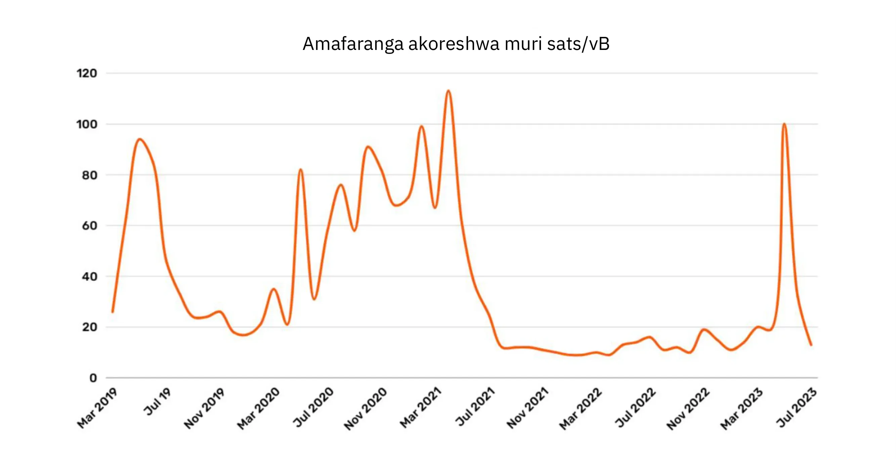


Uretse kuzigama amafaranga y'ibikorwa, gushiramwo UTXOs birafasha gukingira "Dust". Dust" yerekeza ku UTXOs agaciro kayo muri Sats kari hasi cane ku buryo bidahagije kugira ngo umuntu ashobore kwishura amafaranga y'ugucuruza asabwa kugira ngo akoreshe. Ivyo bituma ayo ma UTXO adashobora gukoreshwa mu vy'ubutunzi igihe cose amafaranga y'ugucuruza aguma ari menshi. amafaranga aguma akoreshwa.


### Ni ubuhe bunini bukeyi bw’ama UTXO yawe?


Rimwe na rimwe ndabazwa agaciro gatoyi cane k’i UTXO. Ikibabaje, nta n’inyishu ihari, kuko bivana n’ivyo ukunda be n’ingene isoko ry’amahera rimeze. Ariko rero, ng'iyi formule ishobora kugufasha kumenya urugero rubereye ivyo ukeneye:


$$
\frac {P \times F}T = M
$$


Hehe:


- p$ ni uburemere bw’ibikorwa;
- $F$ igereranya igipimo c’amahera menshi cane mu satoshis ku vbyte (Sats/vB) ukingira;
- t$ ni ijana kw’ijana ry’amahera y’ugucuruza wifuza kwishura ugereranije n’agaciro kose k’igitabu ca UTXO;
- m$ ni umubare mutoyi mu satoshis kuri UTXO yose.


Reka twiyumvire ko utegura kwishura amafaranga y’ugucuruza kwa SegWit gusanzwe gufise input 1 n’isohoka 2, bipima 141 vB. Niba uriko urakingira amafaranga ashika kuri 800 Sats/vB, kandi wifuza gukoresha amafaranga ashika kuri 12% y’agaciro ka UTXO mu mafaranga menshi, rero igiharuro coba ari:


$$
\frac{141 \times 800}{0.12} = 940\ 000
$$


Muri aka karorero, vyoba vyiza rero ugumye agaciro gatoyi k'ama Sats 940.000 ku ma UTXO muri Wallet yawe.


### Gushiramwo hamwe na CIOH


Imwe mu nzira zikoreshwa cane mu gusesangura Blockchain ni CIOH (*Common Input Ownership Heuristic*), ifata ko ibintu vyose vyinjizwa mu gucuruza Bitcoin ari ivy’ikigo kimwe. Ingingo ngenderwako y’ugushiramwo ni ugukoresha ama UTXO menshi nk’ivyo kwinjiza no kurema UTXO imwe nk’ivyo gusohoka. Gushiramwo rero bituma ICOH ishobora gukoreshwa.


Mu bikorwa, ivyo bisigura ko uwubibona wo hanze ashobora gufata ingingo y’uko UTXO zose zihuriweko zishobora kuba ari iz’umuntu umwe, kandi ko umusaruro udasanzwe uvamwo na wo nyene ari uwiwe. Ivyo bishobora gutuma ibanga ryawe rihungabana mu gufatanya amateka atandukanye y’ibikorwa. Nk’akarorero, reka tuvuge ko nkoranya UTXO 3 zaronswe biciye kuri P2P n’imwe UTXO yaronswe biciye ku rubuga rusaba KYC:


Mu kubigira, ikigo cose gifise uburenganzira bwo kuronka amakuru y’urubuga rwa Exchange, bishoboka ko harimwo n’ibigo vya Leta, kizoshobora kumenya ko mfise ayandi mahera ya BTC. Mbere, izo UTXO ntizari zifitaniye isano n’akaranga kanje ata guca ku ruhande; ubu rero ni ko biri. Ikindi, bihishurira amasoko yose ko mfise umubare kanaka w’ama bitcoins.


Ku bijanye no gucunga amashirahamwe y’ubudandaji, ivy’ubutunzi, bituma habaho uguhuza amashirahamwe kugira ngo hagabanuke ibiciro, birahushanye n’imigenzo myiza y’ubuzima bwite, ivyo bikaba vyosaba ko amashirahamwe y’ubudandaji atazokwigera ahurizwa hamwe. Guhitamwo hagati y’ubutunzi n’ibanga rero bivana n’ivyo uwukoresha wese ashira imbere.


Niba ushobora kwirinda gukomera mu gihe uguma ufise UTXO nyinshi, ivyo ni vyiza. Kugira ngo ubikore, nutunganye neza uburyo ukoresha mu kuronka. Niwagura bitcoins zawe muri DCA, gerageza gutandukanya ivyo ugura rimwe gusa uko bishoboka kwose kugira ngo ukomeze agaciro ku UTXO nke. Bizoroha gucungera ugugura rimwe gusa kw’amayero 1.000 buri mezi 2, aho kugura amayero 120 buri ndwi. Ivyo bigabanya umubare w’ama UTXO avutse kandi bikorohereza uburongozi bwa Wallet yawe mu gihe uzigama ibanga ryawe.


Niwaba ubona ko ubwirizwa gushiramwo ama bitcoins yawe, banza ushire imbere gushiramwo ama UTXOs ava ku nzira imwe. Nk’akarorero, gufatanya ama UTXO 10 avuye ku rubuga rumwe bizokugirako ingaruka ku ibanga ryawe bike kuruta gufatanya ama UTXO 5 avuye ku rubuga A n’ama UTXO 5 avuye ku rubuga B. Nimba gufatanya amasoko atandukanye bidashoboka, gerageza kuyatandukanya hakurikijwe ibiranga. Nk’akarorero, ushire hamwe ama UTXO yaronswe biciye kuri KYC mu gucuruza kumwe, n’ayo yaronswe biciye kuri P2P mu yindi.


Uko biri kwose, ntimwibagire ko ugushira hamwe kwose ata kabuza gutuma umuntu atakaza ibanga. Rero, nusuzume witonze ukuntu iyo operation ikenewe be n’ingaruka bishobora kugira ku buzima bwawe bwite, uzirikana CIOH.


## Ibindi bikorwa vyiza


<chapterId>b5216965-7d13-4ea1-9b7c-e292966a487b</chapterId>


Reka turabe ubundi buryo bwiza bwo gutuma ubuzima bwite bwawe bugenda neza kuri Bitcoin.


### Ipfundo ryose


Kugira ama bitcoins yawe mu kwizigama ni vyiza cane, ariko gukoresha Full node yawe bwite ni vyiza kuruta! Ehe igituma kugira node yawe bwite ari ngirakamaro kugira ngo ukoreshe neza Bitcoin:


- **Uguhangana n'ugucengera**: Ivyo ukora nta n'umwe ashobora kubibuza;
- **Ukwigenga ku bandi bantu**: Ntugishingiye ku gikorwa ico ari co cose co hanze co kugenzura amakuru ya Blockchain;
- **Ukwifatanya n'abandi**: Ushobora gusobanura amategeko yawe yo kwemeza kandi ukagira uruhara mu buryo butaziguye mu guhurizako;
- **Intambwe y'urubuga**: Mu gukoresha urudodo, ufasha gukomeza no gukwiragiza urubuga rwa Bitcoin;
- **Uburezi bw'ubuhinga**: Gucungera Full node ni uburyo bwiza bwo gukomeza ubumenyi bwawe bw'ubuhinga bwa Bitcoin.


Uretse izo nyungu, gukoresha Full node na vyo nyene biratuma urushiriza kugira ibanga igihe utangaza amafaranga yawe. Iyo utanga amafaranga, abanza kuremwa no gusinywa biciye ku Wallet yawe. Kugira ngo imenyekane ku rubuga rwa Bitcoin, itegerezwa kumenyekana n’imiburiburi n’urudodo rumwe. Mu gukoresha urudodo rwawe bwite, urafise ububasha butaziguye kuri iyo nzira yo gukwiragiza, gutyo ugakomeza ibanga ryawe kandi ugagabanya ingorane zo gusohoka kw’amakuru.


Nimba udafise node yawe bwite ya Bitcoin, uzobwirizwa gukoresha iyindi, nk’iyo itangwa n’uwuguha porogarama ya Wallet. Uretse gutangaza amafaranga, Wallet yawe isaba kuronka amakuru atandukanye nk’amafaranga ategerejwe, amafaranga asigaye ajanye n’amaderesi yawe be n’umubare w’ivyemezo vy’amafaranga yawe. Kugira ngo ubone aya makuru yose, ukeneye kubaza urudodo.


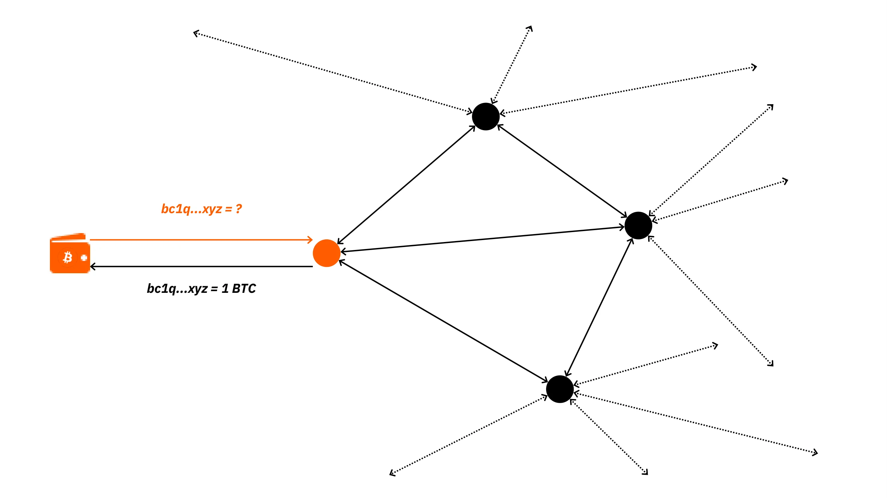


Icoba ari ikibazo nyamukuru iyo udakoresha uruzitiro rwawe bwite rwa Bitcoin ni uko uwukoresha uruzitiro rw’uwundi muntu yoshobora kwihweza ibikorwa vyawe kuri Blockchain, canke mbere agasangira aya makuru n’ibindi bigo. Kugira ngo ugabanye ivyo bibazo, umuti wo hagati ni ugukoresha porogarama ya Wallet ipfuka amahuriro yawe biciye kuri Tor. Ivyo birashobora kugabanya ukuntu amakuru yawe agaragara. Ariko rero, umuti mwiza ni ukugira node yawe bwite ya Bitcoin maze ukayikoresha mu gutangaza amafaranga yawe. Ego ni ko, uzokenera kandi kwiyubara kugira ngo ntusohoke amakuru yose biciye ku nzira yawe, ariko iyo ni ikindi kintu tuzorabira mu bice bizokurikira.


Uretse akamaro kagaragara ku buzima bwite bwawe, kugira Full node yawe bwite na vyo nyene birakwizeza ukuri kw’amakuru ari kuri Blockchain, bikakurinda gucengera kandi bikaguha uburenganzira bwo kugira uruhara n’umwete mu butegetsi bwa Bitcoin. Mu gukoresha node yawe bwite, utanga uburemere bwawe bw’ubutunzi ku ruhererekane uhisemwo, ivyo bikaba bihambaye mu gihe c’amatati mu kibano, nk’igihe c’intambara ya Blocksize kuva mu 2015 gushika mu 2017 nk’akarorero. Mu gihe ca Fork, gukoresha urudodo rw’uwundi muntu vyoshobora kugushikana ku gushigikira urudodo udashaka gukunda, nk’uko umukoresha w’urudodo ari we aguhitamwo.


Nk’uko mubibona, kubera inyungu z’ibanga n’ubusegaba bw’umuntu ku giti ciwe, ni ngombwa ko wiruka kandi ukoresha Full node yawe bwite!


### Guhenda isesengura ry'ubuhinga


Mu buryo bwagutse, birahambaye gutahura heuristics twavuze mu gice ca mbere, kugira ngo tushobore kuzirinda canke kuzihenda. Kwemera urutonde rw’ingeso nziza cane birashobora kuba ngirakamaro, naho nyene bitari ngombwa. Batanga uburinzi bwongereweko Layer bushobora kuba buhambaye mu kubungabunga ibanga igihe ukoresha Bitcoin.


Impanuro ya mbere notanga ni iyo kwivanga n’abantu benshi cane. Ku Bitcoin, ivyo bisigura gukoresha ibigereranyo vy’inyandiko vyemewe cane. Nk’akarorero, inyandiko za P2WSH, zikoreshwa kenshi ku miterere ya SegWit V0 Multisig, ntizisanzwe cane. Ntibakwemerera kwihisha mu gice kinini c’abantu batazwi. Ivyo ni vyo bigenda no ku bikoresho vya kera nka P2PKH canke P2SH. Naho ziboneka cane mu gice ca UTXO, zikoreshwa cane mu bikorwa bishasha.


Muri rusangi, ni vyiza guhitamwo urugero rw’inyandiko rwa vuba cane, igihe cose rwashizweho bihagije. Rero, iyo mu 2022, noba naragira inama yo kudakoresha P2TR (Taproot) kubera ukuntu ikoreshwa cane, mu 2024, noba naragira inama yo guhitamwo ubwo bwoko bw’inyandiko aho, canke iyo bidashoboka, ku nyandiko ya SegWit V0, nk’uko umubare w’ibikorwa bikoreshwa cane GW userukira GW is-2.


Inkomoko: [ibiharuro.com](ibiharuro.com/d/000000054/UTXO-gushiraho-ugusubira gucapura-ku-bwoko-bw'isohoka)


Iyindi mpanuro yo kuzigama ibanga ryawe ni ukugerageza guca mu nzira y’ubuhinga bwo gukorana n’abandi. Nk’akarorero, igihe uriha, urashobora kugerageza kwirinda kurema igisohoka gifise umubare uzunguruka, kuko ivyo vyoshobora kwerekana ko ikindi gisohoka giserukira ihinduka. Niba ukeneye kohereza umugenzi 100 k Sats, wiyumvire ko yohereza amahera menshi gatoyi kugira ngo uhunga iyo heuristic. Na wewe nyene, gerageza kudahingura ibiva mu mpinduka iyo ari yo yose irengeye urugero mu bijanye n’ukwishyura kwakozwe, kuko ivyo vyoshobora kandi kwerekana ico mu biva mu bisohoka giserukira ihinduka.


Ubwa nyuma, nimba ukora ibikorwa vy’ubudandaji vya Bitcoin ku buryo budasanzwe, urabe neza ko udahora uyatangaza mu bihe bimwe. Mu gukwiragiza amakuru y’ivyo ukora mu musi wose no mu ndwi yose, urinda guha abarorerezi bo hanze akaryo ko kumenya urutonde rw’igihe rushingiye ku gihe rwoshobora gukomeza isesengura ryabo.


Uretse ivyo bikorwa vyiza vyose vyo gukurikiza ku musi ku musi, hari mbere n’uburyo bwiza bwo guca burundu uburyo bwo gukurikirana ama bitcoins yawe. Ivyo birimwo, birumvikana, amafaranga y’ubudandaji bwa CoinJoin, ivyo tuzobiraba mu buryo bwimbitse mu gice gikurikira.


# Gutahura ibikorwa vya CoinJoin


<partId>6d0bbf16-3714-4db1-9897-2d45019f6bdc</partId>


## None igikorwa ca CoinJoin ni iki?


<chapterId>0862bc6b-1c48-4aa4-b76d-4f547b469008</chapterId>


Tumaze kwiga ivy’ishimikiro vyo kurinda ubuzima bwite, ubu tugiye kuraba ubuhinga buteye imbere cane bugamije kurwanira n’umwete ibanga ryawe, cane cane mu gutandukanya amateka yawe ya Bitcoin. Mu gice gikurikira, tuzoba turiko turaraba ubuhinga buke buke, ariko mbere, ndashaka kubabwira ivya CoinJoin.


CoinJoin akenshi ifatwa nk’uburyo bwiza bwo kurinda ubuzima bwite bw’abakoresha Bitcoin. Ariko none, ugucuruza CoinJoin ni iki nyabuna? Reka tubimenye.


### Ingingo ngenderwako z’ishimikiro zo muri CoinJoin


CoinJoin ni ubuhinga bwo guca Bitcoin gukurikirana kuri Blockchain. Ishingiye ku gucuruza kw’ubufatanye gufise imiterere yihariye y’izina rimwe: ugucuruza kwa CoinJoin.


Nk’uko twabibonye mu bice vya mbere vy’iri shure, amafaranga y’ubudandaji ya Bitcoin arazwi n’abakoresha bose biciye ku nzira yabo. Biroroshe rero kugenzura uruhererekane rw’imikono y’ubuhinga bwa none y’igikoresho cose citwa Coin no kwihweza kahise kaco. Ivyo bisigura ko abakoresha bose bashobora kugerageza gusuzuma amafaranga y’abandi bakoresha. Ivyo bituma ukutamenyekana ku rugero rw’ugucuruza bidashoboka. Ariko rero, ukutamenyekana kurazigama ku rugero rw’ukumenyekana kw’umuntu ku giti ciwe. Mu buryo butandukanye n’uburyo busanzwe bwo gukoresha banki, aho konti yose ihuzwa n’akaranga k’umuntu, kuri Bitcoin, amahera afatanywa n’ibifungurwa bibiri vy’urufunguzo (canke inyandiko), bikaba biha abakoresha uburyo bw’izina ry’uruyeri inyuma y’ibimenyetso vy’urufunguzo.


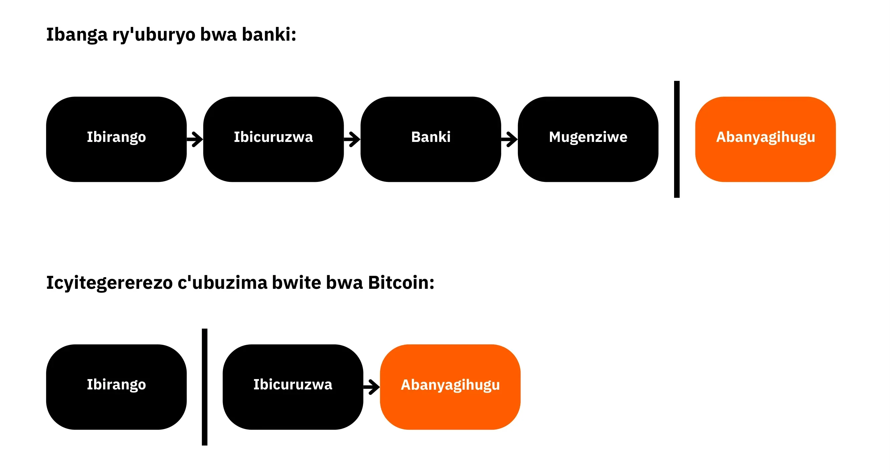


Ibanga rya Bitcoin rirahungabana iyo abarorerezi bo hanze bashobora gufatanya UTXO zihariye n’abakoresha bamenyekanye. Iryo shirahamwe rimaze gushingwa, birashoboka gukurikirana amafaranga yabo no gusuzuma amateka yabo ya Bitcoin. CoinJoin ni ubuhinga nyabwo bwateguwe kugira ngo buce ubushobozi bwo gukurikirana UTXOs, kugira ngo abakoresha Bitcoin bashobore guhabwa Layer y’ibanga ku rugero rw’ibikorwa.


Coinjoins zikomeza ibanga ry’abakoresha Bitcoin mu gutuma isesengura ry’uruzitiro rirushiriza kugora abarorerezi bo hanze. Uburyo bwavyo butuma ibiceri vyinshi biva ku bakoresha batandukanye bishobora guhurizwa hamwe bikagira igikorwa kimwe, bikaba bituma imirongo itaboneka neza kandi bikaba bigoye kumenya amasano ari hagati y’amaderesi y’injiza n’ay’isohoka.


Ni ngombwa gutahura ko intumbero y'ugucuruza CoinJoin ari uguca amateka ya Coin. Ubu buhinga ntibutanga ubutamenyekana ubudasiba canke ngo bubuze gukurikirana Bitcoin, bitandukanye n’ivyo woshobora kwiyumvira. CoinJoin igamije gusa guca amateka ku ntumbero aho igikorwa ca CoinJoin gikorerwa. Ariko rero, imbere n’inyuma y’ico gikorwa, Coin iguma ifise ingorane nk’izo nyene ku bijanye n’ibanga.


### None ama coinjoins akora gute?


Ingingo ya CoinJoin ishingiye ku buryo bwo gukorana: abakoresha benshi bipfuza guvanga amafaranga yabo ya bitcoins bashiramwo amahera asa n’ayo bashiramwo mu gikorwa kimwe. Ivyo bihembo bica bisubira gukwiragizwa mu bisohoka bifise agaciro kangana n’uwubikoresha wese.


Ku mpera y’ugucuruza, biraca bidashoboka gufatanya igisohoka kinaka n’ukoresha azwi nk’inyungu. Nta sano ry’ukuri riri hagati y’ivyo winjiza n’ivyo usohoka, ivyo bikaba bica isano hagati y’abakoresha n’ama UTXO yabo, hamwe n’amateka ya buri UTXO.


Reka dufate akarorero ka Alice. Ashaka kohereza mushikawe Eva amafaranga agera ku bihumbi 100 vy’ama Sats ku musi wiwe w’amavuko. Ariko rero, Alice ntishaka ko Eva ashobora gukurikirana amateka yiwe y’ugucuruza, kuko ntashaka gutangaza ingene afise amafaranga y’ama bitcoins canke ingene yayaronse. Kugira ngo ivyo bishoboke, Alice ifata ingingo yo guca amateka yiwe ya UTXO n’ugucuruza CoinJoin. Arategura na Bob, Charles, David na Frank kugira ngo bakore igikorwa co gukorana:


- Alice, Bob, Charles, David na Frank umwe wese akora UTXO y’ama Sats 105.000 (n’ama Sats 5.000 y’amahera y’ama Mining) nk’ivyo gushiramwo mu gucuruza:


- Mu gusubiza gukoresha ivyo bikoresho, kimwe cose gitanga Address y’ubusa kugira ngo kireme ibisohoka bitanu bisa n’ivyo 100.000 Sats kimwe cose. Imwe yose igarura igisohoka kimwe:


- Alice yisanga afise UTXO y’ama Sats 100.000 amateka yayo avunganye. Akoresha iyo UTXO mu bikorwa bishasha kugira ngo yoherereze Eva ayo mahera ku musi wiwe w’amavuko:


- Eva niyagerageza gusuzuma iyo nzira kugira ngo akuremwo amakuru, azohura n’inzira ya CoinJoin irimwo Alice, Bob, Charles, David na Frank. Kubera ko Eva adashobora gutandukanya input ari iya nde kubera ukuntu amafaranga amwe, ntashobora gukurikirana amateka ya Alice ya UTXO, canke ngo amenye ingene mushikiwe afise ama bitcoins canke ingene yayaronse:


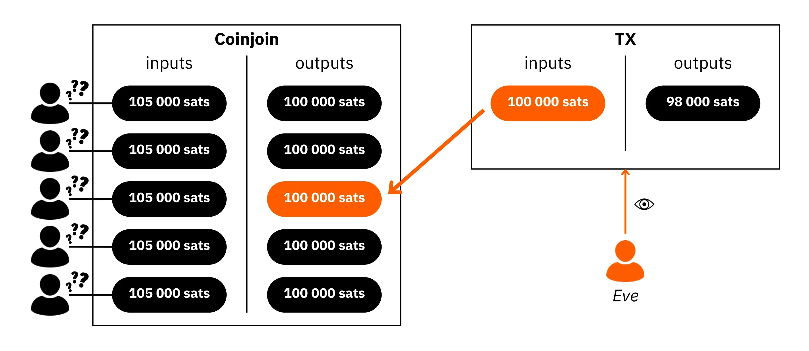


Muri ivyo, Alice yakoresheje ubuhinga bwa CoinJoin kugira ngo yongere ibanga ku bijanye n’isesengura ry’inyuma. Mu vy'ukuri, Alice iriko irikingira isesengura rishoboka rya Eva, yotangura n'ugucuruza kwihariye maze agakora asubira inyuma biciye mu mateka ya UTXO. Ukwo kurinda gusesangura kuva ubu gushika muri kahise kuzwi kw’izina rya backward anonset. Ico ciyumviro tuzokiraba mu buryo burambuye mu bice vya nyuma vy’iki gice.


Ariko kandi, CoinJoin iratanga kandi ubushobozi bwo gukomeza ibanga mu gihe c’isesengura kuva kera gushika ubu, rizwi kw’izina rya forward anonset. Reka dusubire ku karorero kacu aho Alice yarungikiye Eva 98.000 Sats ku musi wiwe w’amavuko, ariko inshingano zikaba zahindutse. None reka twiyumvire ko ari Eva ahagaritse umutima ku bijanye n’ubuzima bwiwe bwite. Nkako, Alice yoshobora kugeragezwa no gukurikirana Coin yarungitse Eva kugira ngo ayikuremwo amakuru. Eva yari gushobora gukoranya neza iyi UTXO aherutse kuronka n’izindi UTXO ziwe zose, ivyo bishobora guhishurira Alice umubare w’ama bitcoins afise muri Wallet yiwe. Kugira ngo ivyo ntibibeho, Eva arashobora kandi guca amateka y’iyi Coin aherutse kuronka:


- Eva, Grace, Mallory, Oscar na Victor umwe wese yashizemwo amafaranga 658 y’amafaranga 98.000 nk’inyungu mu gucuruza amafaranga 656:


- Mu gusubiza gukoresha ivyo bikoresho, umukoresha wese atanga Address y'ubusa izokoreshwa mu guhingura ibisohoka 5 vy'ibikoresho 97.500 bingana neza na Sats. Buri mukoresha aronka igisubizo kimwe:


- Eva ubu afise UTXO y’ama Sats 97.500 amateka yayo yacitse. Arashobora kuyikoresha ata bwoba kugira ngo akore ibikorwa vyo mu gihe kizoza. Nkako, Alice niyagerageza gukurikirana ama bitcoins yarungikiye Eva, azohura n’ugucuruza kwa CoinJoin. Ntazoshobora kumenya UTXO isohoka ari iya Eva. Isesengura rihinduka ridashoboka:


Mu karorero ka mbere, twabonye ingene CoinJoin ishobora kurinda ubuzima bwite bw’icumba mu bijanye n’ivya kera, mu karorero ka kabiri, ingene ishobora kandi gukingira amateka y’icumba mu bijanye n’akazoza kaco. Ni co gituma navuze ko CoinJoin ikwiye gufatwa nk’ikintu kiba rimwe gusa gicapura amateka ya UTXO mu nzira zompi:


### Igikoresho co guvanga, CoinJoin, igikoresho co guvanga... Ni igiki gitandukanye?


Coinjoins rimwe na rimwe zidondorwa nk'"abavanga", ijambo bamwe mu ba bitcoiners banka, batinya ko ryoshobora gutera urujijo n'abavanga abacungera. Ariko rero, nizera ko iyo nzira y’ugutahura ata shingiro ifise, kuko, mu bijanye n’imibare, CoinJoin irimwo neza na neza iciyumviro co kuvanga.


Mu bijanye n’imibare rusangi, ukuvanga ni umutungo w’urutonde rw’inguvu aho, inyuma y’igihe kinaka, ibice vyose vy’ikibanza c’intango bishobora mu vyiyumviro kuvanga n’ikindi gice ico ari co cose. Guvanga bisigura ko ikibanza c’igice canke uko urutonde ruri bihinduka mu buryo bw’uko ugukwiragira kwaco muri kazoza kutajanye n’ugukwiragira kwarwo kwa mbere, gutyo bigashika ku rwego aho ibiranga urutonde rw’intango bigabanywa mu buryo bumwe mu kibanza cose c’urutonde. Ivyo ni vyo nyene bishika muri CoinJoin ifise ama bitcoins. Rero, mu vyiyumviro vyanje, CoinJoin ni uburyo bwo kuvanga Coin vy’ukuri.


Ku rundi ruhande, birahambaye gutandukanya CoinJoin n’aba shufflers. Shuffler ni service aho abakoresha bohereje ama bitcoins yabo kugira ngo ahindurwe. Izo serivisi zari zizwi cane mu myaka ya 2010, ariko ikoreshwa ryazo ryaragabanutse kubera ingorane zibiri zikomeye ugereranyije na CoinJoin:


- Bisaba abakoresha kureka kubika amahera yabo mu gihe c’uguvanga, ivyo bikaba bituma bashikirwa n’ingorane zo kwibwa;
- Nta cizere ko iyo mixer itazokwandika amakuru y’ibikorwa, canke mbere ngo igurishe ayo makuru ku masosiyete akora isesengura ry’uruhererekane.


Abakoresha muri iki gihe rero barakunda CoinJoin, kuko ibafasha kuguma bafise ububasha bwose ku mahera yabo mu gihe cose bariko barakora. Abaje muri CoinJoin nta ngorane bafise yo kwibwa amafaranga yabo n’abandi ba UTXO bari muri iyo nzira. Reka turabe ingene ivyo vyose bishoboka mu kigabane gikurikira.


## Zerolink n'amafaranga y'i Chaumian


<chapterId>326c9654-b359-4906-b23d-d6518dd5dc3e</chapterId>


Ubuzima bwite butangwa na CoinJoin buronswa n’ubunini bw’umugwi igice cacu kinyegejwemwo. Ivyo bisigura kurondera abantu benshi bashoboka. Birashoboka cane gukora CoinJoin n’amaboko, n’abakoresha twisanze, ariko iyi ni inzira igoye, kandi ntizogutsinda anonsets nini.


Ni co gituma abahuzabikorwa ba CoinJoin bateye imbere kuri Bitcoin. Uruhara rwabo ni ugutuma abakoresha batandukanye bahuriza hamwe no gutanga amakuru akenewe kugira ngo baheza gukorana n’abandi.


Ariko twomenya gute ko umuhuzabikorwa atigera agira ibiganza vyiwe ku bitcoins z’abakoresha, kandi naho ari we muntu yubaka igikorwa ca CoinJoin, twomenya gute ko adashobora guhuza ivyo abakoresha binjiza n’ivyo basohora, ivyo bishobora kuba ari ugusohoka kw’ibanga?


### Imikono y'impumyi ya Chaum


Ivyuma vya CoinJoin vyo muri iki gihe bikoresha imikono y’impumyi ya David Chaum kugira ngo ntihagire amakuru asohoka. Reka twihweze ningoga ingene izo nkuru z’impumyi zikora.


Imikono ya Chaum y’impumyi ni uburyo bw’umukono w’ivyuma aho uwutanga umukono atamenya ibirimwo mu butumwa ariko arashirako umukono. Ariko iyo sinyatire irashobora rero kugenzurwa n’ubutumwa bw’intango. Ubu buhinga bwateguwe n'umuhinga mu vy'amabanga David Chaum mu 1983.


Reka dufate akarorero k’ishirahamwe ryipfuza kwemeza ko inyandiko y’ibanga, nk’akarorero Contract, ari iy’ukuri, ataco rivuze. Iyo sosiyete ikoresha uburyo bwo gupfuka inyandiko y’intango mu buryo bushobora gusubirwamwo. Iyo nyandiko yahinduwe yoherezwa ku kigo kijejwe kwemeza, kigashirako umukono w’impumyi ataco kizi ku birimwo. Iyo sosiyete imaze kwakira iyo nyandiko yashizweko umukono, irafungura iyo nyandiko yashizweko umukono. Ico bivamwo ni inyandiko y’umwimerere yemejwe n’umukono w’ubutegetsi, ata butegetsi bwigeze bubona ibirimwo vy’umwimerere.


Imikono ya Chaum rero ishobora kwemeza ko inyandiko ari iyo ukuri ata muntu azi ibirimwo, gutyo bikaba bituma amakuru y’uwuyikoresha aba ibanga be n’uko iyo nyandiko yashizweko umukono izoba ari iyo kwizera.


### Amafaranga y'i Chaumian


Ivyo bita "Chaumian" coinjoins bifatanya gukoresha imikono ya Tor na David Chaum kugira ngo umuhuzabikorwa ntashobore kumenya igisohoka ari ic'uwukoresha.


Ivy’ubwubatsi bw’ibikorwa vya CoinJoin birimwo intambwe 3 nyamukuru: kwandika ivyinjijwe, kwandika ivy’isohoka n’ugushirako umukono ku bikorwa. Reka turabe iyo nzira biciye ku karorero ka Alice, umwe mu bari muri CoinJoin. Abandi bose bari muri iyo nama bakurikiza intambwe nk’izo Alice ikoresha, umwe wese ku giti ciwe.


**Intambwe ya 1: Kwiyandikisha**


- Alice irungikira umuhuzabikorwa UTXO yipfuza gukoresha nk’inyungu mu gucuruza, hamwe n’ivyo kwakira Address yipfuza gukoresha nk’isohoka kugira ngo aronke ama bitcoins yiwe. Umuhuzabikorwa rero nta buryo afise bwo kumenya Address ya Alice. Ibona gusa verisiyo yiwe y’impuzu:


- Umuhuzabikorwa arasuzuma ko ivyo bintu vyinjijwe ari ukuri, hanyuma agashira umukono ku Alice Address ipfutse n’urufunguzo rwiwe rw’ibanga. Asubiza umukono w’impumyi kuri Alice:


**Intambwe ya 2: Ivyanditswe bisohoka**


- Alice arashobora gufungura Address yiwe, ubu ikaba yashizweko umukono n’urufunguzo rw’ibanga rw’umuhuzabikorwa. Azoshinga uruja n’uruza rushasha munsi y’akaranga ka Tor gatandukanye. Umuhuzabikorwa ntashobora kumenya ko ari Alice ariko arahuza munsi y'akaranga gashasha:


- Alice yohereza Address itagira igipfukisho n’umukono ku muhuzabikorwa (uwutaramenya ko ari Alice):


**Intambwe ya 3: Gusinya amasezerano**


- Mu buryo nk’ubwo, umuhuzabikorwa aratora ibisubizo bitagira amabara ku bari muri iyo nama bose. Biciye ku mikono ijana, arashobora kugenzura ko igisohoka cose yashikirijwe ata wuzi izina ryashizweko umukono n’urufunguzo rwiwe rw’ibanga imbere y’igihe, gutyo akamenya ko ari ivy’ukuri. Araheza rero yiteguriye kwubaka iyo nzira ya CoinJoin, akayirungikira abayigize kugira ngo bayishireko umukono:


- Alice, nk’abandi bari muri iyo nama, arasuzuma ko ivyo yinjiza n’ivyo asohora bishizwe neza mu bikorwa vyubatswe n’umuhuzabikorwa. Iyo vyose bishimishije, yohereza umukono ufungura inyandiko yiwe y’inyungu ku muhuzabikorwa:


- Amaze gukusanya imikono y’abaje muri CoinJoin bose, umuhuzabikorwa arashobora gutangaza iyo nzira ku rubuga rwa Bitcoin, kugira ngo ishobore kwongerwa ku gice.


Muri iyo nzira, umuhuzabikorwa ntashobora guhuza ikintu yinjijwe n’ikintu kinaka gisohoka. Ikindi, ntashobora kwifatira amahera y’abaje mu nama, kuko atigera aronka imfunguruzo z’ibanga zikenewe kugira ngo afungure UTXO zabo. Mu gihe cose, gushika ku mpera y’intambwe ya 3, na we nyene ntashobora gushika ku mikono. Iyo Alice n’abandi bari muri iyo nama bashize umukono ku bijanye n’ugucuruza kw’isi yose, bamaze kugenzura ko vyose bimeze neza, umuhuzabikorwa ntashobora kuzosubira guhindura iyo nzira, harimwo n’ibisohoka, atayihinduye ubusa. Ivyo bituma umuhuzabikorwa adashobora kwiba ama bitcoins.


Ubwa nyuma, igihe yandika umusaruro wiwe mu gucuruza, uwukoresha CoinJoin yipfuza kugira ivyemezo bisa n’ivy’umunyagihugu atora mu matora. Hariho ububiri hagati y’ivyo bikorwa vya bose n’ivy’abikorera ku giti cabo. Ku ruhande rumwe, hari ico ushaka gukingira: ku mutora, ntashaka ko urupapuro rwiwe rw’itora rujanye n’akaranga kiwe; ku mukoresha wa CoinJoin, ntashaka ko igisohoka ciwe gifatanywa n'ico yinjiza. Nkako, iyo umuhuzabikorwa, canke uwundi muntu uwo ari we wese, ashoboye gushinga isano hagati y’ivyo yinjiza n’ivyo asohora, CoinJoin iratakaza inyungu yose. Nk’uko vyasiguwe haruguru, CoinJoin itegerezwa gukora nk’akaruhuko mu mateka ya Coin. Ivyo bihagarara neza na neza kubera ko bidashoboka gufatanya ikintu kinaka n’igisohoka kinaka mu gucuruza CoinJoin (imbere anonset) n’ibihushanye n’ivyo (anonset inyuma).


Ku rundi ruhande, hariho n’ivy’abantu bose: uwutora ashaka kumenya neza ko urupapuro rwiwe rw’itora ruri mu gasandugu k’itora; na vyo nyene, uwukoresha CoinJoin ashaka kumenya neza ko umusaruro wiwe uri mu gucuruza CoinJoin. Nkako, abaje muri CoinJoin bategerezwa kuba bashoboye kugenzura ko umusaruro wabo uriho imbere yo gusinya iyo nzira, ahandi ho umuhuzabikorwa yoshobora kwiba ayo mahera.


Ni vyo nyene ivyo bice 2 vya Leta n’ivy’abikorera ku giti cabo, bishobozwa n’ugukoresha imikono y’impumyi ya David Chaum, bitanga icemezo c’abaje mu bikorwa vya Chaumian coinjoins ko bitcoins zabo zitazokwibwa, kandi ko amahera yabo adashobora gukurikirana.


### Ni nde yahinguye iciyumviro ca CoinJoin?


Ni Hard kuvuga ata gukeka uwabanje gushiramwo iciyumviro ca CoinJoin kuri Bitcoin, n’uwaje n’iciyumviro co gukoresha imikono y’impumyi ya David Chaum muri iki gihe. Kenshi vyiyumvirwa ko ari Gregory Maxwell yabivuze ubwa mbere muri [ubutumwa bwo kuri BitcoinTalk mu 2013](279249.0):


> *"Gukoresha imikono y'impumyi ya Chaum: Abakoresha binjira bagatanga inyishu (n'amaderesi ya Exchange) hamwe n'uburyo bw'ibanga bwa blinded bwa Address bipfuza koherezako UTXO zabo bwite; the server. Server ishobora kubona ko ibisohoka vyose vyashizweko umukono na yo kandi ko, kubera ivyo, ibisohoka vyose biva ku baje mu nama babereye Mu nyuma, abantu barasubira kwifatanya maze bagashirako umukono."*
Maxwell, G. (2013, 22 Myandagaro). *CoinJoin: Bitcoin ubuzima bwite bw'isi nyakuri*. Ihuriro ry'Ibiganiro vya Bitcoin. 279249.0


Ariko rero, hariho n’ibindi vyavuzwe imbere y’aho, vyose ku mikono ya Chaum nka UTXO y’uguvanga, ariko kandi ku bijanye n’ama coinjoins. [Muri Ruheshi 2011, Duncan Townsend yashize ahabona ku rubuga rwa BitcoinTalk) igikoresho co guvanga gikoresha imikono ya Chaum mu buryo busa cane n’ubw’amafaranga y’iki Chaum yo muri iki gihe.


Muri iyo nkuru nyene, turashobora gusanga [ubutumwa buvuye kuri hashcoin mu kwishura Duncan Townsend] (https. Inzira idondora muri ubu butumwa ni co nyene coinjoins zivuga. Kuvuga uburyo busa n’ubwo birashobora no kuboneka muri [ubutumwa bwa Alex Mizrahi mu 2012](https://github.com/killerstorm/6f843e1d38191aebca67d483bd88#file-laundry) nk’uko mu nyuma ararema Litecoin. Mbere n'ijambo "CoinJoin" ubwaryo bavuga ko ritavuzwe na Greg Maxwell, ahubwo ko ryavuye mu ciyumviro ca Peter Todd.


### Ihuriro rya Zero


Zerolink ni umurongo w’uguvanga wuzuye ushiramwo amafaranga y’i Chaumian n’ingene abakoresha batamenyekana ku buryo bwinshi bwo gusesangura uruhererekane, cane cane mu kugabanya amakosa ajanye n’uburongozi bwa Wallet. Iyi porotokole [yashizweho na nopara73 na TDevD mu 2017].


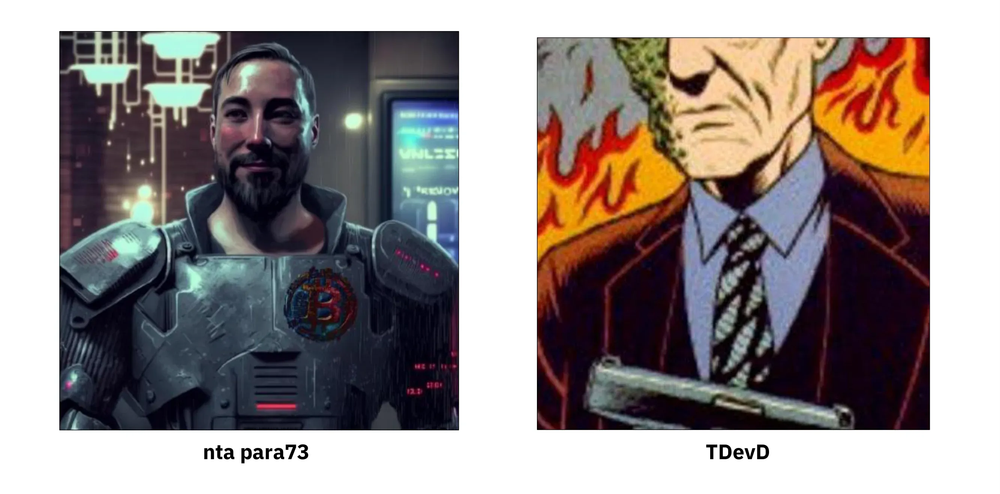


Nk’uko izina ryayo rivyerekana, ingingo ngenderwako y’inyuma ya Zerolink ni uguhingura amasezerano ya CoinJoin atuma amasano hagati y’ivyo yinjiza n’ivyo asohoka adashobora gukurikirana. Ivyo bishikwako mu kumenya neza ko ibisohoka vyose bifise ingero zisa neza.


Ingingo ihambaye yo kwirinda yafashwe na Zerolink ni ugutuma UTXO zitavanzwe zitandukanye rwose n’izivanzwe hakoreshejwe amafunguro atandukanye y’ubuhinga bwa none, canke mbere n’amasakoshi atandukanye. Ivyo bitandukanya "*pre-mix*" Wallet, igenewe UTXOs imbere y'uko zivangwa, n'"*post-mix*" Wallet, yagenewe UTXOs zavanzwe.


Ukwo gutandukanya gukomeye kw'ama UTXO gufasha canecane gukingira amashirahamwe y'impanuka hagati ya UTXO ivanze n'ita UTXO ivanze. Nkako, iyo mwene ayo mahuriro abayeho, ubushobozi bwa CoinJoin ku UTXO ivanze burakurwaho ata n’umwe ayikoresha abizi, gutyo bikaba bituma ibanga ry’i UTXO yiyumvira ko yacitse intege rihungabana. Ivyo bihuza bishobora kubaho biciye mu gusubira gukoresha Address ku gucungera UTXO ivanze n’iyindi itavanze, canke biciye mu gukoresha CIOH (_Common-Input-Ownership Heuristic_), iyo uwukoresha akoresha UTXOs zivanzwe n’izitavanze nk’ibintu vyinjizwa muri same. Mu gutandukanya amasakoshi y’imbere y’uguvanga n’inyuma y’uguvanga, turirinda mwene ayo mashirahamwe y’impanuka kandi tukarinda uwukoresha amakosa atagamije.


Ukwo gutandukanya kandi gutanga ubushobozi bwo gukoresha amategeko atandukanye hagati y’amasakoshi y’imbere y’uguvanga n’inyuma y’uguvanga ku rugero rwa porogarama ya Wallet. Nk’akarorero, mu gihe c’inyuma y’uguvanga Wallet, porogarama irashobora kubuza gufatanya UTXOs mu bikoresho vy’injiza kugira ngo ntihagire uwukoresha CIOH ikoreshwa, ivyo bikaba vyotuma anonset y’uwukoresha ihungabana. Birashoboka kandi guhuza ikoreshwa ry’inyandiko n’uburyo bwo gukoresha (nk’akarorero, raporo ya RBF) kugira ngo umuntu ntamenyekane n’ibimenyetso vy’intoke vya Wallet.


Ubu, Whirlpool ni yo yonyene ikoresha CoinJoin ikoresha cane umurongo wa Zerolink. Mu gice gikurikira, turaza kuraba uburyo butandukanye bwo gushirwa mu ngiro kwa CoinJoin buriho, n’ivyiza n’ibibi vya buri kimwe cose.


## CoinJoin gushirwa mu ngiro


<chapterId>e37ed073-9498-4e4f-820b-30951e829596</chapterId>


**Mu mwaka w'2024, turiko turabona amahinduka akomeye mu bikoresho biriho ku bakoresha bipfuza gukora coinjoins kuri Bitcoin. Ubu turi mu gihe c'ihinduka, kandi isoko rya CoinJoin ririko rihindurwa cane. Iki gice nta gukeka ko kizosubirwamwo uko igihe kigenda kirarenga**


Kugeza ubu hariho ahanini 3 bitandukanye CoinJoin gushirwa mu ngiro kuri Bitcoin:


- Whirlpool;
- Ababisabi;
- Injira mw'Isoko.


Imwe muri izo nzira zigamije guca amateka y’ama UTXO biciye mu bikorwa vya CoinJoin. Ariko rero, uburyo bikoreshwa buratandukanye cane. Ni ngombwa rero gutahura ingene kimwe cose gikora, kugira ngo ushobore guhitamwo uburyo bubereye ivyo ukeneye.


### Kwinjira mw'isoko


JoinMarket, yashinzwe mu 2015 na Adam Gibson na Chris Belcher, iratandukanye cane n’izindi nzira za CoinJoin kubera uburyo bwayo bwihariye bwo guhuza abakoresha. Ubuhinga bushingiye kw'isoko rya P2P Exchange aho abakoresha bamwebamwe, "abakora", batuma amafaranga yabo ya bitcoins ashobora gukoreshwa mu guvanga, mu gihe abandi, "abafata", bakoresha ayo mahera kugira ngo bakore ama coinjoins mu gusubiza amahera.


Muri iki kigereranyo, "abahinguzi" baratuma ama bitcoins yabo ashikirizwa "abayafata" kandi bagaronka amahera y'igikorwa cabo. Ababifata na bo nyene bariha kugira ngo bakoreshe amafaranga y’abahinguzi kugira ngo bakore ibikorwa vyabo vy’ubudandaji vya CoinJoin. Amafaranga y'ibikorwa aratandukanye bivanye n'uruhara umuntu afise: "abakora" barundanya amafaranga yo gutanga amafaranga, mu gihe "abafata" bariha amafaranga. Isoko rikora mu mwidegemvyo, ata n’itegeko ryo gukoresha.


Kimwe mu bitera ingorane nyinshi JoinMarket ni uko ikoreshwa neza, ivyo bikaba bisaba urugero runaka rw’uguhumurizwa n’ibikoresho vyo gukoresha kugira ngo ikore neza. Naho ivyo bigoranye atari intambamyi ku muntu azi gukoresha, birashobora gutuma abantu bose badashobora kubironka. Ariko rero, ubu hakaba hariho urubuga rwa Interface rwitwa JAM, rwatumye rworoha gatoyi gukoresha.


Inkomoko: [JAM](https://github.com/isoko-ry'urubuga/jam/ibara/iterambere/inyandiko/itunga/ishusho-ry'umwiza.urubuga)


Ariko rero, intambamyi y’ubuhinga iracari intambamyi ikomeye. Mu bidukikije vya CoinJoin, aho ibanga rikomezwa n’umubare w’abaje mu nama, uburenganzira bwose bugabanya ubushobozi bwo kuronka amakuru buragira ingaruka zitaziguye ku mahera ariho, ari co kintu gihambaye cane mu gutuma iyo nzira ikora neza. Bitcoin, kuba isanzwe ari ikibanza mu bikorwa vy’amahera, ibona ko ikoresha coinjoins nk’ikibanza gitoyi, kandi JoinMarket iserukira mbere n’igice kidasanzwe cayo, ivyo rero bikaba bigabanya ubushobozi bwayo bwo kwongera anonsets z’abakoresha bayo.


Naho ifise ubuhinga bushasha bwo guhuza P2P ku ba coinjoiners, JoinMarket irafise ingorane zikomeye, cane cane mu bijanye n’imiterere y’ibikorwa. Udakunze izindi nzira zo gushirwa mu ngiro nka Whirlpool, JoinMarket ntiyizera uburinganire butunganye hagati y’ibisohoka, kandi birashoboka gukurikirana amasano y’ivy’ubuhinga hagati y’ibisohoka n’ibisohoka. Ikindi kandi, nta bikoresho ifise vyo kubuza ko ama UTXO amaze kuvangwa hamwe yosubira kuvangwa, ivyo bikaba vyoshobora gutuma ibanga abakoresha barondera rihungabana.


Ubwa nyuma, naho iciyumviro ca JoinMarket gishimishije cane cane ku bakunda isoko ry’amahera ry’inguvu, intege nke zaryo z’imiterere n’ubuhinga bwaryo butoroshe bituma, mu vyiyumviro vyanje, kidashimishije cane abashasha n’abahinga barondera ugushirwa mu ngiro kwa CoinJoin.


### Wabisabi


Wabisabi ni uwundi murongo wa CoinJoin, ufise uburyo bushira hamwe uguhuza ibikorwa. Ico kigereranyo cavumbuwe na Ádám Ficsór (nopara73), Yuval Kogman, Lucas Ontivero, na István András Seres mu 2021, hanyuma gishirwa muri porogarama ya Wasabi 2.0 umwaka wakurikiyeho. Wabisabi ni iterambere ry'ubuhinga bwa Wasabi CoinJoin bwatangujwe mu 2018.


Mu mpera z'imyaka ya 2010, Wasabi yaremeye uburyo bwo gucuruza butandukanye cane na CoinJoin n'ubwa Whirlpool. Wasabi yakoresheje amafaranga menshi cane ya CoinJoin arimwo abantu amajana n’amajana kugira ngo yongere amakuru y’abayigize. Mu buryo bunyuranye, Whirlpool yahisemwo gukora ibikorwa bitobito vyinshi, bikaba vyatumye anonsets zikura cane uko inzira igenda irahinduka.


Uburyo bwo gucunga Exchange na bwo nyene bwatandukanije izo nzira zibiri zo gushirwa mu ngiro. Na Whirlpool, ihinduka ryakuwemwo kandi ryitandukanijwe n’ama UTXO imbere y’ingendo za CoinJoin kubera TX0, iciyumviro nzosigura cane mu kigabane gikurikira. Ku rundi ruhande, na Wasabi, iryo hinduka ryaciye rigira kimwe mu biva mu gucuruza CoinJoin, rigumya amasano y’ugushinga intahe hagati y’ibintu bimwebimwe vyinjizwa n’ibisohoka.


Na Wabisabi, Wasabi verisiyo 2.0 yarahinduye uburyo bwayo bwo gukoresha amafaranga kugira ngo ihure n'iya Whirlpool. Naho amafaranga y’ubudandaji ya CoinJoin aguma ari manini cane, ubu birashoboka gukora uruzitiro rw’ingendo nyinshi zikurikirana, hakurikijwe uburyo bwa Whirlpool. n’ugucungera ibiciro vya Exchange vyarashizweho umutima cane: bitandukanye na Wasabi 1.0, aho ihinduka ryari rifitaniye isano n’ivyo abakoresha bashiramwo, Wabisabi irondera gucapura iryo hinduka mu mahera makeyi menshi, agabanywemwo amashengero angana ku bari muri iyo nama bose.


Reka tubigereranye n'akarorero koroshe karimwo abakoresha 2 gusa: Alice yipfuza kuvanga 115.000 Sats na Bob, 210.000 Sats. Ukwirengagiza amafaranga, na Wasabi 1.0, ugucuruza kwa CoinJoin kwari gutuma haba ibisubizo 3 vy'ama Sats 100.000, hakongerwako ihinduka 1 ry'ama Sats 15.000 ku Alice n'ihinduka 1 ry'ama Sats 10.000 ku Sats. Ihinduka ry'ibisohoka ryoba rigihuye n'ivyo kwinjiza:


Mu gihe ca Wabisabi, iyo nzira nyene yari gutuma haba ibisohoka 3 vy’amashanyarazi 100.000 Sats n’ibisohoka 5 vy’amashanyarazi 5.000 Sats, gutyo bigatuma iryo hinduka rishira ku buryo ritashobora guhuzwa ata guca ku ruhande n’inyungu yihariye:


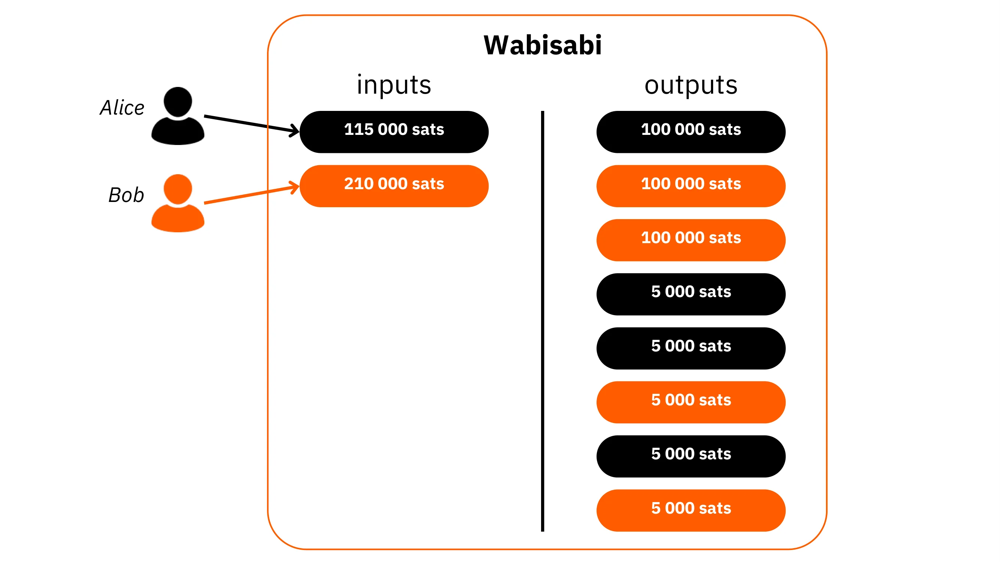


Ku bwanje, mbona ko uburongozi bw’amahinduka bwa Wabisabi bufise ingorane nyinshi zishobora gutuma bukora nabi mu bijanye n’ibanga:


- Iyo uwukoresha atanga UTXO nini cane kuruta iyo abandi bari muri iyo nama, nta kabuza aheza akagira amahera y’ihinduka azohuzwa n’ivyo atanga. Ivyo bihushanye n’intumbero y’intango y’iyo porotokole, ari yo gukuraho amahinduka yose ashobora kumenyekana;
- Ukwiyongera kw’amashengero n’intumbero yo guca ibice ihinduka birashobora kuba bibi mu buryo buteye ubwoba ku bijanye n’uguvanga neza. Ivyo bishobora gutuma habaho ukugabanya anonsets ku bisohoka bimwebimwe, uko bigenda vyoroshe kumenyekana;
- Ubu buryo kandi buratuma habaho UTXO z’agaciro gato zitera ingorane y’uburongozi ku wukoresha. Izo UTXO ntoya, iyo zizimvye cane ku buryo zidashobora gukoreshwa mu bijanye n'agaciro kazo, zishobora kuba "Dust". Ico kintu gituma uwukoresha afatanya UTXO nyinshi mu vyo gukoresha mu gukora ibikorwa vyo muri kazoza, canke akabifatanya. Muri ivyo bihe vyose, kubera CIOH, ivyo birashobora kugabanya amakuru y’ibanga yaronswe, canke bikakuraho burundu inyungu z’ibanga zaronswe na CoinJoin ya mbere.


Udakunze Whirlpool, ishira mu ngiro umurongo wa ZeroLink utuma habaho itandukaniro rikomeye hagati y’imbere y’uguvanga n’inyuma y’uguvanga, Wabisabi ntigumya ukwo gutandukanya gukomeye. Hari kandi ingorane zo gusubira gukoresha Address n’abaguzi bamwebamwe ba Wasabi, ivyo bikaba bigaragara ko bitera ingorane cane uwuyikoresha.


Mu verisiyo ya Wasabi 2.0, hashizweho ingingo nshasha y’amahera CoinJoin. Kuva ubu, amafaranga y’umuhuzabikorwa ashirwa kuri 0,3% ku ma UTXO ari hejuru ya 0,01 Bitcoin, mu gihe ku ma UTXO mato, ayo mafaranga atangwa mu buryo bushitse. Ikindi, guhindura indirimbo z’izo UTXO ntoyi ni ubuntu, naho amafaranga Mining aguma arihwa n’uwukoresha ku bikorwa vyose, harimwo n’uguhindura indirimbo.


Ivyo bitandukanye n’ingingo ya Whirlpool, aho amahera aguma ari amwe, ata kuraba ubunini bw’ama annonsets abonetse. Na Wasabi 2.0, naho amafaranga y’umuhuzabikorwa arekurwa ku ma UTXO mato, uwukoresha aracari ategerezwa kwishura amafaranga Mining ku bikorwa vyose, harimwo n’ivyo guhindura.


Uko ndiko ndandika iyi mirongo, ikoreshwa ry’ururimi rwa Wabisabi ryarateye imbere cane kubera ibintu biherutse kuba. Inyuma y’aho abashinze Samourai Wallet bafashwe, zkSNACKs, ishirahamwe ritanga amahera kandi rirongora iterambere rya Wasabi, ryatangaje ko igikorwa caryo co guhuza ibikorwa vya CoinJoin kizohagarara kw’igenekerezo rya 1 Ruheshi 2024.


Kubera ko uwo muhuzabikorwa mukuru ahagaritse, abakoresha ubu bategerezwa kwifatanya n’abahuzabikorwa bashasha bigenga. Iryo hinduka rituma habaho ivyiyumviro bitari bike: ku ruhande rumwe, abahuzabikorwa bashasha boshobora kutagira amahera ahagije, bikagabanya ubushobozi bw’ama coinjoins mu bijanye n’ibanga. Ku rundi ruhande, hariho ingorane yo guhura n’umuhuzabikorwa w’umunyaruyeri. Ivyo birongereza ingorane nshasha zikomeye ku barondera gukoresha Wabisabi.


Uretse ibibazo vy’ubuhinga, ingingo ya zkSNACKs, ishirahamwe riri inyuma ya Wasabi, yo gukoresha ubuhinga bw’ishirahamwe ry’ugusesangura imirongo kugira ngo icungurure abaje muri CoinJoin, iravyura ibibazo bikomeye bijanye n’inyifato runtu n’ingene ingamba zizokorwa. Iciyumviro ca mbere cari co kubuza abagizi ba nabi gukoresha ama coinjoins kuri Wasabi, ivyo bikaba ari ibintu bishobora gusa n’ibibereye. Ariko rero, biravyura ikintu kidasanzwe: kwishura amahera umuhuzabikorwa afise igikorwa nyamukuru co gukomeza ibanga ry’abakoresha, gusa kugira ngo ashobore gufasha ishirahamwe rifise intumbero yo guhungabanya iryo banga nyene.


N’ikindi giteye amaganya ni ingingo ngenderwako y’ugucungera, itandukanye cane n’ubuhinga bwa Bitcoin bwo gutanga uburyo bw’ivy’ubutunzi bufunguye kandi butagenzurwa. Naho vyosa n’ibibereye gushaka gukuraho ibikorwa vy’ubugizi bwa nabi, ukwo kuyungurura kwoshobora kandi gukora ku bantu ibikorwa vyabo, naho nyene bifatwa nk’ibitemewe n’amategeko mu bihe bimwebimwe, bishobora kuba bifise ishingiro mu vy’inyifato runtu canke bifise akamaro ku kibano. Akarorero ka Edward Snowden karerekana neza iyo ntambara: abonwa n’intwaro zimwe zimwe nk’umugizi wa nabi kubera ivyo yahishuriwe, abandi bamubona nk’umuntu atangaza amakuru y’abantu, akora ibintu ku bw’inyungu za bose. Ivyo bigoranye birashimika ku kaga gashobora guterwa n’ukuyungurura, naho nyene bifise intumbero nziza, bishobora gutuma uburenganzira n’umutekano w’abakoresha bibereye bihungabana. Nari gushobora no kuvuga abaharanira uburenganzira bw’abantu n’abanyamakuru batotezwa n’intwaro zimwe zimwe z’ubutegetsi bw’agahomerabunwa.


Nk'uko muzoba mwabikoranye ubu, ivyo nkunda ni vy'ukuri Whirlpool model ku coinjoins kuri Bitcoin. Uwo murongo uratandukanye n’uwukomeye cane kandi uratanga ivyizigiro vyiza kuruta ibindi vyose vy’uko umuntu azoba afise ibanga. Ni ryo ryonyene kandi ritanga uruvange rubonwa ko rutunganye mu bijanye n’imibare. Mu vyiyumviro vyanje, iki kigereranyo kigereranya kazoza k'ama coinjoins kuri Bitcoin. Ndabatumiye ngo musuzume iyo nzira mu buryo bwimbitse mu kigabane gikurikira.


## Uko Whirlpool ikora


<chapterId>bdbd7109-e36d-4b4f-a3c6-928df4e9bfda</chapterId>


Igitandukanya Whirlpool n'ubundi buryo bwa CoinJoin ni ugukoresha ibikorwa vya "_ZeroLink_", bituma ata sano ry'ubuhinga rishoboka hagati y'ibintu vyose vyinjizwa n'ibisohoka. Uwo muvumba utunganye ushikwako biciye mu nzira aho umwe wese mu bari muri iyo nama atanga umubare ungana (uretse amafaranga y’ama Mining), bikaba bitanga umusaruro w’amahera angana neza.


Ubwo buryo bwo kubuza ivyinjizwa buha ibikorwa vya Whirlpool vya CoinJoin ikintu kidasanzwe: ukubura kwose kw’amasano y’ivyinjira hagati y’ibishirwamwo n’ibisohoka. Mu yandi majambo, igisohoka cose gifise amahirwe angana yo gushirwa ku muntu wese afise uruhara, ugereranije n’ibindi bisohoka vyose biri mu gucuruza.


### Uko Whirlpool ikora


Mu ntango, igitigiri c’abaje muri Whirlpool CoinJoin imwe imwe cari 5, harimwo abashasha 2 n’abasubiramwo 3 (ivyo vyiyumviro tuzobisigura mu nyuma). Ariko rero, ukwo kwiyongera kw’amahera y’ugucuruza On-Chain kwabonetse mu 2023 kwatumye amashirahamwe ya Samourai asubira kwiyumvira uburyo bwabo bwo gutuma ibanga ry’abantu ryiza mu gihe bagabanya ibiciro. Gutyo, hakurikijwe uko isoko ry’amahera rimeze be n’umubare w’abazoja muri iyo nama, umuhuzabikorwa arashobora ubu gutegura ama coinjoins harimwo abazoja muri iyo nama 6, 7 canke 8. Ivyo biganiro vy'iterambere bizwi nka "Imirongo y'Ivyiyumviro". Ni vyiza kumenya ko, uko imiterere yoba iri kwose, hama hariho gusa 2 bashasha binjira muri Whirlpool coinjoins.


Gutyo, ibikorwa vya Whirlpool birangwa n’umubare usa w’ibintu vyinjizwa n’ibisohoka, bishobora kuba:


- 5 vyinjizwa n’ibisohoka 5;


- 6 vyinjizwa n’ibisohoka 6;


- 7 vyinjizwa n’ibisohoka 7;


- 8 vy’injiza n’ivy’isohoka 8.


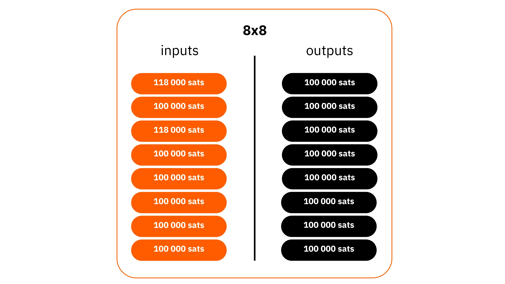


Icogereranyo ca Whirlpool gishingiye ku bikorwa bitobito vya CoinJoin. Udakunze Wabisabi na JoinMarket, aho ubukomezi bw’ibimenyetso bishingiye ku bwinshi bw’abaje mu nzinguzingu imwe (canke ku nzinguzingu nkeyi), Whirlpool yizigira urutonde rw’inzinguzingu ntoyi nyinshi.


Muri iki kigereranyo, abakoresha bariha amahera gusa igihe babanza kwinjira mu kidengeri, bikaba bituma bashobora kuja mu bikorwa vyinshi vy’ugusubiramwo ataco baciye. Abashasha binjira bariha amahera ya Mining ku ba remixer.


Igihe cose CoinJoin yongeweko igice kimwe kirimwo, hamwe n’urunganwe rwaco rwahuye na rwo mu bihe vya kera, anonsets zizokura cane. Intumbero ni ugukoresha neza izo remixes z’ubuntu, igihe cose zishitse, zifasha mu gukomeza uburemere bw’ama anonsets ajanye n’igice cose kivanze.


Whirlpool yakozwe ifise mu muzirikanyi ibintu bibiri bihambaye bisabwa:


- Ugushika ku gushirwa mu ngiro ku bikoresho vy’amaboko, kubera ko Samourai Wallet ari mbere na mbere porogarama ya telefone ngendanwa;
- Ivyiyumviro vyihuta vyo gusubiramwo kugira ngo biteze imbere ukwiyongera gukomeye kw’ibihimba vy’umubiri.


Ivyo bintu vy’ingenzi ni vyo vyarongoye amahitamwo yakozwe n’abahinguzi ba Samourai Wallet mu guhingura Whirlpool, bituma bafata ingingo yo guhagarika abazoja muri iyo nama ku rugero rutoyi ku nzinguzingu. Bake cane bari gutuma ubushobozi bwa CoinJoin buhungabana, bagagabanya cane anonsets ziterwa n’ingendo, mu gihe benshi cane boba barateye ingorane z’uburongozi ku bikorwa vy’amatelefone ngendanwa no gutuma ingendo igenda neza.


Ubwa nyuma, nta nkenerwa yo kugira umubare munini w'abaje mu nama ku CoinJoin kuri Whirlpool, kuko anonsets zikorwa ku kwirundanira kw'ingendo nyinshi za CoinJoin. Ingingo ngenderwako ihambaye cane aha ni uguhuza kw’ama UTXO y’abaje mu nama bose, kuko ivyo bituma habaho ukuvanga gutunganye, bigatuma habaho inyungu yuzuye mu nzira zo kuvanga no gusubira kuvanga.


### CoinJoin ibidengeri n'amahera


Kugira ngo izo nzira nyinshi zongere anonsets z’ama UTXO avunganye, birakenewe ko habaho uburyo bumwe bwo kugabanya ingano z’ama UTXO akoreshwa. Whirlpool isobanura ibidengeri bitandukanye.


Igikarabiro giserukira umugwi w’abakoresha bipfuza guvanga hamwe, bemeranya ku rugero rw’ama UTXO azokoreshwa mu gutuma uburyo bwa CoinJoin bugenda neza mu gihe bagumana ubumwe butunganye bwa UTXO. Ico kigega cose kigaragaza umubare udahinduka wa UTXO, uwo uwukoresha ategerezwa kwubahiriza kugira ngo agire uruharamwo. Rero, kugira ngo ukore coinjoins na Whirlpool, ukeneye guhitamwo ikidengeri. Ivyo bidengeri bikurikira biraboneka ubu:


- 0.5 amafaranga y’ibiceri;
- 0,05 Bitcoin;
- 0,01 Bitcoin;
- 0,001 Bitcoin (= 100.000 Sats).


Iyo winjiye mu kidengeri n’amahera yawe ya bitcoins, azogabanywa gushika ku generate UTXOs zihuye neza n’iz’abandi bari muri ico kidengeri. Buri kidengeri gifise urugero rwo hejuru, rero ku mafaranga arenga uwo mupaka, uzobwirizwa gukora ivyinjizwa bibiri bitandukanye mu kidengeri kimwe, canke wimukire mu kindi kidengeri gifise umubare munini:


| Pool (bitcoin) | Maximum amount per entry (bitcoin) |
|----------------|------------------------------------|
| 0.5            | 35                                 |
| 0.05           | 3.5                                |
| 0.01           | 0.7                                |
| 0.001          | 0.025                              |

UTXO ifatwa nk'iy'ikidengeri iyo yiteguye gushirwa muri CoinJoin. Ariko rero, ivyo ntibisigura ko uwuyikoresha atakaza uburenganzira bwo kuyigira. Nk’uko twabibonye mu bice vya mbere vy’iki gice, biciye mu nzira zitandukanye zo guvanga, uguma ufise ububasha bwose ku mfunguruzo zawe, kandi, kubera ivyo, ku ma bitcoins yawe. Ivyo ni vyo bitandukanya ubuhinga bwa CoinJoin n’ubundi buhinga bwo guvanga bushizwe hamwe.


Kugira ngo winjire mu gice ca CoinJoin, ukeneye kwishura amahera y’ibikorwa n’amahera ya Mining. Amafaranga y’ibikorwa arashirwaho ku kidengeri cose kandi agamije guhemba amashirahamwe ashinzwe gutegura no gucungera Whirlpool.


Amafaranga y’ibikorwa vyo gukoresha Whirlpool arihwa rimwe gusa iyo winjiye mu kidengeri. Iyo umaze kwinjira, urashobora kuja mu bikorwa vy’ugusubiramwo ibintu bitagira aho bigarukira ataco wishuye. Akira amafaranga adahinduka y’ubu ku kidengeri cose:


| Pool (bitcoin) | Entry fee (bitcoin) |
|----------------|---------------------------------|
| 0,5 | 0,0175 |
| 0,05 | 0,00175 |
| 0.01 | 0.0005 (50,000 sats) |
| 0.001 | 0.00005 (5,000 sats) |

Aya mahera akora nk'itike yo kwinjira mu kidengeri wahisemwo, utitaye ku mahera ushize muri CoinJoin. Rero, waba winjiye muri pool ya 0.01 ufise neza na neza 0.01 BTC canke 0.5 BTC, amafaranga azoguma ari amwe mu buryo bushitse.


Imbere yo gukomeza na Whirlpool coinjoins, umukoresha ashobora guhitamwo hagati y'ingene 2:


- Hitamwo ikidengeri gitoyi kugira ngo agabanye amafaranga y’ibikorwa, azi ko azoronka UTXO ntoyi nyinshi mu gusubiza;
- Canke uhitemwo ikidengeri kinini, ushaka kwishura amahera menshi, gusa ugaheza ukagira umubare mutoyi w’ama UTXO y’agaciro kanini.


Muri rusangi si vyiza gufatanya UTXO nyinshi zivanzwe inyuma y'ingendo za CoinJoin, kuko ivyo bishobora gutuma ibanga ryaronswe rihungabana, cane cane kubera inyungu rusangi ya Ownership (CIOH: *Common-Input-Ownership-Heuristic*). Ku bw’ivyo, bishobora kuba vyiza guhitamwo ikidengeri kinini, naho ivyo vyoba bisobanura kwishura vyinshi, kugira ngo ntihagire ama UTXO menshi cane y’agaciro gatoyi mu vyo asohora. Uwukoresha ategerezwa gusuzuma ivyo bihembo kugira ngo ahitemwo ikidengeri akunda.


Uretse amahera y’ibikorwa, amahera ya Mining yihariye ku bijanye n’ugucuruza kwose kwa Bitcoin na yo nyene ategerezwa gufatwa mu mutwe. Nk'ukoresha Whirlpool, uzosabwa kwishura amafaranga Mining ku bijanye n'ugutegura (`Tx0`) hamwe n'amahera ya CoinJoin ya mbere. Ivyo vyose bizokurikira bizoba ari ubuntu, bivuye ku citegererezo ca Whirlpool gishingiye ku kwishura abashasha binjira.


Nkako, muri Whirlpool CoinJoin imwe imwe, abakoresha 2 mu vyo bashiramwo ni abashasha binjira. Ibindi bishirwamwo biva ku ba remixer. Ivyo bituma amafaranga y’indirimbo za Mining ku bantu bose bari muri iyo nzira y’ugucuruza yishurwa n’abo bashasha 2, na bo nyene bagashobora kwungukira ku vyo guhindura indirimbo ku buntu:


Kubera iyo nzira y’amahera, Whirlpool vy’ukuri iratandukanye n’izindi nzira za CoinJoin, kuko anonsets za UTXOs zidahuye n’igiciro umuntu akoresha yishuye. Ivyo bituma bishoboka ko umuntu ashika ku rwego rwo hejuru cane rwo kutamenyekana mu kwishura gusa amahera yo kwinjira mu kidengeri n’amahera ya Mining ku bikorwa 2 (ivyo `Tx0` n’ivy’intango).


Ni vyiza kumenya ko uwukoresha azobwirizwa kandi kwishura amahera ya Mining kugira ngo akure UTXOs ziwe mu kidengeri amaze kurangiza coinjoins ziwe nyinshi, kiretse yahisemwo `mix to` option, itanga Address yo hanze izoronka amahera ataco akoresheje CoinJoin, ata transaction.


### Konti za HD Wallet


Kugira ngo ureme CoinJoin biciye kuri Whirlpool, Wallet itegerezwa generate amakonti menshi atandukanye. Iryo ni ryo hame riri inyuma y’itegeko rya ZeroLink. Inkuru, mu rwego rwa HD (*Hierarchical Deterministic*) Wallet, igize igice gitandukanye rwose n’ibindi, ukwo gutandukana kuba ku rugero rw’uburebure bwa gatatu bw’ubukuru bwa Wallet, ni ukuvuga ku rugero rwa `xpub`.


HD Wallet ishobora mu vyiyumviro gushika ku `2^(31)` inkuru zitandukanye. Konti y'intango, ikoreshwa ku buryo busanzwe ku bikoresho vyose vya Bitcoin, ihuye n'urutonde rwa `0'`.


Ku bikoresho vy’amahera bihuye na Whirlpool, amakonti 4 arakoreshwa kugira ngo haboneke ivya nkenerwa mu nzira ya ZeroLink:


- Konti ya **ibiziga**, igaragazwa n'urutonde `0'`;
- Konti ya **banki mbi** (canke "ihinduka rya doxxic"), igaragazwa n'urutonde `2.147.483.644'`;
- Konti ya **imbere**, igaragazwa n'urutonde `2 147 483 645'`;
- Konti ya **inyuma**, igaragazwa n'urutonde `2 147 483 646'`.


Imwe muri izo nkuru irarangura igikorwa kinaka mu nzira ya CoinJoin, ivyo tuzobisuzuma mu bice bikurikira.


Izo konti zose zihuye na seed imwe, zituma uwuzikoresha ashobora gusubira kuronka amafaranga yiwe yose akoresheje ijambo ryiwe ryo gusubira kuronka, aho bishoboka, passphrase yiwe. Ariko rero, mu gihe c’igikorwa co gusubiza ibintu, iyo porogarama itegerezwa kumenyeshwa urutonde rw’amakonti atandukanye yakoreshejwe.


Reka turabe intambwe zitandukanye z’igikoresho ca Whirlpool CoinJoin muri izo nkuru.


### Ivyo TX0.


Intango ya Whirlpool CoinJoin iyo ari yo yose ni konti ya **ibiziga**. Iyi ni konti ukoresha ubwawe iyo uremye Bitcoin Wallet nshasha. Iyi konti izokenera gushirwamwo ama bitcoins wipfuza guvanga.


Tx0" ni intambwe ya mbere mu nzira yo guvanga Whirlpool. Intumbero yayo ni ugutegura no kuringaniza UTXOs za CoinJoin, kuzigabanya mu bice bihuye n'ingero y'ikidengeri catowe, kugira ngo habeho ukuvanga guhuye. As UTXOs rero ziringanijwe ni **the**mi ntishobora kwinjira mu kidengeri, itandukanijwe muri konti yihariye: **banki mbi** (canke "ihinduka rya doxxic").


Iryo soko rya mbere `Tx0` rikoreshwa kandi mu kwishura amahera y’ibikorwa akwiye guhabwa umuhuzabikorwa wa CoinJoin. Mu buryo butandukanye n’intambwe zikurikira, iyo nzira y’ugucuruza ntabwo ari iyo gukorana, rero uwuyikoresha ategerezwa kwikorera igiciro cose ca Mining:


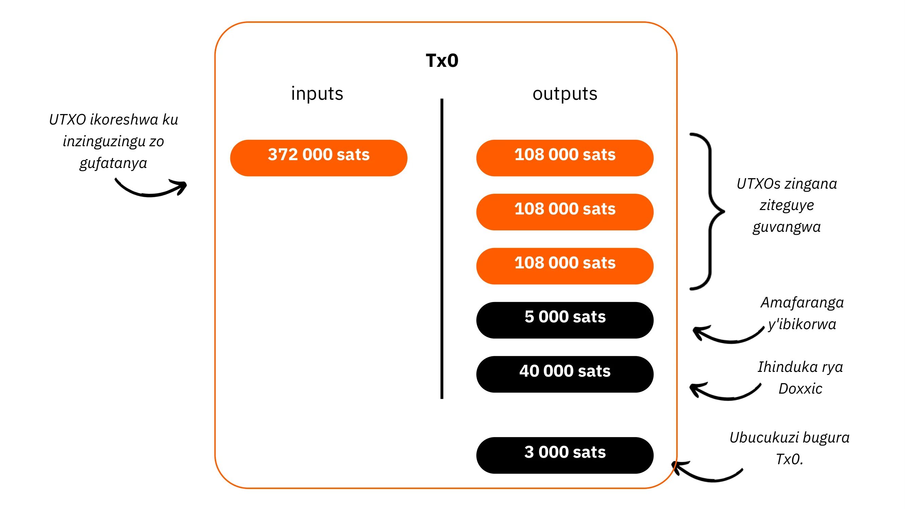


Muri aka karorero k’ugucuruza `Tx0`, inyungu ya `372,000 Sats` iva kuri konti yacu ya **deposit** igabanywamwo UTXO nyinshi zisohoka, zica zigabanywa gutya:


- Amafaranga `5.000 Sats` ku muhuzabikorwa ku mafaranga y’ibikorwa, ahuye n’injira mu kidengeri `100.000 Sats`;
- 3 UTXOs zateguwe kugira ngo zivanzwe, zisubirwamwo kuri konti yacu ya **premix** zigaca ziyandikisha ku muhuzabikorwa. Izo UTXO zingana ku `108.000 Sats` imwe yose, kugira ngo zishobore kwishura amafaranga Mining y’umuvango wazo w’intango wo muri kazoza;
- Ivyo bisigaye, bidashobora kwinjira mu kidengeri kubera ko ari bito cane, bifatwa nk’ihinduka ry’ubumara. Irungikwa kuri konti yayo yihariye. Aha, iryo hinduka rishika kuri `40.000 Sats`;
- Ubwa nyuma, hariho `3.000 Sats` zisigaye, zitari umusaruro, ariko ni ibiciro vya Mining bisabwa kugira ngo umuntu yemeze `Tx0`.


Nk’akarorero, ng’iyi Whirlpool Tx0 nyayo (si iyanje): [edef60744f539483d868caff49d4848e5cc6e805d6cdc8d0f9bdbbaedcb5fc46](https://GW- 851.ikibanza/tx/edef60744f539483d868caff49d4848e5cc6e805d6cdc8d0f9bdbbaedcb5fc46)


### Ivyo doxxic birahinduka


Ivyo bitari bishobora gushirwa muri iyo nzira, aha bingana na `40.000 Sats`, birungikwa kuri konti ya **banki mbi**, izwi kandi kw'izina rya "doxxic change", kugira ngo habeho ugutandukana gukomeye n'izindi UTXO ziri muri Wallet.


Iyi UTXO irateye akaga ku ibanga ry’uwuyikoresha, kuko ntabwo iguma ifatanye n’ivya kera vyayo gusa, kandi rero bishoboka ko ifatanye n’akaranga ka nyen’iyo UTXO, ariko kandi igaragara ko ari iy’uwuyikoresha yakoze CoinJoin.


Iyo iyo UTXO ifatanijwe n’ibisohoka bivanze, iyo ya nyuma izotakaza ibanga ryose ryaronswe mu gihe c’ingendo za CoinJoin, cane cane bivuye kuri CIOH (*Common-Input-Ownership-Heuristic*). Iyo ifatanijwe n’ibindi bihinduka vya doxxic, uwuyikoresha arashobora gutakaza ibanga, kuko izohuza ivyinjizwa bitandukanye vy’ingendo ya CoinJoin. Ni co gituma rero umuntu akwiye gufatwa n’ubwenge. Tuzoja mu buryo burambuye ku bijanye n’uburongozi bw’izo UTXOs doxxic mu gice ca nyuma c’iki gice.


### Ivangura ry'intango


Inyuma ya `Tx0`, UTXOs zingana zirungikwa kuri konti yacu ya Wallet **premix**, ziteguye gushirwa mu nzira ya mbere ya CoinJoin, izwi kandi nk'"imivumba y'intango". Iyo, nk’uko biri mu karorero kacu, `Tx0` ivyara UTXO nyinshi zo guvanga, imwe yose muri zo izoshirwa mu mvange y’intango itandukanye.


Ivyo bivanze vya mbere biheze, konti ya **premix** izoba iri ubusa, mu gihe ibiceri vyacu, bimaze kwishura amafaranga y’i Mining y’iyi CoinJoin ya mbere, bizohindurwa neza neza ku rugero rwasobanuwe n’ikidengeri catowe. Mu karorero kacu, UTXO zacu za mbere za `108.000 Sats` zizoba zagabanutse zibe nyazo `100.000 Sats`.


### Gusubiramwo


Inyuma y’imivumba ya mbere, ama UTXO aca yimurirwa kuri konti ya **postmix**. Iyi konti ikorakoranya ama UTXO amaze guvangwa n’ayo arindiriye gusubira kuvangwa. Iyo umukiriya wa Whirlpool ariko arakora, UTXO ziri muri konti ya **postmix** zica ziboneka ubwazo kugira ngo zisubirwemwo kandi zizotorwa mu buryo bw’impfagusa kugira ngo zigire uruhara muri izo nzira nshasha.


Nk’ukwibutsa, remixs rero ziraba ku buntu 100%: nta yindi mice y’ibikorwa canke amahera ya Mining asabwa. Kugumiza UTXOs muri konti ya **postmix** rero bituma agaciro kazo kagumaho, kandi bigatuma anonsets zazo zitera imbere muri ico gihe nyene. Ni co gituma bihambaye kwemera ko ivyo biceri bigira uruhara mu nzira nyinshi za CoinJoin. Ntaco bigutwara na gato, kandi birongereza ingero zabo zo kutamenyekana.


Iyo ufashe ingingo yo gukoresha UTXOs zivanzwe, ushobora kubikora uhereye kuri iyi konti ya **postmix**. Turaguhanura ko woguma ufise ama UTXO avanze muri iyi konti kugira ngo wungukire ku ma remix y’ubuntu no kuyabuza kuva mu nzira ya Whirlpool, ivyo bishobora kugabanya ibanga ryayo.


### None ama postmix yanyu muyacungera gute?


Inyuma yo gukoresha inzinguzingu za CoinJoin, ubuhinga bwiza ni ugutuma UTXO zawe ziguma muri konti ya **postmix**, urindiriye gukoreshwa muri kazoza. Ni vyiza mbere ko ubireka bikagira remix ubuziraherezo gushika ukeneye kubikoresha.


Abakoresha bamwe bamwe boshobora kwiyumvira kwimurira amafaranga yabo ya bitcoins ku Wallet icungiwe na Hardware Wallet. Ivyo birashoboka, ariko birahambaye gukurikiza neza impanuro za Samourai Wallet kugira ngo ntihagire uwuhungabanya ibanga ryaronswe.


Gufatanya ama UTXO ni ryo kosa risanzwe. Kugira ngo wirinde CIOH (*Ivyinjira-Rusangi-Ownership-Heuristic*), utegerezwa kwirinda gufatanya UTXO zivanzwe n’izitavanze mu gucuruza kumwe. Ivyo bisaba gucunga neza ama UTXO yawe ari muri Wallet yawe, cane cane mu bijanye no gushirako amazina.


Hategerezwa kandi kwitwararikwa igihe umuntu ariko arashiramwo ama UTXO avunganye. Gushiramwo ibintu bimwe bimwe birashoboka iyo UTXO zawe zivanzwe zifise anonsets zihambaye, ariko ivyo bizogabanya ata kabuza ibanga ry’ama UTXO yawe. Raba neza ko ugushiramwo ibintu bitari vyinshi cane, canke ngo bikorwa inyuma y’umubare udahagije w’ibintu bisubirwamwo, mu kaga ko gushinga amasano ashobora gukurwako hagati y’ama UTXO yawe imbere n’inyuma y’ingendo za CoinJoin. Iyo ufise amakenga ku bijanye n’ivyo bikoresho, igikorwa ciza ni ukudashiramwo ama UTXO y’inyuma, ahubwo ni ukuyarungika imwe imwe kuri Hardware Wallet yawe, ugatanga Address nshasha y’ubusa igihe cose. Na none, wibuke kwandika kuri UTXO yose uronka.


Si vyiza kandi kwimurira ama UTXO yawe ya postmix kuri Wallet ukoresheje inyandiko zidakoreshwa cane. Nk'akarorero, niwinjiza Whirlpool uvuye kuri Multisig Wallet ukoresheje inyandiko `P2WSH`, nta mahirwe make yo kuvangwa n'abandi bakoresha bari bafise ubwoko bumwe bwa Wallet. Iyo usubiye guvanga ama postmixes yawe kuri iyi Multisig Wallet nyene, urugero rw’ibanga ry’ama bitcoins yawe yavanzwe ruzogabanywa cane. Uretse inyandiko, hariho n’ibindi bimenyetso vyinshi vy’intoke vya Wallet bishobora kugukinira.


Nk'uko bigenda ku bikorwa vyose vya Bitcoin, birahambaye kandi ko udasubira gukoresha Address yakira. Igihe cose umuntu atanga amafaranga, ategerezwa kwakirwa ku rupapuro rushasha rwa Address rudafise ikintu.


Umuti woroshe kandi utekanye ni ugusiga UTXO zawe zivanzwe ziruhutse muri konti yabo ya **postmix**, ukazireka zikora remix kandi ukazikorako gusa kugira ngo zikoreshe. Samurai na Sparrow wallets zifise uburinzi bwongereweko ku bibazo vyose vyo gusesangura uruzitiro. Ivyo bintu bigukingira biragufasha kwirinda gukora amakosa.


### None muvyifatamwo gute mu gucungera amahinduka y’ubumara?


Igikurikira, uzokenera kwitwararika uburongozi bwawe bw’ihinduka rya doxxic, ihinduka ritashitse mu kidengeri ca CoinJoin. Izo UTXO zitera ubumara, ziterwa n’ugukoresha Whirlpool, zitera ingorane ubuzima bwite bwawe, kuko zishinga ubucuti hagati yawe n’uwukoresha CoinJoin. Ni ngombwa rero ko tuzicungera neza kandi ntituzifatanye n’izindi UTXO, cane cane UTXO zivanzwe.


Akira ingamba zimwe zimwe zo kubikoresha:


- Bivange mu bidengeri bitobito: Nimba UTXO yawe y'ubumara ari nini cane ku buryo ishobora kwinjira mu kidengeri gitoyi ubwayo, nuzirikane kuyivanga. Akenshi ivyo ni vyo vyiza kuruta ibindi vyose. Ariko rero, si vyiza gufatanya UTXO nyinshi zitera ubumara kugira ngo ushikire ikidengeri, kuko ivyo bishobora guhuza ivyinjijwe vyawe bitandukanye;
- Bishireko ikimenyetso c'uko "bidashobora gukoreshwa": Ubundi buryo ni ukubihagarika, ubishireko ikimenyetso c'uko "bidashobora gukoreshwa" muri konti yabo yihariye, na HODL gusa. Ivyo bituma udashobora kubikoresha mu mpanuka. Iyo agaciro ka Bitcoin kaduze, ibidengeri bishasha bibereye cane UTXO zawe zitera ubumara birashobora guseruka;
- **Gutanga intererano:** Niwiyumvire gutanga intererano, naho yoba ari nto gute, ku bahinga bakora kuri Bitcoin n'amaporogarama ajanye na yo. Ushobora kandi gutanga amahera ku mashirahamwe yemera BTC. Nimba gucunga UTXO zawe zitera ubumara bisa n'ibigoye cane, urashobora gusa kuzikuramwo maze ugatanga intererano;
- **Gura amakarita y'ingabirano:** Ivyuma nka [Bitrefill](https://www.bitrefill.com/) biguha uburenganzira bwo gukoresha amafaranga Exchange ku makarita y'ingabirano ashobora gukoreshwa ku badandaza batandukanye. Ivyo bishobora kuba uburyo bwo gutandukana n'ama UTXO yawe y'ubumara utatakaje agaciro kajana;
- Bishire hamwe kuri Monero: **Samourai Wallet** itanga ubuhinga bwo guhindura atome hagati ya BTC na XMR. Ivyo ni vyiza cane mu gucunga UTXOs zitera ubumara mu kuzishira kuri Monero, ataco zihinduye ku ibanga ryawe biciye kuri CIOH, imbere yo kuzisubiza kuri Bitcoin. Ariko rero, iyo nzira ishobora gutwara amahera menshi mu bijanye n'amahera ya Mining n'amahera y'imbere kubera ingorane z'amahera;
- Birungike kuri Lightning Network: Kwimurira izo UTXO kuri Lightning Network kugira ngo zironke inyungu ku mahera y'ugucuruza agabanutse birashobora kuba uburyo bukwegera. Ariko rero, ubu buryo burashobora guhishura amakuru amwamwe bivanye n'ingene ukoresha Lightning, kandi rero ukwiye kubukoresha witonze.


### Nokoresha gute Whirlpool?


Inyuma y’aho abashinze Samourai Wallet bafashwe, bagafata ama server yabo ku wa 24 Ndamukiza 2024, igikoresho ca Whirlpool ntikigikora, mbere n’abafise Dojo yabo bwite. Mbere, yari iboneka ku ndege za Samourai Wallet na Sparrow wallet.


Ariko rero, birashoboka ko ico gikoresho cosubira gukoreshwa mu ndwi ziza, bivanye n’ivyo ibigeragezo bizovamwo, canke kigasubira gukoreshwa mu buryo butandukanye. Uko biri kwose, sinibaza ko isoko rya Bitcoin CoinJoin rizoba ritagira Supply igihe kirekire, kuko ubukene buriho. Ikindi, nk’uko uburyo bwa Whirlpool ari bwo buteye imbere cane mu bijanye n’ibanga, nta gukeka ko buzoba uburyo bwo guhitamwo ku bindi bikorwa vyo gushirwa mu ngiro muri kazoza.


Turaguma twihweza cane iki kibazo n'iterambere mu bikoresho bijanye naco. Nimwizere ko tuzoba turiko turasubiramwo iri shure uko amakuru mashasha azoba ariko araboneka.


Mu gice gikurikira, tuzomenya ivyo "anonsets" ari vyo, ingene ivyo bimenyetso biharurwa, n'ingene bishobora kudufasha kugereranya ubushobozi bw'ingendo za CoinJoin.


https://planb.network/tutorials/privacy/on-chain/coinjoin-samourai-wallet-e566803d-ab3f-4d98-9136-5462009262ef


## Ivy'ukutamenyekana


<chapterId>be1093dc-1a74-40e5-9545-2b97a7d7d431</chapterId>


Tumaze kwiga ingene coinjoins zikora n’ibibazo bijanye no guvanga neza, ubu tugiye kumenya ingene twopima ubushobozi bwazo. Twomenya gute nimba uburyo bwo gukorana n’abandi bwabaye bwiza, kandi ni urugero rungana iki UTXO yaronse mu kutamenyekana? Ivyo nivyo tuzomenya muri iki gice n'ibice vy'amazina canke "anonsets".


### Ivyibutsa akamaro ka CoinJoin .


Akamaro ka CoinJoin kari mu bushobozi bwayo bwo gutanga ukwihakana kwemewe, mu gushiramwo UTXO yawe mu mugwi w’ama UTXO adashobora gutandukanywa. Intumbero y’ico gikorwa ni uguca amahuzu y’ugukurikirana, kuva muri kahise gushika muri iki gihe, kuva muri iki gihe gushika muri kahise.


Mu yandi majambo, umusesanguzi azi igikorwa cawe ca mbere (`Tx0`) ku kwinjira kw’ingendo za CoinJoin ntakwiye kuba ashoboye kumenya ata gukeka UTXO yawe ku gusohoka kw’ingendo za remix (isesengura ry’injira ry’ingendo gushika ku gusohoka kw’ingendo).


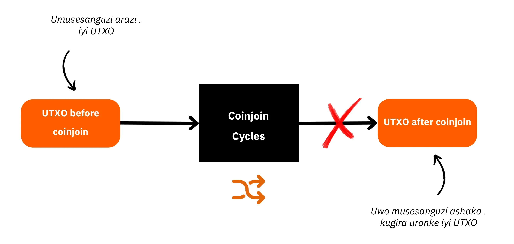


Ku rundi ruhande, umusesanguzi azi UTXO yawe ku gusohoka kw’ingendo za CoinJoin ategerezwa kuba adashobora kumenya igikorwa c’intango ku kwinjira kw’ingendo (isesengura ry’isohoka ry’ingendo gushika ku kwinjira kw’ingendo).


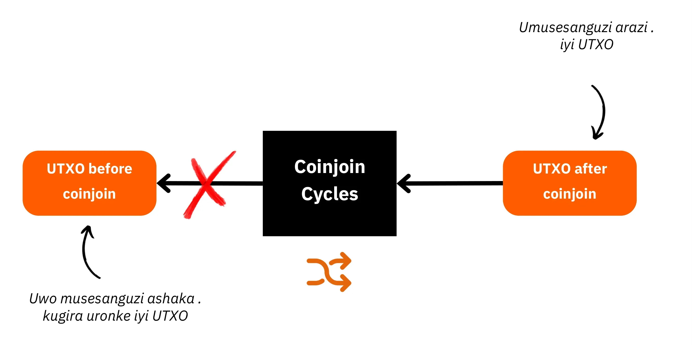


Kugira ngo dusuzume ingene bigoye umusesanguzi guhuza kahise n’ubu n’ibihushanye n’ivyo, turakeneye gupima ubunini bw’imigwi y’ama UTXO amwe UTXO yawe yihishije. Ico gipimo kitubwira ingene isesengura ryinshi rifise ubushobozi bumwe. Rero, iyo isesengura ryiza ryorohamye hagati y’izindi isesengura 3 zifise ubushobozi bungana, urugero rwawe rwo kwihisha ruri hasi cane. Ku rundi ruhande, iyo isesengura ryiza riboneka mu rwego rw’isesengura 20.000 rishobora kuba ringana, UTXO yawe iranyegejwe neza cane. Ubwinshi bw'ayo matsinda bugereranya ibimenyetso bizwi nka "anonsets".


### Gutahura ibintu bitamenyekana


Anonsets zikoreshwa nk'ibimenyetso vyo gusuzuma urugero rw'ibanga rya UTXO. Mu buryo butomoye, bapima igitigiri c’ama UTXO adashobora gutandukanywa mu gice kirimwo UTXO iriko irigwa. Igisabwa kugira ngo habeho umugwi umwe w’ama UTXO bisigura ko anonsets zisanzwe ziharurwa ku nzira za CoinJoin. Ikoreshwa ry’ivyo bimenyetso rirahambaye cane cane ku bipimo vya Whirlpool, kubera ukuntu bihuye.


Niba ari ngombwa, anonsets zishobora gukoreshwa mu gucira urubanza uburyo coinjoins zimeze. Anonset nini bisigura urugero rwo hejuru rw’ukutamenyekana, kuko bigorana gutandukanya UTXO yihariye mu rwego rw’ibintu bimwe.


2 ubwoko bw'ibimenyetso bihari:


- Imbere anonset;
- gusubira inyuma.


### Imbere anonset


Ivyo bimenyetso vyerekana ubunini bw’umugwi UTXO yigishijwe mu mpera y’ingendo yihishije, bishingiye kuri UTXO mu ntango, ni ukuvuga umubare w’ama UTXO adashobora gutandukanywa ari muri uwo mugwi. Izina ry'iki kigereranyo ni "ibipimo vy'imbere".


Ico kigereranyo gipima ukuntu ibanga ry’icumba rishobora guhangana n’isesengura ry’ivya kera n’ivya none (input-to-output).


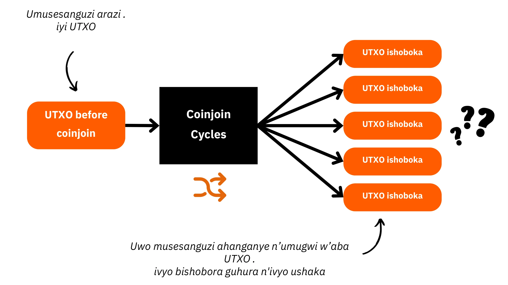


Iyi metric ikoreshwa mu kugereranya urugero UTXO yawe irindwako ku kugerageza gusubira kwubaka amateka yayo kuva aho yinjira gushika aho isohokera mu nzira ya CoinJoin.


Nk'akarorero, nimba igikorwa cawe cagize uruhara mu nzira ya mbere ya CoinJoin kandi izindi nzira zibiri zimanuka zikaba zarangiye, imbere ya Coin yawe yoba `13`:


Nk'akarorero, reka twiyumvire ko Coin yacu mu ntango y'ingendo ya CoinJoin ifise anonset y'imbere ya `86,871`. Mu majambo y’ibikorwa, ivyo bisigura ko ryihishijwe mu `86.871` UTXO zidashobora gutandukanywa. Ku muntu yihweza hanze azi iyo Coin mu ntango z’ingendo za CoinJoin akagerageza gukurikirana aho isohoka, azohura n’ibishobora kuba UTXO `86.871`, imwe yose ikaba ifise ubushobozi busa n’ubwo yo kuba ari yo Coin ariko ararondera.


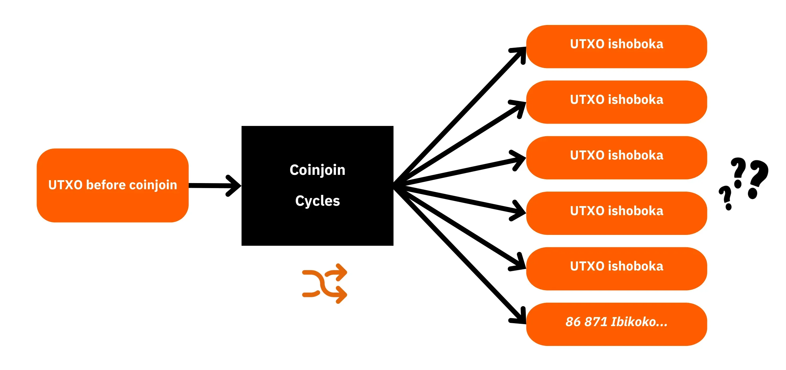


### Ivyo gusubira inyuma


Inyuma anonset yerekana umubare w’amasoko ashoboka ku UTXO yatanzwe, kumenya UTXO ku mpera y’ingendo. Iki kigereranyo gipima ukuntu ibanga rya UTXO rishobora guhangana n’isesengura ry’ubu n’ivya kera (isohoka-ku-injiza), ni ukuvuga ingene bigoye umusesanguzi gukurikirana UTXO yawe gushika aho yakomotse, imbere y’ingendo za CoinJoin. Izina ry'iki kimenyetso ni "ugusubira inyuma", canke "ibipimo vy'inyuma".


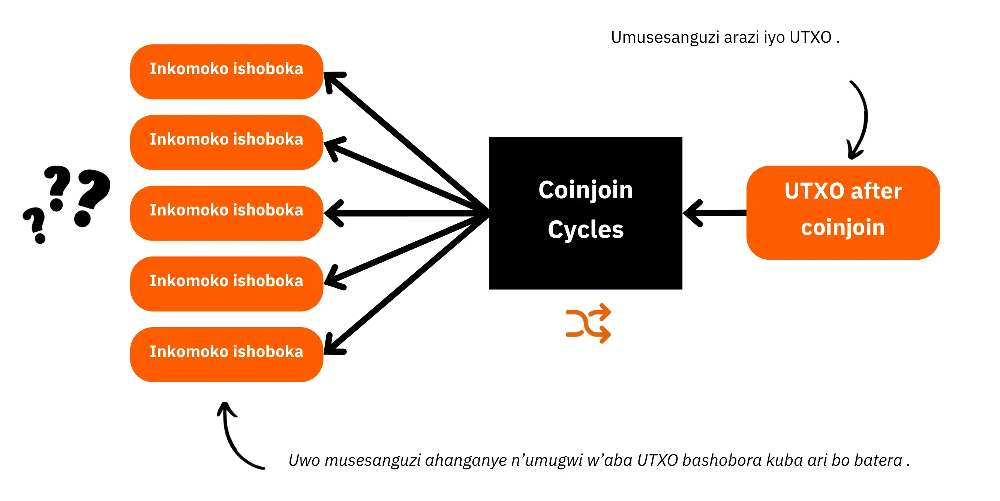


Mu kumenya UTXO yawe ku gusohoka kw’ingendo, anonset y’inyuma igena umubare w’ibikorwa vya Tx0 bishobora kuba vyatumye winjira mu nzira za CoinJoin. Mu kigereranyo kiri aha hepfo, ivyo bihuye n’umubare w’ibibumbano vyose vy’umukara.


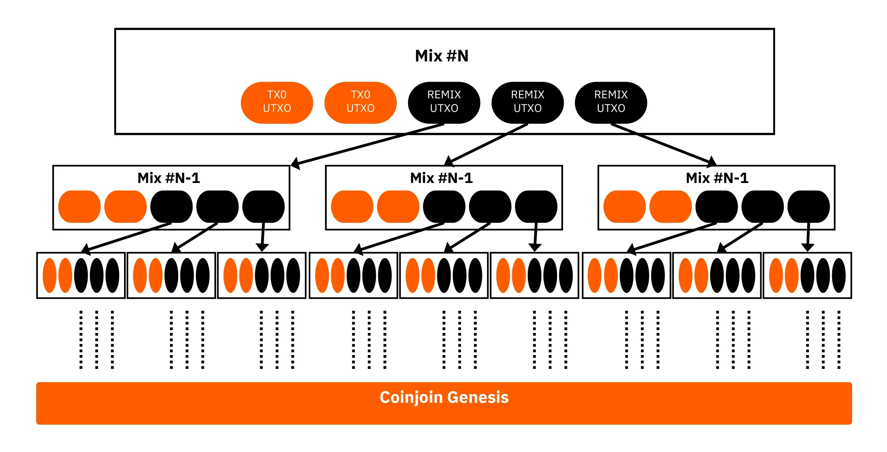


Nk'akarorero, reka twiyumvire ko CoinJoin UTXO yacu ifise `42,185`. Mu majambo y'ukuri, ivyo bisigura ko hariho `42.185` amasoko ashobora gukoreshwa muri iyi UTXO. Iyo umuntu wo hanze abona iyo Coin ku mpera y’ingendo maze akarondera gukurikirana inkomoko yayo, azohura n’amasoko ashoboka `42.185`, yose afise amahirwe angana yo kuba ari yo nkomoko ironderwa.


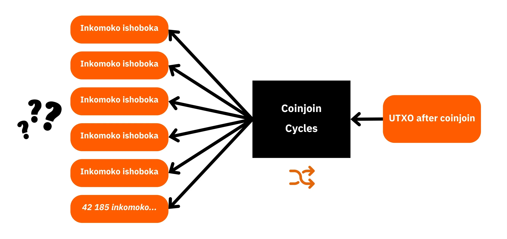


### None muharura gute ama anonsets?


Birashoboka kubara anonsets n'amaboko ukoresheje Block explorer ku bice bitobito. Ariko rero, ku bimenyetso bininibinini, gukoresha igikoresho kidasanzwe biraba ngombwa cane. Nk’uko ndabizi, porogarama imwe rudende ishobora gukora ico gikorwa ni *Whirlpool Stats Tool*, igikoresho ca Python cakozwe n’imigwi ya Samourai na OXT. Ikibabaje ni uko ubu iki gikoresho kitagikora inyuma y’ugufatwa kw’abashinze Samourai no guhagarika OXT, yakoreshwa mu gukura amakuru muri Blockchain.


Nk’uko twabibonye muri iki kigabane, anonsets zishobora kubarwa gusa iyo hariho ubumwe bumwe bumwe mu miterere ya CoinJoin. Mu kigabane gikurikira, tuzobona ingene twogereranya ubwo bumwe ku bijanye n’ugucuruza kwa Bitcoin, yaba ari ugucuruza kwa CoinJoin canke ugucuruza kwa kera.


## Entropi


<chapterId>e4fe289d-618b-49a2-84c9-68c562e708b4</chapterId>


Nk’uko twabibonye muri iki gice ku bijanye n’ama coinjoins, ubumwe bw’ama UTXO mu vyo kwinjiza no mu gusohora birafise uruhara runini mu gutuma ibanga ry’ugucuruza rya Bitcoin ritera imbere. Iyi parametere irema uguhakana gushobora kwemerwa mu gihe c’isesengura rya Blockchain. Uburyo bwinshi burashobora gukoreshwa mu gupima ubwo bumwe, ariko bumwe mu bukora neza cane, mu vyiyumviro vyanje, ni ugukoresha ibimenyetso bitangwa n’igikoresho ca *Boltzmann*, categuwe n’imigwi ya OXT na Samourai Wallet, na cane cane entropie y’ugucuruza. Ivyo nivyo tuzoba turiko turaraba mu buryo burambuye muri iki kigabane.


Mu buryo butandukanye n’ama anonsets, abarirwa ku rutonde rw’ibikorwa, ibimenyetso vyerekanywe ngaha vyibanda ku bikorwa bimwe, haba CoinJoin canke ibikorwa vya kera.


### Umubare w'insobanuro


Ikimenyetso ca mbere gishobora kubonwa ku bijanye n’ugucuruza kwa Bitcoin ni umubare wose w’insobanuro zishoboka zihura n’isesengura rivuye ku muntu yihweza hanze. Hakurikijwe agaciro k’ama UTXO ari muri iyo nzira, iki kigereranyo kirerekana umubare w’uburyo ivyo kwinjiza bishobora gufatanywa n’ivyo gusohoka. Mu yandi majambo, igena umubare w’insobanuro zishoboka igikorwa gishobora gutanga mu nzira za Bitcoin zivuye ku mbonerahamwe y’umuntu wo hanze ariko arayisuzuma.


Nk'akarorero, igikorwa co kwishura gisanzwe gifise inyungu 1 n'inyungu 2 kizogira insobanuro imwe gusa, ni ukuvuga ko inyungu #0 itanga amafaranga umusaruro #0 n'inyungu #1. Nta yindi nsobanuro ishoboka:


Ku rundi ruhande, imfuruka ya Whirlpool 5x5 ifise $1\,496$ y’imigwi ishoboka:


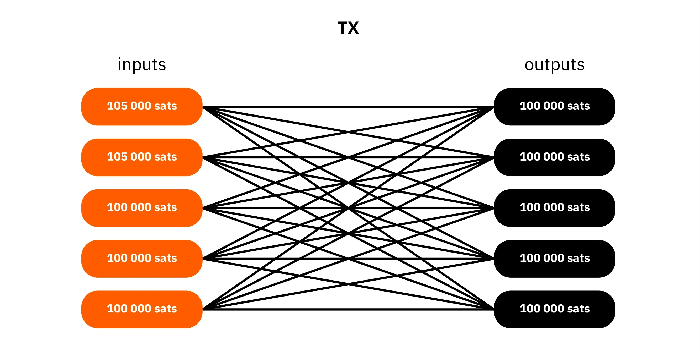


Igikoresho ca Whirlpool gifise insobanuro zishoboka:


### Entropi


Dufatiye ku mubare w’insobanuro z’isoko rya Bitcoin, turashobora kubara entropie yaryo.


Mu bijanye n’ubuhinga bwo gukingira amakuru n’amakuru, entropi ni ingero y’ingero y’ukudakeka canke ukudashobora kumenya imbere y’igihe bifitaniye isano n’inkomoko y’amakuru canke inzira y’imburakimazi. Mu yandi majambo, entropie ni uburyo bwo gupima ingene amakuru agoye gutegekanya canke gutekereza ku bintu.


Mu bijanye n’isesengura rya Blockchain, entropi ni izina ry’ikigereranyo, rikomoka ku entropi ya Shannon kandi [yavumbuwe na LaurentMT], gishobora kubarwa ku nzira ya GW-54.


Iyo igikorwa c’ugucuruza kigaragaje insobanuro nyinshi zishoboka, kenshi birabereye cane kwerekeza ku ntungamubiri zaco. Ico kigereranyo gipima ubukene bw’ubumenyi bw’abasesangura ku bijanye n’imiterere nyayo y’ugucuruza. Mu yandi majambo, uko entropie igenda irakura, ni ko bigorana ko abasesangura bamenya ingene amafaranga y’ibice vy’agaciro (bitcoins) agenda hagati y’ivyo yinjiza n’ivyo asohoka.


Mu bikorwa, entropi ihishura nimba, uhereye ku mbonerahamwe y’umuntu wo hanze, igikorwa gitanga insobanuro nyinshi zishoboka, zishingiye gusa ku mibare y’injiza n’isohoka, ataco zizirikana ku bindi bigereranyo vyo hanze canke vyo mu mutima n’ubuhinga bwo kumenya ibintu. Entropie nini rero ni co kimwe n’ibanga ryinshi ry’ugucuruza.


Entropie isobanurwa nk’umubare w’ibintu bishobora guhurizwa hamwe. Ehe formule ikoreshwa na $E$ entropie y'ugucuruza na $C$ umubare w'insobanuro zishoboka:


$$
E = \log_2(C)
$$


Mu mibare, logarithme ya binaire (logarithme ya base-2) ni igikorwa gihinduka c’ugutera imbere kwa 2. Mu yandi majambo, logarithme ya binaire ya $x$ ni igiharuro $2$ itegerezwa guterwako kugira ngo umuntu aronke $x$. Ico kimenyetso rero kigaragazwa mu bice.


Reka dufate akarorero k’uguharura entropie ku gikorwa ca CoinJoin gitunganijwe hakurikijwe uburyo bwa Whirlpool 5x5, nk’uko vyavuzwe mu gice ca mbere, bufise umubare w’insobanuro zishoboka z’amadolari 1\,496$:


$$
\begin{align*}
C &= 1\,496 \\
E &= \log_2(1\,496) \\
E &= 10.5469 \text{ bits}
\end{align*}
$$


Gutyo, iyo nzira ya CoinJoin ifise entropie y’ibice vy’amadolari 10,5469$, ivyo bikaba bibonwa ko bishimishije cane. Uko ako gaciro karushiriza kuba kanini, ni ko n’insobanuro zitandukanye iyo nzira yemera, gutyo bigakomeza urugero rw’ibanga ryayo.


Ku bijanye n’ugucuruza kwa CoinJoin 8x8 n’insobanuro z’amadolari 9\,934\,563$, entropi yoba:


$$
\begin{align*}
C &= 9\,934\,563 \\
E &= \log_2(9\,934\,563) \\
E &= 23.244 \text{ bits}
\end{align*}
$$


Reka dufate akandi karorero n'ugutanga amahera kwa kera, n'injiza 1 n'isohoka 2: 1b1b0c3f0883a99f1161c64da19471841ed12a1f78e77fab128c69a5f578ccce] 950.ikibanza/tx/1b1b0c3f0883a99f1161c64da19471841ed12a1f78e77fab128c69a5f578ccce)


Mu bijanye n'iyi nzira, insobanuro yonyene ishoboka ni: `(Mu.0) > (Inyuma.0; Inyuma.1)`. Ku bw’ivyo, entropie yayo ni $0$:


$$
\begin{align*}
C &= 1 \\
E &= \log_2(1) \\
E &= 0 \text{ bits}
\end{align*}
$$


### Umwimbu


Hashingiwe ku entropie y’isoko, turashobora kandi kubara ubushobozi bwaryo mu bijanye n’ibanga. Ico kigereranyo gisuzuma ubushobozi bw’ugucuruza mu kugereranya n’ugucuruza kwiza kwoshobora gutegurwa mu ntunganyo isa.


Ivyo bituma tugera ku ciyumviro c’uburemere burengeye ubundi bwose, buhuye n’uburemere burengeye ubundi bwose umubumbe w’ubudandaji wihariye ushobora gushikako mu vyiyumviro. Ubushobozi bw’ugucuruza buraheza buharurwa mu kugereranya iyo entropie n’intropie nyayo y’ugucuruza biriko birasesangurwa.


Formule ikoreshwa ni iyi ikurikira na:


- $e_R$: entropie nyayo y'ugucuruza igaragazwa mu bice;
- $e_M$: entropie ishoboka cane ku miterere y'ibikorwa, nayo igaragazwa mu bice;
- $Ef$: ubushobozi bwo gucuruza mu bice:


$$
Ef = E_R - E_M
$$


Nk’akarorero, ku gishushanyo ca Whirlpool 5x5 CoinJoin, uburemere burengeye ubundi bwose ni $10.5469$:


$$
\begin{align*}
E_R &= 10.5469 \\
E_M &= 10.5469 \\
Ef &= E_R - E_M \\
Ef &= 10.5469 - 10.5469 \\
Ef &= 0 \text{ bits}
\end{align*}
$$


Ico kigereranyo na co nyene kigaragazwa nk’ijanisha. Uburyo bukoreshwa ni ubu::


- $c_R$: umubare w'insobanuro nyazo zishoboka;
- $c_M$: umubare munini w'insobanuro zishoboka z'imiterere imwe;
- $Ef$: ubushobozi bugaragazwa nk'ijanisha:


$$
\begin{align*}
E_f &= \frac{C_R}{C_M} \\
E_f &= \frac{1\,496}{1\,496} \\
E_f &= 100 \%
\end{align*}
$$


Ubushobozi bw’amadolari 100$ bwerekana ko iyo nzira iriko irakoresha neza ubushobozi bwayo bwo kuba ibanga, bivanye n’imiterere yayo.


### Uburemere bwa entropi


Entropie ni ikimenyetso ciza co gupima ibanga ry’isoko, ariko bivana n’igice c’umubare w’ibintu vyinjizwa n’ibisohoka mu gikorwa. Kugira ngo tugereranye entropie y’ibikorwa 2 bitandukanye n’imibare itandukanye y’ibintu vyinjizwa n’ibisohoka, turashobora kubara uburemere bw’entropie. Ico kigereranyo kiratanga iciyumviro ku bijanye n’uburemere bw’ibintu (entropie) bujanye n’ivyo umuntu yinjiza canke asohora vyose vy’ugucuruza. Uburemere ni ngirakamaro mu gusuzuma no kugereranya ubushobozi bw’ibikorwa vy’ubudandaji vy’ubunini butandukanye.


Kugira ngo tuyiharure, tugabanya gusa entropie yose y’isoko n’umubare wose w’ibintu vyinjizwa n’ibisohoka biri muri iyo soko:


- $e_D$: uburemere bw'uburemere bugaragazwa mu bice;
- $e$: entropie y'ugucuruza igaragazwa mu bice;
- $t$: umubare wose w'ibintu vyinjijwe n'ibisohoka mu gucuruza:


$$
E_D = \frac{E}{T}
$$


Reka dufate akarorero k’indege y’umuyagankuba 5x5:


$$
\begin{align*}
T &= 5 + 5 = 10 \\
E &= 10.5469 \\
E_D &= \frac{E}{T} \\
E_D &= \frac{10.5469}{10} \\
E_D &= 1.054 \text{ bits}
\end{align*}
$$


Reka kandi tubaze uburemere bw’uburemere bw’ibintu 8x8 Whirlpool CoinJoin:


$$
\begin{align*}
T &= 8 + 8 = 16 \\
E &= 23.244 \\
E_D &= \frac{E}{T} \\
E_D &= \frac{23.244}{16} \\
E_D &= 1.453 \text{ bits}
\end{align*}
$$


Mu gusuzuma uburemere bw'uburemere bw'ubwo bwoko bubiri bwa CoinJoin, biragaragara ko, mbere n'igihe umuntu asanura entropi n'umubare wa Elements, "Surge Cycle 8x8" CoinJoin itanga ukudakeka kwinshi ku bijanye n'isesengura.


### Igitego ca Boltzmann


Iyindi nkuru isesengurwa mu gucuruza ni igiharuro ca Boltzmann c’ikintu cose kigereranywa n’ikindi. Iyi ni imbonerahamwe y’uguhuza ibishoboka hagati y’ibishirwamwo n’ibisohoka. Iyi mbonerahamwe yerekana, biciye ku manota ya Boltzmann, ubushobozi bw’ibintu vy’uko ikintu kinaka gifitaniye isano n’igisohoka. Ni ingero rero y’ingero y’ibishoboka vy’uko hariho isano hagati y’inyungu n’isohoka mu gucuruza, rishingiye ku rugero rw’umubare w’ibintu vyiza vyabaye muri ico kintu n’umubare wose w’ibintu bishobora kuba, mu rutonde rw’insobanuro.


Ukoresheje akarorero ka Whirlpool CoinJoin, imbonerahamwe y’ibishoboka yoshobora kwerekana amahirwe y’ihuriro hagati y’ivyo umuntu yinjiza n’ivyo asohora, igatanga ingero y’ingero y’ukudasobanuka kw’amashirahamwe mu gucuruza:


| %       | Output 0 | Output 1 | Output 2 | Output 3 | Output 4 |
| ------- | -------- | -------- | -------- | -------- | -------- |
| Input 0 | 34%      | 34%      | 34%      | 34%      | 34%      |
| Input 1 | 34%      | 34%      | 34%      | 34%      | 34%      |
| Input 2 | 34%      | 34%      | 34%      | 34%      | 34%      |
| Input 3 | 34%      | 34%      | 34%      | 34%      | 34%      |
| Input 4 | 34%      | 34%      | 34%      | 34%      | 34%      |


Biragaragara ko ikintu cose umuntu yinjiza gifise amahirwe angana yo gufatanya n’ikintu cose gisohoka, ivyo bikaba bikomeza ibanga ry’ivyo bicuruzwa.


Igitigiri ca Boltzmann giharurwa mu kugabanya igitigiri c’insobanuro ikintu kinaka kibamwo n’igitigiri cose c’insobanuro ziriho. Gutyo, kugira ngo tumenye igiharuro gihuza inyungu #0 n’isohoka #3 (ikintu kiri mu nsobanuro z’amadolari 512$), duca dukora gutya:


$$
\begin{align*}
\text{Interpretations (IN.0 > OUT.3)} &= 512 \\
\text{Interpretations totales} &= 1496 \\
\text{Score} &= \frac{512}{1496} \\
\text{Score} &= 34 \%
\end{align*}
$$


Nitwafata akarorero k’Igikoresho ca Whirlpool 8x8 CoinJoin, imeza ya Boltzmann yoba imeze gutya:


| OUT.0 | OUT.1 | OUT.2 | OUT.3 | OUT.4 | OUT.5 | OUT.6 | OUT.7 |
|-------|-------|-------|-------|-------|-------|-------|-------|
| IN.0  | 23%   | 23%   | 23%   | 23%   | 23%   | 23%   | 23%   | 23%   |
| IN.1  | 23%   | 23%   | 23%   | 23%   | 23%   | 23%   | 23%   | 23%   |
| IN.2  | 23%   | 23%   | 23%   | 23%   | 23%   | 23%   | 23%   | 23%   |
| IN.3  | 23%   | 23%   | 23%   | 23%   | 23%   | 23%   | 23%   | 23%   |
| IN.4  | 23%   | 23%   | 23%   | 23%   | 23%   | 23%   | 23%   | 23%   |
| IN.5  | 23%   | 23%   | 23%   | 23%   | 23%   | 23%   | 23%   | 23%   |
| IN.6  | 23%   | 23%   | 23%   | 23%   | 23%   | 23%   | 23%   | 23%   |
| IN.7  | 23%   | 23%   | 23%   | 23%   | 23%   | 23%   | 23%   | 23%   |


Ariko rero, ku bijanye n’ugucuruza kworoshe gufise ikintu kimwe co kwinjiza n’ivyo gusohora 2, ibintu biratandukanye:


| Output 0 | Output 1 |
|----------|----------|
| Input 0  | 100%     | 100%    |


Aha, turabona ko ubushobozi bw’isohoka ryose riva ku nkuru #0 ari 100%. Gutyo, ubushobozi buke bwerekana ibanga rikomeye, bugatuma amasano ataziguye hagati y’ivyo yinjiza n’ivyo asohoka agenda aragabanuka.


### Amahuza y'ivyemezo


Turashobora kandi kubara umubare w’amahuza y’ivy’ubuhinga mu gucuruza. Ico kigereranyo kigaragaza ingene amasano ari hagati y’ivyo yinjiza n’ivyo asohoka mu bikorwa vy’ubudandaji vyasuzumwe ataco ashidikanyako, afise ubushobozi bwo gushika ku 100%. Ico kigereranyo gishobora rero kurangira mu kubara igipimo c’amahuza y’ivy’ubuhinga. Ico kigereranyo gitanga iciyumviro ku buremere bw’ayo mahuza y’ivy’ubuhinga mu mahuza yose y’ugucuruza.


Nk’akarorero, igikorwa ca Whirlpool CoinJoin nta sano ry’ivy’imbere hagati y’ibintu vyinjizwa n’ibintu bisohoka, rero kigaragaza ikimenyetso c’amasano 0 n’igipimo ca 0%. Ku rundi ruhande, mu bikorwa vyacu vya kabiri vy’ukwishura vyoroshe vyasuzumwe (n’inyungu imwe n’isohoka 2), ikimenyetso kitubwira ko hariho amahuzu 2 y’ugushinga intahe, kandi igiharuro kigera ku 100%. Mu yandi majambo, ikimenyetso ca zero kigaragaza ibanga ryiza cane, bivuye ku kutagira amasano ataziguye kandi atagira aho ahengamiye hagati y’ivyo umuntu yinjiza n’ivyo asohora.


### None ivyo bimenyetso mubiharura gute?


Guharura ivyo bimenyetso n’amaboko hakoreshejwe ingano natanze biragoye cane. Ingorane iri ahanini mu kumenya igitigiri c’insobanuro zishoboka z’ugucuruza. Ku bijanye n’ugucuruza kwa kera, iyo mibare ishobora gukorwa n’ukuboko. Ariko rero, ku ndege yitwa CoinJoin, ico gikorwa kiragoye cane kuruta.


Mbere, hariho igikoresho ca Python citwa _Boltzmann Calculator_, cakozwe n’imigwi ya OXT na Samourai, kikaba cari giharura ubwaco ivyo bimenyetso vyose ku bijanye n’ugucuruza kwa Bitcoin:


Vyari bishoboka kandi gukoresha urubuga rwa KYCP.org kugira ngo hakorwe izo nseguro:


Ikibabaje ni uko inyuma y’aho abashinze Samourai bafashwe, ivyo bikoresho ntibigikora.


Ubu ko twavuze coinjoins mu buryo burambuye, turaza kuraba ubundi buryo bwo gukingira ubuzima bwite buboneka kuri Bitcoin mu gice ca nyuma c’inyigisho yacu. Tuzoba turiko turaraba payjoins, ubwoko bwihariye bw’ibikorwa vy’ubuhinga bwa pseudo-CoinJoin, amasezerano ya Address adahinduka, hamwe n’ingero zo gukomeza ibanga atari ku rugero rw’ibikorwa ubwavyo, ariko ku rugero rw’uruzitiro rw’ibice.


https://planb.network/tutorials/privacy/analysis/boltzmann-entropy-738e45af-18a6-4ce6-af1a-1bf58e15f1fe

# Gutahura ingorane z'ubundi buryo buteye imbere bwo gukingira ibanga .


<partId>19989ae6-d608-4acf-b698-2cf1e7e5e6ae</partId>


## Ibikorwa vya PayJoin


<chapterId>c1e90b95-f709-4574-837b-2ec26b11286f</chapterId>


CoinJoin ubu ni uburyo bwiza bwo kwinjiza ukudakeka mu gukurikirana UTXOs mu gusesangura uruhererekane. Nk’uko twabibonye mu bice vyabanje, kugira ngo umuntu aronke uruvange rukora cane, ivyo yinjiza n’ivyo asohora bitegerezwa kuba bimwe uko bishoboka kwose. Ikindi, birahambaye ko UTXOs zishirwa mu mugwi munini uko bishoboka kwose kugira ngo anonsets zibe nyinshi. Rero, kugira ngo coinjoins zibe nziza, zitegerezwa kuba zirimwo umubare munini w’ama UTXO amwe. Ivyo bisabwa vyinshi bisigura ko amasezerano ya CoinJoin afise urutonde rukomeye cane: amafaranga ashirwaho imbere y’igihe, kandi abaje mu nama bose bategerezwa kuyakurikiza kugira ngo uburyo bwo gukora bube bumwe. Ikindi, coinjoins zisaba ko haba uguhuza hagati y’abaje mu nama bose n’umuhuzabikorwa mu gihe c’ubwubatsi bw’ibikorwa.


Ivyo bisabwa bituma CoinJoin idakwiriye kwishurwa ataco ihinduye. Nk’akarorero, nimba ufise 1M Sats Coin mu kidengeri ca CoinJoin, kuyikoresha ataco uhinduye nk’ukwishura vyoba bigoye. Vyosaba gukorana n’abandi bari muri iyo nama be n’umuhuzabikorwa kugira ngo wubake igikorwa co gukorana neza na neza mu gihe ukeneye kwishura, kandi amahera yo kugura yobwirizwa guhura neza n’agaciro k’igitabu cawe ca Coin, ivyo bikaba ari ibintu bidashoboka. Ibikorwa vya CoinJoin rero ni ibikorwa vy'ugukubura vy'ubufatanye, ni ukuvuga ko akenshi ari bo nyene bafise ivyo twinjiza dusanga mu bisohoka.


Ariko rero, vyoba vyiza hagizwe imiterere y’ugucuruza ituma amahera ashobora kwishurwa mu buryo bukora, mu gihe nyene bizana amakenga mu gusesangura uruhererekane. Ivyo nyene ni vyo tuzoba turiko turaraba muri iki kigabane no mu kindi gikurikira.


### None igikorwa ca PayJoin ni iki?


PayJoin ni uburyo bwihariye bwo gukoresha Bitcoin butera imbere ubuzima bwite bw’abakoresha igihe bakoresha amahera mu gukorana n’uwuronka amahera.


Mu mwaka w'2015 niho LaurentMT yavuga ubwa mbere kuri ubwo buryo mw'izina rya "*ibikorwa vy'ubudandaji*", nk'uko bigaragara mu nyandiko iriho . [hano] (aha] (inyandiko y'ivyo bikoresho). Ubu buhinga bwaje gukoreshwa n’indege yitwa Samourai Wallet, mu mwaka w’2018 ni yo yabaye umukiriya wa mbere yabushize mu ngiro akoresheje igikoresho ca Stowaway. Iciyumviro ca PayJoin kiraboneka kandi muri [BIP79], [BIP78](Ubg.Bitcoin/BIPs/blob/master/BIP-0078.mediawiki), na [BIP77](Ubg-979.org/docs/ingene-bikora/PayJoin-v27W-G). Amajambo menshi rero arakoreshwa mu kwerekeza kuri PayJoin:


- PayJoin;
- Umunyabiziga;
- P2EP (*Ukwishura-ku-Iherezo*);
- Ivy’ugucuruza ivy’ubuhinga.


Ikintu kidasanzwe ca PayJoin kiri mu bushobozi bwayo bwo gukora generate igikorwa kigaragara nk’igisanzwe iyo ukibonye ubwa mbere, ariko mu vy’ukuri ni mini CoinJoin hagati y’abantu babiri. Kugira ngo ivyo bishoboke, urutonde rw’ugucuruza rushiramwo uwuronka amahera mu vyo yinjiza iruhande y’uwurungika vy’ukuri. Uwuronka rero ashiramwo amahera yishura hagati mu vyo akora ivyo ubwavyo bikaba bimushoboza kwishurwa.


Reka dufate akarorero kugira ngo dutahure neza iyo nzira. Alice igura umukate ku 4.000 Sats ikoresheje UTXO y’10.000 Sats maze ihitamwo PayJoin. Umutetsi wiwe, Bob, yongerako UTXO y'ama Sats 15.000 yari yiwe nk'ivyo yinjiza, akayigarura yose nk'ivyo asohora, yongerako 4.000 Sats ya Alice.


Muri aka karorero, Bob umutetsi yinjira 15.000 Sats mu kwinjira agasohoka afise 19.000 Sats, itandukaniro rikaba ari 4.000 Sats nyavyo, ni ukuvuga igiciro c’umukate w’umukate. Ku ruhande rwa Alice, yinjira 10.000 Sats agaheza akagira 6.000 Sats mu vyo akora, ivyo bikaba bigereranya -4.000 Sats, ni ukuvuga igiciro c’inyama z’ingurube. Kugira ngo nshobore kworohereza akarorero, narakuyeho n’ibigirankana amafaranga y’i Mining muri iki gikorwa.


### PayJoin ni iyaki?


Iryo soko rya PayJoin rirangura intumbero zibiri, rikaba rituma abakoresha bashobora kwongerera ibanga ry’amahera bariha.


Ica mbere, PayJoin ifise intumbero yo kuzimiza umuntu wo hanze yihweza mu kurema uruyeri mu gusesangura uruhererekane. Ivyo bishobozwa n’ubuhinga bwa CIOH (*Ubuhinga bwa Ownership bw’Injiza Rusangi*). Nk’uko twabibonye mu gice ca 3, kenshi, iyo igikorwa co gucuruza kuri Blockchain gifise ibintu vyinshi vyinjizwa, bifatwa ko ivyo bintu vyose ari ivy’ikigo kimwe canke umukoresha umwe.


Rero, iyo umuhinga mu vy’ugusesangura asuzuma igikorwa ca PayJoin, aca ajana mu kwizera ko ivyo vyose biva ku muntu umwe. Ariko rero, iyo nzira ni mbi, kuko uwuhembwa na we nyene atanga umusanzu ku vyo yinjiza iruhande y’uwuhembwa nyawe. Isesengura ry’uruzitiro rero rihindurwa rikaja ku nsobanuro ihinduka ikinyoma.


Reka dufate akarorero kacu k’ugucuruza PayJoin ku bijanye no kwishura umukate:


Kubona iyo nzira kuri Blockchain, umuntu wo hanze akurikije ubuhinga busanzwe bwo gusesangura Blockchain yoshobora gutanga insobanuro ikurikira: "*Alice yashize hamwe UTXO 2 nk'ivyo kwinjiza mu nzira kugira ngo yishure 19.000 GW*6-1010".


Ivyo bisobanuro biragaragara ko ataco bimaze, kuko nk’uko musanzwe mubizi, izo UTXO zibiri ziri mu vyo kwinjiza ntiziri iz’umuntu umwe. Imwe iva kuri Alice, uwugura baguette, iyindi iva kuri Bob, uwukora imikate.


Muri ubwo buryo, isesengura ry’uwubibona wo hanze rirongorwa ku nsozero itari yo, bigatuma ibanga ry’abafatanyabikorwa rizigama.


### Ivyo gucuruza


Intumbero ya kabiri ya PayJoin ni ukuzimiza umuntu wo hanze ariko arabibona ku bijanye n’ingero nyayo y’amahera yatanzwe. Mu gusuzuma ingene iyo nzira y’ugucuruza iteye, uwo musesanguzi yoshobora kwiyumvira yuko iyo nkunga ingana n’ingero y’imwe mu nzira zisohoka.


Nitwasubira ku karorero kacu k’ugugura umukate, umusesanguzi azokwiyumvira ko amahera yo kwishura ahuye n’amahera y’ama UTXO y’ama Sats 6.000, canke n’ama UTXO y’ama Sats 19.000. Muri ivyo, umusesanguzi azohitamwo kwiyumvira ko amahera yo kwishura ari 19.000 Sats, kuko hariho UTXO 2 mu bisohoka, n’imiburiburi imwe muri yo ikaba nini kuruta 6.000 Sats (nta mpamvu yumvikana yo gukoresha single UTXO 2 kugira ngo umuntu yishure 6.000 GW a-1000). vyari bihagije kugira ngo bihaze iyo nshumbusho).


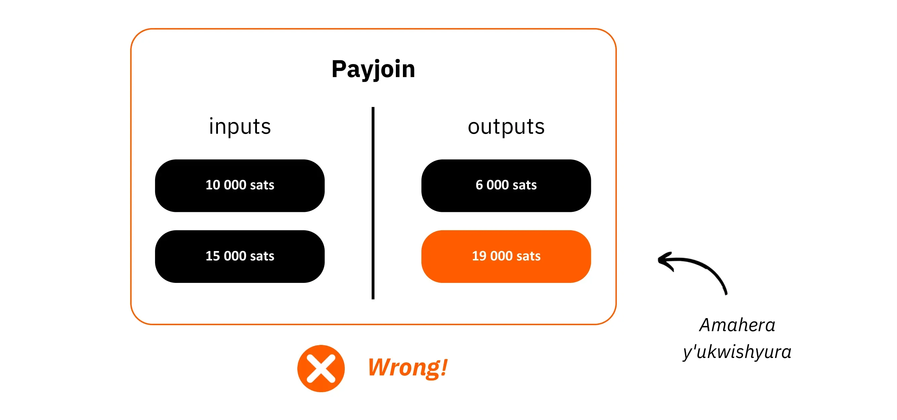


Ariko mu vy’ukuri, iyo nseguro irafise amakosa. Igitigiri c’amahera yo kwishura ntigihuye n’ivyo bivako vyose. Ni mu vy’ukuri itandukaniro riri hagati ya UTXO y’uwuronka mu vyo asohora n’ivyo uwuronka UTXO mu vyo yinjiza.


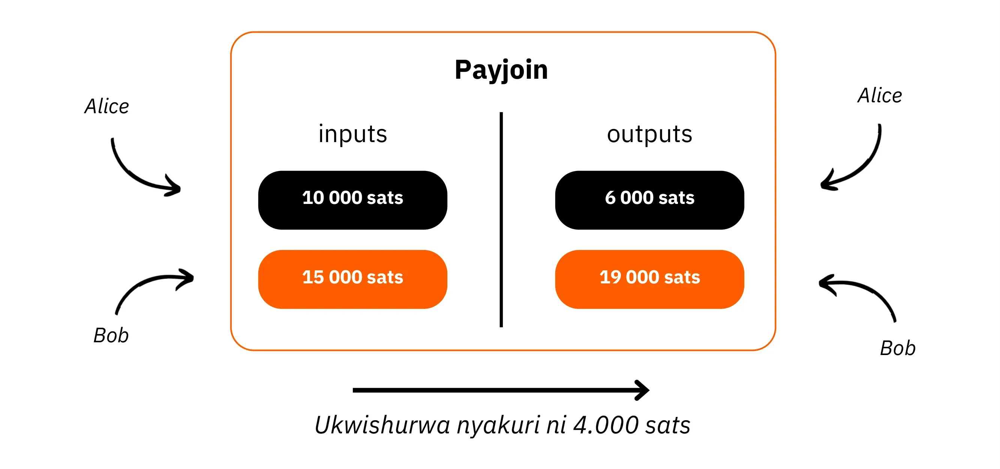


Muri ivyo, igikorwa ca PayJoin kigwa mu rwego rw’ubuhinga bwa steganography. Bituma umubare nyawo w’ibintu bigurishwa uhishwa mu gicuruzwa c’ikinyoma gikora nk’uruyeri.


Steganography ni ubuhinga bwo guhisha amakuru mu yandi makuru canke mu bindi bintu, kugira ngo ukubaho kw’ayo makuru yanyegejwe ntikuboneke. Nk’akarorero, ubutumwa bw’ibanga burashobora guhishwa mu kadomo mu nyandiko zidafitaniye isano, bigatuma butaboneka n’ijisho ry’umuntu (ubu ni ubuhinga bwa [microdot](https://fr.wikipedia.org/wiki/Micropoint)).


Mu buryo butandukanye n’ugushiramwo amakuru, ivyo bikaba bituma amakuru adashobora gutahurwa ata rufunguzo rwo gufungura amakuru, steganography ntihindura amakuru. Iguma yerekanwa mu nyandiko zitomoye. Ahubwo intumbero yayo ni iyo guhisha ukubaho kw’ubutumwa bw’ibanga ubwabwo, mu gihe guhisha amakuru ahishijwe bigaragaza neza ko hariho amakuru yihishije, naho nyene ata rufunguruzo umuntu yoyaronka. Ni co gituma izina ry'intango rya PayJoin ryari "ibikorwa vy'ubudandaji".


Igereranyo rishobora gufatwa hagati y'ubuhinga bwo gucapura na CoinJoin, no hagati y'ubuhinga bwo gucapura na PayJoin. CoinJoin ifise ibintu bisa n’ivyo gushiramwo amakuru: uburyo buramenyekana, ariko amakuru ntashobora gusobanurwamwo. Ku rundi ruhande, PayJoin isa n’ivyo steganography: amakuru arashobora gushikwako mu vyiyumviro, ariko kubera ko uburyo bwo kuyahisha butamenyekana, araba uwudashobora gushikira.


### None PayJoin noyikoresha gute?


Porogarama zizwi cane zifasha PayJoin harimwo Sparrow wallet, Wasabi Wallet, Mutiny, BitMask, BlueWallet na JoinMarket, hamwe n’umuhinga wo kwishura BTCPay.


Ishirwa mu ngiro rya PayJoin ryari ryiza cane ryari Stowaway gusa kuri Samourai Wallet. Ariko rero, kuva abashinze iyo porogarama bafatwa, ubu ico gikoresho kirakora gusa igice. Ivyiza vya Stowaway ni uko ari umurongo wuzuye, woroshe gukoresha, ushigikira kwakira no kohereza ama payjoins. amafaranga afise umukono w’igice ashobora guhindurwa n’amaboko mu gucapura amakode menshi ya QR, canke agahindurwa ubwayo na Tor biciye kuri Soroban. Iryo hitamwo rya nyuma ryo guhanahana amakuru ubu ntaco rikora.


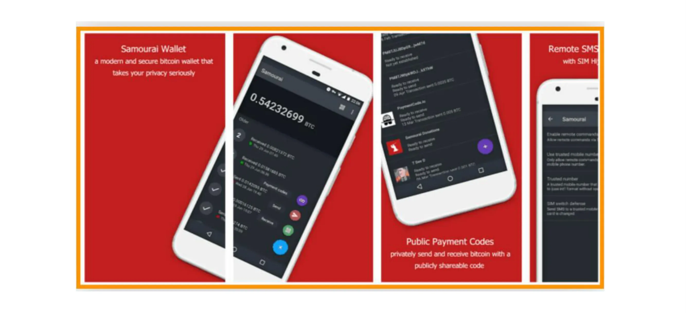


Ingorane yo gukoresha PayJoin iri mu kuba ivana n’uruhara rw’umucuruzi. Nk’umukiriya, ntushobora gukoresha PayJoin iyo umucuruzi atayishigikiye. Ivyo vyongera ku yindi ngorane ku bijanye n’ugugura: ntibigoye gusa kuronka abacuruzi bemera Bitcoin, ariko iyo urondeye n’abashigikiye payjoins, birarushiriza kugorana.


Umuti umwe woba ari ugukoresha imiterere y’ugucuruza izana ubusobanuro butari bwo mu gusesangura uruhererekane ataco bisaba ubufatanye bw’uwuronka. Ivyo vyotuma dushobora gutuma ivyo twishura biguma ari ibanga ata kwizigira uruhara rw’abadandaza. Ivyo nyene ni vyo tuzoba turiko turaraba mu kigabane gikurikira.


https://planb.network/tutorials/privacy/on-chain/payjoin-samourai-wallet-48a5c711-ee3d-44db-b812-c55913080eab

## Ukwishura guto-CoinJoin


<chapterId>300777ee-30ae-43d7-ab00-479dac3522c1</chapterId>


Igihe ushaka gukora igikorwa co kwishura mu gihe uguma ufise ibanga ry’urugero runaka, PayJoin ni uburyo bwiza. Ariko nk’uko twabibonye, ​​PayJoin isaba ko uwuyironka agira uruharamwo. None wokora iki iyo uwuronka iyo mpapuro yanse kuja mu gikorwa ca PayJoin, canke iyo uhisemwo gusa kutabagiramwo uruhara? Imwe mu nzira ni ugukoresha uruhome rw’amabuye canke uruhome rw’amabuye x2. Reka twihweze neza ubwo bwoko bubiri bw’ugucuruza.


### Ubucuruzi bwa Stonewall


Stonewall ni uburyo bwihariye bwo gukoresha Bitcoin bugenewe kwongerera ibanga ry’abakoresha igihe bakoresha amahera mu kwigana pseudo-CoinJoin hagati y’abantu babiri, ataco mu vy’ukuri ari umwe. Nkako, iyo nzira y’ugucuruza si iyo gukorana. Uwukoresha arashobora kuyubaka ku giti ciwe, akoresheje gusa ama UTXO afise nk’ivyo yinjiza. Ushobora rero gukora igikorwa ca Stonewall ku musi mukuru uwo ari wo wose, udakeneye gukorana n’uwundi muntu canke uwuronka.


Igikoresho ca Stonewall gikora gutya: nk’inyungu mu gikorwa, uwutanga akoresha UTXO 2 ziwe. Ku bijanye n’isohoka, iyo nzira y’ugucuruza itanga UTXO 4, 2 muri zo zikaba zingana neza na neza. Ibindi 2 UTXO nivyo bizogira ihinduka. Mu bisohoka 2 vy’amahera amwe, kimwe gusa ni co kizoja mu vy’ukuri ku wuzohembwa.


Rero hariho gusa uruhara 2 mu gucuruza Stonewall:


- Uwutanga, ni we ariha;
- Uwuronka, yoshobora kuba atazi kamere yihariye y’ivyo bicuruzwa kandi akaba yiteze gusa ko uwumurungikiye ariha.


Reka dufate akarorero kugira ngo dutahure iyo nzira y’ugucuruza. Alice ija kuri Bob umutetsi kugira ngo agure umukate wiwe, ugura 4.000 Sats. Ashaka kwishura mu bitcoins, mu gihe agumana uburyo bumwe bumwe bw’ibanga ku bijanye n’ukwishura kwiwe. Ni co gituma afata ingingo yo kwubaka ikibanza co gukoreramwo Stonewall kugira ngo ashobore kwishura.


Dusuzumye iyo nzira, turashobora kubona ko Bob umutetsi mu vy’ukuri yaronse 4.000 Sats mu kwishura iyo baguette. Alice yakoresheje UTXO 2 nk'ivyo gukoresha: imwe y'amashanyarazi 10.000 Sats n'iyindi y'amashanyarazi 15.000 Sats. Mu bikorwa, yararonse ama UTXO 3: imwe y'amashanyarazi 4.000 Sats, iyindi y'amashanyarazi 6.000 Sats n'iyindi y'amashanyarazi 11.000 Sats. Alice rero ifise amafaranga -4.000 Sats kuri iyo nzira, ivyo bikaba bihuye n’igiciro c’iyo baguette.


Muri aka karorero, narasuzuguye n’ibigirankana amafaranga y’i Mining kugira ngo vyorohe gutahura. Mu vy’ukuri, amahera y’ugucuruza yishurwa yose n’uwutanga.


### Ni izihe ntumbero z’ugucuruza Stonewall?


Igishushanyo ca Stonewall congeramwo entropie nyinshi cane ku bijanye n’ugucuruza, kigatuma imirongo y’isesengura ry’uruzitiro igaragara neza. Iyo umuntu abonye hanze, mwene ukwo gucuruza kwoshobora gusobanurwamwo ko ari mini-CoinJoin hagati y’abantu babiri. Ariko mu vy’ukuri, ni ukwishurwa. Ubwo buryo rero buratuma habaho ukudakeka mu gusesangura uruhererekane, canke mbere bukajana ku nzira z’ibinyoma.


Reka dufate akarorero ka Alice kuri Bob y’umutetsi. Ivyo gucuruza kuri Blockchain vyosa n’ibi:


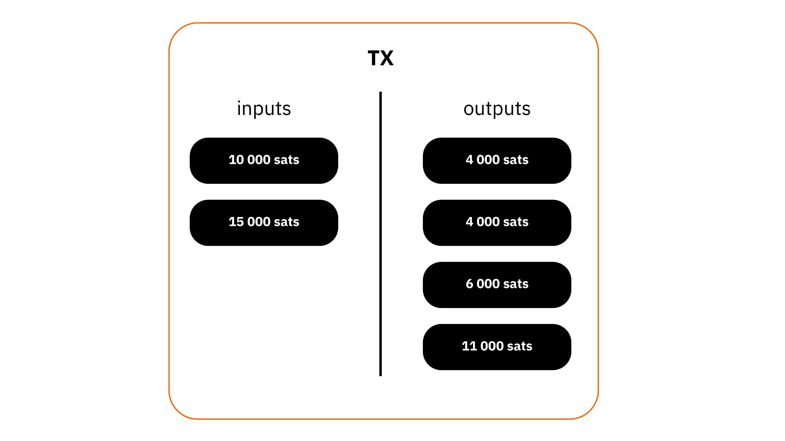


Umuntu wo hanze yizigiye ubuhinga bwo gusesangura uruhererekane yoshobora gushika ku ciyumviro kitari co c'uko "*abantu babiri bakoze CoinJoin ntoyi, ifise UTXO imwe mu vyo yinjiza n'ibindi bibiri UTXOs mu vyo yinjiza*". Gusuzuma iyo nzira y’ubudandaji uhereye hanze ntibituma hakoreshwa CIOH, kuko kubaho kw’ibisohoka bibiri vy’umubare umwe bigaragaza uburyo bwa CoinJoin. Uvuye hanze, CIOH rero ntishobora gukoreshwa muri iki kibazo kidasanzwe.


Iyi nsobanuro ntabwo ari yo, kuko nk’uko mubizi, UTXO imwe yarungitswe kuri Bob umutetsi, izo 2 UTXO zavuye kuri Alice, aca asubirana 3 z’ihinduka.


Kandi ikintu gishimishije cane ku bijanye n’imiterere y’isoko rya Stonewall ni uko, umuntu abona hanze, risa n’iry’isoko rya Stonewall x2 mu buryo bwose.


### Ivy’ugucuruza kw’Ibuye x2.


Stonewall x2 ni ubundi buryo bwihariye bw’ugucuruza Bitcoin na bwo bugamije kwongerera ibanga ry’abakoresha igihe bakoresha amahera, ariko ubu mu gukorana n’umuntu wa gatatu atagira uruhara muri ayo mafaranga. Ubwo buryo bukora nk’ubuhinga bwa pseudo-CoinJoin hagati y’abantu babiri bari muri iyo nama, mu gihe nyene bariha umuntu agira gatatu.


Ibikorwa vy’ugucuruza Stonewall x2 birasanzwe: dukoresha urupapuro rwa UTXO dufise kugira ngo twishure, kandi tugasaba imfashanyo y’uwundi muntu na we nyene atanga n’urupapuro rwa UTXO rwiwe. Iryo soko rirangizwa n’ibisohoka bine: bibiri muri vyo mu mahera angana, kimwe kigenewe Address y’uwuhembwa, ikindi kigenewe Address y’uwukorana. UTXO ya gatatu isubizwa ku yindi Address y’uwo mufatanyabikorwa, bikamushoboza gusubirana amahera ya mbere (igikorwa kitagira aho kigarukira kuri we, modulo igiciro ca Mining), UTXO ya nyuma igasubizwa ku Address ihinduka ari iya twebwe.


Uruhara rutatu rutandukanye rero rurasobanurwa mu bikorwa vya Stonewall x2:


- Uwutanga, ni we ariha vy’ukuri;
- Uwuronka, ashobora kuba atazi uburyo bwihariye bw’ivyo bicuruzwa kandi akaba yiteze gusa ko uwumurungikiye amwishura;
- Uwo mufatanyabikorwa, atuma bitcoins ziboneka kugira ngo ashire amakenga ku bijanye n’isesengura ry’ivyo akora, mu gihe asubiza amahera yiwe yose ku mpera (igikorwa kitagira aho kigarukira kuri we, modulo the Mining costs).


Reka dusubire ku karorero kacu na Alice, ari kuri Bob umutetsi kugira ngo agure umukate wiwe, ugura 4.000 Sats. Ashaka kwishura mu bitcoins, mu gihe agumana urugero runaka rw’ibanga ku bijanye n’ukwishura kwiwe. Ni co gituma ahamagara umugenzi wiwe Charles, azomufasha muri ivyo.


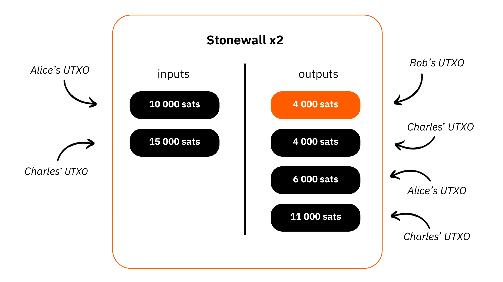


Dusuzumye iyo nzira, turabona ko Bob umutetsi mu vy’ukuri yaronse 4.000 Sats mu kwishura iyo baguette. Alice yakoresheje 10.000 Sats mu vyo yinjiza, igarura 6.000 Sats mu vyo isohora, ni ukuvuga ko -4.000 Sats, bihuye n’igiciro c’iyi baguette. Na Charles we, yatanze 15.000 Sats mu vyo yinjiza, aronka n’ibindi bibiri: kimwe ca 4.000 Sats ikindi ca 11.000 Sats, bitanga umubare w’amazi 0.


Muri aka karorero, narasigaye n’ibigirankana amafaranga kugira ngo vyorohe gutahura. Mu vy’ukuri, amahera ya Mining muri rusangi asangizwa kimwe hagati y’uwutanga amahera n’uwutanga.


### Ni izihe ntumbero z’ugucuruza Stonewall x2?


Cokimwe n’imiterere ya Stonewall, imiterere ya Stonewall x2 yongerako entropie nyinshi ku bijanye n’ugucuruza kandi igatera urujijo mu gusesangura uruhererekane. Iyo umuntu abonye hanze, mwene ukwo gucuruza gushobora gusobanurwamwo ko ari aga CoinJoin gatoyi hagati y’abantu babiri. Ariko mu vy’ukuri, ni ukwishura. Ubwo buryo rero buratuma habaho ukudakeka mu gusesangura uruhererekane, canke mbere bikajana ku nzira z’ibinyoma.


Reka dufate akarorero ka Alice, Bob umukate w’imikate na Charles. Ivyo gucuruza kuri Blockchain vyosa n’ibi:


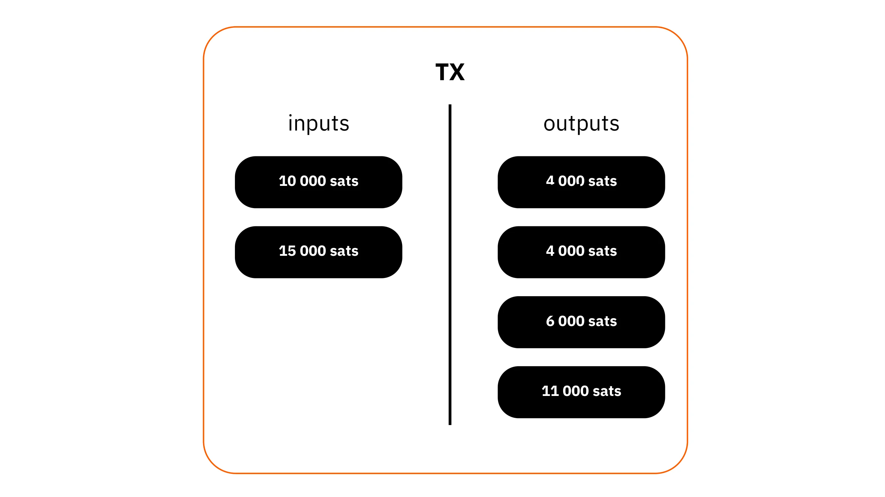


Umuntu wo hanze yizigiye ubuhinga bwo gusesangura uruhererekane yoshobora gushika ku ciyumviro kitari co c'uko "*Alice na Charles bakoze CoinJoin ntoyi, hariho UTXO imwe mu vyo yinjiza n'ibindi bibiri UTXOs mu vyo asohoka*". Na none, gusuzuma iyo nzira y’ugucuruza uvuye hanze ntibituma hakoreshwa ICOH, kuko kubaho kw’ibisohoka bibiri vy’umubare umwe bigaragaza uburyo bwa CoinJoin. Uvuye hanze, CIOH rero ntishobora gukoreshwa muri iki kibazo kidasanzwe.


Iyi nsobanuro ntabwo ari yo, kuko nk’uko mubizi, UTXO imwe yarungitswe kuri Bob umutetsi, Alice ifise igisohoka kimwe gusa co guhindura, Charles na we afise ibiri.


Kandi na none, ikintu gishimishije cane ku bijanye n’imiterere y’isoko rya Stonewall x2 ni uko, umuntu abona ibintu hanze, risa n’iry’isoko rya Stonewall mu buryo bwose.


### Ni itandukaniro irihe riri hagati y'Ibuye n'Ibuye x2?


Igikoresho ca StonewallX2 gikora neza neza nk’igikoresho ca Stonewall, kiretse ko ica mbere ari ugukorana, mu gihe ica kabiri kitakora. Nk’uko twabibonye, ​​igikorwa ca Stonewall x2 gifise uruhara rw’umuntu agira gatatu (Charles), ari hanze y’ukwishyura, kandi azotuma amafaranga yiwe y’ibice bita bitcoins aboneka kugira ngo yongere ibanga ry’igicuruzwa. Mu gucuruza kwa kera kwa Stonewall, uruhara rw’umufatanyabikorwa rufatwa n’uwurungitse.


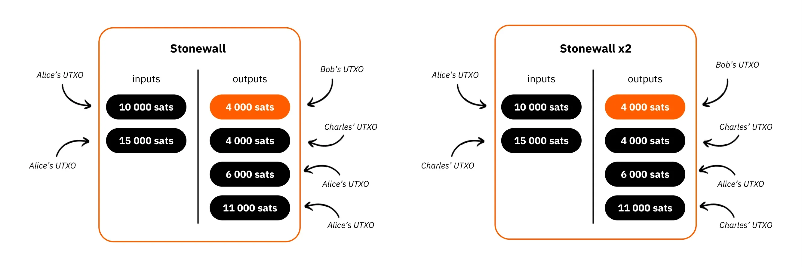


Umuntu aravye hanze, uburyo bwo gucuruza ni nk’ubwo nyene.


Kuba izo nzira zibiri z'ubudandaji zisangiye neza neza uburyo bumwe bisigura ko naho umuntu wo hanze yoshobora kumenya uburyo bwa "Stonewall(x2)", ntazogira amakuru yose. Ntazoshobora kumenya uwuhe muri izo UTXO zibiri z’amahera amwe ahuye n’ivyo yishuye. Ikindi kandi, ntazoshobora kumenya nimba izo UTXO zibiri zifise inputs zivuye ku bantu babiri batandukanye (Stonewall x2) canke nimba ari iz’umuntu umwe yazihuje (Stonewall).


Iyi ngingo ya nyuma iterwa n’uko amafaranga y’i Stonewall x2 akurikira neza na neza uburyo bumwe n’ubw’amafaranga y’i Stonewall. Uravye hanze, kandi ata makuru y’inyongera, ntibishoboka gutandukanya igikorwa ca Stonewall n’igikorwa ca Stonewall x2. Ivya mbere si ibikorwa vy’ubufatanye, mu gihe ivya nyuma ari vyo. Ivyo birongereza mbere amakenga ku bijanye n’ugusuzuma kimwe muri ivyo bicuruzwa.


### Ni ryari amafaranga y’amabuye n’amabuye x2 akwiye gukoreshwa?


Ivyiyumviro bikwiye kuba ibi bikurikira igihe ushaka gukoresha igikoresho c’ibanga ku bijanye n’amahera:


- Nk’ivyo dushira imbere, turashobora guhitamwo gukora PayJoin;
- Iyo umucuruzi adashigikiye payjoins, igikorwa co gukorana gishobora gukorwa n’uwundi muntu hanze y’ukwishyura hakoreshejwe ubuhinga bwa Stonewall x2;
- Niwaba udashobora kuronka umuntu wo gukora igikorwa ca Stonewall x2, urashobora gukora igikorwa ca Stonewall gusa, kizokwigana inyifato y’igikorwa ca Stonewall x2.


### Nokoresha gute amafaranga y’amabuye n’amabuye x2?


Ivy’ugucuruza vy’amabuye n’ivy’amabuye x2 biraboneka kuri porogarama ya Samourai Wallet no kuri porogarama ya Sparrow wallet.


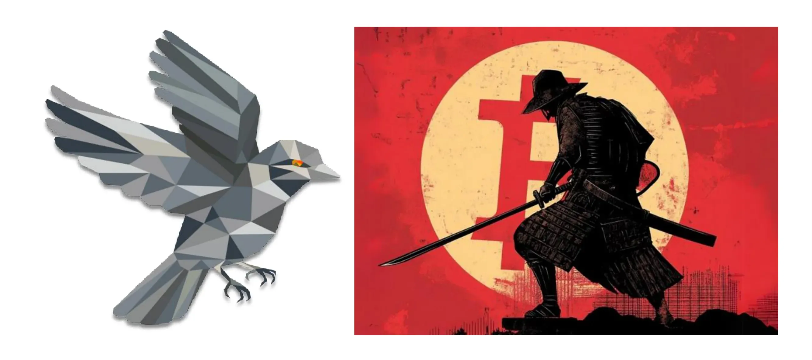


Ariko nk’uko biri ku bijanye n’ama payjoins, inyuma y’ugufatwa kw’abashinze Samourai, ubu amafaranga y’ubudandaji ya Stonewall x2 akora gusa mu guhinduranya ama PSBT n’amaboko hagati y’ababifisemwo uruhara. Ikibabaje ni uko Exchange yikora biciye kuri Soroban itagihari.


Birashoboka kandi gukora ubwo bwoko bw’ugucuruza n’amaboko ukoresheje porogarama iyo ari yo yose ya Bitcoin Wallet.


Mu kigabane gikurikira, turaza kuraba ubundi buryo bwo gukingira ibanga butazwi cane, ariko bufise akamaro kanini nk’inyongera y’ivyo twamaze kwiga.


https://planb.network/tutorials/privacy/on-chain/stonewall-033daa45-d42c-40e1-9511-cea89751c3d4

https://planb.network/tutorials/privacy/on-chain/stonewall-x2-05120280-f6f9-4e14-9fb8-c9e603f73e5b

## Ivyo bikoko


<chapterId>db9a20ac-a149-443d-884b-ea6c03f28499</chapterId>


Ikoreshwa ry’imiterere y’ubucuruzi ya Bitcoin yongera ubusobanuro ku gusesangura uruhererekane, nka CoinJoin, ni ngirakamaro cane cane ku bijanye no kurinda ubuzima bwite. Ariko nk’uko twabibonye mu kigabane kivuga ku bijanye n’ama payjoins, amafaranga CoinJoin aramenyekana mu buryo busanzwe ku ruzitiro. Ibuka isano twashize hagati y’ugushiramwo amakuru n’ugushiramwo amakuru: iyo dosiye ipfutse, uwundi muntu agira gatatu abonye iyo dosiye ipfutse ntashobora gushika ku birimwo, ariko arashobora kumenya neza ko iyo dosiye yahinduwe kugira ngo ihishe ibirimwo. Ivyo ni ko biri no kuri CoinJoin: iyo umusesanguzi asuzuma igikorwa ca CoinJoin, naho adashobora gushinga amasano ataziguye hagati y’ivyo yinjiza n’ivyo asohoka (n’ibihushanye n’ivyo), arashobora kwemera ko igikorwa abonye ari CoinJoin.


Bivanye n’ingene wipfuza gukoresha UTXO yawe inyuma y’ingendo za CoinJoin, kuba yaciye muri iyo nzira birashobora kuba ingorane. Nk’akarorero, nimba utegura kugurisha Coin yawe ku rubuga rwa Exchange rutegekanijwe, ariko ikaba iherutse guca muri CoinJoin, igikoresho co gusuzuma uruzitiro rw’urubuga kizomenya ico kintu. Iryo koraniro rishobora rero kwanka kwemera UTXO yawe coinjoined, canke mbere rigusaba insobanuro, bikaba bishobora gutuma konti yawe ihagarara canke amahera yawe agahagarara. Mu bihe bimwe bimwe, iyo nzira irashobora kandi kumenyesha inyifato yawe ubutegetsi bwa Leta (ivyo ni nk’akarorero, ivyo TRACFIN isaba aba PSAN mu Bufaransa, canke Ishirahamwe ry’Igihugu ry’Ivyaha vy’Ivy’Imari (FinCEN) rikora muri Amerika).


Hariho igikoresho gishobora gupfuka ibimenyetso vy’ivya kera vya Bitcoin Coin, kugira ngo bisubire ku buryo bumwe bumwe bw’uguhinduka. Ivyo ni vyo nyene ricochet igamije.


### Ricochet ni iki?


Ricochet ni ubuhinga bugizwe no gukora ibikorwa vyinshi vy'ibinyoma ku muntu (sweep) kugira ngo yigane ukwimurira Bitcoin Ownership. Ico gikoresho gitandukanye n’ibindi bice vy’ubudandaji twavuganye, kuko kitaronka ukutamenyekana kw’imbere, ahubwo kironka uburyo bwo kutamenyekana kw’inyuma. Mu vy’ukuri, ricochet irapfuka ibintu vyihariye bishobora gutuma Bitcoin Coin idakora neza kubera kahise kayo.


Kugira ngo ricochet ikore ibikorwa bine bikurikirana aho uwuyikoresha yirungikira amahera ku ma aderesi atandukanye.


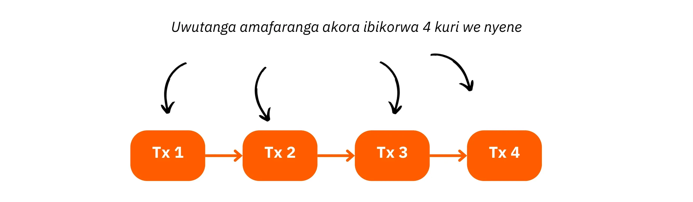


Inyuma y’uru rukurikirane rw’ibikorwa, igikoresho ca ricochet kiraheza kigatuma ama bitcoins aja aho aja, nk’urubuga rwa Exchange.


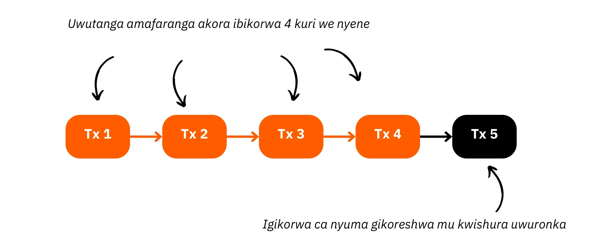


Intumbero ni ugutuma habaho urugendo rugira ico rukoze ku bushobozi bwa Coin, nk’ugucuruza kwa CoinJoin, n’igikorwa ca nyuma c’ugukoresha amahera, coshobora kwanka iyi Coin kubera kahise kayo. Gutyo, ibikoresho vyo gusesangura uruhererekane vyoshobora gushika ku ciyumviro c’uko kumbure hariho ihinduka rya Ownership inyuma y’ico kintu, maze bikabona ko iyo Coin ishobora guhinduka. Ku bijanye na CoinJoin, ibikoresho vyo gusesangura Blockchain vyoshobora rero kwiyumvira ko atari we muntu nyene yarungitse izo bitcoins kandi akagira CoinJoin, kandi ko rero ata co bimaze gufata ingingo ku muntu yarungitse.


### Ni kuki bikora?


Umuntu ahanganye n’ubwo buryo bwa ricochet, yoshobora kwiyumvira ko porogarama yo gusesangura uruzitiro yoshobora gutuma isuzuma ryayo rirushiriza gusubira inyuma incuro zine. Ariko rero, izo nzira zihura n’ingorane yo gutuma urugero rwo kumenya ibintu rugenda neza. Bategerezwa gushinga urugero rw’umubare w’ibipfunsi hanyuma bakemera ko hariho ihinduka ry’umutungo, kandi ko isano n’ikintu cabaye imbere (nk’i CoinJoin) rikwiye kwirengagizwa.


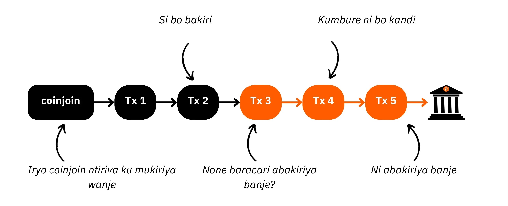


Ariko rero, gushinga iyo nzira ni akaga: ukwaguka kwose kw’umubare w’ibisimbuka vyerekanwa kwongerekana cane kw’ivyiza vy’ibinyoma, ni ukuvuga abantu bashizweko ikimenyetso c’uko ari abaje mu kintu, mu gihe mu vy’ukuri igikorwa cakozwe n’uwundi muntu. Ivyo bishobora gutuma ayo mashirahamwe agira ingorane nyinshi, kuko ivyiza bitari vyo bituma abantu badashira akanyota, ivyo bikaba bishobora gutuma abakiriya bashikiwe n’ingorane baja mu mahiganwa. Mu gihe kirekire, urugero rwo kumenya rwo hejuru cane rutuma urubuga rutakaza abakiriya benshi kurusha abaruhanganye, ivyo bikaba vyoshobora gutuma ubuzima bwarwo buhungabana. Biragoye rero ko izo nzira zongerera umubare w’ibisubizo vyerekanwa, kandi 4 akenshi ni umubare uhagije wo guhangana n’isesengura ryazo.


Ico kintu kigaragara ngaha kirasa n’inyigisho y’ingero zitandatu z’ugutandukana.


Iciyumviro c’ingero zitandatu z’ugutandukana kivuga ko umuntu wese kw’isi ahuye n’uwundi uwo ari we wese biciye ku ruhererekane rw’imigenderanire igizwe n’abahuza batandatu. Vyoba rero bihagije guca mu rutonde rw’abantu batandatu, umwe wese akamenya uwukurikira, kugira ngo umuntu ashike ku muntu uwo ari we wese kw’isi.


Ku bijanye n’amafaranga y’ubudandaji ya Bitcoin, turabona ikintu nk’ico nyene. Mu gukurikirana umubare uhagije w'ibikorwa vya Bitcoin, nta kabuza turahura na CoinJoin. Uburyo bwa ricochet burakoresha iyo ngingo ngenderwako mu gukoresha umubare munini w’ibipfunsi kuruta ivyo ama platforms ya Exchange ashobora gukurikirana mu buryo bubereye. Iyo ama platforms afashe ingingo yo gukurikirana amafaranga menshi, birashoboka rero ko wongerako gusa hop y’inyongera kugira ngo umuntu ashobore gukingira iyo ngingo.


### Ni ryari kandi ni gute umuntu akoresha ricochet?


Igikoresho gisanzwe ca ricochet kiba iyo bikenewe guhisha uruhara rwa kera muri CoinJoin ku UTXO ufise. Mu vyiza, ni vyiza kwirinda gutanga ama bitcoins yaciye mu CoinJoin ku bigo bigenzurwa. Naho biri ukwo, mu gihe woba usanga ata kindi ukora, cane cane mu gihe bikenewe vyihutirwa gusesa ama bitcoins mu mafaranga ya Leta, ricochet iratanga umuti mwiza.


Ubu buryo ntibukora neza ku coinjoins gusa, ariko no ku kindi kimenyetso cose coshobora gutuma UTXO idakora neza.


Iciyumviro c’ubu buryo bwa ricochet mu ntango cavuye mu migwi ya Samourai Wallet, bakayishira mu bikorwa vyabo kugira ngo iyo nzira ikoreshe mu buryo bwikora. Ivyo bikoresho ntibikoreshwa ku buntu kuri Samourai, kubera ko iyo umuntu akoresheje ricochet, bisaba ko umuntu atanga amahera y’ama Sats 100.000, akongerako amahera y’ama Mining. Ikoreshwa ryayo rero ni ngirakamaro ku bijanye no kwimurira amahera menshi.


Igikoresho ca Samurai gitanga uburyo bubiri bwo gutera ricochet:


- Reinforced ricochet, canke "ugutanga ibice", bitanga akamaro ko gukwiragiza amafaranga y'ibikorwa vya Samurai ku bikorwa bitanu bikurikirana. Iryo hitamwo kandi rituma igikorwa cose gitangazwa ku gihe gitandukanye kandi kigafatwa mu gice gitandukanye, kigaca kigana neza uko bishoboka kwose inyifato y’ugutanga Ownership. Naho bugenda buhoro, ubwo buryo burahimbarwa n’abatari mu vyihuta, kuko butuma ricochet ikora neza cane mu gukomeza ubushobozi bwayo bwo guhangana n’isesengura ry’uruzitiro;


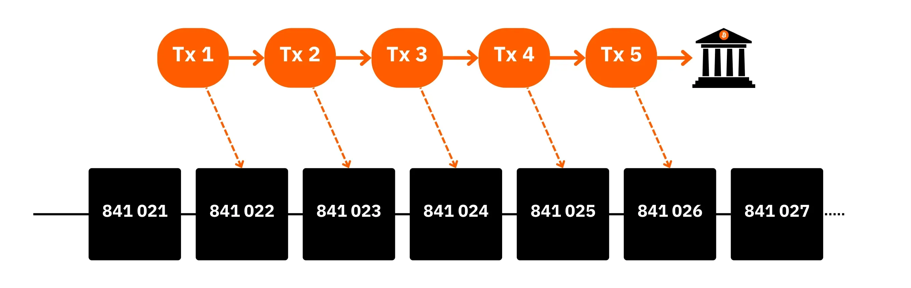


- Ricochet ya kera, ikaba igenewe gukora igikorwa n’umuvuduko, igatangaza ibikorwa vyose mu kiringo gitoyi. Ubwo buryo rero buratanga ibanga ritoyi kandi ntibushobora guhangana n’ugusesangura kuruta uburyo bukomeye. Ishobora gukoreshwa gusa mu vyoherezwa vyihutirwa.


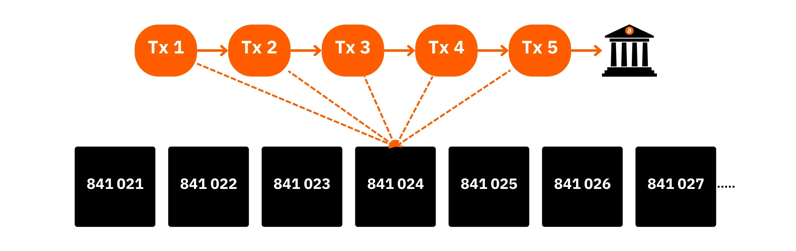


Ricocheting bisigura gusa kwirungikira ama bitcoins. Birashoboka cane ricochet bitcoins n’amaboko kuri porogarama iyo ari yo yose ya Wallet, udakoresheje igikoresho kidasanzwe. Ico ubwirizwa gukora n’ugukurikirana kwimurira iyo Coin nyene, ukoresheje Address nshasha, idafise ikintu igihe cose.


Mu kigabane gikurikira, turaba ubuhinga butandukanye bwo gutanga Ownership mu mpisho. Ubwo buryo buratandukanye cane n’ubwo twasuzumye gushika ubu, haba mu bijanye n’ingene bukora be n’ivyo buvamwo.


https://planb.network/tutorials/privacy/on-chain/ricochet-e0bb1afe-becd-44a6-a940-88a463756589

## Ibanga ry'iherezo rya Ownership


<chapterId>a2067036-849c-4d6b-87d2-44235cfae7a1</chapterId>


Ubundi buryo bwa Bitcoin bwo gukingira ibanga ni ugutanga Ownership mu ibanga. Ubu buryo bufise intumbero yo gukura Ownership y’ama Bitcoins ku muntu umwe akayijana ku wundi, n’ibihushanye n’ivyo, ata gucuruza kugaragara neza kuri Blockchain. Reka turabe ubuhinga butandukanye buriho, hamwe n’ivyiza n’ibibi vyabwo.


### Uguhindura ibiceri


Coinwap ishingiye ku ciyumviro coroshe: ikoresha amasezerano y’ubwenge kugira ngo yorohereze gutanga Bitcoin Ownership hagati y’abakoresha babiri, ata nkenerwa yo kwizigira kandi ataco kwimurira kugaragara neza kuri Blockchain.


Reka twiyumvire akarorero koroshe ka Alice na Bob. Alice ifise BTC 1 icungiwe n’urufunguzo rw’ibanga $A$, na Bob nayo ifise BTC 1 icungiwe n’urufunguzo rw’ibanga $B$. Bashobora mu vy’impwemu Exchange imfunguruzo zabo z’ibanga biciye ku nzira y’itumanaho yo hanze kugira ngo bakore igikorwa co gutanga amakuru mu mpisho.


Ariko rero, ubwo buryo bw’ubujuju burafise ingorane nyinshi mu bijanye n’ukwizigirana. Ntaco cohagarika Alice kuguma afise kopi y’urufunguzo rw’ibanga rwa $A$ inyuma ya Exchange maze akarukoresha mu nyuma kugira ngo yibe ama bitcoins, igihe urufunguzo ruzoba ruri mu minwe ya Bob.


Ikindi, nta cizere ko Alice atazoronka urufunguzo rw'ibanga rwa Bob $B$ kandi ko atazokwigera atanga urufunguzo rwiwe rw'ibanga $A$ muri Exchange. Iyi Exchange rero ishingiye ku kwizigirana gukaze hagati y'ababuranyi, kandi ntaco imaze mu gutuma Ownership irungikwa mu mpisho.


Kugira ngo ivyo bibazo bitorerwe umuti no gutuma habaho uguhanahana amakuru hagati y’imigwi idashobora kwizigirana, tuzokoresha ubuhinga bwa Smart contract aho gukoresha ubuhinga bwa Smart contract. Smart contract ni porogarama yikora ubwayo iyo ibintu vyategekanijwe imbere y’igihe bishitse. Muri twebwe, ivyo bituma Exchange y’itunga ibaho ubwayo, ata nkenerwa yo kwizigirana.


Ivyo bishobora gushikako hakoreshejwe HTLC (*Amasezerano y’Igihe Hash*) canke PTLC (*Amasezerano y’Igihe c’Intonde*). Izo porotokole zibiri zikora mu buryo busa n’ubwo, zikoresha uburyo bwo gufunga umwanya butuma Exchange iheza neza canke igakurwaho yose, gutyo bikaba birinda ubutungane bw’amahera y’impande zompi. Itandukaniro rikomeye hagati ya HTLC na PTLC ni uko HTLC ikoresha hashes n’amashusho y’imbere kugira ngo ikingire igikorwa, mu gihe PTLC ikoresha imikono y’abahindura.


Mu gihe co guhindura amafaranga hakoreshejwe HTLC canke PTLC hagati ya Alice na Bob, Exchange iraba ata nkomanzi: canke iraroranirwa maze umwe wese akaronka BTC y’uwundi, canke irananirwa maze umwe wese akaguma afise BTC yiwe. Ivyo bituma uwundi wese adashobora guhenda canke kwiba BTC y’uwundi.


> *HTLC ni uburyo kandi bukoreshwa mu gutuma amafaranga yishurwa ata nkomanzi biciye mu nzira zibiri za Lightning Network*
Ikoreshwa ry'Imikono y'Ibimenyetso riraryoshe cane muri iki gihe, kuko rituma bishoboka kureka inyandiko za kera (uburyo rimwe na rimwe bwitwa "_inyandiko zitagira inyandiko_"). Ivyo bigabanya amafaranga ajanye na Exchange. Ikindi ciza gikomeye c’Imikono y’Ibikoresho ni uko idasaba gukoresha Hash rusangi ku mpande zompi zikorana, gutyo bikaba bitarinda guhishura isano ry’ukuri hagati yabo mu bwoko bumwebumwe bwa Exchange.


### Imikono y'umuhinduzi


Adapter Signatures ni uburyo bwo gukora amakuru y'ibanga bufatanya umukono ufise akamaro n'iyindi sinyatire, yitwa "_adapter signature_", kugira ngo uhishure amakuru y'ibanga. Ubwo buryo bwakozwe mu buryo bw’uko kumenya 2 muri 3 bikurikira Elements: umukono ubereye, umukono w’adapteur n’ibanga, bituma dushobora gukuramwo ikintu ca gatatu kibuze. Ikintu gishimishije c'ubu buryo ni uko, nitwamenya umukono w'adapteri w'urunganwe rwacu n'akarongo kadasanzwe ku nzira y'uruzitiro rujanye n'ibanga rikoreshwa mu kubara uwo mukono w'adapteri, dushobora kuronka umukono wacu bwite w'adapteri uzohuza n'iryo banga nyene, tutazokwigera turonka uburenganzira bwo gushika ku banga ubwaryo.


Mu guhinduranya amafaranga, gukoresha Imikono y’Ibimenyetso bituma umuntu ashobora gutangaza icarimwe amakuru abiri y’agaciro hagati y’abaje mu nama, gutyo ntihagire uwukenera kwizigirana. Reka dufate akarorero ko kwerekana iyo nzira na Alice na Bob, bipfuza ko Exchange yogira BTC 1 umwe wese, ariko ntibizigirane. Bakoresha Imikono y’Ibimenyetso kugira ngo ntibakeneye kwizigirana muri iyi Exchange. Ehe ingene babikora:


- Alice itangura Exchange mu gukora $m_A$ ibikorwa vyoherezwa 1 BTC kuri Bob. Atanga umukono $s_A$, wemeza iyo nzira, akoresheje urufunguzo rwiwe rw’ibanga $p_A$ ($P_A = p_A \cdot G$), Nonce $n_A$ ($N_A = n_A \cdot G$) n’ibanga $t$ ($T = G$): \cdo


$$s_A = n_A + t + H(N_A + T \ibihuye P_A \ibihuye m_A) \cdot p_A$$


- Alice ibara umukono w'adapteri $s_A'$ mu gukuraho ibanga $t$ ku mukono wayo nyawo $s_A$:


$$s_A' = s_A - t$$


- Alice yohereza Bob umukono wiwe w'umukono $s'_A$, igikorwa ciwe c'umukono $m_A$, akarongo kahuye n'ibanga ($T$), n'akarongo kahuye na Nonce ($N_A$). Izo Elements zigize ico bita "adapteur". Ni vyiza kumenya ko, n’aya makuru gusa, Bob idashobora gusubirana BTC ya Alice.
- Ariko rero, Bob arashobora kugenzura ko Alice atariko agerageza kumwiba. Kugira ngo abikore, asuzuma nimba umukono w’adapteri wa Alice $s_A’$ uhuye vy’ukuri n’ugucuruza $m_A$. Nimba iyi nsiguro ikurikira ari yo, rero arashobora kwemera ata gukeka ko adapteur y’umukono wa Alice ari yo:


$$s_A' \cdot G = N_A + H(N_A + T \ibihuye P_A \ibihuye m_A) \cdot P_A$$


- Iryo suzuma riha Bob ivyemezo bihagije vy’uko ashobora kubandanya Exchange yizigiye bimwe bishitse. Araheza akarema igikorwa ciwe bwite $m_B$, kigamije kohereza BTC 1 kuri Alice, maze akarema umukono wiwe w’adapteur $s_B'$, nawo uzohuzwa n’iryo banga nyene $t$. Kuri iyi ntambwe, Alice yonyene ni yo izi agaciro ka $t$; Bob azi gusa ingingo ihuye $T$ Alice yamurungikiye:


$$s_B' = n_B + H(N_B + T \ibihuye P_B \ibihuye m_B) \cdot p_B$$


- Bob yohereza Alice umukono wiwe w'adapteri $s_B'$, igikorwa ciwe kitashizweko umukono $m_B$, hamwe n'akarongo gahuye n'ibanga ($T$) n'akarongo kahuye na Nonce ($N_B$). Alice, uwuzi ibanga $t$, ubu arashobora gufatanya umukono wa adapter wa Bob $s_B'$ n'iri banga kuri generate umukono ubereye $s_B$ ku bijanye n'ugucuruza $m_B$ uzomurungikira BTC ya Bob:


$$s_B = s_B' + t$$


$$(s_B' + t) \cakadomo G = N_B + T + H(N_B + T \ibihuye P_B \ibihuye m_B) \cakadomo P_B$$


- Alice itangaza iyi nzira ya $m_B$ yasinywe kuri Bitcoin Blockchain kugira ngo ibone BTC yasezeranywe na Bob. Iyo Bob abonye iyo nzira kuri Blockchain, arashobora gukuraho umukono $s_B = s_B' + t$. Bob aca ashobora gutandukanya ibanga rizwi cane $t$ yari akeneye:


$$t = (s_B' + t) - s_B' = s_B - s_B'$$


- Kandi iri banga $t$ ryari ikintu conyene cabuze kuri Bob gushika kuri generate umukono ubereye $s_A$ uva ku mukono w'adapteri wa Alice $s_A'$. Iyi sinyatire yemeza $m_A$, yohereza BTC kuva kuri Alice gushika kuri Bob. Bob rero ibara $s_A$ maze itangaze $m_A$ ku Blockchain:


$$s_A = s_A' + t$$


$$(s_A' + t) \cakadomo G = N_A + T + H(N_A + T \ibihuye P_A \ibihuye m_A) \cakadomo P_A$$


Reka dufate mu ncamake ingene Umukono w’Adapter ukora mu guhindura amafaranga. Mu ntango, Alice yohereza Bob igikorwa kitashizweko umukono kijana n’igikoresho co guhindura amakuru, ivyo bikaba bituma Bob ashobora kugenzura ko ibanga ryahishuriwe mu nyuma rizotuma ashobora gukoresha amafaranga y’ibiceri. Mu gusubiza, Bob yohereza Alice ivyiwe bwite bitagira umukono n’ivyo akoresha. Alice ishobora rero guheza igikorwa ca Bob no kugarura ama bitcoins mu gutangaza igikorwa gifise akamaro kubera ibanga. Iyo iyo nzira isohotse kuri Blockchain, Bob irafise ubushobozi bwo gukuraho ibanga, gutyo igafungura iyo nzira ya Alice. Ku bw’ivyo, iyo Alice itanguye kwimurira Bitcoin ya Bob, Bob irashobora, na yo, gushika ku Alice ya Alice ata nkenerwa yo kwizigirana.


Zirikana ko uguhindura amafaranga vyatangujwe ubwa mbere na [Gregory Maxwell mu kwezi kwa Gitugutu 2013 ku rubuga rwa BitcoinTalk].


### Guhindura atome


Mu buryo busa n’ubwo guhindura amafaranga, kandi hakoreshejwe ubwoko bumwe bw’amasezerano y’ubwenge, birashoboka kandi gukora amasezerano y’ubuhinga bwa atome. Ihinduka ry’atome rishobora gutuma haba Exchange y’amahera atandukanye, nka BTC na XMR, hagati y’abakoresha babiri ata kwizigira canke ngo umuntu agire ico akora. Ivyo biganiro vyitwa "atomic" kuko bifise ingaruka zibiri gusa zishoboka: canke iyo swap iraroranirwa kandi abo bompi bakanyurwa, canke ikananirwa maze umwe wese akaguma afise amafaranga yiwe y'intango, bikaba bikuraho ivy'ukwizigira uwundi.


Atomic swap na coinsswap zisangiye uburyo bumwe kandi zitanga ivyiza n’ibibi bimwe mu bijanye n’ibanga. Nkako, dufatiye ku ciyumviro ca Bitcoin, uguhindura atome bigereranywa n’uguhindura amafaranga y’ibiceri bikorwa mu ntambwe zibiri. Mbere, duca Exchange BTC yacu ku yindi nkuru y’ibanga, hanyuma iyo nkuru y’ibanga igashobora guhindurwa n’iyindi BTC. Mu mpera, turagarura BTC y’uwundi muntu akoresha. Ni co gituma, mu gusuzuma ibibazo vy’ibanga, nshiramwo ayo masezerano abiri munsi y’urutonde rw’uguhanahana ibanga ry’abanyagihugu.


Ariko rero, urabe neza ko bitandukanye n’uguhindura amafaranga, uguhindura amafaranga kw’atome gushobora kugira ubusumbasumbane mu bijanye n’amahera ariho, cane cane mu guhindura amafaranga BTC/XMR. Muri rusangi biroroshe guhindura bitcoins ku altcoins, kuko hariho ugushaka gukomeye kw’ibice vy’amahera, ivyo bikaba bituma amafaranga y’imbere aguma ari make kuri iyi nzira yo guhindura. Ariko rero, guhindura altcoins na BTC birashobora kuba bigoye cane kubera ugusaba guke, kenshi bikaba bituma umuntu atanga amahera menshi cane.


Ubwa nyuma, iyo uguhinduranya kw'atome birimwo amafaranga y'uruzitiro n'amafaranga y'uruzitiro kuri Lightning Network, tuvuga "uguhinduranya kw'amazi".


### Mbega vy’ukuri birafise akamaro?


Ivyiyumviro vy’ibanga vya Ownership, nk’uguhindura amafaranga n’uguhindura atome, birafise akamaro ko guhenda ubuhinga bwo gusesangura uruhererekane. Ubwo buryo burashobora gutuma umuntu abona ko ivyo bikorwa bikoreshwa n’umuntu umwe, mu gihe Ownership nyayo yahinduye amaboko. Ariko rero, ikibazo nyamukuru c’ubwo buryo ni uko butera akaga cane ata buhinga bwongereweko bukoreshwa kugira ngo buce amateka ya Coin.


Nkako, iyo Alice akora igikorwa co guhindura amafaranga canke guhindura atome na Bob, ahindura amafaranga yiwe n’aya Bob. Ku bijanye n’uguhindura atome, Exchange irimwo Altcoin, ariko ingingo ngenderwako iguma ari imwe. Gutyo, Alice irangira n'amadolari B$ Coin na Bob n'amadolari A$ Coin. Ivyo birongereza amakenga ku bijanye n’ugusesangura uruzitiro, ariko amateka y’ivyo biceri aracariho. Iyo umusesanguzi asuzumye UTXO $A$, arashobora gukurikirana ibikorwa vya Alice vya kera, n’ibihushanye n’ivyo ku UTXO $B$.


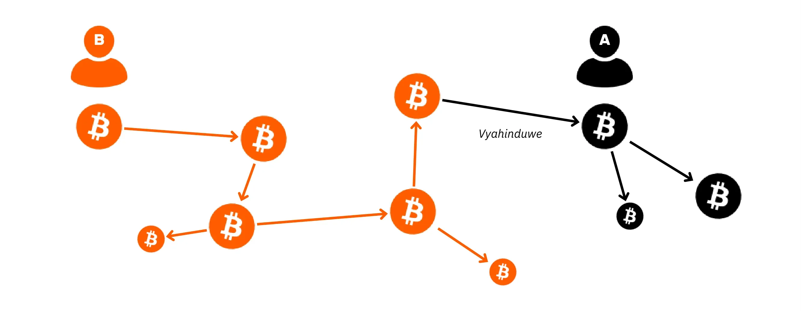


Uvuye ku mbonerahamwe ya Alice, ingorane ni uko amateka ya $B$ Coin yoshobora gufatwa nk’ateye amakenga n’inzego zimwe zimwe. Iyo nk’akarorero Bob aronka $B$ Coin biciye mu gikorwa c’ubugizi bwa nabi nk’ugutera amakuru, Coin yoguma afitaniye isano n’ibikorwa vyiwe bitemewe n’amategeko. Alice rero yari gushobora kwisanga afise Coin atashobora kwimurira ku bibanza vya Exchange bitegekanijwe ataco akora kugira ngo amahera yiwe ahagarikwe, canke mbere akaregwa ivyaha vya Bob, naho ataco yari afise co kubikorako.


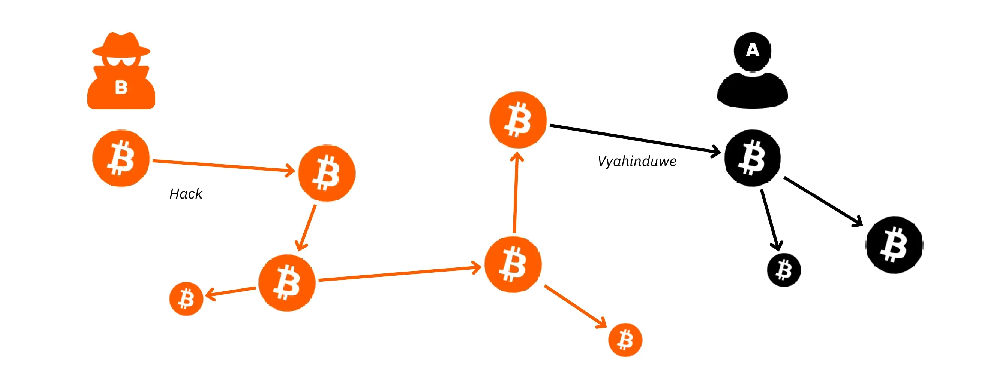


Nta gukeka ko uburyo bwo gukingira ibanga nk’uguhindura amafaranga canke guhindura amafaranga y’atome bushimwa n’abagizi ba nabi amahera yabo ariko aracungerwa n’abategetsi. Ivyo bituma bashobora gukuraho amafaranga yabo y’ibiceri (bitcoins) bariko baracungera muri Exchange kugira ngo bashobore gukuraho amafaranga y’ibiceri vy’agaciro (bitcoins) ashobora guhinduka neza. Bituma kandi bashobora guhingura uburyo bwo guhindura inzira, mu kwerekeza abategetsi ku bandi bakoresha. Rero hariho intumbero zibiri kuri abo bantu.


Na CoinJoin, naho Coin yawe yoba ivanze n’ibice vy’amahera bigenzurwa, amateka ya Coin aravunitse, agatanga uburyo bwo guhakana bushobora kwemerwa butabaho mu mategeko y’ibanga yo gutanga amakuru nk’uguhindura amafaranga canke guhindura amafaranga y’atome.


Niba Alice yipfuza kwirinda ingorane iyo ari yo yose, ategerezwa gukoresha uburyo bwo guca amateka ya $B$ Coin, nk’ukuyica mu coinjoins. Ivyo bivyura ikibazo ku bijanye n’akamaro ko gufatanya uguhererekanya kw’ibanga kwa Ownership na CoinJoin. CoinJoin, mu guca amateka ya Coin, iramaze gutanga urugero ruhagije rw'ibanga kuri Alice. Rero, iciyumviro canje ni uko nimba Alice ariko ararondera kurinda ubuzima bwiwe bwite, vyoba vyiza akoresheje CoinJoin aho guhindura amafaranga akurikiwe na CoinJoin.


Kugira ngo uburyo bwo gutanga amakuru bw’ibanga bwa Ownership bube bwiza vy’ukuri, kandi ntihagire ingorane zo guhuza amateka y’ukoresha $A$ n’ukoresha $B$, vyoba ari ngombwa ko ikoreshwa ryavyo rimenyekana cane. Iyo coinswap ikoreshwa cane kandi abategetsi bakamenya iyo ngeso isanzwe, rero uburyo bwo kwihakana bushobora kwemerwa. Ariko rero, igihe cose ikoreshwa ry’izo nzira zo kwimurira rizoba riri ku ruhande, nibwira ko ubwo buryo buzoguma buteye akaga cane ku bakoresha.


Gushika ubu, ahanini twize uburyo bwo gukingira ibanga ku rugero rw’ibikorwa ubwavyo. Mu gice gikurikira, tuzoba turiko turaraba ibibazo ku rugero rw’urubuga no ku gukwiragiza amafaranga.


## Ubuzima bwite ku rubuga rwa P2P


<chapterId>04a2467b-db84-4076-a9ff-919be5135106</chapterId>


Mu gice ca 4, twavuganye akamaro ko gukoresha urupapuro rwa Full node kugira ngo ukinge ibanga ry’amahera ukoresha. Ariko rero, birahambaye gutahura ko node yawe ubwayo ishobora guterwa n’ibitero birondera gukura amakuru yerekeye ibikorwa vyawe. Muri iki gice rero, turaza kuraba ingingo zitandukanye ushobora gufata kugira ngo ukinge ubuzima bwite bwawe, atari ku rugero rw’ibikorwa ubwavyo canke ivy’imigenderanire ya Bitcoin, ariko ku rugero rw’urubuga.


### Dandelion


Uburyo bumwe bwo kwirinda ibitero bitandukanye vyo gukuraho amazina ni ugukoresha iciyumviro ca Dandelion. Iyi porotokole y'itangazamakuru yashizweho mu BIP156, ariko ntiyigeze ishirwa mu ngiro kuri Bitcoin.


Iciyumviro kiri inyuma ya Dandelion ni ugutuma ibanga ry’inzira y’ubudandaji rigenda neza mu rubuga rwa Bitcoin kugira ngo umuntu arwanye uburyo butandukanye bwo gutera. Intumbero yayo nyamukuru ni uguhisha urudodo rw’inkomoko rwatanguye gutangaza igikorwa ku rubuga. Gutangaza iyo node vyoshobora gutuma bishoboka guhuza igikorwa ca Bitcoin na IP yihariye Address (niba iyo node ikoresha kuri clearnet), ivyo bishobora gutanga ahantu ho kwinjira mu gusesangura uruhererekane.


Iryo shirahamwe hagati y’ibikorwa kuri Bitcoin na IP Address rigereranya ingorane nyinshi ku mabanga y’abakoresha. Nkako, ibigo vyinshi biri mu kibanza co guhuza mu buryo bworoshe IP Address n’akaranga k’umuntu. Muri ivyo harimwo intwaro be n’abatanga ubuhinga bwa Internet. Ikindi, ayo makuru arashobora gushikirwa na bose, nk’akarorero, iyo IP yawe Address n’amakuru yawe bwite bisohotse igihe urutonde rw’amakuru rw’urubuga rwaciwe.


Mu bikorwa vya kera vya Bitcoin, amafaranga yubatswe n’uwukoresha kuri porogarama yiwe ya Wallet arungikwa ku nzira yiwe bwite. Iyi node izoca itangaza iyo nzira nshasha ku bagenzi bose ihuriyeko.


Abo bagenzi baca basuzuma iyo nzira kugira ngo barabe ko ihuye n’amategeko y’uguhuza n’ay’aho hantu. Iyo bimaze kwemezwa, umugenzi wese aca arungikira abo mugenziwe iyo nzira, n’ibindi.


Ukwo gusangira ibikorwa vy’ubudandaji bitegereje gushirwa mu gice kimwe biraringaniye kandi birashobora gutegekanirwa mu buryo bw’imibare. Ubwo bugoyagoye burashobora gukoreshwa n’abafatanyabikorwa b’intsinga, bakorana mu kugenzura no gusuzuma urubuga, kugira ngo bamenye node ya mbere yatangaje igikorwa. Iyo umuntu yihweza ashoboye kumenya aho iyo nzira y’inkomoko iri, arashobora kwiyumvira ko iyo nzira yakomotse ku muntu akoresha iyo nzira. Ubwo bwoko bwo kwihweza burashobora gukoreshwa mu guhuza amafaranga asanzwe atamenyekana n’amaderesi IP yihariye.


Intumbero ya BIP156 ni ugutorera umuti iki kibazo. Kugira ngo ivyo bishoboke, rizana igice c’inyongera mu gukwiragiza igikorwa gishasha kugira ngo umuntu ntamenyekane imbere y’uko gikwiragizwa abantu benshi. Dandelion ibanza gukoresha igice ca "stem" aho igikorwa coherezwa biciye mu nzira y'ibihimba.


Ivyo bica bimenyeshwa ku rubuga rwose mu kiringo ca "Fluff".


Uruti na "Fluff" ni ibimenyetso vyerekana inyifato y'ugukwiragira kw'ibikorwa biciye ku rubuga, bisa n'imiterere n'iterambere ry'igiti c'umukaraba.


Gutyo, ama node y'ubutasi arashobora gukurikirana ivy'ugucuruza gushika ku node yatanguje igice ca "Fluff" (ugutangaza abantu benshi), ariko iyo node si yo yabanje gutangaza ivy'ugucuruza, kuko yayaronse iva ku node ya nyuma y'uruti. Iyo izo nzira z’ubutasi zidashobora gukurikirana uruti, na zo nyene ntizishobora kumenya ingingo y’inkomoko.


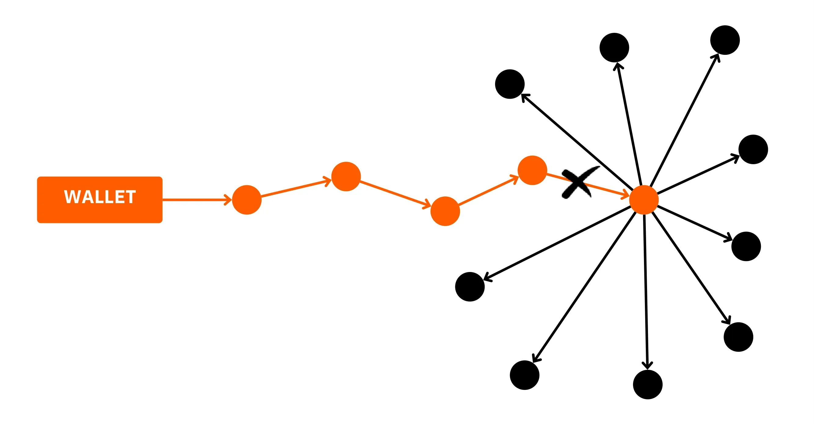


Naho hoba hariho utugingo ngengabuzima tw’ubutasi mu gihe c’igice c’uruti, amakenga yama asigaye, kuko iyo bakimara guhura n’utugingo ngengabuzima tw’ukuri mu gicapo c’ugukwiragira, abatasi ntibashobora kumenya nimba utugingo ngengabuzima ari two tw’intango canke ko ari umuhuza gusa.


Ubwo buryo bwo gutanga inzira buratuma inzira ijana ku nzira y’inkomoko itaboneka neza, bikaba bigoye gukurikirana ivy’ugucuruza biciye ku rubuga gushika aho vyavuye. Dandelion rero iratuma ibanga riguma ryiza mu kugabanya ubushobozi bw’abansi bwo gukuraho izina ry’urubuga. Ubu buryo burakora neza cane iyo, mu gihe c'igice ca "gutera", ugucuruza kujabutse urudodo rupfuka amakuru y'urubuga rwayo, nk'uko biri kuri Tor canke P2P Transport V2.


BIP156 ntiyinjijwe muri Bitcoin core kandi ubu iri mu rwego rwa "wanse". Kimwe mu bihangayikishije cane muri iyi porotokole ni uko, mu kiringo c’uruzi, amafaranga ategerezwa gushikirizwa biciye mu nzira ziri hagati imbere y’uko asuzumwa. Nk’uko twabibonye, ​​mu citegererezo gisanzwe ca Bitcoin, urudodo rumwe rumwe rubanza kugenzura ivy’ugucuruza imbere y’uko rubimenyesha abo mu runganwe rwarwo. Iyo igikorwa kidahuye n’amategeko y’uguhurizako y’uruzitiro canke amategeko y’ugushiraho urugero rw’aho hantu, uruzitiro ruravyirengagiza kandi ntirubitanga. Iyi nzira ni ngirakamaro mu kurwanya ibitero vya DoS, kuko amafaranga gusa afise akamaro arivyo atangazwa ku rubuga rwose. Ibikorwa bitagira akamaro, bishobora guterwa n’abantu benshi kugira ngo birengeje urugero, bihagarara ku nzira ya mbere bihuriyeko kandi ntivyiragira. Ico kibazo gikomeye kiri muri Dandelion ni uko iyo porotokole nshasha yoshobora gushiramwo uburyo bushasha bwo gutera DoS mu kwemera ko amafaranga atagira akamaro atangazwa mu gice cose c’urubuga.


### P2P gutwara V2.


P2P gutwara V2 ni uwundi murongo w'uruja n'uruza rwerekanwa muri BIP324. Ni verisiyo nshasha y’umurongo w’ivy’ugutwara abantu n’ibintu Bitcoin P2P ushiramwo uburyo bwo gupfuka amakuru kugira ngo utere imbere mu bijanye n’ibanga n’umutekano w’ivy’itumanaho hagati y’ibice.


Ivyo bikoresho vy’iterambere bigenewe gutorera umuti ingorane nyinshi zijanye n’umurongo w’ishimikiro w’umurongo wa P2P. Ku ruhande rumwe, bituma amakuru ahindurwa adashobora gutandukanywa n’ubundi bwoko bw’amakuru agendagenda kuri Internet ku muntu yihweza ataco akora. Intumbero ihambaye ni ukubuza intwaro, aba ISP n’abatanga VPN gukurikirana cane abakoresha Bitcoin. Ivyo kandi bituma ivyo bigo bigorana kumenya nimba uwukoresha Internet na we nyene ari umukoresha wa Bitcoin, ni ukuvuga nimba akoresha Full node.


P2P V2 kandi ifasha kugabanya ingorane zo gucengera no gutera mu kumenya uburyo bwihariye buri mu mapakete y’amakuru. Bigorana kandi bikaba bituma gukora ubwoko butandukanye bw’ibitero vya Sybil ku rugero rw’urubuga bihenda cane. Sybil Attack ibaho iyo umukinyi aremye ibimenyetso vyinshi vy’ikinyoma kugira ngo aronke inyungu idakwiriye. Mu bijanye n’urubuga rwa Bitcoin, ivyo akenshi vyerekana nk’umukinyi agenzura umubare munini w’ibihimba vyuzuye kandi akabikoresha n’ubukazi kugira ngo agwize amahuzu. Ibitero vya Sybil bishobora kuba bitagira ico bikora, vyo kwegeranya amakuru no guhungabanya ibanga ry’abakoresha, canke bikora, mu buryo bw’ibitero vya Eclipse. Ivyo vya nyuma bitandukanya urudodo runaka n’ibindi bice vy’urubuga, bikaba bishobora gucengera uwubikoresha canke bikahindura amakuru bironka. Ubwa nyuma, P2P V2 nayo ituma ibitero vya *Umuntu-mu-Hagati* (MITM) bizimvye kandi vyoroshe kumenya.


Ugupfuka gushirwa mu ngiro na P2P V2 ntikurimwo kwemeza, kugira ngo wirinde kwongerako ibintu bidakenewe canke guhungabanya ikintu kitagira uruhusha c’ihuriro ry’urubuga. Naho biri ukwo, iyo nzira nshasha yo gutwara abantu n’ibintu P2P itanga umutekano mwiza ku bitero bitagira ico bikora, kandi ituma ibitero bikora bihenda cane kandi bikaba bishobora kumenyekana. Gushiramwo amakuru y’ibinyoma mu butumwa bwo ku rubuga bituma bigorana cane ko abatera bashobora gucengera canke gukoresha nabi ivy’itumanaho.


P2P V2 transport yashizwemwo nk'uburyo (buzimye ku buryo busanzwe) muri Bitcoin core verisiyo 26.0, yashizweho mu kwezi kwa kigarama 2023. Yaciye ikoreshwa ku buryo busanzwe muri verisiyo 27.0 yo muri Ndamukiza 2024. Ishobora guhindurwa n'uburyo bwo guhitamwo dosiye `v2transport=` mu gutunganya.


### Tor


Ikindi gisubizo coroshe co kwirinda ingorane zo gutakaza ibanga ry’uruzitiro rw’urubuga ni ukurukoresha rwose munsi ya Tor.


Tor ni urusobe rw’ibikoresho vy’ugutanga amakuru (nodes) bitangaza inkomoko y’amahuza ya TCP kuri Internet. Ikora mu gushiramwo amakuru mu bice vyinshi vy’ubuhinga bwo gupfuka. Buri nzira y’ugutanga amakuru ikuraho Layer kugira ngo ihishure Address y’inzira ikurikira, gushika iyo nzira ya nyuma ishitse. Urubuga rwa Tor ruratuma umuntu atamenyekana mu kubuza ko ama node y’ubuhuza amenya inkomoko y’amakuru n’aho aja, ivyo bikaba bituma bigorana cane ko uwuriko arabibona akurikirana igikorwa c’uwukoresha.


Tor ntiyipfuza gusa amakuru, ariko kandi ipfuka inkomoko n’aho ivy’itumanaho bishika. Mu gukoresha Tor ku bijanye n'itumanaho rivuye ku nzira yawe bwite, ukomeza ibanga ry'ibikorwa vyawe: ISP yawe ntishobora gusobanura amakuru, kandi izindi nzira ziri mu rubuga rwa Bitcoin ntizishobora kumenya IP y'inzira y'inkomoko Address. Ikindi, Tor nayo ihisha uko ukoresha Bitcoin kuri ISP yawe.


Ico kibazo gikomeye muri ubu buryo ni uko Tor ari porotokole yigenga kuri Bitcoin. Niba ufise node ya Bitcoin ikora munsi ya Tor maze Tor igahagarika gukora, rero node yawe ya Bitcoin ntizosubira gushobora kuvugana.


Kandi, birahambaye kumenya ko ivy’uguhanahana amakuru kuri Tor bigenda buhoro. Ivyo bitera ubwoba cane cane mu gihe c’ugutangura kw’urudodo, kuko IBD (*Initial Block Download*) isaba guhanahana amakuru menshi. Ivyo vyatumye, uguhuza kwawe kwa mbere n’urubuga rwa Bitcoin bishobora gutwara igihe kirekire cane ukoresheje Tor. Birashoboka kandi gukora IBD kuri clearnet, hanyuma ugakoresha Tor nk'intambwe ya kabiri. Naho ubu buryo bumenyesha ISP yawe ukubaho kw’uruzitiro rwawe rwa Bitcoin, burakingira amakuru yawe bwite y’ugucuruza iyo umaze guhindukira ukaja kuri Tor.


Maze gutohoza uburyo butandukanye bwo gukingira ibanga ku rugero rw’urubuga, mu bice bikeyi bikurikira ndashaka kandi kubamenyesha inyishu zibiri nziza zo kwirinda gusubira gukoresha Address: BIP47 na Silent Payments.


## BIP47 na kode zo kwishura zishobora gusubirwamwo


<chapterId>ad88e076-a04b-4aec-b3b2-7b4760175504</chapterId>


Nk’uko twabibonye mu gice ca 3, gusubira gukoresha Address ni intambamyi ikomeye ku mabanga y’abakoresha ku masezerano ya Bitcoin. Kugira ngo ivyo bibazo bigabanywe, biraremeshwa cane ko generate igira Address ku giciro gishasha cose yaronse muri Wallet. Naho guhingura Address nshasha ubu vyoroshe kubera gukoresha porogarama za none be n’amasakoshi y’ubukuru, iyo ngeso yoshobora gusa n’iyiteye kubiri n’ubwenge.


Nk’akarorero, mu bijanye n’amabanki ya kera, twamenyereye gusangira IBAN yacu, ikaba yama ari imwe. Iyo tumaze kuyiha umuntu, arashobora kudurungikira amahera menshi ataco asubiye gukorana natwe. Neo-banks na zo zitanga uburyo bushasha, nk’ugukoresha ama email yihariye kuri PayPal canke RevTags kuri Revolut. Mbere no hanze y’ivy’amahera, ibimenyetso vyacu vya misi yose nk’iposita Address, inomero ya telefone n’iposita Address na vyo nyene ni ibidasanzwe kandi bihoraho. Ntidutegerezwa kubisubiramwo ku bijanye n’ugukorana gushasha kwose.


Ariko rero, Bitcoin ikora mu buryo butandukanye: Address nshasha yakira itegerezwa guterwa ku bijanye n’ugucuruza kwose kwinjira. Ukwo gusenyera ku mugozi umwe hagati y’ukworohereza gukoresha n’ugukingira ibanga gusubira mu ntango nyene y’Igitabu Cera ca Bitcoin. Igihe nyene igitabu ciwe ca mbere casohorwa mu mpera z’umwaka w’2008, Satoshi Nakamoto yari amaze kutugabisha ku bijanye n’ico kigeragezo:


**Nk'uruhome rw'umuriro rw'inyongera, urufunguzo rushasha rwoshobora gukoreshwa ku bikorwa vyose kugira ngo bigume bitahuye n'uwubifise**


Hari uburyo bwinshi bwo kwakira amahera menshi ku kimenyetso kimwe ataco ukeneye gusubira gukoresha Address. Imwe yose irafise ivyo ishobora gukora n’ivyo ikora. Muri ubwo buryo harimwo BIP47, igitekerezo categuwe na Justus Ranvier kigasohoka mu 2015. Ico ciyumviro kigamije guhingura amakode y’ukwishura ashobora gusubirwamwo atuma umuntu ashobora gukoresha amafaranga menshi ku muntu umwe, mu gihe umuntu yirinda gusubira gukoresha Address. Muri make, BIP47 ifise intumbero yo gutanga uburyo bwo kwishura busanzwe nk’ikimenyetso kidasanzwe, mu gihe nyene izigama ibanga ry’ibikorwa.


BIP47 ntituma ibanga ry’abakoresha ritera imbere, kuko ukwishura kwa BIP47 gutanga urugero rumwe rw’ibanga nk’ugukoresha kwa kera kwa Bitcoin hakoreshejwe aderesi zitagira ikintu. Ariko rero, biratuma gukoresha Bitcoin biba vyiza kandi bikaba vyoroshe gutahura, ivyo bikaba ari ukworohera mu bisanzwe vyotuma umuntu adashobora gukoresha ibanga. Kubera BIP47, ukwo gukoresha kworoshe kurashika ku rugero rumwe rw’ibanga nk’iry’ugucuruza kwa kera. Ni co gituma BIP47 ari igikoresho c’agaciro cane co kuzigama ubuzima bwite.


Mu ntango, BIP47 yari yasabwe ko yoshirwa muri Bitcoin core, ariko ntiyigeze ishirwa mu ngiro. Ariko rero, hariho porogarama zimwezimwe zahisemwo kubishira mu ngiro ku giti cabo. Nk'akarorero, amashirahamwe ya Samourai Wallet yarateguye uburyo bwayo bwite bwo gushitsa BIP47 bwitwa "PayNym".


### Ingingo rusangi ya BIP47 na PayNym


Intumbero ya BIP47 ni ugutuma umuntu ashobora kwakira amahera menshi ataco asubira gukoresha amaderesi. Ishingiye ku gukoresha kode yo kwishura ishobora gusubirwamwo, ivyo bikaba bituma abatanga amafaranga batandukanye bohereza amafaranga menshi kuri kode imwe y’uwundi muntu. Ivyo bituma uwuronka iyo mpapuro adategerezwa gutanga urupapuro rushasha rwa Address rudafise ikintu ku kintu cose akora, ivyo bikaba bituma umuntu ashobora guhanahana amakuru mu gihe aguma afise ibanga.


Uwukoresha rero arashobora gusangira kode yiwe yo kwishura mu mwidegemvyo wose, haba ku mbuga ngurukanabumenyi canke ku rubuga rwiwe, ata ngorane yo gutakaza ibanga, bitandukanye n’uko umuntu asanzwe yakira Address canke urufunguzo rwa bose.


Kugira ngo ukore igikorwa, abo bompi barakeneye Bitcoin Wallet n'ugushirwa mu ngiro kwa BIP47, nka PayNym kuri Samurai Wallet canke Sparrow wallet. Gukoresha hamwe amakode yabo yo kwishura biratuma haba umurongo w’ibanga hagati yabo. Kugira ngo uwo muhora ushireho neza, uwuwutanga ategerezwa gukora igikorwa kidasanzwe ku Bitcoin Blockchain, kizwi kw'izina rya "igikorwa co kumenyesha" (ibindi kuri ivyo bizokurikira).


Gufatanya amakode y’ukwishura y’abo babiri bakoresha bituma haba amabanga asangiye, ivyo na vyo bikaba bituma haba umubare munini w’amaderesi yihariye y’ukwakira Bitcoin (2^32 nyavyo, canke nk’imiliyaridi 4). Muri ubwo buryo, amahera yishurwa biciye kuri BIP47 ntabwo mu vy’ukuri arungikwa kuri kode y’ukwishura ubwayo, ahubwo arungikwa ku maderesi ya kera y’ukwakira akomoka ku makode y’ukwishura y’abakoresha bari muri iyo nzira.


Kode y’ukwishura rero ikora nk’ikimenyetso c’ukuri kiva kuri Wallet seed. Mu nzira y’ubukuru bwa Wallet, kode y’ukwishura ishirwa ku rugero rwa 3, ni ukuvuga ku rugero rwa konti.


Intumbero y'ivya BIP47 igaragazwa n'urutonde `47'` (`0x8000002F`), yerekeza kuri BIP47. Akarorero k'inzira y'ugukomoka kuri kode y'ukwishyura ishobora gusubirwamwo yoba aka:


```plaintext
m/47'/0'/0'/
```


Kugira ngo ubone iciyumviro c'uko kode yo kwishura isa, ng'iyi iyanje:


```plaintext
PM8TJSBiQmNQDwTogMAbyqJe2PE2kQXjtgh88MRTxsrnHC8zpEtJ8j7Aj628oUFk8X6P5rJ7P5qDudE4Hwq9JXSRzGcZJbdJAjM9oVQ1UKU5j2nr7VR5
```


Iyi kode irashobora kandi gukoreshwa nk’ikode ya QR, kugira ngo yorohe kuvugana, nk’uko nyene bigenda ku nzira isanzwe yo kwakira abantu Address.


Naho ku bijanye na PayNym Bots, amaroboti rimwe na rimwe abonwa kuri Twitter, ayo ni amashusho yerekana kode y’ukwishyura, yaremwe na Samourai Wallet. Bivugwa hakoreshejwe igikorwa ca Hash, bikabiha hafi-ubudasa. Bifata uburyo bw'urudodo ruto rw'inyuguti rutangura na `+`:


```plaintext
+throbbingpond8B1
+twilightresonance487
+billowingfire340
```


Izo avatars zishobora kandi guserurwa nk'amashusho:


Naho izo robo zitagira ubuhinga bwihariye mu rwego rwa BIP47, zirafise uruhara mu kworohereza abakoresha gukorana n’abandi mu gutanga akaranga k’amaso kamenyekana bitagoranye.


---
*Mu bice bikurikira vy’iki gice vyerekeye BIP47, tuzokwihweza mu buryo burambuye ingene ikora, dushimikiye cane cane ku buryo bwo gukora amakuru y’ibanga bukoreshwa. Kugira ngo utahure neza izo nsobanuro zimwe zimwe z’ubuhinga, birakenewe ko ubanza gutahura imiterere y’amasakoshi ya HD, uburyo bwo gukuraho amakuru n’ivy’ishimikiro vy’ubuhinga bwo gukingira amakuru. Niba wifuza kwihweza cane ivyo vyiyumviro, hariho irindi nyigisho ry’ubuntu kuri Plan ₿ Network:*


https://planb.network/courses/46b0ced2-9028-4a61-8fbc-3b005ee8d70f

*Nzoguma ndaguhanura ngo ubikurikize, kuko gutahura ubuhinga bwa BIP47 bizokworohera cane gutahura ibindi vyiyumviro bisa n'ivyo, ivyo tuzobivugako mu bice bikurikira*


---
### Kode yo kwishura ishobora gusubirwamwo


Nk’uko twabibonye, ​​kode yo kwishura ishobora gusubirwamwo iri ku burebure bwa 3 bwa HD Wallet, bikaba bituma igereranywa na `xpub`, haba mu bijanye n’aho iri mu mibumbe ya Wallet be n’uruhara rwayo.


Kode y’ukwishura y’ama byte 80 igabanywa gutya:


- Byte `0`: **Verisiyo**. Ku verisiyo ya mbere ya BIP47, iyi byte iteguwe kuri `0x01`;
- Byte `1`: Umurima w'ibice. Ico kibanza cagenewe gushiramwo ibindi bimenyetso vy'ikoreshwa ry'ibintu vyihariye. Ku gukoresha PayNym ya kera, iyi byte iteguwe kuri `0x00`;
- Byte `2`: Uburinganire bwa `y`. Iyi byte ni `0x02` canke `0x03`, yerekana nimba ordinate y'urufunguzo rwa bose ari umubare canke udasanzwe, nk'uko urufunguzo rwa bose rukoreshwa;
- Kuva kuri byte `3` gushika kuri byte `34`: Agaciro ka **x**. Izo bytes zigereranya abscisse y'urufunguzo rwa bose. Ihuriro rya `x` n'uburinganire bwa `y` bikora urufunguzo rwa bose rwuzuye;
- Kuva kuri byte `35` gushika kuri byte `66`: **Kode y'urudodo**. Ico kibanza kirimwo kode y'urudodo ifatanye n'urufunguzo rwa bose;
- Kuva kuri byte `67` gushika kuri byte `79`: Ivyo gushiramwo. Ico kibanza kigenewe amahinduka ashobora kubaho muri kazoza. Ku bijanye n'ubu, dushira gusa zero hano kugira ngo tugere ku bunini bwa 80-byte busabwa ku gisohoka ca `OP_RETURN`.


Aha niho hari igishushanyo c'icumi na gatandatu c'itegeko ryanje ryo kwishura rishobora gusubirwamwo ryaramaze gushikirizwa mu gice c'imbere:


```plaintext
0x010002a0716529bae6b36c5c9aa518a52f9c828b46ad8d907747f0d09dcd4d9a39e97c3c5f37c470c390d842f364086362f6122f412e2b0c7e7fc6e32287e364a7a36a00000000000000000000000000
```


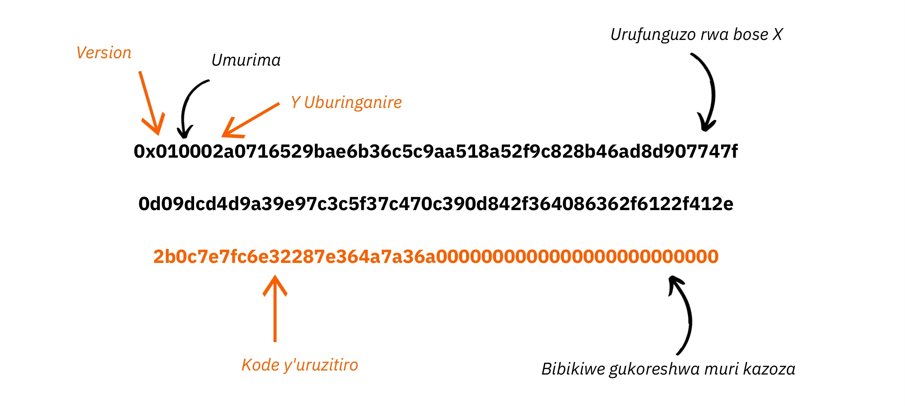


Igikurikira, `P` prefix byte itegerezwa kwongerwa mu ntango kugira ngo yerekane neza ko iyo ari kode yo kwishura. Iyi byte igereranywa na `0x47`:


```plaintext
0x47010002a0716529bae6b36c5c9aa518a52f9c828b46ad8d907747f0d09dcd4d9a39e97c3c5f37c470c390d842f364086362f6122f412e2b0c7e7fc6e32287e364a7a36a00000000000000000000000000
```


Ubwa nyuma, kugira ngo haboneke ubutungane bwa kode y’ukwishyura, ibara ry’isuzuma rikorwa hakoreshejwe `HASH256`, rigizwe na Hash ibiri hakoreshejwe igikorwa ca `SHA256`. Bytes zine za mbere z’iyi Hash zica zifatanywa ku mpera y’itegeko ry’ukwishyura:


```plaintext
0x47010002a0716529bae6b36c5c9aa518a52f9c828b46ad8d907747f0d09dcd4d9a39e97c3c5f37c470c390d842f364086362f6122f412e2b0c7e7fc6e32287e364a7a36a00000000000000000000000000567080c4
```


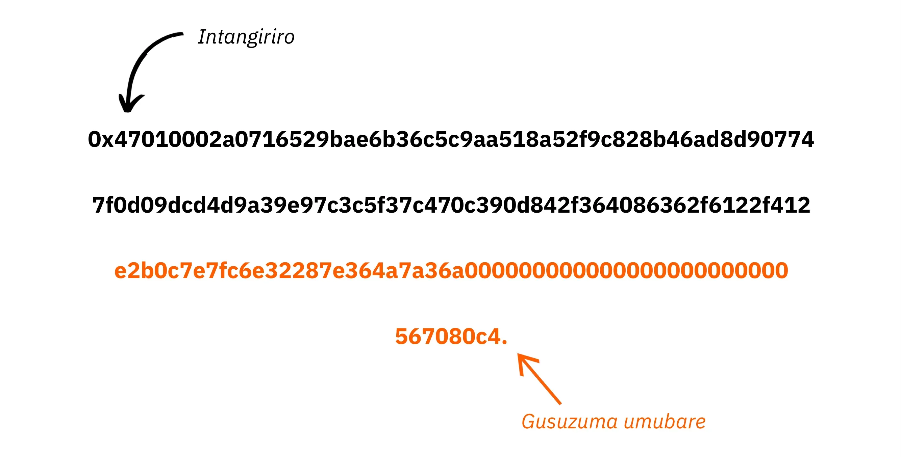


Izo ntambwe zimaze kurangira, kode yo kwishura irategurwa. Igisigaye ni ukuyihindura ngo ibe base 58 kugira ngo ubone verisiyo ya nyuma:


```plaintext
PM8TJSBiQmNQDwTogMAbyqJe2PE2kQXjtgh88MRTxsrnHC8zpEtJ8j7Aj628oUFk8X6P5rJ7P5qDudE4Hwq9JXSRzGcZJbdJAjM9oVQ1UKU5j2nr7VR5
```


Mu gihe co kurema kode y’ukwishyura, dukoresha urufunguzo rwa bose rwuzuye n’ikode y’urudodo. Ivyo vyose bikomoka ku buryo butegekanijwe n'uburongozi bwa Wallet seed. Inzira y’ugukura ikoreshwa kugira ngo ivyo bishoboke ni:


```plaintext
m/47'/0'/0'/
```


Mu majambo nyayo, ku generate urufunguzo rwa bose rwashizwemwo n'urudodo rujanye n'urufunguzo rwo kwishura rushobora gusubirwamwo, dutangura mu kubara urufunguzo rw'ibanga rwa Wallet seed. Turaheza tukabandanya gukuraho imfunguruzo z’abakobwa zibiri dukoresheje urutonde `47 + 2^31` (ugukuraho gukomeye). Ivyo bikurikirwa n’ibindi bibiri bikurikirana vy’abakobwa babiri, umwe wese akoresha urutonde `2^31` (inkomoko ikomeye).


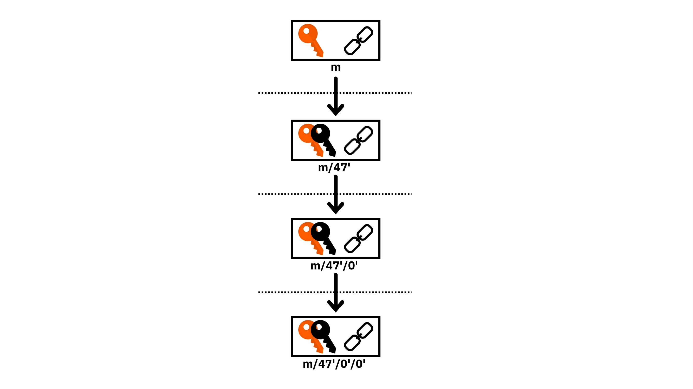


### Urufunguzo rwa Diffie-Hellman Exchange ku mirongo y'uruzitiro (ECDH)


Itegeko ry’ubuhinga bwa none riri mu mutima wa BIP47 rizwi n’ijambo ry’inyongera ECDH, risobanura *Diffie-Hellman*. Ubu buryo ni ubundi buryo bw'urufunguzo rwa Diffie-Hellman Exchange.


Diffie-Hellman yashizweho mu 1976, ni umurongo w’amasezerano y’ingenzi ushoboza imigwi ibiri, umwe wese afise ivyuma bibiri vy’ingenzi (ivya bose n’ivy’abikorera ku giti cabo), kwemeranya ku ibanga rusangi, mbere n’igihe bavugana gusa biciye ku nzira ya bose, idatekanye.


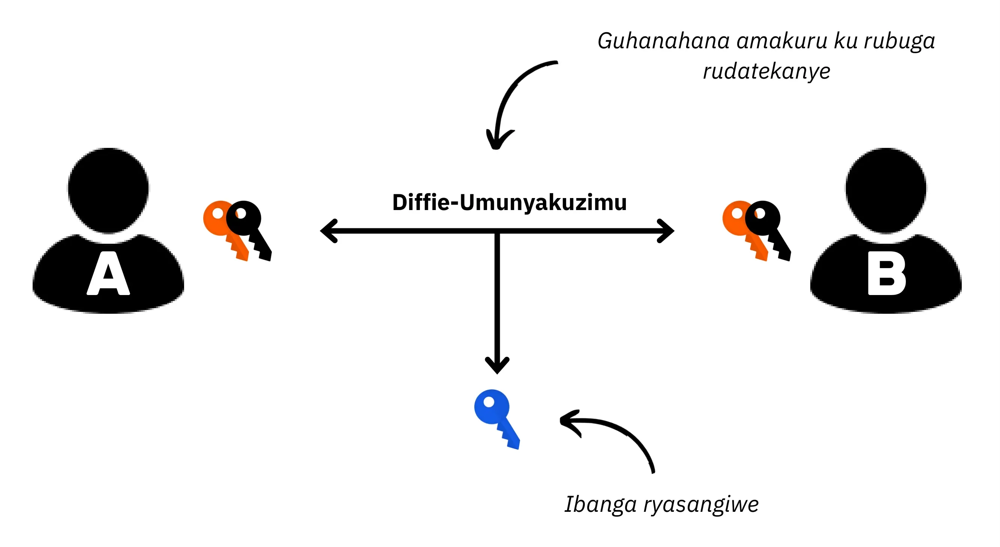


Iryo banga ry’abantu bose (muri iki gihe, urufunguzo rw’ubururu) rirashobora rero gukoreshwa mu bindi bikorwa. Mu bisanzwe, iri banga rishobora gukoreshwa mu gupfuka no gukuraho ubutumwa ku rubuga rudatekanye:


Kugira ngo ivyo bishoboke, Diffie-Hellman akoresha imibare y’ibice kugira ngo abare ibanga ry’abantu bose. Ehe ingene bikora mu majambo y'abanyabwenge:


- Alice na Bob bemeranya ibara rimwe, muri iki gihe umuhondo, ari ryo makuru ya bose (abatera barazi iryo bara);
- Alice ihitamwo ibara ry’ibanga, muri iki gihe umutuku, maze ikavanga ivyo bibiri kugira ngo ibone ibara ry’umuhondo;
- Bob na yo ihitamwo ibara ry’ibanga, muri iki gihe ubururu, ikarivanga n’umuhondo kugira ngo ibone Green;
- Baca Exchange amabara avuyemwo, umuhondo na Green. Iyi Exchange ishobora kuba ku rubuga rudatekanye kandi ikabonwa n’abatera;
- Mu kuvanga Green ya Bob n’ibara ryiwe bwite ry’ibanga, Alice iratanga ibara ry’inzobe;
- Bob, ikora nk’ukwo nyene n’ibara ry’umuhondo n’ubururu bw’ibanga rya Alice, na yo nyene ironka ibara ry’umuhondo.


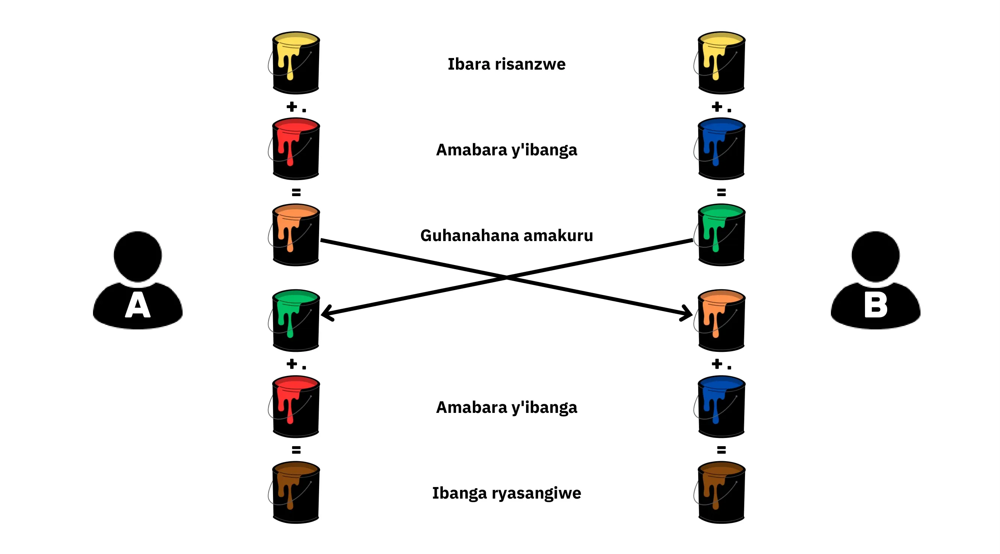


Muri iki kigereranyo, ibara ry’umuhondo rigereranya ibanga risangiye na Alice na Bob. Ibaze ko, mu vy’ukuri, bidashoboka ko uwutera atandukanya amabara y’umuhondo n’aya Green, kugira ngo aronke amabara y’ibanga ya Alice canke ya Bob.


None rero reka turabe ingene iyo porotokole ikora mu vy’ukuri, atari n’ibigereranyo vy’amabara, ahubwo dukoresheje imibare nyayo n’imibare y’ibice!


Imbere y’uko twinjira mu buryo bwa Diffie-Hellman, reka mbibutse muri make ivyiyumviro bibiri vy’ingenzi vy’imibare tuzokenera:


- **Umubare w'intango** ni umubare kavukire ufise ibigabanywa bibiri gusa: $1$ na wo nyene. Nk’akarorero, $7$ ni umubare w’intango kuko ushobora kugabanywa gusa na $1$ na $7$. Ku rundi ruhande, $8$ si umubare w’intango, kuko ugabanywa na $1$, $2$, $4$ na $8$. Ifise rero ibice bine vy’imibare yose y’agaciro aho kugira bibiri;
- **modulo** (ivugwa ko $mod$ canke $\%$) ni igikorwa c'imibare, hagati y'imibare ibiri yose, kigarura igice gisigaye c'ugucapura kwa Euclide kw'uwa mbere n'uwa kabiri. Nk’akarorero, amadolari 16\bmod 5 = amadolari 1.


**Urufunguzo rwa Diffie-Hellman Exchange hagati ya Alice na Bob rubera gutya:**


- Alice na Bob bemeranya ku mibare ibiri rusangi: $p$ na $g$. $p$ ni umubare w'intango, kandi uko umubare uba munini niko Diffie-Hellman azoba afise umutekano mwinshi. $g$ ni umuzi w'intango wa $p$. Izo nimero zibiri zishobora kumenyeshwa mu buryo butomoye ku rubuga rudatekanye. Bigereranya ikingana n’**ibara ry’umuhondo** mu kigereranyo c’imbere. Ni ngombwa rero ko Alice na Bob zikoresha neza na neza agaciro kamwe ku $p$ na $g$.
- Ivyo bipimo bimaze gusobanurwamwo, Alice na Bob umwe wese ahitamwo umubare w’ibanga w’imburakimazi. Alice yita umubare wiwe w’ibanga $a$ (ungana n’**ibara ry’umutuku**) na Bob yita $b$ yiwe (ingana n’**ibara ry’ubururu**). Ivyo biharuro bitegerezwa kuguma ari ibanga.
- Aho guhinduranya ataco bimaze imibare $a$ na $b$, buri ruhande ruharura $A$ na $B$ nk’uko bikurikira:


$A$ ingana na $g$ yaduzwe ku nguvu $a$ modulo $p$:


$$
A = g^a \bmod p
$$


$B$ ingana na $g$ yaduzwe ku bushobozi $b$ modulo $p$:


$$
B = g^b \bmod p
$$


- Ivyiyumviro $A$ (bingana n’**ibara ry’umuhondo**) na $B$ (bingana n’**ibara ry’umuhondo Green**) birahindurwa hagati y’izo mpande zibiri. Iyi Exchange ishobora kuba mu nyandiko zitomoye ku rubuga rudatekanye;
- Alice, amaze kwakira $B$, abara agaciro ka $z$ nk’uko bikurikira:


$z$ ingana na $B$ yaduzwe ku bushobozi $a$ modulo $p$:


$$
z = B^a \bmod p
$$


Iciyumviro:


$$
B = g^b \bmod p
$$


Inyishu ni:


$$
z = B^a \bmod p
$$


$$
z = (g^b)^a \bmod p
$$


Mu gukurikiza amategeko y’ububasha:


$$
(x^n)^m = x^{nm}
$$


Inyishu ni:


$$
z = g^{ba} \bmod p
$$


- Ku ruhande rwiwe, Bob, amaze kwakira $A$, na we nyene abara agaciro ka $z$ nk’uko bikurikira:


$z$ ingana na $A$ yaduzwe ku bushobozi $b$ modulo $p$:


$$
z = A^b \bmod p
$$


Inyishu ni:


$$
z = (g^a)^b \bmod p
$$


$$
z = g^{ab} \bmod p
$$


$$
z = g^{ba} \bmod p
$$


Kubera ugusangira kw’umukoresha wa modulo, Alice na Bob zironka agaciro kamwe nyene $z$. Uwo mubare ugereranya ibanga ryabo rusangi, ringana n’**ibara ry’umuhondo** mu kigereranyo ca mbere c’ibibindi vy’irangi. Ubu barashobora gukoresha iryo banga rusangi kugira ngo bashire mu buryo bubereye amakuru yabo ku rubuga rudatekanye.


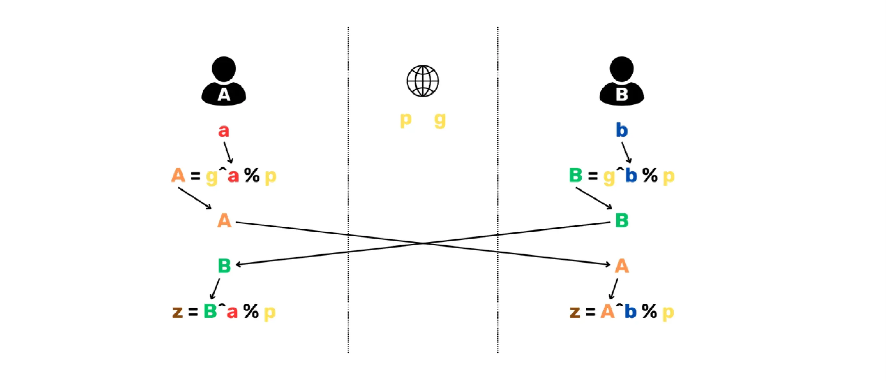


Umuntu atera, mbere yoba afise $p$, $g$, $A$ na $B$ (agaciro ka bose), ntazoshobora kubara $a$, $b$ canke $z$ (agaciro k’ibanga). Kugira ngo ivyo bishoboke, igiharuro cobaye gisubirwamwo, igikorwa kidashoboka ata kugerageza ubushobozi bwose bumwe bumwe, kuko bingana no kubara logarithme itandukanye, ni ukuvuga igiharuro c’igiharuro mu mugwi w’inzinguzingu zifise impera.


Rero, igihe cose agaciro ka $a$, $b$ na $p$ ari kanini bihagije, umurongo wa Diffie-Hellman uratekanye. Mu bisanzwe, n'ibipimo vy'ibice 2048 (umubare w'imirongo 600), kugerageza ubushobozi bwose bwa $a$ na $b$ ntivyoba ari vyiza. Kugeza ubu, n’imibare nk’iyo, iyo algorithme ifatwa ko itekanye.


Aha ni ho hari ikibazo nyamukuru c’amasezerano ya Diffie-Hellman. Kugira ngo iyo algorithme ibe itekanye, itegerezwa gukoresha imibare myinshi. Ni co gituma, muri iyi misi, duhitamwo gukoresha ubuhinga bwa ECDH (*Elliptic Curve Diffie-Hellman*), ubuhinga butandukanye bwa Diffie-Hellman bushingiye ku nzira y’ubuhinga bw’ubuhinga, cane cane ubuhinga bw’ubuhinga bw’ubuhinga bw’ubuhinga bw’ubuhinga. Ubwo buryo buratuma umuntu ashobora gukorana n’imibare mike cane mu gihe aguma afise umutekano ungana, gutyo akagabanya ibikoresho bisabwa kugira ngo umuntu aharure no kubika.


Ingingo rusangi y’ubuhinga bwa algorithme iguma ari imwe. Ariko rero, aho gukoresha umubare w’imburakimazi $a$ n’umubare $A$ ubazwe uhereye kuri $a$ biciye ku nzira y’ugutera imbere kw’ibice, dukoresha imfunguruzo zibiri zishingiye ku nzira y’uruzitiro. Aho kwizigira ugusangira kw’umukoresha wa modulo, dukoresha itegeko ry’umugwi ku mirongo y’imirongo, kandi cane cane umutungo w’ubufatanye.


Kugira ngo dusigure muri make ingingo ngenderwako y’ubuhinga bwo gukingira amakuru ku bigobe vy’uruzitiro, urufunguzo rw’ibanga rugereranywa n’umubare w’imburakimazi uri hagati ya $1$ na $n-1$, aho $n$ igereranya urutonde rw’ibigobe. Urufunguzo rwa bose, ku rundi ruhande, ni akarongo kadasanzwe kuri iyi nzira, karonswa ku rufunguzo rw’ibanga mu kwongerako no gukubita kabiri uturongo tuva ku ntumbero y’ugutanga, hakurikijwe ingano:


$$
K = k \cdot G
$$


Muri iyi formule, $K$ yerekana urufunguzo rwa bose, $k$ urufunguzo rw'ibanga, na $G$ yerekana urufunguzo rw'umuyagankuba.


Ikintu nyamukuru kiranga izo mfunguruzo ni uko $K$ ishobora kubarwa mu buryo bworoshe kuva kuri $k$ na $G$, mu gihe hafi bidashoboka ko umuntu aronka $k$ kuva kuri $K$ na $G$. Ukwo kudahuza kurema igikorwa c’inzira imwe. Mu yandi majambo, biroroshe kubara urufunguzo rwa bose iyo uzi urufunguzo rw’ibanga, ariko gukura urufunguzo rw’ibanga mu rufunguzo rwa bose ntibishoboka. Uwo mutekano urashigikirwa kandi n’ingorane zo guharura z’ibarabara ry’ibarabara ry’ibarabara ry’ibarabara.


Tuzokoresha iyi nzira kugira ngo duhuze n'ubuhinga bwacu bwa Diffie-Hellman. **Ingingo ngenderwako y'imikorere ya ECDH ni iyi:**


- Alice na Bob bemeranya ku bijanye n’umurongo w’uruzitiro rw’uruzitiro rutekanye mu buryo bw’ubuhinga bw’ibanga n’imirongo yarwo. Aya makuru ni aya bose;
- Alice itanga umubare w'imburakimazi $ka$ uzoba urufunguzo rwiwe rw'ibanga. Urufunguzo rw’ibanga rutegerezwa kuguma ari ibanga. Amenya urufunguzo rwiwe rwa bose $Ka$ mu kwongerako no gukubita kabiri uturongo ku nzira y'uruzitiro yatowe:


$$
K_a = k_a \cdot G
$$


- Bob nayo itanga umubare w'imburakimazi $kb$, uzoba urufunguzo rwiwe rw'ibanga. Araharura urufunguzo rwa bose rujanye n'ivyo $Kb$:


$$
K_b = k_b \cdot G
$$


- Alice na Bob Exchange imfunguruzo zabo za bose $Ka$ na $Kb$ ku rubuga rwa bose rudatekanye.
- Alice ibara akarongo $(x,y)$ ku nzira y'umurongo ikoresheje urufunguzo rwiwe rw'ibanga $ka$ ku rufunguzo rwa bose rwa Bob $Kb$:


$$
(x,y) = k_a \cdot K_b
$$


- Bob abara akarongo $(x,y)$ ku nzira y'umurongo akoresheje urufunguzo rwiwe rw'ibanga $kb$ ku rufunguzo rwa bose rwa Alice $Ka$:


$$
(x,y) = k_b \cdot K_a
$$


- Alice na Bob zironka akarongo kamwe ku nzira y’umurongo w’uruzitiro. Ibanga ry’abantu bose rizoba ari abscisse $x$ y’iyi nkuru.


Baronka ibanga rimwe basangiye kuko:


$$
(x,y) = k_a \cdot K_b = k_a \cdot (k_b \cdot G) = (k_a \cdot k_b) \cdot G = (k_b \cdot k_a) \cdot G = k_b \cdot (k_a \cdot G) = k_b \cdot K_a
$$


Umuntu ashobora gutera ariko arabona urubuga rwa bose rudatekanye azoshobora gusa kuronka imfunguruzo za bose z’umuntu wese n’ibipimo vy’umurongo w’uruzitiro rwatowe. Nk’uko vyasiguwe haruguru, ayo makuru yonyene ntahagije kugira ngo umuntu amenye imfunguruzo z’ibanga. Ku bw’ivyo, uwutera ntashobora kuronka ibanga ry’abasangiye hagati ya Alice na Bob.


ECDH rero ni urufunguruzo rwa Exchange. Akenshi ikoreshwa hamwe n’ubundi buryo bwo gukora amakuru y’ibanga kugira ngo haboneke umurongo wuzuye. Nk'akarorero, ECDH iri mu mutima wa TLS (*Umutekano w'Ivy'Itwara Layer*), ubuhinga bwo gupfuka no kwemeza ko ari ukuri bukoreshwa mu gutwara abantu kuri Internet Layer. TLS ikoresha ECDHE ku rufunguzo Exchange, uburyo butandukanye bwa ECDH aho urufunguzo rumara igihe gito, kugira ngo rutange ibanga ridahera. Ikindi, TLS ikoresha ubuhinga bwo kwemeza nk'uko ECDSA, ubuhinga bwo gupfuka nk'uko AES, n'imikorere ya Hash nka SHA256.


TLS ni yo ishinzwe `s` muri `https` n'urufunguzo ruri mu mucukumbuzi wawe Address bar - ibimenyetso vy'itumanaho ry'ibanga. Mu gufata iri shure, uzoba uriko urakoresha ECDH, kandi birashoboka cane ko uzoba uriko urakoresha ku musi ku musi mbere utazi.


### Itangazo ry'ubucuruzi


Nk’uko twabibonye mu gice ca mbere, ECDH ni uburyo butandukanye bwa Diffie-Hellman Exchange hakoreshejwe amabara y’urufunguzo abiri ashinzwe ku nzira y’uruzitiro. Ni vyiza ko dusanzwe dufise ama key pairs menshi yubaha iyo standard mu ma wallets yacu Bitcoin! Iciyumviro ca BIP47 ni ugukoresha amabanga y’ingenzi y’imigwi yompi y’ubukuru bw’amafaranga Bitcoin kugira ngo haboneke amabanga asangiye, y’igihe gito hagati yabo. BIP47 ikoresha ECDHE (*Igicapo c'Ikigobe-Hellman **Igicapo***) mu kibanza caco.


ECDHE ikoreshwa ubwa mbere muri BIP47 kugira ngo irungike kode y’ukwishyura kuva ku wuyirungitse gushika ku wuyironkeye. Iyi ni yo **imenyekanisha ry'ugucuruza** rizwi cane. Iyo ntambwe ni ngombwa, kuko kugira ngo BIP47 ikore neza, ababifisemwo uruhara (uwurungitse n’uwuronka) barakeneye kumenya amakode y’ukwishura y’uwundi. Ubwo bumenyi buratuma umuntu ashobora kuronka imfunguruzo za bose z’igihe gito, bigatuma habaho n’amaderesi y’ukwakira ataco avuga.


Imbere y’iyi Exchange, uwuyirungitse aba asanzwe azi kode y’ukwishura y’uwuyironka, amaze kuyironka off-chain, nk’akarorero ku rubuga rwiwe, Invoice canke ku mbuga ngurukanabumenyi. Ariko rero, uwuronka iyo nkuru ntamenya vy’ukuri kode y’ukwishura y’uwuyirungitse. Ariko rero, iyo kode itegerezwa kumushikirizwa; ahandi ho, ntazoshobora kuronka imfunguruzo z’igihe gito zikenewe kugira ngo amenye amaderesi aho ama bitcoins yiwe abikwa, canke ngo abone amahera yiwe. Naho iyo nzira yo gutanga kode y’uwuyirungitse ishobora gukorwa mu buryo bw’ubuhinga off-chain biciye mu bundi buryo bwo guhanahana amakuru, ivyo biratera ingorane nimba Wallet izokurwa kuri seed gusa.


Ivyo ni kubera ko, bitandukanye n’amaderesi asanzwe, amaderesi ya BIP47 ntava ataco akora kuri seed y’uwuyakira - gukoresha `xpub` vyoba vyoroshe muri iki gihe - ariko akomoka ku kubara guhuza amakode abiri yo kwishura: ay’uwurungitse n’ay’uwuyakira. Rero, iyo uwuronka iyo mpapuro atakaje Wallet yiwe akagerageza kuyigarura muri seed yiwe, azosubira kuronka kode yiwe yo kwishura, iyo kode ikomoka ata guca ku ruhande kuri seed yiwe. Ariko kugira ngo asubire kuronka amaderesi y’igihe gito, azokenera kandi amakode y’ukwishura y’abo bose bamurungikiye ama bitcoins biciye kuri BIP47. Ni co gituma akamaro k’itangazo ry’ubudandaji, rituma ayo makuru abikwa kuri Bitcoin Blockchain, mu gihe umuntu ashobora kuyaronka mu buryo bworoshe cane ataco arondera mu mamiliyaridi y’ibikorwa vyakozwe kuva yatangura mu 2009.


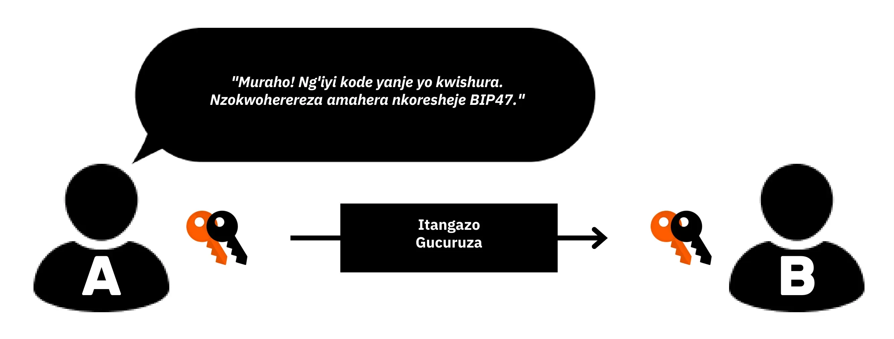


Vyoshoboka rero gushirwa mu ngiro BIP47 ata gukoresha ubuhinga bwo kumenyesha, igihe cose uwukoresha wese azoba afise ububiko bw’amakode y’ukwishura y’urunganwe rwiwe. Ariko rero, ubwo buryo buragaragara ko butoroshe gucungera gushika habonetse umuti woroshe, ukomeye kandi mwiza wo gukora, kubika no guhindura izo nkuru z’inyuma. Nk’uko ibintu vyifashe, ugucuruza kw’imenyekanisha ni hafi ataco bimaze.


Ariko mu bice bikurikira, tuzorabira ku yandi masezerano afise intumbero zisa n’iza BIP47, ariko adasaba ko haba ugutanga amakuru. Ariko rero, izo nzira zindi zirazana ivyo zishobora guhindura.


Uretse uruhara rwayo rwo kuzigama amakode y’ukwishyura, igikorwa co kumenyesha gifise kandi igikorwa co kumenyesha uwuronka, nk’uko izina ryaco rivyerekana. Imenyesha umukiriya w’uwuronka ko hariho umurongo mushasha wo kwishura, kandi imusaba ko yoguma abona amaderesi y’igihe gito azovamwo.


### Ibanga ry'akarorero rya BIP47


Imbere yo gutanga ido n’ido ry’imikorere y’ubuhinga y’isoko ry’imenyekanisha, birahambaye ko tuganira ku citegererezo c’ibanga gifitaniye isano na BIP47, kikaba ari co gishingira intahe ingingo zimwe zimwe zafashwe igihe hakorwa iyo soko y’intango.


Itegeko ry’ukwishura ubwaryo ntirizana ingorane zitaziguye ku bijanye n’ibanga. Udakunze uburyo bwa kera bwa Bitcoin, bufise intumbero yo guca isano hagati y’akaranga k’uwukoresha n’ibikorwa vyiwe (ari vyo vy’abantu bose) mu kuzigama ubutamenyekana bw’imfunguruzo n’amaderesi, kode yo kwishura irashobora gufatanywa ku mugaragaro n’akaranga ataco itera ubwoba.


Ivyo ni kubera ko kode y’ukwishura idakoreshwa kugira ngo umuntu abone ataco akora amaderesi yakira amahera ya BIP47. Ahubwo, izo aderesi ziboneka biciye ku nzira ya ECDH hagati y’imfunguruzo zikomoka ku makode y’ukwishura y’ababiri bari muri iyo nzira.


Gutyo, kode yo kwishura ubwayo ntituma ata guca ku ruhande umuntu atakaza ibanga, kubera ko itangazo Address ari ryo ryonyene rikomoka kuri yo. Naho iyi Address ishobora guhishura amakuru amwamwe, mu bisanzwe ntihishura abo mukorana na bo, kiretse hakozwe isesengura ry’uruhererekane ry’ibintu. Nkako, iyo uwurungitse akoresheje UTXO zishobora guhuzwa n’akaranga kiwe kugira ngo akore igikorwa co kumenyesha, rero birashoboka ko umuntu afata ingingo y’uko akaranga kiwe kumbure gafitaniye isano n’amahera ya BIP47 ku kode yawe yo kwishura. Ivyo ntibizohishura amasezerano ari mu nyuma, ariko bizokwerekana ko yoba ariho.


Ni ngombwa rero ko hagumaho iyo ntandukaniro ikomeye hagati y’amakode y’ukwishura y’abakoresha. Ivyo bishizwe mu muzirikanyi, ugutangaza kwa mbere kw’itegeko ni igihe gihambaye cane ku bijanye n’ibanga ry’ukwishyura, yamara ni igihe gihambaye kugira ngo iyo porotokole ikore neza. Iyo imwe muri kode zo kwishura ishobora kuronswa ku mugaragaro (nk’uko biri ku rubuga), kode ya kabiri, iyo uwuyirungitse, nta n’aho itegerezwa guhuzwa n’iya mbere.


Reka dufate akarorero nyako: Ndashaka gutanga intererano ku muhari wa politike biciye kuri BIP47:


- Iryo shirahamwe ryarashize ahabona kode yaryo yo kwishura ku rubuga rwaryo canke biciye ku mbuga ngurukanabumenyi;
- Iryo tegeko rero rifitaniye isano n’umuhari wa politike;
- Nca mbona iyi kode yo kwishura;
- Imbere yo kohereza, ntegerezwa kumenya neza ko bazi kode yanje bwite yo kwishura, iyo na yo nyene ikaba ifitaniye isano n’akaranga kanje kuko ndayikoresha mu kwakira amafaranga nkoresha ku mbuga ngurukanabumenyi zanje.


Noshobora gute gutanga kode yanje ata ngorane? Gukoresha uburyo busanzwe bwo guhanahana amakuru vyoshobora gutuma amakuru asohoka, gutyo bikanfatanya n’uwo muhari wa politike. Ivyo bimenyetso biratanga umuti, bivuye ku Layer y’ugushiramwo amakuru ibuza gusa mwene ukwo gufatanya hagati y’amakode abiri. Naho atari bwo buryo bwonyene bwo gutanga mu mpisho kode y’ukwishura y’uwurungitse, ni uburyo bwiza cane.


Mu kigereranyo kiri aha hepfo, imirongo y’umuhondo yerekana aho uruja n’uruza rw’amakuru rutegerezwa guhagarara, imyampi yirabura na yo yerekana amasano ashobora kubonwa n’abandi bantu:


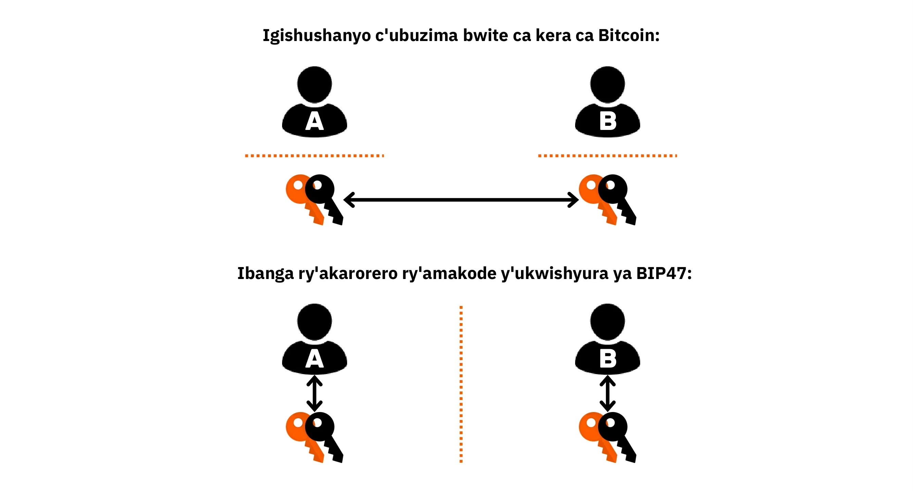


Mu vy’ukuri, mu citegererezo c’ibanga ca kera ca Bitcoin, kenshi biragoye gutandukanya burundu uruja n’uruza rw’amakuru hagati y’ababiri b’urufunguzo n’uwukoresha, cane cane mu bikorwa vyo kure. Nk’akarorero, mu gihe umuntu ariko aratanga intererano, uwuyironka ategerezwa gutangaza ata kabuza urupapuro rwa Address canke urufunguzo rwa bose biciye ku rubuga rwiwe canke ku mbuga ngurukanabumenyi. Ikoreshwa ryiza rya BIP47, cane cane n’ugutanga amakuru, rituma bishoboka gutorera umuti iki kibazo bivuye kuri ECDHE n’ububiko Layer tuzorabira mu nyuma.


Ego ni ko, uburyo bwa kera bwo gukingira ibanga bwa Bitcoin buracariho ku mfunguruzo za bose zimara igihe gito, zikomoka ku guhuza izo kode zibiri zo kwishura. Ivyo bigereranyo bibiri mu vy’ukuri birahuza. Ico nshaka gushimikako hano ni uko, bitandukanye n’ugukoresha urufunguzo rwa bose kugira ngo umuntu aronke Bitcoins, kode yo kwishura ishobora guhuzwa n’akaranga kanaka, kuko amakuru "_Alice ariko arakorana na Bob_" amenagurika ku yindi ntambwe. Iryo tegeko ry’ukwishyura rikoreshwa ku maderesi y’ukwishyura ya generate, ariko bishingiye gusa ku kwihweza Blockchain, ntibishoboka guhuza igikorwa co kwishura ca BIP47 n’itegeko ry’ukwishyura ryakoreshejwe mu kurishitsa, kiretse iyo aba UTXO bari muri iyo nzira bari bamaze guhuzwa n’akaranga kabo k’ukwishyura respecters previous akaranga.


Mu guca irya n’ino, uburyo bw’ibanga butangwa n’amahera ya BIP47 bwoshobora gufatwa nk’ubusumba uburyo bw’ishimikiro bwa Bitcoin, naho ivyo bidasobanura ko ari ubupfumu.


### Kubaka itangazo ry'ubucuruzi


None rero reka turabe ingene iyo transaction y’imenyekanisha ikora. Reka twiyumvire ko Alice yipfuza kohereza amahera kuri Bob ikoresheje BIP47. Mu karorero kanje, Alice ikora nk’uwurungika, Bob na we akora nk’uwukira. Bob yasohoye kode yiwe yo kwishura ku rubuga rwiwe. Alice rero irasanzwe izi kode y’ukwishura ya Bob.


**1- Alice ibara ibanga ry'abantu bose na ECDH:**


- Ahitamwo urufunguzo rubiri muri HD Wallet yiwe kw’ishami ritandukanye n’iryo kode yiwe yo kwishura. Zirikana ko iyo nkuru ibiri idategerezwa gufatanywa mu buryo bworoshe n’itangazo rya Alice Address, canke n’akaranga ka Alice (raba igice c’imbere);
- Alice ihitamwo urufunguzo rw'ibanga rw'iyi nkuru. Twita $a$ (inyuguti nto);


$$
a
$$


- Alice igarura urufunguzo rwa bose rujanye n'itangazo rya Bob Address. Urufunguzo ni umwana wa mbere akomoka kuri kode y’ukwishura ya Bob (index $/0$). Urufunguzo rwa bose turwita $B$ (inyuguti nini). Urufunguzo rw'ibanga rujanye n'uru rufunguzo rwa bose rwitwa $b$ (inyuguti nto). $B$ imenyekana mu kwongerako no gutera kabiri uturongo ku nzira y'uruzitiro kuva kuri $G$ (uturongo dutanga) na $b$ (urufunguzo rwihariye):


$$ B = b \cakadomo G $$


- Alice ibara akarongo k'ibanga $S$ (inyuguti nini) ku nzira y'umurongo w'uruzitiro mu kwongerako no gukubita kabiri akarongo, akoresheje urufunguzo rwiwe rw'ibanga $a$ ruvuye ku rufunguzo rwa bose rwa Bob $B$.


$$ S = a \cakadomo B $$


- Alice ibara igiharuro c’uguhuma amaso $f$ kizokoreshwa mu gupfuka kode yiwe yo kwishura. Kugira ngo abikore, akoresha ubuhinga bwa HMAC-SHA512 kugira ngo amenye umubare w’ibinyoma. Injiza ya kabiri muri iyi nzira ni agaciro Bob yonyene izoshobora kuronka: $x$, ari yo abscissa y'intangamarara y'ibanga yaharuwe haruguru. Injiza ya mbere ni $o$, ari yo UTXO ikoreshwa nk’injiza muri iki gikorwa (isohoka).


$$ f = \umwandiko {HMAC-SHA512}(o, x) $$


**2 - Alice ihindura kode yiwe y'ukwishura ku giciro ca 2 (ibiri) **


**3- Ikoresha iki kintu gihuma amaso nk'urufunguzo rwo gukora ubuhinga bwo gupfuka amakuru ku bijanye n'umuzigo w'amahera yayo.** Uburyo bwo gupfuka amakuru bukoreshwa ni `XOR` gusa. Ivyo bikorwa bigereranywa n'ivyo Vernam, bizwi kandi nka "One-Time Pad".


- Alice ibanza gucapura igice ciwe co guhuma amaso mu bice bibiri: bytes 32 za mbere zitwa $f1$ na bytes 32 za nyuma zitwa $f2$. Ivyo biduha:


$$ f = f1 || f2 $$


- Alice ibara igiharuro $x'$ c'urufunguzo rwa bose $x$ rwa kode yiwe yo kwishura, n'igiharuro $c'$ c'urudodo rwiwe $c$ bitandukanye. $f1$ na $f2$ zikora nk'imfunguruzo z'ububiko. Igikorwa kikoreshwa ni `XOR` (canke kidasanzwe).


$$ x' = x \ukwongerako f1 $$


$$ c' = c \ukwongerako f2 $$


- Alice isubirira agaciro nyakuri k'urufunguzo rwa bose abscissa $x$ na kode y'urudodo $c$ muri kode yiwe yo kwishura n'agaciro kashizwemwo $x'$ na $c'$.


**4-** Alice rero ubu ifise kode yiwe yo kwishura n’umuzigo w’amahera ushizwemwo. Azokora kandi atangaze ibikorwa vy’ubudandaji birimwo urufunguzo rwiwe rwa bose $A$ nk’inyungu, igisohoka ku itangazo rya Bob Address, n’isohoka `OP_RETURN` rigizwe na kode yiwe yo kwishura n’umuzigo w’inyungu washizwemwo. **Iyi nzira ni iyo gutangaza**.


`OP_RETURN` ni opcode igaragaza ko igisohoka c'ibikorwa vya Bitcoin kitagira akamaro. Ubu, rikoreshwa mu gutangaza canke amakuru ya Anchor ku Bitcoin Blockchain. Ishobora kubika amakuru ashika kuri bytes 80, hanyuma akayandikwa ku ruzitiro maze akaboneka ku bandi bakoresha bose.


Nk’uko twabibonye mu bice vyabanje, ECDH ikoreshwa kugira ngo generate ibanga risangiye hagati y’abakoresha babiri bavugana ku rubuga rudatekanye, kandi rishobora kwihwezwa n’abatera. Muri BIP47, ECDH ikoreshwa mu guhanahana amakuru ku rubuga rwa Bitcoin, urwo mu kamere kayo nyene ni urubuga rwo guhanahana amakuru rubonerana, kandi rubonwa n’abatera benshi. Ibanga ry’abantu bose riharuwe biciye ku rufunguzo rwa ECDH Exchange rero rikoreshwa mu gupfuka amakuru y’ibanga azorungikwa: kode y’ukwishura y’uwuyirungitse (Alice).


Nzoca irya n'ino intambwe twabonye hamwe kugira ngo dukore igikorwa co gutangaza:


- Alice igarura kode y’ukwishura ya Bob n’itangazo Address;
- Alice ihitamwo UTXO muri HD Wallet yiwe ifise urufunguzo rubiri ruhuye;
- Iharura akarongo k’ibanga ku nzira y’umurongo w’uruzitiro hakoreshejwe ECDH;
- Ikoresha iyo nkuru y’ibanga kugira ngo iharure HMAC, ari yo nkuru ihuma amaso;
- Akoresha ico kintu gihuma amaso kugira ngo apfuke umuzigo w’amahera y’ikode yiwe bwite yo kwishura;
- Ikoresha `OP_RETURN` igisohoka c'ibikorwa kugira ngo imenyeshe kode y'ukwishura yihishije kuri Bob.


### Itangazo ry'ubucuruzi: inyigisho ngirakamaro


Kugira ngo dutahure ingene ikora mu buryo burambuye, na cane cane ikoreshwa rya `OP_RETURN`, reka turabe igikorwa nyaco co gutangaza. Nakoze mwene ukwo gucuruza kuri Testnet, ushobora kuronka [mu gukanda . aha](Mempool.ikibanza/Testnet/tx/0e2e4695a3c49272ef631426a9fd2dae6ec3a469e39a3db51aa476cd09de2e).


Turavye iyo transaction, turamaze kubona ko ifise input imwe n’isohoka 4:


- Igisohoka ca mbere ni `OP_RETURN` kirimwo kode yanje yo kwishura yihishije;
- Igisohoka ca kabiri ca 546 Sats kigaragaza itangazo ry’uwumpaye Address;
- Igisohoka ca gatatu c’ama Sats 15.000 kigereranya amahera y’ibikorwa, nk’uko nakoresheje Samourai Wallet mu kwubaka iyo nzira;
- Igisohoka ca kane c’imiliyoni 2 za Sats kigereranya ihinduka, ni ukuvuga itandukaniro risigaye mu vyo nshiramwo risubira ku yindi Address yanje.


Igishimishije cane kwiga ni igisohoka 0 hakoreshejwe `OP_RETURN`. Reka twihweze neza ivyo irimwo. Aha niho `scriptPubKey` mu bice cumi na bitandatu:


```text
6a4c50010002b13b2911719409d704ecc69f74fa315a6cb20fdd6ee39bc9874667703d67b164927b0e88f89f3f8b963549eab2533b5d7ed481a3bea7e953b546b4e91b6f50d800000000000000000000000000
```


Hariho ibice bitari bike muri iyo nyandiko. Ubwa mbere, ni:


```text
6a4c
```


Mu makode y'ibikorwa, turashobora kumenya `0x6a` yerekana `OP_RETURN` na `0x4c` yerekana `OP_PUSHDATA1`.


Byte ikurikira iyi opcode ya nyuma yerekana ubunini bw'umuzigo ukurikira. Bigaragaza `0x50`, canke amabayiti 80:


```text
6a4c50
```


Ibikurikira, dufise metadata ya kode yanje yo kwishura mu nyandiko itomoye:


```text
010002
```


Abscissa yashizwemwo urufunguzo rwa bose rwa kode yanje yo kwishura:


```text
b13b2911719409d704ecc69f74fa315a6cb20fdd6ee39bc9874667703d67b164
```


Kode y'urudodo yashizwemwo kode yanje yo kwishura:


```text
927b0e88f89f3f8b963549eab2533b5d7ed481a3bea7e953b546b4e91b6f50d8
```


Kandi mu nyuma, gushiramwo ama bytes 80, ubunini busanzwe bwa `OP_RETURN`:


```text
00000000000000000000000000
```


Kugira ngo ushobore gutahura, ng'iyi kode yanje yo kwishura mu nyandiko yoroshe mu rwego rwa 58:


```text
PM8TJQCyt6ovbozreUCBrfKqmSVmTzJ5vjqse58LnBzKFFZTwny3KfCDdwTqAEYVasn11tTMPc2FJsFygFd3YzsHvwNXLEQNADgxeGnMK8Ugmin62TZU
```


Kandi mu rwego rwa 16:


```text
4701000277507c9c17a89cfca2d3af554745d6c2db0e7f6b2721a3941a504933103cc42add94881210d6e752a9abc8a9fa0070e85184993c4f643f1121dd807dd556d1dc000000000000000000000000008604e4db
```


Nitwagereranya kode yanje yo kwishura mu nyandiko rusangi na `OP_RETURN`, turashobora kubona ko HRP (`0x47`) n’umubare w’igenzura (`0x8604e4db`) bitarungikwa. Ivyo ni ibisanzwe, kuko ayo makuru agenewe abantu.


Igikurikira, turashobora kumenya verisiyo (`0x01`), umwanya w'ibice (`0x00`) n'uburinganire bw'urufunguzo rwa bose (`0x02`). Kandi, ku mpera y’itegeko ry’ukwishura, ama bytes ataco amaze (`0x00000000000000000000000000000000000000000000000000000000000000000000000000000000000000000000000000000000000000000000000000000000000000000000000000000000000000000000000000000000000000000000000000000000) ama bytes yose hamwe ashobora gushirwako ama bytes 80. Ivyo vyose birungikwa bitashizwemwo amakuru.


Ubwa nyuma, turashobora kubona ko urufunguzo rwa bose (`0x77507c9c17a89cfca2d3af554745d6c2db0e7f6b2721a3941a504933103cc42a`) na kode y'urudodo (`0xdd94881210d6e752a9abc8a9fa0070e85184993c4f643f1121dd807dd556d1dc`) vyashizwe mu nzira. Ivyo ni vyo bikoreshwa mu gutanga kode y’ukwishura.


### XOR ni iki?


Twarabonye mu bice vya kera ko kode y’ukwishura irungikwa mu buryo bupfutse hakoreshejwe igikorwa ca XOR. Reka twihweze neza ingene iyo operateur ikora, kuko ikoreshwa cane mu bijanye n’ugukora amakuru y’ibanga.


XOR ni umukoresha w'ibice bishingiye kuri aligebra ya Boolean. Hatanzwe ibikorwa bibiri mu bice, igarura `1` iyo ibice vy'urutonde rumwe bitandukanye, kandi igarura `0` iyo ibice vy'urutonde rumwe bingana. Ehe imbonerahamwe y'ukuri kwa XOR hakurikijwe agaciro k'ibikorwa `D` na `E`:

| D | E | D XOR E |
|---|---|---------|
| 0 | 0 | 0       |
| 0 | 1 | 1       |
| 1 | 0 | 1       |
| 1 | 1 | 0       |

Nk'akarorero:


$$
0110 \oplus 1110 = 1000
$$


Canke:


$$
010011 \oplus 110110 = 100101
$$


Na ECDH, gukoresha XOR nk’ububiko Layer birahuye cane. Ica mbere, kubera uwo mukoresha, ugushiramwo amakuru ni uguhuza. Ivyo bisigura ko uwuronka iyo nkuru ashobora gukuraho kode y’ukwishura akoresheje urufunguzo rumwe rukoreshwa mu gufungura. Imfunguruzo zo gupfuka no gukuraho ziharurwa bivanye n’ibanga ry’abantu bose hakoreshejwe ECDH. Ubu buhuye bushoboka kubera imiterere y'uguhindura n'ugufatanya kw'umukoresha wa XOR:


- Ibindi bikoresho:


$$
D \oplus D = 0
$$


$$
D \oplus 0 = D
$$


- Uguhinduranya:


$$
D \oplus E = E \oplus D
$$


- Ishirahamwe:


$$
D \oplus (E \oplus Z) = (D \oplus E) \oplus Z = D \oplus E \oplus Z
$$


Nimba:


$$
D \oplus E = L
$$


None:


$$
D \oplus L = D \oplus (D \oplus E) = D \oplus D \oplus E = 0 \oplus E = E \\
\therefore D \oplus L = E
$$


Ica kabiri, ubwo buryo bwo gushiramwo amakuru burasa cane n’uburyo bwo gushiramwo amakuru bwa Vernam (One-Time Pad), uburyo bwonyene bwo gushiramwo amakuru buzwi gushika ubu bufise umutekano udafise ivyangombwa (canke ushitse). Kugira ngo urufunguruzo rwa Vernam rube rufise ico kintu, urufunguzo rwo gupfuka rutegerezwa kuba rudasanzwe, rufise ubunini bungana n’ubutumwa kandi rukoreshwa rimwe gusa. Mu buryo bwo gupfuka bukoreshwa hano kuri BIP47, urufunguzo ni rwo rungana n’ubutumwa, kandi ikintu gihuma amaso ni co nyene kingana n’ugufatanya abscissa y’urufunguzo rwa bose n’urudodo rwa kode y’ukwishura. Urufunguzo rwo gupfuka rukoreshwa rimwe gusa. Ku rundi ruhande, urwo rufunguzo ntiruva ku ntumbero itunganye, kuko ari HMAC. Ahubwo ni ivy’ubuhendanyi. Rero si cipher ya Vernam, ariko uburyo buraza hafi.


### Ukwakira itangazo ry'ubucuruzi


None ko Alice yohereje itangazo ry’ugucuruza kuri Bob, reka turabe ingene Bob abisobanura. Nk’ukwibutsa, Bob itegerezwa kuba ifise uburenganzira bwo kuronka kode y’ukwishura ya Alice. Ata makuru, nk’uko tuzobibona mu gice gikurikira, ntazoshobora kuronka amabara y’ingenzi yaremwe na Alice, rero ntazoshobora kuronka ama bitcoins yiwe yaronse biciye kuri BIP47. Kugeza ubu, kode y’ukwishyura ya Alice irashizwe mu mfuruka. Reka turabe ingene Bob ibifungura.


**1-** Bob ikurikirana ibikorwa bitanga ibisubizo n'itangazo ryiwe Address.


**2-** Iyo igikorwa gifise igisohoka ku itangazo ryaco Address, Bob iragisuzuma kugira ngo kibone nimba kirimwo igisohoka OP_RETURN gihuye n’ingingo ya BIP47.


**3-** Niba byte ya mbere y'umuzigo w'inyungu wa OP_RETURN ari `0x01`, Bob itangura kurondera ibanga ryoshobora gusangizwa na ECDH:


- Bob ihitamwo urufunguzo rwa bose rw'injiza rw'ibikorwa. Ni ukuvuga, urufunguzo rwa bose rwa Alice rwitwa $A$ rufise:


$$ A = a \cakadomo G $$


- Bob ihitamwo urufunguzo rw'ibanga $b$ rujanye n'itangazo ryiwe bwite Address:


$$ b $$


- Bob ibara akarongo k’ibanga $S$ (ECDH y’ibanga rusangi) ku nzira y’umurongo w’uruzitiro mu kwongerako no gukubita kabiri akarongo, akoresheje urufunguzo rwiwe rw’ibanga $b$ ku rufunguzo rwa bose rwa Alice $A$:


$$ S = b \cakadomo A $$


- Bob igena ikintu gihuma amaso $f$ kizotuma umuzigo w’inyungu wa kode y’ukwishyura ya Alice ushobora gufungurwa. Mu buryo bumwe nk'uko Alice yari yarabiharuriye mbere, Bob izoronka $f$ mu gukoresha HMAC-SHA512 kuri $x$, agaciro k'abscissa k'akarongo k'ibanga $S$, no kuri $o$, UTXO ikoreshwa nk'inyungu muri iki gikorwa co kumenyesha:


$$ f = \umwandiko {HMAC-SHA512}(o, x) $$


**4-** Bob isobanura amakuru ya OP_RETURN mu gutangaza nk’itegeko ry’ukwishura. Azoca afungura gusa umuzigo w’iyi kode y’ukwishura ishobora gukoreshwa akoresheje $f$ blinding factor:


- Bob igabanya umubare w’uguhuma $f$ mu bice 2: bytes 32 za mbere za $f$ zizoba $f1$ na bytes 32 za nyuma zizoba $f2$;
- Bob ifungura agaciro k'agace ka $x'$ kavuye mu rufunguzo rwa bose rwa kode y'ukwishyura ya Alice:


$$ x = x' \ukwongerako f1 $$


- Bob ifungura agaciro ka kode y'urudodo $c'$ kuva kuri kode y'ukwishyura ya Alice:


$$ c = c' \ukwongerako f2 $$


**5-** Bob isuzuma nimba agaciro k'urufunguzo rwa bose k'itegeko ry'ukwishyura rya Alice kari mu mugwi wa secp256k1. Nimba ari ukwo biri, ivyo abisobanura nk’itegeko ry’ukwishura ribereye. Nimba atari vyo, arirengagiza ivyo bintu.


Ubu ko Bob azi kode y’ukwishura kwa Alice, Alice arashobora kumurungikira amahera ashika kuri `2^32`, ata na rimwe asubiramwo igikorwa co kumenyesha c’ubwo bwoko.


Ni kuki bikora? Ni gute Bob ishobora kumenya ikintu kimwe gihuma amaso na Alice, gutyo igashobora gusobanura kode yiwe yo kwishura? Reka twihweze neza igikorwa ca ECDH mu vyo twamaze kudondora.


Mbere na mbere, turiko turakorana n’ugushiramwo amakuru mu buryo buhuye. Ivyo bisigura ko urufunguzo rwo gupfuka n’urufunguzo rwo gufungura ari agaciro kamwe. Urufunguzo mu gucuruza kw'imenyekanisha ni co kintu gihuma amaso:


$$ f = f1 || f2 $$


Alice na Bob rero zitegerezwa kuronka agaciro kamwe k’ $f$, zitazirungitse ataco ziciye, kuko uwuzitera yoshobora kuziba no gusobanura amakuru y’ibanga. Ico kintu gihuma amaso kiboneka mu gukoresha HMAC-SHA512 ku mibare 2:


- abscisse y’akarongo k’ibanga;
- na UTXO ikoreshwa ku nzira y’ugucuruza.


Bob rero irakeneye ayo makuru yompi kugira ngo ishobore gusobanura umuzigo w’ikode y’ukwishyura ya Alice. Ku bijanye n’inyungu UTXO, Bob ishobora gusa kuyigarura mu kwihweza ibikorwa vy’imenyekanisha. Ku bijanye n’ingingo y’ibanga, Bob izokenera gukoresha ECDH. Nk’uko vyabonetse mu gice ca mbere ku bijanye na Diffie-Hellman, mu guhana gusa imfunguruzo zabo za bose no gukoresha mu mpisho imfunguruzo zabo z’ibanga ku rufunguzo rwa bose rwa buri wese, Alice na Bob barashobora kuronka ahantu h’ibanga nyakuri ku nzira y’uruzitiro. Itangazo ry'ugucuruza rishingiye kuri ubu buryo:


- Imfunguruzo zibiri za Bob:


$$ B = b \cakadomo G $$


- Urufunguzo rwa Alice:


$$ A = a \cakadomo G $$


- Ku bw'ibanga $S (x, y)$:


$$ S = a \cakadomo B = a \cakadomo (b \cakadomo G) = (b \cakadomo a) \cakadomo G = b \cakadomo A $$


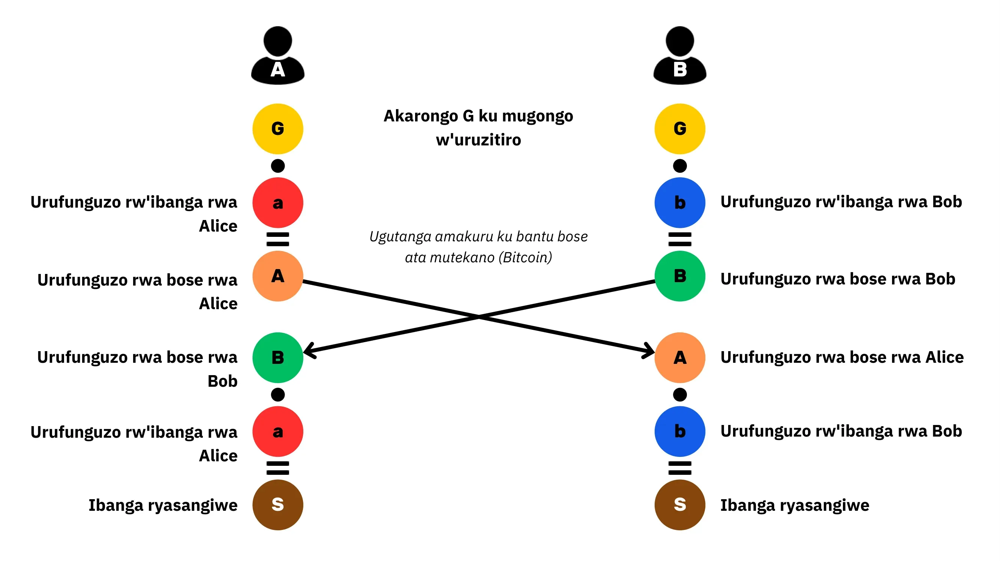


Ubu Bob azi kode y’ukwishura kwa Alice, azoshobora kumenya amahera yiwe ya BIP47, kandi azoshobora gukura imfunguruzo z’ibanga zibuza ama bitcoins yaronse.


Nzoca irya n'ino intambwe twabonye hamwe kugira ngo twakire no gusobanura itangazo ry'ugucuruza:


- Bob ikurikirana umusaruro w’ibikorwa vy’ubudandaji ku itangazo ryiwe Address;
- Iyo ibonye imwe, iraronka amakuru ari muri OP_RETURN;
- Bob ihitamwo urufunguzo rwa bose nk’injiza maze ibara ingingo y’ibanga ikoresheje ECDH;
- Ikoresha iyo nkuru y’ibanga kugira ngo iharure HMAC, ari yo nkuru ihuma amaso;
- Ikoresha iki kintu gihuma amaso kugira ngo ifungure kode y'ukwishyura ya Alice iri muri OP_RETURN.


### Ivyo kwishura BIP47


Reka turabe ingene umuntu yishura hakoreshejwe BIP47. Kugira ndabibutse uko ibintu vyifashe ubu:


- Alice arazi kode yo kwishura ya Bob, iyo yaronse gusa ku rubuga rwiwe;
- Bob irazi kode y’ukwishura ya Alice kuva ku bijanye n’ugutangaza;
- Alice azotanga amahera yiwe ya mbere kuri Bob. Arashobora gukora n’abandi benshi muri ubwo buryo nyene.


Imbere yo gusigura iyo nzira, mbona ko ari ngombwa kwibuka index turiko turakorako ubu. Inzira y'ugukomoka kuri kode y'ukwishyura idondora gutya: `m/47'/0'/0'`. Uburebure bukurikira bugabanya urutonde nk'uko bikurikira:


- Umukobwa wa mbere asanzwe (atakomejwe) ni uwo akoreshwa mu generate itangazo Address ryavuzwe mu gice ca mbere: `m/47'/0'/0'/0`;
- Ivyuma bibiri vy’urufunguzo vy’abakobwa bisanzwe bikoreshwa muri ECDH gushika ku ma aderesi y’inyandiko y’ukwishyura generate BIP47, nk’uko tuzobibona muri iki gice: kuva kuri `m/47’/0’/0’/0` gushika kuri `m/47’/0’/0’/2.147.483.647`;
- Urufunguzo rw'abakobwa rukomeye ni amakode y'ukwishura y'igihe gito: kuva kuri `m/47'/0'/0'/0'` gushika kuri `m/47'/0'/0'/2.147.483.647'`.


Igihe cose Alice ashaka kohereza amahera kuri Bob, aronka Address nshasha, yihariye, ataco ivuga, yongera akoresha umurongo wa ECDH:


- Alice ihitamwo urufunguzo rwa mbere rw’ibanga ruva kuri kode yiwe bwite yo kwishura:


$$ a $$


- Alice ihitamwo urufunguzo rwa mbere rwa bose rudakoreshwa ruva kuri kode y’ukwishura ya Bob. Tuzokwita urufunguzo rwa bose $B$. Ifatanye n'urufunguzo rw'ibanga $b$ ruzwi na Bob gusa:


$$ B = b \cakadomo G $$


- Alice ibara akarongo k'ibanga $S$ ku nzira y'umurongo w'uruzitiro mu kwongerako no gukubita kabiri akarongo mu gukoresha urufunguzo rwiwe rw'ibanga $a$ ruvuye ku rufunguzo rwa bose rwa Bob $B$:


$$ S = a \cakadomo B $$


- Kuva kuri iyo nkuru y'ibanga, Alice ibara ibanga ry'abantu bose $s$ (inyuguti nto). Kugira ngo abikore, ahitamwo abscissa y’akarongo k’ibanga $S$ kitwa $Sx$, maze akarungika ako gaciro ku gikorwa ca SHA256 Hash:


$$ S = (Sx, Sy) $$


$$ s = \umwandiko{SHA256}(Sx) $$


- Alice ikoresha iri banga $s$ kugira ngo ibare Bitcoin kwakira kwishura Address. Ubwa mbere, asuzuma ko $s$ iri mu rutonde rw’umurongo wa secp256k1. Nimba ivyo bitabaye, yongerako urutonde rw’urufunguzo rwa bose rwa Bob kugira ngo aronke irindi banga basangiye;
- Mu ntambwe ya kabiri, abara urufunguzo rwa bose $K0$ mu kwongerako uturongo $B$ na $s-G$ ku nzira y’uruzitiro. Mu yandi majambo, Alice yongerako urufunguzo rwa bose ruva kuri kode y’ukwishyura ya Bob $B$ ku yindi ntumbero iharuwe ku nzira y’umurongo w’uruzitiro mu kwongerako no gukubita kabiri uturongo n’ibanga ry’uruzitiro rwasangiye $s$ ruva ku ntumbero y’umuhinguzi w’umurongo wa secp256k1 $G$. Iyi ngingo nshasha igereranya urufunguzo rwa bose, kandi turwita $K0$:


$$ K0 = B + s \cakadomo G $$


- Na uru rufunguzo rwa bose $K0$, Alice ishobora gukuraho ubusa kwakira Address mu buryo busanzwe (nk'akarorero SegWit V0 muri bech32).


Alice amaze kuronka $K0$ ya Bob yakira Address, arashobora gukora igikorwa co gucuruza Bitcoin mu buryo busanzwe. Kugira ngo abikore, ahitamwo UTXO afise, afise urufunguzo rubiri ruvuye mw'ishami ritandukanye rya HD Wallet yiwe, maze akayikoresha kugira ngo ahaze umusaruro ku $K0$ Address ya Bob. Ni ngombwa kumenya ko iyo nyishu, iyo Address imaze gukurwa, ikurikira uburyo bwa kera kandi itagishingiye ku mfunguruzo zijanye na BIP47.


Nzoca irya n’ino intambwe twabonye hamwe kugira ngo twohereze amahera ya BIP47:


- Alice ihitamwo urufunguzo rw’ibanga rw’umukobwa wa mbere ruva kuri kode yiwe bwite yo kwishura;
- Iharura akarongo k’ibanga ku nzira y’uruzitiro ikoresheje ECDH kuva ku rufunguzo rwa mbere rw’umukobwa rudakoreshwa ruva ku kode y’ukwishyura ya Bob;
- Ikoresha iyo nkuru y'ibanga kugira ngo iharure ibanga ry'abantu bose na SHA256;
- Akoresha iryo banga asangiye kugira ngo aharure akarongo gashasha k’ibanga ku nzira y’umurongo w’uruzitiro;
- Yongerako iyo ngingo nshasha y’ibanga ku rufunguzo rwa bose rwa Bob;
- Aronka urufunguzo rushasha rwa bose rw’igihe gito Bob gusa rufise urufunguzo rw’ibanga rujana;
- Alice ishobora gukora ubucuruzi bwa kera kuri Bob n'ivyo bikomoka kuri Address.


Niba Alice ashaka kwishura ubwa kabiri, azokurikiza intambwe nk’izo mbere, kiretse ko ubu azohitamwo urufunguzo rwa kabiri rwa bose ruva kuri kode y’ukwishura ya Bob. Mu buryo bwihariye, azokoresha urufunguruzo rukurikira rutakoreshejwe. Azoronka rero igitabu gishasha co kwakira Address c’uwa Bob, citwa $K1$:


Ishobora kubandanya muri ubwo buryo kandi ikaronka aderesi zishika kuri `2^32` zitagira ikintu ziri muri Bob.


Uvuye hanze, turavye Blockchain, mu vy’impwemu ntibishoboka gutandukanya amahera ya BIP47 n’amahera asanzwe. Aha ni akarorero k'ugutanga amahera BIP47 kuri Testnet:


```text
94b2e59510f2e1fa78411634c98a77bbb638e28fb2da00c9f359cd5fc8f87254
```


Bisa n'ugucuruza kwa kera n'inyungu ikoreshejwe, inyungu y'ukwishyura n'ihinduka UTXO:


### Ukwakira BIP47 kwishura no gukura urufunguzo rw'ibanga


Alice aherutse gutanga amahera yiwe ya mbere ku mpapuro z'ubusa zitwa BIP47 Address za Bob. None rero reka turabe ingene Bob ironka iyo nkunga. Turabona kandi igituma Alice adashobora gushika ku rufunguzo rw’ibanga rwa Address aherutse kwihingura, n’ingene Bob aronka urwo rufunguzo kugira ngo akoreshe ama bitcoins aherutse kuronka.


Bob akimara kwakira itangazo ry’ugucuruza rivuye kuri Alice, aca akura urufunguzo rwa bose BIP47 $K0$ mbere n’imbere y’uko umunyamakuru wiwe arungika amahera. Arabona rero amahera yose yo kwishurwa kuri Address ifatanye n’ivyo. Nkako, aca ahita aronka amaderesi menshi abona ($K0$, $K1$, $K2$, $K3$...). Ehe ingene biva kuri uru rufunguzo rwa bose $K0$:


- Bob ihitamwo urufunguzo rw’ibanga rw’umukobwa wa mbere ruva kuri kode yiwe yo kwishura. Urufunguzo rw'ibanga rwitwa $b$. Ifatanye n'urufunguzo rwa bose $B$ Alice yakoresheje mu kubara mu ntambwe ya mbere:


$$ b $$


- Bob ihitamwo urufunguzo rwa mbere rwa bose rwa Alice ruva kuri kode yiwe yo kwishura. Urufunguzo rwitwa $A$. Ifitaniye isano n'urufunguzo rw'ibanga $a$ Alice yakoresheje mu kubara, kandi ruzwi na Alice gusa. Bob arashobora gukora iyo nzira, kuko azi kode y’ukwishura ya Alice, iyo kode yamurungikiye hamwe n’isoko ry’imenyekanisha:


$$ A = a \cakadomo G $$


- Bob abara akarongo k'ibanga $S$, mu kwongerako no gukubita kabiri akarongo ku nzira y'umurongo w'uruzitiro, mu gukoresha urufunguzo rwiwe rw'ibanga $b$ ku rufunguzo rwa bose rwa Alice $A$. Aha na ho, ECDH ikoreshwa kugira ngo yemeze ko iyo nkuru $S$ izoba imwe kuri Bob na Alice:


$$ S = b \cakadomo A $$


- Mu buryo bumwe na Alice, Bob itandukanya igice c’inyuma c’iyi nkuru $S$. Twaciye twita agaciro $Sx$. Aca atanga aka gaciro ku gikorwa ca SHA256 kugira aronke ibanga ry'abantu bose $s$ (inyuguti nto):


$$ s = \umwandiko{SHA256}(Sx) $$


- Mu buryo bumwe na Alice, Bob ibara akarongo ka $s-G$ ku nzira y’umurongo w’uruzitiro. Araheza yongerako iyo ngingo y’ibanga ku rufunguzo rwiwe rwa bose $B$. Araheza aronka akarongo gashasha ku nzira y’uruzitiro, akayisobanura nk’urufunguzo rwa bose $K0$:


$$ K0 = B + s \cakadomo G $$


Igihe Bob afise urufunguzo rwa bose $K0$, arashobora gukura urufunguzo rw’ibanga rujana kugira ngo akoreshe amafaranga yiwe. Ni we wenyene ashobora generate uru rufunguzo rw'ibanga:


- Bob yongerako urufunguzo rw’ibanga rw’umukobwa wiwe $b$ ruva kuri kode yiwe bwite yo kwishura. Ni we wenyene ashobora kuronka agaciro ka $b$. Araheza yongerako $b$ ku banga basangiye $s$ kugira ngo aronke $k0$, urufunguzo rw'ibanga rwa $K0$:


$$ k0 = b + s $$


Kubera itegeko ry'umugwi ry'umurongo w'uruzitiro, Bob ironka urufunguzo rw'ibanga ruhuye n'urufunguzo rwa bose rukoreshwa na Alice. Turafise rero:


$$ K0 = k0 \cakadomo G $$


Nzoca irya n’ino intambwe twahejeje kubona hamwe kugira ngo turonke amahera ya BIP47 maze tubaze urufunguzo rw’ibanga ruhuye:


- Bob ihitamwo urufunguzo rw’ibanga rw’umukobwa wa mbere ruva kuri kode yiwe bwite yo kwishura;
- Iharura akarongo k’ibanga ku nzira y’umurongo w’uruzitiro ikoresheje ECDH iva ku rufunguzo rwa mbere rw’umukobwa rwa bose ruvuye kuri kode y’urudodo ya Alice;
- Ikoresha iyo nkuru y'ibanga kugira ngo iharure ibanga ry'abantu bose na SHA256;
- Akoresha iryo banga asangiye kugira ngo aharure akarongo gashasha k’ibanga ku nzira y’umurongo w’uruzitiro;
- Yongerako iyo ngingo nshasha y’ibanga ku rufunguzo rwiwe bwite rwa bose;
- Aronka urufunguzo rushasha rwa bose rw’igihe gito, urwo Alice azorungikirako amahera yiwe ya mbere;
- Bob ibara urufunguzo rw’ibanga rujanye n’urwo rufunguzo rwa bose rw’igihe gito mu kwongerako urufunguzo rw’ibanga rw’umukobwa wiwe ruva kuri kode yiwe yo kwishura n’ibanga basangiye.


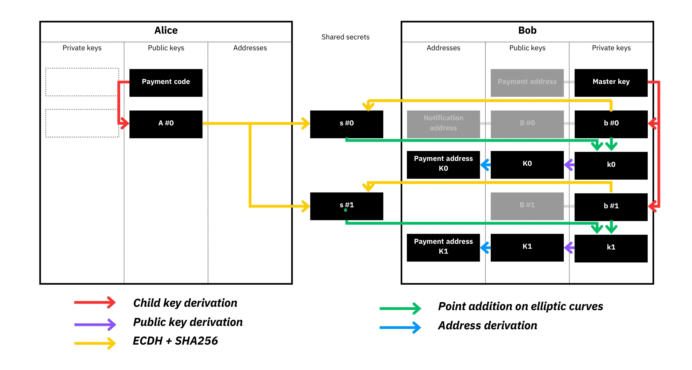


Kubera ko Alice idashobora kuronka $b$ (urufunguzo rw’ibanga rwa Bob), ntashobora kumenya $k0$ (urufunguzo rw’ibanga rujanye n’ukwakira BIP47 kwa Address Address). Mu buryo bw'igishushanyo, turashobora guserura ibara ry'ibanga ry'abantu bose $S$ nk'uko bikurikira:


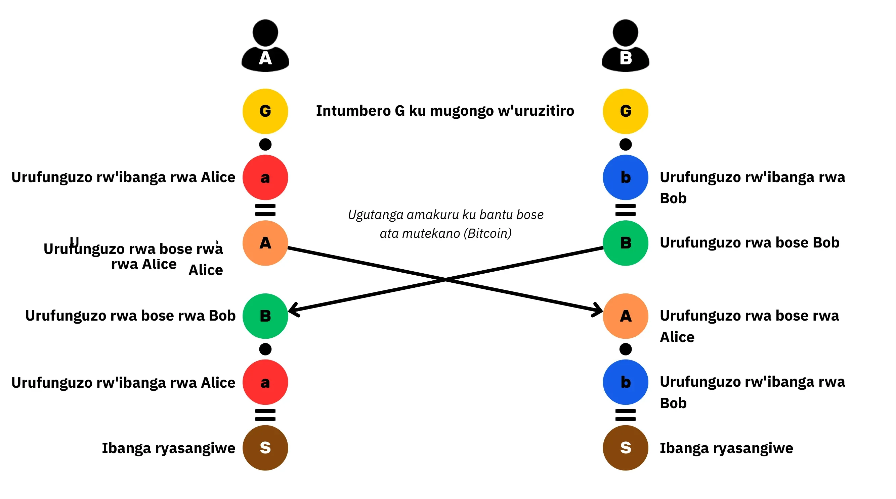


Igihe ibanga ry’abantu bose ribonetse na ECDH, Alice na Bob baharura urufunguzo rwa bose rwo kwishura BIP47 $K0$, na Bob na yo iharura urufunguzo rw’ibanga rujanye n’ivyo $k0$:


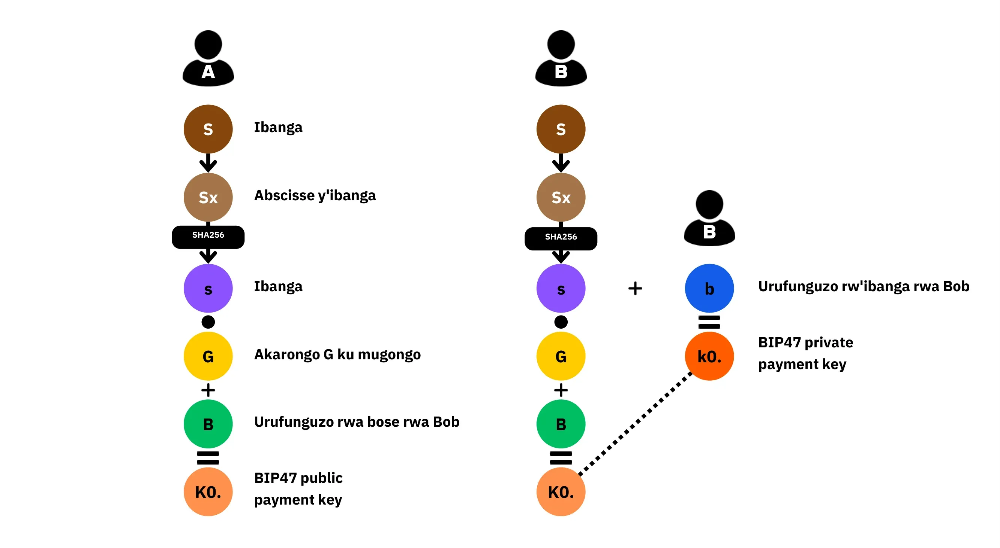


### Gusubizwa amahera ya BIP47


Kubera ko Bob azi kode ya Alice yo gusubira gukoresha, arasanzwe afise amakuru yose akeneye kugira ngo amurungikire amahera. Ntazosubira guhamagara Alice kugira ngo asabe amakuru yose. Arakeneye gusa kumumenyesha n’ugutanga amakuru, kugira ngo ashobore kuronka amaderesi yiwe ya BIP47 n’impapuro ziwe za seed, hanyuma ashobore no kumurungikira amahera ashika kuri `2^32`.


Ivyo gusubiza amahera ni vyo vyihariye kuri BIP47 kandi ni kimwe mu vyiza vyayo kuruta ubundi buryo, nk’Ukwishura mu gacerere, ivyo tuzobiraba mu bice bizokurikira.


Bob ashobora rero kwishura Alice mu buryo bumwe nyene yamurungikiye amahera. Uruhara rurahindurwa:


*Turakoze cane [Fanis Michalakis](https://x.com/FanisMichalakis) ku gukosora n'impanuro z'abahinga ku ngingo yatumye ndiko ndandika iki gice!*


https://planb.network/tutorials/privacy/on-chain/paynym-bip47-a492a70b-50eb-4f95-a766-bae2c5535093

## Ukwishyura mu gacerere


<chapterId>2871d594-414e-4598-a830-91c9eb84dfb8</chapterId>


BIP47 yaranezwe cane kubera ukuntu idakora neza. Nk’uko vyasiguwe mu kigabane c’imbere, bisaba ko habaho igikorwa co kumenyesha umuntu wese azoronka. Ivyo bica bihinduka bike iyo duteguye gushinga umurongo w’ukwishura uramba n’uwo muronka. Nkako, igikorwa kimwe co kumenyesha kirategura inzira y’umubare hafi utagira uko ungana w’amahera ya BIP47 akurikira.


Ariko rero, mu bihe bimwebimwe, ugucuruza kw’imenyekanisha birashobora kuba intambamyi ku wubikoresha. Reka dufate akarorero k’intererano y’igihe kimwe ku muntu ayihawe: n’iyi Bitcoin Address ya kera, igikorwa kimwe gusa kirahagije kugira ngo umuntu arangize iyo mpano. Ariko kuri BIP47, bisaba ko haba amafaranga abiri: rimwe ry’imenyekanisha, irindi ry’ukwishura nyavyo. Iyo ugusaba umwanya w’amabarabara ari hasi kandi amafaranga y’ugucuruza ari make, iyo ntambwe y’inyongera ntabwo ari ingorane kenshi. Ariko rero, mu bihe vy’uguhagarara, amahera yo gukoresha arashobora kuba menshi cane ku kwishura rimwe, bikaba bishobora gutuma uwukoresha atanga incuro zibiri ugereranije n’ugukoresha Bitcoin, ivyo bikaba bishobora gutuma uwukoresha atavyemera.


Ku bihe aho uwukoresha ategura gutanga amahera makeyi gusa ku kimenyetso kidahinduka, hariho ibindi bisubizo vyateguwe. Ivyo birimwo n’Ivyishyurwa Bicereje, bivugwa muri [BIP352]( Iyi porotokole ituma bishoboka gukoresha ikimenyetso kidahinduka kugira ngo umuntu aronke amahera ataco akora kugira ngo Address isubire gukoreshwa, kandi ataco asaba gukoresha amafaranga y’imenyekanisha. Reka turabe ingene iyo protocole ikora.


---
*Kugira ngo utahure neza iki gice, ni ngombwa ko umenya neza ingene ECDH (Elliptic Curve Diffie-Hellman) ikora be n’ingene urufunguzo rwo mu rwego rwo hejuru rukora mu gitabu ca HD Wallet. Ivyo vyiyumviro vyari vyaravuzwe mu buryo burambuye mu kigabane ca mbere ku vyerekeye BIP47. Sinzobisubiramwo hano. Nimba utaramenya neza ivyo vyiyumviro, ndagusavye ko wobanza kuraba igice ca mbere imbere y’uko ukomeza n’iki. Sinzosubira ku ngorane zijanye n’ugusubira gukoresha amaderesi y’ukwakira, canke akamaro ko kugira ikimenyetso kidasanzwe co kwakira amahera.* Nzovuga gusa ingingo nkeyi noshima gushiramwo ngaha .


---
### Kubera iki utokwimurira iryo tangazo?


Nk’uko vyavuzwe mu kigabane ca BIP47, igikorwa co kumenyesha gifise ibikorwa bibiri nyamukuru:


- Iramenyesha uwuyironka;
- Irungika kode y’ukwishura y’uwuyirungitse.


Umuntu yoshobora kwiyumvira ataco yiyumvira ko iyo nzira yo kumenyesha yoshobora gukorwa off-chain. Mu vyiyumviro, birashoboka neza: uwuronka ivyo yoba akwiye gukora vyose ni ukwerekana uburyo bwo guhanahana amakuru kugira ngo aronke amakode y’ukwishura ya BIP47 avuye ku barungitse. Ariko rero, hari ingorane zibiri zikomeye ziri muri iyo nzira:


- Ica mbere, vyotuma uburyo bwo gutanga kode buja ku yindi nzira yo guhanahana amakuru. Ibibazo bijanye n’igiciro n’ibanga rya Exchange vyogumaho, ariko vyokwimurirwa gusa muri iyo porotokole nshasha. Ku bijanye n'ibanga, ivyo bishobora kandi gutuma habaho isano hagati y'akaranga k'ukoresha n'igikorwa co ku rubuga, ivyo ni vyo turondera kwirinda mu gukora itangazo ku Blockchain. Ikindi kandi, gukora iryo tangazo hanze ya Blockchain vyozana ingorane zo gucengera (nk’uguhagarika amahera) zitari kuri Bitcoin;
- Ica kabiri, ivyo vyotuma haba ingorane yo gukira. Na BIP47, uwuyironka ategerezwa kumenya amakode y’ukwishura y’abarungitse kugira ngo ashobore kuronka ayo mahera. Ivyo ni ukuri iyo umuntu yakiriye, ariko kandi iyo amahera yosubizwa biciye ku seed iyo Wallet yatakaye. Hamwe n'amatangazo y'uruzitiro, ivyo bishobora kwirindwa, kuko uwukoresha ashobora kuronka no gusobanura amakuru y'amatangazo mu kumenya gusa seed yiwe. Ariko rero, iyo itangazo rikorewe hanze ya Blockchain, uwuriko arakoresha yobwirizwa kuguma afise ububiko bukomeye bw’amakode yose y’ukwishyura yaronse, ivyo bikaba bidashoboka ku muntu asanzwe akoresha.


Ivyo vyose bituma gukoresha itangazo ry'uruzitiro biba ngombwa kuri BIP47. Ariko rero, Silent Payments irondera kwirinda iyo ntambwe yo kumenyesha onchain kubera igiciro cayo. Umuti wemejwe rero si ukwimurira itangazo, ahubwo ni ukurikuraho burundu. Kugira ivyo bishoboke, bitegerezwa kwemerwa ikintu co gusenyera ku mugozi umwe: gucapura. Udakunze BIP47, aho uwukoresha amenya neza aho yoronka amahera yiwe biciye ku bikorwa vy’imenyekanisha, n’Ivyishyurwa vy’Iceceka, uwukoresha ategerezwa gusuzuma amahera yose ariho ya Bitcoin kugira ngo amenye amahera yose yagenewe kumuha. Kugira ngo uwo muzigo w’ibikorwa ugabanuke, ubushakashatsi bw’Ivyishyurwa Bicereje bugarukira gusa ku bikorwa bishobora kuba birimwo ivyo vyishyurwa, ni ukuvuga ivyo bifise n’imiburiburi umusaruro umwe wa Taproot P2TR. Iryo scanner kandi ryibanda cane ku bikorwa vy’ubudandaji kuva kw’itariki Wallet yaremeweko (nta nkenerwa yo gupima ibikorwa vy’ubudandaji kuva mu 2009 nimba Wallet yaremwe mu 2024).


Ushobora rero kubona igituma BIP47 na Silent Payments, naho zigamije intumbero imwe, zirimwo uguhuza ibintu bitandukanye rero **mu vy’ukuri zihuye n’ibintu bitandukanye bikoreshwa**. Ku bijanye n’amahera yishurwa rimwe gusa, nk’intererano zitangwa rimwe gusa, Silent Payments ni zo zibereye cane kubera ko zigura amahera make. Ku rundi ruhande, ku bijanye n’ugucuruza ubudasiba ku muntu umwe, nk’uko biri ku bibanza vya Exchange canke ku bidengeri vya Mining, BIP47 yoshobora guhitamwo.


Reka turabe ingene Silent Payments ikora mu buryo bw’ubuhinga kugira ngo dutahure neza ico kiriko kiraba. Kugira ivyo tubishikeko, ndasaba ko dufata uburyo bumwe n’ubw’inyandiko y’insobanuro ya BIP352. Buhoro buhoro tuzoca ducapura imibare izokorwa, ikintu ku kindi, dushingira intahe ivyongeweko bishasha vyose.


### Ivyiyumviro bikeyi vyo gutahura


Imbere yo gutangura, birahambaye kugaragaza ko Ukwishura mu gacerere kwizigira gukoresha ubwoko bw'inyandiko P2TR (*Ishura kuri Taproot*) gusa. Udakunze BIP47, si ngombwa gukura amaderesi y'ukwakira mu mfunguruzo za bose z'abana biciye mu gukora hashing. Mu rugero rwa P2TR, urufunguzo rwa bose rwahinduwe rukoreshwa ataco ruvuze kandi rudashizwemwo amakuru muri Address. Rero Taproot yakira Address ni urufunguzo rwa bose rufise amakuru amwamwe. Urufunguzo rwa bose rwahinduwe ni ugukoranya izindi mfunguruzo zibiri za bose: imwe ishoboza gukoresha amahera ataco akora, mu buryo busanzwe biciye ku musinya woroshe, iyindi iserukira Merkle Root ya MAST, yemerera gukoresha amahera hakurikijwe ukunyurwa kw’imwe mu ngingo zishobora kwandikwa muri Merkle Tree.


Hari impamvu zibiri nyamukuru zatumye hafatwa ingingo yo guhagarika amahera y’ugutanga amahera gusa kuri Taproot:


- Ica mbere, biroroshe cane gushirwa mu ngiro no guhindura muri kazoza porogarama ya Wallet, kubera ko hariho ingingo ngenderwako imwe gusa ikeneye kwubahirizwa;
- Ica kabiri, ubu buryo burafasha gutuma abakoresha bamenya neza mu kubaremesha kutigabanya hagati y’ubwoko butandukanye bw’inyandiko, izo generate zitandukanye Wallet ibimenyetso vy’intoke mu gusesangura uruzitiro (kugira ngo umenye vyinshi ku bijanye n’ico ciyumviro, raba igice ca 4 c’igice ca 2).


### Ugukomoka ku rufunguzo rwa bose rw'ukwishura mu gacerere


Reka dutangure n’akarorero koroshe kugira ngo tuje mu mutima w’ingene SPs (Silent Payments) zikora. Reka dufate Alice na Bob, abakoresha Bitcoin babiri. Alice yipfuza kohereza ama Bitcoins kuri Bob ku nzira y'ubusa yakira Address. Hariho intumbero zitatu z’ivyo bikorwa:


- Alice ategerezwa kuba ashoboye generate Address y’ubusa;
- Bob itegerezwa kuba ishoboye kumenya amahera yoherejwe kuri iyo Address yihariye;
- Bob arakeneye kumenya kuronka urufunguzo rw’ibanga rujanye n’uwo Address kugira ngo ashobore gukoresha amahera yiwe.


Alice ifise UTXO mu nzu yiwe itekanye Bitcoin Wallet ifise urufunguzo rubiri rukurikira:


- $a$: urufunguzo rw'ibanga;
- $A$: urufunguzo rwa bose ($A = a \cdot G$)


Bob afise SP Address yasohoye kuri internet afise:


- $b$: urufunguzo rw'ibanga;
- $B$: urufunguzo rwa bose ($B = b \cdot G$)


Mu kugarura Address ya Bob, Alice irashobora kubara Address nshasha y’ubusa ari iya Bob ikoresheje ECDH. Reka twite iyi Address $P$:


$$ P = B + \umwandiko {Hash}(a \cakadomo B) \cakadomo G $$


Muri iyi nkuru, Alice yaharuye gusa igiharuro c'urufunguzo rwiwe rw'ibanga $a$ n'urufunguzo rwa bose rwa Bob $B$. Yaciye atanga ico ciyumviro mu gikorwa ca Hash kizwi na bose. Agaciro kavuyemwo rero kagwizwa n'intangamarara $G$ y'umurongo w'uruzitiro `secp256k1`. Ubwa nyuma, Alice yongerako ikintu kiva ku rufunguzo rwa bose rwa Bob $B$. Igihe Alice ifise iyo Address $P$, ayikoresha nk’igisubizo mu gucuruza, ni ukuvuga ko ayirungikira ama bitcoins.


> *Mu bijanye n'Ivyishyurwa Bicereje, igikorwa ca "Hash" gihuye n'igikorwa ca SHA256 Hash gifise ikimenyetso c'uko `BIP0352/SharedSecret`, kigaragaza ko ama hashes yashizweho ari ay'umwihariko muri iyi porotokole kandi adashobora gusubira gukoreshwa mu bindi bice vy'uburinzi bw'ikimenyetso c'amatangazo. Iryo tegeko rihuye n’iryo [ryerekanwa muri BIP340 ku mikono ya Schnorr] (ku rubuga rwa `secp256k1`.*
Kubera imiterere y’umurongo w’uruzitiro ECDH ishingiyeko, turazi ko:


$$ a \cakadomo B = b \cakadomo A $$


Bob rero izoshobora kubara Address yakira iyo Alice yarungikiyeko ama bitcoins. Kugira ngo abikore, akurikirana amafaranga yose ya Bitcoin ahuye n’ingingo ngenderwako y’Ivyishyurwa vy’Iceceka, agakoresha iyi mibare ikurikira kuri buri kimwe muri vyo kugira ngo arabe nimba ivyo vyishyurwa bimurungikiye (*scanning*):


$$ P' = B + \umwandiko {Hash}(b \cakadomo A) \cakadomo G $$


Iyo asuzumye igikorwa ca Alice, abona ko $P'$ ingana na $P$. Arazi rero ko iyo nshumbusho igenewe we:


$$ P' = B + \umwandiko{Hash}(b \cakadomo A) \cakadomo G = B + \umwandiko{Hash}(a \cakadomo B) \cakadomo G = P $$


Havuye hano, Bob izoshobora kubara urufunguzo rw'ibanga $p$ rutuma Address $P$ ikoreshwa:


$$ p = (b + \umwandiko {Hash}(b \cdot A)) \bmod n $$


Nk'uko ushobora kubibona, kugira ngo ubaze uru rufunguzo rw'ibanga $p$, utegerezwa kuba ufise urufunguzo rw'ibanga $b$. Bob yonyene ni yo igira urufunguzo rw'ibanga $b$. Ni we rero azoba ari we wenyene azoshobora gukoresha amafaranga y’ama bitcoins yoherejwe kuri Silent Payments Address yiwe.


*Umugani:*


- $B$: Urufunguzo rwa bose/rudahinduka Address rwasohowe na Bob
- $b$: Urufunguzo rw'ibanga rwa Bob
- $A$: Urufunguzo rwa bose rwa Alice rwa UTXO rukoreshwa nk'inyungu y'ibikorwa
- $a$: Urufunguzo rw'ibanga rwa Alice
- $G$: Igiharuro c'umurongo w'umurongo `secp256k1`
- $\umwandiko{SHA256}$: Umurimo wa SHA256 Hash washizweko ikimenyetso na `BIP0352/Ibanga ryasangiwe`
- $s$: Ibanga rusangi rya ECDH
- $P$: Urufunguzo rwa bose/Address yihariye yo kwishura Bob


Ehe uburyo bwo gutangura butari bwiza bwo gukoresha Bob Address, izwi $B$, kugira ngo ubone Address $P$ yihariye yo koherezako bitcoins. Ariko rero, ubwo buryo burasanzwe cane kandi burafise utunenge twinshi dukwiye gukosorwa. Ikibazo ca mbere ni uko, muri iki gikorwa, Alice idashobora kurema ibisohoka vyinshi kuri Bob mu gihe c’ugucuruza kumwe.


### None noshobora gute kurema ibisohoka vyinshi?


Mu karorero kari mu gice ca mbere, Alice irema igisohoka kimwe kizoja kuri Bob ku Address $P$ yiwe yihariye. Hamwe n'inyungu imwe yatowe, ntibishoboka ko Alice irema aderesi zibiri zitandukanye z'ubusa za Bob, kuko uburyo bukoreshwa bwokwama bujana ku gisubizo kimwe kuri $P$, ni ukuvuga Address imwe. Ariko rero, hariho ibintu vyinshi bishika aho Alice yipfuza kugabanya amahera yishuye Bob mu bice bitobito vyinshi, gutyo bigatuma habaho UTXO nyinshi. Ni ngombwa rero kurondera uburyo bwo kubishikako.


Kugira ngo ivyo bishoboke, tugiye guhindura gatoyi ibara Alice ikora kugira ngo ibone $P$, kugira ngo ashobore generate aderesi zibiri zitandukanye za Bob, ni ukuvuga $P_0$ na $P_1$.


Kugira ngo uhindure ibara maze ubone aderesi 2 zitandukanye, wongereko gusa umubare wose uhindura igisubizo. Gutyo, Alice azokwongerako $0$ ku biharuro vyiwe kugira ngo aronke Address $P_0$ na $1$ kugira aronke Address $P_1$. Reka twite uyu mubare wose $i$:


$$ P_i = B + \umwandiko{Hash}(a \cdot B \umwandiko{‖ } i) \cdot G $$


Uburyo bwo kubara ntibwahindutse ku buryo bwa kera, kiretse ko ubu Alice izofatanya $a \cdot B$ na $i$ imbere yo gukomeza na Hash. Ushobora rero guhindura $i$ kugira uronke Address nshasha y'ivya Bob. Nk'akarorero:


$$ P_0 = B + \umwandiko{Hash}(a \cakadomo B \umwandiko{‖} 0) \cakadomo G $$


$$ P_1 = B + \umwandiko{Hash}(a \cakadomo B \umwandiko{‖} 1) \cakadomo G $$


Igihe Bob asuzuma Blockchain ku bijanye n’Ivyishurwa vy’Iceceka vyamugenewe, atangura akoresheje $i = 0$ ku Address $P_0$. Iyo ata n’imwe abonye yishurwa kuri $P_0$, aca afata ingingo y’uko iyo transaction ata n’imwe irimwo Silent Payments yagenewe we, maze agaheba iyo scanner. Ariko iyo $P_0$ ari ngirakamaro kandi irimwo amahera amuhevye, abandanya na $P_1$ muri iyo nzira nyene kugira ngo asuzume nimba Alice yakoze amahera ya kabiri. Iyo $P_1$ igaragara ko ataco imaze, ihagarika kurondera iyo nzira; ahandi ho, irabandanya igerageza agaciro ka $i$ gakurikirana:


$$ P_0 = B + \umwandiko {Hash}(b \cdot A \umwandiko{‖ } 0) \cdot G $$


$$ P_1 = B + \umwandiko {Hash}(b \cdot A \umwandiko{ ‖ } 1) \cdot G $$


Kubera ko Bob ihagarara ubwo nyene kuri $i = 0$ iyo $P_0$ idakora, gukoresha uyu mubare wose ntivyongera hafi umuzigo w'ibikorwa wongerewe kuri Bob ku ntambwe yo gupima ibikorwa.


Bob ishobora rero kubara imfunguruzo z'ibanga mu buryo bumwe:


$$
p_0 = (b + \text{hash}(b \cdot A \text{ ‖ } 0)) \bmod n
$$


$$
p_1 = (b + \text{hash}(b \cdot A \text{ ‖ } 1)) \bmod n
$$


*Umugani:*


- $B$: Urufunguzo rwa bose/rudahinduka Address rwasohowe na Bob
- $b$: Urufunguzo rw'ibanga rwa Bob
- $A$: Urufunguzo rwa bose rwa Alice rwa UTXO rukoreshwa nk'inyungu y'ibikorwa
- $a$: Urufunguzo rw'ibanga rwa Alice
- $G$: Igiharuro c'umurongo w'umurongo `secp256k1`
- $\umwandiko{SHA256}$: Umurimo wa SHA256 Hash washizweko ikimenyetso na `BIP0352/Ibanga ryasangiwe`
- $s_0$: Ibanga rya mbere rusangi ECDH
- $s_1$: Ibanga rya kabiri rusangi rya ECDH
- $P_0$: Urufunguzo rwa mbere rwa bose / Address yihariye yo kwishura Bob
- $P_1$: Urufunguzo rwa kabiri rwa bose / Address yihariye yo kwishura Bob


N’ubu buryo, turiko turatangura kuronka umurongo mwiza, ariko haracariho ingorane nkeyi zo gutsinda, n’ugukingira Address gusubira gukoreshwa.


### Ni gute twokwirinda gusubira gukoresha Address?


Nk'uko twabibonye mu bice vyabanje, Alice ikoresha urufunguzo rubiri rukingira UTXO yiwe, izokoresha mu kubara ibanga ECDH isangiye na Bob. Iryo banga rituma ashobora kuronka Address $P_0$ idasanzwe. Ariko rero, urufunguzo rubiri ($a$, $A$) rwakoreshejwe na Alice rurashobora gukingira UTXO nyinshi nimba yasubiyemwo iyo Address incuro nyinshi. Mu gihe Alice yotanga amahera abiri kuri Bob ya Address $B$ ikoresheje UTXO zibiri zikingiwe n'urufunguzo rumwe $A$, ivyo vyotuma Address isubira gukoreshwa kuri Bob.


> *Address gusubira gukoresha ni umugenzo mubi cane mu bijanye n'ibanga ry'abakoresha. Kugira ngo umenye igituma, ndaguhanura ngo usubiremwo ibice vya mbere vy’iri shure.*
Nkako, kuko Address $P_0$ yihariye ikomoka kuri $A$ na $B$, rero nimba Alice ikomoka kuri Address ya kabiri ku kwishura ubwa kabiri kuri $B$, n'urufunguzo rumwe $A$, azoheza kuri Address $P_$0 imwe nyene. Kugira ngo twirinde iyo ngorane kandi ntihagire Address isubira gukoreshwa mu gihe c’Ivyishyurwa vy’Iceceka, tuzokenera guhindura gatoyi imibare yacu.


Ico twipfuza ni uko UTXO yose ikoreshwa na Alice nk’injiza mu kwishura kugira ngo itange Address yihariye ku ruhande rwa Bob, naho UTXO nyinshi zoba zikingiwe n’urufunguzo rumwe. Rero ico dukeneye gukora n'ukwongerako ivyerekeye UTXO igihe tubarura Address $P_0$ yihariye. Iyi nzira izoba gusa Hash ya UTXO ikoreshwa nk'inyungu:


$$ \umwandiko {injizaHash} = \umwandiko{Hash}(\umwandiko{isohoka} \umwandiko{‖ } A) $$


Kandi Alice izokwongerako iyi nsiguro ku vyo yinjije mu kubara kwiwe kw'ibara ry'umwihariko Address $P_0$:


$$ P_0 = B + \umwandiko{Hash}(\umwandiko{Hash y'injiza} \cdot a \cakadomo B \umwandiko{ ‖ } 0) \cdot G $$


Igihe ariko arapima, Bob arashobora kandi kwongerako $\text{inputHash}$, kuko ivyo ategerezwa gukora vyose ni ukwihweza igikorwa kugira ngo akuremwo $\text{isohoka}$:


$$ P_0 = B + \umwandiko{Hash}(\umwandiko{Hash y'injiza} \cdot b \cdot A \umwandiko{ ‖ } 0) \cdot G $$


Iyo ibonye $P_0$ ibereye, ishobora kubara urufunguzo rw'ibanga $p_0$ ruhuye:


$$
p_0 = (b + \text{hash}(\text{inputHash} \cdot b \cdot A \text{ ‖ } 0)) \bmod n
$$


*Umugani:*


- $B$: Urufunguzo rwa bose/rudahinduka Address rwasohowe na Bob
- $b$: Urufunguzo rw'ibanga rwa Bob
- $A$: Urufunguzo rwa bose rwa Alice rwa UTXO rukoreshwa nk'inyungu y'ibikorwa
- $a$: Urufunguzo rw'ibanga rwa Alice
- $H$: UTXO Hash ikoreshwa nk'inyungu
- $G$: Igiharuro c'umurongo w'umurongo `secp256k1`
- $\umwandiko{SHA256}$: Umurimo wa SHA256 Hash washizweko ikimenyetso na `BIP0352/Ibanga ryasangiwe`
- $s_0$: Ibanga rya mbere rusangi rya ECDH
- $P_0$: Urufunguzo rwa mbere rwa bose / Address yihariye yo kwishura Bob


Kugeza ubu, imibare yacu yiyumvira ko Alice ikoresha input imwe ku bijanye n’ugucuruza kwiwe. Ariko rero, akwiye kuba ashoboye gukoresha ibintu vyinshi. Ku bw’ivyo, ku ruhande rwa Bob, ku bijanye n’ugucuruza kwose kurimwo ibintu vyinshi, akwiye guharura mu buryo bw’ivyiyumviro ECDH ku bintu vyose kugira ngo amenye nimba hari ivyo yishuye. Ubwo buryo ntibushimishije, rero turakeneye kurondera umuti wo kugabanya umuzigo w’akazi!


### Guhindura imfunguruzo za bose mu vyinjijwe


Kugira ngo dutorere umuti iki kibazo, aho gukoresha urufunguzo rubiri rukingira inyungu yihariye ku ruhande rwa Alice, tuzokoresha umubare w'urufunguzo rwose rukoreshwa mu vyo kwinjiza vy'ugucuruza. Ico kigereranyo kizoca gifatwa nk’urufunguzo rushasha. Ubu buhinga buzwi nka "tweaking".


Nk’akarorero, reka twiyumvire ko igikorwa ca Alice gifise ibintu 3 vyinjizwa, kimwe cose kikaba gikingijwe n’urufunguzo rutandukanye:


- $a_0$ ikoreshwa mu gukingira inyungu #0;
- $a_1$ ikoreshwa mu gukingira inyungu #1;
- $a_2$ icungera inyinjizo #2.


Dukurikije uburyo bwavuzwe mbere, Alice yobwirizwa guhitamwo urufunguzo rumwe muri $a_0$, $a_1$, na $a_2$ kugira ngo abare ibanga rya ECDH na generate ukwishyura kumwe Address $P$ kuva kuri sta ya Bob-$6. Ariko rero, ubu buryo busaba ko Bob agerageza ubushobozi bwose bukurikirana, atangura na $a_0$, hanyuma $a_1$, n'ibindi, gushika abonye umugwi utanga $P$ Address ibereye. Ivyo bisaba ko Bob ikoresha ibara rya ECDH ku bintu vyose vyinjizwa mu bikorwa vyose, ivyo bikaba vyongera cane umuzigo w’ibikorwa vyo gupima.


Kugira ngo ivyo ntibibeho, tuzosaba Alice kubara $P$ ikoresheje umubare w'imfunguruzo zose z'inyungu. Dukoresheje akarorero kacu, urufunguzo rw'ibanga rwahinduwe $a$ rwobarwa gutya:


$$ a = a_0 + a_1 + a_2 $$


Mu buryo nk'ubwo, Alice na Bob barashobora kubara urufunguzo rwa bose rwahinduwe:


$$ A = A_0 + A_1 + A_2 $$


Ukoresheje ubu buryo, Bob ikeneye gusa kubara umubare w’imfunguruzo za bose z’isoko, hanyuma igaharura ibanga rya ECDH kuva kuri $A$ gusa, ivyo bikaba bigabanya cane umubare w’imibare isabwa ku ntambwe yo gupima.


Ariko rero, niwibuke igice c’imbere. Twari twongeyeko $\text{inputHash}$ Hash ku biharuro vyacu, ikoreshwa nk'iyi Nonce kugira ngo twirinde gusubira gukoresha Address:


$$ \umwandiko {injizaHash} = \umwandiko{Hash}(\umwandiko{isohoka} \umwandiko{‖ } A) $$


Ariko iyo ufise ivyinjizwa vyinshi mu gucuruza, ukeneye kumenya $\text{outpoint}$ yatowe muri iki giharuro. Dushingiye kuri BIP352, ikigereranyo co guhitamwo $\text{outpoint}$ kizokoreshwa ni uguhitamwo gitoyi kuruta ibindi vyose mu buryo bw’inkoranyabumenyi, ivyo bikaba bisobanura guhitamwo UTXO iboneka ubwa mbere mu buryo bw’inyuguti. Ubwo buryo burahuza UTXO izotorwa mu bikorwa vyose. Nk'akarorero, iyo iyi $\text{isohoka}$ ntoyi cane mu rurimi rw'inkoranyabumenyi ari $\text{isohoka}_L$, ibara rya $\text{inputHash}$ rizoba:


$$ \umwandiko{injizaHash} = \umwandiko{Hash}(\umwandiko{isohoka}_L \umwandiko{‖ } A) $$


Ivyo biharuro rero biguma bimeze nk’ivyo vyashikirijwe mu gice ca mbere, kiretse ko urufunguzo rw’ibanga $a$ n’urufunguzo rwa bose ruhuye n’urwo $A$ bitagikoreshwa mu gucungera inyungu imwe, ariko ubu bigereranya tweak ku migwi yose y’urufunguzo mu vyinjizwa.


### Gutandukanya amafaranga n'imfunguruzo zo gupima


Kugeza ubu, twavuze ku kwishura mu gacerere Address $B$ nk'urufunguzo rwa bose rwihariye. Ibuka, ni uru rufunguzo rwa bose $B$ Alice ikoresha mu kurema ibanga ry'abantu bose ECDH, na ryo rikaba riharura ukwishyura kwihariye Address $P$. Bob ikoresha uru rufunguzo rwa bose $B$ n'urufunguzo rw'ibanga ruhuye $b$ ku ntambwe yo gupima. Ariko azokoresha kandi urufunguzo rw’ibanga $b$ kugira ngo abare urufunguzo rw’ibanga $p$ rushoboza gukoresha amahera kuva kuri Address $P$.


Ikibi c’ubu buryo ni uko urufunguzo rw’ibanga $b$ (rukoreshwa mu kubara urufunguzo rw’ibanga rwose rw’izo aderesi zaronse Silent Payments) na rwo nyene rukoreshwa na Bob mu gucapura amafaranga. Iyi ntambwe isaba ko urufunguzo rwa $b$ ruboneka kuri porogaramu ya Wallet ihuye na internet, ivyo bikaba bituma rushobora kwibwa kuruta kurugumya kuri Cold Wallet. Mu vyiza, vyoba vyiza umuntu ashobora gukoresha neza Silent Payments mu gihe aguma afise urufunguzo rw'ibanga rwa $b$, rugenzura ukuntu umuntu ashobora gushika ku zindi mfunguruzo zose z'ibanga, rutekanye kuri Hardware Wallet. Igishimishije ni uko iyo protocole yahinduwe kugira ngo yemere ivyo nyene.


Kugira ngo ivyo bishoboke, BIP352 isaba ko uwuyikira akoresha imfunguruzo 2 zitandukanye:


- $b_{\text{spend}}$: kubara imfunguruzo z'ibanga z'amaderesi yihariye yo kwishura;
- $b_{\umwandiko{scan}}$: kugira uronke amaderesi yihariye yo kwishura.


Muri ubwo buryo, Bob arashobora kugumya urufunguzo rw’ibanga $b_{\text{spend}}$ kuri Hardware Wallet maze agakoresha urufunguzo rw’ibanga $b_{\text{scan}}$ kuri porogarama yo kuri interineti kugira aronke Ivyishyurwa vyiwe vy’Iceceka, ataco ahishura $b_{\text{spend}}$. Ku rundi ruhande, imfunguruzo za bose $B_{\text{scan}}$ na $B_{\text{spend}}$ zompi zihishurirwa ku mugaragaro, kuko ziri mu Bob zidahinduka Address $B$:


$$ B = B_{\umwandiko{gupima}} \umwandiko{ ‖ } B_{\umwandiko{gukoresha}} $$


Kugira ngo ubaze amahera yihariye Address $P_0$ ari aya Bob, Alice ubu izokora iki giharuro gikurikira:


$$ P_0 = B_{\umwandiko{gukoresha}} + \umwandiko{Hash}(\umwandiko{injizaHash} \cdot a \cdot B_{\umwandiko{gupima}} \cdot{ ‖ } 0) \cdot G $$


Kugira ngo uronke amahera yamurungikiye, Bob izokora ibi biharuro bikurikira:


$$ P_0 = B_{\umwandiko{gukoresha}} + \umwandiko{Hash}(\umwandiko{injizaHash} \cdot b_{\umwandiko{gupima}} \cdot A \umwandiko{ ‖ } 0) \cdot G $$


Nk'uko ushobora kubibona, gushika ubu Bob ntiyakeneye gukoresha $b_{\text{spend}}$, iri kuri Hardware Wallet yiwe. Iyo ashaka gukoresha UTXO ijyanye na $P_0$, ashobora gukora ibiharuro bikurikira kugira aronke urufunguzo rw’ibanga $p_0$:


$$ p_0 = (b_{\umwandiko{gukoresha}} + \umwandiko{Hash}(\umwandiko{injizaHash} \cdot b_{\umwandiko{gupima}} \cdot A \umwandiko{ ‖ } 0)) \bmod n $$


*Umugani:*


- $B_{\umwandiko{gupima}}$: Urufunguzo rwo gupima rusangi rwa Bob (Address idahinduka)
- $b_{\umwandiko{gupima}}$: Urufunguzo rw'ibanga rwa Bob
- $B_{\umwandiko{gukoresha}}$: Urufunguzo rwa Bob rwo gukoresha amahera ya Leta (Address idahinduka)
- $b_{\umwandiko{gukoresha}}$: Urufunguzo rw'ugukoresha bwite rwa Bob
- $A$: Umubare w'ibishizwemwo urufunguzo rwa bose (tweak)
- $a$: Urufunguzo rwihariye rujanye n'urufunguzo rwa bose rwahinduwe
- $H$: Hash ya UTXO ntoyi cane (mu rurimi rw'inkoranyabumenyi) ikoreshwa nk'inyungu
- $G$: Igiharuro c'umurongo w'umurongo `secp256k1`
- $\umwandiko{SHA256}$: Umurimo wa SHA256 Hash washizweko ikimenyetso na `BIP0352/Ibanga ryasangiwe`
- $s_0$: Ibanga rya mbere rusangi ECDH
- $P_0$: Urufunguzo rwa mbere rwa bose / Address yihariye yo kwishura Bob


### Gukoresha aderesi za SP zifise ikimenyetso


Bob rero ifise Address $B$ idahinduka ku kwishura mu gacerere nk’uko:


$$ B = B_{\umwandiko{gupima}} \umwandiko{‖ } B_{\umwandiko{gukoresha}} $$


Ikibazo kiri muri ubu buryo ni uko butaguha uburenganzira bwo gutandukanya amafaranga atandukanye yoherezwa kuri iyi Address. Nk’akarorero, nimba Bob afise abakiriya 2 batandukanye ku bucuruzi bwiwe, kandi ashaka gutandukanya amahera kuri buri wese, azokenera amaderesi 2 atandukanye adahinduka. Umuti w'ubujuju, n'uburyo buriho ubu, woba ari uko Bob yorema amasakoshi abiri atandukanye, imwe yose ifise Address yayo, canke mbere igashinga aderesi zibiri zitandukanye muri Wallet imwe. Ariko rero, uwo muti usaba gucapura Blockchain yose incuro zibiri (rimwe kuri Address imwe imwe) kugira ngo umenye amahera agenewe kuri Address imwe imwe. Ukwo gupima kabiri birongereza umuzigo w’ibikorwa vya Bob ata co bimaze.


Kugira ngo iki kibazo gitorerwe umuti, BIP352 ikoresha uburyo bwo gushiramwo amazina yemerera amaderesi atandukanye, ataco yongera ku kazi ko kurondera amahera y'amahera kuri Blockchain. Kugira ngo ivyo tubishikeko, twongerako umubare wose $m$ ku rufunguzo rw'amahera ya bose $B_{\text{spend}}$. Uwo mubare wose ushobora gufata agaciro ka $1$ ku Address ya mbere idahinduka, hanyuma $2$ ku ya kabiri, n’ibindi. Imfunguruzo zo gukoresha $B_{\text{spend}}$ ubu zizokwitwa $B_m$ kandi zizoba zubatswe muri ubu buryo:


$$ B_m = B_{\umwandiko{gukoresha}} + \umwandiko{Hash}(b_{\umwandiko{gupima}} \umwandiko{‖ } m) \cdot G $$


Nk'akarorero, ku rufunguzo rwa mbere rw'amahera rufise ikimenyetso $1$:


$$ B_1 = B_{\umwandiko{gukoresha}} + \umwandiko{Hash}(b_{\umwandiko{gupima}} \umwandiko{‖ } 1) \cdot G $$


Igiharuro ca Address casohowe na Bob ubu kizoba gifise $B_{\umwandiko{gupima}}$ na $B_m$. Nk'akarorero, Address ya mbere idahinduka ifise ikimenyetso $1$ izoba:


$$ B = B_{\umwandiko{gupima}} \umwandiko{‖ } B_1 $$


> *Dutangura gusa n'ikimenyetso 1 kuko ikimenyetso 0 ni co cabikiwe ihinduka.*
Alice, ku ruhande rwiwe, azoronka ukwishyura kumwe Address $P$ mu buryo bumwe n'ubwo mbere, ariko akoresheje $B_1$ nshasha aho gukoresha $B_{\text{spend}}$:


$$ P_0 = B_1 + \umwandiko{Hash}(\umwandiko{injizaHash} \cdot a \cdot B_{\umwandiko{gupima}} \cdot{ ‖ } 0) \cdot G $$


Mu vy'ukuri, Alice ntabwo azi ko Bob ifise ikimenyetso Address, kuko ariko arakoresha gusa igice ca kabiri c'ivyo Address yatanze, kandi muri iki gihe, ni agaciro $B_1$ aho gukoresha $B_{text.${spend}


Kugira ngo ukore scanner y'amahera, Bob azokwama akoresha agaciro k'intango yiwe Address n' $B_{\text{spend}}$ muri ubu buryo:


$$ P_0 = B_{\umwandiko{gukoresha}} + \umwandiko{Hash}(\umwandiko{injizaHash} \cdot b_{\umwandiko{gupima}} \cdot A \umwandiko{ ‖ } 0) \cdot G $$


Hanyuma, akuraho gusa agaciro abona kuri $P_0$ ku gisohoka cose kimwe kimwe. Araheza asuzuma nimba kimwe muri ivyo bivuye muri ivyo bikurwako gihuye n'agaciro k'ikimwe mu bimenyetso akoresha kuri Wallet yiwe. Niba, nk'akarorero, igisohoka #4 gihuye n'ikimenyetso ca $1$, ivyo bisigura ko ico gisohoka ari Ukwishura kw'Iceceka gifitaniye isano n'ikimenyetso caco Address $B_1$:


$$ Isohoka_4 - P_0 = \umwandiko {Hash}(b_{\umwandiko{gupima}} \umwandiko{‖ } 1) \cdot G $$


Bikora kuko:


$$ B_1 = B_{\umwandiko{gukoresha}} + \umwandiko{Hash}(b_{\umwandiko{gupima}} \umwandiko{‖ } 1) \cdot G $$


Ushimiye ubu buryo, Bob ashobora gukoresha amaderesi menshi adahinduka ($B_1$, $B_2$, $B_3$...), yose akomoka ku ntambara yiwe y'ishimikiro Address ($B = B_{\umwandiko{scan}} \umwandiko{se. } usa


Ariko rero, ndabinginze mumenye ko uku gutandukanya amaderesi adahinduka ari ngirakamaro gusa mu bijanye n’uburongozi bw’umuntu ku giti ciwe Wallet, ariko ntigutandukanya akaranga. Kubera ko zose zifise $B_{\text{scan}}$ imwe, biroroshe cane gufatanya amaderesi yose adahinduka hamwe maze ugaca ubona ko ari ay'ikintu kimwe.


*Umugani:*


- $B_{\umwandiko{gupima}}$: Urufunguzo rwo gupima rusangi rwa Bob (Address idahinduka)
- $b_{\umwandiko{gupima}}$: Urufunguzo rw'ibanga rwa Bob
- $B_{\umwandiko{gukoresha}}$: Urufunguzo rwa Bob rwo gukoresha amahera ya Leta (Address y'intango)
- $B_m$: Urufunguzo rw'amahera ya Leta rwa Bob rwanditsweko (Address idahinduka)
- $b_m$: Urufunguzo rw'amahera y'ibanga rwa Bob rwanditsweko
- $A$: Umubare w'ibishizwemwo urufunguzo rwa bose (tweak)
- $a$: Urufunguzo rwihariye rujanye n'urufunguzo rwa bose rwahinduwe
- $H$: Hash ya UTXO ntoyi cane (mu rurimi rw'inkoranyabumenyi) ikoreshwa nk'inyungu
- $G$: Igiharuro c'umurongo w'umurongo `secp256k1`
- $\umwandiko{SHA256}$: Umurimo wa SHA256 Hash washizweko ikimenyetso na `BIP0352/Ibanga ryasangiwe`
- $s_0$: Ibanga rya mbere rusangi rya ECDH
- $P_0$: Urufunguzo rwa mbere rwa bose / Address yihariye yo kwishura Bob
- $p_0$: Urufunguzo rw'ibanga rw'ukwishura kwa mbere kwihariye Address gushika kuri Bob
- $X$: Hash y'urufunguzo rw'ibanga rwo gupima n'ikimenyetso


### None noshobora gute kwubaka Address y’Ivyishyurwa Bicereje?


Kugira ngo wubake Address yihariye ku kwishura mu gacerere, ubanza gukura amafunguro 2 abiri muri Bitcoin HD Wallet yawe:


- Ibiri $b_{\umwandiko{scan}}$, $B_{\umwandiko{scan}}$ kugira ngo urondere amahera yaturungikiye;
- Ivyo bibiri $b_{\igisomwa{gukoresha}}$, $B_{\igisomwa{gukoresha}}$ kugira ngo twiyumvire amafaranga y'ibiceri twaronse.


Ivyo bice bibiri biva hakoreshejwe inzira zikurikira (*Bitcoin Mainnet*):


```text
scan: m / 352' / 0' / 0' / 1' / 0
spend: m / 352' / 0' / 0' / 0' / 0
```


Tumaze kuronka izo mfunguruzo 2, turazifatanya gusa (kuva ku mpera kugeza ku mpera) kugira ngo dukore umuzigo w’inyungu Address:


$$ B = B_{\umwandiko{gupima}} \umwandiko{‖ } B_{\umwandiko{gukoresha}} $$


Niba dushaka gukoresha ibimenyetso, tuzosubiriza $B_{\umwandiko{gukoresha}}$ na $B_m$:


$$ B = B_{\umwandiko{gupima}} \umwandiko{‖ } B_m $$


N'ikimenyetso $m$:


$$ B_m = B_{\umwandiko{gukoresha}} + \umwandiko{Hash}(b_{\umwandiko{gupima}} \umwandiko{‖ } m) \cdot G $$


Tumaze kuronka uwo muzigo, twongerako HRP (*Igice Gisomwa n’Umuntu*) `sp` na verisiyo `q` (= verisiyo 0). Twongerako kandi igiharuro c’isuzuma maze tugahindura Address ngo ibe bech32m.


Nk'akarorero, ng'iyi Address yanje y'Ivyishyurwa Bicereje:


```text
sp1qqvhjvsq2vz8zwrw372vuzle7472zup2ql3pz64yn5cpkw5ngv2n6jq4nl8cgm6zmu48yk3eq33ryc7aam6jrvrg0d0uuyzecfhx2wgsumcurv77e
```


Iciyumviro gihambaye ku bijanye n’amaderesi adahinduka, ushobora kuba waratahuye mu bice vyabanje, ni uko ayo maderesi ataboneka mu bikorwa vya Bitcoin. Aderesi zo kwishura $P$ zonyene zikoreshwa mu bisohoka ni zo ziboneka kuri Blockchain mu buryo busanzwe bwa Taproot. Rero, uhereye hanze, ntibishoboka gutandukanya igikorwa gifise Silent Payment n’igikorwa gisanzwe hakoreshejwe ibisohoka vya P2TR.


Nk’uko biri kuri BIP47, ntibishoboka gushinga isano hagati ya Address $B$ idahinduka n’ukwishura Address $P$ ikomoka kuri $B$. Nkako, naho Eva, uwushobora gutera, yogerageza gucapura Blockchain akoresheje static $B$ Address ya Bob, ntazoshobora gukora imibare isabwa kugira ngo amenye $P$. Kugira ngo abikore, yokenera urufunguzo rw'ibanga rwa Bob $b_{\text{scan}}$, canke urufunguzo rw'ibanga rw'uwarungitse $a$, ariko vyose ni ivy'ibanga. Birashoboka rero ko umuntu ahuza mu buryo butomoye Address yiwe idahinduka n’uburyo bumwe bw’akaranga k’umuntu.


### Nokoresha gute amahera y’uguceceka?


Iciyumviro co kwishura mu gacerere ni ikintu gishasha kandi cashizwe mu ngiro gusa n’umubare muto cane w’amasakoshi muri iki gihe. Ku bumenyi mfise, hariho gusa ibikoresho 3 vy’amaporogarama bibifasha:


- [Igikapu c'agakate](https://igikapu c'agakate.com/)
- [Uguceceka](https://app.uguceceka.dev/)
- [Igikapu c'Impano] (Igikapu c'Impano)


Tuzoba turiko turaguha inyigisho ido n'ido y'ingene woshiraho amahera yawe bwite y'ugutanga amahera y'agacerere Address.


Kubera ko iki kintu ari gishasha, turaguhanura kwiyubara no kwirinda gukoresha Silent Payments ku mahera menshi kuri Mainnet.


**Kugira ngo nkore iki gice ku vyerekeye Ukwishura mu gacerere, nakoresheje [urubuga rw'insobanuro y'ukwishyura mu gacerere](https://silentpayments.xyz/) na [inyandiko y'insobanuro ya BIP352]**


# Igice ca nyuma


<partId>2aee56c0-b285-4799-b4f7-373a552ee2b2</partId>


## Amasuzuma n'Ibipimo


<chapterId>195d149f-80fa-5816-8b46-995a9226d082</chapterId>


<isCourseReview>true</isCourseReview>

## Ikibazo canyuma


<chapterId>e803d394-e3c1-5816-a6b4-a69a2472019c</chapterId>


<isCourseExam>true</isCourseExam>

## Iciyumviro


<chapterId>cd8e5c67-50e4-4dcd-8e04-88ba5ec95305</chapterId>


<isCourseConclusion>true</isCourseConclusion>
