# Skydda din integritet på Bitcoin


I en värld där sekretessen för finansiella transaktioner gradvis blir en lyx är det viktigt att förstå och behärska principerna för integritetsskydd när man använder Bitcoin. Denna utbildning ger dig alla nycklar, både teoretiska och praktiska, för att uppnå detta självständigt.


Idag, på Bitcoin, specialiserar sig företag på Blockchain-analys. Deras kärnverksamhet består just i att tränga sig in i din privata sfär för att äventyra sekretessen i dina transaktioner. I verkligheten finns det inget sådant som "rätten till privatliv" i Bitcoin. Så det är upp till dig, användaren, att hävda dina naturliga rättigheter och skydda sekretessen för dina transaktioner, eftersom ingen annan kommer att göra det åt dig.


Kursen är utformad för att vara heltäckande och allmän. Varje tekniskt begrepp behandlas i detalj och stöds av förklarande diagram. Målet är att göra kunskapen tillgänglig för alla. BTC204 är därför överkomlig för nybörjare och användare på mellannivå. Kursen erbjuder också mervärde för mer erfarna bitcoinare, eftersom vi går djupare in på vissa tekniska begrepp som ofta missförstås.


Följ med oss för att förändra din användning av Bitcoin och bli en informerad användare som kan förstå frågorna kring sekretess och skydda din integritet.


+++
# Inledning


<partId>e17474a8-8899-4bdb-a7f8-bc52ddb01440</partId>


## Kursöversikt


<chapterId>08ba1933-f393-4fb5-8279-777d874caedb</chapterId>


Välkommen till BTC204-kursen!


I en värld där sekretessen för finansiella transaktioner gradvis blir en lyx är det viktigt att förstå och behärska principerna för integritetsskydd när man använder Bitcoin. Denna utbildning ger dig alla nycklar, både teoretiska och praktiska, för att uppnå detta självständigt.


Idag, på Bitcoin, specialiserar sig företag på Blockchain-analys. Deras kärnverksamhet består just i att tränga sig in i din privata sfär för att äventyra sekretessen i dina transaktioner. I verkligheten finns det inget sådant som en "rätt till integritet" i Bitcoin. Så det är upp till dig, användaren, att hävda dina naturliga rättigheter och skydda sekretessen för dina transaktioner, eftersom ingen annan kommer att göra det åt dig.


Bitcoin handlar inte bara om "Number Go Up" och att bevara värdet på sparande. Med sina unika egenskaper och sin historia är den först och främst ett verktyg för motekonomi. Tack vare denna formidabla uppfinning kan du fritt förfoga över dina pengar, spendera dem och ackumulera dem, utan att någon kan stoppa dig.


Bitcoin erbjuder en fredlig flykt från statens ok, vilket gör att du fullt ut kan njuta av dina naturliga rättigheter, som inte kan utmanas av etablerade lagar. Tack vare Satoshi Nakamotos uppfinning har du makten att genomdriva respekt för din privata egendom och återfå friheten till Contract.


Bitcoin är dock inte anonym som standard, vilket kan utgöra en risk för individer som är engagerade i kontraekonomin, särskilt i regioner under despotiskt styre. Men detta är inte den enda faran. Eftersom Bitcoin är en värdefull och oföränderlig tillgång kan den vara ett mål för tjuvar. Så att skydda din integritet blir också en fråga om säkerhet: det kan hjälpa dig att förhindra hackning och fysiska övergrepp.


Som vi kommer att se är det viktigt att använda ytterligare verktyg för att optimera och försvara sekretessen, även om protokollet i sig självt erbjuder ett visst sekretesskydd.


Denna utbildning är utformad för att ge en omfattande, allmän översikt över de frågor som är involverade i Bitcoin-konfidentialitet. Varje tekniskt koncept behandlas i detalj och stöds av förklarande diagram. Målet är att göra denna kunskap tillgänglig för alla, även för nybörjare och användare på mellannivå. För de mer erfarna Bitcoinanvändarna tar vi också upp mycket tekniska och ibland okända begrepp under hela kursen för att fördjupa förståelsen för varje ämne.


Syftet med denna utbildning är inte att göra dig helt anonym i din användning av Bitcoin, utan snarare att ge dig de viktigaste verktygen för att veta hur du skyddar din sekretess enligt dina personliga mål. Du kommer att ha friheten att välja från de koncept och verktyg som presenteras för att utveckla dina egna strategier, skräddarsydda för dina specifika mål och behov.


**Avsnitt 1: Definitioner och nyckelbegrepp**


Till att börja med ska vi gå igenom de grundläggande principer som styr driften av Bitcoin, så att vi sedan lugnt kan ta itu med begreppen som rör sekretess. Det är viktigt att behärska några grundläggande begrepp, till exempel UTXO, mottagningsadresser och skript, innan du fullt ut kan förstå de begrepp som vi kommer att behandla i följande avsnitt. Vi kommer också att introducera Bitcoin:s allmänna sekretessmodell, som den föreställdes av Satoshi Nakamoto, vilket gör det möjligt för oss att förstå de därmed sammanhängande insatserna och riskerna.


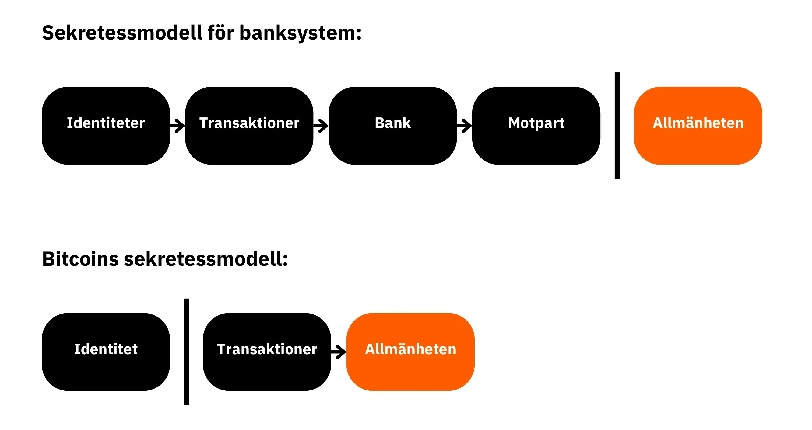


**Avsnitt 2: Förstå och skydda sig mot kedjeanalys**


I det andra avsnittet tittar vi på de tekniker som används av Blockchain-analysföretag för att spåra din aktivitet på Bitcoin. Att förstå dessa metoder är avgörande för att stärka ditt integritetsskydd. Syftet med detta avsnitt är att undersöka angriparnas strategier för att bättre förstå riskerna och förbereda marken för de tekniker som vi kommer att studera i följande avsnitt. Vi kommer att analysera transaktionsmönster, interna och externa heuristiker och troliga tolkningar av dessa mönster. Förutom teori lär vi oss hur man använder en Block explorer för kedjeanalys, genom praktiska exempel och övningar.


**Avsnitt 3: Bästa praxis för att skydda din integritet**


I det tredje avsnittet av vår utbildningskurs går vi in på det väsentliga: övning! Målet är att bemästra alla viktiga bästa metoder som bör bli naturliga reflexer för alla Bitcoin-användare. Vi kommer att täcka användningen av tomma adresser, taggning, konsolidering, användningen av kompletta noder, samt KYC och förvärvsmetoder. Syftet är att ge dig en omfattande översikt över de fallgropar som ska undvikas för att skapa en solid grund i vår strävan att skydda integriteten. För vissa av dessa metoder kommer du att vägledas till en specifik handledning om hur du implementerar dem.


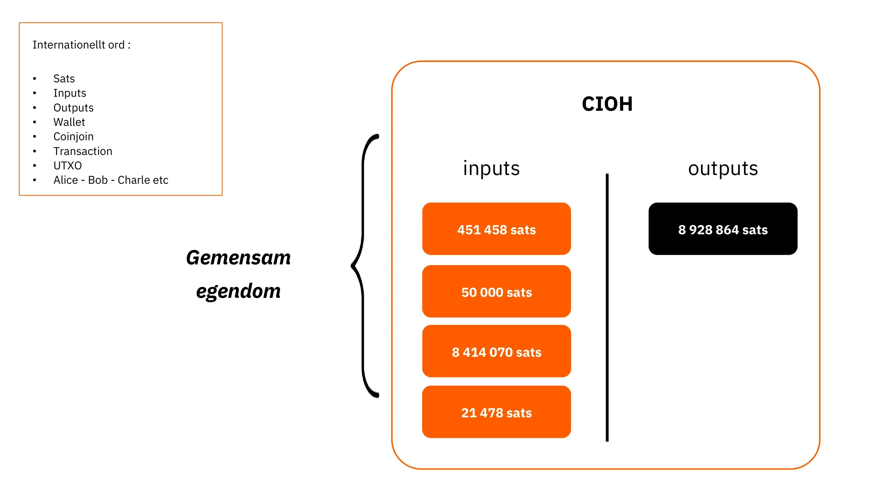


**Avsnitt 4: Förståelse av CoinJoin-transaktioner**


Hur kan vi prata om integritet på Bitcoin utan att nämna coinjoins? I avsnitt 4 får du reda på allt du behöver veta om den här mixningsmetoden. Du får lära dig vad coinjoins är, deras historia och mål, samt de olika typerna av CoinJoin som finns. Slutligen, för den mer erfarna användaren, tar vi en titt på vad anonsets och entropi är och hur man beräknar dem.


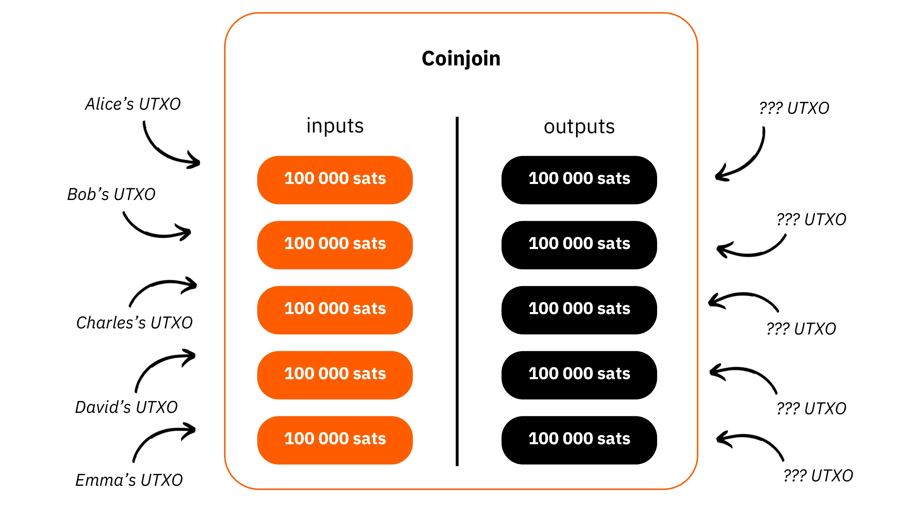


**Avsnitt 5: Förstå utmaningarna med andra avancerade sekretessmetoder**


I det femte avsnittet tar vi en titt på alla andra tekniker som finns tillgängliga för att skydda din integritet på Bitcoin, bortsett från CoinJoin. Under årens lopp har utvecklare visat anmärkningsvärd kreativitet när det gäller att utforma verktyg som är avsedda för integritet. Vi kommer att titta på alla dessa metoder, till exempel PayJoin, samarbetstransaktioner, Coin Swap och Atomic Swap, och beskriva hur de fungerar, deras mål och eventuella svagheter.


Vi kommer också att titta på integritet på nivån för nätverket av noder och transaktionsspridning. Vi kommer också att diskutera de olika protokoll som har föreslagits genom åren för att förbättra användarnas integritet på Bitcoin, inklusive statiska Address-protokoll.


Är du redo att utforska hur integritet fungerar på Bitcoin? Då kör vi!


# Definitioner och nyckelbegrepp


<partId>b9bbbde3-34c0-4851-83e8-e2ffb029cf31</partId>


## Bitcoin:s modell UTXO


<chapterId>8d6b50c5-bf74-44f4-922b-25204991cb75</chapterId>


Bitcoin är först och främst en valuta, men vet du faktiskt hur BTC representeras på protokollet?


### UTXO:er på Bitcoin: vad är de?


Bitcoin-protokollet är baserat på UTXO-modellen, som står för "Unspent Transaction Output".


Denna modell skiljer sig avsevärt från traditionella banksystem, som förlitar sig på en mekanism med konton och saldon för att spåra finansiella flöden. I banksystemet hålls individuella saldon på konton som är kopplade till en identitet. När du till exempel köper en baguette från en bagare debiterar din bank helt enkelt köpesumman från ditt konto, vilket minskar ditt saldo, medan bagarens konto krediteras med samma summa, vilket ökar dess saldo. I detta system finns det ingen koppling mellan de pengar som går in på ditt konto och de pengar som går ut från det, bortsett från transaktionsregister.


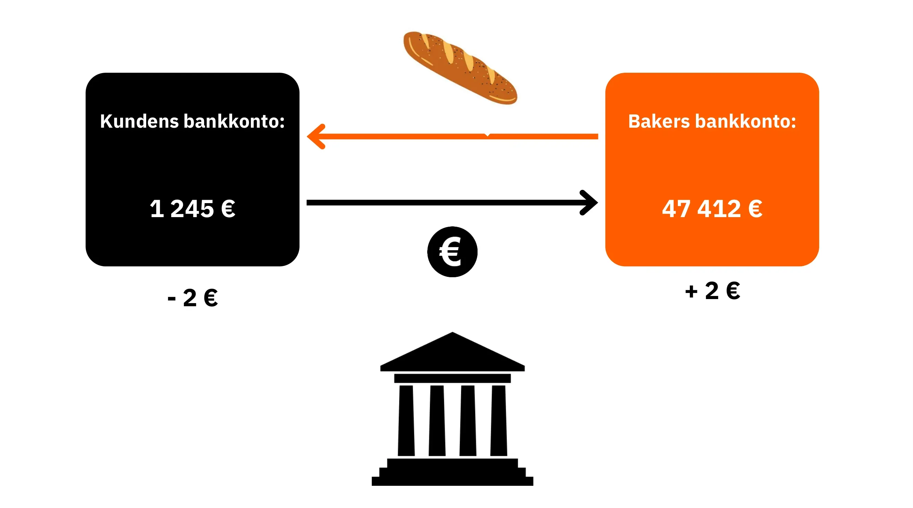


Bitcoin fungerar annorlunda. Konceptet med ett konto existerar inte och monetära enheter hanteras inte via saldon utan genom UTXO:er. En UTXO representerar en specifik mängd bitcoins som ännu inte har spenderats och bildar därmed en "bit Bitcoin", som kan vara stor eller liten. Till exempel kan en UTXO vara värd `500 BTC` eller helt enkelt `700 Sats`.


**Påminna:** Satoshi, ofta förkortat till sat, är Bitcoin:s minsta enhet och kan jämföras med centime i fiatvalutor.


```plaintext
1 BTC = 100 000 000 SATS
```


Teoretiskt sett kan en UTXO representera vilket värde som helst i bitcoins, allt från en sat till ett teoretiskt maximum på cirka 21 miljoner BTC. Det är dock logiskt omöjligt att äga alla 21 miljoner bitcoins, och det finns en lägre ekonomisk tröskel som kallas "Dust", under vilken en UTXO anses vara ekonomiskt olönsam att spendera.


**Visste du?** Den största UTXO som någonsin skapats på Bitcoin hade ett värde av 500 000 BTC. Den skapades av MtGox-plattformen under en konsolideringsoperation i november 2011: [29a3efd3ef04f9153d47a990bd7b048a4b2d213daaa5fb8ed670fb85f13bdbcf](https://Mempool.space/fr/tx/29a3efd3ef04f9153d47a990bd7b048a4b2d213daaa5fb8ed670fb85f13bdbcf)


### UTXO:er och utgiftsförhållanden


UTXO:er är instrumenten för Exchange på Bitcoin. Varje transaktion resulterar i förbrukning av UTXO som input och skapande av nya UTXO som output. När en transaktion är slutförd anses de UTXO:er som använts som input vara "förbrukade" och nya UTXO:er genereras och allokeras till de mottagare som anges i transaktionens output. Således representerar en UTXO helt enkelt en oanvänd transaktionsutgång, och därför en mängd bitcoins som tillhör en användare vid en viss tidpunkt.


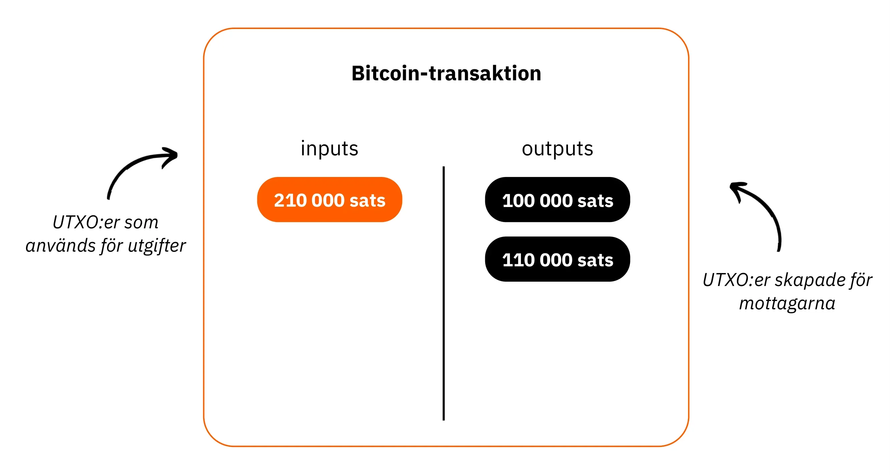


Alla UTXO:er är säkrade genom skript som definierar under vilka villkor de kan användas. För att förbruka en UTXO måste en användare visa för nätverket att han eller hon uppfyller de villkor som anges i det skript som säkrar den UTXO. UTXO:er skyddas vanligtvis av en publik nyckel (eller en mottagande Address som representerar denna publika nyckel). För att använda en UTXO som är associerad med denna publika nyckel måste användaren bevisa att han eller hon innehar motsvarande privata nyckel genom att tillhandahålla en digital signatur som gjorts med denna nyckel. Det är därför vi säger att din Bitcoin Wallet faktiskt inte innehåller bitcoins, utan lagrar dina privata nycklar, som i sin tur ger dig tillgång till dina UTXO:er och i förlängningen till de bitcoins som de representerar.


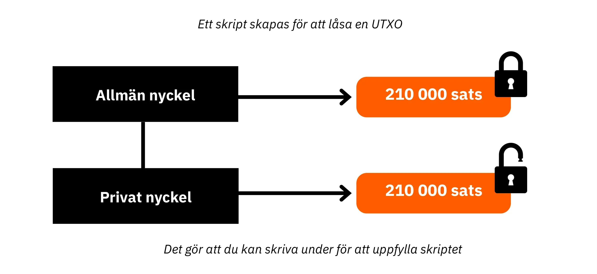


Eftersom det inte finns något koncept med ett konto i Bitcoin är en Wallet:s saldo helt enkelt summan av värdena för alla UTXO:er som den kan spendera. Till exempel, om din Bitcoin Wallet kan spendera följande 4 UTXO:er:


```plaintext
- 2 BTC
- 8 BTC
- 5 BTC
- 2 BTC
```


Det totala saldot i din portfölj skulle vara 17 BTC.


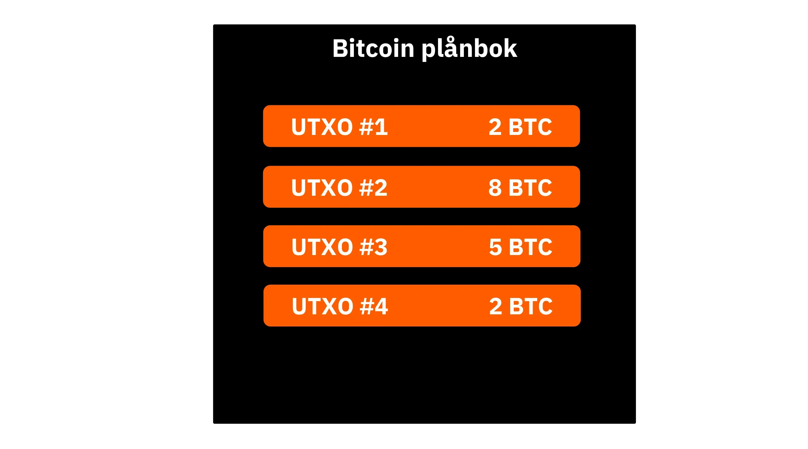


## Strukturen för Bitcoin-transaktioner


<chapterId>29d3aaab-de2e-4746-ab40-c9748898850c</chapterId>


### Transaktionens in- och utgångar


En Bitcoin-transaktion är en operation som registreras på Blockchain och som överför Ownership bitcoins från en person till en annan. Mer exakt, eftersom vi är på en UTXO-modell och det inte finns några konton, uppfyller transaktionen utgiftsvillkoren som säkrade en eller flera UTXO, förbrukar dem och skapar på motsvarande sätt nya UTXO med nya utgiftsvillkor. Kort sagt, en transaktion flyttar bitcoins från ett uppfyllt skript till ett nytt skript som är utformat för att säkra dem.


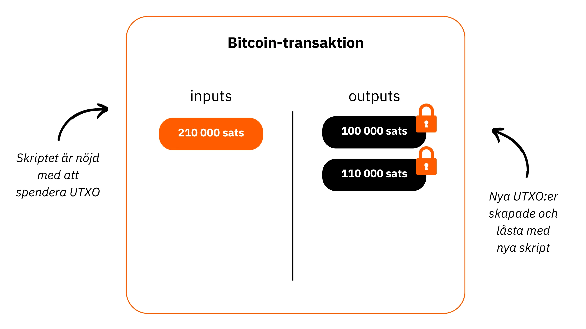


Varje Bitcoin-transaktion består därför av en eller flera ingångar och en eller flera utgångar. Ingångar är UTXO:er som förbrukas av transaktionen till generate-utgångar. Utgångar är nya UTXO:er som kan användas som ingångar för framtida transaktioner.


**Visste du?** Teoretiskt sett kan en Bitcoin-transaktion ha ett oändligt antal in- och utgångar. Den enda begränsningen är den maximala blockstorleken.


Varje input i en Bitcoin-transaktion hänvisar till en tidigare outnyttjad UTXO. För att använda en UTXO som input måste dess innehavare visa att han/hon är den rättmätiga ägaren genom att validera det tillhörande skriptet, dvs. genom att uppfylla det utgiftsvillkor som införts. Generellt sett innebär detta att tillhandahålla en digital signatur som producerats med den privata nyckel som motsvarar den offentliga nyckel som ursprungligen säkrade denna UTXO. Skriptet består därför i att verifiera att signaturen motsvarar den publika nyckel som användes när medlen togs emot.


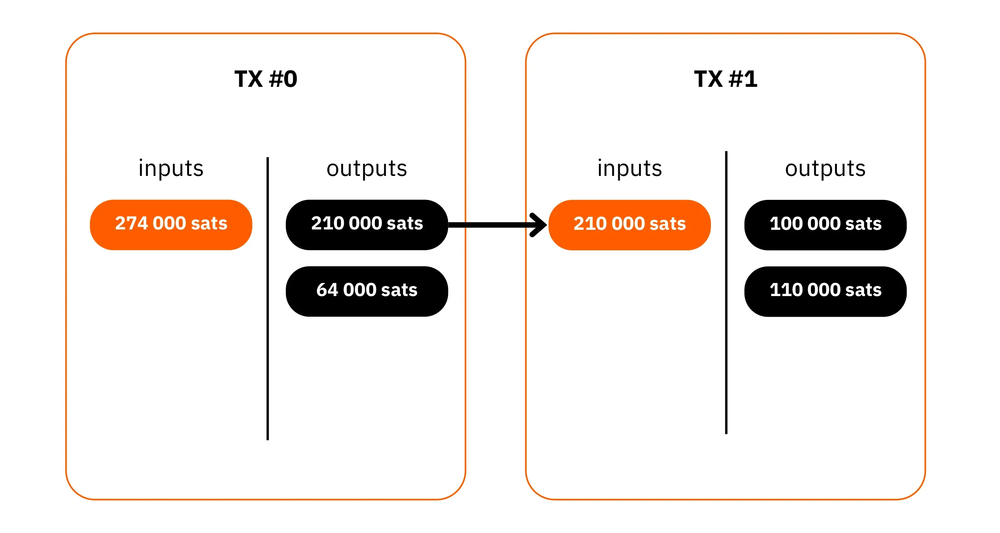


Varje utdata anger i sin tur mängden bitcoins som ska överföras samt mottagaren. Det senare definieras av ett nytt skript, som vanligtvis blockerar den nyskapade UTXO med en mottagande Address eller en ny offentlig nyckel.


För att en transaktion ska anses vara giltig enligt konsensusreglerna måste den totala produktionen vara mindre än eller lika med den totala insatsen. Med andra ord får summan av de nya UTXO som genereras av transaktionen inte överstiga summan av de UTXO som förbrukas som input. Denna princip är logisk: om du bara har 500 000 Sats kan du inte göra ett köp på 700 000 Sats.


### Exchange och sammanslagning i en Bitcoin-transaktion


En Bitcoin-transaktion på UTXO kan således jämföras med att gjuta om ett guldmynt. En UTXO är faktiskt inte delbar, utan endast smältbar. Detta innebär att en användare inte helt enkelt kan dela upp en UTXO som representerar ett visst belopp i bitcoins i flera mindre UTXO:er. Han måste förbruka den helt i en transaktion för att skapa en eller flera nya UTXO:er med godtyckliga värden i utgångar, som måste vara mindre än eller lika med det ursprungliga värdet.


Denna mekanism liknar den som gäller för ett guldmynt. Låt oss säga att du äger ett mynt på 2 ounce och vill göra en betalning på 1 ounce, förutsatt att säljaren inte kan ge dig växel. Du skulle behöva smälta ditt mynt och gjuta 2 nya på 1 ounce vardera.


Bitcoin fungerar på ett liknande sätt. Låt oss föreställa oss att Alice har en UTXO på 10 000 Sats` och vill köpa en baguette som kostar 4 000 Sats`. Alice kommer att göra en transaktion med 1 UTXO på 10 000 Sats` som input, som hon kommer att konsumera i sin helhet, och 2 UTXO på 4 000 Sats` och 6 000 Sats` som output. UTXO på 4 000 Sats` kommer att skickas till bagaren som betalning för baguetten, medan UTXO på 6 000 Sats` kommer att återvända till Alice i form av växel. Denna UTXO, som återgår till den ursprungliga utgivaren av transaktionen, kallas "Exchange" i Bitcoin-jargongen.


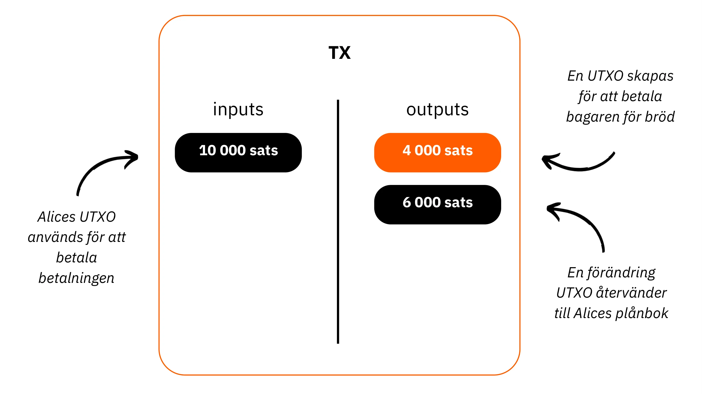


Låt oss nu föreställa oss att Alice inte har en enda UTXO på 10 000 Sats, utan snarare två UTXO på 3 000 Sats vardera. I den här situationen är ingen av UTXO:erna var för sig tillräcklig för att ställa in stavens 4 000 Sats`. Alice måste därför samtidigt använda de 2 UTXO:erna på 3 000 Sats` som ingångar till sin transaktion. På detta sätt kommer den totala mängden inputs att nå 6 000 Sats`, vilket gör det möjligt för henne att uppfylla betalningen på 4 000 Sats` till bagaren. Denna metod, där flera UTXO:er grupperas tillsammans som inputs till en transaktion, kallas ofta "sammanslagning".


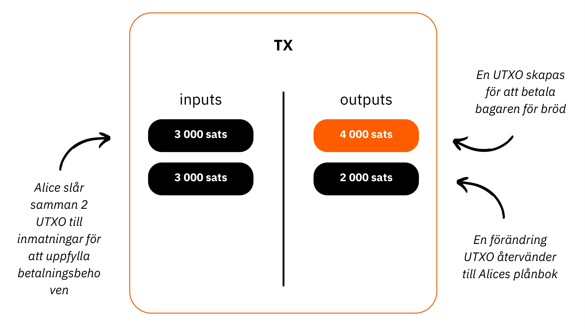


### Transaktionsavgifter


Intuitivt skulle man kunna tro att transaktionskostnader också representerar resultatet av en transaktion. Men i verkligheten är detta inte fallet. Transaktionskostnaderna utgör skillnaden mellan de totala insatserna och de totala utgifterna. Detta innebär att efter det att en del av värdet av insatsvarorna har använts för att täcka de önskade utgifterna i en transaktion, återstår en viss summa av insatsvarorna som inte används. Denna återstående summa utgör transaktionskostnaderna.


```plaintext
Frais = total inputs - total outputs
```


Låt oss ta exemplet med Alice, som har en UTXO på 10 000 Sats och vill köpa en baguette för 4 000 Sats. Alice skapar en transaktion med sin UTXO på 10 000 Sats` som input. Hon genererar sedan en output på 4 000 Sats` för bagaren att betala för baguetten. För att uppmuntra miners att integrera hennes transaktion i ett block, allokerar Alice 200 Sats i avgifter. Hon skapar sedan en andra output, Exchange, som kommer att returneras till henne och uppgår till 5 800 Sats`.


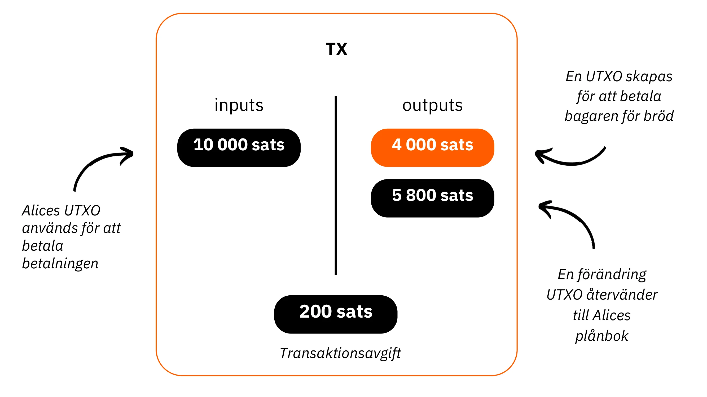


Genom att tillämpa avgiftsformeln ser vi att det faktiskt finns "200 Sats" kvar för minderåriga:


```plaintext
Frais = total inputs - total outputs
Frais = 10 000 - (4 000 + 5 800)
Frais = 10 000 - 9 800
Frais = 200
```


När en Miner lyckas validera ett block har han rätt att ta ut dessa avgifter för alla transaktioner som ingår i hans block, via den så kallade "coinbase"-transaktionen.


### Skapa UTXO:er på Bitcoin


Om du har följt de föregående styckena noggrant vet du nu att UTXO:er endast kan skapas genom att konsumera andra befintliga UTXO:er. På detta sätt bildar Bitcoin-mynt en kontinuerlig kedja. Du kanske dock undrar hur de första UTXO: erna i denna kedja kom till. Detta ger upphov till ett problem som liknar det med hönan och ägget: varifrån kom dessa ursprungliga UTXO?


Svaret finns i **transaktion coinbase**.


Coinbase är en specifik typ av Bitcoin-transaktion, som är unik för varje block och alltid är den första av dessa. Den gör det möjligt för Miner som har hittat en giltig Proof of Work att få sin Block reward. Denna belöning består av två Elements: **block grant** och **transaction fee**, som diskuterades i föregående avsnitt.


Coinbase Transaction är unik i det att den är den enda som kan skapa bitcoins ex nihilo, utan att behöva konsumera input för att generate ska kunna producera output. Dessa nyskapade bitcoins är vad vi kan kalla "ursprungliga UTXO:er".


Blocksubventionerade bitcoins är nya BTC som skapas från grunden, enligt ett förutbestämt utgivningsschema i konsensusreglerna. Blocksubventionen halveras vart 210.000:e block, dvs. ungefär vart fjärde år, i en process som kallas "Halving". Ursprungligen skapades 50 bitcoins med varje subvention, men detta belopp har gradvis minskat; för närvarande är det 3,125 bitcoins per block.


När det gäller transaktionsavgifter, även om de också representerar nyskapad BTC, får de inte överstiga skillnaden mellan de totala inmatningarna och utmatningarna av alla transaktioner i ett block. Vi såg tidigare att dessa avgifter representerar den del av ingångarna som inte används i transaktionsutgångarna. Denna del är tekniskt sett "förlorad" under transaktionen, och Miner har rätt att återskapa detta värde i form av en eller flera nya UTXO:er. Detta är en överföring av värde mellan emittenten av transaktionen och Miner som lägger till det till Blockchain.


**Visste du?** Bitcoins som genereras av en Coinbase Transaction är föremål för en löptid på 100 block, under vilken de inte kan spenderas av Miner. Denna regel är utformad för att undvika komplikationer kopplade till användningen av nyskapade bitcoins i en kedja som senare kan bli föråldrad.


### Konsekvenserna av UTXO-modellen


Först och främst har UTXO-modellen en direkt inverkan på Bitcoin:s transaktionsavgifter. Eftersom kapaciteten för varje block är begränsad gynnar miners transaktioner som erbjuder de bästa avgifterna i förhållande till det utrymme de kommer att ta upp i blocket. Ju fler UTXO:er en transaktion innehåller i sina in- och utgångar, desto tyngre är den och kräver därför högre avgifter. Detta är en av anledningarna till att vi ofta försöker minska antalet UTXO:er i vår portfölj, vilket också kan påverka sekretessen, ett ämne som vi kommer att ta itu med i detalj i den tredje delen av denna kurs.


För det andra, som nämnts i de tidigare avsnitten, är Bitcoin-mynt i huvudsak en kedja av UTXO. Varje transaktion skapar därmed en länk mellan en tidigare UTXO och en framtida UTXO. UTXO:er gör det därför möjligt att uttryckligen följa Bitcoins väg från deras skapande till deras nuvarande utgifter. Denna transparens kan ses som positiv, eftersom den gör det möjligt för varje användare att försäkra sig om äktheten hos de mottagna bitcoins. Det är dock också på denna princip om spårbarhet och granskningsbarhet som Blockchain-analysen baseras, en praxis som är utformad för att äventyra din konfidentialitet. Vi kommer att ta en djupgående titt på denna praxis i den andra delen av kursen.


## Bitcoin:s integritetsmodell


<chapterId>769d8963-3ed5-4094-b21d-9203c7d9e465</chapterId>


### Pengar: äkthet, integritet och dubbla utgifter


En av pengarnas funktioner är att lösa problemet med behovens dubbla sammanträffande. I ett system som bygger på byteshandel kräver genomförandet av en Exchange inte bara att man hittar en individ som ger bort en vara som motsvarar mitt behov, utan också att man förser honom med en vara av motsvarande värde som tillfredsställer hans eget behov. Att hitta denna balans är en komplex fråga.


Det är därför vi använder pengar för att förflytta värde i både tid och rum.


För att mynt ska kunna lösa detta problem är det viktigt att den part som tillhandahåller en vara eller tjänst är övertygad om sin förmåga att spendera summan vid ett senare tillfälle. Varje rationell individ som vill acceptera ett mynt, oavsett om det är digitalt eller fysiskt, kommer därför att se till att det uppfyller två grundläggande kriterier:
- **Verket måste ha integritet och äkthet ;**
- **och får inte spenderas dubbelt.**


Om du använder fysisk valuta är det den första egenskapen som är svårast att säkerställa. Under olika perioder i historien har metallmyntens integritet ofta påverkats av metoder som trimning eller piercing. I det gamla Rom var det t.ex. vanligt att medborgarna skrapade kanterna på guldmynt för att samla lite ädelmetall och spara dem för framtida transaktioner. På så sätt minskade myntets inneboende värde, men dess nominella värde förblev detsamma. Detta är en av anledningarna till att myntets kant senare räfflades.


Äkthet är också en egenskap som är svår att verifiera på ett fysiskt monetärt medium. Dagens tekniker för att bekämpa falsk valuta blir alltmer komplexa, vilket tvingar återförsäljarna att investera i kostsamma verifieringssystem.


Å andra sidan är dubbla utgifter inte ett problem för fysiska valutor på grund av deras natur. Om jag ger dig en 10-eurosedeln lämnar den oåterkalleligen min ägo och övergår i din, vilket naturligtvis utesluter alla möjligheter till dubbel användning av de monetära enheter som den representerar. Kort sagt, jag kommer inte att kunna spendera den här 10-eurosedeln igen.


För digital valuta är svårigheten en annan. Att säkerställa ett mynts äkthet och integritet är ofta enklare. Som vi såg i föregående avsnitt gör Bitcoin:s UTXO-modell det möjligt att spåra ett mynt tillbaka till dess ursprung och därmed verifiera att det verkligen skapades av en Miner i enlighet med konsensusreglerna.


Å andra sidan är det mer komplicerat att säkerställa att det inte finns någon Double-spending, eftersom alla digitala varor i grunden är information. Till skillnad från fysiska varor delas inte information upp när den utbyts, utan sprids genom att multipliceras. Om jag t.ex. skickar ett dokument till dig via e-post kommer det att dupliceras. Du kan inte vara säker på att jag har raderat originaldokumentet.


### Förhindra dubbla utgifter för Bitcoin


Det enda sättet att undvika denna duplicering av en digital tillgång är att vara medveten om alla utbyten i systemet. På så sätt kan vi veta vem som äger vad och uppdatera varje persons innehav i enlighet med de transaktioner som genomförs. Det är t.ex. vad som händer med skriftens pengar i banksystemet. När du betalar 10 euro till en handlare med kreditkort registrerar banken Exchange och uppdaterar kontoboken.


På Bitcoin förhindras Double-spending på samma sätt. Vi försöker bekräfta att det inte finns någon transaktion som redan har använt mynten i fråga. Om mynten aldrig har använts kan vi vara säkra på att ingen dubbelanvändning kommer att ske. Denna princip beskrevs av Satoshi Nakamoto i vitboken med den berömda frasen:


**Det enda sättet att bekräfta att en transaktion inte har ägt rum är att vara medveten om alla transaktioner.**


Men till skillnad från bankmodellen vill vi inte behöva lita på en central enhet för Bitcoin. Så alla användare måste kunna bekräfta att det inte förekommer några dubbla utgifter, utan att förlita sig på en tredje part. Så alla måste vara medvetna om alla Bitcoin-transaktioner. Det är därför som Bitcoin-transaktioner sänds offentligt på alla nätverksnoder och registreras i klartext på Blockchain.


Det är just denna offentliga spridning av information som komplicerar skyddet av privatlivet i Bitcoin. I det traditionella banksystemet är det i teorin bara finansinstitutet som känner till de transaktioner som utförs. I Bitcoin däremot informeras alla användare om alla transaktioner, via sina respektive noder.


### Sekretessmodellen: banksystem vs. Bitcoin


I det traditionella systemet är ditt bankkonto kopplat till din identitet. Bankmannen kan veta vilket bankkonto som tillhör vilken kund och vilka transaktioner som är kopplade till det. Detta informationsflöde är dock avskuret mellan banken och den offentliga domänen. Det är med andra ord omöjligt att känna till saldot och transaktionerna på ett bankkonto som tillhör en annan person. Endast banken har tillgång till denna information.


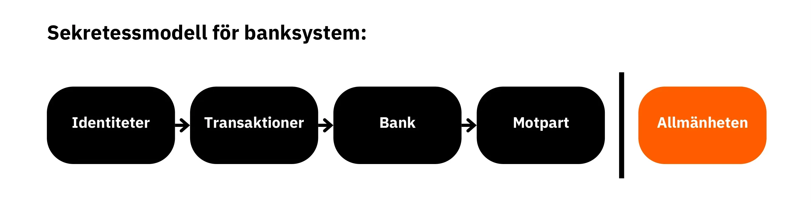


Din bankman vet till exempel att du köper din baguette varje morgon från den lokala bagaren, men din granne har ingen kännedom om denna transaktion. På så sätt är informationsflödet tillgängligt för de berörda parterna, i synnerhet banken, men förblir oåtkomligt för utomstående.


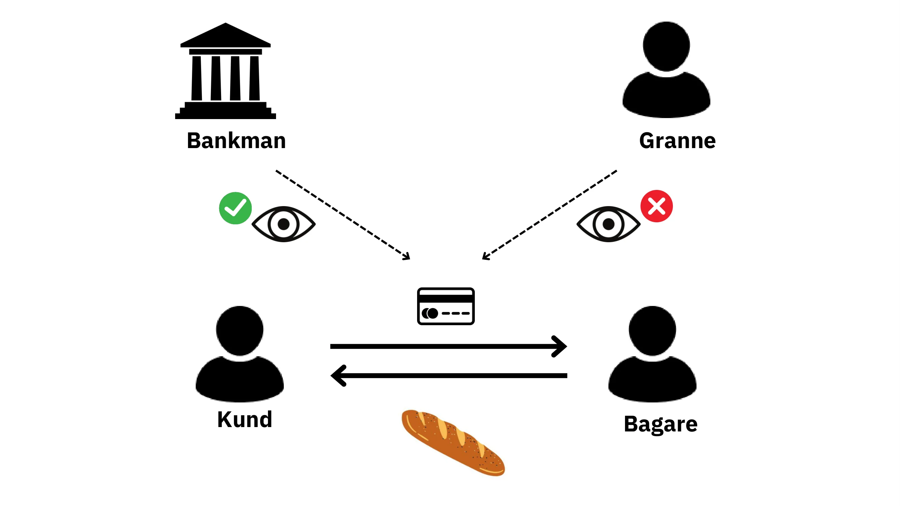


På grund av den begränsning av offentlig spridning av transaktioner som vi såg i föregående avsnitt kan Bitcoin:s sekretessmodell inte följa banksystemets modell. I Bitcoin:s fall, eftersom informationsflödet inte kan brytas mellan transaktionerna och den offentliga domänen, är **sekretessmodellen beroende av separationen mellan användarens identitet och själva transaktionerna**.


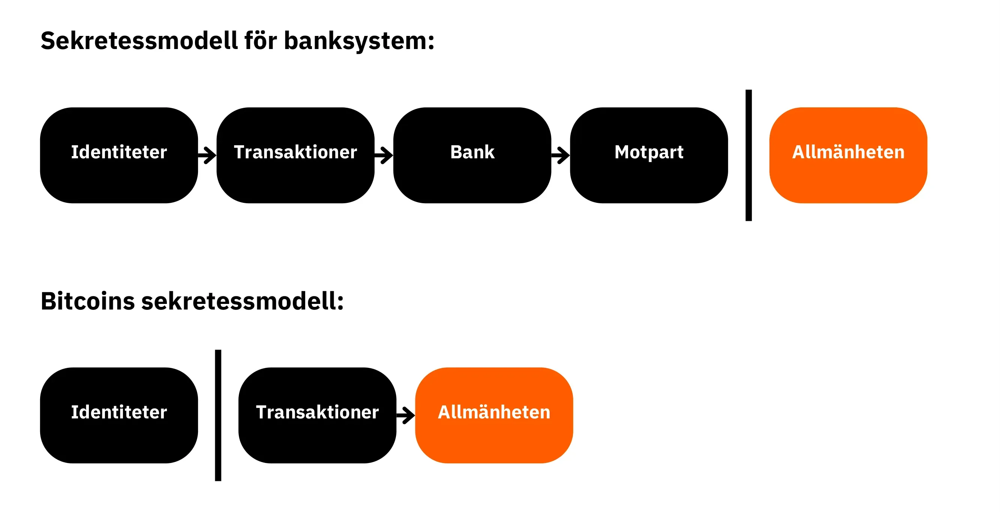


Om du till exempel köper en baguette av bagaren och betalar i BTC kan din granne, som har en egen komplett nod, se din transaktion gå igenom, precis som han kan se alla andra transaktioner i systemet. Men om sekretessprinciperna respekteras bör han inte kunna koppla den här specifika transaktionen till din identitet.


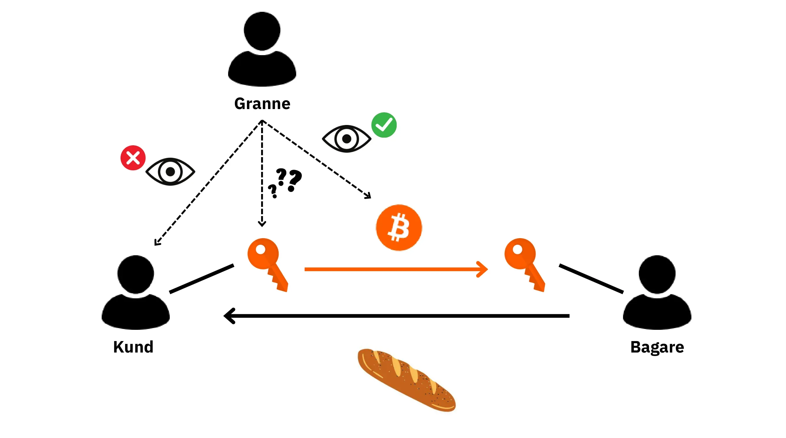


Men eftersom Bitcoin-transaktioner offentliggörs är det fortfarande möjligt att upprätta länkar mellan dem för att utläsa information om de berörda parterna. Denna aktivitet utgör till och med en specialitet i sig, känd som "Blockchain-analys". I nästa del av kursen inbjuder jag dig att utforska grunderna i Blockchain-analys, så att du kan förstå hur dina bitcoins spåras och bättre försvara dig mot dem.


# Förstå och skydda sig mot kedjeanalys


<partId>4739371e-9fef-45b0-bcaa-b7a4df6b4470</partId>


## Vad är Bitcoin kedjeanalys?


<chapterId>7d198ba6-4af2-4f24-86cb-3c79cb25627e</chapterId>


### Definition och funktion


Blockchain-analys är praxis att spåra flödet av bitcoins på Blockchain. Generellt sett baseras kedjeanalys på observation av egenskaper i prover av tidigare transaktioner. Den består sedan av att identifiera samma egenskaper i en transaktion som vi vill analysera och dra rimliga tolkningar av dem. Denna problemlösningsmetod, som bygger på ett praktiskt tillvägagångssätt för att hitta en lösning som är tillräckligt bra, kallas "heuristisk".


I lekmannatermer finns det tre huvudsteg i kedjeanalysen:
1. **Observerar Blockchain ;**
2. **Identifiering av kända funktioner ;**
3. **Avdragning av antaganden**


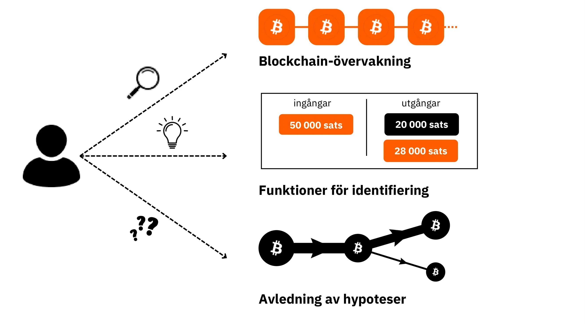


Blockchain-analys kan utföras av vem som helst. Allt du behöver är tillgång till Blockchain:s offentliga information via en komplett nod för att observera transaktionsrörelser och ställa hypoteser. Det finns också gratisverktyg som underlättar denna analys, t.ex. [OXT.me] (https://oxt.me/), som vi kommer att utforska i detalj i de två sista kapitlen i detta avsnitt. Den största risken för sekretess kommer dock från företag som specialiserar sig på stränganalys. Dessa företag har tagit Blockchain-analysen till en industriell skala och säljer sina tjänster till finansinstitut och regeringar. Bland dessa företag är Chainalysis säkert det mest kända.


### Mål för kedjeanalys


Ett av syftena med Blockchain-analysen är att gruppera olika aktiviteter på Bitcoin för att fastställa hur unik den användare är som utfört dem. Därefter kommer det att vara möjligt att försöka koppla detta kluster av aktiviteter till en verklig identitet.


Tänk tillbaka på föregående kapitel. Jag förklarade varför Bitcoin:s integritetsmodell ursprungligen baserades på separationen av användaridentitet från transaktioner. Det skulle därför vara frestande att tro att Blockchain-analysen är värdelös, eftersom även om vi lyckas sammanställa aktiviteter i kedjan kan vi inte koppla dem till en verklig identitet.


Teoretiskt sett är detta påstående korrekt. I den första delen av den här kursen såg vi att kryptografiska nyckelpar används för att fastställa villkor för UTXO. I grund och botten avslöjar dessa nyckelpar ingen information om innehavarens identitet. Så även om vi lyckas gruppera de aktiviteter som är förknippade med olika nyckelpar, säger detta oss ingenting om den enhet som ligger bakom dessa aktiviteter.


Den praktiska verkligheten är dock mycket mer komplex. Det finns en mängd olika beteenden som kan koppla en verklig identitet till aktivitet i kedjan. I analysen kallas detta för en ingångspunkt, och det finns en mängd av dem.


Den vanligaste är KYC (*Känn din kund*). Om du tar ut dina Bitcoins från en reglerad plattform till en av dina personliga mottagningsadresser, kan vissa personer koppla din identitet till den Address. Mer allmänt kan en ingångspunkt vara vilken form av interaktion som helst mellan ditt verkliga liv och en Bitcoin-transaktion. Om du till exempel publicerar en mottagande Address på dina sociala nätverk kan detta vara en ingångspunkt för analys. Om du gör en betalning i Bitcoins till din bagare kommer han att kunna associera ditt ansikte (en del av din identitet) med en Bitcoin Address.


Dessa ingångspunkter är praktiskt taget oundvikliga när man använder Bitcoin. Även om vi kan försöka begränsa deras omfattning kommer de alltid att finnas. Det är därför det är viktigt att kombinera metoder som syftar till att bevara din integritet. Att upprätthålla en separation mellan din verkliga identitet och dina transaktioner är ett intressant tillvägagångssätt, men det är fortfarande otillräckligt idag. Om alla dina onchain-aktiviteter kan grupperas tillsammans är det troligt att även den minsta ingångspunkten äventyrar den enda Layer av sekretess som du har upprättat.


### Försvara dig mot kedjeanalys


Så vi måste också kunna hantera Blockchain-analys i vår användning av Bitcoin. Genom att göra det kan vi minimera aggregeringen av våra aktiviteter och begränsa effekterna av en ingångspunkt på vår integritet.


Finns det något bättre sätt att motverka Blockchain-analys än att lära sig om de metoder som används i den? Om du vill veta hur du kan förbättra din integritet på Bitcoin måste du förstå dessa metoder. Detta kommer att ge dig en bättre förståelse för tekniker som CoinJoin eller PayJoin (tekniker som vi kommer att titta på i de sista delarna av kursen) och minska de misstag du kan göra.


https://planb.network/tutorials/privacy/on-chain/coinjoin-samourai-wallet-e566803d-ab3f-4d98-9136-5462009262ef

https://planb.network/tutorials/privacy/on-chain/payjoin-848b6a23-deb2-4c5f-a27e-93e2f842140f

I detta kan vi dra en analogi med kryptografi och kryptoanalys. En duktig kryptograf är först och främst en duktig kryptoanalytiker. För att ta fram en ny krypteringsalgoritm måste du veta vilka attacker den kommer att utsättas för och även studera varför tidigare algoritmer har brutits. Samma princip gäller för Bitcoin-sekretess. Att förstå Blockchain-analysmetoder är nyckeln till att skydda sig mot dem. Det är därför jag har inkluderat ett helt avsnitt on chain-analys i den här utbildningen.


### Metoder för kedjeanalys


Det är viktigt att förstå att stränganalys inte är någon exakt vetenskap. Den bygger på heuristik som härrör från tidigare observationer eller logiska tolkningar. Dessa regler gör att vi kan få ganska tillförlitliga resultat, men aldrig med absolut precision. Med andra ord innebär **kedjeanalys alltid en viss sannolikhetsdimension i de slutsatser som dras**. Det kan t.ex. vara möjligt att med varierande grad av säkerhet uppskatta att två adresser tillhör samma enhet, men total säkerhet kommer alltid att vara utom räckhåll.


Hela poängen med kedjeanalys ligger just i aggregeringen av olika heuristiker för att minimera risken för fel. På sätt och vis är det en ackumulering av bevis som för oss närmare verkligheten.


Dessa berömda heuristiker kan grupperas i olika kategorier, som vi kommer att beskriva i detalj nedan:


- Transaktionsmönster ;**
- Transaktionsintern heuristik ;
- Heuristik utanför transaktionen.


### Satoshi Nakamoto och kedjeanalys


De två första heuristikerna för kedjeanalys upptäcktes av Satoshi Nakamoto själv. Han talar om dem i del 10 av Bitcoin:s vitbok. De är följande :


- cIOH (*Common Input Ownership Heuristic*);
- och Address-återanvändning.


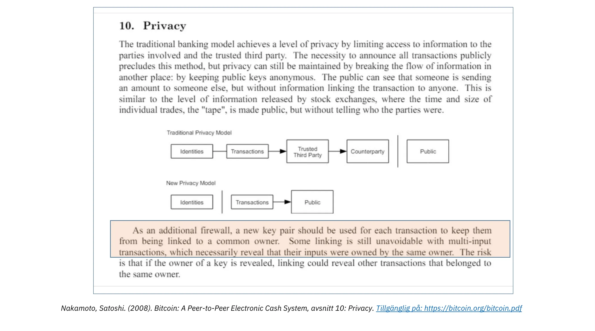


Källa: S. Nakamoto, "Bitcoin: A Peer-to-Peer Electronic Cash System", https://Bitcoin.org/Bitcoin.pdf, 2009.


Vilka de är får vi se i de kommande kapitlen, men det är redan nu intressant att notera att dessa två heuristiker fortfarande har en framträdande roll i kedjeanalysen.


## Transaktionsmönster


<chapterId>d365a101-2d37-46a5-bfb9-3c51e37bf96b</chapterId>


Ett transaktionsmönster är helt enkelt en övergripande modell eller struktur av en typisk transaktion, som kan hittas på Blockchain, och vars troliga tolkning är känd. När vi studerar mönster fokuserar vi på en enda transaktion och analyserar den på en hög nivå.


Med andra ord ska vi bara titta på antalet UTXO i ingående och antalet UTXO i utgående produkter, utan att gå in på transaktionens mer specifika detaljer eller miljö. Baserat på det observerade mönstret kan vi tolka transaktionens karaktär. Vi kommer sedan att leta efter kännetecken för dess struktur och dra slutsatser om en tolkning.


I det här avsnittet tittar vi tillsammans på de viktigaste transaktionsmodellerna som förekommer i kedjeanalys, och för varje modell ger jag dig den troliga tolkningen av denna struktur samt ett konkret exempel.


### Enstaka försändelse (eller enstaka betalning)


Låt oss börja med ett mycket vanligt mönster, eftersom det är det som framträder på de flesta Bitcoin-betalningar. Den enkla betalningsmodellen kännetecknas av konsumtion av en eller flera UTXO:er som insatsvaror och produktion av 2 UTXO:er som utdata. Denna modell ser därför ut så här:


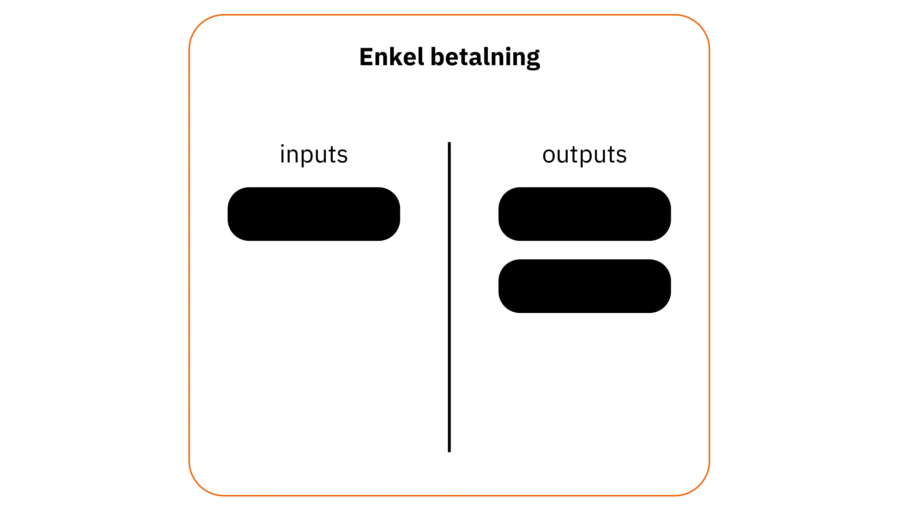


När vi ser denna transaktionsstruktur på Blockchain kan vi redan göra en tolkning. Som namnet antyder indikerar denna modell att vi är i närvaro av en sändnings- eller betalningstransaktion. Användaren har konsumerat sin egen UTXO i inputs för att i outputs tillfredsställa en betalning UTXO och en Exchange UTXO (pengar som returneras till samma användare).


Vi vet därför att den observerade användaren förmodligen inte längre är i besittning av en av de två UTXO:erna (betalningen UTXO), men fortfarande är i besittning av den andra UTXO (Exchange UTXO).


För tillfället kan vi inte specificera vilken utgång som representerar vilken UTXO, eftersom detta inte är syftet med mönsterstudien. Vi kommer dit genom att förlita oss på den heuristik som vi kommer att studera i följande avsnitt. I det här skedet är vårt mål begränsat till att identifiera vilken typ av transaktion det rör sig om, vilket i det här fallet är ett enkelt sändande.


Här är till exempel en Bitcoin-transaktion som använder sig av det enkla sändningsmönstret:


```plaintext
b6cc79f45fd2d7669ff94db5cb14c45f1f879ea0ba4c6e3d16ad53a18c34b769
```


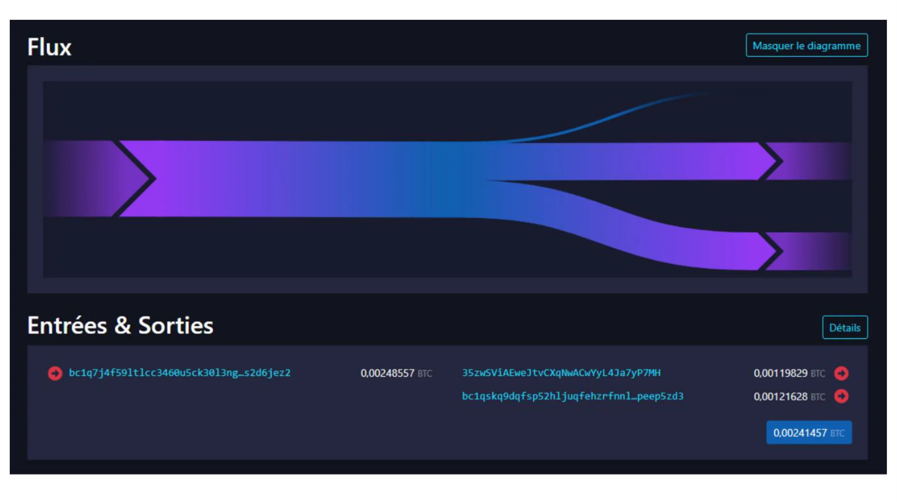


Source : [Mempool.space](https://Mempool.space/fr/tx/b6cc79f45fd2d7669ff94db5cb14c45f1f879ea0ba4c6e3d16ad53a18c34b769)


Efter detta första exempel bör du ha fått en bättre förståelse för vad det innebär att studera en "transaktionsmodell". Vi undersöker en transaktion genom att enbart fokusera på dess struktur, utan att ta hänsyn till dess miljö eller de specifika detaljerna i transaktionen. I det här första steget tittar vi bara på den stora bilden.


Nu när du förstår vad ett mönster är, låt oss gå vidare till de andra befintliga modellerna.


### Svepande


Denna andra modell kännetecknas av konsumtion av en enda UTXO som input och produktion av en enda UTXO som output.


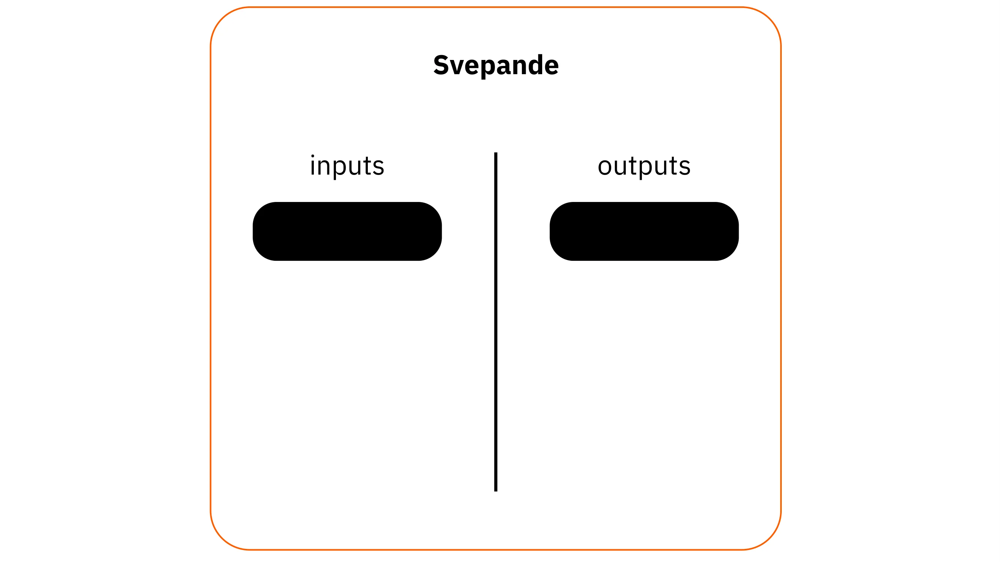


Tolkningen av denna modell är att vi är i närvaro av en självöverföring. Användaren har överfört sina bitcoins till sig själv, till en annan Address som tillhör honom. Eftersom det inte finns någon Exchange på transaktionen är det mycket osannolikt att vi är i närvaro av en betalning. När en betalning görs är det faktiskt nästan omöjligt för betalaren att ha en UTXO som motsvarar exakt det belopp som krävs av säljaren, plus transaktionsavgiften. I allmänhet är betalaren därför skyldig att producera en Exchange-utgång.


Vi vet då att den observerade användaren förmodligen fortfarande innehar denna UTXO. I samband med en kedjeanalys kan vi, om vi vet att den UTXO som används som input i transaktionen tillhör Alice, anta att den UTXO som används som output också tillhör henne. Det som kommer att bli intressant senare är att hitta transaktionsinterna heuristiker som kan förstärka detta antagande (vi tittar på dessa heuristiker i kapitel 3.3).


Här är till exempel en Bitcoin-transaktion som använder sig av svepmönstret:


```plaintext
35f1072a0fda5ae106efb4fda871ab40e1f8023c6c47f396441ad4b995ea693d
```


Source : [Mempool.space](https://Mempool.space/fr/tx/35f1072a0fda5ae106efb4fda871ab40e1f8023c6c47f396441ad4b995ea693d)


Var dock uppmärksam på att denna typ av mönster också kan avslöja en självöverföring till kontot för en kryptovaluta Exchange-plattform. Det kommer att vara studien av kända adresser och transaktionens sammanhang som kommer att berätta om det är en svepning till en självförvarad Wallet eller ett uttag till en plattform. Adresserna till Exchange-plattformar är faktiskt ofta lätt identifierbara.


Låt oss ta Alice:s exempel igen: om skanningen leder till en Address som är känd för en plattform (som Binance, till exempel) kan detta innebära att bitcoins har överförts från Alice:s direkta innehav, förmodligen med avsikt att sälja dem eller lagra dem på denna plattform. Å andra sidan, om destinationen Address är okänd, är det rimligt att anta att det helt enkelt är en annan Wallet som fortfarande tillhör Alice. Men den här typen av studier är mer i kategorin heuristik än mönster.


### Konsolidering


Denna modell kännetecknas av att flera UTXO:er förbrukas vid inmatningen och att en enda UTXO produceras vid utmatningen.


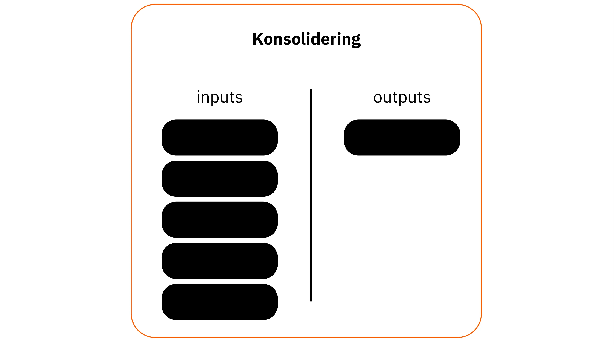


Tolkningen av detta mönster är att vi befinner oss i en konsolideringsprocess. Detta är en vanlig metod bland Bitcoin-användare, som syftar till att slå samman flera UTXO:er i väntan på en eventuell ökning av transaktionsavgifterna. Genom att utföra denna operation under en period då avgifterna är låga är det möjligt att spara på framtida avgifter. Vi kommer att prata mer om denna praxis i kapitel 4.3.


Vi kan dra slutsatsen att användaren bakom den här transaktionsmodellen förmodligen hade alla UTXO:er i input och fortfarande har UTXO i output. Så det är förmodligen en automatisk överföring.


Liksom svepningen kan denna typ av mönster också avslöja en egen överföring till kontot för en Exchange-plattform. Det kommer att vara studien av kända adresser och transaktionens sammanhang som kommer att berätta för oss om det är en konsolidering till en portfölj med egen förvaring eller ett uttag till en plattform.


Här är till exempel en Bitcoin-transaktion som följer konsolideringsmönstret:


```plaintext
77c16914211e237a9bd51a7ce0b1a7368631caed515fe51b081d220590589e94
```


Source : [Mempool.space](https://Mempool.space/fr/tx/77c16914211e237a9bd51a7ce0b1a7368631caed515fe51b081d220590589e94)


I en kedjeanalys kan denna modell avslöja en hel del information. Om vi till exempel vet att en av inmatningarna tillhör Alice kan vi anta att alla andra inmatningar och utmatningen i denna transaktion också tillhör henne. Detta antagande skulle sedan göra det möjligt att gå tillbaka upp i kedjan av tidigare transaktioner för att upptäcka och analysera andra transaktioner som sannolikt kan kopplas till Alice.


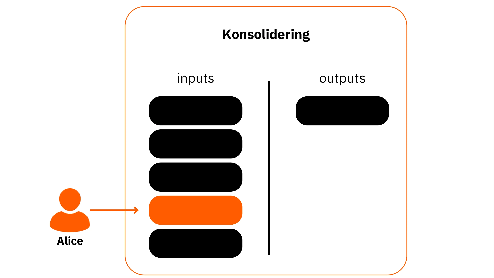


### Grupperade utgifter


Denna modell kännetecknas av att ett fåtal UTXO förbrukas som insatsvaror (ofta bara en) och att många UTXO produceras som utdata.


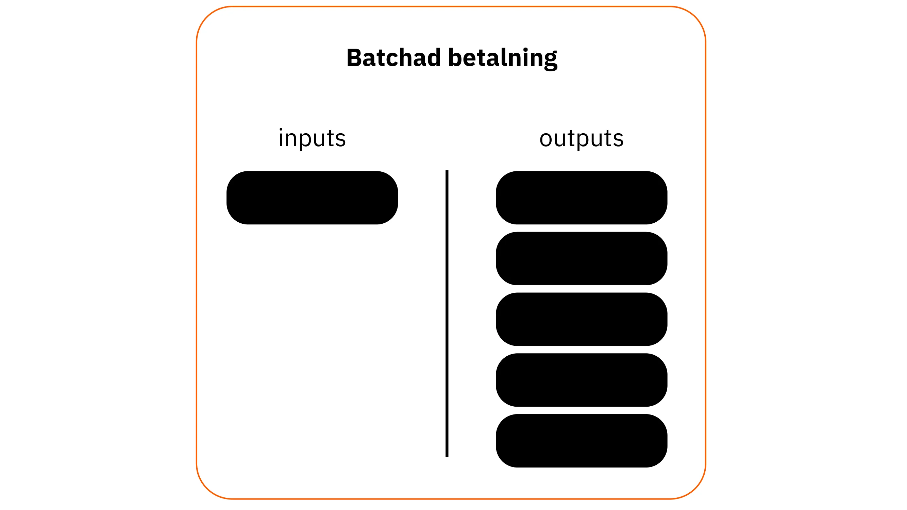


Tolkningen av denna modell är att vi har att göra med grupperade utgifter. Det är en praxis som förmodligen avslöjar en mycket stor ekonomisk aktivitet, till exempel en Exchange-plattform. Grupperade utgifter gör det möjligt för dessa enheter att spara kostnader genom att kombinera sina utgifter i en enda transaktion.


Av denna modell kan vi dra slutsatsen att UTXO i input kommer från ett företag med hög ekonomisk aktivitet och att UTXO:erna i output kommer att spridas. Många kommer att tillhöra företagets kunder som har tagit ut bitcoins från plattformen. Andra kan gå till partnerföretag. Slutligen kommer det säkert att finnas ett eller flera utbyten som går tillbaka till det utfärdande företaget.


Här är till exempel en Bitcoin-transaktion som antar det paketerade utgiftsmönstret (förmodligen är det en transaktion som utfärdats av Bybit-plattformen):


```plaintext
8a7288758b6e5d550897beedd13c70bcbaba8709af01a7dbcc1f574b89176b43
```


Source : [Mempool.space](https://Mempool.space/fr/tx/8a7288758b6e5d550897beedd13c70bcbaba8709af01a7dbcc1f574b89176b43)


### Protokollspecifika transaktioner


Bland transaktionsmönstren kan vi också identifiera dem som avslöjar användningen av ett specifikt protokoll. Till exempel kommer Whirlpool coinjoins (som diskuteras i del 5) att ha en lätt identifierbar struktur som skiljer dem från andra, mer konventionella transaktioner.


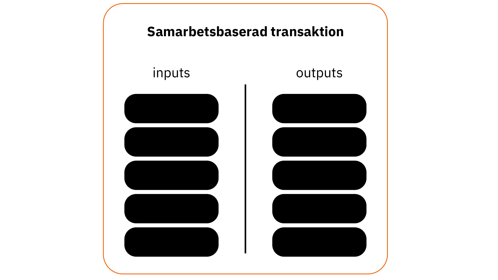


Analys av detta mönster tyder på att vi sannolikt är i närheten av en samarbetstransaktion. Det är också möjligt att observera en CoinJoin. Om den senare hypotesen visar sig vara korrekt kan antalet utgångar ge oss en grov uppskattning av antalet deltagare i CoinJoin.


Här är till exempel en Bitcoin-transaktion som antar CoinJoin:s samarbetsmönster:


```plaintext
00601af905bede31086d9b1b79ee8399bd60c97e9c5bba197bdebeee028b9bea
```


Source : [Mempool.space](https://Mempool.space/fr/tx/00601af905bede31086d9b1b79ee8399bd60c97e9c5bba197bdebeee028b9bea)


Det finns många andra protokoll med sina egna specifika strukturer. Det finns till exempel Wabisabi-transaktioner, Stamp-transaktioner och Runes-transaktioner.


Tack vare dessa transaktionsmönster kan vi redan tolka en viss mängd information om en given transaktion. Men transaktionsstrukturen är inte den enda informationskällan som kan analyseras. Vi kan också studera dess detaljer. Dessa interna detaljer är vad jag kallar "interna heuristiker", och vi ska titta närmare på dem i nästa kapitel.


## Intern heuristik


<chapterId>c54b5abe-872f-40f4-a0d0-c59faff228ba</chapterId>


En intern heuristik är en specifik egenskap som vi identifierar i själva transaktionen, utan att behöva undersöka dess omgivning, och som gör det möjligt för oss att dra slutsatser. Till skillnad från mönster, som fokuserar på transaktionens övergripande struktur på en hög nivå, baseras interna heuristiker på den uppsättning data som kan extraheras. Detta inkluderar:


- Beloppen för de olika UTXO:erna in och ut;
- Allt som har med skript att göra: mottagningsadresser, versionshantering, locktimes...


Generellt sett kommer denna typ av heuristik att göra det möjligt för oss att identifiera Exchange i en specifik transaktion. Genom att göra det kan vi sedan fortsätta spåra en enhet över flera olika transaktioner. Om vi identifierar en UTXO som tillhör en användare som vi vill spåra, är det avgörande att avgöra, när han utför en transaktion, vilken utgång som har överförts till en annan användare och vilken utgång som representerar Exchange, som därmed förblir i hans ägo.


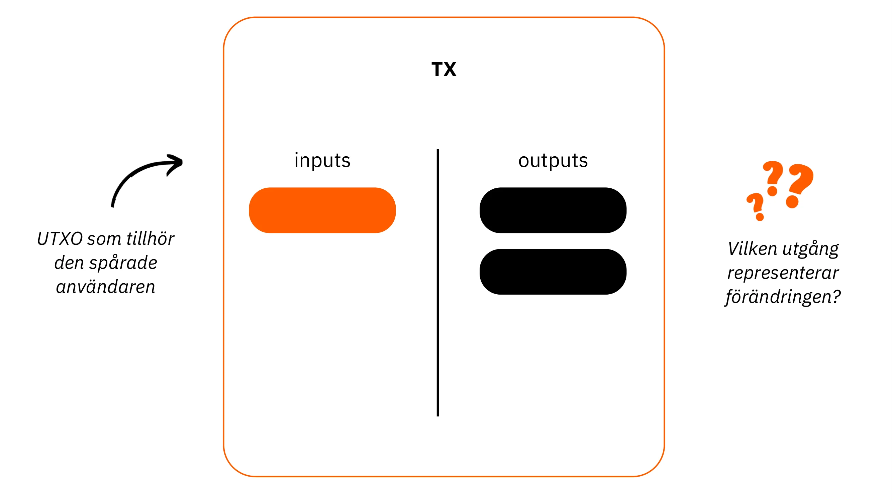


Låt mig än en gång påminna er om att dessa heuristiker inte är helt exakta. Var och en för sig gör de det bara möjligt för oss att identifiera sannolika scenarier. Det är ackumuleringen av flera heuristiker som bidrar till att minska osäkerheten, utan att någonsin kunna eliminera den helt.


### Interna likheter


Denna heuristik innebär att man studerar likheter mellan in- och utdata i samma transaktion. Om samma kännetecken observeras på inputs och på bara en av transaktionens outputs, är det troligt att denna output utgör Exchange.


Den mest uppenbara funktionen är att en mottagande Address kan återanvändas i samma transaktion.


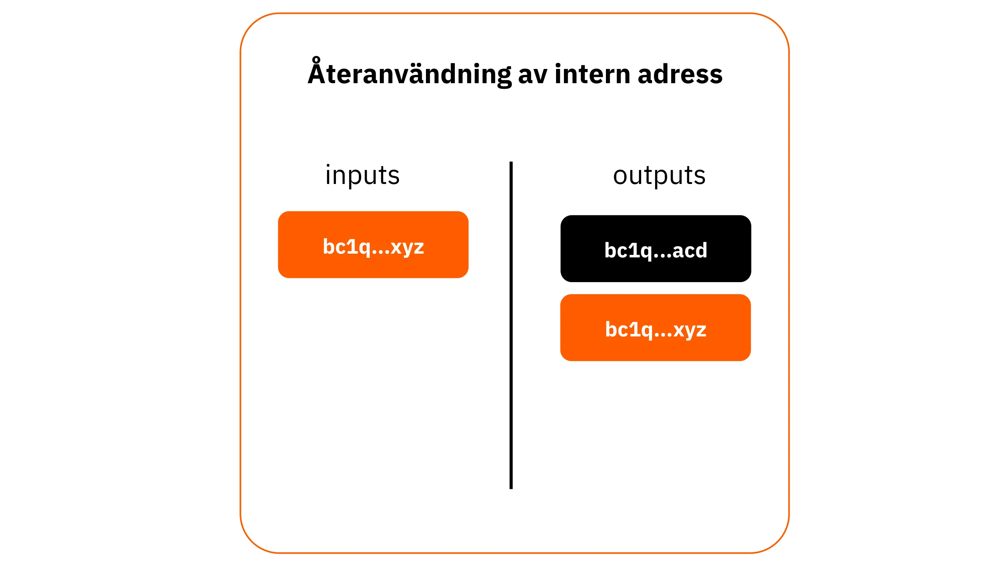


Denna heuristik lämnar lite utrymme för tvivel. Om han inte har fått sin privata nyckel hackad avslöjar samma mottagande Address nödvändigtvis en enda användares aktivitet. Den resulterande tolkningen är att transaktionen Exchange är utgången med samma Address som ingång. Vi kan sedan fortsätta att spåra individen från denna Exchange.


Här är till exempel en transaktion där denna heuristik förmodligen kan tillämpas:


```plaintext
54364146665bfc453a55eae4bfb8fdf7c721d02cb96aadc480c8b16bdeb8d6d0
```


Source : [Mempool.space](https://Mempool.space/tx/54364146665bfc453a55eae4bfb8fdf7c721d02cb96aadc480c8b16bdeb8d6d0)


Dessa likheter mellan inmatningar och utmatningar slutar inte vid återanvändning av Address. Alla likheter i användningen av skript kan användas för att tillämpa en heuristik. Till exempel kan vi ibland observera samma versionering mellan inmatningen och en av transaktionsutmatningarna.


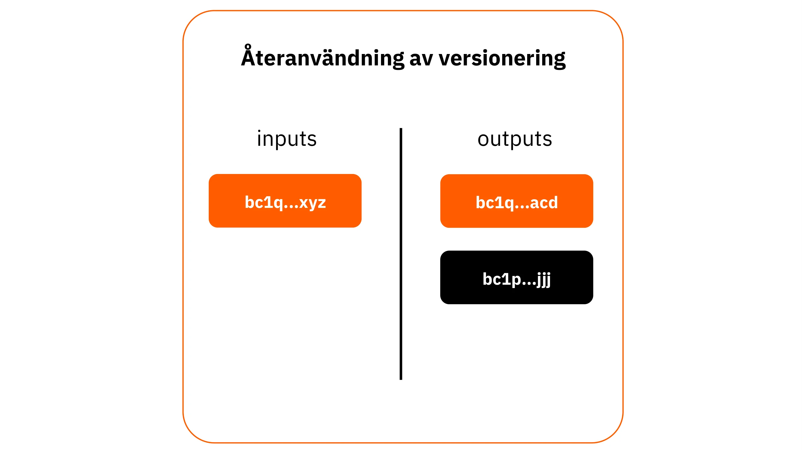


I detta diagram kan vi se att ingång nr 0 låser upp ett P2WPKH-skript (SegWit V0 som börjar med `bc1q`). Utgång nr 0 använder samma typ av skript. Utgång nr 1, å andra sidan, använder ett P2TR-skript (SegWit V1 som börjar med `bc1p`). Tolkningen av denna egenskap är att det är troligt att Address med samma versionering som indata är Exchange Address. Den skulle därför alltid tillhöra samma användare.


Här är en transaktion där denna heuristik förmodligen kan tillämpas:


```plaintext
db07516288771ce5d0a06b275962ec4af1b74500739f168e5800cbcb0e9dd578
```


Source : [Mempool.space](https://Mempool.space/tx/db07516288771ce5d0a06b275962ec4af1b74500739f168e5800cbcb0e9dd578)


På den senare kan vi se att ingång nr 0 och utgång nr 1 använder P2WPKH-skript (SegWit V0), medan utgång nr 0 använder ett annat P2PKH-skript (Legacy).


I början av 2010-talet var denna heuristik baserad på versionshantering av skript relativt oanvändbar på grund av de begränsade typerna av tillgängliga skript. Med tiden och med successiva uppdateringar av Bitcoin har dock en allt större mångfald av skripttyper införts. Denna heuristik blir därför alltmer relevant, eftersom användarna med ett bredare utbud av skripttyper delas in i mindre grupper, vilket ökar chanserna att tillämpa denna heuristik för återanvändning av intern versionering. Av denna anledning, och endast ur ett sekretessperspektiv, är det tillrådligt att välja den vanligaste typen av skript. Till exempel, när jag skriver dessa rader, används Taproot-skript (`bc1p`) mindre ofta än SegWit V0-skript (`bc1q`). Även om de förra erbjuder ekonomiska och sekretessmässiga fördelar i vissa specifika sammanhang, kan det för mer traditionella användningsområden med en enda signatur vara vettigt att hålla sig till en äldre standard av sekretessskäl, tills den nya standarden har antagits i större utsträckning.


### Betalningar med runda tal


En annan intern heuristik som kan hjälpa oss att identifiera Exchange är heuristiken för runda tal. Generellt sett, när man står inför ett enkelt betalningsmönster (1 ingång och 2 utgångar), om en av utgångarna spenderar ett runt belopp, så representerar detta betalningen.


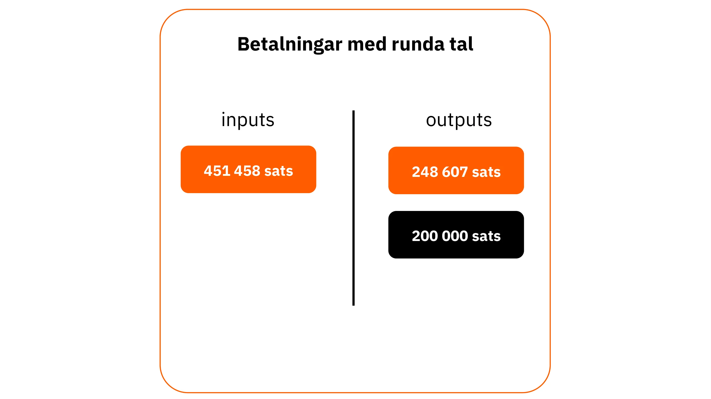


Genom eliminering, om en utgång representerar betalning, representerar den andra Exchange. Det kan därför tolkas som troligt att användaren av indata alltid har tillgång till det utdata som identifierats som Exchange.


Det bör betonas att denna heuristik inte alltid är tillämplig, eftersom majoriteten av betalningarna fortfarande görs i förvaltarregistrerade kontoenheter. När en återförsäljare i Frankrike accepterar Bitcoin kommer han i allmänhet inte att visa stabila priser i Sats. Istället kommer han att välja en konvertering mellan priset i euro och beloppet i bitcoins som ska betalas. Det bör därför inte finnas några runda siffror i slutet av transaktionen.


En analytiker kan dock försöka göra denna konvertering med hänsyn till den Exchange-kurs som gällde när transaktionen sändes ut i nätverket. Låt oss ta ett exempel på en transaktion med en inmatning på 97 552 Sats och två utmatningar, en på 31 085 Sats och en på 64 152 Sats. Vid första anblicken verkar denna transaktion inte omfatta runda belopp. Men genom att tillämpa Exchange-kursen på 64 339 euro vid tidpunkten för transaktionen får vi en omräkning till euro enligt följande:


- En inbetalning på 62,76 euro;
- En produktion på 20 euro;
- Ett resultat på 41,27 euro.


När den här transaktionen har konverterats till fiatvaluta kan den användas för att tillämpa betalningsheuristiken för runda belopp. Utbetalningen på 20 euro gick troligen till en handlare, eller förändrade åtminstone Ownership. Genom avdrag är det troligt att utmatningen på 41,27 euro har förblivit i den ursprungliga användarens ägo.


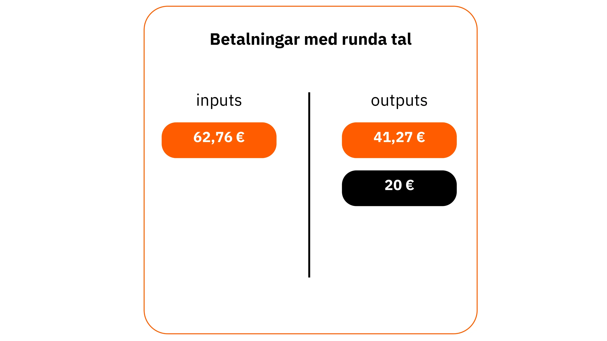


Om Bitcoin en dag blir den föredragna beräkningsenheten i våra börser kan denna heuristik bli ännu mer användbar för analys.


Här är till exempel en transaktion där denna heuristik förmodligen kan tillämpas:


```plaintext
2bcb42fab7fba17ac1b176060e7d7d7730a7b807d470815f5034d52e96d2828a
```


Source : [Mempool.space](https://Mempool.space/tx/2bcb42fab7fba17ac1b176060e7d7d7730a7b807d470815f5034d52e96d2828a)


### Den största produktionen


När vi identifierar ett tillräckligt stort gap mellan två transaktionsutfall på en enkel betalningsmodell kan vi uppskatta att det största utfallet sannolikt är utländsk Exchange.


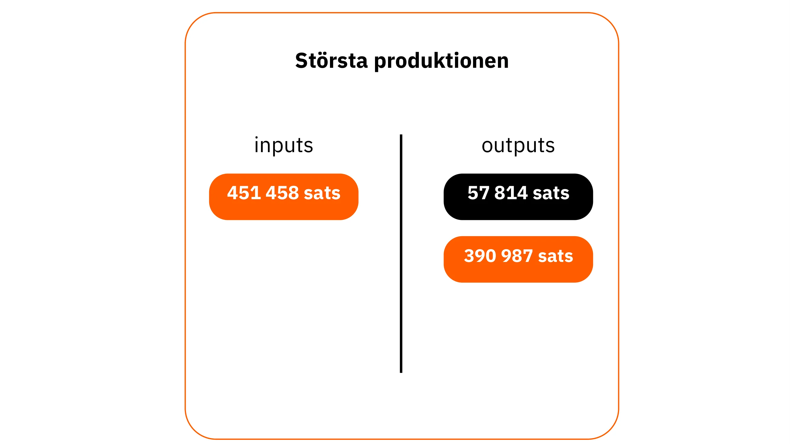


Denna heuristik för största utdata är säkert den mest oprecisa av alla. På egen hand är den ganska svag. Den här funktionen kan dock kombineras med andra heuristiker för att minska osäkerheten i vår tolkning.


Om vi till exempel tittar på en transaktion med en rund betalning och en större betalning minskar vår osäkerhetsnivå om vi tillämpar heuristiken för rund betalning och heuristiken för större betalning tillsammans.


Här är till exempel en transaktion där denna heuristik förmodligen kan tillämpas:


```plaintext
b79d8f8e4756d34bbb26c659ab88314c220834c7a8b781c047a3916b56d14dcf
```


Source : [Mempool.space](https://Mempool.space/tx/b79d8f8e4756d34bbb26c659ab88314c220834c7a8b781c047a3916b56d14dcf)


## Extern heuristik


<chapterId>4a170e3b-200d-431a-8285-18a23ff617ba</chapterId>


Studien av extern heuristik innebär att man analyserar likheter, mönster och egenskaper hos vissa Elements som inte är specifika för själva transaktionen. Med andra ord, medan vi tidigare begränsade oss till att utnyttja Elements som var inneboende i transaktionen med intern heuristik, breddar vi nu vårt analysfält till att omfatta transaktionens omgivning, tack vare extern heuristik.


### Address återanvändning


Detta är en av bitcoiners mest kända heuristiker. Address-återanvändning gör det möjligt att upprätta en länk mellan olika transaktioner och olika UTXO:er. Det sker när en Bitcoin som tar emot Address används flera gånger.


Det är alltså möjligt att utnyttja återanvändning av Address inom samma transaktion som en intern heuristik för att identifiera Exchange (som vi såg i föregående kapitel). Men Address-återanvändning kan också användas som en extern heuristik för att identifiera en enhets unika karaktär bakom flera transaktioner.


Tolkningen av återanvändningen av en Address är att alla UTXO:er som blockerats på den Address tillhör (eller har tillhört) samma enhet. Denna heuristik lämnar litet utrymme för osäkerhet. När den väl har identifierats kommer den resulterande tolkningen sannolikt att motsvara verkligheten. Den gör det därför möjligt att gruppera olika aktiviteter i kedjan.


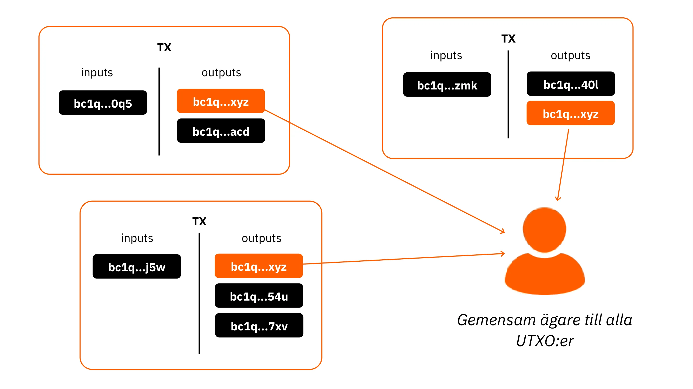


Som förklarades i inledningen till del 3 upptäcktes denna heuristik av Satoshi Nakamoto själv. I vitboken nämner han en lösning för att hjälpa användare att undvika att generera den, vilket helt enkelt är att använda en tom Address för varje ny transaktion:


"_Som en extra brandvägg kan ett nytt nyckelpar användas för varje transaktion för att hålla dem olänkade till en gemensam ägare._"


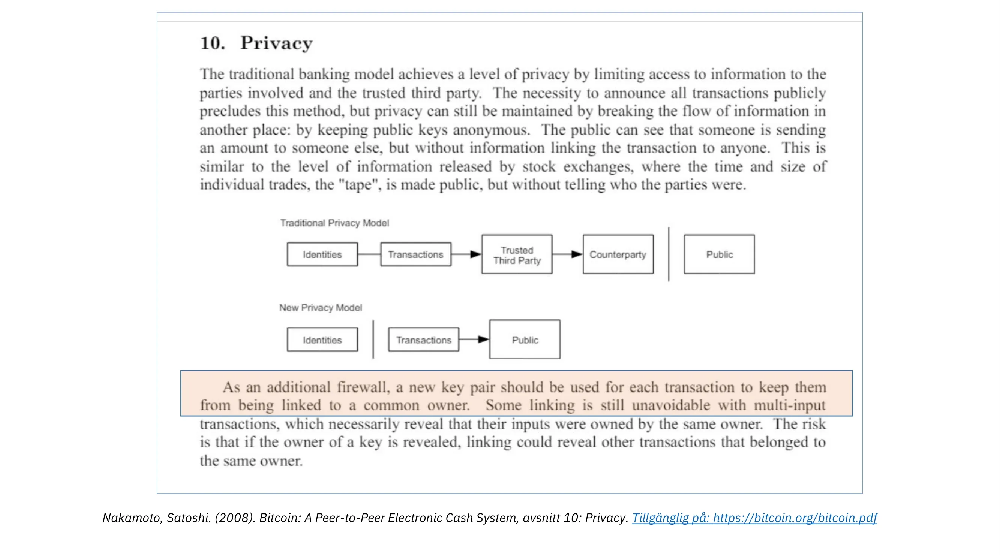


Källa: S. Nakamoto: S. Nakamoto, "Bitcoin: A Peer-to-Peer Electronic Cash System", https://Bitcoin.org/Bitcoin.pdf, 2009.


Här är till exempel en Address som återanvänds i flera transaktioner:


```plaintext
bc1qqtmeu0eyvem9a85l3sghuhral8tk0ar7m4a0a0
```


Källa : [Mempool.space](https://Mempool.space/Address/bc1qqtmeu0eyvem9a85l3sghuhral8tk0ar7m4a0a0)


### Skriftlikhet och Wallet-avtryck


Förutom återanvändning av Address finns det många andra heuristiker som gör att du kan koppla åtgärder till samma portfölj eller Address-kluster.


För det första kan en analytiker leta efter likheter i skriptanvändningen. Till exempel kan vissa minoritetsskript som Multisig vara lättare att upptäcka än SegWit V0-skript. Ju större grupp vi gömmer oss i, desto svårare är det att upptäcka oss. Detta är en av anledningarna till att alla deltagare i bra CoinJoin-protokoll använder exakt samma typ av skript.


Mer generellt kan en analytiker också fokusera på de karakteristiska fingeravtrycken i en portfölj. Dessa är användningsspecifika processer som kan identifieras i syfte att utnyttja dem som spårningsheuristik. Med andra ord, om vi observerar en ackumulering av samma interna egenskaper i transaktioner som tillskrivs den spårade enheten, kan vi försöka identifiera samma egenskaper i andra transaktioner.


Vi kommer till exempel att kunna identifiera att den spårade användaren systematiskt skickar sina ändringar till P2TR-adresser (`bc1p...`). Om den här processen upprepas kan vi använda den som en heuristik för resten av vår analys. Vi kan också använda andra fingeravtryck, t.ex. ordningen på UTXO:er, platsen för ändringen i utdata, RBF- (Replace-by-fee-) signalering eller versionsnumret, fältet `nSequence` och fältet `nLockTime`.


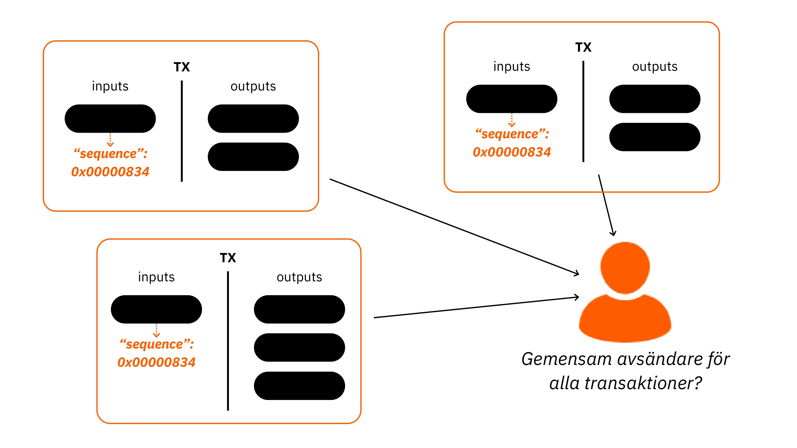


Som [@LaurentMT] (https://twitter.com/LaurentMT) påpekar i [Space Kek #19] (https://podcasters.spotify.com/pod/show/decouvrebitcoin/episodes/SpaceKek-19---Analyse-de-chane--anonsets-et-entropie-e1vfuji) (en franskspråkig podcast) ökar användbarheten av portföljfingeravtryck i kedjeanalys avsevärt med tiden. Det växande antalet skripttyper och den alltmer progressiva implementeringen av dessa nya funktioner i portföljprogramvaran accentuerar skillnaderna. I vissa fall är det till och med möjligt att identifiera exakt vilken programvara som används av den enhet som spåras. Det är därför viktigt att förstå att studien av portföljfotavtryck är särskilt relevant för nyligen genomförda transaktioner, snarare än för dem som inleddes i början av 2010-talet.


Sammanfattningsvis kan ett fotavtryck vara en specifik metod, som utförs automatiskt av Wallet eller manuellt av användaren, som vi kan hitta i andra transaktioner för att hjälpa oss i vår analys.


### Heuristiken för gemensam input Ownership (CIOH)


Common Input Ownership Heuristic (CIOH) är en heuristik som säger att när en transaktion har flera ingångar är det troligt att de alla kommer från en enda enhet. Följaktligen är deras Ownership gemensam.


För att tillämpa CIOH observerar vi först en transaktion med flera inputs. Det kan vara 2 inmatningar eller 30 inmatningar. När denna egenskap har identifierats kontrollerar vi om transaktionen passar in i en känd transaktionsmodell. Om det t.ex. finns 5 inputs med ungefär samma belopp och 5 outputs med exakt samma belopp, vet vi att detta är strukturen för en CoinJoin. Vi kommer inte att kunna tillämpa CIOH.


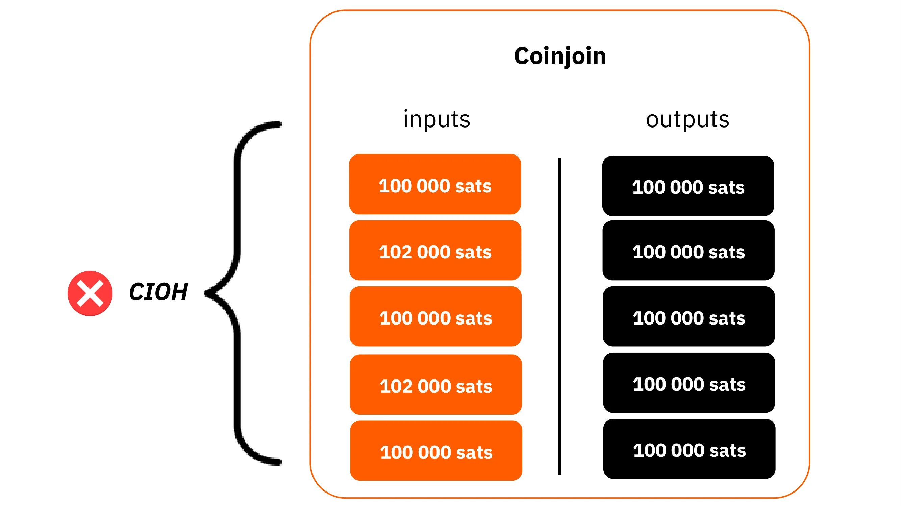


Om transaktionen å andra sidan inte passar in i någon känd samarbetsmodell för transaktioner kan vi tolka det som att alla indata sannolikt kommer från samma enhet. Detta kan vara mycket användbart för att utvidga ett redan känt kluster eller fortsätta ett spår.


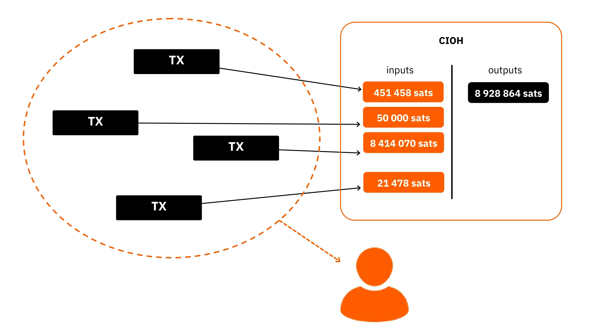


CIOH upptäcktes av Satoshi Nakamoto. Han talar om det i del 10 av vitboken:


"_[...] länkning är oundvikligt med transaktioner med flera poster, som nödvändigtvis avslöjar att deras poster innehades av samma ägare. Risken är att om ägaren till en nyckel avslöjas kan länkarna avslöja andra transaktioner som tillhört samma ägare."


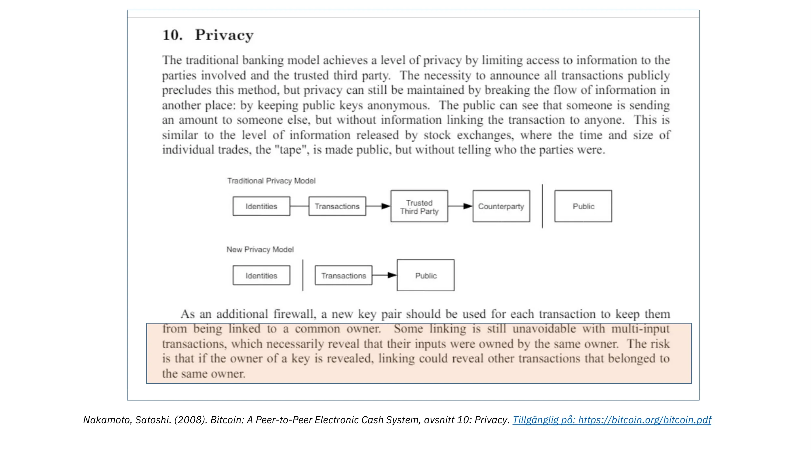


Det är särskilt fascinerande att notera att Satoshi Nakamoto, redan innan den officiella lanseringen av Bitcoin, hade identifierat de två största sårbarheterna för användarnas integritet, nämligen CIOH och Address återanvändning. Sådan framsynthet är ganska anmärkningsvärd, eftersom dessa två heuristiker förblir, även idag, de mest användbara i Blockchain-analys.


För att ge dig ett exempel, här är en transaktion som vi förmodligen kan tillämpa CIOH på:


```plaintext
20618e63b6eed056263fa52a2282c8897ab2ee71604c7faccfe748e1a202d712
```


Source : [Mempool.space](https://Mempool.space/tx/20618e63b6eed056263fa52a2282c8897ab2ee71604c7faccfe748e1a202d712)


### off-chain data


Naturligtvis är kedjeanalys inte begränsad till enbart onchain-data. Alla data från en tidigare analys eller som finns tillgängliga på Internet kan också användas för att förfina en analys.


Om vi till exempel observerar att spårade transaktioner systematiskt sänds från samma Bitcoin-nod, och vi lyckas identifiera dess IP Address, kan vi kanske identifiera andra transaktioner från samma enhet, samt fastställa en del av emittentens identitet. Även om denna metod inte är lätt att genomföra, eftersom den kräver drift av många noder, kan den användas av vissa företag som specialiserar sig på Blockchain-analys.


Analytikern har också möjlighet att förlita sig på analyser som tidigare gjorts tillgängliga i öppen källkod eller på sina egna tidigare analyser. Kanske kan vi hitta en output som pekar på ett kluster av adresser som vi redan har identifierat. Ibland är det också möjligt att förlita sig på utdata som pekar på en Exchange-plattform, eftersom adresserna till dessa företag är allmänt kända.


På samma sätt kan du utföra en analys genom eliminering. Om du till exempel analyserar en transaktion med två utdata och en av dem avser ett Address-kluster som redan är känt, men som skiljer sig från den enhet vi spårar, kan vi tolka det som att den andra utdatan förmodligen representerar Exchange.


I kanalanalysen ingår även en något mer generell OSINT-komponent (*Open Source Intelligence*) som innefattar sökningar på internet. Av denna anledning avråder vi från att publicera adresser direkt på sociala nätverk eller på en webbplats, oavsett om de är pseudonyma eller inte.


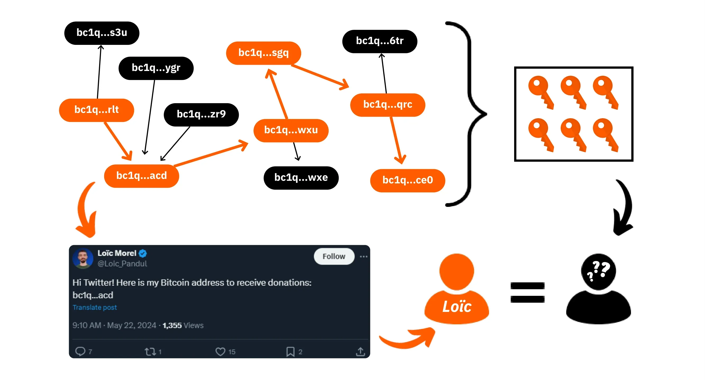


### Temporala modeller


Vi tänker inte så mycket på det, men vissa mänskliga beteenden är igenkännbara i kedjan. Det kanske mest användbara i en analys är ditt sömnmönster! Ja, när du sover sänder du inte Bitcoin-transaktioner. Men du sover i allmänhet vid ungefär samma tid. Det är därför det är vanligt att använda temporal analys i Blockchain-analys. Helt enkelt är detta en folkräkning av de tider då en viss enhets transaktioner sänds till Bitcoin-nätverket. Genom att analysera dessa tidsmönster kan vi härleda en mängd information.


Först och främst kan en temporal analys ibland identifiera den spårade enhetens natur. Om vi observerar att transaktionerna sänds konsekvent under 24 timmar, tyder detta på en hög nivå av ekonomisk aktivitet. Den enhet som ligger bakom dessa transaktioner är sannolikt ett företag, eventuellt internationellt och kanske med automatiserade interna förfaranden.


Till exempel [kände jag igen detta mönster för några månader sedan](https://twitter.com/Loic_Pandul/status/1701127409712452072) när jag analyserade [transaktionen som felaktigt hade allokerat 19 bitcoins i avgifter](https://Mempool.space/tx/d5392d474b4c436e1c9d1f4ff4be5f5f9bb0eb2e26b61d2781751474b7e870fd). En enkel tidsanalys gjorde det möjligt för mig att anta att vi hade att göra med en automatiserad tjänst, och därför förmodligen med en stor enhet som en Exchange-plattform.


Några dagar senare upptäcktes det att pengarna tillhörde PayPal, via Paxos Exchange-plattformen.


Om vi däremot kan se att det tidsmässiga mönstret är ganska utspritt över 16 specifika timmar, kan vi uppskatta att vi har att göra med en enskild användare, eller kanske ett lokalt företag beroende på de volymer som utväxlas.


Utöver den observerade enhetens natur kan det temporala mönstret också berätta ungefär var användaren befinner sig, tack vare tidszoner. På så sätt kan vi matcha andra transaktioner och använda deras tidsstämplar som en ytterligare heuristik som kan läggas till i vår analys.


På den mångsidigt använda Address som jag nämnde tidigare kan vi till exempel se att transaktionerna, både inkommande och utgående, är koncentrerade till ett 13-timmarsintervall.


```plaintext
bc1qqtmeu0eyvem9a85l3sghuhral8tk0ar7m4a0a0
```


Källa : OXT.me


Detta intervall motsvarar troligen Europa, Afrika eller Mellanöstern. Vi kan därför anta att användaren bakom dessa transaktioner bor i dessa områden.


På ett annat sätt ledde en tidsanalys av denna typ också till hypotesen att Satoshi Nakamoto inte arbetade från Japan utan från USA: [* The Time Zones of Satoshi Nakamoto*](https://medium.com/@insearchofsatoshi/the-time-zones-of-Satoshi-nakamoto-aa40f035178f)


## Att sätta det i praktiken med en Block explorer


<chapterId>6493cf2f-225c-405f-9375-c4304f1087ed</chapterId>


I det här sista kapitlet ska vi omsätta de begrepp vi har studerat hittills i praktiken. Jag kommer att visa dig exempel på verkliga Bitcoin-transaktioner, och du måste ta fram den information jag ber dig om.


Helst, för att utföra dessa övningar, skulle användningen av ett professionellt kedjeanalysverktyg vara att föredra. Men sedan arresteringen av skaparna av Samourai Wallet, det enda gratis analysverktyget OXT.me är inte längre tillgängligt. Vi kommer därför att välja en klassisk Block explorer för dessa övningar. Jag rekommenderar att du använder [Mempool.space](https://Mempool.space/) för dess många funktioner och utbud av verktyg för kedjeanalys, men du kan också välja en annan utforskare som [Bitcoin Explorer](https://bitcoinexplorer.org/).


Till att börja med ska jag presentera övningarna för dig. Använd din Block explorer för att genomföra dem och skriv ner dina svar på ett papper. I slutet av detta kapitel kommer jag att ge dig svaren så att du kan kontrollera och korrigera dina resultat.


*De transaktioner som valts ut för dessa övningar har valts ut på ett något slumpmässigt sätt enbart på grund av sina egenskaper. Detta kapitel är endast avsett för utbildnings- och informationsändamål. Jag vill klargöra att jag varken stöder eller uppmuntrar användning av dessa verktyg i skadliga syften. Syftet är att lära dig hur du kan skydda dig mot stränganalys, inte att utföra analys för att avslöja andras privata information.*


### Övning 1


Identifierare av den transaktion som ska analyseras :


```plaintext
3769d3b124e47ef4ffb5b52d11df64b0a3f0b82bb10fd6b98c0fd5111789bef7
```


Vad heter denna transaktionsmodell och vilka rimliga tolkningar kan man göra genom att endast undersöka modellen, dvs. transaktionens struktur?


### Övning 2


Identifierare av den transaktion som ska analyseras :


```plaintext
baa228f6859ca63e6b8eea24ffad7e871713749d693ebd85343859173b8d5c20
```


Vad heter denna transaktionsmodell och vilka rimliga tolkningar kan man göra genom att endast undersöka modellen, dvs. transaktionens struktur?


### Övning 3


Identifierare av den transaktion som ska analyseras :


```plaintext
3a9eb9ccc3517cc25d1860924c66109262a4b68f4ed2d847f079b084da0cd32b
```


Vilken är modellen för denna transaktion?


Efter att ha identifierat sin modell, med hjälp av transaktionens interna heuristik, vilken output är det troligt att Exchange representerar?


### Övning 4


Identifierare av den transaktion som ska analyseras :


```plaintext
35f0b31c05503ebfdf7311df47f68a048e992e5cf4c97ec34aa2833cc0122a12
```


Vilken är modellen för denna transaktion?


Efter att ha identifierat sin modell, med hjälp av transaktionens interna heuristik, vilken output är det troligt att Exchange representerar?


### Övning 5


Låt oss föreställa oss att Loïc har lagt upp en av sina Bitcoin-mottagningsadresser på det sociala nätverket Twitter :


```plaintext
bc1qja0hycrv7g9ww00jcqanhfpqmzx7luqalum3vu
```


Baserat på denna information och med **enbart Address återanvändningsheuristik**, vilka Bitcoin transaktioner kan kopplas till Loïcs identitet?


*Självklart är jag inte den verkliga ägaren av denna mottagning Address och jag publicerade den inte på sociala nätverk. Det är en Address som jag tog slumpmässigt från Blockchain*


### Övning 6


Efter övning 5 kunde du, tack vare Address återanvändningsheuristiken, identifiera flera Bitcoin-transaktioner som Loïc verkar vara inblandad i. Normalt sett borde du ha upptäckt den här bland de identifierade transaktionerna:


```plaintext
2d9575553c99578268ffba49a1b2adc3b85a29926728bd0280703a04d051eace
```


Den här transaktionen är den allra första som skickar pengar till Loïcs Address. Var tror du att de bitcoins som Loïc fick via den här transaktionen kom ifrån?


### Övning 7


Efter övning 5 har du, tack vare Address-återanvändningsheuristiken, kunnat identifiera flera Bitcoin-transaktioner som Loïc verkar vara inblandad i. Nu vill du ta reda på var Loïc kom ifrån. Baserat på de transaktioner som hittats, utför en tidsanalys för att hitta den tidszon som mest troligt används av Loïc. Utifrån denna tidszon bestämmer du en plats där Loïc verkar bo (land, stat/region, stad ...).


### Övning 8


Här är Bitcoin-transaktionen att studera:


```plaintext
bb346dae645d09d32ed6eca1391d2ee97c57e11b4c31ae4325bcffdec40afd4f
```


Vilken information kan vi tolka om vi bara tittar på den här transaktionen?


### Övningslösningar


***Övning 1:***


Modellen för denna transaktion är den enkla betalningsmodellen. Om vi bara studerar dess struktur kan vi tolka det som att en utgång representerar Exchange och den andra utgången representerar en faktisk betalning. Vi vet därför att den observerade användaren förmodligen inte längre är i besittning av en av de två UTXO:erna i utmatningen (betalningen), men fortfarande är i besittning av den andra UTXO (Exchange).


***Övning 2:***


Modellen för denna transaktion är den för grupperade utgifter. Denna modell avslöjar förmodligen en storskalig ekonomisk aktivitet, till exempel en Exchange-plattform. Vi kan dra slutsatsen att inmatningen UTXO kommer från ett företag med en hög ekonomisk aktivitetsnivå och att utmatningen UTXO:er kommer att vara utspridd. Vissa kommer att tillhöra företagets kunder som har tagit ut sina bitcoins till plånböcker med egen förvaring. Andra kan gå till partnerföretag. Slutligen kommer det utan tvekan att finnas några Exchange som kommer att gå tillbaka till det utfärdande företaget.


***Övning 3:***


Modellen för den här transaktionen är enkel betalning. Vi kan därför tillämpa intern heuristik på transaktionen för att försöka identifiera Exchange.


Jag har personligen identifierat minst två interna heuristiker som stöder samma hypotes:


- Återanvändning av samma typ av manus ;
- Den största produktionen.


Den mest uppenbara heuristiken är att återanvända samma typ av skript. Utdata `0` är faktiskt en `P2SH`, som känns igen på att den tar emot Address som börjar med `3` :


```plaintext
3Lcdauq6eqCWwQ3UzgNb4cu9bs88sz3mKD
```


Medan utgång `1` är en `P2WPKH`, identifierbar genom sin Address som börjar med `bc1q` :


```plaintext
bc1qya6sw6sta0mfr698n9jpd3j3nrkltdtwvelywa
```


Den UTXO som användes som indata för denna transaktion använder också ett `P2WPKH`-skript:


```plaintext
bc1qyfuytw8pcvg5vx37kkgwjspg73rpt56l5mx89k
```


Vi kan alltså anta att utdata `0` motsvarar en betalning och att utdata `1` är transaktionen Exchange, vilket skulle innebära att input-användaren alltid äger utdata `1`.


För att stödja eller motbevisa den här hypotesen kan vi leta efter andra heuristiker som antingen bekräftar vår tankegång eller minskar sannolikheten för att vår hypotes är korrekt.


Jag har identifierat minst en annan heuristik. Det är den största utmatningsheuristiken. Utgång `0` mäter `123,689 Sats`, medan utgång `1` mäter `505,839 Sats`. Det finns därför en signifikant skillnad mellan dessa två utgångar. Heuristiken för den största produktionen tyder på att den största produktionen sannolikt är utländsk Exchange. Denna heuristik stärker ytterligare vår ursprungliga hypotes.


Det verkar därför troligt att den användare som levererade UTXO som input fortfarande har `1` output, som verkar förkroppsliga transaktionens Exchange.


***Övning 4:***


Modellen för den här transaktionen är enkel betalning. Vi kan därför tillämpa intern heuristik på transaktionen för att försöka identifiera Exchange.


Jag har personligen identifierat minst två interna heuristiker som stöder samma hypotes:


- Återanvändning av samma typ av manus ;
- Den runda postutgången.


Den mest uppenbara heuristiken är att återanvända samma typ av skript. Utdata `0` är faktiskt en `P2SH`, igenkännbar genom sin mottagning Address som börjar med `3` :


```plaintext
3FSH5Mnq6S5FyQoKR9Yjakk3X4KCGxeaD4
```


Medan utgång `1` är en `P2WPKH`, identifierbar genom sin Address som börjar med `bc1q` :


```plaintext
bc1qvdywdcfsyavt4v8uxmmrdt6meu4vgeg439n7sg
```


Den UTXO som användes som input för denna transaktion använder också ett `P2WPKH`-skript:


```plaintext
bc1qku3f2y294h3ks5eusv63dslcua2xnlzxx0k6kp
```


Vi kan alltså anta att utdata `0` motsvarar en betalning och utdata `1` är transaktionen Exchange, vilket skulle innebära att input-användaren alltid äger utdata `1`.


För att stödja eller motbevisa den här hypotesen kan vi leta efter andra heuristiker som antingen bekräftar vår tankegång eller minskar sannolikheten för att vår hypotes är korrekt.


Jag har identifierat minst en annan heuristik. Det är den runda mängden utdata. Utgång `0` mäter `70,000 Sats`, medan utgång `1` mäter `22,962 Sats`. Vi har därför en perfekt rund produktion i BTC-kontoenheten. Den runda utmatningsheuristiken antyder att UTXO med ett runt belopp troligen är betalningen, och att den andra genom eliminering representerar Exchange. Denna heuristik stärker ytterligare vår ursprungliga hypotes.


I det här exemplet kan dock en annan heuristik utmana vår ursprungliga hypotes. Faktum är att utmatning `0` är större än utmatning `1`. Baserat på heuristiken att det största utfallet i allmänhet är utländsk Exchange, skulle vi kunna dra slutsatsen att utfallet `0` är utländsk Exchange. Denna mothypotes förefaller dock osannolik, eftersom de två andra heuristikerna förefaller betydligt mer övertygande än heuristiken för den största produktionen. Följaktligen verkar det rimligt att behålla vår ursprungliga hypotes trots denna uppenbara motsägelse.


Det verkar därför troligt att den användare som levererade UTXO som input fortfarande har `1` output, som verkar förkroppsliga transaktionens Exchange.


***Övning 5:***


Vi kan se att 8 transaktioner kan kopplas till Loïcs identitet. Av dessa innebär 4 mottagande av bitcoins:


```plaintext
2d9575553c99578268ffba49a1b2adc3b85a29926728bd0280703a04d051eace
8b70bd322e6118b8a002dbdb731d16b59c4a729c2379af376ae230cf8cdde0dd
d5864ea93e7a8db9d3fb113651d2131567e284e868021e114a67c3f5fb616ac4
bc4dcf2200c88ac1f976b8c9018ce70f9007e949435841fc5681fd33308dd762
```


De övriga 4 gäller Bitcoin-leveranser:


```plaintext
8b52fe3c2cf8bef60828399d1c776c0e9e99e7aaeeff721fff70f4b68145d540
c12499e9a865b9e920012e39b4b9867ea821e44c047d022ebb5c9113f2910ed6
a6dbebebca119af3d05c0196b76f80fdbf78f20368ebef1b7fd3476d0814517d
3aeb7ce02c35eaecccc0a97a771d92c3e65e86bedff42a8185edd12ce89d89cc
```


***Övning 6:***


Om vi tittar på modellen för den här transaktionen är det tydligt att det är en samlad utgift. Transaktionen har nämligen en enda input och 51 outputs, vilket tyder på en hög nivå av ekonomisk aktivitet. Vi kan därför anta att Loïc har tagit ut bitcoins från en Exchange-plattform.


Flera faktorer förstärker denna hypotes. För det första är den typ av skript som används för att säkra UTXO-ingången ett P2SH 2/3 Multisig-skript, vilket tyder på en avancerad säkerhetsnivå som är typisk för Exchange-plattformar:


```plaintext
OP_PUSHNUM_2
OP_PUSHBYTES_33 03eae02975918af86577e1d8a257773118fd6ceaf43f1a543a4a04a410e9af4a59
OP_PUSHBYTES_33 03ba37b6c04aaf7099edc389e22eeb5eae643ce0ab89ac5afa4fb934f575f24b4e
OP_PUSHBYTES_33 03d95ef2dc0749859929f3ed4aa5668c7a95baa47133d3abec25896411321d2d2d
OP_PUSHNUM_3
OP_CHECKMULTISIG
```


Dessutom återanvänds den Address-studerade `3PUv9tQMSDCEPSMsYSopA5wDW86pwRFbNF` i över 220 000 olika transaktioner, vilket ofta är karakteristiskt för Exchange-plattformar, som i allmänhet inte bryr sig om deras konfidentialitet.


Den temporala heuristik som tillämpas på denna Address visar också en regelbunden sändning av transaktioner nästan dagligen under en 3-månadersperiod, med förlängda timmar över 24 timmar, vilket tyder på kontinuerlig aktivitet på en Exchange-plattform.


Slutligen är de volymer som hanteras av denna enhet kolossala. Address tog emot och skickade 44 BTC i 222 262 transaktioner mellan december 2022 och mars 2023. Dessa stora volymer bekräftar ytterligare den troliga karaktären av en Exchange-plattforms aktivitet.


***Övning 7:***


Genom att analysera tiderna för bekräftelse av transaktioner kan följande UTC-tider identifieras:


```plaintext
05:43
20:51
18:12
17:16
04:28
23:38
07:45
21:55
```


En analys av dessa tidtabeller visar att UTC-7 och UTC-8 överensstämmer med ett intervall av nuvarande mänsklig aktivitet (mellan 08:00 och 23:00) för majoriteten av tidtabellerna:


```plaintext
05:43 UTC > 22:43 UTC-7
20:51 UTC > 13:51 UTC-7
18:12 UTC > 11:12 UTC-7
17:16 UTC > 10:16 UTC-7
04:28 UTC > 21:28 UTC-7
23:38 UTC > 16:38 UTC-7
07:45 UTC > 00:45 UTC-7
21:55 UTC > 14:55 UTC-7
05:43 UTC > 21:43 UTC-8
20:51 UTC > 12:51 UTC-8
18:12 UTC > 10:12 UTC-8
17:16 UTC > 09:16 UTC-8
04:28 UTC > 20:28 UTC-8
23:38 UTC > 15:38 UTC-8
07:45 UTC > 23:45 UTC-8
21:55 UTC > 13:55 UTC-8
```


Tidszonen UTC-7 är särskilt relevant på sommaren, eftersom den omfattar stater och regioner som :


- Kalifornien (med städer som Los Angeles, San Francisco och San Diego);
- Nevada (med Las Vegas) ;
- Oregon (med Portland) ;
- Washington (med Seattle) ;
- Den kanadensiska regionen British Columbia (med städer som Vancouver och Victoria).


Denna information tyder på att Loïc sannolikt är bosatt på USA:s eller Kanadas västkust.


***Träning 8:***


Analysen av denna transaktion visar på 5 inputs och en enda output, vilket tyder på konsolidering. Genom att tillämpa CIOH-heuristiken kan vi anta att alla ingående UTXO:er ägs av en enda enhet, och att den utgående UTXO också tillhör denna enhet. Det verkar som om användaren valde att gruppera ihop flera UTXO:er som han ägde för att bilda en enda UTXO i utdata, i syfte att konsolidera sina delar. Denna åtgärd motiverades troligen av en önskan att dra nytta av den tidens låga transaktionskostnader för att minska framtida kostnader.


___


*För att skriva denna del 3 on chain-analys använde jag mig av följande resurser:*


- Serien med fyra artiklar med titeln: [Förstå Bitcoin Integritet med OXT] (https://medium.com/oxt-research/understanding-Bitcoin-privacy-with-oxt-part-1-4-8177a40a5923), producerad av Samourai Wallet 2021;
- De olika rapporterna från [OXT Research](https://medium.com/oxt-research), liksom deras kostnadsfria analysverktyg Blockchain (inte längre tillgängligt för tillfället efter gripandet av grundarna av Samourai Wallet);
- Mer allmänt kommer min kunskap från olika tweets och innehåll från [@LaurentMT](https://twitter.com/LaurentMT) och [@ErgoBTC](https://twitter.com/ErgoBTC);
- [Space Kek #19](https://podcasters.spotify.com/pod/show/decouvrebitcoin/episodes/SpaceKek-19---Analyse-de-chane--anonsets-et-entropie-e1vfuji) där jag deltog i sällskap med [@louneskmt](https://twitter.com/louneskmt), [@TheoPantamis](https://twitter.com/TheoPantamis), [@Sosthene___](https://twitter.com/Sosthene___) och [@LaurentMT](https://twitter.com/LaurentMT).


*Jag skulle vilja tacka deras författare, utvecklare och producenter. Tack också till korrekturläsarna som noggrant korrigerade artikeln som denna del 3 bygger på, och gav mig sina expertråd :*


- [Gilles Cadignan](https://twitter.com/gillesCadignan) ;*
- [Ludovic Lars] (https://viresinnumeris.fr/)


# Behärska bästa praxis för att skydda din integritet


<partId>9bd04b63-f1af-4e50-9061-6bc90009df68</partId>


## Address återanvändning


<chapterId>f3e97645-3df3-41bc-a4ed-d2c740113d96</chapterId>


Efter att ha studerat de tekniker som kan bryta din sekretess på Bitcoin, kommer vi i denna tredje del nu att titta på de bästa metoderna för att skydda dig själv. Syftet med denna del är inte att utforska metoder för att förbättra sekretessen, ett ämne som kommer att behandlas senare, utan snarare att förstå hur man interagerar korrekt med Bitcoin för att behålla den sekretess som den naturligt erbjuder, utan att ta till ytterligare tekniker.


För att börja denna tredje del ska vi naturligtvis prata om Address-återanvändning. Detta fenomen är det största hotet mot användarnas konfidentialitet. Det här kapitlet är utan tvekan det viktigaste i hela kursen.


### Vad är en mottagande Address?


En Bitcoin som tar emot Address är en sträng eller identifierare som används för att ta emot bitcoins på en Wallet.


Tekniskt sett "tar inte en Bitcoin som tar emot Address emot" bitcoins i bokstavlig mening, utan tjänar snarare till att definiera villkoren under vilka bitcoins kan spenderas. Konkret, när en betalning skickas till dig, skapar avsändarens transaktion en ny UTXO för dig som en output från de UTXO:er som den har konsumerat som input. På denna output fäster den ett skript som definierar hur denna UTXO kan spenderas vid ett senare tillfälle. Detta skript är känt som "*ScriptPubKey*" eller "*Locking Script*". Din mottagande Address, eller mer exakt dess nyttolast, är integrerad i detta skript. I lekmannatermer säger detta skript i princip:


> "*För att använda denna nya UTXO måste du tillhandahålla en digital signatur med den privata nyckel som är associerad med denna mottagande Address.*"
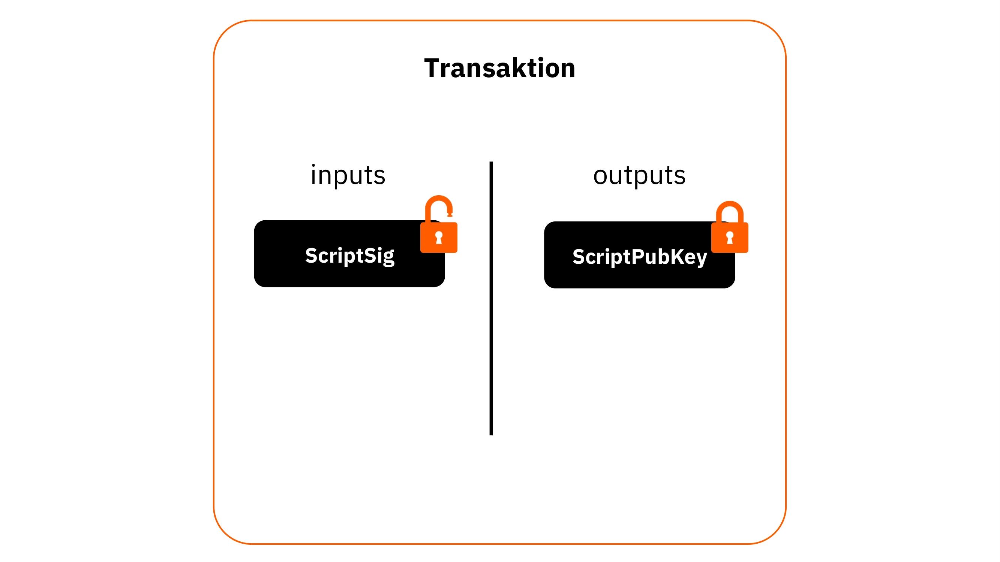


Bitcoin-adresser finns i olika typer, beroende på vilken skriptmodell som används. De första modellerna, som kallas **Legacy**, omfattar adresserna `P2PKH` (*Pay-to-PubKey-Hash*) och `P2SH` (*Pay-to-Script-Hash*). P2PKH-adresser börjar alltid med "1" och P2SH med "3". Även om dessa format fortfarande är säkra är de nu föråldrade, eftersom de medför högre transaktionskostnader och erbjuder mindre sekretess än de nya standarderna.


SegWit V0 (`P2WPKH` och `P2WSH`) och Taproot / SegWit V1 (`P2TR`) adresser representerar moderna format. SegWit-adresser börjar med `bc1q` och Taproot-adresser, som introduceras 2021, börjar med `bc1p`.


Till exempel, här är en Taproot mottagning Address:


```text
bc1ps5gd2ys8kllz9alpmcwxqegn7kl3elrpnnlegwkm3xpq2h8da07spxwtf5
```


Hur ScriptPubKey är konstruerad beror på vilken standard som används:


| ScriptPubKey | Script template
| ---------------- | ----------------------------------------------------------- |
| P2PKH | OP_DUP OP_HASH160 `<pubKeyHash>` OP_EQUALVERIFY OP_CHECKSIG |
| P2SH | OP_HASH160 `<scriptHash>` OP_EQUAL |
| P2WPKH | 0 `<pubKeyHash>` |
| P2WSH | 0 `<witnessScriptHash>` |
| P2SH - P2WPKH | OP_HASH160 `<redeemScriptHash>` OP_EQUAL |
| P2SH - P2WSH | OP_HASH160 `<redeemScriptHash>` OP_EQUAL |
| P2TR | 1 `<pubKey>` |

Uppbyggnaden av mottagningsadresser beror också på vilken skriptmodell som väljs:


- För `P2PKH`- och `P2WPKH`-adresser representerar nyttolasten, dvs. kärnan i Address, Hash för den publika nyckeln;
- För adresserna `P2SH` och `P2WSH` representerar nyttolasten Hash för en ;
- När det gäller `P2TR`-adresser är nyttolasten en modifierad offentlig nyckel. P2TR-utgångar kombinerar aspekter av _Pay-to-PubKey_ och _Pay-to-Script_. Den tweakade offentliga nyckeln är resultatet av att lägga till en klassisk utgiftsoffentlig nyckel med en "tweak", härledd från Merkle Root av en uppsättning skript som också kan användas för att spendera bitcoins.


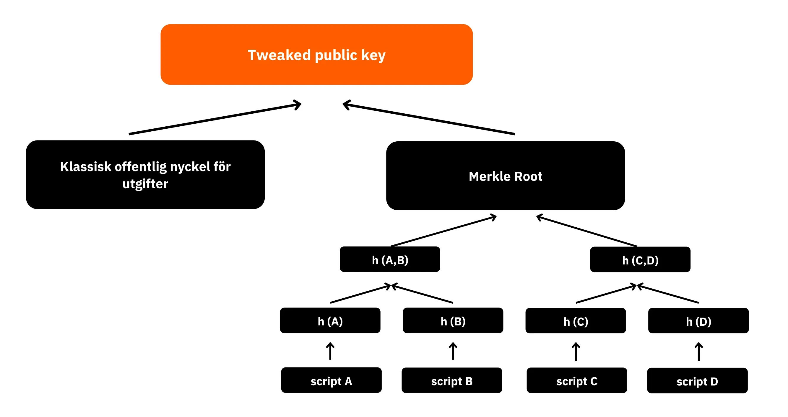


Adresser som visas på din portföljprogramvara innehåller också en HRP (*Human-Readable Part*), vanligtvis `bc` för adresser efter SegWit, en `1`-separator och ett versionsnummer `q` för SegWit V0 och `p` för Taproot/SegWit V1. En kontrollsumma läggs också till för att garantera integriteten och giltigheten hos Address under överföringen.


Slutligen läggs adresserna in i ett standardformat:


- Base58check för gamla Legacy-adresser ;
- Bech32 för SegWit-adresser ;
- Bech32m för Taproot-adresser.


Här är additionsmatrisen för formaten bech32 och bech32m (SegWit och Taproot) från bas 10:


| + | 0 | 1 | 2 | 3 | 4 | 5 | 6 | 7 |
| --- | --- | --- | --- | --- | --- | --- | --- | --- |
| 0 | q | p | z | r | y | 9 | x | 8 |
| 8 | g | f | 2 | t | v | d | w | 0 |
| 16 | s | 3 | j | n | 5 | 4 | k | h |
| 24 | c | e | 6 | m | u | a | 7 | l |

### Vad är Address återanvändning?


Address-återanvändning är användningen av samma mottagande Address för att blockera flera olika UTXO:er.


Som vi såg i föregående avsnitt har varje UTXO sin egen ScriptPubKey, som låser den och måste uppfyllas för att UTXO ska kunna konsumeras som input i en ny transaktion. Det är i denna ScriptPubKey som adresserna för nyttolasten integreras.


När olika ScriptPubKeys innehåller samma mottagande Address kallas detta för Address-återanvändning. I praktiken innebär detta att en användare upprepade gånger har tillhandahållit samma Address till avsändare för att ta emot bitcoins via flera betalningar. Och det är just denna praxis som är katastrofal för din integritet.


### Varför är återanvändning av Address ett problem?


Eftersom Blockchain är offentlig är det lätt att se vilka adresser som låser vilken UTXO och hur många bitcoins. Om samma Address används för flera transaktioner blir det möjligt att dra slutsatsen att alla bitcoins som är kopplade till den Address tillhör samma person. Denna praxis äventyrar användarnas integritet genom att göra det möjligt att upprätta deterministiska länkar mellan olika transaktioner och spåra bitcoins på Blockchain. Satoshi Nakamoto själv belyste redan detta problem i Bitcoin:s vitbok:


> *Som en extra brandvägg kan ett nytt nyckelpar användas för varje transaktion så att de inte kopplas till en gemensam ägare*
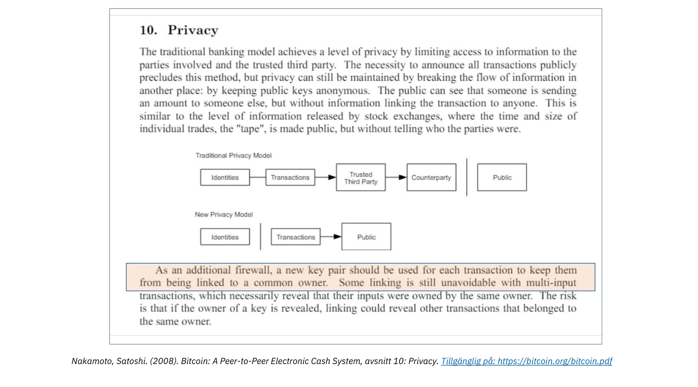


Källa: S. Nakamoto, "Bitcoin: A Peer-to-Peer Electronic Cash System", https://Bitcoin.org/Bitcoin.pdf, 2009.


Satoshi:s avsikt med denna mening var att skapa en extra brandvägg i händelse av en koppling mellan en användares identitet och ett nyckelpar på Bitcoin, för att förhindra att hela hans aktivitet offentligt kopplas till hans identitet. Idag, med den stora spridningen av Blockchain-analysföretag och KYC-regler, är användningen av unika adresser inte längre en "extra brandvägg", utan en oumbärlig praxis för alla som vill bevara ett minimum av integritet.


När du återanvänder en Address skapar du en nästan obestridlig länk mellan alla transaktioner som är associerade med den Address. Även om detta inte direkt äventyrar dina medel, eftersom kryptografi med elliptisk kurva garanterar säkerheten för dina privata nycklar, gör det det lättare att övervaka dina aktiviteter. Vem som helst med en nod kan faktiskt observera transaktionerna och saldona på adresserna, vilket helt äventyrar din anonymitet.


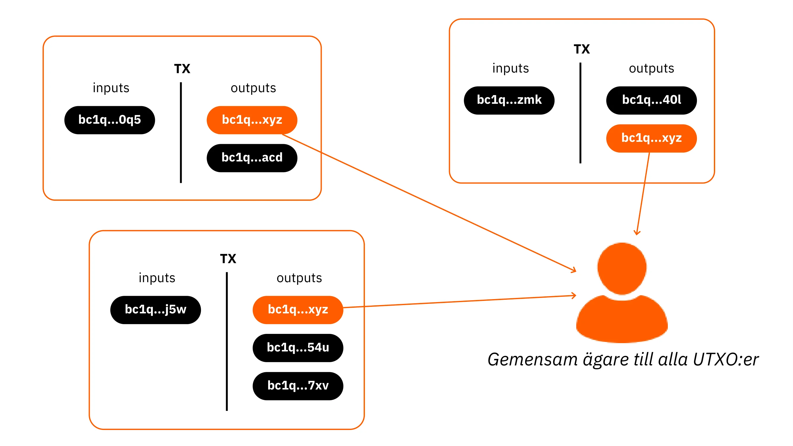


För att illustrera denna punkt, låt oss ta exemplet Bob, en användare som regelbundet köper bitcoins i små mängder i DCA och alltid skickar dem till samma Address. Efter två år innehåller denna Address en betydande mängd bitcoins. Om Bob använder denna Address för att göra en betalning till en lokal handlare kommer den senare att kunna se alla tillhörande medel och dra slutsatser om Bob:s förmögenhet. Detta kan leda till personliga säkerhetsrisker, såsom försök till stöld eller utpressning. Om Bob hade använt en tom Address för att ta emot varje periodiskt köp skulle han ha avslöjat oändligt mycket mindre information för sin handlare.


I stränganalys finns det 2 typer av Address-återanvändning:


- Extern återanvändning ;
- Intern återanvändning inom en transaktion.


Den första är när en Address återanvänds i flera olika Bitcoin-transaktioner. Detta är vad vi talade om tidigare: denna heuristik drar slutsatsen att alla UTXO:er som passerar genom denna Address tillhör en enda enhet.


Intern återanvändning av Address sker inte när återanvändningen sker över flera transaktioner, utan när den sker inom en enda transaktion. Om samma Address som används för att låsa en inmatning används som utmatning i en transaktion, kan vi dra slutsatsen att denna utmatning fortfarande tillhör samma användare (Exchange) och att den andra utmatningen representerar den faktiska betalningen. Denna andra heuristik gör det möjligt att spåra medel över flera transaktioner.


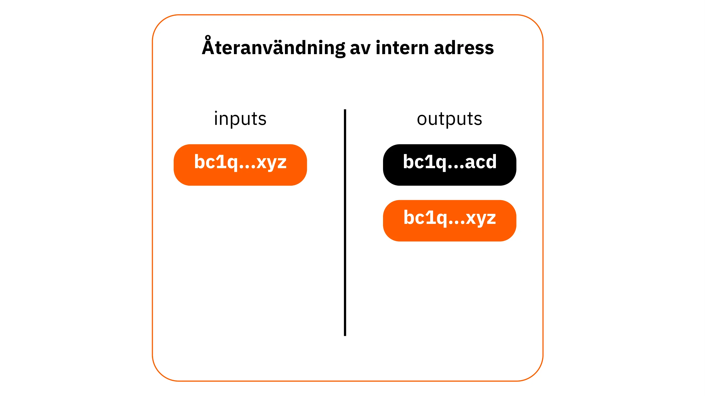


Address-återanvändning är ett verkligt gissel på Bitcoin. Enligt webbplatsen OXT.me (för närvarande otillgänglig) var den totala graden av återanvändning av Address på Bitcoin cirka 52 % 2022:


Denna siffra är enorm, men den kommer till överväldigande del från Exchange-plattformar snarare än enskilda användare.


### Hur undviker man återanvändning av Address?


Att undvika återanvändning av Address är ganska enkelt: **använd helt enkelt en ny, tom Address för alla nya betalningar till din Wallet**.


Tack vare BIP32 är moderna portföljer nu deterministiska och hierarkiska. Detta innebär att en användare kan generate ett stort antal adresser från en enda initial information: seed. Genom att spara denna enda information är det möjligt att återställa alla privata nycklar i portföljen, vilket möjliggör åtkomst till de medel som säkras av motsvarande adresser.


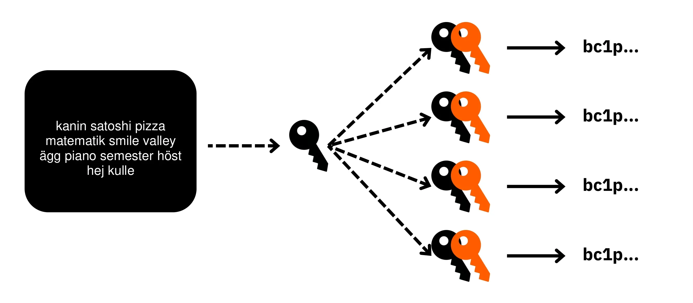


Det är därför som en oanvänd mottagande Address föreslås varje gång du trycker på "*receive*"-knappen i din Wallet-programvara. Efter att ha tagit emot bitcoins på denna Address föreslår programvaran automatiskt en ny.


> *PS: Nyligen har vissa Wallet-program meddelat sin avsikt att sluta generera tomma adresser, eftersom de fruktar att detta kommer att uppfattas som en form av penningtvätt av myndigheterna. Om din programvara är en av dessa rekommenderar jag starkt att du byter ut den omedelbart, eftersom detta inte är acceptabelt för användaren.*
Om du behöver en statisk identifierare för att ta emot betalningar, t.ex. donationer, är det inte tillrådligt att använda en klassisk Bitcoin Address på grund av risken för återanvändning. Använd istället en Lightning Address eller välj en statisk onchain-betalningsidentifierare, till exempel BIP47 eller Silent Payments. Dessa protokoll förklaras i detalj i del 6 av denna utbildning.


## Märkning och kontroll av delar


<chapterId>fbdb07cd-c025-48f2-97b0-bd1bc21c68a8</chapterId>


Som vi upptäckte i avsnittet om stränganalys finns det en mängd olika heuristiker och mönster som kan användas för att härleda information om en transaktion. Som användare är det viktigt att vara medveten om dessa tekniker för att bättre kunna skydda sig mot dem.


Detta innebär rigorös hantering av din Wallet i självförvar, vilket innebär att känna till ursprunget för dina UTXO:er, samt att noggrant välja vilka UTXO:er som ska förbrukas när du gör betalningar. Denna effektiva Wallet-hantering är beroende av två viktiga funktioner i bra Bitcoin-plånböcker: taggning och myntkontroll.


I det här kapitlet går vi igenom de här funktionerna och ser hur du kan använda dem på ett intelligent sätt, utan att lägga till för mycket arbetsbelastning, för att optimera din integritet på Bitcoin.


### Vad är märkning?


Märkning innebär att man tilldelar en annotation eller etikett till en specifik UTXO i en Bitcoin Wallet. Dessa anteckningar lagras lokalt av Wallet-programvaran och överförs aldrig via Bitcoin-nätverket. Märkning är därför ett verktyg för personlig hantering.


Om jag till exempel har en UTXO från ett P2P-köp på Bisq med Charles, kan jag märka den med "`Non-KYC Bisq Charles`".


Taggning är en bra metod som hjälper till att komma ihåg ursprunget eller den avsedda destinationen för en UTXO, vilket därför underlättar hanteringen av medel och optimeringen av integriteten. Faktum är att din Bitcoin Wallet säkert säkrar flera UTXO:er. Om källorna till dessa UTXO:er är olika kanske du inte vill slå samman dessa UTXO:er i framtiden, eftersom du annars skulle kunna avslöja deras gemensamma Ownership. Genom att märka alla dina delar ordentligt kan du vara säker på att du kommer ihåg var de kom ifrån när du behöver använda dem, även om det är flera år från nu.


### Vad är corner control?


Den aktiva användningen av märkning blir ännu mer intressant när den kombineras med ett myntkontrollalternativ i din portföljprogramvara.


Myntkontroll är en funktion som finns i bra Bitcoin Wallet-programvara, vilket ger dig möjlighet att manuellt välja specifika UTXO:er som ska användas som inmatningar för att slutföra en transaktion. Faktum är att för att uppfylla en utmatningsbetalning måste du konsumera en inmatning UTXO i gengäld. Av ett antal skäl, som vi kommer att titta på senare, kanske du vill välja exakt vilka delar som ska konsumeras som ingångar för att uppfylla en viss betalning. Detta är exakt vad myntkontroll låter dig göra. För att ge dig en analogi liknar denna funktion att välja ett specifikt mynt från din Wallet när du betalar för din baguette.


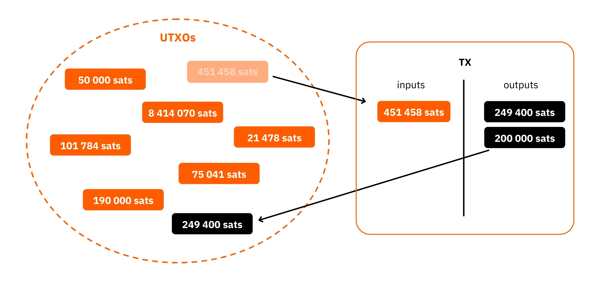


Användningen av portföljprogramvara med myntkontroll, i kombination med UTXO-märkning, gör det möjligt för användare att både urskilja och exakt välja UTXO:er för sina transaktioner.


### Hur märker du dina UTXO:er?


Det finns ingen metod som passar alla för att märka UTXO:er. Det är upp till dig att definiera ett märkningssystem som är lätt att förstå för din portfölj. I vilket fall som helst ska du komma ihåg att bra märkning är märkning som du kan förstå när du behöver den. Om din Bitcoin Wallet i första hand är avsedd för sparande kanske du inte har nytta av etiketterna under de kommande årtiondena. Så se till att de är tydliga, exakta och heltäckande.


Det är viktigt att dina nära och kära enkelt kan identifiera varifrån pengarna kommer om de en dag behöver tillgång till din portfölj. Det hjälper dem både av sekretesskäl och av juridiska skäl, om de skulle behöva motivera fondernas ursprung för en myndighet.


Det viktigaste att notera på etiketten är källan till UTXO. Du bör helt enkelt ange hur myntet hamnade i din Wallet. Är det resultatet av ett köp på en Exchange-plattform? En Invoice-betalning från en kund? En peer-to-peer Exchange? Eller representerar det Exchange för en utgift? Du kan till exempel ange:


- ta bort Exchange.com` ;
- kundbetalning David` ;
- köpa P2P Charles` ;
- `Ändra köp av soffa`


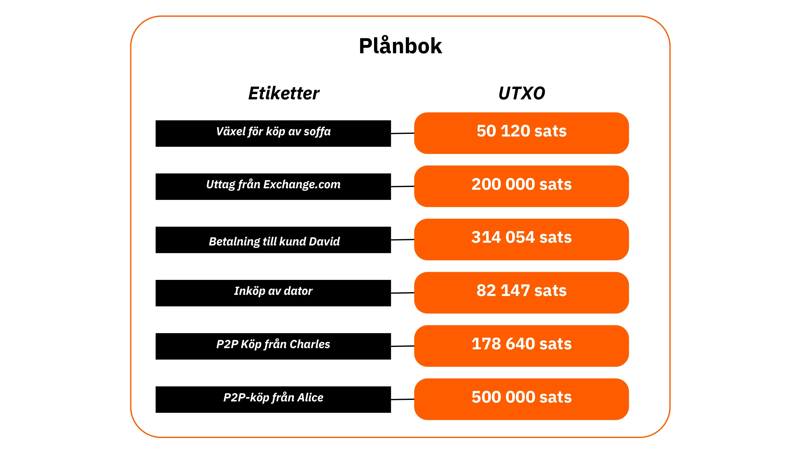


För att finjustera din UTXO-hantering och respektera dina fondsegregeringsstrategier inom din portfölj kan du berika dina etiketter med en ytterligare indikator som återspeglar dessa separationer. Om din portfölj innehåller två kategorier av UTXO som du är angelägen om att inte blanda, kan du införliva en markör i dina etiketter för att tydligt skilja dessa grupper åt. Dessa separationsmarkörer beror på dina egna kriterier, till exempel att skilja mellan UTXO:er som härrör från en förvärvsprocess som involverar KYC, eller mellan professionella och personliga fonder. Med hjälp av exemplen på etiketter som nämns ovan kan detta översättas till:


- `KYC - Uttag Exchange.com` ;
- `KYC - Kundbetalning David` ;
- `NO KYC - Köp P2P Charles` ;
- `NO KYC - Ändra köp av soffa`


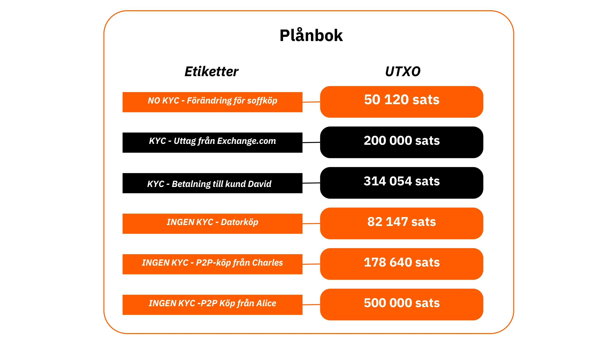


Det är också tillrådligt att fortsätta märkningen av en del under transaktionernas gång. Till exempel, när du konsoliderar UTXO utan KYC, var noga med att markera den resulterande UTXO inte bara som "konsolidering", utan specifikt som "konsolidering utan KYC" för att hålla ett tydligt register över var mynten kom ifrån.


Slutligen är det inte obligatoriskt att sätta ett datum på en etikett. De flesta Wallet-programvaror visar redan transaktionsdatumet, och det är alltid möjligt att hitta denna information på en Block explorer tack vare dess txid.


### Hur väljer man rätt delar?


När du utför en transaktion låter myntkontrollen dig specifikt välja vilka UTXO:er som ska konsumeras som input för att uppfylla betalningens output. Det finns två aspekter på detta val:


- Möjlighet för betalningsmottagaren att koppla en del av din identitet till de UTXO:er som används i inmatningarna;
- Förmågan hos en extern observatör att upprätta länkar mellan alla UTXO som används som indata.


För att illustrera den första punkten, låt oss ta ett konkret exempel. Anta att du köper en baguette i bitcoins från din bagare. Du använder en eller flera UTXO:er som du innehar som inputs för att betala åtminstone priset på baguetten i outputs, samt transaktionsavgifterna. Din bagare kan sedan potentiellt associera ditt ansikte, eller någon annan del av din identitet som han känner till, med de mynt som används som inputs. Eftersom du vet att denna länk finns kanske du föredrar att välja en viss UTXO i stället för en annan när du betalar.


Till exempel, om en av dina UTXO kommer från en Exchange-plattform och du hellre vill att bagaren inte känner till ditt konto på den plattformen, undviker du att använda den UTXO för betalning. Om du har en UTXO med högt värde som avslöjar en betydande mängd bitcoins, kanske du också väljer att inte använda den för att undvika att bagaren blir medveten om din BTC-förmögenhet.


Att välja vilka UTXO:er som ska användas för denna första punkt är därför ett personligt beslut, som påverkas av vad du är villig att avslöja eller inte. De etiketter som du tilldelar dina UTXO:er när du får dem hjälper dig att välja dem som, när de väl har använts, bara avslöjar information som du är bekväm med att avslöja för mottagaren.


Utöver den information som potentiellt avslöjas för mottagaren, påverkar valet av inputs också vad du avslöjar för alla observatörer av Blockchain. Genom att använda flera UTXO:er som indata till din transaktion avslöjar du att de ägs av samma enhet, enligt CIOH-heuristiken (_Common Input Ownership Heuristic_).


När du väljer dina delar måste du därför vara medveten om att den transaktion du ska sända kommer att skapa en länk mellan alla UTXO:er som används. Den här länken kan vara problematisk för din personliga integritet, särskilt om UTXO:erna kommer från olika källor.


Låt oss ta exemplet med min no-KYC UTXO från Bisq; jag vill undvika att kombinera den med en UTXO från, säg, en reglerad Exchange-plattform som känner till min identitet. Om jag någonsin använder dessa två UTXO:er som ingångar till samma transaktion kommer den reglerade plattformen att kunna koppla min identitet till den UTXO jag köpte på Bisq, som inte tidigare var kopplad till min identitet.


Slutligen, när du väljer vilka UTXO:er som ska användas som inputs till en transaktion, är det viktigaste att undvika att använda flera UTXO:er. När du kan, välj högst ett enda mynt som är tillräckligt stort för att uppfylla din betalning. På så sätt undviker du helt de risker som är förknippade med CIOH. Men om ingen enda UTXO räcker för betalning och du måste konsumera flera, se till att de kommer från liknande källor för att minimera risken för oönskade länkar. Tänk också på att mottagaren kan associera den information de har om dig med historien om mynt som används i inmatningar.


### Förstå automatiskt val av delar


I de föregående avsnitten diskuterade vi det manuella urvalet av UTXO:er som ska användas för en transaktion. Men vad händer när Wallet-programvaran utför detta val automatiskt? Det finns flera metoder för att bestämma vilka mynt som ska konsumeras, och valet av UTXO:er utgör ett verkligt forskningsfält för Bitcoin. Huvudsyftet med denna automatiska process är ofta att minimera transaktionskostnaderna för användaren.


UTXO-urvalsmetoder som FIFO (*Först in först ut*) och LIFO (*Last in först ut*) är bland de enklaste, men också de minst effektiva. Med FIFO används de äldsta delarna i portföljen först. Detta tillvägagångssätt är i allmänhet ineffektivt både för att minimera transaktionskostnaderna och för att bevara sekretessen, utom i de fall där relativa tidslås används och måste förnyas regelbundet. Omvänt prioriterar LIFO användningen av de senaste UTXO:erna. Båda metoderna är enkla, men visar sig ofta vara ineffektiva.


En mer avancerad metod är *Knapsack Solver*. Denna användes på Bitcoin Core Wallet fram till version 0.17. Den består av att iterativt och slumpmässigt välja UTXO:er från Wallet, lägga ihop dem i delmängder och behålla den lösning som minskar transaktionsvikten så mycket som möjligt, för att minska kostnaden för användaren.


*Branch-and-Bound* (BNB), ofta kallad "Murch-algoritmen" efter sin uppfinnare, har ersatt *Knapsack Solver* i Bitcoin Core från och med version 0.17. Denna mer avancerade metod syftar till att hitta en uppsättning UTXO:er som exakt motsvarar det belopp som behövs för att tillgodose utfallen av en transaktion. Målet med BNB är att minimera Exchange-beloppet samt avgifterna genom att minska det så kallade avfallskriteriet, som tar hänsyn till både de omedelbara kostnaderna och de förväntade framtida kostnaderna för Exchange. Denna metod härrör från det ursprungliga konceptet *Branch-and-Bound*, som utformades 1960 av Ailsa Land och Alison Harcourt, och erbjuder en mer exakt optimering av avgifterna än *Knapsack Solver*.


Alla dessa automatiska UTXO-urvalsmetoder kan vara effektiva för att minska transaktionskostnaderna, men de är ofta ineffektiva när det gäller att bevara användarnas konfidentialitet. Dessa algoritmer kan faktiskt slå samman flera UTXO:er till ingångar och därmed avslöja en gemensam egenskap hos dessa UTXO:er på grund av CIOH. Självklart kan dessa metoder inte ta hänsyn till de etiketter som fästs på UTXO:erna, som ändå är avgörande för att medvetet välja vilka delar som ska avslöjas för transaktionsmottagaren. I dagsläget är det enda sättet att optimera sekretessen vid val av mynt att göra det manuellt.


### Handledning om UTXO-märkning


Om du vill ta reda på hur du taggar dina UTXO:er har vi gjort en omfattande handledning om den viktigaste Bitcoin Wallet-programvaran som finns där ute:


https://planb.network/tutorials/privacy/on-chain/utxo-labelling-d997f80f-8a96-45b5-8a4e-a3e1b7788c52

## KYC och nyckelidentifiering


<chapterId>cec6b9d9-0eed-4f85-bc4e-1e9aa59ca605</chapterId>


KYC står för "Know Your Customer" (känn din kund). Det är ett regelverk som tillämpas av vissa företag som är verksamma inom Bitcoin-sektorn. Syftet med detta förfarande är att verifiera och registrera kundernas identitet, med det uttalade målet att bekämpa penningtvätt och finansiering av terrorism.


I praktiken innebär KYC att olika personuppgifter samlas in från kunden, vilket kan variera beroende på jurisdiktion, men i allmänhet inkluderar ID, fotografi och bevis på Address. Denna information verifieras sedan och lagras för framtida bruk.


Detta förfarande har blivit obligatoriskt för alla reglerade Exchange plattformar i de flesta västländer. Detta innebär att alla som vill Exchange statsvalutor för Bitcoin via dessa plattformar måste uppfylla KYC-krav.


Detta förfarande är inte utan risker för användarnas integritet och säkerhet. I det här kapitlet kommer vi att undersöka dessa risker i detalj och analysera de specifika effekterna av KYC och identifieringsprocesser på Bitcoin-användarnas integritet.


### Underlätta spårning av kedjan


Den första risken förknippad med KYC är att den erbjuder en privilegierad ingångspunkt för Blockchain-analys. Som vi såg i föregående avsnitt kan analytiker klustra och spåra aktivitet på Blockchain med hjälp av transaktionsmönster och heuristik. När de väl har lyckats klustra en användares aktivitet på kedjan behöver de bara hitta en enda ingångspunkt bland alla hans transaktioner och nycklar för att helt äventyra hans konfidentialitet.


När du utför en KYC tillhandahåller du en högkvalitativ ingångspunkt för Blockchain-analys, eftersom du associerar dina mottagningsadresser som används när du tar ut dina bitcoins från en Exchange-plattform med din fullständiga, verifierade identitet. I teorin är denna information endast känd för det företag som du tillhandahöll den till, men som vi kommer att se nedan är risken för dataläckage verklig. Dessutom kan bara det faktum att ett företag har denna information vara problematiskt, även om de inte delar den.


Så om du inte vidtar andra åtgärder för att begränsa aggregeringen av dina aktiviteter på Blockchain kan alla med kunskap om denna KYC-inmatningspunkt potentiellt koppla all din aktivitet på Bitcoin till din identitet. Ur det företagets synvinkel förlorar din användning av Bitcoin all konfidentialitet.


För att illustrera detta med en jämförelse kan man tänka sig att din bankman på *Bank X* inte bara har tillgång till alla dina transaktioner med *Bank X*, utan också kan observera dina transaktioner med *Bank Y* och alla dina kontanttransaktioner.


Kom ihåg från den första delen av denna utbildningskurs: Bitcoin:s sekretessmodell, som den utformades av Satoshi Nakamoto, baseras på separationen mellan användarens identitet och hans nyckelpar. Även om denna Layer sekretess inte längre är tillräcklig idag, är det fortfarande klokt att begränsa dess försämring så mycket som möjligt.


### Utsatthet för statlig övervakning


Det andra stora problemet med KYC är att det avslöjar för staten att du har ägt Bitcoin vid någon tidpunkt. När du köper bitcoins via en reglerad aktör blir det möjligt för staten att känna till detta innehav. För tillfället kan detta verka trivialt, men det är viktigt att komma ihåg att ditt lands politiska och ekonomiska framtid inte ligger i dina händer.


För det första kan staten snabbt inta en auktoritär hållning. Historien är full av exempel där politiken har ändrats plötsligt. I dag kan bitcoiners i Europa skriva artiklar om Bitcoin, delta i konferenser och hantera sina plånböcker i egen regi. Men vem kan säga vad som händer i morgon? Om Bitcoin plötsligt blir samhällets fiende nummer ett kan det bli problematiskt att förknippas med det i myndighetsregister.


Sedan, i samband med allvarliga ekonomiska kriser, kan staten överväga att beslagta bitcoins som innehas av medborgare. I morgon kanske bitcoiners kommer att uppfattas som krisprofitörer och kommer att beskattas överdrivet för sina kapitalvinster i samband med devalvering av fiatvalutor.


Du kanske tror att detta inte är ett problem, eftersom dina bitcoins är blandade och därför ospårbara. Spårning är dock inte problemet här. Den verkliga frågan är att staten vet att du har ägt Bitcoin. Enbart denna information kan räcka för att anklaga dig eller ställa dig till svars. Du kan försöka hävda att du har spenderat dina bitcoins, men det skulle behöva återspeglas i din skattedeklaration och du skulle bli fångad. Du kan också säga att du tappade bort dina nycklar i en båtolycka, men utöver Twitter-skämtet, tror du verkligen att det skulle räcka för att rentvå dig?


Så det är viktigt att ta hänsyn till risken för att staten vet att du har ägt BTC, hur avlägsen den risken än kan verka idag.


Ett annat problem med kundkännedom när det gäller statlig tillsyn är den obligatoriska rapporteringen från reglerade plattformar. Jag är inte bekant med regler i andra jurisdiktioner, men i Frankrike är *Prestataires de Services sur Actifs Numériques* (PSAN) skyldiga att rapportera till finansinspektionen alla penningrörelser som de anser vara misstänkta.


I Frankrike år 2023 rapporterades 1 449 misstänkta handlingar av PSAN. För närvarande är majoriteten av dessa handlingar brottsrelaterade. Myndigheterna ber dock även reglerade plattformar att rapportera misstänkta Bitcoin-transaktioner enbart på grundval av deras struktur. Om du genomför en samarbetstransaktion, eller till och med bara en transaktion med ett något atypiskt mönster, och denna transaktion inträffar inte långt från uttaget av dina Bitcoins från dessa plattformar, kan du bli rapporterad till myndigheterna. Även i avsaknad av oegentligheter och i det legitima utövandet av dina rättigheter kan sådan rapportering leda till ökade kontroller och övervakning, olägenheter som du skulle ha undvikit utan kundkännedom.


### Risken för läckage av personuppgifter


Ett annat problem med KYC är att det kräver att alla dina personuppgifter lagras på servrar hos ett privat företag.


Den senaste tidens händelser har påmint oss om att ingen är immun mot finansiella eller IT-misslyckanden. Under 2022 drabbades Celsius kunder av konsekvenserna. Efter bolagets konkurs offentliggjordes namnen på borgenärerna och storleken på deras tillgångar av de amerikanska domstolarna under de administrativa förfarandena.


För drygt två år sedan var det ett flaggskepp inom cybersäkerhet för kryptovalutor som fick se sina kunders personuppgifter stulna. Även om denna incident inte var direkt kopplad till köp av bitcoins, kvarstår en sådan risk även för Exchange-plattformar. Det finns därför en definitiv risk förknippad med personuppgifter.


Det är sant att vi redan anförtror många av våra personuppgifter till privata företag. Risken här är dock tvåfaldig, eftersom dessa uppgifter inte bara identifierar dig utan också är kopplade till aktivitet på Bitcoin. När en hackare får tillgång till kunddata för en Exchange-plattform kan han rimligen anta att dessa kunder har Bitcoins. Denna risk ökar av det faktum att Bitcoin, liksom alla andra värdefulla tillgångar, drar till sig tjuvarnas uppmärksamhet.


I händelse av en dataläcka kan du i bästa fall bli föremål för riktade nätfiskeförsök. I värsta fall kan du hamna i centrum för fysiska hot mot ditt hem.


Förutom de specifika risker som är förknippade med Bitcoin finns det också faror som är förknippade med överföring av identitetshandlingar. I händelse av en dataläcka är det faktiskt möjligt att bli offer för identitetsstöld. Så insatserna är inte bara begränsade till att skydda transaktionernas konfidentialitet, utan gäller också varje individs personliga säkerhet.


### Några förutfattade meningar om KYC


Det är viktigt att dekonstruera några av de förutfattade meningarna om kundkännedom som vi ofta stöter på på Twitter eller i våra utbyten mellan bitcoinare.


Först och främst är det felaktigt att tro att det är meningslöst att skydda din integritet för Bitcoins som förvärvats via KYC. Sekretessverktyg och metoder på Bitcoin är varierade och tjänar olika syften. Att använda CoinJoin-transaktioner på Bitcoins som förvärvats via KYC är till exempel inte en dålig idé. Naturligtvis måste du vara försiktig med reglerade Exchange-plattformar för att undvika att ditt konto fryses eller förbjuds, men ur en strikt teknisk synvinkel är dessa metoder inte oförenliga. CoinJoin har effekten att bryta ett mynts historia, vilket hjälper dig att motverka vissa kedjeanalysrisker i samband med KYC. Även om det inte eliminerar alla risker utgör det en betydande fördel.


Konfidentialitet på Bitcoin bör inte ses på ett binärt sätt, som en åtskillnad mellan "anonyma" bitcoins och andra som inte är det. Att äga Bitcoins som förvärvats via KYC betyder inte att allt är förlorat; tvärtom kan användningen av sekretessverktyg visa sig vara ännu mer fördelaktigt.


Omvänt garanterar inte förvärv av Bitcoin via en icke-KYC-metod perfekt sekretess, och det befriar dig inte heller från behovet av att vidta andra skyddsåtgärder. Om du innehar icke-KYC Bitcoin men återanvänder mottagningsadresser flera gånger kan dina transaktioner spåras och sammanställas. Minsta lilla länk till världen utanför Bitcoin kan äventyra den enda Layer sekretess du har. Det är därför viktigt att betrakta alla sekretesshöjande verktyg och metoder på Bitcoin som komplement. Varje teknik hanterar en specifik risk och kan lägga till en extra Layer av skydd. Så att äga icke-KYC Bitcoin betyder inte att du inte behöver vidta andra försiktighetsåtgärder.


### Kan KYC avbrytas?


Jag får ibland frågan om det är möjligt att "gå tillbaka" efter att ha utfört en KYC, och som du kan föreställa dig från föregående stycken är svaret nyanserat. Det enklaste sättet att undvika riskerna med KYC är att inte använda det när man förvärvar bitcoins. Vi kommer att titta på detta ämne mer djupgående i nästa kapitel. Men om KYC redan har genomförts och bitcoins köpts, finns det sätt att mildra de risker som är inblandade?


När det gäller risken för att dina transaktioner ska kunna spåras är användningen av CoinJoin en lösning. Vi kommer att titta på den här metoden i detalj senare i kursen, men du bör veta att CoinJoin gör att du kan bryta ett mynts historia och förhindra att det spåras förflutet-nuvarande och nuvarande förflutet. Även för BTC som erhålls via en reglerad plattform kan denna teknik förhindra deras spårbarhet.


CoinJoin raderar dock inte den andra risken i samband med KYC: det faktum att staten kan informeras om ditt innehav av bitcoins. Även om dina mynt inte längre är spårbara kan staten, beroende på jurisdiktion, ha tillgång till dina överföringsdeklarationer för kryptotillgångar. Eftersom denna risk inte är teknisk, utan administrativ, finns det inga Bitcoin-specifika lösningar för att eliminera den, förutom att inte utsätta dig för KYC i första hand. Det enda lagliga tillvägagångssättet för att minska denna risk är att sälja på reglerade plattformar dina Bitcoins som förvärvats via reglerade plattformar och sedan återköpa dem via KYC-fria medel. Genom att sälja och deklarera överföringen bör myndigheterna se att du inte längre äger dem.


När det gäller risken för att läcka dina personuppgifter och identitetshandlingar är detta en fara som ligger utanför Bitcoin och det finns ingen teknisk lösning för att undvika den. När dina uppgifter väl har avslöjats är det svårt att ångra operationen. Du kan försöka stänga ditt konto på plattformen, men det garanterar inte att dina KYC-uppgifter raderas, särskilt när identitetsverifieringen är outsourcad. Det är omöjligt att verifiera att dina uppgifter har raderats helt och hållet. Det finns därför ingen lösning för att helt förhindra denna risk och se till att den inte längre existerar.


### Skillnaden mellan KYC och nyckelidentifiering


Ibland tenderar vissa bitcoiners att utvidga termen "KYC" till alla BTC Exchange som involverar en banköverföring eller kreditkortsbetalning, eftersom dessa medel också kan avslöja betalningens ursprung, precis som en KYC skulle göra. KYC bör dock inte förväxlas med nyckelidentifiering. Personligen måste jag erkänna att min uppfattning om detta ämne har utvecklats över tiden.


KYC hänvisar specifikt till ett regleringsförfarande som genomförs av vissa företag för att verifiera och registrera sina kunders identitet. Det är en binär sak: när du förvärvar dina bitcoins, antingen gör du KYC eller så gör du det inte. Nyckelidentifiering, som rör länken mellan en aspekt av en användares identitet och onchain-aktivitet, är dock inte lika binär utan representerar snarare ett kontinuum. I samband med förvärv eller överföring av Bitcoin är sådan identifiering alltid möjlig i varierande grad.


Om du till exempel köper bitcoins på en reglerad plattform i Schweiz krävs inte KYC. Dina nycklar kan dock identifieras, eftersom köpet gjordes via ditt bankkonto. Det är här de två första riskerna som är förknippade med kundkännedom - underlättande av spårning i kedjan och exponering för statlig övervakning - också kan manifestera sig i en Exchange utan kundkännedom. Om den schweiziska enheten rapporterar misstänkta transaktioner till myndigheterna i ditt land kan de helt enkelt kontrollera det bankkonto som användes för köpet för att upptäcka din identitet. Så att köpa utan KYC på reglerade plattformar är ganska högt på riskskalan för nyckelidentifiering.


Att undvika reglerade plattformar och välja P2P-förvärvsmetoder eliminerar dock inte helt risken för nyckelidentifiering, utan minskar den bara. Låt oss ta ett exempel på ett köp på Bisq eller en annan P2P-plattform. För att betala din motpart kommer du förmodligen att använda ditt bankkonto. Om myndigheterna frågar ut den person du har handlat med och ber om ditt namn är vi tillbaka till risk 1 och 2. Även om dessa risker är mycket lägre än när du köper på en plattform utan kundkännedom, och till och med lägre än när du köper med kundkännedom, finns de fortfarande i mindre utsträckning.


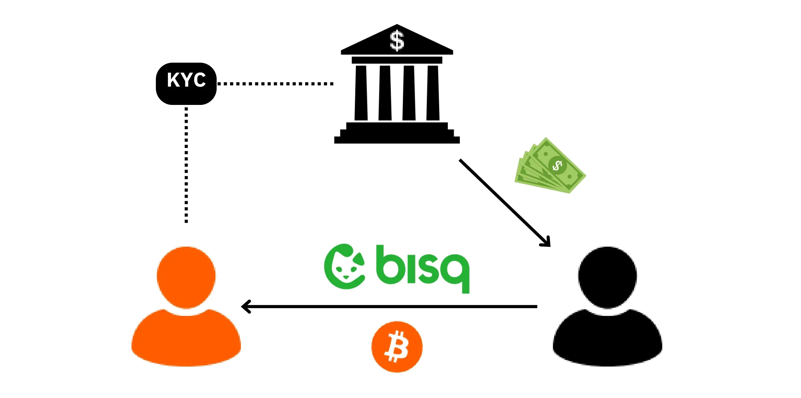


Slutligen, även om du förvärvar dina bitcoins genom en fysisk Exchange för kontanter, är du inte helt anonym. Personen du växlade med har sett ditt ansikte, vilket är en del av din identitet. Även om det är minimalt i det här exemplet finns det fortfarande en möjlighet till nyckelidentifiering.


Sammanfattningsvis, när bitcoins byts mot andra tillgångar, vare sig det är ett köp i statlig valuta eller en försäljning mot en verklig vara, finns det alltid någon form av nyckelidentifiering. Beroende på vilken Exchange-metod som väljs kan denna identifiering variera i intensitet. Det är viktigt att inte förväxla denna identifiering med kundkännedom, som är en väldefinierad regleringsprocess. Det finns dock en koppling mellan KYC och identifieringsspektrumet, eftersom KYC ligger i den högre änden av spektrumet, eftersom det systematiskt underlättar myndigheternas identifiering av användarnycklar.


## Försäljnings- och förvärvsmetoder


<chapterId>756598af-95aa-4c77-ac48-243c7ad89530</chapterId>


Efter att ha läst föregående kapitel kanske du undrar hur du kan köpa eller sälja Bitcoin utan att behöva genomgå ett identitetsverifieringsförfarande för att undvika riskerna med KYC. Det finns flera sätt att handla Bitcoin.


### P2P kontantutbyte


Som vi har sett är den bästa metoden när det gäller sekretess fortfarande P2P (person-till-person) Exchange med kontantavräkning. Denna metod gör att du kan minimera spåren som lämnas kvar och avsevärt minska möjligheten till nyckelidentifiering, oavsett om du köper eller säljer.


Det finns dock risker för den personliga säkerheten. Den största faran ligger i det faktum att motparten under Exchange kommer att veta att du har en stor summa pengar, antingen i kontanter eller i bitcoins. Denna information kan dra till sig uppmärksamhet från illvilliga personer. Det är därför i allmänhet tillrådligt att vara diskret med sina Bitcoin-innehav. Detta råd kan också tillämpas på kontanter. Men när du växlar personligen är det oundvikligt att avslöja att du äger bitcoins, och detta kan dra till sig ovälkommen uppmärksamhet.


För att begränsa denna risk skulle jag råda dig att föredra kontanttransaktioner med betrodda personer, till exempel familjemedlemmar eller nära vänner. Alternativt kan du också överväga att handla på [lokala Bitcoin-möten] (https://btcmap.org/communities/map), efter att ha deltagit några gånger. Detta gör att du kan lära känna de andra deltagarna bättre och inte vara ensam när du fysiskt byter. Det är dock viktigt att inse att P2P kontantutbyten i sig medför risker för din personliga säkerhet som inte finns när du köper via en reglerad plattform och ditt bankkonto.


Beroende på var du bor kan det dessutom vara riskfyllt att transportera och förvara stora summor pengar, oavsett om det är Bitcoin eller kontanter.


Att växla kontanter kan också innebära juridiska risker i händelse av polis- eller andra kontroller. Även om det i de flesta länder inte finns några begränsningar för hur mycket kontanter du får ha med dig, kan alltför stora belopp väcka misstankar. Var därför försiktig, särskilt om du måste resa långa sträckor, och undvik att göra för många stora transaktioner på en gång, så att du inte behöver motivera innehav av stora summor.


Slutligen är en annan nackdel med P2P-köp att priset ofta är högre än på reglerade plattformar. Säljare tar ofta ut en påslagning som sträcker sig från 1% till ibland mer än 10%. Det finns flera skäl till denna prisskillnad. För det första är detta en vanlig praxis bland P2P-säljare som har blivit etablerad över tid. För det andra har säljare avgifter i samband med transaktionen för att skicka pengarna till köparen. Det finns också en ökad risk för stöld vid P2P-försäljning jämfört med plattformstransaktioner, vilket motiverar kompensation för den risk som tas. Slutligen kan den extra kostnaden vara kopplad till efterfrågan och kvaliteten på Exchange när det gäller sekretess. Som köpare har vinsten i sekretess ett pris som återspeglas i det påslag som säljaren tillämpar. Vissa bitcoiners tror också att påslagspriset för BTC som köps på P2P återspeglar dess verkliga pris, och hävdar att de lägre priserna på reglerade plattformar är resultatet av en kompromiss om sekretessen för dina personuppgifter.


### P2P-utbyten via en plattform för matchmaking


Ett mindre riskfyllt alternativ när det gäller personlig säkerhet är att genomföra P2P-utbyten uteslutande online, via elektroniska betalningsmetoder som PayPal, banköverföringar eller Revolut.


Detta tillvägagångssätt undviker många av de risker som är förknippade med kontanttransaktioner. Risken för att motparten inte fullgör sina skyldigheter enligt en Exchange online är dock större. Om du i en fysisk Exchange överlämnar pengar till säljaren som inte skickar bitcoins i gengäld kan du omedelbart ställa honom till svars, eftersom han står framför dig. På nätet är det å andra sidan ofta omöjligt att spåra någon som har stulit från dig.


För att minska denna risk är det möjligt att använda specialiserade plattformar för P2P-utbyten. Dessa plattformar använder konfliktlösningsmekanismer för att skydda förorättade användare. Vanligtvis erbjuder de ett spärrsystem, där bitcoins hålls tills betalningen i fiatvaluta bekräftas av säljaren.


När det gäller personlig säkerhet är denna inköpsmetod betydligt säkrare än en fysisk kontant Exchange. Som nämnts ovan lämnar dock online P2P-utbyten fler spår än en fysisk Exchange, vilket kan vara skadligt för integriteten på Bitcoin. Genom att använda en fiat-betalningsmetod online, till exempel en bank, avslöjar du mer information som kan underlätta nyckelidentifiering.


Återigen skulle jag inte rekommendera att göra för många stora affärer i en enda transaktion på dessa plattformar. Genom att dela upp dina transaktioner sprider du risken för motpartsstöld.


Återigen är en annan nackdel med P2P-köp att priset ofta är högre än det som observeras på reglerade plattformar. Säljare tar ofta ut ett påslag som sträcker sig från 1% till ibland mer än 10%. Det finns flera skäl till denna prisskillnad. För det första är detta en vanlig praxis bland P2P-säljare som har blivit etablerad över tid. För det andra har säljarna avgifter i samband med transaktionen för att skicka pengarna till köparen. Det finns också en ökad risk för stöld vid P2P-försäljning jämfört med plattformstransaktioner, vilket motiverar kompensation för den risk som tas. Slutligen kan den extra kostnaden vara kopplad till efterfrågan och kvaliteten på Exchange när det gäller sekretess. Som köpare har vinsten i konfidentialitet ett pris som återspeglas i det påslag som säljaren tillämpar. Vissa bitcoiners tror också att påslagspriset för BTC som köps på P2P återspeglar dess verkliga pris, och hävdar att de lägre priserna på reglerade plattformar är resultatet av en kompromiss om sekretessen för dina personuppgifter.


När det gäller lösningar har jag personligen alltid använt [Bisq](https://bisq.network/) och jag är mycket nöjd med det. Deras system är beprövat och verkar tillförlitligt. Bisq är dock endast tillgängligt på PC och dess Interface kan vara för komplicerat för nybörjare. En annan nackdel är att Bisq endast arbetar med onchain-transaktioner, vilket kan bli kostsamt under perioder med höga Bitcoin transaktionsavgifter.


-> Se vår Bisq-handledning.


https://planb.network/tutorials/exchange/peer-to-peer/bisq-fe244bfa-dcc4-4522-8ec7-92223373ed04

För ett enklare alternativ kan du prova [Peach] (https://peachbitcoin.com/), en mobilapp som kopplar samman köpare och säljare med ett inbyggt konfliktlösningssystem. Processen är mer intuitiv än Bisqs.


-> Se vår handledning för Peach.


https://planb.network/tutorials/exchange/peer-to-peer/peach-c6143241-d900-4047-9b73-1caba5e1f874

Ett annat onlinealternativ är [HodlHodl] (https://hodlhodl.com/), en väletablerad plattform som erbjuder god likviditet, även om jag inte personligen har testat den.


-> Se vår HodlHodl-handledning.


https://planb.network/tutorials/exchange/peer-to-peer/hodlhodl-d7344cd5-6b18-40f5-8e78-2574a93a3879

För Lightning Network-baserade lösningar, prova [RoboSats](https://learn.robosats.com/) och [LNP2PBot](https://lnp2pbot.com/). RoboSats är tillgänglig via en webbplats och är relativt enkel att använda. LNP2PBot är mer atypisk, eftersom den fungerar via ett Exchange-system på meddelandeprogrammet Telegram.


-> Se vår handledning om RoboSats.


-> Se vår handledning för LNP2PBot.


https://planb.network/tutorials/exchange/peer-to-peer/robosats-b60e4f7c-533a-4295-9f6d-5368152e8c06

https://planb.network/tutorials/exchange/peer-to-peer/lnp2pbot-v2-e6bcb210-610b-487d-970c-7cce85273e3c

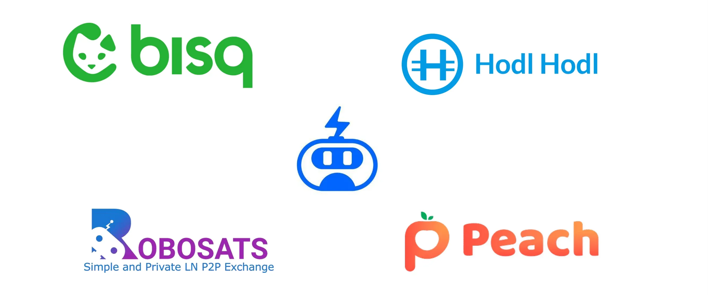


### Reglerade plattformar utan KYC


Beroende på vilket land du bor i kan du ha tillgång till reglerade plattformar som inte kräver KYC-förfaranden för att köpa eller sälja bitcoins. I Schweiz kan du till exempel använda plattformar som [Relai] (https://relai.app/) och [MtPelerin] (https://www.mtpelerin.com/).


-> Se vår handledning om Relai.


https://planb.network/tutorials/exchange/centralized/relai-v2-30a9671d-e407-459d-9203-4c3eae15b30e

Som vi såg i föregående kapitel sparar denna typ av plattform dig från riskerna i samband med KYC-förfaranden, men de utgör en högre risknivå för nyckelidentifiering. När det gäller Bitcoin-konfidentialitet erbjuder dessa plattformar därför bättre skydd än köpmetoder med KYC, men de är fortfarande mindre attraktiva än P2P-börser.


När det gäller personlig säkerhet är det dock mycket mindre riskabelt att använda dessa plattformar än P2P-utbyten. De är också ofta enklare att använda än P2P-plattformar.


### Uttagsautomater


Ett annat alternativ för att köpa eller sälja bitcoins utan KYC är kryptovalutabanker. Personligen har jag aldrig haft möjlighet att testa den här lösningen, eftersom det inte finns några i mitt land. Men den här metoden kan vara mycket intressant, beroende på var du bor.


Problemet med uttagsautomater är att de antingen är förbjudna i vissa länder eller starkt reglerade i andra. Om en uttagsautomat kräver en identitetskontroll utsätts den för samma risker som plattformar som regleras av KYC-regler. Om uttagsautomaten å andra sidan tillåter transaktioner utan identitetsverifiering för små belopp, kan användningen av den erbjuda en sekretessnivå som är jämförbar med den för en P2P kontant Exchange, samtidigt som de flesta av de risker som är förknippade med denna typ av Exchange undviks.


Den största nackdelen med uttagsautomater är deras ofta höga Exchange avgifter, som varierar från några procent upp till ibland 15% av det växlade beloppet.


### Presentkort


Slutligen ville jag också presentera en lösning som fungerar bra för dem som vill använda sina bitcoins dagligen för att göra inköp snarare än att sälja dem mot fiatvalutor.


Det bästa sättet att spendera BTC är naturligtvis att använda Bitcoin eller Lightning Network direkt för att köpa en vara eller tjänst. I många länder är dock antalet handlare som accepterar Bitcoin fortfarande begränsat. Ett praktiskt alternativ är att använda presentkort.


Flera plattformar som inte kräver KYC-förfaranden erbjuder möjligheten att växla bitcoins mot presentkort som kan användas hos större återförsäljare. Dessa inkluderar [CoinsBee] (https://www.coinsbee.com/), [The Bitcoin Company] (https://thebitcoincompany.com/) och [Bitrefill] (https://www.bitrefill.com/). Dessa plattformar gör det mycket enklare att använda dina bitcoins dagligen, vilket ger dig tillgång till ett brett utbud av produkter och tjänster utan att behöva konvertera dem till fiatvaluta.


https://planb.network/tutorials/exchange/centralized/bitrefill-8c588412-1bfc-465b-9bca-e647a647fbc1


### Andra förvärvsmetoder


Andra sätt att förvärva bitcoins samtidigt som du skyddar din integritet inkluderar naturligtvis Mining. För att starta Mining Sats behöver du inte avslöja din identitet; hitta helt enkelt en giltig Proof of Work och skicka in den till nätverket. Om du väljer pool Mining kräver vissa pooler någon form av identifiering, till exempel en KYC, medan andra inte gör det.


En annan metod är att arbeta i Exchange för bitcoins. Denna förvärvsmetod kan vara intressant, men den grad av identifiering som krävs varierar avsevärt beroende på omständigheterna.


*För att skriva det här kapitlet använde jag BTC205-kursen som ges av [@pivi___](https://x.com/pivi___) på Plan ₿ Network (endast tillgänglig på franska för tillfället)*


## Konsolidering, UTXO-hantering och CIOH


<chapterId>d0486c8f-332d-402b-ae2e-949416752b9c</chapterId>


En av de mest komplicerade aspekterna av att driva en portfölj med egen förvaring är konsolidering. Bör du konsolidera? Vad är poängen? Vilken storlek på UTXO bör respekteras? Vilka är kompromisserna när det gäller sekretess? Det är vad vi ska titta på i det här avsnittet.


### Vad är konsolidering?


Bitcoin fungerar som en auktionsmarknad, där miners föredrar transaktioner som erbjuder de lägsta avgifterna. Varje block har dock en maximal vikt, vilket begränsar antalet transaktioner som kan inkluderas. Eftersom ett block produceras i genomsnitt var 10:e minut är det tillgängliga utrymmet i varje block en knapp resurs.


Gruvarbetare, vars verksamhet generate betydande kostnader i form av elektricitet, anläggningstillgångar och underhåll, strävar naturligtvis efter att maximera sin lönsamhet. De tenderar därför att gynna transaktioner som generate de högsta avgifterna i förhållande till deras vikt.


Alla Bitcoin-transaktioner har inte samma vikt. De med fler in- och utgångar väger mer. Låt oss till exempel föreställa oss 2 transaktioner:


- Transaktion A består av 1 inmatning och 1 utmatning. Den fördelar 1 994 Sats i avgifter och har en vikt på 141 vB ;
- Transaktion B, en mer komplex transaktion med 2 inmatningar och 2 utmatningar, fördelar 2 640 Sats i avgifter för en vikt på 220 vB.


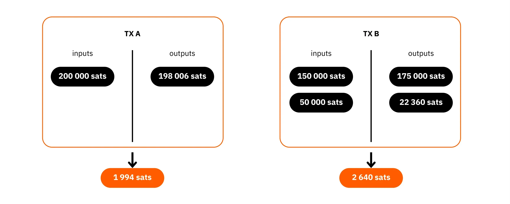


I det här exemplet kommer miners att föredra transaktion A, trots att transaktion B erbjuder en högre total avgift, eftersom den erbjuder ett bättre förhållande mellan avgift och vikt. Här är beräkningen för varje transaktion, uttryckt i Sats per virtuell byte (sat/vB):


```text
TXA : 1994 / 141 = 14 sats/vB
TXB : 2640 / 220 = 12 sats / vB
```


Detta innebär att för varje viktenhet erbjuder transaktion A mer kostnader än transaktion B, även om transaktion B erbjuder mer kostnader i absoluta tal.


Det är därför alltid mer intressant för användaren att förbruka så lite input som möjligt i sina transaktioner. Du måste dock förbruka tillräckliga mängder för att kunna uppfylla betalningen för utdata. När du förvaltar din portfölj måste du ha tillräckligt stora UTXO.


Principen för konsolidering är just att dra nytta av perioder då avgifterna är låga på Bitcoin för att slå samman sina mindre UTXO till en enda större. På så sätt, när avgifterna stiger på Bitcoin, kommer du att kunna göra transaktioner med ett minimum av ingångar och därför spendera mindre på avgifter i absoluta termer. Målet är därför att förutse de obligatoriska transaktioner som ska utföras under perioder med höga avgifter.


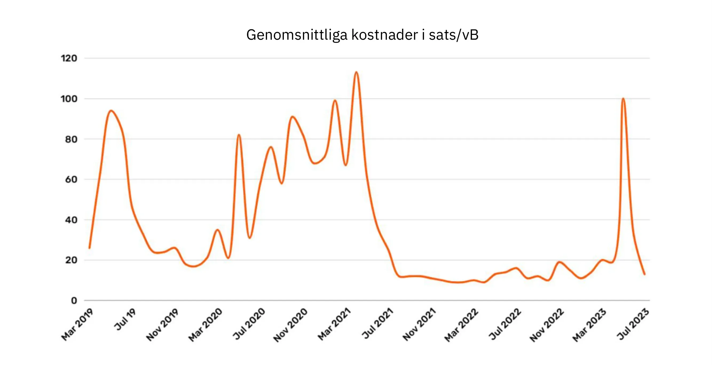


Förutom att spara på transaktionskostnader hjälper konsolidering av UTXO:er till att förhindra bildandet av "Dust". Dust" avser UTXO:er vars värde i Sats är så lågt att det inte räcker för att täcka de transaktionskostnader som krävs för att spendera dem. Detta gör dessa UTXO:er ekonomiskt irrationella att använda så länge som transaktionskostnaderna förblir höga. Genom att proaktivt samla dina UTXO:er förhindrar du att de omvandlas till Dust, vilket säkerställer att alla dina medel förblir användbara.


### Vilken är den minsta storleken för dina UTXO:er?


Jag får ibland frågan om vad det rekommenderade minimivärdet för en UTXO är. Tyvärr finns det inget universellt svar, eftersom det beror på dina preferenser och villkoren på avgiftsmarknaden. Här är dock en formel som kan hjälpa dig att fastställa ett tröskelvärde som passar dina behov:


$$
\frac {P \times F}T = M
$$


Var?


- p$ är transaktionsvikten;
- $F$ representerar den maximala avgiftssats i satoshis per vbyte (Sats/vB) som du säkrar mot;
- t$ är den procentandel av transaktionsavgiften som du är villig att betala i förhållande till det totala värdet av UTXO ;
- m$ är minimibeloppet i satoshis för varje UTXO.


Låt oss anta att du planerar att täcka avgifterna för en standard SegWit-transaktion med 1 ingång och 2 utgångar, som väger 141 vB. Om du säkrar upp till 800 Sats/vB och du är villig att spendera upp till 12 % av UTXO-värdet i avgifter som mest, så skulle beräkningen vara:


$$
\frac{141 \times 800}{0.12} = 940\ 000
$$


I detta exempel skulle det därför vara klokt att behålla ett minimivärde på 940.000 Sats för UTXO:er i din portfölj.


### Konsolidering och CIOH


En av de mest använda heuristikerna i Blockchain-analys är CIOH (*Common Input Ownership Heuristic*), som förutsätter att alla inputs till en Bitcoin-transaktion tillhör samma enhet. Själva principen med konsolidering är att konsumera flera UTXO:er som input och skapa en enda UTXO som output. Konsolidering gör det alltså möjligt att tillämpa ICOH.


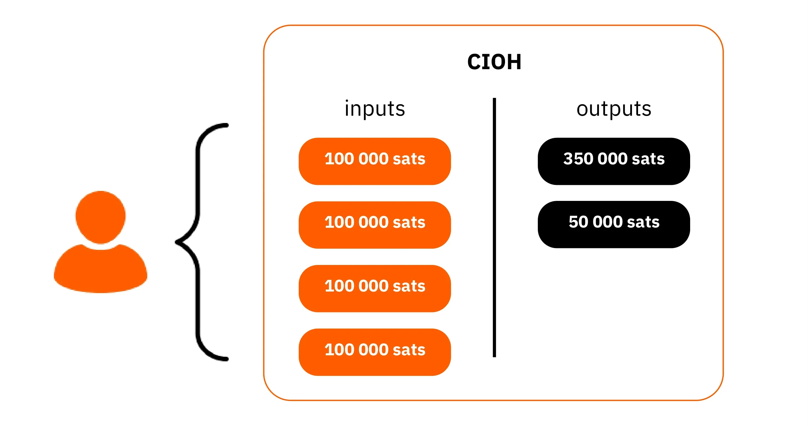


I praktiken innebär detta att en utomstående observatör kan dra slutsatsen att alla konsoliderade UTXO:er förmodligen tillhör samma person och att den unika output som genererats också tillhör honom eller henne. Den här situationen kan äventyra din sekretess genom att olika transaktionshistoriker kopplas samman. Låt oss till exempel säga att jag konsoliderar 3 UTXO:er som förvärvats via P2P med en UTXO som förvärvats via en plattform som kräver KYC :


Genom att göra detta kommer alla enheter med tillgång till Exchange-plattformens data, potentiellt inklusive myndigheter, att kunna identifiera att jag äger andra mängder BTC. Tidigare var dessa UTXO: er inte direkt kopplade till min identitet; nu är de det. Dessutom avslöjar det för alla källor att jag är i besittning av en viss mängd bitcoins.


När det gäller hanteringen av UTXO:er kommer ekonomiska överväganden, som driver på konsolidering för att minska kostnaderna, i konflikt med god sekretesspraxis, som skulle rekommendera att aldrig slå samman UTXO:er. Valet mellan ekonomi och sekretess beror därför på varje användares prioriteringar.


Om du kan undvika konsolidering samtidigt som du behåller betydande UTXO:er är det idealiskt. För att göra detta, optimera dina förvärvsmetoder. Om du köper dina bitcoins i DCA, försök att sprida ut dina engångsköp så mycket som möjligt för att konsolidera värdet över färre UTXO:er. Det blir lättare att hantera ett engångsköp på 1 000 euro varannan månad, snarare än ett köp på 120 euro varje vecka. Detta minimerar antalet UTXO:er som genereras och förenklar förvaltningen av din portfölj samtidigt som du bevarar din konfidentialitet.


Om du måste konsolidera dina bitcoins ska du i första hand konsolidera UTXO:er från samma källa. Om du till exempel slår samman 10 UTXO:er från en enda plattform påverkar det din konfidentialitet mindre än om du blandar 5 UTXO:er från plattform A med 5 UTXO:er från plattform B. Om konsolidering av olika källor är oundviklig, försök att separera dem enligt deras egenskaper. Gruppera t.ex. UTXO:er som förvärvats via KYC i en transaktion och UTXO:er som förvärvats via P2P i en annan.


Glöm i vilket fall inte att en konsolidering oundvikligen innebär en förlust av sekretess. Gör därför en noggrann bedömning av behovet av denna åtgärd och den potentiella inverkan på din integritet, med beaktande av CIOH.


## Andra bästa metoder


<chapterId>b5216965-7d13-4ea1-9b7c-e292966a487b</chapterId>


Låt oss ta en titt på några andra bästa metoder för att optimera din integritet på Bitcoin.


### Den kompletta knuten


Att äga dina bitcoins i egen förvaring är bra, men att använda din egen kompletta nod är ännu bättre! Här är varför det är avgörande att ha din egen nod för att kunna använda Bitcoin fullt suveränt:


- **Motstånd mot censur**: Dina transaktioner kan inte blockeras av någon;
- **Oberoende från tredje part**: Du är inte längre beroende av någon extern tjänst för att verifiera Blockchain-data;
- **Aktivt deltagande**: Du kan definiera dina egna valideringsregler och delta direkt i konsensusprocessen;
- **Bidrag till nätverket**: Genom att driva en nod hjälper du till att stärka och distribuera Bitcoin-nätverket;
- **Teknisk utbildning**: Att hantera en komplett nod är ett utmärkt sätt att fördjupa din tekniska kunskap om Bitcoin.


Utöver dessa fördelar förbättrar användningen av en komplett nod också din sekretess när du sänder dina transaktioner. När du utfärdar en transaktion skapas och signeras den först via din Wallet. För att kunna sända den i Bitcoin-nätverket måste den vara känd av minst en nod. Genom att använda din egen nod har du direkt kontroll över denna distribution, vilket förstärker din konfidentialitet och begränsar risken för dataläckage.


Om du inte har en egen Bitcoin-nod måste du använda en tredjepartsnod, t.ex. den som erbjuds av din Wallet-programvaruleverantör. Förutom att sända transaktioner kräver din Wallet tillgång till olika uppgifter som väntande transaktioner, saldon som är kopplade till dina adresser och antalet bekräftelser för dina transaktioner. För att få tillgång till alla dessa data måste du ställa en fråga till en nod.


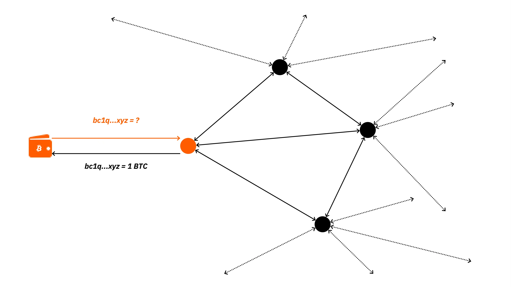


Den största risken när du inte använder din egen Bitcoin-nod är att operatören av tredjepartsnoden kan observera dina aktiviteter på Blockchain eller till och med dela den här informationen med andra enheter. För att begränsa denna risk är en mellanliggande lösning att använda Wallet-programvara som maskerar dina anslutningar via Tor. Detta kan minska exponeringen av dina data. Den optimala lösningen är dock att ha din egen Bitcoin-nod och använda den för att sända dina transaktioner. Naturligtvis måste du också vara försiktig så att du inte läcker någon information via din nod, men det är ett annat ämne som vi kommer att titta på i senare avsnitt.


Utöver den uppenbara fördelen för din integritet, att ha din egen kompletta nod försäkrar dig också om sanningshalten i data på Blockchain, skyddar dig mot censur och låter dig aktivt delta i Bitcoin:s styrning. Genom att använda din egen nod bidrar du med din ekonomiska vikt till den kedja du väljer, vilket är viktigt under konflikter i samhället, som till exempel under Blocksize War från 2015 till 2017. I händelse av en Fork kan användning av en tredjepartsnod leda till att du stöder en kedja som du inte vill gynna, eftersom nodoperatören gör valet åt dig.


Som du kan se är det av hänsyn till konfidentialitet och individuell suveränitet viktigt att köra och använda din egen kompletta nod!


### Heuristik för vilseledande analys


Mer allmänt är det viktigt att förstå den heuristik som vi talade om i föregående avsnitt, så att man bättre kan undvika eller lura dem. Det kan vara fördelaktigt att använda en rad bästa metoder, även om de inte är nödvändiga. De erbjuder ett extra Layer skydd som kan vara viktigt för att upprätthålla konfidentialitet när Bitcoin används.


Det första rådet jag kan ge är att smälta in i den tätaste folkmassan. På Bitcoin innebär detta att använda de mest allmänt antagna skriptmallarna. Till exempel är P2WSH-skript, som ofta används för SegWit V0 Multisig-konfigurationer, mycket ovanliga. De tillåter dig inte att gömma dig i en stor anonymitetsuppsättning. Detsamma gäller för äldre modeller som P2PKH eller P2SH. Även om de är allmänt förekommande i UTXO-uppsättningen används de mindre och mindre för nya transaktioner.


Generellt sett är det klokare att välja den senaste skriptstandarden, förutsatt att den har antagits i tillräcklig utsträckning. Så om jag 2022 skulle ha avrått från att använda P2TR (Taproot) på grund av dess låga användning, skulle jag 2024 rekommendera att välja den här typen av skript istället, eller om det inte går, SegWit V0-skript, eftersom antalet transaktioner som använder P2TR börjar utgöra en mycket betydande andel.


Källa : [txstats.com](https://txstats.com/d/000000054/UTXO-set-repartition-by-output-type)


Ett annat tips för att bevara din sekretess är att försöka kringgå interna transaktionsheuristiker. När du till exempel gör en betalning kan du försöka undvika att skapa en utgång med ett runt belopp, eftersom detta kan signalera att den andra utgången representerar utländsk Exchange. Om du behöver skicka 100 k Sats till en vän kan du överväga att överföra ett något högre belopp för att undkomma denna heuristik. På samma sätt ska du försöka att inte skapa utländska Exchange-utgångar som är oproportionerligt höga i förhållande till den betalning som gjorts, eftersom detta också kan avslöja vilken av utgångarna som representerar utländska Exchange.


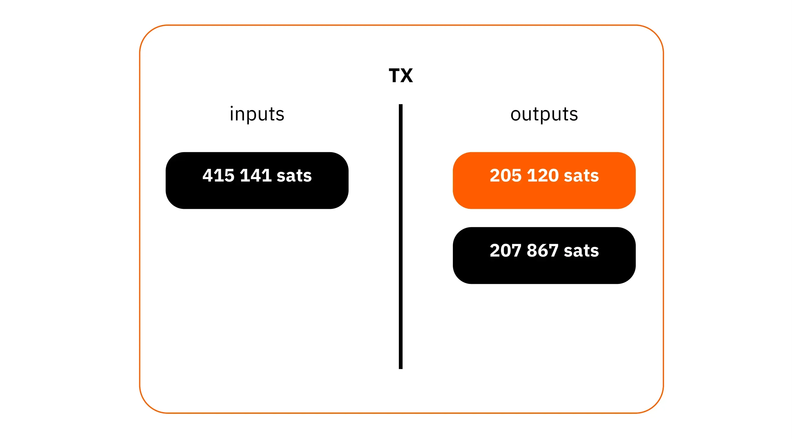


Slutligen, om du utför Bitcoin-transaktioner regelbundet, se till att du inte alltid sänder dem vid samma tidpunkter. Genom att sprida ut sändningen av dina transaktioner under dagen och veckan undviker du att ge utomstående observatörer möjlighet att upptäcka ett tidszonbaserat tidsmönster som kan förstärka deras analys.


Förutom alla dessa goda metoder som ska antas dagligen finns det ännu mer effektiva metoder för att helt bryta spårbarheten för dina bitcoins. Dessa inkluderar naturligtvis CoinJoin-transaktioner, som vi kommer att titta på djupet i nästa avsnitt.


# Förståelse av CoinJoin-transaktioner


<partId>6d0bbf16-3714-4db1-9897-2d45019f6bdc</partId>


## Vad är en CoinJoin-transaktion?


<chapterId>0862bc6b-1c48-4aa4-b76d-4f547b469008</chapterId>


Efter att ha studerat grunderna för integritetsskydd ska vi nu titta på mer sofistikerade tekniker som syftar till att aktivt försvara din sekretess, i synnerhet genom att dela upp din Bitcoin-historik. I nästa del kommer vi att titta på en hel mängd små tekniker, men först vill jag berätta om CoinJoin.


CoinJoin anses ofta vara den mest effektiva metoden för att skydda Bitcoin-användarnas integritet. Men vad exakt är en CoinJoin-transaktion? Låt oss ta reda på det.


### De grundläggande principerna för CoinJoin


CoinJoin är en teknik för att bryta Bitcoin-spårning på Blockchain. Den bygger på en samarbetstransaktion med en specifik struktur med samma namn: CoinJoin-transaktionen.


Som vi såg i de första delarna av den här kursen är Bitcoin-transaktioner kända för alla användare via deras nod. Det är därför lätt att kontrollera den elektroniska signaturkedjan för varje mynt och observera dess historia. Detta innebär att alla användare kan försöka analysera andra användares transaktioner. Följaktligen är anonymitet på transaktionsnivå omöjlig. Anonymiteten kan dock bevaras när det gäller individuell identifiering. Till skillnad från det konventionella banksystemet, där varje konto är kopplat till en personlig identitet, är medel på Bitcoin kopplade till kryptografiska nyckelpar (eller skript), vilket ger användarna en form av pseudonymitet bakom kryptografiska identifierare.


Bitcoin:s sekretess undermineras när utomstående observatörer kan associera specifika UTXO:er med identifierade användare. När denna association har etablerats blir det möjligt att spåra deras transaktioner och analysera deras Bitcoin-historik. CoinJoin är just en teknik som utvecklats för att bryta spårbarheten av UTXO:er, för att erbjuda Bitcoin-användare en viss Layer av konfidentialitet på transaktionsnivå.


Coinjoins förstärker Bitcoin-användarnas konfidentialitet genom att göra kedjeanalysen mer komplex för externa observatörer. Deras struktur gör att flera mynt från olika användare kan slås samman till en enda transaktion, vilket suddar ut gränserna och gör det svårt att fastställa kopplingarna mellan in- och utdataadresser.


Det är viktigt att förstå att syftet med en CoinJoin-transaktion är att bryta ett mynts historia. Denna teknik ger inte permanent anonymitet eller blockerar definitivt Bitcoin-spårning, i motsats till vad du kanske tror. CoinJoin syftar endast till att bryta historiken vid den punkt där CoinJoin-transaktionen utförs. Före och efter denna operation är myntet dock fortfarande föremål för samma risker när det gäller sekretess.


### Hur fungerar coinjoins?


CoinJoin-principen bygger på ett samarbetsbaserat tillvägagångssätt: flera användare som vill blanda sina bitcoins sätter in identiska belopp som input i samma transaktion. Dessa belopp omfördelas sedan i outputs av lika värde till varje användare.


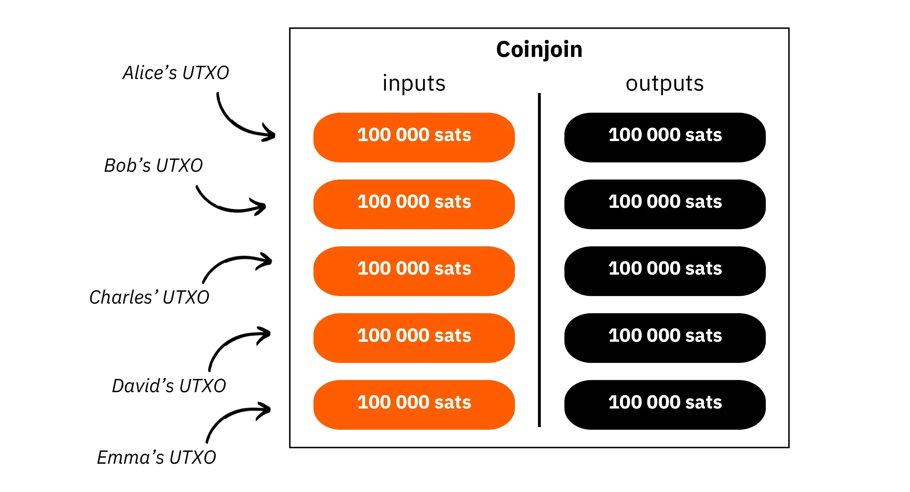


I slutet av transaktionen blir det omöjligt att associera en specifik output med en användare som kallas input. Det finns ingen direkt länk mellan inputs och outputs, vilket bryter kopplingen mellan användare och deras UTXO:er, liksom historiken för varje del.


Låt oss ta Alice:s exempel. Hon vill skicka cirka 100 000 Sats till sin syster Eve på hennes födelsedag. Alice vill dock inte att Eve ska kunna spåra hennes transaktionshistorik, eftersom hon inte vill avslöja hur många bitcoins hon har eller hur hon fick dem. Därför bestämmer sig Alice för att bryta sin UTXO-historik med en CoinJoin-transaktion. Hon organiserar sig med Bob, Charles, David och Frank för att genomföra en samarbetstransaktion:


- Alice, Bob, Charles, David och Frank åtar sig vardera en UTXO på 105 000 Sats (med 5 000 Sats för Mining-avgifter) som input till transaktionen:


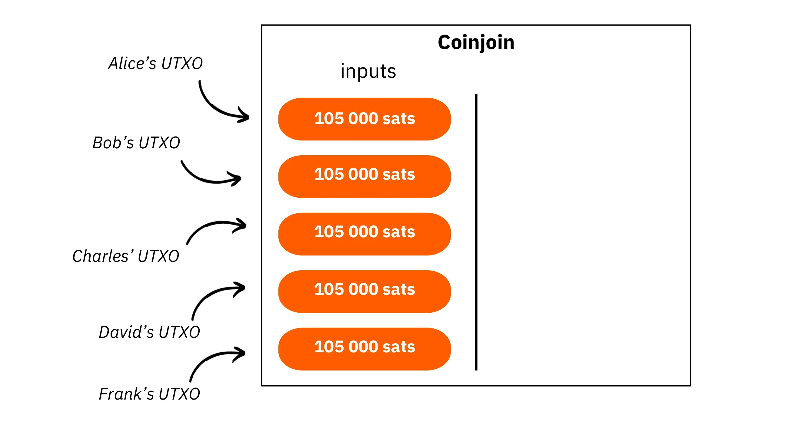


- I utbyte mot att konsumera dessa inmatningar genererar var och en en tom Address för att skapa fem identiska utmatningar på 100 000 Sats vardera. Var och en hämtar en utgång:


- Alice finner sig själv med en UTXO på 100 000 Sats vars historia är förväxlad. Hon använder denna UTXO i en ny transaktion för att skicka beloppet till Eve på hennes födelsedag:


- Om Eve försöker analysera denna transaktion för att extrahera information kommer hon att konfronteras med CoinJoin-transaktionen som involverar Alice, Bob, Charles, David och Frank. Eve kan inte urskilja vilken inmatning som tillhör vem på grund av beloppens enhetlighet och kan därför inte spåra Alice:s UTXO-historia eller avgöra hur många bitcoins hennes syster äger eller hur hon förvärvade dem:


I det här fallet har Alice använt CoinJoin-tekniken för att öka sekretessen med avseende på retrospektiv analys. I själva verket skyddar Alice sig själv mot en möjlig analys av Eve, som skulle börja från en specifik transaktion och arbeta sig bakåt genom UTXO:s historia. Detta skydd mot analys från nuet till det förflutna kallas retrospektiv anonset. Vi kommer att titta närmare på detta koncept i de sista kapitlen i detta avsnitt.


CoinJoin erbjuder dock också möjligheten att stärka sekretessen inför en analys från det förflutna till nutiden, så kallad prospektiv anonset. Låt oss gå tillbaka till vårt exempel där Alice skickade 98 000 Sats till Eve på hennes födelsedag, men med ombytta roller. Låt oss nu föreställa oss att det är Eve som är orolig för sin integritet. Alice skulle kunna frestas att spåra myntet som hon skickade till Eve för att få ut information från det. Eve skulle mycket väl kunna konsolidera denna UTXO som hon just har mottagit med alla sina andra UTXO:er, vilket skulle kunna avslöja för Alice hur många bitcoins hon har i sin Wallet. För att undvika detta kan Eve också bryta historiken för det mynt hon just har mottagit:


- Eve, Grace, Mallory, Oscar och Victor lade var och en in en UTXO på 98 000 Sats som input till en Bitcoin-transaktion:


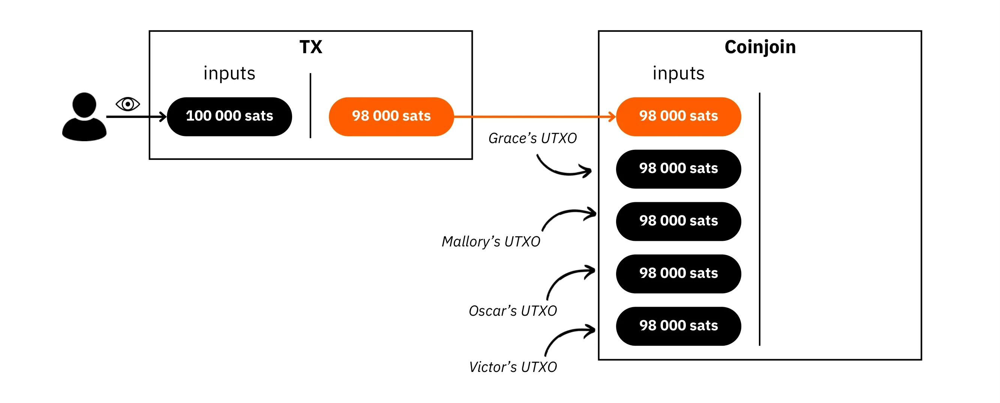


- I gengäld för att konsumera dessa inmatningar tillhandahåller varje användare en tom Address som ska användas för att skapa 5 utmatningar av 97 500 perfekt lika Sats. Varje användare får en output:


- Eve har nu en UTXO på 97 500 Sats vars historik har brutits. Hon kan använda den utan rädsla för att genomföra framtida transaktioner. Om Alice försöker spåra de bitcoins som hon har skickat till Eve, kommer hon att konfronteras med en CoinJoin-transaktion. Hon kommer inte att kunna avgöra vilken utgående UTXO som tillhör Eve. Analys blir omöjlig:


I det första exemplet såg vi hur CoinJoin kan skydda ett rums integritet i förhållande till dess förflutna, och i det andra exemplet hur den också kan säkra ett rums historia i förhållande till dess framtid. Det var därför jag nämnde att CoinJoin bör ses som en engångshändelse som segmenterar en del historia i båda riktningarna:


### Mixer, CoinJoin, mixer... Vad är det för skillnad?


Coinjoins beskrivs ibland som "mixers", en term som vissa bitcoinare avvisar av rädsla för att den kan förväxlas med custodial mixers. Jag tror dock att denna farhåga är ogrundad, eftersom CoinJoin i ett matematiskt sammanhang förkroppsligar just begreppet mixning.


Inom den allmänna matematiken avser blandning egenskapen hos ett dynamiskt system där, efter en viss tidsperiod, alla delar av det initiala utrymmet teoretiskt kan blandas med vilken annan del som helst. Blandning innebär att en partikels position eller ett systems tillstånd utvecklas på ett sådant sätt att dess framtida fördelning är oberoende av dess initiala fördelning och därmed når ett tillstånd där det initiala tillståndets egenskaper är jämnt fördelade över hela systemets rymd. Detta är exakt vad som händer i en CoinJoin med bitcoins. Så enligt min mening är CoinJoin verkligen en myntblandningsmetod.


Å andra sidan är det viktigt att skilja CoinJoin från shufflers. En shuffler är en tjänst där användare skickar sina bitcoins för att shufflas. Dessa tjänster var populära under 2010-talet, men deras användning har minskat på grund av två stora nackdelar jämfört med CoinJoin:


- De kräver att användarna avstår från att ta hand om sina medel under blandningsprocessen, vilket utsätter dem för risken för stöld;
- Det finns ingen garanti för att mixern inte registrerar transaktionsuppgifter eller till och med säljer denna information till kedjeanalysföretag.


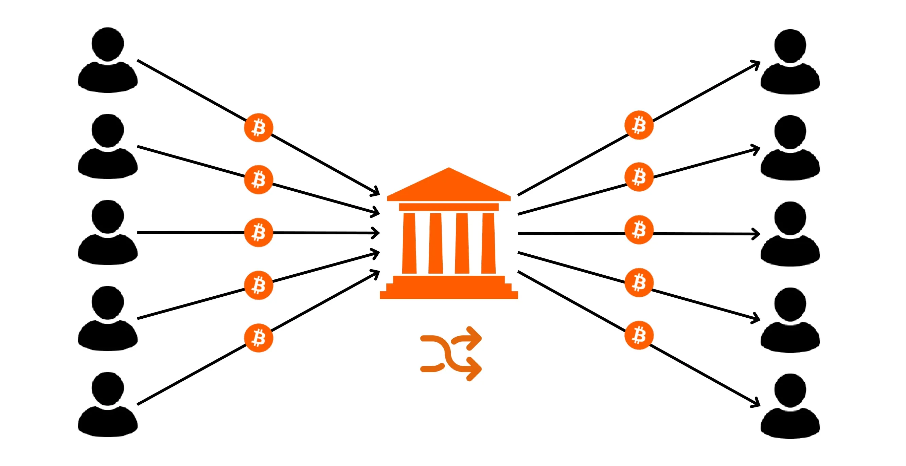


Dagens användare föredrar därför CoinJoin, eftersom det gör att de kan behålla total kontroll över sina medel under hela processen. CoinJoin-deltagare löper ingen risk att få sina bitcoins stulna av de andra inblandade parterna. Låt oss ta en titt på hur allt detta är möjligt i nästa kapitel.


## Zerolink och chaumian coinjoins


<chapterId>326c9654-b359-4906-b23d-d6518dd5dc3e</chapterId>


Den integritet som en CoinJoin ger förtjänas av storleken på den grupp där vår pjäs är gömd. Detta innebär att hitta så många deltagare som möjligt. Det är fullt möjligt att skapa en CoinJoin manuellt, med användare som vi själva har hittat, men det är en komplex process som inte kommer att ge dig några stora anonsets.


Det är därför som CoinJoin-samordnare har utvecklats på Bitcoin. Deras roll är att sätta de olika användarna i kontakt med varandra och överföra den information som behövs för att slutföra den gemensamma transaktionen.


Men hur kan vi säkerställa att koordinatorn aldrig får tag på användarnas bitcoins, och trots att han är den person som bygger CoinJoin-transaktionen, hur kan vi säkerställa att han inte kan länka användarnas in- och utdata, vilket skulle kunna utgöra en sekretessläcka?


### Chaums blinda signaturer


Moderna CoinJoin-implementationer använder David Chaums blinda signaturer för att undvika att läcka information. Låt oss ta en snabb titt på hur dessa blinda signaturer fungerar.


Chaums blinda signaturer är en form av digital signatur där den som utfärdar en signatur inte känner till innehållet i det meddelande som han signerar. Men signaturen kan sedan verifieras mot det ursprungliga meddelandet. Den här tekniken utvecklades av kryptografen David Chaum 1983.


Låt oss ta ett exempel på ett företag som vill autentisera ett konfidentiellt dokument, t.ex. en Contract, utan att avslöja dess innehåll. Företaget tillämpar en maskeringsprocess som kryptografiskt omvandlar originaldokumentet på ett reversibelt sätt. Det modifierade dokumentet skickas till en certifikatutfärdare som gör en blind signatur utan att känna till det underliggande innehållet. Efter att ha mottagit det signerade dokumentet avmaskerar företaget signaturen. Resultatet blir ett originaldokument som autentiseras av myndighetens signatur, utan att myndigheten någonsin har sett originalinnehållet.


Chaums blinda signaturer kan därför intyga ett dokuments äkthet utan att känna till dess innehåll, vilket garanterar både konfidentialiteten för användarens data och integriteten för det signerade dokumentet.


### Chaumian sammanfaller


Så kallade "Chaumian" coinjoins kombinerar användningen av Tor och David Chaums blinda signaturer för att säkerställa att koordinatorn inte kan veta vilken utgång som tillhör vilken användare.


CoinJoin-transaktionens konstruktionsprocess omfattar tre huvudsteg: registrering av indata, registrering av utdata och transaktionssignatur. Låt oss titta på denna process genom exemplet Alice, en av deltagarna i CoinJoin. Alla de andra deltagarna följer samma steg som Alice, var och en för sig.


**Steg 1: Registrering av indata**


- Alice sänder till koordinatorn den UTXO som hon vill använda som input till transaktionen, samt den maskerade mottagande Address som hon vill använda som output för att ta emot sina bitcoins. Koordinatorn har därför inget sätt att känna till Alice:s Address. Den ser bara hennes maskerade version:


- Samordnaren kontrollerar giltigheten hos inmatningarna och signerar sedan Alice:s maskerade Address med sin privata nyckel. Han returnerar den blinda signaturen till Alice:


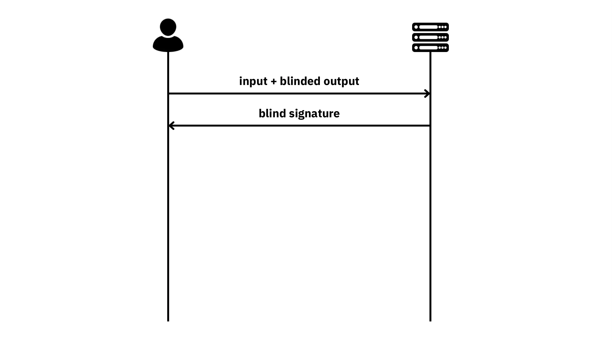


**Steg 2: Registrering av utdata**


- Alice kan avmaskera sin Address, som nu är signerad med koordinatorns privata nyckel. Hon kommer att upprätta en ny anslutning under en annan Tor-identitet. Koordinatorn kan inte identifiera att det är Alice som ansluter under den nya identiteten:


- Alice skickar den omaskerade Address och signaturen till koordinatorn (som fortfarande inte vet att det är Alice):


**Steg 3: Signera transaktionen**


- På samma sätt hämtar koordinatorn omaskerade resultat från alla deltagare. Tack vare de tillhörande signaturerna kan han kontrollera att varje anonymt inlämnad output har signerats med hans privata nyckel i förväg, vilket garanterar deras legitimitet. Han är sedan redo att bygga CoinJoin-transaktionen och skickar den till deltagarna för underskrift:


- Alice kontrollerar, precis som de andra deltagarna, att hennes input och output ingår korrekt i den transaktion som samordnaren har konstruerat. Om allt är tillfredsställande skickar hon signaturen som låser upp hennes inputskript till samordnaren:


- Efter att ha samlat in signaturer från alla CoinJoin-deltagare kan koordinatorn sända transaktionen i Bitcoin-nätverket så att den kan läggas till i ett block.


I det här systemet kan samordnaren inte koppla en input till en specifik output. Dessutom kan han inte tillägna sig deltagarnas medel, eftersom han aldrig har tillgång till de privata nycklar som behövs för att låsa upp deras UTXO:er. Under hela processen, fram till slutet av steg 3, har han inte heller tillgång till signaturerna. När Alice och de andra deltagarna har signerat den globala transaktionen, efter att ha kontrollerat att allt är korrekt, kan koordinatorn inte längre ändra transaktionen, inklusive utdata, utan att ogiltigförklara den. Detta förhindrar samordnaren från att stjäla bitcoins.


Slutligen vill CoinJoin-användaren, när han registrerar sin insats i transaktionen, ha garantier som liknar dem som en medborgare som röstar i ett val har. Det finns en dualitet mellan de offentliga och privata aspekterna av dessa åtgärder. Å ena sidan finns det vad du vill hålla privat: för väljaren vill han inte att hans röstsedel ska kopplas till hans identitet; för CoinJoin-användaren vill han inte att hans output ska associeras med hans input. Om koordinatorn, eller någon annan part, lyckas upprätta en länk mellan en inmatning och en utmatning, förlorar CoinJoin allt intresse. Som förklarats ovan måste CoinJoin fungera som ett avbrott i ett mynts historia. Detta avbrott sker just på grund av omöjligheten att associera en specifik input med en specifik output i CoinJoin-transaktionen (prospektiv anonset) och vice versa (retrospektiv anonset).


Å andra sidan har vi den offentliga aspekten: väljaren vill vara säker på att hans röstsedel finns i valurnan; på samma sätt vill CoinJoin-användaren vara säker på att hans output finns med i CoinJoin-transaktionen. CoinJoin-deltagare måste absolut kunna verifiera att deras output finns med innan de signerar transaktionen, annars kan koordinatorn stjäla pengarna.


Det är just dessa två offentliga och privata aspekter, som möjliggörs genom användningen av David Chaums blinda signaturer, som garanterar deltagarna i Chaumian coinjoins att deras bitcoins inte kommer att stjälas och att deras medel inte kan spåras.


### Vem uppfann CoinJoin-konceptet?


Det är Hard att säga med säkerhet vem som först introducerade CoinJoin-idén till Bitcoin, och vem som kom på idén att använda David Chaums blinda signaturer i detta sammanhang. Man tror ofta att det var Gregory Maxwell som först nämnde det i [ett meddelande på BitcoinTalk 2013] (https://bitcointalk.org/index.php?topic=279249.0) :


> *"Med hjälp av Chaums blinda signaturer: Användare loggar in och tillhandahåller ingångar (och Exchange adresser) samt en kryptografiskt blinded version av den Address som de vill skicka sina privata delar till; servern signerar tokens och skickar tillbaka dem. Användarna återansluter anonymt, avmaskerar sina utdataadresser och skickar tillbaka dem till servern. Servern kan se att alla utdata har signerats av den och att alla utdata följaktligen kommer från giltiga deltagare. Senare återansluter människor och loggar in"*
Maxwell, G. (2013, 22 augusti). *CoinJoin: Bitcoin integritet för den verkliga världen*. BitcoinTalk Forum. https://bitcointalk.org/index.php?topic=279249.0


Det finns dock andra tidigare omnämnanden, både för Chaum-signaturer som en del av mixning, men också för coinjoins. [I juni 2011 presenterade Duncan Townsend på BitcoinTalk](https://bitcointalk.org/index.php?topic=12751.0) en mixer som använder Chaum-signaturer på ett sätt som liknar moderna Chaumian coinjoins.


I samma tråd kan vi hitta [ett meddelande från hashcoin som svar till Duncan Townsend](https://bitcointalk.org/index.php?topic=12751.msg315793#msg315793) för att förbättra hans mixer. Den process som beskrivs i detta meddelande är precis vad coinjoins handlar om. Omnämnande av ett liknande system finns också i [ett meddelande från Alex Mizrahi 2012](https://gist.github.com/killerstorm/6f843e1d3ffc38191aebca67d483bd88#file-laundry), när han gav råd till skaparna av Tenebrix, ett av de första altcoins som låg till grund för att senare skapa Litecoin. Till och med själva termen "CoinJoin" sägs inte ha myntats av Greg Maxwell, utan ha kommit från en idé av Peter Todd.


### Zerolänk


Zerolink är ett omfattande blandningsprotokoll som innehåller Chaumian coinjoins och olika strategier för att skydda användarnas anonymitet mot flera former av kedjeanalys, i synnerhet genom att minimera fel i samband med portföljförvaltning. Detta protokoll [introducerades av nopara73 och TDevD 2017] (https://github.com/nopara73/ZeroLink/blob/master/README.md).


Som namnet antyder är principen bakom Zerolink att skapa CoinJoin-transaktioner som säkerställer att länkarna mellan inputs och outputs inte kan spåras. Detta uppnås genom att säkerställa att alla utgångar har helt identiska belopp.


En viktig förebyggande åtgärd som Zerolink vidtar är att hålla oblandade UTXO:er helt åtskilda från blandade UTXO:er genom att använda separata kryptografiska nyckeluppsättningar eller till och med separata portföljer. Detta skiljer "*pre-mix*" Wallet, som är avsedd för delar före blandning, från "*post-mix*" Wallet, som är reserverad för delar som har blandats.


Denna rigorösa separation av UTXO:er tjänar framför allt till att förhindra oavsiktliga kopplingar mellan en blandad UTXO och en oblandad UTXO. Om sådana kopplingar uppstår, upphävs CoinJoin:s effektivitet på den blandade UTXO utan att användaren är medveten om det, vilket äventyrar sekretessen för en UTXO vars historia han trodde att han hade brutit. Dessa länkar kan uppstå antingen genom återanvändning av Address vid säkringen av en blandad UTXO med en oblandad, eller genom tillämpning av CIOH (_Common-Input-Ownership Heuristic_), om användaren konsumerar blandade och oblandade UTXO som ingångar till samma transaktion. Genom att separera portföljerna före och efter blandning undviker vi sådana oavsiktliga associationer och skyddar användaren mot oavsiktliga fel.


Denna åtskillnad gör det också möjligt att tillämpa olika regler för portföljer med för- och eftermixning på portföljprogramvarunivå. I portföljen efter blandning kan programvaran t.ex. förbjuda sammanslagning av UTXO:er till ingångar för att förhindra tillämpning av CIOH, vilket skulle äventyra användarens anonset. Det är också möjligt att standardisera användningen av skript och transaktionsalternativ (som t.ex. RBF-rapportering) för att förhindra identifiering med Wallet-fingeravtryck.


För närvarande är Whirlpool den enda CoinJoin-implementeringen som strikt tillämpar Zerolink-protokollet. I nästa kapitel tar vi en titt på de olika CoinJoin-implementeringar som finns, och fördelarna och nackdelarna med var och en av dem.


## CoinJoin-implementeringar


<chapterId>e37ed073-9498-4e4f-820b-30951e829596</chapterId>


*År 2024 bevittnar vi stora förändringar i de verktyg som är tillgängliga för användare som vill göra coinjoins på Bitcoin. Vi befinner oss för närvarande vid en vändpunkt och CoinJoin-marknaden genomgår en stor omstrukturering. Detta kapitel kommer säkert att uppdateras över tiden.*


För närvarande finns det huvudsakligen 3 olika CoinJoin-implementeringar på Bitcoin:


- Whirlpool;
- Wabisabi;
- JoinMarket.


Var och en av dessa implementeringar syftar till att bryta UTXO:s historia via CoinJoin-transaktioner. Deras mekanismer varierar dock avsevärt. Det är därför viktigt att förstå hur de fungerar, så att du kan välja det alternativ som passar dina behov bäst.


### JoinMarket


JoinMarket, som grundades 2015 av Adam Gibson och Chris Belcher, skiljer sig tydligt från andra CoinJoin-implementeringar tack vare sin unika modell för att ansluta användare. Systemet är baserat på en P2P Exchange-marknad där vissa användare, "makers", gör sina bitcoins tillgängliga för mixning, medan andra, "takers", använder dessa kontanter för att göra coinjoins mot en avgift.


I denna modell gör "makers" sina bitcoins tillgängliga för "takers" och får en avgift för sin tjänst. De som tar emot betalar i sin tur för att använda tillverkarnas bitcoins för att utföra sina egna CoinJoin-transaktioner. Serviceavgifterna varierar beroende på vilken roll som innehas: "Makers" samlar in avgifter för att erbjuda likviditet, medan "takers" betalar avgifterna. Marknaden fungerar fritt, utan några villkor för användning.


En av JoinMarkets största nackdelar är dess komplexa användning, som kräver en viss grad av bekvämlighet med terminaler för att fungera effektivt. Även om denna komplexitet inte är något hinder för den erfarne användaren, kan den begränsa tillgången för allmänheten. Den senaste introduktionen av en webb Interface kallad JAM har dock gjort det lite enklare att använda.


Källa : [JAM] (https://github.com/joinmarket-webui/jam/blob/devel/docs/assets/screenshot-dark.webp)


Den tekniska barriären är dock fortfarande ett stort hinder. I CoinJoin-ekosystemet, där sekretessen förstärks av antalet deltagare, påverkar varje begränsning som minskar tillgängligheten direkt den tillgängliga likviditeten, vilket är en avgörande faktor för mixens effektivitet. Bitcoin, som redan är en nisch inom finansiella transaktioner, ser sin användning av coinjoins som en subnisch, och JoinMarket representerar en ännu mer specialiserad del av den, vilket därför begränsar dess potential att öka användarnas anonsets.


Trots sin innovativa P2P-länkmodell för coinjoiners har JoinMarket vissa betydande nackdelar, särskilt när det gäller transaktionsstrukturen. Till skillnad från andra implementeringar som Whirlpool garanterar JoinMarket inte perfekt jämlikhet mellan utgångar, och det är möjligt att spåra deterministiska länkar mellan ingångar och utgångar. Dessutom har den inga verktyg för att förhindra att delar som redan har blandats ihop blandas igen, vilket skulle kunna äventyra den konfidentialitet som användarna eftersträvar.


Slutligen, även om JoinMarket-konceptet är intressant, särskilt för dem som är intresserade av en dynamisk likviditetsmarknad, gör dess strukturella svagheter och tekniska komplexitet det enligt min mening mindre intressant för både nybörjare och experter som letar efter en CoinJoin-implementering.


### Wabisabi


Wabisabi är en annan CoinJoin-implementering, med ett tillvägagångssätt som centraliserar transaktionskoordinering. Denna modell utformades av Ádám Ficsór (nopara73), Yuval Kogman, Lucas Ontivero och István András Seres 2021 och integrerades i Wasabi 2.0-programvaran året därpå. Wabisabi är just en utveckling av Wasabi software CoinJoin-modellen som lanserades 2018.


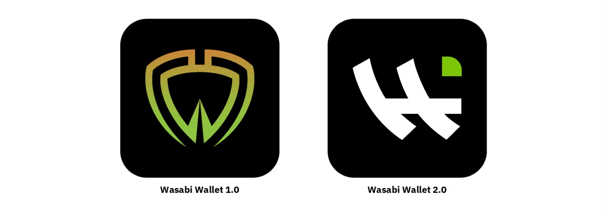


Mot slutet av 2010-talet antog Wasabi en radikalt annorlunda CoinJoin-transaktionsstruktur än Whirlpool. Wasabi använde mycket stora CoinJoin-transaktioner som involverade dussintals deltagare för att öka anonsets för sina deltagare. I motsats till detta valde Whirlpool flera små transaktioner, vilket gjorde det möjligt för anonsets att växa exponentiellt med varje cykel.


Exchange-hanteringsmetoderna skilde också de två implementationerna åt. Med Whirlpool uteslöts och isolerades utländska Exchange från UTXO:er före CoinJoin-cykler tack vare TX0, ett koncept som jag kommer att förklara ytterligare i nästa kapitel. Med Wasabi, å andra sidan, utgjorde utländska Exchange en av utgångarna för CoinJoin-transaktionen, vilket upprätthöll deterministiska länkar mellan vissa in- och utgångar.


Med Wabisabi har Wasabi version 2.0 anpassat sitt tillvägagångssätt för coinjoins för att matcha det för Whirlpool. Även om CoinJoin-transaktioner fortfarande är mycket stora, är det nu möjligt att kedja flera på varandra följande cykler enligt Whirlpool-modellen. Särskild uppmärksamhet har också ägnats åt hanteringen av Exchange-kursen: till skillnad från Wasabi 1.0, där Exchange-kursen var direkt kopplad till användarinmatningar, försöker Wabisabi att dela upp Exchange-kursen i flera små summor, uppdelade i lika stora valörer för alla deltagare.


Låt oss illustrera detta med ett förenklat exempel som bara omfattar 2 användare: Alice vill blanda 115 000 Sats och Bob, 210 000 Sats. Om man bortser från avgifter skulle en CoinJoin-transaktion med Wasabi 1.0 ha genererat 3 utgångar på 100 000 Sats, plus 1 Exchange på 15 000 Sats för Alice och 1 Exchange på 10 000 Sats för Bob. Exchange-utgångarna skulle fortfarande vara kopplade till ingångarna:


Enligt Wabisabi skulle samma transaktion ha gett upphov till 3 utgångar om 100 000 Sats och 5 utgångar om 5 000 Sats, vilket skulle ha spridit Exchange så att den inte direkt kunde kopplas till en viss ingång:


Personligen anser jag att Wabisabis utländska Exchange-hantering innebär flera risker som kan äventyra dess effektivitet när det gäller sekretess:


- När en användare bidrar med ett UTXO som är betydligt större än de andra deltagarnas, får han oundvikligen ett Exchange-belopp som kommer att kopplas till hans insats. Detta går stick i stäv med protokollets ursprungliga syfte, som är att eliminera alla identifierbara utbyten;
- Mångfaldigandet av valörer i syfte att fragmentera Exchange kan paradoxalt nog vara skadligt för blandningseffektiviteten. Denna process kan leda till en minskning av anonsets för vissa utgångar, eftersom de blir lättare att identifiera;
- Denna metod genererar också UTXO:er med lågt värde som utgör ett hanteringsproblem för användaren. Dessa små UTXO kan, om de blir för dyra att spendera i förhållande till sitt värde, bli "Dust". Detta fenomen leder till att användaren slår samman flera UTXO:er till inputs för framtida transaktioner, eller konsoliderar dem. I båda fallen kan detta, på grund av CIOH, antingen minska de erhållna anonsets eller helt upphäva de sekretessfördelar som erhållits genom den ursprungliga CoinJoin.


Till skillnad från Whirlpool, som implementerar ZeroLink-protokollet som säkerställer strikt separation mellan UTXO före och efter blandning, upprätthåller Wabisabi inte denna strikta separation. Det har också förekommit problem med återanvändning av Address av vissa Wasabi-kunder, vilket uppenbarligen är mycket skadligt för användaren.


I Wasabi version 2.0 har en ny CoinJoin-avgiftspolicy implementerats. Från och med nu är koordinatoravgifterna satta till 0,3% för UTXO:er över 0,01 Bitcoin, medan för mindre UTXO:er erbjuds dessa avgifter fullt ut. Dessutom är remixer för dessa mindre UTXO:er kostnadsfria, även om Mining-avgifter fortfarande ska betalas av användaren för alla transaktioner, inklusive remixer.


Detta står i kontrast till Whirlpool:s policy, där avgifterna förblir fasta, oavsett storleken på de anonsets som erhålls. Med Wasabi 2.0 måste användaren fortfarande betala Mining-avgifter för alla transaktioner, inklusive remixer, även om koordinatoravgifterna avskaffas för små UTXO:er.


När jag skriver dessa rader har användningen av Wabisabi blivit betydligt mer komplex till följd av den senaste tidens händelser. Efter gripandet av Samourai Wallet:s grundare meddelade zkSNACKs, det företag som finansierar och hanterar Wasabis utveckling, att dess CoinJoin-koordinatortjänst skulle upphöra den 1 juni 2024. Denna koordinator, som ställdes in som standard på Wasabi, var ansvarig för den stora majoriteten av likviditeten.


I och med att denna huvudkoordinator har upphört måste användarna nu ansluta sig till nya, oberoende koordinatorer. Denna förändring ger upphov till ett antal farhågor: å ena sidan kanske de nya koordinatorerna inte har tillräcklig likviditet, vilket minskar effektiviteten hos coinjoins när det gäller sekretess. Å andra sidan finns det en risk att stöta på en illvillig koordinator. Denna situation medför betydande nya risker för dem som försöker använda Wabisabi.


Utöver de tekniska frågorna väcker beslutet av zkSNACKs, företaget bakom Wasabi, att använda tjänsterna från ett stränganalysföretag för att filtrera CoinJoin-deltagare allvarliga etiska och strategiska frågor. Den ursprungliga tanken var att förhindra att kriminella använder coinjoins på Wasabi, ett drag som kan verka legitimt. Det väcker dock en paradox: att betala avgifter till en samordnare vars primära uppdrag är att stärka användarnas konfidentialitet, bara för att låta honom finansiera ett företag vars syfte är att äventyra samma konfidentialitet.


Ännu mer oroande är principen om filtrering, som står i radikal kontrast till Bitcoin:s filosofi om att erbjuda ett öppet, ocensurerat finansiellt system. Även om det kan tyckas motiverat att vilja utesluta kriminella aktiviteter, kan denna filtrering också påverka individer vars handlingar, även om de klassificeras som olagliga i vissa sammanhang, kan vara moraliskt försvarbara eller socialt fördelaktiga. Exemplet Edward Snowden illustrerar denna dikotomi på ett perfekt sätt: av vissa regeringar betraktas han som en brottsling för sina avslöjanden, medan han av andra ses som en visselblåsare som agerat i allmänhetens intresse. Denna komplexitet understryker den potentiella faran med filtrering som, även om den är välmenande, i slutändan kan undergräva legitima användares rättigheter och säkerhet. Jag kunde också ha nämnt aktivister och journalister som förföljs under vissa auktoritära regimer.


Som du säkert har förstått vid det här laget föredrar jag definitivt Whirlpool-modellen för coinjoins på Bitcoin. Detta system sticker ut för sin noggrannhet och erbjuder överlägsna garantier för konfidentialitet. Det är också det enda som erbjuder en mix som anses vara perfekt i ett matematiskt sammanhang. Enligt min mening representerar denna modell framtiden för coinjoins på Bitcoin. Jag inbjuder dig att utforska denna modell mer ingående i nästa kapitel.


## Hur Whirlpool verkar


<chapterId>bdbd7109-e36d-4b4f-a3c6-928df4e9bfda</chapterId>


Det som skiljer Whirlpool från andra CoinJoin-metoder är användningen av "_ZeroLink_"-transaktioner, som säkerställer att det absolut inte finns någon möjlig teknisk koppling mellan alla in- och utgångar. Denna perfekta mix uppnås genom en struktur där varje deltagare bidrar med en identisk mängd input (med undantag för Mining-avgifter), vilket genererar output av perfekt lika stora mängder.


Detta restriktiva förhållningssätt till inputs ger Whirlpool:s CoinJoin-transaktioner en unik egenskap: den totala avsaknaden av deterministiska kopplingar mellan inputs och outputs. Med andra ord är det lika stor sannolikhet för varje output att tillskrivas en deltagare som för alla andra outputs i transaktionen.


### Hur Whirlpool fungerar


Inledningsvis var antalet deltagare i varje Whirlpool CoinJoin begränsat till 5, med 2 nya deltagare och 3 remixare (vi förklarar dessa begrepp senare). Ökningen av transaktionsavgifterna för On-Chain som observerades 2023 fick dock Samourais team att ompröva sin modell för att förbättra sekretessen och samtidigt minska kostnaderna. Med hänsyn till situationen på avgiftsmarknaden och antalet deltagare kan samordnaren nu organisera coinjoins med 6, 7 eller 8 deltagare. Dessa förbättrade sessioner är kända som "Surge Cycles". Det är viktigt att notera att det, oavsett konfiguration, alltid bara finns 2 nya deltagare i Whirlpool coinjoins.


Whirlpool-transaktioner kännetecknas således av ett identiskt antal in- och utgångar, som kan vara :


- 5 ingångar och 5 utgångar ;


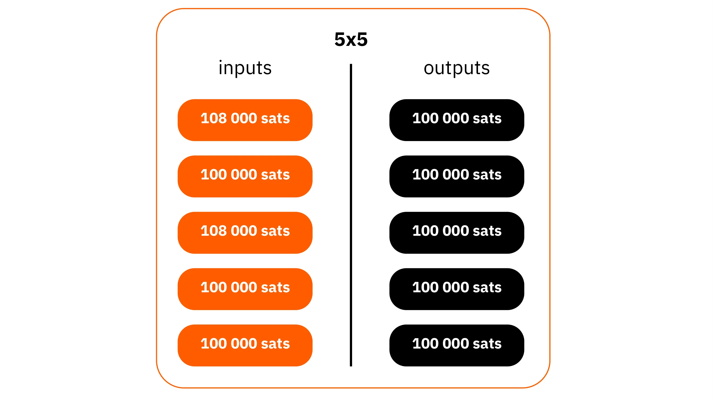


- 6 ingångar och 6 utgångar ;


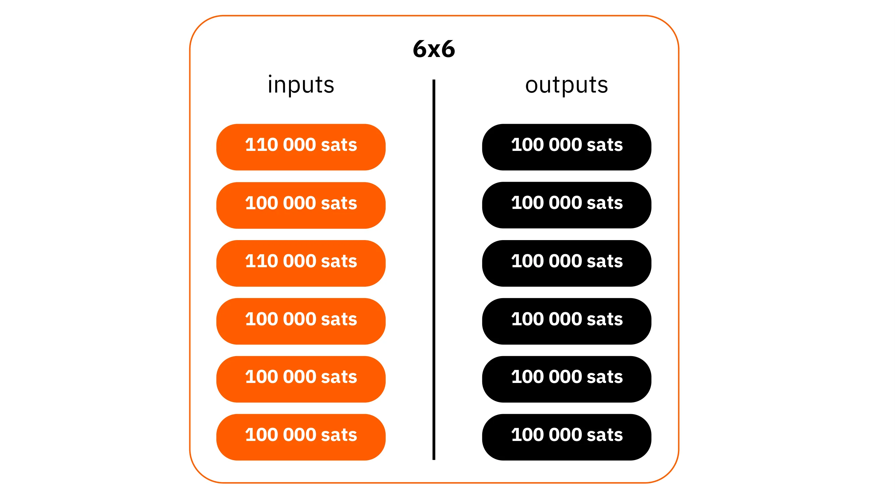


- 7 ingångar och 7 utgångar ;


- 8 ingångar och 8 utgångar.


Whirlpool:s modell är baserad på små CoinJoin-transaktioner. Till skillnad från Wabisabi och JoinMarket, där anonsets robusthet baseras på volymen av deltagare i en enda cykel (eller på ett fåtal cykler), förlitar sig Whirlpool på sekvensen av flera små cykler.


I den här modellen betalar användarna avgifter endast när de först går med i en pool, vilket gör att de kan delta i en mängd remixer utan extra kostnad. Nya deltagare betalar Mining-avgifterna för remixare.


Med varje ytterligare CoinJoin som ett stycke deltar i, liksom med de andra styckena som det har stött på tidigare, kommer anonsets att växa exponentiellt. Målet är att dra nytta av dessa gratis remixer, som varje gång de inträffar bidrar till att förstärka tätheten av de anonsets som är associerade med varje mixat stycke.


Whirlpool har utformats med två viktiga krav i åtanke:


- Tillgängligheten av implementeringen på mobila enheter, med tanke på att Samourai Wallet först och främst är en smartphone-applikation;
- Snabba omblandningscykler för att främja en betydande ökning av anonsets.


Dessa krav styrde de val som utvecklarna av Samourai Wallet gjorde när de utformade Whirlpool, vilket ledde till att de begränsade antalet deltagare per cykel. För få deltagare skulle ha äventyrat CoinJoin:s effektivitet och drastiskt minskat antalet anonsets som genereras per cykel, medan för många deltagare skulle ha orsakat hanteringsproblem i mobilapplikationer och hindrat cykelflödet.


Slutligen finns det inget behov av att ha ett högt antal deltagare per CoinJoin på Whirlpool, eftersom anonsets görs på ackumulering av flera CoinJoin-cykler. Den viktigaste principen här är homogeniteten hos UTXO:erna hos alla deltagare, eftersom detta säkerställer perfekt blandning och därmed full nytta av blandnings- och omblandningscyklerna.


### CoinJoin pooler och avgifter


För att dessa multipla cykler ska öka de blandade delarnas anonsets krävs ett visst ramverk för att begränsa de mängder UTXO som används. Whirlpool definierar olika pooler.


En pool representerar en grupp användare som vill mixa tillsammans och som kommer överens om mängden UTXO som ska användas för att optimera CoinJoin-processen och samtidigt bibehålla perfekt detaljhomogenitet. Varje pool specificerar ett fast UTXO-belopp, som användaren måste följa för att kunna delta. Så för att göra coinjoins med Whirlpool måste du välja en pool. Följande pooler är för närvarande tillgängliga:


- 0.5 bitcoins ;
- 0.05 Bitcoin ;
- 0.01 Bitcoin ;
- 0.001 Bitcoin (= 100.000 Sats).


När du går in i en pool med dina bitcoins kommer de att delas upp i generate UTXO:er som är helt homogena med de andra deltagarna i poolen. Varje pool har en maxgräns, så för belopp som överskrider denna gräns måste du antingen göra två separata poster i samma pool eller flytta till en annan pool med ett högre belopp:


| Pool (bitcoin) | Maximum amount per entry (bitcoin) |
|----------------|--------------------------------------|
| 0,5 | 35 |
| 0,05 | 3,5 |
| 0,01 | 0,7 |
| 0,001 | 0,025 |

En UTXO anses tillhöra en pool när den är redo att integreras i en CoinJoin. Detta innebär dock inte att användaren förlorar äganderätten till den. Som vi såg i de första kapitlen i detta avsnitt behåller du genom de olika blandningscyklerna full kontroll över dina nycklar och följaktligen över dina bitcoins. Det är detta som skiljer CoinJoin-tekniken från andra centraliserade blandningstekniker.


För att gå med i en CoinJoin-pool måste du betala en serviceavgift och en Mining-avgift. Serviceavgifterna är fasta för varje pool och är avsedda att ersätta de team som ansvarar för Whirlpool:s utveckling och underhåll.


Serviceavgiften för användning av Whirlpool betalas endast en gång när du går med i poolen. När du väl har gått med kan du delta i ett obegränsat antal remixer utan extra kostnad. Här är de aktuella fasta avgifterna för varje pool:


| Pool (bitcoin) | Entry fee (bitcoin) |
|----------------|---------------------------------|
| 0,5 | 0,0175 |
| 0,05 | 0,00175 |
| 0.01 | 0.0005 (50,000 sats) |
| 0.001 | 0.00005 (5,000 sats) |

Dessa avgifter fungerar i huvudsak som en inträdesbiljett till den valda poolen, oavsett hur mycket du sätter in CoinJoin. Så oavsett om du går in i 0,01-poolen med exakt 0,01 BTC eller 0,5 BTC, kommer avgifterna att förbli desamma i absoluta termer.


Innan du fortsätter med Whirlpool coinjoins kan användaren välja mellan 2 strategier:


- Välj en mindre pool för att minimera servicekostnaderna, i vetskap om att han kommer att få flera mindre UTXO:er i gengäld;
- Eller så väljer man en större pool och är villig att betala högre avgifter, bara för att i slutändan få ett mindre antal UTXO:er med högre värde.


Det är i allmänhet inte tillrådligt att slå samman flera blandade UTXO efter CoinJoin-cykler, eftersom detta kan äventyra förvärvad sekretess, särskilt på grund av den gemensamma inmatningen Ownership-heuristik (CIOH: *Common-Input-Ownership-Heuristic*). Följaktligen kan det vara vettigt att välja en större pool, även om det innebär att betala mer, för att undvika att få för många UTXO:er med litet värde i utdata. Användaren måste utvärdera dessa avvägningar för att välja den pool han föredrar.


Förutom serviceavgiften måste även den Mining-avgift som är specifik för varje Bitcoin-transaktion beaktas. Som Whirlpool-användare kommer du att behöva betala Mining-avgiften för förberedelsetransaktionen (`Tx0`) samt för den första CoinJoin. Alla efterföljande remixer kommer att vara kostnadsfria, tack vare Whirlpool:s modell som bygger på att betala nya deltagare.


Faktum är att i varje Whirlpool CoinJoin är 2 användare bland inmatningarna nya aktörer. De andra inmatningarna kommer från remixare. Följaktligen bärs Mining -kostnaderna för alla deltagare i transaktionen av dessa två nya aktörer, som sedan också kan dra nytta av gratis remixer:


Tack vare detta avgiftssystem skiljer sig Whirlpool verkligen från andra CoinJoin-implementeringar, eftersom UTXO:ernas anonset inte är proportionerligt mot det pris som användaren betalar. Som ett resultat är det möjligt att uppnå betydligt högre nivåer av anonymitet genom att endast betala poolens inträdesavgift och Mining-avgiften för 2 transaktioner (`Tx0` och den initiala mixen).


Det är viktigt att notera att användaren också måste betala Mining-avgifterna för att ta ut sina UTXO från poolen efter att ha slutfört sina multipla coinjoins, såvida han inte har valt alternativet `mix to`, vilket ger en extern Address som tar emot pengarna direkt från CoinJoin, utan någon ytterligare transaktion.


### HD portföljkonton


För att skapa en CoinJoin via Whirlpool måste Wallet generate flera separata konton. Detta är principen bakom ZeroLink-protokollet. Ett konto, i samband med en HD-portfölj (*Hierarchical Deterministic*), utgör en sektion som är helt isolerad från de andra, och denna separation sker på nivån för det tredje djupet i portföljhierarkin, dvs. på nivån `xpub`.


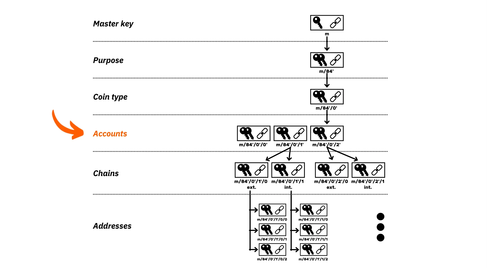


En HD Wallet kan teoretiskt härleda upp till `2^(31)` olika konton. Det första kontot, som används som standard på alla Bitcoin-plånböcker, motsvarar indexet `0`.


För portföljer som är anpassade till Whirlpool används 4 konton för att uppfylla behoven i ZeroLink-processen:


- Kontot **deposit**, identifierat med index `0'` ;
- Kontot **bad bank** (eller "doxxic change"), identifierat med indexet `2,147,483,644'` ;
- Kontot **premix**, identifierat genom indexet "2 147 483 645";
- Kontot **postmix**, identifierat genom indexet "2 147 483 646".


Vart och ett av dessa konton fyller en särskild funktion i CoinJoin-processen, som vi kommer att utforska i följande avsnitt.


Alla dessa konton är kopplade till en enda seed, vilket gör det möjligt för användaren att återfå åtkomst till alla sina bitcoins med hjälp av sin återställningsfras och, i förekommande fall, sin passphrase. Under återställningsoperationen måste programvaran dock informeras om de olika kontoindex som används.


Låt oss ta en titt på de olika stadierna av en Whirlpool CoinJoin inom dessa konton.


### TX0


Utgångspunkten för alla Whirlpool CoinJoin är **deposit**-kontot. Detta är det konto som du automatiskt använder när du skapar en ny Bitcoin Wallet. Detta konto måste krediteras med de bitcoins som du vill blanda.


Tx0" är det första steget i Whirlpool:s blandningsprocess. Syftet är att förbereda och utjämna UTXO:erna för CoinJoin och dela upp dem i enheter som motsvarar mängden av den valda poolen för att säkerställa en homogen blandning. De UTXO:er som utjämnats på detta sätt skickas sedan till **premix**-kontot. När det gäller skillnaden som inte kan komma in i poolen, separeras den till ett specifikt konto: **bad bank** (eller "doxxic change").


Denna inledande transaktion `Tx0` används också för att betala serviceavgiften till CoinJoin-samordnaren. Till skillnad från de följande stegen är denna transaktion inte ett samarbete, så användaren måste bära hela kostnaden för Mining:


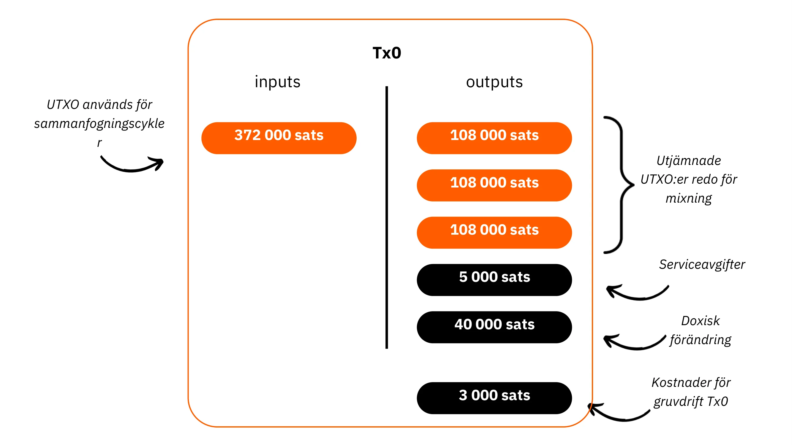


I detta exempel på en `Tx0`-transaktion delas en inmatning på `372 000 Sats` från vårt **deposit**-konto upp i flera UTXO-utmatningar, som fördelar sig enligt följande:


- Ett belopp om 5 000 Sats` för samordnaren för serviceavgifter, motsvarande en poolpost om 100 000 Sats`;
- 3 UTXO:er förberedda för mixning, omdirigerade till vårt **premix**-konto och registrerade hos koordinatorn. Dessa UTXO:er utjämnas till 108 000 Sats vardera för att täcka Mining-kostnaderna för deras framtida initiala blandning;
- Överskottet, som inte kan komma in i poolen eftersom det är för litet, betraktas som giftigt utländskt Exchange. Det skickas till sitt specifika konto. Här uppgår denna Exchange till 40.000 Sats`;
- Slutligen återstår 3 000 Sats, som inte utgör någon produktion, utan är de Mining-kostnader som krävs för att bekräfta Tx0.


Här är till exempel en riktig Whirlpool Tx0 (inte min): [edef60744f539483d868caff49d4848e5cc6e805d6cdc8d0f9bdbbaedcb5fc46](https://Mempool.space/fr/tx/edef60744f539483d868caff49d4848e5cc6e805d6cdc8d0f9bdbbaedcb5fc46)


### De doxiska förändringarna


Överskottet som inte kunde integreras i poolen, här motsvarande "40 000 Sats", omdirigeras till **bad bank**-kontot, även känt som "doxxic Exchange", för att säkerställa strikt separation från de andra UTXO:erna i portföljen.


Denna UTXO är farlig för användarens konfidentialitet, eftersom den inte bara fortfarande är kopplad till sitt förflutna, och därför möjligen till sin ägares identitet, utan den är också noterad som tillhörande en användare som har gjort en CoinJoin.


Om denna UTXO slås samman med blandade utdata kommer de senare att förlora all den sekretess som uppnåtts under CoinJoin-cykler, särskilt på grund av CIOH (*Common-Input-Ownership-Heuristic*). Om den slås samman med andra doxxiska ändringar riskerar användaren att förlora sekretessen, eftersom den kommer att länka de olika CoinJoin-cykelposterna. Den bör därför behandlas med försiktighet. Vi kommer att gå in mer i detalj på hanteringen av dessa UTXOs doxxic i det sista avsnittet i detta kapitel.


### Den ursprungliga mixen


Efter `Tx0` skickas de utjämnade UTXO:erna till vår portföljs **premix**-konto, redo att introduceras i sin första CoinJoin-cykel, även känd som den "initiala mixen". Om, som i vårt exempel, `Tx0` genererar flera UTXO:er för blandning, kommer var och en av dem att integreras i en separat initial blandning.


I slutet av dessa första mixar kommer **premix**-kontot att vara tomt, medan våra mynt, efter att ha betalat Mining-avgifterna för denna första CoinJoin, kommer att justeras exakt till det belopp som definieras av den valda poolen. I vårt exempel kommer våra ursprungliga UTXO:er på 108 000 Sats att ha reducerats till exakt 100 000 Sats.


### Remixer


Efter den första mixningen överförs UTXO:erna till kontot **postmix**. Detta konto samlar UTXO som redan har mixats och de som väntar på remixning. När Whirlpool-kunden är aktiv är UTXO:er som finns i **postmix**-kontot automatiskt tillgängliga för omblandning och kommer att slumpmässigt väljas ut för att delta i dessa nya cykler.


Som en påminnelse är remixer då 100% gratis: inga ytterligare serviceavgifter eller Mining-avgifter krävs. Att behålla UTXO:er på **postmix**-kontot håller därför deras värde intakt och förbättrar deras anonsets samtidigt. Det är därför det är viktigt att låta dessa mynt delta i flera CoinJoin-cykler. Det kostar dig absolut ingenting och ökar deras anonymitetsnivåer.


När du bestämmer dig för att spendera blandade UTXO:er kan du göra det direkt från detta **postmix**-konto. Vi råder dig att behålla blandade UTXO:er på detta konto för att dra nytta av gratis remixer och för att förhindra att de lämnar Whirlpool-kretsen, vilket kan minska deras konfidentialitet.


### Hur hanterar du dina postmixar?


Efter att ha kört CoinJoin-cykler är den bästa strategin att behålla dina UTXO:er på **postmix**-kontot i väntan på framtida användning. Det är till och med tillrådligt att låta dem remixas på obestämd tid tills du behöver spendera dem.


Vissa användare kan överväga att överföra sina blandade bitcoins till en Wallet som säkras av en Hardware Wallet. Detta är möjligt, men det är viktigt att följa Samourai Wallet:s rekommendationer noggrant för att inte äventyra den förvärvade sekretessen.


Att slå samman UTXO:er är det vanligaste misstaget. För att undvika CIOH (*Common-Input-Ownership-Heuristic*) måste du undvika att kombinera blandade UTXO:er med oblandade UTXO:er i samma transaktion. Detta kräver noggrann hantering av dina UTXO:er i din portfölj, särskilt när det gäller märkning.


Försiktighet måste också iakttas vid konsolidering av blandade UTXO. Måttlig konsolidering är möjlig om dina blandade UTXO:er har betydande anonsets, men detta kommer oundvikligen att minska sekretessen för dina delar. Se till att konsolideringarna varken är för omfattande eller utförs efter ett otillräckligt antal omblandningar, med risk för att det upprättas härledbara länkar mellan dina UTXO:er före och efter CoinJoin-cykler. Om du är osäker på dessa manipuleringar är den bästa metoden att inte konsolidera UTXO:er efter blandning, utan att överföra dem en efter en till din Hardware Wallet och generera en ny tom Address varje gång. Kom återigen ihåg att märka varje UTXO du får.


Det är inte heller tillrådligt att överföra dina postmix UTXO:er till en Wallet med hjälp av skript som inte används allmänt. Om du till exempel går in i Whirlpool från en Multisig Wallet med `P2WSH`-skript är det liten chans att du kommer att blandas med andra användare som ursprungligen hade samma typ av Wallet. Om du omblandar dina postmixes till samma Multisig Wallet kommer sekretessnivån för dina blandade bitcoins att minska kraftigt. Utöver skript finns det många andra Wallet-fingeravtryck som kan spela dig ett spratt.


Som med alla Bitcoin-transaktioner är det också viktigt att inte återanvända den mottagande Address. Varje ny transaktion måste tas emot på en ny, tom Address.


Den enklaste och säkraste lösningen är att låta dina blandade UTXO:er vila på deras **postmix**-konto, låta dem remixa och bara röra dem för att spendera. Samurai- och Sparrow-plånböckerna har ytterligare skydd mot alla dessa risker med kedjeanalys. Dessa skydd hjälper dig att undvika att göra misstag.


### Hur hanterar du giftiga utbyten?


Därefter måste du vara försiktig med din hantering av doxxisk Exchange, den Exchange som inte kom med i CoinJoin-poolen. Dessa toxiska UTXO:er, som är resultatet av användningen av Whirlpool, utgör en risk för din integritet, eftersom de skapar en länk mellan dig och CoinJoin-användaren. Det är därför absolut nödvändigt att hantera dem med försiktighet och inte kombinera dem med andra UTXO:er, särskilt inte blandade UTXO:er.


Här följer några strategier för hur du kan använda dem:


- Blanda dem i mindre pooler: Om din giftiga UTXO är tillräckligt stor för att passa in i en mindre pool på egen hand, överväg att blanda den. Detta är ofta det bästa alternativet. Det är dock inte tillrådligt att slå samman flera giftiga UTXO för att få tillgång till en pool, eftersom detta kan länka dina olika poster;
- Markera dem som "icke spenderbara": Ett annat tillvägagångssätt är att sluta använda dem, markera dem som "icke spenderbara" på deras dedikerade konto och bara HODL. Detta säkerställer att du inte av misstag spenderar dem. Om värdet på Bitcoin stiger kan nya pooler som är mer lämpade för dina giftiga UTXO:er dyka upp;
- Gör donationer: Överväg att göra donationer, hur blygsamma de än är, till utvecklare som arbetar med Bitcoin och relaterad programvara. Du kan också donera till föreningar som accepterar BTC. Om det verkar för komplicerat att hantera dina giftiga UTXO:er kan du helt enkelt göra dig av med dem och göra en donation;
- Köp presentkort: Plattformar som [Bitrefill](https://www.bitrefill.com/) låter dig Exchange bitcoins för presentkort som kan användas hos olika handlare. Detta kan vara ett sätt att skiljas från dina giftiga UTXO utan att förlora det tillhörande värdet;
- Konsolidera dem på Monero: Samourai Wallet erbjuder en atombytestjänst mellan BTC och XMR. Detta är perfekt för att hantera giftiga UTXO genom att konsolidera dem på Monero, utan att äventyra din konfidentialitet via CIOH, innan du skickar tillbaka dem till Bitcoin. Detta alternativ kan dock vara kostsamt när det gäller Mining-avgifter och premier på grund av likviditetsbegränsningar;
- Skicka dem till Lightning Network: Att överföra dessa UTXO:er till Lightning Network för att dra nytta av reducerade transaktionsavgifter kan vara ett attraktivt alternativ. Denna metod kan dock avslöja viss information beroende på hur du använder Lightning, och bör därför användas med försiktighet.


### Hur använder jag Whirlpool?


Efter gripandet av Samourai Wallet:s grundare och beslagtagandet av deras servrar den 24 april 2024 fungerar inte Whirlpool-verktyget längre, inte ens för dem som har en egen Dojo. Tidigare var det tillgängligt på Samourai Wallet och Sparrow wallet.


Det är dock fortfarande möjligt att detta verktyg kommer att återaktiveras under de kommande veckorna, beroende på resultatet av försöken, eller återlanseras på ett annat sätt. I vilket fall som helst tror jag inte att marknaden för Bitcoin CoinJoin kommer att vara utan Supply länge, eftersom efterfrågan finns där. Eftersom Whirlpool:s modell är den mest avancerade när det gäller sekretess kommer den dessutom säkert att vara den modell som väljs för andra implementeringar i framtiden.


Vi håller ett vakande öga på detta fall och utvecklingen av de tillhörande verktygen. Du kan vara säker på att vi kommer att uppdatera den här utbildningen när ny information blir tillgänglig.


I nästa kapitel tar vi reda på vad "anonsets" är, hur dessa indikatorer beräknas och hur de kan hjälpa oss att uppskatta effektiviteten hos CoinJoin-cykler.


https://planb.network/tutorials/privacy/on-chain/coinjoin-samourai-wallet-e566803d-ab3f-4d98-9136-5462009262ef


## Anonymitetsuppsättningar


<chapterId>be1093dc-1a74-40e5-9545-2b97a7d7d431</chapterId>


Efter att ha studerat hur coinjoins fungerar och vilka problem som är förknippade med effektiv mixning, ska vi nu ta reda på hur man mäter deras effektivitet. Hur kan vi avgöra om en coinjoining-process har varit effektiv och vilken grad av anonymitet en del har fått? Det är vad vi ska ta reda på i det här kapitlet med anonymitetsuppsättningar eller "anonsets".


### En påminnelse om nyttan med CoinJoin


CoinJoin:s användbarhet ligger i dess förmåga att skapa trovärdig förnekelse genom att bädda in din del i en grupp av delar som inte går att skilja åt. Syftet med denna åtgärd är att bryta spårbarhetens länkar, både från det förflutna till nutiden och från nutiden till det förflutna.


Med andra ord bör en analytiker som känner till din initiala transaktion (`Tx0`) vid ingången av CoinJoin-cykler inte med säkerhet kunna identifiera din UTXO vid utgången av remixcykler (analys av cykelingång till cykelutgång).


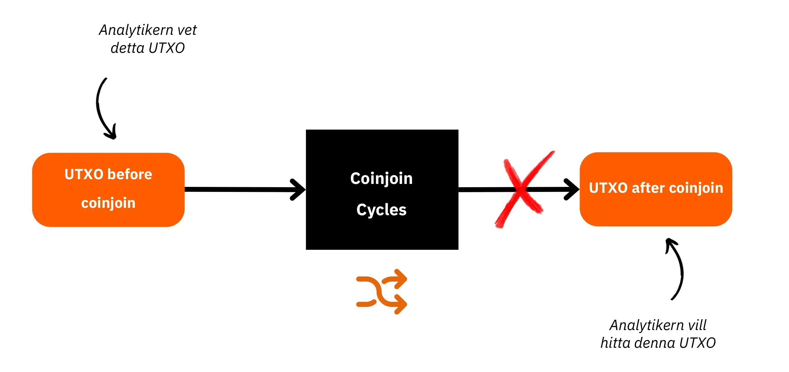


Omvänt måste en analytiker som känner till din UTXO vid utgången av CoinJoin-cykler inte kunna fastställa den ursprungliga transaktionen vid ingången av cyklerna (analys av cykelutgång till cykelingång).


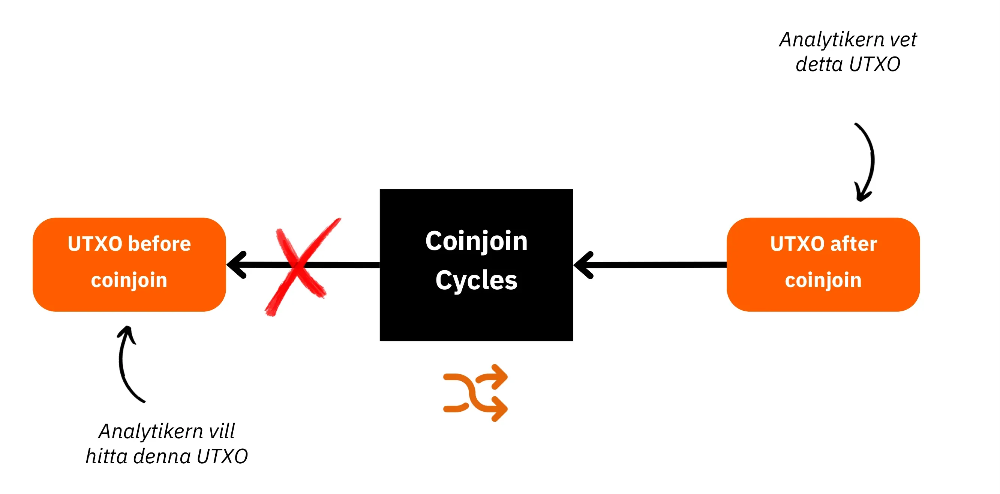


För att bedöma hur svårt det är för en analytiker att koppla det förflutna till nutiden och vice versa måste vi kvantifiera storleken på de grupper av homogena delar inom vilka din del är gömd. Detta mått talar om för oss hur många analyser som har samma sannolikhet. Så om den korrekta analysen drunknar bland 3 andra analyser med samma sannolikhet är din nivå av döljande mycket låg. Om den korrekta analysen å andra sidan återfinns bland 20.000 lika sannolika analyser är din del mycket väl dold. Storleken på dessa grupper representerar indikatorer som kallas "anonsets".


### Förståelse av anonsets


Anonsets används som indikatorer för att bedöma graden av sekretess för en viss UTXO. Mer specifikt mäter de antalet oskiljbara UTXO:er inom den uppsättning som inkluderar den del som studeras. Kravet på en homogen uppsättning UTXO:er innebär att anonsets vanligtvis beräknas på CoinJoin-cykler. Användningen av dessa indikatorer är särskilt relevant för Whirlpool coinjoints, på grund av deras enhetlighet.


Om det behövs kan anonset användas för att bedöma kvaliteten på coinjoins. En stor anonset innebär en hög nivå av anonymitet, eftersom det blir svårt att urskilja en specifik UTXO i den homogena uppsättningen.


det finns 2 typer av anonsets:


- Den prospektiva anonset ;
- Retrospektiv anonset.


### Den prospektiva anonset


Den framåtblickande anonset anger storleken på den grupp bland vilken den UTXO som studeras i slutet av cykeln är dold, givet UTXO i början, dvs. antalet oskiljaktiga delar som finns inom denna grupp. Namnet på denna indikator är "framåtblickande mätvärden".


Denna indikator mäter hur pass motståndskraftig rummets sekretess är mot en analys från det förflutna till nutid (input-to-output).


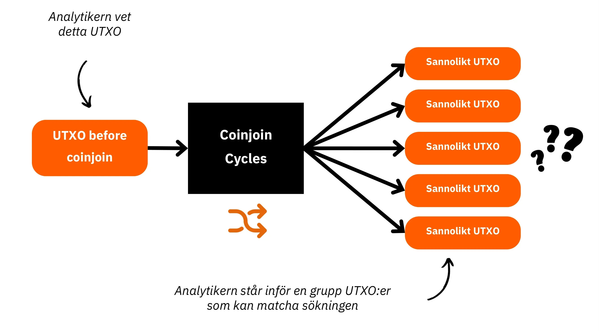


Detta mått används för att uppskatta i vilken utsträckning din UTXO är skyddad mot försök att rekonstruera dess historia från dess ingångspunkt till dess utgångspunkt i CoinJoin-processen.


Till exempel, om din transaktion har deltagit i sin första CoinJoin-cykel och ytterligare två nedåtgående cykler har fullbordats, skulle ditt mynts potentiella anonset vara `13` :


Låt oss till exempel föreställa oss att vårt mynt i början av CoinJoin-cykeln har en prospektiv anonset på `86 871`. I praktiken innebär detta att det är gömt bland `86 871` oskiljaktiga delar. För en utomstående observatör som känner till detta mynt i början av CoinJoin-cyklerna och försöker spåra dess utgång, kommer han att konfronteras med `86 871` möjliga UTXO, var och en med en identisk sannolikhet för att vara det mynt han letar efter.


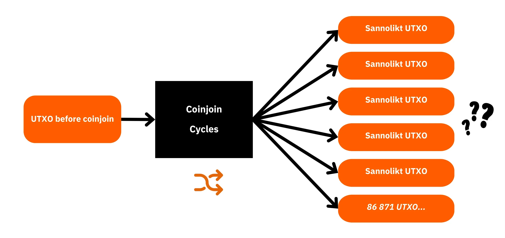


### Den retrospektiva anonset


Den retrospektiva anonset indikerar antalet möjliga källor för en viss del, med kännedom om UTXO i slutet av cykeln. Den här indikatorn mäter hur motståndskraftig reservdelens konfidentialitet är mot en analys från nutid till dåtid (output-to-input), dvs. hur svårt det är för en analytiker att spåra din reservdel tillbaka till dess ursprung, innan CoinJoin-cyklerna. Namnet på denna indikator är "backward anonset", eller "backward-looking metrics".


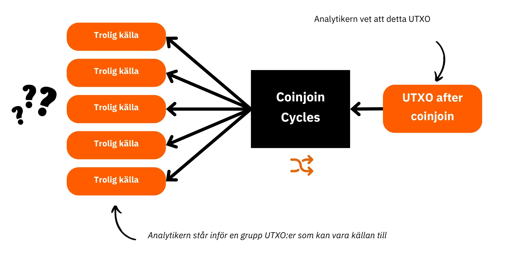


Genom att känna till ditt UTXO vid utgången av cyklerna, bestämmer den retrospektiva anonset antalet potentiella Tx0-transaktioner som kunde ha utgjort ditt inträde i CoinJoin-cyklerna. I diagrammet nedan motsvarar detta summan av alla de orange bubblorna.


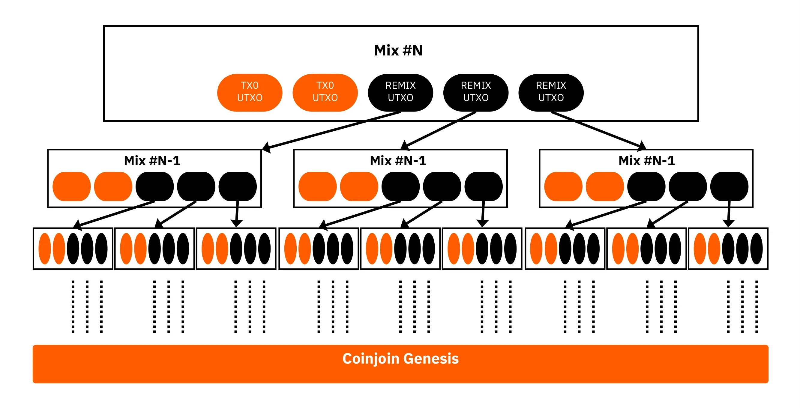


Låt oss till exempel föreställa oss att vår CoinJoin-del har en retrospektiv anonset på `42,185`. I praktiska termer betyder detta att det finns `42 185` potentiella källor för denna UTXO. Om en extern observatör identifierar detta mynt i slutet av cyklerna och försöker spåra dess ursprung, kommer han eller hon att ställas inför `42 185` möjliga källor, alla med lika stor sannolikhet att vara det sökta ursprunget.


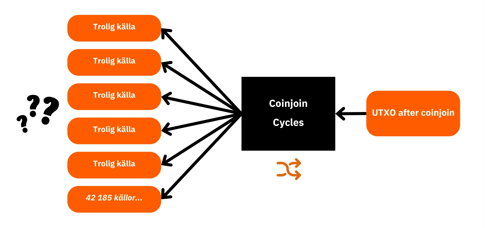


### Hur räknar man ut anonsets?


Det är möjligt att beräkna anonsets manuellt med en Block explorer för små ensembler. För större anonset blir det dock nödvändigt att använda ett specialiserat verktyg. Såvitt jag vet är den enda programvara som kan utföra denna uppgift *Whirlpool Stats Tool*, ett Python-verktyg som utvecklats av Samourai- och OXT-teamen. Tyvärr är detta verktyg för närvarande ur drift efter gripandet av Samourais grundare och avbrottet i OXT, som användes för att extrahera data från Blockchain.


Som vi har sett i detta kapitel kan anonsets endast beräknas om det finns en viss homogenitet i CoinJoin-strukturen. I nästa kapitel kommer vi att ta reda på hur man kvantifierar denna homogenitet i en Bitcoin-transaktion, oavsett om det är en CoinJoin-transaktion eller en mer traditionell transaktion.


## Entropi


<chapterId>e4fe289d-618b-49a2-84c9-68c562e708b4</chapterId>


Som vi har sett i detta avsnitt om coinjoins spelar homogeniteten hos UTXO:er i input och output en viktig roll för att förbättra sekretessen i en Bitcoin-transaktion. Denna parameter skapar en trovärdig förnekelse inför en Blockchain-analys. Flera metoder kan användas för att mäta denna homogenitet, men en av de mest effektiva, enligt min mening, är användningen av de indikatorer som tillhandahålls av *Boltzmann*-verktyget, utvecklat av OXT- och Samourai Wallet-teamen, och i synnerhet transaktionens entropi. Detta är vad vi kommer att titta på i detalj i detta kapitel.


Till skillnad från anonsets, som beräknas på en uppsättning transaktioner, fokuserar de indikatorer som presenteras här på en enda transaktion, vare sig det är en CoinJoin eller en mer traditionell transaktion.


### Antalet tolkningar


Den första indikatorn som kan observeras på en Bitcoin-transaktion är det totala antalet möjliga tolkningar som ställs inför en analys från en utomstående observatör. Med hänsyn till värdena för de UTXO:er som är inblandade i transaktionen visar denna indikator antalet sätt på vilka ingångar kan associeras med utgångar. Med andra ord bestämmer den antalet möjliga tolkningar som en transaktion kan framkalla i Bitcoin-flöden från en utomstående observatörs synvinkel som analyserar den.


En enkel betalningstransaktion med 1 input och 2 outputs kan t.ex. bara tolkas på ett sätt, nämligen att input #0 finansierade output #0 och output #1. Det finns ingen annan möjlig tolkning:


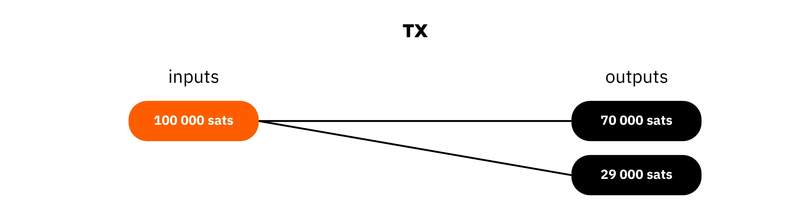


Å andra sidan har ett Whirlpool 5x5-hörn $1\.496$ möjliga kombinationer:


En Whirlpool Surge Cycle 8x8 CoinJoin har $9\,934\,563$ möjliga tolkningar:


### Entropi


Utifrån antalet tolkningar av en Bitcoin-transaktion kan vi beräkna dess entropi.


När det gäller kryptografi och information är entropi ett kvantitativt mått på den osäkerhet eller oförutsägbarhet som är förknippad med en datakälla eller slumpmässig process. Med andra ord är entropi ett sätt att mäta hur svårt det är att förutsäga eller gissa sig till en viss information.


I det specifika sammanhanget med Blockchain-analys är entropi också namnet på en indikator, härledd från Shannons entropi och [uppfunnen av LaurentMT] (https://gist.github.com/LaurentMT/e758767ca4038ac40aaf), som kan beräknas på en Bitcoin-transaktion.


När en transaktion uppvisar ett stort antal möjliga tolkningar är det ofta mer relevant att hänvisa till dess entropi. Denna indikator mäter analytikernas brist på kunskap om den exakta konfigurationen av transaktionen. Med andra ord, ju högre entropi, desto svårare blir det för analytikerna att identifiera flödet av bitcoins mellan in- och utgångar.


I praktiken visar entropin om en transaktion, ur en extern betraktares synvinkel, uppvisar flera möjliga tolkningar, enbart baserat på in- och utbetalningsbelopp, utan att ta hänsyn till andra externa eller interna mönster och heuristiker. En hög entropi är därför synonymt med större konfidentialitet för transaktionen.


Entropi definieras som den binära logaritmen av antalet möjliga kombinationer. Här är formeln som används med $E$ transaktionens entropi och $C$ antalet möjliga tolkningar:


$$
E = \log_2(C)
$$


Inom matematiken är den binära logaritmen (bas-2-logaritmen) den omvända operationen av exponentiering av 2. Med andra ord är den binära logaritmen för $x$ den exponent som $2$ måste höjas till för att erhålla $x$. Denna indikator uttrycks därför i bitar.


Låt oss ta exemplet med entropiberäkning för en CoinJoin-transaktion som är strukturerad enligt Whirlpool 5x5-modellen, som, vilket nämndes i föregående avsnitt, har ett antal möjliga tolkningar på $1\ 496$ :


$$
\begin{align*}
C &= 1\,496 \\
E &= \log_2(1\,496) \\
E &= 10.5469 \text{ bits}
\end{align*}
$$


Denna CoinJoin-transaktion har således en entropi på 10,5469$ bitar, vilket anses vara mycket tillfredsställande. Ju högre detta värde är, desto fler olika tolkningar medger transaktionen, vilket förstärker dess sekretessnivå.


För en CoinJoin 8x8-transaktion med $9\,934\,563$ tolkningar skulle entropin vara :


$$
\begin{align*}
C &= 9\,934\,563 \\
E &= \log_2(9\,934\,563) \\
E &= 23.244 \text{ bits}
\end{align*}
$$


Låt oss ta ett annat exempel med en klassisk betalningstransaktion, med 1 ingång och 2 utgångar: [1b1b0c3f0883a99f1161c64da19471841ed12a1f78e77fab128c69a5f578ccce](https://Mempool.space/tx/1b1b0c3f0883a99f1161c64da19471841ed12a1f78e77fab128c69a5f578ccce)


I fallet med denna transaktion är den enda möjliga tolkningen: `(In.0) > (Out.0 ; Out.1)`. Följaktligen är dess entropi $0$ :


$$
\begin{align*}
C &= 1 \\
E &= \log_2(1) \\
E &= 0 \text{ bits}
\end{align*}
$$


### Effektivitet


Utifrån transaktionens entropi kan vi också beräkna dess effektivitet när det gäller sekretess. Denna indikator utvärderar transaktionens effektivitet genom att jämföra den med den optimala transaktion som kan tänkas ske i en identisk konfiguration.


Detta leder oss till begreppet maximal entropi, som motsvarar den högsta entropi som en specifik transaktionsstruktur teoretiskt kan uppnå. Transaktionseffektiviteten beräknas sedan genom att jämföra denna maximala entropi med den faktiska entropin i den transaktion som analyseras.


Formeln som används är följande med :


- e_R$: transaktionens faktiska entropi uttryckt i bitar;
- e_M$: den högsta möjliga entropin för en transaktionsstruktur, även uttryckt i bitar;
- $Ef$: transaktionseffektivitet i bitar :


$$
Ef = E_R - E_M
$$


Till exempel för en Whirlpool 5x5 CoinJoin-struktur är den maximala entropin 10,5469 $$ :


$$
\begin{align*}
E_R &= 10.5469 \\
E_M &= 10.5469 \\
Ef &= E_R - E_M \\
Ef &= 10.5469 - 10.5469 \\
Ef &= 0 \text{ bits}
\end{align*}
$$


Denna indikator uttrycks också som en procentsats. Formeln som används är följande: :


- c_R$ : antalet möjliga verkliga tolkningar ;
- c_M$: det maximala antalet möjliga tolkningar av samma struktur;
- $Ef$: effektivitet uttryckt i procent:


$$
\begin{align*}
E_f &= \frac{C_R}{C_M} \\
E_f &= \frac{1\,496}{1\,496} \\
E_f &= 100 \%
\end{align*}
$$


En effektivitet på $100$ indikerar att transaktionen gör det mesta av sin konfidentialitetspotential, beroende på dess struktur.


### Entropi täthet


Entropi är en bra indikator för att mäta sekretessen i en transaktion, men den beror delvis på antalet in- och utgångar i transaktionen. För att jämföra entropin i två olika transaktioner med olika antal in- och utdata kan vi beräkna entropidensiteten. Denna indikator ger ett perspektiv på entropin i förhållande till varje input eller output i transaktionen. Densiteten är användbar för att utvärdera och jämföra effektiviteten i transaktioner av olika storlek.


För att beräkna den dividerar vi helt enkelt transaktionens totala entropi med det totala antalet in- och utgångar som är involverade i transaktionen:


- e_D$: entropitäthet uttryckt i bitar;
- e$: transaktionens entropi uttryckt i bitar;
- t$: det totala antalet in- och utgångar i transaktionen:


$$
E_D = \frac{E}{T}
$$


Låt oss ta exemplet med en Whirlpool 5x5 CoinJoin:


$$
\begin{align*}
T &= 5 + 5 = 10 \\
E &= 10.5469 \\
E_D &= \frac{E}{T} \\
E_D &= \frac{10.5469}{10} \\
E_D &= 1.054 \text{ bits}
\end{align*}
$$


Låt oss också beräkna entropidensiteten för en 8x8 Whirlpool CoinJoin:


$$
\begin{align*}
T &= 8 + 8 = 16 \\
E &= 23.244 \\
E_D &= \frac{E}{T} \\
E_D &= \frac{23.244}{16} \\
E_D &= 1.453 \text{ bits}
\end{align*}
$$


Genom att analysera entropitätheten för dessa två typer av CoinJoin blir det tydligt att även när man normaliserar entropin med antalet Elements, genererar CoinJoin med "Surge Cycle 8x8" mer osäkerhet för analysen.


### Boltzmann-poängen


En annan information som analyseras i en transaktion är Boltzmann-poängen för varje element i förhållande till ett annat. Detta är tabellen över matchande sannolikheter mellan inputs och outputs. Denna tabell anger, genom Boltzmann-poängen, den villkorliga sannolikheten för att en viss input är kopplad till en viss output. Det är därför ett kvantitativt mått på den villkorliga sannolikheten för att en koppling mellan en input och en output i en transaktion kommer att inträffa, baserat på förhållandet mellan antalet gynnsamma händelser av denna händelse och det totala antalet möjliga händelser, i en uppsättning tolkningar.


Med exemplet Whirlpool CoinJoin skulle den villkorliga sannolikhetstabellen belysa chanserna för en länk mellan varje input och output, vilket ger ett kvantitativt mått på tvetydigheten i transaktionens associationer:


| % | Output 0 | Output 1 | Output 2 | Output 3 | Output 4 |
| ------- | -------- | -------- | -------- | -------- | -------- |
| Input 0 | 34% | 34% | 34% | 34% | 34% |
| Input 1 | 34% | 34% | 34% | 34% | 34% | 34% | Input 1
| Input 2 | 34% | 34% | 34% | 34% | 34% | 34% | 34% | 34% | 34% | 34% | 34% | 34% | 34% | 34% | 34
| Input 3 | 34% | 34% | 34% | 34% | 34% | 34% | Input 3
| Input 4 | 34% | 34% | 34% | 34% | 34% | 34% | 34% | 34% | 34% | 34% | 34% | 34% | 34% | 34% | 34

Det är uppenbart att varje input har lika stor chans att associeras med vilken output som helst, vilket förstärker transaktionens konfidentialitet.


Boltzmann-poängen beräknas genom att antalet tolkningar där en viss händelse inträffar divideras med det totala antalet tillgängliga tolkningar. För att bestämma den poäng som associerar ingång #0 med utgång #3 (händelse som förekommer i 512$ tolkningar), går vi tillväga på följande sätt:


$$
\begin{align*}
\text{Interpretations (IN.0 > OUT.3)} &= 512 \\
\text{Interpretations totales} &= 1496 \\
\text{Score} &= \frac{512}{1496} \\
\text{Score} &= 34 \%
\end{align*}
$$


Om vi tar exemplet med en Whirlpool 8x8 Surge Cycle CoinJoin, skulle Boltzmann-tabellen se ut så här:


| OUT.0 | OUT.1 | OUT.2 | OUT.3 | OUT.4 | OUT.5 | OUT.6 | OUT.7 |
|-------|-------|-------|-------|-------|-------|-------|-------|-------|
| IN.0 | 23% | 23% | 23% | 23% | 23% | 23% | 23% | 23% |
| IN.1 | 23% | 23% | 23% | 23% | 23% | 23% | 23% | 23% |
| IN.2 | 23% | 23% | 23% | 23% | 23% | 23% | 23% | 23% |
| IN.3 | 23% | 23% | 23% | 23% | 23% | 23% | 23% | 23% |
| IN.4 | 23% | 23% | 23% | 23% | 23% | 23% | 23% | 23% |
| IN.5 | 23% | 23% | 23% | 23% | 23% | 23% | 23% | 23% |
| IN.6 | 23% | 23% | 23% | 23% | 23% | 23% | 23% | 23% |
| IN.7 | 23% | 23% | 23% | 23% | 23% | 23% | 23% | 23% |

När det gäller en enkel transaktion med en enda inmatning och två utmatningar är situationen dock annorlunda:


| Output 0 | Output 1 |
|---------|----------|----------|
| Input 0 | 100% | 100% |

Här ser vi att sannolikheten för att varje output härrör från input #0 är 100%. En lägre sannolikhet återspeglar således större konfidentialitet, vilket försvagar de direkta kopplingarna mellan inputs och outputs.


### Deterministiska länkar


Vi kan också beräkna antalet deterministiska länkar i en transaktion. Denna indikator visar hur många av kopplingarna mellan inputs och outputs i den analyserade transaktionen som är odiskutabla, med en sannolikhet på 100%. Denna indikator kan sedan kompletteras genom att beräkna förhållandet mellan deterministiska länkar. Kvoten ger ett perspektiv på vikten av dessa deterministiska länkar inom transaktionens totala länkar.


En Whirlpool CoinJoin-transaktion har t.ex. inga deterministiska länkar mellan in- och utdata och visar därför en indikator på 0 länkar och en kvot på 0 %. I den andra enkla betalningstransaktionen som vi undersökt (med en inmatning och två utmatningar) visar indikatorn däremot att det finns två deterministiska länkar och kvoten når 100 %. En indikator på noll indikerar med andra ord utmärkt sekretess, tack vare att det inte finns några direkta och obestridliga kopplingar mellan in- och utbetalningar.


### Hur beräknar ni dessa indikatorer?


Det är relativt enkelt att beräkna dessa indikatorer manuellt med hjälp av de ekvationer som jag har tillhandahållit. Svårigheten ligger främst i att bestämma antalet möjliga tolkningar av en transaktion. För en klassisk transaktion kan denna beräkning göras för hand. För en CoinJoin är uppgiften dock mycket mer komplex.


Tidigare fanns det ett Python-verktyg som heter _Boltzmann Calculator_, utvecklat av OXT- och Samourai-teamen, som automatiskt beräknade alla dessa indikatorer för en Bitcoin-transaktion :


Det var också möjligt att använda webbplatsen KYCP.org för dessa analyser:


Efter gripandet av Samourais grundare är dessa verktyg tyvärr inte längre i drift.


Nu när vi har täckt coinjoins i detalj kommer vi att titta på de andra sekretessteknikerna som finns tillgängliga på Bitcoin i det sista avsnittet av vår kurs. Vi kommer att titta på payjoins, specifika pseudo-CoinJoin-transaktionstyper, statiska Address-protokoll samt åtgärder för att förstärka sekretessen inte på transaktionsnivån utan på nivån för nätverket av noder.


https://planb.network/tutorials/privacy/analysis/boltzmann-entropy-738e45af-18a6-4ce6-af1a-1bf58e15f1fe

# Förstå utmaningarna med andra avancerade sekretesstekniker


<partId>19989ae6-d608-4acf-b698-2cf1e7e5e6ae</partId>


## PayJoin transaktioner


<chapterId>c1e90b95-f709-4574-837b-2ec26b11286f</chapterId>


CoinJoin är för närvarande den mest effektiva metoden för att införa osäkerhet i spårningen av delar i en kedjeanalys. Som vi har sett i tidigare kapitel måste in- och utmatningar vara så homogena som möjligt för att få en högpresterande mix. Dessutom är det viktigt att delar integreras i en så stor grupp som möjligt för att maximera anonsets. Så för att coinjoins ska vara effektiva måste de involvera ett stort antal enhetliga delar. Denna mångfald av krav innebär att CoinJoin-transaktioner har en mycket rigid struktur: beloppen fastställs i förväg och alla deltagare måste följa dem för att garantera processens enhetlighet. Dessutom kräver coinjoins synkronisering mellan alla deltagare och koordinatorn under transaktionens konstruktion.


Dessa krav gör CoinJoin olämpligt för direkta betalningar. Om du till exempel har ett Sats-mynt på 1 miljon i en CoinJoin-pool skulle det vara komplicerat att använda det direkt som betalning. Det skulle kräva synkronisering med de andra deltagarna och koordinatorn för att bygga den gemensamma transaktionen exakt i det ögonblick du behöver göra en betalning, och köpbeloppet skulle behöva motsvara exakt värdet på ditt mynt, vilket är praktiskt taget ogenomförbart. CoinJoin-transaktionen är därför till sin natur en kollaborativ sweep-transaktion, dvs. det är vanligtvis samma ägare av inputs som vi hittar i outputs.


Det skulle dock vara intressant att ha transaktionsstrukturer som gör det möjligt att göra betalningar på ett praktiskt sätt, samtidigt som man introducerar tvivel i kedjeanalysen. Det är just detta vi kommer att titta på i detta och nästa kapitel.


### Vad är en PayJoin-transaktion?


PayJoin är en specifik Bitcoin-transaktionsstruktur som förbättrar användarnas integritet när de spenderar genom att samarbeta med betalningsmottagaren.


Det var 2015 som LaurentMT först diskuterade den här metoden under namnet "*steganografiska transaktioner*", enligt ett dokument som finns tillgängligt [här](https://gist.githubusercontent.com/LaurentMT/e758767ca4038ac40aaf/raw/c8125f6a3c3d0e90246dc96d3b603690ab6f1dcc/gistfile1.txt). Denna teknik antogs senare av Samourai Wallet, som 2018 blev den första klienten som implementerade den med hjälp av Stowaway-verktyget. Konceptet med PayJoin återfinns också i [BIP79](https://github.com/Bitcoin/bips/blob/master/bip-0079.mediawiki), [BIP78](https://github.com/Bitcoin/bips/blob/master/bip-0078.mediawiki) och [BIP77](https://PayJoin.org/docs/how-it-works/PayJoin-v2-bip-77/). Flera termer används därför för att referera till en PayJoin:


- PayJoin ;
- Stowaway;
- P2EP (*Pay-to-End-Point*) ;
- Steganografisk transaktion.


Det speciella med PayJoin är att den kan generate en transaktion som vid första anblicken ser vanlig ut, men som i själva verket är en mini CoinJoin mellan två personer. För att uppnå detta innebär transaktionsstrukturen att betalningsmottagaren ingår i ingångarna tillsammans med den faktiska avsändaren. Mottagaren inkluderar således en betalning till sig själv i mitten av transaktionen, vilket i sig gör det möjligt för honom att få betalt.


Låt oss ta ett exempel för att bättre förstå denna process. Alice köper en baguette för 4 000 Sats med en UTXO på 10 000 Sats och väljer en PayJoin. Hennes bagare, Bob, lägger till en UTXO på 15 000 Sats som tillhör honom som insats, vilken han återvinner i sin helhet som produktion, utöver Alice:s 4 000 Sats.


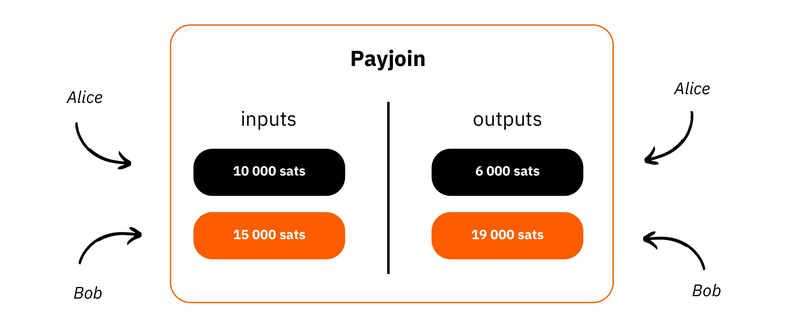


I det här exemplet matar bagaren Bob in 15 000 Sats och får ut 19 000 Sats, skillnaden är exakt 4 000 Sats, dvs. priset på baguetten. På Alice:s sida går hon in med 10 000 Sats och går ut med 6 000 Sats, vilket motsvarar ett saldo på -4 000 Sats, dvs. priset på baguetten. För att förenkla exemplet har jag avsiktligt utelämnat kostnaderna för Mining i denna transaktion.


### Vad är PayJoin till för?


PayJoin-transaktionen uppfyller två mål och gör det möjligt för användarna att öka sekretessen för sin betalning.


För det första syftar PayJoin till att vilseleda en utomstående observatör genom att skapa ett lockbete i kedjeanalysen. Detta möjliggörs av CIOH-heuristiken (*Common Input Ownership Heuristic*). Som vi såg i del 3 antas det vanligtvis, när en transaktion på Blockchain har flera ingångar, att alla dessa ingångar tillhör samma enhet eller användare.


Så när en analytiker undersöker en PayJoin-transaktion förleds han eller hon att tro att alla inmatningar kommer från samma person. Denna uppfattning är dock felaktig, eftersom betalningsmottagaren också bidrar till inmatningarna vid sidan av den faktiska betalaren. Kedjeanalysen avleds därför mot en tolkning som visar sig vara felaktig.


Låt oss ta vårt exempel med en PayJoin-transaktion för betalning av en baguette:


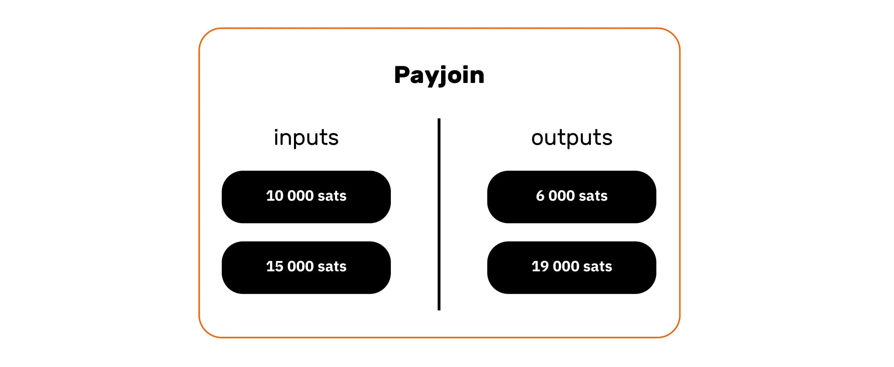


En utomstående observatör som ser denna transaktion på Blockchain och följer de vanliga heuristikerna för Blockchain-analys skulle göra följande tolkning: "*Alice slog samman 2 UTXO:er som ingångar till transaktionen för att betala 19 000 Sats till Bob*".


Denna tolkning är uppenbarligen felaktig, för som du redan vet tillhör de två UTXO:erna i ingångarna inte samma person. Den ena kommer från Alice, baguetteköparen, och den andra från Bob, bagaren.


På så sätt styrs den externa observatörens analys mot en felaktig slutsats, vilket säkerställer att intressenternas konfidentialitet bevaras.


### Den steganografiska transaktionen


Det andra syftet med PayJoin är att vilseleda en utomstående observatör om det faktiska beloppet för den betalning som har gjorts. Genom att granska transaktionens struktur kan analytikern tro att betalningen motsvarar beloppet för en av utgångarna.


Om vi återgår till vårt exempel med köpet av en baguette, kommer analytikern att tro att betalningsbeloppet motsvarar antingen UTXO på 6 000 Sats eller UTXO på 19 000 Sats. I detta fall kommer analytikern snarare att tro att betalningsbeloppet är 19 000 Sats, eftersom det finns 2 UTXO i utdata, varav minst en är större än 6 000 Sats (det finns ingen logisk anledning att använda 2 UTXO för att betala 6 000 Sats när en enda UTXO skulle ha räckt för att betala denna betalning).


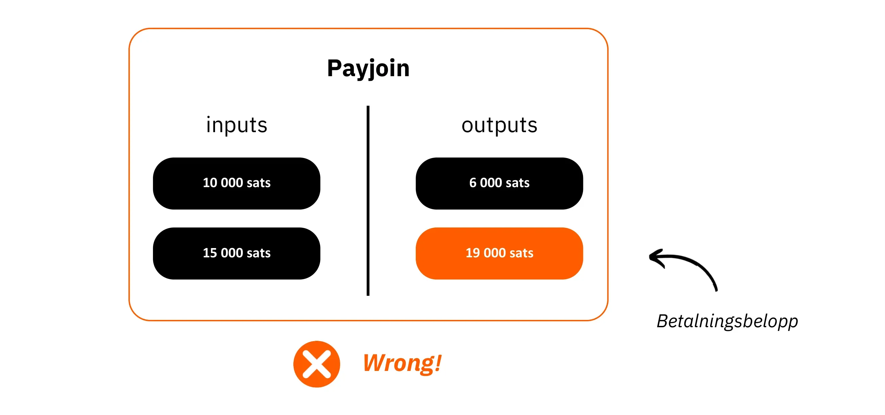


Men i själva verket är denna analys bristfällig. Betalningsbeloppet motsvarar inte något av utfallen. Det är i själva verket skillnaden mellan mottagarens UTXO i output och mottagarens UTXO i input.


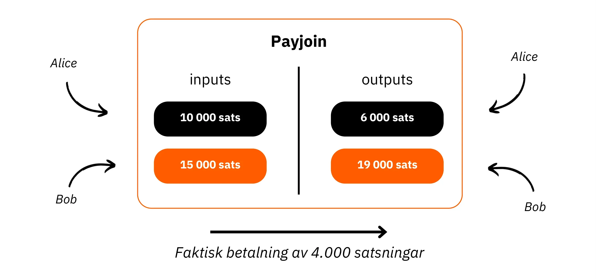


I detta avseende faller PayJoin-transaktionen inom området för steganografi. Det gör att det verkliga beloppet för en transaktion kan döljas i en falsk transaktion som fungerar som ett lockbete.


Steganografi är en teknik för att dölja information i andra data eller objekt, så att den dolda informationen inte märks. Ett hemligt meddelande kan t.ex. döljas i en punkt i en orelaterad text, så att det inte kan upptäckas med blotta ögat (detta är [microdot](https://fr.wikipedia.org/wiki/Micropoint)-tekniken).


Till skillnad från kryptering, som gör information obegriplig utan dekrypteringsnyckeln, ändrar steganografi inte informationen. Den visas fortfarande i klartext. Syftet är snarare att dölja själva existensen av det hemliga meddelandet, medan kryptering tydligt avslöjar förekomsten av dold information, om än otillgänglig utan nyckeln. Det är därför som det ursprungliga namnet på PayJoin var "steganografiska transaktioner".


En analogi kan dras mellan kryptografi och CoinJoin, och mellan steganografi och PayJoin. CoinJoin har liknande attribut som kryptering: metoden är igenkännlig, men informationen är oavkodbar. Omvänt liknar PayJoin steganografi: informationen är teoretiskt tillgänglig, men eftersom metoden för att dölja den inte går att känna igen blir den otillgänglig.


### Hur använder jag PayJoin?


Välkända program som stöder PayJoin inkluderar Sparrow wallet, Wasabi Wallet, Mutiny, BitMask, BlueWallet och JoinMarket, samt betalningsförmedlaren BTCPay.


Den mest avancerade PayJoin-implementeringen var bara Stowaway på Samourai Wallet. Men sedan arresteringen av programvarans grundare är detta verktyg nu bara delvis funktionellt. Fördelen med Stowaway är att det är ett omfattande, lättanvänt protokoll som stöder både mottagning och sändning av payjoins. Delvis signerade transaktioner kan utbytas manuellt genom att skanna flera QR-koder, eller automatiskt av Tor via Soroban. Det senare kommunikationsalternativet är för närvarande ur drift.


Svårigheten med att använda PayJoin ligger i dess beroende av handlarens deltagande. Som kund kan du inte använda en PayJoin om handlaren inte stöder den. Detta lägger till ytterligare en svårighet i köpprocessen: det är inte bara svårt att hitta handlare som accepterar Bitcoin, men om du också letar efter dem som stöder payjoins blir det ännu mer komplicerat.


En lösning skulle kunna vara att använda transaktionsstrukturer som skapar tvetydighet i kedjeanalysen utan att kräva att mottagaren samarbetar. Detta skulle göra det möjligt för oss att förbättra konfidentialiteten i våra betalningar utan att förlita oss på handlarnas aktiva deltagande. Det är just detta vi ska titta närmare på i nästa kapitel.


https://planb.network/tutorials/privacy/on-chain/payjoin-samourai-wallet-48a5c711-ee3d-44db-b812-c55913080eab

## Betalning mini-CoinJoin


<chapterId>300777ee-30ae-43d7-ab00-479dac3522c1</chapterId>


När du vill genomföra en betalningstransaktion och samtidigt upprätthålla en viss grad av sekretess är PayJoin ett bra alternativ. Men som vi just har sett kräver PayJoin att mottagaren är involverad. Så vad gör man om mottagaren vägrar att delta i en PayJoin, eller om man helt enkelt föredrar att inte involvera dem? Ett alternativ är att använda en Stonewall- eller Stonewall x2-transaktion. Låt oss ta en närmare titt på dessa två typer av transaktioner.


### Stonewall-transaktionen


Stonewall är en specifik form av Bitcoin-transaktion som är utformad för att öka användarnas sekretess när de spenderar genom att imitera en pseudo-CoinJoin mellan två personer, utan att faktiskt vara en. Faktum är att den här transaktionen inte är ett samarbete. En användare kan bygga den på egen hand och endast använda de UTXO:er som han eller hon äger som insatsvaror. Så du kan skapa en Stonewall-transaktion för vilket tillfälle som helst, utan att behöva synkronisera med en annan användare eller mottagaren.


Stonewall-transaktionen fungerar på följande sätt: som input till transaktionen använder utgivaren 2 UTXO som tillhör honom. Vid utmatningen producerar transaktionen 4 UTXO, varav 2 är exakt samma belopp. De andra 2 UTXO kommer att utgöra utländska Exchange. Av de 2 UTXO:erna med samma belopp kommer endast en att gå till betalningsmottagaren.


Det finns alltså bara två roller i en Stonewall-transaktion:


- Utfärdaren, som gör betalningen ;
- Mottagaren, som kanske inte är medveten om transaktionens specifika karaktär och helt enkelt förväntar sig betalning från avsändaren.


Låt oss ta ett exempel för att förstå denna transaktionsstruktur. Alice går till bagaren Bob för att köpa sin baguette, som kostar 4 000 Sats. Hon vill betala i bitcoins, samtidigt som hon upprätthåller någon form av sekretess avseende sin betalning. Så hon bestämmer sig för att bygga en Stonewall-transaktion för betalningen.


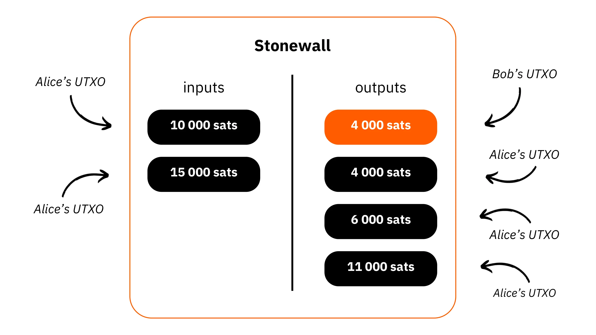


Genom att analysera denna transaktion kan vi se att bagaren Bob faktiskt fick 4 000 Sats som betalning för baguetten. Alice använde 2 UTXO:er som input: en för 10 000 Sats och en för 15 000 Sats. I utdata har hon återvunnit 3 UTXO:er: en för 4 000 Sats, en för 6 000 Sats och en för 11 000 Sats. Alice har därför ett nettosaldo på -4 000 Sats på denna transaktion, vilket motsvarar priset på baguetten.


I det här exemplet har jag avsiktligt försummat Mining-avgifterna för att göra det lättare att förstå. I verkligheten bärs transaktionskostnaderna helt och hållet av emittenten.


### Vilka är målen med en Stonewall-transaktion?


Stonewall-strukturen tillför en enorm mängd entropi till transaktionen och suddar ut gränserna för kedjeanalys. Sett från utsidan kan en sådan transaktion tolkas som en mini-CoinJoin mellan två personer. Men i själva verket är det en betalning. Denna metod skapar därför osäkerhet i kedjeanalysen, eller leder till och med till falska ledtrådar.


Låt oss ta exemplet med Alice på Bob bageriet. Transaktionen på Blockchain skulle se ut så här:


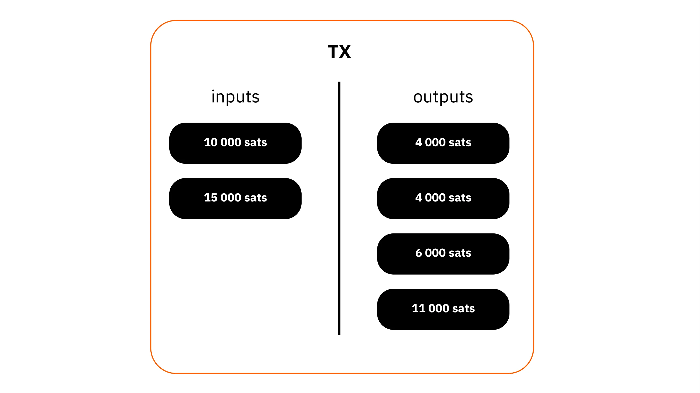


En utomstående observatör som förlitar sig på vanlig kedjeanalysheuristik kan felaktigt dra slutsatsen att "*två personer har gjort en liten CoinJoin, med en UTXO vardera i input och två UTXO vardera i output*". Att analysera denna transaktion från utsidan leder inte till tillämpning av CIOH, eftersom förekomsten av två utgångar av samma belopp tyder på ett CoinJoin-mönster. Från en extern synvinkel är CIOH därför inte tillämpligt i detta specifika fall.


Denna tolkning är felaktig, eftersom, som ni vet, en UTXO skickades till bagaren Bob, de 2 UTXO-ingångarna kom från Alice, och hon återvann 3 Exchange-utgångar.


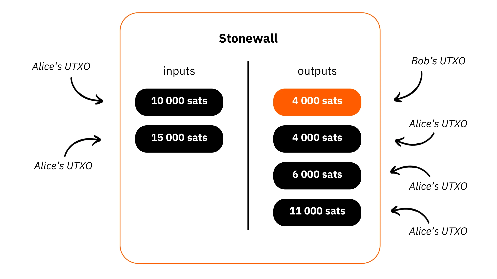


Och det som är särskilt intressant med strukturen i Stonewall-transaktionen är att den, ur en utomstående betraktares synvinkel, på alla sätt liknar en Stonewall x2-transaktion.


### Stonewall-transaktionen x2


Stonewall x2 är en annan specifik form av Bitcoin-transaktion som också syftar till att öka användarnas konfidentialitet när de gör en utgift, men den här gången genom att samarbeta med en tredje person som inte är involverad i den utgiften. Den här metoden fungerar som en pseudo-CoinJoin mellan två deltagare, samtidigt som den gör en betalning till en tredje person.


Stonewall x2-transaktionen är relativt enkel: vi använder en UTXO i vår ägo för att göra betalningen och tar hjälp av en tredje part som också bidrar med en UTXO som tillhör honom eller henne. Transaktionen slutar med fyra utgångar: två av dem i lika stora mängder, en avsedd för betalningsmottagarens Address, den andra för en Address som tillhör samarbetspartnern. En tredje UTXO returneras till en annan Address som tillhör medarbetaren, vilket gör det möjligt för honom att återfå det ursprungliga beloppet (en neutral åtgärd för honom, utöver kostnaderna för Mining), och en sista UTXO returneras till en Address som tillhör oss, vilket utgör betalningen Exchange.


Tre olika roller definieras således i Stonewall x2 transaktioner:


- Utfärdaren, som gör den faktiska betalningen;
- Mottagaren, som kanske inte är medveten om transaktionens specifika karaktär och helt enkelt förväntar sig betalning från avsändaren;
- Samarbetspartnern, som gör bitcoins tillgängliga för att ifrågasätta analysen av transaktionen, samtidigt som han får tillbaka sina pengar i sin helhet i slutet (en neutral åtgärd för honom, modulo Mining-kostnaderna).


Låt oss gå tillbaka till vårt exempel med Alice, som är på Bob bageriet för att köpa sin baguette, som kostar 4 000 Sats. Hon vill betala i bitcoins, samtidigt som hon vill upprätthålla en viss nivå av sekretess kring sin betalning. Hon kontaktar därför sin vän Charles, som hjälper henne i denna process.


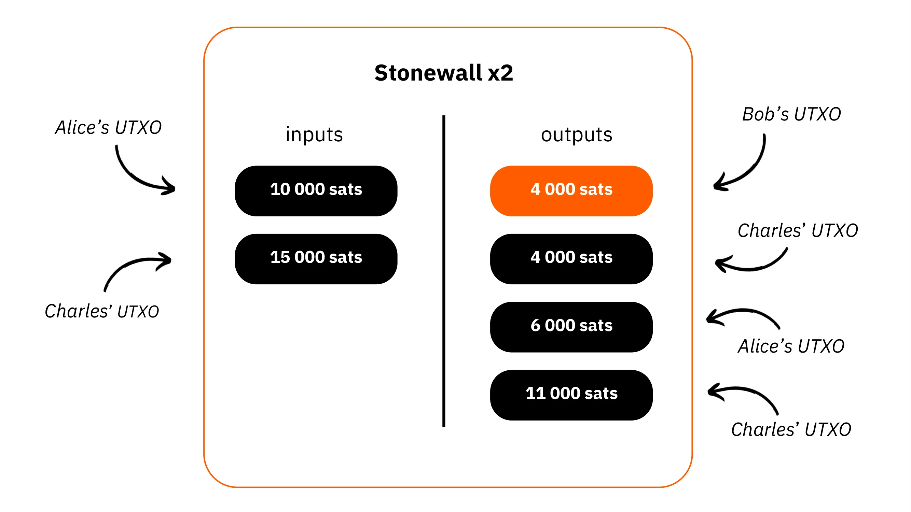


Genom att analysera denna transaktion kan vi se att bagaren Bob faktiskt fick 4 000 Sats som betalning för baguetten. Alice använde 10 000 Sats i input och återvann 6 000 Sats i output, dvs. ett nettosaldo på -4 000 Sats, vilket motsvarar priset på baguetten. Charles gav 15 000 Sats i input och fick två outputs: en på 4 000 Sats och en på 11 000 Sats, vilket ger en balans på 0.


I det här exemplet har jag avsiktligt utelämnat avgifterna för att göra det lättare att förstå. I själva verket delas Mining-avgifterna i allmänhet lika mellan den som utfärdar betalningen och den som bidrar.


### Vilka är målen med en Stonewall x2-transaktion?


Precis som Stonewall-strukturen tillför Stonewall x2-strukturen en hel del entropi till transaktionen och förvirrar kedjeanalysen. Utifrån sett kan en sådan transaktion tolkas som lite CoinJoin mellan två personer. Men i själva verket är det en betalning. Denna metod skapar därför osäkerheter i kedjeanalysen, eller leder till och med till falska ledtrådar.


Låt oss ta exemplet med Alice, Bob Baker och Charles. Transaktionen på Blockchain skulle se ut så här:


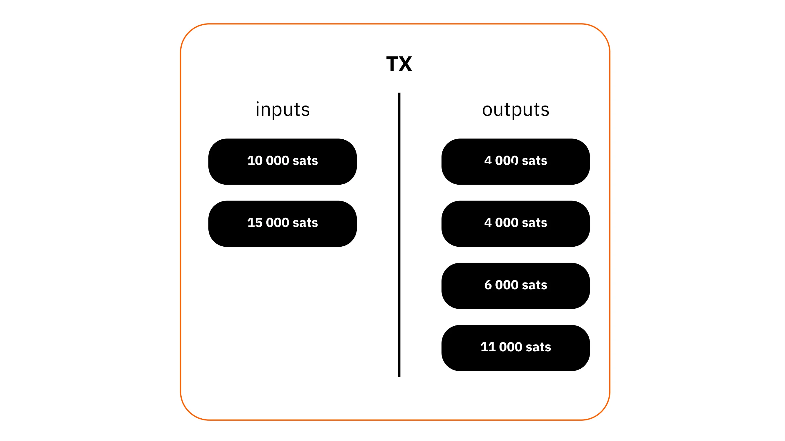


En utomstående observatör som förlitar sig på vanlig heuristik för kedjeanalys kan felaktigt dra slutsatsen att "*Alice och Charles har utfört en liten CoinJoin, med en UTXO vardera i input och två UTXO vardera i output*". Återigen, att analysera denna transaktion utifrån leder inte till tillämpning av ICOH, eftersom förekomsten av två utgångar av samma belopp tyder på ett CoinJoin-mönster. Från en extern synvinkel är CIOH därför inte tillämpligt i detta specifika fall.


Denna tolkning är felaktig eftersom, som ni vet, en UTXO har skickats till bagaren Bob, Alice har endast en Exchange-utgång och Charles har två.


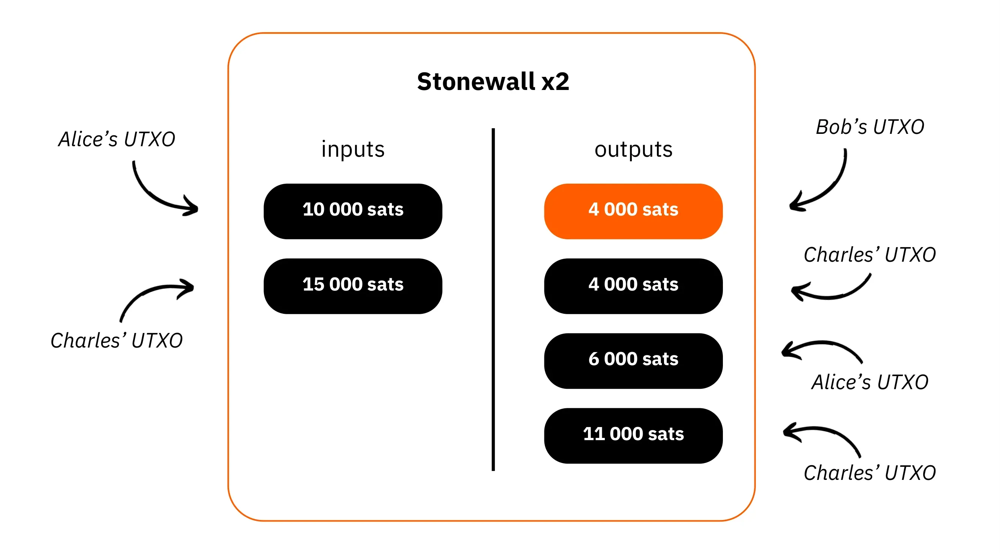


Och återigen, det som är särskilt intressant med strukturen i Stonewall x2-transaktionen är att den, ur en utomstående betraktares synvinkel, på alla sätt liknar Stonewall-transaktionen.


### Vad är skillnaden mellan Stonewall och Stonewall x2?


En Stonewall X2-transaktion fungerar precis som en Stonewall-transaktion, förutom att den förra är kollaborativ, medan den senare inte är det. Som vi har sett innebär en Stonewall X2-transaktion att en tredje part (Charles) deltar, som är extern till betalningen och som kommer att göra sina bitcoins tillgängliga för att förbättra transaktionens konfidentialitet. I en klassisk Stonewall-transaktion är det avsändaren som tar på sig rollen som samarbetspartner.


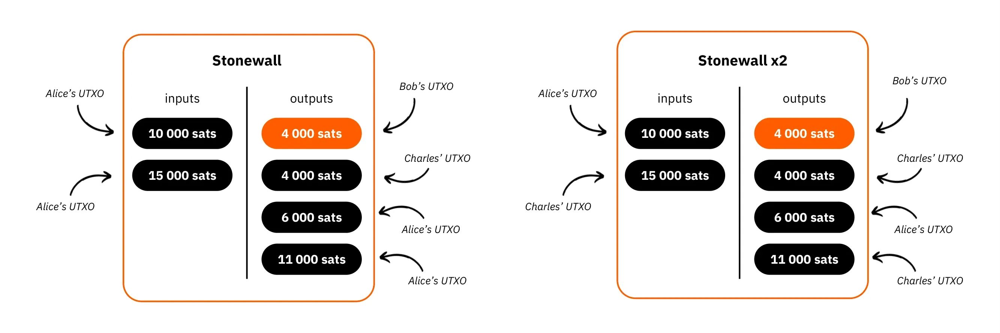


Från en extern synvinkel är transaktionsmönstret exakt detsamma.


Det faktum att dessa två transaktionsstrukturer har exakt samma mönster innebär att även om en utomstående observatör lyckas identifiera ett "Stonewall(x2)"-mönster kommer han inte att ha all information. Han kommer inte att kunna avgöra vilken av de två UTXO:erna med samma belopp som motsvarar betalningen. Han kommer inte heller att kunna avgöra om de två UTXO:erna med inbetalningar kommer från två olika personer (Stonewall x2) eller om de tillhör en enda person som har slagit samman dem (Stonewall).


Den sista punkten beror på att Stonewall x2-transaktioner följer exakt samma mönster som Stonewall-transaktioner. Sett från utsidan och utan ytterligare kontextuell information är det omöjligt att skilja en Stonewall-transaktion från en Stonewall x2-transaktion. De förra är inte samarbetstransaktioner, medan de senare är det. Detta gör att analysen av en av dessa transaktioner blir ännu mer tveksam.


### När ska Stonewall- och Stonewall x2-transaktioner användas?


Logiken bör vara som följer när du vill använda ett sekretessverktyg för en kostnad:


- Som en prioritet kan vi välja att göra en PayJoin;
- Om säljaren inte stöder payjoins kan en samarbetstransaktion göras med en annan person utanför betalningen med hjälp av Stonewall x2-strukturen;
- Om du inte kan hitta någon som vill göra en Stonewall x2-transaktion kan du göra en Stonewall only-transaktion, som kommer att efterlikna beteendet hos en Stonewall x2-transaktion.


### Hur använder jag Stonewall- och Stonewall x2-transaktioner?


Stonewall- och Stonewall x2-transaktioner är tillgängliga i både Samourais Wallet-applikation och Sparrow wallet-programvaran.


Men som med payjoins, efter arresteringen av Samourais grundare, fungerar Stonewall x2-transaktioner nu bara genom att manuellt utbyta PSBT mellan de berörda parterna. Tyvärr är automatisk Exchange via Soroban inte längre tillgänglig.


Det är också möjligt att utföra denna typ av transaktion manuellt från vilken Bitcoin Wallet-programvara som helst.


I nästa kapitel tar vi en titt på en annan sekretessteknik som är relativt okänd, men som är mycket användbar som komplement till det vi redan har studerat.


https://planb.network/tutorials/privacy/on-chain/stonewall-033daa45-d42c-40e1-9511-cea89751c3d4

https://planb.network/tutorials/privacy/on-chain/stonewall-x2-05120280-f6f9-4e14-9fb8-c9e603f73e5b

## Rikoschetter


<chapterId>db9a20ac-a149-443d-884b-ea6c03f28499</chapterId>


Användningen av Bitcoin-transaktionsstrukturer som ger tvetydighet till kedjeanalys, såsom CoinJoin, är särskilt fördelaktig för integritetsskydd. Men som vi diskuterade i kapitlet om payjoins är CoinJoin-transaktioner naturligt identifierbara i kedjan. Kom ihåg analogin vi drog mellan kryptering och coinjoins: när en fil är krypterad kan en tredje part som upptäcker den krypterade filen inte komma åt dess innehåll, men kan tydligt identifiera att filen har ändrats för att dölja dess innehåll. Samma sak gäller för CoinJoin: när en analytiker undersöker en CoinJoin-transaktion, även om han eller hon inte kan upprätta direkta länkar mellan inmatningar och utmatningar (och vice versa), kan han eller hon ändå känna igen att den observerade transaktionen är en CoinJoin.


Beroende på hur du avser att använda din del efter CoinJoin-cykler kan det faktum att den har genomgått denna process vara problematiskt. Till exempel, om du planerar att sälja ditt mynt på en reglerad Exchange-plattform, men det nyligen har genomgått en CoinJoin, kommer plattformens kedjeanalysverktyg att upptäcka detta faktum. Plattformen kan då vägra att acceptera din coinjoined UTXO, eller till och med kräva en förklaring från dig, med risk för att ditt konto stängs av eller dina medel fryses. I vissa fall kan plattformen också rapportera ditt beteende till statliga myndigheter (detta är till exempel vad TRACFIN kräver av PSAN i Frankrike).


Vad vi behöver för att undvika detta är ett verktyg som kan sudda ut spåren av ett Bitcoin-mynts förflutna för att återställa någon form av fungibilitet. Detta är just syftet med rikoschettering.


### Vad är en rikoschett?


Rikoschetten är en teknik som består av att utföra flera fiktiva transaktioner mot sig själv (sweep) för att simulera en överföring av Bitcoin Ownership. Detta verktyg skiljer sig från de andra transaktionsstrukturerna som vi har diskuterat genom att det inte ger prospektiv anonymitet utan snarare en form av retrospektiv anonymitet. I själva verket suddar rikoschett ut de särdrag som kan äventyra fungibiliteten hos ett Bitcoin-mynt på grund av dess förflutna.


För att jämna ut det avtryck som en tidigare händelse lämnat på ett mynt, t.ex. CoinJoin-cykler, utför ricochet fyra på varandra följande transaktioner där användaren överför pengar till sig själv på olika adresser.


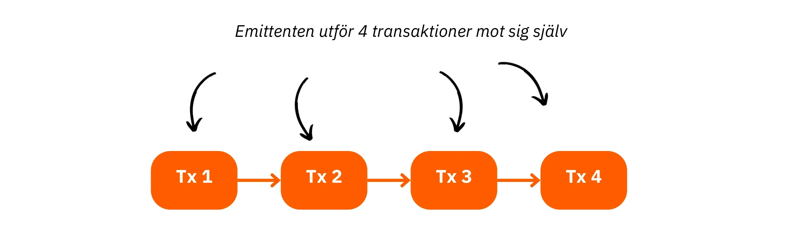


Efter denna sekvens av transaktioner dirigerar rikoschettverktyget slutligen bitcoins till sin slutdestination, till exempel en Exchange-plattform.


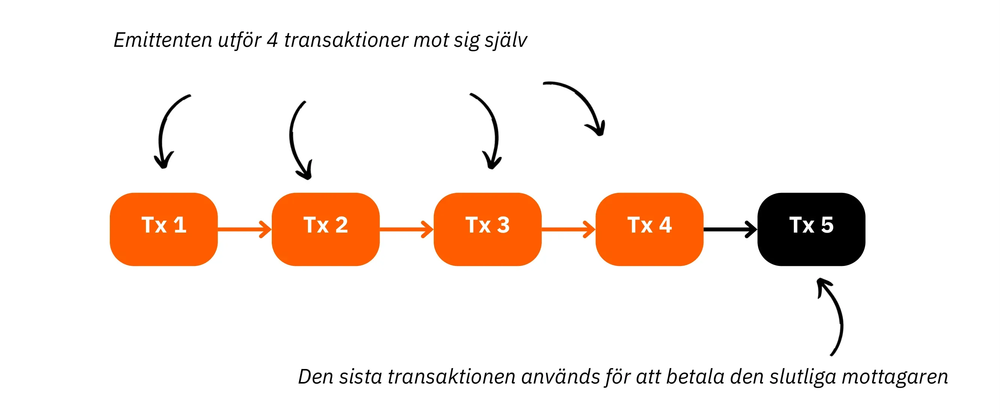


Syftet är att skapa ett avstånd som påverkar myntets fungibilitet, t.ex. en CoinJoin-transaktion, och den slutliga utgiftshandlingen, som skulle kunna avvisa detta mynt på grund av dess förflutna. Således kan verktyg för kedjeanalys dra slutsatsen att det förmodligen skedde en förändring av Ownership efter händelsen och betrakta detta mynt som fungibelt. I fallet med en CoinJoin skulle Blockchain-analysverktyg då kunna anta att det inte var samma person som skickade bitcoins och genomförde CoinJoin, och att det därför inte är någon mening med att vidta åtgärder mot avsändaren.


### Varför fungerar det?


Med tanke på denna rikoschettmetod kan man tänka sig att program för kedjeanalys skulle fördjupa sin undersökning efter fyra studsar. Dessa plattformar står dock inför ett dilemma när det gäller att optimera detektionströskeln. De måste sätta en gräns för hur många hopp som krävs för att de ska acceptera att en egenskapsförändring sannolikt har ägt rum och att kopplingen till en tidigare händelse (t.ex. CoinJoin) ska ignoreras.


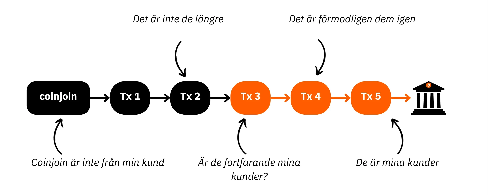


Att sätta detta tröskelvärde är dock riskabelt: varje utökning av antalet observerade hopp ökar exponentiellt volymen av falska positiva resultat, dvs. individer som felaktigt markeras som deltagare i en händelse, när operationen i själva verket utfördes av någon annan. Detta scenario utgör en stor risk för dessa företag, eftersom falska positiva resultat leder till missnöje, vilket kan driva berörda kunder till konkurrenterna. På lång sikt leder en alltför hög upptäcktströskel till att en plattform förlorar fler kunder än sina konkurrenter, vilket kan hota dess lönsamhet. Det är därför komplicerat för dessa plattformar att öka antalet observerade studsar, och 4 är ofta ett tillräckligt antal för att motverka deras analyser.


Det fenomen som observeras här är något analogt med teorin om de sex graderna av separation.


Teorin om de sex graderna av separation innebär att varje människa på jorden är kopplad till varje annan människa genom en kedja av relationer som omfattar högst sex mellanhänder. Det skulle därför räcka med att passera genom en serie av sex personer, där var och en personligen känner nästa, för att nå vilken individ som helst i världen.


När det gäller Bitcoin-transaktioner finner vi ett liknande fenomen. Genom att spåra ett tillräckligt antal Bitcoin-transaktioner stöter vi oundvikligen på en CoinJoin. Rikoschettmetoden utnyttjar denna princip genom att använda ett större antal hopp än vad Exchange-plattformarna rimligen kan spåra. Om plattformarna bestämmer sig för att spåra fler transaktioner är det möjligt att helt enkelt lägga till ett extra hopp för att kringgå denna åtgärd.


### När och hur ska man använda rikoschett?


Det vanligaste användningsfallet för rikoschett inträffar när det är nödvändigt att dölja ett tidigare deltagande i en CoinJoin på en UTXO som du äger. Helst är det bäst att undvika att överföra bitcoins som har genomgått en CoinJoin till reglerade enheter. Om du ändå inte har något annat alternativ, särskilt i det brådskande behovet av att likvidera bitcoins i statlig valuta, erbjuder ricochet en effektiv lösning.


Denna metod är inte bara effektiv för coinjoins, utan även för alla andra märken som kan äventyra en dels fungibilitet.


Idén till denna rikoschettmetod kom ursprungligen från Samourais Wallet-team, som integrerade den i sin applikation för att automatisera processen. Tjänsten är inte gratis på Samourai, eftersom en rikoschett innebär en serviceavgift på 100 000 Sats, plus Mining-kostnader. Användningen rekommenderas därför för överföringar av betydande belopp.


Samurai-applikationen erbjuder två rikoschettvarianter:


- Förstärkt rikoschett, eller "förskjuten leverans", vilket ger fördelen att Samurai-serviceavgiften sprids över de fem på varandra följande transaktionerna. Detta alternativ säkerställer också att varje transaktion sänds vid en separat tidpunkt och registreras i ett annat block, vilket så nära som möjligt efterliknar beteendet vid ett ägarbyte. Även om den är långsammare är denna metod att föredra för dem som inte har bråttom, eftersom den maximerar ricochetens effektivitet genom att förstärka dess motståndskraft mot kedjeanalys;


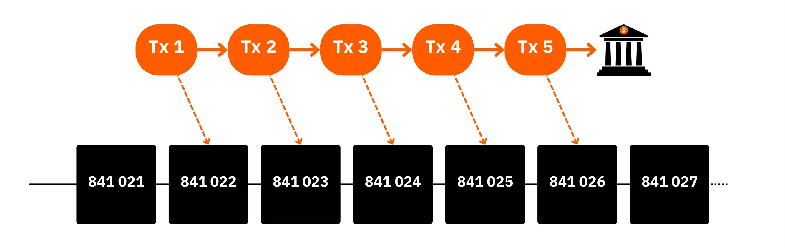


- Den klassiska rikoschetten, som är utformad för att utföra operationen snabbt, sänder alla transaktioner inom ett kortare tidsintervall. Denna metod erbjuder därför mindre sekretess och mindre motståndskraft mot analys än den förstärkta metoden. Den bör endast användas för brådskande försändelser.


Ricocheting betyder helt enkelt att skicka bitcoins till dig själv. Det är fullt möjligt att ricocheta bitcoins manuellt på vilken Wallet-programvara som helst, utan att använda ett specialiserat verktyg. Allt du behöver göra är att successivt överföra samma mynt till dig själv, med hjälp av en ny, tom Address varje gång.


I nästa kapitel tittar vi på olika tekniker för hemliga överföringar av Ownership. Dessa metoder skiljer sig radikalt från dem vi hittills har undersökt, både när det gäller funktion och resultat.


https://planb.network/tutorials/privacy/on-chain/ricochet-e0bb1afe-becd-44a6-a940-88a463756589

## Hemliga överföringar av Ownership


<chapterId>a2067036-849c-4d6b-87d2-44235cfae7a1</chapterId>


En annan av Bitcoin:s sekretesstekniker är den hemliga överföringen av Ownership. Denna metod syftar till att överföra Ownership av Bitcoins från en person till en annan, och vice versa, utan att transaktionen är uttryckligen synlig på Blockchain. Låt oss ta en titt på de olika teknikerna som finns tillgängliga, tillsammans med deras fördelar och nackdelar.


### Myntbytet


Coinwap är baserat på ett relativt enkelt koncept: det använder smarta kontrakt för att underlätta en överföring av Bitcoin Ownership mellan två användare, utan behov av förtroende och utan att denna överföring är uttryckligen synlig på Blockchain.


Låt oss föreställa oss ett naivt exempel med Alice och Bob. Alice innehar 1 BTC säkrad med privat nyckel $A$, och Bob innehar också 1 BTC säkrad med privat nyckel $B$. De skulle teoretiskt kunna Exchange sina privata nycklar via en extern kommunikationskanal för att utföra en hemlig överföring.


Denna naiva metod innebär dock en hög risk när det gäller förtroende. Det finns inget som hindrar Alice från att behålla en kopia av den privata nyckeln $A$ efter Exchange och använda den senare för att stjäla bitcoins, när nyckeln väl är i Bob:s händer.


Dessutom finns det ingen garanti för att Alice inte kommer att ta emot Bob:s privata nyckel $B$ och aldrig vidarebefordra sin privata nyckel $A$ i Exchange. Denna Exchange bygger därför på överdrivet förtroende mellan parterna och är ineffektiv när det gäller att säkerställa en säker hemlig överföring av Ownership.


För att lösa dessa problem och möjliggöra utbyten mellan parter som inte litar på varandra ska vi istället använda Smart contract-system. En Smart contract är ett program som körs automatiskt när fördefinierade villkor är uppfyllda. I vårt fall säkerställer detta att Exchange av egendom sker automatiskt, utan behov av ömsesidigt förtroende.


Detta kan uppnås genom att använda HTLC (*Hash Time-Locked Contracts*) eller PTLC (*Point Time-Locked Contracts*). Dessa två protokoll fungerar på liknande sätt och använder ett tidslåsningssystem som säkerställer att Exchange antingen slutförs framgångsrikt eller avbryts helt och hållet, vilket skyddar integriteten för båda parternas medel. Den största skillnaden mellan HTLC och PTLC är att HTLC använder hash och preimages för att säkra transaktionen, medan PTLC använder Adaptor Signatures.


I ett myntbytesscenario som använder HTLC eller PTLC mellan Alice och Bob sker Exchange på ett säkert sätt: antingen lyckas det och var och en får den andras BTC, eller så misslyckas det och var och en behåller sin egen BTC. Detta gör det omöjligt för någon av parterna att fuska eller stjäla den andras BTC.


> *HTLC är också den mekanism som används för att på ett säkert sätt dirigera betalningar genom Lightning Network:s dubbelriktade kanaler*
Användningen av Adaptor Signatures är särskilt intressant i detta sammanhang, eftersom den gör det möjligt att avstå från traditionella manus (en mekanism som ibland kallas "_scriptless scripts_"). Denna funktion minskar de kostnader som är förknippade med Exchange. En annan stor fördel med Adaptor Signatures är att de inte kräver användning av en gemensam Hash för båda parter i transaktionen, vilket gör att man inte behöver avslöja en direkt länk mellan dem i vissa typer av Exchange.


### Adaptorsignaturer


Adaptersignaturer är en kryptografisk metod som integrerar en giltig signatur med en ytterligare signatur, kallad "_adaptersignatur_", för att avslöja hemliga data. Denna mekanism är utformad på ett sådant sätt att kunskap om 2 av de 3 följande Elements: den giltiga signaturen, adaptersignaturen och hemligheten, gör det möjligt för oss att härleda det saknade tredje elementet. En intressant egenskap hos denna metod är att om vi känner till vår kollegas adaptersignatur och den specifika punkten på den elliptiska kurva som är associerad med den hemlighet som användes för att beräkna adaptersignaturen, kan vi härleda vår egen adaptersignatur som är kompatibel med samma hemlighet, utan att någonsin ha direkt tillgång till själva hemligheten.


I en myntväxling möjliggör användningen av Adaptor Signatures samtidigt avslöjande av två delar av känslig information mellan deltagarna, vilket undviker behovet av ömsesidigt förtroende. Låt oss ta ett exempel för att illustrera denna process med Alice och Bob, som vill Exchange innehav av 1 BTC vardera, men inte litar på varandra. De använder Adaptor Signatures för att eliminera behovet av att lita på varandra i denna Exchange. Så här gör de det:


- Alice initierar Exchange genom att skapa en $m_A$-transaktion som skickar 1 BTC till Bob. Hon genererar en signatur $s_A$, som validerar denna transaktion, med hjälp av sin privata nyckel $p_A$ ($P_A = p_A \cdot G$), en Nonce $n_A$ ($N_A = n_A \cdot G$) och en hemlighet $t$ ($T = t \cdot G$) :


$$s_A = n_A + t + H(N_A + T \parallell P_A \parallell m_A) \cdot p_A$$$


- Alice beräknar adapterns signatur $s_A'$ genom att subtrahera hemligheten $t$ från dess sanna signatur $s_A$ :


$$s_A' = s_A - t$$$


- Alice skickar Bob sin signaturadapter $s'_A$, sin osignerade transaktion $m_A$, den punkt som motsvarar hemligheten ($T$) och den punkt som motsvarar Nonce ($N_A$). Dessa Elements utgör vad som kallas en "adaptor". Det är viktigt att notera att med endast denna information kan Bob inte återfå Alice:s BTC.
- Bob kan dock kontrollera att Alice inte försöker stjäla från honom. För att göra detta kontrollerar han om Alice:s signaturadaptor $s_A'$ faktiskt motsvarar den föreslagna transaktionen $m_A$. Om följande ekvation är korrekt kan han vara säker på att Alice:s signaturadapter är giltig:


$$s_A' \cdot G = N_A + H(N_A + T \parallell P_A \parallell m_A) \cdot P_A$$$


- Denna verifiering ger Bob tillräckliga garantier för att han kan fortsätta Exchange i fullständigt förtroende. Han skapar sedan sin egen transaktion $m_B$, avsedd att skicka 1 BTC till Alice, och genererar sin adaptersignatur $s_B'$, som också kommer att länkas till samma hemlighet $t$. I detta skede är det bara Alice som känner till värdet på $t$; Bob känner bara till motsvarande punkt $T$ som Alice har överfört till honom:


$$s_B' = n_B + H(N_B + T \parallell P_B \parallell m_B) \cdot p_B$$$


- Bob skickar Alice sin adaptersignatur $s_B'$, sin osignerade transaktion $m_B$, samt den punkt som motsvarar hemligheten ($T$) och den punkt som motsvarar Nonce ($N_B$). Alice, som känner till hemligheten $t$, kan nu kombinera Bob:s adaptersignatur $s_B'$ med denna hemlighet för att ge generate en giltig signatur $s_B$ för transaktionen $m_B$ som kommer att överföra Bob:s BTC till henne:


$$s_B = s_B' + t$$$


$$(s_B' + t) \cdot G = N_B + T + H(N_B + T \parallell P_B \parallell m_B) \cdot P_B$$$


- Alice sänder denna signerade $m_B$-transaktion på Bitcoin Blockchain för att hämta BTC som utlovats av Bob. När Bob ser denna transaktion på Blockchain kan han extrahera signaturen $ s_B = s_B' + t$. Med denna information kan Bob sedan isolera den berömda hemligheten $t$ som han behövde:


$$t = (s_B' + t) - s_B' = s_B - s_B'$$$


- Och denna hemlighet $t$ var det enda element som saknades för Bob till generate den giltiga signaturen $s_A$ från Alice:s adaptersignatur $s_A'$. Denna signatur validerar $m_A$-transaktionen, som skickar en BTC från Alice till Bob. Bob beräknar sedan $s_A$ och sänder $m_A$-transaktionen på Blockchain:


$$s_A = s_A' + t$$$


$$(s_A' + t) \cdot G = N_A + T + H(N_A + T \parallell P_A \parallell m_A) \cdot P_A$$$


Låt oss sammanfatta hur en adaptorsignatur fungerar i en myntväxling. Inledningsvis skickar Alice en osignerad transaktion till Bob tillsammans med en adapter, vilket gör det möjligt för Bob att verifiera att den hemlighet som avslöjas senare kommer att ge honom tillgång till bitcoins. I gengäld skickar Bob sin egen osignerade transaktion och adapter till Alice. Alice kan sedan slutföra Bob:s transaktion och hämta bitcoins genom att sända en giltig transaktion tack vare hemligheten. När denna transaktion publiceras på Blockchain har Bob möjlighet att extrahera hemligheten och därmed låsa upp Alice:s transaktion. Om Alice initierar en överföring av Bob:s Bitcoin kan Bob följaktligen i sin tur få tillgång till Alice:s Bitcoin utan behov av ömsesidigt förtroende.


Observera att myntbyten först föreslogs av [Gregory Maxwell i oktober 2013 på BitcoinTalk] (https://bitcointalk.org/index.php?topic=321228.0).


### Atombyten


På liknande sätt som coinswap, och med samma typer av smarta kontrakt, är det också möjligt att utföra atomic swaps. Ett atomic swap möjliggör en direkt Exchange av olika kryptovalutor, såsom BTC och XMR, mellan två användare utan behov av förtroende eller inblandning av en mellanhand. Dessa byten kallas "atomiska" eftersom de bara har två möjliga resultat: antingen lyckas bytet och båda parter är nöjda, eller så misslyckas det och var och en behåller sina ursprungliga kryptovalutor, vilket eliminerar behovet av att lita på den andra parten.


Atomic swap och coinswap har ett liknande arbetssätt och erbjuder samma fördelar och nackdelar när det gäller sekretess. Ur Bitcoin: s synvinkel är ett atombyte faktiskt jämförbart med ett myntbyte som utförs i två steg. Först Exchange vi vår BTC för en annan kryptovaluta, sedan kan denna kryptovaluta bytas ut mot annan BTC. I slutändan återställer vi en annan användares BTC. Det är därför jag, i analysen av sekretessfrågor, grupperar dessa två protokoll under kategorin proprietära hemliga utbyten.


Var dock uppmärksam på att till skillnad från coinswap kan atomic swap ha obalanser när det gäller tillgänglig likviditet, särskilt i BTC / XMR-börser. Det är i allmänhet lättare att byta bitcoins mot altcoins, eftersom det finns en stark efterfrågan på bitcoins, vilket håller premierna låga för denna konverteringsriktning. Att växla altcoins mot BTC kan dock vara mer komplicerat på grund av lägre efterfrågan, vilket ofta resulterar i mycket höga premier.


Slutligen, när ett atombyte involverar bitcoins på kedjan och bitcoins på Lightning Network, talar vi om ett "ubåtsbyte".


### Är det verkligen användbart?


Hemliga överföringar av Ownership, såsom myntbyten och atombyten, har fördelen att de kan lura heuristiken för kedjeanalys. Dessa metoder kan antyda att transaktionerna involverar samma användare, medan den faktiska Ownership har bytt händer. Den största nackdelen med dessa metoder är dock att de är mycket riskabla utan användning av ytterligare en teknik för att bryta myntets historia.


När Alice utför ett coinswap eller atomic swap med Bob byter hon innehav av sina bitcoins med Bob:s. I fallet med ett atombyte inkluderar Exchange en Altcoin, men principen förblir densamma. Således hamnar Alice med $B$-myntet och Bob med $A$-myntet. Detta gör att kedjeanalysen blir mer tveksam, men myntens historia går fortfarande att spåra. Om en analytiker undersöker del $A$ kan han eller hon spåra Alice:s tidigare aktiviteter, och vice versa för del $B$.


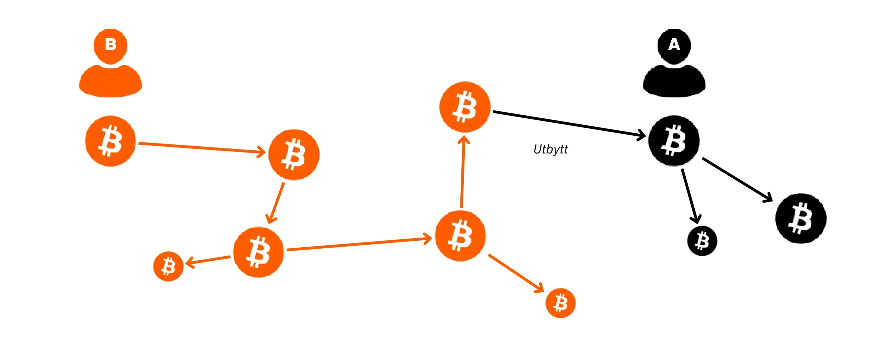


Ur Alice:s synvinkel är risken att B$-myntets historia skulle kunna betraktas som misstänkt av vissa enheter. Om till exempel Bob hade förvärvat $B$-myntet genom en kriminell handling som hackning, skulle myntet förbli kopplat till hans olagliga verksamhet. Alice skulle då kunna befinna sig i besittning av ett mynt som hon inte kunde överföra till reglerade Exchange-plattformar utan att riskera att få sina medel frysta, eller till och med bli anklagad för Bob:s brott, även om hon inte hade något med dem att göra.


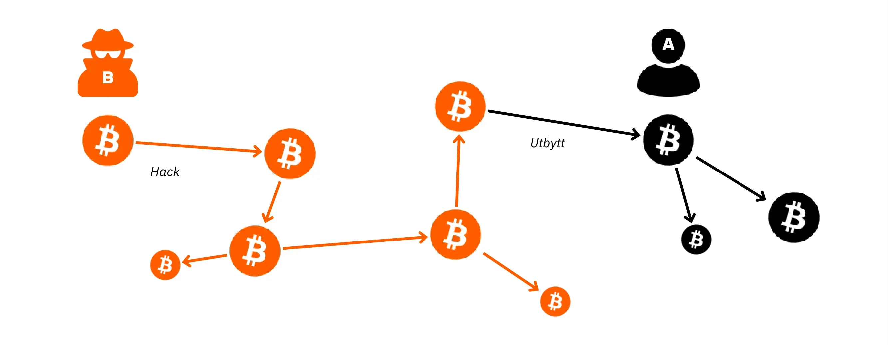


Det är oundvikligt att sekretessmetoder som coinswap eller atomic swap föredras av brottslingar vars medel övervakas av myndigheterna. Dessa protokoll gör det möjligt för dem att avyttra sina bitcoins under övervakning i Exchange för helt fungibla bitcoins. Det gör det också möjligt för dem att skapa en avledning genom att rikta myndigheterna mot andra användare. Så det finns ett dubbelt syfte för dessa människor.


Med CoinJoin, även om ditt mynt blandas med övervakade bitcoins, bryts myntets historia, vilket ger en form av trovärdig förnekelse som inte existerar i hemliga Ownership överföringsprotokoll som coinswap eller atomic swap.


Om Alice vill undvika någon risk måste hon nödvändigtvis använda en metod för att bryta historien om $B$-myntet, till exempel genom att skicka det genom coinjoins. Detta väcker en fråga om nyttan av att kombinera den hemliga överföringen av Ownership och CoinJoin. CoinJoin, genom att bryta ett mynts historia, erbjuder redan en tillräcklig nivå av sekretess för Alice. Således är min åsikt att om Alice vill skydda sin integritet, skulle det vara klokare att gå direkt till en CoinJoin snarare än att delta i en myntväxling följt av en CoinJoin.


För att hemliga Ownership-överföringsmetoder verkligen ska vara effektiva och undvika risken att koppla en $A$-användares historia till en $B$-användares, skulle det paradoxalt nog vara nödvändigt att deras användning är allmänt känd. Om coinswap används massivt och myndigheterna är medvetna om denna vanliga praxis, skulle en trovärdig form av förnekande kunna etableras. Så länge som användningen av dessa överföringar förblir marginell tror jag dock att dessa metoder kommer att förbli för riskabla för användarna.


Hittills har vi främst studerat sekretessmetoder på transaktionsnivå. I nästa kapitel kommer vi att titta på frågor på nätverksnivå och på transaktionsspridning.


## Sekretess i P2P-nätverket


<chapterId>04a2467b-db84-4076-a9ff-919be5135106</chapterId>


I del 4 diskuterade vi vikten av att använda en komplett nod för att skydda sekretessen för dina transaktioner. Det är dock viktigt att förstå att din nod i sig kan utsättas för attacker som försöker få fram information om dina aktiviteter. I det här kapitlet tittar vi därför på de olika åtgärder du kan vidta för att skydda din integritet, inte på transaktionsnivå eller Bitcoin-flöden, utan på nätverksnivå.


### Maskros


Ett sätt att undvika de olika avanonymiseringsattackerna är att använda Dandelion-förslaget. Detta sändningsprotokoll formaliserades i BIP156, men har aldrig implementerats på Bitcoin.


Tanken bakom Dandelion är att förbättra sekretessen för transaktionsrouting i Bitcoin-nätverket för att motverka olika former av attacker. Huvudsyftet är att dölja den källnod som ursprungligen sände ut en transaktion i nätverket. Om denna nod avslöjas kan det bli möjligt att länka en Bitcoin-transaktion till en specifik IP Address (om noden verkar på clearnet), vilket skulle kunna utgöra en ingångspunkt för kedjeanalys.


Denna koppling mellan aktivitet på Bitcoin och en IP Address utgör en betydande risk för användarnas konfidentialitet. Faktum är att många enheter har möjlighet att enkelt koppla en IP Address till en personlig identitet. Detta inkluderar regeringar och Internetleverantörer. Dessutom kan denna information bli allmänt tillgänglig, t.ex. om din IP Address och dina personuppgifter läcker ut när en webbplats databas hackas.


I klassisk Bitcoin-drift överförs transaktioner som byggts av en användare på hans Wallet-programvara till hans personliga nod. Denna nod kommer omedelbart att sända den nya transaktionen till alla peers som den är ansluten till.


Dessa peers kontrollerar sedan transaktionen för att säkerställa att den överensstämmer med konsensus och lokala standardiseringsregler. När transaktionen har validerats vidarebefordrar varje peer i sin tur transaktionen till sina peers, och så vidare.


Denna fördelning av transaktioner som väntar på att integreras i ett block är ganska balanserad och statistiskt förutsägbar. Denna svaghet kan utnyttjas av spionnoder som samarbetar för att övervaka och analysera nätverket i syfte att identifiera den första noden som har sänt en transaktion. Om en observatör lyckas lokalisera källnoden kan han eller hon anta att transaktionen härrör från den nodens operatör. Denna typ av observation kan användas för att koppla normalt anonyma transaktioner till specifika IP-adresser.


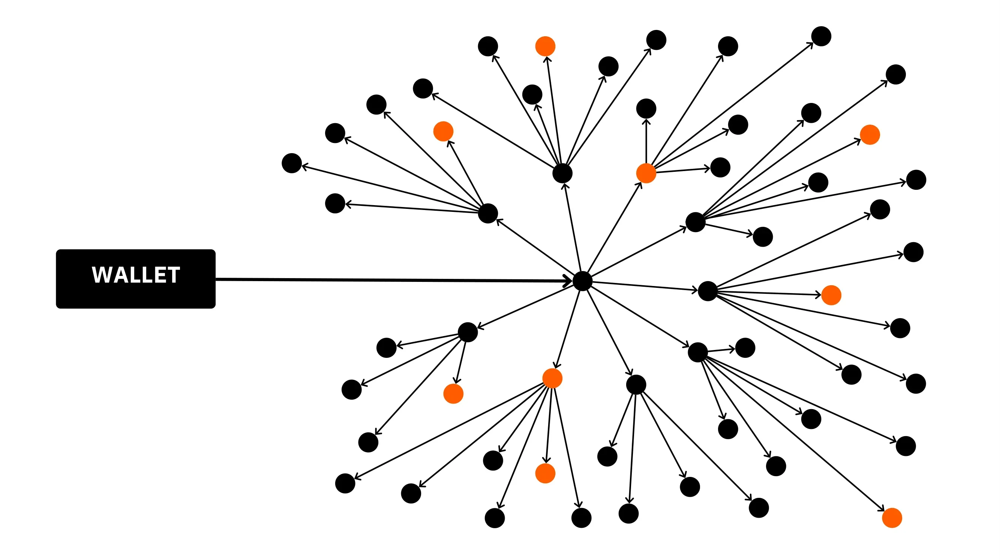


Syftet med BIP156 är att Address lösa detta problem. För att göra detta introduceras en ytterligare fas i spridningen av en ny transaktion för att bevara anonymiteten innan den sprids till allmänheten. Dandelion använder först en "stamfas" där transaktionen skickas genom en slumpmässig väg av noder.


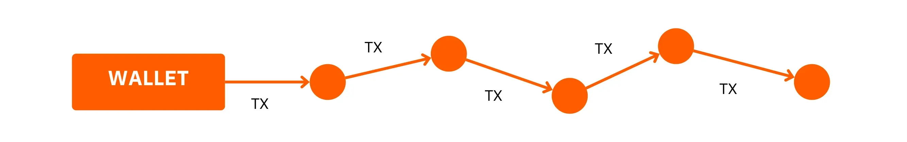


Transaktionen sänds sedan ut till hela nätverket under "Fluff"-fasen.


Stammen och "fluffet" är referenser till beteendet hos transaktionsspridningen genom nätverket, som liknar formen och utvecklingen hos en maskros.


Spionnoderna kan alltså eventuellt spåra transaktionen tillbaka till den nod som initierade "Fluff"-fasen (massutsändningen), men den noden är inte den som först sände transaktionen, eftersom den fick den från den sista noden i stammen. Om spionnoderna inte kan spåra stammen kan de inte heller identifiera källnoden.


Även om det finns spionnoder under stamfasen kvarstår alltid ett tvivel, för så snart de stöter på en ärlig nod i spridningsgrafen kan spionerna inte avgöra om denna nod är den ursprungliga källan eller bara en mellanhand.


Denna routningsmetod suddar ut spåret som leder tillbaka till källnoden, vilket gör det svårt att spåra en transaktion tillbaka genom nätverket till dess ursprung. Dandelion förbättrar därmed sekretessen genom att begränsa motståndarnas möjligheter att avanonymisera nätverket. Denna metod är ännu mer effektiv när transaktionen under "stemming"-fasen korsar en nod som krypterar sin nätverkskommunikation, som med Tor eller P2P Transport V2.


BIP156 har inte integrerats i Bitcoin Core och är för närvarande klassificerat som "rejected". Ett av de största problemen med detta protokoll är att transaktioner under stamfasen måste vidarebefordras genom mellanliggande noder innan de verifieras. Som vi har sett, i den normala Bitcoin-modellen, verifierar varje nod först transaktionen innan den sänds ut till sina kollegor. Om en transaktion inte överensstämmer med nodens konsensusregler eller lokala standardiseringsregler ignorerar noden den och distribuerar den inte. Denna process är viktig för att motverka DoS-attacker, eftersom endast giltiga transaktioner sänds ut till hela nätverket. Ogiltiga transaktioner, som kan genereras i massor för att överbelasta nätverket, stoppas vid den första noden och sprids inte vidare. Den största risken med Dandelion är att det nya protokollet kan introducera nya vektorer för DoS-attacker genom att tillåta att ogiltiga transaktioner sänds över en del av nätverket.


### P2P transport V2


P2P transport V2 är ett annat nätverksprotokoll som presenteras i BIP324. Det är en ny version av transportprotokollet Bitcoin P2P som innehåller opportunistisk kryptering för att förbättra sekretessen och säkerheten i kommunikationen mellan noder.


Denna förbättring är utformad för att lösa flera problem med den grundläggande versionen av P2P-protokollet. Å ena sidan gör den data som utbyts omöjlig att skilja från andra typer av data som cirkulerar på Internet för en passiv observatör. Huvudsyftet är att förhindra regeringar, internetleverantörer och VPN-leverantörer från att massivt övervaka Bitcoin-användare. Detta gör det också svårare för dessa enheter att avgöra om en internetanvändare också är en Bitcoin-användare, dvs. om han eller hon driver en komplett nod.


P2P V2 bidrar också till att minska risken för censur och attacker genom att upptäcka specifika mönster i datapaket. Det försvårar och fördyrar genomförandet av olika typer av Sybil-attacker på nätverksnivå. En Sybil-attack inträffar när en aktör skapar flera falska identiteter för att få en orättvis fördel. I samband med Bitcoin-nätverket manifesterar sig detta ofta som att en aktör kontrollerar ett stort antal kompletta noder och aggressivt använder dem för att multiplicera anslutningar. Sybil-attacker kan vara passiva, för att samla in information och äventyra användarnas konfidentialitet, eller aktiva, i form av Eclipse-attacker. De senare isolerar en specifik nod från resten av nätverket och censurerar antingen användaren eller ändrar de data som den tar emot. Slutligen gör P2P V2 också *Man-In-The-Middle*-attacker (MITM) mer kostsamma och lättare att upptäcka.


Krypteringen som implementeras av P2P V2 inkluderar inte autentisering, för att inte lägga till onödig komplexitet eller äventyra det faktum att anslutningen till nätverket förblir tillståndslös. Detta nya P2P-transportprotokoll erbjuder dock bättre säkerhet mot passiva attacker och gör aktiva attacker betydligt mer kostsamma och upptäckbara. Införandet av en pseudoslumpmässig dataström i nätverksmeddelanden gör det svårare för angripare att censurera eller manipulera kommunikationen.


P2P V2-transport ingick som ett alternativ (inaktiverat som standard) i Bitcoin Core version 26.0, som distribuerades i december 2023. Det aktiverades sedan som standard i version 27.0 i april 2024. Det kan modifieras med alternativet `v2transport=` i konfigurationsfilen.


### Tor


En annan enkel lösning för att undvika risken för förlust av konfidentialitet för en nätverksnod är att köra den helt under Tor.


Tor är ett nätverk av reläservrar (noder) som anonymiserar ursprunget för TCP-anslutningar på Internet. Det fungerar genom att data kapslas in i flera lager av kryptering. Varje relänod tar bort en Layer för att avslöja nästa nods Address, tills slutdestinationen har nåtts. Tor-nätverket säkerställer anonymitet genom att förhindra att mellanliggande noder känner till både ursprung och destination för data, vilket gör det mycket svårt för en observatör att spåra en användares aktivitet.


Tor krypterar inte bara data, utan maskerar även kommunikationens ursprung och destination. Genom att använda Tor för kommunikation från din personliga nod förstärker du sekretessen för dina transaktioner: din internetleverantör kan inte dekryptera kommunikationen och andra noder i Bitcoin-nätverket kan inte identifiera källnodens IP Address. Dessutom döljer Tor också din användning av Bitcoin från din internetleverantör.


Den största risken med den här metoden är att Tor är ett protokoll som är oberoende av Bitcoin. Om du har en Bitcoin-nod som körs under Tor och Tor slutar fungera, kommer din Bitcoin-nod inte längre att kunna kommunicera.


Det är också viktigt att notera att kommunikationen på Tor är långsammare. Denna fördröjning är särskilt irriterande under den första lanseringen av en nod, eftersom IBD (*Initial Block Download*) kräver mycket kommunikation. Som ett resultat kan din första synkronisering med Bitcoin-nätverket ta betydligt längre tid med Tor. Det är också möjligt att utföra IBD på clearnet och sedan aktivera Tor som ett andra steg. Även om den här metoden avslöjar förekomsten av din Bitcoin-nod för din internetleverantör, skyddar den din personliga transaktionsinformation när du byter till Tor.


Efter att ha utforskat de olika metoderna för sekretess på nätverksnivå vill jag i de kommande kapitlen också presentera två eleganta lösningar för att undvika återanvändning av Address: BIP47 och Tysta betalningar.


## BIP47 och återanvändbara betalkoder


<chapterId>ad88e076-a04b-4aec-b3b2-7b4760175504</chapterId>


Som vi såg i del 3 är återanvändning av Address ett allvarligt hinder för användarnas konfidentialitet i Bitcoin-protokollet. För att minska dessa risker rekommenderas det starkt att generate en tom mottagande Address för varje ny betalning som tas emot i en Wallet. Även om generering av en ny Address nu förenklas genom användning av modern programvara och hierarkiska deterministiska plånböcker, kan denna praxis verka kontraintuitiv.


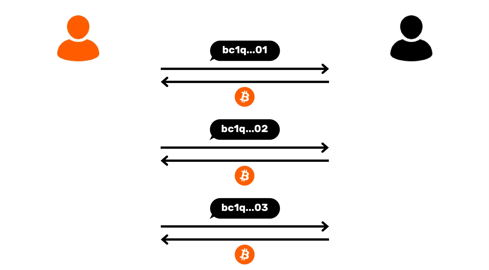


I det traditionella banksystemet är vi till exempel vana vid att dela med oss av vårt IBAN-nummer, som alltid är detsamma. När vi har gett det till någon kan de skicka flera betalningar till oss utan att behöva interagera med oss igen. Neo-banker erbjuder också modernare möjligheter, som att använda unika e-postadresser på PayPal eller RevTags på Revolut. Även utanför den finansiella sfären är våra vardagliga identifierare, som postnummer Address, telefonnummer och e-postadress Address, unika och permanenta. Vi behöver inte förnya dem för varje ny interaktion.


Bitcoin fungerar dock annorlunda: en ny mottagande Address måste genereras för varje inkommande transaktion. Denna kompromiss mellan användarvänlighet och sekretess går tillbaka till själva ursprunget för Bitcoin:s vitbok. Redan när Satoshi Nakamoto publicerade den första versionen av sitt dokument i slutet av 2008 varnade han oss för denna risk:


**Som en extra brandvägg kan ett nytt nyckelpar användas för varje transaktion så att de inte kopplas till en gemensam ägare.**


Det finns många sätt att ta emot flera betalningar på en enda identifierare utan att behöva återanvända en Address. Var och en har sina egna avvägningar och nackdelar. Bland dessa metoder finns BIP47, ett förslag som utvecklats av Justus Ranvier och som publicerades 2015. Förslaget syftar till att skapa återanvändbara betalkoder som gör det möjligt att genomföra flera transaktioner mot samma person, samtidigt som man undviker att återanvända Address. Kort sagt, BIP47 syftar till att erbjuda ett betalningssystem som är lika intuitivt som en unik identifierare, samtidigt som transaktionernas konfidentialitet bevaras.


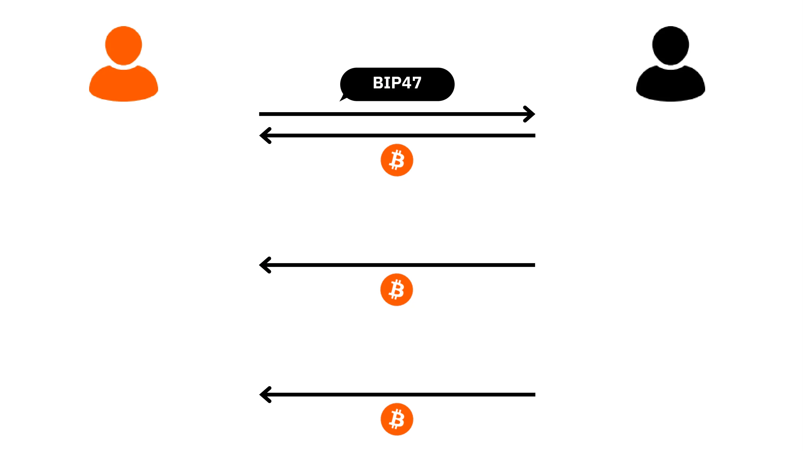


BIP47 förbättrar inte direkt användarnas sekretess, eftersom en BIP47-betalning erbjuder samma sekretessnivå som en klassisk Bitcoin-transaktion med tomma adresser. Det gör dock användningen av Bitcoin mer bekväm och intuitiv, en enkelhet som normalt skulle äventyra konfidentialiteten. Tack vare BIP47 uppnår denna användarvänlighet samma nivå av konfidentialitet som en klassisk transaktion. Det är därför BIP47 är ett så värdefullt verktyg för att bevara integriteten.


Ursprungligen föreslogs att BIP47 skulle integreras i Bitcoin Core, men det genomfördes aldrig. Vissa programvaruapplikationer valde dock att implementera den på egen hand. Till exempel har Samourai Wallet-teamen utvecklat sin egen implementering av BIP47 som kallas "PayNym".


### Allmän princip för BIP47 och PayNym


Syftet med BIP47 är att göra det möjligt att ta emot ett stort antal betalningar utan att återanvända adresser. Det bygger på användningen av en återanvändbar betalningskod, som gör det möjligt för olika utgivare att skicka flera betalningar till en enda kod som tillhör en annan användare. Mottagaren behöver därför inte tillhandahålla en ny, tom Address för varje transaktion, vilket underlättar utbytet samtidigt som sekretessen bevaras.


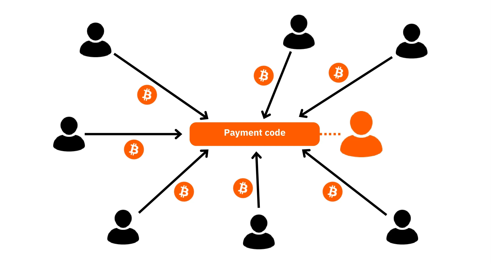


En användare kan därför dela sin betalkod i full frihet, oavsett om det är på sociala nätverk eller på sin webbplats, utan att riskera någon förlust av sekretess, till skillnad från med en konventionell mottagare Address eller publik nyckel.


För att genomföra en transaktion behöver båda parter en Bitcoin Wallet med en BIP47-implementering, t.ex. PayNym on Samurai Wallet eller Sparrow wallet. Den gemensamma användningen av deras betalkoder skapar en hemlig kanal mellan dem. För att etablera denna kanal på ett effektivt sätt måste utgivaren utföra en specifik transaktion på Bitcoin Blockchain, en så kallad "aviseringstransaktion" (mer om detta senare).


Genom att kombinera de två användarnas betalkoder skapas delade hemligheter, som i sin tur skapar ett stort antal unika Bitcoin-mottagningsadresser (exakt 2^32, eller cirka 4 miljarder). På detta sätt adresseras betalningar som görs via BIP47 faktiskt inte till själva betalningskoden, utan snarare till klassiska mottagningsadresser som härrör från de inblandade användarnas betalningskoder.


Betalningskoden fungerar således som en virtuell identifierare som härrör från portföljen seed. I portföljens hierarkiska härledningsstruktur är betalkoden placerad på nivå 3, dvs. på kontonivå.


Härledningsmålet för BIP47 identifieras av indexet `47'` (`0x8000002F`), som hänvisar till BIP47. Ett exempel på en härledningsväg för en återanvändbar betalkod skulle kunna vara följande:


```plaintext
m/47'/0'/0'/
```


För att ge dig en uppfattning om hur en betalningskod ser ut, här är min:


```plaintext
PM8TJSBiQmNQDwTogMAbyqJe2PE2kQXjtgh88MRTxsrnHC8zpEtJ8j7Aj628oUFk8X6P5rJ7P5qDudE4Hwq9JXSRzGcZJbdJAjM9oVQ1UKU5j2nr7VR5
```


Denna kod kan också kodas som en QR-kod för att göra det lättare att kommunicera, precis som en konventionell mottagning Address.


När det gäller PayNym Bots, de robotar som ibland syns på Twitter, är dessa visuella representationer av betalningskoden, skapade av Samourai Wallet. De genereras med hjälp av en Hash-funktion, vilket gör dem nästan unika. De har formen av en liten sträng med tecken som börjar med `+` :


```plaintext
+throbbingpond8B1
+twilightresonance487
+billowingfire340
```


Dessa avatarer kan också representeras som bilder:


Även om dessa robotar inte har någon specifik teknisk funktion inom ramen för BIP47, spelar de en roll för att underlätta användarinteraktionen genom att erbjuda en lätt igenkännlig visuell identitet.


---
*I följande avsnitt i detta kapitel om BIP47 tar vi en detaljerad titt på hur det fungerar, med särskild tonvikt på de kryptografiska metoder som används. För att fullt ut förstå dessa något tekniska förklaringar är det viktigt att först förstå strukturen i HD-plånböcker, nyckelavledningsförfaranden och grunderna i elliptisk kurvkryptografi. Om du vill fördjupa dig i dessa begrepp finns en annan kostnadsfri utbildning tillgänglig på Plan ₿ Network :*


https://planb.network/courses/46b0ced2-9028-4a61-8fbc-3b005ee8d70f

*Jag råder dig ändå att följa dem, eftersom det blir mycket lättare för dig att förstå andra liknande förslag, som vi kommer att diskutera i följande kapitel*, om du förstår hur BIP47 fungerar tekniskt


---
### Den återanvändbara betalkoden


Som tidigare nämnts ligger den återanvändbara betalkoden på djup 3 i HD Wallet, vilket gör den jämförbar med en "xpub", både när det gäller dess position i Wallet-strukturen och dess roll.


Betalningskoden på 80 byte fördelas enligt följande:


- Byte `0`: **Version**. För den första versionen av BIP47 är denna byte inställd på `0x01` ;
- Byte `1`: **Bitfältet**. Detta utrymme är reserverat för att integrera ytterligare indikationer för specifika användningsområden. För klassisk PayNym-användning är denna byte inställd på `0x00` ;
- Byte `2`: Pariteten för `y`. Denna byte är `0x02` eller `0x03`, vilket anger om ordinatet för den publika nyckeln är jämnt eller udda, eftersom en komprimerad publik nyckel används;
- Från byte `3` till byte `34`: Värdet av `x`. Dessa byte representerar abscissen för den offentliga nyckeln. Sammankopplingen av `x` och pariteten av `y` bildar den fullständiga komprimerade offentliga nyckeln;
- Från byte `35` till byte `66`: **Strängkoden**. Detta utrymme innehåller den strängkod som är associerad med den publika nyckeln;
- Från byte `67` till byte `79`: **Utfyllnaden**. Detta utrymme är avsett för eventuella framtida utvecklingar. För den nuvarande versionen placerar vi helt enkelt nollor här för att nå den 80-byte-storlek som krävs för `OP_RETURN`-utmatning.


Här är den hexadecimala representationen av min återanvändbara betalkod som redan presenterats i föregående avsnitt:


```plaintext
0x010002a0716529bae6b36c5c9aa518a52f9c828b46ad8d907747f0d09dcd4d9a39e97c3c5f37c470c390d842f364086362f6122f412e2b0c7e7fc6e32287e364a7a36a00000000000000000000000000
```


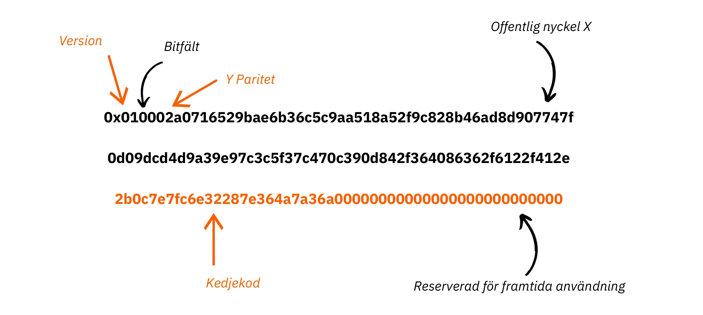


Därefter måste prefixbyten `P` läggas till i början för att tydligt ange att detta är en betalningskod. Denna byte representeras av `0x47` :


```plaintext
0x47010002a0716529bae6b36c5c9aa518a52f9c828b46ad8d907747f0d09dcd4d9a39e97c3c5f37c470c390d842f364086362f6122f412e2b0c7e7fc6e32287e364a7a36a00000000000000000000000000
```


För att säkerställa betalningskodens integritet görs slutligen en beräkning av kontrollsumman med hjälp av `HASH256`, som består av en dubbel Hash med hjälp av `SHA256`-funktionen. De fyra första bytena av denna Hash sammanfogas sedan i slutet av betalningskoden:


```plaintext
0x47010002a0716529bae6b36c5c9aa518a52f9c828b46ad8d907747f0d09dcd4d9a39e97c3c5f37c470c390d842f364086362f6122f412e2b0c7e7fc6e32287e364a7a36a00000000000000000000000000567080c4
```


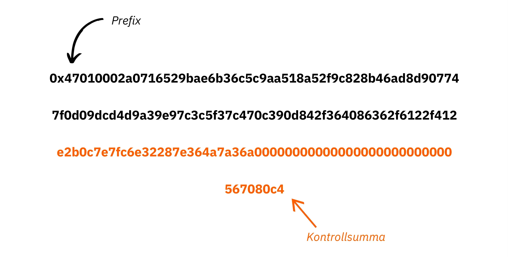


När dessa steg har genomförts är betalningskoden klar. Allt som återstår är att konvertera den till bas 58 för att få den slutliga versionen:


```plaintext
PM8TJSBiQmNQDwTogMAbyqJe2PE2kQXjtgh88MRTxsrnHC8zpEtJ8j7Aj628oUFk8X6P5rJ7P5qDudE4Hwq9JXSRzGcZJbdJAjM9oVQ1UKU5j2nr7VR5
```


När vi skapar betalningskoden använder vi en komprimerad publik nyckel och en strängkod. Båda härleds deterministiskt och hierarkiskt från Wallet seed. Den härledningsväg som används för att uppnå detta är :


```plaintext
m/47'/0'/0'/
```


Konkret, för att generate den komprimerade offentliga nyckeln och strängkoden som är associerad med den återanvändbara betalkoden, börjar vi med att beräkna den privata huvudnyckeln från Wallet seed. Vi fortsätter sedan med att härleda ett par dotternycklar med hjälp av index `47 + 2^31` (förstärkt härledning). Detta följs av ytterligare två successiva härledningar av dotterpar, var och en med hjälp av index `2^31` (förstärkt härledning).


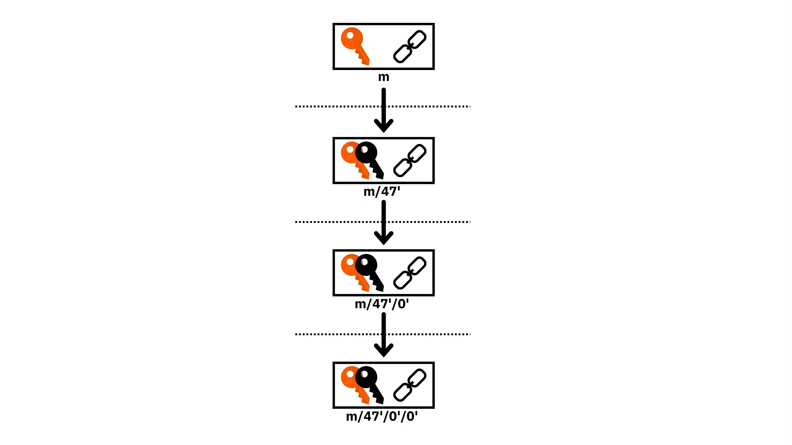


### Diffie-Hellman-nyckel Exchange på elliptiska kurvor (ECDH)


Det kryptografiska protokoll som utgör kärnan i BIP47 är känt under akronymen ECDH, för *Elliptic-Curve Diffie-Hellman*. Denna metod är en variant av den ursprungliga Diffie-Hellman-nyckeln Exchange.


Diffie-Hellman introducerades 1976 och är ett nyckelöverenskommelseprotokoll som gör det möjligt för två parter, var och en utrustad med ett nyckelpar (offentligt och privat), att komma överens om en gemensam hemlighet, även när de endast kommunicerar via en offentlig, osäker kanal.


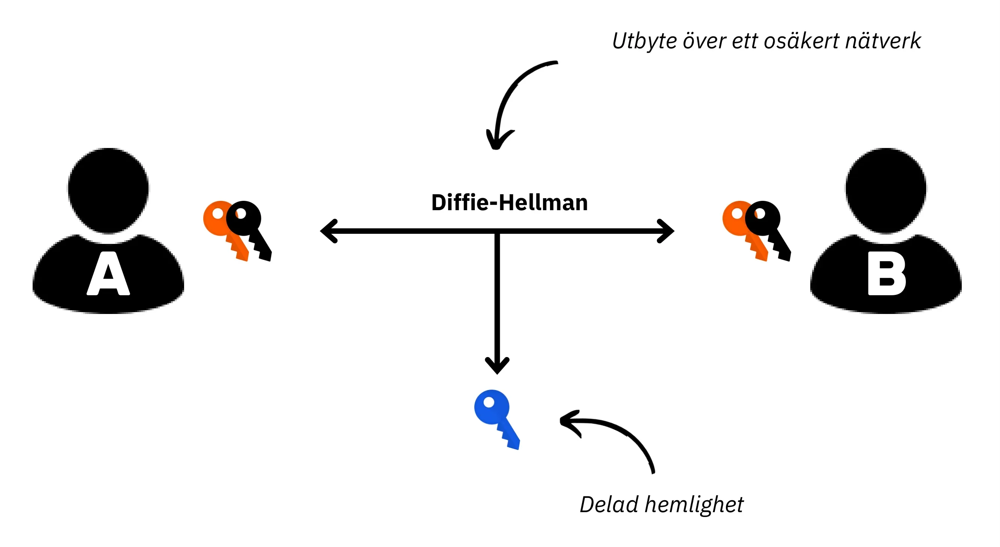


Den delade hemligheten (i det här fallet den blå nyckeln) kan sedan användas för andra operationer. Vanligtvis kan den delade hemligheten användas för att kryptera och dekryptera en kommunikation i ett osäkert nätverk:


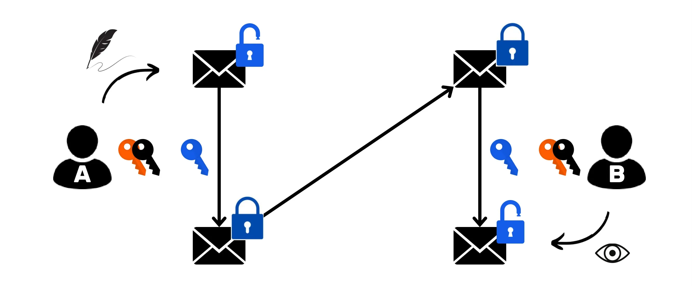


För att uppnå detta använder Diffie-Hellman modulär aritmetik för att beräkna den delade hemligheten. Så här fungerar det i lekmannatermer:


- Alice och Bob enas om en gemensam färg, i det här fallet gul, som är offentliga data (angriparna känner till denna färg);
- Alice väljer en hemlig färg, i det här fallet röd, och blandar de två för att få orange;
- Bob väljer också en hemlig färg, i det här fallet blå, och blandar den med gult för att få Green;
- De Exchange sedan de resulterande färgerna, orange och Green. Denna Exchange kan äga rum i ett osäkert nätverk och observeras av angripare;
- Genom att blanda Bob:s Green med sin egen hemliga färg, Alice, får man fram brunt;
- Bob, som gör samma sak med Alice:s orange och hemliga blå, får också brunt.


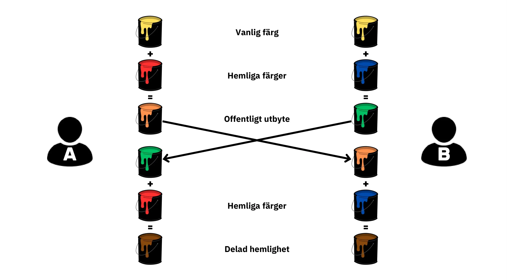


I den här populariseringen representerar färgen brun den hemlighet som delas av Alice och Bob. Föreställ dig att det i verkligheten är omöjligt för angriparen att separera färgerna orange och Green för att hitta Alice:s eller Bob:s hemliga färger.


Låt oss nu ta en titt på hur detta protokoll faktiskt fungerar, inte med färganalogier, utan med hjälp av verkliga tal och modulär aritmetik!


Innan vi går in på Diffie-Hellman-mekanismerna vill jag kort påminna om två viktiga matematiska begrepp som vi kommer att behöva:


- Ett **primtal** är ett naturligt tal som bara har två delare: $1$ och sig självt. Till exempel är $7$ ett primtal eftersom det bara kan delas med $1$ och $7$. Å andra sidan är $8$ inte ett primtal, eftersom det är delbart med $1$, $2$, $4$ och $8$. Det har därför fyra positiva heltalsdivisorer i stället för två;
- **modulo** (noterat $mod$ eller $\%$) är en matematisk operation som, mellan två heltal, returnerar återstoden av den euklidiska divisionen av det första med det andra. Till exempel $16\bmod 5 = $1$.


**Diffie-Hellman-nyckeln Exchange mellan Alice och Bob sker på följande sätt:**


- Alice och Bob är överens om två gemensamma tal: $p$ och $g$. $p$ är ett primtal, och ju större talet är, desto säkrare blir Diffie-Hellman. $g$ är en primitiv rot av $p$. Dessa två tal kan kommuniceras i klartext i ett osäkert nätverk. De representerar motsvarigheten till **färgen gul** i den tidigare populariseringen. Det är därför viktigt att Alice och Bob använder exakt samma värden för $p$ och $g$.
- När dessa parametrar har definierats väljer Alice och Bob var sitt hemligt slumptal. Alice namnger sitt hemliga slumptal $a$ (motsvarande **färgen röd**) och Bob namnger sitt $b$ (motsvarande **färgen blå**). Dessa nummer måste förbli hemliga.
- I stället för att direkt utbyta siffrorna $a$ och $b$ beräknar vardera parten $A$ och $B$ på följande sätt:


$A$ är lika med $g$ upphöjt till potensen $a$ modulo $p$ :


$$
A = g^a \bmod p
$$


$B$ är lika med $g$ upphöjt till potensen $b$ modulo $p$ :


$$
B = g^b \bmod p
$$


- Värdena $A$ (motsvarande **färgen orange**) och $B$ (motsvarande **färgen Green**) utväxlas mellan de två parterna. Denna Exchange kan ske i klartext i ett osäkert nätverk;
- Alice, som har fått $B$, beräknar värdet av $z$ enligt följande:


$z$ är lika med $B$ upphöjt till potensen $a$ modulo $p$ :


$$
z = B^a \bmod p
$$


En påminnelse:


$$
B = g^b \bmod p
$$


Resultatet är :


$$
z = B^a \bmod p
$$


$$
z = (g^b)^a \bmod p
$$


Genom att tillämpa effektreglerna :


$$
(x^n)^m = x^{nm}
$$


Resultatet är :


$$
z = g^{ba} \bmod p
$$


- Bob å sin sida, som har fått $A$, beräknar också värdet av $z$ enligt följande:


$z$ är lika med $A$ upphöjt till potensen $b$ modulo $p$ :


$$
z = A^b \bmod p
$$


Resultatet är :


$$
z = (g^a)^b \bmod p
$$


$$
z = g^{ab} \bmod p
$$


$$
z = g^{ba} \bmod p
$$


Tack vare modulooperatorns distributivitet får Alice och Bob exakt samma värde $z$. Detta tal representerar deras gemensamma hemlighet, motsvarande **färgen brun** i den tidigare populariseringen med färgburkar. De kan nu använda denna gemensamma hemlighet för att symmetriskt kryptera sin kommunikation över ett osäkert nätverk.


Även om en angripare har tillgång till $p$, $g$, $A$ och $B$ (de publika värdena) kan han inte beräkna $a$, $b$ eller $z$ (de privata värdena). För att uppnå detta måste exponentialen vändas, en operation som är omöjlig utan att pröva alla möjligheter en efter en, eftersom det är detsamma som att beräkna den diskreta logaritmen, dvs. reciprokvärdet av exponentialen i en ändlig cyklisk grupp.


Så länge värdena $a$, $b$ och $p$ är tillräckligt stora är Diffie-Hellman-protokollet säkert. Med parametrar på 2048 bitar (ett 600-siffrigt decimaltal) skulle det normalt vara opraktiskt att testa alla möjligheter för $a$ och $b$. Hittills har denna algoritm ansetts säker med sådana tal.


Häri ligger den största nackdelen med Diffie-Hellman-protokollet. För att vara säker måste algoritmen använda stora tal. Därför föredrar vi idag att använda algoritmen ECDH (*Elliptic Curve Diffie-Hellman*), en variant av Diffie-Hellman som baseras på en algebraisk kurva, närmare bestämt en elliptisk kurva. Detta tillvägagångssätt gör det möjligt att arbeta med mycket mindre tal med bibehållen säkerhet och därmed minska de resurser som krävs för beräkning och lagring.


Den allmänna principen för algoritmen förblir densamma. Men istället för att använda ett slumpmässigt tal $a$ och ett tal $A$ som beräknas från $a$ genom modulär exponentiering, använder vi ett par nycklar som är etablerade på en elliptisk kurva. I stället för att förlita oss på modulooperatorns distributivitet använder vi grupplagen för elliptiska kurvor, och mer exakt associativiteten i denna lag.


För att kortfattat förklara principen för kryptografi på elliptiska kurvor representeras en privat nyckel av ett slumptal mellan $1$ och $n-1$, där $n$ representerar kurvans ordning. Den publika nyckeln å andra sidan är en specifik punkt på denna kurva, som erhålls från den privata nyckeln genom att addera och dubblera punkter från den genererande punkten, enligt ekvationen :


$$
K = k \cdot G
$$


I denna formel betecknar $K$ den publika nyckeln, $k$ den privata nyckeln och $G$ generatorpunkten.


En viktig egenskap hos dessa nycklar är att $K$ lätt kan beräknas från $k$ och $G$, medan det är praktiskt taget omöjligt att hitta $k$ från $K$ och $G$. Denna asymmetri skapar en enkelriktad funktion. Med andra ord är det lätt att beräkna den publika nyckeln om du känner till den privata nyckeln, men det är omöjligt att hämta den privata nyckeln från den publika nyckeln. Denna säkerhet underbyggs ytterligare av den diskreta logaritmens beräkningssvårigheter.


Vi ska använda den här egenskapen för att anpassa vår Diffie-Hellman-algoritm. **ECDH:s funktionsprincip är som följer:**


- Alice och Bob enas om en kryptografiskt säker elliptisk kurva och dess parametrar. Denna information är offentlig;
- Alice genererar ett slumptal $ka$ som kommer att vara hennes privata nyckel. Denna privata nyckel måste förbli hemlig. Hon bestämmer sin offentliga nyckel $Ka$ genom att lägga till och dubbla punkter på den valda elliptiska kurvan:


$$
K_a = k_a \cdot G
$$


- Bob genererar också ett slumptal $kb$, som blir hans privata nyckel. Han beräknar den tillhörande offentliga nyckeln $Kb$ :


$$
K_b = k_b \cdot G
$$


- Alice och Bob Exchange sina publika nycklar $Ka$ och $Kb$ på ett osäkert offentligt nätverk.
- Alice beräknar en punkt $(x,y)$ på kurvan genom att använda sin privata nyckel $ka$ på Bob:s offentliga nyckel $Kb$ :


$$
(x,y) = k_a \cdot K_b
$$


- Bob beräknar en punkt $(x,y)$ på kurvan genom att använda sin privata nyckel $kb$ på Alice:s offentliga nyckel $Ka$ :


$$
(x,y) = k_b \cdot K_a
$$


- Alice och Bob erhåller samma punkt på den elliptiska kurvan. Den delade hemligheten kommer att vara abscissen $x$ för denna punkt.


De får samma delade hemlighet eftersom :


$$
(x,y) = k_a \cdot K_b = k_a \cdot (k_b \cdot G) = (k_a \cdot k_b) \cdot G = (k_b \cdot k_a) \cdot G = k_b \cdot (k_a \cdot G) = k_b \cdot K_a
$$


En potentiell angripare som observerar det oskyddade offentliga nätverket kommer endast att kunna få tillgång till varje individs offentliga nycklar och parametrarna för den valda elliptiska kurvan. Som förklarats ovan är denna information inte tillräcklig för att fastställa de privata nycklarna. Följaktligen kan angriparen inte hitta den hemlighet som delas mellan Alice och Bob.


ECDH är därför en nyckelalgoritm enligt Exchange. Den används ofta tillsammans med andra kryptografiska metoder för att upprätta ett komplett protokoll. ECDH är till exempel kärnan i TLS (*Transport Layer Security*), ett krypterings- och autentiseringsprotokoll som används för Internettransport Layer. TLS använder ECDHE för nyckel Exchange, en variant av ECDH där nycklar är efemära, för att tillhandahålla ihållande konfidentialitet. Dessutom använder TLS autentiseringsalgoritmer såsom ECDSA, krypteringsalgoritmer såsom AES och Hash-funktioner såsom SHA256.


TLS är ansvarigt för `s` i `https` och hänglåset i din webbläsares Address-fält - symboler för krypterad kommunikation. Genom att gå den här kursen kommer du att använda ECDH, och det är mycket troligt att du kommer att använda det dagligen utan att ens veta om det.


### Transaktionen för anmälan


Som vi såg i föregående avsnitt är ECDH en variant av Diffie-Hellman Exchange som använder nyckelpar som upprättats på en elliptisk kurva. Det är bra att vi redan har många nyckelpar som respekterar denna standard i våra Bitcoin-plånböcker! Tanken med BIP47 är att använda nyckelparen i båda parternas hierarkiskt deterministiska Bitcoin-plånböcker för att upprätta delade, efemära hemligheter mellan dem. BIP47 använder ECDHE (*Elliptic Curve Diffie-Hellman **Ephemeral***) istället.


ECDHE används första gången i BIP47 för att överföra betalningskoden från avsändaren till mottagaren. Detta är den berömda **notifieringstransaktionen**. Detta steg är viktigt eftersom båda parter (avsändare och mottagare) måste känna till varandras betalkoder för att BIP47 ska fungera effektivt. Denna kunskap gör det möjligt att härleda efemära publika nycklar och följaktligen de associerade blanka mottagningsadresserna.


Före detta Exchange är avsändaren logiskt sett redan medveten om mottagarens betalkod, efter att ha hämtat den off-chain, till exempel från hans eller hennes webbplats, Invoice eller sociala nätverk. Mottagaren är dock inte nödvändigtvis medveten om avsändarens betalkod. Koden måste dock överföras till honom, annars kommer han inte att kunna härleda de efemära nycklar som behövs för att identifiera de adresser där hans bitcoins lagras, eller få tillgång till sina medel. Även om denna överföring av avsändarens kod tekniskt sett kan utföras off-chain med andra kommunikationsmedel, utgör detta ett problem om Wallet endast ska hämtas från seed.


Detta beror på att BIP47-adresser, till skillnad från konventionella adresser, inte härleds direkt från mottagarens seed - att använda en "xpub" skulle vara enklare i det här fallet - utan är resultatet av en beräkning som kombinerar de två betalkoderna: avsändarens och mottagarens. Så om mottagaren förlorar sin Wallet och försöker återställa den från sin seed, kommer han att återställa sin egen betalkod, som är direkt härledd från hans seed. Men för att återställa efemära adresser behöver han också betalningskoderna för alla dem som har skickat bitcoins till honom via BIP47. Därav vikten av meddelandetransaktionen, som gör att denna information kan sparas på Bitcoin Blockchain, samtidigt som den fortfarande kan hittas mycket enkelt utan att behöva söka igenom de miljarder transaktioner som utförts sedan lanseringen 2009.


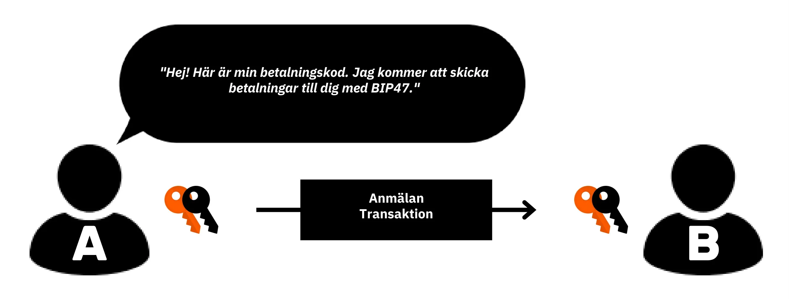


Det skulle därför vara möjligt att genomföra BIP47 utan att använda aviseringstransaktionen, förutsatt att varje användare håller en säkerhetskopia av sina kollegors betalningskoder. Denna metod visar sig dock vara komplicerad att hantera tills en enkel, robust och effektiv lösning för att göra, lagra och uppdatera dessa säkerhetskopior har utvecklats. Som det ser ut nu är aviseringstransaktionen nästan oundviklig.


I de följande kapitlen kommer vi dock att titta på andra protokoll med liknande mål som BIP47, men som inte kräver en aviseringstransaktion. Dessa alternativ medför dock sina egna avvägningar.


Förutom att spara betalkoder har aviseringstransaktionen, som namnet antyder, även en aviseringsfunktion för mottagaren. Den uppmärksammar mottagarens kund på att en ny betalningstunnel har upprättats och föreslår att han eller hon håller ett öga på de efemära adresser som uppstår.


### Sekretessmodellen BIP47


Innan den tekniska hanteringen av meddelandetransaktionen beskrivs i detalj är det viktigt att diskutera den sekretessmodell som är kopplad till BIP47, vilken motiverar vissa åtgärder som vidtas när denna första transaktion skapas.


Betalkoden i sig utgör inte någon direkt risk för sekretessen. Till skillnad från den traditionella Bitcoin-modellen, som syftar till att bryta kopplingen mellan användarens identitet och hans transaktioner (som är offentliga) genom att bevara anonymiteten hos nycklar och adresser, kan betalkoden öppet associeras med en identitet utan att utgöra ett hot.


Detta beror på att betalningskoden inte används för att direkt härleda de adresser som tar emot BIP47-betalningar. I stället genereras dessa adresser via ECDH-applikationen mellan de nycklar som härleds från de två inblandade parternas betalningskoder.


En betalningskod i sig leder således inte direkt till förlust av sekretess, eftersom endast meddelandet Address härleds från den. Även om denna Address kan avslöja viss information, avslöjar den normalt inte de parter som du handlar med, såvida inte en grundlig kedjeanalys utförs. Om avsändaren använder UTXO:er som kan kopplas till hans identitet för att genomföra meddelandetransaktionen, blir det möjligt att dra slutsatsen att hans identitet troligen är kopplad till BIP47-betalningar till din betalkod. Detta kommer inte att avslöja de underliggande transaktionerna, men kommer att indikera deras sannolika existens.


Det är därför viktigt att upprätthålla denna strikta åtskillnad mellan användarnas betalningskoder. Med detta i åtanke är den första kommunikationen av koden ett kritiskt ögonblick för betalningssekretessen, men ett ögonblick som är nödvändigt för att protokollet ska fungera korrekt. Om en av betalningskoderna kan erhållas offentligt (t.ex. på en webbplats) får den andra koden, avsändarens kod, under inga omständigheter kopplas till den första.


Låt oss ta ett konkret exempel: Jag vill göra en donation till en politisk rörelse via BIP47 :


- Organisationen har offentliggjort sin betalningskod på sin webbplats eller via sina sociala nätverk;
- Denna kod är därför kopplad till den politiska rörelsen;
- Jag får denna betalningskod ;
- Innan jag skickar måste jag se till att de känner till min egen betalkod, som också är kopplad till min identitet eftersom jag använder den för att ta emot transaktioner på mina sociala nätverk.


Hur kan jag föra min kod vidare utan risk? Att använda konventionella kommunikationsmedel skulle kunna leda till informationsläckage och därmed associera mig med denna politiska rörelse. Aviseringstransaktionen erbjuder en lösning, tack vare en Layer-kryptering som förhindrar just en sådan koppling mellan två koder. Även om det inte är den enda metoden för att i hemlighet överföra avsändarens betalkod är det en mycket effektiv metod.


I diagrammet nedan anger de orange linjerna de punkter där informationsflödet måste avbrytas och de svarta pilarna visar de kopplingar som potentiellt kan observeras av tredje part:


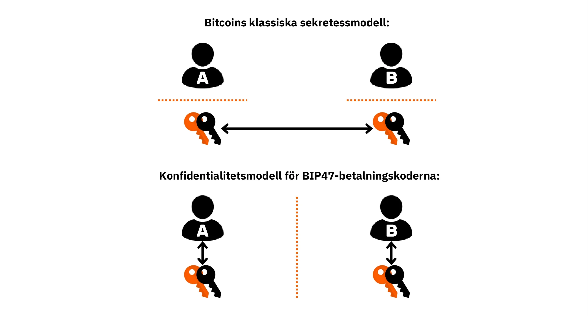


I verkligheten är det i Bitcoin:s traditionella sekretessmodell ofta komplicerat att helt separera informationsflödet mellan nyckelparet och användaren, särskilt i fjärrtransaktioner. Till exempel, i samband med en donationskampanj måste mottagaren oundvikligen avslöja en Address eller offentlig nyckel via sin webbplats eller sociala nätverk. Korrekt användning av BIP47, särskilt med meddelandetransaktionen, gör det möjligt att komma runt detta problem tack vare ECDHE och krypteringen Layer som vi kommer att titta på senare.


Bitcoin:s klassiska sekretessmodell gäller naturligtvis fortfarande för efemära publika nycklar, som härleds från kombinationen av de två betalkoderna. De två modellerna är i själva verket komplementära. Det jag vill betona här är att betalningskoden, till skillnad från den vanliga användningen av en publik nyckel för att ta emot Bitcoins, kan kopplas till en specifik identitet, eftersom informationen "_Alice gör transaktioner med Bob_" bryts i ett annat skede. Betalningskoden används för generate-betalningsadresser, men enbart baserat på observation av Blockchain är det omöjligt att koppla en BIP47-betalningstransaktion till de betalningskoder som används för att utföra den, såvida inte de inblandade UTXO:erna redan tidigare var kopplade till en identitet och användarna associerade sina betalningskoder med sina respektive identiteter.


Sammanfattningsvis kan den sekretessmodell som erbjuds av BIP47-betalningar anses vara överlägsen Bitcoin:s grundmodell, även om detta inte betyder att den är magisk.


### Uppbyggnad av meddelandetransaktionen


Låt oss nu se hur denna aviseringstransaktion fungerar. Låt oss föreställa oss att Alice vill skicka pengar till Bob med hjälp av BIP47. I mitt exempel agerar Alice som avsändare och Bob som mottagare. Bob har publicerat sin betalkod på sin webbplats. Alice känner därför redan till Bob:s betalkod.


**1- Alice beräknar en delad hemlighet med ECDH :**


- Hon väljer ett nyckelpar från sin HD Wallet på en annan gren än hennes betalkod. Observera att detta par inte får vara lätt att associera med Alice:s avisering Address eller med Alice:s identitet (se föregående avsnitt);
- Alice väljer den privata nyckeln för detta par. Vi kallar den $a$ (gemener);


$$
a
$$


- Alice hämtar den publika nyckel som är kopplad till Bob:s meddelande Address. Denna nyckel är det första barnet som härleds från Bob:s betalkod (index $/0$). Vi kallar denna publika nyckel $B$ (versaler). Den privata nyckel som är associerad med denna publika nyckel heter $b$ (gemener). $B$ bestäms genom att lägga till och dubbla punkter på den elliptiska kurvan från $G$ (den genererande punkten) med $b$ (den privata nyckeln):


$$ B = b \cdot G $$


- Alice beräknar en hemlig punkt $S$ (versaler) på den elliptiska kurvan genom att lägga till och fördubbla punkter och använder sin privata nyckel $a$ från Bob:s offentliga nyckel $B$.


$$ S = a \cdot B $$


- Alice beräknar blindningsfaktorn $f$ som ska användas för att kryptera hennes betalningskod. För att göra detta använder hon HMAC-SHA512-funktionen för att bestämma ett pseudoslumpmässigt tal. Den andra inmatningen till denna funktion är ett värde som endast Bob kommer att kunna hitta: $x$, vilket är abscissen för den hemliga punkt som beräknades ovan. Den första inmatningen är $o$, vilket är den UTXO som förbrukas som inmatning till denna transaktion (utpunkt).


$$ f = \text{HMAC-SHA512}(o, x) $$


**2 - Alice konverterar sin personliga betalkod till bas 2 (binär) **


**3- Den använder denna förblindande faktor som en nyckel för att utföra symmetrisk kryptering på nyttolasten i sin betalningskod.** Krypteringsalgoritmen som används är helt enkelt en `XOR`. Den operation som utförs är jämförbar med Vernam-krypteringen, även känd som "One-Time Pad".


- Alice delar först upp sin förblindande faktor i två: de första 32 bytena kallas $f1$ och de sista 32 bytena kallas $f2$. Detta ger oss :


$$ f = f1 || f2 $$


- Alice beräknar chiffret $x'$ för abscissen av den offentliga nyckeln $x$ för sin betalningskod och chiffret $c'$ för sin strängkod $c$ separat. $f1$ och $f2$ fungerar som chiffernycklar respektive. Den operation som används är `XOR` (eller exklusiv).


$$ x' = x \oplus f1 $$ x' = x \oplus f1 $$ x' = x \oplus f1


$$ c' = c \oplus f2 $$


- Alice ersätter de verkliga värdena för den offentliga nyckelns abscissa $x$ och strängkoden $c$ i sin betalningskod med de krypterade värdena $x'$ och $c'$.


**4-** Alice har därför för närvarande sin betalningskod med en krypterad nyttolast. Hon kommer att konstruera och sända en transaktion som involverar hennes publika nyckel $A$ som input, en output till Bob:s meddelande Address, och en output `OP_RETURN` som består av hennes betalningskod med den krypterade nyttolasten. **Den här transaktionen är aviseringstransaktionen**.


En `OP_RETURN` är en opcode som markerar utdata från en Bitcoin transaktion som ogiltig. Idag används den för att sända ut eller Anchor information om Bitcoin Blockchain. Den kan lagra upp till 80 byte data, som sedan skrivs till kedjan och blir synlig för alla andra användare.


Som vi har sett i tidigare avsnitt används ECDH för att generate dela en hemlighet mellan två användare som kommunicerar över ett osäkert nätverk och som potentiellt kan observeras av angripare. I BIP47 används ECDH för att kommunicera på Bitcoin-nätverket, som till sin natur är ett transparent kommunikationsnätverk och som observeras av många angripare. Den delade hemligheten som beräknas genom ECDH-nyckeln Exchange används sedan för att kryptera den hemliga information som ska överföras: avsändarens betalkod (Alice).


Jag ska sammanfatta de steg vi just har sett tillsammans för att genomföra en anmälningstransaktion:


- Alice hämtar Bob:s betalkod och avisering Address;
- Alice väljer en UTXO från sin HD-portfölj med motsvarande nyckelpar;
- Den beräknar en hemlig punkt på den elliptiska kurvan med hjälp av ECDH ;
- Den använder denna hemliga punkt för att beräkna en HMAC, som är den bländande faktorn;
- Hon använder denna förblindande faktor för att kryptera nyttolasten för sin personliga betalkod;
- Den använder en transaktionsutgång `OP_RETURN` för att kommunicera den dolda betalningskoden till Bob.


### Transaktionsavisering: en praktisk studie


För att förstå hur det fungerar mer detaljerat, och i synnerhet användningen av `OP_RETURN`, låt oss ta en titt på en riktig anmälningstransaktion. Jag genomförde en sådan transaktion på Testnet, som du kan hitta [genom att klicka här](https://Mempool.space/fr/Testnet/tx/0e2e4695a3c49272ef631426a9fd2dae6ec3a469e3a39a3db51aa476cd09de2e).


Om vi tittar på den här transaktionen kan vi redan se att den har en enda ingång och 4 utgångar:


- Den första utmatningen är `OP_RETURN` som innehåller min dolda betalningskod;
- Den andra utgången av 546 Sats pekar på min mottagares meddelande Address;
- Det tredje utfallet på 15 000 Sats representerar serviceavgiften, eftersom jag använde Samourai Wallet för att skapa denna transaktion;
- Det fjärde utflödet på 2 miljoner Sats representerar Exchange-kursen, dvs. den återstående skillnaden i min input som återgår till en annan Address som tillhör mig.


Det mest intressanta att studera är uppenbarligen utdata 0 med `OP_RETURN`. Låt oss ta en närmare titt på vad den innehåller. Här är `scriptPubKey` i hexadecimal :


```text
6a4c50010002b13b2911719409d704ecc69f74fa315a6cb20fdd6ee39bc9874667703d67b164927b0e88f89f3f8b963549eab2533b5d7ed481a3bea7e953b546b4e91b6f50d800000000000000000000000000
```


Det här skriptet består av flera delar. För det första är :


```text
6a4c
```


Bland opkoderna kan vi känna igen `0x6a` som betecknar `OP_RETURN` och `0x4c` som betecknar `OP_PUSHDATA1`.


Bytena efter den sista opkoden anger storleken på den efterföljande nyttolasten. Den anger `0x50`, eller 80 byte:


```text
6a4c50
```


Därefter har vi metadata om min betalkod i klartext:


```text
010002
```


Den krypterade abscissen av den offentliga nyckeln till min betalningskod :


```text
b13b2911719409d704ecc69f74fa315a6cb20fdd6ee39bc9874667703d67b164
```


Den krypterade strängkoden för min betalningskod :


```text
927b0e88f89f3f8b963549eab2533b5d7ed481a3bea7e953b546b4e91b6f50d8
```


Och slutligen, utfyllnad till 80 byte, standardstorleken på en `OP_RETURN` :


```text
00000000000000000000000000
```


För att hjälpa dig att förstå, här är min betalningskod i klartext i bas 58 :


```text
PM8TJQCyt6ovbozreUCBrfKqmSVmTzJ5vjqse58LnBzKFFZTwny3KfCDdwTqAEYVasn11tTMPc2FJsFygFd3YzsHvwNXLEQNADgxeGnMK8Ugmin62TZU
```


Och i bas 16 :


```text
4701000277507c9c17a89cfca2d3af554745d6c2db0e7f6b2721a3941a504933103cc42add94881210d6e752a9abc8a9fa0070e85184993c4f643f1121dd807dd556d1dc000000000000000000000000008604e4db
```


Om vi jämför min betalningskod i klartext med `OP_RETURN`, kan vi se att HRP (`0x47`) och kontrollsumman (`0x8604e4db`) inte överförs. Detta är normalt, eftersom denna information är avsedd för människor.


Därefter kan vi känna igen versionen (`0x01`), bitfältet (`0x00`) och pariteten för den offentliga nyckeln (`0x02`). Och i slutet av betalningskoden, de tomma bytena (`0x000000000000000000000000000000`) som gör det möjligt att fylla på för att nå totalt 80 byte. Alla dessa metadata överförs okrypterade.


Slutligen kan vi konstatera att den offentliga nyckelns abscissa (`0x77507c9c17a89cfca2d3af554745d6c2db0e7f6b2721a3941a504933103cc42a`) och strängkoden (`0xdd94881210d6e752a9abc8a9fa0070e85184993c4f643f1121dd807dd556d1dc`) har krypterats. Detta är betalningskodens nyttolast.


### Vad är XOR?


Vi har i tidigare avsnitt sett att betalkoden överförs krypterad med hjälp av XOR-operationen. Låt oss titta närmare på hur den här operatorn fungerar, eftersom den används ofta inom kryptografi.


XOR är en bitvis logisk operator baserad på boolesk algebra. Givet två operander i bitar, returnerar den `1` om bitarna av samma rang är olika, och den returnerar `0` om bitarna av samma rang är lika. Här är sanningstabellen för XOR enligt värdena för operanderna `D` och `E` :


| D | E | D XOR E |
| --- | --- | ------- |
| 0 | 0 | 0 |
| 0 | 1 | 1 |
| 1 | 0 | 1 |
| 1 | 1 | 0 |

Till exempel:


$$
0110 \oplus 1110 = 1000
$$


Eller :


$$
010011 \oplus 110110 = 100101
$$


Med ECDH är användningen av XOR som en kryptering Layer särskilt konsekvent. För det första är krypteringen symmetrisk tack vare denna operatör. Detta innebär att mottagaren kan dekryptera betalningskoden med samma nyckel som används för kryptering. Krypterings- och dekrypteringsnycklarna beräknas utifrån den delade hemligheten med hjälp av ECDH. Denna symmetri möjliggörs av XOR-operatorns kommutativitets- och associativitetsegenskaper:


- Övriga fastigheter :


$$
D \oplus D = 0
$$


$$
D \oplus 0 = D
$$


- Kommutativitet :


$$
D \oplus E = E \oplus D
$$


- Associativitet :


$$
D \oplus (E \oplus Z) = (D \oplus E) \oplus Z = D \oplus E \oplus Z
$$


Om :


$$
D \oplus E = L
$$


Sedan :


$$
D \oplus L = D \oplus (D \oplus E) = D \oplus D \oplus E = 0 \oplus E = E \\
\therefore D \oplus L = E
$$


För det andra är den här krypteringsmetoden mycket lik Vernam-chiffret (One-Time Pad), den enda krypteringsalgoritm som hittills är känd och som har ovillkorlig (eller absolut) säkerhet. För att Vernams chiffer ska ha denna egenskap måste krypteringsnyckeln vara helt slumpmässig, ha samma storlek som meddelandet och bara användas en gång. I den krypteringsmetod som används här för BIP47 är nyckeln faktiskt lika stor som meddelandet och blindfaktorn är exakt lika stor som konkateneringen av abscissen för den offentliga nyckeln med strängkoden för betalningskoden. Denna krypteringsnyckel används endast en gång. Å andra sidan härrör inte denna nyckel från en perfekt slumpmässighet, eftersom det är en HMAC. Snarare är den pseudoslumpmässig. Så det är inte ett Vernam-chiffer, men metoden kommer nära.


### Mottagande av meddelande om transaktion


Nu när Alice har skickat aviseringstransaktionen till Bob, låt oss se hur Bob tolkar den. Som en påminnelse måste Bob ha tillgång till Alice:s betalkod. Utan denna information, som vi kommer att se i nästa avsnitt, kommer han inte att kunna härleda de nyckelpar som skapats av Alice, och kommer därför inte att kunna komma åt sina bitcoins som mottagits via BIP47. För tillfället är Alice:s betalningskods nyttolast krypterad. Låt oss se hur Bob dekrypterar den.


**1-** Bob övervakar transaktioner som skapar utdata med sitt meddelande Address.


**2-** När en transaktion har en utdata på sin avisering Address, analyserar Bob den för att se om den innehåller en OP_RETURN-utdata som överensstämmer med BIP47-standarden.


**3-** Om den första byten i OP_RETURN:s nyttolast är `0x01`, börjar Bob sin sökning efter en möjlig hemlighet som delas med ECDH :


- Bob väljer den inmatade publika nyckeln för transaktionen. Det vill säga Alice:s publika nyckel med namnet $A$ med :


$$ A = a \cdot G $$


- Bob väljer den privata nyckeln $b$ som är associerad med hans personliga meddelande Address :


$$ b $$


- Bob beräknar den hemliga punkten $S$ (delad hemlighet ECDH) på den elliptiska kurvan genom att lägga till och dubbla punkter, genom att använda sin privata nyckel $b$ på Alice:s offentliga nyckel $A$ :


$$ S = b \cdot A $$


- Bob bestämmer bländningsfaktorn $f$ som gör det möjligt att dekryptera nyttolasten i Alice:s betalkod. På samma sätt som Alice hade beräknat den tidigare, kommer Bob att hitta $f$ genom att tillämpa HMAC-SHA512 på $x$, abscissvärdet för den hemliga punkten $S$, och på $o$, den UTXO som förbrukades som input till denna meddelandetransaktion:


$$ f = \text{HMAC-SHA512}(o, x) $$


**4-** Bob tolkar OP_RETURN-data i meddelandetransaktionen som en betalningskod. Han kommer helt enkelt att dekryptera nyttolasten för denna potentiella betalningskod med hjälp av förblindningsfaktorn $f$:


- Bob delar upp förblindningsfaktorn $f$ i 2 delar: de första 32 bytena av $f$ kommer att vara $f1$ och de sista 32 bytena kommer att vara $f2$ ;
- Bob dekrypterar värdet av den krypterade abscissen $x'$ från den publika nyckeln för Alice:s betalkod:


$$ x = x' \oplus f1 $$


- Bob dekrypterar värdet av den krypterade strängkoden $c'$ från Alice:s betalkod:


$$ c = c' \oplus f2 $$


**5-** Bob kontrollerar om det publika nyckelvärdet för Alice:s betalkod är en del av secp256k1-gruppen. Om så är fallet tolkar han detta som en giltig betalkod. Om inte, ignorerar han transaktionen.


Nu när Bob känner till Alice:s betalningskod kan Alice skicka upp till `2^32` betalningar till honom utan att någonsin behöva upprepa en aviseringstransaktion av den här typen.


Varför fungerar det? Hur kan Bob fastställa samma förblindningsfaktor som Alice och därmed dechiffrera sin betalkod? Låt oss ta en närmare titt på ECDH:s agerande i det vi just beskrivit.


Först och främst har vi att göra med symmetrisk kryptering. Det innebär att krypteringsnyckeln och dekrypteringsnyckeln har samma värde. Den här nyckeln i meddelandetransaktionen är den förblindande faktorn:


$$ f = f1 || f2 $$


Alice och Bob måste därför erhålla samma värde för $f$, utan att överföra det direkt, eftersom en angripare skulle kunna stjäla det och dekryptera den hemliga informationen. Denna förblindningsfaktor erhålls genom att tillämpa HMAC-SHA512 på 2 värden:


- abscissen för en hemlig punkt ;
- och UTXO förbrukas vid transaktionsinmatningen.


Bob behöver därför båda dessa delar av informationen för att dekryptera Alice:s betalningskods nyttolast. För inmatningen UTXO kan Bob helt enkelt hämta den genom att observera meddelandetransaktionen. För den hemliga punkten kommer Bob att behöva använda ECDH. Som vi såg i det föregående avsnittet om Diffie-Hellman kan Alice och Bob hitta en exakt hemlig punkt på den elliptiska kurvan genom att helt enkelt utbyta sina respektive publika nycklar och i hemlighet tillämpa sina privata nycklar på varandras publika nycklar. Anmälningstransaktionen är baserad på denna mekanism:


- Bob:s nyckelpar :


$$ B = b \cdot G $$


- Alice:s nyckelpar :


$$ A = a \cdot G $$


- För en hemlighet $S (x, y)$ :


$$ S = a \cdot B = a \cdot (b \cdot G) = (b \cdot a) \cdot G = b \cdot A $$


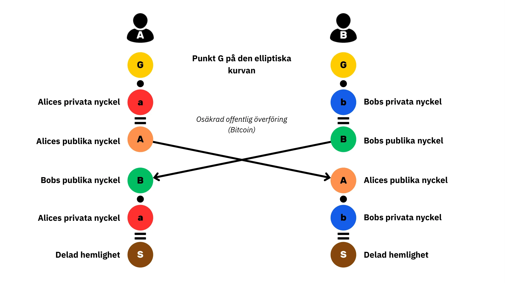


Nu när Bob känner till Alice:s betalningskod kommer han att kunna upptäcka hennes BIP47-betalningar och han kommer att kunna härleda de privata nycklarna som blockerar de mottagna bitcoins.


Jag ska sammanfatta de steg vi just har sett tillsammans för att ta emot och tolka en aviseringstransaktion:


- Bob övervakar transaktionsutmatningen till sitt meddelande Address;
- När den upptäcker en sådan hämtar den informationen som finns i OP_RETURN ;
- Bob väljer den publika nyckeln som indata och beräknar en hemlig punkt med hjälp av ECDH ;
- Den använder denna hemliga punkt för att beräkna en HMAC, vilket är den bländande faktorn;
- Den använder denna förblindande faktor för att dekryptera Alice:s betalningskods nyttolast som finns i OP_RETURN.


### Betalningstransaktionen BIP47


Låt oss ta en titt på betalningsprocessen med BIP47. För att påminna dig om den aktuella situationen :


- Alice känner till Bob:s betalkod, som hon helt enkelt hämtade från hans webbplats;
- Bob känner till Alice:s betalkod från aviseringstransaktionen;
- Alice kommer att göra sin första betalning till Bob. Hon kan göra många fler på samma sätt.


Innan jag förklarar denna process tror jag att det är viktigt att komma ihåg vilka index vi för närvarande arbetar med. Härledningsvägen för en betalkod beskrivs på följande sätt: `m/47'/0'/0'`. Följande djup delar upp indexen enligt följande:


- Det första normala (icke-förstärkta) dotterparet är det som används för generate meddelandet Address som diskuterades i föregående avsnitt: `m/47'/0'/0'/0` ;
- Normala dotternyckelpar används inom ECDH för att generate BIP47 betalningskvittoadresser, som vi kommer att se i detta avsnitt: från `m/47'/0'/0'/0` till `m/47'/0'/0'/2,147,483,647` ;
- Förstärkta dotternyckelpar är efemära betalningskoder: från `m/47'/0'/0'/0'` till `m/47'/0'/0'/2.147.483.647'`.


Varje gång Alice vill skicka en betalning till Bob tar hon fram en ny, unik, tom Address, återigen med hjälp av ECDH-protokollet:


- Alice väljer den första privata nyckeln som härrör från hennes personliga återanvändbara betalningskod :


$$ a $$


- Alice väljer den första oanvända publika nyckeln som härrör från Bob:s betalkod. Vi kallar denna publika nyckel för $B$. Den är kopplad till den privata nyckeln $b$ som endast Bob känner till:


$$ B = b \cdot G $$


- Alice beräknar en hemlig punkt $S$ på den elliptiska kurvan genom att lägga till och fördubbla punkter genom att använda sin privata nyckel $a$ från Bob:s offentliga nyckel $B$ :


$$ S = a \cdot B $$


- Från denna hemliga punkt beräknar Alice den delade hemligheten $s$ (gemener). För att göra detta väljer hon abscissen för den hemliga punkten $S$, kallad $Sx$, och skickar detta värde till SHA256 Hash-funktionen:


$$ S = (Sx, Sy) $$


$$ s = \text{SHA256}(Sx) $$


- Alice använder denna delade hemlighet $s$ för att beräkna en Bitcoin-betalningsmottagning Address. Först kontrollerar hon att $s$ ingår i ordningen för secp256k1-kurvan. Om så inte är fallet ökar hon Bob:s offentliga nyckelindex för att härleda en annan delad hemlighet ;
- I ett andra steg beräknar hon en publik nyckel $K0$ genom att lägga till punkterna $B$ och $s-G$ på den elliptiska kurvan. Med andra ord lägger Alice till den offentliga nyckeln som härrör från Bob:s betalningskod $B$ till en annan punkt som beräknas på den elliptiska kurvan genom att lägga till och dubbla punkter med den delade hemligheten $s$ från secp256k1-kurvgeneratorns punkt $G$. Denna nya punkt representerar en publik nyckel och vi kallar den $K0$ :


$$ K0 = B + s \cdot G $$


- Med denna publika nyckel $K0$ kan Alice härleda en blank mottagning av Address på vanligt sätt (t.ex. SegWit V0 i bech32).


När Alice har erhållit Bob:s $K0$ som tar emot Address kan hon utföra en Bitcoin-transaktion på vanligt sätt. För att göra detta väljer hon en UTXO som hon äger, säkrad med ett nyckelpar från en annan gren av hennes HD Wallet, och konsumerar den för att uppfylla en utgång till Bob:s $K0$ Address. Det är viktigt att notera att denna betalning, när Address har härletts, följer en klassisk process och inte längre beror på de nycklar som är associerade med BIP47.


Jag ska sammanfatta de steg vi just har sett tillsammans för att skicka en BIP47-betalning:


- Alice väljer den första dotterns privata nyckel som härrör från hennes personliga betalningskod ;
- Den beräknar en hemlig punkt på den elliptiska kurvan med hjälp av ECDH från den första oanvända offentliga nyckeln för dotter som härrör från Bob:s betalkod;
- Den använder denna hemliga punkt för att beräkna en delad hemlighet med SHA256 ;
- Hon använder den delade hemligheten för att beräkna en ny hemlig punkt på den elliptiska kurvan;
- Hon lägger till denna nya hemliga punkt till Bob:s offentliga nyckel;
- Hon erhåller en ny efemär publik nyckel för vilken endast Bob har den tillhörande privata nyckeln;
- Alice kan göra en klassisk transaktion till Bob med den härledda efemära mottagningen Address.


Om Alice vill göra en andra betalning följer hon samma steg som tidigare, förutom att hon den här gången väljer den andra publika nyckeln som härrör från Bob:s betalkod. Specifikt kommer hon att använda nästa oanvända nyckel. Hon kommer därmed att erhålla en ny mottagande Address som tillhör Bob, betecknad $K1$ :


Den kan fortsätta på detta sätt och härleda upp till `2^32` tomma adresser som tillhör Bob.


Från ett utifrånperspektiv, när man tittar på Blockchain, är det teoretiskt omöjligt att skilja en BIP47-betalning från en konventionell betalning. Här är ett exempel på en BIP47-betalningstransaktion på Testnet:


```text
94b2e59510f2e1fa78411634c98a77bbb638e28fb2da00c9f359cd5fc8f87254
```


Det ser ut som en klassisk transaktion med en förbrukad ingång, en betalningsutgång och en Exchange-ränta:


### Mottagande av BIP47-betalning och härledning av privat nyckel


Alice har just gjort sin första betalning till en blank BIP47 Address som tillhör Bob. Låt oss nu se hur Bob tar emot denna betalning. Vi ska också se varför Alice inte har tillgång till den privata nyckeln till Address som hon just har genererat själv, och hur Bob hittar denna nyckel för att spendera de bitcoins som han just har fått.


Så snart Bob tar emot aviseringstransaktionen från Alice, härleder han den publika nyckeln BIP47 $K0$ även innan hans korrespondent har skickat en betalning. Han observerar därför alla betalningar till den associerade Address. Faktum är att han omedelbart härleder flera adresser som han observerar ($K0$, $K1$, $K2$, $K3$...). Så här härleder den denna offentliga nyckel $K0$ :


- Bob väljer den första dotterns privata nyckel som härrör från hans betalkod. Denna privata nyckel heter $b$. Den är associerad med den publika nyckeln $B$ med vilken Alice gjorde sina beräkningar i föregående steg:


$$ b $$


- Bob väljer Alice:s första publika nyckel som härrör från hennes betalkod. Den här nyckeln heter $A$. Den är associerad med den privata nyckeln $a$ som Alice gjorde sina beräkningar med och som endast Alice känner till. Bob kan utföra denna process eftersom han känner till Alice:s betalkod, som skickades till honom med meddelandetransaktionen:


$$ A = a \cdot G $$


- Bob beräknar den hemliga punkten $S$, genom att lägga till och fördubbla punkter på den elliptiska kurvan, genom att använda sin privata nyckel $b$ till Alice:s offentliga nyckel $A$. Även här används ECDH för att garantera att denna punkt $S$ kommer att vara densamma för både Bob och Alice:


$$ S = b \cdot A $$


- På samma sätt som Alice isolerar Bob abscissen för denna punkt $S$. Vi har döpt detta värde till $Sx$. Han skickar detta värde till SHA256-funktionen för att hitta den delade hemligheten $s$ (gemener):


$$ s = \text{SHA256}(Sx) $$


- På samma sätt som Alice beräknar Bob $s-G$-punkten på den elliptiska kurvan. Han lägger sedan till denna hemliga punkt till sin publika nyckel $B$. Han får då en ny punkt på den elliptiska kurvan, som han tolkar som en publik nyckel $K0$ :


$$ K0 = B + s \cdot G $$


När Bob har den publika nyckeln $K0$ kan han härleda den tillhörande privata nyckeln för att spendera sina bitcoins. Endast han kan generate denna privata nyckel:


- Bob räknar upp sin dotters privata nyckel $b$ som härrör från hans personliga betalkod. Endast han kan få reda på värdet av $b$. Han lägger sedan till $b$ till den delade hemligheten $s$ för att få $k0$, $K0$:s privata nyckel:


$$ k0 = b + s $$


Tack vare grupplagen för den elliptiska kurvan får Bob exakt den privata nyckel som motsvarar den publika nyckel som Alice använde. Vi har därför :


$$ K0 = k0 \cdot G $$


Jag ska sammanfatta de steg som vi just har sett tillsammans för att ta emot en BIP47-betalning och beräkna motsvarande privata nyckel:


- Bob väljer den första dotterns privata nyckel som härrör från hans personliga betalningskod ;
- Den beräknar en hemlig punkt på den elliptiska kurvan med hjälp av ECDH från den första dotterns offentliga nyckel som härrör från Alice:s strängkod;
- Den använder denna hemliga punkt för att beräkna en delad hemlighet med SHA256 ;
- Han använder denna delade hemlighet för att beräkna en ny hemlig punkt på den elliptiska kurvan;
- Han lägger till denna nya hemliga punkt till sin personliga offentliga nyckel;
- Han erhåller en ny efemär publik nyckel, den som Alice kommer att skicka sin första betalning till;
- Bob beräknar den privata nyckel som är associerad med denna efemära publika nyckel genom att lägga till sin privata dotternyckel som härrör från hans betalkod och den delade hemligheten.


Eftersom Alice inte kan få $b$ (Bob:s privata nyckel) kan hon inte heller bestämma $k0$ (den privata nyckel som är kopplad till Bob:s BIP47-mottagning Address). Schematiskt kan vi representera beräkningen av den delade hemligheten $S$ på följande sätt:


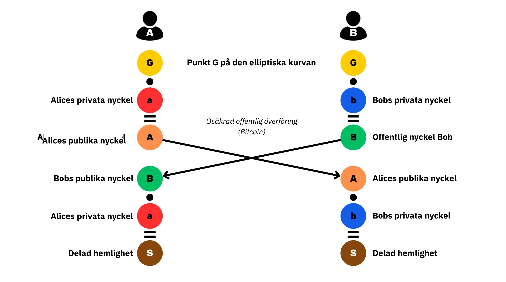


När den delade hemligheten har hittats med ECDH beräknar Alice och Bob den publika nyckeln för BIP47-betalningen $K0$, och Bob beräknar också den tillhörande privata nyckeln $k0$:


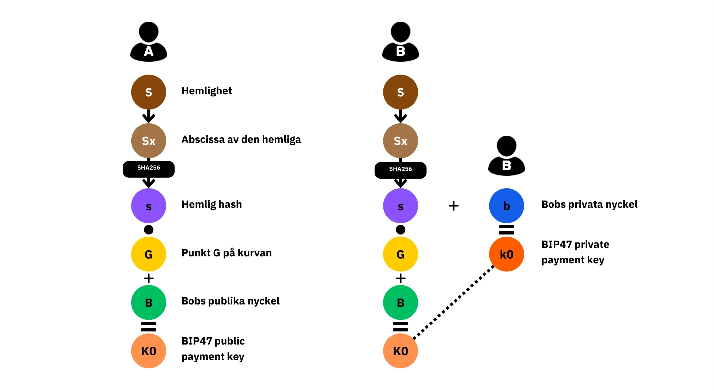


### Återbetalning av BIP47-betalning


Eftersom Bob känner till Alice:s återanvändbara betalkod har han redan all information han behöver för att skicka en återbetalning till henne. Han behöver inte kontakta Alice igen för att be om någon information. Han behöver bara meddela henne med en aviseringstransaktion, så att hon kan hämta sina BIP47-adresser med sin seed, och sedan kan han också skicka upp till `2^32` betalningar till henne.


Återbetalningsfunktionen är specifik för BIP47 och är en av dess fördelar jämfört med andra metoder, till exempel Silent Payments, som vi kommer att titta på i senare kapitel.


Bob kan sedan ersätta Alice på samma sätt som hon skickade betalningar till honom. Rollerna är ombytta:


*Stort tack till [Fanis Michalakis](https://x.com/FanisMichalakis) för hans korrekturläsning och expertråd om den artikel som inspirerade till skrivandet av detta kapitel!*


https://planb.network/tutorials/privacy/on-chain/paynym-bip47-a492a70b-50eb-4f95-a766-bae2c5535093

## Tysta betalningar


<chapterId>2871d594-414e-4598-a830-91c9eb84dfb8</chapterId>


BIP47 har fått mycket kritik för sin ineffektivitet i kedjan. Som förklarades i föregående kapitel krävs det att en aviseringstransaktion genomförs för varje ny mottagare. Denna begränsning blir försumbar om vi planerar att upprätta en hållbar betalningskanal med denna mottagare. En enda aviseringstransaktion banar faktiskt väg för ett nästan oändligt antal efterföljande BIP47-betalningar.


I vissa situationer kan dock aviseringstransaktionen vara ett hinder för användaren. Låt oss ta exemplet med en engångsdonation till en mottagare: med en klassisk Bitcoin Address räcker det med en enda transaktion för att slutföra donationen. Men med BIP47 krävs två transaktioner: en för aviseringen och en annan för den faktiska betalningen. När efterfrågan på blockutrymme är låg och transaktionsavgifterna är låga är detta extra steg vanligtvis inte ett problem. I tider av överbelastning kan dock transaktionsavgifterna bli orimliga för en enda betalning, vilket potentiellt fördubblar kostnaden för användaren jämfört med en standard Bitcoin-transaktion, vilket kan visa sig vara oacceptabelt för användaren.


För situationer där användaren planerar att göra endast ett fåtal betalningar till en statisk identifierare har andra lösningar utvecklats. Bland dessa finns Silent Payments, som beskrivs i [BIP352](https://github.com/Bitcoin/bips/blob/master/bip-0352.mediawiki). Detta protokoll gör det möjligt att använda en statisk identifierare för att ta emot betalningar utan att producera Address återanvändning och utan att kräva användning av aviseringstransaktioner. Låt oss ta en titt på hur detta protokoll fungerar.


---
*För att förstå det här kapitlet fullt ut är det viktigt att du behärskar ECDH (Elliptic Curve Diffie-Hellman) och härledning av kryptonycklar i en HD Wallet. Dessa begrepp behandlades i detalj i det föregående kapitlet om BIP47. Jag kommer inte att upprepa dem här. Om du ännu inte är bekant med dessa begrepp rekommenderar jag att du läser det föregående kapitlet innan du fortsätter med det här. Jag kommer inte att gå tillbaka till riskerna med återanvändning av mottagningsadresser eller vikten av att ha en unik identifierare för mottagna betalningar.* Jag kommer bara att nämna några punkter som jag skulle vilja göra här


---
### Varför inte flytta meddelandet?


Som beskrivs i kapitlet om BIP47 har meddelandetransaktionen två huvudfunktioner:


- Den meddelar mottagaren ;
- Den förmedlar avsändarens betalkod.


Man kan naivt tro att denna aviseringsprocess skulle kunna utföras off-chain. I teorin är det fullt genomförbart: allt mottagaren behöver göra är att ange ett kommunikationsmedel för att ta emot BIP47-betalkoderna från avsändarna. Det finns dock två stora problem med detta tillvägagångssätt:


- För det första skulle kodöverföringsprocessen flyttas till ett annat kommunikationsprotokoll. Problem som rör kostnaden och sekretessen för Exchange skulle kvarstå, men skulle helt enkelt överföras till detta nya protokoll. När det gäller sekretess kan detta också skapa en länk mellan en användares identitet och aktivitet i kedjan, vilket är vad vi försöker undvika genom att utföra meddelandet direkt på Blockchain. Att göra anmälan utanför Blockchain skulle dessutom medföra risker för censur (såsom blockering av medel) som inte finns på Bitcoin;
- För det andra skulle detta innebära ett återvinningsproblem. Med BIP47 måste mottagaren känna till avsändarnas betalkoder för att få tillgång till medlen. Detta gäller vid mottagandet, men också i händelse av att medel återvinns via seed om Wallet går förlorad. Med onchain-aviseringar undviks denna risk, eftersom användaren kan hämta och dekryptera aviseringstransaktioner helt enkelt genom att känna till sin seed. Om aviseringen görs utanför Blockchain måste användaren dock upprätthålla en dynamisk säkerhetskopia av alla mottagna betalningskoder, vilket är opraktiskt för den genomsnittliga användaren.


Alla dessa begränsningar gör användningen av onchain-meddelande nödvändig för BIP47. Silent Payments försöker dock undvika detta onchain-aviseringssteg just på grund av dess kostnad. Lösningen som antagits är därför inte att flytta anmälan, utan att eliminera den helt. För att uppnå detta måste en kompromiss accepteras: skanning. Till skillnad från BIP47, där användaren vet exakt var han ska hitta sina pengar tack vare aviseringstransaktioner, måste användaren med Silent Payments undersöka alla befintliga Bitcoin-transaktioner för att upptäcka eventuella betalningar som är avsedda för honom. För att minska denna operativa börda begränsas sökningen i Silent Payments endast till transaktioner som sannolikt innehåller sådana betalningar, dvs. de som har minst en Taproot P2TR-utgång. Sökningen fokuserar också uteslutande på transaktioner från Wallet:s skapandedatum (det finns inget behov av att söka efter transaktioner från 2009 om Wallet skapades 2024).


Så ni kan se varför BIP47 och tysta betalningar, även om de syftar till ett liknande mål, innebär olika avvägningar och därför **i själva verket uppfyller olika användningsfall**. För engångsbetalningar, t.ex. engångsdonationer, är tysta betalningar mer lämpliga på grund av deras lägre kostnad. Å andra sidan, för regelbundna transaktioner till samma mottagare, som i fallet med Exchange-plattformar eller Mining-pooler, kan BIP47 vara att föredra.


Låt oss ta en titt på den tekniska driften av Tysta betalningar för att bättre förstå vad som står på spel. För att göra detta föreslår jag att vi tar samma tillvägagångssätt som det förklarande dokumentet BIP352. Vi kommer gradvis att bryta ner de beräkningar som ska utföras, element för element, och motivera varje nytt tillägg.


### Några begrepp att förstå


Innan vi börjar är det viktigt att påpeka att tysta betalningar uteslutande förlitar sig på användningen av P2TR (*Pay to Taproot*) skripttyper. Till skillnad från BIP47 är det inte nödvändigt att härleda mottagningsadresser från barnets offentliga nycklar genom hashing. I P2TR-standarden används den tweakade publika nyckeln direkt och okrypterad i Address. Så en Taproot som tar emot Address är i huvudsak en publik nyckel med vissa metadata. Denna tweakade publika nyckel är en sammanställning av två andra publika nycklar: en som möjliggör direkta, traditionella utgifter via en enkel signatur, och den andra som representerar MAST:s Merkle Root, som godkänner utgifter under förutsättning att ett av de villkor som potentiellt finns inskrivna i Merkle Tree uppfylls.


Det finns två huvudskäl till beslutet att begränsa Silent Payments till att enbart omfatta Taproot:


- För det första underlättar det avsevärt implementering och framtida uppgraderingar av portföljprogramvara, eftersom endast en standard behöver följas;
- För det andra bidrar denna metod till att förbättra användarnas anonset genom att uppmuntra dem att inte dela upp sig mellan olika typer av skript, vilket generate distinkta portföljfingeravtryck i kedjeanalys (för mer information om detta koncept, se kapitel 4 i del 2).


### Naiv härledning av en offentlig nyckel för tysta betalningar


Låt oss börja med ett enkelt exempel för att komma till kärnan av hur SP (Silent Payments) fungerar. Låt oss ta Alice och Bob, två Bitcoin-användare. Alice vill skicka Bitcoins till Bob på ett tomt mottagande Address. Det finns tre mål med denna process:


- Alice måste kunna generate en tom Address;
- Bob måste kunna identifiera en betalning som skickats till denna specifika Address;
- Bob måste kunna få tillgång till den privata nyckel som är kopplad till Address för att kunna spendera sina pengar.


Alice har en UTXO i sin säkra Bitcoin Wallet med följande nyckelpar:


- $a$: den privata nyckeln ;
- $A$: den publika nyckeln ($A = a \cdot G$)


Bob har ett SP Address som han har publicerat på Internet med :


- $b$: den privata nyckeln ;
- $B$: den offentliga nyckeln ($B = b \cdot G$)


Genom att hämta Bob:s Address kan Alice beräkna en ny tom Address som tillhör Bob med hjälp av ECDH. Låt oss kalla denna Address $P$ :


$$ P = B + \text{Hash}(a \cdot B) \cdot G $$


I den här ekvationen har Alice helt enkelt beräknat skalärprodukten av sin privata nyckel $a$ och Bob:s offentliga nyckel $B$. Hon har överfört detta resultat till en Hash-funktion som är känd av alla. Det resulterande värdet multipliceras sedan skalärt med den genererande punkten $G$ för den elliptiska kurvan `secp256k1`. Slutligen lägger Alice till den resulterande punkten till Bob:s offentliga nyckel $B$. När Alice har denna Address $P$ använder hon den som en utgång i en transaktion, dvs. hon skickar bitcoins till den.


> *I samband med Silent Payments motsvarar funktionen "Hash" en SHA256 Hash-funktion som är särskilt märkt med `BIP0352/SharedSecret`, vilket säkerställer att de genererade hasharna är unika för detta protokoll och inte kan återanvändas i andra sammanhang, samtidigt som de erbjuder ytterligare skydd mot återanvändning av nonces i signaturer. Denna standard motsvarar den [som specificeras i BIP340 för Schnorr-signaturer](https://github.com/Bitcoin/bips/blob/master/bip-0340.mediawiki) på `secp256k1`.*
Tack vare egenskaperna hos den elliptiska kurva som ECDH är baserad på vet vi att :


$$ a \cdot B = b \cdot A $$


Bob kommer därför att kunna beräkna den mottagande Address till vilken Alice har skickat bitcoins. För att göra detta övervakar han alla Bitcoin-transaktioner som uppfyller kriterierna för Tysta betalningar och tillämpar följande beräkning på var och en av dem för att se om betalningen är adresserad till honom (*scanning*):


$$ P' = B + \text{Hash}(b \cdot A) \cdot G $$


När han skannar Alice:s transaktion inser han att $P'$ är lika med $P$. Han vet därför att betalningen är adresserad till henne:


$$ P' = B + \text{Hash}(b \cdot A) \cdot G = B + \text{Hash}(a \cdot B) \cdot G = P $$


Härifrån kommer Bob att kunna beräkna den privata nyckeln $p$ som gör att Address $P$ kan användas:


$$ p = (b + \text{Hash}(b \cdot A)) \bmod n $$


Som du kan se måste du ha den privata nyckeln $b $ för att beräkna den här privata nyckeln $p $. Endast Bob har denna privata nyckel $b$. Han kommer därför att vara den enda som kan spendera de bitcoins som skickas till hans tysta betalningar Address.


*Legend:*


- $B$ : Den offentliga nyckeln/statiska Address publicerad av Bob
- $b$ : Bob:s privata nyckel
- $A$ : Alice:s UTXO publika nyckel används som transaktionsinmatning
- $a$ : Alice:s privata nyckel
- $G$ : Den genererande punkten för den elliptiska kurvan `secp256k1`
- $\text{SHA256}$ : Funktionen SHA256 Hash taggad med `BIP0352/SharedSecret`
- $s$ : ECDH:s gemensamma hemlighet
- $P$ : Den publika nyckeln/unika Address för betalning till Bob


Här är ett ganska naivt första tillvägagångssätt för att använda Bob:s statiska Address, noterat $B$, för att härleda en unik Address $P$ att skicka bitcoins till. Denna metod är dock för förenklad och har flera brister som måste korrigeras. Det första problemet är att Alice i det här systemet inte kan skapa flera utgångar till Bob inom samma transaktion.


### Hur skapar jag flera utgångar?


I exemplet i föregående avsnitt skapar Alice en enda utgång som kommer att gå till Bob på hans unika Address $P$. Med samma indata vald är det omöjligt för Alice att skapa två separata tomma adresser för Bob, eftersom den metod som används alltid skulle leda till samma resultat för $P$, dvs. samma Address. Det kan dock finnas många situationer där Alice vill dela upp sin betalning till Bob i flera mindre belopp och därmed skapa flera UTXO:er. Det är därför nödvändigt att hitta en metod för att uppnå detta.


För att uppnå detta kommer vi att något modifiera den beräkning som Alice utför för att härleda $P$, så att hon kan generate två olika adresser för Bob, nämligen $P_0$ och $P_1$.


Om du vill ändra beräkningen och få två olika adresser lägger du bara till ett heltal som ändrar resultatet. Således kommer Alice att lägga till $0$ till sin beräkning för att erhålla Address $P_0$ och $1$ för att erhålla Address $P_1$. Låt oss kalla detta heltal $i$ :


$$ P_i = B + \text{Hash}(a \cdot B \text{ ‖ } i) \cdot G $$


Beräkningsprocessen är oförändrad från föregående metod, förutom att Alice den här gången kommer att konkatenera $a \cdot B$ med $i$ innan den fortsätter med Hash. Du ändrar sedan helt enkelt $i$ för att få en ny Address som tillhör Bob. Till exempel


$$ P_0 = B + \text{Hash}(a \cdot B \text{ ‖ } 0) \cdot G $$


$$ P_1 = B + \text{Hash}(a \cdot B \text{ ‖ } 1) \cdot G $$


När Bob skannar Blockchain efter Tysta betalningar avsedda för honom, börjar han med att använda $i = 0$ för Address $P_0$. Om han inte hittar några betalningar på $P_0$ drar han slutsatsen att den här transaktionen inte innehåller några tysta betalningar avsedda för honom och överger skanningen. Men om $P_0$ är giltig och innehåller en betalning för honom, fortsätter han med $P_1$ i samma transaktion för att kontrollera om Alice har gjort en andra betalning. Om $P_1$ visar sig vara ogiltig slutar han att söka efter den här transaktionen; annars fortsätter han att testa successiva $i$-värden:


$$ P_0 = B + \text{Hash}(b \cdot A \text{ ‖ } 0) \cdot G $$


$$ P_1 = B + \text{Hash}(b \cdot A \text{ ‖ } 1) \cdot G $$


Eftersom Bob stannar omedelbart vid $i = 0$ om $P_0$ inte fungerar, tillför användningen av detta heltal nästan ingen ytterligare operativ belastning på Bob för transaktionsskanningssteget.


Bob kan sedan beräkna de privata nycklarna på samma sätt:


$$
p_0 = (b + \text{hash}(b \cdot A \text{ ‖ } 0)) \bmod n
$$


$$
p_1 = (b + \text{hash}(b \cdot A \text{ ‖ } 1)) \bmod n
$$


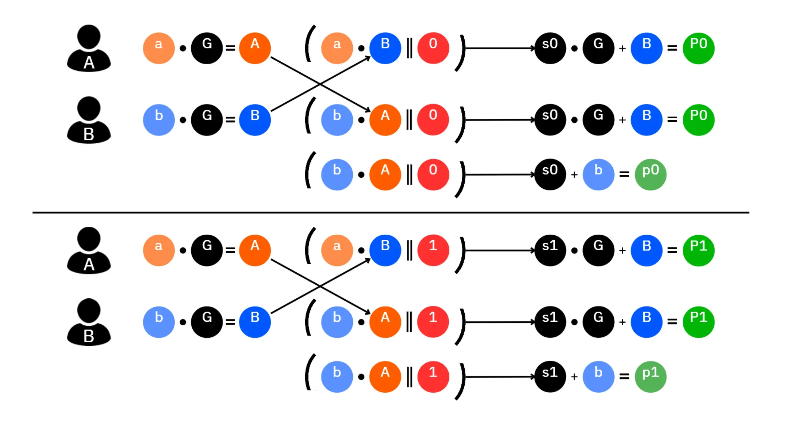


*Legend:*


- $B$ : Den offentliga nyckeln/statiska Address publicerad av Bob
- $b$ : Bob:s privata nyckel
- $A$ : Alice:s offentliga nyckel UTXO används som transaktionsinmatning
- $a$ : Alice:s privata nyckel
- $G$ : Den genererande punkten för den elliptiska kurvan `secp256k1`
- $\text{SHA256}$ : Funktionen SHA256 Hash taggad med `BIP0352/SharedSecret`
- $s_0$ : Den första gemensamma hemligheten ECDH
- $s_1$ : Den andra gemensamma ECDH-hemligheten
- $P_0$ : Den första publika nyckeln / unika Address för betalning till Bob
- $P_1$ : Den andra publika nyckeln / unika Address för betalning till Bob


Med den här metoden börjar vi få ett bra protokoll, men det finns fortfarande några utmaningar att övervinna, inte minst att förhindra återanvändning av Address.


### Hur undviker man återanvändning av Address?


Som vi såg i de tidigare avsnitten använder Alice det nyckelpar som skyddar hennes UTXO, som hon kommer att använda för att beräkna den delade ECDH-hemligheten med Bob. Denna hemlighet gör det möjligt för henne att härleda den unika Address $P_0$. Nyckelparet ($a$, $A$) som används av Alice kan dock säkra flera UTXO om hon har återanvänt denna Address flera gånger. Om Alice gör två betalningar till Bob:s statiska Address $B$ med hjälp av två UTXO:er som säkrats med samma nyckel $A$, skulle detta resultera i återanvändning av Address för Bob.


> *Address återanvändning är en mycket dålig praxis när det gäller användarnas konfidentialitet. För att ta reda på varför rekommenderar jag att du går igenom de första delarna av den här utbildningen.*
Eftersom den unika Address $P_0$ härleds från $A$ och $B$, ja om Alice härleder en andra Address för en andra betalning till $B$, med samma nyckel $A$, kommer hon att hamna på exakt samma Address $P_0$. För att undvika denna risk och förhindra återanvändning av Address inom tysta betalningar måste vi ändra våra beräkningar lite.


Vad vi vill är att varje UTXO som förbrukas av Alice som input till en betalning ska ge en unik Address på Bob:s sida, även om flera UTXO:er är säkrade med samma nyckelpar. Så allt vi behöver göra är att lägga till en referens till UTXO när vi beräknar den unika Address $P_0$. Denna referens kommer helt enkelt att vara Hash för den UTXO som används som indata:


$$ \text{inputHash} = \text{Hash}(\text{outpoint} \text{ ‖ } A) $$


Och Alice kommer att lägga till denna referens till indata för sin beräkning av den unika Address $P_0$ :


$$ P_0 = B + \text{Hash}(\text{inputHash} \cdot a \cdot B \text{ ‖ } 0) \cdot G $$


Vid skanning kan Bob också lägga till $\text{inputHash}$, eftersom allt han behöver göra är att observera transaktionen för att härleda $\text{outpoint}$ :


$$ P_0 = B + \text{Hash}(\text{inputHash} \cdot b \cdot A \text{ ‖ } 0) \cdot G $$


När den hittar en giltig $P_0$ kan den beräkna motsvarande privata nyckel $p_0$:


$$
p_0 = (b + \text{hash}(\text{inputHash} \cdot b \cdot A \text{ ‖ } 0)) \bmod n
$$


*Legend:*


- $B$ : Den offentliga nyckeln/statiska Address publicerad av Bob
- $b$ : Bob:s privata nyckel
- $A$ : Alice:s UTXO publika nyckel används som transaktionsinmatning
- $a$ : Alice:s privata nyckel
- $H$ : UTXO Hash används som indata
- $G$ : Den genererande punkten för den elliptiska kurvan `secp256k1`
- $\text{SHA256}$ : Funktionen SHA256 Hash taggad med `BIP0352/SharedSecret`
- $s_0$ : Den första gemensamma ECDH-hemligheten
- $P_0$ : Den första publika nyckeln / unika Address för betalning till Bob


För tillfället antar vi i våra beräkningar att Alice använder en enda inmatning för sin transaktion. Hon bör dock kunna använda flera ingångar. På Bob:s sida skulle han därför, för varje transaktion som omfattar flera inmatningar, teoretiskt sett behöva beräkna ECDH för varje inmatning för att avgöra om en betalning är avsedd för honom. Denna metod är inte tillfredsställande, så vi måste hitta en lösning för att minska arbetsbelastningen!


### Tweaking av offentliga nycklar till inmatningar


För att lösa detta problem använder vi summan av alla nyckelpar som används i transaktionens inmatningar istället för att använda det nyckelpar som säkrar en specifik inmatning på Alice:s sida. Denna summa kommer sedan att betraktas som ett nytt nyckelpar. Den här tekniken kallas "tweaking".


Låt oss till exempel föreställa oss att Alice:s transaktion har tre ingångar, var och en säkrad med ett annat nyckelpar:


- $a_0$ används för att säkra inmatning #0 ;
- $a_1$ används för att säkra ingång #1;
- $a_2$ säkrar input #2.


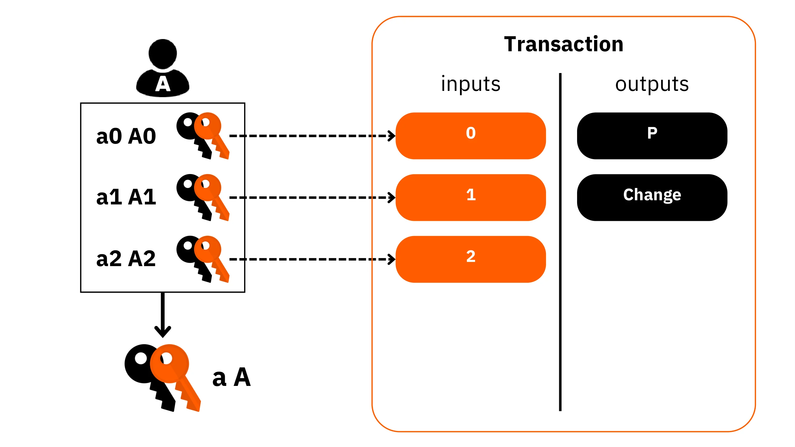


Enligt den tidigare beskrivna metoden skulle Alice behöva välja ett enda nyckelpar bland $a_0$, $a_1$ och $a_2$ för att beräkna ECDH-hemligheten och generate den enda betalningen Address $P$ från Bob:s statiska Address $B$. Detta tillvägagångssätt kräver dock att Bob testar varje möjlighet i följd, börjar med $a_0$, sedan $a_1$, och så vidare, tills han identifierar ett par som genererar en giltig $P$ Address. Denna process kräver att Bob kör ECDH-beräkningen på alla ingångar till alla transaktioner, vilket avsevärt ökar den operativa belastningen för skanning.


För att undvika detta ber vi Alice att beräkna $P$ med hjälp av summan av alla inmatade nycklar. Med hjälp av vårt exempel skulle den tweakade privata nyckeln $a$ beräknas enligt följande:


$$ a = a_0 + a_1 + a_2 $$ $$ a = a_0 + a_1 + a_2


På samma sätt kan Alice och Bob beräkna den tweakade publika nyckeln:


$$ A = A_0 + A_1 + A_2 $$ $$ A = A_0 + A_1 + A_2


Med den här metoden behöver Bob bara beräkna summan av transaktionens publika nycklar och sedan beräkna ECDH-hemligheten från enbart $A$, vilket kraftigt minskar antalet beräkningar som krävs för skanningssteget.


Kom dock ihåg föregående avsnitt. Vi hade lagt till $\text{inputHash}$ Hash i vår beräkning, som används som en Nonce för att undvika återanvändning av Address:


$$ \text{inputHash} = \text{Hash}(\text{outpoint} \text{ ‖ } A) $$


Men om du har flera inmatningar i en transaktion måste du kunna avgöra vilken $\text{outpoint}$ som väljs i denna beräkning. Enligt BIP352 är det $\text{outpoint}$-urvalskriterium som ska användas att välja den minsta lexikografiskt, vilket innebär att välja den UTXO som visas först i alfabetisk ordning. Denna metod standardiserar den UTXO som ska väljas i varje transaktion. Om t.ex. den lexikografiskt minsta $\text{outpoint}$ är $\text{outpoint}_L$, blir beräkningen av $\text{inputHash}$ :


$$ \text{inputHash} = \text{Hash}(\text{outpoint}_L \text{ ‖ } A) $$


Beräkningarna är sedan identiska med dem som presenterades i föregående avsnitt, förutom att den privata nyckeln $a$ och dess motsvarande publika nyckel $A$ inte längre är ett par som används för att säkra en enda inmatning, utan nu representerar tweak för alla nyckelpar i inmatningar.


### Separata nycklar för utlägg och skanning


För tillfället har vi hänvisat till den statiska tysta betalningen Address $B$ som en unik publik nyckel. Kom ihåg att det är denna publika nyckel $B$ som Alice använder för att skapa den delade hemligheten ECDH, som i sin tur beräknar den unika betalningen Address $P$. Bob använder denna publika nyckel $B$ och motsvarande privata nyckel $b$ för skanningssteget. Men han kommer också att använda den privata nyckeln $b$ för att beräkna den privata nyckeln $p$ som möjliggör utgifter från Address $P$.


Nackdelen med denna metod är att den privata nyckeln $b$, som används för att beräkna alla privata nycklar för adresser som har mottagit Tysta betalningar, också används av Bob för att skanna transaktionerna. Detta steg kräver att $b$-nyckeln finns tillgänglig på internetansluten Wallet-programvara, vilket utsätter den för större stöldrisk än att förvara den på en Cold Wallet. Helst skulle det vara fördelaktigt att kunna dra nytta av Silent Payments samtidigt som den privata nyckeln $b$, som kontrollerar åtkomsten till alla andra privata nycklar, förvaras säkert på en Hardware Wallet. Lyckligtvis har protokollet anpassats för att tillåta just detta.


För att göra detta kräver BIP352 att mottagaren använder 2 olika nyckelpar:


- b_{\text{spend}}$: för att beräkna de privata nycklarna för unika betalningsadresser;
- b_{\text{scan}}$: för att hitta unika betalningsadresser.


På detta sätt kan Bob behålla den privata nyckeln $b_{\text{spend}}$ på en Hardware Wallet och använda den privata nyckeln $b_{\text{scan}}$ på online-programvara för att hitta sina tysta betalningar utan att avslöja $b_{\text{spend}}$. Å andra sidan är de publika nycklarna $B_{\text{scan}}$ och $B_{\text{spend}}$ båda offentligt avslöjade, eftersom de finns i Bob:s statiska Address $B$ :


$$ B = B_{\text{scan}} \text{ ‖ } B_{\text{spend}} $$


För att beräkna en unik betalning Address $P_0$ som tillhör Bob, kommer Alice nu att utföra följande beräkning:


$$ P_0 = B_{\text{spend}} + \text{Hash}(\text{inputHash} \cdot a \cdot B_{\text{scan}} \text{ ‖ } 0) \cdot G $$$


För att hitta de betalningar som är adresserade till honom kommer Bob att utföra följande beräkning:


$$ P_0 = B_{\text{spend}} + \text{Hash}(\text{inputHash} \cdot b_{\text{scan}} \cdot A \text{ ‖ } 0) \cdot G $$$


Som du kan se har Bob hittills inte behövt använda $b_{\text{spend}}$, som finns på hans Hardware Wallet. När han vill spendera $P_0$ kan han göra följande beräkning för att hitta den privata nyckeln $p_0$ :


$$ p_0 = (b_{\text{spend}} + \text{Hash}(\text{inputHash} \cdot b_{\text{scan}} \cdot A \text{ ‖ } 0)) \bmod n $$$


*Legend:*


- $B_{\text{scan}}$: Bob:s offentliga skanningnyckel (statisk Address)
- $b_{\text{scan}}$ : Bob:s privata scanningsnyckel
- $B_{\text{spend}}$ : Bob:s offentliga utgiftsnyckel (statisk Address)
- $b_{\text{spend}}$ : Bob:s privata utgiftsnyckel
- $A$ : Summan av inmatningar av offentliga nycklar (tweak)
- $a$ : Den privata nyckel som motsvarar den tweakade offentliga nyckeln
- $H$ : Hash av den minsta UTXO (lexikografiskt) som används som indata
- $G$ : Den genererande punkten för den elliptiska kurvan `secp256k1`
- $\text{SHA256}$ : Funktionen SHA256 Hash taggad med `BIP0352/SharedSecret`
- $s_0$ : Den första gemensamma hemligheten ECDH
- $P_0$ : Den första publika nyckeln / unika Address för betalning till Bob


### Använda SP-adresser med en etikett


Bob har därför en statisk Address $B$ för tysta betalningar som t.ex:


$$ B = B_{\text{scan}} \text{ ‖ } B_{\text{spend}} $$


Problemet med den här metoden är att den inte tillåter dig att separera de olika betalningarna som skickas till denna Address. Om Bob till exempel har 2 olika kunder för sin verksamhet och han vill differentiera betalningar till var och en, behöver han 2 olika statiska adresser. En naiv lösning, med det nuvarande tillvägagångssättet, skulle vara att Bob skapar två separata plånböcker, var och en med sin egen statiska Address, eller till och med att upprätta två olika statiska adresser inom samma Wallet. Denna lösning kräver dock att hela Blockchain skannas två gånger (en gång för varje Address) för att upptäcka betalningar som är avsedda för respektive Address. Denna dubbla skanning ökar på ett orimligt sätt Bob:s operativa belastning.


För att lösa detta problem använder BIP352 ett etikett-system som tillåter olika statiska adresser, utan att orimligt öka arbetsbelastningen för att hitta tysta betalningar på Blockchain. För att göra detta lägger vi till ett heltal $m$ till den offentliga utgiftsnyckeln $B_{\text{spend}}$. Detta heltal kan anta värdet $1$ för den första statiska Address, sedan $2$ för den andra, och så vidare. Utgiftsnycklarna $B_{\text{spend}}$ kommer nu att kallas $B_m$ och kommer att konstrueras på detta sätt:


$$ B_m = B_{\text{spend}} + \text{Hash}(b_{\text{scan}} \text{ ‖ } m) \cdot G $$


Till exempel, för den första kostnadsnyckeln med etiketten $1$ :


$$ B_1 = B_{\text{spend}} + \text{Hash}(b_{\text{scan}} \text{ ‖ } 1) \cdot G $$$


Den statiska Address som publiceras av Bob kommer nu att bestå av $B_{\text{scan}}$ och $B_m$. Till exempel, den första statiska Address med etiketten $1$ kommer att vara :


$$ B = B_{\text{scan}} \text{ ‖ } B_1 $$


> *Vi börjar bara från etikett 1 eftersom etikett 0 är reserverad för förändringen*
Alice kommer för sin del att härleda den enskilda betalningen Address $P$ på samma sätt som tidigare, men med den nya $B_1$ istället för $B_{\text{spend}}$ :


$$ P_0 = B_1 + \text{Hash}(\text{inputHash} \cdot a \cdot B_{\text{scan}} \text{ ‖ } 0) \cdot G $$


I själva verket vet Alice inte ens nödvändigtvis att Bob har en märkt Address, eftersom hon helt enkelt använder den andra delen av den statiska Address som han tillhandahöll, och i det här fallet är det värdet $B_1$ snarare än $B_{text{spend}}$$.


För att skanna betalningar kommer Bob alltid att använda värdet av sin ursprungliga statiska Address med $B_{\text{spend}}$ på detta sätt:


$$ P_0 = B_{\text{spend}} + \text{Hash}(\text{inputHash} \cdot b_{\text{scan}} \cdot A \text{ ‖ } 0) \cdot G $$$


Sedan subtraherar han helt enkelt det värde han hittar för $P_0$ från varje utdata en efter en. Han kontrollerar sedan om något av resultaten av dessa subtraktioner matchar värdet på en av de etiketter han använder på sin portfölj. Om t.ex. utdata nr 4 matchar etiketten $1$ betyder det att denna utdata är en tyst betalning associerad med dess statiskt märkta Address $B_1$ :


$$ Out_4 - P_0 = \text{Hash}(b_{\text{scan}} \text{ ‖ } 1) \cdot G $$


Det fungerar eftersom :


$$ B_1 = B_{\text{spend}} + \text{Hash}(b_{\text{scan}} \text{ ‖ } 1) \cdot G $$$


Tack vare denna metod kan Bob använda en mängd statiska adresser ($B_1$, $B_2$, $B_3$...), som alla härrör från hans grundläggande statiska Address ($B = B_{\text{scan}} \text{ ‖ } B_{\text{spend}}$), för att hålla användningen åtskild.


Observera dock att denna separation av statiska adresser endast är giltig ur en personlig portföljhanteringssynpunkt, men inte separerar identiteter. Eftersom de alla har samma $B_{\text{scan}}$ är det mycket lätt att associera alla statiska adresser tillsammans och dra slutsatsen att de tillhör en enda enhet.


*Legend:*


- $B_{\text{scan}}$: Bob:s offentliga skanningnyckel (statisk Address)
- $b_{\text{scan}}$ : Bob:s privata scanningsnyckel
- $B_{\text{spend}}$ : Bob:s nyckel för offentliga utgifter (ursprunglig Address)
- $B_m$ : Bob:s offentliga utgiftsnyckel märkt (statisk Address)
- $b_m$: Bob:s privata utgiftsnyckel märkt
- $A$ : Summan av inmatningar av offentliga nycklar (tweak)
- $a$ : Den privata nyckel som motsvarar den tweakade offentliga nyckeln
- $H$ : Hash av den minsta UTXO (lexikografiskt) som används som indata
- $G$ : Den genererande punkten för den elliptiska kurvan `secp256k1`
- $\text{SHA256}$ : Funktionen SHA256 Hash taggad med `BIP0352/SharedSecret`
- $s_0$ : Den första gemensamma ECDH-hemligheten
- $P_0$ : Den första publika nyckeln / unika Address för betalning till Bob
- $p_0$ : Den privata nyckeln för den första unika betalningen Address till Bob
- $X$ : Hash för den privata nyckeln för skanning med etiketten


### Hur bygger jag en Silent Payments Address?


För att bygga en Address som är dedikerad till Silent Payments måste du först härleda 2 nyckelpar från din Bitcoin HD Wallet:


- Paret $b_{\text{scan}}$, $B_{\text{scan}}$ för att söka efter betalningar adresserade till oss;
- Paret $b_{\text{spend}}$, $B_{\text{spend}}$ för att tänka på de bitcoins vi har fått.


Dessa par härleds med hjälp av följande sökvägar (*Bitcoin Mainnet*):


```text
scan : m / 352' / 0' / 0' / 1' / 0
spend : m / 352' / 0' / 0' / 0' / 0
```


När vi har dessa två nyckelpar sammankopplar vi dem helt enkelt (från början till slut) för att skapa den statiska Address-nyttolasten:


$$ B = B_{\text{scan}} \text{ ‖ } B_{\text{spend}} $$


Om vi vill använda etiketter ersätter vi $B_{\text{spend}}$ med $B_m$ :


$$ B = B_{\text{scan}} \text{ ‖ } B_m $$


Med etikett $m$ :


$$ B_m = B_{\text{spend}} + \text{Hash}(b_{\text{scan}} \text{ ‖ } m) \cdot G $$


När vi har den här nyttolasten lägger vi till HRP (*Human-Readable Part*) `sp` och versionen `q` (= version 0). Vi lägger också till en kontrollsumma och formaterar Address som bech32m.


Till exempel, här är min Silent Payments statiska Address:


```text
sp1qqvhjvsq2vz8zwrw372vuzle7472zup2ql3pz64yn5cpkw5ngv2n6jq4nl8cgm6zmu48yk3eq33ryc7aam6jrvrg0d0uuyzecfhx2wgsumcurv77e
```


En viktig punkt beträffande statiska adresser, som du kanske har förstått i de tidigare avsnitten, är att dessa adresser inte är synliga i Bitcoin-transaktioner. Endast $P$-betalningsadresserna som används i utgångar visas på Blockchain i standardformatet Taproot. Så från utsidan är det omöjligt att skilja en transaktion som involverar Silent Payment från en vanlig transaktion som använder P2TR-utgångar.


Precis som med BIP47 är det omöjligt att upprätta en koppling mellan en statisk Address $B$ och en betalning Address $P$ som härrör från $B$. Faktum är att även om Eve, en potentiell angripare, försöker skanna Blockchain med Bob:s statiska $B$ Address, kommer hon inte att kunna utföra de beräkningar som krävs för att bestämma $P$. För att göra det skulle hon behöva antingen Bob:s privata nyckel $b_{\text{scan}}$, eller avsändarens privata nycklar $a$, men båda är naturligtvis privata. Det är därför möjligt att uttryckligen koppla sin statiska Address till en form av personlig identitet.


### Hur använder jag Silent Payments?


Förslaget om tysta betalningar är relativt nytt och har för närvarande endast implementerats av ett mycket begränsat antal plånböcker. Såvitt jag vet finns det bara 3 programvaruprodukter som stöder dem:


- [CakeWallet](https://cakewallet.com/)
- [Silentium] (https://app.silentium.dev/)
- [DonationWallet](https://github.com/Sosthene00/donationwallet)


Vi kommer snart att ge dig en detaljerad handledning om hur du ställer in din egen statiska Address för tysta betalningar.


Eftersom den här funktionen är ny råder vi dig att vara försiktig och undvika att använda Tysta betalningar för stora belopp på Mainnet.


*För att skapa detta kapitel om tysta betalningar använde jag [webbplatsen med förklaringar om tysta betalningar] (https://silentpayments.xyz/) och [förklaringsdokumentet om BIP352] (https://github.com/Bitcoin/bips/blob/master/bip-0352.mediawiki).*


# Sista avsnittet


<partId>2aee56c0-b285-4799-b4f7-373a552ee2b2</partId>


## Recensioner & betyg


<chapterId>195d149f-80fa-5816-8b46-995a9226d082</chapterId>


<isCourseReview>true</isCourseReview>

## Slutlig examination


<chapterId>e803d394-e3c1-5816-a6b4-a69a2472019c</chapterId>


<isCourseExam>true</isCourseExam>

## Slutsats


<chapterId>cd8e5c67-50e4-4dcd-8e04-88ba5ec95305</chapterId>


<isCourseConclusion>true</isCourseConclusion>
