# ปกป้องความเป็นส่วนตัวของคุณบน Bitcoin


ในโลกที่ความลับของการทำธุรกรรมทางการเงินกำลังกลายเป็นสิ่งหรูหรา การเข้าใจและเชี่ยวชาญหลักการปกป้องความเป็นส่วนตัวเมื่อใช้ Bitcoin เป็นสิ่งสำคัญ หลักสูตรนี้จะมอบกุญแจทั้งหมดให้คุณ ทั้งในด้านทฤษฎีและปฏิบัติ เพื่อให้คุณสามารถทำได้ด้วยตนเอง


วันนี้ บริษัทหลายแห่งมีความเชี่ยวชาญในการวิเคราะห์บล็อกเชนสำหรับ Bitcoin ธุรกิจหลักของพวกเขาคือการแทรกแซงเข้าไปในพื้นที่ส่วนตัวของคุณ เพื่อทำลายความลับของการทำธุรกรรมของคุณ ในความเป็นจริง ไม่มีสิ่งที่เรียกว่า "สิทธิในความเป็นส่วนตัว" ใน Bitcoin ขึ้นอยู่กับคุณ ผู้ใช้ ที่จะยืนยันสิทธิตามธรรมชาติของคุณและปกป้องความลับของการทำธุรกรรมของคุณ เพราะไม่มีใครจะทำเพื่อคุณ


หลักสูตรนี้ถูกออกแบบมาให้ครอบคลุมและทั่วไป แต่ละแนวคิดทางเทคนิคจะถูกอธิบายอย่างละเอียดและสนับสนุนด้วยแผนภาพอธิบาย จุดมุ่งหมายคือเพื่อทำให้ความรู้เข้าถึงได้สำหรับทุกคน BTC204 จึงมีราคาไม่แพงสำหรับผู้เริ่มต้นและผู้ใช้ระดับกลาง หลักสูตรนี้ยังมีมูลค่าเพิ่มสำหรับผู้ที่มีประสบการณ์มากกว่า เนื่องจากเราจะเจาะลึกลงไปในแนวคิดทางเทคนิคบางอย่างที่มักจะถูกเข้าใจผิด


เข้าร่วมกับเราเพื่อเปลี่ยนแปลงการใช้ Bitcoin ของคุณและกลายเป็นผู้ใช้ที่มีความรู้ความสามารถในการเข้าใจปัญหาเกี่ยวกับการรักษาความลับและการปกป้องความเป็นส่วนตัวของคุณ


+++
# บทนำ


<partId>e17474a8-8899-4bdb-a7f8-bc52ddb01440</partId>


## ภาพรวมของหลักสูตร


<chapterId>08ba1933-f393-4fb5-8279-777d874caedb</chapterId>


:::video id=687fe126-56db-4fe2-aaac-e481bbb5d838:::

ยินดีต้อนรับสู่หลักสูตร BTC204!


ในโลกที่ความลับของการทำธุรกรรมทางการเงินกำลังกลายเป็นสิ่งหรูหรา การเข้าใจและเชี่ยวชาญหลักการปกป้องความเป็นส่วนตัวเมื่อใช้ Bitcoin เป็นสิ่งสำคัญ หลักสูตรนี้จะมอบกุญแจทั้งหมดให้คุณ ทั้งในด้านทฤษฎีและปฏิบัติ เพื่อให้คุณสามารถทำได้ด้วยตนเอง


วันนี้ มีหลายบริษัทที่เชี่ยวชาญในการวิเคราะห์บล็อกเชนสำหรับ Bitcoin ธุรกิจหลักของพวกเขาคือการแทรกแซงเข้าไปในพื้นที่ส่วนตัวของคุณเพื่อทำลายความลับของการทำธุรกรรมของคุณ ในความเป็นจริง ไม่มีสิ่งที่เรียกว่า "สิทธิในความเป็นส่วนตัว" ใน Bitcoin ดังนั้น ขึ้นอยู่กับคุณ ผู้ใช้ ที่จะยืนยันสิทธิตามธรรมชาติของคุณและปกป้องความลับของการทำธุรกรรมของคุณ เพราะไม่มีใครจะทำเพื่อคุณ


Bitcoin ไม่ได้เกี่ยวกับ "ตัวเลขเพิ่มขึ้น" และการรักษามูลค่าของการออมเพียงอย่างเดียว ด้วยลักษณะเฉพาะและประวัติศาสตร์ของมัน มันเป็นเครื่องมือของเศรษฐกิจทางเลือกก่อนอื่น ขอบคุณสิ่งประดิษฐ์ที่น่ากลัวนี้ คุณสามารถใช้จ่ายเงินของคุณได้อย่างอิสระ ใช้จ่าย และสะสมมัน โดยไม่มีใครสามารถหยุดคุณได้


Bitcoin มอบการหลบหนีอย่างสงบจากการควบคุมของรัฐ ให้คุณได้เพลิดเพลินกับสิทธิตามธรรมชาติของคุณอย่างเต็มที่ ซึ่งไม่สามารถถูกท้าทายโดยกฎหมายที่มีอยู่ได้ ด้วยสิ่งประดิษฐ์ของ Satoshi Nakamoto คุณมีพลังในการบังคับให้เคารพทรัพย์สินส่วนตัวของคุณและฟื้นฟูเสรีภาพในการทำสัญญา


อย่างไรก็ตาม Bitcoin ไม่ได้เป็นแบบไม่ระบุตัวตนโดยค่าเริ่มต้น ซึ่งอาจเป็นความเสี่ยงสำหรับบุคคลที่มีส่วนร่วมในเศรษฐกิจใต้ดิน โดยเฉพาะในภูมิภาคที่อยู่ภายใต้การปกครองแบบเผด็จการ แต่นี่ไม่ใช่อันตรายเพียงอย่างเดียว เนื่องจากบิตคอยน์เป็นสินทรัพย์ที่มีค่าและไม่สามารถถูกเซ็นเซอร์ได้ มันจึงอาจเป็นเป้าหมายของโจร ดังนั้น การปกป้องความเป็นส่วนตัวของคุณจึงกลายเป็นเรื่องของความปลอดภัยด้วย เพราะมันสามารถช่วยป้องกันการแฮ็กและการโจมตีทางกายภาพได้


ดังที่เราจะเห็น แม้ว่าพิธีสารจะมีการป้องกันความลับในตัวเองในระดับหนึ่ง แต่ก็จำเป็นอย่างยิ่งที่จะต้องใช้เครื่องมือเพิ่มเติมเพื่อเพิ่มประสิทธิภาพและปกป้องความลับนี้


หลักสูตรนี้มีภาพรวมที่ครอบคลุมเกี่ยวกับประเด็นที่เกี่ยวข้องกับความลับของ Bitcoin แต่ละแนวคิดทางเทคนิคจะถูกอธิบายอย่างละเอียด พร้อมด้วยแผนภาพประกอบ คอร์สนี้มีเป้าหมายเพื่อทำให้ความรู้นี้เข้าถึงได้สำหรับทุกคน แม้กระทั่งผู้เริ่มต้นและผู้ใช้ระดับกลาง สำหรับผู้ที่มีประสบการณ์มากขึ้นในวงการ Bitcoin เราก็ครอบคลุมแนวคิดทางเทคนิคขั้นสูงและบางครั้งก็เป็นแนวคิดที่ไม่ค่อยมีใครรู้จักตลอดหลักสูตรเพื่อเพิ่มความเข้าใจในแต่ละหัวข้อ


วัตถุประสงค์ของหลักสูตรนี้ไม่ใช่เพื่อทำให้คุณไม่ระบุตัวตนอย่างสมบูรณ์ในการใช้ Bitcoin แต่เพื่อให้คุณมีเครื่องมือที่จำเป็นในการปกป้องความลับของคุณตามวัตถุประสงค์ส่วนตัวของคุณ คุณจะมีอิสระในการเลือกแนวคิดและเครื่องมือที่นำเสนอเพื่อพัฒนากลยุทธ์ของคุณเอง ซึ่งปรับให้เหมาะสมกับเป้าหมายและความต้องการเฉพาะของคุณ


**หมวดที่ 1: คำจำกัดความและแนวคิดสำคัญ**


ในการเริ่มต้น เราจะทบทวนหลักการพื้นฐานที่ควบคุมการทำงานของ Bitcoin เพื่อที่เราจะได้สามารถจัดการกับแนวคิดที่เกี่ยวข้องกับความลับได้อย่างสงบ สิ่งสำคัญคือต้องเข้าใจแนวคิดพื้นฐานบางประการ เช่น UTXO ที่อยู่รับ และการเขียนสคริปต์ ก่อนที่คุณจะสามารถเข้าใจแนวคิดที่เราจะกล่าวถึงในส่วนต่อไปได้อย่างเต็มที่ เราจะยังแนะนำโมเดลความลับทั่วไปของ Bitcoin ตามที่ Satoshi Nakamoto จินตนาการไว้ ซึ่งจะช่วยให้เราเข้าใจถึงความเสี่ยงและเดิมพันที่เกี่ยวข้อง


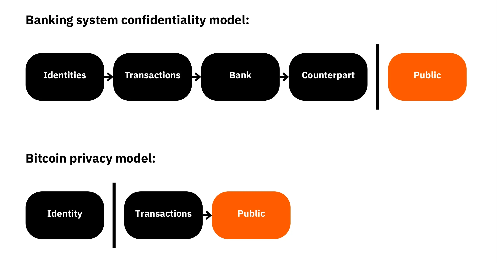


**Section 2: การทำความเข้าใจและป้องกันการวิเคราะห์เชน**


ในส่วนที่สอง เราจะตรวจสอบเทคนิคที่บริษัทวิเคราะห์บล็อกเชนใช้ในการติดตามกิจกรรมของคุณบน Bitcoin การทำความเข้าใจวิธีการเหล่านี้เป็นสิ่งสำคัญในการเสริมสร้างการปกป้องความเป็นส่วนตัวของคุณ วัตถุประสงค์ของส่วนนี้คือการตรวจสอบกลยุทธ์ของผู้โจมตีเพื่อให้เข้าใจถึงความเสี่ยงและเตรียมพื้นฐานสำหรับเทคนิคที่ศึกษาต่อไปในส่วนถัดไป เราจะวิเคราะห์รูปแบบการทำธุรกรรม, ฮิวริสติกภายในและภายนอก, และการตีความที่เป็นไปได้ของรูปแบบเหล่านี้ นอกจากทฤษฎีแล้ว เราจะได้เรียนรู้วิธีการใช้บล็อกเอ็กซ์พลอเรอร์สำหรับการวิเคราะห์เชนผ่านตัวอย่างและแบบฝึกหัดที่เป็นรูปธรรม


**Section 3: การเชี่ยวชาญแนวปฏิบัติที่ดีที่สุดเพื่อปกป้องความเป็นส่วนตัวของคุณ**


ในส่วนที่สามของหลักสูตรของเรา เราจะลงลึกถึงรายละเอียด: การฝึกฝน! เป้าหมายคือการเชี่ยวชาญในแนวทางปฏิบัติที่ดีที่สุดที่ควรกลายเป็นปฏิกิริยาตามธรรมชาติสำหรับผู้ใช้ Bitcoin ทุกคน เราจะครอบคลุมการใช้ที่อยู่ว่าง การติดแท็ก การรวมบัญชี การใช้ full node รวมถึงวิธีการ KYC และการได้มา เป้าหมายคือการให้ภาพรวมที่ครอบคลุมเกี่ยวกับข้อผิดพลาดที่ควรหลีกเลี่ยงในการสร้างพื้นฐานที่มั่นคงสำหรับการปกป้องความเป็นส่วนตัว สำหรับบางแนวทางปฏิบัติเหล่านี้ คุณจะได้รับคำแนะนำไปยังบทเรียนเฉพาะเกี่ยวกับวิธีการดำเนินการ


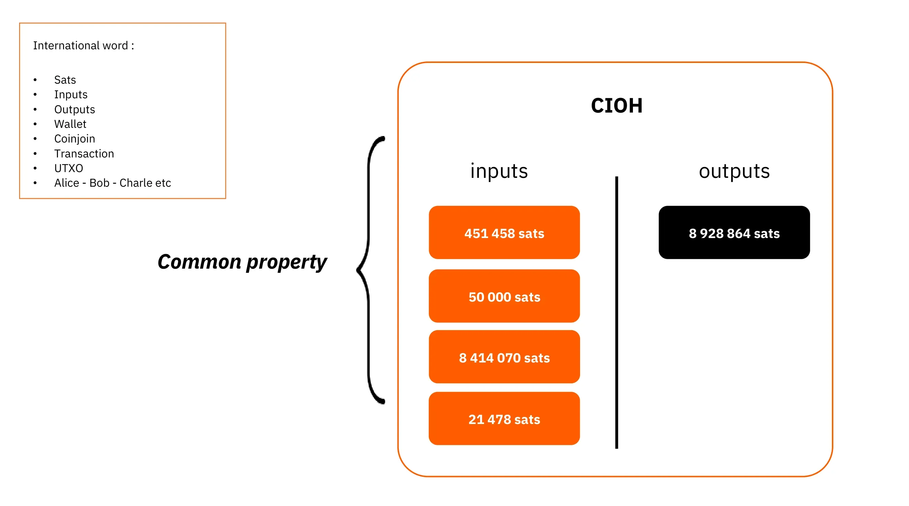


**ส่วนที่ 4: การทำความเข้าใจธุรกรรมแบบ coinjoin**


เราจะพูดถึงความเป็นส่วนตัวบน Bitcoin ได้อย่างไรโดยไม่พูดถึง coinjoins? ในส่วนที่ 4 คุณจะพบทุกสิ่งที่คุณจำเป็นต้องรู้เกี่ยวกับวิธีการผสมนี้ คุณจะได้เรียนรู้ว่า coinjoins คืออะไร ประวัติและวัตถุประสงค์ของมัน รวมถึงประเภทต่างๆ ของ coinjoins ที่มีอยู่ สุดท้าย สำหรับผู้ใช้ที่มีประสบการณ์มากขึ้น เราจะมาดูว่า anonsets และ entropy คืออะไร และวิธีการคำนวณพวกมัน


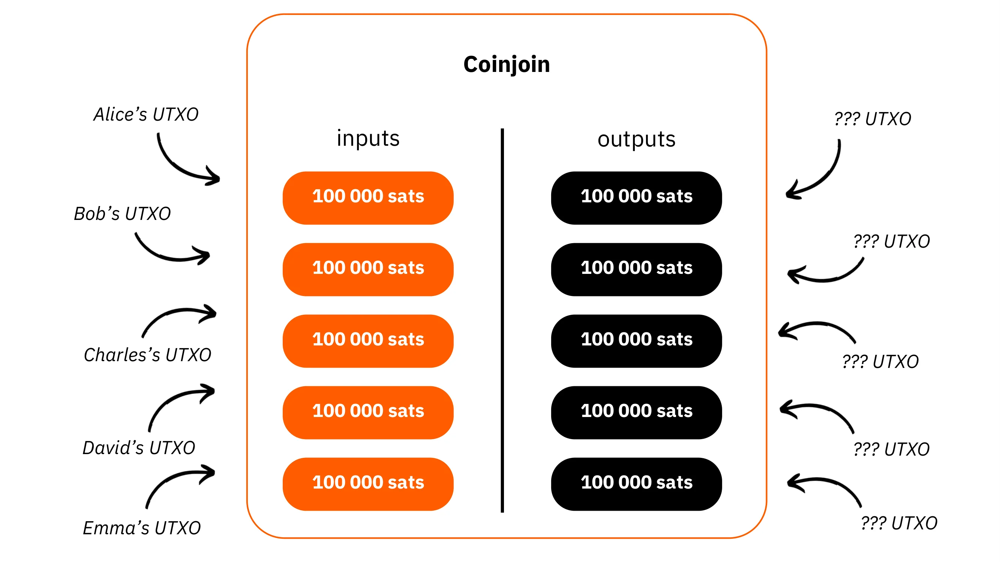


**Section 5: ทำความเข้าใจกับความท้าทายของเทคนิคการรักษาความลับขั้นสูงอื่นๆ**


ในส่วนที่ห้า เราจะมาดูเทคนิคอื่น ๆ ที่มีอยู่เพื่อปกป้องความเป็นส่วนตัวของคุณบน Bitcoin นอกเหนือจาก coinjoin ตลอดหลายปีที่ผ่านมา นักพัฒนาได้แสดงให้เห็นถึงความคิดสร้างสรรค์ที่น่าทึ่งในการออกแบบเครื่องมือที่มุ่งเน้นความเป็นส่วนตัว เราจะตรวจสอบวิธีการต่าง ๆ รวมถึง PayJoin, การทำธุรกรรมร่วมกัน, Coin Swap, และ Atomic Swap โดยจะอธิบายถึงวิธีการทำงาน วัตถุประสงค์ และจุดอ่อนที่อาจเกิดขึ้น


เราจะพิจารณาความเป็นส่วนตัวในระดับของเครือข่ายของโหนดและการแพร่กระจายธุรกรรม นอกจากนี้เราจะพูดคุยเกี่ยวกับโปรโตคอลต่างๆ ที่ได้ถูกเสนอขึ้นในช่วงหลายปีที่ผ่านมาเพื่อเพิ่มความเป็นส่วนตัวของผู้ใช้บน Bitcoin รวมถึงโปรโตคอลที่อยู่แบบคงที่


พร้อมที่จะสำรวจความซับซ้อนของความเป็นส่วนตัวบน Bitcoin แล้วหรือยัง? ไปกันเลย!


# คำจำกัดความและแนวคิดสำคัญ


<partId>b9bbbde3-34c0-4851-83e8-e2ffb029cf31</partId>


## Bitcoin's UTXO model


<chapterId>8d6b50c5-bf74-44f4-922b-25204991cb75</chapterId>


:::video id=60e8f3fa-9607-47ae-ac4f-5aa747d9b6d4:::


Bitcoin เป็นสกุลเงินก่อนอื่นและสำคัญที่สุด แต่คุณรู้หรือไม่ว่า BTC แสดงอยู่บนโปรโตคอลอย่างไร?


### UTXOs บน Bitcoin: คืออะไร?


โปรโตคอล Bitcoin ขึ้นอยู่กับโมเดล [UTXO](https://planb.academy/resources/glossary/utxo) ซึ่งย่อมาจาก "Unspent Transaction Output"


โมเดลนี้แตกต่างอย่างมากจากระบบธนาคารแบบดั้งเดิม ซึ่งอาศัยกลไกของบัญชีและยอดคงเหลือในการติดตามการไหลของการเงิน ในระบบธนาคาร ยอดคงเหลือของแต่ละบุคคลจะถูกเก็บรักษาไว้ในบัญชีที่เชื่อมโยงกับตัวตนเฉพาะตัวอย่างเช่น เมื่อคุณซื้อขนมปังจากคนทำขนมปัง ธนาคารของคุณจะหักจำนวนเงินที่ซื้อจากบัญชีของคุณ ลดยอดคงเหลือของคุณ ในขณะที่บัญชีของคนทำขนมปังจะได้รับเครดิตด้วยจำนวนเงินเดียวกัน เพิ่มยอดคงเหลือของเขา ในระบบนี้ ไม่มีแนวคิดของการเชื่อมโยงระหว่างเงินที่เข้าบัญชีของคุณกับเงินที่ออกจากบัญชี นอกเหนือจากบันทึกการทำธุรกรรม


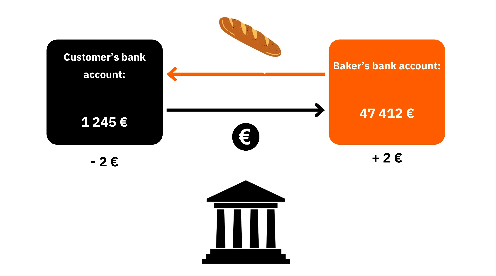


Bitcoin ทำงานแตกต่างออกไป แนวคิดของบัญชีไม่มีอยู่จริง และหน่วยเงินไม่ได้ถูกจัดการผ่านยอดคงเหลือ แต่ผ่านทาง UTXOs แทน UTXO แทนปริมาณเฉพาะของบิตคอยน์ที่ยังไม่ได้ถูกใช้จ่าย ดังนั้นจึงก่อให้เกิด "ชิ้นส่วนของบิตคอยน์" ซึ่งสามารถมีขนาดใหญ่หรือเล็กก็ได้ ตัวอย่างเช่น หนึ่ง UTXO อาจมีมูลค่า `500 BTC` หรือเพียงแค่ `700 SATS`


**Reminder:** [satoshi](https://planb.academy/resources/glossary/satoshi-sat) ซึ่งมักย่อว่า sat เป็นหน่วยที่เล็กที่สุดของ Bitcoin เปรียบได้กับ centime ในสกุลเงิน[เฟียต](https://planb.academy/resources/glossary/fiat)


```plaintext
1 BTC = 100 000 000 SATS
```


ตามทฤษฎีแล้ว UTXO หนึ่งตัวสามารถแทนค่าต่าง ๆ ในบิตคอยน์ได้ ตั้งแต่หนึ่งซาตไปจนถึงค่าสูงสุดทางทฤษฎีประมาณ 21 ล้าน BTC อย่างไรก็ตาม มันเป็นไปไม่ได้ทางตรรกะที่จะเป็นเจ้าของบิตคอยน์ทั้งหมด 21 ล้านเหรียญ และมีเกณฑ์เศรษฐกิจต่ำที่เรียกว่า "[ฝุ่น](https://planb.academy/resources/glossary/dust)" ซึ่งต่ำกว่านี้ UTXO จะถือว่าไม่คุ้มค่าทางเศรษฐกิจที่จะใช้จ่าย


**คุณรู้หรือไม่?** UTXO ที่ใหญ่ที่สุดที่เคยสร้างบน Bitcoin มีมูลค่า `500,000 BTC` มันถูกสร้างโดยแพลตฟอร์ม MtGox ระหว่างการดำเนิน[การรวม](https://planb.academy/resources/glossary/consolidation)ในเดือนพฤศจิกายน 2011: [29a3efd3ef04f9153d47a990bd7b048a4b2d213daaa5fb8ed670fb85f13bdbcf](https://mempool.space/tx/29a3efd3ef04f9153d47a990bd7b048a4b2d213daaa5fb8ed670fb85f13bdbcf)


### UTXOs และเงื่อนไขการใช้จ่าย


UTXOs เป็นเครื่องมือในการแลกเปลี่ยนบน Bitcoin การทำธุรกรรมแต่ละครั้งส่งผลให้เกิดการใช้ UTXOs เป็นอินพุตและการสร้าง UTXOs ใหม่เป็นเอาต์พุต เมื่อการทำธุรกรรมเสร็จสิ้น UTXOs ที่ใช้เป็นอินพุตจะถือว่า "ใช้แล้ว" และ UTXOs ใหม่จะถูกสร้างขึ้นและจัดสรรให้กับผู้รับที่ระบุในเอาต์พุตของธุรกรรม ดังนั้น UTXO จึงเป็นเพียงตัวแทนของเอาต์พุตการทำธุรกรรมที่ยังไม่ได้ใช้ และดังนั้นจึงเป็นปริมาณของบิตคอยน์ที่เป็นของผู้ใช้ในเวลาที่กำหนด


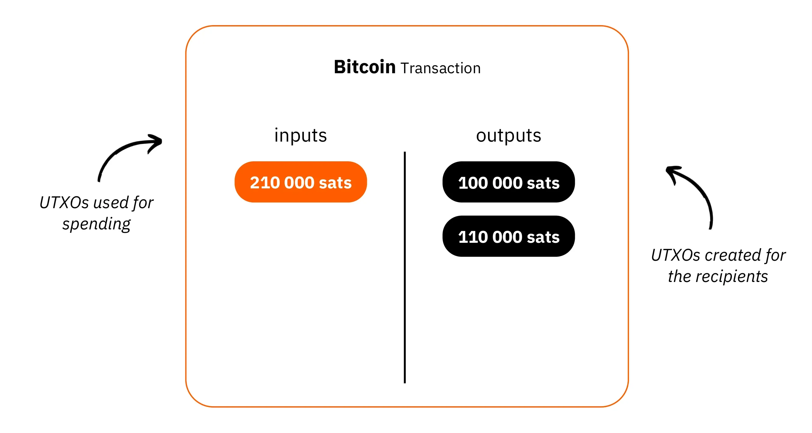


UTXO ทั้งหมดได้รับการรักษาความปลอดภัยโดย[สคริปต์](https://planb.academy/resources/glossary/script)ที่กำหนดเงื่อนไขภายใต้ซึ่งสามารถใช้จ่ายได้ ในการใช้ UTXO ผู้ใช้ต้องแสดงให้เครือข่ายเห็นว่าพวกเขาปฏิบัติตามเงื่อนไขที่ระบุโดยสคริปต์ที่รักษาความปลอดภัย UTXO นั้น โดยทั่วไปแล้ว UTXO จะได้รับการป้องกันโดย[คีย์สาธารณะ](https://planb.academy/resources/glossary/public-key) (หรือ[ที่อยู่รับ](https://planb.academy/resources/glossary/receiving-address)ที่แสดงถึงคีย์สาธารณะนี้) ในการใช้จ่าย UTXO ที่เกี่ยวข้องกับคีย์สาธารณะนี้ ผู้ใช้ต้องพิสูจน์ว่าพวกเขาถือ[คีย์ส่วนตัว](https://planb.academy/resources/glossary/private-key)ที่สอดคล้องกันโดยการให้[ลายเซ็นดิจิทัล](https://planb.academy/resources/glossary/digital-signature)ที่ทำด้วยคีย์นี้ นี่คือเหตุผลที่เรากล่าวว่า [Bitcoin wallet](https://planb.academy/resources/glossary/wallet) ของคุณไม่ได้มีบิตคอยน์จริง ๆ แต่เก็บคีย์ส่วนตัวของคุณ ซึ่งในทางกลับกันจะให้คุณเข้าถึง UTXO ของคุณและโดยการขยายไปยังบิตคอยน์ที่พวกมันแสดงถึง


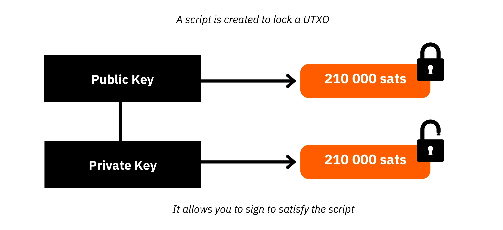


เนื่องจากไม่มีแนวคิดของบัญชีใน Bitcoin ยอดคงเหลือของ wallet จึงเป็นเพียงผลรวมของมูลค่าของ UTXO ทั้งหมดที่สามารถใช้จ่ายได้ ตัวอย่างเช่น หาก Bitcoin wallet ของคุณสามารถใช้จ่าย UTXO 4 รายการต่อไปนี้:


```plaintext
- 2 BTC
- 8 BTC
- 5 BTC
- 2 BTC
```


ยอดคงเหลือทั้งหมดของ wallet ของคุณคือ `17 BTC`


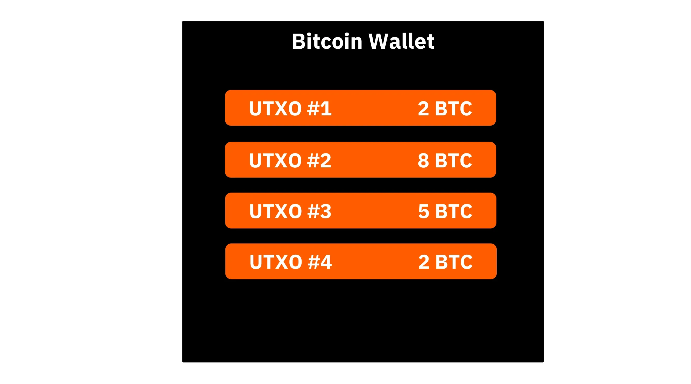


## โครงสร้างของธุรกรรม Bitcoin


<chapterId>29d3aaab-de2e-4746-ab40-c9748898850c</chapterId>


:::video id=c79d651d-ff4a-4a75-bc2b-a48a00c17326:::


### อินพุตและเอาต์พุตของธุรกรรม


ธุรกรรม Bitcoin เป็นการดำเนินการที่บันทึกบน[บล็อกเชน](https://planb.academy/resources/glossary/blockchain)ที่โอนความเป็นเจ้าของ Bitcoin จากบุคคลหนึ่งไปยังอีกบุคคลหนึ่ง อย่างแม่นยำยิ่งขึ้น เนื่องจากเราอยู่ในรุ่น UTXO และไม่มีบัญชี ธุรกรรมจะต้องเป็นไปตามเงื่อนไขการใช้จ่ายที่รักษาความปลอดภัย UTXO หนึ่งรายการหรือมากกว่า ใช้พวกมัน และในทางเดียวกัน สร้าง UTXO ใหม่พร้อมเงื่อนไขการใช้จ่ายใหม่ โดยสรุป ธุรกรรมจะย้ายบิตคอยน์จากสคริปต์ที่พอใจไปยังสคริปต์ใหม่ที่ออกแบบมาเพื่อรักษาความปลอดภัยให้พวกมัน


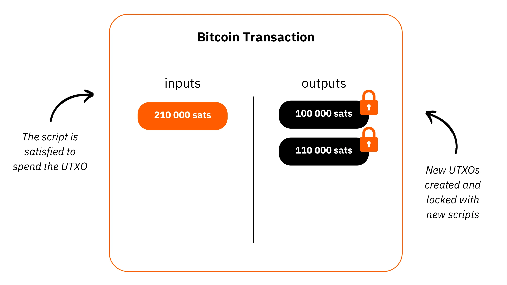


ดังนั้น แต่ละธุรกรรม Bitcoin ประกอบด้วย[อินพุต](https://planb.academy/resources/glossary/input)หนึ่งรายการหรือมากกว่าและ[เอาต์พุต](https://planb.academy/resources/glossary/output)หนึ่งรายการหรือมากกว่า อินพุตคือ UTXOs ที่ถูกใช้โดยธุรกรรมไปยังเอาต์พุต generate เอาต์พุตคือ UTXOs ใหม่ที่สามารถใช้เป็นอินพุตสำหรับธุรกรรมในอนาคต


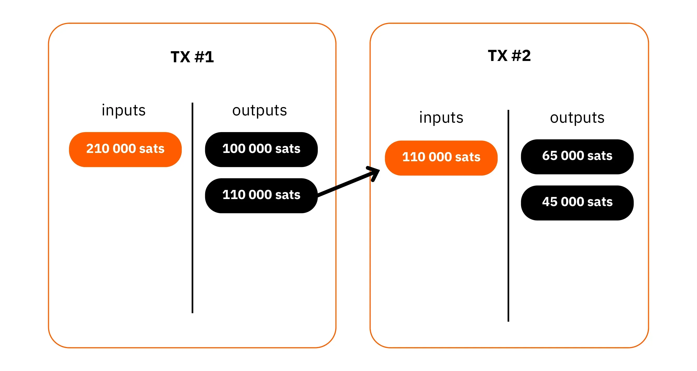


**คุณรู้หรือไม่?** ในทางทฤษฎี การทำธุรกรรมบิตคอยน์สามารถมีจำนวนอินพุตและเอาต์พุตได้ไม่จำกัด ข้อจำกัดเดียวคือขนาด[บล็อก](https://planb.academy/resources/glossary/block)สูงสุด


การป้อนข้อมูลแต่ละครั้งในธุรกรรม Bitcoin จะอ้างอิงถึง UTXO ที่ยังไม่ได้ใช้ก่อนหน้านี้ ในการใช้ UTXO เป็นข้อมูลเข้า ผู้ถือจะต้องแสดงให้เห็นว่าเขา/เธอเป็นเจ้าของที่ถูกต้องโดยการตรวจสอบสคริปต์ที่เกี่ยวข้อง กล่าวคือ โดยการตอบสนองเงื่อนไขการใช้จ่ายที่กำหนดไว้ โดยทั่วไปหมายถึงการให้ลายเซ็นดิจิทัลที่สร้างขึ้นด้วยกุญแจส่วนตัวที่สอดคล้องกับกุญแจสาธารณะที่เริ่มต้นรักษาความปลอดภัยให้กับ UTXO นี้ ดังนั้นสคริปต์จึงประกอบด้วยการตรวจสอบว่าลายเซ็นนั้นสอดคล้องกับกุญแจสาธารณะที่ใช้เมื่อได้รับเงินทุน


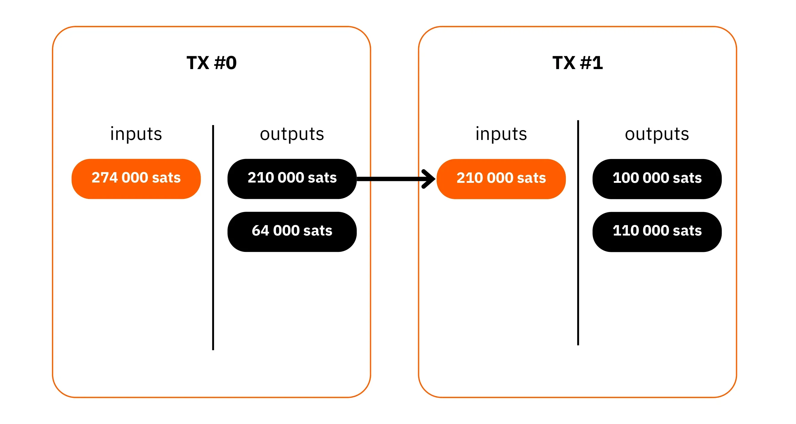


แต่ละผลลัพธ์จะระบุจำนวนบิตคอยน์ที่จะโอน รวมถึงผู้รับด้วย ส่วนหลังนี้ถูกกำหนดโดยสคริปต์ใหม่ ซึ่งมักจะบล็อก UTXO ที่สร้างขึ้นใหม่ด้วยที่อยู่รับหรือคีย์สาธารณะใหม่


สำหรับธุรกรรมที่จะถือว่าถูกต้องตาม[กฎฉันทามติ](https://planb.academy/resources/glossary/consensus-rules) ผลรวมของเอาต์พุตทั้งหมดต้องน้อยกว่าหรือเท่ากับผลรวมของอินพุตทั้งหมด กล่าวอีกนัยหนึ่ง ผลรวมของ UTXO ใหม่ที่สร้างขึ้นโดยธุรกรรมต้องไม่เกินผลรวมของ UTXO ที่ใช้เป็นอินพุต หลักการนี้มีเหตุผล: หากคุณมีเพียง `500,000 SATS` คุณไม่สามารถทำการซื้อ `700,000 SATS` ได้


### Exchange และการรวมในธุรกรรม Bitcoin


การดำเนินการของธุรกรรม Bitcoin บน UTXO สามารถเปรียบเทียบได้กับการหล่อเหรียญทองใหม่ จริงๆ แล้ว UTXO ไม่สามารถแบ่งได้ แต่สามารถหลอมได้เท่านั้น ซึ่งหมายความว่าผู้ใช้ไม่สามารถแบ่ง UTXO ที่แสดงถึงจำนวนหนึ่งของ Bitcoin ออกเป็น UTXO ขนาดเล็กหลายๆ อันได้ เขาต้องใช้มันทั้งหมดในธุรกรรมเพื่อสร้าง UTXO ใหม่หนึ่งหรือหลายอันที่มีค่าตามที่กำหนดในผลลัพธ์ ซึ่งต้องน้อยกว่าหรือเท่ากับค่าตั้งต้น


กลไกนี้คล้ายกับเหรียญทองคำ ลองสมมติว่าคุณมีเหรียญน้ำหนัก 2 ออนซ์และต้องการชำระเงิน 1 ออนซ์ โดยสมมติว่าผู้ขายไม่สามารถให้เงินทอนได้ คุณจะต้องหลอมเหรียญของคุณและหล่อเหรียญใหม่สองเหรียญ แต่ละเหรียญหนัก 1 ออนซ์


Bitcoin ทำงานในลักษณะคล้ายกัน ลองจินตนาการว่า Alice มี UTXO จำนวน `10,000 SATS` และต้องการซื้อขนมปังราคา `4,000 SATS` Alice จะทำธุรกรรมโดยใช้ 1 UTXO จำนวน `10,000 SATS` เป็นอินพุต ซึ่งเธอจะใช้ทั้งหมด และ 2 UTXOs จำนวน `4,000 SATS` และ `6,000 SATS` เป็นเอาท์พุต UTXO จำนวน `4,000 SATS` จะถูกส่งไปยังคนทำขนมปังเป็นการชำระเงินสำหรับบาแกตต์ ในขณะที่ UTXO จำนวน `6,000 SATS` จะกลับไปยัง Alice ในรูปแบบของเงินทอน UTXO นี้ ซึ่งกลับไปยังผู้ออกธุรกรรมเดิม จะถูกเรียกว่า "[exchange](https://planb.academy/resources/glossary/change)" ในศัพท์ของ Bitcoin


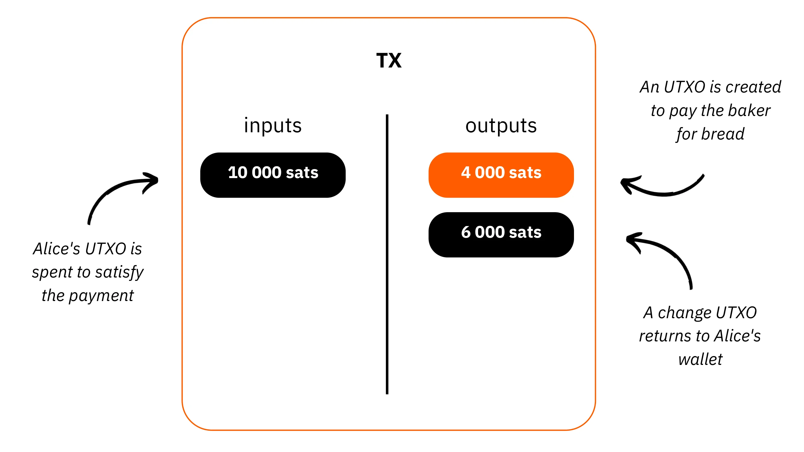


ตอนนี้ลองจินตนาการว่า Alice ไม่มี UTXO เดียวที่มีค่า `10,000 SATS` แต่มี UTXOs สองรายการที่มีค่า `3,000 SATS` แต่ละรายการ ในสถานการณ์นี้ ไม่มี UTXO ใดที่เพียงพอที่จะตั้งค่าคาถา `4,000 SATS` ได้ Alice จึงต้องใช้ UTXOs ทั้งสองรายการที่มีค่า `3,000 SATS` เป็นอินพุตในการทำธุรกรรมของเธอพร้อมกัน ด้วยวิธีนี้ จำนวนรวมของอินพุตจะถึง `6,000 SATS` ทำให้เธอสามารถชำระเงิน `4,000 SATS` ให้กับคนทำขนมปังได้ วิธีนี้ที่รวม UTXOs หลายรายการเป็นอินพุตในการทำธุรกรรม มักเรียกว่า "การรวม"


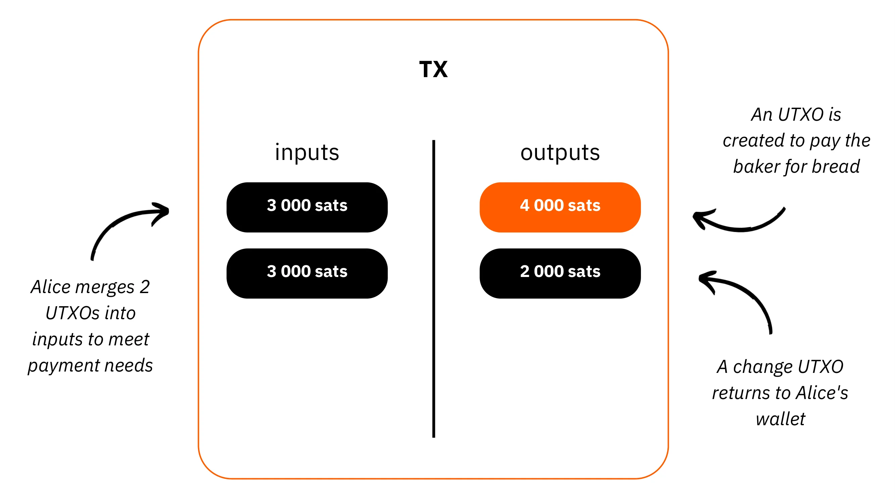


### ค่าธรรมเนียมการทำธุรกรรม


ตามสัญชาตญาณ อาจมีคนคิดว่า[ต้นทุนการทำธุรกรรม](https://planb.academy/resources/glossary/transaction-fees)ยังเป็นตัวแทนของผลลัพธ์ของการทำธุรกรรมด้วย แต่ในความเป็นจริง ไม่ใช่กรณีนี้ ต้นทุนการทำธุรกรรมเป็นตัวแทนของความแตกต่างระหว่างปัจจัยนำเข้าทั้งหมดและผลลัพธ์ทั้งหมด ซึ่งหมายความว่า หลังจากใช้ส่วนหนึ่งของมูลค่าของปัจจัยนำเข้าเพื่อครอบคลุมผลลัพธ์ที่ต้องการในการทำธุรกรรมแล้ว จะมีจำนวนหนึ่งของปัจจัยนำเข้าที่ยังคงไม่ได้ใช้ จำนวนที่เหลือนี้ถือเป็นต้นทุนการทำธุรกรรม


```plaintext
ค่าธรรมเนียม = total inputs - total outputs
```


ลองพิจารณาตัวอย่างของ Alice ซึ่งมี UTXO จำนวน `10,000 SATS` และต้องการซื้อขนมปังในราคา `4,000 SATS` Alice สร้างธุรกรรมโดยใช้ UTXO จำนวน `10,000 SATS` เป็นอินพุต จากนั้นเธอสร้างเอาท์พุตจำนวน `4,000 SATS` สำหรับคนทำขนมปังเพื่อจ่ายค่าบาแกตต์ เพื่อกระตุ้นให้คนขุดบล็อกนำธุรกรรมของเธอไปใส่ในบล็อก Alice จัดสรรค่าธรรมเนียมจำนวน `200 SATS` จากนั้นเธอสร้างเอาท์พุตที่สองซึ่งเป็นเงินทอนที่จะคืนให้เธอจำนวน `5,800 SATS`


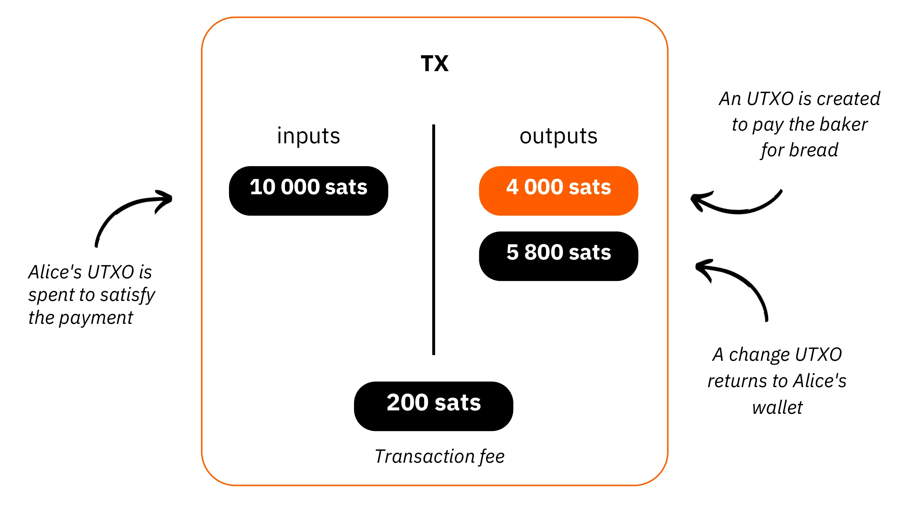


การใช้สูตรค่าธรรมเนียม เราจะเห็นว่ามี `200 SATS` เหลือสำหรับผู้เยาว์:


```plaintext
ค่าธรรมเนียม = total inputs - total outputs
ค่าธรรมเนียม = 10 000 - (4 000 + 5 800)
ค่าธรรมเนียม = 10 000 - 9 800
ค่าธรรมเนียม = 200
```


เมื่อ[คนขุดเหมือง](https://planb.academy/resources/glossary/miner)ตรวจสอบบล็อกสำเร็จ พวกเขาจะได้รับอนุญาตให้เก็บค่าธรรมเนียมสำหรับธุรกรรมทั้งหมดที่รวมอยู่ในบล็อกของพวกเขาผ่านทางธุรกรรมที่เรียกว่า "[coinbase](https://planb.academy/resources/glossary/coinbase-transaction)"


### สร้าง UTXOs บน Bitcoin


หากคุณได้ติดตามย่อหน้าก่อนหน้านี้อย่างละเอียด คุณจะทราบว่า UTXO สามารถถูกสร้างขึ้นได้โดยการใช้ UTXO ที่มีอยู่แล้วเท่านั้น ด้วยวิธีนี้ เหรียญ Bitcoin จะสร้างเป็นโซ่ต่อเนื่อง อย่างไรก็ตาม คุณอาจสงสัยว่าส่วนแรกในโซ่นี้มีต้นกำเนิดอย่างไร นี่ทำให้เกิดปัญหาที่คล้ายกับปัญหาไก่กับไข่: UTXO ดั้งเดิมเหล่านี้มาจากไหน?


คำตอบอยู่ใน **transaction coinbase**.


Coinbase เป็นประเภทเฉพาะของธุรกรรม Bitcoin ซึ่งมีเอกลักษณ์เฉพาะสำหรับแต่ละบล็อกและเป็นธุรกรรมแรกเสมอ มันอนุญาตให้นักขุดที่พบ [proof of work](https://planb.academy/resources/glossary/proof-of-work) ที่ถูกต้องได้รับรางวัลบล็อกของพวกเขา รางวัลนี้ประกอบด้วยสององค์ประกอบ: **[block grant](https://planb.academy/resources/glossary/block-subsidy)** และ **transaction fee** ตามที่ได้กล่าวถึงในส่วนก่อนหน้า


ธุรกรรมคอยน์เบสมีความพิเศษตรงที่มันเป็นธุรกรรมเดียวที่สามารถสร้างบิตคอยน์ขึ้นมาใหม่จากความว่างเปล่า โดยไม่จำเป็นต้องใช้ข้อมูลนำเข้าเพื่อส่งออกไปยัง generate บิตคอยน์ที่สร้างขึ้นใหม่นี้คือสิ่งที่เราอาจเรียกว่า "UTXOs ดั้งเดิม"


บิตคอยน์ที่ได้รับการอุดหนุนจากบล็อกคือ BTC ใหม่ที่ถูกสร้างขึ้นจากศูนย์ ตาม[ตารางการออก](https://planb.academy/resources/glossary/limite-demission)ที่กำหนดไว้ล่วงหน้าในกฎฉันทามติ การให้บล็อกจะลดลงครึ่งหนึ่งทุก ๆ 210,000 บล็อก หรือประมาณทุก ๆ สี่ปี ในกระบวนการที่เรียกว่า "[การลดลงครึ่งหนึ่ง](https://planb.academy/resources/glossary/halving)" เดิมที 50 บิตคอยน์ถูกสร้างขึ้นพร้อมกับการอุดหนุนแต่ละครั้ง อย่างไรก็ตาม จำนวนนี้ได้ลดลงอย่างค่อยเป็นค่อยไป และปัจจุบันอยู่ที่ 3.125 บิตคอยน์ต่อบล็อก


สำหรับค่าธรรมเนียมการทำธุรกรรม แม้ว่าพวกมันจะเป็นตัวแทนของ BTC ที่สร้างขึ้นใหม่ แต่พวกมันต้องไม่เกินความแตกต่างระหว่างอินพุตและเอาต์พุตทั้งหมดของการทำธุรกรรมในบล็อก เราได้เห็นก่อนหน้านี้ว่าค่าธรรมเนียมเหล่านี้เป็นตัวแทนของส่วนของอินพุตที่ไม่ได้ใช้ในเอาต์พุตของการทำธุรกรรม ส่วนนี้ถือว่า "สูญหาย" ทางเทคนิคในระหว่างการทำธุรกรรม และนักขุดมีสิทธิ์ที่จะสร้างค่านี้ขึ้นใหม่ในรูปแบบของ UTXO ใหม่หนึ่งรายการหรือมากกว่า นี่คือการโอนมูลค่าระหว่างผู้ออกธุรกรรมและนักขุดที่เพิ่มมันลงในบล็อกเชน


**คุณรู้หรือไม่?** บิตคอยน์ที่สร้างขึ้นจากธุรกรรมคอยน์เบสจะต้องผ่านช่วงเวลาการเติบโตเป็นเวลา 100 บล็อก ซึ่งในช่วงเวลานี้นักขุดไม่สามารถใช้บิตคอยน์เหล่านี้ได้ กฎนี้ถูกออกแบบมาเพื่อหลีกเลี่ยงปัญหาที่เกี่ยวข้องกับการใช้บิตคอยน์ที่เพิ่งสร้างขึ้นใหม่บนเชนที่อาจกลายเป็นล้าสมัยในภายหลัง


### ผลกระทบของโมเดล UTXO


ประการแรก รุ่น UTXO มีผลกระทบโดยตรงต่อค่าธรรมเนียมการทำธุรกรรมของ Bitcoin เนื่องจากความจุของแต่ละบล็อกมีจำกัด นักขุดจึงชอบการทำธุรกรรมที่เสนอค่าธรรมเนียมที่ดีที่สุดเมื่อเทียบกับพื้นที่ที่พวกเขาใช้ในบล็อก อันที่จริง ยิ่งการทำธุรกรรมรวม UTXOs ในอินพุตและเอาต์พุตมากเท่าใด ก็ยิ่งหนักขึ้นเท่านั้น และดังนั้นจึงต้องการค่าธรรมเนียมที่สูงขึ้น นี่เป็นหนึ่งในเหตุผลที่เรามักพยายามลดจำนวน UTXOs ใน wallet ของเรา ซึ่งอาจส่งผลกระทบต่อความลับ —ซึ่งเป็นหัวข้อที่เราจะพูดถึงอย่างละเอียดในส่วนที่สามของหลักสูตรนี้


ประการที่สอง ตามที่กล่าวไว้ในส่วนก่อนหน้า เหรียญ Bitcoin เป็นโซ่ของ UTXOs แต่ละธุรกรรมจึงสร้างลิงก์ระหว่าง UTXO ในอดีตและ UTXO ในอนาคต ดังนั้น UTXOs ทำให้สามารถติดตามเส้นทางของ Bitcoins จากการสร้างไปจนถึงการใช้จ่ายในปัจจุบันได้อย่างชัดเจน ความโปร่งใสนี้สามารถมองในแง่บวกได้ เนื่องจากช่วยให้ผู้ใช้แต่ละคนสามารถตรวจสอบความถูกต้องของบิตคอยน์ที่ได้รับ อย่างไรก็ตาม หลักการของการติดตามและการตรวจสอบนี้เป็นพื้นฐานของ[การวิเคราะห์บล็อกเชน](https://planb.academy/resources/glossary/chain-analysis) ซึ่งเป็นการปฏิบัติที่ทำลายความเป็นส่วนตัวของคุณ เราจะพิจารณาอย่างละเอียดเกี่ยวกับการปฏิบัตินี้ในส่วนที่สองของหลักสูตร


## โมเดลความเป็นส่วนตัวของ Bitcoin


<chapterId>769d8963-3ed5-4094-b21d-9203c7d9e465</chapterId>


:::video id=f83d8e7a-ff4d-4c05-a8ff-0e601c49a508:::


### เงิน: ความแท้จริง, ความซื่อสัตย์, และการใช้จ่ายซ้ำซ้อน


หนึ่งในหน้าที่ของเงินคือการแก้ปัญหาความบังเอิญสองเท่าของความต้องการ ในระบบที่อิงกับการแลกเปลี่ยนสินค้า การทำธุรกรรมให้เสร็จสมบูรณ์ต้องไม่เพียงแค่หาบุคคลที่ยินดีให้สินค้าที่ตรงกับความต้องการของฉันเท่านั้น แต่ยังต้องให้สินค้าที่มีมูลค่าเทียบเท่าที่ตอบสนองความต้องการของพวกเขาด้วย การหาสมดุลนี้เป็นเรื่องที่ซับซ้อน


นั่นคือเหตุผลที่เราใช้เงินในการเคลื่อนย้ายมูลค่าในทั้งพื้นที่และเวลา


สำหรับการใช้เหรียญเพื่อแก้ปัญหานี้ สิ่งสำคัญคือฝ่ายที่ให้สินค้าหรือบริการต้องมั่นใจในความสามารถที่จะใช้จ่ายจำนวนเงินนั้นในภายหลัง ดังนั้น บุคคลที่มีเหตุผลใด ๆ ที่ต้องการรับเหรียญ ไม่ว่าจะเป็นดิจิทัลหรือกายภาพ จะต้องมั่นใจว่าเหรียญนั้นตรงตามเกณฑ์พื้นฐานสองประการ:


- UTXO ต้องมีความสมบูรณ์และความน่าเชื่อถือ
- และต้องไม่ถูกใช้ซ้ำสองครั้ง


หากคุณใช้สกุลเงินที่เป็นรูปธรรม ลักษณะแรกคือสิ่งที่ซับซ้อนที่สุดในการยืนยัน ในช่วงเวลาต่างๆ ในประวัติศาสตร์ ความสมบูรณ์ของเหรียญโลหะมักได้รับผลกระทบจากการปฏิบัติเช่นการตัดหรือการเจาะ ตัวอย่างเช่น ในกรุงโรมโบราณ เป็นเรื่องปกติที่ประชาชนจะขูดขอบเหรียญทองเพื่อเก็บโลหะมีค่าเล็กน้อย ในขณะที่เก็บไว้สำหรับการทำธุรกรรมในอนาคต มูลค่าที่แท้จริงของเหรียญจึงลดลง แต่ค่าหน้ายังคงเหมือนเดิม นี่เป็นหนึ่งในเหตุผลที่ขอบของเหรียญถูกทำให้เป็นร่องในภายหลัง


ความแท้จริงยังเป็นลักษณะที่ยากต่อการตรวจสอบบนสื่อเงินตราทางกายภาพ เทคนิคในปัจจุบันสำหรับการต่อสู้กับเงินปลอมมีความซับซ้อนมากขึ้น ทำให้ผู้ค้าปลีกต้องลงทุนในระบบการตรวจสอบที่มีค่าใช้จ่ายสูง


ในทางกลับกัน เนื่องจากลักษณะของพวกมัน [double-spending](https://planb.academy/resources/glossary/double-spending-attack) ไม่เป็นปัญหาสำหรับสกุลเงินที่เป็นรูปธรรม หากฉันให้ธนบัตร €10 แก่คุณ มันจะออกจากการครอบครองของฉันอย่างถาวรและเข้าสู่การครอบครองของคุณ ซึ่งโดยธรรมชาติแล้วจะตัดความเป็นไปได้ในการใช้จ่ายซ้ำของหน่วยเงินที่มันเป็นตัวแทนออกไป กล่าวโดยย่อ ฉันจะไม่สามารถใช้จ่ายธนบัตร €10 ใบนี้ได้อีกครั้ง


สำหรับสกุลเงินดิจิทัล ความยากลำบากนั้นแตกต่างออกไป การรับรองความถูกต้องและความสมบูรณ์ของเหรียญมักเป็นกระบวนการที่ง่ายกว่า ดังที่เราเห็นในส่วนก่อนหน้า โมเดล UTXO ของ Bitcoin ช่วยให้สามารถติดตามเหรียญกลับไปยังต้นกำเนิดของมันได้ ซึ่งจะช่วยยืนยันว่าเหรียญนั้นถูกสร้างขึ้นโดยนักขุดตามกฎของฉันทามติ


ในทางกลับกัน การรับรองว่าไม่มี double-spending นั้นซับซ้อนกว่า เนื่องจากสินค้าดิจิทัลทั้งหมดนั้น โดยแก่นแท้แล้วคือข้อมูล ซึ่งแตกต่างจากสินค้าทางกายภาพ ข้อมูลจะไม่ถูกแบ่งแยกเมื่อมีการแลกเปลี่ยน แต่จะแพร่กระจายโดยการคูณตัวอย่างเช่น หากฉันส่งเอกสารให้คุณทางอีเมล มันจะถูกทำซ้ำ คุณไม่สามารถมั่นใจได้ว่าฉันได้ลบเอกสารต้นฉบับแล้ว


### ป้องกัน double-spending บน Bitcoin


วิธีเดียวที่จะหลีกเลี่ยงการทำซ้ำของสินทรัพย์ดิจิทัลคือการรับรู้ถึงการแลกเปลี่ยนทั้งหมดในระบบ ด้วยวิธีนี้ เราสามารถระบุได้ว่าใครเป็นเจ้าของอะไรและอัปเดตการถือครองของแต่ละคนตามธุรกรรมที่ดำเนินการ นี่คือสิ่งที่เกิดขึ้น เช่น กับเงินในระบบธนาคาร เมื่อคุณจ่ายเงิน €10 ให้กับร้านค้าด้วยบัตรเครดิต ธนาคารจะบันทึกการแลกเปลี่ยนและอัปเดตบัญชี


บน Bitcoin, double-spending ถูกป้องกันในลักษณะเดียวกัน เราพยายามยืนยันการไม่มีอยู่ของธุรกรรมที่ได้ใช้เหรียญที่เป็นปัญหาไปแล้ว หากเหรียญไม่เคยถูกใช้มาก่อน เราก็สามารถมั่นใจได้ว่าจะไม่มี double-spending เกิดขึ้น หลักการนี้ถูกอธิบายโดย [Satoshi Nakamoto](https://planb.academy/resources/glossary/nakamoto-satoshi) ใน[เอกสารไวท์เปเปอร์](https://planb.academy/resources/glossary/white-paper)ด้วยวลีที่มีชื่อเสียง:


**วิธีเดียวที่จะยืนยันการไม่มีธุรกรรมคือการรับรู้ธุรกรรมทั้งหมด**


แต่แตกต่างจากรูปแบบธนาคาร เราไม่ต้องการที่จะต้องไว้วางใจหน่วยงานกลางกับ Bitcoin ดังนั้น ผู้ใช้ทุกคนต้องสามารถยืนยันการไม่มีอยู่ของ double-spending ได้โดยไม่ต้องพึ่งพาบุคคลที่สาม ดังนั้นทุกคนจำเป็นต้องรับรู้ถึงธุรกรรม Bitcoin ทั้งหมด นี่คือเหตุผลที่ธุรกรรม Bitcoin ถูกกระจายออกไปในที่สาธารณะบน[โหนด](https://planb.academy/resources/glossary/node)เครือข่ายทั้งหมดและบันทึกเป็นข้อความที่ชัดเจนบนบล็อกเชน


การเผยแพร่ข้อมูลสู่สาธารณะอย่างแม่นยำนี้เองที่ทำให้การปกป้องความเป็นส่วนตัวใน Bitcoin ซับซ้อนขึ้น ในระบบธนาคารแบบดั้งเดิม ในทางทฤษฎี มีเพียงสถาบันการเงินเท่านั้นที่ทราบถึงธุรกรรมที่ดำเนินการ แต่ในทางกลับกันกับ Bitcoin ผู้ใช้ทุกคนจะได้รับข้อมูลเกี่ยวกับธุรกรรมทั้งหมดผ่านโหนดของตนเอง


### โมเดลความลับ: ระบบธนาคาร vs. Bitcoin


ในระบบดั้งเดิม บัญชีธนาคารของคุณจะเชื่อมโยงกับตัวตนของคุณ นายธนาคารสามารถรู้ได้ว่าบัญชีธนาคารใดเป็นของลูกค้าคนใด และธุรกรรมใดที่เกี่ยวข้องกับบัญชีนั้น อย่างไรก็ตาม การไหลของข้อมูลนี้จะถูกตัดขาดระหว่างธนาคารและสาธารณสมบัติ กล่าวอีกนัยหนึ่งคือ เป็นไปไม่ได้ที่จะรู้ยอดเงินและธุรกรรมของบัญชีธนาคารที่เป็นของบุคคลอื่น มีเพียงธนาคารเท่านั้นที่สามารถเข้าถึงข้อมูลนี้ได้


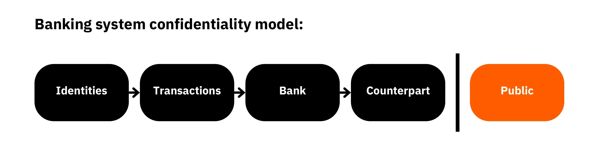


ตัวอย่างเช่น นายธนาคารของคุณรู้ว่าคุณซื้อบาแกตต์ทุกเช้าจากร้านเบเกอรี่ท้องถิ่น แต่เพื่อนบ้านของคุณไม่ทราบเกี่ยวกับการทำธุรกรรมนี้ ด้วยวิธีนี้ การไหลของข้อมูลจะสามารถเข้าถึงได้โดยฝ่ายที่เกี่ยวข้อง โดยเฉพาะธนาคาร แต่ยังคงไม่สามารถเข้าถึงได้โดยบุคคลภายนอก


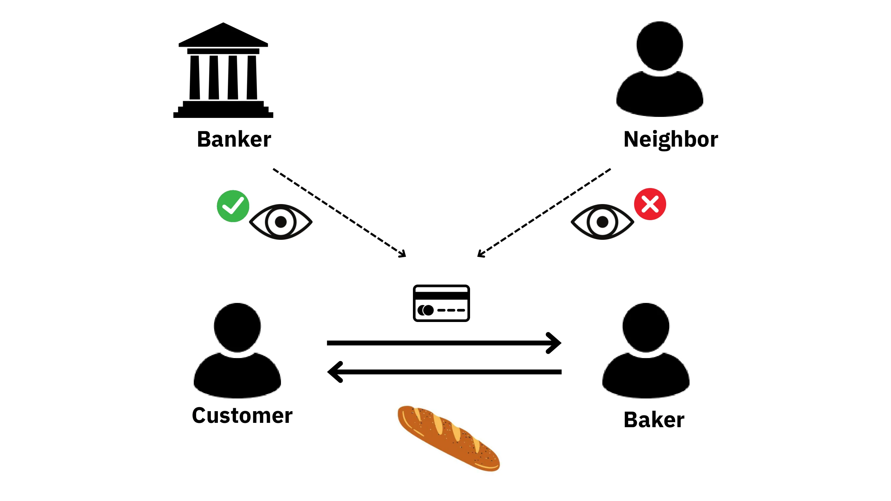


เนื่องจากข้อจำกัดในการเผยแพร่ธุรกรรมสู่สาธารณะที่เราเห็นในส่วนก่อนหน้า แบบจำลองความลับของ Bitcoin ไม่สามารถปฏิบัติตามแบบจำลองของระบบธนาคารได้ ในกรณีของ Bitcoin เนื่องจากการไหลของข้อมูลไม่สามารถถูกตัดขาดระหว่างธุรกรรมและสาธารณสมบัติ **แบบจำลองความเป็นส่วนตัวจึงพึ่งพาการแยกตัวตนของผู้ใช้และธุรกรรมออกจากกัน**


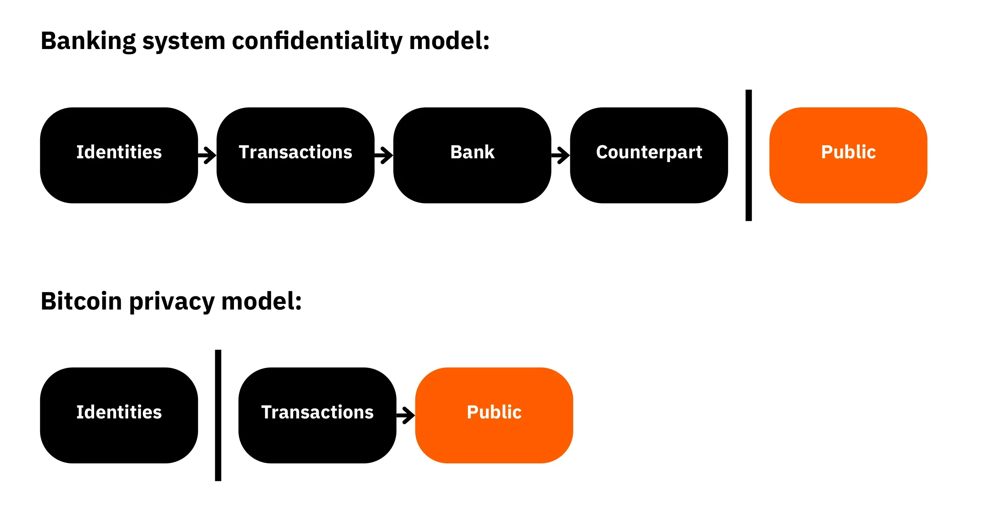


ตัวอย่างเช่น หากคุณซื้อขนมปังจากคนทำขนมปังและจ่ายด้วย BTC เพื่อนบ้านของคุณที่มี full node ของตัวเองสามารถเห็นการทำธุรกรรมของคุณผ่านไปได้ เช่นเดียวกับที่พวกเขาสามารถเห็นการทำธุรกรรมอื่น ๆ ในระบบ อย่างไรก็ตาม หากหลักการความลับถูกเคารพ เขาไม่ควรสามารถเชื่อมโยงการทำธุรกรรมนี้กับตัวตนของคุณได้


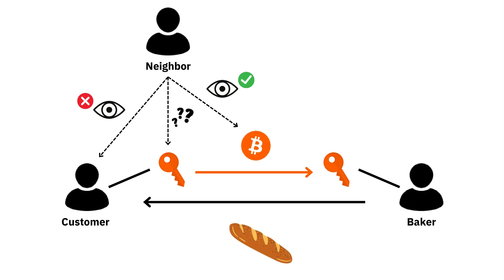


แต่เนื่องจากธุรกรรม Bitcoin ถูกเปิดเผยต่อสาธารณะ จึงยังคงเป็นไปได้ที่จะสร้างความเชื่อมโยงระหว่างกันเพื่อสรุปข้อมูลเกี่ยวกับฝ่ายที่เกี่ยวข้อง กิจกรรมนี้ถือเป็นความเชี่ยวชาญเฉพาะทางที่เรียกว่า "การวิเคราะห์บล็อกเชน" ในส่วนถัดไปของหลักสูตร ฉันขอเชิญคุณสำรวจพื้นฐานของการวิเคราะห์บล็อกเชน เพื่อให้คุณเข้าใจว่าบิตคอยน์ของคุณถูกติดตามอย่างไรและป้องกันตัวเองจากมันได้ดียิ่งขึ้น


# การทำความเข้าใจและป้องกันการวิเคราะห์เชน


<partId>4739371e-9fef-45b0-bcaa-b7a4df6b4470</partId>


## การวิเคราะห์โซ่ Bitcoin คืออะไร?


<chapterId>7d198ba6-4af2-4f24-86cb-3c79cb25627e</chapterId>


:::video id=3d27ea95-599b-44cc-a24c-a628c2e6a64a:::


### คำจำกัดความและการดำเนินงาน


การวิเคราะห์ Blockchain คือการปฏิบัติในการติดตามการไหลของบิตคอยน์บนบล็อกเชน โดยทั่วไปแล้ว การวิเคราะห์เชนจะขึ้นอยู่กับการสังเกตลักษณะในตัวอย่างของธุรกรรมก่อนหน้า จากนั้นจะเกี่ยวข้องกับการระบุลักษณะเดียวกันนี้ในธุรกรรมที่เราต้องการวิเคราะห์และสรุปการตีความที่เป็นไปได้จากลักษณะเหล่านั้น วิธีการแก้ปัญหานี้ ซึ่งขึ้นอยู่กับแนวทางปฏิบัติในการหาวิธีแก้ปัญหาที่น่าพอใจ เรียกว่า "[ฮิวริสติก](https://planb.academy/resources/glossary/analysis-heuristic)"


ในภาษาที่เข้าใจง่าย การวิเคราะห์เชนมีสามขั้นตอนหลัก:


1. **การสังเกตบล็อกเชน;**


2. **การระบุคุณลักษณะที่รู้จัก;**


3. **การหักล้างสมมติฐาน**


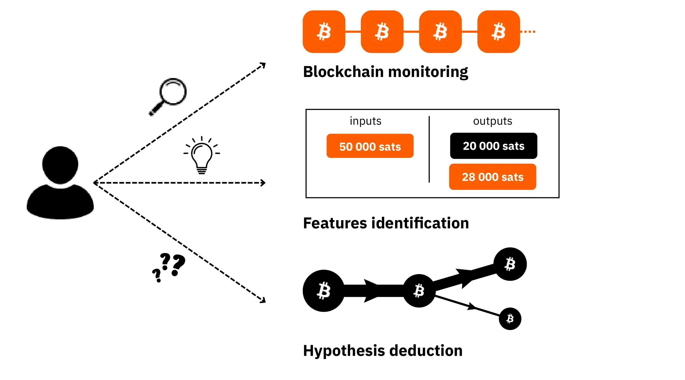


การวิเคราะห์ Blockchain สามารถทำได้โดยทุกคน สิ่งที่คุณต้องมีคือการเข้าถึงข้อมูลสาธารณะของบล็อกเชนผ่าน full node เพื่อสังเกตการเคลื่อนไหวของธุรกรรมและสร้างสมมติฐาน นอกจากนี้ยังมีเครื่องมือฟรีที่ช่วยในการวิเคราะห์นี้ เช่น [OXT.me](https://oxt.me/) ซึ่งเราจะสำรวจอย่างละเอียดในสองบทสุดท้ายของส่วนนี้ อย่างไรก็ตาม ความเสี่ยงหลักต่อความลับมาจากบริษัทที่เชี่ยวชาญในการวิเคราะห์สตริง บริษัทเหล่านี้ได้นำการวิเคราะห์บล็อกเชนไปสู่ระดับอุตสาหกรรมและขายบริการของพวกเขาให้กับสถาบันการเงินและรัฐบาล ในบรรดาบริษัทเหล่านี้ Chainalysis เป็นที่รู้จักดีที่สุดอย่างแน่นอน


### วัตถุประสงค์ของการวิเคราะห์ห่วงโซ่


หนึ่งในเป้าหมายของการวิเคราะห์บล็อกเชนคือการจัดกลุ่มกิจกรรมต่าง ๆ บน Bitcoin เพื่อกำหนดความเป็นเอกลักษณ์ของผู้ใช้ที่ดำเนินการเหล่านั้น จากนั้นจะสามารถพยายามเชื่อมโยงกลุ่มกิจกรรมนี้กับตัวตนจริงได้


ย้อนกลับไปที่บทก่อนหน้า ฉันได้อธิบายว่าทำไมโมเดลความเป็นส่วนตัวของ Bitcoin จึงถูกสร้างขึ้นโดยอิงจากการแยกตัวตนของผู้ใช้ออกจากธุรกรรม ดังนั้นจึงอาจเป็นที่น่าสนใจที่จะคิดว่าการวิเคราะห์บล็อกเชนนั้นไร้ประโยชน์ เพราะถึงแม้ว่าเราจะสามารถรวบรวมกิจกรรมของ [on-chain](https://planb.academy/resources/glossary/onchain) ได้ เราก็ไม่สามารถเชื่อมโยงกับตัวตนจริงได้


ตามทฤษฎีแล้ว ข้อความนี้ถูกต้อง ในส่วนแรกของหลักสูตรนี้ เราได้เห็นว่าคู่กุญแจเข้ารหัสถูกใช้เพื่อสร้างเงื่อนไขบน UTXO โดยหลักแล้ว คู่กุญแจเหล่านี้ไม่เปิดเผยข้อมูลใด ๆ เกี่ยวกับตัวตนของผู้ถือ ดังนั้น แม้ว่าเราจะสามารถรวมกิจกรรมที่เกี่ยวข้องกับคู่กุญแจต่าง ๆ เข้าด้วยกันได้ ก็ไม่ได้บอกอะไรเกี่ยวกับหน่วยงานที่อยู่เบื้องหลังกิจกรรมเหล่านี้


อย่างไรก็ตาม ความเป็นจริงในทางปฏิบัตินั้นซับซ้อนกว่ามาก มีพฤติกรรมมากมายที่สามารถเชื่อมโยงตัวตนจริงกับกิจกรรม on-chain ในการวิเคราะห์ สิ่งนี้เรียกว่าจุดเริ่มต้น และมีอยู่มากมาย


The most common is [KYC](https://planb.academy/resources/glossary/kyc-know-your-customer) (*Know Your Customer*). If you withdraw your Bitcoins from a regulated platform to one of your personal receiving addresses, then some people are able to link your identity to that address. More broadly, an entry point can be any form of interaction between your real life and a Bitcoin transaction. For example, if you publish a receiving address on your social networks, this could be an entry point for analysis. If you make a payment in Bitcoins to your baker, he will be able to associate your face (part of your identity) with a Bitcoin address.


จุดเข้าเหล่านี้แทบจะหลีกเลี่ยงไม่ได้เมื่อใช้ Bitcoin แม้ว่าเราจะพยายามจำกัดขอบเขตของมัน แต่ก็จะยังคงมีอยู่เสมอ นั่นคือเหตุผลที่สำคัญที่จะรวมวิธีการที่มุ่งรักษาความเป็นส่วนตัวของคุณ ในขณะที่การรักษาการแยกตัวตนจริงของคุณออกจากธุรกรรมของคุณเป็นวิธีการที่น่าสนใจ แต่มันยังคงไม่เพียงพอในปัจจุบัน จริงๆ แล้ว หากกิจกรรมทั้งหมดของคุณใน on-chain สามารถถูกรวมเข้าด้วยกัน แม้แต่จุดเข้าที่เล็กที่สุดก็มีแนวโน้มที่จะทำลายชั้นความลับที่คุณได้สร้างขึ้น


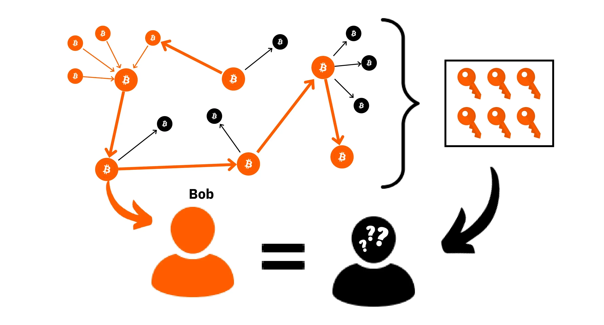


### การป้องกันตัวเองจากการวิเคราะห์เชน


ดังนั้นเราจำเป็นต้องสามารถรับมือกับการวิเคราะห์บล็อกเชนในการใช้ Bitcoin ด้วยวิธีนี้ เราสามารถลดการรวมกิจกรรมของเราและจำกัดผลกระทบของจุดเริ่มต้นต่อความเป็นส่วนตัวของเราได้


วิธีใดจะดีไปกว่าการต่อต้านการวิเคราะห์บล็อกเชนด้วยการเรียนรู้เกี่ยวกับวิธีการที่ใช้ในนั้น? เพื่อเพิ่มความเป็นส่วนตัวของ Bitcoin ของคุณ การเข้าใจวิธีการเหล่านี้เป็นสิ่งสำคัญ ซึ่งจะช่วยให้คุณเข้าใจเทคนิคต่างๆ เช่น [coinjoin](https://planb.academy/resources/glossary/coinjoin) หรือ [payjoin](https://planb.academy/resources/glossary/payjoin) (เทคนิคที่เราจะดูในส่วนสุดท้ายของหลักสูตร) และลดข้อผิดพลาดที่คุณอาจทำได้


https://planb.academy/tutorials/privacy/on-chain/ashigaru-whirlpool-e566803d-ab3f-4d98-9136-5462009262ef

https://planb.academy/tutorials/privacy/on-chain/payjoin-848b6a23-deb2-4c5f-a27e-93e2f842140f

ในเรื่องนี้ เราสามารถเปรียบเทียบกับ[การเข้ารหัส](https://planb.academy/resources/glossary/cryptography)และการวิเคราะห์การเข้ารหัสได้ นักเข้ารหัสที่ดีคือผู้ที่มีทักษะในการวิเคราะห์การเข้ารหัสเป็นอันดับแรกและสำคัญที่สุด ในการคิดค้นอัลกอริธึมการเข้ารหัสใหม่ คุณจำเป็นต้องรู้ว่ามันจะเผชิญกับการโจมตีแบบใดบ้าง และยังต้องศึกษาว่าทำไมอัลกอริธึมก่อนหน้านี้ถึงถูกทำลาย หลักการเดียวกันนี้ใช้กับความเป็นส่วนตัวของ Bitcoin การเข้าใจวิธีการวิเคราะห์บล็อกเชนเป็นกุญแจสำคัญในการป้องกันพวกมัน นั่นคือเหตุผลที่ฉันได้รวมส่วนการวิเคราะห์ on chain ทั้งหมดไว้ในหลักสูตรนี้


### วิธีการวิเคราะห์เชน


สิ่งสำคัญคือต้องเข้าใจว่าการวิเคราะห์สตริงไม่ใช่วิทยาศาสตร์ที่แน่นอน มันอาศัยการคาดเดาที่ได้มาจากการสังเกตการณ์ก่อนหน้านี้หรือการตีความเชิงตรรกะ กฎเหล่านี้ช่วยให้เราสามารถได้ผลลัพธ์ที่ค่อนข้างน่าเชื่อถือ แม้ว่าจะไม่แม่นยำอย่างสมบูรณ์ก็ตาม กล่าวอีกนัยหนึ่ง **การวิเคราะห์โซ่จะมีมิติของความน่าจะเป็นในข้อสรุปที่ได้เสมอ** ตัวอย่างเช่น อาจเป็นไปได้ที่จะประมาณด้วยระดับความแน่นอนที่แตกต่างกันว่าสองที่อยู่นั้นเป็นของหน่วยงานเดียวกัน แต่ความแน่นอนทั้งหมดจะอยู่ไกลเกินเอื้อมเสมอ


วัตถุประสงค์หลักของการวิเคราะห์แบบลูกโซ่คือการรวบรวมวิธีการต่าง ๆ และลดความเสี่ยงของข้อผิดพลาด ในทางหนึ่ง มันคือการสะสมหลักฐานที่ทำให้เราเข้าใกล้ความเป็นจริงมากขึ้น


ฮิวริสติกที่มีชื่อเสียงเหล่านี้สามารถจัดกลุ่มเป็นหมวดหมู่ต่างๆ ซึ่งเราจะอธิบายรายละเอียดด้านล่าง:


- รูปแบบการทำธุรกรรม;
- ฮิวริสติกภายในธุรกรรม;
- ฮิวริสติกภายนอกธุรกรรม


### Satoshi Nakamoto และการวิเคราะห์เชน


ฮิวริสติกการวิเคราะห์เชนสองข้อแรกถูกค้นพบโดย Satoshi Nakamoto เอง เขาได้พูดถึงพวกมันในส่วนที่ 10 ของเอกสารไวท์เปเปอร์ Bitcoin ซึ่งได้แก่:


- [cIOH](https://planb.academy/resources/glossary/cioh) (*Common Input Ownership Heuristic*);
- และ[การนำกลับมาใช้ใหม่](https://planb.academy/resources/glossary/address-reuse)


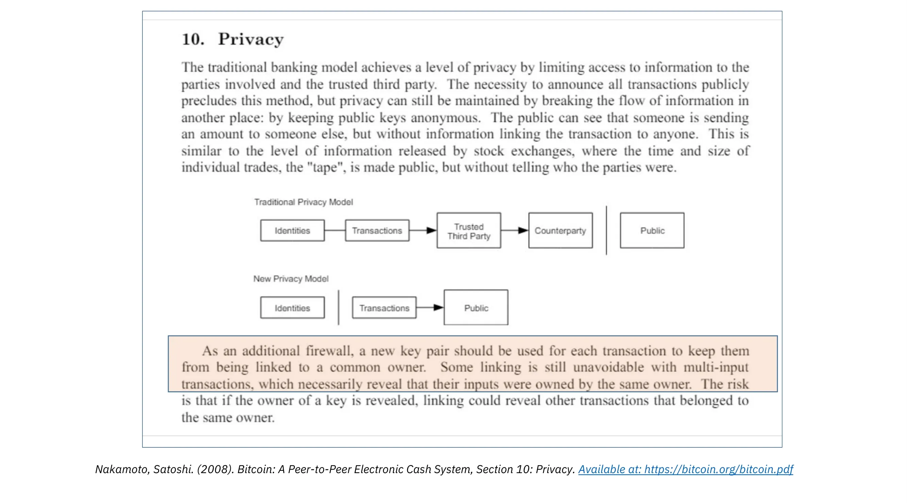


ที่มา: S. Nakamoto, "Bitcoin: A Peer-to-Peer Electronic Cash System", https://bitcoin.org/bitcoin.pdf, 2009.


เราจะได้เห็นว่าพวกมันคืออะไรในบทต่อไป แต่สิ่งที่น่าสนใจคือการที่ฮิวริสติกทั้งสองนี้ยังคงมีความสำคัญในวิเคราะห์เชนในปัจจุบัน


## รูปแบบการทำธุรกรรม


<chapterId>d365a101-2d37-46a5-bfb9-3c51e37bf96b</chapterId>


:::video id=4bd4c9d4-7997-487c-8760-98c74ae1589e:::


รูปแบบการทำธุรกรรมคือโมเดลหรือโครงสร้างโดยรวมของการทำธุรกรรมทั่วไป ซึ่งสามารถพบได้บนบล็อกเชน และมีการตีความที่เป็นไปได้ที่ทราบ เมื่อศึกษารูปแบบ เรามุ่งเน้นไปที่การทำธุรกรรมเดียวและวิเคราะห์ในระดับสูง


กล่าวอีกนัยหนึ่ง เราจะตรวจสอบเฉพาะจำนวนของ UTXOs ในอินพุตและจำนวนของ UTXOs ในเอาต์พุต โดยไม่เจาะลึกถึงรายละเอียดเฉพาะหรือสภาพแวดล้อมของธุรกรรม จากรูปแบบที่สังเกตได้ เราสามารถตีความลักษณะของธุรกรรมได้ จากนั้นเราจะตรวจสอบลักษณะของโครงสร้างและสรุปการตีความ


ในส่วนนี้ เราจะตรวจสอบรูปแบบการทำธุรกรรมหลักที่พบในวิเคราะห์เชนร่วมกัน สำหรับแต่ละรูปแบบ ฉันจะให้การตีความที่เป็นไปได้ของโครงสร้างนี้ พร้อมกับตัวอย่างที่ชัดเจน


### การจัดส่งครั้งเดียว (หรือการชำระเงินครั้งเดียว)


มาเริ่มกันด้วยรูปแบบที่พบได้บ่อยมาก เนื่องจากเป็นรูปแบบที่ปรากฏใน Bitcoin การชำระเงินส่วนใหญ่ รูปแบบการชำระเงินแบบง่ายถูกกำหนดโดยการใช้ UTXO หนึ่งหรือมากกว่าเป็นอินพุตและการผลิต 2 UTXO เป็นเอาต์พุต ดังนั้นรูปแบบนี้จึงมีลักษณะดังนี้:


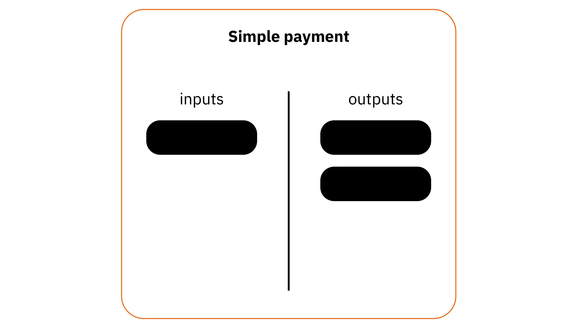


เมื่อเราพบโครงสร้างธุรกรรมนี้บนบล็อกเชน เราสามารถตีความได้ทันที ตามชื่อของมัน โมเดลนี้บ่งบอกว่าเราอยู่ในสถานะของการส่งหรือการชำระเงิน ผู้ใช้ได้ใช้ UTXO ของตนเองในอินพุตเพื่อสนองเอาต์พุตของการชำระเงิน UTXO และการเปลี่ยนแปลง UTXO (เงินที่คืนให้กับผู้ใช้คนเดียวกัน)


ดังนั้นเราจึงทราบว่าผู้ใช้ที่สังเกตเห็นอาจจะไม่ได้ครอบครองหนึ่งในสอง UTXOs ที่ส่งออกอีกต่อไป (การชำระเงิน UTXO) แต่ยังคงครอบครองอีกหนึ่ง UTXO (การเปลี่ยนแปลง UTXO)


ในขณะนี้ เราไม่สามารถระบุได้ว่าเอาต์พุตใดแทน UTXO ใด เนื่องจากนี่ไม่ใช่วัตถุประสงค์ของการศึกษารูปแบบ เราจะไปถึงจุดนั้นโดยอาศัยฮิวริสติกส์ที่เราจะศึกษาในส่วนถัดไป ในขั้นตอนนี้ วัตถุประสงค์ของเราจำกัดอยู่ที่การระบุลักษณะของธุรกรรมที่เกี่ยวข้อง ซึ่งในกรณีนี้คือการส่งแบบง่าย ๆ


ตัวอย่างเช่น นี่คือธุรกรรม Bitcoin ที่ใช้รูปแบบการส่งแบบง่าย:


```plaintext
b6cc79f45fd2d7669ff94db5cb14c45f1f879ea0ba4c6e3d16ad53a18c34b769
```


แหล่งที่มา: [Mempool.space](https://mempool.space/tx/b6cc79f45fd2d7669ff94db5cb14c45f1f879ea0ba4c6e3d16ad53a18c34b769)


หลังจากตัวอย่างแรกนี้ คุณควรมีความเข้าใจที่ดีขึ้นเกี่ยวกับความหมายของการศึกษารูปแบบ "ธุรกรรม" เราตรวจสอบธุรกรรมโดยมุ่งเน้นเฉพาะโครงสร้างของมัน โดยไม่พิจารณาสภาพแวดล้อมหรือรายละเอียดเฉพาะของธุรกรรม ในขั้นตอนแรกนี้ เราจะมองภาพรวมเท่านั้น


ตอนนี้ที่คุณเข้าใจแล้วว่ารูปแบบคืออะไร เรามาเรียนรู้เกี่ยวกับโมเดลอื่น ๆ ที่มีอยู่กันเถอะ


### กวาด


โมเดลที่สองนี้มีลักษณะโดยการบริโภค UTXO หนึ่งหน่วยเป็นอินพุตและการผลิต UTXO หนึ่งหน่วยเป็นเอาต์พุต


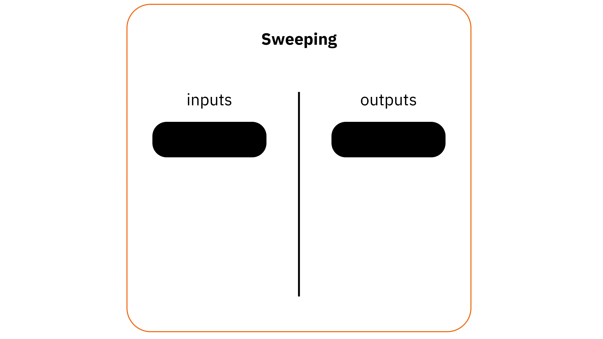


การตีความของโมเดลนี้คือเรากำลังอยู่ในสถานการณ์ของการโอนเงินให้ตัวเอง ผู้ใช้ได้โอนบิตคอยน์ของเขาให้กับตัวเอง ไปยังที่อยู่ใหม่ที่เป็นของเขาเอง เนื่องจากไม่มีการเปลี่ยนแปลงในธุรกรรม จึงเป็นไปได้ยากมากที่เราจะอยู่ในสถานการณ์ของการชำระเงิน จริงๆ แล้ว เมื่อมีการชำระเงินเกิดขึ้น มันแทบจะเป็นไปไม่ได้เลยที่ผู้ชำระเงินจะมี UTXO ที่ตรงกับจำนวนที่ผู้ขายต้องการพอดี รวมถึงค่าธรรมเนียมการทำธุรกรรมด้วย โดยทั่วไปแล้ว ผู้ชำระเงินจึงจำเป็นต้องสร้างผลลัพธ์การเปลี่ยนแปลง


เราจึงทราบว่าผู้ใช้ที่สังเกตเห็นอาจยังคงครอบครอง UTXO นี้อยู่ ในบริบทของการวิเคราะห์เชน หากเราทราบว่า UTXO ที่ใช้เป็นอินพุตในการทำธุรกรรมเป็นของ Alice เราสามารถสันนิษฐานได้ว่า UTXO ที่ใช้เป็นเอาต์พุตก็เป็นของเธอเช่นกัน สิ่งที่จะน่าสนใจในภายหลังคือการระบุเฮอริสติกภายในธุรกรรมที่อาจเสริมสร้างสมมติฐานนี้ (เราจะตรวจสอบเฮอริสติกเหล่านี้ในบทที่ 3.3)


ตัวอย่างเช่น นี่คือธุรกรรม Bitcoin ที่ใช้รูปแบบ[การกวาดล้าง](https://planb.academy/resources/glossary/sweep-transaction):


```plaintext
35f1072a0fda5ae106efb4fda871ab40e1f8023c6c47f396441ad4b995ea693d
```


แหล่งที่มา: [Mempool.space](https://mempool.space/tx/35f1072a0fda5ae106efb4fda871ab40e1f8023c6c47f396441ad4b995ea693d)


อย่างไรก็ตาม โปรดระวังว่ารูปแบบประเภทนี้ยังสามารถเผยให้เห็นการโอนเงินไปยังบัญชีของแพลตฟอร์มแลกเปลี่ยนสกุลเงินดิจิทัลได้เช่นกัน การศึกษาที่อยู่ที่รู้จักและบริบทของธุรกรรมจะบอกเราว่าเป็นการโอนไปยังการดูแลตนเอง wallet หรือการถอนเงินไปยังแพลตฟอร์มหรือไม่ ที่จริงแล้ว ที่อยู่ของแพลตฟอร์มแลกเปลี่ยนมักจะสามารถระบุได้ง่าย


ลองกลับไปดูตัวอย่างของ Alice: หากการสแกนนำไปสู่อะดเดรสที่เป็นที่รู้จักของแพลตฟอร์ม (เช่น Binance เป็นต้น) นี่อาจบ่งบอกว่าบิตคอยน์ได้ถูกโอนออกจากการครอบครองโดยตรงของ Alice แล้ว โดยมีแนวโน้มว่าจะขายหรือเก็บไว้บนแพลตฟอร์มนี้ ในทางกลับกัน หากอะดเดรสปลายทางไม่เป็นที่รู้จัก ก็สมเหตุสมผลที่จะสันนิษฐานว่าเป็นเพียงอีก wallet ที่ยังคงเป็นของ Alice อย่างไรก็ตาม การศึกษาประเภทนี้เข้าข่ายเป็นการใช้ฮิวริสติกส์มากกว่าการใช้รูปแบบ


### การรวมกิจการ


โมเดลนี้มีลักษณะโดยการใช้ UTXOs หลายรายการที่อินพุตและการผลิต UTXO หนึ่งรายการที่เอาต์พุต


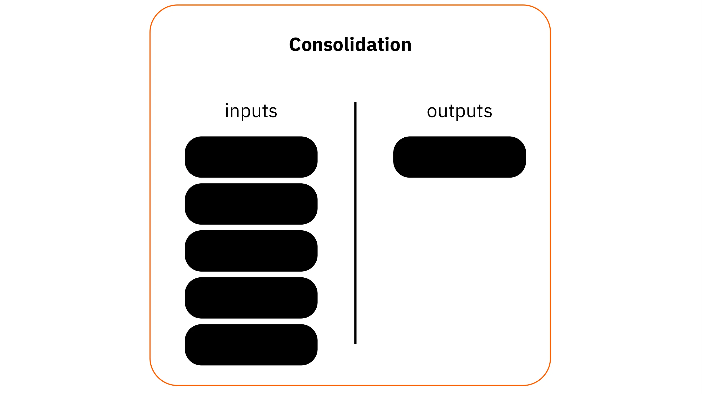


การตีความรูปแบบนี้คือเรากำลังอยู่ในช่วงของการรวมบัญชี นี่เป็นการปฏิบัติทั่วไปในหมู่ผู้ใช้ Bitcoin ซึ่งมีเป้าหมายเพื่อรวม UTXOs หลายรายการเพื่อเตรียมพร้อมสำหรับการเพิ่มขึ้นของค่าธรรมเนียมการทำธุรกรรมที่อาจเกิดขึ้นได้ โดยการดำเนินการนี้ในช่วงที่ค่าธรรมเนียมต่ำ จะสามารถประหยัดค่าธรรมเนียมในอนาคตได้ เราจะพูดคุยเกี่ยวกับการปฏิบัตินี้เพิ่มเติมในบทที่ 4.3


เราสามารถสรุปได้ว่าผู้ใช้ที่อยู่เบื้องหลังรูปแบบการทำธุรกรรมนี้น่าจะครอบครอง UTXOs ทั้งหมดในอินพุตและยังคงครอบครอง UTXO ในเอาต์พุต ดังนั้นมันอาจจะเป็นการโอนอัตโนมัติ


คล้ายกับการกวาดล้าง รูปแบบประเภทนี้ยังสามารถบ่งบอกถึงการโอนย้ายตัวเองไปยังบัญชีของแพลตฟอร์มแลกเปลี่ยนได้เช่นกัน การศึกษาที่อยู่ที่รู้จักและบริบทของธุรกรรมจะบอกเราว่าเป็นการรวมเข้ากับการดูแลตนเอง wallet หรือการถอนเงินไปยังแพลตฟอร์มหรือไม่


ตัวอย่างเช่น นี่คือธุรกรรม Bitcoin ที่ใช้รูปแบบการรวม:


```plaintext
77c16914211e237a9bd51a7ce0b1a7368631caed515fe51b081d220590589e94
```


แหล่งที่มา: [Mempool.space](https://mempool.space/tx/77c16914211e237a9bd51a7ce0b1a7368631caed515fe51b081d220590589e94)


ในการวิเคราะห์เชิงลูกโซ่ โมเดลนี้สามารถเปิดเผยข้อมูลจำนวนมากได้ ตัวอย่างเช่น หากเราทราบว่าหนึ่งในอินพุตเป็นของ Alice เราสามารถสันนิษฐานได้ว่าอินพุตอื่นๆ ทั้งหมดและเอาต์พุตของธุรกรรมนี้ก็เป็นของเธอเช่นกัน การสันนิษฐานนี้จะช่วยให้สามารถย้อนกลับไปยังลูกโซ่ของธุรกรรมก่อนหน้าเพื่อระบุและวิเคราะห์ธุรกรรมอื่นๆ ที่น่าจะเกี่ยวข้องกับ Alice ได้


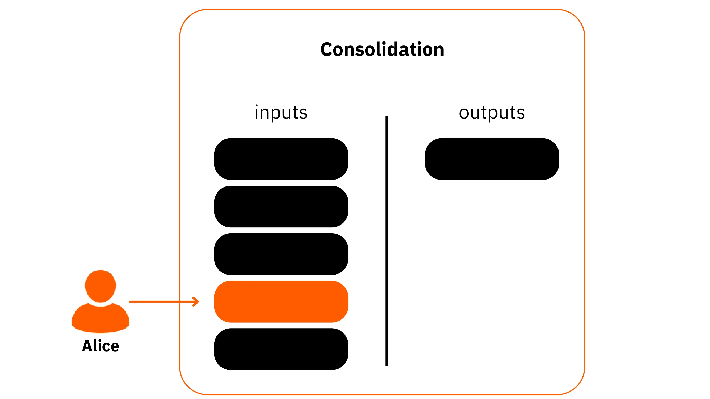


### ค่าใช้จ่ายที่จัดกลุ่ม


โมเดลนี้มีลักษณะโดยการใช้ UTXOs เพียงไม่กี่รายการเป็นอินพุต (มักจะเพียงหนึ่งรายการ) และการผลิต UTXOs จำนวนมากเป็นเอาต์พุต


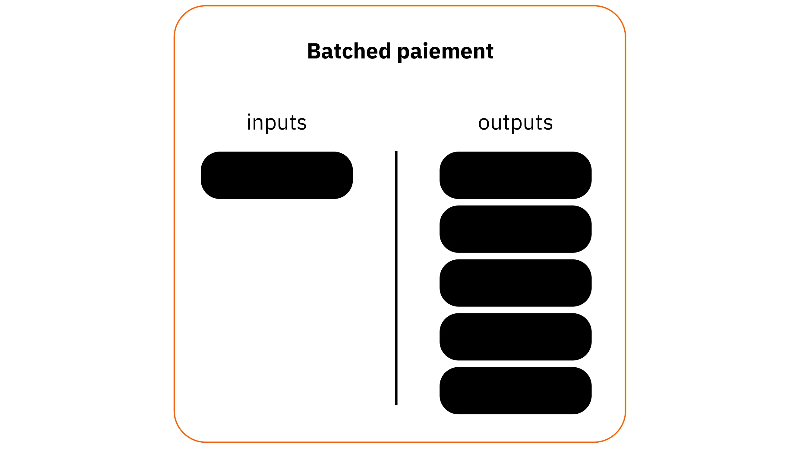


การตีความของโมเดลนี้คือเรากำลังอยู่ในสถานการณ์ของ[การใช้จ่ายแบบกลุ่ม](https://planb.academy/resources/glossary/batched-spending) เป็นการปฏิบัติที่น่าจะเผยให้เห็นถึงกิจกรรมทางเศรษฐกิจที่สำคัญ เช่น แพลตฟอร์มการแลกเปลี่ยน การใช้จ่ายแบบกลุ่มช่วยให้หน่วยงานเหล่านี้ประหยัดค่าใช้จ่ายโดยการรวมค่าใช้จ่ายของพวกเขาไว้ในธุรกรรมเดียว


เราสามารถสรุปจากโมเดลนี้ได้ว่า UTXO ในอินพุตมาจากบริษัทที่มีระดับกิจกรรมทางเศรษฐกิจสูง และ UTXOs ในเอาต์พุตจะกระจายออกไป หลายรายการจะเป็นของลูกค้าของบริษัทที่ได้ถอนบิตคอยน์ออกจากแพลตฟอร์ม บางรายการอาจไปยังบริษัทพันธมิตร สุดท้ายจะมีการเปลี่ยนแปลงหนึ่งหรือมากกว่าที่จะถูกส่งกลับไปยังบริษัทที่ออก


ตัวอย่างเช่น นี่คือธุรกรรม Bitcoin ที่ใช้รูปแบบการใช้จ่ายแบบรวม (คาดว่าเป็นธุรกรรมที่ออกโดยแพลตฟอร์ม Bybit):


```plaintext
8a7288758b6e5d550897beedd13c70bcbaba8709af01a7dbcc1f574b89176b43
```


แหล่งที่มา: [Mempool.space](https://mempool.space/tx/8a7288758b6e5d550897beedd13c70bcbaba8709af01a7dbcc1f574b89176b43)


### ธุรกรรมเฉพาะโปรโตคอล


ในบรรดารูปแบบการทำธุรกรรม เราสามารถระบุรูปแบบที่แสดงถึงการใช้โปรโตคอลเฉพาะได้เช่นกัน ตัวอย่างเช่น Whirlpool coinjoins (กล่าวถึงในส่วนที่ 5) จะมีโครงสร้างที่สามารถระบุได้ง่ายซึ่งทำให้แตกต่างจากธุรกรรมอื่น ๆ ที่เป็นแบบดั้งเดิมมากกว่า


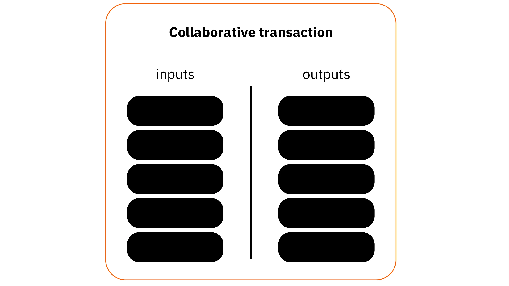


การวิเคราะห์รูปแบบนี้ชี้ให้เห็นว่าเรามีแนวโน้มที่จะอยู่ในสถานการณ์ของการทำธุรกรรมร่วมกัน นอกจากนี้ยังเป็นไปได้ที่จะสังเกตเห็นการรวมเหรียญ หากสมมติฐานหลังนี้ถูกต้อง จำนวนทางออกอาจให้การประมาณคร่าวๆ ของจำนวนผู้เข้าร่วมในการรวมเหรียญ


ตัวอย่างเช่น นี่คือธุรกรรม Bitcoin ที่ใช้รูปแบบธุรกรรมร่วม coinjoin:


```plaintext
00601af905bede31086d9b1b79ee8399bd60c97e9c5bba197bdebeee028b9bea
```


แหล่งที่มา: [Mempool.space](https://mempool.space/tx/00601af905bede31086d9b1b79ee8399bd60c97e9c5bba197bdebeee028b9bea)


มีโปรโตคอลอื่น ๆ อีกมากมายที่มีโครงสร้างเฉพาะของตัวเอง ตัวอย่างเช่น มีธุรกรรม Wabisabi, ธุรกรรม Stamps, และธุรกรรม Runes


ด้วยรูปแบบการทำธุรกรรมเหล่านี้ เราสามารถตีความข้อมูลบางส่วนเกี่ยวกับธุรกรรมที่กำหนดได้แล้ว แต่โครงสร้างของธุรกรรมไม่ใช่แหล่งข้อมูลเดียวสำหรับการวิเคราะห์ เรายังสามารถศึกษารายละเอียดของมันได้อีกด้วย รายละเอียดภายในเหล่านี้คือสิ่งที่ฉันชอบเรียกว่า "ฮิวริสติกภายใน" และเราจะพิจารณาพวกมันในบทถัดไป


## ฮิวริสติกภายใน


<chapterId>c54b5abe-872f-40f4-a0d0-c59faff228ba</chapterId>


:::video id=bbc145cc-5232-41e4-a7f8-1af4e422635a:::


ฮิวริสติกภายในเป็นลักษณะเฉพาะที่เราระบุภายในธุรกรรมเอง โดยไม่จำเป็นต้องตรวจสอบสภาพแวดล้อม และช่วยให้เราสามารถทำการอนุมานได้ แตกต่างจากรูปแบบที่เน้นโครงสร้างโดยรวมของธุรกรรมในระดับสูง ฮิวริสติกภายในจะขึ้นอยู่กับชุดข้อมูลที่สามารถสกัดได้ ซึ่งรวมถึง:


- จำนวนของ UTXO ต่างๆ ที่เข้าและออก;
- ทุกอย่างเกี่ยวกับสคริปต์: ที่อยู่รับ, การจัดการเวอร์ชัน, เวลาล็อก..


โดยทั่วไปแล้ว ฮิวริสติกประเภทนี้ช่วยให้เราสามารถระบุการเปลี่ยนแปลงในธุรกรรมเฉพาะได้ ด้วยการทำเช่นนี้ เราสามารถติดตามเอนทิตีผ่านธุรกรรมหลายรายการได้จริง ๆ หากเราระบุ UTXO ที่เป็นของผู้ใช้ที่เราต้องการติดตาม สิ่งสำคัญคือต้องกำหนดว่าเมื่อพวกเขาทำธุรกรรม ผลลัพธ์ใดที่ถูกโอนไปยังผู้ใช้อื่นและผลลัพธ์ใดที่แสดงถึงการเปลี่ยนแปลง ซึ่งยังคงอยู่ในความครอบครองของพวกเขา


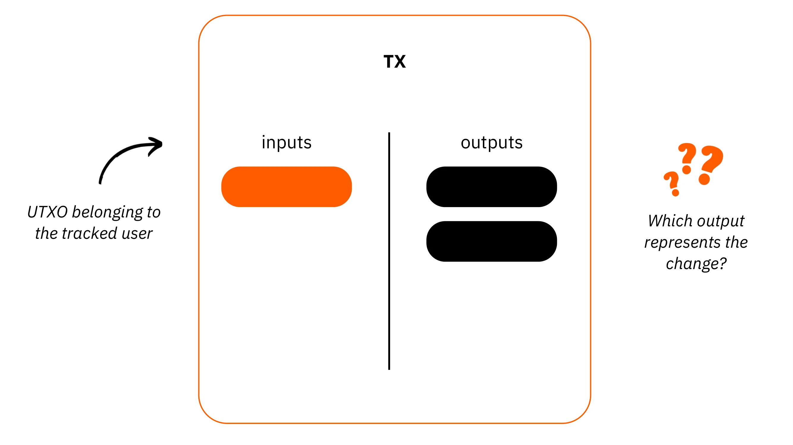


ขอเตือนอีกครั้งว่า ฮิวริสติกเหล่านี้ไม่แม่นยำอย่างสมบูรณ์ เมื่อพิจารณาเป็นรายบุคคล พวกมันเพียงช่วยให้เราระบุสถานการณ์ที่เป็นไปได้ การสะสมของฮิวริสติกหลายๆ ตัวช่วยลดความไม่แน่นอน โดยไม่สามารถกำจัดมันได้อย่างสมบูรณ์


### ความคล้ายคลึงกันภายใน


ฮิวริสติกนี้เกี่ยวข้องกับการตรวจสอบความคล้ายคลึงกันระหว่างอินพุตและเอาต์พุตของธุรกรรมเดียวกัน หากลักษณะเดียวกันถูกสังเกตในอินพุตและในเอาต์พุตเพียงหนึ่งเดียวของธุรกรรม ก็มีแนวโน้มว่าเอาต์พุตนี้จะเป็นการเปลี่ยนแปลง


คุณลักษณะที่ชัดเจนที่สุดคือการใช้ที่อยู่รับซ้ำในธุรกรรมเดียวกัน


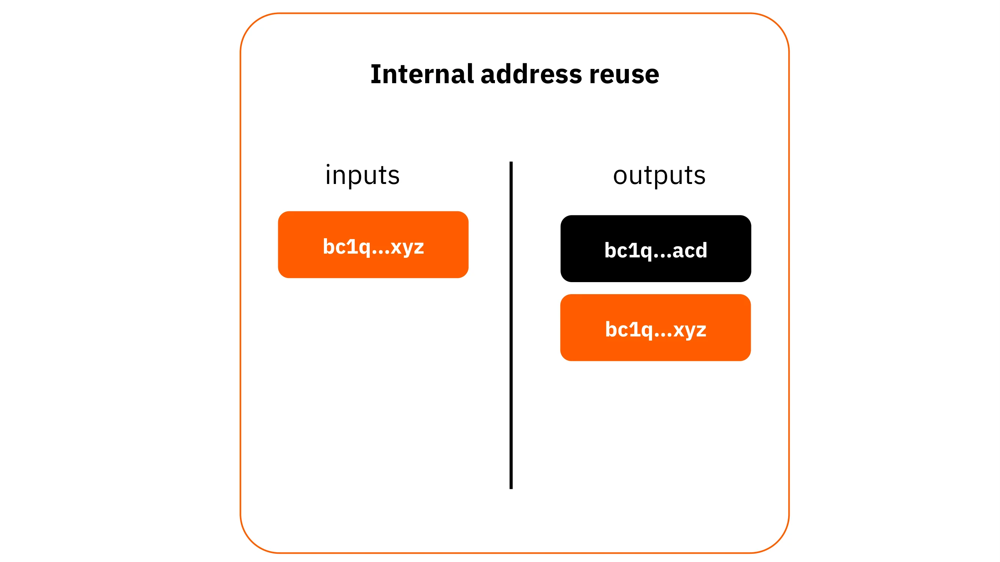


ฮิวริสติกนี้แทบไม่เหลือที่ว่างให้สงสัย เว้นแต่ว่าเขาจะถูกแฮ็กกุญแจส่วนตัว ที่อยู่รับเดียวกันนี้จำเป็นต้องเปิดเผยกิจกรรมของผู้ใช้คนเดียว การตีความที่ได้คือการเปลี่ยนแปลงธุรกรรมคือผลลัพธ์ที่มีที่อยู่เดียวกันกับอินพุต จากนั้นเราสามารถติดตามบุคคลจากการเปลี่ยนแปลงนี้ต่อไปได้


ตัวอย่างเช่น นี่คือธุรกรรมที่สามารถใช้วิธีการแบบนี้ได้:


```plaintext
54364146665bfc453a55eae4bfb8fdf7c721d02cb96aadc480c8b16bdeb8d6d0
```


แหล่งที่มา: [Mempool.space](https://mempool.space/tx/54364146665bfc453a55eae4bfb8fdf7c721d02cb96aadc480c8b16bdeb8d6d0)


ความคล้ายคลึงกันระหว่างข้อมูลนำเข้าและผลลัพธ์ไม่ได้หยุดอยู่แค่การใช้ที่อยู่ซ้ำ ความคล้ายคลึงกันใด ๆ ในการใช้สคริปต์สามารถนำมาใช้ประยุกต์เป็นการคาดเดาได้ ตัวอย่างเช่น บางครั้งเราสามารถสังเกตเห็นการใช้เวอร์ชันเดียวกันระหว่างข้อมูลนำเข้าและหนึ่งในผลลัพธ์ของธุรกรรม


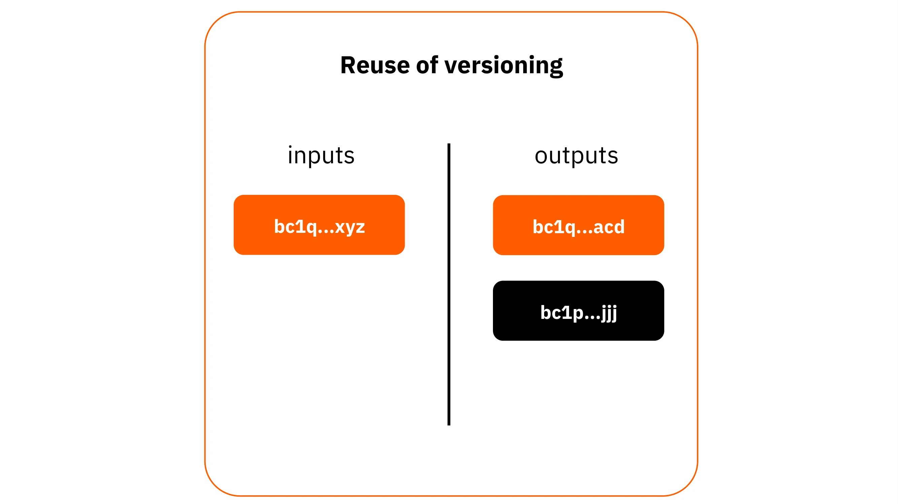


บนแผนภาพนี้ เราสามารถเห็นได้ว่าอินพุตหมายเลข 0 ปลดล็อกสคริปต์ [P2WPKH](https://planb.academy/resources/glossary/p2wpkh) (SegWit V0 ที่เริ่มต้นด้วย `bc1q`) เอาต์พุตหมายเลข 0 ใช้สคริปต์ประเภทเดียวกัน ในขณะที่เอาต์พุตหมายเลข 1 ใช้สคริปต์ [P2TR](https://planb.academy/resources/glossary/p2tr) (SegWit V1 ที่เริ่มต้นด้วย `bc1p`) การตีความคุณสมบัตินี้คือที่อยู่ที่มีเวอร์ชันเดียวกันกับอินพุตน่าจะเป็นที่อยู่สำหรับการเปลี่ยนแปลง ดังนั้นจึงมักจะเป็นของผู้ใช้คนเดียวกันเสมอ


นี่คือธุรกรรมที่สามารถใช้ฮิวริสติกนี้ได้:


```plaintext
db07516288771ce5d0a06b275962ec4af1b74500739f168e5800cbcb0e9dd578
```


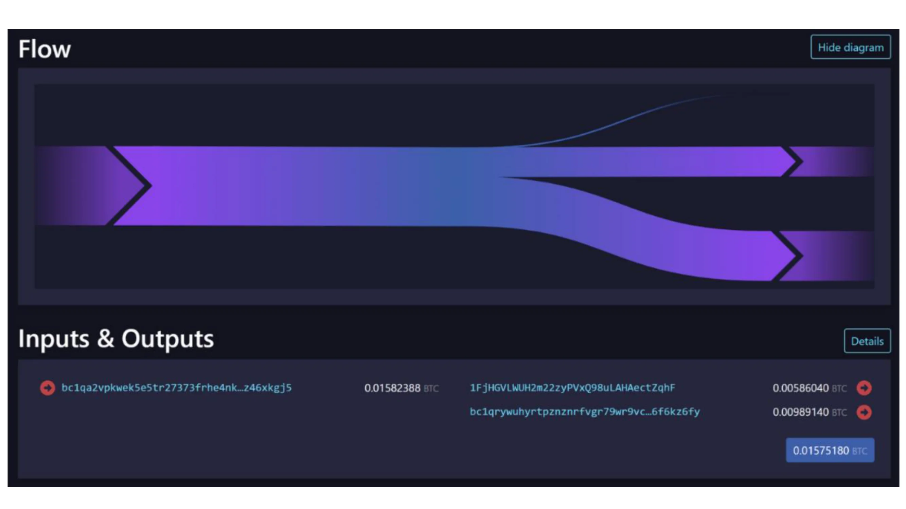


แหล่งที่มา: [Mempool.space](https://mempool.space/tx/db07516288771ce5d0a06b275962ec4af1b74500739f168e5800cbcb0e9dd578)


ในส่วนหลัง เราจะเห็นว่า input หมายเลข 0 และ output หมายเลข 1 ใช้สคริปต์ P2WPKH (SegWit V0) ในขณะที่ output หมายเลข 0 ใช้สคริปต์ [P2PKH](https://planb.academy/resources/glossary/p2pkh) ที่แตกต่างกัน (Legacy)


ในช่วงต้นปี 2010s วิธีการประเมินนี้ที่อิงตามการจัดเวอร์ชันของสคริปต์นั้นค่อนข้างไม่มีประโยชน์เนื่องจากประเภทของสคริปต์ที่มีอยู่อย่างจำกัดในขณะนั้น อย่างไรก็ตาม เมื่อเวลาผ่านไปและมีการอัปเดต Bitcoin อย่างต่อเนื่อง ความหลากหลายของประเภทสคริปต์ก็เพิ่มขึ้น วิธีการประเมินนี้จึงมีความเกี่ยวข้องมากขึ้น เนื่องจากเมื่อมีประเภทสคริปต์ที่หลากหลายมากขึ้น ผู้ใช้จะแบ่งออกเป็นกลุ่มย่อย ๆ ซึ่งเพิ่มโอกาสในการใช้วิธีการประเมินการใช้ซ้ำของเวอร์ชันภายในนี้ ด้วยเหตุนี้ จากมุมมองของความลับเฉพาะ จึงแนะนำให้เลือกใช้ประเภทสคริปต์ที่พบได้บ่อยที่สุด ตัวอย่างเช่น ขณะที่ฉันเขียนบรรทัดเหล่านี้ สคริปต์ Taproot (`bc1p`) ถูกใช้น้อยกว่าสคริปต์ SegWit V0 (`bc1q`) แม้ว่าสคริปต์แบบแรกจะมีประโยชน์ทางเศรษฐกิจและความลับในบางบริบทเฉพาะ แต่สำหรับการใช้งานแบบลายเซ็นเดียวแบบดั้งเดิม อาจมีเหตุผลที่จะยึดติดกับมาตรฐานเก่าเพื่อเหตุผลด้านความลับจนกว่ามาตรฐานใหม่จะได้รับการยอมรับอย่างกว้างขวางมากขึ้น


### การชำระเงินด้วยจำนวนเต็ม


อีกหนึ่งวิธีการภายในที่สามารถช่วยให้เราระบุการเปลี่ยนแปลงได้คือวิธีการใช้เลขกลม ๆ โดยทั่วไปแล้ว เมื่อเผชิญกับรูปแบบการชำระเงินที่ง่าย (1 อินพุตและ 2 เอาต์พุต) หากหนึ่งในเอาต์พุตใช้จ่ายเป็นจำนวนเงินกลม ๆ นั่นแสดงถึงการชำระเงิน


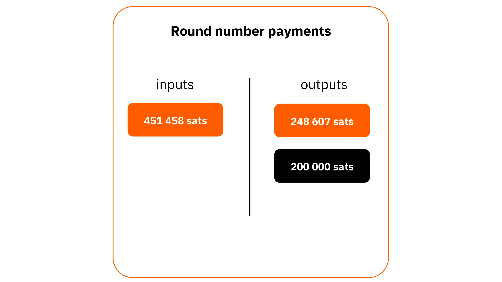


โดยการกำจัด ถ้าผลลัพธ์หนึ่งแสดงถึงการชำระเงิน อีกผลลัพธ์หนึ่งจะแสดงถึงเงินทอน ดังนั้นจึงสามารถสรุปได้ว่าผู้ใช้ที่ป้อนข้อมูลน่าจะมีผลลัพธ์ที่ระบุว่าเป็นเงินทอนอยู่เสมอ


ควรเน้นว่าฮิวริสติกนี้ไม่สามารถใช้ได้เสมอไป เนื่องจากการชำระเงินส่วนใหญ่ยังคงทำในหน่วยบัญชีที่เป็นเงินตราแท้จริง อันที่จริง เมื่อผู้ค้าปลีกในฝรั่งเศสยอมรับบิตคอยน์ เขามักจะไม่แสดงราคาที่เสถียรใน sats แต่จะเลือกการแปลงระหว่างราคาในยูโรและจำนวนบิตคอยน์ที่จะต้องชำระ ดังนั้นจึงไม่ควรมีตัวเลขกลมๆ ในตอนท้ายของการทำธุรกรรม


อย่างไรก็ตาม นักวิเคราะห์สามารถพยายามทำการแปลงนี้ โดยคำนึงถึงอัตราแลกเปลี่ยนที่มีผลบังคับใช้ในขณะที่มีการถ่ายทอดธุรกรรมบนเครือข่าย ลองพิจารณาตัวอย่างของธุรกรรมที่มีอินพุต `97,552 sats` และเอาต์พุตสองรายการ หนึ่งในนั้นคือ `31,085 sats` และอีกหนึ่งคือ `64,152 sats` ในมุมมองแรก ธุรกรรมนี้ดูเหมือนไม่เกี่ยวข้องกับจำนวนเงินที่เป็นรอบ อย่างไรก็ตาม โดยการใช้อัตราแลกเปลี่ยนที่ €64,339 ในขณะที่มีการทำธุรกรรม เราจะได้การแปลงเป็นยูโรดังนี้:


- ป้อนข้อมูล €62.76;
- ผลลัพธ์ €20;
- ผลลัพธ์ €41.27.


เมื่อแปลงเป็นสกุลเงินเฟียตแล้ว ธุรกรรมนี้สามารถใช้เพื่อประยุกต์ใช้ฮิวริสติกการชำระเงินจำนวนเต็มได้ เอาต์พุต €20 อาจไปยังร้านค้า หรืออย่างน้อยก็เปลี่ยนเจ้าของ โดยการหักลบ เอาต์พุต €41.27 มีแนวโน้มที่จะยังคงอยู่ในความครอบครองของผู้ใช้เดิม


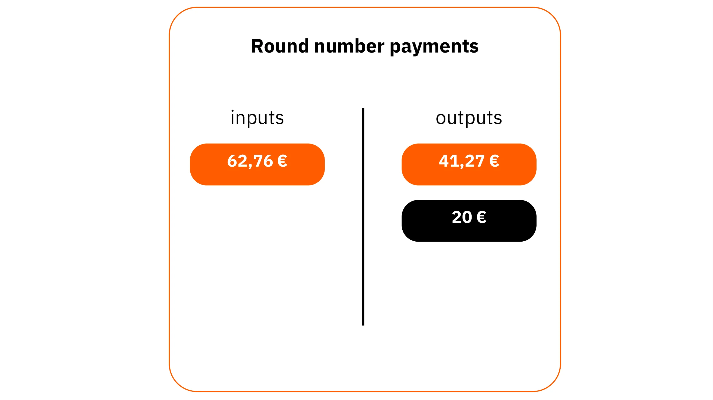


หากวันหนึ่งบิตคอยน์กลายเป็นหน่วยบัญชีที่นิยมใช้ในการแลกเปลี่ยนของเรา วิธีการแบบฮิวริสติกนี้อาจมีประโยชน์มากยิ่งขึ้นสำหรับการวิเคราะห์


ตัวอย่างเช่น นี่คือธุรกรรมที่สามารถใช้ฮิวริสติกนี้ได้:


```plaintext
2bcb42fab7fba17ac1b176060e7d7d7730a7b807d470815f5034d52e96d2828a
```


แหล่งที่มา: [Mempool.space](https://mempool.space/tx/2bcb42fab7fba17ac1b176060e7d7d7730a7b807d470815f5034d52e96d2828a)


### เอาต์พุตที่ใหญ่ที่สุด


เมื่อเราระบุช่องว่างที่ใหญ่พอระหว่างผลลัพธ์ของธุรกรรม 2 รายการในโมเดลการชำระเงินแบบง่าย เราสามารถประมาณได้ว่าผลลัพธ์ที่ใหญ่ที่สุดน่าจะเป็นเงินทอน


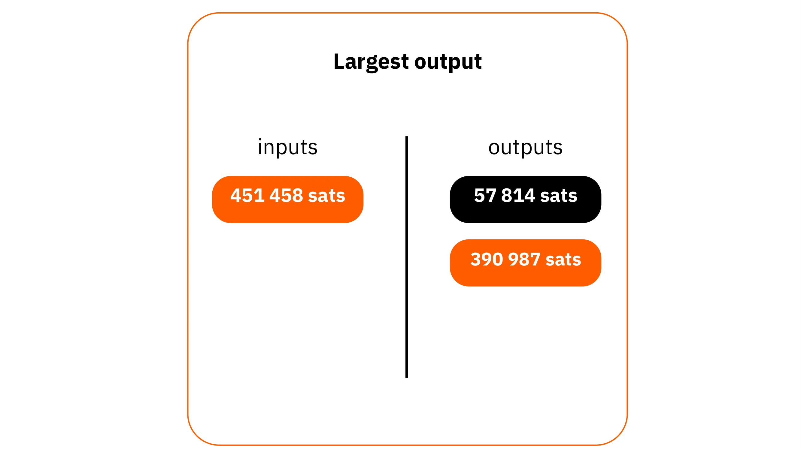


ฮิวริสติกที่ให้ผลลัพธ์ใหญ่ที่สุดนี้เป็นวิธีที่ไม่แม่นยำที่สุดอย่างแน่นอน เมื่อใช้เพียงอย่างเดียว มันค่อนข้างอ่อนแอ อย่างไรก็ตาม คุณสมบัตินี้สามารถรวมกับฮิวริสติกอื่น ๆ เพื่อลดความไม่แน่นอนในการตีความของเราได้


ตัวอย่างเช่น หากเรากำลังพิจารณาธุรกรรมที่มีการชำระเงินแบบปัดเศษและการชำระเงินที่มากขึ้น การใช้ฮิวริสติกการชำระเงินแบบปัดเศษและฮิวริสติกการชำระเงินที่มากขึ้นร่วมกันจะช่วยลดระดับความไม่แน่นอนของเราได้


ตัวอย่างเช่น นี่คือธุรกรรมที่สามารถใช้ฮิวริสติกนี้ได้:


```plaintext
b79d8f8e4756d34bbb26c659ab88314c220834c7a8b781c047a3916b56d14dcf
```


แหล่งที่มา: [Mempool.space](https://mempool.space/tx/b79d8f8e4756d34bbb26c659ab88314c220834c7a8b781c047a3916b56d14dcf)


## ฮิวริสติกภายนอก


<chapterId>4a170e3b-200d-431a-8285-18a23ff617ba</chapterId>


:::video id=f83c94a1-4f60-4dc7-855d-aa6710064575:::


การศึกษาฮิวริสติกภายนอกหมายถึงการวิเคราะห์ความคล้ายคลึงกัน รูปแบบ และลักษณะขององค์ประกอบบางอย่างที่ไม่เฉพาะเจาะจงกับธุรกรรมเอง กล่าวอีกนัยหนึ่ง ในขณะที่ก่อนหน้านี้เราจำกัดตัวเองในการใช้ประโยชน์จากองค์ประกอบที่เป็นเนื้อแท้ของธุรกรรมด้วยฮิวริสติกภายใน ตอนนี้เรากำลังขยายขอบเขตการวิเคราะห์ของเราเพื่อรวมถึงสภาพแวดล้อมของธุรกรรมด้วยฮิวริสติกภายนอก


### Address ใช้ซ้ำ


นี่เป็นหนึ่งในฮิวริสติกที่รู้จักกันดีในหมู่ผู้ใช้ Bitcoin Address reuse ช่วยให้สามารถสร้างความเชื่อมโยงระหว่างธุรกรรมและ UTXOs ต่างๆ ได้ มันเกิดขึ้นเมื่อมีการใช้ที่อยู่รับ Bitcoin หลายครั้ง


ดังนั้น จึงเป็นไปได้ที่จะใช้ประโยชน์จากการใช้ที่อยู่ซ้ำภายในธุรกรรมเดียวกันเป็นการวิเคราะห์ภายในเพื่อระบุการเปลี่ยนแปลง (ตามที่เราเห็นในบทก่อนหน้า) อย่างไรก็ตาม การใช้ที่อยู่ซ้ำยังสามารถใช้เป็นการวิเคราะห์ภายนอกเพื่อระบุความเป็นเอกลักษณ์ของหน่วยงานที่อยู่เบื้องหลังธุรกรรมหลายรายการได้อีกด้วย


การตีความการใช้ที่อยู่ซ้ำคือ UTXO ทั้งหมดที่ถูกบล็อกในที่อยู่นั้นเป็นของ (หรือเคยเป็นของ) หน่วยงานเดียวกัน หลักการนี้ทำให้มีพื้นที่สำหรับความไม่แน่นอนน้อยมาก เมื่อถูกระบุแล้ว การตีความที่ได้มีแนวโน้มที่จะสอดคล้องกับความเป็นจริง ดังนั้นจึงสามารถจัดกลุ่มกิจกรรม on-chain ที่แตกต่างกันได้


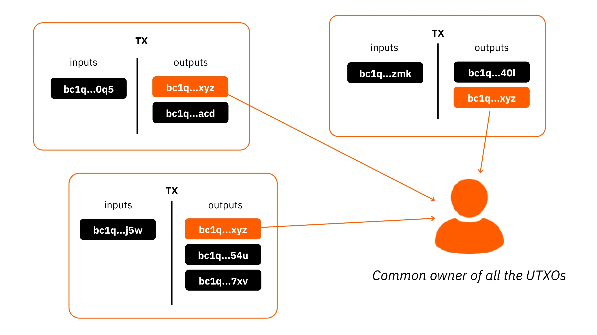


ตามที่อธิบายไว้ในบทนำของส่วนที่ 3 วิธีการนี้ถูกค้นพบโดย Satoshi Nakamoto เอง ในเอกสารไวท์เปเปอร์ เขาได้กล่าวถึงวิธีแก้ปัญหาเพื่อช่วยให้ผู้ใช้หลีกเลี่ยงการสร้างมันขึ้นมา ซึ่งก็คือการใช้ที่อยู่ว่างสำหรับแต่ละธุรกรรมใหม่:


"_เพื่อเป็นการป้องกันเพิ่มเติม สามารถใช้คู่กุญแจใหม่สำหรับแต่ละธุรกรรมเพื่อไม่ให้เชื่อมโยงกับเจ้าของร่วมกันได้._"


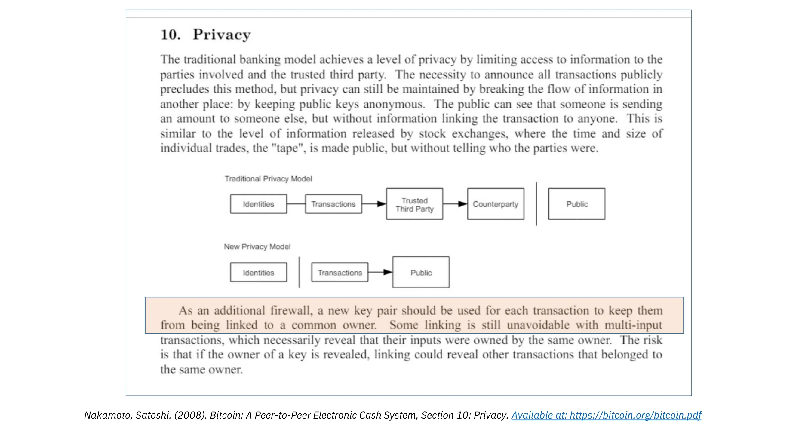


ที่มา: S. Nakamoto, "Bitcoin: A Peer-to-Peer Electronic Cash System", https://bitcoin.org/bitcoin.pdf, 2009.


ตัวอย่างเช่น นี่คือที่อยู่ที่ถูกใช้ซ้ำในหลายธุรกรรม:


```plaintext
bc1qqtmeu0eyvem9a85l3sghuhral8tk0ar7m4a0a0
```


แหล่งที่มา: [Mempool.space](https://mempool.space/address/bc1qqtmeu0eyvem9a85l3sghuhral8tk0ar7m4a0a0)


### ความคล้ายคลึงกันของสคริปต์และรอยประทับ wallet


นอกเหนือจากการใช้ที่อยู่ซ้ำแล้ว ยังมีฮิวริสติกอื่น ๆ อีกมากมายที่ช่วยให้คุณสามารถเชื่อมโยงการกระทำกับ wallet หรือกลุ่มที่อยู่เดียวกันได้


ประการแรก นักวิเคราะห์สามารถมองหาความคล้ายคลึงกันในการใช้สคริปต์ได้ ตัวอย่างเช่น สคริปต์ชนกลุ่มน้อยบางประเภท เช่น multisig อาจจะง่ายต่อการสังเกตมากกว่าสคริปต์ SegWit V0 ยิ่งกลุ่มที่เราซ่อนตัวอยู่มีขนาดใหญ่เท่าใด ก็ยิ่งยากที่จะสังเกตเห็นเรา นี่เป็นหนึ่งในเหตุผลที่ว่า ทำไมในโปรโตคอล Coinjoin ที่ดี ผู้เข้าร่วมทั้งหมดจึงใช้สคริปต์ประเภทเดียวกันอย่างแม่นยำ


โดยทั่วไปแล้ว นักวิเคราะห์ยังสามารถมุ่งเน้นไปที่ลายนิ้วมือที่เป็นลักษณะเฉพาะของ wallet ได้อีกด้วย ซึ่งเป็นกระบวนการเฉพาะที่สามารถระบุได้โดยมีจุดประสงค์เพื่อใช้ประโยชน์เป็นการสืบค้นเชิงอนุมาน กล่าวอีกนัยหนึ่ง หากเราสังเกตเห็นการสะสมของลักษณะภายในเดียวกันในธุรกรรมที่เป็นของหน่วยงานที่ถูกติดตาม เราสามารถพยายามระบุลักษณะเดียวกันนี้ในธุรกรรมอื่น ๆ ได้


ตัวอย่างเช่น เราจะสามารถระบุได้ว่าผู้ใช้ที่ถูกติดตามส่งเงินทอนของเขาไปยังที่อยู่ P2TR (`bc1p...`) อย่างเป็นระบบ หากกระบวนการนี้ถูกทำซ้ำ เราสามารถใช้เป็นการคาดเดาสำหรับการวิเคราะห์ที่เหลือของเราได้ เรายังสามารถใช้ลายนิ้วมืออื่น ๆ เช่น ลำดับของ UTXOs ตำแหน่งของเงินทอนในผลลัพธ์ การส่งสัญญาณ RBF (Replace-by-Fee) หรือหมายเลขเวอร์ชัน ฟิลด์ `nSequence` และฟิลด์ `nLockTime`


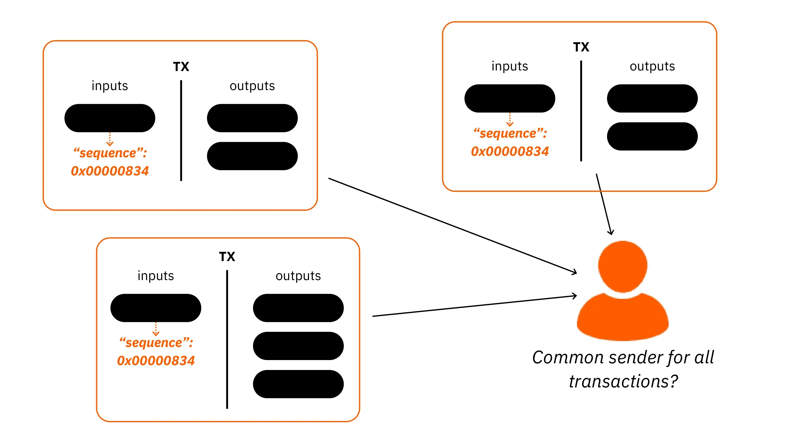


ตามที่ [@LaurentMT](https://twitter.com/LaurentMT) ชี้ให้เห็นใน [Space Kek #19](https://podcasters.spotify.com/pod/show/decouvrebitcoin/episodes/SpaceKek-19---Analyse-de-chane--anonsets-et-entropie-e1vfuji) (พอดแคสต์ภาษาฝรั่งเศส) ความมีประโยชน์ของลายนิ้วมือ wallet ในการวิเคราะห์เชนนั้นเพิ่มขึ้นอย่างมากเมื่อเวลาผ่านไป จริงๆ แล้ว จำนวนประเภทสคริปต์ที่เพิ่มขึ้นและการใช้งานฟีเจอร์ใหม่ๆ เหล่านี้โดยซอฟต์แวร์ wallet ที่เพิ่มขึ้นอย่างต่อเนื่องทำให้ความแตกต่างชัดเจนขึ้น ในบางกรณี แม้กระทั่งสามารถระบุซอฟต์แวร์ที่ใช้โดยหน่วยงานที่ถูกติดตามได้อย่างแม่นยำ ดังนั้นจึงเป็นเรื่องสำคัญที่จะต้องเข้าใจว่าการศึกษารอยเท้า wallet นั้นมีความเกี่ยวข้องโดยเฉพาะอย่างยิ่งสำหรับธุรกรรมล่าสุด มากกว่าธุรกรรมที่เริ่มต้นในช่วงต้นปี 2010


โดยสรุปแล้ว ร่องรอยสามารถเป็นการปฏิบัติเฉพาะใด ๆ ที่ดำเนินการโดยอัตโนมัติโดย wallet หรือโดยผู้ใช้ด้วยตนเอง ซึ่งเราสามารถระบุในธุรกรรมอื่น ๆ เพื่อช่วยในการวิเคราะห์ของเราได้


### Common Input Ownership Heuristic (CIOH)


Common Input Ownership Heuristic (CIOH) เป็นฮิวริสติกที่ระบุว่าเมื่อธุรกรรมมีอินพุตหลายรายการ อินพุตเหล่านั้นมีแนวโน้มที่จะมาจากหน่วยงานเดียวกัน ดังนั้น การเป็นเจ้าของของพวกเขาจึงเป็นของร่วมกัน


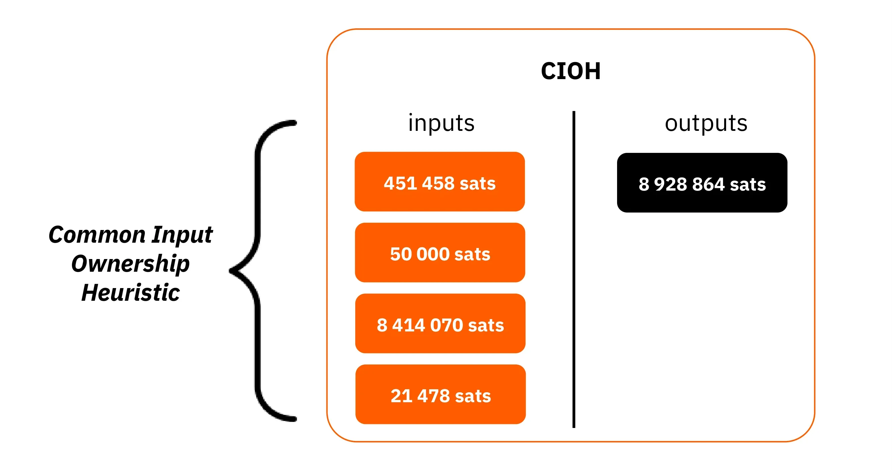


ในการใช้ CIOH เราจะเริ่มจากการสังเกตธุรกรรมที่มีหลายอินพุต ซึ่งอาจจะมี 2 อินพุตหรือ 30 อินพุต เมื่อเราระบุลักษณะนี้ได้แล้ว เราจะตรวจสอบว่าธุรกรรมนั้นสอดคล้องกับโมเดลธุรกรรมที่รู้จักหรือไม่ ตัวอย่างเช่น ถ้ามี 5 อินพุตที่มีจำนวนเงินใกล้เคียงกันและ 5 เอาต์พุตที่มีจำนวนเงินเท่ากันพอดี เราจะรู้ว่านี่คือโครงสร้างของ coinjoin เราจะไม่สามารถใช้ CIOH ได้


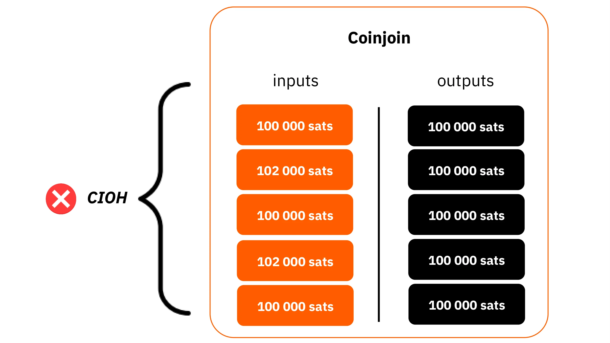


ในทางกลับกัน หากธุรกรรมไม่เข้ากับรูปแบบธุรกรรมแบบร่วมมือที่รู้จักใด ๆ เราสามารถตีความได้ว่าข้อมูลนำเข้าทั้งหมดน่าจะมาจากหน่วยงานเดียวกัน สิ่งนี้สามารถเป็นประโยชน์อย่างมากในการขยายกลุ่มที่รู้จักอยู่แล้วหรือดำเนินการติดตามต่อไป


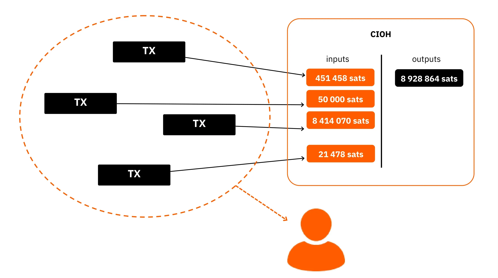


CIOH ถูกค้นพบโดย Satoshi Nakamoto เขาพูดถึงมันในส่วนที่ 10 ของเอกสารไวท์เปเปอร์:


"_[...] การเชื่อมโยงเป็นสิ่งที่หลีกเลี่ยงไม่ได้กับธุรกรรมหลายรายการ ซึ่งจำเป็นต้องเปิดเผยว่ารายการของพวกเขาถูกถือครองโดยเจ้าของคนเดียวกัน ความเสี่ยงคือถ้าเจ้าของกุญแจถูกเปิดเผย การเชื่อมโยงอาจเปิดเผยธุรกรรมอื่น ๆ ที่เป็นของเจ้าของคนเดียวกัน._"


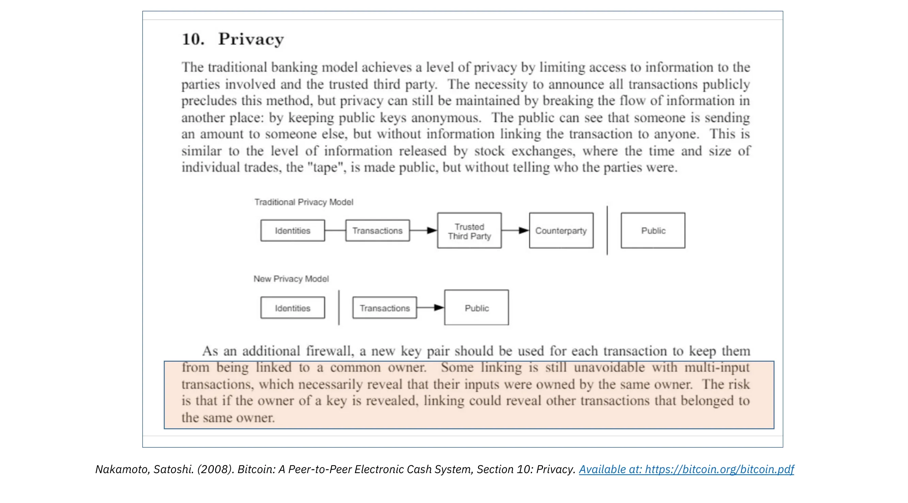


เป็นเรื่องที่น่าสนใจอย่างยิ่งที่ได้ทราบว่า Satoshi Nakamoto ได้ระบุช่องโหว่ด้านความเป็นส่วนตัวหลักสองประการสำหรับผู้ใช้แล้ว แม้กระทั่งก่อนการเปิดตัวอย่างเป็นทางการของ Bitcoin นั่นคือ CIOH และการใช้ที่อยู่ซ้ำ ความรอบคอบเช่นนี้ถือว่าน่าทึ่งมาก เนื่องจากทั้งสองเฮอริสติกนี้ยังคงเป็นเครื่องมือที่มีประโยชน์ที่สุดในการวิเคราะห์บล็อกเชนจนถึงทุกวันนี้


เพื่อให้คุณเห็นตัวอย่าง นี่คือธุรกรรมที่เราน่าจะสามารถใช้ CIOH ได้:


```plaintext
20618e63b6eed056263fa52a2282c8897ab2ee71604c7faccfe748e1a202d712
```


แหล่งที่มา: [Mempool.space](https://mempool.space/tx/20618e63b6eed056263fa52a2282c8897ab2ee71604c7faccfe748e1a202d712)


### ข้อมูลนอกเชน


แน่นอนว่าการวิเคราะห์เชนไม่ได้จำกัดเฉพาะข้อมูล on-chain เท่านั้น ข้อมูลใดๆ จากการวิเคราะห์ก่อนหน้านี้หรือที่มีอยู่บนอินเทอร์เน็ตก็สามารถใช้เพื่อปรับปรุงการวิเคราะห์ได้เช่นกัน


ตัวอย่างเช่น หากเราสังเกตเห็นว่าธุรกรรมที่ถูกติดตามถูกกระจายออกจากโหนด Bitcoin เดียวกันอย่างเป็นระบบ และเราสามารถระบุที่อยู่ IP ของมันได้ เราอาจสามารถระบุธุรกรรมอื่นๆ จากหน่วยงานเดียวกัน รวมถึงระบุส่วนหนึ่งของตัวตนของผู้ออกได้ แม้ว่าการปฏิบัตินี้จะไม่สามารถทำได้ง่ายนัก เนื่องจากต้องการการดำเนินงานของโหนดจำนวนมาก แต่ก็อาจถูกใช้โดยบริษัทบางแห่งที่เชี่ยวชาญในการวิเคราะห์บล็อกเชน


นักวิเคราะห์ยังมีทางเลือกในการพึ่งพาการวิเคราะห์จากแหล่งข้อมูลเปิดที่มีอยู่ก่อนแล้วหรือการวิเคราะห์ก่อนหน้าของตนเอง บางทีเราอาจจะสามารถหาผลลัพธ์ที่ชี้ไปยังกลุ่มของที่อยู่ที่เราได้ระบุไว้แล้วได้ บางครั้งก็สามารถพึ่งพาผลลัพธ์ที่ชี้ไปยังแพลตฟอร์มแลกเปลี่ยนได้เช่นกัน เนื่องจากที่อยู่ของบริษัทเหล่านี้มักจะเป็นที่รู้จักทั่วไป


ในทำนองเดียวกัน คุณสามารถทำการวิเคราะห์โดยการกำจัดได้ ตัวอย่างเช่น หากการวิเคราะห์ธุรกรรมที่มีสองผลลัพธ์เผยให้เห็นว่าหนึ่งในนั้นเกี่ยวข้องกับกลุ่มที่อยู่ที่รู้จักแล้ว แต่แตกต่างจากหน่วยงานที่กำลังติดตาม เราสามารถตีความผลลัพธ์อื่นว่าอาจเป็นการเปลี่ยนแปลงได้


การวิเคราะห์ช่องทางยังรวมถึงองค์ประกอบ OSINT (*Open Source Intelligence*) ที่ทั่วไปมากขึ้นเล็กน้อย ซึ่งเกี่ยวข้องกับการค้นหาทางอินเทอร์เน็ต ด้วยเหตุนี้เราจึงแนะนำให้หลีกเลี่ยงการเผยแพร่ที่อยู่โดยตรงบนเครือข่ายสังคมหรือบนเว็บไซต์ ไม่ว่าจะใช้นามแฝงหรือไม่ก็ตาม


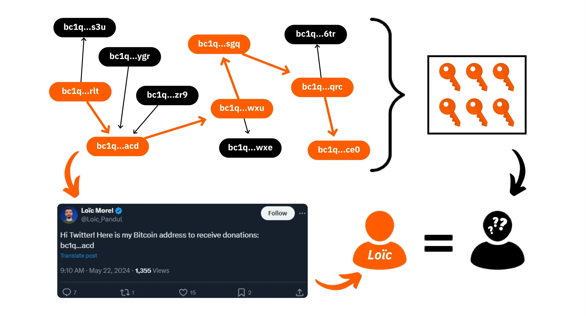


### แบบจำลองเชิงเวลา


เราคิดถึงมันน้อยลง แต่พฤติกรรมบางอย่างของมนุษย์สามารถจดจำได้ on-chain บางทีแง่มุมที่มีประโยชน์ที่สุดของการวิเคราะห์คือรูปแบบการนอนของคุณ ใช่ เมื่อคุณนอนหลับ คุณจะไม่กระจายธุรกรรม Bitcoin แต่โดยทั่วไปแล้วคุณจะนอนหลับในเวลาใกล้เคียงกัน นี่คือเหตุผลที่การใช้การวิเคราะห์เชิงเวลาในบล็อกเชนเป็นเรื่องปกติ ง่ายๆ ก็คือ นี่คือการสำรวจเวลาที่ธุรกรรมของหน่วยงานที่กำหนดถูกกระจายไปยังเครือข่าย Bitcoin โดยการวิเคราะห์รูปแบบเชิงเวลาเหล่านี้ เราสามารถสรุปข้อมูลได้มากมาย


ประการแรก การวิเคราะห์เชิงเวลาอาจสามารถระบุลักษณะของหน่วยงานที่ถูกติดตามได้ บางครั้งหากเราสังเกตเห็นว่ามีการกระจายธุรกรรมอย่างสม่ำเสมอตลอด 24 ชั่วโมง นี่จะแสดงถึงระดับกิจกรรมทางเศรษฐกิจที่สูง หน่วยงานที่อยู่เบื้องหลังธุรกรรมเหล่านี้น่าจะเป็นบริษัท ซึ่งอาจเป็นบริษัทระหว่างประเทศและอาจมีขั้นตอนภายในที่เป็นระบบอัตโนมัติ


ตัวอย่างเช่น [ฉันสังเกตเห็นรูปแบบนี้เมื่อไม่กี่เดือนก่อน](https://twitter.com/Loic_Pandul/status/1701127409712452072) เมื่อวิเคราะห์ [ธุรกรรมที่ได้จัดสรรค่าธรรมเนียม 19 บิตคอยน์โดยผิดพลาด](https://mempool.space/tx/d5392d474b4c436e1c9d1f4ff4be5f5f9bb0eb2e26b61d2781751474b7e870fd) การวิเคราะห์เชิงเวลาอย่างง่ายทำให้ฉันสามารถตั้งสมมติฐานได้ว่าเรากำลังจัดการกับบริการอัตโนมัติ และดังนั้นจึงน่าจะเป็นหน่วยงานขนาดใหญ่ เช่น แพลตฟอร์มแลกเปลี่ยน


อันที่จริง ไม่กี่วันต่อมา มีการค้นพบว่าเงินทุนดังกล่าวเป็นของ PayPal ผ่านแพลตฟอร์มแลกเปลี่ยน Paxos


ในทางตรงกันข้าม หากเราสังเกตเห็นว่ารูปแบบเชิงเวลาครอบคลุม 16 ชั่วโมงเฉพาะ เราสามารถประมาณได้ว่าเรากำลังจัดการกับผู้ใช้รายบุคคล หรืออาจจะเป็นบริษัทท้องถิ่น ขึ้นอยู่กับปริมาณที่แลกเปลี่ยน


นอกเหนือจากลักษณะของเอนทิตีที่สังเกตแล้ว รูปแบบทางเวลาอาจบอกเราได้โดยประมาณว่าผู้ใช้อยู่ที่ไหน ด้วยความช่วยเหลือจากเขตเวลา ด้วยวิธีนี้ เราสามารถจับคู่ธุรกรรมอื่นๆ และใช้การประทับเวลาของพวกเขาเป็นการวิเคราะห์เชิงฮิวริสติกเพิ่มเติมเพื่อเพิ่มประสิทธิภาพการวิเคราะห์ของเรา


ตัวอย่างเช่น บนที่อยู่ที่ใช้งานหลายรูปแบบที่ฉันได้กล่าวถึงก่อนหน้านี้ เราสามารถเห็นได้ว่าธุรกรรมทั้งขาเข้าและขาออกมีความเข้มข้นในช่วงเวลา 13 ชั่วโมง


```plaintext
bc1qqtmeu0eyvem9a85l3sghuhral8tk0ar7m4a0a0
```


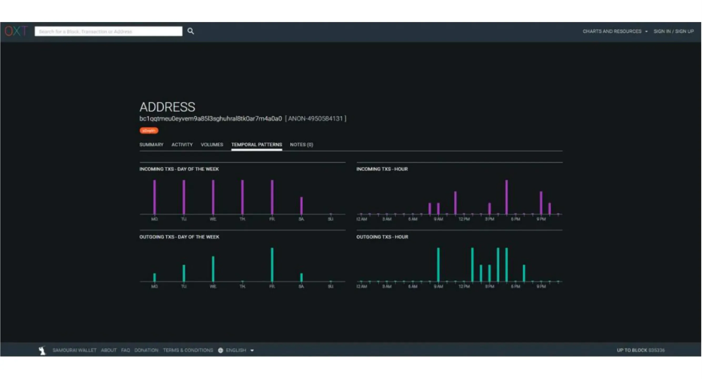


แหล่งที่มา: OXT.me


ช่วงนี้อาจสอดคล้องกับยุโรป แอฟริกา หรือ ตะวันออกกลาง ดังนั้นเราจึงสามารถสันนิษฐานได้ว่าผู้ใช้ที่อยู่เบื้องหลังธุรกรรมเหล่านี้อาศัยอยู่ในพื้นที่เหล่านี้


ในแนวทางที่แตกต่างกัน การวิเคราะห์เวลาในลักษณะนี้ยังนำไปสู่สมมติฐานว่า Satoshi Nakamoto ไม่ได้ดำเนินการจากญี่ปุ่น แต่จากสหรัฐอเมริกา: [*The Time Zones of Satoshi Nakamoto*](https://medium.com/@insearchofsatoshi/the-time-zones-of-satoshi-nakamoto-aa40f035178f)


## การนำไปปฏิบัติด้วยบล็อกเอ็กซ์พลอเรอร์


<chapterId>6493cf2f-225c-405f-9375-c4304f1087ed</chapterId>


ในบทสุดท้ายนี้ เราจะนำแนวคิดที่เราได้ศึกษาไปแล้วมาประยุกต์ใช้ในทางปฏิบัติ ฉันจะแสดงตัวอย่างของธุรกรรม Bitcoin จริงให้คุณดู และคุณจะต้องดึงข้อมูลที่ฉันขอจากคุณ


ในอุดมคติแล้ว การทำแบบฝึกหัดเหล่านี้ควรใช้เครื่องมือวิเคราะห์เชนระดับมืออาชีพ อย่างไรก็ตาม เนื่องจากการจับกุมผู้สร้าง Samourai Wallet ซึ่งเป็นเครื่องมือวิเคราะห์ฟรีเพียงตัวเดียว OXT.me จึงไม่สามารถใช้งานได้อีกต่อไป ดังนั้นเราจะเลือกใช้ตัวสำรวจบล็อกแบบคลาสสิกสำหรับแบบฝึกหัดเหล่านี้ ฉันแนะนำให้ใช้ [Mempool.space](https://mempool.space/) เนื่องจากมีคุณสมบัติมากมายและเครื่องมือวิเคราะห์เชนที่หลากหลาย แต่คุณสามารถเลือกใช้ตัวสำรวจอื่น เช่น [Bitcoin Explorer](https://bitcoinexplorer.org/) ได้เช่นกัน


ในการเริ่มต้น ฉันจะแนะนำคุณเกี่ยวกับแบบฝึกหัด ใช้ตัวสำรวจบล็อกของคุณเพื่อทำแบบฝึกหัดเหล่านี้ และเขียนคำตอบของคุณลงบนกระดาษ จากนั้น ในตอนท้ายของบทนี้ ฉันจะให้คำตอบกับคุณเพื่อให้คุณสามารถตรวจสอบและแก้ไขผลลัพธ์ของคุณได้


*ธุรกรรมที่เลือกสำหรับแบบฝึกหัดเหล่านี้ได้รับการคัดเลือกโดยพิจารณาจากลักษณะเฉพาะในลักษณะที่ค่อนข้างสุ่ม บทนี้มีจุดประสงค์เพื่อการศึกษาและให้ข้อมูลเท่านั้น ฉันขอชี้แจงให้ชัดเจนว่าฉันไม่ได้สนับสนุนหรือส่งเสริมการใช้เครื่องมือเหล่านี้เพื่อวัตถุประสงค์ที่เป็นอันตราย เป้าหมายคือการสอนวิธีป้องกันตัวเองจากการวิเคราะห์สตริง ไม่ใช่เพื่อทำการวิเคราะห์เพื่อเปิดเผยข้อมูลส่วนตัวของผู้อื่น*


### แบบฝึกหัด 1


ตัวระบุของธุรกรรมที่จะวิเคราะห์:


```plaintext
3769d3b124e47ef4ffb5b52d11df64b0a3f0b82bb10fd6b98c0fd5111789bef7
```


ชื่อของโมเดลธุรกรรมนี้คืออะไร และสามารถตีความที่เป็นไปได้อะไรบ้างโดยการตรวจสอบเฉพาะโมเดลของมัน เช่น โครงสร้างของธุรกรรม?


### แบบฝึกหัด 2


ตัวระบุของธุรกรรมที่จะวิเคราะห์:


```plaintext
baa228f6859ca63e6b8eea24ffad7e871713749d693ebd85343859173b8d5c20
```


ชื่อของโมเดลธุรกรรมนี้คืออะไร และสามารถตีความที่เป็นไปได้อะไรบ้างโดยการตรวจสอบเฉพาะโมเดลของมัน เช่น โครงสร้างของธุรกรรม?


### แบบฝึกหัด 3


ตัวระบุของธุรกรรมที่จะวิเคราะห์:


```plaintext
3a9eb9ccc3517cc25d1860924c66109262a4b68f4ed2d847f079b084da0cd32b
```


โมเดลสำหรับธุรกรรมนี้คืออะไร?


เมื่อได้ระบุโมเดลของมันแล้ว โดยใช้ฮิวริสติกภายในของธุรกรรม ผลลัพธ์ที่เปลี่ยนแปลงมีแนวโน้มที่จะแสดงถึงอะไร?


### แบบฝึกหัด 4


ตัวระบุของธุรกรรมที่จะวิเคราะห์:


```plaintext
35f0b31c05503ebfdf7311df47f68a048e992e5cf4c97ec34aa2833cc0122a12
```


รูปแบบสำหรับธุรกรรมนี้คืออะไร?


การระบุรูปแบบของมัน โดยใช้ฮิวริสติกภายในของธุรกรรม ผลลัพธ์ที่การแลกเปลี่ยนมีแนวโน้มที่จะแสดงคืออะไร?


### แบบฝึกหัด 5


ลองจินตนาการว่า Loïc ได้โพสต์หนึ่งในที่อยู่รับ Bitcoin ของเขาบนเครือข่ายสังคมออนไลน์ Twitter:


```plaintext
bc1qja0hycrv7g9ww00jcqanhfpqmzx7luqalum3vu
```


จากข้อมูลนี้และใช้ **เฉพาะวิธีการเดาที่อยู่ซ้ำ** ธุรกรรม Bitcoin ใดบ้างที่สามารถเชื่อมโยงกับตัวตนของ Loïc?


*เห็นได้ชัดว่าฉันไม่ใช่เจ้าของที่แท้จริงของที่อยู่รับนี้และฉันไม่ได้โพสต์มันบนโซเชียลเน็ตเวิร์ก มันเป็นที่อยู่ที่ฉันสุ่มเลือกจากบล็อกเชน*


### แบบฝึกหัด 6


หลังจากการออกกำลังกายที่ 5 ขอบคุณที่ใช้วิธีการเดาที่อยู่ซ้ำ คุณสามารถระบุธุรกรรม Bitcoin หลายรายการที่ดูเหมือนว่า Loïc จะมีส่วนเกี่ยวข้องได้ โดยปกติแล้ว ในบรรดาธุรกรรมที่ระบุ คุณควรจะสังเกตเห็นธุรกรรมนี้:


```plaintext
2d9575553c99578268ffba49a1b2adc3b85a29926728bd0280703a04d051eace
```


การทำธุรกรรมนี้เป็นครั้งแรกที่ส่งเงินไปยังที่อยู่ของ Loïc คุณคิดว่า bitcoins ที่ Loïc ได้รับผ่านการทำธุรกรรมนี้มาจากไหน?


### แบบฝึกหัด 7


หลังจากการออกกำลังกายที่ 5 ขอบคุณที่ใช้วิธีการเดาที่อยู่ซ้ำ คุณสามารถระบุธุรกรรม Bitcoin หลายรายการที่ดูเหมือนว่า Loïc จะมีส่วนเกี่ยวข้อง ตอนนี้คุณต้องการค้นหาว่า Loïc มาจากไหน จากธุรกรรมที่พบ ทำการวิเคราะห์เวลาเพื่อค้นหาเขตเวลาที่ Loïc น่าจะใช้ จากเขตเวลานี้ กำหนดสถานที่ที่ดูเหมือนว่า Loïc จะอาศัยอยู่ (ประเทศ, รัฐ/ภูมิภาค, เมือง...)


### แบบฝึกหัด 8


นี่คือธุรกรรม Bitcoin เพื่อศึกษา:


```plaintext
bb346dae645d09d32ed6eca1391d2ee97c57e11b4c31ae4325bcffdec40afd4f
```


เมื่อพิจารณาจากธุรกรรมนี้เพียงอย่างเดียว เราสามารถตีความข้อมูลอะไรได้บ้าง?


### วิธีแก้ปัญหาการออกกำลังกาย


***แบบฝึกหัดที่ 1:***


โมเดลสำหรับธุรกรรมนี้คือโมเดลการชำระเงินแบบง่าย หากเราศึกษาเฉพาะโครงสร้างของมัน เราสามารถตีความได้ว่าหนึ่งในเอาต์พุตแสดงถึงเงินทอนและอีกเอาต์พุตแสดงถึงการชำระเงินจริง ดังนั้นเราจึงทราบว่าผู้ใช้ที่สังเกตเห็นอาจจะไม่ได้ครอบครองหนึ่งในสอง UTXO ในเอาต์พุตอีกต่อไป (ซึ่งเป็นของการชำระเงิน) แต่ยังคงครอบครองอีกอันหนึ่ง UTXO (ซึ่งเป็นของเงินทอน)


***แบบฝึกหัดที่ 2:***


รูปแบบสำหรับธุรกรรมนี้คือการใช้จ่ายแบบกลุ่ม รูปแบบนี้อาจเผยให้เห็นถึงกิจกรรมทางเศรษฐกิจขนาดใหญ่ เช่น แพลตฟอร์มแลกเปลี่ยน เราสามารถสรุปได้ว่าอินพุต UTXO มาจากบริษัทที่มีกิจกรรมทางเศรษฐกิจในระดับสูง และเอาต์พุต UTXOs จะถูกกระจายออกไป บางส่วนจะเป็นของลูกค้าบริษัทที่ได้ถอนบิตคอยน์ไปยังวอลเล็ตที่ดูแลด้วยตนเอง บางส่วนอาจไปยังบริษัทพันธมิตร สุดท้าย การเปลี่ยนแปลงบางอย่างจะถูกส่งกลับไปยังบริษัทที่ออกอย่างไม่ต้องสงสัย


***แบบฝึกหัดที่ 3:***


โมเดลสำหรับธุรกรรมนี้เป็นการชำระเงินแบบง่าย ๆ ดังนั้นเราจึงสามารถใช้ฮิวริสติกภายในกับธุรกรรมนี้เพื่อพยายามระบุการเปลี่ยนแปลงได้


ฉันได้ระบุวิธีการภายในอย่างน้อยสองวิธีที่สนับสนุนสมมติฐานเดียวกัน:


- การนำสคริปต์ประเภทเดียวกันมาใช้ซ้ำ;
- ผลลัพธ์ที่ใหญ่ที่สุด


ฮิวริสติกที่ชัดเจนที่สุดคือการใช้สคริปต์ประเภทเดียวกันซ้ำอีกครั้ง จริงๆ แล้ว เอาต์พุต `0` คือ `P2SH` ซึ่งสามารถจดจำได้จากที่อยู่การรับที่เริ่มต้นด้วย `3`:


```plaintext
3Lcdauq6eqCWwQ3UzgNb4cu9bs88sz3mKD
```


ในขณะที่เอาต์พุต `1` คือ `P2WPKH` ซึ่งสามารถระบุได้จากที่อยู่ที่ขึ้นต้นด้วย `bc1q`:


```plaintext
bc1qya6sw6sta0mfr698n9jpd3j3nrkltdtwvelywa
```


UTXO ที่ใช้เป็นอินพุตสำหรับธุรกรรมนี้ยังใช้สคริปต์ `P2WPKH`:


```plaintext
bc1qyfuytw8pcvg5vx37kkgwjspg73rpt56l5mx89k
```


ดังนั้น เราสามารถสันนิษฐานได้ว่าเอาต์พุต `0` สอดคล้องกับการชำระเงินและเอาต์พุต `1` คือการเปลี่ยนแปลงของธุรกรรม ซึ่งหมายความว่าผู้ใช้ที่ป้อนข้อมูลจะเป็นเจ้าของเอาต์พุต `1` เสมอ


ในการสนับสนุนหรือหักล้างสมมติฐานนี้ เราสามารถมองหากฎการตัดสินใจอื่น ๆ ที่ยืนยันความคิดของเราหรือลดความน่าจะเป็นที่สมมติฐานของเราจะถูกต้อง


ฉันได้ระบุฮิวริสติกอื่นอย่างน้อยหนึ่งอย่างแล้ว นั่นคือฮิวริสติกเอาต์พุตที่ใหญ่ที่สุด เอาต์พุต `0` วัดได้ `123,689 sats` ในขณะที่เอาต์พุต `1` วัดได้ `505,839 sats` ดังนั้นจึงมีความแตกต่างอย่างมีนัยสำคัญระหว่างเอาต์พุตทั้งสองนี้ ฮิวริสติกเอาต์พุตที่ใหญ่ที่สุดแนะนำว่าเอาต์พุตที่ใหญ่ที่สุดมีแนวโน้มที่จะเป็นการเปลี่ยนแปลง ฮิวริสติกนี้ยิ่งเสริมสร้างสมมติฐานเริ่มต้นของเรา


ดังนั้นจึงดูเหมือนว่าผู้ใช้ที่ให้ UTXO เป็นข้อมูลนำเข้า ยังคงถือเอาต์พุต `1` ซึ่งดูเหมือนจะเป็นตัวแทนของการเปลี่ยนแปลงของธุรกรรม


***แบบฝึกหัดที่ 4:***


โมเดลสำหรับธุรกรรมนี้คือการชำระเงินแบบง่าย ๆ ดังนั้นเราจึงสามารถใช้ฮิวริสติกภายในกับธุรกรรมนี้เพื่อพยายามระบุการเปลี่ยนแปลงได้


ฉันได้ระบุวิธีการภายในอย่างน้อยสองวิธีที่สนับสนุนสมมติฐานเดียวกัน:


- การนำสคริปต์ประเภทเดียวกันมาใช้ซ้ำ;
- เอาต์พุตโพสต์แบบกลม


ฮิวริสติกที่ชัดเจนที่สุดคือการใช้สคริปต์ประเภทเดียวกันซ้ำ จริงๆ แล้ว เอาต์พุต `0` คือ `P2SH` ซึ่งสามารถจดจำได้จากที่อยู่รับที่เริ่มต้นด้วย `3`:


```plaintext
3FSH5Mnq6S5FyQoKR9Yjakk3X4KCGxeaD4
```


ในขณะที่เอาต์พุต `1` คือ `P2WPKH` ซึ่งสามารถระบุได้จากที่อยู่ที่ขึ้นต้นด้วย `bc1q`:


```plaintext
bc1qvdywdcfsyavt4v8uxmmrdt6meu4vgeg439n7sg
```


UTXO ที่ใช้เป็นข้อมูลนำเข้าสำหรับธุรกรรมนี้ยังใช้สคริปต์ `P2WPKH`:


```plaintext
bc1qku3f2y294h3ks5eusv63dslcua2xnlzxx0k6kp
```


ดังนั้น เราสามารถสันนิษฐานได้ว่าเอาต์พุต `0` สอดคล้องกับการชำระเงินและเอาต์พุต `1` คือการเปลี่ยนแปลงของธุรกรรม ซึ่งหมายความว่าผู้ใช้ที่ป้อนข้อมูลจะเป็นเจ้าของเอาต์พุต `1` เสมอ


เพื่อสนับสนุนหรือโต้แย้งสมมติฐานนี้ เราสามารถมองหากฎเกณฑ์อื่น ๆ ที่ยืนยันความคิดของเราหรือลดความน่าจะเป็นที่สมมติฐานของเราจะถูกต้อง


ฉันได้ระบุฮิวริสติกอื่นอย่างน้อยหนึ่งอย่างแล้ว มันคือผลลัพธ์จำนวนกลม ผลลัพธ์ `0` วัดได้ `70,000 sats` ในขณะที่ผลลัพธ์ `1` วัดได้ `22,962 sats` ดังนั้นเราจึงมีผลลัพธ์ที่กลมสมบูรณ์ในหน่วยบัญชี BTC ฮิวริสติกผลลัพธ์กลมแนะนำว่า UTXO ที่มีจำนวนกลมน่าจะเป็นการชำระเงิน และโดยการกำจัด อีกอันหนึ่งแสดงถึงการเปลี่ยนแปลง ฮิวริสติกนี้ยิ่งเสริมความแข็งแกร่งให้กับสมมติฐานเริ่มต้นของเรา


อย่างไรก็ตาม ในตัวอย่างนี้ อาจมีฮิวริสติกอื่นที่ท้าทายสมมติฐานเริ่มต้นของเรา จริงๆ แล้ว เอาต์พุต `0` มีค่ามากกว่าเอาต์พุต `1` โดยอิงจากฮิวริสติกที่ว่าเอาต์พุตที่ใหญ่ที่สุดมักจะแสดงถึงการเปลี่ยนแปลง เราสามารถสรุปได้ว่าเอาต์พุต `0` แสดงถึงการเปลี่ยนแปลง อย่างไรก็ตาม สมมติฐานโต้แย้งนี้ดูไม่น่าเป็นไปได้ เนื่องจากฮิวริสติกอีกสองตัวดูน่าเชื่อถือกว่าฮิวริสติกเอาต์พุตที่ใหญ่ที่สุดอย่างมาก ดังนั้น จึงดูสมเหตุสมผลที่จะรักษาสมมติฐานเริ่มต้นของเราไว้แม้จะมีความขัดแย้งที่เห็นได้ชัดนี้ก็ตาม


ดังนั้นจึงดูเหมือนว่าผู้ใช้ที่ให้ UTXO เป็นข้อมูลนำเข้า ยังคงถือเอาท์พุต `1` ซึ่งดูเหมือนว่าจะเป็นตัวแทนของการเปลี่ยนแปลงของธุรกรรม


***แบบฝึกหัดที่ 5:***


เราสามารถเห็นได้ว่ามี 8 ธุรกรรมที่สามารถเชื่อมโยงกับตัวตนของ Loïc ได้ ในจำนวนนี้ 4 ธุรกรรมเกี่ยวข้องกับการรับบิตคอยน์:


```plaintext
2d9575553c99578268ffba49a1b2adc3b85a29926728bd0280703a04d051eace
8b70bd322e6118b8a002dbdb731d16b59c4a729c2379af376ae230cf8cdde0dd
d5864ea93e7a8db9d3fb113651d2131567e284e868021e114a67c3f5fb616ac4
bc4dcf2200c88ac1f976b8c9018ce70f9007e949435841fc5681fd33308dd762
```


อีก 4 รายการเกี่ยวกับการขนส่งบิทคอยน์:


```plaintext
8b52fe3c2cf8bef60828399d1c776c0e9e99e7aaeeff721fff70f4b68145d540
c12499e9a865b9e920012e39b4b9867ea821e44c047d022ebb5c9113f2910ed6
a6dbebebca119af3d05c0196b76f80fdbf78f20368ebef1b7fd3476d0814517d
3aeb7ce02c35eaecccc0a97a771d92c3e65e86bedff42a8185edd12ce89d89cc
```


***แบบฝึกหัดที่ 6:***


เมื่อตรวจสอบรูปแบบของธุรกรรมนี้ จะเห็นได้ชัดว่ามันเกี่ยวข้องกับการใช้จ่ายแบบรวมกัน จริงๆ แล้ว ธุรกรรมนี้มีอินพุตเดียวและเอาต์พุต 51 รายการ ซึ่งบ่งบอกถึงกิจกรรมทางเศรษฐกิจในระดับสูง ดังนั้นเราจึงสามารถสันนิษฐานได้ว่า Loïc ได้ถอนบิตคอยน์จากแพลตฟอร์มแลกเปลี่ยน


ปัจจัยหลายประการสนับสนุนสมมติฐานนี้ ประการแรก ประเภทของสคริปต์ที่ใช้ในการรักษาความปลอดภัยอินพุต UTXO คือสคริปต์ [P2SH](https://planb.academy/resources/glossary/p2sh) 2/3 multisig ซึ่งบ่งบอกถึงระดับความปลอดภัยขั้นสูงที่เป็นแบบฉบับของแพลตฟอร์มแลกเปลี่ยน:


```plaintext
OP_PUSHNUM_2
OP_PUSHBYTES_33 03eae02975918af86577e1d8a257773118fd6ceaf43f1a543a4a04a410e9af4a59
OP_PUSHBYTES_33 03ba37b6c04aaf7099edc389e22eeb5eae643ce0ab89ac5afa4fb934f575f24b4e
OP_PUSHBYTES_33 03d95ef2dc0749859929f3ed4aa5668c7a95baa47133d3abec25896411321d2d2d
OP_PUSHNUM_3
OP_CHECKMULTISIG
```


ยิ่งไปกว่านั้น ที่อยู่ที่ศึกษา `3PUv9tQMSDCEPSMsYSopA5wDW86pwRFbNF` ถูกใช้ซ้ำในธุรกรรมที่แตกต่างกันมากกว่า 220,000 รายการ ซึ่งมักเป็นลักษณะของแพลตฟอร์มแลกเปลี่ยนที่โดยทั่วไปไม่ค่อยกังวลเกี่ยวกับความลับของพวกเขา


การใช้วิธีการประมาณเชิงเวลาในที่อยู่นี้ยังแสดงให้เห็นถึงการกระจายธุรกรรมอย่างสม่ำเสมอเกือบทุกวันในช่วงระยะเวลา 3 เดือน โดยมีชั่วโมงขยายเกิน 24 ชั่วโมง ซึ่งบ่งบอกถึงกิจกรรมต่อเนื่องของแพลตฟอร์มแลกเปลี่ยน


ในที่สุด ปริมาณที่จัดการโดยหน่วยงานนี้มีขนาดมหึมา ที่อยู่ดังกล่าวได้รับและส่ง 44 BTC ใน 222,262 ธุรกรรมระหว่างเดือนธันวาคม 2022 ถึงมีนาคม 2023 ปริมาณที่มากนี้ยิ่งยืนยันถึงลักษณะที่เป็นไปได้ของกิจกรรมของแพลตฟอร์มแลกเปลี่ยน


***แบบฝึกหัดที่ 7:***


โดยการวิเคราะห์เวลายืนยันการทำธุรกรรม สามารถระบุเวลาต่อไปนี้ในรูปแบบ UTC ได้:


```plaintext
05:43
20:51
18:12
17:16
04:28
23:38
07:45
21:55
```


การวิเคราะห์ตารางเวลาเหล่านี้แสดงให้เห็นว่า UTC-7 และ UTC-8 สอดคล้องกับช่วงของกิจกรรมมนุษย์ในปัจจุบัน (ระหว่าง 08:00 และ 23:00) สำหรับตารางเวลาส่วนใหญ่:


```plaintext
05:43 UTC > 22:43 UTC-7
20:51 UTC > 13:51 UTC-7
18:12 UTC > 11:12 UTC-7
17:16 UTC > 10:16 UTC-7
04:28 UTC > 21:28 UTC-7
23:38 UTC > 16:38 UTC-7
07:45 UTC > 00:45 UTC-7
21:55 UTC > 14:55 UTC-7
05:43 UTC > 21:43 UTC-8
20:51 UTC > 12:51 UTC-8
18:12 UTC > 10:12 UTC-8
17:16 UTC > 09:16 UTC-8
04:28 UTC > 20:28 UTC-8
23:38 UTC > 15:38 UTC-8
07:45 UTC > 23:45 UTC-8
21:55 UTC > 13:55 UTC-8
```


เขตเวลา UTC-7 มีความสำคัญเป็นพิเศษในช่วงฤดูร้อน เนื่องจากรวมถึงรัฐและภูมิภาคต่างๆ เช่น:


- แคลิฟอร์เนีย (พร้อมด้วยเมืองต่างๆ เช่น ลอสแอนเจลิส ซานฟรานซิสโก และซานดิเอโก);
- เนวาดา (พร้อมกับลาสเวกัส);
- โอเรกอน (พร้อมพอร์ตแลนด์);
- วอชิงตัน (พร้อมกับซีแอตเทิล);
- ภูมิภาคบริติชโคลัมเบียของแคนาดา (มีเมืองอย่างแวนคูเวอร์และวิกตอเรีย)


ข้อมูลนี้บ่งชี้ว่า Loïc น่าจะอาศัยอยู่ทางชายฝั่งตะวันตกของสหรัฐอเมริกาหรือแคนาดา


***แบบฝึกหัดที่ 8:***


การวิเคราะห์ธุรกรรมนี้เผยให้เห็นถึง 5 อินพุตและเอาต์พุตเดียว ซึ่งบ่งบอกถึงการรวมกัน การใช้ฮิวริสติก CIOH เราสามารถสันนิษฐานได้ว่า UTXO อินพุตทั้งหมดเป็นของหน่วยงานเดียว และเอาต์พุต UTXO ก็เป็นของหน่วยงานนี้ด้วย ดูเหมือนว่าผู้ใช้เลือกที่จะรวม UTXO หลายรายการที่เขาเป็นเจ้าของเพื่อสร้าง UTXO เดียวในเอาต์พุต โดยมีเป้าหมายเพื่อรวม UTXO ของเขา การเคลื่อนไหวนี้น่าจะเกิดจากความต้องการที่จะใช้ประโยชน์จากต้นทุนการทำธุรกรรมที่ต่ำในขณะนั้น เพื่อลดต้นทุนในอนาคต


___


*ในการเขียนบทวิเคราะห์ส่วนที่ 3 on chain นี้ ฉันได้ใช้แหล่งข้อมูลต่อไปนี้:*


- ชุดบทความสี่ตอนที่มีชื่อว่า: [Understanding Bitcoin Privacy with OXT](https://medium.com/oxt-research/understanding-bitcoin-privacy-with-oxt-part-1-4-8177a40a5923), ผลิตโดย Samourai Wallet ในปี 2021;
- รายงานต่างๆ จาก [OXT Research](https://medium.com/oxt-research) รวมถึงเครื่องมือวิเคราะห์บล็อกเชนฟรีของพวกเขา (ไม่สามารถใช้งานได้ในขณะนี้หลังจากการจับกุมผู้ก่อตั้ง Samourai Wallet);
- โดยทั่วไปแล้ว ความรู้ของฉันมาจากทวีตและเนื้อหาต่าง ๆ จาก [@LaurentMT](https://twitter.com/LaurentMT) และ [@ErgoBTC](https://twitter.com/ErgoBTC);
- The [Space Kek #19](https://podcasters.spotify.com/pod/show/decouvrebitcoin/episodes/SpaceKek-19---Analyse-de-chane--anonsets-et-entropie-e1vfuji) ที่ฉันได้เข้าร่วมกับ [@louneskmt](https://twitter.com/louneskmt), [@TheoPantamis](https://twitter.com/TheoPantamis), [@Sosthene___](https://twitter.com/Sosthene___) และ [@LaurentMT](https://twitter.com/LaurentMT).


*ฉันขอขอบคุณผู้เขียน นักพัฒนา และผู้ผลิตของพวกเขา ขอบคุณเช่นกันสำหรับผู้ตรวจทานที่ได้ตรวจสอบบทความอย่างละเอียดถี่ถ้วนซึ่งเป็นพื้นฐานของส่วนที่ 3 นี้ และให้คำแนะนำจากผู้เชี่ยวชาญแก่ฉัน:*


- [Gilles Cadignan](https://twitter.com/gillesCadignan);
- [Ludovic Lars](https://viresinnumeris.fr/)


# การฝึกฝนแนวทางปฏิบัติที่ดีที่สุดเพื่อปกป้องความเป็นส่วนตัวของคุณ


<partId>9bd04b63-f1af-4e50-9061-6bc90009df68</partId>


## การใช้ซ้ำ Address


<chapterId>f3e97645-3df3-41bc-a4ed-d2c740113d96</chapterId>


:::video id=5392183e-e317-499f-9757-b69e9d7cda11:::


หลังจากที่ได้ศึกษาเทคนิคที่สามารถทำลายความลับของคุณบน Bitcoin แล้ว ในส่วนที่สามนี้ เราจะมาดูแนวทางปฏิบัติที่ดีที่สุดเพื่อการป้องกัน จุดประสงค์ของส่วนนี้ไม่ใช่เพื่อสำรวจวิธีการปรับปรุงความลับ ซึ่งจะถูกกล่าวถึงในภายหลัง แต่เพื่อทำความเข้าใจวิธีการโต้ตอบกับ Bitcoin อย่างถูกต้องเพื่อรักษาความลับที่มีอยู่ตามธรรมชาติ โดยไม่ต้องใช้เทคนิคเพิ่มเติม


ในการเริ่มต้นส่วนที่สามนี้ เราจะพูดถึงการใช้ที่อยู่ซ้ำ ปรากฏการณ์นี้เป็นภัยคุกคามหลักต่อความลับของผู้ใช้ บทนี้ถือเป็นบทที่สำคัญที่สุดของหลักสูตรทั้งหมด


### ที่อยู่รับคืออะไร?


ที่อยู่รับ Bitcoin เป็นสตริงหรือรหัสที่ใช้ในการรับบิตคอยน์ใน wallet


ในทางเทคนิค ที่อยู่รับ Bitcoin ไม่ได้ "รับ" บิตคอยน์ในความหมายตามตัวอักษร แต่ทำหน้าที่กำหนดเงื่อนไขที่บิตคอยน์สามารถใช้จ่ายได้ ในแง่ที่เป็นรูปธรรม เมื่อมีการส่งการชำระเงินถึงคุณ การทำธุรกรรมของผู้ส่งจะสร้าง UTXO ใหม่ให้คุณเป็นผลลัพธ์จาก UTXOs ที่มันใช้เป็นข้อมูลนำเข้า ผลลัพธ์นี้แนบสคริปต์ที่กำหนดว่า UTXO นี้สามารถใช้จ่ายได้อย่างไรในภายหลัง สคริปต์นี้รู้จักกันในชื่อ "*ScriptPubKey*" หรือ "*Locking Script*" ที่อยู่รับของคุณ หรือพูดให้ถูกคือข้อมูลที่บรรจุอยู่ในนั้น จะถูกรวมเข้ากับสคริปต์นี้ ในภาษาที่เข้าใจง่าย สคริปต์นี้กล่าวโดยพื้นฐานว่า:


> "*ในการใช้จ่าย UTXO ใหม่นี้ คุณต้องให้ลายเซ็นดิจิทัลโดยใช้กุญแจส่วนตัวที่เชื่อมโยงกับที่อยู่รับนี้*"

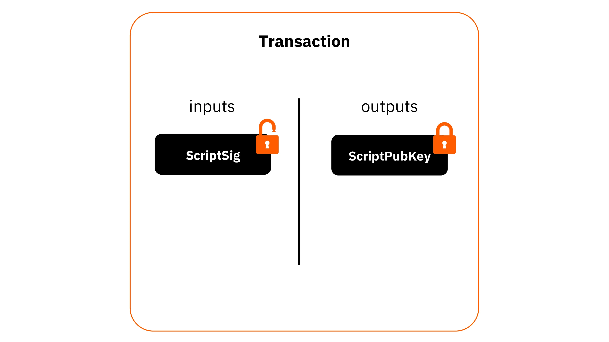


Bitcoin มีหลายประเภท ขึ้นอยู่กับรูปแบบการสคริปต์ที่ใช้ รุ่นแรกที่รู้จักกันในชื่อ "Legacy" รวมถึงที่อยู่ `P2PKH` (*Pay-to-PubKey-Hash*) และ `P2SH` (*Pay-to-Script-Hash*) ที่อยู่ P2PKH จะเริ่มต้นด้วย `1` เสมอ และ P2SH ด้วย `3` แม้ว่าจะยังคงปลอดภัย แต่รูปแบบเหล่านี้ล้าสมัยแล้ว เนื่องจากมีค่าใช้จ่ายในการทำธุรกรรมที่สูงกว่าและมีความเป็นส่วนตัวน้อยกว่ามาตรฐานใหม่


SegWit V0 (`P2WPKH` และ `P2WSH`) และ Taproot / SegWit V1 (`P2TR`) ที่อยู่แสดงถึงรูปแบบที่ทันสมัย ที่อยู่ SegWit เริ่มต้นด้วย `bc1q` และที่อยู่ Taproot ซึ่งเปิดตัวในปี 2021 เริ่มต้นด้วย `bc1p`


ตัวอย่างเช่น นี่คือที่อยู่รับ Taproot:


```text
bc1ps5gd2ys8kllz9alpmcwxqegn7kl3elrpnnlegwkm3xpq2h8da07spxwtf5
```


วิธีการสร้าง ScriptPubKey จะขึ้นอยู่กับมาตรฐานที่คุณกำลังใช้งาน:


| ScriptPubKey       | Script template                                         |
|--------------------|--------------------------------------------------------|
| P2PKH              | OP_DUP OP_HASH160 `<pubKeyHash>` OP_EQUALVERIFY OP_CHECKSIG |
| P2SH               | OP_HASH160 `<scriptHash>` OP_EQUAL                    |
| P2WPKH             | 0 `<pubKeyHash>`                                      |
| P2WSH              | 0 `<witnessScriptHash>`                               |
| P2SH - P2WPKH      | OP_HASH160 `<redeemScriptHash>` OP_EQUAL              |
| P2SH - P2WSH       | OP_HASH160 `<redeemScriptHash>` OP_EQUAL              |
| P2TR               | 1 `<pubKey>`                                          |


การสร้างที่อยู่สำหรับการรับขึ้นอยู่กับรูปแบบสคริปต์ที่เลือก:


- สำหรับที่อยู่ `P2PKH` และ `P2WPKH` เพย์โหลด หรือแกนหลักของที่อยู่ แสดงถึงแฮชของคีย์สาธารณะ;
- สำหรับที่อยู่ `P2SH` และ `P2WSH` เพย์โหลดแสดงถึงแฮชของ a;
- สำหรับที่อยู่ `P2TR` เพย์โหลดคือคีย์สาธารณะที่ถูกปรับแต่ง เอาต์พุตของ P2TR รวมแง่มุมของ _Pay-to-PubKey_ และ _Pay-to-Script_ คีย์สาธารณะที่ถูกปรับแต่งเป็นผลลัพธ์ของการเพิ่มคีย์สาธารณะสำหรับการใช้จ่ายแบบคลาสสิกด้วย "การปรับแต่ง" ที่ได้มาจากราก Merkle ของชุดสคริปต์ที่สามารถใช้ในการใช้จ่ายบิตคอยน์ได้เช่นกัน


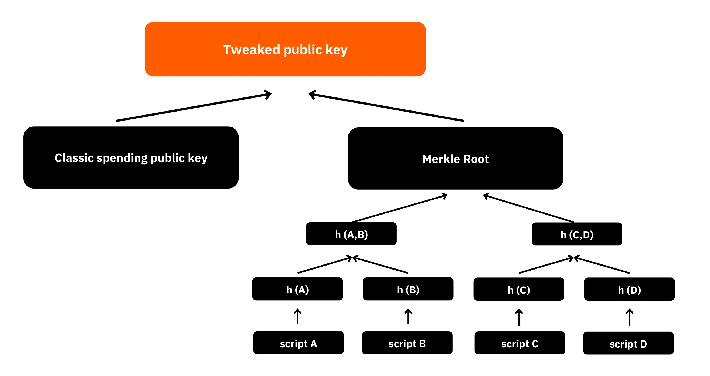


ที่อยู่ที่แสดงบนซอฟต์แวร์ wallet ของคุณยังรวมถึง HRP (*Human-Readable Part*) ซึ่งโดยทั่วไปคือ `bc` สำหรับที่อยู่หลัง SegWit, ตัวคั่น `1`, และหมายเลขเวอร์ชัน `q` สำหรับ SegWit V0 และ `p` สำหรับ Taproot/SegWit V1 นอกจากนี้ยังมีการเพิ่ม checksum เพื่อรับประกันความสมบูรณ์และความถูกต้องของที่อยู่ระหว่างการส่งข้อมูล


ในที่สุด ที่อยู่จะถูกจัดให้อยู่ในรูปแบบมาตรฐาน:


- Base58check สำหรับที่อยู่ Legacy เก่า;
- Bech32 สำหรับที่อยู่ SegWit;
- Bech32m สำหรับที่อยู่ Taproot


นี่คือเมทริกซ์การบวกสำหรับรูปแบบ bech32 และ bech32m (SegWit และ Taproot) จากฐาน 10:


| +  | 0 | 1 | 2 | 3 | 4 | 5 | 6 | 7 |
|----|---|---|---|---|---|---|---|---|
| 0  | q | p | z | r | y | 9 | x | 8 |
| 8  | g | f | 2 | t | v | d | w | 0 |
| 16 | s | 3 | j | n | 5 | 4 | k | h |
| 24 | c | e | 6 | m | u | a | 7 | l |


### การใช้ที่อยู่ซ้ำคืออะไร?


Address การใช้งานซ้ำหมายถึงการใช้ที่อยู่รับเดียวกันเพื่อบล็อก UTXO ที่แตกต่างกันหลายรายการ


ตามที่เราเห็นในส่วนก่อนหน้า แต่ละ UTXO มี ScriptPubKey ของตัวเอง ซึ่งล็อคมันไว้และต้องได้รับการตอบสนองเพื่อให้ UTXO ถูกใช้เป็นอินพุตในธุรกรรมใหม่ ภายใน ScriptPubKey นี้ที่อยู่ payload จะถูกรวมเข้าไปด้วย


เมื่อ ScriptPubKeys ต่าง ๆ มีที่อยู่รับเดียวกัน สิ่งนี้เรียกว่าการใช้ที่อยู่ซ้ำ ในทางปฏิบัติ หมายความว่าผู้ใช้ได้ให้ที่อยู่เดียวกันแก่ผู้ส่งซ้ำ ๆ เพื่อรับบิตคอยน์ผ่านการชำระเงินหลายครั้ง และเป็นการปฏิบัตินี้เองที่เป็นอันตรายต่อความเป็นส่วนตัวของคุณ


### ทำไมการใช้ที่อยู่ซ้ำถึงเป็นปัญหา?


เนื่องจากบล็อกเชนเป็นสาธารณะ จึงง่ายที่จะเห็นว่าแอดเดรสใดล็อก UTXO ใดและมีบิตคอยน์ถูกล็อกไว้เท่าใด หากใช้แอดเดรสเดียวกันสำหรับหลายธุรกรรม ก็จะสามารถสรุปได้ว่าบิตคอยน์ทั้งหมดที่เกี่ยวข้องกับแอดเดรสนั้นเป็นของบุคคลเดียวกัน การปฏิบัตินี้ทำให้ความเป็นส่วนตัวของผู้ใช้ถูกประนีประนอมโดยการสร้างลิงก์เชิงกำหนดระหว่างธุรกรรมต่างๆ และการติดตามบิตคอยน์บนบล็อกเชน Satoshi นากาโมโตะเองได้เน้นย้ำปัญหานี้ไว้แล้วในเอกสารไวท์เปเปอร์ของ Bitcoin:


> *ในฐานะไฟร์วอลล์เพิ่มเติม สามารถใช้คู่กุญแจใหม่สำหรับแต่ละธุรกรรมเพื่อให้ไม่เชื่อมโยงกับเจ้าของร่วมกัน*
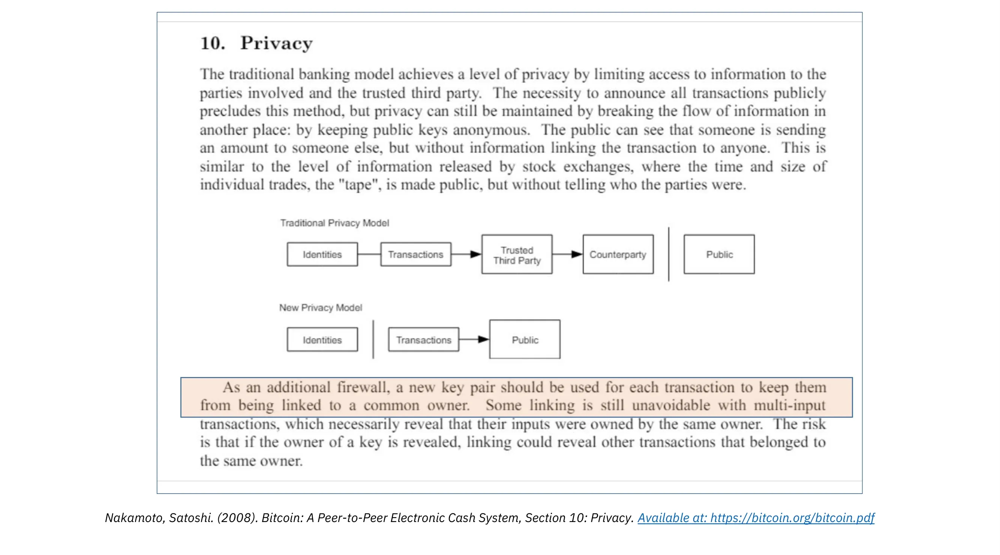


ที่มา: S. Nakamoto, "Bitcoin: A Peer-to-Peer Electronic Cash System", https://bitcoin.org/bitcoin.pdf, 2009.


ความตั้งใจของ Satoshi ในประโยคนี้คือการสร้างไฟร์วอลล์เพิ่มเติมในกรณีที่มีการเชื่อมโยงระหว่างตัวตนของผู้ใช้กับคู่คีย์บน Bitcoin เพื่อป้องกันไม่ให้กิจกรรมทั้งหมดของเขาถูกเชื่อมโยงกับตัวตนของเขาอย่างเปิดเผย ทุกวันนี้ ด้วยการแพร่หลายของบริษัทวิเคราะห์บล็อกเชนและกฎระเบียบ KYC การใช้ที่อยู่ที่ไม่ซ้ำกันไม่ใช่ "ไฟร์วอลล์เพิ่มเติม" อีกต่อไป แต่เป็นการปฏิบัติที่ขาดไม่ได้สำหรับใครก็ตามที่ต้องการรักษาระดับความเป็นส่วนตัวขั้นต่ำ


เมื่อคุณใช้ที่อยู่ซ้ำ คุณจะสร้างความเชื่อมโยงที่แทบจะปฏิเสธไม่ได้ระหว่างธุรกรรมทั้งหมดที่เกี่ยวข้องกับที่อยู่นั้น แม้ว่าสิ่งนี้จะไม่เป็นอันตรายต่อเงินของคุณโดยตรง เนื่องจากการเข้ารหัสลับแบบเส้นโค้งวงรีรับประกันความปลอดภัยของกุญแจส่วนตัวของคุณ แต่มันทำให้ง่ายต่อการติดตามกิจกรรมของคุณ อันที่จริง ใครก็ตามที่มีโหนดสามารถสังเกตธุรกรรมและยอดคงเหลือของที่อยู่ได้ ซึ่งทำให้การไม่เปิดเผยตัวตนของคุณถูกประนีประนอมอย่างสิ้นเชิง


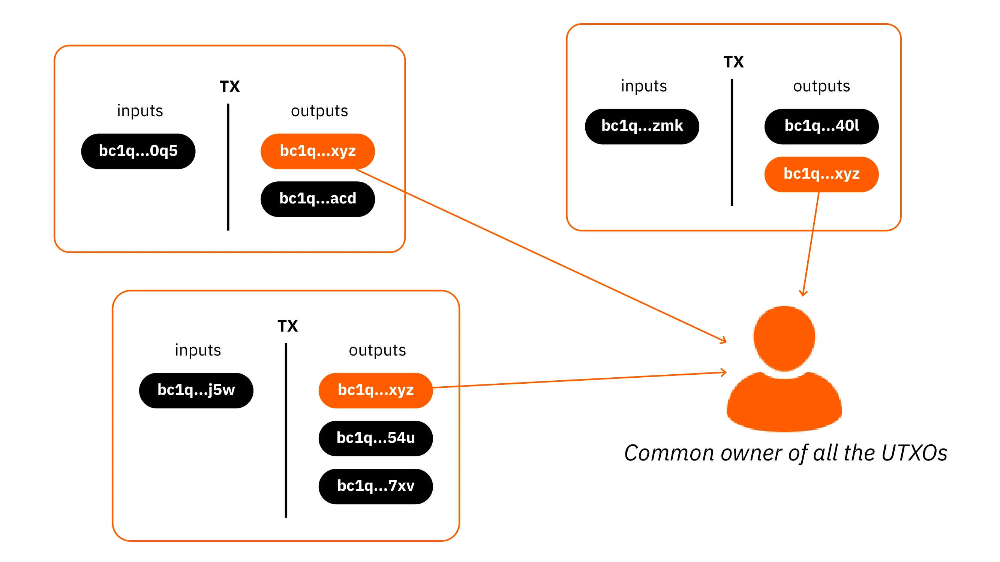


เพื่อแสดงให้เห็นถึงประเด็นนี้ ลองพิจารณาตัวอย่างของ Bob ผู้ใช้ที่ซื้อบิตคอยน์เป็นประจำในจำนวนเล็กน้อยในรูปแบบ DCA และส่งไปยังที่อยู่เดียวกันเสมอ หลังจากสองปี ที่อยู่นี้มีบิตคอยน์จำนวนมาก หาก Bob ใช้ที่อยู่นี้ในการชำระเงินให้กับพ่อค้าท้องถิ่น พ่อค้าจะสามารถเห็นเงินทั้งหมดที่เกี่ยวข้องและสรุปความมั่งคั่งของ Bob ได้ ซึ่งอาจนำไปสู่ความเสี่ยงด้านความปลอดภัยส่วนบุคคล เช่น การพยายามขโมยหรือกรรโชก หาก Bob ใช้ที่อยู่ใหม่ในการรับการซื้อแต่ละครั้ง เขาจะเปิดเผยข้อมูลน้อยลงอย่างมากต่อพ่อค้าของเขา


ในการวิเคราะห์สตริง มีการใช้ที่อยู่ซ้ำ 2 ประเภท:


- การนำกลับมาใช้ใหม่ภายนอก;
- การนำกลับมาใช้ภายในธุรกรรม


สิ่งแรกคือเมื่อมีการใช้งานที่อยู่ซ้ำในธุรกรรม Bitcoin หลายรายการ นี่คือสิ่งที่เราพูดถึงก่อนหน้านี้: การอนุมานนี้สรุปว่า UTXO ทั้งหมดที่ผ่านที่อยู่นี้เป็นของหน่วยงานเดียวกัน


การใช้ที่อยู่ภายในซ้ำจะไม่เกิดขึ้นเมื่อครอบคลุมหลายธุรกรรม แต่จะเกิดขึ้นเมื่ออยู่ภายในธุรกรรมเดียวกัน อันที่จริง หากที่อยู่เดียวกันที่ใช้ล็อกอินพุตถูกใช้เป็นเอาต์พุตของธุรกรรม เราสามารถสรุปได้ว่าเอาต์พุตนี้ยังคงเป็นของผู้ใช้คนเดียวกัน (เงินทอน) และเอาต์พุตที่สองแสดงถึงการชำระเงินจริง เทคนิคการอนุมานนี้ช่วยให้สามารถติดตามเงินผ่านหลายธุรกรรมได้


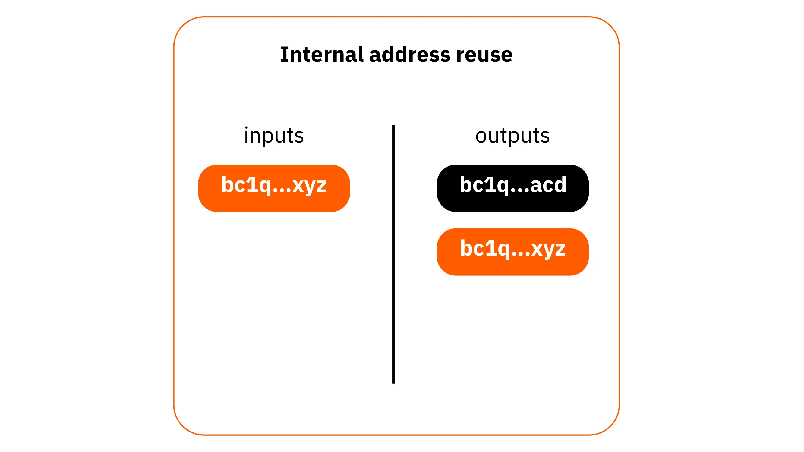


การใช้ซ้ำ Address เป็นปัญหาสำคัญสำหรับ Bitcoin ตามเว็บไซต์ OXT.me (ไม่สามารถเข้าถึงได้ในขณะนี้) อัตราการใช้ที่อยู่ซ้ำทั้งหมดบน Bitcoin อยู่ที่ประมาณ 52% ในปี 2022:


อัตรานี้สูงมาก แต่ส่วนใหญ่มาจากแพลตฟอร์มแลกเปลี่ยนมากกว่าผู้ใช้รายบุคคล


### วิธีหลีกเลี่ยงการใช้ที่อยู่ซ้ำ?


การหลีกเลี่ยงการใช้ที่อยู่ซ้ำค่อนข้างง่าย: **เพียงแค่ใช้ที่อยู่ใหม่ที่ว่างเปล่าสำหรับการชำระเงินใหม่ทั้งหมดไปยัง wallet ของคุณ**.


ต้องขอบคุณ BIP32 กระเป๋าเงินสมัยใหม่จึงมีความเป็นเชิงกำหนดและมีลำดับชั้น ซึ่งหมายความว่าผู้ใช้สามารถ generate ที่อยู่จำนวนมากจากข้อมูลเริ่มต้นเพียงชิ้นเดียว: seed โดยการบันทึกข้อมูลเพียงชิ้นเดียวนี้ จะสามารถกู้คืนคีย์ส่วนตัวทั้งหมดใน wallet ทำให้สามารถเข้าถึงเงินที่ปลอดภัยโดยที่อยู่ที่สอดคล้องกันได้


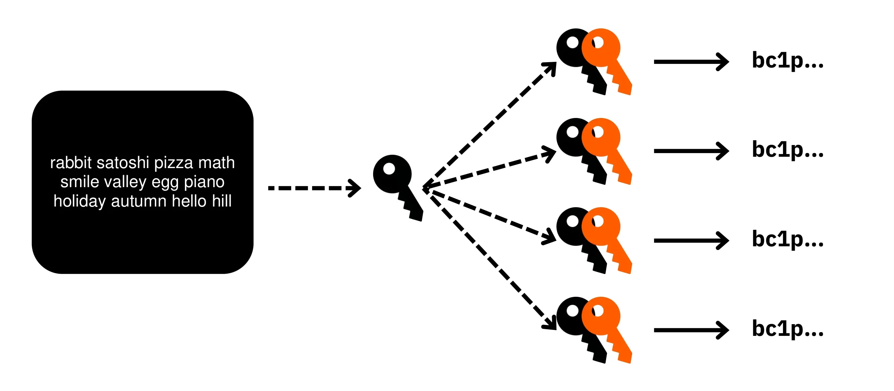


นี่คือเหตุผลที่เมื่อคุณกดปุ่ม "*รับ*" ในซอฟต์แวร์ wallet ของคุณ ที่อยู่รับที่ยังไม่ได้ใช้งานจะถูกแนะนำทุกครั้ง หลังจากรับบิตคอยน์ที่ที่อยู่นี้แล้ว ซอฟต์แวร์จะแนะนำที่อยู่ใหม่โดยอัตโนมัติ


> *หมายเหตุ: เมื่อเร็ว ๆ นี้ โปรแกรมซอฟต์แวร์บางตัวของ wallet ได้ประกาศเจตนาที่จะหยุดสร้างที่อยู่ว่าง เนื่องจากกลัวว่าจะถูกมองว่าเป็นรูปแบบหนึ่งของการฟอกเงินโดยเจ้าหน้าที่ หากซอฟต์แวร์ของคุณเป็นหนึ่งในนี้ ฉันขอแนะนำให้คุณเปลี่ยนทันที เนื่องจากสิ่งนี้ไม่เป็นที่ยอมรับสำหรับผู้ใช้*
หากคุณต้องการตัวระบุแบบคงที่เพื่อรับการชำระเงิน เช่น การบริจาค ไม่แนะนำให้ใช้ที่อยู่ Bitcoin แบบคลาสสิกเนื่องจากความเสี่ยงของการใช้งานซ้ำ ให้ใช้ที่อยู่ Lightning หรือเลือกใช้ตัวระบุการชำระเงินแบบคงที่ on-chain เช่น BIP47 หรือ Silent Payments โปรโตคอลเหล่านี้อธิบายอย่างละเอียดในส่วนที่ 6 ของหลักสูตรนี้


## การติดป้ายและตรวจสอบ UTXOs


<chapterId>fbdb07cd-c025-48f2-97b0-bd1bc21c68a8</chapterId>


:::video id=4c411c97-ebb2-483d-b4fa-03109cf5d5d7:::


ตามที่เราได้ค้นพบในส่วนของการวิเคราะห์สตริง มีการใช้ฮิวริสติกและรูปแบบต่างๆ มากมายเพื่อสรุปข้อมูลเกี่ยวกับธุรกรรม ในฐานะผู้ใช้ การตระหนักถึงเทคนิคเหล่านี้เป็นสิ่งสำคัญเพื่อป้องกันตัวเองให้ดียิ่งขึ้น


สิ่งนี้เกี่ยวข้องกับการจัดการ wallet ของคุณอย่างเข้มงวดในรูปแบบการดูแลตนเอง ซึ่งหมายถึงการรู้แหล่งที่มาของ UTXOs ของคุณ รวมถึงการเลือกอย่างระมัดระวังว่า UTXOs ใดที่จะใช้เมื่อทำการชำระเงิน การจัดการ wallet อย่างมีประสิทธิภาพนี้ขึ้นอยู่กับคุณสมบัติสำคัญสองประการของกระเป๋าเงิน Bitcoin ที่ดี: การติดแท็กและการควบคุมเหรียญ


ในบทนี้ เราจะพิจารณาคุณสมบัติเหล่านี้และดูว่าคุณสามารถใช้งานได้อย่างชาญฉลาดโดยไม่เพิ่มภาระงานมากเกินไป เพื่อเพิ่มประสิทธิภาพความเป็นส่วนตัวของคุณบน Bitcoin ได้อย่างมาก


### การติดฉลากคืออะไร?


การติดฉลากคือการปฏิบัติในการกำหนดคำอธิบายประกอบหรือฉลากให้กับ UTXO เฉพาะใน Bitcoin wallet คำอธิบายประกอบเหล่านี้จะถูกเก็บไว้ในเครื่องโดยซอฟต์แวร์ wallet และจะไม่ถูกส่งผ่านเครือข่าย Bitcoin ดังนั้นการติดฉลากจึงเป็นเครื่องมือการจัดการส่วนบุคคล


ตัวอย่างเช่น ถ้าฉันมี UTXO จากการซื้อ P2P บน Bisq กับ Charles ฉันสามารถติดป้ายว่า "`Non-KYC Bisq Charles`"


การติดแท็กเป็นวิธีปฏิบัติที่ดีที่ช่วยให้จำแหล่งที่มาหรือจุดหมายปลายทางที่ตั้งใจไว้ของ UTXO ซึ่งจึงช่วยอำนวยความสะดวกในการจัดการกองทุนและการเพิ่มประสิทธิภาพของความเป็นส่วนตัว อันที่จริง Bitcoin wallet ของคุณย่อมรักษาความปลอดภัยของ UTXOs หลายรายการ หากแหล่งที่มาของ UTXOs เหล่านี้แตกต่างกัน คุณอาจไม่ต้องการรวม UTXOs เหล่านี้ในอนาคต มิฉะนั้น คุณอาจเปิดเผยความเป็นเจ้าของร่วมกันได้ โดยการติดป้ายกำกับ UTXOs ทั้งหมดของคุณอย่างถูกต้อง คุณสามารถมั่นใจได้ว่าคุณจะจำได้ว่าพวกมันมีต้นกำเนิดมาจากที่ใดเมื่อคุณต้องการใช้งาน แม้จะผ่านไปหลายปีแล้วก็ตาม


### การควบคุมมุมคืออะไร?


การใช้การติดฉลากอย่างแข็งขันจะน่าสนใจยิ่งขึ้นเมื่อรวมกับตัวเลือกการควบคุมเหรียญบนซอฟต์แวร์ wallet ของคุณ


การควบคุม Coin เป็นคุณสมบัติที่พบในซอฟต์แวร์ Bitcoin wallet ที่ดี ซึ่งให้คุณสามารถเลือก UTXOs เฉพาะเพื่อใช้เป็นอินพุตในการทำธุรกรรมได้ด้วยตนเอง ในความเป็นจริง เพื่อที่จะตอบสนองการชำระเงินเอาต์พุต คุณจำเป็นต้องใช้ UTXO อินพุตเป็นการตอบแทน ด้วยเหตุผลหลายประการ ซึ่งเราจะพิจารณาในภายหลัง คุณอาจต้องการเลือก UTXOs ที่จะใช้เป็นอินพุตเพื่อทำการชำระเงินเฉพาะให้สำเร็จ นี่คือสิ่งที่การควบคุมเหรียญอนุญาตให้คุณทำได้ เพื่อให้เป็นการเปรียบเทียบ คุณสมบัตินี้คล้ายกับการเลือกเหรียญเฉพาะจาก wallet ของคุณเมื่อคุณจ่ายค่าบาแกตต์


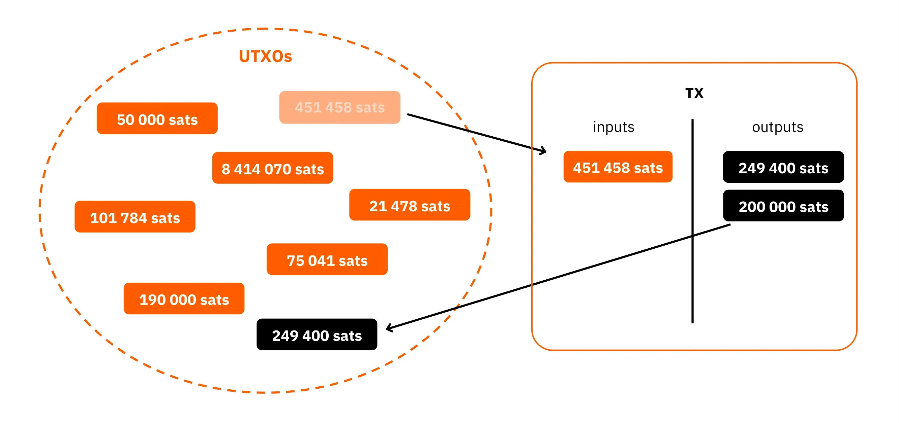


การใช้ซอฟต์แวร์ wallet ร่วมกับการควบคุมเหรียญ พร้อมด้วยการติดฉลาก UTXO ช่วยให้ผู้ใช้สามารถแยกแยะและเลือก UTXO สำหรับการทำธุรกรรมของพวกเขาได้อย่างแม่นยำ


### คุณติดป้ายกำกับ UTXOs ของคุณอย่างไร?


ไม่มีวิธีการติดป้าย UTXOs ที่เหมาะกับทุกคน คุณต้องกำหนดระบบการติดป้ายที่เข้าใจง่ายสำหรับ wallet ของคุณเอง อย่างไรก็ตาม ควรจำไว้ว่าการติดป้ายที่ดีคือการติดป้ายที่คุณสามารถเข้าใจได้เมื่อคุณต้องการ หาก Bitcoin wallet ของคุณมีวัตถุประสงค์หลักเพื่อการออม ป้ายอาจไม่มีประโยชน์สำหรับคุณในอีกหลายทศวรรษข้างหน้า ตรวจสอบให้แน่ใจว่าป้ายเหล่านั้นชัดเจน แม่นยำ และครอบคลุม


สิ่งสำคัญคือคนที่คุณรักสามารถระบุแหล่งที่มาของเงินได้อย่างง่ายดาย หากวันหนึ่งพวกเขาจำเป็นต้องเข้าถึง wallet ของคุณ สิ่งนี้จะช่วยพวกเขาทั้งในด้านความลับและเพื่อวัตถุประสงค์ทางกฎหมาย หากพวกเขาจำเป็นต้องชี้แจงแหล่งที่มาของเงินต่อเจ้าหน้าที่


สิ่งที่สำคัญที่สุดที่ควรสังเกตบนฉลากคือแหล่งที่มาของ UTXO คุณควรระบุเพียงแค่ว่าเหรียญนั้นมาอยู่ใน wallet ของคุณได้อย่างไร มันเป็นผลมาจากการซื้อบนแพลตฟอร์มแลกเปลี่ยนหรือไม่? การชำระเงินใบแจ้งหนี้จากลูกค้าหรือไม่? การแลกเปลี่ยนแบบเพียร์ทูเพียร์หรือไม่? หรือมันแสดงถึงการเปลี่ยนแปลงของค่าใช้จ่าย? ตัวอย่างเช่น คุณสามารถระบุ:


- ลบ Exchange.com`;
- การชำระเงินของลูกค้า David`;
- ซื้อ P2P Charles`;
- `เปลี่ยนการซื้อโซฟา`


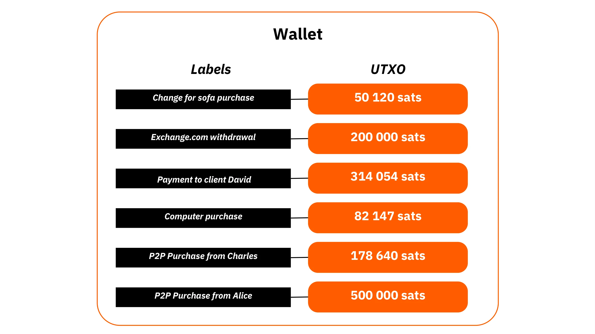


ในการปรับแต่งการจัดการ UTXO ของคุณและเคารพกลยุทธ์การแยกกองทุนของคุณภายใน wallet คุณสามารถเพิ่มตัวบ่งชี้เพิ่มเติมในป้ายกำกับของคุณเพื่อสะท้อนการแยกเหล่านี้ได้ หาก wallet ของคุณมีสองประเภทของ UTXO ที่คุณต้องการไม่ให้ผสมกัน คุณสามารถใส่เครื่องหมายลงในป้ายกำกับของคุณเพื่อแยกแยะกลุ่มเหล่านี้ได้อย่างชัดเจน เครื่องหมายการแยกเหล่านี้จะขึ้นอยู่กับเกณฑ์ของคุณเอง เช่น การแยกแยะระหว่าง UTXOs ที่เกิดจากกระบวนการเข้าซื้อที่เกี่ยวข้องกับ KYC หรือระหว่างกองทุนมืออาชีพและส่วนบุคคล การใช้ตัวอย่างป้ายกำกับที่กล่าวถึงข้างต้น สิ่งนี้อาจแปลเป็น:


- `KYC - Withdrawal Exchange.com`;
- `KYC - การชำระเงินของลูกค้า David`;
- `ไม่มี KYC - ซื้อ P2P Charles`;
- `ไม่มีการยืนยันตัวตน - เปลี่ยนการซื้อโซฟา`


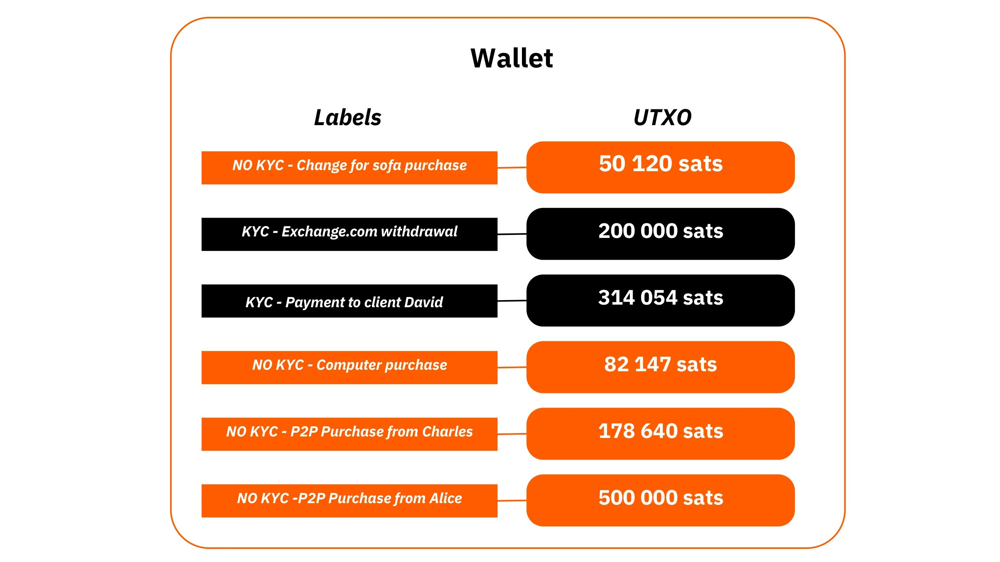


นอกจากนี้ยังแนะนำให้คงการติดฉลาก UTXO ตลอดกระบวนการทำธุรกรรม ตัวอย่างเช่น เมื่อรวม UTXO no-KYC ควรทำเครื่องหมาย UTXO ที่ได้ไม่เพียงแค่เป็น `consolidation` แต่เฉพาะเจาะจงว่าเป็น `consolidation no-KYC` เพื่อรักษาบันทึกที่ชัดเจนว่าเหรียญมาจากไหน


ในที่สุด ก็ไม่จำเป็นต้องใส่วันที่บนฉลาก ซอฟต์แวร์ wallet ส่วนใหญ่จะแสดงวันที่ทำธุรกรรมอยู่แล้ว และสามารถค้นหาข้อมูลนี้ได้เสมอบนบล็อกเอ็กซ์พลอเรอร์ด้วย TXID ของมัน


### วิธีเลือก UTXOs ที่เหมาะสม?


เมื่อคุณทำธุรกรรม การควบคุมเหรียญช่วยให้คุณเลือก UTXO ที่จะใช้เป็นอินพุตเพื่อให้ตรงกับเอาต์พุตการชำระเงินได้โดยเฉพาะ มีสองแง่มุมสำหรับการเลือกนี้:


- ความเป็นไปได้ที่ผู้รับการชำระเงินจะเชื่อมโยงส่วนหนึ่งของตัวตนของคุณกับ UTXOs ที่ใช้ในอินพุต;
- ความสามารถของผู้สังเกตการณ์ภายนอกในการสร้างความเชื่อมโยงระหว่าง UTXO ทั้งหมดที่ถูกใช้เป็นอินพุต


เพื่อแสดงให้เห็นถึงประเด็นแรก ลองมาดูตัวอย่างที่ชัดเจน สมมติว่าคุณซื้อขนมปังด้วยบิตคอยน์จากคนทำขนมปังของคุณ คุณใช้ UTXO หนึ่งหรือมากกว่าที่คุณถืออยู่เป็นอินพุตเพื่อให้ตรงกับราคาของบาแกตต์ในเอาท์พุต รวมถึงค่าธรรมเนียมการทำธุรกรรม คนทำขนมปังของคุณอาจเชื่อมโยงใบหน้าของคุณ หรือส่วนอื่น ๆ ของตัวตนของคุณที่เขารู้จัก กับเหรียญที่ใช้เป็นอินพุตได้ เมื่อรู้ถึงการมีอยู่ของลิงก์นี้ คุณอาจเลือกที่จะเลือก UTXO เฉพาะเจาะจงมากกว่าอีกอันเมื่อทำการชำระเงิน


ตัวอย่างเช่น หากหนึ่งใน UTXO ของคุณมาจากแพลตฟอร์มแลกเปลี่ยนและคุณไม่ต้องการให้คนทำขนมปังรู้เกี่ยวกับบัญชีของคุณบนแพลตฟอร์มนั้น คุณจะหลีกเลี่ยงการใช้ UTXO นั้นสำหรับการชำระเงิน หากคุณมี UTXO มูลค่าสูงที่เปิดเผยจำนวนบิตคอยน์ที่มีนัยสำคัญ คุณอาจเลือกที่จะไม่ใช้มันเพื่อหลีกเลี่ยงไม่ให้คนทำขนมปังทราบถึงความมั่งคั่ง BTC ของคุณ


การเลือก UTXOs ที่จะใช้สำหรับจุดแรกนี้จึงเป็นการตัดสินใจส่วนบุคคล ซึ่งได้รับอิทธิพลจากสิ่งที่คุณยินดีจะเปิดเผยหรือไม่ ป้ายกำกับที่คุณกำหนดให้กับ UTXOs ของคุณเมื่อคุณได้รับจะช่วยให้คุณเลือกสิ่งที่เมื่อใช้แล้วจะเปิดเผยเฉพาะข้อมูลที่คุณรู้สึกสบายใจที่จะเปิดเผยต่อผู้รับเท่านั้น


นอกเหนือจากข้อมูลที่อาจถูกเปิดเผยต่อผู้รับแล้ว การเลือกอินพุตยังมีผลต่อสิ่งที่คุณเปิดเผยต่อผู้สังเกตการณ์ทั้งหมดของบล็อกเชนอีกด้วย จริงๆ แล้ว โดยการใช้อินพุตหลาย UTXOs ในการทำธุรกรรมของคุณ คุณเปิดเผยว่าพวกมันถูกครอบครองโดยหน่วยงานเดียวกัน ตามหลักการ CIOH (_Common Input Ownership Heuristic_)


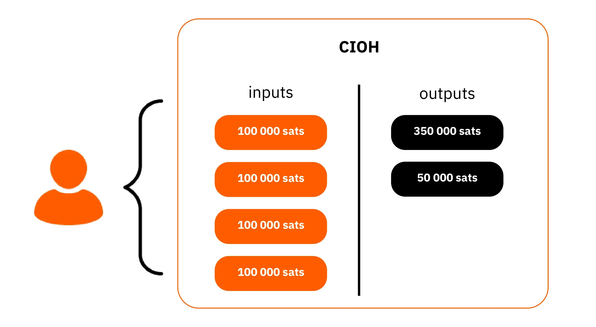


เมื่อเลือก UTXO ของคุณ คุณจำเป็นต้องตระหนักว่าธุรกรรมที่คุณกำลังจะกระจายจะสร้างการเชื่อมโยงระหว่าง UTXO ทั้งหมดที่ใช้ การเชื่อมโยงนี้อาจเป็นความเสี่ยงต่อความเป็นส่วนตัวของคุณ โดยเฉพาะอย่างยิ่งหาก UTXO มาจากแหล่งที่มาต่างกัน


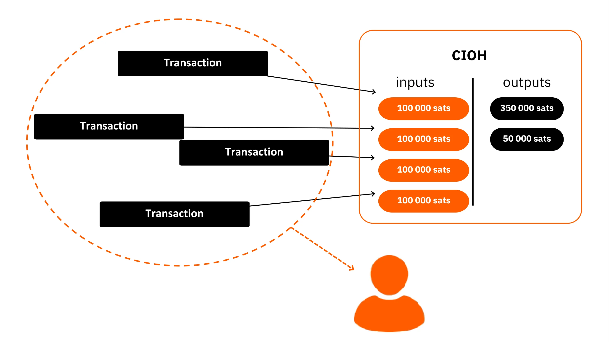


ลองพิจารณาตัวอย่างของ UTXO ที่ไม่มี KYC จาก Bisq; ฉันต้องการหลีกเลี่ยงการรวมมันกับ UTXO จากแพลตฟอร์มแลกเปลี่ยนที่มีการควบคุมซึ่งรู้จักตัวตนของฉัน หากฉันเคยใช้ UTXO ทั้งสองนี้เป็นอินพุตในธุรกรรมเดียวกัน แพลตฟอร์มที่มีการควบคุมจะสามารถเชื่อมโยงตัวตนของฉันกับ UTXO ที่ฉันซื้อบน Bisq ซึ่งก่อนหน้านี้ไม่ได้เชื่อมโยงกับตัวตนของฉัน


สุดท้ายนี้ เมื่อเลือก UTXOs ที่จะใช้เป็นอินพุตในการทำธุรกรรม สิ่งที่สำคัญที่สุดคือการหลีกเลี่ยงการใช้ UTXOs หลายรายการ มากที่สุดเท่าที่จะทำได้ ให้เลือกเหรียญเดียวที่มีขนาดใหญ่พอที่จะตอบสนองการชำระเงินของคุณ ด้วยวิธีนี้ คุณจะหลีกเลี่ยงความเสี่ยงที่เกี่ยวข้องกับ CIOH อย่างสมบูรณ์ อย่างไรก็ตาม หากไม่มี UTXO เดียวที่เพียงพอสำหรับการชำระเงินและคุณจำเป็นต้องใช้หลายรายการ ให้แน่ใจว่าพวกมันมาจากแหล่งที่คล้ายกันเพื่อลดความเสี่ยงของการเชื่อมโยงที่ไม่พึงประสงค์ นอกจากนี้ ควรคำนึงว่าผู้รับอาจเชื่อมโยงข้อมูลที่พวกเขามีเกี่ยวกับคุณกับประวัติของเหรียญที่ใช้ในการทำธุรกรรม


### การทำความเข้าใจการเลือก UTXO อัตโนมัติ


ในส่วนก่อนหน้านี้ เราได้พูดถึงการเลือก UTXOs ด้วยตนเองเพื่อใช้ในการทำธุรกรรม แต่จะเกิดอะไรขึ้นเมื่อซอฟต์แวร์ wallet ทำการเลือกนี้โดยอัตโนมัติ? มีหลายวิธีในการกำหนดว่าจะใช้เหรียญใด และการเลือก UTXOs ถือเป็นสาขาการวิจัยที่แท้จริงบน Bitcoin วัตถุประสงค์หลักของกระบวนการอัตโนมัตินี้มักจะเป็นการลดต้นทุนการทำธุรกรรมสำหรับผู้ใช้


วิธีการเลือก UTXO เช่น FIFO (*First In First Out*) และ LIFO (*Last In First Out*) เป็นวิธีที่ง่ายที่สุด แต่ก็มีประสิทธิภาพน้อยที่สุดเช่นกัน สำหรับ FIFO จะใช้ UTXOs ที่เก่าแก่ที่สุดใน wallet ก่อน วิธีนี้โดยทั่วไปแล้วไม่มีประสิทธิภาพทั้งในการลดต้นทุนการทำธุรกรรมและการรักษาความลับ ยกเว้นในกรณีที่มีการใช้ relative timelocks และจำเป็นต้องต่ออายุเป็นประจำ ในทางกลับกัน LIFO จะให้ความสำคัญกับการใช้ UTXOs ที่เกิดขึ้นล่าสุด แม้ว่าวิธีทั้งสองจะง่าย แต่ก็มักจะไม่มีประสิทธิภาพ


วิธีการที่ก้าวหน้ากว่าคือ *Knapsack Solver* ซึ่งถูกใช้บน Bitcoin Core wallet จนถึงเวอร์ชัน 0.17 มันประกอบด้วยการเลือก UTXOs จาก wallet แบบสุ่มและทำซ้ำ เพิ่มพวกมันในชุดย่อย และรักษาวิธีแก้ปัญหาที่ลดน้ำหนักของธุรกรรมให้มากที่สุดเท่าที่จะเป็นไปได้ ซึ่งจะช่วยลดค่าใช้จ่ายให้กับผู้ใช้


*Branch-and-Bound* (BNB) ซึ่งมักถูกเรียกว่า "อัลกอริทึม Murch" ตามชื่อผู้คิดค้น ได้เข้ามาแทนที่ *Knapsack Solver* ใน Bitcoin Core ตั้งแต่เวอร์ชัน 0.17 วิธีการที่ก้าวหน้านี้มีเป้าหมายเพื่อค้นหาชุดของ UTXOs ที่ตรงกับจำนวนที่ต้องการเพื่อให้เป็นไปตามผลลัพธ์ของธุรกรรม วัตถุประสงค์ของ BNB คือการลดจำนวนเงินทอนและค่าธรรมเนียมโดยการลดเกณฑ์ที่เรียกว่าการสูญเสีย ซึ่งพิจารณาทั้งต้นทุนทันทีและต้นทุนในอนาคตที่คาดการณ์ไว้ของการแลกเปลี่ยน วิธีการนี้มีที่มาจากแนวคิดดั้งเดิมของ *Branch-and-Bound* ซึ่งถูกคิดค้นขึ้นในปี 1960 โดย Ailsa Land และ Alison Harcourt และเสนอการปรับค่าธรรมเนียมให้เหมาะสมยิ่งขึ้นกว่า *Knapsack Solver*


วิธีการเลือก UTXO อัตโนมัติทั้งหมดนี้อาจมีประสิทธิภาพในการลดต้นทุนการทำธุรกรรม แต่บ่อยครั้งที่ไม่สามารถรักษาความลับของผู้ใช้ได้อย่างมีประสิทธิภาพ อันที่จริงแล้ว อัลกอริทึมเหล่านี้สามารถรวม UTXOs หลายรายการเข้าด้วยกันเป็นอินพุต ซึ่งเผยให้เห็นคุณสมบัติร่วมกันของ UTXOs เหล่านี้เนื่องจาก CIOH เห็นได้ชัดว่าวิธีการเหล่านี้ไม่สามารถคำนึงถึงป้ายกำกับที่ติดอยู่กับ UTXOs ซึ่งเป็นสิ่งสำคัญสำหรับการเลือกอย่างมีสติว่าจะเปิดเผย UTXOs ใดให้กับผู้รับธุรกรรม ปัจจุบัน วิธีเดียวที่จะเพิ่มประสิทธิภาพความลับเมื่อเลือกเหรียญคือการทำด้วยตนเอง


### บทแนะนำเกี่ยวกับการติดฉลาก UTXO


หากคุณต้องการทราบวิธีการแท็ก UTXOs ของคุณ เราได้จัดทำบทแนะนำที่ครอบคลุมเกี่ยวกับซอฟต์แวร์หลัก Bitcoin wallet ที่มีอยู่:


https://planb.academy/tutorials/privacy/on-chain/utxo-labelling-d997f80f-8a96-45b5-8a4e-a3e1b7788c52

## การยืนยันตัวตนลูกค้า (KYC) และการระบุตัวตนที่สำคัญ


<chapterId>cec6b9d9-0eed-4f85-bc4e-1e9aa59ca605</chapterId>


:::video id=ecf888fe-906f-4293-91b5-1e5ae7b2fde1:::


KYC ย่อมาจาก "Know Your Customer" เป็นกระบวนการตามกฎระเบียบที่ดำเนินการโดยบริษัทบางแห่งที่ดำเนินงานในภาคส่วน Bitcoin วัตถุประสงค์ของกระบวนการนี้คือการตรวจสอบและลงทะเบียนตัวตนของลูกค้า โดยมีเป้าหมายเพื่อป้องกันการฟอกเงินและการสนับสนุนทางการเงินแก่การก่อการร้าย


ในทางปฏิบัติ KYC เกี่ยวข้องกับการรวบรวมข้อมูลส่วนบุคคลต่างๆ จากลูกค้า ซึ่งอาจแตกต่างกันไปตามเขตอำนาจศาล แต่โดยทั่วไปจะรวมถึงบัตรประจำตัว, รูปถ่าย, และหลักฐานที่อยู่ ข้อมูลนี้จะถูกตรวจสอบและจัดเก็บไว้เพื่อการใช้งานในอนาคต


ขั้นตอนนี้ได้กลายเป็นข้อบังคับสำหรับแพลตฟอร์มแลกเปลี่ยนที่ได้รับการควบคุมในประเทศตะวันตกส่วนใหญ่ ซึ่งหมายความว่าผู้ที่ต้องการแลกเปลี่ยนสกุลเงินของรัฐเป็นบิตคอยน์ผ่านแพลตฟอร์มเหล่านี้จะต้องปฏิบัติตามข้อกำหนด KYC


ขั้นตอนนี้มีความเสี่ยงต่อความเป็นส่วนตัวและความปลอดภัยของผู้ใช้ ในบทนี้ เราจะตรวจสอบความเสี่ยงเหล่านี้อย่างละเอียดและวิเคราะห์ผลกระทบเฉพาะของกระบวนการ KYC และการระบุตัวตนต่อความเป็นส่วนตัวของผู้ใช้ Bitcoin


### การอำนวยความสะดวกในการติดตาม on-chain


ความเสี่ยงแรกที่เกี่ยวข้องกับ KYC คือมันให้จุดเริ่มต้นที่มีสิทธิพิเศษสำหรับการวิเคราะห์บล็อกเชน ดังที่เราเห็นในส่วนก่อนหน้า นักวิเคราะห์สามารถจัดกลุ่มและติดตามกิจกรรมบนบล็อกเชนโดยใช้รูปแบบการทำธุรกรรมและฮิวริสติก เมื่อพวกเขาประสบความสำเร็จในการจัดกลุ่มกิจกรรม on-chain ของผู้ใช้ สิ่งที่พวกเขาต้องทำคือหาจุดเริ่มต้นเพียงจุดเดียวในบรรดาธุรกรรมและคีย์ทั้งหมดของเขาเพื่อประนีประนอมความลับของเขาอย่างเต็มที่


เมื่อคุณดำเนินการ KYC คุณจะให้จุดเริ่มต้นที่มีคุณภาพสูงสำหรับการวิเคราะห์บล็อกเชน เนื่องจากคุณเชื่อมโยงที่อยู่รับที่คุณใช้เมื่อถอนบิตคอยน์จากแพลตฟอร์มแลกเปลี่ยนกับข้อมูลประจำตัวที่ได้รับการยืนยันของคุณ ในทางทฤษฎี ข้อมูลนี้จะเป็นที่รู้จักเฉพาะบริษัทที่คุณให้ข้อมูลเท่านั้น แต่ตามที่เราจะเห็นด้านล่าง ความเสี่ยงของการรั่วไหลของข้อมูลเป็นเรื่องจริง นอกจากนี้ แค่เพียงข้อเท็จจริงที่ว่าบริษัทถือข้อมูลนี้ก็อาจเป็นปัญหาได้ แม้ว่าจะไม่ได้แชร์ข้อมูลก็ตาม


ดังนั้น หากคุณไม่ดำเนินการขั้นตอนอื่น ๆ เพื่อจำกัดการรวมกิจกรรมของคุณบนบล็อกเชน ใครก็ตามที่มีความรู้เกี่ยวกับจุดเริ่มต้น KYC นี้อาจเชื่อมโยงกิจกรรมทั้งหมดของคุณบน Bitcoin กับตัวตนของคุณได้ จากมุมมองของบริษัทนั้น การใช้ Bitcoin ของคุณจะทำให้ความลับถูกประนีประนอม


เพื่อแสดงให้เห็นด้วยการเปรียบเทียบ ก็เหมือนกับว่าธนาคารของคุณที่ *Bank X* ไม่เพียงแต่มีสิทธิ์เข้าถึงธุรกรรมทั้งหมดของคุณกับ *Bank X* เท่านั้น แต่ยังสามารถสังเกตธุรกรรมของคุณกับ *Bank Y* และธุรกรรมเงินสดทั้งหมดของคุณได้อีกด้วย


โปรดจำไว้จากส่วนแรกของหลักสูตรนี้: โมเดลความลับของ Bitcoin ซึ่งคิดค้นโดย Satoshi Nakamoto นั้นอิงตามการแยกตัวตนของผู้ใช้กับคู่กุญแจสาธารณะและส่วนตัว แม้ว่าชั้นความลับนี้จะไม่เพียงพออีกต่อไปในปัจจุบัน แต่ก็ยังเป็นการรอบคอบที่จะจำกัดการเสื่อมสภาพของมันให้มากที่สุดเท่าที่จะเป็นไปได้


### การเปิดเผยต่อการสอดส่องของรัฐ


ปัญหาใหญ่ประการที่สองของ KYC คือมันเปิดเผยให้รัฐทราบว่าคุณเคยเป็นเจ้าของ Bitcoin ในช่วงเวลาหนึ่ง เมื่อคุณซื้อบิตคอยน์ผ่านหน่วยงานที่มีการควบคุม มันทำให้รัฐสามารถรับรู้ถึงการครอบครองนี้ได้ ในขณะนี้อาจดูเหมือนเป็นเรื่องเล็กน้อย แต่สิ่งสำคัญคือต้องจำไว้ว่าการเมืองและอนาคตทางเศรษฐกิจของประเทศคุณไม่ได้อยู่ในมือของคุณ


ประการแรก รัฐสามารถยอมรับท่าทีเผด็จการได้อย่างรวดเร็ว ประวัติศาสตร์เต็มไปด้วยตัวอย่างของนโยบายที่มีการเปลี่ยนแปลงอย่างฉับพลัน ทุกวันนี้ในยุโรป ผู้ใช้ Bitcoin สามารถเขียนบทความเกี่ยวกับ Bitcoin เข้าร่วมการประชุม และจัดการกระเป๋าเงินของตนเองได้ แต่ใครจะบอกได้ว่าอนาคตจะเป็นอย่างไร? หาก Bitcoin กลายเป็นศัตรูสาธารณะอันดับหนึ่ง การมีส่วนเกี่ยวข้องกับมันในเอกสารของรัฐบาลอาจกลายเป็นปัญหาได้


จากนั้น ในสถานการณ์วิกฤติเศรษฐกิจที่รุนแรง รัฐอาจพิจารณายึดบิตคอยน์ที่ถือครองโดยพลเมือง บางทีในวันพรุ่งนี้ ผู้ถือบิตคอยน์อาจถูกมองว่าเป็นผู้แสวงหาผลประโยชน์จากวิกฤติและจะถูกเก็บภาษีอย่างหนักสำหรับกำไรจากทุนของพวกเขา โดยเฉพาะอย่างยิ่งเมื่อค่าเงินเฟียตลดลง


คุณอาจคิดว่านี่ไม่ใช่ปัญหา เนื่องจากบิตคอยน์ของคุณถูกผสมและไม่สามารถติดตามได้ อย่างไรก็ตาม การติดตามไม่ใช่ปัญหาที่นี่ ปัญหาที่แท้จริงคือรัฐรู้ว่าคุณเคยเป็นเจ้าของบิตคอยน์ ข้อมูลนี้เพียงอย่างเดียวอาจเพียงพอที่จะกล่าวหาคุณหรือทำให้คุณต้องรับผิดชอบ คุณอาจพยายามอ้างว่าคุณได้ใช้บิตคอยน์ของคุณไปแล้ว แต่สิ่งนั้นจะต้องสะท้อนในแบบแสดงรายการภาษีของคุณ และคุณจะถูกจับได้ คุณอาจจะบอกว่าคุณทำกุญแจหายจากอุบัติเหตุทางเรือ แต่เกินกว่ามุกตลกในทวิตเตอร์ คุณคิดจริง ๆ หรือว่านั่นจะเพียงพอที่จะทำให้คุณพ้นผิด?


ดังนั้น จึงจำเป็นต้องพิจารณาความเสี่ยงที่รัฐอาจรับรู้ถึงการเป็นเจ้าของ BTC ของคุณ แม้ว่าความเสี่ยงนั้นจะดูเหมือนห่างไกลในวันนี้ก็ตาม


ปัญหาอีกประการหนึ่งที่เกิดจาก KYC ในแง่ของการกำกับดูแลของรัฐคือการรายงานที่บังคับโดยแพลตฟอร์มที่ได้รับการควบคุม แม้ว่าฉันจะไม่คุ้นเคยกับกฎระเบียบในเขตอำนาจศาลอื่น ๆ แต่ในฝรั่งเศส *Prestataires de Services sur Actifs Numériques* (PSAN) จำเป็นต้องรายงานต่อหน่วยงานกำกับดูแลทางการเงินเกี่ยวกับการเคลื่อนไหวของเงินที่น่าสงสัยใด ๆ


ในฝรั่งเศสในปี 2023 มีการรายงานการกระทำที่น่าสงสัยจำนวน 1,449 ครั้งโดย PSANs ในขณะนี้ การกระทำส่วนใหญ่เหล่านี้เกี่ยวข้องกับอาชญากรรม อย่างไรก็ตาม ทางการยังขอให้แพลตฟอร์มที่ได้รับการควบคุมรายงานธุรกรรม Bitcoin ที่น่าสงสัยใด ๆ โดยอิงจากโครงสร้างของพวกเขาเท่านั้น หากคุณดำเนินการธุรกรรมแบบร่วมมือกัน หรือแม้แต่เพียงแค่ธุรกรรมที่มีรูปแบบที่ไม่ปกติเล็กน้อย และธุรกรรมนั้นเกิดขึ้นไม่ไกลจากการถอน Bitcoins ของคุณจากแพลตฟอร์มเหล่านี้ คุณอาจถูกรายงานต่อทางการได้ แม้ในกรณีที่ไม่มีการกระทำผิดและในการใช้สิทธิ์ของคุณอย่างถูกต้อง การรายงานดังกล่าวอาจนำไปสู่การตรวจสอบและการเฝ้าระวังที่เพิ่มขึ้น ซึ่งเป็นความไม่สะดวกที่คุณจะหลีกเลี่ยงได้หากไม่มี KYC


### ความเสี่ยงของการรั่วไหลของข้อมูลส่วนบุคคล


ปัญหาอีกประการหนึ่งของ KYC คือมันต้องการให้ข้อมูลส่วนบุคคลทั้งหมดของคุณถูกเก็บไว้บนเซิร์ฟเวอร์ของบริษัทเอกชน


เหตุการณ์ล่าสุดได้เตือนเราว่าไม่มีใครที่ปลอดภัยจากความล้มเหลวทางการเงินหรือ IT ในปี 2022 ลูกค้าของ Celsius ต้องเผชิญกับผลกระทบ หลังจากบริษัทล้มละลาย รายชื่อเจ้าหนี้และจำนวนสินทรัพย์ของพวกเขาถูกเปิดเผยโดยศาลอเมริกันในระหว่างกระบวนการทางปกครอง


เมื่อสองปีกว่าที่ผ่านมา บริษัทความปลอดภัยทางไซเบอร์ด้านสกุลเงินดิจิทัลรายใหญ่ถูกโจมตี ส่งผลให้ข้อมูลส่วนตัวของลูกค้าถูกขโมยไป แม้ว่ากรณีนี้จะไม่เกี่ยวข้องโดยตรงกับการซื้อบิตคอยน์ แต่ความเสี่ยงดังกล่าวยังคงมีอยู่สำหรับแพลตฟอร์มแลกเปลี่ยน ดังนั้นจึงมีความเสี่ยงที่ชัดเจนที่เกี่ยวข้องกับข้อมูลส่วนตัว


เป็นความจริงที่ว่าเราได้มอบข้อมูลส่วนตัวจำนวนมากของเราให้กับบริษัทเอกชนแล้ว อย่างไรก็ตาม ความเสี่ยงที่นี่มีสองประการ เนื่องจากข้อมูลนี้ไม่เพียงแต่ระบุตัวคุณเท่านั้น แต่ยังเชื่อมโยงกับกิจกรรมบน Bitcoin ด้วย จริงๆ แล้ว เมื่อแฮ็กเกอร์เข้าถึงข้อมูลของลูกค้าบนแพลตฟอร์มแลกเปลี่ยน พวกเขาสามารถสันนิษฐานได้อย่างสมเหตุสมผลว่าลูกค้าเหล่านี้มี Bitcoin ความเสี่ยงนี้เพิ่มขึ้นจากข้อเท็จจริงที่ว่า Bitcoin เช่นเดียวกับสินทรัพย์มีค่าอื่น ๆ ดึงดูดความสนใจของโจร


ในกรณีที่ข้อมูลรั่วไหล อย่างดีที่สุด คุณอาจตกเป็นเป้าหมายของการพยายามฟิชชิ่งที่เจาะจง ในกรณีที่เลวร้ายที่สุด คุณอาจพบว่าตัวเองอยู่ในศูนย์กลางของการคุกคามทางกายภาพต่อบ้านของคุณ


นอกเหนือจากความเสี่ยงเฉพาะที่เกี่ยวข้องกับ Bitcoin แล้ว ยังมีอันตรายที่เกี่ยวข้องกับการส่งเอกสารประจำตัวอีกด้วย จริงๆ แล้ว ในกรณีที่ข้อมูลรั่วไหล เป็นไปได้ที่จะตกเป็นเหยื่อของการขโมยข้อมูลส่วนตัว ดังนั้น ความเสี่ยงจึงไม่จำกัดเพียงแค่การปกป้องความลับของการทำธุรกรรมเท่านั้น แต่ยังเกี่ยวข้องกับความปลอดภัยส่วนบุคคลของแต่ละบุคคลด้วย


### แนวคิดที่มีอยู่ก่อนเกี่ยวกับ KYC


สิ่งสำคัญคือต้องทำลายแนวคิดที่มีอยู่เดิมเกี่ยวกับ KYC ที่เรามักพบเจอบน Twitter หรือในการแลกเปลี่ยนกับผู้ใช้บิทคอยน์


ประการแรก การคิดว่าการปกป้องความเป็นส่วนตัวสำหรับ Bitcoins ที่ได้มาผ่าน KYC นั้นไม่มีประโยชน์เป็นความเข้าใจที่ไม่ถูกต้อง เครื่องมือและวิธีการปกป้องความเป็นส่วนตัวบน Bitcoin มีความหลากหลายและมีวัตถุประสงค์ที่แตกต่างกัน การใช้ธุรกรรม coinjoin บน Bitcoins ที่ได้มาผ่าน KYC ตัวอย่างเช่น ไม่ใช่ความคิดที่เลวร้าย แน่นอนว่าคุณต้องระมัดระวังกับแพลตฟอร์มแลกเปลี่ยนที่มีการควบคุมเพื่อหลีกเลี่ยงการที่บัญชีของคุณถูกระงับหรือถูกแบน แต่จากมุมมองทางเทคนิคอย่างเคร่งครัด การปฏิบัติเหล่านี้ไม่ขัดแย้งกัน Coinjoin มีผลในการทำลายประวัติของเหรียญ ซึ่งช่วยให้คุณขัดขวางความเสี่ยงจากการวิเคราะห์เชนบางอย่างที่เกี่ยวข้องกับ KYC แม้ว่าจะไม่สามารถกำจัดความเสี่ยงทั้งหมดได้ แต่ก็ถือเป็นประโยชน์ที่สำคัญ


การรักษาความลับบน Bitcoin ไม่ควรถูกมองในลักษณะทวิภาคี เช่น การแยกแยะระหว่างบิตคอยน์ "นิรนาม" กับบิตคอยน์อื่นๆ ที่ไม่ใช่ การเป็นเจ้าของบิตคอยน์ที่ได้มาผ่าน KYC ไม่ได้หมายความว่าทุกอย่างสูญเสียไป ในทางตรงกันข้าม การใช้เครื่องมือรักษาความลับอาจพิสูจน์ได้ว่ามีประโยชน์มากยิ่งขึ้น


ในทางกลับกัน การได้มาซึ่งบิตคอยน์ผ่านวิธีที่ไม่ใช้ KYC ไม่ได้รับประกันความเป็นส่วนตัวที่สมบูรณ์แบบ และไม่ได้ยกเว้นคุณจากความจำเป็นในการใช้มาตรการป้องกันอื่นๆ หากคุณถือบิตคอยน์ที่ไม่ใช้ KYC แต่ใช้ที่อยู่รับซ้ำหลายครั้ง ธุรกรรมของคุณอาจถูกติดตามและรวมเข้าด้วยกัน การเชื่อมโยงเพียงเล็กน้อยกับโลกภายนอก Bitcoin อาจทำลายชั้นความลับเพียงชั้นเดียวที่คุณมี ดังนั้นจึงจำเป็นต้องพิจารณาเครื่องมือและวิธีการเพิ่มความเป็นส่วนตัวทั้งหมดที่เกี่ยวข้องกับ Bitcoin เป็นการเสริมกัน แต่ละเทคนิคจะจัดการกับความเสี่ยงเฉพาะและสามารถเพิ่มชั้นการป้องกันเพิ่มเติมได้ ดังนั้นการเป็นเจ้าของ Bitcoin ที่ไม่ใช้ KYC ไม่ได้หมายความว่าคุณไม่จำเป็นต้องใช้มาตรการป้องกันอื่นๆ


### สามารถยกเลิก KYC ได้หรือไม่?


บางครั้งฉันถูกถามว่ามันเป็นไปได้ไหมที่จะ "ย้อนกลับ" หลังจากทำ KYC และอย่างที่คุณจินตนาการได้จากย่อหน้าก่อนหน้านี้ คำตอบนั้นมีความซับซ้อน วิธีที่ง่ายที่สุดในการหลีกเลี่ยงความเสี่ยงที่เกี่ยวข้องกับ KYC คือการหลีกเลี่ยงการใช้มันเมื่อซื้อบิตคอยน์ เราจะพิจารณาหัวข้อนี้อย่างละเอียดในบทถัดไป อย่างไรก็ตาม หาก KYC ได้ถูกดำเนินการไปแล้วและบิตคอยน์ได้ถูกซื้อ มีวิธีใดบ้างที่จะลดความเสี่ยงที่เกี่ยวข้อง?


เมื่อพูดถึงความเสี่ยงในการติดตามธุรกรรมของคุณ การใช้ coinjoin เป็นทางออก เราจะดูวิธีนี้อย่างละเอียดในภายหลังในหลักสูตร แต่คุณควรรู้ว่า coinjoin ช่วยให้คุณสามารถตัดประวัติของเหรียญและป้องกันไม่ให้ถูกติดตามจากอดีตถึงปัจจุบันและจากปัจจุบันถึงอดีต แม้แต่สำหรับ BTC ที่ได้มาผ่านแพลตฟอร์มที่มีการควบคุม เทคนิคนี้สามารถป้องกันการติดตามได้


อย่างไรก็ตาม, การใช้ coinjoin ไม่ได้ลบความเสี่ยงที่สองที่เกี่ยวข้องกับ KYC: ข้อเท็จจริงที่ว่ารัฐอาจได้รับข้อมูลเกี่ยวกับการครอบครองบิตคอยน์ของคุณ อันที่จริง แม้ว่าบิตคอยน์ของคุณจะไม่สามารถติดตามได้อีกต่อไป แต่รัฐ, ขึ้นอยู่กับเขตอำนาจศาล, อาจสามารถเข้าถึงการประกาศการโอนสินทรัพย์คริปโตของคุณได้ เนื่องจากความเสี่ยงนี้ไม่ใช่ด้านเทคนิค แต่เป็นด้านการบริหาร จึงไม่มีวิธีแก้ปัญหาเฉพาะ Bitcoin ที่จะกำจัดมัน นอกจากการไม่เปิดเผยตัวเองต่อ KYC ตั้งแต่แรก วิธีการทางกฎหมายเพียงอย่างเดียวในการลดความเสี่ยงนี้คือการขายบิตคอยน์ของคุณที่ได้มาผ่านแพลตฟอร์มที่มีการควบคุมบนแพลตฟอร์มที่มีการควบคุม จากนั้นซื้อคืนผ่านวิธีการที่ไม่มี KYC โดยการขายและประกาศการโอน เจ้าหน้าที่ควรเห็นว่าคุณไม่ได้เป็นเจ้าของมันอีกต่อไปแล้ว


เกี่ยวกับความเสี่ยงในการรั่วไหลของข้อมูลส่วนบุคคลและเอกสารยืนยันตัวตนของคุณ นี่เป็นอันตรายที่อยู่นอกเหนือจาก Bitcoin และไม่มีวิธีแก้ไขทางเทคนิคที่จะลดความเสี่ยงนี้ได้ เมื่อข้อมูลของคุณถูกเปิดเผยแล้ว การยกเลิกการดำเนินการนั้นเป็นเรื่องยาก คุณสามารถพยายามปิดบัญชีของคุณบนแพลตฟอร์มได้ แต่ก็ไม่ได้รับประกันว่าข้อมูล KYC ของคุณจะถูกลบ โดยเฉพาะเมื่อการยืนยันตัวตนถูกจ้างให้บุคคลภายนอก การตรวจสอบการลบข้อมูลของคุณอย่างสมบูรณ์นั้นเป็นไปไม่ได้ ดังนั้นจึงไม่มีวิธีแก้ไขเพื่อป้องกันความเสี่ยงนี้อย่างสมบูรณ์และรับประกันว่ามันจะไม่เกิดขึ้นอีก


### ความแตกต่างระหว่าง KYC และการระบุคีย์


บางครั้ง บางคนที่ใช้บิทคอยน์มักจะขยายความหมายของคำว่า "KYC" ไปยังการแลกเปลี่ยน BTC ใด ๆ ที่เกี่ยวข้องกับการโอนเงินผ่านธนาคารหรือการชำระเงินด้วยบัตรเครดิต เนื่องจากวิธีการเหล่านี้สามารถเปิดเผยแหล่งที่มาของการชำระเงินได้เช่นเดียวกับ KYC อย่างไรก็ตาม KYC ไม่ควรถูกสับสนกับการระบุคีย์ ในความคิดเห็นส่วนตัวของฉัน ฉันต้องยอมรับว่าการรับรู้ของฉันเกี่ยวกับเรื่องนี้ได้พัฒนาไปตามกาลเวลา


KYC หมายถึงกระบวนการตามกฎระเบียบที่บริษัทบางแห่งนำมาใช้เพื่อยืนยันและลงทะเบียนตัวตนของลูกค้า มันเป็นเรื่องแบบไบนารี: เมื่อคุณได้มาซึ่งบิตคอยน์ คุณจะทำ KYC หรือไม่ทำ อย่างไรก็ตาม การระบุตัวตนที่สำคัญซึ่งเกี่ยวข้องกับการเชื่อมโยงระหว่างแง่มุมหนึ่งของตัวตนผู้ใช้และกิจกรรม on-chain ไม่ได้เป็นแบบไบนารี แต่เป็นการแสดงถึงความต่อเนื่อง ในบริบทของการได้มาหรือการโอนบิตคอยน์ การระบุตัวตนดังกล่าวสามารถทำได้ในระดับที่แตกต่างกันเสมอ


ตัวอย่างเช่น หากคุณซื้อบิตคอยน์บนแพลตฟอร์มที่มีการควบคุมในสวิตเซอร์แลนด์ จะไม่จำเป็นต้องมี KYC อย่างไรก็ตาม กุญแจของคุณอาจถูกระบุได้ เนื่องจากการซื้อทำผ่านบัญชีธนาคารของคุณ นี่คือจุดที่ความเสี่ยงสองประการแรกที่เกี่ยวข้องกับ KYC - การอำนวยความสะดวกในการติดตาม on-chain และการเปิดเผยต่อการเฝ้าระวังของรัฐ - สามารถปรากฏตัวได้ในการแลกเปลี่ยนโดยไม่มี KYC หากหน่วยงานสวิสรายงานธุรกรรมที่น่าสงสัยต่อเจ้าหน้าที่ในประเทศของคุณ พวกเขาสามารถตรวจสอบบัญชีธนาคารที่ใช้ในการซื้อเพื่อค้นหาตัวตนของคุณได้อย่างง่ายดาย ดังนั้น การซื้อโดยไม่มี KYC บนแพลตฟอร์มที่มีการควบคุมจึงค่อนข้างมีความเสี่ยงสูงในการระบุตัวตนของกุญแจ


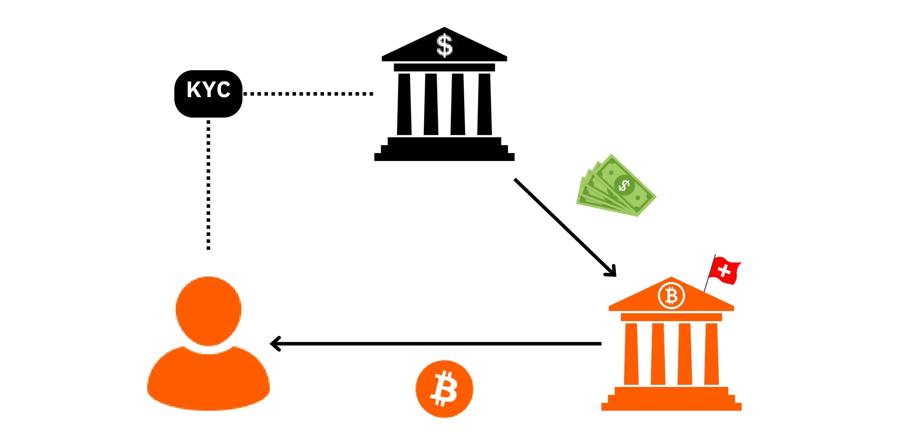


อย่างไรก็ตาม การหลีกเลี่ยงแพลตฟอร์มที่มีการควบคุมและเลือกใช้วิธีการซื้อ P2P ไม่ได้หมายความว่าจะกำจัดความเสี่ยงในการระบุข้อมูลสำคัญได้ทั้งหมด แต่เพียงแค่ลดความเสี่ยงลงเท่านั้น ลองพิจารณาตัวอย่างการซื้อบน Bisq หรือแพลตฟอร์มแบบเพียร์ทูเพียร์ (P2P) อื่น ๆ ในการชำระเงินให้กับคู่ค้าของคุณ คุณอาจจะใช้บัญชีธนาคารของคุณ หากเจ้าหน้าที่สอบถามบุคคลที่คุณทำการค้าด้วยและขอชื่อของคุณ เราก็กลับมาที่ความเสี่ยง 1 และ 2 อีกครั้ง แม้ว่าความเสี่ยงเหล่านี้จะต่ำกว่าการซื้อบนแพลตฟอร์มที่ไม่มี KYC และต่ำกว่าการซื้อที่มี KYC แต่ก็ยังคงมีอยู่ในระดับที่น้อยกว่า


สุดท้ายนี้ แม้ว่าคุณจะได้รับบิตคอยน์ผ่านการแลกเปลี่ยนเงินสดแบบตัวต่อตัว คุณก็ยังไม่สามารถปกปิดตัวตนได้อย่างสมบูรณ์ บุคคลที่คุณแลกเปลี่ยนด้วยได้เห็นใบหน้าของคุณ ซึ่งเป็นส่วนหนึ่งของตัวตนของคุณ แม้ว่าจะน้อยมากในตัวอย่างนี้ แต่ก็ยังมีความเป็นไปได้ที่จะถูกระบุตัวตนได้


โดยสรุป เมื่อมีการแลกเปลี่ยนบิตคอยน์เป็นสินทรัพย์อื่น ๆ ไม่ว่าจะเป็นการซื้อด้วยสกุลเงินของรัฐหรือการขายแลกกับสินค้าจริง จะมีการระบุข้อมูลสำคัญในบางรูปแบบเสมอ ขึ้นอยู่กับวิธีการแลกเปลี่ยนที่เลือก การระบุนี้อาจมีความเข้มข้นที่แตกต่างกันไป สิ่งสำคัญคือต้องไม่สับสนระหว่างการระบุตัวตนนี้กับ KYC ซึ่งเป็นกระบวนการกำกับดูแลที่มีการกำหนดไว้อย่างชัดเจน อย่างไรก็ตาม มีความเชื่อมโยงระหว่าง KYC กับสเปกตรัมการระบุตัวตน เนื่องจาก KYC อยู่ในระดับสูงสุดของสเปกตรัม ซึ่งช่วยอำนวยความสะดวกในการระบุกุญแจของผู้ใช้โดยเจ้าหน้าที่อย่างเป็นระบบ


## วิธีการขายและการเข้าซื้อกิจการ


<chapterId>756598af-95aa-4c77-ac48-243c7ad89530</chapterId>


:::video id=9fd3d90f-32f4-48a2-a740-3597249551db:::


หลังจากอ่านบทก่อนหน้านี้ คุณอาจสงสัยว่าคุณสามารถซื้อหรือขายบิตคอยน์โดยไม่ต้องผ่านกระบวนการยืนยันตัวตนได้อย่างไร เพื่อหลีกเลี่ยงความเสี่ยงที่เกี่ยวข้องกับ KYC มีหลายวิธีในการซื้อขาย Bitcoin


### P2P การแลกเปลี่ยนเงินสด


ตามที่เราได้เห็น วิธีที่ดีที่สุดในแง่ของความลับยังคงเป็นการแลกเปลี่ยน P2P (บุคคลต่อบุคคล) พร้อมการชำระเงินด้วยเงินสด วิธีนี้ช่วยให้คุณลดร่องรอยที่ทิ้งไว้และลดความเป็นไปได้ในการระบุคีย์ได้อย่างมาก ไม่ว่าคุณจะซื้อหรือขายก็ตาม


อย่างไรก็ตาม มีความเสี่ยงต่อความปลอดภัยส่วนบุคคล อันตรายหลักอยู่ที่ข้อเท็จจริงที่ว่า ในระหว่างการแลกเปลี่ยน คู่สัญญาจะรู้ว่าคุณถือเงินจำนวนมาก ไม่ว่าจะเป็นเงินสดหรือบิตคอยน์ ข้อมูลนี้สามารถดึงดูดความสนใจของบุคคลที่ไม่หวังดี อันที่จริงแล้ว โดยทั่วไปแนะนำให้เก็บข้อมูลการถือครองบิตคอยน์ของคุณเป็นความลับ คำแนะนำนี้สามารถนำไปใช้กับเงินสดได้เช่นกัน อย่างไรก็ตาม เมื่อแลกเปลี่ยนด้วยตนเอง เป็นสิ่งที่หลีกเลี่ยงไม่ได้ที่คุณจะเปิดเผยบิตคอยน์ของคุณเอง และสิ่งนี้อาจดึงดูดความสนใจที่ไม่พึงประสงค์


เพื่อลดความเสี่ยงนี้ ฉันแนะนำให้เลือกทำธุรกรรมเงินสดกับบุคคลที่เชื่อถือได้ เช่น สมาชิกในครอบครัวหรือเพื่อนสนิท อีกทางเลือกหนึ่ง คุณอาจพิจารณาการแลกเปลี่ยนที่ [การพบปะ Bitcoin ในท้องถิ่น](https://btcmap.org/communities/map) หลังจากเข้าร่วมหลายครั้งแล้ว ซึ่งจะช่วยให้คุณรู้จักผู้เข้าร่วมคนอื่นๆ ได้ดีขึ้นและไม่ต้องอยู่คนเดียวเมื่อทำการแลกเปลี่ยนทางกายภาพ อย่างไรก็ตาม จำเป็นต้องยอมรับว่าการแลกเปลี่ยนเงินสด P2P มีความเสี่ยงต่อความปลอดภัยส่วนบุคคลของคุณ ซึ่งไม่มีเมื่อซื้อผ่านแพลตฟอร์มที่มีการควบคุมและผ่านบัญชีธนาคารของคุณ


ยิ่งไปกว่านั้น ขึ้นอยู่กับสถานที่ของคุณ การขนส่งและเก็บรักษาเงินจำนวนมากอาจมีความเสี่ยง ไม่ว่าจะเป็นบิทคอยน์หรือเงินสดก็ตาม


การแลกเปลี่ยนเงินสดอาจก่อให้เกิดความเสี่ยงทางกฎหมายในกรณีที่มีการตรวจสอบจากตำรวจหรือหน่วยงานอื่น ๆ แม้ว่าจะไม่มีข้อจำกัดเกี่ยวกับจำนวนเงินสดที่คุณสามารถพกพาได้ในประเทศส่วนใหญ่ แต่การมีเงินสดจำนวนมากเกินไปอาจทำให้เกิดความสงสัยได้ ควรระมัดระวัง โดยเฉพาะอย่างยิ่งหากคุณต้องเดินทางไกล และหลีกเลี่ยงการทำธุรกรรมขนาดใหญ่หลายครั้งในคราวเดียว เพื่อไม่ให้ต้องอธิบายการครอบครองเงินจำนวนมาก


สุดท้ายนี้ ข้อเสียอีกประการหนึ่งของการซื้อ P2P คือราคามักจะสูงกว่าบนแพลตฟอร์มที่มีการควบคุม ผู้ขายมักจะเรียกเก็บค่าบริการเพิ่มตั้งแต่ 1% ไปจนถึงมากกว่า 10% ในบางครั้ง มีหลายเหตุผลสำหรับความแตกต่างของราคา ประการแรก นี่เป็นแนวทางปฏิบัติทั่วไปในหมู่ผู้ขาย P2P ที่ได้กลายเป็นที่ยอมรับเมื่อเวลาผ่านไป ประการที่สอง ผู้ขายมีค่าธรรมเนียมที่เกี่ยวข้องกับการทำธุรกรรมเพื่อครอบคลุมค่าใช้จ่ายในการส่งเงินให้กับผู้ซื้อ นอกจากนี้ยังมีความเสี่ยงที่เพิ่มขึ้นของการโจรกรรมในการขาย P2P เมื่อเทียบกับการทำธุรกรรมบนแพลตฟอร์ม ซึ่งเป็นเหตุผลที่สมควรสำหรับการชดเชยความเสี่ยงที่เกิดขึ้น สุดท้ายนี้ ค่าใช้จ่ายเพิ่มเติมอาจเชื่อมโยงกับความต้องการและคุณภาพของการแลกเปลี่ยนในแง่ของความลับ ในฐานะผู้ซื้อ การได้รับความลับมีราคา ซึ่งสะท้อนให้เห็นในค่าบริการที่ผู้ขายเรียกเก็บ บางคนที่ใช้บิตคอยน์ยังเชื่อว่าราคาค่าบริการของ BTC ที่ซื้อบน P2P สะท้อนถึงราคาที่แท้จริง และโต้แย้งว่าราคาที่ต่ำกว่าบนแพลตฟอร์มที่มีการควบคุมเป็นผลมาจากการประนีประนอมในเรื่องความลับของข้อมูลส่วนบุคคลของคุณ


### P2P แลกเปลี่ยนผ่านแพลตฟอร์มหาคู่


ทางเลือกที่มีความเสี่ยงน้อยกว่าในแง่ของความปลอดภัยส่วนบุคคลคือการทำการแลกเปลี่ยน P2P ทางออนไลน์เท่านั้น โดยใช้วิธีการชำระเงินทางอิเล็กทรอนิกส์ เช่น PayPal, การโอนเงินผ่านธนาคาร หรือ Revolut


วิธีการนี้หลีกเลี่ยงความเสี่ยงหลายประการที่เกี่ยวข้องกับการทำธุรกรรมด้วยเงินสด อย่างไรก็ตาม ความเสี่ยงที่คู่สัญญาจะผิดนัดชำระในการแลกเปลี่ยนออนไลน์นั้นสูงกว่า จริงๆ แล้ว ในการแลกเปลี่ยนทางกายภาพ หากคุณมอบเงินให้กับผู้ขายที่ไม่ส่งบิตคอยน์กลับมาให้คุณ คุณสามารถเรียกร้องเขาได้ทันที เพราะเขายืนอยู่ตรงหน้าคุณ ในทางกลับกัน ออนไลน์ มักจะเป็นไปไม่ได้ที่จะติดตามคนที่ขโมยจากคุณ


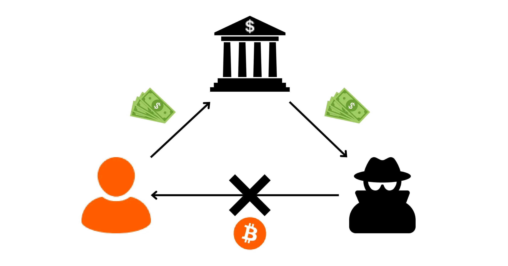


เพื่อลดความเสี่ยงนี้ สามารถใช้แพลตฟอร์มเฉพาะสำหรับการแลกเปลี่ยนแบบเพียร์ทูเพียร์ (P2P) แพลตฟอร์มเหล่านี้ใช้กลไกการแก้ไขข้อขัดแย้งเพื่อปกป้องผู้ใช้ที่ได้รับความเสียหาย โดยทั่วไปแล้วพวกเขาจะมีระบบเอสโครว์ ซึ่งบิตคอยน์จะถูกเก็บไว้จนกว่าผู้ขายจะยืนยันการชำระเงินในสกุลเงินเฟียต


ในแง่ของความปลอดภัยส่วนบุคคล วิธีการซื้อแบบนี้ปลอดภัยกว่าการแลกเปลี่ยนเงินสดด้วยตนเองอย่างมาก อย่างไรก็ตาม ดังที่กล่าวไว้ข้างต้น การแลกเปลี่ยน P2P ออนไลน์ทิ้งร่องรอยมากกว่าการแลกเปลี่ยนทางกายภาพ ซึ่งอาจเป็นอันตรายต่อความเป็นส่วนตัวของ Bitcoin โดยการใช้วิธีการชำระเงินด้วยเงินเฟียตออนไลน์ เช่น ธนาคาร คุณเปิดเผยข้อมูลเพิ่มเติมที่อาจช่วยในการระบุตัวตนที่สำคัญได้


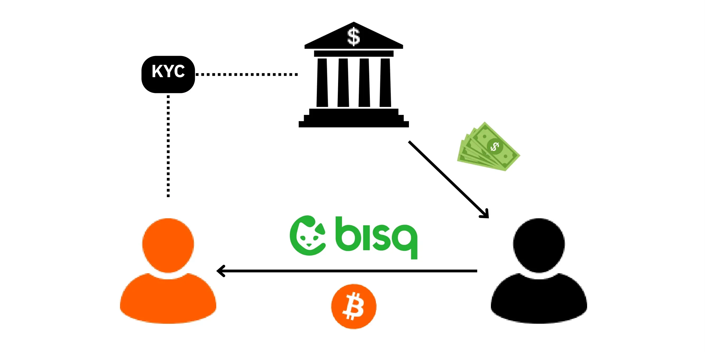


อีกครั้งหนึ่ง ฉันไม่แนะนำให้ทำการซื้อขายขนาดใหญ่หลายรายการในธุรกรรมเดียวบนแพลตฟอร์มเหล่านี้ โดยการแบ่งธุรกรรมของคุณออก คุณจะกระจายความเสี่ยงของการโจรกรรมจากคู่สัญญา


อีกครั้งหนึ่ง ข้อเสียอีกประการของการซื้อ P2P คือราคามักจะสูงกว่าที่พบในแพลตฟอร์มที่มีการควบคุม ผู้ขายมักจะคิดราคาสูงขึ้นตั้งแต่ 1% ไปจนถึงบางครั้งมากกว่า 10% มีหลายเหตุผลสำหรับความแตกต่างของราคา ประการแรก นี่เป็นการปฏิบัติทั่วไปในหมู่ผู้ขาย P2P ที่ได้กลายเป็นที่ยอมรับตามกาลเวลา ประการที่สอง ผู้ขายมีค่าธรรมเนียมที่เกี่ยวข้องกับการทำธุรกรรมเพื่อครอบคลุมค่าใช้จ่ายในการส่งเงินให้กับผู้ซื้อ นอกจากนี้ยังมีความเสี่ยงที่เพิ่มขึ้นของการโจรกรรมในการขาย P2P เมื่อเทียบกับการทำธุรกรรมบนแพลตฟอร์ม ซึ่งเป็นเหตุผลที่สมควรได้รับค่าตอบแทนสำหรับความเสี่ยงที่เกิดขึ้น สุดท้าย ค่าใช้จ่ายเพิ่มเติมอาจเชื่อมโยงกับความต้องการและคุณภาพของการแลกเปลี่ยนในแง่ของความลับ ในฐานะผู้ซื้อ การได้รับความลับมีราคา ซึ่งสะท้อนอยู่ในราคาที่เพิ่มขึ้นที่ผู้ขายกำหนด บางคนที่ใช้บิตคอยน์ยังเชื่อว่าราคาที่เพิ่มขึ้นของ BTC ที่ซื้อบน P2P สะท้อนถึงราคาที่แท้จริง และโต้แย้งว่าราคาที่ต่ำกว่าบนแพลตฟอร์มที่มีการควบคุมเป็นผลมาจากการประนีประนอมในเรื่องความลับของข้อมูลส่วนบุคคลของคุณ


เท่าที่เกี่ยวกับการแก้ปัญหา ส่วนตัวแล้วฉันมักจะใช้ [Bisq](https://bisq.network/) และฉันก็พอใจกับมันมาก ระบบของพวกเขาได้รับการทดสอบและดูเหมือนว่าจะเชื่อถือได้ อย่างไรก็ตาม Bisq ใช้งานได้เฉพาะบน PC และอินเทอร์เฟซอาจซับซ้อนเกินไปสำหรับผู้เริ่มต้น อีกข้อเสียคือ Bisq ทำงานได้เฉพาะกับธุรกรรม on-chain ซึ่งอาจมีค่าใช้จ่ายสูงในช่วงที่ค่าธรรมเนียมธุรกรรม Bitcoin สูง


-> ดูบทแนะนำ Bisq ของเรา


https://planb.academy/tutorials/exchange/peer-to-peer/bisq-fe244bfa-dcc4-4522-8ec7-92223373ed04

สำหรับตัวเลือกที่ง่ายกว่า คุณสามารถลองใช้ [Peach](https://peachbitcoin.com/) ซึ่งเป็นแอปพลิเคชันมือถือที่เชื่อมต่อผู้ซื้อและผู้ขายพร้อมระบบแก้ไขข้อขัดแย้งในตัว กระบวนการนี้ใช้งานง่ายกว่า Bisq


-> ดูบทแนะนำ Peach ของเรา


https://planb.academy/tutorials/exchange/peer-to-peer/peach-c6143241-d900-4047-9b73-1caba5e1f874

อีกตัวเลือกออนไลน์คือ [HodlHodl](https://hodlhodl.com/), แพลตฟอร์มที่มีชื่อเสียงที่มีสภาพคล่องดี แม้ว่าฉันจะยังไม่ได้ทดสอบด้วยตัวเองก็ตาม


-> ดูบทแนะนำ HodlHodl ของเรา


https://planb.academy/tutorials/exchange/peer-to-peer/hodlhodl-d7344cd5-6b18-40f5-8e78-2574a93a3879

สำหรับโซลูชันที่ใช้ Lightning Network ลองใช้ [RoboSats](https://learn.robosats.com/) และ [LNP2PBot](https://lnp2pbot.com/) RoboSats สามารถเข้าถึงได้ผ่านเว็บไซต์และใช้งานได้ค่อนข้างง่าย LNP2PBot นั้นไม่ธรรมดา เนื่องจากทำงานผ่านระบบแลกเปลี่ยนภายในแอปพลิเคชันส่งข้อความ Telegram


-> ดูบทแนะนำ RoboSats ของเรา


-> ดูบทแนะนำ LNP2PBot ของเรา


https://planb.academy/tutorials/exchange/peer-to-peer/robosats-b60e4f7c-533a-4295-9f6d-5368152e8c06

https://planb.academy/tutorials/exchange/peer-to-peer/lnp2pbot-v2-e6bcb210-610b-487d-970c-7cce85273e3c


### แพลตฟอร์มที่มีการควบคุมโดยไม่มี KYC


ขึ้นอยู่กับประเทศที่คุณอาศัยอยู่ คุณอาจสามารถเข้าถึงแพลตฟอร์มที่มีการควบคุมซึ่งไม่ต้องการกระบวนการ KYC เพื่อซื้อหรือขายบิตคอยน์ได้ ในประเทศสวิตเซอร์แลนด์ ตัวอย่างเช่น คุณสามารถใช้ [Relai](https://relai.app/) และ [MtPelerin](https://www.mtpelerin.com/) ซึ่งตอนนี้ให้บริการภายใต้กฎระเบียบ KYC


-> ดูบทแนะนำของเราเกี่ยวกับ Relai


https://planb.academy/tutorials/exchange/centralized/relai-v2-30a9671d-e407-459d-9203-4c3eae15b30e

ตามที่เราเห็นในบทก่อนหน้า แพลตฟอร์มประเภทนี้ช่วยลดความเสี่ยงที่เกี่ยวข้องกับกระบวนการ KYC อย่างไรก็ตาม มันยังนำเสนอระดับความเสี่ยงที่สูงขึ้นสำหรับการระบุคีย์ ในแง่ของความลับ Bitcoin แพลตฟอร์มเหล่านี้จึงให้การป้องกันที่ดีกว่าวิธีการซื้อที่มี KYC แต่ยังคงมีความน่าสนใจน้อยกว่าการแลกเปลี่ยน P2P


อย่างไรก็ตาม ในแง่ของความปลอดภัยส่วนบุคคล การใช้แพลตฟอร์มเหล่านี้มีความเสี่ยงน้อยกว่าการแลกเปลี่ยน P2P มาก นอกจากนี้ยังมักจะใช้งานง่ายกว่าแพลตฟอร์ม P2P อีกด้วย


### ตู้เอทีเอ็ม


อีกทางเลือกหนึ่งสำหรับการซื้อหรือขายบิตคอยน์โดยไม่ต้องใช้ KYC คือเครื่อง ATM สกุลเงินดิจิทัล ส่วนตัวแล้วฉันไม่เคยมีโอกาสทดสอบวิธีนี้ เนื่องจากไม่มีให้บริการในประเทศของฉัน แต่วิธีนี้อาจน่าสนใจมาก ขึ้นอยู่กับว่าคุณอาศัยอยู่ที่ไหน


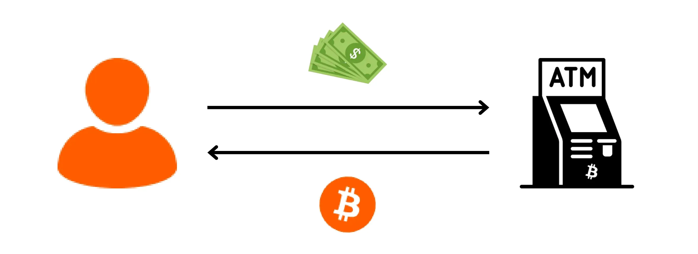


ปัญหาของตู้เอทีเอ็มคือมันถูกห้ามในบางประเทศหรือถูกควบคุมอย่างเข้มงวดในประเทศอื่น ๆ หากตู้เอทีเอ็มต้องการขั้นตอนการยืนยันตัวตน มันก็จะเผชิญกับความเสี่ยงเช่นเดียวกับแพลตฟอร์มที่ถูกควบคุมโดย KYC ในทางกลับกัน หากตู้เอทีเอ็มอนุญาตให้ทำธุรกรรมโดยไม่ต้องยืนยันตัวตนสำหรับจำนวนเงินเล็กน้อย การใช้งานก็สามารถให้ระดับความลับที่เทียบเท่ากับการแลกเปลี่ยนเงินสด P2P ในขณะที่หลีกเลี่ยงความเสี่ยงส่วนใหญ่ที่เกี่ยวข้องกับการแลกเปลี่ยนประเภทนี้


ข้อเสียหลักของตู้เอทีเอ็มคือค่าธรรมเนียมการแลกเปลี่ยนที่มักจะสูง ซึ่งอาจอยู่ในช่วงตั้งแต่ไม่กี่เปอร์เซ็นต์จนถึงสูงถึง 15% ของจำนวนเงินที่แลกเปลี่ยน


### บัตรของขวัญ


สุดท้ายนี้ ฉันอยากจะแนะนำคุณให้รู้จักกับโซลูชันที่ทำงานได้ดีสำหรับผู้ที่ต้องการใช้บิตคอยน์ในชีวิตประจำวันเพื่อการซื้อสินค้า แทนที่จะขายมันเป็นสกุลเงินเฟียต


วิธีที่ดีที่สุดในการใช้ BTC คือการใช้ Bitcoin หรือ Lightning Network โดยตรงเพื่อซื้อสินค้าและบริการ อย่างไรก็ตาม ในหลายประเทศ จำนวนร้านค้าที่รับ Bitcoin ยังมีจำกัด ทางเลือกที่เป็นไปได้คือการใช้บัตรของขวัญ


หลายแพลตฟอร์มที่ไม่ต้องการกระบวนการ KYC เสนอความเป็นไปได้ในการแลกเปลี่ยนบิตคอยน์เป็นบัตรของขวัญที่สามารถใช้ได้กับร้านค้าปลีกรายใหญ่ ซึ่งรวมถึง [CoinsBee](https://www.coinsbee.com/), [The Bitcoin Company](https://thebitcoincompany.com/) และ [Bitrefill](https://www.bitrefill.com/) แพลตฟอร์มเหล่านี้ทำให้การใช้บิตคอยน์ในชีวิตประจำวันง่ายขึ้นมาก โดยให้คุณเข้าถึงผลิตภัณฑ์และบริการหลากหลายโดยไม่ต้องแปลงเป็นสกุลเงินทั่วไป


https://planb.academy/tutorials/exchange/centralized/bitrefill-8c588412-1bfc-465b-9bca-e647a647fbc1


### วิธีการได้มาซึ่งอื่น ๆ


วิธีอื่นๆ ในการรับบิตคอยน์ขณะปกป้องความเป็นส่วนตัวของคุณรวมถึง, แน่นอน, mining. ในการเริ่มต้น mining sats, คุณไม่จำเป็นต้องเปิดเผยตัวตนของคุณ; เพียงแค่ค้นหา proof of work ที่ถูกต้องและส่งไปยังเครือข่าย. หากคุณเลือกใช้ pool mining, บาง pool ต้องการรูปแบบการระบุตัวตนบางอย่าง เช่น KYC, ในขณะที่บาง pool ไม่ต้องการ.


อีกวิธีหนึ่งคือการทำงานเพื่อแลกกับบิตคอยน์ วิธีการได้มานี้อาจน่าสนใจ แต่ระดับของการระบุตัวตนที่จำเป็นนั้นแตกต่างกันอย่างมากขึ้นอยู่กับสถานการณ์


*ในการเขียนบทนี้ ฉันใช้หลักสูตร BTC205 ที่จัดทำโดย [@pivi___](https://x.com/pivi___) บน Plan ₿ Academy (มีเฉพาะในภาษาฝรั่งเศสในขณะนี้)*


## การรวมบัญชี, การจัดการ UTXO, และ CIOH


<chapterId>d0486c8f-332d-402b-ae2e-949416752b9c</chapterId>


:::video id=9e5841a2-4ff5-460e-a161-0e0af57f95d8:::


หนึ่งในแง่มุมที่ซับซ้อนที่สุดของการจัดการ wallet ด้วยตนเองคือการรวมบัญชี คุณควรรวมบัญชีหรือไม่? จุดประสงค์คืออะไร? ขนาดของ UTXO ที่ควรเคารพคือเท่าใด? มีการประนีประนอมในแง่ของความลับอย่างไร? นั่นคือสิ่งที่เราจะพิจารณาในส่วนนี้


### การรวมกิจการคืออะไร?


Bitcoin ดำเนินการเหมือนตลาดประมูล โดยที่นักขุดจะให้ความสำคัญกับธุรกรรมที่เสนอค่าธรรมเนียมต่ำที่สุด อย่างไรก็ตาม แต่ละบล็อกมีน้ำหนักสูงสุด ซึ่งจำกัดจำนวนธุรกรรมที่สามารถรวมไว้ในนั้นได้ เนื่องจากบล็อกถูกผลิตขึ้นโดยเฉลี่ยทุกๆ 10 นาที พื้นที่ที่มีอยู่ในแต่ละบล็อกจึงเป็นทรัพยากรที่หายาก


นักขุด ซึ่งกิจกรรมของพวกเขา generate มีค่าใช้จ่ายที่สำคัญในแง่ของไฟฟ้า สินทรัพย์ถาวร และการบำรุงรักษา จึงมักจะพยายามเพิ่มความสามารถในการทำกำไรให้สูงสุด ดังนั้นพวกเขาจึงมักจะชอบการทำธุรกรรมที่ generate ค่าธรรมเนียมสูงสุดเมื่อเทียบกับน้ำหนักของพวกเขา


ไม่ใช่ทุกธุรกรรม Bitcoin ที่มีน้ำหนักเท่ากัน ธุรกรรมที่มีอินพุตและเอาต์พุตมากกว่าจะมีน้ำหนักมากกว่า ตัวอย่างเช่น ลองจินตนาการถึง 2 ธุรกรรม:


- ธุรกรรม A ประกอบด้วย 1 อินพุตและ 1 เอาต์พุต มีค่าธรรมเนียม 1,994 sats และมีน้ำหนัก 141 vB;
- ธุรกรรม B ซึ่งเป็นธุรกรรมที่ซับซ้อนกว่ามี 2 อินพุตและ 2 เอาต์พุต จัดสรรค่าธรรมเนียม 2,640 sats สำหรับน้ำหนัก 220 vB.


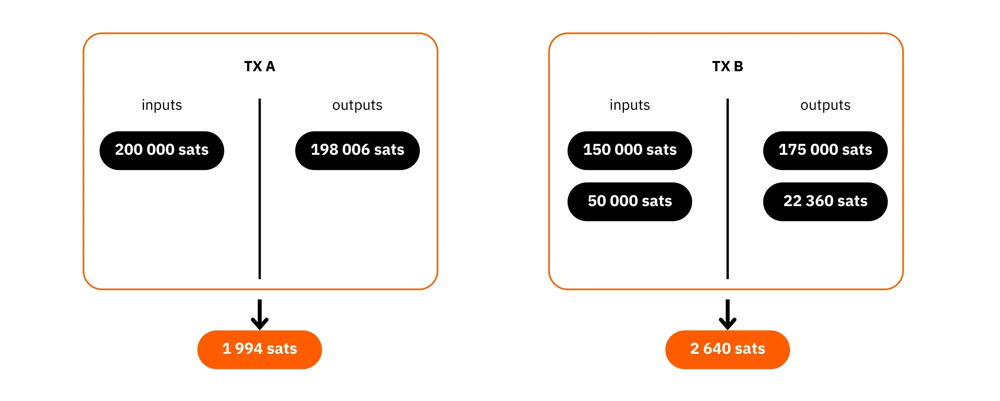


ในตัวอย่างนี้ แม้ว่าธุรกรรม B จะเสนอค่าธรรมเนียมรวมที่สูงกว่า นักขุดจะชอบธุรกรรม A มากกว่า เนื่องจากมีอัตราส่วนค่าธรรมเนียมต่อหน่วยน้ำหนักที่ดีกว่า นี่คือการคำนวณสำหรับแต่ละธุรกรรม แสดงในรูปแบบ sats ต่อไบต์เสมือน (sat/vB):


```text
TXA: 1994 / 141 = 14 sats/vB
TXB: 2640 / 220 = 12 sats/vB
```


ซึ่งหมายความว่าสำหรับแต่ละหน่วยของน้ำหนัก การทำธุรกรรม A เสนอค่าใช้จ่ายมากกว่าการทำธุรกรรม B แม้ว่าการทำธุรกรรม B จะเสนอค่าใช้จ่ายมากกว่าในแง่สัมบูรณ์ก็ตาม


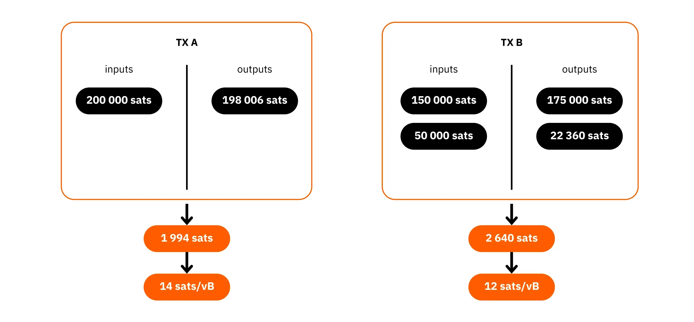


ดังนั้นจึงเป็นเรื่องที่น่าสนใจเสมอสำหรับผู้ใช้ที่จะบริโภคอินพุตให้น้อยที่สุดเท่าที่จะเป็นไปได้ในการทำธุรกรรมของพวกเขา อย่างไรก็ตาม คุณจำเป็นต้องบริโภคในปริมาณที่เพียงพอเพื่อให้ตรงกับการชำระเงินเอาต์พุต เมื่อจัดการ wallet ของคุณ คุณจำเป็นต้องมี UTXOs ที่มีขนาดใหญ่เพียงพอ


หลักการของการรวมบัญชีคือการใช้ประโยชน์จากช่วงเวลาที่ค่าธรรมเนียมต่ำบน Bitcoin เพื่อรวม UTXOs ขนาดเล็กให้เป็นหนึ่งเดียวที่ใหญ่ขึ้น ด้วยวิธีนี้ เมื่อค่าธรรมเนียมเพิ่มขึ้นบน Bitcoin คุณจะสามารถทำธุรกรรมด้วยจำนวนอินพุตที่น้อยที่สุด และดังนั้นจึงใช้จ่ายค่าธรรมเนียมน้อยลงในแง่ของจำนวนเงินที่แน่นอน เป้าหมายคือการคาดการณ์ธุรกรรมที่จำเป็นต้องดำเนินการในช่วงเวลาที่ค่าธรรมเนียมสูง


นอกจากการประหยัดค่าใช้จ่ายในการทำธุรกรรมแล้ว การรวม UTXOs ยังช่วยป้องกันการเกิด "ฝุ่น" อีกด้วย "Dust" หมายถึง UTXOs ที่มีมูลค่าใน sats ต่ำมากจนไม่เพียงพอที่จะครอบคลุมค่าใช้จ่ายในการทำธุรกรรมที่จำเป็นในการใช้จ่ายพวกมัน ซึ่งทำให้ UTXOs เหล่านี้ไม่มีเหตุผลทางเศรษฐกิจที่จะใช้ตราบใดที่ค่าใช้จ่ายในการทำธุรกรรมยังคงสูงอยู่ โดยการรวม UTXOs ของคุณอย่างรอบคอบ คุณจะป้องกันไม่ให้พวกมันสูญหาย ทำให้มั่นใจได้ว่าเงินทั้งหมดของคุณยังคงสามารถใช้งานได้


### ขนาดขั้นต่ำสำหรับ UTXOs ของคุณคือเท่าไหร่?


บางครั้งฉันถูกถามว่าค่าขั้นต่ำที่แนะนำสำหรับ UTXO คือเท่าไร น่าเสียดายที่ไม่มีคำตอบที่เป็นสากล เนื่องจากมันขึ้นอยู่กับความชอบของคุณและสภาพของตลาดค่าธรรมเนียม อย่างไรก็ตาม นี่คือสูตรที่อาจช่วยให้คุณกำหนดเกณฑ์ที่เหมาะสมกับความต้องการของคุณ:


$$
\frac {P \times F}T = M
$$


ที่ไหน:


- p$ คือ น้ำหนักของธุรกรรม;
- $F$ แทนการคิดอัตราค่าบริการสูงสุดในหน่วยซาโตชิต่อไบต์เสมือน (sats/vB) ที่คุณป้องกันความเสี่ยง;
- t$ คือเปอร์เซ็นต์ของค่าธรรมเนียมการทำธุรกรรมที่คุณยินดีจ่ายเมื่อเทียบกับมูลค่ารวมของ UTXO;
- m$ คือจำนวนขั้นต่ำในหน่วยซาโตชิสำหรับแต่ละ UTXO.


สมมติว่าคุณวางแผนที่จะครอบคลุมค่าธรรมเนียมสำหรับธุรกรรมมาตรฐาน SegWit ที่มี 1 อินพุตและ 2 เอาท์พุต โดยมีน้ำหนัก 141 vB หากคุณป้องกันความเสี่ยงได้สูงสุดถึง 800 sats/vB และคุณยินดีที่จะใช้จ่ายสูงสุดถึง 12% ของมูลค่า UTXO ในค่าธรรมเนียม การคำนวณจะเป็นดังนี้:


$$
\frac{141 \times 800}{0.12} = 940\ 000
$$


ในตัวอย่างนี้ จึงควรที่จะรักษาค่าขั้นต่ำไว้ที่ 940,000 sats สำหรับ UTXOs ใน wallet ของคุณ


### การรวมกิจการและ CIOH


หนึ่งในฮิวริสติกที่ใช้กันอย่างแพร่หลายในวิเคราะห์บล็อกเชนคือ CIOH (*Common Input Ownership Heuristic*) ซึ่งสมมติว่าทุกอินพุตในธุรกรรม Bitcoin เป็นของหน่วยงานเดียวกัน หลักการของการรวมบัญชีคือการใช้ UTXOs หลายรายการเป็นอินพุตและสร้าง UTXO เดียวเป็นเอาต์พุต การรวมบัญชีจึงทำให้สามารถใช้ ICOH ได้


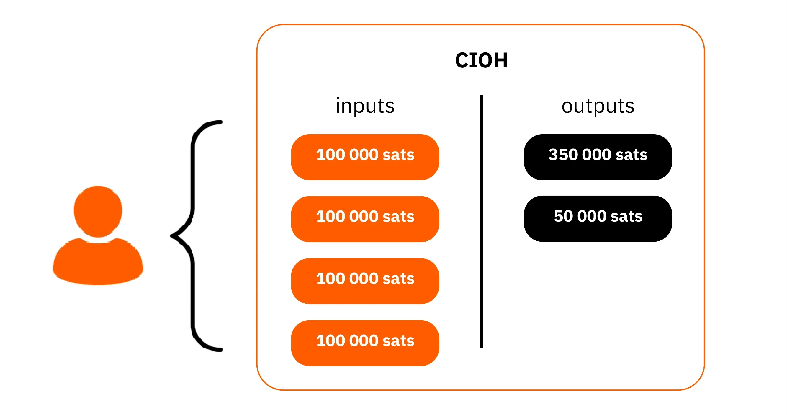


ในทางปฏิบัติ นี่หมายความว่าผู้สังเกตการณ์ภายนอกสามารถสรุปได้ว่า UTXOs ที่รวมกันทั้งหมดน่าจะเป็นของบุคคลเดียวกัน และผลลัพธ์ที่ไม่ซ้ำกันที่สร้างขึ้นก็เป็นของเขาหรือเธอเช่นกัน สถานการณ์นี้สามารถทำลายความลับของคุณโดยการเชื่อมโยงประวัติการทำธุรกรรมที่แตกต่างกัน ตัวอย่างเช่น สมมติว่าฉันรวม 3 UTXOs ที่ได้มาผ่าน P2P กับหนึ่ง UTXO ที่ได้รับผ่านแพลตฟอร์มที่ต้องการ KYC:


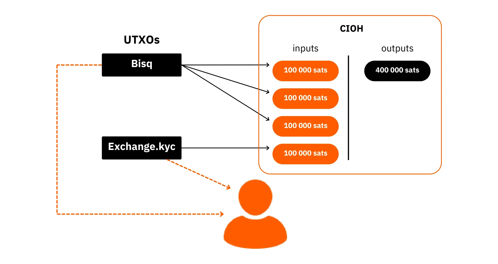


ด้วยการทำเช่นนี้ หน่วยงานใด ๆ ที่สามารถเข้าถึงข้อมูลของแพลตฟอร์มแลกเปลี่ยนได้ ซึ่งอาจรวมถึงหน่วยงานรัฐบาล จะสามารถระบุได้ว่าฉันเป็นเจ้าของ BTC จำนวนอื่น ๆ ก่อนหน้านี้ UTXOs เหล่านี้ไม่ได้เชื่อมโยงโดยตรงกับตัวตนของฉัน แต่ตอนนี้พวกเขาเชื่อมโยงแล้ว ยิ่งไปกว่านั้น มันยังเปิดเผยต่อแหล่งข้อมูลทั้งหมดว่าฉันครอบครองบิตคอยน์จำนวนหนึ่ง


เมื่อพูดถึงการจัดการ UTXOs การพิจารณาทางเศรษฐกิจซึ่งผลักดันให้มีการรวมเพื่อประหยัดค่าใช้จ่าย ขัดแย้งกับการปฏิบัติที่ดีด้านความเป็นส่วนตัวซึ่งจะแนะนำว่าไม่ควรรวม UTXOs การเลือกระหว่างเศรษฐกิจและความลับจึงขึ้นอยู่กับลำดับความสำคัญของผู้ใช้แต่ละคน


หากคุณสามารถหลีกเลี่ยงการรวมบัญชีในขณะที่ยังคงรักษา UTXOs ที่มีมูลค่าสูงไว้ได้ นั่นคือสิ่งที่ดีที่สุด ในการทำเช่นนี้ ให้ปรับวิธีการซื้อของคุณให้เหมาะสม หากคุณซื้อบิตคอยน์ในรูปแบบ DCA พยายามเว้นระยะการซื้อแบบครั้งเดียวให้มากที่สุดเท่าที่จะเป็นไปได้เพื่อรวมมูลค่าไว้ใน UTXOs ที่น้อยลง จะง่ายกว่าที่จะจัดการการซื้อแบบครั้งเดียวจำนวน €1,000 ทุกๆ 2 เดือน แทนที่จะซื้อ €120 ทุกสัปดาห์ วิธีนี้จะลดจำนวน UTXOs ที่เกิดขึ้นและทำให้การจัดการ wallet ง่ายขึ้น รักษาความลับของคุณไว้


หากคุณจำเป็นต้องรวมบิตคอยน์ของคุณ ให้จัดลำดับความสำคัญในการรวม UTXO จากแหล่งเดียวกันก่อน ตัวอย่างเช่น การรวม 10 UTXO จากแพลตฟอร์มเดียวจะส่งผลต่อความเป็นส่วนตัวของคุณน้อยกว่าการผสม 5 UTXO จากแพลตฟอร์ม A กับ 5 UTXO จากแพลตฟอร์ม B หากการรวมจากแหล่งต่างๆ เป็นสิ่งที่หลีกเลี่ยงไม่ได้ ให้พยายามแยกพวกมันตามลักษณะของพวกมัน ตัวอย่างเช่น รวมกลุ่ม UTXO ที่ได้มาผ่าน KYC ในธุรกรรมหนึ่ง และที่ได้มาผ่าน P2P ในอีกธุรกรรมหนึ่ง


ในกรณีใด ๆ อย่าลืมว่าการรวมบัญชีใด ๆ ย่อมมีการสูญเสียความลับอย่างหลีกเลี่ยงไม่ได้ ประเมินความจำเป็นของการดำเนินการนี้และผลกระทบที่อาจเกิดขึ้นต่อความเป็นส่วนตัวของคุณอย่างรอบคอบ โดยคำนึงถึง CIOH


## แนวทางปฏิบัติที่ดีที่สุดอื่น ๆ


<chapterId>b5216965-7d13-4ea1-9b7c-e292966a487b</chapterId>


:::video id=5fc4ce39-6a0b-419a-baa9-f6da75427987:::


มาพิจารณาวิธีปฏิบัติที่ดีที่สุดเพิ่มเติมเพื่อเพิ่มความเป็นส่วนตัวของคุณบน Bitcoin กันเถอะ


### เงื่อนที่สมบูรณ์


การเป็นเจ้าของบิตคอยน์ของคุณเองในรูปแบบการดูแลตนเองนั้นยอดเยี่ยม แต่การใช้ full node ของคุณเองนั้นดียิ่งกว่า! นี่คือเหตุผลว่าทำไมการมีโหนดของคุณเองจึงมีความสำคัญสำหรับการใช้งาน Bitcoin อย่างเต็มที่:


- การต่อต้านการเซ็นเซอร์**: การทำธุรกรรมของคุณไม่สามารถถูกบล็อกโดยใครได้;
- การเป็นอิสระจากบุคคลที่สาม**: คุณไม่จำเป็นต้องพึ่งพาบริการภายนอกใด ๆ ในการตรวจสอบข้อมูลบล็อกเชนอีกต่อไป;
- การมีส่วนร่วมอย่างแข็งขัน**: คุณสามารถกำหนดกฎการตรวจสอบของคุณเองและมีส่วนร่วมโดยตรงในฉันทามติ;
- การมีส่วนร่วมในเครือข่าย**: โดยการรันโหนด คุณช่วยเสริมสร้างและกระจายเครือข่าย Bitcoin;
- การศึกษาด้านเทคนิค**: การจัดการ full node เป็นวิธีที่ดีในการเพิ่มพูนความรู้ทางเทคนิคของคุณเกี่ยวกับ Bitcoin


นอกเหนือจากประโยชน์เหล่านี้ การใช้ full node ยังช่วยเพิ่มความเป็นส่วนตัวของคุณเมื่อทำการกระจายธุรกรรมของคุณ เมื่อคุณออกธุรกรรม มันจะถูกสร้างและลงนามผ่าน wallet ของคุณก่อน เพื่อกระจายบนเครือข่าย Bitcoin มันต้องเป็นที่รู้จักโดยอย่างน้อยหนึ่งโหนด โดยการใช้โหนดของคุณเอง คุณมีการควบคุมโดยตรงต่อการกระจายนี้ ซึ่งจะช่วยเสริมความเป็นส่วนตัวของคุณและจำกัดความเสี่ยงของการรั่วไหลของข้อมูล


หากคุณไม่มีโหนด Bitcoin ของคุณเอง คุณจะถูกบังคับให้ใช้โหนดของบุคคลที่สาม เช่น โหนดที่เสนอโดยผู้ให้บริการซอฟต์แวร์ wallet ของคุณ นอกจากการกระจายธุรกรรมแล้ว wallet ของคุณยังต้องการเข้าถึงข้อมูลต่างๆ เช่น ธุรกรรมที่รอดำเนินการ ยอดคงเหลือที่เกี่ยวข้องกับที่อยู่ของคุณ และจำนวนการยืนยันสำหรับธุรกรรมของคุณ ในการเข้าถึงข้อมูลทั้งหมดนี้ คุณจำเป็นต้องสอบถามโหนด


ความเสี่ยงหลักเมื่อคุณไม่ได้ใช้ Bitcoin node ของคุณเองคือผู้ดำเนินการของ node บุคคลที่สามอาจสังเกตเห็นกิจกรรมของคุณบนบล็อกเชน หรือแม้กระทั่งแชร์ข้อมูลนี้กับหน่วยงานอื่น ๆ เพื่อบรรเทาความเสี่ยงนี้ วิธีการแก้ปัญหาระดับกลางคือการใช้ซอฟต์แวร์ wallet ที่ปกปิดการเชื่อมต่อของคุณผ่านเครือข่าย Tor ซึ่งสามารถลดการเปิดเผยข้อมูลของคุณได้ อย่างไรก็ตาม วิธีการที่ดีที่สุดคือการมี Bitcoin node ของคุณเองและใช้มันเพื่อกระจายธุรกรรมของคุณ แน่นอนว่าคุณจะต้องระมัดระวังไม่ให้ข้อมูลรั่วไหลผ่าน node ของคุณด้วย แต่เราจะพูดถึงเรื่องนี้ในส่วนถัดไป


นอกเหนือจากข้อได้เปรียบที่ชัดเจนสำหรับความเป็นส่วนตัวของคุณ การมี full node ของคุณเองยังช่วยให้มั่นใจในความถูกต้องของข้อมูลบนบล็อกเชน ปกป้องคุณจากการเซ็นเซอร์ และช่วยให้คุณมีส่วนร่วมอย่างแข็งขันในการกำกับดูแลของ Bitcoin ด้วยการใช้โหนดของคุณเอง คุณมีส่วนร่วมในน้ำหนักทางเศรษฐกิจของคุณต่อเชนที่คุณเลือก ซึ่งมีความสำคัญในช่วงความขัดแย้งภายในชุมชน เช่น ในช่วงสงครามขนาดบล็อกตั้งแต่ปี 2015 ถึง 2017 เป็นต้น ในกรณีของ fork การใช้โหนดของบุคคลที่สามอาจทำให้คุณสนับสนุนเชนที่คุณไม่ต้องการสนับสนุน เนื่องจากผู้ดำเนินการโหนดเป็นผู้เลือกให้คุณ


ตามที่คุณเห็น เพื่อประโยชน์ของการรักษาความลับและอธิปไตยส่วนบุคคล การใช้งานและการดำเนินการ full node ของคุณเองเป็นสิ่งสำคัญ!


### การวิเคราะห์ฮิวริสติกที่หลอกลวง


ในภาพรวมแล้ว การทำความเข้าใจฮิวริสติกส์ที่เราได้พูดถึงในส่วนก่อนหน้านี้เป็นสิ่งสำคัญ เพื่อที่จะหลีกเลี่ยงหรือหลอกลวงพวกมันได้ดียิ่งขึ้น การนำแนวทางปฏิบัติที่ดีที่สุดมาใช้สามารถเป็นประโยชน์ได้ แม้ว่าจะไม่จำเป็นก็ตาม พวกมันเสนอชั้นการป้องกันเพิ่มเติมที่อาจมีความสำคัญในการรักษาความลับเมื่อใช้ Bitcoin


คำแนะนำแรกที่ฉันสามารถให้ได้คือการผสมผสานเข้ากับฝูงชนที่หนาแน่นที่สุด บน Bitcoin หมายถึงการใช้แม่แบบสคริปต์ที่ได้รับการยอมรับอย่างกว้างขวางที่สุด ตัวอย่างเช่น สคริปต์ [P2WSH](https://planb.academy/resources/glossary/p2wsh) ที่มักใช้สำหรับการกำหนดค่ามัลติซิก SegWit V0 นั้นไม่ค่อยพบเห็น พวกมันไม่อนุญาตให้คุณซ่อนตัวในชุดนิรนามขนาดใหญ่ สิ่งเดียวกันนี้ใช้กับรุ่นเก่า เช่น P2PKH หรือ P2SH แม้ว่าพวกมันจะมีอยู่มากในชุด UTXO แต่ก็ถูกใช้น้อยลงเรื่อย ๆ สำหรับธุรกรรมใหม่ ๆ


โดยทั่วไปแล้ว การเลือกใช้มาตรฐานการเขียนสคริปต์ที่ใหม่ที่สุดถือว่าเป็นทางเลือกที่ฉลาดกว่า หากมาตรฐานนั้นได้รับการยอมรับอย่างเพียงพอ ดังนั้น หากในปี 2022 ฉันจะไม่แนะนำให้ใช้ P2TR (Taproot) เนื่องจากการยอมรับที่ต่ำ ในปี 2024 ฉันจะแนะนำให้เลือกใช้สคริปต์ประเภทนี้แทน หรือหากไม่สามารถทำได้ ให้เลือกใช้สคริปต์ SegWit V0 เนื่องจากจำนวนธุรกรรมที่ใช้ P2TR เริ่มมีสัดส่วนที่สำคัญมากขึ้น


แหล่งที่มา: [txstats.com](https://txstats.com/d/000000054/utxo-set-repartition-by-output-type)


เคล็ดลับอีกประการหนึ่งในการรักษาความลับของคุณคือการพยายามหลีกเลี่ยงการวิเคราะห์ธุรกรรมภายใน ตัวอย่างเช่น เมื่อทำการชำระเงิน พยายามหลีกเลี่ยงการสร้างผลลัพธ์ที่มีจำนวนเงินปัดเศษ เนื่องจากอาจบ่งบอกว่าผลลัพธ์อื่นแสดงถึงเงินทอน หากคุณต้องการส่ง 100,000 sats ให้เพื่อน ลองพิจารณาโอนจำนวนเงินที่สูงขึ้นเล็กน้อยเพื่อหลีกเลี่ยงการวิเคราะห์นี้ ในทำนองเดียวกัน พยายามอย่าสร้างผลลัพธ์เงินทอนที่สูงเกินไปเมื่อเทียบกับการชำระเงินที่ทำ เนื่องจากอาจเปิดเผยได้ว่าผลลัพธ์ใดแสดงถึงเงินทอน


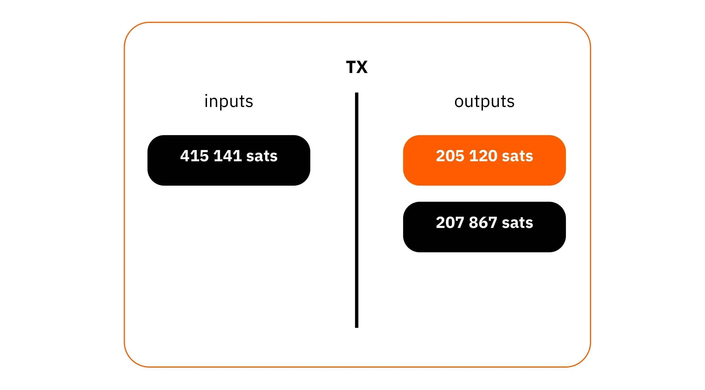


สุดท้ายนี้ หากคุณดำเนินการธุรกรรม Bitcoin เป็นประจำ ให้แน่ใจว่าคุณไม่ได้กระจายธุรกรรมเหล่านั้นพร้อมกันเสมอไป โดยการกระจายการกระจายธุรกรรมของคุณตลอดทั้งวันและสัปดาห์ คุณจะหลีกเลี่ยงการให้โอกาสแก่ผู้สังเกตการณ์ภายนอกในการตรวจจับรูปแบบชั่วคราวตามเขตเวลาที่อาจเสริมการวิเคราะห์ของพวกเขา


นอกเหนือจากแนวปฏิบัติที่ดีทั้งหมดเหล่านี้ที่ควรนำมาใช้ในชีวิตประจำวันแล้ว ยังมีวิธีที่มีประสิทธิภาพมากยิ่งขึ้นสำหรับการทำลายการติดตามของบิตคอยน์ของคุณอย่างสมบูรณ์ ซึ่งรวมถึงการทำธุรกรรมแบบ coinjoin ซึ่งเราจะพิจารณาอย่างละเอียดในส่วนถัดไป


# ทำความเข้าใจธุรกรรม CoinJoin


<partId>6d0bbf16-3714-4db1-9897-2d45019f6bdc</partId>


## การทำธุรกรรม CoinJoin คืออะไร?


<chapterId>0862bc6b-1c48-4aa4-b76d-4f547b469008</chapterId>


:::video id=37f23334-4b52-43db-8d82-bd84310af86c:::


หลังจากที่ได้ศึกษาพื้นฐานของการปกป้องความเป็นส่วนตัวแล้ว เราจะมาพิจารณาเทคนิคที่ซับซ้อนมากขึ้นซึ่งออกแบบมาเพื่อปกป้องความลับของคุณอย่างแข็งขัน โดยเฉพาะอย่างยิ่งโดยการทำให้ประวัติ Bitcoin ของคุณไม่ระบุตัวตน ในส่วนถัดไป เราจะพิจารณาเทคนิคเล็กๆ น้อยๆ หลากหลายประการ ก่อนอื่นฉันขอแนะนำให้คุณรู้จักกับ coinjoin


Coinjoin มักถูกมองว่าเป็นวิธีที่มีประสิทธิภาพที่สุดในการปกป้องความเป็นส่วนตัวของผู้ใช้ Bitcoin แต่ธุรกรรม coinjoin คืออะไรกันแน่? มาหาคำตอบกันเถอะ


### หลักการพื้นฐานของ coinjoin


Coinjoin เป็นเทคนิคที่ช่วยทำลายการติดตามธุรกรรม Bitcoin บนบล็อกเชน โดยอิงจากธุรกรรมร่วมมือที่มีโครงสร้างเฉพาะ ซึ่งรู้จักกันในชื่อธุรกรรม coinjoin


ตามที่เราได้เห็นในส่วนแรกของหลักสูตรนี้ ธุรกรรม Bitcoin เป็นที่รู้จักของผู้ใช้ทุกคนผ่านทางโหนดของพวกเขา ดังนั้นจึงง่ายที่จะตรวจสอบห่วงโซ่ลายเซ็นอิเล็กทรอนิกส์ของแต่ละเหรียญและสังเกตประวัติของมัน ซึ่งหมายความว่าผู้ใช้ทุกคนสามารถพยายามวิเคราะห์ธุรกรรมของผู้ใช้อื่นได้ เป็นผลให้การไม่เปิดเผยตัวตนในระดับธุรกรรมเป็นไปไม่ได้ อย่างไรก็ตาม การไม่เปิดเผยตัวตนจะถูกเก็บรักษาไว้ในระดับการระบุตัวตนส่วนบุคคล แตกต่างจากระบบธนาคารแบบดั้งเดิมที่แต่ละบัญชีเชื่อมโยงกับตัวตนส่วนบุคคล บน Bitcoin เงินจะเชื่อมโยงกับคู่กุญแจเข้ารหัส (หรือสคริปต์) ซึ่งให้รูปแบบการใช้นามแฝงแก่ผู้ใช้ที่อยู่เบื้องหลังตัวระบุการเข้ารหัส


ความลับของ Bitcoin ถูกบั่นทอนเมื่อผู้สังเกตการณ์ภายนอกสามารถเชื่อมโยง UTXOs เฉพาะกับผู้ใช้ที่ระบุได้ เมื่อการเชื่อมโยงนี้ถูกสร้างขึ้น จะเป็นไปได้ที่จะติดตามธุรกรรมของพวกเขาและวิเคราะห์ประวัติ Bitcoin ของพวกเขา Coinjoin เป็นเทคนิคที่ออกแบบมาโดยเฉพาะเพื่อทำลายการติดตามของ UTXOs โดยให้ผู้ใช้ Bitcoin มีระดับความลับในระดับธุรกรรม


Coinjoins ช่วยเสริมความเป็นส่วนตัวของผู้ใช้ Bitcoin โดยทำให้การวิเคราะห์เชนซับซ้อนขึ้นสำหรับผู้สังเกตการณ์ภายนอก โครงสร้างของมันอนุญาตให้เหรียญหลายเหรียญจากผู้ใช้ต่าง ๆ รวมเข้าด้วยกันในธุรกรรมเดียว ทำให้เส้นแบ่งพร่ามัวและยากที่จะระบุความเชื่อมโยงระหว่างที่อยู่ของอินพุตและเอาต์พุต


สิ่งสำคัญคือต้องเข้าใจว่าเป้าหมายหลักของการทำธุรกรรม coinjoin คือการปกปิดประวัติของเหรียญ เทคนิคนี้ไม่ได้มอบความเป็นนิรนามถาวรหรือปิดกั้นการติดตามบิตคอยน์อย่างเด็ดขาด ตรงกันข้ามกับที่คุณอาจคิด Coinjoin มีเป้าหมายเพียงเพื่อทำลายประวัติในจุดที่ทำธุรกรรม coinjoin อย่างไรก็ตาม ก่อนและหลังการดำเนินการนี้ เหรียญยังคงเผชิญกับความเสี่ยงเดียวกันในแง่ของความลับ


### CoinJoin ทำงานอย่างไร?


หลักการของ CoinJoin ขึ้นอยู่กับวิธีการร่วมมือกัน: ผู้ใช้หลายคนที่ต้องการผสมบิตคอยน์ของพวกเขาจะฝากจำนวนเงินที่เท่ากันเป็นอินพุตในธุรกรรมเดียวกัน จากนั้นจำนวนเงินเหล่านี้จะถูกแจกจ่ายใหม่เป็นเอาต์พุตที่มีมูลค่าเท่ากันให้กับผู้ใช้แต่ละคน


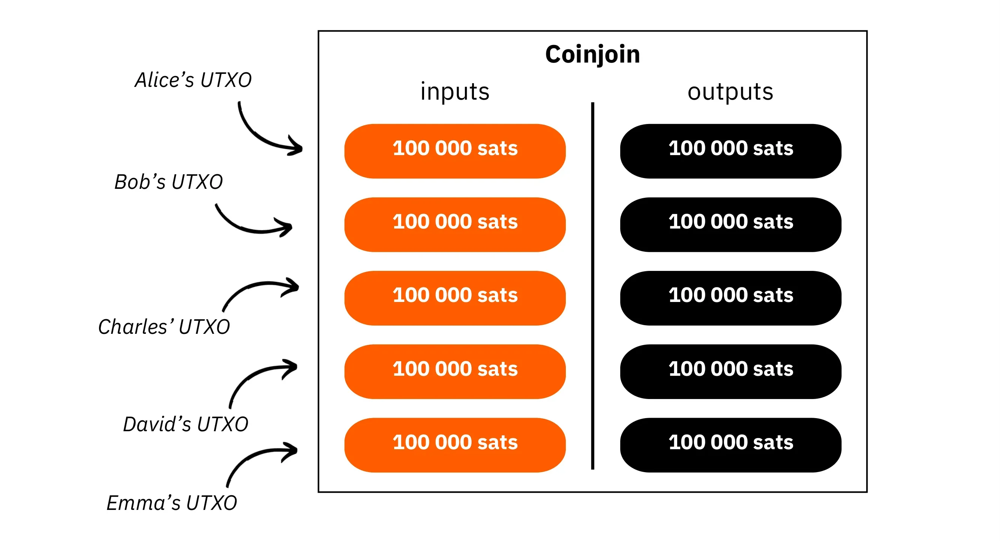


เมื่อสิ้นสุดการทำธุรกรรม จะไม่สามารถเชื่อมโยงผลลัพธ์เฉพาะกับผู้ใช้ได้ เนื่องจากมันถูกใช้เป็นข้อมูลนำเข้า ไม่มีการเชื่อมโยงโดยตรงระหว่างข้อมูลนำเข้าและผลลัพธ์ ซึ่งทำให้การเชื่อมโยงระหว่างผู้ใช้และ UTXO ของพวกเขาถูกตัดขาด รวมถึงประวัติของแต่ละ UTXO ด้วย


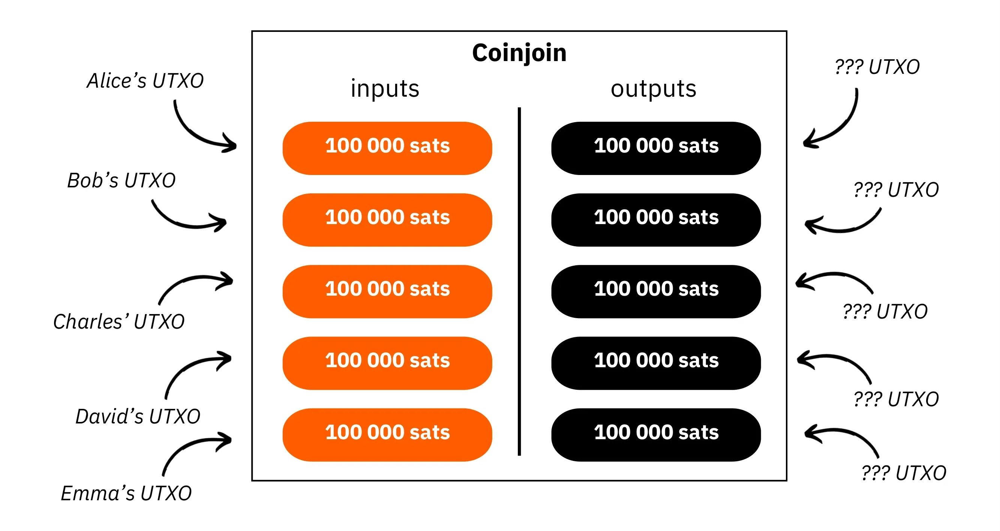


มาดูตัวอย่างของ Alice กัน เธอต้องการส่ง sats ประมาณ 100,000 ให้กับน้องสาวของเธอ Eve สำหรับวันเกิดของเธอ อย่างไรก็ตาม Alice ไม่ต้องการให้ Eve สามารถติดตามประวัติการทำธุรกรรมของเธอได้ เพราะเธอไม่ต้องการเปิดเผยว่าเธอมีบิทคอยน์จำนวนเท่าใดหรือได้มาอย่างไร เพื่อจุดประสงค์นี้ Alice ตัดสินใจที่จะทำลายประวัติ UTXO ของเธอด้วยการทำธุรกรรม coinjoin เธอจัดการกับ Bob, Charles, David, และ Frank เพื่อดำเนินการทำธุรกรรมร่วมกัน:


- Alice, Bob, Charles, David และ Frank แต่ละคนทำ UTXO จำนวน 105,000 sats (พร้อม 5,000 sats สำหรับ mining ค่าธรรมเนียม) เป็นอินพุตสำหรับธุรกรรม:


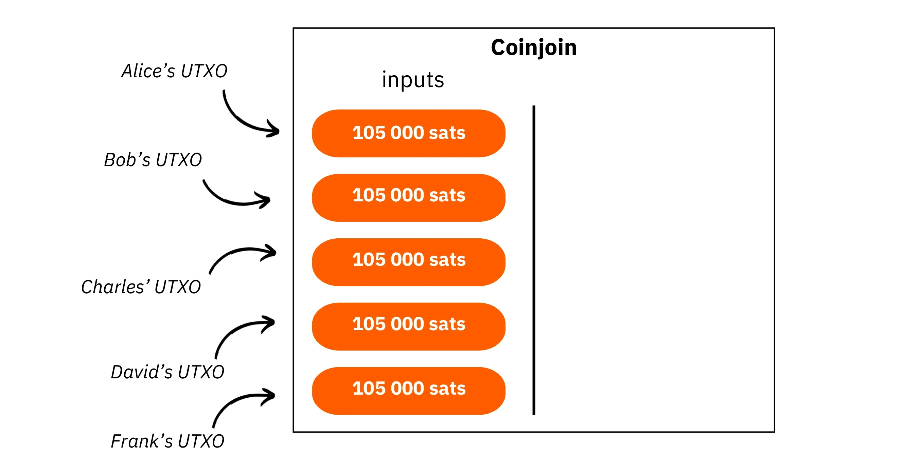


- ในการแลกเปลี่ยนสำหรับการใช้ข้อมูลเหล่านี้ แต่ละรายการจะสร้างที่อยู่ว่างเพื่อสร้างผลลัพธ์ที่เหมือนกันห้ารายการ โดยแต่ละรายการมีค่า 100,000 sats แต่ละรายการจะดึงผลลัพธ์หนึ่งรายการ:


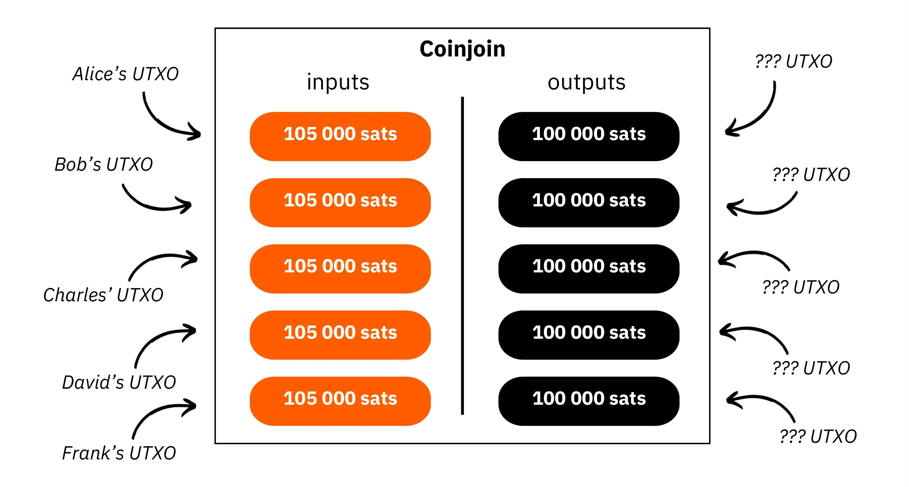


- Alice พบว่าตัวเองมี UTXO จำนวน 100,000 sats ที่มีประวัติผสมปนเปกัน เธอใช้ UTXO นี้ในธุรกรรมใหม่เพื่อส่งจำนวนเงินให้กับอีฟสำหรับวันเกิดของเธอ:


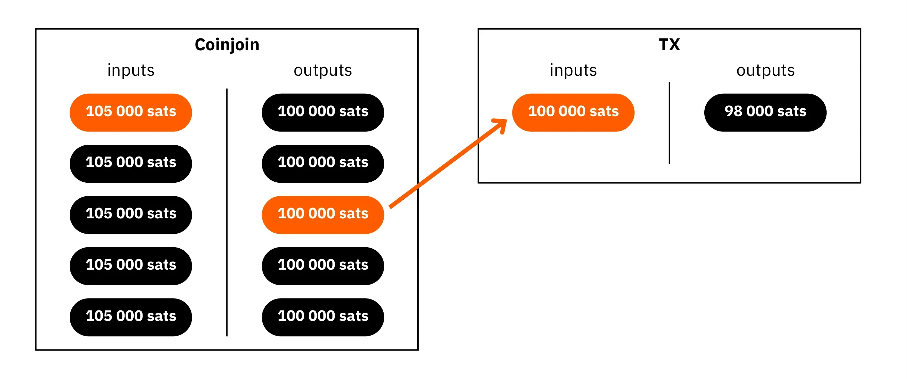


- หากอีฟพยายามวิเคราะห์ธุรกรรมนี้เพื่อดึงข้อมูล เธอจะพบกับธุรกรรม coinjoin ที่เกี่ยวข้องกับ Alice, Bob, ชาร์ลส์, เดวิด, และแฟรงค์ เนื่องจากความสม่ำเสมอของจำนวนเงิน อีฟไม่สามารถแยกแยะได้ว่าข้อมูลใดเป็นของใคร ทำให้ไม่สามารถติดตามประวัติ UTXO ของ Alice หรือระบุได้ว่าน้องสาวของเธอมีบิตคอยน์จำนวนเท่าใดหรือได้มาอย่างไร:


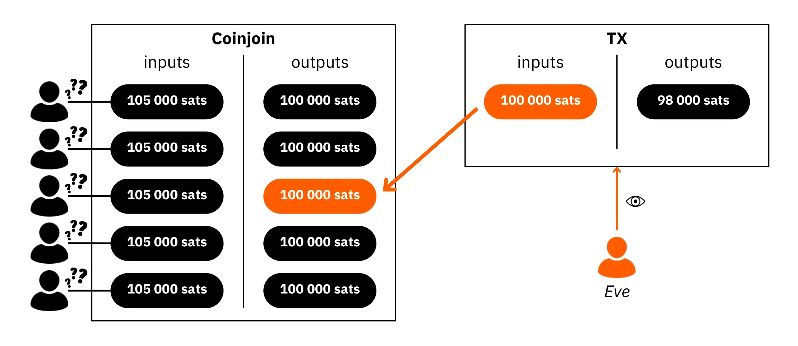


ในกรณีนี้ Alice ได้ใช้เทคนิค coinjoin เพื่อเพิ่มความเป็นส่วนตัวในบริบทของการวิเคราะห์ย้อนหลัง อันที่จริง Alice กำลังปกป้องตัวเองจากการวิเคราะห์ที่อาจเกิดขึ้นโดย Eve ซึ่งจะเริ่มจากธุรกรรมเฉพาะและทำงานย้อนกลับผ่านประวัติของ UTXO การป้องกันนี้จากการวิเคราะห์จากปัจจุบันไปยังอดีตเรียกว่าการไม่เปิดเผยตัวตนย้อนหลัง เราจะพิจารณาแนวคิดนี้ในรายละเอียดเพิ่มเติมในบทสุดท้ายของส่วนนี้


อย่างไรก็ตาม coinjoin ยังมีความสามารถในการเสริมสร้างความเป็นส่วนตัวจากอดีตถึงปัจจุบัน ซึ่งเรียกว่า forward anonset ลองกลับไปดูตัวอย่างของเราที่ Alice ส่ง 98,000 sats ให้ Eve เป็นของขวัญวันเกิด แต่ครั้งนี้ให้บทบาทสลับกัน ลองจินตนาการว่าเป็น Eve ที่กังวลเกี่ยวกับความเป็นส่วนตัวของเธอ จริงๆ แล้ว Alice อาจถูกล่อลวงให้ติดตามเหรียญที่เธอส่งให้ Eve เพื่อดึงข้อมูลจากมัน Eve อาจรวม UTXO ที่เธอเพิ่งได้รับกับ UTXOs อื่นๆ ของเธอ ซึ่งอาจเปิดเผยให้ Alice ทราบจำนวนบิตคอยน์ที่เธอมีใน wallet ของเธอ เพื่อหลีกเลี่ยงสิ่งนี้ Eve ยังสามารถตัดประวัติของเหรียญที่เธอเพิ่งได้รับได้:


- อีฟ, เกรซ, มัลลอรี่, ออสการ์, และวิคเตอร์ แต่ละคนใส่ UTXO จำนวน 98,000 sats เป็นข้อมูลเข้าสำหรับธุรกรรม Bitcoin:


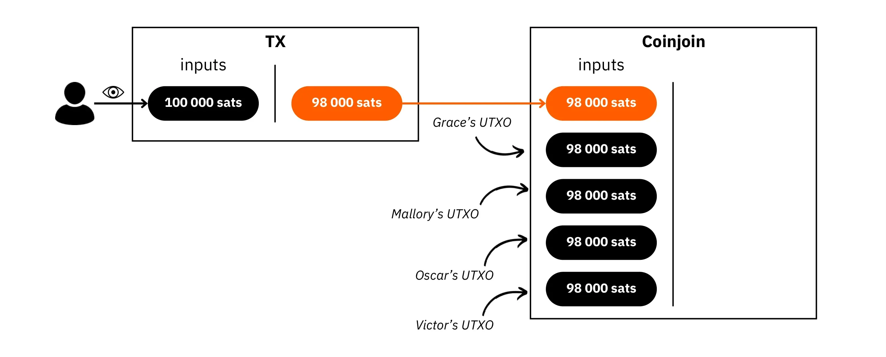


- เพื่อแลกกับการใช้ข้อมูลเหล่านี้ ผู้ใช้แต่ละคนจะให้ที่อยู่ว่างเพื่อใช้สร้าง 5 ผลลัพธ์ของ sats ที่เท่ากันอย่างสมบูรณ์ 97,500 แต่ละคนจะได้รับหนึ่งผลลัพธ์:


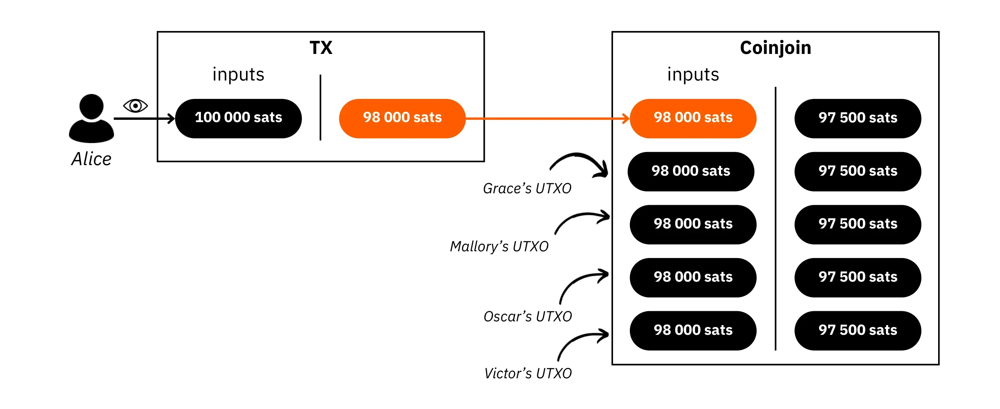


- ตอนนี้อีฟถือ UTXO จำนวน 97,500 sats ซึ่งประวัติของมันได้ถูกทำลายไปแล้ว เธอสามารถใช้มันได้โดยไม่ต้องกลัวเพื่อดำเนินการธุรกรรมในอนาคต จริงๆ แล้ว หาก Alice พยายามติดตามบิตคอยน์ที่เธอส่งให้อีฟ เขาจะต้องเผชิญกับธุรกรรม coinjoin เขาจะไม่สามารถระบุได้ว่า UTXO ที่ออกไปนั้นเป็นของอีฟ การวิเคราะห์จึงเป็นไปไม่ได้:


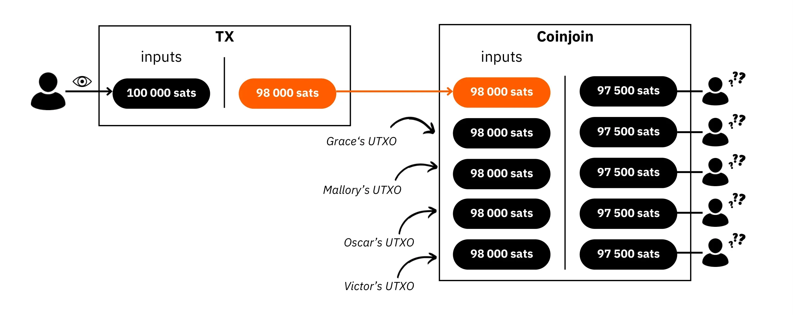


ในตัวอย่างแรก เราได้เห็นว่า coinjoin สามารถปกป้องความเป็นส่วนตัวของเหรียญเมื่อพิจารณาจากอดีตของมันได้อย่างไร และในตัวอย่างที่สอง เราได้เห็นว่ามันสามารถปกป้องประวัติของเหรียญเมื่อพิจารณาจากอนาคตของมันได้เช่นกัน นี่จึงเป็นเหตุผลที่ผมกล่าวว่า coinjoin ควรถูกมองว่าเป็นเหตุการณ์ที่เกิดขึ้นเพียงครั้งเดียวซึ่งแบ่งประวัติของเหรียญออกเป็นสองทิศทาง:


### มิกเซอร์, คอยน์จอยน์, มิกเซอร์... ต่างกันอย่างไร?


Coinjoins บางครั้งถูกอธิบายว่าเป็น "mixers" ซึ่งเป็นคำที่บางคนในวงการบิทคอยน์ปฏิเสธ เนื่องจากกลัวว่าอาจจะสับสนกับ custodial mixers อย่างไรก็ตาม ฉันเชื่อว่าความกังวลนี้ไม่มีมูลความจริง เพราะในบริบททางคณิตศาสตร์ coinjoin แทนแนวคิดของการผสมอย่างแท้จริง


ในสาขาทั่วไปของคณิตศาสตร์ การผสมหมายถึงคุณสมบัติของระบบพลวัตที่หลังจากช่วงเวลาหนึ่ง ส่วนทั้งหมดของพื้นที่เริ่มต้นสามารถผสมกับส่วนอื่นได้ตามทฤษฎี การผสมบ่งบอกว่าตำแหน่งของอนุภาคหรือสถานะของระบบพัฒนาในลักษณะที่การกระจายตัวในอนาคตไม่ขึ้นอยู่กับการกระจายตัวเริ่มต้น ดังนั้นจึงถึงสถานะที่ลักษณะของสถานะเริ่มต้นถูกกระจายอย่างสม่ำเสมอทั่วพื้นที่ของระบบ นี่คือสิ่งที่เกิดขึ้นใน coinjoin กับ Bitcoin ในความเห็นของฉัน CoinJoin เป็นรูปแบบหนึ่งของการผสมเหรียญอย่างแท้จริง


ในทางกลับกัน สิ่งสำคัญคือต้องแยกแยะระหว่าง coinjoin กับ shufflers. Shuffler เป็นบริการที่ผู้ใช้ส่งบิทคอยน์ของพวกเขาไปเพื่อทำการสับเปลี่ยน บริการเหล่านี้ได้รับความนิยมในช่วงปี 2010 แต่การใช้งานได้ลดลงเนื่องจากข้อเสียเปรียบหลักสองประการเมื่อเทียบกับ coinjoin:


- พวกเขาต้องการให้ผู้ใช้สละการควบคุมเงินทุนของตนในระหว่างกระบวนการผสม ซึ่งทำให้พวกเขาเสี่ยงต่อการถูกขโมย
- ไม่มีการรับประกันว่ามิกเซอร์จะไม่บันทึกรายละเอียดการทำธุรกรรม หรือแม้กระทั่งขายข้อมูลนี้ให้กับบริษัทวิเคราะห์เชน


ดังนั้น ผู้ใช้ในปัจจุบันจึงชอบใช้ coinjoin เพราะช่วยให้พวกเขาสามารถควบคุมเงินทุนของตนได้อย่างเต็มที่ตลอดกระบวนการ ผู้เข้าร่วม Coinjoin ไม่มีความเสี่ยงที่จะถูกขโมยบิตคอยน์โดย UTXOs อื่น ๆ ที่เกี่ยวข้อง มาดูกันว่าทั้งหมดนี้เป็นไปได้อย่างไรในบทถัดไป


## Zerolink และ Chaumian coinjoins


<chapterId>326c9654-b359-4906-b23d-d6518dd5dc3e</chapterId>


:::video id=7df91435-f60b-4d80-89a8-79717a14ebd3:::


ความเป็นส่วนตัวที่ได้รับจากการใช้ coinjoin นั้นเกิดจากขนาดของกลุ่มที่ UTXO ของเราถูกซ่อนไว้ ซึ่งหมายถึงการหาผู้เข้าร่วมให้ได้มากที่สุดเท่าที่จะเป็นไปได้ การสร้าง coinjoin ด้วยตนเองนั้นเป็นไปได้อย่างสมบูรณ์แบบ แต่เป็นกระบวนการที่ซับซ้อนและจะไม่ให้ผลลัพธ์ที่มี anonsets อย่างมีนัยสำคัญ


นี่คือเหตุผลที่ผู้ประสานงาน coinjoin ได้พัฒนาบน Bitcoin บทบาทของพวกเขาคือการเชื่อมต่อผู้ใช้ต่างๆ เข้าด้วยกันและส่งข้อมูลที่จำเป็นเพื่ออำนวยความสะดวกในการทำธุรกรรมร่วมกัน


แต่เราจะมั่นใจได้อย่างไรว่าผู้ประสานงานจะไม่มีทางเข้าถึงบิตคอยน์ของผู้ใช้? และแม้ว่าเขาจะเป็นคนที่สร้างธุรกรรม coinjoin ขึ้นมา เราจะป้องกันไม่ให้เขาเชื่อมโยงอินพุตและเอาต์พุตของผู้ใช้ได้อย่างไร ซึ่งอาจเป็นการรั่วไหลของความลับ?


### ลายเซ็นแบบบอดของ Chaum


การใช้งาน coinjoin สมัยใหม่ใช้ลายเซ็นแบบ blind ของ David Chaum เพื่อป้องกันการรั่วไหลของข้อมูล ลองมาดูวิธีการทำงานของลายเซ็นแบบ blind เหล่านี้กันเถอะ


ลายเซ็นแบบไม่เปิดเผยของ Chaum เป็นรูปแบบหนึ่งของลายเซ็นดิจิทัลที่ผู้ให้ลายเซ็นไม่ทราบเนื้อหาของข้อความที่เขากำลังลงนาม แต่ลายเซ็นนั้นสามารถตรวจสอบกับข้อความต้นฉบับได้ เทคนิคนี้พัฒนาโดยนักเข้ารหัส David Chaum ในปี 1983


ลองพิจารณาตัวอย่างของบริษัทที่ต้องการยืนยันความถูกต้องของเอกสารลับ เช่น สัญญา โดยไม่เปิดเผยเนื้อหา บริษัทใช้กระบวนการปิดบังที่แปลงเอกสารต้นฉบับในลักษณะที่สามารถย้อนกลับได้ เอกสารที่ถูกแก้ไขนี้ถูกส่งไปยังหน่วยงานรับรอง ซึ่งจะลงนามแบบไม่เห็นเนื้อหาโดยไม่ทราบเนื้อหาที่อยู่ข้างใต้ หลังจากได้รับเอกสารที่ลงนามแล้ว บริษัทจะเปิดเผยลายเซ็น ผลลัพธ์คือเอกสารต้นฉบับที่ได้รับการยืนยันโดยลายเซ็นของหน่วยงาน โดยที่หน่วยงานไม่เคยเห็นเนื้อหาต้นฉบับเลย


ลายเซ็นแบบไม่เปิดเผยของ Chaum สามารถรับรองความถูกต้องของเอกสารโดยไม่ต้องรู้เนื้อหาของเอกสารนั้น จึงรับประกันทั้งความลับของข้อมูลผู้ใช้และความสมบูรณ์ของเอกสารที่ลงนาม


### Chaumian coinjoins


สิ่งที่เรียกว่า "Chaumian" coinjoins ผสมผสานการใช้ Tor และลายเซ็นต์บอดของ David Chaum เพื่อให้แน่ใจว่าผู้ประสานงานไม่สามารถรู้ได้ว่าผลลัพธ์ใดเป็นของผู้ใช้คนใด


กระบวนการสร้างธุรกรรม coinjoin ประกอบด้วย 3 ขั้นตอนหลัก: การลงทะเบียนอินพุต, การลงทะเบียนเอาต์พุต, และการลงนามธุรกรรม ลองมาดูกระบวนการนี้ผ่านตัวอย่างของ Alice ซึ่งเป็นหนึ่งในผู้เข้าร่วม coinjoin ผู้เข้าร่วมคนอื่น ๆ ทั้งหมดจะทำตามขั้นตอนเดียวกันกับ Alice แต่ละคนในแบบของตนเอง


**ขั้นตอนที่ 1: ป้อนการลงทะเบียน**


- Alice ส่งข้อมูลไปยังผู้ประสานงาน UTXO ที่เธอต้องการใช้เป็นข้อมูลนำเข้าสำหรับธุรกรรม รวมถึงที่อยู่รับที่ถูกปิดบังที่เธอต้องการใช้เป็นข้อมูลส่งออกเพื่อรับบิตคอยน์ของเธอ ดังนั้นผู้ประสานงานจึงไม่มีทางรู้ที่อยู่ของ Alice มันเห็นเพียงเวอร์ชันที่ถูกปิดบังของเธอ:


- ผู้ประสานงานตรวจสอบความถูกต้องของข้อมูลที่ป้อน จากนั้นลงนามที่อยู่ที่ถูกปิดบังของ Alice ด้วยกุญแจส่วนตัวของเขา เขาส่งลายเซ็นที่ถูกปิดบังกลับไปยัง Alice:


**ขั้นตอนที่ 2: การลงทะเบียนผลลัพธ์**


- Alice สามารถเปิดเผยที่อยู่ของเธอได้แล้ว โดยลงนามด้วยกุญแจส่วนตัวของผู้ประสานงาน เธอจะสร้างการเชื่อมต่อใหม่ภายใต้ตัวตน Tor ที่แตกต่างกัน ผู้ประสานงานไม่สามารถระบุได้ว่าเป็น Alice ที่กำลังเชื่อมต่อภายใต้ตัวตนใหม่นี้:


- Alice ส่งที่อยู่และลายเซ็นที่ไม่ถูกปิดบังไปยังผู้ประสานงาน (ซึ่งยังไม่รู้ว่ามันคือ Alice):


**ขั้นตอนที่ 3: การลงนามในธุรกรรม**


- ในลักษณะเดียวกัน ผู้ประสานงานจะดึงข้อมูลผลลัพธ์ที่ไม่ถูกปิดบังจากผู้เข้าร่วมทั้งหมด ด้วยลายเซ็นที่เกี่ยวข้อง เขาสามารถตรวจสอบได้ว่าผลลัพธ์ที่ส่งมาโดยไม่ระบุตัวตนแต่ละรายการได้รับการลงนามโดยกุญแจส่วนตัวของเขาล่วงหน้าแล้ว ซึ่งรับประกันความถูกต้องของพวกเขา จากนั้นเขาก็พร้อมที่จะสร้างธุรกรรม coinjoin และส่งไปยังผู้เข้าร่วมเพื่อขอลายเซ็น:


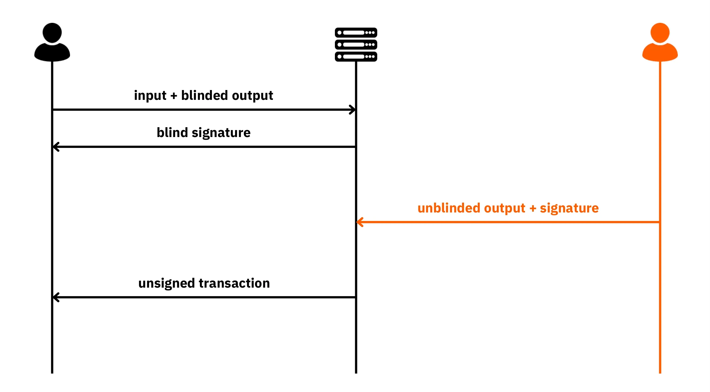


- Alice เช่นเดียวกับผู้เข้าร่วมคนอื่น ๆ ตรวจสอบว่าข้อมูลนำเข้าและส่งออกของเธอถูกรวมไว้อย่างถูกต้องในธุรกรรมที่สร้างโดยผู้ประสานงาน หากทุกอย่างเป็นที่น่าพอใจ เธอจะส่งลายเซ็นที่ปลดล็อกสคริปต์นำเข้าของเธอไปยังผู้ประสานงาน:


- หลังจากรวบรวมลายเซ็นจากผู้เข้าร่วม coinjoin ทั้งหมด ผู้ประสานงานสามารถกระจายธุรกรรมบนเครือข่าย Bitcoin เพื่อให้สามารถเพิ่มลงในบล็อกได้


ในระบบนี้ ผู้ประสานงานไม่สามารถเชื่อมโยงอินพุตกับเอาต์พุตเฉพาะได้ นอกจากนี้ เขาไม่สามารถยึดเงินของผู้เข้าร่วมได้ เนื่องจากเขาไม่เคยเข้าถึงคีย์ส่วนตัวที่จำเป็นในการปลดล็อก UTXO ของพวกเขา ตลอดกระบวนการ จนถึงสิ้นสุดขั้นตอนที่ 3 เขายังไม่มีการเข้าถึงลายเซ็น เมื่อ Alice และผู้เข้าร่วมคนอื่นๆ ลงนามในธุรกรรมระดับโลก หลังจากตรวจสอบว่าทุกอย่างถูกต้องแล้ว ผู้ประสานงานจะไม่สามารถแก้ไขธุรกรรม รวมถึงเอาต์พุต โดยไม่ทำให้ธุรกรรมเป็นโมฆะ สิ่งนี้ป้องกันไม่ให้ผู้ประสานงานขโมยบิตคอยน์


ในที่สุด เมื่อทำการลงทะเบียนผลลัพธ์ของพวกเขาในธุรกรรม ผู้ใช้ coinjoin ต้องการมีการรับประกันที่คล้ายคลึงกับการลงคะแนนเสียงของพลเมืองในการเลือกตั้ง มีความเป็นคู่ระหว่างแง่มุมสาธารณะและส่วนตัวของการกระทำเหล่านี้ ในด้านหนึ่งคือสิ่งที่คุณต้องการเก็บเป็นความลับ: สำหรับผู้ลงคะแนน พวกเขาไม่ต้องการให้บัตรลงคะแนนของพวกเขาถูกเชื่อมโยงกับตัวตนของพวกเขา; สำหรับผู้ใช้ coinjoin พวกเขาไม่ต้องการให้ผลลัพธ์ของพวกเขาถูกเชื่อมโยงกับข้อมูลนำเข้า จริงๆ แล้ว หากผู้ประสานงาน หรือฝ่ายอื่นใด สามารถสร้างความเชื่อมโยงระหว่างข้อมูลนำเข้าและผลลัพธ์ได้ coinjoin จะสูญเสียความน่าสนใจทั้งหมดไป ดังที่ได้อธิบายไว้ข้างต้น coinjoin ต้องทำหน้าที่เป็นการหยุดในประวัติศาสตร์ของเหรียญ การหยุดนี้เกิดขึ้นอย่างแม่นยำเนื่องจากความเป็นไปไม่ได้ในการเชื่อมโยงข้อมูลนำเข้าเฉพาะกับผลลัพธ์เฉพาะในธุรกรรม coinjoin (forward anonset) และในทางกลับกัน (backward anonset)


ในทางกลับกัน มีแง่มุมของสาธารณะ: ผู้มีสิทธิเลือกตั้งต้องการให้แน่ใจว่าบัตรลงคะแนนของตนถูกรวมอยู่ในกล่องลงคะแนน; ในทำนองเดียวกัน ผู้ใช้ coinjoin ต้องการให้แน่ใจว่าผลลัพธ์ของตนถูกรวมอยู่ในธุรกรรม coinjoin จริง ๆ แล้ว ผู้เข้าร่วม coinjoin จำเป็นต้องสามารถตรวจสอบการมีอยู่ของผลลัพธ์ของตนก่อนที่จะลงนามในธุรกรรม มิฉะนั้น ผู้ประสานงานอาจขโมยเงินได้


มันเป็นแง่มุมสาธารณะและส่วนตัวทั้งสองนี้เอง ที่ถูกเปิดใช้งานโดยการใช้ลายเซ็นต์บอดของ David Chaum ซึ่งรับประกันให้ผู้เข้าร่วมใน Chaumian coinjoins ว่าบิตคอยน์ของพวกเขาจะไม่ถูกขโมย และเงินทุนของพวกเขาไม่สามารถถูกติดตามได้


### ใครเป็นผู้คิดค้นแนวคิดของ CoinJoin?


เป็นการยากที่จะระบุว่าใครเป็นคนแรกที่แนะนำแนวคิด coinjoin ให้กับ Bitcoin และใครเป็นผู้คิดค้นแนวคิดในการใช้ลายเซ็นต์บอดของ David Chaum ในบริบทนี้ มักจะคิดว่าเป็น Gregory Maxwell ที่กล่าวถึงเป็นครั้งแรกใน [ข้อความบน BitcoinTalk ในปี 2013](https://bitcointalk.org/index.php?topic=279249.0):


> *"การใช้ลายเซ็นแบบไม่เปิดเผยของ Chaum: ผู้ใช้เข้าสู่ระบบและให้ข้อมูล (และแลกเปลี่ยนที่อยู่) รวมถึงเวอร์ชัน blinded ของที่อยู่ที่พวกเขาต้องการส่ง UTXO ส่วนตัวของพวกเขา; เซิร์ฟเวอร์เซ็นชื่อโทเค็นและส่งกลับไปให้ผู้ใช้ ผู้ใช้เชื่อมต่อใหม่โดยไม่เปิดเผยตัวตน ปลดหน้ากากที่อยู่ผลลัพธ์ของพวกเขา และส่งกลับไปยังเซิร์ฟเวอร์ เซิร์ฟเวอร์สามารถตรวจสอบได้ว่าผลลัพธ์ทั้งหมดได้รับการเซ็นชื่อโดยมัน และดังนั้น ผลลัพธ์ทั้งหมดมาจากผู้เข้าร่วมที่ถูกต้อง ต่อมาผู้คนเชื่อมต่อใหม่และลงชื่อเข้าใช้"*
แม็กซ์เวลล์, จี. (2013, 22 สิงหาคม). *CoinJoin: Bitcoin ความเป็นส่วนตัวสำหรับโลกแห่งความจริง*. ฟอรั่ม BitcoinTalk. https://bitcointalk.org/index.php?topic=279249.0


อย่างไรก็ตาม มีการกล่าวถึงก่อนหน้านี้ทั้งสำหรับลายเซ็นของ Chaum ในฐานะ UTXOs ของการผสม รวมถึงสำหรับ coinjoins ด้วย [ในเดือนมิถุนายน 2011, Duncan Townsend ได้นำเสนอใน BitcoinTalk](https://bitcointalk.org/index.php?topic=12751.0) เกี่ยวกับเครื่องผสมที่ใช้ลายเซ็นของ Chaum ในลักษณะที่คล้ายคลึงกับ Chaumian coinjoins สมัยใหม่อย่างมาก


ในกระทู้เดียวกันนี้ เราสามารถพบ [ข้อความจาก hashcoin ที่ตอบกลับ Duncan Townsend](https://bitcointalk.org/index.php?topic=12751.msg315793#msg315793) เพื่อปรับปรุงเครื่องผสมของเขา กระบวนการที่อธิบายในข้อความนี้คือสิ่งที่ coinjoins เป็นทั้งหมด ระบบที่คล้ายกันยังถูกกล่าวถึงใน [ข้อความจาก Alex Mizrahi ในปี 2012](https://gist.github.com/killerstorm/6f843e1d3ffc38191aebca67d483bd88#file-laundry) ซึ่งเขาได้ให้คำแนะนำแก่ผู้สร้าง Tenebrix หนึ่งใน altcoins แรกที่เป็นพื้นฐานสำหรับการสร้าง Litecoin ในภายหลัง แม้แต่คำว่า "coinjoin" เองก็กล่าวว่าไม่ได้ถูกคิดค้นโดย Greg Maxwell แต่เกิดจากแนวคิดของ Peter Todd


### Zerolink


Zerolink เป็นโปรโตคอลการผสมที่ครอบคลุมซึ่งรวมถึง Chaumian coinjoins และกลยุทธ์ต่างๆ เพื่อปกป้องการไม่เปิดเผยตัวตนของผู้ใช้จากการวิเคราะห์เชนหลายรูปแบบ โดยเฉพาะอย่างยิ่งโดยการลดข้อผิดพลาดที่เกี่ยวข้องกับการจัดการ wallet โปรโตคอลนี้ [ถูกนำเสนอโดย nopara73 และ TDevD ในปี 2017](https://github.com/nopara73/ZeroLink/blob/master/README.md)


ตามชื่อที่แนะนำ หลักการเบื้องหลัง Zerolink คือการสร้างธุรกรรม coinjoin ซึ่งทำให้แน่ใจว่าลิงก์ระหว่างอินพุตและเอาต์พุตไม่สามารถถูกติดตามได้ สิ่งนี้ทำได้โดยการทำให้แน่ใจว่าเอาต์พุตทั้งหมดมีจำนวนที่เหมือนกันอย่างสมบูรณ์แบบ


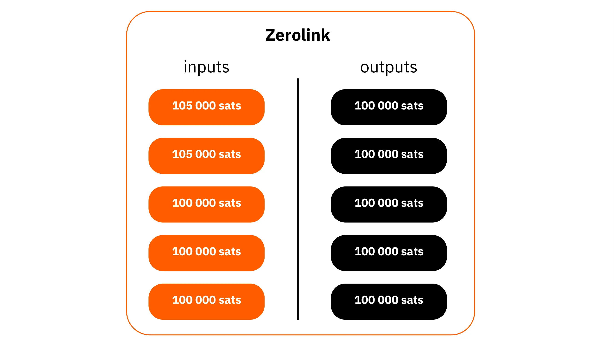


มาตรการป้องกันที่สำคัญที่ Zerolink ดำเนินการคือการแยก UTXOs ที่ยังไม่ได้ผสมออกจาก UTXOs ที่ผสมแล้วโดยใช้ชุดกุญแจเข้ารหัสที่แยกกันหรือแม้กระทั่งกระเป๋าเงินที่แยกกัน สิ่งนี้ทำให้ "*pre-mix*" wallet ซึ่งตั้งใจสำหรับ UTXOs ก่อนการผสม แตกต่างจาก "*post-mix*" wallet ซึ่งสงวนไว้สำหรับ UTXOs ที่ได้ผสมแล้ว


การแยก UTXOs อย่างเข้มงวดนี้มีจุดประสงค์หลักเพื่อป้องกันการเชื่อมโยงโดยบังเอิญระหว่าง UTXO ที่ผสมแล้วและ UTXO ที่ยังไม่ผสมแล้ว หากเกิดการเชื่อมโยงดังกล่าว ประสิทธิภาพของการ coinjoin บน UTXO ที่ผสมแล้วจะถูกลดทอนลงโดยที่ผู้ใช้ไม่ทราบ ทำให้ความลับของ UTXO ที่พวกเขาคิดว่าประวัติถูกทำลายไปแล้วตกอยู่ในความเสี่ยง การเชื่อมโยงเหล่านี้สามารถเกิดขึ้นได้ทั้งจากการใช้ที่อยู่ซ้ำในการรักษาความปลอดภัยของ UTXO ที่ผสมแล้วกับที่ยังไม่ผสม หรือจากการใช้ CIOH (_Common-Input-Ownership Heuristic_) หากผู้ใช้ใช้ UTXOs ที่ผสมและยังไม่ผสมเป็นอินพุตในธุรกรรมเดียวกัน โดยการแยกกระเป๋าเงินก่อนผสมและหลังผสม เราจะหลีกเลี่ยงการเชื่อมโยงโดยบังเอิญดังกล่าวและปกป้องผู้ใช้จากข้อผิดพลาดที่ไม่ตั้งใจ


การแยกนี้ยังช่วยให้สามารถใช้กฎที่แตกต่างกันระหว่างกระเป๋าเงินก่อนผสมและหลังผสมในระดับซอฟต์แวร์ wallet ได้อีกด้วย ตัวอย่างเช่น ในการผสมหลัง wallet ซอฟต์แวร์สามารถห้ามการรวม UTXOs เข้ากับอินพุตเพื่อป้องกันการใช้ CIOH ซึ่งจะทำลายความไม่ระบุตัวตนของผู้ใช้ นอกจากนี้ยังสามารถมาตรฐานการใช้สคริปต์และตัวเลือกการทำธุรกรรม (เช่น การรายงาน RBF เป็นต้น) เพื่อป้องกันการระบุตัวตนโดยลายนิ้วมือ wallet


ปัจจุบัน Whirlpool เป็นการใช้งาน coinjoin เพียงอย่างเดียวที่ใช้โปรโตคอล Zerolink อย่างเข้มงวด ในบทถัดไป เราจะมาดูการใช้งาน coinjoin ต่างๆ ที่มีอยู่ และข้อดีข้อเสียของแต่ละแบบ


## การดำเนินการ Coinjoin


<chapterId>e37ed073-9498-4e4f-820b-30951e829596</chapterId>


:::video id=36021102-82f3-4e86-80a9-168e3431ce7b:::


ณ ขณะนี้ มีการใช้งาน coinjoin ที่แตกต่างกันหลักๆ 3 แบบบน Bitcoin:


- Whirlpool;
- วาบิซาบิ;
- เข้าร่วมตลาด


นอกเหนือจากการใช้งานทางประวัติศาสตร์ทั้งสามนี้ ยังมีการใช้งานใหม่ที่เพิ่งเกิดขึ้น: Joinstr ฉันจะไม่กล่าวถึงในบทนี้ แต่คุณสามารถค้นหาข้อมูลที่เกี่ยวข้องทั้งหมดได้ในบทแนะนำเฉพาะนี้:


https://planb.academy/tutorials/privacy/on-chain/joinstr-37d85631-40d3-4203-abc3-3d95a078d7c3

การใช้งานแต่ละอย่างเหล่านี้มีเป้าหมายเพื่อทำลายประวัติของ UTXOs ผ่านธุรกรรม coinjoin อย่างไรก็ตาม กลไกของพวกมันแตกต่างกันอย่างมาก ดังนั้นจึงจำเป็นต้องเข้าใจว่าแต่ละอย่างทำงานอย่างไร เพื่อให้คุณสามารถเลือกตัวเลือกที่เหมาะสมที่สุดกับความต้องการของคุณ


### เข้าร่วมตลาด


JoinMarket ก่อตั้งขึ้นในปี 2015 โดย Adam Gibson และ Chris Belcher โดดเด่นอย่างชัดเจนจากการใช้งาน coinjoin อื่น ๆ ด้วยรูปแบบที่เป็นเอกลักษณ์ในการเชื่อมต่อผู้ใช้ ระบบนี้มีพื้นฐานมาจากตลาดแลกเปลี่ยน P2P ที่ซึ่งผู้ใช้บางคนที่เรียกว่า "makers" นำบิตคอยน์ของพวกเขามาใช้สำหรับการผสม ในขณะที่ผู้ใช้อื่น ๆ ที่เรียกว่า "takers" ใช้เงินสดนี้เพื่อทำ coinjoins โดยมีค่าธรรมเนียมตอบแทน


ในโมเดลนี้ "ผู้สร้าง" จะทำให้บิตคอยน์ของพวกเขาพร้อมใช้งานสำหรับ "ผู้รับ" และได้รับค่าธรรมเนียมสำหรับบริการของพวกเขา ผู้รับจะจ่ายเพื่อใช้บิตคอยน์ของผู้สร้างในการดำเนินการธุรกรรม coinjoin ของตนเอง ค่าธรรมเนียมบริการจะแตกต่างกันไปตามบทบาทที่ครอบครอง: "ผู้สร้าง" สะสมค่าธรรมเนียมสำหรับการเสนอความคล่องตัว ในขณะที่ "ผู้รับ" จ่ายค่าธรรมเนียม ตลาดดำเนินการอย่างเสรี โดยไม่มีเงื่อนไขการใช้งาน


หนึ่งในข้อเสียหลักของ JoinMarket คือความซับซ้อนในการใช้งาน ซึ่งต้องการความคุ้นเคยกับการใช้เทอร์มินัลในระดับหนึ่งเพื่อใช้งานได้อย่างมีประสิทธิภาพ แม้ว่าความซับซ้อนนี้จะไม่เป็นอุปสรรคสำหรับผู้ใช้ที่มีประสบการณ์ แต่ก็อาจจำกัดการเข้าถึงของสาธารณชนทั่วไป อย่างไรก็ตาม การเปิดตัวอินเทอร์เฟซเว็บที่เรียกว่า JAM เมื่อเร็วๆ นี้ทำให้การใช้งานง่ายขึ้นเล็กน้อย


แหล่งที่มา: [JAM](https://github.com/joinmarket-webui/jam/blob/devel/docs/assets/screenshot-dark.webp)


อย่างไรก็ตาม อุปสรรคทางเทคนิคยังคงเป็นอุปสรรคสำคัญ ในระบบนิเวศของ coinjoin ที่ความลับถูกเสริมด้วยจำนวนผู้เข้าร่วม การจำกัดใด ๆ ที่ลดการเข้าถึงจะส่งผลโดยตรงต่อสภาพคล่องที่มีอยู่ ซึ่งเป็นปัจจัยสำคัญในประสิทธิภาพของการผสม Bitcoin ซึ่งเป็นช่องทางเฉพาะในธุรกรรมทางการเงินอยู่แล้ว มองว่าการใช้ coinjoins เป็นช่องทางย่อย และ JoinMarket เป็นส่วนที่เชี่ยวชาญยิ่งขึ้นไปอีก ซึ่งจึงจำกัดศักยภาพในการเพิ่มจำนวน anonsets ของผู้ใช้


แม้จะมีโมเดลการเชื่อมโยง P2P ที่เป็นนวัตกรรมสำหรับ coinjoiners แต่ JoinMarket ก็มีข้อเสียที่สำคัญบางประการ โดยเฉพาะในแง่ของโครงสร้างการทำธุรกรรม แตกต่างจากการใช้งานอื่น ๆ เช่น Whirlpool JoinMarket ไม่รับประกันความเท่าเทียมกันที่สมบูรณ์แบบระหว่างผลลัพธ์ และสามารถติดตามลิงก์เชิงกำหนดระหว่างอินพุตและเอาต์พุตได้ นอกจากนี้ยังขาดเครื่องมือในการป้องกันไม่ให้ UTXO ที่เคยผสมกันแล้วถูกผสมอีกครั้ง ซึ่งอาจทำให้ความลับที่ผู้ใช้ต้องการถูกประนีประนอมได้


ในที่สุด แม้ว่าคอนเซ็ปต์ของ JoinMarket จะน่าสนใจ โดยเฉพาะสำหรับผู้ที่สนใจในตลาดสภาพคล่องแบบไดนามิก แต่จุดอ่อนเชิงโครงสร้างและความซับซ้อนทางเทคนิคทำให้มัน, ในความเห็นของฉัน, น่าสนใจน้อยลงสำหรับทั้งมือใหม่และผู้เชี่ยวชาญที่กำลังมองหาการใช้งาน coinjoin.


https://planb.academy/tutorials/privacy/on-chain/joinmarket-4581d8b0-0888-45c2-9545-d0a298b36f98

### วาบิซาบิ


Wabisabi เป็นอีกหนึ่งการใช้งานของ coinjoin โดยมีแนวทางที่รวมการประสานงานของธุรกรรมไว้ที่ศูนย์กลาง โมเดลนี้ถูกคิดค้นโดย Ádám Ficsór (nopara73), Yuval Kogman, Lucas Ontivero, และ István András Seres ในปี 2021 และถูกผนวกเข้ากับซอฟต์แวร์ Wasabi 2.0 ในปีถัดมา Wabisabi เป็นการพัฒนาต่อยอดจากโมเดล coinjoin ของซอฟต์แวร์ Wasabi ที่เปิดตัวในปี 2018 อย่างแม่นยำ


Towards the end of the 2010s, Wasabi adopted a radically different coinjoin transaction structure to Whirlpool. Wasabi used very large coinjoin transactions involving dozens of participants to increase the anonsets of its participants. In contrast, Whirlpool opted for multiple small transactions, enabling anonsets to grow exponentially with each cycle.


วิธีการจัดการ Exchange ยังแยกความแตกต่างระหว่างการใช้งานทั้งสองด้วย สำหรับ Whirlpool การเปลี่ยนแปลงถูกแยกออกและแยกจาก UTXOs ก่อนรอบ coinjoin ด้วย TX0 ซึ่งเป็นแนวคิดที่ฉันจะอธิบายเพิ่มเติมในบทถัดไป ในทางกลับกัน สำหรับ Wasabi การเปลี่ยนแปลงเป็นหนึ่งในผลลัพธ์ของธุรกรรม coinjoin ซึ่งรักษาลิงก์เชิงกำหนดระหว่างอินพุตและเอาต์พุตบางรายการ


ด้วย Wabisabi เวอร์ชัน 2.0 ได้ปรับแนวทางของตนเกี่ยวกับ coinjoin ให้เข้าใกล้โมเดลของ Whirlpool มากขึ้น แม้ว่าธุรกรรม coinjoin จะยังคงมีขนาดใหญ่มาก แต่ขณะนี้สามารถดำเนินการหลายรอบต่อเนื่องกันได้ โดยเป็นไปตามโมเดลของ Whirlpool นอกจากนี้ ยังมีการให้ความสำคัญเป็นพิเศษกับการจัดการเงินทอน: แตกต่างจาก Wasabi 1.0 ซึ่งเงินทอนเชื่อมโยงโดยตรงกับอินพุตของผู้ใช้ Wabisabi พยายามแบ่งเงินทอนออกเป็นจำนวนย่อยหลายส่วน โดยกระจายเป็นหน่วยมูลค่าเท่ากันสำหรับผู้เข้าร่วมทุกคน


ลองอธิบายด้วยตัวอย่างที่ง่ายขึ้นที่เกี่ยวข้องกับผู้ใช้เพียงสองคน: Alice ต้องการผสม 115,000 sats และ Bob ต้องการผสม 210,000 sats โดยไม่สนใจค่าธรรมเนียม ด้วย Wasabi 1.0 การทำธุรกรรม coinjoin จะสร้างผลลัพธ์ 3 รายการของ 100,000 sats บวกกับการเปลี่ยนแปลง 1 รายการของ 15,000 sats สำหรับ Alice และการเปลี่ยนแปลง 1 รายการของ 10,000 sats สำหรับ Bob ผลลัพธ์การเปลี่ยนแปลงยังคงเชื่อมโยงกับอินพุต:


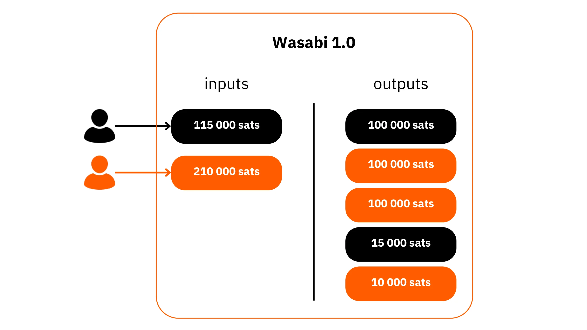


ภายใต้ Wabisabi การทำธุรกรรมเดียวกันจะสร้างผลลัพธ์ 3 รายการของ 100,000 sats และ 5 ผลลัพธ์ของ 5,000 sats ซึ่งจะกระจายการเปลี่ยนแปลงเพื่อไม่ให้สามารถเชื่อมโยงโดยตรงกับอินพุตเฉพาะ:


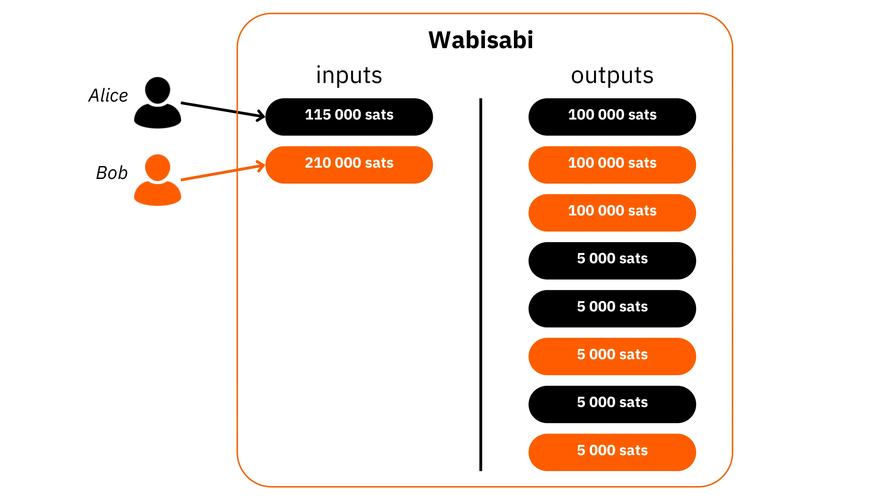


โดยส่วนตัวแล้ว ฉันพบว่าการจัดการการเปลี่ยนแปลงของ Wabisabi มีความเสี่ยงหลายประการที่อาจส่งผลต่อประสิทธิภาพในแง่ของการรักษาความลับ:


- เมื่อผู้ใช้มีส่วนร่วม UTXO ที่มีขนาดใหญ่กว่าของผู้เข้าร่วมคนอื่น ๆ อย่างมีนัยสำคัญ เขาจะจบลงด้วยจำนวนเงินที่เปลี่ยนแปลงซึ่งจะถูกเชื่อมโยงกับการป้อนข้อมูลของเขา สิ่งนี้ขัดแย้งกับเป้าหมายดั้งเดิมของโปรโตคอล ซึ่งคือการกำจัดการเปลี่ยนแปลงที่สามารถระบุได้ทั้งหมด
- การคูณของสกุลเงินด้วยเป้าหมายในการแยกย่อยการเปลี่ยนแปลงอาจส่งผลเสียต่อประสิทธิภาพในการผสมอย่างขัดแย้งได้ กระบวนการนี้อาจนำไปสู่การลดลงของ anonsets สำหรับผลลัพธ์บางอย่าง เนื่องจากพวกมันกลายเป็นที่ระบุได้ง่ายขึ้น;
- วิธีนี้ยังสร้าง UTXOs ที่มีมูลค่าต่ำ ซึ่งก่อให้เกิดปัญหาการจัดการสำหรับผู้ใช้ UTXOs ขนาดเล็กเหล่านี้ หากมีค่าใช้จ่ายสูงเกินไปในการใช้จ่ายเมื่อเทียบกับมูลค่าของพวกเขา อาจกลายเป็น "ฝุ่น" ปรากฏการณ์นี้ทำให้ผู้ใช้รวม UTXOs หลายรายการเป็นอินพุตสำหรับธุรกรรมในอนาคตหรือรวมเข้าด้วยกันเป็น UTXO เดียว ในทั้งสองกรณี เนื่องจาก CIOH สิ่งนี้อาจลด anonsets ที่ได้รับหรือยกเลิกประโยชน์ด้านความลับที่ได้รับจาก coinjoin เริ่มต้นอย่างสิ้นเชิง


ไม่เหมือนกับ Whirlpool ซึ่งใช้โปรโตคอล ZeroLink เพื่อให้แน่ใจว่ามีการแยกที่เข้มงวดระหว่าง UTXOs ก่อนผสมและหลังผสม Wabisabi ไม่ได้รักษาการแยกที่เข้มงวดนี้ นอกจากนี้ยังมีปัญหาการใช้ที่อยู่ซ้ำโดยลูกค้าบางรายของ Wasabi ซึ่งเห็นได้ชัดว่าเป็นอันตรายต่อผู้ใช้อย่างมาก


ใน Wasabi เวอร์ชัน 2.0 ได้มีการนำเสนอนโยบายค่าธรรมเนียม coinjoin ใหม่ ตั้งแต่นี้เป็นต้นไป ค่าธรรมเนียมของผู้ประสานงานจะถูกตั้งไว้ที่ 0.3% สำหรับ UTXOs ที่มีมูลค่าเกิน 0.01 บิตคอยน์ ในขณะที่สำหรับ UTXOs ที่มีมูลค่าน้อยกว่านั้น ค่าธรรมเนียมจะถูกเสนอในอัตราเต็ม นอกจากนี้ การรีมิกซ์สำหรับ UTXOs ที่มีมูลค่าน้อยกว่าจะไม่มีค่าใช้จ่าย แม้ว่าค่าธรรมเนียม mining ยังคงต้องชำระโดยผู้ใช้สำหรับทุกธุรกรรม รวมถึงการรีมิกซ์ด้วย


สิ่งนี้ตรงกันข้ามกับนโยบายของ Whirlpool ซึ่งค่าธรรมเนียมยังคงคงที่ ไม่ว่าจะมีขนาดของ anonsets ที่ได้รับเท่าใดก็ตาม ด้วย Wasabi 2.0 แม้ว่าค่าธรรมเนียมผู้ประสานงานจะถูกยกเว้นสำหรับ UTXOs ขนาดเล็ก แต่ผู้ใช้ยังคงต้องเสียค่าธรรมเนียม mining ในทุกธุรกรรม รวมถึงการรีมิกซ์ด้วย


ในขณะที่ฉันเขียนบรรทัดเหล่านี้ การใช้ Wabisabi ได้กลายเป็นเรื่องซับซ้อนมากขึ้นอย่างมากเนื่องจากเหตุการณ์ล่าสุด หลังจากการจับกุมผู้ก่อตั้ง Samourai Wallet, zkSNACKs บริษัทที่ให้ทุนและจัดการการพัฒนา Wasabi ได้ประกาศว่าบริการผู้ประสานงาน coinjoin ของตนจะถูกยกเลิกในวันที่ 1 มิถุนายน 2024 ผู้ประสานงานนี้ซึ่งถูกตั้งค่าโดยค่าเริ่มต้นบน Wasabi มีหน้าที่รับผิดชอบสำหรับสภาพคล่องส่วนใหญ่


ด้วยการยกเลิกผู้ประสานงานหลักนี้ ผู้ใช้จะต้องเชื่อมต่อกับผู้ประสานงานใหม่ที่เป็นอิสระ การเปลี่ยนแปลงนี้ทำให้เกิดความกังวลหลายประการ: ในด้านหนึ่ง ผู้ประสานงานใหม่อาจไม่มีสภาพคล่องเพียงพอ ซึ่งอาจลดประสิทธิภาพของการรวมเหรียญในแง่ของการรักษาความลับ ในทางกลับกัน มีความเสี่ยงที่จะพบกับผู้ประสานงานที่เป็นอันตราย สถานการณ์นี้เพิ่มความเสี่ยงใหม่ที่สำคัญสำหรับผู้ที่ต้องการใช้ Wabisabi


นอกเหนือจากปัญหาทางเทคนิคแล้ว การตัดสินใจของ zkSNACKs ซึ่งเป็นบริษัทที่อยู่เบื้องหลัง Wasabi ในการใช้บริการของบริษัทวิเคราะห์สตริงเพื่อกรองผู้เข้าร่วม coinjoin ทำให้เกิดคำถามทางจริยธรรมและกลยุทธ์ที่ร้ายแรง แนวคิดเริ่มต้นคือการป้องกันอาชญากรจากการใช้ coinjoins บน Wasabi ซึ่งอาจดูเหมือนเป็นการเคลื่อนไหวที่ถูกต้อง อย่างไรก็ตาม มันทำให้เกิดความขัดแย้ง: การจ่ายค่าธรรมเนียมให้กับผู้ประสานงานที่มีภารกิจหลักคือการเสริมสร้างความลับของผู้ใช้ เพียงเพื่อให้เขาให้ทุนแก่บริษัทที่มีเป้าหมายเพื่อประนีประนอมความลับเดียวกันนั้น


ยิ่งน่ากังวลมากขึ้นคือหลักการของการกรอง ซึ่งขัดแย้งอย่างมากกับปรัชญาของ Bitcoin ที่เสนอระบบการเงินที่เปิดกว้างและไม่ถูกเซ็นเซอร์ แม้ว่าการกรองอาจดูเหมือนมีเหตุผลในการยกเว้นกิจกรรมทางอาญา แต่ก็อาจส่งผลกระทบต่อบุคคลที่การกระทำของพวกเขา แม้จะถูกจัดประเภทว่าผิดกฎหมายในบางบริบท แต่ก็อาจเป็นที่ยอมรับทางศีลธรรมหรือเป็นประโยชน์ต่อสังคม ตัวอย่างของ Edward Snowden แสดงให้เห็นถึงความขัดแย้งนี้อย่างชัดเจน: ถูกมองว่าเป็นอาชญากรโดยรัฐบาลบางแห่งจากการเปิดเผยของเขา แต่ถูกมองว่าเป็นผู้เปิดโปงที่กระทำเพื่อประโยชน์สาธารณะโดยคนอื่นๆ ความซับซ้อนนี้เน้นย้ำถึงอันตรายที่อาจเกิดขึ้นจากการกรอง ซึ่งแม้จะมีเจตนาดี แต่ท้ายที่สุดอาจบ่อนทำลายสิทธิและความปลอดภัยของผู้ใช้ที่ชอบด้วยกฎหมาย ฉันยังสามารถกล่าวถึงนักเคลื่อนไหวและนักข่าวที่ถูกข่มเหงภายใต้ระบอบเผด็จการบางแห่งได้อีกด้วย


ตามที่คุณคงได้ทราบแล้ว ความชอบของฉันคือรุ่น Whirlpool สำหรับการทำ coinjoins บน Bitcoin ระบบนี้โดดเด่นในด้านความเข้มงวดและให้การรับประกันความลับที่เหนือกว่า นอกจากนี้ยังเป็นระบบเดียวที่เสนอการผสมที่ถือว่าสมบูรณ์แบบในบริบททางคณิตศาสตร์ ในความเห็นของฉัน รุ่นนี้เป็นตัวแทนของอนาคตของการทำ coinjoins บนเครือข่าย Bitcoin ฉันขอเชิญคุณสำรวจรุ่นนี้ในเชิงลึกในบทถัดไป


https://planb.academy/tutorials/wallet/desktop/wasabi-a0b51540-32d2-4ed2-98aa-801da5d35cf6

https://planb.academy/tutorials/wallet/desktop/ginger-wallet-9bb51029-4e64-4d3c-9766-358649adaea3

## วิธีการทำงานของ Whirlpool


<chapterId>bdbd7109-e36d-4b4f-a3c6-928df4e9bfda</chapterId>


:::video id=e40f1195-d028-44d3-be24-d76427f9d24b:::


สิ่งที่ทำให้ Whirlpool แตกต่างจากวิธีการ coinjoin อื่น ๆ คือการใช้ธุรกรรม "_ZeroLink_" ซึ่งรับประกันว่าจะไม่มีการเชื่อมโยงทางเทคนิคใด ๆ ระหว่างอินพุตและเอาต์พุตทั้งหมด การผสมที่สมบูรณ์แบบนี้เกิดขึ้นได้ผ่านโครงสร้างที่ผู้เข้าร่วมแต่ละคนมีส่วนร่วมในจำนวนอินพุตที่เท่ากัน (ยกเว้นค่าธรรมเนียม mining) สร้างเอาต์พุตที่มีจำนวนเท่ากันอย่างสมบูรณ์แบบ


แนวทางที่จำกัดนี้ในการป้อนข้อมูลทำให้การทำธุรกรรม coinjoin ของ Whirlpool มีคุณสมบัติพิเศษ: การไม่มีลิงก์เชิงกำหนดระหว่างข้อมูลนำเข้าและข้อมูลส่งออกอย่างสิ้นเชิง กล่าวอีกนัยหนึ่ง ข้อมูลส่งออกแต่ละรายการมีความน่าจะเป็นเท่ากันที่จะถูกระบุไปยังผู้เข้าร่วมใด ๆ เมื่อเทียบกับข้อมูลส่งออกอื่น ๆ ทั้งหมดในธุรกรรม


### วิธีการทำงานของ Whirlpool


ในตอนแรก จำนวนผู้เข้าร่วมในแต่ละ Whirlpool coinjoin ถูกจำกัดไว้ที่ 5 คน โดยมีผู้เข้าร่วมใหม่ 2 คน และผู้รีมิกซ์ 3 คน (เราจะอธิบายแนวคิดเหล่านี้ในภายหลัง) อย่างไรก็ตาม การเพิ่มขึ้นของค่าธรรมเนียมการทำธุรกรรม on-chain ที่สังเกตได้ในปี 2023 ทำให้ทีมของ Samourai ต้องคิดใหม่เกี่ยวกับโมเดลของพวกเขา โดยมีเป้าหมายเพื่อปรับปรุงความเป็นส่วนตัวในขณะที่ลดค่าใช้จ่าย ดังนั้น เมื่อพิจารณาถึงสถานการณ์ตลาดค่าธรรมเนียมและจำนวนผู้เข้าร่วม ผู้ประสานงานสามารถจัด coinjoins ที่รวมผู้เข้าร่วม 6, 7 หรือ 8 คนได้ ขณะนี้เซสชันที่ปรับปรุงแล้วเหล่านี้เรียกว่า "Surge Cycles" สิ่งสำคัญคือต้องทราบว่า ไม่ว่าจะเป็นการกำหนดค่าใดก็ตาม จะมีผู้เข้าร่วมใหม่เพียงสองคนเท่านั้นใน Whirlpool coinjoins เสมอ


ดังนั้น ธุรกรรม Whirlpool มีลักษณะเด่นคือมีจำนวนอินพุตและเอาต์พุตที่เหมือนกัน ซึ่งสามารถเป็น:


- 5 อินพุตและ 5 เอาต์พุต;


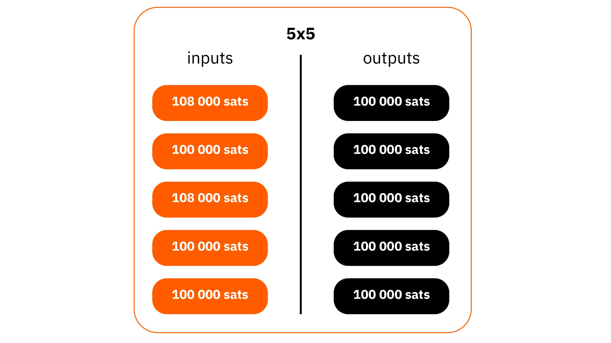


- 6 อินพุตและ 6 เอาต์พุต;


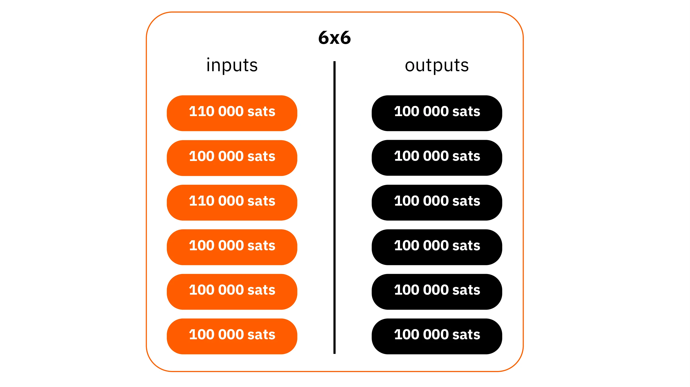


- 7 อินพุตและ 7 เอาต์พุต;


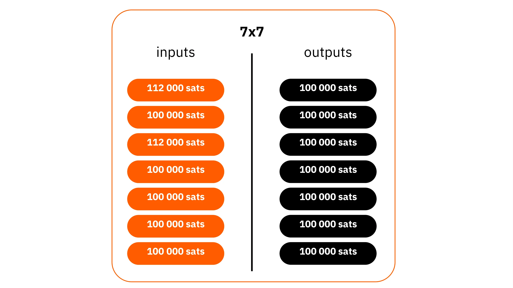


- 8 อินพุตและ 8 เอาต์พุต


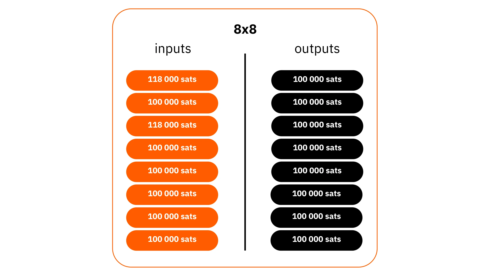


โมเดลของ Whirlpool อ้างอิงจากธุรกรรม coinjoin ขนาดเล็ก แตกต่างจาก Wabisabi และ JoinMarket ที่ความแข็งแกร่งของ anonsets ขึ้นอยู่กับปริมาณของผู้เข้าร่วมในรอบเดียว (หรือในไม่กี่รอบ) Whirlpool พึ่งพาลำดับของหลายรอบเล็ก ๆ


ในโมเดลนี้ ผู้ใช้จะจ่ายค่าธรรมเนียมเฉพาะเมื่อเข้าร่วมพูลครั้งแรกเท่านั้น ทำให้พวกเขาสามารถเข้าร่วมในการรีมิกซ์หลากหลายโดยไม่มีค่าใช้จ่ายเพิ่มเติม ผู้เข้าร่วมใหม่จะจ่ายค่าธรรมเนียม mining สำหรับรีมิกเซอร์


ด้วยการเข้าร่วม coinjoin เพิ่มเติมแต่ละครั้งที่ UTXO มีส่วนร่วม เช่นเดียวกับเพื่อนร่วมที่เคยพบในอดีต anonsets จะเติบโตแบบทวีคูณ เป้าหมายคือการใช้ประโยชน์จากการรีมิกซ์ฟรีเหล่านี้ ซึ่งทุกครั้งที่เกิดขึ้น จะช่วยเสริมความหนาแน่นของ anonsets ที่เกี่ยวข้องกับแต่ละ UTXO ที่ผสม


Whirlpool ได้รับการออกแบบโดยคำนึงถึงข้อกำหนดที่สำคัญสองประการ:


- การเข้าถึงของการใช้งานบนอุปกรณ์เคลื่อนที่ เนื่องจาก Samourai Wallet เป็นแอปพลิเคชันสมาร์ทโฟนเป็นหลัก;
- การรีมิกซ์อย่างรวดเร็วเพื่อส่งเสริมการเพิ่มขึ้นอย่างมีนัยสำคัญใน anonsets.


ข้อบังคับเหล่านี้เป็นแนวทางในการตัดสินใจของนักพัฒนา Samourai Wallet ในการออกแบบ Whirlpool ซึ่งนำไปสู่การจำกัดจำนวนผู้เข้าร่วมในแต่ละรอบ หากมีน้อยเกินไปจะทำให้ประสิทธิภาพของ coinjoin ลดลงอย่างมาก ลดจำนวน anonsets ที่สร้างขึ้นในแต่ละรอบอย่างมาก ในขณะที่หากมีมากเกินไปจะทำให้เกิดปัญหาการจัดการสำหรับแอปพลิเคชันมือถือและขัดขวางการไหลของรอบ


ในที่สุดก็ไม่จำเป็นต้องมีผู้เข้าร่วมจำนวนมากต่อการทำ coinjoin บน Whirlpool เนื่องจากการสร้าง anonsets ขึ้นอยู่กับการสะสมของหลายรอบการทำ coinjoin หลักการที่สำคัญที่สุดที่นี่คือความเป็นเนื้อเดียวกันของ UTXOs ของผู้เข้าร่วมทั้งหมด เนื่องจากสิ่งนี้จะช่วยให้การผสมสมบูรณ์แบบและได้รับประโยชน์เต็มที่จากรอบการผสมและการผสมซ้ำ


### Coinjoin กลุ่มและค่าธรรมเนียม


สำหรับหลายรอบเหล่านี้เพื่อเพิ่มการไม่เปิดเผยตัวตนของ UTXOs ที่ผสมกัน จำเป็นต้องมีกรอบการทำงานเฉพาะเพื่อจำกัดจำนวนของ UTXOs ที่ใช้ Whirlpool กำหนดกลุ่มที่แตกต่างกัน


กลุ่มสระหมายถึงกลุ่มของผู้ใช้ที่ต้องการรวมทรัพยากรของตน โดยตกลงเกี่ยวกับจำนวนของ UTXOs ที่จะใช้เพื่อเพิ่มประสิทธิภาพกระบวนการ coinjoin ในขณะที่ยังคงรักษาความเป็นเนื้อเดียวกันของ UTXO แต่ละสระจะระบุจำนวน UTXO คงที่ ซึ่งผู้ใช้ต้องปฏิบัติตามเพื่อเข้าร่วม ดังนั้น เพื่อทำ coinjoin กับ Whirlpool คุณจำเป็นต้องเลือกสระ ปัจจุบันมีสระต่อไปนี้ให้บริการ:


- 0.5 bitcoins;
- 0.05 บิตคอยน์;
- 0.01 บิตคอยน์;
- 0.001 bitcoin (= 100,000 sats).


เมื่อคุณเข้าสู่พูลด้วยบิตคอยน์ของคุณ พวกมันจะถูกแบ่งออกเป็น generate UTXOs ที่มีความเหมือนกันอย่างสมบูรณ์กับของผู้เข้าร่วมคนอื่นๆ ในพูล แต่ละพูลมีขีดจำกัดสูงสุด ดังนั้นสำหรับจำนวนที่เกินขีดจำกัดนี้ คุณจะต้องทำการเข้าสู่พูลเดียวกันสองครั้งแยกกันหรือย้ายไปยังพูลอื่นที่มีจำนวนสูงกว่า:


| Pool (bitcoin) | Maximum amount per entry (bitcoin) |
|----------------|------------------------------------|
| 0.5            | 35                                 |
| 0.05           | 3.5                                |
| 0.01           | 0.7                                |
| 0.001          | 0.025                              |

UTXO ถือว่าเป็นส่วนหนึ่งของพูลเมื่อมันพร้อมที่จะถูกรวมเข้ากับ coinjoin อย่างไรก็ตาม นี่ไม่ได้หมายความว่าผู้ใช้จะสูญเสียการครอบครองมันไป ดังที่เราได้เห็นในบทแรก ๆ ของส่วนนี้ ผ่านวงจรการผสมต่าง ๆ คุณยังคงควบคุมกุญแจของคุณได้อย่างเต็มที่ และด้วยเหตุนี้ จึงควบคุมบิตคอยน์ของคุณได้อย่างเต็มที่ นี่คือสิ่งที่ทำให้เทคนิค coinjoin แตกต่างจากเทคนิคการผสมแบบรวมศูนย์อื่น ๆ


ในการเข้าร่วมกลุ่ม coinjoin คุณจำเป็นต้องจ่ายค่าบริการและค่าธรรมเนียม mining ค่าบริการจะถูกกำหนดไว้คงที่สำหรับแต่ละกลุ่มและมีวัตถุประสงค์เพื่อเป็นค่าตอบแทนให้กับทีมที่รับผิดชอบการพัฒนาและบำรุงรักษา Whirlpool


ค่าบริการสำหรับการใช้ Whirlpool จะต้องชำระเพียงครั้งเดียวเมื่อคุณเข้าร่วมพูล เมื่อคุณเข้าร่วมแล้ว คุณสามารถเข้าร่วมการรีมิกซ์ได้ไม่จำกัดจำนวนโดยไม่มีค่าใช้จ่ายเพิ่มเติม นี่คือค่าธรรมเนียมคงที่ปัจจุบันสำหรับแต่ละพูล:


| Pool (bitcoin) | Entry fee (bitcoin)  |
| -------------- | -------------------- |
| 0,5            | 0,0175               |
| 0,05           | 0,00175              |
| 0,01           | 0,0005 (50 000 sats) |
| 0,001          | 0,00005 (5 000 sats) |

ค่าธรรมเนียมเหล่านี้ทำหน้าที่เป็นตั๋วเข้าชมสระที่เลือกไว้ โดยไม่คำนึงถึงจำนวนที่คุณใส่ใน coinjoin ดังนั้น ไม่ว่าคุณจะเข้าสระ 0.01 ด้วย 0.01 BTC หรือ 0.5 BTC ค่าธรรมเนียมจะยังคงเท่าเดิมในแง่ของจำนวนที่แน่นอน


ก่อนดำเนินการกับ Whirlpool coinjoins ผู้ใช้สามารถเลือกได้ระหว่าง 2 กลยุทธ์:


- เลือกใช้พูลที่เล็กลงเพื่อลดค่าใช้จ่ายในการบริการ โดยรู้ว่าเขาจะได้รับ UTXOs ขนาดเล็กหลายรายการเป็นการตอบแทน;
- หรือเลือกสระที่ใหญ่ขึ้น ยอมจ่ายค่าธรรมเนียมที่สูงขึ้น แต่สุดท้ายกลับได้ UTXO ที่มีมูลค่าสูงจำนวนน้อยลง


โดยทั่วไปแล้วไม่แนะนำให้รวม UTXOs ที่ผสมกันหลายรายการหลังจากรอบ coinjoin เนื่องจากอาจทำให้ความลับที่ได้รับมาเสียหายได้ โดยเฉพาะอย่างยิ่งเนื่องจากหลักการเจ้าของอินพุตร่วมกัน (CIOH: *Common-Input-Ownership-Heuristic*) ดังนั้นอาจแนะนำให้เลือกพูลที่ใหญ่ขึ้น แม้ว่าจะหมายถึงการเสียค่าใช้จ่ายเพิ่มเติม เพื่อที่จะลดจำนวน UTXOs ที่มีมูลค่าน้อยในผลลัพธ์ ผู้ใช้ต้องประเมินการแลกเปลี่ยนเหล่านี้เพื่อเลือกพูลที่พวกเขาชอบ


นอกเหนือจากค่าบริการแล้ว ค่าธรรมเนียม mining ที่เฉพาะเจาะจงสำหรับธุรกรรม Bitcoin ใด ๆ จะต้องนำมาพิจารณาด้วย ในฐานะผู้ใช้ Whirlpool คุณจะต้องจ่ายค่าธรรมเนียม mining สำหรับธุรกรรมการเตรียม (`Tx0`) รวมถึงสำหรับการ coinjoin ครั้งแรก การรีมิกซ์ครั้งต่อ ๆ ไปทั้งหมดจะไม่มีค่าใช้จ่าย เนื่องจากโมเดลของ Whirlpool ซึ่งอิงจากการจ่ายให้กับผู้เข้าร่วมใหม่


ในความเป็นจริง ในแต่ละ Whirlpool coinjoin ผู้ใช้ 2 คนในบรรดาผู้เข้าร่วมเป็นผู้เข้ามาใหม่ ส่วนผู้เข้าร่วมอื่น ๆ มาจากผู้ที่ทำการรีมิกซ์ ดังนั้น ค่าใช้จ่าย mining สำหรับผู้เข้าร่วมทุกคนในธุรกรรมจะตกเป็นภาระของผู้เข้ามาใหม่ 2 คนนี้ ซึ่งพวกเขายังสามารถได้รับประโยชน์จากการรีมิกซ์ฟรี:


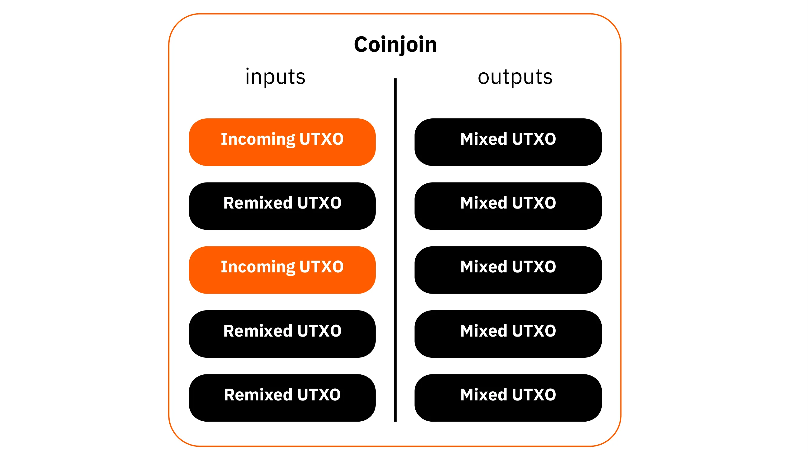


ด้วยระบบค่าธรรมเนียมนี้ Whirlpool โดดเด่นจากการใช้งาน coinjoin อื่น ๆ เนื่องจาก anonsets ของ UTXOs ไม่ได้เป็นสัดส่วนกับราคาที่ผู้ใช้จ่าย ดังนั้นจึงสามารถบรรลุระดับความเป็นนิรนามที่สูงขึ้นได้อย่างมากโดยจ่ายเพียงค่าธรรมเนียมการเข้าร่วมพูลและค่าธรรมเนียม mining สำหรับ 2 ธุรกรรม (`Tx0` และการผสมครั้งแรก)


สิ่งสำคัญคือต้องทราบว่าผู้ใช้จะต้องจ่ายค่าธรรมเนียม mining เพื่อถอน UTXOs ของเขาออกจากพูลหลังจากทำการ coinjoin หลายครั้งเสร็จสิ้น เว้นแต่เขาจะเลือกตัวเลือก `mix to` ซึ่งจะให้ที่อยู่ภายนอกที่รับเงินโดยตรงจาก coinjoin โดยไม่มีธุรกรรมเพิ่มเติมใดๆ


### บัญชี HD wallet


ในการสร้าง coinjoin ผ่าน Whirlpool, wallet ต้อง generate หลายบัญชีแยกต่างหาก นี่คือหลักการเบื้องหลังโปรโตคอล ZeroLink บัญชี, ในบริบทของ HD (Hierarchical Deterministic) wallet, ประกอบด้วยส่วนที่แยกออกจากกันโดยสิ้นเชิง, การแยกนี้เกิดขึ้นที่ระดับที่สามของลำดับชั้น wallet, กล่าวคือ, ที่ระดับ `xpub`


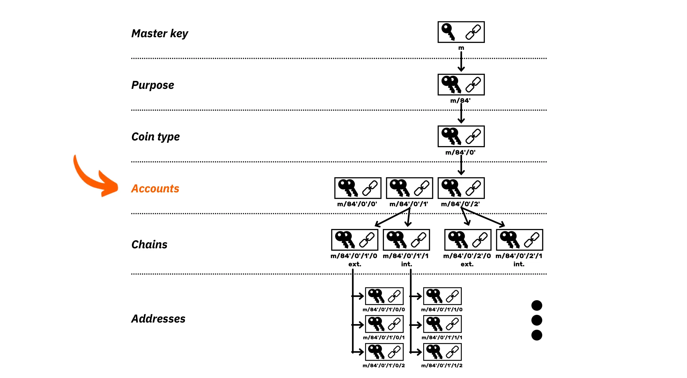


HD wallet สามารถสร้างบัญชีได้สูงสุด `2^(31)` บัญชีตามทฤษฎี บัญชีเริ่มต้นที่ใช้โดยค่าเริ่มต้นในกระเป๋าเงิน Bitcoin ทั้งหมดจะตรงกับดัชนี `0'`


สำหรับกระเป๋าเงินที่ปรับให้เข้ากับ Whirlpool ใช้บัญชี 4 บัญชีเพื่อตอบสนองความต้องการของกระบวนการ ZeroLink:


- บัญชี **เงินฝาก** ที่ระบุโดยดัชนี `0'`;
- บัญชี **bad bank** (หรือ "doxxic change") ที่ระบุด้วยดัชนี `2,147,483,644'`;
- บัญชี **premix** ที่ระบุโดยดัชนี `2 147 483 645'`;
- บัญชี **postmix** ที่ระบุโดยดัชนี `2 147 483 646'`.


บัญชีแต่ละบัญชีเหล่านี้มีหน้าที่เฉพาะในกระบวนการ coinjoin ซึ่งเราจะสำรวจในส่วนต่อไปนี้


บัญชีทั้งหมดนี้เชื่อมโยงกับ seed เดียว ทำให้ผู้ใช้สามารถกู้คืนการเข้าถึงบิตคอยน์ทั้งหมดของตนโดยใช้วลีการกู้คืนของพวกเขา และในกรณีที่ใช้ได้ passphrase ของพวกเขา อย่างไรก็ตาม ในระหว่างการดำเนินการกู้คืน ซอฟต์แวร์จะต้องได้รับข้อมูลเกี่ยวกับดัชนีบัญชีต่างๆ ที่ใช้


มาดูขั้นตอนต่างๆ ของการรวมเหรียญ Whirlpool ภายในบัญชีเหล่านี้กันเถอะ


### The TX0


จุดเริ่มต้นของการทำ Whirlpool coinjoin ใด ๆ คือบัญชี **ฝาก** นี่คือบัญชีที่คุณใช้โดยอัตโนมัติเมื่อคุณสร้าง Bitcoin wallet ใหม่ บัญชีนี้จะต้องได้รับการเติมเครดิตด้วยบิตคอยน์ที่คุณต้องการผสม


`Tx0` เป็นขั้นตอนแรกในกระบวนการผสมของ Whirlpool วัตถุประสงค์คือเพื่อเตรียมและทำให้ UTXOs เท่ากันสำหรับการ coinjoin โดยแบ่งออกเป็นหน่วยที่สอดคล้องกับจำนวนของพูลที่เลือก เพื่อให้การผสมเป็นเนื้อเดียวกัน UTXOs ที่ถูกทำให้เท่ากันแล้วจะถูกส่งไปยังบัญชี **premix** สำหรับความแตกต่างที่ไม่สามารถเข้าสู่พูลได้ จะถูกแยกออกไปยังบัญชีเฉพาะ: **bad bank** (หรือ "doxxic change")


ธุรกรรมเริ่มต้น `Tx0` นี้ยังใช้เพื่อชำระค่าธรรมเนียมบริการที่ต้องชำระให้กับผู้ประสานงาน coinjoin อีกด้วย แตกต่างจากขั้นตอนต่อไปนี้ ธุรกรรมนี้ไม่ได้เป็นการทำงานร่วมกัน ดังนั้นผู้ใช้จะต้องรับผิดชอบค่าใช้จ่ายทั้งหมดของ mining:


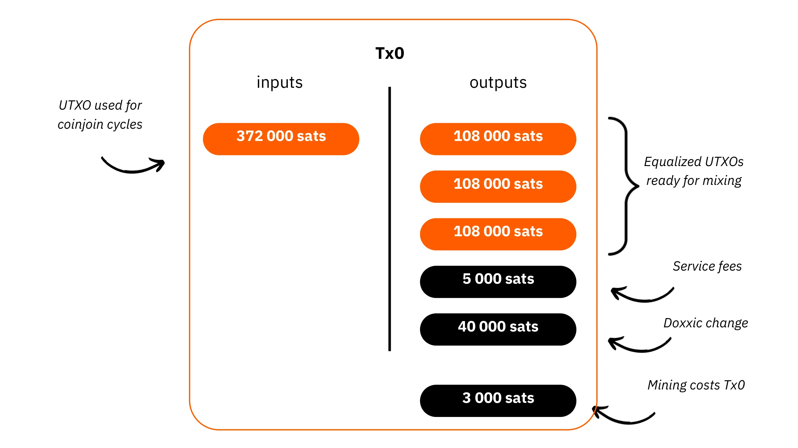


ในตัวอย่างของธุรกรรม `Tx0` นี้ อินพุตจำนวน `372,000 sats` จากบัญชี **ฝากเงิน** ของเราถูกแบ่งออกเป็นหลาย UTXO เอาต์พุต ซึ่งแบ่งออกดังนี้:


- จำนวน `5,000 sats` สำหรับผู้ประสานงานสำหรับค่าบริการ ซึ่งสอดคล้องกับการเข้าร่วมสระว่ายน้ำของ `100,000 sats`;
- UTXO 3 รายการเตรียมพร้อมสำหรับการผสม ถูกเปลี่ยนเส้นทางไปยังบัญชี **premix** ของเรา และลงทะเบียนกับผู้ประสานงานแล้ว UTXO เหล่านี้ถูกปรับให้เท่ากันที่ `108,000 sats` แต่ละรายการ เพื่อครอบคลุมค่าใช้จ่าย mining สำหรับการผสมเริ่มต้นในอนาคตของพวกเขา;
- ส่วนเกินซึ่งไม่สามารถเข้าสู่กลุ่มได้เนื่องจากมีขนาดเล็กเกินไป ถือเป็นการเปลี่ยนแปลงที่เป็นพิษ มันถูกส่งไปยังบัญชีเฉพาะของมัน ที่นี่ การเปลี่ยนแปลงนี้มีมูลค่า `40,000 sats`;
- ในที่สุด ก็มี `3,000 sats` เหลืออยู่ ซึ่งไม่ได้เป็นผลลัพธ์ แต่เป็นค่าใช้จ่าย mining ที่จำเป็นในการยืนยัน `Tx0`


ตัวอย่างเช่น นี่คือ Whirlpool Tx0 จริง (ไม่ใช่ของฉัน): [edef60744f539483d868caff49d4848e5cc6e805d6cdc8d0f9bdbbaedcb5fc46](https://mempool.space/tx/edef60744f539483d868caff49d4848e5cc6e805d6cdc8d0f9bdbbaedcb5fc46)


### การเปลี่ยนแปลงที่เป็นพิษ


ส่วนเกินที่ไม่สามารถรวมเข้ากับกลุ่มได้ เทียบเท่ากับ `40,000 sats` จะถูกเปลี่ยนเส้นทางไปยังบัญชี **bad bank** ซึ่งรู้จักกันในชื่อ "doxxic change" เพื่อให้แน่ใจว่ามีการแยกออกจาก UTXOs อื่น ๆ ใน wallet อย่างเคร่งครัด


UTXO นี้เป็นภัยคุกคามต่อความลับของผู้ใช้ เนื่องจากยังคงเชื่อมโยงกับอดีตของมันและอาจเชื่อมโยงกับตัวตนของเจ้าของ นอกจากนี้ยังถูกบันทึกว่าเป็นของผู้ใช้ที่ได้ทำ coinjoin


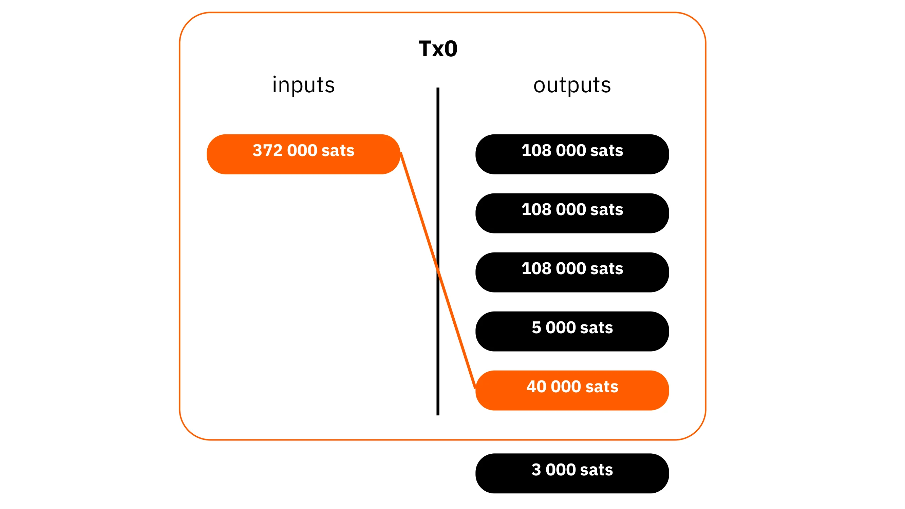


หาก UTXO นี้ถูกรวมเข้ากับผลลัพธ์ที่ผสมกัน ผลลัพธ์หลังจะสูญเสียความลับทั้งหมดที่ได้รับระหว่างรอบ coinjoin โดยเฉพาะอย่างยิ่งเนื่องจาก CIOH (*Common-Input-Ownership-Heuristic*) หากมันถูกรวมเข้ากับการเปลี่ยนแปลง doxxic อื่น ๆ ผู้ใช้จะเสี่ยงต่อการสูญเสียความลับ เนื่องจากจะเชื่อมโยงรายการรอบ coinjoin ต่าง ๆ ดังนั้นจึงควรได้รับการจัดการด้วยความระมัดระวัง เราจะลงรายละเอียดเพิ่มเติมเกี่ยวกับการจัดการ UTXOs doxxic เหล่านี้ในส่วนสุดท้ายของบทนี้


### การผสมเริ่มต้น


หลังจาก `Tx0` UTXOs ที่ถูกทำให้เท่ากันจะถูกส่งไปยังบัญชี **premix** ของ wallet ของเรา พร้อมที่จะถูกนำเข้าสู่รอบ coinjoin ครั้งแรกของพวกมัน ซึ่งรู้จักกันในชื่อ "การผสมเริ่มต้น" หากในตัวอย่างของเรา `Tx0` สร้าง UTXOs หลายรายการสำหรับการผสม แต่ละรายการจะถูกรวมเข้ากับการผสมเริ่มต้นแยกกัน


เมื่อสิ้นสุดการผสมครั้งแรกนี้ บัญชี **premix** จะว่างเปล่า ในขณะที่เหรียญของเรา หลังจากจ่ายค่าธรรมเนียม mining สำหรับการ coinjoin ครั้งแรกนี้ จะถูกปรับให้ตรงกับจำนวนที่กำหนดโดยพูลที่เลือก ในตัวอย่างของเรา UTXOs เริ่มต้นของเรา `108,000 sats` จะถูกลดลงเหลือเพียง `100,000 sats`


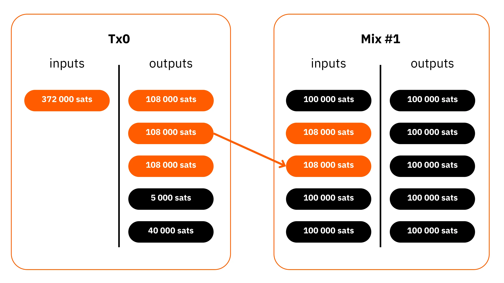


### รีมิกซ์


หลังจากทำการมิกซ์ขั้นต้นแล้ว UTXO จะถูกโอนไปยังบัญชี **postmix** บัญชีนี้รวบรวมทั้ง UTXO ที่มิกซ์แล้วและ UTXO ที่กำลังรอการรีมิกซ์ เมื่อไคลเอนต์ Whirlpool ทำงานอยู่ UTXO ที่อยู่ในบัญชี **postmix** จะพร้อมสำหรับการรีมิกซ์โดยอัตโนมัติ และจะถูกเลือกแบบสุ่มเพื่อเข้าร่วมในรอบใหม่เหล่านี้


เพื่อเป็นการเตือนความจำ การรีมิกซ์นั้นฟรี 100%: ไม่มีค่าบริการเพิ่มเติมหรือค่าธรรมเนียม mining ที่จำเป็น การเก็บ UTXOs ไว้ในบัญชี **postmix** จึงรักษามูลค่าของพวกมันไว้ในขณะที่ยังเพิ่มความเป็นนิรนาม นั่นคือเหตุผลที่สำคัญที่จะให้เหรียญเหล่านี้เข้าร่วมในหลายรอบของ coinjoin มันไม่เสียค่าใช้จ่ายใดๆ เลยและเพิ่มระดับความเป็นนิรนามของพวกมัน


เมื่อคุณตัดสินใจที่จะใช้จ่าย UTXOs ที่ผสมแล้ว คุณสามารถทำได้โดยตรงจากบัญชี **postmix** นี้ เราแนะนำให้เก็บ UTXOs ที่ผสมแล้วในบัญชีนี้เพื่อรับประโยชน์จากการผสมซ้ำฟรีและเพื่อป้องกันไม่ให้พวกมันออกจากวงจร Whirlpool ซึ่งอาจทำให้ความลับของพวกมันถูกเปิดเผยได้


### คุณจัดการกับโพสต์มิกซ์ของคุณอย่างไร?


หลังจากรันวงจร coinjoin แล้ว กลยุทธ์ที่ดีที่สุดคือการเก็บ UTXOs ของคุณไว้ในบัญชี **postmix** รอการใช้งานในอนาคต แนะนำให้ปล่อยให้พวกมัน remix อย่างไม่มีกำหนดจนกว่าคุณจะต้องการใช้จ่าย


ผู้ใช้บางคนอาจพิจารณาโอนบิตคอยน์ที่ผสมแล้วของพวกเขาไปยัง wallet ที่ได้รับการรักษาความปลอดภัยโดยฮาร์ดแวร์ wallet สิ่งนี้เป็นไปได้ แต่จำเป็นต้องปฏิบัติตามคำแนะนำของ Samourai Wallet อย่างเคร่งครัดเพื่อหลีกเลี่ยงการประนีประนอมความลับที่ได้ถูกสร้างขึ้นแล้ว


การรวม UTXOs เป็นข้อผิดพลาดที่พบบ่อยที่สุด เพื่อหลีกเลี่ยง CIOH (*Common-Input-Ownership-Heuristic*) คุณต้องหลีกเลี่ยงการรวม UTXOs ที่ผสมแล้วกับ UTXOs ที่ยังไม่ผสมในธุรกรรมเดียวกัน ซึ่งต้องการการจัดการ UTXOs ของคุณอย่างระมัดระวังภายใน wallet ของคุณ โดยเฉพาะในแง่ของการติดฉลาก


ต้องระมัดระวังเมื่อรวม UTXOs ที่ผสมกัน การรวมในระดับปานกลางเป็นไปได้หาก UTXOs ที่ผสมของคุณมี anonsets ที่มีนัยสำคัญ แต่สิ่งนี้จะลดความเป็นส่วนตัวของ UTXOs ของคุณอย่างหลีกเลี่ยงไม่ได้ ตรวจสอบให้แน่ใจว่าการรวมไม่มากเกินไปหรือดำเนินการหลังจากการผสมซ้ำไม่เพียงพอ เนื่องจากอาจสร้างลิงก์ที่สามารถสรุปได้ระหว่าง UTXOs ของคุณก่อนและหลังรอบ coinjoin เมื่อไม่แน่ใจเกี่ยวกับการจัดการเหล่านี้ แนวทางปฏิบัติที่ดีที่สุดคือไม่รวม UTXOs หลังการผสม แต่โอนทีละรายการไปยังฮาร์ดแวร์ wallet ของคุณ โดยสร้างที่อยู่ว่างใหม่ทุกครั้ง อย่าลืมติดป้ายกำกับ UTXO แต่ละรายการที่คุณได้รับ


การโอน UTXOs หลังการผสมของคุณไปยัง wallet โดยใช้สคริปต์ที่ไม่เป็นที่นิยมก็ไม่แนะนำเช่นกัน ตัวอย่างเช่น หากคุณเข้าสู่ Whirlpool จาก multisig wallet โดยใช้สคริปต์ `P2WSH` โอกาสที่คุณจะถูกผสมกับผู้ใช้รายอื่นที่มี wallet ประเภทเดียวกันในตอนแรกจะน้อยมาก หากคุณผสมใหม่ postmixes ของคุณไปยัง multisig wallet เดียวกันนี้ ระดับความเป็นส่วนตัวของบิตคอยน์ที่ผสมของคุณจะลดลงอย่างมาก นอกเหนือจากสคริปต์แล้ว ยังมีลายนิ้วมือ wallet อื่น ๆ อีกมากมายที่สามารถเล่นกลกับคุณได้


เช่นเดียวกับธุรกรรม Bitcoin ใด ๆ สิ่งสำคัญคือต้องไม่ใช้ที่อยู่รับซ้ำ ธุรกรรมใหม่แต่ละครั้งต้องได้รับบนที่อยู่ใหม่ที่ว่างเปล่า


วิธีที่ง่ายและปลอดภัยที่สุดคือการปล่อยให้ UTXOs ที่ผสมแล้วของคุณพักอยู่ในบัญชี **postmix** ของพวกเขา อนุญาตให้พวกเขาผสมใหม่ต่อไปและสัมผัสพวกเขาเฉพาะเมื่อใช้จ่ายเท่านั้น กระเป๋าเงิน Samourai (และตอนนี้ Ashigaru) และ Sparrow รวมถึงการป้องกันเพิ่มเติมต่อความเสี่ยงทั้งหมดที่เกี่ยวข้องกับการวิเคราะห์เชน การป้องกันเหล่านี้ช่วยให้คุณหลีกเลี่ยงการทำผิดพลาด


### คุณจัดการกับการเปลี่ยนแปลงที่เป็นพิษอย่างไร?


ถัดไป คุณจะต้องระมัดระวังเกี่ยวกับการจัดการ doxxic change ซึ่งเป็นการเปลี่ยนแปลงที่ไม่ได้เข้าสู่ coinjoin pool UTXOs ที่เป็นพิษเหล่านี้ ซึ่งเกิดจากการใช้ Whirlpool ก่อให้เกิดความเสี่ยงต่อความเป็นส่วนตัวของคุณ เนื่องจากพวกมันสร้างความเชื่อมโยงระหว่างคุณกับผู้ใช้ coinjoin ดังนั้นจึงจำเป็นอย่างยิ่งที่จะต้องจัดการพวกมันด้วยความระมัดระวังและไม่รวมพวกมันกับ UTXOs อื่น ๆ โดยเฉพาะอย่างยิ่ง UTXOs ที่ผสมแล้ว


นี่คือกลยุทธ์บางประการในการใช้งาน:


- ผสมพวกมันลงในพูลที่เล็กลง: หาก UTXO ที่เป็นพิษของคุณมีขนาดใหญ่พอที่จะใส่ลงในพูลที่เล็กกว่าได้ด้วยตัวเอง ให้พิจารณาผสมมัน นี่มักจะเป็นตัวเลือกที่ดีที่สุด อย่างไรก็ตาม ไม่แนะนำให้รวม UTXO ที่เป็นพิษหลายรายการเพื่อเข้าถึงพูล เนื่องจากอาจเชื่อมโยงรายการต่างๆ ของคุณได้
- ทำเครื่องหมายว่า "ไม่สามารถใช้จ่ายได้": อีกวิธีหนึ่งคือหยุดใช้งาน ทำเครื่องหมายว่า "ไม่สามารถใช้จ่ายได้" ในบัญชีเฉพาะของพวกเขา และเพียงแค่ hodl วิธีนี้จะช่วยให้คุณไม่ใช้จ่ายโดยไม่ได้ตั้งใจ หากมูลค่าของบิตคอยน์เพิ่มขึ้น อาจมีพูลใหม่ที่เหมาะสมกับ UTXO ที่เป็นพิษของคุณมากขึ้นเกิดขึ้น
- บริจาค: พิจารณาบริจาค ไม่ว่าจะเป็นจำนวนเล็กน้อย ให้กับนักพัฒนาที่ทำงานเกี่ยวกับ Bitcoin และซอฟต์แวร์ที่เกี่ยวข้อง คุณยังสามารถบริจาคให้กับสมาคมที่รับ BTC ได้อีกด้วย หากการจัดการ UTXOs ที่เป็นพิษของคุณดูซับซ้อนเกินไป คุณสามารถกำจัดมันและทำการบริจาคได้ง่ายๆ
- ซื้อบัตรของขวัญ: แพลตฟอร์มเช่น [Bitrefill](https://www.bitrefill.com/) ช่วยให้คุณแลกเปลี่ยนบิตคอยน์เป็นบัตรของขวัญที่สามารถใช้ได้กับร้านค้าต่างๆ นี่อาจเป็นวิธีในการแยกจาก UTXOs ที่เป็นพิษของคุณโดยไม่สูญเสียมูลค่าที่เกี่ยวข้อง
- การรวมพวกมันผ่าน Monero:** Samourai Wallet เคยให้บริการแลกเปลี่ยนอะตอมระหว่าง BTC และ XMR ซึ่งน่าเสียดายที่ไม่สามารถใช้งานได้ตั้งแต่พวกเขาถูกจับกุม วิธีการนี้ทำให้สามารถจัดการกับ UTXOs ที่เป็นพิษโดยการรวมพวกมันบน Monero โดยไม่กระทบต่อความเป็นส่วนตัวของคุณผ่าน CIOH ก่อนที่จะส่งพวกมันกลับไปยัง Bitcoin หากมีบริการที่เทียบเท่าปรากฏขึ้นอีกครั้ง อาจเป็นตัวเลือกที่คุ้มค่า อย่างไรก็ตาม ควรจำไว้ว่าวิธีนี้อาจมีค่าใช้จ่ายสูง ทั้งในค่าธรรมเนียม mining และในเบี้ยประกันที่เชื่อมโยงกับข้อจำกัดด้านสภาพคล่องในระหว่างการแปลงกลับเป็นบิตคอยน์
- ส่งพวกเขาไปยัง Lightning Network: การโอน UTXOs เหล่านี้ไปยัง Lightning Network เพื่อรับประโยชน์จากค่าธรรมเนียมการทำธุรกรรมที่ลดลงอาจเป็นตัวเลือกที่น่าสนใจ อย่างไรก็ตาม วิธีนี้อาจเปิดเผยข้อมูลบางอย่างขึ้นอยู่กับวิธีที่คุณใช้ Lightning ดังนั้นควรใช้อย่างระมัดระวัง


### วิธีการใช้ Whirlpool คืออะไร?


หลังจากการจับกุมผู้ก่อตั้ง Samourai Wallet และการยึดเซิร์ฟเวอร์ของพวกเขาเมื่อวันที่ 24 เมษายน 2024 เครื่องมือ Whirlpool จะไม่สามารถใช้งานได้อีกต่อไปบน Samourai Wallet และ Sparrow Wallet


ตั้งแต่นี้เป็นต้นไป Whirlpool สามารถเข้าถึงได้อีกครั้งบนแอปพลิเคชันมือถือ Ashigaru ซึ่งเป็น fork ของ Samourai Wallet ขอบคุณซอฟต์แวร์ Ashigaru Terminal


https://planb.academy/tutorials/privacy/on-chain/ashigaru-terminal-9a0d46d3-33b9-4c64-84c5-bfa25b3a0add

การทำงานหลักของ Whirlpool ยังคงไม่เปลี่ยนแปลง แต่ยังคงมีความแตกต่างบางประการเมื่อเทียบกับการใช้งานบน Samourai: ในปี 2025 บน Ashigaru มีเพียงสองพูลที่ใช้ได้ โดยมีจำนวน `0.25 BTC` และ `0.025 BTC` และค่าธรรมเนียมการเข้าร่วมที่ `0.0125 BTC` และ `0.00125 BTC` ตามลำดับ


ในบทถัดไป เราจะได้รู้ว่า "anonsets" คืออะไร วิธีการคำนวณตัวชี้วัดเหล่านี้ และวิธีที่พวกมันสามารถช่วยเราในการประเมินประสิทธิภาพของวงจร coinjoin ได้อย่างไร


## ชุดนิรนาม


<chapterId>be1093dc-1a74-40e5-9545-2b97a7d7d431</chapterId>


:::video id=03d8581a-3454-4225-9068-a6434840cbcb:::


หลังจากที่ได้ศึกษาวิธีการทำงานของ coinjoins และปัญหาที่เกี่ยวข้องกับการผสมที่มีประสิทธิภาพแล้ว เราจะมาสำรวจวิธีการวัดประสิทธิภาพของมัน เราจะสามารถกำหนดได้อย่างไรว่ากระบวนการ coinjoining นั้นมีประสิทธิภาพหรือไม่ และ UTXO ได้รับความเป็นนิรนามในระดับใด? นั่นคือสิ่งที่เราจะค้นหาในบทนี้ด้วยชุดนิรนาม หรือที่รู้จักกันในชื่อ "anonsets"


### การเตือนความจำถึงประโยชน์ของการใช้ coinjoin


ประโยชน์ของ coinjoin อยู่ที่ความสามารถในการสร้างการปฏิเสธที่น่าเชื่อถือโดยการฝัง UTXO ของคุณไว้ในกลุ่มของ UTXOs ที่ไม่สามารถแยกแยะได้ เป้าหมายของการกระทำนี้คือการตัดขาดความเชื่อมโยงของการติดตาม ทั้งจากอดีตถึงปัจจุบันและจากปัจจุบันถึงอดีต


กล่าวอีกนัยหนึ่ง นักวิเคราะห์ที่รู้ธุรกรรมเริ่มต้นของคุณ (`Tx0`) ที่จุดเริ่มต้นของวงจร coinjoin ไม่ควรสามารถระบุได้อย่างแน่นอนว่าเป็น UTXO ของคุณที่จุดสิ้นสุดของวงจร remix (การวิเคราะห์จากจุดเริ่มต้นของวงจรถึงจุดสิ้นสุดของวงจร)


ในทางกลับกัน นักวิเคราะห์ที่รู้จัก UTXO ของคุณที่ทางออกของวงจร coinjoin จะต้องไม่สามารถระบุธุรกรรมเดิมที่ทางเข้าของวงจรได้ (การวิเคราะห์จากทางออกของวงจรไปยังทางเข้าของวงจร)


ในการประเมินว่าการเชื่อมโยงอดีตกับปัจจุบันและในทางกลับกันนั้นยากเพียงใดสำหรับนักวิเคราะห์ เราจำเป็นต้องวัดขนาดของกลุ่ม UTXOs ที่เป็นเนื้อเดียวกันซึ่ง UTXO ของคุณถูกซ่อนอยู่ มาตรการนี้บอกเราว่ามีการวิเคราะห์กี่ครั้งที่มีความน่าจะเป็นเท่ากัน ดังนั้น หากการวิเคราะห์ที่ถูกต้องถูกกลบอยู่ในหมู่การวิเคราะห์อื่น ๆ อีก 3 การวิเคราะห์ที่มีความน่าจะเป็นเท่ากัน ระดับการซ่อนของคุณจะต่ำมาก ในทางกลับกัน หากการวิเคราะห์ที่ถูกต้องพบในชุดของการวิเคราะห์ 20,000 การวิเคราะห์ที่มีความน่าจะเป็นเท่ากัน UTXO ของคุณจะถูกซ่อนอย่างดี ขนาดของกลุ่มเหล่านี้แสดงถึงตัวชี้วัดที่เรียกว่า "anonsets"


### ทำความเข้าใจชุดนิรนาม


Anonsets ถูกใช้เป็นตัวบ่งชี้เพื่อประเมินระดับความลับของ UTXO เฉพาะเจาะจง โดยเฉพาะอย่างยิ่งพวกเขาวัดจำนวน UTXOs ที่ไม่สามารถแยกแยะได้ภายในชุดที่รวมถึง UTXO ที่กำลังศึกษาอยู่ ความต้องการสำหรับชุด UTXOs ที่เป็นเนื้อเดียวกันหมายความว่า anonsets มักจะถูกคำนวณบนวงจร coinjoin การใช้ตัวบ่งชี้เหล่านี้มีความเกี่ยวข้องโดยเฉพาะสำหรับ Whirlpool coinjoins เนื่องจากความสม่ำเสมอของพวกเขา


หากจำเป็น สามารถใช้ anonsets เพื่อประเมินคุณภาพของ coinjoins ได้ Anonset ขนาดใหญ่หมายถึงระดับความเป็นนิรนามที่สูง เนื่องจากมันยากที่จะระบุ UTXO เฉพาะภายในชุดที่เป็นเนื้อเดียวกัน


มี anonsets อยู่ 2 ประเภท:


- การตั้งค่า **anonset** ข้างหน้า;
- ย้อนกลับ anonset.


### The forward anonset


anonset ที่มองไปข้างหน้าระบุขนาดของกลุ่มที่ UTXO ศึกษาในตอนท้ายของรอบซ่อนอยู่ โดยให้ UTXO ในตอนเริ่มต้น กล่าวคือ จำนวน UTXOs ที่ไม่สามารถแยกแยะได้ภายในกลุ่มนี้ ชื่อของตัวบ่งชี้นี้คือ "forward-looking metrics"


ตัวบ่งชี้นี้วัดความต้านทานของความลับของห้องต่อการวิเคราะห์จากอดีตถึงปัจจุบัน (จากข้อมูลนำเข้าไปยังข้อมูลส่งออก)


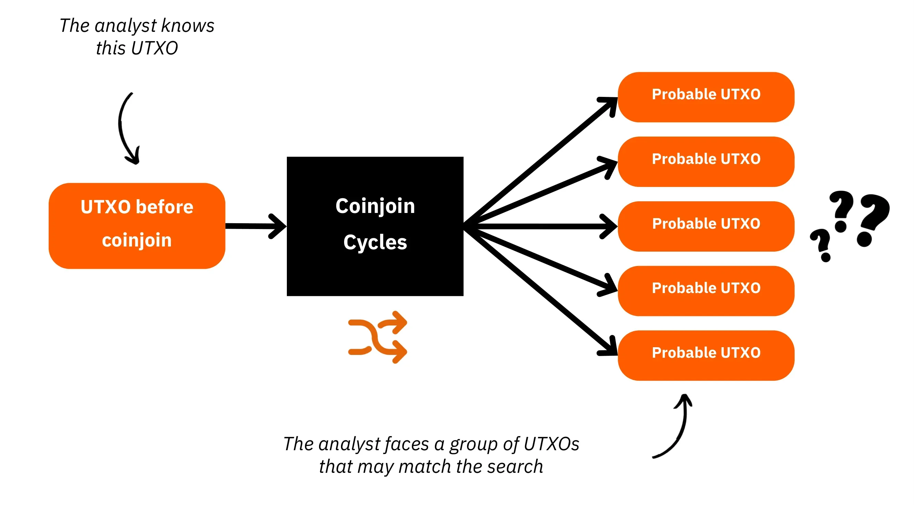


เมตริกนี้ใช้ในการประมาณขอบเขตที่ UTXO ของคุณได้รับการป้องกันจากความพยายามในการสร้างประวัติของมันใหม่จากจุดเริ่มต้นไปยังจุดสิ้นสุดในกระบวนการ coinjoin


ตัวอย่างเช่น หากธุรกรรมของคุณได้เข้าร่วมในรอบ coinjoin ครั้งแรกและมีการทำรอบที่ลดลงอีกสองรอบเสร็จสิ้น anonset ล่วงหน้าของเหรียญของคุณจะเป็น `13`:


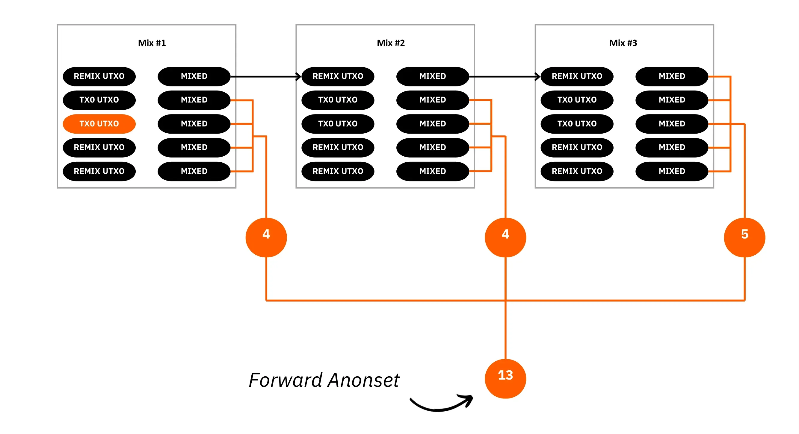


ตัวอย่างเช่น ลองจินตนาการว่าเหรียญของเราในตอนเริ่มต้นของวงจร coinjoin มีค่า anonset ไปข้างหน้าที่ `86,871` ในแง่ปฏิบัติ หมายความว่ามันถูกซ่อนอยู่ท่ามกลาง `86,871` UTXOs ที่ไม่สามารถแยกแยะได้ สำหรับผู้สังเกตการณ์ภายนอกที่รู้จักเหรียญนี้ในตอนเริ่มต้นของวงจร coinjoin และพยายามติดตามการออกของมัน เขาจะต้องเผชิญกับ `86,871` UTXOs ที่เป็นไปได้ แต่ละอันมีความน่าจะเป็นเท่ากันที่จะเป็นเหรียญที่เขากำลังมองหา


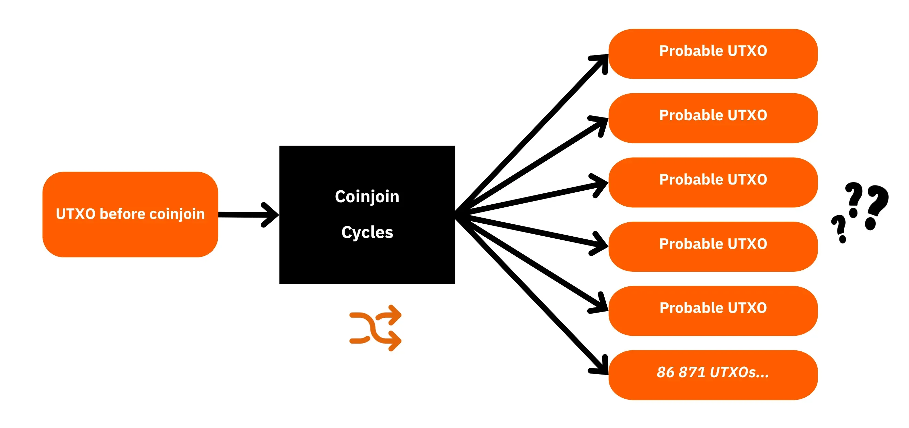


### อะนอนเซ็ตย้อนหลัง


ตัวบ่งชี้ย้อนกลับ anonset แสดงจำนวนแหล่งที่เป็นไปได้สำหรับ UTXO ที่กำหนด โดยรู้จัก UTXO ในตอนท้ายของรอบ ตัวบ่งชี้นี้วัดความต้านทานของความลับของ UTXO ต่อการวิเคราะห์จากปัจจุบันไปสู่อดีต (output-to-input) นั่นคือ ความยากลำบากที่นักวิเคราะห์จะติดตาม UTXO ของคุณกลับไปยังต้นกำเนิด ก่อนรอบ coinjoin ชื่อของตัวบ่งชี้นี้คือ "backward anonset" หรือ "backward-looking metrics"


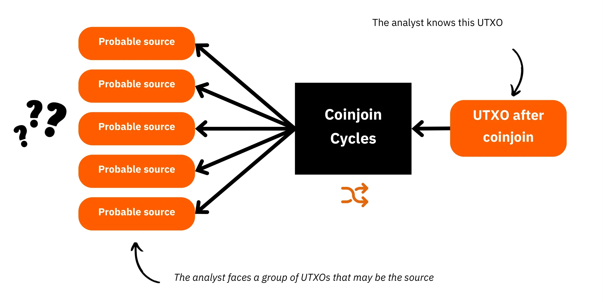


โดยการรู้จัก UTXO ของคุณที่ทางออกของรอบการทำงาน, การย้อนกลับ anonset จะกำหนดจำนวนของธุรกรรม Tx0 ที่เป็นไปได้ซึ่งอาจเป็นการเข้าสู่รอบ coinjoin ของคุณ ในแผนภาพด้านล่างนี้, สิ่งนี้สอดคล้องกับผลรวมของฟองอากาศสีส้มทั้งหมด


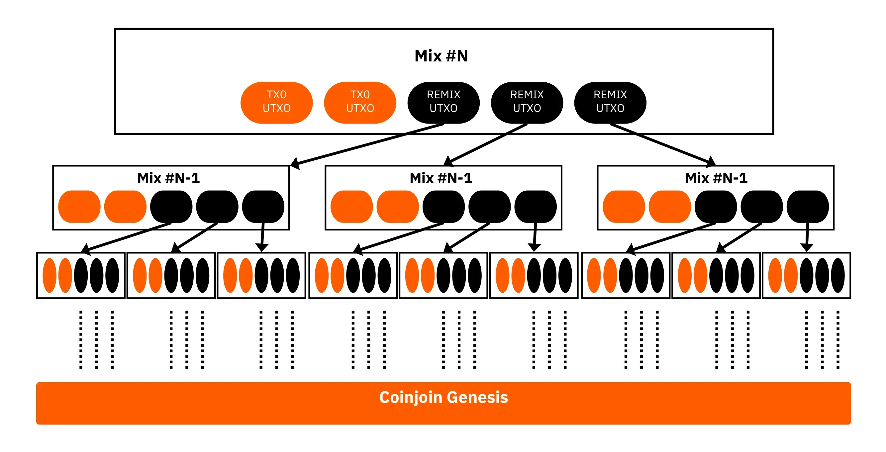


ตัวอย่างเช่น ลองจินตนาการว่า coinjoin ของเราที่ชื่อ UTXO มี backward anonset เท่ากับ `42,185` ในทางปฏิบัติ หมายความว่ามีแหล่งที่มาเป็นไปได้ `42,185` แหล่งสำหรับ UTXO นี้ หากผู้สังเกตการณ์ภายนอกระบุเหรียญนี้ในตอนท้ายของรอบและพยายามติดตามแหล่งที่มา เขาหรือเธอจะต้องเผชิญกับแหล่งที่มาเป็นไปได้ `42,185` แหล่ง ซึ่งทั้งหมดมีความน่าจะเป็นเท่ากันที่จะเป็นแหล่งที่มาตามที่ต้องการติดตาม


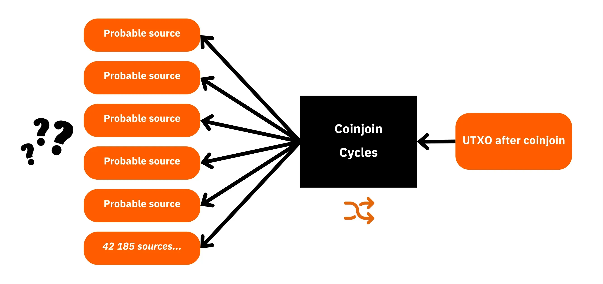


### คุณคำนวณ anonsets อย่างไร?


เป็นไปได้ที่จะคำนวณ anonsets ด้วยตนเองโดยใช้ block explorer สำหรับกลุ่มเล็ก ๆ อย่างไรก็ตาม สำหรับ anonsets ขนาดใหญ่ การใช้เครื่องมือเฉพาะทางกลายเป็นสิ่งจำเป็น เท่าที่ฉันรู้ ซอฟต์แวร์เดียวที่สามารถทำงานนี้ได้คือ *Whirlpool Stats Tool* ซึ่งเป็นเครื่องมือ Python ที่พัฒนาโดยทีม Samourai และ OXT น่าเสียดายที่เครื่องมือนี้ไม่สามารถใช้งานได้ในขณะนี้หลังจากการจับกุมผู้ก่อตั้ง Samourai และการหยุดชะงักของ OXT ซึ่งถูกใช้ในการดึงข้อมูลจากบล็อกเชน


ตามที่เราได้เห็นในบทนี้ anonsets สามารถคำนวณได้ก็ต่อเมื่อมีความเป็นเนื้อเดียวกันในโครงสร้างของ coinjoin ในบทถัดไป เราจะได้เรียนรู้วิธีการวัดความเป็นเนื้อเดียวกันนี้ในธุรกรรม Bitcoin ไม่ว่าจะเกี่ยวข้องกับ coinjoin หรือธุรกรรมแบบดั้งเดิมมากกว่า


## เอนโทรปี


<chapterId>e4fe289d-618b-49a2-84c9-68c562e708b4</chapterId>


:::video id=5118b15a-a58f-4529-8a91-4e9f6a093fce:::


ตามที่เราได้เห็นในส่วนนี้เกี่ยวกับ coinjoins ความเป็นเนื้อเดียวกันของ UTXOs ทั้งในส่วนของ input และ output มีบทบาทสำคัญในการเพิ่มความเป็นส่วนตัวของธุรกรรม Bitcoin พารามิเตอร์นี้สร้างความเป็นไปได้ในการปฏิเสธอย่างน่าเชื่อถือเมื่อเผชิญกับการวิเคราะห์บล็อกเชน มีหลายวิธีที่สามารถใช้วัดความเป็นเนื้อเดียวกันนี้ได้ แต่หนึ่งในวิธีที่มีประสิทธิภาพที่สุดในความเห็นของฉันคือการใช้ตัวชี้วัดที่จัดทำโดยเครื่องมือ *Boltzmann* ซึ่งพัฒนาโดยทีม OXT และ Samourai Wallet โดยเฉพาะอย่างยิ่ง entropy ของธุรกรรม นี่คือสิ่งที่เราจะตรวจสอบอย่างละเอียดในบทนี้


ซึ่งแตกต่างจาก anonsets ซึ่งคำนวณจากชุดของธุรกรรม ตัวชี้วัดที่นำเสนอที่นี่มุ่งเน้นไปที่ธุรกรรมเดียว ไม่ว่าจะเป็น coinjoin หรือธุรกรรมแบบดั้งเดิมมากกว่า


### จำนวนการตีความ


ตัวบ่งชี้แรกที่สามารถสังเกตได้ในธุรกรรม Bitcoin คือจำนวนการตีความที่เป็นไปได้ทั้งหมดที่สามารถสังเกตได้เมื่อวิเคราะห์จากผู้สังเกตการณ์ภายนอก โดยคำนึงถึงค่าของ UTXOs ที่เกี่ยวข้องในธุรกรรม ตัวบ่งชี้นี้แสดงจำนวนวิธีที่อินพุตสามารถเชื่อมโยงกับเอาต์พุตได้ กล่าวอีกนัยหนึ่ง มันกำหนดจำนวนการตีความที่เป็นไปได้ที่ธุรกรรมสามารถกระตุ้นจากมุมมองของผู้สังเกตการณ์ภายนอกที่วิเคราะห์มัน


ตัวอย่างเช่น การทำธุรกรรมการชำระเงินแบบง่ายที่มีอินพุตหนึ่งรายการและเอาต์พุตสองรายการจะมีการตีความเพียงหนึ่งเดียว: อินพุต #0 เป็นผู้สนับสนุนเอาต์พุต #0 และเอาต์พุต #1 ไม่มีการตีความอื่นใดที่เป็นไปได้:


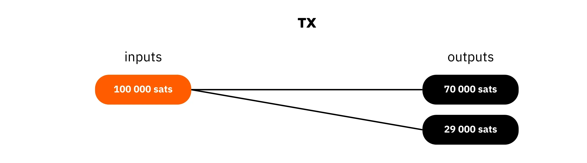


ในทางตรงกันข้าม coinjoin ที่มีโครงสร้างตามโมเดล Whirlpool 5x5 มีชุดค่าผสมที่เป็นไปได้ $1\,496$ แบบ:


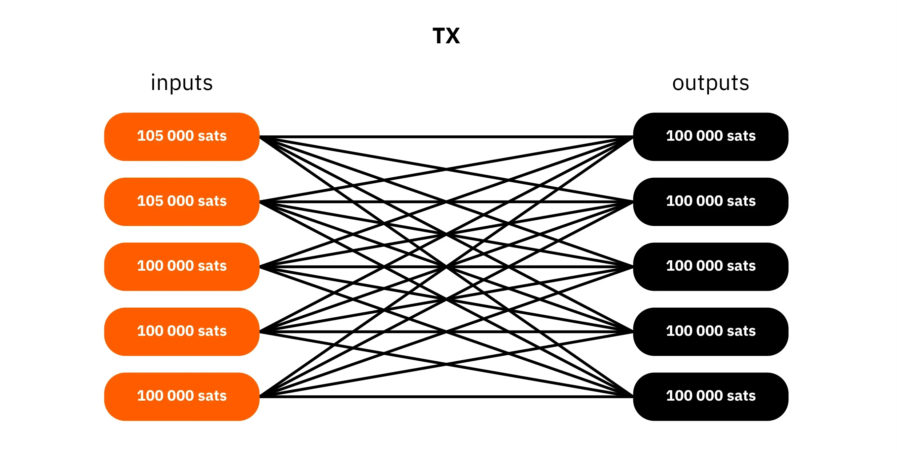


การรวมเหรียญ Whirlpool Surge Cycle 8x8 มีความเป็นไปได้ในการตีความ $9\,934\,563$ แบบ:


### เอนโทรปี


จากจำนวนการตีความของธุรกรรม Bitcoin เราสามารถคำนวณเอนโทรปีของมันได้


ในบริบททั่วไปของการเข้ารหัสและข้อมูล เอนโทรปีเป็นมาตรวัดเชิงปริมาณของความไม่แน่นอนหรือความคาดเดาไม่ได้ที่เกี่ยวข้องกับแหล่งข้อมูลหรือกระบวนการสุ่ม กล่าวอีกนัยหนึ่ง เอนโทรปีวัดความยากลำบากในการทำนายหรือคาดเดาข้อมูลชิ้นหนึ่ง


ในบริบทเฉพาะของการวิเคราะห์บล็อกเชน, entropy ยังเป็นชื่อของตัวบ่งชี้, ที่ได้มาจาก Shannon's entropy และ [คิดค้นโดย LaurentMT](https://gist.github.com/LaurentMT/e758767ca4038ac40aaf), ซึ่งสามารถคำนวณได้บนธุรกรรม Bitcoin.


เมื่อธุรกรรมมีการตีความที่เป็นไปได้จำนวนมาก มักจะมีความเกี่ยวข้องมากขึ้นในการอ้างถึงเอนโทรปีของมัน ตัวบ่งชี้นี้วัดการขาดความรู้ของนักวิเคราะห์เกี่ยวกับการกำหนดค่าที่แน่นอนของธุรกรรม กล่าวอีกนัยหนึ่งคือ ยิ่งเอนโทรปีสูงเท่าใด ก็ยิ่งยากขึ้นสำหรับนักวิเคราะห์ในการระบุการไหลของบิตคอยน์ระหว่างอินพุตและเอาต์พุต


ในทางปฏิบัติ เอนโทรปีแสดงให้เห็นว่า จากมุมมองของผู้สังเกตการณ์ภายนอก ธุรกรรมมีการตีความที่เป็นไปได้หลายแบบหรือไม่ โดยพิจารณาจากจำนวนอินพุตและเอาต์พุตเพียงอย่างเดียว โดยไม่พิจารณารูปแบบและฮิวริสติกภายนอกหรือภายในอื่น ๆ เอนโทรปีสูงจึงเป็นสัญลักษณ์ของความลับที่มากขึ้นสำหรับธุรกรรม


เอนโทรปีถูกกำหนดให้เป็นลอการิทึมฐานสองของจำนวนการจัดเรียงที่เป็นไปได้ นี่คือสูตรที่ใช้ โดยที่ $E$ คือเอนโทรปีของธุรกรรมและ $C$ คือจำนวนการตีความที่เป็นไปได้:


$$
E = \log_2(C)
$$


ในทางคณิตศาสตร์ ลอการิทึมฐานสอง (ลอการิทึมฐาน 2) เป็นการดำเนินการผกผันของการยกกำลังของ 2 กล่าวอีกนัยหนึ่ง ลอการิทึมฐานสองของ $x$ คือเลขชี้กำลังที่ 2 ต้องถูกยกขึ้นเพื่อให้ได้ $x$ ตัวบ่งชี้นี้จึงแสดงออกในบิต


ลองพิจารณาตัวอย่างการคำนวณเอนโทรปีสำหรับธุรกรรม coinjoin ที่มีโครงสร้างตามโมเดล Whirlpool 5x5 ซึ่งตามที่กล่าวไว้ในส่วนก่อนหน้านี้ มีการตีความที่เป็นไปได้จำนวน $1\,496$:


$$
\begin{align*}
C &= 1\,496 \\
E &= \log_2(1\,496) \\
E &= 10.5469 \text{ bits}
\end{align*}
$$


ดังนั้น การทำธุรกรรม coinjoin นี้มีเอนโทรปีอยู่ที่ $10.5469$ บิต ซึ่งถือว่าน่าพอใจมาก ค่ายิ่งสูงเท่าใด การตีความที่หลากหลายของการทำธุรกรรมก็ยิ่งมากขึ้นเท่านั้น ซึ่งจะช่วยเสริมสร้างระดับความลับของมัน


สำหรับการทำธุรกรรม coinjoin 8x8 ที่มีการตีความ $9\,934\,563$ แบบ ความเอนโทรปีจะเป็น:


$$
\begin{align*}
C &= 9\,934\,563 \\
E &= \log_2(9\,934\,563) \\
E &= 23.244 \text{ bits}
\end{align*}
$$


ลองพิจารณาตัวอย่างอื่นกับธุรกรรมการชำระเงินแบบคลาสสิก ที่มี 1 อินพุตและ 2 เอาท์พุต: [1b1b0c3f0883a99f1161c64da19471841ed12a1f78e77fab128c69a5f578ccce](https://mempool.space/tx/1b1b0c3f0883a99f1161c64da19471841ed12a1f78e77fab128c69a5f578ccce)


ในกรณีของธุรกรรมนี้ การตีความที่เป็นไปได้เพียงอย่างเดียวคือ: `(In.0) > (Out.0; Out.1)` ดังนั้น เอนโทรปีของมันคือ $0$:


$$
\begin{align*}
C &= 1 \\
E &= \log_2(1) \\
E &= 0 \text{ bits}
\end{align*}
$$


### ประสิทธิภาพ


จากเอนโทรปีของธุรกรรม เราสามารถคำนวณประสิทธิภาพในแง่ของการรักษาความลับได้เช่นกัน ตัวบ่งชี้นี้ประเมินประสิทธิภาพของธุรกรรมโดยเปรียบเทียบกับธุรกรรมที่เหมาะสมที่สุดที่สามารถคาดการณ์ได้ในโครงสร้างที่เหมือนกัน


สิ่งนี้นำเราไปสู่แนวคิดของเอนโทรปีสูงสุด ซึ่งสอดคล้องกับเอนโทรปีสูงสุดที่โครงสร้างธุรกรรมเฉพาะสามารถบรรลุได้ตามทฤษฎี จากนั้นประสิทธิภาพของธุรกรรมจะถูกคำนวณโดยการเปรียบเทียบเอนโทรปีสูงสุดนี้กับเอนโทรปีจริงของธุรกรรมที่อยู่ภายใต้การวิเคราะห์


สูตรที่ใช้มีดังนี้:


- $e_R$: เอนโทรปีที่แท้จริงของธุรกรรมที่แสดงในบิต;
- $e_M$: เอนโทรปีสูงสุดที่เป็นไปได้สำหรับโครงสร้างธุรกรรม ซึ่งแสดงเป็นบิต;
- $Ef$: ประสิทธิภาพการทำธุรกรรมในบิต:


$$
Ef = E_R - E_M
$$


ตัวอย่างเช่น สำหรับโครงสร้าง Whirlpool 5x5 coinjoin ค่าเอนโทรปีสูงสุดคือ $10.5469$:


$$
\begin{align*}
E_R &= 10.5469 \\
E_M &= 10.5469 \\
Ef &= E_R - E_M \\
Ef &= 10.5469 - 10.5469 \\
Ef &= 0 \text{ bits}
\end{align*}
$$


ตัวบ่งชี้นี้ยังแสดงเป็นเปอร์เซ็นต์ สูตรที่ใช้มีดังนี้:


- $c_R$: จำนวนการตีความที่เป็นไปได้ในเชิงจริง;
- $c_M$: จำนวนการตีความสูงสุดที่เป็นไปได้ของโครงสร้างเดียวกัน;
- $Ef$: ประสิทธิภาพที่แสดงเป็นเปอร์เซ็นต์:


$$
\begin{align*}
E_f &= \frac{C_R}{C_M} \\
E_f &= \frac{1\,496}{1\,496} \\
E_f &= 100 \%
\end{align*}
$$


ประสิทธิภาพที่ $100$ บ่งบอกว่าการทำธุรกรรมกำลังเพิ่มศักยภาพความลับสูงสุด ขึ้นอยู่กับโครงสร้างของมัน


### ความหนาแน่นของเอนโทรปี


เอนโทรปีเป็นตัวบ่งชี้ที่ดีสำหรับการวัดความลับของธุรกรรม แต่ขึ้นอยู่กับจำนวนอินพุตและเอาต์พุตในธุรกรรมด้วยบางส่วน เพื่อเปรียบเทียบเอนโทรปีของธุรกรรม 2 รายการที่มีจำนวนอินพุตและเอาต์พุตต่างกัน เราสามารถคำนวณความหนาแน่นของเอนโทรปีได้ ตัวบ่งชี้นี้ให้มุมมองเกี่ยวกับเอนโทรปีที่สัมพันธ์กับแต่ละอินพุตหรือเอาต์พุตของธุรกรรม ความหนาแน่นมีประโยชน์สำหรับการประเมินและเปรียบเทียบประสิทธิภาพของธุรกรรมที่มีขนาดต่างกัน


ในการคำนวณ เราเพียงแค่หารเอนโทรปีทั้งหมดของธุรกรรมด้วยจำนวนอินพุตและเอาต์พุตทั้งหมดที่เกี่ยวข้องในธุรกรรม:


- $e_D$: ความหนาแน่นของเอนโทรปีที่แสดงในบิต;
- $e$: เอนโทรปีของธุรกรรมที่แสดงในบิต;
- $t$: จำนวนอินพุตและเอาต์พุตทั้งหมดในธุรกรรม:


$$
E_D = \frac{E}{T}
$$


ลองพิจารณาตัวอย่างของ Whirlpool 5x5 coinjoin:


$$
\begin{align*}
T &= 5 + 5 = 10 \\
E &= 10.5469 \\
E_D &= \frac{E}{T} \\
E_D &= \frac{10.5469}{10} \\
E_D &= 1.054 \text{ bits}
\end{align*}
$$


มาคำนวณความหนาแน่นของเอนโทรปีของการรวมเหรียญ Whirlpool ขนาด 8x8 กันเถอะ:


$$
\begin{align*}
T &= 8 + 8 = 16 \\
E &= 23.244 \\
E_D &= \frac{E}{T} \\
E_D &= \frac{23.244}{16} \\
E_D &= 1.453 \text{ bits}
\end{align*}
$$


โดยการวิเคราะห์ความหนาแน่นของเอนโทรปีของการรวมเหรียญสองประเภทนี้ จะเห็นได้ชัดเจนว่า แม้จะทำการปรับเอนโทรปีตามจำนวนขององค์ประกอบแล้วก็ตาม การรวมเหรียญแบบ "Surge Cycle 8x8" ยังคงสร้างความไม่แน่นอนมากขึ้นสำหรับการวิเคราะห์


### คะแนนโบลต์ซมันน์


ข้อมูลอีกชิ้นหนึ่งที่วิเคราะห์ในการทำธุรกรรมคือคะแนน Boltzmann ของแต่ละองค์ประกอบเมื่อเทียบกับอีกองค์ประกอบหนึ่ง ตารางนี้แสดงความน่าจะเป็นที่ตรงกันระหว่างอินพุตและเอาต์พุต ตารางนี้บ่งชี้ผ่านคะแนน Boltzmann ถึงความน่าจะเป็นตามเงื่อนไขที่อินพุตเฉพาะจะเชื่อมโยงกับเอาต์พุตที่กำหนด ดังนั้นจึงเป็นการวัดเชิงปริมาณของความน่าจะเป็นตามเงื่อนไขที่ความสัมพันธ์ระหว่างอินพุตและเอาต์พุตในการทำธุรกรรมจะเกิดขึ้น โดยอิงจากอัตราส่วนของจำนวนเหตุการณ์ที่พึงประสงค์ของเหตุการณ์นี้ต่อจำนวนเหตุการณ์ที่เป็นไปได้ทั้งหมดในชุดของการตีความ


โดยใช้ตัวอย่างของ Whirlpool coinjoin ตารางความน่าจะเป็นแบบมีเงื่อนไขจะแสดงโอกาสของการเชื่อมโยงระหว่างแต่ละอินพุตและเอาต์พุต โดยให้การวัดเชิงปริมาณของความคลุมเครือของการเชื่อมโยงในธุรกรรม:


| %       | Output 0 | Output 1 | Output 2 | Output 3 | Output 4 |
| ------- | -------- | -------- | -------- | -------- | -------- |
| Input 0 | 34%      | 34%      | 34%      | 34%      | 34%      |
| Input 1 | 34%      | 34%      | 34%      | 34%      | 34%      |
| Input 2 | 34%      | 34%      | 34%      | 34%      | 34%      |
| Input 3 | 34%      | 34%      | 34%      | 34%      | 34%      |
| Input 4 | 34%      | 34%      | 34%      | 34%      | 34%      |


เห็นได้ชัดว่าแต่ละอินพุตมีโอกาสเท่ากันที่จะเชื่อมโยงกับเอาต์พุตใด ๆ ซึ่งเสริมสร้างความลับของการทำธุรกรรม


คะแนน Boltzmann คำนวณโดยการหารจำนวนการตีความที่เหตุการณ์บางอย่างเกิดขึ้นด้วยจำนวนการตีความทั้งหมดที่มีอยู่ ดังนั้น เพื่อกำหนดคะแนนที่เกี่ยวข้องกับอินพุต #0 ที่มีเอาต์พุต #3 (เหตุการณ์ที่ปรากฏใน $512$ การตีความ) เราดำเนินการดังนี้:


$$
\begin{align*}
\text{Interpretations (IN.0 > OUT.3)} &= 512 \\
\text{Total interpretations} &= 1496 \\
\text{Score} &= \frac{512}{1496} \\
\text{Score} &= 34 \%
\end{align*}
$$


หากเรานำตัวอย่างของ Whirlpool 8x8 Surge Cycle coinjoin มาใช้ ตาราง Boltzmann จะมีลักษณะดังนี้:


| OUT.0 | OUT.1 | OUT.2 | OUT.3 | OUT.4 | OUT.5 | OUT.6 | OUT.7 |
|-------|-------|-------|-------|-------|-------|-------|-------|
| IN.0  | 23%   | 23%   | 23%   | 23%   | 23%   | 23%   | 23%   | 23%   |
| IN.1  | 23%   | 23%   | 23%   | 23%   | 23%   | 23%   | 23%   | 23%   |
| IN.2  | 23%   | 23%   | 23%   | 23%   | 23%   | 23%   | 23%   | 23%   |
| IN.3  | 23%   | 23%   | 23%   | 23%   | 23%   | 23%   | 23%   | 23%   |
| IN.4  | 23%   | 23%   | 23%   | 23%   | 23%   | 23%   | 23%   | 23%   |
| IN.5  | 23%   | 23%   | 23%   | 23%   | 23%   | 23%   | 23%   | 23%   |
| IN.6  | 23%   | 23%   | 23%   | 23%   | 23%   | 23%   | 23%   | 23%   |
| IN.7  | 23%   | 23%   | 23%   | 23%   | 23%   | 23%   | 23%   | 23%   |


อย่างไรก็ตาม ในกรณีของการทำธุรกรรมที่ง่ายด้วยอินพุตเดียวและเอาต์พุต 2 รายการ สถานการณ์จะแตกต่างออกไป:


| %       | Output 0 | Output 1 |
|---------|----------|----------|
| Input 0 | 100%     | 100%     |


ที่นี่ เราเห็นว่าความน่าจะเป็นของแต่ละผลลัพธ์ที่มาจากอินพุต #0 คือ 100% ความน่าจะเป็นที่ต่ำกว่านี้สะท้อนถึงความลับที่มากขึ้น โดยการเจือจางความเชื่อมโยงโดยตรงระหว่างอินพุตและผลลัพธ์


### ลิงก์เชิงกำหนด


เรายังสามารถคำนวณจำนวนลิงก์เชิงกำหนดในธุรกรรมได้อีกด้วย ตัวบ่งชี้นี้แสดงให้เห็นถึงเปอร์เซ็นต์ของการเชื่อมต่อระหว่างอินพุตและเอาต์พุตในธุรกรรมที่วิเคราะห์ซึ่งไม่สามารถโต้แย้งได้ โดยมีความน่าจะเป็น 100% จากนั้นตัวบ่งชี้นี้สามารถทำให้สมบูรณ์ได้โดยการคำนวณอัตราส่วนของลิงก์เชิงกำหนด อัตราส่วนนี้ให้ข้อมูลเชิงลึกเกี่ยวกับน้ำหนักของลิงก์เชิงกำหนดเหล่านี้ภายในลิงก์ทั้งหมดของธุรกรรม


ตัวอย่างเช่น การทำธุรกรรม coinjoin Whirlpool ไม่มีการเชื่อมโยงที่กำหนดได้ระหว่างอินพุตและเอาต์พุต ดังนั้นจึงแสดงตัวบ่งชี้ว่าไม่มีการเชื่อมโยงและอัตราส่วนเป็น 0% ในทางกลับกัน ในการทำธุรกรรมการชำระเงินแบบง่ายครั้งที่สองที่เราตรวจสอบ (มีอินพุตหนึ่งรายการและเอาต์พุตสองรายการ) ตัวบ่งชี้แสดงว่ามีการเชื่อมโยงที่กำหนดได้สองรายการ และอัตราส่วนถึง 100% กล่าวอีกนัยหนึ่ง ตัวบ่งชี้ศูนย์บ่งบอกถึงความลับที่ยอดเยี่ยม เนื่องจากไม่มีการเชื่อมโยงโดยตรงและไม่อาจโต้แย้งได้ระหว่างอินพุตและเอาต์พุต


### คุณคำนวณตัวชี้วัดเหล่านี้อย่างไร?


การคำนวณตัวชี้วัดเหล่านี้ด้วยตนเองโดยใช้สมการที่ให้มานั้นค่อนข้างตรงไปตรงมา ความยากอยู่ที่การกำหนดจำนวนการตีความที่เป็นไปได้ของธุรกรรม สำหรับธุรกรรมแบบคลาสสิก การคำนวณนี้สามารถทำได้ด้วยตนเอง อย่างไรก็ตาม สำหรับ coinjoin งานนี้ซับซ้อนกว่ามาก


ก่อนหน้านี้ มีเครื่องมือ Python ที่เรียกว่า _Boltzmann Calculator_ พัฒนาโดยทีม OXT และ Samourai ซึ่งคำนวณตัวชี้วัดทั้งหมดเหล่านี้โดยอัตโนมัติสำหรับธุรกรรม Bitcoin:


นอกจากนี้ยังสามารถใช้เว็บไซต์ KYCP.org สำหรับการวิเคราะห์เหล่านี้:


น่าเสียดายที่หลังจากการจับกุมผู้ก่อตั้ง Samourai เครื่องมือเหล่านี้ไม่สามารถใช้งานได้อีกต่อไป


ตอนนี้ที่เราได้ครอบคลุมเรื่อง coinjoins อย่างละเอียดแล้ว เราจะมาดูเทคนิคความเป็นส่วนตัวอื่น ๆ ที่มีอยู่บน Bitcoin ในส่วนสุดท้ายของหลักสูตรของเรา เราจะตรวจสอบ payjoins ประเภทธุรกรรม pseudo-coinjoin เฉพาะ โปรโตคอลที่อยู่คงที่ รวมถึงมาตรการเพื่อเพิ่มความลับไม่ใช่ในระดับของธุรกรรมเอง แต่ในระดับของเครือข่ายของโหนด


# ทำความเข้าใจความท้าทายของเทคนิคการรักษาความลับขั้นสูงอื่น ๆ


<partId>19989ae6-d608-4acf-b698-2cf1e7e5e6ae</partId>


## ธุรกรรม Payjoin


<chapterId>c1e90b95-f709-4574-837b-2ec26b11286f</chapterId>


:::video id=5496cb59-006e-40b8-971f-af6d98868527:::


Coinjoin เป็นวิธีที่มีประสิทธิภาพที่สุดในปัจจุบันในการแนะนำความไม่แน่นอนในการติดตาม UTXOs ในการวิเคราะห์เชน ดังที่เราได้เห็นในบทก่อนหน้า เพื่อให้ได้การผสมที่มีประสิทธิภาพสูง อินพุตและเอาต์พุตต้องมีความเป็นเนื้อเดียวกันมากที่สุดเท่าที่จะเป็นไปได้ นอกจากนี้ สิ่งสำคัญคือ UTXOs ต้องถูกรวมเข้ากับกลุ่มที่ใหญ่ที่สุดเท่าที่จะเป็นไปได้เพื่อเพิ่มการไม่เปิดเผยตัวตน ดังนั้น สำหรับ coinjoins ที่จะมีประสิทธิภาพ พวกเขาต้องเกี่ยวข้องกับ UTXOs ที่มีความสม่ำเสมอจำนวนมาก ข้อกำหนดมากมายเหล่านี้หมายความว่าธุรกรรม coinjoin มีโครงสร้างที่เข้มงวดมาก: จำนวนเงินถูกกำหนดไว้ล่วงหน้า และผู้เข้าร่วมทั้งหมดต้องปฏิบัติตามเพื่อรับประกันความสม่ำเสมอของกระบวนการ นอกจากนี้ coinjoins ยังต้องการการซิงโครไนซ์ระหว่างผู้เข้าร่วมทั้งหมดและผู้ประสานงานในระหว่างการสร้างธุรกรรม


ข้อกำหนดเหล่านี้ทำให้ coinjoin ไม่เหมาะสำหรับการชำระเงินโดยตรง ตัวอย่างเช่น หากคุณมีเหรียญ 1M-sat ในกลุ่ม coinjoin การใช้มันโดยตรงเป็นการชำระเงินจะซับซ้อน จะต้องมีการประสานงานกับผู้เข้าร่วมคนอื่นๆ และผู้ประสานงานเพื่อสร้างธุรกรรมร่วมกันอย่างแม่นยำในขณะที่คุณต้องการทำการชำระเงิน และจำนวนเงินที่ซื้อจะต้องตรงกับมูลค่าของเหรียญของคุณ ซึ่งแทบจะเป็นไปไม่ได้เลย ดังนั้นธุรกรรม coinjoin จึงเป็นธุรกรรมการกวาดร่วมกันโดยธรรมชาติ กล่าวคือ โดยทั่วไปจะเกี่ยวข้องกับเจ้าของอินพุตเดียวกันที่พบในเอาต์พุต


อย่างไรก็ตาม มันจะน่าสนใจที่จะมีโครงสร้างการทำธุรกรรมที่อนุญาตให้ชำระเงินได้ในทางปฏิบัติ ในขณะเดียวกันก็แนะนำความสงสัยในการวิเคราะห์เชน นี่คือสิ่งที่เราจะพิจารณาในบทนี้และบทถัดไป


### การทำธุรกรรมแบบ PayJoin คืออะไร?


Payjoin เป็นโครงสร้างธุรกรรม Bitcoin เฉพาะที่เพิ่มความเป็นส่วนตัวของผู้ใช้เมื่อใช้จ่ายโดยการร่วมมือกับผู้รับการชำระเงิน


ในปี 2015 LaurentMT ได้พูดถึงวิธีนี้ครั้งแรกภายใต้ชื่อ "*steganographic transactions*" ตามเอกสารที่มีอยู่ [ที่นี่](https://gist.githubusercontent.com/LaurentMT/e758767ca4038ac40aaf/raw/c8125f6a3c3d0e90246dc96d3b603690ab6f1dcc/gistfile1.txt) เทคนิคนี้ถูกนำมาใช้โดย Samourai Wallet ซึ่งในปี 2018 กลายเป็นลูกค้ารายแรกที่นำไปใช้โดยใช้เครื่องมือ Stowaway แนวคิดของ payjoin ยังพบได้ใน [BIP79](https://github.com/bitcoin/bips/blob/master/bip-0079.mediawiki), [BIP78](https://github.com/bitcoin/bips/blob/master/bip-0078.mediawiki), และ [BIP77](https://payjoin.org/docs/how-it-works/payjoin-v2-bip-77/) ดังนั้นจึงมีการใช้หลายคำเพื่ออ้างถึง payjoin:


- Payjoin;
- คนลักลอบเดินทาง;
- P2EP (*Pay-to-End-Point*);
- การทำธุรกรรมแบบสเตกาโนกราฟี


คุณสมบัติพิเศษของ PayJoin อยู่ที่ความสามารถในการ generate ธุรกรรมที่ดูเหมือนธรรมดาในตอนแรก แต่แท้จริงแล้วเป็น mini CoinJoin ระหว่างสองคน ในการทำเช่นนี้ โครงสร้างของธุรกรรมจะรวมผู้รับการชำระเงินในอินพุตควบคู่ไปกับผู้ส่งจริง ผู้รับจึงรวมการชำระเงินให้กับตัวเองในกลางธุรกรรม ซึ่งทำให้เขาได้รับการชำระเงิน


ลองมาดูตัวอย่างเพื่อให้เข้าใจกระบวนการนี้ได้ดียิ่งขึ้น Alice ซื้อขนมปังในราคา 4,000 sats โดยใช้ UTXO จำนวน 10,000 sats และเลือกใช้การจ่ายแบบ payjoin คนทำขนมปังของเธอ Bob เพิ่ม UTXO จำนวน 15,000 sats ที่เป็นของเขาเองเป็นอินพุต ซึ่งเขาจะได้รับคืนเต็มจำนวนเป็นเอาท์พุต นอกเหนือจาก 4,000 sats ของ Alice


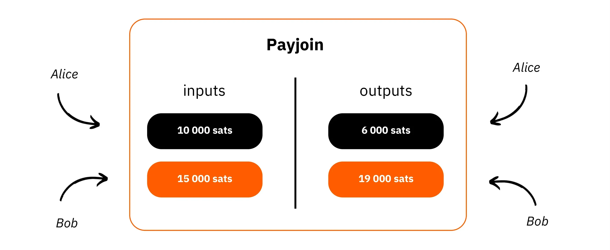


ในตัวอย่างนี้ Bob คนทำขนมปังใส่ 15,000 sats ในการป้อนเข้าและออกมาพร้อมกับ 19,000 sats ซึ่งต่างกันพอดี 4,000 sats หรือก็คือราคาของบาแกตต์ ในฝั่งของ Alice เธอใส่ 10,000 sats และจบลงด้วย 6,000 sats ในการป้อนออก ซึ่งแสดงถึงยอดคงเหลือ -4,000 sats หรือก็คือราคาของบาแกตต์ เพื่อให้ง่ายขึ้นในตัวอย่างนี้ ฉันได้จงใจละเว้นต้นทุน mining ในการทำธุรกรรมนี้


### Payjoin มีไว้เพื่ออะไร?


ธุรกรรม payjoin บรรลุวัตถุประสงค์สองประการ ช่วยให้ผู้ใช้เพิ่มความเป็นส่วนตัวของการชำระเงินของพวกเขา


ประการแรก Payjoin มีเป้าหมายที่จะทำให้ผู้สังเกตการณ์ภายนอกเข้าใจผิดโดยการสร้างเหยื่อในวิเคราะห์เชน สิ่งนี้เป็นไปได้ด้วยฮิวริสติก CIOH (*Common Input Ownership Heuristic*) ดังที่เราเห็นในส่วนที่ 3 เมื่อธุรกรรมบนบล็อกเชนมีอินพุตหลายรายการ มักจะถือว่าทุกอินพุตเหล่านี้เป็นของหน่วยงานหรือผู้ใช้เดียวกัน


ดังนั้น เมื่อผู้วิเคราะห์ตรวจสอบธุรกรรม payjoin พวกเขาจะถูกชักนำให้เชื่อว่าทุกอินพุตมาจากบุคคลเดียวกัน อย่างไรก็ตาม การรับรู้นี้ผิดพลาดเพราะผู้รับเงินก็มีส่วนร่วมในอินพุตเช่นเดียวกับผู้จ่ายเงินที่แท้จริง การวิเคราะห์เชนจึงถูกเบี่ยงเบนไปสู่การตีความที่พิสูจน์แล้วว่าผิดพลาด


ลองมาดูตัวอย่างของการทำธุรกรรม payjoin สำหรับการชำระเงินขนมปัง:


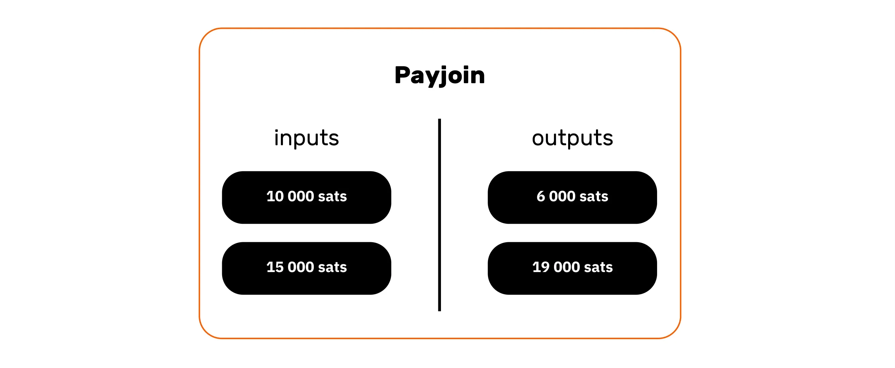


เมื่อเห็นธุรกรรมนี้บนบล็อกเชน ผู้สังเกตการณ์ภายนอกที่ติดตามฮิวริสติกส์ปกติของการวิเคราะห์บล็อกเชนจะทำการตีความดังนี้: "*Alice รวม 2 UTXO เป็นอินพุตของธุรกรรมเพื่อจ่าย 19,000 sats ให้กับ Bob*"


การตีความนี้เห็นได้ชัดว่าไม่ถูกต้อง เพราะอย่างที่คุณทราบอยู่แล้วว่า UTXO สองรายการในอินพุตไม่ได้เป็นของบุคคลเดียวกัน รายการหนึ่งมาจาก Alice ผู้ซื้อบาแกตต์ และอีกรายการมาจาก Bob คนทำขนมปัง


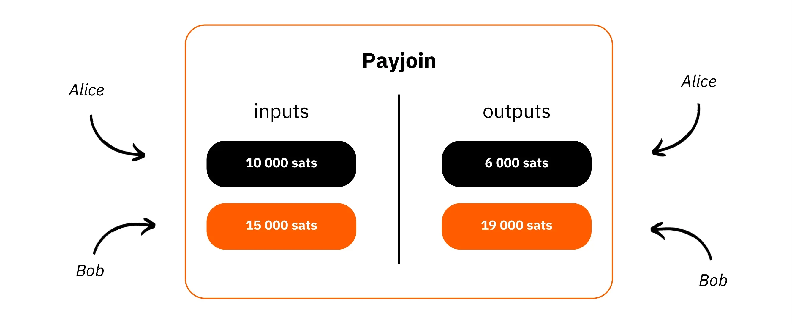


ด้วยวิธีนี้ การวิเคราะห์ของผู้สังเกตการณ์ภายนอกจะถูกนำไปสู่ข้อสรุปที่ผิดพลาด เพื่อให้มั่นใจว่าความลับของผู้มีส่วนได้ส่วนเสียจะได้รับการรักษา


### การทำธุรกรรมแบบสเตกาโนกราฟี


วัตถุประสงค์ที่สองของ PayJoin คือการทำให้ผู้สังเกตการณ์ภายนอกเข้าใจผิดเกี่ยวกับจำนวนเงินที่ชำระจริงที่ได้ทำไปแล้ว โดยการตรวจสอบโครงสร้างของธุรกรรม นักวิเคราะห์อาจสรุปได้ว่าการชำระเงินนั้นเทียบเท่ากับจำนวนเงินของหนึ่งในผลลัพธ์


หากเรากลับไปที่ตัวอย่างการซื้อขนมปัง นักวิเคราะห์จะสรุปว่าจำนวนเงินที่ชำระตรงกับ UTXO ของ 6,000 sats หรือ UTXO ของ 19,000 sats ในกรณีนี้ นักวิเคราะห์จะคิดว่าจำนวนเงินที่ชำระคือ 19,000 sats เพราะมี 2 UTXOs ในผลลัพธ์ ซึ่งอย่างน้อยหนึ่งในนั้นมีค่ามากกว่า 6,000 sats (ไม่มีเหตุผลทางตรรกะที่จะใช้ 2 UTXOs เพื่อชำระ 6,000 sats เมื่อ UTXO เดียวก็เพียงพอที่จะตอบสนองการชำระเงินนี้)


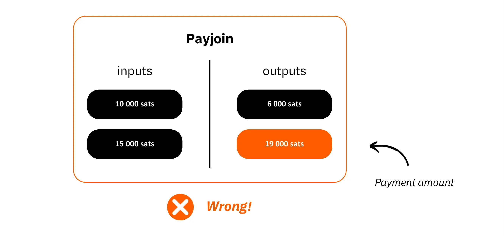


แต่ในความเป็นจริง การวิเคราะห์นี้มีข้อบกพร่อง จำนวนเงินที่ชำระไม่สอดคล้องกับผลลัพธ์ใด ๆ เลย แท้จริงแล้วมันคือความแตกต่างระหว่าง UTXO ของผู้รับในผลลัพธ์และ UTXO ของผู้รับในข้อมูลนำเข้า


ในแง่นี้ การทำธุรกรรมแบบ payjoin ตกอยู่ในขอบเขตของการซ่อนข้อมูล มันช่วยให้จำนวนเงินจริงของการทำธุรกรรมถูกซ่อนอยู่ภายในการทำธุรกรรมปลอมที่ทำหน้าที่เป็นตัวล่อ


Steganography เป็นเทคนิคในการซ่อนข้อมูลภายในข้อมูลหรือวัตถุอื่น ๆ ทำให้การมีอยู่ของข้อมูลที่ซ่อนอยู่นั้นไม่สามารถสังเกตเห็นได้ ตัวอย่างเช่น ข้อความลับสามารถซ่อนไว้ภายในจุดในข้อความที่ไม่เกี่ยวข้อง ทำให้ไม่สามารถตรวจพบได้ด้วยตาเปล่า (นี่คือเทคนิค [microdot](https://fr.wikipedia.org/wiki/Micropoint))


ซึ่งแตกต่างจากการเข้ารหัสที่ทำให้ข้อมูลไม่สามารถเข้าใจได้หากไม่มีคีย์ถอดรหัส สเตกาโนกราฟีไม่ได้แก้ไขข้อมูล ข้อมูลยังคงแสดงในรูปแบบข้อความที่ชัดเจน แต่เป้าหมายของมันคือการปกปิดการมีอยู่ของข้อความลับ ในขณะที่การเข้ารหัสเผยให้เห็นอย่างชัดเจนถึงการมีอยู่ของข้อมูลที่ซ่อนอยู่ แม้ว่าจะไม่สามารถเข้าถึงได้หากไม่มีคีย์ นี่คือเหตุผลที่ชื่อเดิมของ PayJoin คือ "ธุรกรรมสเตกาโนกราฟี"


สามารถเปรียบเทียบระหว่างการเข้ารหัสลับและ coinjoin ได้ เช่นเดียวกับระหว่างการซ่อนข้อมูลและ payjoin Coinjoin มีคุณสมบัติคล้ายกับการเข้ารหัส: วิธีการนั้นสามารถจดจำได้ แต่ข้อมูลนั้นไม่สามารถถอดรหัสได้ ในทางกลับกัน payjoin คล้ายกับการซ่อนข้อมูล: ข้อมูลสามารถเข้าถึงได้ในทางทฤษฎี แต่เนื่องจากวิธีการซ่อนเร้นไม่สามารถจดจำได้ มันจึงกลายเป็นไม่สามารถเข้าถึงได้


### วิธีใช้ PayJoin ทำอย่างไร?


โปรแกรมซอฟต์แวร์ที่เป็นที่รู้จักซึ่งรองรับ payjoin ได้แก่ Sparrow Wallet, Wasabi Wallet, Mutiny, BitMask, BlueWallet, และ JoinMarket รวมถึงผู้ประมวลผลการชำระเงิน BTCPay


การใช้งาน payjoin ที่ล้ำหน้าที่สุดคือ Stowaway ซึ่งถูกคิดค้นโดยนักพัฒนาของ Samourai Wallet อย่างไม่ต้องสงสัย ตั้งแต่การจับกุมผู้ก่อตั้งซอฟต์แวร์ เครื่องมือนี้ทำงานได้เพียงบางส่วนบน Samourai อย่างไรก็ตาม มันได้ถูกเปิดตัวใหม่บนแอปพลิเคชัน Ashigaru


ข้อดีของ Stowaway คือมันเป็นโปรโตคอลที่สมบูรณ์และใช้งานง่ายมากที่รองรับทั้งการรับและส่ง payjoins ธุรกรรมที่ลงนามบางส่วนสามารถแลกเปลี่ยนได้ด้วยตนเองโดยการสแกน QR โค้ดหลายตัวหรือโดยอัตโนมัติผ่าน Tor ผ่าน Soroban


ความยากลำบากในการใช้ PayJoin อยู่ที่การพึ่งพาการมีส่วนร่วมของผู้ค้า ในฐานะลูกค้า คุณไม่สามารถใช้ payjoin ได้หากผู้ค้าไม่รองรับ สิ่งนี้เพิ่มความยากลำบากให้กับกระบวนการซื้อ: ไม่เพียงแต่จะเป็นการท้าทายในการหาผู้ค้าที่รับ Bitcoin แต่หากคุณยังมองหาผู้ค้าที่รองรับ PayJoins ด้วย มันจะยิ่งซับซ้อนมากขึ้นไปอีก


วิธีแก้ปัญหาหนึ่งคือการใช้โครงสร้างธุรกรรมที่สร้างความคลุมเครือในการวิเคราะห์เชนโดยไม่ต้องการความร่วมมือจากผู้รับ ซึ่งจะช่วยให้เราปรับปรุงความเป็นส่วนตัวของการชำระเงินของเราโดยไม่ต้องพึ่งพาการมีส่วนร่วมของผู้ค้าอย่างแข็งขัน นี่คือสิ่งที่เราจะพิจารณาในบทถัดไป


https://planb.academy/tutorials/privacy/on-chain/ashigaru-stowaway-48a5c711-ee3d-44db-b812-c55913080eab

## การชำระเงินแบบมินิ-คอยน์จอยน์


<chapterId>300777ee-30ae-43d7-ab00-479dac3522c1</chapterId>


:::video id=1f33e8f1-e41d-4480-a388-e283ef51cc17:::


เมื่อคุณต้องการดำเนินการทำธุรกรรมการชำระเงินในขณะที่รักษาระดับความลับบางอย่างไว้ Payjoin เป็นตัวเลือกที่ดี อย่างไรก็ตาม ตามที่เราได้เห็นไปแล้ว Payjoin ต้องการการมีส่วนร่วมของผู้รับ ดังนั้น คุณจะทำอย่างไรหากผู้รับปฏิเสธที่จะเข้าร่วมใน pay join หรือหากคุณเพียงแค่ไม่ต้องการให้พวกเขามีส่วนร่วม? ทางเลือกหนึ่งคือการใช้ธุรกรรม Stonewall หรือ Stonewall x2 ลองมาดูรายละเอียดของธุรกรรมทั้งสองประเภทนี้กันเถอะ


### ธุรกรรมสโตนวอลล์


Stonewall เป็นรูปแบบเฉพาะของธุรกรรม Bitcoin ที่ออกแบบมาเพื่อเพิ่มความเป็นส่วนตัวของผู้ใช้เมื่อใช้จ่าย โดยการเลียนแบบ pseudo-coinjoin ระหว่างสองคน โดยที่จริงแล้วไม่ได้เป็นการร่วมมือกัน ธุรกรรมนี้ไม่ใช่การทำงานร่วมกัน ผู้ใช้สามารถสร้างได้ด้วยตัวเอง โดยใช้เฉพาะ UTXOs ที่พวกเขาเป็นเจ้าของเป็นอินพุต คุณสามารถสร้างธุรกรรม Stonewall สำหรับทุกโอกาสโดยไม่จำเป็นต้องซิงโครไนซ์กับผู้ใช้คนอื่นหรือผู้รับ


การทำธุรกรรม Stonewall ทำงานดังนี้: ในการป้อนข้อมูลให้กับการทำธุรกรรม ผู้ออกจะใช้ 2 UTXOs ที่เป็นของเขา ในการส่งออก การทำธุรกรรมจะสร้าง 4 UTXOs ซึ่ง 2 ในนั้นมีจำนวนเท่ากัน อีก 2 UTXOs จะเป็นการเปลี่ยนแปลง ในการส่งออกสองรายการที่มีจำนวนเท่ากัน จะมีเพียงรายการเดียวเท่านั้นที่จะถูกส่งไปยังผู้รับเงินจริงๆ


ดังนั้นมีเพียง 2 บทบาทในธุรกรรม Stonewall:


- ผู้ออกหลักทรัพย์, ผู้ที่ทำการชำระเงิน;
- ผู้รับซึ่งอาจไม่ทราบลักษณะเฉพาะของธุรกรรมและเพียงแค่คาดหวังการชำระเงินจากผู้ส่ง


ลองมาดูตัวอย่างเพื่อทำความเข้าใจโครงสร้างการทำธุรกรรมนี้ Alice ไปที่ Bob คนทำขนมปังเพื่อซื้อบาแกตต์ของเธอ ซึ่งมีราคา 4,000 sats เธอต้องการจ่ายด้วย Bitcoin ในขณะที่ยังคงรักษาความลับบางอย่างเกี่ยวกับการชำระเงินของเธอ ดังนั้นเธอจึงตัดสินใจสร้างการทำธุรกรรมแบบ Stonewall สำหรับการชำระเงินนี้


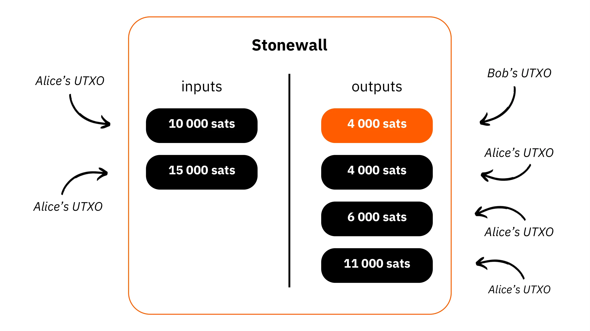


โดยการวิเคราะห์ธุรกรรมนี้ เราสามารถเห็นได้ว่า Bob คนทำขนมปังได้รับเงิน 4,000 sats เป็นการชำระเงินสำหรับบาแกตต์จริง ๆ Alice ใช้ 2 UTXOs เป็นอินพุต: หนึ่งสำหรับ 10,000 sats และอีกหนึ่งสำหรับ 15,000 sats ในเอาต์พุต เธอได้กู้คืน 3 UTXOs: หนึ่งสำหรับ 4,000 sats หนึ่งสำหรับ 6,000 sats และหนึ่งสำหรับ 11,000 sats ดังนั้น Alice จึงมียอดคงเหลือสุทธิ -4,000 sats ในธุรกรรมนี้ ซึ่งสอดคล้องกับราคาของบาแกตต์


ในตัวอย่างนี้ ฉันได้ละเว้นค่าธรรมเนียม mining โดยเจตนาเพื่อทำให้คำอธิบายง่ายขึ้น ในความเป็นจริง ต้นทุนการทำธุรกรรมจะถูกแบกรับโดยผู้ออกทั้งหมด


### วัตถุประสงค์ของการทำธุรกรรม Stonewall คืออะไร?


โครงสร้าง Stonewall แนะนำปริมาณเอนโทรปีที่สำคัญให้กับธุรกรรม ทำให้เส้นแบ่งของการวิเคราะห์เชนไม่ชัดเจน เมื่อมองจากภายนอก ธุรกรรมดังกล่าวอาจถูกตีความว่าเป็น mini-coinjoin ระหว่างสองคน แต่ในความเป็นจริง มันคือการชำระเงิน วิธีนี้จึงสร้างความไม่แน่นอนในการวิเคราะห์เชนหรือแม้กระทั่งนำไปสู่การชี้นำที่ผิดพลาด


ลองดูตัวอย่างของ Alice ที่ร้านเบเกอรี่ Bob การทำธุรกรรมบนบล็อกเชนจะมีลักษณะดังนี้:


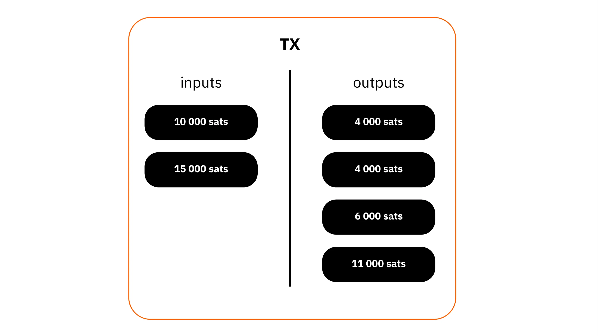


ผู้สังเกตการณ์ภายนอกที่พึ่งพาแนวทางการวิเคราะห์เชนทั่วไปอาจสรุปผิดว่า "*มีคนสองคนทำ coinjoin ขนาดเล็ก โดยมี UTXO หนึ่งรายการในอินพุตและสอง UTXO ในเอาต์พุตแต่ละรายการ*". การวิเคราะห์ธุรกรรมนี้จากภายนอกไม่ได้ทำให้เกิดการประยุกต์ใช้ CIOH เนื่องจากการมีอยู่ของเอาต์พุตสองรายการที่มีจำนวนเท่ากันบ่งบอกถึงรูปแบบ coinjoin จากมุมมองภายนอก CIOH จึงไม่สามารถใช้ได้ในกรณีเฉพาะนี้


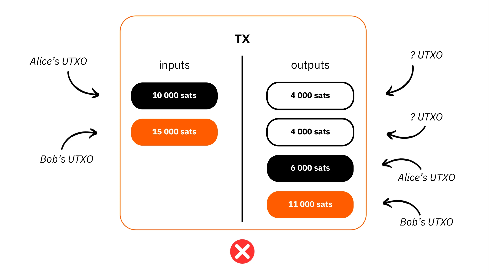


การตีความนี้ไม่ถูกต้องเพราะว่า ตามที่คุณทราบ หนึ่ง UTXO ถูกส่งไปยัง Bob คนทำขนมปัง; อินพุต UTXO สองรายการมาจาก Alice และเธอได้คืนเอาต์พุตการเปลี่ยนแปลงสามรายการ


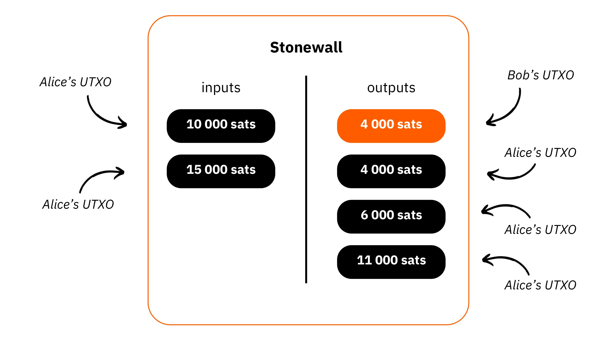


สิ่งที่น่าสนใจเป็นพิเศษเกี่ยวกับโครงสร้างของธุรกรรม Stonewall คือ จากมุมมองของผู้สังเกตการณ์ภายนอก มันมีลักษณะคล้ายกับธุรกรรม Stonewall x2 ในทุก ๆ ด้าน


### The Stonewall transaction x2


Stonewall x2 เป็นรูปแบบเฉพาะอีกแบบหนึ่งของธุรกรรม Bitcoin ที่มีเป้าหมายเพื่อเพิ่มความเป็นส่วนตัวของผู้ใช้เมื่อทำการใช้จ่าย แต่คราวนี้โดยการร่วมมือกับบุคคลที่สามที่ไม่เกี่ยวข้องกับการใช้จ่ายนั้น วิธีนี้ทำงานเหมือนกับ pseudo-coinjoin ระหว่างผู้เข้าร่วมสองคน ในขณะเดียวกันก็ทำการชำระเงินให้กับบุคคลที่สาม


การดำเนินการของธุรกรรม Stonewall x2 ค่อนข้างง่าย: เราใช้ UTXO ที่เรามีอยู่เพื่อทำการชำระเงินและขอความช่วยเหลือจากบุคคลที่สามซึ่งมี UTXO ของพวกเขาเอง ธุรกรรมนี้ส่งผลให้เกิดเอาต์พุตสี่รายการ: สองรายการมีจำนวนเท่ากัน หนึ่งรายการส่งไปยังที่อยู่ของผู้รับเงิน และอีกรายการหนึ่งส่งไปยังที่อยู่ที่เป็นของผู้ร่วมมือ UTXO ที่สามจะถูกส่งคืนไปยังที่อยู่ที่เป็นของผู้ร่วมมืออีกแห่งหนึ่ง ทำให้พวกเขาสามารถกู้คืนจำนวนเงินเริ่มต้นได้ (เป็นการกระทำที่เป็นกลางสำหรับพวกเขา ยกเว้นค่าใช้จ่าย mining) และ UTXO สุดท้ายจะถูกส่งคืนไปยังที่อยู่ที่เป็นของเรา ซึ่งถือเป็นการเปลี่ยนแปลงการชำระเงิน


บทบาทที่แตกต่างกันสามบทบาทถูกกำหนดไว้ในธุรกรรม Stonewall x2:


- ผู้ออกหลักทรัพย์, ผู้ที่ทำการชำระเงินจริง;
- ผู้รับซึ่งอาจไม่ทราบลักษณะเฉพาะของธุรกรรมและเพียงแค่คาดหวังการชำระเงินจากผู้ส่ง;
- ผู้ร่วมมือซึ่งทำให้บิตคอยน์พร้อมใช้งานเพื่อสร้างความสงสัยในการวิเคราะห์ธุรกรรม ในขณะที่กู้คืนเงินทุนของเขาเต็มจำนวนในตอนท้าย (เป็นการกระทำที่เป็นกลางสำหรับเขา โมดูลค่าใช้จ่าย mining)


กลับไปที่ตัวอย่างของเรากับ Alice ซึ่งอยู่ที่ Bob ร้านขนมปังเพื่อซื้อบาแกตต์ของเธอซึ่งมีราคา 4,000 sats เธอต้องการจ่ายด้วย Bitcoin ในขณะที่ยังคงรักษาระดับความลับบางอย่างเกี่ยวกับการชำระเงินของเธอ ดังนั้นเธอจึงเรียกเพื่อนของเธอ Charles มาช่วยเธอในกระบวนการนี้


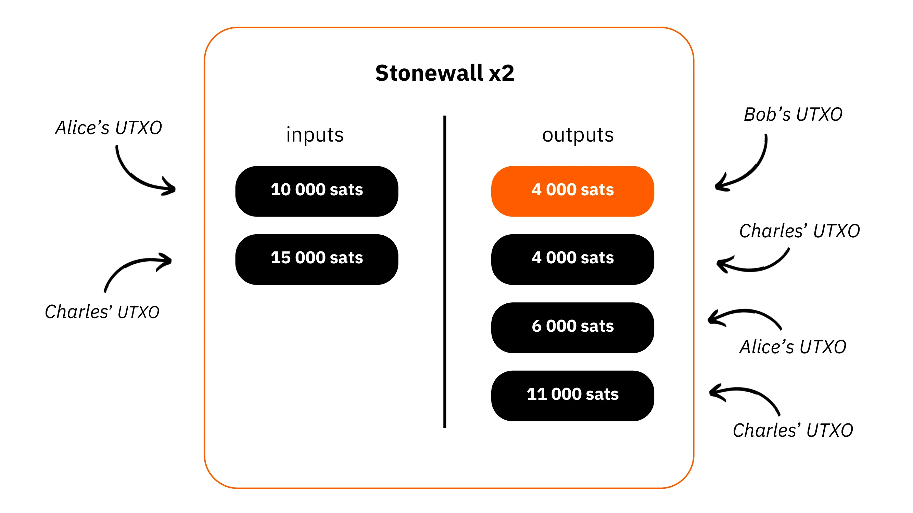


ในการวิเคราะห์ธุรกรรมนี้ เราจะเห็นว่า Bob คนทำขนมปังได้รับ 4,000 sats เป็นการชำระเงินสำหรับบาแกตต์จริง ๆ Alice ใช้ 10,000 sats เป็นอินพุตและกู้คืน 6,000 sats เป็นเอาต์พุต ส่งผลให้ยอดคงเหลือสุทธิเป็น -4,000 sats ซึ่งสอดคล้องกับราคาของบาแกตต์ สำหรับชาร์ลส์ เขาให้ 15,000 sats เป็นอินพุตและได้รับสองเอาต์พุต: หนึ่งคือ 4,000 sats และอีกหนึ่งคือ 11,000 sats ส่งผลให้ยอดคงเหลือเป็น 0


ในตัวอย่างนี้ ฉันได้ตั้งใจละเว้นค่าธรรมเนียมเพื่อให้ง่ายต่อการเข้าใจ ในความเป็นจริง ค่าธรรมเนียม mining มักจะแบ่งกันอย่างเท่าเทียมระหว่างผู้ออกการชำระเงินและผู้มีส่วนร่วม


### วัตถุประสงค์ของการทำธุรกรรม Stonewall x2 คืออะไร?


คล้ายกับโครงสร้าง Stonewall โครงสร้าง Stonewall x2 แนะนำเอนโทรปีที่สำคัญให้กับธุรกรรม ทำให้การวิเคราะห์เชนซับซ้อนขึ้น เมื่อมองจากภายนอก ธุรกรรมดังกล่าวสามารถตีความได้ว่าเป็นการรวมเหรียญเล็กๆ ระหว่างสองคน แต่ในความเป็นจริง มันคือการชำระเงิน ดังนั้นวิธีนี้จึงสร้างความไม่แน่นอนในการวิเคราะห์เชนหรือแม้กระทั่งนำไปสู่การชี้นำที่ผิดพลาด


ลองดูตัวอย่างของ Alice, Bob the baker, และ Charles การทำธุรกรรมบนบล็อกเชนจะมีลักษณะดังนี้:


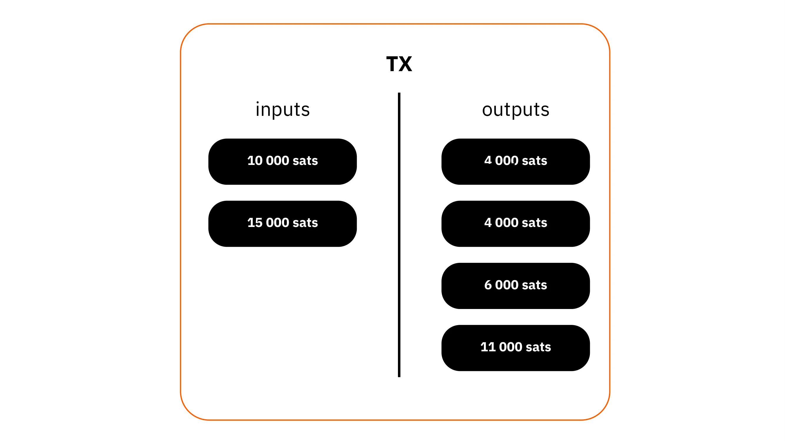


ผู้สังเกตการณ์ภายนอกที่พึ่งพาวิธีการวิเคราะห์เชนทั่วไปอาจสรุปผิดว่า "*Alice และ Charles ได้ทำ coinjoin ขนาดเล็ก โดยมี UTXO หนึ่งรายการในอินพุตและ UTXO สองรายการในเอาต์พุต*". อีกครั้ง การวิเคราะห์ธุรกรรมนี้จากภายนอกไม่ได้ทำให้เกิดการใช้ ICOH เนื่องจากการมีอยู่ของเอาต์พุตสองรายการที่มีจำนวนเท่ากันบ่งบอกถึงรูปแบบ coinjoin จากมุมมองภายนอก CIOH จึงไม่สามารถใช้ได้ในกรณีเฉพาะนี้


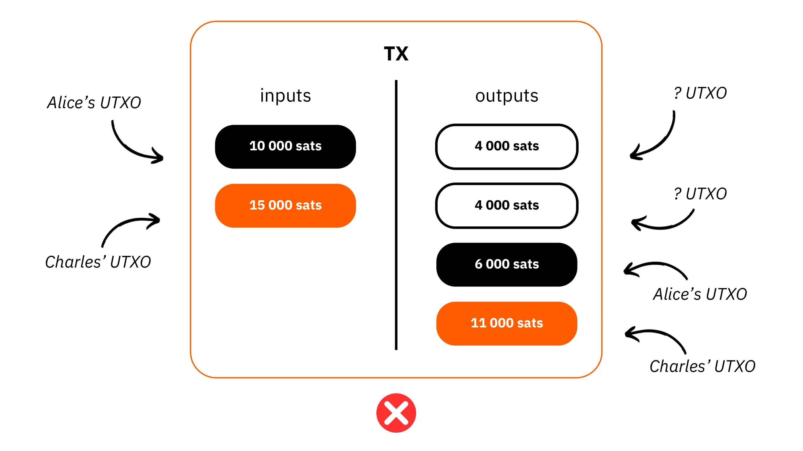


การตีความนี้ไม่ถูกต้องเพราะว่า ตามที่คุณทราบ UTXO หนึ่งตัวได้ถูกส่งไปยัง Bob the baker, Alice มีเพียงหนึ่งการเปลี่ยนแปลงเอาต์พุต และ Charles มีสอง.


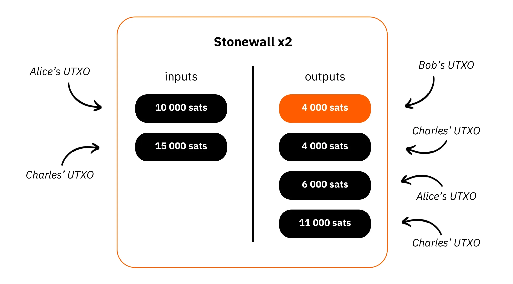


และอีกครั้ง สิ่งที่น่าสนใจเป็นพิเศษเกี่ยวกับโครงสร้างของธุรกรรม Stonewall x2 คือ จากมุมมองของผู้สังเกตการณ์ภายนอก มันมีลักษณะคล้ายกับธุรกรรม Stonewall ในทุกๆ ด้าน


### อะไรคือความแตกต่างระหว่าง Stonewall และ Stonewall x2?


การทำธุรกรรม StonewallX2 ทำงานเหมือนกับการทำธุรกรรม Stonewall ทุกประการ ยกเว้นว่าแบบแรกเป็นการทำงานร่วมกัน ในขณะที่แบบหลังไม่ใช่ ดังที่เราได้เห็น การทำธุรกรรม Stonewall x2 เกี่ยวข้องกับการมีส่วนร่วมของบุคคลที่สาม (Charles) ซึ่งเป็นบุคคลภายนอกการชำระเงิน และจะทำให้บิตคอยน์ของเขาพร้อมใช้งานเพื่อเพิ่มความลับของการทำธุรกรรม ในการทำธุรกรรม Stonewall แบบคลาสสิก บทบาทของผู้ร่วมมือจะถูกทำโดยผู้ส่ง


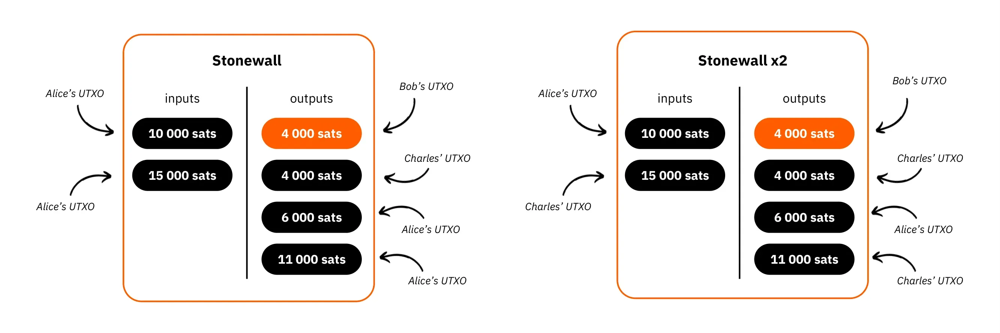


จากมุมมองภายนอก รูปแบบการทำธุรกรรมยังคงเหมือนเดิม


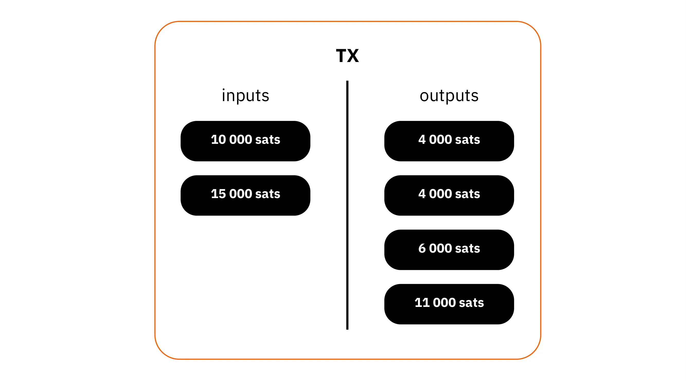


ข้อเท็จจริงที่ว่าโครงสร้างธุรกรรมทั้งสองนี้มีรูปแบบเดียวกันอย่างแม่นยำหมายความว่า แม้ว่าผู้สังเกตการณ์ภายนอกจะสามารถระบุรูปแบบ "Stonewall(x2)" ได้ เขาก็จะไม่มีข้อมูลทั้งหมด เขาจะไม่สามารถระบุได้ว่า UTXO สองรายการที่มีจำนวนเท่ากันนั้นรายการใดที่สอดคล้องกับการชำระเงิน นอกจากนี้ เขาจะไม่สามารถระบุได้ว่า UTXO สองรายการที่มีอินพุตมาจากสองคนที่แตกต่างกัน (Stonewall x2) หรือว่าพวกเขาเป็นของบุคคลเดียวที่ได้รวมเข้าด้วยกัน (Stonewall)


ประเด็นสุดท้ายนี้เกิดจากข้อเท็จจริงที่ว่าธุรกรรม Stonewall x2 มีรูปแบบเดียวกันกับธุรกรรม Stonewall อย่างแม่นยำ เมื่อมองจากภายนอกและไม่มีข้อมูลบริบทเพิ่มเติม จึงเป็นไปไม่ได้ที่จะแยกแยะธุรกรรม Stonewall ออกจากธุรกรรม Stonewall x2 ธุรกรรมแบบแรกไม่ใช่ธุรกรรมแบบร่วมมือกัน ในขณะที่ธุรกรรมแบบหลังเป็นแบบร่วมมือกัน สิ่งนี้ยิ่งเพิ่มความสงสัยในการวิเคราะห์ธุรกรรมเหล่านี้มากขึ้นไปอีก


### ควรใช้ธุรกรรม Stonewall และ Stonewall x2 เมื่อใด?


ตรรกะควรเป็นดังนี้เมื่อคุณต้องการใช้เครื่องมือรักษาความลับสำหรับค่าใช้จ่าย:


- ในฐานะที่เป็นลำดับความสำคัญ เราสามารถเลือกที่จะทำ payjoin ได้
- หากผู้ค้าไม่รองรับ payjoins สามารถทำธุรกรรมร่วมกับบุคคลอื่นนอกเหนือจากการชำระเงินโดยใช้โครงสร้าง Stonewall x2 ได้
- หากคุณไม่สามารถหาผู้ใดทำธุรกรรม Stonewall x2 ได้ คุณสามารถทำธุรกรรม Stonewall เพียงอย่างเดียว ซึ่งจะเลียนแบบพฤติกรรมของธุรกรรม Stonewall x2 ได้


### ฉันจะใช้ธุรกรรม Stonewall และ Stonewall x2 ได้อย่างไร?


ธุรกรรม Stonewall สามารถใช้ได้บน Sparrow Wallet รวมถึงบน Ashigaru ในขณะที่ Stonewall x2 ปัจจุบันรองรับเฉพาะโดย Ashigaru เท่านั้น


สามารถดำเนินการธุรกรรมประเภทนี้ด้วยตนเองจากซอฟต์แวร์ Bitcoin wallet ใดก็ได้


ในบทถัดไป เราจะมาดูเทคนิคการรักษาความลับอีกแบบหนึ่งที่ค่อนข้างไม่เป็นที่รู้จักแต่มีประโยชน์มากในการเสริมสิ่งที่เราได้ศึกษาไปแล้ว


https://planb.academy/tutorials/privacy/on-chain/ashigaru-stonewall-033daa45-d42c-40e1-9511-cea89751c3d4

https://planb.academy/tutorials/privacy/on-chain/sparrow-stonewall-6fcfd679-7038-4ee2-8bf7-de76a72f9392

https://planb.academy/tutorials/privacy/on-chain/ashigaru-stonewall-x2-05120280-f6f9-4e14-9fb8-c9e603f73e5b

## เดอะ ริโคเช่ส์


<chapterId>db9a20ac-a149-443d-884b-ea6c03f28499</chapterId>


:::video id=3c9ce9e5-4081-4c36-98f9-9fc3779c0337:::


การใช้โครงสร้างธุรกรรม Bitcoin ที่เพิ่มความคลุมเครือให้กับการวิเคราะห์เชน เช่น coinjoin นั้นมีประโยชน์อย่างยิ่งสำหรับการปกป้องความเป็นส่วนตัว อย่างไรก็ตาม ตามที่เราได้กล่าวถึงในบทเกี่ยวกับ payjoins ธุรกรรม coinjoin สามารถระบุได้ตามธรรมชาติบนเชน จำไว้ว่าการเปรียบเทียบที่เราทำระหว่างการเข้ารหัสและ coinjoins: เมื่อไฟล์ถูกเข้ารหัส บุคคลที่สามที่ค้นพบไฟล์ที่เข้ารหัสไม่สามารถเข้าถึงเนื้อหาของไฟล์ได้ แต่สามารถระบุได้อย่างชัดเจนว่าไฟล์นั้นถูกแก้ไขเพื่อซ่อนเนื้อหา สิ่งเดียวกันนี้ใช้กับ coinjoin: เมื่อผู้วิเคราะห์ตรวจสอบธุรกรรม coinjoin แม้ว่าเขาหรือเธอจะไม่สามารถสร้างลิงก์โดยตรงระหว่างอินพุตและเอาต์พุต (และในทางกลับกัน) แต่เขาหรือเธอก็ยังสามารถรับรู้ได้ว่าธุรกรรมที่สังเกตเห็นนั้นคือ coinjoin


ขึ้นอยู่กับว่าคุณตั้งใจจะใช้ UTXO ของคุณอย่างไรหลังจากผ่านกระบวนการ coinjoin แล้ว ความจริงที่ว่ามันได้ผ่านกระบวนการนี้อาจเป็นปัญหาได้ ตัวอย่างเช่น หากคุณวางแผนที่จะขายเหรียญของคุณบนแพลตฟอร์มแลกเปลี่ยนที่มีการควบคุมซึ่งเพิ่งผ่านกระบวนการ coinjoin เครื่องมือวิเคราะห์เชนของแพลตฟอร์มจะตรวจพบข้อเท็จจริงนี้ แพลตฟอร์มอาจปฏิเสธที่จะยอมรับ UTXO ที่ผ่านการ coinjoin ของคุณหรือเรียกร้องคำอธิบายจากคุณ โดยมีความเสี่ยงที่บัญชีของคุณจะถูกระงับหรือเงินของคุณจะถูกแช่แข็ง ในบางกรณี แพลตฟอร์มอาจรายงานพฤติกรรมของคุณต่อหน่วยงานของรัฐ (เช่น ตามที่ TRACFIN กำหนดให้ PSANs ในฝรั่งเศส หรือที่ Financial Crimes Enforcement Network (FinCEN) ทำในสหรัฐอเมริกา)


มีเครื่องมือที่สามารถเบลอร่องรอยในอดีตของเหรียญ Bitcoin ได้ จึงคืนความสามารถในการแลกเปลี่ยนได้บางส่วน นี่คือวัตถุประสงค์ของ ricochet


### ริโคเช่คืออะไร?


การกระเด้งกลับเป็นเทคนิคที่เกี่ยวข้องกับการทำธุรกรรมปลอมหลายรายการไปยังตัวเอง (การกวาด) เพื่อจำลองการโอนกรรมสิทธิ์ของบิตคอยน์ เครื่องมือนี้แตกต่างจากโครงสร้างธุรกรรมอื่น ๆ ที่เราได้พูดถึงในแง่ที่ว่ามันไม่ได้เพิ่มความเป็นนิรนามในอนาคต แต่เป็นรูปแบบของความเป็นนิรนามในอดีต ในทางปฏิบัติ แนวคิดของการกระเด้งกลับจะทำให้ความเฉพาะเจาะจงที่สามารถทำลายความสามารถในการแลกเปลี่ยนของเหรียญ Bitcoin เนื่องจากอดีตของมันเบลอไป


เพื่อทำให้รอยประทับที่เกิดจากเหตุการณ์ในอดีตบนเหรียญ เช่น วงจร coinjoin เรียบเนียนขึ้น ricochet จะดำเนินการธุรกรรมสี่รายการติดต่อกันซึ่งผู้ใช้โอนเงินให้ตัวเองที่ที่อยู่ต่างๆ


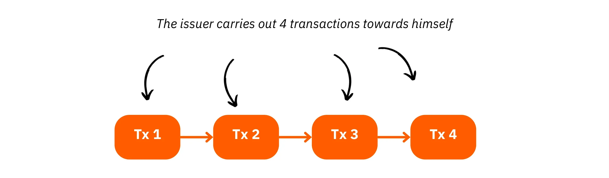


หลังจากลำดับของธุรกรรมนี้ เครื่องมือ ricochet จะนำบิตคอยน์ไปยังปลายทางสุดท้าย เช่น แพลตฟอร์มแลกเปลี่ยน


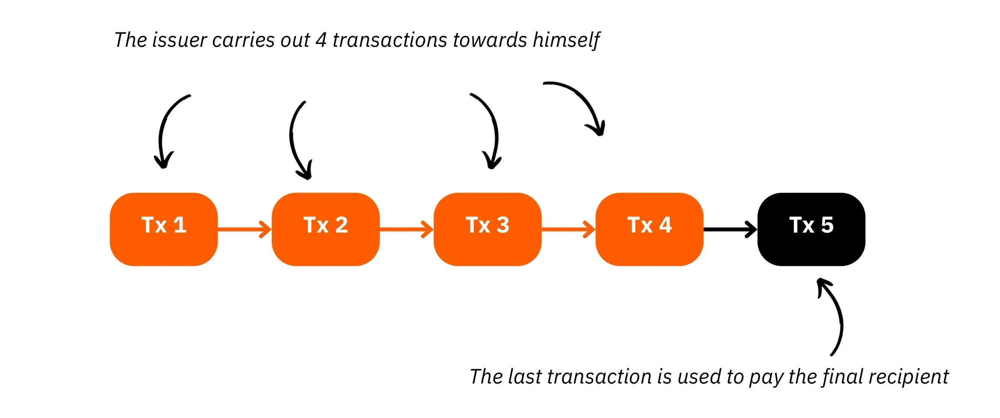


เป้าหมายคือการสร้างระยะห่างที่ส่งผลต่อความสามารถในการแลกเปลี่ยนของเหรียญ เช่น การทำธุรกรรมแบบ coinjoin และการใช้จ่ายขั้นสุดท้าย ซึ่งอาจปฏิเสธเหรียญนี้เนื่องจากประวัติที่ผ่านมา ดังนั้น เครื่องมือวิเคราะห์เชนจึงอาจสรุปได้ว่าอาจมีการเปลี่ยนแปลงเจ้าของหลังเหตุการณ์และพิจารณาว่าเหรียญนี้สามารถแลกเปลี่ยนได้ ในกรณีของ coinjoin เครื่องมือวิเคราะห์บล็อกเชนอาจสันนิษฐานได้ว่าไม่ใช่บุคคลเดียวกันที่ส่งบิตคอยน์และดำเนินการ coinjoin และดังนั้นจึงไม่มีประโยชน์ที่จะดำเนินการกับผู้ส่ง


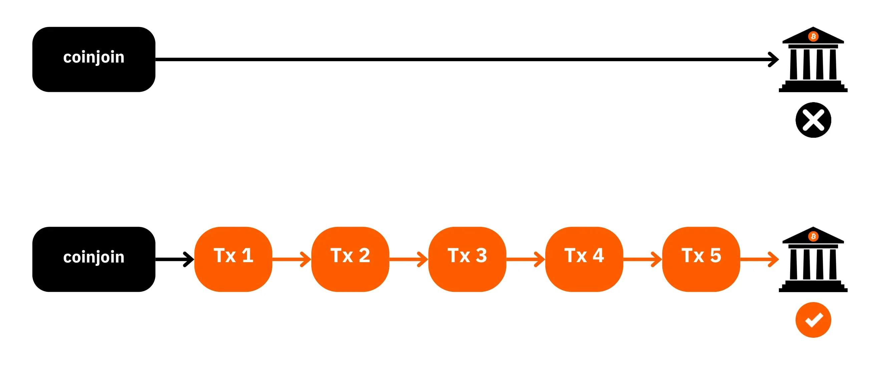


### ทำไมมันถึงได้ผล?


เมื่อต้องเผชิญกับวิธีการสะท้อนกลับนี้ อาจมีคนจินตนาการว่าโปรแกรมวิเคราะห์เชนจะขยายการตรวจสอบให้ลึกลงไปเกินกว่าสี่ครั้ง อย่างไรก็ตาม แพลตฟอร์มเหล่านี้ต้องเผชิญกับภาวะที่กลืนไม่เข้าคายไม่ออกในการเพิ่มประสิทธิภาพเกณฑ์การตรวจจับ พวกเขาต้องกำหนดขีดจำกัดจำนวนการกระโดดหลังจากที่พวกเขายอมรับว่าการเปลี่ยนแปลงคุณสมบัติน่าจะเกิดขึ้นแล้ว และควรละเลยการเชื่อมโยงกับเหตุการณ์ก่อนหน้า (เช่น coinjoin)


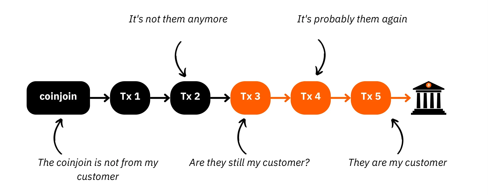


อย่างไรก็ตาม การตั้งเกณฑ์นี้มีความเสี่ยง: การเพิ่มจำนวนการกระโดดที่สังเกตเห็นได้แต่ละครั้งจะเพิ่มปริมาณของผลบวกเท็จอย่างทวีคูณ กล่าวคือ บุคคลที่ถูกระบุผิดว่าเป็นผู้เข้าร่วมในเหตุการณ์ ในความเป็นจริงการดำเนินการนั้นถูกดำเนินการโดยคนอื่น สถานการณ์นี้ก่อให้เกิดความเสี่ยงอย่างมากต่อบริษัทเหล่านี้ เนื่องจากผลบวกเท็จนำไปสู่ความไม่พอใจ ซึ่งอาจผลักดันให้ลูกค้าที่ได้รับผลกระทบไปหาคู่แข่ง ในระยะยาว เกณฑ์การตรวจจับที่สูงเกินไปอาจทำให้แพลตฟอร์มสูญเสียลูกค้ามากกว่าคู่แข่ง ซึ่งอาจคุกคามความอยู่รอดของแพลตฟอร์ม ดังนั้นจึงเป็นเรื่องซับซ้อนสำหรับแพลตฟอร์มเหล่านี้ในการเพิ่มจำนวนการกระโดดที่สังเกตเห็นได้ และ 4 มักเป็นจำนวนที่เพียงพอในการต่อต้านการวิเคราะห์ของพวกเขา


ปรากฏการณ์ที่สังเกตได้ที่นี่มีความคล้ายคลึงกับทฤษฎีหกองศาของการแยกจากกันอยู่บ้าง


ทฤษฎีหกองศาของการแยกตัวเสนอว่า ทุกคนบนโลกนี้เชื่อมโยงถึงกันได้ผ่านสายสัมพันธ์ที่มีตัวกลางไม่เกินหกคน ดังนั้นจึงเพียงพอที่จะผ่านคนหกคนที่แต่ละคนรู้จักกันเป็นการส่วนตัวเพื่อเข้าถึงบุคคลใด ๆ ในโลก


ในกรณีของธุรกรรม Bitcoin จะพบปรากฏการณ์ที่คล้ายกัน โดยการติดตามธุรกรรม Bitcoin จำนวนเพียงพอ เราจะพบกับ coinjoin อย่างหลีกเลี่ยงไม่ได้ วิธี ricochet ใช้หลักการนี้โดยใช้จำนวนการกระโดดที่มากกว่าที่แพลตฟอร์มแลกเปลี่ยนสามารถติดตามได้อย่างสมเหตุสมผล หากแพลตฟอร์มตัดสินใจติดตามธุรกรรมมากขึ้น ก็จะสามารถเพิ่มการกระโดดเพิ่มเติมเพื่อหลีกเลี่ยงมาตรการนี้ได้อย่างง่ายดาย


### เมื่อใดและอย่างไรที่จะใช้ Ricochet?


กรณีการใช้งานที่พบบ่อยที่สุดสำหรับ Ricochet เกิดขึ้นเมื่อจำเป็นต้องปกปิดการมีส่วนร่วมก่อนหน้านี้ใน coinjoin บน UTXO ที่คุณเป็นเจ้าของ โดยทั่วไปแล้ว ควรหลีกเลี่ยงการโอนบิตคอยน์ที่ผ่านการ coinjoin ไปยังหน่วยงานที่มีการควบคุม อย่างไรก็ตาม หากคุณพบว่าตัวเองไม่มีทางเลือกอื่น โดยเฉพาะในกรณีที่จำเป็นเร่งด่วนในการแปลงบิตคอยน์เป็นสกุลเงินของรัฐ Ricochet เสนอวิธีแก้ปัญหาที่มีประสิทธิภาพ


วิธีนี้มีประสิทธิภาพไม่เพียงแต่สำหรับ coinjoins เท่านั้น แต่ยังสำหรับเครื่องหมายอื่น ๆ ที่อาจส่งผลต่อความสามารถในการแลกเปลี่ยนของ UTXO ด้วย


แนวคิดเบื้องหลังวิธีการสะท้อนนี้มาจากทีมที่ Samourai Wallet ซึ่งได้รวมเข้ากับแอปพลิเคชันของพวกเขาเพื่อทำให้การดำเนินงานเป็นอัตโนมัติ บริการนี้มีค่าใช้จ่ายบน Samourai เนื่องจากการสะท้อนแต่ละครั้งมีค่าใช้จ่ายคงที่ 100,000 sats สำหรับค่าบริการ นอกเหนือจากค่าธรรมเนียม mining สิ่งเดียวกันนี้ยังคงใช้ได้ในปัจจุบันบน Ashigaru ดังนั้น การใช้งานจึงมักแนะนำสำหรับการโอนเงินที่เกี่ยวข้องกับจำนวนเงินมาก ๆ


แอปพลิเคชัน Ashigaru มีตัวเลือกการสะท้อนกลับสองแบบ (แบบเดียวกับที่เราเคยมีใน Samourai):


- การสะท้อนกลับที่เสริมแรง หรือ "การส่งมอบแบบสลับ" มีข้อดีในการกระจายค่าบริการของ Ashigaru ออกไปในห้าธุรกรรมติดต่อกัน ตัวเลือกนี้ยังช่วยให้มั่นใจได้ว่าธุรกรรมแต่ละรายการจะถูกส่งออกในช่วงเวลาที่ต่างกันและบันทึกในบล็อกที่แยกจากกัน ทำให้สามารถเลียนแบบพฤติกรรมของการเปลี่ยนแปลงความเป็นเจ้าของได้ใกล้เคียงที่สุด แม้ว่าจะช้ากว่า แต่วิธีนี้เหมาะสำหรับผู้ที่ไม่รีบร้อน เนื่องจากจะเพิ่มประสิทธิภาพของการสะท้อนกลับให้สูงสุดโดยการเสริมความต้านทานต่อการวิเคราะห์เชน


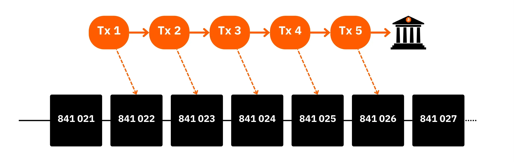


- การกระเด้งแบบคลาสสิก ซึ่งถูกออกแบบมาเพื่อดำเนินการด้วยความรวดเร็ว โดยการกระจายธุรกรรมทั้งหมดในช่วงเวลาที่ลดลง ดังนั้นวิธีนี้จึงมีความลับน้อยกว่าและมีความต้านทานต่อการวิเคราะห์น้อยกว่าวิธีที่เสริมความแข็งแกร่ง ควรใช้เฉพาะสำหรับการส่งที่เร่งด่วนเท่านั้น


การสะท้อนกลับหมายถึงการส่งบิตคอยน์ให้กับตัวเอง มันเป็นไปได้อย่างสมบูรณ์ที่จะสะท้อนกลับบิตคอยน์ด้วยตนเองบนซอฟต์แวร์ wallet ใด ๆ โดยไม่ต้องใช้เครื่องมือเฉพาะ สิ่งที่คุณต้องทำคือโอนเหรียญเดียวกันให้กับตัวเองอย่างต่อเนื่อง โดยใช้ที่อยู่ใหม่ที่ว่างเปล่าในแต่ละครั้ง


ในบทถัดไป เราจะพิจารณาเทคนิคต่างๆ สำหรับการโอนกรรมสิทธิ์อย่างลับๆ วิธีการเหล่านี้แตกต่างอย่างมากจากที่เราได้พิจารณามาแล้ว ทั้งในแง่ของการดำเนินการและผลลัพธ์


https://planb.academy/tutorials/privacy/on-chain/ashigaru-ricochet-e0bb1afe-becd-44a6-a940-88a463756589

## การโอนกรรมสิทธิ์อย่างลับๆ


<chapterId>a2067036-849c-4d6b-87d2-44235cfae7a1</chapterId>


:::video id=374f79ce-fc61-4528-8b69-b5ca7c7eaa6f:::


อีกหนึ่งเทคนิคการรักษาความลับของ Bitcoin คือการโอนกรรมสิทธิ์แบบลับ วิธีนี้มีเป้าหมายเพื่อโอนกรรมสิทธิ์ของ Bitcoin จากบุคคลหนึ่งไปยังอีกบุคคลหนึ่ง และในทางกลับกัน โดยไม่ให้การทำธุรกรรมปรากฏอย่างชัดเจนบนบล็อกเชน มาดูเทคนิคต่างๆ ที่มีอยู่ พร้อมทั้งข้อดีและข้อเสียของแต่ละวิธี


### The coinswap


Coinwap มีพื้นฐานมาจากแนวคิดที่ค่อนข้างเรียบง่าย: มันใช้สัญญาอัจฉริยะเพื่ออำนวยความสะดวกในการโอนความเป็นเจ้าของบิตคอยน์ระหว่างผู้ใช้สองคน โดยไม่จำเป็นต้องมีความไว้วางใจและทำให้การโอนนี้ไม่ปรากฏบนบล็อกเชน


ลองจินตนาการถึงตัวอย่างง่าย ๆ กับ Alice และ Bob. Alice ถือ 1 BTC ที่ปลอดภัยด้วยกุญแจส่วนตัว $A$, และ Bob ก็ถือ 1 BTC ที่ปลอดภัยด้วยกุญแจส่วนตัว $B$. พวกเขาสามารถแลกเปลี่ยนกุญแจส่วนตัวของพวกเขาผ่านช่องทางการสื่อสารภายนอกเพื่อดำเนินการโอนลับได้ในทางทฤษฎี.


อย่างไรก็ตาม วิธีการที่ไร้เดียงสานี้มีความเสี่ยงสูงในแง่ของความไว้วางใจ ไม่มีอะไรที่จะหยุด Alice จากการเก็บสำเนาของกุญแจส่วนตัว $A$ หลังจากการแลกเปลี่ยนและใช้มันในภายหลังเพื่อขโมยบิตคอยน์ เมื่อกุญแจอยู่ในมือของ Bob


นอกจากนี้ ยังไม่มีการรับประกันว่าเมื่ออลิซได้รับกุญแจส่วนตัว $B$ ของบ็อบแล้ว เธอจะส่งกุญแจส่วนตัว $A$ ของเธอเป็นการแลกเปลี่ยน ดังนั้นการแลกเปลี่ยนนี้จึงขึ้นอยู่กับความไว้วางใจอย่างมหาศาลระหว่างคู่สัญญา และพิสูจน์แล้วว่าไม่มีประสิทธิภาพในการรับประกันการโอนกรรมสิทธิ์ที่เป็นความลับอย่างปลอดภัย


ในการแก้ปัญหาเหล่านี้และเปิดใช้งานการแลกเปลี่ยนระหว่างฝ่ายที่ไม่ไว้วางใจกัน เราจะใช้ระบบสัญญาอัจฉริยะแทน สัญญาอัจฉริยะคือโปรแกรมที่ดำเนินการโดยอัตโนมัติเมื่อเงื่อนไขที่กำหนดไว้ล่วงหน้าถูกตอบสนอง ในกรณีของเรา สิ่งนี้จะช่วยให้การแลกเปลี่ยนทรัพย์สินเกิดขึ้นโดยอัตโนมัติ โดยไม่ต้องอาศัยความไว้วางใจซึ่งกันและกัน


สิ่งนี้สามารถทำได้โดยใช้ HTLC (*Hash Time-Locked Contracts*) หรือ PTLC (*Point Time-Locked Contracts*) โปรโตคอลทั้งสองนี้ทำงานในลักษณะที่คล้ายคลึงกัน โดยใช้ระบบล็อคเวลาเพื่อให้แน่ใจว่าการแลกเปลี่ยนจะเสร็จสมบูรณ์หรือถูกยกเลิกทั้งหมด ซึ่งจะช่วยปกป้องความสมบูรณ์ของเงินทุนของทั้งสองฝ่าย ความแตกต่างหลักระหว่าง HTLC และ PTLC คือ HTLC ใช้แฮชและพรีอิมเมจเพื่อรักษาความปลอดภัยของธุรกรรม ในขณะที่ PTLC ใช้ Adaptor Signatures


ในสถานการณ์การแลกเปลี่ยนเหรียญโดยใช้ HTLC หรือ PTLC ระหว่าง Alice และ Bob การแลกเปลี่ยนจะเกิดขึ้นอย่างปลอดภัย: ไม่ว่าจะสำเร็จและแต่ละฝ่ายได้รับ BTC ของอีกฝ่าย หรือไม่สำเร็จและแต่ละฝ่ายเก็บ BTC ของตนเองไว้ สิ่งนี้ทำให้เป็นไปไม่ได้ที่ฝ่ายใดฝ่ายหนึ่งจะโกงหรือขโมย BTC ของอีกฝ่าย


> *HTLC ยังเป็นกลไกที่ใช้ในการส่งผ่านการชำระเงินอย่างปลอดภัยผ่านช่องทางสองทิศทางของ Lightning Network*
การใช้ลายเซ็นแบบ Adaptor นั้นน่าสนใจเป็นพิเศษในบริบทนี้ เนื่องจากทำให้สามารถละทิ้งสคริปต์แบบดั้งเดิม (กลไกที่บางครั้งเรียกว่า "_scriptless scripts_") คุณสมบัตินี้ช่วยลดค่าใช้จ่ายที่เกี่ยวข้องกับการแลกเปลี่ยน ข้อดีอีกประการหนึ่งของลายเซ็นแบบ Adaptor คือไม่จำเป็นต้องใช้แฮชร่วมกันสำหรับทั้งสองฝ่ายในธุรกรรม จึงหลีกเลี่ยงความจำเป็นในการเปิดเผยลิงก์โดยตรงระหว่างพวกเขาในบางประเภทของการแลกเปลี่ยน


### ลายเซ็นตัวแปลง


ลายเซ็นต์ Adaptor เป็นวิธีการเข้ารหัสที่รวมลายเซ็นต์ที่ถูกต้องเข้ากับลายเซ็นต์เพิ่มเติมที่เรียกว่า "_ลายเซ็นต์ adaptor_" เพื่อเปิดเผยข้อมูลลับ กลไกนี้ถูกออกแบบมาในลักษณะที่ว่าความรู้เกี่ยวกับสองในสามองค์ประกอบต่อไปนี้ — ลายเซ็นต์ที่ถูกต้อง, ลายเซ็นต์ adaptor, และความลับ — ช่วยให้เราสามารถสรุปองค์ประกอบที่สามที่ขาดหายไปได้ คุณสมบัติที่น่าสนใจของวิธีนี้คือ ถ้าเรารู้ลายเซ็นต์ adaptor ของคู่สนทนาและจุดเฉพาะบนเส้นโค้งวงรีที่เกี่ยวข้องกับความลับที่ใช้ในการคำนวณลายเซ็นต์ adaptor นั้น เราสามารถสร้างลายเซ็นต์ adaptor ของเราเองที่สามารถใช้งานร่วมกับความลับเดียวกันได้ โดยไม่ต้องเข้าถึงความลับนั้นโดยตรงเลย


ในการแลกเปลี่ยนเหรียญ การใช้ลายเซ็นตัวปรับช่วยให้สามารถเปิดเผยข้อมูลที่ละเอียดอ่อนสองชิ้นระหว่างผู้เข้าร่วมได้พร้อมกัน จึงหลีกเลี่ยงความจำเป็นในการไว้วางใจซึ่งกันและกัน ลองมาดูตัวอย่างเพื่อแสดงกระบวนการนี้กับ Alice และ Bob ที่ต้องการแลกเปลี่ยนการครอบครอง 1 BTC แต่ไม่ไว้วางใจกัน พวกเขาใช้ลายเซ็นตัวปรับเพื่อลดความจำเป็นในการไว้วางใจในการแลกเปลี่ยนนี้ นี่คือวิธีที่พวกเขาทำ:


- Alice เริ่มต้นการแลกเปลี่ยนโดยสร้างธุรกรรม $m_A$ ที่ส่ง 1 BTC ไปยัง Bob เธอสร้างลายเซ็น $s_A$ ซึ่งยืนยันธุรกรรมนี้ โดยใช้กุญแจส่วนตัวของเธอ $p_A$ ($P_A = p_A \cdot G$), nonce $n_A$ ($N_A = n_A \cdot G$) และความลับ $t$ ($T = t \cdot G$):


$$s_A = n_A + t + H(N_A + T \parallel P_A \parallel m_A) \cdot p_A$$


- Alice คำนวณลายเซ็นอะแดปเตอร์ $s_A'$ โดยการลบความลับ $t$ ออกจากลายเซ็นที่แท้จริง $s_A$:


$$s_A' = s_A - t$$


- Alice ส่งอะแดปเตอร์ลายเซ็นของเธอ $s'_A$ ไปยัง Bob, ธุรกรรมที่ยังไม่ได้ลงนามของเธอ $m_A$, จุดที่สอดคล้องกับความลับ ($T$), และจุดที่สอดคล้องกับ nonce ($N_A$). องค์ประกอบเหล่านี้ประกอบกันเป็นสิ่งที่เรียกว่า "อะแดปเตอร์". สิ่งสำคัญที่ต้องทราบคือ ด้วยข้อมูลนี้เพียงอย่างเดียว Bob ไม่สามารถกู้คืน BTC ของ Alice ได้.
- อย่างไรก็ตาม Bob สามารถตรวจสอบได้ว่า Alice ไม่ได้พยายามขโมยจากเขา ในการทำเช่นนี้ เขาตรวจสอบว่าลายเซ็นอะแดปเตอร์ของ Alice $s_A'$ สอดคล้องกับธุรกรรมที่เสนอ $m_A$ หรือไม่ หากสมการต่อไปนี้ถูกต้อง เขาสามารถมั่นใจได้ว่าอะแดปเตอร์ลายเซ็นของ Alice นั้นถูกต้อง:


$$s_A' \cdot G = N_A + H(N_A + T \parallel P_A \parallel m_A) \cdot P_A$$


- การตรวจสอบนี้ให้การรับประกันที่เพียงพอแก่ Bob ว่าเขาสามารถดำเนินการแลกเปลี่ยนได้อย่างมั่นใจเต็มที่ จากนั้นเขาจึงสร้างธุรกรรมของเขาเอง $m_B$ ซึ่งมีจุดประสงค์เพื่อส่ง 1 BTC ไปยัง Alice และสร้างลายเซ็นตัวปรับ $s_B'$ ของเขา ซึ่งจะเชื่อมโยงกับความลับเดียวกัน $t$ ในขั้นตอนนี้ มีเพียง Alice เท่านั้นที่รู้ค่าของ $t$; Bob รู้เพียงจุดที่สอดคล้องกัน $T$ ที่ Alice ได้ส่งต่อให้เขา:


$$s_B' = n_B + H(N_B + T \parallel P_B \parallel m_B) \cdot p_B$$


- Bob ส่งลายเซ็นอะแดปเตอร์ $s_B'$ ของเขา, ธุรกรรมที่ยังไม่ได้ลงนาม $m_B$, รวมถึงจุดที่สอดคล้องกับความลับ ($T$) และจุดที่สอดคล้องกับ nonce ($N_B$) ไปยัง Alice Alice ซึ่งรู้ความลับ $t$ สามารถรวมลายเซ็นอะแดปเตอร์ $s_B'$ ของ Bob กับความลับนี้เพื่อให้ generate ได้ลายเซ็นที่ถูกต้อง $s_B$ สำหรับธุรกรรม $m_B$ ที่จะโอน BTC ของ Bob ให้เธอ:


$$s_B = s_B' + t$$


$$(s_B' + t) \cdot G = N_B + T + H(N_B + T \parallel P_B \parallel m_B) \cdot P_B$$


- Alice กระจายธุรกรรมที่ลงนาม $m_B$ นี้บนบล็อกเชน Bitcoin เพื่อดึง BTC ที่สัญญาโดย Bob เมื่อ Bob เห็นธุรกรรมนี้บนบล็อกเชน เขาสามารถดึงลายเซ็น $s_B = s_B' + t$ ด้วยข้อมูลนี้ Bob จึงสามารถแยกความลับที่มีชื่อเสียง $t$ ที่เขาต้องการได้:


$$t = (s_B' + t) - s_B' = s_B - s_B'$$


- และความลับนี้ $t$ เป็นองค์ประกอบเดียวที่ขาดหายไปสำหรับ Bob ถึง generate ลายเซ็นที่ถูกต้อง $s_A$ จากลายเซ็นตัวปรับ Alice $s_A'$ ลายเซ็นนี้ยืนยันการทำธุรกรรม $m_A$ ซึ่งส่ง BTC จาก Alice ไปยัง Bob จากนั้น Bob คำนวณ $s_A$ และกระจายการทำธุรกรรม $m_A$ บนบล็อกเชน:


$$s_A = s_A' + t$$


$$(s_A' + t) \cdot G = N_A + T + H(N_A + T \parallel P_A \parallel m_A) \cdot P_A$$


มาสรุปกันว่า Adaptor Signature ทำงานอย่างไรใน coinswap เริ่มต้น Alice ส่งธุรกรรมที่ยังไม่ได้ลงนามให้กับ Bob พร้อมกับ adaptor ซึ่งช่วยให้ Bob ตรวจสอบได้ว่าความลับที่เปิดเผยในภายหลังจะทำให้เขาเข้าถึงบิตคอยน์ได้ ในทางกลับกัน Bob ส่งธุรกรรมที่ยังไม่ได้ลงนามและ adaptor ของเขาให้กับ Alice Alice สามารถสรุปธุรกรรมของ Bob และดึงบิตคอยน์ได้โดยการเผยแพร่ธุรกรรมที่ถูกต้องด้วยความลับ เมื่อธุรกรรมนี้ถูกเผยแพร่บนบล็อกเชน Bob มีความสามารถในการดึงความลับและปลดล็อกธุรกรรมของ Alice ดังนั้น หาก Alice เริ่มการโอนบิตคอยน์ของ Bob Bob ก็สามารถเข้าถึงบิตคอยน์ของ Alice ได้โดยไม่ต้องการความไว้วางใจซึ่งกันและกัน


โปรดทราบว่า coinswaps ถูกเสนอครั้งแรกโดย [Gregory Maxwell ในเดือนตุลาคม 2013 บน BitcoinTalk](https://bitcointalk.org/index.php?topic=321228.0).


### การแลกเปลี่ยนอะตอม


คล้ายกับ coinswap และใช้ประเภทของสมาร์ทคอนแทรคเดียวกัน ยังสามารถดำเนินการแลกเปลี่ยนแบบอะตอมมิกได้อีกด้วย การแลกเปลี่ยนแบบอะตอมมิกช่วยให้สามารถแลกเปลี่ยนสกุลเงินดิจิทัลต่าง ๆ ได้โดยตรง เช่น BTC และ XMR ระหว่างผู้ใช้สองคนโดยไม่ต้องการความไว้วางใจหรือการแทรกแซงของตัวกลาง การแลกเปลี่ยนเหล่านี้ถูกเรียกว่า "อะตอมมิก" เพราะมีผลลัพธ์เพียงสองอย่างเท่านั้น: การแลกเปลี่ยนสำเร็จและทั้งสองฝ่ายพึงพอใจ หรือการแลกเปลี่ยนล้มเหลวและแต่ละฝ่ายยังคงถือครองสกุลเงินดิจิทัลเดิมของตนเอง ซึ่งช่วยลดความจำเป็นในการไว้วางใจอีกฝ่ายหนึ่ง


การแลกเปลี่ยนแบบอะตอมมิกและการแลกเปลี่ยนเหรียญมีขั้นตอนที่คล้ายกันและมีข้อดีและข้อเสียเหมือนกันในแง่ของการรักษาความลับ อันที่จริง จากมุมมองของ Bitcoin การแลกเปลี่ยนแบบอะตอมมิกเปรียบได้กับการแลกเปลี่ยนเหรียญที่ดำเนินการในสองขั้นตอน ขั้นแรก เราแลกเปลี่ยน BTC ของเราเป็นสกุลเงินดิจิทัลอื่น จากนั้นสกุลเงินดิจิทัลนี้สามารถแลกเปลี่ยนเป็น BTC อื่นได้ ในที่สุด เราก็จะได้รับ BTC ของผู้ใช้อื่นกลับมา นี่คือเหตุผลที่ในการวิเคราะห์ปัญหาการรักษาความลับ ฉันจัดกลุ่มโปรโตคอลทั้งสองนี้ภายใต้หมวดหมู่ของการแลกเปลี่ยนความลับที่เป็นกรรมสิทธิ์


อย่างไรก็ตาม โปรดระวังว่าแตกต่างจาก coinswap, atomic swap อาจมีความไม่สมดุลในแง่ของสภาพคล่องที่มีอยู่ โดยเฉพาะในการแลกเปลี่ยน BTC/XMR โดยทั่วไปแล้วการแลกเปลี่ยนบิตคอยน์เป็นอัลท์คอยน์จะง่ายกว่า เนื่องจากมีความต้องการบิตคอยน์สูง ซึ่งทำให้ค่าพรีเมียมต่ำสำหรับทิศทางการแปลงนี้ อย่างไรก็ตาม การแลกเปลี่ยนอัลท์คอยน์เป็น BTC อาจซับซ้อนกว่าเนื่องจากความต้องการที่ต่ำกว่า ซึ่งมักส่งผลให้ค่าพรีเมียมสูงมาก


สุดท้ายนี้ เมื่อการแลกเปลี่ยนอะตอมเกี่ยวข้องกับ on-chain บิตคอยน์และบิตคอยน์บน Lightning Network จะเรียกว่า "submarine swap"


### มันมีประโยชน์จริงหรือ?


การโอนกรรมสิทธิ์แบบลับ เช่น coinswaps และ atomic swaps มีข้อได้เปรียบในการหลีกเลี่ยงการวิเคราะห์เชิงอนุมานของบล็อกเชน วิธีการเหล่านี้สามารถบ่งบอกได้ว่าธุรกรรมเกี่ยวข้องกับผู้ใช้คนเดียวกัน ในขณะที่ความเป็นเจ้าของที่แท้จริงได้เปลี่ยนมือแล้ว อย่างไรก็ตาม ข้อเสียหลักของวิธีการเหล่านี้คือมีความเสี่ยงสูงมากหากไม่ได้ใช้เทคนิคเพิ่มเติมในการทำลายประวัติของเหรียญ


อันที่จริง เมื่อ Alice ทำการ coinswap หรือ atomic swap กับ Bob เธอจะแลกเปลี่ยนการครอบครองบิตคอยน์ของเธอกับของ Bob ในกรณีของ atomic swap การแลกเปลี่ยนจะรวมถึง altcoin แต่หลักการยังคงเหมือนเดิม ดังนั้น Alice จะจบลงด้วยเหรียญ $B$ และ Bob กับเหรียญ $A$ สิ่งนี้ทำให้เกิดข้อสงสัยเกี่ยวกับการวิเคราะห์เชน แต่ประวัติของเหรียญยังคงสามารถติดตามได้ หากนักวิเคราะห์ตรวจสอบ UTXO $A$ พวกเขาสามารถติดตามกิจกรรมก่อนหน้าของ Alice และในทางกลับกันสำหรับ UTXO $B$


จากมุมมองของ Alice ความเสี่ยงคือประวัติของเหรียญ $B$ อาจถูกพิจารณาว่าน่าสงสัยโดยบางหน่วยงาน ตัวอย่างเช่น หาก Bob ได้รับเหรียญ $B$ ผ่านการกระทำที่ผิดกฎหมาย เช่น การแฮ็ก เหรียญนั้นจะยังคงเชื่อมโยงกับกิจกรรมที่ผิดกฎหมายของเขา Alice อาจพบว่าตัวเองครอบครองเหรียญที่ไม่สามารถโอนไปยังแพลตฟอร์มแลกเปลี่ยนที่มีการควบคุมได้โดยไม่เสี่ยงต่อการถูกอายัดเงินหรือแม้กระทั่งถูกกล่าวหาว่ามีส่วนร่วมในอาชญากรรมของ Bob แม้ว่าเธอจะไม่มีส่วนเกี่ยวข้องใด ๆ ก็ตาม


หลีกเลี่ยงไม่ได้ที่วิธีการรักษาความลับเช่น coinswaps หรือ atomic swaps จะได้รับความนิยมจากอาชญากรที่มีเงินทุนอยู่ภายใต้การเฝ้าระวังของเจ้าหน้าที่ โปรโตคอลเหล่านี้ช่วยให้พวกเขาสามารถกำจัดบิตคอยน์ที่อยู่ภายใต้การเฝ้าระวังเพื่อแลกกับบิตคอยน์ที่สามารถแลกเปลี่ยนได้อย่างสมบูรณ์ นอกจากนี้ยังช่วยให้พวกเขาสร้างการเบี่ยงเบนโดยการชี้นำเจ้าหน้าที่ไปยังผู้ใช้รายอื่น ดังนั้นจึงมีวัตถุประสงค์สองประการสำหรับคนเหล่านี้


ด้วย coinjoin แม้ว่าบิทคอยน์ของคุณจะถูกผสมกับบิทคอยน์ที่ถูกตรวจสอบ ประวัติของเหรียญจะถูกทำลาย ซึ่งให้รูปแบบของการปฏิเสธที่น่าเชื่อถือซึ่งไม่มีอยู่ในโปรโตคอลการโอนความเป็นเจ้าของแบบลับ เช่น coinswap หรือ atomic swap


หาก Alice ต้องการหลีกเลี่ยงความเสี่ยงใด ๆ เธอจำเป็นต้องใช้วิธีการเพื่อตัดประวัติของเหรียญ $B$ เช่น การผ่านมันผ่าน coinjoins ซึ่งทำให้เกิดคำถามเกี่ยวกับประโยชน์ของการรวมการโอนความเป็นเจ้าของอย่างลับ ๆ และ coinjoin การใช้ coinjoin โดยการตัดประวัติของเหรียญนั้น ได้เสนอระดับความลับที่เพียงพอสำหรับ Alice อยู่แล้ว ดังนั้น ความเห็นของฉันคือ หาก Alice กำลังมองหาการปกป้องความเป็นส่วนตัวของเธอ จะเป็นการฉลาดกว่าที่จะดำเนินการตรงไปยัง coinjoin โดยไม่ต้องมีการทำ coinswap ตามด้วย coinjoin


สำหรับวิธีการโอนกรรมสิทธิ์แบบลับให้มีประสิทธิภาพอย่างแท้จริงและหลีกเลี่ยงความเสี่ยงในการเชื่อมโยงประวัติของผู้ใช้ $A$ กับผู้ใช้ $B$ จะเป็นเรื่องที่ขัดแย้งกันที่จำเป็นต้องให้การใช้งานนั้นเป็นที่รู้จักอย่างกว้างขวาง หากมีการใช้ coinswap อย่างแพร่หลายและทางการรับรู้ถึงการปฏิบัติทั่วไปนี้ ก็อาจสร้างรูปแบบการปฏิเสธที่น่าเชื่อถือได้ อย่างไรก็ตาม ตราบใดที่การใช้การโอนเหล่านี้ยังคงเป็นเรื่องเล็กน้อย ฉันคิดว่าวิธีการเหล่านี้จะยังคงมีความเสี่ยงเกินไปสำหรับผู้ใช้


จนถึงตอนนี้ เราได้ศึกษาวิธีการรักษาความลับในระดับธุรกรรมเป็นหลัก ในบทถัดไป เราจะตรวจสอบปัญหาในระดับเครือข่ายและการแพร่กระจายของธุรกรรม


## ความเป็นส่วนตัวบนเครือข่าย P2P


<chapterId>04a2467b-db84-4076-a9ff-919be5135106</chapterId>


:::video id=8428b212-de79-48a5-b984-ed7936861c2f:::


ในส่วนที่ 4 เราได้พูดถึงความสำคัญของการใช้ full node เพื่อปกป้องความลับของการทำธุรกรรมของคุณ อย่างไรก็ตาม สิ่งสำคัญคือต้องตระหนักว่าโหนดของคุณอาจมีความเสี่ยงต่อการโจมตีที่มุ่งเป้าไปที่การดึงข้อมูลเกี่ยวกับกิจกรรมของคุณ ดังนั้นในบทนี้ เราจะพิจารณามาตรการต่างๆ ที่คุณสามารถทำได้เพื่อปกป้องความเป็นส่วนตัวของคุณ ไม่ใช่ในระดับของการทำธุรกรรมเองหรือการไหลของบิตคอยน์ แต่ในระดับของเครือข่าย


### ดอกแดนดิไลออน


วิธีหนึ่งในการหลีกเลี่ยงการโจมตีที่ทำให้ไม่ระบุตัวตนหลายรูปแบบคือการใช้ข้อเสนอ Dandelion โปรโตคอลการกระจายเสียงนี้ถูกทำให้เป็นทางการใน BIP156 แต่ยังไม่เคยถูกนำไปใช้บน Bitcoin


แนวคิดเบื้องหลัง Dandelion คือการเพิ่มความเป็นส่วนตัวในการกำหนดเส้นทางธุรกรรมในเครือข่าย Bitcoin เพื่อป้องกันการโจมตีในรูปแบบต่างๆ วัตถุประสงค์หลักคือการซ่อนโหนดต้นทางที่เริ่มต้นการกระจายธุรกรรมในเครือข่าย การเปิดเผยโหนดนี้อาจทำให้สามารถเชื่อมโยงธุรกรรม Bitcoin กับที่อยู่ IP เฉพาะ (หากโหนดทำงานบน clearnet) ซึ่งเป็นจุดเริ่มต้นสำหรับการวิเคราะห์เชน


ความสัมพันธ์ระหว่างกิจกรรมบน Bitcoin และที่อยู่ IP แสดงถึงความเสี่ยงที่สำคัญต่อความลับของผู้ใช้ อันที่จริงแล้ว มีหลายหน่วยงานที่สามารถเชื่อมโยงที่อยู่ IP กับตัวตนส่วนบุคคลได้อย่างง่ายดาย ซึ่งรวมถึงรัฐบาลและผู้ให้บริการอินเทอร์เน็ต นอกจากนี้ ข้อมูลนี้อาจกลายเป็นสาธารณะได้ เช่น หากที่อยู่ IP และข้อมูลส่วนบุคคลของคุณรั่วไหลเมื่อฐานข้อมูลของเว็บไซต์ถูกละเมิด


ในการดำเนินการแบบคลาสสิกของ Bitcoin ธุรกรรมที่สร้างโดยผู้ใช้บนซอฟต์แวร์ wallet ของเขาจะถูกส่งไปยังโหนดส่วนตัวของเขา โหนดนี้จะกระจายธุรกรรมใหม่ไปยังเพื่อนทั้งหมดที่เชื่อมต่ออยู่ทันที


เพื่อนร่วมกลุ่มเหล่านี้จะตรวจสอบธุรกรรมเพื่อให้แน่ใจว่าเป็นไปตามกฎการเห็นพ้องต้องกันและมาตรฐานท้องถิ่น เมื่อได้รับการตรวจสอบแล้ว เพื่อนร่วมกลุ่มแต่ละคนจะส่งต่อธุรกรรมไปยังเพื่อนร่วมกลุ่มของตนต่อไป


การกระจายของธุรกรรมที่รอการรวมเข้าในบล็อกนั้นค่อนข้างสมดุลและสามารถคาดการณ์ได้ทางสถิติ จุดอ่อนนี้สามารถถูกใช้ประโยชน์โดยผู้สมรู้ร่วมคิดของโหนดสอดแนม ซึ่งร่วมมือกันเพื่อติดตามและวิเคราะห์เครือข่าย เพื่อระบุโหนดแรกที่ได้กระจายธุรกรรม หากผู้สังเกตการณ์สามารถระบุตำแหน่งโหนดต้นทางได้สำเร็จ พวกเขาสามารถสันนิษฐานได้ว่าธุรกรรมนั้นมีต้นกำเนิดจากผู้ดำเนินการของโหนด การสังเกตประเภทนี้สามารถใช้เพื่อเชื่อมโยงธุรกรรมที่ปกติจะไม่ระบุตัวตนกับที่อยู่ IP เฉพาะเจาะจงได้


เป้าหมายของ BIP156 คือการแก้ไขปัญหานี้ เพื่อบรรลุเป้าหมายนี้ มันได้แนะนำขั้นตอนเพิ่มเติมในการเผยแพร่ธุรกรรมใหม่เพื่อรักษาความเป็นนิรนามก่อนที่จะถูกเผยแพร่อย่างกว้างขวาง Dandelion ใช้ขั้นตอน "stem" ก่อน โดยที่ธุรกรรมจะถูกส่งผ่านเส้นทางสุ่มของโหนด


จากนั้นธุรกรรมจะถูกกระจายไปยังเครือข่ายทั้งหมดในช่วง "Fluff"


ลำต้นและ "ฟลัฟ" เป็นการอ้างอิงถึงพฤติกรรมของการแพร่กระจายธุรกรรมผ่านเครือข่าย ซึ่งมีลักษณะและวิวัฒนาการคล้ายกับดอกแดนดิไลออน


ดังนั้น โหนดสอดแนมสามารถติดตามธุรกรรมกลับไปยังโหนดที่เริ่มต้นเฟส "Fluff" (การกระจายสัญญาณมวลชน) ได้ แต่โหนดนั้นไม่ใช่โหนดที่เผยแพร่ธุรกรรมเป็นครั้งแรก เนื่องจากได้รับธุรกรรมจากโหนดสุดท้ายของก้าน หากโหนดสอดแนมไม่สามารถติดตามก้านได้ พวกเขาก็ไม่สามารถระบุโหนดต้นทางได้เช่นกัน


แม้ในขณะที่มีโหนดสอดแนมในช่วงต้นของกระบวนการ ความสงสัยยังคงอยู่เสมอ เพราะทันทีที่พวกเขาพบโหนดที่ซื่อสัตย์ในกราฟการแพร่กระจาย สายลับไม่สามารถระบุได้ว่าโหนดนี้เป็นแหล่งที่มาดั้งเดิมหรือเป็นเพียงตัวกลาง


วิธีการกำหนดเส้นทางนี้ทำให้เส้นทางที่นำกลับไปยังโหนดต้นทางเบลอ ทำให้ยากต่อการติดตามธุรกรรมกลับผ่านเครือข่ายไปยังต้นกำเนิด Dandelion จึงเพิ่มความลับโดยการจำกัดความสามารถของฝ่ายตรงข้ามในการเปิดเผยตัวตนของเครือข่าย วิธีนี้มีประสิทธิภาพเป็นพิเศษเมื่อในระยะ "stemming" ธุรกรรมผ่านโหนดที่เข้ารหัสการสื่อสารเครือข่าย เช่นเดียวกับ Tor หรือ P2P Transport V2.


BIP156 ยังไม่ได้ถูกรวมเข้ากับ Bitcoin Core และปัจจุบันถูกจัดประเภทเป็น "ถูกปฏิเสธ" หนึ่งในข้อกังวลหลักเกี่ยวกับโปรโตคอลนี้คือ ในระยะต้น (stem phase) ธุรกรรมจะต้องถูกส่งผ่านโหนดกลางก่อนที่จะได้รับการยืนยัน ตามที่เราได้เห็น ในโมเดล Bitcoin ปกติ แต่ละโหนดจะยืนยันธุรกรรมก่อนที่จะส่งต่อไปยังเพื่อนร่วมโหนด หากธุรกรรมไม่เป็นไปตามกฎฉันทามติของโหนดหรือกฎการมาตรฐานท้องถิ่น โหนดจะเพิกเฉยและไม่แจกจ่ายธุรกรรมนั้น กระบวนการนี้มีความสำคัญในการต่อต้านการโจมตี DoS เนื่องจากเฉพาะธุรกรรมที่ถูกต้องเท่านั้นที่จะถูกส่งต่อไปยังเครือข่ายทั้งหมด ธุรกรรมที่ไม่ถูกต้อง ซึ่งอาจถูกสร้างขึ้นในปริมาณมากเพื่อทำให้เครือข่ายล้น จะถูกหยุดที่โหนดแรกที่พบและจะไม่แพร่กระจาย ความเสี่ยงหลักกับ Dandelion คือโปรโตคอลใหม่นี้อาจแนะนำช่องทางใหม่สำหรับการโจมตี DoS โดยการอนุญาตให้ธุรกรรมที่ไม่ถูกต้องถูกส่งต่อไปยังส่วนหนึ่งของเครือข่าย


### P2P ขนส่ง V2


P2P transport V2 เป็นโปรโตคอลเครือข่ายอีกตัวหนึ่งที่นำเสนอใน BIP324 เป็นเวอร์ชันใหม่ของโปรโตคอลการขนส่ง Bitcoin P2P ที่รวมการเข้ารหัสแบบฉวยโอกาสเพื่อปรับปรุงความลับและความปลอดภัยของการสื่อสารระหว่างโหนด


การปรับปรุงนี้ถูกออกแบบมาเพื่อแก้ปัญหาหลายประการของเวอร์ชันพื้นฐานของโปรโตคอล P2P ในด้านหนึ่ง มันทำให้ข้อมูลที่แลกเปลี่ยนกันไม่สามารถแยกแยะได้จากข้อมูลประเภทอื่น ๆ ที่หมุนเวียนบนอินเทอร์เน็ตสำหรับผู้สังเกตการณ์แบบพาสซีฟ วัตถุประสงค์หลักคือเพื่อป้องกันไม่ให้รัฐบาล, ISP และผู้ให้บริการ VPN ทำการตรวจสอบอย่างกว้างขวางของผู้ใช้ Bitcoin นอกจากนี้ยังทำให้ยากขึ้นสำหรับหน่วยงานเหล่านี้ในการระบุว่าผู้ใช้อินเทอร์เน็ตเป็นผู้ใช้ Bitcoin หรือไม่ กล่าวคือว่าพวกเขากำลังใช้งาน full node หรือไม่


P2P V2 ยังช่วยลดความเสี่ยงของการเซ็นเซอร์และการโจมตีโดยการตรวจจับรูปแบบเฉพาะในแพ็กเก็ตข้อมูล มันทำให้ซับซ้อนและเพิ่มค่าใช้จ่ายในการดำเนินการโจมตี Sybil ประเภทต่างๆ ในระดับเครือข่าย การโจมตี Sybil เกิดขึ้นเมื่อผู้กระทำสร้างตัวตนปลอมหลายตัวเพื่อให้ได้เปรียบอย่างไม่เป็นธรรม ในบริบทของเครือข่าย Bitcoin นี้มักจะแสดงออกมาเป็นผู้กระทำควบคุมจำนวนโหนดเต็มจำนวนมากและใช้พวกมันอย่างก้าวร้าวเพื่อสร้างการเชื่อมต่อหลายครั้ง การโจมตี Sybil สามารถเป็นแบบพาสซีฟ โดยการรวบรวมข้อมูลและทำลายความลับของผู้ใช้ หรือแบบแอคทีฟ ในรูปแบบของการโจมตี Eclipse การโจมตีแบบหลังนี้จะแยกโหนดเฉพาะออกจากส่วนที่เหลือของเครือข่าย ไม่ว่าจะเป็นการเซ็นเซอร์ผู้ใช้หรือเปลี่ยนแปลงข้อมูลที่ได้รับ สุดท้าย P2P V2 ยังทำให้การโจมตี *Man-In-The-Middle* (MITM) มีค่าใช้จ่ายสูงขึ้นและตรวจจับได้ง่ายขึ้น


การเข้ารหัสที่ดำเนินการโดย P2P V2 ไม่ได้รวมการตรวจสอบสิทธิ์เพื่อหลีกเลี่ยงการเพิ่มความซับซ้อนที่ไม่จำเป็นหรือการประนีประนอมคุณสมบัติการอนุญาตแบบไม่มีข้อจำกัดของเครือข่าย อย่างไรก็ตาม โปรโตคอลการขนส่ง P2P ใหม่นี้มีความปลอดภัยที่ดีกว่าในการป้องกันการโจมตีแบบพาสซีฟและทำให้การโจมตีแบบแอคทีฟมีค่าใช้จ่ายสูงขึ้นและตรวจจับได้ง่ายขึ้น การแนะนำสตรีมข้อมูลแบบสุ่มเทียมในข้อความเครือข่ายทำให้ผู้โจมตีเซ็นเซอร์หรือจัดการการสื่อสารได้ยากขึ้น


P2P V2 transport ถูกเพิ่มเป็นฟีเจอร์เสริม (ปิดใช้งานโดยค่าเริ่มต้น) ใน Bitcoin Core เวอร์ชัน 26.0 ซึ่งถูกปรับใช้ในเดือนธันวาคม 2023 จากนั้นถูกเปิดใช้งานโดยค่าเริ่มต้นในเวอร์ชัน 27.0 ของเดือนเมษายน 2024 สามารถแก้ไขได้ด้วยตัวเลือก `v2transport=` ในไฟล์การกำหนดค่า


### ทอร์


อีกวิธีแก้ปัญหาที่ง่ายในการลดความเสี่ยงของการสูญเสียความลับสำหรับโหนดเครือข่ายคือการรันมันทั้งหมดภายใต้ Tor


Tor เป็นเครือข่ายของเซิร์ฟเวอร์รีเลย์ (โหนด) ที่ทำให้ต้นกำเนิดของการเชื่อมต่อ TCP บนอินเทอร์เน็ตไม่ระบุตัวตน มันทำงานโดยการห่อหุ้มข้อมูลในหลายชั้นของการเข้ารหัส แต่ละโหนดรีเลย์จะลบชั้นหนึ่งออกเพื่อเปิดเผยที่อยู่ของโหนดถัดไปจนกว่าจะถึงปลายทางสุดท้าย เครือข่าย Tor รับประกันความไม่ระบุตัวตนโดยการป้องกันไม่ให้โหนดกลางรู้ทั้งต้นกำเนิดและปลายทางของข้อมูล ทำให้ผู้สังเกตการณ์ติดตามกิจกรรมของผู้ใช้ได้ยากมาก


Tor ไม่เพียงแค่เข้ารหัสข้อมูล แต่ยังปกปิดต้นทางและปลายทางของการสื่อสารอีกด้วย การใช้ Tor สำหรับการสื่อสารจากโหนดส่วนตัวของคุณจะช่วยเสริมความลับของการทำธุรกรรมของคุณ: ISP ของคุณไม่สามารถถอดรหัสการสื่อสารได้ และโหนดอื่นๆ ในเครือข่าย Bitcoin ไม่สามารถระบุที่อยู่ IP ของโหนดต้นทางได้ นอกจากนี้ Tor ยังซ่อนการใช้งาน Bitcoin ของคุณจาก ISP ของคุณอีกด้วย


ความเสี่ยงหลักของวิธีนี้คือ Tor เป็นโปรโตคอลที่ไม่ขึ้นอยู่กับ Bitcoin หากคุณมีโหนด Bitcoin ที่ทำงานภายใต้ Tor และ Tor หยุดทำงาน โหนด Bitcoin ของคุณจะไม่สามารถสื่อสารได้อีกต่อไป


นอกจากนี้ ควรสังเกตว่าการสื่อสารบน Tor นั้นช้ากว่า ความหน่วงนี้น่ารำคาญเป็นพิเศษในระหว่างการเปิดตัวโหนดครั้งแรก เนื่องจาก IBD (*Initial Block Download*) ต้องการการสื่อสารจำนวนมาก ส่งผลให้การซิงโครไนซ์ครั้งแรกของคุณกับเครือข่าย Bitcoin อาจใช้เวลานานกว่ามากเมื่อใช้ Tor นอกจากนี้ยังสามารถทำ IBD บน clearnet แล้วเปิดใช้งาน Tor เป็นขั้นตอนที่สอง แม้ว่าวิธีนี้จะเปิดเผยการมีอยู่ของโหนด Bitcoin ของคุณต่อ ISP ของคุณ แต่ก็ปกป้องข้อมูลการทำธุรกรรมส่วนบุคคลของคุณเมื่อคุณเปลี่ยนไปใช้ Tor


หลังจากที่ได้สำรวจวิธีการต่าง ๆ ในการรักษาความลับในระดับเครือข่ายแล้ว ฉันจะพาคุณไปรู้จักกับสองวิธีการที่ยอดเยี่ยมในการหลีกเลี่ยงการใช้ที่อยู่ซ้ำในบทถัดไป: BIP47 และ Silent Payments.


## BIP47 และรหัสการชำระเงินที่ใช้ซ้ำได้


<chapterId>ad88e076-a04b-4aec-b3b2-7b4760175504</chapterId>


:::video id=b0e9acc2-b50f-4caa-a1d7-cf8624b8e727:::


ตามที่เราเห็นในส่วนที่ 3 การใช้ที่อยู่ซ้ำเป็นอุปสรรคสำคัญต่อความลับของผู้ใช้ในโปรโตคอล Bitcoin เพื่อบรรเทาความเสี่ยงเหล่านี้ ขอแนะนำอย่างยิ่งให้ generate ที่อยู่รับว่างสำหรับการชำระเงินใหม่แต่ละครั้งที่ได้รับใน wallet แม้ว่าการสร้างที่อยู่ใหม่จะถูกทำให้ง่ายขึ้นด้วยการใช้ซอฟต์แวร์สมัยใหม่และกระเป๋าเงินแบบกำหนดลำดับชั้น แต่การปฏิบัตินี้อาจดูขัดแย้งกับสัญชาตญาณ


ในระบบธนาคารแบบดั้งเดิม ตัวอย่างเช่น เราคุ้นเคยกับการแชร์ IBAN ของเรา ซึ่งจะคงเดิมเสมอ เมื่อเราให้มันกับใครสักคนแล้ว พวกเขาสามารถส่งการชำระเงินหลายครั้งให้เราได้โดยไม่ต้องติดต่อกับเราอีกครั้ง นีโอแบงก์ยังมีความเป็นไปได้ที่ทันสมัยมากขึ้น เช่น การใช้ที่อยู่อีเมลที่ไม่ซ้ำกันบน PayPal หรือ RevTags ของ Revolut แม้แต่นอกขอบเขตทางการเงิน ตัวระบุในชีวิตประจำวันของเรา เช่น ที่อยู่ไปรษณีย์ หมายเลขโทรศัพท์ และที่อยู่อีเมล ก็มีความเป็นเอกลักษณ์และถาวรเช่นกัน เราไม่จำเป็นต้องต่ออายุพวกมันสำหรับการโต้ตอบใหม่แต่ละครั้ง


อย่างไรก็ตาม Bitcoin ทำงานแตกต่างออกไป: ต้องสร้างที่อยู่รับใหม่สำหรับแต่ละธุรกรรมที่เข้ามา การประนีประนอมระหว่างความสะดวกในการใช้งานและความลับนี้ย้อนกลับไปถึงต้นกำเนิดของเอกสารไวท์เปเปอร์ของ Bitcoin ตั้งแต่การตีพิมพ์เวอร์ชันแรกของเอกสารของเขาในปลายปี 2008 Satoshi Nakamoto ได้เตือนเราเกี่ยวกับความเสี่ยงนี้แล้ว:


**ในฐานะไฟร์วอลล์เพิ่มเติม สามารถใช้คู่กุญแจใหม่สำหรับแต่ละธุรกรรมเพื่อให้ไม่เชื่อมโยงกับเจ้าของร่วมกัน**


มีหลายวิธีในการรับการชำระเงินหลายครั้งโดยใช้ตัวระบุเดียวโดยไม่จำเป็นต้องใช้ที่อยู่ซ้ำ แต่ละวิธีมีข้อดีและข้อเสียของตัวเอง หนึ่งในวิธีเหล่านี้คือ BIP47 ซึ่งเป็นข้อเสนอที่พัฒนาโดย Justus Ranvier และเผยแพร่ในปี 2015 ข้อเสนอนี้มีเป้าหมายเพื่อสร้างรหัสการชำระเงินที่สามารถใช้ซ้ำได้ ซึ่งช่วยให้สามารถทำธุรกรรมหลายรายการกับบุคคลเดียวกันได้ ในขณะที่หลีกเลี่ยงการใช้ที่อยู่ซ้ำ กล่าวโดยย่อ BIP47 มีเป้าหมายที่จะเสนอระบบการชำระเงินที่ใช้งานง่ายเหมือนกับตัวระบุเฉพาะ ในขณะที่ยังคงรักษาความลับของธุรกรรมไว้


BIP47 ไม่ได้ปรับปรุงความลับของผู้ใช้โดยตรง เนื่องจากการชำระเงิน BIP47 ให้ระดับความลับเท่ากับธุรกรรม Bitcoin แบบคลาสสิกที่ใช้ที่อยู่เปล่า อย่างไรก็ตาม มันทำให้การใช้ Bitcoin สะดวกและเข้าใจง่ายขึ้น ซึ่งความสะดวกนี้มักจะทำให้ความลับถูกลดทอนลง แต่ด้วย BIP47 ความสะดวกในการใช้งานนี้ยังคงรักษาระดับความลับเท่ากับธุรกรรมแบบคลาสสิก นั่นคือเหตุผลที่ BIP47 เป็นเครื่องมือที่มีค่าสำหรับการรักษาความเป็นส่วนตัว


ในตอนแรก BIP47 ถูกเสนอให้รวมเข้ากับ Bitcoin Core แต่ไม่เคยถูกนำมาใช้งานจริง อย่างไรก็ตาม บางแอปพลิเคชันซอฟต์แวร์เลือกที่จะนำไปใช้งานเอง ตัวอย่างเช่น ทีม Samourai Wallet ได้พัฒนาการใช้งาน BIP47 ของตัวเองที่เรียกว่า "PayNym"


### หลักการทั่วไปของ BIP47 และ PayNym


เป้าหมายของ BIP47 คือการรับชำระเงินจำนวนมากโดยไม่ต้องใช้ที่อยู่ซ้ำ มันขึ้นอยู่กับการใช้รหัสการชำระเงินที่สามารถใช้ซ้ำได้ ซึ่งช่วยให้ผู้ออกต่างๆ สามารถส่งการชำระเงินหลายรายการไปยังรหัสเดียวที่เป็นของผู้ใช้อื่น เป็นผลให้ผู้รับไม่จำเป็นต้องให้ที่อยู่ใหม่ที่ว่างเปล่าสำหรับแต่ละธุรกรรม ซึ่งช่วยอำนวยความสะดวกในการแลกเปลี่ยนอย่างมากในขณะที่ยังคงรักษาความลับ


ผู้ใช้จึงสามารถแชร์รหัสการชำระเงินของตนได้อย่างอิสระ ไม่ว่าจะบนโซเชียลเน็ตเวิร์กหรือบนเว็บไซต์ของตน โดยไม่เสี่ยงต่อการสูญเสียความลับใด ๆ ซึ่งแตกต่างจากที่อยู่ผู้รับแบบดั้งเดิมหรือกุญแจสาธารณะ


ในการดำเนินการทำธุรกรรม ทั้งสองฝ่ายต้องมี Bitcoin wallet ที่ใช้ BIP47 เช่น PayNym บน Ashigaru หรือ Sparrow Wallet การใช้รหัสการชำระเงินร่วมกันจะสร้างช่องทางลับระหว่างพวกเขา เพื่อสร้างช่องทางนี้อย่างมีประสิทธิภาพ ผู้ส่งต้องดำเนินการทำธุรกรรมเฉพาะบนบล็อกเชน Bitcoin ซึ่งเรียกว่า "ธุรกรรมการแจ้งเตือน" (ฉันจะให้รายละเอียดเพิ่มเติมในภายหลัง)


การรวมรหัสการชำระเงินของผู้ใช้สองคนจะสร้างความลับร่วมกัน ซึ่งจะสร้างที่อยู่รับ Bitcoin ที่ไม่ซ้ำกันจำนวนมาก (ทั้งหมด 2^32 หรือประมาณ 4 พันล้าน) ด้วยวิธีนี้ การชำระเงินที่ทำผ่าน BIP47 จะไม่ได้ถูกส่งไปยังรหัสการชำระเงินเอง แต่จะถูกส่งไปยังที่อยู่รับแบบคลาสสิกที่ได้มาจากรหัสการชำระเงินของผู้ใช้ที่เกี่ยวข้องแทน


รหัสการชำระเงินจึงทำหน้าที่เป็นตัวระบุเสมือนที่ได้มาจาก wallet seed ในโครงสร้างการสืบทอดตามลำดับชั้นของ wallet รหัสการชำระเงินจะอยู่ที่ระดับ 3 กล่าวคือ ที่ระดับบัญชี


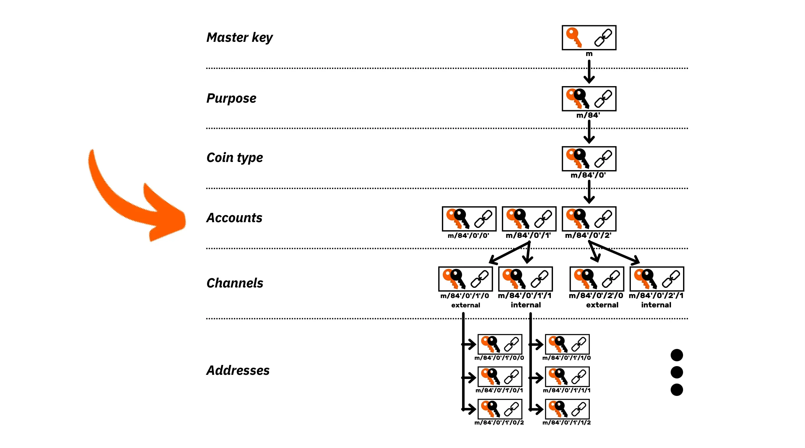


เป้าหมายการอนุพันธ์สำหรับ BIP47 ถูกระบุโดยดัชนี `47'` (`0x8000002F`), ซึ่งอ้างถึง BIP47 ตัวอย่างของเส้นทางการอนุพันธ์สำหรับรหัสการชำระเงินที่ใช้ซ้ำได้จะเป็นดังนี้:


```plaintext
m/47'/0'/0'/
```


เพื่อให้คุณเห็นภาพว่ารหัสการชำระเงินมีลักษณะอย่างไร นี่คือตัวอย่างของฉัน:


```plaintext
PM8TJSBiQmNQDwTogMAbyqJe2PE2kQXjtgh88MRTxsrnHC8zpEtJ8j7Aj628oUFk8X6P5rJ7P5qDudE4Hwq9JXSRzGcZJbdJAjM9oVQ1UKU5j2nr7VR5
```


โค้ดนี้ยังสามารถเข้ารหัสเป็น QR code ได้ ทำให้ง่ายต่อการสื่อสาร เช่นเดียวกับที่อยู่แบบดั้งเดิม


เกี่ยวกับ PayNym Bots บอทเหล่านั้นที่บางครั้งเห็นบน X (Twitter) พวกมันเป็นตัวแทนภาพของรหัสการชำระเงินที่สร้างโดย Samourai Wallet ด้วย Ashigaru พวกมันตอนนี้แตกต่างกันเล็กน้อย แต่หลักการยังคงเหมือนเดิม พวกมันถูกสร้างขึ้นผ่านฟังก์ชันแฮช ซึ่งทำให้พวกมันมีความใกล้เคียงกับความเป็นเอกลักษณ์ พวกมันปรากฏเป็นสตริงตัวอักษรขนาดเล็กที่เริ่มต้นด้วย `+` :


```plaintext
+throbbingpond8B1
+twilightresonance487
+billowingfire340
```


อวตารเหล่านี้ยังสามารถแสดงเป็นภาพได้:


แม้ว่าโรบอทเหล่านี้จะไม่มีฟังก์ชันทางเทคนิคเฉพาะภายในกรอบงาน BIP47 แต่พวกมันก็มีบทบาทในการอำนวยความสะดวกในการโต้ตอบของผู้ใช้โดยการเสนอเอกลักษณ์ทางภาพที่จดจำได้ง่าย


---
*ในส่วนต่อไปนี้ของบทนี้ที่อุทิศให้กับ BIP47 เราจะพิจารณาอย่างละเอียดถึงวิธีการทำงาน โดยเน้นเป็นพิเศษที่วิธีการเข้ารหัสที่ใช้ เพื่อให้เข้าใจคำอธิบายทางเทคนิคเหล่านี้อย่างถ่องแท้ จำเป็นต้องเข้าใจโครงสร้างของกระเป๋าเงิน HD ขั้นตอนการสร้างคีย์ และพื้นฐานของการเข้ารหัสลับแบบเส้นโค้งวงรี หากคุณต้องการเจาะลึกแนวคิดเหล่านี้ มีหลักสูตรฟรีอีกหลักสูตรหนึ่งที่มีให้บริการบน Plan ₿ Academy:*


https://planb.academy/courses/46b0ced2-9028-4a61-8fbc-3b005ee8d70f

*ฉันยังคงแนะนำให้คุณติดตามพวกเขา เพราะการเข้าใจการทำงานทางเทคนิคของ BIP47 จะทำให้คุณเข้าใจข้อเสนออื่นๆ ที่คล้ายกันได้ง่ายขึ้น ซึ่งเราจะพูดถึงในบทต่อๆ ไป*


---
### รหัสการชำระเงินที่ใช้ซ้ำได้


ตามที่กล่าวไว้ก่อนหน้านี้ รหัสการชำระเงินที่นำกลับมาใช้ใหม่ได้ตั้งอยู่ที่ความลึก 3 ของ HD wallet ทำให้สามารถเปรียบเทียบได้กับ `xpub` ทั้งในแง่ของตำแหน่งในโครงสร้าง wallet และบทบาทของมัน


รหัสการชำระเงินขนาด 80 ไบต์แบ่งออกเป็นดังนี้:


- ไบต์ `0`: **เวอร์ชัน** สำหรับเวอร์ชันแรกของ BIP47 ไบต์นี้ถูกตั้งค่าเป็น `0x01`
- ไบต์ `1`: **บิตฟิลด์** พื้นที่นี้สงวนไว้สำหรับการรวมสัญญาณเพิ่มเติมสำหรับการใช้งานเฉพาะ สำหรับการใช้งาน PayNym แบบคลาสสิก ไบต์นี้ถูกตั้งค่าเป็น `0x00`
- ไบต์ `2`: ความเท่าเทียมของ `y` ไบต์นี้คือ `0x02` หรือ `0x03` ซึ่งบ่งบอกว่าแกนตั้งของคีย์สาธารณะเป็นเลขคู่หรือเลขคี่ เนื่องจากมีการใช้คีย์สาธารณะแบบบีบอัด
- ตั้งแต่ไบต์ `3` ถึงไบต์ `34`: ค่าของ `x` ไบต์เหล่านี้แสดงถึงแกน x ของคีย์สาธารณะ การรวมกันของ `x` และความสมมาตรของ `y` จะสร้างคีย์สาธารณะที่ถูกบีบอัดอย่างสมบูรณ์
- จากไบต์ `35` ถึงไบต์ `66`: สตริง **code** พื้นที่นี้มีสตริงโค้ดที่เชื่อมโยงกับคีย์สาธารณะ
- จากไบต์ `67` ถึงไบต์ `79`: **การเติมช่องว่าง** พื้นที่นี้ถูกจัดเตรียมไว้สำหรับการพัฒนาในอนาคต ในเวอร์ชันปัจจุบัน เราเพียงแค่วางเลขศูนย์ที่นี่เพื่อให้ได้ขนาด 80 ไบต์ที่จำเป็นสำหรับการส่งออก `OP_RETURN`


นี่คือการแสดงผลในรูปแบบเลขฐานสิบหกของรหัสการชำระเงินที่นำกลับมาใช้ใหม่ได้ของฉันที่ได้นำเสนอในส่วนก่อนหน้า:


```plaintext
0x010002a0716529bae6b36c5c9aa518a52f9c828b46ad8d907747f0d09dcd4d9a39e97c3c5f37c470c390d842f364086362f6122f412e2b0c7e7fc6e32287e364a7a36a00000000000000000000000000
```


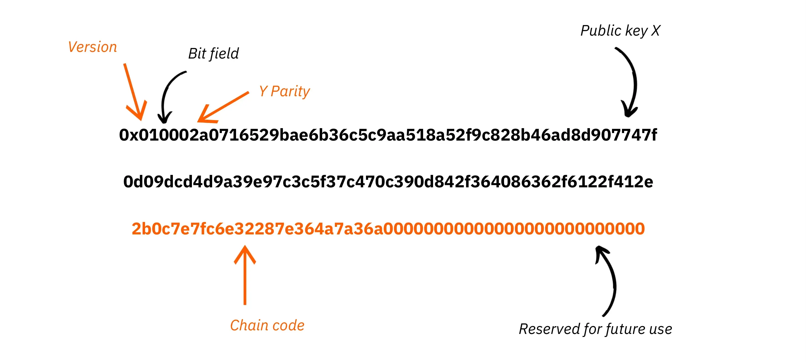


ถัดไป ต้องเพิ่มไบต์นำหน้า `P` ที่จุดเริ่มต้นเพื่อระบุอย่างชัดเจนว่านี่คือรหัสการชำระเงิน ไบต์นี้แสดงด้วย `0x47`:


```plaintext
0x47010002a0716529bae6b36c5c9aa518a52f9c828b46ad8d907747f0d09dcd4d9a39e97c3c5f37c470c390d842f364086362f6122f412e2b0c7e7fc6e32287e364a7a36a00000000000000000000000000
```


ในที่สุด เพื่อให้มั่นใจในความถูกต้องของรหัสการชำระเงิน จะมีการคำนวณเช็คซัมโดยใช้ `HASH256` ซึ่งประกอบด้วยการแฮชสองครั้งโดยใช้ฟังก์ชัน `SHA256` จากนั้นไบต์สี่ตัวแรกของแฮชนี้จะถูกต่อท้ายที่ส่วนท้ายของรหัสการชำระเงิน:


```plaintext
0x47010002a0716529bae6b36c5c9aa518a52f9c828b46ad8d907747f0d09dcd4d9a39e97c3c5f37c470c390d842f364086362f6122f412e2b0c7e7fc6e32287e364a7a36a00000000000000000000000000567080c4
```


เมื่อขั้นตอนเหล่านี้เสร็จสิ้น รหัสการชำระเงินก็พร้อม สิ่งที่เหลืออยู่คือการแปลงเป็นฐาน 58 เพื่อให้ได้เวอร์ชันสุดท้าย:


```plaintext
PM8TJSBiQmNQDwTogMAbyqJe2PE2kQXjtgh88MRTxsrnHC8zpEtJ8j7Aj628oUFk8X6P5rJ7P5qDudE4Hwq9JXSRzGcZJbdJAjM9oVQ1UKU5j2nr7VR5
```


ในกระบวนการสร้างรหัสการชำระเงิน เราใช้คีย์สาธารณะที่ถูกบีบอัดและรหัสสตริง ทั้งสองถูกสร้างขึ้นอย่างมีลำดับขั้นและกำหนดแน่นอนจาก wallet seed เส้นทางการอนุพันธ์ที่ใช้เพื่อให้ได้มาคือ:


```plaintext
m/47'/0'/0'/
```


ในแง่ที่เป็นรูปธรรม, สำหรับ generate คีย์สาธารณะที่ถูกบีบอัดและรหัสสตริงที่เกี่ยวข้องกับรหัสการชำระเงินที่ใช้ซ้ำได้, เราเริ่มต้นด้วยการคำนวณคีย์ส่วนตัวหลักจาก wallet seed. จากนั้นเราดำเนินการสร้างคู่คีย์ลูกโดยใช้ดัชนี `47 + 2^31` (การสร้างแบบแข็ง). ตามด้วยการสร้างคู่คีย์ลูกต่อเนื่องกันสองครั้ง, แต่ละครั้งใช้ดัชนี `2^31` (การสร้างแบบแข็ง).


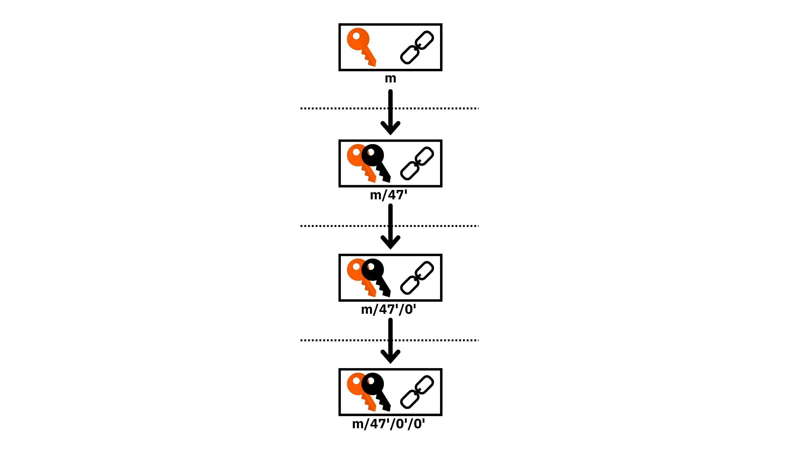


### การแลกเปลี่ยนกุญแจ Diffie-Hellman บนเส้นโค้งวงรี (ECDH)


โปรโตคอลการเข้ารหัสที่เป็นหัวใจของ BIP47 เป็นที่รู้จักกันในชื่อย่อ ECDH ซึ่งย่อมาจาก *Elliptic-Curve Diffie-Hellman* วิธีนี้เป็นรูปแบบหนึ่งของการแลกเปลี่ยนกุญแจ Diffie-Hellman ดั้งเดิม


เปิดตัวในปี 1976 โปรโตคอลการตกลงคีย์ Diffie-Hellman ช่วยให้สองฝ่าย ซึ่งแต่ละฝ่ายมีคู่คีย์ (สาธารณะและส่วนตัว) สามารถตกลงในความลับร่วมกันได้ แม้จะสื่อสารผ่านช่องทางสาธารณะที่ไม่ปลอดภัยก็ตาม


ความลับที่ใช้ร่วมกันนี้ (ในกรณีนี้คือกุญแจสีน้ำเงิน) สามารถใช้สำหรับการดำเนินการอื่น ๆ ได้ โดยทั่วไปแล้ว ความลับที่ใช้ร่วมกันนี้สามารถใช้ในการเข้ารหัสและถอดรหัสการสื่อสารบนเครือข่ายที่ไม่ปลอดภัย:


ในการบรรลุเป้าหมายนี้ Diffie-Hellman ใช้เลขคณิตโมดูลาร์ในการคำนวณความลับที่ใช้ร่วมกัน นี่คือวิธีการทำงานในภาษาที่เข้าใจง่าย:


- Alice และ Bob ตกลงกันในเรื่องสีที่เหมือนกัน ซึ่งในกรณีนี้คือสีเหลือง ซึ่งเป็นข้อมูลสาธารณะ (ผู้โจมตีรู้สีนี้)
- Alice เลือกสีลับ ซึ่งในกรณีนี้คือสีแดง และผสมทั้งสองสีเพื่อให้ได้สีส้ม
- Bob ยังเลือกสีลับ ซึ่งในกรณีนี้คือสีน้ำเงิน และผสมกับสีเหลืองเพื่อให้ได้สีเขียว
- จากนั้นพวกเขาแลกเปลี่ยนสีที่ได้, สีส้มและสีเขียว. การแลกเปลี่ยนนี้สามารถเกิดขึ้นได้บนเครือข่ายที่ไม่ปลอดภัยและถูกสังเกตโดยผู้โจมตี.
- โดยการผสมสีเขียวของ Bob กับสีลับเฉพาะของเธอเอง Alice จะได้สีน้ำตาล
- Bob ทำเช่นเดียวกับสีส้มและสีฟ้าลับของ Alice ก็ได้สีน้ำตาลเช่นกัน


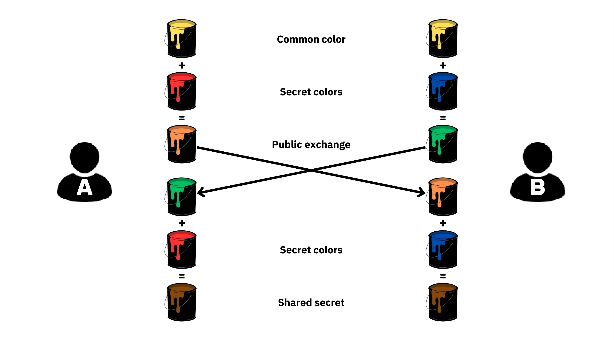


ในอุปมาอุปไมยนี้ สีสีน้ำตาลแทนความลับที่แชร์ระหว่าง Alice และ Bob ลองจินตนาการว่า ในความเป็นจริงแล้ว มันเป็นไปไม่ได้ที่ผู้โจมตีจะแยกสีส้มและสีเขียวออกจากกัน เพื่อค้นหาสีลับของ Alice หรือ Bob


ตอนนี้เรามาดูกันว่าโปรโตคอลนี้ทำงานอย่างไร ไม่ใช่ด้วยการเปรียบเทียบสี แต่ใช้ตัวเลขจริงและเลขคณิตแบบโมดูลาร์!


ก่อนที่เราจะเข้าสู่กลไกของ Diffie-Hellman ขอให้ฉันเตือนคุณสั้น ๆ เกี่ยวกับแนวคิดทางคณิตศาสตร์ที่จำเป็นสองประการที่เราจะต้องใช้:


- **จำนวนเฉพาะ** คือจำนวนธรรมชาติที่มีตัวหารเพียงสองตัวเท่านั้น: $1$ และตัวมันเอง ตัวอย่างเช่น $7$ เป็นจำนวนเฉพาะเพราะมันสามารถหารได้เฉพาะด้วย $1$ และ $7$ ในทางกลับกัน $8$ ไม่ใช่จำนวนเฉพาะ เนื่องจากมันสามารถหารได้ด้วย $1$, $2$, $4$, และ $8$ ดังนั้นมันจึงมีตัวหารจำนวนเต็มบวกสี่ตัวแทนที่จะเป็นสองตัว
- **โมดูลัส** (เขียนเป็น $mod$ หรือ $\%$) เป็นการดำเนินการทางคณิตศาสตร์ซึ่งระหว่างจำนวนเต็มสองจำนวน จะคืนค่าที่เหลือจากการหารแบบยุคลิดของจำนวนแรกด้วยจำนวนที่สอง ตัวอย่างเช่น $16\bmod 5 = $1$.


**การแลกเปลี่ยนกุญแจ Diffie-Hellman ระหว่าง Alice และ Bob เกิดขึ้นดังนี้:**


- Alice และ Bob ตกลงกันในสองตัวเลขที่เหมือนกัน: $p$ และ $g$. $p$ เป็นจำนวนเฉพาะ และยิ่งค่าของ $p$ ใหญ่เท่าไร อัลกอริทึม Diffie-Hellman ก็จะยิ่งปลอดภัยมากขึ้นเท่านั้น $g$ เป็นรากปฐมภูมิของ $p$ ตัวเลขสองตัวนี้สามารถสื่อสารกันได้อย่างเปิดเผยบนเครือข่ายที่ไม่ปลอดภัย พวกมันแทนค่าของ **สีเหลือง** ในการเปรียบเทียบก่อนหน้านี้ ดังนั้นจึงเป็นสิ่งสำคัญที่ Alice และ Bob จะต้องใช้ค่าเดียวกันสำหรับ $p$ และ $g$.
- เมื่อกำหนดพารามิเตอร์เหล่านี้แล้ว Alice และ Bob แต่ละคนจะเลือกหมายเลขสุ่มลับ Alice ตั้งชื่อหมายเลขสุ่มลับของเธอว่า $a$ (เทียบเท่ากับ **สีแดง**) และ Bob ตั้งชื่อหมายเลขของเขาว่า $b$ (เทียบเท่ากับ **สีน้ำเงิน**) หมายเลขเหล่านี้ต้องคงความลับไว้
- แทนที่จะแลกเปลี่ยนตัวเลข $a$ และ $b$ โดยตรง แต่ละฝ่ายคำนวณ $A$ และ $B$ ดังนี้:


$A$ เท่ากับ $g$ ยกกำลัง $a$ โมดูโล $p$:


$$
A = g^a \bmod p
$$


$B$ เท่ากับ $g$ ยกกำลัง $b$ โมดูโล $p$:


$$
B = g^b \bmod p
$$


- ค่าต่างๆ $A$ (เทียบเท่ากับ **สีส้ม**) และ $B$ (เทียบเท่ากับ **สีเขียว**) ถูกแลกเปลี่ยนระหว่างสองฝ่าย การแลกเปลี่ยนนี้สามารถเกิดขึ้นได้ในรูปแบบข้อความที่ชัดเจนบนเครือข่ายที่ไม่ปลอดภัย
- Alice, เมื่อได้รับ $B$ แล้ว คำนวณค่าของ $z$ ดังนี้:


$z$ เท่ากับ $B$ ยกกำลัง $a$ โมดูโล $p$:


$$
z = B^a \bmod p
$$


การแจ้งเตือน:


$$
B = g^b \bmod p
$$


ผลลัพธ์คือ:


$$
z = B^a \bmod p
$$


$$
z = (g^b)^a \bmod p
$$


โดยการใช้กฎของเลขชี้กำลัง:


$$
(x^n)^m = x^{nm}
$$


ผลลัพธ์คือ:


$$
z = g^{ba} \bmod p
$$


- จากฝั่งของเขา Bob เมื่อได้รับ $A$ แล้ว ก็จะคำนวณค่าของ $z$ ดังนี้:


$z$ เท่ากับ $A$ ยกกำลัง $b$ โมดูโล $p$:


$$
z = A^b \bmod p
$$


ผลลัพธ์คือ:


$$
z = (g^a)^b \bmod p
$$


$$
z = g^{ab} \bmod p
$$


$$
z = g^{ba} \bmod p
$$


ด้วยคุณสมบัติการกระจายของตัวดำเนินการโมดูโล Alice และ Bob ได้รับค่า $z$ ที่เหมือนกันทุกประการ ตัวเลขนี้แสดงถึงความลับร่วมกันของพวกเขา ซึ่งเทียบเท่ากับ **สีสีน้ำตาล** ในการเปรียบเทียบก่อนหน้านี้กับกระป๋องสี ตอนนี้พวกเขาสามารถใช้ความลับร่วมกันนี้ในการเข้ารหัสการสื่อสารของพวกเขาแบบสมมาตรผ่านเครือข่ายที่ไม่ปลอดภัยได้แล้ว


ผู้โจมตี แม้จะมี $p$, $g$, $A$, และ $B$ (ค่าที่เปิดเผยต่อสาธารณะ) ก็จะไม่สามารถคำนวณ $a$, $b$, หรือ $z$ (ค่าที่เป็นส่วนตัว) ได้ เพื่อให้ทำเช่นนี้ได้ การยกกำลังจะต้องถูกย้อนกลับ ซึ่งเป็นการดำเนินการที่เป็นไปไม่ได้หากไม่ลองทุกความเป็นไปได้ทีละหนึ่ง เนื่องจากมันเท่ากับการคำนวณลอการิทึมเชิงเส้นฐานดุลยภาพ นั่นคือ การหาผลกลับของการยกกำลังในกลุ่มเชิงวงจรที่จำกัด


ดังนั้น ตราบใดที่ค่าของ $a$, $b$, และ $p$ มีขนาดใหญ่เพียงพอ โปรโตคอล Diffie-Hellman ก็จะปลอดภัย โดยทั่วไปแล้ว ด้วยพารามิเตอร์ขนาด 2048 บิต (ตัวเลขฐานสิบ 600 หลัก) การทดสอบความเป็นไปได้ทั้งหมดสำหรับ $a$ และ $b$ จะเป็นเรื่องที่ไม่สามารถทำได้ จนถึงปัจจุบัน ด้วยตัวเลขเช่นนี้ อัลกอริทึมนี้ถือว่าปลอดภัย


นี่คือข้อเสียหลักของโปรโตคอล Diffie-Hellman เพื่อให้ปลอดภัย อัลกอริธึมต้องใช้ตัวเลขขนาดใหญ่ นั่นเป็นเหตุผลว่าทำไมทุกวันนี้เราถึงนิยมใช้อัลกอริธึม ECDH (*Elliptic Curve Diffie-Hellman*) ซึ่งเป็นรูปแบบหนึ่งของ Diffie-Hellman ที่อิงตามเส้นโค้งพีชคณิต โดยเฉพาะเส้นโค้งวงรี วิธีการนี้ช่วยให้สามารถทำงานกับตัวเลขที่เล็กลงอย่างมากในขณะที่ยังคงรักษาความปลอดภัยเทียบเท่า จึงลดทรัพยากรที่ต้องใช้ในการคำนวณและการจัดเก็บ


หลักการทั่วไปของอัลกอริธึมยังคงเหมือนเดิม อย่างไรก็ตาม แทนที่จะใช้ตัวเลขสุ่ม $a$ และตัวเลข $A$ ที่คำนวณจาก $a$ โดยการยกกำลังแบบโมดูลาร์ เราใช้คู่ของกุญแจที่สร้างขึ้นบนเส้นโค้งวงรี แทนที่จะพึ่งพาการกระจายของตัวดำเนินการโมดูลาร์ เราใช้กฎของกลุ่มบนเส้นโค้งวงรี และที่สำคัญกว่านั้นคือสมบัติการเชื่อมโยง


เพื่ออธิบายหลักการของการเข้ารหัสบนเส้นโค้งวงรีอย่างย่อ กุญแจส่วนตัวจะแสดงด้วยตัวเลขสุ่มระหว่าง $1$ และ $n-1$ โดยที่ $n$ แทนลำดับของเส้นโค้ง ในทางกลับกัน กุญแจสาธารณะคือจุดเฉพาะบนเส้นโค้งนี้ ซึ่งได้มาจากกุญแจส่วนตัวโดยการบวกและการทวีคูณจุดจากจุดกำเนิด ตามสมการ:


$$
K = k \cdot G
$$


ในสูตรนี้ $K$ แทนคีย์สาธารณะ, $k$ แทนคีย์ส่วนตัว, และ $G$ แทนจุดกำเนิด


คุณสมบัติที่สำคัญของคีย์เหล่านี้คือความง่ายดายที่สามารถคำนวณ $K$ จาก $k$ และ $G$ ในขณะที่แทบจะเป็นไปไม่ได้ที่จะหาค่า $k$ จาก $K$ และ $G$ ความไม่สมมาตรนี้สร้างฟังก์ชันทางเดียว กล่าวอีกนัยหนึ่งคือการคำนวณคีย์สาธารณะนั้นง่ายหากคุณรู้คีย์ส่วนตัว แต่การดึงคีย์ส่วนตัวจากคีย์สาธารณะนั้นเป็นไปไม่ได้ ความปลอดภัยนี้ยังได้รับการสนับสนุนเพิ่มเติมจากความยากลำบากในการคำนวณลอการิทึมไม่ต่อเนื่อง


เราจะใช้คุณสมบัตินี้ในการปรับอัลกอริทึม Diffie-Hellman ของเรา **หลักการทำงานของ ECDH มีดังนี้:**


- Alice และ Bob ตกลงกันในเรื่องเส้นโค้งวงรีที่ปลอดภัยทางการเข้ารหัสและพารามิเตอร์ของมัน ข้อมูลนี้เป็นสาธารณะ
- Alice สร้างตัวเลขสุ่ม $ka$ ซึ่งจะเป็นกุญแจส่วนตัวของเธอ กุญแจส่วนตัวนี้ต้องเก็บเป็นความลับ เธอกำหนดกุญแจสาธารณะของเธอ $Ka$ โดยการบวกและการคูณสองจุดบนเส้นโค้งวงรีที่เลือก:


$$
K_a = k_a \cdot G
$$


- Bob ยังสร้างตัวเลขสุ่ม $kb$ ซึ่งจะเป็นกุญแจส่วนตัวของเขา เขาคำนวณกุญแจสาธารณะที่เกี่ยวข้อง $Kb$:


$$
K_b = k_b \cdot G
$$


- Alice และ Bob แลกเปลี่ยนกุญแจสาธารณะของพวกเขา $Ka$ และ $Kb$ บนเครือข่ายสาธารณะที่ไม่ปลอดภัย
- Alice คำนวณจุด $(x,y)$ บนเส้นโค้งโดยใช้กุญแจส่วนตัวของเธอ $ka$ กับกุญแจสาธารณะของ Bob $Kb$:


$$
(x,y) = k_a \cdot K_b
$$


- Bob คำนวณจุด $(x,y)$ บนเส้นโค้งโดยใช้กุญแจส่วนตัวของเขา $kb$ กับกุญแจสาธารณะของ Alice $Ka$:


$$
(x,y) = k_b \cdot K_a
$$


- Alice และ Bob ได้รับจุดเดียวกันบนเส้นโค้งวงรี ความลับที่ใช้ร่วมกันจะเป็นพิกัด $x$ ของจุดนี้


พวกเขาได้รับความลับที่ใช้ร่วมกันเดียวกันเพราะ:


$$
(x,y) = k_a \cdot K_b = k_a \cdot (k_b \cdot G) = (k_a \cdot k_b) \cdot G = (k_b \cdot k_a) \cdot G = k_b \cdot (k_a \cdot G) = k_b \cdot K_a
$$


ผู้โจมตีที่มีศักยภาพที่สังเกตเครือข่ายสาธารณะที่ไม่มีการรักษาความปลอดภัยจะสามารถรับได้เพียงคีย์สาธารณะของแต่ละบุคคลและพารามิเตอร์ของเส้นโค้งวงรีที่เลือกไว้เท่านั้น ดังที่อธิบายไว้ข้างต้น ข้อมูลนี้เพียงอย่างเดียวไม่เพียงพอที่จะกำหนดคีย์ส่วนตัวได้ ดังนั้น ผู้โจมตีไม่สามารถหาความลับที่แชร์ระหว่าง Alice และ Bob ได้


ECDH จึงเป็นอัลกอริธึมการแลกเปลี่ยนกุญแจ มักใช้ร่วมกับวิธีการเข้ารหัสอื่น ๆ เพื่อสร้างโปรโตคอลที่สมบูรณ์ ตัวอย่างเช่น ECDH เป็นหัวใจสำคัญของ TLS (*Transport Layer Security*), โปรโตคอลการเข้ารหัสและการตรวจสอบที่ใช้สำหรับเลเยอร์การขนส่งของอินเทอร์เน็ต TLS ใช้ ECDHE สำหรับการแลกเปลี่ยนกุญแจ ซึ่งเป็นรูปแบบหนึ่งของ ECDH ที่กุญแจเป็นแบบชั่วคราว เพื่อให้ความลับคงอยู่ นอกจากนี้ TLS ยังใช้การตรวจสอบอัลกอริธึม เช่น ECDSA, อัลกอริธึมการเข้ารหัส รวมถึง AES และฟังก์ชันแฮช เช่น SHA-256


TLS รับผิดชอบต่อ `s` ใน `https` และรูปกุญแจในแถบที่อยู่ของเบราว์เซอร์ของคุณ - สัญลักษณ์ของการสื่อสารที่เข้ารหัส โดยการเข้าร่วมหลักสูตรนี้ คุณจะได้ใช้ ECDH และมีความเป็นไปได้สูงที่คุณจะใช้มันในชีวิตประจำวันโดยที่คุณไม่รู้ตัวเลย


### การทำธุรกรรมการแจ้งเตือน


ตามที่เราเห็นในส่วนก่อนหน้า ECDH เป็นรูปแบบหนึ่งของการแลกเปลี่ยน Diffie-Hellman โดยใช้คู่กุญแจที่สร้างขึ้นบนเส้นโค้งวงรี โชคดีที่เรามีคู่กุญแจหลายคู่ที่สอดคล้องกับมาตรฐานนี้ในกระเป๋าเงิน Bitcoin ของเรา แนวคิดของ BIP47 คือการใช้คู่กุญแจของกระเป๋าเงิน Bitcoin แบบกำหนดลำดับชั้นของทั้งสองฝ่ายเพื่อสร้างความลับชั่วคราวที่ใช้ร่วมกันระหว่างพวกเขา BIP47 ใช้ ECDHE (*Elliptic Curve Diffie-Hellman **Ephemeral***) แทน


ECDHE ถูกใช้ครั้งแรกใน BIP47 เพื่อส่งรหัสการชำระเงินจากผู้ส่งไปยังผู้รับ นี่คือ **ธุรกรรมการแจ้งเตือน** ที่มีชื่อเสียง ขั้นตอนนี้มีความสำคัญเนื่องจากสำหรับ BIP47 ที่จะทำงานได้อย่างมีประสิทธิภาพ ฝ่ายที่เกี่ยวข้อง (ผู้ส่งและผู้รับ) จำเป็นต้องรู้รหัสการชำระเงินของกันและกัน ความรู้นี้ช่วยให้สามารถสร้างกุญแจสาธารณะชั่วคราวและที่อยู่รับที่ว่างเปล่าที่เกี่ยวข้องได้


ก่อนการแลกเปลี่ยนนี้ ผู้ส่งจะทราบรหัสการชำระเงินของผู้รับอยู่แล้วตามหลักการ โดยอาจได้รับรหัสนั้น เช่น off-chain จากเว็บไซต์ ใบแจ้งหนี้ หรือเครือข่ายสังคม อย่างไรก็ตาม ผู้รับอาจไม่ทราบรหัสการชำระเงินของผู้ส่ง แต่รหัสนี้จำเป็นต้องถูกส่งไปยังเขา มิฉะนั้นเขาจะไม่สามารถสร้างกุญแจชั่วคราวที่จำเป็นในการระบุที่อยู่ที่บิตคอยน์ของเขาถูกเก็บไว้หรือเข้าถึงเงินทุนของเขาได้ แม้ว่าการส่งรหัสของผู้ส่งสามารถทำได้ทางเทคนิค off-chain ผ่านวิธีการสื่อสารอื่น ๆ แต่จะเกิดปัญหาหากต้องดึงข้อมูล wallet จาก seed เท่านั้น


เนื่องจากที่อยู่ BIP47 ไม่ได้ถูกสร้างขึ้นโดยตรงจาก seed ของผู้รับเหมือนที่อยู่ทั่วไป - การใช้ `xpub` จะง่ายกว่าในกรณีนี้ - แต่เกิดจากการคำนวณที่รวมรหัสการชำระเงินสองชุด: ของผู้ส่งและผู้รับ ดังนั้น หากผู้รับสูญเสีย wallet และพยายามกู้คืนจาก seed ของตน พวกเขาจะกู้คืนรหัสการชำระเงินของตนเอง ซึ่งถูกสร้างขึ้นโดยตรงจาก seed ของพวกเขา อย่างไรก็ตาม ในการกู้คืนที่อยู่ชั่วคราว เขาจะต้องมีรหัสการชำระเงินของทุกคนที่ส่งบิตคอยน์ให้เขาผ่าน BIP47 ด้วย ดังนั้น ความสำคัญของการทำธุรกรรมแจ้งเตือนจึงอยู่ที่ความสามารถในการบันทึกข้อมูลนี้บนบล็อกเชน Bitcoin ในขณะที่ยังคงสามารถเรียกคืนได้ง่ายโดยไม่ต้องค้นหาผ่านธุรกรรมหลายพันล้านรายการที่ดำเนินการตั้งแต่เปิดตัวในปี 2009


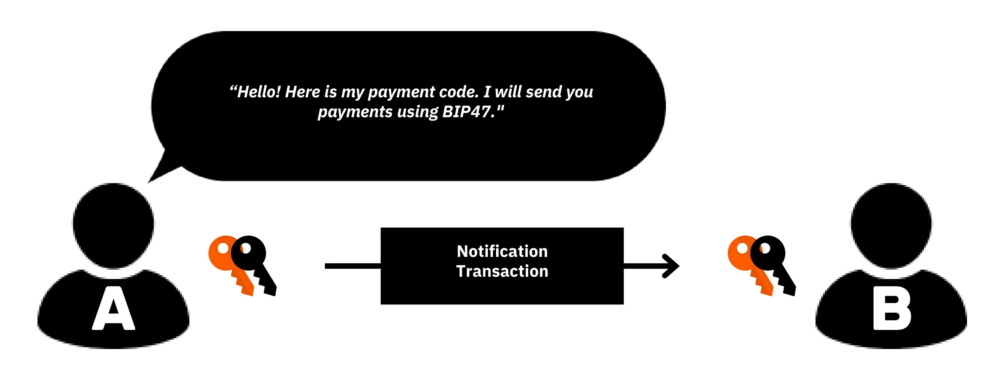


ดังนั้นจึงเป็นไปได้ที่จะใช้ BIP47 โดยไม่ต้องใช้ธุรกรรมการแจ้งเตือน โดยที่ผู้ใช้แต่ละคนเก็บสำรองรหัสการชำระเงินของเพื่อนของพวกเขาไว้ อย่างไรก็ตาม วิธีนี้พิสูจน์ได้ว่าจัดการได้ยากจนกว่าจะมีการพัฒนาโซลูชันที่ง่าย แข็งแกร่ง และมีประสิทธิภาพสำหรับการสร้าง จัดเก็บ และอัปเดตการสำรองข้อมูลเหล่านี้ ในสถานการณ์ปัจจุบัน ธุรกรรมการแจ้งเตือนแทบจะหลีกเลี่ยงไม่ได้


ในบทต่อไปนี้ เราจะพิจารณาโปรโตคอลอื่น ๆ ที่มีวัตถุประสงค์คล้ายกับ BIP47 แต่ไม่จำเป็นต้องมีการทำธุรกรรมแจ้งเตือน อย่างไรก็ตาม ทางเลือกเหล่านี้ก็มีการแลกเปลี่ยนของตัวเองเช่นกัน


นอกเหนือจากบทบาทในการบันทึกรหัสการชำระเงินแล้ว การทำธุรกรรมการแจ้งเตือนยังมีฟังก์ชันการแจ้งเตือนสำหรับผู้รับตามชื่อที่แนะนำ มันจะแจ้งเตือนลูกค้าของผู้รับว่ามีการสร้างช่องทางการชำระเงินใหม่และแนะนำให้พวกเขาติดตามที่อยู่ชั่วคราวที่เกิดขึ้น


### โมเดลความลับ BIP47


ก่อนที่จะลงรายละเอียดเกี่ยวกับการดำเนินการทางเทคนิคของการทำธุรกรรมการแจ้งเตือน สิ่งสำคัญคือต้องพูดคุยเกี่ยวกับรูปแบบความลับที่เกี่ยวข้องกับ BIP47 ซึ่งเป็นเหตุผลที่ทำให้ต้องมีการดำเนินการบางอย่างเมื่อสร้างธุรกรรมเริ่มต้นนี้


รหัสการชำระเงินเองไม่ได้แสดงถึงความเสี่ยงโดยตรงต่อความลับเฉพาะบุคคล แตกต่างจากรุ่น Bitcoin แบบดั้งเดิม ซึ่งมีเป้าหมายเพื่อทำลายความเชื่อมโยงระหว่างตัวตนของผู้ใช้และการทำธุรกรรมของพวกเขา (ซึ่งเป็นสาธารณะ) โดยการรักษาความไม่เปิดเผยตัวตนของคีย์และที่อยู่ รหัสการชำระเงินสามารถเชื่อมโยงกับตัวตนได้อย่างเปิดเผยโดยไม่ก่อให้เกิดภัยคุกคาม


เนื่องจากรหัสการชำระเงินไม่ได้ถูกใช้เพื่อสร้างที่อยู่ที่รับการชำระเงิน BIP47 โดยตรง แต่ที่อยู่เหล่านี้ถูกสร้างขึ้นผ่านการประยุกต์ใช้ ECDH ระหว่างคีย์ที่ได้มาจากรหัสการชำระเงินของทั้งสองฝ่ายที่เกี่ยวข้อง


ดังนั้น รหัสการชำระเงินในตัวมันเองไม่ได้ทำให้เกิดการสูญเสียความลับโดยตรง เนื่องจากมีเพียงที่อยู่การแจ้งเตือนที่ได้มาจากมัน แม้ว่าที่อยู่นี้สามารถเปิดเผยข้อมูลบางอย่างได้ แต่โดยทั่วไปแล้วจะไม่เปิดเผยคู่สัญญาที่คุณทำธุรกรรมด้วย เว้นแต่จะมีการวิเคราะห์เชิงลึกของห่วงโซ่ข้อมูลเกิดขึ้น จริงๆ แล้ว หากผู้ส่งใช้ UTXOs ที่สามารถเชื่อมโยงกับตัวตนของเขาเพื่อดำเนินการแจ้งเตือนการทำธุรกรรม ก็จะสามารถสรุปได้ว่าตัวตนของเขาอาจเชื่อมโยงกับการชำระเงิน BIP47 ไปยังรหัสการชำระเงินของคุณ ซึ่งจะไม่เปิดเผยการทำธุรกรรมพื้นฐาน แต่จะแสดงถึงการมีอยู่ของมันอย่างเป็นไปได้


ดังนั้นจึงจำเป็นอย่างยิ่งที่จะต้องรักษาการแยกที่เข้มงวดระหว่างรหัสการชำระเงินของผู้ใช้ ด้วยเหตุนี้ การสื่อสารรหัสครั้งแรกจึงเป็นช่วงเวลาสำคัญสำหรับการรักษาความลับของการชำระเงิน แต่ก็เป็นสิ่งจำเป็นสำหรับโปรโตคอลในการทำงานอย่างถูกต้อง หากรหัสการชำระเงินรหัสหนึ่งสามารถเข้าถึงได้สาธารณะ (เช่นบนเว็บไซต์) รหัสที่สองซึ่งเป็นของผู้ส่งจะต้องไม่เชื่อมโยงกับรหัสแรกในทุกกรณี


ลองมาดูตัวอย่างที่ชัดเจน: ฉันต้องการบริจาคให้กับขบวนการทางการเมืองผ่าน BIP47:


- องค์กรได้เปิดเผยรหัสการชำระเงินบนเว็บไซต์หรือผ่านทางเครือข่ายสังคมออนไลน์ของตน
- รหัสนี้จึงเชื่อมโยงกับการเคลื่อนไหวทางการเมือง
- ฉันได้รับรหัสการชำระเงินนี้
- ก่อนส่ง ฉันต้องแน่ใจว่าพวกเขารู้รหัสการชำระเงินของฉันเอง ซึ่งเชื่อมโยงกับตัวตนของฉันด้วย เนื่องจากฉันใช้มันเพื่อรับธุรกรรมบนเครือข่ายสังคมของฉัน


ฉันจะส่งต่อรหัสของฉันโดยไม่มีความเสี่ยงได้อย่างไร? การใช้วิธีการสื่อสารแบบดั้งเดิมอาจนำไปสู่การรั่วไหลของข้อมูล และทำให้ฉันเชื่อมโยงกับการเคลื่อนไหวทางการเมืองนี้ การทำธุรกรรมการแจ้งเตือนเสนอทางออก ด้วยชั้นการเข้ารหัสที่ป้องกันการเชื่อมโยงระหว่างสองรหัส แม้ว่ามันจะไม่ใช่วิธีเดียวในการส่งรหัสการชำระเงินของผู้ส่งอย่างลับๆ แต่มันก็เป็นวิธีที่มีประสิทธิภาพมาก


ในแผนภาพด้านล่าง เส้นสีส้มแสดงถึงจุดที่การไหลของข้อมูลต้องถูกขัดจังหวะ และลูกศรสีดำแสดงการเชื่อมต่อที่อาจถูกสังเกตโดยบุคคลที่สาม:


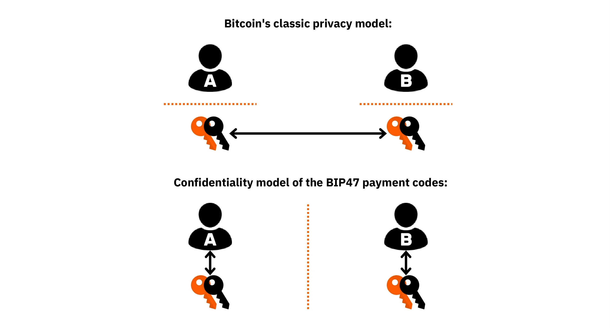


ในความเป็นจริงแล้ว โมเดลความลับแบบดั้งเดิมของ Bitcoin มักทำให้การแยกการไหลของข้อมูลระหว่างคู่กุญแจและผู้ใช้งานเป็นเรื่องซับซ้อน โดยเฉพาะในการทำธุรกรรมระยะไกล ตัวอย่างเช่น ในบริบทของแคมเปญการบริจาค ผู้รับจำเป็นต้องเปิดเผยที่อยู่หรือกุญแจสาธารณะบนเว็บไซต์หรือเครือข่ายสังคม การใช้ BIP47 อย่างถูกต้อง โดยเฉพาะกับการทำธุรกรรมแจ้งเตือน ช่วยให้สามารถแก้ปัญหานี้ได้ผ่าน ECDHE และชั้นการเข้ารหัสที่เราจะตรวจสอบในภายหลัง


แน่นอนว่า โมเดลความลับคลาสสิกของ Bitcoin ยังคงใช้กับคีย์สาธารณะชั่วคราว ซึ่งได้มาจากการรวมกันของรหัสการชำระเงินสองชุด โมเดลทั้งสองนี้จริง ๆ แล้วเป็นแบบเสริมกัน สิ่งที่ฉันต้องการเน้นที่นี่คือ แตกต่างจากการใช้คีย์สาธารณะตามปกติเพื่อรับ Bitcoins รหัสการชำระเงินสามารถเชื่อมโยงกับตัวตนเฉพาะได้ เนื่องจากข้อมูล "_Alice กำลังทำธุรกรรมกับ Bob_" ถูกทำลายที่อีกขั้นตอนหนึ่ง รหัสการชำระเงินถูกใช้กับที่อยู่การชำระเงิน generate แต่จากการสังเกตบล็อกเชนเพียงอย่างเดียว เป็นไปไม่ได้ที่จะเชื่อมโยงการทำธุรกรรมการชำระเงิน BIP47 กับรหัสการชำระเงินที่ใช้ในการดำเนินการ เว้นแต่ UTXOs ที่เกี่ยวข้องจะถูกเชื่อมโยงกับตัวตนมาก่อนแล้ว และผู้ใช้ได้เชื่อมโยงรหัสการชำระเงินของพวกเขากับตัวตนที่เกี่ยวข้องของพวกเขา


โดยสรุปแล้ว โมเดลความลับที่เสนอโดยการชำระเงิน BIP47 อาจถือว่าดีกว่าโมเดลพื้นฐานของ Bitcoin แม้ว่านี่จะไม่ได้หมายความว่ามันเป็นเวทมนตร์ก็ตาม


### กำลังสร้างธุรกรรมการแจ้งเตือน


ตอนนี้มาดูกันว่าการทำธุรกรรมการแจ้งเตือนนี้ทำงานอย่างไร ลองจินตนาการว่า Alice ต้องการส่งเงินไปยัง Bob โดยใช้ BIP47 ในตัวอย่างของฉัน Alice ทำหน้าที่เป็นผู้ส่งและ Bob เป็นผู้รับ Bob ได้เผยแพร่รหัสการชำระเงินของเขาบนเว็บไซต์ของเขา ดังนั้น Alice จึงรู้รหัสการชำระเงินของ Bob อยู่แล้ว


**1- Alice คำนวณความลับร่วมกับ ECDH:**


- เธอเลือกคู่คีย์จาก HD wallet ในสาขาที่แตกต่างจากรหัสการชำระเงินของเธอ โปรดทราบว่าคู่คีย์นี้ต้องไม่สามารถเชื่อมโยงได้ง่ายกับที่อยู่การแจ้งเตือนของ Alice หรือกับตัวตนของ Alice (ดูส่วนก่อนหน้า);
- Alice เลือกกุญแจส่วนตัวสำหรับคู่นี้ เราเรียกมันว่า $a$ (ตัวพิมพ์เล็ก);


$$
a
$$


- Alice ดึงคีย์สาธารณะที่เชื่อมโยงกับที่อยู่การแจ้งเตือนของ Bob คีย์นี้เป็นลูกตัวแรกที่ได้มาจากรหัสการชำระเงินของ Bob (ดัชนี $/0$) เราเรียกคีย์สาธารณะนี้ว่า $B$ (ตัวพิมพ์ใหญ่) คีย์ส่วนตัวที่เชื่อมโยงกับคีย์สาธารณะนี้ถูกระบุเป็น $b$ (ตัวพิมพ์เล็ก) $B$ ถูกกำหนดโดยการบวกและการเพิ่มสองเท่าของจุดบนเส้นโค้งวงรีจาก $G$ (จุดกำเนิด) กับ $b$ (คีย์ส่วนตัว):


$$ B = b \cdot G $$


- Alice คำนวณจุดลับ $S$ (ตัวพิมพ์ใหญ่) บนเส้นโค้งวงรีโดยการบวกและการเพิ่มจุดเป็นสองเท่า ใช้กุญแจส่วนตัวของเธอ $a$ จากกุญแจสาธารณะของ Bob $B$


$$ S = a \cdot B $$


- Alice คำนวณตัวประกอบการบังตา $f$ ที่จะใช้ในการเข้ารหัสรหัสการชำระเงินของเธอ เพื่อให้บรรลุเป้าหมายนี้ เธอใช้ฟังก์ชัน HMAC-SHA512 เพื่อ generate หมายเลขสุ่มเทียม อินพุตที่สองของฟังก์ชันนี้คือค่าที่มีเพียง Bob เท่านั้นที่จะสามารถค้นหาได้: $x$ ซึ่งเป็นพิกัด x ของจุดลับที่คำนวณไว้ข้างต้น อินพุตแรกคือ $o$ ซึ่งเป็น UTXO ที่ใช้เป็นอินพุตสำหรับธุรกรรมนี้ (outpoint)


$$ f = \text{HMAC-SHA512}(o, x) $$


**2 - Alice แปลงรหัสการชำระเงินส่วนตัวของเธอเป็นฐาน 2 (ไบนารี) **


**3- มันใช้ปัจจัยการบังตานี้เป็นกุญแจในการเข้ารหัสแบบสมมาตรบนเพย์โหลดของรหัสการชำระเงินของมัน** อัลกอริธึมการเข้ารหัสที่ใช้คือ `XOR` การดำเนินการที่ทำเปรียบได้กับรหัสเวอร์นัม หรือที่รู้จักกันในชื่อ "One-Time Pad"


- Alice แบ่งปัจจัยการทำให้ตาบอดของเธอออกเป็นสองส่วน: 32 ไบต์แรกถูกตั้งชื่อว่า $f1$ และ 32 ไบต์สุดท้ายถูกตั้งชื่อว่า $f2$ ซึ่งทำให้เราได้:


$$ f = f1 || f2 $$


- Alice คำนวณรหัส $x'$ ของพิกัด $x$ ของคีย์สาธารณะของรหัสการชำระเงินของเธอ และรหัส $c'$ ของรหัสสตริง $c$ แยกกัน $f1$ และ $f2$ ทำหน้าที่เป็นคีย์รหัสลับตามลำดับ การดำเนินการที่ใช้คือ `XOR` (หรือ exclusive)


$$ x' = x \oplus f1 $$


$$ c' = c \oplus f2 $$


- Alice แทนที่ค่าจริงของพิกัดกุญแจสาธารณะ $x$ และรหัสสตริง $c$ ในรหัสการชำระเงินของเธอด้วยค่าที่เข้ารหัส $x'$ และ $c'$


**4-** Alice จึงมีรหัสการชำระเงินของเธอพร้อมกับ payload ที่เข้ารหัสในปัจจุบัน เธอจะสร้างและกระจายธุรกรรมที่เกี่ยวข้องกับกุญแจสาธารณะของเธอ $A$ เป็นอินพุต, เอาต์พุตไปยังที่อยู่การแจ้งเตือนของ Bob, และเอาต์พุต `OP_RETURN` ที่ประกอบด้วยรหัสการชำระเงินของเธอพร้อมกับ payload ที่เข้ารหัส **ธุรกรรมนี้ทำหน้าที่เป็นธุรกรรมการแจ้งเตือน**


`OP_RETURN` เป็นรหัสปฏิบัติการที่ทำเครื่องหมายผลลัพธ์ของธุรกรรม Bitcoin ว่าไม่ถูกต้อง ปัจจุบันใช้เพื่อกระจายหรือยึดข้อมูลบนบล็อกเชน Bitcoin สามารถจัดเก็บข้อมูลได้สูงสุด 80 ไบต์ ซึ่งจะถูกเขียนลงในเชนและมองเห็นได้สำหรับผู้ใช้รายอื่นทั้งหมด


ตามที่เราได้เห็นในส่วนก่อนหน้านี้ ECDH ถูกใช้เพื่อ generate ความลับที่ใช้ร่วมกันระหว่างผู้ใช้สองคนที่สื่อสารผ่านเครือข่ายที่ไม่ปลอดภัย ซึ่งอาจถูกสังเกตโดยผู้โจมตีได้ ใน BIP47 ECDH ถูกใช้เพื่อสื่อสารบนเครือข่าย Bitcoin ซึ่งโดยธรรมชาติแล้วเป็นเครือข่ายการสื่อสารที่โปร่งใสและถูกสังเกตโดยผู้โจมตีหลายคน ความลับที่ใช้ร่วมกันที่คำนวณผ่านการแลกเปลี่ยนกุญแจ ECDH จะถูกใช้เพื่อเข้ารหัสข้อมูลลับที่จะส่ง โดยเฉพาะรหัสการชำระเงินของผู้ส่ง (Alice)


ฉันจะสรุปขั้นตอนที่เราเพิ่งเห็นด้วยกันเพื่อดำเนินการแจ้งเตือนการทำธุรกรรม:


- Alice ดึงรหัสการชำระเงินและที่อยู่การแจ้งเตือนของ Bob
- Alice เลือก UTXO จาก HD wallet ของเธอด้วยคู่คีย์ที่สอดคล้องกัน
- มันคำนวณจุดลับบนเส้นโค้งวงรีโดยใช้ ECDH.
- มันใช้จุดลับนี้ในการคำนวณ HMAC ซึ่งเป็นปัจจัยการปิดบัง
- เธอใช้ปัจจัยการทำให้ตาบอดนี้ในการเข้ารหัสข้อมูลการชำระเงินส่วนตัวของเธอ
- มันใช้เอาต์พุตธุรกรรม `OP_RETURN` เพื่อสื่อสารรหัสการชำระเงินที่ซ่อนอยู่ไปยัง Bob.


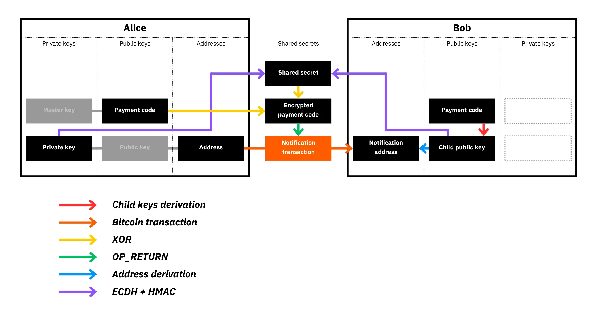


### การแจ้งเตือนการทำธุรกรรม: การศึกษาภาคปฏิบัติ


เพื่อทำความเข้าใจว่ามันทำงานอย่างไรในรายละเอียดเพิ่มเติม โดยเฉพาะการใช้ `OP_RETURN` เรามาตรวจสอบการทำธุรกรรมการแจ้งเตือนจริงกัน ฉันได้ทำธุรกรรมดังกล่าวบน testnet ซึ่งคุณสามารถหาได้ [โดยคลิกที่นี่](https://mempool.space/testnet/tx/0e2e4695a3c49272ef631426a9fd2dae6ec3a469e3a39a3db51aa476cd09de2e)


เมื่อดูที่ธุรกรรมนี้ เราจะเห็นได้แล้วว่ามีอินพุตเดียวและเอาต์พุต 4 รายการ:


- เอาต์พุตแรกคือ `OP_RETURN` ซึ่งมีรหัสการชำระเงินที่ซ่อนอยู่ของฉัน
- เอาต์พุตที่สองของ 546 sats ชี้ไปที่ที่อยู่การแจ้งเตือนของผู้รับของฉัน
- เอาต์พุตที่สามของ 15,000 sats แสดงถึงค่าบริการ เนื่องจากฉันใช้ Samourai Wallet ในการสร้างธุรกรรมนี้
- เอาต์พุตที่สี่ของ 2 ล้าน sats แสดงถึงการเปลี่ยนแปลง นั่นคือ ความแตกต่างที่เหลืออยู่ในอินพุตของฉัน ซึ่งจะกลับไปยังที่อยู่อื่นที่เป็นของฉัน


สิ่งที่น่าสนใจที่สุดในการศึกษาอย่างชัดเจนคือ output 0 โดยใช้ `OP_RETURN` มาดูรายละเอียดเพิ่มเติมเกี่ยวกับสิ่งที่มันมี นี่คือ `scriptPubKey` ในรูปแบบเลขฐานสิบหก:


```text
6a4c50010002b13b2911719409d704ecc69f74fa315a6cb20fdd6ee39bc9874667703d67b164927b0e88f89f3f8b963549eab2533b5d7ed481a3bea7e953b546b4e91b6f50d800000000000000000000000000
```


สคริปต์นี้ประกอบด้วยหลายส่วน ส่วนแรกคือ:


```text
6a4c
```


ในบรรดาออปโค้ด เราสามารถจำแนก `0x6a` ซึ่งระบุถึง `OP_RETURN` และ `0x4c` ซึ่งระบุถึง `OP_PUSHDATA1`


ไบต์ที่ตามหลังโอปโค้ดสุดท้ายนี้ระบุขนาดของเพย์โหลดที่ตามมา มันระบุว่า `0x50` หรือ 80 ไบต์:


```text
6a4c50
```


ถัดไป เรามีเมตะดาต้าของรหัสการชำระเงินของฉันในรูปแบบข้อความที่ชัดเจน:


```text
010002
```


พิกัด x ที่เข้ารหัสของคีย์สาธารณะของรหัสการชำระเงินของฉัน:


```text
b13b2911719409d704ecc69f74fa315a6cb20fdd6ee39bc9874667703d67b164
```


รหัสสตริงที่เข้ารหัสของรหัสการชำระเงินของฉัน:


```text
927b0e88f89f3f8b963549eab2533b5d7ed481a3bea7e953b546b4e91b6f50d8
```


และสุดท้าย การเติมให้ครบ 80 ไบต์ ซึ่งเป็นขนาดมาตรฐานของ `OP_RETURN`:


```text
00000000000000000000000000
```


เพื่อช่วยให้คุณเข้าใจ นี่คือรหัสการชำระเงินของฉันในรูปแบบข้อความธรรมดาในฐาน 58:


```text
PM8TJQCyt6ovbozreUCBrfKqmSVmTzJ5vjqse58LnBzKFFZTwny3KfCDdwTqAEYVasn11tTMPc2FJsFygFd3YzsHvwNXLEQNADgxeGnMK8Ugmin62TZU
```


และในฐาน 16:


```text
4701000277507c9c17a89cfca2d3af554745d6c2db0e7f6b2721a3941a504933103cc42add94881210d6e752a9abc8a9fa0070e85184993c4f643f1121dd807dd556d1dc000000000000000000000000008604e4db
```


หากเราเปรียบเทียบรหัสการชำระเงินแบบ plaintext ของฉันกับ `OP_RETURN` เราจะเห็นว่า HRP (`0x47`) และ checksum (`0x8604e4db`) ไม่ได้ถูกส่งไป นี่เป็นเรื่องปกติ เนื่องจากข้อมูลนี้มีไว้สำหรับมนุษย์


ถัดไป เราสามารถรับรู้เวอร์ชัน (`0x01`), ฟิลด์บิต (`0x00`), และความเท่าเทียมของคีย์สาธารณะ (`0x02`) และในตอนท้ายของรหัสการชำระเงิน ไบต์ว่าง (`0x000000000000000000000000000000`) ช่วยให้การเติมเต็มถึงจำนวนทั้งหมด 80 ไบต์ เมตาดาทาทั้งหมดนี้ถูกส่งโดยไม่เข้ารหัส


ในที่สุด เราสามารถสังเกตได้ว่าคีย์สาธารณะ abscissa (`0x77507c9c17a89cfca2d3af554745d6c2db0e7f6b2721a3941a504933103cc42a`) และรหัสสตริง (`0xdd94881210d6e752a9abc8a9fa0070e85184993c4f643f1121dd807dd556d1dc`) ได้ถูกเข้ารหัสแล้ว นี่คือข้อมูลที่ส่งของรหัสการชำระเงิน


### XOR คืออะไร?


เราได้เห็นในส่วนก่อนหน้านี้แล้วว่ารหัสการชำระเงินถูกส่งแบบเข้ารหัสโดยใช้การดำเนินการ XOR ลองมาดูใกล้ ๆ ว่าตัวดำเนินการนี้ทำงานอย่างไร เนื่องจากมันถูกใช้อย่างแพร่หลายในวิทยาการเข้ารหัสลับ


XOR เป็นตัวดำเนินการทางตรรกะระดับบิตที่อิงตามพีชคณิตบูลีน เมื่อให้โอเปอแรนด์สองตัวในรูปแบบบิต มันจะคืนค่า `1` หากบิตในตำแหน่งเดียวกันแตกต่างกัน และจะคืนค่า `0` หากบิตในตำแหน่งเดียวกันเท่ากัน นี่คือตารางความจริงของ XOR ตามค่าของโอเปอแรนด์ `D` และ `E`:

| D | E | D XOR E |
|---|---|---------|
| 0 | 0 | 0       |
| 0 | 1 | 1       |
| 1 | 0 | 1       |
| 1 | 1 | 0       |

ตัวอย่างเช่น:


$$
0110 \oplus 1110 = 1000
$$


หรือ:


$$
010011 \oplus 110110 = 100101
$$


ด้วย ECDH การใช้ XOR เป็นชั้นการเข้ารหัสมีความสอดคล้องกันเป็นพิเศษ ประการแรก ขอบคุณตัวดำเนินการนี้ การเข้ารหัสเป็นแบบสมมาตร ซึ่งหมายความว่าผู้รับสามารถถอดรหัสรหัสการชำระเงินด้วยคีย์เดียวกันที่ใช้ในการเข้ารหัส คีย์การเข้ารหัสและถอดรหัสถูกคำนวณจากความลับที่ใช้ร่วมกันโดยใช้ ECDH ความสมมาตรนี้เป็นไปได้ด้วยคุณสมบัติการสลับที่และการเชื่อมโยงของตัวดำเนินการ XOR:


- คุณสมบัติอื่น ๆ:


$$
D \oplus D = 0
$$


$$
D \oplus 0 = D
$$


- การสลับที่:


$$
D \oplus E = E \oplus D
$$


- การเชื่อมโยง:


$$
D \oplus (E \oplus Z) = (D \oplus E) \oplus Z = D \oplus E \oplus Z
$$


ถ้า:


$$
D \oplus E = L
$$


จากนั้น:


$$
D \oplus L = D \oplus (D \oplus E) = D \oplus D \oplus E = 0 \oplus E = E \\
\therefore D \oplus L = E
$$


ประการที่สอง วิธีการเข้ารหัสนี้มีความคล้ายคลึงกับรหัสเวอร์นัม (One-Time Pad) ซึ่งเป็นอัลกอริธึมการเข้ารหัสเพียงหนึ่งเดียวที่ทราบกันว่ามีความปลอดภัยแบบไม่มีเงื่อนไข (หรือสมบูรณ์) สำหรับรหัสเวอร์นัมที่จะมีคุณสมบัตินี้ กุญแจเข้ารหัสต้องเป็นแบบสุ่มสมบูรณ์ มีขนาดเท่ากับข้อความ และใช้เพียงครั้งเดียว ในวิธีการเข้ารหัสที่ใช้ที่นี่สำหรับ BIP47 กุญแจมีขนาดเท่ากับข้อความจริง ๆ และตัวปัจจัยบอดมีขนาดเท่ากับการต่อกันของแกน x ของกุญแจสาธารณะกับรหัสสตริงของรหัสการชำระเงิน กุญแจเข้ารหัสนี้ใช้เพียงครั้งเดียว ในทางกลับกัน กุญแจนี้ไม่ได้มาจากความสุ่มสมบูรณ์ เนื่องจากมันเป็น HMAC แต่เป็นแบบสุ่มเทียม ดังนั้น มันจึงไม่ใช่รหัสเวอร์นัม แต่มีวิธีการที่คล้ายคลึงกัน


### การรับการแจ้งเตือนธุรกรรม


ตอนนี้ที่ Alice ได้ส่งการแจ้งเตือนการทำธุรกรรมไปยัง Bob แล้ว มาดูกันว่า Bob จะตีความมันอย่างไร เป็นการเตือนความจำว่า Bob ต้องมีการเข้าถึงรหัสการชำระเงินของ Alice หากไม่มีข้อมูลนี้ อย่างที่เราจะเห็นในส่วนถัดไป เขาจะไม่สามารถสร้างคู่กุญแจที่สร้างโดย Alice ได้ และดังนั้นจะไม่สามารถเข้าถึงบิตคอยน์ที่ได้รับผ่าน BIP47 ได้ ในขณะนี้ ข้อมูลรหัสการชำระเงินของ Alice ถูกเข้ารหัสอยู่ มาดูกันว่า Bob จะถอดรหัสมันอย่างไร


**1-** Bob ตรวจสอบธุรกรรมที่สร้างเอาต์พุตด้วยที่อยู่การแจ้งเตือนของเขา


**2-** เมื่อธุรกรรมมีเอาต์พุตบนที่อยู่การแจ้งเตือน Bob จะวิเคราะห์เพื่อดูว่ามีเอาต์พุต OP_RETURN ที่เป็นไปตามมาตรฐาน BIP47 หรือไม่


**3-** หากไบต์แรกของเพย์โหลด OP_RETURN คือ `0x01` Bob จะเริ่มการค้นหาความลับที่อาจแชร์กับ ECDH:


- Bob เลือกคีย์สาธารณะของอินพุตสำหรับการทำธุรกรรม นั่นคือ คีย์สาธารณะของ Alice ที่ชื่อว่า $A$ พร้อมด้วย:


$$ A = a \cdot G $$


- Bob เลือกกุญแจส่วนตัว $b$ ที่เกี่ยวข้องกับที่อยู่การแจ้งเตือนส่วนตัวของเขา:


$$ b $$


- Bob คำนวณจุดลับ $S$ (shared secret ECDH) บนเส้นโค้งวงรีโดยการบวกและการเพิ่มจุดเป็นสองเท่า ใช้กุญแจส่วนตัวของเขา $b$ กับกุญแจสาธารณะของ Alice $A$:


$$ S = b \cdot A $$


- Bob กำหนดปัจจัยการปิดบัง $f$ ที่จะทำให้สามารถถอดรหัส payload ของรหัสการชำระเงิน Alice ได้ ในลักษณะเดียวกับที่ Alice ได้คำนวณไว้ก่อนหน้านี้ Bob จะหาค่า $f$ โดยการใช้ HMAC-SHA512 กับ $x$ ซึ่งเป็นค่าพิกัด x ของจุดลับ $S$ และกับ $o$ ซึ่งเป็น UTXO ที่ใช้เป็นอินพุตสำหรับธุรกรรมการแจ้งเตือนนี้:


$$ f = \text{HMAC-SHA512}(o, x) $$


**4-** Bob แปลข้อมูล OP_RETURN ในธุรกรรมการแจ้งเตือนเป็นรหัสการชำระเงิน เขาจะถอดรหัส payload ของรหัสการชำระเงินที่เป็นไปได้นี้โดยใช้ปัจจัยบัง $f$:


- Bob แยกปัจจัยการปิดบัง $f$ ออกเป็น 2 ส่วน: 32 ไบต์แรกของ $f$ จะเป็น $f1$ และ 32 ไบต์สุดท้ายจะเป็น $f2$;
- Bob ถอดรหัสค่าของพิกัด $x'$ ที่เข้ารหัสจากกุญแจสาธารณะของรหัสการชำระเงินของ Alice:


$$ x = x' \oplus f1 $$


- Bob ถอดรหัสค่าของรหัสสตริงที่เข้ารหัส $c'$ จากรหัสการชำระเงินของ Alice:


$$ c = c' \oplus f2 $$


**5-** Bob ตรวจสอบว่าค่าคีย์สาธารณะของรหัสการชำระเงินของ Alice เป็นส่วนหนึ่งของกลุ่ม secp256k1 หรือไม่ ถ้าใช่ เขาจะตีความว่านี่เป็นรหัสการชำระเงินที่ถูกต้อง ถ้าไม่ใช่ เขาจะไม่สนใจธุรกรรมนี้


ตอนนี้ที่ Bob รู้รหัสการชำระเงินของ Alice แล้ว Alice สามารถส่งการชำระเงินให้เขาได้สูงสุดถึง `2^32` ครั้ง โดยไม่ต้องทำธุรกรรมการแจ้งเตือนซ้ำในลักษณะนี้อีก


ทำไมมันถึงได้ผล? Bob สามารถกำหนดปัจจัยการปิดบังเดียวกันกับ Alice ได้อย่างไร และดังนั้นจึงสามารถถอดรหัสรหัสการชำระเงินของเธอได้? มาดูการทำงานของ ECDH ในสิ่งที่เราเพิ่งอธิบายกันเถอะ


ก่อนอื่นเลย เรากำลังจัดการกับการเข้ารหัสแบบสมมาตร ซึ่งหมายความว่าคีย์การเข้ารหัสและคีย์การถอดรหัสมีค่าเดียวกัน คีย์นี้ในธุรกรรมการแจ้งเตือนคือปัจจัยการบังตา:


$$ f = f1 || f2 $$


Alice และ Bob จึงต้องได้รับค่าเดียวกันสำหรับ $f$ โดยไม่ส่งผ่านค่าโดยตรง เนื่องจากผู้โจมตีอาจขโมยค่าและถอดรหัสข้อมูลลับได้ ปัจจัยการปิดบังนี้ได้มาจากการใช้ HMAC-SHA512 กับ 2 ค่า:


- พิกัดแกน x ของจุดลับ;
- และ UTXO ที่ใช้ในการป้อนข้อมูลธุรกรรม


Bob จึงจำเป็นต้องใช้ข้อมูลทั้งสองส่วนนี้ในการถอดรหัส payload ของรหัสการชำระเงินของ Alice สำหรับอินพุต UTXO, Bob สามารถดึงข้อมูลได้โดยการสังเกตการทำธุรกรรมการแจ้งเตือน สำหรับจุดลับ Bob จะต้องใช้ ECDH ดังที่เห็นในส่วนก่อนหน้านี้เกี่ยวกับ Diffie-Hellman เพียงแค่แลกเปลี่ยนคีย์สาธารณะของพวกเขาและใช้คีย์ส่วนตัวของพวกเขาอย่างลับๆ กับคีย์สาธารณะของอีกฝ่าย Alice และ Bob สามารถหาจุดลับที่แม่นยำบนเส้นโค้งวงรีได้ การทำธุรกรรมการแจ้งเตือนขึ้นอยู่กับกลไกนี้:


- คู่กุญแจของ Bob:


$$ B = b \cdot G $$


- คู่คีย์ของ Alice:


$$ A = a \cdot G $$


- สำหรับความลับ $S (x, y)$:


$$ S = a \cdot B = a \cdot (b \cdot G) = (b \cdot a) \cdot G = b \cdot A $$


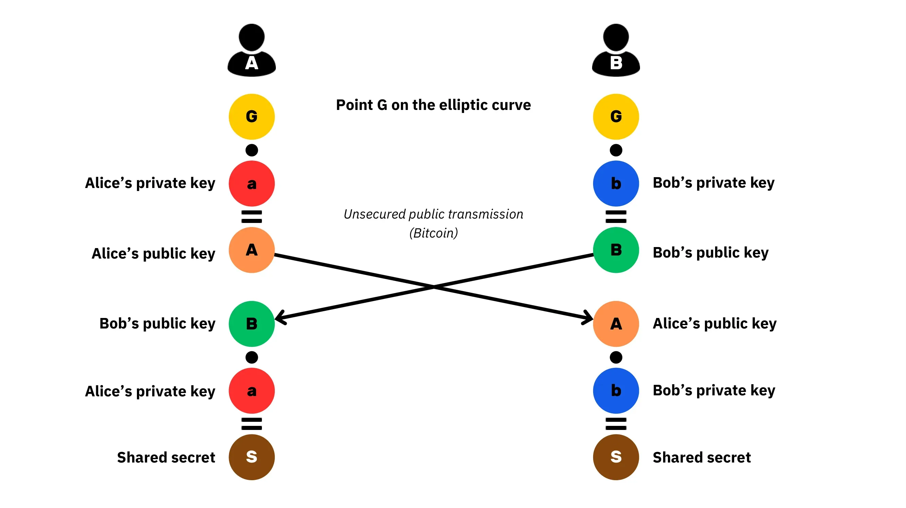


ตอนนี้ที่ Bob รู้รหัสการชำระเงินของ Alice เขาจะสามารถตรวจจับการชำระเงิน BIP47 ของเธอและสร้างกุญแจส่วนตัวที่บล็อกบิตคอยน์ที่ได้รับได้


ฉันจะสรุปขั้นตอนที่เราเพิ่งเห็นด้วยกันเพื่อรับและตีความการแจ้งเตือนการทำธุรกรรม:


- Bob ตรวจสอบผลลัพธ์ของธุรกรรมไปยังที่อยู่การแจ้งเตือนของเขา
- เมื่อมันตรวจพบ มันจะดึงข้อมูลที่อยู่ใน OP_RETURN ออกมา
- Bob เลือกคีย์สาธารณะเป็นอินพุตและคำนวณจุดลับโดยใช้ ECDH.
- มันใช้จุดลับนี้ในการคำนวณ HMAC ซึ่งเป็นปัจจัยการปิดบัง
- มันใช้ปัจจัยการทำให้ตาบอดนี้ในการถอดรหัสเพย์โหลดรหัสการชำระเงินของ Alice ที่อยู่ใน OP_RETURN


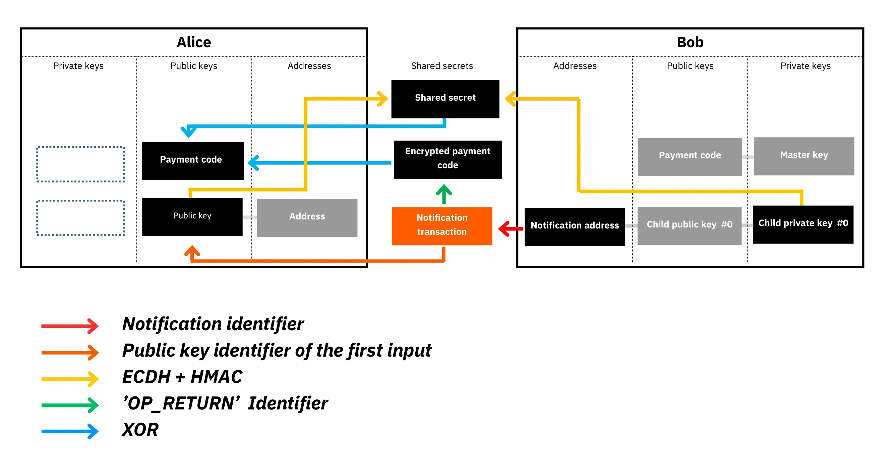


### การทำธุรกรรมการชำระเงิน BIP47


มาพิจารณากระบวนการชำระเงินโดยใช้ BIP47 กันเถอะ เพื่อเตือนความจำเกี่ยวกับสถานการณ์ปัจจุบัน:


- Alice รู้รหัสการชำระเงินของ Bob ซึ่งเธอได้มาจากเว็บไซต์ของเขาอย่างง่ายดาย
- Bob รู้รหัสการชำระเงินของ Alice จากการแจ้งเตือนธุรกรรม
- Alice จะทำการชำระเงินครั้งแรกให้กับ Bob เธอสามารถทำได้อีกหลายครั้งในลักษณะเดียวกัน


ก่อนที่จะอธิบายกระบวนการนี้ จำเป็นต้องระลึกถึงดัชนีที่เรากำลังทำงานอยู่ในขณะนี้ เส้นทางการอนุพันธ์สำหรับรหัสการชำระเงินอธิบายดังนี้: `m/47'/0'/0'` ความลึกต่อไปนี้แบ่งดัชนีดังนี้:


- คู่ลูกสาวปกติ (ไม่เสริมแรง) คู่แรกคือคู่ที่ใช้ generate ที่อยู่การแจ้งเตือนที่กล่าวถึงในส่วนก่อนหน้า: `m/47'/0'/0'/0`;
- คู่คีย์ลูกปกติถูกใช้ภายใน ECDH ไปยังที่อยู่รับชำระเงิน generate BIP47 ดังที่เราจะเห็นในส่วนนี้: จาก `m/47'/0'/0'/0` ถึง `m/47'/0'/0'/2,147,483,647`;
- คู่คีย์ลูกที่เสริมกำลังเป็นรหัสการชำระเงินชั่วคราว: จาก `m/47'/0'/0'/0'` ถึง `m/47'/0'/0'/2,147,483,647'`.


ทุกครั้งที่ Alice ต้องการส่งการชำระเงินไปยัง Bob เธอจะสร้างที่อยู่ว่างใหม่ที่ไม่ซ้ำกันอีกครั้ง โดยใช้โปรโตคอล ECDH:


- Alice เลือกคีย์ส่วนตัวแรกที่ได้มาจากรหัสการชำระเงินที่ใช้ซ้ำได้ส่วนตัวของเธอ:


$$ a $$


- Alice เลือกคีย์สาธารณะที่ยังไม่ได้ใช้ตัวแรกที่ได้มาจากรหัสการชำระเงินของ Bob เราจะเรียกคีย์สาธารณะนี้ว่า $B$ ซึ่งเชื่อมโยงกับคีย์ส่วนตัว $b$ ที่รู้จักเฉพาะ Bob:


$$ B = b \cdot G $$


- Alice คำนวณจุดลับ $S$ บนเส้นโค้งวงรีโดยการบวกและการเพิ่มจุดโดยใช้กุญแจส่วนตัวของเธอ $a$ จากกุญแจสาธารณะของ Bob $B$:


$$ S = a \cdot B $$


- จากจุดลับนี้ Alice คำนวณ shared secret $s$ (ตัวพิมพ์เล็ก) โดยเลือกค่า abscissa ของจุดลับ $S$ ที่ชื่อว่า $Sx$ และส่งค่านี้ไปยังฟังก์ชันแฮช SHA256:


$$ S = (Sx, Sy) $$


$$ s = \text{SHA256}(Sx) $$


- Alice ใช้ shared secret $s$ นี้ในการคำนวณที่อยู่รับชำระเงิน Bitcoin ก่อนอื่นเธอตรวจสอบว่า $s$ อยู่ในลำดับของเส้นโค้ง secp256k1 หรือไม่ หากไม่เป็นเช่นนั้น เธอจะเพิ่มดัชนีคีย์สาธารณะของ Bob เพื่อสร้าง shared secret อื่น
- ในขั้นตอนที่สอง เธอคำนวณกุญแจสาธารณะ $K0$ โดยการบวกจุด $B$ และ $s-G$ บนเส้นโค้งวงรี กล่าวอีกนัยหนึ่ง Alice เพิ่มกุญแจสาธารณะที่ได้จากรหัสการชำระเงินของ Bob $B$ ไปยังจุดอื่นที่คำนวณบนเส้นโค้งวงรีโดยการบวกและการเพิ่มสองเท่าของจุดด้วยความลับที่ใช้ร่วมกัน $s$ จากจุดกำเนิดของเส้นโค้ง secp256k1 จุดใหม่นี้แทนกุญแจสาธารณะ และเราเรียกมันว่า $K0$:


$$ K0 = B + s \cdot G $$


- ด้วยกุญแจสาธารณะนี้ $K0$ Alice สามารถสร้างที่อยู่รับแบบว่างในวิธีมาตรฐาน (เช่น SegWit V0 ใน bech32)


เมื่อ Alice ได้รับที่อยู่รับ $K0$ ของ Bob แล้ว เธอสามารถดำเนินการทำธุรกรรม Bitcoin ในวิธีมาตรฐานได้ ในการทำเช่นนี้ เธอเลือก UTXO ที่เธอเป็นเจ้าของ ซึ่งได้รับการรักษาความปลอดภัยด้วยคู่กุญแจจากสาขาอื่นของ HD wallet ของเธอ และใช้มันเพื่อสนองผลลัพธ์ไปยังที่อยู่ $K0$ ของ Bob สิ่งสำคัญคือต้องทราบว่า เมื่อที่อยู่ได้รับการสร้างขึ้นแล้ว การชำระเงินนี้จะเป็นไปตามกระบวนการมาตรฐานและไม่ต้องพึ่งพากุญแจที่เกี่ยวข้องกับ BIP47 อีกต่อไป


ฉันจะสรุปขั้นตอนที่เราเพิ่งเห็นด้วยกันเพื่อส่งการชำระเงิน BIP47:


- Alice เลือกคีย์ส่วนตัวลูกคนแรกที่ได้มาจากรหัสการชำระเงินส่วนตัวของเธอ
- มันคำนวณจุดลับบนเส้นโค้งวงรีโดยใช้ ECDH จากคีย์สาธารณะลูกคนแรกที่ยังไม่ได้ใช้ซึ่งได้มาจากรหัสการชำระเงินของ Bob
- มันใช้จุดลับนี้ในการคำนวณความลับร่วมกับ SHA256.
- เธอใช้ความลับที่ใช้ร่วมกันนี้ในการคำนวณจุดลับใหม่บนเส้นโค้งวงรี
- เธอเพิ่มจุดลับใหม่นี้ไปยังคีย์สาธารณะของ Bob
- เธอได้รับกุญแจสาธารณะชั่วคราวใหม่ซึ่งมีเพียง Bob เท่านั้นที่มีกุญแจส่วนตัวที่เกี่ยวข้อง
- Alice สามารถทำธุรกรรมแบบคลาสสิกไปยัง Bob ด้วยที่อยู่รับชั่วคราวที่ได้มา


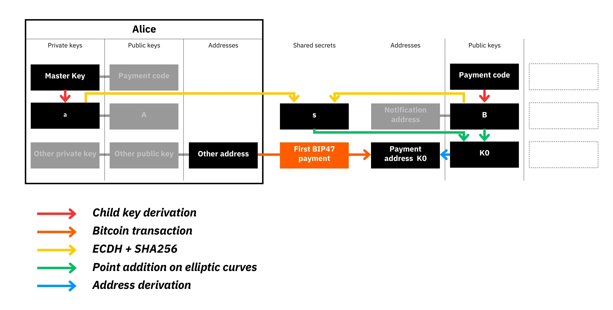


หาก Alice ต้องการทำการชำระเงินครั้งที่สอง เธอจะทำตามขั้นตอนเดิม ยกเว้นว่าครั้งนี้เธอจะเลือกคีย์สาธารณะที่สองที่ได้มาจากรหัสการชำระเงินของ Bob โดยเฉพาะ เธอจะใช้คีย์ที่ยังไม่ได้ใช้ถัดไป ดังนั้นเธอจะได้รับที่อยู่รับใหม่ที่เป็นของ Bob ซึ่งกำหนดเป็น $K1$:


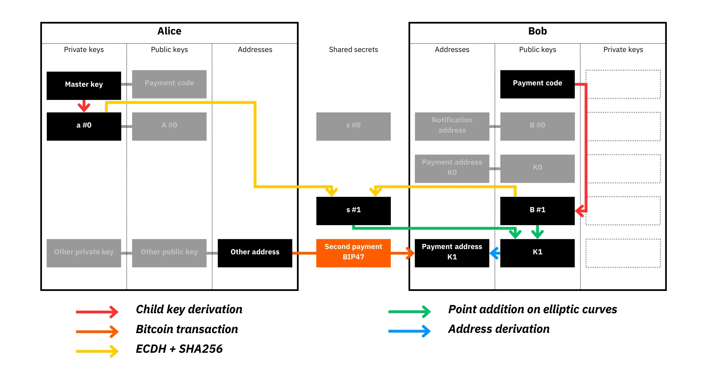


มันสามารถดำเนินต่อไปในลักษณะนี้และสร้างที่อยู่ว่างได้ถึง `2^32` ที่อยู่ซึ่งเป็นของ Bob.


จากมุมมองภายนอก การตรวจสอบบล็อกเชน เป็นไปไม่ได้ในทางทฤษฎีที่จะจำแนกการชำระเงิน BIP47 จากการชำระเงินแบบทั่วไป นี่คือตัวอย่างของธุรกรรมการชำระเงิน BIP47 บน Testnet:


```text
94b2e59510f2e1fa78411634c98a77bbb638e28fb2da00c9f359cd5fc8f87254
```


ดูเหมือนว่าจะเป็นธุรกรรมแบบคลาสสิกที่มีอินพุตที่ใช้แล้ว, เอาต์พุตการชำระเงิน, และการเปลี่ยนแปลง UTXO:


### การรับชำระเงิน BIP47 และการสร้างคีย์ส่วนตัว


Alice เพิ่งทำการชำระเงินครั้งแรกไปยังที่อยู่ BIP47 ว่างเปล่าที่เป็นของ Bob ตอนนี้มาดูกันว่า Bob รับการชำระเงินนี้อย่างไร นอกจากนี้เราจะเห็นว่าทำไม Alice ถึงไม่มีสิทธิ์เข้าถึงกุญแจส่วนตัวของที่อยู่ที่เธอเพิ่งสร้างขึ้นเอง และ Bob ค้นหากุญแจนี้เพื่อใช้จ่ายบิตคอยน์ที่เขาเพิ่งได้รับได้อย่างไร


ทันทีที่ Bob ได้รับการแจ้งเตือนการทำธุรกรรมจาก Alice เขาจะสร้างกุญแจสาธารณะ BIP47 $K0$ แม้กระทั่งก่อนที่ผู้ติดต่อของเขาจะส่งการชำระเงิน ดังนั้นเขาจึงสังเกตการชำระเงินใด ๆ ไปยังที่อยู่ที่เกี่ยวข้อง ในความเป็นจริง เขาจะสร้างที่อยู่หลายแห่งที่เขาสังเกต ($K0$, $K1$, $K2$, $K3$...) นี่คือวิธีที่เขาสร้างกุญแจสาธารณะนี้ $K0$:


- Bob เลือกกุญแจส่วนตัวลูกตัวแรกที่ได้มาจากรหัสการชำระเงินของเขา กุญแจส่วนตัวนี้มีชื่อว่า $b$ มันเชื่อมโยงกับกุญแจสาธารณะ $B$ ซึ่ง Alice ใช้ในการคำนวณของเธอในขั้นตอนก่อนหน้า:


$$ b $$


- Bob เลือกคีย์สาธารณะตัวแรกของ Alice ที่ได้มาจากรหัสการชำระเงินของเธอ คีย์นี้มีชื่อว่า $A$ มันเชื่อมโยงกับคีย์ส่วนตัว $a$ ที่ Alice ใช้ในการคำนวณของเธอ และเป็นที่รู้จักเฉพาะ Alice เท่านั้น Bob สามารถดำเนินการนี้ได้ เนื่องจากเขารู้รหัสการชำระเงินของ Alice ซึ่งถูกส่งถึงเขาพร้อมกับธุรกรรมการแจ้งเตือน:


$$ A = a \cdot G $$


- Bob คำนวณจุดลับ $S$ โดยการบวกและการดับเบิลจุดบนเส้นโค้งวงรี โดยใช้กุญแจส่วนตัวของเขา $b$ กับกุญแจสาธารณะของ Alice $A$ ที่นี่อีกครั้ง ECDH ถูกใช้เพื่อรับประกันว่าจุดนี้ $S$ จะเหมือนกันสำหรับทั้ง Bob และ Alice:


$$ S = b \cdot A $$


- ในลักษณะเดียวกับ Alice, Bob แยกแกน X ของจุดนี้ $S$. เราได้ตั้งชื่อค่านี้ว่า $Sx$. เขาส่งค่าดังกล่าวไปยังฟังก์ชัน SHA256 เพื่อหาความลับที่ใช้ร่วมกัน $s$ (ตัวพิมพ์เล็ก):


$$ s = \text{SHA256}(Sx) $$


- ในลักษณะเดียวกับ Alice, Bob คำนวณจุด $s-G$ บนเส้นโค้งวงรี จากนั้นเขาเพิ่มจุดลับนี้ไปยังคีย์สาธารณะของเขา $B$ แล้วเขาจะได้จุดใหม่บนเส้นโค้งวงรี ซึ่งเขาตีความว่าเป็นคีย์สาธารณะ $K0$:


$$ K0 = B + s \cdot G $$


เมื่อ Bob ได้รับกุญแจสาธารณะนี้ $K0$ แล้ว เขาสามารถสร้างกุญแจส่วนตัวที่เกี่ยวข้องเพื่อใช้จ่ายบิตคอยน์ของเขาได้ มีเพียงเขาเท่านั้นที่สามารถ generate กุญแจส่วนตัวนี้:


- Bob เพิ่มคีย์ส่วนตัวของลูกสาวของเขา $b$ ที่ได้มาจากรหัสการชำระเงินส่วนตัวของเขา มีเพียงเขาเท่านั้นที่สามารถรับค่า $b$ ได้ จากนั้นเขาเพิ่ม $b$ ไปยังความลับที่ใช้ร่วมกัน $s$ เพื่อให้ได้ $k0$ ซึ่งเป็นคีย์ส่วนตัวของ $K0$:


$$ k0 = b + s $$


ด้วยกฎของกลุ่มของเส้นโค้งวงรี Bob ได้รับกุญแจส่วนตัวที่ตรงกับกุญแจสาธารณะที่ใช้โดย Alice อย่างแม่นยำ ดังนั้นเราจึงมี:


$$ K0 = k0 \cdot G $$


ฉันจะสรุปขั้นตอนที่เราเพิ่งเห็นด้วยกันเพื่อรับการชำระเงิน BIP47 และคำนวณคีย์ส่วนตัวที่สอดคล้องกัน:


- Bob เลือกคีย์ส่วนตัวของลูกสาวคนแรกที่ได้มาจากรหัสการชำระเงินส่วนตัวของเขา
- มันคำนวณจุดลับบนเส้นโค้งวงรีโดยใช้ ECDH จากกุญแจสาธารณะของลูกสาวคนแรกที่ได้มาจากรหัสสตริงของ Alice
- มันใช้จุดลับนี้ในการคำนวณความลับร่วมกับ SHA256.
- เขาใช้ความลับที่ใช้ร่วมกันนี้ในการคำนวณจุดลับใหม่บนเส้นโค้งวงรี;
- เขาเพิ่มจุดลับใหม่นี้ไปยังคีย์สาธารณะส่วนตัวของเขา;
- เขาได้รับกุญแจสาธารณะชั่วคราวใหม่ ซึ่งเป็นกุญแจที่ Alice จะใช้ส่งการชำระเงินครั้งแรกของเธอ;
- Bob คำนวณกุญแจส่วนตัวที่เกี่ยวข้องกับกุญแจสาธารณะชั่วคราวนี้โดยการเพิ่มกุญแจส่วนตัวของลูกสาวที่ได้มาจากรหัสการชำระเงินของเขาและความลับที่ใช้ร่วมกัน


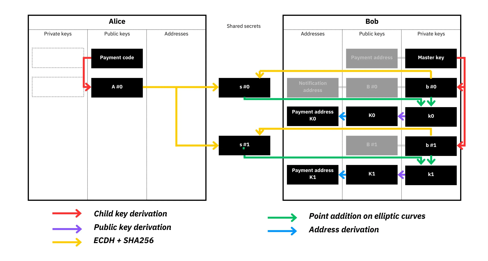


เนื่องจาก Alice ไม่สามารถรับค่า $b$ (กุญแจส่วนตัวของ Bob) เธอจึงไม่สามารถกำหนดค่า $k0$ (กุญแจส่วนตัวที่เกี่ยวข้องกับที่อยู่รับ BIP47 ของ Bob) ได้ ในเชิงแผนภาพ เราสามารถแสดงการคำนวณความลับร่วม $S$ ได้ดังนี้:


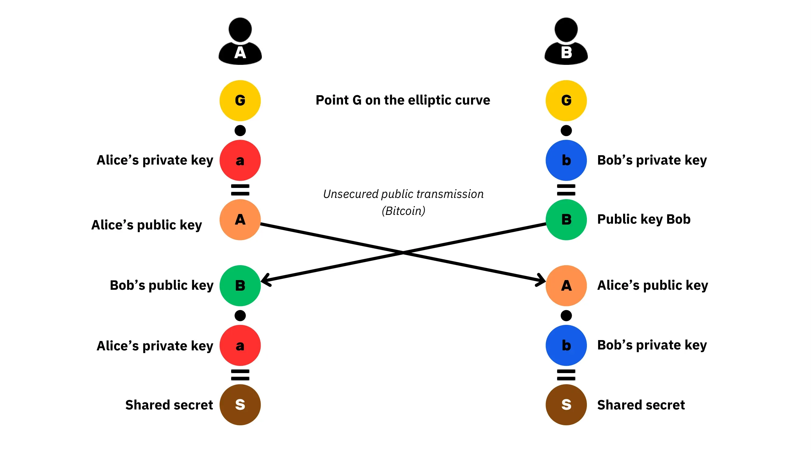


เมื่อพบความลับที่ใช้ร่วมกันด้วย ECDH, Alice และ Bob คำนวณคีย์สาธารณะการชำระเงิน BIP47 $K0$, และ Bob ยังคำนวณคีย์ส่วนตัวที่เกี่ยวข้อง $k0$:


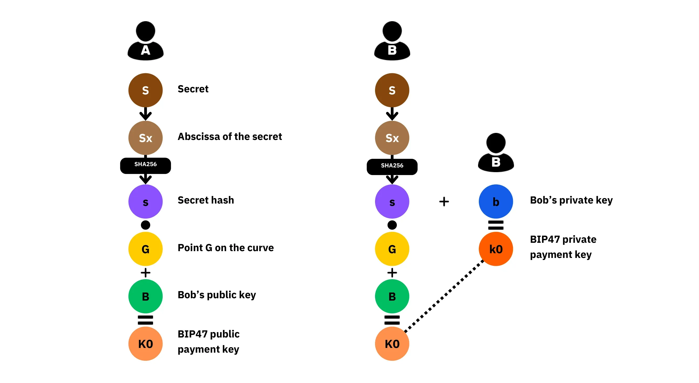


### การคืนเงินการชำระเงิน BIP47


เนื่องจาก Bob รู้รหัสการชำระเงินที่ใช้ซ้ำได้ของ Alice เขาจึงมีข้อมูลที่จำเป็นทั้งหมดในการส่งเงินคืนให้เธอแล้ว เขาไม่จำเป็นต้องติดต่อ Alice อีกครั้งเพื่อขอข้อมูลใด ๆ เขาเพียงแค่ต้องแจ้งเธอด้วยการทำธุรกรรมแจ้งเตือน เพื่อให้เธอสามารถดึงที่อยู่ BIP47 ของเธอด้วย seed และจากนั้นเขายังสามารถส่งการชำระเงินให้เธอได้สูงสุดถึง `2^32` ครั้ง


คุณสมบัติการคืนเงินเป็นลักษณะเฉพาะของ BIP47 และเป็นหนึ่งในข้อดีของมันเมื่อเทียบกับวิธีอื่น ๆ เช่น Silent Payments ซึ่งเราจะพิจารณาในบทต่อ ๆ ไป


Bob สามารถชำระเงินคืนให้กับ Alice ในลักษณะเดียวกับที่เธอส่งเงินให้เขา บทบาทถูกสลับกัน:


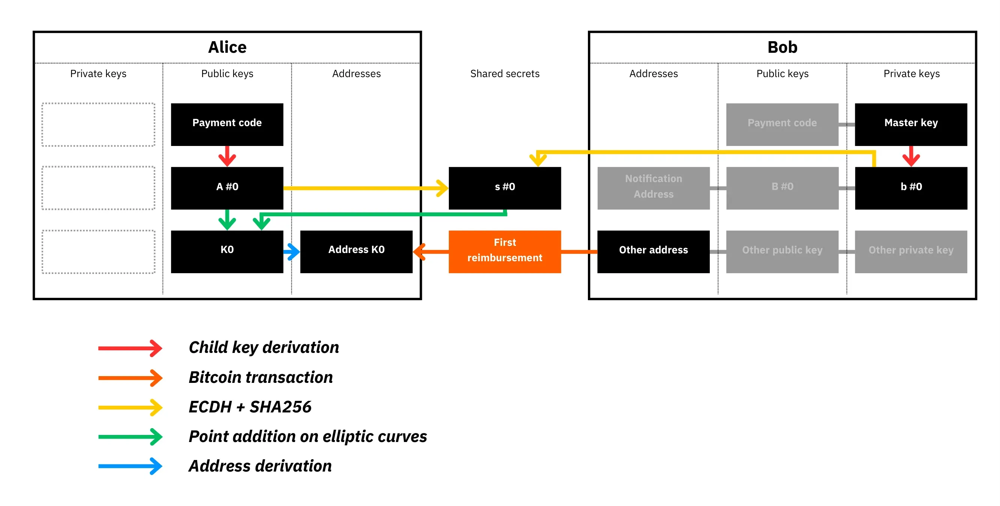


*ขอขอบคุณ [Fanis Michalakis](https://x.com/FanisMichalakis) เป็นอย่างยิ่งสำหรับการตรวจทานและคำแนะนำจากผู้เชี่ยวชาญของเขาในบทความที่เป็นแรงบันดาลใจในการเขียนบทนี้!*


https://planb.academy/tutorials/privacy/on-chain/paynym-bip47-a492a70b-50eb-4f95-a766-bae2c5535093

## การชำระเงินแบบเงียบ


<chapterId>2871d594-414e-4598-a830-91c9eb84dfb8</chapterId>


:::video id=85b2780e-864e-4f64-b843-f272277181e6:::


BIP47 ได้รับการวิพากษ์วิจารณ์อย่างกว้างขวางเกี่ยวกับประสิทธิภาพ on-chain ตามที่อธิบายไว้ในบทก่อนหน้า การทำธุรกรรมแจ้งเตือนจะต้องดำเนินการสำหรับผู้รับใหม่แต่ละราย ข้อจำกัดนี้จะกลายเป็นเรื่องเล็กน้อยหากเราวางแผนที่จะสร้างช่องทางการชำระเงินที่ยั่งยืนกับผู้รับนี้ ในความเป็นจริง การทำธุรกรรมแจ้งเตือนเพียงครั้งเดียวเปิดทางสำหรับการชำระเงิน BIP47 ที่ตามมาได้เกือบจะไม่มีที่สิ้นสุด


อย่างไรก็ตาม ในบางสถานการณ์ การทำธุรกรรมการแจ้งเตือนอาจเป็นอุปสรรคสำหรับผู้ใช้ ลองพิจารณาตัวอย่างของการบริจาคครั้งเดียวให้กับผู้รับ: ด้วยที่อยู่ Bitcoin แบบคลาสสิก การทำธุรกรรมเพียงครั้งเดียวก็เพียงพอที่จะทำการบริจาคให้เสร็จสมบูรณ์ แต่ด้วย BIP47 จำเป็นต้องมีการทำธุรกรรมสองครั้ง: หนึ่งสำหรับการแจ้งเตือนและอีกหนึ่งสำหรับการชำระเงินจริง เมื่อความต้องการพื้นที่บล็อกต่ำและค่าธรรมเนียมการทำธุรกรรมก็ต่ำ ขั้นตอนเพิ่มเติมนี้มักจะไม่เป็นปัญหา อย่างไรก็ตาม ในช่วงเวลาที่มีความแออัด ค่าธรรมเนียมการทำธุรกรรมอาจสูงเกินไปสำหรับการชำระเงินเพียงครั้งเดียว ซึ่งอาจทำให้ต้นทุนเพิ่มขึ้นเป็นสองเท่าสำหรับผู้ใช้เมื่อเทียบกับการทำธุรกรรม Bitcoin มาตรฐาน ซึ่งอาจไม่เป็นที่ยอมรับสำหรับผู้ใช้


สำหรับสถานการณ์ที่ผู้ใช้วางแผนที่จะทำการชำระเงินเพียงไม่กี่ครั้งไปยังตัวระบุแบบคงที่ ได้มีการพัฒนาโซลูชันอื่นๆ ขึ้น ซึ่งรวมถึง Silent Payments ที่อธิบายไว้ใน [BIP352](https://github.com/bitcoin/bips/blob/master/bip-0352.mediawiki) โปรโตคอลนี้ช่วยให้สามารถใช้ตัวระบุแบบคงที่เพื่อรับการชำระเงินโดยไม่ต้องใช้ที่อยู่ซ้ำและไม่ต้องการธุรกรรมการแจ้งเตือน ลองมาดูกันว่าโปรโตคอลนี้ทำงานอย่างไร


---
*ในการทำความเข้าใจบทนี้อย่างเต็มที่ จำเป็นต้องเข้าใจการทำงานของ ECDH (Elliptic Curve Diffie-Hellman) และการสร้างคีย์เข้ารหัสใน HD wallet อย่างเชี่ยวชาญ แนวคิดเหล่านี้ได้ถูกกล่าวถึงอย่างละเอียดในบทก่อนหน้านี้เกี่ยวกับ BIP47 ฉันจะไม่กล่าวซ้ำในที่นี้ หากคุณยังไม่คุ้นเคยกับแนวคิดเหล่านี้ ฉันขอแนะนำให้คุณศึกษาบทก่อนหน้านี้ก่อนที่จะดำเนินการต่อกับบทนี้ ฉันจะไม่ย้อนกลับไปพูดถึงความเสี่ยงที่เกี่ยวข้องกับการใช้ที่อยู่รับซ้ำ หรือความสำคัญของการมีตัวระบุเฉพาะสำหรับการรับชำระเงิน* ฉันจะแค่กล่าวถึงบางจุดที่ฉันอยากจะพูดถึงที่นี่


---
### ทำไมไม่ย้ายการแจ้งเตือน?


ตามที่ได้กล่าวไว้ในบท BIP47 การทำธุรกรรมการแจ้งเตือนมีสองฟังก์ชันหลัก:


- มันจะแจ้งให้ผู้รับทราบ
- มันส่งรหัสการชำระเงินของผู้ส่ง


ใครบางคนอาจคิดอย่างไร้เดียงสาว่ากระบวนการแจ้งเตือนนี้สามารถดำเนินการได้ off-chain ในทางทฤษฎี มันเป็นไปได้อย่างสมบูรณ์แบบ: สิ่งที่ผู้รับต้องทำคือระบุวิธีการสื่อสารเพื่อรับรหัสการชำระเงิน BIP47 จากผู้ส่ง อย่างไรก็ตาม มีปัญหาสำคัญสองประการกับวิธีการนี้:


- ประการแรก จะย้ายกระบวนการส่งโค้ดไปยังโปรโตคอลการสื่อสารอื่น ปัญหาที่เกี่ยวข้องกับค่าใช้จ่ายและความลับของการแลกเปลี่ยนจะยังคงอยู่ แต่จะถูกย้ายไปยังโปรโตคอลใหม่นี้แทน ในแง่ของความลับ นี่อาจสร้างความเชื่อมโยงระหว่างตัวตนของผู้ใช้และกิจกรรม on-chain ซึ่งเป็นสิ่งที่เราต้องการหลีกเลี่ยงโดยการทำการแจ้งเตือนโดยตรงบนบล็อกเชน นอกจากนี้ การทำการแจ้งเตือนนอกบล็อกเชนจะเพิ่มความเสี่ยงของการเซ็นเซอร์ (เช่น การบล็อกเงินทุน) ซึ่งไม่เกิดขึ้นบน Bitcoin
- ประการที่สอง นี่จะก่อให้เกิดปัญหาการกู้คืน ด้วย BIP47 ผู้รับจะต้องทราบรหัสการชำระเงินของผู้ส่งเพื่อเข้าถึงเงินทุน ซึ่งเป็นจริงเมื่อได้รับ แต่ยังรวมถึงในกรณีที่เงินทุนถูกกู้คืนผ่าน seed หาก wallet สูญหาย ด้วยการแจ้งเตือน on-chain ความเสี่ยงนี้จะถูกหลีกเลี่ยง เนื่องจากผู้ใช้สามารถดึงและถอดรหัสธุรกรรมการแจ้งเตือนได้เพียงแค่รู้จัก seed ของตน อย่างไรก็ตาม หากการแจ้งเตือนเกิดขึ้นนอกบล็อกเชน ผู้ใช้จะต้องรักษาการสำรองข้อมูลแบบไดนามิกของรหัสการชำระเงินทั้งหมดที่ได้รับ ซึ่งไม่เหมาะสมสำหรับผู้ใช้ทั่วไป


ข้อจำกัดทั้งหมดนี้ทำให้การใช้การแจ้งเตือน on-chain เป็นสิ่งจำเป็นสำหรับ BIP47 อย่างไรก็ตาม Silent Payments พยายามหลีกเลี่ยงขั้นตอนการแจ้งเตือน on-chain นี้เนื่องจากต้นทุนของมัน วิธีแก้ปัญหาที่นำมาใช้คือไม่ย้ายการแจ้งเตือน แต่กำจัดมันออกไปทั้งหมด เพื่อให้บรรลุเป้าหมายนี้ จำเป็นต้องยอมรับการประนีประนอม: การสแกน แตกต่างจาก BIP47 ที่ผู้ใช้รู้ว่าต้องหาทุนของตนที่ไหนด้วยการแจ้งเตือนการทำธุรกรรม ด้วย Silent Payments ผู้ใช้ต้องตรวจสอบธุรกรรม Bitcoin ที่มีอยู่ทั้งหมดเพื่อตรวจจับการชำระเงินที่ตั้งใจไว้สำหรับพวกเขา เพื่อลดภาระการดำเนินงานนี้ การค้นหา Silent Payments จะจำกัดเฉพาะธุรกรรมที่มีแนวโน้มว่าจะมีการชำระเงินดังกล่าวเท่านั้น กล่าวคือ ธุรกรรมที่มีอย่างน้อยหนึ่ง Taproot P2TR เอาท์พุต การสแกนยังมุ่งเน้นเฉพาะธุรกรรมจากวันที่สร้าง wallet (ไม่จำเป็นต้องสแกนธุรกรรมย้อนหลังไปถึงปี 2009 หาก wallet ถูกสร้างขึ้นในปี 2024)


ตามที่คุณเห็น BIP47 และ Silent Payments แม้ว่าจะมีเป้าหมายที่คล้ายกัน แต่ก็มีการแลกเปลี่ยนที่แตกต่างกันและดังนั้น **จึงตอบสนองการใช้งานที่แตกต่างกัน** สำหรับการชำระเงินครั้งเดียว เช่น การบริจาค Silent Payments จะเหมาะสมกว่าเนื่องจากมีต้นทุนที่ต่ำกว่า ในทางกลับกัน สำหรับการทำธุรกรรมปกติไปยังผู้รับเดียวกัน เช่น ในกรณีของแพลตฟอร์มแลกเปลี่ยนหรือ mining pools BIP47 อาจเป็นตัวเลือกที่ดีกว่า


มาศึกษาการทำงานทางเทคนิคของ Silent Payments เพื่อให้เข้าใจลึกซึ้งยิ่งขึ้นถึงสิ่งที่เป็นเดิมพัน ในการทำเช่นนี้ ฉันขอแนะนำให้เราใช้วิธีการเดียวกันกับที่ระบุไว้ในเอกสารอธิบาย BIP352 เราจะค่อยๆ แยกการคำนวณที่จะดำเนินการออกเป็นส่วนๆ โดยให้เหตุผลสำหรับการเพิ่มใหม่แต่ละครั้ง


### แนวคิดบางประการที่ควรเข้าใจ


ก่อนเริ่มต้น สิ่งสำคัญคือต้องทราบว่า Silent Payments พึ่งพาการใช้ประเภทสคริปต์ P2TR (*Pay to Taproot*) โดยเฉพาะ แตกต่างจาก BIP47 ไม่จำเป็นต้องสร้างที่อยู่รับจากคีย์สาธารณะลูกโดยการแฮช ในมาตรฐาน P2TR คีย์สาธารณะที่ปรับแต่งแล้วจะถูกใช้โดยตรงและไม่เข้ารหัสในที่อยู่ ดังนั้นที่อยู่รับ Taproot จึงเป็นคีย์สาธารณะพร้อมเมตาดาตาบางส่วน คีย์สาธารณะที่ปรับแต่งนี้คือการรวมกันของคีย์สาธารณะสองตัว: หนึ่งที่ช่วยให้การใช้จ่ายโดยตรงแบบดั้งเดิมผ่านลายเซ็นง่าย ๆ และอีกตัวหนึ่งที่แสดงถึงราก Merkle ของ MAST ซึ่งอนุญาตให้ใช้จ่ายได้ภายใต้การปฏิบัติตามเงื่อนไขหนึ่งในเงื่อนไขที่อาจถูกจารึกไว้ในต้นไม้ Merkle


มีสองเหตุผลหลักสำหรับการตัดสินใจจำกัด Silent Payments เฉพาะ Taproot:


- ประการแรก มันช่วยอำนวยความสะดวกในการดำเนินการและการอัปเกรดในอนาคตในซอฟต์แวร์ wallet อย่างมาก เนื่องจากมีเพียงมาตรฐานเดียวที่ต้องปฏิบัติตาม;
- ประการที่สอง วิธีการนี้ช่วยปรับปรุง anonset ของผู้ใช้โดยการสนับสนุนให้พวกเขาไม่แบ่งแยกตัวเองระหว่างประเภทของสคริปต์ต่างๆ ซึ่ง generate แยก wallet ลายนิ้วมือในวิเคราะห์เชน (สำหรับข้อมูลเพิ่มเติมเกี่ยวกับแนวคิดนี้ โปรดดูบทที่ 4 ของส่วนที่ 2)


### การอนุมานแบบง่ายของคีย์สาธารณะ Silent Payments


มาเริ่มต้นด้วยตัวอย่างง่ายๆ เพื่อทำความเข้าใจว่า Silent Payments (SPs) ทำงานอย่างไร ลองพิจารณา Alice และ Bob ซึ่งเป็นผู้ใช้ Bitcoin สองคน Alice ต้องการส่ง Bitcoins ไปยัง Bob บนที่อยู่รับที่ว่างเปล่า มีวัตถุประสงค์สามประการสำหรับกระบวนการนี้:


- Alice ต้องสามารถ generate ที่อยู่ว่างเปล่าได้
- Bob ต้องสามารถระบุการชำระเงินที่ส่งไปยังที่อยู่นี้ได้
- Bob จำเป็นต้องสามารถรับคีย์ส่วนตัวที่เชื่อมโยงกับที่อยู่นี้เพื่อใช้จ่ายเงินของเขาได้


Alice มี UTXO ใน Bitcoin wallet ที่ปลอดภัยของเธอพร้อมคู่คีย์ต่อไปนี้:


- $a$: กุญแจส่วนตัว;
- $A$: กุญแจสาธารณะ ($A = a \cdot G$)


Bob มีที่อยู่ SP ซึ่งเขาได้เผยแพร่บนอินเทอร์เน็ต:


- $b$: กุญแจส่วนตัว;
- $B$: กุญแจสาธารณะ ($B = b \cdot G$)


โดยการดึงที่อยู่ของ Bob มา Alice สามารถคำนวณที่อยู่ว่างใหม่ที่เป็นของ Bob โดยใช้ ECDH เรามาเรียกที่อยู่นี้ว่า $P$:


$$ P = B + \text{hash}(a \cdot B) \cdot G $$


ในสมการนี้ Alice ได้คำนวณผลคูณสเกลาร์ของกุญแจส่วนตัวของเธอ, $a$, และกุญแจสาธารณะของ Bob, $B$. เธอได้นำผลลัพธ์นี้เข้าสู่ฟังก์ชันแฮชที่ทุกคนรู้จัก ค่าที่ได้จะถูกคูณแบบสเกลาร์ด้วยจุดกำเนิด $G$ ของเส้นโค้งวงรี `secp256k1` สุดท้าย Alice จะเพิ่มจุดที่ได้ไปยังกุญแจสาธารณะของ Bob, $B$. เมื่อ Alice ได้ที่อยู่ $P$ นี้แล้ว เธอจะใช้มันเป็นผลลัพธ์ในธุรกรรม, นั่นคือ เธอส่งบิตคอยน์ไปยังที่อยู่นั้น


> *ในบริบทของ Silent Payments, ฟังก์ชัน "hash" สอดคล้องกับฟังก์ชันแฮช SHA256 ที่ถูกแท็กเฉพาะด้วย `BIP0352/SharedSecret`, ซึ่งทำให้แฮชที่สร้างขึ้นมีความเฉพาะเจาะจงกับโปรโตคอลนี้และไม่สามารถนำไปใช้ซ้ำในบริบทอื่นได้, พร้อมทั้งให้การป้องกันเพิ่มเติมต่อการใช้ซ้ำของ nonces ในลายเซ็น มาตรฐานนี้สอดคล้องกับ [ที่ระบุใน BIP340 สำหรับลายเซ็น Schnorr](https://github.com/bitcoin/bips/blob/master/bip-0340.mediawiki) บน `secp256k1`.*
ด้วยคุณสมบัติของเส้นโค้งวงรีที่ ECDH ใช้เป็นพื้นฐาน เราจึงทราบว่า:


$$ a \cdot B = b \cdot A $$


Bob จะสามารถคำนวณที่อยู่รับที่ Alice ได้ส่งบิตคอยน์ไปยังที่นั่นได้ ดังนั้น เขาจะตรวจสอบธุรกรรมทั้งหมดของ Bitcoin ที่ตรงตามเกณฑ์การชำระเงินแบบเงียบ และใช้การคำนวณต่อไปนี้กับแต่ละธุรกรรมเพื่อดูว่าการชำระเงินนั้นส่งถึงเขาหรือไม่ (*การสแกน*):


$$ P' = B + \text{hash}(b \cdot A) \cdot G $$


เมื่อเขาสแกนธุรกรรมของ Alice เขาตระหนักว่า $P'$ เท่ากับ $P$ ดังนั้นเขาจึงรู้ว่าการชำระเงินนั้นถูกส่งถึงเธอ:


$$ P' = B + \text{hash}(b \cdot A) \cdot G = B + \text{hash}(a \cdot B) \cdot G = P $$


จากตรงนี้ Bob จะสามารถคำนวณกุญแจส่วนตัว $p$ ซึ่งอนุญาตให้ที่อยู่ $P$ ถูกใช้จ่าย:


$$ p = (b + \text{hash}(b \cdot A)) \bmod n $$


ตามที่คุณเห็น เพื่อคำนวณกุญแจส่วนตัว $p$ นี้ คุณต้องมีกุญแจส่วนตัว $b$ เท่านั้น Bob เท่านั้นที่มีกุญแจส่วนตัว $b$ นี้ ดังนั้นเขาจะเป็นคนเดียวที่สามารถใช้จ่ายบิตคอยน์ที่ส่งไปยังที่อยู่ Silent Payments ของเขาได้


*ตำนาน:*


- $B$: คีย์สาธารณะ/ที่อยู่คงที่ที่เผยแพร่โดย Bob
- $b$: รหัสส่วนตัวของ Bob
- $A$: คีย์สาธารณะของ Alice ของ UTXO ที่ใช้เป็นอินพุตธุรกรรม
- $a$: กุญแจส่วนตัวของ Alice
- $G$: จุดกำเนิดของเส้นโค้งวงรี `secp256k1`
- $\text{SHA256}$: ฟังก์ชันแฮช SHA256 ที่ติดแท็กด้วย `BIP0352/SharedSecret`
- $s$: ความลับร่วม ECDH
- $P$: คีย์สาธารณะ/ที่อยู่เฉพาะสำหรับการชำระเงินไปยัง Bob


นี่คือวิธีการเริ่มต้นที่ค่อนข้างไร้เดียงสาในการใช้ที่อยู่คงที่ของ Bob ที่ระบุเป็น $B$ เพื่อสร้างที่อยู่เฉพาะ $P$ สำหรับส่งบิตคอยน์ อย่างไรก็ตาม วิธีนี้ง่ายเกินไปและมีข้อบกพร่องหลายประการที่ต้องแก้ไข ปัญหาแรกคือ ในแผนนี้ Alice ไม่สามารถสร้างผลลัพธ์หลายรายการไปยัง Bob ภายในธุรกรรมเดียวกันได้


### ฉันจะสร้างผลลัพธ์หลายรายการได้อย่างไร?


ในตัวอย่างจากส่วนก่อนหน้า Alice สร้างเอาต์พุตเดียวที่จะถูกส่งไปยัง Bob ที่ที่อยู่เฉพาะของเขา $P$ ด้วยอินพุตเดียวกันที่เลือกไว้ เป็นไปไม่ได้ที่ Alice จะสร้างที่อยู่ว่างสองแห่งแยกกันสำหรับ Bob เนื่องจากวิธีการที่ใช้จะนำไปสู่ผลลัพธ์เดียวกันสำหรับ $P$ เสมอ กล่าวคือ ที่อยู่เดียวกัน อย่างไรก็ตาม อาจมีหลายสถานการณ์ที่ Alice ต้องการแบ่งการชำระเงินของเธอให้กับ Bob เป็นจำนวนเงินที่น้อยลงหลายๆ จำนวน จึงสร้าง UTXO หลายรายการ ดังนั้นจึงจำเป็นต้องหาวิธีการบรรลุเป้าหมายนี้


ในการบรรลุเป้าหมายนี้ เราจะปรับเปลี่ยนการคำนวณที่ Alice ใช้ในการหา $P$ เล็กน้อย เพื่อให้เธอสามารถ generate ที่อยู่สองแห่งที่แตกต่างกันสำหรับ Bob ได้แก่ $P_0$ และ $P_1$


ในการปรับเปลี่ยนการคำนวณและรับที่อยู่ที่แตกต่างกัน 2 ที่ เพียงแค่เพิ่มจำนวนเต็มที่ปรับเปลี่ยนผลลัพธ์ ดังนั้น Alice จะเพิ่ม $0$ ในการคำนวณของเธอเพื่อรับที่อยู่ $P_0$ และ $1$ เพื่อรับที่อยู่ $P_1$ เราจะเรียกจำนวนเต็มนี้ว่า $i$:


$$ P_i = B + \text{hash}(a \cdot B \text{ ‖ } i) \cdot G $$


กระบวนการคำนวณยังคงไม่เปลี่ยนแปลงจากวิธีก่อนหน้านี้ ยกเว้นว่าครั้งนี้ Alice จะเชื่อมต่อ $a \cdot B$ กับ $i$ ก่อนดำเนินการแฮช จากนั้นคุณเพียงแค่ปรับเปลี่ยน $i$ เพื่อให้ได้ที่อยู่ใหม่ที่เป็นของ Bob ตัวอย่างเช่น:


$$ P_0 = B + \text{hash}(a \cdot B \text{ ‖ } 0) \cdot G $$


$$ P_1 = B + \text{hash}(a \cdot B \text{ ‖ } 1) \cdot G $$


เมื่อ Bob สแกนบล็อกเชนเพื่อหาการชำระเงินแบบ Silent Payments ที่ตั้งใจส่งถึงเขา เขาจะเริ่มต้นด้วยการใช้ $i = 0$ สำหรับที่อยู่ $P_0$ หากเขาไม่พบการชำระเงินใดๆ บน $P_0$ เขาจะสรุปว่าธุรกรรมนี้ไม่มีการชำระเงินแบบ Silent Payments ที่ตั้งใจส่งถึงเขา และจะหยุดการสแกน อย่างไรก็ตาม หาก $P_0$ ถูกต้องและมีการชำระเงินสำหรับเขา เขาจะดำเนินการต่อด้วย $P_1$ ในธุรกรรมเดียวกันเพื่อตรวจสอบว่า Alice ได้ทำการชำระเงินครั้งที่สองหรือไม่ หาก $P_1$ กลายเป็นว่าไม่ถูกต้อง เขาจะหยุดการค้นหาสำหรับธุรกรรมนี้ มิฉะนั้น เขาจะดำเนินการทดสอบค่าของ $i$ ต่อไป:


$$ P_0 = B + \text{hash}(b \cdot A \text{ ‖ } 0) \cdot G $$


$$ P_1 = B + \text{hash}(b \cdot A \text{ ‖ } 1) \cdot G $$


เนื่องจาก Bob หยุดทันทีที่ $i = 0$ หาก $P_0$ ไม่ทำงาน การใช้จำนวนเต็มนี้จึงเพิ่มภาระการทำงานเพิ่มเติมเกือบไม่มีเลยบน Bob สำหรับขั้นตอนการสแกนธุรกรรม


Bob สามารถคำนวณกุญแจส่วนตัวในลักษณะเดียวกัน:


$$
p_0 = (b + \text{hash}(b \cdot A \text{ ‖ } 0)) \bmod n
$$


$$
p_1 = (b + \text{hash}(b \cdot A \text{ ‖ } 1)) \bmod n
$$


*ตำนาน:*


- $B$: คีย์สาธารณะ/ที่อยู่คงที่ที่เผยแพร่โดย Bob
- $b$: กุญแจส่วนตัวของ Bob
- $A$: คีย์สาธารณะของ Alice ของ UTXO ที่ใช้เป็นอินพุตธุรกรรม
- $a$: กุญแจส่วนตัวของ Alice
- $G$: จุดกำเนิดของเส้นโค้งวงรี `secp256k1`
- $\text{SHA256}$: ฟังก์ชันแฮช SHA256 ที่ติดแท็กด้วย `BIP0352/SharedSecret`
- $s_0$: ความลับร่วมแรก ECDH
- $s_1$: ความลับร่วม ECDH ที่สอง
- $P_0$: คีย์สาธารณะตัวแรก / ที่อยู่เฉพาะสำหรับการชำระเงินไปยัง Bob
- $P_1$: คีย์สาธารณะตัวที่สอง / ที่อยู่เฉพาะสำหรับการชำระเงินไปยัง Bob


ด้วยวิธีนี้ เราเริ่มที่จะได้โปรโตคอลที่ดี แต่ยังคงมีความท้าทายบางประการที่ต้องเอาชนะ โดยเฉพาะอย่างยิ่งการป้องกันการใช้ที่อยู่ซ้ำ


### วิธีหลีกเลี่ยงการใช้ที่อยู่ซ้ำ?


ตามที่เราเห็นในส่วนก่อนหน้า Alice ใช้คู่กุญแจที่รักษาความปลอดภัยให้กับ UTXO ของเธอ ซึ่งเธอจะใช้ในการคำนวณ ECDH shared secret กับ Bob ความลับนี้ช่วยให้เธอสามารถสร้างที่อยู่เฉพาะ $P_0$ ได้ อย่างไรก็ตาม คู่กุญแจ ($a$, $A$) ที่ใช้โดย Alice สามารถรักษาความปลอดภัยให้กับ UTXOs หลายรายการหากเธอใช้ที่อยู่นี้ซ้ำหลายครั้ง หาก Alice ทำการชำระเงินสองครั้งไปยังที่อยู่คงที่ $B$ ของ Bob โดยใช้ UTXOs สองรายการที่รักษาความปลอดภัยด้วยกุญแจเดียวกัน $A$ จะส่งผลให้เกิดการใช้ที่อยู่ซ้ำสำหรับ Bob


> *การใช้ซ้ำ Address เป็นการปฏิบัติที่ไม่ดีในแง่ของการรักษาความลับของผู้ใช้ หากต้องการทราบเหตุผล ฉันขอแนะนำให้ทบทวนส่วนแรกของหลักสูตรนี้*
แน่นอนว่า เนื่องจากที่อยู่เฉพาะ $P_0$ นั้นได้มาจาก $A$ และ $B$ ถ้า Alice สร้างที่อยู่ที่สองสำหรับการชำระเงินครั้งที่สองไปยัง $B$ ด้วยคีย์เดียวกัน $A$ เธอจะได้ที่อยู่เดียวกัน $P_0$ เพื่อหลีกเลี่ยงความเสี่ยงนี้และป้องกันการใช้ที่อยู่ซ้ำภายใน Silent Payments เราจำเป็นต้องปรับการคำนวณของเราเล็กน้อย


สิ่งที่เราต้องการคือให้แต่ละ UTXO ที่ถูกใช้โดย Alice เป็นอินพุตสำหรับการชำระเงินให้ที่อยู่ที่ไม่ซ้ำกันในฝั่งของ Bob แม้ว่าจะมี UTXO หลายรายการที่ถูกป้องกันโดยคู่คีย์เดียวกัน ดังนั้นสิ่งที่เราต้องทำคือเพิ่มการอ้างอิงไปยัง UTXO เมื่อคำนวณที่อยู่ที่ไม่ซ้ำกัน $P_0$ การอ้างอิงนี้จะเป็นแฮชของ UTXO ที่ถูกใช้เป็นอินพุต:


$$ \text{inputHash} = \text{hash}(\text{outpoint} \text{ ‖ } A) $$


และ Alice จะเพิ่มการอ้างอิงนี้ไปยังอินพุตในการคำนวณที่อยู่เฉพาะ $P_0$:


$$ P_0 = B + \text{hash}(\text{inputHash} \cdot a \cdot B \text{ ‖ } 0) \cdot G $$


เมื่อทำการสแกน Bob สามารถเพิ่ม $\text{inputHash}$ ได้เช่นกัน เนื่องจากสิ่งที่เขาต้องทำคือสังเกตธุรกรรมเพื่อหาข้อสรุป $\text{outpoint}$:


$$ P_0 = B + \text{hash}(\text{inputHash} \cdot b \cdot A \text{ ‖ } 0) \cdot G $$


เมื่อพบ $P_0$ ที่ถูกต้องแล้ว จะสามารถคำนวณกุญแจส่วนตัว $p_0$ ที่สอดคล้องกันได้:


$$
p_0 = (b + \text{hash}(\text{inputHash} \cdot b \cdot A \text{ ‖ } 0)) \bmod n
$$


*ตำนาน:*


- $B$: คีย์สาธารณะ/ที่อยู่คงที่ที่เผยแพร่โดย Bob
- $b$: กุญแจส่วนตัวของ Bob
- $A$: คีย์สาธารณะของ Alice ของ UTXO ที่ใช้เป็นอินพุตธุรกรรม
- $a$: กุญแจส่วนตัวของ Alice
- $H$: UTXO แฮชที่ใช้เป็นอินพุต
- $G$: จุดกำเนิดของเส้นโค้งวงรี `secp256k1`
- $\text{SHA256}$: ฟังก์ชันแฮช SHA256 ที่ติดแท็กด้วย `BIP0352/SharedSecret`
- $s_0$: ความลับร่วม ECDH ครั้งแรก
- $P_0$: คีย์สาธารณะตัวแรก / ที่อยู่เฉพาะสำหรับการชำระเงินไปยัง Bob


ในขณะนี้ การคำนวณของเราสมมติว่า Alice ใช้ข้อมูลนำเข้าเพียงหนึ่งรายการสำหรับการทำธุรกรรมของเธอ อย่างไรก็ตาม เธอควรจะสามารถใช้ข้อมูลนำเข้าหลายรายการได้ ดังนั้น ในฝั่งของ Bob สำหรับการทำธุรกรรมแต่ละครั้งที่เกี่ยวข้องกับข้อมูลนำเข้าหลายรายการ เขาควรจะคำนวณ ECDH สำหรับข้อมูลนำเข้าแต่ละรายการเพื่อพิจารณาว่าการชำระเงินนั้นมีเจตนาสำหรับเขาหรือไม่ วิธีนี้ไม่เป็นที่น่าพอใจ ดังนั้นเราจำเป็นต้องหาวิธีแก้ไขเพื่อลดภาระงาน!


### ปรับแต่งคีย์สาธารณะให้เป็นอินพุต


ในการแก้ปัญหานี้ แทนที่จะใช้คู่กุญแจที่รักษาความปลอดภัยให้กับอินพุตเฉพาะบนฝั่งของ Alice เราจะใช้ผลรวมของคู่กุญแจทั้งหมดที่ใช้ในอินพุตของธุรกรรม ผลรวมนี้จะถูกพิจารณาเป็นคู่กุญแจใหม่ เทคนิคนี้เรียกว่า "tweaking"


ตัวอย่างเช่น ลองจินตนาการว่าธุรกรรมของ Alice มี 3 อินพุต แต่ละอันถูกป้องกันด้วยคู่คีย์ที่แตกต่างกัน:


- $a_0$ ใช้เพื่อรักษาความปลอดภัยของอินพุต #0;
- $a_1$ ถูกใช้เพื่อรักษาความปลอดภัยของอินพุต #1;
- $a_2$ ปกป้องข้อมูลนำเข้า #2.


ตามวิธีที่อธิบายไว้ก่อนหน้านี้ Alice จะต้องเลือกคู่กุญแจเดียวจาก $a_0$, $a_1$, และ $a_2$ เพื่อคำนวณความลับ ECDH และ generate ที่อยู่การชำระเงินเดียว $P$ จากที่อยู่คงที่ของ Bob $B$ อย่างไรก็ตาม วิธีนี้ต้องการให้ Bob ทดสอบความเป็นไปได้แต่ละอย่างตามลำดับ โดยเริ่มจาก $a_0$, แล้ว $a_1$, และต่อไปเรื่อยๆ จนกว่าเขาจะระบุคู่ที่สร้างที่อยู่ $P$ ที่ถูกต้องได้ กระบวนการนี้ต้องการให้ Bob รันการคำนวณ ECDH บนข้อมูลนำเข้าทั้งหมดของธุรกรรมทั้งหมด ซึ่งเพิ่มภาระการดำเนินงานของการสแกนอย่างมาก


เพื่อหลีกเลี่ยงสิ่งนี้ เราจะขอให้ Alice คำนวณ $P$ โดยใช้ผลรวมของคีย์อินพุตทั้งหมด โดยใช้ตัวอย่างของเรา คีย์ส่วนตัวที่ปรับแต่งแล้ว $a$ จะถูกคำนวณดังนี้:


$$ a = a_0 + a_1 + a_2 $$


ในลักษณะเดียวกัน Alice และ Bob สามารถคำนวณคีย์สาธารณะที่ปรับแต่งแล้ว:


$$ A = A_0 + A_1 + A_2 $$


ด้วยวิธีนี้ Bob เพียงแค่ต้องคำนวณผลรวมของคีย์สาธารณะของธุรกรรม จากนั้นคำนวณความลับ ECDH จาก $A$ เพียงอย่างเดียว ซึ่งช่วยลดจำนวนการคำนวณที่จำเป็นสำหรับขั้นตอนการสแกนได้อย่างมาก


อย่างไรก็ตาม จำส่วนก่อนหน้านี้ เราได้เพิ่มแฮช $\text{inputHash}$ ลงในการคำนวณของเรา ซึ่งใช้เป็น nonce เพื่อหลีกเลี่ยงการใช้ที่อยู่ซ้ำ:


$$ \text{inputHash} = \text{hash}(\text{outpoint} \text{ ‖ } A) $$


แต่ถ้าคุณมีหลายอินพุตในธุรกรรม คุณจำเป็นต้องสามารถระบุได้ว่า $\text{outpoint}$ ใดถูกเลือกในการคำนวณนี้ ตาม BIP352 เกณฑ์การเลือก $\text{outpoint}$ ที่จะใช้คือการเลือกที่เล็กที่สุดตามลำดับพจนานุกรม ซึ่งหมายถึงการเลือก UTXO ที่ปรากฏก่อนในลำดับตัวอักษร วิธีนี้จะมาตรฐานการเลือก UTXO ในแต่ละธุรกรรม ตัวอย่างเช่น ถ้า $\text{outpoint}$ ที่เล็กที่สุดตามลำดับพจนานุกรมคือ $\text{outpoint}_L$ การคำนวณ $\text{inputHash}$ จะเป็น:


$$ \text{inputHash} = \text{hash}(\text{outpoint}_L \text{ ‖ } A) $$


การคำนวณยังคงเหมือนกับที่นำเสนอในส่วนก่อนหน้า ยกเว้นว่าคีย์ส่วนตัว $a$ และคีย์สาธารณะที่สอดคล้องกัน $A$ ไม่ได้เป็นคู่ที่ใช้เพื่อรักษาความปลอดภัยให้กับอินพุตเดียวอีกต่อไป แต่ตอนนี้เป็นตัวปรับแต่งสำหรับคู่คีย์ทั้งหมดในอินพุต


### แยกค่าใช้จ่ายและสแกนคีย์


ในขณะนี้ เราได้กล่าวถึงที่อยู่คงที่ของ Silent Payment $B$ ว่าเป็นกุญแจสาธารณะเฉพาะ จำไว้ว่ามันคือกุญแจสาธารณะ $B$ นี้ที่ Alice ใช้ในการสร้างความลับร่วม ECDH ซึ่งจะคำนวณที่อยู่การชำระเงินเฉพาะ $P$ ต่อไป Bob ใช้กุญแจสาธารณะ $B$ นี้และกุญแจส่วนตัวที่สอดคล้องกัน $b$ สำหรับขั้นตอนการสแกน อย่างไรก็ตาม เขายังจะใช้กุญแจส่วนตัว $b$ เพื่อคำนวณกุญแจส่วนตัว $p$ ซึ่งทำให้สามารถใช้จ่ายจากที่อยู่ $P$ ได้


ข้อเสียของวิธีนี้คือคีย์ส่วนตัว $b$ (ซึ่งใช้ในการคำนวณคีย์ส่วนตัวทั้งหมดของที่อยู่ที่ได้รับ Silent Payments) ยังถูกใช้โดย Bob เพื่อสแกนธุรกรรม ขั้นตอนนี้ต้องการให้คีย์ $b$ พร้อมใช้งานบนซอฟต์แวร์ wallet ที่เชื่อมต่ออินเทอร์เน็ต ซึ่งทำให้มีความเสี่ยงต่อการถูกขโมยมากกว่าการเก็บไว้บน wallet ที่ไม่ได้เชื่อมต่ออินเทอร์เน็ต ในอุดมคติแล้ว จะเป็นประโยชน์หากสามารถใช้ประโยชน์จาก Silent Payments ในขณะที่ยังคงรักษาความปลอดภัยของคีย์ส่วนตัว $b$ ซึ่งควบคุมการเข้าถึงคีย์ส่วนตัวอื่น ๆ ทั้งหมด บนฮาร์ดแวร์ wallet โชคดีที่โปรโตคอลได้รับการปรับให้รองรับสิ่งนี้แล้ว


ในการทำเช่นนี้ BIP352 ต้องการให้ผู้รับใช้คู่กุญแจ 2 ชุดที่แตกต่างกัน:


- $b_{\text{spend}}$: เพื่อคำนวณคีย์ส่วนตัวของที่อยู่การชำระเงินที่ไม่ซ้ำกัน;
- $b_{\text{scan}}$: เพื่อค้นหาที่อยู่การชำระเงินที่ไม่ซ้ำกัน


ในลักษณะนี้ Bob สามารถเก็บกุญแจส่วนตัว $b_{\text{spend}}$ ไว้ในฮาร์ดแวร์ wallet และใช้กุญแจส่วนตัว $b_{\text{scan}}$ บนซอฟต์แวร์ออนไลน์เพื่อค้นหา Silent Payments ของเขา โดยไม่เปิดเผย $b_{\text{spend}}$ ในทางกลับกัน กุญแจสาธารณะ $B_{\text{scan}}$ และ $B_{\text{spend}}$ จะถูกเปิดเผยต่อสาธารณะ เนื่องจากพวกมันตั้งอยู่ในที่อยู่คงที่ของ Bob $B$:


$$ B = B_{\text{scan}} \text{ ‖ } B_{\text{spend}} $$


ในการคำนวณที่อยู่การชำระเงินที่ไม่ซ้ำกัน $P_0$ ที่เป็นของ Bob, Alice จะดำเนินการคำนวณดังต่อไปนี้:


$$ P_0 = B_{\text{spend}} + \text{hash}(\text{inputHash} \cdot a \cdot B_{\text{scan}} \text{ ‖ } 0) \cdot G $$


ในการค้นหาการชำระเงินที่ส่งถึงเขา Bob จะทำการคำนวณดังต่อไปนี้:


$$ P_0 = B_{\text{spend}} + \text{hash}(\text{inputHash} \cdot b_{\text{scan}} \cdot A \text{ ‖ } 0) \cdot G $$


ตามที่คุณเห็น จนถึงตอนนี้ Bob ยังไม่จำเป็นต้องใช้ $b_{\text{spend}}$ ซึ่งอยู่บนฮาร์ดแวร์ของเขา wallet เมื่อเขาต้องการใช้จ่าย UTXO ที่เกี่ยวข้องกับ $P_0$ เขาสามารถทำการคำนวณต่อไปนี้เพื่อหาคีย์ส่วนตัว $p_0$:


$$ p_0 = (b_{\text{spend}} + \text{hash}(\text{inputHash} \cdot b_{\text{scan}} \cdot A \text{ ‖ } 0)) \bmod n $$


*ตำนาน:*


- $B_{\text{scan}}$: กุญแจสแกนสาธารณะของ Bob (ที่อยู่คงที่)
- $b_{\text{scan}}$: รหัสสแกนส่วนตัวของ Bob
- $B_{\text{spend}}$: กุญแจการใช้จ่ายสาธารณะของ Bob (ที่อยู่คงที่)
- $b_{\text{spend}}$: กุญแจการใช้จ่ายส่วนตัวของ Bob
- $A$: ผลรวมของคีย์สาธารณะอินพุต (tweak)
- $a$: คีย์ส่วนตัวที่สอดคล้องกับคีย์สาธารณะที่ถูกปรับแต่ง
- $H$: แฮชของ UTXO ที่เล็กที่สุด (ตามลำดับพจนานุกรม) ที่ใช้เป็นอินพุต
- $G$: จุดกำเนิดของเส้นโค้งวงรี `secp256k1`
- $\text{SHA256}$: ฟังก์ชันแฮช SHA256 ที่ติดแท็กด้วย `BIP0352/SharedSecret`
- $s_0$: ความลับร่วมแรก ECDH
- $P_0$: คีย์สาธารณะตัวแรก / ที่อยู่เฉพาะสำหรับการชำระเงินไปยัง Bob


### การใช้ที่อยู่ SP พร้อมป้ายกำกับ


Bob จึงมีที่อยู่คงที่ $B$ สำหรับ Silent Payments เช่น:


$$ B = B_{\text{scan}} \text{ ‖ } B_{\text{spend}} $$


ปัญหาของวิธีนี้คือมันไม่อนุญาตให้คุณแยกการชำระเงินที่แตกต่างกันที่ส่งไปยังที่อยู่นี้ได้ ตัวอย่างเช่น หาก Bob มีลูกค้าสองรายที่แตกต่างกันสำหรับธุรกิจของเขาและต้องการแยกแยะการชำระเงินให้แต่ละราย เขาจะต้องมีที่อยู่คงที่สองที่แตกต่างกัน วิธีแก้ปัญหาแบบง่าย ๆ ด้วยวิธีการปัจจุบันคือให้ Bob สร้างกระเป๋าเงินสองใบแยกกัน แต่ละใบมีที่อยู่คงที่ของตัวเอง หรือแม้กระทั่งสร้างที่อยู่คงที่สองที่แตกต่างกันภายใน wallet เดียวกัน อย่างไรก็ตาม วิธีแก้ปัญหานี้ต้องการการสแกนบล็อกเชนทั้งหมดสองครั้ง (ครั้งละหนึ่งที่อยู่) เพื่อที่จะตรวจจับการชำระเงินที่ส่งไปยังแต่ละที่อยู่ การสแกนสองครั้งนี้เพิ่มภาระการดำเนินงานของ Bob อย่างไม่สมเหตุสมผล


ในการแก้ปัญหานี้ BIP352 ใช้ระบบป้ายกำกับที่ช่วยให้สามารถมีที่อยู่คงที่ต่าง ๆ ได้โดยไม่เพิ่มภาระงานในการระบุ Silent Payments บนบล็อกเชนอย่างไม่สมเหตุสมผล ในการทำเช่นนี้ เราเพิ่มจำนวนเต็ม $m$ ไปยังคีย์การใช้จ่ายสาธารณะ $B_{\text{spend}}$ จำนวนเต็มนี้สามารถมีค่าเป็น $1$ สำหรับที่อยู่คงที่แรก จากนั้น $2$ สำหรับที่อยู่ที่สอง และต่อไปเรื่อย ๆ คีย์การใช้จ่าย $B_{\text{spend}}$ จะถูกเรียกว่า $B_m$ และจะถูกสร้างในลักษณะนี้:


$$ B_m = B_{\text{spend}} + \text{hash}(b_{\text{scan}} \text{ ‖ } m) \cdot G $$


ตัวอย่างเช่น สำหรับคีย์ค่าใช้จ่ายแรกที่มีป้ายกำกับ $1$:


$$ B_1 = B_{\text{spend}} + \text{hash}(b_{\text{scan}} \text{ ‖ } 1) \cdot G $$


ที่อยู่คงที่ที่เผยแพร่โดย Bob จะประกอบด้วย $B_{\text{scan}}$ และ $B_m$ ตัวอย่างเช่น ที่อยู่คงที่แรกที่มีป้ายกำกับ $1$ จะเป็น:


$$ B = B_{\text{scan}} \text{ ‖ } B_1 $$


> *เราเริ่มต้นจากป้ายชื่อ 1 เท่านั้นเพราะป้ายชื่อ 0 ถูกสงวนไว้สำหรับการเปลี่ยนแปลง*
Alice จะสร้างที่อยู่การชำระเงินเดียว $P$ ในลักษณะเดียวกับก่อนหน้านี้ แต่ใช้ $B_1$ ใหม่แทน $B_{\text{spend}}$:


$$ P_0 = B_1 + \text{hash}(\text{inputHash} \cdot a \cdot B_{\text{scan}} \text{ ‖ } 0) \cdot G $$


ในความเป็นจริง Alice ไม่จำเป็นต้องรู้ด้วยซ้ำว่า Bob มีที่อยู่ที่มีป้ายกำกับหรือไม่ เนื่องจากเธอเพียงแค่ใช้ส่วนที่สองของที่อยู่คงที่ที่เขาให้ไว้ และในกรณีนี้ มันคือค่าของ $B_1$ แทนที่จะเป็น $B_{text{spend}}$.


ในการสแกนการชำระเงิน Bob จะใช้ค่าของที่อยู่คงที่เริ่มต้นของเขากับ $B_{\text{spend}}$ ในลักษณะนี้เสมอ:


$$ P_0 = B_{\text{spend}} + \text{hash}(\text{inputHash} \cdot b_{\text{scan}} \cdot A \text{ ‖ } 0) \cdot G $$


จากนั้น เขาก็แค่ลบค่าที่เขาพบสำหรับ $P_0$ ออกจากผลลัพธ์แต่ละตัวทีละตัว จากนั้นเขาจะตรวจสอบว่าผลลัพธ์ของการลบเหล่านี้ตรงกับค่าของหนึ่งในป้ายที่เขาใช้บน wallet ของเขาหรือไม่ หากตัวอย่างเช่น ผลลัพธ์ #4 ตรงกับป้าย $1$ นี่หมายความว่าผลลัพธ์นี้เป็น Silent Payment ที่เกี่ยวข้องกับที่อยู่ที่มีป้ายกำกับแบบคงที่ $B_1$:


$$ Out_4 - P_0 = \text{hash}(b_{\text{scan}} \text{ ‖ } 1) \cdot G $$


มันใช้งานได้เพราะ:


$$ B_1 = B_{\text{spend}} + \text{hash}(b_{\text{scan}} \text{ ‖ } 1) \cdot G $$


ด้วยวิธีการนี้ Bob สามารถใช้ที่อยู่คงที่หลายรายการ ($B_1$, $B_2$, $B_3$...) ซึ่งทั้งหมดได้มาจากที่อยู่คงที่พื้นฐานของเขา ($B = B_{\text{scan}} \text{ ‖ } B_{\text{spend}}$) เพื่อให้การใช้งานแยกออกจากกัน


โปรดทราบว่า การแยกที่อยู่แบบคงที่นี้มีผลเฉพาะจากมุมมองการจัดการ wallet ส่วนบุคคลเท่านั้น แต่ไม่ได้แยกตัวตนออกจากกัน เนื่องจากพวกเขาทั้งหมดมี $B_{\text{scan}}$ เดียวกัน จึงง่ายมากที่จะเชื่อมโยงที่อยู่คงที่ทั้งหมดเข้าด้วยกันและสรุปได้ว่าพวกเขาเป็นของหน่วยงานเดียวกัน


*ตำนาน:*


- $B_{\text{scan}}$: กุญแจสแกนสาธารณะของ Bob (ที่อยู่คงที่)
- $b_{\text{scan}}$: รหัสสแกนส่วนตัวของ Bob
- $B_{\text{spend}}$: กุญแจการใช้จ่ายสาธารณะของ Bob (ที่อยู่เริ่มต้น)
- $B_m$: กุญแจการใช้จ่ายสาธารณะของ Bob ที่ติดป้ายกำกับ (ที่อยู่คงที่)
- $b_m$: กุญแจการใช้จ่ายส่วนตัวของ Bob ที่ติดป้ายกำกับ
- $A$: ผลรวมของอินพุตคีย์สาธารณะ (tweak)
- $a$: คีย์ส่วนตัวที่สอดคล้องกับคีย์สาธารณะที่ถูกปรับแต่ง
- $H$: แฮชของ UTXO ที่เล็กที่สุด (ตามลำดับพจนานุกรม) ที่ใช้เป็นอินพุต
- $G$: จุดกำเนิดของเส้นโค้งวงรี `secp256k1`
- $\text{SHA256}$: ฟังก์ชันแฮช SHA256 ที่ติดแท็กด้วย `BIP0352/SharedSecret`
- $s_0$: ความลับร่วม ECDH ครั้งแรก
- $P_0$: คีย์สาธารณะตัวแรก / ที่อยู่เฉพาะสำหรับการชำระเงินไปยัง Bob
- $p_0$: กุญแจส่วนตัวของที่อยู่การชำระเงินที่ไม่ซ้ำกันแรกไปยัง Bob
- $X$: แฮชของคีย์ส่วนตัวสแกนพร้อมป้ายกำกับ


### ฉันจะสร้างที่อยู่ Silent Payments ได้อย่างไร?


ในการสร้างที่อยู่ที่อุทิศให้กับ Silent Payments คุณต้องสร้างคู่คีย์ 2 คู่จาก Bitcoin HD wallet:


- คู่ $b_{\text{scan}}$, $B_{\text{scan}}$ เพื่อค้นหาการชำระเงินที่ส่งถึงเรา;
- คู่ $b_{\text{spend}}$, $B_{\text{spend}}$ เพื่อคิดถึงบิตคอยน์ที่เราได้รับ


คู่เหล่านี้ได้มาจากการใช้เส้นทางต่อไปนี้ (*Bitcoin Mainnet*):


```text
scan: m / 352' / 0' / 0' / 1' / 0
spend: m / 352' / 0' / 0' / 0' / 0
```


เมื่อเราได้คู่กุญแจทั้ง 2 คู่แล้ว เราก็เพียงแค่เชื่อมต่อพวกมันเข้าด้วยกัน (จากปลายถึงปลาย) เพื่อสร้างข้อมูลเพย์โหลดที่อยู่แบบคงที่:


$$ B = B_{\text{scan}} \text{ ‖ } B_{\text{spend}} $$


หากเราต้องการใช้ป้ายกำกับ เราจะเปลี่ยน $B_{\text{spend}}$ ด้วย $B_m$:


$$ B = B_{\text{scan}} \text{ ‖ } B_m $$


ด้วยป้ายกำกับ $m$:


$$ B_m = B_{\text{spend}} + \text{hash}(b_{\text{scan}} \text{ ‖ } m) \cdot G $$


เมื่อเราได้ payload นี้แล้ว เราจะเพิ่ม HRP (*Human-Readable Part*) `sp` และเวอร์ชัน `q` (= เวอร์ชัน 0) เรายังเพิ่ม checksum และจัดรูปแบบที่อยู่เป็น bech32m ด้วย


ตัวอย่างเช่น นี่คือที่อยู่แบบคงที่สำหรับ Silent Payments ของฉัน:


```text
sp1qqvhjvsq2vz8zwrw372vuzle7472zup2ql3pz64yn5cpkw5ngv2n6jq4nl8cgm6zmu48yk3eq33ryc7aam6jrvrg0d0uuyzecfhx2wgsumcurv77e
```


ประเด็นสำคัญเกี่ยวกับที่อยู่แบบคงที่ ซึ่งคุณอาจเข้าใจในส่วนก่อนหน้านี้ คือที่อยู่เหล่านี้จะไม่ปรากฏในธุรกรรม Bitcoin มีเพียงที่อยู่การชำระเงิน $P$ ที่ใช้ในเอาต์พุตเท่านั้นที่ปรากฏบนบล็อกเชนในรูปแบบมาตรฐาน Taproot ดังนั้น จากภายนอกจึงไม่สามารถแยกแยะธุรกรรมที่เกี่ยวข้องกับ Silent Payment จากธุรกรรมปกติที่ใช้เอาต์พุต P2TR ได้


เช่นเดียวกับ BIP47 เป็นไปไม่ได้ที่จะสร้างการเชื่อมโยงระหว่างที่อยู่คงที่ $B$ และที่อยู่การชำระเงิน $P$ ที่ได้มาจาก $B$ จริง ๆ แล้ว แม้ว่า Eve ผู้โจมตีที่เป็นไปได้จะพยายามสแกนบล็อกเชนด้วยที่อยู่คงที่ $B$ ของ Bob เธอก็จะไม่สามารถทำการคำนวณที่จำเป็นเพื่อกำหนด $P$ ได้ ในการทำเช่นนั้น เธอจะต้องมีคีย์ส่วนตัว $b_{\text{scan}}$ ของ Bob หรือคีย์ส่วนตัวของผู้ส่ง $a$ แต่ทั้งสองอย่างนั้นแน่นอนว่าเป็นความลับ ดังนั้นจึงเป็นไปได้ที่จะเชื่อมโยงที่อยู่คงที่ของตนกับรูปแบบของตัวตนส่วนบุคคลอย่างชัดเจน


### วิธีการใช้ Silent Payments คืออะไร?


ข้อเสนอการชำระเงินแบบเงียบเป็นสิ่งที่ค่อนข้างใหม่และในปัจจุบันมีการใช้งานโดยกระเป๋าสตางค์จำนวนจำกัดเท่านั้น ตามที่ฉันทราบ มีเพียง 3 ผลิตภัณฑ์ซอฟต์แวร์เท่านั้นที่รองรับ:


- [CakeWallet](https://cakewallet.com/)
- [Silentium](https://app.silentium.dev/)
- [DonationWallet](https://github.com/Sosthene00/donationwallet)


เราจะให้คำแนะนำโดยละเอียดเกี่ยวกับวิธีการตั้งค่าที่อยู่แบบคงที่ของ Silent Payments ของคุณเองในเร็วๆ นี้


เนื่องจากฟีเจอร์นี้เป็นฟีเจอร์ใหม่ เราขอแนะนำให้ใช้ความระมัดระวังและหลีกเลี่ยงการใช้ Silent Payments สำหรับจำนวนเงินที่มากบน mainnet.


*ในการสร้างบทนี้เกี่ยวกับ Silent Payments ฉันได้ใช้ [เว็บไซต์อธิบาย Silent Payments](https://silentpayments.xyz/) และ [เอกสารอธิบาย BIP352](https://github.com/bitcoin/bips/blob/master/bip-0352.mediawiki).*


# ส่วนสุดท้าย


<partId>2aee56c0-b285-4799-b4f7-373a552ee2b2</partId>


## รีวิวและการให้คะแนน


<chapterId>195d149f-80fa-5816-8b46-995a9226d082</chapterId>


<isCourseReview>true</isCourseReview>

## การสอบปลายภาค


<chapterId>e803d394-e3c1-5816-a6b4-a69a2472019c</chapterId>


<isCourseExam>true</isCourseExam>

## บทสรุป


<chapterId>cd8e5c67-50e4-4dcd-8e04-88ba5ec95305</chapterId>


<isCourseConclusion>true</isCourseConclusion>