# Bitcoin'te gizliliğinizi koruyun


Finansal işlemlerin gizliliğinin giderek bir lüks haline geldiği bir dünyada, Bitcoin kullanırken gizlilik koruma ilkelerini anlamak ve bunlara hakim olmak çok önemlidir. Bu eğitim size bunu bağımsız olarak başarmanız için hem teorik hem de pratik tüm anahtarları vermektedir.


Bugün, Bitcoin'de şirketler Blockchain analizi konusunda uzmanlaşmıştır. Temel işleri, işlemlerinizin gizliliğini tehlikeye atmak için tam olarak özel alanınıza girmekten ibarettir. Gerçekte, Bitcoin'de "gizlilik hakkı" diye bir şey yoktur. Dolayısıyla, doğal haklarınızı savunmak ve işlemlerinizin gizliliğini korumak size, yani kullanıcıya kalmıştır, çünkü bunu sizin için başka kimse yapmayacaktır.


Kurs kapsamlı ve genel olacak şekilde tasarlanmıştır. Her teknik kavram ayrıntılı olarak ele alınmakta ve açıklayıcı şemalarla desteklenmektedir. Amaç, bilgiyi herkes için erişilebilir kılmaktır. BTC204 bu nedenle yeni başlayanlar ve orta düzey kullanıcılar için uygun fiyatlıdır. Eğitim ayrıca, genellikle yanlış anlaşılan belirli teknik kavramları daha derinlemesine incelediğimiz için daha deneyimli bitcoin kullanıcıları için de katma değer sunmaktadır.


Bitcoin kullanımınızı dönüştürmek ve gizlilikle ilgili konuları anlayabilen ve gizliliğinizi koruyabilen bilinçli bir kullanıcı olmak için bize katılın.


+++
# Giriş


<partId>e17474a8-8899-4bdb-a7f8-bc52ddb01440</partId>


## Kursa genel bakış


<chapterId>08ba1933-f393-4fb5-8279-777d874caedb</chapterId>


BTC204 kursuna hoş geldiniz!


Finansal işlemlerin gizliliğinin giderek bir lüks haline geldiği bir dünyada, Bitcoin kullanırken gizlilik koruma ilkelerini anlamak ve bunlara hakim olmak çok önemlidir. Bu eğitim size bunu bağımsız olarak başarmanız için hem teorik hem de pratik tüm anahtarları vermektedir.


Bugün, Bitcoin'de şirketler Blockchain analizinde uzmanlaşmıştır. Temel işleri, işlemlerinizin gizliliğini tehlikeye atmak için tam olarak özel alanınıza girmekten ibarettir. Gerçekte, Bitcoin'de "gizlilik hakkı" diye bir şey yoktur. Dolayısıyla, doğal haklarınızı savunmak ve işlemlerinizin gizliliğini korumak size, yani kullanıcıya kalmıştır, çünkü bunu sizin için başka kimse yapmayacaktır.


Bitcoin sadece "Rakamlar Yükseliyor" ve tasarrufların değerini korumakla ilgili değildir. Benzersiz özellikleri ve geçmişiyle, her şeyden önce karşı-ekonominin aracıdır. Bu müthiş icat sayesinde, kimse sizi durduramadan paranızı özgürce elden çıkarabilir, harcayabilir ve biriktirebilirsiniz.


Bitcoin, devletin boyunduruğundan huzurlu bir kaçış sunarak, yerleşik yasalar tarafından sorgulanamayan doğal haklarınızdan tam olarak yararlanmanıza olanak tanır. Satoshi Nakamoto'nun icadı sayesinde, özel mülkiyetinize saygı gösterilmesini sağlama ve Contract'e özgürlüğünüzü geri kazanma gücüne sahipsiniz.


Bununla birlikte, Bitcoin varsayılan olarak anonim değildir, bu da özellikle despotik yönetim altındaki bölgelerde karşı-ekonomi ile uğraşan bireyler için bir risk teşkil edebilir. Ancak tek tehlike bu değildir. Bitcoin değerli ve ölçülemez bir varlık olduğundan, hırsızlar için bir hedef olabilir. Dolayısıyla gizliliğinizi korumak aynı zamanda bir güvenlik meselesi haline gelir: bilgisayar korsanlığını ve fiziksel saldırıyı önlemenize yardımcı olabilir.


Göreceğimiz gibi, protokol kendi başına belirli gizlilik korumaları sunsa da, bu gizliliği optimize etmek ve savunmak için ek araçlar kullanmak çok önemlidir.


Bu eğitim, Bitcoin gizliliği ile ilgili konulara kapsamlı ve genel bir bakış sağlamak üzere tasarlanmıştır. Her bir teknik kavram, açıklayıcı şemalarla desteklenerek ayrıntılı olarak ele alınmaktadır. Amaç, bu bilgiyi yeni başlayanlar ve orta düzey kullanıcılar da dahil olmak üzere herkes için erişilebilir kılmaktır. Daha deneyimli Bitcoin kullanıcıları için, her bir konunun anlaşılmasını derinleştirmek amacıyla kurs boyunca son derece teknik ve bazen az bilinen kavramları da ele alıyoruz.


Bu kursun amacı sizi Bitcoin kullanımınızda tamamen anonim hale getirmek değil, kişisel hedeflerinize göre gizliliğinizi nasıl koruyacağınızı bilmeniz için gerekli araçları sağlamaktır. Özel hedeflerinize ve ihtiyaçlarınıza göre uyarlanmış kendi stratejilerinizi geliştirmek için sunulan kavramlar ve araçlar arasından seçim yapma özgürlüğüne sahip olacaksınız.


**Bölüm 1: Tanımlar ve anahtar kavramlar**


Başlangıç olarak, Bitcoin'un çalışmasını yöneten temel ilkeleri gözden geçireceğiz, böylece gizlilikle ilgili kavramları sakin bir şekilde ele alabiliriz. İlerleyen bölümlerde ele alacağımız kavramları tam olarak anlayabilmeniz için UTXO, adres alma ve komut dosyası oluşturma gibi birkaç temel kavrama hakim olmanız çok önemlidir. Ayrıca, Satoshi Nakamoto tarafından hayal edildiği şekliyle Bitcoin'un genel gizlilik modelini tanıtacağız, bu da ilgili riskleri ve riskleri kavramamızı sağlayacaktır.


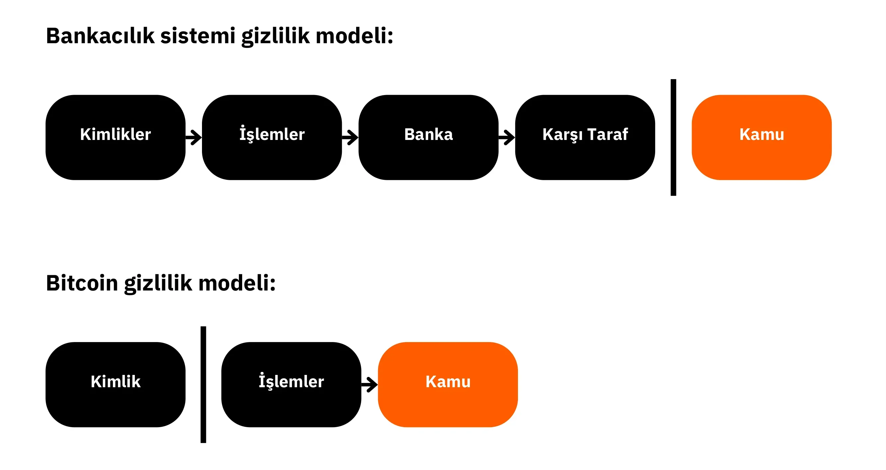


**Bölüm 2: Zincir analizini anlama ve buna karşı korunma**


İkinci bölümde, Blockchain analiz şirketleri tarafından Bitcoin üzerindeki faaliyetlerinizi izlemek için kullanılan tekniklere bakacağız. Bu yöntemleri anlamak, gizlilik korumanızı güçlendirmek için çok önemlidir. Bu bölümün amacı, riskleri daha iyi anlamak ve ilerleyen bölümlerde inceleyeceğimiz tekniklere zemin hazırlamak için saldırganların stratejilerini incelemektir. İşlem kalıplarını, dahili ve harici sezgisel yöntemleri ve bu kalıpların olası yorumlarını analiz edeceğiz. Teoriye ek olarak, pratik örnekler ve alıştırmalarla zincir analizi için bir Block explorer'nin nasıl kullanılacağını öğreneceğiz.


**Bölüm 3: Gizliliğinizi korumak için en iyi uygulamalarda uzmanlaşma**


Kursumuzun üçüncü bölümünde işin özüne iniyoruz: pratik! Amaç, herhangi bir Bitcoin kullanıcısı için doğal refleks haline gelmesi gereken tüm temel en iyi uygulamalarda uzmanlaşmaktır. Boş adreslerin kullanımı, etiketleme, konsolidasyon, tam düğümlerin kullanımı, KYC ve edinim yöntemlerini ele alacağız. Amaç, gizliliği koruma arayışımızda sağlam bir temel oluşturmak için kaçınılması gereken tuzaklara kapsamlı bir genel bakış sağlamaktır. Bu uygulamalardan bazıları için, bunların nasıl uygulanacağına dair özel bir eğitime yönlendirileceksiniz.


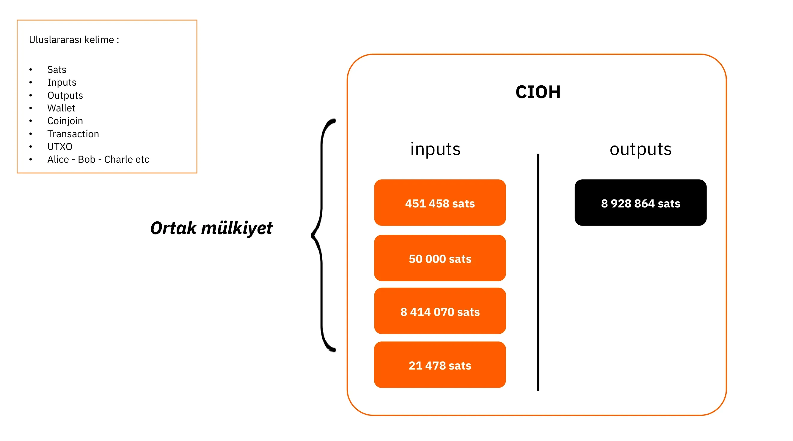


**Bölüm 4: CoinJoin işlemlerini anlama**


Bitcoin'de coinjoins'den bahsetmeden gizlilik hakkında nasıl konuşabiliriz? Bölüm 4'te bu karıştırma yöntemi hakkında bilmeniz gereken her şeyi öğreneceksiniz. Eş birleşimlerin ne olduğunu, tarihçesini ve amaçlarını, ayrıca var olan farklı CoinJoin türlerini öğreneceksiniz. Son olarak, daha deneyimli kullanıcılar için, anonset ve entropinin ne olduğuna ve nasıl hesaplanacağına bir göz atacağız.


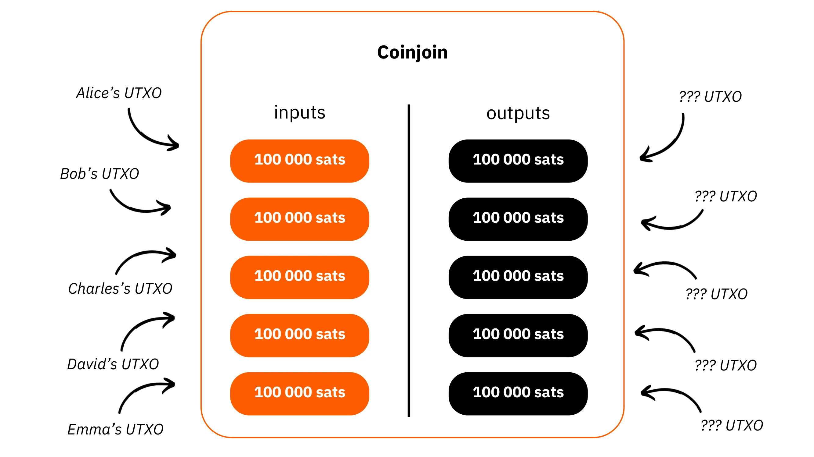


**Bölüm 5: Diğer gelişmiş gizlilik tekniklerinin zorluklarını anlamak**


Beşinci bölümde, CoinJoin dışında Bitcoin'da gizliliğinizi korumak için mevcut olan diğer tüm tekniklere bir göz atacağız. Yıllar boyunca, geliştiriciler gizliliğe adanmış araçlar tasarlama konusunda dikkate değer bir yaratıcılık gösterdiler. PayJoin, işbirlikçi işlemler, Coin Swap ve Atomic Swap gibi tüm bu yöntemleri nasıl çalıştıklarını, amaçlarını ve zayıflıklarını detaylandırarak inceleyeceğiz.


Ayrıca düğümler ağı ve işlem yayılımı düzeyinde gizliliğe de bakacağız. Statik Address protokolleri de dahil olmak üzere Bitcoin'te kullanıcı gizliliğini artırmak için yıllar içinde önerilen çeşitli protokolleri de tartışacağız.


Bitcoin'te gizliliğin inceliklerini keşfetmeye hazır mısınız? Hadi gidelim!


# Tanımlar ve anahtar kavramlar


<partId>b9bbbde3-34c0-4851-83e8-e2ffb029cf31</partId>


## Bitcoin'nın UTXO modeli


<chapterId>8d6b50c5-bf74-44f4-922b-25204991cb75</chapterId>


Bitcoin her şeyden önce bir para birimidir, ancak BTC'nin protokolde nasıl temsil edildiğini gerçekten biliyor musunuz?


### Bitcoin'daki UTXO'lar: bunlar nedir?


Bitcoin protokolü, "Harcanmamış İşlem Çıkışı" anlamına gelen UTXO modeline dayanmaktadır.


Bu model, finansal akışları izlemek için bir hesap ve bakiye mekanizmasına dayanan geleneksel bankacılık sistemlerinden oldukça farklıdır. Gerçekten de bankacılık sisteminde bireysel bakiyeler bir kimliğe bağlı hesaplarda tutulur. Örneğin, bir fırıncıdan ekmek satın aldığınızda, bankanız satın aldığınız miktarı hesabınızdan çekerek bakiyenizi azaltırken, fırıncının hesabına aynı miktarda alacak kaydederek bakiyesini artırır. Bu sistemde, işlem kayıtları dışında, hesabınıza giren para ile hesabınızdan çıkan para arasında bir bağlantı kavramı yoktur.


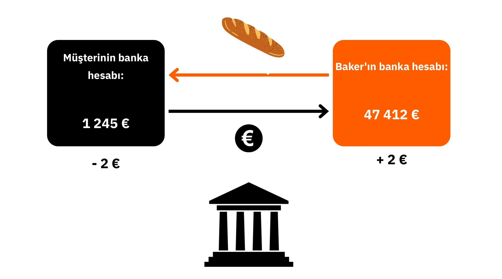


Bitcoin farklı çalışır. Hesap kavramı mevcut değildir ve parasal birimler bakiyeler aracılığıyla değil UTXO'lar aracılığıyla yönetilir. Bir UTXO, henüz harcanmamış belirli miktarda bitcoini temsil eder, böylece büyük veya küçük olabilen bir "Bitcoin parçası" oluşturur. Örneğin, bir UTXO `500 BTC` ya da basitçe `700 Sats` değerinde olabilir.


**Genellikle sat olarak kısaltılan Satoshi, Bitcoin'in en küçük birimidir ve fiat para birimlerindeki centime ile karşılaştırılabilir.**


```plaintext
1 BTC = 100 000 000 SATS
```


Teorik olarak bir UTXO, bir sattan teorik olarak maksimum 21 milyon BTC'ye kadar değişen herhangi bir bitcoin değerini temsil edebilir. Bununla birlikte, 21 milyon bitcoinin tamamına sahip olmak mantıksal olarak imkansızdır ve "Dust" adı verilen ve altında bir UTXO'in ekonomik olarak harcanmasının karsız olduğu düşünülen daha düşük bir ekonomik eşik vardır.


**UTXO üzerinde şimdiye kadar yaratılan en büyük Bitcoin `500.000 BTC` değerine sahipti. MtGox platformu tarafından Kasım 2011'de bir konsolidasyon operasyonu sırasında oluşturulmuştur:** [29a3efd3ef04f9153d47a990bd7b048a4b2d213daaa5fb8ed670fb85f13bdbcf](https://Mempool.space/tx/29a3efd3ef04f9153d47a990bd7b048a4b2d213daaa5fb8ed670fb85f13bdbcf)


### UTXO'lar ve harcama koşulları


UTXO'lar Exchange'nin Bitcoin üzerindeki araçlarıdır. Her işlem UTXO'ların girdi olarak tüketilmesi ve çıktı olarak yeni UTXO'ların yaratılmasıyla sonuçlanır. Bir işlem tamamlandığında, girdi olarak kullanılan UTXO'lar "harcanmış" olarak kabul edilir ve yeni UTXO'lar üretilir ve işlem çıktılarında belirtilen alıcılara tahsis edilir. Dolayısıyla, bir UTXO basitçe harcanmamış bir işlem çıktısını ve dolayısıyla belirli bir zamanda bir kullanıcıya ait olan bir miktar bitcoini temsil eder.


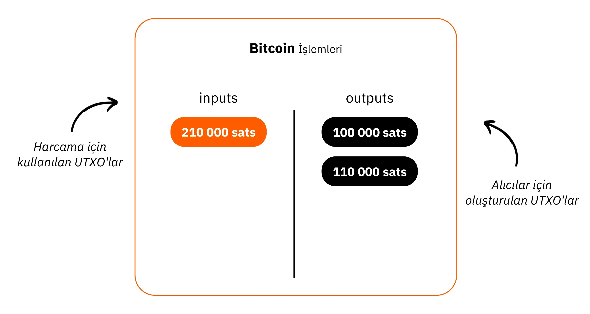


Tüm UTXO'lar, harcanabilecekleri koşulları tanımlayan senaryolarla güvence altına alınmıştır. Bir UTXO'i tüketmek için, bir kullanıcı ağa UTXO'i güvence altına alan komut dosyası tarafından öngörülen koşulları karşıladığını göstermelidir. Tipik olarak, UTXO'lar bir genel anahtar (veya bu genel anahtarı temsil eden bir alıcı Address) tarafından korunur. Bu genel anahtarla ilişkili bir UTXO'i harcamak için kullanıcı, bu anahtarla yapılmış bir dijital imza sağlayarak ilgili özel anahtara sahip olduğunu kanıtlamalıdır. Bu nedenle Bitcoin Wallet'nizin aslında bitcoin içermediğini, ancak özel anahtarlarınızı sakladığını ve bunun da UTXO'larınıza ve dolayısıyla temsil ettikleri bitcoinlere erişmenizi sağladığını söylüyoruz.


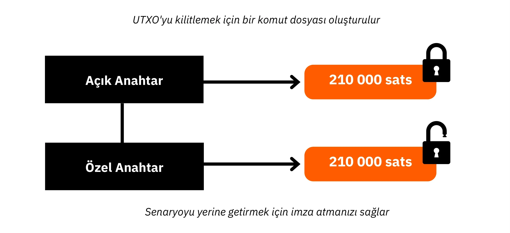


Bitcoin'da hesap kavramı olmadığından, bir Wallet'ın bakiyesi basitçe harcayabileceği tüm UTXO'ların değerlerinin toplamıdır. Örneğin, Bitcoin Wallet'ınız aşağıdaki 4 UTXO'yu harcayabilir:


```plaintext
- 2 BTC
- 8 BTC
- 5 BTC
- 2 BTC
```


Wallet'inizin toplam bakiyesi `17 BTC` olacaktır.


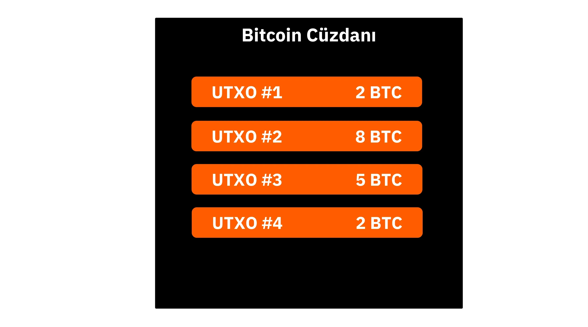


## Bitcoin işlemlerinin yapısı


<chapterId>29d3aaab-de2e-4746-ab40-c9748898850c</chapterId>


### İşlem girdileri ve çıktıları


Bir Bitcoin işlemi, Blockchain üzerinde kaydedilen ve Ownership bitcoinleri bir kişiden diğerine aktaran bir işlemdir. Daha açık bir ifadeyle, bir UTXO modelinde olduğumuzdan ve hesap olmadığından, işlem bir veya daha fazla UTXO'yu güvence altına alan harcama koşullarını yerine getirir, bunları tüketir ve eşdeğer olarak yeni harcama koşullarına sahip yeni UTXO'lar oluşturur. Kısacası, bir işlem bitcoinleri tatmin edilmiş bir senaryodan onları güvence altına almak için tasarlanmış yeni bir senaryoya taşır.


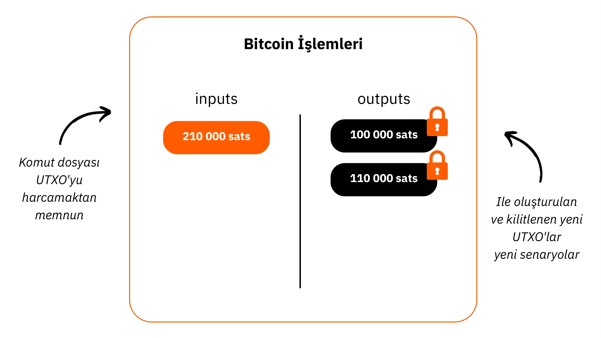


Bu nedenle her Bitcoin işlemi bir veya daha fazla giriş ve bir veya daha fazla çıkıştan oluşur. Girişler, işlem tarafından generate çıkışlarına tüketilen UTXO'lardır. Çıktılar, gelecekteki işlemler için girdi olarak kullanılabilecek yeni UTXO'lardır.


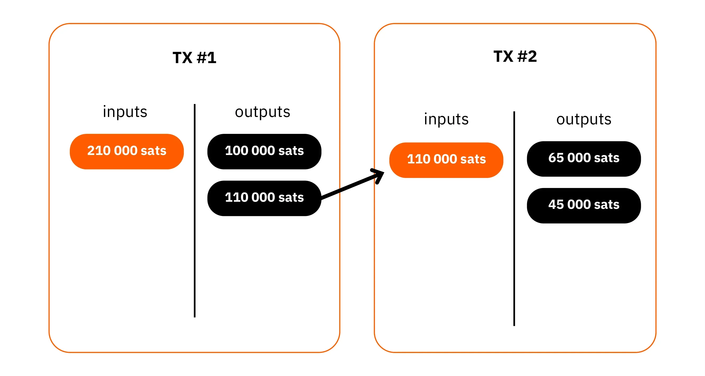


**Teorik olarak, bir Bitcoin işlemi sonsuz sayıda giriş ve çıkışa sahip olabilir. Tek sınır maksimum blok boyutudur.**


Bir Bitcoin işlemindeki her girdi, daha önce harcanmamış bir UTXO'i ifade eder. Bir UTXO'i girdi olarak kullanmak için, sahibinin ilgili senaryoyu doğrulayarak, yani uygulanan harcama koşulunu yerine getirerek hak sahibi olduğunu göstermesi gerekir. Genel olarak bu, bu UTXO'i başlangıçta güvence altına alan açık anahtara karşılık gelen özel anahtarla üretilen bir dijital imza sağlamak anlamına gelir. Bu nedenle senaryo, imzanın fonlar alındığında kullanılan açık anahtara karşılık geldiğini doğrulamaktan ibarettir.


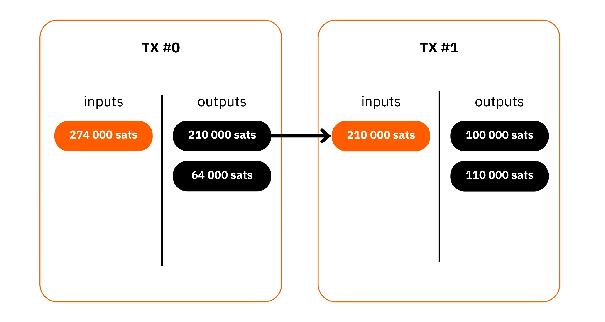


Her çıktı, sırayla, transfer edilecek bitcoin miktarını ve alıcıyı belirtir. İkincisi, genellikle yeni oluşturulan UTXO'ü alıcı bir Address veya yeni bir ortak anahtarla engelleyen yeni bir komut dosyası tarafından tanımlanır.


Bir işlemin mutabakat kurallarına göre geçerli sayılabilmesi için toplam çıktıların toplam girdilere eşit veya daha az olması gerekir. Başka bir deyişle, işlem tarafından üretilen yeni UTXO'ların toplamı, girdi olarak tüketilen UTXO'ların toplamını aşmamalıdır. Bu prensip mantıklıdır: eğer sadece `500,000 Sats`ünüz varsa, `700,000 Sats` satın alamazsınız.


### Exchange ve bir Bitcoin işleminde birleştirme


Bitcoin işleminin UTXO üzerindeki etkisi bu nedenle altın bir Coin'in yeniden şekillendirilmesine benzetilebilir. Aslında, bir UTXO bölünebilir değil, yalnızca eritilebilirdir. Bu, bir kullanıcının belirli bir bitcoin miktarını temsil eden bir UTXO'u birkaç küçük UTXO'ya bölemeyeceği anlamına gelir. Başlangıç değerinden küçük ya da ona eşit olması gereken çıktılarda keyfi değerlerde bir ya da daha fazla yeni UTXO yaratmak için bir işlemde tamamen tüketmesi gerekir.


Bu mekanizma altın Coin'inkine benzer. Diyelim ki 2 onsluk bir Coin'e sahipsiniz ve satıcının size para üstü veremeyeceğini varsayarak 1 onsluk bir ödeme yapmak istiyorsunuz. Coin'inizi eritmeniz ve her biri 1 onsluk 2 yeni Coin dökmeniz gerekecektir.


Bitcoin de benzer şekilde çalışır. Alice'ün `10,000 Sats` değerinde bir UTXO'e sahip olduğunu ve `4,000 Sats` değerinde ekmek satın almak istediğini düşünelim. Alice, girdi olarak tamamını tüketeceği 1 adet `10.000 Sats` değerinde UTXO ve çıktı olarak `4.000 Sats` ve `6.000 Sats` değerinde 2 adet UTXO ile bir işlem yapacaktır. 4.000 Sats`lük UTXO, baget için ödeme olarak fırıncıya gönderilirken, 6.000 Sats`lük UTXO, para üstü olarak Alice'e geri dönecektir. İşlemin asıl düzenleyicisine geri dönen bu UTXO, Bitcoin jargonunda "Exchange" olarak bilinir.


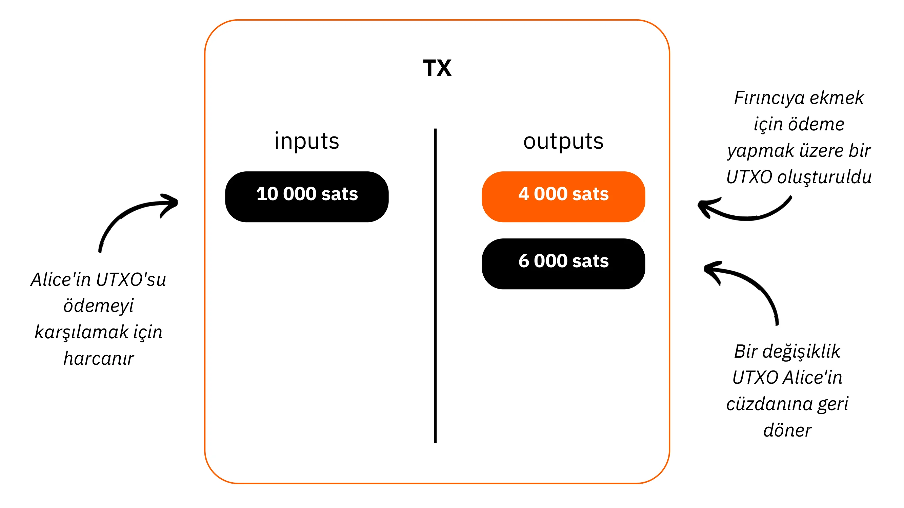


Şimdi Alice'nın `10,000 Sats`lik tek bir UTXO'e sahip olmadığını, bunun yerine her biri `3,000 Sats`lik iki UTXO'ya sahip olduğunu düşünelim. Bu durumda, UTXO'ların hiçbiri tek başına asanın `4,000 Sats'sini ayarlamak için yeterli değildir. Bu nedenle Alice, işleminin girdisi olarak `3.000 Sats`lik 2 UTXO'yu aynı anda kullanmalıdır. Bu şekilde, toplam girdi miktarı `6,000 Sats`ye ulaşacak ve fırıncıya yapacağı `4,000 Sats`lik ödemeyi karşılayabilecektir. Birkaç UTXO'nun bir işlemin girdileri olarak bir araya getirildiği bu yöntem genellikle "birleştirme" olarak adlandırılır.


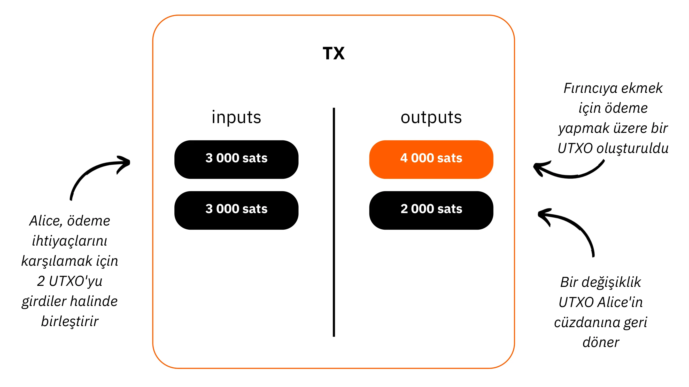


### İşlem ücretleri


Sezgisel olarak, işlem maliyetlerinin de bir işlemin çıktısını temsil ettiği düşünülebilir. Ancak gerçekte durum böyle değildir. İşlem maliyetleri toplam girdiler ile toplam çıktılar arasındaki farkı temsil eder. Bu, bir işlemde istenen çıktıları karşılamak için girdilerin değerinin bir kısmı kullanıldıktan sonra, girdilerin belirli bir toplamının kullanılmadan kaldığı anlamına gelir. Bu kalan miktar işlem maliyetlerini oluşturmaktadır.


```plaintext
Frais = total inputs - total outputs
```


UTXO`i `10,000 Sats` olan ve `4,000 Sats`dan ekmek almak isteyen Alice örneğini ele alalım. Alice, girdi olarak `10.000 Sats` tutarındaki UTXO ile bir işlem oluşturur. Daha sonra fırıncının baget için ödeme yapması için `4.000 Sats` değerinde bir çıktı üretir. Madencileri işlemini bir bloğa entegre etmeye teşvik etmek için, Alice ücret olarak `200 Sats` tahsis eder. Daha sonra, kendisine iade edilecek olan ve `5,800 Sats` tutarında ikinci bir çıktı yaratır.


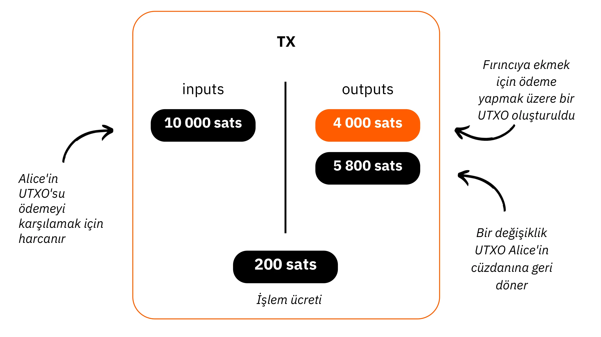


Ücret formülünü uyguladığımızda, reşit olmayanlar için gerçekten de `200 Sats` kaldığını görüyoruz:


```plaintext
Frais = total inputs - total outputs
Frais = 10 000 - (4 000 + 5 800)
Frais = 10 000 - 9 800
Frais = 200
```


Bir Miner bir bloğu doğrulamayı başardığında, bloğunda yer alan tüm işlemler için "coinbase" işlemi aracılığıyla bu ücretleri tahsil etme yetkisine sahip olur.


### Bitcoin üzerinde UTXO'lar Oluşturma


Önceki paragrafları dikkatle takip ettiyseniz, UTXO'ların yalnızca mevcut diğer UTXO'ları tüketerek oluşturulabileceğini artık biliyorsunuzdur. Bu şekilde, Bitcoin coinleri sürekli bir zincir oluşturur. Ancak, bu zincirdeki ilk parçaların nasıl ortaya çıktığını merak ediyor olabilirsiniz. Bu da tavuk ve yumurtaya benzer bir sorun ortaya çıkarır: Bu orijinal UTXO'lar nereden geldi?


Cevap **transaction coinbase**'de.


Coinbase, her blok için benzersiz olan ve her zaman bunlardan ilki olan belirli bir Bitcoin işlem türüdür. Geçerli bir Proof of Work bulan Miner'ün Block reward'sini almasını sağlar. Bu ödül iki Elements'den oluşur: *önceki bölümde tartışılan* **blok hibesi** ve **işlem ücreti**.


Coinbase Transaction, generate çıktıları için girdileri tüketmeye gerek kalmadan ex nihilo bitcoin yaratabilen tek sistem olması bakımından benzersizdir. Bu yeni yaratılan bitcoinler "orijinal UTXO'lar" olarak adlandırabileceğimiz şeylerdir.


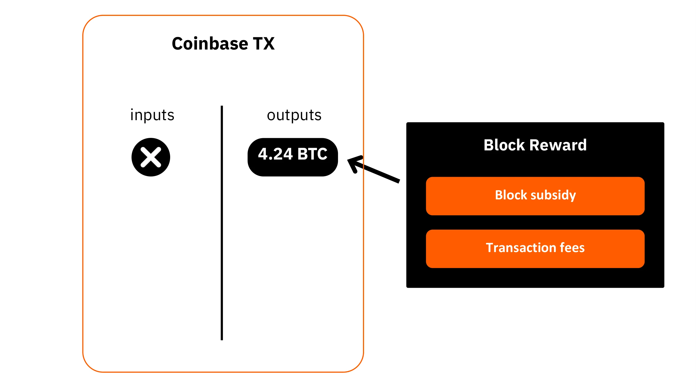


Blok sübvansiyonlu bitcoinler, mutabakat kurallarında önceden belirlenmiş bir ihraç programına göre sıfırdan yaratılan yeni BTC'lerdir. Blok sübvansiyonu her 210.000 blokta bir, yani yaklaşık her dört yılda bir, "Halving" olarak bilinen bir süreçte yarıya indirilir. Başlangıçta, her sübvansiyonla 50 bitcoin yaratılıyordu, ancak bu miktar kademeli olarak azaldı; şu anda blok başına 3.125 bitcoin.


İşlem ücretlerine gelince, bunlar da yeni yaratılan BTC'leri temsil etse de, bir bloktaki tüm işlemlerin toplam girdileri ve çıktıları arasındaki farkı aşmamalıdır. Bu ücretlerin girdilerin işlem çıktılarında kullanılmayan kısmını temsil ettiğini daha önce görmüştük. Bu kısım işlem sırasında teknik olarak "kaybolur" ve Miner bu değeri bir veya daha fazla yeni UTXO şeklinde yeniden yaratma hakkına sahiptir. Bu, işlemi düzenleyen ile bunu Blockchain'e ekleyen Miner arasında bir değer transferidir.


**Bir Coinbase Transaction tarafından üretilen bitcoinler, Miner tarafından harcanamayacakları 100 blokluk** bir vade süresine tabidir. Bu kural, daha sonra kullanılmaz hale gelebilecek bir zincirde yeni oluşturulan bitcoinlerin kullanımıyla bağlantılı komplikasyonları önlemek için tasarlanmıştır.


### UTXO modelinin sonuçları


Her şeyden önce, UTXO modeli Bitcoin'un işlem ücretlerini doğrudan etkilemektedir. Her bloğun kapasitesi sınırlı olduğundan, madenciler blokta kaplayacakları alana göre en iyi ücretleri sunan işlemleri tercih eder. Gerçekten de, bir işlem girdi ve çıktılarında ne kadar çok UTXO içeriyorsa, o kadar ağırdır ve bu nedenle daha yüksek ücretler gerektirir. Bu, Wallet'umuzdaki UTXO'ların sayısını azaltmaya çalışmamızın nedenlerinden biridir; bu, bu dersin üçüncü bölümünde ayrıntılı olarak ele alacağımız bir konu olan gizliliği de etkileyebilir.


İkinci olarak, önceki bölümlerde de belirtildiği gibi, Bitcoin coinleri esasen bir UTXO zinciridir. Dolayısıyla her işlem geçmişteki bir UTXO ile gelecekteki bir UTXO arasında bir bağlantı oluşturur. UTXO'lar bu nedenle Bitcoin'lerin yaratılışlarından mevcut harcamalarına kadar izledikleri yolu açıkça takip etmeyi mümkün kılmaktadır. Bu şeffaflık, her kullanıcının aldığı bitcoinlerin gerçekliğini tespit etmesini sağladığı için olumlu görülebilir. Bununla birlikte, gizliliğinizi tehlikeye atmak için tasarlanmış bir uygulama olan Blockchain analizi de bu izlenebilirlik ve denetlenebilirlik ilkesine dayanmaktadır. Kursun ikinci bölümünde bu uygulamayı derinlemesine inceleyeceğiz.


## Bitcoin'in gizlilik modeli


<chapterId>769d8963-3ed5-4094-b21d-9203c7d9e465</chapterId>


### Para: özgünlük, dürüstlük ve çifte harcama


Paranın işlevlerinden biri de ihtiyaçların çifte çakışması sorununu çözmektir. Takasa dayalı bir sistemde, bir Exchange'nın tamamlanması, yalnızca benim ihtiyacıma karşılık gelen bir malı veren bir birey bulmayı değil, aynı zamanda ona kendi ihtiyacını karşılayan eşdeğer değerde bir mal sağlamayı da gerektirir. Bu dengeyi kurmak karmaşık bir meseledir.


Bu nedenle, değeri hem uzayda hem de zamanda hareket ettirmek için parayı kullanırız.


Madeni paranın bu sorunu çözebilmesi için, bir mal veya hizmet sağlayan tarafın bu meblağı daha sonraki bir tarihte harcayabileceğine ikna olması şarttır. Dolayısıyla, ister dijital ister fiziksel olsun, bir Coin'yi kabul etmek isteyen herhangi bir rasyonel birey, bunun iki temel kriteri karşıladığından emin olacaktır:


- Eser bütünlük ve özgünlüğe sahip olmalıdır;
- ve iki kez harcanmamalıdır.


Fiziksel para birimi kullanıyorsanız, iddia edilmesi en karmaşık olan ilk özellik budur. Tarihin farklı dönemlerinde, metal sikkelerin bütünlüğü genellikle kırpma veya delme gibi uygulamalardan etkilenmiştir. Örneğin antik Roma'da vatandaşların altın sikkelerin kenarlarını kazıyarak biraz değerli metal toplaması ve bunları gelecekteki işlemler için saklaması yaygın bir uygulamaydı. Böylece Coin'in gerçek değeri azalmış, ancak nominal değeri aynı kalmıştır. Coin'in kenarının daha sonra yivli olmasının nedenlerinden biri de budur.


Orijinallik aynı zamanda fiziksel bir parasal araç üzerinde doğrulanması zor bir özelliktir. Günümüzde sahte para ile mücadele teknikleri giderek daha karmaşık hale gelmekte ve perakendecileri maliyetli doğrulama sistemlerine yatırım yapmaya zorlamaktadır.


Öte yandan, doğaları gereği, çifte harcama fiziksel para birimleri için bir sorun değildir. Eğer size 10 €'luk bir banknot verirsem, bu banknot geri dönülemez bir şekilde benim mülkiyetimden çıkar ve sizin mülkiyetinize girer; bu da doğal olarak içerdiği parasal birimlerin birden fazla kez harcanması olasılığını ortadan kaldırır. Kısacası, bu 10 €'luk banknotu tekrar harcayamayacağım.


Dijital para birimi için zorluk farklıdır. Bir Coin'in gerçekliğini ve bütünlüğünü sağlamak genellikle daha basittir. Önceki bölümde gördüğümüz gibi, Bitcoin'un UTXO modeli, bir Coin'i kaynağına kadar izlemeyi ve böylece gerçekten de bir Miner tarafından mutabakat kurallarına uygun olarak oluşturulduğunu doğrulamayı mümkün kılar.


Öte yandan, Double-spending olmamasını sağlamak daha karmaşıktır, çünkü tüm dijital mallar özünde bilgidir. Fiziksel malların aksine, bilgi değiş tokuş edildiğinde bölünmez, çarpılarak yayılır. Örneğin, size e-posta ile bir belge gönderirsem, bu çoğaltılacaktır. Orijinal belgeyi sildiğimden emin olamazsınız.


### Bitcoin için çifte harcamanın önlenmesi


Bir dijital varlığın bu şekilde çoğaltılmasını önlemenin tek yolu, sistemdeki tüm borsalardan haberdar olmaktır. Bu şekilde kimin neye sahip olduğunu bilebilir ve yapılan işlemlere göre her bir kişinin elindekileri güncelleyebiliriz. Örneğin bankacılık sistemindeki kutsal paralarda olan budur. Bir tüccara kredi kartıyla 10 € ödediğinizde, banka Exchange'i kaydeder ve hesap defterini günceller.


Bitcoin'de Double-spending aynı şekilde engellenir. Söz konusu madeni paraları zaten harcamış olan bir işlemin olmadığını teyit etmeye çalışırız. Madeni paralar hiç kullanılmamışsa, çifte harcama yapılmayacağından emin olabiliriz. Bu ilke Satoshi Nakamoto tarafından Beyaz Kitap'ta ünlü cümle ile açıklanmıştır:


**Bir işlemin olmadığını teyit etmenin tek yolu tüm işlemlerden haberdar olmaktır**


Ancak bankacılık modelinden farklı olarak, Bitcoin'da merkezi bir varlığa güvenmek zorunda kalmak istemiyoruz. Bu nedenle tüm kullanıcıların üçüncü bir tarafa güvenmeden bu çifte harcamanın olmadığını teyit edebilmeleri gerekir. Yani herkesin tüm Bitcoin işlemlerinden haberdar olması gerekiyor. Bu nedenle Bitcoin işlemleri tüm ağ düğümlerinde herkese açık olarak yayınlanır ve Blockchain'da açık metin olarak kaydedilir.


Bitcoin'de mahremiyetin korunmasını zorlaştıran da tam olarak bu kamuya açık bilgi yayılımıdır. Geleneksel bankacılık sisteminde, teorik olarak, gerçekleştirilen işlemlerden yalnızca finans kurumu haberdardır. Öte yandan, Bitcoin ile tüm kullanıcılar kendi düğümleri aracılığıyla tüm işlemlerden haberdar olur.


### Gizlilik modeli: bankacılık sistemi vs. Bitcoin


Geleneksel sistemde, banka hesabınız kimliğinizle bağlantılıdır. Bankacı hangi banka hesabının hangi müşteriye ait olduğunu ve hangi işlemlerin bununla ilişkili olduğunu bilebilir. Ancak bu bilgi akışı banka ile kamusal alan arasında kesilmiştir. Diğer bir deyişle, başka bir kişiye ait bir banka hesabının bakiyesini ve işlemlerini bilmek mümkün değildir. Bu bilgilere sadece bankanın erişimi vardır.


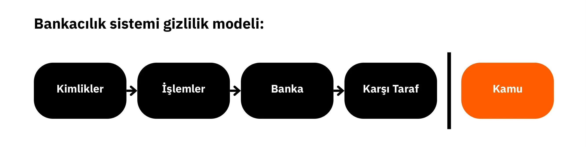


Örneğin, bankacınız her sabah bagetinizi yerel fırıncıdan aldığınızı bilir, ancak komşunuzun bu işlem hakkında hiçbir bilgisi yoktur. Bu şekilde, bilgi akışı başta banka olmak üzere ilgili taraflar için erişilebilir, ancak dışarıdakiler için erişilemez kalır.


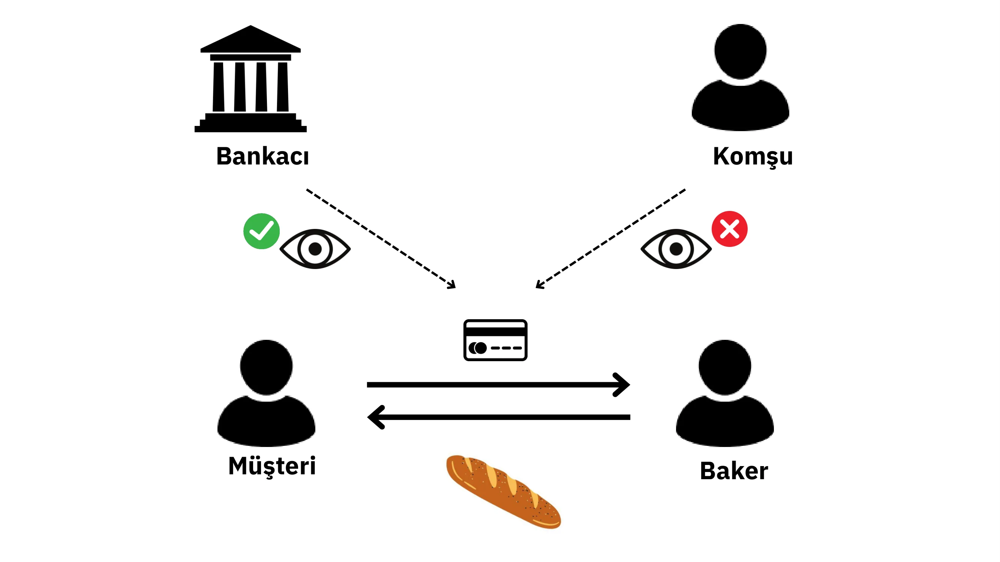


Önceki bölümde gördüğümüz işlemlerin kamuya yayılması kısıtlaması nedeniyle, Bitcoin'ün gizlilik modeli bankacılık sistemi modelini takip edemez. Bitcoin'ün durumunda, işlemler ve kamusal alan arasındaki bilgi akışı kesilemediğinden, **gizlilik modeli kullanıcının kimliği ile işlemlerin** kendileri arasındaki ayrıma dayanır.


Örneğin, fırıncıdan BTC ile ödeme yaparak ekmek satın alırsanız, kendi Full node'ü olan komşunuz, sistemdeki diğer tüm işlemleri görebildiği gibi, işleminizin gerçekleştiğini de görebilir. Ancak, gizlilik ilkelerine uyulduğu takdirde, bu belirli işlemi sizin kimliğinizle ilişkilendirememelidir.


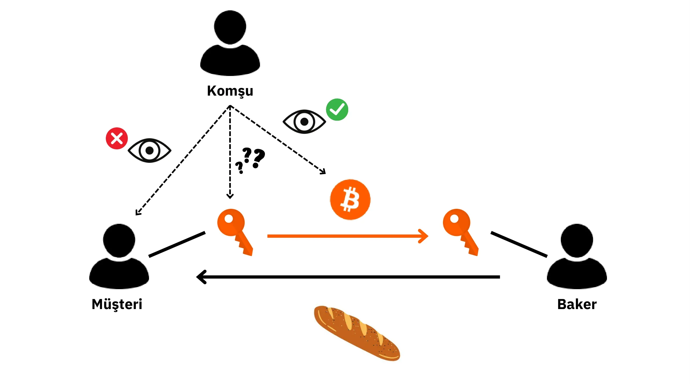


Ancak Bitcoin işlemleri kamuya açık olduğundan, ilgili taraflar hakkında bilgi çıkarmak için bunlar arasında bağlantı kurmak hala mümkündür. Hatta bu faaliyet "Blockchain analizi" olarak bilinen başlı başına bir uzmanlık alanı oluşturmaktadır. Kursun bir sonraki bölümünde sizi Blockchain analizinin temellerini keşfetmeye davet ediyorum, böylece bitcoinlerinizin nasıl izlendiğini anlayabilir ve kendinizi onlara karşı daha iyi savunabilirsiniz.


# Zincir analizini anlama ve buna karşı korunma


<partId>4739371e-9fef-45b0-bcaa-b7a4df6b4470</partId>


## Bitcoin zincir analizi nedir?


<chapterId>7d198ba6-4af2-4f24-86cb-3c79cb25627e</chapterId>


### Tanım ve işleyiş


Blockchain analizi, Blockchain üzerindeki bitcoin akışını izleme uygulamasıdır. Genel olarak zincir analizi, önceki işlem örneklerindeki özelliklerin gözlemlenmesine dayanır. Daha sonra, analiz etmek istediğimiz bir işlemde aynı özelliklerin tanımlanması ve bunlardan makul yorumların çıkarılmasından oluşur. Yeterince iyi bir çözüm bulmak için pratik bir yaklaşıma dayanan bu problem çözme yöntemi "sezgisel" olarak bilinir.


Daha basit bir ifadeyle, zincir analizinde üç ana aşama vardır:


1. **Blockchain'u gözlemlemek;**


2. **Bilinen özelliklerin tanımlanması;**


3. **Varsayımların çıkarılması **


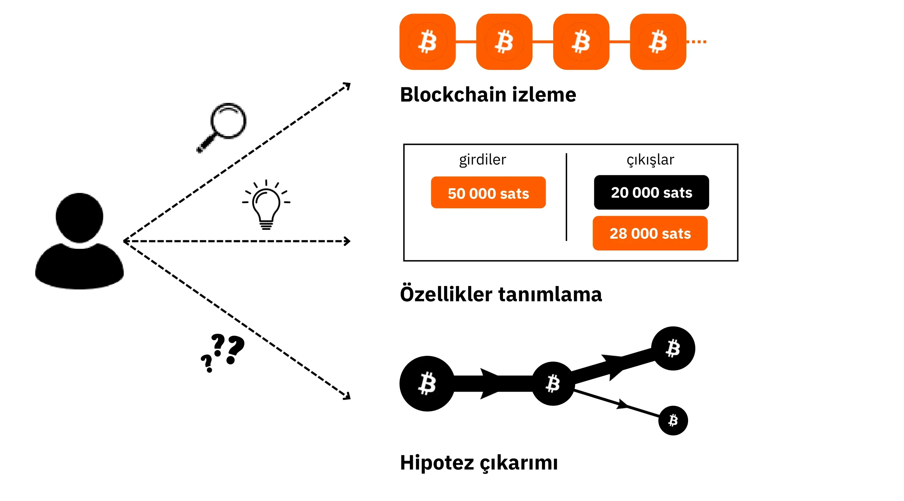


Blockchain analizi herkes tarafından gerçekleştirilebilir. İhtiyacınız olan tek şey, işlem hareketlerini gözlemlemek ve hipotezler oluşturmak için bir Full node aracılığıyla Blockchain'ın genel bilgilerine erişmektir. Bu bölümün son iki bölümünde ayrıntılı olarak inceleyeceğimiz [OXT.me] (https://oxt.me/) gibi bu analizi kolaylaştıran ücretsiz araçlar da vardır. Ancak, gizliliğe yönelik asıl risk, dizgi analizi konusunda uzmanlaşmış şirketlerden gelmektedir. Bu şirketler Blockchain analizini endüstriyel bir ölçeğe taşımış ve hizmetlerini finansal kurumlara ve hükümetlere satmaktadır. Bu şirketler arasında Chainalysis kesinlikle en iyi bilinendir.


### Zincir analizi hedefleri


Blockchain analizinin amaçlarından biri, Bitcoin üzerindeki çeşitli faaliyetleri bir araya getirerek bunları gerçekleştiren kullanıcının benzersizliğini belirlemektir. Daha sonra, bu faaliyet kümesini gerçek bir kimlikle ilişkilendirmeye çalışmak mümkün olacaktır.


Bir önceki bölümü hatırlayın. Bitcoin'in gizlilik modelinin neden başlangıçta kullanıcı kimliğinin işlemlerden ayrılmasına dayandığını açıklamıştım. Bu nedenle Blockchain analizinin işe yaramaz olduğunu düşünmek cazip gelebilir çünkü zincir üzerindeki faaliyetleri bir araya getirmeyi başarsak bile bunları gerçek bir kimlikle ilişkilendiremeyiz.


Teorik olarak bu ifade doğrudur. Bu kursun ilk bölümünde, kriptografik anahtar çiftlerinin UTXO üzerinde koşullar oluşturmak için kullanıldığını gördük. Esasen, bu anahtar çiftleri sahiplerinin kimliği hakkında hiçbir bilgi vermez. Dolayısıyla, farklı anahtar çiftleriyle ilişkili faaliyetleri bir araya getirmeyi başarsak bile, bu bize bu faaliyetlerin arkasındaki varlık hakkında hiçbir şey söylemez.


Ancak pratik gerçeklik çok daha karmaşıktır. Gerçek bir kimliği zincir üzerindeki faaliyetlere bağlayabilecek çok sayıda davranış vardır. Analizde buna giriş noktası denir ve bunlardan çok sayıda vardır.


En yaygın olanı KYC'dir (*Müşterini Tanı*). Bitcoinlerinizi düzenlenmiş bir platformdan kişisel alıcı adreslerinizden birine çekerseniz, bazı kişiler kimliğinizi bu Address ile ilişkilendirebilir. Daha geniş anlamda, bir giriş noktası gerçek hayatınız ile bir Bitcoin işlemi arasındaki herhangi bir etkileşim şekli olabilir. Örneğin, sosyal ağlarınızda bir alıcı Address yayınlarsanız, bu analiz için bir giriş noktası olabilir. Fırıncınıza Bitcoin ile bir ödeme yaparsanız, yüzünüzü (kimliğinizin bir parçası) bir Bitcoin Address ile ilişkilendirebilecektir.


Bitcoin kullanılırken bu giriş noktaları neredeyse kaçınılmazdır. Kapsamlarını kısıtlamaya çalışsak da, her zaman mevcut olacaklardır. Bu nedenle gizliliğinizi korumaya yönelik yöntemleri birleştirmek çok önemlidir. Gerçek kimliğiniz ile işlemleriniz arasındaki ayrımı korumak ilginç bir yaklaşım olsa da, günümüzde yetersiz kalmaktadır. Gerçekten de, zincir üzerindeki tüm faaliyetleriniz bir arada gruplandırılabiliyorsa, en küçük giriş noktası bile oluşturduğunuz tek Layer gizliliğini tehlikeye atabilir.


### Zincir analizine karşı kendinizi savunmak


Dolayısıyla, Bitcoin kullanımımızda Blockchain analiziyle de başa çıkabilmemiz gerekir. Bunu yaparak, faaliyetlerimizin toplanmasını en aza indirebilir ve bir giriş noktasının gizliliğimiz üzerindeki etkisini sınırlayabiliriz.


Blockchain analizine karşı koymanın, bu analizde kullanılan yöntemleri öğrenmekten daha iyi bir yolu var mı? Bitcoin'te gizliliğinizi nasıl geliştireceğinizi bilmek istiyorsanız, bu yöntemleri anlamanız gerekir. Bu size CoinJoin veya PayJoin gibi teknikleri (kursun son bölümlerinde inceleyeceğimiz teknikler) daha iyi kavramanızı sağlayacak ve yapabileceğiniz hataları azaltacaktır.


https://planb.network/tutorials/privacy/on-chain/coinjoin-samourai-wallet-e566803d-ab3f-4d98-9136-5462009262ef

https://planb.network/tutorials/privacy/on-chain/payjoin-848b6a23-deb2-4c5f-a27e-93e2f842140f

Bu konuda kriptografi ve kriptanaliz ile bir analoji kurabiliriz. İyi bir kriptograf her şeyden önce iyi bir kriptanalisttir. Yeni bir şifreleme algoritması tasarlamak için, hangi saldırılarla karşılaşacağını bilmeniz ve önceki algoritmaların neden kırıldığını incelemeniz gerekir. Aynı prensip Bitcoin gizliliği için de geçerlidir. Blockchain analiz yöntemlerini anlamak, bunlara karşı korunmanın anahtarıdır. Bu nedenle bu eğitime on chain analizi ile ilgili bir bölüm ekledim.


### Zincir analizi yöntemleri


Sicim analizinin kesin bir bilim olmadığını anlamak önemlidir. Önceki gözlemlerden veya mantıksal yorumlardan türetilen sezgisel kurallara dayanır. Bu kurallar oldukça güvenilir sonuçlar elde etmemizi sağlar, ancak asla mutlak kesinlikte değildir. Başka bir deyişle, **zincir analizi ulaşılan sonuçlarda her zaman bir olasılık boyutu içerir**. Örneğin, iki adresin aynı varlığa ait olduğunu çeşitli kesinlik dereceleriyle tahmin etmek mümkün olabilir, ancak tam kesinlik her zaman ulaşılamaz olacaktır.


Zincirleme analizin tüm amacı, hata riskini en aza indirmek için çeşitli sezgisel yöntemlerin bir araya getirilmesinde yatmaktadır. Bir bakıma, bizi gerçeğe yaklaştıran bir kanıt birikimidir.


Bu ünlü sezgisel yöntemler, aşağıda ayrıntılı olarak açıklayacağımız farklı kategorilerde gruplandırılabilir:


- İşlem kalıpları;
- İşlem-içi sezgiseller;
- İşlemin dışındaki sezgisel yöntemler.


### Satoshi Nakamoto ve zincir analizi


İlk iki zincir analizi sezgisel yöntemi Satoshi Nakamoto'nun kendisi tarafından keşfedilmiştir. Bunlardan Bitcoin'in Beyaz Kitabının 10. bölümünde bahsetmektedir. Bunlar:


- cIOH (*Common Input Ownership Heuristic*);
- ve Address'ün yeniden kullanımı.


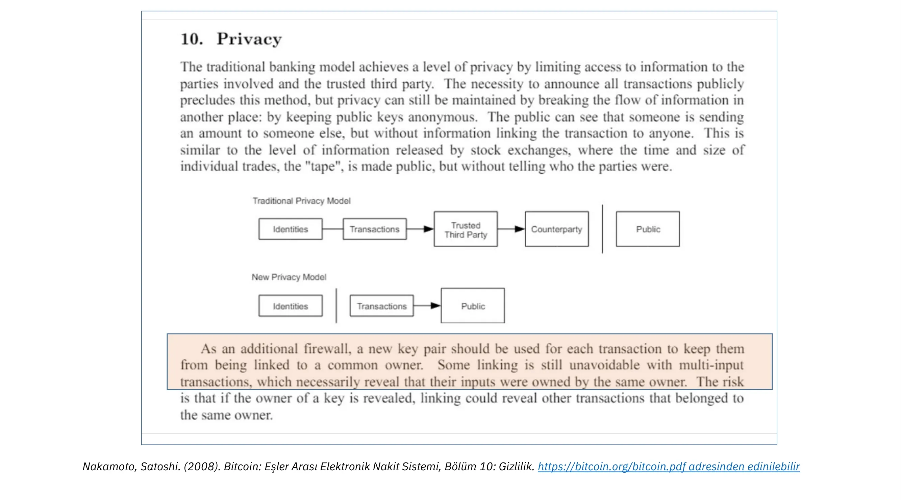


Kaynak: S. Nakamoto, "Bitcoin: Eşler Arası Elektronik Nakit Sistemi", https://Bitcoin.org/Bitcoin.pdf, 2009.


Bunların ne olduğunu ilerleyen bölümlerde göreceğiz, ancak bu iki sezgisel yöntemin bugün hala zincir analizinde üstünlüğünü koruduğunu belirtmek ilginçtir.


## İşlem modelleri


<chapterId>d365a101-2d37-46a5-bfb9-3c51e37bf96b</chapterId>


Bir işlem kalıbı, Blockchain'da bulunabilen ve muhtemel yorumu bilinen tipik bir işlemin genel bir modeli veya yapısıdır. Kalıpları incelerken, tek bir işleme odaklanır ve onu yüksek düzeyde analiz ederiz.


Başka bir deyişle, işlemin daha spesifik ayrıntıları veya ortamı üzerinde durmadan, yalnızca girdilerdeki UTXO sayısına ve çıktılardaki UTXO sayısına bakacağız. Gözlemlenen örüntüye dayanarak işlemin doğasını yorumlayabiliriz. Daha sonra yapısının özelliklerini arayacak ve bir yorum çıkaracağız.


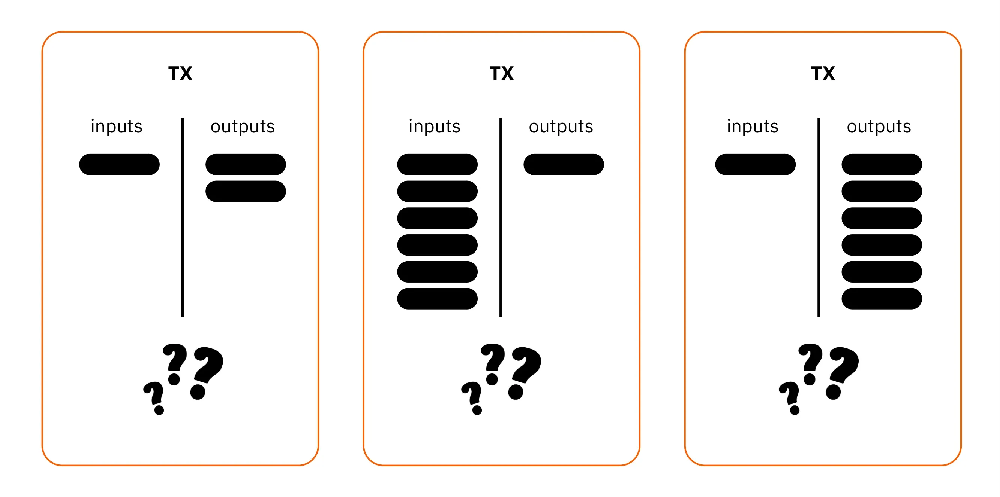


Bu bölümde, zincir analizinde karşılaşılan ana işlem modellerine birlikte bakacağız ve her model için size bu yapının olası yorumunu ve somut bir örnek vereceğim.


### Tek gönderi (veya tek ödeme)


Çok yaygın bir modelle başlayalım, çünkü çoğu Bitcoin ödemesinde ortaya çıkan model budur. Basit ödeme modeli, bir veya daha fazla UTXO'nun girdi olarak tüketilmesi ve 2 UTXO'nun çıktı olarak üretilmesi ile karakterize edilir. Dolayısıyla bu model şu şekildedir:


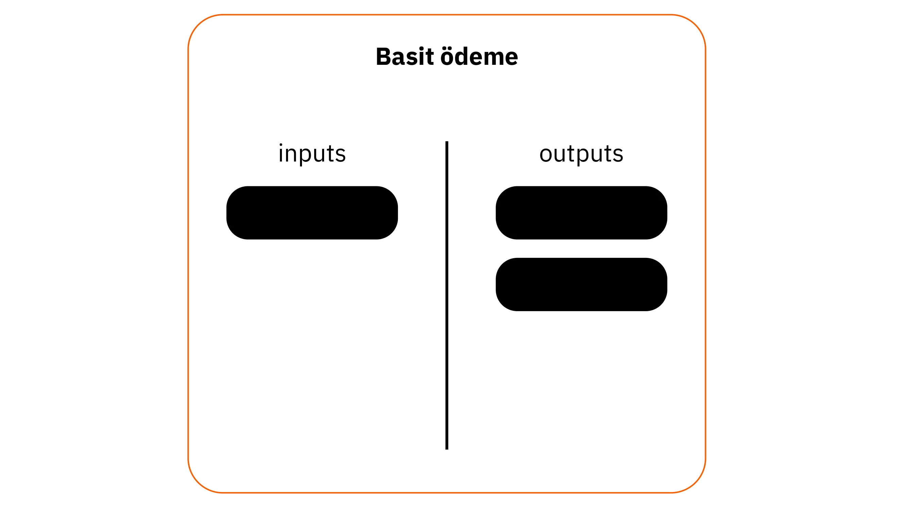


Bu işlem yapısını Blockchain üzerinde gördüğümüzde zaten bir yorum çıkarabiliriz. Adından da anlaşılacağı üzere, bu model bir gönderme veya ödeme işleminin varlığına işaret etmektedir. Kullanıcı, çıktılarda bir ödeme UTXO ve bir değişiklik UTXO (aynı kullanıcıya iade edilen para) karşılamak için girdilerde kendi UTXO'ini tüketmiştir.


Bu nedenle, gözlemlenen kullanıcının muhtemelen artık iki çıktı UTXO'dan birine (ödeme UTXO) sahip olmadığını, ancak diğer UTXO'e (değişiklik UTXO) hala sahip olduğunu biliyoruz.


Şu an için hangi çıktının hangi UTXO'yi temsil ettiğini belirleyemiyoruz, çünkü örüntü çalışmasının amacı bu değil. İlerleyen bölümlerde inceleyeceğimiz sezgisel yöntemlere dayanarak bu sonuca ulaşacağız. Bu aşamada amacımız, söz konusu işlemin niteliğini belirlemekle sınırlıdır; bu durumda söz konusu işlem basit bir göndermedir.


Örneğin, burada basit gönderme modelini benimseyen bir Bitcoin işlemi bulunmaktadır:


```plaintext
b6cc79f45fd2d7669ff94db5cb14c45f1f879ea0ba4c6e3d16ad53a18c34b769
```


Kaynak: [Mempool.space](https://Mempool.space/tx/b6cc79f45fd2d7669ff94db5cb14c45f1f879ea0ba4c6e3d16ad53a18c34b769)


Bu ilk örnekten sonra, bir "işlem modeli" üzerinde çalışmanın ne anlama geldiğini daha iyi anlamış olmalısınız. Bir işlemi, çevresini veya işlemin belirli ayrıntılarını dikkate almadan, yalnızca yapısına odaklanarak inceleriz. Bu ilk adımda sadece büyük resme bakıyoruz.


Artık bir modelin ne olduğunu anladığınıza göre, mevcut diğer modellere geçelim.


### Süpürme


Bu ikinci model, girdi olarak tek bir UTXO tüketimi ve çıktı olarak tek bir UTXO üretimi ile karakterize edilir.


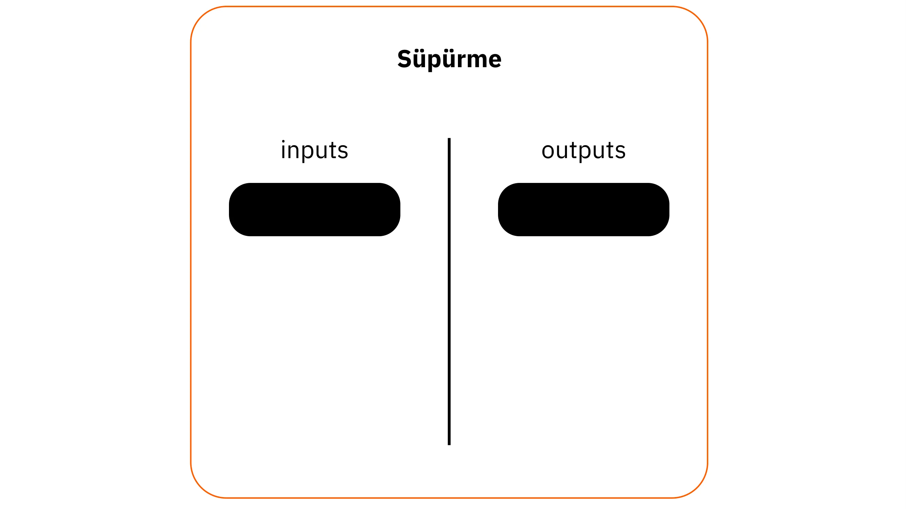


Bu modelin yorumu, bir öz-transferin varlığında olduğumuzdur. Kullanıcı bitcoinlerini kendisine, kendisine ait başka bir Address'ya transfer etmiştir. İşlemde herhangi bir değişiklik olmadığından, bir ödemenin varlığında olmamız pek olası değildir. Gerçekten de, bir ödeme yapıldığında, ödeyenin satıcı tarafından talep edilen miktara ve işlem ücretine tam olarak karşılık gelen bir UTXO'ye sahip olması neredeyse imkansızdır. Genel olarak, ödeme yapan kişi bu nedenle bir değişiklik çıktısı üretmekle yükümlüdür.


O halde gözlemlenen kullanıcının muhtemelen hala bu UTXO'a sahip olduğunu biliyoruz. Bir zincir analizi bağlamında, işleme girdi olarak kullanılan UTXO'un Alice'e ait olduğunu biliyorsak, çıktı olarak kullanılan UTXO'un da ona ait olduğunu varsayabiliriz. Daha sonra ilginç hale gelecek olan şey, bu varsayımı güçlendirebilecek işlem içi sezgisel yöntemler bulmaktır (bu sezgisel yöntemlere bölüm 3.3'te bakacağız).


Örneğin, burada süpürme modelini benimseyen bir Bitcoin işlemi bulunmaktadır:


```plaintext
35f1072a0fda5ae106efb4fda871ab40e1f8023c6c47f396441ad4b995ea693d
```


Kaynak: [Mempool.space](https://Mempool.space/tx/35f1072a0fda5ae106efb4fda871ab40e1f8023c6c47f396441ad4b995ea693d)


Bununla birlikte, bu tür bir modelin bir kripto para birimi Exchange platformunun hesabına yapılan bir öz transferi de ortaya çıkarabileceğine dikkat edin. Bilinen adreslerin incelenmesi ve işlemin bağlamı, bize bunun kendi kendine saklanan bir Wallet'e yapılan bir kaydırma mı yoksa bir platforma yapılan bir para çekme işlemi mi olduğunu söyleyecektir. Gerçekten de, Exchange platformlarının adresleri genellikle kolayca tanımlanabilir.


Alice'nın örneğini tekrar ele alalım: eğer tarama bir platform tarafından bilinen (örneğin Binance gibi) bir Address'e yönlendiriyorsa, bu durum bitcoinlerin muhtemelen satmak ya da bu platformda depolamak amacıyla Alice'nın doğrudan mülkiyetinin dışına transfer edildiği anlamına gelebilir. Öte yandan, Address'ün varış noktası bilinmiyorsa, bunun hala Alice'ya ait olan başka bir Wallet olduğunu varsaymak mantıklıdır. Ancak bu tür bir çalışma kalıplardan ziyade sezgisel kategorisindedir.


### Konsolidasyon


Bu model, girişte birkaç UTXO tüketimi ve çıkışta tek bir UTXO üretimi ile karakterize edilir.


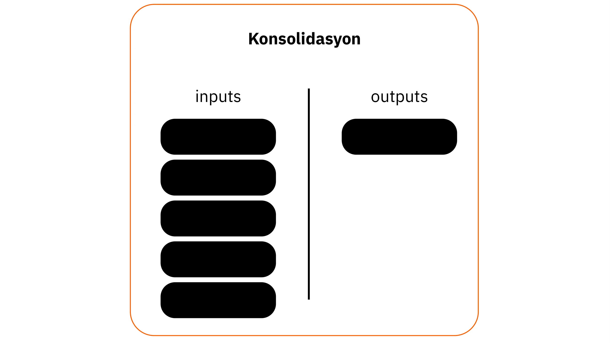


Bu örüntünün yorumu, konsolidasyonun varlığında olduğumuzdur. Bu, işlem ücretlerinde olası bir artış beklentisiyle birkaç UTXO'yu birleştirmeyi amaçlayan Bitcoin kullanıcıları arasında yaygın bir uygulamadır. Bu işlemi ücretlerin düşük olduğu bir dönemde gerçekleştirerek, gelecekteki ücretlerden tasarruf etmek mümkündür. Bölüm 4.3'te bu uygulama hakkında daha fazla konuşacağız.


Bu işlem modelinin arkasındaki kullanıcının muhtemelen girdideki tüm UTXO'lara sahip olduğu ve çıktıdaki UTXO'a hala sahip olduğu sonucuna varabiliriz. Yani bu muhtemelen bir otomatik transferdir.


Süpürme gibi, bu tür bir model de bir Exchange platformunun hesabına yapılan bir öz transferi ortaya çıkarabilir. Bilinen adreslerin incelenmesi ve işlemin bağlamı bize bunun kendi kendini muhafaza eden bir Wallet'e yapılan bir konsolidasyon mu yoksa bir platforma yapılan bir para çekme işlemi mi olduğunu söyleyecektir.


Örneğin, burada konsolidasyon modelini benimseyen bir Bitcoin işlemi bulunmaktadır:


```plaintext
77c16914211e237a9bd51a7ce0b1a7368631caed515fe51b081d220590589e94
```


Kaynak: [Mempool.space](https://Mempool.space/tx/77c16914211e237a9bd51a7ce0b1a7368631caed515fe51b081d220590589e94)


Bir zincir analizinde bu model çok sayıda bilgiyi ortaya çıkarabilir. Örneğin, girdilerden birinin Alice'e ait olduğunu biliyorsak, bu işlemin diğer tüm girdilerinin ve çıktısının da ona ait olduğunu varsayabiliriz. Bu varsayım daha sonra Alice ile ilişkili olması muhtemel diğer işlemleri keşfetmek ve analiz etmek için önceki işlemler zincirine geri dönmeyi mümkün kılacaktır.


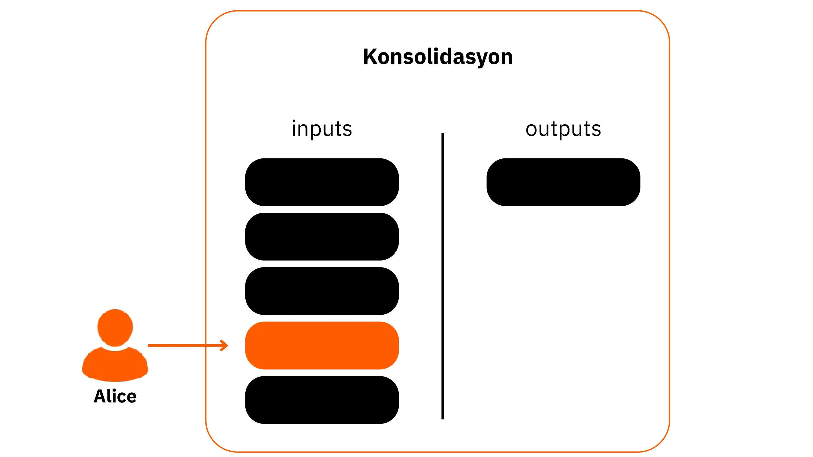


### Gruplandırılmış harcamalar


Bu model, girdi olarak birkaç UTXO'nun (genellikle sadece bir tane) tüketimi ve çıktı olarak birçok UTXO'nun üretimi ile karakterize edilir.


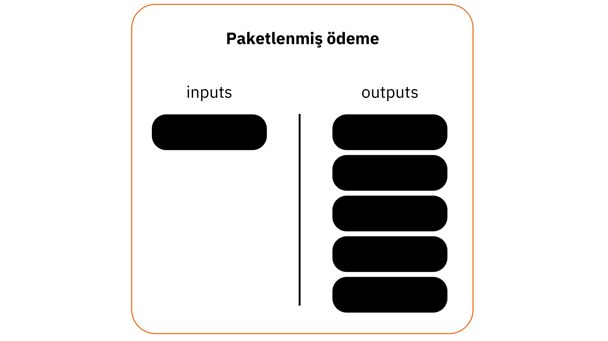


Bu modelin yorumu, gruplandırılmış harcamaların varlığında olduğumuzdur. Bu muhtemelen Exchange platformu gibi çok büyük bir ekonomik faaliyeti ortaya çıkaran bir uygulamadır. Gruplandırılmış harcama, bu kuruluşların harcamalarını tek bir işlemde birleştirerek maliyetten tasarruf etmelerini sağlar.


Bu modelden, girdideki UTXO'nın yüksek düzeyde ekonomik faaliyeti olan bir şirketten geldiği ve çıktıdaki UTXO'ların dağılacağı sonucunu çıkarabiliriz. Birçoğu şirketin platformdan bitcoin çeken müşterilerine ait olacaktır. Diğerleri ortak şirketlere gidebilir. Son olarak, kesinlikle ihraç eden şirkete geri dönen bir veya daha fazla değişiklik olacaktır.


Örneğin, burada paketlenmiş harcama modelini benimseyen bir Bitcoin işlemi var (muhtemelen Bybit platformu tarafından yayınlanan bir işlem):


```plaintext
8a7288758b6e5d550897beedd13c70bcbaba8709af01a7dbcc1f574b89176b43
```


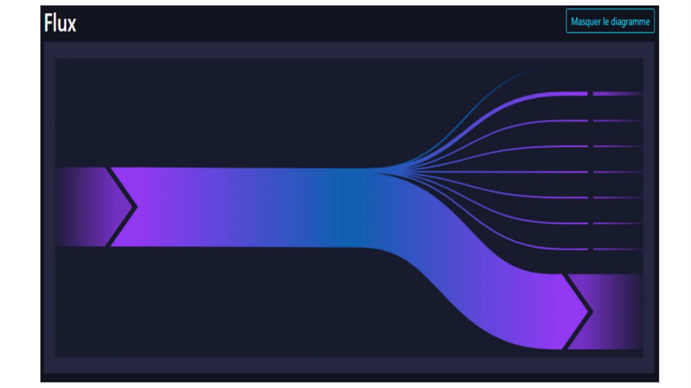


Kaynak: [Mempool.space](https://Mempool.space/tx/8a7288758b6e5d550897beedd13c70bcbaba8709af01a7dbcc1f574b89176b43)


### Protokole özgü işlemler


İşlem kalıpları arasında, belirli bir protokolün kullanıldığını ortaya koyanları da belirleyebiliriz. Örneğin, Whirlpool coinjoins (bölüm 5'te ele alınmıştır), onları diğer, daha geleneksel işlemlerden ayıran kolayca tanımlanabilir bir yapıya sahip olacaktır.


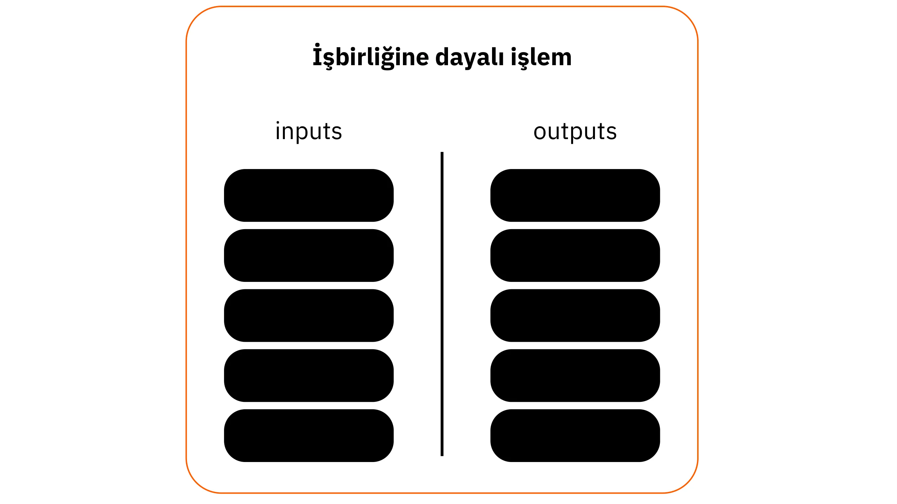


Bu örüntünün analizi, işbirliğine dayalı bir işlemin varlığının muhtemel olduğunu göstermektedir. Bir CoinJoin gözlemlemek de mümkündür. Bu ikinci hipotezin doğruluğu kanıtlanırsa, çıkışların sayısı bize CoinJoin'deki katılımcıların sayısı hakkında kabaca bir tahmin sağlayabilir.


Örneğin, burada CoinJoin işbirlikçi işlem modelini benimseyen bir Bitcoin işlemi bulunmaktadır:


```plaintext
00601af905bede31086d9b1b79ee8399bd60c97e9c5bba197bdebeee028b9bea
```


Kaynak: [Mempool.space](https://Mempool.space/tx/00601af905bede31086d9b1b79ee8399bd60c97e9c5bba197bdebeee028b9bea)


Kendilerine özgü yapıları olan birçok başka protokol vardır. Örneğin, Wabisabi işlemleri, Stamps işlemleri ve Runes işlemleri vardır.


Bu işlem kalıpları sayesinde, belirli bir işlem hakkında belirli miktarda bilgiyi zaten yorumlayabiliriz. Ancak işlem yapısı analiz için tek bilgi kaynağı değildir. Ayrıntılarını da inceleyebiliriz. Bu iç detaylar benim "iç sezgisel" olarak adlandırdığım şeylerdir ve bir sonraki bölümde bunlara bakacağız.


## Dahili sezgisel yöntemler


<chapterId>c54b5abe-872f-40f4-a0d0-c59faff228ba</chapterId>


İçsel sezgisel, bir işlemin çevresini incelemeye gerek kalmadan kendi içinde tanımladığımız ve çıkarımlar yapmamızı sağlayan belirli bir özelliktir. İşlemin genel yapısına yüksek düzeyde odaklanan kalıpların aksine, içsel sezgiseller çıkarılabilir veri kümesine dayanır. Bu şunları içerir:


- Çeşitli UTXO'ların giriş ve çıkış miktarları;
- Komut dosyalarıyla ilgili her şey: alım adresleri, sürüm oluşturma, kilitlenme süreleri ...


Genel olarak konuşmak gerekirse, bu tür bir sezgisel yöntem belirli bir işlemdeki değişikliği tespit etmemizi sağlayacaktır. Bunu yaparak, bir varlığın takibini birkaç farklı işlem üzerinden sürdürebiliriz. Gerçekten de, izlemek istediğimiz bir kullanıcıya ait bir UTXO tespit edersek, bir işlem gerçekleştirdiğinde, hangi çıktının başka bir kullanıcıya aktarıldığını ve hangi çıktının değişikliği temsil ettiğini ve dolayısıyla kendi mülkiyetinde kaldığını belirlemek çok önemlidir.


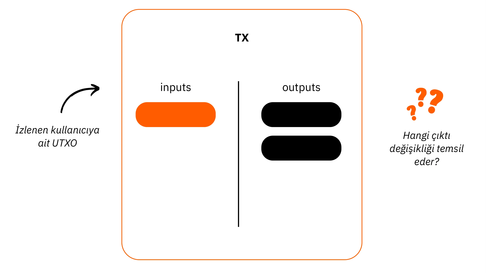


Bir kez daha hatırlatmak isterim ki bu sezgisel yöntemler kesinlikle kesin değildir. Tek tek ele alındığında, yalnızca olası senaryoları belirlememizi sağlarlar. Belirsizliği tamamen ortadan kaldırmak mümkün olmasa da, belirsizliği azaltmaya yardımcı olan çeşitli sezgisel yöntemlerin birikimidir.


### İç benzerlikler


Bu sezgisel yöntem, aynı işlemin girdileri ve çıktıları arasındaki benzerliklerin incelenmesini içerir. Girdilerde ve işlemin çıktılarından sadece birinde aynı özellik gözlemleniyorsa, bu çıktının değişikliği oluşturması muhtemeldir.


En belirgin özellik, alıcı bir Address'in aynı işlemde yeniden kullanılmasıdır.


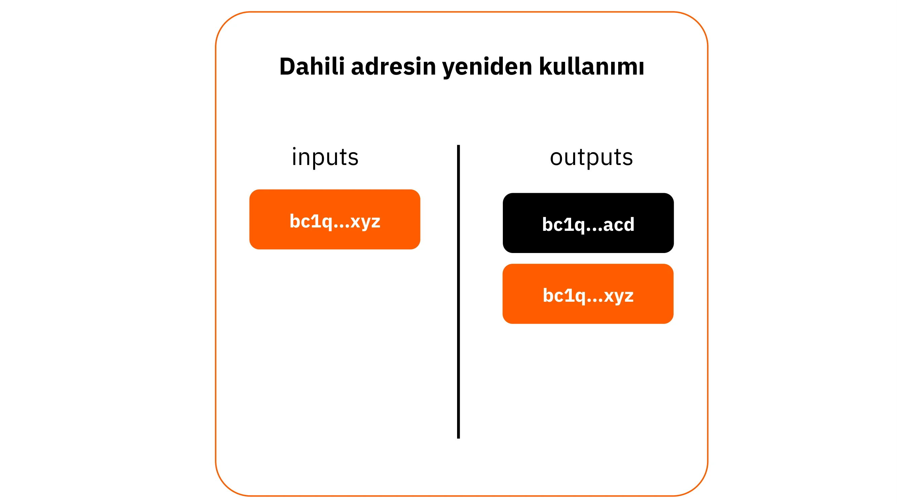


Bu sezgisel yöntem şüpheye çok az yer bırakır. Özel anahtarı ele geçirilmediği sürece, aynı alıcı Address mutlaka tek bir kullanıcının faaliyetini ortaya çıkarır. Sonuçta ortaya çıkan yorum, işlem değişikliğinin girdi olarak aynı Address ile çıktı olduğudur. Daha sonra bu değişiklikten yola çıkarak bireyin izini sürmeye devam edebiliriz.


Örneğin, bu sezgisel yöntemin muhtemelen uygulanabileceği bir işlem aşağıda verilmiştir:


```plaintext
54364146665bfc453a55eae4bfb8fdf7c721d02cb96aadc480c8b16bdeb8d6d0
```


Kaynak: [Mempool.space](https://Mempool.space/tx/54364146665bfc453a55eae4bfb8fdf7c721d02cb96aadc480c8b16bdeb8d6d0)


Girdiler ve çıktılar arasındaki bu benzerlikler Address'in yeniden kullanımıyla sınırlı değildir. Komut dosyalarının kullanımındaki herhangi bir benzerlik bir sezgisel uygulamak için kullanılabilir. Örneğin, bazen girdi ile işlem çıktılarından biri arasında aynı sürümlemeyi gözlemleyebiliriz.


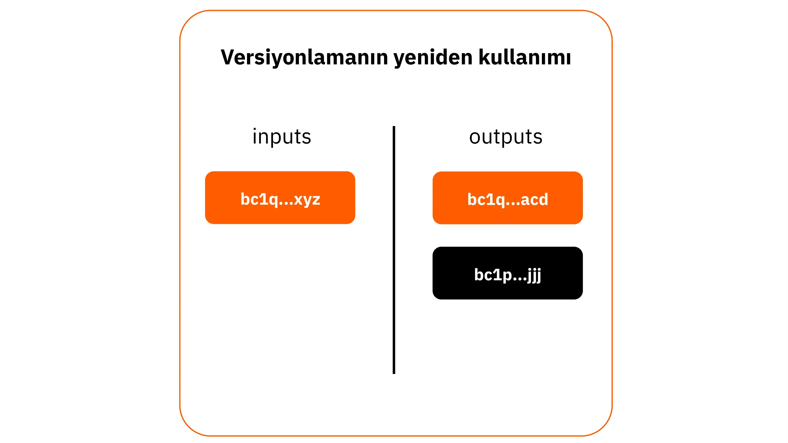


Bu diyagramda, 0 numaralı girdinin bir P2WPKH komut dosyasını (`bc1q` ile başlayan SegWit V0) açtığını görebiliriz. Çıkış n° 0 aynı türde bir komut dosyası kullanır. Öte yandan, 1 numaralı çıktı bir P2TR komut dosyası (`bc1p` ile başlayan SegWit V1) kullanır. Bu özelliğin yorumu, girdi ile aynı sürümlendirmeye sahip Address'un Address değişikliği olma ihtimalinin yüksek olduğudur. Bu nedenle her zaman aynı kullanıcıya ait olacaktır.


İşte bu sezgiselliğin muhtemelen uygulanabileceği bir işlem:


```plaintext
db07516288771ce5d0a06b275962ec4af1b74500739f168e5800cbcb0e9dd578
```


Kaynak: [Mempool.space](https://Mempool.space/tx/db07516288771ce5d0a06b275962ec4af1b74500739f168e5800cbcb0e9dd578)


İkincisinde, 0 numaralı giriş ve 1 numaralı çıkışın P2WPKH komut dosyalarını (SegWit V0) kullandığını, 0 numaralı çıkışın ise farklı bir P2PKH komut dosyası (Legacy) kullandığını görebiliriz.


2010'ların başında, komut dosyası sürümlendirmesine dayalı bu sezgisel yöntem, mevcut komut dosyası türlerinin sınırlı olması nedeniyle nispeten yararsızdı. Ancak, zaman içinde ve birbirini izleyen Bitcoin güncellemeleriyle, artan çeşitlilikte komut dosyası türleri kullanıma sunulmuştur. Bu nedenle bu sezgisel yöntem giderek daha önemli hale gelmektedir, çünkü daha geniş bir komut dosyası türü yelpazesi ile kullanıcılar daha küçük gruplara ayrılmakta ve böylece bu dahili sürümleme yeniden kullanım sezgisel yönteminin uygulanma şansı artmaktadır. Bu nedenle, yalnızca gizlilik açısından bakıldığında, en yaygın komut dosyası türünü tercih etmeniz önerilir. Örneğin, ben bu satırları yazarken, Taproot betikleri (`bc1p`) SegWit V0 betiklerine (`bc1q`) göre daha az kullanılmaktadır. Her ne kadar eski standart bazı özel bağlamlarda ekonomik ve gizlilik avantajları sunsa da, daha geleneksel tek imzalı kullanımlar için, yeni standart daha yaygın bir şekilde benimsenene kadar gizlilik nedenleriyle eski bir standarda bağlı kalmak mantıklı olabilir.


### Yuvarlak sayı ödemeleri


Değişikliği belirlememize yardımcı olabilecek bir başka içsel sezgisel yöntem de yuvarlak sayı sezgisel yöntemidir. Genel olarak, basit bir ödeme modeliyle (1 girdi ve 2 çıktı) karşılaşıldığında, çıktılardan biri yuvarlak bir miktar harcıyorsa, bu ödemeyi temsil eder.


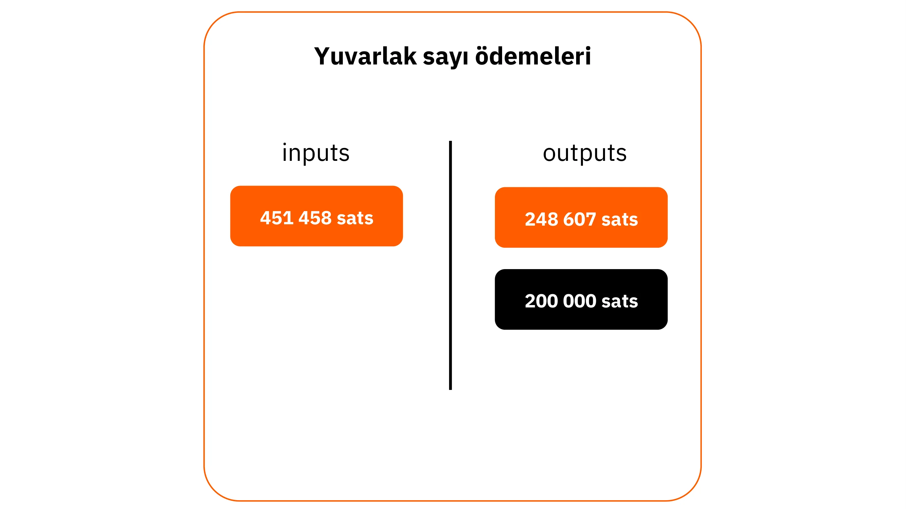


Eleme yoluyla, bir çıktı ödemeyi temsil ediyorsa, diğeri değişikliği temsil eder. Bu nedenle, girdi kullanıcısının her zaman değişim olarak tanımlanan çıktıya sahip olması muhtemel olarak yorumlanabilir.


Bu sezgisel yöntemin her zaman uygulanabilir olmadığı vurgulanmalıdır, zira ödemelerin çoğu hala güvene dayalı hesap birimleriyle yapılmaktadır. Gerçekten de, Fransa'daki bir perakendeci Bitcoin'u kabul ettiğinde, genellikle Sats cinsinden sabit fiyatlar göstermeyecektir. Bunun yerine, Euro cinsinden fiyat ile ödenecek bitcoin cinsinden tutar arasında bir dönüşüm yapmayı tercih edecektir. Bu nedenle işlemin sonunda yuvarlak rakamlar olmamalıdır.


Bununla birlikte, bir analist bu dönüşümü işlem ağda yayınlandığında geçerli olan Exchange oranını dikkate alarak yapmaya çalışabilir. Şimdi `97,552 Sats` girdisi ve biri `31,085 Sats` diğeri `64,152 Sats` olmak üzere iki çıktısı olan bir işlem örneğini ele alalım. İlk bakışta, bu işlem yuvarlak tutarlar içermiyor gibi görünmektedir. Ancak, işlem sırasındaki 64.339 €'luk Exchange kurunu uygulayarak, aşağıdaki gibi bir Euro dönüşümü elde ederiz:


- 62,76 Avroluk bir girdi;
- 20 Avroluk bir çıktı;
- 41,27 Avroluk bir çıktı.


Fiat para birimine dönüştürüldükten sonra, bu işlem yuvarlak tutar ödeme sezgiselini uygulamak için kullanılabilir. 20€'luk çıktı muhtemelen bir tüccara gitmiş ya da en azından Ownership'ü değiştirmiştir. Çıkarım yoluyla, 41,27 €'luk çıktının orijinal kullanıcının mülkiyetinde kalmış olması muhtemeldir.


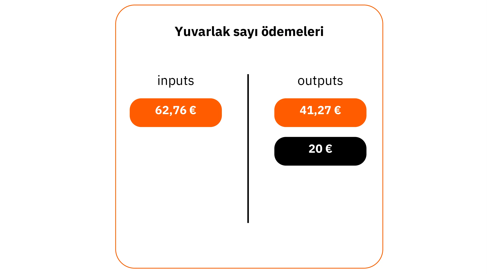


Eğer bir gün Bitcoin borsalarımızda tercih edilen hesap birimi haline gelirse, bu sezgisel yöntem analiz için daha da kullanışlı hale gelebilir.


Örneğin, bu sezgisel yöntemin muhtemelen uygulanabileceği bir işlem aşağıda verilmiştir:


```plaintext
2bcb42fab7fba17ac1b176060e7d7d7730a7b807d470815f5034d52e96d2828a
```


Kaynak: [Mempool.space](https://Mempool.space/tx/2bcb42fab7fba17ac1b176060e7d7d7730a7b807d470815f5034d52e96d2828a)


### En büyük çıktı


Basit bir ödeme modelinde 2 işlem çıktısı arasında yeterince büyük bir fark tespit ettiğimizde, en büyük çıktının muhtemelen değişim olacağını tahmin edebiliriz.


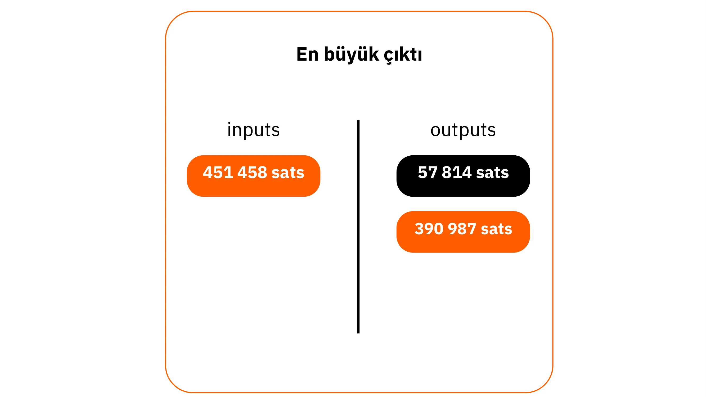


Bu en büyük çıktı sezgiselliği kesinlikle en kesin olmayanıdır. Tek başına oldukça zayıftır. Ancak bu özellik, yorumumuzun belirsizliğini azaltmak için diğer sezgisel yöntemlerle birleştirilebilir.


Örneğin, yuvarlak ödemeli ve daha büyük ödemeli bir işleme bakıyorsak, yuvarlak ödeme sezgiselini ve daha büyük ödeme sezgiselini birlikte uygulamak belirsizlik düzeyimizi azaltır.


Örneğin, bu sezgisel yöntemin muhtemelen uygulanabileceği bir işlem aşağıda verilmiştir:


```plaintext
b79d8f8e4756d34bbb26c659ab88314c220834c7a8b781c047a3916b56d14dcf
```


Kaynak: [Mempool.space](https://Mempool.space/tx/b79d8f8e4756d34bbb26c659ab88314c220834c7a8b781c047a3916b56d14dcf)


## Harici sezgisel yöntemler


<chapterId>4a170e3b-200d-431a-8285-18a23ff617ba</chapterId>


Harici sezgisel yöntemlerin incelenmesi, işlemin kendisine özgü olmayan belirli Elements benzerliklerinin, kalıplarının ve özelliklerinin analiz edilmesi anlamına gelmektedir. Başka bir deyişle, daha önce kendimizi içsel sezgisel yöntemlerle işleme özgü KİS-227'den yararlanmakla sınırlarken, şimdi dışsal sezgisel yöntemler sayesinde analiz alanımızı işlemin çevresini de içerecek şekilde genişletiyoruz.


### Address yeniden kullanım


Bu, bitcoin kullanıcılarının en iyi bilinen sezgisel yöntemlerinden biridir. Address'un yeniden kullanımı, farklı işlemler ve farklı UTXO'lar arasında bir bağlantı kurulmasını mümkün kılar. Address alan bir Bitcoin birkaç kez kullanıldığında ortaya çıkar.


Bu nedenle, Address'in aynı işlem içinde yeniden kullanımını, değişikliği tanımlamak için dahili bir sezgisel olarak kullanmak mümkündür (önceki bölümde gördüğümüz gibi). Ancak Address yeniden kullanımı, bir varlığın birkaç işlemin arkasındaki benzersizliğini tanımak için harici bir sezgisel olarak da kullanılabilir.


Bir Address'nin yeniden kullanımının yorumu, o Address üzerinde bloke edilen tüm UTXO'ların aynı kuruluşa ait olduğu (veya ait olduğu) şeklindedir. Bu sezgisel yöntem belirsizliğe çok az yer bırakır. Bir kez tanımlandığında, ortaya çıkan yorumun gerçeğe uygun olması muhtemeldir. Bu nedenle farklı zincir içi faaliyetlerin gruplandırılmasını sağlar.


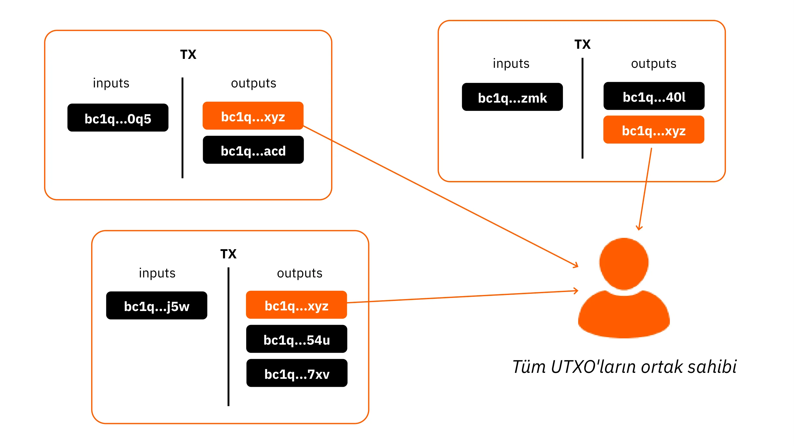


Bölüm 3'ün giriş kısmında açıklandığı üzere, bu sezgisel yöntem Satoshi Nakamoto'nun kendisi tarafından keşfedilmiştir. Beyaz Kitap'ta, kullanıcıların bunu üretmekten kaçınmasına yardımcı olacak bir çözümden bahsetmektedir; bu çözüm, her yeni işlem için boş bir Address kullanmaktır:


"_Ek bir güvenlik duvarı olarak, her bir işlem için yeni bir anahtar çifti kullanılarak işlemlerin ortak bir sahiple bağlantılı olmaması sağlanabilir._"


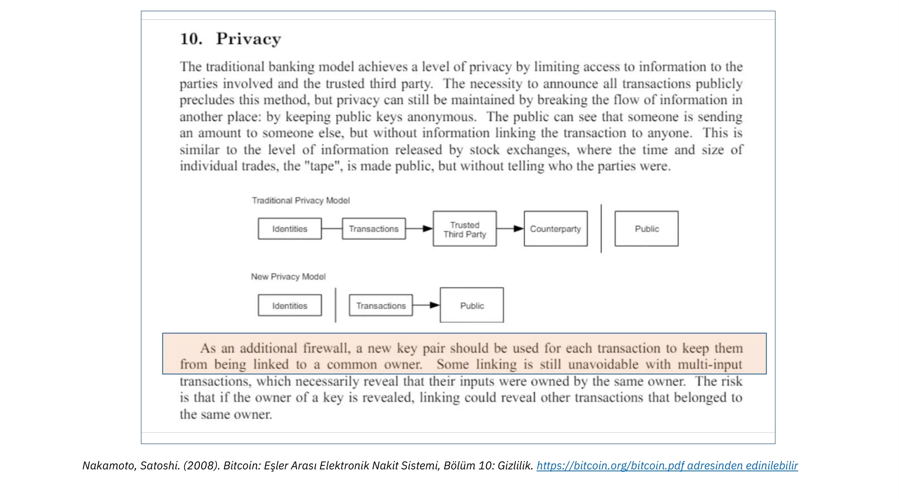


Kaynak: S. Nakamoto, "Bitcoin: Eşler Arası Elektronik Nakit Sistemi", https://Bitcoin.org/Bitcoin.pdf, 2009.


Örneğin, burada birkaç işlemde yeniden kullanılan bir Address bulunmaktadır:


```plaintext
bc1qqtmeu0eyvem9a85l3sghuhral8tk0ar7m4a0a0
```


Kaynak: [Mempool.space](https://Mempool.space/Address/bc1qqtmeu0eyvem9a85l3sghuhral8tk0ar7m4a0a0)


### Senaryo benzerliği ve Wallet izleri


Address yeniden kullanımına ek olarak, eylemleri aynı Wallet veya Address kümesine bağlamanıza olanak tanıyan başka birçok sezgisel yöntem vardır.


İlk olarak, bir analist komut dosyası kullanımındaki benzerliklere bakabilir. Örneğin, Multisig gibi bazı azınlık scriptlerini tespit etmek SegWit V0 scriptlerini tespit etmekten daha kolay olabilir. Saklandığımız grup ne kadar büyükse, bizi fark etmek o kadar zor olur. Bu, iyi CoinJoin protokollerinde tüm katılımcıların tamamen aynı türde komut dosyası kullanmasının nedenlerinden biridir.


Daha genel olarak, bir analist bir Wallet'in karakteristik parmak izlerine de odaklanabilir. Bunlar, izleme sezgiselleri olarak kullanılmak üzere tanımlanabilecek kullanıma özgü süreçlerdir. Başka bir deyişle, izlenen varlığa atfedilen işlemlerde aynı iç özelliklerin biriktiğini gözlemlersek, aynı özellikleri diğer işlemlerde de tanımlamaya çalışabiliriz.


Örneğin, izlenen kullanıcının değişikliğini sistematik olarak P2TR adreslerine (`bc1p...`) gönderdiğini tespit edebileceğiz. Bu işlem tekrarlanırsa, analizimizin geri kalanı için bunu bir sezgisel olarak kullanabiliriz. UTXO'ların sırası, değişikliğin çıktılardaki yeri, RBF (Replace-by-fee) sinyali veya sürüm numarası, `nSequence` alanı ve `nLockTime` alanı gibi diğer parmak izlerini de kullanabiliriz.


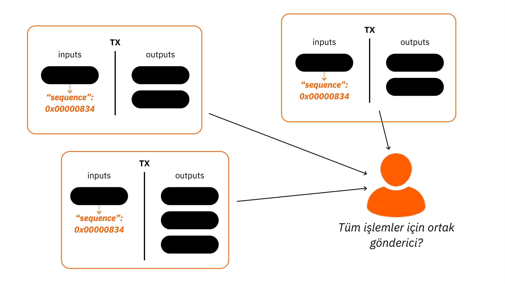


LaurentMT](https://twitter.com/LaurentMT)'nin [Space Kek #19](https://podcasters.spotify.com/pod/show/decouvrebitcoin/episodes/SpaceKek-19---Analyse-de-chane--anonsets-et-entropie-e1vfuji)'da (Fransızca bir podcast) belirttiği gibi, Wallet parmak izlerinin zincir analizindeki kullanışlılığı zaman içinde önemli ölçüde artmaktadır. Gerçekten de, artan senaryo türü sayısı ve bu yeni özelliklerin Wallet yazılımı tarafından giderek daha aşamalı bir şekilde kullanılması farklılıkları vurgulamaktadır. Bazı durumlarda, takip edilen varlık tarafından kullanılan yazılımı tam olarak tespit etmek bile mümkündür. Bu nedenle, Wallet ayak izleri çalışmasının özellikle 2010'ların başında başlatılanlardan ziyade yakın tarihli işlemlerle ilgili olduğunu anlamak önemlidir.


Özetle, bir ayak izi, Wallet tarafından otomatik olarak veya kullanıcı tarafından manuel olarak gerçekleştirilen ve analizimizde bize yardımcı olması için diğer işlemlerde bulabileceğimiz herhangi bir özel uygulama olabilir.


### Ortak Girdi Ownership Sezgiselliği (CIOH)


Ortak Girdi Ownership Sezgiselliği (CIOH), bir işlemin birden fazla girdisi olduğunda, bunların hepsinin tek bir varlıktan kaynaklanma olasılığının yüksek olduğunu belirten bir sezgiseldir. Sonuç olarak, Ownership'leri ortaktır.


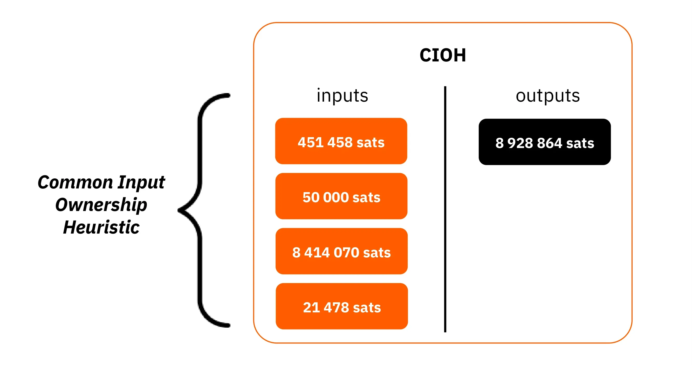


CIOH'u uygulamak için öncelikle birkaç girdisi olan bir işlem gözlemleriz. Bu 2 girdi ya da 30 girdi olabilir. Bu özellik belirlendikten sonra, işlemin bilinen bir işlem modeline uyup uymadığını kontrol ederiz. Örneğin, kabaca aynı miktarda 5 girdi ve tam olarak aynı miktarda 5 çıktı varsa, bunun bir CoinJoin yapısı olduğunu biliriz. CIOH'u uygulamamız mümkün olmayacaktır.


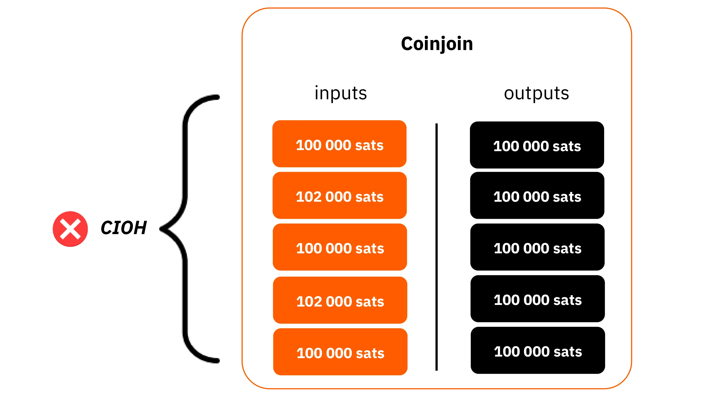


Öte yandan, işlem bilinen herhangi bir işbirlikçi işlem modeline uymuyorsa, tüm girdilerin muhtemelen aynı varlıktan geldiği yorumunu yapabiliriz. Bu, halihazırda bilinen bir kümeyi genişletmek veya bir izi devam ettirmek için çok yararlı olabilir.


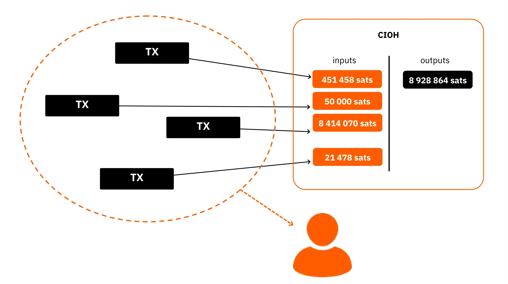


CIOH, Satoshi Nakamoto tarafından keşfedilmiştir. Beyaz Kitap'ın 10. bölümünde bundan bahsediyor:


"_[...] çok girişli işlemlerde bağlantı kaçınılmazdır, bu da girişlerinin aynı sahip tarafından yapıldığını ortaya çıkarır. Risk, bir anahtarın sahibi ortaya çıkarsa, bağlantıların aynı sahibine ait diğer işlemleri de ortaya çıkarabilmesidir."


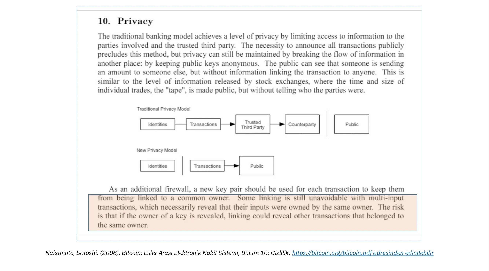


Satoshi Nakamoto'nun, Bitcoin'nin resmi olarak piyasaya sürülmesinden önce bile, kullanıcılar için iki ana gizlilik açığını, yani CIOH ve Address yeniden kullanımını zaten tanımlamış olduğunu belirtmek özellikle büyüleyici. Bu iki sezgisel yöntem bugün bile Blockchain analizinde en kullanışlı yöntem olmaya devam ettiğinden, bu tür bir öngörü oldukça dikkat çekicidir.


Size bir örnek vermek gerekirse, burada muhtemelen CIOH uygulayabileceğimiz bir işlem var:


```plaintext
20618e63b6eed056263fa52a2282c8897ab2ee71604c7faccfe748e1a202d712
```


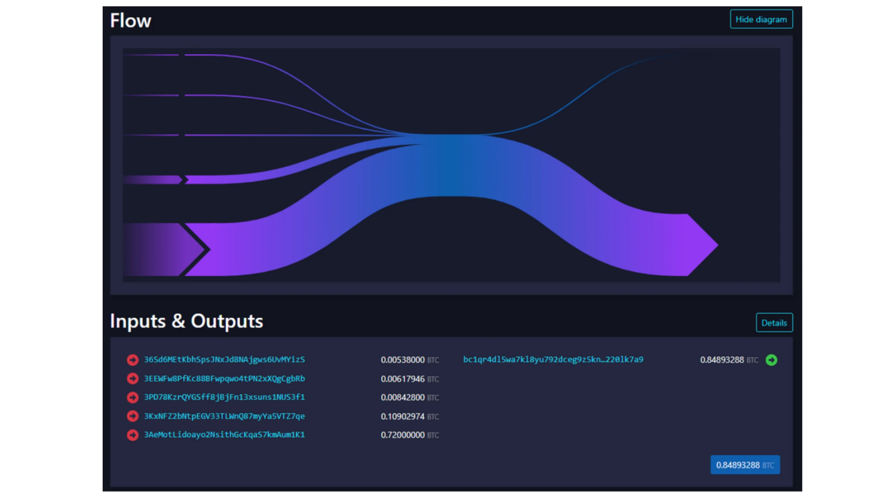


Kaynak: [Mempool.space](https://Mempool.space/tx/20618e63b6eed056263fa52a2282c8897ab2ee71604c7faccfe748e1a202d712)


### off-chain verileri


Elbette zincir analizi yalnızca zincir içi verilerle sınırlı değildir. Önceki bir analizden elde edilen veya internette bulunan herhangi bir veri de bir analizi iyileştirmek için kullanılabilir.


Örneğin, izlenen işlemlerin sistematik olarak aynı Bitcoin düğümünden yayınlandığını gözlemlersek ve IP Address'sini tanımlamayı başarırsak, aynı kuruluştan gelen diğer işlemleri tanımlayabilir ve ihraççının kimliğinin bir kısmını belirleyebiliriz. Çok sayıda düğümün çalışmasını gerektirdiği için bu uygulama kolaylıkla gerçekleştirilemese de, Blockchain analizi konusunda uzmanlaşmış bazı şirketler tarafından kullanılabilir.


Analist ayrıca daha önce açık kaynaklı olarak yapılan analizlere veya kendi önceki analizlerine güvenme seçeneğine de sahiptir. Belki de daha önce belirlediğimiz bir adres kümesine işaret eden bir çıktı bulabiliriz. Bazen, bu şirketlerin adresleri genel olarak bilindiğinden, bir Exchange platformuna işaret eden çıktılara da güvenmek mümkündür.


Aynı şekilde, eleme yoluyla bir analiz gerçekleştirebilirsiniz. Örneğin, iki çıktısı olan bir işlemi analiz ederken, bunlardan biri zaten bilinen bir Address kümesiyle ilgiliyse, ancak izlediğimiz varlıktan farklıysa, diğer çıktının muhtemelen değişikliği temsil ettiği yorumunu yapabiliriz.


Kanal analizi ayrıca internet aramalarını içeren biraz daha genel bir OSINT (*Açık Kaynak İstihbaratı*) bileşeni de içerir. Bu nedenle, takma isim olsun ya da olmasın, adreslerin doğrudan sosyal ağlarda veya bir web sitesinde yayınlanmamasını tavsiye ediyoruz.


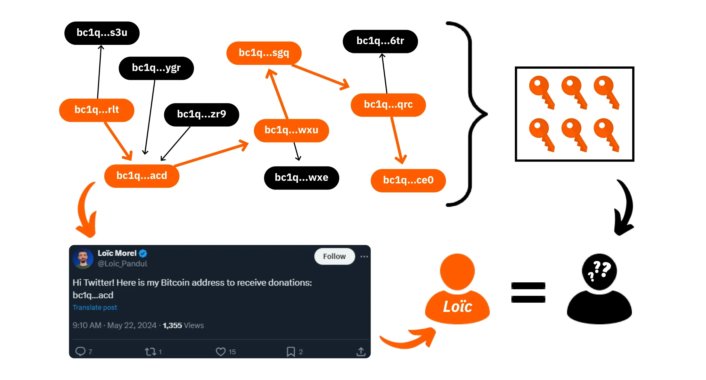


### Zamansal modeller


Bunu daha az düşünürüz, ancak bazı insan davranışları zincirleme olarak tanınabilir. Belki de bir analizde en faydalı olanı uyku düzeninizdir! Evet, uyuduğunuzda Bitcoin işlemlerini yayınlamazsınız. Ancak genellikle aşağı yukarı aynı saatlerde uyursunuz. Bu nedenle Blockchain analizinde zamansal analiz kullanmak yaygın bir uygulamadır. Oldukça basit bir şekilde, bu, belirli bir varlığın işlemlerinin Bitcoin ağına yayınlandığı zamanların bir sayımıdır. Bu zamansal kalıpları analiz ederek çok sayıda bilgi çıkarabiliriz.


Her şeyden önce, zamansal bir analiz bazen izlenen varlığın niteliğini belirleyebilir. İşlemlerin 24 saat boyunca tutarlı bir şekilde yayınlandığını gözlemlersek, bu yüksek düzeyde bir ekonomik faaliyete işaret edecektir. Bu işlemlerin arkasındaki kuruluş muhtemelen uluslararası ve belki de otomatikleştirilmiş şirket içi prosedürlere sahip bir şirket olacaktır.


Örneğin, [bu örüntüyü birkaç ay önce](https://twitter.com/Loic_Pandul/status/1701127409712452072) [yanlışlıkla 19 bitcoin ücret tahsis eden işlemi](https://Mempool.space/tx/d5392d474b4c436e1c9d1f4ff4be5f5f9bb0eb2e26b61d2781751474b7e870fd) analiz ederken fark ettim. Basit bir zamansal analiz, otomatik bir hizmetle ve dolayısıyla muhtemelen bir Exchange platformu gibi büyük bir kuruluşla karşı karşıya olduğumuzu varsaymamı sağladı.


Nitekim birkaç gün sonra fonların Paxos Exchange platformu üzerinden PayPal'a ait olduğu anlaşıldı.


Aksine, zamansal modelin 16 belirli saate yayıldığını görebiliyorsak, o zaman bireysel bir kullanıcıyla veya değiş tokuş edilen hacimlere bağlı olarak belki de yerel bir şirketle karşı karşıya olduğumuzu tahmin edebiliriz.


Gözlemlenen varlığın doğasının ötesinde, zamansal örüntü bize zaman dilimleri sayesinde kullanıcının yaklaşık olarak nerede bulunduğunu da söyleyebilir. Bu şekilde, diğer işlemleri eşleştirebilir ve zaman damgalarını analizimize eklenebilecek ek bir sezgisel olarak kullanabiliriz.


Örneğin, daha önce bahsettiğim çok kullanılan Address'de, hem gelen hem de giden işlemlerin 13 saatlik bir aralıkta yoğunlaştığını görebiliriz.


```plaintext
bc1qqtmeu0eyvem9a85l3sghuhral8tk0ar7m4a0a0
```


Kaynak: OXT.me


Bu aralık muhtemelen Avrupa, Afrika veya Orta Doğu'ya karşılık gelmektedir. Dolayısıyla bu işlemlerin arkasındaki kullanıcının bu bölgelerde yaşadığını varsayabiliriz.


Farklı bir şekilde, bu tür bir zaman analizi de Satoshi Nakamoto'nun Japonya'dan değil ABD'den faaliyet gösterdiği hipotezine yol açmıştır: [*The Time Zones of Satoshi Nakamoto*](https://medium.com/@insearchofsatoshi/the-time-zones-of-Satoshi-nakamoto-aa40f035178f)


## Bir Block explorer ile uygulamaya koymak


<chapterId>6493cf2f-225c-405f-9375-c4304f1087ed</chapterId>


Bu son bölümde, şimdiye kadar incelediğimiz kavramları uygulamaya koyacağız. Size gerçek Bitcoin işlemlerinden örnekler göstereceğim ve sizden istediğim bilgileri çıkarmanız gerekecek.


İdeal olarak, bu egzersizleri gerçekleştirmek için profesyonel bir zincir analiz aracının kullanılması tercih edilir. Ancak, Samourai Wallet'in yaratıcılarının tutuklanmasından bu yana, tek ücretsiz analiz aracı OXT.me artık mevcut değil. Bu nedenle bu alıştırmalar için klasik bir Block explorer tercih edeceğiz. Birçok özelliği ve zincir analiz araçları yelpazesi için [Mempool.space](https://Mempool.space/) kullanmanızı tavsiye ederim, ancak [Bitcoin Explorer](https://bitcoinexplorer.org/) gibi başka bir gezgini de tercih edebilirsiniz.


Başlangıç olarak, size alıştırmaları tanıtacağım. Bunları tamamlamak için Block explorer'unuzu kullanın ve cevaplarınızı bir kağıda yazın. Daha sonra, bu bölümün sonunda, sonuçlarınızı kontrol edebilmeniz ve düzeltebilmeniz için size cevapları vereceğim.


*Bu alıştırmalar için seçilen işlemler tamamen özelliklerine göre biraz rastgele bir şekilde seçilmiştir. Bu bölüm sadece eğitim ve bilgilendirme amaçlıdır. Bu araçların kötü niyetli amaçlarla kullanılmasını ne desteklediğimi ne de teşvik ettiğimi açıkça belirtmek isterim. Amaç, başkalarının özel bilgilerini ifşa etmek için analiz yapmak değil, dizgi analizine karşı kendinizi nasıl koruyacağınızı öğretmektir.*


### Alıştırma 1


Analiz edilecek işlemin tanımlayıcısı:


```plaintext
3769d3b124e47ef4ffb5b52d11df64b0a3f0b82bb10fd6b98c0fd5111789bef7
```


Bu işlemin modelinin adı nedir ve sadece modelini, yani işlemin yapısını inceleyerek hangi makul yorumlara varılabilir?


### Alıştırma 2


Analiz edilecek işlemin tanımlayıcısı:


```plaintext
baa228f6859ca63e6b8eea24ffad7e871713749d693ebd85343859173b8d5c20
```


Bu işlemin modelinin adı nedir ve sadece modelini, yani işlemin yapısını inceleyerek hangi makul yorumlara varılabilir?


### Alıştırma 3


Analiz edilecek işlemin tanımlayıcısı:


```plaintext
3a9eb9ccc3517cc25d1860924c66109262a4b68f4ed2d847f079b084da0cd32b
```


Bu işlem için model nedir?


İşlemin iç sezgilerini kullanarak modelini belirledikten sonra, değişikliğin hangi çıktıyı temsil etmesi muhtemeldir?


### Alıştırma 4


Analiz edilecek işlemin tanımlayıcısı:


```plaintext
35f0b31c05503ebfdf7311df47f68a048e992e5cf4c97ec34aa2833cc0122a12
```


Bu işlem için model nedir?


İşlemin dahili sezgisel yöntemlerini kullanarak modelini belirledikten sonra, Exchange'in hangi çıktıyı temsil etmesi muhtemeldir?


### Alıştırma 5


Loïc'in Bitcoin alıcı adreslerinden birini sosyal ağ Twitter'da yayınladığını düşünelim:


```plaintext
bc1qja0hycrv7g9ww00jcqanhfpqmzx7luqalum3vu
```


Bu bilgilere dayanarak ve **sadece Address yeniden kullanım sezgiselliğini** kullanarak, hangi Bitcoin işlemleri Loïc'in kimliğiyle ilişkilendirilebilir?


*Açıkçası, bu Address resepsiyonunun gerçek sahibi ben değilim ve sosyal ağlarda yayınlamadım. Bu, Blockchain*'ten rastgele aldığım bir Address


### Alıştırma 6


Alıştırma 5'in ardından, Address yeniden kullanım sezgiselliği sayesinde, Loïc'in dahil olduğu görünen birkaç Bitcoin işlemini tanımlayabildiniz. Normalde, tanımlanan işlemler arasında bunu fark etmeniz gerekirdi:


```plaintext
2d9575553c99578268ffba49a1b2adc3b85a29926728bd0280703a04d051eace
```


Bu işlem Loïc'in Address'ine para gönderen ilk işlemdir. Loic'in bu işlemle aldığı bitcoinlerin nereden geldiğini düşünüyorsunuz?


### Alıştırma 7


Alıştırma 5'in ardından, Address yeniden kullanım sezgiselliği sayesinde, Loïc'in dahil olduğu görünen birkaç Bitcoin işlemini tanımlayabildiniz. Şimdi Loïc'in nereden geldiğini bulmak istiyorsunuz. Bulunan işlemlere dayanarak, Loïc tarafından kullanılması en muhtemel zaman dilimini bulmak için bir zaman analizi yapın. Bu zaman diliminden Loïc'in yaşadığı yeri belirleyin (ülke, eyalet/bölge, şehir...).


### Alıştırma 8


İşte incelenecek Bitcoin işlemi:


```plaintext
bb346dae645d09d32ed6eca1391d2ee97c57e11b4c31ae4325bcffdec40afd4f
```


Yalnızca bu işleme bakarak hangi bilgileri yorumlayabiliriz?


### Egzersiz çözümleri


***Alıştırma 1:***


Bu işlem için model basit ödeme modelidir. Sadece yapısını incelersek, bir çıktının değişikliği, diğer çıktının ise gerçek bir ödemeyi temsil ettiği yorumunu yapabiliriz. Bu nedenle, gözlemlenen kullanıcının muhtemelen artık çıktıdaki iki UTXO'dan birine (ödemeye ait olan) sahip olmadığını, ancak diğer UTXO'ye (değişikliğe ait olan) hala sahip olduğunu biliyoruz.


***Alıştırma 2:***


Bu işlem için kullanılan model gruplandırılmış harcama modelidir. Bu model muhtemelen Exchange platformu gibi büyük ölçekli bir ekonomik faaliyeti ortaya koymaktadır. UTXO girdisinin yüksek düzeyde ekonomik faaliyeti olan bir şirketten geldiği ve UTXO çıktılarının dağınık olacağı sonucuna varabiliriz. Bazıları bitcoinlerini kendi saklama cüzdanlarına çeken şirket müşterilerine ait olacaktır. Diğerleri ortak şirketlere gidebilir. Son olarak, hiç şüphesiz parayı çıkaran şirkete geri dönecek bir miktar değişiklik olacaktır.


***Alıştırma 3:***


Bu işlem için model basit bir ödemedir. Bu nedenle, değişikliği tanımlamaya çalışmak için işleme dahili sezgisel yöntemler uygulayabiliriz.


Ben şahsen aynı hipotezi destekleyen en az iki içsel sezgisel yöntem tespit ettim:


- Aynı senaryo türünün yeniden kullanımı;
- En büyük çıktı.


En belirgin sezgisel yöntem aynı tür betiğin tekrar kullanılmasıdır. Gerçekten de, `0` çıktısı bir `P2SH`dır ve `3` ile başlayan Address alımı ile tanınabilir:


```plaintext
3Lcdauq6eqCWwQ3UzgNb4cu9bs88sz3mKD
```


1` çıktısı ise `bc1q` ile başlayan Address ile tanımlanabilen bir `P2WPKH`dir:


```plaintext
bc1qya6sw6sta0mfr698n9jpd3j3nrkltdtwvelywa
```


Bu işlem için girdi olarak kullanılan UTXO ayrıca bir `P2WPKH` komut dosyası kullanır:


```plaintext
bc1qyfuytw8pcvg5vx37kkgwjspg73rpt56l5mx89k
```


Böylece, `0` çıktısının bir ödemeye karşılık geldiğini ve `1` çıktısının işlem değişikliği olduğunu varsayabiliriz, bu da girdi kullanıcısının her zaman `1` çıktısına sahip olduğu anlamına gelir.


Bu hipotezi desteklemek ya da çürütmek için, düşüncemizi doğrulayan ya da hipotezimizin doğru olma olasılığını azaltan başka sezgisel yöntemler arayabiliriz.


En az bir sezgisel yöntem daha tespit ettim. Bu en büyük çıktı sezgiselidir. Çıktı `0` `123,689 Sats` ölçerken, çıktı `1` `505,839 Sats` ölçer. Dolayısıyla bu iki çıktı arasında önemli bir fark vardır. En büyük çıktı sezgiselliği, en büyük çıktının muhtemelen değişim olduğunu göstermektedir. Bu sezgisel ilk hipotezimizi daha da güçlendirmektedir.


Bu nedenle, UTXO'yi girdi olarak sağlayan kullanıcının, işlemin değişikliğini somutlaştıran `1' çıktısını hala elinde tutuyor olması muhtemel görünmektedir.


***Egzersiz 4:***


Bu işlem için model basit bir ödemedir. Bu nedenle, değişikliği tanımlamaya çalışmak için işleme dahili sezgisel yöntemler uygulayabiliriz.


Ben şahsen aynı hipotezi destekleyen en az iki içsel sezgisel yöntem tespit ettim:


- Aynı senaryo türünün yeniden kullanımı;
- Yuvarlak direk çıkışı.


En belirgin sezgisel yöntem aynı tür betiğin tekrar kullanılmasıdır. Gerçekten de, `0` çıktısı bir `P2SH` olup, `3` ile başlayan Address alımı ile tanınabilir:


```plaintext
3FSH5Mnq6S5FyQoKR9Yjakk3X4KCGxeaD4
```


1` çıktısı bir `P2WPKH` iken, `bc1q` ile başlayan Address ile tanımlanabilir:


```plaintext
bc1qvdywdcfsyavt4v8uxmmrdt6meu4vgeg439n7sg
```


Bu işlem için girdi olarak kullanılan UTXO de bir `P2WPKH` komut dosyası kullanır:


```plaintext
bc1qku3f2y294h3ks5eusv63dslcua2xnlzxx0k6kp
```


Böylece, `0` çıktısının bir ödemeye karşılık geldiğini ve `1` çıktısının işlem değişikliği olduğunu varsayabiliriz, bu da girdi kullanıcısının her zaman `1` çıktısına sahip olduğu anlamına gelir.


Bu hipotezi desteklemek ya da çürütmek için, düşüncemizi doğrulayan ya da hipotezimizin doğru olma olasılığını azaltan başka sezgisel yöntemler arayabiliriz.


En az bir sezgisel yöntem daha tespit ettim. Bu, yuvarlak miktar çıktısıdır. Çıktı `0` `70,000 Sats` ölçerken, çıktı `1` `22,962 Sats` ölçer. Dolayısıyla BTC hesap biriminde tamamen yuvarlak bir çıktıya sahibiz. Yuvarlak çıktı sezgiselliği, yuvarlak bir tutara sahip UTXO'un büyük olasılıkla ödeme olduğunu ve eleme yoluyla diğerinin değişikliği temsil ettiğini göstermektedir. Bu sezgisel yöntem ilk hipotezimizi daha da güçlendirmektedir.


Ancak, bu örnekte, başka bir sezgisel ilk hipotezimize meydan okuyabilir. Gerçekten de, `0` çıktısı `1` çıktısından daha büyüktür. En büyük çıktının genellikle değişim olduğu sezgisine dayanarak, `0` çıktısının değişim olduğu sonucuna varabiliriz. Ancak, diğer iki sezgisel yöntem en büyük çıktı sezgisel yönteminden çok daha ikna edici göründüğünden, bu karşı hipotez makul görünmemektedir. Sonuç olarak, bu bariz çelişkiye rağmen ilk hipotezimizi sürdürmek makul görünmektedir.


Bu nedenle, UTXO'i girdi olarak sağlayan kullanıcının, işlemin değişikliğini somutlaştırıyor gibi görünen `1` çıktısını hala elinde tutuyor olması muhtemel görünmektedir.


***Egzersiz 5:***


Loïc'in kimliği ile 8 işlemin ilişkilendirilebileceğini görebiliyoruz. Bunlardan 4'ü bitcoin alınmasını içeriyor:


```plaintext
2d9575553c99578268ffba49a1b2adc3b85a29926728bd0280703a04d051eace
8b70bd322e6118b8a002dbdb731d16b59c4a729c2379af376ae230cf8cdde0dd
d5864ea93e7a8db9d3fb113651d2131567e284e868021e114a67c3f5fb616ac4
bc4dcf2200c88ac1f976b8c9018ce70f9007e949435841fc5681fd33308dd762
```


Diğer 4'ü Bitcoin sevkiyatlarıyla ilgilidir:


```plaintext
8b52fe3c2cf8bef60828399d1c776c0e9e99e7aaeeff721fff70f4b68145d540
c12499e9a865b9e920012e39b4b9867ea821e44c047d022ebb5c9113f2910ed6
a6dbebebca119af3d05c0196b76f80fdbf78f20368ebef1b7fd3476d0814517d
3aeb7ce02c35eaecccc0a97a771d92c3e65e86bedff42a8185edd12ce89d89cc
```


***Egzersiz 6:***


Bu işlemin modeline bakacak olursak, bunun paketlenmiş bir harcama olduğu açıktır. Gerçekten de, işlemin tek bir girdisi ve 51 çıktısı vardır, bu da yüksek düzeyde bir ekonomik faaliyete işaret eder. Bu nedenle Loïc'in bir Exchange platformundan bitcoin çektiğini varsayabiliriz.


Birkaç faktör bu hipotezi güçlendirmektedir. İlk olarak, UTXO girdisini güvence altına almak için kullanılan komut dosyası türü bir P2SH 2/3 Multisig komut dosyasıdır ve bu da Exchange platformlarına özgü gelişmiş bir güvenlik seviyesine işaret etmektedir:


```plaintext
OP_PUSHNUM_2
OP_PUSHBYTES_33 03eae02975918af86577e1d8a257773118fd6ceaf43f1a543a4a04a410e9af4a59
OP_PUSHBYTES_33 03ba37b6c04aaf7099edc389e22eeb5eae643ce0ab89ac5afa4fb934f575f24b4e
OP_PUSHBYTES_33 03d95ef2dc0749859929f3ed4aa5668c7a95baa47133d3abec25896411321d2d2d
OP_PUSHNUM_3
OP_CHECKMULTISIG
```


Dahası, Address tarafından incelenen `3PUv9tQMSDCEPSMsYSopA5wDW86pwRFbNF` 220.000'den fazla farklı işlemde yeniden kullanılmıştır; bu da genellikle gizlilikleri konusunda endişeli olmayan Exchange platformlarının karakteristik özelliğidir.


Bu Address'e uygulanan zamansal sezgisel yöntem de, 3 aylık bir süre boyunca neredeyse her gün düzenli bir işlem yayını olduğunu ve 24 saatin üzerinde uzun saatler sürdüğünü göstermekte ve bir Exchange platformunun sürekli faaliyette olduğunu düşündürmektedir.


Son olarak, bu varlık tarafından işlenen hacimler muazzamdır. Address, Aralık 2022 ile Mart 2023 arasında 222.262 işlemde 44 BTC almış ve göndermiştir. Bu büyük hacimler, Exchange platformunun faaliyetinin olası doğasını daha da doğrulamaktadır.


***Egzersiz 7:***


İşlem onay zamanları analiz edilerek aşağıdaki UTC zamanları tespit edilebilir:


```plaintext
05:43
20:51
18:12
17:16
04:28
23:38
07:45
21:55
```


Bu programların analizi, UTC-7 ve UTC-8'in programların çoğu için mevcut insan faaliyeti aralığıyla (08:00 ile 23:00 arası) tutarlı olduğunu göstermektedir:


```plaintext
05:43 UTC > 22:43 UTC-7
20:51 UTC > 13:51 UTC-7
18:12 UTC > 11:12 UTC-7
17:16 UTC > 10:16 UTC-7
04:28 UTC > 21:28 UTC-7
23:38 UTC > 16:38 UTC-7
07:45 UTC > 00:45 UTC-7
21:55 UTC > 14:55 UTC-7
05:43 UTC > 21:43 UTC-8
20:51 UTC > 12:51 UTC-8
18:12 UTC > 10:12 UTC-8
17:16 UTC > 09:16 UTC-8
04:28 UTC > 20:28 UTC-8
23:38 UTC > 15:38 UTC-8
07:45 UTC > 23:45 UTC-8
21:55 UTC > 13:55 UTC-8
```


UTC-7 zaman dilimi, aşağıdaki eyaletleri ve bölgeleri içerdiğinden özellikle yaz aylarında önemlidir:


- Kaliforniya (Los Angeles, San Francisco ve San Diego gibi şehirlerle birlikte);
- Nevada (Las Vegas ile birlikte);
- Oregon (Portland ile birlikte);
- Washington (Seattle ile birlikte);
- Kanada'nın British Columbia bölgesi (Vancouver ve Victoria gibi şehirleriyle).


Bu bilgiler Loïc'in muhtemelen Amerika Birleşik Devletleri'nin batı kıyısında veya Kanada'da ikamet ettiğini göstermektedir.


***Egzersiz 8:***


Bu işlemin analizi 5 girdi ve tek bir çıktı ortaya koymaktadır, bu da konsolidasyona işaret etmektedir. CIOH sezgiselini uygulayarak, tüm girdi UTXO'larının tek bir varlığa ait olduğunu ve UTXO çıktısının da bu varlığa ait olduğunu varsayabiliriz. Görünüşe göre kullanıcı, UTXO'larını konsolide etmek amacıyla çıkışta tek bir UTXO oluşturmak için sahip olduğu birkaç UTXO'yu bir araya getirmeyi seçmiştir. Bu hareket muhtemelen gelecekteki maliyetleri azaltmak için o zamanın düşük işlem maliyetlerinden yararlanma arzusuyla motive edilmiştir.


___


*Bu bölüm 3 on chain analizini yazmak için aşağıdaki kaynaklardan yararlandım:*


- Samourai Wallet tarafından 2021 yılında üretilen [Understanding Bitcoin Privacy with OXT](https://medium.com/oxt-research/understanding-Bitcoin-privacy-with-oxt-part-1-4-8177a40a5923) başlıklı dört makalelik seri;
- **OXT Research**'ün (https://medium.com/oxt-research) çeşitli raporlarının yanı sıra ücretsiz Blockchain analiz aracı (Samourai Wallet'un kurucularının tutuklanmasının ardından şu an için artık mevcut değil);
- Daha geniş anlamda, bilgilerim [@LaurentMT](https://twitter.com/LaurentMT) ve [@ErgoBTC](https://twitter.com/ErgoBTC)'nin çeşitli tweet ve içeriklerinden gelmektedir;
- Louneskmt](https://twitter.com/louneskmt), [@TheoPantamis](https://twitter.com/TheoPantamis), [@Sosthene___](https://twitter.com/Sosthene___) ve [@LaurentMT](https://twitter.com/LaurentMT) eşliğinde katıldığım [Uzay Kek #19](https://podcasters.spotify.com/pod/show/decouvrebitcoin/episodes/SpaceKek-19---Analyse-de-chane--anonsets-et-entropie-e1vfuji).


*Yazarlarına, geliştiricilerine ve yapımcılarına teşekkür etmek isterim. Bu 3. bölümün temel aldığı makaleyi titizlikle düzelten ve bana uzman tavsiyelerinde bulunan düzeltmenlere de teşekkürler:*


- [Gilles Cadignan](https://twitter.com/gillesCadignan);
- [Ludovic Lars](https://viresinnumeris.fr/)


# Gizliliğinizi korumak için en iyi uygulamalarda uzmanlaşma


<partId>9bd04b63-f1af-4e50-9061-6bc90009df68</partId>


## Address yeniden kullanım


<chapterId>f3e97645-3df3-41bc-a4ed-d2c740113d96</chapterId>


Bitcoin'de gizliliğinizi bozabilecek teknikleri inceledikten sonra, bu üçüncü bölümde şimdi kendinizi korumak için benimseyeceğiniz en iyi uygulamalara bakacağız. Bu bölümün amacı, daha sonra ele alınacak bir konu olan gizliliği artırma yöntemlerini keşfetmek değil, daha ziyade ek tekniklere başvurmadan doğal olarak sunduğu gizliliği korumak için Bitcoin ile nasıl doğru bir şekilde etkileşimde bulunacağınızı anlamaktır.


Açıkçası, bu üçüncü bölüme başlamak için Address'nin yeniden kullanımı hakkında konuşacağız. Bu olgu kullanıcı gizliliğine yönelik ana tehdittir. Bu bölüm kesinlikle tüm kursun en önemli bölümüdür.


### Alıcı Address nedir?


Address alan bir Bitcoin, bir Wallet üzerinde bitcoin almak için kullanılan bir dize veya tanımlayıcıdır.


Teknik olarak, Bitcoin alan bir Address gerçek anlamda bitcoin "almaz", daha ziyade bitcoinlerin harcanabileceği koşulları tanımlamaya hizmet eder. Somut olarak, size bir ödeme gönderildiğinde, gönderenin işlemi, girdi olarak tükettiği UTXO'lardan bir çıktı olarak sizin için yeni bir UTXO oluşturur. Bu çıktının üzerine, bu UTXO'un daha sonraki bir tarihte nasıl harcanabileceğini tanımlayan bir komut dosyası ekler. Bu senaryo "*ScriptPubKey*" veya "*Locking Script*" olarak bilinir. Aldığınız Address veya daha doğrusu onun yükü bu komut dosyasına entegre edilmiştir. Basit bir ifadeyle, bu komut dosyası temel olarak şunu belirtir:


> "*Bu yeni UTXO'i harcamak için, bu alıcı Address ile ilişkili özel anahtarı kullanarak bir dijital imza sağlamalısınız.*"
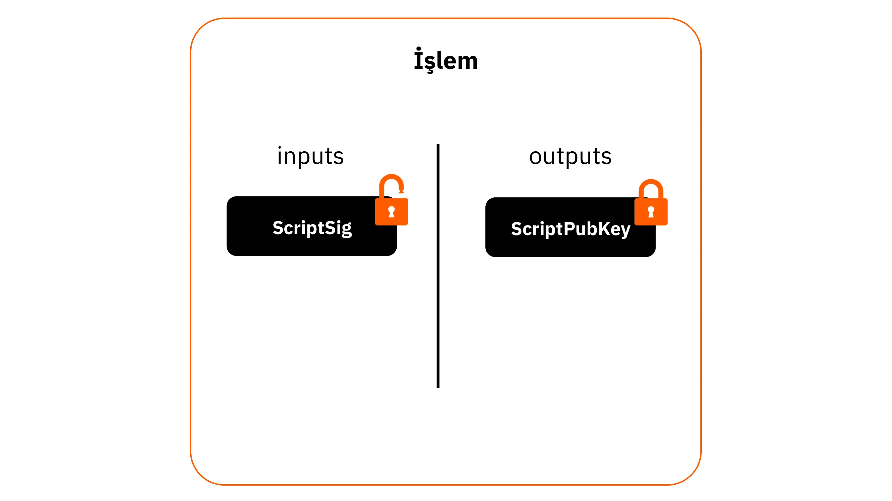


Bitcoin adresleri, kullanılan komut dosyası modeline bağlı olarak farklı türlerde gelir. **Legacy** olarak bilinen ilk modeller `P2PKH` (*Pay-to-PubKey-Hash*) ve `P2SH` (*Pay-to-Script-Hash*) adreslerini içerir. P2PKH adresleri her zaman `1` ile, P2SH ise `3` ile başlar. Hala güvenli olmalarına rağmen, bu formatlar daha yüksek işlem maliyetleri gerektirdiğinden ve yeni standartlardan daha az gizlilik sunduğundan artık kullanılmamaktadır.


SegWit V0 (`P2WPKH` ve `P2WSH`) ve Taproot / SegWit V1 (`P2TR`) adresleri modern formatları temsil eder. SegWit adresleri `bc1q` ile başlar ve 2021 yılında tanıtılan Taproot adresleri `bc1p` ile başlar.


Örneğin, burada bir Taproot alımı Address bulunmaktadır:


```text
bc1ps5gd2ys8kllz9alpmcwxqegn7kl3elrpnnlegwkm3xpq2h8da07spxwtf5
```


ScriptPubKey'in nasıl oluşturulacağı kullandığınız standarda bağlı olacaktır:


| ScriptPubKey       | Script template                                         |
|--------------------|--------------------------------------------------------|
| P2PKH              | OP_DUP OP_HASH160 `<pubKeyHash>` OP_EQUALVERIFY OP_CHECKSIG |
| P2SH               | OP_HASH160 `<scriptHash>` OP_EQUAL                    |
| P2WPKH             | 0 `<pubKeyHash>`                                      |
| P2WSH              | 0 `<witnessScriptHash>`                               |
| P2SH - P2WPKH      | OP_HASH160 `<redeemScriptHash>` OP_EQUAL              |
| P2SH - P2WSH       | OP_HASH160 `<redeemScriptHash>` OP_EQUAL              |
| P2TR               | 1 `<pubKey>`                                          |


Alım adreslerinin oluşturulması da seçilen senaryo modeline bağlıdır:


- P2PKH` ve `P2WPKH` adresleri için, yük, yani Address'nin çekirdeği, açık anahtarın Hash'ünü temsil eder;
- P2SH` ve `P2WSH` adresleri için, yük a'nın Hash'ini temsil eder;
- P2TR adreslerinde olduğu gibi, yük değiştirilmiş bir açık anahtardır. P2TR çıktıları _Pay-to-PubKey_ ve _Pay-to-Script_ özelliklerini birleştirir. Değiştirilmiş açık anahtar, bitcoin harcamak için de kullanılabilen bir dizi komut dosyasının Merkle Root'sinden türetilen bir "ince ayar" ile klasik bir harcama açık anahtarının eklenmesinin sonucudur.


Wallet yazılımınızda görüntülenen adresler ayrıca bir HRP (*İnsan Tarafından Okunabilir Parça*), tipik olarak SegWit sonrası adresler için `bc`, bir `1` ayırıcı ve SegWit V0 için `q` ve Taproot/SegWit V1 için `p` sürüm numarası içerir. İletim sırasında Address'un bütünlüğünü ve geçerliliğini garanti etmek için bir sağlama toplamı da eklenir.


Son olarak, adresler standart bir formata sokulur:


- Eski Eski adresler için Base58check;
- SegWit adresleri için Bech32;
- Taproot adresleri için Bech32m.


İşte 10 tabanından bech32 ve bech32m formatları (SegWit ve Taproot) için toplama matrisi:


| +  | 0 | 1 | 2 | 3 | 4 | 5 | 6 | 7 |
|----|---|---|---|---|---|---|---|---|
| 0  | q | p | z | r | y | 9 | x | 8 |
| 8  | g | f | 2 | t | v | d | w | 0 |
| 16 | s | 3 | j | n | 5 | 4 | k | h |
| 24 | c | e | 6 | m | u | a | 7 | l |


### Address yeniden kullanımı nedir?


Address'in yeniden kullanımı, aynı alıcı Address'in birkaç farklı UTXO'yu bloke etmek için kullanılmasıdır.


Önceki bölümde gördüğümüz gibi, her UTXO'un kendisini kilitleyen ve UTXO'un yeni bir işlemde girdi olarak kullanılabilmesi için karşılanması gereken kendi ScriptPubKey'i vardır. Bu ScriptPubKey içinde yük adresleri entegre edilmiştir.


Farklı ScriptPubKey'ler aynı alıcı Address'i içerdiğinde, buna Address'in yeniden kullanımı denir. Pratikte bu, bir kullanıcının birden fazla ödeme yoluyla bitcoin almak için göndericilere aynı Address'i tekrar tekrar sağladığı anlamına gelir. Ve tam da bu uygulama gizliliğiniz için felakettir.


### Address'in yeniden kullanımı neden bir sorundur?


Blockchain herkese açık olduğundan, hangi adreslerin hangi UTXO'yı ve kaç bitcoini kilitlediğini görmek kolaydır. Aynı Address birden fazla işlem için kullanılırsa, bu Address ile ilişkili tüm bitcoinlerin aynı kişiye ait olduğu sonucuna varmak mümkün hale gelir. Bu uygulama, farklı işlemler arasında deterministik bağlantılar kurulmasını ve bitcoinlerin Blockchain üzerinde izlenmesini sağlayarak kullanıcı gizliliğini tehlikeye atmaktadır. Satoshi Nakamoto'nun kendisi de Bitcoin'ün Beyaz Kitabında bu sorunun altını çizmiştir:


> *Ek bir güvenlik duvarı olarak, her işlem için yeni bir anahtar çifti kullanılarak işlemlerin ortak bir sahiple bağlantılı olmaması sağlanabilir*
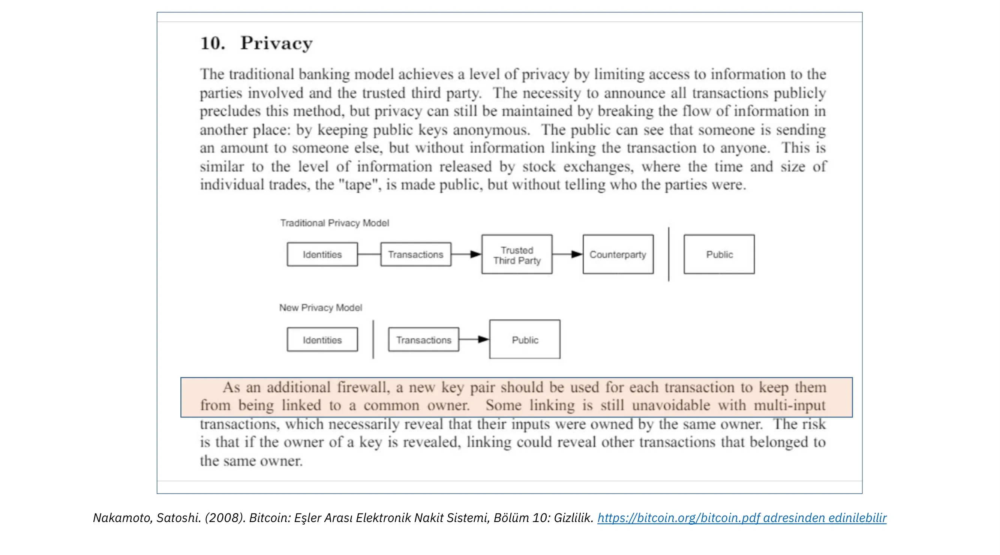


Kaynak: S. Nakamoto, "Bitcoin: Eşler Arası Elektronik Nakit Sistemi", https://Bitcoin.org/Bitcoin.pdf, 2009.


Satoshi'in bu cümledeki amacı, bir kullanıcının kimliği ile Bitcoin'daki bir anahtar çifti arasında bir ilişki olması durumunda ek bir güvenlik duvarı oluşturmak ve tüm faaliyetinin kimliğiyle kamuya açıklanmasını önlemekti. Günümüzde, Blockchain analiz şirketlerinin ve KYC düzenlemelerinin yaygınlaşmasıyla birlikte, benzersiz adreslerin kullanımı artık "ek bir güvenlik duvarı" değil, asgari düzeyde gizliliği korumak isteyen herkes için vazgeçilmez bir uygulamadır.


Bir Address'i tekrar kullandığınızda, bu Address ile ilişkili tüm işlemler arasında neredeyse inkar edilemez bir bağlantı kurmuş olursunuz. Eliptik eğri kriptografisi özel anahtarlarınızın güvenliğini garanti ettiği için bu durum fonlarınızı doğrudan tehlikeye atmasa da faaliyetlerinizin izlenmesini kolaylaştırır. Gerçekten de, bir node'a sahip olan herkes adreslerin işlemlerini ve bakiyelerini gözlemleyebilir ve anonimliğinizi tamamen tehlikeye atabilir.


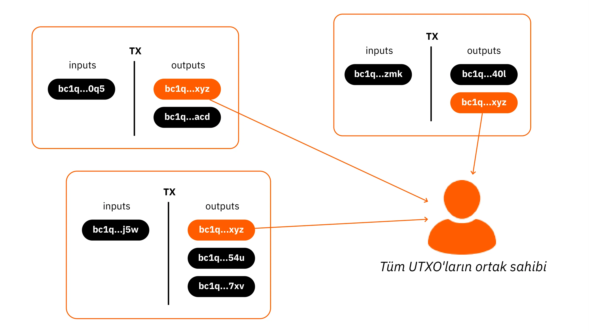


Bu noktayı açıklamak için, DCA'da düzenli olarak küçük miktarlarda bitcoin satın alan ve bunları her zaman aynı Address'ye gönderen bir kullanıcı olan Bob örneğini ele alalım. İki yıl sonra, bu Address önemli miktarda bitcoin içerir. Bob bu Address'yi yerel bir tüccara ödeme yapmak için kullanırsa, tüccar ilgili tüm fonları görebilecek ve Bob'ün servetini çıkarabilecektir. Bu durum hırsızlık veya gasp girişimi gibi kişisel güvenlik risklerine yol açabilir. Eğer Bob her bir periyodik satın alma işlemi için boş bir Address kullanmış olsaydı, tüccarına çok daha az bilgi vermiş olacaktı.


Dize analizinde, 2 tür Address yeniden kullanımı vardır:


- Harici yeniden kullanım;
- Bir işlem içinde dahili yeniden kullanım.


Birincisi, bir Address'in birkaç farklı Bitcoin işleminde yeniden kullanılmasıdır. Bu, daha önce bahsettiğimiz şeydir: bu sezgisel, bu Address'ten geçen tüm UTXO'ların tek bir varlığa ait olduğu sonucuna varır.


Dahili Address yeniden kullanımı, yeniden kullanım birkaç işlem boyunca gerçekleştiğinde değil, tek bir işlem içinde gerçekleştiğinde meydana gelir. Aslında, bir girdiyi kilitlemek için kullanılan aynı Address bir işlemin çıktısı olarak kullanılırsa, bu çıktının hala aynı kullanıcıya (değişiklik) ait olduğu ve ikinci çıktının gerçek ödemeyi temsil ettiği sonucuna varabiliriz. Bu diğer sezgisel yöntem, bir fon izini birkaç işlem boyunca sürdürmeyi mümkün kılar.


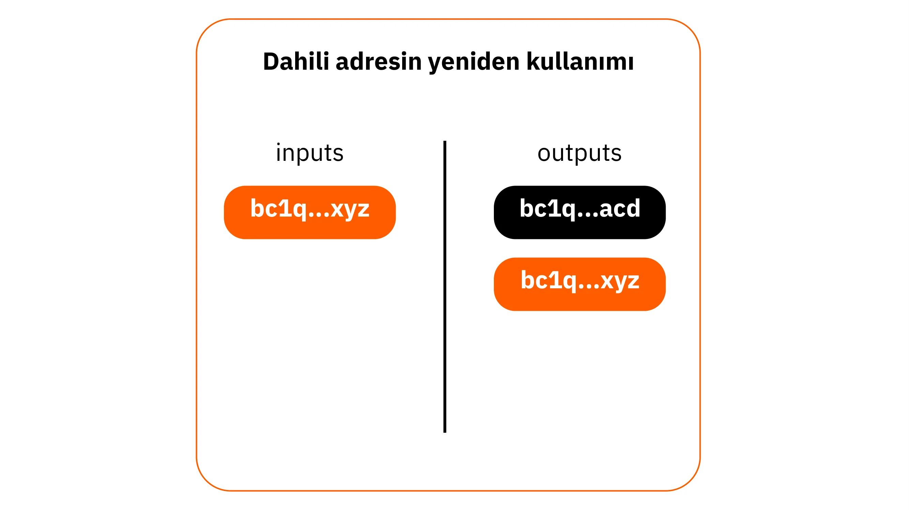


Address'in yeniden kullanımı Bitcoin'da gerçek bir beladır. OXT.me web sitesine göre (şu anda erişilemiyor), Address'in Bitcoin'daki genel yeniden kullanım oranı 2022'de yaklaşık %52 idi:


Bu oran çok büyüktür, ancak bireysel kullanıcılardan ziyade büyük ölçüde Exchange platformlarından gelmektedir.


### Address'in yeniden kullanımı nasıl önlenir?


Address'nin tekrar kullanılmasını önlemek oldukça basittir: **Wallet'ünüze yapılan tüm yeni ödemeler için yeni, boş bir Address kullanın**.


BIP32 sayesinde modern cüzdanlar artık deterministik ve hiyerarşiktir. Bu, bir kullanıcının tek bir başlangıç bilgisinden çok sayıda adresi generate yapabileceği anlamına gelir: seed. Bu tek bilgi parçasını kaydederek, Wallet'teki tüm özel anahtarları geri yüklemek ve ilgili adresler tarafından güvence altına alınan fonlara erişim sağlamak mümkündür.


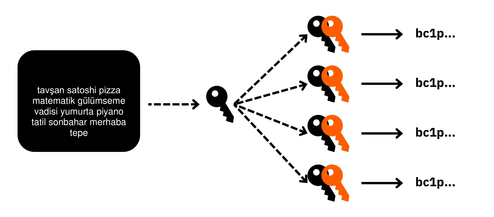


Bu nedenle, Wallet yazılımınızdaki "*al*" düğmesine bastığınızda, her seferinde kullanılmayan bir alıcı Address önerilir. Bu Address'den bitcoin aldıktan sonra, yazılım otomatik olarak yeni bir tane önerir.


> **Not:** Son zamanlarda, bazı Wallet yazılım programları, bunun yetkililer tarafından bir tür kara para aklama olarak algılanacağından korkarak boş adres üretmeyi durdurma niyetlerini açıkladılar. Eğer yazılımınız bunlardan biriyse, kullanıcı tarafından kabul edilebilir bir durum olmadığı için derhal değiştirmenizi şiddetle tavsiye ederim
Bağışlar gibi ödemeleri almak için statik bir tanımlayıcıya ihtiyacınız varsa, yeniden kullanım riski nedeniyle klasik bir Bitcoin Address kullanmanız tavsiye edilmez. Bunun yerine, bir Lightning Address kullanın ya da BIP47 veya Silent Payments gibi statik bir zincir içi ödeme tanımlayıcısını tercih edin. Bu protokoller bu kursun 6. bölümünde ayrıntılı olarak açıklanmaktadır.


## UTXO'ların etiketlenmesi ve kontrolü


<chapterId>fbdb07cd-c025-48f2-97b0-bd1bc21c68a8</chapterId>


Dize analizi bölümünde keşfettiğimiz gibi, bir işlem hakkında bilgi çıkarmak için kullanılabilecek çok sayıda sezgisel yöntem ve kalıp vardır. Bir kullanıcı olarak, kendinizi bunlara karşı daha iyi korumak için bu tekniklerin farkında olmanız önemlidir.


Bu, Wallet'ünüzün kendi gözetiminizde titizlikle yönetilmesini gerektirir; bu da UTXO'larınızın kaynağını bilmek ve ödeme yaparken hangi UTXO'ları tüketeceğinizi dikkatlice seçmek anlamına gelir. Bu verimli Wallet yönetimi, iyi Bitcoin cüzdanlarının iki önemli özelliğine dayanır: etiketleme ve Coin kontrolü.


Bu bölümde, bu özelliklere bakacağız ve Bitcoin üzerindeki gizliliğinizi büyük ölçüde optimize etmek için çok fazla iş yükü eklemeden bunları akıllıca nasıl kullanabileceğinizi göreceğiz.


### Etiketleme nedir?


Etiketleme, bir Bitcoin Wallet'deki belirli bir UTXO'e bir açıklama veya etiket atama uygulamasıdır. Bu ek açıklamalar Wallet yazılımı tarafından yerel olarak saklanır ve asla Bitcoin ağı üzerinden iletilmez. Etiketleme bu nedenle bir kişisel yönetim aracıdır.


Örneğin, Charles ile Bisq üzerinden yaptığım bir P2P satın alımından bir UTXO elde edersem, bunu "`KYC Olmayan Bisq Charles`" olarak etiketleyebilirim.


Etiketleme, bir UTXO'ün menşeini veya hedeflenen varış yerini hatırlamaya yardımcı olan iyi bir uygulamadır, bu nedenle fonların yönetimini ve gizliliğin optimizasyonunu kolaylaştırır. Gerçekten de, Bitcoin Wallet'ünüz kesinlikle birkaç UTXO'yu güvence altına alır. Bu UTXO'ların kaynakları farklıysa, gelecekte bu UTXO'ları birleştirmek istemeyebilirsiniz, aksi takdirde ortak Ownership'lerini ortaya çıkarabilirsiniz. Tüm UTXO'larınızı düzgün bir şekilde etiketleyerek, yıllar sonra bile olsa, kullanmanız gerektiğinde nereden geldiklerini hatırlayacağınızdan emin olabilirsiniz.


### Köşe kontrolü nedir?


Etiketlemenin aktif kullanımı, Wallet yazılımınızda bir Coin kontrol seçeneği ile birleştirildiğinde daha da ilginç hale gelir.


Coin kontrolü, iyi bir Bitcoin Wallet yazılımında bulunan bir özelliktir ve bir işlemi tamamlamak için girdi olarak kullanmak üzere belirli UTXO'ları manuel olarak seçme olanağı sağlar. Aslında, bir çıktı ödemesini karşılamak için karşılığında bir girdi UTXO tüketmeniz gerekir. Daha sonra ele alacağımız çeşitli nedenlerden dolayı, belirli bir ödemeyi karşılamak için girdi olarak hangi UTXO'ların kullanılacağını kesin olarak seçmek isteyebilirsiniz. Coin kontrolü tam olarak bunu yapmanıza olanak tanır. Bir benzetme yapmak gerekirse, bu özellik baget ekmek için ödeme yaparken Wallet'inizden belirli bir Coin seçmeye benzer.


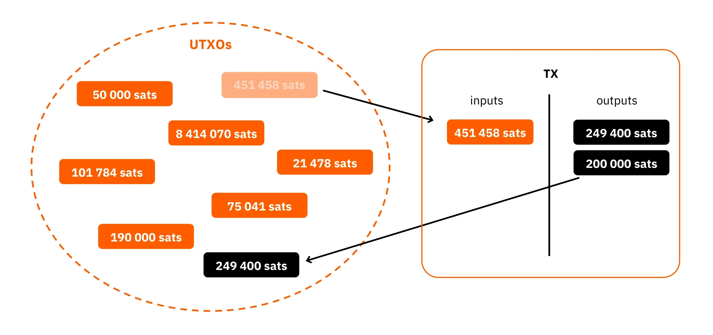


Wallet yazılımının Coin kontrolü ve UTXO etiketlemesi ile birlikte kullanılması, kullanıcıların işlemleri için UTXO'ları hem ayırt etmelerini hem de doğru bir şekilde seçmelerini sağlar.


### UTXO'larınızı nasıl etiketliyorsunuz?


UTXO'ları etiketlemek için herkese uyan tek bir yöntem yoktur. Wallet'iniz için anlaşılması kolay bir etiketleme sistemi tanımlamak size kalmıştır. Her durumda, iyi etiketlemenin ihtiyaç duyduğunuzda anlayabileceğiniz etiketleme olduğunu unutmayın. Bitcoin Wallet'iniz öncelikle tasarruf için tasarlanmışsa, etiketler onlarca yıl boyunca işinize yaramayabilir. Bu nedenle açık, kesin ve kapsamlı olduklarından emin olun.


Sevdiklerinizin bir gün Wallet'nıza erişmeleri gerekirse, fonların kaynağını kolayca belirleyebilmeleri önemlidir. Bu, hem gizlilik nedenleriyle hem de fonların kaynağını bir yetkiliye gerekçelendirmeleri gerektiğinde yasal amaçlar için onlara yardımcı olacaktır.


Etikette belirtilmesi gereken en önemli şey UTXO'in kaynağıdır. Coin'un Wallet'unuza nasıl geldiğini basitçe belirtmelisiniz. Exchange platformundaki bir satın alma işleminin sonucu mu? Bir müşteriden gelen bir Invoice ödemesi mi? Eşler arası bir Exchange mi? Yoksa bir giderin değişimini mi temsil ediyor? Örneğin, şunu belirtebilirsiniz:


- gW-432.com`u kaldırın;
- müşteri ödemesi David`;
- gW-433 Charles'ı satın al;
- `Kanepe satın alımını değiştirin`


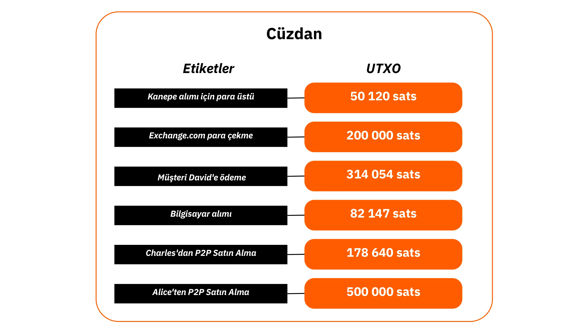


UTXO yönetiminize ince ayar yapmak ve Wallet'ünüzdeki fon ayırma stratejilerinize saygı göstermek için etiketlerinizi bu ayrımları yansıtan ek bir göstergeyle zenginleştirebilirsiniz. Wallet'ünüz karıştırmak istemediğiniz iki UTXO kategorisi içeriyorsa, bu grupları açıkça ayırt etmek için etiketlerinize bir işaret ekleyebilirsiniz. Bu ayırma işaretleri, KYC içeren bir satın alma sürecinden kaynaklanan UTXO'lar arasında veya profesyonel ve kişisel fonlar arasında ayrım yapmak gibi kendi kriterlerinize bağlı olacaktır. Yukarıda belirtilen etiket örneklerini ele alırsak, bu şu anlama gelebilir:


- kYC - Para Çekme Exchange.com;
- kYC - Müşteri Ödeme David`;
- "KYC YOK - P2P Charles Satın Alın";
- `NO KYC - Değişim kanepesi satın alma`


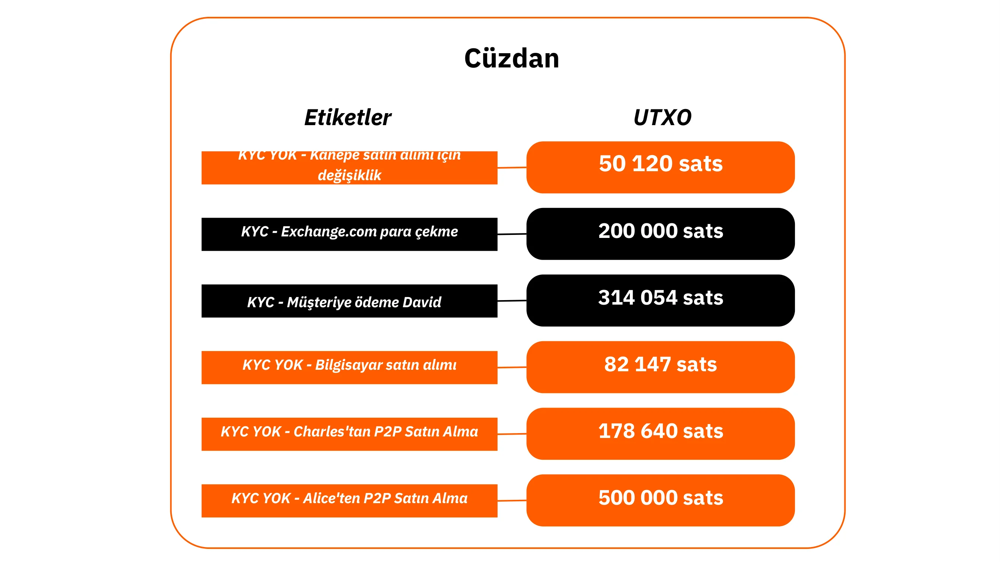


Ayrıca, bir UTXO'in etiketlenmesinin işlemler boyunca devam ettirilmesi de tavsiye edilir. Örneğin, UTXO no-KYC'yi birleştirirken, ortaya çıkan UTXO'i yalnızca "konsolidasyon" olarak değil, aynı zamanda madeni paraların nereden geldiğine dair net bir kayıt tutmak için özellikle "konsolidasyon no-KYC" olarak işaretlediğinizden emin olun.


Son olarak, etiket üzerine tarih koymak zorunlu değildir. Çoğu Wallet yazılımı zaten işlem tarihini gösterir ve txid sayesinde bu bilgiyi bir Block explorer üzerinde bulmak her zaman mümkündür.


### Doğru UTXO'lar nasıl seçilir?


Bir işlem gerçekleştirdiğinizde, Coin kontrolü, ödeme çıktısını karşılamak için hangi UTXO'ların girdi olarak kullanılacağını özellikle seçmenize olanak tanır. Bu seçimin iki yönü vardır:


- Ödemenin alıcısının kimliğinizin bir kısmını girdilerde kullanılan UTXO'lara bağlama olasılığı;
- Harici bir gözlemcinin girdi olarak tüketilen tüm UTXO'lar arasında bağlantı kurabilmesi.


İlk noktayı açıklamak için somut bir örnek verelim. Fırıncınızdan bitcoin ile ekmek satın aldığınızı varsayalım. Girdi olarak elinizde tuttuğunuz bir ya da daha fazla UTXO'yu kullanarak en azından bagetin fiyatını ve işlem ücretlerini karşılıyorsunuz. Fırıncınız daha sonra potansiyel olarak yüzünüzü veya kimliğinizin bildiği herhangi bir parçasını girdi olarak kullanılan madeni paralarla ilişkilendirebilir. Bu bağlantının varlığını bilerek, ödeme yaparken başka bir para yerine belirli bir UTXO seçmeyi tercih edebilirsiniz.


Örneğin, UTXO'larınızdan biri bir Exchange platformundan geliyorsa ve fırıncının bu platformdaki hesabınızı bilmemesini tercih ediyorsanız, ödeme için bu UTXO'i kullanmaktan kaçınırsınız. Önemli miktarda bitcoin ortaya çıkaran yüksek değerli bir UTXO'iniz varsa, fırıncının BTC servetinizden haberdar olmasını önlemek için bunu kullanmamayı da seçebilirsiniz.


Bu nedenle, bu ilk nokta için hangi UTXO'ların kullanılacağını seçmek kişisel bir karardır ve neyi ifşa etmek isteyip istemediğinizden etkilenir. UTXO'larınızı aldığınızda onlara atadığınız etiketler, harcandıktan sonra yalnızca alıcıya rahatça açıklayabileceğiniz bilgileri açığa çıkaracak olanları seçmenize yardımcı olacaktır.


Alıcıya potansiyel olarak ifşa edilen bilgilerin ötesinde, girdilerin seçimi de Blockchain'nın tüm gözlemcilerine neyi ifşa ettiğinizi etkiler. Gerçekten de, işleminize girdi olarak birkaç UTXO kullanarak, CIOH sezgiseline (_Common Input Ownership Heuristic_) göre bunların aynı varlığa ait olduğunu ifşa etmiş olursunuz.


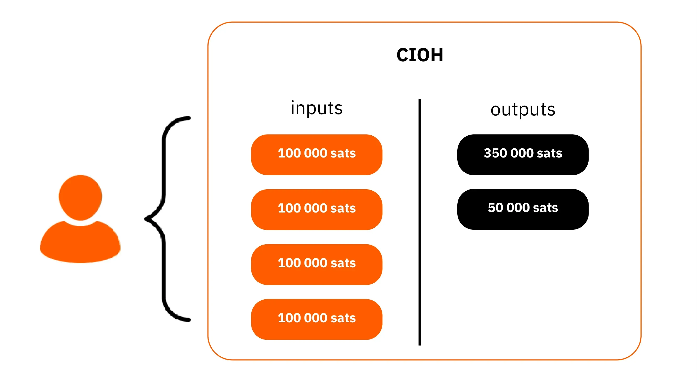


Bu nedenle UTXO'larınızı seçerken, yayınlamak üzere olduğunuz işlemin kullanılan tüm UTXO'lar arasında bir bağlantı oluşturacağının farkında olmanız gerekir. Bu bağlantı, özellikle UTXO'lar farklı kaynaklardan geliyorsa, kişisel gizliliğiniz açısından sorunlu olabilir.


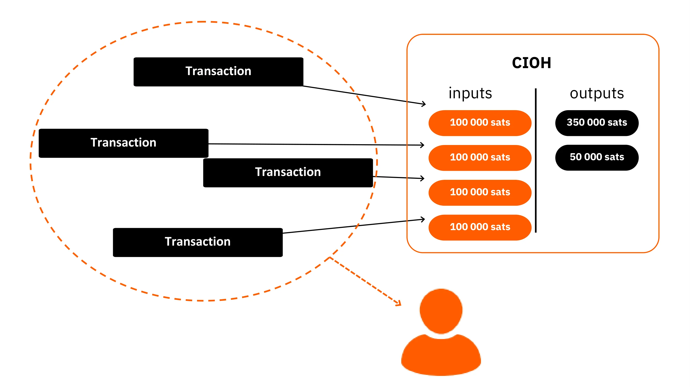


Bisq'ten aldığım KYC'siz UTXO örneğini ele alalım; bunu kimliğimi bilen düzenlenmiş bir Exchange platformundan aldığım bir UTXO ile birleştirmekten kaçınmak istiyorum. Gerçekten de, bu 2 UTXO'yu aynı işlemin girdileri olarak kullanırsam, düzenlenmiş platform kimliğimi Bisq'ten satın aldığım ve daha önce kimliğimle bağlantılı olmayan UTXO ile ilişkilendirebilecektir.


Son olarak, bir işleme girdi olarak hangi UTXO'ların kullanılacağını seçerken, en önemli şey birden fazla UTXO kullanmaktan kaçınmaktır. En fazla, mümkün olduğunda, ödemenizi karşılayacak kadar büyük tek bir Coin seçin. Bu şekilde, CIOH ile ilişkili risklerden tamamen kaçınmış olursunuz. Ancak, ödeme için tek bir UTXO yeterli değilse ve birkaç tane tüketmeniz gerekiyorsa, istenmeyen bağlantı riskini en aza indirmek için benzer kaynaklardan geldiklerinden emin olun. Ayrıca, alıcının sizin hakkınızda sahip olduğu bilgileri girişlerde kullanılan madeni paraların geçmişiyle ilişkilendirebileceğini unutmayın.


### Otomatik UTXO seçimini anlama


Önceki bölümlerde, bir işlem için kullanılacak UTXO'ların manuel seçimini tartıştık. Peki Wallet yazılımı bu seçimi otomatik olarak gerçekleştirdiğinde ne olur? Hangi coinlerin tüketileceğini belirlemek için çeşitli yöntemler mevcuttur ve UTXO'ların seçimi Bitcoin üzerinde gerçek bir araştırma alanı oluşturmaktadır. Bu otomatik sürecin temel amacı genellikle kullanıcı için işlem maliyetlerini en aza indirmektir.


FIFO (*İlk Giren İlk Çıkar*) ve LIFO (*Son Giren İlk Çıkar*) gibi UTXO seçim yöntemleri en basit ama aynı zamanda en az verimli olanlardır. FIFO ile önce Wallet'teki en eski UTXO'lar kullanılır. Bu yaklaşım, göreceli zaman kilitlerinin kullanıldığı ve düzenli olarak yenilenmesi gereken durumlar dışında, hem işlem maliyetlerini en aza indirmek hem de gizliliği korumak için genellikle verimsizdir. Tersine, LIFO en yeni UTXO'ların kullanımına öncelik verir. Her iki yöntem de basit olmakla birlikte genellikle etkisizdir.


Daha gelişmiş bir yöntem *Knapsack Solver*'dır. Bu, 0.17 sürümüne kadar Bitcoin core Wallet üzerinde kullanılmıştır. Yinelemeli ve rastgele olarak Wallet'den UTXO'ların seçilmesi, bunların alt kümeler halinde toplanması ve kullanıcıya maliyeti azaltmak için işlem ağırlığını mümkün olduğunca azaltan çözümün tutulmasından oluşur.


Mucidine atfen genellikle "Murch algoritması" olarak adlandırılan *Branch-and-Bound* (BNB), 0.17 sürümünden itibaren Bitcoin core'da *Knapsack Solver*'ın yerini almıştır. Bu daha gelişmiş yöntem, bir işlemin çıktılarını karşılamak için gereken miktara tam olarak karşılık gelen bir dizi UTXO bulmayı amaçlamaktadır. BNB'nin amacı, Exchange'ın hem anlık maliyetlerini hem de gelecekte beklenen maliyetlerini dikkate alan atık kriteri olarak adlandırılan kriteri azaltarak değişim miktarını ve ücretleri en aza indirmektir. Bu yöntem, 1960 yılında Ailsa Land ve Alison Harcourt tarafından tasarlanan orijinal *Branch-and-Bound* kavramından türetilmiştir ve *Knapsack Solver* yönteminden daha hassas bir ücret optimizasyonu sunmaktadır.


Tüm bu otomatik UTXO seçim yöntemleri işlem maliyetlerini azaltmada etkili olabilir, ancak kullanıcı gizliliğini korumada genellikle etkisizdirler. Aslında, bu algoritmalar birkaç UTXO'yu girdiler halinde birleştirebilir, böylece CIOH nedeniyle bu UTXO'ların ortak bir özelliğini ortaya çıkarabilir. Açıkçası, bu yöntemler UTXO'lara yapıştırılan etiketleri hesaba katamaz; bu etiketler yine de işlem alıcısına hangi UTXO'ların ifşa edileceğini bilinçli olarak seçmek için çok önemlidir. Şu anda, madeni paraları seçerken gizliliği optimize etmenin tek yolu bunu manuel olarak yapmaktır.


### UTXO etiketleme hakkında eğitim


UTXO'larınızı nasıl etiketleyeceğinizi öğrenmek isterseniz, ana Bitcoin Wallet yazılımı hakkında kapsamlı bir eğitim hazırladık:


https://planb.network/tutorials/privacy/on-chain/utxo-labelling-d997f80f-8a96-45b5-8a4e-a3e1b7788c52

## KYC ve anahtar tanımlama


<chapterId>cec6b9d9-0eed-4f85-bc4e-1e9aa59ca605</chapterId>


KYC, "Müşterini Tanı" anlamına gelir. Bitcoin sektöründe faaliyet gösteren bazı şirketler tarafından uygulanan düzenleyici bir prosedürdür. Bu prosedürün amacı, kara para aklama ve terörizmin finansmanı ile mücadele etmek amacıyla müşterilerinin kimliklerini doğrulamak ve kaydetmektir.


Pratik anlamda KYC, müşteriden yargı yetkisine göre değişebilen, ancak genellikle kimlik, fotoğraf ve Address kanıtı içeren çeşitli kişisel verilerin toplanmasını içerir. Bu bilgiler daha sonra doğrulanır ve ileride kullanılmak üzere saklanır.


Bu prosedür, Batı ülkelerinin çoğunda düzenlenmiş tüm Exchange platformları için zorunlu hale gelmiştir. Bu, bu platformlar aracılığıyla Exchange devlet para birimlerini Bitcoin için kullanmak isteyen herkesin KYC gerekliliklerine uyması gerektiği anlamına gelir.


Bu prosedür, kullanıcıların gizliliği ve güvenliği açısından riskler barındırmaktadır. Bu bölümde, bu riskleri ayrıntılı olarak inceleyecek ve KYC ve kimlik belirleme süreçlerinin Bitcoin kullanıcılarının gizliliği üzerindeki belirli etkilerini analiz edeceğiz.


### Zincir üzerinde izlemeyi kolaylaştırma


KYC ile ilişkili ilk risk, Blockchain analizi için ayrıcalıklı bir giriş noktası sunmasıdır. Önceki bölümde gördüğümüz gibi, analistler işlem kalıplarını ve sezgisel yöntemleri kullanarak Blockchain üzerindeki faaliyetleri kümeleyebilir ve izleyebilirler. Bir kullanıcının zincir üzerindeki faaliyetlerini kümelemeyi başardıklarında, gizliliğini tamamen tehlikeye atmak için tek yapmaları gereken tüm işlemleri ve anahtarları arasında tek bir giriş noktası bulmaktır.


Bir KYC gerçekleştirdiğinizde, bitcoinlerinizi bir Exchange platformundan çekerken kullandığınız alıcı adreslerinizi tam ve doğrulanmış kimliğinizle ilişkilendirdiğiniz için Blockchain analizi için yüksek kaliteli bir giriş noktası sağlarsınız. Teorik olarak, bu bilgiler yalnızca verdiğiniz şirket tarafından bilinir, ancak aşağıda göreceğimiz gibi, veri sızıntısı riski gerçektir. Dahası, bir şirketin bu bilgileri elinde tutuyor olması, paylaşmasalar bile sorun yaratabilir.


Dolayısıyla, Blockchain üzerindeki faaliyetlerinizin toplanmasını sınırlamak için başka adımlar atmazsanız, bu KYC giriş noktası hakkında bilgi sahibi olan herhangi biri potansiyel olarak Bitcoin üzerindeki tüm faaliyetlerinizi kimliğinizle ilişkilendirebilir. Bu şirketin bakış açısına göre, Bitcoin kullanımınız tüm gizliliğini kaybeder.


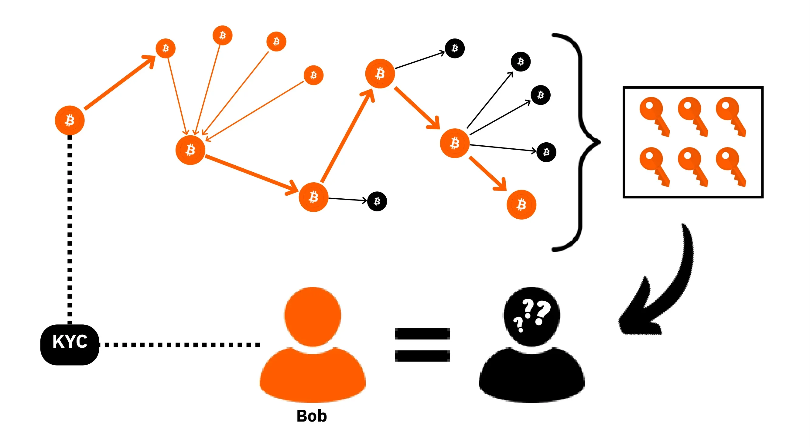


Bunu bir karşılaştırma ile açıklamak gerekirse, *Bank X*'teki bankacınız sadece *Bank X* ile yaptığınız tüm işlemlere erişmekle kalmıyor, aynı zamanda *Bank Y* ile yaptığınız işlemleri ve tüm nakit işlemlerinizi de gözlemleyebiliyor.


Bu dersin ilk bölümünü hatırlayın: Bitcoin'in gizlilik modeli, Satoshi Nakamoto tarafından tasarlandığı şekliyle, kullanıcının kimliği ile anahtar çiftleri arasındaki ayrıma dayanmaktadır. Bu Layer gizlilik modeli günümüzde artık yeterli olmasa da, yine de bozulmasını mümkün olduğunca sınırlandırmak akıllıca olacaktır.


### Devlet gözetimine maruz kalma


KYC ile ilgili ikinci büyük sorun, devlete bir noktada Bitcoin'e sahip olduğunuzu göstermesidir. Düzenlenmiş bir aktör aracılığıyla bitcoin satın aldığınızda, devletin bu sahiplik hakkında bilgi sahibi olması mümkün hale gelir. Şu anda bu önemsiz görünebilir, ancak ülkenizin siyasi ve ekonomik geleceğinin sizin elinizde olmadığını unutmamak önemlidir.


İlk olarak, devlet hızla otoriter bir tutum benimseyebilir. Tarih, politikaların aniden değiştiği örneklerle doludur. Bugün Avrupa'da Bitcoin kullanıcıları Bitcoin hakkında makaleler yazabiliyor, konferanslara katılabiliyor ve kendi cüzdanlarını kendileri yönetebiliyor. Ama yarının ne getireceğini kim bilebilir? Bitcoin aniden bir numaralı halk düşmanı haline gelirse, hükümet dosyalarında bununla ilişkilendirilmek sorun yaratabilir.


Daha sonra, ciddi ekonomik krizler karşısında, devlet vatandaşların elindeki bitcoinlere el koymayı düşünebilir. Belki de yarın, bitcoin sahipleri kriz vurguncuları olarak algılanacak ve fiat para biriminin devalüasyonu karşısında sermaye kazançları için aşırı vergilendirileceklerdir.


Bitcoinleriniz karışık olduğundan ve bu nedenle takip edilemediğinden bunun bir sorun olmadığını düşünebilirsiniz. Ancak buradaki sorun izlenebilirlik değildir. Asıl sorun, devletin Bitcoin'e sahip olduğunuzu bilmesidir. Bu bilgi tek başına sizi suçlamak ya da hesap sormak için yeterli olabilir. Bitcoinlerinizi harcadığınızı iddia etmeye çalışabilirsiniz, ancak bunun vergi beyannamenize yansıtılması gerekir ve yakalanırsınız. Anahtarlarınızı bir tekne kazasında kaybettiğinizi de söyleyebilirsiniz, ancak Twitter şakasının ötesinde, bunun sizi aklamak için yeterli olacağını gerçekten düşünüyor musunuz?


Dolayısıyla, bugün ne kadar uzak görünürse görünsün, devletin BTC'ye sahip olduğunuzu bilmesi riskini hesaba katmak önemlidir.


KYC'nin devlet denetimi açısından yarattığı bir diğer sorun da düzenlemeye tabi platformların zorunlu raporlama yapmasıdır. Diğer ülkelerdeki düzenlemelere aşina olmamakla birlikte, Fransa'da *Prestataires de Services sur Actifs Numériques* (PSAN) şüpheli gördükleri her türlü fon hareketini mali denetim makamlarına bildirmekle yükümlüdür.


Fransa'da 2023 yılında PSAN'lar tarafından 1.449 şüpheli eylem bildirilmiştir. Şimdilik, bu eylemlerin çoğunluğu suçla ilgilidir. Bununla birlikte, yetkililer düzenlenmiş platformlardan şüpheli Bitcoin işlemlerini yalnızca yapıları temelinde bildirmelerini de istemektedir. İşbirliğine dayalı bir işlem gerçekleştirirseniz, hatta sadece biraz atipik bir düzene sahip bir işlem gerçekleştirirseniz ve bu işlem Bitcoin'lerinizin bu platformlardan çekilmesinden çok uzakta gerçekleşmezse, kendinizi yetkililere bildirilmiş bulabilirsiniz. Suistimal olmasa ve haklarınızı meşru bir şekilde kullanıyor olsanız bile, bu tür bir raporlama, KYC olmadan kaçınabileceğiniz rahatsızlıklar olan artan kontrol ve gözetimlere yol açabilir.


### Kişisel veri sızıntısı riski


KYC ile ilgili bir diğer sorun da tüm kişisel verilerinizin özel bir şirketin sunucularında saklanmasını gerektirmesidir.


Son olaylar bize hiç kimsenin finansal veya BT hatalarına karşı bağışıklığı olmadığını hatırlattı. 2022 yılında Celsius müşterileri bunun sonuçlarına katlandı. Şirketin iflasının ardından, alacaklıların isimleri ve varlıklarının miktarı idari işlemler sırasında Amerikan mahkemeleri tarafından kamuoyuna açıklandı.


İki yıldan biraz daha uzun bir süre önce, müşterilerinin kişisel verilerinin çalındığını gören kripto para siber güvenliğinde bir amiral gemisiydi. Bu olay doğrudan bitcoin alımıyla bağlantılı olmasa da, Exchange platformları için de böyle bir risk devam etmektedir. Dolayısıyla kişisel verilerle ilgili kesin bir risk söz konusudur.


Kişisel verilerimizin çoğunu zaten özel şirketlere emanet ettiğimiz doğrudur. Ancak buradaki risk iki yönlüdür, çünkü bu veriler yalnızca sizi tanımlamakla kalmaz, aynı zamanda Bitcoin üzerindeki faaliyetlerle de bağlantılıdır. Gerçekten de, bir bilgisayar korsanı bir Exchange platformunun müşteri verilerine erişim sağladığında, bu müşterilerin Bitcoin'lere sahip olduğunu makul bir şekilde varsayabilir. Bu risk, diğer tüm değerli varlıklar gibi Bitcoin'ün de hırsızların dikkatini çekmesi nedeniyle daha da artmaktadır.


Bir veri sızıntısı durumunda, en iyi ihtimalle hedefli kimlik avı girişimlerinin hedefi olabilirsiniz. En kötü durumda ise kendinizi evinize yönelik fiziksel tehditlerin merkezinde bulabilirsiniz.


Bitcoin ile ilişkili özel risklere ek olarak, kimlik belgelerinin iletilmesiyle ilişkili tehlikeler de vardır. Gerçekten de, bir veri sızıntısı durumunda, kimlik hırsızlığının kurbanı olmak mümkündür. Dolayısıyla söz konusu riskler sadece işlemlerin gizliliğini korumakla sınırlı kalmayıp her bir bireyin kişisel güvenliğini de ilgilendirmektedir.


### KYC hakkında bazı önyargılı fikirler


KYC hakkında Twitter'da ya da bitcoin kullanıcıları arasındaki yazışmalarda sıkça karşılaştığımız bazı önyargılı fikirleri yıkmak önemlidir.


Öncelikle, KYC yoluyla elde edilen Bitcoin'ler için gizliliğinizi korumanın anlamsız olduğunu düşünmek yanlıştır. Bitcoin'deki gizlilik araçları ve yöntemleri çeşitlidir ve farklı amaçlara hizmet eder. Örneğin KYC yoluyla edinilen Bitcoin'lerde CoinJoin işlemlerini kullanmak kötü bir fikir değildir. Elbette, hesabınızın dondurulmasını veya yasaklanmasını önlemek için düzenlenmiş Exchange platformlarında dikkatli olmanız gerekir, ancak tamamen teknik bir bakış açısıyla, bu uygulamalar uyumsuz değildir. CoinJoin, bir Coin'un geçmişini kırma etkisine sahiptir, böylece KYC ile ilişkili belirli zincir analizi risklerini engellemenize yardımcı olur. Tüm riskleri ortadan kaldırmasa da önemli bir fayda sağlamaktadır.


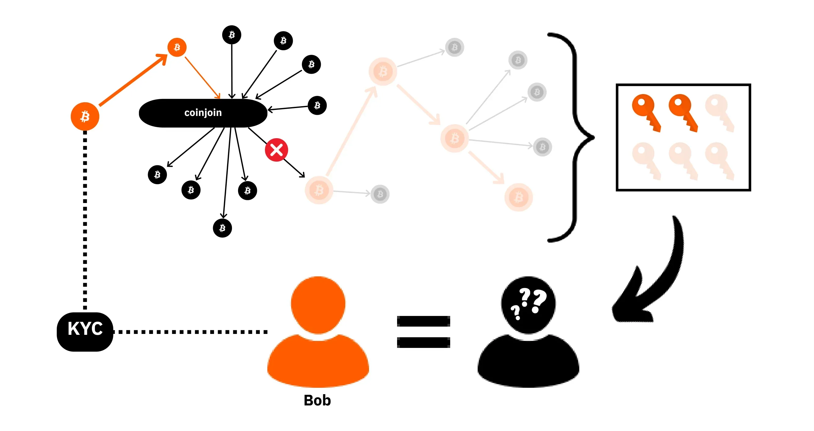


Bitcoin üzerindeki gizlilik, "anonim" bitcoinler ile anonim olmayanlar arasında bir ayrım olarak ikili bir şekilde görülmemelidir. KYC yoluyla elde edilen Bitcoin'lere sahip olmak her şeyin kaybedildiği anlamına gelmez; aksine, gizlilik araçlarının kullanılması daha da faydalı olabilir.


Buna karşılık, KYC olmayan bir yöntemle Bitcoin edinmek mükemmel gizliliği garanti etmez ve sizi diğer koruyucu önlemleri alma ihtiyacından muaf tutmaz. KYC olmayan Bitcoin'e sahipseniz ancak alıcı adreslerini birkaç kez tekrar kullanıyorsanız, işlemleriniz izlenebilir ve toplanabilir. Bitcoin dışındaki dünyayla en ufak bir bağlantı, sahip olduğunuz tek Layer gizliliğini tehlikeye atabilir. Bu nedenle, Bitcoin'deki tüm gizlilik artırıcı araç ve yöntemleri tamamlayıcı olarak düşünmek önemlidir. Her teknik belirli bir riski ele alır ve ekstra bir Layer koruması ekleyebilir. Dolayısıyla, KYC olmayan Bitcoin'e sahip olmanız başka önlemler almanıza gerek olmadığı anlamına gelmez.


### KYC iptal edilebilir mi?


Bazen bana KYC yaptıktan sonra "geri dönmenin" mümkün olup olmadığı soruluyor ve önceki paragraflardan tahmin edebileceğiniz gibi, cevap nüanslı. KYC ile ilişkili risklerden kaçınmanın en basit yolu, bitcoin edinirken KYC'yi kullanmamaktır. Bu konuyu bir sonraki bölümde daha derinlemesine inceleyeceğiz. Ancak, KYC zaten gerçekleştirilmiş ve bitcoinler satın alınmışsa, ilgili riskleri azaltmanın yolları var mıdır?


İşlemlerinizin izlenmesi riski söz konusu olduğunda, CoinJoin kullanımı bir çözümdür. Bu yöntemi kursun ilerleyen bölümlerinde ayrıntılı olarak inceleyeceğiz, ancak CoinJoin'ün bir Coin'ün geçmişini kırmanıza ve geçmişten bugüne ve bugünden geçmişe izlenmesini önlemenize olanak tanıdığını bilmelisiniz. Düzenlenmiş bir platform aracılığıyla elde edilen BTC'ler için bile bu teknik izlenebilirliklerini önleyebilir.


Bununla birlikte, CoinJoin KYC ile ilişkili ikinci riski ortadan kaldırmaz: devletin bitcoin sahibi olduğunuzdan haberdar olabileceği gerçeği. Gerçekten de, madeni paralarınız artık izlenebilir olmasa bile, Devlet, yargı yetkisine bağlı olarak, kripto varlık transfer beyannamelerinize erişebilir. Bu risk teknik değil, idari bir risk olduğundan, en başta KYC'ye maruz kalmamak dışında, bu riski ortadan kaldırmak için Bitcoin'ya özgü bir çözüm yoktur. Bu riski azaltmaya yönelik tek yasal yaklaşım, düzenlenmiş platformlar aracılığıyla edindiğiniz Bitcoin'lerinizi düzenlenmiş platformlarda satmak ve ardından KYC içermeyen yollarla geri satın almaktır. Satarak ve transferi beyan ederek, yetkililer artık onlara sahip olmadığınızı görmelidir.


Kişisel verilerinizin ve kimlik belgelerinizin sızdırılması riskine gelince, bu Bitcoin'nin dışında bir tehlikedir ve bunu önlemek için teknik bir çözüm yoktur. Verileriniz açığa çıktıktan sonra işlemi geri almak zordur. Platformdaki hesabınızı kapatmayı deneyebilirsiniz, ancak bu, özellikle kimlik doğrulaması dış kaynaklı olduğunda, KYC verilerinizin silinmesini garanti etmez. Bilgilerinizin tamamen silindiğinin doğrulanması mümkün değildir. Bu nedenle, bu riski tamamen önlemek ve artık var olmadığından emin olmak için bir çözüm yoktur.


### KYC ve anahtar tanımlama arasındaki fark


Bazen, bazı bitcoin kullanıcıları "KYC" terimini banka havalesi veya kredi kartı ödemesi içeren herhangi bir BTC Exchange'e genişletme eğilimindedir, çünkü bu araçlar da tıpkı bir KYC gibi ödemenin kaynağını ortaya çıkarabilir. Ancak, KYC anahtar tanımlama ile karıştırılmamalıdır. Kişisel bir not olarak, bu konuya ilişkin algımın zaman içinde geliştiğini itiraf etmeliyim.


KYC, özellikle belirli şirketler tarafından müşterilerinin kimliğini doğrulamak ve kaydetmek için uygulanan düzenleyici bir prosedürü ifade eder. Bu ikili bir durumdur: bitcoinlerinizi edinirken KYC yaparsınız ya da yapmazsınız. Bununla birlikte, bir kullanıcının kimliğinin bir yönü ile zincir üzerindeki faaliyet arasındaki bağlantıyla ilgili olan anahtar tanımlama, ikili değildir, daha ziyade bir sürekliliği temsil eder. Aslında, Bitcoin edinimi veya transferi bağlamında, bu tür bir tanımlama her zaman değişen derecelerde mümkündür.


Örneğin, İsviçre'de düzenlenmiş bir platformdan bitcoin satın alırsanız, KYC gerekli değildir. Ancak, satın alma işlemi banka hesabınız üzerinden yapıldığı için anahtarlarınız tespit edilebilir. KYC ile ilişkili ilk iki risk - zincir üzerinde takibin kolaylaştırılması ve devlet gözetimine maruz kalma - KYC'nin olmadığı bir Exchange'de de kendini gösterebilir. İsviçreli kuruluş şüpheli işlemleri ülkenizdeki yetkililere bildirirse, kimliğinizi keşfetmek için satın alma için kullanılan banka hesabını kontrol edebilirler. Dolayısıyla, düzenlenmiş platformlarda KYC olmadan satın almak, anahtar tanımlama için risk ölçeğinde oldukça yüksektir.


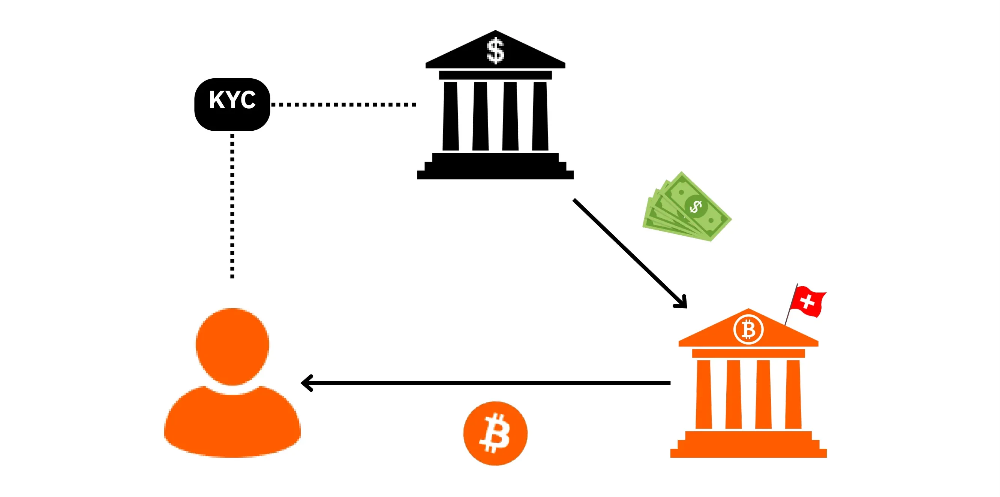


Ancak, düzenlemeye tabi platformlardan kaçınmak ve P2P satın alma yöntemlerini tercih etmek, anahtar tanımlama riskini tamamen ortadan kaldırmaz, yalnızca azaltır. Bisq veya başka bir P2P platformundan satın alma örneğini ele alalım. Karşı tarafa ödeme yapmak için muhtemelen banka hesabınızı kullanacaksınız. Yetkililer işlem yaptığınız kişiyi sorgular ve adınızı isterse, risk 1 ve 2'ye geri döneriz. Bu riskler KYC olmayan bir platformdan alım yaparken olduğundan çok daha düşük ve hatta KYC ile alım yaparken olduğundan daha düşük olsa da, yine de daha az ölçüde mevcuttur.


Son olarak, bitcoinlerinizi nakit karşılığında fiziksel bir Exchange aracılığıyla elde etseniz bile, tamamen anonim değilsinizdir. Alışveriş yaptığınız kişi, kimliğinizin bir parçası olan yüzünüzü görmüştür. Bu örnekte asgari düzeyde olsa da, yine de anahtar tanımlama olasılığı vardır.


Sonuç olarak, bitcoinler başka varlıklarla takas edildiğinde, ister devlet para biriminde bir satın alma ister gerçek bir mal karşılığında bir satış olsun, her zaman bir tür anahtar tanımlama vardır. Seçilen Exchange yöntemine bağlı olarak bu tanımlamanın yoğunluğu değişebilir. Bu tanımlamayı, iyi tanımlanmış bir düzenleyici süreç olan KYC ile karıştırmamak önemlidir. Bununla birlikte, KYC ile tanımlama spektrumu arasında bir bağlantı vardır, çünkü KYC, kullanıcı anahtarlarının yetkililer tarafından tanımlanmasını sistematik olarak kolaylaştırdığı için spektrumun üst ucundadır.


## Satış ve satın alma yöntemleri


<chapterId>756598af-95aa-4c77-ac48-243c7ad89530</chapterId>


Önceki bölümü okuduktan sonra, KYC ile ilişkili risklerden kaçınmak için bir kimlik doğrulama prosedüründen geçmek zorunda kalmadan Bitcoin'ü nasıl satın alabileceğinizi veya satabileceğinizi merak ediyor olabilirsiniz. Bitcoin ticareti yapmanın birkaç yolu vardır.


### P2P nakit değişimleri


Gördüğümüz gibi, gizlilik açısından en iyi yöntem nakit ödeme ile P2P (kişiden kişiye) Exchange'dır. Bu yöntem, geride bırakılan izleri en aza indirmenize olanak tanır ve ister alım ister satım yapıyor olun, anahtar tespiti olasılığını önemli ölçüde azaltır.


Bununla birlikte, kişisel güvenlik için riskler vardır. Ana tehlike, Exchange sırasında karşı tarafın nakit veya bitcoin olarak büyük miktarda para tuttuğunuzu bilmesidir. Bu bilgi kötü niyetli kişilerin dikkatini çekebilir. Gerçekten de, Bitcoin varlıklarınız konusunda genellikle ihtiyatlı olmanız tavsiye edilir. Bu tavsiye nakit paraya da uygulanabilir. Ancak, yüz yüze alışveriş yaparken, bitcoin sahibi olduğunuzu açıklamak kaçınılmazdır ve bu istenmeyen dikkatleri çekebilir.


Bu riski sınırlamak için, aile üyeleri veya yakın arkadaşlar gibi güvenilir kişilerle nakit işlem yapmayı tercih etmenizi tavsiye ederim. Alternatif olarak, birkaç kez katıldıktan sonra [yerel Bitcoin buluşmalarında] (https://btcmap.org/communities/map) işlem yapmayı da düşünebilirsiniz. Bu, diğer katılımcıları daha iyi tanımanızı ve fiziksel olarak alışveriş yaparken yalnız kalmamanızı sağlayacaktır. Bununla birlikte, P2P nakit takaslarının doğası gereği kişisel güvenliğiniz için düzenlenmiş bir platform ve banka hesabınız aracılığıyla satın alırken var olmayan riskler taşıdığını kabul etmek önemlidir.


Dahası, yaşadığınız yere bağlı olarak, ister Bitcoin ister nakit olsun, büyük miktarlarda paranın taşınması ve saklanması riskli olabilir.


Nakit alışverişi, polis veya diğer kontroller durumunda yasal riskler de oluşturabilir. Çoğu ülkede yanınızda taşıyabileceğiniz nakit miktarı konusunda herhangi bir kısıtlama olmamasına rağmen, aşırı miktarlar şüphe uyandırabilir. Bu nedenle, özellikle uzun mesafeler kat etmeniz gerekiyorsa dikkatli olun ve büyük meblağlara sahip olduğunuzu gerekçelendirmek zorunda kalmamak için bir kerede çok fazla büyük işlem yapmaktan kaçının.


Son olarak, P2P alımlarının bir diğer dezavantajı da fiyatın genellikle düzenlenmiş platformlardan daha yüksek olmasıdır. Satıcılar genellikle %1 ile bazen %10'dan fazla arasında değişen bir fiyat artışı talep etmektedir. Bu fiyat farkının birkaç nedeni vardır. İlk olarak, bu P2P satıcıları arasında zaman içinde yerleşmiş yaygın bir uygulamadır. İkinci olarak, satıcıların fonları alıcıya göndermek için işlemle ilişkili ücretleri vardır. Ayrıca, P2P satışlarında platform işlemlerine kıyasla daha yüksek bir hırsızlık riski vardır ve bu da alınan riskin telafi edilmesini haklı çıkarır. Son olarak, ekstra maliyet, gizlilik açısından Exchange'ün talebi ve kalitesiyle bağlantılı olabilir. Bir alıcı olarak, gizlilikten elde edilen kazancın, satıcı tarafından uygulanan fiyat artışına yansıyan bir bedeli vardır. Bazı bitcoin kullanıcıları da P2P üzerinden satın alınan BTC'nin fiyatının gerçek fiyatını yansıttığına inanmakta ve düzenlenmiş platformlardaki düşük fiyatların kişisel verilerinizin gizliliğinden ödün verilmesinin bir sonucu olduğunu savunmaktadır.


### Eşleştirme platformu üzerinden P2P alışverişi


Kişisel güvenlik açısından daha az riskli bir alternatif, P2P alışverişlerini PayPal, banka havaleleri veya Revolut gibi elektronik ödeme yöntemleriyle yalnızca çevrimiçi olarak gerçekleştirmektir.


Bu yaklaşım, nakit işlemlerle ilişkili risklerin çoğunu önler. Bununla birlikte, karşı tarafın çevrimiçi bir Exchange'de temerrüde düşme riski daha yüksektir. Gerçekten de, fiziksel bir Exchange'de, karşılığında size bitcoin göndermeyen satıcıya para verirseniz, karşınızda durduğu için hemen hesap sorabilirsiniz. Öte yandan internette, sizden çalan birinin izini sürmek çoğu zaman imkansızdır.


Bu riski azaltmak için, P2P alışverişleri için özel platformlar kullanmak mümkündür. Bu platformlar, mağdur kullanıcıları korumak için uyuşmazlık çözüm mekanizmaları kullanır. Tipik olarak, fiat para birimindeki ödeme satıcı tarafından onaylanana kadar bitcoinlerin tutulduğu bir emanet sistemi sunarlar.


Kişisel güvenlik açısından, bu satın alma yöntemi fiziksel nakit Exchange'dan çok daha güvenlidir. Bununla birlikte, yukarıda belirtildiği gibi, çevrimiçi P2P alışverişleri fiziksel bir Exchange'dan daha fazla iz bırakır ve bu da Bitcoin'deki gizlilik için zararlı olabilir. Banka gibi çevrimiçi bir fiat ödeme yöntemi kullanarak, anahtar tanımlamayı kolaylaştırabilecek daha fazla bilgiyi açığa çıkarırsınız.


Bir kez daha, bu platformlarda tek bir işlemde çok fazla büyük işlem yapmanızı tavsiye etmem. İşlemlerinizi bölerek karşı taraf hırsızlığı riskini yaymış olursunuz.


Bir kez daha, P2P alımlarının bir diğer dezavantajı, fiyatın genellikle düzenlenmiş platformlarda gözlemlenenden daha yüksek olmasıdır. Satıcılar genellikle %1 ile bazen %10'un üzerinde değişen oranlarda zam yapmaktadır. Bu fiyat farkının birkaç nedeni vardır. İlk olarak, bu P2P satıcıları arasında zaman içinde yerleşmiş yaygın bir uygulamadır. İkinci olarak, satıcıların fonları alıcıya göndermek için işlemle ilişkili ücretleri vardır. Ayrıca, P2P satışlarında platform işlemlerine kıyasla daha yüksek bir hırsızlık riski vardır ve bu da alınan riskin telafi edilmesini haklı çıkarır. Son olarak, ekstra maliyet, gizlilik açısından Exchange'nin talebi ve kalitesiyle bağlantılı olabilir. Alıcı olarak, gizlilikten elde edilen kazancın, satıcı tarafından uygulanan fiyat artışına yansıyan bir bedeli vardır. Bazı bitcoin kullanıcıları da P2P üzerinden satın alınan BTC'nin fiyatının gerçek fiyatını yansıttığına inanmakta ve düzenlenmiş platformlardaki düşük fiyatların kişisel verilerinizin gizliliğinden ödün verilmesinin bir sonucu olduğunu savunmaktadır.


Çözümler söz konusu olduğunda, kişisel olarak her zaman [Bisq] (https://bisq.network/) kullandım ve bundan çok memnunum. Sistemleri denenmiş ve test edilmiş ve güvenilir görünüyor. Ancak Bisq sadece PC'de kullanılabiliyor ve Interface yeni başlayanlar için çok karmaşık olabilir. Bir diğer dezavantajı ise Bisq'in yalnızca zincir içi işlemlerle çalışmasıdır ki bu da Bitcoin işlem ücretlerinin yüksek olduğu dönemlerde maliyetli hale gelebilir.


-> Bisq eğitimimize bakın.


https://planb.network/tutorials/exchange/peer-to-peer/bisq-fe244bfa-dcc4-4522-8ec7-92223373ed04

Daha basit bir seçenek için, alıcıları ve satıcıları yerleşik bir anlaşmazlık çözüm sistemi ile birbirine bağlayan bir mobil uygulama olan [Peach](https://peachbitcoin.com/)'i deneyebilirsiniz. Süreç Bisq'inkinden daha sezgiseldir.


-> Peach eğitimimize bakın.


https://planb.network/tutorials/exchange/peer-to-peer/peach-c6143241-d900-4047-9b73-1caba5e1f874

Bir başka çevrimiçi seçenek de, şahsen test etmemiş olsam da, iyi likidite sunan köklü bir platform olan [HodlHodl] (https://hodlhodl.com/).


-> HodlHodl eğitimimize bakın.


https://planb.network/tutorials/exchange/peer-to-peer/hodlhodl-d7344cd5-6b18-40f5-8e78-2574a93a3879

Lightning Network tabanlı çözümler için [RoboSats](https://learn.robosats.com/) ve [LNP2PBot](https://lnp2pbot.com/) adreslerini deneyebilirsiniz. RoboSats'a bir web sitesi üzerinden erişilebilir ve kullanımı nispeten basittir. LNP2PBot ise Telegram mesajlaşma uygulaması üzerindeki bir Exchange sistemi üzerinden çalıştığı için daha atipiktir.


-> RoboSats eğitimimize bakın.


-> LNP2PBot eğitimimize bakın.


https://planb.network/tutorials/exchange/peer-to-peer/robosats-b60e4f7c-533a-4295-9f6d-5368152e8c06

https://planb.network/tutorials/exchange/peer-to-peer/lnp2pbot-v2-e6bcb210-610b-487d-970c-7cce85273e3c


### KYC olmadan düzenlenmiş platformlar


Yaşadığınız ülkeye bağlı olarak, bitcoin almak veya satmak için KYC prosedürleri gerektirmeyen düzenlenmiş platformlara erişiminiz olabilir. Örneğin İsviçre'de, daha önce [Relai](https://relai.app/) ve [MtPelerin](https://www.mtpelerin.com/) platformlarını kullanabiliyordunuz; bu platformlar artık KYC düzenlemeleri kapsamında hizmet vermektedir.


-> Relai hakkındaki eğitimimize bakın.


https://planb.network/tutorials/exchange/centralized/relai-v2-30a9671d-e407-459d-9203-4c3eae15b30e

Önceki bölümde gördüğümüz gibi, bu tür platformlar sizi KYC prosedürleriyle ilişkili risklerden kurtarır, ancak anahtar tanımlama için daha yüksek bir risk seviyesi sunarlar. O halde, Bitcoin gizliliği açısından, bu platformlar KYC ile satın alma yöntemlerinden daha iyi koruma sağlar, ancak P2P borsalarından daha az cazip kalırlar.


Bununla birlikte, kişisel güvenlik açısından, bu platformları kullanmak P2P borsalarından çok daha az risklidir. Ayrıca bu platformların kullanımı P2P platformlarına kıyasla genellikle daha basittir.


### ATM'ler


KYC olmadan bitcoin satın almak veya satmak için bir başka seçenek de kripto para ATM'leridir. Şahsen, ülkemde hiç olmadığı için bu çözümü test etme fırsatım olmadı. Ancak nerede yaşadığınıza bağlı olarak bu yöntem çok ilginç olabilir.


ATM'lerle ilgili sorun, bunların bazı ülkelerde yasaklanmış, bazılarında ise yüksek düzeyde düzenlenmiş olmasıdır. Eğer bir ATM kimlik doğrulama prosedürü gerektiriyorsa, o zaman KYC tarafından düzenlenen platformlardaki risklerin aynısına maruz kalır. Öte yandan, ATM küçük tutarlar için kimlik doğrulaması olmadan işlem yapılmasına izin veriyorsa, kullanımı P2P nakit Exchange ile karşılaştırılabilir bir gizlilik seviyesi sunarken, bu tür Exchange ile ilişkili risklerin çoğundan kaçınabilir.


ATM'lerin en büyük dezavantajı, genellikle yüksek olan Exchange ücretleridir; bu ücretler yüzde birkaç ile bazen değiştirilen miktarın %15'i arasında değişmektedir.


### Hediye kartları


Son olarak, bitcoinlerini fiat para birimleri karşılığında satmak yerine günlük olarak alışveriş yapmak için kullanmak isteyenler için iyi çalışan bir çözümü de tanıtmak istedim.


BTC harcamanın en iyi yolu, elbette, bir mal veya hizmet satın almak için doğrudan Bitcoin veya Lightning Network kullanmaktır. Ancak, birçok ülkede Bitcoin kabul eden tüccar sayısı hala sınırlıdır. Pratik bir alternatif ise hediye kartları kullanmaktır.


KYC prosedürleri gerektirmeyen birkaç platform, büyük perakendecilerde kullanılabilecek hediye kartları için bitcoin alışverişi imkanı sunmaktadır. Bunlar arasında [CoinsBee](https://www.coinsbee.com/), [The Bitcoin Company](https://thebitcoincompany.com/) ve [Bitrefill](https://www.bitrefill.com/) bulunmaktadır. Bu platformlar, bitcoinlerinizi günlük olarak kullanmanızı çok daha kolay hale getirerek, fiat para birimine dönüştürmek zorunda kalmadan çok çeşitli ürün ve hizmetlere erişmenizi sağlar.


https://planb.network/tutorials/exchange/centralized/bitrefill-8c588412-1bfc-465b-9bca-e647a647fbc1


### Diğer edinim yöntemleri


Gizliliğinizi koruyarak bitcoin edinmenin diğer yolları arasında elbette Mining de bulunmaktadır. Mining Sats'u başlatmak için kimliğinizi açıklamanıza gerek yoktur; geçerli bir Proof of Work bulmanız ve bunu ağa göndermeniz yeterlidir. Mining havuzunu tercih ederseniz, bazı havuzlar KYC gibi bir tür kimlik gerektirirken, diğerleri gerektirmez.


Bir başka yöntem de Exchange'ta bitcoin için çalışmaktır. Bu edinim yöntemi ilginç olabilir, ancak gerekli kimlik belirleme derecesi koşullara bağlı olarak önemli ölçüde değişir.


*Bu bölümü yazmak için [@pivi___](https://x.com/pivi___) tarafından Plan ₿ Network üzerinde verilen BTC205 kursunu kullandım (şimdilik sadece Fransızca olarak mevcut)*


## Konsolidasyon, UTXO yönetimi ve CIOH


<chapterId>d0486c8f-332d-402b-ae2e-949416752b9c</chapterId>


Kendi kendine velayet Wallet'ü yönetmenin en karmaşık yönlerinden biri konsolidasyondur. Birleştirmeli misiniz? Ne anlamı var? Ne büyüklükte bir UTXO'e saygı gösterilmelidir? Gizlilik açısından tavizler nelerdir? Bu bölümde bunlara bakacağız.


### Konsolidasyon nedir?


Bitcoin, madencilerin en düşük ücretleri sunan işlemleri tercih ettiği bir açık artırma piyasası gibi çalışır. Bununla birlikte, her bloğun maksimum bir ağırlığı vardır ve bu da dahil edilebilecek işlem sayısını sınırlar. Ortalama olarak her 10 dakikada bir blok üretildiğinden, her blokta mevcut olan alan kıt bir kaynaktır.


Faaliyetleri generate elektrik, sabit varlıklar ve bakım açısından önemli maliyetlere neden olan madenciler, doğal olarak karlılıklarını en üst düzeye çıkarmaya çalışırlar. Bu nedenle, ağırlıklarına göre en yüksek ücretleri veren generate işlemlerini tercih etme eğilimindedirler.


Tüm Bitcoin işlemleri aynı ağırlığı taşımaz. Daha fazla girdisi ve çıktısı olanlar daha ağır olacaktır. Örneğin, 2 işlem hayal edelim:


- A işlemi 1 girdi ve 1 çıktı içermektedir. Bu işlem 1.994 Sats ücret tahsis eder ve 141 vB ağırlığa sahiptir;
- İşlem B, 2 girdi ve 2 çıktıya sahip daha karmaşık bir işlem olup, 220 vB'lik bir ağırlık için 2.640 Sats ücret tahsis eder.


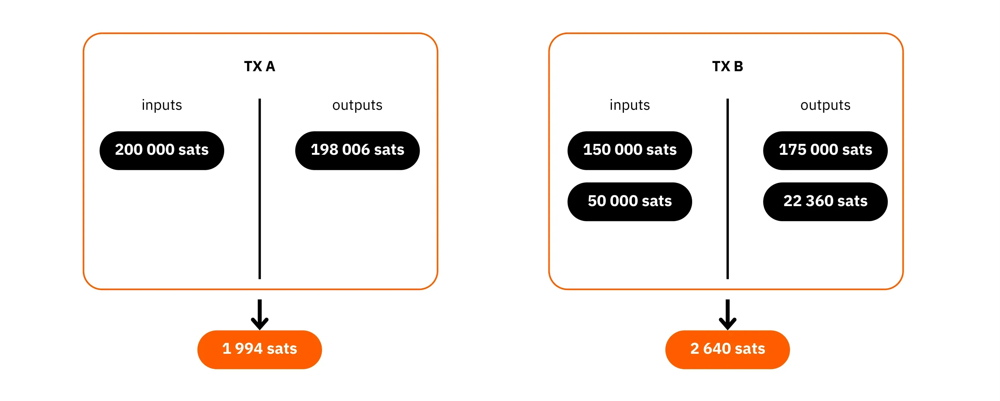


Bu örnekte, B işlemi daha yüksek bir toplam ücret sunsa da, madenciler ücret ve ağırlık arasında daha iyi bir oran sunduğu için A işlemini tercih edecektir. İşte sanal bayt başına Sats (sat/vB) olarak ifade edilen her bir işlem için hesaplama:


```text
TXA: 1994 / 141 = 14 sats/vB
TXB: 2640 / 220 = 12 sats / vB
```


Bu, B işlemi mutlak anlamda daha fazla maliyet sunsa bile, her bir ağırlık birimi için A işleminin B işleminden daha fazla maliyet sunduğu anlamına gelir.


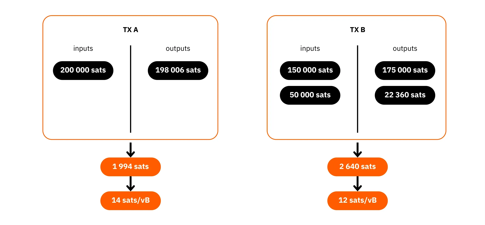


Bu nedenle kullanıcı için işlemlerinde mümkün olduğunca az girdi tüketmek her zaman daha ilgi çekicidir. Ancak, çıktı ödemesini karşılayabilmek için yeterli miktarda tüketmeniz gerekir. Wallet'inizi yönetirken, yeterince büyük UTXO'lara sahip olmanız gerekir.


Konsolidasyon ilkesi tam olarak Bitcoin'de ücretlerin düşük olduğu dönemlerden faydalanarak daha küçük UTXO'ları tek bir büyük UTXO'da birleştirmektir. Bu şekilde, Bitcoin'de ücretler yükseldiğinde, minimum girdiyle işlem yapabilecek ve dolayısıyla mutlak anlamda daha az ücret harcayacaksınız. Bu nedenle amaç, ücretlerin yüksek olduğu dönemlerde gerçekleştirilmesi gereken zorunlu işlemleri önceden tahmin etmektir.


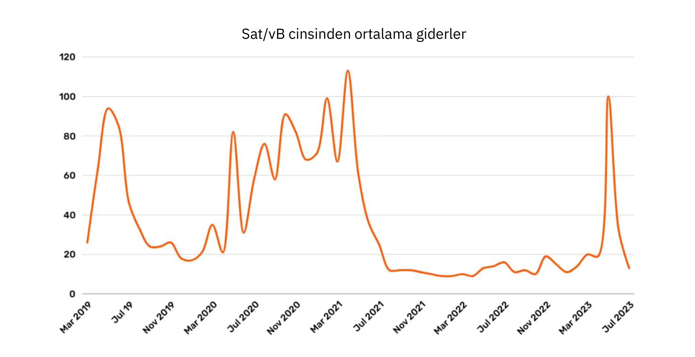


İşlem maliyetlerinden tasarruf etmenin yanı sıra, UTXO'ların konsolide edilmesi "Dust" oluşumunun önlenmesine yardımcı olur. Dust", Sats'teki değeri, bunları harcamak için gereken işlem maliyetlerini karşılamaya yetmeyecek kadar düşük olan UTXO'ları ifade eder. Bu durum, işlem maliyetleri yüksek kaldığı sürece bu UTXO'ların kullanımını ekonomik açıdan mantıksız hale getirir. UTXO'larınızı proaktif bir şekilde bir havuzda toplayarak Dust'e dönüşmelerini engeller ve tüm fonlarınızın kullanılabilir kalmasını sağlarsınız.


### UTXO'larınız için minimum boyut nedir?


Bazen bana bir UTXO için önerilen minimum değerin ne olduğu soruluyor. Ne yazık ki, tercihlerinize ve ücret piyasasının koşullarına bağlı olduğu için evrensel bir cevap yok. Bununla birlikte, ihtiyaçlarınıza uygun bir eşik belirlemenize yardımcı olabilecek bir formül aşağıda verilmiştir:


$$
\frac {P \times F}T = M
$$


Nerede?


- p$ işlem ağırlığıdır;
- f$ vbyte başına satoshi (Sats/vB) cinsinden hedge ettiğiniz maksimum şarj oranını temsil eder;
- t$, UTXO'nin toplam değerine göre ödemek istediğiniz işlem ücreti yüzdesidir;
- m$ her bir UTXO için satoshi cinsinden minimum tutardır.


Diyelim ki 141 vB ağırlığında 1 giriş ve 2 çıkışlı standart bir SegWit işlemi için ücretleri karşılamayı planlıyorsunuz. Eğer 800 Sats/vB'ye kadar riskten korunuyorsanız ve UTXO değerinin en fazla %12'sini ücret olarak harcamak istiyorsanız, o zaman hesaplama şöyle olacaktır:


$$
\frac{141 \times 800}{0.12} = 940\ 000
$$


Bu örnekte, Wallet'nizde UTXO'lar için minimum 940.000 Sats değerini tutmanız akıllıca olacaktır.


### Konsolidasyon ve CIOH


Blockchain analizinde en yaygın kullanılan sezgisel yöntemlerden biri, bir Bitcoin işleminin tüm girdilerinin aynı varlığa ait olduğunu varsayan CIOH (*Common Input Ownership Heuristic*) yöntemidir. Konsolidasyonun temel prensibi, birkaç UTXO'yu girdi olarak tüketmek ve çıktı olarak tek bir UTXO oluşturmaktır. Konsolidasyon böylece ICOH'un uygulanmasını sağlar.


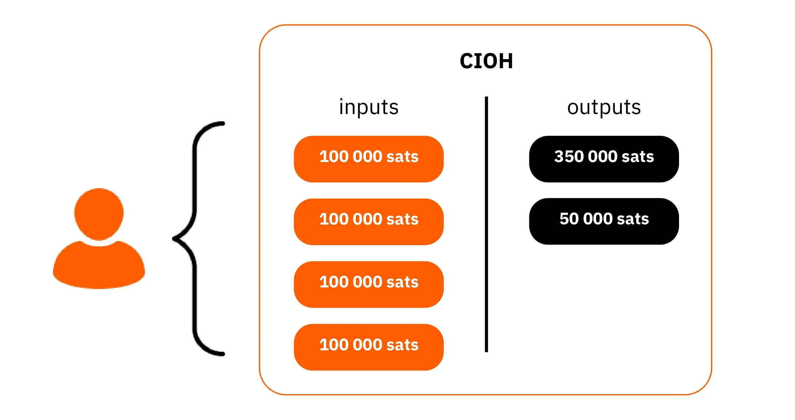


Pratikte bu, dışarıdan bir gözlemcinin tüm konsolide UTXO'ların muhtemelen aynı kişiye ait olduğu ve üretilen benzersiz çıktının da ona ait olduğu sonucuna varabileceği anlamına gelir. Bu durum, farklı işlem geçmişlerini ilişkilendirerek gizliliğinizi tehlikeye atabilir. Örneğin, P2P aracılığıyla elde edilen 3 UTXO'yu KYC gerektiren bir platform aracılığıyla elde edilen bir UTXO ile konsolide ettiğimi varsayalım:


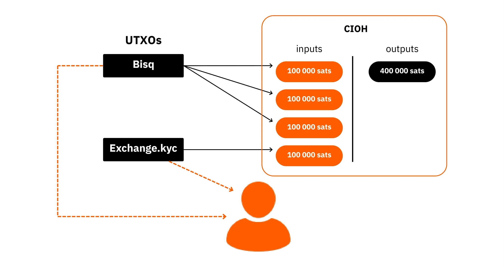


Bunu yaparak, potansiyel olarak devlet kurumları da dahil olmak üzere Exchange platformunun verilerine erişimi olan herhangi bir varlık, başka miktarlarda BTC'ye sahip olduğumu tespit edebilecektir. Önceden, bu UTXO'lar doğrudan kimliğimle bağlantılı değildi; artık bağlantılılar. Dahası, tüm kaynaklara belirli miktarda bitcoin'e sahip olduğumu gösteriyor.


UTXO'ların yönetimi söz konusu olduğunda, maliyetleri düşürmek için konsolidasyonu teşvik eden ekonomik hususlar, UTXO'ların asla birleştirilmemesini tavsiye eden iyi gizlilik uygulamaları ile çatışır. Bu nedenle ekonomi ve gizlilik arasındaki seçim her kullanıcının önceliklerine bağlıdır.


Önemli UTXO'ları korurken konsolidasyondan kaçınabiliyorsanız, bu idealdir. Bunu yapmak için satın alma yöntemlerinizi optimize edin. Bitcoinlerinizi DCA'da satın alıyorsanız, değeri daha az UTXO üzerinde konsolide etmek için tek seferlik alımlarınızı mümkün olduğunca aralıklı yapmaya çalışın. Her hafta 120 €'luk bir satın alma yerine, her 2 ayda bir 1.000 €'luk tek seferlik bir satın alma işlemini yönetmek daha kolay olacaktır. Bu, üretilen UTXO sayısını en aza indirir ve gizliliğinizi korurken Wallet'inizin yönetimini basitleştirir.


Eğer bitcoinlerinizi birleştirmek zorunda kalırsanız, öncelikle aynı kaynaktan gelen UTXO'ları birleştirmeyi tercih edin. Örneğin, tek bir platformdan 10 UTXO'yu birleştirmek, gizliliğinizi A platformundan 5 UTXO ile B platformundan 5 UTXO'yu karıştırmaktan daha az etkileyecektir. Çeşitli kaynakların birleştirilmesi kaçınılmazsa, bunları özelliklerine göre ayırmaya çalışın. Örneğin, KYC yoluyla elde edilen UTXO'ları bir işlemde, P2P yoluyla elde edilenleri ise başka bir işlemde gruplandırın.


Her durumda, herhangi bir konsolidasyonun kaçınılmaz olarak gizlilik kaybına yol açacağını unutmayın. Bu nedenle, CIOH'u dikkate alarak bu işleme olan ihtiyacı ve gizliliğiniz üzerindeki potansiyel etkiyi dikkatlice değerlendirin.


## Diğer en iyi uygulamalar


<chapterId>b5216965-7d13-4ea1-9b7c-e292966a487b</chapterId>


Bitcoin'te gizliliğinizi optimize etmek için diğer birkaç en iyi uygulamaya göz atalım.


### Tam düğüm


Bitcoin'lerinize kendi gözetiminizde sahip olmak harika, ancak kendi Full node'ünüzü kullanmak daha da iyi! İşte Bitcoin'i tamamen egemen bir şekilde kullanmak için kendi node'unuza sahip olmanın neden çok önemli olduğu:


- **Sansüre karşı direnç**: İşlemleriniz hiç kimse tarafından engellenemez;
- **Üçüncü taraflardan bağımsızlık**: Artık Blockchain verilerini doğrulamak için herhangi bir harici hizmete bağımlı değilsiniz;
- **Aktif katılım**: Kendi doğrulama kurallarınızı tanımlayabilir ve fikir birliğine doğrudan katılabilirsiniz;
- **Ağ katkısı**: Bir düğüm çalıştırarak Bitcoin ağını güçlendirmeye ve dağıtmaya yardımcı olursunuz;
- **Teknik eğitim**: Bir Full node'i yönetmek, Bitcoin hakkındaki teknik bilginizi derinleştirmek için harika bir yoldur.


Bu avantajlara ek olarak, bir Full node kullanmak işlemlerinizi yayınlarken gizliliğinizi de artırır. Bir işlem yayınladığınızda, ilk olarak Wallet'niz aracılığıyla oluşturulur ve imzalanır. Bitcoin ağında yayınlamak için en az bir düğüm tarafından bilinmesi gerekir. Kendi düğümünüzü kullanarak bu dağıtım üzerinde doğrudan kontrol sahibi olursunuz, böylece gizliliğinizi güçlendirir ve veri sızıntısı riskini sınırlandırırsınız.


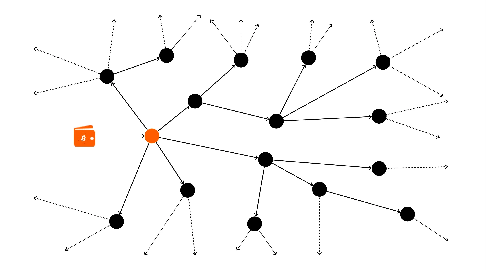


Kendi Bitcoin düğümünüz yoksa, Wallet yazılım sağlayıcınız tarafından sunulan gibi üçüncü taraf bir düğüm kullanmak zorunda kalacaksınız. İşlemleri yayınlamanın yanı sıra, Wallet'ünüz bekleyen işlemler, adreslerinizle ilişkili bakiyeler ve işlemleriniz için onay sayısı gibi çeşitli bilgilere erişime ihtiyaç duyar. Tüm bu verilere erişmek için bir düğümü sorgulamanız gerekir.


Kendi Bitcoin düğümünüzü kullanmadığınızda ana risk, üçüncü taraf düğümün operatörünün Blockchain üzerindeki faaliyetlerinizi gözlemleyebilmesi ve hatta bu bilgileri diğer kuruluşlarla paylaşabilmesidir. Bu riski sınırlamak için, bağlantılarınızı Tor üzerinden maskeleyen Wallet yazılımını kullanmak bir ara çözümdür. Bu, verilerinizin açığa çıkmasını azaltabilir. Bununla birlikte, en uygun çözüm kendi Bitcoin düğümünüze sahip olmak ve işlemlerinizi yayınlamak için bunu kullanmaktır. Elbette, düğümünüz aracılığıyla herhangi bir bilgi sızdırmamaya da dikkat etmeniz gerekecektir, ancak bu daha sonraki bölümlerde inceleyeceğimiz başka bir konudur.


Kendi Full node'unuzun olması, gizliliğiniz açısından sağladığı bariz avantajın ötesinde, Blockchain'deki verilerin doğruluğunu garanti eder, sizi sansüre karşı korur ve Bitcoin'ın yönetimine aktif olarak katılmanızı sağlar. Kendi node'unuzu kullanarak, seçtiğiniz zincire ekonomik ağırlığınızla katkıda bulunursunuz ki bu, örneğin 2015'ten 2017'ye kadar süren Blocksize Savaşı sırasında olduğu gibi topluluk içindeki çatışmalar sırasında önemlidir. Bir Fork durumunda, üçüncü taraf bir node kullanmak, node operatörü sizin için seçim yaptığından, tercih etmek istemediğiniz bir zinciri desteklemenize neden olabilir.


Gördüğünüz gibi, gizlilik ve bireysel egemenlik adına, kendi Full node'nizi çalıştırmanız ve kullanmanız çok önemlidir!


### Aldatıcı analiz sezgiselleri


Daha genel olarak, bir önceki bölümde bahsettiğimiz sezgisel yöntemleri anlamak, onlardan daha iyi kaçınmak veya onları kandırmak için önemlidir. Bir dizi en iyi uygulamayı benimsemek, gerekli olmasalar bile faydalı olabilir. Bitcoin kullanırken gizliliğin korunmasında önemli olabilecek ekstra bir Layer koruması sunarlar.


Verebileceğim ilk tavsiye, en yoğun kalabalığın arasına karışmaktır. Bitcoin'da bu, en yaygın olarak benimsenen komut dosyası şablonlarını kullanmak anlamına gelir. Örneğin, genellikle SegWit V0 Multisig yapılandırmaları için kullanılan P2WSH betikleri çok nadirdir. Büyük bir anonimlik setinde saklanmanıza izin vermezler. Aynı şey P2PKH veya P2SH gibi eski modeller için de geçerlidir. UTXO setinde yaygın olarak bulunmalarına rağmen, yeni işlemler için giderek daha az kullanılmaktadırlar.


Genel olarak konuşmak gerekirse, yeterince benimsenmiş olması koşuluyla, en yeni komut dosyası standardını tercih etmek daha akıllıca olacaktır. Dolayısıyla, 2022'de düşük benimsenme oranı nedeniyle P2TR'nin (Taproot) kullanılmamasını tavsiye ettiysem, 2024'te bunun yerine bu tür bir komut dosyasını veya bu mümkün değilse SegWit V0 komut dosyasını tercih etmenizi tavsiye ederim, çünkü P2TR kullanan işlemlerin sayısı çok önemli bir oranı temsil etmeye başlamıştır.


Kaynak: [txstats.com](https://txstats.com/d/000000054/UTXO-set-repartition-by-output-type)


Gizliliğinizi korumak için bir başka ipucu da dahili işlem sezgisellerini atlamaya çalışmaktır. Örneğin, bir ödeme yaparken, yuvarlak tutarlı bir çıktı oluşturmaktan kaçınmayı deneyebilirsiniz, çünkü bu, diğer çıktının değişikliği temsil ettiğine işaret edebilir. Bir arkadaşınıza 100 k Sats göndermeniz gerekiyorsa, bu sezgiselden kaçmak için biraz daha yüksek bir miktar aktarmayı düşünün. Benzer şekilde, yapılan ödemeye göre orantısız derecede yüksek olan herhangi bir değişiklik çıktısı oluşturmamaya çalışın, çünkü bu da çıktılardan hangisinin değişikliği temsil ettiğini ortaya çıkarabilir.


Son olarak, Bitcoin işlemlerini düzenli olarak gerçekleştiriyorsanız, bunları her zaman aynı saatlerde yayınlamadığınızdan emin olun. İşlemlerinizin yayınını gün ve hafta içine yayarak, dışarıdan gözlemcilere analizlerini güçlendirebilecek zaman bölgesi tabanlı zamansal bir model tespit etme fırsatı vermekten kaçınmış olursunuz.


Günlük olarak benimsenmesi gereken tüm bu iyi uygulamalara ek olarak, bitcoinlerinizin izlenebilirliğini tamamen kırmak için daha da etkili yöntemler vardır. Bunlar arasında elbette bir sonraki bölümde derinlemesine inceleyeceğimiz CoinJoin işlemleri de yer almaktadır.


# CoinJoin işlemlerini anlama


<partId>6d0bbf16-3714-4db1-9897-2d45019f6bdc</partId>


## CoinJoin işlemi nedir?


<chapterId>0862bc6b-1c48-4aa4-b76d-4f547b469008</chapterId>


Gizlilik korumasının temellerini inceledikten sonra, şimdi özellikle Bitcoin geçmişinizi ayrıştırarak gizliliğinizi aktif bir şekilde savunmayı amaçlayan daha sofistike tekniklere bakacağız. Bir sonraki bölümde, bir dizi küçük tekniğe bakacağız, ancak önce size CoinJoin'dan bahsetmek istiyorum.


CoinJoin genellikle Bitcoin kullanıcılarının gizliliğini korumanın en etkili yöntemi olarak kabul edilir. Peki CoinJoin işlemi tam olarak nedir? Hadi öğrenelim.


### CoinJoin'ün temel prensipleri


CoinJoin, Blockchain üzerindeki Bitcoin takibini kırmak için kullanılan bir tekniktir. Aynı adı taşıyan belirli bir yapıya sahip işbirlikçi bir işleme dayanır: CoinJoin işlemi.


Bu dersin ilk bölümlerinde gördüğümüz gibi, Bitcoin işlemleri düğümleri aracılığıyla tüm kullanıcılar tarafından bilinmektedir. Bu nedenle her bir Coin'in elektronik imza zincirini kontrol etmek ve geçmişini gözlemlemek kolaydır. Bu, tüm kullanıcıların diğer kullanıcıların işlemlerini analiz etmeye çalışabileceği anlamına gelir. Sonuç olarak, işlem düzeyinde anonimlik mümkün değildir. Ancak, anonimlik bireysel kimlik düzeyinde korunur. Her hesabın kişisel bir kimlikle bağlantılı olduğu geleneksel bankacılık sisteminden farklı olarak, Bitcoin'de fonlar kriptografik anahtar çiftleriyle (veya komut dosyalarıyla) ilişkilendirilir ve kullanıcılara kriptografik tanımlayıcıların arkasında bir tür takma ad sunar.


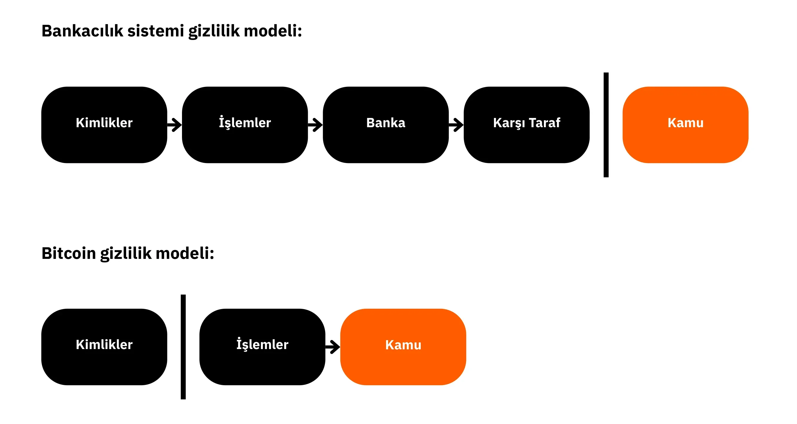


Dış gözlemciler belirli UTXO'ları tanımlanmış kullanıcılarla ilişkilendirebildiklerinde Bitcoin'nin gizliliği zarar görür. Bu ilişki kurulduktan sonra, işlemlerini izlemek ve Bitcoin geçmişlerini analiz etmek mümkün hale gelir. CoinJoin, Bitcoin kullanıcılarına işlem düzeyinde belirli bir Layer gizliliği sunmak amacıyla UTXO'ların izlenebilirliğini kırmak için geliştirilmiş bir tekniktir.


Coinjoins, zincir analizini harici gözlemciler için daha karmaşık hale getirerek Bitcoin kullanıcılarının gizliliğini güçlendirir. Yapıları, farklı kullanıcılardan gelen birden fazla coinin tek bir işlemde birleştirilmesine olanak tanıyarak hatları bulanıklaştırır ve giriş ve çıkış adresleri arasındaki bağlantıların belirlenmesini zorlaştırır.


Bir CoinJoin işleminin amacının bir Coin'in geçmişini kırmak olduğunu anlamak önemlidir. Bu teknik, düşündüğünüzün aksine kalıcı anonimlik sağlamaz veya Bitcoin takibini kesin olarak engellemez. CoinJoin yalnızca CoinJoin işleminin gerçekleştirildiği noktadaki geçmişi kırmayı amaçlar. Ancak bu işlemden önce ve sonra Coin gizlilik açısından aynı risklere tabi olmaya devam eder.


### Eş birleştirmeler nasıl çalışır?


CoinJoin prensibi işbirlikçi bir yaklaşıma dayanır: bitcoinlerini karıştırmak isteyen birkaç kullanıcı aynı işleme girdi olarak aynı miktarları yatırır. Bu tutarlar daha sonra her kullanıcıya eşit değerde çıktılar halinde yeniden dağıtılır.


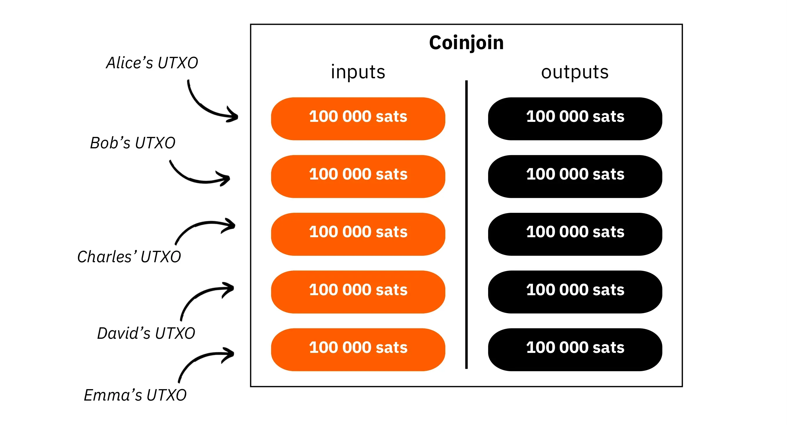


İşlemin sonunda, belirli bir çıktıyı girdi olarak bilinen bir kullanıcıyla ilişkilendirmek imkansız hale gelir. Girdiler ve çıktılar arasında doğrudan bir bağlantı yoktur, bu da kullanıcılar ve UTXO'ları arasındaki ilişkiyi ve her bir UTXO'nin geçmişini bozar.


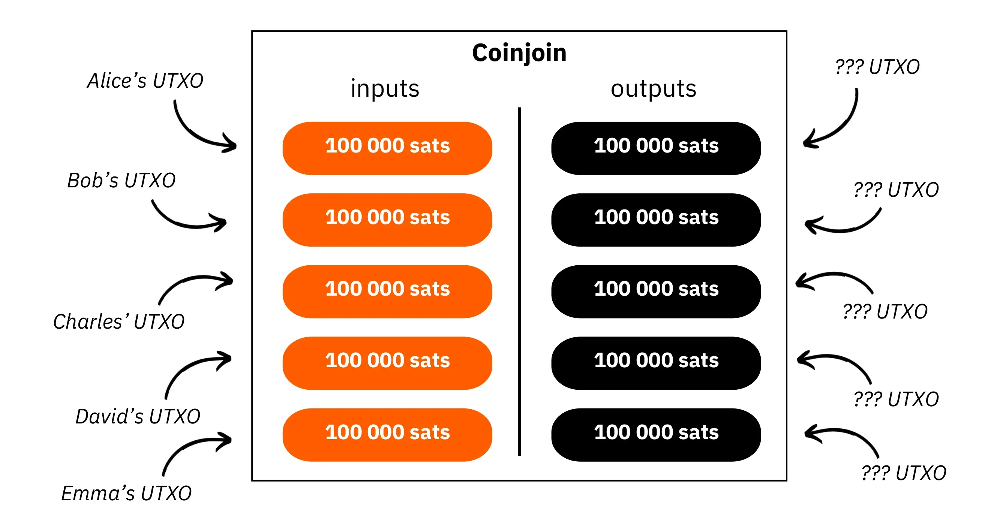


Alice'un örneğini ele alalım. Kız kardeşi Eve'e doğum günü için yaklaşık 100.000 Sats göndermek istiyor. Ancak Alice, kaç tane bitcoini olduğunu veya bunları nasıl elde ettiğini açıklamak istemediği için Eve'in işlem geçmişini takip edebilmesini istemiyor. Bu amaçla Alice, UTXO geçmişini bir CoinJoin işlemiyle kırmaya karar verir. Bob, Charles, David ve Frank ile ortak bir işlem gerçekleştirmek üzere organize olur:


- Alice, Bob, Charles, David ve Frank'in her biri işleme girdi olarak 105.000 Sats (Mining ücretleri için 5.000 Sats ile birlikte) UTXO taahhüt eder:


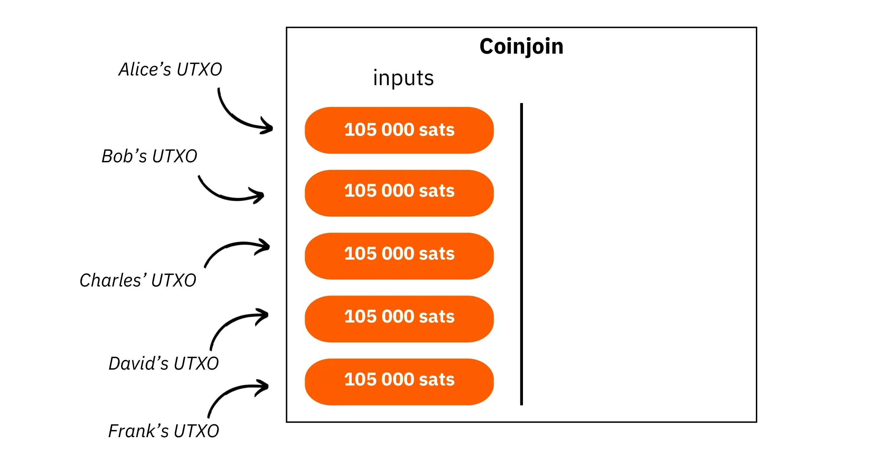


- Bu girdilerin tüketilmesi karşılığında, her biri 100.000 Sats'luk beş özdeş çıktı oluşturmak için boş bir Address üretir. Her biri bir çıktı alır:


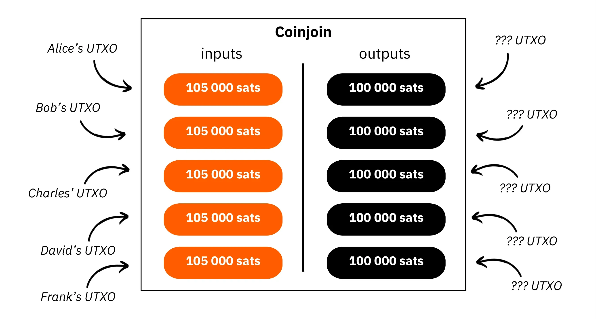


- Alice kendini geçmişi karışmış 100.000 Sats'lik bir UTXO ile bulur. Bu UTXO'yi yeni bir işlemde kullanarak tutarı Eve'e doğum günü için gönderir:


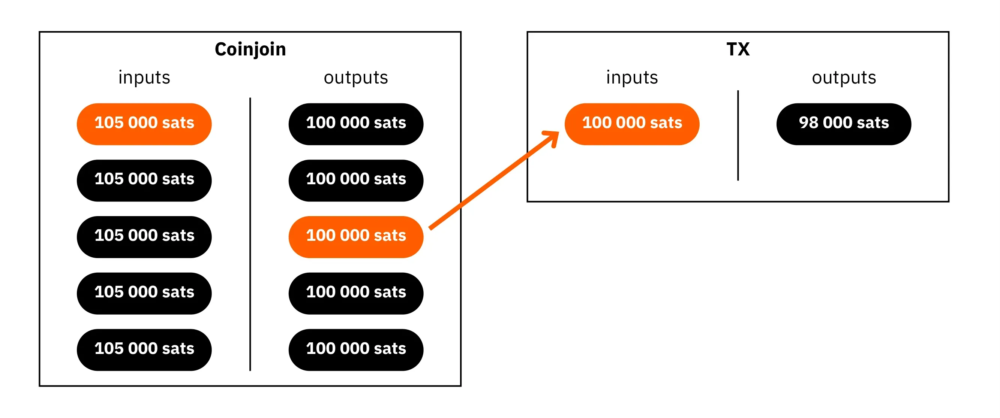


- Eve bilgi almak için bu işlemi analiz etmeye çalışırsa, Alice, Bob, Charles, David ve Frank'i içeren CoinJoin işlemiyle karşı karşıya kalacaktır. Miktarların aynı olması nedeniyle hangi girdinin kime ait olduğunu ayırt edemeyen Eve, Alice'ün UTXO geçmişinin izini süremez ya da kız kardeşinin kaç bitcoin'e sahip olduğunu veya bunları nasıl elde ettiğini belirleyemez:


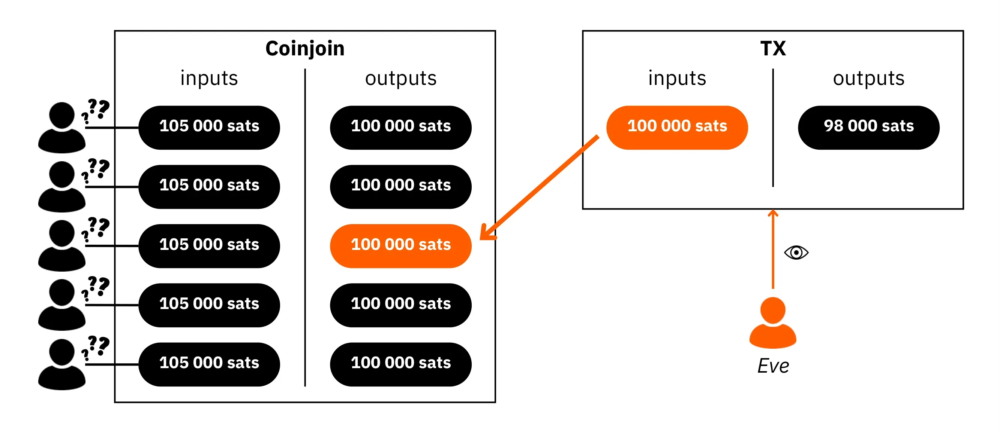


Bu durumda, Alice geriye dönük analize ilişkin gizliliği artırmak için CoinJoin tekniğini kullanmıştır. Gerçekte, Alice kendisini, belirli bir işlemden başlayıp UTXO'un geçmişi boyunca geriye doğru çalışacak olan Eve'in olası bir analizine karşı korumaktadır. Bugünden geçmişe doğru analize karşı bu koruma geriye dönük anonset olarak bilinir. Bu kavramı bu bölümün son kısımlarında daha ayrıntılı olarak inceleyeceğiz.


Bununla birlikte, CoinJoin, ileri anonset olarak bilinen geçmişten günümüze bir analiz karşısında gizliliği güçlendirme imkanı da sunmaktadır. Alice'nin Eve'e doğum günü için 98.000 Sats gönderdiği örneğimize geri dönelim, ancak roller tersine çevrilmiş olsun. Şimdi gizliliği konusunda endişelenen kişinin Eve olduğunu düşünelim. Gerçekten de Alice, Eve'e gönderdiği Coin'ten bilgi almak için onu takip etmek isteyebilir. Eve yeni aldığı bu UTXO'i diğer tüm UTXO'larıyla birleştirebilir ve bu da Alice'ye Wallet'inde ne kadar bitcoin olduğunu gösterebilir. Bundan kaçınmak için Eve, yeni aldığı Coin'ün geçmişini de kırabilir:


- Eve, Grace, Mallory, Oscar ve Victor'un her biri bir Bitcoin işlemine girdi olarak 98.000 Sats'lik bir UTXO koymuştur:


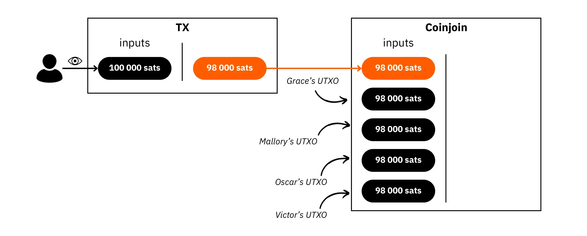


- Bu girdilerin tüketilmesi karşılığında, her kullanıcı 97.500 mükemmel eşit Sats'tan oluşan 5 çıktı oluşturmak için kullanılmak üzere boş bir Address sağlar. Her kullanıcı bir çıktı alır:


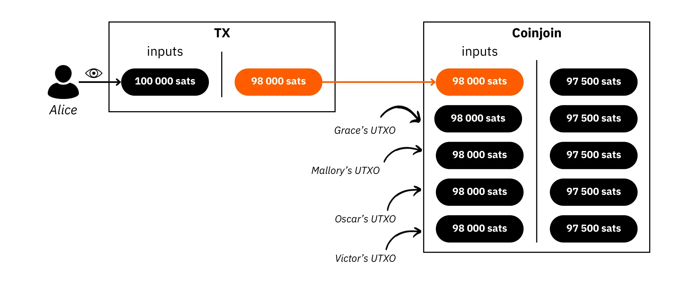


- Eve artık geçmişi kırılmış 97.500 Sats'lük bir UTXO'e sahip. Bunu gelecekteki işlemleri gerçekleştirmek için korkmadan kullanabilir. Gerçekten de, Alice Eve'e gönderdiği bitcoinleri takip etmeye çalışırsa, bir CoinJoin işlemiyle karşı karşıya kalacaktır. Hangi giden UTXO'ün Eve'e ait olduğunu belirleyemeyecektir. Analiz imkansız hale gelir:


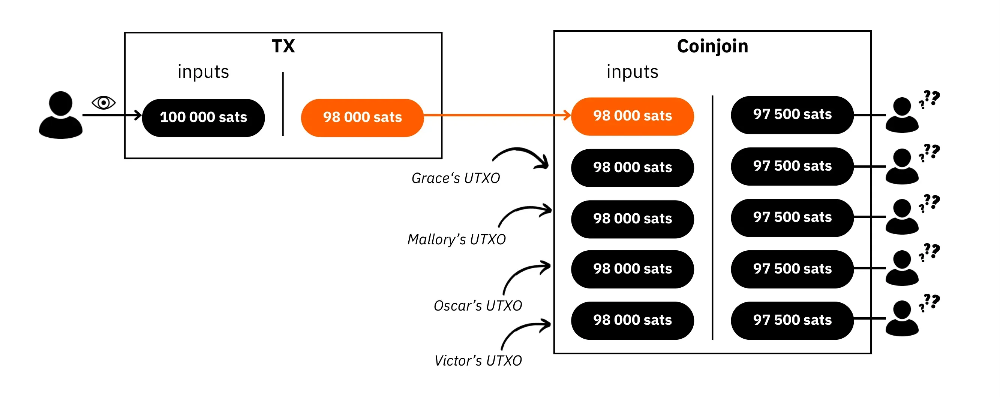


İlk örnekte CoinJoin'in bir odanın mahremiyetini geçmişiyle bağlantılı olarak nasıl koruyabileceğini, ikinci örnekte ise bir odanın geçmişini geleceğiyle bağlantılı olarak nasıl güvence altına alabileceğini gördük. Bu nedenle CoinJoin'in her iki yönde de bir UTXO geçmişini bölümlere ayıran tek seferlik bir olay olarak görülmesi gerektiğini belirttim:


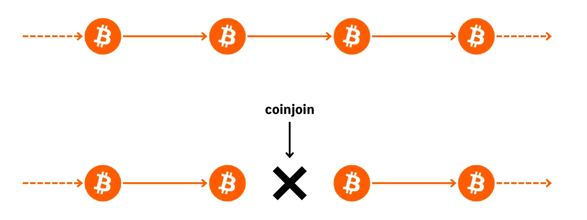


### Mikser, CoinJoin, mikser... Aralarındaki fark nedir?


Coinjoinler bazen "karıştırıcılar" olarak tanımlanır; bu terim bazı bitcoin kullanıcıları tarafından reddedilir ve gözaltı karıştırıcıları ile karıştırılabileceğinden korkulur. Ancak ben bu endişenin yersiz olduğuna inanıyorum, çünkü matematiksel bağlamda CoinJoin tam olarak karıştırma kavramını somutlaştırmaktadır.


Matematiğin genel alanında karıştırma, belirli bir süre sonra başlangıç uzayının tüm bölümlerinin teorik olarak başka herhangi bir bölümle karışabileceği dinamik bir sistemin özelliğini ifade eder. Karıştırma, bir parçacığın konumunun veya bir sistemin durumunun, gelecekteki dağılımı başlangıçtaki dağılımından bağımsız olacak şekilde evrimleşmesi ve böylece başlangıçtaki durumun özelliklerinin sistemin uzayı boyunca eşit olarak dağıldığı bir duruma ulaşması anlamına gelir. Bitcoins'li bir CoinJoin'da olan da tam olarak budur. Dolayısıyla, bana göre CoinJoin gerçekten de bir Coin karıştırma yöntemidir.


Öte yandan, CoinJoin'i karıştırıcılardan ayırmak önemlidir. Karıştırıcı, kullanıcıların bitcoinlerini karıştırılmak üzere gönderdiği bir hizmettir. Bu hizmetler 2010'larda popülerdi, ancak CoinJoin'e kıyasla iki büyük dezavantajı nedeniyle kullanımları azaldı:


- Kullanıcıların harmanlama işlemi sırasında fonlarının velayetini bırakmalarını gerektirir, bu da onları hırsızlık riskine maruz bırakır;
- Mikserin işlem ayrıntılarını kaydetmeyeceğinin ve hatta bu bilgileri zincir analiz şirketlerine satmayacağının garantisi yoktur.


Bu nedenle günümüz kullanıcıları, süreç boyunca fonları üzerinde tam kontrol sahibi olmalarını sağladığı için CoinJoin'yi tercih etmektedir. CoinJoin katılımcılarının bitcoinlerinin sürece dahil olan diğer UTXO'lar tarafından çalınma riski yoktur. Bir sonraki bölümde tüm bunların nasıl mümkün olduğuna bir göz atalım.


## Zerolink ve chaumian coinjoins


<chapterId>326c9654-b359-4906-b23d-d6518dd5dc3e</chapterId>


Bir CoinJoin tarafından sağlanan gizlilik, parçamızın gizlendiği grubun büyüklüğüne göre kazanılır. Bu da mümkün olduğunca çok katılımcı bulmak anlamına gelir. Kendi bulduğumuz kullanıcılarla manuel olarak bir CoinJoin oluşturmak tamamen mümkündür, ancak bu karmaşık bir süreçtir ve size büyük anonslar kazandırmaz.


Bu nedenle CoinJoin koordinatörleri Bitcoin üzerinde geliştirilmiştir. Görevleri, çeşitli kullanıcıları birbirleriyle temasa geçirmek ve işbirliğine dayalı işlemi tamamlamak için gereken bilgileri iletmektir.


Ancak koordinatörün kullanıcıların bitcoinlerine asla elini sürmemesini nasıl sağlayabiliriz ve CoinJoin işlemini oluşturan kişi olmasına rağmen, gizlilik sızıntısı oluşturabilecek şekilde kullanıcıların girdi ve çıktılarını birbirine bağlayamayacağından nasıl emin olabiliriz?


### Chaum'un kör imzaları


Modern CoinJoin uygulamaları bilgi sızıntısını önlemek için David Chaum'un kör imzalarını kullanır. Bu kör imzaların nasıl çalıştığına hızlıca bir göz atalım.


Chaum'un kör imzaları, imzayı atan kişinin imzaladığı mesajın içeriğini bilmediği bir dijital imza biçimidir. Ancak imza daha sonra orijinal mesaja karşı doğrulanabilir. Bu teknik kriptograf David Chaum tarafından 1983 yılında geliştirilmiştir.


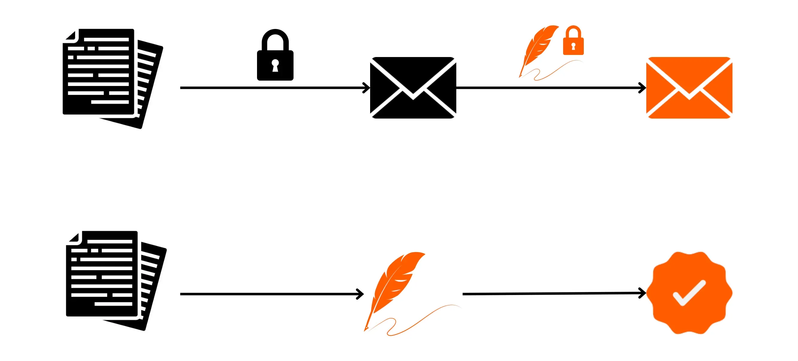


Contract gibi gizli bir belgeyi içeriğini açıklamadan doğrulamak isteyen bir şirket örneğini ele alalım. Şirket, orijinal belgeyi kriptografik olarak tersine çevrilebilir bir şekilde dönüştüren bir maskeleme işlemi uygular. Bu değiştirilmiş belge, temel içeriği bilmeden kör bir imza ekleyen bir sertifika yetkilisine gönderilir. İmzalı belgeyi aldıktan sonra şirket imzanın maskesini kaldırır. Sonuç, yetkilinin orijinal içeriği hiç görmeden, yetkilinin imzasıyla doğrulanmış orijinal bir belgedir.


Chaum'un kör imzaları bu nedenle içeriğini bilmeden bir belgenin gerçekliğini onaylayabilir, böylece hem kullanıcının verilerinin gizliliğini hem de imzalanan belgenin bütünlüğünü garanti eder.


### Chaumian sikkeleri


"Chaumian" coinjoins olarak adlandırılan bu yöntem, Tor ve David Chaum'un kör imzalarını birleştirerek koordinatörün hangi çıktının hangi kullanıcıya ait olduğunu bilmemesini sağlar.


CoinJoin işlem oluşturma süreci 3 ana aşamadan oluşmaktadır: girdi kaydı, çıktı kaydı ve işlem imzası. Bu süreci CoinJoin katılımcılarından biri olan Alice örneği üzerinden inceleyelim. Diğer tüm katılımcılar, her biri kendi başına Alice ile aynı adımları izler.


**Adım 1: Giriş kaydı**


- Alice koordinatöre işleme girdi olarak kullanmak istediği UTXO'ü ve bitcoinlerini almak için çıktı olarak kullanmak istediği maskelenmiş alıcı Address'i iletir. Dolayısıyla koordinatörün Alice'nin Address'ini bilmesinin hiçbir yolu yoktur. Sadece onun maskelenmiş versiyonunu görür:


- Koordinatör girdilerin geçerliliğini kontrol eder, ardından Alice'in maskelenmiş Address'ünü kendi özel anahtarıyla imzalar. Kör imzayı Alice'e geri gönderir:


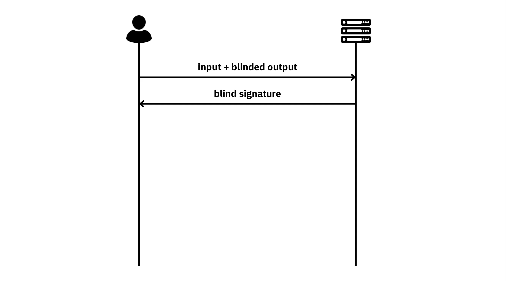


**Adım 2: Çıktı kaydı**


- Alice, artık koordinatörün özel anahtarıyla imzalanmış olan Address'nın maskesini kaldırabilir. Farklı bir Tor kimliği altında yeni bir bağlantı kuracaktır. Koordinatör, bu yeni kimlikle bağlananın Alice olduğunu belirleyemez:


- Alice maskesi kaldırılmış Address'i ve imzasını koordinatöre gönderir (koordinatör hala bunun Alice olduğunu bilmemektedir):


**3. Adım: İşlemin imzalanması**


- Aynı şekilde koordinatör de tüm katılımcılardan maskelenmemiş çıktıları alır. İlgili imzalar sayesinde, anonim olarak gönderilen her çıktının önceden kendi özel anahtarı tarafından imzalandığını kontrol edebilir ve böylece meşruiyetlerini garanti eder. Daha sonra CoinJoin işlemini oluşturmaya hazırdır ve imza için katılımcılara gönderir:


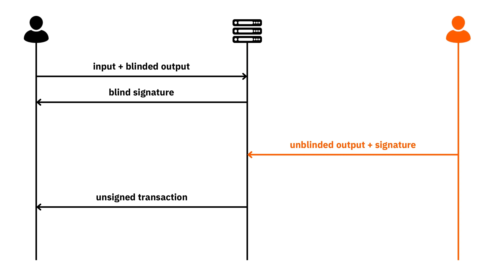


- Alice, diğer katılımcılar gibi, kendi girdi ve çıktısının koordinatör tarafından oluşturulan işleme doğru bir şekilde dahil edilip edilmediğini kontrol eder. Her şey tatmin ediciyse, girdi senaryosunun kilidini açan imzayı koordinatöre gönderir:


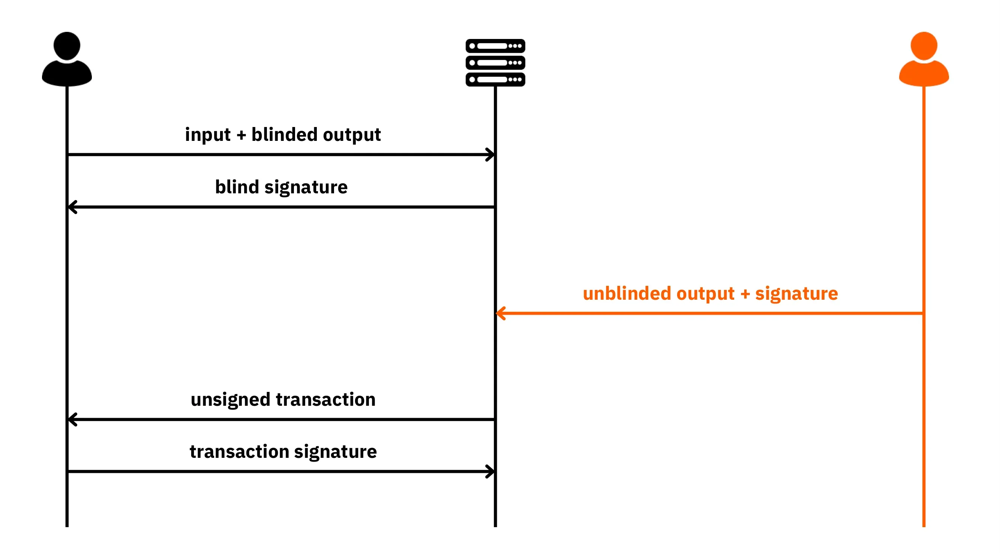


- Tüm CoinJoin katılımcılarından imza topladıktan sonra, koordinatör işlemi Bitcoin ağında yayınlayabilir, böylece bir bloğa eklenebilir.


Bu sistemde koordinatör bir girdiyi belirli bir çıktıya bağlayamaz. Dahası, UTXO'larının kilidini açmak için gereken özel anahtarlara hiçbir zaman erişimi olmadığı için katılımcıların fonlarına el koyamaz. Süreç boyunca, 3. adımın sonuna kadar, imzalara da erişimi yoktur. Alice ve diğer katılımcılar global işlemi imzaladığında, her şeyin doğru olduğunu kontrol ettikten sonra, koordinatör artık işlemi geçersiz kılmadan çıktılar da dahil olmak üzere değiştiremez. Bu da koordinatörün bitcoin çalmasını engeller.


Son olarak, CoinJoin kullanıcısı işlemdeki çıktısını kaydederken, bir seçimde oy kullanan bir vatandaşınkine benzer garantilere sahip olmak ister. Bu işlemlerin kamusal ve özel yönleri arasında bir ikilik vardır. Bir yandan, gizli tutmak istediğiniz şeyler vardır: seçmen için, oy pusulasının kimliğiyle bağlantılı olmasını istemez; CoinJoin kullanıcısı için, çıktısının girdisiyle ilişkilendirilmesini istemez. Aslında, eğer koordinatör ya da başka bir taraf girdi ve çıktı arasında bir bağlantı kurmayı başarırsa, CoinJoin tüm ilgisini kaybeder. Yukarıda açıklandığı gibi, CoinJoin bir Coin'nın geçmişinde bir mola olarak işlev görmelidir. Bu durma tam olarak CoinJoin işleminde belirli bir girdi ile belirli bir çıktının ilişkilendirilmesinin imkansızlığı (ileriye doğru anonset) ve tersi (geriye doğru anonset) nedeniyle meydana gelir.


Öte yandan, işin bir de kamusal yönü vardır: seçmen, oy pusulasının sandığa dahil edildiğinden emin olmak ister; benzer şekilde, CoinJoin kullanıcısı da çıktısının CoinJoin işlemine dahil edildiğinden emin olmak ister. Aslında, CoinJoin katılımcıları işlemi imzalamadan önce çıktılarının varlığını kesinlikle doğrulayabilmelidir, aksi takdirde koordinatör fonları çalabilir.


David Chaum'un kör imzalarının kullanılmasıyla mümkün kılınan bu 2 kamusal ve özel yön, Chaumian coinjoins katılımcılarına bitcoinlerinin çalınmayacağını ve fonlarının takip edilemeyeceğini garanti eder.


### CoinJoin konseptini kim icat etti?


CoinJoin fikrini Bitcoin'e ilk kimin sunduğunu ve David Chaum'un kör imzalarını bu bağlamda kullanma fikrini kimin ortaya attığını kesin olarak söylemek Hard'dir. Genellikle bu fikirden ilk kez Gregory Maxwell'in [2013 yılında BitcoinTalk'taki bir mesajda] (https://bitcointalk.org/index.php?topic=279249.0) bahsettiği düşünülmektedir:


> *"Chaum'un kör imzalarını kullanmak: Kullanıcılar oturum açar ve girdilerin (ve Exchange adreslerinin) yanı sıra özel UTXO'larını göndermek istedikleri Address'ün kriptografik olarak blinded versiyonunu sağlar; sunucu belirteçleri imzalar ve geri gönderir. Kullanıcılar anonim olarak yeniden bağlanır, çıktı adreslerinin maskesini kaldırır ve bunları sunucuya geri gönderir. Sunucu, tüm çıktıların kendisi tarafından imzalandığını ve sonuç olarak tüm çıktıların geçerli katılımcılardan geldiğini görebilir. Daha sonra, insanlar yeniden bağlanır ve oturum açar"*
Maxwell, G. (2013, 22 Ağustos). *CoinJoin: Gerçek dünya için Bitcoin gizliliği*. BitcoinTalk Forum. https://bitcointalk.org/index.php?topic=279249.0


Bununla birlikte, hem UTXO karıştırıcı olarak Chaum imzaları hem de coinjoinler için daha önce bahsedilen başka şeyler de vardır. [Haziran 2011'de Duncan Townsend BitcoinTalk'ta] (https://bitcointalk.org/index.php?topic=12751.0) Chaum imzalarını modern Chaumian coinjoin'lere oldukça benzer bir şekilde kullanan bir karıştırıcı sunmuştur.


Aynı başlıkta, karıştırıcısını geliştirmek için [Duncan Townsend'e yanıt olarak hashcoin'den bir mesaj] (https://bitcointalk.org/index.php?topic=12751.msg315793#msg315793) bulabiliriz. Bu mesajda açıklanan süreç tam olarak coinjoins'in ne olduğu ile ilgilidir. Benzer bir sistemden söz eden Alex Mizrahi'nin daha sonra Litecoin'in yaratılmasına temel teşkil eden ilk altcoinlerden biri olan Tenebrix'in yaratıcılarına danışmanlık yaptığı [2012'de Alex Mizrahi'den gelen bir mesaj](https://gist.github.com/killerstorm/6f843e1d3ffc38191aebca67d483bd88#file-laundry) da bulunabilir. "CoinJoin" teriminin kendisinin bile Greg Maxwell tarafından icat edilmediği, Peter Todd'un bir fikrinden ortaya çıktığı söylenmektedir.


### Zerolink


Zerolink, Chaumian coinjoins ve özellikle Wallet yönetimiyle ilgili hataları en aza indirerek kullanıcıların anonimliğini çeşitli zincir analizi biçimlerine karşı korumak için çeşitli stratejiler içeren kapsamlı bir karıştırma protokolüdür. Bu protokol [2017 yılında nopara73 ve TDevD tarafından tanıtılmıştır] (https://github.com/nopara73/ZeroLink/blob/master/README.md).


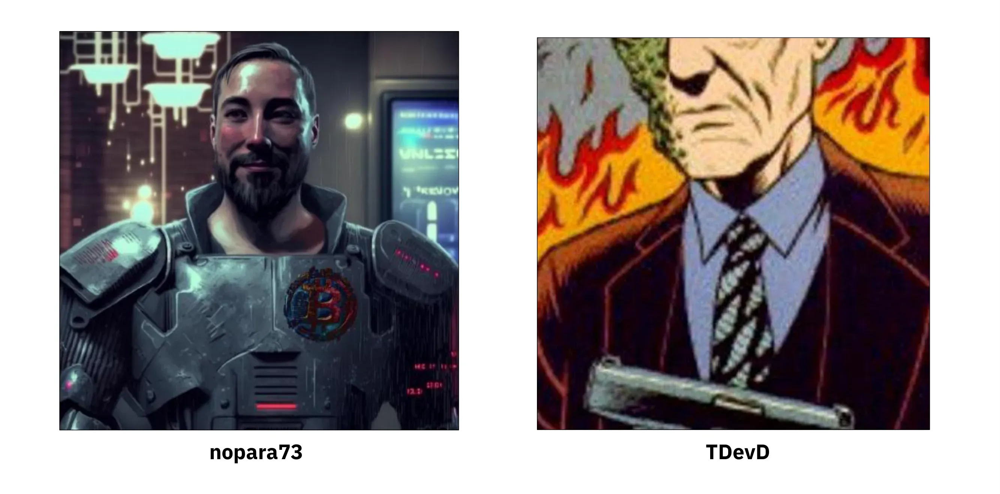


Adından da anlaşılacağı üzere, Zerolink'in arkasındaki ilke, girdiler ve çıktılar arasındaki bağlantıların izlenememesini sağlayan CoinJoin işlemleri oluşturmaktır. Bu, tüm çıktıların tamamen aynı miktarlara sahip olmasını sağlayarak elde edilir.


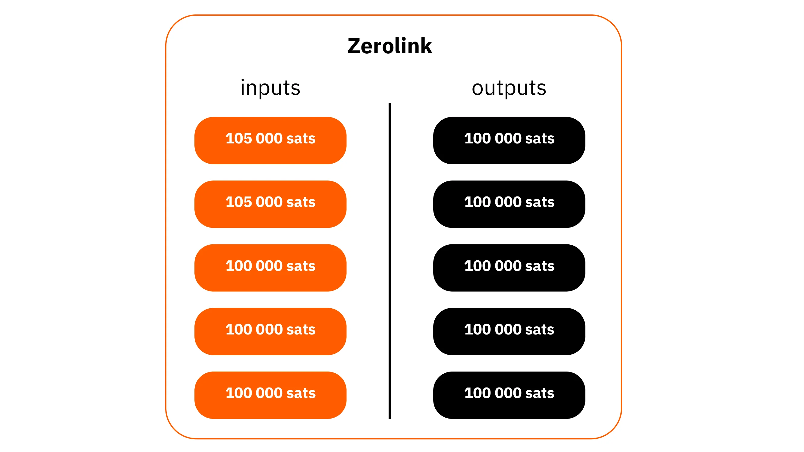


Zerolink tarafından alınan önemli bir önleyici tedbir, ayrı kriptografik anahtar setleri ve hatta ayrı cüzdanlar kullanarak karıştırılmamış UTXO'ları karıştırılmış UTXO'lardan tamamen ayrı tutmaktır. Bu, "*ön karışım*"ı farklılaştırır Wallet, karıştırmadan önce UTXO'lar için tasarlanmıştır, "*post-mix*"ten Wallet, karıştırılmış UTXO'lar için ayrılmıştır.


UTXO'ların bu şekilde titizlikle ayrılması her şeyden önce karma bir UTXO ile karma olmayan bir UTXO arasında kazara ilişki kurulmasını önlemeye yarar. Gerçekten de, bu tür bağlantılar meydana gelirse, CoinJoin'ün karma UTXO üzerindeki etkinliği kullanıcı farkında olmadan iptal edilir ve böylece geçmişini kırdığını düşündüğü bir UTXO'in gizliliği tehlikeye girer. Bu bağlantılar ya karışık bir UTXO'in karışmamış bir UTXO ile güvence altına alınmasında Address'ün yeniden kullanılması yoluyla ya da kullanıcı karışık ve karışmamış UTXO'ları aynı işlemin girdileri olarak kullanıyorsa CIOH (_Common-Input-Ownership Heuristic_) uygulaması yoluyla gerçekleşebilir. Ön karışım ve son karışım cüzdanlarını ayırarak, bu tür kazara ilişkilendirmelerden kaçınıyor ve kullanıcıyı kasıtsız hatalara karşı koruyoruz.


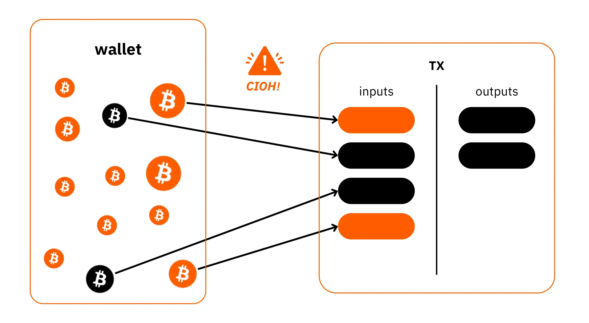


Bu ayrım aynı zamanda Wallet yazılım seviyesinde ön karışım ve son karışım cüzdanları arasında farklı kurallar uygulama imkanı sunar. Örneğin, karıştırma sonrası Wallet'da yazılım, kullanıcının anonsetini tehlikeye atacak CIOH uygulamasını önlemek için UTXO'ların girdilerle birleştirilmesini yasaklayabilir. Wallet parmak izleri ile tanımlamayı önlemek için komut dosyalarının ve işlem seçeneklerinin (örneğin RBF raporlaması gibi) kullanımını standartlaştırmak da mümkündür.


Şu anda Whirlpool, Zerolink protokolünü titizlikle uygulayan tek CoinJoin uygulamasıdır. Bir sonraki bölümde, var olan çeşitli CoinJoin uygulamalarına ve her birinin avantaj ve dezavantajlarına bir göz atacağız.


## CoinJoin uygulamaları


<chapterId>e37ed073-9498-4e4f-820b-30951e829596</chapterId>


*2024 yılında, Bitcoin üzerinde coinjoins yapmak isteyen kullanıcıların kullanabileceği araçlarda büyük değişikliklere tanık oluyoruz. Şu anda bir dönüm noktasındayız ve CoinJoin pazarı büyük bir yeniden yapılanma sürecinden geçiyor. Bu bölümün zaman içinde güncelleneceğinden emin olabilirsiniz.*


Şu an için Bitcoin üzerinde temel olarak 3 farklı CoinJoin uygulaması bulunmaktadır:


- Whirlpool;
- Wabisabi;
- JoinMarket.


Bu uygulamaların her biri CoinJoin işlemleri aracılığıyla UTXO'ların geçmişini kırmayı amaçlamaktadır. Ancak, mekanizmaları önemli ölçüde farklılık göstermektedir. Bu nedenle her birinin nasıl çalıştığını anlamak çok önemlidir, böylece ihtiyaçlarınıza en uygun seçeneği seçebilirsiniz.


### JoinMarket


Adam Gibson ve Chris Belcher tarafından 2015 yılında kurulan JoinMarket, kullanıcıları birbirine bağlamaya yönelik benzersiz modeli sayesinde diğer CoinJoin uygulamalarından net bir şekilde ayrılıyor. Sistem, bazı kullanıcıların, yani "üreticilerin" bitcoinlerini karıştırmak için kullanıma sunduğu, diğerlerinin ise, yani "alıcıların" bu parayı bir ücret karşılığında coinjoins yapmak için kullandığı bir P2P Exchange piyasasına dayanmaktadır.


Bu modelde, "yapıcılar" bitcoinlerini "alıcıların" kullanımına sunar ve hizmetleri karşılığında bir ücret alırlar. Alıcılar da kendi CoinJoin işlemlerini gerçekleştirmek için üreticilerin bitcoinlerini kullanmak üzere ödeme yaparlar. Hizmet ücretleri üstlenilen role göre değişir: "Yapıcılar" likidite sunmak için ücret biriktirirken, "alıcılar" ücretleri öder. Piyasa, herhangi bir kullanım koşulu olmaksızın serbestçe işlemektedir.


JoinMarket'in ana dezavantajlarından biri, etkin bir şekilde çalıştırmak için terminallerle belirli bir derecede rahatlık gerektiren kullanım karmaşıklığıdır. Bu karmaşıklık deneyimli kullanıcılar için bir engel teşkil etmese de, genel halkın erişimini sınırlayabilir. Bununla birlikte, JAM adı verilen bir web Interface'in yakın zamanda kullanıma sunulması, kullanımı biraz daha kolaylaştırmıştır.


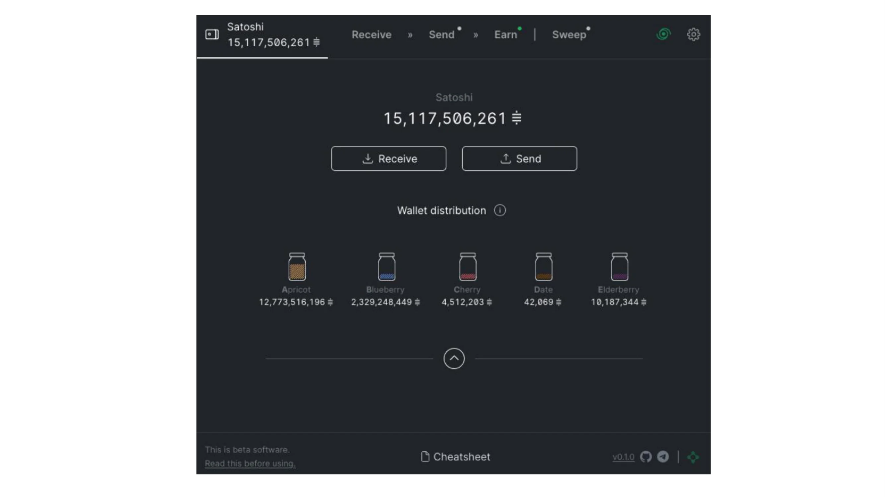


Kaynak: [JAM](https://github.com/joinmarket-webui/jam/blob/devel/docs/assets/screenshot-dark.webp)


Bununla birlikte, teknik engel büyük bir engel olmaya devam etmektedir. Gizliliğin katılımcı sayısıyla güçlendirildiği CoinJoin ekosisteminde, erişilebilirliği azaltan herhangi bir sınırlama, karışımın verimliliğinde çok önemli bir faktör olan mevcut likiditeyi doğrudan etkiler. Finansal işlemlerde zaten bir niş olan Bitcoin, coinjoins kullanımını bir alt niş olarak görüyor ve JoinMarket bunun daha da özelleşmiş bir kısmını temsil ediyor, bu nedenle kullanıcılarının anonsetlerini artırma potansiyelini kısıtlıyor.


JoinMarket, coinjoiner'lar için yenilikçi P2P bağlantı modeline rağmen, özellikle işlem yapısı açısından bazı önemli dezavantajlara sahiptir. Whirlpool gibi diğer uygulamaların aksine, JoinMarket çıktılar arasında mükemmel eşitliği garanti etmez ve girdiler ile çıktılar arasındaki deterministik bağlantıların izini sürmek mümkündür. Ayrıca, halihazırda birbirine karıştırılmış UTXO'ların tekrar karıştırılmasını önleyecek hiçbir araca sahip değildir, bu da kullanıcılar tarafından aranan gizliliği tehlikeye atabilir.


Son olarak, JoinMarket konsepti, özellikle dinamik bir likidite piyasasıyla ilgilenenler için ilginç olsa da, yapısal zayıflıkları ve teknik karmaşıklığı, bence, bir CoinJoin uygulaması arayan hem acemiler hem de uzmanlar için daha az ilgi çekici hale getiriyor.


### Wabisabi


Wabisabi, işlem koordinasyonunu merkezileştiren bir yaklaşıma sahip başka bir CoinJoin uygulamasıdır. Bu model Ádám Ficsór (nopara73), Yuval Kogman, Lucas Ontivero ve István András Seres tarafından 2021 yılında tasarlandı ve ertesi yıl Wasabi 2.0 yazılımına entegre edildi. Wabisabi tam olarak 2018'de piyasaya sürülen Wasabi yazılımı CoinJoin modelinin bir evrimidir.


2010'ların sonuna doğru Wasabi, Whirlpool'den tamamen farklı bir CoinJoin işlem yapısı benimsemiştir. Wasabi, katılımcılarının anonsetlerini artırmak için düzinelerce katılımcıyı içeren çok büyük CoinJoin işlemleri kullandı. Buna karşılık, Whirlpool çok sayıda küçük işlemi tercih ederek anonsetlerin her döngüde katlanarak büyümesini sağladı.


Exchange yönetim yöntemleri de iki uygulamayı birbirinden ayırıyordu. Whirlpool ile değişiklik, bir sonraki bölümde daha ayrıntılı açıklayacağım bir kavram olan TX0 sayesinde CoinJoin döngülerinden önce UTXO'lardan hariç tutuldu ve izole edildi. Wasabi'de ise değişiklik, CoinJoin işleminin çıktılarından birini oluşturarak belirli girdiler ve çıktılar arasındaki deterministik bağlantıları koruyordu.


Wabisabi ile Wasabi sürüm 2.0, coinjoins yaklaşımını Whirlpool'ünkine uyacak şekilde uyarlamıştır. CoinJoin işlemleri çok büyük kalmaya devam etse de, artık Whirlpool modelini izleyerek birbirini takip eden birkaç döngüyü zincirlemek mümkündür. Exchange oran yönetimine de özellikle dikkat edilmiştir: değişimin doğrudan kullanıcı girdilerine bağlı olduğu Wasabi 1.0'dan farklı olarak, Wabisabi değişimi tüm katılımcılar için eşit değerlere bölünmüş birkaç küçük toplama bölmeyi amaçlamaktadır.


Bunu sadece 2 kullanıcıyı içeren basitleştirilmiş bir örnekle açıklayalım: Alice 115.000 Sats ve Bob, 210.000 Sats'i karıştırmak istiyor. Ücretler göz ardı edildiğinde, Wasabi 1.0 ile bir CoinJoin işlemi 100.000 Sats'lik 3 çıktı, artı Alice için 15.000 Sats'lik 1 değişiklik ve Bob için 10.000 Sats'lik 1 değişiklik üretecektir. Değişiklik çıktıları hala girdilerle bağlantılı olacaktır:


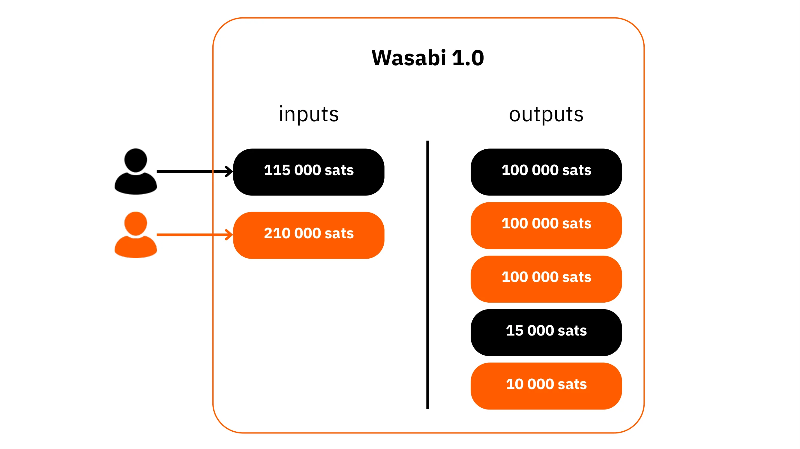


Wabisabi kapsamında, aynı işlem 100.000 Sats'lik 3 çıktı ve 5.000 Sats'lik 5 çıktı üretecek, böylece değişim doğrudan belirli bir girdiyle ilişkilendirilemeyecek şekilde dağılacaktır:


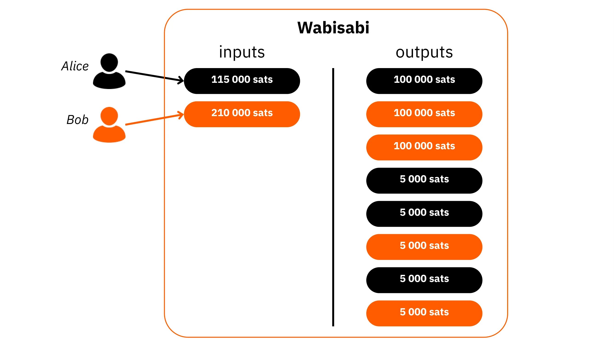


Şahsen, Wabisabi'nin değişim yönetiminin gizlilik açısından etkinliğini tehlikeye atabilecek çeşitli riskler taşıdığını düşünüyorum:


- Bir kullanıcı diğer katılımcılarınkinden önemli ölçüde daha büyük bir UTXO katkısında bulunduğunda, kaçınılmaz olarak kendi girdisiyle ilişkilendirilecek bir değişiklik miktarına sahip olur. Bu durum, protokolün tüm tanımlanabilir değişiklikleri ortadan kaldırmak olan asıl amacına ters düşmektedir;
- Değişimin parçalanması amacıyla mezheplerin çoğaltılması, paradoksal olarak karıştırma verimliliğine zarar verebilir. Bu süreç, daha kolay tanımlanabilir hale geldiklerinden, belirli çıktılar için anonsların azalmasına yol açabilir;
- Bu yöntem aynı zamanda kullanıcı için bir yönetim sorunu teşkil eden düşük değerli UTXO'lar üretir. Bu küçük UTXO'lar, değerlerine oranla harcanmaları çok maliyetli hale gelirse, "Dust" haline gelebilir. Bu olgu, kullanıcının birkaç UTXO'yu gelecekteki işlemler için girdi olarak birleştirmesine veya bunları konsolide etmesine yol açar. Her iki durumda da, CIOH nedeniyle, bu ya elde edilen anonsları azaltabilir ya da ilk CoinJoin tarafından elde edilen gizlilik faydalarını tamamen iptal edebilir.


Karışım öncesi ve karışım sonrası UTXO'lar arasında titiz bir ayrım sağlayan ZeroLink protokolünü uygulayan Whirlpool'ün aksine, Wabisabi bu katı ayrımı korumamaktadır. Ayrıca bazı Wasabi müşterileri tarafından Address'in yeniden kullanımına ilişkin sorunlar yaşanmıştır ve bu durum kullanıcı için oldukça zararlıdır.


Wasabi sürüm 2.0'da yeni bir CoinJoin ücret politikası uygulanmıştır. Şu andan itibaren, koordinatör ücretleri 0,01 Bitcoin üzerindeki UTXO'lar için %0,3 olarak belirlenirken, daha küçük UTXO'lar için bu ücretler tam olarak sunulmaktadır. Buna ek olarak, bu küçük UTXO'lar için remiksler ücretsizdir, ancak remiksler de dahil olmak üzere tüm işlemler için Mining ücretleri kullanıcı tarafından ödenmeye devam etmektedir.


Bu, elde edilen anonsetlerin boyutuna bakılmaksızın ücretlerin sabit kaldığı Whirlpool'un politikasıyla tezat oluşturmaktadır. Wasabi 2.0 ile, küçük UTXO'lar için koordinatör ücretlerinden feragat edilmesine rağmen, kullanıcı remiksler de dahil olmak üzere tüm işlemlerde Mining ücretlerini ödemek zorundadır.


Ben bu satırları yazarken, Wabisabi'nin kullanımı son olayların bir sonucu olarak önemli ölçüde daha karmaşık hale geldi. Samourai Wallet'nin kurucularının tutuklanmasının ardından, Wasabi'nin geliştirilmesini finanse eden ve yöneten zkSNACKs şirketi, CoinJoin koordinatör hizmetinin 1 Haziran 2024 tarihinde durdurulacağını açıkladı. Wasabi'de varsayılan olarak kurulan bu koordinatör, likiditenin büyük çoğunluğundan sorumluydu.


Bu ana koordinatörün sona ermesiyle, kullanıcılar artık yeni, bağımsız koordinatörlere bağlanmak zorundadır. Bu değişiklik bir dizi endişeyi beraberinde getirmektedir: bir yandan, yeni koordinatörler yeterli likiditeye sahip olmayabilir ve bu da coinjoins'in gizlilik açısından etkinliğini azaltabilir. Öte yandan, kötü niyetli bir koordinatörle karşılaşma riski vardır. Bu durum, Wabisabi'yi kullanmak isteyenler için önemli yeni riskler ekler.


Teknik sorunların ötesinde, Wasabi'nin arkasındaki şirket olan zkSNACKs'in CoinJoin katılımcılarını filtrelemek için bir dizi analiz şirketinin hizmetlerini kullanma kararı ciddi etik ve stratejik soruları gündeme getirmektedir. Başlangıçtaki fikir, Wasabi'deki coinjoin'lerin suçlular tarafından kullanılmasını engellemekti ve bu meşru görünebilecek bir hareketti. Bununla birlikte, birincil görevi kullanıcı gizliliğini güçlendirmek olan bir koordinatöre ücret ödemek, ancak amacı aynı gizliliği tehlikeye atmak olan bir şirketi finanse etmesini sağlamak bir paradoks yaratmaktadır.


Daha da endişe verici olan, Bitcoin'ün açık, sansürsüz bir finansal sistem sunma felsefesiyle kökten çelişen filtreleme ilkesidir. Suç teşkil eden faaliyetleri dışlamak istemek haklı görünse de, bu filtreleme, eylemleri belirli bağlamlarda yasadışı olarak sınıflandırılsa da ahlaki açıdan haklı veya sosyal açıdan faydalı olabilecek bireyleri de etkileyebilir. Edward Snowden örneği bu ikilemi mükemmel bir şekilde göstermektedir: ifşaatları nedeniyle bazı hükümetler tarafından suçlu olarak görülen Snowden, diğerleri tarafından kamu yararına hareket eden bir ihbarcı olarak görülmektedir. Bu karmaşıklık, iyi niyetli olsa da nihayetinde meşru kullanıcıların haklarına ve güvenliğine zarar verebilecek filtrelemenin potansiyel tehlikesinin altını çizmektedir. Bazı otoriter rejimler altında zulme uğrayan aktivist ve gazetecilerden de bahsedebilirdim.


Şimdiye kadar anlamış olacağınız gibi, benim tercihim kesinlikle Bitcoin'daki eş birleştirmeler için Whirlpool modelinden yana. Bu sistem titizliği ile öne çıkmakta ve üstün gizlilik garantileri sunmaktadır. Ayrıca matematiksel bağlamda mükemmel olarak kabul edilen bir karışım sunan tek sistemdir. Bana göre bu model, Bitcoin'daki coinjoins'in geleceğini temsil ediyor. Sizi bir sonraki bölümde bu modeli daha derinlemesine incelemeye davet ediyorum.


## Whirlpool nasıl çalışır?


<chapterId>bdbd7109-e36d-4b4f-a3c6-928df4e9bfda</chapterId>


Whirlpool'i diğer CoinJoin yöntemlerinden ayıran şey, tüm girdiler ve çıktılar arasında kesinlikle mümkün olan hiçbir teknik bağlantı olmamasını sağlayan "_ZeroLink_" işlemlerinin kullanılmasıdır. Bu mükemmel karışım, her katılımcının aynı miktarda girdiye katkıda bulunduğu (Mining ücretleri hariç) ve tamamen eşit miktarlarda çıktılar ürettiği bir yapı ile elde edilir.


Girdilere yönelik bu kısıtlayıcı yaklaşım, Whirlpool'in CoinJoin işlemlerine benzersiz bir özellik kazandırmaktadır: girdiler ve çıktılar arasında deterministik bağlantıların tamamen yokluğu. Başka bir deyişle, her bir çıktının işlemdeki diğer tüm çıktılara göre herhangi bir katılımcıya atfedilme olasılığı eşittir.


### Whirlpool nasıl çalışır?


Başlangıçta, her bir Whirlpool CoinJoin'teki katılımcı sayısı 2 yeni katılımcı ve 3 remiksçi olmak üzere 5 ile sınırlıydı (bu kavramları daha sonra açıklayacağız). Ancak, 2023 yılında gözlemlenen On-Chain işlem ücretlerindeki artış, Samourai'nin ekiplerini maliyetleri düşürürken gizliliği artırmak için modellerini yeniden düşünmeye sevk etti. Böylece, ücret piyasasının durumu ve katılımcı sayısı dikkate alınarak, koordinatör artık 6, 7 veya 8 katılımcıyı içeren coinjoins düzenleyebilir. Bu geliştirilmiş oturumlar "Dalgalanma Döngüleri" olarak bilinmektedir. Konfigürasyon ne olursa olsun, Whirlpool coinjoins'e her zaman yalnızca 2 yeni katılımcının olduğunu unutmamak önemlidir.


Bu nedenle, Whirlpool işlemleri aynı sayıda girdi ve çıktı ile karakterize edilir:


- 5 giriş ve 5 çıkış;


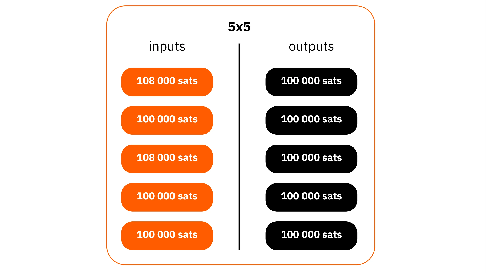


- 6 giriş ve 6 çıkış;


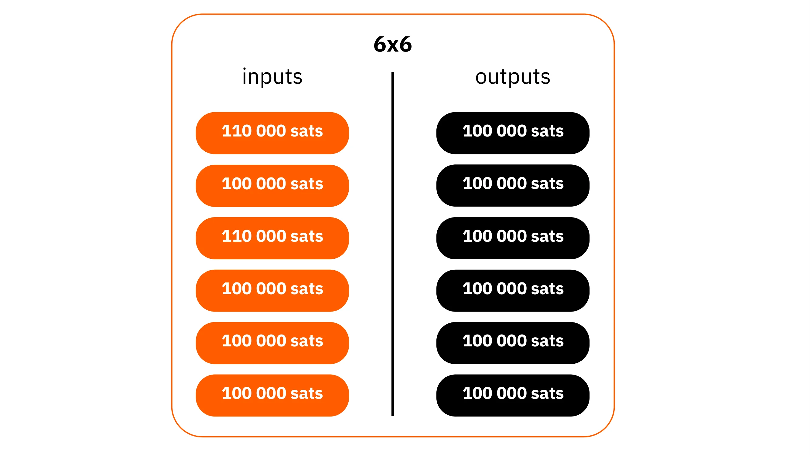


- 7 giriş ve 7 çıkış;


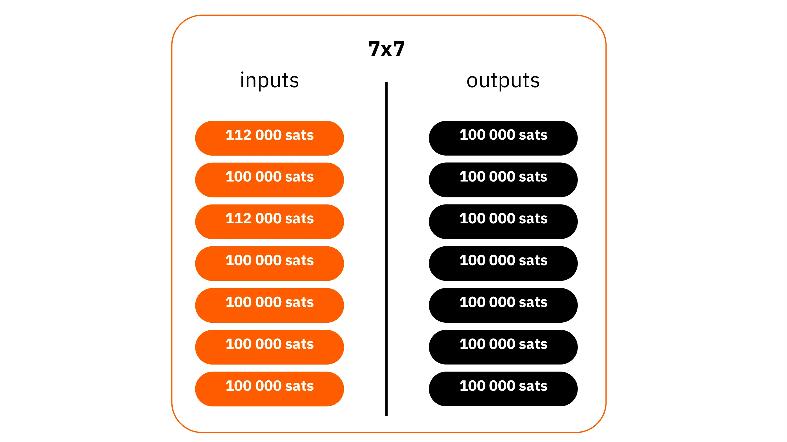


- 8 giriş ve 8 çıkış.


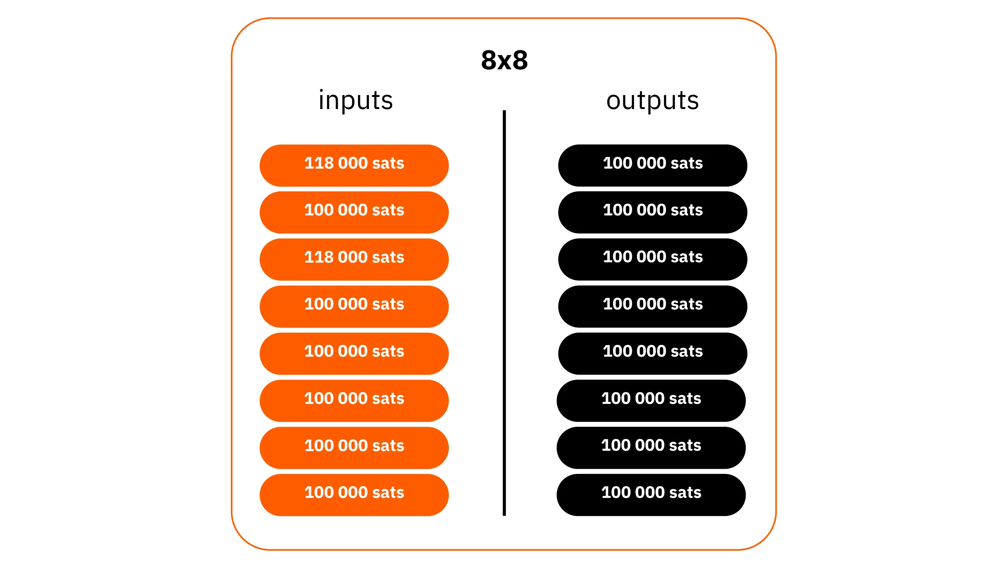


Whirlpool'in modeli küçük CoinJoin işlemlerine dayanmaktadır. Anonsetlerin sağlamlığının tek bir döngüdeki (veya birkaç döngüdeki) katılımcı hacmine dayandığı Wabisabi ve JoinMarket'in aksine, Whirlpool birkaç küçük döngü dizisine dayanır.


Bu modelde, kullanıcılar yalnızca bir havuza ilk katıldıklarında ücret öderler ve böylece çok sayıda remikse hiçbir ekstra ücret ödemeden katılabilirler. Yeni katılımcılar remiksçiler için Mining ücretlerini öderler.


Bir parçanın katıldığı her ek CoinJoin ve geçmişte karşılaşılan benzerleri ile anonsetler katlanarak büyüyecektir. Amaç, her seferinde, karıştırılan her parçayla ilişkili anonsetlerin yoğunluğunu güçlendirmeye katkıda bulunan bu ücretsiz remikslerden yararlanmaktır.


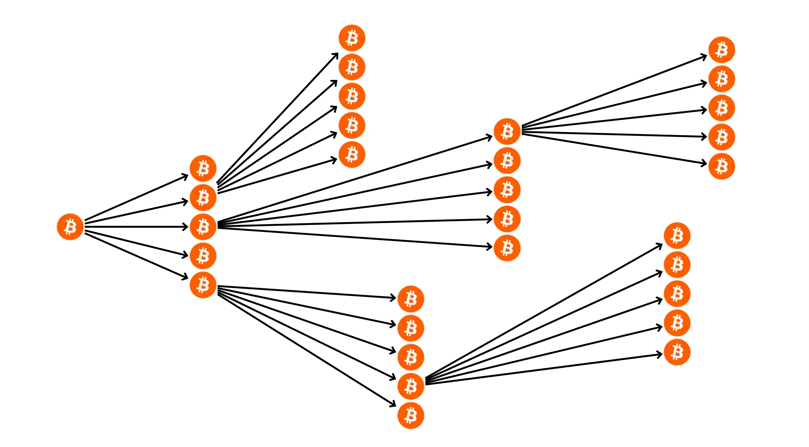


Whirlpool iki önemli gereksinim göz önünde bulundurularak tasarlanmıştır:


- Samourai Wallet'ün her şeyden önce bir akıllı telefon uygulaması olduğu göz önüne alındığında, uygulamanın mobil cihazlarda erişilebilirliği;
- Anonsetlerde önemli bir artışı teşvik etmek için hızlı yeniden karıştırma döngüleri.


Bu zorunluluklar, Samourai Wallet'nın geliştiricilerinin Whirlpool'ü tasarlarken yaptıkları seçimlere rehberlik etmiş ve katılımcıları döngü başına sınırlı sayıda kısıtlamalarına yol açmıştır. Çok az sayıda katılımcı CoinJoin'in verimliliğini tehlikeye atarak döngü başına üretilen anonsları büyük ölçüde azaltacak, çok fazla katılımcı ise mobil uygulamalarda yönetim sorunları yaratacak ve döngü akışını engelleyecekti.


Son olarak, Whirlpool'de CoinJoin başına yüksek sayıda katılımcı olmasına gerek yoktur, çünkü anonslar birkaç CoinJoin döngüsünün birikimiyle yapılır. Buradaki en önemli ilke, tüm katılımcıların UTXO'larının homojenliğidir, çünkü bu mükemmel bir karışım ve dolayısıyla karıştırma ve yeniden karıştırma döngülerinden tam fayda sağlar.


### CoinJoin havuzlar ve ücretler


Bu çoklu döngülerin karma UTXO'ların anonsetlerini artırması için, kullanılan UTXO miktarlarını kısıtlamak üzere belirli bir çerçeveye ihtiyaç vardır. Whirlpool farklı havuzlar tanımlar.


Bir havuz, mükemmel UTXO homojenliğini korurken CoinJoin sürecini optimize etmek için kullanılacak UTXO miktarı üzerinde anlaşan ve birlikte karıştırmak isteyen bir grup kullanıcıyı temsil eder. Her havuz, kullanıcının katılmak için uyması gereken sabit bir UTXO miktarı belirler. Dolayısıyla, Whirlpool ile coinjoins yapmak için bir havuz seçmeniz gerekir. Şu anda aşağıdaki havuzlar mevcuttur:


- 0.5 bitcoin;
- 0.05 Bitcoin;
- 0.01 Bitcoin;
- 0.001 Bitcoin (= 100.000 Sats).


Bitcoinlerinizle bir havuza girdiğinizde, bunlar havuzdaki diğer katılımcılarınkiyle tamamen homojen olan generate UTXO'lara bölünecektir. Her havuzun bir maksimum limiti vardır, bu nedenle bu limiti aşan miktarlar için ya aynı havuza iki ayrı giriş yapmanız ya da daha yüksek bir miktarla başka bir havuza geçmeniz gerekecektir:


| Pool (bitcoin) | Maximum amount per entry (bitcoin) |
|----------------|------------------------------------|
| 0.5            | 35                                 |
| 0.05           | 3.5                                |
| 0.01           | 0.7                                |
| 0.001          | 0.025                              |

Bir UTXO, bir CoinJoin'a entegre edilmeye hazır olduğunda bir havuza ait olduğu kabul edilir. Ancak bu, kullanıcının mülkiyetini kaybettiği anlamına gelmez. Bu bölümün ilk kısımlarında gördüğümüz gibi, çeşitli karıştırma döngüleri boyunca anahtarlarınızın ve dolayısıyla bitcoinlerinizin tam kontrolünü elinizde tutarsınız. CoinJoin tekniğini diğer merkezi karıştırma tekniklerinden ayıran da budur.


Bir CoinJoin havuzuna katılmak için bir hizmet ücreti ve bir Mining ücreti ödemeniz gerekir. Hizmet ücretleri her havuz için sabittir ve Whirlpool'in geliştirilmesi ve bakımından sorumlu ekiplerin ücretlendirilmesi amaçlanmaktadır.


Whirlpool'ün kullanımı için hizmet ücreti, havuza katıldığınızda yalnızca bir kez ödenir. Bir kez katıldıktan sonra, hiçbir ekstra ücret ödemeden sınırsız sayıda remikse katılabilirsiniz. İşte her havuz için geçerli sabit ücretler:


| Pool (bitcoin) | Entry fee (bitcoin) |
|----------------|---------------------------------|
| 0,5 | 0,0175 |
| 0,05 | 0,00175 |
| 0.01 | 0.0005 (50,000 sats) |
| 0.001 | 0.00005 (5,000 sats) |

Bu ücretler, CoinJoin'e koyduğunuz miktardan bağımsız olarak, esasen seçilen havuza giriş bileti işlevi görür. Dolayısıyla, 0.01 havuzuna ister tam olarak 0.01 BTC ile ister 0.5 BTC ile girin, ücretler mutlak anlamda aynı kalacaktır.


Whirlpool coinjoins ile devam etmeden önce, kullanıcı 2 strateji arasında seçim yapabilir:


- Karşılığında birkaç küçük UTXO alacağını bilerek hizmet maliyetlerini en aza indirmek için daha küçük bir havuzu tercih edin;
- Ya da daha yüksek ücretler ödemeye razı olarak daha büyük bir havuzu tercih edin, ancak sonuçta daha az sayıda daha yüksek değerli UTXO'lar elde edin.


Özellikle ortak girdi Ownership sezgiselliği (CIOH: *Common-Input-Ownership-Heuristic*) nedeniyle elde edilen gizliliği tehlikeye atabileceğinden, CoinJoin döngülerinden sonra birkaç karışık UTXO'yu birleştirmek genellikle tavsiye edilmez. Sonuç olarak, çıktıda çok fazla küçük değerli UTXO'ya sahip olmaktan kaçınmak için daha fazla ödeme yapmak anlamına gelse bile daha büyük bir havuz seçmek mantıklı olabilir. Kullanıcı tercih ettiği havuzu seçmek için bu değiş tokuşları değerlendirmelidir.


Hizmet ücretine ek olarak, herhangi bir Bitcoin işlemine özgü Mining ücreti de dikkate alınmalıdır. Bir Whirlpool kullanıcısı olarak, hazırlık işlemi (`Tx0`) ve ilk CoinJoin için Mining ücretini ödemeniz gerekecektir. Whirlpool'un yeni girenlere ödeme yapmaya dayalı modeli sayesinde sonraki tüm remiksler ücretsiz olacaktır.


Aslında, her bir Whirlpool CoinJoin'te, girdiler arasında 2 kullanıcı yeni girenlerdir. Diğer girdiler remiksçilerden gelmektedir. Sonuç olarak, işlemdeki tüm katılımcılar için Mining maliyetleri, daha sonra ücretsiz remikslerden de yararlanabilecek olan bu 2 yeni katılımcı tarafından karşılanır:


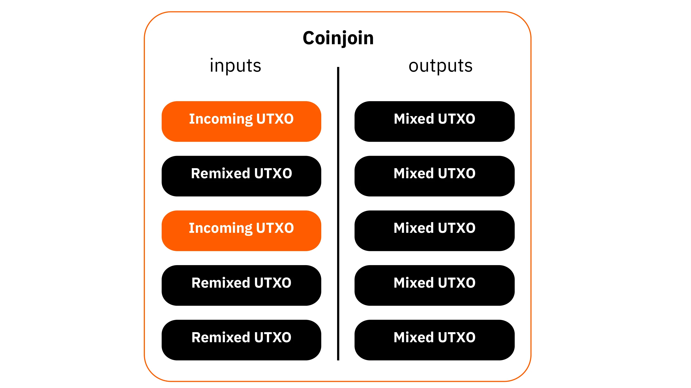


Bu ücret sistemi sayesinde Whirlpool diğer CoinJoin uygulamalarından gerçekten ayrılır, çünkü UTXO'ların anonimleri kullanıcı tarafından ödenen fiyatla orantılı değildir. Sonuç olarak, sadece havuza giriş ücreti ve 2 işlem için (`Tx0` ve ilk karışım) Mining ücreti ödeyerek çok daha yüksek anonimlik seviyelerine ulaşmak mümkündür.


Kullanıcının, herhangi bir ek işlem yapmadan fonları doğrudan CoinJoin'dan alacak harici bir Address sağlayan `mix to' seçeneğini seçmediği sürece, çoklu coin birleşmelerini tamamladıktan sonra UTXO'larını havuzdan çekmek için Mining ücretlerini de ödemesi gerekeceğini unutmamak önemlidir.


### HD Wallet hesapları


Whirlpool aracılığıyla bir CoinJoin oluşturmak için, Wallet'nın birkaç ayrı hesabı generate yapması gerekir. ZeroLink protokolünün arkasındaki prensip budur. Bir HD (*Hiyerarşik Deterministik*) Wallet bağlamında bir hesap, diğerlerinden tamamen izole edilmiş bir bölüm oluşturur, bu ayrım Wallet hiyerarşisinin üçüncü derinliği seviyesinde, yani `xpub` seviyesinde gerçekleşir.


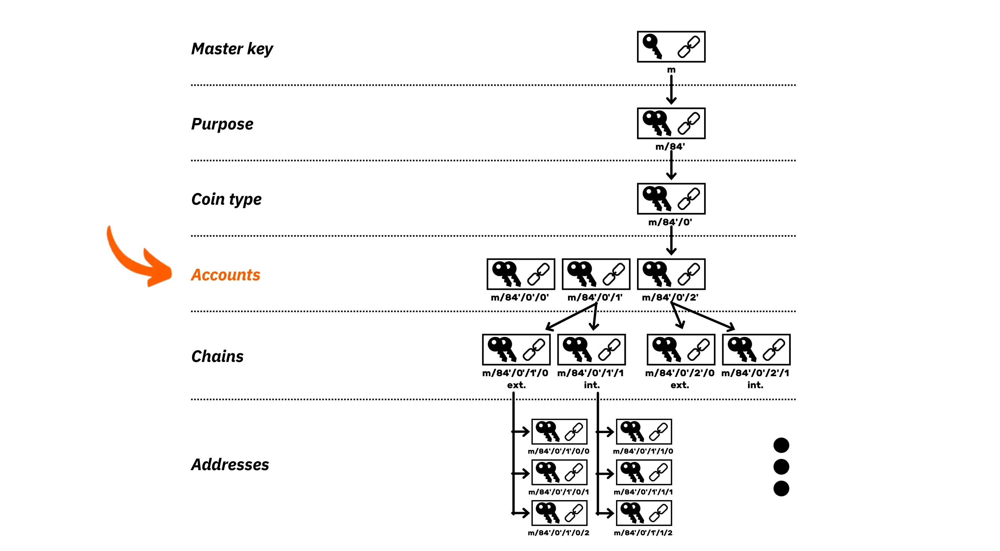


Bir HD Wallet teorik olarak en fazla `2^(31)` farklı hesap türetebilir. Tüm Bitcoin cüzdanlarında varsayılan olarak kullanılan ilk hesap `0'` endeksine karşılık gelir.


Whirlpool'a uyarlanmış cüzdanlar için ZeroLink sürecinin ihtiyaçlarını karşılamak üzere 4 hesap kullanılır:


- 0'` indeksi ile tanımlanan **deposit** hesabı;
- 2,147,483,644 endeksi ile tanımlanan **kötü banka** (veya "doxxic change") hesabı;
- 2 147 483 645'` endeksi ile tanımlanan **premix** hesabı;
- **Postmix** hesabı, `2 147 483 646'` endeksi ile tanımlanmıştır.


Bu hesapların her biri CoinJoin sürecinde, ilerleyen bölümlerde inceleyeceğimiz belirli bir işlevi yerine getirir.


Tüm bu hesaplar tek bir seed'ye bağlanarak kullanıcının kurtarma cümlesini ve varsa passphrase'ini kullanarak tüm bitcoinlerine erişimini geri kazanmasını sağlar. Ancak kurtarma işlemi sırasında yazılımın kullanılan çeşitli hesap dizinleri hakkında bilgilendirilmesi gerekir.


Şimdi bu hesaplar dahilinde bir Whirlpool CoinJoin'ün farklı aşamalarına bir göz atalım.


### TX0


Herhangi bir Whirlpool CoinJoin'nın başlangıç noktası **deposit** hesabıdır. Bu, yeni bir Bitcoin Wallet oluşturduğunuzda otomatik olarak kullandığınız hesaptır. Bu hesaba karıştırmak istediğiniz bitcoinlerin yatırılması gerekecektir.


Tx0" Whirlpool'un karıştırma işlemindeki ilk adımdır. Amacı, CoinJoin için UTXO'ları hazırlamak ve eşitlemek, homojen karışımı sağlamak için seçilen havuzun miktarına karşılık gelen birimlere bölmektir. Bu şekilde eşitlenen UTXO'lar daha sonra **premix** hesabına gönderilir. Havuza giremeyen farka gelince, belirli bir hesaba ayrılır: **kötü banka** (veya "doxxic change").


Bu ilk `Tx0' işlemi aynı zamanda CoinJoin koordinatörüne ödenmesi gereken hizmet ücretini ödemek için de kullanılır. Aşağıdaki adımlardan farklı olarak, bu işlem işbirliğine dayalı değildir, bu nedenle kullanıcı Mining'nin tüm maliyetini üstlenmelidir:


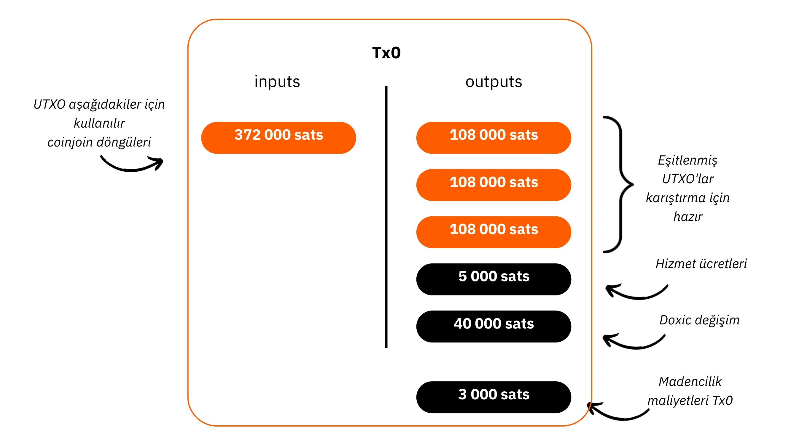


Bu `Tx0` işlemi örneğinde, **mevduat** hesabımızdan `372.000 Sats` girdisi, aşağıdaki gibi parçalanan birkaç çıktı UTXO'ya bölünür:


- Hizmet ücretleri için koordinatör için `100.000 Sats`lük havuz girişine karşılık gelen `5.000 Sats` tutarında bir meblağ;
- 3 UTXO karıştırılmak üzere hazırlandı, **premix** hesabımıza yönlendirildi ve koordinatöre kaydedildi. Bu UTXO'ların her biri, gelecekteki ilk karışımları için Mining maliyetlerini karşılamak üzere `108.000 Sats` olarak eşitlenmiştir;
- Çok küçük olduğu için havuza giremeyen fazlalık, zehirli değişim olarak kabul edilir. Kendi özel hesabına gönderilir. Burada bu değişim `40,000 Sats` tutarındadır;
- Son olarak, geriye `3.000 Sats` kalmıştır, bunlar bir çıktı oluşturmaz, ancak `Tx0`ı onaylamak için gereken Mining maliyetleridir.


Örneğin, işte gerçek bir Whirlpool Tx0 (benim değil): [edef60744f539483d868caff49d4848e5cc6e805d6cdc8d0f9bdbbaedcb5fc46](https://Mempool.space/tx/edef60744f539483d868caff49d4848e5cc6e805d6cdc8d0f9bdbbaedcb5fc46)


### Doxic değişiklikler


Havuza entegre edilemeyen ve burada `40.000 Sats`e denk gelen fazlalık, Wallet'deki diğer UTXO'lardan kesin olarak ayrılmasını sağlamak için "doxxic change" olarak da bilinen **bad bank** hesabına yönlendirilir.


Bu UTXO kullanıcının gizliliği açısından tehlikelidir, çünkü sadece geçmişine ve dolayısıyla muhtemelen sahibinin kimliğine bağlı olmakla kalmaz, aynı zamanda bir CoinJoin yapmış olan bir kullanıcıya ait olduğu da belirtilir.


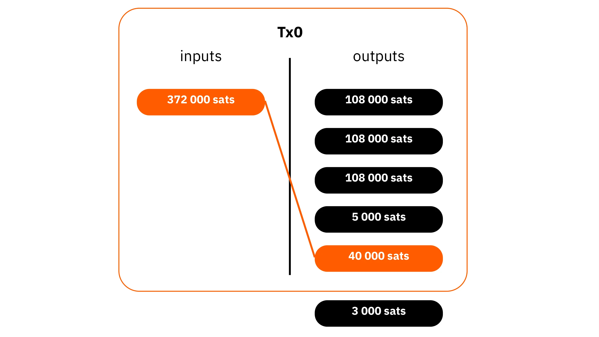


Bu UTXO karışık çıktılarla birleştirilirse, ikincisi özellikle CIOH (*Common-Input-Ownership-Heuristic*) nedeniyle CoinJoin döngüleri sırasında kazanılan tüm gizliliği kaybedecektir. Diğer doxxic değişikliklerle birleştirilirse, çeşitli CoinJoin döngü girişlerini birbirine bağlayacağından, kullanıcı gizliliği kaybetme riskiyle karşı karşıya kalır. Bu nedenle dikkatli bir şekilde ele alınmalıdır. Bu UTXO'ların doxxic yönetimi hakkında bu bölümün son kısmında daha ayrıntılı bilgi vereceğiz.


### İlk karışım


Tx0`dan sonra, eşitlenmiş UTXO'lar Wallet'ın **premix** hesabına gönderilir ve "ilk karışım" olarak da bilinen ilk CoinJoin döngüsüne dahil edilmeye hazır hale gelir. Örneğimizde olduğu gibi, `Tx0` karıştırma için birkaç UTXO üretirse, bunların her biri ayrı bir başlangıç karışımına entegre edilecektir.


Bu ilk karışımların sonunda, **premix** hesabı boş olacak ve bu ilk CoinJoin için Mining ücretlerini ödemiş olan coinlerimiz tam olarak seçilen havuz tarafından tanımlanan miktara ayarlanacaktır. Örneğimizde, `108.000 Sats` olan başlangıç UTXO'larımız tam olarak `100.000 Sats`e düşürülmüş olacaktır.


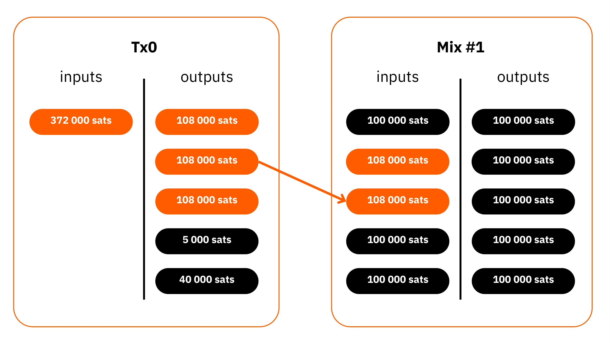


### Remixler


İlk miksten sonra UTXO'lar **postmix** hesabına aktarılır. Bu hesap, halihazırda karıştırılmış olan ve yeniden karıştırılmayı bekleyen UTXO'ları toplar. Whirlpool müşterisi aktif olduğunda, **postmix** hesabında bulunan UTXO'lar otomatik olarak remiksler için kullanılabilir hale gelir ve bu yeni döngülere katılmak üzere rastgele seçilir.


Bir hatırlatma olarak, remiksler %100 ücretsizdir: ek hizmet ücreti veya Mining ücreti gerekmez. UTXO'ları **postmix** hesabında tutmak, bu nedenle değerlerini korur ve aynı zamanda anonsetlerini geliştirir. Bu nedenle, bu coinlerin birkaç CoinJoin döngüsüne katılmasına izin vermek önemlidir. Bunun size hiçbir maliyeti yoktur ve anonimlik seviyelerini artırır.


Karışık UTXO'ları harcamaya karar verdiğinizde, bunu doğrudan bu **postmix** hesabından yapabilirsiniz. Ücretsiz remikslerden faydalanmak ve gizliliklerini azaltabilecek Whirlpool devresinden ayrılmalarını önlemek için karma UTXO'ları bu hesapta tutmanızı tavsiye ederiz.


### Postmikslerinizi nasıl yönetiyorsunuz?


CoinJoin döngülerini çalıştırdıktan sonra, en iyi strateji UTXO'larınızı gelecekte kullanmak üzere **postmix** hesabında tutmaktır. Hatta onları harcamanız gerekene kadar süresiz olarak remiks yapmalarına izin vermeniz tavsiye edilir.


Bazı kullanıcılar karışık bitcoinlerini bir Hardware Wallet ile güvence altına alınmış bir Wallet'e aktarmayı düşünebilir. Bu mümkündür, ancak elde edilen gizliliği tehlikeye atmamak için Samourai Wallet'in önerilerini titizlikle takip etmek önemlidir.


UTXO'ları birleştirmek en yaygın hatadır. CIOH'dan (*Common-Input-Ownership-Heuristic*) kaçınmak için, karışık UTXO'ları aynı işlemde karıştırılmamış UTXO'larla birleştirmekten kaçınmalısınız. Bu, UTXO'larınızın Wallet içinde, özellikle etiketleme açısından dikkatli bir şekilde yönetilmesini gerektirir.


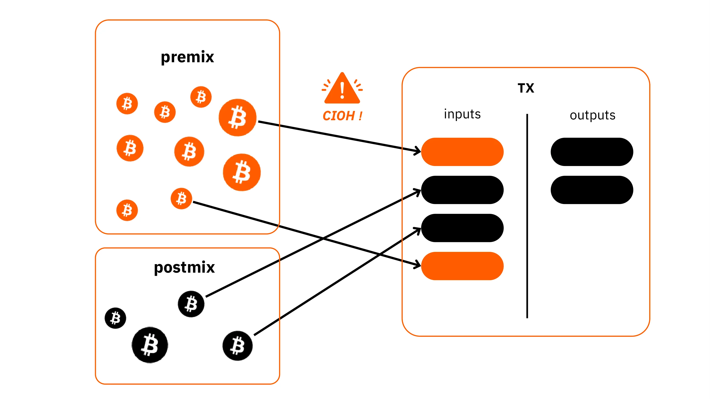


Karma UTXO'ları birleştirirken de dikkatli olunmalıdır. Karma UTXO'larınızda önemli anonsetler varsa orta düzeyde konsolidasyon mümkündür, ancak bu kaçınılmaz olarak UTXO'larınızın gizliliğini azaltacaktır. Konsolidasyonların ne çok kapsamlı olduğundan ne de CoinJoin döngülerinden önce ve sonra UTXO'larınız arasında çıkarılabilir bağlantılar kurma riskini göze alarak yetersiz sayıda remiksten sonra yapıldığından emin olun. Bu manipülasyonlar konusunda şüpheye düştüğünüzde, en iyi uygulama karışım sonrası UTXO'ları birleştirmek değil, her seferinde yeni bir boş Address oluşturarak bunları tek tek Hardware Wallet'ünüze aktarmaktır. Bir kez daha, aldığınız her UTXO'yı etiketlemeyi unutmayın.


Ayrıca, yaygın olarak kullanılmayan komut dosyalarını kullanarak postmix UTXO'larınızı bir Wallet'a aktarmanız tavsiye edilmez. Örneğin, `P2WSH` betiklerini kullanarak bir Multisig Wallet'dan Whirlpool'ye girerseniz, başlangıçta aynı tür Wallet'a sahip olan diğer kullanıcılarla karıştırılma şansınız çok azdır. Postmikslerinizi aynı Multisig Wallet'a yeniden karıştırırsanız, karışık bitcoinlerinizin gizlilik seviyesi büyük ölçüde azalacaktır. Komut dosyalarının ötesinde, size oyun oynayabilecek başka birçok Wallet parmak izi vardır.


Tüm Bitcoin işlemlerinde olduğu gibi, alıcı Address'in tekrar kullanılmaması da önemlidir. Her yeni işlem yeni, boş bir Address ile alınmalıdır.


En basit ve en güvenli çözüm, karışık UTXO'larınızı **postmix** hesaplarında dinlenmeye bırakmak, yeniden karıştırmalarına izin vermek ve yalnızca harcamak için dokunmaktır. Samurai ve Sparrow cüzdanları tüm bu zincir analizi risklerine karşı ek korumalara sahiptir. Bu korumalar hata yapmaktan kaçınmanıza yardımcı olur.


### Toksik değişiklikleri nasıl yönetiyorsunuz?


Daha sonra, CoinJoin havuzuna girmeyen doxxic değişikliklerin yönetimi konusunda dikkatli olmanız gerekecektir. Whirlpool kullanımından kaynaklanan bu toksik UTXO'lar, siz ve CoinJoin kullanıcısı arasında bir bağlantı kurdukları için gizliliğiniz için risk oluştururlar. Bu nedenle, bunları dikkatli bir şekilde yönetmek ve diğer UTXO'larla, özellikle de karışık UTXO'larla birleştirmemek zorunludur.


İşte bunları kullanmak için bazı stratejiler:


- Daha küçük havuzlara karıştırın: Zehirli UTXO'iniz tek başına daha küçük bir havuza sığacak kadar büyükse, karıştırmayı düşünün. Bu genellikle en iyi seçenektir. Ancak, bir havuza erişmek için birkaç toksik UTXO'yu birleştirmeniz tavsiye edilmez, çünkü bu farklı girişlerinizi birbirine bağlayabilir;
- **"Harcanamaz" olarak işaretleyin:** Başka bir yaklaşım da bunları kullanmayı bırakmak, özel hesaplarında "harcanamaz" olarak işaretlemek ve sadece HODL. Bu, onları yanlışlıkla harcamamanızı sağlar. Bitcoin'nın değeri yükselirse, toksik UTXO'larınıza daha uygun yeni havuzlar ortaya çıkabilir;
- **Bağış yapın:** Bitcoin ve ilgili yazılımlar üzerinde çalışan geliştiricilere mütevazı da olsa bağış yapmayı düşünün. BTC kabul eden derneklere de bağışta bulunabilirsiniz. Toksik UTXO'larınızı yönetmek çok karmaşık görünüyorsa, onlardan kurtulabilir ve bağış yapabilirsiniz;
- Hediye kartları satın alın: [Bitrefill](https://www.bitrefill.com/) gibi platformlar, çeşitli satıcılarda kullanılabilecek hediye kartları için Exchange bitcoinleri kullanmanıza olanak tanır. Bu, ilgili değeri kaybetmeden toksik UTXO'larınızdan ayrılmanın bir yolu olabilir;
- **Monero üzerinde konsolide edin:** Samourai Wallet, BTC ve XMR arasında bir atomik takas hizmeti sunmaktadır. Bu, toksik UTXO'ları Bitcoin'a geri göndermeden önce CIOH aracılığıyla gizliliğinizden ödün vermeden Monero üzerinde konsolide ederek yönetmek için idealdir. Ancak bu seçenek, likidite kısıtlamaları nedeniyle Mining ücretleri ve prim açısından maliyetli olabilir;
- **Bunları Lightning Network'e gönderin:** Düşük işlem ücretlerinden yararlanmak için bu UTXO'ları Lightning Network'e aktarmak cazip bir seçenek olabilir. Ancak bu yöntem, Lightning'i nasıl kullandığınıza bağlı olarak bazı bilgileri açığa çıkarabilir ve bu nedenle dikkatli kullanılmalıdır.


### Whirlpool'ü nasıl kullanırım?


Samourai Wallet'nin kurucularının tutuklanması ve sunucularına 24 Nisan 2024'te el konulmasının ardından, Whirlpool aracı artık kendi Dojo'larına sahip olanlar için bile çalışmıyor. Daha önce Samourai Wallet ve Sparrow wallet'te kullanılabiliyordu.


Bununla birlikte, denemelerin sonucuna bağlı olarak bu aracın önümüzdeki haftalarda yeniden etkinleştirilmesi veya farklı bir şekilde yeniden piyasaya sürülmesi mümkün olmaya devam ediyor. Her halükarda, talep olduğu için Bitcoin CoinJoin pazarının uzun süre Supply'siz kalacağını düşünmüyorum. Dahası, Whirlpool'in modeli gizlilik açısından en gelişmiş model olduğundan, gelecekte diğer uygulamalar için kesinlikle tercih edilen model olacaktır.


Bu davayı ve ilgili araçlardaki gelişmeleri yakından takip ediyoruz. Yeni bilgiler elde edildikçe bu kursu güncelleyeceğimizden emin olabilirsiniz.


Bir sonraki bölümde "anonsetlerin" ne olduğunu, bu göstergelerin nasıl hesaplandığını ve CoinJoin döngülerinin verimliliğini tahmin etmemize nasıl yardımcı olabileceğini öğreneceğiz.


https://planb.network/tutorials/privacy/on-chain/coinjoin-samourai-wallet-e566803d-ab3f-4d98-9136-5462009262ef


## Anonimlik setleri


<chapterId>be1093dc-1a74-40e5-9545-2b97a7d7d431</chapterId>


Eş birleştirmelerin nasıl çalıştığını ve etkili karıştırma ile ilgili sorunları inceledikten sonra, şimdi bunların etkinliğini nasıl ölçeceğimizi bulacağız. Bir coinjoining işleminin etkili olup olmadığını ve bir UTXO'ün ne derece anonimlik kazandığını nasıl belirleyebiliriz? İşte bu bölümde anonimlik kümeleri ya da "anonsetler" ile bunu öğreneceğiz.


### CoinJoin'ün kullanışlılığına dair bir hatırlatma


CoinJoin'in kullanışlılığı, UTXO'nızı ayırt edilemeyen bir grup UTXO'nun içine yerleştirerek makul inkar edilebilirlik üretme kabiliyetinde yatmaktadır. Bu eylemin amacı hem geçmişten günümüze hem de günümüzden geçmişe izlenebilirlik bağlarını koparmaktır.


Başka bir deyişle, CoinJoin döngülerinin girişindeki ilk işleminizi (`Tx0`) bilen bir analist, remiks döngülerinin çıkışındaki UTXO'inizi kesin olarak belirleyememelidir (döngü girişinden döngü çıkışına analiz).


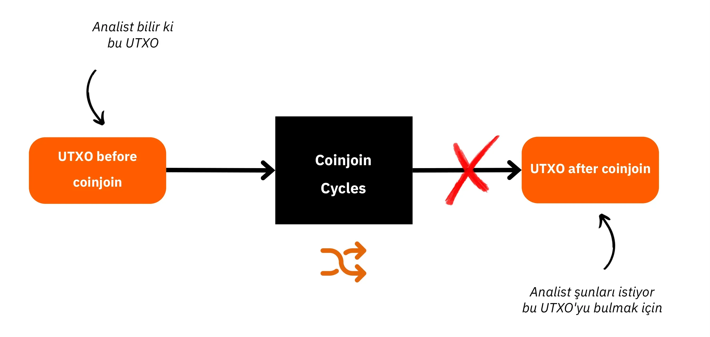


Tersine, CoinJoin döngülerinin çıkışında UTXO'unuzu bilen bir analist, döngülerin girişindeki orijinal işlemi belirleyememelidir (döngü çıkışından döngü girişine analiz).


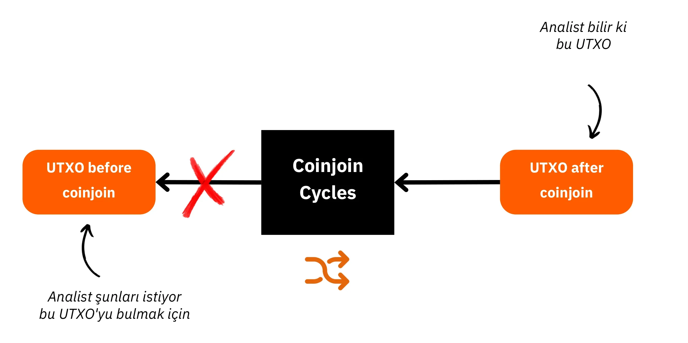


Bir analistin geçmişle günümüz arasında bağlantı kurmasının ne kadar zor olduğunu değerlendirmek için, UTXO'inizin içinde saklı olduğu homojen UTXO gruplarının büyüklüğünü ölçmemiz gerekir. Bu ölçü bize kaç analizin aynı olasılığa sahip olduğunu söyler. Dolayısıyla, doğru analiz eşit olasılığa sahip diğer 3 analiz arasında boğulmuşsa, gizleme seviyeniz çok düşüktür. Öte yandan, doğru analiz eşit olasılıklı 20.000 analizden oluşan bir grup içinde bulunuyorsa, UTXO'iniz çok iyi gizlenmiş demektir. Bu grupların büyüklüğü "anonset" olarak bilinen göstergeleri temsil etmektedir.


### Anonsetleri anlama


Anonsetler, belirli bir UTXO'ün gizlilik derecesini değerlendirmek için gösterge olarak kullanılır. Daha spesifik olarak, incelenen UTXO'ü içeren küme içindeki ayırt edilemeyen UTXO'ların sayısını ölçerler. Homojen bir UTXO kümesi gerekliliği, anonsetlerin genellikle CoinJoin döngüleri üzerinden hesaplandığı anlamına gelmektedir. Bu göstergelerin kullanımı, homojenlikleri nedeniyle özellikle Whirlpool eş eklemleri için önemlidir.


Gerekirse, anonsetler eş birleşimlerin kalitesini değerlendirmek için kullanılabilir. Homojen küme içinde belirli bir UTXO'i ayırt etmek zorlaştığından, büyük bir anonset yüksek düzeyde anonimlik anlamına gelir.


2 tür anons mevcuttur:


- İleri anons;
- geriye doğru anonset.


### İleri anons


İleriye dönük anonset, başlangıçtaki UTXO göz önüne alındığında, döngünün sonunda incelenen UTXO'nın gizlendiği grubun boyutunu, yani bu grup içinde mevcut olan ayırt edilemeyen UTXO'ların sayısını gösterir. Bu göstergenin adı "ileriye dönük metrikler "dir.


Bu gösterge, odanın gizliliğinin geçmişten bugüne (girdi-çıktı) analizine karşı direncini ölçer.


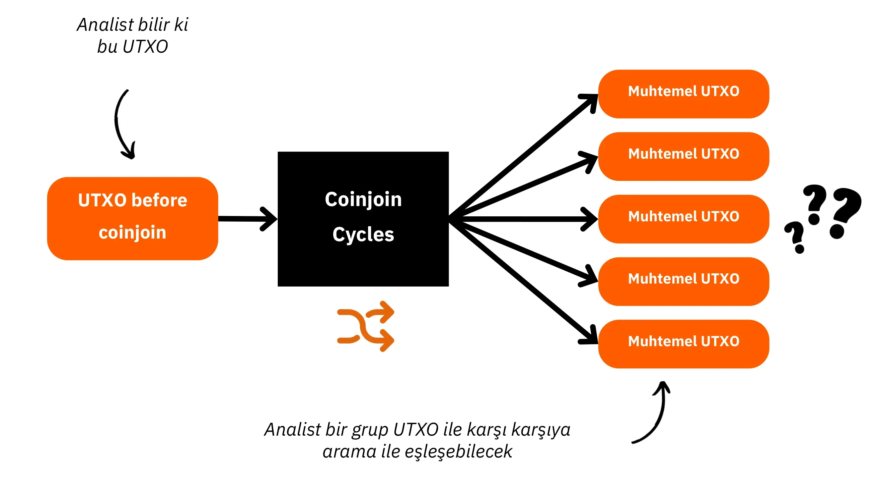


Bu metrik, UTXO'inizin CoinJoin sürecine giriş noktasından çıkış noktasına kadar olan geçmişini yeniden oluşturma girişimlerine karşı ne ölçüde korunduğunu tahmin etmek için kullanılır.


Örneğin, işleminiz ilk CoinJoin döngüsüne katılmış ve iki azalan döngü daha tamamlanmışsa, Coin'nizin ileri anonseti `13` olacaktır:


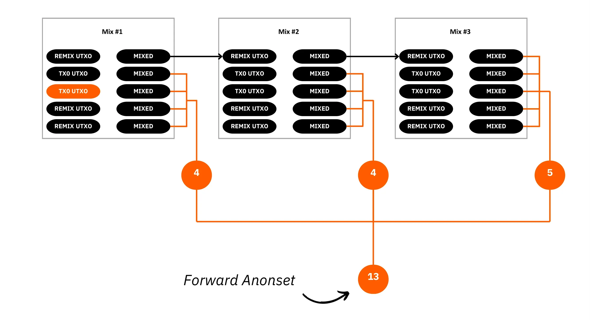


Örneğin, CoinJoin döngüsünün başlangıcındaki Coin'mizin `86,871` ileri anonsetine sahip olduğunu düşünelim. Pratik açıdan bu, `86,871` ayırt edilemeyen UTXO'lar arasında gizlendiği anlamına gelir. CoinJoin döngüsünün başlangıcındaki bu Coin'yi bilen ve çıkışını izlemeye çalışan bir dış gözlemci için, her biri aradığı Coin olma olasılığı aynı olan `86.871` olası UTXO ile karşı karşıya kalacaktır.


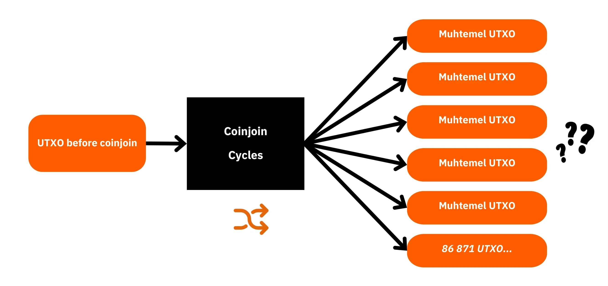


### Geriye doğru anonset


Geriye dönük anonset, döngünün sonunda UTXO'ü bilerek belirli bir UTXO için olası kaynakların sayısını gösterir. Bu gösterge, UTXO'ün gizliliğinin bugünden geçmişe (çıktıdan girdiye) bir analize karşı direncini, yani bir analistin UTXO'ünüzü CoinJoin döngülerinden önce kaynağına kadar izlemesinin ne kadar zor olduğunu ölçer. Bu göstergenin adı "geriye dönük anonset" veya "geriye dönük metrikler "dir.


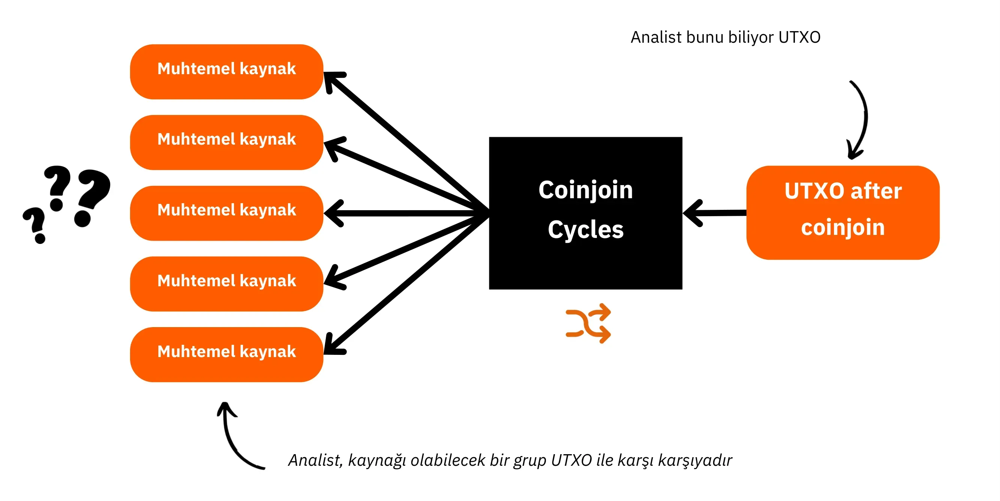


Döngülerin çıkışındaki UTXO'nızı bilerek, geriye dönük anonset, CoinJoin döngülerine girişinizi oluşturabilecek potansiyel Tx0 işlemlerinin sayısını belirler. Aşağıdaki diyagramda bu, tüm turuncu baloncukların toplamına karşılık gelmektedir.


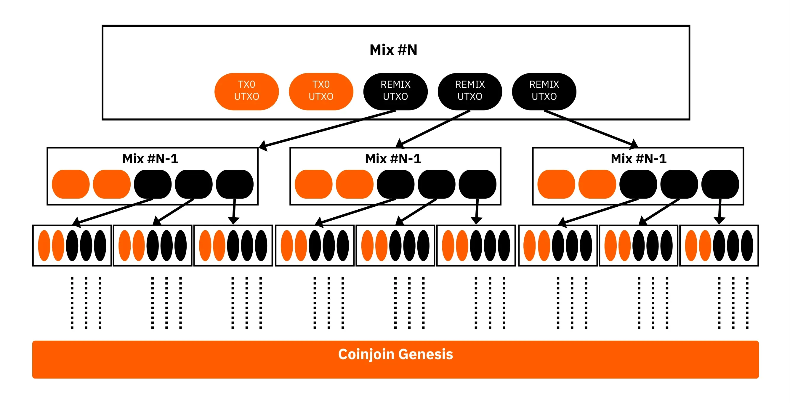


Örneğin, CoinJoin UTXO'umuzun geriye dönük anonsetinin `42,185` olduğunu düşünelim. Pratik açıdan bu, bu UTXO için `42,185` potansiyel kaynak olduğu anlamına gelir. Dışarıdan bir gözlemci bu Coin'i döngülerin sonunda tespit eder ve kaynağını izlemeye çalışırsa, hepsi de aranan kaynak olma olasılığı eşit olan `42.185' olası kaynakla karşı karşıya kalacaktır.


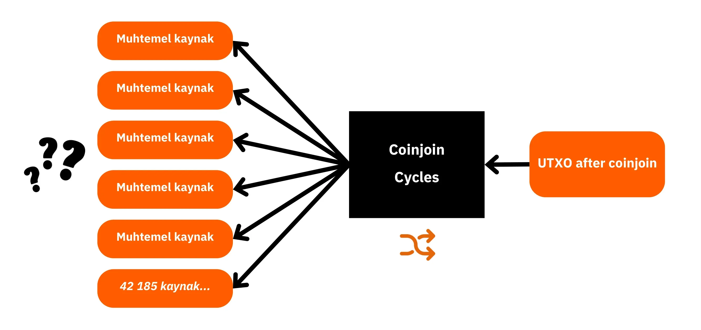


### Anonsetleri nasıl hesaplıyorsunuz?


Küçük topluluklar için Block explorer kullanarak anonsetleri manuel olarak hesaplamak mümkündür. Ancak, daha büyük anonsetler için özel bir aracın kullanılması zorunlu hale gelir. Bildiğim kadarıyla, bu görevi yerine getirebilen tek yazılım Samourai ve OXT ekipleri tarafından geliştirilen bir Python aracı olan *Whirlpool Stats Tool*. Ne yazık ki bu araç, Samourai'nin kurucularının tutuklanmasının ve Blockchain'den veri elde etmek için kullanılan OXT'nin kesintiye uğramasının ardından şu anda hizmet dışı.


Bu bölümde gördüğümüz gibi, anonsetler yalnızca CoinJoin yapısında belirli bir homojenlik varsa hesaplanabilir. Bir sonraki bölümde, ister CoinJoin ister daha geleneksel bir işlem olsun, bir Bitcoin işleminde bu homojenliğin nasıl ölçüleceğini öğreneceğiz.


## Entropi


<chapterId>e4fe289d-618b-49a2-84c9-68c562e708b4</chapterId>


Eş birleşmelerle ilgili bu bölümde gördüğümüz gibi, UTXO'ların girdi ve çıktıdaki homojenliği bir Bitcoin işleminin gizliliğini artırmada önemli bir rol oynamaktadır. Bu parametre Blockchain analizi karşısında makul bir inkar edilebilirlik yaratır. Bu homojenliği ölçmek için çeşitli yöntemler kullanılabilir, ancak bence en etkili yöntemlerden biri, OXT ve Samourai Wallet ekipleri tarafından geliştirilen *Boltzmann* aracı tarafından sağlanan göstergelerin ve özellikle işlemin entropisinin kullanılmasıdır. Bu bölümde ayrıntılı olarak inceleyeceğimiz konu budur.


Bir dizi işlem üzerinden hesaplanan anonsetlerin aksine, burada sunulan göstergeler ister CoinJoin ister daha geleneksel bir işlem olsun tek bir işleme odaklanmaktadır.


### Yorumların sayısı


Bir Bitcoin işleminde gözlemlenebilecek ilk gösterge, dışarıdan bir gözlemcinin analiziyle karşılaşılan olası yorumların toplam sayısıdır. İşlemde yer alan UTXO'ların değerleri dikkate alındığında, bu gösterge girdilerin çıktılarla ilişkilendirilebileceği yolların sayısını gösterir. Başka bir deyişle, bir işlemin Bitcoin akışlarında, onu analiz eden bir dış gözlemcinin bakış açısından ortaya çıkarabileceği olası yorumların sayısını belirler.


Örneğin, 1 girdi ve 2 çıktı içeren basit bir ödeme işleminin tek bir yorumu olacaktır: 0 numaralı girdi, 0 numaralı çıktıyı ve 1 numaralı çıktıyı finanse etmiştir. Başka hiçbir olası yorum yoktur:


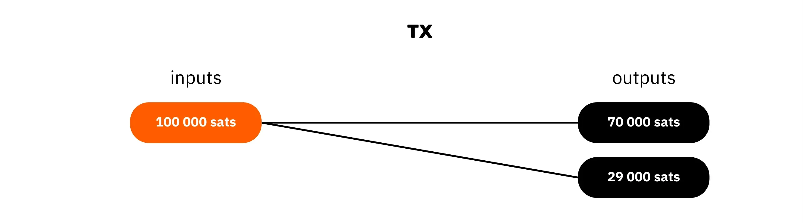


Öte yandan, Whirlpool 5x5 köşesinde 1\,496$ olası kombinasyon vardır:


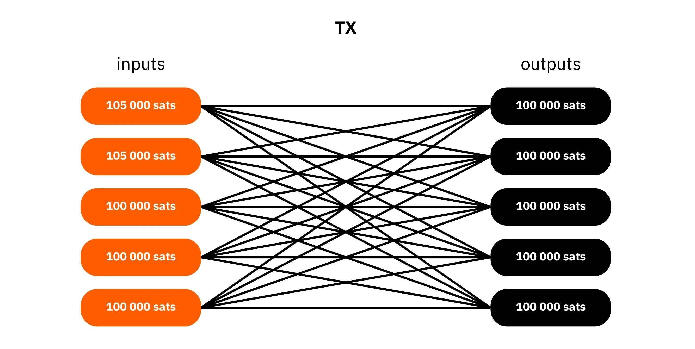


Bir Whirlpool Dalgalanma Döngüsü 8x8 CoinJoin $9\,934\,563$ olası yoruma sahiptir:


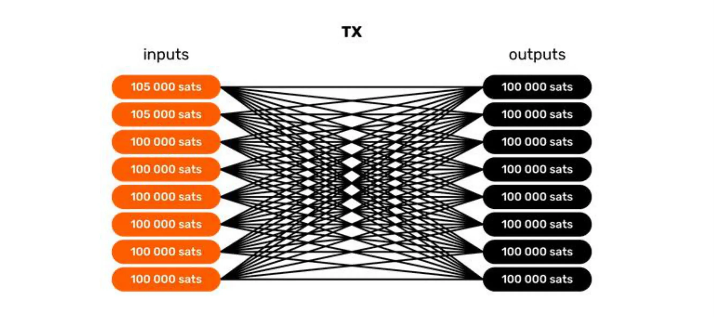


### Entropi


Bir Bitcoin işleminin yorumlanma sayısından entropisini hesaplayabiliriz.


Genel kriptografi ve bilgi bağlamında entropi, bir veri kaynağı veya rastgele süreçle ilişkili belirsizliğin veya öngörülemezliğin nicel bir ölçüsüdür. Başka bir deyişle entropi, bir bilgi parçasının tahmin edilmesinin veya tahmin edilmesinin ne kadar zor olduğunu ölçmenin bir yoludur.


Blockchain analizinin özel bağlamında, entropi aynı zamanda Shannon'un entropisinden türetilen ve [LaurentMT tarafından icat edilen] (https://gist.github.com/LaurentMT/e758767ca4038ac40aaf), bir Bitcoin işlemi üzerinde hesaplanabilen bir göstergenin adıdır.


Bir işlem çok sayıda olası yorum sunduğunda, genellikle entropisine başvurmak daha uygun olur. Bu gösterge analistlerin işlemin tam konfigürasyonu hakkındaki bilgi eksikliğini ölçer. Başka bir deyişle, entropi ne kadar yüksekse, analistlerin girdiler ve çıktılar arasındaki bitcoin akışını tespit etmesi o kadar zorlaşır.


Uygulamada entropi, harici bir gözlemcinin bakış açısından, bir işlemin diğer harici veya dahili kalıpları ve sezgisel yöntemleri dikkate almaksızın yalnızca girdi ve çıktı miktarlarına dayalı olarak birden fazla olası yorum sunup sunmadığını ortaya koyar. Bu nedenle yüksek entropi, işlem için daha fazla gizlilik ile eş anlamlıdır.


Entropi, olası kombinasyonların sayısının ikili logaritması olarak tanımlanır. Burada $E$ işlemin entropisi ve $C$ olası yorumların sayısı olmak üzere kullanılan formül yer almaktadır:


$$
E = \log_2(C)
$$


Matematikte, ikili logaritma (taban-2 logaritma) 2'nin üslenmesinin ters işlemidir. Başka bir deyişle, $x$'in ikili logaritması, $x$ elde etmek için $2$'in yükseltilmesi gereken üsteldir. Bu gösterge bu nedenle bit cinsinden ifade edilir.


Whirlpool 5x5 modeline göre yapılandırılmış bir CoinJoin işlemi için entropi hesaplama örneğini ele alalım; önceki bölümde de belirtildiği gibi, olası yorum sayısı $1\,496$'dır:


$$
\begin{align*}
C &= 1\,496 \\
E &= \log_2(1\,496) \\
E &= 10.5469 \text{ bits}
\end{align*}
$$


Dolayısıyla, bu CoinJoin işlemi 10.5469$ bitlik bir entropiye sahiptir ve bu da oldukça tatmin edici bir değer olarak kabul edilmektedir. Bu değer ne kadar yüksek olursa, işlem o kadar çok farklı yorum kabul eder ve böylece gizlilik seviyesini güçlendirir.


9\,934\,563$ yorum içeren bir CoinJoin 8x8 işlemi için entropi şu şekilde olacaktır:


$$
\begin{align*}
C &= 9\,934\,563 \\
E &= \log_2(9\,934\,563) \\
E &= 23.244 \text{ bits}
\end{align*}
$$


Klasik bir ödeme işlemi ile 1 girdi ve 2 çıktı ile başka bir örnek alalım: [1b1b0c3f0883a99f1161c64da19471841ed12a1f78e77fab128c69a5f578ccce](https://Mempool.space/tx/1b1b0c3f0883a99f1161c64da19471841ed12a1f78e77fab128c69a5f578ccce)


Bu işlem söz konusu olduğunda, tek olası yorum şudur: `(In.0) > (Out.0; Out.1)`. Sonuç olarak, entropisi 0$'dır:


$$
\begin{align*}
C &= 1 \\
E &= \log_2(1) \\
E &= 0 \text{ bits}
\end{align*}
$$


### Verimlilik


İşlemin entropisine dayanarak, gizlilik açısından verimliliğini de hesaplayabiliriz. Bu gösterge, işlemin verimliliğini, aynı konfigürasyonda öngörülebilecek en uygun işlemle karşılaştırarak değerlendirir.


Bu da bizi, belirli bir işlem yapısının teorik olarak ulaşabileceği en yüksek entropiye karşılık gelen maksimum entropi kavramına götürür. İşlem verimliliği daha sonra bu maksimum entropi ile analiz edilen işlemin gerçek entropisi karşılaştırılarak hesaplanır.


Kullanılan formül aşağıdaki gibidir:


- e_R$: bit cinsinden ifade edilen işlemin gerçek entropisi;
- e_M$: bir işlem yapısı için mümkün olan maksimum entropi, bit cinsinden de ifade edilir;
- ef$: bit cinsinden işlem verimliliği:


$$
Ef = E_R - E_M
$$


Örneğin, bir Whirlpool 5x5 CoinJoin yapısı için maksimum entropi 10,5469$'dır:


$$
\begin{align*}
E_R &= 10.5469 \\
E_M &= 10.5469 \\
Ef &= E_R - E_M \\
Ef &= 10.5469 - 10.5469 \\
Ef &= 0 \text{ bits}
\end{align*}
$$


Bu gösterge aynı zamanda yüzde olarak da ifade edilir. Kullanılan formül aşağıdaki gibidir::


- $c_R$: olası gerçek yorumların sayısı;
- $c_M$: aynı yapının olası yorumlarının maksimum sayısı;
- ef$: yüzde olarak ifade edilen verimlilik:


$$
\begin{align*}
E_f &= \frac{C_R}{C_M} \\
E_f &= \frac{1\,496}{1\,496} \\
E_f &= 100 \%
\end{align*}
$$


100$'lık bir verimlilik, işlemin yapısına bağlı olarak gizlilik potansiyelinden en iyi şekilde yararlandığını gösterir.


### Entropi yoğunluğu


Entropi bir işlemin gizliliğini ölçmek için iyi bir göstergedir, ancak kısmen işlemdeki girdi ve çıktıların sayısına bağlıdır. Farklı girdi ve çıktı sayılarına sahip 2 farklı işlemin entropisini karşılaştırmak için entropi yoğunluğunu hesaplayabiliriz. Bu gösterge, işlemin her bir girdi veya çıktısına göre entropi hakkında bir bakış açısı sağlar. Yoğunluk, farklı boyutlardaki işlemlerin verimliliğini değerlendirmek ve karşılaştırmak için kullanışlıdır.


Bunu hesaplamak için, işlemin toplam entropisini işlemde yer alan toplam girdi ve çıktı sayısına bölmemiz yeterlidir:


- e_D$: bit cinsinden ifade edilen entropi yoğunluğu;
- e$: bit cinsinden ifade edilen işlemin entropisi;
- t$: işlemdeki toplam girdi ve çıktı sayısı:


$$
E_D = \frac{E}{T}
$$


Whirlpool 5x5 CoinJoin örneğini ele alalım:


$$
\begin{align*}
T &= 5 + 5 = 10 \\
E &= 10.5469 \\
E_D &= \frac{E}{T} \\
E_D &= \frac{10.5469}{10} \\
E_D &= 1.054 \text{ bits}
\end{align*}
$$


Bir de 8x8 Whirlpool CoinJoin'nın entropi yoğunluğunu hesaplayalım:


$$
\begin{align*}
T &= 8 + 8 = 16 \\
E &= 23.244 \\
E_D &= \frac{E}{T} \\
E_D &= \frac{23.244}{16} \\
E_D &= 1.453 \text{ bits}
\end{align*}
$$


Bu iki CoinJoin türünün entropi yoğunluğu analiz edildiğinde, entropi Elements sayısına göre normalleştirildiğinde bile, "Dalgalanma Döngüsü 8x8" CoinJoin'nin analiz için daha fazla belirsizlik yarattığı ortaya çıkmaktadır.


### Boltzmann skoru


Bir işlemde analiz edilen bir başka bilgi de her bir unsurun diğerine göre Boltzmann puanıdır. Bu, girdiler ve çıktılar arasındaki eşleşme olasılıkları tablosudur. Bu tablo, Boltzmann skoru aracılığıyla, belirli bir girdinin belirli bir çıktı ile bağlantılı olduğu koşullu olasılığı gösterir. Bu nedenle, bir işlemdeki bir girdi ile bir çıktı arasındaki bir ilişkinin, bir dizi yorumda bu olayın olumlu gerçekleşme sayısının toplam olası gerçekleşme sayısına oranına dayalı olarak gerçekleşeceği koşullu olasılığın nicel bir ölçüsüdür.


Whirlpool CoinJoin örneğini kullanarak, koşullu olasılık tablosu her bir girdi ve çıktı arasındaki bağlantı olasılığını vurgulayacak ve işlemdeki ilişkilerin belirsizliğinin nicel bir ölçüsünü sunacaktır:


| %       | Output 0 | Output 1 | Output 2 | Output 3 | Output 4 |
| ------- | -------- | -------- | -------- | -------- | -------- |
| Input 0 | 34%      | 34%      | 34%      | 34%      | 34%      |
| Input 1 | 34%      | 34%      | 34%      | 34%      | 34%      |
| Input 2 | 34%      | 34%      | 34%      | 34%      | 34%      |
| Input 3 | 34%      | 34%      | 34%      | 34%      | 34%      |
| Input 4 | 34%      | 34%      | 34%      | 34%      | 34%      |


Açıkçası, her girdinin herhangi bir çıktı ile ilişkilendirilme şansı eşittir ve bu da işlemin gizliliğini güçlendirir.


Boltzmann puanı, belirli bir olayın gerçekleştiği yorumların sayısının mevcut toplam yorum sayısına bölünmesiyle hesaplanır. Böylece, #0 girdisini #3 çıktısıyla (512$ yorumda mevcut olay) ilişkilendiren puanı belirlemek için aşağıdaki şekilde ilerleriz:


$$
\begin{align*}
\text{Interpretations (IN.0 > OUT.3)} &= 512 \\
\text{Interpretations totales} &= 1496 \\
\text{Score} &= \frac{512}{1496} \\
\text{Score} &= 34 \%
\end{align*}
$$


Bir Whirlpool 8x8 Dalgalanma Döngüsü CoinJoin örneğini ele alırsak, Boltzmann tablosu aşağıdaki gibi görünecektir:


| OUT.0 | OUT.1 | OUT.2 | OUT.3 | OUT.4 | OUT.5 | OUT.6 | OUT.7 |
|-------|-------|-------|-------|-------|-------|-------|-------|
| IN.0  | 23%   | 23%   | 23%   | 23%   | 23%   | 23%   | 23%   | 23%   |
| IN.1  | 23%   | 23%   | 23%   | 23%   | 23%   | 23%   | 23%   | 23%   |
| IN.2  | 23%   | 23%   | 23%   | 23%   | 23%   | 23%   | 23%   | 23%   |
| IN.3  | 23%   | 23%   | 23%   | 23%   | 23%   | 23%   | 23%   | 23%   |
| IN.4  | 23%   | 23%   | 23%   | 23%   | 23%   | 23%   | 23%   | 23%   |
| IN.5  | 23%   | 23%   | 23%   | 23%   | 23%   | 23%   | 23%   | 23%   |
| IN.6  | 23%   | 23%   | 23%   | 23%   | 23%   | 23%   | 23%   | 23%   |
| IN.7  | 23%   | 23%   | 23%   | 23%   | 23%   | 23%   | 23%   | 23%   |


Ancak, tek bir girdi ve 2 çıktıya sahip basit bir işlem söz konusu olduğunda durum farklıdır:


| Output 0 | Output 1 |
|----------|----------|
| Input 0  | 100%     | 100%    |


Burada, her bir çıktının #0 numaralı girdiden kaynaklanma olasılığının %100 olduğunu görüyoruz. Dolayısıyla daha düşük bir olasılık, girdiler ve çıktılar arasındaki doğrudan bağlantıları seyrelterek daha fazla gizliliği yansıtır.


### Deterministik bağlantılar


Bir işlemdeki deterministik bağlantıların sayısını da hesaplayabiliriz. Bu gösterge, analiz edilen işlemdeki girdiler ve çıktılar arasındaki bağlantıların kaç tanesinin %100 olasılıkla sorgulanamaz olduğunu ortaya koyar. Bu gösterge daha sonra deterministik bağlantıların oranı hesaplanarak tamamlanabilir. Oran, bu deterministik bağlantıların işlemin toplam bağlantıları içindeki ağırlığına ilişkin bir perspektif sağlar.


Örneğin, bir Whirlpool CoinJoin işleminde girdiler ve çıktılar arasında hiçbir deterministik bağlantı yoktur ve bu nedenle 0 bağlantı ve %0 oran göstergesi görüntülenir. Buna karşılık, incelenen ikinci basit ödeme işlemimizde (bir girdi ve 2 çıktı ile), gösterge bize 2 deterministik bağlantı olduğunu ve oranın %100'e ulaştığını söyler. Başka bir deyişle, sıfır gösterge, girdiler ve çıktılar arasında doğrudan ve tartışılmaz bağlantıların olmaması sayesinde mükemmel gizliliğe işaret etmektedir.


### Bu göstergeleri nasıl hesaplıyorsunuz?


Sağladığım denklemleri kullanarak bu göstergeleri manuel olarak hesaplamak nispeten basittir. Zorluk esas olarak bir işlemin olası yorumlarının sayısının belirlenmesinde yatmaktadır. Klasik bir işlem için bu hesaplama elle yapılabilir. Ancak bir CoinJoin için bu görev çok daha karmaşıktır.


Daha önce, OXT ve Samourai ekipleri tarafından geliştirilen ve bir Bitcoin işlemi için tüm bu göstergeleri otomatik olarak hesaplayan _Boltzmann Calculator_ adlı bir Python aracı vardı:


Bu analizler için KYCP.org web sitesini kullanmak da mümkün olmuştur:


Ne yazık ki Samourai'nin kurucularının tutuklanmasının ardından bu araçlar artık işlevsel değil.


Coinjoinleri ayrıntılı olarak ele aldığımıza göre, kursumuzun son bölümünde Bitcoin'da mevcut olan diğer gizlilik tekniklerine bakacağız. Payjoin'lere, belirli sözde CoinJoin işlem türlerine, statik Address protokollerine ve gizliliği işlemlerin kendi seviyesinde değil, düğüm ağı seviyesinde güçlendirmeye yönelik önlemlere bakacağız.


https://planb.network/tutorials/privacy/analysis/boltzmann-entropy-738e45af-18a6-4ce6-af1a-1bf58e15f1fe

# Diğer gelişmiş gizlilik tekniklerinin zorluklarının anlaşılması


<partId>19989ae6-d608-4acf-b698-2cf1e7e5e6ae</partId>


## PayJoin işlemleri


<chapterId>c1e90b95-f709-4574-837b-2ec26b11286f</chapterId>


CoinJoin şu anda bir zincir analizinde UTXO'ların izlenmesine belirsizlik katmanın en etkili yöntemidir. Önceki bölümlerde gördüğümüz gibi, yüksek performanslı bir karışım elde etmek için girdilerin ve çıktıların mümkün olduğunca homojen olması gerekir. Ayrıca, anonsetleri en üst düzeye çıkarmak için UTXO'ların mümkün olduğunca büyük bir gruba entegre edilmesi önemlidir. Dolayısıyla, eş birleşimlerin etkili olabilmesi için çok sayıda tek tip UTXO içermesi gerekir. Bu çok sayıda gereksinim, CoinJoin işlemlerinin çok katı bir yapıya sahip olduğu anlamına gelir: tutarlar önceden sabitlenir ve sürecin tekdüzeliğini garanti etmek için tüm katılımcılar bunlara uymalıdır. Buna ek olarak, coinjoins işlem yapımı sırasında tüm katılımcılar ve koordinatör arasında senkronizasyon gerektirir.


Bu gereksinimler CoinJoin'yi doğrudan ödemeler için uygunsuz hale getirir. Örneğin, bir CoinJoin havuzunda 1M Sats Coin'ünüz varsa, bunu doğrudan ödeme olarak kullanmak karmaşık olacaktır. Diğer katılımcılar ve koordinatör ile tam da ödeme yapmanız gereken anda işbirliği işlemini oluşturmak için senkronizasyon gerekir ve satın alma tutarının tam olarak Coin'ünüzün değerine karşılık gelmesi gerekir ki bu neredeyse imkansızdır. Bu nedenle CoinJoin işlemi doğası gereği işbirliğine dayalı bir süpürme işlemidir, yani genellikle çıktılarda bulduğumuz girdilerin aynı sahipleridir.


Bununla birlikte, ödemelerin pratik bir şekilde yapılmasına olanak tanıyan ve aynı zamanda zincir analizine şüphe katan işlem yapılarına sahip olmak ilginç olacaktır. Bu bölümde ve bir sonraki bölümde inceleyeceğimiz şey tam olarak budur.


### PayJoin işlemi nedir?


PayJoin, ödeme alıcısı ile işbirliği yaparak harcama yaparken kullanıcı gizliliğini artıran özel bir Bitcoin işlem yapısıdır.


LaurentMT, [burada] (https://gist.githubusercontent.com/LaurentMT/e758767ca4038ac40aaf/raw/c8125f6a3c3d0e90246dc96d3b603690ab6f1dcc/gistfile1.txt) bulunan bir belgeye göre, bu yöntemi ilk olarak 2015 yılında "*steganografik işlemler*" adı altında tartıştı. Bu teknik daha sonra Samourai Wallet tarafından benimsenmiş ve 2018'de Stowaway aracını kullanarak bunu uygulayan ilk istemci olmuştur. PayJoin kavramı [BIP79](https://github.com/Bitcoin/bips/blob/master/bip-0079.mediawiki), [BIP78](https://github.com/Bitcoin/bips/blob/master/bip-0078.mediawiki) ve [BIP77](https://PayJoin.org/docs/how-it-works/PayJoin-v2-bip-77/)'de de yer almaktadır. Bu nedenle bir PayJoin'a atıfta bulunmak için çeşitli terimler kullanılmaktadır:


- PayJoin;
- Kaçak yolcu;
- P2EP (*Pay-to-End-Point*);
- Steganografik işlem.


PayJoin'ün özelliği, ilk bakışta sıradan görünen, ancak aslında iki kişi arasında mini bir CoinJoin olan bir işlemi generate yapabilmesinde yatmaktadır. Bunu başarmak için işlem yapısı, gerçek göndericinin yanı sıra ödeme alıcısını da girdilere dahil eder. Alıcı böylece işlemin ortasında kendisine ödeme yapılmasını sağlayan bir ödemeyi de içermektedir.


Bu süreci daha iyi anlamak için bir örnek verelim. Alice, 10.000 Sats'lik bir UTXO kullanarak 4.000 Sats'ye ekmek satın alır ve PayJoin'i tercih eder. Fırıncısı Bob, Alice'nın 4.000 Sats'sine ek olarak kendisine ait 15.000 Sats'lik bir UTXO'i girdi olarak ekler ve bunu çıktı olarak tamamen geri alır.


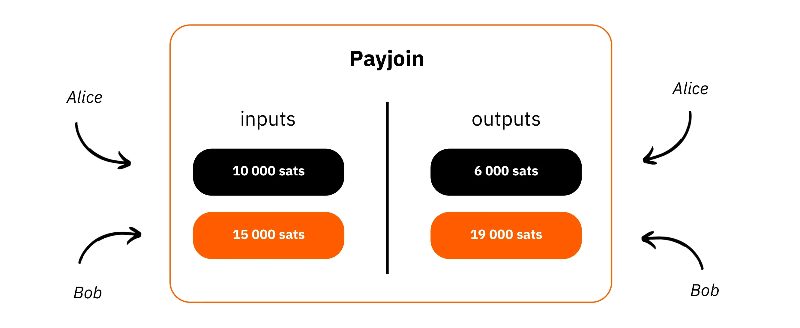


Bu örnekte, fırıncı Bob 15,000 Sats girdi girmekte ve 19,000 Sats ile çıkmaktadır, aradaki fark tam olarak 4,000 Sats, yani bagetin fiyatıdır. Alice'in tarafında ise 10.000 Sats giriyor ve çıktı olarak 6.000 Sats elde ediyor, bu da -4.000 Sats'lik bir dengeyi, yani bagetin fiyatını temsil ediyor. Örneği basitleştirmek için, bu işlemdeki Mining maliyetlerini kasıtlı olarak ihmal ettim.


### PayJoin ne için?


PayJoin işlemi iki amacı yerine getirerek kullanıcıların ödemelerinin gizliliğini artırmalarını sağlar.


İlk olarak, PayJoin zincir analizinde bir yem yaratarak dışarıdan bir gözlemciyi yanıltmayı amaçlamaktadır. Bu, CIOH sezgiselliği (*Common Input Ownership Heuristic*) tarafından mümkün kılınmaktadır. Bölüm 3'te gördüğümüz gibi, genellikle Blockchain üzerindeki bir işlemin birden fazla girdisi olduğunda, tüm bu girdilerin aynı varlığa veya kullanıcıya ait olduğu varsayılır.


Dolayısıyla, bir analist bir PayJoin işlemini incelediğinde, tüm girdilerin aynı kişiden geldiğine inanmaya yönlendirilir. Ancak bu algı yanlıştır, çünkü gerçek ödeyenin yanı sıra alacaklı da girdilere katkıda bulunmaktadır. Dolayısıyla zincir analizi, yanlış olduğu ortaya çıkan bir yoruma doğru yönlendirilir.


Ekmek ödemesi için bir PayJoin işlemi örneğimizi ele alalım:


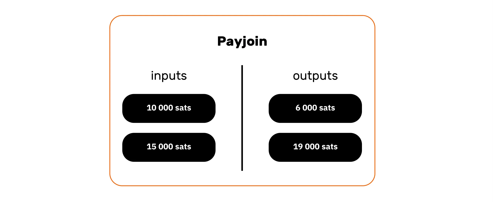


Bu işlemi Blockchain üzerinde gören bir dış gözlemci, Blockchain analizinin olağan sezgisel yöntemlerini izleyerek aşağıdaki yorumu yapacaktır: "*Alice, Bob'e 19.000 Sats ödemek için işlem girdisi olarak 2 UTXO'yu birleştirmiştir*".


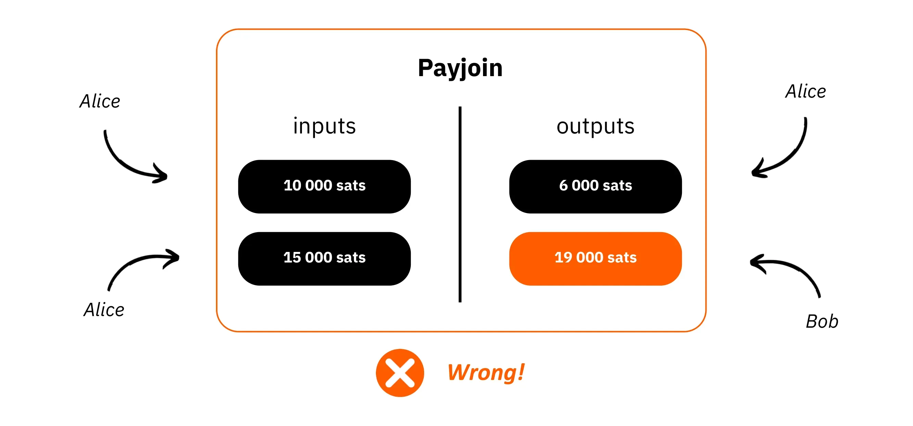


Bu yorum açıkça yanlıştır, çünkü zaten bildiğiniz gibi girdilerdeki iki UTXO aynı kişiye ait değildir. Biri baget alıcısı olan Alice'ten, diğeri ise fırıncı olan Bob'dan geliyor.


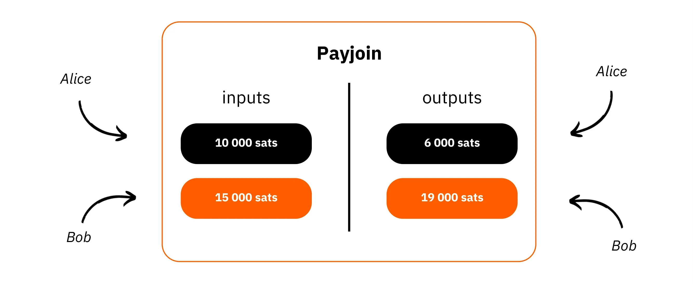


Bu şekilde, dış gözlemcinin analizi hatalı bir sonuca doğru yönlendirilerek paydaşların gizliliğinin korunması sağlanır.


### Steganografik işlem


PayJoin'nin ikinci amacı, dışarıdan bir gözlemciyi yapılan ödemenin gerçek tutarı konusunda yanıltmaktır. İşlemin yapısını inceleyen analist, ödemenin çıktılardan birinin tutarına eşdeğer olduğuna inanabilir.


Ekmek alımı örneğimize geri dönecek olursak, analist ödeme tutarının ya 6.000 Sats'in UTXO'una ya da 19.000 Sats'in UTXO'una karşılık geldiğini düşünecektir. Bu durumda, analist ödeme tutarının 19.000 Sats olduğunu düşünmeyi tercih edecektir, çünkü çıktılarda en az biri 6.000 Sats'den büyük olan 2 UTXO vardır (bu ödemeyi karşılamak için tek bir UTXO yeterli olacakken 6.000 Sats ödemek için 2 UTXO kullanmanın mantıklı bir nedeni yoktur).


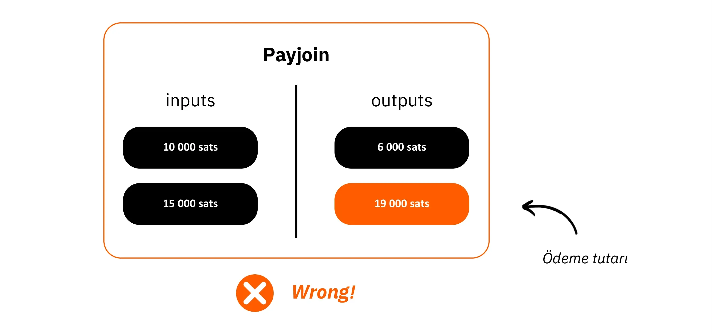


Ancak gerçekte bu analiz kusurludur. Ödeme tutarı çıktıların hiçbirine karşılık gelmemektedir. Aslında alıcının UTXO çıktısı ile alıcının UTXO girdisi arasındaki farktır.


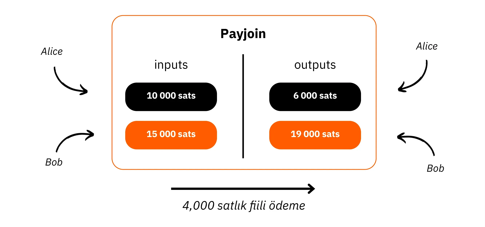


Bu açıdan PayJoin işlemi steganografi alanına girmektedir. Bir işlemin gerçek tutarının yem görevi gören sahte bir işlem içinde gizlenmesine olanak tanır.


Steganografi, gizli bilginin varlığının algılanamayacağı şekilde diğer veri veya nesnelerin içine bilgi gizleme tekniğidir. Örneğin, gizli bir mesaj ilgisiz bir metindeki bir noktanın içine gizlenerek çıplak gözle algılanamaz hale getirilebilir (bu [microdot](https://fr.wikipedia.org/wiki/Micropoint) tekniğidir).


Şifre çözme anahtarı olmadan bilgiyi anlaşılmaz hale getiren şifrelemenin aksine, steganografi bilgiyi değiştirmez. Açık metin olarak görüntülenmeye devam eder. Daha ziyade, amacı gizli mesajın varlığını gizlemektir, oysa şifreleme, anahtar olmadan erişilemez olsa da gizli bilginin varlığını açıkça ortaya koyar. Bu nedenle PayJoin'nin orijinal adı "steganografik işlemler" idi.


Kriptografi ile CoinJoin ve steganografi ile PayJoin arasında bir analoji kurulabilir. CoinJoin şifrelemeye benzer niteliklere sahiptir: yöntem tanınabilir, ancak bilgi deşifre edilemez. Tersine, PayJoin steganografiye benzer: bilgi teorik olarak erişilebilirdir, ancak gizleme yöntemi tanınabilir olmadığı için erişilemez hale gelir.


### PayJoin'i nasıl kullanabilirim?


PayJoin'yi destekleyen tanınmış yazılım programları arasında Sparrow wallet, Wasabi Wallet, Mutiny, BitMask, BlueWallet ve JoinMarket'in yanı sıra ödeme işlemcisi BTCPay bulunmaktadır.


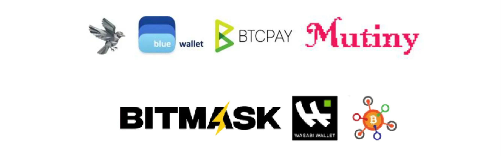


En gelişmiş PayJoin uygulaması sadece Samourai Wallet üzerindeki Stowaway idi. Ancak, yazılımın kurucularının tutuklanmasından bu yana, bu araç artık yalnızca kısmen işlevseldir. Stowaway'in avantajı, hem payjoins almayı hem de göndermeyi destekleyen kapsamlı, kullanımı kolay bir protokol olmasıdır. kısmen imzalanmış işlemler, birkaç QR kodu taranarak manuel olarak veya Soroban aracılığıyla Tor tarafından otomatik olarak değiştirilebilir. İkinci iletişim seçeneği şu anda hizmet dışıdır.


PayJoin'yi kullanmanın zorluğu, satıcının katılımına bağlı olmasında yatmaktadır. Bir müşteri olarak, satıcı desteklemiyorsa PayJoin kullanamazsınız. Bu, satın alma sürecine başka bir zorluk daha ekler: Bitcoin'i kabul eden tüccarları bulmak zor olmakla kalmaz, aynı zamanda payjoins'i destekleyenleri de ararsanız, daha da karmaşık hale gelir.


Çözümlerden biri, alıcının işbirliğini gerektirmeden zincir analizine belirsizlik katan işlem yapılarını kullanmak olabilir. Bu, tacirlerin aktif katılımına ihtiyaç duymadan ödemelerimizin gizliliğini artırmamızı sağlayacaktır. Bir sonraki bölümde tam olarak bu konuyu ele alacağız.


https://planb.network/tutorials/privacy/on-chain/payjoin-samourai-wallet-48a5c711-ee3d-44db-b812-c55913080eab

## Ödeme mini-CoinJoin


<chapterId>300777ee-30ae-43d7-ab00-479dac3522c1</chapterId>


Belirli bir gizlilik derecesini koruyarak bir ödeme işlemi gerçekleştirmek istediğinizde, PayJoin iyi bir seçenektir. Ancak az önce gördüğümüz gibi, PayJoin alıcının katılımını gerektirir. Peki alıcı PayJoin'e katılmayı reddederse ya da siz onu dahil etmemeyi tercih ederseniz ne yaparsınız? Alternatiflerden biri Stonewall veya Stonewall x2 işlemi kullanmaktır. Şimdi bu iki işlem türüne daha yakından bakalım.


### Stonewall işlemi


Stonewall, gerçekte bir kişi olmadan iki kişi arasında sahte bir CoinJoin taklidi yaparak harcama yaparken kullanıcı gizliliğini artırmak için tasarlanmış özel bir Bitcoin işlem biçimidir. Aslında bu işlem işbirliğine dayalı değildir. Bir kullanıcı, yalnızca sahip olduğu UTXO'ları girdi olarak kullanarak kendi başına oluşturabilir. Böylece, başka bir kullanıcı veya alıcıyla senkronize olmanıza gerek kalmadan, herhangi bir durum için bir Stonewall işlemi oluşturabilirsiniz.


Stonewall işlemi şu şekilde çalışır: işlemin girdisi olarak, ihraççı kendisine ait 2 UTXO kullanır. Çıkışta, işlem 2'si tamamen aynı miktarda olmak üzere 4 UTXO üretir. Diğer 2 UTXO değişimi oluşturacaktır. Aynı tutardaki 2 çıktıdan sadece biri alacaklıya gidecektir.


Yani bir Stonewall işleminde sadece 2 rol vardır:


- Ödemeyi yapan ihraççı;
- Alıcı, işlemin özel niteliğinden habersiz olabilir ve sadece göndericiden ödeme bekler.


Bu işlem yapısını anlamak için bir örnek verelim. Alice, 4.000 Sats değerindeki bagetini almak için fırıncı Bob'a gider. Ödemesiyle ilgili bir tür gizliliği korurken bitcoin olarak ödeme yapmak istiyor. Bu yüzden ödeme için bir Stonewall işlemi oluşturmaya karar verir.


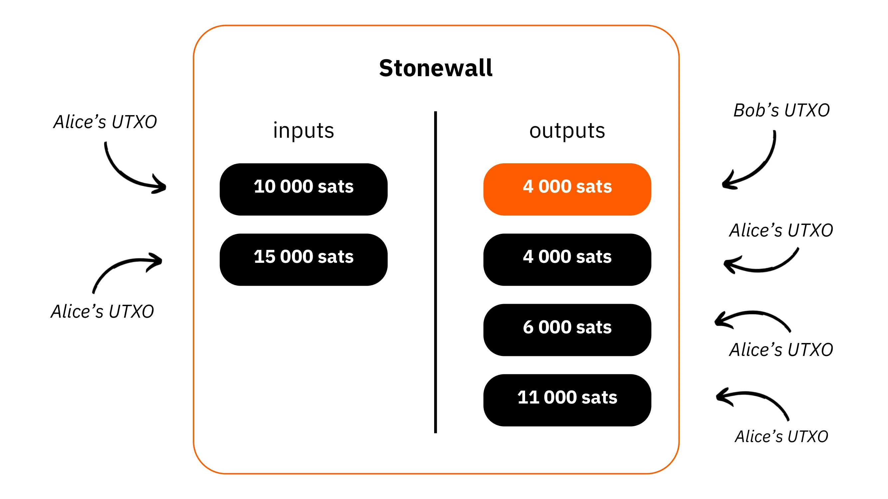


Bu işlemi analiz ederek, fırıncı Bob'nin baget için ödeme olarak aslında 4.000 Sats aldığını görebiliriz. Alice girdi olarak 2 UTXO kullanmıştır: biri 10.000 Sats ve diğeri 15.000 Sats. Çıktılarda ise 3 UTXO geri kazanmıştır: biri 4.000 Sats, biri 6.000 Sats ve biri de 11.000 Sats. Dolayısıyla Alice bu işlemde -4.000 Sats net bakiyeye sahiptir ve bu da bagetin fiyatına karşılık gelmektedir.


Bu örnekte, anlaşılmasını kolaylaştırmak için Mining ücretlerini kasıtlı olarak ihmal ettim. Gerçekte, işlem maliyetleri tamamen ihraççı tarafından karşılanır.


### Bir Stonewall işleminin hedefleri nelerdir?


Stonewall yapısı işleme muazzam miktarda entropi ekleyerek zincir analizinin sınırlarını bulanıklaştırır. Dışarıdan bakıldığında böyle bir işlem iki kişi arasında gerçekleşen mini bir CoinJoin olarak yorumlanabilir. Ancak gerçekte bu bir ödemedir. Dolayısıyla bu yöntem zincir analizinde belirsizlikler yaratır, hatta yanlış ipuçlarına yol açar.


Fırıncı Bob'deki Alice örneğini ele alalım. Blockchain üzerindeki işlem şu şekilde görünecektir:


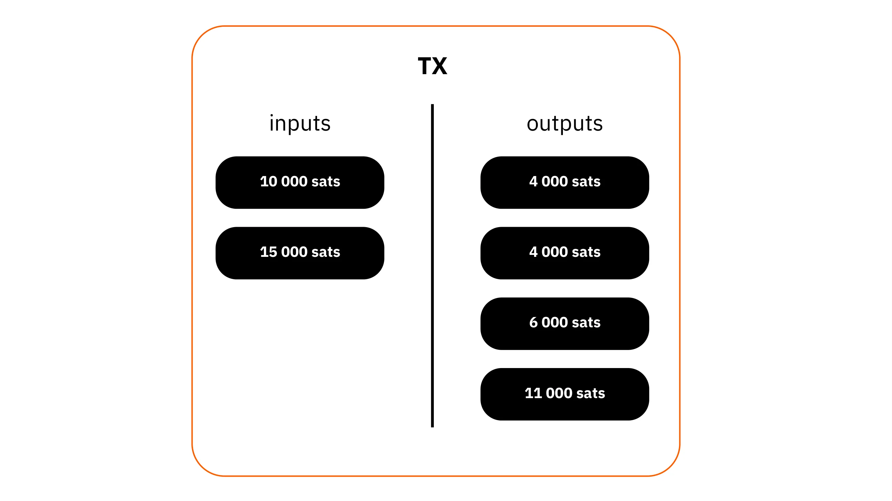


Genel zincir analizi sezgisel yöntemlerine güvenen dışarıdan bir gözlemci yanlış bir şekilde şu sonuca varabilir: "*iki kişi, girdilerinde birer UTXO ve çıktılarında ikişer UTXO bulunan küçük bir CoinJoin yapmıştır*". Bu işlemin dışarıdan analiz edilmesi CIOH'un uygulanmasına yol açmaz, çünkü aynı miktarda iki çıktının varlığı bir CoinJoin modeline işaret eder. Dışarıdan bir bakış açısıyla, CIOH bu nedenle bu özel durumda uygulanamaz.


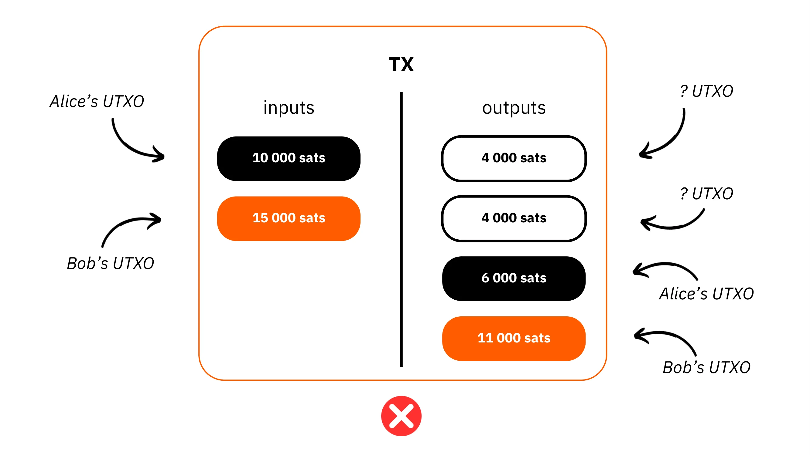


Bu yorum yanlıştır, çünkü bildiğiniz gibi bir UTXO fırıncı Bob'ye gönderilmiş, 2 UTXO girdisi Alice'dan gelmiş ve 3 değişim çıktısını geri almıştır.


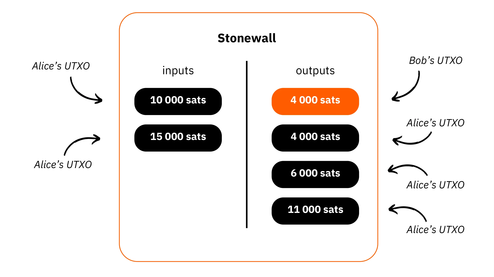


Stonewall işleminin yapısı hakkında özellikle ilginç olan şey, dışarıdan bir gözlemcinin bakış açısıyla, her yönden bir Stonewall x2 işlemine benzemesidir.


### Stonewall işlemi x2


Stonewall x2, bir harcama yaparken kullanıcı gizliliğini artırmayı amaçlayan başka bir özel Bitcoin işlem biçimidir, ancak bu kez bu harcamaya dahil olmayan üçüncü bir kişiyle işbirliği yaparak. Bu yöntem, iki katılımcı arasında sahte bir CoinJoin gibi çalışır ve aynı anda üçüncü bir kişiye ödeme yapar.


Stonewall x2 işleminin işleyişi nispeten basittir: ödemeyi yapmak için elimizdeki bir UTXO'yi kullanırız ve kendisine ait bir UTXO ile katkıda bulunan üçüncü bir tarafın yardımını alırız. İşlem dört çıktı ile sonuçlanır: ikisi eşit miktarda, biri alacaklının Address'ine, diğeri işbirlikçiye ait bir Address'e yöneliktir. Üçüncü bir UTXO, işbirlikçiye ait başka bir Address'e iade edilerek ilk tutarı geri almasını sağlar (Mining maliyetlerini modüle ederek onun için tarafsız bir eylem) ve son bir UTXO, ödeme değişikliğini oluşturan bize ait bir Address'e geri döner.


Böylece Stonewall x2 işlemlerinde üç farklı rol tanımlanmıştır:


- Gerçek ödemeyi yapan ihraççı;
- Alıcı, işlemin özel niteliğinden habersiz olabilir ve sadece göndericiden ödeme bekler;
- İşlemin analizine şüphe düşürmek için bitcoinleri kullanıma sunan ve sonunda fonlarını tamamen geri alan işbirlikçi (Mining maliyetlerini modüle ederek kendisi için tarafsız bir eylem).


Alice örneğimize geri dönelim; Bob numaralı fırından 4.000 Sats tutarında baget ekmek alıyor. Ödemesini bitcoin olarak yapmak istiyor, ancak ödemesiyle ilgili belirli bir gizlilik düzeyini de korumak istiyor. Bu yüzden, bu süreçte kendisine yardımcı olacak arkadaşı Charles'ı arar.


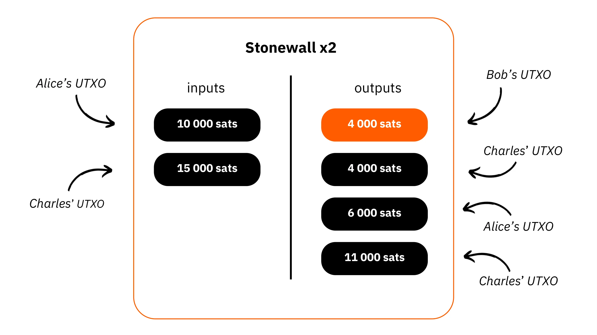


Bu işlem analiz edildiğinde, fırıncı Bob'ün baget için aslında 4.000 Sats ödeme aldığını görebiliriz. Alice girdide 10.000 Sats kullanmış ve çıktıda 6.000 Sats geri kazanmıştır, yani bagetin fiyatına karşılık gelen -4.000 Sats'lük net bir bakiye vardır. Charles ise 15.000 Sats girdi sağlamış ve biri 4.000 Sats diğeri 11.000 Sats olmak üzere iki çıktı almıştır.


Bu örnekte, anlaşılmasını kolaylaştırmak için kasıtlı olarak ücretleri dışarıda bıraktım. Gerçekte, Mining ücretleri genellikle ödemeyi yapan ile katkıda bulunan arasında eşit olarak paylaşılır.


### Stonewall x2 işleminin hedefleri nelerdir?


Stonewall yapısı gibi, Stonewall x2 yapısı da işleme büyük miktarda entropi ekler ve zincir analizini karıştırır. Dışarıdan bakıldığında, böyle bir işlem iki kişi arasında küçük bir CoinJoin olarak yorumlanabilir. Ancak gerçekte bu bir ödemedir. Dolayısıyla bu yöntem zincir analizinde belirsizlikler yaratır, hatta yanlış ipuçlarına yol açar.


Alice, Bob the Baker ve Charles örneklerini ele alalım. Blockchain'deki işlem şöyle görünecektir:


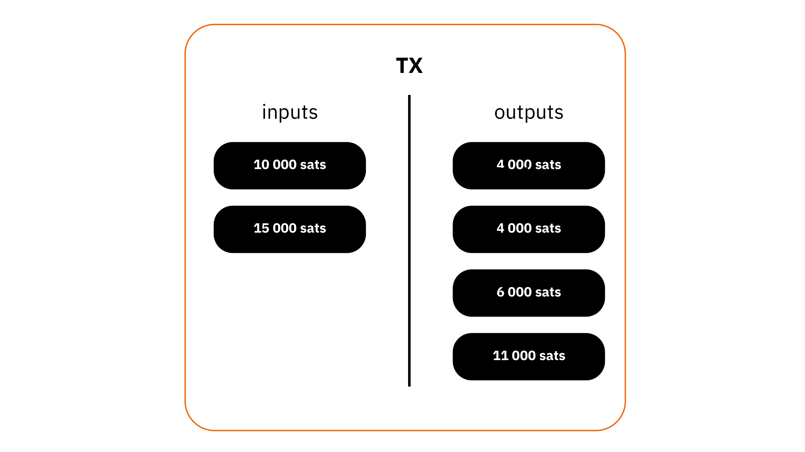


Genel zincir analizi sezgisel yöntemlerine güvenen dışarıdan bir gözlemci yanlış bir şekilde şu sonuca varabilir: "*Alice ve Charles, her biri girdi olarak bir UTXO ve çıktı olarak iki UTXO ile küçük bir CoinJoin gerçekleştirmiştir*". Yine, bu işlemin dışarıdan analiz edilmesi ICOH'un uygulanmasına yol açmaz, çünkü aynı miktarda iki çıkışın varlığı bir CoinJoin modelini göstermektedir. Dışarıdan bir bakış açısıyla, CIOH bu nedenle bu özel durumda uygulanabilir değildir.


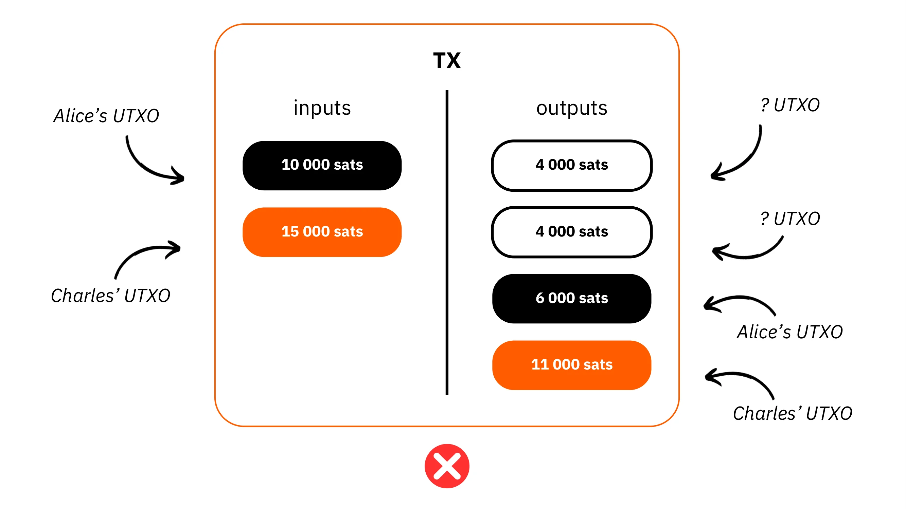


Bu yorum yanlıştır, çünkü bildiğiniz gibi fırıncı Bob'e bir UTXO gönderilmiştir, Alice'ün yalnızca bir değişiklik çıktısı vardır ve Charles'ın iki tane vardır.


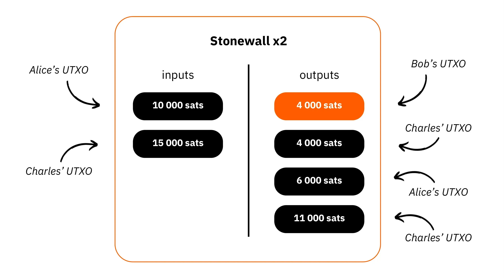


Ve bir kez daha, Stonewall x2 işleminin yapısı hakkında özellikle ilginç olan şey, dışarıdan bir gözlemcinin bakış açısından, her yönden bir Stonewall işlemine benzemesidir.


### Stonewall ile Stonewall x2 arasındaki fark nedir?


Bir StonewallX2 işlemi tam olarak bir Stonewall işlemi gibi çalışır, ancak birincisi işbirlikçi iken ikincisi değildir. Gördüğümüz gibi, bir Stonewall x2 işlemi, ödemenin dışında olan ve işlemin gizliliğini artırmak için bitcoinlerini kullanıma sunacak olan üçüncü bir tarafın (Charles) katılımını içerir. Klasik bir Stonewall işleminde, işbirlikçi rolü gönderen tarafından üstlenilir.


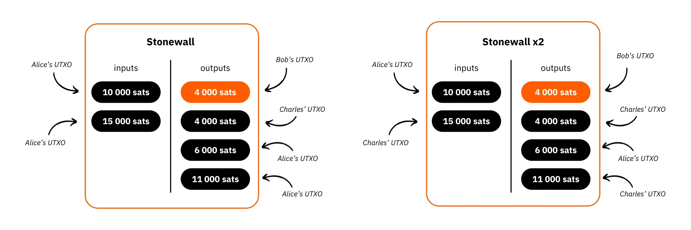


Harici bir bakış açısından bakıldığında, işlem modeli tamamen aynıdır.


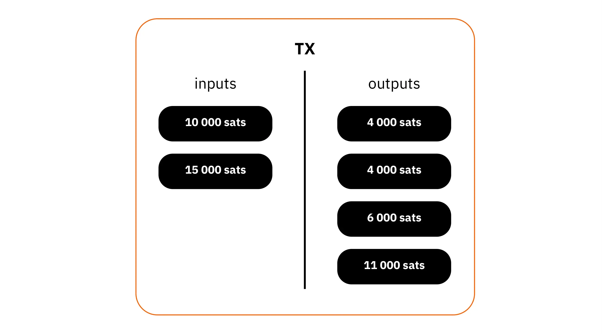


Bu iki işlem yapısının tamamen aynı kalıbı paylaşıyor olması, dışarıdan bir gözlemcinin "Stonewall(x2)" kalıbını tespit etmeyi başarsa bile, tüm bilgilere sahip olamayacağı anlamına gelir. Aynı tutardaki iki UTXO'dan hangisinin ödemeye karşılık geldiğini belirleyemeyecektir. Ayrıca, girdileri olan iki UTXO'nun iki farklı kişiden mi geldiğini (Stonewall x2) yoksa bunları birleştiren tek bir kişiye mi ait olduğunu (Stonewall) belirleyemeyecektir.


Bu son nokta, Stonewall x2 işlemlerinin Stonewall işlemleriyle tamamen aynı modeli izlemesinden kaynaklanmaktadır. Dışarıdan bakıldığında ve ek bağlamsal bilgiler olmadan, bir Stonewall işlemini bir Stonewall x2 işleminden ayırt etmek imkansızdır. Birincisi işbirliğine dayalı işlemler değilken, ikincisi öyledir. Bu durum, bu işlemlerden birinin analizine daha da fazla şüphe katmaktadır.


### Stonewall ve Stonewall x2 işlemleri ne zaman kullanılmalıdır?


Bir gider için bir gizlilik aracı kullanmak istediğinizde mantık aşağıdaki gibi olmalıdır:


- Öncelikli olarak bir PayJoin yapmayı seçebiliriz;
- Satıcı payjoins'i desteklemiyorsa, Stonewall x2 yapısı kullanılarak ödeme dışında başka bir kişiyle ortak bir işlem yapılabilir;
- Stonewall x2 işlemi yapacak kimseyi bulamazsanız, Stonewall x2 işleminin davranışını taklit edecek bir Stonewall only işlemi yapabilirsiniz.


### Stonewall ve Stonewall x2 işlemlerini nasıl kullanabilirim?


Stonewall ve Stonewall x2 işlemleri hem Samourai Wallet uygulamasında hem de Sparrow wallet yazılımında mevcuttur.


Bununla birlikte, payjoin'lerde olduğu gibi, Samourai'nin kurucularının tutuklanmasının ardından, Stonewall x2 işlemleri artık yalnızca ilgili taraflar arasında PSBT'lerin manuel olarak değiştirilmesiyle çalışıyor. Ne yazık ki, Soroban üzerinden otomatik Exchange artık mevcut değil.


Bu tür bir işlemi herhangi bir Bitcoin Wallet yazılımından manuel olarak gerçekleştirmek de mümkündür.


Bir sonraki bölümde, nispeten bilinmeyen, ancak daha önce çalıştıklarımızı tamamlayıcı olarak çok yararlı olan başka bir gizlilik tekniğine göz atacağız.


https://planb.network/tutorials/privacy/on-chain/stonewall-033daa45-d42c-40e1-9511-cea89751c3d4

https://planb.network/tutorials/privacy/on-chain/stonewall-x2-05120280-f6f9-4e14-9fb8-c9e603f73e5b

## Sekmeler


<chapterId>db9a20ac-a149-443d-884b-ea6c03f28499</chapterId>


CoinJoin gibi zincir analizine belirsizlik katan Bitcoin işlem yapılarının kullanılması gizliliğin korunması açısından özellikle faydalıdır. Bununla birlikte, payjoins bölümünde tartıştığımız gibi, CoinJoin işlemleri zincir üzerinde doğal olarak tanımlanabilir. Şifreleme ve coinjoinler arasında kurduğumuz analojiyi hatırlayın: bir dosya şifrelendiğinde, şifrelenmiş dosyayı keşfeden üçüncü bir taraf içeriğine erişemez, ancak dosyanın içeriğini gizlemek için değiştirildiğini açıkça tespit edebilir. Aynı şey CoinJoin için de geçerlidir: bir analist bir CoinJoin işlemini incelediğinde, girdiler ve çıktılar arasında doğrudan bağlantı kuramasa da (ve tersi), yine de gözlemlenen işlemin bir CoinJoin olduğunu anlayabilir.


UTXO'nizi CoinJoin döngülerinden sonra nasıl kullanmayı planladığınıza bağlı olarak, bu süreçten geçmiş olması sorun yaratabilir. Örneğin, Coin'nızı düzenlenmiş bir Exchange platformunda satmayı planlıyorsanız, ancak yakın zamanda bir CoinJoin geçirmişse, platformun zincir analiz aracı bu gerçeği tespit edecektir. Bu durumda platform, coin'e bağlı UTXO'nizi kabul etmeyi reddedebilir ya da hesabınızın askıya alınması veya fonlarınızın dondurulması riskiyle birlikte sizden bir açıklama talep edebilir. Bazı durumlarda, platform davranışınızı devlet yetkililerine de bildirebilir (örneğin, Fransa'da TRACFIN'in PSAN'lardan istediği veya ABD'de Mali Suçları Uygulama Ağı'nın (FinCEN) yaptığı budur).


Bir Bitcoin Coin'un geçmişinin izlerini bulanıklaştırarak bir tür değiştirilebilirliği yeniden tesis edebilecek bir araç var. Ricochet'in amacı da tam olarak budur.


### Sekme nedir?


Sekme, Bitcoin Ownership transferini simüle etmek için kişinin kendisine yönelik birkaç hayali işlem gerçekleştirmesinden (sweep) oluşan bir tekniktir. Bu araç, tartıştığımız diğer işlem yapılarından farklıdır, çünkü ileriye dönük anonimlik değil, bir tür geriye dönük anonimlik kazandırır. Aslında ricochet, geçmişi nedeniyle bir Bitcoin Coin'nin değiştirilebilirliğini tehlikeye atabilecek özellikleri bulanıklaştırır.


CoinJoin döngüleri gibi geçmiş bir olayın Coin üzerinde bıraktığı izi düzeltmek için ricochet, kullanıcının farklı adreslerden kendisine para aktardığı dört ardışık işlem gerçekleştirir.


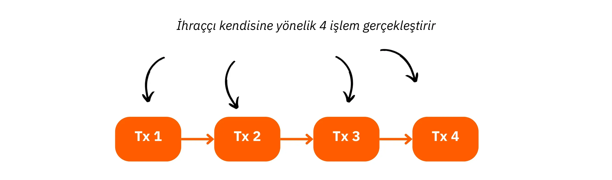


Bu işlemler dizisinden sonra, ricochet aracı nihayet bitcoinleri bir Exchange platformu gibi nihai hedeflerine yönlendirir.


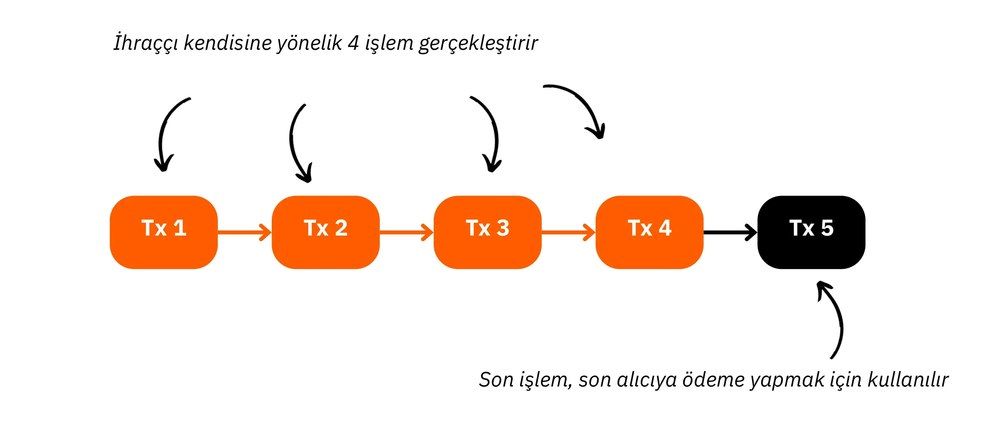


Amaç, bir CoinJoin işlemi gibi Coin'un değiştirilebilirliğini etkileyen bir mesafe yaratmak ve bu Coin'u geçmişi nedeniyle reddedebilecek nihai harcama eylemi yaratmaktır. Dolayısıyla, zincir analizi araçları olaydan sonra muhtemelen Ownership'de bir değişiklik olduğu sonucuna varabilir ve bu Coin'un değiştirilebilir olduğunu düşünebilir. Bir CoinJoin durumunda, Blockchain analiz araçları bitcoinleri gönderen ve CoinJoin'i gerçekleştirenin aynı kişi olmadığını ve bu nedenle gönderene karşı işlem yapmanın bir anlamı olmadığını varsayabilir.


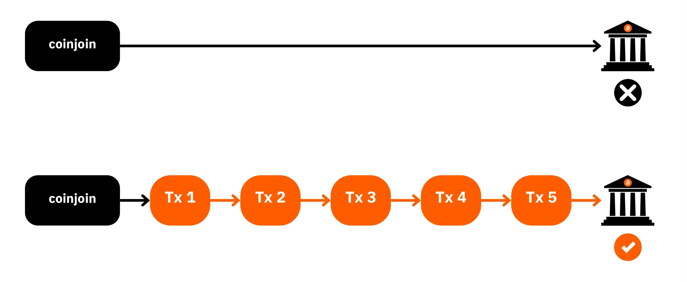


### Neden işe yarıyor?


Bu sekme yöntemiyle karşılaşıldığında, zincir analizi yazılımının incelemesini dört sekmenin ötesine derinleştireceği düşünülebilir. Ancak bu platformlar tespit eşiğini optimize etme konusunda bir ikilemle karşı karşıyadır. Bir özellik değişikliğinin muhtemelen gerçekleştiğini ve önceki bir olayla (CoinJoin gibi) olan bağlantının göz ardı edilmesi gerektiğini kabul ettikleri atlama sayısına bir sınır koymak zorundadırlar.


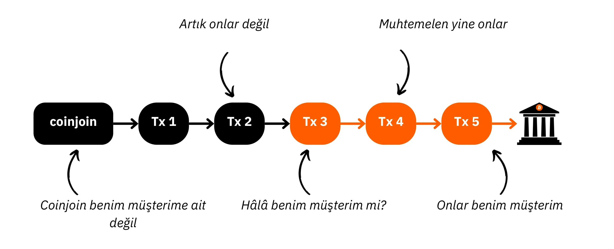


Ancak bu eşiğin belirlenmesi risklidir: gözlemlenen sıçrama sayısındaki her artış yanlış pozitiflerin hacmini katlanarak artırır, yani aslında operasyon başka biri tarafından gerçekleştirilmişken hatalı bir şekilde bir olayın katılımcısı olarak işaretlenen bireyler. Bu senaryo şirketler için büyük bir risk oluşturmaktadır, çünkü yanlış pozitifler memnuniyetsizliğe yol açarak etkilenen müşterileri rekabete sürükleyebilir. Uzun vadede, çok yüksek bir tespit eşiği, bir platformun rakiplerinden daha fazla müşteri kaybetmesine neden olur ve bu da yaşayabilirliğini tehdit edebilir. Bu nedenle, bu platformlar için gözlemlenen geri dönüş sayısını artırmak karmaşıktır ve 4 genellikle analizlerine karşı koymak için yeterli bir sayıdır.


Burada gözlemlenen olgu, altı derece ayrılık teorisine bir şekilde benzemektedir.


Altı derecelik ayrılık teorisi, dünya üzerindeki her insanın en fazla altı aracıdan oluşan bir ilişkiler zinciriyle birbirine bağlı olduğunu öne sürer. Dolayısıyla, dünyadaki herhangi bir bireye ulaşmak için her biri bir diğerini şahsen tanıyan altı kişilik bir dizi insandan geçmek yeterli olacaktır.


Bitcoin işlemleri söz konusu olduğunda da benzer bir olguyla karşılaşıyoruz. Yeterli sayıda Bitcoin işlemini takip ettiğimizde, kaçınılmaz olarak bir CoinJoin ile karşılaşırız. Sekme yöntemi, Exchange platformlarının makul bir şekilde izleyebileceğinden daha fazla sayıda atlama kullanarak bu ilkeden yararlanır. Platformlar daha fazla işlemi izlemeye karar verirse, bu önlemi atlatmak için fazladan bir atlama eklemek mümkündür.


### Ricochet ne zaman ve nasıl kullanılır?


Sekme için en yaygın kullanım durumu, sahip olduğunuz bir UTXO üzerinde daha önce bir CoinJoin'e katıldığınızı gizlemeniz gerektiğinde ortaya çıkar. İdeal olarak, CoinJoin'ten geçmiş bitcoinleri düzenlenmiş kuruluşlara transfer etmekten kaçınmak en iyisidir. Bununla birlikte, başka bir seçeneğiniz yoksa, özellikle de bitcoinleri devlet para biriminde acil olarak tasfiye etme ihtiyacı duyuyorsanız, ricochet etkili bir çözüm sunar.


Bu yöntem sadece eş birleşmeler için değil, aynı zamanda bir UTXO'nın değiştirilebilirliğini tehlikeye atabilecek diğer tüm işaretler için de etkilidir.


Bu sekme yöntemi fikri ilk olarak, süreci otomatikleştirmek için uygulamalarına entegre eden Samourai Wallet ekiplerinden geldi. Bu hizmet Samourai'de ücretsiz değildir, çünkü bir sekme 100.000 Sats hizmet ücreti ve Mining maliyetlerini içerir. Bu nedenle kullanımı önemli miktarlardaki transferler için tavsiye edilmektedir.


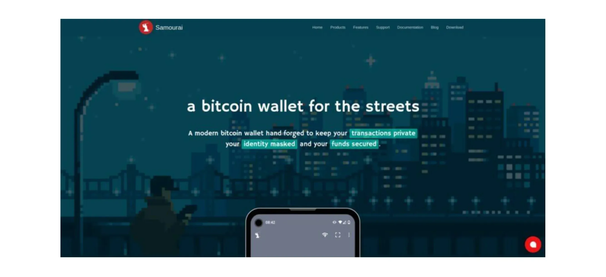


Samuray uygulaması iki sekme çeşidi sunar:


- Samurai hizmet ücretini birbirini takip eden beş işleme yayma avantajı sunan güçlendirilmiş sekme veya "kademeli teslimat". Bu seçenek aynı zamanda her işlemin ayrı bir zamanda yayınlanmasını ve farklı bir bloğa kaydedilmesini sağlayarak Ownership transferinin davranışını mümkün olduğunca yakından taklit eder. Daha yavaş olmasına rağmen, bu yöntem acelesi olmayanlar için tercih edilir, çünkü zincir analizine karşı direncini güçlendirerek ricochet'in verimliliğini en üst düzeye çıkarır;


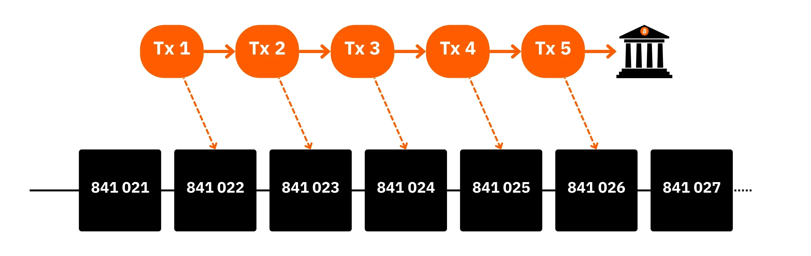


- İşlemi hızlı bir şekilde yürütmek için tasarlanan klasik sekme, tüm işlemleri azaltılmış bir zaman aralığında yayınlar. Bu yöntem, bu nedenle, güçlendirilmiş yönteme göre daha az gizlilik ve analize karşı daha az direnç sunar. Yalnızca acil gönderiler için kullanılmalıdır.


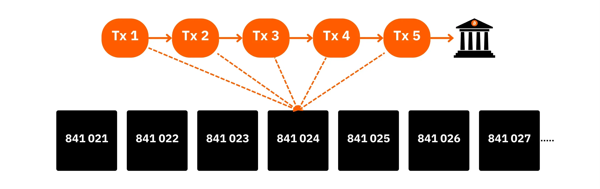


Ricocheting basitçe kendinize bitcoin göndermek anlamına gelir. Özel bir araç kullanmadan, herhangi bir Wallet yazılımı üzerinde bitcoinleri manuel olarak sektirmek tamamen mümkündür. Tek yapmanız gereken, her seferinde yeni, boş bir Address kullanarak aynı Coin'ü art arda kendinize aktarmaktır.


Bir sonraki bölümde, Ownership'ün gizli transferleri için farklı tekniklere bakacağız. Bu yöntemler hem işleyiş hem de sonuçlar açısından şimdiye kadar incelediklerimizden radikal biçimde farklıdır.


https://planb.network/tutorials/privacy/on-chain/ricochet-e0bb1afe-becd-44a6-a940-88a463756589

## Ownership'in gizli transferleri


<chapterId>a2067036-849c-4d6b-87d2-44235cfae7a1</chapterId>


Bitcoin'in gizlilik tekniklerinden bir diğeri de Ownership'nin gizli transferidir. Bu yöntem, işlem Blockchain üzerinde açıkça görünmeden Ownership Bitcoin'i bir kişiden diğerine veya tam tersi şekilde aktarmayı amaçlamaktadır. Şimdi mevcut farklı tekniklere, avantaj ve dezavantajlarıyla birlikte bir göz atalım.


### Bozuk para takası


Coinwap nispeten basit bir konsepte dayanmaktadır: güvene ihtiyaç duymadan ve bu transfer Blockchain üzerinde açıkça görünmeden iki kullanıcı arasında Bitcoin Ownership transferini kolaylaştırmak için akıllı sözleşmeler kullanır.


Alice ve Bob ile basit bir örnek hayal edelim. Alice, $A$ özel anahtarı ile güvence altına alınmış 1 BTC'ye sahiptir ve Bob de $B$ özel anahtarı ile güvence altına alınmış 1 BTC'ye sahiptir. Teorik olarak, gizli bir transfer gerçekleştirmek için harici bir iletişim kanalı aracılığıyla özel anahtarlarını Exchange yapabilirler.


Ancak bu naif yöntem güven açısından yüksek bir risk teşkil etmektedir. Alice'nın Exchange'ten sonra $A$ özel anahtarının bir kopyasını saklamasını ve anahtar Bob'nin eline geçtikten sonra bunu daha sonra bitcoinleri çalmak için kullanmasını engelleyecek hiçbir şey yoktur.


Ayrıca, Alice'nin Bob'in özel anahtarı $B$'yi almayacağının ve Exchange'da kendi özel anahtarı $A$'yı asla aktarmayacağının garantisi yoktur. Bu nedenle bu Exchange taraflar arasında aşırı güvene dayanır ve Ownership'in güvenli bir gizli transferini sağlamada etkisizdir.


Bu sorunları çözmek ve birbirlerine güvenmeyen taraflar arasında alışverişi mümkün kılmak için bunun yerine Smart contract sistemlerini kullanacağız. Smart contract, önceden tanımlanmış koşullar karşılandığında otomatik olarak çalışan bir programdır. Bizim durumumuzda bu, Exchange mülkünün karşılıklı güvene ihtiyaç duymadan otomatik olarak gerçekleşmesini sağlar.


Bu, HTLC (*Hash Zaman Kilitli Sözleşmeler*) veya PTLC (*Nokta Zaman Kilitli Sözleşmeler*) kullanılarak gerçekleştirilebilir. Bu iki protokol, Exchange'ün ya başarıyla tamamlanmasını ya da tamamen iptal edilmesini sağlayan ve böylece her iki tarafın fonlarının bütünlüğünü koruyan bir zaman kilitleme sistemi kullanarak benzer şekilde çalışır. HTLC ve PTLC arasındaki temel fark, HTLC'in işlemi güvence altına almak için hash ve preimages kullanırken PTLC'nin Adaptor Signatures kullanmasıdır.


HTLC veya Alice ve Bob arasında PTLC kullanan bir coin takası senaryosunda, Exchange güvenli bir şekilde gerçekleşir: ya başarılı olur ve her biri diğerinin BTC'sini alır ya da başarısız olur ve her biri kendi BTC'sini tutar. Bu, taraflardan birinin hile yapmasını veya diğerinin BTC'sini çalmasını imkansız hale getirir.


> *HTLC aynı zamanda ödemeleri Lightning Network'in çift yönlü kanalları üzerinden güvenli bir şekilde yönlendirmek için kullanılan mekanizmadır*
Adaptör İmzalarının kullanımı bu bağlamda özellikle ilginçtir, çünkü geleneksel komut dosyalarından vazgeçmeyi mümkün kılar (bazen "_scriptless scripts_" olarak adlandırılan bir mekanizma). Bu özellik Exchange ile ilişkili maliyetleri azaltır. Adaptör İmzaların bir diğer önemli avantajı da işlemin her iki tarafı için ortak bir Hash kullanılmasını gerektirmemesi ve böylece belirli Exchange türlerinde aralarında doğrudan bir bağlantı ortaya koyma ihtiyacını ortadan kaldırmasıdır.


### Adaptör İmzaları


Uyarlayıcı İmzalar, gizli verileri ortaya çıkarmak için geçerli bir imzayı "_adaptor signature_" adı verilen ek bir imza ile birleştiren bir kriptografik yöntemdir. Bu mekanizma, aşağıdaki 3 Elements'ten 2'sinin (geçerli imza, uyarlayıcı imza ve gizli bilgi) bilinmesinin eksik olan üçüncü unsuru çıkarmamızı sağlayacak şekilde tasarlanmıştır. Bu yöntemin ilginç bir özelliği, eşimizin uyarlayıcı imzasını ve bu uyarlayıcı imzayı hesaplamak için kullanılan sır ile ilişkili eliptik eğri üzerindeki belirli noktayı biliyorsak, sırrın kendisine doğrudan erişimimiz olmadan aynı sır ile uyumlu olacak kendi uyarlayıcı imzamızı türetebilmemizdir.


Bir coin takasında, Adaptör İmzaların kullanılması, katılımcılar arasında iki hassas bilginin eş zamanlı olarak ifşa edilmesini sağlar ve böylece karşılıklı güven ihtiyacını ortadan kaldırır. Bu süreci, her biri 1 BTC'ye Exchange sahip olmak isteyen ancak birbirlerine güvenmeyen Alice ve Bob ile örneklendirelim. Bu Exchange'da birbirlerine güvenme ihtiyacını ortadan kaldırmak için Adaptör İmzaları kullanırlar. Bunu şu şekilde yapıyorlar:


- Alice, Bob'ye 1 BTC gönderen bir $m_A$ işlemi oluşturarak Exchange'u başlatır. Özel anahtarı $p_A$ ($P_A = p_A \cdot G$), bir Nonce $n_A$ ($N_A = n_A \cdot G$) ve bir gizli $t$ ($T = t \cdot G$) kullanarak bu işlemi doğrulayan bir imza $s_A$ oluşturur:


$$s_A = n_A + t + H(N_A + T \paralel P_A \paralel m_A) \cdot p_A$$


- Alice, gerçek imzası $s_A$'dan gizli $t$'yi çıkararak adaptör imzası $s_A'$'yı hesaplar:


$$s_A' = s_A - t$$


- Alice, Bob'ye imza adaptörü $s'_A$, imzasız işlemi $m_A$, sırra karşılık gelen noktayı ($T$) ve Nonce'ya karşılık gelen noktayı ($N_A$) gönderir. Bu Elements'ler "adaptör" olarak bilinen şeyi oluşturur. Yalnızca bu bilgilerle Bob'nin Alice'in BTC'sini kurtaramayacağını belirtmek önemlidir.
- Ancak Bob, Alice'in kendisinden çalmaya çalışmadığını kontrol edebilir. Bunu yapmak için Alice'in uyarlayıcı imzasının $s_A'$ gerçekten önerilen $m_A$ işlemine karşılık gelip gelmediğini kontrol eder. Eğer aşağıdaki denklem doğruysa, Alice'in imza adaptörünün geçerli olduğundan emin olabilir:


$$s_A' \cdot G = N_A + H(N_A + T \paralel P_A \paralel m_A) \cdot P_A$$


- Bu doğrulama Bob'ye Exchange'ye tam bir güven içinde devam edebileceğine dair yeterli garanti sağlar. Daha sonra Alice'e 1 BTC göndermeyi amaçlayan kendi $m_B$ işlemini yaratır ve aynı gizli $t$ ile bağlantılı olacak $s_B'$ adaptör imzasını oluşturur. Bu aşamada, $t$ değerini yalnızca Alice bilir; Bob yalnızca Alice'in kendisine ilettiği karşılık gelen $T$ noktasını bilir:


$$s_B' = n_B + H(N_B + T \paralel P_B \paralel m_B) \cdot p_B$$


- Bob, Alice'e adaptör imzası $s_B'$, imzasız işlemi $m_B$, sırra karşılık gelen nokta ($T$) ve Nonce'e karşılık gelen noktayı ($N_B$) gönderir. T$ sırrını bilen Alice artık Bob'nın adaptör imzası $s_B'$ ile bu sırrı birleştirerek generate'e Bob'nın BTC'sini kendisine aktaracak $m_B$ işlemi için geçerli bir $s_B$ imzası verebilir:


$$s_B = s_B' + t$$


$$(s_B' + t) \cdot G = N_B + T + H(N_B + T \paralel P_B \paralel m_B) \cdot P_B$$


- Alice, Bob tarafından vaat edilen BTC'yi almak için bu imzalı $m_B$ işlemini Bitcoin Blockchain üzerinde yayınlar. Bob bu işlemi Blockchain'de gördüğünde, $s_B = s_B' + t$ imzasını çıkarabilir. Bu bilgi ile Bob, ihtiyaç duyduğu ünlü sır $t$'yi izole edebilir:


$$t = (s_B' + t) - s_B' = s_B - s_B'$$


- Ve bu gizli $t$, Bob'ün generate'ye Alice'ün adaptör imzası $s_A'$'dan geçerli imza $s_A$ için eksik olan tek unsurdu. Bu imza, Alice'ten Bob'e bir BTC gönderen $m_A$ işlemini doğrular. Bob daha sonra $s_A$'yı hesaplar ve $m_A$ işlemini Blockchain'de yayınlar:


$$s_A = s_A' + t$$


$$(s_A' + t) \cdot G = N_A + T + H(N_A + T \paralel P_A \paralel m_A) \cdot P_A$$


Adaptör İmzasının bir coin takasında nasıl çalıştığını özetleyelim. Başlangıçta Alice, Bob'e bir adaptörle birlikte imzasız bir işlem göndererek Bob'in daha sonra açıklanacak sırrın kendisine bitcoinlere erişim sağlayacağını doğrulamasını sağlar. Buna karşılık Bob de Alice'ye kendi imzasız işlemini ve adaptörünü gönderir. Alice daha sonra Bob'in işlemini sonuçlandırabilir ve sır sayesinde geçerli bir işlem yayınlayarak bitcoinleri geri alabilir. Bu işlem Blockchain'te yayınlandığında, Bob sırrı çıkarma ve böylece Alice'nin işleminin kilidini açma yeteneğine sahiptir. Sonuç olarak, Alice Bob'in Bitcoin'sının transferini başlatırsa, Bob de karşılıklı güvene ihtiyaç duymadan Alice'nin Bitcoin'sına erişebilir.


Coinwaps'in ilk olarak [Gregory Maxwell tarafından Ekim 2013'te BitcoinTalk'ta] (https://bitcointalk.org/index.php?topic=321228.0) önerildiğini unutmayın.


### Atomik takas


Coinswap'e benzer bir şekilde ve aynı akıllı sözleşme türlerini kullanarak atomik swaplar gerçekleştirmek de mümkündür. Atomik takas, BTC ve XMR gibi farklı kripto paraların iki kullanıcı arasında güvene ya da bir aracının müdahalesine gerek kalmadan doğrudan Exchange ile takas edilmesini sağlar. Bu takaslar "atomik" olarak adlandırılır çünkü yalnızca iki olası sonucu vardır: ya takas başarılı olur ve her iki taraf da memnun kalır ya da başarısız olur ve her biri orijinal kripto paralarını korur ve diğer tarafa güvenme ihtiyacını ortadan kaldırır.


Atomik swap ve coinwap benzer bir süreci paylaşır ve gizlilik açısından aynı avantaj ve dezavantajları sunar. Aslında, Bitcoin'in bakış açısından, bir atomik takas iki aşamada gerçekleştirilen bir coinwap ile karşılaştırılabilir. İlk olarak, BTC'mizi Exchange başka bir kripto para birimiyle değiştiririz, daha sonra bu kripto para birimi başka bir BTC ile değiştirilebilir. Sonunda, başka bir kullanıcının BTC'sini geri alırız. Bu nedenle, gizlilik sorunlarının analizinde, bu iki protokolü tescilli gizli değişim kategorisi altında gruplandırıyorum.


Bununla birlikte, coinwap'in aksine, atomik swapın özellikle BTC/XMR borsalarında mevcut likidite açısından dengesizliklere sahip olabileceğine dikkat edin. Bitcoinlere yönelik güçlü bir talep olduğundan ve bu da bu dönüşüm yönü için primleri düşük tuttuğundan, bitcoinleri altcoinlerle takas etmek genellikle daha kolaydır. Ancak, altcoinleri BTC'ye dönüştürmek düşük talep nedeniyle daha karmaşık olabilir ve genellikle çok yüksek primlerle sonuçlanır.


Son olarak, bir atomik takas zincir üzerindeki bitcoinleri ve Lightning Network üzerindeki bitcoinleri içerdiğinde, bir "denizaltı takasından" söz ederiz.


### Gerçekten faydalı mı?


Coin swap ve atomik swap gibi gizli Ownership transferleri zincir analizi sezgisel yöntemlerini yanıltma avantajına sahiptir. Bu yöntemler, gerçek Ownership el değiştirmiş olsa da işlemlerin aynı kullanıcıyı içerdiğini gösterebilir. Bununla birlikte, bu yöntemlerin temel dezavantajı, Coin'ün geçmişini kırmak için ek bir teknik kullanmadan çok riskli olmalarıdır.


Gerçekten de Alice, Bob ile bir coinwap ya da atomik takas gerçekleştirdiğinde, sahip olduğu bitcoinleri Bob'inkilerle değiştirmektedir. Atomik takas durumunda, Exchange bir Altcoin içerir, ancak prensip aynı kalır. Böylece, Alice $B$ Coin ile ve Bob $A$ Coin ile sonuçlanır. Bu, zincir analizine şüphe katar, ancak sikkelerin geçmişi izlenebilir kalır. Bir analist UTXO $A$'yı incelerse, Alice'nin önceki faaliyetlerini izleyebilir ve UTXO $B$ için bunun tersi geçerlidir.


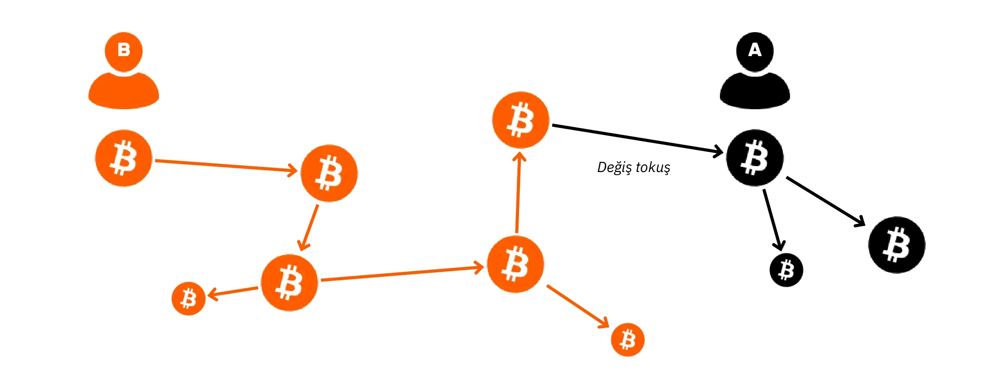


Alice'nin bakış açısına göre risk, $B$ Coin'ün geçmişinin belirli kuruluşlar tarafından şüpheli olarak değerlendirilebilmesidir. Örneğin, Bob $B$ Coin'ü bilgisayar korsanlığı gibi suç teşkil eden bir eylemle elde etmişse, Coin onun yasadışı faaliyetleriyle bağlantılı kalacaktır. Bu durumda Alice, fonlarının dondurulması riski olmadan düzenlenmiş Exchange platformlarına aktaramayacağı bir Coin'e sahip olabilir ve hatta Bob'ün suçlarıyla hiçbir ilgisi olmamasına rağmen bu suçlarla suçlanabilir.


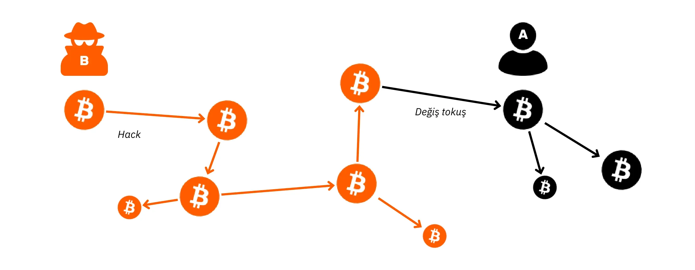


Kaçınılmaz olarak, coinwap veya atomik takas gibi gizlilik yöntemleri, fonları yetkililer tarafından gözetim altında tutulan suçlular tarafından tercih edilmektedir. Bu protokoller, Exchange'te gözetim altında tutulan bitcoinlerini tamamen değiştirilebilir bitcoinler karşılığında elden çıkarmalarını sağlar. Ayrıca yetkilileri diğer kullanıcılara yönlendirerek dikkat dağıtmalarını da sağlar. Yani bu insanlar için çifte bir amaç var.


CoinJoin ile, Coin'iniz izlenen bitcoinlerle karıştırılsa bile, Coin'in geçmişi kırılır ve coinwap veya atomik takas gibi gizli Ownership transfer protokollerinde var olmayan bir tür makul inkar edilebilirlik sağlar.


Alice herhangi bir riskten kaçınmak istiyorsa, $B$ Coin'nin geçmişini kırmak için mutlaka bir yöntem kullanmalıdır, örneğin coinjoins'den geçirmek gibi. Bu durum, Ownership ve CoinJoin'ın gizli aktarımını birleştirmenin faydası hakkında bir soru ortaya çıkarmaktadır. CoinJoin, Coin'nin geçmişini kırarak zaten Alice için yeterli düzeyde bir gizlilik sunmaktadır. Bu nedenle, benim görüşüme göre, Alice gizliliğini korumak istiyorsa, bir coinwap ve ardından bir CoinJoin ile uğraşmak yerine doğrudan bir CoinJoin'a geçmek daha akıllıca olacaktır.


Gizli Ownership transfer yöntemlerinin gerçekten etkili olabilmesi ve bir $A$ kullanıcısının geçmişinin bir $B$ kullanıcısıyla ilişkilendirilmesi riskinden kaçınılabilmesi için, paradoksal olarak bu yöntemlerin kullanımının yaygın olarak bilinmesi gerekecektir. Eğer coinswap kitlesel olarak kullanılıyorsa ve yetkililer bu yaygın uygulamanın farkındaysa, o zaman makul bir inkar şekli oluşturulabilir. Ancak, bu transferlerin kullanımı marjinal kaldığı sürece, bu yöntemlerin kullanıcılar için çok riskli olmaya devam edeceğini düşünüyorum.


Şimdiye kadar gizlilik yöntemlerini çoğunlukla işlemlerin kendi seviyesinde inceledik. Bir sonraki bölümde, ağ seviyesindeki ve işlem yayılımındaki sorunlara bakacağız.


## P2P ağında gizlilik


<chapterId>04a2467b-db84-4076-a9ff-919be5135106</chapterId>


4. bölümde, işlemlerinizin gizliliğini korumak için bir Full node kullanmanın öneminden bahsetmiştik. Ancak, düğümünüzün kendisinin de faaliyetleriniz hakkında bilgi almak isteyen saldırılara maruz kalabileceğini anlamak önemlidir. Bu nedenle bu bölümde, gizliliğinizi korumak için alabileceğiniz çeşitli önlemlere bakacağız, işlemlerin kendileri veya Bitcoin akışları düzeyinde değil, ağ düzeyinde.


### Karahindiba


Çeşitli anonimleştirme saldırılarından kaçınmanın bir yolu Dandelion önerisini kullanmaktır. Bu yayın protokolü BIP156'da resmileştirilmiştir, ancak Bitcoin'de hiç uygulanmamıştır.


Dandelion'un arkasındaki fikir, çeşitli saldırı biçimlerine karşı koymak için Bitcoin ağındaki işlem yönlendirmesinin gizliliğini artırmaktır. Ana hedefi, ağda bir işlemi ilk yayınlayan kaynak düğümü gizlemektir. Bu düğümün ifşa edilmesi, bir Bitcoin işleminin belirli bir IP Address'e (düğüm clearnet üzerinde çalışıyorsa) bağlanmasını mümkün kılabilir ve bu da zincir analizi için bir giriş noktası sağlayabilir.


Bitcoin üzerindeki faaliyet ile bir IP Address arasındaki bu ilişki, kullanıcı gizliliği açısından önemli bir risk teşkil etmektedir. Aslında, birçok kuruluş bir IP Address'ü kişisel bir kimliğe kolayca bağlayabilecek konumdadır. Buna hükümetler ve İnternet servis sağlayıcıları da dahildir. Dahası, örneğin bir web sitesinin veritabanı hacklendiğinde IP Address'ünüz ve kişisel verileriniz sızdırılırsa, bu bilgiler herkesin erişimine açık hale gelebilir.


Klasik Bitcoin işletiminde, bir kullanıcı tarafından Wallet yazılımı üzerinde oluşturulan işlemler kişisel düğümüne iletilir. Bu düğüm yeni işlemi derhal bağlı olduğu tüm eşlere yayınlayacaktır.


Bu eşler daha sonra mutabakat ve yerel standardizasyon kurallarına uygun olduğundan emin olmak için işlemi kontrol eder. Doğrulandıktan sonra, her eş sırayla işlemi kendi eşlerine iletir ve bu böyle devam eder.


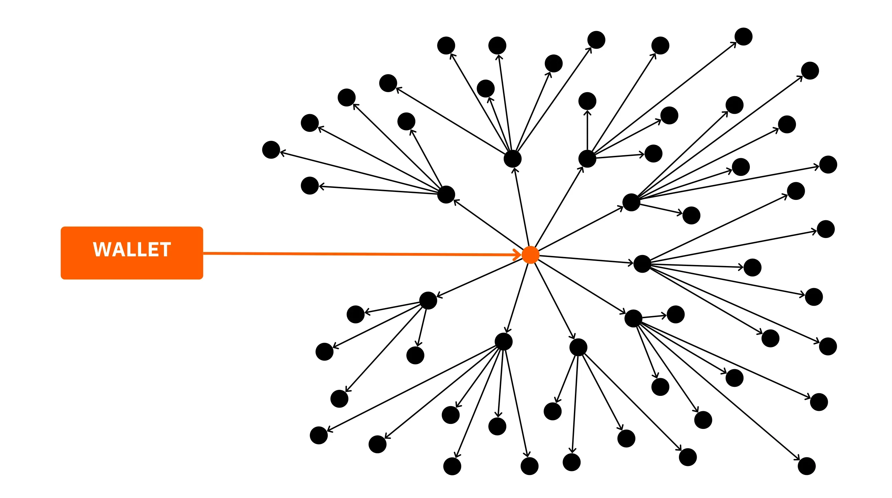


Bir bloğa entegre edilmeyi bekleyen işlemlerin bu dağılımı oldukça dengeli ve istatistiksel olarak öngörülebilirdir. Bu zayıflık, bir işlemi yayınlayan ilk düğümü tespit etmek amacıyla ağı izlemek ve analiz etmek için işbirliği yapan casus düğümler tarafından istismar edilebilir. Bir gözlemci kaynak düğümü bulmayı başarırsa, işlemin o düğümün operatöründen kaynaklandığını varsayabilir. Bu tür bir gözlem, normalde anonim olan işlemleri belirli IP adreslerine bağlamak için kullanılabilir.


BIP156'nın amacı bu sorunu Address'e taşımaktır. Bunu yapmak için, geniş çapta halka yayılmadan önce anonimliği korumak için yeni bir işlemin yayılmasına ek bir aşama getirmektedir. Dandelion ilk olarak işlemin rastgele bir düğüm yolu üzerinden gönderildiği bir "kök" aşaması kullanır.


İşlem daha sonra "Fluff" aşaması sırasında tüm ağa yayınlanır.


Gövde ve "Kabarıklık", bir karahindibanın şeklini ve evrimini andıran ağ boyunca işlem yayılımının davranışına atıfta bulunmaktadır.


Dolayısıyla, casus düğümler potansiyel olarak işlemi "Fluff" aşamasını (toplu yayın) başlatan düğüme kadar izleyebilir, ancak bu düğüm, işlemi gövdenin son düğümünden aldığı için işlemi ilk yayınlayan düğüm değildir. Casus düğümler kökün izini süremezlerse kaynak düğümü de belirleyemezler.


Kök aşamasında casus düğümlerin varlığında bile, her zaman bir şüphe kalır, çünkü yayılma grafiğinde dürüst bir düğümle karşılaşır karşılaşmaz, casuslar bu düğümün orijinal kaynak mı yoksa sadece bir aracı mı olduğunu belirleyemezler.


Bu yönlendirme yöntemi, kaynak düğüme geri giden izi bulanıklaştırarak bir işlemin ağ üzerinden kaynağına kadar izlenmesini zorlaştırır. Dandelion böylece düşmanların ağı anonimleştirme kabiliyetini sınırlandırarak gizliliği artırır. Bu yöntem, "köklendirme" aşamasında işlem Tor veya P2P Transport V2'de olduğu gibi ağ iletişimlerini şifreleyen bir düğümden geçtiğinde daha da etkili olur.


BIP156, Bitcoin core'ya entegre edilmemiştir ve şu anda "reddedilmiş" olarak sınıflandırılmaktadır. Bu protokolle ilgili temel endişelerden biri, kök aşamasında, işlemlerin doğrulanmadan önce ara düğümler üzerinden aktarılması gerektiğidir. Gördüğümüz gibi, normal Bitcoin modelinde, her düğüm işlemi eşlerine yayınlamadan önce doğrulamaktadır. Eğer bir işlem düğümün mutabakat kurallarına ya da yerel standardizasyon kurallarına uymuyorsa, düğüm bu işlemi yok sayar ve dağıtmaz. Bu süreç DoS saldırılarına karşı koymak için önemlidir, çünkü yalnızca geçerli işlemler tüm ağa yayınlanır. Ağı aşırı yüklemek için potansiyel olarak toplu halde oluşturulan geçersiz işlemler, karşılaşılan ilk düğümde durdurulur ve yayılmaz. Dandelion ile ilgili ana risk, bu yeni protokolün geçersiz işlemlerin ağın bir kısmında yayınlanmasına izin vererek DoS saldırıları için yeni vektörler oluşturabilmesidir.


### P2P taşıma V2


P2P transport V2, BIP324'te sunulan başka bir ağ protokolüdür. Düğümler arasındaki iletişimin gizliliğini ve güvenliğini artırmak için fırsatçı şifreleme içeren Bitcoin P2P taşıma protokolünün yeni bir sürümüdür.


Bu geliştirme, P2P protokolünün temel versiyonuyla ilgili birkaç sorunu çözmek için tasarlanmıştır. Bir yandan, değiş tokuş edilen verileri pasif bir gözlemci için İnternet üzerinde dolaşan diğer veri türlerinden ayırt edilemez hale getirir. Ana amaç, hükümetlerin, İSS'lerin ve VPN sağlayıcılarının Bitcoin kullanıcılarını kitlesel olarak izlemesini önlemektir. Bu aynı zamanda bu kuruluşların bir İnternet kullanıcısının aynı zamanda bir Bitcoin kullanıcısı olup olmadığını, yani bir Full node çalıştırıp çalıştırmadığını belirlemesini zorlaştırır.


P2P V2 ayrıca veri paketlerindeki belirli kalıpları tespit ederek sansür ve saldırı riskini azaltmaya yardımcı olur. Ağ düzeyinde çeşitli Sybil saldırılarının yürütülmesini zorlaştırır ve daha maliyetli hale getirir. Sybil saldırısı, bir aktör haksız bir avantaj elde etmek için birden fazla sahte kimlik oluşturduğunda meydana gelir. Bitcoin ağı bağlamında, bu genellikle bir aktörün çok sayıda tam düğümü kontrol etmesi ve bunları bağlantıları çoğaltmak için agresif bir şekilde kullanması şeklinde kendini gösterir. Sybil saldırıları, bilgi toplamak ve kullanıcı gizliliğini tehlikeye atmak için pasif veya Eclipse saldırıları şeklinde aktif olabilir. İkincisi, belirli bir düğümü ağın geri kalanından izole ederek kullanıcıyı sansürler ya da aldığı verileri değiştirir. Son olarak, P2P V2 ayrıca *Ortadaki Adam* (MITM) saldırılarını daha maliyetli ve tespit edilmesi daha kolay hale getirir.


P2P V2 tarafından uygulanan şifreleme, gereksiz karmaşıklık eklemekten veya ağ bağlantısının izinsiz özelliğini tehlikeye atmaktan kaçınmak için kimlik doğrulama içermez. Bununla birlikte, bu yeni P2P aktarım protokolü pasif saldırılara karşı daha iyi güvenlik sunmakta ve aktif saldırıları önemli ölçüde daha maliyetli ve tespit edilebilir hale getirmektedir. Ağ mesajlarına sözde rastgele veri akışının eklenmesi, saldırganların iletişimi sansürlemesini veya manipüle etmesini daha zor hale getirir.


P2P V2 aktarımı, Aralık 2023'te dağıtılan Bitcoin core sürüm 26.0'da bir seçenek olarak (varsayılan olarak devre dışı) dahil edilmiştir. Daha sonra Nisan 2024 tarihli 27.0 sürümünde varsayılan olarak etkinleştirildi. Yapılandırma dosyasındaki `v2transport=` seçeneği ile değiştirilebilir.


### Tor


Bir ağ düğümünün gizliliğini kaybetme riskinden kaçınmak için bir başka basit çözüm de düğümü tamamen Tor altında çalıştırmaktır.


Tor, İnternet üzerindeki TCP bağlantılarının kaynağını anonimleştiren bir aktarıcı sunucu (düğüm) ağıdır. Verileri birkaç şifreleme katmanıyla kapsülleyerek çalışır. Her aktarıcı düğüm, son hedefe ulaşılana kadar bir sonraki düğümün Address'unu ortaya çıkarmak için bir Layer kaldırır. Tor ağı, aracı düğümlerin verilerin hem kaynağını hem de hedefini bilmesini önleyerek anonimliği sağlar ve bir gözlemcinin bir kullanıcının etkinliğini izlemesini çok zorlaştırır.


Tor yalnızca verileri şifrelemekle kalmaz, aynı zamanda iletişimin kaynağını ve hedefini de maskeler. Kişisel düğümünüzden iletişim için Tor kullanarak işlemlerinizin gizliliğini güçlendirirsiniz: İSS'niz iletişimin şifresini çözemez ve Bitcoin ağındaki diğer düğümler kaynak düğümün Address IP'sini belirleyemez. Dahası Tor, Bitcoin'yi kullandığınızı İSS'nizden de gizler.


Bu yöntemle ilgili temel risk, Tor'un Bitcoin'ten bağımsız bir protokol olmasıdır. Tor altında çalışan bir Bitcoin düğümünüz varsa ve Tor çalışmayı durdurursa, Bitcoin düğümünüz artık iletişim kuramayacaktır.


Ayrıca, Tor'da iletişimin daha yavaş olduğuna dikkat etmek önemlidir. IBD (*Initial Block Download*) çok fazla iletişim gerektirdiğinden, bu gecikme özellikle bir düğümün ilk başlatılması sırasında can sıkıcıdır. Sonuç olarak, Bitcoin ağı ile ilk senkronizasyonunuz Tor kullanarak önemli ölçüde daha uzun sürebilir. IBD'yi clearnet üzerinde gerçekleştirdikten sonra ikinci adım olarak Tor'u etkinleştirmek de mümkündür. Bu yöntem Bitcoin düğümünüzün varlığını İSS'nize ifşa etse de, Tor'a geçtiğinizde kişisel işlem bilgilerinizi korur.


Ağ düzeyinde çeşitli gizlilik yöntemlerini inceledikten sonra, önümüzdeki birkaç bölümde size Address'in yeniden kullanımını önlemeye yönelik iki zarif çözümü de tanıtmak istiyorum: BIP47 ve Sessiz Ödemeler.


## BIP47 ve yeniden kullanılabilir ödeme kodları


<chapterId>ad88e076-a04b-4aec-b3b2-7b4760175504</chapterId>


Bölüm 3'te gördüğümüz gibi, Address'nin yeniden kullanımı Bitcoin protokolünde kullanıcı gizliliğinin önünde ciddi bir engeldir. Bu riskleri azaltmak için, bir Wallet'da alınan her yeni ödeme için generate'nın boş bir alıcı Address olması şiddetle tavsiye edilir. Yeni bir Address oluşturmak artık modern yazılım ve hiyerarşik deterministik cüzdanların kullanımıyla basitleştirilmiş olsa da, bu uygulama sezgiye aykırı görünebilir.


Örneğin geleneksel bankacılık sisteminde, her zaman aynı kalan IBAN'ımızı paylaşmaya alışkınız. Bunu birine verdiğimizde, bizimle tekrar etkileşime girmek zorunda kalmadan bize birden fazla ödeme gönderebilir. Neo-bankalar ayrıca PayPal'da benzersiz e-posta adreslerinin veya Revolut'ta RevTag'lerin kullanılması gibi daha modern olanaklar da sunuyor. Finansal alanın dışında bile, posta Address, telefon numaramız ve e-posta Address gibi günlük tanımlayıcılarımız da benzersiz ve kalıcıdır. Her yeni etkileşim için bunları yenilememiz gerekmez.


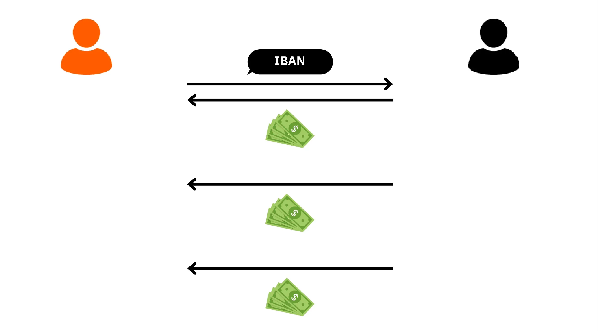


Ancak Bitcoin farklı şekilde çalışır: her gelen işlem için yeni bir alıcı Address oluşturulmalıdır. Kullanım kolaylığı ve gizlilik arasındaki bu uzlaşma, Bitcoin'nin Beyaz Kitabının kökenlerine kadar uzanmaktadır. Satoshi Nakamoto, belgesinin ilk versiyonunun 2008 sonunda yayınlanması gibi erken bir tarihte bizi bu riske karşı uyarmıştı bile:


**Ek bir güvenlik duvarı olarak, her bir işlem için yeni bir anahtar çifti kullanılarak işlemlerin ortak bir sahiple bağlantılı olmaması sağlanabilir**


Bir Address'ü yeniden kullanmak zorunda kalmadan tek bir tanımlayıcı üzerinden birden fazla ödeme almanın birçok yolu vardır. Her birinin kendine özgü ödünleşimleri ve dezavantajları vardır. Bu yöntemler arasında Justus Ranvier tarafından geliştirilen ve 2015 yılında yayınlanan bir öneri olan BIP47 de yer almaktadır. Bu öneri, Address'ün yeniden kullanımını önlerken, aynı kişiye karşı birden fazla işlem yapılmasını sağlayan yeniden kullanılabilir ödeme kodları oluşturmayı amaçlamaktadır. Kısacası BIP47, işlemlerin gizliliğini korurken, benzersiz bir tanımlayıcı kadar sezgisel bir ödeme sistemi sunmayı amaçlamaktadır.


BIP47 kullanıcı gizliliğini doğrudan iyileştirmez, çünkü bir BIP47 ödemesi boş adresler kullanan klasik bir Bitcoin işlemi ile aynı gizlilik seviyesini sunar. Ancak, Bitcoin kullanımını daha rahat ve sezgisel hale getirir, bu da normalde gizliliği tehlikeye atacak bir kolaylıktır. BIP47 sayesinde, bu kullanım kolaylığı klasik bir işlemle aynı gizlilik seviyesine ulaşır. İşte bu yüzden BIP47 gizliliği korumak için çok değerli bir araçtır.


Başlangıçta BIP47, Bitcoin core'ya entegre edilmek üzere önerilmiş, ancak hiçbir zaman uygulanmamıştır. Bununla birlikte, bazı yazılım uygulamaları bunu kendi başlarına uygulamayı seçmiştir. Örneğin, Samourai Wallet ekipleri "PayNym" adlı kendi BIP47 uygulamalarını geliştirmişlerdir.


### BIP47 ve PayNym'in genel prensibi


BIP47'nin amacı, adresleri tekrar kullanmadan çok sayıda ödeme almayı mümkün kılmaktır. Farklı düzenleyicilerin başka bir kullanıcıya ait tek bir koda birden fazla ödeme göndermesini sağlayan yeniden kullanılabilir bir ödeme kodunun kullanımına dayanmaktadır. Sonuç olarak, alıcının her işlem için yeni, boş bir Address sağlaması gerekmez, bu da gizliliği korurken alışverişleri büyük ölçüde kolaylaştırır.


Bu nedenle bir kullanıcı, geleneksel bir alıcı Address veya açık anahtarın aksine, herhangi bir gizlilik kaybı riski olmadan ödeme kodunu ister sosyal ağlarda ister kendi web sitesinde tam bir özgürlük içinde paylaşabilir.


Bir işlemi gerçekleştirmek için her iki tarafın da Samurai Wallet veya Sparrow wallet üzerinde PayNym gibi bir BIP47 uygulamasına sahip bir Bitcoin Wallet'e ihtiyacı vardır. Ödeme kodlarının ortak kullanımı aralarında gizli bir kanal oluşturur. Bu kanalı etkin bir şekilde kurmak için, ihraççının Bitcoin Blockchain üzerinde "bildirim işlemi" olarak bilinen belirli bir işlem gerçekleştirmesi gerekir (bu konuda daha sonra daha fazla bilgi verilecektir).


İki kullanıcının ödeme kodlarının birleştirilmesi ortak sırlar oluşturur ve bu da çok sayıda benzersiz Bitcoin alıcı adresi yaratır (tam olarak 2^32 veya yaklaşık 4 milyar). Bu şekilde, BIP47 üzerinden yapılan ödemeler aslında ödeme kodunun kendisine değil, ilgili kullanıcıların ödeme kodlarından türetilen klasik makbuz adreslerine yönlendirilir.


Ödeme kodu böylece Wallet seed'dan türetilen sanal bir tanımlayıcı görevi görür. Wallet'in hiyerarşik türetme yapısında, ödeme kodu 3. seviyede, yani hesap seviyesinde konumlandırılmıştır.


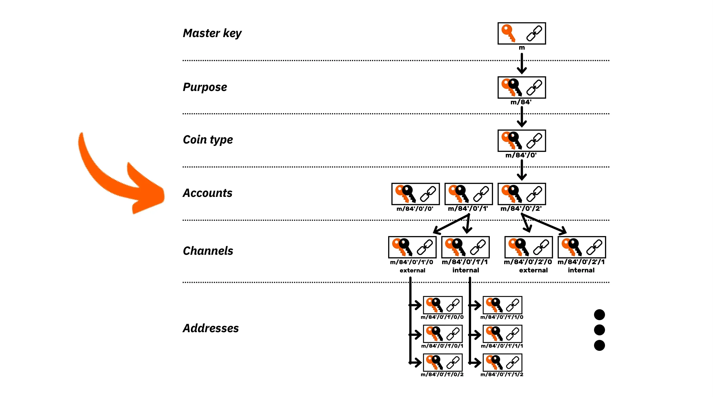


BIP47 için türetme hedefi, BIP47'ye atıfta bulunan `47'` (`0x8000002F`) indeksi ile tanımlanır. Yeniden kullanılabilir bir ödeme kodu için türetme yolu örneği aşağıdaki gibi olabilir:


```plaintext
m/47'/0'/0'/
```


Bir ödeme kodunun neye benzediği konusunda size bir fikir vermek için, işte benimki:


```plaintext
PM8TJSBiQmNQDwTogMAbyqJe2PE2kQXjtgh88MRTxsrnHC8zpEtJ8j7Aj628oUFk8X6P5rJ7P5qDudE4Hwq9JXSRzGcZJbdJAjM9oVQ1UKU5j2nr7VR5
```


Bu kod, tıpkı geleneksel Address alımı gibi iletişimi kolaylaştırmak için bir QR kodu olarak da kodlanabilir.


Bazen Twitter'da görülen robotlar olan PayNym Botlarına gelince, bunlar Samourai Wallet tarafından oluşturulan ödeme kodunun görsel temsilleridir. Bir Hash işlevi kullanılarak oluşturulurlar ve bu da onlara neredeyse benzersizlik kazandırır. Bunlar `+` ile başlayan küçük bir karakter dizisi şeklindedir:


```plaintext
+throbbingpond8B1
+twilightresonance487
+billowingfire340
```


Bu avatarlar resim olarak da temsil edilebilir:


Bu robotların BIP47 çerçevesinde belirli bir teknik işlevi olmamasına rağmen, kolayca tanınabilir bir görsel kimlik sunarak kullanıcı etkileşimini kolaylaştırmada rol oynarlar.


---
*Bu bölümün BIP47'ye ayrılan ilerleyen kısımlarında, kullanılan kriptografik yöntemlere özellikle vurgu yaparak nasıl çalıştığına ayrıntılı bir şekilde bakacağız. Bu biraz teknik açıklamaları tam olarak kavramak için öncelikle HD cüzdanlarının yapısını, anahtar türetme prosedürlerini ve eliptik eğri kriptografisinin temellerini anlamak önemlidir. Bu kavramları daha derinlemesine incelemek isterseniz, Plan ₿ Network'de başka bir ücretsiz kurs mevcuttur:*


https://planb.network/courses/46b0ced2-9028-4a61-8fbc-3b005ee8d70f

*Yine de bunları takip etmenizi tavsiye ederim, çünkü BIP47'nin teknik işleyişini anlamak, ilerleyen bölümlerde tartışacağımız diğer benzer teklifleri anlamanızı çok daha kolaylaştıracaktır*


---
### Yeniden kullanılabilir ödeme kodu


Daha önce de belirtildiği gibi, yeniden kullanılabilir ödeme kodu HD Wallet'in 3. derinliğinde yer almaktadır, bu da onu hem Wallet yapısındaki konumu hem de rolü açısından bir `xpub` ile karşılaştırılabilir kılmaktadır.


80 baytlık ödeme kodu aşağıdaki gibi ayrılır:


- Bayt `0`: **Sürüm**. BIP47'nin ilk sürümü için bu bayt `0x01` olarak ayarlanmıştır;
- Bayt `1`: **Bit alanı**. Bu alan, belirli kullanımlar için ek göstergelerin entegre edilmesi için ayrılmıştır. Klasik PayNym kullanımı için bu bayt `0x00` olarak ayarlanır;
- 2` baytı: Y`**'nin paritesi. Bu bayt `0x02` veya `0x03` olup, sıkıştırılmış bir açık anahtar kullanıldığı için açık anahtarın ordinatının çift mi yoksa tek mi olduğunu gösterir;
- 3` baytından `34` baytına kadar: **X** değeri. Bu baytlar açık anahtarın apsisini temsil eder. **X** ve **y** paritesinin birleştirilmesi sıkıştırılmış açık anahtarın tamamını oluşturur;
- 35` baytından 66` baytına kadar: **Dize kodu**. Bu alan, açık anahtarla ilişkili dize kodunu içerir;
- 67` baytından 79` baytına kadar: **Dolgu**. Bu alan gelecekteki olası evrimler için tasarlanmıştır. Mevcut sürümde, `OP_RETURN` çıktısı için gereken 80 baytlık boyuta ulaşmak için buraya sıfırlar yerleştiriyoruz.


İşte önceki bölümde sunulan yeniden kullanılabilir ödeme kodumun onaltılık gösterimi:


```plaintext
0x010002a0716529bae6b36c5c9aa518a52f9c828b46ad8d907747f0d09dcd4d9a39e97c3c5f37c470c390d842f364086362f6122f412e2b0c7e7fc6e32287e364a7a36a00000000000000000000000000
```


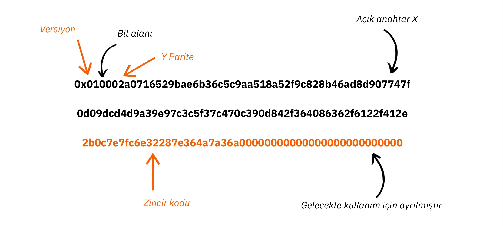


Daha sonra, bunun bir ödeme kodu olduğunu açıkça belirtmek için başına `P` önek baytı eklenmelidir. Bu bayt `0x47` ile gösterilir:


```plaintext
0x47010002a0716529bae6b36c5c9aa518a52f9c828b46ad8d907747f0d09dcd4d9a39e97c3c5f37c470c390d842f364086362f6122f412e2b0c7e7fc6e32287e364a7a36a00000000000000000000000000
```


Son olarak, ödeme kodunun bütünlüğünü sağlamak için, `SHA256` işlevi kullanılarak çift Hash'ten oluşan `HASH256` kullanılarak bir sağlama toplamı hesaplaması yapılır. Bu Hash'ün ilk dört baytı daha sonra ödeme kodunun sonunda birleştirilir:


```plaintext
0x47010002a0716529bae6b36c5c9aa518a52f9c828b46ad8d907747f0d09dcd4d9a39e97c3c5f37c470c390d842f364086362f6122f412e2b0c7e7fc6e32287e364a7a36a00000000000000000000000000567080c4
```


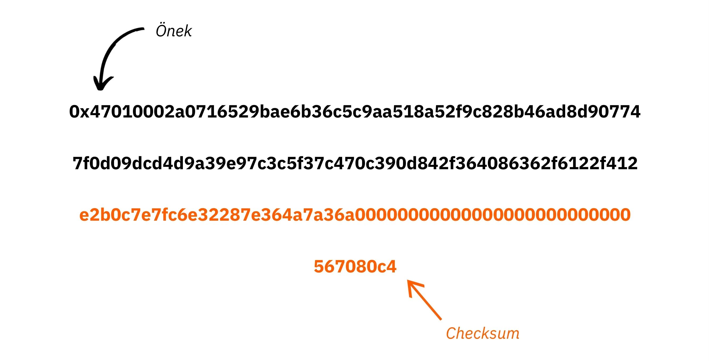


Bu adımlar tamamlandıktan sonra ödeme kodu hazırdır. Geriye kalan tek şey, son sürümü elde etmek için kodu 58 tabanına dönüştürmektir:


```plaintext
PM8TJSBiQmNQDwTogMAbyqJe2PE2kQXjtgh88MRTxsrnHC8zpEtJ8j7Aj628oUFk8X6P5rJ7P5qDudE4Hwq9JXSRzGcZJbdJAjM9oVQ1UKU5j2nr7VR5
```


Ödeme kodunu oluşturma sürecinde sıkıştırılmış bir açık anahtar ve bir dize kodu kullanırız. Her ikisi de Wallet seed'ten deterministik ve hiyerarşik olarak türetilir. Bunu başarmak için kullanılan türetme yolu şöyledir:


```plaintext
m/47'/0'/0'/
```


Somut olarak, generate sıkıştırılmış açık anahtar ve yeniden kullanılabilir ödeme koduyla ilişkili dize kodu için, Wallet seed'den ana özel anahtarı hesaplayarak başlarız. Daha sonra `47 + 2^31` indeksini kullanarak bir çift yavru anahtar türetmeye devam ediyoruz (sertleştirilmiş türetme). Bunu, her biri `2^31` indeksini (sertleştirilmiş türetme) kullanan iki ardışık yavru çift türetme daha izler.


### Eliptik eğriler üzerinde Diffie-Hellman anahtarı Exchange (ECDH)


BIP47'nin kalbinde yer alan kriptografik protokol *Eliptic-Curve Diffie-Hellman* için ECDH kısaltmasıyla bilinir. Bu yöntem orijinal Diffie-Hellman anahtarı Exchange'ın bir varyantıdır.


1976 yılında tanıtılan Diffie-Hellman, her biri bir anahtar çiftine (açık ve özel) sahip iki tarafın, yalnızca açık, güvenli olmayan bir kanal üzerinden iletişim kurarken bile ortak bir sır üzerinde anlaşmasını sağlayan bir anahtar anlaşma protokolüdür.


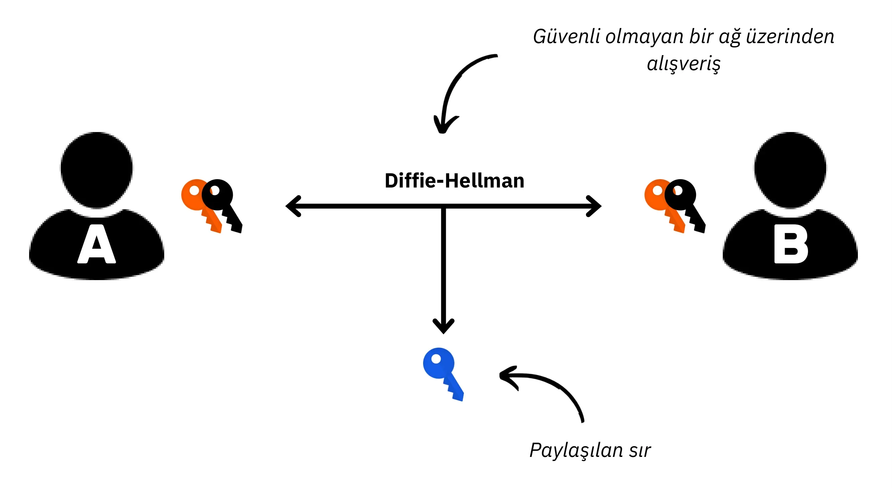


Bu paylaşılan sır (bu durumda mavi anahtar) daha sonra diğer işlemler için kullanılabilir. Tipik olarak, bu paylaşılan sır güvenli olmayan bir ağdaki bir iletişimi şifrelemek ve şifresini çözmek için kullanılabilir:


Bunu başarmak için Diffie-Hellman paylaşılan sırrı hesaplamak için modüler aritmetik kullanır. İşte meslekten olmayanların terimleriyle nasıl çalıştığı:


- Alice ve Bob ortak bir renk üzerinde anlaşır, bu durumda sarı renk kamuya açık veridir (saldırganlar bu rengi bilir);
- Alice gizli bir renk, bu durumda kırmızı, seçer ve turuncu elde etmek için ikisini karıştırır;
- Bob de gizli bir renk, bu durumda mavi, seçer ve sarı ile karıştırarak Green'ü elde eder;
- Daha sonra ortaya çıkan renkleri Exchange, turuncu ve Green. Bu Exchange güvensiz bir ağ üzerinde gerçekleşebilir ve saldırganlar tarafından gözlemlenebilir;
- Bob'in Green'unu kendi gizli rengi olan Alice ile karıştırarak kahverengi üretir;
- Bob, Alice'in turuncu ve gizli mavisiyle aynı şeyi yaparak kahverengi de elde eder.


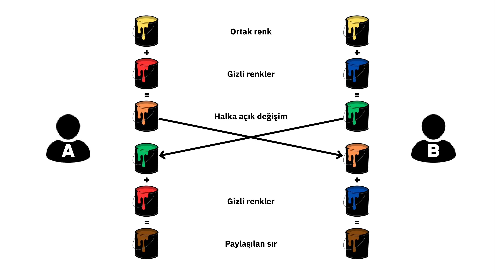


Bu benzetmede, kahverengi renk Alice ve Bob tarafından paylaşılan sırrı temsil etmektedir. Gerçekte, saldırganın Alice'ün veya Bob'in gizli renklerini bulmak için turuncu ve Green renklerini ayırmasının imkansız olduğunu düşünün.


Şimdi bu protokolün gerçekte nasıl çalıştığına bir göz atalım, renk analojileri ile değil, gerçek sayılar ve modüler aritmetik kullanarak!


Diffie-Hellman mekanizmalarına girmeden önce, size ihtiyacımız olan iki temel matematiksel kavramı kısaca hatırlatmama izin verin:


- Bir **asal sayı** sadece iki böleni olan bir doğal sayıdır: 1$ ve kendisi. Örneğin, $7$ bir asal sayıdır çünkü sadece $1$ ve $7$ ile bölünebilir. Öte yandan, $8$ bir asal sayı değildir, çünkü $1$, $2$, $4$ ve $8$ ile bölünebilir. Bu nedenle iki yerine dört pozitif tamsayı bölenine sahiptir;
- **Modulo** ($mod$ veya $\%$ olarak belirtilir), iki tamsayı arasında, birincinin ikinciye Öklidyen bölümünden kalanı veren matematiksel bir işlemdir. Örneğin, $16\bmod 5 = 1$.


**Alice ve Bob arasındaki Diffie-Hellman anahtarı Exchange aşağıdaki gibi gerçekleşir:**


- Alice ve Bob iki ortak sayı üzerinde hemfikirdir: $p$ ve $g$. $p$ bir asal sayıdır ve sayı ne kadar büyük olursa Diffie-Hellman o kadar güvenli olur. g$ ise $p$'nin ilkel bir köküdür. Bu iki sayı güvenli olmayan bir ağ üzerinde açık olarak iletilebilir. Önceki benzetmedeki **sarı** renginin eşdeğerini temsil ederler. Bu nedenle Alice ve Bob'in $p$ ve $g$ için tam olarak aynı değerleri kullanması önemlidir.
- Bu parametreler tanımlandıktan sonra, Alice ve Bob'nin her biri gizli bir rastgele sayı seçer. Alice kendi gizli rastgele sayısına $a$ (**kırmızı renge** eşdeğer), Bob ise $b$ (**mavi renge** eşdeğer) adını verir. Bu sayılar gizli kalmalıdır.
- Doğrudan $a$ ve $b$ sayılarını değiş tokuş etmek yerine, her bir taraf $A$ ve $B$ sayılarını aşağıdaki gibi hesaplar:


a$, $g$'nin $a$ modulo $p$ kuvvetine yükseltilmiş haline eşittir:


$$
A = g^a \bmod p
$$


b$, $g$'nin $b$ modulo $p$ kuvvetine yükseltilmiş haline eşittir:


$$
B = g^b \bmod p
$$


- İki taraf arasında $A$ (**turuncu renge** eşdeğer) ve $B$ (**Green** rengine eşdeğer) değerleri değiş tokuş edilir. Bu Exchange güvenli olmayan bir ağ üzerinde açık metin olarak gerçekleşebilir;
- B$ alan Alice, $z$ değerini aşağıdaki gibi hesaplar:


z$, $p$ modulo $a$ kuvvetine yükseltilmiş $B$'ye eşittir:


$$
z = B^a \bmod p
$$


Bir hatırlatma:


$$
B = g^b \bmod p
$$


Sonuç şu:


$$
z = B^a \bmod p
$$


$$
z = (g^b)^a \bmod p
$$


Güç kurallarını uygulayarak:


$$
(x^n)^m = x^{nm}
$$


Sonuç şu:


$$
z = g^{ba} \bmod p
$$


- Kendi açısından, $A$ alan Bob, $z$ değerini de aşağıdaki gibi hesaplar:


z$, $A$'nın $b$ modulo $p$ kuvvetine yükseltilmiş haline eşittir:


$$
z = A^b \bmod p
$$


Sonuç şu:


$$
z = (g^a)^b \bmod p
$$


$$
z = g^{ab} \bmod p
$$


$$
z = g^{ba} \bmod p
$$


Modulo operatörünün dağılabilirliği sayesinde, Alice ve Bob tam olarak aynı $z$ değerini elde eder. Bu sayı, daha önce boya kutuları ile yapılan benzetmedeki **kahverengi** renge eşdeğer olan ortak sırlarını temsil eder. Artık bu ortak sırrı, güvenli olmayan bir ağ üzerinden iletişimlerini simetrik olarak şifrelemek için kullanabilirler.


Bir saldırgan $p$, $g$, $A$ ve $B$ değerlerine (genel değerler) sahip olsa bile $a$, $b$ veya $z$ değerlerini (özel değerler) hesaplayamayacaktır. Bunu başarmak için üs alma işleminin tersine çevrilmesi gerekir ki bu da tüm olasılıkları tek tek denemeden mümkün olmayan bir işlemdir, çünkü bu işlem ayrık logaritmanın, yani sonlu bir döngüsel gruptaki üstel değerin tersinin hesaplanması anlamına gelir.


Dolayısıyla, $a$, $b$ ve $p$ değerleri yeterince büyük olduğu sürece Diffie-Hellman protokolü güvenlidir. Tipik olarak, 2048 bitlik parametrelerle (600 basamaklı bir ondalık sayı), $a$ ve $b$ için tüm olasılıkları test etmek pratik olmayacaktır. Bugüne kadar, bu tür sayılarla, bu algoritmanın güvenli olduğu düşünülmektedir.


Diffie-Hellman protokolünün ana dezavantajı burada yatmaktadır. Güvenli olması için algoritmanın büyük sayılar kullanması gerekir. Bu nedenle, bugünlerde, cebirsel bir eğriye, daha doğrusu eliptik bir eğriye dayanan bir Diffie-Hellman varyantı olan ECDH (*Elliptic Curve Diffie-Hellman*) algoritmasını kullanmayı tercih ediyoruz. Bu yaklaşım, eşdeğer güvenliği korurken çok daha küçük sayılarla çalışmayı mümkün kılar, böylece hesaplama ve depolama için gereken kaynakları azaltır.


Algoritmanın genel prensibi aynı kalır. Ancak, rastgele bir $a$ sayısı ve $a$'dan modüler üs alma yoluyla hesaplanan bir $A$ sayısı kullanmak yerine, eliptik bir eğri üzerinde oluşturulmuş bir çift anahtar kullanıyoruz. Modulo operatörünün dağılabilirliğine güvenmek yerine, eliptik eğriler üzerindeki grup yasasını ve daha kesin olarak birleşme özelliğini kullanıyoruz.


Eliptik eğriler üzerinde kriptografi prensibini kısaca açıklamak gerekirse, özel anahtar $1$ ile $n-1$ arasında rastgele bir sayı ile temsil edilir, burada $n$ eğrinin mertebesini temsil eder. Açık anahtar ise bu eğri üzerinde belirli bir noktadır ve özel anahtardan, denkleme göre, üreten noktadan itibaren noktaların toplanması ve ikiye katlanmasıyla elde edilir:


$$
K = k \cdot G
$$


Bu formülde $K$ açık anahtarı, $k$ özel anahtarı ve $G$ üreteç noktasını belirtir.


Bu anahtarların önemli bir özelliği $K$ ve $G$'den $K$'nın kolaylıkla hesaplanabilmesi, $K$ ve $G$'den $k$'nın bulunmasının ise neredeyse imkansız olmasıdır. Bu asimetri tek yönlü bir fonksiyon yaratır. Başka bir deyişle, özel anahtarı biliyorsanız açık anahtarı hesaplamak kolaydır, ancak açık anahtardan özel anahtarı elde etmek imkansızdır. Bu güvenlik, ayrık logaritmanın hesaplama zorluğu ile daha da desteklenmektedir.


Bu özelliği Diffie-Hellman algoritmamızı uyarlamak için kullanacağız. **ECDH çalışma prensibi aşağıdaki gibidir:**


- Alice ve Bob kriptografik olarak güvenli bir eliptik eğri ve parametreleri üzerinde anlaşmaya varmıştır. Bu bilgi kamuya açıktır;
- Alice, özel anahtarı olacak rastgele bir $ka$ sayısı üretir. Bu özel anahtar gizli kalmalıdır. Seçilen eliptik eğri üzerinde noktalar ekleyerek ve ikiye katlayarak $Ka$ açık anahtarını belirler:


$$
K_a = k_a \cdot G
$$


- Bob ayrıca kendi özel anahtarı olacak rastgele bir $kb$ sayısı üretir. İlgili açık anahtarı $Kb$ hesaplar:


$$
K_b = k_b \cdot G
$$


- Alice ve Bob Exchange açık anahtarları $Ka$ ve $Kb$ güvenli olmayan bir genel ağda.
- Alice, kendi özel anahtarı $ka$'yı Bob'nin açık anahtarı $Kb$'ye uygulayarak eğri üzerinde bir $(x,y)$ noktası hesaplar:


$$
(x,y) = k_a \cdot K_b
$$


- Bob kendi özel anahtarı $kb$'yi Alice'in açık anahtarı $Ka$'ya uygulayarak eğri üzerinde bir $(x,y)$ noktası hesaplar:


$$
(x,y) = k_b \cdot K_a
$$


- Alice ve Bob eliptik eğri üzerinde aynı noktayı elde eder. Paylaşılan gizli bilgi bu noktanın apsisi $x$ olacaktır.


Aynı paylaşılan sırrı alırlar çünkü:


$$
(x,y) = k_a \cdot K_b = k_a \cdot (k_b \cdot G) = (k_a \cdot k_b) \cdot G = (k_b \cdot k_a) \cdot G = k_b \cdot (k_a \cdot G) = k_b \cdot K_a
$$


Güvenli olmayan genel ağı gözlemleyen potansiyel bir saldırgan sadece her bir bireyin açık anahtarlarını ve seçilen eliptik eğrinin parametrelerini elde edebilecektir. Yukarıda açıklandığı gibi, bu bilgiler tek başına özel anahtarları belirlemek için yeterli değildir. Sonuç olarak, saldırgan Alice ve Bob arasında paylaşılan sırrı bulamaz.


ECDH bu nedenle bir anahtar Exchange algoritmasıdır. Eksiksiz bir protokol oluşturmak için genellikle diğer kriptografik yöntemlerle birlikte kullanılır. Örneğin, ECDH, İnternet aktarımı Layer için kullanılan bir şifreleme ve kimlik doğrulama protokolü olan TLS'nin (*Transport Layer Security*) kalbinde yer alır. TLS, kalıcı gizlilik sağlamak için anahtarların geçici olduğu bir ECDH çeşidi olan Exchange anahtarı için ECDHE kullanır. Ayrıca TLS, ECDSA gibi kimlik doğrulama algoritmalarını, AES gibi şifreleme algoritmalarını ve SHA256 gibi Hash işlevlerini kullanır.


TLS, `https'deki `s'den ve tarayıcınızın Address çubuğundaki asma kilitten sorumludur - şifrelenmiş iletişimin sembolleri. Bu kursa katılarak ECDH kullanacaksınız ve büyük olasılıkla farkında bile olmadan günlük olarak kullanacaksınız.


### Bildirim işlemi


Önceki bölümde gördüğümüz gibi ECDH, eliptik eğri üzerinde oluşturulan anahtar çiftlerini kullanan Diffie-Hellman Exchange'in bir çeşididir. Bitcoin cüzdanlarımızda zaten bu standarda uygun birçok anahtar çiftine sahip olmamız iyi bir şey! BIP47'nin fikri, her iki tarafın hiyerarşik deterministik Bitcoin cüzdanlarının anahtar çiftlerini, aralarında paylaşılan, geçici sırlar oluşturmak için kullanmaktır. BIP47 bunun yerine ECDHE (*Elliptic Curve Diffie-Hellman **Ephemeral***) kullanır.


ECDHE ilk olarak BIP47'de ödeme kodunu göndericiden alıcıya iletmek için kullanılır. Bu ünlü **bildirim işlemidir**. Bu adım çok önemlidir, çünkü BIP47'nin etkili bir şekilde çalışması için ilgili tarafların (gönderici ve alıcı) birbirlerinin ödeme kodlarını bilmeleri gerekir. Bu bilgi, geçici açık anahtarların ve dolayısıyla ilişkili boş alıcı adreslerinin türetilmesini sağlar.


Bu Exchange öncesinde, gönderici mantıksal olarak alıcının ödeme kodundan haberdardır, off-chain bu kodu örneğin kendi web sitesinden, Invoice veya sosyal ağlardan almıştır. Ancak, alıcının gönderenin ödeme kodundan haberdar olması gerekmez. Bununla birlikte, kodun kendisine iletilmesi gerekir; aksi takdirde, bitcoinlerinin depolandığı adresleri belirlemek veya fonlarına erişmek için gereken geçici anahtarları türetemez. Gönderenin kodunun bu iletimi teknik olarak off-chain başka iletişim araçlarıyla gerçekleştirilebilse de, Wallet yalnızca seed'ten alınacaksa bu bir sorun teşkil eder.


Bunun nedeni, geleneksel adreslerin aksine, BIP47 adreslerinin doğrudan alıcının seed'inden türetilmemesi - bu durumda bir `xpub' kullanmak daha basit olacaktır - ancak iki ödeme kodunun birleştirildiği bir hesaplamadan kaynaklanmasıdır: göndericinin ve alıcının kodları. Dolayısıyla, alıcı Wallet'sini kaybeder ve seed'inden geri yüklemeye çalışırsa, doğrudan seed'inden türetilen kendi ödeme kodunu kurtaracaktır. Ancak, geçici adresleri kurtarmak için, BIP47 aracılığıyla kendisine bitcoin gönderen herkesin ödeme kodlarına da ihtiyacı olacaktır. Bu nedenle, bu bilgilerin Bitcoin Blockchain'e kaydedilmesini ve 2009'da piyasaya sürülmesinden bu yana gerçekleştirilen milyarlarca işlem arasında arama yapmak zorunda kalmadan çok kolay bir şekilde bulunabilmesini sağlayan bildirim işleminin önemi.


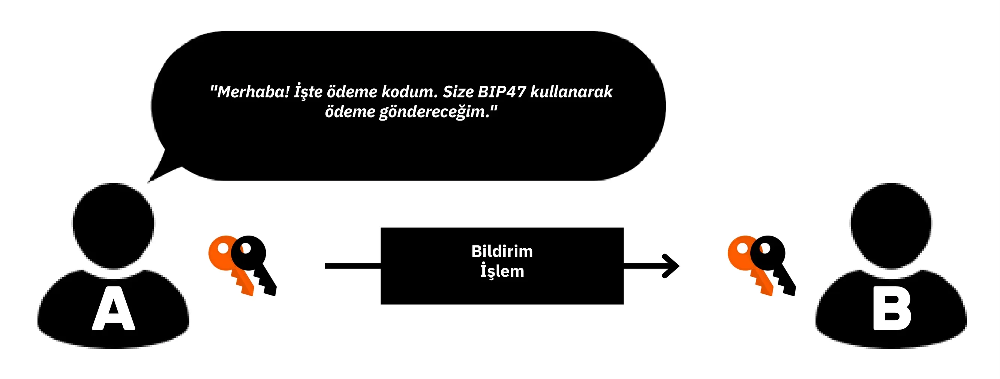


Bu nedenle, her kullanıcının eşlerinin ödeme kodlarının bir yedeğini tutması koşuluyla, bildirim işlemini kullanmadan BIP47'yi uygulamak mümkün olacaktır. Ancak bu yedeklerin oluşturulması, saklanması ve güncellenmesi için basit, sağlam ve etkili bir çözüm geliştirilinceye kadar bu yöntemin yönetimi karmaşık olacaktır. Mevcut durumda, bildirim işlemi neredeyse kaçınılmazdır.


Ancak ilerleyen bölümlerde, BIP47 ile benzer hedefleri olan, ancak bir bildirim işlemi gerektirmeyen diğer protokolleri inceleyeceğiz. Ancak bu alternatifler kendi ödünleşimlerini de beraberinde getirmektedir.


Ödeme kodlarını kaydetme rolüne ek olarak, bildirim işleminin adından da anlaşılacağı gibi alıcı için bir bildirim işlevi de vardır. Alıcının müşterisini yeni bir ödeme tüneli kurulduğu konusunda uyarır ve ortaya çıkan geçici adreslere göz kulak olmasını önerir.


### BIP47 gizlilik modeli


Bildirim işleminin teknik işleyişini detaylandırmadan önce, bu ilk işlem oluşturulurken alınan bazı önlemleri haklı çıkaran BIP47 ile ilişkili gizlilik modelini tartışmak önemlidir.


Ödeme kodunun kendisi gizlilik için doğrudan bir risk teşkil etmez. Anahtarların ve adreslerin anonimliğini koruyarak kullanıcının kimliği ile işlemleri (kamuya açık olan) arasındaki bağlantıyı kırmayı amaçlayan geleneksel Bitcoin modelinin aksine, ödeme kodu bir tehdit oluşturmadan bir kimlikle açıkça ilişkilendirilebilir.


Bunun nedeni, ödeme kodunun BIP47 ödemelerini alan adresleri doğrudan türetmek için kullanılmamasıdır. Bunun yerine, bu adresler ECDH uygulaması aracılığıyla ilgili iki tarafın ödeme kodlarından türetilen anahtarlar arasında oluşturulur.


Dolayısıyla, bir ödeme kodu kendi başına doğrudan bir gizlilik kaybına yol açmaz, çünkü yalnızca Address bildirimi bundan türetilir. Bu Address belirli bilgileri açığa çıkarabilse de, kapsamlı bir zincir analizi yapılmadığı sürece normalde işlem yaptığınız tarafları açığa çıkarmaz. Gerçekten de, gönderici bildirim işlemini gerçekleştirmek için kimliğiyle ilişkilendirilebilecek UTXO'lar kullanıyorsa, kimliğinin muhtemelen ödeme kodunuza yapılan BIP47 ödemeleriyle bağlantılı olduğu sonucuna varmak mümkün hale gelir. Bu, altta yatan işlemleri ortaya çıkarmayacak, ancak bunların muhtemel varlığını gösterecektir.


Bu nedenle, kullanıcıların ödeme kodları arasındaki bu katı ayrımı korumak çok önemlidir. Bunu akılda tutarak, kodun ilk iletimi ödeme gizliliği için kritik bir andır, ancak protokolün doğru çalışması için gereklidir. Ödeme kodlarından biri kamuya açık olarak elde edilebiliyorsa (bir web sitesinde olduğu gibi), gönderenin kodu olan ikinci kod hiçbir koşulda birincisiyle ilişkilendirilmemelidir.


Somut bir örnek verelim: BIP47 aracılığıyla bir siyasi harekete bağış yapmak istiyorum:


- Kuruluş, ödeme kodunu web sitesinde veya sosyal ağları aracılığıyla kamuoyuna açıklamıştır;
- Dolayısıyla bu kod siyasi hareketle bağlantılıdır;
- Bu ödeme kodunu alıyorum;
- Göndermeden önce, sosyal ağlarımda işlem almak için kullandığım için kimliğimle de bağlantılı olan kendi ödeme kodumu bildiklerinden emin olmalıyım.


Kodumu risk almadan nasıl aktarabilirim? Geleneksel iletişim araçlarını kullanmak bilgi sızıntısına yol açabilir ve dolayısıyla beni bu siyasi hareketle ilişkilendirebilir. Bildirim işlemi, iki kod arasında böyle bir ilişkilendirmeyi önleyen bir Layer şifreleme sayesinde bir çözüm sunuyor. Gönderenin ödeme kodunu gizlice iletmek için tek yöntem olmasa da, çok etkili bir yöntemdir.


Aşağıdaki diyagramda turuncu çizgiler bilgi akışının kesilmesi gereken noktaları, siyah oklar ise üçüncü taraflarca potansiyel olarak gözlemlenebilecek bağlantıları göstermektedir:


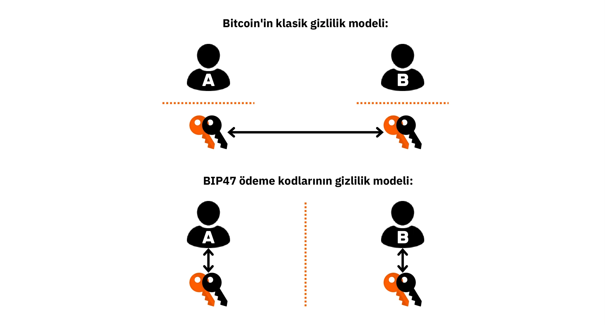


Gerçekte, Bitcoin'ün geleneksel gizlilik modelinde, özellikle uzak işlemlerde, anahtar çifti ile kullanıcı arasındaki bilgi akışını tamamen ayırmak genellikle karmaşıktır. Örneğin, bir bağış kampanyası bağlamında, alıcının kaçınılmaz olarak bir Address veya açık anahtarı web sitesi veya sosyal ağları aracılığıyla ifşa etmesi gerekir. Özellikle bildirim işleminde BIP47'nin doğru kullanımı, ECDHE ve daha sonra inceleyeceğimiz şifreleme Layer sayesinde bu sorunun üstesinden gelmeyi mümkün kılar.


Elbette, Bitcoin'nin klasik gizlilik modeli, iki ödeme kodunun birleşiminden türetilen geçici açık anahtarlar için hala geçerlidir. Aslında bu iki model birbirini tamamlayıcı niteliktedir. Burada vurgulamak istediğim şey, Bitcoin almak için bir açık anahtarın olağan kullanımının aksine, "_Alice Bob_ ile işlem yapıyor" bilgisi başka bir aşamada kırıldığı için ödeme kodunun belirli bir kimlikle ilişkilendirilebilmesidir. Ödeme kodu generate ödeme adresleri için kullanılır, ancak yalnızca Blockchain'in gözlemine dayanarak, ilgili UTXO'lar daha önce bir kimliğe bağlı olmadıkça ve kullanıcılar ödeme kodlarını kendi kimlikleriyle ilişkilendirmedikçe, bir BIP47 ödeme işlemini gerçekleştirmek için kullanılan ödeme kodlarına bağlamak imkansızdır.


Özetle, BIP47 ödemeleri tarafından sunulan gizlilik modeli, Bitcoin'in temel modelinden daha üstün kabul edilebilir, ancak bu sihirli olduğu anlamına gelmez.


### Bildirim işleminin oluşturulması


Şimdi bu bildirim işleminin nasıl çalıştığını görelim. Alice'un BIP47 kullanarak Bob'a para göndermek istediğini düşünelim. Örneğimde, Alice gönderici ve Bob alıcı olarak hareket etmektedir. Bob ödeme kodunu kendi web sitesinde yayınlamıştır. Dolayısıyla Alice, Bob'un ödeme kodunu zaten bilmektedir.


**1- Alice, ECDH ile paylaşılan bir sır hesaplar:**


- Ödeme kodundan farklı bir daldaki HD Wallet'ten bir anahtar çifti seçer. Bu çiftin Alice'ün bildirimi Address ile veya Alice'ün kimliği ile kolayca ilişkilendirilemeyeceğini unutmayın (önceki bölüme bakın);
- Alice bu çift için özel anahtarı seçer. Buna $a$ (küçük harf) diyoruz;


$$
a
$$


- Alice, Bob'in Address bildirimi ile ilişkili açık anahtarı alır. Bu anahtar, Bob'in ödeme kodundan (indeks $/0$) türetilen ilk çocuktur. Bu açık anahtarı $B$ (büyük harf) olarak adlandırıyoruz. Bu açık anahtarla ilişkili özel anahtar $b$ (küçük harf) olarak adlandırılır. b$, eliptik eğri üzerinde $G$'den (üretme noktası) $b$'ye (özel anahtar) noktalar eklenerek ve ikiye katlanarak belirlenir:


$$ B = b \cdot G $$


- Alice, Bob'ın açık anahtarı $B$'den kendi özel anahtarı $a$'yı uygulayarak noktaları toplayıp ikiye katlayarak eliptik eğri üzerinde gizli bir $S$ (büyük harf) noktası hesaplar.


$$ S = a \cdot B $$


- Alice ödeme kodunu şifrelemek için kullanılacak $f$ körleme faktörünü hesaplar. Bunu yapmak için, sözde rastgele bir sayı belirlemek üzere HMAC-SHA512 işlevini kullanır. Bu fonksiyonun ikinci girdisi sadece Bob'ün bulabileceği bir değerdir: yukarıda hesaplanan gizli noktanın apsisi olan $x$. İlk girdi $o$ olup, bu işlem için girdi olarak tüketilen UTXO'dir (çıkış noktası).


$$ f = \text{HMAC-SHA512}(o, x) $$


**2 - Alice kişisel ödeme kodunu 2 tabanına (ikili) dönüştürür **


**3- Ödeme kodunun yükü üzerinde simetrik şifreleme gerçekleştirmek için bu kör edici faktörü bir anahtar olarak kullanır.** Kullanılan şifreleme algoritması basitçe bir `XOR`dur. Gerçekleştirilen işlem, "One-Time Pad" olarak da bilinen Vernam şifresiyle karşılaştırılabilir.


- Alice ilk olarak kör edici faktörünü ikiye böler: ilk 32 bayt $f1$ ve son 32 bayt $f2$ olarak adlandırılır. Bu bize şunu verir:


$$ f = f1 || f2 $$


- Alice, ödeme kodunun $x$ açık anahtarının apsisinin $x'$ şifresini ve $c$ dize kodunun $c'$ şifresini ayrı ayrı hesaplar. sırasıyla $f1$ ve $f2$ şifre anahtarları olarak işlev görür. Kullanılan işlem `XOR` (veya exclusive) işlemidir.


$$ x' = x \oplus f1 $$


$$ c' = c \oplus f2 $$


- Alice, ödeme kodundaki açık anahtar apsisi $x$ ve string kodu $c$'nin gerçek değerlerini şifrelenmiş $x'$ ve $c'$ değerleri ile değiştirir.


**4-** Alice bu nedenle şu anda şifrelenmiş bir yük ile ödeme koduna sahiptir. Girdi olarak $A$ açık anahtarını, Bob'in Address bildirimine bir çıktı ve şifrelenmiş yük ile ödeme kodundan oluşan bir çıktı `OP_RETURN` içeren bir işlem oluşturacak ve yayınlayacaktır. **Bu işlem bildirim işlemidir**.


Bir `OP_RETURN`, bir Bitcoin işleminin çıktısını geçersiz olarak işaretleyen bir işlem kodudur. Günümüzde, Bitcoin Blockchain üzerinde yayın yapmak veya Anchor bilgileri için kullanılmaktadır. Daha sonra zincire yazılan ve diğer tüm kullanıcılar tarafından görülebilen 80 bayta kadar veri depolayabilir.


Önceki bölümlerde gördüğümüz gibi, ECDH generate'de güvensiz bir ağ üzerinden iletişim kuran ve potansiyel olarak saldırganlar tarafından gözlemlenen iki kullanıcı arasında paylaşılan bir sır olarak kullanılmaktadır. BIP47'de ECDH, doğası gereği şeffaf bir iletişim ağı olan ve birçok saldırgan tarafından gözlemlenen Bitcoin ağı üzerinde iletişim kurmak için kullanılır. ECDH anahtarı Exchange aracılığıyla hesaplanan paylaşılan sır daha sonra iletilecek gizli bilgiyi şifrelemek için kullanılır: gönderenin ödeme kodu (Alice).


Bir bildirim işlemi gerçekleştirmek için az önce birlikte gördüğümüz adımları özetleyeceğim:


- Alice, Bob'nin ödeme kodunu alır ve Address'ı bilgilendirir;
- Alice, ilgili anahtar çifti ile HD Wallet'ten bir UTXO seçer;
- ECDH kullanarak eliptik eğri üzerinde gizli bir nokta hesaplar;
- Bu gizli noktayı, körleme faktörü olan bir HMAC hesaplamak için kullanır;
- Bu kör edici faktörü kişisel ödeme kodunun yükünü şifrelemek için kullanır;
- Gizli ödeme kodunu Bob'ye iletmek için bir `OP_RETURN` işlem çıktısı kullanır.


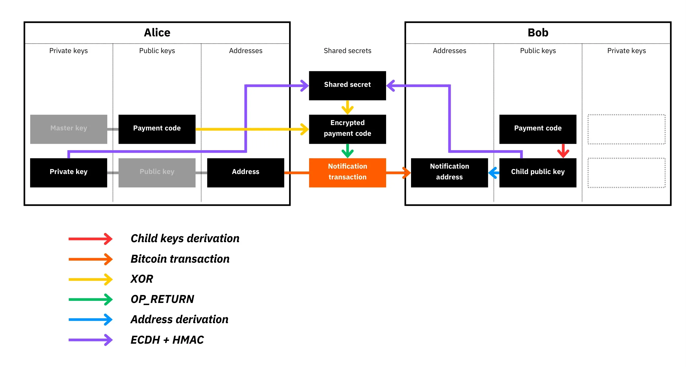


### İşlem bildirimi: pratik bir çalışma


Nasıl çalıştığını ve özellikle `OP_RETURN`in kullanımını daha ayrıntılı olarak anlamak için gerçek bir bildirim işlemine göz atalım. Böyle bir işlemi [buraya tıklayarak] (https://Mempool.space/Testnet/tx/0e2e4695a3c49272ef631426a9fd2dae6ec3a469e3a39a3db51aa476cd09de2e) bulabileceğiniz Testnet üzerinde gerçekleştirdim.


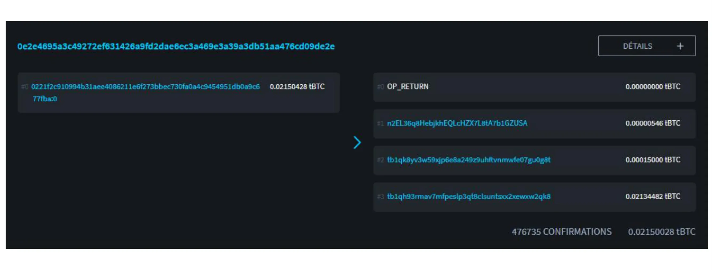


Bu işleme baktığımızda, tek bir girişe ve 4 çıkışa sahip olduğunu zaten görebiliyoruz:


- İlk çıktı, gizli ödeme kodumu içeren `OP_RETURN`dir;
- İkinci 546 Sats çıktısı alıcımın Address bildirimine işaret ediyor;
- Üçüncü çıktı olan 15.000 Sats hizmet ücretini temsil ediyor, çünkü bu işlemi oluşturmak için Samourai Wallet kullandım;
- Dördüncü çıktı olan 2 milyon Sats ise değişimi, yani girdimde kalan ve bana ait başka bir Address'ya dönen farkı temsil eder.


İncelenmesi en ilginç olanı `OP_RETURN` kullanılarak elde edilen 0 çıktısıdır. Ne içerdiğine daha yakından bakalım. İşte onaltılık olarak `scriptPubKey`:


```text
6a4c50010002b13b2911719409d704ecc69f74fa315a6cb20fdd6ee39bc9874667703d67b164927b0e88f89f3f8b963549eab2533b5d7ed481a3bea7e953b546b4e91b6f50d800000000000000000000000000
```


Bu betiğin birkaç bölümü vardır. İlk olarak:


```text
6a4c
```


İşlem kodları arasında `OP_RETURN`u tanımlayan `0x6a` ve `OP_PUSHDATA1`i tanımlayan `0x4c`yi tanıyabiliriz.


Bu son işlem kodunu izleyen bayt, sonraki yükün boyutunu gösterir. Bu `0x50` veya 80 baytı gösterir:


```text
6a4c50
```


Ardından, ödeme kodumun meta verileri açık metin olarak elimizde:


```text
010002
```


Ödeme kodumun açık anahtarının şifrelenmiş apsisi:


```text
b13b2911719409d704ecc69f74fa315a6cb20fdd6ee39bc9874667703d67b164
```


Ödeme kodumun şifrelenmiş dize kodu:


```text
927b0e88f89f3f8b963549eab2533b5d7ed481a3bea7e953b546b4e91b6f50d8
```


Ve son olarak, bir `OP_RETURN`in standart boyutu olan 80 bayta kadar dolgu:


```text
00000000000000000000000000
```


Anlamanıza yardımcı olması için, ödeme kodumu 58 tabanında düz metin olarak burada bulabilirsiniz:


```text
PM8TJQCyt6ovbozreUCBrfKqmSVmTzJ5vjqse58LnBzKFFZTwny3KfCDdwTqAEYVasn11tTMPc2FJsFygFd3YzsHvwNXLEQNADgxeGnMK8Ugmin62TZU
```


Ve 16 tabanında:


```text
4701000277507c9c17a89cfca2d3af554745d6c2db0e7f6b2721a3941a504933103cc42add94881210d6e752a9abc8a9fa0070e85184993c4f643f1121dd807dd556d1dc000000000000000000000000008604e4db
```


Düz metin ödeme kodumu `OP_RETURN` ile karşılaştırırsak, HRP (`0x47`) ve sağlama toplamının (`0x8604e4db`) iletilmediğini görebiliriz. Bu bilgiler insanlara yönelik olduğu için bu normaldir.


Ardından, sürümü (`0x01`), bit alanını (`0x00`) ve açık anahtarın paritesini (`0x02`) tanıyabiliriz. Ve ödeme kodunun sonunda, toplam 80 bayta ulaşmak için dolgu yapılmasına izin veren boş baytlar (`0x0000000000000000000000`). Tüm bu meta veriler şifrelenmeden iletilir.


Son olarak, açık anahtar apsisinin (`0x77507c9c17a89cfca2d3af554745d6c2db0e7f6b2721a3941a504933103cc42a`) ve dize kodunun (`0xdd94881210d6e752a9abc8a9fa0070e85184993c4f643f1121dd807dd556d1dc`) şifrelendiğini gözlemleyebiliriz. Bu, ödeme kodunun yüküdür.


### XOR nedir?


Önceki bölümlerde ödeme kodunun XOR işlemi kullanılarak şifrelenmiş olarak iletildiğini gördük. Kriptografide yaygın olarak kullanıldığı için bu operatörün nasıl çalıştığına daha yakından bakalım.


XOR, Boole cebirine dayanan bitsel bir mantıksal operatördür. Bit cinsinden iki işlenen verildiğinde, aynı sıradaki bitler farklıysa `1` döndürür ve aynı sıradaki bitler eşitse `0` döndürür. İşte `D` ve `E` işlenenlerinin değerlerine göre XOR doğruluk tablosu:

| D | E | D XOR E |
|---|---|---------|
| 0 | 0 | 0       |
| 0 | 1 | 1       |
| 1 | 0 | 1       |
| 1 | 1 | 0       |

Örneğin:


$$
0110 \oplus 1110 = 1000
$$


Ya da:


$$
010011 \oplus 110110 = 100101
$$


ECDH ile XOR'un bir şifreleme Layer olarak kullanılması özellikle tutarlıdır. İlk olarak, bu operatör sayesinde şifreleme simetriktir. Bu, alıcının şifreleme için kullanılan aynı anahtarla ödeme kodunun şifresini çözebileceği anlamına gelir. Şifreleme ve şifre çözme anahtarları ECDH kullanılarak paylaşılan sırdan hesaplanır. Bu simetri, XOR operatörünün değişme ve birleşme özellikleri sayesinde mümkün olmaktadır:


- Diğer özellikler:


$$
D \oplus D = 0
$$


$$
D \oplus 0 = D
$$


- Değişkenlik:


$$
D \oplus E = E \oplus D
$$


- İlişkisellik:


$$
D \oplus (E \oplus Z) = (D \oplus E) \oplus Z = D \oplus E \oplus Z
$$


Eğer:


$$
D \oplus E = L
$$


Sonra:


$$
D \oplus L = D \oplus (D \oplus E) = D \oplus D \oplus E = 0 \oplus E = E \\
\therefore D \oplus L = E
$$


İkinci olarak, bu şifreleme yöntemi, bugüne kadar bilinen koşulsuz (veya mutlak) güvenliğe sahip tek şifreleme algoritması olan Vernam (One-Time Pad) şifresine çok benzemektedir. Vernam şifresinin bu özelliğe sahip olabilmesi için şifreleme anahtarının tamamen rastgele olması, mesajla aynı boyutta olması ve yalnızca bir kez kullanılması gerekir. Burada BIP47 için kullanılan şifreleme yönteminde, anahtar gerçekten de mesajla aynı boyuttadır ve kör edici faktör, açık anahtarın apsisi ile ödeme kodunun dizi kodunun birleşimi ile tam olarak aynı boyuttadır. Bu şifreleme anahtarı yalnızca bir kez kullanılır. Öte yandan, bu anahtar bir HMAC olduğu için mükemmel bir rastgelelikten türetilmemiştir. Aksine, sözde rastgeledir. Yani bu bir Vernam şifrelemesi değildir, ancak yöntem buna yakındır.


### Bildirim işleminin alınması


Şimdi Alice bildirim işlemini Bob'e gönderdiğine göre, Bob'ün bunu nasıl yorumladığını görelim. Bir hatırlatma olarak, Bob'ün Alice'ün ödeme koduna erişimi olmalıdır. Bu bilgi olmadan, bir sonraki bölümde göreceğimiz gibi, Alice tarafından oluşturulan anahtar çiftlerini türetemeyecek ve bu nedenle BIP47 aracılığıyla alınan bitcoinlerine erişemeyecektir. Şu an için Alice'ün ödeme kodu yükü şifrelenmiştir. Bakalım Bob bunu nasıl çözecek.


**1-** Bob, Address bildirimi ile çıktı oluşturan işlemleri izler.


**2-** Bir işlemin Address bildiriminde bir çıktısı olduğunda, Bob bunu BIP47 standardına uygun bir OP_RETURN çıktısı içerip içermediğini görmek için analiz eder.


**3-** OP_RETURN yükünün ilk baytı `0x01` ise, Bob ECDH ile paylaşılan olası bir sırrı aramaya başlar:


- Bob işlem için giriş açık anahtarını seçer. Yani, Alice'nin $A$ adlı açık anahtarı ile:


$$ A = a \cdot G $$


- Bob, kişisel bildirimi Address ile ilişkili $b$ özel anahtarını seçer:


$$ b $$


- Bob, eliptik eğri üzerindeki $S$ gizli noktasını (paylaşılan gizli ECDH) noktaları ekleyerek ve ikiye katlayarak hesaplar ve kendi özel anahtarı $b$'yi Alice'nın açık anahtarı $A$'ya uygular:


$$ S = b \cdot A $$


- Bob, Alice'in ödeme kodunun yükünün şifresinin çözülmesini sağlayacak $f$ körleme faktörünü belirler. Alice'in daha önce hesapladığı şekilde Bob, $S$ gizli noktasının apsis değeri olan $x$'e ve UTXO'un bu bildirim işlemine girdi olarak kullandığı $o$'ya HMAC-SHA512 uygulayarak $f$'yi bulacaktır:


$$ f = \text{HMAC-SHA512}(o, x) $$


**4-** Bob, bildirim işlemindeki OP_RETURN verilerini bir ödeme kodu olarak yorumlar. Bu potansiyel ödeme kodunun yükünün şifresini $f$ körleme faktörünü kullanarak çözecektir:


- Bob, $f$ körleme faktörünü 2 parçaya böler: $f$'nin ilk 32 baytı $f1$ ve son 32 baytı $f2$ olacaktır;
- Bob, Alice'ün ödeme kodunun açık anahtarından şifrelenmiş apsis $x'$ değerinin şifresini çözer:


$$ x = x' \oplus f1 $$


- Bob, Alice'nın ödeme kodundan $c'$ şifrelenmiş dize kodunun değerini çözer:


$$ c = c' \oplus f2 $$


**5-** Bob, Alice'in ödeme kodunun açık anahtar değerinin secp256k1 grubunun bir parçası olup olmadığını kontrol eder. Eğer öyleyse, bunu geçerli bir ödeme kodu olarak yorumlar. Değilse, işlemi yok sayar.


Artık Bob, Alice'un ödeme kodunu bildiğine göre, Alice bu tür bir bildirim işlemini tekrarlamak zorunda kalmadan ona `2^32`ye kadar ödeme gönderebilir.


Neden işe yarıyor? Bob, Alice ile aynı kör edici faktörü nasıl belirleyebilir ve böylece onun ödeme kodunu nasıl deşifre edebilir? ECDH'nin az önce tanımladığımız eylemine daha yakından bakalım.


Her şeyden önce, simetrik şifreleme ile uğraşıyoruz. Bu, şifreleme anahtarının ve şifre çözme anahtarının aynı değer olduğu anlamına gelir. Bildirim işlemindeki bu anahtar kör edici faktördür:


$$ f = f1 || f2 $$


Alice ve Bob bu nedenle $f$ için aynı değeri doğrudan iletmeden elde etmelidir, çünkü bir saldırgan bu değeri çalıp gizli bilginin şifresini çözebilir. Bu körleme faktörü 2 değere HMAC-SHA512 uygulanarak elde edilir:


- gizli bir noktanın apsisi;
- ve UTXO işlem girişinde tüketilir.


Dolayısıyla Bob, Alice'nin ödeme kodu yükünün şifresini çözmek için bu iki bilgiye de ihtiyaç duyar. UTXO girişi için, Bob bildirim işlemini gözlemleyerek bunu kolayca alabilir. Gizli nokta için Bob'un ECDH kullanması gerekecektir. Diffie-Hellman ile ilgili önceki bölümde görüldüğü gibi, Alice ve Bob sadece kendi açık anahtarlarını değiş tokuş ederek ve özel anahtarlarını gizlice birbirlerinin açık anahtarına uygulayarak eliptik eğri üzerinde kesin bir gizli nokta bulabilirler. Bildirim işlemi bu mekanizmaya dayanmaktadır:


- Bob'nin anahtar çifti:


$$ B = b \cdot G $$


- Alice'in anahtar çifti:


$$ A = a \cdot G $$


- Bir gizli $S (x, y)$ için:


$$ S = a \cdot B = a \cdot (b \cdot G) = (b \cdot a) \cdot G = b \cdot A $$


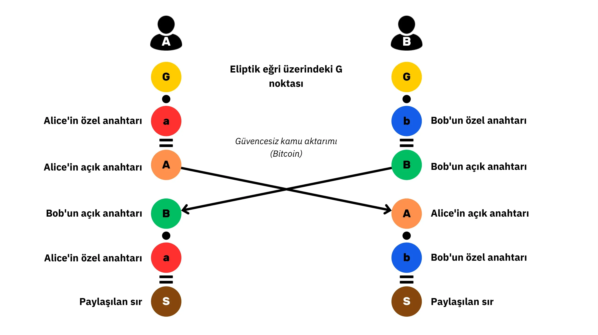


Artık Bob, Alice'nin ödeme kodunu bildiğine göre, onun BIP47 ödemelerini tespit edebilecek ve alınan bitcoinleri bloke eden özel anahtarları türetebilecektir.


Bir bildirim işlemini almak ve yorumlamak için az önce birlikte gördüğümüz adımları özetleyeceğim:


- Bob, Address bildirimine yönelik işlem çıktısını izler;
- Birini tespit ettiğinde, OP_RETURN'da bulunan bilgileri alır;
- Bob açık anahtarı girdi olarak seçer ve ECDH kullanarak bir gizli nokta hesaplar;
- Bu gizli noktayı, körleme faktörü olan bir HMAC hesaplamak için kullanır;
- OP_RETURN'de bulunan Alice'un ödeme kodu yükünün şifresini çözmek için bu kör edici faktörü kullanır.


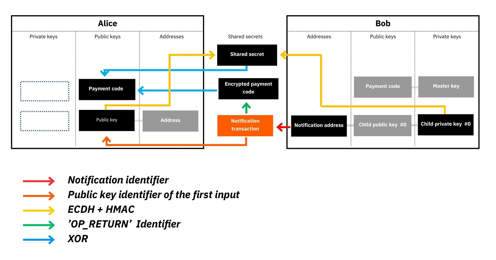


### BIP47 ödeme işlemi


BIP47 ile ödeme sürecine bir göz atalım. Mevcut durumu hatırlatmak için:


- Alice, Bob'in web sitesinden aldığı ödeme kodunu biliyor;
- Bob, bildirim işleminden Alice'nin ödeme kodunu bilir;
- Alice ilk ödemesini Bob'e yapacaktır. Aynı şekilde daha birçok ödeme yapabilir.


Bu süreci açıklamadan önce, şu anda hangi endeksler üzerinde çalıştığımızı hatırlamanın önemli olduğunu düşünüyorum. Bir ödeme kodu için türetme yolu aşağıdaki gibi tanımlanır: `m/47'/0'/0'`. Aşağıdaki derinlik indeksleri aşağıdaki gibi böler:


- İlk normal (güçlendirilmemiş) yavru çift, önceki bölümde tartışılan generate bildirimi Address için kullanılandır: `m/47'/0'/0'/0';
- Bu bölümde göreceğimiz gibi, ECDH içinde generate BIP47 ödeme makbuzu adresleri için normal yavru anahtar çiftleri kullanılır: `m/47'/0'/0'/0`dan `m/47'/0'/0'/2,147,483,647`ye;
- Güçlendirilmiş yavru anahtar çiftleri geçici ödeme kodlarıdır: `m/47'/0'/0'/0'`dan `m/47'/0'/0'/2,147,483,647'`ye kadar.


Alice, Bob'e her ödeme göndermek istediğinde, bir kez daha ECDH protokolünü kullanarak yeni, benzersiz, boş bir Address türetir:


- Alice, kişisel yeniden kullanılabilir ödeme kodundan türetilen ilk özel anahtarı seçer:


$$ a $$


- Alice, Bob'ün ödeme kodundan türetilen ilk kullanılmayan açık anahtarı seçer. Bu açık anahtara $B$ diyeceğiz. Sadece Bob tarafından bilinen özel anahtar $b$ ile ilişkilidir:


$$ B = b \cdot G $$


- Alice, Bob'nın açık anahtarı $B$'den kendi özel anahtarı $a$'yı uygulayarak noktaları toplayıp ikiye katlayarak eliptik eğri üzerinde gizli bir $S$ noktası hesaplar:


$$ S = a \cdot B $$


- Bu gizli noktadan, Alice paylaşılan gizli $s$ (küçük harf) değerini hesaplar. Bunu yapmak için $S$ gizli noktasının $Sx$ adlı apsisini seçer ve bu değeri SHA256 Hash fonksiyonuna aktarır:


$$ S = (Sx, Sy) $$


$$ s = \text{SHA256}(Sx) $$


- Alice, Bitcoin ödeme alımı Address'u hesaplamak için bu paylaşılan sır $s$'yi kullanır. İlk olarak, $s$'nin secp256k1 eğrisinin sıralamasında yer alıp almadığını kontrol eder. Eğer durum böyle değilse, başka bir paylaşılan sır türetmek için Bob'nin açık anahtar indeksini artırır;
- İkinci adımda, eliptik eğri üzerindeki $B$ ve $s-G$ noktalarını toplayarak $K0$ açık anahtarını hesaplar. Başka bir deyişle, Alice, Bob'ün ödeme kodu $B$'den elde edilen açık anahtarı, secp256k1 eğrisi üreteci $G$ noktasından paylaşılan gizli $s$ ile noktaları ekleyip ikiye katlayarak eliptik eğri üzerinde hesaplanan başka bir noktaya ekler. Bu yeni nokta bir açık anahtarı temsil eder ve biz buna $K0$ adını veriyoruz:


$$ K0 = B + s \cdot G $$


- Bu açık anahtar $K0$ ile Alice, standart şekilde boş bir alıcı Address türetebilir (örneğin, bech32'de SegWit V0).


Alice, Address'i alan Bob'ün $K0$'ını elde ettikten sonra, standart şekilde bir Bitcoin işlemi gerçekleştirebilir. Bunu yapmak için, HD Wallet'ın farklı bir dalından bir anahtar çifti ile güvence altına alınmış, sahip olduğu bir UTXO'yi seçer ve Bob'ün $K0$ Address'ine bir çıktıyı karşılamak için onu tüketir. Address türetildikten sonra bu ödemenin klasik bir süreç izlediğini ve artık BIP47 ile ilişkili anahtarlara bağlı olmadığını belirtmek önemlidir.


Bir BIP47 ödemesi göndermek için az önce birlikte gördüğümüz adımları özetleyeceğim:


- Alice, kişisel ödeme kodundan türetilen ilk kız özel anahtarını seçer;
- Bob'in ödeme kodundan türetilen ilk kullanılmayan yavru genel anahtardan ECDH kullanarak eliptik eğri üzerinde bir gizli nokta hesaplar;
- SHA256 ile paylaşılan bir sırrı hesaplamak için bu gizli noktayı kullanır;
- Bu paylaşılan sırrı eliptik eğri üzerinde yeni bir gizli nokta hesaplamak için kullanır;
- Bu yeni gizli noktayı Bob'nın açık anahtarına ekler;
- Sadece Bob'nin ilişkili özel anahtara sahip olduğu yeni bir geçici açık anahtar elde eder;
- Alice, türetilmiş geçici alıcı Address ile Bob'e klasik bir işlem yapabilir.


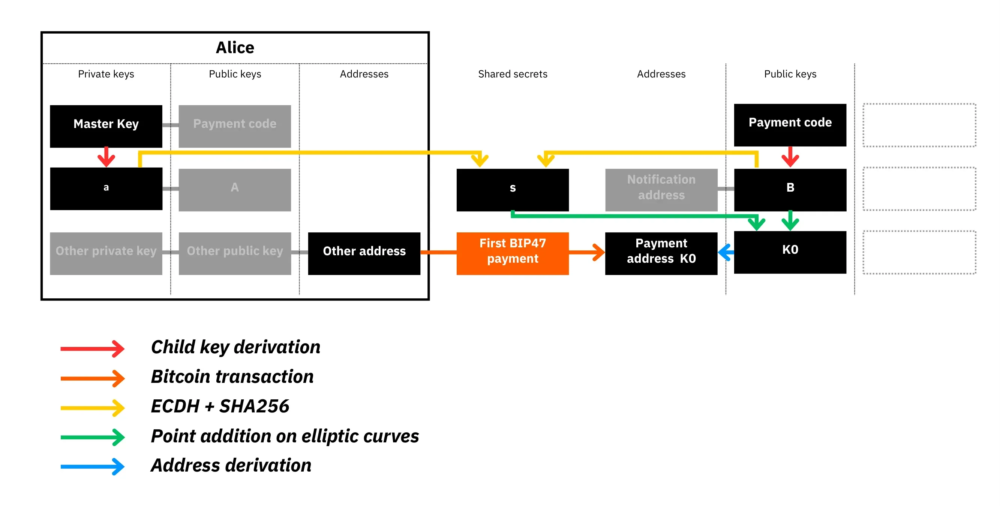


Alice ikinci bir ödeme yapmak isterse, önceki adımların aynısını izler, ancak bu kez Bob'ün ödeme kodundan türetilen ikinci açık anahtarı seçer. Özellikle, bir sonraki kullanılmayan anahtarı kullanacaktır. Böylece Bob'e ait $K1$ olarak adlandırılan yeni bir alıcı Address elde edecektir:


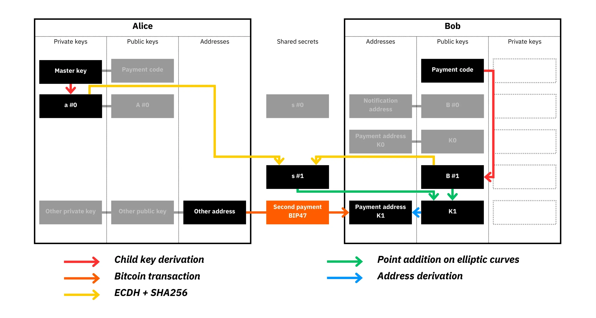


Bu şekilde devam edebilir ve Bob'e ait `2^32`ye kadar boş adres türetebilir.


Dışarıdan bir bakış açısıyla Blockchain'e bakıldığında, bir BIP47 ödemesini geleneksel bir ödemeden ayırt etmek teorik olarak imkansızdır. İşte Testnet'daki bir BIP47 ödeme işlemi örneği:


```text
94b2e59510f2e1fa78411634c98a77bbb638e28fb2da00c9f359cd5fc8f87254
```


Tüketilen bir girdi, bir ödeme çıktısı ve bir değişiklik UTXO ile klasik bir işlem gibi görünüyor:


### BIP47 ödemesinin alınması ve özel anahtarın türetilmesi


Alice, Bob'e ait boş bir BIP47 Address'e ilk ödemesini az önce yaptı. Şimdi Bob'in bu ödemeyi nasıl aldığını görelim. Ayrıca Alice'un kendi oluşturduğu Address'in özel anahtarına neden erişemediğini ve Bob'in aldığı bitcoinleri harcamak için bu anahtarı nasıl bulduğunu göreceğiz.


Bob, Alice'den bildirim işlemini alır almaz, muhabiri bir ödeme göndermeden önce bile BIP47 $K0$ açık anahtarını türetir. Bu nedenle, ilişkili Address'e yapılan herhangi bir ödemeyi gözlemler. Aslında, gözlemlediği birkaç adresi hemen türetir ($K0$, $K1$, $K2$, $K3$...). İşte bu açık anahtar $K0$'ı nasıl türetiyor:


- Bob ödeme kodundan türetilen ilk kız özel anahtarı seçer. Bu özel anahtar $b$ olarak adlandırılır. Alice'ün bir önceki adımda hesaplamalarını yaptığı $B$ açık anahtarı ile ilişkilidir:


$$ b $$


- Bob, Alice'nın ödeme kodundan türetilen ilk açık anahtarını seçer. Bu anahtar $A$ olarak adlandırılır. Alice'nın hesaplamalarını yaptığı ve yalnızca Alice tarafından bilinen özel anahtar $a$ ile ilişkilidir. Bob, Alice'nın kendisine bildirim işlemiyle birlikte gönderilen ödeme kodunu bildiği için bu işlemi gerçekleştirebilir:


$$ A = a \cdot G $$


- Bob kendi özel anahtarı $b$'yi Alice'in açık anahtarı $A$'ya uygulayarak eliptik eğri üzerindeki noktaları toplayıp ikiye katlayarak $S$ gizli noktasını hesaplar. Burada da ECDH bu $S$ noktasının hem Bob hem de Alice için aynı olacağını garanti etmek için kullanılır:


$$ S = b \cdot A $$


- Alice ile aynı şekilde, Bob bu $S$ noktasının apsisini izole eder. Bu değere $Sx$ adını verdik. Paylaşılan gizli $s$ (küçük harf) değerini bulmak için bu değeri SHA256 fonksiyonuna aktarır:


$$ s = \text{SHA256}(Sx) $$


- Alice ile aynı şekilde, Bob eliptik eğri üzerindeki $s-G$ noktasını hesaplar. Daha sonra bu gizli noktayı kendi açık anahtarı $B$'ye ekler. Daha sonra eliptik eğri üzerinde yeni bir nokta elde eder ve bunu $K0$ açık anahtarı olarak yorumlar:


$$ K0 = B + s \cdot G $$


Bob bu açık anahtar $K0$'a sahip olduğunda, bitcoinlerini harcamak için ilgili özel anahtarı türetebilir. Bu özel anahtarı yalnızca kendisi generate yapabilir:


- Bob, kişisel ödeme kodundan türetilen kızının özel anahtarı $b$'yi toplar. Sadece kendisi $b$ değerini elde edebilir. Daha sonra $b$ değerini paylaşılan gizli $s$ değerine ekleyerek $k0$ değerini, yani $K0$'ın özel anahtarını elde eder:


$$ k0 = b + s $$


Eliptik eğrinin grup yasası sayesinde, Bob tam olarak Alice tarafından kullanılan açık anahtara karşılık gelen özel anahtarı elde eder. Bu nedenle şu sonuca varırız:


$$ K0 = k0 \cdot G $$


Bir BIP47 ödemesi almak ve ilgili özel anahtarı hesaplamak için birlikte gördüğümüz adımları özetleyeceğim:


- Bob, kişisel ödeme kodundan türetilen ilk kız özel anahtarı seçer;
- Alice'ün dize kodundan türetilen ilk kız genel anahtardan ECDH kullanarak eliptik eğri üzerinde bir gizli nokta hesaplar;
- SHA256 ile paylaşılan bir sırrı hesaplamak için bu gizli noktayı kullanır;
- Bu paylaşılan sırrı eliptik eğri üzerinde yeni bir gizli nokta hesaplamak için kullanır;
- Bu yeni gizli noktayı kişisel açık anahtarına ekler;
- Alice'in ilk ödemesini göndereceği yeni bir geçici açık anahtar elde eder;
- Bob bu geçici açık anahtarla ilişkili özel anahtarı, ödeme kodundan türetilen kızı özel anahtarını ve paylaşılan gizli anahtarı ekleyerek hesaplar.


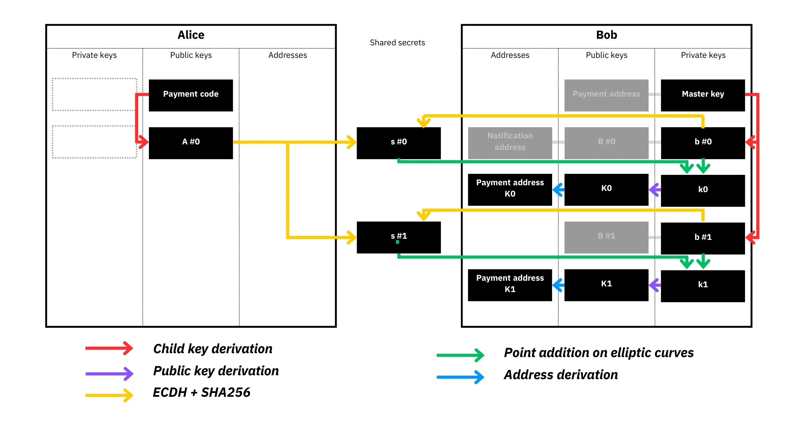


Alice $b$ (Bob'in özel anahtarı) elde edemediğinden, $k0$ (Bob'in BIP47 alımı Address ile ilişkili özel anahtar) belirleyemez. Şematik olarak, paylaşılan gizli $S$'ın hesaplanmasını aşağıdaki gibi gösterebiliriz:


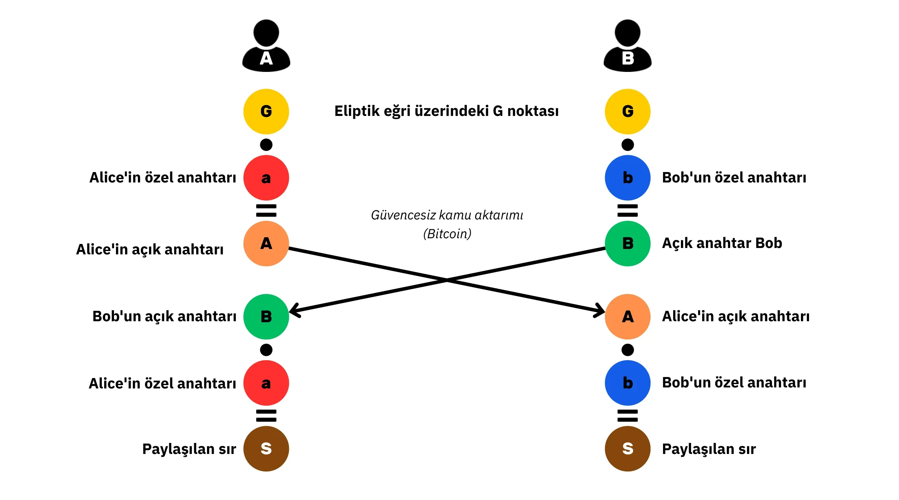


Paylaşılan sır ECDH ile bulunduğunda, Alice ve Bob BIP47 ödeme açık anahtarını $K0$ hesaplar ve Bob ayrıca ilişkili özel anahtarı $k0$ hesaplar:


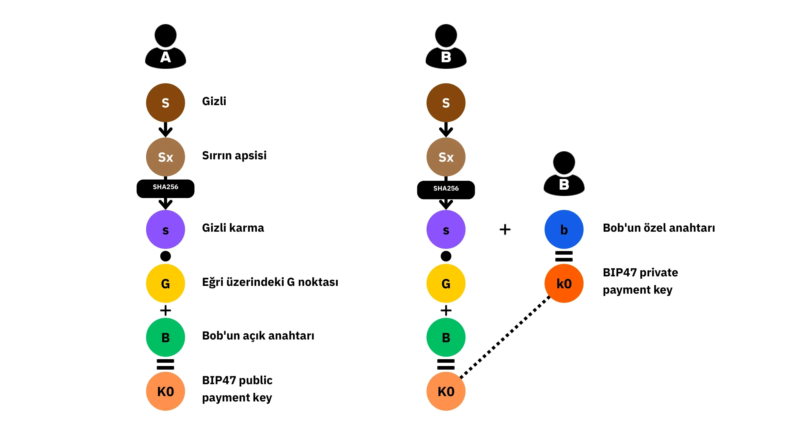


### BIP47 ödemesinin iadesi


Bob, Alice'in yeniden kullanılabilir ödeme kodunu bildiğinden, ona para iadesi göndermek için ihtiyaç duyduğu tüm bilgilere zaten sahiptir. Herhangi bir bilgi istemek için Alice ile tekrar iletişime geçmesi gerekmeyecektir. Sadece bir bildirim işlemi ile onu bilgilendirmesi gerekir, böylece seed ile BIP47 adreslerini alabilir ve ardından ona `2^32`ye kadar ödeme gönderebilir.


Geri ödeme özelliği BIP47'ye özgüdür ve daha sonraki bölümlerde inceleyeceğimiz Sessiz Ödemeler gibi diğer yöntemlere göre avantajlarından biridir.


Bob daha sonra Alice'e gönderdiği ödemeleri aynı şekilde geri ödeyebilir. Roller tersine döndü:


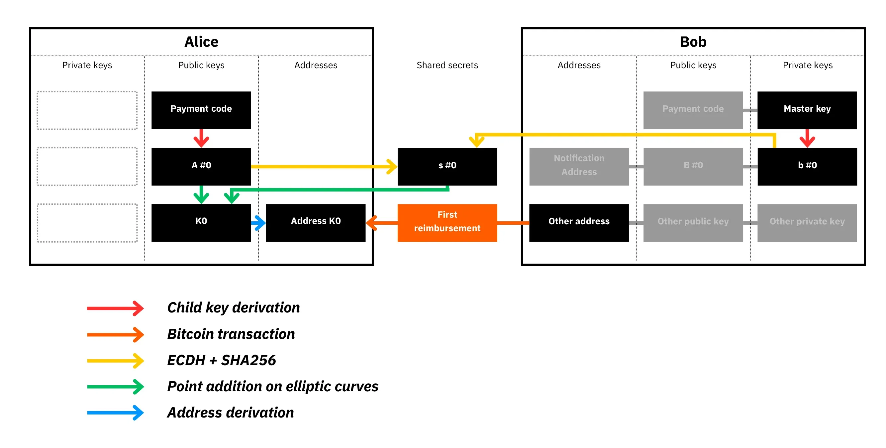


**Fanis Michalakis'e** (https://x.com/FanisMichalakis) bu bölümün yazılmasına ilham veren makaleye ilişkin redaksiyonu ve uzman tavsiyesi için çok teşekkürler!


https://planb.network/tutorials/privacy/on-chain/paynym-bip47-a492a70b-50eb-4f95-a766-bae2c5535093

## Sessiz Ödemeler


<chapterId>2871d594-414e-4598-a830-91c9eb84dfb8</chapterId>


BIP47 zincir üzerindeki verimsizliği nedeniyle yaygın olarak eleştirilmiştir. Önceki bölümde açıklandığı üzere, her yeni alıcı için bir bildirim işleminin gerçekleştirilmesini gerektirmektedir. Bu alıcı ile sürdürülebilir bir ödeme kanalı kurmayı planlıyorsak, bu kısıtlama ihmal edilebilir hale gelir. Gerçekten de tek bir bildirim işlemi, neredeyse sonsuz sayıda müteakip BIP47 ödemesinin önünü açmaktadır.


Ancak bazı durumlarda bildirim işlemi kullanıcı için bir engel teşkil edebilir. Bir alıcıya yapılan tek seferlik bir bağış örneğini ele alalım: klasik bir Bitcoin Address ile bağışı tamamlamak için tek bir işlem yeterlidir. Ancak BIP47 ile iki işlem gereklidir: biri bildirim için diğeri de gerçek ödeme için. Blok alanı talebi düşük ve işlem ücretleri düşük olduğunda, bu ekstra adım genellikle bir sorun teşkil etmez. Bununla birlikte, tıkanıklık zamanlarında, işlem ücretleri tek bir ödeme için fahiş hale gelebilir, standart bir Bitcoin işlemine kıyasla kullanıcıya maliyeti potansiyel olarak iki katına çıkarabilir ve bu da kullanıcı için kabul edilemez olabilir.


Kullanıcının statik bir tanımlayıcıya yalnızca birkaç ödeme yapmayı planladığı durumlar için başka çözümler geliştirilmiştir. Bunlar arasında [BIP352]'de (https://github.com/Bitcoin/bips/blob/master/bip-0352.mediawiki) açıklanan Sessiz Ödemeler yer almaktadır. Bu protokol, Address tekrar kullanımları üretmeden ve bildirim işlemlerinin kullanılmasını gerektirmeden ödeme almak için statik bir tanımlayıcının kullanılmasını mümkün kılar. Şimdi bu protokolün nasıl çalıştığına bir göz atalım.


---
*Bu bölümü tam olarak anlamak için, ECDH (Eliptik Eğri Diffie-Hellman) ve HD Wallet'de kriptografik anahtar türetmenin işleyişine hakim olmak çok önemlidir. Bu kavramlar BIP47 ile ilgili bir önceki bölümde ayrıntılı olarak ele alınmıştır. Burada tekrar etmeyeceğim. Bu kavramlara henüz aşina değilseniz, bu bölüme devam etmeden önce bir önceki bölüme başvurmanızı tavsiye ederim. Alıcı adreslerinin yeniden kullanımıyla ilgili risklerin ya da ödeme almak için benzersiz bir tanımlayıcıya sahip olmanın öneminin üzerinden tekrar geçmeyeceğim.* Burada sadece belirtmek istediğim birkaç noktadan bahsedeceğim


---
### Neden bildirimi taşımıyorsunuz?


BIP47 bölümünde tartışıldığı gibi, bildirim işleminin iki ana işlevi vardır:


- Alıcıyı bilgilendirir;
- Gönderenin ödeme kodunu iletir.


Safça bu bildirim sürecinin off-chain ile gerçekleştirilebileceği düşünülebilir. Teoride bu tamamen mümkündür: alıcının yapması gereken tek şey, gönderenlerden BIP47 ödeme kodlarını almak için bir iletişim aracı belirtmektir. Ancak, bu yaklaşımla ilgili iki büyük sorun bulunmaktadır:


- İlk olarak, kod iletim sürecini başka bir iletişim protokolüne taşıyacaktır. Exchange'nin maliyeti ve gizliliği ile ilgili sorunlar devam edecek, ancak bu yeni protokole aktarılacaktır. Gizlilik açısından, bu aynı zamanda bir kullanıcının kimliği ile zincir üzerindeki faaliyeti arasında bir bağlantı oluşturabilir; bildirimi doğrudan Blockchain üzerinde gerçekleştirerek kaçınmaya çalıştığımız şey budur. Ayrıca, bildirimin Blockchain dışında yapılması, Bitcoin'de mevcut olmayan sansür risklerini (fonların bloke edilmesi gibi) beraberinde getirecektir;
- İkinci olarak, bu bir kurtarma sorunu yaratacaktır. BIP47 ile alıcının fonlara erişebilmesi için gönderenlerin ödeme kodlarını bilmesi gerekir. Bu durum makbuzda geçerli olduğu gibi, Wallet'ün kaybolması halinde fonların seed aracılığıyla kurtarılması durumunda da geçerlidir. Zincir içi bildirimlerle bu risk önlenir çünkü kullanıcı sadece seed'ünü bilerek bildirim işlemlerini geri alabilir ve şifresini çözebilir. Bununla birlikte, bildirim Blockchain dışında yapılırsa, kullanıcının alınan tüm ödeme kodlarının dinamik bir yedeğini tutması gerekecektir ki bu da ortalama bir kullanıcı için pratik değildir.


Tüm bu kısıtlamalar, zincir içi bildirim kullanımını BIP47 için gerekli kılmaktadır. Ancak Silent Payments, tam da maliyeti nedeniyle bu zincir içi bildirim adımından kaçınmaya çalışmaktadır. Bu nedenle benimsenen çözüm, bildirimi taşımak değil, tamamen ortadan kaldırmaktır. Bunu başarmak için bir uzlaşmanın kabul edilmesi gerekir: tarama. Kullanıcının bildirim işlemleri sayesinde fonlarını tam olarak nerede bulacağını bildiği BIP47'nin aksine, Silent Payments ile kullanıcı kendisine yönelik ödemeleri tespit etmek için mevcut tüm Bitcoin işlemlerini incelemek zorundadır. Bu operasyonel yükü azaltmak için, Sessiz Ödemeler araması yalnızca bu tür ödemeleri içermesi muhtemel işlemlerle, yani en az bir Taproot P2TR çıktısı olanlarla sınırlıdır. Tarama ayrıca yalnızca Wallet oluşturma tarihinden itibaren yapılan işlemlere odaklanır (Wallet 2024'te oluşturulmuşsa 2009'a kadar uzanan işlemleri taramaya gerek yoktur).


Dolayısıyla, BIP47 ve Sessiz Ödemelerin benzer bir hedefe yönelik olmalarına rağmen neden farklı ödünleşimler içerdiğini ve bu nedenle **aslında farklı kullanım durumlarını** karşıladığını görebilirsiniz. Tek seferlik bağışlar gibi tek seferlik ödemeler için Sessiz Ödemeler daha düşük maliyetleri nedeniyle daha uygundur. Öte yandan, Exchange platformları veya Mining havuzlarında olduğu gibi aynı alıcıya yapılan düzenli işlemler için BIP47 tercih edilebilir.


Neyin tehlikede olduğunu daha iyi anlamak için Sessiz Ödemelerin teknik işleyişine bir göz atalım. Bunu yapmak için, BIP352 açıklayıcı belgesiyle aynı yaklaşımı benimsememizi öneriyorum. Yapılacak hesaplamaları, her yeni eklemeyi gerekçelendirerek unsur unsur kademeli olarak inceleyeceğiz.


### Anlaşılması gereken birkaç kavram


Başlamadan önce, Sessiz Ödemelerin yalnızca P2TR (*Taproot'e Öde*) komut dosyası türlerinin kullanımına dayandığını belirtmek önemlidir. BIP47'den farklı olarak, alıcı adreslerini alt genel anahtarlardan hashing yoluyla türetmek gerekli değildir. P2TR standardında, değiştirilmiş açık anahtar doğrudan ve şifrelenmeden Address'te kullanılır. Yani bir Taproot alıcı Address aslında bazı meta verilere sahip bir açık anahtardır. Bu değiştirilmiş açık anahtar, diğer iki açık anahtarın toplamıdır: biri basit bir imza yoluyla doğrudan, geleneksel harcamayı mümkün kılar, diğeri ise MAST'ın Merkle Root'ini temsil eder ve Merkle Tree'de potansiyel olarak yazılı koşullardan birinin karşılanmasına bağlı olarak harcamayı yetkilendirir.


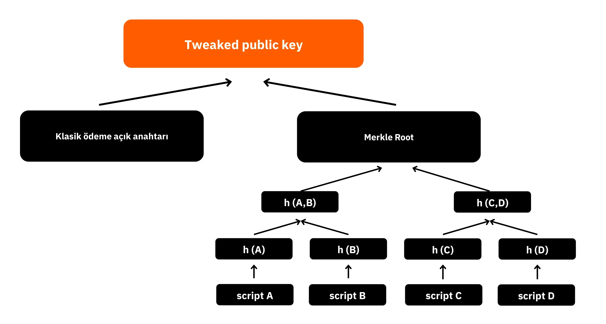


Sessiz Ödemelerin sadece Taproot ile sınırlandırılması kararının iki ana nedeni vardır:


- İlk olarak, sadece tek bir standarda uyulması gerektiğinden, Wallet yazılımında uygulamayı ve gelecekteki yükseltmeleri önemli ölçüde kolaylaştırır;
- İkinci olarak, bu yaklaşım, kullanıcıların kendilerini zincir analizinde generate farklı Wallet parmak izleri olan farklı senaryo türleri arasında bölmemelerini teşvik ederek kullanıcıların anonsetini geliştirmeye yardımcı olur (bu kavram hakkında daha fazla bilgi için lütfen 2. bölümün 4. kısmına bakın).


### Sessiz Ödemeler açık anahtarının naif bir şekilde türetilmesi


SP'lerin (Sessiz Ödemeler) nasıl çalıştığını anlamak için basit bir örnekle başlayalım. İki Bitcoin kullanıcısı olan Alice ve Bob'ü ele alalım. Alice, boş bir alıcı Address üzerinden Bob'e Bitcoin göndermek istemektedir. Bu işlemin üç amacı vardır:


- Alice, generate'ü boş bir Address'e dönüştürebilmelidir;
- Bob, bu belirli Address'ye gönderilen bir ödemeyi tanımlayabilmelidir;
- Bob'nin fonlarını harcayabilmesi için bu Address ile ilişkili özel anahtarı elde edebilmesi gerekir.


Alice'ün güvenli Bitcoin Wallet'sinde aşağıdaki anahtar çiftine sahip bir UTXO vardır:


- a$: özel anahtar;
- a$: açık anahtar ($A = a \cdot G$)


Bob ile internette yayınladığı bir SP Address vardır:


- b$: özel anahtar;
- b$: açık anahtar ($B = b \cdot G$)


Bob'un Address'sini alarak, Alice ECDH kullanarak Bob'a ait yeni bir boş Address hesaplayabilir. Bu Address'ye $P$ diyelim:


$$ P = B + \text{Hash}(a \cdot B) \cdot G $$


Bu denklemde Alice basitçe kendi özel anahtarı $a$ ile Bob'ün açık anahtarı $B$'nin skaler çarpımını hesaplamıştır. Bu sonucu herkes tarafından bilinen bir Hash fonksiyonuna aktarmıştır. Elde edilen değer daha sonra eliptik eğri `secp256k1`in üretme noktası $G$ ile skaler olarak çarpılır. Son olarak, Alice elde edilen noktayı Bob'ün açık anahtarına $B$ ekler. Alice bu Address $P$'ye sahip olduğunda, bunu bir işlemde çıktı olarak kullanır, yani ona bitcoin gönderir.


> *Sessiz Ödemeler bağlamında, "Hash" işlevi, özellikle `BIP0352/SharedSecret` ile etiketlenmiş bir SHA256 Hash işlevine karşılık gelir; bu, üretilen karmaların bu protokole özgü olmasını ve diğer bağlamlarda yeniden kullanılamamasını sağlarken, imzalarda nonces'lerin yeniden kullanımına karşı ek koruma sunar. Bu standart, `secp256k1` üzerindeki [Schnorr imzaları için BIP340'ta belirtilen] (https://github.com/Bitcoin/bips/blob/master/bip-0340.mediawiki) standarda karşılık gelir.*
ECDH'nin dayandığı eliptik eğrinin özellikleri sayesinde şunu biliyoruz:


$$ a \cdot B = b \cdot A $$


Bu nedenle Bob, Alice'un bitcoinleri gönderdiği alıcı Address'yi hesaplayabilecektir. Bunu yapmak için, Sessiz Ödemeler kriterlerini karşılayan tüm Bitcoin işlemlerini izler ve ödemenin kendisine yapılıp yapılmadığını görmek için her birine aşağıdaki hesaplamayı uygular (*tarama*):


$$ P' = B + \text{Hash}(b \cdot A) \cdot G $$


Alice'nin işlemini taradığında, $P'$'nin $P$'ye eşit olduğunu fark eder. Bu nedenle ödemenin ona yapıldığını bilir:


$$ P' = B + \text{Hash}(b \cdot A) \cdot G = B + \text{Hash}(a \cdot B) \cdot G = P $$


Buradan Bob, Address $P$'nin harcanmasını sağlayan özel anahtar $p$'yi hesaplayabilecektir:


$$ p = (b + \text{Hash}(b \cdot A)) \bmod n $$


Gördüğünüz gibi, bu özel anahtar $p$'yi hesaplamak için özel anahtar $b$'ye sahip olmanız gerekir. Sadece Bob bu $b$ özel anahtarına sahiptir. Bu nedenle, Address Sessiz Ödemelerine gönderilen bitcoinleri harcayabilecek tek kişi o olacaktır.


*Efsane:*


- $B$: Bob tarafından yayınlanan açık anahtar/statik Address
- $b$: Bob'in özel anahtarı
- $A$: İşlem girdisi olarak kullanılan Alice'nin UTXO açık anahtarı
- $a$: Alice'ün özel anahtarı
- $G$: Secp256k1` eliptik eğrisinin üretim noktası
- $\text{SHA256}$: BIP0352/SharedSecret` ile etiketlenmiş SHA256 Hash işlevi
- $s$: ECDH ortak sırrı
- $P$: Bob'ye ödeme için açık anahtar/tekil Address


Burada Bob'ın $B$ olarak belirtilen statik Address'ini kullanarak bitcoin göndermek için benzersiz bir Address $P$ türetmek için oldukça naif bir başlangıç yaklaşımı var. Ancak bu yöntem çok basittir ve düzeltilmesi gereken birkaç kusuru vardır. İlk sorun, bu şemada Alice'un aynı işlem içinde Bob'a birden fazla çıktı oluşturamamasıdır.


### Birden fazla çıktıyı nasıl oluşturabilirim?


Önceki bölümdeki örnekte Alice, Address $P$ adresinden Bob'e gidecek tek bir çıktı oluşturur. Aynı girdi seçildiğinde, Alice'nin Bob için iki ayrı boş adres oluşturması imkansızdır, çünkü kullanılan yöntem $P$ için her zaman aynı sonuca, yani aynı Address'e yol açacaktır. Ancak, Alice'nin Bob'e yaptığı ödemeyi birkaç küçük miktara bölmek ve böylece birkaç UTXO oluşturmak istediği birçok durum olabilir. Bu nedenle bunu başarmak için bir yöntem bulmak gereklidir.


Bunu başarmak için, Alice'in $P$ türetmek için yaptığı hesaplamayı biraz değiştireceğiz, böylece generate için $P_0$ ve $P_1$ olmak üzere iki farklı adres Bob olabilir.


Hesaplamayı değiştirmek ve 2 farklı adres elde etmek için, sonucu değiştiren bir tamsayı eklemeniz yeterlidir. Böylece Alice, Address $P_0$ değerini elde etmek için hesaplamasına $0$ ve Address $P_1$ değerini elde etmek için $1$ ekleyecektir. Bu tamsayıya $i$ diyelim:


$$ P_i = B + \text{Hash}(a \cdot B \text{ ‖ } i) \cdot G $$


Hesaplama işlemi önceki yönteme göre değişmeden kalır, ancak bu kez Alice, Hash ile devam etmeden önce $a \cdot B$ ile $i$'yi birleştirecektir. Daha sonra Bob'e ait yeni bir Address elde etmek için $i$ değerini değiştirmeniz yeterlidir. Örneğin:


$$ P_0 = B + \text{Hash}(a \cdot B \text{ ‖ } 0) \cdot G $$


$$ P_1 = B + \text{Hash}(a \cdot B \text{ ‖ } 1) \cdot G $$


Bob, Blockchain'yı kendisine yönelik Sessiz Ödemeler için taradığında, Address $P_0$ için $i = 0$ kullanarak başlar. Eğer $P_0$ üzerinde herhangi bir ödeme bulamazsa, bu işlemin kendisine yönelik Sessiz Ödemeler içermediği sonucuna varır ve taramayı bırakır. Ancak, $P_0$ geçerliyse ve kendisi için bir ödeme içeriyorsa, Alice'in ikinci bir ödeme yapıp yapmadığını kontrol etmek için aynı işlemde $P_1$ ile devam eder. Eğer $P_1$ geçersiz çıkarsa, bu işlemi aramayı bırakır; aksi takdirde, ardışık $i$ değerlerini test etmeye devam eder:


$$ P_0 = B + \text{Hash}(b \cdot A \text{ ‖ } 0) \cdot G $$


$$ P_1 = B + \text{Hash}(b \cdot A \text{ ‖ } 1) \cdot G $$


Bob, $P_0$ çalışmazsa $i = 0$ değerinde hemen durduğundan, bu tamsayının kullanılması işlem tarama aşaması için Bob'ye neredeyse hiç ek işlem yükü getirmez.


Bob daha sonra özel anahtarları aynı şekilde hesaplayabilir:


$$
p_0 = (b + \text{hash}(b \cdot A \text{ ‖ } 0)) \bmod n
$$


$$
p_1 = (b + \text{hash}(b \cdot A \text{ ‖ } 1)) \bmod n
$$


*Efsane:*


- $B$: Bob tarafından yayınlanan açık anahtar/statik Address
- $b$: Bob'nın özel anahtarı
- $A$: İşlem girdisi olarak kullanılan Alice'nin UTXO açık anahtarı
- $a$: Alice'un özel anahtarı
- $G$: Secp256k1` eliptik eğrisinin üretim noktası
- $\text{SHA256}$: BIP0352/SharedSecret` ile etiketlenmiş SHA256 Hash işlevi
- $s_0$: İlk ortak sır ECDH
- $s_1$: İkinci ECDH ortak sırrı
- $P_0$: Bob'ye ödeme için ilk açık anahtar / benzersiz Address
- $P_1$: Bob'e ödeme için ikinci açık anahtar / benzersiz Address


Bu yöntemle güzel bir protokol elde etmeye başlıyoruz, ancak hala üstesinden gelinmesi gereken birkaç zorluk var, özellikle de Address'in yeniden kullanımının önlenmesi.


### Address'nın yeniden kullanımı nasıl önlenir?


Önceki bölümlerde gördüğümüz gibi, Alice, UTXO'unu güvence altına alan anahtar çiftini kullanır ve bunu Bob ile ECDH paylaşılan sırrını hesaplamak için harcayacaktır. Bu sır onun benzersiz Address $P_0$'ı türetmesini sağlar. Bununla birlikte, Alice tarafından kullanılan anahtar çifti ($a$, $A$), bu Address'yi birkaç kez tekrar kullanmışsa, birkaç UTXO'yu güvence altına alabilir. Alice'in aynı $A$ anahtarıyla güvence altına alınmış iki UTXO kullanarak Bob'un statik Address $B$'sine iki ödeme yapması durumunda, bu Bob için Address'nin yeniden kullanımıyla sonuçlanacaktır.


> *Address'in yeniden kullanımı kullanıcı gizliliği açısından çok kötü bir uygulamadır. Nedenini öğrenmek için bu kursun ilk bölümlerini incelemenizi tavsiye ederim.*
Gerçekten de, benzersiz Address $P_0$, $A$ ve $B$'den türetildiğinden, Alice, $B$'ye ikinci bir ödeme için aynı anahtar $A$ ile ikinci bir Address türetirse, tam olarak aynı Address $P_0$'a ulaşacaktır. Bu riskten kaçınmak ve Address'nin Sessiz Ödemeler içinde yeniden kullanılmasını önlemek için hesaplamalarımızı biraz değiştirmemiz gerekecek.


İstediğimiz şey, Alice tarafından bir ödemeye girdi olarak kullanılan her UTXO için, birkaç UTXO aynı anahtar çifti ile güvence altına alınmış olsa bile, Bob tarafında benzersiz bir Address vermektir. Bu yüzden tek yapmamız gereken benzersiz Address $P_0$ hesaplanırken UTXO'ye bir referans eklemektir. Bu referans basitçe girdi olarak kullanılan UTXO'nin Hash'sı olacaktır:


$$ \text{inputHash} = \text{Hash}(\text{outpoint} \text{ ‖ } A) $$


Ve Alice bu referansı benzersiz Address $P_0$ hesaplamasının girdisine ekleyecektir:


$$ P_0 = B + \text{Hash}(\text{inputHash} \cdot a \cdot B \text{ ‖ } 0) \cdot G $$


Tarama yaparken, Bob $\text{inputHash}$ da ekleyebilir, çünkü tek yapması gereken $\text{outpoint}$ sonucunu çıkarmak için işlemi gözlemlemektir:


$$ P_0 = B + \text{Hash}(\text{inputHash} \cdot b \cdot A \text{ ‖ } 0) \cdot G $$


Geçerli bir $P_0$ bulduğunda, karşılık gelen $p_0$ özel anahtarını hesaplayabilir:


$$
p_0 = (b + \text{hash}(\text{inputHash} \cdot b \cdot A \text{ ‖ } 0)) \bmod n
$$


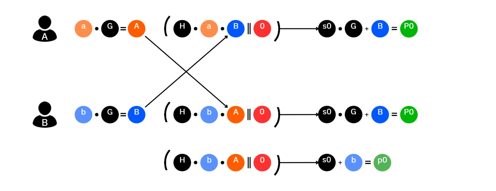


*Efsane:*


- $B$: Bob tarafından yayınlanan açık anahtar/statik Address
- $b$: Bob'nin özel anahtarı
- $A$: Alice'in işlem girdisi olarak kullanılan UTXO açık anahtarı
- $a$: Alice'nin özel anahtarı
- $H$: UTXO Hash girdi olarak kullanılır
- $G$: Secp256k1` eliptik eğrisinin üretim noktası
- $\text{SHA256}$: BIP0352/SharedSecret` ile etiketlenmiş SHA256 Hash işlevi
- $s_0$: İlk ECDH ortak sırrı
- $P_0$: Bob'e ödeme için ilk açık anahtar / benzersiz Address


Şu an için hesaplamalarımız Alice'nın işlemi için tek bir girdi kullandığını varsaymaktadır. Ancak, birden fazla girdi kullanabilmelidir. Sonuç olarak, Bob'nin tarafında, birden fazla girdi içeren her bir işlem için, teorik olarak her bir girdi için ECDH'yi hesaplayarak kendisine bir ödeme yapılıp yapılmayacağını belirlemesi gerekir. Bu yöntem tatmin edici değildir, bu nedenle iş yükünü azaltmak için bir çözüm bulmamız gerekir!


### Açık anahtarları girdilere dönüştürme


Bu sorunu çözmek için, Alice'in tarafındaki belirli bir girdiyi güvence altına alan anahtar çiftini kullanmak yerine, işlemin girdilerinde kullanılan tüm anahtar çiftlerinin toplamını kullanacağız. Bu toplam daha sonra yeni bir anahtar çifti olarak kabul edilecektir. Bu teknik "ince ayar" olarak bilinir.


Örneğin, Alice'un işleminin her biri farklı bir anahtar çiftiyle güvence altına alınmış 3 girdisi olduğunu düşünelim:


- a_0$, #0 girdisini güvence altına almak için kullanılır;
- a_1$ 1 numaralı girdiyi güvence altına almak için kullanılır;
- a_2$ 2 numaralı girişi güvence altına alır.


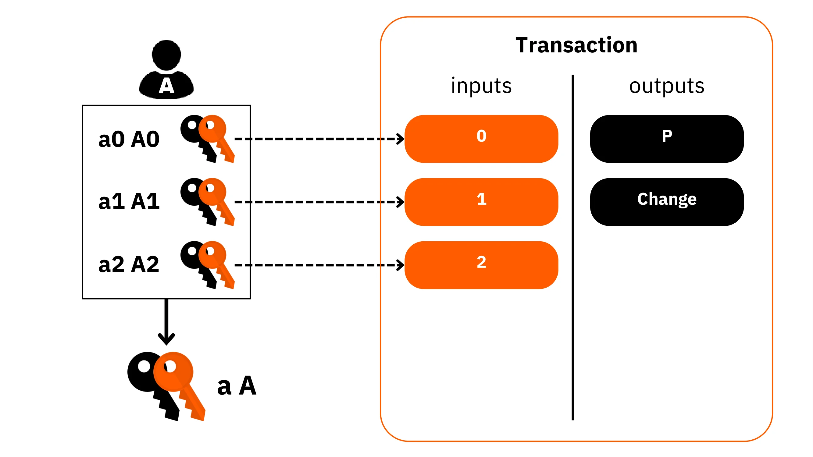


Daha önce açıklanan yöntemi izleyerek, Alice'nin ECDH sırrını hesaplamak için $a_0$, $a_1$ ve $a_2$ arasından tek bir anahtar çifti seçmesi ve Bob'ün statik Address $B$'sinden tek ödeme Address $P$'sini generate seçmesi gerekecektir. Ancak bu yaklaşım Bob'ün her bir olasılığı sırayla test etmesini gerektirir; önce $a_0$, sonra $a_1$ ve geçerli bir $P$ Address üreten bir çift belirleyene kadar böyle devam eder. Bu süreç, Bob'ün tüm işlemlerin tüm girdileri üzerinde ECDH hesaplamasını çalıştırmasını gerektirir, bu da taramanın operasyonel yükünü önemli ölçüde artırır.


Bundan kaçınmak için Alice'ten tüm giriş anahtarlarının toplamını kullanarak $P$ hesaplamasını isteyeceğiz. Örneğimizi kullanarak, değiştirilmiş özel anahtar $a$ aşağıdaki gibi hesaplanacaktır:


$$ a = a_0 + a_1 + a_2 $$


Aynı şekilde, Alice ve Bob değiştirilmiş açık anahtarı hesaplayabilir:


$$ A = A_0 + A_1 + A_2 $$


Bu yöntemle, Bob'nin yalnızca işlemin açık anahtarlarının toplamını hesaplaması ve ardından ECDH sırrını yalnızca $A$'dan hesaplaması gerekir, bu da tarama aşaması için gereken hesaplama sayısını büyük ölçüde azaltır.


Ancak, önceki bölümü hatırlayın. Address'in yeniden kullanılmasını önlemek için Nonce olarak kullanılan $\text{inputHash}$ Hash'i hesaplamamıza eklemiştik:


$$ \text{inputHash} = \text{Hash}(\text{outpoint} \text{ ‖ } A) $$


Ancak bir işlemde birden fazla girdiniz varsa, bu hesaplamada hangi $\text{outpoint}$'in seçileceğini belirleyebilmeniz gerekir. BIP352'ye göre, kullanılacak $\text{outpoint}$ seçim kriteri leksikografik olarak en küçük olanı seçmektir, yani alfabetik sırada ilk görünen UTXO'yi seçmektir. Bu yöntem, her işlemde seçilecek UTXO'yi standartlaştırır. Örneğin, bu sözlüksel olarak en küçük $\text{outpoint}$ $\text{outpoint}_L$ ise, $\text{inputHash}$ hesaplaması şöyle olacaktır:


$$ \text{inputHash} = \text{Hash}(\text{outpoint}_L \text{ ‖ } A) $$


Bu durumda hesaplamalar önceki bölümde sunulanlarla aynı kalır, ancak özel anahtar $a$ ve buna karşılık gelen açık anahtar $A$ artık tek bir girdiyi güvence altına almak için kullanılan bir çift değildir, ancak şimdi girdilerdeki tüm anahtar çiftleri için ince ayarı temsil eder.


### Ayrı gider ve tarama anahtarları


Şimdilik, Sessiz Ödeme statik Address $B$'yi benzersiz bir açık anahtar olarak adlandırdık. Alice'in paylaşılan gizli ECDH'yi oluşturmak için bu açık anahtarı $B$ kullandığını ve bunun da benzersiz ödeme Address $P$'yi hesapladığını unutmayın. Bob tarama aşaması için bu açık anahtarı $B$ ve ilgili özel anahtarı $b$ kullanır. Ancak, Address $P$'den harcama yapılmasını sağlayan özel anahtar $p$'yi hesaplamak için özel anahtar $b$'yi de kullanacaktır.


Bu yöntemin dezavantajı, $b$ özel anahtarının (Sessiz Ödemeleri alan adreslerin tüm özel anahtarlarını hesaplamak için kullanılır) Bob tarafından işlemleri taramak için de kullanılmasıdır. Bu adım $b$ anahtarının internete bağlı Wallet yazılımında bulunmasını gerektirir ki bu da anahtarı Cold Wallet'de tutmaktan daha fazla hırsızlık riskine maruz bırakır. İdeal olarak, diğer tüm özel anahtarlara erişimi kontrol eden $b$ özel anahtarını bir Hardware Wallet üzerinde güvende tutarken Sessiz Ödemelerden yararlanabilmek faydalı olacaktır. Neyse ki, protokol tam da buna izin verecek şekilde uyarlanmıştır.


Bunu yapmak için BIP352, alıcının 2 farklı anahtar çifti kullanmasını gerektirir:


- b_{\text{spend}}$: benzersiz ödeme adreslerinin özel anahtarlarını hesaplamak için;
- b_{\text{scan}}$: benzersiz ödeme adreslerini bulmak için.


Bu şekilde, Bob $b_{\text{spend}}$ özel anahtarını bir Hardware Wallet'de tutabilir ve $b_{\text{scan}}$ özel anahtarını $b_{\text{spend}}$'i ifşa etmeden Sessiz Ödemelerini bulmak için çevrimiçi yazılımda kullanabilir. Öte yandan, $B_{\text{scan}}$ ve $B_{\text{spend}}$ açık anahtarlarının her ikisi de Bob'ün statik Address $B$'sinde bulunduğu için herkese açıktır:


$$ B = B_{\text{scan}} \text{ ‖ } B_{\text{harcama}} $$


Bob'ya ait benzersiz bir Address $P_0$ ödemesini hesaplamak için Alice şimdi aşağıdaki hesaplamayı yapacaktır:


$$ P_0 = B_{\text{spend}} + \text{Hash}(\text{inputHash} \cdot a \cdot B_{\text{scan}} \text{ ‖ } 0) \cdot G $$


Kendisine yapılan ödemeleri bulmak için Bob aşağıdaki hesaplamayı yapacaktır:


$$ P_0 = B_{\text{spend}} + \text{Hash}(\text{inputHash} \cdot b_{\text{scan}} \cdot A \text{ ‖ } 0) \cdot G $$


Gördüğünüz gibi, Bob şimdiye kadar Hardware Wallet'ında bulunan $b_{\text{spend}}$'i kullanmaya ihtiyaç duymadı. UTXO'i $P_0$ ile ilgili harcamak istediğinde, özel anahtarı $p_0$ bulmak için aşağıdaki hesaplamayı yapabilir:


$$ p_0 = (b_{\text{spend}} + \text{Hash}(\text{inputHash} \cdot b_{\text{scan}} \cdot A \text{ ‖ } 0)) \bmod n $$


*Efsane:*


- $B_{\text{scan}}$: Bob'in genel tarama anahtarı (statik Address)
- $b_{\text{scan}}$: Bob'nın özel tarama anahtarı
- $B_{\text{spend}}$: Bob'in genel harcama anahtarı (statik Address)
- $b_{\text{spend}}$: Bob'un özel harcama anahtarı
- $A$: Açık anahtar girdilerinin toplamı (ince ayar)
- $a$: Değiştirilmiş açık anahtara karşılık gelen özel anahtar
- $H$: Girdi olarak kullanılan en küçük UTXO'in (leksikografik olarak) Hash'ü
- $G$: Secp256k1` eliptik eğrisinin üretim noktası
- $\text{SHA256}$: BIP0352/SharedSecret` ile etiketlenmiş SHA256 Hash işlevi
- $s_0$: İlk ortak sır ECDH
- $P_0$: Bob'e ödeme için ilk açık anahtar / benzersiz Address


### SP adreslerini bir etiketle kullanma


Bu nedenle Bob, aşağıdaki gibi Sessiz Ödemeler için statik bir Address $B$'ye sahiptir:


$$ B = B_{\text{scan}} \text{ ‖ } B_{\text{harcama}} $$


Bu yöntemle ilgili sorun, bu Address'e gönderilen farklı ödemeleri ayırmanıza izin vermemesidir. Örneğin, Bob'un işletmesi için 2 farklı müşterisi varsa ve her birine yapılan ödemeleri farklılaştırmak istiyorsa, 2 farklı statik adrese ihtiyacı olacaktır. Mevcut yaklaşımla naif bir çözüm, Bob'un her biri kendi statik Address'ine sahip iki ayrı cüzdan oluşturması veya hatta aynı Wallet içinde iki farklı statik adres oluşturması olacaktır. Ancak bu çözüm, sırasıyla her bir Address'e yönelik ödemeleri tespit etmek için tüm Blockchain'nin iki kez (her bir Address için bir kez) taranmasını gerektirir. Bu çift tarama Bob'un operasyonel yükünü makul olmayan bir şekilde artırmaktadır.


Bu sorunu çözmek için BIP352, Blockchain'de Sessiz Ödemeleri bulma iş yükünü makul olmayan bir şekilde artırmadan farklı statik adreslere izin veren bir etiket sistemi kullanır. Bunu yapmak için, $B_{\text{spend}}$ genel harcama anahtarına bir $m$ tamsayısı ekliyoruz. Bu tamsayı ilk statik Address için $1$, ikincisi için $2$ değerini alabilir ve bu böyle devam eder. Harcama anahtarları $B_{\text{spend}}$ artık $B_m$ olarak adlandırılacak ve bu şekilde oluşturulacaktır:


$$ B_m = B_{\text{spend}} + \text{Hash}(b_{\text{scan}} \text{ ‖ } m) \cdot G $$


Örneğin, $1$ etiketli ilk gider anahtarı için:


$$ B_1 = B_{\text{spend}} + \text{Hash}(b_{\text{scan}} \text{ ‖ } 1) \cdot G $$


Bob tarafından yayınlanan statik Address artık $B_{\text{scan}}$ ve $B_m$'den oluşacaktır. Örneğin, $1$ etiketine sahip ilk statik Address şöyle olacaktır:


$$ B = B_{\text{scan}} \text{ ‖ } B_1 $$


> *Sadece etiket 1'den başlıyoruz çünkü etiket 0 değişiklik için ayrılmıştır.*
Alice ise Address $P$ tek ödemesini daha önce olduğu gibi türetecek, ancak $B_{\text{spend}}$ yerine yeni $B_1$'i kullanacaktır:


$$ P_0 = B_1 + \text{Hash}(\text{inputHash} \cdot a \cdot B_{\text{scan}} \text{ ‖ } 0) \cdot G $$


Gerçekte, Alice, Bob'nin etiketli bir Address'ye sahip olduğunu bile bilmek zorunda değildir, çünkü sadece sağladığı statik Address'nin ikinci kısmını kullanmaktadır ve bu durumda, $B_{text{spend}}$ yerine $B_1$ değeridir.


Ödemeleri taramak için Bob her zaman başlangıçtaki statik Address değerini $B_{\text{spend}}$ ile bu şekilde kullanacaktır:


$$ P_0 = B_{\text{spend}} + \text{Hash}(\text{inputHash} \cdot b_{\text{scan}} \cdot A \text{ ‖ } 0) \cdot G $$


Ardından, $P_0$ için bulduğu değeri her bir çıktıdan teker teker çıkarır. Daha sonra bu çıkarma işlemlerinin sonuçlarından birinin Wallet'de kullandığı etiketlerden birinin değeriyle eşleşip eşleşmediğini kontrol eder. Örneğin, #4 numaralı çıktı $1$ etiketiyle eşleşirse, bu, bu çıktının statik olarak etiketlenmiş Address $B_1$ ile ilişkili bir Sessiz Ödeme olduğu anlamına gelir:


$$ Out_4 - P_0 = \text{Hash}(b_{\text{scan}} \text{ ‖ } 1) \cdot G $$


İşe yarıyor çünkü:


$$ B_1 = B_{\text{spend}} + \text{Hash}(b_{\text{scan}} \text{ ‖ } 1) \cdot G $$


Bu yöntem sayesinde Bob, kullanımı ayrı tutmak için hepsi temel statik Address'dan ($B = B_{\text{scan}} \text{ ‖ } B_{\text{spend}}$) türetilen çok sayıda statik adres ($B_1$, $B_2$, $B_3$...) kullanabilir.


Bununla birlikte, statik adreslerin bu şekilde ayrılmasının yalnızca kişisel Wallet yönetimi açısından geçerli olduğunu, ancak kimlikleri ayırmadığını lütfen unutmayın. Hepsi aynı $B_{\text{scan}}$'a sahip olduğundan, tüm statik adresleri birlikte ilişkilendirmek ve tek bir varlığa ait oldukları sonucuna varmak çok kolaydır.


*Efsane:*


- $B_{\text{scan}}$: Bob'ün genel tarama anahtarı (statik Address)
- $b_{\text{scan}}$: Bob'in özel tarama anahtarı
- $B_{\text{spend}}$: Bob'nin kamu harcama anahtarı (ilk Address)
- b_m$: Bob'un etiketli genel harcama anahtarı (statik Address)
- $b_m$: Bob'ın etiketli özel harcama anahtarı
- $A$: Açık anahtar girdilerinin toplamı (ince ayar)
- $a$: Değiştirilmiş açık anahtara karşılık gelen özel anahtar
- $H$: Girdi olarak kullanılan en küçük UTXO'nin (leksikografik olarak) Hash'i
- $G$: Secp256k1` eliptik eğrisinin üretim noktası
- $\text{SHA256}$: SHA256 Hash işlevi `BIP0352/SharedSecret` ile etiketlendi
- $s_0$: İlk ECDH ortak sırrı
- $P_0$: Bob'e ödeme için ilk açık anahtar / benzersiz Address
- $p_0$: Address'dan Bob'ye yapılan ilk benzersiz ödemenin özel anahtarı
- $X$: Tarama özel anahtarının Hash etiketi ile


### Silent Payments Address'u nasıl inşa edebilirim?


Sessiz Ödemelere adanmış bir Address oluşturmak için öncelikle Bitcoin HD Wallet'nizden 2 anahtar çifti türetmeniz gerekir:


- Bize yapılan ödemeleri aramak için $b_{\text{scan}}$, $B_{\text{scan}}$ çifti;
- Aldığımız bitcoinleri düşünmek için $b_{\text{spend}}$, $B_{\text{spend}}$ çiftini kullanabiliriz.


Bu çiftler aşağıdaki yollar kullanılarak türetilmiştir (*Bitcoin Mainnet*):


```text
scan: m / 352' / 0' / 0' / 1' / 0
spend: m / 352' / 0' / 0' / 0' / 0
```


Bu 2 anahtar çiftine sahip olduğumuzda, statik Address yükünü oluşturmak için bunları basitçe birleştiririz (uçtan uca):


$$ B = B_{\text{scan}} \text{ ‖ } B_{\text{harcama}} $$


Etiket kullanmak istiyorsak, $B_{\text{spend}}$ yerine $B_m$ yazacağız:


$$ B = B_{\text{scan}} \text{ ‖ } B_m $$


M$ etiketi ile:


$$ B_m = B_{\text{spend}} + \text{Hash}(b_{\text{scan}} \text{ ‖ } m) \cdot G $$


Bu yükü aldıktan sonra, HRP (*İnsan Tarafından Okunabilir Parça*) `sp` ve `q` sürümünü (= sürüm 0) ekleriz. Ayrıca bir sağlama toplamı ekleriz ve Address'yi bech32m olarak biçimlendiririz.


Örneğin, işte benim Silent Payments statik Address'im:


```text
sp1qqvhjvsq2vz8zwrw372vuzle7472zup2ql3pz64yn5cpkw5ngv2n6jq4nl8cgm6zmu48yk3eq33ryc7aam6jrvrg0d0uuyzecfhx2wgsumcurv77e
```


Önceki bölümlerde kavramış olabileceğiniz statik adreslerle ilgili önemli bir nokta, bu adreslerin Bitcoin işlemlerinde görünmemesidir. Yalnızca çıkışlarda kullanılan $P$ ödeme adresleri Blockchain üzerinde standart Taproot formatında görünür. Dolayısıyla, dışarıdan bakıldığında, Sessiz Ödeme içeren bir işlemi P2TR çıktılarını kullanan sıradan bir işlemden ayırt etmek imkansızdır.


BIP47'de olduğu gibi, statik bir Address $B$ ile $B$'den türetilen bir ödeme Address $P$ arasında bir bağlantı kurmak imkansızdır. Gerçekten de, potansiyel bir saldırgan olan Eve, Blockchain'ü Bob'in statik $B$ Address'ü ile taramaya çalışsa bile, $P$'yi belirlemek için gereken hesaplamaları yapamayacaktır. Bunu yapmak için ya Bob'in $b_{\text{scan}}$ özel anahtarına ya da göndericinin $a$ özel anahtarına ihtiyacı olacaktır, ancak her ikisi de elbette özeldir. Bu nedenle, kişinin statik Address'ünü bir tür kişisel kimlikle açıkça ilişkilendirmek mümkündür.


### Sessiz Ödemeleri nasıl kullanabilirim?


Sessiz Ödemeler önerisi nispeten yenidir ve şu anda yalnızca çok sınırlı sayıda cüzdan tarafından uygulanmaktadır. Bildiğim kadarıyla, bunları destekleyen yalnızca 3 yazılım ürünü var:


- [CakeWallet](https://cakewallet.com/)
- [Silentium](https://app.silentium.dev/)
- [DonationWallet](https://github.com/Sosthene00/donationwallet)


Yakında size kendi Sessiz Ödemeler statik Address'nızı nasıl kuracağınıza dair ayrıntılı bir eğitim vereceğiz.


Bu özellik yeni olduğundan, dikkatli olmanızı ve Mainnet'de büyük miktarlar için Sessiz Ödemeleri kullanmaktan kaçınmanızı tavsiye ederiz.


*Sessiz Ödemeler hakkındaki bu bölümü oluşturmak için [Sessiz Ödemeler açıklama sitesi] (https://silentpayments.xyz/) ve [BIP352 açıklama belgesi] (https://github.com/Bitcoin/bips/blob/master/bip-0352.mediawiki) kullandım.*


# Son Bölüm


<partId>2aee56c0-b285-4799-b4f7-373a552ee2b2</partId>


## Yorumlar & Derecelendirmeler


<chapterId>195d149f-80fa-5816-8b46-995a9226d082</chapterId>


<isCourseReview>true</isCourseReview>

## Final Sınavı


<chapterId>e803d394-e3c1-5816-a6b4-a69a2472019c</chapterId>


<isCourseExam>true</isCourseExam>

## Sonuç


<chapterId>cd8e5c67-50e4-4dcd-8e04-88ba5ec95305</chapterId>


<isCourseConclusion>true</isCourseConclusion>
