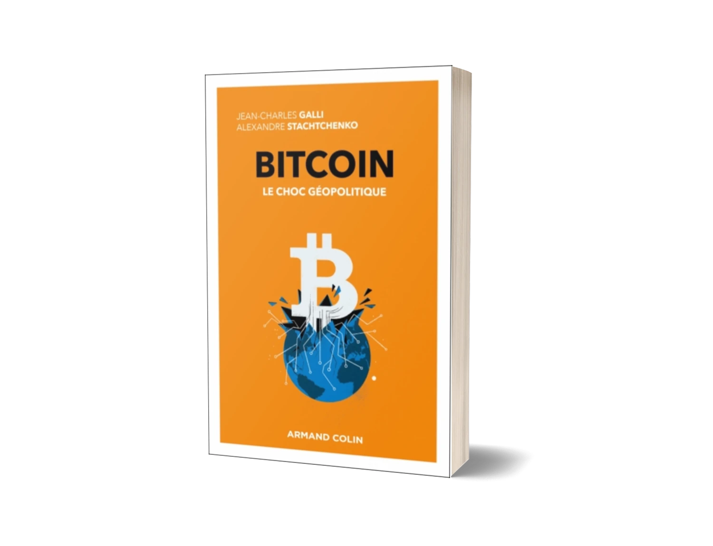

# Présentation

## Au cœur de la géopolitique de Bitcoin

Découvrez comment Bitcoin émerge comme un instrument d'influence géopolitique dans un monde de plus en plus volatil, incertain, complexe et ambigu. Ce séminaire unique explore les dimensions monétaires, technologiques, énergétiques et stratégiques de Bitcoin pour révéler pourquoi et comment un actif numérique peut peser sur les rapports de force internationaux.

Ce cours propose une analyse rigoureuse de Bitcoin comme enjeu stratégique international ce qui est une approche géopolitique rarement abordée dans les formations classiques, loin des perspectives purement techniques ou financières. Pour comprendre Bitcoin, il faut remonter à ses racines : nous explorons sa genèse intellectuelle, philosophique et technique, des cypherpunks aux premières transactions, en le replaçant dans le contexte géopolitique du XXIe siècle. La théorie prend vie à travers l'étude de cas concrets à différentes échelles — d'El Salvador aux stratégies des grandes puissances, en passant par l'adoption par les entreprises et les individus. Enseigné par Jean-Charles Galli, spécialiste des relations internationales et co-auteur de *Bitcoin, le choc géopolitique* (Armand Colin, 2025), ce séminaire garantit une analyse à la fois rigoureuse et ancrée dans la réalité.

### À qui s'adresse ce séminaire

Ce cours est idéal pour :

- Toute personne curieuse de comprendre l'impact géopolitique de Bitcoin
- Les professionnels souhaitant appréhender les enjeux stratégiques des actifs numériques
- Les étudiants en géopolitique, relations internationales ou sciences politiques
- Les citoyens intéressés par les rapports de force mondiaux et les nouvelles formes de souveraineté

### Format du cours

Le séminaire est divisé en 3 sections principales :

**Section 1 - Introduction et contexte**

- Définitions et précautions
- Retour sur la géopolitique au XXIe siècle
- Ante Genesis : Avant la genèse
- Réalités physiques du monde Bitcoin
- Acteurs et parties prenantes engagés

**Section 2 - Les premières interactions entre Bitcoin et les États**

- L'Empire contre-attaque : répliques étatiques à Bitcoin
- El Salvador, une expérimentation nationale à ciel ouvert
- La course mondiale est-elle lancée ? Revue des forces en présence et des positions étatiques
- Les entreprises et Bitcoin

**Section 3 - Bitcoin comme nouvel outil géopolitique**

- Incertitudes et chocs géopolitiques : Bitcoin est-il une valeur refuge ?
- Une opportunité au carrefour des enjeux énergétiques et environnementaux
- L'instrument du faible au fort : Bitcoin comme levier d'affranchissement
- Scenarii prospectifs

Le cours alterne entre explications théoriques, études de cas concrets et discussions sur les implications stratégiques et géopolitiques.

## Prérequis du cours

**Aucun prérequis technique n'est nécessaire** pour participer à ce séminaire. Il est conçu pour être accessible à tous, indépendamment de votre niveau de connaissances en informatique, économie ou géopolitique.

Nous recommandons simplement :

- **Curiosité intellectuelle** : Un intérêt sincère pour comprendre les enjeux stratégiques de Bitcoin
- **Ouverture d'esprit** : Une volonté d'explorer un sujet à l'intersection de la technologie, de l'économie et des relations internationales
- **Esprit critique** : Une capacité à questionner les rapports de force établis et à envisager des reconfigurations géopolitiques

# Informations logistiques

**Quand :** Ce séminaire aura lieu le **jeudi 18 Décembre 2025**, de **14h30 à 17h30** (3 heures incluant les pauses café)

**Où :** Le séminaire se tiendra à l'**Institut Péricles**, à Paris, France.

**Langue :** Le séminaire sera conduit en **français**.

**Prix :** L'accès à ce séminaire est **GRATUIT**, mais les places sont **limitées à 40 participants**. **Une réservation préalable est obligatoire** pour garantir votre place.

**IMPORTANT :** En raison du nombre limité de places, nous vous encourageons à vous inscrire rapidement. Les inscriptions seront closes dès que la capacité maximale sera atteinte ou au plus tard le 18 Décembre 2025.
