# Bitcoin को अपनाने की दिशा में पहला कदम

आजकल, ऑनलाइन शैक्षिक सामग्री का भंडार उपलब्ध है, जिससे कोई भी व्यक्ति Bitcoin और इसके पारिस्थितिकी तंत्र के बारे में जान सकता है।

हालाँकि, **एक चीज़ अक्सर गायब रहती है: मिलने का अवसर, Exchange विचारों पर चर्चा, ज्ञान साझा करना** और सबसे बढ़कर, **एक साथ मिलकर निर्माण करने का**।

इस बढ़ती हुई आवश्यकता को पूरा करने के लिए, कई बिटकॉइनर्स नियमित रूप से **स्थानीय समुदाय बनाने** का विकल्प चुनते हैं।

एक बार जब पर्याप्त संख्या में प्रतिभागी हो जाते हैं, तो बैठकें आयोजित की जाती हैं, और ये आवर्ती बैठकें अक्सर तकनीकी प्रस्तुतियों, व्यावहारिक कार्यशालाओं और व्यापक चर्चाओं के लिए उपजाऊ जमीन बन जाती हैं।

इस पाठ्यक्रम "**BTC302**" में, हम यह पता लगाएंगे कि **Bitcoin समुदाय और/या मीट-अप बनाना क्यों महत्वपूर्ण है**, फिर **आपके समुदाय की दृश्य और डिजिटल पहचान विकसित करने के लिए उपकरणों और विधियों** पर चर्चा करेंगे।

हम ऐसी **परियोजनाएं और पहल** भी प्रस्तुत करेंगे जिन्हें शुरू करना आसान है, विशेष रूप से शैक्षिक परियोजनाएं, जो कई पूर्व-डिज़ाइन किए गए, ओपन-सोर्स संसाधनों द्वारा समर्थित हैं।

अंत में, हम **राष्ट्रीय स्तर पर Bitcoin समुदायों के विकास**, और **कल की हाइपरबिटकॉइनकृत दुनिया को गति देने की उनकी क्षमता** पर चर्चा करेंगे।

+++

# परिचय

<partId>81318b8f-d316-5787-aa4c-4ec8370ba668</partId>

## पाठ्यक्रम अवलोकन

<chapterId>e8991b82-4966-5e04-8f05-7cae46eacbaa</chapterId>

BTC302 में आपका स्वागत है!

2009 से, Bitcoin का निरंतर विकास हुआ है। यह वृद्धि नए Bitcoin सुधार प्रस्तावों (BIP), नेटवर्क को स्केलेबल बनाने के लिए अतिरिक्त परतों के निर्माण (Lightning Network सहित अन्य), और कई कंपनियों और स्टार्ट-अप्स के विकास के माध्यम से आकार ले पाई है।

इसका विकास On-Chain में भी स्पष्ट है, जिसमें लेनदेन की संख्या लगातार बढ़ रही है।

उदाहरण के लिए, 1 जनवरी, 2018 और 1 जनवरी, 2024 के बीच, Bitcoin के मुख्य Layer पर लेनदेन की संख्या में [66.2% की वृद्धि](https://dune.com/queries/3375917/5663935) होने का अनुमान है। इस बीच, अगस्त 2021 और अगस्त 2023 के बीच, Lightning Network पर सार्वजनिक लेनदेन की संख्या में [1,212% की वृद्धि](https://river.com/learn/files/river-lightning-report-2023.pdf) हुई।

यह महत्वपूर्ण वृद्धि, निस्संदेह, निम्नलिखित से निकटता से जुड़ी हुई है:

- [दुनिया भर के लोगों की Bitcoin का उपयोग करने में बढ़ती रुचि](https://profedustream.substack.com/p/21-raisons-dutiliser-Bitcoin), खुद को बैंकिंग प्रणाली से मुक्त करने और/या कम अस्थिर या कम अवमूल्यन वाली मुद्रा का उपयोग करने के लिए, जैसा कि लेबनान, सीरिया, मिस्र, अर्जेंटीना और अन्य देशों की आबादी के मामले में है;
- समय के साथ इसकी कीमत में वृद्धि, इसे मूल्य के भंडार और दीर्घकालिक निवेश के रूप में स्थापित करना, जो इसकी निश्चित मौद्रिक नीति द्वारा संचालित है;
- सट्टा क्रिप्टोकरेंसी बाजार की क्रमिक वृद्धि, विशेष रूप से 2017-2018 और 2020-2021 के दौरान;
- मुख्यधारा मीडिया में Bitcoin की बढ़ती उपस्थिति।

यद्यपि Bitcoin अभी भी अपनी प्रारंभिक अवस्था में है, यह वास्तविकता, जिसके बारे में आप संभवतः पहले से ही जानते होंगे, हमें दो प्रमुख प्रश्नों पर विचार करने के लिए प्रेरित करती है:

- हम बिटकॉइनर्स को अपने सीखने और परियोजनाओं में आगे बढ़ने के लिए कैसे प्रोत्साहित कर सकते हैं ताकि **Bitcoin की क्षमता का पूरी तरह से दोहन किया जा सके**?

- हम नए लोगों की मदद कैसे कर सकते हैं, जो अक्सर अल्पकालिक सट्टेबाजी की ओर आकर्षित होते हैं, ताकि वे नवीनतम मेमेकॉइन उन्माद में पैसा खोने से बचें और इसके बजाय **Bitcoin के मूल सिद्धांतों को सीखने** पर ध्यान केंद्रित करें?

दोनों चुनौतियों का सबसे अच्छा समाधान सरल है: **वास्तविक दुनिया में मौजूद रहें और शिक्षित करें**।

इस कोर्स का उद्देश्य आपको Bitcoin समुदाय या मीट-अप बनाने और उसे प्रभावी ढंग से आयोजित करने के लिए आवश्यक सभी जानकारी प्रदान करना है। चाहे आप कोई स्थानीय पहल शुरू करना चाहते हों या कोई ऑनलाइन समूह विकसित करना चाहते हों, यह कोर्स आपको चरण-दर-चरण मार्गदर्शन देगा: आपकी दृश्य पहचान बनाने से लेकर नियमित कार्यक्रम आयोजित करने और आपके संचार माध्यमों के प्रबंधन तक।

**खंड 1: परिचय**

हम Bitcoin के इर्द-गिर्द लोगों को एकजुट करने के महत्व पर प्रकाश डालते हुए शुरुआत करेंगे, चाहे वह ऑनलाइन समुदायों के माध्यम से हो या स्थानीय मीटअप के माध्यम से। आप जानेंगे कि अपना समुदाय क्यों और कहाँ शुरू करें, साथ ही इसके विकास और दीर्घकालिक स्थिरता को बढ़ावा देने के लिए स्पष्ट लक्ष्य कैसे निर्धारित करें।

**अनुभाग 2: अपने Bitcoin समुदाय के लिए एक विशिष्ट पहचान तैयार करना**

नए सदस्यों को आकर्षित करने और उनमें अपनेपन की भावना को बढ़ावा देने के लिए, एक विशिष्ट पहचान बनाना ज़रूरी है। इस भाग में, आप सीखेंगे कि अपने Bitcoin समुदाय की भावना को दर्शाने वाले लोगो, पोस्टर और बैनर कैसे डिज़ाइन करें।

**अनुभाग 3: अपने Bitcoin समुदाय के लिए संचार चैनल बनाना**

संचार किसी भी समुदाय की रीढ़ होता है। इस भाग में, हम उपयोग करने के लिए सर्वोत्तम माध्यमों पर चर्चा करेंगे और आपको टेलीग्राम समूह या डिस्कॉर्ड सर्वर को कुशलतापूर्वक स्थापित करने में मार्गदर्शन करेंगे। आप यह भी सीखेंगे कि समुदाय प्रबंधन को सुव्यवस्थित करने के लिए बहु-कार्यात्मक बॉट्स को कैसे एकीकृत किया जाए।

**अनुभाग 4: अपना सोशल नेटवर्क लॉन्च करना** (फ्रेंच में)

आपके समुदाय को बढ़ाने के लिए दृश्यता ज़रूरी है। इस भाग में, आप सीखेंगे कि एक समर्पित ट्विटर प्रोफ़ाइल कैसे बनाएँ, स्थानीय मीटअप से कैसे जुड़ें, और अपनी दृश्यता बढ़ाने और नए सदस्यों को आकर्षित करने के लिए btcmap.org जैसे प्लेटफ़ॉर्म का लाभ कैसे उठाएँ।

**अनुभाग 5: Bitcoin मीट-अप का आयोजन**

इस खंड में मीटअप आयोजित करने के तरीके बताए गए हैं: सही जगह चुनने से लेकर कार्यक्रम के संचालन तक। हम प्रतिभागियों की वफादारी बढ़ाने और आपके समुदाय की दीर्घकालिक स्थिरता सुनिश्चित करने की रणनीतियों पर भी चर्चा करेंगे।

**अनुभाग 6: परियोजनाओं और पहलों के उदाहरण** (फ्रेंच में)

साधारण मुलाकातों से आगे बढ़कर, यह खंड ठोस और मौलिक परियोजनाओं को प्रदर्शित करता है: थीम आधारित कार्यक्रमों और कार्यशालाओं से लेकर शैक्षिक सामग्री निर्माण और स्थानीय सहयोग तक। आप यह भी सीखेंगे कि अपने समुदाय को बढ़ावा देने के लिए भौतिक और डिजिटल दोनों तरह की सामग्री कैसे डिज़ाइन करें।

**अनुभाग 7: भविष्य की आशा**

यहाँ, हम आपके समुदाय के स्वाभाविक विकास का विश्लेषण करेंगे: अगर यह बहुत तेज़ी से बढ़ता है तो क्या करें, अपने संगठन का विकेंद्रीकरण कैसे करें, और प्रतिकूल नियामक परिवेश का सामना कैसे करें। यह खंड आपको इन चुनौतियों का पूर्वानुमान लगाने और उनसे पार पाने में मदद करेगा।

**अनुभाग 8: बिटकॉइनर्स को एक साथ लाना**

अंतिम भाग आपकी परियोजना के सार पर केंद्रित है: Bitcoin के उत्साही लोगों को एक साझा दृष्टिकोण के इर्द-गिर्द एकजुट करना। आप सीखेंगे कि सदस्यों को आकर्षित करने और बनाए रखने, प्रभावी ढंग से कार्य सौंपने और अपने समुदाय को स्थायी रूप से विकसित करने के लिए अपने दृष्टिकोण को कैसे संरचित करें।

एक मज़बूत और जीवंत Bitcoin समुदाय बनाने का तरीका सीखने के लिए तैयार हैं? आइए शुरू करते हैं!

## Bitcoin समुदाय या मीटअप क्यों शुरू करें?

<chapterId>893ea248-7d5a-5b8e-948c-7031497b1031</chapterId>

### समुदाय और मीट-अप में क्या अंतर है?

हालांकि Bitcoin पारिस्थितिकी तंत्र में इन शब्दों की कोई सख्त परिभाषा नहीं है, लेकिन समुदाय को ऐसे लोगों के समूह के रूप में समझा जा सकता है जो एक समान जुनून साझा करते हैं और नियमित रूप से संवाद करते हैं।

दूसरी ओर, मीटअप एक ऐसा कार्यक्रम होता है जो किसी समुदाय द्वारा और उसके लिए, किसी विशिष्ट उद्देश्य से आयोजित किया जाता है। मीटअप आमतौर पर तब आयोजित किए जाते हैं जब समुदाय पहले से ही स्थापित हो चुका होता है।

इस पाठ्यक्रम के लिए, हम यह मानते हैं कि Bitcoin मीटअप शुरू करने से पहले, आप पहले से ही ऐसे आयोजन में रुचि रखने वाले कुछ लोगों से जुड़ चुके हैं, दूसरे शब्दों में, **समुदाय पहले से ही मौजूद है**।

### Bitcoin समुदाय क्यों बनाएं?

Bitcoin समुदाय बनाने के कई कारण हैं:

- ज्ञान साझाकरण और सहयोग: समुदाय सदस्यों को Exchange के विचारों और ज्ञान साझा करने के लिए एक मंच प्रदान करते हैं। पारस्परिक सहयोग विकास का एक प्रमुख स्तंभ है, जो सभी को अपने सीखने में तेज़ी लाने में सक्षम बनाता है, विशेष रूप से Bitcoin के लिए, क्योंकि इसमें खोजने के लिए बहुत कुछ है।

- सहकर्मी-से-सहकर्मी निर्माण: इन समुदायों के भीतर कई पहलों और परियोजनाओं की कल्पना, निर्माण और विकास किया जाता है।

Bitcoin समुदाय अक्सर व्यापक लक्ष्यों का पीछा करते हैं, विशेष रूप से सार्वजनिक शिक्षा पर:

1. Bitcoin क्या है;

2. यह कैसे काम करता है;

3. समाज में इसका योगदान;

4. कुछ सार्वजनिक हस्तियों और मीडिया द्वारा किए गए भ्रामक या निराधार दावों का खंडन करना;

5. Bitcoin और अन्य क्रिप्टो-मुद्राओं के बीच मूलभूत अंतर;

भविष्य के पहले "गढ़ों" का निर्माण करके, **दुनिया भर में Bitcoin समुदाय, गलत सूचना और सेंसरशिप के विरुद्ध एक मज़बूत दीवार के रूप में कार्य करते हैं और साथ ही Bitcoin के मूल सिद्धांतों को सीखने के लिए उपजाऊ ज़मीन भी प्रदान करते हैं**। वे नए लोगों, यहाँ तक कि संशयवादियों को भी, Bitcoin की वास्तविक क्षमता का पता लगाने के लिए आवश्यक संसाधन और संपर्क प्रदान करते हैं।

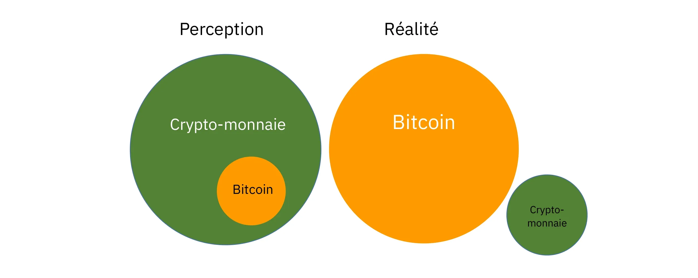

यह भी ध्यान देने योग्य है कि **एक समुदाय पूरी तरह से ऑनलाइन मौजूद हो सकता है**, चाहे वह एक टेलीग्राम समूह ("Bitcoin लंदन"), एक फेसबुक समूह ("Bitcoin बर्लिन"), एक डिस्कॉर्ड सर्वर ("Bitcoin मैड्रिड"), या यहां तक ​​कि एक ईमेल सूची ("Bitcoin फ्रांस") हो।

दूसरे शब्दों में, **किसी समुदाय को फलने-फूलने या परियोजनाएँ शुरू करने के लिए भौतिक बैठकों की ज़रूरत नहीं होती। इसका मूल उद्देश्य वही रहता है: साझा करना, निर्माण करना और शिक्षा देना**।

### मीट-अप क्यों बनाएं?

जैसा कि पहले बताया गया है, **मीटअप आमतौर पर समुदाय की स्थापना के बाद होते हैं और उसके पूरक के रूप में कार्य करते हैं**।

जैसे-जैसे एक बिटकॉइनर की यात्रा आगे बढ़ती है, अक्सर एक इच्छा, या ज़रूरत भी होती है, **उसी पारिस्थितिकी तंत्र के अन्य लोगों से व्यक्तिगत रूप से मिलने और बातचीत करने की।** यह अलग-थलग महसूस करने या रोज़मर्रा की ज़िंदगी में Bitcoin के बारे में बात करने के लिए किसी के न होने से पैदा हो सकता है।

मीटअप ऑनलाइन ऑडियो या वीडियो कॉल की तुलना में ज़्यादा निजी और स्वागत योग्य अनुभव प्रदान करते हैं। चाहे **ड्रिंक पर हो या खाने पर**, ये अनौपचारिक, दोस्ताना माहौल बनाते हैं जहाँ लोग खुलकर और सीधे तौर पर अपने विचार साझा कर सकते हैं।

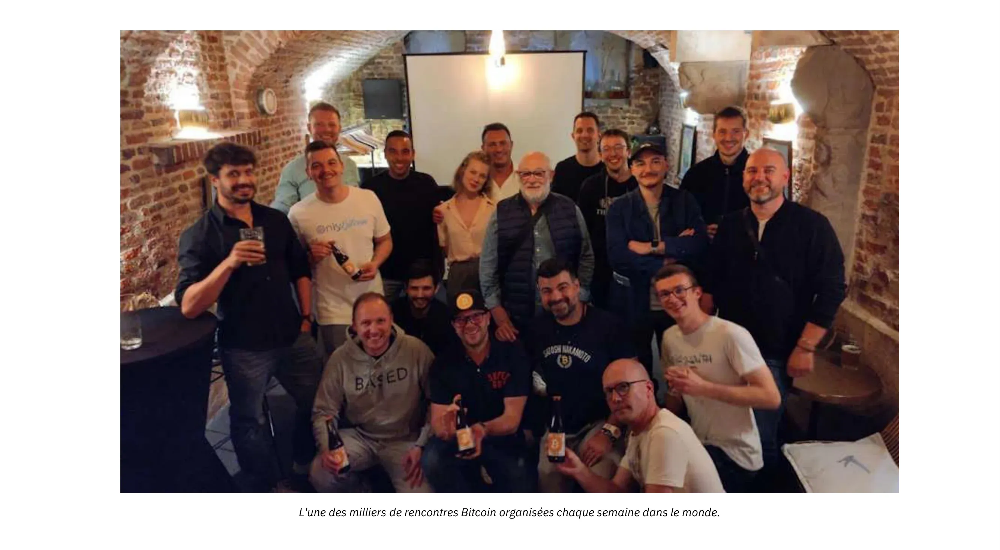

Bitcoin मीटअप कई उद्देश्यों की पूर्ति कर सकते हैं:

- तकनीकी विषयों या चल रही परियोजनाओं पर चर्चा करना
- नए बिटकॉइन उपयोगकर्ताओं को धीरे-धीरे Bitcoin की दुनिया में गहराई से उतरने में मदद करना
- नई परियोजनाओं या पहलों की घोषणा
- सामग्री या पुस्तकों का आदान-प्रदान
- पूर्वावलोकन में वृत्तचित्रों का प्रदर्शन
- विशिष्ट विषयों पर सम्मेलन या कार्यशालाओं का आयोजन

हम इस पाठ्यक्रम के भाग 6/8 में इनमें से कई संभावनाओं को विस्तार से कवर करेंगे, जिसका शीर्षक है "[परियोजनाओं और पहलों के उदाहरण](https://planb.network/courses/1c643dc9-a15f-4f9e-93b6-cb3c58b4ee35/3213d87a-1998-5972-ab93-97a5769ba279)।

जबकि प्रत्येक समुदाय अपनी राय बनाने, परियोजनाएँ शुरू करने और अपने तरीके से प्रयोग करने के लिए स्वतंत्र है, मीटअप Bitcoin के विकास और बिटकॉइनर्स की वृद्धि के लिए **आवश्यक** साबित हो रहे हैं। **इन्हें व्यवस्थित करने में समय और प्रयास लगता है**, यही कारण है कि यह पाठ्यक्रम [फ्रांस और बेल्जियम के लगभग साठ Bitcoin समुदायों](https://btcmap.org/communities/map#2/5.24949/0.20000) के संयुक्त अनुभव को साझा करता है **ताकि आपको अपना समुदाय और मीटअप यथासंभव सुचारू रूप से बनाने और विकसित करने में मदद मिल सके**।

## आपको अपना समुदाय कहां बनाना चाहिए?

<chapterId>72da5285-5395-592d-ab62-303a0aef3d6d</chapterId>

पहला प्रश्न यह है कि आपका समुदाय कहां स्थित होना चाहिए?

यदि आप बाद में मीटअप आयोजित करने का विकल्प रखना चाहते हैं तो यह निर्णय महत्वपूर्ण है।

अगर सदस्यों को किसी कार्यक्रम में शामिल होने के लिए दो घंटे गाड़ी चलानी पड़े, तो उपस्थिति कम होने की संभावना है। इसलिए अपने समुदाय के लिए, और इसलिए अपने भविष्य के मीटअप के लिए सही स्थान चुनना, उसके विकास पर बहुत बड़ा प्रभाव डालता है।

आपके निर्णय को दिशा देने के लिए कुछ सुझाव:

1/ **किसी मध्यम या बड़े शहर में अपना समुदाय बनाएँ और उसका विस्तार करें**। इससे यह आसान हो जाएगा:

    - बैठकों और परियोजनाओं (प्रस्तुतियों, कार्यशालाओं, Bitcoin अपनाने को बढ़ावा देना, आदि) के लिए सुखद स्थान खोजें;
    - अधिक संख्या में लोगों के बीच भागीदारी और अपनेपन की भावना को बढ़ाना;
    - आयोजन की सुगमता में सुधार करें (सार्वजनिक परिवहन, पार्किंग, आदि)। सार्वजनिक परिवहन और पार्किंग के निकट स्थान चुनना अत्यधिक अनुशंसित है।

2/ **अपने शहर से जुड़ा कोई नाम चुनें**। इससे लोगों को आपके समुदाय से जुड़ने में आसानी होगी। उदाहरण: Bitcoin पेरिस, आइनुंडज़्वान्ज़िग बर्लिन, Satoshi स्प्रिट्ज़ मिलानो, आदि।

3/ **जांच करें कि क्या आपके आस-पास पहले से ही कोई मीट-अप मौजूद है**।

आप [btcmap.org](https://btcmap.org/communities/map#0/0/0/) देख सकते हैं, जिसमें दुनिया भर के अधिकांश Bitcoin समुदायों और मीट-अप की सूची दी गई है।

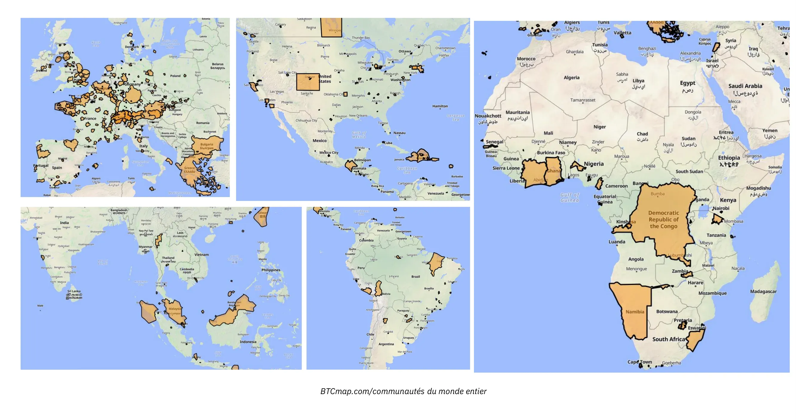

कुछ शोध के बाद, आपको अपने शहर में कोई मौजूदा मीटअप या समुदाय मिल सकता है।

Bitcoin विकेन्द्रीकृत है, इसलिए स्वाभाविक रूप से, कोई भी अपनी इच्छानुसार कार्य करने के लिए स्वतंत्र है।

हालाँकि, **आस-पास के समुदायों को विभाजित करने और प्रत्येक के प्रभाव को कम करने की तुलना में अक्सर एकजुट होना ज़्यादा समझदारी भरा होता है**। जहाँ पहले से ही एक समुदाय मौजूद है, वहाँ एक बिल्कुल नया समुदाय शुरू करने से अनजाने में प्रतिस्पर्धा पैदा हो सकती है।

इस लिहाज़ से, एक साधारण "सामान्य नियम" मददगार हो सकता है: अगर आपके घर से 30-45 मिनट के दायरे में कोई सक्रिय Bitcoin समुदाय नहीं है, तो एक नया समुदाय शुरू करना फ़ायदेमंद हो सकता है। लेकिन, आप अपनी इच्छानुसार कुछ भी करने के लिए हमेशा स्वतंत्र हैं।

और हां, यदि कोई पुराना समुदाय ऐसी दिशा में "विकसित" हो गया है जो अब आपके मूल्यों के अनुरूप नहीं है, और आपके पास उन्हें "संतुलित" करने के लिए समय या प्रेरणा नहीं है, तो अपना स्वयं का Fork बनाना हमेशा एक विकल्प है।

## आपके समुदाय को किन उद्देश्यों का मार्गदर्शन करना चाहिए?

<chapterId>0aae1aa8-93ec-544a-ad88-22d32c619595</chapterId>

एक बार जब आप अपने समुदाय के लिए शहर (या भौगोलिक क्षेत्र) की पहचान कर लेते हैं, तो यह निर्धारित करने का समय आ जाता है कि आप क्या हासिल करना चाहते हैं।

ये लक्ष्य लॉन्च के समय ही निर्धारित किए जा सकते हैं या बाद में, जब कई सदस्य शामिल हो जाएं और आपका समूह सक्रिय रूप से शामिल हो जाए, तो इन्हें परिष्कृत किया जा सकता है।

आपकी सोच को दिशा देने के लिए यहां कुछ बिंदु दिए गए हैं:

1/ **मैं एक बिटकॉइनर के रूप में यह समुदाय क्यों बना रहा हूँ?** क्या इसका उद्देश्य ज्ञान बाँटना है? दूसरों को शिक्षित करना है? अनुभवी साथियों से सीखना है? समान विचारधारा वाले लोगों से मिलना है? Bitcoin पारिस्थितिकी तंत्र में शामिल होना है? पेशेवरों से जुड़ना है? या बस एक ड्रिंक का आनंद लेना है और नए दोस्त बनाना है?

आपके उत्तर आपकी स्थिति और प्रेरणा को आकार देंगे।

अगर आपका लक्ष्य Bitcoin के बारे में **ज्ञान साझा करना और लोगों को शिक्षित करना** है, तो **शैक्षणिक सामग्री** (लेख, पॉडकास्ट, वीडियो, प्रस्तुतियाँ, फ़्लायर्स, आदि) बनाने पर ध्यान केंद्रित करें, जिससे दूसरों को शोध के अनगिनत घंटे बचेंगे। आप कार्यशालाएँ, प्रस्तुतियाँ और सम्मेलन आयोजित करके भी आगे बढ़ सकते हैं।

यदि आपका उद्देश्य केवल अन्य बिटकॉइनर्स से मिलना और अनुभव साझा करना है, तो आप अधिक सहज दृष्टिकोण अपना सकते हैं, जैसे ड्रिंक के लिए मिलना।

इस तरह, आप आसानी से सामाजिक बंधन बना पाएँगे। हालाँकि, हमेशा याद रखें कि **बीयर पीना कल की दुनिया बनाने का सही रास्ता नहीं है**।

यही कारण है कि **ठोस लक्ष्य और परियोजनाएं निर्धारित करना आवश्यक है**।

2/ क्या मुझे अपने समुदाय को एक भौतिक आयाम देना चाहिए? अगर हाँ, तो आपको किस तरह के कार्यक्रम आयोजित करने चाहिए?

आपका पहला कार्यक्रम संभवतः एक मिलन समारोह होगा। इसका मुख्य उद्देश्य: अपने क्षेत्र के बिटकॉइन उपयोगकर्ताओं को एक साथ लाना है।

हालाँकि, जैसा कि हम बाद में [परियोजनाओं और पहलों के उदाहरण](https://planb.network/courses/1c643dc9-a15f-4f9e-93b6-cb3c58b4ee35/3213d87a-1998-5972-ab93-97a5769ba279) में देखेंगे, **एक मीट-अप कई तरीकों से, कई उद्देश्यों के साथ बनाया जा सकता है:**

- नेटवर्किंग को Bitcoin अवधारणा पर शैक्षिक प्रस्तुति के साथ संयोजित करें;
- Bitcoin समाधानों का व्यावसायिक प्रदर्शन आयोजित करना;
- स्थानीय व्यापारियों को नारंगी गोली देने की रणनीतियों पर बहस;

और इसी तरह।

विषयों (तकनीकी वार्ता या व्यावहारिक कार्यशाला) के आधार पर, आपके नियमित मीट-अप के अलावा अतिरिक्त कार्यक्रम आयोजित करना भी उचित हो सकता है।

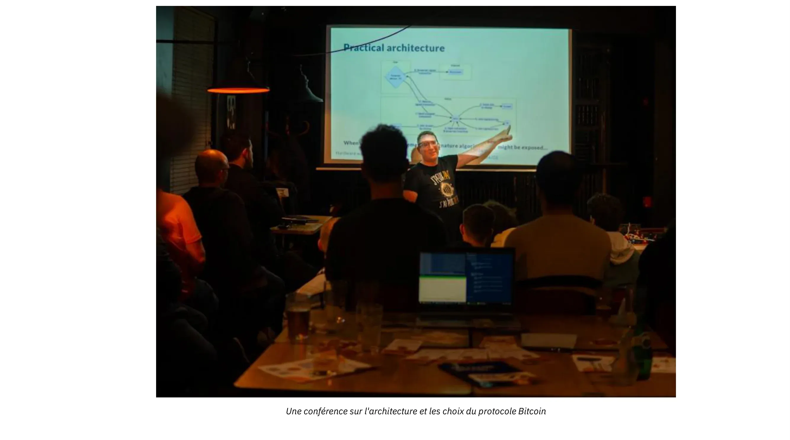

3/ मैं अपने समुदाय से Bitcoin पारिस्थितिकी तंत्र में किस प्रकार योगदान चाहता हूँ?

यह एक अधिक उन्नत प्रश्न है, लेकिन इस पर पहले ही विचार कर लेना उचित होगा।

यदि आपका लक्ष्य एक एकजुट, प्रेरित समुदाय बनाना है, जो अधिक से अधिक लोगों को ऑरेंज-पिलिंग पर केंद्रित हो, तो:

- व्यापक जानकारी, मुक्त स्रोत संसाधनों और आवश्यकता पड़ने पर मूल्यवान सहायता तक पहुंचने के लिए मौजूदा समुदायों के साथ सहयोग करें।
- अपने प्रयासों को प्रभावी ढंग से विस्तारित करने और बढ़ाने के लिए अपने समूह के भीतर कार्यों को व्यवस्थित करें और उन्हें सौंपें।

**लघु, मध्यम और दीर्घकालिक लक्ष्य निर्धारित करें**

योजना बनाने का एक व्यावहारिक तरीका प्रत्येक समय सीमा के लिए लक्ष्य निर्धारित करना है:

- अल्पावधि: सोशल मीडिया पर उपस्थिति बनाएं और सामुदायिक संचार चैनल स्थापित करें।
- मध्यम अवधि: शैक्षिक संसाधन (लेख, फ़्लायर्स, वीडियो) बनाएं।
- दीर्घकालिक: नियमित भौतिक बैठकें शुरू करें।

एक बार मीटअप स्थापित हो जाने पर, आप निम्न लक्ष्य रख सकते हैं:

- अल्पकालिक: विशिष्ट विषयों पर कार्यशालाएँ या प्रस्तुतियाँ आयोजित करना
- मध्यम अवधि: Bitcoin जागरूकता या शिक्षा अभियान चलाना
- दीर्घकालिक: किसी ऐसे बार के साथ औपचारिक सहयोग या साझेदारी बनाएं जो भुगतान के रूप में Bitcoin स्वीकार करता हो।

तैयार रहें: **समुदाय निर्माण में प्रयास लगता है**

समुदाय का निर्माण रातोंरात नहीं होता। इसके लिए समय, प्रेरणा और संगठन की आवश्यकता होती है।

कभी-कभी तो यह निराशाजनक भी लग सकता है, विशेष रूप से तब जब कोई भी सामने नहीं आता, और आपको ऐसा लगता है कि इस मिशन को केवल आप ही अपने कंधों पर उठा रहे हैं।

इसीलिए **यह पाठ्यक्रम मूल्यवान संसाधनों और युक्तियों को साझा करने के लिए डिज़ाइन किया गया है, जिससे समुदायों को प्रभावी ढंग से बढ़ने और अंततः आत्मनिर्भर बनने में मदद मिल सके।**

# सामुदायिक पहचान की रूपरेखा तैयार करना Bitcoin

<partId>da6673ad-bf49-5979-80a6-3f69cfb28046</partId>

## आप अपनी पहचान क्यों और कैसे बना सकते हैं?

<chapterId>b48a18cc-afdf-5216-802c-32647b5cd8a3</chapterId>

इस स्तर पर, हम मानते हैं कि:

- आप पहले से ही जानते हैं कि आपका समुदाय (या भविष्य का नियमित मीटअप) कहां आधारित होगा।
- आपने अलग-अलग समयावधि के लिए लक्ष्य निर्धारित किए हैं, भले ही वे अभी अंतिम न हों।

अपने समुदाय के निर्माण में अगला कदम उसकी पहचान को परिभाषित करना है, उसका नाम और उसकी दृश्य शैली दोनों।

यह अनुभाग ट्यूटोरियल और शुरुआती-अनुकूल सॉफ्टवेयर समाधान प्रदान करता है, जो आपको अपने समुदाय की दृश्य पहचान को डिजाइन करने में मदद करेगा, यहां तक ​​कि शुरुआती कौशल के साथ भी।

**पहचान क्यों मायने रखती है?**

जब लोग किसी समूह के साथ अपनी पहचान बना लेते हैं, तो वे ज़्यादा जुड़ाव और प्रतिबद्धता महसूस करते हैं। एक मज़बूत पहचान आपके समुदाय को अलग पहचान दिलाने में मदद करती है और एक जुड़ाव की भावना को बढ़ावा देती है।

यह सब नाम चुनने से शुरू होता है, और प्रत्येक देश का अपना अलग चलन होता है:

- फ़्रांस: 60+ स्थानीय समुदायों में से ज़्यादातर "Bitcoin [CITY]" या "[CITY] Bitcoin" जैसे नामों का इस्तेमाल करते हैं। उनके टेलीग्राम ग्रुप अक्सर इस पैटर्न का पालन करते हैं: "Bitcoin [CITY] मीटअप"।
- जर्मनी: एइनुंडज़्वान्ज़िग (जिसका अर्थ है "21") पहल ने "एइनुंडज़्वान्ज़िग [शहर]" जैसे नामों को प्रेरित किया।
- इटली: Satoshi स्प्रिट्ज़ नेटवर्क Satoshi "स्प्रिट्ज़ [शहर]" जैसे नामों का उपयोग करता है।

**प्रत्येक समुदाय की अपनी पहचान होती है, जो उसके गृहनगर से जुड़ी होती है, तथापि अपने देश की व्यापक पहचान से भी जुड़ी होती है**।

आपकी दृश्य पहचान: लोगो, रंग, बैनर, यही वह चीज है जिसे लोग याद रखेंगे और आपके समूह के साथ जोड़ेंगे।

सोशल मीडिया अकाउंट और संचार चैनल बनाते समय, लोगो और बैनर का होना एक बड़ा फ़ायदा है। चिंता न करें, आपको पेशेवर डिज़ाइन कौशल की ज़रूरत नहीं है; मुफ़्त और इस्तेमाल में आसान टूल उपलब्ध हैं।

एक बेहतरीन शुरुआत अपने शहर के किसी ऐतिहासिक स्थल या प्रतीक को शामिल करना हो सकता है। पेरिस में, यह एफिल टॉवर हो सकता है। लिली में, घंटाघर या गढ़। न्यूयॉर्क में, स्टैच्यू ऑफ़ लिबर्टी। लंदन में, बिग बेन, वगैरह।

वहां से, आप अपनी पसंद के आधार पर एक सरल या अधिक विस्तृत लोगो डिज़ाइन कर सकते हैं।

आपको कुछ विचार देने के लिए, यहां फ्रांसीसी समुदाय के लोगो के कुछ उदाहरण दिए गए हैं:

- मार्सिले में, यह लोगो नोट्रे-डेम-डे-ला-गार्डे बेसिलिका का प्रतिनिधित्व करता है, जो शहर को देखता है:

- मोनाको में, इसका तात्पर्य मोनेगास्क चट्टान से है:

- लिले में, चिकना लोगो वाउबन के गढ़ और उसके पार्क का प्रतिनिधित्व करता है:

- सेंट-मालो में, शहर के प्रतीक - एर्मिन - को हाइलाइट किया गया है:

**अगर आप चाहें तो आगे बढ़ें**

अगर प्रेरणा मिले, तो आप इसे और भी आगे ले जा सकते हैं: अपने समुदाय के लिए एक प्रतीक चिन्ह, एक आदर्श वाक्य, या यहाँ तक कि एक गीत भी बना सकते हैं। आपकी रचनात्मकता ही एकमात्र सीमा है!

## लोगो, पोस्टर और बैनर बनाएँ

<chapterId>3470a31f-0190-5e87-8af0-6a00e79267ef</chapterId>

### कैनवा का उपयोग करना

आप अपने समुदाय के लिए विभिन्न दृश्य बनाने के लिए **[Canva](https://www.canva.com/)** का उपयोग कर सकते हैं।

यह निःशुल्क और उपयोग में आसान प्लेटफॉर्म अपने पूर्व-डिज़ाइन किए गए टेम्प्लेटों की विशाल लाइब्रेरी के लिए लोकप्रिय है, जिन्हें आप कुछ ही क्लिक में डुप्लिकेट और कस्टमाइज़ कर सकते हैं।

**अपना लोगो बनाना**

कैनवा होम पेज पर, पहले से डिज़ाइन किए गए लोगो खोजें। एक या कई ऐसे लोगो चुनें जो आपको प्रेरित करते हों, उनकी नकल करें और फिर उन्हें अपने समुदाय के अनुरूप बनाएँ।

आप पृष्ठभूमि में एक स्थानीय लैंडमार्क या प्रतीक जोड़ सकते हैं (एक फोटो आयात करें या Elements मेनू में "चित्र" या "छवियां" खोजें), फिर Bitcoin लोगो या ₿ को ओवरले करें, यदि आवश्यक हो तो इसका रंग समायोजित करें।

**बैनर और पोस्टर बनाना**

बैनर या पोस्टर बनाने के लिए, Canva की लाइब्रेरी में पहले से डिज़ाइन किए गए टेम्प्लेट खोजें। एक बार जब आप किसी टेम्प्लेट की प्रतिलिपि बना लेते हैं, तो टेक्स्ट और फ़ॉन्ट संशोधित करें, अपने समुदाय का लोगो जोड़ें, और फ़्रेम का उपयोग करके कोई भी फ़ोटो आयात करें (Elements मेनू में "फ़्रेम" खोजें)।

आप अपनी आवश्यकताओं से मेल खाने वाले अतिरिक्त मॉडलों को तलाशने के लिए डिज़ाइन मेनू का भी उपयोग कर सकते हैं।

यूट्यूब थंबनेल या बैनर के लिए, बस उन टेम्प्लेटों को खोजें, उनकी प्रतिलिपि बनाएँ और उन्हें इच्छानुसार अनुकूलित करें।

संक्षेप में, **संभावनाएं अनंत हैं और न केवल आपकी आवश्यकताओं से बल्कि आपके समुदाय और आपकी बैठकों/कार्यक्रमों के लिए आप जो दृश्य शैली बनाना चाहते हैं उससे भी आकार लेती हैं!**

आपको स्पष्ट विचार देने के लिए, हमने इनमें से कुछ संभावनाओं को प्रदर्शित करने वाला एक गैर-विस्तृत वीडियो ट्यूटोरियल शामिल किया है:

:::वीडियो आईडी=d11ae0ed-eacd-4924-afd3-75aff95d2899:::

**Bitcoin लिले से उदाहरण टेम्पलेट्स**

यहां पर तैयार कैनवा टेम्पलेट्स दिए गए हैं, जिन्हें आप अपने समुदाय के लिए डुप्लिकेट और अनुकूलित कर सकते हैं:

- **मीट-अप घोषणा पोस्टर** (सोशल मीडिया और A4/A3 प्रिंटिंग के लिए): [लिंक](https://www.canva.com/design/DAGBvBXFJ8A/92-j_toeLU8QbVAD0NwoAA/edit?utm_content=DAGBvBXFJ8A&utm_campaign=designshare&utm_medium=link2&utm_source=sharebutton)

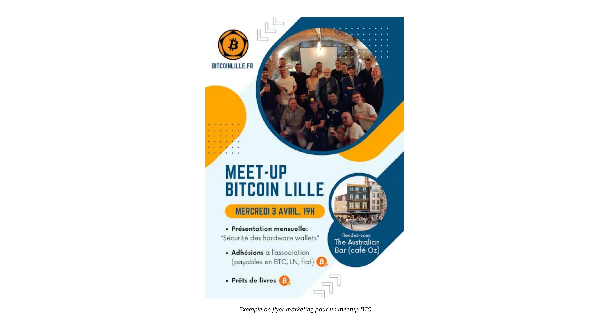

- **इवेंट पोस्टर** (सोशल मीडिया और A4/A3 प्रिंटिंग के लिए): [लिंक](https://www.canva.com/design/DAGBvG3rNCc/oXtNR9pduRs22AqclG4O2g/edit?utm_content=DAGBvG3rNCc&utm_campaign=designshare&utm_medium=link2&utm_source=sharebutton)

- **सोशल मीडिया बैनर**: [लिंक](https://www.canva.com/design/DAGBvOXyNqw/iSJG9PbIQHgGWHz5PhlXSQ/edit?utm_content=DAGBvOXyNqw&utm_campaign=designshare&utm_medium=link2&utm_source=sharebutton)

- **प्रतियोगिता की घोषणा**: [लिंक](https://www.canva.com/design/DAGBvIjuA_w/YzSUXzOmbNV9oCma9mluOw/edit?utm_content=DAGBvIjuA_w&utm_campaign=designshare&utm_medium=link2&utm_source=sharebutton)

- **हमारी लाइब्रेरी के ब्रांड दिशानिर्देश**, मीट-अप में A4 पर प्रदर्शित: [लिंक](https://www.canva.com/design/DAGBvPqL7N4/LmUItfsysypRLSOFOzBXcQ/edit?utm_content=DAGBvPqL7N4&utm_campaign=designshare&utm_medium=link2&utm_source=sharebutton)

- **पावरपॉइंट प्रस्तुति** "अध्याय 2 - Bitcoin लेनदेन को समझना", @ProfEduStream द्वारा: [लिंक](https://www.canva.com/design/DAFsEcnOro8/Mz9FYdTGhsvozZOe0Y9jtw/edit?utm_content=DAFsEcnOro8&utm_campaign=designshare&utm_medium=link2&utm_source=sharebutton)

- **फ़्लायर** "Bitcoin का उपयोग करने के 21 कारण", @ProfEduStream द्वारा लिखित: [लिंक](https://www.canva.com/design/DAFtAR1NauQ/ZDwl2CchIJ9Gpb36N6-7iw/edit?utm_content=DAFtAR1NauQ&utm_campaign=designshare&utm_medium=link2&utm_source=sharebutton)

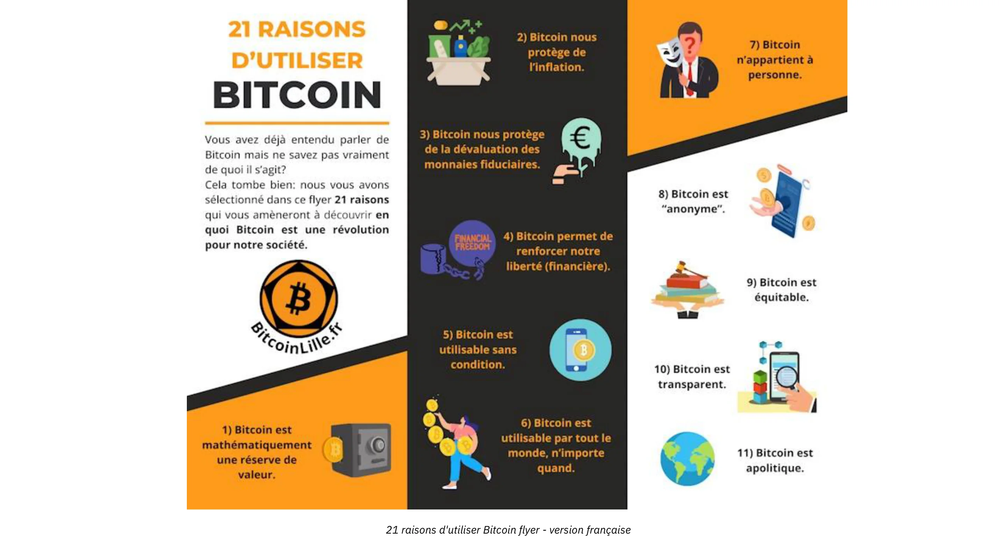

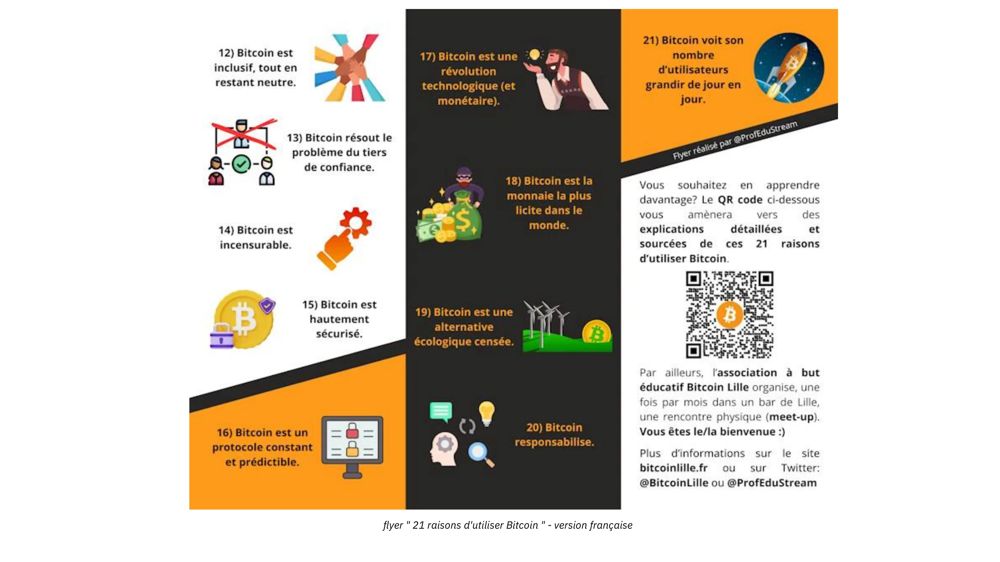

**अपनी रचनाएँ साझा करें**

संभावनाएं अनंत हैं, और आपके डिज़ाइन आपके लक्ष्यों और दृश्य पहचान पर निर्भर करेंगे। अपने टेम्प्लेट को ओपन सोर्स में साझा करने पर विचार करें, इससे अन्य Bitcoin समुदायों का समय बचेगा, जिन्हें अनिवार्य रूप से आपकी तरह ही चुनौतियों का सामना करना पड़ेगा। साझा करके, आप दुनिया भर में Bitcoin समुदायों के विकास में तेज़ी लाने में मदद करते हैं।

**अनुशंसित आयाम**

विज़ुअल बनाते समय, हमेशा प्रत्येक प्लेटफ़ॉर्म के लिए आकार की आवश्यकताओं की जांच करें:

| Platform | Logo | Banner | Poster / Image
| -------- | -------- | -------- | -------- |
| Telegram     | 512 x 512     | N/A     | N/A     |
| Signal     | N/A     | N/A     | N/A     |
| Twitter     | 400 x 400     | 1500 x 500     | 1200 x 628     |
| Meet-up     | N/A     | N/A     | N/A     |
| Discord     | 512 x 512     | 960 x 540     | N/A     |
| Facebook     | 512 x 512     | 851 x 315     | 960 x 720     |

आमतौर पर उपयुक्त आकार:

लोगो: 512 x 512 पिक्सेल

बैनर: ऐप या साइट के आधार पर भिन्न होते हैं

पोस्टर: A4 मानक प्रिंट प्रारूप है

### कृत्रिम बुद्धिमत्ता का उपयोग

हालाँकि Canva लोगो, पोस्टर, बैनर और फ़्लायर्स बनाने के लिए कई तरह के टूल उपलब्ध कराता है, लेकिन यह एकमात्र विकल्प नहीं है। अगर आप दूसरे सॉफ़्टवेयर (जैसे फ़ोटोशॉप या इलस्ट्रेटर) के साथ ज़्यादा सहज हैं, तो बेझिझक वह इस्तेमाल करें जो आपके लिए सबसे अच्छा काम करता हो।

जैसा कि कहा गया है, चाहे आप सामुदायिक लोगो डिजाइन कर रहे हों या पोस्टर, प्रस्तुतियाँ, या फ़्लायर्स को बेहतर बना रहे हों, **कृत्रिम बुद्धिमत्ता अद्वितीय और आकर्षक दृश्य बनाने के लिए एक शक्तिशाली सहयोगी हो सकती है**।

इस उद्देश्य के लिए कई AI उपलब्ध हैं। इनमें शामिल हैं

- [मिडजर्नी](https://docs.midjourney.com/docs/quick-start) (भुगतान किया गया);
- [लियोनार्डो](https://leonardo.ai/) (निःशुल्क, खाता-सीमित);
- [copilot](https://copilot.microsoft.com/) (निःशुल्क, खाता-सीमित);
- [DALL-E](https://www.dall-efree.com/) (भुगतान किया गया)।

हाल ही में कई अन्य AI उपकरण सामने आए हैं, इसलिए यह सूची संपूर्ण नहीं है।

**उदाहरण: भविष्यवादी Bitcoin लंदन लोगो बनाना**

यदि आप "Bitcoin लंदन" मीट-अप के लिए एक भविष्यवादी लोगो डिज़ाइन करना चाहते हैं, तो आप कोपायलट से पूछ सकते हैं:

- [ ] *प्रॉम्प्ट: लंदन ब्रिज और बिग बेन को पृष्ठभूमि में रखते हुए एक Bitcoin लोगो बनाएँ। भविष्यवादी* - [लिंक](https://copilot.microsoft.com/images/create/un-logo-Bitcoin-futuriste-avec-en-arric3a8re-plan-le-/1-6612ba1758df4384bc33c4bca00ab45b?FORM=SYDBIC)

यदि पहले चार परिणाम पर्याप्त यथार्थवादी नहीं हैं, तो अपने अनुरोध को परिष्कृत करें:

- [ ] *प्रॉम्प्ट: चौथे को और अधिक यथार्थवादी बनाएं* - [लिंक](https://copilot.microsoft.com/images/create/un-logo-Bitcoin-futuriste-avec-en-arric3a8re-plan-le-/1-6612ba64b72d4cea9830ab7eb844f785?FORM=SYDBIC)

नवीनतम परिणाम बहुत बढ़िया निकला!

**उदाहरण: एक सरल ब्रिटिश शैली का लोगो बनाना**

एक साफ़-सुथरे लुक के लिए, जैसे कि स्टिकर के लिए:

- [ ] *प्रॉम्प्ट: ब्रिटिश और साफ़ शैली के साथ "लंदन Bitcoin मीटअप" का लोगो बनाएँ* - [लिंक](https://copilot.microsoft.com/images/create/logo-for-27londres-Bitcoin-meetup27-with-a-british-a/1-6612bb9451924859a6c34b350b3a6ebc?FORM=SYDBIC)

परिणाम सचमुच बहुत अच्छा लग रहा है!

**AI के साथ काम करने के लिए सुझाव**

- धैर्य रखें: हो सकता है कि पहली कोशिश में एआई ठीक वैसा न उत्पन्न करे जैसा आपने सोचा था।

- सटीक निर्देशों का प्रयोग करें: आपके निर्देश जितने स्पष्ट और विस्तृत होंगे, परिणाम उतने ही बेहतर होंगे।

- मदद के लिए पूछें: यदि आप संतुष्ट नहीं हैं, तो ग्राफिक डिजाइन या एआई टूल्स के अनुभवी किसी व्यक्ति से संपर्क करें, कई बिटकॉइनर्स खुशी से मदद करेंगे, कभी-कभी मुफ्त या कुछ Sats के लिए भी।

# अपने Bitcoin समुदाय के लिए संचार चैनल बनाना

<partId>fc588298-6876-554c-bd57-55d182464878</partId>

## आपको कौन से संचार चैनल चुनने चाहिए?

<chapterId>b4f4eef6-1035-5290-848a-2b7f9391c77a</chapterId>

जैसा कि ऊपर बताया गया है, किसी समुदाय के संचार चैनल प्रेरणाओं और आदतों के अनुसार भिन्न हो सकते हैं।

उदाहरण के लिए, **फ्रांस, जर्मनी और इटली में, टेलीग्राम और ट्विटर प्रमुख प्लेटफॉर्म हैं**, और Bitcoin समुदायों के लिए "मानक" बन गए हैं।

इसके विपरीत, चेक गणराज्य में, कई समुदाय टेलीग्राम के बजाय मैट्रिक्स, जो एक सुरक्षित त्वरित संदेश प्रोटोकॉल है, का उपयोग करते हैं।

सुझाव: अपने चैनल चुनने से पहले, **आस-पास के समुदायों की गतिविधियों पर नज़र डालें**। अपने क्षेत्र में कौन से प्लेटफ़ॉर्म सबसे लोकप्रिय हैं, यह देखने के लिए [btcmap.org](https://btcmap.org/communities/map#0/0/0/) मानचित्र का उपयोग करें।

उदाहरण के लिए, स्विस समुदाय मुख्य रूप से टेलीग्राम, ट्विटर और अपनी वेबसाइट का उपयोग करते हैं:

**फ्रेंच भाषी समुदायों के लिए अनुशंसित चैनल**

- टेलीग्राम: #1 संचार उपकरण, 90% से अधिक फ्रांसीसी मीट-अप इसका उपयोग करते हैं।

- ट्विटर (X): दुनिया भर में बिटकॉइन उपयोगकर्ताओं द्वारा उपयोग किया जाने वाला प्रमुख सोशल नेटवर्क। लगभग 70% फ्रांसीसी मीट-अप इसका उपयोग करते हैं। यह बिटकॉइन उपयोगकर्ताओं तक पहुँचने के लिए आदर्श है।

- Meetup.com: भुगतान किया गया लेकिन व्यापक रूप से उपयोग किया गया (लगभग 30% फ्रांसीसी मीट-अप और लगभग सभी कनाडाई मीट-अप द्वारा) ताकि Bitcoin पारिस्थितिकी तंत्र के बाहर दृश्यता बढ़ाई जा सके।

- अन्य विकल्प: ~30% के पास वेबसाइट भी है; ~10% डिस्कॉर्ड सर्वर या NOSTR खाते चलाते हैं।

मैट्रिक्स, कीट, सिग्नल, फ़ेसबुक, इंस्टाग्राम और लिंक्डइन जैसे अन्य प्लेटफ़ॉर्म का भी इस्तेमाल किया जा सकता है। ध्यान रहे, आप जितने ज़्यादा चैनल मैनेज करेंगे, उतना ही ज़्यादा समय आपको उन्हें मॉडरेट करने, पोस्ट करने और उन्हें सक्रिय रखने में लगाना होगा।

इसलिए, जो कोई भी फ्रांस में एक समुदाय शुरू करना चाहता है, उसे सलाह दी जाती है कि वह शुरुआत निम्न प्रकार से करें:

- एक टेलीग्राम समूह;
- एक ट्विटर अकाउंट.

जैसे-जैसे आपका समुदाय बढ़ता है, आप अधिक प्लेटफ़ॉर्म जोड़ सकते हैं और विश्वसनीय सदस्यों को मॉडरेशन सौंप सकते हैं।

## टेलीग्राम चैनल, समूह या सुपरग्रुप बनाएँ और कॉन्फ़िगर करें

<chapterId>d13714ce-8f08-53e9-bedd-b6a3aaac5dad</chapterId>

टेलीग्राम पर अपने समुदाय का संचार स्थान बनाने से पहले, इनके बीच अंतर जानना महत्वपूर्ण है:

- एक टेलीग्राम चैनल;
- एक टेलीग्राम समूह;
- एक टेलीग्राम सुपरग्रुप.

टेलीग्राम ग्रुप से शुरुआत करने की दृढ़ता से अनुशंसा की जाती है।

यदि आवश्यक हो, तो आप बाद में इसे सुपरग्रुप में परिवर्तित कर सकते हैं।

नीचे दिए गए ट्यूटोरियल के लिए, हमने मूल रूप से "Telegram+" APK का उपयोग किया है, जो अधिक उन्नत कॉन्फ़िगरेशन की अनुमति देता है। हालाँकि, आपको इसकी आवश्यकता नहीं है, क्योंकि आधिकारिक टेलीग्राम ऐप आपके फ़ोन के माध्यम से भी, समूह बनाने और प्रबंधित करने के लिए पर्याप्त है:

:::वीडियो आईडी=b1da7cb4-5fb1-4a41-a1d4-bd90686826a9:::

### एक टेलीग्राम चैनल बनाएँ

यदि आप एक ऐसा स्थान बनाना चाहते हैं जहाँ आपके सदस्य एक-दूसरे से सीधे बात कर सकें, एक-दूसरे को जवाब दे सकें, आदि, तो आप एक टेलीग्राम समूह बनाना चाहेंगे, न कि एक टेलीग्राम चैनल!

सीधे अगले अनुभाग पर जाएं, जिसका शीर्षक है [टेलीग्राम समूह बनाएं](https://planb.network/courses/1c643dc9-a15f-4f9e-93b6-cb3c58b4ee35/d13714ce-8f08-53e9-bedd-b6a3aaac5dad)।

दरअसल, **टेलीग्राम चैनल एडमिन के लिए एकतरफ़ा प्रसारण उपकरण जैसा है**। सदस्य खुलकर चैट नहीं कर सकते, वे सिर्फ़ इमोजी के ज़रिए प्रतिक्रिया दे सकते हैं (या अलग-अलग थ्रेड में टिप्पणियाँ छोड़ सकते हैं, जिससे बातचीत बिखर जाती है)।

**क्योंकि समुदायों को बातचीत और सहयोग की आवश्यकता होती है, इसलिए यदि आपका लक्ष्य संबंध बनाना और ज्ञान साझा करना है तो टेलीग्राम चैनल की अनुशंसा नहीं की जाती है।**

टेलीग्राम चैनल बनाने के लिए ट्यूटोरियल:

:::वीडियो आईडी=98be4709-d221-4030-8c31-e10113482515:::

### एक टेलीग्राम समूह बनाएँ

दूसरी ओर, **टेलीग्राम समूह समुदायों के लिए आदर्श है**: मैसेंजर या व्हाट्सएप जैसे मैसेजिंग एप्लिकेशन की तरह, सदस्य एक ही साझा वार्तालाप में एक-दूसरे से चैट और उत्तर दे सकते हैं।

एक व्यवस्थापक के रूप में आप क्या कर सकते हैं:

- महत्वपूर्ण संदेश पोस्ट करें और पिन करें.
- **मतदान** बनाएं (जब आपका समुदाय नया हो तो मिलने की तारीख तय करने के लिए उपयोगी)।
- **कस्टम आमंत्रण लिंक** बनाएं (केवल तभी जब समूह "सार्वजनिक" हो और "निजी" न हो, जिसे सेटिंग्स में परिभाषित किया गया है। अपना स्वयं का टेलीग्राम आमंत्रण लिंक रखना भी उपयोगी है, जैसे: t.me/Bitcoin[CITY]);
- सदस्य अनुमतियाँ, भूमिकाएँ और मॉडरेशन प्रबंधित करें.
- प्रोफ़ाइल चित्र (अपने समुदाय का लोगो) जोड़ें और समूह का नाम अपडेट करें।

टेलीग्राम समूह बनाने के लिए ट्यूटोरियल:

:::वीडियो आईडी=3डी4792ए7-1345-475बी-93बी1-बी3ए3945एफबी567:::

नोट: यह ट्यूटोरियल टेलीग्राम+ का उपयोग करके बनाया गया था, लेकिन आप मानक टेलीग्राम मोबाइल ऐप से सीधे सब कुछ कर सकते हैं।

### एक टेलीग्राम सुपरग्रुप बनाएँ

सुपरग्रुप क्यों?

जैसे-जैसे आपके टेलीग्राम ग्रुप में सैकड़ों सदस्य बढ़ते हैं, बातचीत अव्यवस्थित हो सकती है। इससे अक्सर सदस्य महत्वपूर्ण घोषणाओं, जैसे कि अगली मीटिंग की तारीख, से चूक जाते हैं।

कई समाधान उपलब्ध हैं:

1. **महत्वपूर्ण संदेशों को पिन करें** ताकि सभी सदस्यों को सूचना प्राप्त हो (संबंधित संदेश पर अपनी उंगली से एक बार दबाएं, फिर "पिन" चुनें);

2. एकाधिक संचार चैनलों के लिए **डिस्कोर्ड** का उपयोग करने पर विचार करें, जिनमें से प्रत्येक को उपयोगकर्ता आवश्यकता पड़ने पर म्यूट कर सकते हैं।

3. **अपने टेलीग्राम ग्रुप को सुपरग्रुप में बदलें**.

टेलीग्राम सुपरग्रुप क्या है?

सुपरग्रुप मूलतः एक टेलीग्राम समूह होता है जिसके अंदर विषय (उप-चैनल) होते हैं।

उदाहरण विषय:

- "महत्वपूर्ण जानकारी": केवल मुख्य अपडेट और ईवेंट घोषणाएं।
- "सामान्य": सभी सदस्य चर्चाओं के लिए.
- विशिष्ट विषय: उदाहरणार्थ, Mining, परियोजना विकास, आगामी सम्मेलन।

सुझाव: अपने विषयों को अपने समुदाय की ज़रूरतों के अनुसार ढालें। उदाहरण: आबिदजान Bitcoin मीट-अप में इस फ़ॉर्मेट का सफलतापूर्वक इस्तेमाल किया गया।

ध्यान रखें कि **टेलीग्राम सुपरग्रुप्स का इस्तेमाल कुछ सदस्यों के लिए थोड़ा मुश्किल हो सकता है**। उदाहरण के लिए, हर कोई **अलग-अलग विषयों तक कैसे पहुँचें** नहीं जानता (उन्हें विषयों की पूरी सूची देखने के लिए बस मुख्य टेलीग्राम मेनू में ग्रुप लोगो पर टैप करना होगा)। एक त्वरित स्क्रीनशॉट भेजने से किसी भी भ्रम को दूर करने में मदद मिल सकती है।

नियमित टेलीग्राम ग्रुप से सुपरग्रुप में कब स्विच करना है, इसके लिए कोई सख्त नियम नहीं है, यह वास्तव में आपके सदस्यों की ज़रूरतों पर निर्भर करता है। अच्छी बात यह है कि आप आसानी से आगे-पीछे स्विच कर सकते हैं: बस एक विषय बनाएँ जिसे सुपरग्रुप में बदला जा सके या नियमित ग्रुप में वापस लौटने के लिए "सामान्य" को छोड़कर सभी विषयों को हटा दें।

टेलीग्राम सुपरग्रुप बनाने के लिए ट्यूटोरियल:

:::वीडियो आईडी=f78800ae-d8ca-479a-b913-99abd9916bff:::

एक छोटा सा नोट: जैसा कि पहले बताया गया है, ऊपर दिया गया ट्यूटोरियल "Telegram+" APK का इस्तेमाल करके कंप्यूटर पर बनाया गया था। हालाँकि, आज अपने फ़ोन पर टेलीग्राम सुपरग्रुप बनाना आसान है।

बस एक टेलीग्राम ग्रुप बनाएँ, उसकी सेटिंग्स में जाएँ और विषय जोड़ने के लिए "विषय" बटन पर टैप करें। सेव करने के बाद, आपको विषयों की एक सूची दिखाई देगी जिसे आप अपनी इच्छानुसार संपादित कर सकते हैं।

इसलिए, अब "टेलीग्राम+" डाउनलोड करने की कोई आवश्यकता नहीं है, जब तक कि आप अपने सुपरग्रुप के लिए अधिक उन्नत गोपनीयता सेटिंग्स तक पहुंच नहीं चाहते।

## अपना टेलीग्राम समूह या सुपरग्रुप सेट अप करना

<chapterId>35e674b3-5924-50b0-98f1-83a56c9a186d</chapterId>

अब जबकि आपका टेलीग्राम समूह (या सुपरग्रुप) चालू हो गया है, तो अब समय है **अनुमतियों को कॉन्फ़िगर करने और मॉडरेशन सेट अप करने का**।

प्रत्येक समुदाय अपना दृष्टिकोण चुनने के लिए स्वतंत्र है, लेकिन अनुभव से पता चलता है कि **कुछ सदस्यों की अनुमतियों को सीमित करना ही सर्वोत्तम है**:

- सर्वेक्षण भेजना;
- फ़ाइलें भेजना (संभावित वायरस से बचने के लिए);
- ध्वनि संदेश भेजना;
- उपयोगकर्ताओं को जोड़ना (बॉट आक्रमणों को रोकने में मदद करता है);
- संदेश पिन करना;
- समूह जानकारी संपादित करना.

अपना टेलीग्राम ग्रुप या सुपरग्रुप बनाते समय **अपने मीटअप का स्पष्ट विवरण** लिखने की पुरज़ोर सिफ़ारिश की जाती है, क्योंकि संभावित सदस्य सबसे पहले यही देखेंगे। उदाहरण के लिए:

> @Bitcoin के टेलीग्राम [CITY] में आपका स्वागत है 🔥
>

> हम महीने के हर पहले बुधवार को [CITY] स्थित बार [BAR_NAME] में एक मीट-अप का आयोजन करते हैं 🍻
>

> हमारे अन्य सोशल नेटवर्क देखें: [LINK] 🌐

इस उदाहरण में, Bitcoin लिली प्रशासकों ने आसान साझाकरण के लिए अपने सार्वजनिक टेलीग्राम लिंक को अनुकूलित किया है।

"समूह सेटिंग" में, "नए सदस्यों को स्वीकृति दें" को सक्षम करना बुद्धिमानी हो सकती है।

कुछ Bitcoin टेलीग्राम समूहों को हजारों फर्जी खातों द्वारा लक्षित किया गया है, जो समुदाय को स्पैम या बाधित करने के लिए डिज़ाइन किए गए हैं।

**सदस्य अनुमोदन को सक्रिय करने से आपका समूह स्पैम हमले से बच सकता है।**

प्रशासक अनुभाग में, आप संदिग्ध संदेशों को स्वचालित रूप से हटाने के लिए "आक्रामक एंटी-स्पैम" सुविधा को भी सक्षम कर सकते हैं।

यह हमेशा आवश्यक नहीं है, लेकिन इससे अतिरिक्त Layer सुरक्षा मिल सकती है।

## अपने टेलीग्राम समूह में एक बहु-कार्यात्मक बॉट जोड़ना

<chapterId>c61f69cc-15ec-53f1-8c02-1cea55def09e</chapterId>

**अपने टेलीग्राम ग्रुप या सुपरग्रुप को कॉन्फ़िगर और सुरक्षित करने का एक और विकल्प मल्टी-फंक्शन बॉट जोड़ना है**। इससे आप अपने ग्रुप की सुविधाओं और मॉडरेशन क्षमताओं का काफ़ी विस्तार कर सकते हैं।

**बॉट [@GroupHelpBot](https://telegram.me/grouphelpbot)** का उपयोग करते हुए, सबसे उपयोगी विकल्प ये हैं:

- आपके सामुदायिक दिशानिर्देश प्रदर्शित करने के लिए एक **नियम आदेश** (/ नियम);
- संदिग्ध संदेशों और खातों को फ़िल्टर करने के लिए **एंटी-स्पैम** सुरक्षा;
- **नये सदस्यों के लिए अनुकूलन योग्य स्वचालित स्वागत संदेश** (कुछ मिनटों के बाद वैकल्पिक स्वतः-हटाए जाने के साथ)
- **संदेश स्पैम को रोकने के लिए बाढ़-रोधी सुरक्षा**
- समूह व्यवस्थापकों तक शीघ्रता से पहुँचने के लिए एक **@administrator कमांड**
- **अवांछित सामग्री को अवरुद्ध करने के नियम**
- एक **समूह लिंक आदेश** (/लिंक)
- कमांड **अनुमति प्रबंधन**
- **विशिष्ट संदेश प्रकारों का स्वचालित विलोपन**
- अपने समूह को सुरक्षित रखने के लिए **बॉट ब्लॉकिंग** और **प्रवेश/निकास ब्लॉकिंग**
- अपने समुदाय के सामाजिक नेटवर्क (/networks) की सूची बनाएं
- और भी बहुत कुछ...

अनगिनत अतिरिक्त सुविधाएँ उपलब्ध हैं।

प्रो टिप: **बातचीत को अत्यधिक सीमित न करें**.

टेलीग्राम समूह या सुपरग्रुप में मल्टी-फंक्शन बॉट जोड़ने के लिए ट्यूटोरियल:

:::वीडियो आईडी=cdbf82d6-3530-45c4-90de-593f100863bb:::

(नोट: यह पूरी प्रक्रिया अब सीधे आपके फोन से की जा सकती है। अब टेलीग्राम+ ऐप की कोई आवश्यकता नहीं है।)

## एक डिस्कॉर्ड सर्वर बनाएँ

<chapterId>eef2a965-4c24-5f3a-8013-72cc7d315314</chapterId>

जब आपका टेलीग्राम समूह बहुत बड़ा हो जाता है, तो उसे टेलीग्राम सुपरग्रुप में बदलने से चर्चाओं को व्यवस्थित करने में मदद मिल सकती है।

हालाँकि, जैसा कि पहले बताया गया है, **अतिरिक्त जटिलता और विषयों और संदेशों में वृद्धि के कारण कुछ सक्रिय सदस्यों की रुचि कम हो सकती है**।

डिस्कॉर्ड पर विचार क्यों करें?

**डिस्कोर्ड टेलीग्राम सुपरग्रुप का एक विकल्प है** क्योंकि यह उपयोगकर्ताओं को **विशिष्ट टेक्स्ट और वॉयस चैट रूम बनाने** की अनुमति देता है और सदस्यों को उन चैनलों को म्यूट करने की अनुमति देता है जिनमें उनकी रुचि नहीं है।

बेशक, टेलीग्राम और डिस्कॉर्ड दोनों को प्रबंधित करने में थोड़ा अधिक समय लगता है, खासकर कॉन्फ़िगरेशन और लॉन्च के दौरान।

आपके लिए चीजों को आसान बनाने के लिए, **हम एक [Discord सर्वर साझा कर रहे हैं जिसे आप डुप्लिकेट और कस्टमाइज़ कर सकते हैं](https://discord.com/template/bDY4eXXJk2C8)**:

:::वीडियो आईडी=e647458a-a21e-44e0-bd03-20b82a871777:::

अच्छी तरह से डिज़ाइन किया गया, एक डिस्कॉर्ड सर्वर आपके समुदाय के लिए एक वास्तविक संपत्ति हो सकता है। कई बिटकॉइन उपयोगकर्ता पहले से ही **डिस्कॉर्ड** का रोज़ाना उपयोग करते हैं, और डिस्कॉर्ड के भीतर सीधे टेलीग्राम वार्तालापों का अनुसरण करने (और इसके विपरीत) में सक्षम होने से सभी का बहुत समय बच सकता है।

दोनों प्लेटफ़ॉर्म को सिंक करने के लिए, [TediCross](https://github.com/TediCross/TediCross) नाम का एक ओपन-सोर्स बॉट है। इसका उद्देश्य सरल है: डिस्कॉर्ड टेक्स्ट चैनल से संदेशों को टेलीग्राम ग्रुप (या सुपरग्रुप में किसी विषय) पर स्वचालित रूप से फ़ॉरवर्ड करना, और इसके विपरीत।

हालाँकि, ध्यान रखें कि इसे इंस्टॉल करना इतना आसान नहीं है। बॉट के काम करने के लिए आपको अपने कंप्यूटर पर एक कमांड प्रॉम्प्ट (CMD) चालू रखना होगा, और कभी-कभी त्रुटियाँ आ सकती हैं। अच्छी बात यह है कि इसे ठीक करना आसान है: बस बॉट को रीस्टार्ट करें, और ज़्यादातर मामलों में, सब कुछ सामान्य हो जाता है।

आपका समय बचाने के लिए, इस बहु-कार्यात्मक बॉट को टेलीग्राम समूह या सुपरग्रुप में जोड़ने का ट्यूटोरियल यहां दिया गया है:

:::वीडियो आईडी=6a0283f6-6d6c-4e81-8b2f-644b33c52fe6:::

## वैकल्पिक, निजी और अधिक सुरक्षित संचार चैनलों पर विचार करें

<chapterId>29d0aad6-0612-5dd0-bcef-7337eaf4fefc</chapterId>

जैसा कि पहले चर्चा की गई थी, ट्विटर और टेलीग्राम यूरोप में (यदि विश्वभर में नहीं) Bitcoin समुदायों के लिए सबसे व्यापक रूप से उपयोग किए जाने वाले संचार उपकरण हैं।

हालाँकि, टेलीग्राम को सबसे सुरक्षित या गोपनीयता-केंद्रित मैसेजिंग ऐप के रूप में नहीं जाना जाता है, और ट्विटर, जो अब X है, का स्वामित्व दुनिया के सबसे मुक्त-चलने वाले निगमों में से एक के पास है।

यही कारण है कि, एक बार जब आपके मुख्य चैनल स्थापित हो जाएं और चीजें सुचारू रूप से चलने लगें, तो अन्य विकल्पों को तलाशने के लिए समय निकालना उचित हो सकता है।

आने वाले महीनों में, यह पाठ्यक्रम और planb.network प्लेटफॉर्म वैकल्पिक प्रोटोकॉल जैसे कि **सिम्प्लेक्स और एलिमेंट** का उपयोग करने के बारे में ट्यूटोरियल प्रदान करेगा: विकेन्द्रीकृत, एन्क्रिप्टेड और अत्यधिक अनुकूलन योग्य संचार उपकरण।

**इन विकल्पों पर विचार करने की क्या आवश्यकता है?**

क्योंकि, NOSTR सोशल नेटवर्क की तरह, वे न केवल अधिक गोपनीयता प्रदान करते हैं, बल्कि सेंसरशिप या आपके टेलीग्राम समूह को मनमाने ढंग से बंद करने के खिलाफ सुरक्षा भी प्रदान करते हैं।

और वास्तव में, सेंसरशिप-प्रतिरोधी और डिजाइन द्वारा लचीला होने से अधिक Bitcoin की भावना के अनुरूप क्या हो सकता है?

# अपने सामाजिक नेटवर्क लॉन्च करें

<partId>8ebf8cd7-9248-543f-bc27-4ec4cc03f9cf</partId>

## आपके Bitcoin समुदाय के विकास के लिए दृश्यता का महत्व

<chapterId>b20f12e4-c5de-5f02-80c7-b7fc6cadd3ac</chapterId>

तो, आपका समुदाय तैयार है और चल रहा है। आपने अपना टेलीग्राम या मैट्रिक्स स्पेस बना लिया है... लेकिन अभी के लिए, आप वहाँ अकेले हैं। **अब समय आ गया है कि लोगों को बताया जाए कि आप मौजूद हैं!**

यह आसान है: अगर कोई भी आपके ग्रुप तक नहीं पहुँच पा रहा है और यह नहीं देख पा रहा है कि अगला मीट-अप कब हो रहा है, तो आप बस खालीपन में पोस्ट कर रहे होंगे। यही कारण है कि सोशल मीडिया, और कुछ खास प्लेटफ़ॉर्म, जिनके बारे में हम बाद में बात करेंगे, आपके समुदाय के निर्माण के लिए इतने महत्वपूर्ण हैं।

ट्विटर (X) ऑनलाइन Bitcoin बातचीत का लगभग पर्याय बन गया है। यह न तो संपूर्ण है, न ही इससे कोसों दूर, लेकिन वर्तमान में यह वह जगह है जहाँ समुदाय का एक बड़ा हिस्सा इकट्ठा होता है। वहाँ एक खाता बनाने की पुरज़ोर सिफ़ारिश की जाती है।

संभावित सेंसरशिप या प्रतिबंधों से बचने के लिए, कुछ समुदाय NOSTR प्रोफ़ाइल भी खोलते हैं।

यही काम फ्री मदीरा कलेक्टिव ने किया है।

बेशक, अन्य प्लेटफॉर्म भी उपयोगी हो सकते हैं। फेसबुक (किसी ग्रुप या पेज के साथ), या यहां तक ​​कि लिंक्डइन भी।

हालाँकि, ध्यान रखें कि **आप जितने ज़्यादा संचार माध्यम और सोशल नेटवर्क प्रबंधित करेंगे, उतना ही ज़्यादा समय लगेगा**। अक्सर **सबसे प्रासंगिक** पर ध्यान केंद्रित करना बेहतर होता है, ट्विटर (और NOSTR) शुरुआत करने के लिए बेहतरीन विकल्प हैं।

## ट्विटर प्रोफ़ाइल बनाएँ

<chapterId>c8d73097-8eba-5530-918c-221002954110</chapterId>

ट्विटर का उपयोग करना बहुत आसान है, और अपनी गोपनीयता को बेहतर बनाने के लिए आपको कुछ सेटिंग्स समायोजित करने की आवश्यकता होगी।

**नया ट्विटर अकाउंट बनाते समय, चार आवश्यक जानकारी दर्ज करनी होगी:**:

1/ **@Twitter**, जो आपकी पहचान को परिभाषित करता है और आपको ढूंढना आसान बनाता है। अगर आपके समुदाय का नाम "Bitcoin [CITY]" है, तो "@Bitcoin[CITY]" चुनना उचित होगा;

2/ **लोगो और बैनर** जो आपने अपने समुदाय या मीट-अप के लिए बनाया है (देखें अनुभाग [लोगो, पोस्टर और बैनर बनाएँ](https://planb.network/courses/1c643dc9-a15f-4f9e-93b6-cb3c58b4ee35/3470a31f-0190-5e87-8af0-6a00e79267ef));

3/ **विवरण**, जो आपको अपने समुदाय के बारे में कुछ सौ अक्षरों में महत्वपूर्ण जानकारी साझा करने की सुविधा देता है। उदाहरण के लिए:

> Bitcoin [CITY] समुदाय का आधिकारिक खाता #BTC | महीने के हर पहले बुधवार को [CITY] के [BAR_NAME] में मीट-अप 🍻 | टेलीग्राम पर हमसे जुड़ें 🔽

4/ इस विवरण के नीचे, **एक लिंक डालना** संभव है। इससे उपयोगकर्ता आपके समुदाय की वेबसाइट पर किसी "सोशल मीडिया" पेज पर या आपके टेलीग्राम चैनल पर पहुँच सकते हैं। यह आपको तय करना है कि आप क्या हाइलाइट करना चाहते हैं।

इसके अतिरिक्त, **कुछ गोपनीयता सेटिंग्स समायोजित करने योग्य हैं**:

- अपने ट्विटर खाते को "सार्वजनिक" मोड में छोड़ दें (पोस्ट सभी को दिखाई दें);
- सभी को आपको ढूंढने की अनुमति दें;
- स्थान ट्रैकिंग और अन्य संस्थाओं के साथ डेटा साझाकरण अक्षम करें (गोपनीयता सेटिंग्स में)।

हर घटना के लिए, आप उपयोगी जानकारी साझा करने के लिए ट्विटर का इस्तेमाल ज़रूर करेंगे। लेकिन, ज़्यादातर सोशल नेटवर्क्स की तरह, **दृश्यता ही सब कुछ है**।

आपका काफी समय बचाने के लिए, हमने [ट्विटर के ओपन-सोर्स रैंकिंग एल्गोरिदम](https://github.com/twitter) का अध्ययन करने के लिए समय निकाला।

अपनी दृश्यता बढ़ाने के लिए ध्यान देने योग्य मुख्य बातें यहां दी गई हैं:

- सामान्य सुझाव:
    - अपने खाते की निर्धारित भाषा या अंग्रेजी में ट्वीट करें: अन्य भाषाओं में ट्वीट करने से आपकी दृश्यता बहुत कम हो सकती है;
    - अपने विषय पर ही टिके रहें, केवल अपने खाते के फोकस से संबंधित सामग्री ही साझा करें; विषय से हटकर किए गए ट्वीट को एल्गोरिदम द्वारा दंडित किया जाता है;
    - प्रतिदिन 1 से 2 ट्वीट का लक्ष्य रखें;
    - व्यस्त समय के दौरान पोस्ट करें: गुरुवार या शुक्रवार को सुबह 8 से 10 बजे के बीच पोस्ट करना सबसे अच्छा प्रदर्शन करता है (अपने खाते में देखें: ट्विटर एनालिटिक्स)।

- ट्वीट लिखते समय:
    - एक फोटो (या एक वीडियो भी) जोड़ें;
    - केवल एक हैशटैग का उपयोग करें (आमतौर पर #Bitcoin सबसे अधिक प्रासंगिक है। यदि उपयुक्त हो, तो आप अपने खाता क्षेत्र से संबंधित एक ट्रेंडिंग हैशटैग जोड़ सकते हैं);
    - अपने समुदाय को परस्पर संवाद के लिए प्रोत्साहित करें:
        - पसंद = वजन 0.5
        - रीट्वीट = वजन 1
- उत्तर = वजन 27 (!!)
- उन लोगों को उत्तर दें जो आपके ट्वीट का जवाब देते हैं **(75 का वजन!!)**;
    - मुख्य ट्वीट में लिंक डालने से बचें: इसके बजाय, उन्हें पहली टिप्पणी में जोड़ें।
    - शब्दों को पूरा लिखें, संक्षिप्तीकरण से बचें।

- अन्य सुझाव:
    - ट्रेंडिंग विषयों के बारे में ट्वीट करें, बशर्ते वे आपके अकाउंट के विशेषज्ञता क्षेत्र से मेल खाते हों;
    - अपने सर्वोत्तम प्रदर्शन वाले ट्वीट्स को पुनः पोस्ट करें;
    - कभी-कभी मतदान चलाएं;
    - जब संभव हो तो सूत्र लिखें;
    - अपने समुदाय को अपनी प्रोफ़ाइल देखने और आपको फ़ॉलो करने के लिए प्रोत्साहित करें।

इसके अलावा, **आप किसी ट्वीट या थ्रेड को अपने ट्विटर प्रोफाइल पर पिन कर सकते हैं ताकि उसे अधिकतम दृश्यता मिल सके**, ठीक उसी तरह जैसे दक्षिण अफ्रीका में Bitcoin विट्सैंड समुदाय करता है।

यह भी ध्यान रखें कि फ़ोन और कंप्यूटर दोनों पर एक ही समय में दो ट्विटर अकाउंट में लॉग इन रहना संभव है। अगर आप अपने निजी और सामुदायिक अकाउंट के बीच आसानी से स्विच करना चाहते हैं तो यह बेहद उपयोगी है।

बस सावधान रहें... सामुदायिक खाते से गलती से कोई पार्टी फोटो पोस्ट हो जाना आपकी सोच से भी अधिक तेजी से हो सकता है!

अंत में, भले ही आपका उपयोगकर्ता नाम "@Bitcoin[CITY]" अनोखा हो और अब आपका हो, फिर भी नकली या नकलची खातों से सावधान रहना समझदारी है। इन पर भी रजिस्टर करने पर विचार करें:

- @Bitcoin_[शहर]
- @[शहर]Bitcoin
- @[शहर]_बिटकॉइन

इस तरह, आप किसी के द्वारा आपके समुदाय का प्रतिरूपण करने की संभावना को बहुत कम कर देंगे।

ट्विटर अकाउंट बनाने के लिए ट्यूटोरियल:

:::वीडियो आईडी=4648976f-41ec-499a-b7ec-a53e796f71b4:::

## पड़ोसी मीटअप के करीब पहुंचना

<chapterId>12a21c3b-235a-5292-8209-67bf60f61e49</chapterId>

अब जबकि आपके संचार चैनल और सामाजिक नेटवर्क स्थापित हो चुके हैं और आपके समुदाय की दृश्य पहचान को प्रतिबिंबित करते हैं, तो सही लोगों को फॉलो करना शुरू करने का समय आ गया है।

ट्विटर पर, उन प्रमुख अकाउंट्स को फ़ॉलो करके शुरुआत करें जो वैश्विक स्तर पर Bitcoin का प्रचार करते हैं, जैसे [@Bitcoin](https://twitter.com/Bitcoin) और [@planb_network](https://twitter.com/planb_network), साथ ही [@FBCEglobal](https://twitter.com/FBCEglobal) जैसी पहलों को भी फ़ॉलो करें। आप 11 जनवरी, 2009 के [@halfin](https://twitter.com/halfin) के प्रसिद्ध "रनिंग Bitcoin" ट्वीट को भी रीट्वीट कर सकते हैं। और इससे भी महत्वपूर्ण बात, **अपने देश में Bitcoin समुदायों और मीटअप के अकाउंट्स को फ़ॉलो करें**।

इससे **एक-दूसरे को फ़ॉलो करने, एक-दूसरे को टैग करने और सामूहिक दृश्यता बढ़ाने के अवसर** मिलते हैं। फ्रांस में लगभग 50 Bitcoin समुदायों, इटली में "Satoshi स्प्रिट्ज़" पहल और जर्मनी में "ईनुंडज़्वान्ज़िग" समूहों के बीच यह पहले से ही आम चलन है।

हालांकि यह कुछ लोगों को मामूली लग सकता है, लेकिन **स्थानीय समुदायों और पहलों के अनुभवों पर नज़र रखने से सहयोग या साझेदारी भी हो सकती है**। उदाहरण के लिए, Bitcoin लीज और Bitcoin लिली समुदाय (और इसी तरह Bitcoin ऐक्स और Bitcoin मार्सिले) इस तरह जुड़े, जिससे उन्हें एक वार्षिक मीटअप की सह-मेजबानी करने का मौका मिला।

**सर्कल डु जीडब्ल्यू-98** भोजन एक और अच्छा उदाहरण है।

फ्रांस में, [@KonsensusFR](https://twitter.com/KonsensusFR), [@bitcoinpointfr](https://twitter.com/bitcoinpointfr), [@DecouvreBitcoin](https://twitter.com/DecouvreBitcoin) और [@btcmap](https://twitter.com/btcmap) जैसी पहलों का **अनुसरण करना भी प्रासंगिक हो सकता है**। ये निश्चित रूप से केवल सुझाव हैं, और प्रत्येक समुदाय पूर्ण विकेंद्रीकरण और स्वायत्तता के साथ अपनी इच्छानुसार कार्य करने के लिए स्वतंत्र है।

जैसा कि ऊपर बताया गया है, एक-दूसरे को फ़ॉलो करने का उद्देश्य पारस्परिक दृश्यता बनाए रखना है। आप अपने समुदाय और अपने क्षेत्र/देश के लोगों को सोशल नेटवर्क पर जितना ज़्यादा प्रचारित करेंगे, उतने ही ज़्यादा लोग आपके बारे में बात करेंगे। जितने ज़्यादा लोग आपके बारे में बात करेंगे, उतनी ही ज़्यादा संभावना है कि वे आपके कार्यक्रमों में शामिल होंगे।

इसलिए अन्य समुदायों के पोस्ट को लाइक और रीट्वीट करने से उनके विकास में बहुत मदद मिल सकती है... और आपके विकास में भी।

आप यह भी सुझाव दे सकते हैं कि **मीटअप आयोजक और बिटकॉइन उपयोगकर्ता, जो समुदाय चलाते हैं, राष्ट्रीय परियोजनाओं और संबंधित समुदायों की प्रगति की समीक्षा के लिए साल में दो या तीन बार वीडियो कॉन्फ्रेंसिंग के ज़रिए मिलें। यह व्यक्तिगत कार्यक्रमों के दौरान भी हो सकता है।**

लक्ष्य सरल है: सभी की प्रतिक्रियाएँ एकत्र करें, चर्चा करें कि समुदाय कैसे विकसित हो रहे हैं, सफल विचारों और परियोजनाओं को साझा करें, और ज़रूरत पड़ने पर समाधान सुझाएँ। बैठक का लिखित सारांश बाद में आपके देश के उन सामुदायिक आयोजकों के साथ साझा किया जा सकता है जो इसमें शामिल नहीं हो सके।

## Btcmap.org

<chapterId>365f43d4-7b2c-5961-a184-157b8c1a0116</chapterId>

इस स्तर पर, आपका समुदाय पहले से ही सक्रिय और सक्रिय है। अब बस और अधिक इच्छुक लोगों का स्वागत करना और इसे आगे बढ़ाने में मदद करना बाकी है।

लेकिन आप यह जाने बिना आगे नहीं बढ़ सकते कि **ऐसे प्लेटफ़ॉर्म मौजूद हैं जहाँ बिटकॉइन उपयोगकर्ता अपने आस-पास समुदाय और मीटअप पा सकते हैं**। इसलिए इन साइटों पर लिस्टिंग का अनुरोध करने के लिए कुछ मिनट निकालना ज़रूरी है।

इसमे शामिल है:

- [Btcmap.org](https://btcmap.org/)**, एक वेबसाइट जिसके दो मानचित्र प्रतिदिन अपडेट होते हैं: **[Bitcoin स्वीकार करने वाले व्यवसायों का विश्व मानचित्र](https://btcmap.org/map)** और **[विश्व समुदायों का मानचित्र](https://btcmap.org/communities/map)**। कई बिटकॉइन उपयोगकर्ता इन मानचित्रों को नियमित रूप से देखते हैं, चाहे वे यात्रा कर रहे हों या अपने दैनिक जीवन में, नए लोगों से मिलने या अपने Sats खर्च करने के लिए जगहें खोजने के लिए। Btcmap एक वैश्विक संदर्भ है, और दृश्यता के लिए अपने समुदाय को वहाँ सूचीबद्ध करना आवश्यक है।**
- [BitcoinerEvents](https://www.bitcoinerevents.com/), बिटकॉइनर्स द्वारा बिटकॉइनर्स के लिए बनाई गई एक वेबसाइट। **इस पर आप अपने समुदाय के आगामी कार्यक्रम पोस्ट कर सकते हैं**। हालाँकि, फ़्रांस में इसका अभी भी व्यापक रूप से उपयोग नहीं किया जाता है।
- आपके देश के आधार पर, अन्य स्थानीय पहल भी हो सकती हैं। उदाहरण के लिए, फ्रांस में, [Bitcoin.fr](https://Bitcoin.fr/events/categories/evenements/) है, जो **हर महीने दर्जनों Bitcoin कार्यक्रमों की सूची बनाता है**। इसलिए अगर आपने अभी तक उन्हें ट्विटर पर फ़ॉलो नहीं किया है या अपने समुदाय और कार्यक्रमों के बारे में जानकारी साझा करने के लिए उनसे संपर्क नहीं किया है, तो अभी समय है! **फ्रांसीसी कार्यक्रमों के कैलेंडर को अद्यतित रखने में मदद के लिए, यह बहुत अच्छा होगा यदि सभी फ्रांसीसी Bitcoin समुदाय ये आदत डाल लें:**
    - प्रत्येक नए सामुदायिक कार्यक्रम के लिए ट्विटर पर @bitcoinpointfr का उल्लेख करना
    - अपने टेलीग्राम समूह में नई घटनाओं की घोषणाओं को पिन करना।

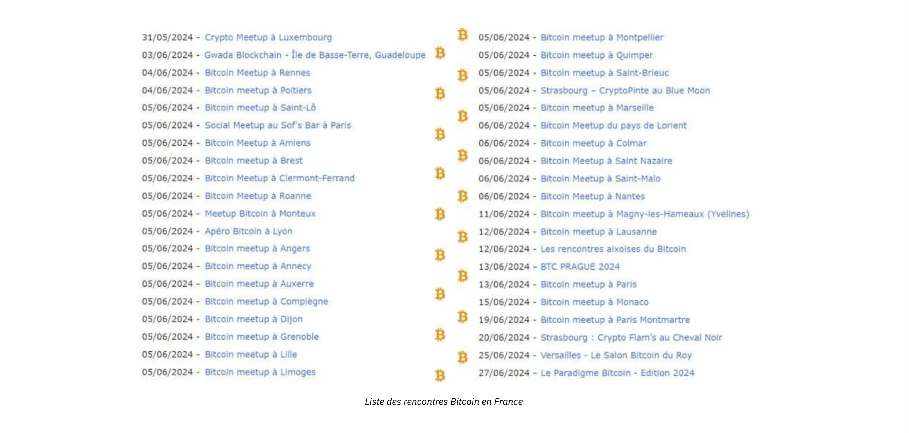

अन्य प्लेटफ़ॉर्म भी आपकी दृश्यता बढ़ा सकते हैं। **[मीटअप](https://www.meetup.com/)** उनमें से एक है, और यह एक वेबसाइट (और एक फ़ोन ऐप) है जहाँ आप एक ईवेंट बना सकते हैं और आस-पास के अन्य लोगों को ढूंढ सकते हैं।

इसकी लागत लगभग 8€ प्रति माह (या लगभग 90€ प्रति वर्ष) है, जो एक छोटे, असंरचित समुदाय के लिए महंगा हो सकता है। हालाँकि, मीटअप का उपयोग कुछ देशों में, विशेष रूप से कनाडा और संयुक्त राज्य अमेरिका में, व्यापक रूप से किया जाता है, और यह पंजीकरण प्रबंधन के लिए उपयोगी है।

इसी तरह, **[Orangepillapp](https://www.orangepillapp.com/)** एक सशुल्क मोबाइल ऐप है (50,000 Sats/वर्ष या आजीवन पहुंच के लिए 200,000 Sats) जो बिटकॉइनर्स को मिलने में मदद करता है।

हालांकि ये अंतिम दो प्लेटफॉर्म दृश्यता बढ़ाने में मदद कर सकते हैं, लेकिन समुदाय शुरू करते समय इनकी अनुशंसा नहीं की जाती है, क्योंकि ये निःशुल्क नहीं हैं।

**[btcmap.org](https://btcmap.org/), [BitcoinerEvents](https://www.bitcoinerevents.com/) और फ्रेंच समुदायों के लिए, [Bitcoin.fr](https://Bitcoin.fr) पर लिस्टिंग के साथ शुरुआत करना पर्याप्त से अधिक है**।

बधाई हो! आपका समुदाय बन गया है, आपके विज़ुअल तैयार हैं, आपके उद्देश्य तय हो गए हैं, आपके संचार चैनल तैयार हो गए हैं, आपके सोशल नेटवर्क लॉन्च हो गए हैं और आपकी दृश्यता रणनीति तय हो गई है।

एक बार जब बिटकॉइनर्स का एक छोटा समूह आपके साथ जुड़ जाता है, तो अगले चरण का समय आ जाता है: अपना पहला Bitcoin मीटअप आयोजित करना।

# Bitcoin मीट-अप का आयोजन करें

<partId>c009d2a6-40ce-583b-bd24-fdfd1fea262e</partId>

## अपने समुदाय के साथ नियमित बैठक क्यों शुरू करें?

<chapterId>ed8e471c-3b99-57e2-a042-2d4e8a40b137</chapterId>

अब जबकि आपके समुदाय के सोशल नेटवर्क और संचार चैनल शुरू हो गए हैं, इन प्लेटफ़ॉर्म पर अपनी उपस्थिति दर्ज कराने का समय आ गया है। नए सदस्यों को अपना परिचय देने और धीरे-धीरे बातचीत में शामिल होने के लिए प्रोत्साहित करें।

इससे आपका समय बचेगा, जिसका इस्तेमाल आप किसी तरह के मीटअप के बारे में सोचने में कर सकते हैं। जब आप अपने समुदाय में असली उत्साह महसूस करने लगेंगे, तो यह और भी प्रासंगिक हो जाएगा।

जैसा कि पहले बताया गया है, **Bitcoin मीटअप को किसी समुदाय के लिए अगले "स्तर" के रूप में देखा जा सकता है**। एक ओर, यह **सदस्यों को व्यक्तिगत रूप से मिलने** का अवसर देता है, और दूसरी ओर, यह **इस पारिस्थितिकी तंत्र में रुचि रखने वाले नए लोगों को शिक्षित करने** में मदद करता है।

इस तरह का आयोजन आपको अपने स्तर पर अपने शहर में Bitcoin के बारे में चर्चा पैदा करने का अवसर देता है, जो समय के साथ बढ़ सकती है, क्योंकि आपका समुदाय परियोजनाओं पर काम करता है।

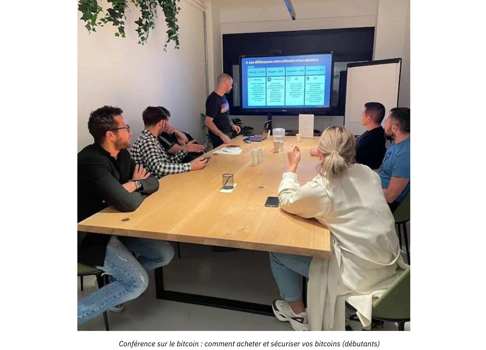

बेशक, आपके सामुदायिक विकास लक्ष्य जितने बड़े होंगे, आपको और आपके सदस्यों को उतना ही अधिक समय निवेश करना होगा।

इसलिए यह महत्वपूर्ण है कि आप अपने मीटअप के लिए प्राप्त करने योग्य लक्ष्य निर्धारित करके शुरुआत करें।

## पहली मुलाकात: कब और क्यों?

<chapterId>f3f8a614-cfb4-5994-a2e8-d56e6f8e3347</chapterId>

आप अपना समुदाय बनाने के कुछ ही सप्ताह बाद मीट-अप शुरू कर सकते हैं।

हालाँकि, उस स्तर पर आपका समूह संभवतः अभी भी छोटा होगा, जिसका अर्थ है कि संभावना है कि कोई भी नहीं आएगा।

जब आपके संचार माध्यमों में कम से कम कुछ सक्रिय सदस्य हों, उदाहरण के लिए, कुछ दर्जन, तो मीट-अप आयोजित करना बेहतर होता है। यह जल्दी हो सकता है, लेकिन यह लोगों के व्यक्तित्व पर भी निर्भर करता है।

एक बार जब आपको वह चिंगारी महसूस हो जाए, तो व्यक्तिगत रूप से मिलने का सुझाव दें। अगर दूसरे लोग रुचि रखते हैं, तो बस **अपनी पहली मुलाकात की तारीख तय** करना बाकी है।

खुद तारीख चुनने के बजाय, आमतौर पर **लगभग दस दिन पहले कई संभावित दिनों और समयों के साथ एक पोल बनाना** बेहतर होता है। इस तरह, आप वोटों का इस्तेमाल उपस्थिति बढ़ाने, उत्साह बढ़ाने और अपने समय का सर्वोत्तम उपयोग करने के लिए कर सकते हैं।

मीटिंग कैसे होगी, कितने लोग आएंगे या किन विषयों पर चर्चा होगी, इस बारे में कोई निश्चित उम्मीद न रखना ही बेहतर है। इससे निराशा से बचा जा सकता है और प्रतिभागियों पर दबाव भी नहीं पड़ेगा।

बातों को स्वाभाविक रूप से आगे बढ़ने दें, शायद एक ड्रिंक के साथ। बातचीत सहजता से होनी चाहिए, और ज़रूरत पड़ने पर, अगर बात भटकने लगे, तो आप धीरे से बातचीत को Bitcoin पर वापस ला सकते हैं।

यदि आप शांत क्षणों के लिए तैयारी करना चाहते हैं, तो आप कुछ गतिविधियों या बातचीत के बिंदुओं की योजना बना सकते हैं, जैसे:

- कंप्यूटर या स्मार्टफोन पर **[Mempool](https://Mempool.space/)** दिखाना;
- एक किताब लाना;
- **नर्डमाइनर**, बिटैक्स, एफपीजीए या यहां तक ​​कि जीडब्ल्यू-110 लाना;
- **Bitcoin फ़्लायर** होना;
- अपने समुदाय के लिए Bitcoin दृश्य या लोगो पर विचार-मंथन करना;
- **[Bitcoin कार्ड गेम](https://www.Maximalist.ovh/accueil/20-game-le-Coin-de-table.html)** खेलना;
- समुदायों और व्यापारियों का **[btcmap.org](https://btcmap.org/)** मानचित्र दिखाना;
- **लाइटनिंग** का उपयोग करके Bitcoin भेजना या प्राप्त करना।

जब आपकी मुलाक़ात अभी शुरू ही हुई हो, तो अक्सर औपचारिक प्रस्तुति के लिए सही समय नहीं होता। अगर उपस्थिति कम है, तो एक खुली और अनौपचारिक चर्चा आमतौर पर सबसे अच्छा काम करती है।

अपनी पहली मुलाकात के बाद, आप शायद एक और मुलाकात की योजना बनाना चाहेंगे। जब तक आपका समुदाय छोटा है, तब तक सर्वेक्षण के ज़रिए तारीखें चुनते रहना सबसे अच्छा है, उदाहरण के लिए, महीने में एक बार या हर दो महीने में एक बार। आप अपने संचार माध्यमों में इस पर चर्चा कर सकते हैं।

यदि बिटकॉइनर्स और इच्छुक प्रतिभागियों का एक नियमित समूह बनता है, तो दो कारणों से आवर्ती कार्यक्रम निर्धारित करना उचित है:

1) इससे सभी के लिए आगे की योजना बनाना आसान हो जाता है;

2) इससे **एक "आदत" डालने में मदद मिलती है।** अगर कोई व्यक्ति नियमित रूप से आपके चैनल देखना बंद भी कर दे, तो भी उसे पता चल जाएगा कि मीटिंग कब है और वह हमेशा की तरह आ सकता है।

यह दूसरा बिंदु एक कारण है कि, **फ्रांस में, अधिकांश मीटअप हर महीने के पहले बुधवार को होते हैं** (2022 में [DecouvreBitcoin](https://decouvrebitcoin.fr/) द्वारा शुरू की गई "राजदूत" पहल देखें)।

जर्मनी और इटली में कोई निश्चित राष्ट्रीय दिवस नहीं है।

हालाँकि, देश भर में सभी मीट-अप एक ही दिन होने से केंद्रीकरण की समस्या पैदा होती है: इससे बिटकॉइन उपयोगकर्ता आस-पास के समुदायों में होने वाले कार्यक्रमों में शामिल नहीं हो पाते और सुरक्षा संबंधी चिंताएँ भी पैदा हो सकती हैं। पड़ोसी मीट-अप आयोजकों से बात करने से आपको एक अच्छी व्यवस्था पर सहमत होने में मदद मिल सकती है।

जैसे-जैसे आपका समुदाय बढ़ता है और बैठकें अधिक लोगों को आकर्षित करती हैं, आप यह कर सकते हैं:

- प्रत्येक मीट-अप के लिए एक विशिष्ट लक्ष्य निर्धारित करें;
- या यहां तक ​​कि **प्रत्येक माह एक दूसरा कार्यक्रम जोड़ें**।

पहले मामले में, सभी की प्राथमिकताओं को ध्यान में रखते हुए, एक स्पष्ट लक्ष्य यह सुनिश्चित कर सकता है कि उपस्थित लोग कुछ नया सीखकर जाएं और बातचीत Bitcoin पर केंद्रित रहे।

दूसरे मामले में, दूसरा मासिक कार्यक्रम किसी विशिष्ट विषय को समर्पित किया जा सकता है, जैसे कि शुरुआती सत्र या कार्यशालाएं (Mining, लाइटनिंग, नोड स्थापना, आदि)।

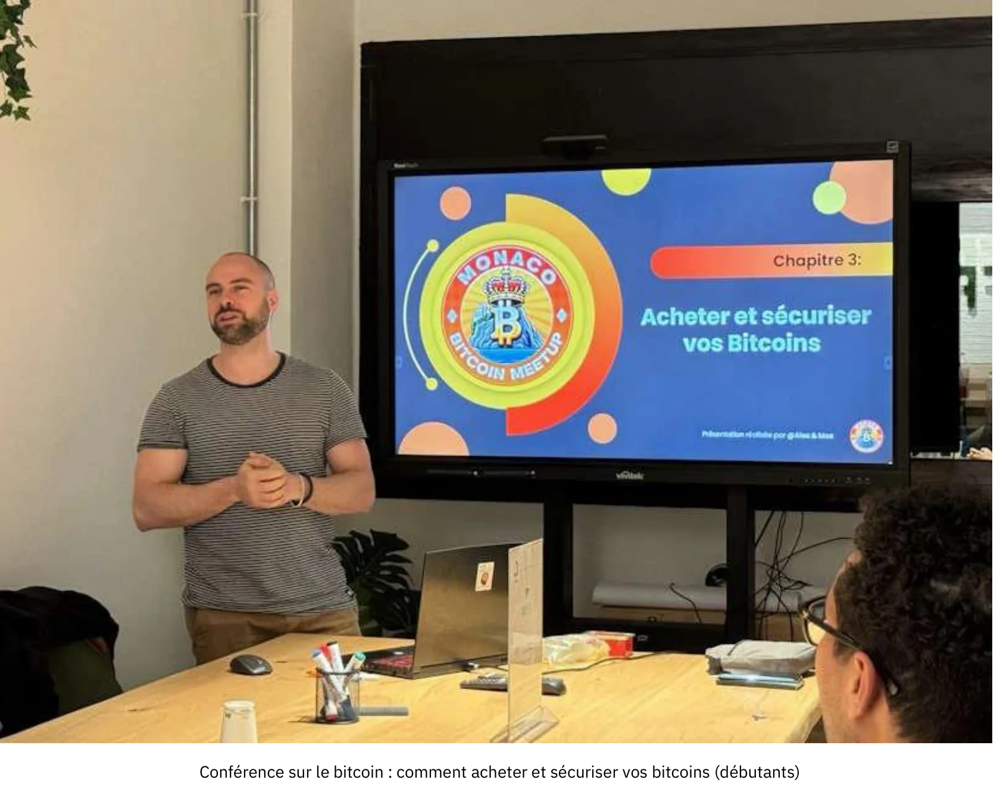

ध्यान रखें कि **इसके लिए ज़्यादा व्यवस्था और आपके ज़्यादा समय की ज़रूरत होगी**। सौभाग्य से, [इस कोर्स के भाग 6/8](https://planb.network/courses/1c643dc9-a15f-4f9e-93b6-cb3c58b4ee35/3213d87a-1998-5972-ab93-97a5769ba279) में, आपको मदद के लिए कई पुन: प्रयोज्य ओपन-सोर्स संसाधन मिलेंगे।

किसी भी मामले में, यह सब आपके या आपके समुदाय द्वारा अपने लिए निर्धारित लघु, मध्यम और दीर्घकालिक कार्य योजना पर निर्भर करता है।

## किसी स्थान की खोज

<chapterId>405d389e-6a32-5777-af8d-293380d2e8fd</chapterId>

अपने आयोजनों के लिए जगह ढूँढ़ना अक्सर आसान काम नहीं होता। इसके अलावा, यह ज़रूरी है कि यह जगह **आपके समुदाय के शहर** में स्थित हो।

विचार करने के लिए कई मानदंड हैं, जिनमें शामिल हैं:

1) **स्थान**: क्या यहाँ सार्वजनिक परिवहन द्वारा आसानी से पहुँचा जा सकता है? कार द्वारा? क्या पार्किंग उपलब्ध है?

2) क्या जगह सुखद है और ज़्यादा शोरगुल वाली नहीं है? क्या आप कोई औपचारिक जगह (सह-कार्यस्थल, मीटिंग रूम) ढूँढ रहे हैं या कुछ अनौपचारिक (बार, रेस्टोरेंट)?

3) क्या इसमें रग्बी या चैम्पियंस लीग मैच की रात भी आपकी मेजबानी करने की पर्याप्त क्षमता है?

4) क्या इसमें वीडियो प्रोजेक्टर और प्रस्तुतियों के लिए एक शांत क्षेत्र है?

5) और अंत में, यदि यह बार या रेस्तरां है, तो क्या मेनू में सभी के लिए खाने-पीने की कोई न कोई व्यवस्था है?

इसके अतिरिक्त, ध्यान में रखने योग्य तीन महत्वपूर्ण बिंदु हैं:

- अगर आप शाम को दो हिस्सों में बाँटने की योजना बना रहे हैं: पहला, किसी औपचारिक जगह पर प्रस्तुति देना ताकि सभी का ध्यान केंद्रित हो सके, और फिर किसी बार या रेस्टोरेंट में जाकर ज़्यादा सुकून भरे माहौल में प्रस्तुति जारी रखना, तो अनुभव बताता है कि शाम के बीच में जगह बदलने से अक्सर कुछ प्रतिभागी ब्रेक के दौरान ही चले जाते हैं। इसलिए यह तरीका ठीक नहीं है।
- आपकी पहली मुलाकातों में, उपस्थिति कम होने की संभावना है, और आप शायद औपचारिक प्रस्तुतियाँ नहीं देंगे। ऐसे में, मालिक को अपना परिचय देने या अपने उद्देश्य बताने की कोई ज़रूरत नहीं है। हालाँकि, **जब मुलाकातें नियमित होने लगें और उनमें अच्छी उपस्थिति हो, तो पेशेवर रवैया दिखाने और मासिक रूप से आने की अपनी इच्छा व्यक्त करने के लिए ऐसा करना उचित है**। इससे कई चर्चाएँ हो सकती हैं (स्वचालित मासिक आरक्षण, मुफ़्त पेय और/या भोजन बोर्ड, छूट, Bitcoin के बारे में बातचीत, Bitcoin भुगतान स्वीकार करना, आदि)। ज़ाहिर है, अगर आप विशेष रूप से प्रस्तुतियाँ देने के लिए वीडियो प्रोजेक्टर वाले स्थान की तलाश में हैं, तो अपनी परियोजना और उद्देश्यों को प्रस्तुत करने के लिए मालिक और/या प्रबंधक के साथ एक बैठक (आमने-सामने, या टेलीफ़ोन पर भी) का अनुरोध करना ज़रूरी लगता है।

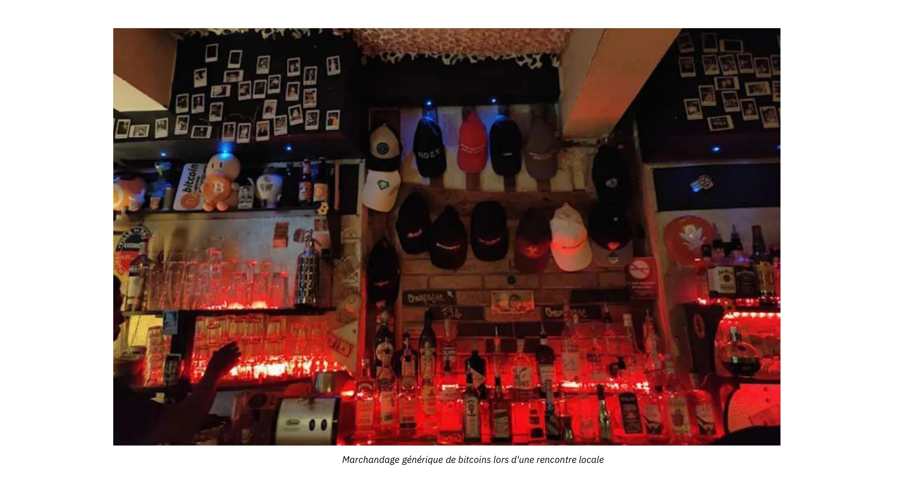

- अंत में, कुछ समुदाय **केवल उन्हीं जगहों पर अपने कार्यक्रम आयोजित करना चाहते हैं जो Bitcoin भुगतान स्वीकार करते हैं**, जो समझ में आता है। ऐसे में, अपने शहर में Bitcoin स्वीकार करने वाले व्यवसायों की खोज करके शुरुआत करना एक अच्छा विचार है ([btcmap.org](https://btcmap.org/map/) पर) और उनसे संपर्क करके देखें कि क्या वे आपके मानदंडों को पूरा करते हैं। अगर कोई उपयुक्त विकल्प उपलब्ध नहीं है, तो आप नए व्यापारियों को शामिल करने का प्रयास कर सकते हैं, लेकिन आपको कई अस्वीकृतियों की उम्मीद कर

इसके अलावा, जब आप अपनी मीट-अप शुरू कर रहे हों, तो पहले कुछ महीनों के लिए **स्थान बदलने** में संकोच न करें। इससे आपको **विभिन्न प्रबंधकों के साथ संबंध बनाने**, विभिन्न वातावरणों का अनुभव करने और संभावित भावी मेज़बानों के बारे में जानकारी इकट्ठा करने में मदद मिलेगी।

बाद में, जब आपका समूह बढ़ जाए, तो आप दोपहर में कई व्यवसायों और बारों में जाकर उनसे पूछ सकते हैं कि क्या उनके पास आपके मासिक कार्यक्रमों और मुलाकातों के आयोजन के लिए उपयुक्त स्थान है।

## मुलाकात से पहले

<chapterId>c5218943-580d-5efc-89ed-6b5d728816d6</chapterId>

क्या आप आने वाले सप्ताहों में एक बैठक आयोजित करने की योजना बना रहे हैं?

आपकी तैयारी में सहायता के लिए यहां एक चेकलिस्ट दी गई है:

1/ **स्थल की पुष्टि करें**

उस स्थान से संपर्क करें जहां आप कार्यक्रम आयोजित करेंगे और उपस्थित लोगों की अनुमानित संख्या के लिए इसे आरक्षित करें।

2/ **कार्यक्रम की घोषणा**:

    - अपने सोशल नेटवर्क और अन्य संचार माध्यमों पर दिनांक, समय और स्थान साझा करें। यदि आवश्यक हो, तो पंजीकरण लिंक भी शामिल करें।
    - एक समर्पित दृश्य बनाएं (उदाहरण के लिए कैनवा पोस्टर, भाग 2/8 देखें "[अपने Bitcoin समुदाय के लिए एक पहचान डिजाइन करना](https://planb.network/courses/1c643dc9-a15f-4f9e-93b6-cb3c58b4ee35/b48a18cc-afdf-5216-802c-32647b5cd8a3)")।
    - टेलीग्राम और ट्विटर पर घोषणा को पिन करके और डिस्कॉर्ड पर "@everyone" उल्लेख का उपयोग करके दृश्यता को अधिकतम करें।
    - कार्यक्रम से 7 से 10 दिन पहले घोषणाएं पोस्ट करें ताकि उपस्थित लोग पहले से योजना बना सकें।

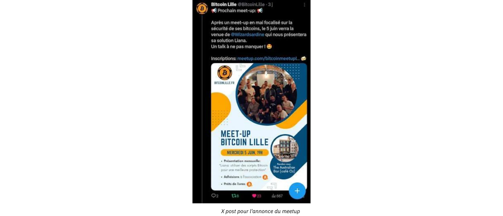

3/ **अपने दर्शकों को याद दिलाएं**

कार्यक्रम से दो से तीन दिन पहले, दृश्यता बढ़ाने के लिए अपनी घोषणाओं को पुनः साझा और रीट्वीट करें।

4/ **स्थल को अपडेट करें**

एक दिन पहले (या दो दिन पहले) अपने पंजीकरण की जांच करें और आयोजन स्थल को प्रतिभागियों की अंतिम अपेक्षित संख्या बताएं।

अपने कार्यक्रम को विशिष्ट बनाने के लिए अतिरिक्त कदम:

- फ़्लायर्स और/या पोस्टर प्रिंट करें
- किसी विशिष्ट विषय पर प्रस्तुति तैयार करें
- एक गतिविधि या कार्यशाला का आयोजन करें

## मिलन का दिन

<chapterId>cf60067b-591f-5fdf-9b9e-d442aad0e8f9</chapterId>

बड़ा दिन आ गया है! कार्यक्रम शुरू होने से एक या दो घंटे पहले, अपने समुदाय के संचार माध्यमों से एक रिमाइंडर भेजें। कार्यक्रम शुरू होने का समय दोबारा पुष्टि करें और प्रतिभागियों को बताएँ कि वे आपको कैसे पहचानेंगे, उदाहरण के लिए, यह बताकर कि आप Bitcoin टी-शर्ट और टोपी पहनेंगे।

जैसे-जैसे आपकी बैठकें बढ़ती जाएंगी और आप 20 से अधिक लोगों का स्वागत करने लगेंगे, तो आयोजन स्थल की तैयारी करना अधिक महत्वपूर्ण हो जाएगा।

यहाँ बताया गया है कि क्या करना है:

1) **चीजें व्यवस्थित करने के लिए जल्दी पहुंचें**।

2) अपनी ज़रूरतों और आयोजन स्थल की संभावनाओं के अनुसार **जगह की व्यवस्था** करें। अगर आप सिर्फ़ छह लोग हैं, तो ज़्यादा व्यवस्था की ज़रूरत नहीं है। लेकिन जब 10-20 लोग आ जाएँ, तो पूरी तरह से बैठने की व्यवस्था बातचीत को सीमित कर सकती है। ऐसे में, अगर उपलब्ध हो, तो अच्छी दूरी पर ऊँची मेज़ों वाली एक खड़ी व्यवस्था चुनें, साथ ही कुछ (अधिमानतः ऊँची) कुर्सियाँ भी रखें। अगर कोई प्रस्तुति देने की योजना है, तो ज़्यादातर शाम के लिए खड़े रहने की व्यवस्था रखें और भाषण से ठीक पहले कुर्सियाँ लगा दें।

3) छोटे कस्टम स्पर्श जोड़ें:

    - अपने स्थान को दर्शाने के लिए प्रवेश द्वार पर एक पोस्टर लगाएं (पटाफिक्स का उपयोग करें और पहले स्थल की अनुमति प्राप्त करें)।
    - अंदर Bitcoin थीम वाले पोस्टर प्रदर्शित करें (Bitcoin श्वेत पत्र, आपका सामुदायिक चार्टर, वर्तमान परियोजनाएं, आदि)।
    - टेबल पर स्टिकर, फ़्लायर्स या वार्तालाप शुरू करने वाली चीज़ें रखें, उदाहरण के लिए: एक नर्डमाइनर, Hardware Wallet, लैपटॉप जिसमें Mempool, ASIC Miner प्रदर्शित हो, या निजी कुंजियों के लिए धातु बैकअप प्लेट।

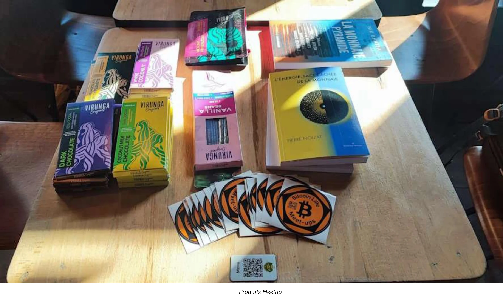

अगर आप कुछ ही प्रतिभागियों की उम्मीद कर रहे हैं और अभी तक आयोजन स्थल प्रबंधकों के साथ आपके संबंध नहीं बने हैं, तो अपने सारे उपकरण तुरंत लाने और दिखाने से बचें। एक बार विश्वास स्थापित हो जाने पर, आपको अपनी इच्छानुसार जगह व्यवस्थित करने की ज़्यादा आज़ादी होगी।

अंत में, एक ड्रिंक लें और लोगों के आने का इंतज़ार करें। और याद रखें: अगर पहली बार कोई न आए तो निराश न हों। देखने के लिए कोई किताब या वीडियो ज़रूर साथ लाएँ, बस।

## मुलाकात के बाद

<chapterId>3e881af9-9c09-5721-81ee-c5cda3b109c5</chapterId>

जब मीटिंग खत्म हो जाती है, तो वेन्यू के कर्मचारियों के लिए सफाई का समय होता है। जाने से पहले, वेटरों या मैनेजरों की मदद करने की पेशकश करें। यह इतना आसान हो सकता है कि सभी गिलास एक टेबल पर इकट्ठा कर लें या अगर आप बार के पास हैं, तो जाने से पहले उन्हें वापस कर दें।

घर वापस आने के बाद, संभवतः कई दिनों तक आपके दिमाग में Bitcoin घूमता रहेगा। यह आपके समुदाय की नब्ज़ टटोलने और प्रतिभागियों से प्रतिक्रिया प्राप्त करने का सबसे अच्छा समय है। आप ये कर सकते हैं:

- अपने संचार चैनलों पर धन्यवाद संदेश पोस्ट करें और कार्यक्रम के दौरान उल्लिखित किसी भी लिंक या संसाधन को साझा करें।
- अगले मीटअप के लिए सुधार सुझाने के लिए उपस्थित लोगों को आमंत्रित करें।
- अपने अगले कार्यक्रम की योजना बनाना शुरू करें।

इसके बाद आपके पास अगले मीटअप को और भी बेहतर बनाने के लिए नए विचार, दृश्य या परियोजनाएं विकसित करने के लिए कुछ सप्ताह का समय होगा।

## प्रतिभागियों को शामिल करने और बनाए रखने का महत्व

<chapterId>f5355e35-4b07-527c-88a3-8535cba7592c</chapterId>

रोम एक दिन में नहीं बना था, और न ही आपका समुदाय बनेगा। Bitcoin के प्रति उत्साह नियमित बैठकों और कार्यक्रमों के आयोजन से आता है।

ऐसा करने के लिए एक बात आवश्यक है: **प्रतिभागियों को व्यस्त रखें**।

इसकी शुरुआत उत्साही बिटकॉइनर्स के एक छोटे समूह से हो सकती है, जिसका उद्देश्य नियमित रूप से एकत्रित होकर Bitcoin पर चर्चा करना है। समय के साथ, प्रत्येक व्यक्ति की उपलब्धता और रुचियों के आधार पर, आप **समूह के साथ कुछ संगठनात्मक कार्य साझा कर सकते हैं**, या मुख्य सदस्यों को विशिष्ट परियोजनाएँ सौंप सकते हैं। ये आपके समुदाय, आपके मीट-अप या आपके शहर के लिए विशिष्ट हो सकते हैं या [इस पाठ्यक्रम के भाग 6/8](https://planb.network/courses/1c643dc9-a15f-4f9e-93b6-cb3c58b4ee35/6565e8a0-d535-5be0-9764-273584c675bd)

जैसे-जैसे आपकी मुलाकातें आगे बढ़ेंगी, नए चेहरे सामने आएंगे: वे लोग जिन्होंने पिछले चक्रों में बीटीसी और/या ऑल्टकॉइन खरीदे थे, तकनीकी उत्साही जो अपनी समझ को गहरा करना चाहते हैं, या पूर्णतया शुरुआती लोग जो इस बिना किसी शर्त और विश्वसनीय तृतीय पक्षों के बिना काम करने वाली, बिना किसी सेंसरशिप वाली, विकेन्द्रीकृत, पारदर्शी और निष्पक्ष भुगतान प्रणाली के बारे में उत्सुक हैं।

यह सुनिश्चित करने के लिए कि आपके आयोजनों में हर कोई शामिल महसूस करे, दो प्रमुख पहलुओं पर ध्यान केंद्रित करें:

- **सामाजिक समावेश**: आने वाले सभी लोगों को स्वागत का एहसास होना चाहिए। नए लोगों का स्वागत करने, उनके आने का कारण पूछने और उन्हें दूसरों से मिलवाने का प्रयास करें। जब लोग शामिल महसूस करते हैं, तो उनके दोबारा आने की संभावना बढ़ जाती है और शायद भविष्य के कार्यक्रमों के आयोजन में भी मदद कर सकते हैं।
- **धैर्य और खुलापन**: इसके लिए समय और प्रेरणा की आवश्यकता होती है। अगर आप किसी प्रतिबद्ध शिटकॉइनर (या इससे भी बदतर, किसी XRP Maximalist) से बात कर रहे हैं, तो उन्हें नज़रअंदाज़ करना आपके लिए आकर्षक हो सकता है। लेकिन बातचीत में शामिल होकर, आप गलतफ़हमियों या गलत तर्कों को दूर कर सकते हैं। अगर वे सुनने को तैयार हैं, तो वे Bitcoin को सही मायने में समझने के लिए तैयार हो सकते हैं।

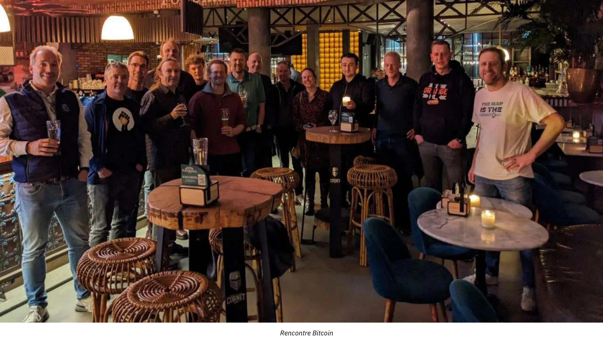

व्यावहारिक दृष्टिकोण से, समग्र आयोजन अनुभव के बारे में सोचें:

- क्या **स्थल सुखद** था?
- क्या इस तक पहुंचना आसान था?
- कुछ लोगों ने नामांकन तो कराया लेकिन वे क्यों नहीं आये?
- क्या चर्चाएँ शुरुआती लोगों के लिए बहुत तकनीकी थीं?
- क्या चर्चाएं बहुत अधिक मादक थीं?

प्रत्येक प्रतिभागी का अपना व्यक्तित्व, लक्ष्य और रुचियाँ होती हैं, इसलिए अनुभव अलग-अलग होंगे। लेकिन जब आयोजन स्थल सही हो, भीड़ खुले विचारों वाली हो, और इरादे सच्चे हों, तो मीटअप के सफल होने के पूरे कारण मौजूद होते हैं।

एक मीटअप बनाने में समय लगता है, लेकिन सबसे बढ़कर, इसके लिए संगठन की ज़रूरत होती है। यह एक मानवीय परियोजना है, और यह तभी कारगर होगी और लंबे समय तक फलेगी-फूलेगी जब यह सुनियोजित, खुली और समावेशी होगी।

अंततः, यह आपको ही तय करना है कि "खुला और समावेशी" रवैया कितना आगे बढ़ना चाहिए। बस याद रखें: एक शिटकॉइनर अक्सर बस एक बिटकॉइनर बनने की प्रक्रिया में ही होता है।

# परियोजनाओं और पहलों के उदाहरण

<partId>45b3bc40-1c31-583e-8411-2662e6efd765</partId>

## सिर्फ बीयर पीने से आगे क्यों जाएं?

<chapterId>3213d87a-1998-5972-ab93-97a5769ba279</chapterId>

जैसे-जैसे रुकावटें बढ़ती जाएँगी, आपका समुदाय विकसित होता जाएगा। नए चेहरे जुड़ेंगे, कुछ दूर होते जाएँगे, लेकिन मार्गदर्शक सिद्धांत वही रहना चाहिए: Bitcoin पारिस्थितिकी तंत्र का विकास करें और सदस्यों के बीच संबंधों को मज़बूत करें।

कई परियोजनाएँ और पहल हैं जिन्हें लागू किया जा सकता है। यह अध्याय उन विचारों की एक छोटी सूची प्रस्तुत करता है जिन्हें किसी समुदाय के भीतर या किसी मीटअप के दौरान लागू किया जा सकता है। बेझिझक उन विचारों को चुनें जो आपको प्रेरित करते हैं और इस पाठ्यक्रम में अपने विचार भी शामिल करें [GitHub पर "पुल रिक्वेस्ट" करके](https://github.com/PlanB-Network/Bitcoin-educational-content)।

आगे बढ़ने से पहले, आइए पहले उल्लेखित एक बिंदु पर पुनः विचार करें।

जब आप Bitcoin मीटअप आयोजित करते हैं, तो आप नए लोगों से मिलते हैं। सामाजिक मेलजोल ज़रूरी है और बीयर (या सामान्य तौर पर शराब) उत्सव का माहौल बनाने में मदद कर सकती है। लेकिन ध्यान रखने योग्य बातें:

- शराब सोचने और समझने जैसी संज्ञानात्मक क्षमताओं को क्षीण कर देती है, जिससे प्रतिभागियों के लिए गंभीर चर्चाओं या प्रस्तुतियों को समझना कठिन हो जाता है।
- शराब भी एक आरामदायक रस्म बन सकती है: हर महीने, आप दोस्तों के साथ ड्रिंक करते हुए अपने "Bitcoin पल" को साझा करते हैं। हालाँकि यह जुड़ने का एक शानदार तरीका है, लेकिन क्या बीयर पीना वाकई आपकी मुलाक़ात का मुख्य उद्देश्य है? या आप Exchange पर शोध करना, दूसरों से सीखना और नए लोगों को Bitcoin की खोज में मदद करना पसंद करेंगे?

हर किसी की अपनी पसंद, अपनी मान्यताएँ और अपना व्यक्तित्व होता है। यह किसी एक मुलाकात को दूसरे से बेहतर आंकने की बात नहीं है। फिर भी, हालाँकि हम अक्सर बीयर पीते हुए दुनिया बदलने की बात करते हैं, लेकिन क्रांतियाँ इस तरह से शुरू या विकसित नहीं होतीं।

मुख्य बात यह है कि इसके प्रति जागरूक रहें।

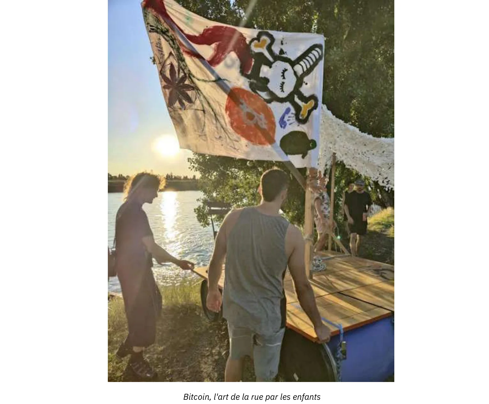

## वार्षिक प्रगति के साथ थीम आधारित बैठकें आयोजित करें

<chapterId>46afdbcc-a775-5c16-b20a-34956690d58f</chapterId>

एक बार जब आप लगभग दस लोगों का एक मुख्य समूह बना लेते हैं, तो आप प्रत्येक कार्यक्रम में प्रस्तुतियाँ जोड़ना शुरू कर सकते हैं। ये प्रस्तुतियाँ पहले से घोषित किसी विषय पर आधारित हो सकती हैं या एक-दूसरे से पूरी तरह स्वतंत्र हो सकती हैं।

प्रस्तुतियों या कार्यशालाओं की योजना बनाते समय, एक स्पष्ट और सुव्यवस्थित प्रगति तैयार करने से मदद मिलती है। इसका उद्देश्य **Bitcoin की मूल अवधारणाओं को चरणबद्ध तरीके से प्रस्तुत करना** है, जिससे उपस्थित लोगों को विषय का विभिन्न कोणों से संपूर्ण दृष्टिकोण मिल सके।

फ्रांस में, 2023 की गर्मियों के दौरान, मीट-अप आयोजकों ने **वार्षिक प्रगति** पर काम किया।

अपने मज़बूत शैक्षिक मूल्य के अलावा, यह दृष्टिकोण समूहों के बीच ओपन-सोर्स दस्तावेज़ों और स्लाइड डेक को साझा करना संभव बनाता है, जिससे धीरे-धीरे संसाधनों का एक साझा पुस्तकालय बनता है। इस पहल को अच्छी प्रतिक्रिया मिली है और आने वाले वर्षों में इसके और बढ़ने की उम्मीद है।

नीचे 2023-2024 के फ़्रांसीसी मीटअप की प्रगति दी गई है। प्रत्येक थीम के लिए, एक ओपन-सोर्स प्रेजेंटेशन और एक वीडियो उपलब्ध है, जिससे आपको अपने कार्यक्रमों के लिए विषयों के बारे में विचार मिल सकते हैं।

अतिरिक्त संपादन योग्य सामग्री [Bitcoin शिक्षण टूलबॉक्स](https://planb.network/fr/resources/bet) में भी पाई जा सकती है!

| Month | Theme | Video | Editable Resource |
| -------- | -------- | -------- | --- |
| September     | Chapter 1: What is Bitcoin?     | [	YouTube link](https://www.youtube.com/watch?v=CSjuBqrl4t8)     | [Editable PowerPoint](https://www.canva.com/design/DAFu0d5Jd7M/9gAWDAOSS6LDkWENuZjYgw/edit) |
| October & November| Chapter 2: Understanding Bitcoin Transactions     | [YouTube link](https://www.youtube.com/watch?v=inFnR-3NsdM)     | [Editable PowerPoint](https://www.canva.com/design/DAFsEcnOro8/Mz9FYdTGhsvozZOe0Y9jtw/edit) |
| December     | Chapter 3: Understanding the Lightning Network     | [YouTube link](https://www.youtube.com/watch?v=hHz-ALx8D9w)     | [Editable PowerPoint](https://www.canva.com/design/DAF4YPSNnR8/HKp4Vmcno8eMtVWnZmFtcw/edit) |
| January     | Chapter 4: What is Mining?     | [YouTube link](https://www.youtube.com/watch?v=QyHZ3CVI_OI)     | [Editable PowerPoint](https://www.canva.com/design/DAF5DE6iBEM/tsy8E3oBebUnsR0kj53vvQ/edit) |
| February     | 	Chapter 5: Running a Bitcoin and Lightning Node    | [YouTube link](https://www.youtube.com/watch?v=RRYK-usg-OY)     | [Editable PowerPoint](https://www.canva.com/design/DAF55FU6HI0/sQ0lacRJblqrhn_9Xk1yDg/edit) |
| March     | 	Chapter 6: Using the Lightning Network in Daily Life    | [YouTube link](https://www.youtube.com/watch?v=o2BS4xjei8M)    | [Editable PowerPoint](https://www.canva.com/design/DAGAcJMw7lw/-haMNnHnwj5vpDAy8MDowA/edit) |
| April & May    | Chapter 7: Securing Your Bitcoins      | [YouTube link](https://www.youtube.com/watch?v=fHExPbhM0Hg)    | [Editable PowerPoint](https://www.canva.com/design/DAGDz3Nq4e0/D3uG-4w9FN6OhUq-VXzhfg/edit) |
| June     | 	Chapter 8: What is Multi-Sig?     | [YouTube link](https://www.youtube.com/watch?v=Me5489mpoxA)     | [Editable PowerPoint](https://www.canva.com/design/DAGLMtQT6sg/rYIxr4ldUJ0jTelNf-Pj8Q/edit) |
| July     | 	Chapter 9: Understanding the Bull Run and How to Prepare    | [YouTube link](https://www.youtube.com/watch?v=7RA-gnCJWyM)     | [Editable PowerPoint](https://www.canva.com/design/DAGJQkiZ_YA/9lUluP9RZ0eeA_e61mk9Hw/edit) |
| August     | Chapter 10: The Taxman is Never Far Away   | [YouTube link](https://www.youtube.com/watch?v=oY4NwonGDm0)     | [Editable PowerPoint](https://www.canva.com/design/DAGQhx7Yc_c/7mRhb_vlgnhSgxd1FtjK8w/edit) |

अध्याय 2 और 7 को दो छोटी प्रस्तुतियों में विभाजित किया जा सकता है ताकि प्रतिभागियों पर ज़्यादा बोझ न पड़े। हालाँकि, इन्हें एक ही सत्र में चलाने से कैलेंडर में विशेष गतिविधियों, जैसे पड़ोसी समूहों के साथ संयुक्त बैठकें, क्विज़ या कार्यशालाओं के लिए जगह खाली हो जाती है।

**आप इन संसाधनों का उपयोग करने, उन्हें अनुकूलित करने और साझा करने के लिए स्वतंत्र हैं, बस यदि आप उनके काम का पुनः उपयोग करते हैं तो मूल लेखकों को श्रेय देना सुनिश्चित करें।**

चूँकि हर मीटअप में सभी लोग शामिल नहीं होंगे, इसलिए प्रस्तुतियों को रिकॉर्ड करके किसी स्ट्रीमिंग प्लेटफ़ॉर्म या अपनी वेबसाइट पर अपलोड करना एक अच्छा विचार है। इससे अनुपस्थित लोगों को जानकारी मिल सकेगी और प्रतिभागियों को बाद में सामग्री पर दोबारा गौर करने का मौका मिलेगा।

इसके समानांतर, आप अन्य थीम वाले मीटअप भी चला सकते हैं, जैसे:

- Bitcoin ज्ञान प्रश्नोत्तरी (पुरस्कार के रूप में Hardware Wallet के साथ)
- एक ऑनबोर्डिंग चुनौती जिसमें आप सड़क पर बिना सिक्के वालों को मुफ्त सातोशी भेजते हैं
- Bitcoin से संबंधित उत्पाद प्रस्तुत करने के लिए किसी विशेषज्ञ वक्ता या कंपनी को आमंत्रित करना
- Bitcoin स्वीकार करने वाले बार और दुकानों का रात्रि भ्रमण

और भी बहुत कुछ, आपकी कल्पना ही एकमात्र सीमा है!

## साइड-इवेंट और कार्यशालाएँ बनाएँ

<chapterId>9dbd651a-8712-5630-90b3-b9525dcc1385</chapterId>

आपकी उपलब्धता और आपके समुदाय में भागीदारी के स्तर के आधार पर, आप पूरे वर्ष अतिरिक्त कार्यक्रमों की योजना बना सकते हैं, जैसे:

- 22 मई को **पिज़्ज़ा दिवस** के लिए एक रेस्तरां रात
- अगले **Halving** का जश्न मनाने के लिए एक शाम या सप्ताहांत
- Bitcoin और यह कैसे काम करता है, इस बारे में एक पारिवारिक **गेम नाइट**, [Le Coin de Table](https://www.Maximalist.ovh/) या [SHAmory](https://shamory.com/) जैसे खेलों का उपयोग करके
- एक **Mining कार्यशाला** जिसमें विभिन्न प्रकार के हार्डवेयर (CPU, GPU, FPGA, ASIC, Nerdminer, Bitaxe) प्रस्तुत किए जाएंगे
- शुरुआती लोगों के लिए दोपहर या शाम, थीम आधारित कार्यशालाओं के साथ
- **पड़ोसी समुदायों के साथ एक संयुक्त बैठक**

बस इतना ध्यान रखें कि कैलेंडर बहुत ज़्यादा न हो जाए। एक ही महीने में बहुत सारे कार्यक्रम आयोजकों के लिए थकान का कारण बन सकते हैं और समय के साथ उपस्थिति कम हो सकती है।

## स्टिकर बनाएं

<chapterId>d605f3b3-130e-513d-85e6-06bc5ea13e99</chapterId>

स्टिकर आपकी पहचान को मजबूत करते हुए Bitcoin और आपके समुदाय दोनों को बढ़ावा देने का एक मजेदार तरीका है।

ऑर्डर देने से पहले इन सुझावों को ध्यान में रखें:

- बाहरी उपयोग के लिए, सुनिश्चित करें कि स्टिकर जलरोधी हों।
- लेजर कटिंग के दौरान क्रॉपिंग संबंधी समस्याओं से बचने के लिए अपने लोगो को कटिंग क्षेत्र से थोड़ा छोटा रखें।
- उच्च प्रिंट गुणवत्ता के लिए रास्टर छवि के बजाय वेक्टर फ़ाइल का उपयोग करें।
- सही आकार चुनें: 8 सेमी व्यास (लगभग एक वयस्क हथेली के आकार का) स्पष्ट रूप से दिखाई देता है, जबकि 4 सेमी व्यास अधिक गुप्त होता है। क्या आप दृश्यता चाहते हैं या विवेक?
- गहरे काले रंग ("क्वाड ब्लैक") की छपाई के लिए, 30% सियान, 30% मैजेंटा, 30% पीला और 100% काला रंग इस्तेमाल करें। सिर्फ़ 100% काला रंग इस्तेमाल करने से धूसर रंग निकल सकता है। प्रिंटर अक्सर इसकी जाँच करते हैं, लेकिन यह जानना ज़रूरी है।

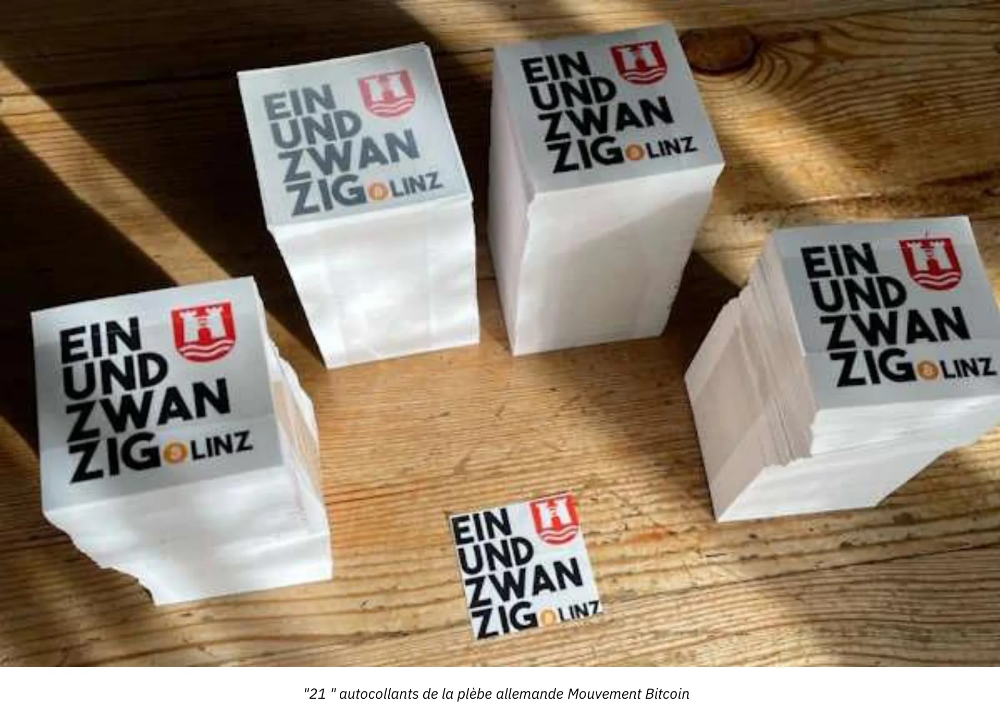

आपकी ज़रूरतों और सप्लायर के आधार पर, 1,000 स्टिकर की कीमत 100€ से 250€ के बीच हो सकती है। आप [@Mill3sim3 ट्विटर पर](https://x.com/Mill3sim3) से संपर्क कर सकते हैं, जो मार्केटिंग में विशेषज्ञता रखने वाले एक फ़्रांसीसी बिटकॉइनर हैं और कभी-कभी मानक ऑनलाइन विक्रेताओं की तुलना में 30% तक कम दाम दिला सकते हैं।

वैसे, 1,000 स्टिकर बहुत ज़्यादा हैं। आमतौर पर बेहतर यही होता है कि शुरुआत में लगभग 100 स्टिकर रखें ताकि आप सभी स्टिकर बाँट सकें।

महत्वपूर्ण: **सार्वजनिक स्थानों पर स्टिकर लगाने से पहले स्थानीय नियमों की जांच करें**।

फ़्रांस में, स्टिकर केवल आधिकारिक सार्वजनिक सूचना पट्टों पर ही लगाए जा सकते हैं। इन्हें कहीं और लगाने पर (जैसे, स्टॉप साइन पर) उन्हें हटा दिया जाएगा और अगर वे आपसे या आपके मीटअप से जुड़े हुए हैं, तो जुर्माना भी लग सकता है। अपने सदस्यों को इस बारे में सूचित करें।

कॉन्सर्ट, बार या स्टेडियम जैसी निजी जगहों पर, अपना स्टिकर लगाने से पहले जाँच लें कि क्या वहाँ पहले से स्टिकर मौजूद हैं। अगर नहीं, तो कर्मचारियों से अनुमति माँगें। आप नहीं चाहेंगे कि किसी व्यवसाय के मालिक को आपके समुदाय के बारे में पहली धारणा यह लगे कि आपने उनकी जगह पर तोड़फोड़ की है।

## एक लाइब्रेरी बनाएँ

<chapterId>acc94093-f8b3-51b8-9359-348e9e075d38</chapterId>

एक अन्य परियोजना जिसे आप आसानी से स्थापित कर सकते हैं वह है **अपने मीट-अप में एक लाइब्रेरी बनाना**।

आप उन प्रतिभागियों को, जो अपनी पठन सामग्री साझा करना चाहते हैं, Bitcoin से संबंधित एक पुस्तक लाने के लिए आमंत्रित कर सकते हैं। अगर मीट-अप में कोई और इसे उधार लेना चाहता है, तो Exchange में मालिक के साथ जमा राशि पर ऋण की व्यवस्था की जा सकती है, उदाहरण के लिए, लाइटनिंग के माध्यम से 21,000 सातोशी।

मालिक के लिए, यह जमा राशि संभावित नुकसान या चोरी की भरपाई में मदद करती है। उधारकर्ता के लिए, यह भविष्य में अपनी जमा राशि वापस पाने के लिए दोबारा मिलने के लिए एक प्रोत्साहन है।

यदि आप कोई एसोसिएशन चलाते हैं और अपने धन का कुछ हिस्सा शैक्षिक संसाधनों में निवेश करना चाहते हैं, तो आप अपनी **Bitcoin लाइब्रेरी** में प्रस्तुत करने के लिए कई पुस्तकें भी खरीद सकते हैं, जो प्रत्येक मीट-अप में उपलब्ध होंगी।

पारिस्थितिकी तंत्र का समर्थन करने के लिए, **[प्रकाशक कोन्सेंसस नेटवर्क](https://konsensus.network/) 2023 के अंत से अंतर्राष्ट्रीय Bitcoin मीट-अप और समुदायों को तीन या अधिक पुस्तकों के ऑर्डर पर अपनी सभी पुस्तकों पर 15% से 35% की छूट दे रहा है**।

इस छूट का लाभ उठाने के लिए, बस ट्विटर पर [कोन्सेंसस पब्लिशिंग हाउस](https://twitter.com/KonsensusFR) से संपर्क करें।

यदि आपके पास नकदी नहीं है, तो भी आप अपने समुदाय के सदस्यों को छूट दे सकते हैं।

अगर आपके पास खुद पैसे नहीं हैं, तो भी आप अपने सदस्यों को छूट दे सकते हैं। उदाहरण के लिए, एक आयोजक सदस्यों से ऑर्डर ले सकता है, कम कीमत पर थोक ऑर्डर दे सकता है, और अगली मीटिंग में किताबें बाँट सकता है, और उस समय लाइटनिंग में भुगतान ले सकता है।

आप अपनी बैठकों में पुस्तक उधार देने का चार्टर भी प्रदर्शित कर सकते हैं, ताकि नए लोगों को उधार लेने के नियमों के बारे में स्पष्ट रूप से बताया जा सके।

यहां एक ओपन-सोर्स उदाहरण दिया गया है जिसका आप उपयोग और अनुकूलन कर सकते हैं:

[पुस्तक उधार चार्टर](https://www.canva.com/design/DAF7u1b5kRM/r2gEAlibe_jTIXIX-O9PMA/edit)

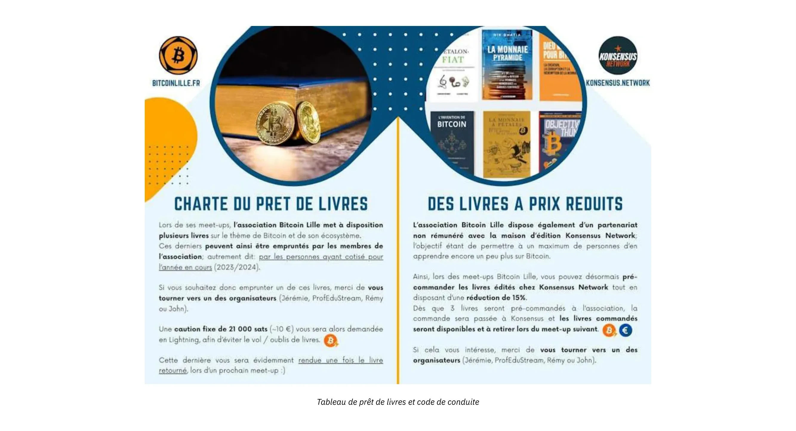

अंत में, Bitcoin से संबंधित पढ़ाई को प्रोत्साहित करने के लिए, आप स्थानीय नगरपालिका पुस्तकालयों में जाकर देख सकते हैं कि क्या उनके पास Bitcoin पर पुस्तकें हैं।

यदि वे ऐसा करते हैं, तो लाइब्रेरियन से पूछें कि क्या इस विषय पर कोई गोलमेज बैठक की योजना है, और उन्हें अपनी बैठक के लिए संपर्क विवरण उपलब्ध कराएं।

यदि नहीं, तो उन्हें पहले से चुनी गई सूची में से कुछ किताबें खरीदने का सुझाव दें। [प्रकाशक कोन्सेंसस नेटवर्क](https://konsensus.network/) प्रेरणा का स्रोत हो सकता है।

## व्यक्तिगत फ़्लायर्स बनाएँ और वितरित करें

<chapterId>62ad5430-c698-51b3-89ac-090f31c88953</chapterId>

फ्लायर्स को डिजाइन करने और लिखने में समय लगता है, लेकिन यह इसके लायक है, वे आपको Bitcoin के बारे में बात करते समय एक ठोस संसाधन प्रदान करते हैं, जिसकी हमेशा सराहना की जाती है।

इन फ़्लायर्स को निम्नलिखित की ओर लक्षित किया जा सकता है:

- व्यापारियों, यदि आप Bitcoin को भुगतान विधि के रूप में पेश करना चाहते हैं;
- इवेंट में उपस्थित लोगों को एक फ़्लायर दिया जाएगा जिसमें बताया जाएगा कि Bitcoin/लाइटनिंग का उपयोग कैसे करें और भुगतान कैसे करें;
- शुरुआती लोगों के लिए, चाहे वे सड़क पर मिले हों, काम पर, या किसी पारिवारिक समारोह में, Bitcoin के मुख्य लाभों पर प्रकाश डालने वाला एक फ़्लायर उपलब्ध है।

आप अपने समुदाय या मीट-अप के लिए एक विशिष्ट फ़्लायर भी डिज़ाइन कर सकते हैं, जिसमें आपकी गतिविधियाँ, लक्ष्य, सोशल मीडिया लिंक, संचार चैनल और आगामी कार्यक्रम प्रस्तुत किए जा सकते हैं।

कई फ़्लायर्स पहले से ही planB.network पर **[Bitcoin शिक्षण टूलबॉक्स](https://planb.network/fr/resources/bet)** में ओपन-सोर्स के रूप में उपलब्ध हैं और समय के साथ और भी जोड़े जाएंगे।

एक उदाहरण एक [पूर्ण स्रोत वाला फ़्लायर](https://profedustream.substack.com/p/21-raisons-dutiliser-Bitcoin) है जिसमें Bitcoin का उपयोग करने के 21 कारण दिए गए हैं। इसका डिज़ाइन [ओपन-सोर्स](https://www.canva.com/design/DAFtAR1NauQ/ZDwl2CchIJ9Gpb36N6-7iw/edit?utm_content=DAFtAR1NauQ&utm_campaign=designshare&utm_medium=link2&utm_source=sharebutton) में भी उपलब्ध है, जिसे आप संशोधित, अनुकूलित और साझा कर सकते हैं। बस अपने स्रोतों का श्रेय देना न भूलें।

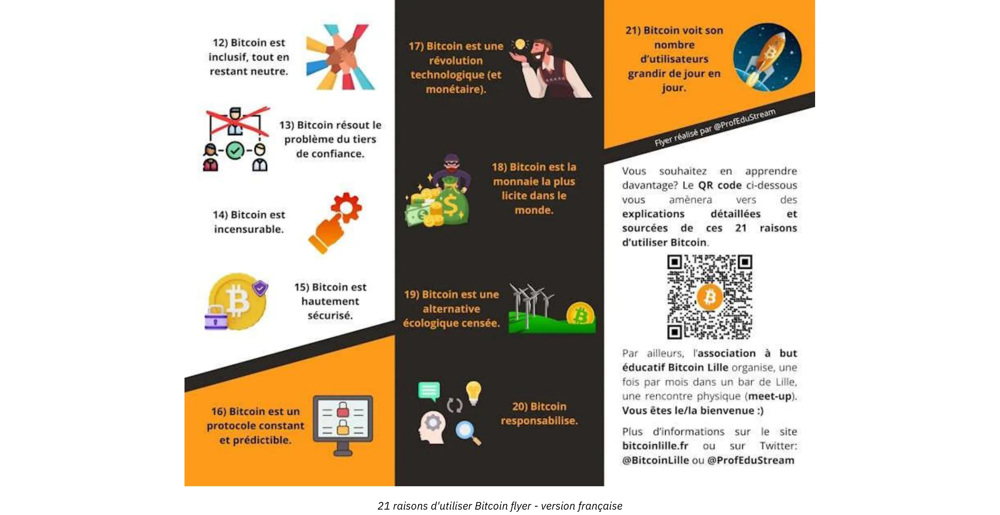

जैसा कि पहले बताया गया है, आप इन फ़्लायर्स को लगभग कहीं भी छोड़ सकते हैं: कार्यस्थल पर साझा डेस्क पर, परिवार के साथ खाने की मेज पर, सार्वजनिक पुस्तकालय में, आदि।

फ़्रांस और कुछ अन्य देशों में, "बुक बॉक्स" भी होते हैं, छोटे लकड़ी के बक्से जहाँ लोग मुफ़्त में किताबें दान कर सकते हैं या उधार ले सकते हैं। आप वहाँ एक फ़्लायर या उससे भी बेहतर, एक किताब छोड़ सकते हैं।

2023 में, **"फ्रांस के बुक बॉक्स में Bitcoin श्वेत पत्र**" पहल शुरू की गई।

इस परियोजना को अंजाम देने के लिए, प्रतिभागियों को सबसे पहले देश के सभी पुस्तक बक्सों की भौगोलिक स्थिति एकत्रित करनी थी। इस उद्देश्य के लिए कई डेटाबेस मौजूद हैं:

- [boite.a.livres.zonelivre.fr](https://boite.a.livres.zonelivre.fr/);
- [boites-a-livres.fr](https://www.boites-a-livres.fr/carte-de-france);
- [delivrez.fr](https://delivrez.fr/maps/fr_FR/);
- साथ ही स्थानीय प्रेस लेख

Bitcoin श्वेत पत्र को छोड़ना प्रतीकात्मक तो है, लेकिन नए लोगों के लिए इसे समझना अक्सर बहुत मुश्किल होता है। इसके बजाय, विचार एक छोटी पुस्तिका बनाने का था जिसमें शामिल हो:

- Bitcoin, इसके उपयोग और इसके द्वारा हल की जाने वाली समस्याओं का एक सुलभ, अच्छी तरह से स्रोत वाला परिचय;
- Bitcoin श्वेत पत्र, फ्रेंच में अनुवादित।

यहाँ [फ्रांसीसी बिटकॉइनर्स के बीच साझा की गई पुस्तिका](https://profedustream.substack.com/p/Bitcoin-la-naissance-dune-nouvelle) है, जिसे देश भर के दर्जनों बुकबॉक्स में रखा गया है। इसका डिज़ाइन [ओपन-सोर्स](https://www.canva.com/design/DAFs18FSoVM/Sy0QsfUkycTgXveeGgutBg/edit?utm_content=DAFs18FSoVM&utm_campaign=designshare&utm_medium=link2&utm_source=sharebutton) के रूप में भी उपलब्ध है।

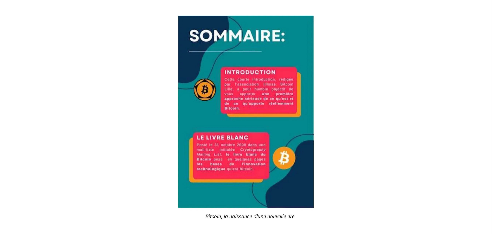

## वीडियो प्रक्षेपण का निर्माण

<chapterId>892b248a-b837-5df6-aac9-4b3261ff0390</chapterId>

लगभग हर बिटकॉइनर ने संभवतः [रेमी फोर्ट](https://twitter.com/forteremi) की आकर्षक मध्य-श्रृंखला "ले मिस्टेर जीडब्ल्यू-169, ऑक्स ओरिजिनेस डु जीडब्ल्यू-168" (जीडब्ल्यू-169 रहस्य: जीडब्ल्यू-168 की उत्पत्ति) देखी होगी।

2021 में रिलीज़ हुई, इसे [YouTube पर कई मिलियन बार](https://www.youtube.com/watch?v=0ETcLj5jBy4) देखा गया है।

एक विचार यह हो सकता है कि आप अपने समुदाय के लिए Satoshi मिस्ट्री की स्क्रीनिंग का आयोजन करें, संभवतः एक अतिरिक्त मासिक कार्यक्रम के रूप में।

एक चेतावनी: हालाँकि ARTE फ़्रांस ने पुष्टि की है कि सार्वजनिक स्क्रीनिंग की अनुमति है, लेकिन कानूनी तौर पर ऐसा करने के लिए आपको प्रोजेक्शन अधिकारों के लिए भुगतान करना होगा। 2023 में, यह लागत लगभग €250 प्रति स्क्रीनिंग थी, या यदि वर्ष के दौरान कम से कम पाँच मीटअप ने इसे प्रदर्शित किया तो €120 प्रति स्क्रीनिंग।

अधिकांश समुदायों के लिए यह कीमत बहुत अधिक है, खासकर तब जब यह वृत्तचित्र पहले से ही ARTE के यूट्यूब चैनल पर निःशुल्क उपलब्ध है।

बेशक, अन्य अनुमान भी संभव हैं।

उदाहरण के लिए, फ्रांस में, **निर्देशक [अलाना मीडियाविला](https://twitter.com/AlanaMediavilla) ने स्थानीय मीट-अप को अपनी डॉक्यूमेंट्री "स्ट्रैंडेड" का पूर्वावलोकन करने का अधिकार दिया**, जिसमें आगामी 2024 की फिल्म [फिल्म "डर्टी Coin"](https://www.dirtycointhemovie.com/) के फुटेज शामिल हैं।

कुछ बिटकॉइनर्स ने तो "स्ट्रैंडेड" का पूरी तरह से फ्रेंच में अनुवाद करने, उपशीर्षक जोड़ने और इसे देश भर के मीटअप्स में साझा करने की पहल भी की। 4 मार्च, 2024 वाले हफ़्ते में, इसे देश भर के लगभग एक दर्जन मीटअप्स में एक साथ दिखाया गया।

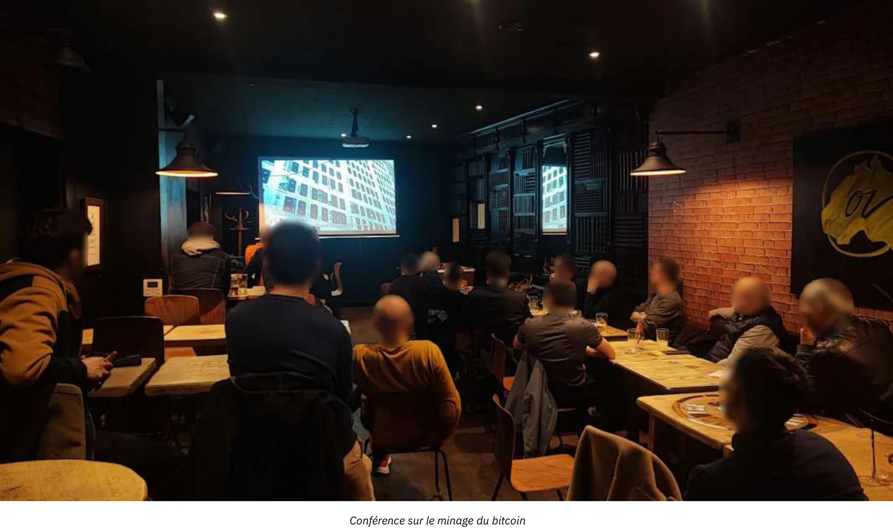

इस कार्यक्रम में Bitcoin Mining, इसकी ऊर्जा खपत और इसके व्यापक पर्यावरणीय प्रभाव के बारे में जीवंत चर्चा हुई।

## अपने शहर में पोस्टर लगाना

<chapterId>6565e8a0-d535-5be0-9764-273584c675bd</chapterId>

कई यूरोपीय देशों (जर्मनी, स्पेन और फ्रांस सहित) में बिटकॉइन उपयोगकर्ताओं ने अपने शहरों में पोस्टर लगाने की पहल की है।

कुछ डिज़ाइनों में बैंक्सी की कला को पुनः संशोधित करके Bitcoin लोगो को शामिल किया गया है।

इसका एक उदाहरण है [StreetCyberArt](https://twitter.com/streetcyber_art), जो एक जर्मन बिटकॉइनर है और कई वर्षों से कोलाज और स्ट्रीट आर्ट बना रहा है।

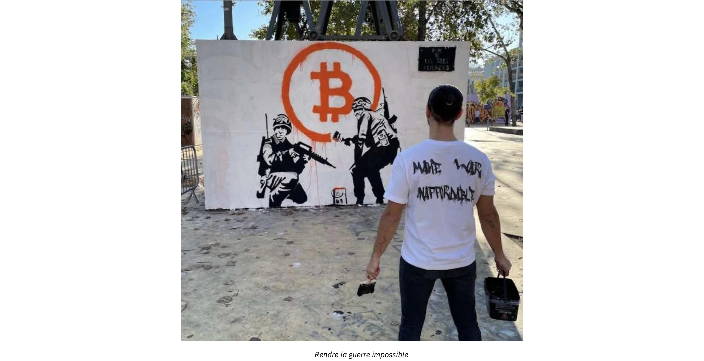

अगर आप सड़क पर पोस्टर लगाना चाहते हैं, तो अपने देश के कानूनों को ज़रूर समझें। उदाहरण के लिए, फ्रांस में पोस्टर केवल सार्वजनिक होर्डिंग पर ही लगाए जा सकते हैं। अन्य जगहों पर यह पूरी तरह से प्रतिबंधित है और इसके लिए जुर्माना लगाया जा सकता है।

यदि आप सीमाओं को आगे बढ़ाने का निर्णय लेते हैं और आशा करते हैं कि आप "कार्रवाई करते हुए" नहीं पकड़े जाएंगे, तो पोस्टरों पर कोई भी पहचान संबंधी जानकारी (जैसे कि आपका मिलने का नाम या @Twitter) शामिल करने से बचें।

यह भी ध्यान रखें कि इन पोस्टरों को निजी प्रिंटर पर प्रिंट करने से आमतौर पर स्याही निकल जाती है और बाहर रखने पर ये जल्दी खराब हो जाते हैं। सबसे अच्छा तरीका है कि किसी पेशेवर प्रिंटर से काम लिया जाए जो इन्हें बाहरी इस्तेमाल के लिए डिज़ाइन किए गए विशेष स्वयं-चिपकने वाले कागज़ पर तैयार कर सके, जिससे इनकी गुणवत्ता और टिकाऊपन दोनों सुनिश्चित हो सके।

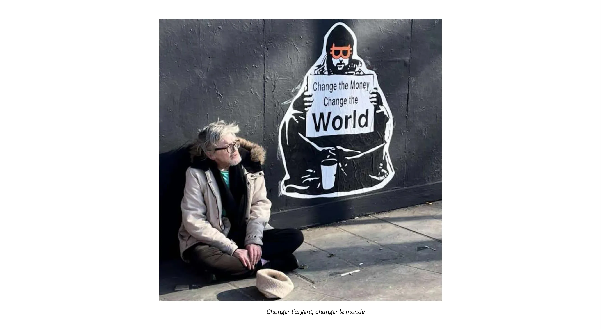

इस पहल की लागत प्रति पोस्टर 0.40€ (सौ पोस्टरों के लिए लगभग 40€) से ज़्यादा हो सकती है और ऑनलाइन कीमतें इस राशि के दोगुने से लेकर पाँच गुना तक हो सकती हैं। अच्छे संपर्क ज़रूरी हैं।

जैसा कि ऊपर बताया गया है, फ्रांसीसी बिटकॉइनर [@Mill3sim3](https://twitter.com/Mill3sim3) के पास सही पेशेवर उपकरण हैं और विवरण के लिए उनसे संपर्क किया जा सकता है।

वैकल्पिक रूप से, एक अधिक DIY विकल्प यह है कि कार्डबोर्ड के एक बड़े टुकड़े से एक स्टेंसिल बनाएं और अपने शहर के आसपास चुनिंदा स्थानों पर अपने डिजाइन को टैग करने के लिए स्प्रे पेंट का उपयोग करें।

## एक व्यक्तिगत NFC कार्ड

<chapterId>8ad65d4e-a68a-59c2-a812-85f4907ed9f3</chapterId>

एक और मौलिक परियोजना विचार लाइटनिंग भुगतानों (बोल्टकार्ड मानक के अनुकूल) के लिए व्यक्तिगत NFC कार्ड बनाना है। इसके लिए, स्विस Bitcoin पे एक बेहतरीन सहयोगी है।

[उनकी वेबसाइट](https://swiss-Bitcoin-pay.ch/cards) वर्तमान में चार मानक डिज़ाइन प्रदान करती है।

अगर आप 50 से ज़्यादा NFC कार्ड ऑर्डर करना चाहते हैं, तो आप कंपनी की आधिकारिक वेबसाइट या ट्विटर के ज़रिए संपर्क करके कार्ड के आगे के हिस्से के लिए एक कस्टम डिज़ाइन का सुझाव दे सकते हैं। कार्ड का पिछला हिस्सा मानकीकृत रहेगा।

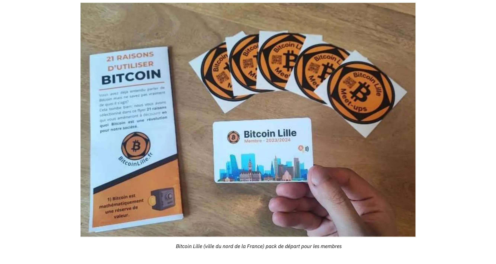

उदाहरण के लिए, 2023 में, फ्रांसीसी एसोसिएशन [Bitcoin लिले](https://twitter.com/BitcoinLille) ने कस्टम डिज़ाइन वाले NFC कार्ड्स का एक बैच ऑर्डर किया। प्रत्येक नए सदस्य को वर्ष के दौरान उनके स्वागत पैक में एक कार्ड मिला। इस विचार को आपके अपने समुदाय के लिए आसानी से अनुकूलित और वैयक्तिकृत किया जा सकता है।

इन कार्डों की इकाई कीमत आमतौर पर 2.50€ से 5€ तक होती है, जो ऑर्डर के आकार और बाजार की स्थितियों पर निर्भर करती है, बड़ी मात्रा के लिए कीमतें कम होती हैं।

## एक वेबसाइट बनाएँ

<chapterId>9a2a1b9b-0633-544a-b331-c06187d23d7f</chapterId>

आपके समुदाय के विकास के एक निश्चित चरण में, एक ऐसी वेबसाइट का होना मूल्यवान हो सकता है जो आपके समूह, मीटअप, कार्यक्रमों और शैक्षिक सामग्री के लिए एक प्रदर्शन के रूप में कार्य करे।

वेबसाइट बनाने में समय लगता है, लेकिन नीचे दिया गया ट्यूटोरियल आपको सिर्फ़ 30 मिनट में एक मुफ़्त वर्डप्रेस साइट बनाने का तरीका बताता है। आप एक कस्टमाइज़ेबल होमपेज सेट अप कर पाएँगे, लेख प्रकाशित कर पाएँगे, और YouTube वीडियो, इमेज या PDF जैसे मीडिया एम्बेड कर पाएँगे।

बाद में, आप अपना स्वयं का डोमेन नाम खरीद सकते हैं या साइट को अपने सर्वर पर होस्ट भी कर सकते हैं।

:::वीडियो आईडी=a1b25c18-5fc1-4b97-baef-816d819c9382:::

हालाँकि अन्य CMS प्लेटफ़ॉर्म मौजूद हैं, जिनमें से कुछ सरल और शुरुआती लोगों के लिए ज़्यादा अनुकूल इंटरफ़ेस वाले हैं, लेकिन वे आमतौर पर कम अनुकूलन योग्य होते हैं। इसलिए वर्डप्रेस आमतौर पर सबसे अच्छा शुरुआती बिंदु है।

वर्डप्रेस कई तरह के प्लग-इन (कुछ सशुल्क लेकिन उच्च गुणवत्ता वाले) का भी समर्थन करता है जो बिना कोडिंग कौशल के आपकी साइट की क्षमताओं का उल्लेखनीय विस्तार कर सकते हैं। इसका एक उदाहरण [प्रीमियम "अनकोड" थीम](https://undsgn.com/uncode/) है।

## एक वीडियो चैनल बनाएँ (यूट्यूब या ओडिसी)

<chapterId>076286db-1627-57ec-a410-c44b1666e1cd</chapterId>

आपके समुदाय के कुछ सदस्य ट्यूटोरियल वीडियो जैसे मल्टीमीडिया सामग्री बनाना चाह सकते हैं।

आप मीट-अप या विश्वविद्यालयों में भी प्रस्तुतियाँ दे सकते हैं।

**जब वह समय आएगा, तो एक समर्पित वीडियो चैनल आपको अपनी सभी सामग्री को एक ही स्थान पर प्रकाशित और केंद्रीकृत करने की सुविधा देगा।**

लोकप्रिय प्लेटफार्मों में शामिल हैं:

- [**यूट्यूब**](https://www.youtube.com/), व्यापक रूप से उपयोग किया जाता है लेकिन सेंसरशिप-प्रतिरोधी नहीं है।
- [**ओडिसी**](https://odysee.com/), कम लोकप्रिय लेकिन पीयर-टू-पीयर तकनीक के माध्यम से विकेन्द्रीकृत।
- [**peertube**](https://joinpeertube.org/fr_FR), आपको अपना स्वयं का वीडियो प्लेटफ़ॉर्म होस्ट करने की सुविधा देता है, हालाँकि इसे सेट अप करना अधिक जटिल है।

आप जो भी चुनें, अपने चैनल को आकर्षक बनाने के लिए प्लेटफ़ॉर्म-विशिष्ट विज़ुअल डिज़ाइन करें। [भाग 2/8](https://planb.network/courses/1c643dc9-a15f-4f9e-93b6-cb3c58b4ee35/3470a31f-0190-5e87-8af0-6a00e79267ef) में उल्लिखित Canva, पहले से तैयार, अनुकूलन योग्य डिज़ाइनों के साथ एक "YouTube थंबनेल" श्रेणी प्रदान करता है।

अपने कंप्यूटर से रिकॉर्डिंग के लिए, [स्ट्रीमलैब्स](https://streamlabs.com/fr-fr) निःशुल्क, सुविधा संपन्न है, और दृश्य संक्रमण का समर्थन करता है।

**वीडियो संपादन** के लिए, [Wondershare Filmora](https://filmora.wondershare.fr/) (लगभग 45€/वर्ष) का उपयोग करना सरल है और जल्दी से पेशेवर परिणाम देता है।

अपने वीडियो के इंट्रो और आउट्रो के लिए, आप Canva पर आसानी से उपयुक्त टेम्पलेट पा सकते हैं। अपनी पसंद के अनुसार डिज़ाइन को कस्टमाइज़ करें, डाउनलोड करें और अपने एडिटिंग सॉफ़्टवेयर में जोड़ें।

टिप: यदि Bitcoin पर कभी प्रतिबंध लगा दिया जाए या उसे सेंसर कर दिया जाए, तो हमेशा अपने वीडियो का स्थानीय बैकअप Hard ड्राइव पर रखें।

## एक ऑडियो पॉडकास्ट बनाएँ

<chapterId>12e96b45-1c33-5687-a753-80d0114d487a</chapterId>

ऑडियो पॉडकास्ट विचारों को साझा करने का एक और बेहतरीन तरीका है। वीडियो चैनलों की तरह, इसे भी दर्शक बनाने में समय लगता है।

लोकप्रिय पॉडकास्ट प्लेटफार्मों में शामिल हैं:

- [**फाउंटेन**](https://www.fountain.fm/), लाइटनिंग दान का समर्थन करता है।
- [**साउंडक्लाउड**](https://soundcloud.com/);
- [**डीज़र**](https://www.deezer.com/fr/);
- [**स्पॉटिफ़ाई**](https://open.spotify.com/);
- [**गूगल पॉडकास्ट**](https://podcasts.google.com/).

प्रत्येक प्लेटफ़ॉर्म का अपना दर्शक वर्ग होता है, इसलिए कई प्लेटफ़ॉर्म पर मौजूद होने से आपकी पहुँच व्यापक होगी। **[पॉडकास्टर्स के लिए Spotify](https://podcasters.spotify.com/) आपको एक बार अपना पॉडकास्ट अपलोड करने और अन्य प्लेटफ़ॉर्म के लिए generate RSS फ़ीड की सुविधा देकर इसे आसान बनाता है**।

इसलिए, जब "पॉडकास्टर्स के लिए स्पॉटिफाई" पर काम पूरा हो जाता है, तो बाकी केवल आपकी सामग्री को अन्य प्लेटफार्मों के लिए प्रारूपित करना होता है, जो एक अपेक्षाकृत त्वरित प्रक्रिया है।

रिकॉर्डिंग के लिए, [ऑडेसिटी](https://www.audacityteam.org/) मुफ़्त है और आपको ऑडियो लेवल एडजस्ट करने, फ़ेड जैसे प्रभाव जोड़ने और संपादन के दौरान स्पष्टता बढ़ाने की सुविधा देता है। अपनी आवाज़ रिकॉर्ड करना और एक पेशेवर-गुणवत्ता वाला पॉडकास्ट बनाना बेहद आसान है।

यहां 10 मिनट का एक संक्षिप्त ट्यूटोरियल दिया गया है जिसमें ऑडेसिटी के साथ पॉडकास्ट निर्माण के लिए आवश्यक बातें शामिल हैं:

:::वीडियो आईडी=67d80ac7-253f-40a5-b621-fef2fb7174bd:::

टिप: वीडियो की तरह ही, भविष्य में सेंसरशिप की स्थिति में सभी पॉडकास्ट का स्थानीय बैकअप रखें।

## अपने ईवेंट के लिए बैज बनाएँ

<chapterId>0cccef8d-a765-5844-8921-c40f0ce653e4</chapterId>

आपके मीट-अप और आयोजनों में, एक छोटा सा प्रोत्साहन दिया जा सकता है: इवेंट बैज। इसका उद्देश्य **एक ऐसा बैज बनाना है जो केवल उसी विशिष्ट आयोजन में प्राप्त किया जा सके**। यह अवधारणा अन्य ब्लॉकचेन पर "POAP" ("अटेंडेंस प्रोटोकॉल का प्रमाण") नाम से मौजूद है। हालाँकि, वर्तमान में Bitcoin पर इसे लागू करने का कोई निःशुल्क तरीका नहीं है।

इस तरह की व्यवस्था का इस्तेमाल आपके समुदाय के सबसे सक्रिय सदस्यों को पुरस्कृत करने के लिए भी किया जा सकता है। उदाहरण के लिए, आप एक वार्षिक रैफ़ल का आयोजन कर सकते हैं जिसमें प्राप्त प्रत्येक बैज एक प्रवेश टिकट के बराबर होगा। एक सदस्य जो साल में सभी 12 मीट-अप में भाग लेगा, उसे रैफ़ल के लिए 12 टिकट मिलेंगे।

एक अन्य, अधिक पारंपरिक दृष्टिकोण में, आप प्रत्येक कार्यक्रम में भाग लेने वालों से एक बैज पर अपना पहला नाम या उपनाम लिखने के लिए कह सकते हैं, साथ ही यह भी बता सकते हैं कि वे किस कारण से कार्यक्रम में शामिल हो रहे हैं।

हालांकि यह थोड़ा औपचारिक है, लेकिन इससे सदस्यों को समान रुचियों और वार्तालाप विषयों को अधिक आसानी से ढूंढने में मदद मिलती है, और इससे नए लोगों के लिए आयोजकों (या आधिकारिक समुदाय/संघ के सदस्यों) को पहचानना भी आसान हो जाता है।

Bitcoin लिले एसोसिएशन द्वारा उपयोग किए गए कई बैज टेम्प्लेट [ओपन-सोर्स में उपलब्ध हैं Canva](https://www.canva.com/design/DAGHAsT15MU/AIA7-L_xBjNdsuxdD4-h-Q/edit?utm_content=DAGHAsT15MU&utm_campaign=designshare&utm_medium=link2&utm_source=sharebutton)।

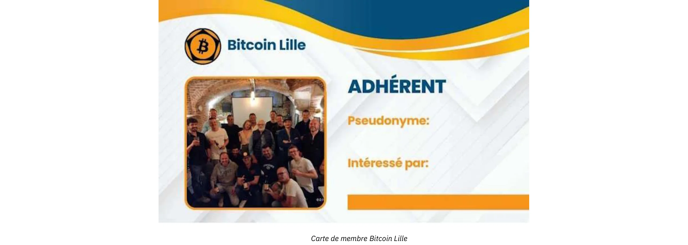

## मृत्यु की स्थिति में हस्तांतरण की योजना बनाना

<chapterId>c5febf18-235c-51bc-8fbb-9467dabe4cb0</chapterId>

एक पूरी तरह से अलग बात पर, आइए एक संवेदनशील विषय पर चर्चा करें: आपके Bitcoin समुदाय के एक सदस्य का निधन।

हो सकता है किसी दिन, किसी पूर्व सदस्य का परिवार आपसे संपर्क करके आपको उनकी मृत्यु की सूचना दे। वे आपको बता सकते हैं कि मृतक ने कुछ निर्देश छोड़े हैं, जैसे कि अपने समुदाय, बैठक या संस्था से संपर्क करना।

कुछ मामलों में, परिवार विरासत के लाभार्थी के रूप में धन की वसूली के लिए भी सहायता मांग सकता है।

ऐसी परिस्थितियों के लिए पहले से ही स्पष्ट प्रक्रिया स्थापित करने के लिए अपने समुदाय के साथ मिलकर काम करना बुद्धिमानी है, तथा यह सुनिश्चित करना होगा कि:

- मृतक ने पहले ही अपने परिवार को सलाह दी है कि वे कभी भी निजी कुंजी साझा न करें या किसी बैठक में भौतिक वॉलेट न लाएं।
- परिवार समझता है कि उनकी यात्रा का उद्देश्य शैक्षिक है: यह सीखना कि Bitcoin किस प्रकार काम करता है, ताकि बाद में वे धन पर संप्रभु नियंत्रण कर सकें।
- परिवार को अपने देश में उपहार, उत्तराधिकार और Bitcoin को फिएट में परिवर्तित करने के संबंध में प्रासंगिक कानूनों की जानकारी है।

एक मानक प्रोटोकॉल होने से किसी भी व्यक्ति, सदस्य या अतिथि को, स्थिति का फायदा उठाकर धन चुराने से रोका जा सकता है।

आप इस प्रक्रिया को परिभाषित करने के लिए एक समर्पित कार्य समूह बना सकते हैं। Bitcoin लिले एसोसिएशन पहले से ही इस तरह के एक [दस्तावेज़](https://docs.google.com/document/d/1TDfLZjuictC5s3PEM2Z7WmkxIDSJ8Q1E4xevm52pVgU/edit?usp=sharing) पर काम कर रहा है, जिसे वे आने वाले महीनों में ओपन-सोर्स के रूप में जारी करने की योजना बना रहे हैं।

## स्कूलों और विश्वविद्यालयों में व्याख्यान दें

<chapterId>65efdb44-e3d4-567c-aedf-972765753d73</chapterId>

ऊपर वर्णित परियोजनाओं की सूची, ज़ाहिर है, संपूर्ण नहीं है। सामान्यतः, ये उनके समुदाय या मीटअप के लिए आंतरिक परियोजनाएँ होने की अधिक संभावना है, जिन्हें विकसित होने पर आसानी से लागू किया जा सकता है।

अब आइये ऑनबोर्डिंग की ओर रुख करें।

जैसा कि आप जानते हैं, एक साथ बड़ी संख्या में लोगों तक पहुँचने का सबसे अच्छा तरीका मुफ़्त व्याख्यान देना है। यह कॉलेजों और विश्वविद्यालयों में किया जा सकता है, जहाँ युवाओं (और कम उम्र के लोगों) दोनों को Bitcoin से परिचित कराया जा सकता है, चाहे वे इसके लिए बिल्कुल नए हों या अपनी समझ को और गहरा करना चाहते हों।

दर्जनों या सैकड़ों लोगों को व्याख्यान देने के लिए सिर्फ़ तकनीकी विशेषज्ञता से कहीं ज़्यादा की ज़रूरत होती है। आपको ये चीज़ें चाहिए:

- सार्वजनिक बोलने में आत्मविश्वास
- अच्छा तनाव प्रबंधन
- स्पष्ट उच्चारण
- मजबूत समय प्रबंधन
- एक अच्छी तरह से शोधित, उच्च-गुणवत्ता वाली प्रस्तुति या कार्यशाला, जो आपके दर्शकों के कौशल स्तर के अनुरूप हो

उतना ही ज़रूरी है **खुला दिमाग रखना और यह जानना कि अवधारणाओं को कब सरल बनाना है**, खासकर प्रश्नोत्तर सत्र या पैनल चर्चा के दौरान। इसका मतलब अपने सिद्धांतों को छोड़ना नहीं है, बस यह स्वीकार करना है कि दूसरे लोग चीज़ों को अलग नज़रिए से देख सकते हैं। कभी-कभी बाद में जवाब देना या बात को यहीं छोड़ देना बेहतर होता है ताकि चर्चा आगे बढ़ सके। अगर आपके तर्क ठोस और सुविचारित तर्कों पर आधारित हैं, तो लोग उसे पहचान लेंगे।

अगर आप तैयार हैं, तो आगे बढ़ें! दुनिया को Bitcoin के बारे में बेहतर शिक्षा की सख़्त ज़रूरत है।

जैसा कि कहा गया है, यह कोई आसान काम नहीं है: इसके लिए प्रेरणा, प्रयास और सही सम्पर्क की आवश्यकता होती है।

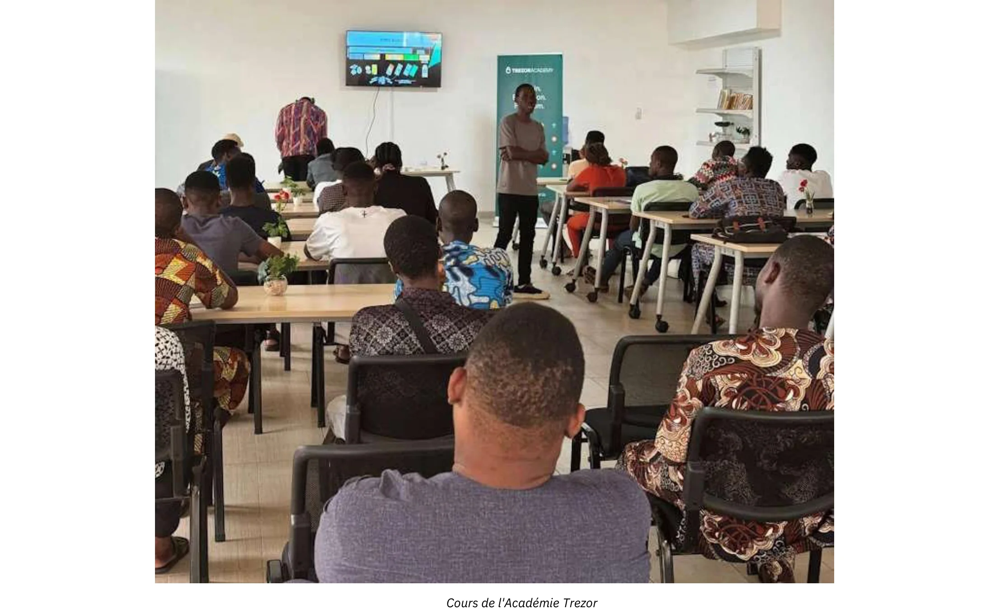

किसी स्कूल या विश्वविद्यालय में व्याख्यान या कार्यशाला आयोजित करने के लिए सबसे पहले सही संपर्क व्यक्ति की तलाश करनी होगी। यह हो सकता है:

- एक व्यक्तिगत परिचित
- एक छात्र संघ
- एक छात्र संघ जो व्याख्यान श्रृंखला या कार्यक्रम आयोजित करता है
- आपके इंजीनियरिंग स्कूल या विश्वविद्यालय के पूर्व प्रोफेसर
- शैक्षणिक कार्यक्रम समन्वयक, यदि सीधे संपर्क करें

पहला कदम आमतौर पर अपनी पहल या सहयोग को प्रस्तुत करना और एक बैठक का अनुरोध करना होता है। सबसे अच्छी स्थिति में, इससे कुछ हफ़्तों बाद छात्रों के सामने Bitcoin पर एक प्रस्तुतिकरण हो जाएगा।

दुर्भाग्य से, Bitcoin को अभी भी मीडिया और कई राजनेताओं द्वारा नकारात्मक रूप से प्रस्तुत किया जाता है, जिससे कुछ लोगों का मानना ​​है कि कक्षाओं में इसका कोई स्थान नहीं है। अस्वीकृतियाँ आम हैं, खासकर शैक्षणिक हलकों में जहाँ Proof of Work और ऊर्जा खपत जैसे विषय विवादास्पद बने हुए हैं।

फिर भी, कोशिश करना फ़ायदेमंद है, खासकर छात्र संघों और एसोसिएशनों के साथ। और कौन जाने? अगर आपकी पहली कोशिश "ना" भी हो जाए, तो हो सकता है कि अगली बार जब आप बुल रन करें, तो आपको अपने इनबॉक्स में एक ईमेल मिले जिसमें आपको, मान लीजिए, 280 छात्रों से बात करने का न्योता दिया गया हो!

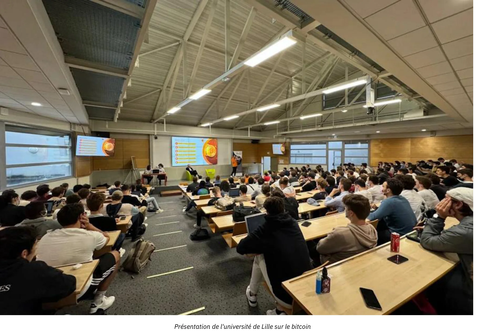

## व्यवसायों से संपर्क करना

<chapterId>b730462b-7928-5d28-a14f-9ceaa773d3d2</chapterId>

कई बिटकॉइन उपयोगकर्ताओं के लिए किसी व्यवसाय से Bitcoin स्वीकार करवाना, अपने पोकेडेक्स में किसी दुर्लभ उपलब्धि को अनलॉक करने जैसा है।

प्रत्येक व्यापारी अलग होता है, और उन्हें शामिल करने में अपनी चुनौतियां होती हैं:

- आपूर्तिकर्ताओं को भुगतान करने के लिए उन्हें अभी भी फिएट मुद्रा की आवश्यकता है।
- उन्हें स्पष्ट, लेखाकार-तैयार वित्तीय रिपोर्ट की आवश्यकता होती है।
- उनकी भुगतान प्रणालियाँ विश्वसनीय, उपयोग में आसान और चोरी-रोधी होनी चाहिए।
- उनके मन में Bitcoin के बारे में गलत धारणाएं या नकारात्मक पूर्वधारणाएं हो सकती हैं।
- एक दोषरहित सॉफ्टवेयर समाधान ढूँढना मुश्किल हो सकता है।
- व्यापारी को यह समझाना कि भुगतान के रूप में Bitcoin स्वीकार करना क्यों उचित है।

स्थानीय व्यवसायों को शामिल करना आपके शहर के Bitcoin पारिस्थितिकी तंत्र को विकसित करने के सर्वोत्तम तरीकों में से एक है। मुख्य बात यह है कि चरण-दर-चरण आगे बढ़ें:

1/ **हर बार खरीदारी करते समय Bitcoin में भुगतान करने के लिए कहें**

ज़्यादातर आपको "ना" और शायद एक उलझन भरी, या थोड़ी आलोचना भरी नज़र मिलेगी, लेकिन पूछने से ही यह धारणा बन जाती है कि Bitcoin एक ऐसी चीज़ है जिसका इस्तेमाल "आम लोग" भी कर सकते हैं और यह भुगतान के एक तरीके के रूप में तेज़ी से लोकप्रिय हो रहा है। आप कुछ दोस्तों के साथ मिलकर अलग-अलग दिनों में एक ही दुकान पर जा सकते हैं और हर बार Bitcoin में भुगतान करने के लिए कह सकते हैं। देर-सवेर, इससे मालिक की जिज्ञासा ज़रूर जागेगी।

2/ **एक सरल, स्पष्ट स्पष्टीकरण प्रस्तुत करें**

अगर वे पूछें कि Bitcoin क्या है, तो अपनी बात संक्षिप्त और शब्दजाल से मुक्त रखें। उदाहरण के लिए:

*"Bitcoin वह धन है जो बैंकों द्वारा नियंत्रित नहीं होता, बिचौलियों के बिना काम करता है, सेंसर नहीं किया जा सकता, मुद्रास्फीति के अधीन नहीं होता, तथा पारंपरिक बैंकिंग की तुलना में इसकी फीस कम होती है।"*

फिर उन्हें एक फ़्लायर दें, जैसे "Bitcoin इस्तेमाल करने के 21 कारण" या "अपने व्यवसाय में Bitcoin को स्वीकार करने के 10 कारण", जिसमें आपकी संपर्क जानकारी या मिलने का विवरण हो। इस तरह, जब वे डेमो के लिए तैयार हों, तो उन्हें पता होगा कि आपको कहाँ ढूँढना है।

3/ **एक प्रदर्शन की व्यवस्था करें**

जब वे रुचि व्यक्त करें, तो उन्हें भुगतान समाधान दिखाने के लिए समय निर्धारित करें।

एक बढ़िया विकल्प **[स्विस Bitcoin पे](https://swiss-Bitcoin-pay.ch/)** है, क्योंकि यह:

    - यह व्यापारियों को प्रतिदिन बीटीसी को स्वचालित रूप से फिएट मुद्रा में परिवर्तित करने में सक्षम बनाता है, ताकि वे आपूर्तिकर्ताओं को भुगतान कर सकें।
    - यदि वे चाहें तो उन्हें बीटीसी में एक प्रतिशत रखने की अनुमति देता है।
    - अपने लेखाकारों के लिए निर्यात योग्य लेखा रिपोर्ट तैयार करता है।
    - प्रबंधकों के लिए एक सरल डैशबोर्ड है।
    - कर्मचारियों को बिना नकदी रजिस्टर को छुए भुगतान स्वीकार करने के लिए एक सहज Interface सुविधा प्रदान करता है।
    - पारंपरिक भुगतान नेटवर्क द्वारा लगाए जाने वाले 2-3% शुल्क से कम लागत।

4/ **जब वे Bitcoin स्वीकार करना शुरू करें तो उनका समर्थन करें**

उनके जहाज पर सवार होने के बाद:

    - नियमित रूप से जाएँ और खरीदारी करें।
    - यह देखने के लिए जांच करें कि क्या सब कुछ सुचारू रूप से चल रहा है।
    - यदि आवश्यक हो तो अपनी संपर्क जानकारी पुनः साझा करें।
    - उन्हें अपनी मीटिंग में आमंत्रित करें।
    - उन्हें [btcmap.org मानचित्र](https://btcmap.org/) में जोड़ें और दृश्यता बढ़ाने के लिए ट्विटर पर [Swiss Bitcoin Pay](https://x.com/swissbitcoinpay) को बताएं।
    - उनके स्थान पर कार्यशालाएं या बैठकें आयोजित करने पर विचार करें।

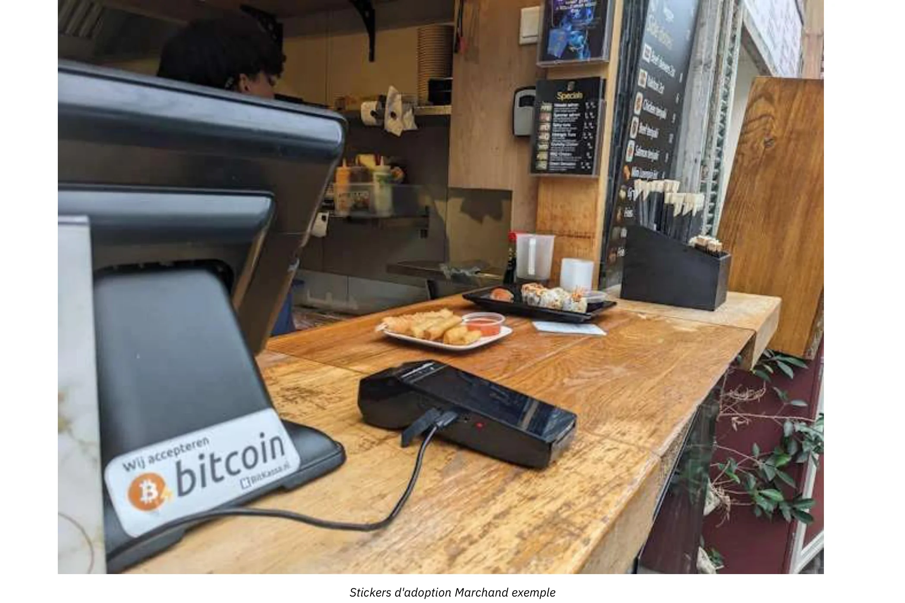

5/ **स्थानीय व्यापारियों से जुड़ें**

जब आपके पास कुछ Bitcoin-अनुकूल व्यवसाय हों, तो केवल व्यापारियों के लिए एक टेलीग्राम समूह बनाने का सुझाव दें। इससे:

- उन्हें अनुभव साझा करने और नए व्यवसायों को शामिल करने का अवसर दें।
- एक त्वरित तकनीकी सहायता चैनल के रूप में कार्य करें।
- स्थानीय Bitcoin नेटवर्क को मजबूत करना।

प्रचार एक दीर्घकालिक प्रक्रिया है। इसके लिए धैर्य, दृढ़ता और रणनीति की आवश्यकता होती है। लेकिन अगर आपका समुदाय तैयार है, तो आप नीदरलैंड के अर्नहेम की तरह, एक सच्ची Bitcoin चक्रीय अर्थव्यवस्था की नींव रख सकते हैं।

## स्थानीय प्रेस और रेडियो से संपर्क करें

<chapterId>435bfbc1-22dd-59bb-b737-a32ea995b238</chapterId>

बिटकॉइन उपयोगकर्ता अक्सर अपनी पहुँच बढ़ाने के लिए सोशल मीडिया और ऑनलाइन प्लेटफ़ॉर्म पर ध्यान केंद्रित करते हैं, लेकिन यह तस्वीर का केवल एक पहलू है। स्थानीय प्रेस और रेडियो शक्तिशाली सहयोगी हो सकते हैं।

कुछ समुदाय, जैसे कि फ्रांस में [Breizh Bitcoin](https://breizhbitcoin.com/), **नियमित रूप से अपने स्थानीय मीडिया से संपर्क करते हैं**:

- आगामी कार्यक्रमों (मीट-अप, प्रस्तुतियाँ, कार्यशालाएँ, Halving पार्टियाँ, आदि) की घोषणा करें।
- पत्रकारों को Bitcoin-अनुकूल व्यवसायों का दौरा करने और उनके बारे में लिखने के लिए आमंत्रित करें।
- स्थानीय सूची में शामिल करने के लिए कार्यक्रम की तारीखें और स्थान साझा करें।

कई अखबार अभी भी "क्या चल रहा है" सेक्शन चलाते हैं, जो अक्सर आखिरी पन्नों पर छिपा होता है, जहाँ वे आगामी स्थानीय कार्यक्रमों की सूची देते हैं। ब्रीज़ Bitcoin ने पाया है कि यह तरीका कारगर है: नए लोग मीट-अप में सिर्फ़ इसलिए शामिल हो जाते हैं क्योंकि उन्होंने अखबार में यह सूची देखी थी।

यह रणनीति कुछ क्षेत्रों में दूसरों की तुलना में बेहतर काम कर सकती है, लेकिन इसे आज़माना ज़रूरी है। आप क्षेत्रीय समाचार माध्यमों से संपर्क करके शुरुआत कर सकते हैं, फ्रांस में इसके कुछ उदाहरण हैं:

- [acpm.fr](https://www.acpm.fr/Les-chiffres/Difuse-Presse/Presse-Paynte/Presse-Quotidienne-Regionale);
- [voxpublic.org](https://www.voxpublic.org/spip.php?page=annuaire&cat=medias&type_media=Presse%20quotidienne%20r%C3%A9gionale)।

और स्थानीय रेडियो स्टेशनों से संपर्क करके साक्षात्कार या पॉडकास्ट में उपस्थिति का सुझाव दे सकते हैं।

ध्यान रखें, मीडिया इंटरव्यू मुश्किल हो सकते हैं। शब्दों को संदर्भ से बाहर निकाला जा सकता है या गलत तरीके से प्रस्तुत किया जा सकता है। तैयारी ज़रूरी है।

ज़ाहिर है, इस खंड में सुझाए गए सभी प्रोजेक्ट्स के अलावा, **कई अन्य प्रोजेक्ट्स भी किए जा सकते हैं**। यह सब आपके समय और प्रेरणा पर निर्भर करता है, साथ ही प्रोजेक्ट की कठिनाई पर भी।

किसी भी आउटरीच परियोजना के लिए अंतिम सुझाव:

1) **आगे की योजना बनाएं**: अपने लक्ष्य, आवश्यक कदम और कौन क्या करेगा, यह निर्धारित करें।

2) **इसे चरणबद्ध तरीके से करें**: अपने प्रयासों को गति देकर थकान से बचें।

3) **मदद मांगें**: समर्थन के लिए अपने सदस्यों और पड़ोसी समुदायों से संपर्क करें।

याद रखें: हर Bitcoin समुदाय उस स्थिति से गुज़रा है जहाँ आप अभी हैं। उनके अनुभवों और सलाह से सीखने में संकोच न करें।

# भविष्य की आशा

<partId>6ea07445-9369-54bc-9aa0-d260db026e0b</partId>

## प्रतिभागियों की संख्या में वृद्धि की योजना बनाना

<chapterId>8af722d4-3a9f-548c-9001-424f2142de12</chapterId>

जब Bitcoin ने ब्लॉक 840,000 पर अपने चौथे युग में प्रवेश किया, तो अधिक से अधिक लोग इसे तकनीकी, वित्तीय और सामाजिक क्रांति के रूप में पहचानने लगे।

इंटरनेट के उदय की तरह, इस क्रांति में भी समय लगेगा, जो वास्तव में एक लाभ है। यह लोगों को Bitcoin के मूल सिद्धांतों को सीखने, इसका उपयोग करने का तरीका समझने और डेवलपर्स तथा कंपनियों को ऐसे प्रोटोकॉल और एप्लिकेशन बनाने का अवसर देता है जो इसकी पूरी क्षमता को उजागर करेंगे।

भविष्य की भविष्यवाणी कोई नहीं कर सकता, लेकिन हम Bitcoin को अपनाने में तेज़ी से वृद्धि की उम्मीद कर सकते हैं। इसका मतलब है कि सभी परिस्थितियों के लिए तैयार रहना, यहाँ तक कि चरम परिस्थितियों के लिए भी, जैसे कि पारंपरिक वित्तीय प्रणाली का पतन या Bitcoin पर पूर्ण प्रतिबंध।

पाठ्यक्रम के इस सातवें और अंतिम भाग में, हम उन प्रमुख बिंदुओं पर विचार करेंगे जिन्हें आपके समुदाय और मीट-अप के बढ़ने के साथ ध्यान में रखना होगा।

पहला, और सबसे आसान अनुमान, आपके समुदाय में शामिल होने वाले लोगों की संख्या में वृद्धि है। इसका आप पर दो मुख्य तरीकों से प्रभाव पड़ेगा:

1/ **आपके संचार चैनल (टेलीग्राम, सिग्नल, मैट्रिक्स, आदि) अंततः भीड़भाड़ वाले हो जाएँगे**, जिससे बातचीत जारी रखना मुश्किल हो जाएगा। दो बातें ध्यान में रखनी चाहिए।

सबसे पहले, अगर आपके पास एक ही चैट में 500 लोग तरह-तरह के विषयों पर चर्चा कर रहे हैं, तो संदेशों और सूचनाओं की भारी मात्रा के कारण कई सदस्य बातचीत बंद कर देंगे। यह आपके सेटअप पर पुनर्विचार करने का एक अच्छा समय है, उदाहरण के लिए, टेलीग्राम सुपरग्रुप या डिस्कॉर्ड सर्वर पर जाकर, जहाँ दोनों ही विषयों के आधार पर चर्चाओं को व्यवस्थित करना आसान बनाते हैं।

दूसरा, आपके चैनलों में ज़्यादा लोगों का मतलब है ज़्यादा बॉट, ज़्यादा स्कैम और इसलिए ज़्यादा मॉडरेशन। इसके लिए तैयार रहें और नियमों का एक स्पष्ट सेट बनाएँ जिनका आप संदेशों को मॉडरेट करते समय संदर्भ ले सकें। हमारे अनुभव में, इससे टकराव से बचने में काफ़ी मदद मिलती है, खासकर अगर नियम आपके चैनलों में आसानी से उपलब्ध हों।

इसका एक अच्छा उदाहरण **[Bitcoin लिले की ओपन-सोर्स रूलबुक](https://bitcoinlille.fr/reglement/)** है, जो कुछ साल पहले इसके टेलीग्राम ग्रुप और डिस्कॉर्ड सर्वर के लिए लिखी गई थी। यह सरल, सार्वभौमिक सिद्धांतों पर आधारित है, और आप **[इस डिज़ाइन का एक अनुकूलन योग्य संस्करण यहाँ](https://www.canva.com/design/DAGHI692AD4/rjT4sqEnhajc5FiPA6GFZQ/edit?utm_content=DAGHI692AD4&utm_campaign=designshare&utm_medium=link2&utm_source=sharebutton)** भी प्राप्त कर सकते हैं।

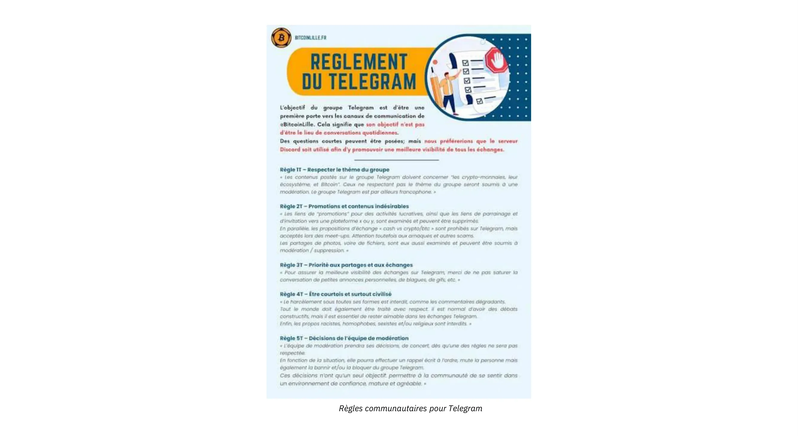

2/ **आपके मीटअप और कार्यक्रमों में बड़ी भीड़ उमड़ने लगेगी, तथा बहुत सारे नए चेहरे भी आपसे जुड़ने के लिए सामने आएंगे**।

उपस्थिति में इस वृद्धि के साथ:

    - **अपने मीटअप और कार्यक्रमों के लिए एक बड़ा स्थान ढूंढना** फायदेमंद हो सकता है, खासकर यदि आप अतीत में केवल बीस लोगों की मेजबानी कर पाए हैं।
    - यदि आपको लगता है कि उपस्थित लोगों की संख्या बहुत अधिक हो गई है, तो आप भविष्य के मीटअप के लिए, या तो **प्रतिभागियों को पंजीकरण करने की आवश्यकता कर सकते हैं** (मीटअप ऐप या एक सरल फॉर्म के माध्यम से) या **प्रत्येक माह कई मीटअप आयोजित कर सकते हैं** (उदाहरण के लिए: एक शुरुआती मीटअप, एक मध्यवर्ती और एक उन्नत मीटअप)।
    - साथ ही, इस इकोसिस्टम में कई नए लोगों के आने की उम्मीद है, जिनका मुख्य लक्ष्य अक्सर पैसा कमाना होता है। इन तेज़ी से बढ़ते मीटअप्स में बातचीत को Bitcoin पर केंद्रित रखने के लिए, यह एक अच्छा विचार है:

a) इन आयोजनों के दौरान **Bitcoin-थीम वाली प्रस्तुति** शामिल करें, क्योंकि यह स्वाभाविक रूप से उस विषय की ओर बातचीत का अधिकाधिक भाग लेगी (और नवीनतम कथित "क्रांतिकारी" शिटकॉइन परियोजना से दूर ले जाएगी);

ख) **सिर्फ़ बिटकॉइन इस्तेमाल करने वालों के साथ ही रहने से बचें**। इसके बजाय, नए लोगों से संपर्क करने की कोशिश करें, भले ही इसके लिए आपको कमरे के पीछे खड़े होकर उनका स्वागत करना पड़े। वहाँ से, आप उनसे बात कर सकते हैं कि वे क्यों आए हैं, वे क्या चाहते हैं, आपके समुदाय के लक्ष्य (या यहाँ तक कि मूल सिद्धांत) क्या हैं, वगैरह।

अंत में, हालाँकि यह कहना दुर्भाग्यपूर्ण है, लेकिन धोखेबाज़ मीटअप में आ सकते हैं। उनका लक्ष्य अपनी पोंजी स्कीम, MLM, या किसी "कृत्रिम बुद्धि द्वारा संचालित Blockchain क्रांति" के बारे में अंतहीन बातें करना हो सकता है। यह भी पूरी तरह संभव है कि एक दिन, कोई बुरे इरादे वाला व्यक्ति विशेष रूप से धन शोधन या नकली नोटों से बिटकॉइन खरीदने की कोशिश करने के लिए मीटअप में शामिल हो।

ऐसी मुश्किल परिस्थितियों में, सबसे आसान तरीका यह है कि विनम्रता से समझा दिया जाए कि यह बैठक इसके लिए उपयुक्त स्थान नहीं है, तथा इसके समर्थन में आप जो भी तर्क चाहें, दे सकते हैं (उदाहरण के लिए, यह उल्लेख करना कि वहां सादे कपड़ों में पुलिस मौजूद हो सकती है)।

यदि दुर्भाग्यवश वे जाने से मना कर देते हैं या सम्मानपूर्वक व्यवहार नहीं करते (हां, ऐसा हुआ है), तो आप मीटअप के दौरान सीधे समूह को Address कर सकते हैं, ताकि सभी को पता चल सके कि कोई व्यक्ति, या लोग, किसी प्रकार की दुर्भावनापूर्ण गतिविधि का प्रयास कर रहे हैं।

शुक्र है कि ऐसी स्थितियाँ दुर्लभ होती हैं और अक्सर खतरनाक से अधिक बेतुकी होती हैं, लेकिन फिर भी तैयार रहना सबसे अच्छा है।

मन की शांति के लिए: जब तक आप व्यक्तिगत रूप से कानून का उल्लंघन नहीं कर रहे हैं या सीधे तौर पर अवैध लेनदेन में मदद नहीं कर रहे हैं, तब तक आप अपने कार्यक्रम में दूसरों के कार्यों के लिए कानूनी रूप से जिम्मेदार नहीं हैं (कम से कम फ्रांसीसी कानून के तहत)।

एक आदर्श दुनिया में, आपके पास **कई दर्जन लोगों की मेजबानी करने के लिए पर्याप्त जगह होगी** क्योंकि आपका समुदाय बढ़ता है और आप मंदी के बाजार के दौरान बिटकॉइनर्स और भविष्य के बिटकॉइनर्स के बीच **मजबूत संबंध** भी बनाएंगे, ताकि जब तेजी आए, तो आपके पास अधिक से अधिक लोग दूसरों को धोखा देने के लिए तैयार हों।

## सामुदायिक संगठन का विकेंद्रीकरण

<chapterId>bedfc110-e099-58f4-a5b7-fb50f3b19a49</chapterId>

कल्पना कीजिए: आप सालों से Bitcoin मीट-अप चला रहे हैं, और एक दिन आप उस नौकरी को छोड़ने का फैसला करते हैं, शायद पेरू में लामा पालने के लिए या अल साल्वाडोर में परफेक्ट वेव्स पाने के लिए। आपके जाने के बाद आपके समुदाय का क्या होगा?

कृपया अपने समुदाय को स्थानांतरित करने के लिए पहले से योजना बनाएं:

1) अपने संचार चैनलों के लिए विश्वसनीय सदस्यों को **व्यवस्थापक (या Ownership) अधिकार प्रदान करें**। भूमिकाएँ बाद में कभी भी बदल सकती हैं।

2) अपने सोशल मीडिया और दृश्यता चैनलों के लिए **खाता विवरण** (उपयोगकर्ता नाम, पासवर्ड, संबद्ध ईमेल) कम से कम एक विश्वसनीय व्यक्ति के साथ साझा करें।

इस पहुँच के बिना, किसी और के लिए प्रभावी ढंग से कार्यभार संभालना लगभग असंभव है। "फोर्क्ड" समूह बनाकर और नेटवर्क का पुनर्निर्माण करके, शुरुआत से शुरुआत करना धीमा, थकाऊ और अक्सर हतोत्साहित करने वाला होता है।

अगर आपके मीट-अप में कोई विश्वसनीय संपर्क नहीं है, तो आप टेलीग्राम पर @ProfEduStream, @copinmalin, या @gabtribe से संपर्क कर सकते हैं। वे एक प्रेरित उत्तराधिकारी खोजने और खातों व व्यवस्थापक अधिकारों के हस्तांतरण में समन्वय स्थापित करने में आपकी मदद कर सकते हैं।

**विकेंद्रीकरण क्यों महत्वपूर्ण है?**

अगर आप अकेले ही इसमें शामिल हैं और सारा नियंत्रण आपके पास है, तो आपके गायब होने पर क्या होगा? जवाब आसान है: आपका समुदाय भी गायब हो जाएगा।

समाधान: कार्यों, भूमिकाओं और पहुंच को विकेन्द्रीकृत करें ताकि समूह चलता रहे, भले ही एक आयोजक बाहर हो जाए, चाहे वह समय की कमी के कारण हो या, एक गंभीर परिदृश्य में, क्योंकि उन्हें गैर-केवाईसी Bitcoin रखने के लिए गिरफ्तार किया गया हो।

**विकेंद्रीकरण को और आगे कैसे बढ़ाया जाए?**

केंद्रीकृत प्लेटफार्मों पर निर्भरता कम करने और संभावित राज्य सेंसरशिप या Bitcoin प्रतिबंधों के खिलाफ लचीलापन जोड़ने के लिए [फ्रैमासॉफ्ट सूट](https://framasoft.org/fr/) जैसे **मुक्त और ओपन-सोर्स सॉफ़्टवेयर** को अपनाएं।

अपने सदस्यों की गोपनीयता और अपने समुदाय की गतिविधियों की सुरक्षा के लिए **एन्क्रिप्टेड या अनाम संचार उपकरणों** का उपयोग करें।

## क्या होगा यदि Bitcoin सार्वजनिक दुश्मन नंबर 1 बन गया?

<chapterId>c739651f-cd13-51e0-a36e-85023749b15b</chapterId>

5 अप्रैल, 1933 को, संयुक्त राज्य अमेरिका के 32वें राष्ट्रपति फ्रैंकलिन रूजवेल्ट ने **कार्यकारी आदेश 6102** पर हस्ताक्षर किए, जिसके तहत देश में कहीं भी निजी व्यक्तियों के लिए सोने के सिक्के, बुलियन या प्रमाण पत्र रखना अवैध बना दिया गया।

बेशक, महामंदी (1929 की शेयर बाज़ार की गिरावट) हमारी वर्तमान वास्तविकता नहीं है। लेकिन क्या कोई सरकार एक दिन Bitcoin के साथ भी ऐसा ही कर सकती है: **निजी Ownership पर पूरी तरह प्रतिबंध लगा सकती है?**

सच्चाई यह है कि, इस तरह का ऑरवेलियन उपाय वास्तव में किसी को बीटीसी का वास्तविक मालिक बनने से नहीं रोकेगा, क्योंकि कोई भी कानून किसी व्यक्ति को शब्दों के अनुक्रम को याद रखने से नहीं रोक सकता है।

फिर भी, क्या होगा अगर विश्व नेताओं को अंततः Bitcoin की वैश्विक व्यवस्था को, यहाँ तक कि राज्य स्तर पर भी, नया रूप देने की क्षमता का एहसास हो जाए? क्या तब इसे "जनता का दुश्मन नंबर 1" करार दिया जाएगा?

हमें षड्यंत्रकारी सोच में पड़ने की ज़रूरत नहीं है। लेकिन अभी से ही पूर्वानुमान लगाने, विकेंद्रीकरण करने और शिक्षा देने से हमें कोई नहीं रोक सकता।

# बिटकॉइनर्स को एक साथ लाना

<partId>62bc2138-c0be-5d39-a341-594690863257</partId>

## अपने Bitcoin समुदाय के निर्माण के लिए एक त्वरित कार्य योजना

<chapterId>1f463ec2-3f64-5641-8d60-e02a47c94f27</chapterId>

Satoshi नाकामोतो ने एक क्रांतिकारी उपकरण बनाया है जो हमारी दुनिया को बदल रहा है। लेकिन यह हम बिटकॉइनर्स पर निर्भर है कि हम भविष्य को कैसे आकार दें।

Bitcoin एक विशाल खरगोश-खाल है, जो इतिहास, अर्थशास्त्र, साहित्य, गणित, कंप्यूटर विज्ञान और क्रिप्टोग्राफी को छूता है। कोई भी इसे पूरी तरह से नहीं खोज सकता, और यही इसकी खूबसूरती का एक हिस्सा है।

चूँकि हमारा समय सीमित है, इसलिए ज़रूरी है कि हम विनम्र रहें, सीखते रहें और दूसरों के साथ ज्ञान बाँटते रहें। इस तरह, हममें से हर कोई उस समझ के स्तर तक पहुँच सकता है जिसकी उसे तलाश है।

**इसलिए वैश्विक Bitcoin समुदाय कल की दुनिया के निर्माण में एक मौलिक भूमिका निभाते हैं**: ऐसे स्थान जहां बिटकॉइनर्स **Exchange, निर्माण और साझा कर सकते हैं**। **एक साथ**।

जैसा कि आपने इस पूरे पाठ्यक्रम में देखा है, **Bitcoin समुदाय बनाने और मीट-अप आयोजित करने** के लिए योजना और प्रेरणा दोनों की आवश्यकता होती है। आपके लक्ष्यों और आपके द्वारा दिए जा सकने वाले समय के आधार पर, आप अधिक महत्वाकांक्षी परियोजनाएँ शुरू कर सकते हैं या चीजों को सरल रख सकते हैं।

किसी भी तरह से, उद्देश्य एक ही है: **रुचि जगाना और Bitcoin को आपके शहर में विकसित करने में मदद करना**।

हमने जिन अनेक अध्यायों और उपअध्यायों को कवर किया है, उन्हें समाप्त करने के लिए, यहां आपके Bitcoin समुदाय को बनाने के लिए एक **संक्षिप्त "कार्य योजना"** दी गई है:

1) पहले से तय कर लें कि आप Bitcoin समुदाय क्यों बनाना चाहते हैं, आपके लक्ष्य क्या हैं, और आप किस शहर या स्थान पर काम करेंगे।

2) आस-पास के मौजूदा समुदायों से संपर्क करें, और जब आपको इसकी आवश्यकता हो तो उनसे सलाह मांगने में संकोच न करें;

3) अपने समुदाय के लिए एक स्पष्ट पहचान बनाएं जो आपके समुदाय और स्थान को प्रतिबिंबित करे (लोगो, पोस्टर, बैनर, फ़्लायर, आदि)

4) टेलीग्राम, ट्विटर, नोस्ट्र, डिस्कॉर्ड या सिम्प्लेक्स जैसे संचार चैनल और सोशल नेटवर्क बनाएँ। विकेन्द्रीकृत और/या सेंसरशिप-प्रतिरोधी चैनलों पर भी विचार करें।

5) अन्य स्थानीय मीट-अप और समुदायों को ऑनलाइन फॉलो करें, और दृश्यता बढ़ाने के लिए अपने समूह को विभिन्न मानचित्रों और प्लेटफार्मों पर सूचीबद्ध करें।

एक बार जब आपके समुदाय के संचार चैनल सक्रिय हो जाएं:

6) जब आपको लगे कि आपके बीच पर्याप्त रुचि पैदा हो गई है तो अपनी पहली मुलाकात का प्रस्ताव देने के लिए एक सर्वेक्षण शुरू करें।

7) इस व्यक्तिगत कार्यक्रम से आप जो उद्देश्य प्राप्त करना चाहते हैं, उन्हें परिभाषित करें।

8) एक अच्छी तरह से स्थित, स्वागत योग्य स्थान चुनें जो आपके लक्ष्यों के अनुरूप हो, और एक टेबल या कमरा आरक्षित करें।

9) अपने चैनलों पर कार्यक्रम का प्रचार एक सप्ताह पहले करें, फिर तिथि से दो से तीन दिन पहले करें।

10) अपने कार्यक्रम को प्रासंगिक वेबसाइटों और प्लेटफार्मों पर सूचीबद्ध करें।

11) उस दिन, कार्यक्रम को स्वाभाविक रूप से चलने दें और प्रतिभागियों के साथ जुड़ें, यदि आवश्यक हो तो चर्चा को धीरे-धीरे आगे बढ़ाएं।

इसके बाद:

12) प्रतिभागियों को बनाए रखने और उन्हें शामिल करने पर ध्यान केंद्रित करें ताकि वे वापस आएं।

13) सरल परियोजनाओं या पहलों का सुझाव दें और उन्हें शुरू करें जिनमें आपकी व्यक्तिगत रुचि हो। अगर कोई और किसी अलग परियोजना का नेतृत्व करना चाहता है, तो जहाँ तक हो सके, उसका समर्थन करें।

अंत में:

14) मुलाकातों के लिए एक बड़े स्थान, संचार चैनलों के नियमों, एक वेबसाइट आदि के बारे में सोचकर भविष्य का पूर्वानुमान लगाएं;

15) स्थानीय व्यवसायों को Bitcoin स्वीकार करने के लिए प्रोत्साहित करें, यहां तक ​​कि जब भी आप वहां खरीदारी करें तो उनसे पूछकर भी ऐसा करें।

16) विश्वसनीय सदस्यों को कार्य और चैनल/नेटवर्क व्यवस्थापक अधिकार सौंपें।

17) अपने समुदाय का व्यापक प्रचार करें ताकि अधिक लोग इसमें शामिल हों, और जो लोग इसमें रुचि दिखाते हैं उन्हें इसमें शामिल करें।

18) उन परियोजनाओं के साथ आगे बढ़ें जो आपको पसंद हैं और जो आपके लिए महत्वपूर्ण हैं।

त्वरित अवलोकन के लिए, यह 21 मिनट का वीडियो इन चरणों का सारांश प्रस्तुत करता है:

:::वीडियो आईडी=a59956da-f554-4b54-89dd-5ca55b722686:::

याद रखें: **आप अकेले नहीं हैं, मौजूदा समुदाय आपका समर्थन करने के लिए यहां मौजूद हैं**।

## अपना ख्याल रखना

<chapterId>cf1631cb-ddbe-55c7-be8c-26a5652979a0</chapterId>

जब आप Bitcoin खरगोश के बिल में गिर जाते हैं, तो जीवन के प्रति आपका नजरिया बदल जाता है।

अपने अंदर गहराई में, आप आगे बढ़ने, उन लोगों से मिलने की इच्छा महसूस करते हैं जो उसी मानसिक यात्रा से गुजर रहे हैं।

यही ऊर्जा आपको अपनी खोज: Bitcoin, को साझा करके पहेली में अपना योगदान देने के लिए प्रेरित करती है। यह आपको कल की दुनिया, जिसे आप बनाने में मदद करना चाहते हैं, और उस दिशा में काम कर रहे समुदायों के बारे में सोचने के लिए भी प्रेरित करती है।

एक समुदाय का निर्माण एक लंबी सुरंग है जिसके लिए प्रेरणा, रणनीति, समर्पण और समय की आवश्यकता होती है। यह एक ऐसा काम हो सकता है जिसमें कोई कृतघ्नता न हो, इसलिए थकान से बचने के लिए कदम दर कदम आगे बढ़ना ज़रूरी है।

**अपने बारे में, अपनी सीमाओं के बारे में सोचो**। और हालाँकि Bitcoin आपको रात-दिन प्रेरित कर सकता है, **सब कुछ अकेले करने की कोशिश मत करो, वरना तुम खुद को जला डालोगे**।

इसके बजाय, **उन बिटकॉइनर्स से मदद लें जो पहले भी उसी सुरंग से गुज़र चुके हैं, उन्हीं रास्तों की खोज कर चुके हैं और उन्हीं टूल्स का निर्माण कर चुके हैं**। इससे आपका बहुत समय बचेगा।

**इस साहसिक कार्य में आपके साथ आने वाले लोगों को भी मदद के लिए आमंत्रित करें**, भले ही किसी को काम सौंपने में ज़्यादा समय लगे। आगे चलकर, आपका समुदाय ज़्यादा मज़बूत और लचीला होगा।

अकेले, आप Bitcoin खरगोश के बिल में मौजूद कई सुरंगों में से किसी एक का जल्दी से पता लगा सकते हैं। लेकिन याद रखें, खोजबीन के लिए अनगिनत और दिशाएँ हैं।

**बिटकॉइनर्स का एक समुदाय बनाकर और/या उसमें शामिल होकर, तथा उनके साथ नियमित रूप से साझा करके और आदान-प्रदान करके, आप एक ही समय में सभी दिशाओं में आगे बढ़ेंगे।**

## BTC302, आगे क्या है?

<chapterId>8bf10b77-80ee-5d50-87bc-0ef32574a675</chapterId>

इस BTC302 पाठ्यक्रम में, हमने विस्तार से बताया है कि समुदाय या मीट-अप कैसे स्थापित किया जाए, साथ ही विभिन्न प्रकार की परियोजनाएं कैसे शुरू की जाएं।

जब आपका समुदाय अगला कदम उठाने के लिए तैयार हो जाए, तो **आप एक औपचारिक एसोसिएशन बना सकते हैं**।

उदाहरण के लिए, फ्रांस में लगभग साठ समुदायों और मिलन समारोहों में से लगभग एक दर्जन को एसोसिएशन का दर्जा प्राप्त है।

इसके दोहरे लाभ हैं:

- **आधिकारिक मान्यता**: आप एसोसिएशन का बैंक खाता खोल सकते हैं, प्रेस/मीडिया का ध्यान आकर्षित कर सकते हैं, और यहां तक ​​कि सब्सिडी के लिए भी आवेदन कर सकते हैं।
- **संरचित संगठन**: आप स्पष्ट भूमिकाएं परिभाषित कर सकते हैं, जिससे आपके लिए अपने समुदाय को चलाना और परियोजनाएं चलाना आसान हो जाएगा।

अपने समुदाय को और आगे बढ़ने में मदद करने के लिए, **COMMU302 पाठ्यक्रम का अनुवर्ती**

आने वाले महीनों में [planb.network](https://planb.network/) पर जारी किया जा सकता है।

अगले सत्र में निम्नलिखित उन्नत विषयों पर चर्चा की जा सकती है:

- अपने मीटअप के लिए प्रस्तुतियाँ या कार्यशालाएँ डिज़ाइन करना और स्पष्ट उद्देश्य निर्धारित करना।
- लगभग 100 प्रतिभागियों के साथ एक बड़े पैमाने पर कार्यक्रम का आयोजन।

इसके लिए हम उन समुदायों के अनुभवों का उपयोग करेंगे जिन्होंने पहले से ही अपने कार्यक्रम और प्रस्तुतियाँ तैयार कर ली हैं।

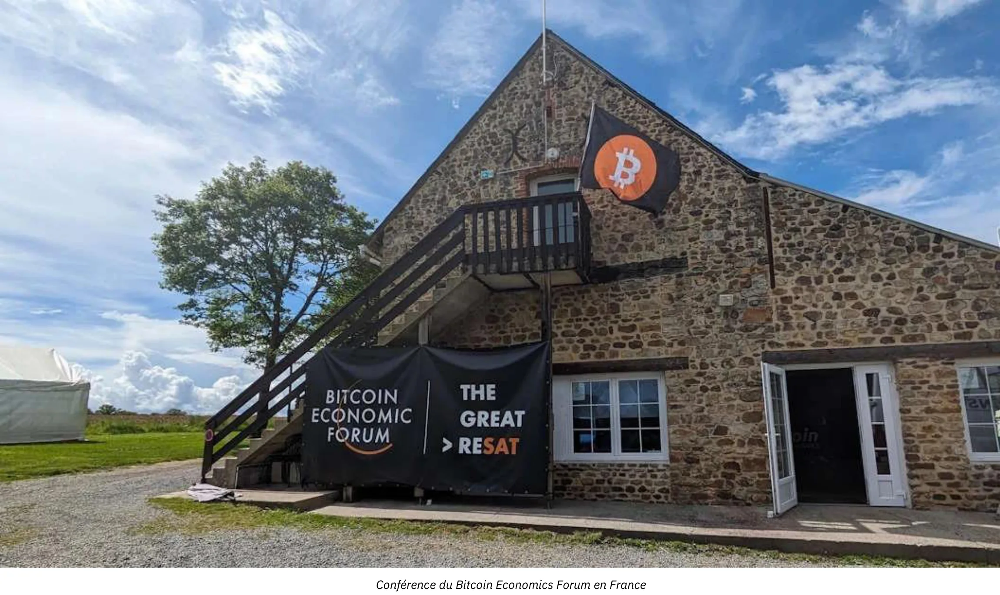

# अंतिम खंड

<partId>e9bdddf4-54c9-4de9-bbce-c3eade8c32e5</partId>

## समीक्षाएं और रेटिंग

<chapterId>08a35d2a-204b-519a-9bb1-588665a037fa</chapterId>

<isCourseReview>true</isCourseReview>

## निष्कर्ष

<chapterId>d74606a5-cb14-4117-acb2-2bf5920de092</chapterId>

<isCourseConclusion>true</isCourseConclusion>