# Bitcoin採用への第一歩

現在では、Bitcoinとそのエコシステムについて誰でも学ぶことができる、豊富な教育コンテンツがオンラインで利用できる。

しかし、**ひとつだけ欠けていることがある：出会い、Exchangeのアイデア、知識の共有、そして何よりも、一緒に建設する機会である。**

このようなニーズの高まりに応えるため、多くのビットコイナーが定期的に**ローカルコミュニティ**を作ることを選択している。

参加者が十分に集まれば、ミートアップが企画され、このような会合が繰り返し開かれることで、技術プレゼンテーションや実践的なワークショップ、より広範なディスカッションの場となることが多い。

このコース「**BTC302**」では、**なぜBitcoinコミュニティやミートアップを作ることが重要なのか**を探求し、**コミュニティのビジュアルとデジタル・アイデンティティを開発するためのツールと方法**に飛び込みます。

また、**プロジェクトやイニシアティブ**、特に教育的なもので、事前に設計されたオープンソースのリソースによってサポートされているものを紹介します。

最後に、**国家レベルでのBitcoinコミュニティの進化**と、**明日のハイパービットコイン化した世界を加速させる可能性**について議論する。

+++

# はじめに

<partId>81318b8f-d316-5787-aa4c-4ec8370ba668</partId>

## コース概要

<chapterId>e8991b82-4966-5e04-8f05-7cae46eacbaa</chapterId>

BTC302へようこそ！

2009年以来、Bitcoinは絶え間ない成長を遂げてきた。この成長は、新たなBitcoin改善提案（BIP）、ネットワークの拡張性を高めるための追加レイヤーの創設（Lightning Networkなど）、複数の企業や新興企業の発展によって具体化されてきた。

その発展はOn-Chainでも顕著で、取引件数は着実に増加している。

例えば、2018年1月1日から2024年1月1日の間に、BitcoinのメインであるLayerの取引件数は【66.2％増加】したと推定される(https://dune.com/queries/3375917/5663935)。一方、2021年8月から2023年8月にかけて、Lightning Networkの公開取引件数は【1,212%増加】している(https://river.com/learn/files/river-lightning-report-2023.pdf)。

この著しい成長は、もちろん密接に関係している：

- レバノン、シリア、エジプト、アルゼンチンなどの人々がそうであるように、【Bitcoinを使うことへの世界中の人々の関心の高まり】(https://profedustream.substack.com/p/21-raisons-dutiliser-Bitcoin)は、銀行システムからの解放、および／または変動の少ない、または切り下げられた通貨を使うことを意味する；
- 金融政策の固定化によって、長期的に価格が上昇し、価値の保存と長期投資としての地位を確立している；
- 特に2017年から2018年、2020年から2021年にかけて、投機的な暗号通貨市場が連続的に成長する；
- 主流メディアで存在感を増すBitcoin。

Bitcoinはまだ初期段階にあるが、この現実は、おそらく皆さんもすでにご存知のことだろう：

- **Bitcoinの可能性**を十分に活用するために、ビットコイナーが学習やプロジェクトをさらに進めるにはどうしたらいいでしょうか？

- 短期的な投機に引き込まれがちな新規参入者が、最新のミームコイン・ブームで損をするのを避け、その代わりに**Bitcoinのファンダメンタルズ**を学ぶことに集中できるようにするにはどうすればいいのだろうか？

この2つの課題に対する最善の解決策はシンプルだ：**現実の世界に存在し、教育することだ。**

このコースの目的は、Bitcoinコミュニティやミートアップを立ち上げ、効果的に運営するために必要なすべてを提供することです。このコースでは、地域のイニシアチブを作りたいのか、オンラインのグループを成長させたいのかに関わらず、ビジュアル・アイデンティティの作成から、定期的なイベントの設定、コミュニケーション・チャネルの管理まで、段階を追って指導します。

**第1節：はじめに**

まずは、オンライン・コミュニティであれ、ローカル・ミートアップであれ、Bitcoinを中心に人々を結びつけることの重要性を強調する。自分のコミュニティを立ち上げる理由と場所、そしてコミュニティの成長と長期的な持続可能性を促進するための明確な目標の設定方法について学びます。

**セクション2：Bitcoinコミュニティーのユニークなアイデンティティーのデザイン**

新しいメンバーを惹きつけ、帰属意識を育むためには、ユニークなアイデンティティを構築することが不可欠です。このセクションでは、あなたのBitcoinコミュニティの精神を体現するロゴ、ポスター、バナーをデザインする方法を学びます。

**第3節：Bitcoinコミュニティのためのコミュニケーション・チャンネルを作る**。

コミュニケーションはあらゆるコミュニティのバックボーンです。このセクションでは、TelegramグループやDiscordサーバーの効率的なセットアップ方法について説明します。また、コミュニティ管理を効率化するための多機能ボットの統合方法についても学びます。

**セクション4：ソーシャルネットワークの立ち上げ**（フランス語）

知名度はコミュニティを成長させる鍵です。このセクションでは、専用のTwitterプロフィールを作成し、地域のミートアップとつながり、btcmap.orgのようなプラットフォームを活用して知名度を高め、新しいメンバーを集める方法を学びます。

**第5節：Bitcoinミートアップの開催**について

このセクションでは、適切な会場の選び方からイベントの運営方法まで、ミートアップの開催方法について説明します。また、参加者のロイヤリティを高め、コミュニティを長期的に持続させるための戦略についてもご紹介します。

**セクション6：プロジェクトとイニシアチブの例**（フランス語）

単なるミートアップにとどまらず、テーマ別のイベントやワークショップ、教育的なコンテンツ制作、地域とのコラボレーションなど、具体的で独創的なプロジェクトを紹介しています。また、コミュニティを促進するための物理的・デジタル的な資料のデザイン方法についても学ぶことができます。

**第7節：未来を予測する**」。

ここでは、コミュニティが急成長した場合の対処法、組織の分散化、敵対的な規制環境への対応など、コミュニティの自然な進化について検討します。このセクションは、これらの課題を予測し、克服するのに役立ちます。

**第8節：ビットコイナーをひとつにする**」。

最後のセクションは、あなたのプロジェクトの本質、つまりBitcoinの熱狂的なファンたちを、共有されたビジョンのもとに団結させることを中心に据えています。メンバーを惹きつけ、維持し、タスクを効果的に委譲し、コミュニティを持続的に成長させるために、どのようにアプローチを構成するかを学びます。

強くて活気のあるBitcoinコミュニティの作り方を学ぶ準備はできていますか？さあ、飛び込もう！

## なぜBitcoinのコミュニティやミートアップを始めるのか？

<chapterId>893ea248-7d5a-5b8e-948c-7031497b1031</chapterId>

### コミュニティとミートアップの違いは？

Bitcoinのエコシステムでは、これらの用語の厳密な定義はありませんが、コミュニティは、共通の情熱を持ち、定期的にコミュニケーションをとる人々のグループとして最もよく理解されています。

一方、ミートアップとは、このコミュニティによって、このコミュニティのために、特定の目的を持って開催されるイベントのことである。ミートアップは通常、コミュニティがすでに確立された後に開催される。

このコースでは、Bitcoinミートアップを立ち上げる前に、そのようなイベントの開催に関心のある数人の人たちとすでにつながっている、言い換えれば、**コミュニティがすでに存在している**と仮定します。

### なぜBitcoinのコミュニティを作るのか？

Bitcoinのコミュニティを作る理由はいくつかある：

- 知識の共有とコラボレーション：コミュニティは、メンバーにExchangeのアイデアや知識を共有する場を提供する。相互サポートは成長のための重要な柱であり、誰もが学びを加速させることができる。

- ピアツーピアの構築：多くのイニシアチブとプロジェクトが、このようなコミュニティの中で考案され、構築され、発展している。

Bitcoinのコミュニティは、より広範な目標、特に公教育について追求することが多い：

1.Bitcoinとは何か？

2.どのように機能するのか；

3.社会への貢献；

4.一部の公人やメディアによる誤解を招く、あるいは根拠のない主張を論破する；

5.Bitcoinと他の暗号通貨の基本的な違い；

明日の最初の "城塞 "を築くことによって、**Bitcoin の世界中のコミュニティは、Bitcoin の基礎を学ぶための肥沃な土地を提供しながら、偽情報と検閲に対する防波堤として機能する**。Bitcoinコミュニティは、懐疑的な人たちでさえも、Bitcoinの真の可能性を探求するために必要なリソースとコネクションを新参者に提供します。

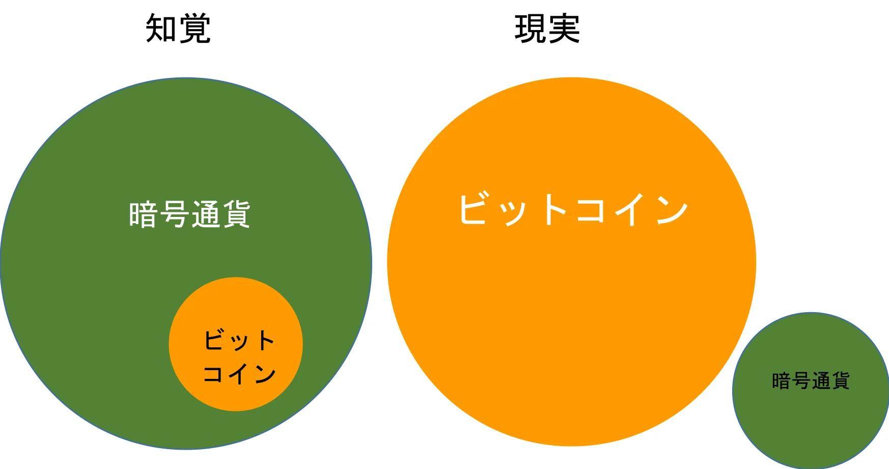

テレグラムグループ（"Bitcoin London"）、Facebookグループ（"Bitcoin Berlin"）、Discordサーバー（"Bitcoin Madrid"）、あるいはEメールリスト（"Bitcoin France"）であろうと、**コミュニティは完全にオンライン**で存在することができることも注目に値する。

言い換えれば、**コミュニティが繁栄し、プロジェクトを立ち上げるのに、物理的なミートアップは必要ない。その中心的な目的は、共有し、構築し、教育すること**である。

### なぜミートアップを作るのか？

先に述べたように、**ミートアップは通常、コミュニティが確立された後に行われ、それを補完する役割を果たす**。

ビットコイナーの旅が発展するにつれて、同じエコシステムの他の人たち**と実際に会って交流したいという願望、あるいは必要性がしばしば出てきます。これは、孤立を感じたり、単に日常生活でBitcoinについて話す相手がいないことから来るかもしれない**。

ミートアップは、オンラインの音声通話やビデオ通話よりも、より個人的で居心地の良い体験を提供します。飲み物を飲みながらでも、食事をしながらでも、オープンかつ直接的にアイデアを出し合える、カジュアルでフレンドリーなスペースが生まれます。

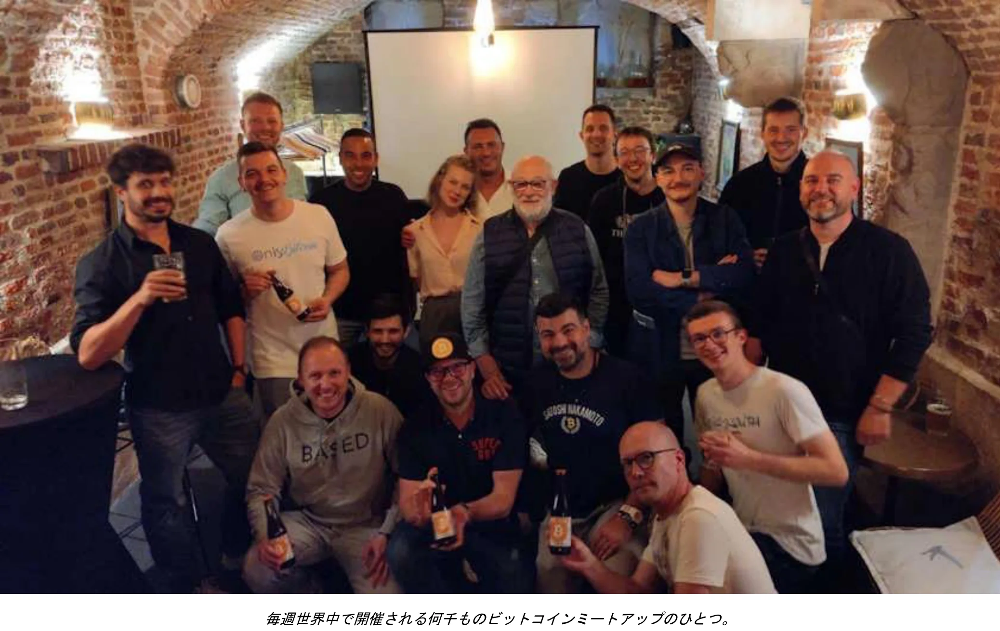

Bitcoinのミートアップは多くの目的を果たすことができる：

- 技術的な話題や進行中のプロジェクトについて話し合う
- 新しいビットコイナーがBitcoinの世界に徐々に深く飛び込むのを助ける
- 新しいプロジェクトやイニシアチブの発表
- 教材や書籍の交換
- ドキュメンタリー映画の試写会
- 特定のテーマに関する会議やワークショップの開催

これらの可能性の多くについては、本コースのパート6/8「【プロジェクトとイニシアチブの例】(https://planb.network/courses/1c643dc9-a15f-4f9e-93b6-cb3c58b4ee35/3213d87a-1998-5972-ab93-97a5769ba279)」で詳しく取り上げる。

各コミュニティは独自の意見を形成し、プロジェクトを立ち上げ、独自の方法で実験する自由がありますが、ミートアップはBitcoinの発展とビットコイナーたちの成長にとってますます不可欠なものとなってきています**。 **フランスとベルギーにある約60のBitcoinコミュニティ](https://btcmap.org/communities/map#2/5.24949/0.20000) の経験を共有することで、**あなた自身のコミュニティとミートアップを可能な限りスムーズに構築し、成長させることができます**。

## コミュニティはどこに作るべきか？

<chapterId>72da5285-5395-592d-ab62-303a0aef3d6d</chapterId>

まず問うべきは、あなたのコミュニティはどこに拠点を置くべきか、ということだ。

この決断は、後でミートアップを開催するという選択肢を残しておきたいのであれば、極めて重要である。

もしメンバーがイベントに参加するために車で2時間も走らなければならないとしたら、参加者はおそらく少ないでしょう。だからこそ、あなたのコミュニティ、ひいては将来のミートアップにふさわしい**場所を選ぶことが、その成長に大きな影響を与えるのです**。

あなたの決断を導くいくつかのヒント：

1/ **中規模または大規模な都市**でコミュニティを作り、成長させる。そうすることで、より簡単になります：

    - ミートアップやプロジェクト（プレゼンテーション、ワークショップ、Bitcoinの採用促進など）のための快適な場を見つける；
    - より多くの人々の参加意識と帰属意識を高める；
    - イベントへのアクセス性を高める（公共交通機関、駐車場など）。公共交通機関や駐車場に近い場所を選ぶことを強くお勧めします。

2/ **あなたの街に関連した名前を選んでください。こうすることで、人々があなたのコミュニティを簡単に識別できるようになります。例：Bitcoin Paris、Einundzwanzig Berlin、Satoshi Spritz Milanoなど。**

3/ **あなたの近くにすでにミートアップが存在するかどうかをチェックする**。

[btcmap.org](https://btcmap.org/communities/map#0/0/0/)をチェックすれば、世界中のほとんどのBitcoinコミュニティやミートアップがリストアップされている。

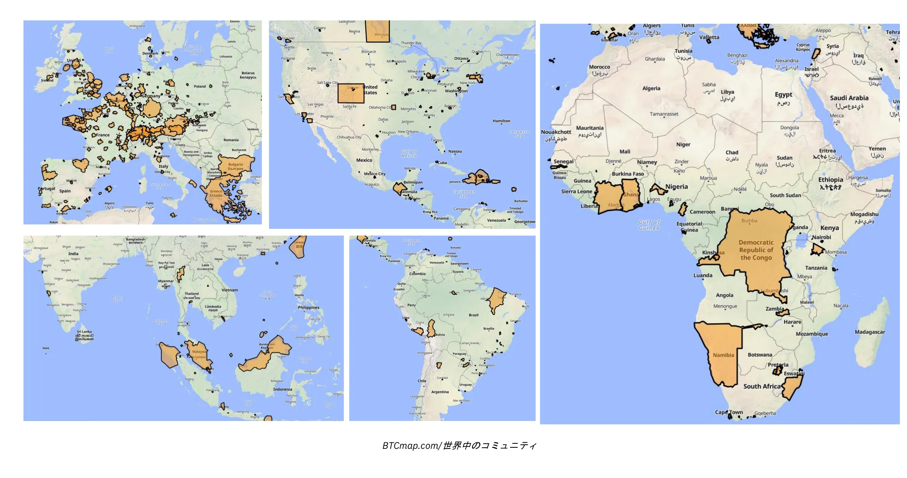

いくつか調べてみると、あなたの街に既存のミートアップやコミュニティが見つかるかもしれない。

Bitcoinは非中央集権的なので、当然、誰でも自由に好きなようにできる。

しかし、**力を合わせることは、近隣のコミュニティを分断し、それぞれの影響を減らすこと**よりも理にかなっていることが多い。すでにコミュニティが存在する場所で、まったく新しいコミュニティを立ち上げることは、意図せずして競争を生み出す可能性がある。

その意味で、単純な「経験則」は役に立つ。もし、あなたが住んでいるところから30～45分圏内に活発なBitcoinコミュニティがなければ、新しいコミュニティを立ち上げる価値があるかもしれない。とはいえ、あなたが望むようにするのはいつでも自由だ。

もちろん、古いコミュニティがあなたの価値観にそぐわない方向に「進化」していて、それを「オレンジ・ピル」する時間やモチベーションがないのであれば、Forkを自分で作るという選択肢もある。

## どのような目標が地域社会を導くべきか？

<chapterId>0aae1aa8-93ec-544a-ad88-22d32c619595</chapterId>

コミュニティーの都市（または地理的エリア）を特定したら、今度は**何を達成したいのか**を明確にしましょう。

これらの目標は、立ち上げ時に設定することもできるし、数人のメンバーが加入し、グループが活発に活動するようになってから、後で修正することもできる。

以下は、あなたの考えを導くためのいくつかのポイントである：

1/ **なぜ私はビットコイナーとしてこのコミュニティを作るのか？他の人を教育するため？経験豊富な仲間から学ぶため？志を同じくする人々に会うため？Bitcoinのエコシステムに関わる？専門家とつながる？それとも単に一杯飲んで新しい友達を作る？**

あなたの答えが、あなたのポジショニングとモチベーションを形成する。

もしあなたのゴールが**知識を共有し、Bitcoinについて人々を教育すること**であるなら、**教育コンテンツ**（記事、ポッドキャスト、ビデオ、プレゼンテーション、チラシなど）を作成することに集中し、他の人が調べる時間を数え切れないほど節約してください。ワークショップ、プレゼンテーション、会議などを開催することで、さらに前進することができます。

単に他のビットコイナーと出会い、経験を共有することが目的であれば、飲みに行くなど、よりリラックスしたアプローチを取ることができます。

そうすれば、より簡単に社会的な絆を作ることができる。しかし、**ビールを飲むことが明日の世界を築く正しい道**ではないことを常に忘れないでほしい。

だからこそ、**具体的な目標とプロジェクトの設定が不可欠**なのだ。

2/ 自分のコミュニティに**物理的な次元**を与えるべきか？もしそうなら、どのようなイベントを企画すべきでしょうか？

最初のイベントはミートアップになるでしょう。その主な目的は、あなたの地域のビットコイナーを集めることです。

しかし、後の【プロジェクトや取り組みの例】(https://planb.network/courses/1c643dc9-a15f-4f9e-93b6-cb3c58b4ee35/3213d87a-1998-5972-ab93-97a5769ba279)で紹介するように、**ミートアップは様々な方法で、様々な目的を持って構築することができる**。

- ネットワーキングとBitcoinのコンセプトに関する教育的プレゼンテーションを組み合わせる；
- Bitcoinソリューションのプロフェッショナルなデモンストレーションを開催します；
- 地元商店をオレンジ色に染めるディベート戦略；

などなど。

テーマ（技術的な講演や実践的なワークショップ）によっては、定期的なミートアップ以外に**追加イベント**を開催することも意味があるかもしれません。

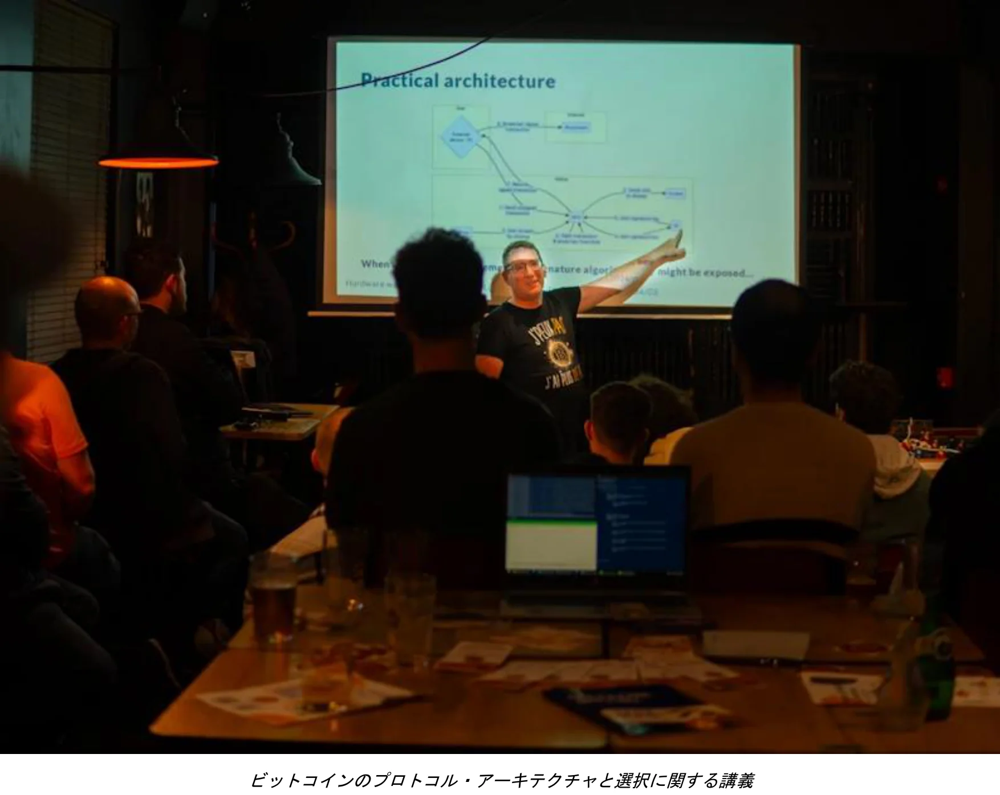

3/ Bitcoinのエコシステムにどのように貢献したいですか？

これはより高度な質問だが、早い段階で考える価値がある。

もしあなたのビジョンが、できるだけ多くの人をオレンジ色に染めることに焦点を当てた、**結束の固い、やる気のあるコミュニティ**を作ることだとしたら：

- より広範な情報、オープンソースのリソース、必要な場合の貴重なサポートにアクセスするために、既存のコミュニティと協力する。
- グループ内でタスクを整理し、委譲することで、取り組みを効果的に拡大し、規模を拡大する。

**短期、中期、長期の目標を設定する。**

計画を立てる現実的な方法は、それぞれの時間枠に目標を設定することだ：

- 短期：ソーシャルメディアでの存在感を高め、コミュニティ・コミュニケーション・チャンネルを確立する。
- 中期：教育リソース（記事、チラシ、ビデオ）を作成する。
- 長期的な展望：定期的に物理的なミートアップを立ち上げる。

ミートアップが確立すれば、それを目指すこともできる：

- 短期：特定のトピックに関するワークショップやプレゼンテーションの開催
- 中期的には、Bitcoinの啓蒙・教育キャンペーンを実施する。
- 長期的：Bitcoinを支払いに受け入れてくれるバーと、正式な提携やパートナーシップを結ぶ。

備えよ： **コミュニティ作りには努力が必要だ。**

コミュニティづくりは一朝一夕にできるものではない。時間とやる気と組織が必要なのだ。

特に誰も現れず、自分だけがこの使命を背負っているように感じるときは、落胆さえ覚えることがある。

そのため、**このコースは、貴重なリソースやヒントを共有し、コミュニティが効果的に成長し、最終的に自給自足できるように支援するために設計されています。**

# コミュニティ・アイデンティティのデザイン Bitcoin

<partId>da6673ad-bf49-5979-80a6-3f69cfb28046</partId>

## なぜ、そしてどのようにして自分のアイデンティティを作り出せるのか？

<chapterId>b48a18cc-afdf-5216-802c-32647b5cd8a3</chapterId>

この段階では、次のように仮定する：

- あなたはすでに、あなたのコミュニティ（または将来の定期的な会合）がどこに拠点を置くかを知っています。
- まだ最終的なものでなくても、あなたはさまざまな時間軸で目標を設定している。

コミュニティ構築の次のステップは、その名前とビジュアル・スタイルの両方で、**アイデンティティ**を定義することです。

このセクションでは、初心者の方でもコミュニティのビジュアル・アイデンティティをデザインできるよう、チュートリアルや初心者向けのソフトウェア・ソリューションをご紹介します。

**なぜアイデンティティが重要なのか？**

人々は、あるグループに共感することで、より積極的に参加し、献身していると感じます。強力なアイデンティティは、コミュニティを際立たせ、帰属意識を育むのに役立ちます。

すべては名前を決めることから始まる：

- フランス60以上のローカルコミュニティのほとんどは、"Bitcoin [CITY]"または"[CITY] Bitcoin "のような名前を使用しています。テレグラムのグループもこのパターンが多い：「Bitcoin [CITY] meetup"。
- ドイツEinundzwanzig（「21」を意味する）イニシアティブは、「Einundzwanzig [CITY]」のような名前にインスピレーションを与えた。
- イタリアSatoshiスプリッツ・ネットワークはSatoshi "スプリッツ[CITY]"などの名称を使用。

**各コミュニティは独自のアイデンティティを持ち、故郷とつながりながらも、その国のより広いアイデンティティとつながっている。**

ロゴ、色、バナーなど、あなたのビジュアル・アイデンティティは、人々の記憶に残り、あなたのグループを連想させるものです。

ソーシャルメディアのアカウントやコミュニケーション・チャンネルを作成する際、ロゴやバナーがあると強いプラスになります。プロのデザインスキルは必要なく、無料で簡単に使えるツールがあるのでご安心を。

手始めに、あなたの街のランドマークやシンボルを取り入れるといいだろう。パリならエッフェル塔。リールなら鐘楼や城塞。ニューヨークなら自由の女神。ロンドンならビッグベンなど。

そこから、お好みに応じて、シンプルなロゴも、より詳細なロゴもデザインすることができます。

ここでは、フランスのコミュニティ・ロゴの例をいくつかご紹介します：

- マルセイユでは、街を見下ろすノートル＝ダム＝ド＝ラ＝ガルド聖堂を表している：

- モナコではモネガスクの岩を指す：

- リールでは、洗練されたロゴがヴォーバンの城塞とその公園を表している：

- サン・マロでは、町の紋章であるエルミンヌが強調されている：

**お望みなら、もっと先へ**

インスピレーションが湧いたら、紋章やモットー、あるいは地域の歌を作ることもできます。あなたの創造力は無限です！

## ロゴ、ポスター、バナーの作成

<chapterId>3470a31f-0190-5e87-8af0-6a00e79267ef</chapterId>

### Canvaの使用

[Canva](https://www.canva.com/)を使って、コミュニティの様々なビジュアルを作成することができます。

この無料で使いやすいプラットフォームは、数回のクリックで複製やカスタマイズが可能な、デザイン済みのテンプレートの豊富なライブラリで人気がある。

**ロゴの作成**

Canvaのホームページで、デザイン済みのロゴを検索します。あなたのインスピレーションを刺激するものを1つ、またはいくつか選んで複製し、あなたのコミュニティに合わせてカスタマイズしてください。

地元のランドマークやエンブレムを背景に追加し（写真を取り込むか、Elementsメニューの「イラスト」または「画像」で検索）、Bitcoinのロゴや₿を重ね、必要に応じて色を調整することができます。

**バナーやポスターの作成**

バナーやポスターを作成するには、Canvaのライブラリでデザイン済みのテンプレートを検索します。テンプレートを複製したら、テキストとフォントを変更し、コミュニティのロゴを追加し、フレームを使用して任意の写真をインポートします（Elementsメニューで「フレーム」を検索）。

Designs（デザイン）メニューで、お客様のニーズに合ったモデルをさらに検討することもできます。

YouTubeのサムネイルやバナーについては、それらのテンプレートを検索して複製し、好きなようにカスタマイズするだけです。

つまり、**可能性は無限であり、あなたのニーズだけでなく、**あなたのコミュニティやミーティング/イベントのために作りたいビジュアルスタイルによっても形作られます！

より明確なアイデアを提供するために、これらの可能性のいくつかを紹介する非網羅的なビデオチュートリアルが含まれています：

:::video id=d11ae0ed-eacd-4924-afd3-75aff95d2899:::

**Bitcoinリール**のテンプレート例

ここでは、Canvaのテンプレートを複製して、あなたのコミュニティ用にアレンジすることができます：

- ミートアップ告知ポスター**（ソーシャルメディアおよびA4/A3印刷用）**：[リンク](https://www.canva.com/design/DAGBvBXFJ8A/92-j_toeLU8QbVAD0NwoAA/edit?utm_content=DAGBvBXFJ8A&utm_campaign=designshare&utm_medium=link2&utm_source=sharebutton)

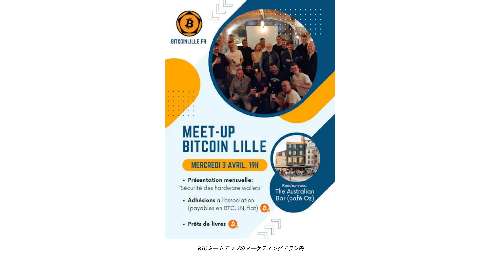

- イベントポスター（ソーシャルメディアおよびA4/A3印刷用）：[リンク](https://www.canva.com/design/DAGBvG3rNCc/oXtNR9pduRs22AqclG4O2g/edit?utm_content=DAGBvG3rNCc&utm_campaign=designshare&utm_medium=link2&utm_source=sharebutton)

- ソーシャルメディアバナー[リンク](https://www.canva.com/design/DAGBvOXyNqw/iSJG9PbIQHgGWHz5PhlXSQ/edit?utm_content=DAGBvOXyNqw&utm_campaign=designshare&utm_medium=link2&utm_source=sharebutton)

- コンテストのお知らせ[リンク](https://www.canva.com/design/DAGBvIjuA_w/YzSUXzOmbNV9oCma9mluOw/edit?utm_content=DAGBvIjuA_w&utm_campaign=designshare&utm_medium=link2&utm_source=sharebutton)

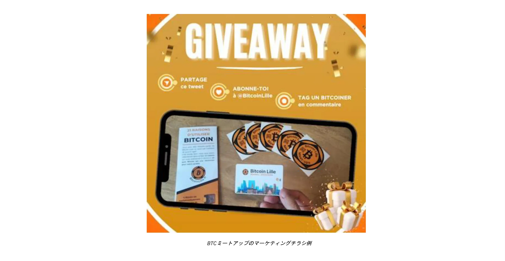

- 私たちのライブラリーのブランド・ガイドライン：[リンク](https://www.canva.com/design/DAGBvPqL7N4/LmUItfsysypRLSOFOzBXcQ/edit?utm_content=DAGBvPqL7N4&utm_campaign=designshare&utm_medium=link2&utm_source=sharebutton)

- **パワーポイント・プレゼンテーション** "Chapter 2 - Understanding Bitcoin transactions", by @ProfEduStream: [link](https://www.canva.com/design/DAFsEcnOro8/Mz9FYdTGhsvozZOe0Y9jtw/edit?utm_content=DAFsEcnOro8&utm_campaign=designshare&utm_medium=link2&utm_source=sharebutton)

- **チラシ** "21 reasons to use Bitcoin", written by @ProfEduStream: [link](https://www.canva.com/design/DAFtAR1NauQ/ZDwl2CchIJ9Gpb36N6-7iw/edit?utm_content=DAFtAR1NauQ&utm_campaign=designshare&utm_medium=link2&utm_source=sharebutton)

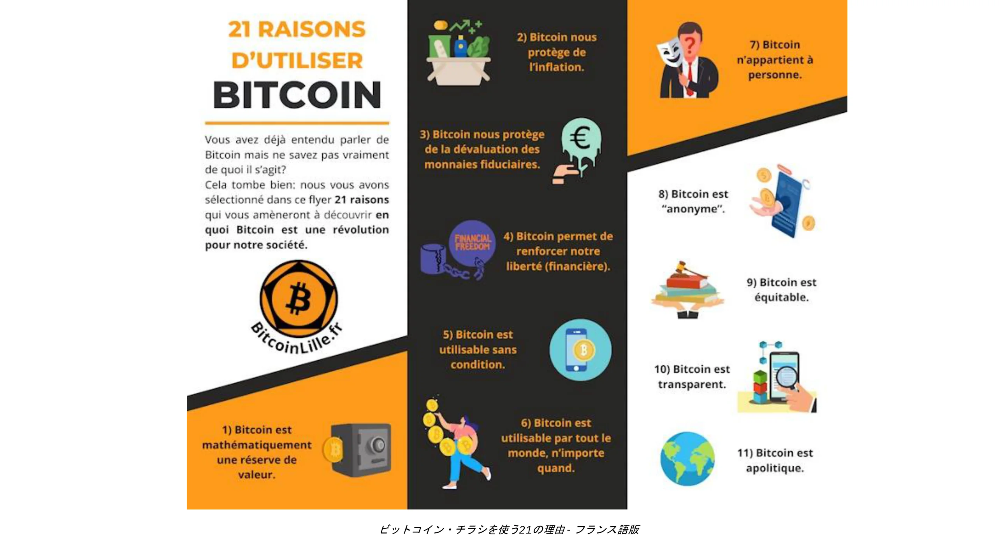

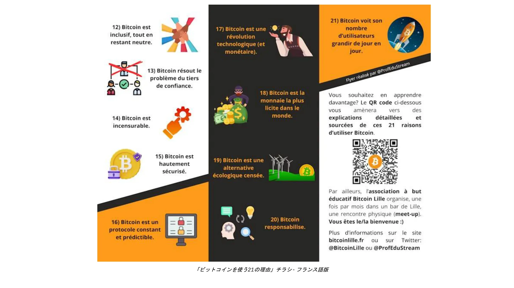

**あなたの作品を共有しよう**

可能性は無限であり、あなたのデザインはあなたのゴールとビジュアル・アイデンティティに依存します。オープンソースでテンプレートを共有することを検討してください。共有することで、Bitcoinコミュニティの成長を加速させることができます。

**推奨寸法**

ビジュアルを作成する際は、必ず各プラットフォームのサイズ要件を確認してください：

| Platform | Logo | Banner | Poster / Image
| -------- | -------- | -------- | -------- |
| Telegram     | 512 x 512     | N/A     | N/A     |
| Signal     | N/A     | N/A     | N/A     |
| Twitter     | 400 x 400     | 1500 x 500     | 1200 x 628     |
| Meet-up     | N/A     | N/A     | N/A     |
| Discord     | 512 x 512     | 960 x 540     | N/A     |
| Facebook     | 512 x 512     | 851 x 315     | 960 x 720     |

通常は適切なサイズ：

ロゴ512×512ピクセル

バナー：アプリやサイトによって異なる

ポスターA4が標準的な印刷形式です。

### 人工知能の活用

Canvaはロゴ、ポスター、バナー、チラシを作成するための幅広いツールを提供していますが、それだけが唯一の選択肢ではありません。他のソフトウェア（PhotoshopやIllustratorなど）の方が使いやすい場合は、自分に最適なものを自由に使ってください。

とはいえ、コミュニティのロゴをデザインするにしても、ポスターやプレゼンテーション、チラシを強化するにしても、**人工知能はユニークで魅力的なビジュアル**を作成するための強力な味方になる。

この目的のために、多くのAIが利用可能である。以下のようなものがある。

- [midjourney](https://docs.midjourney.com/docs/quick-start) (有料)；
- [leonardo](https://leonardo.ai/)（無料、アカウント制限あり）；
- [copilot](https://copilot.microsoft.com/) (無料、アカウント制限あり)；
- [DALL-E](https://www.dall-efree.com/) (有料)。

他にも多くのAIツールが最近登場しているので、このリストは網羅的とは言い難い。

**例近未来的なBitcoinロンドンのロゴを作成する**。

Bitcoinロンドン」ミートアップの未来的なロゴをデザインしたいなら、コパイロットに頼めばいい：

- [ ] *プロンプトロンドン橋とビッグベンを背景にBitcoinのロゴを作ってください。Futuristic* - [Link](https://copilot.microsoft.com/images/create/un-logo-Bitcoin-futuriste-avec-en-arric3a8re-plan-le-/1-6612ba1758df4384bc33c4bca00ab45b?FORM=SYDBIC)

最初の4つの結果が十分に現実的でない場合は、リクエストを絞り込む：

- [ ] *プロンプト4枚目をもっとリアルに* - [Link](https://copilot.microsoft.com/images/create/un-logo-Bitcoin-futuriste-avec-en-arric3a8re-plan-le-/1-6612ba64b72d4cea9830ab7eb844f785?FORM=SYDBIC)

最新の結果は素晴らしいものになった！

**例：シンプルなブリティッシュスタイルのロゴを作る**

ステッカーのように、よりクリーンな外観に：

- [ ] *プロンプトLondon Bitcoin Meetup "のロゴをブリティッシュでクリーンなスタイルで作成してください* - [Link](https://copilot.microsoft.com/images/create/logo-for-27londres-Bitcoin-meetup27-with-a-british-a/1-6612bb9451924859a6c34b350b3a6ebc?FORM=SYDBIC)

結果はとてもクールだ！

**AI**と仕事をするためのヒント

- 辛抱強く：AIは最初の試行では、あなたが思い描くものを正確に作り出さないかもしれない。

- 的確なプロンプトを使う：指示が明確で詳細であればあるほど、結果は良くなる。

- 助けを求める：満足できない場合は、グラフィックデザインやAIツールの経験豊富な人に助けを求めよう。多くのビットコイナーが喜んで手伝ってくれる。

# Bitcoinコミュニティのコミュニケーション・チャンネルを作る

<partId>fc588298-6876-554c-bd57-55d182464878</partId>

## どのコミュニケーション・チャンネルを選ぶべきか？

<chapterId>b4f4eef6-1035-5290-848a-2b7f9391c77a</chapterId>

前述したように、コミュニティのコミュニケーション・チャンネルは、動機や習慣によって異なる。

例えば、**フランス、ドイツ、イタリアでは、テレグラムとツイッターが支配的なプラットフォーム**であり、Bitcoinコミュニティの「標準」となっている。

対照的に、チェコ共和国では、多くのコミュニティがテレグラムの代わりに**マトリックス**という安全なインスタント・メッセージ・プロトコルを使用している。

ヒント: チャンネルを選択する前に、**近隣のコミュニティが何をしているかを見てください**。マップ[btcmap.org](https://btcmap.org/communities/map#0/0/0/)を使って、どのプラットフォームがあなたの地域で最も人気があるかを見てみましょう。

例えば、スイスのコミュニティは主にテレグラム、ツイッター、そして自分たちのウェブサイトを使っている：

**フランス語圏**におすすめのチャンネル

- テレグラムコミュニケーションツールNo.1。フランスのミートアップの90％以上が使用している。

- ツイッター（X）：世界中のビットコイナーが使用する主要なソーシャルネットワーク。フランスのミートアップの~70%で使用されている。ビットコイナーにリーチするのに理想的。

- Meetup.com：有料だが、Bitcoinのエコシステム外での知名度を高めるために広く利用されている（フランスのミートアップの約30％、カナダのミートアップのほぼすべて）。

- その他のオプション：~30%はウェブサイトを持っており、10%はDiscordサーバーやNOSTRアカウントを運営している。

Matrix、Keet、Signal、Facebook、Instagram、LinkedInといった他のプラットフォームも利用できる。管理するチャンネルが増えれば増えるほど、モデレート、投稿、アクティブの維持に多くの時間を費やすことになるので注意しよう。

フランスでコミュニティを立ち上げたい人は、まずコミュニティを作ることから始めることをお勧めする：

- テレグラムのグループ；
- ツイッターのアカウント

コミュニティが成長するにつれて、プラットフォームを追加したり、信頼できるメンバーにモデレーションを任せることができます。

## Telegramチャンネル、グループ、スーパーグループの作成と設定

<chapterId>d13714ce-8f08-53e9-bedd-b6a3aaac5dad</chapterId>

Telegramでコミュニティのコミュニケーションスペースを作る前に、以下の違いを知っておくことが重要です：

- テレグラム・チャンネル；
- テレグラムのグループ；
- テレグラムのスーパーグループ。

テレグラム・グループで始めることを強くお勧めします。

必要であれば、後でスーパーグループに変更することもできる。

以下のチュートリアルでは、より高度な設定が可能な "Telegram+"APKを使用しています。しかし、スマホからでもグループの作成や管理は公式のTelegramアプリで十分なので、必ずしも必要ではない：

:::video id=b1da7cb4-5fb1-4a41-a1d4-bd90686826a9:::

### テレグラムチャンネルを作成する

メンバー同士が直接話したり、返信したりできる場所を作りたいのであれば、Telegramチャンネルではなく、Telegramグループを作った方がいいかもしれません！

そのまま次のセクション、[Create a Telegram group](https://planb.network/courses/1c643dc9-a15f-4f9e-93b6-cb3c58b4ee35/d13714ce-8f08-53e9-bedd-b6a3aaac5dad)に進みます。

確かに、**テレグラム・チャンネルは、管理者にとって一方通行の放送ツール**のようなものだ。メンバーは自由にチャットすることができず、絵文字でリアクションすることしかできない（あるいは別のスレッドにコメントを残して会話を分断してしまう）。

**コミュニティには交流と協力が必要なので、人間関係の構築や知識の共有が目的なら、テレグラム・チャンネルは推奨されない**。

Telegramチャンネルを作成するためのチュートリアル：

:::video id=98be4709-d221-4030-8c31-e10113482515:::

### テレグラム・グループを作成する

一方、**Telegram Groupはコミュニティ**に最適です：MessengerやWhatsAppのようなメッセージングアプリケーションと同じように、メンバーは1つの共有会話でお互いにチャットや返信をすることができます。

管理者としてできること

- 重要なメッセージを掲示し、ピンで留める。
- 投票**を作成する**（コミュニティが新しい場合、ミートアップの日程を決めるのに便利）。
- カスタム招待リンク**を作成する**（グループが "private "ではなく "public "の場合のみ。t.me/Bitcoin[CITY]のように、独自のTelegram招待リンクがあると便利です；）
- メンバーの権限、役割、モデレーションを管理します。
- プロフィール写真（あなたのコミュニティのロゴ）を追加し、グループ名を更新します。

Telegramグループを作成するためのチュートリアル：

:::video id=3d4792a7-1345-475b-93b1-b3a3945fb567:::

注：このチュートリアルはTelegram+を使用して作成されていますが、標準のTelegramモバイルアプリから直接すべてを行うことができます。

### Telegramスーパーグループを作成する

なぜスーパーグループなのか？

Telegramグループのメンバーが数百人になると、会話がカオスになることがあります。そのため、メンバーは次のミートアップの日程など、重要なお知らせを見逃してしまうことがよくあります。

いくつかの解決策がある：

1. **重要なメッセージ**をピン留めすると、メンバー全員に通知が届きます（該当のメッセージを指で1回押して、「ピン留め」を選択）；

2.複数のコミュニケーションチャンネルに**Discord**を使用することを検討する。

3. **テレグラムグループをスーパーグループ**に変換します。

テレグラムのスーパーグループとは？

スーパーグループは、基本的にトピック（サブチャンネル）を含むテレグラムグループです。

トピックの例

- "重要なお知らせ"：重要な最新情報とイベントのお知らせのみ。
- 「一般」：全メンバーのディスカッション用。
- 具体的なトピック：Mining、プロジェクト開発、今後の会議など。

ヒントトピックを地域のニーズに合わせる。例アビジャンBitcoinミートアップでは、この形式をうまく利用している。

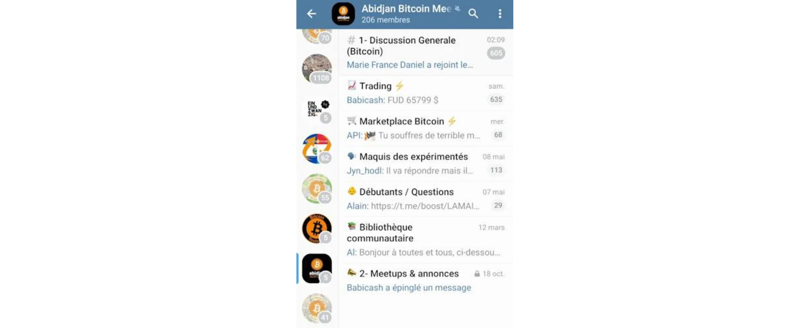

Telegramのスーパーグループは、メンバーによっては**使い方が少し難しい場合がある**ことを覚えておいてください。たとえば、**異なるトピック**にアクセスする方法を誰もが知っているわけではありません（トピックの完全なリストを表示するには、Telegramのメインメニューでグループロゴをタップする必要があります）。スクリーンショットを送ることで、混乱を解消することができます。

通常のTelegramグループからスーパーグループに切り替えるタイミングに厳密なルールはありません。トピックを作成してスーパーグループに変更するか、「一般」以外のトピックを削除して通常のグループに戻すだけです。

Telegramスーパーグループを作成するためのチュートリアル：

:::video id=f78800ae-d8ca-479a-b913-99abd9916bff:::

簡単なメモ：前述の通り、上記のチュートリアルは「Telegram+」APKを使ってコンピューター上で作成した。しかし現在では、スマホでTelegramスーパーグループを作るのは簡単です。

Telegramグループを作成し、その設定に進み、「トピック」ボタンをタップしてトピックを追加するだけです。保存すると、トピックのリストが表示され、好きなように編集できます。

そのため、スーパーグループのより高度なプライバシー設定にアクセスしたい場合を除き、「Telegram+」をダウンロードする必要はもうない。

## Telegramグループまたはスーパーグループを設定する

<chapterId>35e674b3-5924-50b0-98f1-83a56c9a186d</chapterId>

Telegramグループ（またはスーパーグループ）が立ち上がり、稼働している今、**パーミッションの設定とモデレーションの設定**をする時です。

各コミュニティが独自のアプローチを選択するのは自由ですが、経験上、特定のメンバーのアクセス権を制限するのが**最善です**：

- アンケートを送る
- ファイルを送信する（潜在的なウイルスを避けるため）；
- ボイスメッセージを送る
- ユーザーの追加（ボットの侵入を防ぐことができます；）
- メッセージをピン留めする
- グループ情報の編集

Telegramグループまたはスーパーグループを作成する際に、**あなたのミートアップ**の明確な説明を書くことを強くお勧めします。例えば

> Bitcoinの電報[CITY]へようこそ🔥。
>

> 私たちは毎月第一水曜日に、[CITY]🍻のバー[BAR_NAME]でミートアップを企画しています。
>

> 他のソーシャルネットワークもご覧ください：[LINK] 🌐をご覧ください。

この例では、Bitcoinリールの管理者が、共有しやすいように公開Telegramリンクをカスタマイズしている。

グループ設定で、「新規メンバーの承認」**を有効にするのが賢明でしょう。**

一部のBitcoinテレグラム・グループは、スパムやコミュニティの妨害を目的とした何千もの偽アカウントに狙われている。

**メンバーの承認を有効にすることで、グループをスパム攻撃から守ることができます。**

管理者セクションで、疑わしいメッセージを自動的に削除する「積極的なスパム対策」機能を有効にすることもできます。

これは必ずしも必要ではないが、Layerのプロテクションを追加することができる。

## Telegramグループに多機能ボットを追加する

<chapterId>c61f69cc-15ec-53f1-8c02-1cea55def09e</chapterId>

**Telegramグループまたはスーパーグループの設定とセキュリティのもう1つのオプションは、多機能ボット**を追加することです。これにより、グループの機能とモデレーション機能を大幅に拡張することができます。

ボット[@GroupHelpBot](https://telegram.me/grouphelpbot)を使用すると、最も便利なオプションがあります：

- コミュニティのガイドラインを表示するための**ルールコマンド**（/rules）；
- 不審なメッセージやアカウントをフィルタリングする**スパム対策**；
- 新規会員向けの自動ウェルカムメッセージをカスタマイズ可能（オプションで数分後に自動削除も可能）
- メッセージスパムを防ぐ**アンチフラッドプロテクション**。
- グループ管理者に素早く連絡するための**@administratorコマンド**。
- 不要なコンテンツをブロックするルール
- **グループ・リンク・コマンド** (/link)
- コマンド **許可管理**
- 特定のメッセージタイプの自動削除
- **ボットブロック**と**入退場ブロック**でグループの安全を守る
- あなたの**コミュニティのソーシャルネットワーク**をリストアップする（/networks）
- その他にも...

数え切れないほどの追加機能が用意されている。

プロからのアドバイス： **会話を制限しすぎないこと**。

Telegramグループまたはスーパーグループに多機能ボットを追加するためのチュートリアル：

:::video id=cdbf82d6-3530-45c4-90de-593f100863bb:::

(注：このすべてのプロセスは、携帯電話から直接行えるようになりました。Telegram+アプリはもう必要ありません)。

## Discordサーバーを作成する

<chapterId>eef2a965-4c24-5f3a-8013-72cc7d315314</chapterId>

Telegramグループが大きくなりすぎたら、Telegramスーパーグループに変身させることで、ディスカッションを整理することができます。

しかし、先に述べたように、**複雑さが増し、トピックやメッセージが増えることで、アクティブなメンバーの中には興味を失う人もいるかもしれません**。

なぜDiscordを検討するのか？

**DiscordはTelegramのスーパーグループ**に代わるもので、ユーザーは特定のテキストと音声のチャットルーム**を作成でき**、メンバーは興味のないチャンネルをミュートできる。

もちろん、TelegramとDiscordの両方を管理するには、特に設定や立ち上げの際に、もう少し時間がかかる。

より簡単にするために、**私たちは[複製してカスタマイズできるDiscordサーバー](https://discord.com/template/bDY4eXXJk2C8)**を共有しています：

:::video id=e647458a-a21e-44e0-bd03-20b82a871777:::

うまく設計すれば、Discordサーバーはコミュニティにとって本当の資産になります。多くのビットコイナーがすでに**Discord**を毎日使用しており、Discord内で直接Telegramの会話をフォローできる（逆も同様）ことは、全員の時間を大幅に節約することができる。

両プラットフォームを同期させるために、[TediCross](https://github.com/TediCross/TediCross)というオープンソースのボットがある。その目的は単純で、DiscordのテキストチャンネルからTelegramグループ（またはスーパーグループのトピック）にメッセージを自動的に転送し、逆もまた同様である。

ただし、インストールは簡単ではないことに留意してほしい。ボットを動作させるには、コンピュータ上でコマンドプロンプト（CMD）を起動しておく必要があり、時折エラーが発生することがある。幸いなことに、それを修正するのは簡単です：ボットを再起動するだけで、ほとんどの場合、すべてが正常に戻ります。

時間を節約するために、この多機能ボットをTelegramグループまたはスーパーグループに追加する方法のチュートリアルをご紹介します：

:::video id=6a0283f6-6d6c-4e81-8b2f-644b33c52fe6:::

## より安全でプライベートな通信手段を検討する

<chapterId>29d0aad6-0612-5dd0-bcef-7337eaf4fefc</chapterId>

先に述べたように、ツイッターとテレグラムは、（世界中ではないにせよ）ヨーロッパでBitcoinのコミュニティが最も広く使っているコミュニケーションツールである。

しかし、Telegramは最もセキュアでプライバシー重視のメッセージングアプリとして知られているわけではないし、Twitter（現在はX）は地球上で最も自由に動いている企業のひとつに所有されている。

だからこそ、コア・チャネルが整い、物事がスムーズに進むようになったら、時間をかけて他の選択肢を検討する価値がある。

今後数ヶ月の間に、このコースとplanb.networkプラットフォームは、**SimplexやElement**のような代替プロトコルの使い方のチュートリアルを提供する予定である：分散化され、暗号化され、高度にカスタマイズ可能なコミュニケーションツールである。

**なぜわざわざこのようなオプションを検討するのか？**

というのも、NOSTRソーシャルネットワークのように、より大きなプライバシーを提供するだけでなく、検閲やTelegramグループの恣意的なシャットダウンに対する安全装置にもなるからだ。

そして、検閲に強く、デザインによって回復力があること以上に、Bitcoinの精神に沿ったことがあるだろうか？

# ソーシャルネットワークを立ち上げる

<partId>8ebf8cd7-9248-543f-bc27-4ec4cc03f9cf</partId>

## Bitcoinコミュニティを成長させるための知名度の重要性

<chapterId>b20f12e4-c5de-5f02-80c7-b7fc6cadd3ac</chapterId>

あなたのコミュニティは立ち上がり、運営されています。TelegramやMatrixのスペースを設定した...しかし、今のところ、そこにいるのはあなただけだ。 **人々にあなたの存在を知ってもらう時が来たのです！**。

簡単なことです。もし誰もあなたのグループにアクセスできず、次のミーティングがいつ行われるかを知ることができなければ、あなたはただ虚空に投稿するだけになってしまいます。だからこそ、ソーシャルメディアや、後で取り上げるいくつかの特定のプラットフォームが、コミュニティを構築する上でとても重要なのです。

ツイッター（X）は、Bitcoinのオンライン会話とほぼ同義語になっている。完璧とは言い難いが、現在コミュニティの大部分がここに集まっている。アカウントを作ることを強くお勧めする。

検閲や規制の可能性に備えて、NOSTRプロフィールを開設しているコミュニティもある。

それがFREEマデイラの集団が行ったことだ。

もちろん、他のプラットフォームも役に立つ。フェイスブック（グループでもページでも）、あるいはリンクトイン。

とはいえ、**管理するコミュニケーション・チャンネルやソーシャル・ネットワークが多ければ多いほど、より多くの時間が必要になる**ことを覚えておいてほしい。Twitter（とNOSTR）は手始めに最適なオプションです。

## ツイッターのプロフィールを作成する

<chapterId>c8d73097-8eba-5530-918c-221002954110</chapterId>

ツイッターはとても使いやすく、プライバシーを向上させるには、いくつかの設定を調整する必要がある。

**Twitterアカウントを新規作成する際には、以下の4つの情報を入力する必要があります：**

1/ **ツイッターの@**は、あなたのアイデンティティを定義し、あなたを見つけやすくします。あなたのコミュニティの名前が「Bitcoin[CITY]」なら、「@Bitcoin[CITY]」を選ぶのが適切です；

2/ **あなたのコミュニティやミートアップのために作成したロゴとバナー**（[ロゴ、ポスター、バナーを作成する](https://planb.network/courses/1c643dc9-a15f-4f9e-93b6-cb3c58b4ee35/3470a31f-0190-5e87-8af0-6a00e79267ef)のセクションを参照）；

3/ **説明**では、あなたのコミュニティに関する重要な情報を数百文字で共有することができます。例えば

> Bitcoin[CITY]コミュニティ公式アカウント #BTC｜毎月第1水曜日[CITY]の[BAR_NAME]でミートアップ 🍻｜Telegram 🔽で参加しませんか？

4/ この説明の下に、**リンクを挿入することができます**。これは、あなたのコミュニティのウェブサイトの「ソーシャルメディア」ページや、テレグラムチャンネルにユーザーを導くことができます。何を強調するかはあなた次第です。

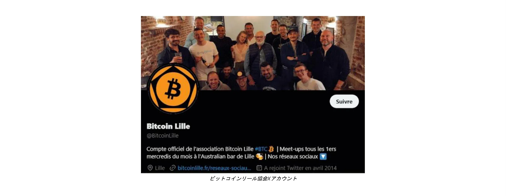

さらに、**いくつかのプライバシー設定は調整する価値がある**：

- Twitterアカウントを "公開 "モードにしておく（投稿は誰でも見ることができる）；
- 誰もがあなたを見つけられるように；
- 位置情報の追跡と他の団体とのデータ共有を無効にする（プライバシー設定で）。

イベントごとに、ツイッターを使って有益な情報を共有することになるでしょう。しかし、他のソーシャルネットワークと同様、**知名度がすべて**です。

あなたの時間を大幅に節約するために、私たちは[Twitterのオープンソースランキングアルゴリズム](https://github.com/twitter)を研究する時間を取った。

あなたの知名度を高めるために注目すべき**重要なことは以下の通りです**：

- 一般的なアドバイス
    - アカウントの設定言語か英語でツイートする：他の言語でツイートすると、あなたの知名度が大幅に下がる可能性があります；
    - ニッチにこだわり、自分のアカウントのフォーカスに関連したコンテンツのみをシェアすること。トピックのずれたツイートはアルゴリズムによってペナルティを受ける；
    - 1日1～2ツイートを目標に；
    - ピーク時に投稿する：木曜日か金曜日の午前8時から10時の間に投稿するのが最も効果的です。

- ツイートを書くとき
    - 写真（またはビデオ）を追加する；
    - ハッシュタグは1つだけ使用する（通常は#Bitcoinが最も関連性が高い。適切であれば、あなたのアカウントに関連するトレンドのハッシュタグを追加することもできます；）
    - コミュニティーの交流を促す：
        - ライク＝ウェイト0.5
        - リツイート＝ウェイト1
        - 返信＝体重27（!）
- 自分のツイートに反応してくれた人に返信する**（75の重み！）**；
    - メインのツイートにリンクを貼るのは避けましょう：代わりに、最初のコメントに追加しましょう；
    - 略語は避け、単語は全文で書く。

- その他のヒント
    - あなたのアカウントの専門分野と一致している限り、トレンドトピックについてツイートする；
    - パフォーマンスの高いツイートをリポストする；
    - 時折、世論調査を行う；
    - 可能な限りスレッドを書く；
    - コミュニティがあなたのプロフィールを訪問し、あなたをフォローするよう促しましょう。

さらに、**南アフリカのBitcoinウィツァンド・コミュニティーのように**、ツイートやスレッドを自分のツイッター・プロフィールにピン留めして、最大限の可視性を与えることができる。

また、携帯電話とパソコンの両方で、同時に2つのTwitterアカウントにログインし続けることが可能です。これは、個人アカウントとコミュニティアカウントを簡単に切り替えたい場合に非常に便利です。

ただ、コミュニティ・アカウントから誤ってパーティーの写真を投稿してしまうことは、思っている以上に早く起こりうることなので注意が必要だ！

最後に、あなたのユーザー名「@Bitcoin[CITY]」がユニークであなたのものであるとしても、偽物や模倣アカウントを予想するのは賢い選択です。登録も検討しましょう：

- ビットコイン・シティ
- シティ]Bitcoin
- CITY]_ビットコイン

そうすれば、誰かがあなたのコミュニティになりすます可能性を大幅に減らすことができる。

ツイッターアカウント作成のためのチュートリアル：

:::video id=4648976f-41ec-499a-b7ec-a53e796f71b4:::

## 近隣のミートアップとの距離を縮める

<chapterId>12a21c3b-235a-5292-8209-67bf60f61e49</chapterId>

コミュニケーション・チャンネルとソーシャル・ネットワークが設定され、コミュニティのビジュアル・アイデンティティが反映されたら、適切な人々をフォローし始める時です。

ツイッターでは、[@Bitcoin](https://twitter.com/Bitcoin)や[@planb_network](https://twitter.com/planb_network)、[@FBCEglobal](https://twitter.com/FBCEglobal)など、Bitcoinをグローバルに推進する主要アカウントをフォローすることから始めよう。また、2009年1月11日の[@halfin](https://twitter.com/halfin)の有名な「Bitcoinを走る」というツイートをリツイートすることもできる。さらに重要なのは、**自分の国のBitcoinコミュニティやミートアップのアカウントをフォローすることです**。

これにより、**互いにフォローし合い、タグ付けし合い、集団的な知名度を高める**機会が生まれる。フランスのBitcoinコミュニティ、イタリアの「Satoshi Spritz」イニシアティブ、ドイツの「Einundzwanzig」グループの間では、すでに一般的に行われている。

些細なことに思える人もいるかもしれないが、**地域のコミュニティやイニシアチブのアカウントをフォローすることで、コラボレーションやパートナーシップ**につながることもある。例えば、BitcoinリエージュとBitcoinリール（同様にBitcoinエクスとBitcoinマルセイユ）のコミュニティはこの方法でつながり、年に一度のミートアップを共催することになった。

セルクル・デュ・**Coin**の食事も良い例だ。

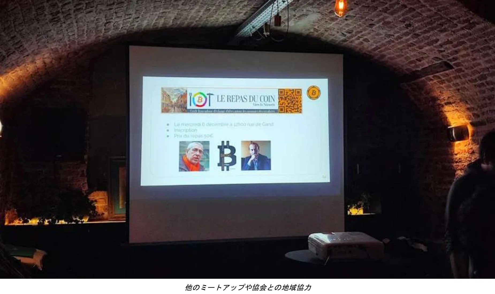

フランスでは、[@KonsensusFR](https://twitter.com/KonsensusFR)、[@bitcoinpointfr](https://twitter.com/bitcoinpointfr)、[@DecouvreBitcoin](https://twitter.com/DecouvreBitcoin)、[@btcmap](https://twitter.com/btcmap)のようなイニシアチブをフォローすることも関連するかもしれない。もちろん、これらは提案に過ぎず、各コミュニティは完全な分散化と自治のもとで、望むように自由に行うことができる。

前述したように、相互フォローの目的は相互の知名度を高めることです。ソーシャルネットワーク上であなたのコミュニティやあなたの地域／国のコミュニティを宣伝すればするほど、あなたのことを話す人が増える。より多くの人々があなたのことを話題にすればするほど、あなたのイベントに参加する可能性が高まります。

他のコミュニティからの投稿に「いいね！」やリツイートをすることは、そのコミュニティの発展やあなたの発展に大いに役立つ。

また、**meetup のオーガナイザーとコミュニティを運営するビットコイナー**が、年に 2、3 回ビデオ会議で集まり、各国のプロジェクトや関連コミュニティの進捗状況を確認することを提案することもできます。これは、直接会うイベント中に行うこともできます。

目的は簡単で、全員の意見を集め、コミュニティがどのように発展しているかを話し合い、成功したアイデアやプロジェクトを共有し、必要に応じて解決策を提案することです。会議の要約を文書にまとめれば、出席できなかったあなたの国のコミュニティ・オーガナイザーと後で共有することができます。

## Btcmap.org

<chapterId>365f43d4-7b2c-5961-a184-157b8c1a0116</chapterId>

この段階で、あなたのコミュニティはすでに立ち上がり、運営されています。あとは、より多くの関心のある人々を迎え入れ、その成長を助けるだけです。

しかし、**ビットコイナーが自分の近くのコミュニティやミートアップを見つけることができるプラットフォーム**があることを知らずに前進することはできません。だからこそ、これらのサイトに掲載依頼をするために数分かかることが重要なのです。

これらには次のようなものがある：

- [Btcmap.org](https://btcmap.org/)は、2つの地図を毎日更新しているウェブサイトです： **[Bitcoinを受け入れるビジネスの世界地図](https://btcmap.org/map)**と**[世界コミュニティ地図](https://btcmap.org/communities/map)**である。多くのビットコイナーは、旅行中であれ、日常生活中であれ、新しい人々に出会ったり、Satsを過ごす場所を見つけたりするために、これらのマップを定期的にチェックしている。Btcmapは世界的なリファレンスであり、そこにあなたのコミュニティを掲載することは、知名度を上げるために不可欠です。
- [ビットコイナーイベント](https://www.bitcoinerevents.com/)は、ビットコイナーによるビットコイナーのためのウェブサイトです。**あなたのコミュニティで開催予定のイベントを掲載することができます。しかし、フランスではまだあまり使われていない。**
- あなたの国によっては、他にもローカルな取り組みがあるかもしれません。例えばフランスでは、[Bitcoin.fr](https://Bitcoin.fr/events/categories/evenements/)があり、**毎月何十ものBitcoinイベントがリストアップされている**。もしあなたがまだツイッターで彼らをフォローしたり、あなたのコミュニティやイベントについての情報を共有するために彼らに連絡を取っていないのであれば、今がその時です！ **フランスのイベント・カレンダーを最新に保つために、すべてのフランスのBitcoinコミュニティが以下の習慣を身につけるとよいでしょう。**
    - 新しいコミュニティイベントが開催されるたびに、Twitterで@bitcoinpointfrに言及する。
    - テレグラム・グループに新しいイベント告知をピン留めする。

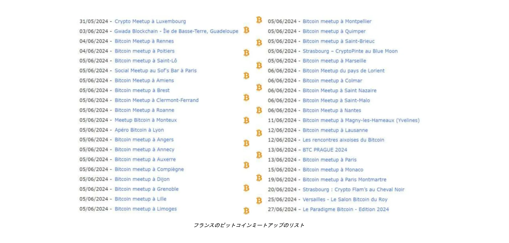

他のプラットフォームもあなたの知名度を高めることができます。 **Meetup](https://www.meetup.com/)**はその1つで、ウェブサイト（とスマホアプリ）でイベントを作成し、近くの仲間を見つけることができる。

月額約8ユーロ（または年間約90ユーロ）かかり、小規模で組織化されていないコミュニティにとっては高額になる。とはいえ、Meetupは一部の国、特にカナダとアメリカで広く使われており、登録管理には便利だ。

同様に、**[Orangepillapp](https://www.orangepillapp.com/)**は有料のモバイルアプリ（年間5万Satsまたは生涯アクセス20万Sats）で、ビットコイナーが出会うのを助ける。

最後の2つのプラットフォームは知名度を上げるのに役立つが、コミュニティを立ち上げる際にはお勧めできない。

**[btcmap.org](https://btcmap.org/)、[BitcoinerEvents](https://www.bitcoinerevents.com/)、フランスのコミュニティの場合は[Bitcoin.fr](https://Bitcoin.fr)に掲載することから始めれば十分です**。

おめでとうございます！あなたの**コミュニティは作られ**、**ビジュアルは準備され**、**目標は設定され**、**コミュニケーション・チャンネルは整えられ**、**ソーシャル・ネットワークは立ち上げられ**、**ビジビリティ戦略は決定された**。

少人数のビットコイナーが集まったら、次のステップです。

# Bitcoinミートアップの開催

<partId>c009d2a6-40ce-583b-bd24-fdfd1fea262e</partId>

## なぜコミュニティとの定期的なミートアップを立ち上げるのか？

<chapterId>ed8e471c-3b99-57e2-a042-2d4e8a40b137</chapterId>

コミュニティのソーシャル・ネットワークやコミュニケーション・チャンネルが立ち上げられた今、これらのプラットフォームで存在感を示す時です。新しいメンバーに自己紹介を促し、徐々に会話に加わってもらいましょう。

そうすれば時間が空くので、それを使ってミートアップのようなものを作ろうと考えることができる。コミュニティーの中で本当の興奮を感じ始めたら、これはさらに意味を持つようになるだろう。

先に述べたように、**Bitcoinのミートアップはコミュニティ**の次の「レベル」と見なすことができます。一方では、**メンバーが直接会うことを可能にし**、他方では、**このエコシステムに興味を持つ新参者を教育するのに役立ちます**。

このようなイベントは、あなた自身のスケールで、あなたの町で**Bitcoin**の話題を作ることができます。

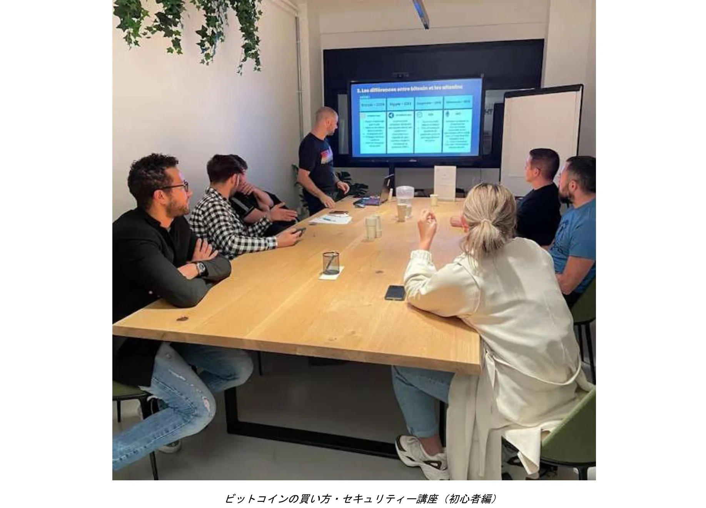

もちろん、地域開発の目標が大きければ大きいほど、あなたやメンバーはより多くの時間を投資する必要がある。

だからこそ、**ミーティングの達成可能な目標を設定することから始める**ことが重要なのです。

## 最初のミーティング：いつ、なぜ？

<chapterId>f3f8a614-cfb4-5994-a2e8-d56e6f8e3347</chapterId>

コミュニティを立ち上げてからわずか数週間でミートアップを立ち上げることができます。

しかし、その段階ではまだ少人数だろうから、誰も来ない可能性もある。

ミートアップを企画するのは、コミュニケーション・チャンネルに少なくとも数人、たとえば数十人のアクティブ・メンバーが集まってからにしたほうがいい。これはすぐに実現できますが、人々の性格にもよります。

その火花を感じたら、実際に会うことを提案する。他の人が興味を持ったら、あとは**初めて会う日を決めるだけです**。

自分で日程を決めるよりも、10日ほど前に、いくつかの候補日と時間**の投票**を行うのがベストです。こうすることで、出席率を最大化し、興奮を高め、時間を有効に使うことができます。

ミートアップがどのように展開するのか、何人が来るのか、どのようなトピックについて話し合われるのか、といった固定的な期待を持って参加しない方がよい。そうすることで、失望を避け、参加者がプレッシャーを感じるのを防ぐことができる。

お酒を飲みながらでもいい。必要であれば、議論が流れ始めたら、そっとBitcoinに話を戻すこともできる。

静かな時間を準備したいのであれば、次のようなアクティビティや話のネタをいくつか計画しておくとよい：

- パソコンやスマートフォンで**[Mempool](https://Mempool.space/)**を表示する；
- 本を持ってくること；
- **Nerdminer**、Bitaxe、FPGA、あるいはASICを持ってくる；
- Bitcoinのチラシを持っている；
- Bitcoinのビジュアルやロゴをあなたのコミュニティで考えてみませんか？
- [Bitcoinカードゲーム](https://www.Maximalist.ovh/accueil/20-game-le-Coin-de-table.html)；
- [btcmap.org](https://btcmap.org/) **コミュニティと商店の地図を表示する；**
- **ライトニング**を使用してBitcoinを送信または受信する。

ミートアップが始まったばかりのときは、正式なプレゼンをするタイミングではないことが多い。出席者が少ない場合は、オープンでカジュアルなディスカッションが最も効果的です。

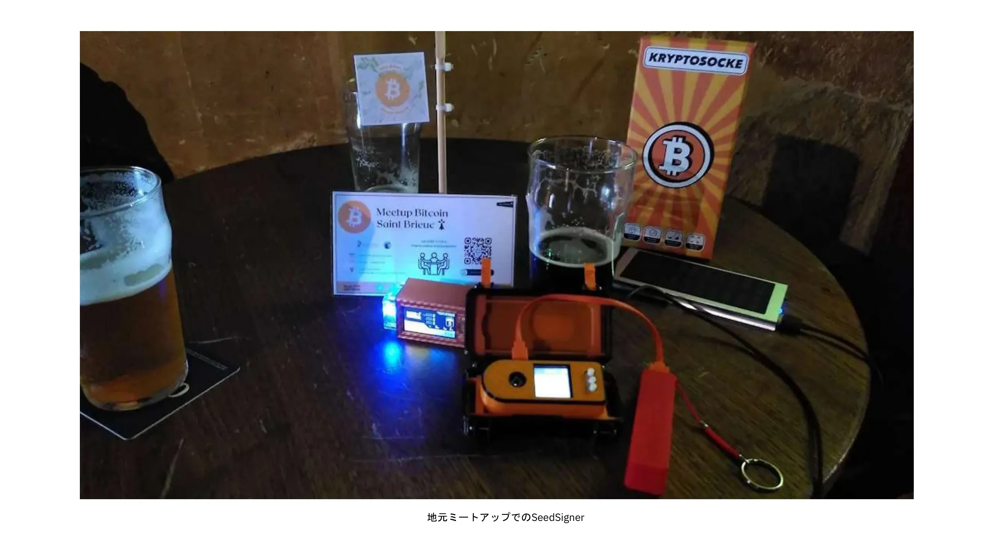

最初のミートアップが終わったら、おそらく次のミートアップを計画したくなるでしょう。コミュニティがまだ小さいうちは、月1回や2ヶ月に1回など、投票によって開催日を決め続けるのがベストです。コミュニケーション・チャンネルで話し合うことができます。

ビットコイナーや関心のある参加者の定期的なグループが形成された場合、2つの理由から定期的なスケジュールを設定することは理にかなっている：

1）誰もが前もって計画を立てやすくなる；

2) 「習慣」の確立に役立つ。誰かがあなたのチャンネルを定期的にチェックしなくなったとしても、ミートアップがいつ行われるかを知ることができ、いつも通り立ち寄ることができる。

この2つ目の点は、**フランスではほとんどのミートアップが毎月第一水曜日に開催される**理由の1つである（2022年に[DecouvreBitcoin](https://decouvrebitcoin.fr/)によって開始された「アンバサダー」イニシアチブを参照）。

ドイツとイタリアには、決まった建国記念日はない。

しかし、全国のミートアップが同じ日に開催されることは、一極集中の問題を引き起こします。近隣のコミュニティで開催されるイベントにビットコイナーが参加できなくなり、セキュリティ上の懸念も生じます。近隣のミートアップ主催者と話し合うことで、良い取り決めに合意することができます。

コミュニティが成長し、ミートアップに参加する人が増えれば、このようなことも可能になる：

- ミーティングごとに具体的な目標を設定する；
- あるいは、**毎月2つ目のイベントを追加する**こともできる。

最初のケースでは、全員の好みを念頭に置きながら、明確な目標を設定することで、参加者が何か新しいことを学んで帰ることを確実にし、会話をBitcoinに集中させることができる。

2つ目のケースでは、初心者向けセッションやワークショップ（Mining、ライトニング、ノード設置など）など、特定のテーマに特化した月例イベントを開催することができる。

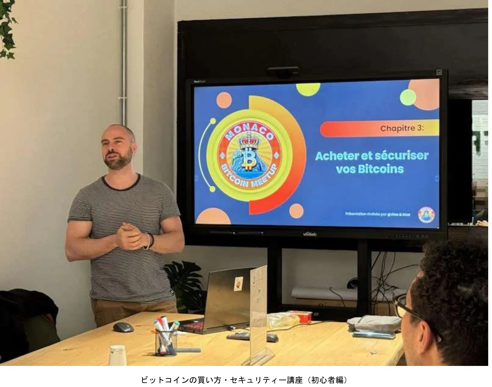

これには、** より多くの組織と、より多くのあなたの時間** が必要であることを心に留めておいてください。幸いなことに、[このコースのパート6/8](https://planb.network/courses/1c643dc9-a15f-4f9e-93b6-cb3c58b4ee35/3213d87a-1998-5972-ab93-97a5769ba279)では、再利用可能なオープンソースのリソースが紹介されています。

いずれにせよ、すべてはあなた自身、あるいはあなたの地域社会が設定した短期、中期、長期の行動計画にかかっている。

## 場所探し

<chapterId>405d389e-6a32-5777-af8d-293380d2e8fd</chapterId>

イベント会場を探すのは簡単なことではありません。その上、その会場が**あなたのコミュニティの都市**に位置していることが不可欠です。

考慮すべき基準はいくつかある：

1) **場所**：公共交通機関で簡単にアクセスできますか？車で？駐車場はありますか？

2) 会場は快適で、あまり**うるさくない**か？フォーマルなセッティング（コワーキングスペース、会議室）をお探しですか、それとももっとカジュアルなもの（バー、レストラン）をお探しですか？

3) ラグビーやチャンピオンズリーグの試合の夜でも、あなたを受け入れるだけのキャパシティがありますか？

4) プレゼンテーション用のビデオプロジェクターと静かな場所があるか。

5) 最後に、バーやレストランであれば、メニューは誰もが食べたり飲んだりできるものですか？

加えて、3つの重要なポイントを挙げておこう：

- まず、フォーマルな場所で集中力を高めるためのプレゼンテーションを行い、その後、バーやレストランに移動してリラックスした雰囲気の中で続きを行うというように、夕方から2部構成にする場合、経験上、途中で会場を変えると、休憩中に退席する参加者が出てしまうことが多いようです。そのため、このアプローチは推奨されない。
- 最初のミートアップでは、出席者は少ないだろうし、正式なプレゼンテーションも行わないだろう。その場合、オーナーに自己紹介したり、目的を説明したりする必要はない。しかし、**ミートアップが定期的に開催されるようになり、参加者も多くなってきたら、プロフェッショナリズムを示し、毎月**ミートアップに参加したいという意思を表明するために、自己紹介をする価値がある。そうすることで、様々な話（毎月の自動予約、フリードリンクやフードボード、割引、Bitcoinについての会話、Bitcoinの支払いの受け入れなど）ができる。もちろん、プレゼンテーションをするためにビデオプロジェクターのある会場を特に探しているのであれば、オーナーやマネージャーとミーティング（対面、または電話でも可）を行い、あなたのプロジェクトや目的を説明することが不可欠だと思われる。

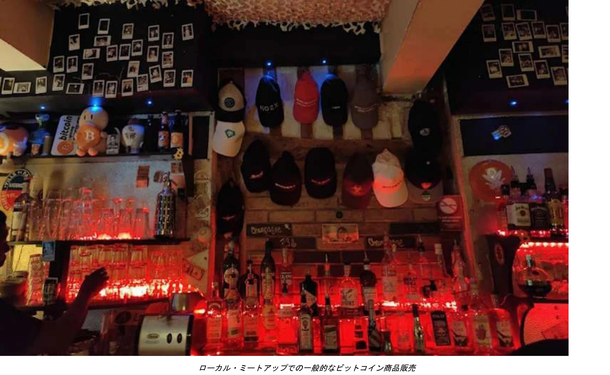

- 最後に、コミュニティによっては、**Bitcoinの支払いが可能な場所でしかイベントを開催したくない**という場合がある。このような場合、まず**あなたの都市**でBitcoinを受け入れている事業者を検索し（[btcmap.org](https://btcmap.org/map/)）、条件に合うかどうか問い合わせるのがよいだろう。適当なものがない場合は、新しいマーチャントのオンボーディングを試みることができますが、多くの拒否が予想され、落胆することがあります。そのため、最初からこれを目標に設定するのではなく、コミュニティが十分に確立され、十分な "火力 "ができてから検討するのがベストであることが多い。

また、ミートアップを立ち上げる際には、最初の数カ月間**会場を変えることをためらわないでください**。そうすることで、**さまざまなマネージャーと関係を築き**、さまざまな雰囲気を探り、将来のホスト候補に関する情報を集めることができます。

その後、グループが大きくなってきたら、午後の時間を使っていくつかの企業やバーを訪ね、毎月のイベントやミーティングを開催するのに適したスペースがあるかどうかを尋ねることもできる。

## ミートアップの前に

<chapterId>c5218943-580d-5efc-89ed-6b5d728816d6</chapterId>

数週間以内にミートアップを企画する予定ですか？

準備に役立つチェックリストはこちら：

1/ **会場の確認**

イベントを開催する場所に連絡し、出席予定者数分の場所を予約する。

2/ **イベントの告知**：

    - 日時と場所をソーシャルネットワークやその他のコミュニケーションチャンネルで共有する。必要であれば、登録リンクも掲載しましょう。
    - 専用のビジュアルを作成する（例えばCanvaのポスター、パート2/8「【Bitcoinコミュニティのアイデンティティをデザインする】(https://planb.network/courses/1c643dc9-a15f-4f9e-93b6-cb3c58b4ee35/b48a18cc-afdf-5216-802c-32647b5cd8a3)」を参照）。
    - TelegramとTwitterで告知をピン留めし、Discordで"@everyone "を使って言及することで、知名度を最大化する。
    - イベントの7～10日前に告知を行い、参加者が前もって計画を立てられるようにする。

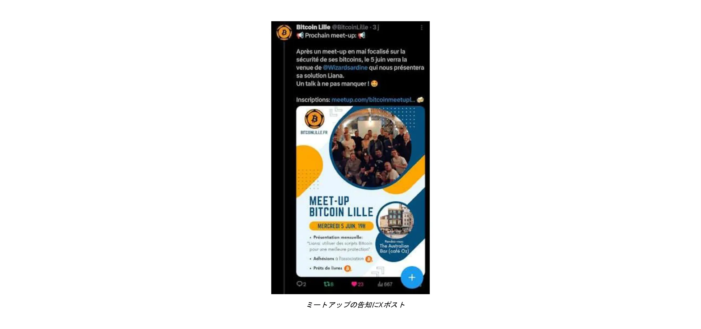

3/ **聴衆に注意を喚起する**。

イベントの2～3日前には、告知内容を再シェア、リツイートして認知度を高めましょう。

4/ **会場を更新**した。

前日（または前々日）には、登録人数を確認し、最終的な参加予定人数を会場に伝える。

イベントを際立たせるための特別なステップ

- チラシやポスターの印刷
- 特定のトピックに関するプレゼンテーションの準備
- アクティビティやワークショップを開催する

## ミートアップ当日

<chapterId>cf60067b-591f-5fdf-9b9e-d442aad0e8f9</chapterId>

大事な日がやってきました！イベント開始の1～2時間前に、コミュニティのコミュニケーション・チャンネルを通じてリマインダーを送ります。開始時刻を再確認し、BitcoinのTシャツとキャップを着用することを伝えるなど、参加者にあなたの見分け方を知らせましょう。

ミートアップが大きくなり、20人以上の参加者を迎えるようになると、会場の準備がますます重要になってくる。

こうすればいい：

1) **準備のため早めに到着すること。**

2) **ニーズと会場の可能性に応じてスペースをアレンジする。**人数が6人程度であれば、セッティングはほとんど必要ありません。しかし、参加者が10～20人になると、完全に着席したレイアウトでは交流が制限される可能性があります。そのような場合は、高さのあるテーブルがあれば間隔をあけて配置し、椅子を数脚（できれば高さのあるもの）用意する立食形式を選びましょう。プレゼンテーションが予定されている場合は、夜の大半はスタンディング・レイアウトを保ち、トークの直前に椅子を運びます。

3) 小さなカスタム・テイストを加える：

    - 入り口に場所を示すポスターを貼る（Patafixを使い、まず会場の許可を得る）。
    - Bitcoinをテーマにしたポスター（Bitcoinホワイトペーパー、コミュニティ憲章、現在のプロジェクトなど）を中に掲示する。
    - 例えば、Nerdminer、Hardware Wallet、Mempool、ASIC、Miner、プライベート・キー用の金属製バックアップ・プレートを展示したノートパソコンなど。

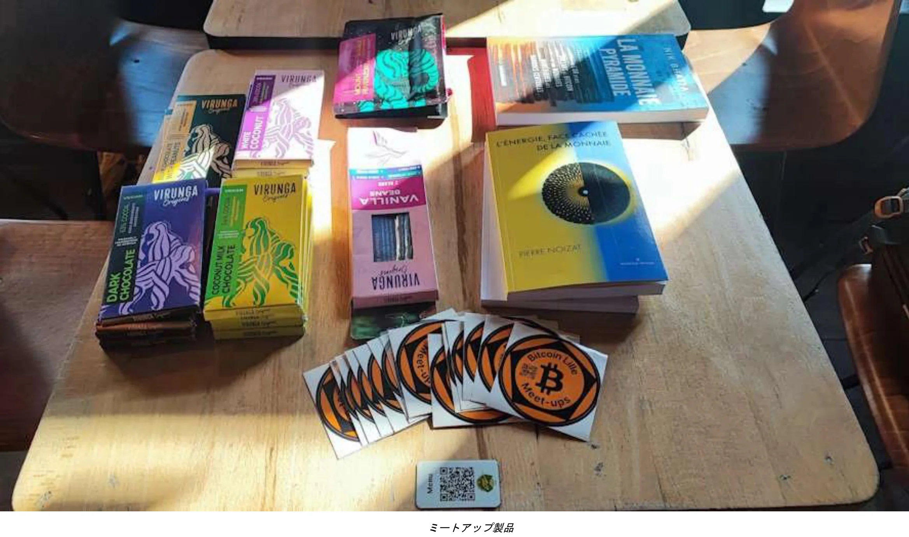

参加者が数人しか見込めず、会場のマネージャーとまだ関係を築いていない場合は、すぐにすべての機材を持ち込んで展示するのは避けましょう。信頼関係が築ければ、スペースを自由にアレンジできるようになります。

最後に、飲み物を持って、人が来るのを待ちましょう。覚えておいてほしいのは、最初に誰も来なくてもがっかりしないでほしいということだ。念のため、本やビデオを持参すること。

## ミートアップを終えて

<chapterId>3e881af9-9c09-5721-81ee-c5cda3b109c5</chapterId>

ミートアップが終わると、会場スタッフの後片付けの時間です。帰る前に、ウェイターやマネージャーを手伝ってあげましょう。グラスを1つのテーブルに集めたり、バーの近くなら帰る前にグラスを返すなど、簡単なことでいい。

家に帰れば、Bitcoinのことが何日も頭から離れないだろう。そのようなときこそ、地域社会の脈拍を測り、参加者からフィードバックを集める絶好のチャンスです。できます：

- コミュニケーション・チャンネルにお礼のメッセージを掲載し、イベント中に紹介されたリンクやリソースを共有しましょう。
- 参加者に次回のミートアップのための改善点を提案してもらう。
- 次のイベントの計画を始めましょう。

その後数週間は、次回のミートアップをより良いものにするための斬新なアイデアやビジュアル、プロジェクトを開発する時間が与えられる。

## 参加者の参加と維持の重要性

<chapterId>f5355e35-4b07-527c-88a3-8535cba7592c</chapterId>

ローマは一日にして成らず。Bitcoinをめぐる勢いは、定期的なミートアップやイベントの開催から生まれる。

そのためには、あることが不可欠だ： **それは、参加者を惹きつけておくこと**である。

熱狂的なビットコイナーからなる少人数のグループで、定期的に集まって Bitcoin について語り合うことが目的です。時間が経つにつれて、各人の都合や興味に応じて、特定の組織的な仕事をグループで分担**したり、特定のプロジェクト**を担うコアメンバー**を招待したりすることができます。これらのプロジェクトは、あなたのコミュニティ、あなたのミートアップ、あなたの都市に特有なものであってもよいし、[このコースのパート6/8](https://planb.network/courses/1c643dc9-a15f-4f9e-93b6-cb3c58b4ee35/3213d87a-1998-5972-ab93-97a5769ba279)で提案されている多くのイニシアチブに触発されたものであってもよい。 **これはコアメンバーのCommitmentを育てるだけでなく、コミュニティの成長と繁栄にも役立ちます。

以前のサイクルでBTCやアルトコインを購入した人、理解を深めたい技術愛好家、あるいは、この無条件で信頼できる第三者なしに機能する、補償不可能で分散化された透明で公正な決済システムに興味を持つ全くの初心者など、ミートアップが進むにつれて新しい顔ぶれが現れるだろう。

誰もがイベントに参加していると感じられるようにするには、2つの重要な側面に焦点を当てましょう：

- 社会的包摂：参加者全員が歓迎されていると感じること。初対面の人に挨拶し、来た理由を尋ね、他の人に紹介する努力をしましょう。参加されていると感じれば、また来てくれる可能性が高まりますし、今後のイベントの運営を手伝ってくれるかもしれません。
- **忍耐と開放性**：これには時間とやる気が必要だ。もしあなたが献身的なクソコイナー（あるいはもっと悪いのはXRP Maximalist）と話しているなら、彼らを否定したくなるかもしれない。しかし、会話に参加することで、誤解や欠陥のある推論を解くことができるかもしれない。もし彼らが耳を傾けてくれるなら、Bitcoinを真に理解する準備ができているかもしれない。

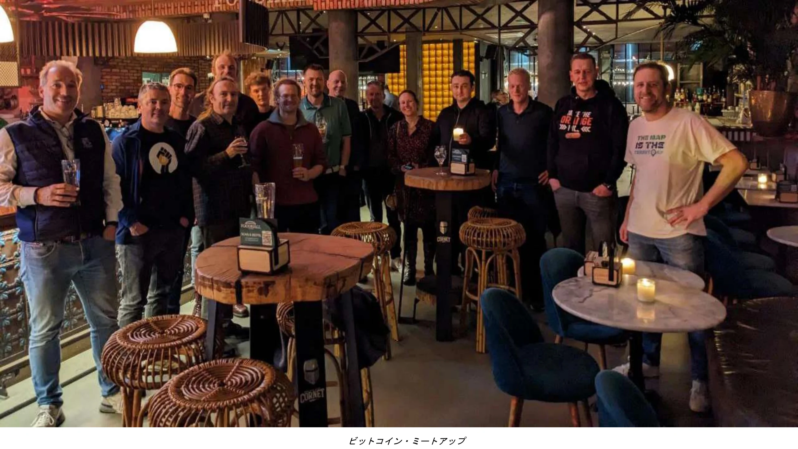

現実的な観点から、イベント全体の経験について考えてみましょう：

- 会場は快適でしたか？
- アクセスは簡単でしたか？
- 申し込んでも来ない人がいたのはなぜですか？
- どのようなディスカッションが行われましたか？初心者には専門的すぎましたか？
- ディスカッションはアルコールが強すぎたのか？

参加者にはそれぞれ個性があり、目標があり、興味がある。しかし、会場が適切で、参加者がオープンマインドで、参加者の意図が本物であれば、ミートアップが成功する理由はいくらでもある。

ミートアップの構築には時間がかかるが、何よりも組織が必要だ。それは人間のプロジェクトであり、よく計画され、オープンで包括的であってこそ、長期的に機能し、成長する。

最終的に、どこまで「オープンで包括的」であるべきかは、あなた次第だ。ただ覚えておいてほしいのは、クソコイナーは往々にしてビットコイナーになりかけているということだ。

# プロジェクトとイニシアチブの例

<partId>45b3bc40-1c31-583e-8411-2662e6efd765</partId>

## なぜビールを飲むだけでなく、さらに踏み込むのか？

<chapterId>3213d87a-1998-5972-ab93-97a5769ba279</chapterId>

ブロックを重ねるごとに、コミュニティは進化していきます。Bitcoinのエコシステムを発展させ、メンバー間の絆を深めること。

実施可能なプロジェクトやイニシアティブは数多くある。この章では、コミュニティ内やミートアップで実施できるアイデアを、網羅的ではない形でリストアップしています。あなたのインスピレーションを刺激するものを自由に選択し、あなた自身のアイデアをこのコースに[GitHubで「Pull Request」をすることで](https://github.com/PlanB-Network/Bitcoin-educational-content)貢献することもできます。

その前に、先に述べた点をもう一度確認しておこう。

Bitcoinを開催すると、新しい出会いがある。社交的な交流は不可欠であり、ビール（あるいはアルコール全般）は祝祭的な雰囲気を作り出すのに役立つ。しかし、心に留めておく価値はある：

- アルコールは思考力や理解力といった認知能力を低下させるため、参加者は真剣な議論やプレゼンテーションについていけなくなる。
- 毎月、友人たちと「Bitcoinのひととき」をお酒を飲みながら分かち合う。しかし、ビールを飲むことが本当にミートアップの主な目的なのでしょうか？それとも、Exchangeを研究し、他の人たちから学び、新しい人たちがBitcoinを発見する手助けをしたいですか？

人にはそれぞれの好み、信念、個性がある。これは、あるミートアップを他のミートアップより優劣をつけるものではない。それでも、世界を変えようという話をするのはビールを飲みながらであることが多いが、革命はそのようには始まらないし、成長もしない。

重要なのは、単にそれを意識することだ。

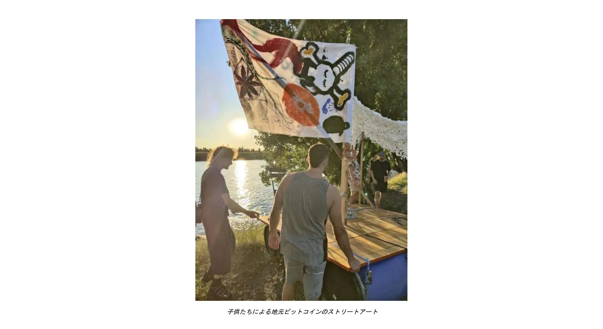

## 年間を通じたテーマ別ミーティングを開催する。

<chapterId>46afdbcc-a775-5c16-b20a-34956690d58f</chapterId>

10人前後のコア・グループができたら、各イベントにプレゼンテーションを加えることができる。事前に発表したテーマに沿ったものでも、まったく独立したものでもよい。

プレゼンテーションやワークショップを計画する際には、明確で構造化された進行を作ることが役立ちます。その目的は、Bitcoinの核となるコンセプトを一歩ずつ説明し、参加者に多角的な視点からトピックを完全に理解してもらうことです。

フランスでは2023年の夏、ミートアップの主催者たちが**年次進行**に取り組んだ。

教育的価値が高いだけでなく、このアプローチにより、オープンソースの文書やスライドデッキをグループ間で共有することが可能になり、リソースの共有ライブラリーが徐々に構築されていく。このイニシアチブは好評を博しており、今後数年で成長する予定である。

以下は、2023-2024年のフランスのミートアップの進行状況です。それぞれのテーマについて、オープンソースのプレゼンテーションとビデオが用意されているので、自分のイベントで取り上げられるトピックのアイデアを得ることができるかもしれない。

Bitcoinティーチング・ツールボックス](https://planb.network/fr/resources/bet)にも編集可能な教材があります！

| Month | Theme | Video | Editable Resource |
| -------- | -------- | -------- | --- |
| September     | Chapter 1: What is Bitcoin?     | [	YouTube link](https://www.youtube.com/watch?v=CSjuBqrl4t8)     | [Editable PowerPoint](https://www.canva.com/design/DAFu0d5Jd7M/9gAWDAOSS6LDkWENuZjYgw/edit) |
| October & November| Chapter 2: Understanding Bitcoin Transactions     | [YouTube link](https://www.youtube.com/watch?v=inFnR-3NsdM)     | [Editable PowerPoint](https://www.canva.com/design/DAFsEcnOro8/Mz9FYdTGhsvozZOe0Y9jtw/edit) |
| December     | Chapter 3: Understanding the Lightning Network     | [YouTube link](https://www.youtube.com/watch?v=hHz-ALx8D9w)     | [Editable PowerPoint](https://www.canva.com/design/DAF4YPSNnR8/HKp4Vmcno8eMtVWnZmFtcw/edit) |
| January     | Chapter 4: What is Mining?     | [YouTube link](https://www.youtube.com/watch?v=QyHZ3CVI_OI)     | [Editable PowerPoint](https://www.canva.com/design/DAF5DE6iBEM/tsy8E3oBebUnsR0kj53vvQ/edit) |
| February     | 	Chapter 5: Running a Bitcoin and Lightning Node    | [YouTube link](https://www.youtube.com/watch?v=RRYK-usg-OY)     | [Editable PowerPoint](https://www.canva.com/design/DAF55FU6HI0/sQ0lacRJblqrhn_9Xk1yDg/edit) |
| March     | 	Chapter 6: Using the Lightning Network in Daily Life    | [YouTube link](https://www.youtube.com/watch?v=o2BS4xjei8M)    | [Editable PowerPoint](https://www.canva.com/design/DAGAcJMw7lw/-haMNnHnwj5vpDAy8MDowA/edit) |
| April & May    | Chapter 7: Securing Your Bitcoins      | [YouTube link](https://www.youtube.com/watch?v=fHExPbhM0Hg)    | [Editable PowerPoint](https://www.canva.com/design/DAGDz3Nq4e0/D3uG-4w9FN6OhUq-VXzhfg/edit) |
| June     | 	Chapter 8: What is Multi-Sig?     | [YouTube link](https://www.youtube.com/watch?v=Me5489mpoxA)     | [Editable PowerPoint](https://www.canva.com/design/DAGLMtQT6sg/rYIxr4ldUJ0jTelNf-Pj8Q/edit) |
| July     | 	Chapter 9: Understanding the Bull Run and How to Prepare    | [YouTube link](https://www.youtube.com/watch?v=7RA-gnCJWyM)     | [Editable PowerPoint](https://www.canva.com/design/DAGJQkiZ_YA/9lUluP9RZ0eeA_e61mk9Hw/edit) |
| August     | Chapter 10: The Taxman is Never Far Away   | [YouTube link](https://www.youtube.com/watch?v=oY4NwonGDm0)     | [Editable PowerPoint](https://www.canva.com/design/DAGQhx7Yc_c/7mRhb_vlgnhSgxd1FtjK8w/edit) |

第2章と第7章は、参加者に負担をかけないように、2つの短いプレゼンテーションに分けることができる。しかし、これらを1つのセッションで行うことで、近隣のグループとの合同ミートアップ、クイズ、ワークショップなどの特別な活動のためのスペースをカレンダーに空けることができる。

**これらのリソースを使用、翻案、共有することは自由ですが、原作者の作品を再利用する場合は、必ず原作者のクレジットを明記してください**。

全員が毎回ミーティングに参加するわけではないので、プレゼンテーションを録画してストリーミング・プラットフォームやウェブサイトにアップロードするのは良いアイデアだ。こうすることで、欠席者が遅れを取り戻したり、参加者が後で資料を見直したりすることができます。

並行して、以下のようなテーマ別のミートアップを開催することもできる：

- Bitcoinの知識クイズ（賞品はHardware Wallet）
- 路上でノーコインの人々に無料でサトシを送るオンボーディング・チャレンジ
- Bitcoinに関連する製品を紹介する専門家または企業を招聘する。
- Bitcoinが使えるバーやショップのナイトツアー

その他にも、あなたの想像力次第！

## サイドイベントやワークショップを開催

<chapterId>9dbd651a-8712-5630-90b3-b9525dcc1385</chapterId>

あなたの都合や地域社会への関与の度合いに応じて、年間を通じて以下のような追加行事を計画することができる：

- 5月22日の**ピッツァの日**のためのレストラン・ナイト
- 次の**Halving**を祝う夜または週末
- Le Coin de Table](https://www.Maximalist.ovh/)や[SHAmory](https://shamory.com/)のようなゲームを使って、Bitcoinとその仕組みについて家族で**ゲームナイト**をする。
- さまざまな種類のハードウェア（CPU、GPU、FPGA、ASIC、Nerdminer、Bitaxe）を紹介する**Miningワークショップ**。
- テーマに沿ったワークショップを行う、**初心者のための午後または夕方の時間**。
- 近隣地域との**合同ミートアップ**。

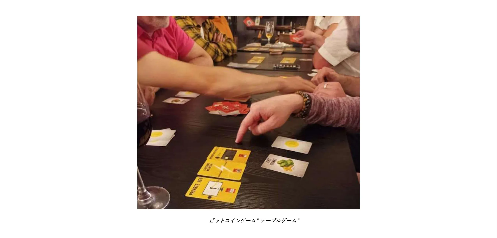

ただ、カレンダーの詰め込みすぎには注意してください。ひと月にたくさんのイベントを開催しすぎると、主催者が燃え尽きてしまったり、時間の経過とともに参加者が減ってしまったりする可能性がある。

## ステッカーの作成

<chapterId>d605f3b3-130e-513d-85e6-06bc5ea13e99</chapterId>

ステッカーは、Bitcoinとあなたのコミュニティの両方を宣伝し、あなたのアイデンティティを強化する楽しい方法です。

ご注文の前に、以下のヒントを心に留めておいてください：

- 屋外で使用する場合は、ステッカーが防水加工されていることを確認してください。
- レーザー切断時の切り抜き問題を避けるため、ロゴは切断範囲より少し小さめにしてください。
- 印刷品質を高めるために、ラスター画像ではなくベクターファイルを使用してください。
- 適切なサイズをお選びください：直径8cm（大人の手のひらサイズ）は視認性が高く、4cmは控えめです。視認性を重視しますか？
- リッチブラック印刷（「クワッドブラック」）には、シアン30％、マゼンタ30％、イエロー30％、ブラック100％を使用する。100％の黒だけを使うと、灰色がかった色調になることがあります。プリンターはこの点をチェックすることが多いが、知っておいて損はない。

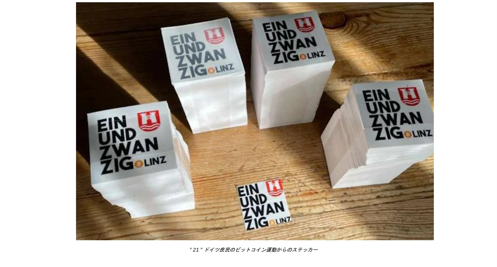

あなたのニーズやサプライヤーにもよりますが、1,000枚のステッカーは100€から250€の間です。マーケティングを専門とするフランスのビットコイナーである[@Mill3sim3 on Twitter](https://x.com/Mill3sim3)に連絡すると、標準的なオンライン業者よりも最大30%安い価格を確保できることがある。

とはいえ、1,000枚のステッカーは多い。全部配れるかどうか確認するために、普通は100枚くらいから始めた方がいい。

重要 **公共スペースにステッカーを貼る前に、地域の規制を確認してください。**

フランスでは、ステッカーは公共の掲示板にのみ貼ることができます。それ以外の場所（例えば一時停止の標識など）に貼ると、あなたやあなたのミートアップにリンクできる場合、おそらく撤去され、場合によっては罰金を科されることになります。このことをメンバーに伝えてください。

コンサート、バー、スタジアムなどの私的な会場では、自分のステッカーを貼る前に、すでにステッカーが貼られていないか確認すること。ない場合は、スタッフに許可を求めましょう。あなたのコミュニティに対する事業主の第一印象が、あなたがそのスペースを破壊したと思われるのは避けたいものです。

## ライブラリーを作る

<chapterId>acc94093-f8b3-51b8-9359-348e9e075d38</chapterId>

もうひとつのプロジェクトは、**ミーティングでのライブラリー作り**です。

読書を共有したい参加者に、Bitcoin関連の本を持ってくるよう呼びかけるのもいいだろう。もし、ミートアップの参加者の中にそれを借りたい人がいれば、Exchangeの所有者に保証金、例えばライトニング経由で21,000サトシを支払うことで貸し出しが可能だ。

オーナーにとって、この保証金は紛失や盗難の可能性をカバーするのに役立つ。借り手にとっては、将来、保証金を受け取るためにミートアップに戻ってくるインセンティブとなる。

もしあなたが協会を運営し、資金の一部を教育リソースに投資したいのであれば、**Bitcoinライブラリー**に提供するために数冊の本を購入することもできます。

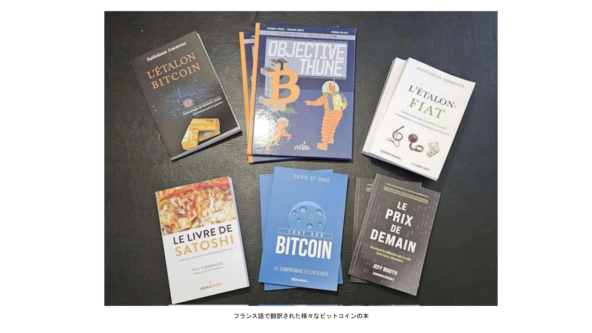

エコシステムを支援するため、**[出版社コンセンサス・ネットワーク](https://konsensus.network/)は、2023年後半から、国際的なBitcoinのミートアップやコミュニティに対し、3冊以上の注文に限り、すべての書籍を15%から35%割引で提供している**。

この割引を利用するには、**ツイッター**で[コンセンサス出版社](https://twitter.com/KonsensusFR)に連絡するだけでよい。

現金がなくても、コミュニティーのメンバーに割引を伝えることができる。

自分に資金がない場合でも、割引をメンバーに渡すことができる。例えば、一人のオーガナイザーがメンバーから注文を集め、割引価格で一括発注し、次回の例会で本を配布し、その際に代金をライトニングで徴収することができる。

また、初めて会う人に貸出ルールを明確に説明するために、貸出憲章を会合に掲示することもできる。

ここにオープンソースの例があるので、それを参考にすることができる：

[貸本チャーター](https://www.canva.com/design/DAF7u1b5kRM/r2gEAlibe_jTIXIX-O9PMA/edit)

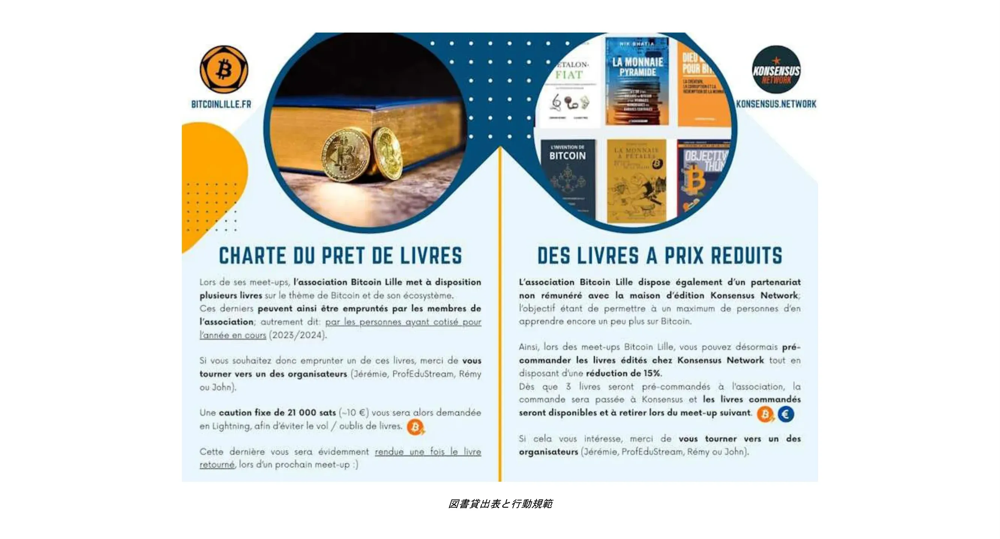

最後に、Bitcoin関連の本を読むことを奨励するために、**地元の市立図書館**を訪ねて、Bitcoinに関する本があるかどうか確認するのもいいだろう。

もしそうであれば、図書館員にそのトピックに関する**ラウンドテーブル**が計画されていないか尋ね、あなたのミートアップの連絡先を提供する。

そうでない場合は、事前に選んだリストから数冊を入手するよう勧める。出版社コンセンサス・ネットワーク](https://konsensus.network/)は、インスピレーションの源となる。

## パーソナライズされたチラシの作成と配布

<chapterId>62ad5430-c698-51b3-89ac-090f31c88953</chapterId>

チラシのデザインや作成には時間がかかるが、その価値はある。

これらのチラシはターゲットを絞ることができる：

- 加盟店の皆様、Bitcoinを決済手段として導入される場合は、以下の点にご注意ください；
- Bitcoin/Lightningの利用方法と支払い方法を説明するチラシを手にするイベント参加者；
- Bitcoinの主な利点を強調したチラシを手に、街で、職場で、あるいは家族の集まりで出会った初心者たち。

また、あなたのコミュニティやミートアップに特化したチラシをデザインし、活動内容、目標、ソーシャルメディアへのリンク、コミュニケーション・チャンネル、今後のイベントなどを紹介することもできる。

いくつかのチラシは、planB.networkの[Bitcoin Teaching Toolbox](https://planb.network/fr/resources/bet)ですでにオープンソースとして入手可能であり、今後も追加される予定である。

一例として、Bitcoinを使う21の理由が書かれた[完全なソースのチラシ](https://profedustream.substack.com/p/21-raisons-dutiliser-Bitcoin)がある。そのデザインも[オープンソースで入手可能](https://www.canva.com/design/DAFtAR1NauQ/ZDwl2CchIJ9Gpb36N6-7iw/edit?utm_content=DAFtAR1NauQ&utm_campaign=designshare&utm_medium=link2&utm_source=sharebutton)であり、あなたが修正・翻案して共有することができる。出典のクレジットをお忘れなく。

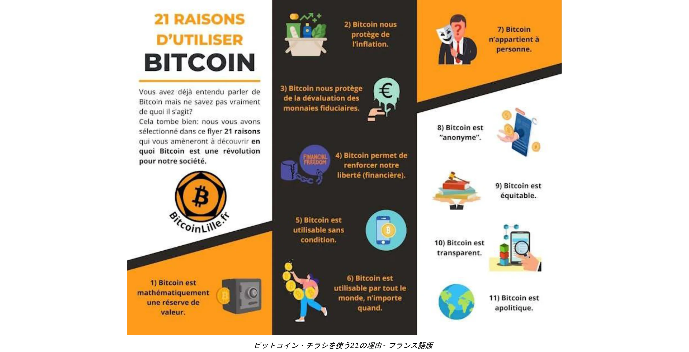

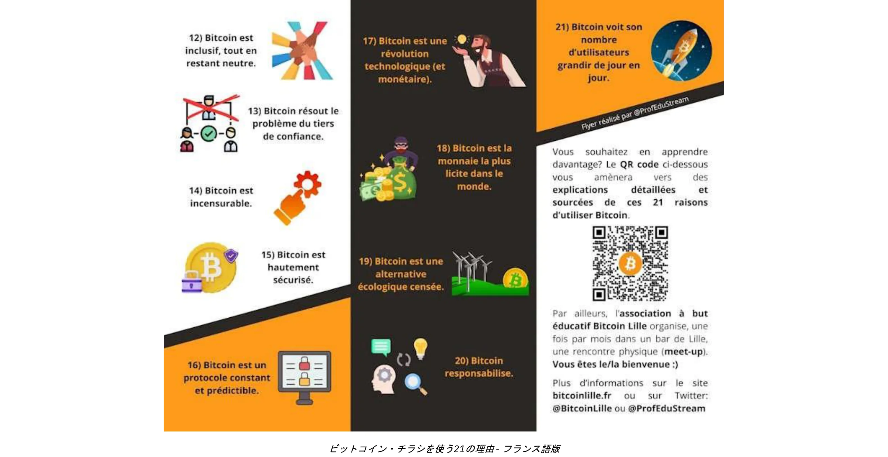

前述したように、これらのチラシは、職場の共有デスク、家族の食卓、公共図書館など、ほとんどどこにでも置くことができる。

フランスや他のいくつかの国では、人々が自由に本を寄付したり借りたりできる小さな木箱「ブックボックス」もある。そこにチラシを置いてもいいし、本を置いてもいい。

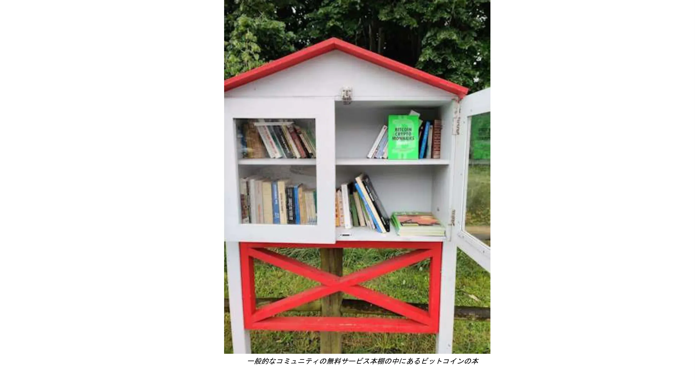

2023年、**「Bitcoin フランスの本箱に白書を**」という取り組みが始まった。

このプロジェクトを実施するために、参加者はまず国内のすべての本箱の所在地を収集しなければならなかった。この目的のために、いくつかのデータベースが存在する：

- [boite.a.livres.zonelivre.fr](https://boite.a.livres.zonelivre.fr/)；
- [boites-a-livres.fr](https://www.boites-a-livres.fr/carte-de-france)；
- [delivrez.fr](https://delivrez.fr/maps/fr_FR/)；
- その他地元紙記事

Bitcoinの白書を残すことは象徴的ではあるが、初めての人には複雑すぎて理解できないことが多い。その代わりに考えたのが、小さな冊子を作ることだった：

- Bitcoin、その使用法、そしてそれが解決する問題について、わかりやすく、十分な情報に基づいて紹介している；
- フランス語に翻訳されたBitcoin白書。

こちらは【フランスのビットコイナーたちの間で共有されている小冊子】(https://profedustream.substack.com/p/Bitcoin-la-naissance-dune-nouvelle)で、国中の何十もの本箱に置かれている。そのデザインは[オープンソースとしても利用できる](https://www.canva.com/design/DAFs18FSoVM/Sy0QsfUkycTgXveeGgutBg/edit?utm_content=DAFs18FSoVM&utm_campaign=designshare&utm_medium=link2&utm_source=sharebutton)。

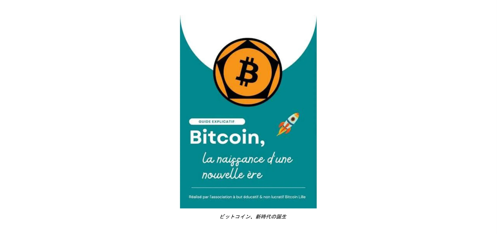

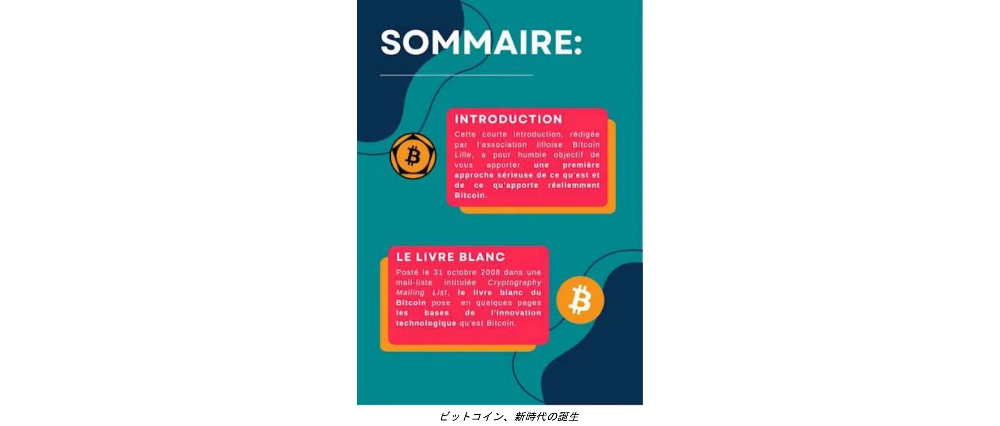

## ビデオプロジェクションの制作

<chapterId>892b248a-b837-5df6-aac9-4b3261ff0390</chapterId>

ほぼすべてのビットコイナーは、おそらく[Rémi Forte](https://twitter.com/forteremi)の魅力的なシリーズ中編「Le mystère Satoshi, aux origines du Bitcoin」（Satoshiの謎：Bitcoinの起源）を見たことがあるだろう。

2021年にリリースされ、[YouTubeで数百万回再生されている](https://www.youtube.com/watch?v=0ETcLj5jBy4)。

ひとつのアイデアとして、地域のために『Satoshiミステリー』の上映会を企画し、おそらく毎月の臨時イベントとして開催することもできるだろう。

注意：アルテ・フランスは一般上映が許可されていることを確認しているが、合法的に上映を行うには映写権を支払う必要がある。2023年、この費用は上映1回につき約250ユーロ、1年間に少なくとも5つのミートアップが上映した場合は1回につき120ユーロだった。

このドキュメンタリーはすでにARTEのYouTubeチャンネルで無料で見ることができる。

もちろん、他の予想も可能だ。

例えばフランスでは、**監督である[アラナ・メディアヴィラ](https://twitter.com/AlanaMediavilla)が、2024年に公開予定の映画[映画『汚れたCoin』](https://www.dirtycointhemovie.com/)の映像を含む彼女のドキュメンタリー『Stranded』**を試写する権利を地元のミートアップに与えた。

何人かのビットコイナーは、率先して『Stranded』をフランス語に完全翻訳し、字幕をつけ、全国のミートアップで共有した。2024年3月4日の週には、全国で開催された12のミートアップで同時に上映された。

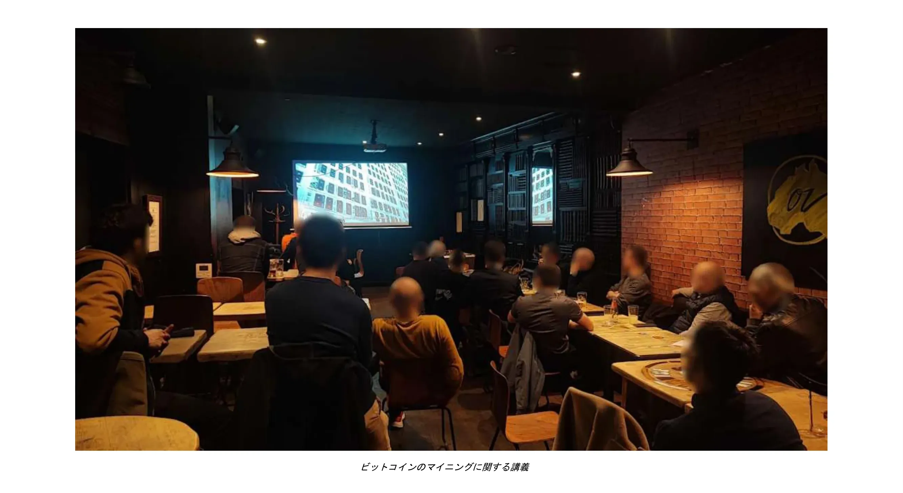

このイベントは、Bitcoin Mining、そのエネルギー消費、そしてより広範な環境への影響について活発な議論を巻き起こした。

## あなたの街にポスターを貼る

<chapterId>6565e8a0-d535-5be0-9764-273584c675bd</chapterId>

ヨーロッパのいくつかの国（ドイツ、スペイン、フランスを含む）では、ビットコイナーたちが率先して街のあちこちにポスターを貼っている。

バンクシーのアートにBitcoinのロゴを入れたデザインもある。

その一例が、数年前からコラージュやストリートアートを制作しているドイツのビットコイナー、[StreetCyberArt](https://twitter.com/streetcyber_art)だ。

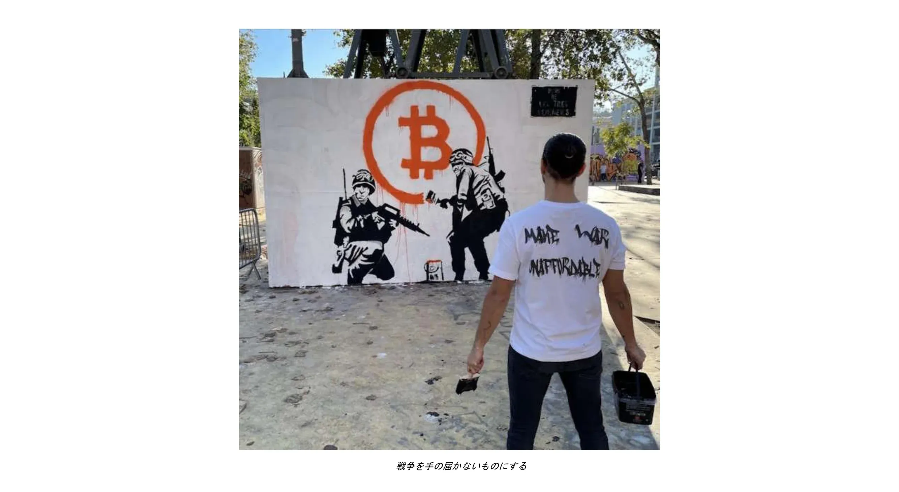

街頭でのポスター掲示を希望する場合は、その国の法律をよく理解しておくこと。例えばフランスでは、ポスターは公共の掲示板にのみ貼ることができます。その他の場所では、完全に禁止されており、罰金で罰せられます。

もし、「現行犯」であることがバレないように、限界に挑戦することに決めたら、ポスターに個人を特定できる情報（ミートアップの名前や@Twitterなど）を載せないようにすること。

また、これらのポスターを個人のプリンターで印刷すると、通常、インクがにじみ、屋外では急速に劣化することに注意してください。最良の方法は、屋外用に設計された特殊な自己粘着性の用紙で、品質と耐久性の両方を確保しながら制作できるプロの印刷業者に依頼することだ。

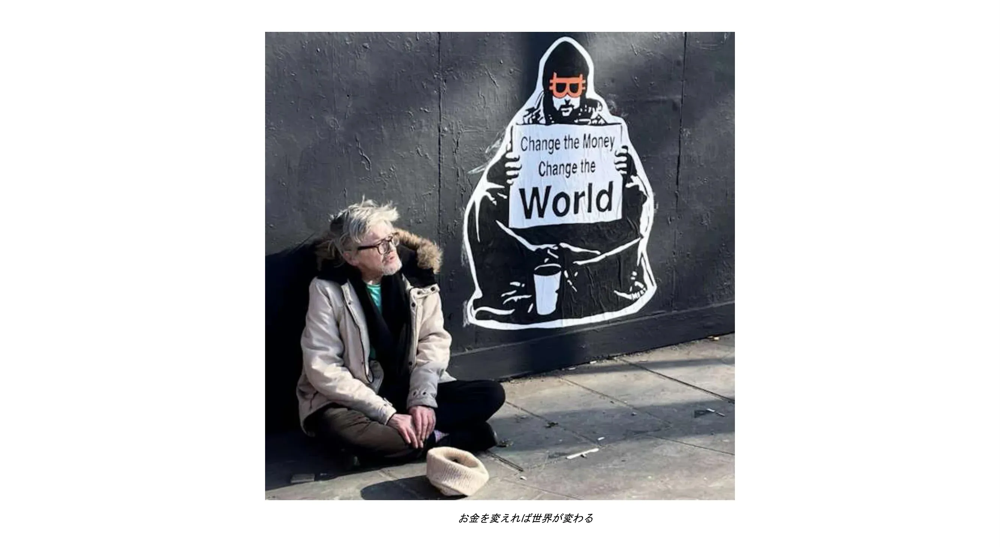

この取り組みは、ポスター1枚あたり0.40ユーロ（100枚で約40ユーロ）以上の費用がかかり、オンライン価格はその2倍から5倍と幅がある。良い人脈が不可欠である。

前述したように、フランスのビットコイナー[@Mill3sim3](https://twitter.com/Mill3sim3)は適切なプロ用機材を持っており、詳細については連絡を取ることができる。

あるいは、よりDIY的な方法として、大きな厚紙でステンシルを作り、スプレー塗料を使って街中の特定の場所にデザインのタグを付けるという方法もある。

## パーソナライズされたNFCカード

<chapterId>8ad65d4e-a68a-59c2-a812-85f4907ed9f3</chapterId>

もうひとつのオリジナル・プロジェクトのアイデアは、ライトニング決済（BoltCard規格に対応）用のパーソナライズされたNFCカードを作ることだ。これにはスイスのBitcoinペイが最適なパートナーだ。

[同社のウェブサイト](https://swiss-Bitcoin-pay.ch/cards)では、現在4つの標準デザインを提供している。

50枚以上のNFCカードを注文したい場合は、公式ウェブサイトまたは[Twitter](https://twitter.com/SwissBitcoinPay)を通じて同社に連絡し、カード表面のカスタムデザインを提案することができる。裏面は標準デザインのままとなる。

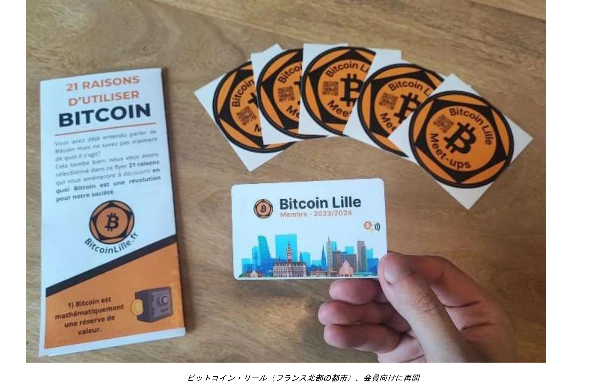

例えば、2023年、フランスの協会［Bitcoinリール］（https://twitter.com/BitcoinLille）は、カスタムデザインのNFCカードを一括注文した。各新メンバーは、その年のウェルカム・パックの中に1枚ずつ受け取った。このアイデアは、あなたのコミュニティにも簡単に適応させることができます。

これらのカードの単価は通常2.50ユーロから5ユーロで、注文の大きさや市場の状況によって異なり、数量が多いほど低価格になる。

## ウェブサイトの作成

<chapterId>9a2a1b9b-0633-544a-b331-c06187d23d7f</chapterId>

コミュニティが成長するある段階において、グループ、ミートアップ、イベント、教育コンテンツのショーケースとして機能するウェブサイトを持つことは価値があります。

ウェブサイトの構築には時間がかかりますが、以下のチュートリアルでは、わずか30分で無料のWordPressサイトを作成する方法を紹介しています。カスタマイズ可能なホームページを設定し、記事を公開し、YouTubeのビデオ、画像、PDFなどのメディアを埋め込むことができます。

その後、独自のドメイン名を購入したり、独自のサーバーでサイトをホストすることもできる。

:::video id=a1b25c18-5fc1-4b97-baef-816d819c9382:::

他のCMSプラットフォームも存在し、よりシンプルで初心者に優しいインターフェイスを持つものもありますが、通常、カスタマイズ性ははるかに劣ります。そのため、一般的にはWordPressが出発点として最適なのです。

WordPressはまた、コーディングのスキルを必要とせずにサイトの機能を大幅に拡張できる幅広いプラグイン（有料のものもあるが高品質）をサポートしている。その一例が、[プレミアムテーマ「Uncode」](https://undsgn.com/uncode/) です。

## ビデオチャンネルを作る（YoutubeまたはOdyssee）

<chapterId>076286db-1627-57ec-a410-c44b1666e1cd</chapterId>

コミュニティのメンバーの中には、チュートリアルビデオのようなマルチメディアコンテンツを作成したい人もいるかもしれません。

ミートアップや大学でプレゼンテーションをすることもできる。

**そのときが来れば、専用のビデオチャンネルですべてのコンテンツを公開し、一か所に集中させることができます。**

人気のあるプラットフォームは以下の通り：

- [**YouTube**](https://www.youtube.com/)。広く使われているが、検閲には強くない。
- [**Odyssee**](https://odysee.com/)はあまり人気がないが、ピアツーピア技術によって分散化されている。
- [**peertube**](https://joinpeertube.org/fr_FR)では、独自のビデオプラットフォームをホストすることができるが、セットアップはより複雑だ。

どちらを選ぶにしても、あなたのチャンネルを魅力的にするために、プラットフォーム特有のビジュアルをデザインしましょう。パート2/8](https://planb.network/courses/1c643dc9-a15f-4f9e-93b6-cb3c58b4ee35/3470a31f-0190-5e87-8af0-6a00e79267ef)で紹介したCanvaは、カスタマイズ可能な既成のデザインを備えた "YouTube Thumbnail "カテゴリを提供しています。

コンピューターからの**録画**には、[Streamlabs](https://streamlabs.com/fr-fr)が無料で、機能が豊富で、シーンのトランジションをサポートしている。

ビデオ編集には、**[Wondershare Filmora](https://filmora.wondershare.fr/)(約45ユーロ/年)が使いやすく、プロフェッショナルな結果を素早く得ることができる。**

ビデオのイントロとアウトロには、Canvaで適切なテンプレートを簡単に見つけることができます。好みのデザインにカスタマイズしてダウンロードし、編集ソフトに追加しましょう。

ヒント：Bitcoinが禁止されたり、検閲されたりした場合は、常にHardドライブに動画のローカルバックアップを取っておくこと。

## オーディオ・ポッドキャストを作成する

<chapterId>12e96b45-1c33-5687-a753-80d0114d487a</chapterId>

音声ポッドキャストも、アイデアを共有するのに最適な方法だ。ビデオチャンネルと同様、視聴者を増やすには時間がかかる。

人気のポッドキャスト・プラットフォームは以下の通り：

- [**泉**](https://www.fountain.fm/)、ライトニングの寄付に対応。
- [**サウンドクラウド**](https://soundcloud.com/)；
- [**ディーザー**](https://www.deezer.com/fr/)；
- [**Spotify**](https://open.spotify.com/)；
- [Google podcast](https://podcasts.google.com/)。

各プラットフォームにはそれぞれのオーディエンスがいるので、複数のプラットフォームで存在感を示すことは、あなたのリーチを広げることになる。 **[ポッドキャスターのためのSpotify](https://podcasters.spotify.com/)を使えば、一度ポッドキャストをアップロードすれば、generateでRSSフィードを他のプラットフォーム**に送ることができるので、これは簡単です。

つまり、"Spotify for Podcasters "での作業が終われば、あとは他のプラットフォーム用にコンテンツをフォーマットするだけであり、この作業は比較的短時間で済む。

録音には[Audacity](https://www.audacityteam.org/)が無料で、編集時に音声レベルを調整したり、フェードなどのエフェクトを加えたり、明瞭度を高めたりすることができる。あなたの声を録音し、プロ品質のポッドキャストを作成するのは簡単です。

Audacityを使ったポッドキャスト作成の要点を網羅した10分の短いチュートリアルです：

:::video id=67d80ac7-253f-40a5-b621-fef2fb7174bd:::

ヒントビデオと同様、将来の検閲に備えて、すべてのポッドキャストをローカルにバックアップしておきましょう。

## イベント用バッジの作成

<chapterId>0cccef8d-a765-5844-8921-c40f0ce653e4</chapterId>

ミートアップやイベントで、ちょっとしたインセンティブを導入することができます。このアイデアは、**その特定のイベント**でしか入手できないバッジを作成することです。このコンセプトは、他のブロックチェーンでは "POAP"（"Proof Of Attendance Protocol"）という名前で存在している。しかし、現在のところBitcoinにこれを実装する自由な方法はない。

このようなシステムは、コミュニティで最も活動的な会員に報酬を与えるためにも使えます。例えば、集めたバッジ1つにつき参加券1枚がもらえる年間抽選会を企画することができます。1年間に12回すべてのミートアップに参加したメンバーは、12枚の抽選券を持つことになります。

もっと伝統的な方法としては、各イベントの参加者に、参加理由とともにファーストネームかニックネームをバッジに書いてもらうという方法もある。

少し堅苦しいが、こうすることで、メンバーは共通の興味や会話のトピックを見つけやすくなる。

Bitcoinリール協会が使用しているバッジのテンプレートは、[Canvaのオープンソースで入手可能](https://www.canva.com/design/DAGHAsT15MU/AIA7-L_xBjNdsuxdD4-h-Q/edit?utm_content=DAGHAsT15MU&utm_campaign=designshare&utm_medium=link2&utm_source=sharebutton)。

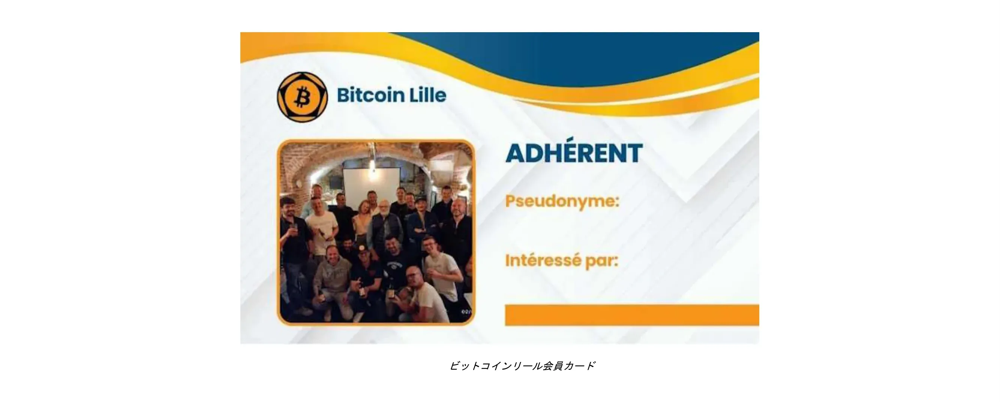

## 死亡時の引継ぎ計画

<chapterId>c5febf18-235c-51bc-8fbb-9467dabe4cb0</chapterId>

Addressのデリケートな話題、Bitcoinのコミュニティのメンバーの死去について。

ある日、元会員の家族から連絡があり、訃報を知らされるかもしれない。遺族は、故人があなたのコミュニティ、ミートアップ、または協会に連絡を取ることを含む指示を残したと説明するかもしれない。

場合によっては、遺族が相続の受益者として資金回収の助けを求めることもある。

地域社会と協力し、このような状況に対する明確な手順を事前に確立しておくことが賢明である：

- 故人はすでに家族に、**決して秘密鍵を共有したり、物理的な財布をミートアップに持ち込んだりしないように**と忠告している。
- Bitcoinがどのように機能するのかを学び、後に資金の主権を握ることができるようにするためだ。
- 家族は、贈与、相続、Bitcoinの不換紙幣への交換に関する自国の関連法を知っている。

標準的なプロトコルがあれば、メンバーであれゲストであれ、誰かがこの状況を利用して資金を盗むことを防ぐこともできる。

このプロセスを定義するために、専用のワーキンググループを作ることもできる。Bitcoinリール協会では、すでにそのような[文書](https://docs.google.com/document/d/1TDfLZjuictC5s3PEM2Z7WmkxIDSJ8Q1E4xevm52pVgU/edit?usp=sharing)に取り組んでおり、今後数ヶ月のうちにオープンソースとして公開する予定だ。

## 学校や大学で講義を行う

<chapterId>65efdb44-e3d4-567c-aedf-972765753d73</chapterId>

上記のプロジェクトのリストは、もちろんすべてを網羅しているわけではない。一般的に、これらはそのコミュニティやミートアップのための内部プロジェクトである可能性が高く、発展するにつれてかなり簡単に実装することができる。

では、オンボーディングに話を移そう。

ご存知のように、一度に多くの聴衆にリーチする最良の方法のひとつは、無料講演会を開催することです。これは大学やカレッジで行うことができ、Bitcoinをまったく知らない人であれ、理解を深めたい人であれ、若い人たち（そしてそうでない人たち）にBitcoinを紹介することができる。

何十人、何百人という聴衆を前に講演を行うには、技術的な専門知識だけでは足りません。必要なのは

- 人前で話すことへの自信
- 優れたストレス管理
- 明確なアーティキュレーション
- 強力な時間管理
- 聴衆のスキルレベルに合わせた、よく研究された質の高いプレゼンテーションまたはワークショップ

同様に重要なのは、**オープンマインドを保ち**、特に質疑応答やパネルディスカッションの中で、**コンセプトを単純化するタイミングを知ることです**。自分の主義主張を放棄することではなく、他の人が違う見方をしているかもしれないことを認めることです。ディスカッションを続けられるように、後で返事をしたり、放っておいた方がいいこともある。あなたの主張がしっかりとした、十分なソースのある論拠に裏打ちされたものであれば、人々はそれを認めるでしょう。

もし準備ができたと感じたら、頑張ってください！世界は、Bitcoinに関するより良い教育を切実に必要としている。

とはいえ、これは軽い仕事ではない。やる気と努力、そして適切な人脈が必要だ。

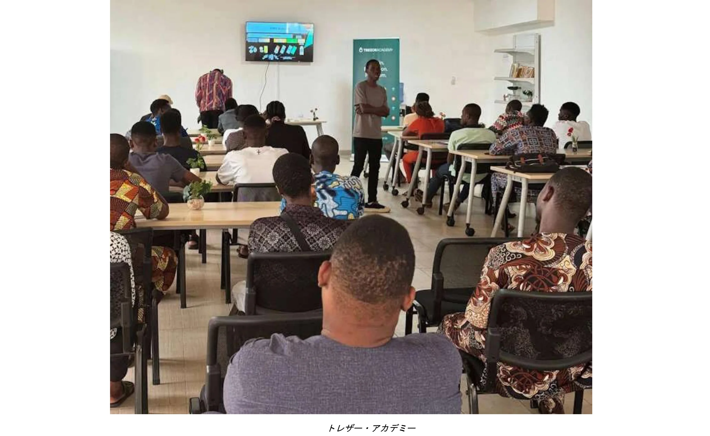

学校や大学での講義やワークショップの開催は、適切な連絡先を見つけることから始まる。それは以下のようなことだ：

- 個人的な知り合い
- 学生会館
- 講演会やイベントを主催する学生団体
- 工学部の元教授
- アカデミック・プログラム・コーディネーター（直接連絡する場合

最初のステップは、通常、あなたのイニシアチブまたは協会を紹介し、ミーティングを要請することである。最良のケースでは、数週間後に学生の前でBitcoinに関するプレゼンテーションを行うことになる。

残念ながら、Bitcoinはいまだに多くのメディアや政治家によって悪者扱いされており、教室にはふさわしくないと考える人もいる。特に、Proof of Workやエネルギー消費のようなトピックが論争の的となっている学界では、拒絶反応が一般的である。

それでもやってみる価値はある。そして、誰にもわからない。たとえ最初の試みが「ノー」であったとしても、次回のブルラン中に、例えば280人の学生に話をするよう誘うメールを受信トレイで見つけるかもしれない！

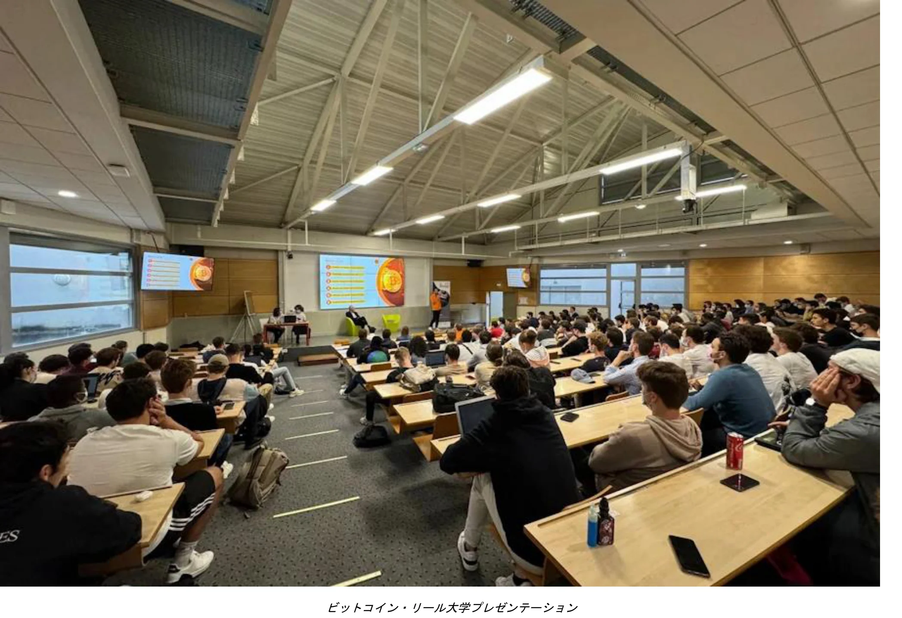

## 企業へのアプローチ

<chapterId>b730462b-7928-5d28-a14f-9ceaa773d3d2</chapterId>

多くのビットコイナーにとって、Bitcoinを使えるようになることは、ポケデックスでレアなアチーブメントをアンロックするようなものだ。

各加盟店はそれぞれ異なり、加盟店へのオンボーディングには独自の課題が伴う：

- サプライヤーへの支払いに不換紙幣が必要なことに変わりはない。
- 彼らは、明確で会計に耐えうる財務報告書を求めている。
- 決済システムは信頼性が高く、使いやすく、盗難に強いものでなければならない。
- 彼らはBitcoinに対して誤解や否定的な先入観を持っているかもしれない。
- 完璧なソフトウェア・ソリューションを見つけるのは難しい。
- 加盟店に、Bitcoinを支払いとして受け入れる価値があることを理解させる。

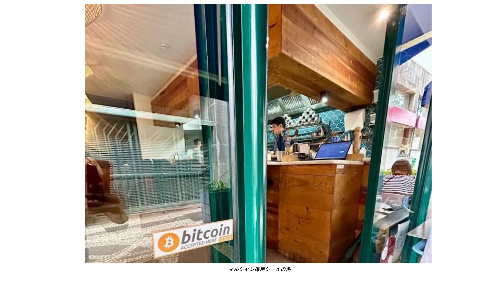

地元企業をオンボーディングすることは、あなたの街のBitcoinエコシステムを成長させる最良の方法のひとつです。重要なのは、ステップ・バイ・ステップで進めることだ：

1/ **買い物のたびにBitcoinで支払うよう頼む**。

たいていの場合は「ノー」と言われ、戸惑ったり、少し批判的な目で見られたりするかもしれないが、Bitcoinが「普通の人」が使えるものであり、支払い方法として普及しているという考えを植え付けることができる。何人かの友人とチームを組んで、同じ店に違う日に立ち寄り、その都度Bitcoinでの支払いをお願いすることもできる。そのうち、店主の好奇心に火がつくだろう。

2/ **シンプルで明確な説明をする**。

Bitcoinとは何かと聞かれたら、専門用語を使わずに簡潔に答えよう。例えば

*「Bitcoinは、銀行によって管理されず、仲介者なしで機能し、検閲されず、インフレの影響を受けず、従来の銀行よりも手数料が低いお金である」*。

そして、「Bitcoinを使う21の理由」や「あなたのビジネスでBitcoinを受け入れる10の理由」のようなチラシに、あなたの連絡先やミーティングの詳細を添えて渡します。こうすることで、デモの準備ができたときに、あなたの居場所を知ってもらうことができます。

3/ **デモンストレーションの手配**

彼らが興味を示したら、支払いソリューションを紹介する時間を設定する。

お勧めは**[スイスBitcoinペイ](https://swiss-Bitcoin-pay.ch/)**です：

    - マーチャントが毎日BTCをフィアットに自動的に変換し、サプライヤーに支払えるようにする。
    - 希望すれば、BTCでパーセンテージを維持することもできる。
    - 会計士用にエクスポート可能な会計レポートを作成。
    - 管理者用のシンプルなダッシュボードがある。
    - Interfaceは、従業員がレジに触れることなく、直感的に支払いを受け付けられる。
    - 従来の決済ネットワークが課す2～3％の手数料よりも安い。

4/ **Bitcoin**の受け入れを開始したら、彼らをサポートすること。

乗船後だ：

    - 定期的に訪れて購入する。
    - すべてが順調に進んでいるかどうかを確認する。
    - 必要であれば、連絡先を再共有する。
    - 彼らをミーティングに招待しよう。
    - btcmap.orgマップ](https://btcmap.org/)に追加し、[スイスBitcoinペイ](https://x.com/swissbitcoinpay)にTwitterで知らせて知名度を上げましょう。
    - その場所でワークショップやミートアップを開催することを検討する。

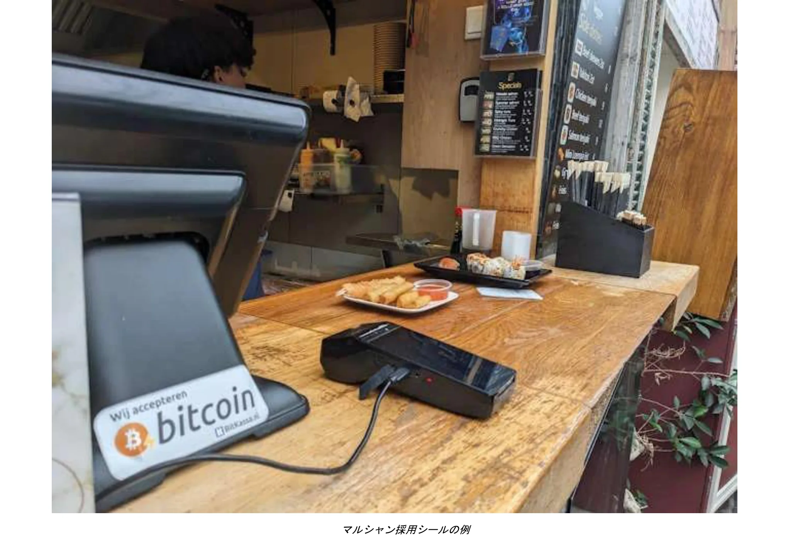

5/ **地元商店を結ぶ**。

Bitcoinにふさわしい企業がいくつか決まったら、加盟店専用のTelegramグループを作ることを提案しよう。これならできる：

- 彼らに経験を共有させ、新しいビジネスに乗り込ませる。
- 迅速な技術サポートチャネルとしての役割を果たす。
- 地元のBitcoinネットワークを強化する。

聞き込み調査は長期戦である。忍耐と粘り強さ、そして戦略が必要だ。しかし、もしあなたのコミュニティが準備できていれば、オランダの[オランダのアーネム](https://www.arnhembitcoinstad.nl/)のように、真のBitcoin循環型経済の基礎を築き始めることができるだろう。

## 地元紙やラジオに連絡

<chapterId>435bfbc1-22dd-59bb-b737-a32ea995b238</chapterId>

ビットコイナーはしばしば、ソーシャルメディアやオンライン・プラットフォームを中心に支援活動を行うが、それはほんの一部に過ぎない。地元のプレスやラジオは強力な味方になる。

フランスの[Breizh Bitcoin](https://breizhbitcoin.com/)のように、**地元メディア**に定期的に連絡しているコミュニティもある：

- 今後のイベント（ミートアップ、プレゼンテーション、ワークショップ、Halvingパーティーなど）を告知する。
- ジャーナリストを招き、Bitcoinに友好的な企業を訪問し、その企業について記事を書いてもらう。
- 地域のリストに掲載するために、イベントの日程と場所を共有する。

多くの新聞は今でも "What's On "というコーナーを設けている。BreizhのBitcoinは、このアプローチが有効であることを発見した。

この戦略は、地域によってはより効果的かもしれないが、やってみる価値はある。フランスには次のような例がある：

- [acpm.fr](https://www.acpm.fr/Les-chiffres/Diffusion-Presse/Presse-Payante/Presse-Quotidienne-Regionale)；
- [voxpublic.org](https://www.voxpublic.org/spip.php?page=annuaire&cat=medias&type_media=Presse%20quotidienne%20r%C3%A9gionale).

また、地元のラジオ局に連絡して、インタビューやポッドキャストへの出演を提案することもできる。

メディアのインタビューは厄介なものです。言葉を文脈から外したり、誤って伝えたりする可能性がある。準備は不可欠です。

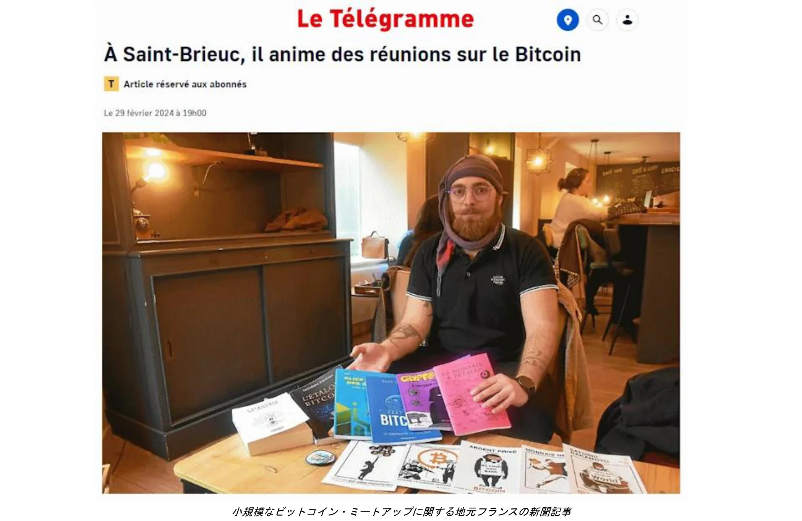

もちろん、このセクションで提案したもの以外にも、**多くのプロジェクトを実施することができる**。すべてはあなたの時間とやる気次第であり、問題のプロジェクトの難易度にもよる。

アウトリーチ・プロジェクトの最後のヒント：

1) **目標、必要なステップ、誰が何をするかを明確にする。**

2) **一歩一歩前進する**：努力のペース配分をすることで、燃え尽きを避ける。

3) **助けを求める**：会員や近隣コミュニティに支援を求める。

覚えておいてください：Bitcoinのすべてのコミュニティは、あなたが今いる場所にいたことがあります。彼らの経験やアドバイスから学ぶことをためらわないでください。

# 未来を予測する

<partId>6ea07445-9369-54bc-9aa0-d260db026e0b</partId>

## 参加者増加のための計画

<chapterId>8af722d4-3a9f-548c-9001-424f2142de12</chapterId>

Bitcoinがブロック84万で第4の時代を迎えると、より多くの人々がそれを技術的、金融的、社会的革命として認識し始めた。

インターネットの台頭のように、この革命には時間がかかるだろう。それは人々にBitcoinの基礎**を学び、その使い方を理解する機会を与え、開発者や企業がその可能性を最大限に引き出すプロトコルやアプリケーション**を構築することを可能にする。

誰も未来を予測することはできませんが、Bitcoinの採用が急増することは予想できます。それは、**あらゆるシナリオ**に備えるということであり、従来の金融システムの崩壊やBitcoinの全面禁止といった極端なシナリオ**にも備えるということである**。

コースの最後となるこの第7部では、あなたのコミュニティやミートアップが成長するにつれて心に留めておくべき重要なポイントについて見ていきます。

まず、最も予想しやすいのは、コミュニティへの参加者数の増加である。これは主に2つの方法であなたに影響を与えます：

1/ **あなたのコミュニケーション・チャンネル（Telegram、Signal、Matrixなど）はやがて混雑し**、会話について行くのが難しくなります。留意すべきことが2つある。

まず、1つのチャットで500人が様々なトピックについて議論している場合、メッセージや通知の量が多すぎて、多くのメンバーがチューニングアウトしてしまうのは避けられません。例えば、TelegramスーパーグループやDiscordサーバーに移行するなど、セットアップを見直す良い機会です。

第二に、チャンネルに参加する人が増えるということは、ボットや詐欺の数が増えるということであり、その分モデレーションも増えるということです。メッセージをモデレートする際に参照できる明確なルールセットを作成し、それに備えましょう。私たちの経験では、特にチャンネル内でルールに簡単にアクセスできるようにすれば、紛争を避けるのに大いに役立ちます。

その良い例が、**Bitcoin Lilleのオープンソースルールブック**(https://bitcoinlille.fr/reglement/)で、数年前にTelegramグループとDiscordサーバーのために書かれました。これはシンプルで普遍的な原則に基づいており、[カスタマイズ可能なバージョンのデザインはこちら](https://www.canva.com/design/DAGHI692AD4/rjT4sqEnhajc5FiPA6GFZQ/edit?utm_content=DAGHI692AD4&utm_campaign=designshare&utm_medium=link2&utm_source=sharebutton)を手に入れることもできます。

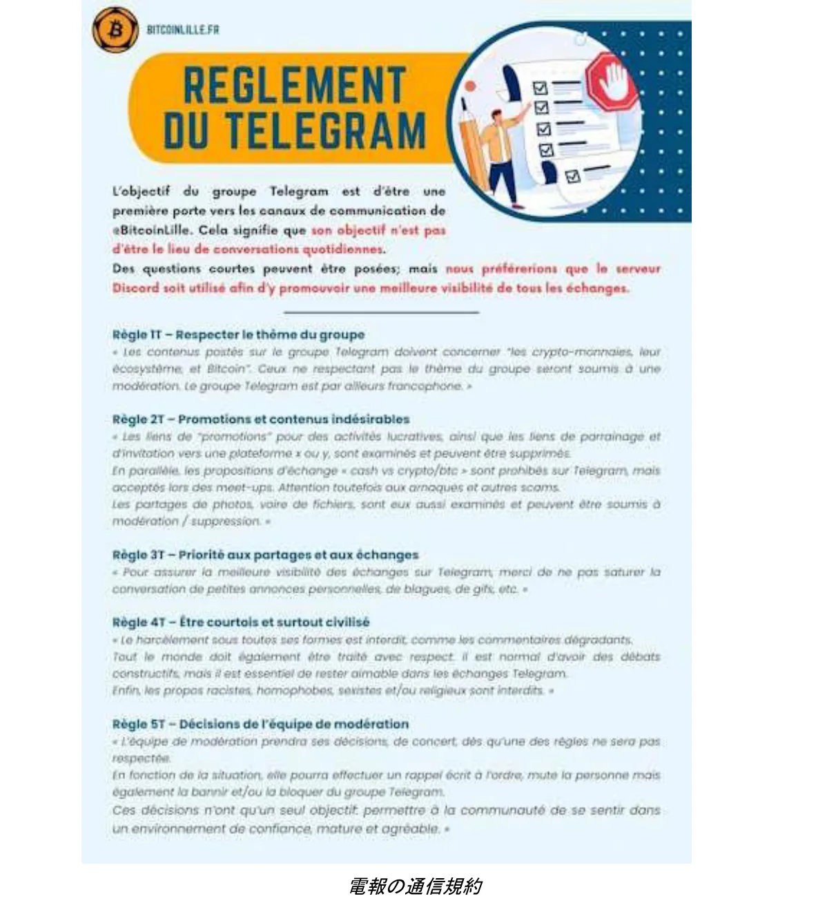

2/ **あなたのミートアップやイベントには大勢の人が集まり始め、つながりを求めて新しい顔ぶれがたくさん現れるでしょう**。

この観客動員数の急増によって：

    - 特に過去に20人程度しか受け入れられなかったのであれば、**ミートアップやイベントのためにもっと大きな会場を見つける**価値があるかもしれない。
    - 参加者の数が圧倒的に多くなった場合、今後のミートアップでは、**参加者に登録**（ミートアップのアプリや簡単なフォームから）してもらうか、**毎月複数のミートアップを開催**（例：初級ミートアップ、中級ミートアップ、上級ミートアップ）することができます。
    - 同時に、エコシステムへの多くの新参者が、しばしば金儲けを主目的にすることも予想されます。このような急成長しているミートアップで**Bitcoin**に焦点を当てた会話を続けるには、以下のことをするのが良いだろう：

a)このようなイベントでは、**Bitcoinをテーマにしたプレゼンテーション**を行う；

b) **ビットコイン仲間**とだけ固まるのは避ける。その代わりに、**新参者**に近づくことをポイントにしましょう。たとえそれが、挨拶するために部屋の後ろにたむろすることを意味するとしても。そこから、彼らがなぜ来たのか、何を求めているのか、あなたのコミュニティの目標（あるいは基本理念）などについて話すことができます。

最後に、残念なことだが、詐欺師がミートアップに現れることがある。彼らの目的は、ネズミ講やMLM、あるいは "AIによるBlockchain革命 "について延々と話すことかもしれない。また、ある日、悪意のある人が資金洗浄のために特別に参加したり、偽札でBTCを買おうとしたりすることも十分にあり得る。

このような厄介な状況では、最も簡単なアプローチは、そのミーティングがそのような場ではないことを丁寧に説明し、あなたが選んだどんな論拠（例えば、私服警官がいる可能性があることを述べるなど）でもってそれを裏付けることだ。

残念なことに、彼らがその場を離れようとしなかったり、礼儀正しく振る舞おうとしなかったりした場合（実際にありました）、あなたはミートアップの最中に直接Addressで、ある人物が何らかの悪質な活動を試みていることを皆に知らせることができます。

ありがたいことに、このような状況は稀であり、脅威というよりは不条理なことが多いが、それでも備えておくに越したことはない。

安心のために：あなたが個人的に法を犯したり、違法な取引を直接助長していない限り、あなたのイベントでの他人の行為に法的責任はありません（少なくともフランスの法律では）。

理想的な世界では、コミュニティが成長するにつれて、数十人**を受け入れるのに十分な大きさの**スペースを持ち、また、弱気相場の間にビットコイナー**と将来のビットコイナーとの間に**強力な関係を築き、強気相場が来たときに、できるだけ多くの人が他の人をオレンジピルにする準備ができているようにします。

## コミュニティ組織の分散化

<chapterId>bedfc110-e099-58f4-a5b7-fb50f3b19a49</chapterId>

想像してみてほしい。何年もBitcoinミートアップを運営してきたある日、あなたはその仕事を辞め、ペルーでリャマを育てたり、エルサルバドルでパーフェクトな波を追いかけたりすることを決意する。あなたが辞めたら、コミュニティはどうなるでしょうか？

地域移管は計画的に行ってください：

1) **管理者（またはOwnership）権限**を信頼できるメンバーに付与してください。ロールはいつでも後で変更することができます。

2) **ソーシャルメディアやビジビリティ・チャンネルのアカウント詳細**（ユーザー名、パスワード、関連する電子メール）を、少なくとも信頼できる人と共有する。

このアクセス権がなければ、他の誰かが効果的に引き継ぐことはほぼ不可能だ。フォークされた」グループを作り、ネットワークを再構築するというゼロからのスタートは、時間がかかり、疲弊し、しばしば士気を下げる。

ミートアップ内に信頼できる連絡先がない場合は、いつでもテレグラムの@ProfEduStream、@copinmalin、または@gabtribeに連絡することができます。彼らはやる気のある後継者を見つけ、アカウントや管理者権限の移譲を調整する手助けをしてくれる。

**なぜ地方分権が重要なのか？**

もし、あなた一人しか関与しておらず、あなたがすべての支配権を握っているとしたら、あなたがいなくなったらどうなるでしょうか？答えは簡単で、あなたのコミュニティーも消えてしまう。

解決策：タスク、役割、アクセス権を分散させることで、時間的制約のためであれ、もっと暗いシナリオでは、非KYCのBitcoinを所持していたために逮捕されたためであれ、主催者の一人が脱落してもグループは運営を続けることができる。

**地方分権をさらに推し進めるには？**

framasoft suite](https://framasoft.org/fr/)のような**フリーでオープンソースのソフトウェア**を採用することで、中央集権的なプラットフォームへの依存を減らし、潜在的な国家検閲やBitcoinの禁止に対する耐性を高める。

メンバーのプライバシーとコミュニティの活動を保護するために、**暗号化または匿名化されたコミュニケーションツール**を使用してください。

## Bitcoinが公共の敵No.1になったとしたら？

<chapterId>c739651f-cd13-51e0-a36e-85023749b15b</chapterId>

1933年4月5日、アメリカ合衆国第32代大統領フランクリン・ルーズベルトは、**大統領令6102**に署名し、個人が金貨、地金、金地金を所有することを違法としました。

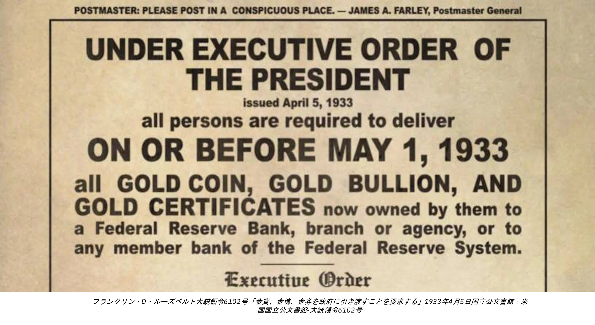

もちろん、大恐慌（1929年の株式市場の暴落）は現在の現実ではない。しかし、いつか政府がBitcoinと同じことをするかもしれない：**私的なOwnershipを全面的に禁止する？**

実際のところ、このようなオーウェルのような措置は、誰かが本当にBTCを所有することを止めることはできない。

それでも、もし世界の指導者たちが、国家レベルであってもBitcoinが世界秩序を再構築する可能性があることに最終的に気づいたとしたらどうだろう？その時、Bitcoinは "公共の敵No.1 "のレッテルを貼られるのだろうか？

陰謀論に陥る必要はない。しかし、今から先回りし、分散化し、教育することを止めることはできない。

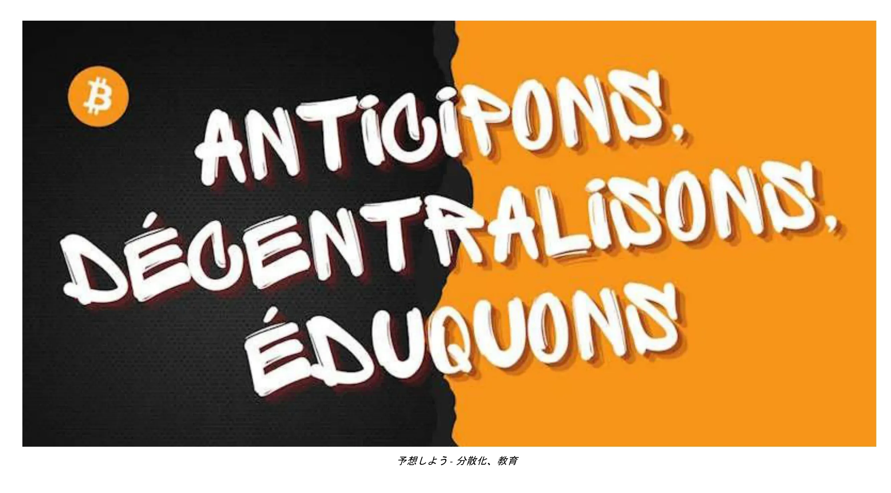

# ビットコイナーを結びつける

<partId>62bc2138-c0be-5d39-a341-594690863257</partId>

## Bitcoinコミュニティ構築のための迅速な行動計画

<chapterId>1f463ec2-3f64-5641-8d60-e02a47c94f27</chapterId>

Satoshiナカモトは、すでに我々の世界を変えつつある革命的なツールを生み出した。しかし、未来をどのように形作るかは、ビットコイナーである私たち次第なのだ。

Bitcoinは、歴史、経済学、文学、数学、コンピューター科学、暗号学に触れる広大なウサギの穴である。誰もそのすべてを探求することはできない。

時間は限られているのだから、大切なのは謙虚でいること、学び続けること、そしてExchangeの知識を他の人たちと共有することだ。そうすれば、各自が求める理解レベルに達することができる。

**したがって、グローバルなBitcoinコミュニティは、明日の世界**を構築するための基本的な役割を果たします：ビットコイナーが**Exchange、構築し、共有することができるスペース**。 **一緒に**。

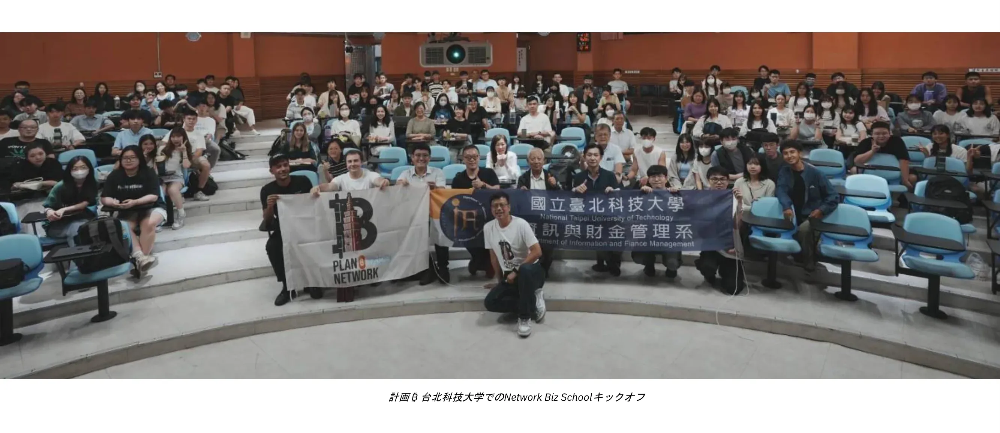

このコースを通して見てきたように、**Bitcoinコミュニティを作り、ミーティングを開催する**には、計画とモチベーションの両方が必要です。あなたの目標とコミットできる時間に応じて、より野心的なプロジェクトに挑戦するかもしれませんし、物事をシンプルに保つかもしれません。

どちらにしても、目的は同じです： **あなたの街でBitcoinへの関心を高め、その発展に貢献することです。**

これまで取り上げてきた多くの章と小章をまとめると、ここにBitcoinコミュニティを作るための**簡潔な「行動計画」**がある：

1) なぜBitcoinコミュニティを作りたいのか、何を目標とするのか、どの都市や場所で活動するのかを事前に決めておく。

2) 近隣の既存コミュニティと連絡を取り、必要なときには遠慮なく助言を求める；

3) 地域や場所を反映した、コミュニティの明確なアイデンティティを作る（ロゴ、ポスター、バナー、チラシなど）。

4) Telegram、Twitter、NOSTR、Discord、Simplexのようなコミュニケーションチャンネルやソーシャルネットワークを作る。非中央集権的で検閲に強いチャンネルも検討する。

5) 他の地域のミートアップやコミュニティをオンラインでフォローし、さまざまな地図やプラットフォームに自分のグループを掲載し、知名度を高める。

コミュニティのコミュニケーション・チャンネルがアクティブになったら：

6) 十分な関心が高まったと感じたら、最初のミートアップを提案するためのアンケートを開始する。

7)この対面イベントで達成したい目的を明確にする。

8) 立地がよく、居心地のよい、目標に沿った会場を選び、テーブルか部屋を予約する。

9)イベントの1週間前にチャンネルで宣伝し、2～3日前にもう一度宣伝する。

10) 関連するウェブサイトやプラットフォームにイベントを掲載する。

11)当日は、自然な流れで参加者と関わり、必要であれば議論の舵をそっと切る。

その後だ：

12)参加者が再び戻ってくるように、参加者の維持と参加に重点を置く。

13)簡単なプロジェクトやイニシアチブを提案し、個人的に関心のあるものを始める。他の誰かが別のプロジェクトを主導したい場合は、できる限りサポートする。

最後に

14)ミートアップのための大きな会場、コミュニケーション・チャネルのルール、ウェブサイトなどについて考え、将来を予測する；

15) 地元の企業にBitcoinを受け入れるよう働きかける。

16)信頼できるメンバーにタスクやチャンネル/ネットワークの管理者権限を委譲する。

17)より多くの人が参加できるように、コミュニティを広く宣伝し、興味を示した人を巻き込む。

18) 自分が楽しみ、自分にとって重要なプロジェクトをさらに進める。

手っ取り早く概要を知りたい方は、この21分のビデオにこれらの手順がまとめられている：

:::video id=a59956da-f554-4b54-89dd-5ca55b722686:::

忘れないでください： **あなたは一人ではありません、既存のコミュニティがあなたをサポートします**。

## 自分を大切にする

<chapterId>cf1631cb-ddbe-55c7-be8c-26a5652979a0</chapterId>

Bitcoinのウサギの穴に落ちると、人生観が変わる。

心の奥底では、もっと遠くへ行きたい、同じ心の旅をしている人たちに会いたいという引力を感じている。

そのエネルギーが、あなたの発見を分かち合うことで、パズルのピースに貢献する原動力となる：Bitcoin。それはまた、明日の世界、あなたが築く手助けをしたい世界、そしてそれに向かって活動するコミュニティについて考えるきっかけにもなる。

コミュニティの構築は、モチベーション、戦略、献身、そして時間を必要とする長いトンネルである。感謝されることのない仕事でもあるので、燃え尽きないように一歩一歩前進していくことが大切だ。

**自分のことを、自分の限界のことを考えなさい。そして、Bitcoinは昼夜を問わずあなたを駆り立てるかもしれないが、すべてを一人でやろうとしないこと、さもなければ燃え尽きることになる**。

その代わりに、**すでに同じトンネルを歩き、同じ道を探検し、同じツールを構築したビットコイナー**から助けを求めること。そうすれば、多くの時間を節約できる。

**たとえ委任することで特定の仕事に時間がかかるとしても、この冒険であなたについてくる人たちに手を貸すよう**誘ってください。長い目で見れば、あなたのコミュニティはより強く、より強靭になるだろう。

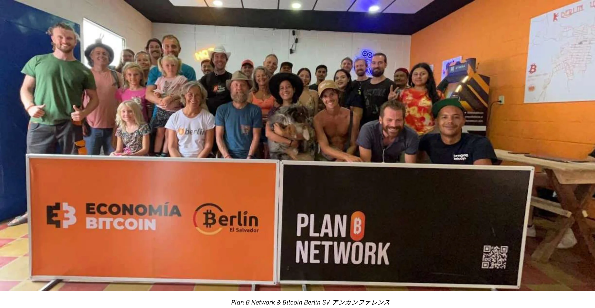

一人なら、Bitcoinのウサギの穴にあるたくさんのトンネルのひとつをすぐに探検できる。しかし、他にも探検すべき方向が無数にあることを覚えておいてほしい。

**ビットコイナーたちのコミュニティを作ったり、参加したりすることで、そして彼らと定期的に共有したり交換したりすることで、あなたは同時にウサギの穴をあらゆる方向に進むことになる。**

## BTC302, 次の記事

<chapterId>8bf10b77-80ee-5d50-87bc-0ef32574a675</chapterId>

このBTC302コースでは、コミュニティやミートアップの立ち上げ方や、様々なプロジェクトの立ち上げ方について詳しく解説しています。

コミュニティが次のステップに進む準備ができたら、**正式な協会**を設立することができます。

たとえばフランスでは、約60のコミュニティやミートアップのうち、12近くが協会的なステータスを持っている。

メリットは2つある：

- 公式認定：協会の銀行口座を開設し、プレスやメディアの注目を浴び、補助金を申請することもできる。
- 構造化された組織：明確な役割を定義できるので、コミュニティの運営やプロジェクトの実施が容易になります。

コミュニティをさらに発展させるために、**COMMU302コースのフォローアップ**。

今後数ヶ月のうちに[planb.network](https://planb.network/)でリリースされるかもしれない。

次のセッションでは、次のような高度なトピックを探求することができる：

- ミーティングのためのプレゼンテーションやワークショップをデザインし、明確な目的を設定する。
- 約100人が参加する大規模なイベントの開催。

そのために、すでに独自のイベントやプレゼンテーションを作り上げているコミュニティの経験を活用する。

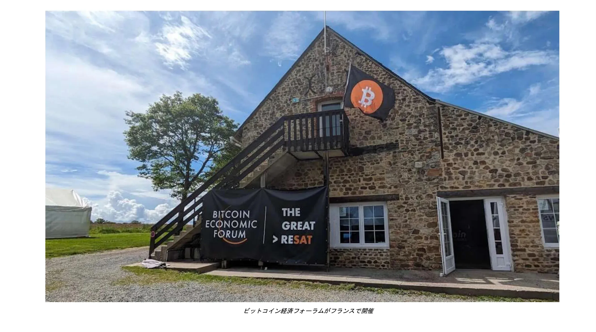

# 最終節

<partId>e9bdddf4-54c9-4de9-bbce-c3eade8c32e5</partId>

## レビュー＆評価

<chapterId>08a35d2a-204b-519a-9bb1-588665a037fa</chapterId>

<isCourseReview>true</isCourseReview>

## 結論

<chapterId>d74606a5-cb14-4117-acb2-2bf5920de092</chapterId>

<isCourseConclusion>true</isCourseConclusion>