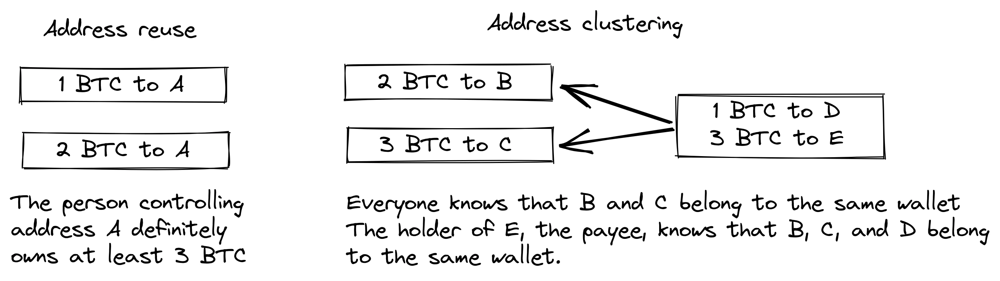
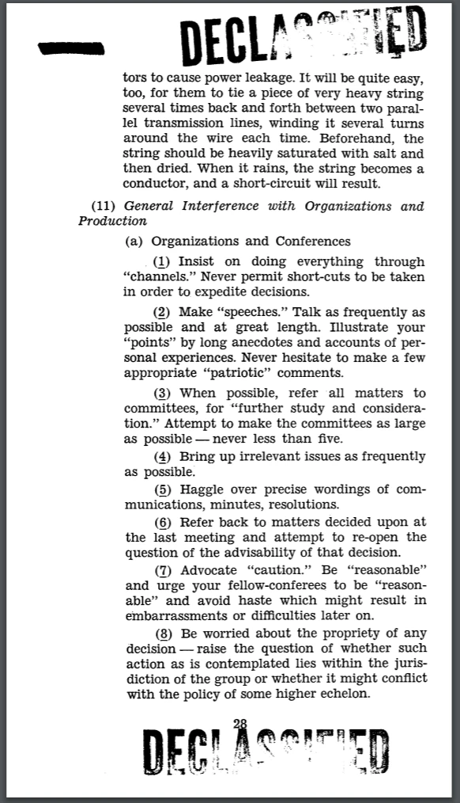
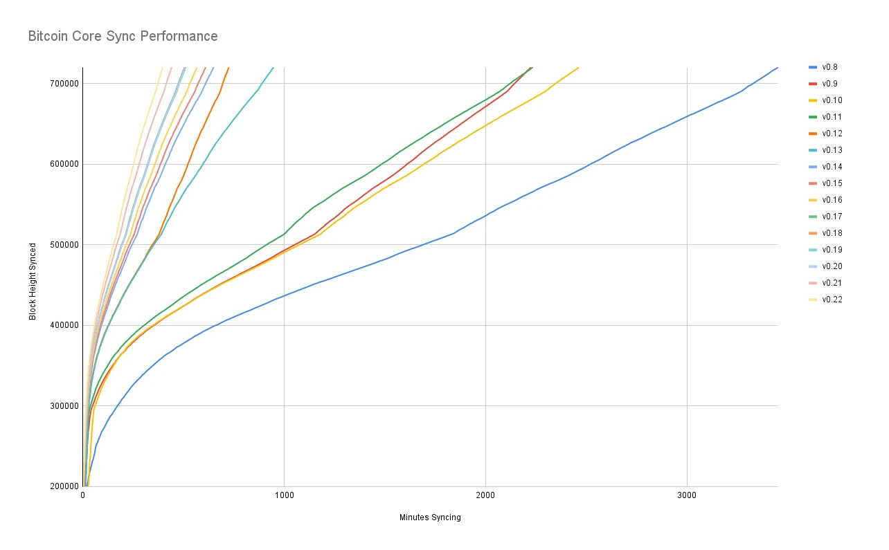
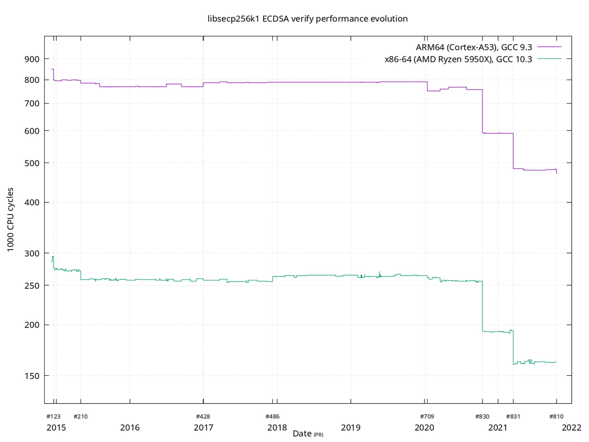
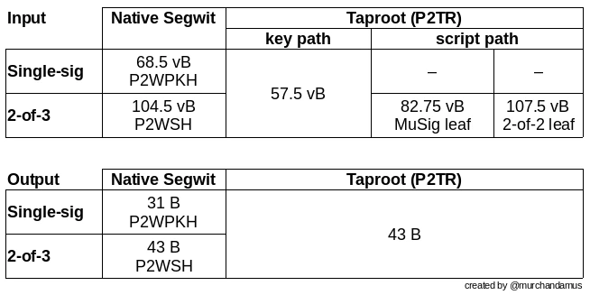
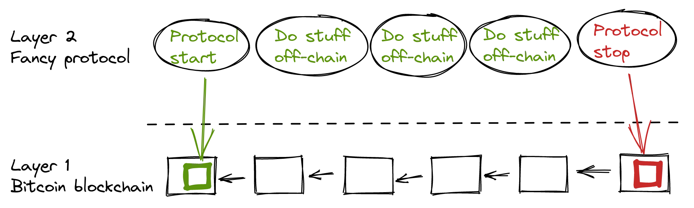

# Hluboký ponor do filozofie vývoje Bitcoin


Filozofie vývoje Bitcoin je kurz pro vývojáře Bitcoin, kteří již rozumí základům konceptů a procesů, jako je Proof-of-Work, tvorba bloků a životní cyklus transakcí, a chtějí se posunout na vyšší úroveň a získat hlubší znalosti o kompromisních řešeních a filozofii návrhu Bitcoin.

Měla by pomoci novým vývojářům osvojit si nejdůležitější poznatky z více než desetiletého vývoje Bitcoin a veřejné diskuse a zároveň jim poskytnout užitečný kontext pro hodnocení nových nápadů (dobrých i špatných!).


### Co očekávat?


Jak bylo uvedeno výše, jedná se o praktickou příručku pro vývojáře Bitcoin. Bitcoin je však rozsáhlé a komplexní téma a není možné, abychom zde pokryli všechny jeho aspekty. Doufáme, že tímto kurzem probereme nezbytné funkce, které vám pomohou zahájit vývojovou činnost, a zároveň vám umožníme, abyste se jím dále zabývali sami.


V Bitcoin se angažuje mnoho lidí; protože někteří z nich mají protichůdné názory, můžete zde najít zdroje, které vyjadřují protichůdné myšlenky. Vždy se však snažíme držet domény faktů, kde na názorech nezáleží.


### Kdo to napsal?


Tento kurz je adaptací stejnojmenné knihy, jejímž hlavním autorem je Kalle Rosenbaum a Linnéa Rosenbaumová se na něm podílela jako spoluautorka.

Kniha vznikla na objednávku a za finanční podpory vývojového centra [Chaincode Labs](https://learning.chaincode.com/), které pořádá vzdělávací programy pro vývojáře, kteří se chtějí naučit něco o vývoji Bitcoin.


+++


# Úvod

<partId>58c48e9b-e285-4dc6-8952-6cc5140b1313</partId>


## Přehled kurzů

<chapterId>28b7256b-9cb0-463e-a82d-d732be86c98c</chapterId>


Vítejte v kurzu PHI 301 o filozofii vývoje Bitcoin.


Bitcoin je víc než jen kryptoměna, ztělesňuje filozofickou vizi decentralizace, soukromí, nedůvěryhodnosti a odolnosti. Tento kurz je určen speciálně pro vývojáře, kteří se již seznámili s technickými základy Bitcoin a nyní se snaží prohloubit své znalosti principů, na nichž je založen design a správa Bitcoin.


V tomto kurzu si ujasníte základní hodnoty a strategie, které již více než deset let řídí vývoj společnosti Bitcoin. Díky důkladnému prozkoumání těchto témat si osvojíte kritický pohled potřebný k tomu, abyste mohli s jistotou hodnotit budoucí vývoj a podílet se na něm.


### Hlavní hodnoty Bitcoin


V čem je Bitcoin jedinečný? Tato část odhaluje základní hodnoty, které jsou jádrem konstrukce Bitcoin. Prozkoumáte **decentralizaci**, základní kámen zajišťující, že síť neovládá žádný subjekt; **bezdůvěryhodnost**, klíč k odstranění závislosti na třetích stranách; **soukromí**, nezbytné pro svobodu jednotlivce i integritu systému; a **neomezený Supply**, zakódovanou záruku vzácnosti, která utváří ekonomickou identitu Bitcoin. Zvládnutí těchto konceptů vám umožní plně pochopit silné a slabé stránky Bitcoin.


### Bitcoin Správa a řízení


Orientace ve složitém prostředí řízení Bitcoin vyžaduje více než jen technické znalosti, ale také porozumění jedinečnému přístupu Bitcoin ke konsensu a rozhodování. V této části se ponoříte do mechanismů a filozofií, které stojí za kritickými procesy, jako jsou aktualizace protokolů, nutnost protichůdného myšlení, síla spolupráce v rámci otevřeného zdroje, neustálé výzvy spojené s rozšiřováním a nuance strategií, které jsou nutné, když se věci nevyhnutelně pokazí. Vybaveni těmito znalostmi budete připraveni se nejen účastnit, ale také efektivně a zodpovědně utvářet budoucnost Bitcoin.


Jste připraveni udělat další krok na cestě ke Bitcoin? Začněme!


***N.B.**: Pokud se v průběhu kurzu setkáte s neznámými pojmy týkajícími se Bitcoin, podívejte se prosím do [slovníčku pojmů](https://planb.network/resources/glossary), kde najdete jejich definice.*


# Bitcoin Centrální hodnoty

<partId>2d6c683b-54c8-5465-b2ca-4e96a6828834</partId>


## Decentralizace

<chapterId>9397c84b-0038-5d0e-88d5-11767ce8182d</chapterId>


V tomto článku je rozebráno, co je decentralizace a proč je pro fungování společnosti Bitcoin nezbytná. Rozlišujeme mezi

decentralizace těžařů a plnohodnotných uzlů a diskutovat o tom, co přinášejí pro odolnost vůči cenzuře, což je jedna z hlavních vlastností Bitcoin.


Diskuse se pak přesouvá k pochopení neutrality - neboli bezpříznakovosti vůči uživatelům, těžařům a vývojářům - která je nezbytnou vlastností každého decentralizovaného systému. Nakonec se dotkneme toho, jak může být pochopení decentralizovaného systému, jako je Bitcoin, obtížné, a představíme několik mentálních modelů, které by vám mohly pomoci jej pochopit.


Systém bez centrálního řídicího bodu se označuje jako *decentralizovaný*. Bitcoin je navržen tak, aby se vyhnul centrálnímu bodu kontroly, přesněji řečeno *centrálnímu bodu cenzury*.


Decentralizace je prostředkem k dosažení *odolnosti vůči cenzuře*.


V Bitcoin existují dva hlavní aspekty decentralizace: V Miner se jedná o decentralizaci a v Full node o decentralizaci.


Decentralizace Miner znamená, že zpracování transakcí neprovádí ani nekoordinuje žádný centrální subjekt. Decentralizace Full node se týká skutečnosti, že validace bloků, tj. dat, která těžaři vydají, se provádí na okraji sítě, v konečném důsledku jejími uživateli, a nikoli několika důvěryhodnými autoritami.


### Decentralizace Miner


Pokusy o vytvoření digitálních měn se objevily již před Bitcoin, ale většina z nich selhala kvůli nedostatečné decentralizaci správy a odporu cenzury.


Decentralizace Miner v Bitcoin znamená, že *pořádání transakcí* neprovádí žádný jednotlivý subjekt nebo pevně stanovená množina subjektů. Provádějí ho kolektivně všechny subjekty, které se na něm chtějí podílet; tento kolektiv těžařů je dynamickou množinou uživatelů. Každý se k němu může připojit nebo jej opustit, jak si přeje. Díky této vlastnosti je Bitcoin odolný vůči cenzuře.


Pokud by byl systém Bitcoin centralizovaný, byl by zranitelný pro ty, kteří by jej chtěli cenzurovat, například pro vlády. Potkal by ji stejný osud jako dřívější pokusy o vytvoření digitálních peněz. V úvodu [dokumentu](https://www.blockstream.com/sidechains.pdf) s názvem "Enabling Blockchain Innovations with Pegged Sidechains" autoři vysvětlují, jak nebyly rané verze digitálních peněz vybaveny pro prostředí s protistranou (viz také kapitolu o protistranickém myšlení v další části).


David Chaum představil digitální hotovost jako výzkumné téma v roce 1983 v prostředí s centrálním serverem, který je důvěryhodný, aby zabránil Double-spending. Aby zmírnil riziko ohrožení soukromí jednotlivců ze strany této centrální důvěryhodné strany a aby zajistil zastupitelnost, zavedl Chaum slepý podpis, který použil jako kryptografický prostředek k zabránění propojení podpisů centrálního serveru (které představují mince) a zároveň umožnil centrálnímu serveru provádět prevenci dvojího vydání.

Požadavek na centrální server se stal Achillovou patou digitální hotovosti[Gri99]. I když je možné toto jediné místo selhání eliminovat nahrazením podpisu centrálního serveru prahovým podpisem několika podepisujících osob, je pro auditovatelnost důležité, aby byly tyto osoby odlišné a identifikovatelné. To stále ponechává systém zranitelný vůči selhání, protože každý podepisující může selhat nebo být přinucen selhat jeden po druhém.


Ukázalo se, že použití centrálního serveru k objednávání transakcí není vhodné kvůli vysokému riziku cenzury. I kdybychom nahradili centrální server federací pevně stanovené množiny n serverů, z nichž alespoň m musí objednávku schválit, stále by docházelo k potížím. Problém by se skutečně přesunul na problém, kdy se uživatelé musí dohodnout na této množině n serverů a také na tom, jak nahradit škodlivé servery dobrými, aniž by se spoléhali na centrální autoritu.


Zamysleme se nad tím, co by se mohlo stát, kdyby byl Bitcoin cenzurovatelný. Cenzor by mohl tlačit na uživatele, aby se identifikovali, aby deklarovali, odkud jejich peníze pocházejí nebo co si za ně kupují, a teprve pak by jejich transakce mohly vstoupit do Blockchain.


Nedostatečná odolnost vůči cenzuře by také umožnila cenzorovi donutit uživatele k přijetí nových pravidel systému. Mohli by například zavést změnu, která by jim umožnila nafouknout peníze Supply, a tím se obohatit. V takovém případě by měl uživatel ověřující bloky tři možnosti, jak se s novými pravidly vypořádat:


- Přijmout: Přijměte změny a převezměte je do svého Full node.
- Odmítnout: Odmítnout: Odmítněte přijmout změny; uživatel tak má systém, který již nezpracovává transakce, protože bloky cenzora jsou nyní považovány za neplatné.
- Přesun: Jmenování nového centrálního řídicího bodu; všichni uživatelé musí zjistit, jak koordinovat a poté se dohodnout na novém centrálním řídicím bodu.


Pokud se jim to podaří, stejné problémy se pravděpodobně někdy v budoucnu znovu objeví, vzhledem k tomu, že systém zůstal stejně cenzurovatelný jako dříve.


Žádná z těchto možností není pro uživatele výhodná.


Odolnost vůči cenzuře prostřednictvím decentralizace je to, co odlišuje Bitcoin od ostatních peněžních systémů, ale není to snadné kvůli problému *Double-spending*. Jedná se o problém, jak zajistit, aby nikdo nemohl utratit stejnou minci dvakrát, což je problém, o kterém si mnoho lidí myslelo, že jej nelze vyřešit decentralizovaným způsobem. Satoshi Nakamoto ve svém [Bitcoin whitepaper](https://planb.network/bitcoin.pdf) píše o tom, jak problém Double-spending vyřešit:


> V tomto článku navrhujeme řešení problému Double-spending pomocí peer-to-peer distribuovaného serveru Timestamp pro výpočetní důkaz chronologického pořadí transakcí generate.


Používá zde zvláštně znějící výraz "peer-to-peer distribuovaný server Timestamp". Klíčovým slovem je zde *distribuovaný*, což v tomto kontextu znamená, že neexistuje žádný centrální řídicí bod. Nakamoto dále vysvětluje, jakým způsobem je Proof-of-Work řešením.

Přesto to nikdo nevysvětlí lépe než

[Gregory Maxwell na Redditu](https://www.reddit.com/r/Bitcoin/comments/ddddfl/question_on_the_vulnerability_of_bitcoin/f2g9e7b/), kde reaguje na někoho, kdo navrhuje omezit výkon těžařů Hash, aby se zabránilo potenciálním 51% útokům:


> Decentralizovaný systém, jako je Bitcoin, využívá veřejné volby. V decentralizovaném systému však nemůžete mít jen hlasování "lidí", protože to by vyžadovalo, aby centralizovaná strana povolila lidem hlasovat. Místo toho Bitcoin používá hlasování výpočetního výkonu, protože výpočetní výkon je možné ověřit bez pomoci jakéhokoli centralizovaného
třetí strana.


Příspěvek vysvětluje, jak se decentralizovaná síť Bitcoin může dohodnout na objednávání transakcí pomocí Proof-of-Work.


V závěru pak říká, že 51% útok není nijak zvlášť znepokojivý ve srovnání s tím, že se lidé nezajímají o decentralizační vlastnosti Bitcoin nebo je nechápou:


> Mnohem větším rizikem pro Bitcoin je, že veřejnost, která jej bude používat, nepochopí, nebude se o něj zajímat a nebude chránit decentralizační vlastnosti, díky nimž je cennější než centralizované alternativy.

Závěr je důležitý. Pokud lidé nebudou chránit decentralizaci Bitcoin, která je zástupným znakem jeho odolnosti vůči cenzuře, může se Bitcoin stát obětí centralizačních sil, až bude tak centralizovaný, že se cenzura stane věcí. Pak většina, ne-li celá jeho hodnota zmizí. To nás přivádí k další části o decentralizaci Full node.


### Decentralizace Full node


V předchozích odstavcích jsme mluvili hlavně o decentralizaci Miner a o tom, jak může centralizace těžařů umožnit cenzuru. Existuje však také další aspekt decentralizace, a to *Full node decentralizace*.


Význam decentralizace Full node souvisí s nedůvěryhodností. Předpokládejme, že uživatel přestane provozovat svůj vlastní Full node například z důvodu neúnosného zvýšení provozních nákladů. V takovém případě musí se sítí Bitcoin komunikovat jiným způsobem, případně pomocí webových peněženek nebo lehkých peněženek, což vyžaduje určitou míru důvěry v poskytovatele těchto služeb.


Uživatel přechází od přímého vynucování pravidel síťového konsensu k důvěře, že to udělá někdo jiný. Nyní předpokládejme, že většina uživatelů deleguje prosazování konsensu na důvěryhodnou entitu. V takovém případě se síť může rychle zvrtnout v centralizaci a pravidla sítě mohou být změněna spikleneckými zlomyslnými aktéry.


V [a

Článek v časopise Bitcoin Magazine](https://bitcoinmagazine.com/technical/decentralist-perspective-Bitcoin-might-need-small-blocks-1442090446), Aaron van Wirdum zpovídá vývojáře Bitcoin o jejich názorech na decentralizaci a rizicích spojených se zvyšováním maximální velikosti bloku Bitcoin. Tato diskuse byla tématem Hot v období 2014-2017, kdy se mnoho lidí přelo o zvýšení limitu velikosti bloku, aby se umožnila větší propustnost transakcí.


Silným argumentem proti zvětšení velikosti bloku je, že se tím zvýší náklady na ověření Pokud se zvýší náklady na ověření, přiměje to některé uživatele, aby přestali provozovat své plné uzly. To zase povede k tomu, že více lidí nebude moci používat systém způsobem Trustless.


V článku je citován Pieter Wuille, který vysvětluje rizika centralizace Full node:


> Pokud spousta společností provozuje Full node, znamená to, že je třeba je všechny přesvědčit, aby zavedly jiný soubor pravidel. Jinými slovy: decentralizace ověřování bloků je to, co dává pravidlům konsensu jejich váhu.
> Pokud by však počet Full node klesl velmi nízko, například proto, že všichni používají stejné webové peněženky, burzy a SPV nebo mobilní peněženky, regulace by se mohla stát realitou. A pokud úřady mohou regulovat pravidla konsensu, znamená to, že mohou změnit cokoli, co dělá Bitcoin Bitcoin. Dokonce i limit 21 milionů Bitcoin.

Tady to máte. Uživatelé Bitcoin by měli provozovat své vlastní plné uzly, aby odradili regulační orgány a velké korporace od snahy změnit pravidla konsensu.


### Neutralita


Bitcoin je neutrální, nebo jak se říká, bez povolení. To znamená, že Bitcoin je jedno, kdo jste nebo k čemu ho používáte.


Bitcoin je neutrální, což je dobrá věc a jediný způsob, jak může fungovat. Kdyby ho ovládala nějaká organizace, byl by to jen další typ virtuálního objektu a já bych o něj neměl žádný zájem


Pokud se budete řídit pravidly, můžete je používat, jak se vám zlíbí, aniž byste kohokoli žádali o svolení. To zahrnuje *Mining*, *transakce* v něm a *tvorbu protokolů a služeb* nad Bitcoin:


- Pokud by *Mining* byl proces s povolením, potřebovali bychom centrální autoritu, která by vybírala, kdo smí těžit. To by s největší pravděpodobností vedlo k tomu, že by těžaři museli podepisovat právní smlouvy, v nichž by souhlasili s tím, že

cenzurovat transakce podle rozmarů ústředního orgánu, což v první řadě popírá smysl systému Mining.


- Pokud by lidé *provádějící transakce* v Bitcoin museli poskytovat osobní údaje, deklarovat, za co transakce provádějí, nebo jinak prokázat, že jsou hodni transakce, potřebovali bychom také centrální autoritu, která by uživatele nebo transakce schvalovala. To by opět vedlo k cenzuře a vyloučení.


- Pokud by vývojáři museli žádat o povolení *stavět protokoly* nad Bitcoin, vyvíjely by se pouze protokoly povolené ústředním výborem pro udělování povolení vývojářům. To by kvůli vládnímu zásahu nevyhnutelně vyloučilo všechny protokoly zachovávající soukromí a všechny pokusy o zlepšení decentralizace.


Snaha zavést na všech úrovních omezení, kdo a k čemu může Bitcoin používat, poškodí Bitcoin do té míry, že přestane splňovat svou hodnotu.


Pieter Wuille https://Bitcoin.stackexchange.com/a/92055/69518[odpovídá na otázku týkající se zásobníku Exchange] o tom, jak Blockchain souvisí s běžnými databázemi. Vysvětluje, jak je možné dosáhnout bezoprávněnosti pomocí Proof-of-Work v kombinaci s ekonomickými pobídkami.


V závěru uvádí:


> Použití konsensuálních algoritmů Trustless, jako je PoW, přidává něco, co vám žádná jiná konstrukce nedává (účast bez oprávnění, což znamená, že neexistuje žádná skupina účastníků, která by mohla cenzurovat vaše změny), Použití konsensuálních algoritmů Trustless, jako je PoW, přidává něco ne, ale přichází s vysokými náklady, a jeho ekonomické předpoklady jej činí do značné míry užitečným pouze pro systémy, které definují vlastní kryptoměnu.
> Na světě je pravděpodobně místo pouze pro jeden nebo několik skutečně použitých kusů.

Vysvětluje, že k tomu, aby bylo možné dosáhnout bezpříznakovosti, potřebuje systém s největší pravděpodobností vlastní měnu, čímž "omezuje případy použití skutečně jen na kryptoměny". Je to proto, že účast bez oprávnění neboli Mining vyžaduje ekonomické pobídky zabudované do samotného systému.


### Zkoumání decentralizace


Přesvědčivým aspektem Bitcoin je to, jak je Hard pochopitelné, že ho nikdo neovládá. V Bitcoin neexistují žádné výbory ani vedoucí pracovníci. Gregory Maxwell to opět [na subredditu Bitcoin](https://www.reddit.com/r/Bitcoin/comments/s82t2n/comment/htdte7w/?utm_source=share&utm_medium=web2x&context=3) zajímavým způsobem přirovnává k angličtině:


> Mnoho lidí má problém pochopit autonomní systémy, v jejich životě je mnoho věcí jako anglický jazyk, ale lidé je berou jako samozřejmost a ani o nich nepřemýšlejí jako o systémech. Uvízli v centralizovaném způsobu myšlení, kdy vše, co považují za "věc", má autoritu, která to řídí.
>

> Bitcoin se na nic nezaměřuje. Různí lidé, kteří přijali Bitcoin, se rozhodli z vlastní vůle jej propagovat, a jak se rozhodli, je jejich věc. Lidé fixovaní na autoritu mohou tyto aktivity vidět a domnívat se, že jde o nějakou operaci autority Bitcoin, ale žádná taková autorita neexistuje.


Způsob, jakým Bitcoin funguje díky decentralizaci, se podobá mimořádné kolektivní inteligenci, která se vyskytuje u mnoha druhů v přírodě. Počítačová vědkyně Radhika Nagpal hovoří v [Ted talk](https://www.ted.com/talks/radhika_nagpal_what_intelligent_machines_can_learn_from_a_school_of_fish) o kolektivním chování rybích hejn a o tom, jak se ho vědci snaží napodobit pomocí robotů.


> Za druhé, a to mi stále připadá nejpozoruhodnější, víme, že na tuto rybí hejno nedohlíží žádný vůdce. Místo toho toto neuvěřitelné chování kolektivní mysli vzniká čistě na základě interakce jedné ryby s druhou.
> Nějakým způsobem existují vzájemné vztahy nebo pravidla spolupráce mezi sousedními rybami, díky nimž vše funguje.

Poukazuje na to, že mnoho systémů, ať už přírodních, nebo umělých, může fungovat a funguje bez vůdců a jsou výkonné a odolné. Každý jedinec interaguje pouze se svým bezprostředním okolím, ale dohromady tvoří něco ohromného.


*Rybí hejna nemají vůdce*


Ať už si o Bitcoin myslíte cokoli, jeho decentralizovaná povaha ztěžuje jeho kontrolu. Bitcoin existuje a vy s tím nemůžete nic dělat. Je to něco, co je třeba studovat, ne o tom diskutovat.


### Závěr o decentralizaci


Rozlišujeme mezi decentralizací Full node a decentralizací Mining. Decentralizace Mining je prostředkem k dosažení odolnosti vůči cenzuře, zatímco decentralizace Full node je tím, co udržuje konsenzuální pravidla sítě Hard, která se mohou měnit bez široké podpory uživatelů.


Decentralizovaná povaha Bitcoin umožňuje neutralitu vůči vývojářům, uživatelům i těžařům. Kdokoli se může zapojit, aniž by musel žádat o povolení.


Decentralizované systémy mohou být pro člověka obtížně uchopitelné, ale existují určité mentální modely, které mohou pomoci, například anglický jazyk nebo rybí hejna.


## Nedůvěřivost

<chapterId>0506ba61-16a3-543c-95fa-3f3e2dd64121</chapterId>


Tato kapitola rozebírá koncept nedůvěryhodnosti, co znamená z hlediska informatiky a proč musí být Bitcoin Trustless, aby si zachoval svou hodnotu.

Poté si povíme, co to znamená používat Bitcoin způsobem Trustless a jaké záruky vám Full node může a nemůže poskytnout.

V poslední části se podíváme na skutečnou interakci mezi Bitcoin a skutečným softwarem nebo uživateli a na nutnost kompromisu mezi pohodlím a nedůvěryhodností, aby bylo možné vůbec něco udělat.


Lidé často říkají: "Bitcoin je skvělý, protože je to Trustless".


Co se myslí pod pojmem Trustless? Pieter Wuille vysvětluje tento široce používaný termín na [Stack Exchange](https://Bitcoin.stackexchange.com/a/45674/69518):


> Důvěra, o které mluvíme v "Trustless", je abstraktní technický termín. Distribuovaný systém se nazývá Trustless, pokud ke svému správnému fungování nevyžaduje žádné důvěryhodné strany.

Stručně řečeno, slovo *Trustless* odkazuje na vlastnost protokolu Bitcoin, díky níž může logicky fungovat bez "jakýchkoli důvěryhodných stran". To se liší od důvěry, kterou nevyhnutelně musíte vložit do provozovaného softwaru nebo hardwaru. O tomto druhém aspektu důvěryhodnosti bude pojednáno dále v této kapitole.


V centralizovaných systémech se spoléháme na reputaci centrálního aktéra, abychom si byli jisti, že se postará o bezpečnost nebo se v případě problémů vrátí zpět, a také na právní systém, který bude sankcionovat případné porušení. Tyto požadavky na důvěru jsou v pseudonymních decentralizovaných systémech problematické - neexistuje zde žádná možnost odvolání, takže o důvěře vlastně nemůže být řeč. V úvodu [bílé knihy Bitcoin](https://Bitcoin.org/Bitcoin.pdf) popisuje tento problém Satoshi Nakamoto:


> Obchodování na internetu se téměř výhradně spoléhá na finanční instituce, které slouží jako důvěryhodné třetí strany pro zpracování elektronických plateb.
> Ačkoli tento systém funguje dostatečně dobře pro většinu transakcí, stále trpí nedostatky, které jsou vlastní modelu založenému na důvěře.  Zcela nezvratné transakce nejsou ve skutečnosti možné, protože finanční instituce se nemohou vyhnout zprostředkování sporů. Náklady na zprostředkování zvyšují transakční náklady, což omezuje minimální praktickou velikost transakce a odřezává možnost malých příležitostných transakcí, a existují i širší náklady v podobě ztráty možnosti provádět nezvratné platby za nezvratné služby.
> S možností zvratu se šíří potřeba důvěry. Obchodníci se musí mít na pozoru před svými zákazníky a obtěžovat je s žádostí o více informací, než by jinak potřebovali.  Určité procento podvodů je přijímáno jako nevyhnutelné. Těmto nákladům a nejistotě při platbách se lze vyhnout osobním používáním fyzické měny, ale neexistuje žádný mechanismus, který by umožňoval provádět platby prostřednictvím komunikačního kanálu bez důvěryhodné strany

Zdá se, že nemůžeme mít decentralizovaný systém založený na důvěře, a proto je v Bitcoin důležitá nedůvěryhodnost.


Chcete-li používat Bitcoin způsobem Trustless, musíte spustit plně ověřující uzel Bitcoin. Pouze tak budete moci ověřit, že bloky, které dostáváte od ostatních, dodržují pravidla konsensu; například že je dodržován plán vydávání mincí a že na Blockchain nedochází k dvojímu utrácení. Pokud neprovozujete uzel Full node, zadáváte ověřování bloků Bitcoin někomu jinému a věříte, že vám řekne pravdu, což znamená, že nepoužíváte Bitcoin bez důvěry.


David Harding je autorem [článku na webových stránkách Bitcoin.org](https://Bitcoin.org/en/Bitcoin-core/features/validation), který vysvětluje, jak vám provozování Full node - nebo používání Bitcoin bez důvěry - skutečně pomáhá:


> Měna Bitcoin funguje pouze tehdy, když lidé přijímají bitcoiny v Exchange za jiné cenné věci. To znamená, že jsou to lidé, kteří přijímají bitcoiny, kdo jim dává hodnotu a kdo rozhoduje o tom, jak má Bitcoin fungovat.
>

> Když přijímáte bitcoiny, máte pravomoc prosazovat pravidla Bitcoin, například zabránit zabavení bitcoinů jakékoli osoby bez přístupu k jejím soukromým klíčům.
>

> Bohužel mnoho uživatelů zadává své vynucovací pravomoci externím dodavatelům. Decentralizace Bitcoin se tak nachází v oslabeném stavu, kdy se hrstka těžařů může domluvit s hrstkou bank a bezplatných služeb a změnit pravidla Bitcoin pro všechny ty uživatele, kteří neověřují svou moc a outsourcovali ji.
>

> Na rozdíl od jiných peněženek Bitcoin Core pravidla prosazuje - takže pokud těžaři a banky změní pravidla pro své neověřující uživatele, nebudou tito uživatelé moci platit uživatelům Bitcoin Core s plnou validací, jako jste vy.


Říká, že spuštění Full node vám pomůže ověřit každý aspekt Blockchain, aniž byste museli věřit někomu jinému, abyste měli jistotu, že mince, které obdržíte od ostatních, jsou pravé. To je skvělé, ale je tu jedna důležitá věc, se kterou vám Full node nepomůže: nedokáže zabránit dvojímu utrácení prostřednictvím přepisování řetězce:


> Všimněte si, že ačkoli jsou všechny programy - včetně jádra Bitcoin - zranitelné vůči přepsání řetězce, Bitcoin poskytuje obranný mechanismus: čím více potvrzení vaše transakce mají, tím jste v bezpečí. Neexistuje žádná známá decentralizovaná obrana, která by byla lepší než tato.

Bez ohledu na to, jak pokročilý je váš software, stále musíte věřit, že bloky obsahující vaše mince nebudou přepsány. Jak však upozornil Harding, můžete počkat na určitý počet potvrzení, po kterých budete pravděpodobnost přepsání řetězce považovat za dostatečně malou, aby byla přijatelná.


Motivace k využívání Bitcoin způsobem Trustless je v souladu s potřebou decentralizace systému Full node. Čím více lidí používá vlastní plnohodnotné uzly, tím větší je decentralizace Full node, a tím silněji stojí Bitcoin proti zlomyslným změnám protokolu. Ale bohužel, jak bylo vysvětleno v části o decentralizaci Full node, uživatelé často volí důvěryhodné služby jako důsledek nevyhnutelného kompromisu mezi nedůvěryhodností a pohodlím.


Nedůvěryhodnost Bitcoin je z hlediska systému naprosto nezbytná. V roce 2018 hovořil Matt Corallo [o bezdůvěryhodnosti](https://btctranscripts.com/baltic-honeybadger/2018/trustlessness-scalability-and-directions-in-security-models/) na konferenci Baltic Honeybadger v Rize.


Podstatou této přednášky je, že nad důvěryhodným systémem nelze vybudovat systém Trustless, ale nad systémem Trustless lze vybudovat důvěryhodné systémy - například opatrovnický systém Wallet.


Základna Trustless Layer umožňuje různé kompromisy na vyšších úrovních


Tento bezpečnostní model umožňuje návrháři systému zvolit kompromisy

které jim dávají smysl, aniž by tyto kompromisy vnucovali ostatním.


### Nedůvěřujte, ověřujte


Bitcoin funguje bez důvěry, ale stále musíte do jisté míry důvěřovat svému softwaru a hardwaru. Je to proto, že váš software nebo hardware nemusí být naprogramován tak, aby dělal to, co je uvedeno na krabici. Např:


- Procesor může být zákeřně navržen tak, aby detekoval kryptografické operace se soukromým klíčem a umožnil únik dat soukromého klíče.
- Generátor náhodných čísel operačního systému nemusí být tak náhodný, jak tvrdí.
- Do jádra Bitcoin mohl být propašován kód, který odešle vaše soukromé klíče nějakému zlému hráči.


Kromě toho, že používáte Full node, se musíte také ujistit, že používáte to, co máte v úmyslu. Uživatel Reddit brianddk [napsal článek](https://www.reddit.com/r/Bitcoin/comments/smj1ep/bitcoin_v220_and_guix_stronger_defense_against/) o různých úrovních důvěryhodnosti, které si můžete vybrat při ověřování softwaru. V části "Trusting the builders" (Důvěra v sestavovatele) hovoří o reprodukovatelných sestaveních:


> Reprodukovatelná sestavení představují způsob, jak navrhnout software tak, aby jej mohlo sestavit mnoho komunitních vývojářů a zajistit, že výsledný sestavený instalační program bude totožný s tím, který vytvořili ostatní vývojáři. U velmi veřejného, reprodukovatelného projektu, jako je Bitcoin, není třeba zcela důvěřovat jedinému vývojáři. Mnoho vývojářů může všichni provést sestavení a potvrdit, že vytvořili stejný soubor jako ten, který digitálně podepsal původní sestavovatel.

Článek definuje 5 úrovní důvěryhodnosti: důvěra ve web, tvůrce, kompilátor, jádro a hardware.


Carl Dong [přednesl prezentaci o systému Guix](https://btctranscripts.com/breaking-Bitcoin/2019/Bitcoin-build-system/), ve které vysvětlil, proč může být důvěra v operační systém, knihovny a překladače problematická a jak to napravit pomocí systému Guix, který dnes používá Bitcoin Core.


> Co tedy můžeme udělat s tím, že náš řetězec nástrojů může obsahovat několik důvěryhodných binárních souborů, které mohou být reprodukovatelně škodlivé? Musíme být více než reprodukovatelní. Potřebujeme být bootstrapovatelní. Nemůžeme mít tolik binárních nástrojů, které musíme stahovat a důvěřovat jim z externích serverů kontrolovaných jinými organizacemi.
>

> Měli bychom vědět, jak jsou tyto nástroje sestaveny a jak přesně můžeme projít procesem jejich opětovného sestavení, nejlépe z mnohem menší sady důvěryhodných binárních souborů. Musíme co nejvíce minimalizovat naši důvěryhodnou sadu binárních souborů a mít snadno kontrolovatelnou cestu od těchto sad nástrojů k tomu, co používáme, jak sestavit Bitcoin. To nám umožní maximalizovat ověřování a minimalizovat důvěryhodnost.

Poté vysvětluje, jak nám Guix umožňuje důvěřovat pouze minimální binárce o 357 bajtech, kterou lze ověřit a plně pochopit, pokud víte, jak interpretovat instrukce. To je docela pozoruhodné: člověk ověří, že 357bajtová binárka dělá to, co má, pak ji použije k sestavení plného systému sestavení ze zdrojového kódu a skončí s binárkou Bitcoin Core, která by měla být přesnou kopií sestavení kohokoli jiného.


Existuje mantra, ke které se hlásí mnoho bitcoinářů a která dobře vystihuje mnohé z výše uvedeného:


> Nedůvěřujte, ale ověřujte.

To odkazuje na frázi "[důvěřuj, ale prověřuj]" (https://en.wikipedia.org/wiki/Trust,_but_verify), kterou v souvislosti s jaderným odzbrojením použil bývalý americký prezident Ronald Reagan. [Bitcoináři](https://twitter.com/Truthcoin/status/1491415722123153408?s=20&t=ZyROxZxlBppdRpuuzsiF5w) ji prohodili, aby zdůraznili odmítnutí důvěry a důležitost spuštění Full node.


Je na uživatelích, aby se rozhodli, do jaké míry chtějí ověřovat software, který používají, a údaje Blockchain, které dostávají. Stejně jako u mnoha jiných věcí v Bitcoin je zde kompromis mezi pohodlím a nedůvěryhodností. Téměř vždy je pohodlnější používat správcovský Wallet ve srovnání se spuštěním Bitcoin Core na vlastním hardwaru. Nicméně vzhledem k tomu, že software Bitcoin dozrává a uživatelská rozhraní se zlepšují, měl by časem lépe podporovat uživatele ochotné pracovat na nedůvěryhodnosti. Také s tím, jak uživatelé časem získají více znalostí, by měli být schopni postupně odstranit důvěryhodnost z rovnice.


Někteří uživatelé přemýšlejí adverzně a ověřují většinu aspektů softwaru, který používají. V důsledku toho snižují potřebu důvěry na minimum, protože potřebují důvěřovat pouze hardwaru a operačnímu systému svého počítače. Přitom pomáhají i lidem, kteří svůj hardware neověřují tak důkladně, tím, že veřejně upozorňují na případné problémy. Dobrým příkladem je [událost, která se stala v roce 2018](https://bitcoincore.org/en/2018/09/20/notice/), kdy někdo objevil chybu, která by těžařům umožnila vydat výstup dvakrát v rámci jedné transakce:


> CVE-2018-17144, jejíž oprava byla vydána 18. září ve verzích 0.16.3 a 0.17.0rc4 jádra Bitcoin, obsahuje jak komponentu odepření služby, tak kritickou zranitelnost inflace. Původně byla 17. září nahlášena několika vývojářům pracujícím na jádře Bitcoin a projektech podporujících další kryptoměny, včetně ABC a Unlimited, pouze jako chyba Denial of Service, nicméně jsme rychle zjistili, že se jedná také o inflační zranitelnost se stejnou příčinou a opravou.

Zde anonym nahlásil problém, který se ukázal mnohem horší, než si oznamovatel uvědomoval. To poukazuje na skutečnost, že lidé, kteří ověřují kód, často ohlašují bezpečnostní chyby, místo aby je využívali. To je výhodné pro ty, kteří nejsou schopni vše ověřit sami.


Uživatelé by však neměli důvěřovat ostatním, že je ochrání, ale měli by si raději sami ověřit, kdykoli a cokoli mohou; tak člověk zůstane co nejvíce suverénní a Bitcoin bude prosperovat. Čím více očí na software dohlíží, tím menší je pravděpodobnost, že škodlivý kód a bezpečnostní chyby proklouznou.


### Závěr o nedůvěryhodnosti


Protokol Bitcoin je Trustless, protože umožňuje uživatelům komunikovat s ním bez důvěry třetí strany. V praxi však většina lidí není schopna ověřit celý zásobník softwaru a hardwaru, na kterém Bitcoin provozují. Kvalifikovaní lidé, kteří ověřují software nebo hardware, jsou schopni varovat jiné, méně kvalifikované lidi, když najdou škodlivý kód nebo chyby.


Bez nedůvěryhodnosti nemůžeme mít decentralizaci, protože důvěra nevyhnutelně zahrnuje nějaký centrální bod autority. Můžete vytvořit důvěryhodný systém nad systémem Trustless, ale nemůžete vytvořit systém Trustless nad důvěryhodným systémem.


## Ochrana osobních údajů

<chapterId>1b960afe-0008-589b-b2f4-007d60d264c6</chapterId>


Tato kapitola se zabývá tím, jak si ponechat své soukromé finanční informace pro sebe. Vysvětluje, co znamená soukromí v kontextu Bitcoin, proč je důležité a co znamená, že Bitcoin je pseudonymní. Zabývá se také tím, jak může dojít k úniku soukromých údajů, a to jak On-Chain, tak off-chain.


Dále se v něm hovoří o tom, že bitcoiny by měly být zaměnitelné, tedy vyměnitelné za jakékoli jiné bitcoiny, a o tom, že zaměnitelnost a soukromí jdou ruku v ruce. Nakonec kapitola představuje některá opatření, která můžete přijmout ke zlepšení soukromí svého i ostatních.


Bitcoin lze popsat jako pseudonymní systém, kde uživatelé mají více pseudonymů v podobě veřejných klíčů. Na první pohled to vypadá jako docela dobrý způsob ochrany uživatelů před identifikací, ale ve skutečnosti je opravdu snadné neúmyslně vyzradit soukromé finanční informace.


### Co znamená soukromí?


Soukromí může v různých kontextech znamenat různé věci. V případě Bitcoin to obecně znamená, že uživatelé nemusí sdělovat své finanční informace ostatním, pokud tak neučiní dobrovolně.


Existuje mnoho způsobů, jak můžete vyzradit své soukromé informace ostatním, ať už o tom víte, nebo ne. Data mohou uniknout buď z veřejného Blockchain, nebo jinými způsoby, například když záškodníci zachytí vaši internetovou komunikaci.


### Proč je soukromí důležité?


Může se zdát zřejmé, proč je soukromí v Bitcoin důležité, ale existují některé aspekty, které by člověka nemusely hned napadnout. [Na diskusním fóru Bitcoin](https://bitcointalk.org/index.php?topic=334316.msg3588908#msg3588908) nás Gregory Maxwell seznamuje s mnoha dobrými důvody, proč si myslí, že je soukromí důležité. Patří mezi ně svobodný trh, bezpečnost a lidská důstojnost:


> Finanční soukromí je základním kritériem pro efektivní fungování volného trhu: pokud podnikáte, nemůžete efektivně stanovovat ceny, pokud vaši dodavatelé a zákazníci mohou proti vaší vůli vidět všechny vaše transakce.
> Nemůžete efektivně konkurovat, pokud vaše konkurence sleduje vaše prodeje.  Individuálně se ztrácí váš informační vliv při soukromých obchodech, pokud nemáte soukromí nad svými účty: pokud platíte svému pronajímateli v Bitcoin bez dostatečného soukromí, váš pronajímatel uvidí, kdy jste obdrželi zvýšení platu, a může na vás vyrukovat s požadavkem na vyšší nájemné.
>

> Finanční soukromí je zásadní pro osobní bezpečnost: pokud zloději vidí vaše výdaje, příjmy a majetek, mohou tyto informace využít k tomu, aby vás zaměřili a zneužili. Bez ochrany soukromí mají nepoctivci větší možnost ukrást vaši identitu, vyfouknout vám velké nákupy ze dveří nebo se vydávat za firmy, se kterými vůči vám obchodujete... mohou přesně určit, o kolik se vás pokusí ošidit.
>

> Finanční soukromí je pro lidskou důstojnost zásadní: nikdo nechce, aby jeho příjmy a výdaje komentovala dotěrná barmanka v kavárně nebo zvědaví sousedé. Nikdo nechce, aby se ho příbuzní, kteří jsou blázni do dětí, ptali, proč si kupuje antikoncepci (nebo sexuální hračky). Váš zaměstnavatel nemá co vědět, jaké církvi přispíváte. Pouze v dokonale osvíceném světě bez diskriminace, kde nikdo nemá nad nikým jiným nepatřičnou moc, bychom si mohli zachovat důstojnost a svobodně provádět své zákonné transakce bez autocenzury, pokud nemáme soukromí.

Maxwell se také dotýká zaměnitelnosti, o níž bude řeč později v této kapitole, a také toho, že soukromí a prosazování práva nejsou v rozporu.


### Pseudonymita


Výše jsme zmínili, že Bitcoin je pseudonymní a že pseudonymy jsou veřejné klíče. V médiích často slyšíte, že Bitcoin je anonymní, což není správné. Mezi anonymitou a pseudonymitou je rozdíl.


Andrew Poelstra [vysvětluje v příspěvku Bitcoin Stack Exchange](https://Bitcoin.stackexchange.com/a/29473/69518), jak by vypadala anonymita v transakcích:


> Úplná anonymita v tom smyslu, že při utrácení peněz není možné zjistit, odkud pocházejí a kam směřují, je teoreticky možná pomocí kryptografické techniky důkazů nulové znalosti.

Zdá se, že rozdíl spočívá v tom, že u pseudonymní formy peněz lze vysledovat platby mezi pseudonymy, zatímco u anonymní formy peněz nikoli. Vzhledem k tomu, že platby Bitcoin lze mezi pseudonymy vysledovat, nejedná se o anonymní systém.


Také jsme uvedli, že pseudonymy jsou veřejné klíče, ale ve skutečnosti jsou to adresy odvozené z veřejných klíčů. Proč jako pseudonymy používáme adresy a ne něco jiného, například nějaké popisné jméno, jako třeba "watchme1984"? To už [dobře vysvětlil](https://Bitcoin.stackexchange.com/a/25175/69518) uživatel Tim S., také na Bitcoin Stack Exchange:


> Aby myšlenka Bitcoin fungovala, musíte mít mince, které může utratit pouze vlastník daného soukromého klíče. To znamená, že cokoli pošlete, musí být nějakým způsobem vázáno na veřejný klíč.
>

> Použití libovolných pseudonymů (např. uživatelských jmen) by znamenalo, že byste museli pseudonym nějakým způsobem propojit s veřejným klíčem, abyste umožnili šifrování pomocí veřejného a soukromého klíče. To by odstranilo možnost bezpečně vytvářet adresy/pseudonymy offline (např. než by někdo mohl poslat peníze na uživatelské jméno "tdumidu", museli byste v Blockchain oznámit, že "tdumidu" je vlastněno veřejným klíčem "a1c...", a uvést poplatek, aby ostatní měli důvod to oznámit), snížilo by to anonymitu (tím, že by vás to vybízelo k opakovanému používání pseudonymů) a zbytečně by to nafouklo velikost Blockchain. Také by to vytvářelo falešný pocit bezpečí, že posíláte tomu, za koho se považujete (pokud si vezmu jméno "Linus Torvalds" dříve než on, pak je moje a lidé by mohli posílat peníze v domnění, že platí tvůrci Linuxu, a ne mně).

Použitím adres nebo veřejných klíčů dosáhneme důležitých cílů, jako je odstranění nutnosti pseudonym předem nějakým způsobem registrovat, snížení motivace k opakovanému používání pseudonymů, zamezení přebujelosti systému Blockchain a ztížení vydávání se za jiné osoby.


### Blockchain ochrana soukromí


Ochrana osobních údajů Blockchain se týká informací, které sdělujete při transakcích na Blockchain. Vztahuje se na všechny transakce, jak ty, které odesíláte, tak ty, které přijímáte.


Satoshi Nakamoto se zamýšlí nad soukromím On-Chain v části 7 své [Bitcoin whitepaper](https://Bitcoin.org/Bitcoin.pdf):


> Jako další brána firewall by se měl pro každou transakci použít nový pár klíčů, aby se zabránilo jejich propojení se společným vlastníkem. Určitému propojení se přesto nelze vyhnout u transakcí s více vstupy, které nutně odhalí, že jejich vstupy vlastnil stejný vlastník. Riziko spočívá v tom, že pokud je vlastník klíče odhalen, propojení by mohlo odhalit další transakce, které patřily stejnému vlastníkovi.

Článek shrnuje hlavní problémy soukromí Blockchain, a to opakované použití a shlukování Address. První se vysvětluje sám, druhý se týká možnosti rozhodnout s určitou mírou jistoty, že soubor různých adres patří stejnému uživateli.





Typické úniky soukromí u modelu Blockchain


Chris Belcher [napsal velmi podrobně](https://en.Bitcoin.it/Privacy#Blockchain_attacks_on_privacy) o různých druzích úniků soukromí, ke kterým může dojít na Bitcoin Blockchain. Doporučujeme vám přečíst si alespoň několik prvních podkapitol v části "Útoky na soukromí Blockchain"


Z toho vyplývá, že ochrana soukromí v systému Bitcoin není dokonalá. Soukromé transakce vyžadují značné množství práce. Většina lidí není ochotna jít kvůli soukromí tak daleko. Zdá se, že existuje jasný kompromis mezi soukromím a použitelností.


Dalším důležitým aspektem ochrany soukromí je skutečnost, že opatření, která přijmete na ochranu svého soukromí, ovlivňují i ostatní uživatele. Pokud nedbáte na ochranu svého soukromí, mohou se s tím potýkat i ostatní lidé. Gregory Maxwell to velmi jasně vysvětluje ve stejné diskusi Bitcoin Talk [na kterou jsme odkazovali výše](https://bitcointalk.org/index.php?topic=334316.msg3589252#msg3589252) a na závěr uvádí příklad:


> Tohle funguje i v praxi... Jeden sympatický whitehat hacker na IRC si hrál s prolamováním brainwallet a trefil frázi s ~250 BTC.  Podařilo se nám identifikovat majitele jen na základě samotného Address, protože mu platila služba Bitcoin, která adresy používala opakovaně, a on je dokázal ukecat, aby mu prozradili kontaktní údaje uživatelů. Skutečně dostal uživatele k telefonu, byli v šoku a zmatení - ale vděční, že nepřišli o své mince.  Šťastný konec. (Tohle není zdaleka jediný příklad... ale je to jeden z těch zábavnějších).

V tomto případě to díky filantropicky smýšlejícímu hackerovi dopadlo dobře, ale příště s tím nepočítejte.


### Soukromí jiné než Blockchain


Ačkoli je Blockchain notoricky známým zdrojem úniků soukromí, existuje spousta dalších úniků, které Blockchain nepoužívají, některé jsou záludnější než jiné. Ty sahají od key-loggerů až po analýzu síťového provozu. Chcete-li si přečíst o některých z těchto metod, odkazujeme opět na článek [Chris Belcher](https://en.Bitcoin.it/Privacy#Non-blockchain_attacks_on_privacy), konkrétně na část "Non-Blockchain attacks on privacy".


Mezi množstvím útoků Belcher zmiňuje možnost, že někdo sleduje vaše internetové připojení, například poskytovatel internetového připojení:


> Pokud protivník vidí, že z vašeho uzlu vychází transakce nebo blok, který tam předtím nevstoupil, může téměř s jistotou vědět, že jste transakci provedli vy nebo že jste blok vytěžili vy. Protože se jedná o internetové připojení, bude protivník schopen propojit IP adresu Address se zjištěnou informací Bitcoin.

Mezi nejzřetelnější úniky soukromí však patří výměny. Kvůli zákonům, obvykle označovaným jako KYC (Know Your Customer) a AML (Anti-Money Laundering), které platí v jurisdikcích, v nichž působí, musí burzy a související společnosti často shromažďovat osobní údaje o svých uživatelích a vytvářet rozsáhlé databáze o tom, kteří uživatelé vlastní které bitcoiny. Tyto databáze jsou skvělým medovým hnízdem pro zlé vlády a zločince, kteří neustále hledají nové oběti. Existují skutečné trhy s tímto druhem dat, kde hackeři

prodat data tomu, kdo nabídne nejvíc.


A co hůř, společnosti, které tyto databáze spravují, často nemají s ochranou finančních údajů příliš zkušeností, ve skutečnosti je mnoho z nich mladými začínajícími firmami, a víme jistě, že již došlo k několika únikům. Několik příkladů

[indická společnost MobiQwik](https://bitcoinmagazine.com/business/probably-the-largest-kyc-data-leak-in-history-demonstrates-the-importance-of-Bitcoin-privacy) a [HubSpot](https://bitcoinmagazine.com/business/hubspot-security-breach-leaks-Bitcoin-users-data).


Ochrana dat proti tak širokému spektru útoků je opět záležitostí Hard a je pravděpodobné, že se vám to nepodaří v plné míře. Budete se muset rozhodnout pro kompromis mezi pohodlím a soukromím, který vám bude nejlépe vyhovovat.


### Houbovitost


Fungibilita v kontextu měn znamená, že jedna mince je zaměnitelná za jakoukoli jinou minci téže měny. To je legrační

slovo bylo krátce zmíněno dříve v této kapitole.


Gregory Maxwell v článku, o němž se zde hovoří, [uvedl](https://bitcointalk.org/index.php?topic=334316.msg3588908#msg3588908):


> Finanční soukromí je zásadním prvkem zaměnitelnosti v Bitcoin: pokud lze smysluplně odlišit jednu minci od druhé, pak je jejich zaměnitelnost slabá. Pokud je naše zaměnitelnost v praxi příliš slabá, pak nemůžeme být decentralizovaní: pokud někdo důležitý oznámí seznam ukradených mincí, od kterých nebude přijímat mince odvozené, musíte pečlivě kontrolovat mince, které přijímáte, podle tohoto seznamu a vracet ty, které neuspějí.  Každý se zasekne na kontrole černých listin vydaných různými úřady, protože v takovém světě bychom všichni neradi uvízli se špatnými mincemi. To zvyšuje tření a transakční náklady a snižuje hodnotu Bitcoin jako peněz.

Zde hovoří o nebezpečích plynoucích z nedostatečné zastupitelnosti. Předpokládejme, že máte UTXO. Historii tohoto UTXO lze obvykle vysledovat několik hopů zpět, vějířovitě do mnoha předchozích výstupů. Pokud byl některý z těchto výstupů zapojen do nějaké nezákonné, nežádoucí nebo podezřelé činnosti, pak by jej někteří potenciální příjemci vaší mince mohli odmítnout. Pokud si myslíte, že příjemci vašich mincí budou ověřovat vaše mince podle nějaké centralizované služby whitelist nebo blacklist, mohli byste pro jistotu začít kontrolovat i mince, které dostáváte. Výsledkem je, že špatná zaměnitelnost podpoří ještě horší zaměnitelnost.


Adam Back a Matt Corallo [přednesli prezentaci o zaměnitelnosti](https://btctranscripts.com/scalingbitcoin/milan-2016/fungibility-overview/) na konferenci Scaling Bitcoin v Miláně v roce 2016. Přemýšleli ve stejném duchu:


> Pro fungování Bitcoin potřebujete zastupitelnost. Pokud dostanete mince a nemůžete je utratit, začnete pochybovat, zda je můžete utratit. Pokud se objeví pochybnosti o mincích, které obdržíte, pak lidé začnou chodit do taintových služeb a kontrolovat, zda "jsou tyto mince požehnané", a pak lidé odmítnou obchodovat. To, co to dělá, je přechod Bitcoin z decentralizovaného systému bez povolení na centralizovaný systém s povolením, kde máte "IOU" od poskytovatelů blacklistu.

Zdá se, že soukromí a zaměnitelnost jdou ruku v ruce. Pokud je ochrana soukromí slabá, bude fungibilita oslabena, protože například mince od nežádoucích osob se mohou dostat na černou listinu. Stejně tak se soukromí oslabí, pokud je slabá zastupitelnost: pokud existuje blacklist, budete se muset poskytovatelů blacklistu ptát, které mince přijímat, čímž možná odhalíte svou IP adresu Address, e-mail Address a další citlivé informace. Tyto dvě funkce jsou natolik provázané, že je Hard hovořit o kterékoli z nich izolovaně.


### Opatření na ochranu soukromí


Bylo vyvinuto několik technik, které pomáhají lidem chránit se před únikem soukromí. Mezi ty nejzřetelnější patří, jak již dříve poznamenal Nakamoto, používání unikátních

adresy pro každou transakci, ale existuje i několik dalších. Nebudeme vás učit, jak se stát ninjou v oblasti ochrany osobních údajů. Nicméně v Bitcoin Q+A najdete [stručný přehled technologií pro zvýšení ochrany soukromí](https://bitcoiner.guide/privacytips/), poněkud seřazený podle toho, jak je Hard implementovat. Když si ho přečtete, všimnete si, že ochrana soukromí v Bitcoin často souvisí s věcmi mimo Bitcoin. Například byste se neměli chlubit svými bitcoiny a měli byste používat Tor a VPN.


V příspěvku jsou rovněž uvedena některá opatření přímo související s Bitcoin:


- Full node: Pokud nepoužíváte vlastní Full node, uniká spousta informací o vašem Wallet na servery na internetu. Provozování Full node je skvělým prvním krokem.
- Lightning Network: Lightning Network a Liquid společnosti Blockstream Sidechain.
- CoinJoin: Způsob, jakým může více osob sloučit své transakce do jedné, což ztěžuje provádění řetězové analýzy.


V [přednášce](https://btctranscripts.com/breaking-Bitcoin/2019/breaking-Bitcoin-privacy/) na konferenci Breaking Bitcoin uvedl Chris Belcher zajímavý praktický příklad zlepšení ochrany soukromí:


> Jednalo se o kasino Bitcoin. Online hazardní hry nejsou v USA povoleny. Všem zákazníkům společnosti Coinbase, kteří vkládali peníze přímo na účet Bustabit, by byly jejich účty zrušeny, protože společnost Coinbase toto monitorovala. Bustabit udělal několik věcí. Udělali něco, čemu se říká vyhýbání se drobným, kdy projdete- a zjistíte, jestli můžete zkonstruovat transakci, která nemá žádný drobný výstup. Tím se ušetří poplatky Miner a také se ztíží analýza.
>

> Do služby joinmarket také importovali své hojně využívané opakovaně používané adresy vkladů. V tomto okamžiku zákazníci coinbase.com nikdy nedostali ban. Zdá se, že dohledová služba Coinbase po tomto kroku nebyla schopna provést analýzu, takže je možné tyto algoritmy prolomit.

Tento příklad uvedl mimo jiné také na stránce [Privacy page](https://en.Bitcoin.it/Privacy) na wiki Bitcoin.


Všimněte si, že lepšího soukromí lze dosáhnout vybudováním systémů nad systémem Bitcoin, jako je tomu v případě systému Lightning Network:


Vrstvy nad Bitcoin mohou zvýšit soukromí


V minulé kapitole jsme uvedli, že potřeba důvěry se může zvyšovat pouze s dalšími vrstvami, ale nezdá se, že by to platilo pro soukromí, které lze libovolně zlepšovat nebo zhoršovat dalšími vrstvami. Proč tomu tak je? Jakýkoli Layer nad Bitcoin, jak je vysvětleno v odstavci o vrstevnatém škálování v budoucí kapitole Škálování, musí občas používat transakce On-Chain, jinak by nebyl "nad Bitcoin". Vrstvy zvyšující soukromí se obecně snaží používat základní Layer co nejméně, aby se minimalizovalo množství odhalených informací.


Výše uvedené jsou poněkud technické způsoby, jak zlepšit vaše soukromí. Existují však i jiné způsoby. Na začátku této kapitoly jsme uvedli, že Bitcoin je pseudonymní systém. To znamená, že uživatelé v systému Bitcoin nejsou známi podle svých skutečných jmen nebo jiných osobních údajů, ale podle svých veřejných klíčů. Veřejný klíč je pseudonymem uživatele a uživatel může mít více pseudonymů. V ideálním světě je vaše osobní identita oddělena od pseudonymů Bitcoin. Bohužel kvůli problémům s ochranou soukromí popsaným v této kapitole se toto oddělení obvykle časem zhoršuje.


Riziko odhalení osobních údajů lze zmírnit tak, že je v první řadě neposkytnete, ani je neposkytnete centralizovaným službám, které vytvářejí velké databáze, jež mohou uniknout. Článek Bitcoin Q+A [vysvětluje KYC](https://bitcoiner.guide/nokyconly/) a nebezpečí z něj plynoucí. Navrhuje také některé kroky, které můžete podniknout ke zlepšení situace:


> Naštěstí existuje několik možností, jak si Bitcoin koupit prostřednictvím zdrojů bez KYC. Všechny tyto burzy jsou P2P (peer to peer), kde obchodujete přímo s jinou osobou, nikoliv s centralizovanou třetí stranou. Bohužel některé z nich prodávají kromě Bitcoin i jiné mince, takže vás nabádáme k opatrnosti.

V článku se doporučuje vyhnout se burzám, které vyžadují KYC/AML, a místo toho obchodovat privátně nebo používat decentralizované burzy, jako je [bisq](https://bisq.network/).


https://planb.network/en/tutorials/exchange/peer-to-peer/bisq-fe244bfa-dcc4-4522-8ec7-92223373ed04

Podrobnější informace o protiopatřeních naleznete v již zmíněném článku [wiki o soukromí](https://en.Bitcoin.it/wiki/Privacy#Methods_for_improving_privacy_.28non-Blockchain.29), který začíná v části "Metody pro zlepšení soukromí (mimo Blockchain)".


### Závěr o ochraně soukromí


Ochrana soukromí je velmi důležitá, ale Hard je třeba dosáhnout. Neexistuje žádná stříbrná kulka na ochranu soukromí.


Chcete-li získat slušné soukromí v systému Bitcoin, musíte přijmout aktivní opatření, z nichž některá jsou nákladná a časově náročná.


## Konečný Supply

<chapterId>af125ba2-ef98-5905-8895-41a538fe5ea5</chapterId>


Tato kapitola se zabývá limitem Bitcoin Supply ve výši 21 milionů BTC, nebo kolik to vlastně je? Mluvíme o tom, jak je tento limit vymáhán a co lze udělat pro ověření, že je dodržován. Kromě toho nahlédneme do křišťálové koule a probereme dynamiku, která vstoupí do hry, až se systém Block reward změní z dotačního na poplatkový.


Známá konečná hodnota Supply ve výši 21 milionů BTC je považována za základní vlastnost Bitcoin. Je však skutečně pevně daná?


Začněme tím, co říkají současná konsenzuální pravidla o Supply z Bitcoin a kolik z nich bude skutečně použitelných. Pieter Wuille o tom napsal článek [o zásobníku Exchange](https://Bitcoin.stackexchange.com/a/38998/69518), ve kterém spočítal, kolik bitcoinů bude k dispozici, až budou všechny mince vytěženy:


> Pokud všechna tato čísla sečtete, získáte 20999999.9769 BTC.

Z řady důvodů - například kvůli počátečním problémům s transakcemi na coinbase, těžařům, kteří si neúmyslně nárokují méně, než je povoleno, a ztrátě soukromých klíčů - však horní hranice nikdy nebude dosaženo. Wuille uzavírá:


> Zůstává nám tedy 20999817.31308491 BTC (s přihlédnutím ke všemu až do bloku 528333)

Různé peněženky však byly ztraceny nebo ukradeny, transakce byly odeslány na nesprávný účet Address, lidé zapomněli, že vlastní Bitcoin. Celkově se může jednat o miliony. Lidé se pokusili sečíst známé ztráty [zde](https://bitcointalk.org/index.php?topic=7253.0).


Zbývá nám tedy: ??? BTC.


Můžeme si tedy být jisti, že Bitcoin Supply bude maximálně 20999817.31308491 BTC. Případné ztracené nebo neověřitelně spálené mince toto číslo sníží, ale nevíme, o kolik. Zajímavé je, že na tom vlastně nezáleží, nebo lépe řečeno záleží na tom v pozitivním smyslu pro držitele Bitcoin,

[jak vysvětluje](https://bitcointalk.org/index.php?topic=198.msg1647#msg1647) Satoshi Nakamoto:


> Ztracené mince jen o něco zvyšují hodnotu mincí ostatních.  Berte to jako dar pro všechny.

Konečný objem Supply se zmenší, což by mělo, alespoň teoreticky, způsobit deflaci cen.


Důležitější než přesný počet mincí v oběhu je způsob, jakým je limit Supply vymáhán bez jakékoli centrální autority. Alias chytrik to dobře vystihl na [Stack Exchange](https://Bitcoin.stackexchange.com/a/106830/69518):


> Odpověď tedy zní, že nemusíte věřit, že někdo nezvýší hodnotu Supply. Stačí, když spustíte nějaký kód, který ověří, že to neudělal.

I kdyby se některé plné uzly obrátily na temnou stranu a rozhodly se přijímat bloky s transakcemi vyšší hodnoty coinbase, všechny zbývající plné uzly je budou jednoduše ignorovat a pokračovat v obvyklé činnosti. Některé plné uzly mohou úmyslně či neúmyslně provozovat zlý software, přesto kolektiv bude Blockchain robustně zabezpečovat. Závěrem lze říci, že se můžete rozhodnout důvěřovat systému, aniž byste museli důvěřovat komukoli.


### Bloková dotace a transakční poplatky


Block reward se skládá z blokové dotace a transakčních poplatků. Block reward musí pokrýt náklady na zabezpečení Bitcoin. S jistotou můžeme říci, že za dnešních podmínek s ohledem na blokovou dotaci, transakční poplatky, cenu Bitcoin, velikost Mempool, sílu Hash, stupeň decentralizace atd. je motivace každého hráče hrát podle pravidel dostatečně vysoká, aby byl zachován bezpečný peněžní systém.


Co se stane, když se bloková dotace blíží nule? Pro zjednodušení předpokládejme, že se skutečně rovná nule. V tomto okamžiku jsou náklady na zabezpečení systému pokryty pouze prostřednictvím transakčních poplatků. Co nás čeká v budoucnu, až k tomu dojde, nemůžeme vědět. Faktorů nejistoty je mnoho a jsme odkázáni na spekulace. Například příspěvek Paula Sztorce k tomuto tématu [na jeho blogu Truthcoin](https://www.truthcoin.info/blog/security-budget/) je převážně spekulací, ale má alespoň jeden solidní bod (všimněte si prosím, že M2, jak se o něm zmiňuje Sztorc, je měření fiat peněz Supply):


> Ačkoli jsou tyto dva prvky smíchány do jednoho "bezpečnostního rozpočtu", bloková dotace a poplatky jsou naprosto odlišné. Liší se od sebe stejně, jako se "celkový zisk VISA v roce 2017" liší od "celkového nárůstu M2 v roce 2017".

Dnes jsou to držitelé, kdo platí za bezpečnost (prostřednictvím měnové inflace). Zítra budou na řadě ti, kdo utrácejí, aby toto břemeno nějakým způsobem převzali, jak je znázorněno níže.


Postupem času se náklady na zabezpečení přesunou z držitelů na plátce


Pokud jsou hlavní motivací pro Mining transakční poplatky, dochází ke změně motivace. Především pokud Mempool Miner neobsahuje dostatek transakčních poplatků, může být pro tento Miner výhodnější přepsat historii Bitcoin, než ji rozšiřovat. Bitcoin Optech má zvláštní [oddíl o tomto chování](https://bitcoinops.org/en/topics/fee-sniping/), nazvaný *fee sniping*, jehož autorem je David Harding:


> Problémem, který se může objevit, když se dotace Bitcoin bude nadále snižovat a transakční poplatky začnou převládat nad odměnami za bloky Bitcoin, je tzv. fee sniping. Pokud záleží jen na transakčních poplatcích, pak má Miner s `x` procenty sazby Hash `x` procentní šanci na Mining příštího bloku, takže očekávaná hodnota pro něj poctivě provedeného Mining je `x` procent [nejlepší feerate množiny transakcí](https://bitcoinops.org/en/newsletters/2021/06/02/#candidate-set-based-csb-block-template-construction) v jeho Mempool.
>

> Případně by se Miner mohl nepoctivě pokusit znovu vytěžit předchozí blok a zcela nový blok, aby řetězec rozšířil. Toto chování se označuje jako fee sniping a šance nepoctivého Miner na úspěch, pokud je každý jiný Miner poctivý, je `(x/(1-x))^2`. I když má fee sniping celkově nižší pravděpodobnost úspěchu než poctivý Mining, pokus o nepoctivý Mining může být výhodnější volbou, pokud transakce v předchozím bloku platily výrazně vyšší feeraty než transakce, které jsou aktuálně v Mempool - malá šance na velkou částku může mít větší hodnotu než velká šance na malou částku.

Naše naděje do budoucna kalí skutečnost, že pokud těžaři začnou provádět poplatkové odstřelování, bude to motivovat ostatní, aby dělali totéž, a poctivých těžařů tak bude ještě méně. To by mohlo vážně narušit celkovou bezpečnost systému Bitcoin. Harding dále uvádí několik protiopatření, která lze přijmout, například spoléhání se na časové zámky transakcí, které omezují, kde v Blockchain se transakce může objevit.


Takže vzhledem k tomu, že konsenzus o konečné hodnotě Supply zůstává zachován, bloková dotace se - díky [BIP42](https://github.com/Bitcoin/bips/blob/master/bip-0042.mediawiki), který opravil velmi dlouhodobou inflační chybu - dostane na nulu kolem roku 2140. Budou poté transakční poplatky stačit na zabezpečení sítě?


To se nedá říct, ale pár věcí víme:


- Století je z pohledu Bitcoin *dlouhá* doba. Pokud ještě existuje, pravděpodobně prošel obrovským vývojem.
- Pokud drtivá ekonomická většina uzná za nutné změnit pravidla a zavést například věčnou roční měnovou inflaci ve výši 0,1 % nebo 1 %, Supply z Bitcoin již nebude konečný.
- S nulovou blokovou dotací a prázdným nebo téměř prázdným Mempool se situace může kvůli poplatkům za odstřelování otřást.


Vzhledem k tomu, že přechod na systém Block reward založený pouze na poplatcích je v tak vzdálené budoucnosti, bylo by rozumné nedělat ukvapené závěry a snažit se vyřešit potenciální problémy, dokud to jde. Například Peter Todd se domnívá, že existuje skutečné riziko, že bezpečnostní rozpočet Bitcoin nebude v budoucnu stačit, a v důsledku toho argumentuje malou věčnou inflací v Bitcoin. Zároveň si však myslí, že v současné době není dobré o takové otázce diskutovat, jak [řekl v podcastu What Bitcoin Did](https://www.whatbitcoindid.com/podcast/peter-todd-on-the-essence-of-Bitcoin):


> Ale to je riziko tak na 10, 20 let dopředu. To je velmi dlouhá doba. A kdo do té doby ví, jaká jsou rizika?

Možná bychom mohli o Bitcoin uvažovat jako o něčem organickém. Představte si malou, pomalu rostoucí dubovou rostlinu. Představte si také, že jste nikdy v životě neviděli plně vzrostlý strom. Nebylo by tedy moudré omezit své kontrolní otázky namísto toho, abyste předem stanovili všechna pravidla, jak se má tato rostlina vyvíjet a růst?


### Závěr o konečném Supply


Zda Bitcoin Supply vzroste nad 21 milionů, dnes nedokážeme říci, a to pravděpodobně není tak špatné. Zajištění dostatečně vysokého rozpočtu na bezpečnost je zásadní, ale není naléhavé. Diskutujme o tom za 10-50 let, až budeme vědět více. Pokud to bude ještě aktuální.


# Bitcoin Gouvernance

<partId>411bf53f-af4b-50f1-b71b-e40fe3ff64b7</partId>


## Upgrade

<chapterId>3ffa84d1-adfa-5fbc-9b13-384ea783fcdd</chapterId>


Bezpečná modernizace systému Bitcoin může být velmi obtížná. Zavedení některých změn trvá několik let. V této kapitole se seznámíme s běžnou slovní zásobou týkající se upgradu Bitcoin a prozkoumáme některé příklady historických upgradů jeho protokolu i poznatky, které jsme z nich získali. Nakonec si povíme o rozdělení řetězce a o rizicích a nákladech s ním spojených.


Abyste se na tuto kapitolu naladili, měli byste si přečíst [článek Davida Hardinga o harmonii a disharmonii](https://bitcointalk.org/dec/p1.html):


> Odborníci často hovoří o konsensu, jehož význam je abstraktní a Hard těžko definovatelný. Slovo konsensus se však vyvinulo z latinského slova concentus, "společně zpívající harmonie", takže nehovořme o Bitcoin konsensu, ale o Bitcoin harmonii.
>

> Bitcoin funguje díky harmonii. Tisíce plnohodnotných uzlů pracují každý nezávisle na ověření platnosti transakcí, které přijímají, a vytvářejí tak harmonickou dohodu o stavu Bitcoin Ledger, aniž by kterýkoli provozovatel uzlu musel důvěřovat komukoli jinému. Je to podobné sboru, kde každý člen zpívá stejnou píseň ve stejnou dobu, aby vzniklo něco mnohem krásnějšího, než by dokázal vytvořit kterýkoli z nich sám.
>

> Výsledkem harmonie Bitcoin je systém, v němž jsou bitcoiny v bezpečí nejen před drobnými zloději (za předpokladu, že si klíče bezpečně uschováte), ale také před nekonečnou inflací, hromadnou nebo cílenou konfiskací nebo jednoduše před byrokratickou šlamastikou, kterou představuje starý finanční systém.

Tato kapitola pojednává o tom, jak lze Bitcoin upgradovat, aniž by došlo k neshodám. Udržení shody, tj. udržení konsensu, je skutečně jednou z největších výzev při vývoji Bitcoin. Mechanismy upgradu mají mnoho nuancí, které lze nejlépe pochopit studiem skutečných případů předchozích upgradů. Z tohoto důvodu je v kapitole kladen velký důraz na historické příklady a na začátku je uveden užitečný slovník.


### Slovní zásoba


Podle Wikipedie [dopředná kompatibilita](https://en.wikipedia.org/wiki/Forward_compatibility) označuje stav, kdy starý software může zpracovávat data vytvořená novějším softwarem, přičemž ignoruje části, kterým nerozumí:


Norma podporuje dopřednou kompatibilitu, pokud produkt, který je v souladu s dřívějšími verzemi, může "elegantně" zpracovávat vstupy určené pro pozdější verze normy a ignorovat nové části, kterým nerozumí.


A naopak, [zpětná kompatibilita](https://en.wikipedia.org/wiki/Backward_compatibility) znamená, že data ze starého softwaru lze použít v novějším softwaru. O změně se říká, že je plně kompatibilní, pokud je kompatibilní jak dopředu, tak zpětně.


O změně pravidel konsensu Bitcoin se říká, že je *Soft Fork*, pokud je plně kompatibilní. Jedná se o nejčastější způsob aktualizace Bitcoin, a to z řady důvodů, o kterých budeme hovořit dále v této kapitole. Pokud je změna pravidel konsensu Bitcoin zpětně kompatibilní, ale není kompatibilní dopředu, nazývá se *Hard Fork*.


Technický přehled vidlic Soft a Hard naleznete v [kapitole 11 knihy Grokking Bitcoin](https://rosenbaum.se/book/grokking-Bitcoin-11.html). Vysvětluje tyto pojmy a věnuje se také mechanismům aktualizace. Doporučujeme, i když to není nezbytně nutné, abyste se s tím seznámili, než budete pokračovat ve čtení.


### Historické modernizace


Blok Bitcoin dnes není stejný jako v době, kdy byl blok Genesis vytvořen. V průběhu let bylo provedeno několik modernizací. V roce 2018 Eric Lombrozo [hovořil na konferenci Breaking Bitcoin](https://btctranscripts.com/breaking-Bitcoin/2017/changing-consensus-rules-without-breaking-Bitcoin/) o různých modernizačních mechanismech Bitcoin a poukázal na to, jak moc se v průběhu času vyvíjely. Dokonce vysvětlil, jak jednou Satoshi Nakamoto upgradoval Bitcoin prostřednictvím Hard Fork:


> V Bitcoin byl vlastně Hard-Fork, který Satoshi dělal, že bychom to takhle nikdy neudělali - je to dost špatný způsob, jak to udělat. Pokud se podíváte na popis revize v gitu zde [[757f076](https://github.com/Bitcoin/Bitcoin/commit/757f0769d8360ea043f469f3a35f6ec204740446)], říká něco o vráceném makefile.unix wx-config verze 0.3.6. Správně. To je vše, co se tam píše. Není tam vůbec uvedeno, že by tam byla nějaká zlomová změna. V podstatě to tam schovával. Také [napsal na bitcointalk](https://bitcointalk.org/index.php?topic=626.msg6451#msg6451) a řekl, prosím, aktualizujte na verzi 0.3.6 co nejdříve. Opravili jsme implementační chybu, kdy je možné, že se falešné transakce mohou zobrazovat jako přijaté. Nepřijímejte platby Bitcoin, dokud nepřejdete na verzi 0.3.6. Pokud nemůžete provést upgrade ihned, pak by bylo nejlepší uzel Bitcoin do té doby vypnout. A pak ještě navíc, nevím, proč se rozhodl udělat i toto, se rozhodl přidat nějaké optimalizace do stejného kódu. Opravit chybu a přidat nějaké optimalizace.

Poukazuje na to, že ať už záměrně, nebo ne, tento Hard Fork vytvořil příležitosti pro budoucí vidličky Soft, konkrétně operátory skriptu (opkódy) OP_NOP1-OP_NOP10. Více se touto změnou kódu budeme zabývat v cve-2010-5141. Tyto opkódy byly dosud použity pro dvě vidlice Soft:


- [BIP65](https://github.com/Bitcoin/bips/blob/master/bip-0065.mediawiki) (OP_CHECKLOCKTIMEVERIFY)
- [BIP113](https://github.com/Bitcoin/bips/blob/master/bip-0112.mediawiki) (OP_SEQUENCEVERIFY).


Lombrozo také poskytuje přehled o vývoji mechanismů aktualizace v průběhu let až do roku 2017. Od té doby byl nasazen pouze jeden další významný upgrade, Taproot. Dlouhý a poněkud chaotický proces, který vedl k jeho aktivaci, nám pomohl získat další poznatky o mechanismech upgradu Bitcoin.


#### Upgrade SegWit


Zatímco všechny modernizace předcházející SegWit byly víceméně bezbolestné, tato byla jiná. Když byl v říjnu 2016 vydán aktivační kód SegWit, zdálo se, že mezi uživateli Bitcoin má obrovskou podporu, ale z nějakého důvodu těžaři nesignalizovali podporu pro tento upgrade, což aktivaci zdrželo a řešení bylo v nedohlednu.


Aaron van Wirdum popisuje tuto klikatou cestu ve svém článku v časopise Bitcoin [The Long Road To SegWit](https://bitcoinmagazine.com/technical/the-long-road-to-SegWit-how-bitcoins-biggest-protocol-upgrade-became-reality). Začíná tím, že vysvětluje, co je SegWit a jak to souvisí s debatou o velikosti bloku. Poté Van Wirdum popisuje sled událostí, které vedly k jeho konečné aktivaci. V centru tohoto procesu byl mechanismus upgradu nazvaný *user activated Soft Fork*, zkráceně UASF, který navrhl uživatel Shaolinfry:


> Shaolinfry navrhl alternativu: uživatelsky aktivovaný Soft Fork (UASF). Namísto aktivace výkonu Hash by uživatelsky aktivovaný Soft Fork měl "'aktivaci příznakového dne', kdy uzly začnou vynucovat výkon v předem stanoveném čase v budoucnosti" Pokud je takový UASF vynucován ekonomickou většinou, mělo by to většinu těžařů donutit k dodržování (nebo aktivaci) Soft Fork.

Mimo jiné cituje Shaolinfryho e-mail do konference Bitcoin-dev. Při té příležitosti Shaolinfry [argumentoval proti vidličkám Miner aktivovaným Soft](https://lists.linuxfoundation.org/pipermail/Bitcoin-dev/2017-February/013643.html) a vyjmenoval řadu jejich problémů:


> Za prvé, vyžaduje důvěru v to, že se po aktivaci potvrdí napájení Hash.  BIP66 Soft Fork byl případ, kdy 95 % Hashrate signalizovalo připravenost, ale ve skutečnosti asi polovina ve skutečnosti nevalidovala vylepšená pravidla a omylem těžila na neplatném bloku.
>

> Za druhé, signalizace Miner má přirozené právo veta, které umožňuje malému procentu Hashrate vetovat aktivaci uzlu pro upgrade pro všechny. Dosud vidlice Soft využívaly výhod relativně centralizovaného prostředí Mining, kde je relativně málo poolů Mining, které budují platné bloky; jak se budeme posouvat směrem k větší decentralizaci Hashrate, je pravděpodobné, že budeme stále více trpět "setrvačností upgradů", která bude většinu upgradů vetovat.

Shaolinfry také upozornil na častou chybnou interpretaci signalizace Miner: lidé si obecně mysleli, že se jedná o prostředek, pomocí kterého mohou těžaři rozhodovat o upgradech protokolu, a nikoli o akci, která pomáhá koordinovat upgrady. Kvůli tomuto nepochopení mohli těžaři také cítit povinnost veřejně vyhlásit svůj názor na určitý Soft Fork, jako by to dodávalo návrhu váhu.


Návrh UASF je ve zkratce "vlajkový den", kdy uzly začnou prosazovat konkrétní nová pravidla. Tímto způsobem nemusí těžaři vyvíjet kolektivní úsilí ke koordinaci aktualizace, ale *mohou* spustit aktivaci dříve než ve vlajkový den, pokud dostatečný počet bloků signalizuje podporu:


> Můj návrh je mít to nejlepší z obou světů. Vzhledem k tomu, že uživatelsky aktivovaný Soft Fork potřebuje poměrně dlouhou dobu před aktivací, můžeme kombinací s BIP9 poskytnout možnost rychlejší aktivace koordinovaného výkonu Hash nebo aktivace dnem vlajky, podle toho, co nastane dříve.
> V obou případech můžeme využít varovné systémy v BIP9. Změna je poměrně jednoduchá, přidáním parametru activation-time, který převede stav BIP9 na LOCKED_IN před koncem časového limitu nasazení BIP9.

Tato myšlenka vzbudila velký zájem, ale nezdálo se, že by měla téměř jednomyslnou podporu, což vyvolalo obavy z možného rozdělení řetězce. Článek Aarona van Wirduma vysvětluje, jak se to nakonec vyřešilo díky [BIP91](https://github.com/Bitcoin/bips/blob/master/bip-0091.mediawiki), jehož autorem je James Hilliard:


> Hilliard navrhl poněkud složitější, ale chytré řešení, které by zajistilo kompatibilitu všeho: Svědek aktivovaný odděleně, jak navrhl vývojový tým Bitcoin Core, UASF BIP148 a aktivační mechanismus Newyorské dohody. Jeho BIP91 by mohl zachovat Bitcoin vcelku - přinejmenším po celou dobu aktivace SegWit.

Bylo zde několik dalších komplikujících faktorů (např. tzv. "Newyorská dohoda"), které musel tento BIP zohlednit. Doporučujeme vám přečíst si celý Van Wirdumův článek, abyste se dozvěděli o mnoha zajímavých detailech tohoto příběhu.


#### Diskuze po ukončení projektu SegWit


Po nasazení systému SegWit se rozvinula diskuse o mechanismech nasazení. Jak poznamenal Eric Lombrozo ve své [přednášce na konferenci Breaking Bitcoin](https://btctranscripts.com/breaking-Bitcoin/2017/changing-consensus-rules-without-breaking-Bitcoin/) a Shaolinfry, Miner aktivovaný Soft Fork není ideálním mechanismem pro upgrade:


> V určitém okamžiku budeme pravděpodobně chtít do protokolu Bitcoin přidat další funkce. To je velká filozofická otázka, kterou si klademe. Uděláme UASF pro další? Co třeba hybridní přístup? Miner aktivovaný sám o sobě byl vyloučen. bip9 už nebudeme používat.

V lednu 2020 poslal Matt Corallo [e-mail](https://lists.linuxfoundation.org/pipermail/Bitcoin-dev/2020-January/017547.html) do poštovní konference Bitcoin-dev, která zahájila diskusi o budoucích mechanismech nasazení Soft Fork. Uvedl pět cílů, které považoval za zásadní při aktualizaci. David Harding [je shrnul ve zpravodaji Bitcoin Optech](https://bitcoinops.org/en/newsletters/2020/01/15/#discussion-of-Soft-Fork-activation-mechanisms) takto:


> Možnost přerušit jednání, pokud se vyskytne závažná námitka proti navrhovaným změnám pravidel konsensu . Vyčlenění dostatečného času po vydání aktualizovaného softwaru, aby bylo zajištěno, že většina ekonomických uzlů bude aktualizována tak, aby tato pravidla prosazovala . Očekávání, že rychlost sítě Hash bude zhruba stejná před změnou i po ní, stejně jako během případného přechodu . Co největší prevence vytváření bloků, které jsou podle nových pravidel neplatné, což by mohlo vést k falešným potvrzením v neaktualizovaných uzlech a klientech SPV . Zajištění, že mechanismy přerušení nemohou být zneužity griefery nebo partyzány k zadržení široce žádané aktualizace bez známých problémů

Corallo navrhuje kombinaci Miner aktivovaného Soft Fork a Soft Fork aktivovaného uživatelem:


> Proto si myslím, že aktivační metoda, která stanoví správný precedens a vhodně zohlední výše uvedené cíle, by byla trochu konkrétnější:
>

> 1) standardní nasazení BIP 9 s časovým horizontem jednoho roku pro
aktivace s 95% připraveností Miner, +

> 2) v případě, že během jednoho roku nedojde k aktivaci, šestiměsíční lhůta
období klidu, během něhož může komunita analyzovat a diskutovat

důvody, proč nedošlo k aktivaci, a +

> 3) v případě, že to dává smysl, by jednoduchý parametr příkazového řádku/Bitcoin.conf, který byl podporován od původní verze nasazení, umožnil uživatelům zvolit nasazení BIP 8 s časovým horizontem 24 měsíců pro aktivaci příznaku (stejně jako nová verze jádra Bitcoin, která umožňuje příznak univerzálně).
>

> To poskytuje velmi dlouhý časový horizont pro standardnější aktivaci a zároveň zajišťuje splnění cílů uvedených v bodě č. 5, i když v těchto případech je třeba časový horizont výrazně prodloužit, aby byly splněny cíle bodu č. 3. Vývoj Bitcoin není závod. Pokud budeme muset, čekání 42 měsíců zajistí, že nevytvoříme negativní precedens, kterého budeme litovat, až se bude Bitcoin dále rozvíjet.

#### Upgrade Taproot - Rychlá zkouška


Když byl Taproot v říjnu 2020 připraven k nasazení, což znamenalo, že byly implementovány všechny technické detaily týkající se jeho konsensuálních pravidel a dosáhl širokého schválení v rámci komunity, začaly se rozbíhat diskuse o tom, jak jej skutečně nasadit. Do té doby probíhaly tyto diskuse poměrně nenápadně.


Začala se objevovat spousta návrhů aktivačních mechanismů a David Harding

[jejich shrnutí na Bitcoin Wiki](https://en.Bitcoin.it/wiki/Taproot_activation_proposals). Ve svém článku vysvětlil některé vlastnosti BIP8, který v té době prošel nedávnými změnami, aby byl pružnější.


> V době psaní tohoto dokumentu byl na základě zkušeností získaných v roce 2017 vypracován [BIP8](https://github.com/Bitcoin/bips/blob/master/bip-0008.mediawiki). Jednou z pozoruhodných změn po BIP 9+148 je, že vynucená aktivace je nyní založena na výšce bloku, nikoli na mediánu uplynulého času; druhou pozoruhodnou změnou je, že vynucená aktivace je logický parametr, který se volí při nastavení parametrů aktivace Soft Fork buď při prvním nasazení, nebo při aktualizaci v pozdějším nasazení.

BIP8 bez vynucené aktivace je velmi podobný bitům verze [BIP9](https://github.com/Bitcoin/bips/blob/master/bip-0009.mediawiki) s časovým limitem a zpožděním, přičemž jediným významným rozdílem je, že BIP8 používá výšky bloků ve srovnání s BIP9, který používá medián minulého času. Toto nastavení umožňuje, aby pokus selhal (ale může být později opakován).


BIP8 s nucenou aktivací končí obdobím povinné signalizace, kdy všechny bloky vyrobené v souladu s jeho pravidly musí signalizovat připravenost pro Soft Fork způsobem, který vyvolá aktivaci v dřívějším nasazení téhož Soft Fork s nepovinnou aktivací. Jinými slovy, pokud je uvolněna verze uzlu x bez nucené aktivace a později je uvolněna verze y, která úspěšně donutí těžaře začít signalizovat připravenost ve stejném časovém období, obě verze začnou prosazovat nová pravidla konsensu současně.


Tato flexibilita revidovaného návrhu BIP8 umožňuje vyjádřit některé další myšlenky z hlediska toho, jak by vypadaly při použití BIP8. To poskytuje společný faktor, který lze použít pro kategorizaci mnoha různých návrhů.


Od tohoto okamžiku se diskuse staly velmi vášnivými, zejména kolem toho, zda má být `lockinontimeout` `true` (jako u uživatelsky aktivovaného Soft Fork, Hardingem označovaného jako "BIP8 s vynucenou aktivací") nebo `false` (jako u Miner aktivovaného Soft Fork, Hardingem označovaného jako "BIP8 bez vynucené aktivace").


Mezi uvedenými návrhy byl jeden s názvem "Uvidíme, co se stane". Z nějakého důvodu se tento návrh prosadil až po sedmi měsících.


Během těchto sedmi měsíců probíhala diskuse a zdálo se, že se nepodařilo dosáhnout široké shody na tom, jaký mechanismus nasazení použít. Existovaly hlavně dva tábory: jeden preferoval `lockinontimeout=true` (dav UASF) a druhý `lockinontimeout=false` (dav "zkus to a když to nevyjde, tak to přehodnoť"). Protože žádná z těchto možností neměla převažující podporu, debata se točila v kruhu a zdálo se, že není cesty vpřed. Některé z těchto diskusí probíhaly na IRC v kanálu ##Taproot-activation, ale [5. března 2021](https://gnusha.org/Taproot-activation/2021-03-05.log) se něco změnilo:


```
06:42 < harding> roconnor: is somebody proposing BIP8(3m, false)?  I mentioned that the other day but I didn't see any responses.
[...]
06:43 < willcl_ark_> Amusingly, I was just thinking to myself that, vs this, the SegWit activation was actually pretty straightforward: simply a LOT=false and if it fails a UASF.
06:43 < maybehuman> it's funny, "let's see what happens" (i.e. false, 3m) was a poular choice right at the beginning of this channel iirc
06:44 < roconnor> harding: I think I am.  I don't know how much that is worth.  Mostly I think it would be a widely acceptable configuration based on my understanding of everyone's concerns.
06:44 < willcl_ark_> maybehuman: becuase everybody actually wants this, even miners reckoned they could upgrade in about two weeks (or at least f2pool said that)
06:44 < roconnor> harding: BIP8(3m,false) with an extended lockin-period.
06:45 < harding> roconnor: oh, good.  It's been my favorite option since I first summarized the options on the wiki like seven months ago.
06:45 <@michaelfolkson> UASF wouldn't release (true,3m) but yeah Core could release (false, 3m)
06:45 < willcl_ark_> harding: It certainly seems like a good approach to me. _if_ that fails, then you can try an understand why, without wasting too much time
```


Zdálo se, že přístup "uvidíme, co se stane" konečně lidem docvakl. Tento proces byl později kvůli krátké době signalizace označen jako "rychlý proces". David Harding vysvětluje tuto myšlenku širší komunitě v knize

[e-mail do konference Bitcoin-dev](https://lists.linuxfoundation.org/pipermail/Bitcoin-dev/2021-March/018583.html):

> Dřívější verze tohoto návrhu byla zdokumentována před více než 200 dny a základní kód Taproot byl začleněn do jádra Bitcoin před více než 140 dny.Kdybychom zahájili Speedy Trial v době, kdy byl Taproot začleněn (což je trochu nereálné), buď bychom byli méně než dva měsíce před Taproot, nebo bychom přešli k dalšímu pokusu o aktivaci před více než měsícem.
>

> Místo toho jsme dlouho debatovali a nezdá se, že bychom byli blíže k tomu, co považuji za všeobecně přijatelné řešení, než když se v konferenci začalo před více než rokem diskutovat o aktivačních schématech po SegWit. Myslím, že Speedy Trial je způsob, jak rychle dosáhnout generate pokroku, který buď ukončí debatu (prozatím, pokud bude aktivace úspěšná), nebo nám poskytne nějaká skutečná data, na kterých budeme moci založit budoucí návrhy aktivace Taproot.

Tento mechanismus nasazení byl v průběhu dvou měsíců zdokonalen a poté vydán ve verzi [Bitcoin Core 0.21.1](https://github.com/Bitcoin/Bitcoin/blob/master/doc/release-notes/release-notes-0.21.1.md#Taproot-Soft-Fork). Těžaři začali rychle signalizovat tuto aktualizaci přesunem stavu nasazení do `LOCKED_IN` a po odkladné lhůtě byla pravidla Taproot aktivována v polovině listopadu 2021 v bloku [709632](https://Mempool.space/block/0000000000000000000687bca986194dc2c1f949318629b44bb54ec0a94d8244).


#### Budoucí mechanismy nasazení


Vzhledem k problémům s nedávnými vidlicemi Soft, SegWit a Taproot není jasné, jak bude další aktualizace nasazena. K nasazení Taproot byl použit Speedy Trial, ale ten byl použit k překlenutí propasti mezi davy UASF a MASF, nikoli proto, že se ukázal jako nejznámější mechanismus nasazení.


### Rizika


Během aktivace jakéhokoli Fork, ať už jde o Hard nebo Soft, aktivovaný Miner nebo aktivovaný uživatelem, hrozí riziko dlouhodobého rozštěpení řetězce. Rozštěpení, které trvá déle než několik bloků, může způsobit vážné poškození sentimentu kolem Bitcoin i jeho ceny. Především by však způsobilo velký zmatek v tom, co je Bitcoin zač. Je Bitcoin tento řetězec nebo onen řetězec?


Riziko u uživatelsky aktivovaného Soft Fork spočívá v tom, že se nová pravidla aktivují, i když je většina moci Hash nepodporuje. Tento scénář by vedl k dlouhodobému rozdělení řetězce, které by přetrvávalo, dokud by většina moci Hash nová pravidla nepřijala. Mohlo by se jednat zejména o motivaci těžařů Hard k přechodu na nový řetězec, pokud by již po rozštěpení těžili bloky na starém řetězci, protože přechodem na jinou větev by se vzdali vlastních odměn za bloky. Stojí však za to zmínit pozoruhodnou epizodu: v březnu 2013 došlo k dlouhotrvajícímu štěpení, které bylo způsobeno neúmyslným Hard Fork a v rozporu s touto pobídkou se dva hlavní pooly Mining rozhodly opustit svou větev štěpení, aby obnovily konsensus.


Na druhou stranu riziko u Miner aktivovaného Soft Fork je důsledkem skutečnosti, že těžaři se mohou zapojit do falešné signalizace, což znamená, že skutečný podíl výkonu Hash, který podporuje změnu, může být menší, než se zdá. Pokud by skutečná podpora netvořila většinu moci Hash, pravděpodobně bychom byli svědky dlouhotrvajícího rozdělení řetězce podobného tomu, které bylo popsáno v předchozím odstavci. Tento nebo alespoň podobný problém se ve skutečnosti stal při nasazení BIP66, ale vyřešil se během asi 6 bloků.


#### Náklady na rozdělení


Jimmy Song [hovořil o nákladech spojených s vidlicemi Hard](https://btctranscripts.com/breaking-Bitcoin/2017/socialized-costs-of-Hard-forks/) na Breaking Bitcoin v Paříži, ale většina toho, co řekl, platí i pro rozdělení řetězu v důsledku selhání Soft Fork. Mluvil o *negativních externalitách* a definoval je jako cenu, kterou musí někdo jiný zaplatit za vaše vlastní činy:


> Klasickým příkladem negativní externality je továrna. Třeba vyrábí - třeba je to ropná rafinerie - a vyrábí zboží, které je dobré pro ekonomiku, ale zároveň produkuje něco, co je negativní externalitou, například znečištění. Není to jen něco, za co musí všichni platit, co musí uklízet nebo čím trpí. Ale jsou to také efekty 2. a 3. řádu, například větší doprava směrem k továrně v důsledku většího počtu pracovníků, kteří tam musí jezdit. Může se také stát, že ohrozíte nějakou divokou zvěř v okolí. Není to tak, že by za negativní externality museli platit všichni, mohou to být konkrétní lidé, například lidé, kteří dříve používali tu silnici, nebo zvířata, která byla v blízkosti té továrny, a ti také platí za náklady té továrny.

V souvislosti s Bitcoin uvádí příklady negativních externalit na příkladu Bitcoin Cash (bcash), což je Hard Fork Bitcoin vytvořený krátce před touto konferencí v roce 2017. Negativní externality Hard Fork rozděluje na jednorázové náklady a trvalé náklady.


Mezi mnoha příklady jednorázových nákladů uvádí ty, které vznikají při výměnách:


> Máme tedy několik výměnných burz a ty měly spoustu jednorázových nákladů, které musely zaplatit. První věc, která se stala, je, že vklady a výběry musely být pro tyto výměny na den nebo dva zastaveny, protože nevěděly, co se stane. Mnoho z těchto burz se muselo ponořit do úložiště Cold, protože jejich uživatelé požadovali bcash. Je to součást jejich fidikční povinnosti, musí to udělat. Musíte také provést audit nového softwaru. To je něco, co jsme museli udělat v itbit. Chceme utratit bcash - jak to uděláme? Musíme stáhnout elektronovou hotovost? Má to nějaký malware? Musíme ho jít auditovat. Měli jsme asi 10 dní na to, abychom zjistili, jestli je to v pořádku, nebo ne. A pak se musíte rozhodnout, jestli povolíme jen jednorázový výběr, nebo jestli tuhle novou minci uvedeme na seznam? Pro Exchange lis ta nová mince, to není jednoduché - jsou tam všechny druhy nových postupů pro skladování Cold, podepisování, vklady, výběry. Nebo můžete mít jen takovou jednorázovou akci, kdy jim v určitém okamžiku dáte jejich bcash a pak už na to nikdy nemyslíte. Ale i to má své problémy. A konečně, ať už to uděláte jakýmkoli způsobem, výběry nebo listingy - budete potřebovat novou infrastrukturu, která bude s tímto token nějakým způsobem pracovat, i když půjde o jednorázový výběr. Potřebujete nějaký způsob, jak tyto tokeny předat uživatelům. Opět krátkodobě. Je to tak? Není na to čas, musí se to udělat rychle.

Uvádí také jednorázové náklady, které vzniknou obchodníkům, zpracovatelům plateb, peněženkám, těžařům a uživatelům, a také některé trvalé náklady, například ztrátu soukromí a vyšší riziko reorganizace.


Pokud totiž dojde k rozdělení a řetězec s nejobecnějšími pravidly se stane silnějším než řetězec s přísnějšími pravidly, dojde k reorganizaci. To bude mít závažný dopad na všechny transakce prováděné ve vymazané větvi. Z těchto důvodů je opravdu důležité snažit se rozdělení řetězce vždy vyhnout.


### Závěr o aktualizaci


Bitcoin roste a vyvíjí se s časem. V průběhu let byly použity různé mechanismy aktualizace a křivka učení je strmá. Stále se vymýšlejí sofistikovanější a robustnější metody, protože se dozvídáme více o tom, jak síť reaguje.


Ukázalo se, že pro udržení harmonie Bitcoin jsou vidlice Soft cestou vpřed, ale velká otázka stále není zcela zodpovězena: jak bezpečně nasadit vidlice Soft, aniž bychom způsobili neshody?


## Kontradiktorní myšlení

<chapterId>d4982f3d-4694-51cc-99be-28f54b03a2a2</chapterId>


Tato kapitola se zabývá *protichůdným myšlením*, tedy myšlením, které se zaměřuje na to, co by se mohlo pokazit a jak by mohli jednat protivníci. Začneme tím, že probereme bezpečnostní předpoklady a bezpečnostní model Bitcoin. Poté vysvětlíme, jak mohou běžní uživatelé zlepšit svou vlastní suverenitu a decentralizaci Bitcoin Full node tím, že budou myslet adversariálně. Poté se podíváme na některé skutečné hrozby pro Bitcoin a také do mysli protivníka. Nakonec si povíme o *axiomu odporu*, který vám může pomoci pochopit, proč lidé na Bitcoin vůbec pracují.


Při diskusi o zabezpečení různých systémů je důležité pochopit, jaké jsou předpoklady zabezpečení. Typickým bezpečnostním předpokladem v Bitcoin je "problém diskrétního logaritmu je Hard řešitelný", což zjednodušeně řečeno znamená, že je prakticky nemožné najít soukromý klíč, který odpovídá určitému veřejnému klíči. Dalším poměrně silným bezpečnostním předpokladem je, že většina hashpower sítě je poctivá, což znamená, že hraje podle pravidel. Pokud se tyto předpoklady prokáží jako chybné, pak má Bitcoin problém.


V roce 2015 přednesl Andrew Poelstra [přednášku](https://btctranscripts.com/scalingbitcoin/hong-kong-2015/security-assumptions/) na konferenci Scaling Bitcoin v Hongkongu, během níž analyzoval bezpečnostní předpoklady Bitcoin. Začal tím, že si všiml, že mnoho systémů do jisté míry nebere v úvahu protivníky; například ve skutečnosti je Hard chránit budovu proti všem typům protivníků. Místo toho obecně připouštíme možnost, že někdo může budovu zapálit, a do jisté míry tomuto a dalším protivníkům bráníme prostřednictvím vymáhání práva apod.


Viz analogie budovy od Grega Maxwella:


Ale na internetu je to jinak:


> Na internetu však tuto možnost nemáme. Máme pseudonymní a anonymní chování, každý se může připojit ke každému a poškodit systém. Pokud je možné systém nepříznivě poškodit, pak to udělají. Nemůžeme předpokládat, že budou viditelní a že budou dopadeni.

Z toho vyplývá, že všechny známé slabiny v Bitcoin musí být nějakým způsobem ošetřeny, jinak budou zneužity. Koneckonců Bitcoin je největší med na světě.


Poelstra dále uvádí, že Bitcoin je nový druh systému; je více mlhavý než například podpisový protokol, který má velmi jasné bezpečnostní předpoklady.


Softwarový inženýr Jameson Lopp se na svém osobním blogu [věnuje](https://blog.lopp.net/bitcoins-security-model-a-deep-dive/):


> Ve skutečnosti byl a je protokol Bitcoin vytvářen bez formálně definované specifikace nebo bezpečnostního modelu. To nejlepší, co můžeme udělat, je studovat podněty a chování aktérů v systému, abychom jej lépe pochopili a pokusili se jej popsat.

Máme tedy systém, který v praxi zřejmě funguje, ale jehož bezpečnost nemůžeme formálně prokázat. Důkaz pravděpodobně není možný kvůli

složitost samotného systému.


### Nejen pro odborníky na Bitcoin


Význam oponentního myšlení se do jisté míry vztahuje i na běžné uživatele Bitcoin, nejen na hardcore vývojáře a experty. Ragnar Lifthasir v [tweetstorm](https://bitcoinwords.github.io/tweetstorm-on-adversarial-thinking) zmiňuje, jak zjednodušující vyprávění kolem Bitcoin - například "jen HODL" - může být pro samotný Bitcoin degradující, a uzavírá slovy


> Abychom posílili Bitcoin i sebe, musíme přemýšlet jako softwaroví inženýři, kteří do Bitcoin přispívají. Ti provádějí vzájemné hodnocení a nemilosrdně hledají chyby. Na svých technických akcích hovoří o všech možných způsobech, jak může návrh selhat. Uvažují kontradiktoricky. Jsou konzervativní

Tato zjednodušená vyprávění označuje jako monománie. Touto definicí říká, že soustředěním se na jedinou věc - například "jen HODL" - riskujete, že přehlédnete pravděpodobně důležitější věci, jako je udržení bezpečnosti Bitcoin nebo snaha používat Bitcoin způsobem Trustless.


### Hrozby


V systému Bitcoin je známo mnoho slabých míst a mnoho z nich je aktivně zneužíváno. Chcete-li si je prohlédnout, podívejte se na stránku [Weaknesses page](https://en.Bitcoin.it/wiki/Weaknesses) na wiki Bitcoin. Je zde zmíněna celá řada problémů, jako např

Wallet krádeže a útoky typu odepření služby:


> Pokud se útočník pokusí zaplnit síť klienty, které ovládá, je velmi pravděpodobné, že se budete připojovat pouze k útočníkovým uzlům. Ačkoli Bitcoin nikdy nepoužívá počet uzlů k ničemu, úplné izolování uzlu od poctivé sítě může být užitečné při provádění jiných útoků.

Tento typ útoku se nazývá *Sybilův útok* a dochází k němu vždy, když jedna entita ovládá více uzlů v síti a využívá je k tomu, aby se vydávala za více entit.


Jak je v citátu také zmíněno, útok Sybil není v síti Bitcoin účinný, protože se nehlasuje prostřednictvím uzlů nebo jiných početných entit, ale spíše prostřednictvím výpočetního výkonu. Nicméně tato plochá struktura ponechává systém náchylný k dalším útokům. Stránka Bitcoin na wiki popisuje také další možné útoky, jako je například skrývání informací (často označované jako *útok elipsou*), a způsob, jakým jádro Bitcoin implementuje některá heuristická protiopatření proti takovým útokům.


Výše uvedené jsou příklady skutečných hrozeb, o které je třeba se postarat.


### Jednoduché pole sabotáže





Výňatek z polní příručky Jednoduchá sabotáž


Pro lepší pochopení myšlení protivníka by mohlo být užitečné nahlédnout do jeho fungování. Americký vládní orgán s názvem Office of Strategic Services, který působil během druhé světové války a mezi jeho cíle patřilo provádění špionáže, sabotáží a šíření propagandy, vypracoval pro své zaměstnance [manuál](https://www.gutenberg.org/ebooks/26184), jak správně sabotovat nepřítele. Její název zněl "Jednoduchá polní příručka sabotáže" a obsahovala konkrétní tipy, jak se infiltrovat k nepříteli, aby mu ztrpčili život Hard. Tipy sahaly od vypalování skladů až po způsobení opotřebení vrtáků s cílem snížit nepřátelské

účinnost.


Například je zde část o tom, jak může infiltrátor narušit organizaci. Není Hard vidět, jak by taková taktika mohla být použita k cílení na vývojový proces Bitcoin, kterého se může účastnit kdokoli. Oddaný útočník může neustále zdržovat postup nekonečnými obavami z nepodstatných otázek, handrkovat se o přesné formulace a pokoušet se opakovat diskuse, které již byly komplexně řešeny. Útočník si také může najmout armádu trollů, aby znásobil svou vlastní účinnost; můžeme to nazvat sociálním útokem Sybil. Pomocí sociálního Sybilova útoku může vyvolat dojem, že proti navrhované změně existuje větší odpor, než jaký ve skutečnosti je.


To ukazuje, jak odhodlaný stát může udělat a udělá vše, co je v jeho silách, aby nepřítele zničil, včetně jeho rozbití zevnitř. Vzhledem k tomu, že Bitcoin je forma peněz, která konkuruje zavedeným fiat měnám, je pravděpodobné, že státy budou Bitcoin považovat za nepřítele.


### Axiom odporu


Eric Voskuil [píše na své wiki stránce Cryptoeconomics](https://github.com/libbitcoin/libbitcoin-system/wiki/Axiom-of-Resistance) o tom, co nazývá "axiom odporu":


> Jinými slovy, předpokládá se, že je možné, aby systém odolal státnímu řízení. To není přijímáno jako fakt, ale je to považováno za rozumný předpoklad, a to díky empirickému studiu chování podobných systémů, na kterém je možné založit systém.
>

> Kdo nepřijímá axiom odporu, uvažuje o zcela jiném systému než Bitcoin. Pokud předpokládáme, že není možné, aby systém odolával státnímu řízení, závěry v kontextu Bitcoin nedávají smysl - stejně jako závěry ve sférické geometrii odporují euklidovské. Jak může být Bitcoin bez axiomu bez povolení nebo odolný vůči cenzuře? Rozpor vede k tomu, že se člověk ve snaze racionalizovat rozpor dopouští zjevných chyb.


V podstatě říká, že má smysl se o to pokoušet pouze tehdy, když předpokládáme, že je možné vytvořit systém, který státy nemohou kontrolovat.


To znamená, že pro práci na Bitcoin byste měli přijmout axiom odporu, jinak raději věnujte svůj čas jiným projektům. Uznání tohoto axiomu vám pomůže zaměřit vývojové úsilí na skutečné problémy: kódování kolem protivníků na úrovni států. Jinými slovy, přemýšlejte protivníkovsky.


### Závěr o kontradiktorním myšlení


Decentralizovaný systém nemůže mít odpovědnost mimo systém samotný, proto musí Bitcoin zabraňovat škodlivému chování přísněji než tradiční systémy. Protivníkovo myšlení je v takovém systému nezbytné.


Chcete-li udržet Bitcoin v bezpečí, musíte znát jeho nepřátele a jejich podněty. Zdá se, že většina hrozeb se omezuje na národní státy, které mají obrovskou ekonomickou moc prostřednictvím daní a tisku peněz. Pravděpodobně se svých privilegií tisknout peníze jen tak nevzdají.


## Otevřený zdrojový kód

<chapterId>427a160c-f893-5b2c-afba-7b24e71ba899</chapterId>


Bitcoin je vytvořen pomocí softwaru s otevřeným zdrojovým kódem. V této kapitole rozebíráme, co to znamená, jak funguje údržba softwaru a jak open source software v Bitcoin umožňuje vývoj bez oprávnění. Ponoříme se do *výběrové kryptografie*, která se zabývá výběrem a používáním knihoven v kryptografických systémech. Součástí kapitoly je oddíl o recenzním řízení Bitcoin, po němž následuje další oddíl o způsobech, jakými vývojáři Bitcoin získávají finanční prostředky. Poslední část pojednává o tom, že kultura otevřeného kódu Bitcoin může zvenčí vypadat opravdu podivně a proč je tato zdánlivá podivnost ve skutečnosti známkou dobrého zdraví.


Většina softwaru Bitcoin, a zejména jádro Bitcoin, má otevřený zdrojový kód. To znamená, že zdrojový kód softwaru je zpřístupněn široké veřejnosti ke kontrole, úpravám a šíření. Definice open source na adrese [](https://opensource.org/osd) obsahuje mimo jiné následující důležité body:


> Volné přerozdělování: Licence neomezuje žádnou stranu v prodeji nebo poskytování softwaru jako součásti souhrnné distribuce softwaru obsahující programy z několika různých zdrojů. Licence nevyžaduje licenční poplatky ani jiné poplatky za takový prodej.
>

> Zdrojový kód: Program musí obsahovat zdrojový kód a musí umožňovat distribuci ve zdrojovém kódu i v kompilované podobě. Pokud není určitá forma produktu distribuována se zdrojovým kódem, musí být k dispozici dobře zveřejněný způsob, jak získat zdrojový kód za nejvýše přiměřené náklady na reprodukci, nejlépe bezplatným stažením přes internet. Zdrojový kód musí být preferovanou formou, v níž by programátor program upravil. Záměrně zastřený zdrojový kód není povolen. Meziprodukty, jako je výstup preprocesoru nebo překladače, nejsou povoleny.
>

> Odvozené práce: Licence musí umožňovat modifikace a odvozená díla a musí umožňovat jejich šíření za stejných podmínek jako licence původního softwaru.

Jádro Bitcoin dodržuje tuto definici tím, že je šířeno pod licencí [MIT License](https://github.com/Bitcoin/Bitcoin/blob/master/COPYING):


```
The MIT License (MIT)

Copyright (c) 2009-2022 The Bitcoin Core developers
Copyright (c) 2009-2022 Bitcoin Developers

Permission is hereby granted, free of charge, to any person obtaining a copy of this software and associated documentation files (the "Software"), to deal in the Software without restriction, including without limitation the rights to use, copy, modify, merge, publish, distribute, sublicense, and/or sell copies of the Software, and to permit persons to whom the Software is furnished to do so, subject to the following conditions:

The above copyright notice and this permission notice shall be included in all copies or substantial portions of the Software.
```


Jak je uvedeno v kapitole "Nedůvěřuj, ověřuj", je důležité, aby uživatelé mohli ověřit, že jimi používaný software Bitcoin "funguje tak, jak je inzerováno". K tomu musí mít neomezený přístup ke zdrojovému kódu softwaru, který chtějí ověřit.


V následujících kapitolách se budeme věnovat některým dalším zajímavým aspektům softwaru s otevřeným zdrojovým kódem v Bitcoin.


### Údržba softwaru


Zdrojový kód jádra Bitcoin je udržován v repozitáři Git umístěném na [GitHub](https://github.com/Bitcoin/Bitcoin). Kdokoli může klonovat právě tento repozitář, aniž by musel žádat o jakékoli povolení, a poté jej lokálně kontrolovat, sestavovat nebo v něm provádět změny. To znamená, že po celém světě je rozeseto mnoho tisíc kopií tohoto úložiště. Všechny tyto repozitáře jsou kopiemi téhož repozitáře, čím je tedy tento konkrétní repozitář GitHub Bitcoin Core tak výjimečný? Technicky vzato není vůbec zvláštní, ale společensky se stal ústředním bodem vývoje Bitcoin.


Odborník na Bitcoin a bezpečnost Jameson Lopp to velmi dobře vysvětluje v [příspěvku na blogu](https://blog.lopp.net/who-controls-Bitcoin-core-/) s názvem "Kdo ovládá jádro Bitcoin?":


> Jádro Bitcoin je spíše ústředním bodem pro vývoj protokolu Bitcoin než řídicím a kontrolním bodem. Pokud by z jakéhokoli důvodu přestalo existovat, vzniklo by nové ohnisko - technická komunikační platforma, na níž je založeno (v současnosti repozitář GitHub), je spíše záležitostí pohodlí než definice / integrity projektu. Ve skutečnosti jsme již byli svědky toho, že ohnisko vývoje Bitcoin změnilo platformy a dokonce i názvy!

Dále vysvětluje, jak je software Bitcoin Core udržován a zabezpečen proti změnám škodlivého kódu. Obecné poznatky z celého článku jsou shrnuty v jeho úplném závěru:


> Bitcoin nikdo neovládá.
>

> Nikdo neovládá ohnisko vývoje Bitcoin.

Vývojář jádra Bitcoin Eric Lombrozo se o procesu vývoje podrobněji rozepsal ve svém příspěvku [Medium](https://medium.com/@elombrozo/the-Bitcoin-core-merge-process-74687a09d81d) s názvem "The Bitcoin Core Merge Process":


> Kdokoli může Fork úložiště báze kódu a provádět libovolné změny ve vlastním úložišti. Pokud chce, může si z vlastního repozitáře vytvořit klienta a spustit ho místo něj. Mohou také vytvářet binární sestavení, která mohou spouštět ostatní lidé.
>

> Pokud chce někdo začlenit změnu, kterou provedl ve svém vlastním repozitáři, do jádra Bitcoin, může odeslat požadavek na stažení. Po odeslání může kdokoli změny zkontrolovat a vyjádřit se k nim bez ohledu na to, zda má nebo nemá přístup k revizi samotného jádra Bitcoin.

Je třeba poznamenat, že správcům může trvat velmi dlouho, než jsou žádosti o stažení začleněny do úložiště, což je obvykle způsobeno nedostatkem recenzí, což je často způsobeno nedostatkem *recenzentů*.


Lombrozo hovoří také o procesu, který změny konsensu provází, ale to už je trochu nad rámec této kapitoly. Více informací o tom, jak se protokol Bitcoin aktualizuje, najdete v předchozí kapitole "Aktualizace".


### Výstavba bez povolení


Stanovili jsme, že kdokoli může psát kód pro jádro Bitcoin, aniž by musel žádat o povolení, ale nemusí být nutně začleněn do hlavního repozitáře Git. To se týká jakýchkoli úprav, od změny barevných schémat grafického uživatelského Interface až po způsob formátování zpráv peer-to-peer a dokonce i pravidel konsensu, tj. sady pravidel, která definují platný Blockchain.


Stejně důležité je pravděpodobně i to, že uživatelé mohou na základě Bitcoin vyvíjet systémy, aniž by museli žádat o jakékoli povolení. Viděli jsme nespočet úspěšných softwarových projektů, které byly postaveny nad Bitcoin, jako např:


- Lightning Network: Platební síť, která umožňuje rychlé platby velmi malých částek. Vyžaduje velmi málo transakcí On-Chain Bitcoin. Existují různé interoperabilní implementace, například [Core Lightning](https://github.com/ElementsProject/lightning), [LND](https://github.com/lightningnetwork/LND), [Eclair](https://github.com/ACINQ/eclair) a [Lightning Dev Kit](https://github.com/lightningdevkit).
- CoinJoin: Více stran spolupracuje, aby spojily své platby do jedné transakce a ztížily tak seskupování Address. Existují různé implementace.
- Vedlejší řetězce: Tento systém může uzamknout minci na Bitcoin, aby ji odemkl na jiném Blockchain. To umožňuje přesunout bitcoiny na nějaký jiný Blockchain, konkrétně Sidechain, aby bylo možné využívat funkce dostupné na tomto Sidechain. Příkladem může být [Elements společnosti Blockstream](https://github.com/ElementsProject/Elements).
- OpenTimestamps: Umožňuje [Timestamp dokument](https://opentimestamps.org/) na Bitcoin Blockchain neveřejným způsobem. Pomocí tohoto Timestamp pak můžete dokázat, že dokument musel existovat před určitou dobou.


Mnoho z těchto projektů by nebylo možné realizovat bez povolení. Jak je uvedeno v kapitole o neutralitě, kdyby vývojáři museli žádat o povolení k vytváření protokolů nad Bitcoin, vyvíjely by se pouze protokoly povolené centrální komisí pro udělování povolení vývojářům.


Je běžné, že systémy, jako jsou výše uvedené, jsou samy licencovány jako software s otevřeným zdrojovým kódem, což umožňuje lidem přispívat, znovu používat nebo revidovat jejich kód, aniž by museli žádat o jakékoli povolení. Open source se stal zlatým standardem licencování softwaru Bitcoin.


### Pseudonymní vývoj


To, že nemusíte žádat o povolení k vývoji softwaru Bitcoin, přináší zajímavou a důležitou možnost: můžete psát a publikovat kód v Bitcoin Core nebo v jakémkoli jiném projektu s otevřeným zdrojovým kódem, aniž byste odhalili svou identitu.


Mnoho vývojářů volí tuto možnost tak, že vystupují pod pseudonymem a snaží se jej oddělit od své skutečné identity. Důvody, které k tomu vedou, se mohou u jednotlivých vývojářů lišit. Jedním z uživatelů s pseudonymem je ZmnSCPxj. Kromě jiných projektů přispívá do Bitcoin Core a Core Lightning, jedné z několika implementací Lightning Network. [Na své webové stránce píše](https://zmnscpxj.github.io/about.html):


> Jsem ZmnSCPxj, náhodně vygenerovaná osoba z internetu. Moje zájmena jsou on/ona/jeho.
>

> Chápu, že lidé instinktivně touží znát mou identitu. Já si však myslím, že moje identita je z velké části nepodstatná, a dávám přednost tomu, aby mě posuzovali podle mé práce.
>

> Pokud přemýšlíte, zda mi přispět, nebo ne, a zajímá vás, jaké jsou mé životní náklady nebo můj příjem, pochopte prosím, že správně řečeno byste mi měli přispět na základě užitečnosti, kterou shledáváte u mne
články a mou práci na Bitcoin a Lightning Network.


V jeho případě je třeba důvod použití pseudonymu posuzovat podle jeho zásluh, a nikoli podle toho, kdo je či jsou osoba či osoby, které se za pseudonymem skrývají. Zajímavé je, že v [článku na serveru CoinDesk](https://www.coindesk.com/markets/2020/06/29/many-Bitcoin-developers-are-choosing-to-use-pseudonyms-for-good-reason/) prozradil, že pseudonym byl vytvořen z jiného důvodu.


> Mým původním důvodem [pro použití pseudonymu] byla jednoduše obava, že se dopustím obrovské chyby; ZmnSCPxj byl tedy původně zamýšlen jako jednorázový pseudonym, který by bylo možné v takovém případě opustit. Zdá se však, že si získal převážně pozitivní pověst, a tak jsem si ho ponechal

Používání pseudonymu vám skutečně umožní mluvit svobodněji, aniž byste ohrozili svou osobní pověst, pokud byste řekli nějakou hloupost nebo udělali velkou chybu. Jak se ukázalo, jeho pseudonym získal velmi dobrou pověst a v roce 2019 [dokonce získal grant na vývoj](https://twitter.com/spiralbtc/status/1204815615678177280), což samo o sobě svědčí o bezpříznakovosti Bitcoin.


Pravděpodobně nejznámějším pseudonymem v Bitcoin je Satoshi Nakamoto. Není jasné, proč se rozhodl pro pseudonym, ale při zpětném pohledu to bylo pravděpodobně dobré rozhodnutí z více důvodů:


- Vzhledem k tomu, že mnoho lidí spekuluje, že Nakamoto vlastní velké množství Bitcoin, je pro jeho finanční a osobní bezpečnost nezbytné, aby jeho identita zůstala neznámá.
- Vzhledem k tomu, že jeho totožnost není známa, není možné nikoho stíhat, což dává různým státním orgánům čas Hard.
- Neexistuje žádná autoritativní osoba, ke které by bylo možné vzhlížet, což činí Bitcoin meritokratičtějším a odolnějším vůči vydírání.


Všimněte si, že tyto body neplatí jen pro Satoshi Nakamoto, ale v různé míře pro každého, kdo pracuje v Bitcoin nebo drží významné množství měny.


### Výběrová kryptografie


Vývojáři open source často využívají knihovny open source vyvinuté jinými lidmi. To je přirozená a úžasná součást každého zdravého ekosystému. Software Bitcoin však obchoduje se skutečnými penězi a s ohledem na to musí být vývojáři obzvláště opatrní při výběru knihoven třetích stran, na kterých by měl být závislý.


Gregory Maxwell chce ve filozofické [přednášce o kryptografii](https://btctranscripts.com/greg-maxwell/2015-04-29-gmaxwell-Bitcoin-selection-cryptography/) nově definovat pojem "kryptografie", který je podle něj příliš úzký. Vysvětluje, že *informace chtějí být v zásadě svobodné*, a na základě toho vytváří svou definici kryptografie:


> Kryptografie je umění a věda, kterou používáme k boji proti základní povaze informace, k jejímu přizpůsobení naší politické a morální vůli a k jejímu nasměrování k lidským cílům navzdory všem náhodám a snahám se jí postavit.

Poté zavádí pojem *výběrová kryptografie*, označovaný jako umění výběru kryptografických nástrojů, a vysvětluje, proč je důležitou součástí kryptografie. Točí se kolem toho, jak vybírat kryptografické knihovny, nástroje a postupy, nebo jak říká "kryptosystém výběru kryptosystémů".


Na konkrétních příkladech ukazuje, jak se výběrová kryptografie může snadno zvrtnout, a také navrhuje seznam otázek, které byste si při jejím procvičování mohli položit. Níže je uvedena zkrácená verze tohoto seznamu:


- Je software určen pro vaše účely?
- Jsou kryptografické úvahy brány vážně?
- Jaký je proces přezkoumání? Existuje nějaký?
- Jaké jsou zkušenosti autorů?
- Je software zdokumentován?
- Je software přenosný?
- Je software testován?
- Přijímá software osvědčené postupy?


Ačkoli se nejedná o konečný návod k úspěchu, může být velmi užitečné projít si tyto body při provádění výběrové kryptografie.


Vzhledem k problémům, které výše zmínil Maxwell, se jádro Bitcoin snaží skutečně Hard [minimalizovat své vystavení knihovnám třetích stran](https://github.com/Bitcoin/Bitcoin/blob/master/doc/dependencies.md). Samozřejmě nelze vymýtit všechny externí závislosti, jinak byste si museli vše psát sami, od vykreslování písem až po implementaci systémových volání.


### Recenze


Tato část se jmenuje "Kontrola", nikoli "Kontrola kódu", protože zabezpečení systému Bitcoin se do značné míry opírá o kontrolu na více úrovních, nejen zdrojového kódu. Různé nápady navíc vyžadují přezkoumání na různých úrovních: změna pravidel konsensu by vyžadovala hlubší přezkoumání na více úrovních ve srovnání se změnou barevného schématu nebo opravou překlepu.


Na cestě ke konečnému přijetí prochází nápad obvykle několika fázemi diskuse a přezkoumání. Některé z těchto fází jsou uvedeny níže:


- Nápad je zveřejněn v konferenci Bitcoin-dev
- Tato myšlenka je formalizována do návrhu na zlepšení Bitcoin (BIP)
- BIP je implementován v žádosti o stažení (PR) do Bitcoin Core
- Diskutuje se o mechanismech nasazení
- Některé konkurenční mechanismy nasazení jsou implementovány v žádostech o stažení do jádra Bitcoin
- Požadavky na stažení jsou sloučeny do větve master
- Uživatelé se rozhodnou, zda budou software používat, nebo ne


V každé z těchto fází lidé s různými názory a zkušenostmi přezkoumávají dostupné informace, ať už se jedná o zdrojový kód, BIP nebo jen volně popsanou myšlenku. Jednotlivé fáze obvykle neprobíhají nijak striktně shora dolů, skutečně může probíhat více fází současně a někdy se mezi nimi přechází tam a zpět. Během různých fází mohou také poskytovat zpětnou vazbu různí lidé.


Jedním z nejplodnějších recenzentů kódu v Bitcoin Core je Jon Atack. Napsal [příspěvek na blogu](https://jonatack.github.io/articles/how-to-review-pull-requests-in-Bitcoin-core) o tom, jak revidovat žádosti o stažení v Bitcoin Core. Zdůrazňuje, že dobrý recenzent kódu se zaměřuje na to, jak co nejlépe přidat hodnotu.


> Cílem nováčka je snažit se přidat hodnotu, být přátelský a pokorný a zároveň se co nejvíce naučit.
>

> Dobrým přístupem je, aby se nejednalo o vás, ale spíše o to, "jak vám mohu nejlépe posloužit?"

Zdůrazňuje skutečnost, že přezkum je v jádru Bitcoin skutečně omezujícím faktorem. Spousta dobrých nápadů uvízne v limbu, kde nedojde k žádnému přezkoumání a čeká se na něj. Všimněte si, že recenzování je nejen přínosem pro Bitcoin, ale také skvělým způsobem, jak se o softwaru něco dozvědět a zároveň mu poskytnout hodnotu. Atackovo pravidlo zní, že je třeba přezkoumat 5-15 PR, než vytvoříte nějaký vlastní PR. Opět platí, že byste se měli soustředit na to, jak co nejlépe sloužit komunitě, ne na to, jak dosáhnout sloučení vlastního kódu. Kromě toho zdůrazňuje, že je důležité provádět recenze na správné úrovni: je čas na hnidy a překlepy, nebo vývojář potřebuje spíše koncepčně zaměřenou recenzi? Jon Attack dodává:


> Užitečnou první otázkou na začátku revize může být: "Co je zde v tuto chvíli nejvíce potřeba?" Odpověď na tuto otázku vyžaduje zkušenosti a nashromážděné souvislosti, ale je to užitečná otázka při rozhodování o tom, jak můžete přidat co největší hodnotu v co nejkratším čase.

Druhá polovina příspěvku se skládá z užitečných praktických technických pokynů, jak vlastně revizi provést, a obsahuje odkazy na důležitou dokumentaci pro další čtení.


Vývojářka Bitcoin Core a recenzentka kódu Gloria Zhao napsala [článek](https://github.com/glozow/Bitcoin-notes/blob/master/review-checklist.md) obsahující otázky, které si obvykle klade během recenzování. Uvádí také, co považuje za dobrou recenzi:


> Osobně si myslím, že dobrá recenze je taková, u které jsem si položil spoustu ostrých otázek týkajících se PR a byl jsem spokojen s odpověďmi
jim. [...] Samozřejmě začínám koncepčními otázkami, pak otázkami týkajícími se přístupu a nakonec otázkami týkajícími se implementace. Obecně si osobně myslím, že je zbytečné nechávat v návrhu PR připomínky týkající se syntaxe C++, a připadal bych si neslušně, kdybych se vracel k otázce "dává to smysl" poté, co autor vyřešil více než 20 mých návrhů na organizaci kódu.


Její myšlenka, že dobrá recenze by se měla zaměřit na to, co je v určitém okamžiku nejvíce potřeba, se dobře shoduje s radami Jona Atacka. Ona

navrhuje seznam otázek, které si můžete klást na různých úrovních procesu přezkoumání, ale zdůrazňuje, že tento seznam není v žádném případě vyčerpávající ani není přímým receptem. Seznam je ilustrován reálnými příklady ze systému GitHub.


### Financování


Na vývoji otevřeného zdrojového kódu Bitcoin pracuje mnoho lidí, ať už pro Bitcoin Core, nebo pro jiné projekty. Mnozí to dělají ve svém volném čase bez nároku na odměnu, ale někteří vývojáři za to dostávají i zaplaceno.


Společnosti, jednotlivci a organizace, které mají zájem na dalším úspěchu Bitcoin, mohou darovat finanční prostředky vývojářům, a to buď přímo, nebo prostřednictvím organizací, které je následně rozdělí jednotlivým vývojářům. Existuje také řada společností zaměřených na Bitcoin, které najímají kvalifikované vývojáře a umožňují jim pracovat na Bitcoin na plný úvazek.


### Kulturní šok


Lidé někdy nabývají dojmu, že mezi vývojáři Bitcoin panuje spousta bojů a nekonečných vášnivých debat a že nejsou schopni přijímat rozhodnutí.


Například o mechanismu nasazení Taproot se diskutovalo dlouhou dobu, během níž se vytvořily dva "tábory". Jeden chtěl "propadnout" vylepšení, pokud by těžaři po určitém okamžiku drtivou většinou nehlasovali pro nová pravidla, zatímco druhý chtěl pravidla po tomto okamžiku prosadit bez ohledu na cokoli. Michael Folkson shrnul argumenty obou táborů v [e-mailu](https://lists.linuxfoundation.org/pipermail/Bitcoin-dev/2021-February/018380.html) do poštovní konference Bitcoin-dev.


Debata trvala zdánlivě věčně a bylo opravdu Hard vidět, že by se v blízké době mohl vytvořit nějaký konsenzus. To lidi frustrovalo a v důsledku toho se horko zintenzivnilo. Gregory Maxwell (jako uživatel nullc) se [na Redditu](https://www.reddit.com/r/Bitcoin/comments/hrlpnc/technical_taproot_why_activate/fyqbn8s/?utm_source=share&utm_medium=web2x&context=3) obával, že zdlouhavé diskuse způsobí, že upgrade bude méně bezpečný:


> V této chvíli další čekání nepřináší větší přezkoumání a jistotu. Naopak, další odklad oslabuje setrvačnost a potenciálně poněkud zvyšuje riziko, protože lidé začínají zapomínat na detaily, odkládají práci na následném použití (jako je podpora Wallet) a neinvestují tolik dalšího úsilí do přezkoumání, kolik by investovali, kdyby si byli jisti časovým rámcem aktivace.

Nakonec se tento spor vyřešil díky novému návrhu Davida Hardinga a Russela O'Connora nazvanému Speedy Trial, který znamenal relativně kratší dobu signalizace pro horníky, aby mohli uzamknout aktivaci Taproot nebo rychle selhat. Pokud by ji aktivovali během tohoto časového okna, pak by Taproot byla nasazena přibližně o 6 měsíců později.


Někdo, kdo není zvyklý na vývojový proces Bitcoin, by si pravděpodobně myslel, že tyto vášnivé debaty vypadají strašně špatně a dokonce toxicky. Existují přinejmenším dva faktory, kvůli kterým v očích některých lidí vypadají špatně:


- Ve srovnání s uzavřenými společnostmi se všechny debaty odehrávají otevřeně a bez úprav. Softwarová společnost jako Google by nikdy nenechala své zaměstnance otevřeně diskutovat o navrhovaných funkcích, nanejvýš by zveřejnila prohlášení o postoji společnosti k danému tématu. Díky tomu vypadají společnosti ve srovnání s Bitcoin harmoničtěji.
- Vzhledem k tomu, že Bitcoin je bez oprávnění, každý může vyjádřit svůj názor. Tím se zásadně liší od uzavřených společností, kde má názor jen hrstka lidí, obvykle podobně smýšlejících. Množství názorů vyjádřených v rámci Bitcoin je ve srovnání například se společností PayPal prostě ohromující.


Většina vývojářů Bitcoin tvrdí, že tato otevřenost přináší dobré a zdravé prostředí, a dokonce že je nezbytná pro dosažení nejlepšího výsledku.


Jak bylo naznačeno v kapitole Hrozba, druhá odrážka výše může být velmi přínosná, ale má i svou nevýhodu. Útočník by mohl použít zdržovací taktiku, podobnou té, která je popsána v [Simple Sabotage Field Manual](https://www.gutenberg.org/ebooks/26184), aby narušil rozhodovací a vývojový proces.


Za zmínku stojí také to, že vzhledem k tomu, že Bitcoin jsou peníze a Bitcoin Core zajišťuje nezměrné množství peněz, není bezpečnost v tomto kontextu brána na lehkou váhu. To je důvod, proč zkušené jádro Bitcoin

vývojáři se mohou jevit jako velmi Hard-hlavatí, což je obvykle oprávněné. Funkce, která má slabé zdůvodnění, totiž nebude přijata. Totéž by se stalo, kdyby porušovala

reprodukovatelné sestavení, přidání nových závislostí nebo pokud kód nedodržel [osvědčené postupy](https://github.com/Bitcoin/Bitcoin/blob/master/doc/developer-notes.md).


Noví (i staří) vývojáři z toho mohou být frustrovaní. Ale jak je u softwaru s otevřeným zdrojovým kódem zvykem, vždy můžete Fork repozitář, sloučit cokoli, co chcete, do svého vlastního Fork a sestavit a spustit vlastní binární soubor.


### Závěr o open source


Jádro Bitcoin a většina dalšího softwaru Bitcoin je open source, což znamená, že každý může software libovolně šířit, upravovat a používat. Úložiště Bitcoin Core na GitHubu je v současné době ústředním bodem vývoje Bitcoin, ale tento status se může změnit, pokud lidé začnou nedůvěřovat jeho správcům nebo samotné webové stránce.


Otevřený zdrojový kód umožňuje vývoj bez oprávnění v systému Bitcoin a nad ním. Ať už píšete kód, revidujete kód nebo protokoly; otevřený zdrojový kód je to, co vám to umožňuje, ať už pseudonomně nebo ne.


Vývojový proces kolem Bitcoin je radikálně otevřený, což může působit jako toxické a neefektivní místo, ale právě díky tomu je Bitcoin odolný vůči škodlivým subjektům.


## Měřítko

<chapterId>bb3f3924-202c-5cdd-b2e9-e0c1cab0e48e</chapterId>


V této kapitole zkoumáme, jak se Bitcoin škáluje a jak ne. Začneme tím, jak lidé uvažovali o škálování v minulosti. Poté většina této kapitoly vysvětluje různé přístupy ke škálování Bitcoin, konkrétně vertikální, horizontální, vnitřní a vrstevnaté škálování. Po každém popisu následují úvahy o tom, zda daný přístup nezasahuje do hodnotové nabídky Bitcoin.


V prostoru Bitcoin přisuzují různí lidé slovu "měřítko" různé definice. Někteří jej chápou jako zvýšení transakční kapacity Blockchain, jiní se domnívají, že se rovná efektivnějšímu využití Blockchain, a další jej vidí jako vývoj systémů nad Bitcoin.


V kontextu Bitcoin a pro účely této knihy definujeme škálování jako *zvyšování kapacity použití Bitcoin, aniž by byla ohrožena jeho odolnost vůči cenzuře*. Tato definice zahrnuje několik bodů

druhy změn, například:


- Použití menšího počtu bajtů na vstupech transakcí
- Zlepšení výkonu ověřování podpisu
- Síť peer-to-peer využívá menší šířku pásma
- Dávkování transakcí
- Vrstvená architektura


Brzy se budeme věnovat různým přístupům ke škálování, ale začněme stručným přehledem historie Bitcoin v kontextu škálování.


### Historie škálování


Škálování je ústředním bodem diskusí od vydání Genesis Bitcoin. Úplně první věta [úplně prvního e-mailu](https://www.metzdowd.com/pipermail/cryptography/2008-November/014814.html) v reakci na oznámení Satoshi o whitepaperu Bitcoin v poštovní konferenci Cryptography se skutečně týkala škálování:


> Satoshi Nakamoto napsal:
>

> "Pracuji na novém systému elektronických peněz, který je plně peer-to-peer, bez důvěryhodné třetí strany.  Dokument je k dispozici na adrese http://www.Bitcoin.org/Bitcoin.pdf"
>

> Takový systém velmi, velmi potřebujeme, ale jak jsem pochopil váš návrh, nezdá se, že by se dal škálovat na požadovanou velikost.

Rozhovor sám o sobě možná není příliš zajímavý ani přesný, ale ukazuje, že se od samého počátku zabýval škálováním.


Diskuse o škálování dosáhly vrcholu zájmu v letech 2015-2017, kdy se objevilo mnoho různých nápadů, zda a jak zvýšit maximální velikost bloku. Tehdy šlo o poměrně nezajímavou diskusi o změně parametru ve zdrojovém kódu, o změně, která nic zásadního neřešila, ale posouvala problém škálování dále do budoucnosti a vytvářela technický dluh.


V roce 2015 se v Montrealu konala konference s názvem [Scaling Bitcoin](https://scalingbitcoin.org/), o půl roku později následovala konference v Hongkongu a poté na řadě dalších míst po celém světě. Zaměřila se právě na způsoby škálování Address. Na těchto konferencích se sešlo mnoho vývojářů Bitcoin a dalších nadšenců, kteří diskutovali o různých otázkách a návrzích na škálování. Většina těchto diskusí se netočila kolem zvětšování velikosti bloků, ale kolem dlouhodobějších řešení.


Po konferenci v Hongkongu v prosinci 2015 Gregory Maxwell [shrnul svůj pohled](https://lists.linuxfoundation.org/pipermail/Bitcoin-dev/2015-December/011865.html) na mnoho diskutovaných otázek a začal obecnou filozofií škálování:


> S dostupnou technologií existují zásadní kompromisy mezi rozsahem a decentralizací. Pokud je systém příliš nákladný, lidé budou nuceni důvěřovat třetím stranám, místo aby nezávisle prosazovali pravidla systému. Pokud bude využití zdrojů systému Bitcoin Blockchain vzhledem k dostupné technologii příliš velké, ztratí systém Bitcoin konkurenční výhodu oproti starším systémům, protože ověřování bude příliš nákladné (vyřadí mnoho uživatelů), což si vynutí návrat důvěry do systému.  Pokud je kapacita příliš nízká a naše metody transakcí příliš neefektivní, bude přístup k řetězci pro řešení sporů příliš nákladný, což opět vytlačí důvěru zpět do systému.

Hovoří o kompromisu mezi propustností a decentralizací. Pokud povolíte větší bloky, vytlačíte některé lidi ze sítě, protože už nebudou mít prostředky na ověřování bloků. Ale na druhou stranu, pokud bude přístup k prostoru pro bloky dražší, méně lidí si bude moci dovolit používat jej jako mechanismus řešení sporů. V obou případech jsou uživatelé tlačeni k důvěryhodným službám.


Dále shrnuje mnoho přístupů ke škálování, které byly na konferenci představeny. Mezi ně patří výpočetně efektivnější ověřování podpisů, *segregovaný svědek* včetně změny limitu velikosti bloku, prostorově efektivnější mechanismus šíření bloků a budování protokolů nad Bitcoin ve vrstvách. Mnohé z nich

od té doby byly zavedeny přístupy.


### Přístupy ke škálování


Jak bylo naznačeno výše, škálování Bitcoin nemusí nutně znamenat zvýšení limitu velikosti bloku nebo jiných limitů. Nyní si projdeme několik obecných přístupů ke škálování, z nichž některé netrpí kompromisem mezi propustností a decentralizací zmíněným v předchozí části.


#### Vertikální škálování


Vertikální škálování je proces zvyšování výpočetních zdrojů strojů zpracovávajících data. V kontextu Bitcoin by to byly plné uzly, konkrétně stroje, které ověřují Blockchain jménem svých uživatelů.


Nejčastěji diskutovanou technikou vertikálního škálování v Bitcoin je zvýšení limitu velikosti bloku. To by vyžadovalo, aby některé plné uzly upgradovaly svůj hardware, aby dokázaly držet krok s rostoucími výpočetními nároky. Nevýhodou je, že se tak děje za cenu centralizace.


Kromě negativních účinků na decentralizaci Full node může vertikální škálování negativně ovlivnit také decentralizaci a bezpečnost Bitcoin méně zjevným způsobem. Podívejme se na to, jak by těžaři "měli" fungovat. Řekněme, že těžař Miner vytěží blok o výšce 7 a tento blok zveřejní v síti Bitcoin. Bude nějakou dobu trvat, než tento blok dosáhne širokého přijetí, což je způsobeno především dvěma faktory:


- Přenos bloku mezi peery trvá dlouho kvůli omezení šířky pásma.
- Validace bloku trvá delší dobu.


Zatímco se blok 7 šíří sítí, mnoho těžařů stále pracuje s blokem Mining na bloku 6, protože blok 7 ještě neobdrželi a neověřili. Pokud během této doby některý z těchto těžařů najde nový blok ve výšce 7, budou v této výšce dva konkurenční bloky. Ve výšce 7 (nebo v jakékoli jiné výšce) může být pouze jeden blok, což znamená, že jeden ze dvou kandidátů se musí stát neaktuálním.


Stručně řečeno, k zastaralým blokům dochází proto, že šíření každého bloku trvá delší dobu, a čím déle šíření trvá, tím vyšší je pravděpodobnost výskytu zastaralých bloků.


Předpokládejme, že omezení velikosti bloku bude zrušeno a průměrná velikost bloku se výrazně zvýší. Bloky by se pak šířily po síti pomaleji kvůli omezení šířky pásma a době ověřování. Prodloužení doby šíření také zvýší pravděpodobnost výskytu zastaralých bloků.


Těžaři nemají rádi, když se jejich bloky zastaví, protože by přišli o Block reward, takže udělají vše, co je v jejich silách, aby se tomu vyhnuli

scénář. Mezi opatření, která mohou přijmout, patří:


- Odložení validace příchozího bloku, známé také jako *validationless Mining*. Těžaři mohou pouze zkontrolovat Proof-of-Work v záhlaví bloku a těžit na jeho základě, zatímco mezitím stáhnou celý blok a validují jej.
- Připojení k zařízení Mining pool s větší šířkou pásma a konektivitou.


Mining bez ověřování dále podkopává decentralizaci Full node, protože se Miner uchyluje k důvěře v příchozí bloky, přinejmenším dočasně. Do jisté míry také poškozuje bezpečnost, protože část výpočetního výkonu sítě potenciálně staví na neplatném Blockchain, místo aby stavěla na nejsilnějším a platném řetězci.


Druhý bod má negativní vliv na decentralizaci Miner, protože pooly s nejlepší konektivitou a šířkou pásma jsou obvykle také největší, což způsobuje, že těžaři tíhnou k několika velkým poolům.


#### Horizontální škálování


Horizontální škálování se týká technik, které rozdělují pracovní zátěž mezi více strojů. Zatímco mezi populárními webovými stránkami a databázemi se jedná o rozšířený přístup škálování, v Bitcoin to není snadné.


Mnoho lidí tento přístup škálování Bitcoin označuje jako *sharding*. V podstatě spočívá v tom, že každý Full node ověřuje pouze část Blockchain. Peter Todd věnoval konceptu shardingu mnoho pozornosti. Napsal [blogový příspěvek](https://petertodd.org/2015/why-scaling-Bitcoin-with-sharding-is-very-Hard), ve kterém sharding obecně vysvětluje a také představuje svou vlastní myšlenku nazvanou *treechains*. Článek je náročný na čtení, ale Todd uvádí některé body, které jsou docela stravitelné:


> Ve střepových systémech "obrana Full node" nefunguje, alespoň ne přímo. Celá pointa spočívá v tom, že ne každý má všechna data, takže musíte rozhodnout, co se stane, když nejsou k dispozici.

Dále uvádí různé nápady, jak řešit sharding neboli horizontální škálování. Ke konci příspěvku uzavírá:


> Je tu však velký problém: svatý !@#$ je výše uvedený komplex ve srovnání s Bitcoin! Dokonce i "dětská" verze shardingu - moje linearizační schéma spíše než zk-SNARKS - je pravděpodobně o jeden nebo dva řády složitější než použití protokolu Bitcoin. Přesto se zdá, že právě teď obrovské % společností v této oblasti zvedlo ruce nad hlavu a místo toho použilo centralizované poskytovatele API. Skutečně implementovat výše uvedené a dostat je do rukou koncových uživatelů nebude snadné.
>

> Na druhou stranu, decentralizace není levná: použití systému PayPal je o jeden až dva řády jednodušší než protokol Bitcoin.

Dospěl k závěru, že sharding *možná* je technicky možný, ale za cenu obrovské složitosti. Vzhledem k tomu, že mnoho uživatelů již považuje Bitcoin za příliš složité a místo toho raději používají centralizované služby, bude Hard těžké je přesvědčit, aby používali něco ještě složitějšího.


#### Škálování směrem dovnitř


Zatímco v centralizovaných systémech, jako jsou databáze a webové servery, se horizontální a vertikální škálování historicky osvědčilo, pro decentralizovanou síť, jako je Bitcoin, se kvůli svým centralizačním účinkům nezdá být vhodné.


Přístup, který je příliš málo oceňován, můžeme nazvat *inward scaling*, což v překladu znamená "udělat více s méně". Jde o neustálou práci mnoha vývojářů na optimalizaci již zavedených algoritmů, abychom mohli v rámci stávajících limitů systému dělat více.


Zlepšení, kterých bylo dosaženo díky vnitřnímu škálování, jsou přinejmenším působivá. Abyste si udělali obecnou představu o zlepšeních v průběhu let, Jameson Lopp [provedl srovnávací testy](https://blog.lopp.net/Bitcoin-core-performance-evolution/) synchronizace Blockchain, v nichž porovnával mnoho různých verzí jádra Bitcoin, které sahají až k verzi 0.8.





Počáteční výkon stahování bloků různých verzí jádra Bitcoin. Na ose Y je výška synchronizovaného bloku a na ose X je doba, za kterou se na tuto výšku synchronizoval


Jednotlivé řádky představují různé verze jádra Bitcoin. Nejlevější řádek je nejnovější, tj. verze 0.22, která byla vydána v září 2021 a jejíž úplná synchronizace trvala 396 minut. Úplně vpravo je verze 0.8 z listopadu 2013, které to trvalo 3452 minut. Celé toto - zhruba desetinásobné - zlepšení je způsobeno škálováním směrem dovnitř.


Zlepšení lze rozdělit buď na úsporu místa (paměť RAM, disk, šířka pásma atd.), nebo na úsporu výpočetního výkonu. Obě kategorie přispívají ke zlepšením ve výše uvedeném diagramu.


Dobrým příkladem výpočetního zlepšení je knihovna [libsecp256k1](https://github.com/Bitcoin-core/secp256k1), která mimo jiné implementuje kryptografická primitiva potřebná k vytváření a ověřování digitálních podpisů. Pieter Wuille je jedním z přispěvatelů do této knihovny a napsal [Twitter vlákno](https://twitter.com/pwuille/status/1450471673321381896), ve kterém ukazuje zlepšení výkonu dosažená prostřednictvím různých žádostí o stažení.





Výkonnost ověřování podpisů v průběhu času s vyznačením významných žádostí o stažení na časové ose


Graf ukazuje trend pro dva různé typy 64bitových procesorů, a to ARM a x86. Rozdíl ve výkonu je způsoben větším počtem specializovaných instrukcí dostupných na architektuře x86 ve srovnání s architekturou ARM, která má méně a obecnějších instrukcí. Obecný trend je však pro obě architektury stejný. Všimněte si, že osa Y je logaritmická, což způsobuje, že zlepšení vypadají méně působivě, než ve skutečnosti jsou.


Existuje také několik dobrých příkladů úspory místa, které přispěly ke zvýšení výkonu. V

[Příspěvek na blogu na médiu](https://murchandamus.medium.com/2-of-3-Multisig-inputs-using-Pay-to-Taproot-d5faf2312ba3) o přínosu Taproot k úspoře místa, uživatel Murch porovnává, kolik místa v bloku by vyžadoval podpis 2 z 3 prahových hodnot, a to jak při použití Taproot různými způsoby, tak i bez jeho použití.





Úspora místa pro různé typy výdajů, verze Taproot a starší verze.


Při použití 2 z 3 Multisig s využitím nativního SegWit by bylo zapotřebí celkem 104,5 + 43 vB = 147,5 vB, zatímco při nejprostorově úspornějším použití Taproot by bylo zapotřebí pouze 57,5 + 43 vB = 100,5 vB ve standardním případě použití. V nejhorším případě a ve výjimečných případech, například když není z nějakého důvodu k dispozici standardní podepisovací zařízení, by Taproot spotřeboval 107,5+43 vB = 150,5 vB. Nemusíte rozumět všem podrobnostem, ale mělo by vám to dát představu o tom, jak vývojáři přemýšlejí o úspoře místa - každý malý bajt se počítá.


Kromě vnitřního škálování v softwaru Bitcoin existují i způsoby, jak mohou uživatelé přispět k vnitřnímu škálování. Mohou provádět své transakce inteligentněji, aby ušetřili na transakčních poplatcích a zároveň snížili svou stopu v požadavcích Full node. Dvě běžně používané techniky směřující k takovému cíli se nazývají dávkování transakcí a konsolidace výstupů.


Smyslem dávkování transakcí je spojit více plateb do jedné transakce namísto toho, aby se pro každou platbu provedla jedna transakce. To vám může ušetřit spoustu poplatků a zároveň snížit zatížení blokového prostoru.


Dávkování transakcí spojuje více plateb do jedné transakce a šetří tak poplatky.


Konsolidace výstupů znamená využití období nízké poptávky po blokovém prostoru ke spojení více výstupů do jednoho výstupu. To může snížit vaše náklady na poplatky později, kdy budete muset provést platbu v době, kdy je poptávka po blokovém prostoru vysoká.


Konsolidace výstupů: V době, kdy jsou poplatky nízké, můžete své mince spojit do jedné velké mince, abyste později ušetřili na poplatcích.


Nemusí být zřejmé, jak konsolidace produkce přispívá k vnitřnímu škálování. Vždyť celkový objem dat Blockchain se touto metodou dokonce mírně zvyšuje. Nicméně množina UTXO, tj. databáze, která sleduje, kdo vlastní které mince, se zmenšuje, protože utratíte více UTXO, než vytvoříte. Tím se plnohodnotným uzlům ulehčí práce s udržováním jejich sad UTXO.


Bohužel však tyto dvě techniky správy *UTXO* mohou být škodlivé pro vaše soukromí nebo soukromí vašich příjemců. V případě dávkování bude každý příjemce vědět, že všechny dávkové výstupy jsou od vás pro ostatní příjemce (případně kromě změny). V případě konsolidace UTXO prozradíte, že výstupy, které konsolidujete, patří ke stejnému Wallet. Možná tedy budete muset učinit kompromis mezi efektivitou nákladů a soukromím.


#### Vrstevnaté škálování


Nejúčinnějším přístupem ke škálování je pravděpodobně vrstvení. Obecná myšlenka vrstvení spočívá v tom, že protokol může vypořádat platby mezi uživateli, aniž by se do Blockchain přidávaly transakce.


Vrstevnatý protokol začíná dohodou dvou nebo více osob na počáteční transakci, která je vložena do Blockchain, jak je znázorněno na následujícím obrázku.




Typický protokol Layer 2 nad protokolem Bitcoin, Layer 1.


Způsob vytvoření této počáteční transakce se u jednotlivých protokolů liší, ale společným tématem je, že účastníci vytvoří nepodepsanou počáteční transakci a řadu předem podepsaných trestných transakcí, které různým způsobem využívají výstup počáteční transakce. Následně je startovací transakce plně podepsána a zveřejněna na Blockchain a transakce trestu mohou být plně podepsány a zveřejněny za účelem potrestání nesprávně se chovající strany. Tím jsou účastníci motivováni k dodržování svých slibů, takže protokol může fungovat způsobem Trustless.


Jakmile je transakce spuštění v zařízení Blockchain, může protokol provádět to, co má. Může například provádět superrychlé platby mezi účastníky, implementovat některé techniky zvyšující soukromí nebo provádět pokročilejší skriptování, které by Bitcoin Blockchain nepodporoval.


Nebudeme podrobně popisovat, jak konkrétní protokoly fungují, ale jak je vidět na předchozím obrázku, Blockchain se během životního cyklu protokolu používá jen zřídka. Všechna šťavnatá akce se odehrává *off-chain*. Viděli jsme, jak to může být výhra pro soukromí, pokud se to udělá správně, ale může to být také výhoda pro škálovatelnost.


V příspěvku na [Redditu](https://www.reddit.com/r/Bitcoin/comments/438hx0/a_trip_to_the_moon_requires_a_rocket_with/) s názvem "Cesta na Měsíc vyžaduje raketu s více stupni, jinak vám rovnice rakety sežere oběd... nacpat všechny ve stylu klaunského vozu do trebuchetu a doufat v úspěch je přímo mimo." Gregory Maxwell vysvětluje, proč je vrstvení nejlepší šancí, jak dosáhnout toho, aby Bitcoin škáloval o řády.


Začíná tím, že zdůrazňuje, že je mylné považovat Visa nebo Mastercard za hlavní konkurenty Bitcoin, a zdůrazňuje, že zvyšování maximální velikosti bloku je špatný přístup k řešení této konkurence. Poté hovoří o tom, jak pomocí vrstev dosáhnout skutečného rozdílu:


> Znamená to tedy, že Bitcoin nemůže být jako platební technologie vítězem? Ne. Ale abychom dosáhli takové kapacity, která je potřebná k uspokojení platebních potřeb celého světa, musíme pracovat inteligentněji.
>

> Bitcoin byl od samého počátku navržen tak, aby do něj byly bezpečně začleněny vrstvy díky schopnosti inteligentního uzavírání smluv (myslíte si, že to tam bylo vloženo jen proto, aby lidé mohli filozofovat o nesmyslných "DAO"?). Ve skutečnosti budeme systém Bitcoin používat jako vysoce dostupného a dokonale důvěryhodného robotického soudce a většinu našich obchodů budeme provádět mimo soudní síň - ale transakce budeme provádět tak, že pokud se něco pokazí, budeme mít všechny důkazy a zavedené dohody, takže si můžeme být jisti, že robotický soud to napraví. (Geek sidebar: Pokud se vám to zdá nemožné, přečtěte si tento starý příspěvek o průřezu transakcí)
>

> To je možné právě díky základním vlastnostem Bitcoin. Cenzorovatelný nebo reverzibilní základní systém není příliš vhodný k tomu, aby se na něm dalo postavit výkonné vyšší transakční zpracování Layer... a pokud základní aktivum není zdravé, nemá smysl s ním vůbec obchodovat.

Analogie se soudkyní docela názorně ukazuje, jak funguje vrstvení: tato soudkyně musí být neúplatná a nikdy nezměnit názor, jinak vrstvy nad základním Bitcoin Layer nebudou spolehlivě fungovat.


Dále se vyjadřuje k centralizovaným službám. Obvykle není problém svěřit věci centrálnímu serveru s triviálním množstvím Bitcoin: to je také vrstvené škálování.


Od doby, kdy Maxwell napsal výše uvedený článek, uplynulo mnoho let a jeho slova jsou stále správná. Úspěch modelu Lightning Network dokazuje, že vrstvení je skutečně cestou vpřed, jak zvýšit užitečnost modelu Bitcoin.


### Závěr o škálování


Diskutovali jsme o různých způsobech, jakými by bylo možné škálovat Bitcoin a zvyšovat jeho kapacitu využití. Škálováním se Bitcoin zabývá již od svých počátků.


Dnes víme, že Bitcoin nelze dobře škálovat vertikálně ("kupte větší hardware") ani horizontálně ("ověřujte pouze části dat"), ale spíše směrem dovnitř ("udělejte více s menším množstvím") a po vrstvách ("budujte protokoly nad Bitcoin").


## Když se něco posere

<chapterId>fe39c13c-310f-51fd-84ff-6b92dd01c9e7</chapterId>


Bitcoin je vyroben lidmi. Lidé píší software a lidé tento software následně spouštějí. Když je objevena bezpečnostní chyba nebo závažná chyba - je mezi nimi skutečně rozdíl? - vždy je objevena lidmi, z masa a kostí. Tato kapitola se zamýšlí nad tím, co lidé dělají, měli by a neměli by dělat, když se průser stane. V první části je vysvětlen termín *zodpovědné odhalení*, který se týká toho, jak může někdo, kdo objeví zranitelnost, jednat zodpovědně, aby pomohl minimalizovat škody z ní plynoucí. Zbytek kapitoly vás provede některými nejzávažnějšími zranitelnostmi, které byly v průběhu let objeveny, a tím, jak s nimi vývojáři, těžaři a uživatelé naložili. V raném dětství Bitcoin nebyly věci tak přísné jako dnes.


### Odpovědné zveřejňování


Představte si, že jste v jádře Bitcoin objevili chybu, která umožňuje komukoli vzdáleně vypnout uzel jádra Bitcoin pomocí speciálně vytvořených síťových zpráv. Představte si také, že nejste zlovolní a chtěli byste, aby tento problém zůstal nezneužit. Co uděláte? Pokud o tom budete mlčet, problém pravděpodobně objeví někdo jiný a vy si nemůžete být jisti, že to nebude osoba se zlými úmysly.


Když je objeven bezpečnostní problém, měl by ten, kdo jej objevil, použít _zodpovědné odhalení_, což je termín často používaný mezi vývojáři Bitcoin. Tento termín je [vysvětlen na Wikipedii](https://en.wikipedia.org/wiki/Coordinated_vulnerability_disclosure):


> Vývojáři hardwaru a softwaru často potřebují čas a prostředky na opravu svých chyb. Často jsou to právě etičtí hackeři, kteří tyto chyby najdou
zranitelnosti. Hackeři a odborníci na počítačovou bezpečnost zastávají názor, že je jejich společenskou povinností upozorňovat veřejnost na zranitelnosti. Skrývání problémů by mohlo vyvolat pocit falešného bezpečí. Aby se tomu zabránilo, zúčastněné strany se koordinují a vyjednávají přiměřenou dobu na opravu zranitelnosti. V závislosti na potenciálním dopadu zranitelnosti, předpokládané době potřebné pro vývoj a aplikaci nouzové opravy nebo řešení a dalších faktorech se tato doba může pohybovat od několika dnů do několika měsíců.


To znamená, že pokud zjistíte bezpečnostní problém, měli byste jej nahlásit týmu odpovědnému za systém. Co to však znamená v kontextu systému Bitcoin? Systém Bitcoin nikdo neřídí, ale v současné době existuje ústřední bod pro vývoj systému Bitcoin, a to repozitář [Bitcoin Core Github](https://github.com/Bitcoin/Bitcoin). Správci uvedeného úložiště jsou zodpovědní za kód v něm obsažený, ale nejsou zodpovědní za systém jako celek - nikdo není. Přesto je obecným osvědčeným postupem poslat e-mail na adresu security@bitcoincore.org.


V [e-mailovém vlákně](https://lists.linuxfoundation.org/pipermail/Bitcoin-dev/2017-September/015002.html) s názvem "Responsible disclosure of bugs" z roku 2017 se Anthony Towns pokusil shrnout, jaké jsou podle něj současné osvědčené postupy. Shromáždil podněty z několika zdrojů a od různých lidí, aby získal informace o svém pohledu na toto téma.


- Zranitelnosti by měly být hlášeny prostřednictvím zabezpečení na bitcoincore.org
- Kritický problém (který může být okamžitě zneužit nebo je již zneužíván a způsobuje velké škody) bude řešen:
  - vydaná záplata co nejdříve
  - rozsáhlé upozornění na nutnost aktualizace (nebo vypnutí dotčených systémů)
  - minimální odhalení skutečného problému, aby se útoky oddálily
- Nekritická zranitelnost (protože je obtížné nebo nákladné ji zneužít) bude řešena:
  - záplatování a přezkoumávání prováděné v rámci běžného vývoje
  - zpětné přenesení opravy nebo řešení z hlavní verze do aktuálně vydané verze
- Vývojáři se pokusí zajistit, aby zveřejnění opravy neodhalilo povahu zranitelnosti, a to tak, že navrhovanou opravu poskytnou zkušeným vývojářům, kteří o zranitelnosti nebyli informováni, řeknou jim, že oprava opravuje zranitelnost, a požádají je, aby zranitelnost identifikovali.
- Vývojáři mohou doporučit ostatním implementacím Bitcoin, aby přijaly opravy zranitelností před jejich vydáním a širokým nasazením, pokud tak mohou učinit, aniž by zranitelnost odhalili; např. pokud má oprava významný výkonnostní přínos, který by ospravedlnil její zařazení.
- Než se zranitelnost dostane na veřejnost, vývojáři obvykle doporučí spřáteleným vývojářům Altcoin, že by měli dohnat opravy. To však až poté, co jsou opravy široce rozšířeny v síti Bitcoin.
- Vývojáři obecně nebudou upozorňovat vývojáře Altcoin, kteří se chovají nepřátelsky (např. používají zranitelnosti k útokům na ostatní nebo porušují embarga).
- Vývojáři Bitcoin nezveřejní podrobnosti o zranitelnosti, dokud nebude oprava nasazena na >80 % uzlů Bitcoin. Odhalovači zranitelností jsou vyzýváni a žádáni, aby dodržovali stejnou politiku. [1] [6]


Tento seznam ukazuje, jak opatrní je třeba být při publikování záplat pro Bitcoin, protože samotná záplata může zranitelnost prozradit. Čtvrtá odrážka je obzvláště zajímavá, protože vysvětluje, jak otestovat, zda byla záplata dostatečně dobře zamaskována. Pokud totiž několik opravdu zkušených vývojářů nedokáže zranitelnost odhalit, i když ví, že záplata nějakou opravuje, bude pro ostatní pravděpodobně opravdu Hard objevit.


Vlákno, které vedlo k tomuto e-mailu, diskutovalo o tom, zda, kdy a jak zveřejnit zranitelnosti altcoinů a dalších implementací Bitcoin. Zde není jasná odpověď. "Pomáhat dobrým lidem" se zdá být rozumné, ale kdo rozhoduje o tom, kdo to je, a kde je hranice? Bryan Bishop [tvrdil](https://lists.linuxfoundation.org/pipermail/Bitcoin-dev/2017-September/014983.html), že pomáhat altcoinům a dokonce i scamcoinům bránit se proti bezpečnostním exploitům je morální povinností:


> Nestačí bránit Bitcoin a jeho uživatele před aktivními hrozbami, je zde obecnější odpovědnost bránit všechny druhy uživatelů a různý software před mnoha druhy hrozeb v jakékoli podobě, i když lidé používají hloupý a nezabezpečený software, který vy osobně neudržujete, nepřispíváte na něj ani ho neobhajujete. Nakládání s poznatky o zranitelnosti je choulostivá záležitost a může se stát, že získáte poznatky s vážnějším přímým nebo nepřímým dopadem, než bylo původně popsáno.

K výše uvedenému Townovu e-mailu vedl také [příspěvek](https://lists.linuxfoundation.org/pipermail/Bitcoin-dev/2017-September/014977.html) Gregoryho Maxwella, v němž tvrdil, že bezpečnostní chyby mohou být závažnější, než se zdá:


> Už jsem několikrát viděl Hard využít problém se ukáže být triviální, když najdete ten správný trik, nebo menší problém dos obrátit naše mnohem vážnější.
>

> Jednoduché výkonnostní chyby, odborně nasazené, mohou být potenciálně použity k rozdělení sítě--- Miner A a Exchange B půjdou do jednoho oddílu, všichni ostatní do jiného. a zdvojnásobí se.
>

> A tak dále.  Takže i když naprosto souhlasím s tím, že různé věci by se měly a mohou řešit různě, ne vždy je to tak jednoznačné. Je rozumné brát věci jako závažnější, než o kterých víte, že jsou.

Takže i když se zdá, že je zranitelnost Hard zneužitelná, je lepší předpokládat, že je snadno zneužitelná a vy jste jen zatím nepřišli na to, jak ji zneužít.


Zmiňuje se také o tom, že "je poněkud nesprávné nazývat toto vlákno něčím o zveřejňování, toto vlákno není o zveřejňování. Zveřejnění je, když to řeknete prodejci.  Toto vlákno je o zveřejnění a to má zcela jiné důsledky. Zveřejnění je, když jste si jisti, že jste to řekli potenciálním útočníkům". Tato poslední poznámka týkající se rozdílu mezi zveřejněním a odhalením je důležitá. Snadná část je zodpovědné odhalení; část Hard je rozumné zveřejnění.


### Traumatické dětství Bitcoin


Bitcoin začal jako projekt jednoho muže (alespoň to naznačuje pseudonym jeho tvůrce) a Bitcoin měl zpočátku jen malou nebo žádnou hodnotu. Zranitelnosti a opravy chyb proto nebyly řešeny tak důsledně jako dnes.


Na wiki Bitcoin je k dispozici [seznam běžných zranitelností a expozic](https://en.Bitcoin.it/wiki/Common_Vulnerabilities_and_Exposures) (CVE), kterými Bitcoin prošel. Tato část představuje malé odhalení některých bezpečnostních problémů a incidentů z prvních let existence Bitcoin. Nebudeme se zabývat všemi, ale vybrali jsme několik z nich, které považujeme za obzvláště zajímavé.


#### 2010-07-28: Utratit něčí mince (CVE-2010-5141)


28. července 2010 objevila pseudonymní osoba jménem ArtForz ve verzi 0.3.4 chybu, která umožňovala komukoli vzít mince od kohokoli jiného. ArtForz to *zodpovědně* nahlásil Satoshi Nakamoto a dalšímu vývojáři Bitcoin jménem Gavin Andresen.


Problém spočíval v tom, že operátor `OP_RETURN` jednoduše ukončil provádění programu, takže pokud byl scriptPubKey `<pubkey> OP_CHECKSIG` a scriptSig byl `OP_1 OP_RETURN`, část programu v scriptPubKey se nikdy neprovedla. Jediné, co by se stalo, by bylo, že by se `1` dostalo na zásobník a pak by `OP_RETURN` způsobilo ukončení programu. Jakákoli nenulová hodnota na vrcholu zásobníku po provedení programu znamená, že je splněna výdajová podmínka. Protože horní prvek zásobníku `1` je nenulový, bylo by utrácení v pořádku.


Toto byl kód pro zpracování `OP_RETURN`:


```
case OP_RETURN:
{
pc = pend;
}
break;
```

Výsledkem `pc = pend;` bylo přeskočení zbytku programu, což znamenalo, že jakýkoli zamykací skript ve skriptPubKey byl ignorován. Oprava spočívala ve změně významu `OP_RETURN` tak, aby místo toho okamžitě selhal.


```
case OP_RETURN:
{
return false;
}
break;
```


Satoshi provedl tuto změnu lokálně a sestavil z ní spustitelnou binárku verze 0.3.5. Poté na fórum Bitcointalk napsal `\\*** ALERT \*** Upgrade na verzi 0.3.5 ASAP` a vyzval uživatele, aby si tuto jeho binární verzi nainstalovali, aniž by k ní předložil zdrojový kód:


> Prosím, aktualizujte na verzi 0.3.5 co nejdříve!  Opravili jsme chybu v implementaci, kdy mohlo dojít k přijetí falešných transakcí.  Nepřijímejte transakce Bitcoin jako platbu, dokud nepřejdete na verzi 0.3.5!

Původní zpráva byla později upravena a v plné podobě již není k dispozici. Výše uvedený úryvek je z [citace odpovědi](https://bitcointalk.org/index.php?topic=626.msg6458#msg6458). Někteří uživatelé vyzkoušeli binární soubor Satoshi, ale narazili na problémy s ním. Krátce poté [Satoshi napsal](https://bitcointalk.org/index.php?topic=626.msg6469#msg6469):


> Zatím jsem neměl čas aktualizovat SVN.  Počkejte si na 0.3.6, právě ji vytvářím.  Mezitím můžete svůj uzel vypnout.

A o 35 minut později [napsal](https://bitcointalk.org/index.php?topic=626.msg6480#msg6480):


> SVN je aktualizována na verzi 0.3.6.
>

> Nyní nahrávám sestavení 0.3.6 pro Windows na Sourceforge, poté provedu obnovu pro Linux.

Zdá se, že v tomto okamžiku také aktualizoval původní příspěvek a místo verze 0.3.5 uvedl verzi 0.3.6:


> Prosím, aktualizujte na verzi 0.3.6 co nejdříve!  Opravili jsme chybu v implementaci, kdy mohlo dojít k zobrazení falešných transakcí jako přijatých.  Nepřijímejte transakce Bitcoin jako platby, dokud neprovedete upgrade na verzi 0.3.6!
>

> Pokud nemůžete provést aktualizaci na verzi 0.3.6 ihned, je nejlepší uzel Bitcoin do té doby vypnout.
>

> Ve verzi 0.3.6 také rychlejší hashování:
> - optimalizace mezipaměti díky tcatm
> - Crypto++ ASM SHA-256 díky BlackEye
> Celkové zrychlení generování 2,4x.
>

> Stáhnout:
>

> http://sourceforge.net/projects/Bitcoin/files/Bitcoin/Bitcoin-0.3.6/
>

> Uživatelé Windows a Linuxu: pokud máte verzi 0.3.5, musíte ji aktualizovat na verzi 0.3.6.

Všimněte si rozdílu v charakteristice problému oproti první zprávě: "mohl být zobrazen jako přijatý" oproti "mohl být přijat". Možná Satoshi ve svém sdělení zlehčoval závažnost chyby, aby na skutečný problém příliš neupozorňoval. Každopádně lidé upgradovali na verzi 0.3.6 a fungovalo to podle očekávání. Tento konkrétní problém byl kupodivu vyřešen bez ztrát Bitcoin.


Zpráva Satoshi také popisuje některé optimalizace výkonu pro Mining. Není jasné, proč to bylo zahrnuto do kritické bezpečnostní opravy, je možné, že účelem bylo zamlžit skutečný problém. Pravděpodobnější se však zdá, že prostě vydal to, co bylo na čele vývojové větve repozitáře Subversion, a k tomu přidal bezpečnostní opravu.


V té době nebylo zdaleka tolik uživatelů jako dnes a hodnota Bitcoin se blížila nule. Kdyby se tato reakce na chybu odehrála dnes, byla by z mnoha důvodů považována za naprostý průser:


- Satoshi vydal verzi 0.3.5 obsahující opravu pouze pro binární verze. Nebyla poskytnuta žádná oprava ani kód, možná jako opatření k zamaskování problému.
- 0.3.5 [ani nefungovalo](https://bitcointalk.org/index.php?topic=626.msg6455#msg6455).
- Oprava ve verzi 0.3.6 byla ve skutečnosti Hard Fork.


Další spornou věcí je, zda je dobře, nebo špatně, že byli uživatelé požádáni o vypnutí svých uzlů. Dnes by to nebylo proveditelné, ale v té době spousta uživatelů aktivně sledovala fóra kvůli aktualizacím a obvykle byla v obraze. Vzhledem k tomu, že to bylo možné udělat, mohlo to být rozumné.


#### 2010-08-15 Kombinované přetečení výstupu (CVE-2010-5139)


V polovině srpna 2010 uživatel fóra Bitcointalk jgarzik alias Jeff Garzik,

[zjistil, že](https://bitcointalk.org/index.php?topic=822.msg9474#msg9474) určitá transakce ve výšce bloku 74638 měla dva výstupy neobvykle vysoké hodnoty:


```
"out" : [
{
"value" : 92233720368.54277039,
"scriptPubKey" : "OP_DUP OP_HASH160 0xB7A73EB128D7EA3D388DB12418302A1CBAD5E890 OP_EQUALVERIFY OP_CHECKSIG"
},
{
"value" : 92233720368.54277039,
"scriptPubKey" : "OP_DUP OP_HASH160 0x151275508C66F89DEC2C5F43B6F9CBE0B5C4722C OP_EQUALVERIFY OP_CHECKSIG"
}
]
```


> "Value out" v tomto bloku #74638 je docela zvláštní:
>

> 92233720368.54277039 BTC?  Je to UINT64_MAX?

Pravděpodobně se jednalo o chybu, která způsobila, že součet dvou výstupů int64 (nikoli uint64, jak předpokládal Garzik) přetekl na zápornou hodnotu -0,00997538 BTC. Ať už by byl součet vstupů jakýkoli, "součet" výstupů by byl menší, takže tato transakce by byla podle tehdejšího kódu v pořádku.


V tomto případě byla chyba odhalena a zveřejněna prostřednictvím skutečného zneužití. Nešťastným důsledkem bylo, že bylo vytvořeno přibližně 2x92 miliard mincí Bitcoin, což značně rozředilo v té době existující peníze Supply v hodnotě přibližně 3,7 milionu mincí.


V souvisejícím vlákně [Satoshi napsal](https://bitcointalk.org/index.php?topic=823.msg9531#msg9531), že by ocenil, kdyby lidé přestali Mining (nebo *generovat*, jak se tomu tehdy říkalo):


> Pomohlo by, kdyby lidé přestali generovat.  Pravděpodobně budeme muset znovu vytvořit větev kolem té současné, a čím méně budete generate, tím rychleji to půjde.
>

> První oprava bude v SVN rev 132.  Zatím není nahraný.  Nejdřív odsouvám nějaké další drobné změny, pak nahraju patch pro tuto verzi.

Jeho plánem bylo vytvořit Soft Fork, který by zneplatnil transakce, jako je ta, o které se zde hovoří, a tím zneplatnil bloky (zejména blok 74638), které takové transakce obsahovaly. O necelou hodinu později odevzdal [záplatu v revizi 132](https://sourceforge.net/p/Bitcoin/code/132/) repozitáře Subversion a [napsal do fóra](https://bitcointalk.org/index.php?topic=823.msg9548#msg9548), kde popsal, co by podle něj měli uživatelé udělat:


> Záplata je nahrána do SVN rev 132!
>

> Prozatím doporučené kroky:
> 1) Vypnutí.
> 2) Stáhněte si soubory blk od knightmb.  (nahraďte své soubory blk0001.dat a blkindex.dat)
> 3) Upgrade.
> 4) Na začátku by měl mít méně než 74 000 bloků. Zbytek nechte znovu stáhnout.
>

> Pokud nechcete používat knightmbovy soubory, můžete prostě smazat své soubory blk*.dat, ale bude to znamenat velkou zátěž pro síť, pokud budou všichni stahovat celý index bloků najednou.
>

> V nejbližší době vytvořím nové verze.

Chtěl, aby si lidé stáhli bloková data od konkrétního uživatele, konkrétně knightmb, který zveřejnil svůj Blockchain tak, jak se objevil na jeho disku, soubory blkXXXX.dat a blkindex.dat. Důvodem pro stahování dat Blockchain tímto způsobem, na rozdíl od synchronizace od začátku, bylo snížení úzkých míst v šířce pásma sítě.


To mělo jednu velkou výhradu: data, která uživatelé stahovali z knightmb [nebyla ověřena softwarem Bitcoin](https://Bitcoin.stackexchange.com/a/113682/69518) při spuštění. Soubor blkindex.dat obsahoval sadu UTXO a software by přijal jakákoli data v něm, jako by je již ověřil. knightmb mohl s daty manipulovat, aby sobě nebo komukoli jinému dal nějaké bitcoiny.


Zdálo se, že lidé s tím opět souhlasí, a tak se podařilo zvrátit neplatný blok a jeho následovníky. Těžaři začali pracovat na novém nástupci bloku [74637](https://Mempool.space/block/0000000000606865e679308edf079991764d88e8122ca9250aef5386962b6e84) a podle Timestamp bloku se nástupce objevil ve 23:53 UTC, tedy asi 6 hodin po objevení problému. Následujícího dne, 16. srpna, v 08:10, kolem bloku 74689, nový řetězec předstihl starý, proto se všechny neaktualizované uzly reorgovaly, aby následovaly nový řetězec. Jedná se o nejhlubší reorganizaci - 52 bloků - v historii Bitcoin.


Ve srovnání s problémem OP_RETURN byl tento problém řešen poněkud čistším způsobem:


- Žádné vydání opravy pouze pro binární zařízení
- Uvolněný software fungoval, jak měl
- Ne Hard Fork


Uživatelé byli požádáni, aby i během tohoto problému zastavili Mining. Můžeme diskutovat o tom, zda je to dobrý nápad, nebo ne, ale představte si, že jste Miner a jste přesvědčeni, že všechny bloky nad špatným blokem budou nakonec vymazány při hluboké reorganizaci: proč byste plýtvali zdroji na bloky Mining odsouzené k zániku?


Možná si také myslíte, že je trochu podezřelé udělat to, co navrhuje Nakamoto, a stáhnout si Blockchain včetně sady UTXO z jednotky Hard náhodného chlápka. Pokud ano, máte pravdu: je to podezřelé. Ale vzhledem k okolnostem byla tato nouzová reakce rozumná.


Mezi tímto případem a předchozím případem OP_RETURN je důležitý rozdíl: tento problém byl zneužit ve volné přírodě, a proto mohla být oprava jednodušší. V případě OP_RETURN museli opravu zamlžit a vydat veřejná prohlášení, která přímo neodhalovala, o jaký problém se jedná.


#### 2013-03-11 Problém se zámky DB 0.7.2 - 0.8.0 (CVE-2013-3220)


V březnu 2013 se objevilo velmi zajímavé a výchovně cenné téma. Ukázalo se, že Blockchain se rozdělil (ačkoli v citaci níže je použito slovo "Fork") za blokem 225429. Podrobnosti o tomto incidentu byly [uvedeny v BIP50](https://github.com/Bitcoin/bips/blob/master/bip-0050.mediawiki). Ve shrnutí se uvádí:


> Byl vytěžen a odvysílán blok, který měl větší počet celkových transakčních vstupů, než bylo dříve zaznamenáno. Uzly Bitcoin 0.8 byly schopny jej zpracovat, ale některé uzly Bitcoin před verzí 0.8 jej odmítly, což způsobilo neočekávaný Fork Blockchain. Řetězec kompatibilní s verzí před 0.8 (od této chvíle řetězec 0.8) měl v té chvíli přibližně 60 % výkonu Mining Hash, což zajistilo, že rozdělení nebylo automaticky vyřešeno (jak by se stalo, kdyby řetězec před 0.8 předstihl řetězec 0.8 v celkovém objemu práce, což by donutilo uzly 0.8 k reorganizaci na řetězec před 0.8).
>

> Aby bylo možné co nejdříve obnovit kanonický řetězec, BTCGuild a Slush snížily své uzly Bitcoin 0.8 na 0.7, aby jejich pooly také odmítly větší blok. To umístilo většinový hashpower na řetězec bez většího bloku, čímž nakonec způsobilo reorganizaci uzlů 0.8 na řetězec před 0.8.

Rychlá akce, kterou v této mimořádné situaci podnikly bazény Mining BTCGuild a Slush, byla nezbytná. Podařilo se jim překlopit většinu síly Hash do větve před rozdělením na 0,8, a tím pomoci obnovit konsensus. To dalo vývojářům čas na vymyšlení udržitelné opravy.


Velmi zajímavé na tomto problému je také to, že verze 0.7.2 byla nekompatibilní sama se sebou, stejně jako tomu bylo u předchozích verzí. To je vysvětleno v sekci [Kořenová příčina BIP50](https://github.com/Bitcoin/bips/blob/master/bip-0050.mediawiki#root-cause):


> Při nedostatečně vysoké konfiguraci zámku BDB se implicitně stalo pravidlem síťového konsenzu určujícím platnost bloku (i když se jedná o
nekonzistentní a nebezpečné pravidlo, protože použití zámků se může v jednotlivých uzlech lišit).


Stručně řečeno, problém spočívá v tom, že počet zámků databáze, které software Bitcoin Core potřebuje k ověření bloku, není deterministický. Jeden uzel může potřebovat X zámků, zatímco jiný uzel může potřebovat X+1 zámků. Uzly mají také limit, kolik zámků může Bitcoin přijmout. Pokud počet potřebných zámků překročí limit, bude blok považován za neplatný. Pokud tedy X+1 překročí limit, ale ne X, pak si dva uzly rozdělí Blockchain a neshodnou se na tom, která větev je platná.


Kromě okamžitých opatření, která obě skupiny přijaly k obnovení konsensu, bylo zvoleno řešení, které spočívalo v tom, že


- omezit bloky z hlediska velikosti i potřebných zámků ve verzi 0.8.1
- opravit staré verze (0.7.2 a některé starší) stejnými novými pravidly a zvýšit globální limit zámků.


S výjimkou zvýšeného globálního limitu blokování v druhé odrážce byla tato pravidla zavedena dočasně na předem stanovenou dobu. V plánu bylo tyto limity odstranit, jakmile bude většina uzlů upgradována.


Tím se výrazně snížilo riziko selhání konsensu a o několik měsíců později, 15. května, byla dočasná pravidla v celé síti shodně deaktivována. Všimněte si, že tato deaktivace byla ve skutečnosti Hard Fork, ale nebyla sporná. Navíc byla vydána společně s předchozím Soft Fork, takže lidé používající software s vidlicí Soft si byli dobře vědomi, že po ní bude následovat Hard Fork. Proto drtivá většina uzlů zůstala v konsensu, když se Hard Fork aktivoval. Bohužel však několik uzlů, které neprovedly upgrade, bylo v tomto procesu ztraceno.


Mohli bychom se ptát, zda by to bylo možné i dnes. Prostředí Mining je dnes složitější a v závislosti na síle Hash na obou stranách rozdělení by mohlo být Hard dostatečně rychlé zavést opravu, jako je ta v BIP50. Pravděpodobně by bylo Hard přesvědčit těžaře na "špatné" větvi, aby se vzdali svých blokových odměn.


#### BIP66


BIP66 je zajímavý tím, že zdůrazňuje význam:


- dobrý výběr kryptografie
- odpovědné zveřejňování informací
- nasazení bez odhalení zranitelnosti
- Mining na vrcholu ověřených bloků


BIP66 byl návrh na zpřísnění pravidel pro kódování podpisů v písmu Bitcoin. Motivací](https://github.com/Bitcoin/bips/blob/master/bip-0066.mediawiki#motivation) bylo, aby bylo možné analyzovat podpisy pomocí jiného softwaru nebo knihoven než OpenSSL, a to i v posledních verzích OpenSSL. OpenSSL je knihovna pro kryptografii pro obecné účely, kterou v té době používalo jádro Bitcoin.


BIP byl aktivován 4. července 2015. Výše uvedené je sice pravda, nicméně BIP66 řeší také mnohem závažnější problém, který v BIP není zmíněn.


##### Zranitelnost


Úplné odhalení této problematiky zveřejnil Pieter Wuille 28. července 2015 v časopise

[e-mail do konference Bitcoin-dev](https://lists.linuxfoundation.org/pipermail/Bitcoin-dev/2015-July/009697.html):


> Dobrý den všem,
>

> Rád bych zveřejnil zranitelnost, kterou jsem objevil v září 2014 a která se stala nezneužitelnou, když bylo začátkem tohoto měsíce dosaženo 95% hranice BIP66.
>

> Stručný popis:
>

> Speciálně vytvořená transakce mohla rozvětvit server Blockchain mezi uzly:
>

> - použití protokolu OpenSSL na 32bitových systémech a na 64bitových systémech Windows
> - použití OpenSSL na 64bitových systémech jiných než Windows (Linux, OSX, ...)
> - použití některých kódových bází jiných než OpenSSL pro analýzu podpisů

V e-mailu jsou dále uvedeny podrobnosti o tom, jak byl problém objeven a co přesně ho způsobilo. Na konci předkládá časovou osu událostí a my zde zopakujeme některé z těch nejdůležitějších. Některé z nich byly, jak ilustruje obrázek výše, již popsány.


Časová osa událostí kolem BIP66. Položky vyznačené černě byly vysvětleny výše.


##### Před objevením


Aniž by o tomto problému kdokoli věděl, mohl být vyřešen dnes již široce staženým BIP62, což byl návrh na omezení možností malátnosti transakcí. Mezi navrhované změny v BIP62 patřilo zpřísnění pravidel konsensu pro kódování podpisů neboli "striktní kódování DER". Pieter Wuille v červenci 2014 navrhl několik úprav BIP, které by tento problém vyřešily:


> 2014-červenec-18: Aby pravidla pro kódování podpisů v Bitcoin nebyla závislá na specifickém parseru OpenSSL, upravil jsem návrh BIP62 tak, aby se jeho striktní požadavek na podpisy DER vztahoval i na transakce verze 1. V té době se již do bloků nedolovaly žádné podpisy jiné než DER, takže se předpokládalo, že to nebude mít žádný dopad. Viz https://github.com/Bitcoin/bips/pull/90 a http://lists.linuxfoundation.org/pipermail/Bitcoin-dev/2014-July/006299.html. V té době neznámé, ale v případě nasazení by to zranitelnost vyřešilo.

Vzhledem k rozsáhlosti tohoto BIP, který zahrnoval podstatně více než jen "striktní kódování DER", se neustále měnil a nikdy se nepřiblížil nasazení. Později byl tento BIP stažen, protože Segregated Witness, BIP141, řešil poddajnost transakcí jiným a úplnějším způsobem.


##### Po objevení


Společnost OpenSSL vydala nové verze svého softwaru s opravami, které by při použití v Bitcoin od počátku problém vyřešily. Použití jakékoli nové verze OpenSSL pouze v nové verzi jádra Bitcoin by však situaci ještě zhoršilo. Gregory Maxwell to vysvětluje v jiném [e-mailovém vlákně](https://lists.linuxfoundation.org/pipermail/Bitcoin-dev/2015-January/007097.html) z ledna 2015:


> Zatímco u většiny aplikací je obecně přijatelné některé podpisy horlivě odmítnout, Bitcoin je konsensuální systém, kde se všichni účastníci musí obecně shodnout na přesné platnosti nebo neplatnosti vstupních dat.  V jistém smyslu je konzistence důležitější než "správnost".
> [...]
> Výše uvedené záplaty však řeší pouze jeden příznak obecného problému: spoléhání se na software, který není navržen nebo distribuován pro konsenzuální použití (zejména OpenSSL), aby se choval normativně pro konsenzus.  Proto jako postupné vylepšení navrhuji cílený Soft-Fork, který by brzy vynutil přísné dodržování DER a využíval podmnožinu BIP62.

Upozorňuje, že používání kódu, který není určen pro použití v systémech konsensu, představuje vážné riziko, a navrhuje, aby Bitcoin zavedl přísné kódování DER. To je velmi jasný příklad důležitosti kvalitní výběrové kryptografie.


Tyto události mohou vyvolat dojem, že Gregory Maxwell o zranitelnosti, kterou později zveřejnil Pieter Wuille, věděl, ale chtěl pomoci propašovat opravu maskovanou jako preventivní opatření, aniž by na skutečný problém příliš upozornil. Může to tak být, ale je to čistě spekulace.


Poté byl podle Maxwellova návrhu vytvořen BIP66 jako podmnožina BIP62, která specifikovala pouze striktní kódování DER. Tento BIP byl zřejmě široce přijat a nasazen v červenci, i když paradoxně došlo ke dvěma rozštěpením Blockchain kvůli *nevalidovanému Mining*. O těchto rozštěpeních pojednává následující oddíl.


Klíčovým závěrem je, že BIP by měly být víceméně *atomické*, což znamená, že by měly být dostatečně úplné, aby poskytovaly něco užitečného nebo řešily konkrétní problém, ale dostatečně malé, aby umožnily širokou podporu mezi uživateli. Čím více věcí do BIP vložíte, tím menší je šance na přijetí.


##### Rozdělení v důsledku bezvalidního Mining


Bohužel tím příběh BIP66 neskončil. Když byl BIP66 aktivován, ukázalo se, že je docela chaotický, protože někteří těžaři neověřili bloky, které se snažili rozšířit. Tomu se říká Mining bez ověření platnosti, neboli SPV-Mining (jako Simplified Payment Verification). Uzlům Bitcoin byla rozeslána výstražná zpráva s odkazem na [webovou stránku popisující tento problém](https://Bitcoin.org/en/alert/2015-07-04-spv-Mining):


> Dne 4. července 2015 brzy ráno bylo dosaženo hranice 950/1000 (95 %). Krátce poté vytěžila malá jednotka Miner (součást nepokračující těžby 5 %) neplatný blok - což byl očekávaný jev. Bohužel se ukázalo, že zhruba polovina síťové sazby Hash byla Mining bez plně validních bloků (tzv. SPV Mining) a na tomto neplatném bloku postavila nové bloky.

Na stránce s upozorněním byl uveden pokyn, aby lidé v případě, že používají starší verze jádra Bitcoin, počkali na dalších 30 potvrzení než obvykle.


K výše uvedenému rozdělení došlo dne 2015-07-04 v 02:10 UTC po výšce bloku [363730](https://Mempool.space/block/000000000000000006a320d752b46b532ec0f3f815c5dae467aff5715a6e579e). Tento problém byl vyřešen v 03:50 téhož dne po vytěžení 6 neplatných bloků. Bohužel se stejný problém opakoval i následující den, tj. 2015-07-05 ve 21:50, ale tentokrát neplatná větev trvala pouze 3 bloky.


Události, které vedly k zavedení BIP66, jeho nasazení a následky jsou velmi dobrou případovou studií toho, jak opatrní musí být vývojáři Bitcoin. Několik klíčových poznatků z BIP66:


- Rovnováha mezi otevřeností a nezveřejněním zranitelného místa je křehká.
- Nasazení oprav nezveřejněných zranitelností je ošemetná hra.
- Udržovací konsenzus je Hard.
- Software, který není určen pro konsensuální systémy, je obecně rizikový.
- BIP by měly být do jisté míry atomické.


### Závěr o When Shit Hits The Fan (Když se sračka dostane do ventilátoru)


Bitcoin má chyby. Lidé, kteří objeví chyby, jsou vyzýváni, aby je zodpovědně sdělili vývojářům Bitcoin, aby mohli chybu opravit, aniž by ji zveřejnili. V ideálním případě může být oprava chyby maskována jako zlepšení výkonu nebo jiná kouřová clona.


Podívali jsme se na některé závažnější problémy, které se v průběhu let objevily, a na to, jak byly řešeny. Některé byly objeveny veřejně prostřednictvím exploitů, zatímco jiné byly zodpovědně zveřejněny a mohly být opraveny dříve, než je škodliví aktéři měli šanci zneužít.


## Otázky k diskusi

<chapterId>91462ca7-f09c-55da-a5b9-3e211de31da5</chapterId>


Tyto otázky k diskusi nejsou jen shrnutím obsahu knihy "Bitcoin development philosophy", ale mají vás povzbudit k dalšímu výzkumu, takže se určitě vydejte na průzkum.


Hloubku svých znalostí si můžete ověřit napsáním [mini eseje](https://www.youtube.com/watch?v=N4YjXJVzoZY) o 100-300 slovech, přičemž si vyberete téma z tohoto souboru otázek. Pokud chcete získat zpětnou vazbu ke své práci, můžete ji poslat na adresu mini-essay@planb.network, rádi ji posoudíme.


#### Decentralizace


- Decentralizace je Hard. Proč se tolik namáháme, aby to fungovalo? Nemohli bychom zvolit hybridní přístup, kdy by některé části byly centralizované a jiné ne?
- Přináší decentralizace problém dvojích výdajů, nebo problém dvojích výdajů vyžaduje decentralizaci? Jak Satoshi vyřešil problém dvojích výdajů?
- V jakých aspektech je Bitcoin stále nejvíce náchylný k cenzuře a proč je cenzura tak špatná? Existují nějaké argumenty ve prospěch cenzury?
- Uvádí se, že Bitcoin je bez povolení. Existují nějaké jiné platební metody, které by bylo možné považovat za bezpříznakové?


#### Nedůvěřivost


- Nedůvěřivost je často spektrum, nikoli binární. Které aspekty Bitcoin jsou spíše Trustless a které typicky zahrnují vyšší úroveň důvěry? Lze je zmírnit?
- Chcete spustit Full node, abyste mohli plně ověřit všechny transakce. Stáhnete si jádro Bitcoin z webu https://Bitcoin.org/en/download. Kam jste vložili důvěru a kde jste plně Trustless?
- Můžete systém Trustless postavit na důvěryhodném systému?


#### Ochrana osobních údajů


- Jaké jsou důležité výhody, které uživatel získá, když si při interakci s Bitcoin zachová dobré soukromí? Jaké jsou některé altruistické výhody pro síť?
- Jak ovlivňuje opakované používání adres vaše soukromí?
- Bitcoin používá model UTXO, zatímco některé alternativní kryptoměny používají model účtu. Jaké důsledky má tato volba na soukromí?


#### Finite Supply


- Jaký je vztah mezi konečným Bitcoin Supply a jeho emisí mincí prostřednictvím Coinbase Transaction? Jaký je vztah mezi emisí mincí a rozpočtem cenných papírů a jak jsou v rozporu?
- Jaké parametry mohl Satoshi upravit, aby změnil uzávěr Bitcoin Supply? Co by se změnilo, kdyby se rozhodl omezit Supply na 1 milion? Co třeba 1 bilion?
- Proč se někteří lidé zasazují o zvýšení Bitcoin Supply? Myslíte si, že k tomu dojde?


#### Upgrade


- Co je Speedy Trial a proč bylo nutné aktivovat Taproot?
- Proč potřebujeme tak vysoké procento těžařů k upgradu softforku? Proč není prahová hodnota jen 51 %?


#### Kontradiktorní myšlení


- Co je to útok sybil a proč je decentralizovaná síť tak náchylná k tomuto útoku?
- Proč je důležité, aby všichni hráči v síti Bitcoin - a nejen vývojáři - uvažovali protichůdně?


#### Otevřený zdroj


- Pouze hrstka správců má potřebná oprávnění GitHubu ke sloučení kódu do úložiště [Bitcoin Core](https://github.com/Bitcoin/Bitcoin). Není to v rozporu se sítí bez oprávnění?
- Je proces vývoje open source náchylný k útoku sybil? Pokud ano, jak byste tomu čelili?
- Jaké jsou výhody a nevýhody spoléhání se na otevřené knihovny třetích stran a jaký přístup byl zvolen v případě Bitcoin Core?
- V jakých ohledech potřebujeme revizi nad rámec revize kódu? Jak určit, kolik recenzí stačí?
- Jak zajistíme, aby na Bitcoin pracoval vždy dostatek lidí s odbornými znalostmi? Co se stane, když nebudou, a jak posoudíme jejich integritu a záměry?


#### Měřítko


- Tvrdí se, že sharding nabízí výhody škálování za cenu složitosti. Proč bychom měli nebo neměli přijímat technologická vylepšení proto, že jsou obtížně pochopitelná, i když se zdají být technologicky správná?
- Jaké jsou příklady metod vnitřního škálování zavedených v Bitcoin?
- Proč je vertikální škálování v decentralizovaném systému mnohem obtížnější? A co horizontální škálování?
- Zdá se, že se ani zdaleka neshodneme na tom, jak bychom mohli na Bitcoin nalodit celý svět. Neměli bychom se alespoň zamyslet nad cestou, jak se tam dostat, ještě před prvním blokem Mining v roce 2009?
- Jak byste zařadili (vertikální, horizontální, dovnitř, nebo nejde o techniku škálování) každou z následujících možností: sharding, zvětšení velikosti bloků, SegWit, SPV uzly, centralizované burzy, Lightning Network, zmenšení intervalu mezi bloky, Taproot, sidechainy


# Závěrečná část


<partId>4b6ff4ef-b9ea-4c48-b05f-62d41a38fbbb</partId>


## Recenze a hodnocení


<chapterId>d334a837-df46-4989-9cad-8d8779147dbe</chapterId>


<isCourseReview>true</isCourseReview>

## Závěrečná zkouška

<chapterId>b2b498c0-a787-11f0-bd09-e3fc5cfa90af</chapterId>


<isCourseExam>true</isCourseExam>
## Závěr


<chapterId>b77ed55c-b13a-430b-a212-37aab527b9e7</chapterId>


<isCourseConclusion>true</isCourseConclusion>
