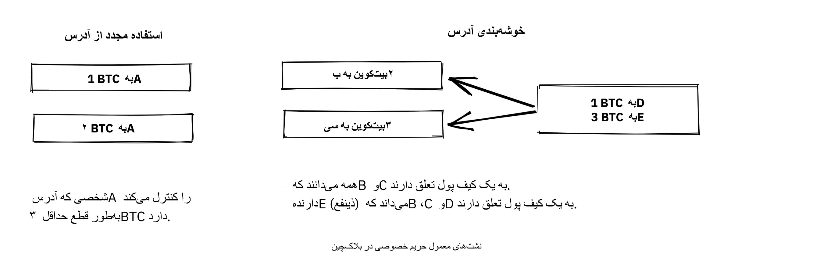
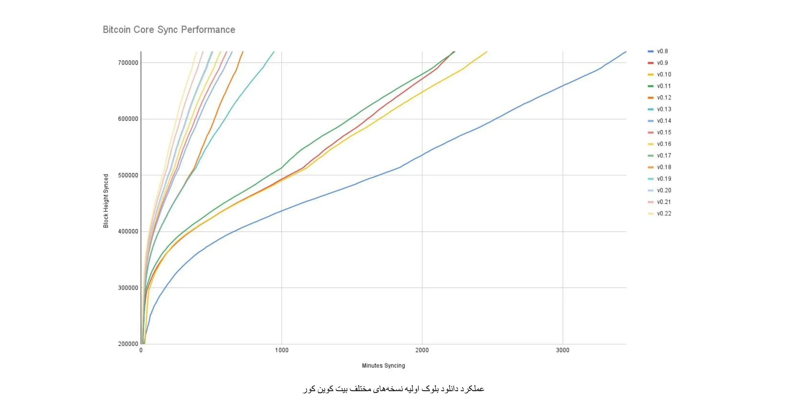
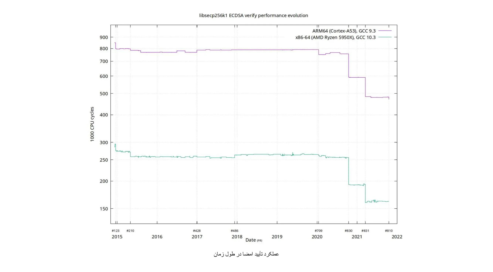
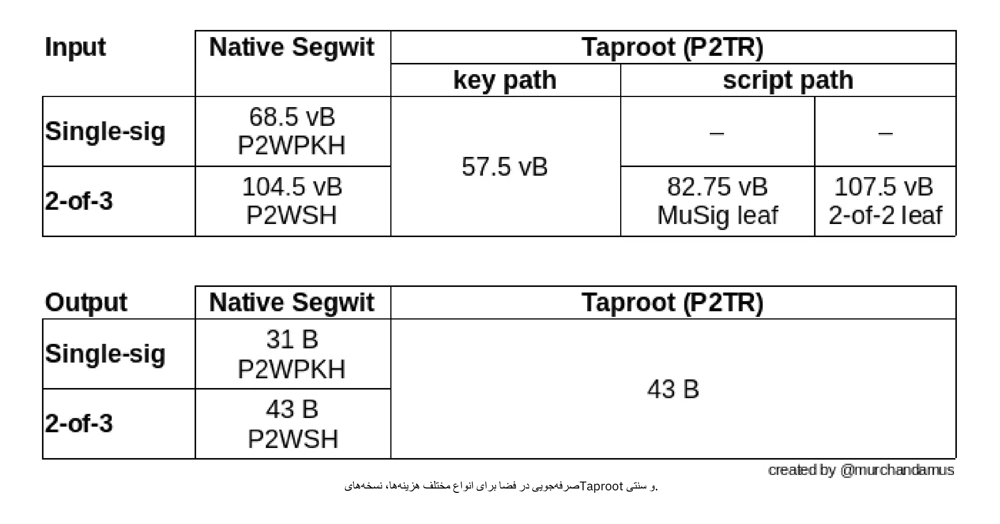
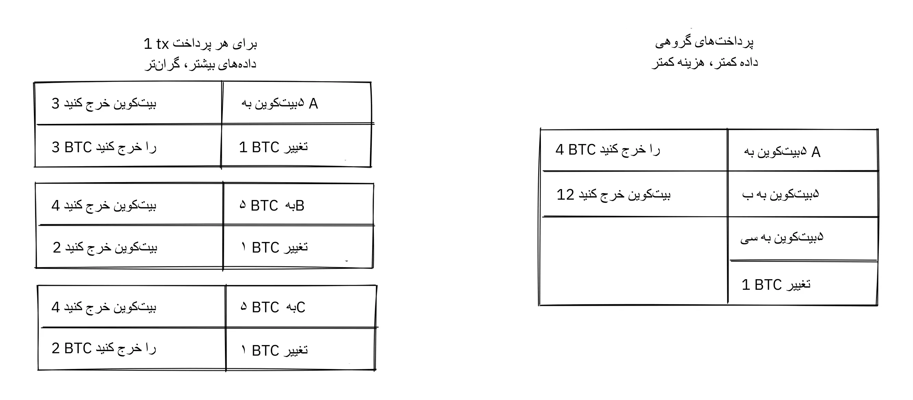
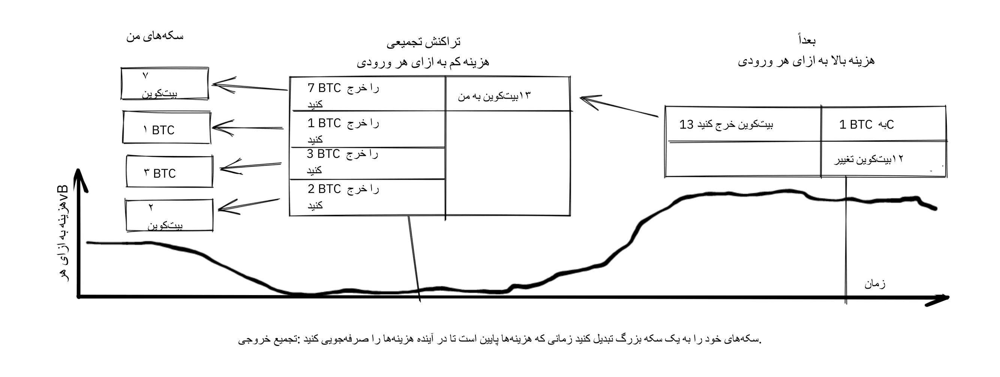
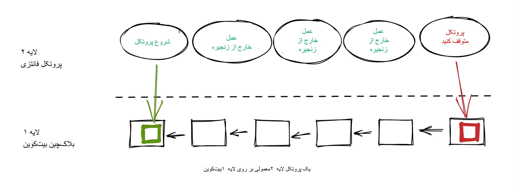
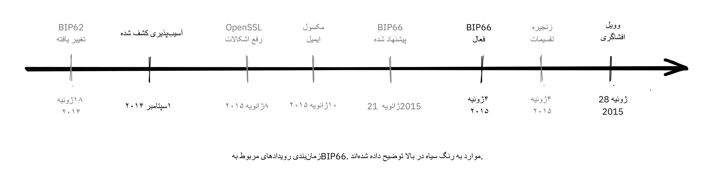
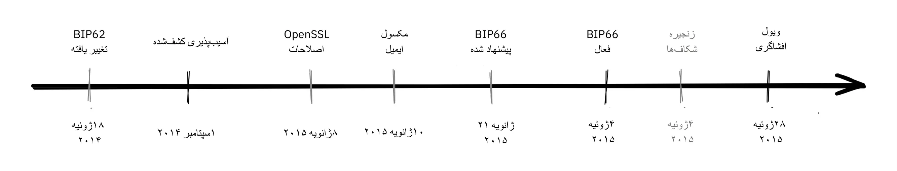
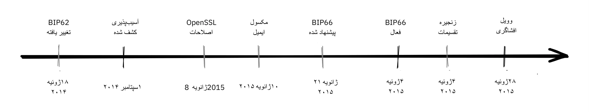

# غوطه‌وری عمیق در فلسفه توسعه Bitcoin


فلسفه توسعه Bitcoin دوره‌ای است برای توسعه‌دهندگان Bitcoin که قبلاً با اصول مفاهیم و فرآیندهایی مانند Proof-of-Work، ساخت بلوک و چرخه عمر تراکنش آشنا هستند و می‌خواهند با کسب درک عمیق‌تری از مبادلات طراحی و فلسفه Bitcoin، سطح خود را ارتقا دهند.

این باید به توسعه‌دهندگان جدید کمک کند تا مهم‌ترین درس‌های بیش از یک دهه توسعه و بحث عمومی Bitcoin را جذب کنند، در حالی که به آن‌ها یک زمینه مفید برای ارزیابی ایده‌های جدید (ایده‌های خوب و بد!) ارائه می‌دهد.


### چه انتظاری باید داشت؟


همان‌طور که در بالا ذکر شد، این یک راهنمای عملی برای توسعه‌دهندگان Bitcoin است. با این حال، Bitcoin یک موضوع گسترده و پیچیده است و ما نمی‌توانیم تمام جنبه‌های آن را در اینجا پوشش دهیم. با این دوره، امیدواریم ویژگی‌های لازم برای شروع فعالیت توسعه شما را مورد بحث قرار دهیم و همچنین شما را قادر سازیم تا به‌طور مستقل به کاوش بیشتر در آن بپردازید.


افراد زیادی در Bitcoin دخیل هستند؛ از آنجا که برخی از آنها نظرات مخالفی دارند، ممکن است در اینجا منابعی پیدا کنید که ایده‌های متناقضی را بیان می‌کنند. با این حال، ما همیشه سعی می‌کنیم به حوزه حقایق پایبند باشیم، جایی که نظرات اهمیتی ندارند.


### چه کسی این را نوشت؟


این دوره از کتابی به همین نام اقتباس شده است که نویسنده اصلی آن کاله روزنبام است و لینئا روزنبام به عنوان هم‌نویسنده در آن مشارکت داشته است.

این کتاب توسط [Chaincode Labs](https://learning.chaincode.com/) سفارش داده و تأمین مالی شده است، مرکزی توسعه‌ای که برنامه‌های آموزشی برای توسعه‌دهندگانی که می‌خواهند درباره توسعه Bitcoin یاد بگیرند، اجرا می‌کند.


+++


# معرفی

<partId>58c48e9b-e285-4dc6-8952-6cc5140b1313</partId>


## بررسی کلی دوره

<chapterId>28b7256b-9cb0-463e-a82d-d732be86c98c</chapterId>


به دوره BTC 303 درباره فلسفه توسعه Bitcoin خوش آمدید.


Bitcoin چیزی فراتر از یک ارز دیجیتال است، این یک دیدگاه فلسفی درباره تمرکززدایی، حریم خصوصی، عدم نیاز به اعتماد و مقاومت را تجسم می‌بخشد. این دوره به‌طور خاص برای توسعه‌دهندگانی طراحی شده است که با مبانی فنی Bitcoin آشنا هستند و اکنون به دنبال تعمیق درک خود از اصول زیربنایی طراحی و حاکمیت Bitcoin هستند.


در طول این دوره، شما به وضوح ارزش‌ها و استراتژی‌های اساسی که تکامل Bitcoin را برای بیش از یک دهه هدایت کرده‌اند، درک خواهید کرد. با بررسی عمیق این موضوعات، دیدگاه انتقادی لازم برای ارزیابی و مشارکت در توسعه‌های آینده با اطمینان را به دست خواهید آورد.


### ارزش‌های مرکزی Bitcoin


چه چیزی Bitcoin را منحصر به فرد می‌کند؟ این بخش ارزش‌های بنیادی در قلب طراحی Bitcoin را آشکار می‌کند. شما به بررسی **غیرمتمرکز بودن**، سنگ بنایی که تضمین می‌کند هیچ نهاد واحدی شبکه را کنترل نمی‌کند؛ **بی‌اعتمادی**، کلیدی برای حذف وابستگی به شخص ثالث؛ **حریم خصوصی**، ضروری برای آزادی فردی و یکپارچگی سیستم؛ و **Supply محدود**، تضمین کدگذاری شده کمیابی که هویت اقتصادی Bitcoin را شکل می‌دهد، خواهید پرداخت. تسلط بر این مفاهیم به شما امکان می‌دهد تا به طور کامل نقاط قوت و ضعف Bitcoin را درک کنید.


### Bitcoin حاکمیت


پیمایش در چشم‌انداز پیچیده حکمرانی Bitcoin نیازمند چیزی فراتر از تخصص فنی است؛ این امر مستلزم درک رویکرد منحصر به فرد Bitcoin به اجماع و تصمیم‌گیری است. در این بخش، شما به بررسی مکانیزم‌ها و فلسفه‌های پشت فرآیندهای حیاتی مانند ارتقاء پروتکل، ضرورت تفکر خصمانه، قدرت همکاری منبع‌باز، چالش‌های مداوم مقیاس‌پذیری و استراتژی‌های پیچیده مورد نیاز زمانی که امور به ناچار اشتباه پیش می‌روند، خواهید پرداخت. با این دانش، شما نه تنها برای مشارکت، بلکه برای شکل‌دهی به آینده Bitcoin به طور مؤثر و مسئولانه آماده خواهید بود.


آماده‌اید تا گام بعدی در سفر Bitcoin خود را بردارید؟ بیایید شروع کنیم!


# Bitcoin مقادیر مرکزی

<partId>2d6c683b-54c8-5465-b2ca-4e96a6828834</partId>


## غیرمتمرکز سازی

<chapterId>9397c84b-0038-5d0e-88d5-11767ce8182d</chapterId>


این تحلیل می‌کند که تمرکززدایی چیست و چرا برای عملکرد Bitcoin ضروری است. ما بین

غیرمتمرکزسازی [ماینرها](https://planb.academy/resources/glossary/mining) و [نودهای کامل](https://planb.academy/resources/glossary/full-node)، و بحث در مورد آنچه که برای مقاومت در برابر سانسور به ارمغان می‌آورند، یکی از ویژگی‌های مرکزی Bitcoin.


سپس بحث به درک بی‌طرفی - یا عدم نیاز به اجازه برای کاربران، ماینرها و توسعه‌دهندگان - که یک ویژگی ضروری برای هر سیستم غیرمتمرکز است، می‌پردازد. در نهایت، به این موضوع می‌پردازیم که چگونه Hard می‌تواند برای درک یک سیستم غیرمتمرکز مانند Bitcoin چالش‌برانگیز باشد و برخی مدل‌های ذهنی را ارائه می‌دهیم که ممکن است به شما در فهم آن کمک کند.


سیستمی که هیچ نقطه مرکزی کنترلی ندارد به عنوان *غیرمتمرکز* شناخته می‌شود. Bitcoin به گونه‌ای طراحی شده است که از داشتن یک نقطه مرکزی کنترل، یا به طور دقیق‌تر یک *نقطه مرکزی سانسور* جلوگیری کند.


غیرمتمرکزسازی وسیله‌ای برای دستیابی به *مقاومت در برابر سانسور* است.


دو جنبه اصلی از تمرکززدایی در Bitcoin وجود دارد: تمرکززدایی Miner و تمرکززدایی Full node.


عدم تمرکز Miner به این واقعیت اشاره دارد که پردازش [تراکنش‌ها](https://planb.academy/resources/glossary/transaction-tx) توسط هیچ نهاد مرکزی انجام یا هماهنگ نمی‌شود. عدم تمرکز Full node به این واقعیت اشاره دارد که اعتبارسنجی [بلوک‌ها](https://planb.academy/resources/glossary/block)، یعنی داده‌هایی که ماینرها تولید می‌کنند، در لبه شبکه و در نهایت توسط کاربران آن انجام می‌شود، نه توسط چند مرجع مورد اعتماد.


### غیرمتمرکزسازی Miner


قبل از Bitcoin تلاش‌هایی برای ایجاد ارزهای دیجیتال صورت گرفته بود، اما بیشتر آن‌ها به دلیل کمبود تمرکززدایی در حاکمیت و مقاومت در برابر سانسور شکست خوردند.


غیرمتمرکزسازی Miner در Bitcoin به این معناست که *ترتیب تراکنش‌ها* توسط هیچ نهاد واحد یا مجموعه ثابتی از نهادها انجام نمی‌شود. این کار به صورت جمعی توسط تمام بازیگرانی که می‌خواهند در آن شرکت کنند انجام می‌شود؛ این مجموعه‌ی معدن‌کاران یک مجموعه پویا از کاربران است. هر کسی می‌تواند به دلخواه خود به آن بپیوندد یا از آن خارج شود. این ویژگی Bitcoin را در برابر سانسور مقاوم می‌سازد.


اگر Bitcoin متمرکز بود، در برابر کسانی که می‌خواستند آن را سانسور کنند، مانند دولت‌ها، آسیب‌پذیر می‌بود. این سرنوشت مشابه تلاش‌های قبلی برای ایجاد پول دیجیتال را می‌یافت. در مقدمه [یک مقاله](https://www.blockstream.com/sidechains.pdf) با عنوان "توانمندسازی نوآوری‌های [Blockchain](https://planb.academy/resources/glossary/blockchain) با زنجیره‌های جانبی متصل"، نویسندگان توضیح می‌دهند که نسخه‌های اولیه پول دیجیتال برای محیط‌های خصمانه مجهز نبودند (همچنین به فصل تفکر خصمانه در بخش بعدی مراجعه کنید).


دیوید چام در سال ۱۹۸۳ پول دیجیتال را به عنوان یک موضوع تحقیقاتی معرفی کرد، در محیطی با یک سرور مرکزی که برای جلوگیری از [Double-spending](https://planb.academy/resources/glossary/double-spending-attack) مورد اعتماد است. برای کاهش خطر حریم خصوصی افراد از این طرف مرکزی مورد اعتماد و برای اجرای [قابلیت تعویض‌پذیری](https://planb.academy/resources/glossary/fungibility)، چام [امضای کور](https://planb.academy/resources/glossary/blind-signature) را معرفی کرد که از آن برای ارائه یک روش رمزنگاری به منظور جلوگیری از ارتباط امضاهای سرور مرکزی (که نمایانگر سکه‌ها هستند) استفاده کرد، در حالی که همچنان به سرور مرکزی اجازه می‌دهد تا از دوبار خرج کردن جلوگیری کند.

نیاز به یک سرور مرکزی به پاشنه آشیل پول دیجیتال تبدیل شد[Gri99]. در حالی که می‌توان این نقطه شکست واحد را با جایگزینی امضای سرور مرکزی با امضای آستانه‌ای از چند امضاکننده توزیع کرد، برای قابلیت حسابرسی مهم است که امضاکنندگان متمایز و قابل شناسایی باشند. این امر همچنان سیستم را در معرض شکست قرار می‌دهد، زیرا هر امضاکننده می‌تواند به صورت فردی شکست بخورد یا مجبور به شکست شود.


مشخص شد که استفاده از یک سرور مرکزی برای ترتیب‌دهی تراکنش‌ها به دلیل ریسک بالای سانسور گزینه‌ای قابل قبول نیست. حتی اگر سرور مرکزی با یک فدراسیون از مجموعه‌ای ثابت از n سرور جایگزین شود که حداقل m از آن‌ها باید ترتیب‌دهی را تأیید کنند، باز هم مشکلاتی وجود خواهد داشت. مشکل در واقع به جایی منتقل می‌شود که کاربران باید بر روی این مجموعه n سرور توافق کنند و همچنین بر روی چگونگی جایگزینی سرورهای مخرب با سرورهای خوب بدون اتکا به یک مرجع مرکزی.


بیایید به این فکر کنیم که چه اتفاقی می‌افتد اگر Bitcoin قابل سانسور باشد. سانسورچی می‌تواند به کاربران فشار بیاورد تا خود را شناسایی کنند، اعلام کنند پولشان از کجا می‌آید یا قبل از اینکه تراکنش‌هایشان وارد Blockchain شود، با آن چه چیزی می‌خرند.


همچنین، نبود مقاومت در برابر سانسور به سانسورچی اجازه می‌دهد تا کاربران را وادار به پذیرش قوانین جدید سیستم کند. به عنوان مثال، آنها می‌توانند تغییری را اعمال کنند که به آنها اجازه دهد پول Supply را افزایش دهند و از این طریق خود را غنی کنند. در چنین شرایطی، کاربری که بلوک‌ها را تأیید می‌کند سه گزینه برای مدیریت قوانین جدید خواهد داشت:


- پذیرفتن: تغییرات را بپذیرید و آن‌ها را در Full node خود اعمال کنید.
- رد: از پذیرش تغییرات خودداری کنید؛ این کار کاربر را با سیستمی مواجه می‌کند که دیگر تراکنش‌ها را پردازش نمی‌کند، زیرا بلوک‌های سانسورگر اکنون توسط Full node کاربر نامعتبر تلقی می‌شوند.
- حرکت: یک نقطه مرکزی کنترل جدید منصوب کنید؛ همه کاربران باید نحوه هماهنگی را بیابند و سپس بر روی نقطه کنترل مرکزی جدید توافق کنند.


اگر آن‌ها موفق شوند، به احتمال زیاد همان مشکلات در آینده دوباره ظاهر خواهند شد، با توجه به اینکه سیستم همچنان به همان اندازه قابل سانسور باقی مانده است.


هیچ‌کدام از این گزینه‌ها برای کاربر مفید نیستند.


مقاومت در برابر سانسور از طریق تمرکززدایی چیزی است که Bitcoin را از سایر سیستم‌های پولی متمایز می‌کند، اما به دلیل *مشکل Double-spending* دستیابی به آن کار آسانی نیست. این مشکل اطمینان از این است که هیچ‌کس نمی‌تواند یک سکه را دوبار خرج کند، مسئله‌ای که بسیاری از مردم فکر می‌کردند حل آن به صورت غیرمتمرکز غیرممکن است. Satoshi [ناکاموتو](https://planb.academy/resources/glossary/nakamoto-satoshi) در [وایت‌پیپر Bitcoin](https://planb.academy/bitcoin.pdf) خود درباره چگونگی حل مشکل Double-spending می‌نویسد:


> در این مقاله، ما یک راه‌حل برای مسئله Double-spending با استفاده از یک سرور توزیع‌شده همتا به همتا Timestamp برای اثبات محاسباتی ترتیب زمانی تراکنش‌ها به generate پیشنهاد می‌کنیم.


در اینجا او از عبارت عجیب "سرور Timestamp توزیع‌شده همتا به همتا" استفاده می‌کند. کلمه کلیدی در اینجا *توزیع‌شده* است، که در این زمینه به این معناست که هیچ نقطه کنترل مرکزی وجود ندارد. سپس ناکاموتو به توضیح می‌پردازد که چگونه [Proof-of-Work](https://planb.academy/resources/glossary/proof-of-work) راه‌حل است.

با این حال، هیچ‌کس بهتر از این توضیح نمی‌دهد که

[گرگوری ماکسول در ردیت](https://www.reddit.com/r/Bitcoin/comments/ddddfl/question_on_the_vulnerability_of_bitcoin/f2g9e7b/)، جایی که او به کسی پاسخ می‌دهد که پیشنهاد محدود کردن قدرت ماینرها [Hash](https://planb.academy/resources/glossary/hashrate) را برای جلوگیری از حملات احتمالی 51% می‌دهد:


> یک سیستم غیرمتمرکز مانند Bitcoin از یک انتخابات عمومی استفاده می‌کند. اما شما نمی‌توانید در یک سیستم غیرمتمرکز فقط یک رأی‌گیری از 'مردم' داشته باشید زیرا این امر نیاز به یک حزب متمرکز برای مجوز دادن به مردم برای رأی‌گیری دارد. در عوض، Bitcoin از رأی‌گیری قدرت محاسباتی استفاده می‌کند زیرا امکان تأیید قدرت محاسباتی بدون کمک هیچ مرکزی وجود دارد.
شخص ثالث.


این پست توضیح می‌دهد که چگونه شبکه غیرمتمرکز Bitcoin می‌تواند از طریق استفاده از Proof-of-Work به توافقی در مورد ترتیب تراکنش‌ها برسد.


سپس نتیجه‌گیری می‌کند که حمله ۵۱٪ به‌خصوص نگران‌کننده نیست، در مقایسه با اینکه مردم به ویژگی‌های تمرکززدایی Bitcoin اهمیت نمی‌دهند یا آن را درک نمی‌کنند:


> خطر بسیار بزرگ‌تر برای Bitcoin این است که عموم مردم که از آن استفاده می‌کنند، آن را درک نکنند، به آن اهمیت ندهند و از ویژگی‌های تمرکززدایی که آن را در مقایسه با گزینه‌های متمرکز ارزشمند می‌سازد، محافظت نکنند.

نتیجه‌گیری مهم است. اگر مردم از غیرمتمرکز بودن Bitcoin که نماینده‌ای برای مقاومت در برابر سانسور است، محافظت نکنند، Bitcoin ممکن است قربانی نیروهای متمرکز کننده شود، تا زمانی که آنقدر متمرکز شود که سانسور به یک مسئله تبدیل شود. سپس بیشتر، اگر نه همه، ارزش پیشنهادی آن از بین می‌رود. این ما را به بخش بعدی درباره غیرمتمرکز بودن Full node می‌رساند.


### غیرمتمرکزسازی Full node


در پاراگراف‌های بالا، بیشتر درباره غیرمتمرکزسازی Miner و اینکه چگونه متمرکز کردن ماینرها می‌تواند اجازه سانسور را بدهد صحبت کردیم. اما جنبه دیگری از غیرمتمرکزسازی نیز وجود دارد، یعنی *غیرمتمرکزسازی Full node*.


اهمیت غیرمتمرکزسازی Full node به بی‌اعتمادی مرتبط است. فرض کنید یک کاربر به دلیل، برای مثال، افزایش ممنوعیت‌آمیز هزینه‌های عملیاتی، اجرای Full node خود را متوقف کند. در این صورت، آن‌ها باید به روش دیگری با شبکه Bitcoin تعامل داشته باشند، شاید با استفاده از [کیف‌پول‌های وب](https://planb.academy/resources/glossary/wallet) یا کیف‌پول‌های سبک، که نیاز به سطحی از اعتماد به ارائه‌دهندگان این خدمات دارد.


کاربر از اجرای مستقیم [قوانین اجماع](https://planb.academy/resources/glossary/consensus-rules) شبکه به اعتماد به اینکه شخص دیگری این کار را انجام خواهد داد، می‌رود. حال فرض کنید که اکثر کاربران اجرای [اجماع](https://planb.academy/resources/glossary/consensus) را به یک نهاد مورد اعتماد واگذار کنند. در این صورت، شبکه می‌تواند به سرعت به سمت تمرکزگرایی حرکت کند و قوانین شبکه می‌توانند توسط بازیگران مخرب توطئه‌گر تغییر یابند.


در [a

مقاله مجله Bitcoin](https://bitcoinmagazine.com/technical/decentralist-perspective-Bitcoin-might-need-small-blocks-1442090446)، آرون ون ویروم با توسعه‌دهندگان Bitcoin درباره دیدگاه‌هایشان در مورد تمرکززدایی و خطرات مرتبط با افزایش حداکثر اندازه بلاک Bitcoin مصاحبه می‌کند. این بحث یک موضوع Hot در دوره ۲۰۱۴-۲۰۱۷ بود، زمانی که بسیاری از افراد بر سر افزایش محدودیت اندازه بلاک برای اجازه دادن به تراکنش‌های بیشتر بحث می‌کردند.


یک استدلال قوی علیه افزایش اندازه بلوک این است که هزینه تأیید را افزایش می‌دهد. اگر هزینه تأیید افزایش یابد، برخی از کاربران را وادار می‌کند تا اجرای نودهای کامل خود را متوقف کنند. این امر به نوبه خود منجر به این خواهد شد که افراد بیشتری نتوانند از سیستم به روش Trustless استفاده کنند.


پیتر ویل در مقاله‌ای نقل شده است که در آن خطرات متمرکزسازی Full node را توضیح می‌دهد:


> اگر بسیاری از شرکت‌ها از Full node استفاده کنند، به این معنی است که همه آن‌ها باید متقاعد شوند تا مجموعه قوانین متفاوتی را اجرا کنند. به عبارت دیگر: تمرکززدایی از اعتبارسنجی بلاک همان چیزی است که به قوانین اجماع وزن می‌دهد.
> اما اگر تعداد Full node بسیار کاهش یابد، به عنوان مثال به این دلیل که همه از کیف‌پول‌های وب، صرافی‌ها و کیف‌پول‌های SPV یا موبایل یکسان استفاده کنند، ممکن است مقررات به واقعیت تبدیل شود. و اگر مقامات بتوانند قوانین اجماع را تنظیم کنند، به این معنی است که می‌توانند هر چیزی را که Bitcoin را Bitcoin می‌کند تغییر دهند. حتی محدودیت 21 میلیون Bitcoin.

بفرمایید. کاربران Bitcoin باید نودهای کامل خود را اجرا کنند تا از تلاش تنظیم‌کنندگان و شرکت‌های بزرگ برای تغییر قوانین اجماع جلوگیری کنند.


### بی‌طرفی


Bitcoin خنثی یا بدون نیاز به مجوز است، همان‌طور که مردم دوست دارند آن را بنامند. این بدان معناست که Bitcoin اهمیتی نمی‌دهد که شما چه کسی هستید یا از آن برای چه استفاده می‌کنید.


Bitcoin خنثی است، که این یک نکته مثبت است و تنها راهی است که می‌تواند کار کند. اگر توسط یک سازمان کنترل می‌شد، فقط یک نوع شیء مجازی دیگر بود و من هیچ علاقه‌ای به آن نداشتم.


تا زمانی که طبق قوانین بازی کنید، می‌توانید از آن به دلخواه خود استفاده کنید، بدون اینکه از کسی اجازه بگیرید. این شامل *Mining*، *معامله کردن* در آن، و *ساخت پروتکل‌ها و خدمات* بر روی Bitcoin می‌شود:


- اگر *Mining* یک فرآیند دارای مجوز بود، ما به یک مرجع مرکزی نیاز داشتیم تا انتخاب کند چه کسی اجازه استخراج دارد. این به احتمال زیاد منجر به این می‌شد که استخراج‌کنندگان مجبور به امضای قراردادهای قانونی شوند که در آن موافقت کنند

سانسور کردن تراکنش‌ها بر اساس خواسته‌های مقامات مرکزی، که هدف اصلی Mining را از بین می‌برد.


- اگر افراد *معامله‌کننده* در Bitcoin مجبور بودند اطلاعات شخصی ارائه دهند، اعلام کنند که معاملاتشان برای چه بوده است، یا به‌نوعی ثابت کنند که شایسته معامله هستند، ما نیز به یک نقطه مرکزی از قدرت نیاز داشتیم تا کاربران یا معاملات را تأیید کند. باز هم، این منجر به سانسور و حذف می‌شد.


- اگر توسعه‌دهندگان مجبور بودند برای *ساخت پروتکل‌ها* بر روی Bitcoin اجازه بگیرند، تنها پروتکل‌هایی که توسط کمیته مرکزی اعطای مجوز توسعه‌دهنده مجاز شناخته می‌شدند، توسعه می‌یافتند. این امر، به دلیل دخالت دولت، به‌طور اجتناب‌ناپذیری شامل حذف تمام پروتکل‌های حفظ حریم خصوصی و تمام تلاش‌ها برای بهبود تمرکززدایی می‌شد.


در همه سطوح، تلاش برای اعمال محدودیت‌ها بر اینکه چه کسی می‌تواند از Bitcoin برای چه استفاده کند، به Bitcoin آسیب می‌زند تا جایی که دیگر به ارزش پیشنهادی خود عمل نمی‌کند.


پیتِر ویول https://Bitcoin.stackexchange.com/a/92055/69518[به سوالی در Stack Exchange پاسخ می‌دهد] درباره اینکه چگونه Blockchain به پایگاه‌های داده معمولی مرتبط است. او توضیح می‌دهد که چگونه می‌توان از طریق استفاده از Proof-of-Work در ترکیب با انگیزه‌های اقتصادی، به بی‌نیازی از مجوز دست یافت.


او نتیجه می‌گیرد:


> استفاده از الگوریتم‌های اجماع Trustless مانند PoW چیزی را اضافه می‌کند که هیچ ساختار دیگری به شما نمی‌دهد (مشارکت بدون نیاز به مجوز، به این معنی که گروه مشخصی از شرکت‌کنندگان وجود ندارد که بتوانند تغییرات شما را سانسور کنند)، اما استفاده از الگوریتم‌های اجماع Trustless مانند PoW هزینه بالایی دارد و فرضیات اقتصادی آن باعث می‌شود که تقریباً فقط برای سیستم‌هایی که ارز دیجیتال خود را تعریف می‌کنند مفید باشد.
> احتمالاً تنها یک یا چند مکان در جهان برای استفاده واقعی از این‌ها وجود دارد.

او توضیح می‌دهد که برای دستیابی به بی‌نیازی از مجوز، سیستم به احتمال زیاد به ارز خود نیاز دارد و بدین ترتیب "موارد استفاده را به طور مؤثر به ارزهای دیجیتال محدود می‌کند". این به این دلیل است که مشارکت بدون نیاز به مجوز، یا Mining، به انگیزه‌های اقتصادی نیاز دارد که در خود سیستم تعبیه شده باشد.


### درک غیرمتمرکزسازی


یکی از جنبه‌های جذاب Bitcoin این است که چقدر Hard است که هیچ‌کس آن را کنترل نمی‌کند. در Bitcoin هیچ کمیته یا مدیری وجود ندارد. گرگوری مکسول، دوباره [در ساب‌ردیت Bitcoin](https://www.reddit.com/r/Bitcoin/comments/s82t2n/comment/htdte7w/?utm_source=share&utm_medium=web2x&context=3)، این را به زبان انگلیسی به شکلی جالب مقایسه می‌کند:


> بسیاری از مردم درک زمان Hard از سیستم‌های خودمختار دارند، در زندگی‌شان چیزهای زیادی مانند زبان انگلیسی وجود دارد-- اما مردم به سادگی آن‌ها را بدیهی می‌دانند و حتی به عنوان سیستم به آن‌ها فکر نمی‌کنند. آن‌ها در یک روش تفکر متمرکز گیر کرده‌اند که در آن هر چیزی که به عنوان یک 'چیز' در نظر می‌گیرند، دارای یک مرجع است که آن را کنترل می‌کند.
>

> Bitcoin بر روی هیچ چیزی تمرکز نمی‌کند. افراد مختلفی که Bitcoin را پذیرفته‌اند، به اختیار خود تصمیم به ترویج آن گرفته‌اند و نحوه انجام این کار به خودشان مربوط است. افرادی که بر قدرت و اقتدار تمرکز دارند ممکن است این فعالیت‌ها را ببینند و باور کنند که این‌ها عملیاتی از سوی مرجع Bitcoin است، اما چنین مرجعی وجود ندارد.


نحوه عملکرد Bitcoin از طریق تمرکززدایی شبیه به هوش جمعی فوق‌العاده‌ای است که در میان بسیاری از گونه‌ها در طبیعت یافت می‌شود. دانشمند کامپیوتر رادیکا ناگپال در یک [سخنرانی تد](https://www.ted.com/talks/radhika_nagpal_what_intelligent_machines_can_learn_from_a_school_of_fish) درباره رفتار جمعی مدارس ماهی و چگونگی تلاش دانشمندان برای تقلید از آن با استفاده از ربات‌ها صحبت می‌کند.


> ثانیاً، و چیزی که هنوز هم برایم بسیار شگفت‌انگیز است، این است که می‌دانیم هیچ رهبری بر این گروه ماهی‌ها نظارت نمی‌کند. در عوض، این رفتار ذهن جمعی شگفت‌انگیز صرفاً از تعاملات یک ماهی با ماهی دیگر پدیدار می‌شود.
> به‌نوعی، تعاملات یا قوانین درگیری بین ماهی‌های همسایه وجود دارد که باعث می‌شود همه چیز به خوبی پیش برود.

او اشاره می‌کند که بسیاری از سیستم‌ها، چه طبیعی و چه مصنوعی، می‌توانند و بدون رهبر کار می‌کنند و قدرتمند و مقاوم هستند. هر فرد تنها با محیط اطراف خود تعامل دارد، اما با هم چیزی شگرف را تشکیل می‌دهند.


مهم نیست که درباره Bitcoin چه فکری می‌کنید، ماهیت غیرمتمرکز آن کنترل را دشوار می‌سازد. Bitcoin وجود دارد و کاری نمی‌توانید در مورد آن انجام دهید. این چیزی است که باید مورد مطالعه قرار گیرد، نه بحث.


### نتیجه‌گیری درباره تمرکززدایی


ما بین تمرکززدایی Full node و تمرکززدایی Mining تفاوت قائل می‌شویم. تمرکززدایی Mining وسیله‌ای برای دستیابی به مقاومت در برابر سانسور است، در حالی که تمرکززدایی Full node چیزی است که مانع از تغییر قوانین اجماع شبکه Hard بدون حمایت گسترده کاربران می‌شود.


ماهیت غیرمتمرکز Bitcoin امکان بی‌طرفی نسبت به توسعه‌دهندگان، کاربران و ماینرها را فراهم می‌کند. هر کسی می‌تواند بدون درخواست مجوز شرکت کند.


سیستم‌های غیرمتمرکز می‌توانند Hard برای درک باشند، اما مدل‌های ذهنی وجود دارند که ممکن است کمک کنند، مثلاً زبان انگلیسی یا دسته‌های ماهی.


## بی‌اعتمادی

<chapterId>0506ba61-16a3-543c-95fa-3f3e2dd64121</chapterId>


این فصل مفهوم بی‌اعتمادی را بررسی می‌کند، از دیدگاه علوم کامپیوتر چه معنایی دارد و چرا Bitcoin باید Trustless باشد تا ارزش پیشنهادی خود را حفظ کند.

سپس درباره‌ی معنای استفاده از Bitcoin به شیوه‌ی Trustless صحبت می‌کنیم و اینکه چه نوع تضمین‌هایی Full node می‌تواند و نمی‌تواند به شما بدهد.

در بخش آخر، ما به تعامل دنیای واقعی بین Bitcoin و نرم‌افزارها یا کاربران واقعی نگاه می‌کنیم و نیاز به انجام مصالحه بین راحتی و عدم نیاز به اعتماد برای انجام هر کاری را بررسی می‌کنیم.


مردم اغلب چیزهایی مانند "Bitcoin عالی است زیرا Trustless است" می‌گویند.


منظور آنها از Trustless چیست؟ Pieter Wuille این اصطلاح پرکاربرد را در [Stack Exchange](https://Bitcoin.stackexchange.com/a/45674/69518) توضیح می‌دهد:


> اعتمادی که در "Trustless" درباره‌اش صحبت می‌کنیم، یک اصطلاح فنی انتزاعی است. یک سیستم توزیع‌شده زمانی Trustless نامیده می‌شود که برای عملکرد صحیح به هیچ طرف معتمدی نیاز نداشته باشد.

به طور خلاصه، کلمه *Trustless* به ویژگی‌ای از پروتکل Bitcoin اشاره دارد که به موجب آن می‌تواند به صورت منطقی بدون "هیچ طرف قابل اعتمادی" عمل کند. این با اعتمادی که ناگزیر باید به نرم‌افزار یا سخت‌افزاری که اجرا می‌کنید داشته باشید، متفاوت است. در مورد این جنبه دیگر از اعتماد، در ادامه این فصل بیشتر بحث خواهد شد.


در سیستم‌های متمرکز، ما به شهرت یک بازیگر مرکزی اعتماد می‌کنیم تا مطمئن شویم که آن‌ها امنیت را حفظ خواهند کرد یا در صورت بروز مشکلات، به عقب برمی‌گردند، و همچنین به سیستم قانونی برای تحریم هرگونه تخلف تکیه می‌کنیم. این الزامات اعتماد در سیستم‌های غیرمتمرکز و مستعار مشکل‌ساز هستند - هیچ امکانی برای بازگشت وجود ندارد، بنابراین واقعاً نمی‌توان هیچ اعتمادی داشت. در مقدمه [وایت‌پیپر Bitcoin](https://Bitcoin.org/Bitcoin.pdf)، Satoshi ناکاموتو این مشکل را توصیف می‌کند:


> تجارت در اینترنت تقریباً به‌طور انحصاری به مؤسسات مالی که به عنوان طرف‌های ثالث مورد اعتماد برای پردازش پرداخت‌های الکترونیکی عمل می‌کنند، متکی شده است.
> در حالی که سیستم برای اکثر تراکنش‌ها به اندازه کافی خوب کار می‌کند، همچنان از ضعف‌های ذاتی مدل مبتنی بر اعتماد رنج می‌برد. تراکنش‌های کاملاً غیرقابل برگشت واقعاً ممکن نیستند، زیرا مؤسسات مالی نمی‌توانند از میانجی‌گری در اختلافات اجتناب کنند. هزینه میانجی‌گری هزینه‌های تراکنش را افزایش می‌دهد، اندازه حداقل عملی تراکنش را محدود می‌کند و امکان تراکنش‌های کوچک و غیررسمی را قطع می‌کند، و هزینه گسترده‌تری در از دست دادن توانایی انجام پرداخت‌های غیرقابل برگشت برای خدمات غیرقابل برگشت وجود دارد.
> با امکان برگشت‌پذیری، نیاز به اعتماد گسترش می‌یابد. بازرگانان باید نسبت به مشتریان خود محتاط باشند و از آن‌ها اطلاعات بیشتری بخواهند تا آنچه که در غیر این صورت نیاز داشتند. درصد معینی از تقلب به عنوان اجتناب‌ناپذیر پذیرفته می‌شود. این هزینه‌ها و عدم قطعیت‌های پرداخت را می‌توان با استفاده از ارز فیزیکی به صورت حضوری اجتناب کرد، اما هیچ مکانیزمی برای انجام پرداخت‌ها از طریق یک کانال ارتباطی بدون یک طرف مورد اعتماد وجود ندارد.

به نظر می‌رسد که نمی‌توانیم یک سیستم غیرمتمرکز مبتنی بر اعتماد داشته باشیم و به همین دلیل بی‌اعتمادی در Bitcoin مهم است.


برای استفاده از Bitcoin به شیوه Trustless، باید یک نود Bitcoin کاملاً معتبر را اجرا کنید. تنها در این صورت قادر خواهید بود تا تأیید کنید که بلوک‌هایی که از دیگران دریافت می‌کنید، از قوانین اجماع پیروی می‌کنند؛ به عنوان مثال، برنامه صدور سکه رعایت می‌شود و هیچ دوباره‌خرجی در Blockchain رخ نمی‌دهد. اگر یک Full node را اجرا نکنید، تأیید بلوک‌های Bitcoin را به شخص دیگری واگذار می‌کنید و به آن‌ها اعتماد می‌کنید که حقیقت را به شما بگویند، که به این معناست که شما از Bitcoin به صورت بدون اعتماد استفاده نمی‌کنید.


دیوید هاردینگ [مقاله‌ای در وب‌سایت Bitcoin.org](https://Bitcoin.org/en/Bitcoin-core/features/validation) نوشته است که توضیح می‌دهد چگونه اجرای Full node - یا استفاده از Bitcoin به صورت بدون نیاز به اعتماد - در واقع به شما کمک می‌کند:


> ارز Bitcoin تنها زمانی کار می‌کند که مردم بیت‌کوین‌ها را در Exchange برای چیزهای ارزشمند دیگر بپذیرند. این بدان معناست که این مردم هستند که با پذیرش بیت‌کوین‌ها به آن ارزش می‌دهند و تصمیم می‌گیرند که Bitcoin چگونه باید کار کند.
>

> وقتی بیت‌کوین‌ها را می‌پذیرید، قدرت اجرای قوانین Bitcoin را دارید، مانند جلوگیری از مصادره بیت‌کوین‌های هر شخصی بدون دسترسی به کلیدهای خصوصی آن شخص.
>

> متأسفانه، بسیاری از کاربران قدرت اجرایی خود را برون‌سپاری می‌کنند. این امر باعث می‌شود که تمرکززدایی Bitcoin در وضعیتی ضعیف قرار گیرد که در آن تعداد کمی از ماینرها می‌توانند با تعداد کمی از بانک‌ها و خدمات رایگان تبانی کنند تا قوانین Bitcoin را برای همه آن کاربرانی که قدرت خود را برون‌سپاری کرده‌اند، تغییر دهند.
>

> برخلاف کیف‌پول‌های دیگر، Bitcoin Core قوانین را اجرا می‌کند—بنابراین اگر ماینرها و بانک‌ها قوانین را برای کاربران غیرتأییدکننده خود تغییر دهند، آن کاربران قادر نخواهند بود به کاربران Bitcoin Core با اعتبارسنجی کامل مانند شما پرداخت کنند.


او می‌گوید که اجرای یک Full node به شما کمک می‌کند تا هر جنبه‌ای از Blockchain را بدون اعتماد به دیگران تأیید کنید، به‌طوری‌که اطمینان حاصل کنید سکه‌هایی که از دیگران دریافت می‌کنید، اصل هستند. این عالی است، اما یک نکته مهم وجود دارد که Full node نمی‌تواند به شما کمک کند: نمی‌تواند از دوبار خرج کردن از طریق بازنویسی زنجیره جلوگیری کند.


> توجه داشته باشید که اگرچه همه برنامه‌ها—از جمله Bitcoin Core—در برابر بازنویسی زنجیره آسیب‌پذیر هستند، Bitcoin یک مکانیزم دفاعی ارائه می‌دهد: هرچه تأییدیه‌های بیشتری برای تراکنش‌های خود داشته باشید، امنیت بیشتری خواهید داشت. هیچ دفاع غیرمتمرکز شناخته‌شده‌ای بهتر از این وجود ندارد.

مهم نیست نرم‌افزار شما چقدر پیشرفته است، شما همچنان باید اعتماد کنید که بلوک‌هایی که حاوی سکه‌های شما هستند بازنویسی نخواهند شد. با این حال، همان‌طور که هاردینگ اشاره کرده است، می‌توانید منتظر تعداد مشخصی از تأییدیه‌ها باشید، پس از آن احتمال بازنویسی زنجیره را به اندازه کافی کوچک در نظر می‌گیرید که قابل قبول باشد.


انگیزه‌های استفاده از Bitcoin به شیوه‌ای مشابه Trustless با نیاز سیستم به تمرکززدایی Full node همسو است. هرچه افراد بیشتری از نودهای کامل خود استفاده کنند، تمرکززدایی Full node بیشتر می‌شود و در نتیجه، Bitcoin در برابر تغییرات مخرب در پروتکل قوی‌تر می‌ایستد. اما متأسفانه، همان‌طور که در بخش تمرکززدایی Full node توضیح داده شده است، کاربران اغلب به دلیل معامله اجتناب‌ناپذیر بین بی‌اعتمادی و راحتی، خدمات مورد اعتماد را انتخاب می‌کنند.


عدم نیاز به اعتماد Bitcoin از دیدگاه سیستمی کاملاً ضروری است. در سال ۲۰۱۸، مت کورالو، [در مورد عدم نیاز به اعتماد](https://btctranscripts.com/baltic-honeybadger/2018/trustlessness-scalability-and-directions-in-security-models/) در کنفرانس Baltic Honeybadger در ریگا صحبت کرد.


ماهیت آن صحبت این است که شما نمی‌توانید سیستم‌های Trustless را بر روی یک سیستم مورد اعتماد بسازید، اما می‌توانید سیستم‌های مورد اعتماد - به عنوان مثال، یک Wallet امانی - را بر روی یک سیستم Trustless بسازید.


یک پایه Trustless Layer امکان مصالحه‌های مختلف در سطوح بالاتر را فراهم می‌کند.


این مدل امنیتی به طراح سیستم اجازه می‌دهد تا مبادلات را انتخاب کند

که برای آنها منطقی باشد بدون اینکه این مصالحه‌ها را به دیگران تحمیل کنند.


### اعتماد نکنید، بررسی کنید


Bitcoin به صورت غیرقابل اعتماد کار می‌کند، اما شما همچنان باید تا حدی به نرم‌افزار و سخت‌افزار خود اعتماد کنید. این به این دلیل است که ممکن است نرم‌افزار یا سخت‌افزار شما به گونه‌ای برنامه‌ریزی نشده باشد که آنچه روی جعبه نوشته شده را انجام دهد. به عنوان مثال:


- پردازنده ممکن است به‌طور مخرب طراحی شده باشد تا عملیات رمزنگاری کلید خصوصی را شناسایی کرده و داده‌های کلید خصوصی را افشا کند.
- مولد اعداد تصادفی سیستم عامل ممکن است به اندازه‌ای که ادعا می‌کند تصادفی نباشد.
- Bitcoin Core ممکن است کدی را به صورت مخفیانه وارد کرده باشد که کلیدهای خصوصی شما را به یک عامل بد ارسال کند.


بنابراین، علاوه بر اجرای Full node، باید مطمئن شوید که آنچه را که قصد دارید اجرا کنید. کاربر Reddit به نام brianddk [مقاله‌ای نوشت](https://www.reddit.com/r/Bitcoin/comments/smj1ep/bitcoin_v220_and_guix_stronger_defense_against/) درباره سطوح مختلف اعتمادی که می‌توانید هنگام تأیید نرم‌افزار خود انتخاب کنید. در بخش "اعتماد به سازندگان"، او درباره ساخت‌های قابل بازتولید صحبت می‌کند:


> ساخت‌های قابل بازتولید روشی برای طراحی نرم‌افزار هستند که به توسعه‌دهندگان جامعه اجازه می‌دهد هر یک نرم‌افزار را بسازند و اطمینان حاصل کنند که نصب‌کننده نهایی ساخته شده با آنچه سایر توسعه‌دهندگان تولید می‌کنند، یکسان است. با پروژه‌ای بسیار عمومی و قابل بازتولید مانند Bitcoin، نیازی نیست که به یک توسعه‌دهنده خاص به طور کامل اعتماد شود. بسیاری از توسعه‌دهندگان می‌توانند همگی ساخت را انجام دهند و تأیید کنند که همان فایلی را تولید کرده‌اند که سازنده اصلی به صورت دیجیتالی امضا کرده است.

مقاله ۵ سطح اعتماد را تعریف می‌کند: اعتماد به سایت، سازندگان، کامپایلر، هسته، و سخت‌افزار.


برای عمیق‌تر کردن موضوع ساخت‌های قابل بازتولید، کارل دونگ [یک ارائه درباره Guix انجام داد](https://btctranscripts.com/breaking-Bitcoin/2019/Bitcoin-build-system/) که توضیح می‌دهد چرا اعتماد به سیستم‌عامل، کتابخانه‌ها و کامپایلرها می‌تواند مشکل‌ساز باشد و چگونه می‌توان با سیستمی به نام Guix که امروزه توسط Bitcoin Core استفاده می‌شود، این مشکل را حل کرد.


> بنابراین، در مورد این واقعیت که زنجیره ابزار ما می‌تواند شامل مجموعه‌ای از باینری‌های مورد اعتماد باشد که می‌توانند به‌طور قابل بازتولید مخرب باشند، چه کاری می‌توانیم انجام دهیم؟ ما باید بیش از قابل بازتولید باشیم. ما باید قابل راه‌اندازی باشیم. نمی‌توانیم این همه ابزار باینری داشته باشیم که نیاز به دانلود و اعتماد از سرورهای خارجی تحت کنترل سازمان‌های دیگر داشته باشند.
>

> ما باید بدانیم که این ابزارها چگونه ساخته شده‌اند و دقیقاً چگونه می‌توانیم فرآیند ساخت آن‌ها را دوباره طی کنیم، ترجیحاً از یک مجموعه بسیار کوچکتر از باینری‌های مورد اعتماد. ما باید مجموعه باینری‌های مورد اعتماد خود را تا حد امکان به حداقل برسانیم و یک مسیر به راحتی قابل حسابرسی از آن زنجیره‌های ابزار به آنچه برای ساخت Bitcoin استفاده می‌کنیم، داشته باشیم. این به ما امکان می‌دهد تا تأیید را به حداکثر و اعتماد را به حداقل برسانیم.

سپس او توضیح می‌دهد که چگونه Guix به ما اجازه می‌دهد تنها به یک باینری حداقلی 357 بایتی اعتماد کنیم که می‌تواند تأیید و به‌طور کامل درک شود اگر بدانید چگونه دستورالعمل‌ها را تفسیر کنید. این بسیار قابل توجه است: ابتدا تأیید می‌کنید که باینری 357 بایتی آنچه را که باید انجام می‌دهد، سپس از آن برای ساخت سیستم ساخت کامل از کد منبع استفاده می‌کنید و در نهایت به یک باینری Bitcoin Core می‌رسید که باید یک کپی دقیق از ساخت هر کس دیگری باشد.


مانترایی وجود دارد که بسیاری از بیت‌کوینرها به آن اعتقاد دارند و به خوبی بسیاری از موارد فوق را به تصویر می‌کشد:


> اعتماد نکنید، بررسی کنید.

این به عبارت "[اعتماد کن، اما راستی‌آزمایی کن](https://en.wikipedia.org/wiki/Trust,_but_verify)" اشاره دارد که رئیس‌جمهور سابق ایالات متحده، رونالد ریگان، در زمینه خلع سلاح هسته‌ای استفاده کرد. [بیت‌کوینرها](https://twitter.com/Truthcoin/status/1491415722123153408?s=20&t=ZyROxZxlBppdRpuuzsiF5w) آن را تغییر دادند تا بر رد اعتماد و اهمیت اجرای Full node تأکید کنند.


این به عهده کاربران است که تصمیم بگیرند تا چه حد می‌خواهند نرم‌افزاری که استفاده می‌کنند و داده‌های Blockchain که دریافت می‌کنند را تأیید کنند. همانند بسیاری از موارد دیگر در Bitcoin، یک تبادل بین راحتی و بی‌اعتمادی وجود دارد. تقریباً همیشه استفاده از یک Wallet حضانتی نسبت به اجرای Bitcoin Core بر روی سخت‌افزار خودتان راحت‌تر است. با این حال، با پیشرفت نرم‌افزار Bitcoin و بهبود رابط‌های کاربری، با گذشت زمان باید در حمایت از کاربرانی که مایل به حرکت به سمت بی‌اعتمادی هستند، بهتر شود. همچنین، با افزایش دانش کاربران در طول زمان، باید بتوانند به تدریج اعتماد را از معادله حذف کنند.


برخی کاربران به صورت خصمانه فکر می‌کنند و اکثر جنبه‌های نرم‌افزاری که اجرا می‌کنند را بررسی می‌کنند. در نتیجه، نیاز به اعتماد را به حداقل ممکن کاهش می‌دهند، زیرا تنها نیاز دارند به سخت‌افزار کامپیوتر و سیستم‌عامل خود اعتماد کنند. با انجام این کار، به افرادی که سخت‌افزار خود را به‌طور کامل بررسی نمی‌کنند نیز کمک می‌کنند، زیرا با اعلام عمومی مشکلاتی که ممکن است پیدا کنند، به دیگران هشدار می‌دهند. یک مثال خوب از این موضوع [رویدادی است که در سال ۲۰۱۸ رخ داد](https://bitcoincore.org/en/2018/09/20/notice/)، زمانی که کسی یک باگ را کشف کرد که به ماینرها اجازه می‌داد یک خروجی را دو بار در یک تراکنش خرج کنند:


> CVE-2018-17144، که اصلاحیه آن در تاریخ 18 سپتامبر در نسخه‌های Bitcoin Core 0.16.3 و 0.17.0rc4 منتشر شد، شامل یک مؤلفه انکار سرویس و یک آسیب‌پذیری بحرانی تورم است. این مشکل در ابتدا به چندین توسعه‌دهنده که بر روی Bitcoin Core کار می‌کردند، و همچنین پروژه‌هایی که از سایر ارزهای دیجیتال پشتیبانی می‌کنند، از جمله ABC و Unlimited، در تاریخ 17 سپتامبر به عنوان یک باگ انکار سرویس گزارش شد، اما ما به سرعت تشخیص دادیم که این مسئله همچنین یک آسیب‌پذیری تورم با همان علت ریشه‌ای و اصلاحیه است.

در اینجا، یک فرد ناشناس مشکلی را گزارش داد که بسیار بدتر از آنچه گزارش‌دهنده تصور می‌کرد، بود. این موضوع نشان می‌دهد که افرادی که کد را بررسی می‌کنند، اغلب به جای سوءاستفاده از آن، نقص‌های امنیتی را گزارش می‌دهند. این برای کسانی که قادر به بررسی همه چیز به‌طور مستقل نیستند، مفید است.


با این حال، کاربران نباید به دیگران اعتماد کنند که آن‌ها را ایمن نگه دارند، بلکه باید هر زمان و هر چیزی که می‌توانند، خودشان تأیید کنند؛ این‌گونه است که فرد تا حد ممکن مستقل باقی می‌ماند و Bitcoin پیشرفت می‌کند. هرچه افراد بیشتری به نرم‌افزار نگاه کنند، احتمال کمتری وجود دارد که کدهای مخرب و نقص‌های امنیتی از دید پنهان بمانند.


### نتیجه‌گیری درباره عدم اعتماد


پروتکل Bitcoin همان Trustless است زیرا به کاربران اجازه می‌دهد بدون اعتماد به شخص ثالث با آن تعامل داشته باشند. با این حال، در عمل، اکثر مردم قادر به تأیید کامل نرم‌افزار و سخت‌افزاری که Bitcoin را روی آن اجرا می‌کنند، نیستند. افراد ماهری که نرم‌افزار یا سخت‌افزار را تأیید می‌کنند، می‌توانند به افراد کمتر ماهر هشدار دهند وقتی که کدهای مخرب یا اشکالاتی پیدا می‌کنند.


بدون بی‌اعتمادی، نمی‌توانیم تمرکززدایی داشته باشیم، زیرا اعتماد به‌طور اجتناب‌ناپذیری شامل یک نقطه مرکزی از قدرت است. شما می‌توانید یک سیستم مورد اعتماد بر روی یک سیستم Trustless بسازید، اما نمی‌توانید یک سیستم Trustless را بر روی یک سیستم مورد اعتماد بسازید.


## حریم خصوصی

<chapterId>1b960afe-0008-589b-b2f4-007d60d264c6</chapterId>


این فصل به چگونگی حفظ اطلاعات مالی خصوصی شما می‌پردازد. توضیح می‌دهد که حریم خصوصی در زمینه Bitcoin به چه معناست، چرا مهم است و منظور از این که Bitcoin به صورت مستعار است چیست. همچنین بررسی می‌کند که چگونه داده‌های خصوصی می‌توانند نشت کنند، هم در On-Chain و هم در off-chain.


سپس، در مورد این واقعیت صحبت می‌کند که بیت‌کوین‌ها باید قابل تعویض باشند، به این معنی که با هر بیت‌کوین دیگری قابل مبادله باشند، و اینکه چگونه قابلیت تعویض و حریم خصوصی دست در دست هم دارند. در نهایت، فصل به معرفی برخی اقدامات می‌پردازد که می‌توانید برای بهبود حریم خصوصی خود و دیگران انجام دهید.


Bitcoin را می‌توان به‌عنوان یک سیستم با نام مستعار توصیف کرد، جایی که کاربران دارای چندین نام مستعار به شکل کلیدهای عمومی هستند. در نگاه اول، این روش به نظر می‌رسد که راه خوبی برای محافظت از کاربران در برابر شناسایی باشد، اما در واقع نشت اطلاعات مالی خصوصی به‌طور ناخواسته بسیار آسان است.


### حریم خصوصی به چه معناست؟


حریم خصوصی می‌تواند در زمینه‌های مختلف معانی متفاوتی داشته باشد. در Bitcoin، به طور کلی به این معناست که کاربران مجبور نیستند اطلاعات مالی خود را به دیگران فاش کنند، مگر اینکه به صورت داوطلبانه این کار را انجام دهند.


راه‌های زیادی وجود دارد که ممکن است اطلاعات خصوصی خود را به دیگران افشا کنید، چه با آگاهی و چه بدون آگاهی. داده‌ها می‌توانند یا از طریق Blockchain عمومی نشت کنند یا از طریق روش‌های دیگر، به عنوان مثال زمانی که بازیگران مخرب ارتباطات اینترنتی شما را رهگیری می‌کنند.


### چرا حریم خصوصی مهم است؟


ممکن است واضح به نظر برسد که چرا حریم خصوصی در Bitcoin مهم است، اما جنبه‌هایی از آن وجود دارد که ممکن است بلافاصله به ذهن نرسد. [در انجمن Bitcoin Talk](https://bitcointalk.org/index.php?topic=334316.msg3588908#msg3588908)، گریگوری ماکسول دلایل زیادی را که به نظر او حریم خصوصی مهم است، برای ما توضیح می‌دهد. از جمله این دلایل می‌توان به بازار آزاد، ایمنی و کرامت انسانی اشاره کرد:


> حریم خصوصی مالی یک معیار اساسی برای عملکرد کارآمد یک بازار آزاد است: اگر شما یک کسب‌وکار را اداره می‌کنید، نمی‌توانید به‌طور مؤثر قیمت‌ها را تعیین کنید اگر تأمین‌کنندگان و مشتریان شما بتوانند تمام معاملات شما را برخلاف میل شما ببینند.
> شما نمی‌توانید به‌طور مؤثر رقابت کنید اگر رقبای شما در حال ردیابی فروش‌های شما باشند. به‌طور فردی، اهرم اطلاعاتی شما در معاملات خصوصی‌تان از دست می‌رود اگر بر حساب‌های خود حریم خصوصی نداشته باشید: اگر به صاحب‌خانه‌تان با Bitcoin پرداخت کنید بدون اینکه حریم خصوصی کافی داشته باشید، صاحب‌خانه‌تان خواهد دید که چه زمانی افزایش حقوق داشته‌اید و می‌تواند اجاره بیشتری از شما طلب کند.
>

> حریم خصوصی مالی برای ایمنی شخصی ضروری است: اگر دزدان بتوانند هزینه‌ها، درآمد و دارایی‌های شما را ببینند، می‌توانند از این اطلاعات برای هدف قرار دادن و بهره‌برداری از شما استفاده کنند. بدون حریم خصوصی، افراد مخرب توانایی بیشتری برای سرقت هویت شما، ربودن خریدهای بزرگ شما از درب منزل یا جعل هویت کسب‌وکارهایی که با آن‌ها معامله می‌کنید، دارند... آن‌ها می‌توانند دقیقاً بفهمند که چقدر باید تلاش کنند تا شما را فریب دهند.
>

> حریم خصوصی مالی برای کرامت انسانی ضروری است: هیچ‌کس نمی‌خواهد باریستای پرمدعا در کافی‌شاپ یا همسایگان فضولشان درباره درآمد یا عادات خرج کردنشان نظر بدهند. هیچ‌کس نمی‌خواهد که خویشاوندان بچه‌دوستشان بپرسند چرا آن‌ها داروهای ضدبارداری (یا اسباب‌بازی‌های جنسی) می‌خرند. کارفرمای شما هیچ حقی ندارد که بداند به کدام کلیسا کمک مالی می‌کنید. تنها در دنیایی کاملاً روشنفکر و عاری از تبعیض که هیچ‌کس بر دیگری قدرت ناعادلانه‌ای ندارد، می‌توانیم کرامت خود را حفظ کنیم و معاملات قانونی خود را بدون خودسانسوری آزادانه انجام دهیم، اگر حریم خصوصی نداشته باشیم.

مکسول همچنین به قابلیت تعویض اشاره می‌کند که در ادامه این فصل مورد بحث قرار خواهد گرفت، و همچنین به این موضوع که حریم خصوصی و اجرای قانون متناقض نیستند.


### نام مستعار


ما در بالا ذکر کردیم که Bitcoin مستعار است و این که این نام‌های مستعار کلیدهای عمومی هستند. در رسانه‌ها اغلب می‌شنوید که Bitcoin ناشناس است، که این درست نیست. بین ناشناس بودن و مستعار بودن تفاوت وجود دارد.


اندرو پولسترا [در یک پست Bitcoin Stack Exchange توضیح می‌دهد](https://Bitcoin.stackexchange.com/a/29473/69518) که ناشناس بودن در تراکنش‌ها چگونه خواهد بود:


> ناشناس بودن کامل، به این معنا که وقتی پول خرج می‌کنید هیچ ردی از اینکه از کجا آمده یا به کجا می‌رود وجود ندارد، به‌طور نظری با استفاده از تکنیک رمزنگاری اثبات‌های بدون دانش ممکن است.

تفاوت به نظر می‌رسد که در یک شکل مستعار از پول می‌توانید پرداخت‌ها را بین مستعارها ردیابی کنید، در حالی که در یک شکل ناشناس از پول نمی‌توانید. از آنجا که پرداخت‌های Bitcoin بین مستعارها قابل ردیابی است، این یک سیستم ناشناس نیست.


ما همچنین گفته‌ایم که نام‌های مستعار کلیدهای عمومی هستند، اما در واقع آدرس‌هایی هستند که از کلیدهای عمومی مشتق شده‌اند. چرا ما از آدرس‌ها به عنوان نام مستعار استفاده می‌کنیم و نه چیز دیگری، مثلاً برخی نام‌های توصیفی، مانند "watchme1984"؟ این موضوع به خوبی توسط کاربر Tim S. در [Bitcoin Stack Exchange](https://Bitcoin.stackexchange.com/a/25175/69518) توضیح داده شده است:


> برای اینکه ایده Bitcoin کار کند، باید سکه‌هایی داشته باشید که فقط توسط صاحب یک کلید خصوصی مشخص قابل خرج کردن باشند. این بدان معناست که هر چیزی که ارسال می‌کنید باید به نوعی به یک کلید عمومی مرتبط باشد.
>

> استفاده از نام‌های مستعار دلخواه (مثلاً نام‌های کاربری) به این معناست که باید به نوعی نام مستعار را به یک کلید عمومی پیوند دهید تا رمزنگاری کلید عمومی/خصوصی امکان‌پذیر شود. این امر توانایی ایجاد آدرس‌ها/نام‌های مستعار به صورت آفلاین را به‌طور ایمن از بین می‌برد (مثلاً قبل از اینکه کسی بتواند به نام کاربری "tdumidu" پول ارسال کند، باید در Blockchain اعلام کنید که "tdumidu" متعلق به کلید عمومی "a1c..." است و هزینه‌ای را شامل کنید تا دیگران دلیلی برای اعلام آن داشته باشند)، ناشناس بودن را کاهش می‌دهد (با تشویق شما به استفاده مجدد از نام‌های مستعار)، و به‌طور غیرضروری اندازه Blockchain را افزایش می‌دهد. همچنین حس امنیت کاذبی ایجاد می‌کند که شما به کسی که فکر می‌کنید ارسال می‌کنید (اگر من نام "Linus Torvalds" را قبل از او بگیرم، پس آن نام متعلق به من است و مردم ممکن است پول ارسال کنند و فکر کنند که به خالق لینوکس پرداخت می‌کنند، نه من).

با استفاده از آدرس‌ها یا کلیدهای عمومی، به اهداف مهمی دست می‌یابیم، مانند حذف نیاز به ثبت یک نام مستعار از قبل، کاهش انگیزه‌ها برای استفاده مجدد از نام مستعار، جلوگیری از تورم Blockchain، و سخت‌تر کردن جعل هویت دیگران.


### حریم خصوصی Blockchain


حریم خصوصی Blockchain به اطلاعاتی اشاره دارد که شما با انجام تراکنش در Blockchain افشا می‌کنید. این شامل تمام تراکنش‌ها می‌شود، چه آن‌هایی که ارسال می‌کنید و چه آن‌هایی که دریافت می‌کنید.


Satoshi ناکاموتو در بخش 7 از [Bitcoin وایت‌پیپر](https://Bitcoin.org/Bitcoin.pdf) خود به حریم خصوصی On-Chain می‌اندیشد:


> به عنوان یک دیوار آتش اضافی، باید برای هر تراکنش یک جفت کلید جدید استفاده شود تا از مرتبط شدن آنها با یک مالک مشترک جلوگیری شود. برخی از ارتباطات همچنان با تراکنش‌های چند ورودی اجتناب‌ناپذیر است، که به ناچار نشان می‌دهد که ورودی‌های آنها متعلق به یک مالک بوده است. خطر این است که اگر مالک یک کلید فاش شود، ارتباط می‌تواند تراکنش‌های دیگری را که متعلق به همان مالک بوده‌اند، فاش کند.

این مقاله به خلاصه‌ای از مشکلات اصلی حریم خصوصی Blockchain می‌پردازد، یعنی استفاده مجدد از Address و خوشه‌بندی Address. اولی به خودی خود توضیح‌دهنده است، دومی به توانایی تصمیم‌گیری با سطحی از اطمینان اشاره دارد که مجموعه‌ای از آدرس‌های مختلف به یک کاربر تعلق دارد.





کریس بلچر [با جزئیات فراوان نوشت](https://en.Bitcoin.it/Privacy#Blockchain_attacks_on_privacy) درباره انواع مختلف نشت‌های حریم خصوصی که می‌تواند در Bitcoin Blockchain رخ دهد. ما توصیه می‌کنیم حداقل چند زیر بخش اول تحت عنوان "حملات Blockchain به حریم خصوصی" را بخوانید.


نکته اصلی این است که حریم خصوصی در Bitcoin کامل نیست. برای انجام تراکنش به صورت خصوصی، نیاز به کار زیادی است. بیشتر افراد آماده نیستند که برای حریم خصوصی تا این حد پیش بروند. به نظر می‌رسد که یک مبادله واضح بین حریم خصوصی و قابلیت استفاده وجود دارد.


جنبه مهم دیگر حریم خصوصی این است که اقداماتی که برای محافظت از حریم خصوصی خود انجام می‌دهید، بر سایر کاربران نیز تأثیر می‌گذارد. اگر در حفظ حریم خصوصی خود سهل‌انگاری کنید، ممکن است دیگران نیز با کاهش حریم خصوصی مواجه شوند. گرگوری مکسول این موضوع را به‌طور بسیار ساده در همان بحث Bitcoin Talk [که در بالا لینک کردیم](https://bitcointalk.org/index.php?topic=334316.msg3589252#msg3589252) توضیح می‌دهد و با یک مثال نتیجه‌گیری می‌کند:


> این در عمل هم واقعاً کار می‌کند... یک هکر کلاه‌سفید خوب در IRC در حال بازی با شکستن brainwallet بود و به عبارتی با ~250 بیت‌کوین برخورد کرد. ما توانستیم صاحب آن را تنها از طریق Address شناسایی کنیم، زیرا آن‌ها توسط یک سرویس Bitcoin که آدرس‌ها را مجدداً استفاده می‌کرد، پرداخت شده بودند و او توانست آن‌ها را متقاعد کند که اطلاعات تماس کاربر را بدهند. او واقعاً با کاربر تماس تلفنی گرفت، آن‌ها شوکه و گیج بودند— اما خوشحال بودند که سکه‌هایشان را از دست نداده‌اند. یک پایان خوش در آنجا. (این تنها نمونه از آن نیست، به هیچ وجه ... اما یکی از نمونه‌های جالب‌تر است).

در این مورد، همه چیز به لطف هکر خیرخواه به خوبی پیش رفت، اما دفعه بعد روی آن حساب نکنید.


### حریم خصوصی Non-Blockchain


در حالی که Blockchain به عنوان یک منبع بدنام نشت حریم خصوصی شناخته می‌شود، نشت‌های زیادی وجود دارند که از Blockchain استفاده نمی‌کنند، برخی از آن‌ها از بقیه مخفیانه‌تر هستند. این نشت‌ها از کی‌لاگرها تا تحلیل ترافیک شبکه متغیر هستند. برای مطالعه بیشتر در مورد برخی از این روش‌ها، لطفاً دوباره به [مقاله کریس بلچر](https://en.Bitcoin.it/Privacy#Non-blockchain_attacks_on_privacy) مراجعه کنید، به‌ویژه بخش "حملات غیر Blockchain به حریم خصوصی".


در میان انبوهی از حملات، بلچر به امکان جاسوسی کسی از اتصال اینترنت شما اشاره می‌کند، به عنوان مثال، ارائه‌دهنده خدمات اینترنت شما:


> اگر دشمن یک تراکنش یا بلاکی را ببیند که از نود شما خارج می‌شود و قبلاً وارد نشده بود، می‌تواند با اطمینان نزدیک به یقین بداند که تراکنش توسط شما انجام شده یا بلاک توسط شما استخراج شده است. از آنجا که اتصالات اینترنتی درگیر هستند، دشمن قادر خواهد بود IP Address را با اطلاعات کشف شده Bitcoin مرتبط کند.

با این حال، در میان آشکارترین نشت‌های حریم خصوصی، صرافی‌ها قرار دارند. به دلیل قوانینی که معمولاً به عنوان KYC (شناخت مشتری) و AML (مبارزه با پول‌شویی) شناخته می‌شوند و در حوزه‌های قضایی که در آن فعالیت می‌کنند معتبر هستند، صرافی‌ها و شرکت‌های مرتبط اغلب مجبور به جمع‌آوری داده‌های شخصی درباره کاربران خود هستند و پایگاه‌های داده بزرگی درباره اینکه کدام کاربران مالک کدام بیت‌کوین‌ها هستند، ایجاد می‌کنند. این پایگاه‌های داده، طعمه‌های بزرگی برای دولت‌های شرور و جنایتکارانی هستند که همیشه به دنبال قربانیان جدید هستند. بازارهای واقعی برای این نوع داده‌ها وجود دارد، جایی که هکرها

فروش داده به بالاترین پیشنهاددهنده.


برای بدتر کردن اوضاع، شرکت‌هایی که این پایگاه‌های داده را مدیریت می‌کنند اغلب تجربه کمی در حفاظت از داده‌های مالی دارند، در واقع بسیاری از آن‌ها استارت‌آپ‌های جوان هستند و ما به طور قطع می‌دانیم که چندین نشت اطلاعاتی قبلاً رخ داده است. چند نمونه عبارتند از

[موبیکوئیک مستقر در هند](https://bitcoinmagazine.com/business/probably-the-largest-kyc-data-leak-in-history-demonstrates-the-importance-of-Bitcoin-privacy) و [هاب‌اسپات](https://bitcoinmagazine.com/business/hubspot-security-breach-leaks-Bitcoin-users-data).


باز هم، محافظت از داده‌ها در برابر این طیف گسترده از حملات Hard است و احتمالاً نمی‌توانید به طور کامل این کار را انجام دهید. شما باید بین راحتی و حریم خصوصی که برای شما بهترین کارایی را دارد، مصالحه کنید.


### قابلیت تعویض


قابلیت تعویض، در زمینه ارزها، به این معناست که یک سکه قابل تعویض با هر سکه دیگری از همان ارز است. این خنده‌دار

کلمه به طور مختصر در اوایل فصل مورد بحث قرار گرفت.


در مقاله‌ای که در آنجا مورد بحث قرار گرفت، گرگوری ماکسول [اظهار داشت](https://bitcointalk.org/index.php?topic=334316.msg3588908#msg3588908):


> حریم خصوصی مالی یک عنصر اساسی برای قابلیت تعویض در Bitcoin است: اگر بتوانید به طور معناداری یک سکه را از دیگری تشخیص دهید، قابلیت تعویض آنها ضعیف است. اگر قابلیت تعویض ما در عمل بسیار ضعیف باشد، نمی‌توانیم غیرمتمرکز باشیم: اگر شخص مهمی فهرستی از سکه‌های دزدیده شده را اعلام کند که سکه‌های مشتق شده از آنها را قبول نمی‌کند، باید سکه‌هایی را که قبول می‌کنید با دقت با آن فهرست بررسی کنید و آنهایی را که رد می‌شوند، بازگردانید. همه در بررسی فهرست‌های سیاه صادر شده توسط مقامات مختلف گیر می‌افتند زیرا در آن دنیا هیچ‌کدام از ما نمی‌خواهیم با سکه‌های بد گیر بیفتیم. این امر اصطکاک و هزینه‌های تراکنش را افزایش می‌دهد و Bitcoin را به عنوان پول کمتر ارزشمند می‌کند.

در اینجا، او درباره خطرات ناشی از کمبود قابلیت تعویض صحبت می‌کند. فرض کنید که شما یک [UTXO](https://planb.academy/resources/glossary/utxo) دارید. تاریخچه آن UTXO معمولاً می‌تواند تا چندین مرحله قبل ردیابی شود و به تعداد زیادی از خروجی‌های قبلی گسترش یابد. اگر هر یک از آن خروجی‌ها در فعالیت‌های غیرقانونی، ناخواسته یا مشکوک دخیل بوده باشند، برخی از دریافت‌کنندگان احتمالی سکه شما ممکن است آن را رد کنند. اگر فکر می‌کنید که پرداخت‌کنندگان شما سکه‌های شما را در برابر برخی از خدمات لیست سفید یا لیست سیاه متمرکز بررسی خواهند کرد، ممکن است شما هم شروع به بررسی سکه‌هایی کنید که دریافت می‌کنید، فقط برای اطمینان خاطر. نتیجه این است که قابلیت تعویض بد، قابلیت تعویض بدتری را تقویت خواهد کرد.


آدام بک و مت کورالو [در مورد قابلیت تعویض](https://btctranscripts.com/scalingbitcoin/milan-2016/fungibility-overview/) در Scaling Bitcoin در میلان در سال ۲۰۱۶ ارائه‌ای داشتند. آن‌ها به همان شیوه فکر می‌کردند:


> برای عملکرد Bitcoin به قابلیت تعویض‌پذیری نیاز دارید. اگر سکه‌هایی دریافت کنید و نتوانید آن‌ها را خرج کنید، شروع به شک کردن می‌کنید که آیا می‌توانید آن‌ها را خرج کنید یا نه. اگر در مورد سکه‌هایی که دریافت می‌کنید شک و تردید وجود داشته باشد، مردم به خدمات لکه‌گیری مراجعه می‌کنند و بررسی می‌کنند که "آیا این سکه‌ها معتبر هستند" و سپس مردم از معامله خودداری می‌کنند. این کار باعث می‌شود که Bitcoin از یک سیستم غیرمتمرکز بدون نیاز به مجوز به یک سیستم متمرکز با نیاز به مجوز تبدیل شود که در آن شما یک "رسید بدهی" از ارائه‌دهندگان لیست سیاه دارید.

به نظر می‌رسد که حریم خصوصی و قابلیت تعویض به هم پیوسته‌اند. قابلیت تعویض در صورتی که حریم خصوصی ضعیف باشد، تضعیف خواهد شد، به عنوان مثال، سکه‌های افراد ناخواسته ممکن است در لیست سیاه قرار گیرند. به همین ترتیب، حریم خصوصی در صورتی که قابلیت تعویض ضعیف باشد، تضعیف خواهد شد: اگر لیست سیاهی وجود داشته باشد، شما باید از ارائه‌دهندگان لیست سیاه درباره اینکه کدام سکه‌ها را بپذیرید، سوال کنید و در نتیجه ممکن است اطلاعات حساس شما مانند IP Address، ایمیل Address و دیگر اطلاعات حساس فاش شود. این دو ویژگی آنقدر به هم پیوسته‌اند که صحبت کردن درباره هر یک از آنها به تنهایی Hard است.


### اقدامات حفظ حریم خصوصی


تکنیک‌های متعددی برای کمک به افراد در محافظت از خود در برابر نشت حریم خصوصی توسعه یافته‌اند. یکی از واضح‌ترین آن‌ها، همان‌طور که قبلاً توسط ناکاموتو اشاره شده است، استفاده از منحصر به فرد

آدرس‌ها برای هر تراکنش، اما چندین مورد دیگر نیز وجود دارد. ما قصد نداریم به شما آموزش دهیم که چگونه به یک نینجای حریم خصوصی تبدیل شوید. با این حال، Bitcoin Q+A دارای [خلاصه‌ای سریع از فناوری‌های تقویت‌کننده حریم خصوصی](https://bitcoiner.guide/privacytips/) است که تا حدی بر اساس میزان Hard بودن آنها برای پیاده‌سازی مرتب شده‌اند. وقتی آن را می‌خوانید، متوجه خواهید شد که Bitcoin حریم خصوصی اغلب با چیزهایی خارج از Bitcoin مرتبط است. به عنوان مثال، نباید درباره بیت‌کوین‌های خود لاف بزنید و باید از Tor و VPN استفاده کنید.


این پست همچنین برخی از اقدامات مرتبط مستقیم با Bitcoin را فهرست می‌کند:


- Full node: اگر از Full node خود استفاده نکنید، اطلاعات زیادی درباره Wallet خود را به سرورهای اینترنتی نشت خواهید داد. اجرای یک Full node یک قدم اول عالی است.
- Lightning Network: چندین پروتکل بر روی Bitcoin وجود دارد، به عنوان مثال Lightning Network و Liquid Blockstream's Sidechain.
- CoinJoin: راهی برای ترکیب تراکنش‌های چندین نفر به یک تراکنش، که تحلیل زنجیره‌ای را دشوارتر می‌کند.


در [یک سخنرانی](https://btctranscripts.com/breaking-Bitcoin/2019/breaking-Bitcoin-privacy/) در کنفرانس Breaking Bitcoin، کریس بلچر یک مثال عملی جالب از چگونگی بهبود حریم خصوصی ارائه داد:


> آن‌ها یک کازینو Bitcoin بودند. قمار آنلاین در ایالات متحده مجاز نیست. هر مشتری کوین‌بیس که مستقیماً به Bustabit واریز می‌کرد، حسابش بسته می‌شد زیرا کوین‌بیس این موضوع را زیر نظر داشت. Bustabit چند کار انجام داد. آن‌ها چیزی به نام اجتناب از تغییر انجام دادند که در آن شما بررسی می‌کنید و می‌بینید آیا می‌توانید تراکنشی بسازید که خروجی تغییر نداشته باشد. این کار هزینه‌های Miner را صرفه‌جویی می‌کند و همچنین تحلیل را مختل می‌کند.
>

> همچنین، آن‌ها آدرس‌های واریزی که به شدت استفاده و مجدداً استفاده شده بودند را به joinmarket وارد کردند. در این مرحله، مشتریان coinbase.com هرگز مسدود نشدند. به نظر می‌رسد که سرویس نظارتی Coinbase پس از این قادر به انجام تحلیل نبود، بنابراین ممکن است این الگوریتم‌ها را شکست.

او همچنین این مثال را در میان مثال‌های دیگر، در [صفحه حریم خصوصی](https://en.Bitcoin.it/Privacy) در ویکی Bitcoin ذکر کرد.


توجه داشته باشید که چگونه می‌توان با ساخت سیستم‌ها بر روی Bitcoin، همانند مورد Lightning Network، به حریم خصوصی بهتر دست یافت:


لایه‌های روی Bitcoin می‌توانند حریم خصوصی را افزایش دهند.


ما در فصل گذشته اشاره کردیم که نیاز به اعتماد تنها می‌تواند با لایه‌های بالاتر افزایش یابد، اما به نظر نمی‌رسد که این موضوع در مورد حریم خصوصی صدق کند، که می‌تواند به صورت دلخواه در لایه‌های بالاتر بهبود یابد یا بدتر شود. چرا اینطور است؟ هر Layer بر روی Bitcoin، همانطور که در پاراگراف مقیاس‌بندی لایه‌ای در فصل آینده مقیاس‌بندی توضیح داده شده است، باید گهگاه از تراکنش‌های On-Chain استفاده کند، در غیر این صورت "بر روی Bitcoin" نخواهد بود. لایه‌های بهبود دهنده حریم خصوصی به طور کلی سعی می‌کنند تا حد امکان از پایه Layer کمتر استفاده کنند تا میزان اطلاعات فاش شده را به حداقل برسانند.


موارد فوق روش‌های نسبتاً فنی برای بهبود حریم خصوصی شما هستند. اما روش‌های دیگری نیز وجود دارد. در ابتدای این فصل، گفتیم که Bitcoin یک سیستم با نام مستعار است. این بدان معناست که کاربران در Bitcoin با نام واقعی یا داده‌های شخصی دیگر شناخته نمی‌شوند، بلکه با کلیدهای عمومی خود شناخته می‌شوند. یک کلید عمومی یک نام مستعار برای یک کاربر است و یک کاربر می‌تواند چندین نام مستعار داشته باشد. در یک دنیای ایده‌آل، هویت حضوری شما از نام‌های مستعار Bitcoin شما جدا است. متأسفانه، به دلیل مشکلات حریم خصوصی که در این فصل توضیح داده شد، این جداسازی معمولاً با گذشت زمان کاهش می‌یابد.


برای کاهش خطرات افشای داده‌های شخصی خود، بهتر است که از ابتدا آن‌ها را ارائه ندهید و یا به خدمات متمرکز که پایگاه‌های داده بزرگی ایجاد می‌کنند و ممکن است نشت کنند، نسپارید. مقاله‌ای توسط Bitcoin Q+A [KYC را توضیح می‌دهد](https://bitcoiner.guide/nokyconly/) و خطرات ناشی از آن را بررسی می‌کند. همچنین برخی از اقداماتی که می‌توانید برای بهبود وضعیت خود انجام دهید را پیشنهاد می‌کند:


> خوشبختانه گزینه‌هایی برای خرید Bitcoin از منابع بدون KYC وجود دارد. این‌ها همگی صرافی‌های P2P (همتا به همتا) هستند که در آن‌ها شما مستقیماً با فرد دیگری معامله می‌کنید و نه با یک شخص ثالث متمرکز. متأسفانه برخی از آن‌ها علاوه بر Bitcoin، سکه‌های دیگری نیز می‌فروشند، بنابراین از شما می‌خواهیم که دقت کنید.

مقاله پیشنهاد می‌کند که از استفاده از صرافی‌هایی که نیاز به KYC/AML دارند خودداری کنید و به جای آن به صورت خصوصی معامله کنید، یا از صرافی‌های غیرمتمرکز مانند [bisq](https://bisq.network/) استفاده کنید.


https://planb.academy/en/tutorials/exchange/peer-to-peer/bisq-fe244bfa-dcc4-4522-8ec7-92223373ed04

برای مطالعه عمیق‌تر درباره اقدامات متقابل، به [مقاله ویکی درباره حریم خصوصی](https://en.Bitcoin.it/wiki/Privacy#Methods_for_improving_privacy_.28non-Blockchain.29) که قبلاً ذکر شد، مراجعه کنید و از بخش "Methods for improving privacy (non-Blockchain)" شروع کنید.


### نتیجه‌گیری درباره حریم خصوصی


حریم خصوصی بسیار مهم است اما Hard برای دستیابی. هیچ راه‌حل جادویی برای حریم خصوصی وجود ندارد.


برای به‌دست آوردن حریم خصوصی مناسب در Bitcoin، باید اقدامات فعالی انجام دهید که برخی از آن‌ها پرهزینه و زمان‌بر هستند.


## متناهی Supply

<chapterId>af125ba2-ef98-5905-8895-41a538fe5ea5</chapterId>


این فصل به محدودیت Bitcoin Supply به میزان 21 میلیون BTC می‌پردازد، یا در واقع چقدر است؟ ما درباره چگونگی اعمال این محدودیت و اینکه چگونه می‌توان اطمینان حاصل کرد که این محدودیت رعایت می‌شود، صحبت می‌کنیم. علاوه بر این، نگاهی به گوی بلورین می‌اندازیم و درباره دینامیک‌هایی که زمانی که [Block reward](https://planb.academy/resources/glossary/block-reward) از مبتنی بر یارانه به مبتنی بر کارمزد تغییر می‌کند، به وجود می‌آیند، بحث می‌کنیم.


Supply معروف و محدود به ۲۱ میلیون BTC به عنوان یک ویژگی اساسی Bitcoin در نظر گرفته می‌شود. اما آیا واقعاً تغییرناپذیر است؟


بیایید با بررسی آنچه که قوانین اجماع فعلی درباره Supply از Bitcoin می‌گویند و اینکه چقدر از آن واقعاً قابل استفاده خواهد بود، شروع کنیم. پیتر ویل مقاله‌ای درباره این موضوع [در Stack Exchange](https://Bitcoin.stackexchange.com/a/38998/69518) نوشت که در آن محاسبه کرد که چند بیت‌کوین وجود خواهد داشت زمانی که تمام سکه‌ها استخراج شوند:


> اگر همه این اعداد را با هم جمع کنید، به 20999999.9769 بیت‌کوین می‌رسید.

اما به دلایل متعددی -- مانند مشکلات اولیه با [تراکنش‌های کوین‌بیس](https://planb.academy/resources/glossary/coinbase-transaction)، ماینرهایی که به‌طور ناخواسته کمتر از حد مجاز ادعا می‌کنند، و از دست دادن کلیدهای خصوصی -- آن حد بالایی هرگز به دست نخواهد آمد. ویله نتیجه‌گیری می‌کند:


> این ما را با 20999817.31308491 BTC باقی می‌گذارد (با در نظر گرفتن همه چیز تا بلوک 528333)

با این حال، کیف پول‌های مختلفی گم یا دزدیده شده‌اند، تراکنش‌ها به Address اشتباه ارسال شده‌اند، مردم فراموش کرده‌اند که مالک Bitcoin هستند. مجموع این‌ها ممکن است به میلیون‌ها برسد. مردم تلاش کرده‌اند تا خسارات شناخته شده را [اینجا](https://bitcointalk.org/index.php?topic=7253.0) جمع‌بندی کنند.


این ما را با: ??? BTC باقی می‌گذارد.


بنابراین می‌توانیم مطمئن باشیم که Bitcoin Supply حداکثر 20999817.31308491 BTC خواهد بود. هر سکه‌ای که گم شده یا به‌طور غیرقابل‌تأیید سوخته باشد، این عدد را کاهش می‌دهد، اما نمی‌دانیم چقدر. نکته جالب این است که واقعاً مهم نیست، یا بهتر بگوییم، این موضوع به نفع دارندگان Bitcoin اهمیت مثبت دارد.

[همان‌طور که توضیح داده شد](https://bitcointalk.org/index.php?topic=198.msg1647#msg1647) توسط Satoshi ناکاموتو:


> سکه‌های گمشده فقط باعث می‌شوند که ارزش سکه‌های دیگران کمی بیشتر شود. به آن به عنوان یک کمک به همه فکر کنید.

Supply محدود خواهد شد و این باید، حداقل در تئوری، باعث کاهش قیمت شود.


بیشتر از تعداد دقیق سکه‌های در گردش، نحوه اجرای محدودیت Supply بدون هیچ مرجع مرکزی اهمیت دارد. Alias chytrik به خوبی در [Stack Exchange](https://Bitcoin.stackexchange.com/a/106830/69518) بیان می‌کند:


> بنابراین پاسخ این است که نیازی نیست به کسی اعتماد کنید که Supply را افزایش ندهد. شما فقط باید کدی را اجرا کنید که تأیید کند آنها این کار را نکرده‌اند.

حتی اگر برخی از نودهای کامل به سمت تاریک بروند و تصمیم بگیرند بلوک‌هایی با تراکنش‌های کوین‌بیس با ارزش بالاتر را بپذیرند، تمامی نودهای کامل باقی‌مانده به سادگی آن‌ها را نادیده گرفته و به کار خود به روال معمول ادامه خواهند داد. برخی از نودهای کامل ممکن است به‌طور عمدی یا غیرعمدی نرم‌افزارهای مخرب اجرا کنند، اما جمع کلی به‌طور قوی Blockchain را امن خواهد کرد. در نتیجه، شما می‌توانید انتخاب کنید که به سیستم اعتماد کنید بدون اینکه مجبور باشید به کسی اعتماد کنید.


### یارانه بلاک و کارمزد تراکنش‌ها


یک Block reward از [یارانه بلوک](https://planb.academy/resources/glossary/block-subsidy) به علاوه [کارمزدهای تراکنش](https://planb.academy/resources/glossary/transaction-fees) تشکیل شده است. Block reward باید هزینه‌های امنیتی Bitcoin را پوشش دهد. می‌توانیم با اطمینان بگوییم که تحت شرایط امروزی با توجه به یارانه بلوک، کارمزدهای تراکنش، قیمت Bitcoin، اندازه [Mempool](https://planb.academy/resources/glossary/mempool)، قدرت Hash، درجه تمرکززدایی و غیره، انگیزه‌ها برای هر بازیکن برای رعایت قوانین به اندازه کافی بالا است تا یک سیستم پولی امن حفظ شود.


وقتی یارانه بلوک به صفر نزدیک می‌شود چه اتفاقی می‌افتد؟ برای ساده نگه داشتن موضوع، فرض کنیم که واقعاً برابر با صفر است. در این مرحله، هزینه امنیت سیستم تنها از طریق کارمزدهای تراکنش پوشش داده می‌شود. آینده‌ای که در این حالت برای ما رقم می‌خورد، قابل پیش‌بینی نیست. عوامل عدم قطعیت فراوان هستند و ما به حدس و گمان‌ها واگذار شده‌ایم. به عنوان مثال، مشارکت پل زورک در این موضوع [در وبلاگ Truthcoin او](https://www.truthcoin.info/blog/security-budget/) عمدتاً حدس و گمان است، اما او حداقل یک نکته محکم دارد (لطفاً توجه داشته باشید که M2، همان‌طور که توسط زورک اشاره شده است، یک اندازه‌گیری از پول فیات Supply است):


> در حالی که این دو در یک "بودجه امنیتی" ترکیب شده‌اند، یارانه بلوک و کارمزدهای تراکنش کاملاً و به طور کامل متفاوت هستند. آن‌ها به اندازه "کل سود ویزا در سال ۲۰۱۷" با "کل افزایش M2 در سال ۲۰۱۷" از یکدیگر متفاوت هستند.

امروز، دارندگان هستند که هزینه امنیت را می‌پردازند (از طریق تورم پولی). فردا نوبت خرج‌کنندگان خواهد بود که به نوعی این بار را به دوش بکشند، همان‌طور که در زیر نشان داده شده است.


با گذشت زمان، تحمل هزینه‌های امنیتی از دارندگان به خرج‌کنندگان منتقل خواهد شد.


وقتی کارمزدهای تراکنش انگیزه اصلی برای Mining هستند، مشوق‌ها تغییر می‌کنند. به ویژه، اگر Mempool یک Miner شامل کارمزدهای تراکنش کافی نباشد، ممکن است برای آن Miner سودآورتر باشد که تاریخچه Bitcoin را بازنویسی کند به جای اینکه آن را گسترش دهد. Bitcoin Optech یک [بخش خاص در مورد این رفتار](https://bitcoinops.org/en/topics/fee-sniping/) دارد، که به نام *[fee sniping](https://planb.academy/resources/glossary/fee-sniping)* شناخته می‌شود و توسط دیوید هاردینگ نوشته شده است:


> ربودن کارمزد مشکلی است که ممکن است با ادامه کاهش یارانه Bitcoin و شروع به تسلط کارمزدهای تراکنش بر پاداش‌های بلاک Bitcoin رخ دهد. اگر کارمزدهای تراکنش تنها چیزی باشند که اهمیت دارد، آنگاه یک Miner با `x` درصد از نرخ Hash دارای `x` درصد شانس برای Mining بلاک بعدی است، بنابراین ارزش مورد انتظار برای آنها از صداقت در Mining برابر با `x` درصد از [بهترین مجموعه نرخ کارمزد تراکنش‌ها](https://bitcoinops.org/en/newsletters/2021/06/02/#candidate-set-based-csb-block-template-construction) در Mempool آنها است.
>

> به‌طور متناوب، یک Miner می‌تواند به‌طور نادرست تلاش کند تا بلوک قبلی را مجدداً استخراج کند به‌علاوه یک بلوک کاملاً جدید برای گسترش زنجیره. این رفتار به عنوان "fee sniping" شناخته می‌شود و شانس موفقیت Miner نادرست در این کار اگر هر Miner دیگر صادق باشد، برابر است با `(x/(1-x))^2`. حتی اگر fee sniping به‌طور کلی احتمال موفقیت کمتری نسبت به Mining صادق داشته باشد، تلاش برای Mining نادرست می‌تواند انتخاب سودآورتری باشد اگر تراکنش‌ها در بلوک قبلی نرخ کارمزد به‌طور قابل‌توجهی بالاتری نسبت به تراکنش‌های فعلی در Mempool داشته باشند—یک شانس کوچک برای مقدار زیاد می‌تواند ارزش بیشتری نسبت به یک شانس بزرگ برای مقدار کم داشته باشد.

پرتاب یک پتوی خیس بر روی امیدهای ما برای آینده این است که اگر ماینرها شروع به انجام "دزدیدن کارمزد" کنند، این کار دیگران را نیز تشویق به انجام همین کار می‌کند و تعداد ماینرهای صادق را حتی کمتر می‌کند. این می‌تواند امنیت کلی Bitcoin را به شدت تضعیف کند. هاردینگ به ذکر چندین اقدام متقابل می‌پردازد که می‌توان انجام داد، مانند تکیه بر قفل‌های زمانی تراکنش برای محدود کردن جایی که تراکنش ممکن است در Blockchain ظاهر شود.


بنابراین، با توجه به اینکه اجماع بر روی Supply محدود باقی می‌ماند، یارانه بلاک - به لطف [BIP42](https://github.com/Bitcoin/bips/blob/master/bip-0042.mediawiki) که یک باگ تورمی بسیار بلندمدت را رفع کرد - حدود سال 2140 به صفر خواهد رسید. آیا کارمزدهای تراکنش پس از آن برای تأمین امنیت شبکه کافی خواهند بود؟


گفتنش غیرممکن است، اما چند چیز را می‌دانیم:


- یک قرن از دیدگاه Bitcoin زمان *طولانی* است. اگر هنوز وجود داشته باشد، احتمالاً به‌طور چشمگیری تکامل یافته است.
- اگر اکثریت اقتصادی قاطع تشخیص دهد که لازم است قوانین را تغییر داده و به عنوان مثال یک تورم پولی سالانه 0.1% یا 1% دائمی معرفی کند، Supply از Bitcoin دیگر محدود نخواهد بود.
- با یارانه صفر بلاک و Mempool خالی یا تقریباً خالی، به دلیل شکار هزینه‌ها، اوضاع می‌تواند متزلزل شود.


از آنجا که انتقال به Block reward فقط با هزینه در آینده‌ای دور است، شاید عاقلانه باشد که به نتیجه‌گیری‌های عجولانه نپردازیم و سعی کنیم مشکلات احتمالی را در حالی که می‌توانیم، حل کنیم. به عنوان مثال، پیتر تاد معتقد است که خطر واقعی وجود دارد که بودجه امنیتی Bitcoin در آینده کافی نباشد و به همین دلیل از تورم دائمی کوچک در Bitcoin حمایت می‌کند. با این حال، او همچنین معتقد است که در حال حاضر بحث در مورد چنین مسئله‌ای ایده خوبی نیست، همانطور که [در پادکست What Bitcoin Did گفت](https://www.whatbitcoindid.com/podcast/peter-todd-on-the-essence-of-Bitcoin):


> اما این یک ریسک برای ۱۰، ۲۰ سال آینده است. این زمان بسیار طولانی است. و تا آن زمان، چه کسی می‌داند که ریسک‌ها چه هستند؟

شاید بتوانیم به Bitcoin به عنوان چیزی ارگانیک فکر کنیم. یک گیاه بلوط کوچک و به آرامی در حال رشد را تصور کنید. همچنین تصور کنید که هرگز در زندگی خود یک درخت کاملاً رشد یافته ندیده‌اید. آیا در این صورت عاقلانه نخواهد بود که به جای تعیین از پیش تمام قوانین درباره چگونگی اجازه دادن به این گیاه برای تکامل و رشد، مسائل کنترلی خود را محدود کنید؟


### نتیجه‌گیری درباره Supply محدود


اینکه آیا Bitcoin Supply از ۲۱ میلیون فراتر خواهد رفت یا خیر، امروز نمی‌توانیم بگوییم، و احتمالاً این چندان بد نیست. اطمینان از اینکه بودجه امنیتی به اندازه کافی بالا باقی بماند، حیاتی است اما فوری نیست. بیایید این بحث را در ۱۰-۵۰ سال آینده داشته باشیم، زمانی که اطلاعات بیشتری داریم. اگر هنوز مرتبط باشد.


# Bitcoin حکمرانی

<partId>411bf53f-af4b-50f1-b71b-e40fe3ff64b7</partId>


## ارتقاء

<chapterId>3ffa84d1-adfa-5fbc-9b13-384ea783fcdd</chapterId>


ارتقاء Bitcoin به‌صورت ایمن می‌تواند بسیار دشوار باشد. برخی تغییرات چندین سال طول می‌کشد تا اجرا شوند. در این فصل، با واژگان رایج پیرامون ارتقاء Bitcoin آشنا می‌شویم و به بررسی چند نمونه از ارتقاءهای تاریخی پروتکل آن و بینش‌هایی که از آن‌ها به دست آوردیم، می‌پردازیم. در نهایت، درباره‌ی انشعابات زنجیره‌ای و ریسک‌ها و هزینه‌های مرتبط با آن‌ها صحبت می‌کنیم.


برای هماهنگ شدن با این فصل، باید [مقاله دیوید هاردینگ درباره هارمونی و ناهماهنگی](https://bitcointalk.org/dec/p1.html) را بخوانید:


> Bitcoin کارشناسان اغلب از اجماع صحبت می‌کنند، که معنای آن انتزاعی و Hard برای مشخص کردن است. اما کلمه اجماع از کلمه لاتین concentus، "یک هم‌آوایی هماهنگ" تکامل یافته است، بنابراین بیایید نه از Bitcoin اجماع بلکه از Bitcoin هماهنگی صحبت کنیم.
>

> هماهنگی چیزی است که Bitcoin را به کار می‌اندازد. هزاران نود کامل هر کدام به صورت مستقل کار می‌کنند تا تراکنش‌هایی که دریافت می‌کنند معتبر هستند را تأیید کنند و بدون نیاز به اعتماد به دیگران، به توافقی هماهنگ درباره وضعیت Bitcoin Ledger برسند. این شبیه به یک گروه کر است که هر عضو همان آهنگ را در همان زمان می‌خواند تا چیزی بسیار زیباتر از آنچه هر کدام به تنهایی می‌توانستند تولید کنند، ایجاد کند.
>

> نتیجه هماهنگی Bitcoin سیستمی است که در آن بیت‌کوین‌ها نه تنها از دزدان خرده‌پا (به شرطی که کلیدهای خود را ایمن نگه دارید) بلکه از تورم بی‌پایان، مصادره جمعی یا هدفمند، یا به سادگی از بوروکراسی پیچیده‌ای که سیستم مالی سنتی به جا گذاشته است، در امان هستند.

این فصل به چگونگی ارتقاء Bitcoin بدون ایجاد ناهماهنگی می‌پردازد. حفظ هماهنگی، یعنی حفظ اجماع، واقعاً یکی از بزرگ‌ترین چالش‌ها در توسعه Bitcoin است. مکانیزم‌های ارتقاء دارای نکات ظریفی هستند که ممکن است با مطالعه موارد واقعی ارتقاءهای قبلی بهتر درک شوند. به همین دلیل، این فصل تمرکز زیادی بر مثال‌های تاریخی دارد و با ارائه برخی واژگان مفید شروع می‌شود.


### واژگان


طبق ویکی‌پدیا، [سازگاری پیشرو](https://en.wikipedia.org/wiki/Forward_compatibility) به شرایطی اشاره دارد که در آن یک نرم‌افزار قدیمی می‌تواند داده‌های ایجاد شده توسط نرم‌افزارهای جدیدتر را پردازش کند و بخش‌هایی را که نمی‌فهمد نادیده بگیرد:


یک استاندارد از سازگاری رو به جلو پشتیبانی می‌کند اگر یک محصول که با نسخه‌های قبلی سازگار است بتواند ورودی طراحی‌شده برای نسخه‌های بعدی استاندارد را به‌طور "مناسب" پردازش کند و بخش‌های جدیدی را که نمی‌فهمد نادیده بگیرد.


برعکس، [سازگاری معکوس](https://en.wikipedia.org/wiki/Backward_compatibility) به زمانی اشاره دارد که داده‌های یک نرم‌افزار قدیمی بر روی نرم‌افزارهای جدیدتر قابل استفاده باشد. یک تغییر زمانی به طور کامل سازگار گفته می‌شود که هم به جلو و هم به عقب سازگار باشد.


تغییر در قوانین اجماع Bitcoin اگر به طور کامل سازگار باشد، به عنوان *[Soft Fork](https://planb.academy/resources/glossary/soft-fork)* شناخته می‌شود. این رایج‌ترین روش برای ارتقاء Bitcoin است، به دلایل متعددی که در این فصل بیشتر به آن‌ها خواهیم پرداخت. اگر تغییری در قوانین اجماع Bitcoin به صورت سازگار با گذشته باشد اما با آینده سازگار نباشد، به آن *[Hard Fork](https://planb.academy/resources/glossary/hard-fork)* گفته می‌شود.


برای یک مرور فنی از فورک‌های Soft و فورک‌های Hard، لطفاً [فصل 11 از Grokking Bitcoin](https://rosenbaum.se/book/grokking-Bitcoin-11.html) را بخوانید. این فصل این اصطلاحات را توضیح می‌دهد و همچنین به مکانیزم‌های ارتقاء می‌پردازد. توصیه می‌شود، اگرچه به‌طور کامل ضروری نیست، که قبل از ادامه مطالعه، با این موضوع آشنا شوید.


### ارتقاء‌های تاریخی


Bitcoin امروز همانند زمانی که بلوک Genesis ایجاد شد نیست. در طول سال‌ها چندین ارتقاء انجام شده است. در سال 2018، اریک لومبروزو [در کنفرانس Breaking Bitcoin سخنرانی کرد](https://btctranscripts.com/breaking-Bitcoin/2017/changing-consensus-rules-without-breaking-Bitcoin/) درباره مکانیزم‌های مختلف ارتقاء Bitcoin، و اشاره کرد که چقدر این مکانیزم‌ها در طول زمان تکامل یافته‌اند. او حتی توضیح داد که چگونه Satoshi ناکاموتو یک بار Bitcoin را از طریق یک Hard Fork ارتقاء داد:


> در واقع یک Hard-Fork در Bitcoin وجود داشت که Satoshi انجام داد که ما هرگز به این روش انجام نمی‌دهیم - این یک روش بسیار بد برای انجام آن است. اگر به توضیحات کامیت گیت در اینجا نگاه کنید [[757f076](https://github.com/Bitcoin/Bitcoin/commit/757f0769d8360ea043f469f3a35f6ec204740446)]، او چیزی درباره بازگرداندن نسخه wx-config makefile.unix 0.3.6 می‌گوید. درست است. این تمام چیزی است که می‌گوید. هیچ نشانه‌ای از اینکه تغییر شکسته‌ای دارد، ندارد. او اساساً آن را در آنجا پنهان کرده بود. او همچنین [در bitcointalk پست کرد](https://bitcointalk.org/index.php?topic=626.msg6451#msg6451) و گفت، لطفاً به نسخه 0.3.6 در اسرع وقت ارتقا دهید. ما یک باگ پیاده‌سازی را که ممکن است تراکنش‌های جعلی به عنوان پذیرفته شده نمایش داده شوند، رفع کردیم. تا زمانی که به نسخه 0.3.6 ارتقا نداده‌اید، پرداخت‌های Bitcoin را قبول نکنید. اگر نمی‌توانید بلافاصله ارتقا دهید، بهتر است نود Bitcoin خود را تا زمانی که این کار را انجام دهید، خاموش کنید. و علاوه بر آن، نمی‌دانم چرا او تصمیم گرفت این کار را نیز انجام دهد، او تصمیم گرفت برخی بهینه‌سازی‌ها را در همان کد اضافه کند. یک باگ را رفع کنید و برخی بهینه‌سازی‌ها را اضافه کنید.

او اشاره می‌کند که، چه به‌صورت عمدی یا نه، این Hard Fork فرصت‌هایی برای فورک‌های آینده Soft ایجاد کرده است، یعنی عملگرهای اسکریپت ([اپ‌کدها](https://planb.academy/resources/glossary/opcodes)) OP_NOP1-OP_NOP10. ما بیشتر به این تغییر کد در cve-2010-5141 خواهیم پرداخت. این اپ‌کدها تاکنون برای دو فورک Soft استفاده شده‌اند:


- [BIP65](https://github.com/Bitcoin/bips/blob/master/bip-0065.mediawiki) (OP_CHECKLOCKTIMEVERIFY)
- [BIP113](https://github.com/Bitcoin/bips/blob/master/bip-0112.mediawiki) (OP_SEQUENCEVERIFY).


لومبروزو همچنین مروری بر نحوه تکامل مکانیزم‌های ارتقاء در طول سال‌ها، تا سال ۲۰۱۷ ارائه می‌دهد. از آن زمان، تنها یک ارتقاء عمده دیگر، [Taproot](https://planb.academy/resources/glossary/taproot)، به کار گرفته شده است. فرآیند طولانی و تا حدی آشفته‌ای که به فعال‌سازی آن منجر شد، به ما کمک کرده است تا بینش‌های بیشتری در مورد مکانیزم‌های ارتقاء در Bitcoin کسب کنیم.


#### ارتقاء SegWit


در حالی که تمامی ارتقاءهای پیش از [SegWit](https://planb.academy/resources/glossary/segwit) کم و بیش بدون دردسر بودند، این یکی متفاوت بود. زمانی که کد فعال‌سازی SegWit در اکتبر 2016 منتشر شد، به نظر می‌رسید که حمایت گسترده‌ای از آن در میان کاربران Bitcoin وجود دارد، اما به دلایلی ماینرها از این ارتقاء حمایت نکردند، که این امر باعث توقف فعال‌سازی بدون هیچ راه‌حلی در چشم‌انداز شد.


آرون ون ویروم این جاده پیچیده را در مقاله خود در مجله Bitcoin [The Long Road To SegWit](https://bitcoinmagazine.com/technical/the-long-road-to-SegWit-how-bitcoins-biggest-protocol-upgrade-became-reality) توصیف می‌کند. او با توضیح اینکه SegWit چیست و چگونه به بحث اندازه بلوک مرتبط می‌شود، شروع می‌کند. سپس ون ویروم رویدادهایی را که به فعال‌سازی نهایی آن منجر شد، شرح می‌دهد. در مرکز این فرآیند، مکانیزم ارتقایی به نام *فعال‌سازی کاربر Soft Fork* یا به اختصار [UASF](https://planb.academy/resources/glossary/uasf) بود که توسط کاربر Shaolinfry پیشنهاد شد:


> شائولین‌فری یک جایگزین پیشنهاد داد: یک Soft Fork فعال شده توسط کاربر (UASF). به جای فعال‌سازی قدرت Hash، یک Soft Fork فعال شده توسط کاربر دارای یک "فعال‌سازی روز پرچم" خواهد بود که در آن نودها در زمانی از پیش تعیین شده در آینده شروع به اجرا می‌کنند. تا زمانی که چنین UASF توسط اکثریت اقتصادی اجرا شود، این باید اکثریت ماینرها را وادار کند تا از Soft Fork پیروی (یا آن را فعال) کنند.

در میان چیزهای دیگر، او به ایمیل Shaolinfry به لیست پستی Bitcoin-dev اشاره می‌کند. در آن موقعیت، Shaolinfry [علیه فورک‌های فعال‌شده Miner و Soft استدلال کرد](https://lists.linuxfoundation.org/pipermail/Bitcoin-dev/2017-February/013643.html) و تعدادی از مشکلات آن‌ها را فهرست کرد:


> اولاً، این نیازمند اعتماد به این است که قدرت Hash پس از فعال‌سازی تأیید خواهد شد. BIP66 Soft Fork یک مورد بود که در آن 95% از Hashrate آمادگی را نشان می‌دادند اما در واقع حدود نیمی از آن‌ها قوانین ارتقاء یافته را تأیید نمی‌کردند و به اشتباه بر روی یک بلوک نامعتبر استخراج می‌کردند.
>

> ثانیاً، سیگنالینگ Miner دارای یک وتوی طبیعی است که به درصد کمی از Hashrate اجازه می‌دهد تا فعال‌سازی نود ارتقاء را برای همه وتو کند. تا به امروز، فورک‌های Soft از چشم‌انداز نسبتاً متمرکز Mining بهره‌برداری کرده‌اند، جایی که تعداد نسبتاً کمی از استخرهای Mining بلوک‌های معتبر می‌سازند؛ همانطور که به سمت تمرکززدایی بیشتر Hashrate حرکت می‌کنیم، احتمالاً بیشتر و بیشتر از "اینرسی ارتقاء" رنج خواهیم برد که اکثر ارتقاءها را وتو خواهد کرد.

شائولینفری همچنین به یک سوءتفاهم رایج در مورد سیگنال‌دهی Miner اشاره کرد: مردم عموماً فکر می‌کردند که این روشی است که به وسیله آن ماینرها می‌توانند در مورد ارتقاء پروتکل تصمیم‌گیری کنند، نه یک اقدام که به هماهنگی ارتقاءها کمک می‌کند. به دلیل این سوءتفاهم، ممکن است ماینرها نیز احساس کرده باشند که موظفند دیدگاه‌های خود را در مورد یک Soft Fork خاص به صورت عمومی اعلام کنند، گویی که این به پیشنهاد وزن می‌دهد.


پیشنهاد UASF به طور خلاصه یک "روز پرچم" است که در آن نودها شروع به اجرای قوانین جدید خاصی می‌کنند. به این ترتیب، ماینرها نیازی به تلاش جمعی برای هماهنگی ارتقاء ندارند، اما *می‌توانند* فعال‌سازی را زودتر از روز پرچم آغاز کنند اگر تعداد کافی از بلاک‌ها حمایت را نشان دهند:


> پیشنهاد من این است که بهترین‌های هر دو جهان را داشته باشیم. از آنجا که Soft فعال شده توسط کاربر، Fork به زمان آماده‌سازی نسبتاً طولانی قبل از فعال‌سازی نیاز دارد، می‌توانیم با BIP9 ترکیب کنیم تا گزینه‌ای برای فعال‌سازی سریع‌تر Hash با هماهنگی قدرت یا فعال‌سازی توسط روز پرچم، هر کدام که زودتر باشد، ارائه دهیم.
> در هر دو مورد، می‌توانیم از سیستم‌های هشدار در BIP9 استفاده کنیم. این تغییر نسبتاً ساده است و شامل افزودن یک پارامتر زمان فعال‌سازی می‌شود که وضعیت BIP9 را قبل از پایان زمان انقضای استقرار BIP9 به LOCKED_IN منتقل می‌کند.

این ایده توجه زیادی را به خود جلب کرد، اما به نظر نمی‌رسید که به حمایت تقریباً یکپارچه‌ای برسد، که باعث نگرانی از یک انشعاب زنجیره‌ای بالقوه شد. مقاله‌ای توسط آرون ون ویردام توضیح می‌دهد که چگونه این موضوع در نهایت به لطف [BIP91](https://github.com/Bitcoin/bips/blob/master/bip-0091.mediawiki)، نوشته شده توسط جیمز هیلیارد، حل شد:


> هیلیارد یک راه‌حل کمی پیچیده اما هوشمندانه پیشنهاد داد که همه چیز را سازگار می‌کرد: فعال‌سازی Segregated Witness همان‌طور که توسط تیم توسعه Core Bitcoin پیشنهاد شده بود، BIP148 UASF و مکانیزم فعال‌سازی توافق‌نامه نیویورک. BIP91 او می‌توانست Bitcoin را به‌طور کامل حفظ کند — حداقل در طول فعال‌سازی SegWit.

عواملی پیچیده‌تر نیز وجود داشتند (به عنوان مثال، به اصطلاح "توافق‌نامه نیویورک") که این BIP باید آن‌ها را در نظر می‌گرفت. ما شما را تشویق می‌کنیم که مقاله ون ویروم را به طور کامل بخوانید تا با جزئیات جالب بسیاری در این داستان آشنا شوید.


#### بحث پس از SegWit


پس از استقرار SegWit، بحثی درباره مکانیزم‌های استقرار شکل گرفت. همان‌طور که اریک لومبروزو در [سخنرانی خود در کنفرانس Breaking Bitcoin](https://btctranscripts.com/breaking-Bitcoin/2017/changing-consensus-rules-without-breaking-Bitcoin/) و شائولین‌فری اشاره کردند، یک Miner فعال‌شده Soft Fork مکانیزم ارتقاء ایده‌آلی نیست:


> در مقطعی احتمالاً می‌خواهیم ویژگی‌های بیشتری به پروتکل Bitcoin اضافه کنیم. این یک سوال فلسفی بزرگ است که از خودمان می‌پرسیم. آیا برای نسخه بعدی از UASF استفاده کنیم؟ رویکرد ترکیبی چطور؟ فعال‌سازی Miner به‌تنهایی رد شده است. bip9 را دوباره استفاده نخواهیم کرد.

در ژانویه ۲۰۲۰، مت کورالو [ایمیلی ارسال کرد](https://lists.linuxfoundation.org/pipermail/Bitcoin-dev/2020-January/017547.html) به لیست پستی Bitcoin-dev که بحثی را درباره مکانیزم‌های پیاده‌سازی آینده Soft Fork آغاز کرد. او پنج هدف را که به نظرش در یک ارتقاء ضروری بودند، فهرست کرد. دیوید هاردینگ [آن‌ها را در یک خبرنامه Bitcoin Optech خلاصه می‌کند](https://bitcoinops.org/en/newsletters/2020/01/15/#discussion-of-Soft-Fork-activation-mechanisms) به صورت:


> توانایی لغو در صورت مواجهه با اعتراض جدی به تغییرات پیشنهادی قوانین اجماع. تخصیص زمان کافی پس از انتشار نرم‌افزار به‌روزرسانی شده برای اطمینان از اینکه اکثر نودهای اقتصادی برای اجرای آن قوانین به‌روزرسانی شده‌اند. انتظار اینکه نرخ شبکه Hash تقریباً قبل و بعد از تغییر، و همچنین در طول هر انتقال، یکسان باشد. جلوگیری، تا حد امکان، از ایجاد بلاک‌هایی که تحت قوانین جدید نامعتبر هستند، که می‌تواند منجر به تأییدهای نادرست در نودهای به‌روزرسانی نشده و مشتریان SPV شود. اطمینان از اینکه مکانیزم‌های لغو نمی‌توانند توسط افراد مزاحم یا طرفداران برای جلوگیری از یک به‌روزرسانی که به‌طور گسترده مورد نظر است و هیچ مشکل شناخته‌شده‌ای ندارد، سوءاستفاده شوند.

آنچه کورالو پیشنهاد می‌کند ترکیبی از Miner فعال شده Soft Fork و Soft Fork فعال شده توسط کاربر است:


> بنابراین، به عنوان چیزی کمی ملموس‌تر، من فکر می‌کنم یک روش فعال‌سازی که سابقه درستی را تعیین کند و اهداف فوق را به‌طور مناسب در نظر بگیرد، این خواهد بود:
>

> 1) یک استقرار استاندارد BIP 9 با افق زمانی یک‌ساله برای
فعال‌سازی با ۹۵٪ آمادگی Miner، +

> ۲) در صورتی که هیچ فعالی‌سازی در طی یک سال رخ ندهد، یک دوره شش ماهه
دوره آرامی که در آن جامعه می‌تواند تحلیل و بحث کند

دلایل عدم فعال‌سازی و، +

> 3) در صورتی که منطقی باشد، یک پارامتر ساده خط فرمان/Bitcoin.conf که از زمان انتشار اولیه پشتیبانی می‌شد، به کاربران این امکان را می‌دهد که به یک استقرار BIP 8 با افق زمانی 24 ماهه برای فعال‌سازی روز پرچم وارد شوند (همچنین یک نسخه جدید Bitcoin Core که پرچم را به‌طور جهانی فعال می‌کند).
>

> این یک افق زمانی بسیار طولانی برای فعال‌سازی استانداردتر فراهم می‌کند، در حالی که همچنان اطمینان حاصل می‌کند که اهداف در #5 برآورده می‌شوند، حتی اگر در آن موارد، افق زمانی نیاز به تمدید قابل توجهی داشته باشد تا اهداف #3 برآورده شوند. توسعه Bitcoin یک مسابقه نیست. اگر مجبور باشیم، انتظار 42 ماهه تضمین می‌کند که ما یک سابقه منفی ایجاد نمی‌کنیم که بعداً با رشد Bitcoin از آن پشیمان شویم.

#### ارتقاء Taproot - محاکمه سریع


وقتی Taproot برای استقرار در اکتبر 2020 آماده شد، به این معنی که تمام جزئیات فنی مربوط به قوانین اجماع آن پیاده‌سازی شده و به تأیید گسترده‌ای در جامعه رسیده بود، بحث‌ها در مورد چگونگی استقرار واقعی آن شروع به شدت گرفتن کرد. این بحث‌ها تا آن زمان نسبتاً کم‌اهمیت بودند.


پیشنهادات زیادی برای مکانیسم‌های فعال‌سازی شروع به مطرح شدن کردند، و دیوید هاردینگ

[خلاصه آن‌ها در ویکی Bitcoin](https://en.Bitcoin.it/wiki/Taproot_activation_proposals). در مقاله خود، او برخی از ویژگی‌های BIP8 را توضیح داد که در آن زمان تغییرات اخیر برای انعطاف‌پذیری بیشتر در آن اعمال شده بود.


> در زمان نگارش این سند، [BIP8](https://github.com/Bitcoin/bips/blob/master/bip-0008.mediawiki) بر اساس درس‌های آموخته شده در سال ۲۰۱۷ تهیه شده است. یکی از تغییرات قابل توجه پس از BIPs 9+148 این است که فعال‌سازی اجباری اکنون بر اساس ارتفاع بلاک به جای زمان متوسط گذشته است؛ تغییر قابل توجه دوم این است که فعال‌سازی اجباری یک پارامتر بولی است که هنگام تنظیم پارامترهای فعال‌سازی Soft Fork انتخاب می‌شود، چه برای استقرار اولیه و چه برای به‌روزرسانی در یک استقرار بعدی.

BIP8 بدون فعال‌سازی اجباری بسیار شبیه به [BIP9](https://github.com/Bitcoin/bips/blob/master/bip-0009.mediawiki) نسخه بیت‌ها با زمان‌بندی و تأخیر است، با این تفاوت عمده که BIP8 از ارتفاع بلوک‌ها استفاده می‌کند در حالی که BIP9 از زمان میانه گذشته استفاده می‌کند. این تنظیم به تلاش اجازه می‌دهد تا شکست بخورد (اما می‌توان آن را بعداً دوباره امتحان کرد).


BIP8 با فعال‌سازی اجباری با یک دوره سیگنال‌دهی اجباری به پایان می‌رسد که در آن تمام بلاک‌هایی که مطابق با قوانین آن تولید می‌شوند باید آمادگی برای Soft Fork را به گونه‌ای سیگنال دهند که فعال‌سازی در یک استقرار قبلی از همان Soft Fork با فعال‌سازی غیر اجباری را تحریک کند. به عبارت دیگر، اگر نسخه x نود بدون فعال‌سازی اجباری منتشر شود و بعداً نسخه y منتشر شود که به‌طور موفقیت‌آمیزی ماینرها را مجبور به شروع سیگنال‌دهی آمادگی در همان دوره زمانی کند، هر دو نسخه در همان زمان شروع به اجرای قوانین جدید اجماع خواهند کرد.


انعطاف‌پذیری پیشنهاد بازنگری‌شده BIP8 این امکان را فراهم می‌کند تا برخی ایده‌های دیگر را از نظر ظاهر آن‌ها با استفاده از BIP8 بیان کنیم. این یک عامل مشترک برای دسته‌بندی بسیاری از پیشنهادات مختلف ارائه می‌دهد.


از این نقطه به بعد، بحث‌ها بسیار داغ شد، به‌ویژه در مورد اینکه آیا `lockinontimeout` باید `true` باشد (همانند فعال‌سازی کاربر Soft Fork، که توسط هاردینگ به عنوان "BIP8 با فعال‌سازی اجباری" نامیده می‌شود) یا `false` (همانند Miner فعال‌شده Soft Fork، که توسط هاردینگ به عنوان "BIP8 بدون فعال‌سازی اجباری" نامیده می‌شود).


در میان پیشنهادات فهرست‌شده، یکی از آن‌ها با عنوان "ببینیم چه می‌شود" بود. به دلایلی، این پیشنهاد تا هفت ماه بعد چندان مورد توجه قرار نگرفت.


در طول آن هفت ماه، بحث ادامه داشت و به نظر می‌رسید هیچ راهی برای رسیدن به اجماع گسترده در مورد مکانیزم استقرار وجود ندارد. عمدتاً دو گروه وجود داشتند: یکی که `lockinontimeout=true` را ترجیح می‌داد (گروه UASF) و دیگری که `lockinontimeout=false` را ترجیح می‌داد (گروه "امتحان کن و اگر شکست خورد دوباره فکر کن"). از آنجا که هیچ حمایتی قاطع برای هیچ‌یک از این گزینه‌ها وجود نداشت، بحث‌ها به صورت دورانی ادامه داشت و به نظر نمی‌رسید راهی به جلو وجود داشته باشد. برخی از این بحث‌ها در IRC، در کانالی به نام ##Taproot-activation برگزار شد، اما [در ۵ مارس ۲۰۲۱](https://gnusha.org/Taproot-activation/2021-03-05.log)، چیزی تغییر کرد:


```
06:42 < harding> roconnor: is somebody proposing BIP8(3m, false)?  I mentioned that the other day but I didn't see any responses.
[...]
06:43 < willcl_ark_> Amusingly, I was just thinking to myself that, vs this, the SegWit activation was actually pretty straightforward: simply a LOT=false and if it fails a UASF.
06:43 < maybehuman> it's funny, "let's see what happens" (i.e. false, 3m) was a poular choice right at the beginning of this channel iirc
06:44 < roconnor> harding: I think I am.  I don't know how much that is worth.  Mostly I think it would be a widely acceptable configuration based on my understanding of everyone's concerns.
06:44 < willcl_ark_> maybehuman: becuase everybody actually wants this, even miners reckoned they could upgrade in about two weeks (or at least f2pool said that)
06:44 < roconnor> harding: BIP8(3m,false) with an extended lockin-period.
06:45 < harding> roconnor: oh, good.  It's been my favorite option since I first summarized the options on the wiki like seven months ago.
06:45 <@michaelfolkson> UASF wouldn't release (true,3m) but yeah Core could release (false, 3m)
06:45 < willcl_ark_> harding: It certainly seems like a good approach to me. _if_ that fails, then you can try an understand why, without wasting too much time
```


رویکرد "ببینیم چه اتفاقی می‌افتد" بالاخره به نظر می‌رسید که در ذهن مردم جا افتاده است. این فرآیند بعدها به دلیل دوره سیگنال‌دهی کوتاهش به عنوان "محاکمه سریع" نام‌گذاری شد. دیوید هاردینگ این ایده را به جامعه گسترده‌تری در یک

[ایمیل به لیست پستی Bitcoin-dev](https://lists.linuxfoundation.org/pipermail/Bitcoin-dev/2021-March/018583.html):

> نسخه قبلی این پیشنهاد بیش از 200 روز پیش مستند شده بود و کد پایه Taproot بیش از 140 روز پیش در Bitcoin Core ادغام شد. اگر ما در زمان ادغام Taproot، Speedy Trial را شروع کرده بودیم (که کمی غیرواقعی است)، یا کمتر از دو ماه تا داشتن Taproot فاصله داشتیم یا بیش از یک ماه پیش به تلاش بعدی برای فعال‌سازی منتقل شده بودیم.
>

> در عوض، ما به طور مفصل بحث کرده‌ایم و به نظر نمی‌رسد که به راه‌حلی که به طور گسترده قابل قبول باشد نزدیک‌تر شده باشیم، نسبت به زمانی که لیست پستی بیش از یک سال پیش شروع به بحث در مورد طرح‌های فعال‌سازی پس از SegWit کرد. من فکر می‌کنم Speedy Trial راهی برای پیشرفت سریع generate است که یا به بحث پایان می‌دهد (فعلاً، اگر فعال‌سازی موفقیت‌آمیز باشد) یا به ما داده‌های واقعی می‌دهد که بر اساس آن بتوانیم پیشنهادات فعال‌سازی آینده Taproot را پایه‌گذاری کنیم.

این مکانیزم استقرار در طول دو ماه بهبود یافت و سپس در [نسخه هسته 0.21.1 Bitcoin](https://github.com/Bitcoin/Bitcoin/blob/master/doc/release-notes/release-notes-0.21.1.md#Taproot-Soft-Fork) منتشر شد. ماینرها به سرعت شروع به سیگنال‌دهی برای این ارتقاء کردند و وضعیت استقرار به `LOCKED_IN` تغییر یافت، و پس از یک دوره مهلت، قوانین Taproot در اواسط نوامبر 2021 در بلاک [709632](https://Mempool.space/block/0000000000000000000687bca986194dc2c1f949318629b44bb54ec0a94d8244) فعال شدند.


#### مکانیسم‌های استقرار آینده


با توجه به مشکلات اخیر با فورک‌های Soft، SegWit و Taproot، مشخص نیست که ارتقاء بعدی چگونه پیاده‌سازی خواهد شد. Speedy Trial برای پیاده‌سازی Taproot استفاده شد، اما این به منظور پل زدن بین گروه‌های UASF و MASF بود، نه به این دلیل که به عنوان بهترین مکانیزم پیاده‌سازی شناخته شده است.


### ریسک‌ها


در طول فعال‌سازی هر Fork، چه Hard یا Soft، چه Miner فعال شده یا کاربر فعال شده، خطر یک انشعاب زنجیره طولانی‌مدت وجود دارد. انشعابی که بیش از چند بلوک ادامه یابد می‌تواند به احساسات پیرامون Bitcoin و همچنین به قیمت آن آسیب جدی وارد کند. اما بالاتر از همه، باعث سردرگمی زیادی در مورد اینکه Bitcoin چیست، می‌شود. آیا Bitcoin این زنجیره است یا آن زنجیره؟


خطر با یک Soft Fork فعال شده توسط کاربر این است که قوانین جدید حتی اگر اکثریت قدرت Hash از آنها پشتیبانی نکند، فعال می‌شوند. این سناریو منجر به یک انشعاب زنجیره‌ای طولانی‌مدت می‌شود که تا زمانی که اکثریت قدرت Hash قوانین جدید را بپذیرند، ادامه خواهد داشت. این می‌تواند به ویژه Hard برای تشویق ماینرها به تغییر به زنجیره جدید باشد اگر آنها قبلاً بلوک‌هایی را پس از انشعاب در زنجیره قدیمی استخراج کرده باشند، زیرا با تغییر شاخه، پاداش بلوک‌های خود را رها می‌کنند. با این حال، شایان ذکر است که یک رویداد قابل توجه: در مارس ۲۰۱۳ یک انشعاب طولانی‌مدت به دلیل یک Hard Fork غیرعمدی رخ داد و برخلاف این انگیزه، دو استخر بزرگ Mining تصمیم گرفتند شاخه خود از انشعاب را رها کنند تا اجماع را بازگردانند.


از سوی دیگر، خطر با یک Miner فعال شده Soft Fork نتیجه این واقعیت است که ماینرها می‌توانند به سیگنال‌دهی نادرست بپردازند، به این معنی که سهم واقعی قدرت Hash که از تغییر پشتیبانی می‌کند ممکن است کمتر از آنچه به نظر می‌رسد باشد. اگر پشتیبانی واقعی شامل اکثریت قدرت Hash نباشد، احتمالاً شاهد یک انشعاب زنجیره‌ای طولانی‌مدت مشابه آنچه در پاراگراف قبلی توصیف شد خواهیم بود. این مسئله، یا حداقل یک مسئله مشابه، در واقعیت زمانی که BIP66 پیاده‌سازی شد رخ داده است، اما در عرض حدود 6 بلاک حل شد.


#### هزینه‌های یک تقسیم‌بندی


جیمی سانگ [در مورد هزینه‌های مرتبط با فورک‌های Hard صحبت کرد](https://btctranscripts.com/breaking-Bitcoin/2017/socialized-costs-of-Hard-forks/) در Breaking Bitcoin در پاریس، اما بسیاری از آنچه او گفت به یک شکاف زنجیره‌ای به دلیل شکست Soft Fork نیز اعمال می‌شود. او درباره *عوامل خارجی منفی* صحبت کرد و آن‌ها را به عنوان قیمتی که شخص دیگری باید برای اقدامات شما بپردازد تعریف کرد:


> مثال کلاسیک از یک اثر خارجی منفی یک کارخانه است. شاید آنها تولید می‌کنند - شاید یک پالایشگاه نفت است و آنها کالایی تولید می‌کنند که برای اقتصاد خوب است اما همچنین چیزی تولید می‌کنند که یک اثر خارجی منفی است، مانند آلودگی. این فقط چیزی نیست که همه باید برای آن هزینه کنند، برای پاکسازی یا رنج بردن از آن. بلکه اثرات مرتبه دوم و سوم نیز وجود دارد، مانند ترافیک بیشتر به سمت کارخانه به دلیل تعداد بیشتری از کارگرانی که نیاز به رفتن به آنجا دارند. ممکن است همچنین - ممکن است برخی از حیات وحش اطراف آنجا را به خطر بیندازید. اینطور نیست که همه باید برای اثرات خارجی منفی هزینه کنند، ممکن است افراد خاصی باشند، مانند افرادی که قبلاً از آن جاده استفاده می‌کردند یا حیواناتی که نزدیک آن کارخانه بودند، و آنها نیز هزینه آن کارخانه را می‌پردازند.

در زمینه Bitcoin، او با استفاده از Bitcoin Cash (bcash) که یک Hard Fork از Bitcoin است و اندکی قبل از آن کنفرانس در سال 2017 ایجاد شد، نمونه‌هایی از پیامدهای منفی خارجی را ارائه می‌دهد. او پیامدهای منفی خارجی یک Hard Fork را به هزینه‌های یک‌باره و هزینه‌های دائمی دسته‌بندی می‌کند.


در میان بسیاری از مثال‌های هزینه‌های یک‌باره، او به مواردی که توسط صرافی‌ها متحمل شده‌اند اشاره می‌کند:


> بنابراین ما تعدادی صرافی داریم و آن‌ها هزینه‌های یک‌باره زیادی داشتند که باید پرداخت می‌کردند. اولین اتفاقی که افتاد این بود که واریز و برداشت‌ها برای یکی دو روز در این صرافی‌ها متوقف شد زیرا نمی‌دانستند چه اتفاقی خواهد افتاد. بسیاری از این صرافی‌ها مجبور شدند به ذخیره Cold دست بزنند زیرا کاربرانشان درخواست bcash داشتند. این بخشی از وظیفه امانت‌داری آن‌هاست، باید این کار را انجام دهند. همچنین باید نرم‌افزار جدید را بررسی کنید. این کاری است که ما در itbit انجام دادیم. ما می‌خواهیم bcash خرج کنیم - چگونه این کار را انجام دهیم؟ آیا باید electron cash را دانلود کنیم؟ آیا بدافزار دارد؟ باید آن را بررسی کنیم. ما حدود ۱۰ روز وقت داشتیم تا بفهمیم آیا این کار درست است یا نه. و سپس باید تصمیم بگیرید، آیا فقط یک برداشت یک‌باره را مجاز می‌کنیم، یا این سکه جدید را فهرست می‌کنیم؟ برای یک Exchange برای فهرست کردن یک سکه جدید، کار آسانی نیست - انواع روش‌های جدید برای ذخیره Cold، امضا، واریز، برداشت وجود دارد. یا می‌توانید فقط یک رویداد یک‌باره داشته باشید که در آن به آن‌ها bcash خود را در یک نقطه بدهید و سپس دیگر به آن فکر نکنید. اما این هم مشکلات خود را دارد. و در نهایت، به هر طریقی که این کار را انجام دهید، برداشت یا فهرست کردن - شما به زیرساخت جدیدی نیاز دارید تا به نوعی با این token کار کنید، حتی اگر یک برداشت یک‌باره باشد. شما به روشی نیاز دارید تا این توکن‌ها را به کاربران خود بدهید. باز هم، در کوتاه‌مدت. درست است؟ زمانی برای انجام این کار نیست، باید سریع انجام شود.

او همچنین هزینه‌های یک‌باره‌ای که توسط بازرگانان، پردازشگرهای پرداخت، کیف پول‌ها، ماینرها و کاربران متحمل می‌شود را فهرست می‌کند، همچنین برخی از هزینه‌های دائمی مانند از دست دادن حریم خصوصی و خطر بالاتر بازسازی‌ها را نیز ذکر می‌کند.


در واقع، زمانی که یک انشعاب رخ می‌دهد و زنجیره‌ای با قوانین عمومی‌تر قوی‌تر از زنجیره‌ای با قوانین سخت‌گیرانه‌تر می‌شود، یک سازماندهی مجدد رخ خواهد داد. این امر تأثیر شدیدی بر تمام تراکنش‌های انجام شده در شاخه حذف‌شده خواهد داشت. به همین دلایل، بسیار مهم است که در همه زمان‌ها از انشعاب زنجیره جلوگیری شود.


### نتیجه‌گیری درباره ارتقاء


Bitcoin با گذشت زمان رشد کرده و تکامل می‌یابد. مکانیزم‌های ارتقاء مختلفی در طول سال‌ها استفاده شده‌اند و منحنی یادگیری آن تند است. روش‌های پیچیده‌تر و مقاوم‌تری به طور مداوم ابداع می‌شوند، زیرا ما بیشتر در مورد واکنش شبکه یاد می‌گیریم.


برای حفظ هماهنگی Bitcoin، انشعابات Soft به عنوان راه پیش رو ثابت شده‌اند، اما سوال بزرگ هنوز به طور کامل پاسخ داده نشده است: چگونه می‌توانیم انشعابات Soft را بدون ایجاد ناهماهنگی به‌طور ایمن مستقر کنیم؟


## تفکر خصمانه

<chapterId>d4982f3d-4694-51cc-99be-28f54b03a2a2</chapterId>


این فصل به *تفکر خصمانه* می‌پردازد، ذهنیتی که بر آنچه ممکن است اشتباه پیش برود و چگونگی عملکرد دشمنان تمرکز دارد. ما با بحث در مورد فرضیات امنیتی و مدل امنیتی Bitcoin شروع می‌کنیم، سپس توضیح می‌دهیم که چگونه کاربران عادی می‌توانند با تفکر خصمانه، خودمختاری خود و تمرکززدایی Full node در Bitcoin را بهبود بخشند. سپس، به برخی تهدیدات واقعی برای Bitcoin و همچنین به ذهن دشمن می‌پردازیم. در نهایت، درباره *اصل مقاومت* صحبت می‌کنیم که می‌تواند به شما کمک کند بفهمید چرا مردم در وهله اول روی Bitcoin کار می‌کنند.


هنگام بحث در مورد امنیت در سیستم‌های مختلف، مهم است که بفهمیم فرضیات امنیتی چیست. یک فرضیه امنیتی معمول در Bitcoin این است که "حل مسئله [لگاریتم گسسته](https://planb.academy/resources/glossary/discrete-logarithm) Hard است"، که به زبان ساده یعنی یافتن [کلید خصوصی](https://planb.academy/resources/glossary/private-key) که با یک [کلید عمومی](https://planb.academy/resources/glossary/public-key) خاص مطابقت داشته باشد، عملاً غیرممکن است. یک فرضیه امنیتی دیگر که نسبتاً قوی است این است که اکثریت قدرت هش شبکه صادق است، به این معنی که آن‌ها طبق قوانین عمل می‌کنند. اگر این فرضیات نادرست ثابت شوند، آنگاه Bitcoin دچار مشکل خواهد شد.


در سال ۲۰۱۵، اندرو پولسترا [در کنفرانس](https://btctranscripts.com/scalingbitcoin/hong-kong-2015/security-assumptions/) Scaling Bitcoin در هنگ کنگ سخنرانی کرد که در آن به تحلیل فرضیات امنیتی Bitcoin پرداخت. او با این نکته شروع می‌کند که بسیاری از سیستم‌ها تا حدی دشمنان را نادیده می‌گیرند؛ به عنوان مثال، واقعاً Hard است که یک ساختمان را در برابر همه انواع رویدادهای خصمانه محافظت کند. در عوض، ما به طور کلی امکان اینکه کسی ممکن است ساختمان را به آتش بکشد را می‌پذیریم و تا حدی از طریق اجرای قانون و غیره از این رفتارهای خصمانه جلوگیری می‌کنیم.


به تشبیه گرگ ماکسول از ساختمان نگاه کنید:


اما در فضای آنلاین اوضاع متفاوت است:


> با این حال، به‌صورت آنلاین ما این را نداریم. ما رفتارهای با نام مستعار و ناشناس داریم، هر کسی می‌تواند به همه متصل شود و به سیستم آسیب برساند. اگر امکان آسیب رساندن به سیستم به‌صورت خصمانه وجود داشته باشد، آن‌ها این کار را خواهند کرد. نمی‌توانیم فرض کنیم که آن‌ها قابل مشاهده خواهند بود و دستگیر خواهند شد.

پیامد این است که باید به نحوی به تمام ضعف‌های شناخته شده در Bitcoin رسیدگی شود، در غیر این صورت از آن‌ها سوءاستفاده خواهد شد. به هر حال، Bitcoin بزرگ‌ترین تله عسل در جهان است.


پولسترا ادامه می‌دهد که چگونه Bitcoin یک نوع جدید از سیستم است؛ این سیستم مبهم‌تر از، به عنوان مثال، یک پروتکل امضایی است که فرضیات امنیتی بسیار واضحی دارد.


در وبلاگ شخصی خود، مهندس نرم‌افزار جیمسون لوپ، [به این موضوع می‌پردازد](https://blog.lopp.net/bitcoins-security-model-a-deep-dive/):


> در واقع، پروتکل Bitcoin بدون مشخصات تعریف‌شده رسمی یا مدل امنیتی ساخته شده و می‌شود. بهترین کاری که می‌توانیم انجام دهیم این است که انگیزه‌ها و رفتار بازیگران درون سیستم را مطالعه کنیم تا بهتر آن را درک کرده و تلاش کنیم توصیف کنیم.

بنابراین، ما سیستمی داریم که به نظر می‌رسد در عمل کار می‌کند، اما نمی‌توانیم به‌طور رسمی اثبات کنیم که امن است. احتمالاً اثبات به دلیل عدم امکان‌پذیر است به دلیل

پیچیدگی خود سیستم.


### نه تنها برای کارشناسان Bitcoin


اهمیت تفکر خصمانه تا حدی به کاربران روزمره Bitcoin نیز گسترش می‌یابد، نه فقط به توسعه‌دهندگان و کارشناسان حرفه‌ای Bitcoin. رگنار لیفتاسیر در یک [توییت‌طوفان](https://bitcoinwords.github.io/tweetstorm-on-adversarial-thinking) اشاره می‌کند که چگونه روایت‌های ساده‌انگارانه پیرامون Bitcoin - به عنوان مثال، "فقط [HODL](https://planb.academy/resources/glossary/hodl)" - می‌تواند به خود Bitcoin آسیب برساند و نتیجه‌گیری می‌کند با گفتن


> برای قوی‌تر کردن Bitcoin و خودمان، باید مانند مهندسان نرم‌افزاری فکر کنیم که به Bitcoin کمک می‌کنند. آن‌ها با دقت به بررسی همتایان می‌پردازند و بی‌رحمانه به دنبال نقص‌ها می‌گردند. در رویدادهای فناوری خود، درباره هر راهی که یک پیشنهاد ممکن است شکست بخورد صحبت می‌کنند. آن‌ها به صورت خصمانه فکر می‌کنند. آن‌ها محافظه‌کار هستند.

او به این روایت‌های ساده‌انگارانه به عنوان تک‌جنونی‌ها اشاره می‌کند. از طریق این تعریف، او می‌گوید که با تمرکز بر یک چیز واحد - برای مثال، "فقط HODL" - شما ممکن است چیزهای به‌طور بحث‌برانگیزی مهم‌تر را نادیده بگیرید، مانند ایمن نگه‌داشتن Bitcoin خود یا تلاش برای استفاده از Bitcoin به شیوه‌ای Trustless.


### تهدیدات


در Bitcoin ضعف‌های شناخته‌شده زیادی وجود دارد و بسیاری از آن‌ها به‌طور فعال مورد سوءاستفاده قرار می‌گیرند. برای نگاهی به این موضوع، به [صفحه ضعف‌ها](https://en.Bitcoin.it/wiki/Weaknesses) در ویکی Bitcoin مراجعه کنید. در آنجا به مشکلات متنوعی اشاره شده است، مانند

حملات سرقت و انکار سرویس Wallet:


> اگر یک مهاجم تلاش کند شبکه را با کلاینت‌هایی که کنترل می‌کند پر کند، احتمالاً شما فقط به نودهای مهاجم متصل خواهید شد. اگرچه Bitcoin هرگز از شمارش نودها برای هیچ چیزی استفاده نمی‌کند، اما به طور کامل ایزوله کردن یک نود از شبکه صادق می‌تواند در اجرای حملات دیگر مفید باشد.

این نوع حمله *[حمله سیبیل](https://planb.academy/resources/glossary/sybil-attack)* نامیده می‌شود و زمانی رخ می‌دهد که یک موجودیت واحد چندین گره در یک شبکه را کنترل کرده و از آن‌ها برای ظاهر شدن به عنوان چندین موجودیت استفاده می‌کند.


همانطور که نقل قول نیز اشاره می‌کند، حمله Sybil بر روی شبکه Bitcoin مؤثر نیست زیرا رأی‌گیری از طریق نودها یا سایر موجودیت‌های قابل شمارش انجام نمی‌شود، بلکه از طریق قدرت محاسباتی صورت می‌گیرد. با این حال، این ساختار مسطح سیستم را در معرض حملات دیگر قرار می‌دهد. صفحه ویکی Bitcoin همچنین به سایر حملات ممکن اشاره می‌کند، مانند پنهان‌سازی اطلاعات (که اغلب به عنوان *[حمله کسوف](https://planb.academy/resources/glossary/eclipse-attack)* شناخته می‌شود)، و نحوه‌ای که [Bitcoin Core](https://planb.academy/resources/glossary/bitcoin-core) برخی از اقدامات متقابل مبتنی بر شهود را در برابر چنین حملاتی پیاده‌سازی می‌کند.


موارد فوق نمونه‌هایی از تهدیدات واقعی هستند که نیاز به رسیدگی دارند.


### میدان خرابکاری ساده


برای درک بهتر ذهن دشمن، ممکن است مفید باشد که نگاهی به نحوه عملکرد آن‌ها بیندازیم. یک نهاد دولتی ایالات متحده به نام دفتر خدمات استراتژیک، که در طول جنگ جهانی دوم فعالیت می‌کرد و از جمله اهداف آن انجام جاسوسی، اجرای خرابکاری و انتشار تبلیغات بود، یک [راهنما](https://www.gutenberg.org/ebooks/26184) برای پرسنل خود تولید کرد که چگونه به درستی دشمن را خراب کنند. عنوان آن "راهنمای میدانی خرابکاری ساده" بود و شامل نکات مشخصی در مورد نفوذ به دشمن برای سخت کردن زندگی آن‌ها Hard بود. این نکات از آتش زدن انبارها تا ایجاد سایش در مته‌ها برای کاهش توان دشمن متغیر بود.

بهره‌وری.


به عنوان مثال، بخشی وجود دارد که درباره چگونگی اختلال یک نفوذی در سازمان‌ها صحبت می‌کند. دیدن اینکه چگونه چنین تاکتیک‌هایی می‌توانند برای هدف قرار دادن فرآیند توسعه Bitcoin که برای مشارکت همه باز است، استفاده شوند، Hard نیست. یک مهاجم متعهد می‌تواند با نگرانی‌های بی‌پایان درباره مسائل نامربوط، چانه‌زنی بر سر واژه‌پردازی‌های دقیق، و تلاش برای تکرار بحث‌هایی که قبلاً به طور جامع بررسی شده‌اند، پیشرفت را متوقف کند. مهاجم همچنین می‌تواند یک ارتش ترول استخدام کند تا اثربخشی خود را چند برابر کند؛ ما می‌توانیم این را یک حمله اجتماعی Sybil بنامیم. با استفاده از یک حمله اجتماعی Sybil، آنها می‌توانند طوری وانمود کنند که مقاومت بیشتری در برابر یک تغییر پیشنهادی وجود دارد تا آنچه واقعاً هست.


این نشان می‌دهد که چگونه یک دولت مصمم می‌تواند و خواهد توانست هر کاری در قدرت خود انجام دهد تا دشمن را نابود کند، از جمله شکستن آن از درون. از آنجا که Bitcoin شکلی از پول است که با [ارزهای فیات](https://planb.academy/resources/glossary/fiat) تثبیت‌شده رقابت می‌کند، احتمالاً دولت‌ها Bitcoin را به عنوان دشمن تلقی خواهند کرد.


### اکسیوم مقاومت


اریک ووسکویل [در صفحه ویکی کریپتو اکونومیکس خود](https://github.com/libbitcoin/libbitcoin-system/wiki/Axiom-of-Resistance) درباره چیزی که آن را "اصل مقاومت" می‌نامد، می‌نویسد:


> به عبارت دیگر، این فرض وجود دارد که ممکن است یک سیستم در برابر کنترل دولتی مقاومت کند. این به عنوان یک واقعیت پذیرفته نشده است، بلکه به عنوان یک فرض معقول در نظر گرفته می‌شود، به دلیل مطالعه تجربی رفتار سیستم‌های مشابه، که بر اساس آن سیستم بنا شده است.
>

> کسی که اصل مقاومت را نمی‌پذیرد، در حال بررسی سیستمی کاملاً متفاوت از Bitcoin است. اگر فرض شود که یک سیستم نمی‌تواند در برابر کنترل‌های دولتی مقاومت کند، نتایج در زمینه Bitcoin بی‌معنی می‌شوند - درست همان‌طور که نتایج در هندسه کروی با اقلیدسی تناقض دارند. چگونه Bitcoin می‌تواند بدون این اصل، بدون نیاز به مجوز یا مقاوم در برابر سانسور باشد؟ این تناقض منجر به اشتباهات آشکار در تلاش برای منطقی‌سازی این تضاد می‌شود.


آنچه او اساساً می‌گوید این است که تنها زمانی که فرض کنیم ایجاد سیستمی که دولت‌ها نتوانند کنترل کنند ممکن است، تلاش برای آن معنادار است.


این بدان معناست که برای کار بر روی Bitcoin باید اصل مقاومت را بپذیرید، در غیر این صورت بهتر است وقت خود را صرف پروژه‌های دیگر کنید. پذیرش این اصل به شما کمک می‌کند تا تلاش‌های توسعه خود را بر روی مشکلات واقعی متمرکز کنید: کدنویسی در برابر دشمنان در سطح دولت. به عبارت دیگر، به صورت خصمانه فکر کنید.


### نتیجه‌گیری درباره تفکر خصمانه


یک سیستم غیرمتمرکز نمی‌تواند مسئولیتی خارج از خود سیستم داشته باشد، بنابراین Bitcoin باید رفتارهای مخرب را با دقت بیشتری نسبت به سیستم‌های سنتی جلوگیری کند. تفکر خصمانه در چنین سیستمی ضروری است.


برای حفظ امنیت Bitcoin، باید دشمنان آن و انگیزه‌هایشان را بشناسید. به نظر می‌رسد بیشتر تهدیدها به دولت‌های ملی برمی‌گردد که از طریق مالیات و چاپ پول قدرت اقتصادی عظیمی دارند. احتمالاً به راحتی از امتیازات چاپ پول خود دست نخواهند کشید.


## متن‌باز

<chapterId>427a160c-f893-5b2c-afba-7b24e71ba899</chapterId>


Bitcoin با استفاده از نرم‌افزار منبع باز ساخته شده است. در این فصل ما بررسی می‌کنیم که این به چه معناست، نحوه نگهداری نرم‌افزار چگونه است و چگونه نرم‌افزار منبع باز در Bitcoin امکان توسعه بدون نیاز به مجوز را فراهم می‌کند. ما به موضوع *[رمزنگاری](https://planb.academy/resources/glossary/cryptography) انتخابی* می‌پردازیم، که به انتخاب و استفاده از کتابخانه‌ها در سیستم‌های رمزنگاری می‌پردازد. این فصل شامل بخشی درباره فرآیند بازبینی Bitcoin است و پس از آن بخشی درباره روش‌های تأمین مالی توسعه‌دهندگان Bitcoin می‌آید. بخش آخر درباره این صحبت می‌کند که چگونه فرهنگ منبع باز Bitcoin می‌تواند از بیرون بسیار عجیب به نظر برسد و چرا این عجیب بودن در واقع نشانه‌ای از سلامت خوب است.


اکثر نرم‌افزارهای Bitcoin، و به‌ویژه Bitcoin Core، متن‌باز هستند. این بدان معناست که کد منبع نرم‌افزار برای بررسی، دستکاری، اصلاح و توزیع مجدد در دسترس عموم قرار می‌گیرد. تعریف متن‌باز در [](https://opensource.org/osd) شامل، در میان دیگر موارد، نکات مهم زیر است:


> توزیع رایگان: مجوز نباید هیچ طرفی را از فروش یا اهدا نرم‌افزار به عنوان یک جزء از توزیع نرم‌افزار جامع که شامل برنامه‌هایی از چندین منبع مختلف است، محدود کند. مجوز نباید برای چنین فروشی حق امتیاز یا هزینه دیگری را مطالبه کند.
>

> کد منبع: برنامه باید شامل کد منبع باشد و باید اجازه توزیع در قالب کد منبع و همچنین به صورت کامپایل شده را بدهد. در صورتی که برخی از اشکال یک محصول بدون کد منبع توزیع می‌شود، باید یک روش شناخته‌شده برای دریافت کد منبع با هزینه‌ای نه بیشتر از هزینه معقول تکثیر وجود داشته باشد، ترجیحاً دانلود از طریق اینترنت بدون هزینه. کد منبع باید شکل ترجیحی باشد که یک برنامه‌نویس برای تغییر برنامه استفاده می‌کند. کد منبع عمداً مبهم‌سازی شده مجاز نیست. اشکال واسطه‌ای مانند خروجی یک پیش‌پردازنده یا مترجم مجاز نیستند.
>

> آثار مشتق: مجوز باید اجازه‌ی اصلاحات و آثار مشتق را بدهد و باید اجازه دهد که آن‌ها تحت همان شرایط مجوز نرم‌افزار اصلی توزیع شوند.

Bitcoin Core با توزیع تحت [مجوز MIT](https://github.com/Bitcoin/Bitcoin/blob/master/COPYING) به این تعریف پایبند است:


```
مجوز MIT (MIT)

Copyright (c) 2009-2022 توسعه‌دهندگان Bitcoin Core
Copyright (c) 2009-2022 توسعه‌دهندگان Bitcoin

بدین‌وسیله به هر شخصی که نسخه‌ای از این نرم‌افزار و فایل‌های مستندات مرتبط ("نرم‌افزار") را دریافت می‌کند، به صورت رایگان اجازه داده می‌شود که بدون محدودیت با نرم‌افزار سروکار داشته باشد، از جمله بدون محدودیت حقوق استفاده، کپی، تغییر، ادغام، انتشار، توزیع، صدور مجوز فرعی و/یا فروش نسخه‌های نرم‌افزار، و اجازه دهد افرادی که نرم‌افزار به آن‌ها ارائه می‌شود همین کار را انجام دهند، با رعایت شرایط زیر:

اعلامیه حق نسخه‌برداری فوق و این اعلامیه مجوز باید در تمام نسخه‌ها یا بخش‌های قابل توجه نرم‌افزار گنجانده شود.
```


همان‌طور که در فصل "اعتماد نکنید، تأیید کنید" ذکر شده است، برای کاربران مهم است که بتوانند تأیید کنند که نرم‌افزار Bitcoin که اجرا می‌کنند "همان‌طور که تبلیغ شده کار می‌کند". برای انجام این کار، آن‌ها باید به کد منبع نرم‌افزاری که می‌خواهند تأیید کنند، دسترسی نامحدود داشته باشند.


در بخش‌های پیش رو به برخی جنبه‌های جالب دیگر نرم‌افزارهای متن‌باز در Bitcoin می‌پردازیم.


### نگهداری نرم‌افزار


کد منبع Bitcoin Core در یک مخزن [Git](https://planb.academy/resources/glossary/git) که بر روی [GitHub](https://github.com/Bitcoin/Bitcoin) میزبانی می‌شود، نگهداری می‌شود. هر کسی می‌تواند آن مخزن را بدون نیاز به اجازه کلون کند و سپس آن را به صورت محلی بررسی، ساخت یا تغییر دهد. این بدان معناست که هزاران نسخه از این مخزن در سراسر جهان پخش شده است. همه این‌ها نسخه‌هایی از همان مخزن هستند، پس چه چیزی این مخزن خاص GitHub Bitcoin Core را ویژه می‌کند؟ از نظر فنی، اصلاً ویژه نیست، اما از نظر اجتماعی به نقطه کانونی توسعه Bitcoin تبدیل شده است.


Bitcoin و کارشناس امنیتی جیمسون لوپ این موضوع را به خوبی در یک [پست وبلاگ](https://blog.lopp.net/who-controls-Bitcoin-core-/) با عنوان "چه کسی Bitcoin Core را کنترل می‌کند؟" توضیح می‌دهد:


> هسته Bitcoin نقطه کانونی برای توسعه پروتکل Bitcoin است و نه نقطه‌ای برای فرماندهی و کنترل. اگر به هر دلیلی از بین برود، یک نقطه کانونی جدید ظهور خواهد کرد - پلتفرم ارتباطات فنی که بر اساس آن ساخته شده است (در حال حاضر مخزن GitHub) مسئله‌ای از راحتی است و نه تعریف / یکپارچگی پروژه. در واقع، ما قبلاً دیده‌ایم که نقطه کانونی توسعه Bitcoin پلتفرم‌ها و حتی نام‌ها را تغییر داده است!

او ادامه می‌دهد که چگونه نرم‌افزار Bitcoin Core نگهداری و در برابر تغییرات مخرب کد محافظت می‌شود. نتیجه‌گیری کلی از این مقاله کامل در انتهای آن خلاصه شده است:


> هیچ‌کس Bitcoin را کنترل نمی‌کند.
>

> هیچ‌کس نقطه کانونی توسعه Bitcoin را کنترل نمی‌کند.

توسعه‌دهنده اصلی Bitcoin، اریک لومبروزو، در [پست Medium خود](https://medium.com/@elombrozo/the-Bitcoin-core-merge-process-74687a09d81d) با عنوان "فرآیند ادغام هسته Bitcoin" بیشتر درباره فرآیند توسعه صحبت می‌کند:


> هر کسی می‌تواند مخزن کد پایه را Fork کند و تغییرات دلخواه را در مخزن خود اعمال کند. اگر بخواهند، می‌توانند یک کلاینت از مخزن خود بسازند و آن را اجرا کنند. همچنین می‌توانند بیلدهای باینری برای اجرای دیگران ایجاد کنند.
>

> اگر کسی بخواهد تغییری که در مخزن خود ایجاد کرده است را با Bitcoin Core ادغام کند، می‌تواند یک درخواست کشش ارسال کند. پس از ارسال، هر کسی می‌تواند تغییرات را بررسی کرده و در مورد آنها نظر دهد، صرف نظر از اینکه آیا دسترسی تعهد به خود Bitcoin Core دارند یا خیر.

باید توجه داشت که درخواست‌های کشش ممکن است زمان زیادی طول بکشد تا توسط نگهدارندگان به مخزن ادغام شوند، و این معمولاً به دلیل کمبود بررسی است که اغلب به دلیل کمبود *بررسی‌کنندگان* است.


لومبروزو همچنین درباره فرآیندی که تغییرات اجماعی را احاطه می‌کند صحبت می‌کند، اما این موضوع کمی فراتر از محدوده این فصل است. برای اطلاعات بیشتر در مورد چگونگی ارتقاء پروتکل Bitcoin به فصل قبلی "ارتقاء" مراجعه کنید.


### توسعه بدون مجوز


ما تأیید کرده‌ایم که هر کسی می‌تواند بدون درخواست اجازه، برای هسته Bitcoin کد بنویسد، اما لزوماً آن را به مخزن اصلی گیت ادغام نکند. این موضوع بر هر گونه تغییری تأثیر می‌گذارد، از تغییر طرح‌های رنگی رابط کاربری گرافیکی Interface، تا نحوه قالب‌بندی پیام‌های همتا به همتا، و حتی قوانین اجماع، یعنی مجموعه قوانینی که یک Blockchain معتبر را تعریف می‌کنند.


احتمالاً به همان اندازه مهم است که کاربران آزاد هستند تا سیستم‌هایی را بر روی Bitcoin توسعه دهند، بدون اینکه نیازی به کسب اجازه داشته باشند. ما شاهد پروژه‌های نرم‌افزاری موفق بی‌شماری بوده‌ایم که بر روی Bitcoin ساخته شده‌اند، مانند:


- [Lightning Network](https://planb.academy/resources/glossary/lightning-network): یک شبکه پرداخت که امکان پرداخت سریع مقادیر بسیار کم را فراهم می‌کند. این شبکه به تعداد بسیار کمی از تراکنش‌های [On-Chain](https://planb.academy/resources/glossary/onchain) Bitcoin نیاز دارد. پیاده‌سازی‌های مختلفی که با یکدیگر سازگار هستند وجود دارند، مانند [Core Lightning](https://github.com/ElementsProject/lightning)، [LND](https://github.com/lightningnetwork/LND)، [Eclair](https://github.com/ACINQ/eclair)، و [Lightning Dev Kit](https://github.com/lightningdevkit).
- [CoinJoin](https://planb.academy/resources/glossary/coinjoin): چندین طرف همکاری می‌کنند تا پرداخت‌های خود را در یک تراکنش واحد ترکیب کنند تا خوشه‌بندی Address را دشوارتر کنند. پیاده‌سازی‌های مختلفی وجود دارد.
- زنجیره‌های جانبی: این سیستم می‌تواند یک سکه را بر روی Blockchain از Bitcoin قفل کند تا آن را بر روی یک Blockchain دیگر باز کند. این امکان را فراهم می‌کند که بیت‌کوین‌ها به یک Blockchain دیگر، یعنی یک [Sidechain](https://planb.academy/resources/glossary/sidechain) منتقل شوند تا از ویژگی‌های موجود در آن Sidechain استفاده شود. مثال‌ها شامل [Elements بلاک‌استریم](https://github.com/ElementsProject/Elements) می‌باشند.
- OpenTimestamps: این امکان را به شما می‌دهد که [Timestamp یک سند](https://opentimestamps.org/) را به صورت خصوصی بر روی Bitcoin's Blockchain انجام دهید. سپس می‌توانید از آن [Timestamp](https://planb.academy/resources/glossary/timestamp) استفاده کنید تا ثابت کنید که یک سند باید قبل از زمان مشخصی وجود داشته باشد.


بدون توسعه بدون نیاز به مجوز، بسیاری از این پروژه‌ها امکان‌پذیر نبودند. همان‌طور که در فصل مربوط به بی‌طرفی بیان شد، اگر توسعه‌دهندگان مجبور بودند برای ساخت پروتکل‌ها بر روی Bitcoin اجازه بگیرند، تنها پروتکل‌هایی که توسط کمیته مرکزی اعطای مجوز توسعه‌دهنده مجاز شناخته می‌شدند، توسعه می‌یافتند.


رایج است که سیستم‌هایی مانند موارد ذکر شده در بالا خود به عنوان نرم‌افزار متن‌باز مجوز بگیرند، که به نوبه خود به افراد اجازه می‌دهد بدون نیاز به کسب اجازه، در کد آنها مشارکت، استفاده مجدد یا بازبینی کنند. متن‌باز به استاندارد طلایی مجوزدهی نرم‌افزار Bitcoin تبدیل شده است.


### توسعه با نام مستعار


نداشتن نیاز به درخواست مجوز برای توسعه نرم‌افزار Bitcoin یک گزینه جالب و مهم را به میز می‌آورد: شما می‌توانید کد بنویسید و منتشر کنید، در Bitcoin Core یا هر پروژه متن‌باز دیگری، بدون اینکه هویت خود را فاش کنید.


بسیاری از توسعه‌دهندگان این گزینه را با فعالیت تحت یک نام مستعار انتخاب می‌کنند و سعی می‌کنند آن را از هویت واقعی خود جدا نگه دارند. دلایل انجام این کار می‌تواند از توسعه‌دهنده‌ای به توسعه‌دهنده دیگر متفاوت باشد. یکی از کاربران با نام مستعار ZmnSCPxj است. او در میان پروژه‌های دیگر، به Bitcoin Core و Core Lightning، یکی از چندین پیاده‌سازی Lightning Network، کمک می‌کند. [او در صفحه وب خود می‌نویسد](https://zmnscpxj.github.io/about.html):


> من ZmnSCPxj هستم، یک فرد اینترنتی به صورت تصادفی تولید شده. ضمایر من او/او/مال او هستند.
>

> می‌دانم که انسان‌ها به طور غریزی تمایل دارند هویت من را بدانند. با این حال، فکر می‌کنم هویت من تا حد زیادی غیرمادی است و ترجیح می‌دهم بر اساس کارم قضاوت شوم.
>

> اگر در حال فکر کردن به این هستید که آیا اهدا کنید یا نه، و به هزینه‌های زندگی یا درآمد من فکر می‌کنید، لطفاً درک کنید که به‌طور صحیح، شما باید بر اساس سودمندی که در محتوای من پیدا می‌کنید، به من اهدا کنید.
مقالات و کار من بر روی Bitcoin و Lightning Network.


در مورد او، دلیل استفاده از یک نام مستعار این است که بر اساس شایستگی‌هایش قضاوت شود و نه بر اساس اینکه شخص یا اشخاص پشت نام مستعار چه کسی یا کسانی هستند. جالب اینجاست که او در [مقاله‌ای در CoinDesk](https://www.coindesk.com/markets/2020/06/29/many-Bitcoin-developers-are-choosing-to-use-pseudonyms-for-good-reason/) فاش کرد که نام مستعار به دلیل دیگری ایجاد شده بود.


> دلیل اولیه من [برای استفاده از یک نام مستعار] این بود که نگران [ارتکاب] یک اشتباه بزرگ بودم؛ بنابراین ZmnSCPxj در ابتدا به عنوان یک نام مستعار قابل دور انداختن در نظر گرفته شده بود که در چنین حالتی می‌توانست رها شود. با این حال، به نظر می‌رسد که عمدتاً شهرت مثبتی کسب کرده است، بنابراین آن را حفظ کرده‌ام.

استفاده از یک نام مستعار واقعاً به شما این امکان را می‌دهد که آزادانه‌تر صحبت کنید بدون اینکه شهرت شخصی‌تان را به خطر بیندازید، در صورتی که حرف احمقانه‌ای بزنید یا اشتباه بزرگی مرتکب شوید. همان‌طور که مشخص شد، نام مستعار او بسیار معتبر شد و در سال ۲۰۱۹ [حتی یک کمک‌هزینه توسعه دریافت کرد](https://twitter.com/spiralbtc/status/1204815615678177280)، که خود گواهی بر ماهیت بدون نیاز به مجوز Bitcoin است.


بدون شک، شناخته‌شده‌ترین نام مستعار در Bitcoin، Satoshi ناکاموتو است. مشخص نیست چرا او تصمیم گرفت به صورت مستعار فعالیت کند، اما با نگاه به گذشته احتمالاً به دلایل متعددی تصمیم خوبی بود:


- از آنجا که بسیاری از مردم گمان می‌کنند ناکاموتو مالک مقدار زیادی Bitcoin است، برای ایمنی مالی و شخصی او ضروری است که هویت خود را ناشناس نگه دارد.
- از آنجا که هویت او ناشناخته است، امکان پیگرد قانونی هیچ‌کس وجود ندارد، که به مقامات مختلف دولتی زمان Hard می‌دهد.
- هیچ فرد مقتدری برای الگو قرار دادن وجود ندارد، که باعث می‌شود Bitcoin بیشتر شایسته‌سالار و مقاوم در برابر باج‌گیری باشد.


توجه داشته باشید که این نکات نه تنها برای Satoshi ناکاموتو صادق است، بلکه برای هر کسی که در Bitcoin کار می‌کند یا مقادیر قابل توجهی از ارز را در اختیار دارد، به درجات مختلف صدق می‌کند.


### رمزنگاری انتخابی


توسعه‌دهندگان متن‌باز اغلب از کتابخانه‌های متن‌باز که توسط افراد دیگر توسعه یافته‌اند، استفاده می‌کنند. این بخشی طبیعی و فوق‌العاده از هر اکوسیستم سالم است. اما نرم‌افزار Bitcoin با پول واقعی سروکار دارد و با توجه به این موضوع، توسعه‌دهندگان باید در انتخاب کتابخانه‌های شخص ثالثی که به آن‌ها وابسته می‌شوند، بسیار دقت کنند.


در یک [بحث فلسفی درباره رمزنگاری](https://btctranscripts.com/greg-maxwell/2015-04-29-gmaxwell-Bitcoin-selection-cryptography/)، گریگوری ماکسول می‌خواهد اصطلاح "رمزنگاری" را که به نظر او بسیار محدود است، بازتعریف کند. او توضیح می‌دهد که به طور بنیادی *اطلاعات می‌خواهند آزاد باشند* و تعریف خود از رمزنگاری را بر اساس آن ارائه می‌دهد:


> رمزنگاری هنر و علمی است که ما برای مبارزه با ماهیت بنیادی اطلاعات استفاده می‌کنیم، تا آن را به اراده سیاسی و اخلاقی خود خم کنیم و آن را به اهداف انسانی در برابر هرگونه شانس و تلاش برای مخالفت با آن هدایت کنیم.

سپس او اصطلاح *رمزنگاری انتخاب* را معرفی می‌کند که به هنر انتخاب ابزارهای رمزنگاری اشاره دارد و توضیح می‌دهد چرا این بخش مهمی از رمزنگاری است. این مفهوم حول محور چگونگی انتخاب کتابخانه‌ها، ابزارها و روش‌های رمزنگاری می‌چرخد، یا به گفته او "سیستم رمزنگاری انتخاب سیستم‌های رمزنگاری".


با استفاده از مثال‌های ملموس، او نشان می‌دهد که چگونه رمزنگاری انتخابی می‌تواند به‌راحتی به‌طور وحشتناکی اشتباه پیش برود و همچنین فهرستی از سوالاتی را پیشنهاد می‌کند که می‌توانید هنگام تمرین آن از خود بپرسید. در زیر نسخه‌ای خلاصه‌شده از آن فهرست آمده است:


- آیا نرم‌افزار برای اهداف شما در نظر گرفته شده است؟
- آیا ملاحظات رمزنگاری به‌طور جدی در نظر گرفته می‌شوند؟
- فرآیند بررسی چیست؟ آیا وجود دارد؟
- تجربه نویسندگان چیست؟
- آیا نرم‌افزار مستند شده است؟
- آیا نرم‌افزار قابل حمل است؟
- آیا نرم‌افزار تست شده است؟
- آیا نرم‌افزار از بهترین شیوه‌ها پیروی می‌کند؟


در حالی که این راهنمای نهایی برای موفقیت نیست، مرور این نکات هنگام انجام رمزنگاری انتخابی می‌تواند بسیار مفید باشد.


با توجه به مشکلاتی که ماکسول در بالا ذکر کرده است، Bitcoin Core واقعاً تلاش می‌کند تا [مواجهه خود با کتابخانه‌های شخص ثالث را به حداقل برساند](https://github.com/Bitcoin/Bitcoin/blob/master/doc/dependencies.md). البته، نمی‌توانید تمام وابستگی‌های خارجی را از بین ببرید، در غیر این صورت باید همه چیز را خودتان بنویسید، از رندر فونت گرفته تا پیاده‌سازی فراخوانی‌های سیستمی.


### بررسی


این بخش "بررسی" نامیده شده است، نه "بررسی کد"، زیرا امنیت Bitcoin به شدت به بررسی در سطوح مختلف وابسته است، نه فقط کد منبع. علاوه بر این، ایده‌های مختلف نیاز به بررسی در سطوح مختلف دارند: یک تغییر در قوانین اجماع نیاز به بررسی عمیق‌تر در سطوح بیشتری نسبت به تغییر طرح رنگ یا اصلاح یک اشتباه تایپی دارد.


در مسیر پذیرش نهایی، یک ایده معمولاً از چندین مرحله بحث و بررسی عبور می‌کند. برخی از این مراحل در زیر فهرست شده‌اند:


- ایده‌ای در لیست پستی Bitcoin-dev ارسال شده است
- ایده به صورت یک پیشنهاد بهبود Bitcoin ([BIP](https://planb.academy/resources/glossary/bip)) رسمی‌سازی شده است.
- BIP در یک درخواست کشش (PR) به Bitcoin Core پیاده‌سازی شده است.
- مکانیسم‌های استقرار مورد بحث قرار می‌گیرند
- برخی از مکانیزم‌های رقابتی استقرار در درخواست‌های کششی به Bitcoin Core پیاده‌سازی شده‌اند.
- درخواست‌های کشش به شاخه اصلی ادغام می‌شوند
- کاربران انتخاب می‌کنند که از نرم‌افزار استفاده کنند یا نه


در هر یک از این مراحل، افرادی با دیدگاه‌ها و پیشینه‌های مختلف اطلاعات موجود را بررسی می‌کنند، چه کد منبع باشد، چه یک BIP، یا فقط یک ایده به‌طور کلی توصیف‌شده. این مراحل معمولاً به‌صورت دقیق و از بالا به پایین انجام نمی‌شوند، در واقع ممکن است چندین مرحله به‌طور همزمان اتفاق بیفتند و گاهی بین آن‌ها به جلو و عقب بروید. افراد مختلف نیز ممکن است در مراحل مختلف بازخورد ارائه دهند.


یکی از پرکارترین بازبین‌های کد در Bitcoin Core، Jon Atack است. او [یک پست وبلاگ](https://jonatack.github.io/articles/how-to-review-pull-requests-in-Bitcoin-core) درباره چگونگی بررسی درخواست‌های کشش در Bitcoin Core نوشت. او تأکید می‌کند که یک بازبین کد خوب بر چگونگی افزودن بهترین ارزش تمرکز دارد.


> به عنوان یک تازه‌وارد، هدف این است که با دوستی و فروتنی سعی کنید ارزش افزوده ایجاد کنید و در عین حال تا حد ممکن یاد بگیرید.
>

> یک رویکرد خوب این است که آن را به خودتان مربوط نکنید، بلکه بپرسید "چگونه می‌توانم بهترین خدمت را ارائه دهم؟"

او بر این واقعیت تأکید می‌کند که بررسی یک عامل واقعاً محدودکننده در Bitcoin Core است. بسیاری از ایده‌های خوب در حالتی از بلاتکلیفی گیر می‌کنند که هیچ بررسی‌ای انجام نمی‌شود و در انتظار می‌مانند. توجه داشته باشید که بررسی نه تنها برای Bitcoin مفید است، بلکه راهی عالی برای یادگیری درباره نرم‌افزار در حین ارائه ارزش به آن نیز می‌باشد. قانون کلی آتک این است که قبل از ارائه هرگونه PR خود، 5-15 PR را بررسی کنید. باز هم، تمرکز شما باید بر روی چگونگی بهترین خدمت به جامعه باشد، نه بر روی چگونگی ادغام کد خودتان. علاوه بر این، او بر اهمیت انجام بررسی در سطح مناسب تأکید می‌کند: آیا این زمان برای نکات جزئی و اشتباهات تایپی است، یا توسعه‌دهنده به بررسی مفهومی‌تری نیاز دارد؟ جان آتک اضافه می‌کند:


> یک سوال مفید در ابتدای یک بررسی می‌تواند این باشد: "در حال حاضر چه چیزی بیشتر مورد نیاز است؟" پاسخ به این سوال نیازمند تجربه و زمینه‌ی انباشته شده است، اما این سوال مفیدی در تصمیم‌گیری است که چگونه می‌توانید بیشترین ارزش را در کمترین زمان اضافه کنید.

نیمه دوم پست شامل برخی راهنمایی‌های فنی عملی مفید در مورد چگونگی انجام واقعی بررسی است و لینک‌هایی به مستندات مهم برای مطالعه بیشتر ارائه می‌دهد.


توسعه‌دهنده اصلی و بازبین کد Bitcoin، گلوریا ژائو، [مقاله‌ای](https://github.com/glozow/Bitcoin-notes/blob/master/review-checklist.md) نوشته است که شامل سوالاتی است که معمولاً در طول یک بازبینی از خود می‌پرسد. او همچنین بیان می‌کند که چه چیزی را به عنوان یک بازبینی خوب در نظر می‌گیرد:


> من شخصاً فکر می‌کنم یک بررسی خوب آن است که در آن از خودم سوالات دقیق زیادی درباره‌ی PR پرسیده‌ام و از پاسخ‌ها راضی بوده‌ام.
به آنها. [...] طبیعتاً، من با سؤالات مفهومی شروع می‌کنم، سپس به سؤالات مربوط به رویکرد می‌پردازم، و بعد به سؤالات مربوط به پیاده‌سازی. به طور کلی، شخصاً فکر می‌کنم گذاشتن نظرات مربوط به نحو C++ روی یک پیش‌نویس PR بی‌فایده است و بعد از اینکه نویسنده به بیش از ۲۰ پیشنهاد من در مورد سازماندهی کد پاسخ داده است، احساس بی‌ادبی می‌کنم که برگردم و بپرسم "آیا این منطقی است".


ایده او مبنی بر اینکه یک بررسی خوب باید بر آنچه در یک زمان خاص بیشترین نیاز را دارد تمرکز کند، به خوبی با توصیه‌های جان اتک همخوانی دارد. او

فهرستی از سؤالات را پیشنهاد می‌کند که ممکن است در سطوح مختلف فرآیند بررسی از خود بپرسید، اما تأکید می‌کند که این فهرست به هیچ وجه جامع یا یک دستورالعمل مستقیم نیست. این فهرست با مثال‌های واقعی از GitHub نشان داده شده است.


### تأمین مالی


بسیاری از افراد با توسعه منبع باز Bitcoin کار می‌کنند، چه برای هسته Bitcoin و چه برای پروژه‌های دیگر. بسیاری از آن‌ها در اوقات فراغت خود بدون دریافت هیچ‌گونه جبرانی این کار را انجام می‌دهند، اما برخی از توسعه‌دهندگان نیز برای انجام این کار حقوق دریافت می‌کنند.


شرکت‌ها، افراد و سازمان‌هایی که به موفقیت مستمر Bitcoin علاقه‌مند هستند، می‌توانند به توسعه‌دهندگان کمک مالی کنند، یا به‌طور مستقیم یا از طریق سازمان‌هایی که به نوبه خود این وجوه را به توسعه‌دهندگان فردی توزیع می‌کنند. همچنین تعدادی شرکت متمرکز بر Bitcoin وجود دارند که توسعه‌دهندگان ماهر را استخدام می‌کنند تا به آن‌ها اجازه دهند به‌صورت تمام‌وقت بر روی Bitcoin کار کنند.


### شوک فرهنگی


مردم گاهی اوقات این تصور را پیدا می‌کنند که در میان توسعه‌دهندگان Bitcoin درگیری‌های داخلی زیادی وجود دارد و بحث‌های داغ بی‌پایانی جریان دارد و آن‌ها قادر به تصمیم‌گیری نیستند.


به عنوان مثال، مکانیزم استقرار Taproot، در طول یک دوره طولانی مورد بحث قرار گرفت که در طی آن دو "گروه" شکل گرفتند. یکی می‌خواست "ارتقاء" را شکست دهد اگر [استخراج‌کنندگان](https://planb.academy/resources/glossary/miner) به طور قاطع به قوانین جدید پس از یک لحظه خاص رأی نداده بودند، در حالی که دیگری می‌خواست قوانین را پس از آن لحظه بدون توجه به هر چیزی اجرا کند. مایکل فولکسون استدلال‌های دو گروه را در یک [ایمیل](https://lists.linuxfoundation.org/pipermail/Bitcoin-dev/2021-February/018380.html) به لیست پستی Bitcoin-dev خلاصه می‌کند.


بحث به نظر می‌رسید که تا ابد ادامه دارد و واقعاً Hard بود که به نظر نمی‌رسید به زودی به هیچ توافقی برسد. این موضوع باعث شد مردم ناامید شوند و در نتیجه شدت بحث‌ها افزایش یافت. گرگوری مکسول (به عنوان کاربر nullc) در [ردیت](https://www.reddit.com/r/Bitcoin/comments/hrlpnc/technical_taproot_why_activate/fyqbn8s/?utm_source=share&utm_medium=web2x&context=3) نگران بود که بحث‌های طولانی باعث می‌شود ارتقاء کمتر ایمن باشد:


> در این مقطع، انتظار بیشتر به بررسی و اطمینان بیشتری نمی‌افزاید. در عوض، تأخیر اضافی باعث کاهش اینرسی و احتمالاً افزایش کمی ریسک می‌شود زیرا افراد شروع به فراموش کردن جزئیات می‌کنند، کار بر روی استفاده‌های پایین‌دستی (مانند پشتیبانی Wallet) را به تأخیر می‌اندازند و به اندازه‌ای که اگر درباره زمان‌بندی فعال‌سازی اطمینان داشتند، تلاش بیشتری برای بررسی نمی‌کنند.

در نهایت، این اختلاف با پیشنهاد جدیدی از دیوید هاردینگ و راسل اوکانر به نام [Speedy Trial](https://planb.academy/resources/glossary/speedy-trial) حل شد که شامل یک دوره سیگنال‌دهی نسبتاً کوتاه‌تر برای ماینرها بود تا فعال‌سازی Taproot را قفل کنند یا سریعاً شکست بخورند. اگر آن‌ها در طول این بازه زمانی آن را فعال می‌کردند، سپس Taproot تقریباً ۶ ماه بعد مستقر می‌شد.


کسی که به فرآیند توسعه Bitcoin عادت ندارد احتمالاً فکر می‌کند که این بحث‌های داغ بسیار بد و حتی سمی به نظر می‌رسند. حداقل دو عامل وجود دارد که باعث می‌شود در نظر برخی افراد بد به نظر برسند:


- در مقایسه با شرکت‌های با منبع بسته، تمام مباحثات به صورت باز و بدون ویرایش انجام می‌شوند. یک شرکت نرم‌افزاری مانند گوگل هرگز اجازه نمی‌دهد که کارکنانش ویژگی‌های پیشنهادی را به صورت عمومی مورد بحث قرار دهند، در واقع در نهایت بیانیه‌ای درباره موضع شرکت در مورد موضوع منتشر می‌کند. این باعث می‌شود که شرکت‌ها در مقایسه با Bitcoin هماهنگ‌تر به نظر برسند.
- از آنجا که Bitcoin بدون نیاز به مجوز است، هر کسی مجاز است نظرات خود را بیان کند. این به طور اساسی با یک شرکت با منبع بسته که تعداد کمی از افراد با نظر، معمولاً افراد همفکر، دارد متفاوت است. تنوع نظراتی که در Bitcoin بیان می‌شود، در مقایسه با، به عنوان مثال، PayPal، واقعاً شگفت‌انگیز است.


بیشتر توسعه‌دهندگان Bitcoin معتقدند که این باز بودن باعث ایجاد یک محیط خوب و سالم می‌شود و حتی برای دستیابی به بهترین نتیجه ضروری است.


همان‌طور که در فصل تهدید اشاره شد، گلوله دوم فوق می‌تواند بسیار مفید باشد اما با یک نقطه ضعف همراه است. یک مهاجم می‌تواند از تاکتیک‌های تعلل، مانند آن‌هایی که در [راهنمای خرابکاری ساده](https://www.gutenberg.org/ebooks/26184) توضیح داده شده‌اند، برای تحریف فرآیند تصمیم‌گیری و توسعه استفاده کند.


نکته دیگری که شایان ذکر است این است که از آنجا که Bitcoin پول است و Bitcoin Core مقادیر غیرقابل تصوری از پول را تأمین می‌کند، امنیت در این زمینه به سادگی گرفته نمی‌شود. به همین دلیل است که Bitcoin Core باتجربه

توسعه‌دهندگان ممکن است بسیار Hard-سر به نظر برسند، که این نگرش معمولاً موجه است. در واقع، ویژگی‌ای که پشتوانه منطقی ضعیفی دارد پذیرفته نخواهد شد. همین اتفاق می‌افتد اگر آن ویژگی باعث شکستن

ساخت‌های قابل بازتولید، افزودن وابستگی‌های جدید، یا اگر کد از [بهترین شیوه‌های](https://github.com/Bitcoin/Bitcoin/blob/master/doc/developer-notes.md) Bitcoin پیروی نمی‌کرد.


توسعه‌دهندگان جدید (و قدیمی) ممکن است از این موضوع ناامید شوند. اما، همان‌طور که در نرم‌افزارهای متن‌باز مرسوم است، شما همیشه می‌توانید مخزن را [Fork](https://planb.academy/resources/glossary/fork) کنید، هر چیزی که می‌خواهید را به Fork خودتان ادغام کنید، و باینری خودتان را بسازید و اجرا کنید.


### نتیجه‌گیری درباره منبع باز


هسته Bitcoin و بیشتر نرم‌افزارهای دیگر Bitcoin متن‌باز هستند، به این معنی که هر کسی آزاد است نرم‌افزار را توزیع، تغییر و استفاده کند. مخزن هسته Bitcoin در GitHub در حال حاضر نقطه کانونی توسعه Bitcoin است، اما این وضعیت می‌تواند تغییر کند اگر مردم شروع به بی‌اعتمادی به نگهدارندگان آن یا خود وب‌سایت کنند.


منبع باز اجازه توسعه بدون نیاز به مجوز را در داخل و بر روی Bitcoin می‌دهد. چه کد بنویسید، چه کد یا پروتکل‌ها را بررسی کنید؛ منبع باز چیزی است که به شما امکان می‌دهد این کار را به صورت ناشناس یا غیر ناشناس انجام دهید.


فرآیند توسعه پیرامون Bitcoin به‌طور ریشه‌ای باز است، که می‌تواند Bitcoin را به مکانی سمی و ناکارآمد تبدیل کند، اما این همان چیزی است که Bitcoin را در برابر بازیگران مخرب مقاوم نگه می‌دارد.


## مقیاس‌بندی

<chapterId>bb3f3924-202c-5cdd-b2e9-e0c1cab0e48e</chapterId>


در این فصل، ما بررسی می‌کنیم که چگونه Bitcoin مقیاس‌پذیر است و چگونه نیست. ابتدا به این می‌پردازیم که چگونه افراد در گذشته درباره مقیاس‌پذیری استدلال کرده‌اند. سپس، بخش عمده این فصل به توضیح رویکردهای مختلف برای مقیاس‌پذیری Bitcoin می‌پردازد، به‌ویژه مقیاس‌پذیری عمودی، افقی، درونی و لایه‌ای. هر توضیح با ملاحظاتی درباره اینکه آیا این رویکرد با پیشنهاد ارزش Bitcoin تداخل دارد یا خیر، دنبال می‌شود.


در فضای Bitcoin، افراد مختلف تعاریف متفاوتی به کلمه "مقیاس" نسبت می‌دهند. برخی آن را به عنوان افزایش ظرفیت تراکنش Blockchain تصور می‌کنند، برخی دیگر معتقدند که برابر با استفاده کارآمدتر از Blockchain است، و دیگران آن را به عنوان توسعه سیستم‌ها بر روی Bitcoin می‌بینند.


در زمینه Bitcoin و برای اهداف این کتاب، ما مقیاس‌پذیری را به عنوان *افزایش ظرفیت استفاده از Bitcoin بدون به خطر انداختن مقاومت آن در برابر سانسور* تعریف می‌کنیم. این تعریف شامل چندین

انواع تغییرات، برای مثال:


- ورودی‌های تراکنش را با استفاده از بایت‌های کمتر انجام دهید
- بهبود عملکرد تأیید امضا
- کاهش استفاده از پهنای باند در شبکه [همتا به همتا](https://planb.academy/resources/glossary/peertopeer-p2p)
- دسته‌بندی تراکنش‌ها
- معماری لایه‌ای


به زودی به رویکردهای مختلف مقیاس‌گذاری خواهیم پرداخت، اما بیایید با یک مرور کوتاه از تاریخچه Bitcoin در زمینه مقیاس‌گذاری شروع کنیم.


### تاریخچه مقیاس‌گذاری


مقیاس‌پذیری از زمان Genesis از Bitcoin به عنوان یک نقطه کانونی بحث بوده است. اولین جمله [اولین ایمیل](https://www.metzdowd.com/pipermail/cryptography/2008-November/014814.html) در پاسخ به اعلامیه Satoshi درباره [وایت‌پیپر](https://planb.academy/resources/glossary/white-paper) Bitcoin در لیست پستی رمزنگاری واقعاً درباره مقیاس‌پذیری بود:


> Satoshi ناکاموتو نوشت:
>

> "من روی یک سیستم جدید پول الکترونیکی کار کرده‌ام که کاملاً همتا به همتا است و نیازی به شخص ثالث مورد اعتماد ندارد. مقاله در http://www.Bitcoin.org/Bitcoin.pdf در دسترس است."
>

> ما واقعاً به چنین سیستمی نیاز داریم، اما با توجه به درکی که از پیشنهاد شما دارم، به نظر نمی‌رسد که به اندازه‌ی مورد نیاز مقیاس‌پذیر باشد.

ممکن است خود گفتگو خیلی جالب یا دقیق نباشد، اما نشان می‌دهد که مقیاس‌پذیری از همان ابتدا یک نگرانی بوده است.


بحث‌ها درباره مقیاس‌پذیری در حدود سال‌های ۲۰۱۵-۲۰۱۷ به اوج خود رسیدند، زمانی که ایده‌های مختلفی درباره اینکه آیا و چگونه باید حداکثر محدودیت اندازه بلوک افزایش یابد، در حال گردش بود. این بحث نسبتاً غیرجالبی درباره تغییر یک پارامتر در کد منبع بود، تغییری که به‌طور اساسی چیزی را حل نمی‌کرد بلکه مشکل مقیاس‌پذیری را به آینده موکول می‌کرد و بدهی فنی ایجاد می‌کرد.


در سال ۲۰۱۵، کنفرانسی به نام [Scaling Bitcoin](https://scalingbitcoin.org/) در مونترال برگزار شد و شش ماه بعد کنفرانس دومی در هنگ کنگ و سپس در مکان‌های دیگری در سراسر جهان برگزار گردید. تمرکز این کنفرانس‌ها دقیقاً بر روی چگونگی مقیاس‌پذیری Address بود. بسیاری از توسعه‌دهندگان Bitcoin و دیگر علاقه‌مندان در این کنفرانس‌ها گرد هم آمدند تا در مورد مسائل و پیشنهادات مختلف مقیاس‌پذیری بحث کنند. بیشتر این بحث‌ها حول افزایش اندازه بلوک نبود بلکه بر روی راه‌حل‌های بلندمدت‌تر متمرکز بود.


پس از کنفرانس هنگ کنگ در دسامبر ۲۰۱۵، گرگوری ماکسول [دیدگاه خود را خلاصه کرد](https://lists.linuxfoundation.org/pipermail/Bitcoin-dev/2015-December/011865.html) در مورد بسیاری از مسائلی که مورد بحث قرار گرفته بودند، و با فلسفه کلی مقیاس‌پذیری شروع کرد:


> با فناوری موجود، مبادلات اساسی بین مقیاس و تمرکززدایی وجود دارد. اگر سیستم بیش از حد پرهزینه باشد، مردم مجبور خواهند شد به جای اجرای مستقل قوانین سیستم، به اشخاص ثالث اعتماد کنند. اگر استفاده از منابع Bitcoin Blockchain نسبت به فناوری موجود بیش از حد باشد، Bitcoin مزایای رقابتی خود را در مقایسه با سیستم‌های قدیمی از دست می‌دهد زیرا اعتبارسنجی بسیار پرهزینه خواهد بود (که بسیاری از کاربران را از دور خارج می‌کند) و اعتماد را به سیستم بازمی‌گرداند. اگر ظرفیت بسیار کم باشد و روش‌های ما برای تراکنش بسیار ناکارآمد باشد، دسترسی به زنجیره برای حل اختلاف بسیار پرهزینه خواهد بود و باز هم اعتماد را به سیستم بازمی‌گرداند.

او درباره‌ی مبادله بین توان عملیاتی و تمرکززدایی صحبت می‌کند. اگر اجازه دهید بلاک‌ها بزرگ‌تر شوند، برخی افراد از شبکه خارج می‌شوند زیرا دیگر منابع لازم برای اعتبارسنجی بلاک‌ها را ندارند. اما از سوی دیگر، اگر دسترسی به فضای بلاک گران‌تر شود، افراد کمتری قادر به استفاده از آن به عنوان مکانیزم حل اختلاف خواهند بود. در هر دو حالت، کاربران به سمت خدمات مورد اعتماد سوق داده می‌شوند.


او ادامه می‌دهد با خلاصه کردن بسیاری از روش‌های مقیاس‌پذیری که در کنفرانس ارائه شده‌اند. از جمله آن‌ها می‌توان به تأیید امضاهای محاسباتی کارآمدتر، *شاهد جدا شده* شامل تغییر در محدودیت اندازه بلوک، مکانیزم انتشار بلوک با فضای کارآمدتر، و ساخت پروتکل‌ها بر روی Bitcoin در لایه‌ها اشاره کرد. بسیاری از این‌ها

رویکردها از آن زمان اجرا شده‌اند.


### رویکردهای مقیاس‌گذاری


همان‌طور که در بالا اشاره شد، مقیاس‌گذاری Bitcoin لزوماً نباید به افزایش حد اندازه بلوک یا سایر محدودیت‌ها مربوط باشد. اکنون به بررسی برخی رویکردهای کلی برای مقیاس‌گذاری می‌پردازیم که برخی از آن‌ها از معامله بین توان عملیاتی و تمرکززدایی که در بخش قبلی ذکر شد، رنج نمی‌برند.


#### مقیاس‌گذاری عمودی


مقیاس‌گذاری عمودی فرآیند افزایش منابع محاسباتی ماشین‌هایی است که داده‌ها را پردازش می‌کنند. در زمینه Bitcoin، این ماشین‌ها همان نودهای کامل هستند، یعنی ماشین‌هایی که Blockchain را به نمایندگی از کاربران خود اعتبارسنجی می‌کنند.


رایج‌ترین تکنیک مورد بحث برای مقیاس‌گذاری عمودی در Bitcoin افزایش حد اندازه بلوک است. این امر مستلزم ارتقاء سخت‌افزار برخی از نودهای کامل برای همگام شدن با افزایش نیازهای محاسباتی است. نقطه ضعف این است که این کار به قیمت تمرکزگرایی انجام می‌شود.


علاوه بر اثرات منفی بر تمرکززدایی Full node، مقیاس‌پذیری عمودی ممکن است به روش‌های کمتر آشکار بر تمرکززدایی و امنیت Mining در Bitcoin نیز تأثیر منفی بگذارد. بیایید نگاهی بیندازیم به اینکه چگونه ماینرها "باید" عمل کنند. فرض کنید یک Miner بلوکی را در ارتفاع 7 استخراج کرده و آن بلوک را در شبکه Bitcoin منتشر می‌کند. پذیرش گسترده این بلوک مدتی طول خواهد کشید که عمدتاً به دو عامل بستگی دارد:


- انتقال بلوک بین همتاها به دلیل محدودیت‌های پهنای باند زمان‌بر است.
- اعتبارسنجی بلوک زمان می‌برد.


در حالی که بلوک 7 در حال انتشار در شبکه است، بسیاری از ماینرها هنوز Mining بر روی بلوک 6 هستند زیرا هنوز بلوک 7 را دریافت و تأیید نکرده‌اند. در این مدت، اگر هر یک از این ماینرها یک بلوک جدید در ارتفاع 7 پیدا کند، دو بلوک رقیب در آن ارتفاع وجود خواهد داشت. تنها می‌تواند یک بلوک در ارتفاع 7 (یا هر ارتفاع دیگری) وجود داشته باشد، که به این معنی است که یکی از دو کاندیدا باید [منسوخ](https://planb.academy/resources/glossary/stale-block) شود.


به طور خلاصه، بلاک‌های منسوخ به این دلیل اتفاق می‌افتند که انتشار هر بلاک زمان می‌برد و هرچه انتشار بیشتر طول بکشد، احتمال بلاک‌های منسوخ بیشتر می‌شود.


فرض کنید که محدودیت اندازه بلاک برداشته شود و اندازه متوسط بلاک به طور قابل توجهی افزایش یابد. در این صورت، بلاک‌ها به دلیل محدودیت‌های پهنای باند و زمان تأیید، کندتر در سراسر شبکه منتشر می‌شوند. افزایش زمان انتشار همچنین احتمال بلاک‌های منسوخ را افزایش خواهد داد.


ماینرها دوست ندارند بلاک‌هایشان بی‌اعتبار شود زیرا Block reward خود را از دست خواهند داد، بنابراین هر کاری که بتوانند انجام می‌دهند تا از این اتفاق جلوگیری کنند.

سناریو. اقداماتی که می‌توانند انجام دهند شامل:


- به تعویق انداختن اعتبارسنجی یک بلاک ورودی، که به عنوان *Mining بدون اعتبارسنجی* نیز شناخته می‌شود. ماینرها می‌توانند فقط سربرگ بلاک Proof-of-Work را بررسی کرده و بر روی آن استخراج کنند، در حالی که در این بین بلاک کامل را دانلود کرده و آن را اعتبارسنجی می‌کنند.
- اتصال به [Mining pool](https://planb.academy/resources/glossary/pool-mining) با پهنای باند و اتصال بیشتر.


Mining بدون اعتبارسنجی بیشتر تمرکززدایی Full node را تضعیف می‌کند، زیرا Miner حداقل به‌طور موقت به بلوک‌های ورودی اعتماد می‌کند. این موضوع همچنین تا حدی به امنیت آسیب می‌زند زیرا بخشی از قدرت محاسباتی شبکه ممکن است بر روی یک Blockchain نامعتبر ساخته شود، به جای اینکه بر روی زنجیره قوی و معتبر ساخته شود.


نقطه دوم تأثیر منفی بر تمرکززدایی Miner دارد، زیرا معمولاً استخرهایی که بهترین اتصال شبکه و پهنای باند را دارند نیز بزرگ‌ترین هستند و باعث می‌شود که ماینرها به سمت چند استخر بزرگ جذب شوند.


#### مقیاس‌پذیری افقی


مقیاس‌گذاری افقی به تکنیک‌هایی اشاره دارد که بار کاری را بین چندین ماشین تقسیم می‌کنند. در حالی که این یک روش مقیاس‌گذاری رایج در میان وب‌سایت‌ها و پایگاه‌های داده محبوب است، در Bitcoin به‌راحتی انجام نمی‌شود.


بسیاری از افراد به این رویکرد مقیاس‌گذاری Bitcoin به عنوان *شاردینگ* اشاره می‌کنند. اساساً، این شامل اجازه دادن به هر Full node برای تأیید فقط بخشی از Blockchain است. پیتر تاد زمان زیادی را صرف فکر کردن به مفهوم شاردینگ کرده است. او یک [پست وبلاگ](https://petertodd.org/2015/why-scaling-Bitcoin-with-sharding-is-very-Hard) نوشته است که شاردینگ را به طور کلی توضیح می‌دهد و همچنین ایده خود به نام *treechains* را ارائه می‌دهد. مقاله خواندن دشواری دارد، اما تاد نکاتی را مطرح می‌کند که به‌خوبی قابل درک هستند:


> در سیستم‌های شارد شده، "دفاع Full node" حداقل به‌طور مستقیم کار نمی‌کند. نکته اصلی این است که همه افراد به تمام داده‌ها دسترسی ندارند، بنابراین باید تصمیم بگیرید که وقتی داده‌ها در دسترس نیستند چه اتفاقی می‌افتد.

سپس او ایده‌های مختلفی را در مورد چگونگی مقابله با شاردینگ یا مقیاس‌گذاری افقی ارائه می‌دهد. در انتهای پست او نتیجه‌گیری می‌کند:


> با این حال، یک مشکل بزرگ وجود دارد: !@#$ مقدس، پیچیدگی بالا در مقایسه با Bitcoin چقدر زیاد است! حتی نسخه "کودکانه" شاردینگ - طرح خطی‌سازی من به جای zk-SNARKS - احتمالاً یک یا دو مرتبه پیچیده‌تر از استفاده از پروتکل Bitcoin در حال حاضر است، اما در حال حاضر درصد زیادی از شرکت‌ها در این حوزه به نظر می‌رسد که دست‌های خود را بالا برده و به جای آن از ارائه‌دهندگان API متمرکز استفاده کرده‌اند. پیاده‌سازی واقعی موارد فوق و رساندن آن به دست کاربران نهایی آسان نخواهد بود.
>

> از سوی دیگر، تمرکززدایی ارزان نیست: استفاده از PayPal یک یا دو مرتبه ساده‌تر از پروتکل Bitcoin است.

نتیجه‌گیری او این است که شاردینگ *ممکن است* از نظر فنی امکان‌پذیر باشد، اما به بهای پیچیدگی فوق‌العاده‌ای خواهد بود. با توجه به اینکه بسیاری از کاربران در حال حاضر Bitcoin را بیش از حد پیچیده می‌دانند و ترجیح می‌دهند به جای آن از خدمات متمرکز استفاده کنند، متقاعد کردن آن‌ها برای استفاده از چیزی حتی پیچیده‌تر، Hard خواهد بود.


#### مقیاس‌گذاری به سمت داخل


در حالی که مقیاس‌گذاری افقی و عمودی به‌طور تاریخی در سیستم‌های متمرکز مانند پایگاه‌های داده و سرورهای وب به خوبی عمل کرده‌اند، به نظر نمی‌رسد که برای یک شبکه غیرمتمرکز مانند Bitcoin به دلیل اثرات متمرکزکننده‌شان مناسب باشند.


رویکردی که بسیار کم مورد توجه قرار می‌گیرد، چیزی است که می‌توانیم آن را *مقیاس‌گذاری درونی* بنامیم، که به معنای "انجام بیشتر با کمتر" است. این به کار مداومی اشاره دارد که توسط بسیاری از توسعه‌دهندگان برای بهینه‌سازی الگوریتم‌های موجود انجام می‌شود، به‌طوری‌که بتوانیم در محدوده‌های موجود سیستم، کارهای بیشتری انجام دهیم.


بهبودهایی که از طریق مقیاس‌گذاری داخلی به دست آمده‌اند، به‌طور خلاصه چشمگیر هستند. برای ارائه یک ایده کلی از بهبودها در طول سال‌ها، جیمسون لوپ [آزمون‌های بنچمارک](https://blog.lopp.net/Bitcoin-core-performance-evolution/) بر روی همگام‌سازی Blockchain انجام داده است و نسخه‌های مختلفی از Bitcoin Core را که به نسخه 0.8 بازمی‌گردند، مقایسه کرده است.





عملکرد دانلود اولیه بلوک در نسخه‌های مختلف Bitcoin Core. در محور Y ارتفاع بلوک همگام‌سازی شده و در محور X زمانی که برای همگام‌سازی به آن ارتفاع صرف شده است.


خطوط مختلف نشان‌دهنده نسخه‌های مختلف Bitcoin Core هستند. خط سمت چپ‌ترین، آخرین نسخه یعنی نسخه 0.22 است که در سپتامبر 2021 منتشر شد و 396 دقیقه طول کشید تا به‌طور کامل همگام‌سازی شود. خط سمت راست‌ترین نسخه 0.8 از نوامبر 2013 است که 3452 دقیقه طول کشید. تمام این بهبود - تقریباً 10 برابر - به دلیل مقیاس‌گذاری داخلی است.


بهبودها می‌توانند به‌عنوان صرفه‌جویی در فضا (RAM، دیسک، پهنای باند، و غیره) یا صرفه‌جویی در قدرت محاسباتی دسته‌بندی شوند. هر دو دسته به بهبودهای موجود در نمودار بالا کمک می‌کنند.


یک مثال خوب از بهبود محاسباتی را می‌توان در کتابخانه [libsecp256k1](https://github.com/Bitcoin-core/secp256k1) یافت که در میان سایر موارد، اصول رمزنگاری مورد نیاز برای ایجاد و تأیید [امضاهای دیجیتال](https://planb.academy/resources/glossary/digital-signature) را پیاده‌سازی می‌کند. Pieter Wuille یکی از مشارکت‌کنندگان در این کتابخانه است و او یک [رشته توییت](https://twitter.com/pwuille/status/1450471673321381896) نوشت که بهبودهای عملکردی حاصل از طریق درخواست‌های کششی مختلف را به نمایش می‌گذارد.





عملکرد تأیید امضا در طول زمان، با درخواست‌های کشش قابل توجه که بر روی خط زمان مشخص شده‌اند


نمودار روند دو نوع مختلف CPU 64 بیتی، یعنی ARM و x86 را نشان می‌دهد. تفاوت در عملکرد به دلیل دستورات تخصصی‌تر موجود در x86 در مقایسه با معماری ARM است که دستورات کمتری و عمومی‌تری دارد. با این حال، روند کلی برای هر دو معماری یکسان است. توجه داشته باشید که محور Y لگاریتمی است، که باعث می‌شود بهبودها کمتر چشمگیر به نظر برسند.


همچنین چندین مثال خوب از بهبودهای صرفه‌جویی در فضا وجود دارد که به بهبود عملکرد کمک کرده‌اند. در یک

[پست وبلاگ Medium](https://murchandamus.medium.com/2-of-3-Multisig-inputs-using-Pay-to-Taproot-d5faf2312ba3) درباره‌ی سهم Taproot در صرفه‌جویی فضا، کاربر Murch مقایسه می‌کند که یک امضای آستانه‌ای 2-از-3 چقدر فضای بلاک نیاز دارد، با استفاده از Taproot به روش‌های مختلف و همچنین بدون استفاده از آن.





صرفه‌جویی در فضا برای انواع مختلف هزینه‌ها، نسخه‌های Taproot و قدیمی.


یک [Multisig](https://planb.academy/resources/glossary/multisig) از نوع 2-از-3 با استفاده از SegWit بومی به مجموع 104.5+43 vB = 147.5 vB نیاز دارد، در حالی که استفاده از Taproot به صورت فضای-محافظه‌کارانه تنها به 57.5+43 vB = 100.5 vB در حالت استاندارد نیاز دارد. در بدترین و نادرترین موارد، مانند زمانی که یک امضاکننده استاندارد به دلایلی در دسترس نیست، Taproot از 107.5+43 vB = 150.5 vB استفاده می‌کند. نیازی نیست که تمام جزئیات را درک کنید، اما این باید به شما ایده‌ای بدهد که چگونه توسعه‌دهندگان به صرفه‌جویی در فضا فکر می‌کنند - هر بایت کوچک اهمیت دارد.


علاوه بر مقیاس‌گذاری داخلی در نرم‌افزار Bitcoin، راه‌هایی وجود دارد که کاربران نیز می‌توانند به مقیاس‌گذاری داخلی کمک کنند. آن‌ها می‌توانند تراکنش‌های خود را به‌صورت هوشمندانه‌تری انجام دهند تا در هزینه‌های تراکنش صرفه‌جویی کرده و همزمان اثرات خود بر الزامات Full node را کاهش دهند. دو تکنیک رایج برای دستیابی به این هدف، دسته‌بندی تراکنش‌ها و تجمیع خروجی‌ها نامیده می‌شوند.


ایده‌ی دسته‌بندی تراکنش‌ها این است که چندین پرداخت را در یک تراکنش واحد ترکیب کنیم، به جای اینکه برای هر پرداخت یک تراکنش جداگانه انجام دهیم. این کار می‌تواند هزینه‌های زیادی را صرفه‌جویی کند و در عین حال بار فضای بلاک را کاهش دهد.





تجمیع تراکنش‌ها چندین پرداخت را در یک تراکنش واحد ترکیب می‌کند تا در هزینه‌ها صرفه‌جویی شود.


تجمیع خروجی به استفاده از دوره‌های کم تقاضا برای فضای بلاک اشاره دارد تا چندین خروجی را به یک خروجی واحد ترکیب کند. این کار می‌تواند هزینه کارمزد شما را در آینده کاهش دهد، زمانی که نیاز به انجام پرداخت دارید و تقاضا برای فضای بلاک بالا است.





تجمیع خروجی: سکه‌های خود را زمانی که کارمزدها پایین است به یک سکه بزرگ تبدیل کنید تا در آینده در کارمزدها صرفه‌جویی کنید.


ممکن است واضح نباشد که چگونه تجمیع خروجی به مقیاس‌گذاری داخلی کمک می‌کند. به هر حال، مقدار کل داده‌های Blockchain حتی با این روش کمی افزایش می‌یابد. با این حال، مجموعه UTXO، یعنی پایگاه داده‌ای که مالکیت سکه‌ها را پیگیری می‌کند، کاهش می‌یابد زیرا شما بیشتر از آنچه ایجاد می‌کنید، UTXO خرج می‌کنید. این امر بار نگهداری مجموعه‌های UTXO را برای نودهای کامل کاهش می‌دهد.


متأسفانه، با این حال، این دو تکنیک *مدیریت UTXO* می‌توانند برای حریم خصوصی شما یا دریافت‌کنندگان شما مضر باشند. در حالت دسته‌بندی، هر دریافت‌کننده خواهد دانست که تمام خروجی‌های دسته‌بندی شده از شما به سایر دریافت‌کنندگان است (به جز احتمالاً تغییر). در حالت تجمیع UTXO، شما فاش خواهید کرد که خروجی‌هایی که تجمیع می‌کنید به همان Wallet تعلق دارند. بنابراین ممکن است مجبور شوید بین کارایی هزینه و حریم خصوصی یک مصالحه انجام دهید.


#### مقیاس‌بندی لایه‌ای


موثرترین رویکرد برای مقیاس‌بندی احتمالاً لایه‌بندی است. ایده کلی پشت لایه‌بندی این است که یک پروتکل می‌تواند پرداخت‌ها بین کاربران را بدون افزودن تراکنش‌ها به Blockchain تسویه کند.


یک پروتکل لایه‌ای با توافق دو یا چند نفر بر روی یک تراکنش شروع می‌شود که بر روی Blockchain قرار می‌گیرد، همان‌طور که در شکل زیر نشان داده شده است.





نحوه ایجاد این تراکنش شروع بین پروتکل‌ها متفاوت است، اما یک موضوع مشترک این است که شرکت‌کنندگان یک تراکنش شروع بدون امضا و تعدادی تراکنش مجازات از پیش امضا شده ایجاد می‌کنند که خروجی تراکنش شروع را به روش‌های مختلف خرج می‌کنند. سپس، تراکنش شروع به طور کامل امضا شده و در Blockchain منتشر می‌شود و تراکنش‌های مجازات می‌توانند به طور کامل امضا و منتشر شوند تا یک طرف متخلف را مجازات کنند. این امر شرکت‌کنندگان را تشویق می‌کند تا به وعده‌های خود عمل کنند تا پروتکل بتواند به روشی Trustless کار کند.


به محض اینکه تراکنش شروع بر روی Blockchain انجام شود، پروتکل می‌تواند آنچه را که قرار است انجام دهد. به عنوان مثال، می‌تواند پرداخت‌های فوق‌العاده سریع بین شرکت‌کنندگان انجام دهد، تکنیک‌های افزایش حریم خصوصی را پیاده‌سازی کند، یا اسکریپت‌نویسی پیشرفته‌تری انجام دهد که توسط Bitcoin Blockchain پشتیبانی نمی‌شود.


ما جزئیات نحوه کار پروتکل‌های خاص را توضیح نخواهیم داد، اما همان‌طور که در شکل قبلی مشاهده می‌کنید، Blockchain به ندرت در طول چرخه عمر پروتکل استفاده می‌شود. تمام اتفاقات جذاب در *[off-chain](https://planb.academy/resources/glossary/offchain)* رخ می‌دهد. ما دیده‌ایم که اگر به درستی انجام شود، این می‌تواند یک برد برای حریم خصوصی باشد، اما همچنین می‌تواند یک مزیت برای مقیاس‌پذیری باشد.


در یک [پست Reddit](https://www.reddit.com/r/Bitcoin/comments/438hx0/a_trip_to_the_moon_requires_a_rocket_with/) با عنوان "سفر به ماه نیاز به یک موشک با چندین مرحله دارد وگرنه معادله موشک ناهار شما را خواهد خورد... جمع کردن همه به سبک ماشین دلقک‌ها در یک منجنیق و امید به موفقیت کاملاً اشتباه است."، گرگوری ماکسول توضیح می‌دهد که چرا لایه‌بندی بهترین شانس ما برای مقیاس‌پذیری Bitcoin به اندازه‌های بزرگتر است.


او با تأکید بر اشتباه دیدن ویزا یا مسترکارت به عنوان رقبای اصلی Bitcoin شروع می‌کند و برجسته می‌کند که افزایش حداکثر اندازه بلوک رویکرد بدی برای مقابله با این رقابت است. سپس درباره چگونگی ایجاد تفاوت واقعی با استفاده از لایه‌ها صحبت می‌کند:


> پس-- آیا این به این معناست که Bitcoin نمی‌تواند به عنوان یک فناوری پرداخت بزرگ برنده باشد؟ خیر. اما برای رسیدن به ظرفیت مورد نیاز برای خدمت به نیازهای پرداخت جهان، باید هوشمندانه‌تر کار کنیم.
>

> از همان ابتدا Bitcoin طراحی شد تا لایه‌ها را به روش‌های امن از طریق قابلیت قرارداد هوشمند خود ادغام کند (فکر می‌کنید این فقط برای این بود که مردم بتوانند درباره "DAO"های بی‌معنی فلسفه‌بافی کنند؟). در واقع، ما از سیستم Bitcoin به عنوان یک قاضی رباتیک بسیار قابل دسترس و کاملاً قابل اعتماد استفاده خواهیم کرد و بیشتر کسب‌وکار خود را خارج از دادگاه انجام خواهیم داد-- اما به گونه‌ای معامله می‌کنیم که اگر مشکلی پیش آمد، تمام شواهد و توافقات موجود باشد تا مطمئن باشیم که دادگاه رباتیک آن را درست خواهد کرد. (حاشیه گیک: اگر این غیرممکن به نظر می‌رسد، این پست قدیمی درباره قطع تراکنش را بخوانید)
>

> این امر دقیقاً به دلیل ویژگی‌های اصلی Bitcoin ممکن است. یک سیستم پایه قابل سانسور یا برگشت‌پذیر برای ساخت پردازش تراکنش‌های قدرتمند Layer در بالای آن چندان مناسب نیست... و اگر دارایی زیربنایی قابل اعتماد نباشد، معامله با آن چندان منطقی ندارد.

تشبیه با قاضی به خوبی نشان می‌دهد که لایه‌بندی چگونه کار می‌کند: این قاضی باید فسادناپذیر باشد و هرگز نظر خود را تغییر ندهد، در غیر این صورت لایه‌های بالای Bitcoin پایه Layer به‌طور قابل اعتمادی کار نخواهند کرد.


او با اشاره به خدمات متمرکز ادامه می‌دهد. معمولاً اعتماد به یک سرور مرکزی برای مقادیر جزئی Bitcoin برای انجام کارها مشکلی ندارد: این نیز مقیاس‌بندی لایه‌ای است.


سال‌های زیادی از زمانی که مکسول قطعه بالا را نوشت گذشته است و کلمات او همچنان درست هستند. موفقیت Lightning Network ثابت می‌کند که لایه‌بندی واقعاً راهی به جلو برای افزایش کارایی Bitcoin است.


### نتیجه‌گیری درباره مقیاس‌گذاری


ما راه‌های مختلفی را که ممکن است کسی بخواهد Bitcoin را مقیاس‌بندی کند، افزایش ظرفیت استفاده از Bitcoin را مورد بحث قرار داده‌ایم. مقیاس‌بندی از روزهای اولیه Bitcoin یک نگرانی بوده است.


امروز می‌دانیم که Bitcoin به خوبی به صورت عمودی ("خرید سخت‌افزار بزرگ‌تر") یا افقی ("فقط بخش‌هایی از داده‌ها را تأیید کنید") مقیاس‌پذیر نیست، بلکه به صورت درونی ("با کمتر بیشتر انجام دهید") و در لایه‌ها ("پروتکل‌ها را بر روی Bitcoin بسازید") مقیاس‌پذیر است.


## وقتی اوضاع به هم می‌ریزد

<chapterId>fe39c13c-310f-51fd-84ff-6b92dd01c9e7</chapterId>


Bitcoin توسط انسان‌ها ساخته شده است. انسان‌ها نرم‌افزار را می‌نویسند و سپس این نرم‌افزار را اجرا می‌کنند. وقتی یک آسیب‌پذیری امنیتی یا یک باگ شدید کشف می‌شود - آیا واقعاً تفاوتی بین این دو وجود دارد؟ - همیشه توسط انسان‌ها، گوشت و خون کشف می‌شود. این فصل به بررسی کارهایی که انسان‌ها انجام می‌دهند، باید انجام دهند و نباید انجام دهند وقتی که اوضاع به هم می‌ریزد، می‌پردازد. بخش اول اصطلاح *افشای مسئولانه* را توضیح می‌دهد، که به چگونگی رفتار مسئولانه کسی که یک آسیب‌پذیری را کشف می‌کند برای کمک به کاهش آسیب‌های ناشی از آن اشاره دارد. بقیه فصل شما را به سفری در میان برخی از شدیدترین آسیب‌پذیری‌های کشف شده در طول سال‌ها می‌برد و نحوه برخورد توسعه‌دهندگان، ماینرها و کاربران با آن‌ها را بررسی می‌کند. اوضاع در دوران کودکی Bitcoin به اندازه امروز دقیق نبود.


### افشای مسئولانه


تصور کنید که یک باگ در Bitcoin Core کشف کرده‌اید، باگی که به هر کسی اجازه می‌دهد با استفاده از پیام‌های شبکه‌ای خاص، یک نود Bitcoin Core را از راه دور خاموش کند. همچنین تصور کنید که شما نیت بدی ندارید و می‌خواهید این مشکل بدون سوءاستفاده باقی بماند. چه کار می‌کنید؟ اگر در این باره سکوت کنید، احتمالاً شخص دیگری این مشکل را کشف خواهد کرد و نمی‌توانید مطمئن باشید که آن شخص نیت بدی نخواهد داشت.


هنگامی که یک مشکل امنیتی کشف می‌شود، فردی که آن را کشف کرده باید از _افشای مسئولانه_ استفاده کند که اصطلاحی است که اغلب در میان توسعه‌دهندگان Bitcoin استفاده می‌شود. این اصطلاح در [ویکی‌پدیا توضیح داده شده است](https://en.wikipedia.org/wiki/Coordinated_vulnerability_disclosure):


> توسعه‌دهندگان سخت‌افزار و نرم‌افزار اغلب به زمان و منابع نیاز دارند تا اشتباهات خود را اصلاح کنند. اغلب این هکرهای اخلاقی هستند که این موارد را پیدا می‌کنند.
آسیب‌پذیری‌ها. هکرها و دانشمندان امنیت کامپیوتر بر این باورند که مسئولیت اجتماعی آن‌ها این است که عموم مردم را از آسیب‌پذیری‌ها آگاه کنند. پنهان کردن مشکلات می‌تواند باعث ایجاد احساس امنیت کاذب شود. برای جلوگیری از این امر، طرف‌های درگیر یک دوره زمانی معقول برای رفع آسیب‌پذیری را هماهنگ و مذاکره می‌کنند. بسته به تأثیر بالقوه آسیب‌پذیری، زمان مورد انتظار برای توسعه و اعمال یک راه‌حل اضطراری یا راه‌حل موقت و عوامل دیگر، این دوره ممکن است بین چند روز تا چند ماه متغیر باشد.


این بدان معناست که اگر مشکلی امنیتی پیدا کردید، باید آن را به تیم مسئول سیستم گزارش دهید. اما این در زمینه Bitcoin چه معنایی دارد؟ هیچ‌کس Bitcoin را کنترل نمی‌کند، اما در حال حاضر یک نقطه کانونی برای توسعه Bitcoin وجود دارد، یعنی [مخزن اصلی Bitcoin در گیت‌هاب](https://github.com/Bitcoin/Bitcoin). نگهدارندگان این مخزن مسئول کدهای موجود در آن هستند، اما مسئول سیستم به‌طور کلی نیستند - هیچ‌کس نیست. با این حال، بهترین روش عمومی این است که یک ایمیل به security@bitcoincore.org ارسال کنید.


در یک [رشته ایمیل](https://lists.linuxfoundation.org/pipermail/Bitcoin-dev/2017-September/015002.html) با عنوان "افشای مسئولانه باگ‌ها" از سال ۲۰۱۷، آنتونی تاونز تلاش کرد تا آنچه را که به نظرش بهترین روش‌های فعلی بود، خلاصه کند. او برای شکل‌گیری دیدگاهش در این موضوع، ورودی‌هایی از چندین منبع و افراد مختلف جمع‌آوری کرده بود.


- آسیب‌پذیری‌ها باید از طریق security at bitcoincore.org گزارش شوند.
- یک مسئله بحرانی (که می‌تواند بلافاصله مورد سوءاستفاده قرار گیرد یا در حال حاضر مورد سوءاستفاده قرار گرفته و آسیب زیادی وارد می‌کند) توسط:
  - یک وصله منتشر شده در اسرع وقت
  - اطلاع‌رسانی گسترده درباره نیاز به ارتقاء (یا غیرفعال‌سازی سیستم‌های تحت‌تأثیر)
  - افشای حداقلی مشکل واقعی، برای به تأخیر انداختن حملات
- یک آسیب‌پذیری غیر بحرانی (زیرا بهره‌برداری از آن دشوار یا پرهزینه است) به این صورت رسیدگی خواهد شد:
  - وصله و بررسی در جریان عادی توسعه انجام شده است
  - پشتیبانی از یک اصلاح یا راه‌حل از نسخه اصلی به نسخه منتشر شده فعلی
- توسعه‌دهندگان تلاش خواهند کرد تا اطمینان حاصل کنند که انتشار اصلاحیه، ماهیت آسیب‌پذیری را فاش نمی‌کند. برای این منظور، اصلاحیه پیشنهادی را به توسعه‌دهندگان با تجربه‌ای که از آسیب‌پذیری مطلع نیستند ارائه می‌دهند، به آنها می‌گویند که این اصلاحیه یک آسیب‌پذیری را برطرف می‌کند و از آنها می‌خواهند که آسیب‌پذیری را شناسایی کنند.
- توسعه‌دهندگان ممکن است توصیه کنند که سایر پیاده‌سازی‌های Bitcoin اصلاحات آسیب‌پذیری را قبل از انتشار و استقرار گسترده آن‌ها اتخاذ کنند، اگر بتوانند این کار را بدون افشای آسیب‌پذیری انجام دهند؛ به عنوان مثال، اگر اصلاح دارای مزایای عملکردی قابل توجهی باشد که گنجاندن آن را توجیه کند.
- قبل از عمومی شدن یک آسیب‌پذیری، توسعه‌دهندگان معمولاً به توسعه‌دهندگان دوستانه [Altcoin](https://planb.academy/resources/glossary/altcoin) توصیه می‌کنند که باید با اصلاحات هماهنگ شوند. اما این تنها پس از آن است که اصلاحات به طور گسترده در شبکه Bitcoin پیاده‌سازی شده‌اند.
- توسعه‌دهندگان به‌طور کلی توسعه‌دهندگان Altcoin را که به‌طور خصمانه رفتار کرده‌اند (مثلاً با استفاده از آسیب‌پذیری‌ها برای حمله به دیگران، یا کسانی که تحریم‌ها را نقض می‌کنند) مطلع نخواهند کرد.
- توسعه‌دهندگان Bitcoin جزئیات آسیب‌پذیری را تا زمانی که بیش از 80٪ از نودهای Bitcoin اصلاحات را اعمال نکرده‌اند، فاش نخواهند کرد. از کاشفان آسیب‌پذیری نیز تشویق و درخواست می‌شود که از همین سیاست پیروی کنند. [1] [6]


این فهرست نشان می‌دهد که چقدر باید در انتشار وصله‌ها برای Bitcoin محتاط بود، زیرا خود وصله ممکن است آسیب‌پذیری را فاش کند. گلوله چهارم به‌ویژه جالب است زیرا توضیح می‌دهد که چگونه می‌توان آزمایش کرد که آیا یک وصله به اندازه کافی خوب پنهان شده است یا خیر. در واقع، اگر چند توسعه‌دهنده واقعاً با تجربه نتوانند آسیب‌پذیری را تشخیص دهند حتی با دانستن اینکه وصله یکی را برطرف می‌کند، احتمالاً برای دیگران واقعاً Hard خواهد بود که آن را کشف کنند.


موضوعی که به این ایمیل منجر شد در مورد اینکه آیا، چه زمانی و چگونه باید آسیب‌پذیری‌ها را به آلت‌کوین‌ها و دیگر پیاده‌سازی‌های Bitcoin افشا کرد، بحث می‌کرد. در اینجا پاسخ روشنی وجود ندارد. "کمک به افراد خوب" به نظر کار معقولی می‌آید، اما چه کسی تصمیم می‌گیرد که آن‌ها چه کسانی هستند و مرز کجا کشیده می‌شود؟ برایان بیشاپ [استدلال کرد](https://lists.linuxfoundation.org/pipermail/Bitcoin-dev/2017-September/014983.html) که کمک به آلت‌کوین‌ها و حتی کلاهبرداری‌ها برای دفاع از خود در برابر سوءاستفاده‌های امنیتی یک وظیفه اخلاقی است:


> دفاع از Bitcoin و کاربران آن در برابر تهدیدات فعال کافی نیست، مسئولیت عمومی‌تری وجود دارد که باید از همه نوع کاربران و نرم‌افزارهای مختلف در برابر انواع تهدیدات در هر شکلی دفاع کرد، حتی اگر افراد از نرم‌افزارهای احمقانه و ناامن استفاده کنند که شما شخصاً آن‌ها را نگهداری نمی‌کنید یا به آن‌ها کمک نمی‌کنید یا از آن‌ها حمایت نمی‌کنید. مدیریت دانش یک آسیب‌پذیری موضوع حساسی است و ممکن است شما با دانشی مواجه شوید که تأثیر مستقیم یا غیرمستقیم جدی‌تری نسبت به آنچه در ابتدا توصیف شده، داشته باشد.

همچنین پیش از ایمیل Town، یک [پست](https://lists.linuxfoundation.org/pipermail/Bitcoin-dev/2017-September/014977.html) توسط Gregory Maxwell منتشر شد که در آن او استدلال کرد که آسیب‌پذیری‌های امنیتی می‌توانند جدی‌تر از آنچه به نظر می‌رسند باشند:


> من چندین بار دیده‌ام که یک مشکل بهره‌برداری Hard وقتی ترفند درست را پیدا می‌کنید، پیش‌پاافتاده از آب درمی‌آید، یا یک مشکل جزئی dos به مراتب جدی‌تر می‌شود.
>

> باگ‌های عملکرد ساده، که به‌طور ماهرانه‌ای به‌کار گرفته شده‌اند، می‌توانند به‌طور بالقوه برای تقسیم شبکه استفاده شوند--- Miner A و Exchange B در یک پارتیشن قرار می‌گیرند، و بقیه در پارتیشنی دیگر.. و دوباره خرج کردن.
>

> و غیره. بنابراین در حالی که من کاملاً موافقم که چیزهای مختلف باید و می‌توانند به‌طور متفاوتی مدیریت شوند، همیشه به این وضوح نیست. عاقلانه است که مسائل را جدی‌تر از آنچه می‌دانید در نظر بگیرید.

بنابراین، حتی اگر یک آسیب‌پذیری به نظر برسد که Hard برای بهره‌برداری است، ممکن است بهتر باشد فرض کنید که به راحتی قابل بهره‌برداری است و شما هنوز متوجه نشده‌اید چگونه.


او همچنین اشاره می‌کند که "تا حدی نادرست است که این موضوع را هر چیزی درباره افشاگری بنامیم، این موضوع درباره افشاگری نیست. افشاگری زمانی است که به فروشنده اطلاع می‌دهید. این موضوع درباره انتشار است و این پیامدهای بسیار متفاوتی دارد. انتشار زمانی است که مطمئن هستید به مهاجمان احتمالی اطلاع داده‌اید". این مشاهده آخر درباره تمایز بین افشاگری و انتشار، نکته مهمی است. بخش آسان، افشای مسئولانه است؛ بخش Hard انتشار معقول است.


### کودکی پر از تروما Bitcoin


Bitcoin به‌عنوان یک پروژه تک‌نفره (حداقل این چیزی است که نام مستعار خالق آن نشان می‌دهد) شروع شد و در ابتدا ارزش چندانی نداشت. به همین دلیل، آسیب‌پذیری‌ها و رفع اشکالات به اندازه امروز به‌طور دقیق مدیریت نمی‌شدند.


ویکی Bitcoin دارای [فهرستی از آسیب‌پذیری‌ها و مواجهه‌های رایج](https://en.Bitcoin.it/wiki/Common_Vulnerabilities_and_Exposures) (CVEs) است که Bitcoin با آن‌ها مواجه شده است. این بخش شامل یک بررسی کوتاه از برخی مسائل و حوادث امنیتی در سال‌های اولیه Bitcoin است. ما به همه آن‌ها نخواهیم پرداخت، اما چند مورد را که به‌ویژه جالب می‌دانیم انتخاب کرده‌ایم.


#### ۲۰۱۰-۰۷-۲۸: خرج کردن سکه‌های دیگران (CVE-2010-5141)


در تاریخ ۲۸ ژوئیه ۲۰۱۰، فردی با نام مستعار ArtForz یک باگ در نسخه ۰.۳.۴ کشف کرد که به هر کسی اجازه می‌داد سکه‌ها را از دیگران بگیرد. ArtForz این موضوع را به صورت *مسئولانه* به Satoshi Nakamoto و به توسعه‌دهنده دیگری به نام Bitcoin Gavin Andresen گزارش داد.


مشکل این بود که عملگر اسکریپت `OP_RETURN` به سادگی اجرای برنامه را متوقف می‌کرد، بنابراین اگر scriptPubKey به صورت `<pubkey> OP_CHECKSIG` و scriptSig به صورت `OP_1 OP_RETURN` بود، بخش برنامه در scriptPubKey هرگز اجرا نمی‌شد. تنها چیزی که اتفاق می‌افتاد این بود که `1` روی پشته قرار می‌گرفت و سپس `OP_RETURN` باعث خروج برنامه می‌شد. هر مقدار غیر صفر در بالای پشته پس از اجرای برنامه به این معناست که شرط خرج کردن برآورده شده است. از آنجا که عنصر بالای پشته `1` غیر صفر است، خرج کردن مشکلی نخواهد داشت.


این کد برای مدیریت `OP_RETURN` بود:


```
case OP_RETURN:
{
pc = pend;
}
break;
```

اثر `pc = pend;` این بود که بقیه برنامه نادیده گرفته شود، به این معنی که هر اسکریپت قفل‌کننده در scriptPubKey نادیده گرفته می‌شد. اصلاح شامل تغییر معنای `OP_RETURN` بود به طوری که بلافاصله شکست بخورد.


```
case OP_RETURN:
{
return false;
}
break;
```


Satoshi این تغییر را به صورت محلی انجام داد و یک فایل اجرایی باینری با نسخه 0.3.5 از آن ساخت. سپس در انجمن Bitcointalk پستی با عنوان `\\*** ALERT \*** Upgrade to 0.3.5 ASAP` منتشر کرد و کاربران را ترغیب کرد که این نسخه باینری او را نصب کنند، بدون اینکه کد منبع آن را ارائه دهد:


> لطفاً در اسرع وقت به نسخه 0.3.5 ارتقاء دهید! ما یک اشکال در پیاده‌سازی را برطرف کردیم که ممکن بود تراکنش‌های نادرست پذیرفته شوند. تا زمانی که به نسخه 0.3.5 ارتقاء نداده‌اید، تراکنش‌های Bitcoin را به عنوان پرداخت قبول نکنید!

پیام اصلی بعداً ویرایش شد و دیگر به‌طور کامل در دسترس نیست. قطعه بالا از یک [پاسخ نقل‌قول‌شده](https://bitcointalk.org/index.php?topic=626.msg6458#msg6458) است. برخی کاربران باینری Satoshi را امتحان کردند، اما با آن به مشکلاتی برخوردند. کمی بعد، [Satoshi نوشت](https://bitcointalk.org/index.php?topic=626.msg6469#msg6469):


> هنوز وقت نکرده‌ام SVN را به‌روزرسانی کنم. منتظر نسخه 0.3.6 باشید، در حال ساخت آن هستم. در این مدت می‌توانید نود خود را خاموش کنید.

و ۳۵ دقیقه بعد، [او نوشت](https://bitcointalk.org/index.php?topic=626.msg6480#msg6480):


> SVN با نسخه 0.3.6 به‌روزرسانی شد.
>

> در حال آپلود نسخه ویندوز 0.3.6 به Sourceforge هستم، سپس نسخه لینوکس را بازسازی خواهم کرد.

در این مرحله او همچنین به نظر می‌رسد که پست اصلی را به‌روزرسانی کرده تا به جای 0.3.5 به 0.3.6 اشاره کند:


> لطفاً در اسرع وقت به نسخه 0.3.6 ارتقا دهید! ما یک اشکال در پیاده‌سازی را برطرف کردیم که ممکن بود تراکنش‌های جعلی به عنوان پذیرفته شده نمایش داده شوند. تا زمانی که به نسخه 0.3.6 ارتقا نداده‌اید، تراکنش‌های Bitcoin را به عنوان پرداخت قبول نکنید!
>

> اگر نمی‌توانید فوراً به نسخه 0.3.6 ارتقاء دهید، بهتر است تا زمانی که این کار را انجام دهید، نود Bitcoin خود را خاموش کنید.
>

> همچنین در 0.3.6، هشینگ سریع‌تر:
> - بهینه‌سازی حافظه میانی به لطف tcatm
> - Crypto++ ASM SHA-256 با تشکر از BlackEye
> سرعت تولید کلی ۲.۴ برابر سریع‌تر.
>

> دانلود:
>

> http://sourceforge.net/projects/Bitcoin/files/Bitcoin/Bitcoin-0.3.6/
>

> کاربران ویندوز و لینوکس: اگر نسخه 0.3.5 را دارید، همچنان نیاز به ارتقاء به نسخه 0.3.6 دارید.

توجه داشته باشید به تفاوت در توصیف مشکل از پیام اول: "می‌تواند به عنوان پذیرفته شده نمایش داده شود" در مقابل "می‌تواند پذیرفته شود". شاید Satoshi شدت باگ را در ارتباطات خود کم‌اهمیت جلوه داده تا توجه زیادی به مشکل واقعی جلب نشود. به هر حال، افراد به نسخه 0.3.6 ارتقا دادند و همان‌طور که انتظار می‌رفت کار کرد. این مشکل خاص به طرز شگفت‌انگیزی بدون هیچ‌گونه خسارت Bitcoin حل شد.


پیام Satoshi همچنین بهینه‌سازی‌هایی برای عملکرد Mining را توصیف کرد. مشخص نیست چرا این مورد در یک اصلاحیه امنیتی حیاتی گنجانده شده بود، ممکن است هدف این بوده که مسئله واقعی را مبهم کند. با این حال، به نظر می‌رسد احتمال بیشتری وجود دارد که او فقط هر چیزی که در سر شاخه توسعه مخزن Subversion بود را منتشر کرده باشد، با اصلاحیه امنیتی اضافه شده به آن.


در آن زمان، تعداد کاربران به اندازه امروز نبود و ارزش Bitcoin نزدیک به صفر بود. اگر این پاسخ به باگ امروز اجرا می‌شد، به دلایل متعددی به عنوان یک فاجعه کامل در نظر گرفته می‌شد:


- Satoshi یک نسخه فقط باینری از 0.3.5 را که شامل رفع مشکل بود، منتشر کرد. هیچ وصله یا کدی ارائه نشد، شاید به عنوان یک اقدام برای مبهم‌سازی مسئله.
- 0.3.5 [حتی کار نکرد](https://bitcointalk.org/index.php?topic=626.msg6455#msg6455).
- اصلاح در نسخه 0.3.6 در واقع Hard Fork بود.


یکی دیگر از موضوعات قابل بحث این است که آیا خوب است یا بد که از کاربران خواسته شد تا نودهای خود را خاموش کنند. این کار امروز امکان‌پذیر نخواهد بود، اما در آن زمان بسیاری از کاربران به‌طور فعال انجمن‌ها را برای به‌روزرسانی‌ها دنبال می‌کردند و معمولاً در جریان امور بودند. با توجه به اینکه انجام این کار ممکن بود، ممکن است کار معقولی بوده باشد.


#### ۲۰۱۰-۰۸-۱۵ سرریز خروجی ترکیبی (CVE-2010-5139)


در اواسط اوت ۲۰۱۰، کاربر انجمن Bitcointalk به نام jgarzik، معروف به جف گارزیک،

[کشف شد که](https://bitcointalk.org/index.php?topic=822.msg9474#msg9474) یک تراکنش خاص در ارتفاع بلاک 74638 دارای دو خروجی با ارزش غیرمعمول بالا بود:


```
"out" : [
{
"value" : 92233720368.54277039,
"scriptPubKey" : "OP_DUP OP_HASH160 0xB7A73EB128D7EA3D388DB12418302A1CBAD5E890 OP_EQUALVERIFY OP_CHECKSIG"
},
{
"value" : 92233720368.54277039,
"scriptPubKey" : "OP_DUP OP_HASH160 0x151275508C66F89DEC2C5F43B6F9CBE0B5C4722C OP_EQUALVERIFY OP_CHECKSIG"
}
]
```


> "ارزش خروجی" در این بلوک #74638 کاملاً عجیب است:
>

> ۹۲۲۳۳۷۲۰۳۶۸٫۵۴۲۷۷۰۳۹ BTC؟ آیا این UINT64_MAX است، نمی‌دانم؟

احتمالاً، یک باگ وجود داشت که باعث می‌شد مجموع دو خروجی int64 (نه uint64، همان‌طور که Garzik فرض کرده بود) به یک مقدار منفی -0.00997538 BTC سرریز کند. هر چه که مجموع ورودی‌ها باشد، "مجموع" خروجی‌ها کوچکتر می‌شد، که این تراکنش را طبق کد در آن زمان قابل قبول می‌کرد.


در این مورد، باگ از طریق یک اکسپلویت واقعی افشا و منتشر شده بود. یک نتیجه ناخوشایند این بود که حدود 2x92 میلیارد Bitcoin ایجاد شده بود که به شدت پول Supply حدود 3.7 میلیون سکه‌ای که در آن زمان وجود داشت را رقیق کرد.


در یک موضوع مرتبط، [Satoshi پست کرد](https://bitcointalk.org/index.php?topic=823.msg9531#msg9531) که او قدردان خواهد بود اگر مردم Mining را متوقف کنند (یا *تولید کردن*، همان‌طور که در آن زمان می‌گفتند):


> اگر مردم تولید را متوقف کنند، کمک خواهد کرد. احتمالاً نیاز خواهیم داشت که شاخه‌ای را در اطراف شاخه فعلی دوباره انجام دهیم، و هرچه کمتر generate کنید، سریع‌تر خواهد بود.
>

> اولین پچ در SVN rev 132 خواهد بود. هنوز آپلود نشده است. ابتدا برخی تغییرات متفرقه دیگر را کنار می‌زنم، سپس پچ را برای این آپلود خواهم کرد.

طرح او این بود که یک Soft Fork ایجاد کند تا تراکنش‌هایی مانند آنچه در اینجا بحث شد را نامعتبر کند و در نتیجه بلاک‌هایی (به ویژه بلاک 74638) که حاوی چنین تراکنش‌هایی بودند را نامعتبر کند. کمتر از یک ساعت بعد، او یک [پچ در بازبینی 132](https://sourceforge.net/p/Bitcoin/code/132/) از مخزن Subversion متعهد شد و [در انجمن پستی ارسال کرد](https://bitcointalk.org/index.php?topic=823.msg9548#msg9548) که توضیح می‌داد کاربران باید چه کاری انجام دهند:


> پچ به SVN rev 132 آپلود شد!
>

> فعلاً، مراحل پیشنهادی:
> 1) خاموش کردن.
> 2) فایل‌های blk از knightmb را دانلود کنید. (فایل‌های blk0001.dat و blkindex.dat خود را جایگزین کنید)
> ۳) ارتقاء.
> ۴) باید با کمتر از ۷۴۰۰۰ بلوک شروع شود. بگذارید بقیه را دوباره دانلود کند.
>

> اگر نمی‌خواهید از فایل‌های knightmb استفاده کنید، می‌توانید فایل‌های blk*.dat خود را حذف کنید، اما اگر همه به‌طور همزمان کل شاخص بلوک را دانلود کنند، بار زیادی بر روی شبکه خواهد بود.
>

> من به زودی نسخه‌ها را منتشر خواهم کرد.

او می‌خواست مردم داده‌های بلاک را از یک کاربر خاص، یعنی knightmb، دانلود کنند که Blockchain خود را همان‌طور که روی دیسکش ظاهر شده بود، منتشر کرده بود، فایل‌های blkXXXX.dat و blkindex.dat. دلیل دانلود داده‌های Blockchain به این روش، به جای همگام‌سازی از ابتدا، کاهش گلوگاه‌های پهنای باند شبکه بود.


یک نکته مهم در اینجا وجود داشت: داده‌هایی که کاربران از knightmb دانلود می‌کردند [توسط نرم‌افزار Bitcoin در هنگام راه‌اندازی تأیید نمی‌شدند](https://Bitcoin.stackexchange.com/a/113682/69518). فایل blkindex.dat مجموعه UTXO را شامل می‌شد و نرم‌افزار هر داده‌ای را که در آن بود به‌عنوان داده‌ای که قبلاً تأیید شده است، می‌پذیرفت. knightmb می‌توانست داده‌ها را به‌گونه‌ای دستکاری کند که به خودش یا هر کس دیگری مقداری بیت‌کوین بدهد.


باز هم، به نظر می‌رسید که مردم با این موضوع همراه شدند و معکوس کردن بلوک نامعتبر و جانشینان آن موفقیت‌آمیز بود. ماینرها شروع به کار بر روی جانشین جدیدی برای بلوک [74637](https://Mempool.space/block/0000000000606865e679308edf079991764d88e8122ca9250aef5386962b6e84) کردند و طبق Timestamp بلوک، جانشینی در ساعت 23:53 به وقت UTC ظاهر شد، حدود 6 ساعت پس از کشف مشکل. در ساعت 08:10 روز بعد، در 16 آگوست، در حدود بلوک 74689، زنجیره جدید از زنجیره قدیمی پیشی گرفت، بنابراین همه نودهای غیر ارتقاء یافته به دنبال زنجیره جدید رفتند. این عمیق‌ترین سازماندهی مجدد - 52 بلوک - در تاریخ Bitcoin است.


در مقایسه با مسئله [OP_RETURN](https://planb.academy/resources/glossary/op-return-0x6a)، این مسئله به شکلی نسبتاً تمیزتر مدیریت شد:


- بدون انتشار وصله فقط باینری
- نرم‌افزار منتشر شده همان‌طور که در نظر گرفته شده بود کار کرد.
- خیر Hard Fork


از کاربران خواسته شد تا Mining را در طول این مشکل متوقف کنند. ما می‌توانیم بحث کنیم که آیا این ایده خوبی است یا نه، اما تصور کنید که شما یک Miner هستید و متقاعد شده‌اید که هر بلوکی که روی بلوک بد قرار دارد در نهایت در یک سازماندهی مجدد عمیق از بین خواهد رفت: چرا باید منابع خود را روی بلوک‌های محکوم به شکست Mining هدر دهید؟


ممکن است فکر کنید که انجام آنچه ناکاموتو پیشنهاد داده و دانلود Blockchain، شامل مجموعه UTXO، از درایو Hard یک فرد ناشناس کمی مشکوک است. اگر چنین است، حق با شماست: این مشکوک است. اما با توجه به شرایط، این واکنش اضطراری منطقی بود.


تفاوت مهمی بین این مورد و مورد قبلی OP_RETURN وجود دارد: این مشکل در محیط واقعی مورد سوءاستفاده قرار گرفته بود و بنابراین رفع آن می‌توانست به‌طور مستقیم‌تری انجام شود. در مورد OP_RETURN، آنها مجبور بودند رفع مشکل را مبهم کنند و بیانیه‌های عمومی ارائه دهند که به‌طور مستقیم نشان نمی‌داد مشکل چه بوده است.


#### ۲۰۱۳-۰۳-۱۱ مشکل قفل‌های DB 0.7.2 - 0.8.0 (CVE-2013-3220)


یک مسئله بسیار جالب و از نظر آموزشی ارزشمند در مارس ۲۰۱۳ پدیدار شد. به نظر می‌رسید که Blockchain پس از بلوک ۲۲۵۴۲۹ شکافته شده بود (اگرچه در نقل‌قول زیر از کلمه "Fork" استفاده شده است). جزئیات این حادثه در [BIP50 گزارش شده است](https://github.com/Bitcoin/bips/blob/master/bip-0050.mediawiki). خلاصه می‌گوید:


> یک بلوک که تعداد بیشتری از ورودی‌های تراکنش کل نسبت به قبل داشت، استخراج و پخش شد. نودهای Bitcoin 0.8 توانستند این را مدیریت کنند، اما برخی از نودهای Bitcoin قبل از 0.8 آن را رد کردند و باعث یک Fork غیرمنتظره از Blockchain شدند. زنجیره ناسازگار با قبل از 0.8 (از اینجا به بعد، زنجیره 0.8) در آن نقطه حدود 60% از قدرت Mining Hash را داشت که باعث شد شکاف به‌طور خودکار حل نشود (همان‌طور که اگر زنجیره قبل از 0.8 از نظر کار کل از زنجیره 0.8 پیشی می‌گرفت، اتفاق می‌افتاد و نودهای 0.8 مجبور به سازماندهی مجدد به زنجیره قبل از 0.8 می‌شدند).
>

> به منظور بازیابی سریع‌تر یک زنجیره‌ی استاندارد، BTCGuild و Slush نودهای Bitcoin 0.8 خود را به 0.7 کاهش دادند تا استخرهای آن‌ها نیز بلوک بزرگ‌تر را رد کنند. این اقدام باعث شد که اکثریت قدرت هش بر روی زنجیره‌ای بدون بلوک بزرگ‌تر قرار گیرد و در نهایت باعث شد که نودهای 0.8 به زنجیره‌ی قبل از 0.8 بازسازی شوند.

اقدام سریع استخرهای Mining، BTCGuild و Slush در این وضعیت اضطراری ضروری بود. آنها توانستند اکثریت قدرت Hash را به شاخه قبل از 0.8 تقسیم هدایت کنند و بدین ترتیب به بازگرداندن اجماع کمک کنند. این به توسعه‌دهندگان زمان داد تا یک راه‌حل پایدار پیدا کنند.


آنچه در این موضوع بسیار جالب است این است که نسخه 0.7.2 با خودش ناسازگار بود، همان‌طور که در نسخه‌های قبلی نیز این‌گونه بود. این موضوع در [بخش علت اصلی BIP50](https://github.com/Bitcoin/bips/blob/master/bip-0050.mediawiki#root-cause) توضیح داده شده است:


> با پیکربندی قفل BDB که به اندازه کافی بالا نیست، به طور ضمنی به یک قانون اجماع شبکه تبدیل شده بود که اعتبار بلوک را تعیین می‌کرد (اگرچه یک
قانون ناسازگار و ناامن، زیرا استفاده از قفل می‌تواند از یک گره به گره دیگر متفاوت باشد).


به طور خلاصه، مسئله این است که تعداد قفل‌های پایگاه داده‌ای که نرم‌افزار Bitcoin Core برای تأیید یک بلوک نیاز دارد، تعیین‌پذیر نیست. یک نود ممکن است به X قفل نیاز داشته باشد در حالی که نود دیگری ممکن است به X+1 قفل نیاز داشته باشد. نودها همچنین محدودیتی در تعداد قفل‌هایی که Bitcoin می‌تواند بگیرد دارند. اگر تعداد قفل‌های مورد نیاز از حد مجاز فراتر رود، بلوک نامعتبر تلقی خواهد شد. بنابراین اگر X+1 از حد مجاز فراتر رود اما X نه، دو نود Blockchain را تقسیم کرده و بر سر اینکه کدام شاخه معتبر است، اختلاف خواهند داشت.


راه‌حل انتخاب‌شده، جدا از اقدامات فوری که توسط دو استخر برای بازگرداندن اجماع انجام شد، این بود که


- محدود کردن بلوک‌ها از نظر اندازه و قفل‌های مورد نیاز در نسخه 0.8.1
- نسخه‌های قدیمی (0.7.2 و برخی نسخه‌های قدیمی‌تر) را با همان قوانین جدید به‌روزرسانی کنید و محدودیت قفل جهانی را افزایش دهید.


به‌جز افزایش محدودیت قفل جهانی در گلوله دوم، این قوانین به‌طور موقت برای مدت زمان از پیش تعیین‌شده‌ای اجرا شدند. برنامه این بود که این محدودیت‌ها را زمانی که اکثر نودها ارتقاء یافته بودند، حذف کنند.


این Soft Fork به‌طور چشمگیری خطر شکست اجماع را کاهش داد و چند ماه بعد، در ۱۵ مه، قوانین موقت به‌صورت هماهنگ در سراسر شبکه غیرفعال شدند. توجه داشته باشید که این غیرفعال‌سازی در واقع یک Hard Fork بود، اما بحث‌برانگیز نبود. علاوه بر این، همراه با Soft Fork قبلی منتشر شد، بنابراین افرادی که نرم‌افزار فورک‌شده Soft را اجرا می‌کردند، به‌خوبی آگاه بودند که یک Hard Fork به دنبال آن خواهد آمد. بنابراین، اکثریت قریب به اتفاق نودها در زمان فعال‌سازی Hard Fork در اجماع باقی ماندند. متأسفانه، با این حال، چند نودی که به‌روزرسانی نکرده بودند، در این فرآیند از دست رفتند.


ممکن است کسی تعجب کند که آیا این امروز قابل انجام است یا خیر. چشم‌انداز Mining امروز پیچیده‌تر است و بسته به قدرت Hash در هر طرف تقسیم، ممکن است Hard باشد که به سرعت یک پچ مانند آنچه در BIP50 وجود دارد، ارائه شود. احتمالاً Hard خواهد بود که معدنچیان در شاخه "اشتباه" را متقاعد کند که از پاداش‌های بلوک خود صرف‌نظر کنند.


#### BIP66


BIP66 جالب است زیرا اهمیت موارد زیر را برجسته می‌کند:


- انتخاب خوب رمزنگاری
- افشای مسئولانه
- استقرار بدون افشای آسیب‌پذیری
- Mining در بالای بلوک‌های تأیید شده


BIP66 پیشنهادی برای سخت‌گیرانه‌تر کردن قوانین رمزگذاری امضاها در Bitcoin [Script](https://planb.academy/resources/glossary/script) بود. [انگیزه](https://github.com/Bitcoin/bips/blob/master/bip-0066.mediawiki#motivation) این بود که بتوان امضاها را با نرم‌افزار یا کتابخانه‌هایی غیر از OpenSSL و حتی نسخه‌های جدید OpenSSL تجزیه و تحلیل کرد. OpenSSL یک کتابخانه برای رمزنگاری عمومی است که در آن زمان توسط Bitcoin Core استفاده می‌شد.


BIP در تاریخ ۴ ژوئیه ۲۰۱۵ فعال شد. با این حال، در حالی که موارد فوق صحیح است، BIP66 همچنین یک مشکل بسیار جدی‌تر را که در BIP ذکر نشده است، برطرف می‌کند.


##### آسیب‌پذیری


افشای کامل این موضوع در تاریخ ۲۸ ژوئیه ۲۰۱۵ توسط Pieter Wuille در یک

[ایمیل به لیست پستی Bitcoin-dev](https://lists.linuxfoundation.org/pipermail/Bitcoin-dev/2015-July/009697.html):


> سلام به همه،
>

> مایلم یک آسیب‌پذیری را که در سپتامبر ۲۰۱۴ کشف کردم، افشا کنم. این آسیب‌پذیری زمانی غیرقابل بهره‌برداری شد که آستانه ۹۵٪ BIP66 اوایل این ماه به دست آمد.
>

> توضیح کوتاه:
>

> یک تراکنش با طراحی ویژه می‌توانست Blockchain را بین نودها فورک کند:
>

> - استفاده از OpenSSL در سیستم‌های ۳۲ بیتی و در سیستم‌های ویندوز ۶۴ بیتی
> - استفاده از OpenSSL در سیستم‌های ۶۴ بیتی غیر ویندوزی (لینوکس، OSX، ...)
> - استفاده از برخی کدبیس‌های غیر OpenSSL برای تجزیه امضاها

ایمیل جزئیات بیشتری در مورد چگونگی کشف مشکل و دقیقاً چه چیزی باعث آن شده است را ارائه می‌دهد. در پایان، او یک جدول زمانی از رویدادها ارائه می‌دهد و ما برخی از مهم‌ترین آن‌ها را در اینجا بازگو خواهیم کرد. برخی از آن‌ها، همان‌طور که در شکل بالا نشان داده شده است، قبلاً توضیح داده شده‌اند.





جدول زمانی رویدادهای مربوط به BIP66. مواردی که با رنگ سیاه مشخص شده‌اند در بالا توضیح داده شده‌اند.


##### قبل از کشف


بدون اینکه کسی از این مسئله مطلع شود، می‌توانست با BIP62 که اکنون کنار گذاشته شده است، حل شود. این پیشنهاد برای کاهش احتمال [تغییرپذیری تراکنش](https://planb.academy/resources/glossary/malleability-transaction)‌ها بود. از جمله تغییرات پیشنهادی در BIP62، سخت‌گیری در قوانین اجماع برای رمزگذاری امضاها یا "رمزگذاری [DER](https://planb.academy/resources/glossary/der) سخت‌گیرانه" بود. پیتر ویل در ژوئیه ۲۰۱۴ برخی تغییرات در BIP پیشنهاد داد که می‌توانست این مسئله را حل کند:


> ۲۰۱۴-ژوئیه-۱۸: به منظور اینکه قوانین رمزگذاری امضای Bitcoin به تحلیلگر خاص OpenSSL وابسته نباشد، پیشنهاد BIP62 را تغییر دادم تا الزام امضاهای DER سختگیرانه آن به تراکنش‌های نسخه ۱ نیز اعمال شود. در آن زمان، دیگر هیچ امضای غیر-DER به بلوک‌ها استخراج نمی‌شد، بنابراین فرض بر این بود که این تغییر هیچ تأثیری نخواهد داشت. به لینک‌های https://github.com/Bitcoin/bips/pull/90 و http://lists.linuxfoundation.org/pipermail/Bitcoin-dev/2014-July/006299.html مراجعه کنید. در آن زمان ناشناخته بود، اما اگر اجرا می‌شد، این آسیب‌پذیری را حل می‌کرد.

به دلیل گستردگی این BIP، که به طور قابل توجهی بیشتر از فقط "کدگذاری DER سختگیرانه" را پوشش می‌داد، به طور مداوم در حال تغییر بود و هرگز به مرحله پیاده‌سازی نزدیک نشد. این BIP بعداً کنار گذاشته شد زیرا Segregated Witness، BIP141، تغییرپذیری تراکنش را به روشی متفاوت و کامل‌تر حل کرد.


##### پس از کشف


OpenSSL نسخه‌های جدیدی از نرم‌افزار خود را با وصله‌هایی منتشر کرد که اگر از ابتدا در Bitcoin استفاده می‌شد، مشکل را حل می‌کرد. با این حال، استفاده از هر نسخه جدید OpenSSL تنها در یک نسخه جدید از Bitcoin Core اوضاع را بدتر می‌کند. گرگوری مکسول این موضوع را در [رشته ایمیل دیگری](https://lists.linuxfoundation.org/pipermail/Bitcoin-dev/2015-January/007097.html) در ژانویه 2015 توضیح می‌دهد:


> در حالی که برای اکثر برنامه‌ها به طور کلی قابل قبول است که برخی امضاها را به سرعت رد کنند، Bitcoin یک سیستم اجماع است که در آن همه شرکت‌کنندگان باید به طور کلی بر سر اعتبار یا عدم اعتبار دقیق داده‌های ورودی توافق کنند. به نوعی، سازگاری از "درستی" مهم‌تر است.
> [...]
> با این حال، پچ‌های فوق تنها یک نشانه از مشکل کلی را برطرف می‌کنند: تکیه بر نرم‌افزاری که برای استفاده اجماعی طراحی یا توزیع نشده است (به‌ویژه OpenSSL) برای رفتار اجماعی-هنجاری. بنابراین، به عنوان یک بهبود تدریجی، من پیشنهاد می‌کنم که Soft-Fork هدفمند به زودی برای اعمال رعایت دقیق DER، با استفاده از زیرمجموعه‌ای از BIP62 اجرا شود.

او اشاره می‌کند که استفاده از کدی که برای استفاده در سیستم‌های اجماع طراحی نشده است، خطرات جدی به همراه دارد و پیشنهاد می‌کند که Bitcoin رمزگذاری DER سخت‌گیرانه‌ای را اجرا کند. این یک مثال بسیار واضح از اهمیت انتخاب صحیح رمزنگاری است.


این رویدادها ممکن است به شما این تصور را بدهد که گریگوری مکسول از آسیب‌پذیری که پیتر ویل بعداً منتشر کرد، آگاه بود، اما می‌خواست به‌طور مخفیانه یک اصلاحیه را به‌عنوان یک اقدام احتیاطی وارد کند، بدون اینکه توجه زیادی به مشکل واقعی جلب کند. ممکن است این‌طور باشد، اما این صرفاً حدس و گمان است.


سپس، همان‌طور که ماکسول پیشنهاد کرد، BIP66 به عنوان زیرمجموعه‌ای از BIP62 ایجاد شد که تنها رمزگذاری DER سخت‌گیرانه را مشخص می‌کرد. این BIP ظاهراً به طور گسترده پذیرفته شد و در ماه ژوئیه به کار گرفته شد، اگرچه دو انشعاب Blockchain به‌طور طنزآمیزی به دلیل *Mining بدون اعتبارسنجی* رخ داد. این انشعابات در بخش بعدی مورد بحث قرار می‌گیرند.





یک نکته کلیدی از این موضوع این است که BIPها باید کم و بیش *اتمی* باشند، به این معنا که باید به اندازه کافی کامل باشند تا چیزی مفید ارائه دهند یا یک مشکل خاص را حل کنند، اما به اندازه کافی کوچک باشند تا امکان حمایت گسترده کاربران را فراهم کنند. هرچه چیزهای بیشتری در یک BIP قرار دهید، احتمال پذیرش آن کمتر می‌شود.


##### شکاف‌ها به دلیل Mining بدون اعتبارسنجی


متأسفانه، داستان BIP66 به همین‌جا ختم نشد. وقتی BIP66 فعال شد، اوضاع به‌هم‌ریخته شد زیرا برخی از ماینرها بلوک‌هایی را که سعی در گسترش آن‌ها داشتند، تأیید نکردند. این به عنوان Mining بدون اعتبارسنجی یا SPV-Mining (به معنای تأیید پرداخت ساده‌شده) شناخته می‌شود. یک پیام هشدار به نودهای Bitcoin ارسال شد که شامل لینکی به [صفحه وب توضیح‌دهنده مشکل](https://Bitcoin.org/en/alert/2015-07-04-spv-Mining) بود:


> اوایل صبح ۴ ژوئیه ۲۰۱۵، آستانه ۹۵۰/۱۰۰۰ (۹۵٪) به دست آمد. اندکی پس از آن، یک Miner کوچک (بخشی از ۵٪ غیر ارتقاء یافته) یک بلوک نامعتبر استخراج کرد - همانطور که انتظار می‌رفت. متأسفانه، مشخص شد که تقریباً نیمی از نرخ شبکه Hash به صورت Mining بدون اعتبارسنجی کامل بلوک‌ها (که به آن SPV Mining گفته می‌شود) بوده و بلوک‌های جدیدی بر روی آن بلوک نامعتبر ساخته‌اند.

صفحه هشدار به مردم دستور داد تا در صورتی که از نسخه‌های قدیمی‌تر Bitcoin Core استفاده می‌کنند، منتظر 30 تأییدیه اضافی نسبت به حالت عادی باشند.


انشعاب ذکر شده در بالا در تاریخ 2015-07-04 در ساعت 02:10 به وقت UTC پس از ارتفاع بلاک [363730](https://Mempool.space/block/000000000000000006a320d752b46b532ec0f3f815c5dae467aff5715a6e579e) رخ داد. این مشکل در همان روز در ساعت 03:50 حل شد، پس از اینکه 6 بلاک نامعتبر استخراج شده بود. متأسفانه، همان مشکل دوباره روز بعد، یعنی در تاریخ 2015-07-05 در ساعت 21:50 رخ داد، اما این بار شاخه نامعتبر تنها 3 بلاک دوام داشت.




رویدادهایی که منجر به BIP66 شد، استقرار آن و پیامدهای پس از آن، یک مطالعه موردی بسیار خوب برای نشان دادن این است که توسعه‌دهندگان Bitcoin چقدر باید محتاط باشند. چند نکته کلیدی از BIP66:


- تعادل بین باز بودن و عدم انتشار یک آسیب‌پذیری، یک موضوع حساس است.
- استقرار اصلاحات برای آسیب‌پذیری‌های منتشر نشده یک بازی پیچیده است.
- حفظ اجماع Hard است.
- نرم‌افزارهایی که برای سیستم‌های اجماع طراحی نشده‌اند، عموماً پرخطر هستند.
- BIPs باید تا حدی اتمی باشند.


### نتیجه‌گیری درباره زمانی که اوضاع به هم می‌ریزد


Bitcoin دارای اشکالاتی است. از افرادی که اشکالات را کشف می‌کنند، تشویق می‌شود که آن‌ها را به‌طور مسئولانه به توسعه‌دهندگان Bitcoin گزارش دهند تا بتوانند بدون افشای عمومی، اشکال را برطرف کنند. ایده‌آل این است که رفع اشکال به‌صورت بهبود عملکرد یا نوعی پوشش دیگر ارائه شود.


ما به برخی از مسائل جدی‌تری که در طول سال‌ها پدیدار شده‌اند و نحوه‌ی رسیدگی به آن‌ها نگاهی انداخته‌ایم. برخی از این مسائل به‌طور عمومی از طریق سوءاستفاده‌ها کشف شدند، در حالی که برخی دیگر به‌طور مسئولانه افشا شدند و قبل از اینکه بازیگران مخرب فرصتی برای سوءاستفاده از آن‌ها پیدا کنند، قابل رفع بودند.


## سؤالات بحث

<chapterId>91462ca7-f09c-55da-a5b9-3e211de31da5</chapterId>


این سؤالات بحث فقط خلاصه‌ای از محتوای "Bitcoin توسعه فلسفه" نیستند، بلکه برای تشویق شما به تحقیق بیشتر طراحی شده‌اند، بنابراین حتماً به جستجو و کاوش بپردازید.


می‌توانید عمق درک خود را با نوشتن [مینی-مقاله](https://www.youtube.com/watch?v=N4YjXJVzoZY) 100-300 کلمه‌ای با انتخاب موضوع از این مجموعه سوالات آزمایش کنید. اگر می‌خواهید از کار خود بازخورد بگیرید، می‌توانید آن را به mini-essay@planb.network ارسال کنید، ما با کمال میل آن را بررسی خواهیم کرد.


#### غیرمتمرکزسازی


- غیرمتمرکزسازی Hard است. چرا ما تمام این دردسرها را متحمل می‌شویم تا آن را عملی کنیم؟ آیا می‌توانیم رویکردی ترکیبی را انتخاب کنیم، جایی که برخی بخش‌ها متمرکز باشند و برخی دیگر نه؟
- آیا تمرکززدایی مشکل دوبار خرج کردن را معرفی می‌کند، یا مشکل دوبار خرج کردن نیاز به تمرکززدایی دارد؟ Satoshi چگونه مشکل دوبار خرج کردن را حل کرد؟
- در کدام جنبه‌ها Bitcoin هنوز بیشتر در معرض سانسور است و چرا سانسور چیز بدی است؟ آیا هیچ دلیلی به نفع سانسور وجود دارد؟
- ذکر شده است که Bitcoin بدون نیاز به مجوز است. آیا روش‌های پرداخت دیگری وجود دارد که بتوانید آنها را بدون نیاز به مجوز در نظر بگیرید؟


#### عدم اعتماد


- اعتمادناپذیری اغلب یک طیف است، نه دودویی. کدام جنبه‌های Bitcoin بیشتر شبیه Trustless هستند و کدام معمولاً شامل سطح بالاتری از اعتماد می‌شوند؟ آیا می‌توان آن‌ها را کاهش داد؟
- شما می‌خواهید یک Full node را اجرا کنید تا بتوانید تمام تراکنش‌ها را به طور کامل اعتبارسنجی کنید. شما Bitcoin Core را از https://Bitcoin.org/en/download دانلود می‌کنید. اعتماد خود را کجا قرار دادید و کجا به طور کامل Trustless هستید؟
- آیا می‌توانید یک سیستم Trustless را بر روی یک سیستم مورد اعتماد بسازید؟


#### حریم خصوصی


- هنگامی که کاربر در تعامل با Bitcoin حریم خصوصی خوبی را حفظ می‌کند، چه مزایای مهمی به دست می‌آورد؟ مزایای نوع‌دوستانه برای شبکه چیست؟
- استفاده مجدد از آدرس‌ها چگونه بر حریم خصوصی شما تأثیر می‌گذارد؟
- Bitcoin از مدل UTXO استفاده می‌کند، در حالی که برخی از ارزهای دیجیتال جایگزین از مدل حساب استفاده می‌کنند. پیامدهای این انتخاب بر حریم خصوصی چیست؟


#### فینیت Supply


- رابطه بین Bitcoin محدود Supply و صدور سکه آن از طریق Coinbase Transaction چیست؟ رابطه بین صدور سکه و بودجه امنیتی چیست و چگونه با هم در تضاد هستند؟
- چه پارامترهایی می‌توانست Satoshi را تغییر دهد تا Bitcoin را به Supply محدود کند؟ چه چیزی تغییر می‌کرد اگر او تصمیم می‌گرفت Supply را به ۱ میلیون محدود کند؟ در مورد ۱ تریلیون چطور؟
- چرا برخی افراد از افزایش Bitcoin Supply حمایت می‌کنند؟ آیا فکر می‌کنید این اتفاق خواهد افتاد؟


#### ارتقاء


- محاکمه سریع چیست و چرا فعال‌سازی Taproot ضروری بود؟
- چرا به درصد بالایی از ماینرها برای ارتقاء در یک سافت‌فورک نیاز داریم؟ چرا آستانه فقط ۵۱٪ نیست؟


#### تفکر خصمانه


- حمله سیبیل چیست و چه چیزی باعث می‌شود یک شبکه غیرمتمرکز به آن آسیب‌پذیر باشد؟
- چرا مهم است که همه بازیکنان در شبکه Bitcoin - و نه فقط توسعه‌دهندگان - به صورت خصمانه فکر کنند؟


#### متن‌باز


- تنها تعداد کمی از نگهدارندگان دارای مجوزهای لازم GitHub برای ادغام کد در مخزن [Bitcoin Core](https://github.com/Bitcoin/Bitcoin) هستند. آیا این با یک شبکه بدون مجوز در تضاد نیست؟
- آیا فرآیند توسعه منبع باز مستعد حمله سیبیل است؟ اگر چنین است، چگونه با آن مقابله می‌کنید؟
- مزایا و معایب تکیه بر کتابخانه‌های متن‌باز شخص ثالث چیست و رویکرد اتخاذ شده با Bitcoin Core چگونه است؟
- به چه روش‌هایی به بررسی فراتر از بررسی کد نیاز داریم؟ چگونه می‌توان تعیین کرد که چه مقدار بررسی کافی است؟
- چگونه اطمینان حاصل کنیم که همیشه تعداد کافی از افراد با تخصص بر روی Bitcoin کار می‌کنند؟ چه اتفاقی می‌افتد وقتی که چنین افرادی وجود ندارند، و چگونه صداقت و نیت‌های آن‌ها را ارزیابی کنیم؟


#### مقیاس‌بندی


- استدلال می‌شود که شاردینگ مزایای مقیاس‌پذیری را به بهای پیچیدگی ارائه می‌دهد. چرا باید یا نباید بهبودهای تکنولوژیکی را به دلیل دشواری درک آن‌ها بپذیریم، حتی اگر از نظر فناوری منطقی به نظر برسند؟
- برخی از مثال‌های روش‌های مقیاس‌گذاری داخلی معرفی شده در Bitcoin چیست؟
- چرا مقیاس‌گذاری عمودی در یک سیستم غیرمتمرکز بسیار دشوارتر است؟ مقیاس‌گذاری افقی چطور؟
- به نظر نمی‌رسد که ما به توافقی نزدیک باشیم که چگونه می‌توانیم کل جهان را به Bitcoin وارد کنیم. آیا نباید Satoshi حداقل به مسیری برای رسیدن به آن فکر کرده باشد، قبل از اینکه Mining اولین بلاک در سال 2009 باشد؟
- چگونه هر یک از موارد زیر را طبقه‌بندی می‌کنید (عمودی، افقی، داخلی، یا نه یک تکنیک مقیاس‌گذاری): شاردینگ، افزایش اندازه بلاک، SegWit، نودهای SPV، صرافی‌های متمرکز، Lightning Network، کاهش فاصله بلاک، Taproot، سایدچین‌ها


# بخش نهایی


<partId>4b6ff4ef-b9ea-4c48-b05f-62d41a38fbbb</partId>


## بررسی‌ها و امتیازات


<chapterId>d334a837-df46-4989-9cad-8d8779147dbe</chapterId>


<isCourseReview>true</isCourseReview>

## آزمون نهایی

<chapterId>b2b498c0-a787-11f0-bd09-e3fc5cfa90af</chapterId>

<isCourseExam>true</isCourseExam>

## نتیجه‌گیری


<chapterId>b77ed55c-b13a-430b-a212-37aab527b9e7</chapterId>


<isCourseConclusion>true</isCourseConclusion>
