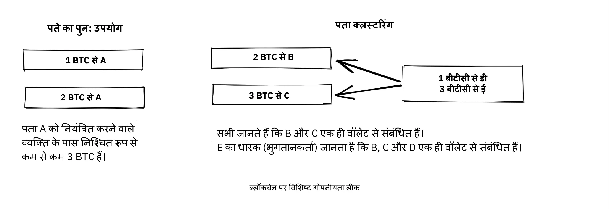
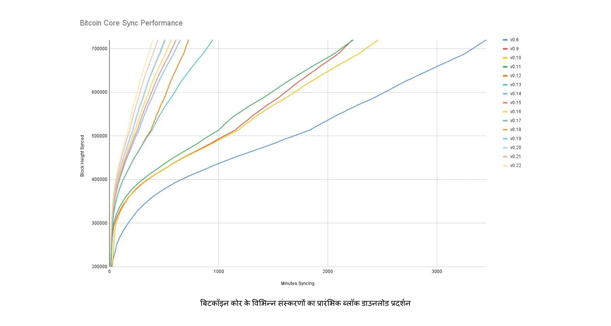
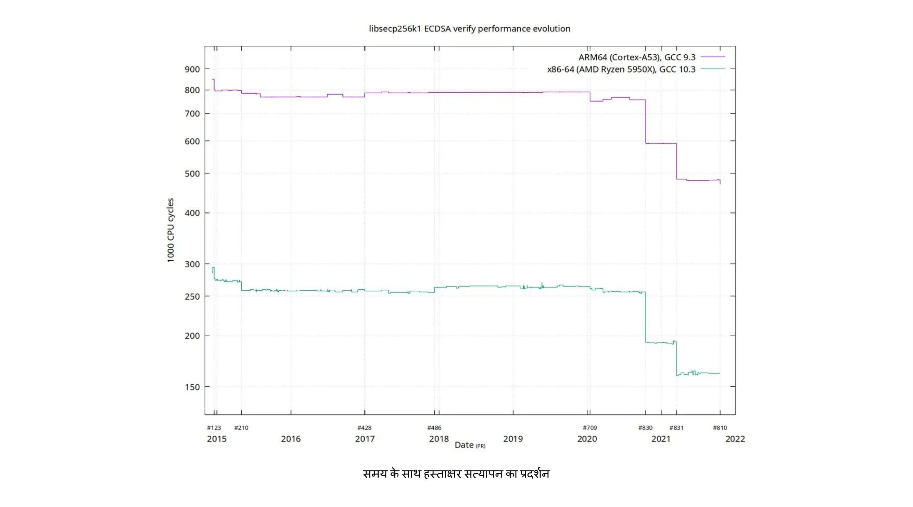
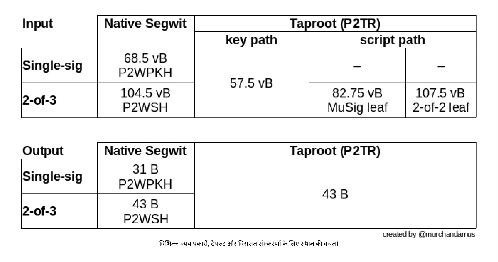
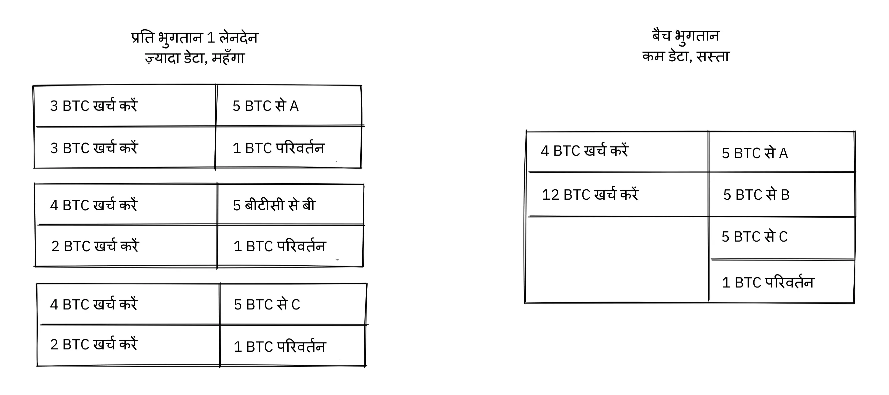
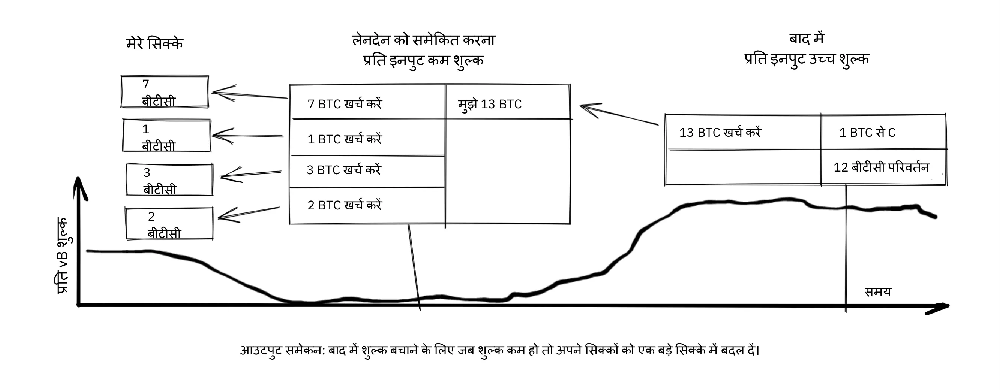
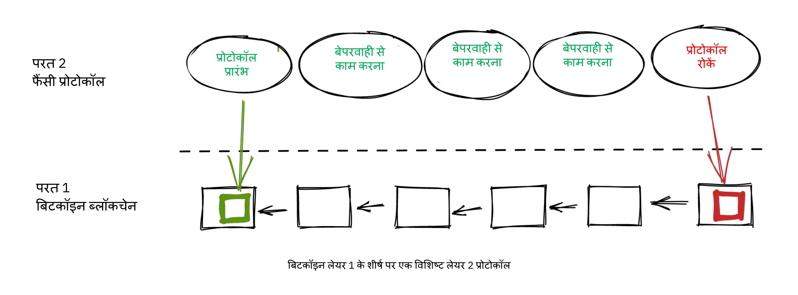
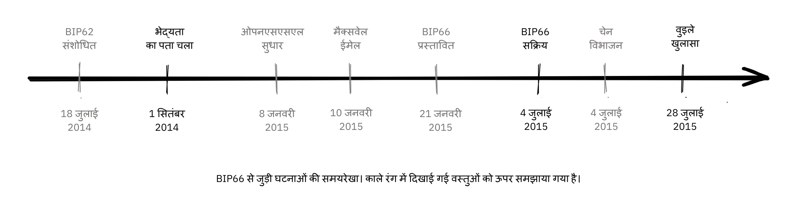
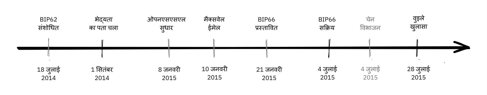
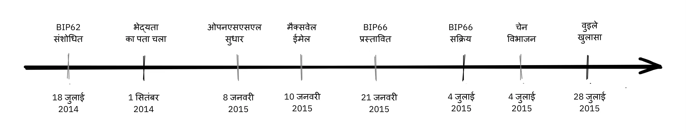

# Bitcoin विकास के दर्शन में गहराई से उतरें


Bitcoin विकास दर्शन Bitcoin डेवलपर्स के लिए एक पाठ्यक्रम है, जो पहले से ही Proof-of-Work, ब्लॉक निर्माण और लेनदेन जीवन चक्र जैसी अवधारणाओं और प्रक्रियाओं की मूल बातें समझते हैं, और जो Bitcoin के डिजाइन ट्रेड-ऑफ और दर्शन की गहरी समझ प्राप्त करके अपने स्तर को ऊपर उठाना चाहते हैं।

इससे नए डेवलपर्स को Bitcoin के विकास और सार्वजनिक बहस के एक दशक से अधिक के सबसे महत्वपूर्ण सबक को आत्मसात करने में मदद मिलेगी, साथ ही उन्हें नए विचारों (अच्छे और बुरे!) का मूल्यांकन करने के लिए एक उपयोगी संदर्भ भी मिलेगा।


### क्या उम्मीद करें?


जैसा कि ऊपर बताया गया है, यह Bitcoin डेवलपर्स के लिए एक व्यावहारिक मार्गदर्शिका है। हालाँकि, Bitcoin एक व्यापक और जटिल विषय है और हम संभवतः इसके सभी पहलुओं को यहाँ कवर नहीं कर सकते। इस कोर्स के साथ, हम आपकी विकास गतिविधि को शुरू करने के लिए आवश्यक सुविधाओं पर चर्चा करने के साथ-साथ आपको इसे अपने दम पर आगे बढ़ाने में सक्षम बनाने की उम्मीद करते हैं।


Bitcoin में बहुत से लोग शामिल हैं; चूँकि उनमें से कुछ की राय विपरीत है, इसलिए यहाँ आपको ऐसे संसाधन मिल सकते हैं जो विरोधाभासी विचार व्यक्त करते हैं। हालाँकि, हम हमेशा तथ्यों के दायरे में रहने का प्रयास करते हैं, जहाँ राय मायने नहीं रखती।


### यह किसने लिखा?


यह पाठ्यक्रम इसी नाम की पुस्तक से लिया गया है, जिसके मुख्य लेखक काल्ले रोसेनबाम हैं, तथा लिनेया रोसेनबाम ने सह-लेखक के रूप में योगदान दिया है।

पुस्तक को [चेनकोड लैब्स](https://learning.chaincode.com/) द्वारा कमीशन और वित्त पोषित किया गया था, जो एक विकास केंद्र है जो उन डेवलपर्स के लिए शैक्षिक कार्यक्रम चलाता है जो Bitcoin विकास के बारे में सीखना चाहते हैं।


+++


# परिचय

<partId>58c48e9b-e285-4dc6-8952-6cc5140b1313</partId>

## पाठ्यक्रम अवलोकन

<chapterId>28b7256b-9cb0-463e-a82d-d732be86c98c</chapterId>

Bitcoin विकास दर्शन के बारे में BTC 303 नामक इस पाठ्यक्रम में आपका स्वागत है।

Bitcoin सिर्फ एक क्रिप्टोकरेंसी से कहीं अधिक है, यह विकेंद्रीकरण, गोपनीयता, भरोसे की कमी और लचीलेपन के बारे में एक दार्शनिक दृष्टिकोण को समाहित करता है। यह कोर्स विशेष रूप से उन डेवलपर्स के लिए बनाया गया है जो पहले से ही Bitcoin की तकनीकी नींव से परिचित हैं और अब Bitcoin के डिजाइन और संचालन के सिद्धांतों की अपनी समझ को और गहरा करना चाहते हैं।

इस पाठ्यक्रम के दौरान, आपको उन मूलभूत मूल्यों और रणनीतियों की स्पष्ट समझ प्राप्त होगी जिन्होंने एक दशक से अधिक समय से Bitcoin के विकास का मार्गदर्शन किया है। इन विषयों का गहन अध्ययन करके, आप भविष्य के विकास का आत्मविश्वासपूर्वक मूल्यांकन करने और उसमें योगदान देने के लिए आवश्यक आलोचनात्मक दृष्टिकोण विकसित करेंगे।

### Bitcoin के केंद्रीय मूल्य

Bitcoin को अद्वितीय क्या बनाता है? यह खंड Bitcoin के डिज़ाइन के मूल सिद्धांतों को उजागर करता है। आप **विकेंद्रीकरण** का अध्ययन करेंगे, जो यह सुनिश्चित करता है कि कोई भी एक इकाई नेटवर्क को नियंत्रित न करे; **विश्वासहीनता**, जो तृतीय-पक्ष निर्भरता को समाप्त करने की कुंजी है; **गोपनीयता**, जो व्यक्तिगत स्वतंत्रता और सिस्टम की अखंडता दोनों के लिए आवश्यक है; और **सीमित आपूर्ति**, जो कमी की वह सांकेतिक गारंटी है जो Bitcoin की आर्थिक पहचान को आकार देती है। इन अवधारणाओं में महारत हासिल करने से आप Bitcoin की खूबियों और कमियों को पूरी तरह से समझ पाएंगे।

### Bitcoin शासन

Bitcoin के जटिल शासन तंत्र को समझने के लिए तकनीकी विशेषज्ञता से कहीं अधिक ज्ञान की आवश्यकता होती है; इसके लिए Bitcoin के सर्वसम्मति और निर्णय लेने के अनूठे दृष्टिकोण को समझना आवश्यक है। इस खंड में, आप प्रोटोकॉल अपग्रेड जैसी महत्वपूर्ण प्रक्रियाओं के पीछे के तंत्र और सिद्धांतों, परस्पर विरोधी सोच की आवश्यकता, ओपन-सोर्स सहयोग की शक्ति, स्केलिंग की निरंतर चुनौतियों और समस्याओं के समाधान के लिए आवश्यक सूक्ष्म रणनीतियों के बारे में गहराई से जानेंगे। इस ज्ञान से लैस होकर, आप न केवल भाग लेने के लिए तैयार होंगे, बल्कि Bitcoin के भविष्य को प्रभावी और जिम्मेदारी से आकार देने में भी सक्षम होंगे।

क्या आप Bitcoin की अपनी यात्रा में अगला कदम उठाने के लिए तैयार हैं? चलिए शुरू करते हैं!


# Bitcoin केंद्रीय मान

<partId>2d6c683b-54c8-5465-b2ca-4e96a6828834</partId>


## विकेन्द्रीकरण

<chapterId>9397c84b-0038-5d0e-88d5-11767ce8182d</chapterId>


यह विश्लेषण करता है कि विकेंद्रीकरण क्या है और Bitcoin के काम करने के लिए यह क्यों आवश्यक है। हम इनके बीच अंतर करते हैं

[खनिकों](https://planb.academy/resources/glossary/mining) और [पूर्ण नोड्स](https://planb.academy/resources/glossary/full-node) के विकेन्द्रीकरण पर चर्चा की जाएगी, तथा सेंसरशिप प्रतिरोध के लिए वे क्या लाते हैं, इस पर चर्चा की जाएगी, जो कि Bitcoin की सबसे केन्द्रीय विशेषताओं में से एक है।


चर्चा फिर तटस्थता को समझने पर केंद्रित होती है - या उपयोगकर्ताओं, खनिकों और डेवलपर्स के प्रति अनुमतिहीनता - जो किसी भी विकेंद्रीकृत प्रणाली की एक आवश्यक संपत्ति है। अंत में, हम इस बात पर चर्चा करते हैं कि Hard को Bitcoin जैसी विकेंद्रीकृत प्रणाली को समझना कितना कठिन हो सकता है, और कुछ मानसिक मॉडल प्रस्तुत करते हैं जो आपको इसे समझने में मदद कर सकते हैं।


बिना किसी केंद्रीय नियंत्रण बिंदु वाली प्रणाली को *विकेन्द्रीकृत* कहा जाता है। Bitcoin को नियंत्रण के केंद्रीय बिंदु, या अधिक सटीक रूप से *सेंसरशिप के केंद्रीय बिंदु* से बचने के लिए डिज़ाइन किया गया है।


विकेन्द्रीकरण *सेंसरशिप प्रतिरोध* प्राप्त करने का एक साधन है।


Bitcoin में विकेंद्रीकरण के दो प्रमुख पहलू हैं: Miner विकेंद्रीकरण और Full node विकेंद्रीकरण।


Miner विकेंद्रीकरण इस तथ्य को संदर्भित करता है कि [लेनदेन](https://planb.academy/resources/glossary/transaction-tx) प्रसंस्करण किसी भी केंद्रीय इकाई द्वारा निष्पादित या समन्वित नहीं किया जाता है। Full node विकेंद्रीकरण इस तथ्य को संदर्भित करता है कि [ब्लॉकों](https://planb.academy/resources/glossary/block) का सत्यापन, यानी खनिकों द्वारा आउटपुट किया जाने वाला डेटा, नेटवर्क के किनारे पर किया जाता है, अंततः इसके उपयोगकर्ताओं द्वारा, न कि कुछ विश्वसनीय अधिकारियों द्वारा।


### Miner विकेंद्रीकरण


जीडब्ल्यू-24 से पहले भी डिजिटल मुद्राएं बनाने के प्रयास किए गए थे, लेकिन उनमें से अधिकांश शासन विकेंद्रीकरण की कमी और सेंसरशिप प्रतिरोध के कारण विफल रहे।


Bitcoin में Miner विकेंद्रीकरण का अर्थ है कि *लेनदेन का क्रम* किसी एक इकाई या संस्थाओं के निश्चित समूह द्वारा नहीं किया जाता है। यह उन सभी अभिनेताओं द्वारा सामूहिक रूप से किया जाता है जो इसमें भाग लेना चाहते हैं; यह खनिकों का समूह उपयोगकर्ताओं का एक गतिशील समूह है। कोई भी अपनी इच्छानुसार इसमें शामिल हो सकता है या छोड़ सकता है। यह गुण Bitcoin को सेंसरशिप-प्रतिरोधी बनाता है।


यदि Bitcoin केंद्रीकृत होता, तो यह उन लोगों के लिए असुरक्षित होता जो इसे सेंसर करना चाहते थे, जैसे कि सरकारें। इसका वही हश्र होगा जो डिजिटल मुद्रा बनाने के पहले के प्रयासों का हुआ था। [एक पेपर](https://www.blockstream.com/sidechains.pdf) के परिचय में जिसका शीर्षक है "[Blockchain](https://planb.academy/resources/glossary/blockchain) इनोवेशन को पेग्ड साइडचेन के साथ सक्षम बनाना", लेखक बताते हैं कि कैसे डिजिटल मुद्रा के शुरुआती संस्करण प्रतिकूल वातावरण के लिए सुसज्जित नहीं थे (अगले भाग में प्रतिकूल सोच पर अध्याय भी देखें)।


डेविड चाउम ने 1983 में एक शोध विषय के रूप में डिजिटल नकदी की शुरुआत की, एक ऐसे केंद्रीय सर्वर के साथ जो [Double-spending](https://planb.academy/resources/glossary/double-spending-attack) को रोकने के लिए विश्वसनीय है। इस केंद्रीय विश्वसनीय पार्टी से व्यक्तियों के लिए गोपनीयता जोखिम को कम करने और [परिवर्तनशीलता](https://planb.academy/resources/glossary/fungibility) को लागू करने के लिए, चाउम ने [ब्लाइंड सिग्नेचर](https://planb.academy/resources/glossary/blind-signature) की शुरुआत की, जिसका उपयोग उन्होंने केंद्रीय सर्वर के हस्ताक्षरों (जो सिक्कों का प्रतिनिधित्व करते हैं) को जोड़ने से रोकने के लिए एक क्रिप्टोग्राफ़िक साधन प्रदान करने के लिए किया, जबकि अभी भी केंद्रीय सर्वर को दोहरे खर्च की रोकथाम करने की अनुमति देता है।

केंद्रीय सर्वर की आवश्यकता डिजिटल नकदी की कमजोरी बन गई[ग्रि99]। जबकि केंद्रीय सर्वर के हस्ताक्षर को कई हस्ताक्षरकर्ताओं के थ्रेशोल्ड हस्ताक्षर से बदलकर विफलता के इस एकल बिंदु को वितरित करना संभव है, ऑडिटेबिलिटी के लिए यह महत्वपूर्ण है कि हस्ताक्षरकर्ता अलग-अलग और पहचाने जाने योग्य हों। यह अभी भी सिस्टम को विफलता के प्रति संवेदनशील बनाता है, क्योंकि प्रत्येक हस्ताक्षरकर्ता एक-एक करके विफल हो सकता है, या विफल हो सकता है।


यह स्पष्ट हो गया कि सेंसरशिप के उच्च जोखिम के कारण लेनदेन को आदेश देने के लिए केंद्रीय सर्वर का उपयोग करना व्यवहार्य विकल्प नहीं था। भले ही कोई केंद्रीय सर्वर को n सर्वरों के एक निश्चित समूह के संघ से बदल दे, जिसमें से कम से कम m को आदेश देने की स्वीकृति देनी होगी, फिर भी कठिनाइयाँ होंगी। समस्या वास्तव में एक ऐसी स्थिति में आ जाएगी जहाँ उपयोगकर्ताओं को n सर्वरों के इस समूह के साथ-साथ दुर्भावनापूर्ण सर्वरों को अच्छे सर्वरों से बदलने के तरीके पर भी सहमत होना होगा, बिना किसी केंद्रीय प्राधिकरण पर निर्भर हुए।


आइए विचार करें कि अगर Bitcoin को सेंसर किया जा सके तो क्या हो सकता है। सेंसर उपयोगकर्ताओं पर दबाव डाल सकता है कि वे अपनी पहचान बताएं, यह बताएं कि उनका पैसा कहां से आ रहा है या वे इससे क्या खरीद रहे हैं, उसके बाद ही उनके लेनदेन को Blockchain में प्रवेश करने दें।


इसके अलावा, सेंसरशिप प्रतिरोध की कमी सेंसर को उपयोगकर्ताओं को नए सिस्टम नियमों को अपनाने के लिए मजबूर करने की अनुमति देगी। उदाहरण के लिए, वे एक ऐसा परिवर्तन लागू कर सकते हैं जो उन्हें Supply के पैसे को बढ़ाने की अनुमति देता है, जिससे वे खुद को समृद्ध कर सकते हैं। ऐसी स्थिति में, ब्लॉक को सत्यापित करने वाले उपयोगकर्ता के पास नए नियमों को संभालने के लिए तीन विकल्प होंगे:


- अपनाना: परिवर्तनों को स्वीकार करें और उन्हें अपने Full node में अपनाएं।
- अस्वीकार: परिवर्तनों को अपनाने से इंकार; इससे उपयोगकर्ता के पास एक ऐसी प्रणाली रह जाती है जो अब लेनदेन को संसाधित नहीं करती, क्योंकि सेंसर के ब्लॉक अब उपयोगकर्ता के Full node द्वारा अमान्य माने जाते हैं।
- कदम: एक नया केंद्रीय नियंत्रण बिंदु नियुक्त करें; सभी उपयोगकर्ताओं को यह पता लगाना होगा कि कैसे समन्वय करना है और फिर नए केंद्रीय नियंत्रण बिंदु पर सहमत होना है।


यदि वे सफल हो जाते हैं, तो भविष्य में किसी समय यही मुद्दे पुनः उभरेंगे, क्योंकि प्रणाली पहले की तरह ही सेंसरशिप-योग्य बनी रहेगी।


इनमें से कोई भी विकल्प उपयोगकर्ता के लिए लाभदायक नहीं है।


विकेंद्रीकरण के माध्यम से सेंसरशिप प्रतिरोध ही Bitcoin को अन्य मुद्रा प्रणालियों से अलग करता है, लेकिन *Double-spending समस्या* के कारण इसे पूरा करना आसान काम नहीं है। यह सुनिश्चित करने की समस्या है कि कोई भी व्यक्ति एक ही सिक्के को दो बार खर्च न कर सके, एक ऐसा मुद्दा जिसे कई लोगों ने विकेंद्रीकृत तरीके से हल करना असंभव समझा। Satoshi [नाकामोटो](https://planb.academy/resources/glossary/nakamoto-satoshi) ने अपने [Bitcoin श्वेतपत्र](https://planb.academy/bitcoin.pdf) में Double-spending समस्या को हल करने के तरीके के बारे में लिखा है:


> इस पत्र में, हम लेन-देन के कालानुक्रमिक क्रम के generate कम्प्यूटेशनल प्रमाण के लिए पीयर-टू-पीयर वितरित Timestamp सर्वर का उपयोग करके Double-spending समस्या का समाधान प्रस्तावित करते हैं।


यहाँ उन्होंने अजीबोगरीब लगने वाले वाक्यांश "पीयर-टू-पीयर डिस्ट्रिब्यूटेड Timestamp सर्वर" का इस्तेमाल किया है। यहाँ मुख्य शब्द *डिस्ट्रिब्यूटेड* है, जिसका इस संदर्भ में मतलब है कि नियंत्रण का कोई केंद्रीय बिंदु नहीं है। इसके बाद नाकामोटो बताते हैं कि [Proof-of-Work](https://planb.academy/resources/glossary/proof-of-work) किस तरह समाधान है।

फिर भी, इसे इससे बेहतर कोई नहीं समझा सकता

[ग्रेगरी मैक्सवेल रेडिट पर](https://www.reddit.com/r/Bitcoin/comments/ddddfl/question_on_the_vulnerability_of_bitcoin/f2g9e7b/), जहां वह किसी ऐसे व्यक्ति को जवाब देते हैं जो संभावित 51% हमलों से बचने के लिए माइनर्स [Hash पावर](https://planb.academy/resources/glossary/hashrate) को सीमित करने का प्रस्ताव करता है:


> Bitcoin जैसी विकेंद्रीकृत प्रणाली सार्वजनिक चुनाव का उपयोग करती है। लेकिन आप विकेंद्रीकृत प्रणाली में सिर्फ़ 'लोगों' का वोट नहीं रख सकते क्योंकि इसके लिए लोगों को वोट देने के लिए अधिकृत करने के लिए एक केंद्रीकृत पार्टी की आवश्यकता होगी। इसके बजाय, Bitcoin कंप्यूटिंग शक्ति के वोट का उपयोग करता है क्योंकि किसी भी केंद्रीकृत की मदद के बिना कंप्यूटिंग शक्ति को सत्यापित करना संभव है
तृतीय पक्ष।


पोस्ट में बताया गया है कि किस प्रकार विकेन्द्रीकृत Bitcoin नेटवर्क, Proof-of-Work के उपयोग के माध्यम से लेनदेन क्रम पर [सहमति](https://planb.academy/resources/glossary/consensus) बना सकता है।


इसके बाद उन्होंने निष्कर्ष देते हुए कहा कि 51% हमला विशेष रूप से चिंताजनक नहीं है, इसकी तुलना में लोग Bitcoin के विकेन्द्रीकरण गुणों के बारे में परवाह नहीं करते या उसे समझते नहीं हैं:


> जी.डब्लू.-49 के लिए एक बड़ा खतरा यह है कि इसका उपयोग करने वाली जनता इसे नहीं समझेगी, इसकी परवाह नहीं करेगी, तथा विकेन्द्रीकरण के उन गुणों की रक्षा नहीं करेगी जो इसे केन्द्रीकृत विकल्पों की तुलना में मूल्यवान बनाते हैं।

निष्कर्ष महत्वपूर्ण है। यदि लोग Bitcoin के विकेंद्रीकरण की रक्षा नहीं करते हैं, जो इसके सेंसरशिप प्रतिरोध का एक प्रतिनिधि है, तो Bitcoin केंद्रीकरण शक्तियों का शिकार हो सकता है, जब तक कि यह इतना केंद्रीकृत न हो जाए कि सेंसरशिप एक चीज बन जाए। तब इसका अधिकांश, यदि सभी नहीं, मूल्य प्रस्ताव समाप्त हो जाएगा। यह हमें Full node विकेंद्रीकरण पर अगले खंड में लाता है।


### Full node विकेंद्रीकरण


ऊपर दिए गए पैराग्राफ में, हमने ज़्यादातर Miner विकेंद्रीकरण के बारे में बात की है और कैसे केंद्रीकृत खनिकों को सेंसरशिप की अनुमति मिल सकती है। लेकिन विकेंद्रीकरण का एक और पहलू भी है, जिसका नाम है *Full node विकेंद्रीकरण*।


Full node विकेंद्रीकरण का महत्व अविश्वास से संबंधित है। मान लीजिए कि कोई उपयोगकर्ता, उदाहरण के लिए, संचालन की लागत में अत्यधिक वृद्धि के कारण अपना Full node चलाना बंद कर देता है। उस स्थिति में, उन्हें किसी अन्य तरीके से Bitcoin नेटवर्क के साथ बातचीत करनी होगी, संभवतः वेब [वॉलेट](https://planb.academy/resources/glossary/wallet) या लाइटवेट वॉलेट का उपयोग करके, जिसके लिए इन सेवाओं के प्रदाताओं में एक निश्चित स्तर के विश्वास की आवश्यकता होती है।


उपयोगकर्ता सीधे नेटवर्क [सहमति नियमों](https://planb.academy/resources/glossary/consensus-rules) को लागू करने से लेकर किसी और पर भरोसा करने तक चला जाता है। अब मान लीजिए कि अधिकांश उपयोगकर्ता सहमति लागू करने का काम किसी विश्वसनीय इकाई को सौंपते हैं। उस स्थिति में, नेटवर्क जल्दी से केंद्रीकरण की ओर बढ़ सकता है, और दुर्भावनापूर्ण अभिनेताओं द्वारा नेटवर्क नियमों को बदला जा सकता है।


में एक

Bitcoin मैगज़ीन लेख](https://bitcoinmagazine.com/technical/decentralist-perspective-Bitcoin-might-need-small-blocks-1442090446), आरोन वैन विर्डम ने Bitcoin डेवलपर्स से विकेंद्रीकरण पर उनके विचारों और Bitcoin के अधिकतम ब्लॉक आकार को बढ़ाने में शामिल जोखिमों के बारे में साक्षात्कार लिया। यह चर्चा 2014-2017 के दौर में Hot का विषय थी, जब कई लोगों ने अधिक लेनदेन थ्रूपुट की अनुमति देने के लिए ब्लॉक आकार की सीमा बढ़ाने पर बहस की थी।


ब्लॉक आकार बढ़ाने के खिलाफ एक शक्तिशाली तर्क यह है कि इससे सत्यापन की लागत बढ़ जाती है। यदि सत्यापन लागत बढ़ जाती है, तो यह कुछ उपयोगकर्ताओं को अपने पूर्ण नोड्स चलाना बंद करने के लिए मजबूर करेगा। इसके परिणामस्वरूप, अधिक लोग Trustless तरीके से सिस्टम का उपयोग करने में सक्षम नहीं होंगे।


लेख में पीटर वुइले को उद्धृत किया गया है, जहां उन्होंने Full node केंद्रीकरण के जोखिमों के बारे में बताया है:


> अगर बहुत सी कंपनियाँ Full node चलाती हैं, तो इसका मतलब है कि उन्हें एक अलग नियम सेट लागू करने के लिए राजी किया जाना चाहिए। दूसरे शब्दों में: ब्लॉक सत्यापन का विकेंद्रीकरण ही वह चीज़ है जो सर्वसम्मति नियमों को उनका महत्व देती है।
> लेकिन अगर Full node की संख्या बहुत कम हो जाती है, उदाहरण के लिए क्योंकि हर कोई एक ही वेब-वॉलेट, एक्सचेंज और SPV या मोबाइल वॉलेट का उपयोग करता है, तो विनियमन एक वास्तविकता बन सकता है। और अगर अधिकारी सर्वसम्मति नियमों को विनियमित कर सकते हैं, तो इसका मतलब है कि वे Bitcoin को Bitcoin बनाने वाली किसी भी चीज़ को बदल सकते हैं। यहाँ तक कि 21 मिलियन Bitcoin की सीमा भी।

तो यह बात सच है। Bitcoin उपयोगकर्ताओं को अपने स्वयं के पूर्ण नोड चलाने चाहिए ताकि विनियामकों और बड़ी कंपनियों को आम सहमति के नियमों को बदलने से रोका जा सके।


### तटस्थता


Bitcoin तटस्थ है, या जैसा कि लोग इसे कहते हैं, अनुमति रहित है। इसका मतलब है कि Bitcoin को इस बात की परवाह नहीं है कि आप कौन हैं या आप इसका उपयोग किस लिए करते हैं।


Bitcoin तटस्थ है, जो एक अच्छी बात है, और यह काम करने का एकमात्र तरीका है। अगर इसे किसी संगठन द्वारा नियंत्रित किया जाता तो यह सिर्फ़ एक और वर्चुअल ऑब्जेक्ट टाइप होता और मुझे इसमें कोई दिलचस्पी नहीं होती


जब तक आप नियमों के अनुसार खेलते हैं, आप इसे अपनी इच्छानुसार इस्तेमाल करने के लिए स्वतंत्र हैं, बिना किसी से अनुमति मांगे। इसमें *Mining*, Bitcoin के ऊपर *लेन-देन* और *प्रोटोकॉल और सेवाएँ बनाना* शामिल है:


- यदि *Mining* एक अनुमति प्राप्त प्रक्रिया होती, तो हमें यह चुनने के लिए एक केंद्रीय प्राधिकरण की आवश्यकता होती कि किसे खनन करने की अनुमति है। इससे संभवतः खननकर्ताओं को कानूनी अनुबंधों पर हस्ताक्षर करने पड़ेंगे, जिसमें वे सहमत होंगे

केंद्रीय प्राधिकरण की इच्छा के अनुसार लेनदेन को सेंसर करना, जो कि पहली जगह में Mining के उद्देश्य को पराजित करता है।


- अगर Bitcoin में *लेन-देन* करने वाले लोगों को व्यक्तिगत जानकारी देनी पड़े, यह बताना पड़े कि उनके लेन-देन किस लिए थे, या अन्यथा यह साबित करना पड़े कि वे लेन-देन के योग्य हैं, तो हमें उपयोगकर्ताओं या लेन-देन को मंजूरी देने के लिए प्राधिकरण के एक केंद्रीय बिंदु की भी आवश्यकता होगी। फिर से, यह सेंसरशिप और बहिष्कार की ओर ले जाएगा।


- यदि डेवलपर्स को Bitcoin के ऊपर *प्रोटोकॉल बनाने* की अनुमति मांगनी पड़ी, तो केवल केंद्रीय डेवलपर अनुदान समिति द्वारा अनुमति प्राप्त प्रोटोकॉल ही विकसित किए जा सकेंगे। यह, सरकारी हस्तक्षेप के कारण, अनिवार्य रूप से सभी गोपनीयता-संरक्षण प्रोटोकॉल और विकेंद्रीकरण में सुधार के सभी प्रयासों को बाहर कर देगा।


सभी स्तरों पर, इस बात पर प्रतिबंध लगाने का प्रयास कि कौन Bitcoin का उपयोग किस लिए कर सकता है, Bitcoin को इस हद तक नुकसान पहुंचाएगा कि यह अपने मूल्य प्रस्ताव पर खरा नहीं उतरेगा।


पीटर वुइल https://Bitcoin.stackexchange.com/a/92055/69518[स्टैक Exchange पर एक प्रश्न का उत्तर देते हैं] कि Blockchain सामान्य डेटाबेस से कैसे संबंधित है। वह बताते हैं कि आर्थिक प्रोत्साहनों के साथ Proof-of-Work के उपयोग के माध्यम से अनुमतिहीनता कैसे प्राप्त की जा सकती है।


उन्होंने निष्कर्ष निकाला:


> PoW जैसे Trustless सर्वसम्मति एल्गोरिदम का उपयोग करने से कुछ ऐसा जुड़ता है जो कोई अन्य निर्माण आपको नहीं देता है (अनुमति रहित भागीदारी, जिसका अर्थ है कि प्रतिभागियों का कोई निर्धारित समूह नहीं है जो आपके परिवर्तनों को सेंसर कर सके), PoW जैसे Trustless सर्वसम्मति एल्गोरिदम का उपयोग करने से कुछ ऐसा जुड़ता नहीं है लेकिन इसकी उच्च लागत आती है, और इसकी आर्थिक धारणाएं इसे केवल उन प्रणालियों के लिए ही उपयोगी बनाती हैं जो अपनी स्वयं की क्रिप्टोकरेंसी परिभाषित करते हैं।
> संभवतः दुनिया में इनमें से एक या कुछ के लिए ही वास्तव में उपयोग में आने वाली जगह है।

उन्होंने बताया कि, अनुमति रहितता प्राप्त करने के लिए, सिस्टम को संभवतः अपनी स्वयं की मुद्रा की आवश्यकता होगी, जिससे "उपयोग के मामलों को प्रभावी रूप से केवल क्रिप्टोकरेंसी तक सीमित किया जा सकेगा"। ऐसा इसलिए है क्योंकि अनुमति रहित भागीदारी, या Mining, के लिए सिस्टम में ही अंतर्निहित आर्थिक प्रोत्साहन की आवश्यकता होती है।


### विकेंद्रीकरण की समझ


Bitcoin का एक आकर्षक पहलू यह है कि Hard को समझना कितना मुश्किल है कि कोई भी इसे नियंत्रित नहीं करता है। Bitcoin में कोई समिति या कार्यकारी नहीं हैं। ग्रेगरी मैक्सवेल, फिर से [Bitcoin सबरेडिट पर](https://www.reddit.com/r/Bitcoin/comments/s82t2n/comment/htdte7w/?utm_source=share&utm_medium=web2x&context=3), इसकी तुलना अंग्रेजी भाषा से एक दिलचस्प तरीके से करते हैं:


> बहुत से लोगों को स्वायत्त प्रणालियों को समझने में बहुत परेशानी होती है, उनके जीवन में अंग्रेजी भाषा जैसी कई चीजें होती हैं-- लेकिन लोग उन्हें हल्के में लेते हैं और उन्हें सिस्टम के रूप में भी नहीं सोचते। वे सोचने के एक केंद्रीकृत तरीके में फंस गए हैं जहाँ वे जिस चीज को 'चीज' के रूप में सोचते हैं, उसके पास एक प्राधिकरण होता है जो उसे नियंत्रित करता है।
>

> Bitcoin किसी भी चीज़ पर ध्यान केंद्रित नहीं करता है। Bitcoin को अपनाने वाले कई लोगों ने इसे बढ़ावा देने के लिए अपनी स्वतंत्र इच्छा से चुना है, और वे ऐसा कैसे करना चुनते हैं यह उनका अपना मामला है। प्राधिकरण से जुड़े लोग इन गतिविधियों को देखकर मान सकते हैं कि ये Bitcoin प्राधिकरण द्वारा की गई कोई कार्रवाई है, लेकिन ऐसा कोई प्राधिकरण मौजूद नहीं है।


विकेंद्रीकरण के माध्यम से Bitcoin जिस तरह से काम करता है, वह प्रकृति में कई प्रजातियों में पाई जाने वाली असाधारण सामूहिक बुद्धिमत्ता से मिलता जुलता है। कंप्यूटर वैज्ञानिक राधिका नागपाल ने [टेड टॉक](https://www.ted.com/talks/radhika_nagpal_what_intelligent_machines_can_learn_from_a_school_of_fish) में मछलियों के झुंड के सामूहिक व्यवहार और कैसे वैज्ञानिक रोबोट का उपयोग करके इसकी नकल करने की कोशिश कर रहे हैं, के बारे में बात की।


> दूसरी बात, और जो बात मुझे अब भी सबसे उल्लेखनीय लगती है, वह यह है कि हम जानते हैं कि इस मछली समूह की निगरानी करने वाला कोई नेता नहीं है। इसके बजाय, यह अविश्वसनीय सामूहिक मानसिक व्यवहार विशुद्ध रूप से एक मछली और दूसरी मछली के बीच की बातचीत से उभर रहा है।
> किसी तरह, पड़ोसी मछलियों के बीच कुछ ऐसे पारस्परिक संबंध या नियम होते हैं, जिनके कारण यह सब संभव हो पाता है।

वह बताती हैं कि कई प्रणालियाँ, चाहे प्राकृतिक हों या कृत्रिम, नेताओं के बिना भी काम कर सकती हैं और करती भी हैं, और वे शक्तिशाली और लचीली होती हैं। प्रत्येक व्यक्ति केवल अपने आस-पास के वातावरण के साथ ही बातचीत करता है, लेकिन साथ मिलकर वे कुछ जबरदस्त बनाते हैं।


Bitcoin के बारे में आप चाहे जो भी सोचें, इसकी विकेंद्रीकृत प्रकृति इसे नियंत्रित करना मुश्किल बनाती है। Bitcoin मौजूद है, और आप इसके बारे में कुछ नहीं कर सकते। यह अध्ययन की बात है, बहस की नहीं।


### विकेंद्रीकरण के बारे में निष्कर्ष


हम Full node विकेंद्रीकरण और Mining विकेंद्रीकरण के बीच अंतर करते हैं। Mining विकेंद्रीकरण सेंसरशिप प्रतिरोध को प्राप्त करने का एक साधन है, जबकि Full node विकेंद्रीकरण वह है जो उपयोगकर्ताओं के बीच व्यापक समर्थन के बिना नेटवर्क Hard के सर्वसम्मति नियमों को बदलने से रोकता है।


Bitcoin की विकेंद्रीकृत प्रकृति डेवलपर्स, उपयोगकर्ताओं और खनिकों के प्रति तटस्थता की अनुमति देती है। कोई भी व्यक्ति बिना अनुमति के भाग लेने के लिए स्वतंत्र है।


विकेन्द्रीकृत प्रणालियां आपके लिए बहुत कठिन हो सकती हैं, लेकिन कुछ मानसिक मॉडल भी हैं जो इसमें मदद कर सकते हैं, उदाहरण के लिए अंग्रेजी भाषा, या मछली स्कूल।


## अविश्वास

<chapterId>0506ba61-16a3-543c-95fa-3f3e2dd64121</chapterId>


यह अध्याय अविश्वास की अवधारणा का विश्लेषण करता है, कंप्यूटर विज्ञान के परिप्रेक्ष्य से इसका क्या अर्थ है, तथा Bitcoin को अपना मूल्य प्रस्ताव बनाए रखने के लिए Trustless क्यों होना चाहिए।

इसके बाद हम इस बारे में बात करेंगे कि Bitcoin को Trustless के रूप में उपयोग करने का क्या मतलब है, तथा Full node आपको किस प्रकार की गारंटी दे सकता है और किस प्रकार की नहीं।

अंतिम अनुभाग में, हम Bitcoin और वास्तविक सॉफ्टवेयरों या उपयोगकर्ताओं के बीच वास्तविक-विश्व अंतःक्रिया को देखेंगे, तथा किसी भी कार्य को करने के लिए सुविधा और अविश्वसनीयता के बीच संतुलन बनाने की आवश्यकता पर विचार करेंगे।


लोग अक्सर ऐसी बातें कहते हैं कि "Bitcoin इसलिए बढ़िया है क्योंकि यह Trustless है"।


Trustless से उनका क्या मतलब है? पीटर वुइल [स्टैक Exchange](https://Bitcoin.stackexchange.com/a/45674/69518) पर इस व्यापक रूप से इस्तेमाल किए जाने वाले शब्द की व्याख्या करते हैं:


> "Trustless" में हम जिस भरोसे की बात कर रहे हैं, वह एक अमूर्त तकनीकी शब्द है। एक वितरित सिस्टम को Trustless तब कहा जाता है जब उसे सही ढंग से काम करने के लिए किसी भरोसेमंद पक्ष की आवश्यकता नहीं होती।

संक्षेप में, शब्द *Trustless* Bitcoin प्रोटोकॉल की एक विशेषता को संदर्भित करता है जिसके द्वारा यह तार्किक रूप से "किसी भी विश्वसनीय पक्ष" के बिना कार्य कर सकता है। यह उस भरोसे से अलग है जो आपको अनिवार्य रूप से आपके द्वारा चलाए जाने वाले सॉफ़्टवेयर या हार्डवेयर पर रखना पड़ता है। भरोसे के इस दूसरे पहलू पर इस अध्याय में आगे चर्चा की जाएगी।


केंद्रीकृत प्रणालियों में, हम यह सुनिश्चित करने के लिए केंद्रीय अभिनेता की प्रतिष्ठा पर भरोसा करते हैं कि वे सुरक्षा का ध्यान रखेंगे या मुद्दों के मामले में वापस लौटेंगे, साथ ही किसी भी उल्लंघन को मंजूरी देने के लिए कानूनी प्रणाली पर भी। छद्म नाम वाले विकेन्द्रीकृत सिस्टम में ये विश्वास संबंधी आवश्यकताएं समस्याग्रस्त हैं - सहारा लेने की कोई संभावना नहीं है इसलिए वास्तव में कोई विश्वास नहीं हो सकता है। [Bitcoin श्वेतपत्र](https://Bitcoin.org/Bitcoin.pdf) के परिचय में, Satoshi नाकामोटो इस समस्या का वर्णन करता है:


> इंटरनेट पर वाणिज्य, इलेक्ट्रॉनिक भुगतानों के प्रसंस्करण के लिए विश्वसनीय तृतीय पक्ष के रूप में कार्य करने वाली वित्तीय संस्थाओं पर लगभग पूर्णतः निर्भर हो गया है।
> जबकि यह प्रणाली अधिकांश लेन-देन के लिए काफी अच्छी तरह से काम करती है, फिर भी यह विश्वास आधारित मॉडल की अंतर्निहित कमजोरियों से ग्रस्त है। पूरी तरह से गैर-प्रतिवर्ती लेनदेन वास्तव में संभव नहीं हैं, क्योंकि वित्तीय संस्थान विवादों में मध्यस्थता से बच नहीं सकते हैं। मध्यस्थता की लागत लेन-देन की लागत को बढ़ाती है, न्यूनतम व्यावहारिक लेन-देन के आकार को सीमित करती है और छोटे आकस्मिक लेन-देन की संभावना को समाप्त करती है, और गैर-प्रतिवर्ती सेवाओं के लिए गैर-प्रतिवर्ती भुगतान करने की क्षमता के नुकसान में एक व्यापक लागत होती है।
> उलटफेर की संभावना के साथ, विश्वास की आवश्यकता फैलती है। व्यापारियों को अपने ग्राहकों से सावधान रहना चाहिए, उन्हें ज़रूरत से ज़्यादा जानकारी के लिए परेशान करना चाहिए। धोखाधड़ी का एक निश्चित प्रतिशत अपरिहार्य माना जाता है। इन लागतों और भुगतान अनिश्चितताओं को भौतिक मुद्रा का उपयोग करके व्यक्तिगत रूप से टाला जा सकता है, लेकिन किसी विश्वसनीय पक्ष के बिना संचार चैनल पर भुगतान करने के लिए कोई तंत्र मौजूद नहीं है

ऐसा प्रतीत होता है कि हमारे पास विश्वास पर आधारित विकेन्द्रीकृत प्रणाली नहीं हो सकती, और इसीलिए Bitcoin में अविश्वास महत्वपूर्ण है।


Bitcoin को Trustless तरीके से इस्तेमाल करने के लिए, आपको एक पूरी तरह से मान्य Bitcoin नोड चलाना होगा। तभी आप यह सत्यापित कर पाएंगे कि दूसरों से प्राप्त ब्लॉक सर्वसम्मति नियमों का पालन कर रहे हैं; उदाहरण के लिए, कि सिक्का जारी करने का शेड्यूल रखा गया है और Blockchain पर कोई दोहरा खर्च नहीं हुआ है। यदि आप Full node नहीं चलाते हैं, तो आप Bitcoin ब्लॉकों के सत्यापन को किसी और को आउटसोर्स करते हैं और उन पर भरोसा करते हैं कि वे आपको सच बताएंगे, जिसका मतलब है कि आप Bitcoin का उपयोग बिना भरोसे के नहीं कर रहे हैं।


डेविड हार्डिंग ने [Bitcoin.org वेबसाइट पर एक लेख](https://Bitcoin.org/en/Bitcoin-core/features/validation) लिखा है, जिसमें बताया गया है कि Full node चलाना - या Bitcoin को बिना किसी भरोसे के इस्तेमाल करना - वास्तव में आपकी मदद कैसे करता है:


> Bitcoin मुद्रा केवल तभी काम करती है जब लोग अन्य मूल्यवान चीजों के लिए Exchange में बिटकॉइन स्वीकार करते हैं। इसका मतलब है कि बिटकॉइन स्वीकार करने वाले लोग ही इसे मूल्य देते हैं और वे ही तय करते हैं कि Bitcoin को कैसे काम करना चाहिए।
>

> जब आप बिटकॉइन स्वीकार करते हैं, तो आपके पास Bitcoin के नियमों को लागू करने की शक्ति होती है, जैसे किसी व्यक्ति की निजी कुंजी तक पहुंच के बिना उसके बिटकॉइन को जब्त करने से रोकना।
>

> दुर्भाग्य से, कई उपयोगकर्ता अपनी प्रवर्तन शक्ति को आउटसोर्स करते हैं। इससे Bitcoin का विकेंद्रीकरण कमज़ोर स्थिति में आ जाता है, जहाँ मुट्ठी भर खनिक मुट्ठी भर बैंकों और मुफ़्त सेवाओं के साथ मिलकर Bitcoin के नियमों को उन सभी गैर-सत्यापन करने वाले उपयोगकर्ताओं के लिए बदल सकते हैं जिन्होंने अपनी शक्ति को आउटसोर्स किया है।
>

> अन्य वॉलेट्स के विपरीत, Bitcoin Core नियमों को लागू करता है - इसलिए यदि माइनर्स और बैंक अपने गैर-सत्यापन करने वाले उपयोगकर्ताओं के लिए नियम बदलते हैं, तो वे उपयोगकर्ता आपके जैसे Bitcoin Core उपयोगकर्ताओं को पूर्ण सत्यापन का भुगतान करने में असमर्थ होंगे।


उनका कहना है कि Full node चलाने से आपको किसी और पर भरोसा किए बिना Blockchain के हर पहलू को सत्यापित करने में मदद मिलेगी, ताकि यह सुनिश्चित हो सके कि आपको दूसरों से मिलने वाले सिक्के असली हैं। यह बहुत बढ़िया है, लेकिन एक महत्वपूर्ण बात है जिसमें Full node आपकी मदद नहीं कर सकता: यह चेन रीराइट के माध्यम से दोहरे खर्च को रोक नहीं सकता:


> ध्यान दें कि हालांकि सभी प्रोग्राम—Bitcoin कोर सहित—चेन रीराइट के प्रति संवेदनशील हैं, Bitcoin एक सुरक्षा तंत्र प्रदान करता है: आपके लेन-देन में जितनी अधिक पुष्टि होगी, आप उतने ही सुरक्षित होंगे। इससे बेहतर कोई विकेंद्रीकृत सुरक्षा नहीं है।

चाहे आपका सॉफ़्टवेयर कितना भी उन्नत क्यों न हो, आपको अभी भी भरोसा करना होगा कि आपके सिक्कों वाले ब्लॉक को फिर से नहीं लिखा जाएगा। हालाँकि, जैसा कि हार्डिंग ने बताया, आप कई पुष्टियों का इंतज़ार कर सकते हैं, जिसके बाद आप चेन रीराइट की संभावना को स्वीकार्य होने के लिए काफी छोटा मानते हैं।


Bitcoin को Trustless तरीके से इस्तेमाल करने के लिए प्रोत्साहन Full node विकेंद्रीकरण के लिए सिस्टम की ज़रूरत के साथ संरेखित होते हैं। जितने ज़्यादा लोग अपने खुद के पूरे नोड का इस्तेमाल करेंगे, Full node विकेंद्रीकरण उतना ही ज़्यादा होगा और इस तरह प्रोटोकॉल में दुर्भावनापूर्ण बदलावों के खिलाफ Bitcoin उतना ही मज़बूत होगा। लेकिन दुर्भाग्य से, जैसा कि Full node विकेंद्रीकरण अनुभाग में बताया गया है, उपयोगकर्ता अक्सर अविश्वसनीयता और सुविधा के बीच अपरिहार्य व्यापार-बंद के परिणामस्वरूप विश्वसनीय सेवाओं का विकल्प चुनते हैं।


सिस्टम के दृष्टिकोण से Bitcoin की अविश्वसनीयता बिल्कुल ज़रूरी है। 2018 में, मैट कोरलो ने रीगा में बाल्टिक हनीबैजर सम्मेलन में [विश्वासहीनता के बारे में बात की](https://btctranscripts.com/baltic-honeybadger/2018/trustlessness-scalability-and-directions-in-security-models/)।


इस चर्चा का सार यह है कि आप किसी विश्वसनीय सिस्टम के ऊपर Trustless सिस्टम नहीं बना सकते, लेकिन आप किसी Trustless सिस्टम के ऊपर विश्वसनीय सिस्टम - उदाहरण के लिए, एक कस्टोडियल Wallet - बना सकते हैं।


Trustless आधारित Layer उच्च स्तरों पर विभिन्न समझौतों की अनुमति देता है


यह सुरक्षा मॉडल सिस्टम डिज़ाइनर को ट्रेड-ऑफ़ का चयन करने की अनुमति देता है

जो उनके लिए अर्थपूर्ण हों, तथा दूसरों पर उन्हें थोपा न जाए।


### भरोसा मत करो, सत्यापित करो


Bitcoin बिना किसी भरोसे के काम करता है, लेकिन फिर भी आपको अपने सॉफ़्टवेयर और हार्डवेयर पर कुछ हद तक भरोसा करना होगा। ऐसा इसलिए है क्योंकि हो सकता है कि आपके सॉफ़्टवेयर या हार्डवेयर को बॉक्स पर बताए गए काम करने के लिए प्रोग्राम न किया गया हो। उदाहरण के लिए:


- सीपीयू को दुर्भावनापूर्ण तरीके से निजी कुंजी क्रिप्टोग्राफिक परिचालनों का पता लगाने और निजी कुंजी डेटा को लीक करने के लिए डिज़ाइन किया जा सकता है।
- ऑपरेटिंग सिस्टम का रैंडम नंबर जनरेटर संभवतः उतना रैंडम नहीं है जितना वह दावा करता है।
- Bitcoin कोर में संभवतः ऐसा कोड डाला गया है जो आपकी निजी कुंजियों को किसी बुरे व्यक्ति के पास भेज देगा।


इसलिए, Full node चलाने के अलावा, आपको यह भी सुनिश्चित करना होगा कि आप वही चला रहे हैं जो आप चलाना चाहते हैं। Reddit उपयोगकर्ता brianddk ने [एक लेख लिखा](https://www.reddit.com/r/Bitcoin/comments/smj1ep/bitcoin_v220_and_guix_stronger_defense_against/) जिसमें आपके सॉफ़्टवेयर को सत्यापित करते समय आपके द्वारा चुने जा सकने वाले विश्वास के विभिन्न स्तरों के बारे में बताया गया है। "बिल्डरों पर भरोसा करना" अनुभाग में, वह पुनरुत्पादनीय बिल्ड के बारे में बात करता है:


> पुनरुत्पादनीय बिल्ड सॉफ़्टवेयर डिज़ाइन करने का एक तरीका है ताकि कई सामुदायिक डेवलपर्स प्रत्येक सॉफ़्टवेयर का निर्माण कर सकें और यह सुनिश्चित कर सकें कि बनाया गया अंतिम इंस्टॉलर अन्य डेवलपर्स द्वारा बनाए गए इंस्टॉलर के समान है। Bitcoin जैसी बहुत ही सार्वजनिक, पुनरुत्पादनीय परियोजना के साथ, किसी भी एक डेवलपर पर पूरी तरह से भरोसा करने की आवश्यकता नहीं है। कई डेवलपर सभी बिल्ड कर सकते हैं और प्रमाणित कर सकते हैं कि उन्होंने वही फ़ाइल बनाई है जिस पर मूल बिल्डर ने डिजिटल रूप से हस्ताक्षर किए थे।

लेख में विश्वास के 5 स्तरों को परिभाषित किया गया है: साइट, बिल्डर, कंपाइलर, कर्नेल और हार्डवेयर पर विश्वास।


पुनरुत्पादनीय बिल्ड के विषय को और अधिक गहराई से समझाने के लिए, कार्ल डोंग ने [गुइक्स के बारे में एक प्रस्तुति दी](https://btctranscripts.com/breaking-Bitcoin/2019/Bitcoin-build-system/) जिसमें बताया गया कि ऑपरेटिंग सिस्टम, लाइब्रेरीज़ और कंपाइलर्स पर भरोसा करना क्यों समस्याग्रस्त हो सकता है, और गुइक्स नामक सिस्टम के साथ इसे कैसे ठीक किया जाए, जिसका उपयोग आज Bitcoin कोर द्वारा किया जाता है।


> तो हम इस तथ्य के बारे में क्या कर सकते हैं कि हमारे टूलचेन में बहुत सारे विश्वसनीय बाइनरी हो सकते हैं जो पुनरुत्पादनीय रूप से दुर्भावनापूर्ण हो सकते हैं? हमें पुनरुत्पादनीय से अधिक होने की आवश्यकता है। हमें बूटस्ट्रैप करने योग्य होने की आवश्यकता है। हमारे पास इतने सारे बाइनरी टूल नहीं हो सकते हैं जिन्हें हमें अन्य संगठनों द्वारा नियंत्रित बाहरी सर्वर से डाउनलोड और भरोसा करने की आवश्यकता हो।
>

> हमें पता होना चाहिए कि ये उपकरण कैसे बनाए जाते हैं और हम उन्हें फिर से बनाने की प्रक्रिया को कैसे पूरा कर सकते हैं, अधिमानतः विश्वसनीय बाइनरी के बहुत छोटे सेट से। हमें अपने विश्वसनीय बाइनरी के सेट को यथासंभव कम से कम करने की आवश्यकता है, और उन टूलचेन से लेकर Bitcoin बनाने के लिए हम जो उपयोग करते हैं, उसके लिए आसानी से ऑडिट करने योग्य पथ होना चाहिए। यह हमें सत्यापन को अधिकतम करने और विश्वास को कम करने की अनुमति देता है।

फिर वह बताते हैं कि कैसे Guix हमें केवल 357 बाइट्स की न्यूनतम बाइनरी पर भरोसा करने की अनुमति देता है जिसे सत्यापित किया जा सकता है और पूरी तरह से समझा जा सकता है यदि आप जानते हैं कि निर्देशों की व्याख्या कैसे की जाती है। यह काफी उल्लेखनीय है: कोई यह सत्यापित करता है कि 357-बाइट बाइनरी वही करता है जो उसे करना चाहिए, फिर इसका उपयोग स्रोत कोड से पूर्ण बिल्ड सिस्टम बनाने के लिए करता है, और एक Bitcoin कोर बाइनरी के साथ समाप्त होता है जो किसी और के बिल्ड की सटीक प्रतिलिपि होनी चाहिए।


कई बिटकॉइन उपयोगकर्ता एक मंत्र का पालन करते हैं, जो उपरोक्त बातों को अच्छी तरह से दर्शाता है:


> विश्वास मत करो, सत्यापन करो।

यह वाक्यांश "[भरोसा करो, लेकिन सत्यापित करो](https://en.wikipedia.org/wiki/Trust,_but_verify)" की ओर इशारा करता है जिसे पूर्व अमेरिकी राष्ट्रपति रोनाल्ड रीगन ने परमाणु निरस्त्रीकरण के संदर्भ में इस्तेमाल किया था। [बिटकॉइनर्स](https://twitter.com/Truthcoin/status/1491415722123153408?s=20&t=ZyROxZxlBppdRpuuzsiF5w) ने भरोसे की अस्वीकृति और Full node चलाने के महत्व को उजागर करने के लिए इसे बदल दिया।


यह उपयोगकर्ताओं पर निर्भर करता है कि वे किस हद तक अपने द्वारा उपयोग किए जाने वाले सॉफ़्टवेयर और प्राप्त किए जाने वाले Blockchain डेटा को सत्यापित करना चाहते हैं। Bitcoin में कई अन्य चीजों की तरह, सुविधा और अविश्वसनीयता के बीच एक समझौता है। अपने स्वयं के हार्डवेयर पर Bitcoin Core चलाने की तुलना में कस्टोडियल Wallet का उपयोग करना लगभग हमेशा अधिक सुविधाजनक होता है। हालाँकि, जैसे-जैसे Bitcoin सॉफ़्टवेयर परिपक्व हो रहा है और उपयोगकर्ता इंटरफ़ेस में सुधार हो रहा है, समय के साथ यह अविश्वसनीयता की दिशा में काम करने के इच्छुक उपयोगकर्ताओं का समर्थन करने में बेहतर होना चाहिए। साथ ही, जैसे-जैसे उपयोगकर्ता समय के साथ अधिक ज्ञान प्राप्त करते हैं, उन्हें धीरे-धीरे समीकरण से विश्वास को हटाने में सक्षम होना चाहिए।


कुछ उपयोगकर्ता प्रतिकूल रूप से सोचते हैं और अपने द्वारा चलाए जा रहे सॉफ़्टवेयर के अधिकांश पहलुओं को सत्यापित करते हैं। परिणामस्वरूप, वे भरोसे की आवश्यकता को न्यूनतम तक कम कर देते हैं, क्योंकि उन्हें केवल अपने कंप्यूटर हार्डवेयर और ऑपरेटिंग सिस्टम पर भरोसा करने की आवश्यकता होती है। ऐसा करने से, वे उन लोगों की भी मदद करते हैं जो अपने हार्डवेयर को पूरी तरह से सत्यापित नहीं करते हैं, सार्वजनिक रूप से अपनी आवाज़ उठाकर किसी भी समस्या के बारे में चेतावनी देते हैं। इसका एक अच्छा उदाहरण [2018 में हुई घटना](https://bitcoincore.org/en/2018/09/20/notice/) है, जब किसी ने एक बग की खोज की जो खनिकों को एक ही लेनदेन में दो बार आउटपुट खर्च करने की अनुमति देगा:


> CVE-2018-17144, जिसका फिक्स 18 सितंबर को Bitcoin कोर संस्करण 0.16.3 और 0.17.0rc4 में जारी किया गया था, इसमें सेवा से इनकार घटक और एक महत्वपूर्ण मुद्रास्फीति भेद्यता दोनों शामिल हैं। इसे मूल रूप से Bitcoin कोर पर काम करने वाले कई डेवलपर्स के साथ-साथ ABC और अनलिमिटेड सहित अन्य क्रिप्टोकरेंसी का समर्थन करने वाली परियोजनाओं को 17 सितंबर को केवल सेवा से इनकार बग के रूप में रिपोर्ट किया गया था, हालांकि हमने जल्दी से निर्धारित किया कि समस्या भी उसी मूल कारण और फिक्स के साथ एक मुद्रास्फीति भेद्यता थी।

यहाँ, एक अनाम व्यक्ति ने एक समस्या की रिपोर्ट की जो रिपोर्टर की अपेक्षा से कहीं अधिक खराब निकली। यह इस तथ्य को उजागर करता है कि कोड को सत्यापित करने वाले लोग अक्सर सुरक्षा खामियों का फायदा उठाने के बजाय उनकी रिपोर्ट करते हैं। यह उन लोगों के लिए फायदेमंद है जो खुद सब कुछ सत्यापित करने में सक्षम नहीं हैं।


हालांकि, उपयोगकर्ताओं को दूसरों पर भरोसा नहीं करना चाहिए कि वे उन्हें सुरक्षित रखेंगे, बल्कि उन्हें जब भी और जो भी संभव हो, खुद ही सत्यापित करना चाहिए; इसी तरह कोई व्यक्ति यथासंभव संप्रभु बना रहता है, और इसी तरह Bitcoin समृद्ध होता है। सॉफ़्टवेयर पर जितनी अधिक नज़र होगी, दुर्भावनापूर्ण कोड और सुरक्षा खामियों के बचने की संभावना उतनी ही कम होगी।


### अविश्वास के बारे में निष्कर्ष


Bitcoin प्रोटोकॉल Trustless है क्योंकि यह उपयोगकर्ताओं को किसी तीसरे पक्ष पर भरोसा किए बिना इसके साथ बातचीत करने की अनुमति देता है। हालाँकि, व्यवहार में, अधिकांश लोग उस सॉफ़्टवेयर और हार्डवेयर के पूरे स्टैक को सत्यापित करने में सक्षम नहीं हैं जिस पर वे Bitcoin चलाते हैं। कुशल लोग जो सॉफ़्टवेयर या हार्डवेयर को सत्यापित करते हैं, वे दुर्भावनापूर्ण कोड या बग मिलने पर अन्य, कम कुशल लोगों को चेतावनी देने में सक्षम होते हैं।


बिना विश्वासहीनता के, हम विकेंद्रीकरण नहीं कर सकते, क्योंकि विश्वास में अनिवार्य रूप से प्राधिकरण का कोई केंद्रीय बिंदु शामिल होता है। आप Trustless सिस्टम के ऊपर एक विश्वसनीय सिस्टम बना सकते हैं, लेकिन आप किसी विश्वसनीय सिस्टम के ऊपर Trustless सिस्टम नहीं बना सकते।


## गोपनीयता

<chapterId>1b960afe-0008-589b-b2f4-007d60d264c6</chapterId>


यह अध्याय बताता है कि अपनी निजी वित्तीय जानकारी को अपने पास कैसे रखें। यह बताता है कि Bitcoin के संदर्भ में गोपनीयता का क्या मतलब है, यह क्यों महत्वपूर्ण है, और यह कहने का क्या मतलब है कि Bitcoin छद्म नाम है। यह इस बात पर भी गौर करता है कि निजी डेटा कैसे लीक हो सकता है, On-Chain और off-chain दोनों।


फिर, यह इस तथ्य के बारे में बात करता है कि बिटकॉइन को फंगिबल होना चाहिए, जिसका अर्थ है कि किसी भी अन्य बिटकॉइन के लिए विनिमेय, और कैसे फंगिबिलिटी और गोपनीयता एक साथ चलते हैं। अंत में, अध्याय कुछ उपायों का परिचय देता है जिन्हें आप अपनी और दूसरों की गोपनीयता में सुधार करने के लिए अपना सकते हैं।


Bitcoin को छद्मनाम प्रणाली के रूप में वर्णित किया जा सकता है, जहाँ उपयोगकर्ताओं के पास सार्वजनिक कुंजियों के रूप में कई छद्मनाम होते हैं। पहली नज़र में, यह उपयोगकर्ताओं को पहचाने जाने से बचाने का एक बहुत अच्छा तरीका लगता है, लेकिन वास्तव में अनजाने में निजी वित्तीय जानकारी लीक करना बहुत आसान है।


### गोपनीयता का क्या अर्थ है?


गोपनीयता का मतलब अलग-अलग संदर्भों में अलग-अलग हो सकता है। Bitcoin में, इसका आम तौर पर मतलब है कि उपयोगकर्ताओं को अपनी वित्तीय जानकारी दूसरों को बताने की ज़रूरत नहीं है, जब तक कि वे स्वेच्छा से ऐसा न करें।


ऐसे कई तरीके हैं जिनसे आप अपनी निजी जानकारी दूसरों को लीक कर सकते हैं, चाहे आपको पता हो या न हो। डेटा या तो सार्वजनिक Blockchain से या अन्य माध्यमों से लीक हो सकता है, उदाहरण के लिए जब दुर्भावनापूर्ण अभिनेता आपके इंटरनेट संचार को बाधित करते हैं।


### गोपनीयता क्यों महत्वपूर्ण है?


यह स्पष्ट लग सकता है कि Bitcoin में गोपनीयता क्यों महत्वपूर्ण है, लेकिन इसके कुछ पहलू ऐसे हैं जिनके बारे में कोई तुरंत नहीं सोच सकता। [Bitcoin टॉक फ़ोरम पर](https://bitcointalk.org/index.php?topic=334316.msg3588908#msg3588908), ग्रेगरी मैक्सवेल हमें कई अच्छे कारणों से बताते हैं कि उन्हें क्यों लगता है कि गोपनीयता मायने रखती है। उनमें से मुक्त बाज़ार, सुरक्षा और मानवीय गरिमा हैं:


> वित्तीय गोपनीयता मुक्त बाजार के कुशल संचालन के लिए एक आवश्यक मानदंड है: यदि आप कोई व्यवसाय चलाते हैं, तो आप प्रभावी रूप से कीमतें निर्धारित नहीं कर सकते हैं, यदि आपके आपूर्तिकर्ता और ग्राहक आपकी इच्छा के विरुद्ध आपके सभी लेन-देन देख सकते हैं।
> यदि आपका प्रतिस्पर्धी आपकी बिक्री पर नज़र रख रहा है, तो आप प्रभावी रूप से प्रतिस्पर्धा नहीं कर सकते। व्यक्तिगत रूप से, यदि आपके पास अपने खातों पर गोपनीयता नहीं है, तो आपके निजी लेन-देन में आपकी सूचनात्मक क्षमता खो जाती है: यदि आप अपने मकान मालिक को Bitcoin में पर्याप्त गोपनीयता के बिना भुगतान करते हैं, तो आपका मकान मालिक देखेगा कि आपको वेतन वृद्धि कब मिली है और वह आपसे अधिक किराया वसूल सकता है।
>

> व्यक्तिगत सुरक्षा के लिए वित्तीय गोपनीयता आवश्यक है: यदि चोर आपके खर्च, आय और होल्डिंग्स को देख सकते हैं, तो वे उस जानकारी का उपयोग आपको लक्षित करने और शोषण करने के लिए कर सकते हैं। गोपनीयता के बिना दुर्भावनापूर्ण पार्टियों के पास आपकी पहचान चुराने, आपके दरवाजे से आपकी बड़ी खरीदारी को छीनने, या आपके द्वारा लेन-देन करने वाले व्यवसायों का प्रतिरूपण करने की अधिक क्षमता होती है... वे बता सकते हैं कि आपको कितना ठगने की कोशिश करनी है।
>

> वित्तीय गोपनीयता मानवीय गरिमा के लिए आवश्यक है: कोई भी नहीं चाहता कि कॉफी शॉप में मौजूद नाक-भौं सिकोड़ने वाला बरिस्ता या उनके जिज्ञासु पड़ोसी उनकी आय या खर्च करने की आदतों पर टिप्पणी करें। कोई भी नहीं चाहता कि उनके बच्चे के दीवाने ससुराल वाले उनसे पूछें कि वे गर्भनिरोधक (या सेक्स टॉय) क्यों खरीद रहे हैं। आपके नियोक्ता को यह जानने का कोई अधिकार नहीं है कि आप किस चर्च को दान देते हैं। केवल एक पूरी तरह से प्रबुद्ध भेदभाव मुक्त दुनिया में, जहाँ किसी के पास किसी और पर अनुचित अधिकार नहीं है, हम अपनी गरिमा बनाए रख सकते हैं और बिना किसी सेंसरशिप के अपने वैध लेन-देन स्वतंत्र रूप से कर सकते हैं यदि हमारे पास गोपनीयता नहीं है।

मैक्सवेल ने परिवर्तनीयता (फ़ंजिबिलिटी) पर भी प्रकाश डाला है, जिस पर इस अध्याय में आगे चर्चा की जाएगी, साथ ही इस बात पर भी चर्चा की जाएगी कि कैसे गोपनीयता और कानून प्रवर्तन विरोधाभासी नहीं हैं।


### छद्मनाम


हमने ऊपर बताया कि Bitcoin छद्मनाम है, और छद्मनाम सार्वजनिक कुंजियाँ हैं। मीडिया में आप अक्सर सुनते हैं कि Bitcoin गुमनाम है, जो सही नहीं है। गुमनामी और छद्मनाम के बीच अंतर है।


एंड्रयू पॉल्स्ट्रा [Bitcoin स्टैक Exchange पोस्ट में बताते हैं](https://Bitcoin.stackexchange.com/a/29473/69518) कि लेनदेन में गुमनामी कैसी दिखेगी:


> पूर्ण गुमनामी, इस अर्थ में कि जब आप पैसा खर्च करते हैं तो इस बात का कोई पता नहीं चलता कि यह कहां से आया है और कहां जा रहा है, सैद्धांतिक रूप से शून्य-ज्ञान प्रमाण की क्रिप्टोग्राफिक तकनीक का उपयोग करके संभव है।

अंतर यह प्रतीत होता है कि पैसे के छद्म नाम वाले रूप में आप छद्म नामों के बीच भुगतान का पता लगा सकते हैं, जबकि पैसे के गुमनाम रूप में आप ऐसा नहीं कर सकते। चूँकि Bitcoin भुगतान छद्म नामों के बीच पता लगाने योग्य हैं, इसलिए यह एक गुमनाम प्रणाली नहीं है।


हमने यह भी कहा है कि छद्म नाम सार्वजनिक कुंजियाँ हैं, लेकिन वास्तव में ये सार्वजनिक कुंजियों से प्राप्त पते हैं। हम पते को छद्म नाम के रूप में क्यों इस्तेमाल करते हैं और कुछ और नहीं, उदाहरण के लिए कुछ वर्णनात्मक नाम, जैसे "watchme1984"? इसे उपयोगकर्ता टिम एस. द्वारा [अच्छी तरह से समझाया गया है](https://Bitcoin.stackexchange.com/a/25175/69518), Bitcoin Stack Exchange पर भी:


> Bitcoin के विचार को काम करने के लिए, आपके पास ऐसे सिक्के होने चाहिए जिन्हें केवल किसी दिए गए निजी कुंजी के स्वामी द्वारा ही खर्च किया जा सके। इसका मतलब यह है कि आप जो भी भेजते हैं, वह किसी न किसी तरह से सार्वजनिक कुंजी से जुड़ा होना चाहिए।
>

> मनमाने छद्म नामों (जैसे कि उपयोगकर्ता नाम) का उपयोग करने का मतलब यह होगा कि आपको सार्वजनिक/निजी कुंजी क्रिप्टो को सक्षम करने के लिए छद्म नाम को किसी तरह सार्वजनिक कुंजी से जोड़ना होगा। यह ऑफ़लाइन पते/छद्म नाम सुरक्षित रूप से बनाने की क्षमता को हटा देगा (उदाहरण के लिए, उपयोगकर्ता नाम "tdumidu" को पैसे भेजने से पहले, आपको Blockchain में यह घोषणा करनी होगी कि "tdumidu" सार्वजनिक कुंजी "a1c..." के स्वामित्व में है, और इसमें एक शुल्क शामिल है ताकि दूसरों के पास इसे घोषित करने का कारण हो), गुमनामी को कम करें (आपको छद्म नामों का पुन: उपयोग करने के लिए प्रोत्साहित करके), और अनावश्यक रूप से Blockchain के आकार को बढ़ाएँ। यह सुरक्षा की झूठी भावना भी पैदा करेगा कि आप जिसे सोचते हैं उसे भेज रहे हैं (यदि मैं "लिनस टोरवाल्ड्स" का नाम लेता हूँ, तो यह मेरा है और लोग यह सोचकर पैसे भेज सकते हैं कि वे लिनक्स के निर्माता को भुगतान कर रहे हैं, मुझे नहीं)।

पतों या सार्वजनिक कुंजियों का उपयोग करके, हम महत्वपूर्ण लक्ष्यों को प्राप्त करते हैं, जैसे कि किसी छद्म नाम को पहले से पंजीकृत करने की आवश्यकता को हटाना, छद्म नाम के पुनः उपयोग के लिए प्रोत्साहन को कम करना, Blockchain के अनावश्यक उपयोग से बचना, तथा अन्य लोगों का प्रतिरूपण करना कठिन बनाना।


### Blockchain गोपनीयता


Blockchain गोपनीयता का मतलब है वह जानकारी जो आप Blockchain पर लेन-देन करके प्रकट करते हैं। यह सभी लेन-देन पर लागू होता है, चाहे आप उन्हें भेजें या प्राप्त करें।


Satoshi नाकामोटो अपने [Bitcoin श्वेतपत्र](https://Bitcoin.org/Bitcoin.pdf) के खंड 7 में On-Chain गोपनीयता पर विचार करते हैं:


> एक अतिरिक्त फ़ायरवॉल के रूप में, प्रत्येक लेनदेन के लिए एक नई कुंजी जोड़ी का उपयोग किया जाना चाहिए ताकि उन्हें एक सामान्य स्वामी से लिंक होने से बचाया जा सके। मल्टी-इनपुट लेनदेन के साथ कुछ लिंकिंग अभी भी अपरिहार्य है, जो अनिवार्य रूप से प्रकट करता है कि उनके इनपुट एक ही स्वामी के स्वामित्व में थे। जोखिम यह है कि यदि किसी कुंजी के स्वामी का पता चलता है, तो लिंकिंग से अन्य लेनदेन का पता चल सकता है जो उसी स्वामी के थे।

यह पेपर Blockchain गोपनीयता की मुख्य समस्याओं का सारांश प्रस्तुत करता है, अर्थात् Address का पुनः उपयोग और Address क्लस्टरिंग। पहला स्व-व्याख्यात्मक है, दूसरा कुछ हद तक निश्चितता के साथ यह तय करने की क्षमता को संदर्भित करता है कि विभिन्न पतों का एक सेट एक ही उपयोगकर्ता का है।





क्रिस बेलचर ने Bitcoin Blockchain पर होने वाले विभिन्न प्रकार के गोपनीयता लीक के बारे में विस्तार से लिखा है। हम आपको "गोपनीयता पर Blockchain हमले" के अंतर्गत कम से कम पहले कुछ उपखंड पढ़ने की सलाह देते हैं।


निष्कर्ष यह है कि Bitcoin में गोपनीयता पूर्ण नहीं है। निजी तौर पर लेन-देन करने के लिए काफी काम करना पड़ता है। अधिकांश लोग गोपनीयता के लिए इतनी दूर जाने के लिए तैयार नहीं हैं। गोपनीयता और उपयोगिता के बीच एक स्पष्ट समझौता प्रतीत होता है।


गोपनीयता का एक और महत्वपूर्ण पहलू यह है कि आप अपनी गोपनीयता की रक्षा के लिए जो उपाय करते हैं, उसका असर दूसरे उपयोगकर्ताओं पर भी पड़ता है। अगर आप अपनी गोपनीयता के मामले में लापरवाह हैं, तो दूसरे लोगों की गोपनीयता भी कम हो सकती है। ग्रेगरी मैक्सवेल ने इसे उसी Bitcoin टॉक चर्चा में बहुत स्पष्ट रूप से समझाया है [जिसे हमने ऊपर लिंक किया है](https://bitcointalk.org/index.php?topic=334316.msg3589252#msg3589252), और एक उदाहरण के साथ निष्कर्ष निकाला:


> यह वास्तव में व्यवहार में भी काम करता है... IRC पर एक अच्छा व्हाइटहैट हैकर ब्रेनवॉलेट क्रैकिंग के साथ खेल रहा था और उसमें ~250 BTC वाला एक वाक्यांश मिला। हम सिर्फ़ Address से ही मालिक की पहचान करने में सक्षम थे, क्योंकि उन्हें Bitcoin सेवा द्वारा भुगतान किया गया था जो पतों का पुनः उपयोग करती थी और वह उन्हें उपयोगकर्ता की संपर्क जानकारी देने के लिए मनाने में सक्षम था। उसने वास्तव में उपयोगकर्ता को फ़ोन पर बुलाया, वे हैरान और भ्रमित थे - लेकिन अपने सिक्के से वंचित न होने के लिए आभारी थे। वहाँ एक सुखद अंत हुआ। (यह इसका एकमात्र उदाहरण नहीं है, अब तक ... लेकिन यह अधिक मज़ेदार उदाहरणों में से एक है)।

इस मामले में, परोपकारी सोच वाले हैकर की वजह से सब कुछ ठीक हो गया, लेकिन अगली बार इस पर भरोसा मत कीजिएगा।


### गैर-Blockchain गोपनीयता


जबकि Blockchain गोपनीयता लीक का एक कुख्यात स्रोत साबित होता है, ऐसे कई अन्य लीक हैं जो Blockchain का उपयोग नहीं करते हैं, कुछ दूसरों की तुलना में अधिक गुप्त हैं। इनमें की-लॉगर्स से लेकर नेटवर्क ट्रैफ़िक विश्लेषण तक शामिल हैं। इनमें से कुछ तरीकों को पढ़ने के लिए, कृपया [क्रिस बेलचर के लेख](https://en.Bitcoin.it/Privacy#Non-blockchain_attacks_on_privacy) को फिर से देखें, विशेष रूप से "गोपनीयता पर गैर-Blockchain हमले" अनुभाग।


अनेक हमलों के बीच, बेल्चर ने इस संभावना का भी उल्लेख किया है कि कोई व्यक्ति आपके इंटरनेट कनेक्शन पर नजर रख सकता है, उदाहरण के लिए, आपका आईएसपी:


> यदि विरोधी आपके नोड से कोई लेनदेन या ब्लॉक निकलता हुआ देखता है जो पहले प्रवेश नहीं करता था, तो वह लगभग निश्चितता के साथ जान सकता है कि लेनदेन आपके द्वारा किया गया था या ब्लॉक आपके द्वारा खनन किया गया था। चूंकि इंटरनेट कनेक्शन शामिल हैं, इसलिए विरोधी आईपी Address को खोजी गई Bitcoin जानकारी के साथ जोड़ने में सक्षम होगा।

हालांकि, सबसे स्पष्ट गोपनीयता लीक में एक्सचेंज शामिल हैं। आमतौर पर केवाईसी (अपने ग्राहक को जानें) और एएमएल (एंटी-मनी लॉन्ड्रिंग) के रूप में संदर्भित कानूनों के कारण, जो उनके द्वारा संचालित अधिकार क्षेत्र में मान्य हैं, एक्सचेंज और संबंधित कंपनियों को अक्सर अपने उपयोगकर्ताओं के बारे में व्यक्तिगत डेटा एकत्र करना पड़ता है, जिससे बड़े डेटाबेस का निर्माण होता है कि कौन से उपयोगकर्ता किस बिटकॉइन के मालिक हैं। ये डेटाबेस दुष्ट सरकारों और अपराधियों के लिए बहुत बढ़िया हनीपोट हैं जो हमेशा नए शिकार की तलाश में रहते हैं। इस तरह के डेटा के लिए वास्तविक बाजार हैं, जहां हैकर्स

सबसे अधिक बोली लगाने वाले को डेटा बेचें।


हालात और भी बदतर हो जाते हैं, इन डेटाबेस को मैनेज करने वाली कंपनियों को अक्सर वित्तीय डेटा की सुरक्षा का बहुत कम अनुभव होता है, वास्तव में उनमें से कई नई स्टार्ट-अप हैं, और हम इस तथ्य से वाकिफ हैं कि कई लीक पहले ही हो चुकी हैं। कुछ उदाहरण हैं

[भारत-आधारित मोबिक्विक](https://bitcoinmagazine.com/business/probably-the-largest-kyc-data-leak-in-history-demonstrates-the-importance-of-Bitcoin-privacy) और [हबस्पॉट](https://bitcoinmagazine.com/business/hubspot-security-breach-leaks-Bitcoin-users-data)।


फिर से, इस व्यापक श्रेणी के हमलों के विरुद्ध डेटा की सुरक्षा Hard है, और यह संभावना है कि आप ऐसा करने में पूरी तरह सक्षम नहीं होंगे। आपको सुविधा और गोपनीयता के बीच वह विकल्प चुनना होगा जो आपके लिए सबसे अच्छा काम करता है।


### परिवर्तनीयता


मुद्राओं के संदर्भ में विनिमयशीलता का अर्थ है कि एक सिक्का उसी मुद्रा के किसी अन्य सिक्के के लिए विनिमेय है। यह मज़ेदार बात है

इस अध्याय में पहले भी इस शब्द पर संक्षेप में चर्चा की जा चुकी है।


वहां चर्चा किए गए लेख में, ग्रेगरी मैक्सवेल ने कहा:


> वित्तीय गोपनीयता Bitcoin में विनिमयशीलता के लिए एक आवश्यक तत्व है: यदि आप एक सिक्के को दूसरे से सार्थक रूप से अलग कर सकते हैं, तो उनकी विनिमयशीलता कमज़ोर है। यदि हमारी विनिमयशीलता व्यवहार में बहुत कमज़ोर है, तो हम विकेंद्रीकृत नहीं हो सकते: यदि कोई महत्वपूर्ण व्यक्ति चोरी किए गए सिक्कों की सूची की घोषणा करता है, जिनसे प्राप्त सिक्के वे स्वीकार नहीं करेंगे, तो आपको उस सूची के विरुद्ध अपने द्वारा स्वीकार किए गए सिक्कों की सावधानीपूर्वक जाँच करनी चाहिए और विफल होने वाले सिक्कों को वापस करना चाहिए। हर कोई विभिन्न अधिकारियों द्वारा जारी की गई ब्लैकलिस्ट की जाँच करने में फंस जाता है क्योंकि उस दुनिया में हम सभी खराब सिक्कों के साथ फंसना पसंद नहीं करेंगे। यह घर्षण और लेन-देन संबंधी लागतों को बढ़ाता है और Bitcoin को मुद्रा के रूप में कम मूल्यवान बनाता है।

यहाँ, वह फंजिबिलिटी की कमी से होने वाले खतरों के बारे में बात करता है। मान लीजिए कि आपके पास [UTXO](https://planb.academy/resources/glossary/utxo) है। उस UTXO का इतिहास आम तौर पर कई हॉप्स तक वापस खोजा जा सकता है, जो पिछले आउटपुट की भीड़ तक फैला हुआ है। यदि उनमें से कोई भी आउटपुट किसी भी अवैध, अवांछित या संदिग्ध गतिविधि में शामिल था, तो आपके सिक्के के कुछ संभावित प्राप्तकर्ता इसे अस्वीकार कर सकते हैं। यदि आपको लगता है कि आपके भुगतानकर्ता आपके सिक्कों को किसी केंद्रीकृत श्वेतसूची या काली सूची सेवा के विरुद्ध सत्यापित करेंगे, तो आप सुरक्षित पक्ष पर रहने के लिए अपने द्वारा प्राप्त किए गए सिक्कों की भी जाँच करना शुरू कर सकते हैं। इसका परिणाम यह है कि खराब फंजिबिलिटी और भी खराब फंजिबिलिटी को बढ़ावा देगी।


एडम बैक और मैट कोरलो ने 2016 में मिलान में स्केलिंग Bitcoin में फंगिबिलिटी के बारे में एक प्रेजेंटेशन दिया था। वे इसी तरह से सोच रहे थे:


> Bitcoin के काम करने के लिए आपको विनिमयशीलता की आवश्यकता होती है। यदि आपको सिक्के मिलते हैं और आप उन्हें खर्च नहीं कर सकते, तो आपको संदेह होने लगता है कि आप उन्हें खर्च कर सकते हैं या नहीं। यदि आपको प्राप्त सिक्कों के बारे में संदेह है, तो लोग दागी सेवाओं पर जाएँगे और जाँच करेंगे कि "क्या ये सिक्के धन्य हैं" और फिर लोग व्यापार करने से मना कर देंगे। यह क्या करता है कि यह Bitcoin को एक विकेंद्रीकृत अनुमति रहित प्रणाली से एक केंद्रीकृत अनुमति प्राप्त प्रणाली में परिवर्तित करता है जहाँ आपके पास ब्लैकलिस्ट प्रदाताओं से "IOU" होता है।

ऐसा लगता है कि गोपनीयता और विनिमयशीलता एक साथ चलते हैं। गोपनीयता कमज़ोर होने पर विनिमयशीलता कमज़ोर हो जाएगी, उदाहरण के लिए अवांछित लोगों के सिक्के ब्लैकलिस्ट हो सकते हैं। उसी तरह, विनिमयशीलता कमज़ोर होने पर गोपनीयता कमज़ोर हो जाएगी: अगर कोई ब्लैकलिस्ट है, तो आपको ब्लैकलिस्ट प्रदाताओं से पूछना होगा कि कौन से सिक्के स्वीकार करने हैं, जिससे संभवतः आपका आईपी Address, ईमेल Address और अन्य संवेदनशील जानकारी का खुलासा हो सकता है। ये दोनों विशेषताएँ आपस में इतनी जुड़ी हुई हैं कि इनमें से किसी के बारे में अलग से बात करना Hard है।


### गोपनीयता उपाय


लोगों को गोपनीयता लीक से खुद को बचाने में मदद करने के लिए कई तकनीकें विकसित की गई हैं। सबसे स्पष्ट तकनीकों में से एक है, जैसा कि नाकामोटो ने पहले बताया था, अद्वितीय का उपयोग करना

हर लेन-देन के लिए पते हैं, लेकिन कई अन्य भी मौजूद हैं। हम आपको गोपनीयता निंजा बनने का तरीका नहीं सिखाएँगे। हालाँकि, Bitcoin Q+A में गोपनीयता बढ़ाने वाली तकनीकों का एक [त्वरित सारांश](https://bitcoiner.guide/privacytips/) है, जो कुछ हद तक Hard द्वारा उन्हें लागू करने के तरीके के अनुसार क्रमबद्ध है। जब आप इसे पढ़ेंगे, तो आप देखेंगे कि Bitcoin गोपनीयता अक्सर Bitcoin के बाहर की चीज़ों से संबंधित होती है। उदाहरण के लिए, आपको अपने बिटकॉइन के बारे में शेखी नहीं बघारनी चाहिए, और आपको Tor और VPN का उपयोग करना चाहिए।


पोस्ट में Bitcoin से सीधे संबंधित कुछ उपायों की भी सूची दी गई है:


- Full node: यदि आप अपना खुद का Full node इस्तेमाल नहीं करते हैं, तो आप अपने Wallet के बारे में बहुत सारी जानकारी इंटरनेट पर मौजूद सर्वरों को लीक कर देंगे। Full node चलाना एक बेहतरीन पहला कदम है।
- Lightning Network: Bitcoin के शीर्ष पर कई प्रोटोकॉल मौजूद हैं, उदाहरण के लिए Lightning Network और ब्लॉकस्ट्रीम का Liquid Sidechain।
- CoinJoin: कई लोगों द्वारा अपने लेन-देन को एक में विलय करने का एक तरीका, जिससे श्रृंखला विश्लेषण करना कठिन हो जाता है।


ब्रेकिंग Bitcoin सम्मेलन में [एक बातचीत](https://btctranscripts.com/breaking-Bitcoin/2019/breaking-Bitcoin-privacy/) में, क्रिस बेल्चर ने एक दिलचस्प व्यावहारिक उदाहरण दिया कि कैसे गोपनीयता में सुधार किया गया है:


> वे एक Bitcoin कैसीनो थे। ऑनलाइन जुआ अमेरिका में अनुमति नहीं है। कॉइनबेस के किसी भी ग्राहक जो सीधे बस्टाबिट में जमा करते थे, उनके खाते बंद हो जाते थे क्योंकि कॉइनबेस इस पर नज़र रखता था। बस्टाबिट ने कुछ चीजें कीं। उन्होंने कुछ ऐसा किया जिसे परिवर्तन परिहार कहा जाता है जहाँ आप जाते हैं - और आप देखते हैं कि क्या आप ऐसा लेनदेन बना सकते हैं जिसमें कोई परिवर्तन आउटपुट न हो। यह Miner शुल्क बचाता है और विश्लेषण में भी बाधा डालता है।
>

> इसके अलावा, उन्होंने अपने अत्यधिक उपयोग किए गए पुन: उपयोग किए गए जमा पते को जॉइनमार्केट में आयात किया। इस बिंदु पर, coinbase.com ग्राहकों को कभी प्रतिबंधित नहीं किया गया। ऐसा लगता है कि कॉइनबेस की निगरानी सेवा इसके बाद विश्लेषण करने में असमर्थ थी, इसलिए इन एल्गोरिदम को तोड़ना संभव है।

उन्होंने अन्य उदाहरणों के साथ-साथ Bitcoin विकी पर [गोपनीयता पृष्ठ](https://en.Bitcoin.it/Privacy) पर भी इस उदाहरण का उल्लेख किया।


ध्यान दें कि Bitcoin के शीर्ष पर सिस्टम बनाकर किस प्रकार बेहतर गोपनीयता प्राप्त की जा सकती है, जैसा कि Lightning Network के मामले में है:


Bitcoin के ऊपर की परतें गोपनीयता बढ़ा सकती हैं


हमने पिछले अध्याय में देखा कि शीर्ष पर परतों के साथ ही भरोसे की आवश्यकता बढ़ सकती है, लेकिन गोपनीयता के मामले में ऐसा नहीं लगता है, जिसे शीर्ष पर परतों में मनमाने ढंग से सुधारा या खराब किया जा सकता है। ऐसा क्यों है? भविष्य के अध्याय स्केलिंग में लेयर्ड स्केलिंग पैराग्राफ में बताए गए अनुसार, Bitcoin के शीर्ष पर किसी भी Layer को कभी-कभी On-Chain लेनदेन का उपयोग करना चाहिए, अन्यथा यह "Bitcoin के शीर्ष पर" नहीं होगा। गोपनीयता बढ़ाने वाली परतें आम तौर पर प्रकट की गई जानकारी की मात्रा को कम करने के लिए आधार Layer का यथासंभव कम उपयोग करने का प्रयास करती हैं।


ऊपर बताए गए तरीके आपकी गोपनीयता को बेहतर बनाने के कुछ हद तक तकनीकी तरीके हैं। लेकिन इसके अलावा भी कई तरीके हैं। इस अध्याय की शुरुआत में, हमने कहा था कि Bitcoin एक छद्म नाम प्रणाली है। इसका मतलब है कि Bitcoin में उपयोगकर्ताओं को उनके वास्तविक नाम या अन्य व्यक्तिगत डेटा से नहीं, बल्कि उनकी सार्वजनिक कुंजियों से जाना जाता है। एक सार्वजनिक कुंजी एक उपयोगकर्ता के लिए एक छद्म नाम है, और एक उपयोगकर्ता के पास कई छद्म नाम हो सकते हैं। एक आदर्श दुनिया में, आपकी व्यक्तिगत पहचान आपके Bitcoin छद्म नामों से अलग हो जाती है। दुर्भाग्य से, इस अध्याय में वर्णित गोपनीयता समस्याओं के कारण, यह अलगाव आमतौर पर समय के साथ कम होता जाता है।


अपने व्यक्तिगत डेटा के उजागर होने के जोखिम को कम करने के लिए इसे पहले स्थान पर न दें और न ही इसे केंद्रीकृत सेवाओं को दें, जो बड़े डेटाबेस बनाते हैं जो लीक हो सकते हैं। Bitcoin Q+A का एक लेख [KYC](https://bitcoiner.guide/nokyconly/) और इससे होने वाले खतरों के बारे में बताता है। यह आपकी स्थिति को बेहतर बनाने के लिए कुछ कदम उठाने का सुझाव भी देता है:


> शुक्र है कि बिना KYC स्रोतों के Bitcoin खरीदने के लिए कुछ विकल्प उपलब्ध हैं। ये सभी P2P (पीयर टू पीयर) एक्सचेंज हैं जहाँ आप सीधे किसी अन्य व्यक्ति के साथ व्यापार कर रहे हैं, न कि किसी केंद्रीकृत तृतीय पक्ष के साथ। दुर्भाग्य से कुछ Bitcoin के साथ-साथ अन्य सिक्के भी बेचते हैं, इसलिए हम आपसे सावधानी बरतने का आग्रह करते हैं।

लेख में सुझाव दिया गया है कि आप ऐसे एक्सचेंजों का उपयोग करने से बचें जिनके लिए केवाईसी/एएमएल की आवश्यकता होती है और इसके बजाय निजी तौर पर व्यापार करें, या [bisq](https://bisq.network/) जैसे विकेन्द्रीकृत एक्सचेंजों का उपयोग करें।


https://planb.academy/en/tutorials/exchange/peer-to-peer/bisq-fe244bfa-dcc4-4522-8ec7-92223373ed04

जवाबी उपायों के बारे में अधिक गहराई से पढ़ने के लिए, पहले उल्लेखित [गोपनीयता पर विकि लेख](https://en.Bitcoin.it/wiki/Privacy#Methods_for_improving_privacy_.28non-Blockchain.29) देखें, जो "गोपनीयता में सुधार के तरीके (गैर-Blockchain)" से शुरू होता है।


### गोपनीयता के बारे में निष्कर्ष


गोपनीयता बहुत महत्वपूर्ण है लेकिन Hard को प्राप्त करना है। गोपनीयता का कोई चांदी की गोली नहीं है।


Bitcoin में सभ्य गोपनीयता पाने के लिए, आपको सक्रिय कदम उठाने होंगे, जिनमें से कुछ महंगे और समय लेने वाले हैं।


## परिमित Supply

<chapterId>af125ba2-ef98-5905-8895-41a538fe5ea5</chapterId>


यह अध्याय 21 मिलियन BTC की Bitcoin Supply सीमा पर नज़र डालता है, या यह वास्तव में कितनी है? हम इस बारे में बात करते हैं कि इस सीमा को कैसे लागू किया जाता है और कोई यह सत्यापित करने के लिए क्या कर सकता है कि इसका सम्मान किया जा रहा है। इसके अलावा, हम क्रिस्टल बॉल में एक नज़र डालते हैं और उन गतिशीलता पर चर्चा करते हैं जो तब सामने आएंगी जब [Block reward](https://planb.academy/resources/glossary/block-reward) सब्सिडी-आधारित से शुल्क-आधारित में बदल जाएगा।


21 मिलियन BTC का प्रसिद्ध परिमित Supply, Bitcoin की एक मौलिक संपत्ति माना जाता है। लेकिन क्या यह वास्तव में पत्थर की लकीर है?


आइए सबसे पहले यह देखें कि Supply या Bitcoin के बारे में मौजूदा सर्वसम्मति नियम क्या कहते हैं, और इसमें से कितना वास्तव में उपयोग करने योग्य होगा। पीटर वुइल ने इस बारे में [स्टैक Exchange पर](https://Bitcoin.stackexchange.com/a/38998/69518) एक लेख लिखा, जिसमें उन्होंने गिना कि सभी सिक्कों के खनन के बाद कितने बिटकॉइन होंगे:


> यदि आप इन सभी संख्याओं को एक साथ जोड़ते हैं, तो आपको 20999999.9769 बीटीसी मिलता है।

लेकिन कई कारणों से - जैसे कि [कॉइनबेस लेनदेन](https://planb.academy/resources/glossary/coinbase-transaction) के साथ शुरुआती समस्याएं, माइनर्स द्वारा अनजाने में अनुमति से कम दावा करना, और निजी कुंजियों का खो जाना - वह ऊपरी सीमा कभी नहीं पहुँच पाएगी। वुइल ने निष्कर्ष निकाला:


> इससे हमारे पास 20999817.31308491 BTC बचता है (ब्लॉक 528333 तक सब कुछ ध्यान में रखते हुए)

हालाँकि, कई वॉलेट खो गए हैं या चोरी हो गए हैं, लेन-देन गलत Address पर भेजे गए हैं, लोग भूल गए हैं कि उनके पास Bitcoin है। इसका कुल योग लाखों में हो सकता है। लोगों ने ज्ञात नुकसानों को यहाँ गिनने की कोशिश की है (https://bitcointalk.org/index.php?topic=7253.0)।


इससे हमारे पास बचता है: ??? BTC.


इस प्रकार हम यह सुनिश्चित कर सकते हैं कि Bitcoin Supply अधिकतम 20999817.31308491 BTC होगा। कोई भी खोया हुआ या असत्यापित रूप से जला हुआ सिक्का इस संख्या को कम कर देगा, लेकिन हम नहीं जानते कि यह कितना कम होगा। दिलचस्प बात यह है कि यह वास्तव में मायने नहीं रखता है, या इससे भी बेहतर यह कि यह Bitcoin धारकों के लिए सकारात्मक तरीके से मायने रखता है,

[जैसा कि समझाया गया](https://bitcointalk.org/index.php?topic=198.msg1647#msg1647) Satoshi नाकामोटो द्वारा:


> खोए हुए सिक्के बाकी सभी के सिक्कों की कीमत को थोड़ा और बढ़ा देते हैं। इसे सभी के लिए एक दान के रूप में सोचें।

परिमित Supply सिकुड़ जाएगा और इससे, कम से कम सिद्धांततः, मूल्य अपस्फीति होगी।


प्रचलन में मौजूद सिक्कों की सटीक संख्या से ज़्यादा महत्वपूर्ण यह है कि Supply सीमा को बिना किसी केंद्रीय प्राधिकरण के लागू किया जाता है। एलियास चिट्रिक ने इसे [स्टैक Exchange](https://Bitcoin.stackexchange.com/a/106830/69518) पर अच्छी तरह से बताया है:


> तो इसका जवाब यह है कि आपको किसी पर भरोसा करने की ज़रूरत नहीं है कि वह Supply को नहीं बढ़ाएगा। आपको बस कुछ कोड चलाना होगा जो यह सत्यापित करेगा कि उन्होंने ऐसा नहीं किया है।

भले ही कुछ पूर्ण नोड्स डार्क साइड की ओर मुड़ें और उच्च-मूल्य वाले कॉइनबेस लेनदेन वाले ब्लॉक स्वीकार करने का फैसला करें, शेष सभी पूर्ण नोड्स बस उन्हें अनदेखा कर देंगे और हमेशा की तरह व्यवसाय करना जारी रखेंगे। कुछ पूर्ण नोड्स जानबूझकर या अनजाने में बुरे सॉफ़्टवेयर चला सकते हैं, फिर भी सामूहिक रूप से Blockchain को मज़बूती से सुरक्षित रखेंगे। निष्कर्ष में, आप किसी पर भरोसा किए बिना सिस्टम पर भरोसा करना चुन सकते हैं।


### सब्सिडी और लेनदेन शुल्क को ब्लॉक करें


Block reward [ब्लॉक सब्सिडी](https://planb.academy/resources/glossary/block-subsidy) और [लेनदेन शुल्क](https://planb.academy/resources/glossary/transaction-fees) से बना होता है। Block reward को Bitcoin की सुरक्षा लागतों को कवर करने की आवश्यकता है। हम निश्चित रूप से कह सकते हैं कि ब्लॉक सब्सिडी, लेनदेन शुल्क, Bitcoin मूल्य, [Mempool](https://planb.academy/resources/glossary/mempool) आकार, Hash शक्ति, विकेंद्रीकरण की डिग्री आदि के संबंध में आज की स्थितियों के तहत, प्रत्येक खिलाड़ी के लिए नियमों के अनुसार खेलने के लिए प्रोत्साहन एक सुरक्षित मौद्रिक प्रणाली को संरक्षित करने के लिए पर्याप्त है।


जब ब्लॉक सब्सिडी शून्य के करीब पहुंचती है तो क्या होता है? चीजों को सरल रखने के लिए, मान लें कि यह वास्तव में शून्य के बराबर है। इस बिंदु पर, सिस्टम की सुरक्षा लागत केवल लेनदेन शुल्क के माध्यम से कवर की जाती है। जब ऐसा होता है तो हमारे लिए भविष्य क्या होता है, हम नहीं जान सकते। अनिश्चितता के कारक कई हैं और हमें अटकलों पर छोड़ दिया जाता है। उदाहरण के लिए, पॉल स्ट्रोर्क का इस विषय पर योगदान [उनके ट्रुथकॉइन ब्लॉग में](https://www.truthcoin.info/blog/security-budget/) ज्यादातर अटकलें हैं, लेकिन उनके पास कम से कम एक ठोस बिंदु है (कृपया ध्यान दें कि M2, जैसा कि स्ट्रोर्क द्वारा संदर्भित किया गया है, एक फिएट मनी Supply का माप है):


> जबकि दोनों को एक ही "सुरक्षा बजट" में मिलाया जाता है, ब्लॉक सब्सिडी और लेनदेन शुल्क पूरी तरह से अलग हैं। वे एक दूसरे से उतने ही अलग हैं, जितना कि "2017 में वीज़ा का कुल लाभ" "2017 में एम2 में कुल वृद्धि" से है।

आज, धारक ही सुरक्षा के लिए भुगतान करते हैं (मौद्रिक मुद्रास्फीति के माध्यम से)। कल यह खर्च करने वालों की बारी होगी कि वे किसी तरह इस बोझ को उठाएं, जैसा कि नीचे दर्शाया गया है।


जैसे-जैसे समय बीतता जाएगा, सुरक्षा लागत का बोझ धारकों से हटकर खर्च करने वालों पर पड़ेगा


जब Mining के लिए लेन-देन शुल्क मुख्य प्रेरणा होती है, तो प्रोत्साहन बदल जाते हैं। सबसे खास बात यह है कि अगर Miner के Mempool में पर्याप्त लेन-देन शुल्क नहीं है, तो उस Miner के लिए Bitcoin के इतिहास को आगे बढ़ाने के बजाय उसे फिर से लिखना ज़्यादा फ़ायदेमंद हो सकता है। Bitcoin Optech के पास इस व्यवहार पर एक खास [अनुभाग](https://bitcoinops.org/en/topics/fee-sniping/) है, जिसे *[फी स्निपिंग](https://planb.academy/resources/glossary/fee-sniping)* कहा जाता है, जिसे डेविड हार्डिंग ने लिखा है:


> फीस स्निपिंग एक समस्या है जो तब हो सकती है जब Bitcoin की सब्सिडी कम होती जा रही है और लेनदेन शुल्क Bitcoin के ब्लॉक रिवॉर्ड पर हावी होने लगे हैं। यदि लेनदेन शुल्क ही मायने रखता है, तो Hash दर के `x` प्रतिशत वाले Miner में अगले ब्लॉक में Mining की `x` प्रतिशत संभावना है, इसलिए ईमानदारी से कहें तो Mining का अपेक्षित मूल्य उनके Mempool में [लेनदेन के सर्वोत्तम शुल्क दर सेट](https://bitcoinops.org/en/newsletters/2021/06/02/#candidate-set-based-csb-block-template-construction) का `x` प्रतिशत है।
>

> वैकल्पिक रूप से, एक Miner बेईमानी से पिछले ब्लॉक को फिर से माइन करने का प्रयास कर सकता है और साथ ही चेन को आगे बढ़ाने के लिए एक पूरी तरह से नया ब्लॉक भी बना सकता है। इस व्यवहार को फीस स्निपिंग कहा जाता है, और अगर हर दूसरा Miner ईमानदार है, तो बेईमान Miner के सफल होने की संभावना `(x/(1-x))^2` है। भले ही फीस स्निपिंग में ईमानदार Mining की तुलना में सफलता की कुल मिलाकर कम संभावना है, लेकिन बेईमान Mining का प्रयास करना अधिक लाभदायक विकल्प हो सकता है यदि पिछले ब्लॉक में लेनदेन ने वर्तमान में Mempool में लेनदेन की तुलना में काफी अधिक शुल्क का भुगतान किया हो - एक बड़ी राशि पर एक छोटा मौका एक छोटी राशि पर एक बड़े मौके से अधिक मूल्यवान हो सकता है।

भविष्य के लिए हमारी उम्मीदों पर पानी फेरने वाली बात यह है कि अगर माइनर्स फीस स्निपिंग करना शुरू कर देते हैं, तो इससे दूसरे लोग भी ऐसा करने के लिए प्रेरित होंगे, जिससे ईमानदार माइनर्स की संख्या और भी कम हो जाएगी। इससे Bitcoin की समग्र सुरक्षा को गंभीर रूप से नुकसान पहुँच सकता है। हार्डिंग कुछ ऐसे उपाय बताते हैं जो अपनाए जा सकते हैं, जैसे कि Blockchain में ट्रांजेक्शन कहाँ दिखाई दे सकता है, इसे प्रतिबंधित करने के लिए ट्रांजेक्शन टाइम लॉक पर निर्भर रहना।


इसलिए, यह देखते हुए कि परिमित Supply पर आम सहमति बनी हुई है, ब्लॉक सब्सिडी - [BIP42](https://github.com/Bitcoin/bips/blob/master/bip-0042.mediawiki) के कारण, जिसने बहुत लंबे समय तक मुद्रास्फीति की समस्या को ठीक किया - वर्ष 2140 के आसपास शून्य हो जाएगी। क्या इसके बाद लेनदेन शुल्क नेटवर्क को सुरक्षित करने के लिए पर्याप्त होगा?


यह कहना असंभव है, लेकिन हम कुछ बातें जानते हैं:


- Bitcoin के दृष्टिकोण से एक शताब्दी एक बहुत लंबा समय है। अगर यह अभी भी मौजूद है, तो संभवतः इसका बहुत अधिक विकास हो चुका होगा।
- यदि भारी आर्थिक बहुमत को नियमों में परिवर्तन करना आवश्यक लगता है, तथा उदाहरण के लिए वार्षिक 0.1% या 1% मौद्रिक मुद्रास्फीति लागू करना आवश्यक लगता है, तो Bitcoin का Supply अब सीमित नहीं रहेगा।
- शून्य ब्लॉक सब्सिडी और खाली या लगभग खाली Mempool के साथ, शुल्क कटौती के कारण चीजें अस्थिर हो सकती हैं।


चूंकि शुल्क-मात्र Block reward में परिवर्तन भविष्य में बहुत दूर है, इसलिए निष्कर्ष पर न पहुँचना और संभावित समस्याओं को ठीक करने का प्रयास करना बुद्धिमानी हो सकती है। उदाहरण के लिए, पीटर टॉड को लगता है कि एक वास्तविक जोखिम है कि भविष्य में Bitcoin का सुरक्षा बजट पर्याप्त नहीं होगा, और परिणामस्वरूप Bitcoin में एक छोटी सतत मुद्रास्फीति के लिए तर्क देता है। हालाँकि, उन्हें यह भी लगता है कि इस समय इस तरह के मुद्दे पर चर्चा करना एक अच्छा विचार नहीं है, जैसा कि [उन्होंने What Bitcoin Did पॉडकास्ट पर कहा](https://www.whatbitcoindid.com/podcast/peter-todd-on-the-essence-of-Bitcoin):


> लेकिन, यह 10, 20 साल बाद का जोखिम है। यह बहुत लंबा समय है। और, तब तक, कौन जानता है कि जोखिम क्या हैं?

शायद हम Bitcoin को कुछ जैविक के रूप में सोच सकते हैं। एक छोटे, धीरे-धीरे बढ़ने वाले ओक के पौधे की कल्पना करें। यह भी कल्पना करें कि आपने अपने जीवन में कभी भी पूरी तरह से विकसित पेड़ नहीं देखा है। तो क्या यह समझदारी नहीं होगी कि आप अपने नियंत्रण मुद्दों को नियंत्रित करें बजाय इसके कि पहले से ही सभी नियम निर्धारित कर लें कि इस पौधे को कैसे विकसित और बढ़ने दिया जाना चाहिए?


### परिमित Supply के बारे में निष्कर्ष


Bitcoin Supply की संख्या 21 मिलियन से अधिक होगी या नहीं, यह हम आज नहीं कह सकते, और यह शायद इतना बुरा भी नहीं है। यह सुनिश्चित करना कि सुरक्षा बजट पर्याप्त रूप से उच्च बना रहे, महत्वपूर्ण है, लेकिन तत्काल नहीं। आइए इस पर 10-50 वर्षों में चर्चा करें, जब हमें और अधिक जानकारी होगी। यदि यह अभी भी प्रासंगिक है।


# Bitcoin शासन

<partId>411bf53f-af4b-50f1-b71b-e40fe3ff64b7</partId>


## उन्नयन

<chapterId>3ffa84d1-adfa-5fbc-9b13-384ea783fcdd</chapterId>


Bitcoin को सुरक्षित तरीके से अपग्रेड करना बेहद मुश्किल हो सकता है। कुछ बदलावों को लागू होने में कई साल लग जाते हैं। इस अध्याय में, हम Bitcoin को अपग्रेड करने के बारे में आम शब्दावली के बारे में सीखते हैं, और इसके प्रोटोकॉल के ऐतिहासिक अपग्रेड के कुछ उदाहरणों के साथ-साथ उनसे प्राप्त अंतर्दृष्टि का पता लगाते हैं। अंत में, हम चेन स्प्लिट्स और उनसे संबंधित जोखिमों और लागतों के बारे में बात करते हैं।


इस अध्याय को समझने के लिए, आपको [डेविड हार्डिंग का सद्भाव और कलह पर लेख](https://bitcointalk.org/dec/p1.html) पढ़ना चाहिए:


> Bitcoin विशेषज्ञ अक्सर सर्वसम्मति की बात करते हैं, जिसका अर्थ अमूर्त होता है और Hard को स्पष्ट करना होता है। लेकिन सर्वसम्मति शब्द लैटिन शब्द कॉन्सेंटस से विकसित हुआ है, जिसका अर्थ है "एक साथ मिलकर गाना" इसलिए आइए हम Bitcoin सर्वसम्मति की नहीं बल्कि Bitcoin सद्भाव की बात करें।
>

> सामंजस्य ही Bitcoin को काम करने में सक्षम बनाता है। हज़ारों पूर्ण नोड स्वतंत्र रूप से काम करते हैं ताकि वे प्राप्त होने वाले लेन-देन को सत्यापित कर सकें कि वे वैध हैं, जिससे Bitcoin Ledger की स्थिति के बारे में सामंजस्यपूर्ण समझौता होता है, जिसके लिए किसी नोड ऑपरेटर को किसी और पर भरोसा करने की ज़रूरत नहीं होती। यह एक कोरस के समान है जहाँ प्रत्येक सदस्य एक ही समय में एक ही गाना गाता है ताकि उनमें से कोई भी अकेले जो कुछ भी बना सकता है, उससे कहीं ज़्यादा सुंदर कुछ बना सके।
>

> Bitcoin सामंजस्य का परिणाम एक ऐसी प्रणाली है, जहां बिटकॉइन न केवल छोटे चोरों से सुरक्षित हैं (बशर्ते आप अपनी चाबियाँ सुरक्षित रखें) बल्कि अंतहीन मुद्रास्फीति, बड़े पैमाने पर या लक्षित जब्ती, या बस नौकरशाही दलदल से भी सुरक्षित हैं जो विरासत वित्तीय प्रणाली है।

इस अध्याय में चर्चा की गई है कि बिना किसी विवाद के Bitcoin को कैसे अपग्रेड किया जा सकता है। सामंजस्य बनाए रखना, यानी आम सहमति बनाए रखना, वास्तव में Bitcoin विकास में सबसे बड़ी चुनौतियों में से एक है। अपग्रेड तंत्र में बहुत सारी बारीकियाँ हैं, जिन्हें पिछले अपग्रेड के वास्तविक मामलों का अध्ययन करके सबसे अच्छी तरह से समझा जा सकता है। इस कारण से, अध्याय ऐतिहासिक उदाहरणों पर अधिक ध्यान केंद्रित करता है, और यह कुछ उपयोगी शब्दावली के साथ मंच तैयार करके शुरू होता है।


### शब्दावली


विकिपीडिया के अनुसार, [फॉरवर्ड कम्पैटिबिलिटी](https://en.wikipedia.org/wiki/Forward_compatibility) उस स्थिति को संदर्भित करता है जिसमें एक पुराना सॉफ़्टवेयर नए सॉफ़्टवेयर द्वारा बनाए गए डेटा को संसाधित कर सकता है, उन हिस्सों को अनदेखा कर सकता है जिन्हें वह नहीं समझता है:


एक मानक अग्र संगतता का समर्थन करता है यदि कोई उत्पाद जो पहले के संस्करणों का अनुपालन करता है, वह मानक के बाद के संस्करणों के लिए डिज़ाइन किए गए इनपुट को "सुंदरतापूर्वक" संसाधित कर सकता है, तथा उन नए भागों को अनदेखा कर सकता है जिन्हें वह समझता नहीं है।


इसके विपरीत, [बैकवर्ड कम्पैटिबिलिटी](https://en.wikipedia.org/wiki/Backward_compatibility) से तात्पर्य तब होता है जब किसी पुराने सॉफ़्टवेयर का डेटा नए सॉफ़्टवेयर पर उपयोग करने योग्य होता है। किसी परिवर्तन को पूरी तरह से संगत कहा जाता है यदि वह आगे और पीछे दोनों तरह से संगत हो।


Bitcoin सर्वसम्मति नियमों में कोई परिवर्तन यदि पूर्णतः संगत है तो उसे *[Soft Fork](https://planb.academy/resources/glossary/soft-fork)* कहा जाता है। यह Bitcoin को अपग्रेड करने का सबसे आम तरीका है, जिसके कई कारण हैं, जिन पर हम इस अध्याय में आगे चर्चा करेंगे। यदि Bitcoin सर्वसम्मति नियमों में कोई परिवर्तन पिछड़े संगत है, लेकिन आगे संगत नहीं है, तो उसे *[Hard Fork](https://planb.academy/resources/glossary/hard-fork)* कहा जाता है।


Soft फोर्क्स और Hard फोर्क्स के तकनीकी अवलोकन के लिए, कृपया [Grokking Bitcoin का अध्याय 11](https://rosenbaum.se/book/grokking-Bitcoin-11.html) पढ़ें। यह इन शर्तों को समझाता है और अपग्रेड मैकेनिज्म में भी गोता लगाता है। यह अनुशंसित है, हालांकि सख्ती से आवश्यक नहीं है, कि आप पढ़ना जारी रखने से पहले इस पर पकड़ बना लें।


### ऐतिहासिक उन्नयन


Bitcoin आज वैसा नहीं है जैसा Genesis ब्लॉक के निर्माण के समय था। पिछले कुछ वर्षों में इसमें कई अपग्रेड किए गए हैं। 2018 में, एरिक लोम्ब्रोज़ो ने [ब्रेकिंग Bitcoin कॉन्फ्रेंस में](https://btctranscripts.com/breaking-Bitcoin/2017/changing-consensus-rules-without-breaking-Bitcoin/) Bitcoin के अलग-अलग अपग्रेडिंग मैकेनिज्म के बारे में बात की, जिसमें बताया कि समय के साथ उनमें कितना विकास हुआ है। उन्होंने यह भी बताया कि कैसे Satoshi नाकामोटो ने एक बार Bitcoin को Hard Fork के ज़रिए अपग्रेड किया था:


> वास्तव में Bitcoin में एक Hard-Fork था जिसे Satoshi ने किया था जिसे हम इस तरह से कभी नहीं करेंगे- यह इसे करने का एक बहुत ही खराब तरीका है। यदि आप यहाँ git कमिट विवरण देखें [[757f076](https://github.com/Bitcoin/Bitcoin/commit/757f0769d8360ea043f469f3a35f6ec204740446)], तो वह reverted makefile.unix wx-config version 0.3.6 के बारे में कुछ कहता है। ठीक है। बस इतना ही कहता है। इसमें कोई संकेत नहीं है कि इसमें कोई ब्रेकिंग चेंज है। वह मूल रूप से इसे वहाँ छिपा रहा था। उन्होंने [बिटकॉइनटॉक पर पोस्ट किया](https://bitcointalk.org/index.php?topic=626.msg6451#msg6451) और कहा, कृपया जल्द से जल्द 0.3.6 में अपग्रेड करें। हमने एक कार्यान्वयन बग को ठीक किया है जहाँ यह संभव है कि फर्जी लेनदेन को स्वीकार किए जाने के रूप में प्रदर्शित किया जा सकता है। जब तक आप 0.3.6 में अपग्रेड नहीं कर लेते, तब तक Bitcoin भुगतान स्वीकार न करें। यदि आप तुरंत अपग्रेड नहीं कर सकते हैं, तो ऐसा करने तक अपने Bitcoin नोड को बंद करना सबसे अच्छा होगा। और फिर उसके ऊपर, मुझे नहीं पता कि उसने ऐसा करने का फैसला क्यों किया, उसने उसी कोड में कुछ अनुकूलन जोड़ने का फैसला किया। एक बग को ठीक करें और कुछ अनुकूलन जोड़ें।

उन्होंने बताया कि, चाहे जानबूझकर हो या नहीं, इस Hard Fork ने भविष्य के Soft फ़ॉर्क्स के लिए अवसर पैदा किए, अर्थात् स्क्रिप्ट ऑपरेटर ([ऑपकोड](https://planb.academy/resources/glossary/opcodes)) OP_NOP1-OP_NOP10। हम cve-2010-5141 में इस कोड परिवर्तन पर अधिक ध्यान देंगे। इन ऑपकोड का उपयोग अब तक दो Soft फ़ॉर्क्स के लिए किया गया है:


- [BIP65](https://github.com/Bitcoin/bips/blob/master/bip-0065.mediawiki) (OP_CHECKLOCKTIMEVERIFY)
- [BIP113](https://github.com/Bitcoin/bips/blob/master/bip-0112.mediawiki) (OP_SEQUENCEVERIFY).


लोम्ब्रोज़ो ने 2017 तक के वर्षों में अपग्रेड तंत्र के विकास के तरीके का भी अवलोकन प्रदान किया है। तब से, केवल एक अन्य प्रमुख अपग्रेड, [Taproot](https://planb.academy/resources/glossary/taproot), को तैनात किया गया है। इसके सक्रियण की ओर ले जाने वाली लंबी और कुछ हद तक अव्यवस्थित प्रक्रिया ने हमें Bitcoin में अपग्रेड तंत्र पर और अधिक जानकारी प्राप्त करने में मदद की है।


#### SegWit अपग्रेड


जबकि [SegWit](https://planb.academy/resources/glossary/segwit) से पहले के सभी अपग्रेड कमोबेश दर्द रहित थे, यह एक अलग था। जब अक्टूबर 2016 में SegWit एक्टिवेशन कोड जारी किया गया था, तो Bitcoin उपयोगकर्ताओं के बीच इसके लिए भारी समर्थन दिखाई दिया था, लेकिन किसी कारण से माइनर्स ने इस अपग्रेड के लिए समर्थन का संकेत नहीं दिया, जिससे एक्टिवेशन रुक गया और कोई समाधान नज़र नहीं आया।


एरॉन वैन विर्डम ने अपने Bitcoin मैगज़ीन लेख [द लॉन्ग रोड टू SegWit](https://bitcoinmagazine.com/technical/the-long-road-to-SegWit-how-bitcoins-biggest-protocol-upgrade-became-reality) में इस घुमावदार रास्ते का वर्णन किया है। वह यह बताकर शुरू करते हैं कि SegWit क्या है और यह ब्लॉक आकार की बहस में कैसे शामिल है। वैन विर्डम फिर उन घटनाओं की रूपरेखा बताते हैं जिसके कारण इसका अंतिम सक्रियण हुआ। इस प्रक्रिया के केंद्र में एक अपग्रेड मैकेनिज्म था जिसे *यूजर एक्टिवेटेड Soft Fork* या संक्षेप में [UASF](https://planb.academy/resources/glossary/uasf) कहा जाता है, जिसे यूजर शाओलिनफ़्री द्वारा प्रस्तावित किया गया था:


> शाओलिनफ़्री ने एक विकल्प प्रस्तावित किया: एक उपयोगकर्ता द्वारा सक्रिय Soft Fork (UASF)। Hash पावर सक्रियण के बजाय, एक उपयोगकर्ता द्वारा सक्रिय Soft Fork में "'फ़्लैग डे सक्रियण' होगा, जहाँ नोड्स भविष्य में पूर्व निर्धारित समय पर प्रवर्तन शुरू करेंगे।" जब तक इस तरह के UASF को आर्थिक बहुमत द्वारा लागू किया जाता है, तब तक यह अधिकांश खनिकों को Soft Fork का पालन करने (या सक्रिय करने) के लिए बाध्य करना चाहिए।

अन्य बातों के अलावा, उन्होंने Bitcoin-dev मेलिंग सूची को शाओलिनफ़्री के ईमेल का हवाला दिया। उस अवसर पर शाओलिनफ़्री ने [Miner सक्रिय Soft फ़ोर्क्स के विरुद्ध तर्क दिया](https://lists.linuxfoundation.org/pipermail/Bitcoin-dev/2017-February/013643.html), उनके साथ कई समस्याओं को सूचीबद्ध किया:


> सबसे पहले, इसके लिए यह भरोसा करना ज़रूरी है कि Hash पावर सक्रियण के बाद मान्य होगी। BIP66 Soft Fork एक ऐसा मामला था जहाँ Hashrate का 95% हिस्सा तत्परता का संकेत दे रहा था, लेकिन वास्तव में लगभग आधा हिस्सा वास्तव में उन्नत नियमों को मान्य नहीं कर रहा था और गलती से अमान्य ब्लॉक पर खनन कर रहा था।
>

> दूसरे, Miner सिग्नलिंग में एक प्राकृतिक वीटो है जो Hashrate के एक छोटे प्रतिशत को सभी के लिए अपग्रेड के नोड सक्रियण को वीटो करने की अनुमति देता है। आज तक, Soft फोर्क्स ने अपेक्षाकृत केंद्रीकृत Mining परिदृश्य का लाभ उठाया है जहाँ वैध ब्लॉक बनाने वाले अपेक्षाकृत कम Mining पूल हैं; जैसे-जैसे हम अधिक Hashrate विकेंद्रीकरण की ओर बढ़ते हैं, यह संभावना है कि हम "अपग्रेड जड़ता" से अधिक से अधिक पीड़ित होंगे जो अधिकांश अपग्रेड को वीटो कर देगा।

शाओलिनफ़्री ने Miner सिग्नलिंग की एक आम ग़लत व्याख्या की ओर भी ध्यान आकर्षित किया: लोगों को आम तौर पर लगता था कि यह एक ऐसा साधन है जिसके ज़रिए माइनर्स प्रोटोकॉल अपग्रेड पर फ़ैसला कर सकते हैं, न कि एक ऐसी कार्रवाई जो अपग्रेड को समन्वित करने में मदद करती है। इस ग़लतफ़हमी के कारण, माइनर्स को किसी ख़ास Soft Fork पर अपने विचार सार्वजनिक रूप से घोषित करने के लिए बाध्य होना पड़ सकता है, जैसे कि इससे प्रस्ताव को बल मिलता है।


यूएएसएफ प्रस्ताव, संक्षेप में, एक "फ्लैग डे" है जिस पर नोड्स विशिष्ट नए नियमों को लागू करना शुरू करते हैं। इस तरह, माइनर्स को अपग्रेड को समन्वित करने के लिए सामूहिक प्रयास नहीं करना पड़ता है, लेकिन यदि पर्याप्त ब्लॉक सिग्नल समर्थन करते हैं तो वे फ्लैग डे से पहले सक्रियण को ट्रिगर कर सकते हैं:


> मेरा सुझाव है कि दोनों दुनियाओं का सर्वश्रेष्ठ लाभ उठाया जाए। चूँकि एक उपयोगकर्ता द्वारा सक्रिय किए गए Soft Fork को सक्रिय करने से पहले अपेक्षाकृत लंबे समय की आवश्यकता होती है, इसलिए हम BIP9 के साथ मिलकर Hash पावर समन्वित सक्रियण या फ्लैग डे तक सक्रियण का विकल्प दे सकते हैं, जो भी पहले हो।
> दोनों ही मामलों में, हम BIP9 में चेतावनी प्रणालियों का लाभ उठा सकते हैं। यह परिवर्तन अपेक्षाकृत सरल है, इसमें एक सक्रियण-समय पैरामीटर जोड़ा गया है जो BIP9 परिनियोजन समय समाप्ति से पहले BIP9 स्थिति को LOCKED_IN में परिवर्तित कर देगा।

इस विचार ने बहुत रुचि दिखाई, लेकिन यह सर्वसम्मति से समर्थन के करीब नहीं पहुंच पाया, जिससे संभावित श्रृंखला विभाजन की चिंता पैदा हो गई। आरोन वैन विर्डम का लेख बताता है कि कैसे यह अंततः [BIP91](https://github.com/Bitcoin/bips/blob/master/bip-0091.mediawiki) की बदौलत हल हो गया, जिसे जेम्स हिलियार्ड ने लिखा है:


> हिलियार्ड ने एक जटिल लेकिन चतुर समाधान प्रस्तावित किया जो सब कुछ संगत बना देगा: Bitcoin कोर विकास टीम, BIP148 UASF और न्यूयॉर्क एग्रीमेंट सक्रियण तंत्र द्वारा प्रस्तावित पृथक साक्षी सक्रियण। उनका BIP91 Bitcoin को संपूर्ण रख सकता है - कम से कम SegWit सक्रियण के दौरान।

इसमें कुछ और जटिल कारक शामिल थे (जैसे तथाकथित "न्यूयॉर्क समझौता"), जिन्हें इस बीआईपी को ध्यान में रखना था। हम आपको इस कहानी में कई दिलचस्प विवरणों के बारे में जानने के लिए वैन विर्डम का पूरा लेख पढ़ने के लिए प्रोत्साहित करते हैं।


#### SegWit के बाद की चर्चा


SegWit की तैनाती के बाद, तैनाती तंत्र के बारे में चर्चा शुरू हुई। जैसा कि एरिक लोम्ब्रोज़ो ने [ब्रेकिंग Bitcoin सम्मेलन में अपने भाषण](https://btctranscripts.com/breaking-Bitcoin/2017/changing-consensus-rules-without-breaking-Bitcoin/) और शाओलिनफ़्री ने उल्लेख किया है, एक Miner सक्रिय Soft Fork आदर्श अपग्रेड तंत्र नहीं है:


> किसी समय हम शायद Bitcoin प्रोटोकॉल में और अधिक सुविधाएँ जोड़ना चाहेंगे। यह एक बड़ा दार्शनिक प्रश्न है जो हम खुद से पूछ रहे हैं। क्या हम अगले के लिए UASF करेंगे? हाइब्रिड दृष्टिकोण के बारे में क्या? Miner को स्वयं सक्रिय करने की संभावना को खारिज कर दिया गया है। bip9 का हम फिर से उपयोग नहीं करने जा रहे हैं।

जनवरी 2020 में, मैट कोरालो ने Bitcoin-dev मेलिंग सूची को एक ईमेल भेजा](https://lists.linuxfoundation.org/pipermail/Bitcoin-dev/2020-January/017547.html) जिसने भविष्य के Soft Fork परिनियोजन तंत्र पर चर्चा शुरू की। उन्होंने पाँच लक्ष्य सूचीबद्ध किए जो उन्हें लगा कि अपग्रेड में आवश्यक थे। डेविड हार्डिंग ने [Bitcoin Optech न्यूज़लेटर में उनका सारांश दिया](https://bitcoinops.org/en/newsletters/2020/01/15/#discussion-of-Soft-Fork-activation-mechanisms) इस प्रकार:


> प्रस्तावित सर्वसम्मति नियमों में बदलाव के लिए गंभीर आपत्ति होने पर निरस्त करने की क्षमता। अपडेट किए गए सॉफ़्टवेयर के रिलीज़ होने के बाद पर्याप्त समय का आवंटन यह सुनिश्चित करने के लिए कि अधिकांश आर्थिक नोड्स उन नियमों को लागू करने के लिए अपग्रेड किए गए हैं। यह अपेक्षा कि नेटवर्क Hash दर परिवर्तन से पहले और बाद में, साथ ही किसी भी संक्रमण के दौरान लगभग समान रहेगी। नए नियमों के तहत अमान्य ब्लॉकों के निर्माण की यथासंभव रोकथाम, जो गैर-अपग्रेड किए गए नोड्स और एसपीवी क्लाइंट में गलत पुष्टिकरण का कारण बन सकते हैं। यह आश्वासन कि निरस्त तंत्र का दु:खियों या पक्षपातियों द्वारा बिना किसी ज्ञात समस्या के व्यापक रूप से वांछित अपग्रेड को रोकने के लिए दुरुपयोग नहीं किया जा सकता है।

कोरालो ने जो प्रस्ताव दिया है वह Miner सक्रिय Soft Fork और उपयोगकर्ता सक्रिय Soft Fork का संयोजन है:


> इस प्रकार, कुछ अधिक ठोस बात के रूप में, मैं सोचता हूं कि एक सक्रियण विधि जो सही मिसाल कायम करती है और उपर्युक्त लक्ष्यों पर उचित रूप से विचार करती है, वह होगी:
>

> 1) एक वर्ष की समयावधि के साथ मानक बीआईपी 9 की तैनाती
95% Miner तत्परता के साथ सक्रियण, +

> 2) यदि एक वर्ष के भीतर कोई सक्रियण नहीं होता है, तो छह महीने का समय
शांत अवधि जिसके दौरान समुदाय विश्लेषण और चर्चा कर सकता है

सक्रियण न होने के कारण और, +

> 3) यदि यह समझ में आता है, तो एक सरल कमांड-लाइन/Bitcoin.conf पैरामीटर, जो मूल परिनियोजन रिलीज के बाद से समर्थित था, उपयोगकर्ताओं को फ्लैग-डे सक्रियण के लिए 24 महीने के समय-क्षितिज के साथ BIP 8 परिनियोजन में चयन करने में सक्षम करेगा (साथ ही एक नया Bitcoin कोर रिलीज जो फ्लैग को सार्वभौमिक रूप से सक्षम करेगा)।
>

> यह अधिक मानक सक्रियण के लिए बहुत लंबा समय क्षितिज प्रदान करता है, जबकि अभी भी यह सुनिश्चित करता है कि #5 में लक्ष्य पूरे हों, भले ही, उन मामलों में, #3 के लक्ष्यों को पूरा करने के लिए समय क्षितिज को काफी हद तक बढ़ाया जाना चाहिए। Bitcoin का विकास कोई दौड़ नहीं है। अगर हमें ऐसा करना ही है, तो 42 महीने इंतजार करना सुनिश्चित करता है कि हम कोई नकारात्मक मिसाल कायम नहीं कर रहे हैं जिसका हमें पछतावा होगा क्योंकि Bitcoin लगातार बढ़ रहा है।

#### Taproot अपग्रेड - शीघ्र परीक्षण


जब अक्टूबर 2020 में Taproot तैनाती के लिए तैयार हो गया, जिसका मतलब है कि इसके सर्वसम्मति नियमों के आसपास के सभी तकनीकी विवरण लागू हो चुके थे और समुदाय के भीतर व्यापक स्वीकृति तक पहुँच चुके थे, तो इसे वास्तव में कैसे तैनात किया जाए, इस पर चर्चाएँ तेज़ होने लगीं। उस समय तक ये चर्चाएँ काफ़ी कम महत्वपूर्ण थीं।


सक्रियण तंत्र के लिए बहुत सारे प्रस्ताव सामने आने लगे, और डेविड हार्डिंग

[उन्हें Bitcoin Wiki पर सारांशित किया गया है](https://en.Bitcoin.it/wiki/Taproot_activation_proposals)। अपने लेख में उन्होंने BIP8 के कुछ गुणों के बारे में बताया, जिसमें उस समय इसे और अधिक लचीला बनाने के लिए कुछ हालिया बदलाव किए गए थे।


> इस दस्तावेज़ को लिखे जाने के समय, [BIP8](https://github.com/Bitcoin/bips/blob/master/bip-0008.mediawiki) को 2017 में सीखे गए सबक के आधार पर तैयार किया गया है। BIPs 9+148 के बाद एक उल्लेखनीय परिवर्तन यह है कि मजबूर सक्रियण अब औसत समय के बजाय ब्लॉक ऊंचाई पर आधारित है; दूसरा उल्लेखनीय परिवर्तन यह है कि मजबूर सक्रियण एक बूलियन पैरामीटर है जिसे तब चुना जाता है जब Soft Fork के सक्रियण पैरामीटर या तो प्रारंभिक परिनियोजन के लिए सेट किए जाते हैं या बाद की परिनियोजन में अपडेट किए जाते हैं।

बिना किसी जबरदस्ती सक्रियण के BIP8, टाइमआउट और देरी के साथ [BIP9](https://github.com/Bitcoin/bips/blob/master/bip-0009.mediawiki) संस्करण बिट्स के समान है, जिसमें एकमात्र महत्वपूर्ण अंतर BIP8 का ब्लॉक हाइट्स का उपयोग है, जबकि BIP9 का मीडियन टाइम पास्ट का उपयोग है। यह सेटिंग प्रयास को विफल होने देती है (लेकिन इसे बाद में फिर से प्रयास किया जा सकता है)।


जबरन सक्रियण के साथ BIP8 एक अनिवार्य संकेत अवधि के साथ समाप्त होता है, जहाँ इसके नियमों के अनुपालन में उत्पादित सभी ब्लॉकों को Soft Fork के लिए तत्परता का संकेत देना चाहिए, इस तरह से कि गैर-अनिवार्य सक्रियण के साथ उसी Soft Fork की पहले की तैनाती में सक्रियण ट्रिगर हो जाएगा। दूसरे शब्दों में, यदि नोड संस्करण x को जबरन सक्रियण के बिना जारी किया जाता है और बाद में, संस्करण y जारी किया जाता है जो सफलतापूर्वक खनिकों को उसी समय अवधि के भीतर तत्परता का संकेत देना शुरू करने के लिए मजबूर करता है, तो दोनों संस्करण एक ही समय में नए सर्वसम्मति नियमों को लागू करना शुरू कर देंगे।


संशोधित BIP8 प्रस्ताव की यह लचीलापन कुछ अन्य विचारों को व्यक्त करना संभव बनाता है कि BIP8 का उपयोग करके वे कैसे दिखेंगे। यह कई अलग-अलग प्रस्तावों को वर्गीकृत करने के लिए उपयोग करने के लिए एक सामान्य कारक प्रदान करता है।


इस बिंदु से आगे चर्चाएं बहुत गर्म हो गईं, विशेष रूप से इस बात पर कि क्या `lockinontimeout` को `true` होना चाहिए (जैसा कि एक उपयोगकर्ता ने Soft Fork को सक्रिय किया, जिसे हार्डिंग ने "BIP8 with force activation" कहा) या `false` (जैसा कि एक Miner ने Soft Fork को सक्रिय किया, जिसे हार्डिंग ने "BIP8 without force activation" कहा).


सूचीबद्ध प्रस्तावों में से एक का शीर्षक था "देखते हैं क्या होता है"। किसी कारण से, इस प्रस्ताव को सात महीने बाद तक ज़्यादा समर्थन नहीं मिला।


उन सात महीनों के दौरान, चर्चा चलती रही और ऐसा लगा कि किस परिनियोजन तंत्र का उपयोग किया जाए, इस पर व्यापक सहमति तक पहुँचने का कोई तरीका नहीं था। मुख्य रूप से दो खेमे थे: एक जो `lockinontimeout=true` (UASF भीड़) को प्राथमिकता देता था और दूसरा जो `lockinontimeout=false` ('कोशिश करो और अगर यह विफल हो जाए तो पुनर्विचार करो' भीड़) को प्राथमिकता देता था। चूँकि इनमें से किसी भी विकल्प के लिए कोई भारी समर्थन नहीं था, इसलिए बहस गोल-गोल घूमती रही और ऐसा लगता था कि आगे कोई रास्ता नहीं है। इनमें से कुछ चर्चाएँ IRC पर, ##Taproot-activation नामक चैनल पर आयोजित की गईं, लेकिन [5 मार्च 2021 को](https://gnusha.org/Taproot-activation/2021-03-05.log) कुछ बदल गया:


```
06:42 < harding> roconnor: is somebody proposing BIP8(3m, false)?  I mentioned that the other day but I didn't see any responses.
[...]
06:43 < willcl_ark_> Amusingly, I was just thinking to myself that, vs this, the SegWit activation was actually pretty straightforward: simply a LOT=false and if it fails a UASF.
06:43 < maybehuman> it's funny, "let's see what happens" (i.e. false, 3m) was a poular choice right at the beginning of this channel iirc
06:44 < roconnor> harding: I think I am.  I don't know how much that is worth.  Mostly I think it would be a widely acceptable configuration based on my understanding of everyone's concerns.
06:44 < willcl_ark_> maybehuman: becuase everybody actually wants this, even miners reckoned they could upgrade in about two weeks (or at least f2pool said that)
06:44 < roconnor> harding: BIP8(3m,false) with an extended lockin-period.
06:45 < harding> roconnor: oh, good.  It's been my favorite option since I first summarized the options on the wiki like seven months ago.
06:45 <@michaelfolkson> UASF wouldn't release (true,3m) but yeah Core could release (false, 3m)
06:45 < willcl_ark_> harding: It certainly seems like a good approach to me. _if_ that fails, then you can try an understand why, without wasting too much time
```


"चलो देखते हैं क्या होता है" दृष्टिकोण अंततः लोगों के दिमाग में आ गया। इस प्रक्रिया को बाद में इसकी छोटी सिग्नलिंग अवधि के कारण "शीघ्र परीक्षण" के रूप में लेबल किया गया। डेविड हार्डिंग इस विचार को व्यापक समुदाय को एक लेख में समझाते हैं

[Bitcoin-dev मेलिंग सूची को ईमेल करें](https://lists.linuxfoundation.org/pipermail/Bitcoin-dev/2021-March/018583.html):

> इस प्रस्ताव के पहले संस्करण को 200 दिन पहले प्रलेखित किया गया था और Taproot के अंतर्निहित कोड को 140 दिन पहले Bitcoin कोर में विलय कर दिया गया था। यदि हमने Taproot के विलय के समय स्पीडी ट्रायल शुरू कर दिया होता (जो कि थोड़ा अवास्तविक है), तो हम Taproot प्राप्त करने से या तो दो महीने से भी कम दूर होते या हम एक महीने पहले ही अगले सक्रियण प्रयास पर चले गए होते।
>

> इसके बजाय, हमने लंबी बहस की है और ऐसा प्रतीत होता है कि हम उस व्यापक रूप से स्वीकार्य समाधान के करीब नहीं हैं, जब एक वर्ष पहले मेलिंग सूची ने SegWit के बाद की सक्रियण योजनाओं पर चर्चा शुरू की थी। मुझे लगता है कि शीघ्र परीक्षण generate में तेजी से प्रगति का एक तरीका है, जो या तो बहस को समाप्त कर देगा (अभी के लिए, यदि सक्रियण सफल होता है) या हमें कुछ वास्तविक डेटा देगा, जिस पर भविष्य के Taproot सक्रियण प्रस्तावों को आधार बनाया जा सके।

इस परिनियोजन तंत्र को दो महीनों के दौरान परिष्कृत किया गया और फिर [Bitcoin कोर संस्करण 0.21.1](https://github.com/Bitcoin/Bitcoin/blob/master/doc/release-notes/release-notes-0.21.1.md#Taproot-Soft-Fork) में जारी किया गया। खनिकों ने परिनियोजन स्थिति को `LOCKED_IN` में ले जाकर इस अपग्रेड के लिए तुरंत संकेत देना शुरू कर दिया, और एक अनुग्रह अवधि के बाद Taproot नियम नवंबर 2021 के मध्य में ब्लॉक [709632](https://Mempool.space/block/00000000000000000000687bca986194dc2c1f949318629b44bb54ec0a94d8244) में सक्रिय कर दिए गए।


#### भविष्य की तैनाती तंत्र


हाल ही में Soft फोर्क्स, SegWit और Taproot के साथ हुई समस्याओं को देखते हुए, यह स्पष्ट नहीं है कि अगला अपग्रेड कैसे तैनात किया जाएगा। Taproot को तैनात करने के लिए स्पीडी ट्रायल का इस्तेमाल किया गया था, लेकिन इसका इस्तेमाल UASF और MASF भीड़ के बीच की खाई को पाटने के लिए किया गया था, इसलिए नहीं कि यह सबसे अच्छी ज्ञात तैनाती तंत्र के रूप में उभरा है।


### जोखिम


किसी भी Fork के सक्रियण के दौरान, चाहे वह Hard हो या Soft, Miner सक्रिय हो या उपयोगकर्ता सक्रिय हो, लंबे समय तक चलने वाली चेन स्प्लिट का जोखिम होता है। कुछ ब्लॉक से ज़्यादा समय तक चलने वाला स्प्लिट Bitcoin के साथ-साथ इसकी कीमत को लेकर भावना को गंभीर नुकसान पहुंचा सकता है। लेकिन सबसे बढ़कर, यह Bitcoin क्या है, इस पर बहुत भ्रम पैदा करेगा। क्या Bitcoin यह चेन है या वह चेन?


उपयोगकर्ता द्वारा सक्रिय Soft Fork के साथ जोखिम यह है कि नए नियम सक्रिय हो जाते हैं भले ही Hash शक्ति का बहुमत उनका समर्थन न करे। इस परिदृश्य के परिणामस्वरूप एक लंबे समय तक चलने वाला चेन विभाजन होगा, जो तब तक बना रहेगा जब तक कि Hash शक्ति का बहुमत नए नियमों को नहीं अपना लेता। यह विशेष रूप से Hard हो सकता है ताकि खनिकों को नई चेन पर स्विच करने के लिए प्रोत्साहित किया जा सके यदि उन्होंने पुरानी चेन पर विभाजन के बाद पहले ही ब्लॉकों का खनन कर लिया हो, क्योंकि शाखा बदलने से वे अपने स्वयं के ब्लॉक पुरस्कारों को छोड़ देंगे। हालांकि, एक उल्लेखनीय प्रकरण का उल्लेख करना उचित है: मार्च 2013 में एक अनजाने Hard Fork के कारण एक लंबे समय तक चलने वाला विभाजन हुआ और, इस प्रोत्साहन के विपरीत, दो प्रमुख Mining पूल ने आम सहमति को बहाल करने के लिए विभाजन की अपनी शाखा को छोड़ने का निर्णय लिया।


दूसरी ओर, Miner सक्रिय Soft Fork के साथ जोखिम इस तथ्य का परिणाम है कि खनिक गलत सिग्नलिंग में संलग्न हो सकते हैं, जिसका अर्थ है कि परिवर्तन का समर्थन करने वाली Hash शक्ति का वास्तविक हिस्सा जितना दिखता है उससे छोटा हो सकता है। यदि वास्तविक समर्थन में Hash शक्ति का बहुमत शामिल नहीं है, तो हम संभवतः पिछले पैराग्राफ में वर्णित एक लंबे समय तक चलने वाली श्रृंखला विभाजन देखेंगे। यह, या कम से कम एक समान समस्या, वास्तव में तब हुई है जब BIP66 को तैनात किया गया था, लेकिन यह 6 ब्लॉक या उससे कम के भीतर हल हो गया।


#### विभाजन की लागत


जिमी सॉन्ग ने पेरिस में ब्रेकिंग Bitcoin में Hard फोर्क्स से जुड़ी लागतों के बारे में बात की](https://btctranscripts.com/breaking-Bitcoin/2017/socialized-costs-of-Hard-forks/), लेकिन उन्होंने जो कुछ भी कहा वह विफल Soft Fork के कारण चेन स्प्लिट पर भी लागू होता है। उन्होंने *नकारात्मक बाह्यताओं* के बारे में बात की, और उन्हें किसी और को आपके अपने कार्यों के लिए चुकाई जाने वाली कीमत के रूप में परिभाषित किया:


> नकारात्मक बाह्यता का क्लासिक उदाहरण एक कारखाना है। हो सकता है कि वे उत्पादन कर रहे हों - हो सकता है कि यह एक तेल रिफाइनरी हो और वे एक ऐसा उत्पाद बनाते हों जो अर्थव्यवस्था के लिए अच्छा हो लेकिन वे कुछ ऐसा भी बनाते हैं जो नकारात्मक बाह्यता है, जैसे प्रदूषण। यह सिर्फ़ ऐसी चीज़ नहीं है जिसके लिए सभी को भुगतान करना पड़ता है, सफाई करनी पड़ती है या इससे पीड़ित होना पड़ता है। लेकिन यह दूसरे और तीसरे क्रम के प्रभाव भी हैं, जैसे कि अधिक श्रमिकों के वहाँ जाने के परिणामस्वरूप अधिक ट्रैफ़िक का कारखाने की ओर जाना। आप भी ऐसा कर सकते हैं - आप वहाँ के कुछ वन्यजीवों को खतरे में डाल सकते हैं। ऐसा नहीं है कि सभी को नकारात्मक बाह्यता के लिए भुगतान करना पड़ता है, यह विशिष्ट लोगों को हो सकता है, जैसे कि वे लोग जो पहले उस सड़क का उपयोग कर रहे थे या जानवर जो उस कारखाने के पास थे, और वे भी उस कारखाने की लागत का भुगतान कर रहे हैं।

Bitcoin के संदर्भ में, वह Bitcoin कैश (bcash) का उपयोग करके नकारात्मक बाह्यताओं का उदाहरण देते हैं, जो कि 2017 में उस सम्मेलन से कुछ समय पहले बनाया गया Bitcoin का Hard Fork है। वह Hard Fork की नकारात्मक बाह्यताओं को एकमुश्त लागत और स्थायी लागत में वर्गीकृत करता है।


एकमुश्त लागत के अनेक उदाहरणों में से, उन्होंने एक्सचेंजों द्वारा किए गए खर्चों का उल्लेख किया है:


> इसलिए हमारे पास बहुत सारे एक्सचेंज हैं और उन्हें बहुत सी एकमुश्त लागतें चुकानी पड़ती हैं। पहली बात यह हुई कि इन एक्सचेंजों के लिए जमा और निकासी को एक या दो दिन के लिए रोकना पड़ा क्योंकि उन्हें नहीं पता था कि क्या होगा। इनमें से कई एक्सचेंजों को Cold स्टोरेज में से पैसे निकालने पड़े क्योंकि उनके उपयोगकर्ता bcash की मांग कर रहे थे। यह उनकी नैतिक जिम्मेदारी का हिस्सा है, उन्हें ऐसा करना होगा। आपको नए सॉफ़्टवेयर का ऑडिट भी करना होगा। यह कुछ ऐसा है जो हमें itbit पर करना था। हम bcash खर्च करना चाहते हैं- हम यह कैसे करेंगे? हमें इलेक्ट्रॉन कैश डाउनलोड करना होगा? क्या इसमें मैलवेयर है? हमें जाकर इसका ऑडिट करना होगा। हमारे पास यह पता लगाने के लिए 10 दिन थे कि यह ठीक है या नहीं। और फिर आपको यह तय करना होगा कि क्या हम सिर्फ़ एक बार की निकासी की अनुमति देंगे, या हम इस नए कॉइन को सूचीबद्ध करेंगे? Exchange के लिए नया सिक्का सूचीबद्ध करना आसान नहीं है- Cold भंडारण, हस्ताक्षर, जमा, निकासी के लिए सभी प्रकार की नई प्रक्रियाएँ हैं। या आप बस एक बार ऐसा कर सकते हैं जहाँ आप उन्हें किसी समय उनका नकद दे देते हैं और फिर आप इसके बारे में कभी नहीं सोचते। लेकिन इसमें भी अपनी समस्याएँ हैं। और अंत में, और आप इसे किसी भी तरह से करें, निकासी या लिस्टिंग- आपको किसी तरह से इस token के साथ काम करने के लिए नए बुनियादी ढाँचे की आवश्यकता होगी, भले ही यह एक बार की निकासी हो। आपको अपने उपयोगकर्ताओं को ये टोकन देने का कोई तरीका चाहिए। फिर से, कम समय की सूचना। है न? ऐसा करने के लिए कोई समय नहीं है, इसे जल्दी से करना होगा।

उन्होंने व्यापारियों, भुगतान प्रोसेसरों, वॉलेट्स, माइनर्स और उपयोगकर्ताओं द्वारा वहन की जाने वाली एकमुश्त लागतों के साथ-साथ कुछ स्थायी लागतों, उदाहरण के लिए गोपनीयता की हानि और पुनर्गठन के उच्च जोखिम को भी सूचीबद्ध किया है।


दरअसल, जब विभाजन होता है और सबसे सामान्य नियमों वाली श्रृंखला सख्त नियमों वाली श्रृंखला से अधिक मजबूत हो जाती है, तो पुनर्गठन होगा। इससे मिटाई गई शाखा में किए गए सभी लेन-देन पर गंभीर प्रभाव पड़ेगा। इन कारणों से हर समय श्रृंखला विभाजन से बचने की कोशिश करना वास्तव में महत्वपूर्ण है।


### अपग्रेडेशन के बारे में निष्कर्ष


Bitcoin समय के साथ बढ़ता और विकसित होता रहता है। पिछले कुछ वर्षों में अलग-अलग अपग्रेड मैकेनिज्म का इस्तेमाल किया गया है और सीखने की प्रक्रिया बहुत कठिन है। जैसे-जैसे हम नेटवर्क की प्रतिक्रिया के बारे में अधिक सीखते हैं, अधिक से अधिक परिष्कृत और मजबूत तरीकों का आविष्कार होता रहता है।


Bitcoin को सामंजस्य में रखने के लिए, Soft फोर्क्स ही आगे का रास्ता साबित हुए हैं, लेकिन बड़ा सवाल अभी भी पूरी तरह से उत्तरित नहीं हुआ है: हम बिना किसी विवाद के Soft फोर्क्स को सुरक्षित रूप से कैसे तैनात करें?


## प्रतिकूल सोच

<chapterId>d4982f3d-4694-51cc-99be-28f54b03a2a2</chapterId>


यह अध्याय *प्रतिकूल सोच* को संबोधित करता है, एक मानसिकता जो इस बात पर ध्यान केंद्रित करती है कि क्या गलत हो सकता है और विरोधी कैसे कार्य कर सकते हैं। हम Bitcoin की सुरक्षा मान्यताओं और सुरक्षा मॉडल पर चर्चा करके शुरू करते हैं, जिसके बाद हम बताते हैं कि कैसे आम उपयोगकर्ता अपने आत्म-संप्रभुता और Bitcoin के Full node विकेंद्रीकरण को प्रतिकूल रूप से सोचकर सुधार सकते हैं। फिर, हम Bitcoin के साथ-साथ विरोधी के दिमाग में कुछ वास्तविक खतरों को देखते हैं। अंत में, हम *प्रतिरोध के स्वयंसिद्ध* के बारे में बात करते हैं जो आपको यह समझने में मदद कर सकता है कि लोग सबसे पहले Bitcoin पर क्यों काम कर रहे हैं।


विभिन्न प्रणालियों के भीतर सुरक्षा पर चर्चा करते समय, यह समझना महत्वपूर्ण है कि सुरक्षा धारणाएँ क्या हैं। Bitcoin में एक सामान्य सुरक्षा धारणा है "[असतत लघुगणक](https://planb.academy/resources/glossary/discrete-logarithm) समस्या Hard को हल करना है", जिसका सीधा सा अर्थ है कि किसी विशेष [सार्वजनिक कुंजी](https://planb.academy/resources/glossary/public-key) से मेल खाने वाली [निजी कुंजी](https://planb.academy/resources/glossary/private-key) को खोजना व्यावहारिक रूप से असंभव है। एक और बहुत मजबूत सुरक्षा धारणा यह है कि नेटवर्क की अधिकांश हैशपावर ईमानदार है, जिसका अर्थ है कि वे नियमों के अनुसार काम करते हैं। यदि ये धारणाएँ गलत साबित होती हैं, तो Bitcoin मुश्किल में पड़ जाएगा।


2015 में एंड्रयू पोलस्ट्रा ने हांगकांग में स्केलिंग Bitcoin सम्मेलन में एक भाषण दिया](https://btctranscripts.com/scalingbitcoin/hong-kong-2015/security-assumptions/), जिसके दौरान उन्होंने Bitcoin की सुरक्षा मान्यताओं का विश्लेषण किया। उन्होंने यह देखकर शुरुआत की कि कई सिस्टम कुछ हद तक विरोधियों की अनदेखी करते हैं; उदाहरण के लिए, किसी इमारत को सभी प्रकार की प्रतिकूल घटनाओं से बचाने के लिए वास्तव में Hard का इस्तेमाल किया जाता है। इसके बजाय, हम आम तौर पर इस संभावना को स्वीकार करते हैं कि कोई इमारत को जला सकता है, और कुछ हद तक कानून प्रवर्तन आदि के माध्यम से इसे और अन्य प्रतिकूल व्यवहारों को रोकता है।


ग्रेग मैक्सवेल की इमारत की उपमा देखें:


लेकिन ऑनलाइन चीजें अलग हैं:


> हालाँकि, ऑनलाइन हमारे पास ऐसा नहीं है। हमारे पास छद्म नाम और गुमनाम व्यवहार है, कोई भी हर किसी से जुड़ सकता है और सिस्टम को नुकसान पहुँचा सकता है। यदि सिस्टम को प्रतिकूल रूप से नुकसान पहुँचाना संभव है, तो वे ऐसा करेंगे। हम यह नहीं मान सकते कि वे दिखाई देंगे और पकड़े जाएँगे।

इसका परिणाम यह है कि Bitcoin में सभी ज्ञात कमज़ोरियों का किसी न किसी तरह से ध्यान रखा जाना चाहिए, अन्यथा उनका शोषण किया जाएगा। आखिरकार, Bitcoin दुनिया का सबसे बड़ा हनी पॉट है।


पोएलस्ट्रा ने आगे बताया कि Bitcoin एक नई तरह की प्रणाली है; यह, उदाहरण के लिए, हस्ताक्षर प्रोटोकॉल की तुलना में अधिक अस्पष्ट है, जिसमें बहुत स्पष्ट सुरक्षा धारणाएं होती हैं।


अपने निजी ब्लॉग पर, सॉफ्टवेयर इंजीनियर जेम्सन लोप, [इस पर](https://blog.lopp.net/bitcoins-security-model-a-deep-dive/) विस्तार से बताते हैं:


> वास्तव में, Bitcoin प्रोटोकॉल बिना किसी औपचारिक रूप से परिभाषित विनिर्देश या सुरक्षा मॉडल के बनाया गया था और बनाया जा रहा है। सबसे अच्छा जो हम कर सकते हैं वह है सिस्टम के भीतर अभिनेताओं के प्रोत्साहन और व्यवहार का अध्ययन करना ताकि इसे बेहतर ढंग से समझा जा सके और इसका वर्णन करने का प्रयास किया जा सके।

तो, हमारे पास एक ऐसी प्रणाली है जो व्यवहार में काम करती हुई प्रतीत होती है, लेकिन हम औपचारिक रूप से यह साबित नहीं कर सकते कि यह सुरक्षित है। संभवतः इसका प्रमाण संभव नहीं है क्योंकि

प्रणाली की जटिलता स्वयं.


### केवल Bitcoin विशेषज्ञों के लिए ही नहीं


प्रतिकूल सोच का महत्व कुछ हद तक हर रोज़ Bitcoin उपयोगकर्ताओं तक भी फैला हुआ है, न कि केवल कट्टर Bitcoin डेवलपर्स और विशेषज्ञों तक। राग्नार लिफ़्टहासिर ने एक [ट्वीटस्टॉर्म](https://bitcoinwords.github.io/tweetstorm-on-adversarial-thinking) में उल्लेख किया है कि Bitcoin के बारे में सरलीकृत कथाएँ - उदाहरण के लिए, "सिर्फ़ [HODL](https://planb.academy/resources/glossary/hodl)" - Bitcoin के लिए अपमानजनक हो सकती हैं, और यह कहकर निष्कर्ष निकालते हैं


> Bitcoin और खुद को मजबूत बनाने के लिए हमें उन सॉफ्टवेयर इंजीनियरों की तरह सोचना होगा जो Bitcoin में योगदान करते हैं। वे सहकर्मी समीक्षा करते हैं, निर्दयतापूर्वक कमियाँ ढूँढ़ते हैं। अपने तकनीकी कार्यक्रमों में वे हर उस तरीके के बारे में बात करते हैं जिससे कोई प्रस्ताव विफल हो सकता है। वे प्रतिकूल रूप से सोचते हैं। वे रूढ़िवादी हैं

वह इन सरलीकृत आख्यानों को मोनोमेनिया कहते हैं। इस परिभाषा के ज़रिए वह कह रहे हैं कि किसी एक चीज़ पर ध्यान केंद्रित करने से - उदाहरण के लिए, "सिर्फ़ HODL" - आप तर्कसंगत रूप से ज़्यादा महत्वपूर्ण चीज़ों को अनदेखा करने का जोखिम उठाते हैं, जैसे कि अपने Bitcoin को सुरक्षित रखना या Bitcoin को Trustless तरीके से इस्तेमाल करने की पूरी कोशिश करना।


### धमकियाँ


Bitcoin में बहुत सी ज्ञात कमज़ोरियाँ हैं, और उनमें से कई का सक्रिय रूप से शोषण किया जा रहा है। इसकी एक झलक पाने के लिए, Bitcoin विकी पर [कमज़ोरियाँ पृष्ठ](https://en.Bitcoin.it/wiki/Weaknesses) पर एक नज़र डालें। वहाँ कई तरह की समस्याओं का उल्लेख किया गया है, जैसे कि

Wallet चोरी और सेवा अस्वीकार हमले:


> यदि कोई हमलावर नेटवर्क को अपने नियंत्रण वाले क्लाइंट से भरने का प्रयास करता है, तो आपके केवल हमलावर नोड्स से ही जुड़ने की संभावना बहुत अधिक होगी। हालाँकि Bitcoin कभी भी किसी भी चीज़ के लिए नोड्स की गिनती का उपयोग नहीं करता है, लेकिन ईमानदार नेटवर्क से नोड को पूरी तरह से अलग करना अन्य हमलों के निष्पादन में सहायक हो सकता है।

इस प्रकार के हमले को [सिबिल हमला](https://planb.academy/resources/glossary/sybil-attack) कहा जाता है, और यह तब होता है जब एक एकल इकाई नेटवर्क में एकाधिक [नोड्स](https://planb.academy/resources/glossary/node) को नियंत्रित करती है और उन्हें कई इकाइयों के रूप में प्रकट करने के लिए उपयोग करती है।


जैसा कि उद्धरण में भी उल्लेख किया गया है, सिबिल हमला Bitcoin नेटवर्क पर प्रभावी नहीं है क्योंकि इसमें नोड्स या अन्य संख्यात्मक संस्थाओं के माध्यम से मतदान नहीं होता है, बल्कि कंप्यूटिंग शक्ति के माध्यम से होता है। फिर भी, यह सपाट संरचना सिस्टम को अन्य हमलों के लिए अतिसंवेदनशील बनाती है। Bitcoin विकी पेज अन्य संभावित हमलों की रूपरेखा भी देता है, जैसे कि सूचना छिपाना (जिसे अक्सर *[ग्रहण हमला](https://planb.academy/resources/glossary/eclipse-attack)* कहा जाता है), और जिस तरह से [Bitcoin कोर](https://planb.academy/resources/glossary/bitcoin-core) ऐसे हमलों के खिलाफ कुछ अनुमानी प्रतिवाद लागू करता है।


उपरोक्त उदाहरण वास्तविक खतरों के हैं जिन पर ध्यान दिए जाने की आवश्यकता है।


### सरल तोड़फोड़ क्षेत्र


दुश्मन के दिमाग को बेहतर तरीके से समझने के लिए, यह जानना मददगार हो सकता है कि वे कैसे काम करते हैं। ऑफिस ऑफ़ स्ट्रेटेजिक सर्विसेज नामक एक अमेरिकी सरकारी निकाय, जो द्वितीय विश्व युद्ध के दौरान संचालित था और जिसका उद्देश्य जासूसी करना, तोड़फोड़ करना और प्रचार करना था, ने अपने कर्मियों के लिए एक [मैनुअल](https://www.gutenberg.org/ebooks/26184) तैयार किया कि दुश्मन को कैसे ठीक से तोड़फोड़ करनी है। इसका शीर्षक "सिंपल सबोटेज फील्ड मैनुअल" था और इसमें दुश्मन की जान बचाने के लिए घुसपैठ करने के ठोस सुझाव दिए गए थे Hard। सुझावों में गोदामों को जलाने से लेकर ड्रिल को खराब करने तक शामिल है ताकि दुश्मन की जान को बचाया जा सके

क्षमता।


उदाहरण के लिए, एक खंड है कि कैसे एक घुसपैठिया संगठनों को बाधित कर सकता है। यह Hard नहीं है कि कैसे इस तरह की रणनीति का उपयोग Bitcoin विकास प्रक्रिया को लक्षित करने के लिए किया जा सकता है, जो किसी के भी भाग लेने के लिए खुला है। एक समर्पित हमलावर अप्रासंगिक मुद्दों की अंतहीन चिंताओं से प्रगति को रोक सकता है, सटीक शब्दों पर बहस कर सकता है, और उन चर्चाओं को दोहराने का प्रयास कर सकता है जो पहले से ही व्यापक रूप से संबोधित की जा चुकी हैं। हमलावर अपनी प्रभावशीलता को बढ़ाने के लिए एक ट्रोल सेना को भी काम पर रख सकता है; हम इसे एक सामाजिक सिबिल हमला कह सकते हैं। एक सामाजिक सिबिल हमले का उपयोग करके, वे यह दिखा सकते हैं कि प्रस्तावित परिवर्तन के खिलाफ वास्तव में जितना प्रतिरोध है, उससे कहीं अधिक है।


यह इस बात पर प्रकाश डालता है कि कैसे एक दृढ़ निश्चयी राज्य दुश्मन को नष्ट करने के लिए अपनी शक्ति में सब कुछ कर सकता है और करेगा, जिसमें उसे अंदर से तोड़ना भी शामिल है। चूंकि Bitcoin एक प्रकार का धन है जो स्थापित [फिएट](https://planb.academy/resources/glossary/fiat) मुद्राओं के साथ प्रतिस्पर्धा करता है, इसलिए संभावना है कि राज्य Bitcoin को दुश्मन के रूप में मानेंगे।


### प्रतिरोध का स्वयंसिद्ध सिद्धांत


एरिक वोस्कुइल [अपने क्रिप्टोइकॉनॉमिक्स विकी पेज](https://github.com/libbitcoin/libbitcoin-system/wiki/Axiom-of-Resistance) पर लिखते हैं कि वे "प्रतिरोध का स्वयंसिद्ध" क्या कहते हैं:


> दूसरे शब्दों में, यह धारणा है कि किसी सिस्टम के लिए राज्य के नियंत्रण का विरोध करना संभव है। इसे एक तथ्य के रूप में स्वीकार नहीं किया जाता है, लेकिन समान प्रणालियों के व्यवहार के अनुभवजन्य अध्ययन के कारण इसे एक उचित धारणा माना जाता है, जिस पर सिस्टम आधारित है।
>

> जो व्यक्ति प्रतिरोध के स्वयंसिद्ध सिद्धांत को स्वीकार नहीं करता है, वह Bitcoin से बिलकुल अलग प्रणाली पर विचार कर रहा है। यदि कोई यह मानता है कि किसी प्रणाली के लिए राज्य नियंत्रण का विरोध करना संभव नहीं है, तो Bitcoin के संदर्भ में निष्कर्ष समझ में नहीं आते - जैसे गोलाकार ज्यामिति में निष्कर्ष यूक्लिडियन का खंडन करते हैं। स्वयंसिद्ध सिद्धांत के बिना Bitcoin अनुमतिहीन या सेंसरशिप-प्रतिरोधी कैसे हो सकता है? विरोधाभास संघर्ष को तर्कसंगत बनाने के प्रयास में स्पष्ट गलतियाँ करने की ओर ले जाता है।


वह मूलतः यह कह रहे हैं कि केवल तभी प्रयास करना सार्थक है जब कोई यह मान ले कि ऐसी प्रणाली बनाना संभव है जिसे राज्य नियंत्रित नहीं कर सकते।


इसका मतलब यह है कि Bitcoin पर काम करने के लिए आपको प्रतिरोध के सिद्धांत को स्वीकार करना चाहिए, अन्यथा आपको अपना समय अन्य परियोजनाओं पर खर्च करना चाहिए। उस सिद्धांत को स्वीकार करने से आपको अपने विकास प्रयासों को वास्तविक समस्याओं पर केंद्रित करने में मदद मिलती है: राज्य-स्तरीय विरोधियों के इर्द-गिर्द कोडिंग करना। दूसरे शब्दों में, विरोधी रूप से सोचें।


### प्रतिकूल सोच के बारे में निष्कर्ष


एक विकेंद्रीकृत प्रणाली में सिस्टम के बाहर जवाबदेही नहीं हो सकती है, इसलिए Bitcoin को पारंपरिक प्रणालियों की तुलना में दुर्भावनापूर्ण व्यवहार को अधिक सख्ती से रोकना चाहिए। ऐसी प्रणाली में प्रतिकूल सोच अनिवार्य है।


Bitcoin को सुरक्षित रखने के लिए आपको इसके दुश्मनों और उनके प्रोत्साहनों को जानना होगा। ज़्यादातर खतरे राष्ट्र राज्यों पर ही केंद्रित हैं, जिनके पास कराधान और मुद्रा मुद्रण के माध्यम से अपार आर्थिक शक्ति है। वे शायद आसानी से अपने मुद्रा मुद्रण विशेषाधिकार नहीं छोड़ेंगे।


## खुला स्त्रोत

<chapterId>427a160c-f893-5b2c-afba-7b24e71ba899</chapterId>


Bitcoin को ओपन सोर्स सॉफ़्टवेयर का उपयोग करके बनाया गया है। इस अध्याय में हम विश्लेषण करते हैं कि इसका क्या मतलब है, सॉफ़्टवेयर का रखरखाव कैसे काम करता है, और Bitcoin में ओपन सोर्स सॉफ़्टवेयर अनुमति रहित विकास की अनुमति कैसे देता है। हम *चयन [क्रिप्टोग्राफी](https://planb.academy/resources/glossary/cryptography)* में अपने पैर रखते हैं, जो क्रिप्टोग्राफ़िक सिस्टम में लाइब्रेरी के चयन और उपयोग से संबंधित है। अध्याय में Bitcoin की समीक्षा प्रक्रिया के बारे में एक खंड शामिल है, उसके बाद Bitcoin डेवलपर्स को वित्त पोषित करने के तरीकों पर एक और खंड शामिल है। अंतिम खंड इस बारे में बात करता है कि Bitcoin की ओपन सोर्स संस्कृति बाहर से वास्तव में अजीब कैसे लग सकती है, और यह कथित अजीबता वास्तव में अच्छे स्वास्थ्य का संकेत क्यों है।


अधिकांश Bitcoin सॉफ़्टवेयर और विशेष रूप से Bitcoin Core, ओपन सोर्स हैं। इसका मतलब है कि सॉफ़्टवेयर का स्रोत कोड आम जनता को जांच, सुधार, संशोधन और पुनर्वितरण के लिए उपलब्ध कराया जाता है। [](https://opensource.org/osd) पर ओपन सोर्स की परिभाषा में, अन्य बातों के अलावा, निम्नलिखित महत्वपूर्ण बिंदु शामिल हैं:


> निःशुल्क पुनर्वितरण: लाइसेंस किसी भी पक्ष को कई अलग-अलग स्रोतों से प्रोग्राम वाले समग्र सॉफ़्टवेयर वितरण के घटक के रूप में सॉफ़्टवेयर बेचने या देने से प्रतिबंधित नहीं करेगा। लाइसेंस को ऐसी बिक्री के लिए रॉयल्टी या अन्य शुल्क की आवश्यकता नहीं होगी।
>

> सोर्स कोड: प्रोग्राम में सोर्स कोड शामिल होना चाहिए, और इसे सोर्स कोड के साथ-साथ संकलित रूप में भी वितरित किया जाना चाहिए। जहाँ किसी उत्पाद का कोई रूप सोर्स कोड के साथ वितरित नहीं किया जाता है, वहाँ उचित पुनरुत्पादन लागत से अधिक नहीं, अधिमानतः इंटरनेट के माध्यम से बिना किसी शुल्क के डाउनलोड करके सोर्स कोड प्राप्त करने का एक सुप्रचारित साधन होना चाहिए। सोर्स कोड वह पसंदीदा रूप होना चाहिए जिसमें प्रोग्रामर प्रोग्राम को संशोधित करेगा। जानबूझकर अस्पष्ट किए गए सोर्स कोड की अनुमति नहीं है। प्रीप्रोसेसर या अनुवादक के आउटपुट जैसे मध्यवर्ती रूपों की अनुमति नहीं है।
>

> व्युत्पन्न कार्य: लाइसेंस को संशोधनों और व्युत्पन्न कार्यों की अनुमति देनी चाहिए, और उन्हें मूल सॉफ्टवेयर के लाइसेंस के समान शर्तों के तहत वितरित करने की अनुमति देनी चाहिए।

Bitcoin कोर [MIT लाइसेंस](https://github.com/Bitcoin/Bitcoin/blob/master/COPYING) के तहत वितरित होने के कारण इस परिभाषा का पालन करता है:


```
MIT लाइसेंस (MIT)

Copyright (c) 2009-2022 Bitcoin Core डेवलपर्स
Copyright (c) 2009-2022 Bitcoin डेवलपर्स

इसके द्वारा, इस सॉफ्टवेयर और संबंधित दस्तावेज़ फाइलों ("सॉफ्टवेयर") की प्रति प्राप्त करने वाले किसी भी व्यक्ति को बिना किसी प्रतिबंध के सॉफ्टवेयर का उपयोग करने, कॉपी करने, संशोधित करने, मर्ज करने, प्रकाशित करने, वितरित करने, उप-लाइसेंस देने और/या सॉफ्टवेयर की प्रतियां बेचने के अधिकारों सहित, बिना किसी सीमा के, सॉफ्टवेयर के साथ व्यवहार करने की अनुमति निःशुल्क प्रदान की जाती है, और जिन व्यक्तियों को सॉफ्टवेयर प्रदान किया जाता है उन्हें निम्नलिखित शर्तों के अधीन ऐसा करने की अनुमति देने की अनुमति है:

उपरोक्त कॉपीराइट नोटिस और यह अनुमति नोटिस सॉफ्टवेयर की सभी प्रतियों या पर्याप्त भागों में शामिल किया जाएगा।
```


जैसा कि अध्याय "भरोसा न करें, सत्यापित करें" में बताया गया है, उपयोगकर्ताओं के लिए यह सत्यापित करना महत्वपूर्ण है कि उनके द्वारा चलाया जाने वाला Bitcoin सॉफ़्टवेयर "विज्ञापित के अनुसार काम करता है"। ऐसा करने के लिए, उन्हें उस सॉफ़्टवेयर के स्रोत कोड तक अप्रतिबंधित पहुँच होनी चाहिए जिसे वे सत्यापित करना चाहते हैं।


आगामी अनुभागों में हम Bitcoin में ओपन सोर्स सॉफ्टवेयर के कुछ अन्य दिलचस्प पहलुओं पर चर्चा करेंगे।


### सॉफ्टवेयर की रखरखाव


Bitcoin Core का सोर्स कोड [GitHub](https://github.com/Bitcoin/Bitcoin) पर होस्ट की गई [Git](https://planb.academy/resources/glossary/git) रिपॉजिटरी में बनाए रखा गया है। कोई भी व्यक्ति बिना किसी अनुमति के उस रिपॉजिटरी को क्लोन कर सकता है, और फिर स्थानीय रूप से उसका निरीक्षण, निर्माण या उसमें बदलाव कर सकता है। इसका मतलब है कि दुनिया भर में रिपॉजिटरी की कई हज़ार प्रतियाँ फैली हुई हैं। ये सभी एक ही रिपॉजिटरी की प्रतियाँ हैं, तो इस विशिष्ट GitHub Bitcoin Core रिपॉजिटरी को इतना खास क्या बनाता है? तकनीकी रूप से यह बिल्कुल भी खास नहीं है, लेकिन सामाजिक रूप से यह Bitcoin विकास का केंद्र बिंदु बन गया है।


Bitcoin और सुरक्षा विशेषज्ञ जेम्सन लोप ने एक [ब्लॉग पोस्ट](https://blog.lopp.net/who-controls-Bitcoin-core-/) में इसे बहुत अच्छी तरह से समझाया है, जिसका शीर्षक है "Bitcoin कोर को कौन नियंत्रित करता है?":


> Bitcoin कोर कमांड और नियंत्रण के बिंदु के बजाय Bitcoin प्रोटोकॉल के विकास के लिए एक केंद्र बिंदु है। यदि किसी कारण से इसका अस्तित्व समाप्त हो जाता है, तो एक नया केंद्र बिंदु उभर कर आएगा - तकनीकी संचार प्लेटफ़ॉर्म जिस पर यह आधारित है (वर्तमान में GitHub रिपॉजिटरी) परिभाषा / परियोजना अखंडता के बजाय सुविधा का मामला है। वास्तव में, हम पहले ही देख चुके हैं कि Bitcoin के विकास के लिए केंद्र बिंदु प्लेटफ़ॉर्म और यहाँ तक कि नाम भी बदल देता है!

वह आगे बताते हैं कि Bitcoin Core के सॉफ़्टवेयर को कैसे बनाए रखा जाता है और दुर्भावनापूर्ण कोड परिवर्तनों के विरुद्ध सुरक्षित किया जाता है। इस पूरे लेख से सामान्य निष्कर्ष इसके अंत में संक्षेप में दिए गए हैं:


> Bitcoin पर किसी का नियंत्रण नहीं है।
>

> Bitcoin विकास के लिए केन्द्र बिन्दु को कोई भी नियंत्रित नहीं करता है।

Bitcoin कोर डेवलपर एरिक लोम्ब्रोज़ो ने अपने [मीडियम पोस्ट](https://medium.com/@elombrozo/the-Bitcoin-core-merge-process-74687a09d81d) में विकास प्रक्रिया के बारे में आगे बात की, जिसका शीर्षक "Bitcoin कोर मर्ज प्रक्रिया" है:


> कोई भी व्यक्ति कोड बेस रिपॉजिटरी को Fork कर सकता है और अपनी खुद की रिपॉजिटरी में मनमाने बदलाव कर सकता है। वे अपनी खुद की रिपॉजिटरी से क्लाइंट बना सकते हैं और अगर चाहें तो उसे चला सकते हैं। वे अन्य लोगों के चलाने के लिए बाइनरी बिल्ड भी बना सकते हैं।
>

> अगर कोई व्यक्ति अपने खुद के रिपॉजिटरी में किए गए किसी बदलाव को Bitcoin Core में मर्ज करना चाहता है, तो वह पुल रिक्वेस्ट सबमिट कर सकता है। सबमिट करने के बाद, कोई भी व्यक्ति बदलावों की समीक्षा कर सकता है और उन पर टिप्पणी कर सकता है, भले ही उसके पास Bitcoin Core तक कमिट एक्सेस हो या न हो।

यह ध्यान दिया जाना चाहिए कि पुल अनुरोधों को अनुरक्षकों द्वारा रिपॉजिटरी में विलय करने से पहले बहुत लंबा समय लग सकता है, और यह आमतौर पर समीक्षा की कमी के कारण होता है, जो अक्सर *समीक्षकों* की कमी के कारण होता है।


लोम्ब्रोज़ो ने सर्वसम्मति परिवर्तनों से जुड़ी प्रक्रिया के बारे में भी बात की है, लेकिन यह इस अध्याय के दायरे से थोड़ा बाहर है। Bitcoin प्रोटोकॉल को कैसे अपग्रेड किया जाता है, इस बारे में अधिक जानकारी के लिए पिछला अध्याय "अपग्रेडिंग" देखें।


### अनुमति रहित विकास


हमने यह स्थापित किया है कि कोई भी व्यक्ति बिना किसी अनुमति के Bitcoin Core के लिए कोड लिख सकता है, लेकिन जरूरी नहीं कि इसे मुख्य Git रिपॉजिटरी में मर्ज किया जाए। यह किसी भी संशोधन को प्रभावित करता है, ग्राफिकल यूजर Interface की रंग योजनाओं को बदलने से लेकर, पीयर-टू-पीयर संदेशों को प्रारूपित करने के तरीके और यहां तक ​​कि आम सहमति नियमों, यानी नियमों का वह सेट जो एक वैध Blockchain को परिभाषित करता है।


संभवतः उतना ही महत्वपूर्ण यह है कि उपयोगकर्ता बिना किसी अनुमति के Bitcoin के आधार पर सिस्टम विकसित करने के लिए स्वतंत्र हैं। हमने अनगिनत सफल सॉफ़्टवेयर प्रोजेक्ट देखे हैं जो Bitcoin के आधार पर बनाए गए थे, जैसे:


- [Lightning Network](https://planb.academy/resources/glossary/lightning-network): एक भुगतान नेटवर्क जो बहुत कम राशि का तेज़ भुगतान करने की अनुमति देता है। इसके लिए बहुत कम [On-Chain](https://planb.academy/resources/glossary/onchain) Bitcoin लेनदेन की आवश्यकता होती है। विभिन्न अंतर-संचालनीय कार्यान्वयन मौजूद हैं, जैसे [कोर लाइटनिंग](https://github.com/ElementsProject/lightning), [LND](https://github.com/lightningnetwork/LND), [Eclair](https://github.com/ACINQ/eclair), और [लाइटनिंग डेव किट](https://github.com/lightningdevkit)।
- [CoinJoin](https://planb.academy/resources/glossary/coinjoin): कई पक्ष अपने भुगतानों को एक ही लेनदेन में संयोजित करने के लिए सहयोग करते हैं, जिससे Address क्लस्टरिंग कठिन हो जाती है। इसके कई कार्यान्वयन मौजूद हैं।
- साइडचेन: यह सिस्टम किसी सिक्के को Bitcoin के Blockchain पर लॉक कर सकता है ताकि उसे किसी दूसरे Blockchain पर अनलॉक किया जा सके। इससे बिटकॉइन को किसी दूसरे Blockchain, यानी [Sidechain](https://planb.academy/resources/glossary/sidechain) पर ले जाया जा सकता है, ताकि उस Sidechain पर उपलब्ध सुविधाओं का इस्तेमाल किया जा सके। उदाहरणों में शामिल हैं [ब्लॉकस्ट्रीम का Elements](https://github.com/ElementsProject/Elements)।
- ओपनटाइमस्टैम्प: यह आपको Bitcoin के Blockchain पर निजी तरीके से [Timestamp दस्तावेज़](https://opentimestamps.org/) करने की अनुमति देता है। फिर आप उस [Timestamp](https://planb.academy/resources/glossary/timestamp) का उपयोग यह साबित करने के लिए कर सकते हैं कि दस्तावेज़ किसी निश्चित समय से पहले मौजूद होना चाहिए।


बिना अनुमति के विकास के, इनमें से कई परियोजनाएँ संभव नहीं होतीं। जैसा कि तटस्थता पर अध्याय में बताया गया है, अगर डेवलपर्स को Bitcoin के ऊपर प्रोटोकॉल बनाने की अनुमति मांगनी पड़ती, तो केवल केंद्रीय डेवलपर अनुदान समिति द्वारा अनुमति प्राप्त प्रोटोकॉल ही विकसित किए जाते।


ऊपर सूचीबद्ध सिस्टम जैसे सिस्टम के लिए खुद को ओपन सोर्स सॉफ़्टवेयर के रूप में लाइसेंस प्राप्त करना आम बात है, जो बदले में लोगों को बिना किसी अनुमति के अपने कोड में योगदान करने, पुनः उपयोग करने या समीक्षा करने की अनुमति देता है। ओपन सोर्स Bitcoin सॉफ़्टवेयर लाइसेंसिंग का स्वर्ण मानक बन गया है।


### छद्मनाम विकास


Bitcoin सॉफ्टवेयर को विकसित करने के लिए अनुमति न मांगने से एक दिलचस्प और महत्वपूर्ण विकल्प सामने आता है: आप अपनी पहचान बताए बिना, Bitcoin कोर या किसी अन्य ओपन सोर्स प्रोजेक्ट में कोड लिख और प्रकाशित कर सकते हैं।


कई डेवलपर्स छद्म नाम से काम करके इस विकल्प को चुनते हैं और इसे अपनी असली पहचान से अलग रखने की कोशिश करते हैं। ऐसा करने के कारण हर डेवलपर के लिए अलग-अलग हो सकते हैं। एक छद्म नाम वाला उपयोगकर्ता ZmnSCPxj है। अन्य परियोजनाओं के अलावा, वह Bitcoin कोर और कोर लाइटनिंग में योगदान देता है, जो Lightning Network के कई कार्यान्वयनों में से एक है। [वह](https://zmnscpxj.github.io/about.html) अपने वेब पेज पर लिखते हैं:


> मैं ZmnSCPxj हूँ, एक यादृच्छिक रूप से उत्पन्न इंटरनेट व्यक्ति। मेरे सर्वनाम वह/उसे/उसके हैं।
>

> मैं समझता हूँ कि मनुष्य सहज रूप से मेरी पहचान जानना चाहता है। हालाँकि, मुझे लगता है कि मेरी पहचान काफी हद तक अप्रासंगिक है, और मैं अपने काम से ही आंकलन करना पसंद करता हूँ।
>

> यदि आप सोच रहे हैं कि दान करना है या नहीं, और यह भी सोच रहे हैं कि मेरी जीवनयापन लागत या मेरी आय क्या है, तो कृपया समझ लें कि सही मायने में, आपको मेरी उपयोगिता के आधार पर ही मुझे दान करना चाहिए।
लेख और Bitcoin और Lightning Network पर मेरा काम।


उनके मामले में, छद्म नाम का उपयोग करने का कारण उनकी योग्यता के आधार पर आंका जाना है, न कि इस बात पर कि छद्म नाम के पीछे कौन व्यक्ति या व्यक्ति हैं। दिलचस्प बात यह है कि उन्होंने [कॉइनडेस्क पर एक लेख](https://www.coindesk.com/markets/2020/06/29/many-Bitcoin-developers-are-choosing-to-use-pseudonyms-for-good-reason/) में खुलासा किया कि छद्म नाम एक अलग कारण से बनाया गया था।


> [छद्म नाम का उपयोग करने का] मेरा प्रारंभिक कारण बस इतना था कि मैं एक बड़ी गलती करने के बारे में चिंतित था; इसलिए ZmnSCPxj मूल रूप से एक डिस्पोजेबल छद्म नाम था जिसे ऐसे मामले में छोड़ा जा सकता था। हालाँकि ऐसा लगता है कि इसने ज्यादातर सकारात्मक प्रतिष्ठा हासिल की है, इसलिए मैंने इसे बरकरार रखा है

छद्म नाम का उपयोग करने से आप अपनी व्यक्तिगत प्रतिष्ठा को जोखिम में डाले बिना अधिक स्वतंत्र रूप से बोल सकते हैं, यदि आप कुछ बेवकूफी भरी बात कहते हैं या कोई बड़ी गलती करते हैं। जैसा कि पता चला, उनके छद्म नाम ने बहुत प्रतिष्ठा प्राप्त की और 2019 में [उन्हें एक विकास अनुदान भी मिला](https://twitter.com/spiralbtc/status/1204815615678177280), जो अपने आप में Bitcoin की अनुमति रहित प्रकृति का प्रमाण है।


यकीनन, Bitcoin में सबसे प्रसिद्ध छद्म नाम Satoshi नाकामोटो है। यह स्पष्ट नहीं है कि उन्होंने छद्म नाम क्यों चुना, लेकिन पीछे मुड़कर देखने पर यह कई कारणों से शायद एक अच्छा निर्णय था:


- चूंकि कई लोग अनुमान लगा रहे हैं कि नाकामोतो के पास बहुत सारे Bitcoin हैं, इसलिए उनकी वित्तीय और व्यक्तिगत सुरक्षा के लिए उनकी पहचान गुप्त रखना आवश्यक है।
- चूंकि उसकी पहचान अज्ञात है, इसलिए किसी पर मुकदमा चलाने की कोई संभावना नहीं है, जिससे विभिन्न सरकारी प्राधिकारियों को अतिरिक्त समय मिल जाता है।
- इसमें कोई भी आधिकारिक व्यक्ति नहीं है, जिससे Bitcoin अधिक योग्यता आधारित और ब्लैकमेलिंग के विरुद्ध अधिक लचीला बन जाता है।


ध्यान दें कि ये बातें सिर्फ Satoshi नाकामोटो के लिए ही सही नहीं हैं, बल्कि Bitcoin में काम करने वाले या बड़ी मात्रा में मुद्रा रखने वाले किसी भी व्यक्ति के लिए, अलग-अलग डिग्री तक सही हैं।


### चयन क्रिप्टोग्राफी


ओपन सोर्स डेवलपर्स अक्सर अन्य लोगों द्वारा विकसित ओपन सोर्स लाइब्रेरी का उपयोग करते हैं। यह किसी भी स्वस्थ पारिस्थितिकी तंत्र का एक स्वाभाविक और शानदार हिस्सा है। लेकिन Bitcoin सॉफ़्टवेयर वास्तविक पैसे से संबंधित है और, इसके मद्देनजर, डेवलपर्स को यह चुनते समय अतिरिक्त सावधानी बरतने की आवश्यकता है कि उन्हें किस तृतीय पक्ष लाइब्रेरी पर निर्भर रहना चाहिए।


क्रिप्टोग्राफी के बारे में दार्शनिक चर्चा में ग्रेगरी मैक्सवेल "क्रिप्टोग्राफी" शब्द को फिर से परिभाषित करना चाहते हैं, जिसे वे बहुत संकीर्ण मानते हैं। वे बताते हैं कि मूल रूप से *सूचना मुक्त होना चाहती है*, और क्रिप्टोग्राफी की अपनी परिभाषा उसी के आधार पर बनाते हैं:


> क्रिप्टोग्राफी वह कला और विज्ञान है जिसका उपयोग हम सूचना की मौलिक प्रकृति से लड़ने, उसे अपनी राजनीतिक और नैतिक इच्छा के अनुरूप ढालने, तथा उसे विरोध करने के सभी अवसरों और प्रयासों के विरुद्ध मानवीय उद्देश्यों की ओर निर्देशित करने के लिए करते हैं।

इसके बाद उन्होंने *चयन क्रिप्टोग्राफी* शब्द का परिचय दिया, जिसे क्रिप्टोग्राफ़िक उपकरणों के चयन की कला के रूप में संदर्भित किया जाता है, और बताया कि यह क्रिप्टोग्राफी का एक महत्वपूर्ण हिस्सा क्यों है। यह क्रिप्टोग्राफ़िक लाइब्रेरी, उपकरण और प्रथाओं का चयन करने के तरीके के इर्द-गिर्द घूमता है, या जैसा कि वे कहते हैं "क्रिप्टोसिस्टम चुनने का क्रिप्टोसिस्टम"।


ठोस उदाहरणों का उपयोग करते हुए, वह दिखाता है कि चयन क्रिप्टोग्राफी कैसे आसानी से बुरी तरह से गलत हो सकती है, और साथ ही सवालों की एक सूची भी प्रस्तावित करता है जो आप इसका अभ्यास करते समय खुद से पूछ सकते हैं। नीचे उस सूची का संक्षिप्त संस्करण दिया गया है:


- क्या यह सॉफ्टवेयर आपके उद्देश्यों के लिए है?
- क्या क्रिप्टोग्राफिक विचारों को गंभीरता से लिया जा रहा है?
- समीक्षा प्रक्रिया क्या है? क्या कोई समीक्षा प्रक्रिया है?
- लेखकों का अनुभव क्या है?
- क्या सॉफ्टवेयर दस्तावेजित है?
- क्या सॉफ्टवेयर पोर्टेबल है?
- क्या सॉफ्टवेयर का परीक्षण किया गया है?
- क्या सॉफ्टवेयर सर्वोत्तम प्रथाओं को अपनाता है?


यद्यपि यह सफलता के लिए अंतिम मार्गदर्शिका नहीं है, फिर भी चयन क्रिप्टोग्राफी करते समय इन बिंदुओं पर विचार करना बहुत उपयोगी हो सकता है।


मैक्सवेल द्वारा ऊपर बताए गए मुद्दों के कारण, Bitcoin कोर वास्तव में Hard की तरह [थर्ड पार्टी लाइब्रेरीज़ के संपर्क को कम से कम करने](https://github.com/Bitcoin/Bitcoin/blob/master/doc/dependencies.md) की कोशिश करता है। बेशक, आप सभी बाहरी निर्भरताओं को खत्म नहीं कर सकते, अन्यथा आपको फ़ॉन्ट रेंडरिंग से लेकर सिस्टम कॉल के कार्यान्वयन तक सब कुछ खुद ही लिखना होगा।


### समीक्षा


इस खंड का नाम "समीक्षा" रखा गया है, न कि "कोड समीक्षा", क्योंकि Bitcoin की सुरक्षा सिर्फ़ स्रोत कोड पर ही नहीं, बल्कि कई स्तरों पर समीक्षा पर बहुत ज़्यादा निर्भर करती है। इसके अलावा, अलग-अलग विचारों के लिए अलग-अलग स्तरों पर समीक्षा की ज़रूरत होती है: सर्वसम्मति नियम में बदलाव के लिए रंग योजना में बदलाव या टाइपो फिक्स की तुलना में ज़्यादा स्तरों पर गहन समीक्षा की ज़रूरत होगी।


अंतिम रूप से अपनाए जाने के दौरान, एक विचार आम तौर पर चर्चा और समीक्षा के कई चरणों से गुजरता है। इनमें से कुछ चरण नीचे सूचीबद्ध हैं:


- Bitcoin-dev मेलिंग सूची पर एक विचार पोस्ट किया गया है
- इस विचार को Bitcoin सुधार प्रस्ताव ([BIP](https://planb.academy/resources/glossary/bip)) में औपचारिक रूप दिया गया है
- BIP को Bitcoin कोर के लिए पुल अनुरोध (PR) में लागू किया गया है
- तैनाती तंत्र पर चर्चा की गई
- कुछ प्रतिस्पर्धी परिनियोजन तंत्र Bitcoin कोर के लिए पुल अनुरोधों में कार्यान्वित किए जाते हैं
- पुल अनुरोधों को मास्टर शाखा में विलय कर दिया जाता है
- उपयोगकर्ता चुन सकते हैं कि वे सॉफ्टवेयर का उपयोग करना चाहते हैं या नहीं


इनमें से प्रत्येक चरण में अलग-अलग दृष्टिकोण और पृष्ठभूमि वाले लोग उपलब्ध जानकारी की समीक्षा करते हैं, चाहे वह स्रोत कोड हो, बीआईपी हो या बस एक शिथिल रूप से वर्णित विचार हो। चरणों को आमतौर पर किसी सख्त टॉप-डाउन तरीके से नहीं किया जाता है, वास्तव में कई चरण एक साथ हो सकते हैं, और कभी-कभी आप उनके बीच आगे-पीछे हो सकते हैं। अलग-अलग लोग अलग-अलग चरणों के दौरान प्रतिक्रिया भी दे सकते हैं।


Bitcoin Core पर सबसे ज़्यादा सक्रिय कोड समीक्षकों में से एक जॉन अटैक हैं। उन्होंने Bitcoin Core में पुल रिक्वेस्ट की समीक्षा करने के तरीके के बारे में [एक ब्लॉग पोस्ट](https://jonatack.github.io/articles/how-to-review-pull-requests-in-Bitcoin-core) लिखा। उन्होंने इस बात पर ज़ोर दिया कि एक अच्छा कोड समीक्षक इस बात पर ध्यान केंद्रित करता है कि सबसे बेहतर तरीके से मूल्य कैसे जोड़ा जाए।


> एक नवागंतुक के रूप में, हमारा लक्ष्य मित्रता और विनम्रता के साथ मूल्यवर्धन करने का प्रयास करना है, तथा साथ ही यथासंभव अधिक से अधिक सीखना है।
>

> एक अच्छा तरीका यह है कि इसे अपने बारे में न बनाएं, बल्कि "मैं सर्वोत्तम सेवा कैसे कर सकता हूँ?"

उन्होंने इस तथ्य पर प्रकाश डाला कि Bitcoin Core में समीक्षा वास्तव में एक सीमित कारक है। बहुत सारे अच्छे विचार अधर में लटके रहते हैं, जहाँ कोई समीक्षा नहीं होती, लंबित रहती है। ध्यान दें कि समीक्षा करना न केवल Bitcoin के लिए फायदेमंद है, बल्कि सॉफ्टवेयर के बारे में जानने और उसे मूल्य प्रदान करने का एक शानदार तरीका भी है। अटैक का नियम है कि अपना खुद का कोई भी PR बनाने से पहले 5-15 PR की समीक्षा करें। फिर से, आपका ध्यान इस बात पर होना चाहिए कि समुदाय की सर्वोत्तम सेवा कैसे की जाए, न कि अपने कोड को कैसे मर्ज किया जाए। इसके अलावा, वह सही स्तर पर समीक्षा करने के महत्व पर जोर देते हैं: क्या यह गलतियों और टाइपो के लिए समय है, या डेवलपर को वैचारिक रूप से उन्मुख समीक्षा की अधिक आवश्यकता है? जॉन अटैक कहते हैं:


> समीक्षा शुरू करते समय एक उपयोगी पहला प्रश्न यह हो सकता है, "इस समय यहाँ सबसे अधिक क्या आवश्यक है?" इस प्रश्न का उत्तर देने के लिए अनुभव और संचित संदर्भ की आवश्यकता होती है, लेकिन यह यह निर्णय लेने में एक उपयोगी प्रश्न है कि आप कम से कम समय में अधिकतम मूल्य कैसे जोड़ सकते हैं।

पोस्ट के दूसरे भाग में कुछ उपयोगी व्यावहारिक तकनीकी मार्गदर्शन दिया गया है कि वास्तव में समीक्षा कैसे की जाए, तथा आगे पढ़ने के लिए महत्वपूर्ण दस्तावेज़ों के लिंक दिए गए हैं।


Bitcoin कोर डेवलपर और कोड समीक्षक ग्लोरिया झाओ ने [एक लेख](https://github.com/glozow/Bitcoin-notes/blob/master/review-checklist.md) लिखा है जिसमें वे सवाल हैं जो वे आमतौर पर समीक्षा के दौरान खुद से पूछती हैं। उन्होंने यह भी बताया कि उनके अनुसार एक अच्छी समीक्षा क्या होती है:


> मैं व्यक्तिगत रूप से सोचता हूं कि एक अच्छी समीक्षा वह है जिसमें मैंने खुद से पीआर के बारे में बहुत सारे स्पष्ट प्रश्न पूछे हों और उत्तरों से संतुष्ट हुआ हो।
[...] स्वाभाविक रूप से, मैं वैचारिक प्रश्नों से शुरू करता हूँ, फिर दृष्टिकोण से संबंधित प्रश्न, और फिर कार्यान्वयन प्रश्न। आम तौर पर, मैं व्यक्तिगत रूप से सोचता हूँ कि ड्राफ्ट पीआर पर C++ सिंटैक्स-संबंधी टिप्पणियाँ छोड़ना बेकार है, और लेखक द्वारा मेरे कोड संगठन सुझावों में से 20+ को संबोधित करने के बाद "क्या यह समझ में आता है" पर वापस जाना असभ्य लगेगा।


उनका विचार है कि एक अच्छी समीक्षा को उस समय सबसे ज़्यादा ज़रूरी चीज़ों पर ध्यान केंद्रित करना चाहिए जो जॉन अटैक की सलाह से पूरी तरह मेल खाती है।

समीक्षा प्रक्रिया के विभिन्न स्तरों पर आप खुद से जो प्रश्न पूछ सकते हैं, उनकी एक सूची प्रस्तावित करता है, लेकिन इस बात पर ज़ोर देता है कि यह सूची किसी भी तरह से संपूर्ण नहीं है और न ही कोई सीधा नुस्खा है। सूची को GitHub से वास्तविक जीवन के उदाहरणों के साथ चित्रित किया गया है।


### अनुदान


बहुत से लोग Bitcoin ओपन सोर्स डेवलपमेंट के साथ काम करते हैं, या तो Bitcoin कोर के लिए या अन्य प्रोजेक्ट के लिए। बहुत से लोग बिना किसी पारिश्रमिक के अपने खाली समय में ऐसा करते हैं, लेकिन कुछ डेवलपर्स को इसके लिए भुगतान भी मिलता है।


Bitcoin की निरंतर सफलता में रुचि रखने वाली कंपनियाँ, व्यक्ति और संगठन सीधे या संगठनों के माध्यम से डेवलपर्स को धन दान कर सकते हैं जो बदले में व्यक्तिगत डेवलपर्स को धन वितरित करते हैं। Bitcoin-केंद्रित कई कंपनियाँ भी हैं जो कुशल डेवलपर्स को Bitcoin पर पूर्णकालिक काम करने के लिए नियुक्त करती हैं।


### सांस्कृतिक धक्का


लोगों को कभी-कभी ऐसा लगता है कि Bitcoin डेवलपर्स के बीच बहुत अधिक अंतर्कलह और अंतहीन गरमागरम बहस होती है, और वे निर्णय लेने में असमर्थ हैं।


उदाहरण के लिए, Taproot परिनियोजन तंत्र, इस पर लंबे समय तक चर्चा की गई जिसके दौरान दो "कैंप" बने। एक चाहता था कि अपग्रेड को "विफल" कर दिया जाए यदि [खनिकों](https://planb.academy/resources/glossary/miner) ने एक निश्चित समय के बाद नए नियमों के लिए भारी मतदान नहीं किया, जबकि दूसरा चाहता था कि उस समय के बाद भी नियमों को लागू किया जाए, चाहे कुछ भी हो। माइकल फोल्कसन ने Bitcoin-dev मेलिंग सूची को भेजे गए [ईमेल](https://lists.linuxfoundation.org/pipermail/Bitcoin-dev/2021-February/018380.html) में दोनों कैंपों के तर्कों का सारांश दिया है।


बहस हमेशा के लिए चली गई, और इस पर जल्द ही कोई आम सहमति बनते देखना वाकई Hard के लिए बहुत मुश्किल था। इससे लोग निराश हो गए और परिणामस्वरूप गर्माहट बढ़ गई। ग्रेगरी मैक्सवेल (उपयोगकर्ता nullc के रूप में) [Reddit पर](https://www.reddit.com/r/Bitcoin/comments/hrlpnc/technical_taproot_why_activate/fyqbn8s/?utm_source=share&utm_medium=web2x&context=3) चिंतित थे कि लंबी चर्चाएँ अपग्रेड को कम सुरक्षित बना देंगी:


> इस मोड़ पर, अतिरिक्त प्रतीक्षा से समीक्षा और निश्चितता में वृद्धि नहीं हो रही है। इसके बजाय, अतिरिक्त देरी जड़ता को कम कर रही है और संभावित रूप से जोखिम को कुछ हद तक बढ़ा रही है क्योंकि लोग विवरण भूलने लगते हैं, डाउनस्ट्रीम उपयोग (जैसे Wallet समर्थन) पर काम में देरी करते हैं, और अतिरिक्त समीक्षा प्रयास में उतना निवेश नहीं करते जितना वे निवेश करते अगर उन्हें सक्रियण समय सीमा के बारे में भरोसा होता।

आखिरकार, डेविड हार्डिंग और रसेल ओ'कॉनर द्वारा [स्पीडी ट्रायल](https://planb.academy/resources/glossary/speedy-trial) नामक एक नए प्रस्ताव के कारण यह विवाद सुलझ गया, जिसमें खनिकों के लिए Taproot को सक्रिय करने के लिए तुलनात्मक रूप से कम सिग्नलिंग अवधि की आवश्यकता थी, या तेजी से विफल होना। यदि वे उस समय अवधि के दौरान इसे सक्रिय करते हैं, तो Taproot को लगभग 6 महीने बाद तैनात किया जाएगा।


जो लोग Bitcoin की विकास प्रक्रिया से परिचित नहीं हैं, वे शायद सोचेंगे कि ये गरमागरम बहसें बहुत बुरी और यहाँ तक कि जहरीली लगती हैं। कुछ लोगों की नज़र में कम से कम दो कारक हैं जो उन्हें बुरा बनाते हैं:


- बंद स्रोत कंपनियों की तुलना में, सभी बहसें खुले में, बिना संपादित की जाती हैं। Google जैसी सॉफ़्टवेयर कंपनी अपने कर्मचारियों को प्रस्तावित सुविधाओं पर खुले में बहस करने की अनुमति कभी नहीं देगी, वास्तव में यह विषय पर कंपनी के रुख के बारे में एक बयान प्रकाशित करेगी। यह Bitcoin की तुलना में कंपनियों को अधिक सामंजस्यपूर्ण बनाता है।
- चूंकि Bitcoin अनुमति रहित है, इसलिए किसी को भी अपनी राय व्यक्त करने की अनुमति है। यह एक बंद स्रोत कंपनी से मौलिक रूप से अलग है, जिसमें कुछ ही लोग राय रखते हैं, आमतौर पर समान विचारधारा वाले लोग। Bitcoin के भीतर व्यक्त की गई राय की अधिकता, उदाहरण के लिए, PayPal की तुलना में बहुत अधिक है।


अधिकांश Bitcoin डेवलपर्स का तर्क होगा कि यह खुलापन एक अच्छा और स्वस्थ वातावरण लाता है, और यह सर्वोत्तम परिणाम प्राप्त करने के लिए भी आवश्यक है।


जैसा कि अध्याय थ्रेट में संकेत दिया गया है, ऊपर दी गई दूसरी बुलेट बहुत फायदेमंद हो सकती है लेकिन इसके साथ एक नुकसान भी है। हमलावर निर्णय लेने और विकास प्रक्रिया को विकृत करने के लिए [सिंपल सबोटेज फील्ड मैनुअल](https://www.gutenberg.org/ebooks/26184) में बताए गए तरीकों की तरह टालमटोल की रणनीति का उपयोग कर सकता है।


एक और बात जो ध्यान देने लायक है, वह यह है कि, चूंकि Bitcoin पैसा है और Bitcoin Core अथाह मात्रा में धन सुरक्षित करता है, इसलिए इस संदर्भ में सुरक्षा को हल्के में नहीं लिया जाता है। यही कारण है कि अनुभवी Bitcoin Core

डेवलपर्स बहुत Hard-हेडेड लग सकते हैं, जो रवैया आमतौर पर उचित है। वास्तव में, इसके पीछे कमजोर तर्क वाला एक फीचर स्वीकार नहीं किया जाएगा। ऐसा ही होगा यदि यह टूट गया

पुनरुत्पादनीय बिल्ड, नई निर्भरताएँ जोड़ी गईं, या यदि कोड Bitcoin की [सर्वोत्तम प्रथाओं](https://github.com/Bitcoin/Bitcoin/blob/master/doc/developer-notes.md) का पालन नहीं करता है।


नए (और पुराने) डेवलपर्स इससे निराश हो सकते हैं। लेकिन, जैसा कि ओपन सोर्स सॉफ़्टवेयर में प्रथागत है, आप हमेशा रिपॉजिटरी को [Fork](https://planb.academy/resources/glossary/fork) कर सकते हैं, जो कुछ भी आप चाहते हैं उसे अपने Fork में मर्ज कर सकते हैं, और अपना खुद का बाइनरी बना सकते हैं और चला सकते हैं।


### ओपन सोर्स के बारे में निष्कर्ष


Bitcoin Core और अधिकांश अन्य Bitcoin सॉफ़्टवेयर ओपन सोर्स हैं, जिसका अर्थ है कि कोई भी व्यक्ति सॉफ़्टवेयर को अपनी इच्छानुसार वितरित, संशोधित और उपयोग करने के लिए स्वतंत्र है। GitHub पर Bitcoin Core रिपॉजिटरी वर्तमान में Bitcoin विकास का केंद्र बिंदु है, लेकिन यह स्थिति बदल सकती है यदि लोग इसके अनुरक्षकों या वेबसाइट पर ही अविश्वास करना शुरू कर दें।


ओपन सोर्स Bitcoin में और उसके ऊपर अनुमति रहित विकास की अनुमति देता है। चाहे आप कोड लिखें, कोड की समीक्षा करें या प्रोटोकॉल बनाएं; ओपन सोर्स ही आपको यह सब करने में सक्षम बनाता है, चाहे छद्म नाम से हो या नहीं।


Bitcoin के आसपास की विकास प्रक्रिया पूरी तरह से खुली है, जिससे Bitcoin एक विषाक्त और अकुशल स्थान जैसा लग सकता है, लेकिन यही बात Bitcoin को दुर्भावनापूर्ण अभिनेताओं के खिलाफ लचीला बनाए रखती है।


## स्केलिंग

<chapterId>bb3f3924-202c-5cdd-b2e9-e0c1cab0e48e</chapterId>


इस अध्याय में, हम यह पता लगाते हैं कि Bitcoin कैसे स्केल करता है और कैसे नहीं। हम यह देखकर शुरू करते हैं कि लोगों ने अतीत में स्केलिंग के बारे में कैसे तर्क दिया है। फिर, इस अध्याय का बड़ा हिस्सा Bitcoin को स्केल करने के विभिन्न तरीकों की व्याख्या करता है, विशेष रूप से ऊर्ध्वाधर, क्षैतिज, आवक और स्तरित स्केलिंग। प्रत्येक विवरण के बाद इस बात पर विचार किया जाता है कि क्या यह दृष्टिकोण Bitcoin के मूल्य प्रस्ताव में हस्तक्षेप करता है।


Bitcoin स्पेस में, अलग-अलग लोग "स्केल" शब्द को अलग-अलग परिभाषा देते हैं। कुछ लोग इसे Blockchain ट्रांजैक्शन क्षमता में वृद्धि के रूप में समझते हैं, दूसरों का मानना ​​है कि यह Blockchain का अधिक कुशलता से उपयोग करने के बराबर है, और अन्य इसे Bitcoin के शीर्ष पर सिस्टम के विकास के रूप में देखते हैं।


Bitcoin के संदर्भ में, और इस पुस्तक के उद्देश्यों के लिए, हम स्केलिंग को *सेंसरशिप प्रतिरोध से समझौता किए बिना Bitcoin की उपयोग क्षमता को बढ़ाने* के रूप में परिभाषित करते हैं। इस परिभाषा में कई बातें शामिल हैं

परिवर्तन के प्रकार, उदाहरण के लिए:


- लेनदेन इनपुट में कम बाइट्स का उपयोग करना
- हस्ताक्षर सत्यापन प्रदर्शन में सुधार
- [पीयर-टू-पीयर](https://planb.academy/resources/glossary/peertopeer-p2p) नेटवर्क को कम बैंडविड्थ का उपयोग करने योग्य बनाना
- लेनदेन बैचिंग
- स्तरित वास्तुकला


हम जल्द ही स्केलिंग के विभिन्न तरीकों पर चर्चा करेंगे, लेकिन आइए स्केलिंग के संदर्भ में Bitcoin के इतिहास के संक्षिप्त अवलोकन से शुरुआत करें।


### स्केलिंग का इतिहास


Genesis के Bitcoin के बाद से स्केलिंग चर्चा का केंद्र बिंदु रहा है। क्रिप्टोग्राफी मेलिंग सूची पर Satoshi द्वारा Bitcoin [श्वेतपत्र](https://planb.academy/resources/glossary/white-paper) की घोषणा के जवाब में [सबसे पहले ईमेल](https://www.metzdowd.com/pipermail/cryptography/2008-November/014814.html) का पहला वाक्य वास्तव में स्केलिंग के बारे में था:


> Satoshi नाकामोतो ने लिखा:
>

> "मैं एक नई इलेक्ट्रॉनिक नकदी प्रणाली पर काम कर रहा हूं जो पूरी तरह से पीयर-टू-पीयर है, जिसमें कोई विश्वसनीय तीसरा पक्ष नहीं है। यह पेपर http://www.Bitcoin.org/Bitcoin.pdf पर उपलब्ध है"
>

> हमें ऐसी प्रणाली की बहुत-बहुत आवश्यकता है, लेकिन जिस तरह से मैं आपके प्रस्ताव को समझता हूं, वह अपेक्षित आकार तक नहीं पहुंच पाती है।

यह बातचीत अपने आप में बहुत दिलचस्प या सटीक नहीं हो सकती है, लेकिन यह दर्शाती है कि स्केलिंग शुरू से ही एक चिंता का विषय रही है।


स्केलिंग पर चर्चा 2015-2017 के आसपास अपने चरम पर पहुंच गई, जब अधिकतम ब्लॉक आकार सीमा को बढ़ाने के तरीके और क्या करने के बारे में कई अलग-अलग विचार प्रसारित हो रहे थे। यह स्रोत कोड में एक पैरामीटर को बदलने के बारे में एक बहुत ही अरुचिकर चर्चा थी, एक ऐसा बदलाव जिसने मूल रूप से कुछ भी हल नहीं किया बल्कि स्केलिंग की समस्या को भविष्य में और आगे धकेल दिया, जिससे तकनीकी ऋण का निर्माण हुआ।


2015 में, मॉन्ट्रियल में [स्केलिंग Bitcoin](https://scalingbitcoin.org/) नामक एक सम्मेलन आयोजित किया गया था, जिसके छह महीने बाद हांगकांग में और उसके बाद दुनिया भर के कई अन्य स्थानों पर एक अनुवर्ती सम्मेलन आयोजित किया गया था। इसका मुख्य ध्यान Address स्केलिंग पर था। कई Bitcoin डेवलपर्स और अन्य उत्साही लोग विभिन्न स्केलिंग मुद्दों और प्रस्तावों पर चर्चा करने के लिए इन सम्मेलनों में एकत्र हुए। इनमें से अधिकांश चर्चाएँ ब्लॉक आकार में वृद्धि के इर्द-गिर्द नहीं बल्कि अधिक दीर्घकालिक समाधानों पर केंद्रित थीं।


दिसंबर 2015 में हांगकांग सम्मेलन के बाद, ग्रेगरी मैक्सवेल ने बहस में शामिल कई मुद्दों पर अपने विचार संक्षेप में प्रस्तुत किए, जिसमें उन्होंने कुछ सामान्य स्केलिंग दर्शन के साथ शुरुआत की:


> उपलब्ध तकनीक के साथ, पैमाने और विकेंद्रीकरण के बीच मौलिक समझौता है। यदि सिस्टम बहुत महंगा है तो लोग सिस्टम के नियमों को स्वतंत्र रूप से लागू करने के बजाय तीसरे पक्ष पर भरोसा करने के लिए मजबूर होंगे। यदि उपलब्ध तकनीक के सापेक्ष Bitcoin Blockchain का संसाधन उपयोग बहुत अधिक है, तो Bitcoin लीगेसी सिस्टम की तुलना में अपने प्रतिस्पर्धी लाभ खो देता है क्योंकि सत्यापन बहुत महंगा होगा (कई उपयोगकर्ताओं को बाहर करना), जिससे सिस्टम में विश्वास वापस आ जाएगा। यदि क्षमता बहुत कम है और लेन-देन के हमारे तरीके बहुत अक्षम हैं, तो विवाद समाधान के लिए चेन तक पहुंच बहुत महंगी होगी, जिससे फिर से सिस्टम में विश्वास वापस आ जाएगा।

वह थ्रूपुट और विकेंद्रीकरण के बीच व्यापार-बंद के बारे में बात करते हैं। यदि आप बड़े ब्लॉक की अनुमति देते हैं, तो आप कुछ लोगों को नेटवर्क से बाहर कर देंगे क्योंकि उनके पास अब ब्लॉक को मान्य करने के लिए संसाधन नहीं होंगे। लेकिन दूसरी ओर, यदि ब्लॉक स्पेस तक पहुंच अधिक महंगी हो जाती है, तो कम लोग इसे विवाद समाधान तंत्र के रूप में उपयोग करने में सक्षम होंगे। दोनों मामलों में, उपयोगकर्ताओं को विश्वसनीय सेवाओं की ओर धकेला जाता है।


उन्होंने सम्मेलन में प्रस्तुत स्केलिंग के कई तरीकों का सारांश देते हुए आगे कहा। इनमें अधिक कम्प्यूटेशनल रूप से कुशल हस्ताक्षर सत्यापन, ब्लॉक आकार सीमा परिवर्तन सहित *पृथक गवाह*, अधिक स्थान-कुशल ब्लॉक प्रसार तंत्र, और परतों में Bitcoin के शीर्ष पर प्रोटोकॉल बनाना शामिल है। इनमें से कई

तब से ये दृष्टिकोण कार्यान्वित किये जा रहे हैं।


### स्केलिंग दृष्टिकोण


जैसा कि ऊपर संकेत दिया गया है, Bitcoin को स्केल करना जरूरी नहीं है कि ब्लॉक आकार सीमा या अन्य सीमाओं को बढ़ाया जाए। अब हम स्केलिंग के कुछ सामान्य तरीकों पर चर्चा करेंगे, जिनमें से कुछ पिछले खंड में बताए गए थ्रूपुट-विकेंद्रीकरण व्यापार-बंद से ग्रस्त नहीं हैं।


#### ऊर्ध्वाधर स्केलिंग


वर्टिकल स्केलिंग डेटा को प्रोसेस करने वाली मशीनों के कंप्यूटिंग संसाधनों को बढ़ाने की प्रक्रिया है। Bitcoin के संदर्भ में, ये बाद वाले पूर्ण नोड होंगे, यानी वे मशीनें जो अपने उपयोगकर्ताओं की ओर से Blockchain को मान्य करती हैं।


Bitcoin में वर्टिकल स्केलिंग के लिए सबसे ज़्यादा चर्चित तकनीक ब्लॉक आकार सीमा में वृद्धि है। इसके लिए कुछ पूर्ण नोड्स को बढ़ती कम्प्यूटेशनल मांगों को पूरा करने के लिए अपने हार्डवेयर को अपग्रेड करना होगा। इसका नकारात्मक पक्ष यह है कि यह केंद्रीकरण की कीमत पर होता है।


Full node विकेंद्रीकरण पर नकारात्मक प्रभावों के अलावा, वर्टिकल स्केलिंग Bitcoin के Mining विकेंद्रीकरण और सुरक्षा को भी कम स्पष्ट तरीकों से नकारात्मक रूप से प्रभावित कर सकती है। आइए देखें कि माइनर्स को "कैसे" काम करना चाहिए। मान लें कि Miner ऊंचाई 7 पर एक ब्लॉक माइन करता है और उस ब्लॉक को Bitcoin नेटवर्क पर प्रकाशित करता है। इस ब्लॉक को व्यापक स्वीकृति मिलने में कुछ समय लगेगा, जो मुख्य रूप से दो कारकों के कारण है:


- बैंडविड्थ सीमाओं के कारण सहकर्मियों के बीच ब्लॉक का स्थानांतरण समय लेता है।
- ब्लॉक के सत्यापन में समय लगता है।


जबकि ब्लॉक 7 को नेटवर्क के माध्यम से प्रचारित किया जा रहा है, कई खनिक अभी भी ब्लॉक 6 के शीर्ष पर Mining हैं क्योंकि उन्होंने अभी तक ब्लॉक 7 प्राप्त नहीं किया है और उसे मान्य नहीं किया है। इस दौरान, यदि इनमें से कोई भी खनिक ऊंचाई 7 पर एक नया ब्लॉक पाता है, तो उस ऊंचाई पर दो प्रतिस्पर्धी ब्लॉक होंगे। ऊंचाई 7 (या किसी अन्य ऊंचाई) पर केवल एक ब्लॉक हो सकता है, जिसका अर्थ है कि दो उम्मीदवारों में से एक को [बासी](https://planb.academy/resources/glossary/stale-block) होना चाहिए।


संक्षेप में, बासी ब्लॉक इसलिए होते हैं क्योंकि प्रत्येक ब्लॉक को प्रसारित होने में समय लगता है, और प्रसारित होने में जितना अधिक समय लगता है, बासी ब्लॉकों की संभावना उतनी ही अधिक होती है।


मान लीजिए कि ब्लॉक आकार की सीमा हटा दी जाती है और औसत ब्लॉक आकार में काफी वृद्धि होती है। फिर बैंडविड्थ सीमाओं और सत्यापन समय के कारण ब्लॉक पूरे नेटवर्क में धीमी गति से प्रसारित होंगे। प्रसार समय में वृद्धि से बासी ब्लॉक की संभावना भी बढ़ जाएगी।


खनिकों को यह पसंद नहीं है कि उनके ब्लॉक स्टाल हो जाएं, क्योंकि इससे उनका Block reward खो जाएगा, इसलिए वे इससे बचने के लिए हर संभव प्रयास करेंगे।

वे जो उपाय कर सकते हैं उनमें शामिल हैं:


- आने वाले ब्लॉक के सत्यापन को स्थगित करना, जिसे *सत्यापन रहित Mining* भी कहा जाता है। माइनर्स सिर्फ़ ब्लॉक हेडर के Proof-of-Work की जाँच कर सकते हैं और उसके ऊपर खनन कर सकते हैं, जबकि इस बीच वे पूरा ब्लॉक डाउनलोड करके उसे सत्यापित करते हैं।
- अधिक बैंडविड्थ और कनेक्टिविटी के साथ Mining [pool](https://planb.academy/resources/glossary/pool-mining) से कनेक्ट करना।


सत्यापन रहित Mining Full node विकेंद्रीकरण को और कमज़ोर करता है, क्योंकि Miner आने वाले ब्लॉकों पर भरोसा करने का सहारा लेता है, कम से कम अस्थायी रूप से। यह कुछ हद तक सुरक्षा को भी नुकसान पहुँचाता है क्योंकि नेटवर्क की कंप्यूटिंग शक्ति का एक हिस्सा संभावित रूप से सबसे मजबूत और वैध श्रृंखला पर निर्माण करने के बजाय अमान्य Blockchain पर निर्माण कर रहा है।


दूसरे बुलेट पॉइंट का Miner विकेंद्रीकरण पर नकारात्मक प्रभाव पड़ता है, क्योंकि आमतौर पर सबसे अच्छी नेटवर्क कनेक्टिविटी और बैंडविड्थ वाले पूल सबसे बड़े भी होते हैं, जिसके कारण खनिक कुछ बड़े पूल की ओर आकर्षित होते हैं।


#### क्षैतिज स्केलिंग


क्षैतिज स्केलिंग उन तकनीकों को संदर्भित करता है जो कार्यभार को कई मशीनों में विभाजित करती हैं। हालाँकि यह लोकप्रिय वेबसाइटों और डेटाबेस के बीच एक प्रचलित स्केलिंग दृष्टिकोण है, लेकिन Bitcoin में इसे आसानी से नहीं किया जा सकता है।


बहुत से लोग इस Bitcoin स्केलिंग दृष्टिकोण को *शार्डिंग* कहते हैं। मूल रूप से, इसमें प्रत्येक Full node को Blockchain के केवल एक हिस्से को सत्यापित करने देना शामिल है। पीटर टॉड ने शार्डिंग की अवधारणा पर बहुत विचार किया है। उन्होंने एक [ब्लॉग पोस्ट](https://petertodd.org/2015/why-scaling-Bitcoin-with-sharding-is-very-Hard) लिखा, जिसमें शार्डिंग को सामान्य शब्दों में समझाया गया, और *ट्रीचेन्स* नामक अपना खुद का विचार भी प्रस्तुत किया। लेख पढ़ना मुश्किल है, लेकिन टॉड ने कुछ ऐसे बिंदु बताए हैं जो काफी सुपाच्य हैं:


> शार्डेड सिस्टम में "Full node डिफेंस" काम नहीं करता, कम से कम सीधे तौर पर तो नहीं। पूरी बात यह है कि हर किसी के पास सारा डेटा नहीं होता, इसलिए आपको यह तय करना होगा कि जब यह उपलब्ध न हो तो क्या होगा।

फिर वह शार्डिंग या क्षैतिज स्केलिंग से निपटने के तरीके पर विभिन्न विचार प्रस्तुत करते हैं। पोस्ट के अंत में वह निष्कर्ष निकालते हैं:


> हालांकि, एक बड़ी समस्या है: पवित्र !@#$ Bitcoin की तुलना में उपरोक्त जटिल है! यहां तक ​​कि शार्डिंग का "किडी" संस्करण - zk-SNARKS के बजाय मेरी रैखिकीकरण योजना - शायद Bitcoin प्रोटोकॉल का उपयोग करने की तुलना में एक या दो ऑर्डर अधिक जटिल है, फिर भी अभी इस क्षेत्र की बहुत बड़ी कंपनियों ने अपने हाथ खड़े कर दिए हैं और इसके बजाय केंद्रीकृत API प्रदाताओं का उपयोग किया है। वास्तव में उपरोक्त को लागू करना और इसे अंतिम उपयोगकर्ताओं के हाथों में पहुंचाना आसान नहीं होगा।
>

> दूसरी ओर, विकेंद्रीकरण सस्ता नहीं है: PayPal का उपयोग करना Bitcoin प्रोटोकॉल की तुलना में एक या दो क्रम अधिक सरल है।

उनका निष्कर्ष यह है कि शार्डिंग तकनीकी रूप से संभव हो सकती है, लेकिन यह बहुत ज़्यादा जटिलता की कीमत पर आएगी। यह देखते हुए कि कई उपयोगकर्ता पहले से ही Bitcoin को बहुत जटिल पाते हैं और इसके बजाय केंद्रीकृत सेवाओं का उपयोग करना पसंद करते हैं, उन्हें कुछ और भी जटिल उपयोग करने के लिए राजी करना Hard के ज़रिए ही संभव होगा।


#### आवक स्केलिंग


यद्यपि क्षैतिज और ऊर्ध्वाधर स्केलिंग ऐतिहासिक रूप से डेटाबेस और वेब सर्वर जैसी केंद्रीकृत प्रणालियों में अच्छी तरह से काम करती रही है, लेकिन वे अपने केंद्रीकृत प्रभावों के कारण Bitcoin जैसे विकेन्द्रीकृत नेटवर्क के लिए उपयुक्त नहीं प्रतीत होती हैं।


एक दृष्टिकोण जिसे बहुत कम सराहना मिलती है उसे हम *इनवर्ड स्केलिंग* कह सकते हैं, जिसका अर्थ है "कम से ज़्यादा करना"। यह कई डेवलपर्स द्वारा पहले से मौजूद एल्गोरिदम को ऑप्टिमाइज़ करने के लिए लगातार किए जाने वाले काम को संदर्भित करता है, ताकि हम सिस्टम की मौजूदा सीमाओं के भीतर और अधिक कर सकें।


इनवर्ड स्केलिंग के ज़रिए जो सुधार हासिल किए गए हैं, वे कम से कम प्रभावशाली हैं। आपको पिछले कुछ सालों में हुए सुधारों का एक सामान्य विचार देने के लिए, जेम्सन लोप ने Blockchain सिंक्रोनाइज़ेशन पर बेंचमार्क टेस्ट चलाए हैं](https://blog.lopp.net/Bitcoin-core-performance-evolution/), जिसमें Bitcoin Core के कई अलग-अलग वर्जन की तुलना की गई है, जो कि वर्जन 0.8 से शुरू होते हैं।





Bitcoin Core के विभिन्न संस्करणों का आरंभिक ब्लॉक डाउनलोड प्रदर्शन। Y-अक्ष पर सिंक की गई ब्लॉक ऊंचाई है और X-अक्ष पर उस ऊंचाई तक सिंक होने में लगा समय है


अलग-अलग लाइनें Bitcoin Core के अलग-अलग वर्शन को दर्शाती हैं। सबसे बाईं ओर की लाइन नवीनतम है, यानी वर्शन 0.22, जिसे सितंबर 2021 में रिलीज़ किया गया था और इसे पूरी तरह से सिंक होने में 396 मिनट लगे थे। सबसे दाईं ओर की लाइन नवंबर 2013 का वर्शन 0.8 है, जिसे सिंक होने में 3452 मिनट लगे। यह सब - लगभग 10 गुना - सुधार इनवर्ड स्केलिंग के कारण है।


सुधारों को या तो स्थान बचाने (RAM, डिस्क, बैंडविड्थ, आदि) या कम्प्यूटेशनल पावर बचाने के रूप में वर्गीकृत किया जा सकता है। दोनों श्रेणियां ऊपर दिए गए आरेख में सुधारों में योगदान करती हैं।


कम्प्यूटेशनल सुधार का एक अच्छा उदाहरण [libsecp256k1](https://github.com/Bitcoin-core/secp256k1) लाइब्रेरी में पाया जा सकता है, जो अन्य चीजों के अलावा, [डिजिटल हस्ताक्षर](https://planb.academy/resources/glossary/digital-signature) बनाने और सत्यापित करने के लिए आवश्यक क्रिप्टोग्राफ़िक प्राइमेटिव को लागू करता है। पीटर वुइल इस लाइब्रेरी के योगदानकर्ताओं में से एक हैं, और उन्होंने विभिन्न पुल अनुरोधों के माध्यम से प्राप्त प्रदर्शन सुधारों को प्रदर्शित करते हुए एक [Twitter थ्रेड](https://twitter.com/pwuille/status/1450471673321381896) लिखा है।





समय के साथ हस्ताक्षर सत्यापन का प्रदर्शन, समयरेखा पर चिह्नित महत्वपूर्ण पुल अनुरोधों के साथ


ग्राफ दो अलग-अलग 64-बिट CPU प्रकारों, अर्थात् ARM और x86 के लिए प्रवृत्ति दिखाता है। प्रदर्शन में अंतर ARM आर्किटेक्चर की तुलना में x86 पर उपलब्ध अधिक विशिष्ट निर्देशों के कारण है, जिसमें कम और अधिक सामान्य निर्देश हैं। हालाँकि, दोनों आर्किटेक्चर के लिए सामान्य प्रवृत्ति समान है। ध्यान दें कि Y-अक्ष लघुगणक है, जो सुधारों को वास्तव में जितना प्रभावशाली लगता है, उससे कम प्रभावशाली बनाता है।


स्थान बचाने वाले सुधारों के कई अच्छे उदाहरण भी हैं, जिन्होंने प्रदर्शन वृद्धि में योगदान दिया।

[मीडियम ब्लॉग पोस्ट](https://murchandamus.medium.com/2-of-3-Multisig-inputs-using-Pay-to-Taproot-d5faf2312ba3) Taproot के स्थान बचाने में योगदान के बारे में, उपयोगकर्ता मर्च तुलना करता है कि 2-में-3 थ्रेशोल्ड सिग्नेचर के लिए कितने ब्लॉक स्थान की आवश्यकता होगी, Taproot का विभिन्न तरीकों से उपयोग करने के साथ-साथ इसका बिल्कुल भी उपयोग न करने पर भी।





विभिन्न व्यय प्रकारों, Taproot और विरासत संस्करणों के लिए स्थान की बचत।


मूल SegWit का उपयोग करने वाले 2-में-3 [Multisig](https://planb.academy/resources/glossary/multisig) को कुल 104.5+43 vB = 147.5 vB की आवश्यकता होगी, जबकि Taproot के सबसे अधिक स्थान-संरक्षण उपयोग के लिए मानक उपयोग मामले में केवल 57.5+43 vB = 100.5 vB की आवश्यकता होगी। सबसे खराब और दुर्लभ मामलों में, जैसे कि जब किसी कारण से मानक हस्ताक्षरकर्ता उपलब्ध नहीं होता है, तो Taproot 107.5+43 vB = 150.5 vB का उपयोग करेगा। आपको सभी विवरणों को समझने की आवश्यकता नहीं है, लेकिन इससे आपको यह अंदाजा हो जाना चाहिए कि डेवलपर्स स्थान बचाने के बारे में कैसे सोचते हैं - हर छोटी बाइट मायने रखती है।


Bitcoin सॉफ़्टवेयर में इनवर्ड स्केलिंग के अलावा, कुछ ऐसे तरीके भी हैं जिनसे उपयोगकर्ता इनवर्ड स्केलिंग में भी योगदान दे सकते हैं। वे लेन-देन शुल्क बचाने के लिए अपने लेन-देन को अधिक समझदारी से कर सकते हैं, साथ ही साथ Full node आवश्यकताओं पर अपने पदचिह्नों को कम कर सकते हैं। ऐसे लक्ष्य की ओर आमतौर पर इस्तेमाल की जाने वाली दो तकनीकों को लेन-देन बैचिंग और आउटपुट समेकन कहा जाता है।


ट्रांजैक्शन बैचिंग का विचार एक ही ट्रांजैक्शन में कई भुगतानों को संयोजित करना है, बजाय इसके कि हर भुगतान में एक ट्रांजैक्शन किया जाए। इससे आप बहुत सारे शुल्क बचा सकते हैं और साथ ही ब्लॉक स्पेस लोड को भी कम कर सकते हैं।





लेनदेन बैचिंग शुल्क बचाने के लिए एकाधिक भुगतानों को एकल लेनदेन में संयोजित करती है।


आउटपुट समेकन का मतलब है ब्लॉक स्पेस की कम मांग की अवधि का लाभ उठाकर कई आउटपुट को एक आउटपुट में मिलाना। इससे बाद में आपकी फीस लागत कम हो सकती है, जब आपको ब्लॉक स्पेस की मांग अधिक होने पर भुगतान करना होगा।





आउटपुट समेकन: बाद में शुल्क बचाने के लिए जब शुल्क कम हो तो अपने सिक्कों को एक बड़े सिक्के में पिघला लें।


यह स्पष्ट नहीं हो सकता है कि आउटपुट समेकन इनवर्ड स्केलिंग में कैसे योगदान देता है। आखिरकार, इस विधि से Blockchain डेटा की कुल मात्रा थोड़ी बढ़ जाती है। फिर भी, UTXO सेट, यानी डेटाबेस जो ट्रैक करता है कि कौन किस सिक्के का मालिक है, सिकुड़ जाता है क्योंकि आप जितना बनाते हैं उससे ज़्यादा UTXO खर्च करते हैं। यह पूर्ण नोड्स के लिए अपने UTXO सेट को बनाए रखने के बोझ को कम करता है।


दुर्भाग्य से, हालांकि, *UTXO प्रबंधन* की ये दो तकनीकें आपकी या आपके भुगतानकर्ताओं की गोपनीयता के लिए खराब हो सकती हैं। बैचिंग मामले में, प्रत्येक भुगतानकर्ता को पता होगा कि सभी बैच किए गए आउटपुट आपके द्वारा अन्य भुगतानकर्ताओं को भेजे जा रहे हैं (संभवतः परिवर्तन को छोड़कर)। UTXO समेकन मामले में, आप पाएंगे कि आपके द्वारा समेकित आउटपुट उसी Wallet के हैं। इसलिए आपको लागत दक्षता और गोपनीयता के बीच समझौता करना पड़ सकता है।


#### स्तरित स्केलिंग


स्केलिंग के लिए सबसे प्रभावशाली तरीका शायद लेयरिंग है। लेयरिंग के पीछे सामान्य विचार यह है कि एक प्रोटोकॉल Blockchain में लेनदेन जोड़े बिना उपयोगकर्ताओं के बीच भुगतान का निपटान कर सकता है।


एक स्तरित प्रोटोकॉल दो या दो से अधिक लोगों के बीच एक प्रारंभिक लेनदेन पर सहमति से शुरू होता है जिसे Blockchain पर रखा जाता है, जैसा कि नीचे दिए गए चित्र में दर्शाया गया है।





यह आरंभिक लेनदेन कैसे बनाया जाता है, यह प्रोटोकॉल के बीच अलग-अलग होता है, लेकिन एक सामान्य विषय यह है कि प्रतिभागी एक अहस्ताक्षरित आरंभिक लेनदेन और कई पूर्व-हस्ताक्षरित दंड लेनदेन बनाते हैं, जो आरंभिक लेनदेन के आउटपुट को विभिन्न तरीकों से खर्च करते हैं। इसके बाद, आरंभिक लेनदेन पूरी तरह से हस्ताक्षरित होता है और Blockchain में प्रकाशित होता है, और दंड लेनदेन पूरी तरह से हस्ताक्षरित और प्रकाशित किया जा सकता है ताकि दुर्व्यवहार करने वाले पक्ष को दंडित किया जा सके। यह प्रतिभागियों को अपने वादे निभाने के लिए प्रोत्साहित करता है ताकि प्रोटोकॉल Trustless तरीके से काम कर सके।


एक बार जब स्टार्ट ट्रांजेक्शन Blockchain पर हो जाता है, तो प्रोटोकॉल वह कर सकता है जो उसे करना चाहिए। उदाहरण के लिए, यह प्रतिभागियों के बीच सुपर फास्ट भुगतान कर सकता है, कुछ गोपनीयता बढ़ाने वाली तकनीकों को लागू कर सकता है, या अधिक उन्नत स्क्रिप्टिंग कर सकता है जो Bitcoin Blockchain द्वारा समर्थित नहीं होगी।


हम यह विस्तार से नहीं बताएंगे कि विशिष्ट प्रोटोकॉल कैसे काम करते हैं, लेकिन जैसा कि आप पिछले चित्र में देख सकते हैं, प्रोटोकॉल के जीवन चक्र के दौरान Blockchain का उपयोग शायद ही कभी किया जाता है। सभी रोचक क्रियाएँ *[off-chain](https://planb.academy/resources/glossary/offchain)* में होती हैं। हमने देखा है कि अगर सही तरीके से किया जाए तो यह गोपनीयता के लिए जीत हो सकती है, लेकिन यह स्केलेबिलिटी के लिए भी एक फायदा हो सकता है।


[रेडिट पोस्ट](https://www.reddit.com/r/Bitcoin/comments/438hx0/a_trip_to_the_moon_requires_a_rocket_with/) में, जिसका शीर्षक है "चंद्रमा की यात्रा के लिए कई चरणों वाले रॉकेट की आवश्यकता होती है, अन्यथा रॉकेट समीकरण आपका भोजन खा जाएगा... सभी को जोकर-कार शैली में एक ट्रेबुशेट में पैक करना और सफलता की उम्मीद करना सही नहीं है।", ग्रेगरी मैक्सवेल बताते हैं कि Bitcoin को परिमाण के क्रम से स्केल करने के लिए लेयरिंग हमारा सबसे अच्छा शॉट क्यों है।


वह वीज़ा या मास्टरकार्ड को Bitcoin के मुख्य प्रतिस्पर्धियों के रूप में देखने की भ्रांति पर जोर देकर शुरू करते हैं और इस बात पर प्रकाश डालते हैं कि अधिकतम ब्लॉक आकार को बढ़ाना उक्त प्रतिस्पर्धा को पूरा करने के लिए एक खराब दृष्टिकोण है। फिर वह परतों का उपयोग करके कुछ वास्तविक अंतर लाने के तरीके के बारे में बात करते हैं:


> तो क्या इसका मतलब यह है कि Bitcoin भुगतान तकनीक के रूप में एक बड़ी सफलता नहीं हो सकती? नहीं। लेकिन दुनिया की भुगतान आवश्यकताओं को पूरा करने के लिए जिस तरह की क्षमता की आवश्यकता है, उसे प्राप्त करने के लिए हमें अधिक समझदारी से काम करना होगा।
>

> शुरुआत से ही Bitcoin को इसकी स्मार्ट कॉन्ट्रैक्टिंग क्षमता के माध्यम से सुरक्षित तरीकों से परतों को शामिल करने के लिए डिज़ाइन किया गया था (क्या, आपको लगता है कि इसे सिर्फ़ इसलिए रखा गया था ताकि लोग अर्थहीन "DAOs" के बारे में दार्शनिक बातें कर सकें?)। असल में हम Bitcoin सिस्टम का इस्तेमाल एक बेहद सुलभ और पूरी तरह से भरोसेमंद रोबोटिक जज के रूप में करेंगे और अपना ज़्यादातर कारोबार कोर्ट रूम के बाहर करेंगे-- लेकिन इस तरह से लेन-देन करेंगे कि अगर कुछ गलत होता है तो हमारे पास सारे सबूत और स्थापित समझौते हों ताकि हम आश्वस्त हो सकें कि रोबोटिक कोर्ट इसे सही कर देगा। (गीक साइडबार: अगर यह असंभव लगता है, तो ट्रांजेक्शन कट-थ्रू पर यह पुरानी पोस्ट पढ़ें)
>

> यह निश्चित रूप से Bitcoin के मुख्य गुणों के कारण संभव है। एक सेंसर करने योग्य या प्रतिवर्ती आधार प्रणाली शक्तिशाली ऊपरी Layer लेनदेन प्रसंस्करण के निर्माण के लिए बहुत उपयुक्त नहीं है... और यदि अंतर्निहित परिसंपत्ति मजबूत नहीं है, तो इसके साथ लेनदेन करने का कोई मतलब नहीं है।

न्यायाधीश के साथ सादृश्य इस बात का स्पष्ट उदाहरण है कि लेयरिंग किस प्रकार कार्य करती है: इस न्यायाधीश को भ्रष्ट नहीं होना चाहिए तथा उसे अपना विचार कभी नहीं बदलना चाहिए, अन्यथा Bitcoin के आधार Layer के ऊपर की परतें विश्वसनीय रूप से कार्य नहीं करेंगी।


वह केंद्रीकृत सेवाओं के बारे में एक बात कहते हुए आगे बढ़ते हैं। आमतौर पर किसी काम को करने के लिए Bitcoin की मामूली मात्रा वाले केंद्रीय सर्वर पर भरोसा करने में कोई समस्या नहीं होती है: यह भी स्तरित स्केलिंग है।


मैक्सवेल द्वारा ऊपर लिखे गए लेख को लिखे हुए कई साल बीत चुके हैं, और उनके शब्द अभी भी सही हैं। Lightning Network की सफलता यह साबित करती है कि लेयरिंग वास्तव में Bitcoin की उपयोगिता को बढ़ाने का एक तरीका है।


### स्केलिंग के बारे में निष्कर्ष


हमने विभिन्न तरीकों पर चर्चा की है जिनके माध्यम से कोई व्यक्ति Bitcoin को स्केल करना चाहेगा, Bitcoin की उपयोग क्षमता को बढ़ाएगा। स्केलिंग Bitcoin में शुरुआती दिनों से ही एक चिंता का विषय रहा है।


आज हम जानते हैं कि Bitcoin ऊर्ध्वाधर रूप से ("बड़ा हार्डवेयर खरीदें") या क्षैतिज रूप से ("डेटा के केवल भागों को सत्यापित करें") अच्छी तरह से स्केल नहीं करता है, बल्कि अंदर की ओर ("कम से अधिक करें") और परतों में ("Bitcoin के शीर्ष पर प्रोटोकॉल बनाएं") स्केल करता है।


## जब मुसीबतें बढ़ती हैं

<chapterId>fe39c13c-310f-51fd-84ff-6b92dd01c9e7</chapterId>


Bitcoin लोगों द्वारा बनाया गया है। लोग सॉफ़्टवेयर लिखते हैं, और फिर लोग इस सॉफ़्टवेयर को चलाते हैं। जब कोई सुरक्षा भेद्यता या गंभीर बग का पता चलता है - क्या वास्तव में दोनों के बीच कोई अंतर है? - तो इसे हमेशा लोगों द्वारा खोजा जाता है, जो मांस और रक्त से बने होते हैं। यह अध्याय इस बात पर विचार करता है कि जब मुसीबत आती है तो लोग क्या करते हैं, क्या करना चाहिए और क्या नहीं करना चाहिए। पहला खंड *जिम्मेदार प्रकटीकरण* शब्द की व्याख्या करता है, जो इस बात को संदर्भित करता है कि कोई व्यक्ति जो किसी भेद्यता का पता लगाता है, वह इससे होने वाले नुकसान को कम करने में मदद करने के लिए जिम्मेदारी से कैसे कार्य कर सकता है। अध्याय का बाकी हिस्सा आपको पिछले कुछ वर्षों में खोजी गई कुछ सबसे गंभीर कमजोरियों के बारे में बताता है, और उन्हें डेवलपर्स, माइनर्स और उपयोगकर्ताओं द्वारा कैसे संभाला गया। Bitcoin के शुरुआती बचपन में चीजें आज की तरह कठोर नहीं थीं।


### जिम्मेदार प्रकटीकरण


कल्पना कीजिए कि आपको Bitcoin Core में एक बग का पता चलता है, एक बग जो किसी को भी कुछ विशेष रूप से तैयार किए गए नेटवर्क संदेशों का उपयोग करके Bitcoin Core नोड को दूरस्थ रूप से बंद करने की अनुमति देता है। कल्पना कीजिए कि आप दुर्भावनापूर्ण नहीं हैं और चाहते हैं कि यह समस्या अप्रयुक्त रहे। आप क्या करते हैं? यदि आप इसके बारे में चुप रहते हैं, तो संभवतः कोई और व्यक्ति इस समस्या का पता लगा लेगा, और आप यह सुनिश्चित नहीं कर सकते कि वह व्यक्ति दुर्भावनापूर्ण नहीं होगा।


जब कोई सुरक्षा समस्या पाई जाती है, तो उसे खोजने वाले व्यक्ति को _जिम्मेदार प्रकटीकरण_ का उपयोग करना चाहिए, जो कि Bitcoin डेवलपर्स के बीच अक्सर इस्तेमाल किया जाने वाला शब्द है। यह शब्द [विकिपीडिया पर समझाया गया है](https://en.wikipedia.org/wiki/Coordinated_vulnerability_disclosure):


> हार्डवेयर और सॉफ्टवेयर के डेवलपर्स को अक्सर अपनी गलतियों को सुधारने के लिए समय और संसाधनों की आवश्यकता होती है। अक्सर, नैतिक हैकर ही इन गलतियों को ढूंढते हैं
कमज़ोरियाँ। हैकर्स और कंप्यूटर सुरक्षा वैज्ञानिकों का मानना ​​है कि कमज़ोरियों के बारे में लोगों को जागरूक करना उनकी सामाजिक ज़िम्मेदारी है। समस्याओं को छिपाने से झूठी सुरक्षा की भावना पैदा हो सकती है। इससे बचने के लिए, शामिल पक्ष कमज़ोरी को ठीक करने के लिए उचित समय अवधि के लिए समन्वय और बातचीत करते हैं। कमज़ोरी के संभावित प्रभाव, आपातकालीन फ़िक्स या वर्कअराउंड को विकसित करने और लागू करने के लिए आवश्यक अपेक्षित समय और अन्य कारकों के आधार पर, यह अवधि कुछ दिनों से लेकर कई महीनों तक हो सकती है।


इसका मतलब यह है कि अगर आपको कोई सुरक्षा समस्या मिलती है, तो आपको सिस्टम के लिए जिम्मेदार टीम को इसकी रिपोर्ट करनी चाहिए। लेकिन Bitcoin के संदर्भ में इसका क्या मतलब है? Bitcoin को कोई भी नियंत्रित नहीं करता है, लेकिन वर्तमान में Bitcoin विकास के लिए एक केंद्र बिंदु है, जिसका नाम है [Bitcoin कोर गिटहब रिपॉजिटरी](https://github.com/Bitcoin/Bitcoin)। उक्त रिपॉजिटरी के अनुरक्षक इसमें मौजूद कोड के लिए जिम्मेदार हैं, लेकिन वे पूरे सिस्टम के लिए जिम्मेदार नहीं हैं - कोई भी जिम्मेदार नहीं है। फिर भी, सामान्य सर्वोत्तम अभ्यास security@bitcoincore.org पर एक ईमेल भेजना है।


2017 के "बग्स का जिम्मेदाराना खुलासा" शीर्षक वाले [ईमेल थ्रेड](https://lists.linuxfoundation.org/pipermail/Bitcoin-dev/2017-September/015002.html) में, एंथनी टाउन्स ने संक्षेप में बताने की कोशिश की कि उन्हें वर्तमान में सबसे अच्छी प्रथाएँ क्या लगती हैं। उन्होंने इस विषय पर अपने विचार बताने के लिए कई स्रोतों और अलग-अलग लोगों से इनपुट एकत्र किए थे।


- कमजोरियों की सूचना bitcoincore.org पर सुरक्षा के माध्यम से दी जानी चाहिए
- किसी गंभीर मुद्दे (जिसका तत्काल दोहन किया जा सकता है या जिसका पहले से ही दोहन किया जा रहा है तथा जिससे बड़ा नुकसान हो रहा है) से निम्नलिखित तरीकों से निपटा जाएगा:
  - जल्द से जल्द पैच जारी किया जाएगा
  - अपग्रेड करने की आवश्यकता (या प्रभावित प्रणालियों को अक्षम करने) की व्यापक अधिसूचना
  - हमलों में देरी के लिए वास्तविक समस्या का न्यूनतम खुलासा
- एक गैर-महत्वपूर्ण भेद्यता (क्योंकि इसका दोहन करना कठिन या महंगा है) से निम्नलिखित तरीकों से निपटा जाएगा:
  - विकास के सामान्य प्रवाह में किए गए पैच और समीक्षा
  - मास्टर से वर्तमान रिलीज़ किए गए संस्करण में फ़िक्स या वर्कअराउंड का बैकपोर्ट
- डेवलपर यह सुनिश्चित करने का प्रयास करेंगे कि सुधार के प्रकाशन से भेद्यता की प्रकृति का पता न चले। इसके लिए वे उन अनुभवी डेवलपरों को प्रस्तावित सुधार उपलब्ध कराएंगे, जिन्हें भेद्यता के बारे में जानकारी नहीं है। उन्हें बताया जाएगा कि यह सुधार भेद्यता को ठीक करता है तथा उनसे भेद्यता की पहचान करने के लिए कहा जाएगा।
- डेवलपर अन्य Bitcoin कार्यान्वयनों को फिक्स जारी होने और व्यापक रूप से तैनात किए जाने से पहले भेद्यता सुधारों को अपनाने की सिफारिश कर सकते हैं, यदि वे भेद्यता को उजागर किए बिना ऐसा कर सकते हैं; उदाहरण के लिए, यदि फिक्स में महत्वपूर्ण प्रदर्शन लाभ हैं जो इसके समावेश को उचित ठहराते हैं।
- किसी कमज़ोरी के सार्वजनिक होने से पहले, डेवलपर आमतौर पर [Altcoin](https://planb.academy/resources/glossary/altcoin) के अनुकूल डेवलपर को सलाह देते हैं कि उन्हें सुधार के साथ आगे बढ़ना चाहिए। लेकिन यह तभी होता है जब सुधार Bitcoin नेटवर्क में व्यापक रूप से तैनात किए जाते हैं।
- डेवलपर आमतौर पर उन Altcoin डेवलपर्स को सूचित नहीं करेंगे जिन्होंने शत्रुतापूर्ण तरीके से व्यवहार किया है (उदाहरण के लिए, दूसरों पर हमला करने के लिए कमजोरियों का उपयोग करना, या प्रतिबंधों का उल्लंघन करना)।
- Bitcoin डेवलपर तब तक कमज़ोरियों का विवरण नहीं बताएंगे जब तक कि Bitcoin नोड्स के 80% से ज़्यादा फ़िक्सेस को लागू नहीं कर देते। कमज़ोरियों की खोज करने वालों को प्रोत्साहित किया जाता है और उनसे इसी नीति का पालन करने का अनुरोध किया जाता है। [1] [6]


यह सूची दर्शाती है कि Bitcoin के लिए पैच प्रकाशित करते समय कितनी सावधानी बरतनी चाहिए, क्योंकि पैच स्वयं ही भेद्यता को उजागर कर सकता है। चौथा बुलेट विशेष रूप से दिलचस्प है क्योंकि यह बताता है कि पैच को पर्याप्त रूप से छिपाया गया है या नहीं, इसका परीक्षण कैसे किया जाए। वास्तव में, यदि कुछ वास्तव में अनुभवी डेवलपर्स भेद्यता को नहीं पहचान पाते हैं, जबकि उन्हें पता है कि पैच एक को ठीक करता है, तो संभवतः दूसरों के लिए इसे खोजना वास्तव में Hard होगा।


इस ईमेल की ओर ले जाने वाला धागा इस बात पर चर्चा कर रहा था कि क्या, कब और कैसे ऑल्टकॉइन और Bitcoin के अन्य कार्यान्वयनों की कमज़ोरियों का खुलासा किया जाए। यहाँ कोई स्पष्ट उत्तर नहीं है। "अच्छे लोगों की मदद करना" समझदारी भरा काम लगता है, लेकिन कौन तय करता है कि वे कौन हैं और कोई कहाँ रेखा खींचता है? ब्रायन बिशप ने [तर्क दिया](https://lists.linuxfoundation.org/pipermail/Bitcoin-dev/2017-September/014983.html) कि ऑल्टकॉइन और यहाँ तक कि स्कैमकॉइन को सुरक्षा शोषण से बचाने में मदद करना एक नैतिक कर्तव्य था:


> Bitcoin और इसके उपयोगकर्ताओं को सक्रिय खतरों से बचाना ही पर्याप्त नहीं है, सभी प्रकार के उपयोगकर्ताओं और विभिन्न सॉफ़्टवेयर को किसी भी रूप में कई प्रकार के खतरों से बचाने की अधिक सामान्य जिम्मेदारी है, भले ही लोग बेवकूफ़ और असुरक्षित सॉफ़्टवेयर का उपयोग कर रहे हों, जिसका आप व्यक्तिगत रूप से रखरखाव या योगदान नहीं करते हैं या जिसका समर्थन नहीं करते हैं। भेद्यता के बारे में जानकारी को संभालना एक नाजुक मामला है और आपको मूल रूप से वर्णित की तुलना में अधिक गंभीर प्रत्यक्ष या अप्रत्यक्ष प्रभाव वाला ज्ञान प्राप्त हो सकता है।

टाउन के उपरोक्त ईमेल से पहले ग्रेगरी मैक्सवेल द्वारा एक [पोस्ट](https://lists.linuxfoundation.org/pipermail/Bitcoin-dev/2017-September/014977.html) भी था, जिसमें उन्होंने तर्क दिया कि सुरक्षा कमज़ोरियाँ जितनी दिखती हैं, उससे कहीं ज़्यादा गंभीर हो सकती हैं:


> मैंने कई बार देखा है कि जब आप सही तरकीब ढूंढ लेते हैं तो Hard का शोषण करने की समस्या मामूली हो जाती है, या एक छोटी सी समस्या बहुत अधिक गंभीर हो जाती है।
>

> सरल निष्पादन बगों को, विशेषज्ञतापूर्वक तैनात करके, नेटवर्क को विभाजित करने के लिए उपयोग किया जा सकता है - Miner A और Exchange B को एक विभाजन में रखें, बाकी सभी को दूसरे में... और दोगुना व्यय करें।
>

> और इसी तरह। इसलिए जबकि मैं पूरी तरह से सहमत हूँ कि अलग-अलग चीजों को अलग-अलग तरीके से संभाला जाना चाहिए और संभाला जा सकता है, यह हमेशा इतना स्पष्ट नहीं होता है। चीजों को जितना आप जानते हैं उससे अधिक गंभीर मानकर उनका इलाज करना समझदारी है।

इसलिए, भले ही कोई कमजोरी शोषण योग्य प्रतीत हो, तो यह मान लेना सबसे अच्छा होगा कि इसका शोषण आसानी से किया जा सकता है, तथा आपने अभी तक इसका तरीका नहीं समझा है।


उन्होंने यह भी उल्लेख किया कि "इस थ्रेड को प्रकटीकरण के बारे में कुछ भी कहना कुछ हद तक गलत है, यह थ्रेड प्रकटीकरण के बारे में नहीं है। प्रकटीकरण तब होता है जब आप विक्रेता को बताते हैं। यह थ्रेड प्रकाशन के बारे में है और इसके बहुत अलग निहितार्थ हैं। प्रकाशन तब होता है जब आप सुनिश्चित होते हैं कि आपने संभावित हमलावरों को बता दिया है"। प्रकटीकरण और प्रकाशन के बीच अंतर के बारे में यह अंतिम अवलोकन एक महत्वपूर्ण है। आसान हिस्सा जिम्मेदार प्रकटीकरण है; Hard हिस्सा समझदारीपूर्ण प्रकाशन है।


### Bitcoin का दर्दनाक बचपन


Bitcoin की शुरुआत एक व्यक्ति द्वारा की गई थी (कम से कम इसके निर्माता के छद्म नाम से तो यही पता चलता है) और Bitcoin का शुरू में कोई महत्व नहीं था। इसलिए, कमज़ोरियों और बग फिक्स को आज की तरह सख्ती से नहीं संभाला जाता था।


Bitcoin विकी में [सामान्य कमजोरियों और जोखिमों की सूची](https://en.Bitcoin.it/wiki/Common_Vulnerabilities_and_Exposures) (CVE) है, जिनसे Bitcoin गुजरा है। यह खंड Bitcoin के शुरुआती वर्षों के कुछ सुरक्षा मुद्दों और घटनाओं का एक छोटा सा खुलासा करता है। हम उन सभी को कवर नहीं करेंगे, लेकिन हमने कुछ ऐसे चुने हैं जो हमें विशेष रूप से दिलचस्प लगे।


#### 2010-07-28: किसी के भी सिक्के खर्च करें (CVE-2010-5141)


28 जुलाई, 2010 को, आर्टफोर्ज़ नाम के एक छद्म नाम वाले व्यक्ति ने संस्करण 0.3.4 में एक बग की खोज की, जो किसी को भी किसी और से सिक्के लेने की अनुमति देता था। आर्टफोर्ज़ ने *जिम्मेदारी से* Satoshi नाकामोटो और गैविन एंड्रेसन नामक एक अन्य Bitcoin डेवलपर को इसकी सूचना दी।


समस्या यह थी कि स्क्रिप्ट ऑपरेटर `OP_RETURN` केवल प्रोग्राम निष्पादन से बाहर निकल जाएगा, इसलिए यदि scriptPubKey `<pubkey> OP_CHECKSIG` था और scriptSig `OP_1 OP_RETURN` था, तो scriptPubKey में प्रोग्राम का हिस्सा कभी भी निष्पादित नहीं होगा। केवल एक चीज जो होगी वह यह होगी कि `1` को स्टैक पर रखा जाएगा और फिर `OP_RETURN` प्रोग्राम को बाहर निकलने का कारण बनेगा। प्रोग्राम के निष्पादन के बाद स्टैक के शीर्ष पर कोई भी गैर-शून्य मान का अर्थ है कि व्यय की स्थिति पूरी हो गई है। चूंकि शीर्ष स्टैक तत्व `1` गैर-शून्य है, इसलिए व्यय ठीक रहेगा।


यह `OP_RETURN` को संभालने के लिए कोड था:


```
case OP_RETURN:
{
pc = pend;
}
break;
```

`pc = pend;` का प्रभाव यह था कि कार्यक्रम का बाकी हिस्सा छोड़ दिया गया, जिसका अर्थ था कि scriptPubKey में कोई भी लॉकिंग स्क्रिप्ट अनदेखा कर दी जाएगी। इस सुधार में `OP_RETURN` का अर्थ बदलना शामिल था, ताकि यह तुरंत विफल हो जाए।


```
case OP_RETURN:
{
return false;
}
break;
```


Satoshi ने यह परिवर्तन स्थानीय रूप से किया और इससे संस्करण 0.3.5 के साथ एक निष्पादन योग्य बाइनरी बनाया। फिर उन्होंने बिटकॉइनटॉक फ़ोरम पर पोस्ट किया `\\*** ALERT \*** 0.3.5 ASAP में अपग्रेड करें`, उपयोगकर्ताओं से अपने इस बाइनरी संस्करण को स्थापित करने का आग्रह करते हुए, इसके लिए स्रोत कोड प्रस्तुत किए बिना:


> कृपया जल्द से जल्द 0.3.5 में अपग्रेड करें! हमने एक कार्यान्वयन बग को ठीक किया है जहाँ यह संभव था कि फर्जी लेनदेन स्वीकार किए जा सकते थे। जब तक आप संस्करण 0.3.5 में अपग्रेड नहीं कर लेते, तब तक Bitcoin लेनदेन को भुगतान के रूप में स्वीकार न करें!

मूल संदेश को बाद में संपादित किया गया था और अब यह अपने पूर्ण रूप में उपलब्ध नहीं है। उपरोक्त स्निपेट एक [उद्धरण उत्तर](https://bitcointalk.org/index.php?topic=626.msg6458#msg6458) से है। कुछ उपयोगकर्ताओं ने Satoshi की बाइनरी आज़माई, लेकिन इसमें कुछ समस्याएँ आईं। कुछ ही समय बाद, [Satoshi ने लिखा](https://bitcointalk.org/index.php?topic=626.msg6469#msg6469):


> अभी तक SVN को अपडेट करने का समय नहीं मिला है। 0.3.6 का इंतज़ार करें, मैं अभी इसे बना रहा हूँ। इस बीच आप अपना नोड बंद कर सकते हैं।

और 35 मिनट बाद, [उन्होंने लिखा](https://bitcointalk.org/index.php?topic=626.msg6480#msg6480):


> SVN को संस्करण 0.3.6 के साथ अद्यतन किया गया है।
>

> अभी विंडोज का 0.3.6 संस्करण सोर्सफोर्ज पर अपलोड किया जा रहा है, फिर लिनक्स का पुनर्निर्माण किया जाएगा।

इस बिंदु पर उन्होंने मूल पोस्ट को अपडेट करते हुए 0.3.5 के स्थान पर 0.3.6 का उल्लेख किया:


> कृपया जल्द से जल्द 0.3.6 में अपग्रेड करें! हमने एक कार्यान्वयन बग को ठीक किया है जहाँ यह संभव था कि फर्जी लेनदेन को स्वीकार किए जाने के रूप में प्रदर्शित किया जा सकता था। जब तक आप संस्करण 0.3.6 में अपग्रेड नहीं कर लेते, तब तक Bitcoin लेनदेन को भुगतान के रूप में स्वीकार न करें!
>

> यदि आप तुरंत 0.3.6 पर अपग्रेड नहीं कर सकते, तो बेहतर होगा कि आप तब तक अपने Bitcoin नोड को बंद कर दें।
>

> 0.3.6 में भी, तेज़ हैशिंग:
> - tcatm की बदौलत मिडस्टेट कैश ऑप्टिमाइज़ेशन
> - क्रिप्टो++ ASM SHA-256 ब्लैकआई के सौजन्य से
> कुल उत्पादन गति 2.4 गुना तेज।
>

> डाउनलोड करना:
>

> http://sourceforge.net/projects/Bitcoin/files/Bitcoin/Bitcoin-0.3.6/
>

> विंडोज़ और लिनक्स उपयोगकर्ता: यदि आपके पास 0.3.5 है तो भी आपको 0.3.6 तक अपग्रेड करना होगा।

पहले संदेश से समस्या के लक्षण वर्णन में अंतर पर ध्यान दें: "स्वीकृत के रूप में प्रदर्शित किया जा सकता है" बनाम "स्वीकृत किया जा सकता है"। हो सकता है कि Satoshi ने अपने संचार में बग की गंभीरता को कम करके आंका हो ताकि वास्तविक समस्या पर बहुत अधिक ध्यान न जाए। वैसे भी, लोगों ने 0.3.6 में अपग्रेड किया और यह उम्मीद के मुताबिक काम किया। यह विशेष समस्या आश्चर्यजनक रूप से हल हो गई, बिना किसी Bitcoin नुकसान के।


Satoshi के संदेश में Mining के लिए कुछ प्रदर्शन अनुकूलन का भी वर्णन किया गया है। यह स्पष्ट नहीं है कि इसे एक महत्वपूर्ण सुरक्षा सुधार में क्यों शामिल किया गया था, यह संभव है कि इसका उद्देश्य वास्तविक मुद्दे को अस्पष्ट करना था। हालाँकि, यह अधिक संभावना है कि उन्होंने सबवर्सन रिपॉजिटरी की विकास शाखा के शीर्ष पर जो कुछ भी था, उसे सुरक्षा सुधार के साथ जारी किया।


उस समय, आज जितने उपयोगकर्ता हैं, उतने नहीं थे और Bitcoin का मूल्य शून्य के करीब था। अगर आज इस बग प्रतिक्रिया को चलाया जाता, तो इसे कई कारणों से पूरी तरह से बकवास माना जाता:


- Satoshi ने 0.3.5 का बाइनरी-ओनली रिलीज़ बनाया जिसमें फिक्स शामिल था। कोई पैच या कोड प्रदान नहीं किया गया, शायद समस्या को अस्पष्ट करने के उपाय के रूप में।
- 0.3.5 [यहां तक ​​कि काम नहीं किया](https://bitcointalk.org/index.php?topic=626.msg6455#msg6455).
- 0.3.6 में सुधार वास्तव में Hard Fork था।


एक और बहस का मुद्दा यह है कि क्या यह अच्छा है या बुरा कि उपयोगकर्ताओं को अपने नोड बंद करने के लिए कहा गया। आज ऐसा करना संभव नहीं है, लेकिन उस समय बहुत से उपयोगकर्ता अपडेट के लिए फ़ोरम का सक्रिय रूप से अनुसरण कर रहे थे और आमतौर पर चीज़ों पर नज़र रखते थे। यह देखते हुए कि ऐसा करना संभव था, ऐसा करना समझदारी भरा काम हो सकता था।


#### 2010-08-15 संयुक्त आउटपुट ओवरफ़्लो (CVE-2010-5139)


अगस्त 2010 के मध्य में, बिटकॉइनटॉक फोरम उपयोगकर्ता jgarzik, उर्फ ​​जेफ गार्ज़िक,

[पता चला कि](https://bitcointalk.org/index.php?topic=822.msg9474#msg9474) ब्लॉक ऊंचाई 74638 पर एक निश्चित लेनदेन में असामान्य रूप से उच्च मूल्य के दो आउटपुट थे:


```
"out" : [
{
"value" : 92233720368.54277039,
"scriptPubKey" : "OP_DUP OP_HASH160 0xB7A73EB128D7EA3D388DB12418302A1CBAD5E890 OP_EQUALVERIFY OP_CHECKSIG"
},
{
"value" : 92233720368.54277039,
"scriptPubKey" : "OP_DUP OP_HASH160 0x151275508C66F89DEC2C5F43B6F9CBE0B5C4722C OP_EQUALVERIFY OP_CHECKSIG"
}
]
```


> इस ब्लॉक #74638 में "मूल्य आउट" काफी अजीब है:
>

> 92233720368.54277039 BTC? क्या यह UINT64_MAX है, मुझे आश्चर्य है?

संभवतः, कोई बग था जिसके कारण दो int64 (uint64 नहीं, जैसा कि गार्ज़िक ने माना था) आउटपुट का योग नकारात्मक मान -0.00997538 BTC पर ओवरफ़्लो हो गया। इनपुट का योग जो भी हो, आउटपुट का "योग" छोटा होगा, जिससे उस समय कोड के अनुसार यह लेनदेन ठीक हो जाएगा।


इस मामले में, बग का खुलासा और प्रकाशन वास्तविक शोषण के माध्यम से किया गया था। इसका दुर्भाग्यपूर्ण परिणाम यह हुआ कि लगभग 2x92 बिलियन Bitcoin का निर्माण हुआ, जिसने उस समय मौजूद लगभग 3.7 मिलियन सिक्कों के Supply पैसे को गंभीर रूप से कम कर दिया।


एक संबंधित थ्रेड में, [Satoshi ने पोस्ट किया](https://bitcointalk.org/index.php?topic=823.msg9531#msg9531) कि अगर लोग Mining (या *जेनरेटिंग*, जैसा कि वे तब इसे कहते थे) को बंद कर दें तो वह इसकी सराहना करेंगे:


> अगर लोग जनरेट करना बंद कर दें तो इससे मदद मिलेगी। हमें शायद मौजूदा शाखा के आसपास फिर से एक शाखा बनाने की ज़रूरत होगी, और जितना कम आप generate करेंगे उतनी ही तेज़ी से यह होगा।
>

> पहला पैच SVN rev 132 में होगा। यह अभी अपलोड नहीं हुआ है। मैं पहले कुछ अन्य विविध परिवर्तन कर रहा हूँ, फिर मैं इसके लिए पैच अपलोड करूँगा।

उनकी योजना Soft Fork बनाने की थी, ताकि यहाँ चर्चा किए गए लेनदेन जैसे लेनदेन को अमान्य बनाया जा सके, इस प्रकार ब्लॉक (विशेष रूप से ब्लॉक 74638) को अमान्य किया जा सके, जिसमें ऐसे लेनदेन शामिल थे। एक घंटे से भी कम समय बाद, उन्होंने सबवर्सन रिपॉजिटरी के [संशोधन 132 में पैच](https://sourceforge.net/p/Bitcoin/code/132/) को प्रतिबद्ध किया और [फ़ोरम पर पोस्ट किया](https://bitcointalk.org/index.php?topic=823.msg9548#msg9548) जिसमें बताया गया कि उनके अनुसार उपयोगकर्ताओं को क्या करना चाहिए:


> पैच SVN rev 132 पर अपलोड किया गया है!
>

> फिलहाल, अनुशंसित कदम:
> 1) बंद करें.
> 2) knightmb की blk फ़ाइलें डाउनलोड करें। (अपनी blk0001.dat और blkindex.dat फ़ाइलें बदलें)
> 3) अपग्रेड करें.
> 4) इसे 74000 से कम ब्लॉक से शुरू करना चाहिए। बाकी को फिर से डाउनलोड करने दें।
>

> यदि आप knightmb की फ़ाइलों का उपयोग नहीं करना चाहते हैं, तो आप अपनी blk*.dat फ़ाइलों को हटा सकते हैं, लेकिन यदि सभी लोग एक ही बार में संपूर्ण ब्लॉक इंडेक्स डाउनलोड कर रहे हैं, तो इससे नेटवर्क पर बहुत अधिक लोड पड़ेगा।
>

> मैं शीघ्र ही रिलीज बनाऊंगा।

वह चाहते थे कि लोग एक विशिष्ट उपयोगकर्ता, नाइटएमबी, से ब्लॉक डेटा डाउनलोड करें, जिसने अपने Blockchain को अपनी डिस्क पर दिखाई देने वाले रूप में प्रकाशित किया था, फ़ाइलें blkXXXX.dat और blkindex.dat। स्क्रैच से सिंक्रोनाइज़ करने के बजाय, इस तरह से Blockchain डेटा डाउनलोड करने का कारण नेटवर्क बैंडविड्थ की अड़चनों को कम करना था।


इसके साथ एक बड़ी चेतावनी थी: नाइटएमबी से डाउनलोड किए जाने वाले डेटा को स्टार्टअप पर [Bitcoin सॉफ़्टवेयर द्वारा सत्यापित नहीं किया गया था](https://Bitcoin.stackexchange.com/a/113682/69518)। blkindex.dat फ़ाइल में UTXO सेट था, और सॉफ़्टवेयर उसमें मौजूद किसी भी डेटा को इस तरह स्वीकार करता था जैसे कि उसने उसे पहले ही सत्यापित कर लिया हो। नाइटएमबी ने खुद को या किसी और को कुछ बिटकॉइन देने के लिए डेटा में हेरफेर किया हो सकता है।


फिर से, लोगों ने इस बात पर सहमति जताई और अमान्य ब्लॉक और उसके उत्तराधिकारियों का उलटफेर सफल रहा। खनिकों ने ब्लॉक [74637](https://Mempool.space/block/0000000000606865e679308edf079991764d88e8122ca9250aef5386962b6e84) के नए उत्तराधिकारी पर काम करना शुरू कर दिया और, ब्लॉक के Timestamp के अनुसार, समस्या का पता चलने के लगभग 6 घंटे बाद 23:53 UTC पर उत्तराधिकारी दिखाई दिया। अगले दिन 16 अगस्त को 08:10 बजे, ब्लॉक 74689 के आसपास, नई चेन ने पुरानी चेन को पीछे छोड़ दिया था, इसलिए सभी गैर-अपग्रेड किए गए नोड्स ने नई चेन का अनुसरण करने के लिए पुनर्गठन किया। यह Bitcoin के इतिहास में सबसे गहरा पुनर्गठन - 52 ब्लॉक - है।


[OP_RETURN](https://planb.academy/resources/glossary/op-return-0x6a) समस्या की तुलना में, इस समस्या को कुछ हद तक साफ़ तरीके से संभाला गया था:


- कोई बाइनरी-ओनली पैच रिलीज़ नहीं
- जारी किया गया सॉफ्टवेयर उम्मीद के मुताबिक काम किया
- नहीं Hard Fork


इस समस्या के दौरान भी उपयोगकर्ताओं को Mining को रोकने के लिए कहा गया था। हम इस पर चर्चा कर सकते हैं कि यह एक अच्छा विचार है या नहीं, लेकिन कल्पना करें कि आप एक Miner हैं और आपको यकीन है कि खराब ब्लॉक के ऊपर मौजूद कोई भी ब्लॉक अंततः एक गहरे पुनर्गठन में मिट जाएगा: आप Mining बर्बाद ब्लॉक पर संसाधनों को क्यों बर्बाद करेंगे?


आपको यह भी लग सकता है कि नाकामोटो के सुझाव के अनुसार किसी अनजान व्यक्ति के Hard ड्राइव से UTXO सेट सहित Blockchain को डाउनलोड करना थोड़ा संदिग्ध है। अगर ऐसा है, तो आप सही हैं: यह संदिग्ध है। लेकिन, परिस्थितियों को देखते हुए, यह आपातकालीन प्रतिक्रिया समझदारीपूर्ण थी।


इस मामले और पिछले OP_RETURN मामले के बीच एक महत्वपूर्ण अंतर है: इस समस्या का इस्तेमाल खुलेआम किया गया था, और इस तरह इसका समाधान ज़्यादा सरल बनाया जा सकता था। OP_RETURN के मामले में, उन्हें समाधान को अस्पष्ट करना पड़ा और सार्वजनिक बयान देने पड़े, जिससे सीधे तौर पर यह पता नहीं चला कि समस्या क्या थी।


#### 2013-03-11 DB लॉक समस्या 0.7.2 - 0.8.0 (CVE-2013-3220)


मार्च 2013 में एक बहुत ही रोचक और शैक्षणिक रूप से मूल्यवान मुद्दा सामने आया। ऐसा प्रतीत हुआ कि ब्लॉक 225429 के बाद Blockchain विभाजित हो गया था (हालाँकि नीचे दिए गए उद्धरण में "Fork" शब्द का उपयोग किया गया है)। इस घटना का विवरण [BIP50 में रिपोर्ट किया गया](https://github.com/Bitcoin/bips/blob/master/bip-0050.mediawiki)। सारांश कहता है:


> एक ब्लॉक जिसमें पहले देखे गए कुल लेनदेन इनपुट की संख्या से अधिक संख्या थी, उसे माइन किया गया और प्रसारित किया गया। Bitcoin 0.8 नोड्स इसे संभालने में सक्षम थे, लेकिन कुछ प्री-0.8 Bitcoin नोड्स ने इसे अस्वीकार कर दिया, जिससे Blockchain का एक अप्रत्याशित Fork हो गया। उस समय प्री-0.8-असंगत श्रृंखला (यहां से, 0.8 श्रृंखला) में Mining Hash शक्ति का लगभग 60% था, जिससे यह सुनिश्चित हुआ कि विभाजन स्वचालित रूप से हल नहीं हुआ (जैसा कि तब होता अगर प्री-0.8 श्रृंखला कुल कार्य में 0.8 श्रृंखला से आगे निकल जाती, जिससे 0.8 नोड्स को प्री-0.8 श्रृंखला में पुनर्गठित होने के लिए मजबूर होना पड़ता)।
>

> जल्द से जल्द एक कैनोनिकल चेन को बहाल करने के लिए, BTCGuild और Slush ने अपने Bitcoin 0.8 नोड्स को 0.7 पर डाउनग्रेड कर दिया ताकि उनके पूल भी बड़े ब्लॉक को अस्वीकार कर दें। इसने बड़े ब्लॉक के बिना चेन पर बहुमत हैशपावर रखा, इस प्रकार अंततः 0.8 नोड्स को 0.8 से पहले की चेन में पुनर्गठित करने का कारण बना।

इस आपातकाल में Mining पूल BTCGuild और Slush द्वारा की गई त्वरित कार्रवाई बहुत ज़रूरी थी। वे Hash की अधिकांश शक्ति को विभाजन की 0.8 से पहले की शाखा में ले जाने में सक्षम थे, और इस प्रकार आम सहमति को बहाल करने में मदद की। इससे डेवलपर्स को एक स्थायी समाधान खोजने का समय मिल गया।


इस मुद्दे में जो बात बहुत दिलचस्प है वह यह है कि संस्करण 0.7.2 अपने आप से असंगत था, जैसा कि पिछले संस्करणों के साथ भी था। इसे [BIP50 के मूल कारण अनुभाग](https://github.com/Bitcoin/bips/blob/master/bip-0050.mediawiki#root-cause) में समझाया गया है:


> अपर्याप्त रूप से उच्च बीडीबी लॉक कॉन्फ़िगरेशन के साथ, यह निहित रूप से ब्लॉक वैधता निर्धारित करने वाला एक नेटवर्क सहमति नियम बन गया था (हालांकि
असंगत और असुरक्षित नियम, क्योंकि लॉक का उपयोग नोड से नोड तक भिन्न हो सकता है)।


संक्षेप में, समस्या यह है कि Bitcoin कोर सॉफ़्टवेयर को किसी ब्लॉक को सत्यापित करने के लिए आवश्यक डेटाबेस लॉक की संख्या निर्धारित नहीं है। एक नोड को X लॉक की आवश्यकता हो सकती है जबकि दूसरे नोड को X+1 लॉक की आवश्यकता हो सकती है। नोड्स पर भी एक सीमा होती है कि Bitcoin कितने लॉक ले सकता है। यदि आवश्यक लॉक की संख्या सीमा से अधिक है, तो ब्लॉक को अमान्य माना जाएगा। इसलिए यदि X+1 सीमा से अधिक है लेकिन X नहीं है, तो दोनों नोड Blockchain को विभाजित कर देंगे और इस बात पर असहमत होंगे कि कौन सी शाखा वैध है।


आम सहमति बहाल करने के लिए दोनों समूहों द्वारा की गई तत्काल कार्रवाई के अलावा, चुना गया समाधान यह था


- संस्करण 0.8.1 पर आवश्यक आकार और लॉक दोनों के संदर्भ में ब्लॉकों को सीमित करें
- पुराने संस्करणों (0.7.2 और कुछ पुराने) को उन्हीं नए नियमों के साथ पैच करें, और वैश्विक लॉक सीमा बढ़ाएँ।


दूसरे बुलेट में बढ़ी हुई वैश्विक लॉक सीमा को छोड़कर, ये नियम अस्थायी रूप से पूर्व-निर्धारित समय के लिए लागू किए गए थे। योजना यह थी कि अधिकांश नोड्स के अपग्रेड हो जाने के बाद इन सीमाओं को हटा दिया जाएगा।


इस Soft Fork ने सर्वसम्मति विफलता के जोखिम को नाटकीय रूप से कम कर दिया, और कुछ महीने बाद, 15 मई को, अस्थायी नियमों को पूरे नेटवर्क में एक साथ निष्क्रिय कर दिया गया। ध्यान दें कि यह निष्क्रियता वास्तव में Hard Fork थी, लेकिन यह विवादास्पद नहीं थी। इसके अलावा, इसे पिछले Soft Fork के साथ जारी किया गया था, इसलिए Soft-फोर्क किए गए सॉफ़्टवेयर को चलाने वाले लोग अच्छी तरह से जानते थे कि Hard Fork इसके बाद आएगा। इसलिए, जब Hard Fork सक्रिय हुआ, तो अधिकांश नोड्स सर्वसम्मति में बने रहे। दुर्भाग्य से, हालांकि, कुछ नोड्स जो अपग्रेड नहीं हुए थे, वे इस प्रक्रिया में खो गए।


कोई सोच सकता है कि क्या आज यह संभव होगा। Mining परिदृश्य आज अधिक जटिल है, और विभाजन के प्रत्येक पक्ष पर Hash शक्ति के आधार पर, BIP50 में पैच की तरह एक पैच को जल्दी से रोल आउट करना Hard हो सकता है। संभवतः Hard "गलत" शाखा पर खनिकों को उनके ब्लॉक पुरस्कारों को छोड़ने के लिए राजी करेगा।


#### बीआईपी66


बीआईपी66 दिलचस्प है क्योंकि यह निम्नलिखित के महत्व पर प्रकाश डालता है:


- अच्छा चयन क्रिप्टोग्राफी
- जिम्मेदार प्रकटीकरण
- कमज़ोरी को उजागर किए बिना तैनाती
- सत्यापित ब्लॉकों के शीर्ष पर Mining


BIP66, Bitcoin स्क्रिप्ट में सिग्नेचर एनकोडिंग के नियमों को सख्त करने का प्रस्ताव था। [प्रेरणा](https://github.com/Bitcoin/bips/blob/master/bip-0066.mediawiki#motivation) ओपनएसएसएल और यहां तक ​​कि ओपनएसएसएल के हाल के संस्करणों के अलावा अन्य सॉफ़्टवेयर या लाइब्रेरी के साथ सिग्नेचर को पार्स करने में सक्षम होना था। ओपनएसएसएल सामान्य प्रयोजन क्रिप्टोग्राफी के लिए एक लाइब्रेरी है जिसका उपयोग उस समय Bitcoin कोर ने किया था।


बीआईपी 4 जुलाई 2015 को सक्रिय हुआ। हालांकि, उपरोक्त बातें सत्य हैं, लेकिन बीआईपी66 एक अधिक गंभीर समस्या का भी समाधान करता है जिसका उल्लेख बीआईपी में नहीं किया गया है।


##### भेद्यता


इस मुद्दे का पूरा खुलासा 28 जुलाई 2015 को पीटर वुइले द्वारा प्रकाशित किया गया था

[Bitcoin-dev मेलिंग सूची को ईमेल करें](https://lists.linuxfoundation.org/pipermail/Bitcoin-dev/2015-July/009697.html):


> हैलो सभी को,
>

> मैं सितंबर 2014 में खोजी गई एक कमजोरी का खुलासा करना चाहूंगा, जिसका इस महीने की शुरुआत में BIP66 की 95% सीमा तक पहुंचने के बाद दोहन नहीं किया जा सका।
>

> संक्षिप्त वर्णन:
>

> एक विशेष रूप से तैयार किया गया लेनदेन नोड्स के बीच Blockchain को विभाजित कर सकता है:
>

> - 32-बिट सिस्टम और 64-बिट विंडोज सिस्टम पर ओपनएसएसएल का उपयोग करना
> - गैर-विंडोज 64-बिट सिस्टम (लिनक्स, ओएसएक्स, ...) पर ओपनएसएसएल का उपयोग करना
> - हस्ताक्षरों को पार्स करने के लिए कुछ गैर-ओपनएसएसएल कोडबेस का उपयोग करना

ईमेल में आगे इस बारे में विस्तृत जानकारी दी गई है कि समस्या का पता कैसे चला और इसका कारण क्या था। अंत में, उन्होंने घटनाओं की एक समयरेखा प्रस्तुत की, और हम यहाँ कुछ सबसे महत्वपूर्ण घटनाओं को फिर से प्रस्तुत करेंगे। उनमें से कुछ, जैसा कि ऊपर दिए गए चित्र में दर्शाया गया है, पहले ही वर्णित किए जा चुके हैं।





BIP66 से जुड़ी घटनाओं की समयरेखा। काले रंग में दिखाई गई वस्तुओं को ऊपर समझाया गया है।


##### खोज से पहले


इस मुद्दे के बारे में किसी को पता चले बिना, इसे अब व्यापक रूप से तैयार किए गए BIP62 द्वारा हल किया जा सकता था, जो लेनदेन की लचीलापन की संभावनाओं को कम करने का प्रस्ताव था। BIP62 में प्रस्तावित परिवर्तनों में हस्ताक्षरों की एन्कोडिंग, या "सख्त [DER](https://planb.academy/resources/glossary/der) एन्कोडिंग" के लिए सहमति नियमों को कड़ा करना शामिल था। पीटर वुइल ने जुलाई 2014 में BIP में कुछ बदलाव प्रस्तावित किए, जिससे यह मुद्दा हल हो गया:


> 2014-जुलाई-18: Bitcoin के हस्ताक्षर एन्कोडिंग नियमों को OpenSSL के विशिष्ट पार्सर पर निर्भर न करने के लिए, मैंने BIP62 प्रस्ताव को संशोधित किया ताकि इसकी सख्त DER हस्ताक्षर आवश्यकता संस्करण 1 लेनदेन पर भी लागू हो। उस समय कोई भी गैर-DER हस्ताक्षर ब्लॉक में खनन नहीं किया जा रहा था, इसलिए यह माना गया कि इसका कोई प्रभाव नहीं होगा। https://github.com/Bitcoin/bips/pull/90 और http://lists.linuxfoundation.org/pipermail/Bitcoin-dev/2014-July/006299.html देखें। उस समय अज्ञात था, लेकिन अगर इसे लागू किया जाता तो भेद्यता हल हो जाती।

इस BIP की व्यापकता के कारण, जो केवल "सख्त DER एन्कोडिंग" से कहीं अधिक को कवर करता था, यह लगातार बदल रहा था और कभी भी तैनाती के करीब नहीं पहुंचा। बाद में BIP को वापस ले लिया गया क्योंकि अलग-अलग गवाह, BIP141 ने लेनदेन की लचीलापन को एक अलग और अधिक पूर्ण तरीके से हल किया।


##### खोज के बाद


ओपनएसएसएल ने अपने सॉफ़्टवेयर के नए संस्करण पैच के साथ जारी किए, जिन्हें अगर शुरुआत से ही Bitcoin में इस्तेमाल किया जाता, तो समस्या हल हो जाती। हालाँकि, ओपनएसएसएल के किसी भी नए संस्करण का उपयोग केवल Bitcoin कोर के नए रिलीज़ में करने से मामला और भी खराब हो जाएगा। ग्रेगरी मैक्सवेल ने जनवरी 2015 में एक अन्य [ईमेल थ्रेड](https://lists.linuxfoundation.org/pipermail/Bitcoin-dev/2015-January/007097.html) में इसकी व्याख्या की:


> जबकि अधिकांश अनुप्रयोगों के लिए कुछ हस्ताक्षरों को उत्सुकता से अस्वीकार करना आम तौर पर स्वीकार्य है, Bitcoin एक सर्वसम्मति प्रणाली है जहाँ सभी प्रतिभागियों को इनपुट डेटा की सटीक वैधता या अमान्यता पर आम तौर पर सहमत होना चाहिए। एक अर्थ में, "शुद्धता" की तुलना में स्थिरता अधिक महत्वपूर्ण है।
> [...]
> हालाँकि, ऊपर दिए गए पैच सामान्य समस्या के केवल एक लक्षण को ठीक करते हैं: सर्वसम्मति-मानक व्यवहार के लिए सर्वसम्मति के उपयोग (विशेष रूप से OpenSSL) के लिए डिज़ाइन या वितरित नहीं किए गए सॉफ़्टवेयर पर निर्भर रहना। इसलिए, एक वृद्धिशील सुधार के रूप में, मैं जल्द ही सख्त DER अनुपालन को लागू करने के लिए एक लक्षित Soft-Fork का प्रस्ताव करता हूँ, BIP62 के एक उपसमूह का उपयोग करते हुए।

उन्होंने बताया कि सहमति प्रणालियों में उपयोग के लिए अभिप्रेत नहीं किए गए कोड का उपयोग करने से गंभीर जोखिम पैदा होते हैं, और प्रस्ताव है कि Bitcoin सख्त DER एन्कोडिंग को लागू करता है। यह अच्छे चयन क्रिप्टोग्राफी के महत्व का एक बहुत ही स्पष्ट उदाहरण है।


इन घटनाओं से आपको यह आभास हो सकता है कि ग्रेगरी मैक्सवेल को पीटर वुइल द्वारा बाद में प्रकाशित की गई कमज़ोरी के बारे में पता था, लेकिन वह वास्तविक समस्या पर ज़्यादा ध्यान आकर्षित किए बिना, एहतियात के तौर पर इसे ठीक करने में मदद करना चाहते थे। ऐसा हो सकता है, लेकिन यह पूरी तरह से अटकलें हैं।


फिर, जैसा कि मैक्सवेल ने प्रस्तावित किया था, BIP66 को BIP62 के उपसमूह के रूप में बनाया गया था जो केवल सख्त DER एन्कोडिंग को निर्दिष्ट करता था। इस BIP को स्पष्ट रूप से व्यापक रूप से स्वीकार किया गया और जुलाई में तैनात किया गया, हालांकि दो Blockchain विभाजन विडंबनापूर्ण रूप से *सत्यापन रहित Mining* के कारण हुए। इन विभाजनों पर अगले खंड में चर्चा की गई है।





इससे एक मुख्य निष्कर्ष यह निकलता है कि BIP कमोबेश *परमाणु* होने चाहिए, जिसका अर्थ है कि वे कुछ उपयोगी प्रदान करने या किसी विशिष्ट समस्या को हल करने के लिए पर्याप्त रूप से पूर्ण होने चाहिए, लेकिन उपयोगकर्ताओं के बीच व्यापक समर्थन की अनुमति देने के लिए पर्याप्त रूप से छोटे होने चाहिए। आप BIP में जितनी अधिक सामग्री डालेंगे, स्वीकृति की संभावना उतनी ही कम होगी।


##### सत्यापन रहित Mining के कारण विभाजन


दुर्भाग्य से, BIP66 की कहानी यहीं खत्म नहीं हुई। जब BIP66 को सक्रिय किया गया, तो यह काफी गड़बड़ हो गया क्योंकि कुछ माइनर्स ने उन ब्लॉकों को सत्यापित नहीं किया जिन्हें वे विस्तारित करने का प्रयास कर रहे थे। इसे वैलिडेशनलेस Mining, या SPV-Mining (सरलीकृत भुगतान सत्यापन के रूप में) कहा जाता है। Bitcoin नोड्स को एक अलर्ट संदेश भेजा गया जिसमें [समस्या का वर्णन करने वाले एक वेब पेज](https://Bitcoin.org/en/alert/2015-07-04-spv-Mining) का लिंक था:


> 4 जुलाई 2015 को सुबह-सुबह 950/1000 (95%) की सीमा पार हो गई। इसके तुरंत बाद, एक छोटे Miner (गैर-अपग्रेड किए गए 5% का हिस्सा) ने एक अमान्य ब्लॉक का खनन किया - जैसा कि अपेक्षित था। दुर्भाग्य से, यह पता चला कि नेटवर्क Hash दर का लगभग आधा हिस्सा पूरी तरह से मान्य ब्लॉक (SPV Mining कहा जाता है) के बिना Mining था, और उस अमान्य ब्लॉक के ऊपर नए ब्लॉक बनाए गए।

अलर्ट पृष्ठ पर लोगों को निर्देश दिया गया था कि वे 30 अतिरिक्त पुष्टियों की प्रतीक्षा करें, जो उन्हें सामान्यतः Bitcoin Core के पुराने संस्करण का उपयोग करने पर करनी पड़ती।


ऊपर उल्लिखित विभाजन 2015-07-04 को 02:10 UTC पर ब्लॉक ऊंचाई [363730](https://Mempool.space/block/000000000000000006a320d752b46b532ec0f3f815c5dae467aff5715a6e579e) के बाद हुआ। यह समस्या उसी दिन 03:50 बजे हल हो गई, जब 6 अमान्य ब्लॉकों का खनन किया गया था। दुर्भाग्य से, अगले दिन यानी 2015-07-05 को 21:50 बजे फिर से यही समस्या हुई, लेकिन इस बार अमान्य शाखा केवल 3 ब्लॉक तक ही चली।




BIP66 की शुरुआत, इसकी तैनाती और उसके बाद की घटनाएँ इस बात का एक बहुत अच्छा उदाहरण हैं कि Bitcoin डेवलपर्स को कितना सावधान रहना चाहिए। BIP66 से कुछ मुख्य बातें:


- खुलेपन और अपनी कमजोरी को प्रकाशित न करने के बीच संतुलन एक नाजुक बात है।
- अप्रकाशित कमजोरियों के लिए सुधार लागू करना एक कठिन खेल है।
- सर्वसम्मति बरकरार रखना Hard है।
- आम सहमति प्रणालियों के लिए न बनाये गये सॉफ्टवेयर आमतौर पर जोखिम भरे होते हैं।
- बीआईपी कुछ हद तक परमाण्विक होना चाहिए।


### जब शिट हिट्स द फैन के बारे में निष्कर्ष


Bitcoin में बग हैं। बग खोजने वाले लोगों को Bitcoin डेवलपर्स को जिम्मेदारी से उन्हें बताने के लिए प्रोत्साहित किया जाता है, ताकि वे बग को सार्वजनिक रूप से बताए बिना उसे ठीक कर सकें। आदर्श रूप से, बग फिक्स को प्रदर्शन सुधार या किसी अन्य धुँआधार आवरण के रूप में छिपाया जा सकता है।


हमने कुछ अधिक गंभीर मुद्दों पर गौर किया है जो पिछले कुछ वर्षों में सामने आए हैं, और उन्हें कैसे संभाला गया। कुछ को शोषण के माध्यम से सार्वजनिक रूप से खोजा गया था जबकि अन्य को जिम्मेदारी से प्रकट किया गया था और दुर्भावनापूर्ण अभिनेताओं को उनका शोषण करने का मौका मिलने से पहले उन्हें ठीक किया जा सकता था।


## चर्चा प्रश्न

<chapterId>91462ca7-f09c-55da-a5b9-3e211de31da5</chapterId>


ये चर्चा प्रश्न "Bitcoin विकास दर्शन" की सामग्री का सिर्फ एक पुनरावर्तन नहीं हैं, बल्कि इनका उद्देश्य आपको आगे अनुसंधान करने के लिए प्रोत्साहित करना है, इसलिए बाहर जाकर अन्वेषण करना सुनिश्चित करें।


आप इस प्रश्न-समूह में से विषय चुनकर 100-300 शब्दों का [मिनी-निबंध](https://www.youtube.com/watch?v=N4YjXJVzoZY) लिखकर अपनी समझ की गहराई का परीक्षण कर सकते हैं। यदि आप अपने काम से प्रतिक्रिया चाहते हैं तो आप इसे mini-essay@planb.network पर भेज सकते हैं, हमें इसकी समीक्षा करके बहुत खुशी होगी।


#### विकेन्द्रीकरण


- विकेंद्रीकरण Hard है। इसे कारगर बनाने के लिए हमें इतनी सारी परेशानियाँ क्यों उठानी पड़ती हैं? क्या हम हाइब्रिड दृष्टिकोण अपना सकते हैं, जहाँ कुछ भाग केंद्रीकृत हों और कुछ नहीं?
- क्या विकेंद्रीकरण से दोहरे व्यय की समस्या उत्पन्न होती है, या दोहरे व्यय की समस्या के लिए विकेंद्रीकरण की आवश्यकता होती है? Satoshi ने दोहरे व्यय की समस्या का समाधान कैसे किया?
- Bitcoin किन पहलुओं में अभी भी सेंसरशिप के लिए सबसे अधिक संवेदनशील है, और सेंसरशिप इतनी बुरी चीज क्यों है? क्या सेंसरशिप के पक्ष में कोई तर्क हैं?
- यह कहा गया है कि Bitcoin बिना अनुमति के है। क्या कोई अन्य भुगतान विधि है जिसे आप बिना अनुमति के मान सकते हैं?


#### अविश्वास


- अविश्वास अक्सर एक स्पेक्ट्रम होता है, बाइनरी नहीं। Bitcoin के कौन से पहलू Trustless के समान हैं, और जिनमें आम तौर पर उच्च स्तर का विश्वास शामिल होता है? क्या उन्हें कम किया जा सकता है?
- आप सभी लेन-देन को पूरी तरह से सत्यापित करने में सक्षम होने के लिए Full node चलाना चाहते हैं। आप https://Bitcoin.org/en/download से Bitcoin कोर डाउनलोड करते हैं। आपने भरोसा कहाँ रखा, और आप पूरी तरह से Trustless कहाँ हैं?
- क्या आप किसी विश्वसनीय सिस्टम के शीर्ष पर Trustless सिस्टम बना सकते हैं?


#### गोपनीयता


- Bitcoin के साथ बातचीत करते समय अच्छी गोपनीयता बनाए रखने पर उपयोगकर्ता को क्या महत्वपूर्ण लाभ मिलते हैं? नेटवर्क के लिए कुछ परोपकारी लाभ क्या हैं?
- पतों का पुनः उपयोग आपकी गोपनीयता को किस प्रकार प्रभावित करता है?
- Bitcoin एक UTXO मॉडल का उपयोग करता है, जबकि कुछ वैकल्पिक क्रिप्टोकरेंसी एक खाता मॉडल का उपयोग करती हैं। गोपनीयता पर इस विकल्प के क्या निहितार्थ हैं?


#### परिमित Supply


- Bitcoin के परिमित Supply और Coinbase Transaction के माध्यम से इसके सिक्का जारी करने के बीच क्या संबंध है? सिक्का जारी करने और सुरक्षा बजट के बीच क्या संबंध है, और वे किस तरह से विरोधाभासी हैं?
- Satoshi ने Bitcoin की Supply सीमा को बदलने के लिए कौन से मापदंडों में बदलाव किया होगा? अगर उन्होंने Supply की सीमा 1 मिलियन तक करने का फैसला किया होता तो क्या बदलाव होता? 1 ट्रिलियन के बारे में क्या?
- कुछ लोग Bitcoin Supply में वृद्धि की वकालत क्यों कर रहे हैं? क्या आपको लगता है कि ऐसा होगा?


#### उन्नयन


- स्पीडी ट्रायल क्या है और Taproot को सक्रिय करना क्यों आवश्यक था?
- हमें सॉफ्टफोर्क में अपग्रेड करने के लिए इतने अधिक प्रतिशत माइनर्स की आवश्यकता क्यों है? सीमा केवल 51% क्यों नहीं है?


#### प्रतिकूल सोच


- सिबिल हमला क्या है, और विकेन्द्रीकृत नेटवर्क इसके प्रति इतना संवेदनशील क्यों है?
- यह क्यों महत्वपूर्ण है कि Bitcoin नेटवर्क के सभी खिलाड़ी - न कि केवल डेवलपर्स - प्रतिकूल दृष्टि से सोचें?


#### खुला स्त्रोत


- केवल कुछ ही अनुरक्षकों के पास [Bitcoin Core](https://github.com/Bitcoin/Bitcoin) रिपॉजिटरी में कोड मर्ज करने के लिए आवश्यक GitHub अनुमतियाँ हैं। क्या यह अनुमति रहित नेटवर्क के साथ असंगत नहीं है?
- क्या ओपन सोर्स डेवलपमेंट प्रक्रिया सिबिल अटैक से ग्रस्त है? यदि हां, तो आप इसका मुकाबला कैसे करेंगे?
- तीसरे पक्ष के ओपन सोर्स लाइब्रेरीज़ पर निर्भर रहने के क्या लाभ और नुकसान हैं, और Bitcoin कोर के साथ क्या दृष्टिकोण अपनाया गया है?
- हमें कोड समीक्षा के अलावा किन तरीकों से समीक्षा की आवश्यकता है? यह कैसे निर्धारित किया जाए कि कितनी समीक्षा पर्याप्त है?
- हम यह कैसे सुनिश्चित करें कि Bitcoin पर काम करने वाले विशेषज्ञता वाले लोग हमेशा पर्याप्त संख्या में मौजूद रहेंगे? जब वे मौजूद नहीं होते हैं तो क्या होता है, और हम उनकी ईमानदारी और इरादों का आकलन कैसे करते हैं?


#### स्केलिंग


- यह तर्क दिया जाता है कि शार्डिंग जटिलता की कीमत पर स्केलिंग लाभ प्रदान करता है। हमें तकनीकी सुधारों को क्यों अपनाना चाहिए या नहीं अपनाना चाहिए क्योंकि उन्हें समझना मुश्किल है, भले ही वे तकनीकी रूप से सही लगें?
- Bitcoin में प्रस्तुत आवक स्केलिंग विधियों के कुछ उदाहरण क्या हैं?
- विकेंद्रीकृत प्रणाली में ऊर्ध्वाधर स्केलिंग अधिक कठिन क्यों है? क्षैतिज स्केलिंग के बारे में क्या?
- ऐसा लगता है कि हम इस बात पर आम सहमति बनाने के करीब भी नहीं हैं कि हम पूरी दुनिया को Bitcoin पर कैसे शामिल कर सकते हैं। क्या Satoshi को 2009 में Mining के पहले ब्लॉक से पहले कम से कम वहां पहुंचने के रास्ते के बारे में नहीं सोचना चाहिए था?
- आप निम्नलिखित में से प्रत्येक को कैसे वर्गीकृत करेंगे (ऊर्ध्वाधर, क्षैतिज, आवक, या स्केलिंग तकनीक नहीं): शार्डिंग, ब्लॉक आकार में वृद्धि, SegWit, SPV नोड्स, केंद्रीकृत एक्सचेंज, Lightning Network, ब्लॉक अंतराल में कमी, Taproot, साइडचेन

# अंतिम अनुभाग


<partId>4b6ff4ef-b9ea-4c48-b05f-62d41a38fbbb</partId>

## समीक्षाएँ और मूल्यांकन

<chapterId>d334a837-df46-4989-9cad-8d8779147dbe</chapterId>

<isCourseReview>true</isCourseReview>

## अंतिम परीक्षा


<chapterId>b2b498c0-a787-11f0-bd09-e3fc5cfa90af</chapterId>

<isCourseExam>true</isCourseExam>
## निष्कर्ष


<chapterId>b77ed55c-b13a-430b-a212-37aab527b9e7</chapterId>

<isCourseConclusion>true</isCourseConclusion>


