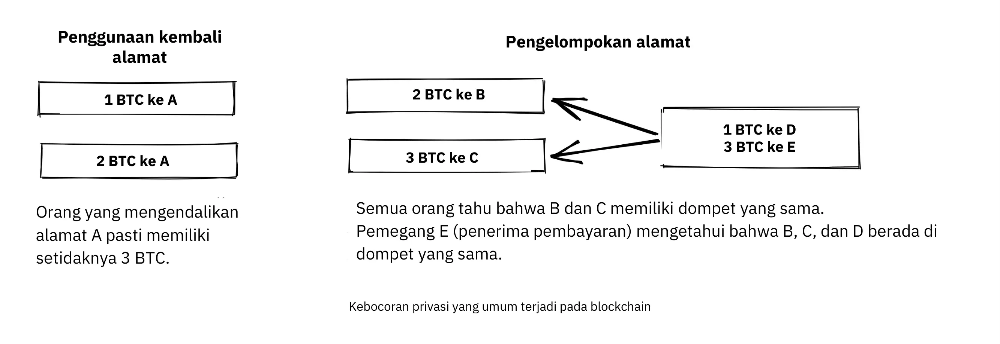
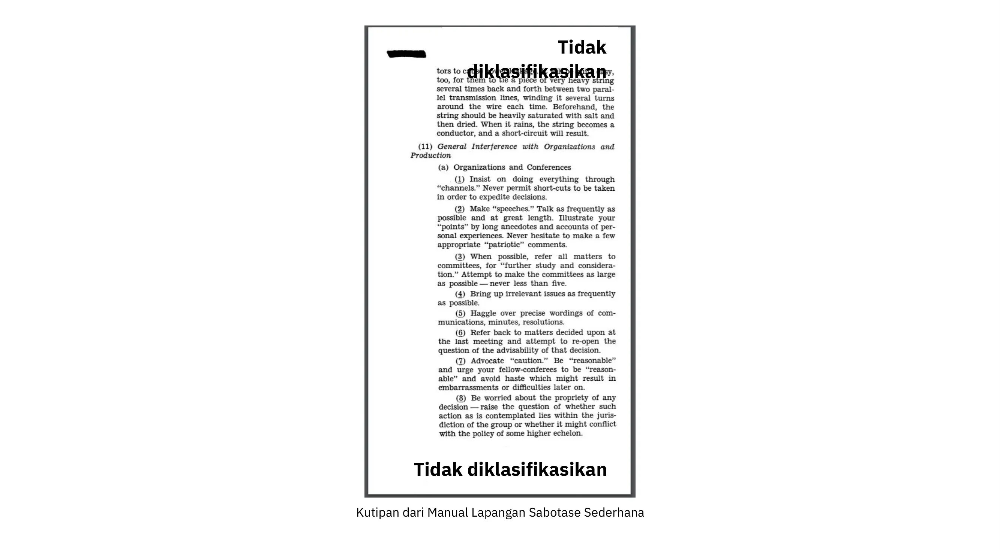
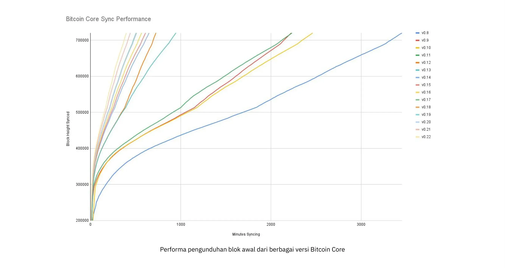
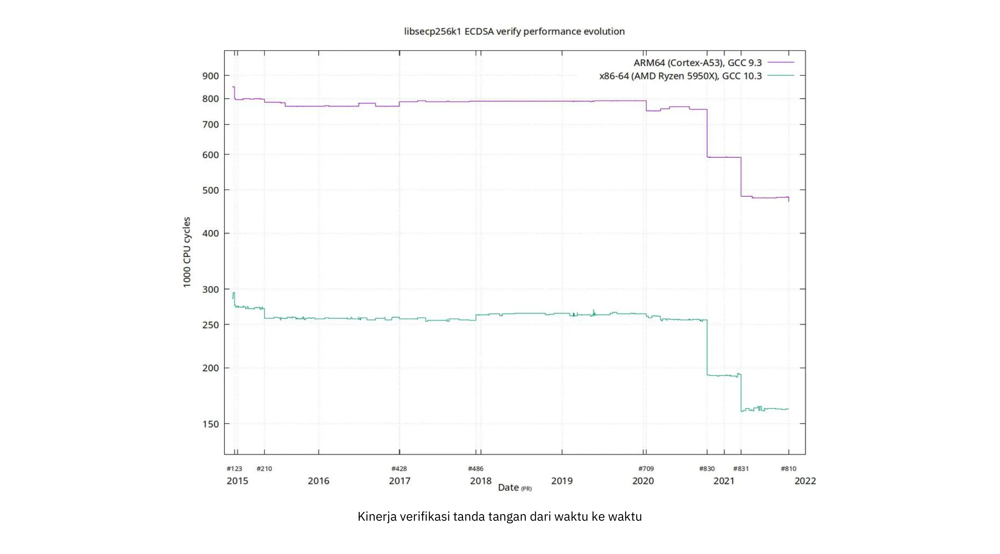
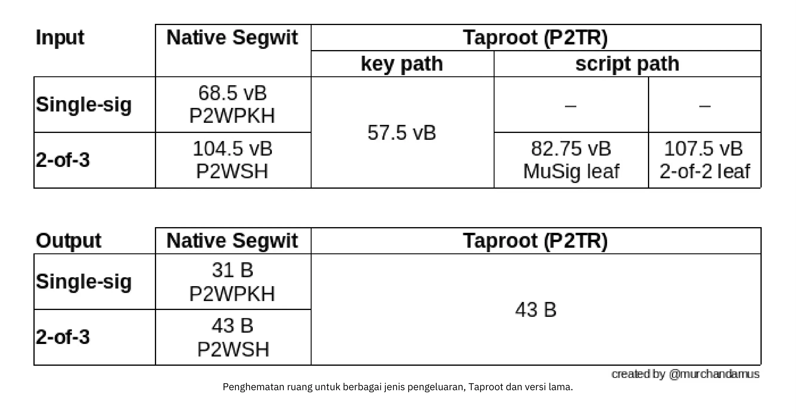
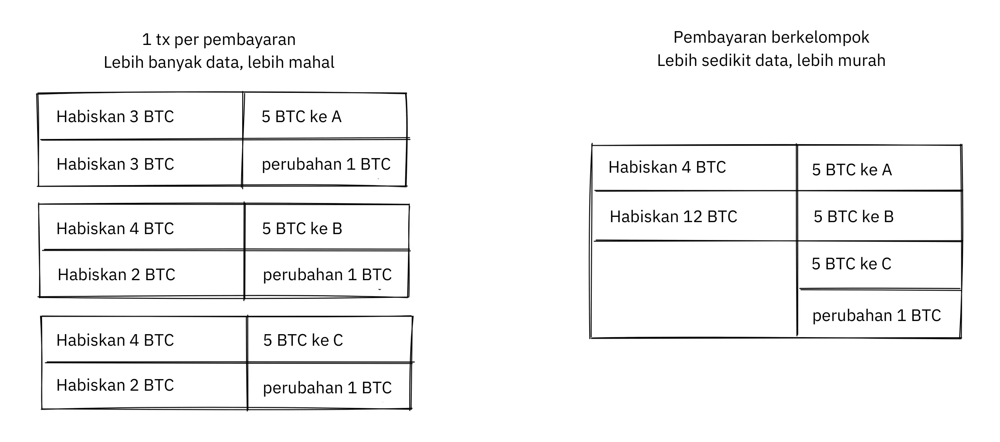
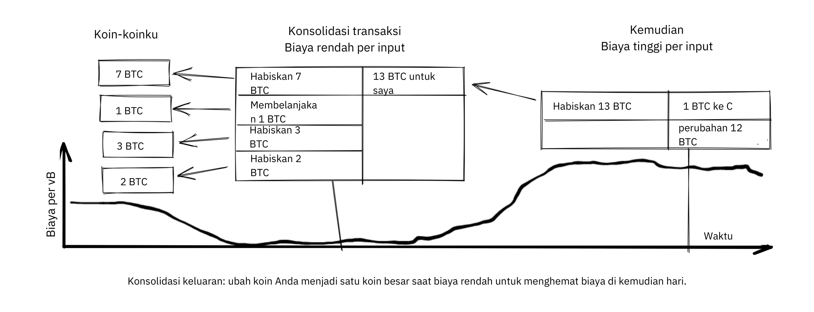
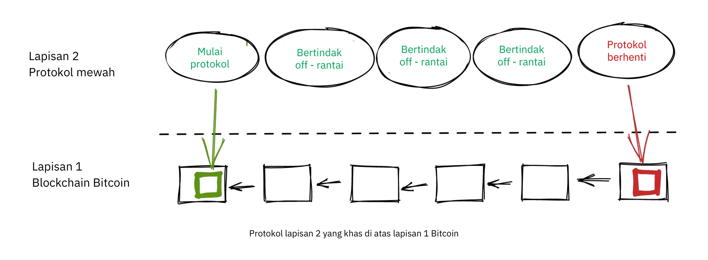
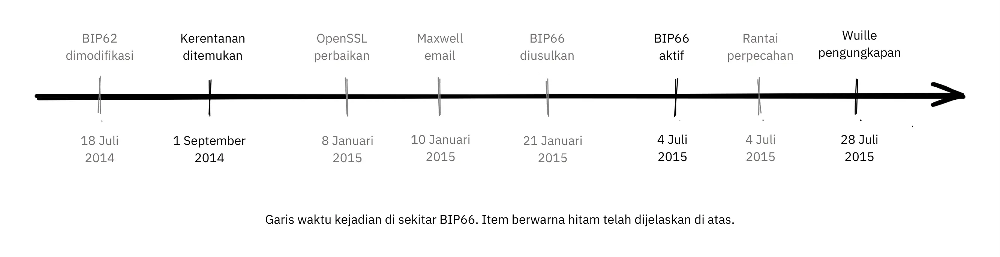
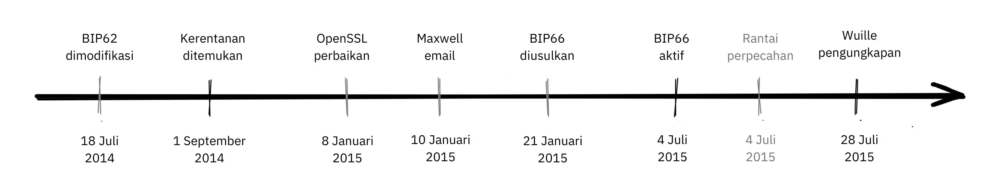

# Mendalami Filosofi Pengembangan Bitcoin


Filosofi Pengembangan Bitcoin adalah kursus untuk pengembang Bitcoin yang telah memahami dasar-dasar konsep dan proses seperti Proof-of-Work, pembangunan blok, dan siklus hidup transaksi, dan yang ingin naik level dengan mendapatkan pemahaman yang lebih dalam tentang pertukaran desain dan filosofi Bitcoin.

Hal ini akan membantu para pengembang baru untuk menyerap pelajaran terpenting dari lebih dari satu dekade pengembangan Bitcoin dan debat publik, sambil memberikan mereka konteks yang berguna untuk mengevaluasi ide-ide baru (yang baik dan yang buruk!).


### Apa yang diharapkan?


Seperti yang dinyatakan di atas, ini adalah panduan praktis untuk pengembang Bitcoin. Namun, Bitcoin adalah subjek yang luas dan kompleks dan kami tidak mungkin mencakup semua aspeknya di sini. Dengan kursus ini, kami berharap dapat mendiskusikan fitur-fitur yang diperlukan untuk memulai aktivitas pengembangan Anda serta memungkinkan Anda untuk mengeksplorasinya lebih lanjut secara mandiri.


Ada banyak orang yang terlibat dalam Bitcoin; karena beberapa di antara mereka memiliki pendapat yang berlawanan, di sini Anda dapat menemukan sumber daya yang mengekspresikan ide-ide yang bertentangan. Namun, kami selalu berusaha untuk tetap berpegang pada domain fakta, di mana opini tidak penting.


### Siapa yang menulis ini?


Kursus ini diadaptasi dari buku eponim yang penulis utamanya adalah Kalle Rosenbaum, dan Linnéa Rosenbaum berkontribusi sebagai penulis pendamping.

Buku ini ditugaskan dan didanai oleh [Chaincode Labs](https://learning.chaincode.com/), sebuah pusat pengembangan yang menjalankan program pendidikan bagi para pengembang yang ingin mempelajari pengembangan Bitcoin.


+++


# Pendahuluan

<partId>58c48e9b-e285-4dc6-8952-6cc5140b1313</partId>


## Gambaran umum kursus

<chapterId>28b7256b-9cb0-463e-a82d-d732be86c98c</chapterId>


Selamat datang di kursus BTC 303 tentang filosofi pengembangan Bitcoin.


Bitcoin lebih dari sekadar mata uang kripto, Bitcoin mewujudkan visi filosofis tentang desentralisasi, privasi, tidak dapat dipercaya, dan ketahanan. Kursus ini dirancang khusus untuk para pengembang yang sudah terbiasa dengan dasar-dasar teknis Bitcoin yang sekarang ingin memperdalam pemahaman mereka tentang prinsip-prinsip yang mendasari desain dan tata kelola Bitcoin.


Sepanjang kursus ini, Anda akan mendapatkan kejelasan tentang nilai-nilai dan strategi penting yang telah memandu evolusi Bitcoin selama lebih dari satu dekade. Dengan mengeksplorasi tema-tema ini secara mendalam, Anda akan mengembangkan perspektif kritis yang diperlukan untuk mengevaluasi dan berkontribusi pada pengembangan di masa depan dengan penuh percaya diri.


### Nilai-Nilai Utama Bitcoin


Apa yang membuat Bitcoin unik? Bagian ini mengungkapkan nilai-nilai dasar yang menjadi inti dari desain Bitcoin. Anda akan menjelajahi **desentralisasi**, landasan yang memastikan tidak ada satu pun entitas yang mengendalikan jaringan; **ketidakpercayaan**, kunci untuk menghilangkan ketergantungan pihak ketiga; **privasi**, yang sangat penting bagi kebebasan individu dan integritas sistem; dan **finite Supply**, jaminan kelangkaan berkode yang membentuk identitas ekonomi Bitcoin. Menguasai konsep-konsep ini akan memungkinkan Anda untuk sepenuhnya memahami kekuatan dan kerentanan Bitcoin.


### Tata Kelola Bitcoin


Menavigasi lanskap tata kelola Bitcoin yang kompleks membutuhkan lebih dari sekadar keahlian teknis, tetapi juga menuntut pemahaman tentang pendekatan unik Bitcoin terhadap konsensus dan pengambilan keputusan. Di bagian ini, Anda akan menyelami mekanisme dan filosofi di balik proses-proses penting seperti peningkatan protokol, perlunya pemikiran yang berlawanan, kekuatan kolaborasi sumber terbuka, tantangan penskalaan yang sedang berlangsung, dan strategi bernuansa yang diperlukan saat terjadi kesalahan. Dengan bekal pengetahuan ini, Anda akan siap untuk tidak hanya berpartisipasi tetapi juga membentuk masa depan Bitcoin secara efektif dan bertanggung jawab.


Siap untuk mengambil langkah selanjutnya dalam perjalanan Bitcoin Anda? Mari kita mulai!


# Nilai-nilai Pusat Bitcoin

<partId>2d6c683b-54c8-5465-b2ca-4e96a6828834</partId>


## Desentralisasi

<chapterId>9397c84b-0038-5d0e-88d5-11767ce8182d</chapterId>


Laporan ini menganalisis apa itu desentralisasi dan mengapa desentralisasi sangat penting agar Bitcoin dapat berfungsi. Kami membedakan antara

desentralisasi [penambang](https://planb.academy/resources/glossary/mining) dan [node penuh](https://planb.academy/resources/glossary/full-node), dan mendiskusikan apa yang mereka bawa ke meja untuk resistensi sensor, salah satu sifat paling sentral dari Bitcoin.


Diskusi kemudian bergeser ke pemahaman mengenai netralitas - atau tidak adanya izin terhadap pengguna, penambang, dan pengembang - yang merupakan sifat penting dari sistem terdesentralisasi. Terakhir, kita akan membahas bagaimana Hard dapat digunakan untuk memahami sistem terdesentralisasi seperti Bitcoin, dan menyajikan beberapa model mental yang dapat membantu Anda memahaminya.


Sebuah sistem tanpa titik pusat kontrol disebut sebagai *desentralisasi*. Bitcoin dirancang untuk menghindari adanya titik pusat kendali, atau lebih tepatnya *titik pusat penyensoran*.


Desentralisasi adalah sarana untuk mencapai *ketahanan sensor*.


Ada dua aspek utama desentralisasi dalam Bitcoin: Desentralisasi Miner dan desentralisasi Full node.


Desentralisasi Miner mengacu pada fakta bahwa pemrosesan [transaksi](https://planb.academy/resources/glossary/transaction-tx) tidak dilakukan atau dikoordinasikan oleh entitas pusat mana pun. Desentralisasi Full node mengacu pada fakta bahwa validasi [blok](https://planb.academy/resources/glossary/block), yaitu data yang dihasilkan oleh penambang, dilakukan di tepi jaringan, pada akhirnya oleh para penggunanya, dan bukan oleh beberapa otoritas tepercaya.


### Desentralisasi Miner


Ada beberapa upaya untuk menciptakan mata uang digital sebelum Bitcoin, tetapi sebagian besar gagal karena kurangnya desentralisasi tata kelola dan resistensi terhadap sensor.


Desentralisasi Miner dalam Bitcoin berarti bahwa *pemesanan transaksi* tidak dilakukan oleh satu entitas atau sekumpulan entitas yang tetap. Ini dilakukan secara kolektif oleh semua aktor yang ingin berpartisipasi di dalamnya; kolektif penambang ini adalah sekumpulan pengguna yang dinamis. Siapapun dapat bergabung atau keluar sesuai keinginan mereka. Sifat ini membuat Bitcoin tahan terhadap sensor.


Jika Bitcoin terpusat, maka akan rentan terhadap pihak-pihak yang ingin menyensornya, seperti pemerintah. Ini akan menemui nasib yang sama dengan upaya sebelumnya untuk menciptakan uang digital. Dalam pendahuluan [makalah](https://www.blockstream.com/sidechains.pdf) yang berjudul "Mengaktifkan Inovasi [Blockchain](https://planb.academy/resources/glossary/blockchain) dengan Pegged Sidechains", penulis menjelaskan bagaimana versi awal uang digital tidak diperlengkapi untuk lingkungan yang tidak bersahabat (lihat juga bab tentang Pemikiran Adversarial di bagian selanjutnya).


David Chaum memperkenalkan uang digital sebagai topik penelitian pada tahun 1983, dalam sebuah lingkungan dengan server pusat yang dipercaya untuk mencegah [Double-spending](https://planb.academy/resources/glossary/double-spending-attack). Untuk mengurangi risiko privasi individu dari pihak pusat yang dipercaya ini, dan untuk menegakkan [kesepadanan](https://planb.academy/resources/glossary/fungibility), Chaum memperkenalkan [tanda tangan buta](https://planb.academy/resources/glossary/blind-signature), yang ia gunakan untuk menyediakan sarana kriptografi untuk mencegah penautan tanda tangan server pusat (yang mewakili koin), sambil tetap memungkinkan server pusat untuk melakukan pencegahan pembelanjaan ganda.

Kebutuhan akan server pusat menjadi kelemahan utama uang digital [Gri99]. Walaupun memungkinkan untuk mendistribusikan titik kegagalan tunggal ini dengan mengganti tanda tangan server pusat dengan tanda tangan ambang batas dari beberapa penandatangan, penting untuk dapat diaudit bahwa penandatangan harus berbeda dan dapat diidentifikasi. Hal ini masih membuat sistem rentan terhadap kegagalan, karena setiap penanda tangan dapat gagal, atau dibuat gagal, satu per satu.


Menjadi jelas bahwa menggunakan server pusat untuk memesan transaksi bukanlah pilihan yang tepat karena tingginya risiko penyensoran. Bahkan jika kita mengganti server pusat dengan sebuah federasi yang terdiri dari n server yang tetap, di mana setidaknya m harus menyetujui sebuah pemesanan, masih akan ada kesulitan. Masalahnya memang akan bergeser ke masalah di mana pengguna harus menyetujui kumpulan n server ini dan juga bagaimana mengganti server yang jahat dengan yang baik tanpa bergantung pada otoritas pusat.


Mari kita bayangkan apa yang bisa terjadi jika Bitcoin disensor. Sensor dapat menekan pengguna untuk mengidentifikasi diri mereka sendiri, untuk menyatakan dari mana uang mereka berasal atau apa yang mereka beli dengan uang tersebut sebelum mengizinkan transaksi mereka masuk ke dalam Blockchain.


Selain itu, kurangnya resistensi sensor akan memungkinkan sensor untuk memaksa pengguna mengadopsi aturan sistem yang baru. Sebagai contoh, mereka dapat memaksakan sebuah perubahan yang memungkinkan mereka untuk menggelembungkan uang Supply, sehingga memperkaya diri mereka sendiri. Dalam kejadian seperti itu, pengguna yang memverifikasi blok akan memiliki tiga opsi untuk menangani aturan baru:


- Mengadopsi: Menerima perubahan dan mengadopsinya ke dalam Full node mereka.
- Tolak: Menolak untuk mengadopsi perubahan; ini akan membuat pengguna memiliki sistem yang tidak memproses transaksi lagi, karena blokir sensor sekarang dianggap tidak valid oleh Full node pengguna.
- Pindah: Menunjuk titik pusat kendali baru; semua pengguna harus mencari cara untuk berkoordinasi dan kemudian menyepakati titik pusat kendali yang baru.


Jika mereka berhasil, masalah yang sama kemungkinan besar akan muncul kembali di masa depan, mengingat sistem ini tetap sama sensornya seperti sebelumnya.


Tidak satu pun dari opsi ini yang bermanfaat bagi pengguna.


Resistensi sensor melalui desentralisasi adalah apa yang membedakan Bitcoin dari sistem uang lainnya, tetapi bukan hal yang mudah untuk dicapai karena *masalah Double-spending*. Ini adalah masalah untuk memastikan tidak ada orang yang dapat membelanjakan koin yang sama dua kali, sebuah masalah yang menurut banyak orang tidak mungkin dipecahkan dengan cara yang terdesentralisasi. Satoshi [Nakamoto](https://planb.academy/resources/glossary/nakamoto-satoshi) menulis dalam [whitepaper Bitcoin](https://planb.academy/bitcoin.pdf) tentang bagaimana cara memecahkan masalah Double-spending:


> Dalam makalah ini, kami mengusulkan solusi untuk masalah Double-spending menggunakan server Timestamp terdistribusi peer-to-peer untuk bukti komputasi generate dari urutan kronologis transaksi.


Di sini dia menggunakan frasa yang terdengar aneh "server Timestamp terdistribusi peer-to-peer". Kata kuncinya di sini adalah *distribusi*, yang dalam konteks ini berarti tidak ada titik pusat kendali. Nakamoto kemudian menjelaskan bagaimana [Proof-of-Work](https://planb.academy/resources/glossary/proof-of-work) adalah solusinya.

Namun, tidak ada yang menjelaskannya lebih baik daripada

[Gregory Maxwell di Reddit](https://www.reddit.com/r/Bitcoin/comments/ddddfl/question_on_the_vulnerability_of_bitcoin/f2g9e7b/), di mana dia menanggapi seseorang yang mengusulkan untuk membatasi kekuatan penambang [Hash](https://planb.academy/resources/glossary/hashrate) untuk menghindari potensi serangan 51%:


> Sistem terdesentralisasi seperti Bitcoin menggunakan pemilihan umum. Tetapi Anda tidak bisa hanya memiliki suara 'orang' dalam sistem terdesentralisasi karena itu akan membutuhkan pihak terpusat untuk mengotorisasi orang untuk memilih. Sebagai gantinya, Bitcoin menggunakan pemungutan suara daya komputasi karena memungkinkan untuk memverifikasi daya komputasi tanpa bantuan dari pihak terpusat
pihak ketiga.


Postingan ini menjelaskan bagaimana jaringan Bitcoin yang terdesentralisasi dapat mencapai kesepakatan dalam pemesanan transaksi melalui penggunaan Proof-of-Work.


Dia kemudian menyimpulkan dengan mengatakan bahwa serangan 51% tidak terlalu mengkhawatirkan, dibandingkan dengan orang-orang yang tidak peduli atau tidak memahami sifat desentralisasi Bitcoin:


> Risiko yang jauh lebih besar untuk Bitcoin adalah bahwa publik yang menggunakannya tidak akan mengerti, tidak akan peduli, dan tidak akan melindungi properti desentralisasi yang membuatnya berharga dibandingkan alternatif terpusat sejak awal.

Kesimpulannya adalah kesimpulan yang penting. Jika orang tidak melindungi desentralisasi Bitcoin, yang merupakan proksi dari resistensi terhadap penyensoran, Bitcoin mungkin menjadi korban dari kekuatan sentralisasi, sampai ia menjadi sangat tersentralisasi sehingga penyensoran menjadi sesuatu. Kemudian sebagian besar, jika tidak semua, proposisi nilainya akan hilang. Hal ini membawa kita ke bagian selanjutnya tentang desentralisasi Full node.


### Desentralisasi Full node


Pada paragraf di atas, kita telah membahas mengenai desentralisasi Miner dan bagaimana memusatkan penambang dapat memungkinkan penyensoran. Tetapi ada juga aspek lain dari desentralisasi, yaitu *desentralisasi Full node*.


Pentingnya desentralisasi Full node terkait dengan ketidakpercayaan. Misalkan seorang pengguna berhenti menjalankan Full node mereka sendiri karena, misalnya, kenaikan biaya operasi yang sangat tinggi. Dalam hal ini, mereka harus berinteraksi dengan jaringan Bitcoin dengan cara lain, mungkin dengan menggunakan [dompet web](https://planb.academy/resources/glossary/wallet) atau dompet ringan, yang membutuhkan tingkat kepercayaan tertentu pada penyedia layanan ini.


Pengguna beralih dari secara langsung menegakkan [aturan konsensus](https://planb.academy/resources/glossary/consensus-rules) jaringan menjadi mempercayai orang lain yang akan melakukannya. Sekarang anggaplah sebagian besar pengguna mendelegasikan penegakan [konsensus](https://planb.academy/resources/glossary/consensus) ke entitas yang dipercaya. Dalam hal ini, jaringan dapat dengan cepat berubah menjadi sentralisasi, dan aturan jaringan dapat diubah oleh konspirasi aktor jahat.


Dalam [a

Artikel Majalah Bitcoin](https://bitcoinmagazine.com/technical/decentralist-perspective-Bitcoin-might-need-small-blocks-1442090446), Aaron van Wirdum mewawancarai para pengembang Bitcoin mengenai pandangan mereka terhadap desentralisasi dan risiko yang terlibat dalam meningkatkan ukuran blok maksimum Bitcoin. Diskusi ini adalah topik Hot selama era 2014-2017, ketika banyak orang berdebat tentang peningkatan batas ukuran blok untuk memungkinkan lebih banyak throughput transaksi.


Argumen yang kuat untuk menentang peningkatan ukuran blok adalah karena hal ini akan meningkatkan biaya verifikasi. Jika biaya verifikasi meningkat, ini akan mendorong beberapa pengguna untuk berhenti menjalankan node mereka secara penuh. Hal ini, pada gilirannya, akan menyebabkan lebih banyak orang tidak dapat menggunakan sistem dengan cara Trustless.


Pieter Wuille dikutip dalam artikel tersebut, di mana ia menjelaskan risiko sentralisasi Full node:


> Jika banyak perusahaan menjalankan Full node, itu berarti mereka semua harus diyakinkan untuk menerapkan set aturan yang berbeda. Dengan kata lain: desentralisasi validasi blok adalah apa yang memberikan bobot pada aturan konsensus.
> Tetapi jika jumlah Full node akan turun sangat rendah, misalnya karena semua orang menggunakan web-wallet, exchange dan SPV atau mobile wallet yang sama, maka regulasi dapat menjadi kenyataan. Dan jika pihak berwenang dapat mengatur aturan konsensus, itu berarti mereka dapat mengubah apa pun yang membuat Bitcoin menjadi Bitcoin. Bahkan batas 21 juta Bitcoin.

Ini dia. Pengguna Bitcoin harus menjalankan node penuh mereka sendiri untuk mencegah regulator dan perusahaan besar mencoba mengubah aturan konsensus.


### Netralitas


Bitcoin bersifat netral, atau tanpa izin, sebagaimana orang-orang menyebutnya. Ini berarti bahwa Bitcoin tidak peduli siapa Anda atau untuk apa Anda menggunakannya.


Bitcoin bersifat netral, yang merupakan hal yang baik, dan satu-satunya cara untuk bekerja. Jika dikendalikan oleh sebuah organisasi, itu hanya akan menjadi jenis objek virtual lain dan saya tidak akan tertarik padanya


Selama Anda bermain sesuai aturan, Anda bebas menggunakannya sesuka hati, tanpa meminta izin kepada siapa pun. Ini termasuk *Mining*, *bertransaksi* di dalamnya, dan *membangun protokol dan layanan* di atas Bitcoin:


- Jika *Mining* adalah proses yang diizinkan, kita akan membutuhkan otoritas pusat untuk memilih siapa yang diizinkan untuk menambang. Hal ini kemungkinan besar akan membuat para penambang harus menandatangani kontrak hukum yang di dalamnya mereka setuju untuk

untuk menyensor transaksi sesuai dengan keinginan otoritas pusat, yang mengalahkan tujuan Mining sejak awal.


- Jika orang yang bertransaksi di Bitcoin harus memberikan informasi pribadi, menyatakan untuk apa transaksi mereka, atau membuktikan bahwa mereka layak untuk bertransaksi, kami juga memerlukan titik pusat otoritas untuk menyetujui pengguna atau transaksi. Sekali lagi, hal ini akan mengarah pada penyensoran dan pengecualian.


- Jika pengembang harus meminta izin untuk *membangun protokol* di atas Bitcoin, hanya protokol yang diizinkan oleh komite pemberian izin pengembang pusat yang akan dikembangkan. Hal ini akan, karena intervensi pemerintah pasti akan mengecualikan semua protokol yang menjaga privasi dan semua upaya untuk meningkatkan desentralisasi.


Pada semua tingkatan, mencoba untuk memaksakan pembatasan pada siapa yang dapat menggunakan Bitcoin untuk apa akan melukai Bitcoin sampai pada titik di mana Bitcoin tidak lagi sesuai dengan proposisi nilainya.


Pieter Wuille https://Bitcoin.stackexchange.com/a/92055/69518 [menjawab pertanyaan di Stack Exchange] tentang bagaimana Blockchain berhubungan dengan database normal. Dia menjelaskan bagaimana tanpa izin dapat dicapai melalui penggunaan Proof-of-Work yang dikombinasikan dengan insentif ekonomi.


Dia menyimpulkan:


> Menggunakan algoritma konsensus Trustless seperti PoW memang menambahkan sesuatu yang tidak diberikan oleh konstruksi lain (partisipasi tanpa izin, yang berarti tidak ada kelompok peserta yang dapat menyensor perubahan Anda), Menggunakan algoritma konsensus Trustless seperti PoW memang menambahkan sesuatu yang tidak ada, tetapi dengan biaya yang mahal, dan asumsi ekonominya membuatnya hanya berguna untuk sistem yang mendefinisikan mata uang digital mereka sendiri.
> Mungkin hanya ada satu atau beberapa tempat di dunia ini yang benar-benar menggunakan alat ini.

Dia menjelaskan bahwa, untuk mencapai tanpa izin, sistem kemungkinan besar membutuhkan mata uangnya sendiri, dengan demikian "membatasi kasus penggunaan untuk secara efektif hanya mata uang kripto". Ini karena partisipasi tanpa izin, atau Mining, membutuhkan insentif ekonomi yang dibangun ke dalam sistem itu sendiri.


### Desentralisasi Grokking


Aspek yang menarik dari Bitcoin adalah bagaimana Hard dapat dipahami bahwa tidak ada yang mengendalikannya. Tidak ada komite atau eksekutif di Bitcoin. Gregory Maxwell, sekali lagi [di subreddit Bitcoin](https://www.reddit.com/r/Bitcoin/comments/s82t2n/comment/htdte7w/?utm_source=share&utm_medium=web2x&context=3), membandingkannya dengan bahasa Inggris dengan cara yang menarik:


> Banyak orang yang kesulitan memahami sistem otonom, ada banyak hal dalam kehidupan mereka seperti bahasa Inggris - tetapi orang hanya menganggapnya biasa saja dan bahkan tidak menganggapnya sebagai sistem. Mereka terjebak dalam cara berpikir yang terpusat di mana segala sesuatu yang mereka anggap sebagai 'benda' memiliki otoritas yang mengendalikannya.
>

> Bitcoin tidak berfokus pada apa pun. Berbagai orang yang telah mengadopsi Bitcoin memilih atas kehendak bebas mereka sendiri untuk mempromosikannya, dan bagaimana mereka memilih untuk melakukannya adalah urusan mereka sendiri. Orang-orang yang terpaku pada otoritas mungkin melihat kegiatan ini dan percaya bahwa itu adalah operasi oleh otoritas Bitcoin, tetapi tidak ada otoritas seperti itu.


Cara kerja Bitcoin melalui desentralisasi menyerupai kecerdasan kolektif yang luar biasa yang ditemukan di antara banyak spesies di alam. Ilmuwan komputer Radhika Nagpal berbicara dalam [Ted talk](https://www.ted.com/talks/radhika_nagpal_what_intelligent_machines_can_learn_from_a_school_of_fish) tentang perilaku kolektif kelompok ikan dan bagaimana para ilmuwan mencoba menirunya dengan menggunakan robot.


> Kedua, dan hal yang menurut saya paling luar biasa, adalah kita tahu bahwa tidak ada pemimpin yang mengawasi kawanan ikan ini. Sebaliknya, perilaku pikiran kolektif yang luar biasa ini muncul murni dari interaksi antara satu ikan dengan ikan lainnya.
> Entah bagaimana, ada interaksi atau aturan main di antara ikan-ikan tetangga yang membuat semuanya berjalan lancar.

Dia menunjukkan bahwa banyak sistem, baik alami maupun buatan, dapat dan memang bekerja tanpa pemimpin, dan mereka sangat kuat dan tangguh. Setiap individu hanya berinteraksi dengan lingkungan sekitar mereka, tetapi bersama-sama mereka membentuk sesuatu yang luar biasa.


Apa pun yang Anda pikirkan tentang Bitcoin, sifatnya yang terdesentralisasi membuatnya sulit dikendalikan. Bitcoin ada, dan tidak ada yang dapat Anda lakukan tentang hal itu. Ini adalah sesuatu yang harus dipelajari, bukan diperdebatkan.


### Kesimpulan tentang Desentralisasi


Kami membedakan antara desentralisasi Full node dan desentralisasi Mining. Desentralisasi Mining adalah sarana untuk mencapai ketahanan terhadap penyensoran, sedangkan desentralisasi Full node adalah yang membuat aturan konsensus jaringan Hard tidak dapat berubah tanpa dukungan luas di antara para pengguna.


Sifat desentralisasi Bitcoin memungkinkan netralitas terhadap pengembang, pengguna, dan penambang. Siapapun bebas untuk berpartisipasi tanpa meminta izin.


Sistem terdesentralisasi bisa jadi merupakan Hard yang membingungkan, tetapi ada beberapa model mental yang dapat membantu, misalnya bahasa Inggris, atau sekolah ikan.


## Ketidakpercayaan

<chapterId>0506ba61-16a3-543c-95fa-3f3e2dd64121</chapterId>


Bab ini membedah konsep trustlessness, apa artinya dari perspektif ilmu komputer, dan mengapa Bitcoin harus menjadi Trustless untuk mempertahankan proposisi nilainya.

Kami kemudian berbicara tentang apa yang dimaksud dengan menggunakan Bitcoin dengan cara Trustless, dan jaminan seperti apa yang dapat dan tidak dapat diberikan oleh Full node kepada Anda.

Pada bagian terakhir, kita melihat interaksi dunia nyata antara Bitcoin dan perangkat lunak atau pengguna yang sebenarnya, dan kebutuhan untuk melakukan pertukaran antara kenyamanan dan ketidakpercayaan untuk menyelesaikan apa pun.


Orang sering mengatakan hal-hal seperti "Bitcoin hebat karena ini adalah Trustless".


Apa yang dimaksud dengan Trustless? Pieter Wuille menjelaskan istilah yang banyak digunakan ini pada [Stack Exchange](https://Bitcoin.stackexchange.com/a/45674/69518):


> Kepercayaan yang kita bicarakan dalam "Trustless" adalah istilah teknis yang abstrak. Sistem terdistribusi disebut Trustless jika tidak memerlukan pihak tepercaya untuk berfungsi dengan benar.

Singkatnya, kata *Trustless* mengacu pada properti protokol Bitcoin yang secara logis dapat berfungsi tanpa "pihak tepercaya". Hal ini berbeda dengan kepercayaan yang mau tidak mau harus Anda berikan pada perangkat lunak atau perangkat keras yang Anda jalankan. Lebih lanjut tentang aspek kepercayaan yang terakhir ini akan dibahas lebih lanjut dalam bab ini.


Dalam sistem terpusat, kita bergantung pada reputasi aktor pusat untuk memastikan bahwa mereka akan menjaga keamanan atau mundur jika terjadi masalah, serta pada sistem hukum untuk memberikan sanksi atas pelanggaran. Persyaratan kepercayaan ini menjadi masalah dalam sistem desentralisasi pseudonim - tidak ada kemungkinan untuk meminta bantuan sehingga tidak mungkin ada kepercayaan. Dalam pengantar [whitepaper Bitcoin](https://Bitcoin.org/Bitcoin.pdf), Satoshi Nakamoto menjelaskan masalah ini:


> Perdagangan di Internet hampir secara eksklusif bergantung pada lembaga keuangan yang berfungsi sebagai pihak ketiga tepercaya untuk memproses pembayaran elektronik.
> Meskipun sistem ini bekerja cukup baik untuk sebagian besar transaksi, sistem ini masih memiliki kelemahan yang melekat pada model berbasis kepercayaan.  Transaksi yang benar-benar tidak dapat dibatalkan tidak benar-benar memungkinkan, karena lembaga keuangan tidak dapat menghindari mediasi sengketa. Biaya mediasi meningkatkan biaya transaksi, membatasi ukuran transaksi praktis minimum dan memotong kemungkinan untuk transaksi kasual kecil, dan ada biaya yang lebih luas dalam hilangnya kemampuan untuk melakukan pembayaran non-reversibel untuk layanan yang tidak dapat dibatalkan.
> Dengan adanya kemungkinan pembalikan arah, kebutuhan akan kepercayaan semakin meningkat. Pedagang harus waspada terhadap pelanggan mereka, merepotkan mereka untuk mendapatkan lebih banyak informasi daripada yang seharusnya mereka butuhkan.  Persentase tertentu dari penipuan diterima sebagai hal yang tidak dapat dihindari. Biaya dan ketidakpastian pembayaran ini dapat dihindari secara langsung dengan menggunakan mata uang fisik, tetapi tidak ada mekanisme untuk melakukan pembayaran melalui saluran komunikasi tanpa pihak yang dipercaya

Tampaknya kita tidak dapat memiliki sistem terdesentralisasi yang didasarkan pada kepercayaan, dan itulah sebabnya mengapa ketidakpercayaan menjadi penting dalam Bitcoin.


Untuk menggunakan Bitcoin dengan cara Trustless, Anda harus menjalankan node Bitcoin yang telah tervalidasi penuh. Hanya dengan begitu Anda dapat memverifikasi bahwa blok yang Anda terima dari orang lain mengikuti aturan konsensus; misalnya, bahwa jadwal penerbitan koin ditepati dan tidak ada pembelanjaan ganda yang terjadi pada Blockchain. Jika Anda tidak menjalankan Full node, Anda mengalihdayakan verifikasi blok Bitcoin kepada orang lain dan mempercayai mereka untuk mengatakan yang sebenarnya, yang berarti Anda tidak menggunakan Bitcoin tanpa rasa percaya.


David Harding telah menulis [artikel di situs web Bitcoin.org](https://Bitcoin.org/en/Bitcoin-core/features/validation) yang menjelaskan bagaimana menjalankan Full node - atau menggunakan Bitcoin tanpa kepercayaan - sebenarnya membantu Anda:


> Mata uang Bitcoin hanya berfungsi ketika orang menerima bitcoin dalam Exchange untuk hal-hal berharga lainnya. Ini berarti bahwa orang-orang yang menerima bitcoin-lah yang memberikan nilai dan yang dapat memutuskan bagaimana Bitcoin bekerja.
>

> Ketika Anda menerima bitcoin, Anda memiliki kekuatan untuk menegakkan peraturan Bitcoin, seperti mencegah penyitaan bitcoin seseorang tanpa akses ke kunci pribadi orang tersebut.
>

> Sayangnya, banyak pengguna yang mengalihdayakan kekuatan penegakan mereka. Hal ini membuat desentralisasi Bitcoin berada dalam kondisi yang lemah di mana segelintir penambang dapat berkolusi dengan segelintir bank dan layanan gratis untuk mengubah peraturan Bitcoin untuk semua pengguna yang tidak memverifikasi yang mengalihkan kekuasaan mereka.
>

> Tidak seperti dompet lainnya, Bitcoin Core menegakkan aturan - jadi jika penambang dan bank mengubah aturan untuk pengguna yang tidak memverifikasi, pengguna tersebut tidak akan dapat membayar pengguna Bitcoin Core yang telah melakukan validasi penuh seperti Anda.


Dia mengatakan bahwa menjalankan Full node akan membantu Anda memverifikasi setiap aspek Blockchain tanpa mempercayai siapa pun, untuk memastikan bahwa koin yang Anda terima dari orang lain adalah asli. Ini sangat bagus, tetapi ada satu hal penting yang tidak dapat dibantu oleh Full node: Full node tidak dapat mencegah pembelanjaan ganda melalui penulisan ulang secara berantai:


> Perhatikan bahwa meskipun semua program - termasuk Bitcoin Core - rentan terhadap penulisan ulang rantai, Bitcoin menyediakan mekanisme pertahanan: semakin banyak konfirmasi transaksi Anda, semakin aman Anda. Tidak ada pertahanan terdesentralisasi yang lebih baik dari itu.

Tidak peduli seberapa canggih perangkat lunak Anda, Anda tetap harus percaya bahwa blok yang berisi koin Anda tidak akan ditulis ulang. Akan tetapi, seperti yang ditunjukkan oleh Harding, Anda dapat menunggu beberapa konfirmasi, setelah itu Anda dapat mempertimbangkan kemungkinan terjadinya penulisan ulang rantai yang cukup kecil untuk dapat diterima.


Insentif untuk menggunakan Bitcoin dengan cara Trustless selaras dengan kebutuhan sistem untuk desentralisasi Full node. Semakin banyak orang yang menggunakan node penuh mereka sendiri, semakin banyak desentralisasi Full node, dan dengan demikian semakin kuat Bitcoin melawan perubahan berbahaya pada protokol. Namun sayangnya, seperti yang dijelaskan di bagian desentralisasi Full node, pengguna sering kali memilih untuk menggunakan layanan yang terpercaya sebagai konsekuensi dari pertukaran yang tak terelakkan antara ketidakpercayaan dan kenyamanan.


Ketidakpercayaan Bitcoin sangat penting dari perspektif sistem. Pada tahun 2018, Matt Corallo, [berbicara tentang ketidakpercayaan](https://btctranscripts.com/baltic-honeybadger/2018/trustlessness-scalability-and-directions-in-security-models/) di konferensi Baltic Honeybadger di Riga.


Inti dari pembicaraan tersebut adalah bahwa Anda tidak dapat membangun sistem Trustless di atas sistem tepercaya, tetapi Anda dapat membangun sistem tepercaya - misalnya, kustodian Wallet - di atas sistem Trustless.


Basis Trustless Layer memungkinkan berbagai pertukaran pada tingkat yang lebih tinggi


Model keamanan ini memungkinkan perancang sistem untuk memilih trade-off

yang masuk akal bagi mereka tanpa memaksakan pertukaran tersebut kepada orang lain.


### Jangan percaya, verifikasi


Bitcoin bekerja tanpa kepercayaan, tetapi Anda masih harus mempercayai perangkat lunak dan perangkat keras Anda sampai tingkat tertentu. Hal ini karena perangkat lunak atau perangkat keras Anda mungkin tidak diprogram untuk melakukan apa yang tertera pada kotak. Sebagai contoh:


- CPU mungkin dirancang dengan jahat untuk mendeteksi operasi kriptografi kunci privat dan membocorkan data kunci privat.
- Generator nomor acak sistem operasi mungkin tidak seacak yang diklaimnya.
- Bitcoin Core mungkin telah menyelipkan kode yang akan mengirimkan kunci pribadi Anda ke beberapa aktor jahat.


Jadi, selain menjalankan Full node, Anda juga perlu memastikan bahwa Anda menjalankan apa yang Anda inginkan. Pengguna Reddit brianddk [menulis sebuah artikel](https://www.reddit.com/r/Bitcoin/comments/smj1ep/bitcoin_v220_and_guix_stronger_defense_against/) tentang berbagai tingkat kepercayaan yang dapat Anda pilih, ketika memverifikasi perangkat lunak Anda. Pada bagian "Mempercayai pembuatnya", dia berbicara tentang build yang dapat direproduksi:


> Reproducible build adalah cara untuk mendesain perangkat lunak sehingga banyak pengembang komunitas dapat membangun perangkat lunak dan memastikan bahwa penginstal akhir yang dibangun identik dengan apa yang dihasilkan oleh pengembang lain. Dengan proyek yang sangat umum dan dapat direproduksi seperti Bitcoin, tidak ada satu pengembang pun yang perlu dipercaya sepenuhnya. Banyak pengembang dapat melakukan pembuatan dan membuktikan bahwa mereka menghasilkan file yang sama dengan file yang ditandatangani secara digital oleh pembuat asli.

Artikel ini mendefinisikan 5 tingkat kepercayaan: mempercayai situs, pembangun, kompiler, kernel, dan perangkat keras.


Untuk memperdalam topik build yang dapat direproduksi, Carl Dong [membuat presentasi tentang Guix](https://btctranscripts.com/breaking-Bitcoin/2019/Bitcoin-build-system/) menjelaskan mengapa mempercayai sistem operasi, pustaka, dan kompiler dapat menjadi masalah, dan bagaimana cara mengatasinya dengan sistem yang disebut Guix, yang digunakan oleh Bitcoin Core saat ini.


> Jadi, apa yang dapat kita lakukan terhadap fakta bahwa toolchain kita dapat memiliki sekumpulan binari tepercaya yang dapat direproduksi menjadi berbahaya? Kita harus lebih dari sekadar dapat direproduksi. Kita harus dapat di-bootstrap. Kita tidak dapat memiliki banyak alat biner yang perlu kita unduh dan percayai dari server eksternal yang dikendalikan oleh organisasi lain.
>

> Kita harus mengetahui bagaimana alat ini dibuat dan bagaimana kita dapat melalui proses pembuatannya lagi, lebih baik dari kumpulan binari terpercaya yang jauh lebih kecil. Kita perlu meminimalisir kumpulan binari terpercaya kita sebanyak mungkin, dan memiliki jalur yang mudah diaudit dari rantai alat tersebut ke apa yang kita gunakan untuk membangun Bitcoin. Hal ini memungkinkan kita untuk memaksimalkan verifikasi dan meminimalkan kepercayaan.

Dia kemudian menjelaskan bagaimana Guix memungkinkan kita untuk hanya mempercayai biner minimal 357 byte yang dapat diverifikasi dan dipahami sepenuhnya jika Anda tahu bagaimana menginterpretasikan instruksinya. Ini cukup luar biasa: seseorang memverifikasi bahwa biner 357 byte melakukan apa yang seharusnya dilakukan, kemudian menggunakannya untuk membangun sistem build lengkap dari kode sumber, dan berakhir dengan biner Bitcoin Core yang seharusnya merupakan salinan persis dari build orang lain.


Ada sebuah mantra yang banyak dianut oleh para pengguna bitcoin, yang menangkap dengan baik banyak hal di atas:


> Jangan percaya, verifikasi.

Hal ini menyinggung frasa "[percaya, tetapi verifikasi](https://en.wikipedia.org/wiki/Trust,_but_verify)" yang digunakan oleh mantan presiden AS Ronald Reagan dalam konteks perlucutan senjata nuklir. para [Bitcoiners](https://twitter.com/Truthcoin/status/1491415722123153408?s=20&t=ZyROxZxlBppdRpuuzsiF5w) mengubahnya untuk menyoroti penolakan terhadap kepercayaan dan pentingnya menjalankan Full node.


Tergantung pada pengguna untuk memutuskan sejauh mana mereka ingin memverifikasi perangkat lunak yang mereka gunakan dan data Blockchain yang mereka terima. Seperti halnya banyak hal lain di Bitcoin, ada pertukaran antara kenyamanan dan ketidakpercayaan. Hampir selalu lebih nyaman menggunakan Wallet kustodian dibandingkan dengan menjalankan Bitcoin Core pada perangkat keras Anda sendiri. Namun, karena perangkat lunak Bitcoin semakin matang dan antarmuka pengguna semakin membaik, seiring berjalannya waktu, perangkat lunak ini akan menjadi lebih baik dalam mendukung pengguna yang ingin bekerja tanpa kepercayaan. Selain itu, seiring bertambahnya pengetahuan pengguna dari waktu ke waktu, mereka seharusnya dapat secara bertahap menghilangkan rasa percaya.


Beberapa pengguna berpikir secara negatif dan memverifikasi sebagian besar aspek perangkat lunak yang mereka jalankan. Akibatnya, mereka mengurangi kebutuhan akan kepercayaan seminimal mungkin, karena mereka hanya perlu mempercayai perangkat keras komputer dan sistem operasi mereka. Dengan melakukan hal tersebut, mereka juga membantu orang-orang yang tidak memverifikasi perangkat keras mereka secara menyeluruh dengan menyuarakan pendapat mereka di depan umum untuk memperingatkan tentang masalah apa pun yang mungkin mereka temukan. Salah satu contoh yang baik dari hal ini adalah [peristiwa yang terjadi pada tahun 2018](https://bitcoincore.org/en/2018/09/20/notice/), ketika seseorang menemukan sebuah bug yang memungkinkan para penambang untuk mengeluarkan hasil dua kali dalam satu transaksi yang sama:


> CVE-2018-17144, perbaikan yang dirilis pada tanggal 18 September di Bitcoin Core versi 0.16.3 dan 0.17.0rc4, mencakup komponen Denial of Service dan kerentanan inflasi kritis. Awalnya dilaporkan ke beberapa pengembang yang bekerja pada Bitcoin Core, serta proyek yang mendukung mata uang kripto lainnya, termasuk ABC dan Unlimited pada tanggal 17 September sebagai bug Denial of Service saja, namun kami dengan cepat menentukan bahwa masalah ini juga merupakan kerentanan inflasi dengan akar penyebab dan perbaikan yang sama.

Di sini, seseorang yang tidak diketahui identitasnya melaporkan masalah yang ternyata jauh lebih buruk daripada yang disadari oleh pelapor. Hal ini menyoroti fakta bahwa orang yang memverifikasi kode sering kali melaporkan kelemahan keamanan alih-alih mengeksploitasinya. Hal ini bermanfaat bagi mereka yang tidak dapat memverifikasi semuanya sendiri.


Namun, pengguna tidak boleh mempercayai orang lain untuk menjaga keamanannya, tetapi harus memverifikasi sendiri kapan pun dan apa pun yang mereka bisa; begitulah cara seseorang tetap berdaulat, dan bagaimana Bitcoin berkembang. Semakin banyak yang mengawasi perangkat lunak, semakin kecil kemungkinan kode berbahaya dan kelemahan keamanan lolos.


### Kesimpulan tentang Ketidakpercayaan


Protokol Bitcoin adalah Trustless karena memungkinkan pengguna untuk berinteraksi dengannya tanpa mempercayai pihak ketiga. Namun dalam praktiknya, kebanyakan orang tidak dapat memverifikasi seluruh perangkat lunak dan perangkat keras yang mereka gunakan untuk menjalankan Bitcoin. Orang yang terampil dalam memverifikasi perangkat lunak atau perangkat keras dapat memperingatkan orang lain yang kurang terampil ketika mereka menemukan kode berbahaya atau bug.


Tanpa adanya kepercayaan, kita tidak dapat memiliki desentralisasi, karena kepercayaan pasti melibatkan beberapa titik pusat otoritas. Anda dapat membangun sistem tepercaya di atas sistem Trustless, tetapi Anda tidak dapat membangun sistem Trustless di atas sistem tepercaya.


## Privasi

<chapterId>1b960afe-0008-589b-b2f4-007d60d264c6</chapterId>


Bab ini membahas tentang cara menjaga informasi keuangan pribadi Anda. Bab ini menjelaskan apa yang dimaksud dengan privasi dalam konteks Bitcoin, mengapa hal ini penting, dan apa yang dimaksud dengan Bitcoin yang bersifat pseudonim. Bab ini juga membahas bagaimana data pribadi dapat bocor, baik On-Chain maupun off-chain.


Kemudian, bab ini membahas tentang fakta bahwa bitcoin haruslah fungible, yang berarti dapat dipertukarkan dengan bitcoin lainnya, dan bagaimana fungibility dan privasi berjalan beriringan. Terakhir, bab ini memperkenalkan beberapa langkah yang dapat Anda ambil untuk meningkatkan privasi Anda dan orang lain.


Bitcoin dapat digambarkan sebagai sebuah sistem pseudonim, di mana para pengguna memiliki beberapa nama samaran dalam bentuk kunci publik. Sekilas, ini terlihat seperti cara yang cukup bagus untuk melindungi pengguna agar tidak teridentifikasi, tetapi pada kenyataannya sangat mudah untuk membocorkan informasi keuangan pribadi tanpa disengaja.


### Apa yang dimaksud dengan privasi?


Privasi dapat memiliki arti yang berbeda dalam konteks yang berbeda. Dalam Bitcoin, secara umum berarti bahwa pengguna tidak perlu mengungkapkan informasi keuangan mereka kepada orang lain, kecuali jika mereka melakukannya secara sukarela.


Ada banyak cara di mana Anda dapat membocorkan informasi pribadi Anda kepada orang lain, dengan atau tanpa menyadarinya. Data dapat bocor dari Blockchain publik atau melalui cara lain, misalnya ketika aktor jahat menyadap komunikasi internet Anda.


### Mengapa privasi itu penting?


Mungkin tampak jelas mengapa privasi penting dalam Bitcoin, tetapi ada beberapa aspek yang mungkin tidak langsung terpikirkan. [Di forum Bitcoin Talk](https://bitcointalk.org/index.php?topic=334316.msg3588908#msg3588908), Gregory Maxwell memandu kita melalui banyak alasan bagus mengapa menurutnya privasi itu penting. Diantaranya adalah pasar bebas, keamanan, dan martabat manusia:


> Privasi keuangan adalah kriteria penting untuk operasi pasar bebas yang efisien: jika Anda menjalankan bisnis, Anda tidak dapat secara efektif menetapkan harga jika pemasok dan pelanggan Anda dapat melihat semua transaksi Anda di luar kehendak Anda.
> Anda tidak dapat bersaing secara efektif jika pesaing Anda melacak penjualan Anda.  Secara individu, pengaruh informasi Anda akan hilang dalam transaksi pribadi Anda jika Anda tidak memiliki privasi atas akun Anda: jika Anda membayar pemilik gedung di Bitcoin tanpa privasi yang memadai, pemilik gedung akan mengetahui kapan Anda menerima kenaikan gaji dan dapat meminta Anda untuk membayar lebih banyak uang sewa.
>

> Privasi keuangan sangat penting untuk keamanan pribadi: jika pencuri dapat melihat pengeluaran, pendapatan, dan kepemilikan Anda, mereka dapat menggunakan informasi tersebut untuk menargetkan dan mengeksploitasi Anda. Tanpa privasi, pihak-pihak jahat memiliki lebih banyak kemampuan untuk mencuri identitas Anda, merampas pembelian dalam jumlah besar dari tangan Anda, atau menyamar sebagai perusahaan yang bertransaksi dengan Anda... mereka dapat mengetahui dengan pasti berapa banyak uang yang harus dikeluarkan untuk menipu Anda.
>

> Privasi keuangan sangat penting untuk martabat manusia: tidak ada yang ingin barista yang jutek di kedai kopi atau tetangga yang usil mengomentari pendapatan atau kebiasaan belanja mereka. Tidak ada yang ingin mertua mereka yang gila bayi bertanya mengapa mereka membeli kontrasepsi (atau mainan seks). Atasan Anda tidak perlu tahu ke gereja mana Anda menyumbang. Hanya di dunia yang bebas dari diskriminasi yang tercerahkan secara sempurna, di mana tidak ada seorang pun yang memiliki otoritas yang tidak semestinya atas orang lain, kita dapat mempertahankan martabat kita dan melakukan transaksi yang sah secara bebas tanpa sensor diri jika kita tidak memiliki privasi.

Maxwell juga menyinggung tentang kesesuaian, yang akan dibahas nanti dalam bab ini, serta bagaimana privasi dan penegakan hukum tidak bertentangan.


### Nama samaran


Kami telah menyebutkan di atas bahwa Bitcoin adalah pseudonim, dan nama samaran adalah kunci publik. Di media, Anda sering mendengar bahwa Bitcoin bersifat anonim, yang mana hal ini tidak benar. Terdapat perbedaan antara anonimitas dan pseudonimitas.


Andrew Poelstra [menjelaskan dalam postingan Bitcoin Stack Exchange](https://Bitcoin.stackexchange.com/a/29473/69518) seperti apa anonimitas dalam transaksi:


> Anonimitas total, dalam arti ketika Anda membelanjakan uang, tidak ada jejak dari mana asalnya atau ke mana perginya, secara teoritis dimungkinkan dengan menggunakan teknik kriptografi pembuktian tanpa pengetahuan.

Perbedaannya tampaknya adalah bahwa dalam bentuk uang pseudonim Anda dapat melacak pembayaran antara nama samaran, sedangkan dalam bentuk uang anonim Anda tidak bisa. Karena pembayaran Bitcoin dapat dilacak di antara nama samaran, ini bukan sistem anonim.


Kami juga telah mengatakan bahwa nama samaran adalah kunci publik, tetapi sebenarnya alamat yang berasal dari kunci publik. Mengapa kita menggunakan alamat sebagai nama samaran dan bukan yang lain, misalnya nama deskriptif, seperti "watchme1984"? Hal ini telah dijelaskan dengan baik (https://Bitcoin.stackexchange.com/a/25175/69518) oleh pengguna Tim S., juga pada Bitcoin Stack Exchange:


> Agar ide Bitcoin dapat bekerja, Anda harus memiliki koin yang hanya dapat dibelanjakan oleh pemilik private key yang diberikan. Ini berarti bahwa apa pun yang Anda kirimkan harus terikat, dengan cara tertentu, dengan kunci publik.
>

> Menggunakan nama samaran sembarang (misalnya nama pengguna) berarti Anda harus menghubungkan nama samaran tersebut dengan kunci publik untuk mengaktifkan kripto kunci publik/pribadi. Hal ini akan menghilangkan kemampuan untuk membuat alamat/nama samaran secara offline dengan aman (contoh: sebelum seseorang dapat mengirimkan uang ke nama pengguna "tdumidu", Anda harus mengumumkan di Blockchain bahwa "tdumidu" dimiliki oleh public key "a1c...", dan menyertakan sebuah biaya agar orang lain dapat mengumumkannya), mengurangi anonimitas (dengan mendorong Anda untuk menggunakan kembali nama samaran), dan membuat ukuran Blockchain menjadi lebih besar. Hal ini juga akan menciptakan rasa aman yang palsu bahwa Anda mengirimkan uang kepada orang yang Anda kira Anda (jika saya menggunakan nama "Linus Torvalds" sebelum dia, maka itu adalah milik saya dan orang mungkin akan mengirimkan uang karena berpikir bahwa mereka membayar pencipta Linux, bukan saya).

Dengan menggunakan alamat, atau kunci publik, kita mencapai tujuan penting, seperti menghilangkan kebutuhan untuk mendaftarkan nama samaran sebelumnya, mengurangi insentif untuk menggunakan kembali nama samaran, menghindari Blockchain yang membengkak, dan mempersulit peniruan orang lain.


### Privasi Blockchain


Privasi Blockchain mengacu pada informasi yang Anda ungkapkan dengan bertransaksi di Blockchain. Ini berlaku untuk semua transaksi, baik yang Anda kirim maupun yang Anda terima.


Satoshi Nakamoto merenungkan privasi On-Chain di bagian 7 dari [whitepaper Bitcoin](https://Bitcoin.org/Bitcoin.pdf):


> Sebagai firewall tambahan, pasangan kunci baru harus digunakan untuk setiap transaksi agar tidak terhubung dengan pemilik yang sama. Beberapa penautan masih tidak dapat dihindari dengan transaksi multi-input, yang tentu saja mengungkapkan bahwa input mereka dimiliki oleh pemilik yang sama. Resikonya adalah jika pemilik dari sebuah kunci terungkap, penautan dapat mengungkapkan transaksi lain yang dimiliki oleh pemilik yang sama.

Makalah ini merangkum masalah utama dari privasi Blockchain, yaitu penggunaan ulang Address dan pengelompokan Address. Yang pertama menjelaskan sendiri, yang terakhir mengacu pada kemampuan untuk memutuskan, dengan tingkat kepastian tertentu, bahwa sekumpulan alamat yang berbeda adalah milik pengguna yang sama.





Chris Belcher [menulis dengan sangat rinci](https://en.Bitcoin.it/Privacy#Blockchain_attacks_on_privacy) tentang berbagai jenis kebocoran privasi yang dapat terjadi pada Bitcoin Blockchain. Kami sarankan Anda membaca setidaknya beberapa subbagian pertama di bawah "Serangan Blockchain terhadap privasi."


Kesimpulannya adalah bahwa privasi di Bitcoin tidak sempurna. Dibutuhkan banyak usaha untuk bertransaksi secara pribadi. Kebanyakan orang tidak siap untuk melangkah sejauh itu untuk privasi. Tampaknya ada pertukaran yang jelas antara privasi dan kegunaan.


Aspek penting lainnya dari privasi adalah bahwa tindakan yang Anda ambil untuk melindungi privasi Anda sendiri juga memengaruhi pengguna lain. Jika Anda ceroboh dengan privasi Anda sendiri, orang lain mungkin akan mengalami pengurangan privasi juga. Gregory Maxwell menjelaskan hal ini dengan sangat jelas pada diskusi Bitcoin Talk yang sama [yang kami tautkan di atas](https://bitcointalk.org/index.php?topic=334316.msg3589252#msg3589252), dan diakhiri dengan sebuah contoh:


> Hal ini sebenarnya juga berhasil dalam praktiknya... Seorang peretas whitehat yang baik di IRC bermain-main dengan cracking brainwallet dan mendapatkan sebuah frasa dengan ~250 BTC di dalamnya.  Kami dapat mengidentifikasi pemiliknya hanya dari Address saja, karena mereka telah dibayar oleh layanan Bitcoin yang menggunakan alamat yang sama dan dia dapat membujuk mereka untuk memberikan informasi kontak pengguna. Dia benar-benar berhasil menghubungi pengguna melalui telepon, mereka terkejut dan bingung - tetapi bersyukur karena tidak kehilangan uang mereka.  Akhir yang membahagiakan di sana. (Ini bukan satu-satunya contoh, sejauh ini... tapi ini adalah salah satu contoh yang menyenangkan).

Dalam kasus ini, semuanya berjalan dengan baik berkat peretas yang berjiwa dermawan, tetapi jangan mengandalkan hal itu di lain waktu.


### Privasi non-Blockchain


Meskipun Blockchain terbukti menjadi sumber kebocoran privasi yang terkenal, ada banyak kebocoran lain yang tidak menggunakan Blockchain, beberapa lebih licik daripada yang lain. Mulai dari pencatat kunci hingga analisis lalu lintas jaringan. Untuk membaca tentang beberapa metode ini, silakan lihat lagi [tulisan Chris Belcher](https://en.Bitcoin.it/Privacy#Non-blockchain_attacks_on_privacy), khususnya bagian "Serangan Non-Blockchain pada privasi".


Di antara sejumlah besar serangan, Belcher menyebutkan kemungkinan seseorang mengintai koneksi internet Anda, misalnya, ISP Anda:


> Jika musuh melihat sebuah transaksi atau blok yang keluar dari node Anda yang sebelumnya tidak masuk, maka musuh dapat mengetahui dengan hampir pasti bahwa transaksi tersebut dibuat oleh Anda atau blok tersebut ditambang oleh Anda. Karena koneksi internet terlibat, musuh akan dapat menghubungkan IP Address dengan informasi Bitcoin yang ditemukan.

Namun, di antara kebocoran privasi yang paling jelas adalah bursa. Karena undang-undang, biasanya disebut sebagai KYC (Know Your Customer) dan AML (Anti Pencucian Uang), yang berlaku di yurisdiksi tempat mereka beroperasi, bursa dan perusahaan terkait sering kali harus mengumpulkan data pribadi tentang penggunanya, membangun basis data besar tentang pengguna mana yang memiliki bitcoin. Basis data ini merupakan tempat yang sangat baik untuk pemerintah jahat dan penjahat yang selalu mencari korban baru. Ada pasar yang sebenarnya untuk data semacam ini, di mana para peretas

menjual data kepada penawar tertinggi.


Lebih buruk lagi, perusahaan yang mengelola basis data ini sering kali hanya memiliki sedikit pengalaman dalam melindungi data keuangan, bahkan banyak di antaranya adalah perusahaan baru yang masih muda, dan kita tahu pasti bahwa beberapa kebocoran telah terjadi. Beberapa contohnya adalah

[MobiQwik yang berbasis di India](https://bitcoinmagazine.com/business/probably-the-largest-kyc-data-leak-in-history-demonstrates-the-importance-of-Bitcoin-privacy) dan [HubSpot](https://bitcoinmagazine.com/business/hubspot-security-breach-leaks-Bitcoin-users-data).


Sekali lagi, melindungi data dari berbagai macam serangan ini adalah Hard, dan kemungkinan besar Anda tidak akan sepenuhnya mampu melakukannya. Anda harus memilih untuk mengorbankan antara kenyamanan dan privasi yang paling cocok untuk Anda.


### Fungibilitas


Fungibilitas, dalam konteks mata uang, berarti bahwa satu koin dapat dipertukarkan dengan koin lain dari mata uang yang sama. Ini lucu

telah disinggung secara singkat di awal bab ini.


Dalam artikel yang dibahas di sana, Gregory Maxwell [menyatakan](https://bitcointalk.org/index.php?topic=334316.msg3588908#msg3588908):


> Privasi keuangan adalah elemen penting untuk kesepadanan dalam Bitcoin: jika Anda dapat membedakan satu koin dengan koin lainnya, maka kesepadanannya lemah. Jika kesepadanan kita terlalu lemah dalam praktiknya, maka kita tidak dapat terdesentralisasi: jika seseorang yang penting mengumumkan daftar koin yang dicuri, mereka tidak akan menerima koin yang berasal dari koin tersebut, Anda harus dengan hati-hati memeriksa koin yang Anda terima dengan daftar itu dan mengembalikan koin yang gagal.  Semua orang terjebak dalam memeriksa daftar hitam yang dikeluarkan oleh berbagai otoritas karena di dunia ini kita semua tidak ingin terjebak dengan koin yang buruk. Hal ini menambah gesekan dan biaya transaksi dan membuat Bitcoin menjadi kurang berharga sebagai uang.

Di sini, dia berbicara tentang bahaya yang berasal dari kurangnya kesesuaian. Misalkan Anda memiliki [UTXO](https://planb.academy/resources/glossary/utxo). Riwayat UTXO biasanya dapat ditelusuri kembali ke beberapa lompatan, menyebar ke banyak keluaran sebelumnya. Jika salah satu dari keluaran tersebut terlibat dalam aktivitas ilegal, tidak diinginkan, atau mencurigakan, maka beberapa calon penerima koin Anda mungkin akan menolaknya. Jika Anda berpikir bahwa penerima pembayaran Anda akan memverifikasi koin Anda terhadap beberapa layanan daftar putih atau daftar hitam terpusat, Anda mungkin akan mulai memeriksa koin yang Anda terima juga, hanya untuk berjaga-jaga. Hasilnya adalah fungibilitas yang buruk akan mendukung fungibilitas yang lebih buruk lagi.


Adam Back dan Matt Corallo [memberikan presentasi tentang kesesuaian](https://btctranscripts.com/scalingbitcoin/milan-2016/fungibility-overview/) di Scaling Bitcoin di Milan pada tahun 2016. Mereka memiliki pemikiran yang sama:


> Anda membutuhkan kesepadanan agar Bitcoin dapat berfungsi. Jika Anda menerima koin dan tidak dapat membelanjakannya, maka Anda mulai meragukan apakah Anda dapat membelanjakannya. Jika ada keraguan tentang koin yang Anda terima, maka orang-orang akan pergi ke layanan taint dan memeriksa apakah "apakah koin ini diberkati" dan kemudian orang-orang akan menolak untuk berdagang. Apa yang dilakukannya adalah mentransisikan Bitcoin dari sistem tanpa izin yang terdesentralisasi menjadi sistem berizin yang tersentralisasi di mana Anda memiliki "IOU" dari penyedia daftar hitam.

Tampaknya privasi dan fungibilitas berjalan seiring. Fungibility akan melemah jika privasi lemah, contohnya koin dari orang yang tidak diinginkan dapat masuk ke dalam daftar hitam. Dengan cara yang sama, privasi akan melemah jika fungibility lemah: jika ada daftar hitam, Anda harus bertanya kepada penyedia daftar hitam tentang koin mana yang akan diterima, sehingga mungkin mengungkapkan IP Address, email Address, dan informasi sensitif lainnya. Kedua fitur ini saling terkait sehingga tidak mungkin membicarakan salah satu dari keduanya secara terpisah.


### Langkah-langkah privasi


Beberapa teknik telah dikembangkan untuk membantu orang-orang melindungi diri mereka sendiri dari kebocoran privasi. Di antara yang paling jelas adalah, seperti yang dicatat oleh Nakamoto sebelumnya, menggunakan

alamat untuk setiap transaksi, tetapi ada beberapa alamat lainnya. Kami tidak akan mengajari Anda cara menjadi ninja privasi. Namun, Bitcoin Q+A memiliki [ringkasan singkat tentang teknologi yang meningkatkan privasi](https://bitcoiner.guide/privacytips/), yang diurutkan berdasarkan bagaimana cara menerapkan Hard. Ketika Anda membacanya, Anda akan melihat bahwa privasi Bitcoin sering kali berkaitan dengan hal-hal di luar Bitcoin. Sebagai contoh, Anda tidak boleh menyombongkan diri dengan bitcoin Anda, dan Anda harus menggunakan Tor dan VPN.


Postingan ini juga mencantumkan beberapa langkah yang terkait langsung dengan Bitcoin:


- Full node: Jika Anda tidak menggunakan Full node Anda sendiri, Anda akan membocorkan banyak informasi tentang Wallet Anda ke server di internet. Menjalankan Full node adalah langkah pertama yang bagus.
- Lightning Network: Beberapa protokol ada di atas Bitcoin, misalnya Lightning Network dan Liquid Blockstream Sidechain.
- CoinJoin: Cara bagi beberapa orang untuk menggabungkan transaksi mereka menjadi satu, sehingga lebih sulit untuk melakukan analisis rantai.


Dalam [sebuah ceramah](https://btctranscripts.com/breaking-Bitcoin/2019/breaking-Bitcoin-privacy/) di konferensi Breaking Bitcoin, Chris Belcher memberikan contoh praktis yang menarik tentang bagaimana privasi telah ditingkatkan:


> Mereka adalah kasino Bitcoin. Perjudian online tidak diizinkan di AS. Setiap pelanggan Coinbase yang menyetor langsung ke Bustabit akan ditutup akunnya karena Coinbase memantau hal ini. Bustabit melakukan beberapa hal. Mereka melakukan sesuatu yang disebut penghindaran perubahan di mana Anda melalui - dan Anda melihat apakah Anda dapat membuat transaksi yang tidak memiliki keluaran perubahan. Ini menghemat biaya Miner dan juga menghambat analisis.
>

> Selain itu, mereka juga mengimpor alamat setoran yang banyak digunakan kembali ke joinmarket. Pada titik ini, pelanggan coinbase.com tidak pernah diblokir. Tampaknya layanan pengawasan Coinbase tidak dapat melakukan analisis setelah ini, sehingga memungkinkan untuk memecahkan algoritme ini.

Dia juga menyebutkan contoh ini, antara lain, pada [Halaman privasi](https://en.Bitcoin.it/Privacy) pada wiki Bitcoin.


Perhatikan bagaimana privasi yang lebih baik dapat dicapai dengan membangun sistem di atas Bitcoin, seperti halnya dengan Lightning Network:


Lapisan di atas Bitcoin dapat menambah privasi


Kami mencatat dalam bab sebelumnya bahwa kebutuhan akan kepercayaan hanya bisa meningkat dengan lapisan di atasnya, tetapi tampaknya tidak demikian halnya dengan privasi, yang bisa ditingkatkan atau diperburuk dengan sewenang-wenang dalam lapisan di atasnya. Mengapa demikian? Setiap Layer di atas Bitcoin, seperti yang dijelaskan dalam paragraf Penskalaan Berlapis di bab Penskalaan di masa depan, harus menggunakan transaksi On-Chain sesekali, jika tidak, itu tidak akan menjadi "di atas Bitcoin". Lapisan peningkat privasi umumnya mencoba menggunakan Layer dasar sesedikit mungkin untuk meminimalkan jumlah informasi yang diungkapkan.


Di atas adalah cara-cara teknis untuk meningkatkan privasi Anda. Tetapi masih ada cara lain. Pada awal bab ini, kami mengatakan bahwa Bitcoin adalah sistem pseudonim. Ini berarti bahwa pengguna di Bitcoin tidak dikenal dengan nama asli mereka atau data pribadi lainnya, tetapi dengan kunci publik mereka. Kunci publik adalah nama samaran untuk seorang pengguna, dan seorang pengguna dapat memiliki beberapa nama samaran. Dalam dunia yang ideal, identitas asli Anda dipisahkan dari nama samaran Bitcoin Anda. Sayangnya, karena masalah privasi yang dijelaskan pada bab ini, pemisahan ini biasanya menurun seiring waktu.


Untuk mengurangi risiko terungkapnya data pribadi Anda adalah dengan tidak memberikannya sejak awal atau memberikannya kepada layanan terpusat, yang membangun basis data besar yang dapat bocor. Sebuah artikel dari Bitcoin Q+A [menjelaskan tentang KYC](https://bitcoiner.guide/nokyconly/) dan bahaya yang ditimbulkannya. Artikel ini juga menyarankan beberapa langkah yang dapat Anda ambil untuk memperbaiki situasi Anda:


> Untungnya, ada beberapa opsi di luar sana untuk membeli Bitcoin tanpa sumber KYC. Ini semua adalah bursa P2P (peer to peer) di mana Anda berdagang secara langsung dengan individu lain dan bukan dengan pihak ketiga yang terpusat. Sayangnya, beberapa di antaranya menjual koin lain selain Bitcoin, jadi kami menyarankan Anda untuk berhati-hati.

Artikel ini menyarankan Anda untuk menghindari penggunaan bursa yang membutuhkan KYC/AML dan sebagai gantinya berdagang secara pribadi, atau menggunakan bursa terdesentralisasi seperti [bisq](https://bisq.network/).


https://planb.academy/en/tutorials/exchange/peer-to-peer/bisq-fe244bfa-dcc4-4522-8ec7-92223373ed04

Untuk bacaan yang lebih mendalam tentang tindakan pencegahan, lihat [artikel wiki tentang privasi](https://en.Bitcoin.it/wiki/Privacy#Methods_for_improving_privacy_.28non-Blockchain.29) yang telah disebutkan sebelumnya, mulai dari "Metode untuk meningkatkan privasi (non-Blockchain)".


### Kesimpulan tentang Privasi


Privasi sangat penting, tetapi Hard sulit dicapai. Tidak ada peluru perak privasi.


Untuk mendapatkan privasi yang layak di Bitcoin, Anda harus mengambil tindakan aktif, beberapa di antaranya mahal dan memakan waktu.


## Terbatas Supply

<chapterId>af125ba2-ef98-5905-8895-41a538fe5ea5</chapterId>


Bab ini membahas tentang batas Bitcoin Supply sebesar 21 juta BTC, atau berapa sebenarnya? Kita akan membahas tentang bagaimana batas ini diberlakukan dan apa yang dapat dilakukan untuk memverifikasi bahwa batas ini dipatuhi. Selain itu, kami mengintip ke dalam bola kristal dan mendiskusikan dinamika yang akan terjadi ketika [Block reward](https://planb.academy/resources/glossary/block-reward) bergeser dari berbasis subsidi menjadi berbasis biaya.


Supply yang terkenal dengan jumlah terbatas 21 juta BTC dianggap sebagai sifat dasar Bitcoin. Namun, apakah hal itu benar-benar sudah ditetapkan?


Mari kita mulai dengan melihat apa yang dikatakan oleh aturan konsensus saat ini mengenai Supply dari Bitcoin, dan seberapa banyak yang akan dapat digunakan. Pieter Wuille menulis sebuah artikel mengenai hal ini [di Stack Exchange](https://Bitcoin.stackexchange.com/a/38998/69518), di mana ia menghitung berapa banyak bitcoin yang akan ada setelah semua koin ditambang:


> Jika Anda menjumlahkan semua angka ini, Anda akan mendapatkan 20999999.9769 BTC.

Namun karena beberapa alasan - seperti masalah awal dengan [transaksi coinbase](https://planb.academy/resources/glossary/coinbase-transaction), penambang yang secara tidak sengaja mengklaim kurang dari yang diizinkan, dan hilangnya kunci pribadi - batas atas tersebut tidak akan pernah tercapai. Wuille menyimpulkan:


> Ini menyisakan kita dengan 20999817.31308491 BTC (dengan memperhitungkan semua yang ada di blok 528333)

Namun, berbagai dompet telah hilang atau dicuri, transaksi telah dikirim ke Address yang salah, orang lupa bahwa mereka memiliki Bitcoin. Jumlahnya mungkin mencapai jutaan. Orang-orang telah mencoba menghitung kerugian yang diketahui [di sini](https://bitcointalk.org/index.php?topic=7253.0).


Ini membuat kita dengan: ??? BTC.


Dengan demikian, kita dapat yakin bahwa Bitcoin Supply akan menjadi 20999817.31308491 BTC paling banyak. Setiap koin yang hilang atau tidak dapat diverifikasi akan membuat jumlah ini lebih rendah, tetapi kita tidak tahu berapa banyak. Hal yang menarik adalah bahwa hal tersebut tidak terlalu berpengaruh, atau lebih baik lagi, hal tersebut berpengaruh secara positif bagi para pemegang Bitcoin,

[seperti yang dijelaskan](https://bitcointalk.org/index.php?topic=198.msg1647#msg1647) oleh Satoshi Nakamoto:


> Koin yang hilang hanya akan membuat koin orang lain sedikit lebih berharga.  Anggap saja ini sebagai sumbangan untuk semua orang.

Supply yang terbatas akan menyusut dan hal ini, setidaknya secara teori, akan menyebabkan deflasi harga.


Yang lebih penting daripada jumlah koin yang beredar adalah bagaimana batas Supply diberlakukan tanpa otoritas pusat. Alias chytrik menjelaskannya dengan baik di [Stack Exchange](https://Bitcoin.stackexchange.com/a/106830/69518):


> Jadi jawabannya adalah Anda tidak perlu mempercayai seseorang untuk tidak meningkatkan Supply. Anda hanya perlu menjalankan beberapa kode yang akan memverifikasi bahwa mereka tidak melakukannya.

Bahkan jika beberapa full node beralih ke sisi gelap dan memutuskan untuk menerima blok dengan transaksi coinbase yang bernilai lebih tinggi, semua full node yang tersisa akan mengabaikannya dan terus melakukan bisnis seperti biasa. Beberapa full node mungkin, secara sengaja atau tidak sengaja, menjalankan perangkat lunak jahat, namun kolektif akan dengan kuat mengamankan Blockchain. Kesimpulannya, Anda dapat memilih untuk mempercayai sistem tanpa harus mempercayai siapa pun.


### Subsidi blokir dan biaya transaksi


Block reward terdiri dari [subsidi blok](https://planb.academy/resources/glossary/block-subsidy) ditambah [biaya transaksi](https://planb.academy/resources/glossary/transaction-fees). Block reward harus menutupi biaya keamanan Bitcoin. Kita dapat mengatakan dengan pasti bahwa dalam kondisi saat ini sehubungan dengan subsidi blok, biaya transaksi, harga Bitcoin, ukuran [Mempool](https://planb.academy/resources/glossary/mempool), kekuatan Hash, tingkat desentralisasi, dll., insentif bagi setiap pemain untuk bermain sesuai aturan cukup tinggi untuk menjaga sistem moneter yang aman.


Apa yang terjadi ketika subsidi blok mendekati nol? Untuk mempermudah, mari kita asumsikan bahwa subsidi blok sama dengan nol. Pada titik ini, biaya keamanan sistem ditutupi hanya melalui biaya transaksi. Apa yang akan terjadi di masa depan jika hal ini terjadi, kita tidak dapat mengetahuinya. Faktor ketidakpastiannya sangat banyak dan kita hanya bisa berspekulasi. Sebagai contoh, kontribusi Paul Sztorc terhadap subjek ini [dalam blog Truthcoin-nya](https://www.truthcoin.info/blog/security-budget/) sebagian besar merupakan spekulasi, tetapi ia memiliki setidaknya satu poin yang kuat (harap dicatat bahwa M2, seperti yang dirujuk oleh Sztorc, adalah pengukuran uang fiat Supply):


> Meskipun keduanya tercampur ke dalam "anggaran keamanan" yang sama, subsidi blok dan biaya txn benar-benar berbeda. Keduanya sangat berbeda satu sama lain, seperti "total keuntungan VISA pada tahun 2017" dengan "total peningkatan M2 pada tahun 2017".

Saat ini, para pemegang sahamlah yang membayar keamanan (melalui inflasi moneter). Besok giliran para pembelanja yang harus menanggung beban ini, seperti yang diilustrasikan di bawah ini.


Seiring berjalannya waktu, beban biaya keamanan akan bergeser dari pemegang saham menjadi pembelanja


Ketika biaya transaksi menjadi motivasi utama untuk Mining, insentifnya berubah. Terutama, jika Mempool dari sebuah Miner tidak mengandung cukup biaya transaksi, mungkin akan lebih menguntungkan bagi Miner tersebut untuk menulis ulang riwayat Bitcoin daripada memperpanjangnya. Bitcoin Optech memiliki [bagian khusus tentang perilaku ini](https://bitcoinops.org/en/topics/fee-sniping/), yang disebut *[fee sniping](https://planb.academy/resources/glossary/fee-sniping)*, yang ditulis oleh David Harding:


> Pemotongan biaya adalah masalah yang dapat terjadi karena subsidi Bitcoin terus berkurang dan biaya transaksi mulai mendominasi imbalan blok Bitcoin. Jika biaya transaksi adalah yang terpenting, maka sebuah Miner dengan `x` persen dari tarif Hash memiliki peluang `x` persen untuk mendapatkan Mining pada blok berikutnya, sehingga nilai yang diharapkan bagi mereka yang jujur dari Mining adalah `x` persen dari [kumpulan transaksi feerate terbaik](https://bitcoinops.org/en/newsletters/2021/06/02/#candidate-set-based-csb-block-template-construction) dalam Mempool mereka.
>

> Sebagai alternatif, sebuah Miner dapat secara tidak jujur mencoba untuk menambang kembali blok sebelumnya ditambah dengan blok yang sepenuhnya baru untuk memperpanjang rantai. Perilaku ini disebut sebagai fee sniping, dan peluang Miner yang tidak jujur untuk berhasil dalam hal ini jika setiap Miner lainnya jujur adalah `(x/(1-x))^2`. Meskipun fee sniping memiliki probabilitas keberhasilan yang lebih rendah secara keseluruhan dibandingkan dengan Mining yang jujur, mencoba Mining yang tidak jujur dapat menjadi pilihan yang lebih menguntungkan jika transaksi di blok sebelumnya membayar fee yang jauh lebih tinggi daripada transaksi yang ada di Mempool - peluang kecil dengan jumlah yang besar dapat bernilai lebih besar daripada peluang besar dengan jumlah yang kecil.

Melempar selimut basah ke atas harapan kita untuk masa depan adalah fakta bahwa jika para penambang mulai melakukan penembakan bayaran, hal ini akan mendorong orang lain untuk melakukan hal yang sama, sehingga hanya menyisakan lebih sedikit lagi penambang yang jujur. Hal ini dapat sangat mengganggu keamanan Bitcoin secara keseluruhan. Harding melanjutkan dengan menyebutkan beberapa tindakan pencegahan yang dapat dilakukan, seperti mengandalkan penguncian waktu transaksi untuk membatasi di mana saja transaksi dalam Blockchain dapat muncul.


Jadi, dengan adanya konsensus mengenai Supply yang terbatas, subsidi blok akan - berkat [BIP42](https://github.com/Bitcoin/bips/blob/master/bip-0042.mediawiki) yang memperbaiki bug inflasi jangka panjang - mencapai nol pada tahun 2140. Akankah biaya transaksi setelah itu cukup untuk mengamankan jaringan?


Tidak mungkin untuk mengatakannya, tetapi kami tahu beberapa hal:


- Satu abad adalah waktu yang sangat lama dari sudut pandang Bitcoin. Jika masih ada, mungkin sudah berevolusi dengan pesat.
- Jika mayoritas ekonomi merasa perlu untuk mengubah peraturan dan memperkenalkan, misalnya, inflasi moneter tahunan sebesar 0,1% atau 1%, maka Supply dari Bitcoin tidak lagi terbatas.
- Dengan subsidi blok nol dan Mempool yang kosong atau hampir kosong, keadaan dapat menjadi goyah karena pemotongan biaya.


Karena transisi ke Block reward yang hanya berbayar masih jauh di masa depan, mungkin lebih bijaksana untuk tidak langsung mengambil kesimpulan dan mencoba memperbaiki potensi masalah selagi bisa. Sebagai contoh, Peter Todd berpikir bahwa ada risiko aktual bahwa anggaran keamanan Bitcoin tidak akan cukup di masa depan, dan akibatnya berpendapat bahwa ada inflasi kecil yang terus-menerus di Bitcoin. Namun, dia juga berpikir bahwa bukan ide yang baik untuk membahas masalah seperti itu saat ini, seperti yang dia katakan di podcast What Bitcoin Did](https://www.whatbitcoindid.com/podcast/peter-todd-on-the-essence-of-Bitcoin):


> Namun, itu adalah risiko 10, 20 tahun ke depan. Itu adalah waktu yang sangat lama. Dan, pada saat itu, siapa yang tahu apa risikonya?

Mungkin kita bisa menganggap Bitcoin sebagai sesuatu yang organik. Bayangkan sebuah pohon ek kecil yang tumbuh dengan lambat. Bayangkan juga bahwa Anda belum pernah melihat pohon yang tumbuh sempurna dalam hidup Anda. Bukankah lebih bijaksana jika Anda menahan diri untuk tidak mengatur semua aturan tentang bagaimana tanaman ini harus dibiarkan berevolusi dan tumbuh?


### Kesimpulan tentang Finite Supply


Apakah Bitcoin Supply akan tumbuh melewati 21 juta, kita tidak bisa mengatakannya hari ini, dan itu mungkin tidak terlalu buruk. Memastikan bahwa anggaran keamanan tetap cukup tinggi adalah hal yang krusial namun tidak mendesak. Mari kita bahas hal ini dalam 10-50 tahun mendatang, saat kita tahu lebih banyak. Jika masih relevan.


# Bitcoin Gouvernance

<partId>411bf53f-af4b-50f1-b71b-e40fe3ff64b7</partId>


## Peningkatan

<chapterId>3ffa84d1-adfa-5fbc-9b13-384ea783fcdd</chapterId>


Memutakhirkan Bitcoin dengan cara yang aman bisa jadi sangat sulit. Beberapa perubahan membutuhkan waktu beberapa tahun untuk diluncurkan. Dalam bab ini, kita belajar tentang kosakata umum seputar peningkatan Bitcoin, dan mengeksplorasi beberapa contoh peningkatan historis pada protokolnya serta wawasan yang kami peroleh darinya. Terakhir, kita akan membahas tentang pemisahan rantai dan risiko serta biaya yang terkait dengannya.


Untuk menyelaraskan diri dengan bab ini, Anda harus membaca [tulisan David Harding tentang harmoni dan perselisihan](https://bitcointalk.org/dec/p1.html):


> Para ahli Bitcoin sering berbicara tentang konsensus, yang maknanya abstrak dan sulit dijabarkan. Tetapi kata konsensus berevolusi dari kata Latin concentus, "nyanyian bersama yang harmonis", jadi mari kita bicara bukan tentang konsensus Bitcoin tetapi tentang harmoni Bitcoin.
>

> Harmoni adalah apa yang membuat Bitcoin bekerja. Ribuan node bekerja secara independen untuk memverifikasi transaksi yang mereka terima adalah valid, menghasilkan kesepakatan yang harmonis tentang status Bitcoin Ledger tanpa ada operator node yang perlu mempercayai orang lain. Ini mirip dengan paduan suara di mana setiap anggota menyanyikan lagu yang sama pada waktu yang sama untuk menghasilkan sesuatu yang jauh lebih indah daripada yang dapat dihasilkan oleh salah satu dari mereka sendiri.
>

> Hasil dari keselarasan Bitcoin adalah sebuah sistem di mana bitcoin aman tidak hanya dari pencuri kecil (asalkan Anda menyimpan kunci Anda dengan aman) tetapi juga dari inflasi yang tak berkesudahan, penyitaan massal atau yang ditargetkan, atau hanya rawa birokrasi yang merupakan sistem keuangan lama.

Bab ini membahas bagaimana Bitcoin dapat ditingkatkan tanpa menyebabkan perselisihan. Tetap harmonis, yaitu mempertahankan konsensus, memang merupakan salah satu tantangan terbesar dalam pengembangan Bitcoin. Ada banyak nuansa dalam mekanisme peningkatan, yang mungkin paling baik dipahami dengan mempelajari kasus-kasus aktual dari peningkatan sebelumnya. Untuk alasan ini, bab ini memberikan banyak fokus pada contoh-contoh historis, dan dimulai dengan mengatur panggung dengan beberapa kosakata yang berguna.


### Kosakata


Menurut Wikipedia, [kompatibilitas ke depan](https://en.wikipedia.org/wiki/Forward_compatibility) mengacu pada kondisi di mana perangkat lunak lama dapat memproses data yang dibuat oleh perangkat lunak yang lebih baru, dengan mengabaikan bagian-bagian yang tidak dimengerti:


Sebuah standar mendukung kompatibilitas ke depan jika produk yang sesuai dengan versi sebelumnya dapat memproses input yang dirancang untuk versi standar yang lebih baru, dengan mengabaikan bagian-bagian baru yang tidak dimengertinya.


Sebaliknya, [kompatibilitas ke belakang](https://en.wikipedia.org/wiki/Backward_compatibility) mengacu pada saat data dari perangkat lunak lama dapat digunakan pada perangkat lunak yang lebih baru. Sebuah perubahan dikatakan sepenuhnya kompatibel jika kompatibel ke depan dan ke belakang.


Sebuah perubahan pada aturan konsensus Bitcoin dikatakan sebagai *[Soft Fork](https://planb.academy/resources/glossary/soft-fork)* jika sepenuhnya kompatibel. Ini adalah cara yang paling umum untuk meng-upgrade Bitcoin, karena sejumlah alasan yang akan kita bahas lebih lanjut dalam bab ini. Jika perubahan pada aturan konsensus Bitcoin kompatibel ke belakang tetapi tidak kompatibel ke depan, maka disebut sebagai *[Hard Fork](https://planb.academy/resources/glossary/hard-fork)*.


Untuk tinjauan teknis tentang fork Soft dan fork Hard, silakan baca [bab 11 dari Grokking Bitcoin](https://rosenbaum.se/book/grokking-Bitcoin-11.html). Bab ini menjelaskan istilah-istilah ini dan juga membahas mekanisme upgrade. Disarankan, meskipun tidak sepenuhnya diperlukan, untuk memahami hal ini sebelum Anda melanjutkan membaca.


### Peningkatan bersejarah


Bitcoin saat ini tidak sama dengan saat blok Genesis dibuat. Beberapa peningkatan telah dilakukan selama bertahun-tahun. Pada tahun 2018, Eric Lombrozo [berbicara di konferensi Breaking Bitcoin](https://btctranscripts.com/breaking-Bitcoin/2017/changing-consensus-rules-without-breaking-Bitcoin/) tentang mekanisme peningkatan Bitcoin yang berbeda, menunjukkan betapa mereka telah berkembang dari waktu ke waktu. Dia bahkan menjelaskan bagaimana Satoshi Nakamoto pernah meng-upgrade Bitcoin melalui Hard Fork:


> Sebenarnya ada Hard-Fork di Bitcoin yang dilakukan oleh Satoshi yang tidak akan pernah kita lakukan dengan cara ini - ini adalah cara yang sangat buruk untuk melakukannya. Jika Anda melihat deskripsi komit git di sini [[757f076](https://github.com/Bitcoin/Bitcoin/commit/757f0769d8360ea043f469f3a35f6ec204740446)], dia mengatakan sesuatu tentang mengembalikan makefile.unix wx-config versi 0.3.6. Benar. Hanya itu yang dikatakannya. Tidak ada indikasi bahwa ia memiliki perubahan yang merusak sama sekali. Pada dasarnya dia menyembunyikannya di sana. Dia juga [diposting ke bitcointalk](https://bitcointalk.org/index.php?topic=626.msg6451#msg6451) dan berkata, silakan upgrade ke 0.3.6 secepatnya. Kami telah memperbaiki bug implementasi yang memungkinkan transaksi palsu dapat ditampilkan sebagai transaksi yang diterima. Jangan menerima pembayaran Bitcoin sampai Anda melakukan upgrade ke 0.3.6. Jika Anda tidak dapat segera melakukan upgrade, maka sebaiknya matikan node Bitcoin Anda sampai Anda melakukannya. Dan di atas semua itu, saya tidak tahu mengapa dia memutuskan untuk melakukan ini juga, dia memutuskan untuk menambahkan beberapa pengoptimalan dalam kode yang sama. Memperbaiki bug dan menambahkan beberapa pengoptimalan.

Dia menunjukkan bahwa, baik disengaja atau tidak, Hard Fork ini menciptakan peluang untuk fork Soft di masa depan, yaitu operator Script ([opcode](https://planb.academy/resources/glossary/opcodes)) OP_NOP1-OP_NOP10. Kita akan melihat lebih lanjut tentang perubahan kode ini di cve-2010-5141. Opcode ini telah digunakan untuk dua fork Soft sejauh ini:


- [BIP65](https://github.com/Bitcoin/bips/blob/master/bip-0065.mediawiki) (OP_CHECKLOCKTIMEVERIFY)
- [BIP113](https://github.com/Bitcoin/bips/blob/master/bip-0112.mediawiki) (OP_SEQUENCEVERIFY).


Lombrozo juga memberikan gambaran umum tentang bagaimana mekanisme upgrade telah berkembang selama bertahun-tahun, hingga tahun 2017. Sejak saat itu, hanya satu upgrade besar lainnya, [Taproot](https://planb.academy/resources/glossary/taproot), yang telah digunakan. Proses yang panjang dan agak kacau yang mengarah pada aktivasi telah membantu kami mendapatkan wawasan lebih lanjut tentang mekanisme upgrade di Bitcoin.


#### Peningkatan SegWit


Meskipun semua upgrade sebelum [SegWit](https://planb.academy/resources/glossary/segwit) kurang lebih tidak menimbulkan masalah, upgrade kali ini berbeda. Ketika kode aktivasi SegWit dirilis, pada bulan Oktober 2016, tampaknya ada banyak sekali dukungan untuknya di antara para pengguna Bitcoin, tetapi untuk beberapa alasan para penambang tidak memberikan sinyal dukungan untuk upgrade ini, yang membuat aktivasi tersebut terhenti tanpa ada resolusi yang terlihat.


Aaron van Wirdum menggambarkan jalan berliku ini dalam artikel Majalah Bitcoin [Jalan Panjang Menuju SegWit](https://bitcoinmagazine.com/technical/the-long-road-to-SegWit-how-bitcoins-biggest-protocol-upgrade-became-reality). Dia memulai dengan menjelaskan apa itu SegWit dan bagaimana hal itu masuk ke dalam perdebatan ukuran blok. Van Wirdum kemudian menguraikan pergantian peristiwa yang mengarah pada aktivasi terakhirnya. Pusat dari proses ini adalah sebuah mekanisme peningkatan yang disebut *user activated Soft Fork*, atau disingkat [UASF](https://planb.academy/resources/glossary/uasf), yang diusulkan oleh pengguna Shaolinfry:


> Shaolinfry mengusulkan sebuah alternatif: pengguna mengaktifkan Soft Fork (UASF). Alih-alih aktivasi daya Hash, pengguna yang mengaktifkan Soft Fork akan memiliki "aktivasi hari bendera" di mana node memulai penegakan pada waktu yang telah ditentukan di masa depan." Selama UASF seperti itu diberlakukan oleh mayoritas ekonomi, hal ini akan memaksa mayoritas penambang untuk mengikuti (atau mengaktifkan) Soft Fork.

Di antaranya, dia mengutip email Shaolinfry ke milis Bitcoin-dev. Pada kesempatan itu Shaolinfry [berargumen menentang garpu Miner yang diaktifkan Soft](https://lists.linuxfoundation.org/pipermail/Bitcoin-dev/2017-February/013643.html), dengan menyebutkan sejumlah masalah dengan garpu tersebut:


> Pertama, diperlukan kepercayaan bahwa daya Hash akan divalidasi setelah aktivasi.  BIP66 Soft Fork adalah kasus di mana 95% dari Hashrate memberi sinyal kesiapan tetapi pada kenyataannya sekitar setengahnya tidak benar-benar memvalidasi aturan yang ditingkatkan dan menambang di blok yang tidak valid secara tidak sengaja.
>

> Kedua, pensinyalan Miner memiliki hak veto alami yang memungkinkan sebagian kecil Hashrate untuk memveto aktivasi node dari peningkatan untuk semua orang. Hingga saat ini, fork Soft telah memanfaatkan lanskap Mining yang relatif terpusat di mana terdapat relatif sedikit Mining pool yang membangun blok yang valid; seiring dengan semakin banyaknya desentralisasi Hashrate, kemungkinan besar kita akan semakin menderita akibat "inersia peningkatan" yang akan memveto sebagian besar peningkatan.

Shaolinfry juga menarik perhatian pada kesalahan penafsiran yang umum terjadi pada sinyal Miner: orang-orang pada umumnya mengira bahwa sinyal tersebut merupakan sarana bagi para penambang untuk memutuskan peningkatan protokol, dan bukannya sebuah tindakan yang membantu mengoordinasikan peningkatan protokol. Karena kesalahpahaman ini, para penambang mungkin juga merasa berkewajiban untuk menyatakan di depan umum pandangan mereka tentang Soft Fork tertentu, seolah-olah hal tersebut memberi bobot pada proposal tersebut.


Proposal UASF, singkatnya, adalah sebuah "hari bendera" di mana node mulai memberlakukan aturan baru yang spesifik. Dengan begitu, para penambang tidak perlu melakukan upaya kolektif untuk mengkoordinasikan peningkatan, tetapi *dapat* memicu aktivasi lebih awal dari hari bendera jika cukup banyak blok yang memberi sinyal dukungan:


> Saran saya adalah untuk mendapatkan yang terbaik dari kedua dunia. Karena pengguna yang mengaktifkan Soft Fork membutuhkan waktu tunggu yang relatif lama sebelum aktivasi, kami dapat menggabungkan dengan BIP9 untuk memberikan opsi aktivasi terkoordinasi daya Hash yang lebih cepat atau aktivasi pada hari bendera, mana saja yang lebih cepat.
> Dalam kedua kasus tersebut, kita dapat memanfaatkan sistem peringatan di BIP9. Perubahannya relatif sederhana, menambahkan parameter waktu aktivasi yang akan mengalihkan status BIP9 ke LOCKED_IN sebelum akhir batas waktu penyebaran BIP9.

Ide ini menarik banyak perhatian, tetapi tampaknya tidak mencapai dukungan yang hampir bulat, yang menyebabkan kekhawatiran akan potensi perpecahan rantai. Artikel oleh Aaron van Wirdum menjelaskan bagaimana hal ini akhirnya terselesaikan berkat [BIP91](https://github.com/Bitcoin/bips/blob/master/bip-0091.mediawiki), yang ditulis oleh James Hilliard:


> Hilliard mengusulkan solusi yang sedikit rumit namun cerdas yang akan membuat semuanya kompatibel: Aktivasi Saksi Terpisah seperti yang diusulkan oleh tim pengembangan Bitcoin Core, BIP148 UASF, dan mekanisme aktivasi Perjanjian New York. BIP91 miliknya dapat menjaga Bitcoin tetap utuh - setidaknya selama aktivasi SegWit.

Ada beberapa faktor yang lebih rumit yang terlibat (misalnya apa yang disebut "Perjanjian New York"), yang harus dipertimbangkan oleh BIP ini. Kami menyarankan Anda untuk membaca artikel Van Wirdum secara lengkap untuk mengetahui berbagai detail menarik dalam cerita ini.


#### Diskusi pasca-SegWit


Setelah peluncuran SegWit, muncul diskusi tentang mekanisme peluncuran. Seperti yang dicatat oleh Eric Lombrozo dalam [ceramahnya di konferensi Breaking Bitcoin](https://btctranscripts.com/breaking-Bitcoin/2017/changing-consensus-rules-without-breaking-Bitcoin/) dan oleh Shaolinfry, Miner yang diaktifkan Soft Fork bukanlah mekanisme peningkatan yang ideal:


> Pada suatu saat kami mungkin ingin menambahkan lebih banyak fitur ke protokol Bitcoin. Ini adalah pertanyaan filosofis besar yang kami tanyakan pada diri kami sendiri. Apakah kami akan melakukan UASF untuk yang berikutnya? Bagaimana dengan pendekatan hibrida? Miner yang diaktifkan dengan sendirinya telah dikesampingkan. bip9 tidak akan kami gunakan lagi.

Pada bulan Januari 2020, Matt Corallo [mengirim email](https://lists.linuxfoundation.org/pipermail/Bitcoin-dev/2020-January/017547.html) ke mailing list Bitcoin-dev yang memulai diskusi tentang mekanisme penyebaran Soft Fork di masa depan. Dia mencantumkan lima tujuan yang menurutnya penting dalam peningkatan. David Harding [meringkasnya dalam buletin Bitcoin Optech](https://bitcoinops.org/en/newsletters/2020/01/15/#discussion-of-Soft-Fork-activation-mechanisms) sebagai:


> Kemampuan untuk membatalkan jika ada keberatan serius terhadap perubahan aturan konsensus yang diusulkan. Alokasi waktu yang cukup setelah rilis perangkat lunak yang diperbarui untuk memastikan bahwa sebagian besar simpul ekonomi ditingkatkan untuk menegakkan aturan-aturan tersebut. Harapan bahwa tingkat jaringan Hash akan kurang lebih sama sebelum dan sesudah perubahan, serta selama masa transisi. Pencegahan, sebanyak mungkin, pembuatan blok yang tidak valid di bawah aturan baru, yang dapat menyebabkan konfirmasi palsu pada node yang tidak diupgrade dan klien SPV . Jaminan bahwa mekanisme pembatalan tidak dapat disalahgunakan oleh para dukun atau partisan untuk menahan peningkatan yang diinginkan secara luas tanpa masalah yang diketahui

Apa yang diusulkan Corallo adalah kombinasi Miner yang diaktifkan Soft Fork dan Soft yang diaktifkan pengguna:


> Jadi, sebagai sesuatu yang lebih konkret, saya pikir metode aktivasi yang menetapkan preseden yang tepat dan secara tepat mempertimbangkan tujuan-tujuan di atas, adalah:
>

> 1) penerapan BIP 9 standar dengan jangka waktu satu tahun untuk
aktivasi dengan 95% kesiapan Miner, +

> 2) jika tidak ada aktivasi yang terjadi dalam waktu satu tahun, enam bulan
masa tenang di mana masyarakat dapat melakukan analisis dan diskusi

alasan tidak ada aktivasi dan, +

> 3) jika masuk akal, parameter command-line/Bitcoin.conf sederhana yang didukung sejak rilis penyebaran asli akan memungkinkan pengguna untuk memilih ke dalam penyebaran BIP 8 dengan cakrawala waktu 24 bulan untuk aktivasi hari bendera (serta rilis Bitcoin Core baru yang mengaktifkan bendera secara universal).
>

> Hal ini memberikan jangka waktu yang sangat panjang untuk aktivasi yang lebih standar, sambil tetap memastikan tujuan di #5 terpenuhi, bahkan jika, dalam kasus tersebut, jangka waktu perlu diperpanjang secara signifikan untuk memenuhi tujuan # 3. Mengembangkan Bitcoin bukanlah sebuah perlombaan. Jika memang harus, menunggu selama 42 bulan memastikan kami tidak membuat preseden negatif yang akan kami sesali saat Bitcoin terus berkembang.

#### Peningkatan Taproot - Uji Coba Cepat


Ketika Taproot siap untuk digunakan pada bulan Oktober 2020, yang berarti semua detail teknis seputar aturan konsensusnya telah diterapkan dan telah mencapai persetujuan luas dalam komunitas, diskusi tentang bagaimana cara menggunakannya mulai memanas. Diskusi-diskusi ini masih sangat sederhana hingga saat itu.


Banyak proposal untuk mekanisme aktivasi mulai beredar, dan David Harding

[meringkasnya di Wiki Bitcoin](https://en.Bitcoin.it/wiki/Taproot_activation_proposals). Dalam artikelnya, ia menjelaskan beberapa properti BIP8, yang pada saat itu memiliki beberapa perubahan terbaru yang dibuat untuk membuatnya lebih fleksibel.


> Pada saat dokumen ini ditulis, [BIP8](https://github.com/Bitcoin/bips/blob/master/bip-0008.mediawiki) telah disusun berdasarkan pelajaran yang diperoleh pada tahun 2017. Salah satu perubahan penting setelah BIP 9+148 adalah bahwa aktivasi paksa sekarang didasarkan pada tinggi blok daripada waktu median masa lalu; perubahan penting kedua adalah bahwa aktivasi paksa adalah parameter boolean yang dipilih ketika parameter aktivasi Soft Fork ditetapkan baik untuk penyebaran awal atau diperbarui dalam penyebaran selanjutnya.

BIP8 tanpa aktivasi paksa sangat mirip dengan bit versi [BIP9](https://github.com/Bitcoin/bips/blob/master/bip-0009.mediawiki) dengan batas waktu dan penundaan, dengan satu-satunya perbedaan yang signifikan adalah penggunaan ketinggian blok pada BIP8 dibandingkan dengan BIP9 yang menggunakan median waktu lampau. Pengaturan ini memungkinkan percobaan gagal (tetapi dapat dicoba kembali nanti).


BIP8 dengan aktivasi paksa diakhiri dengan periode pensinyalan wajib di mana semua blok yang diproduksi sesuai dengan aturannya harus memberi sinyal kesiapan untuk Soft Fork dengan cara yang akan memicu aktivasi pada penerapan Soft Fork yang sama dengan aktivasi tidak wajib. Dengan kata lain, jika node versi x dirilis tanpa aktivasi paksa dan, kemudian, versi y dirilis yang berhasil memaksa penambang untuk mulai memberi sinyal kesiapan dalam periode waktu yang sama, kedua versi tersebut akan mulai memberlakukan aturan konsensus yang baru secara bersamaan.


Fleksibilitas proposal BIP8 yang telah direvisi ini memungkinkan untuk mengekspresikan beberapa ide lain dalam hal bagaimana mereka akan terlihat menggunakan BIP8. Hal ini memberikan faktor umum yang dapat digunakan untuk mengkategorikan berbagai proposal yang berbeda.


Sejak saat itu, diskusi menjadi sangat panas, terutama mengenai apakah `lockinontimeout` harus `benar` (seperti pada pengguna yang mengaktifkan Soft Fork, disebut sebagai "BIP8 dengan aktivasi paksa" oleh Harding) atau `salah` (seperti pada pengguna yang mengaktifkan Miner Soft Fork, disebut sebagai "BIP8 tanpa aktivasi paksa" oleh Harding).


Di antara proposal yang terdaftar, salah satunya berjudul "Mari kita lihat apa yang terjadi". Entah mengapa, proposal ini tidak mendapat banyak perhatian hingga tujuh bulan kemudian.


Selama tujuh bulan tersebut, diskusi terus berlanjut dan sepertinya tidak ada cara untuk mencapai konsensus yang luas mengenai mekanisme penyebaran mana yang akan digunakan. Pada dasarnya ada dua kubu: satu kubu yang lebih memilih `lockinontimeout=true` (kubu UASF) dan kubu lainnya yang lebih memilih `lockinontimeout=false` (kubu "cobalah dan jika gagal, pikirkan lagi"). Karena tidak ada dukungan yang besar untuk salah satu dari opsi-opsi ini, perdebatan berputar-putar tanpa arah yang jelas. Beberapa diskusi ini diadakan di IRC, di saluran yang disebut ##Taproot-activation, tetapi [pada tanggal 5 Maret 2021](https://gnusha.org/Taproot-activation/2021-03-05.log), ada yang berubah:


```
06:42 < harding> roconnor: is somebody proposing BIP8(3m, false)?  I mentioned that the other day but I didn't see any responses.
[...]
06:43 < willcl_ark_> Amusingly, I was just thinking to myself that, vs this, the SegWit activation was actually pretty straightforward: simply a LOT=false and if it fails a UASF.
06:43 < maybehuman> it's funny, "let's see what happens" (i.e. false, 3m) was a poular choice right at the beginning of this channel iirc
06:44 < roconnor> harding: I think I am.  I don't know how much that is worth.  Mostly I think it would be a widely acceptable configuration based on my understanding of everyone's concerns.
06:44 < willcl_ark_> maybehuman: becuase everybody actually wants this, even miners reckoned they could upgrade in about two weeks (or at least f2pool said that)
06:44 < roconnor> harding: BIP8(3m,false) with an extended lockin-period.
06:45 < harding> roconnor: oh, good.  It's been my favorite option since I first summarized the options on the wiki like seven months ago.
06:45 <@michaelfolkson> UASF wouldn't release (true,3m) but yeah Core could release (false, 3m)
06:45 < willcl_ark_> harding: It certainly seems like a good approach to me. _if_ that fails, then you can try an understand why, without wasting too much time
```


Pendekatan "mari kita lihat apa yang terjadi" akhirnya tampaknya berhasil di benak banyak orang. Proses ini kemudian dikenal sebagai "Speedy Trial" karena periode pensinyalannya yang singkat. David Harding menjelaskan ide ini kepada komunitas yang lebih luas dalam sebuah

[email ke milis Bitcoin-dev](https://lists.linuxfoundation.org/pipermail/Bitcoin-dev/2021-March/018583.html):

> Versi sebelumnya dari proposal ini didokumentasikan lebih dari 200 hari yang lalu dan kode dasar Taproot telah digabungkan ke dalam Bitcoin Core lebih dari 140 hari yang lalu, jika kami memulai Speedy Trial pada saat Taproot digabungkan (yang mana agak tidak realistis), kami akan kurang dari dua bulan lagi untuk memiliki Taproot atau kami akan beralih ke upaya aktivasi berikutnya lebih dari sebulan yang lalu.
>

> Sebaliknya, kita telah berdebat panjang lebar dan tampaknya tidak lebih dekat dengan apa yang menurut saya merupakan solusi yang dapat diterima secara luas daripada ketika milis mulai membahas skema aktivasi pasca SegWit lebih dari setahun yang lalu. Menurut saya, Speedy Trial merupakan cara untuk kemajuan cepat generate yang akan mengakhiri perdebatan (untuk saat ini, jika aktivasi berhasil) atau memberikan kita beberapa data aktual yang dapat digunakan sebagai dasar untuk mendasari proposal aktivasi Taproot di masa mendatang.

Mekanisme penyebaran ini disempurnakan selama dua bulan dan kemudian dirilis di [Bitcoin Core versi 0.21.1](https://github.com/Bitcoin/Bitcoin/blob/master/doc/release-notes/release-notes-0.21.1.md#Taproot-Soft-Fork). Para penambang dengan cepat mulai memberi sinyal untuk peningkatan ini dengan memindahkan status penyebaran ke `LOCKED_IN`, dan setelah masa tenggang, aturan Taproot diaktifkan pada pertengahan November 2021 di blok [709632](https://Mempool.space/block/0000000000000000000687bca986194dc2c1f949318629b44bb54ec0a94d8244).


#### Mekanisme penyebaran di masa depan


Mengingat masalah yang terjadi pada fork Soft, SegWit dan Taproot baru-baru ini, masih belum jelas bagaimana upgrade berikutnya akan diterapkan. Speedy Trial digunakan untuk menerapkan Taproot, tetapi digunakan untuk menjembatani jurang pemisah antara UASF dan MASF, bukan karena mekanisme ini muncul sebagai mekanisme penerapan yang paling dikenal.


### Risiko


Selama aktivasi Fork, baik itu Hard atau Soft, Miner yang diaktifkan atau diaktifkan oleh pengguna, terdapat risiko perpecahan rantai yang berlangsung lama. Perpecahan yang bertahan selama lebih dari beberapa blok dapat menyebabkan kerusakan parah pada sentimen di sekitar Bitcoin dan juga harganya. Namun yang terpenting, hal ini akan menyebabkan kebingungan besar tentang apa itu Bitcoin. Apakah Bitcoin rantai ini atau rantai itu?


Risiko dengan pengguna yang mengaktifkan Soft Fork adalah bahwa aturan baru akan diaktifkan meskipun mayoritas daya Hash tidak mendukungnya. Skenario ini akan menghasilkan perpecahan rantai yang bertahan lama, yang akan terus berlanjut sampai mayoritas kekuatan Hash mengadopsi aturan baru. Hal ini dapat menjadi insentif bagi para penambang untuk beralih ke chain baru jika mereka telah menambang blok setelah perpecahan di chain lama, karena dengan berpindah cabang mereka akan meninggalkan reward blok mereka sendiri. Namun, perlu disebutkan sebuah episode yang luar biasa: pada bulan Maret 2013, perpecahan yang berlangsung lama, terjadi karena ketidaksengajaan Hard Fork dan, berlawanan dengan insentif ini, dua pool utama Mining membuat keputusan untuk meninggalkan cabang mereka yang terpecah untuk memulihkan konsensus.


Di sisi lain, risiko dengan Miner yang diaktifkan Soft Fork adalah konsekuensi dari fakta bahwa para penambang dapat terlibat dalam pensinyalan yang salah, yang berarti bahwa bagian sebenarnya dari kekuatan Hash yang mendukung perubahan dapat menjadi lebih kecil dari yang terlihat. Jika dukungan yang sebenarnya tidak terdiri dari mayoritas kekuatan Hash, kita mungkin akan melihat perpecahan rantai yang tahan lama seperti yang dijelaskan di paragraf sebelumnya. Hal ini, atau setidaknya masalah yang serupa, telah terjadi pada kenyataannya ketika BIP66 digunakan, tetapi dapat diselesaikan dalam waktu 6 blok atau lebih.


#### Biaya pemisahan


Jimmy Song [berbicara tentang biaya yang terkait dengan garpu Hard](https://btctranscripts.com/breaking-Bitcoin/2017/socialized-costs-of-Hard-forks/) pada acara Breaking Bitcoin di Paris, tetapi sebagian besar dari apa yang dia katakan juga berlaku untuk pemisahan rantai karena Soft Fork yang gagal. Dia berbicara tentang *eksternalitas negatif*, dan mendefinisikannya sebagai harga yang harus dibayar orang lain untuk tindakan Anda sendiri:


> Contoh klasik dari eksternalitas negatif adalah pabrik. Mungkin mereka memproduksi - mungkin kilang minyak dan mereka menghasilkan barang yang baik untuk perekonomian, tetapi mereka juga menghasilkan sesuatu yang merupakan eksternalitas negatif, seperti polusi. Polusi bukan hanya sesuatu yang harus dibayar oleh setiap orang, dibersihkan, atau diderita. Tetapi juga efek tingkat kedua dan ketiga, seperti lebih banyak lalu lintas yang menuju ke pabrik karena lebih banyak pekerja yang harus pergi ke sana. Anda mungkin juga akan membahayakan beberapa satwa liar di sekitar sana. Tidak semua orang harus membayar untuk eksternalitas negatif, mungkin hanya orang-orang tertentu saja, seperti orang-orang yang sebelumnya menggunakan jalan tersebut atau hewan-hewan yang berada di dekat pabrik tersebut, dan mereka juga membayar biaya pabrik tersebut.

Dalam konteks Bitcoin, ia mencontohkan eksternalitas negatif dengan menggunakan Bitcoin Cash (bcash), yang merupakan Hard Fork dari Bitcoin yang dibuat tak lama sebelum konferensi pada tahun 2017. Dia mengkategorikan eksternalitas negatif dari Hard Fork menjadi biaya satu kali dan biaya permanen.


Di antara banyak contoh biaya satu kali, ia menyebutkan biaya yang ditimbulkan oleh bursa:


> Jadi, kami memiliki banyak bursa dan mereka memiliki banyak biaya satu kali yang harus mereka bayar. Hal pertama yang terjadi adalah setoran dan penarikan harus dihentikan selama satu atau dua hari untuk bursa-bursa ini karena mereka tidak tahu apa yang akan terjadi. Banyak dari bursa ini harus masuk ke dalam penyimpanan Cold karena pengguna mereka menuntut bcash. Ini adalah bagian dari tugas fidusia mereka, mereka harus melakukannya. Anda juga harus mengaudit perangkat lunak baru. Ini adalah sesuatu yang harus kami lakukan di itbit. Kami ingin membelanjakan bcash - bagaimana kami melakukannya? Kami harus mengunduh uang elektronik? Apakah ada malware di dalamnya? Kami harus pergi dan mengauditnya. Kami punya waktu 10 hari untuk mencari tahu apakah ini baik-baik saja atau tidak. Dan kemudian Anda harus memutuskan, apakah kita akan mengizinkan penarikan satu kali saja, atau kita akan mendaftarkan koin baru ini? Untuk mendaftarkan Exchange sebagai koin baru, itu tidak mudah - ada berbagai macam prosedur baru untuk penyimpanan, penandatanganan, penyetoran, dan penarikan Cold. Atau Anda bisa saja melakukan satu kali transaksi di mana Anda memberikan bcash kepada mereka pada suatu saat dan kemudian Anda tidak akan memikirkannya lagi. Tapi itu juga memiliki masalah. Dan akhirnya, dan apa pun cara yang Anda lakukan, penarikan atau pencatatan - Anda akan membutuhkan infrastruktur baru untuk bekerja dengan token ini dengan cara tertentu, meskipun itu adalah penarikan satu kali. Anda memerlukan cara untuk memberikan token ini kepada pengguna Anda. Sekali lagi, pemberitahuan singkat. Benar, kan? Tidak ada waktu untuk melakukan ini, harus dilakukan dengan cepat.

Dia juga mencantumkan biaya satu kali yang dikeluarkan oleh pedagang, pemroses pembayaran, dompet, penambang, dan pengguna, serta beberapa biaya permanen, misalnya kehilangan privasi dan risiko reorganisasi yang lebih tinggi.


Memang, ketika perpecahan terjadi dan rantai dengan aturan yang paling umum menjadi lebih kuat daripada rantai dengan aturan yang lebih ketat, maka akan terjadi reorganisasi. Hal ini akan berdampak besar pada semua transaksi yang dilakukan di cabang yang terhapus. Untuk alasan ini, sangatlah penting untuk mencoba menghindari perpecahan rantai setiap saat.


### Kesimpulan tentang Peningkatan


Bitcoin tumbuh dan berkembang seiring berjalannya waktu. Mekanisme peningkatan yang berbeda telah digunakan selama bertahun-tahun dan kurva pembelajarannya curam. Metode yang semakin canggih dan kuat terus ditemukan, karena kami belajar lebih banyak tentang bagaimana jaringan bereaksi.


Untuk menjaga agar Bitcoin tetap selaras, garpu Soft telah terbukti sebagai jalan ke depan, tetapi pertanyaan besar masih belum sepenuhnya terjawab: bagaimana kita dapat dengan aman menggunakan garpu Soft tanpa menyebabkan perselisihan?


## Pemikiran yang bermusuhan

<chapterId>d4982f3d-4694-51cc-99be-28f54b03a2a2</chapterId>


Bab ini membahas *pemikiran musuh*, pola pikir yang berfokus pada apa yang bisa salah dan bagaimana musuh dapat bertindak. Kita mulai dengan membahas asumsi keamanan dan model keamanan Bitcoin, setelah itu kita menjelaskan bagaimana pengguna biasa dapat meningkatkan kedaulatan diri mereka dan desentralisasi Bitcoin dengan berpikir secara berlawanan. Kemudian, kami melihat beberapa ancaman aktual terhadap Bitcoin serta ke dalam pikiran musuh. Terakhir, kami berbicara tentang *aksioma perlawanan* yang dapat membantu Anda memahami mengapa orang bekerja pada Bitcoin di tempat pertama.


Ketika mendiskusikan keamanan dalam berbagai sistem, sangatlah penting untuk memahami apa saja asumsi keamanannya. Asumsi keamanan yang umum dalam Bitcoin adalah "masalah [logaritma diskrit](https://planb.academy/resources/glossary/discrete-logarithm) adalah Hard untuk dipecahkan", yang secara sederhana, berarti secara praktis tidak mungkin untuk menemukan [private key](https://planb.academy/resources/glossary/private-key) yang sesuai dengan [public key](https://planb.academy/resources/glossary/public-key) tertentu. Asumsi keamanan lain yang cukup kuat adalah bahwa mayoritas hashpower dalam jaringan adalah jujur, yang berarti mereka bermain sesuai aturan. Jika asumsi ini terbukti salah, maka Bitcoin berada dalam masalah.


Pada tahun 2015, Andrew Poelstra [memberikan ceramah](https://btctranscripts.com/scalingbitcoin/hong-kong-2015/security-assumptions/) di konferensi Scaling Bitcoin di Hong Kong, di mana dia menganalisis asumsi keamanan Bitcoin. Dia mulai dengan memperhatikan bahwa banyak sistem yang mengabaikan musuh sampai batas tertentu; sebagai contoh, Hard benar-benar melindungi sebuah bangunan dari semua jenis peristiwa yang merugikan. Sebaliknya, kita secara umum menerima kemungkinan bahwa seseorang dapat membakar gedung, dan sampai batas tertentu mencegah hal ini dan perilaku permusuhan lainnya melalui penegakan hukum, dll.


Lihat analogi bangunan dari Greg Maxwell:


Namun, hal-hal yang dilakukan secara online berbeda:


> Namun, di dunia maya kita tidak memiliki hal ini. Kami memiliki perilaku pseudonim dan anonim, siapa pun dapat terhubung dengan siapa pun dan merusak sistem. Jika memungkinkan untuk merusak sistem, maka mereka akan melakukannya. Kita tidak bisa berasumsi bahwa mereka akan terlihat dan akan tertangkap.

Konsekuensinya adalah bahwa semua kelemahan yang diketahui dalam Bitcoin harus diatasi, jika tidak maka akan dieksploitasi. Bagaimanapun, Bitcoin adalah pot madu terbesar di dunia.


Poelstra melanjutkan dengan menyebutkan bagaimana Bitcoin merupakan jenis sistem baru; sistem ini lebih samar daripada, misalnya, protokol penandatanganan yang memiliki asumsi keamanan yang sangat jelas.


Dalam blog pribadinya, insinyur perangkat lunak Jameson Lopp, [menyelami hal ini](https://blog.lopp.net/bitcoins-security-model-a-deep-dive/):


> Pada kenyataannya, protokol Bitcoin telah dan sedang dibangun tanpa spesifikasi atau model keamanan yang didefinisikan secara formal. Hal terbaik yang dapat kita lakukan adalah mempelajari insentif dan perilaku para pelaku di dalam sistem untuk lebih memahami dan mencoba menggambarkannya.

Jadi, kami memiliki sistem yang tampaknya bekerja dalam praktiknya, tetapi kami tidak dapat membuktikan secara formal bahwa sistem tersebut aman. Pembuktian mungkin tidak mungkin dilakukan karena

kerumitan dari sistem itu sendiri.


### Tidak hanya untuk para ahli Bitcoin


Pentingnya pemikiran yang tidak memihak juga meluas ke pengguna Bitcoin sehari-hari hingga tingkat tertentu, tidak hanya untuk pengembang dan pakar Bitcoin hardcore. Ragnar Lifthasir menyebutkan dalam [tweetstorm](https://bitcoinwords.github.io/tweetstorm-on-adversarial-thinking) bagaimana narasi sederhana di sekitar Bitcoin - misalnya, "hanya [HODL](https://planb.academy/resources/glossary/hodl)" - dapat merendahkan Bitcoin itu sendiri, dan menyimpulkan dengan mengatakan


> Untuk membuat Bitcoin dan diri kita sendiri menjadi lebih kuat, kita perlu berpikir seperti para insinyur perangkat lunak yang berkontribusi pada Bitcoin. Mereka melakukan peer review, tanpa ampun mencari kekurangan. Di acara-acara teknologi mereka, mereka berbicara tentang berbagai cara agar sebuah proposal bisa gagal. Mereka berpikir secara negatif. Mereka konservatif

Dia menyebut narasi sederhana ini sebagai monomanias. Melalui definisi ini, dia mengatakan bahwa dengan berfokus pada satu hal - misalnya, "hanya HODL" - Anda berisiko mengabaikan hal-hal yang bisa dibilang lebih penting, seperti menjaga keamanan Bitcoin Anda atau melakukan yang terbaik untuk menggunakan Bitcoin secara Trustless.


### Ancaman


Ada banyak kelemahan yang diketahui dalam Bitcoin, dan banyak di antaranya secara aktif dieksploitasi. Untuk mengetahui sekilas tentang hal itu, lihatlah [Halaman Kelemahan](https://en.Bitcoin.it/wiki/Weaknesses) pada wiki Bitcoin. Di sana disebutkan berbagai macam masalah, seperti

Pencurian Wallet dan serangan penolakan layanan:


> Jika penyerang mencoba untuk mengisi jaringan dengan klien yang mereka kendalikan, anda akan sangat mungkin untuk terhubung hanya ke node penyerang. Meskipun Bitcoin tidak pernah menggunakan hitungan node untuk apa pun, mengisolasi sepenuhnya sebuah node dari jaringan yang jujur dapat membantu dalam eksekusi serangan lain.

Jenis serangan ini disebut *[Sybil attack](https://planb.academy/resources/glossary/sybil-attack)*, dan terjadi setiap kali satu entitas mengendalikan beberapa [node](https://planb.academy/resources/glossary/node) dalam jaringan dan menggunakannya untuk muncul sebagai beberapa entitas.


Seperti yang disebutkan dalam kutipan tersebut, serangan Sybil tidak efektif pada jaringan Bitcoin karena tidak ada pemungutan suara melalui node atau entitas yang dapat dihitung, melainkan melalui daya komputasi. Meskipun demikian, struktur yang datar ini membuat sistem ini rentan terhadap serangan lain. Halaman wiki Bitcoin juga menguraikan kemungkinan serangan lain, seperti penyembunyian informasi (sering disebut sebagai *[eclipse attack](https://planb.academy/resources/glossary/eclipse-attack)*), dan cara [Bitcoin Core](https://planb.academy/resources/glossary/bitcoin-core) mengimplementasikan beberapa penanggulangan heuristik terhadap serangan tersebut.


Hal-hal di atas adalah contoh-contoh ancaman nyata yang perlu diwaspadai.


### Bidang Sabotase Sederhana





Untuk lebih memahami pikiran musuh, mungkin akan sangat membantu jika kita melihat sekilas bagaimana mereka beroperasi. Sebuah badan pemerintah AS bernama Office of Strategic Services, yang beroperasi selama Perang Dunia II dan memiliki salah satu tujuan untuk melakukan spionase, melakukan sabotase, dan menyebarkan propaganda, membuat sebuah [manual](https://www.gutenberg.org/ebooks/26184) untuk personilnya tentang cara menyabotase musuh dengan benar. Judulnya adalah "Manual Lapangan Sabotase Sederhana" dan berisi kiat-kiat konkret untuk menyusup ke dalam tubuh musuh untuk membuat hidup mereka Hard. Kiat-kiatnya berkisar dari membakar gudang hingga menyebabkan keausan pada latihan untuk mengurangi kemampuan musuh

efisiensi.


Sebagai contoh, ada bagian tentang bagaimana penyusup dapat mengganggu organisasi. Tidaklah Hard untuk melihat bagaimana taktik seperti itu dapat digunakan untuk menargetkan proses pengembangan Bitcoin, yang terbuka bagi siapa saja untuk berpartisipasi. Penyerang yang berdedikasi dapat terus mengulur-ulur kemajuan dengan kekhawatiran yang tak berkesudahan tentang masalah yang tidak relevan, tawar-menawar kata-kata yang tepat, dan mencoba untuk mengulangi diskusi yang telah dibahas secara komprehensif. Penyerang juga dapat menyewa pasukan troll untuk melipatgandakan keefektifan mereka; kita dapat menyebutnya sebagai serangan Sybil sosial. Dengan menggunakan serangan Sybil sosial, mereka dapat membuat seolah-olah ada lebih banyak perlawanan terhadap perubahan yang diusulkan daripada yang sebenarnya.


Hal ini menyoroti bagaimana sebuah negara yang bertekad kuat dapat dan akan melakukan segala cara untuk menghancurkan musuh, termasuk menghancurkannya dari dalam. Karena Bitcoin adalah bentuk uang yang bersaing dengan mata uang [fiat](https://planb.academy/resources/glossary/fiat) yang sudah mapan, kemungkinan besar negara akan menganggap Bitcoin sebagai musuh.


### Aksioma Perlawanan


Eric Voskuil [menulis di halaman wiki Cryptoeconomics](https://github.com/libbitcoin/libbitcoin-system/wiki/Axiom-of-Resistance) tentang apa yang ia sebut sebagai "aksioma perlawanan":


> Dengan kata lain, ada asumsi bahwa ada kemungkinan sebuah sistem dapat melawan kontrol negara. Hal ini tidak diterima sebagai fakta tetapi dianggap sebagai asumsi yang masuk akal, karena studi empiris tentang perilaku sistem yang serupa, yang menjadi dasar sistem tersebut.
>

> Orang yang tidak menerima aksioma perlawanan berarti merenungkan sistem yang sama sekali berbeda dari Bitcoin. Jika seseorang mengasumsikan bahwa tidak mungkin bagi suatu sistem untuk menolak kontrol negara, kesimpulannya tidak masuk akal dalam konteks Bitcoin - seperti halnya kesimpulan dalam geometri bola yang bertentangan dengan Euclidean. Bagaimana mungkin Bitcoin tanpa izin atau tahan sensor tanpa aksioma? Kontradiksi ini membuat seseorang membuat kesalahan yang jelas dalam upaya untuk merasionalisasi konflik.


Apa yang pada dasarnya dia katakan adalah bahwa hanya ketika seseorang berasumsi bahwa adalah mungkin untuk menciptakan sistem yang tidak dapat dikontrol oleh negara, barulah ada artinya untuk mencoba.


Ini berarti bahwa untuk mengerjakan Bitcoin Anda harus menerima aksioma resistensi, jika tidak, Anda sebaiknya menghabiskan waktu Anda untuk proyek-proyek lain. Mengakui aksioma tersebut akan membantu Anda memfokuskan upaya pengembangan Anda pada masalah nyata yang sedang dihadapi: pengkodean di sekitar musuh tingkat negara. Dengan kata lain, berpikirlah secara berlawanan.


### Kesimpulan tentang Pemikiran Bermusuhan


Sistem yang terdesentralisasi tidak dapat memiliki akuntabilitas di luar sistem itu sendiri, oleh karena itu Bitcoin harus mencegah perilaku jahat dengan lebih ketat daripada sistem tradisional. Pemikiran permusuhan sangat penting dalam sistem seperti itu.


Untuk menjaga keamanan Bitcoin, Anda perlu mengetahui musuh-musuh dan insentif mereka. Sebagian besar ancaman tampaknya bermuara pada negara, yang memiliki kekuatan ekonomi yang sangat besar, melalui perpajakan dan pencetakan uang. Mereka mungkin tidak akan melepaskan hak istimewa pencetakan uang mereka dengan mudah.


## Sumber Terbuka

<chapterId>427a160c-f893-5b2c-afba-7b24e71ba899</chapterId>


Bitcoin dibangun menggunakan perangkat lunak sumber terbuka. Dalam bab ini kami menganalisis apa artinya ini, bagaimana pemeliharaan perangkat lunak bekerja, dan bagaimana perangkat lunak sumber terbuka di Bitcoin memungkinkan pengembangan tanpa izin. Kami membahas tentang *kriptografi pemilihan*, yang berhubungan dengan pemilihan dan penggunaan pustaka dalam sistem kriptografi. Bab ini mencakup sebuah bagian tentang proses peninjauan Bitcoin, diikuti dengan bagian lain tentang cara pengembang Bitcoin mendapatkan dana. Bagian terakhir membahas tentang bagaimana budaya open source Bitcoin dapat terlihat sangat aneh dari luar, dan mengapa keanehan yang dirasakan ini benar-benar merupakan tanda kesehatan yang baik.


Sebagian besar perangkat lunak Bitcoin, dan terutama Bitcoin Core, adalah sumber terbuka. Ini berarti bahwa kode sumber perangkat lunak tersedia untuk masyarakat umum untuk diperiksa, diutak-atik, dimodifikasi, dan didistribusikan kembali. Definisi open source di [](https://opensource.org/osd) mencakup, antara lain, poin-poin penting berikut ini:


> Redistribusi Gratis: Lisensi ini tidak membatasi pihak mana pun untuk menjual atau memberikan perangkat lunak sebagai komponen dari distribusi perangkat lunak agregat yang berisi program dari beberapa sumber berbeda. Lisensi ini tidak mensyaratkan royalti atau biaya lain untuk penjualan tersebut.
>

> Kode Sumber: Program harus menyertakan kode sumber, dan harus mengizinkan distribusi dalam bentuk kode sumber maupun kompilasi. Jika suatu bentuk produk tidak didistribusikan dengan kode sumber, harus ada cara yang dipublikasikan dengan baik untuk mendapatkan kode sumber dengan harga yang tidak melebihi biaya reproduksi yang wajar, sebaiknya mengunduh melalui Internet tanpa biaya. Kode sumber harus dalam bentuk yang diinginkan oleh pemrogram untuk memodifikasi program. Kode sumber yang sengaja dikaburkan tidak diperbolehkan. Bentuk perantara seperti keluaran dari preprocessor atau penerjemah tidak diperbolehkan.
>

> Karya Turunan: Lisensi harus mengizinkan modifikasi dan karya turunan, dan harus mengizinkannya untuk didistribusikan di bawah persyaratan yang sama dengan lisensi perangkat lunak asli.

Bitcoin Core mematuhi definisi ini dengan didistribusikan di bawah [Lisensi MIT](https://github.com/Bitcoin/Bitcoin/blob/master/COPYING):


```
Lisensi MIT (MIT)

Copyright (c) 2009-2022 Pengembang Bitcoin Core
Copyright (c) 2009-2022 Pengembang Bitcoin

Dengan ini diberikan izin, secara gratis, kepada siapa pun yang memperoleh salinan perangkat lunak ini dan file dokumentasi terkait ("Perangkat Lunak"), untuk menggunakan Perangkat Lunak tanpa batasan, termasuk tanpa batasan hak untuk menggunakan, menyalin, memodifikasi, menggabungkan, menerbitkan, mendistribusikan, mensublisensikan, dan/atau menjual salinan Perangkat Lunak, dan mengizinkan orang yang menerima Perangkat Lunak untuk melakukan hal yang sama, dengan syarat berikut:

Pemberitahuan hak cipta di atas dan pemberitahuan izin ini harus disertakan dalam semua salinan atau bagian substansial dari Perangkat Lunak.
```


Seperti yang disebutkan dalam Bab "Jangan Percaya, Verifikasi", penting bagi pengguna untuk dapat memverifikasi bahwa perangkat lunak Bitcoin yang mereka jalankan "berfungsi seperti yang diiklankan". Untuk melakukan itu, mereka harus memiliki akses tak terbatas ke kode sumber perangkat lunak yang ingin mereka verifikasi.


Pada bagian selanjutnya, kami akan membahas beberapa aspek menarik lainnya dari perangkat lunak sumber terbuka di Bitcoin.


### Pemeliharaan perangkat lunak


Kode sumber Bitcoin Core disimpan dalam repositori [Git](https://planb.academy/resources/glossary/git) yang dihosting di [GitHub](https://github.com/Bitcoin/Bitcoin). Siapa pun dapat mengkloning repositori tersebut tanpa meminta izin apa pun, lalu memeriksa, membangun, atau mengubahnya secara lokal. Ini berarti ada ribuan salinan repositori yang tersebar di seluruh dunia. Ini semua adalah salinan dari repositori yang sama, jadi apa yang membuat repositori GitHub Bitcoin Core ini begitu istimewa? Secara teknis tidak istimewa sama sekali, tetapi secara sosial ini telah menjadi titik fokus pengembangan Bitcoin.


Bitcoin dan pakar keamanan Jameson Lopp menjelaskan hal ini dengan sangat baik dalam [posting blog](https://blog.lopp.net/who-controls-Bitcoin-core-/) berjudul "Siapa yang Mengendalikan Inti Bitcoin?":


> Bitcoin Core adalah titik fokus untuk pengembangan protokol Bitcoin dan bukan titik komando dan kontrol. Jika tidak ada lagi karena alasan apa pun, titik fokus baru akan muncul - platform komunikasi teknis yang menjadi dasarnya (saat ini repositori GitHub) adalah masalah kenyamanan daripada masalah definisi / integritas proyek. Faktanya, kita telah melihat titik fokus Bitcoin untuk pengembangan mengubah platform dan bahkan nama!

Dia kemudian menjelaskan bagaimana perangkat lunak Bitcoin Core dipelihara dan diamankan dari perubahan kode berbahaya. Kesimpulan umum dari artikel lengkap ini dirangkum di bagian akhir:


> Tidak ada yang mengendalikan Bitcoin.
>

> Tidak ada yang mengontrol titik fokus pengembangan Bitcoin.

Pengembang Bitcoin Core, Eric Lombrozo, berbicara lebih lanjut tentang proses pengembangan dalam [Medium post](https://medium.com/@elombrozo/the-Bitcoin-core-merge-process-74687a09d81d) yang berjudul "Proses Penggabungan Inti Bitcoin":


> Siapa pun dapat Fork repositori basis kode dan membuat perubahan sewenang-wenang pada repositori mereka sendiri. Mereka dapat membangun klien dari repositori mereka sendiri dan menjalankannya jika mereka mau. Mereka juga dapat membuat versi biner untuk dijalankan oleh orang lain.
>

> Jika seseorang ingin menggabungkan perubahan yang telah mereka buat di repositori mereka sendiri ke dalam Bitcoin Core, mereka dapat mengirimkan pull request. Setelah dikirimkan, siapa pun dapat meninjau perubahan dan mengomentari perubahan tersebut terlepas dari apakah mereka memiliki akses komit atau tidak ke Bitcoin Core itu sendiri.

Perlu dicatat bahwa pull request dapat memakan waktu yang sangat lama sebelum digabungkan ke repositori oleh pengelola, dan hal itu biasanya disebabkan oleh kurangnya tinjauan, yang sering kali disebabkan oleh kurangnya *reviewer*.


Lombrozo juga berbicara tentang proses yang mengelilingi perubahan konsensus, tetapi itu sedikit di luar cakupan bab ini. Lihat Bab sebelumnya "Peningkatan" untuk informasi lebih lanjut tentang bagaimana protokol Bitcoin ditingkatkan.


### Pengembangan tanpa izin


Kami telah menetapkan bahwa siapa pun dapat menulis kode untuk Bitcoin Core tanpa meminta izin apa pun, tetapi belum tentu digabungkan ke repositori Git utama. Hal ini memengaruhi modifikasi apa pun, mulai dari mengubah skema warna pada pengguna grafis Interface, hingga cara pesan peer-to-peer diformat, dan bahkan aturan konsensus, yaitu sekumpulan aturan yang mendefinisikan Blockchain yang valid.


Mungkin yang sama pentingnya adalah bahwa pengguna bebas mengembangkan sistem di atas Bitcoin, tanpa meminta izin apa pun. Kami telah melihat banyak sekali proyek perangkat lunak sukses yang dibangun di atas Bitcoin, seperti:


- [Lightning Network](https://planb.academy/resources/glossary/lightning-network): Jaringan pembayaran yang memungkinkan pembayaran cepat dalam jumlah yang sangat kecil. Jaringan ini hanya membutuhkan sedikit transaksi [On-Chain](https://planb.academy/resources/glossary/onchain) Bitcoin. Berbagai implementasi yang dapat dioperasikan, seperti [Core Lightning](https://github.com/ElementsProject/lightning), [LND](https://github.com/lightningnetwork/LND), [Eclair](https://github.com/ACINQ/eclair), dan [Lightning Dev Kit](https://github.com/lightningdevkit).
- [CoinJoin](https://planb.academy/resources/glossary/coinjoin): Beberapa pihak berkolaborasi untuk menggabungkan pembayaran mereka ke dalam satu transaksi untuk membuat pengelompokan Address menjadi lebih sulit. Ada berbagai implementasi.
- Rantai samping: Sistem ini dapat mengunci sebuah koin pada Bitcoin untuk membuka kunci pada beberapa Blockchain lainnya. Hal ini memungkinkan bitcoin untuk dipindahkan ke beberapa Blockchain lainnya, yaitu [Sidechain](https://planb.academy/resources/glossary/sidechain), sehingga dapat menggunakan fitur-fitur yang tersedia pada Sidechain tersebut. Contohnya adalah [Blockstream's Elements](https://github.com/ElementsProject/Elements).
- OpenTimestamps: Ini memungkinkan Anda untuk [Timestamp sebuah dokumen](https://opentimestamps.org/) pada Bitcoin's Blockchain secara pribadi. Anda kemudian dapat menggunakan [Timestamp](https://planb.academy/resources/glossary/timestamp) tersebut untuk membuktikan bahwa sebuah dokumen pasti sudah ada sebelum waktu tertentu.


Tanpa pengembangan tanpa izin, banyak dari proyek-proyek ini tidak akan mungkin dilakukan. Seperti yang dinyatakan dalam bab Netralitas, jika pengembang harus meminta izin untuk membangun protokol di atas Bitcoin, hanya protokol yang diizinkan oleh komite pemberian izin pengembang pusat yang akan dikembangkan.


Biasanya sistem seperti yang tercantum di atas dilisensikan sebagai perangkat lunak sumber terbuka, yang pada gilirannya memungkinkan orang untuk berkontribusi, menggunakan kembali, atau meninjau kode mereka tanpa meminta izin apa pun. Sumber terbuka telah menjadi standar emas lisensi perangkat lunak Bitcoin.


### Pengembangan nama samaran


Tidak perlu meminta izin untuk mengembangkan perangkat lunak Bitcoin memberikan opsi yang menarik dan penting: Anda dapat menulis dan mempublikasikan kode, di Bitcoin Core atau proyek open source lainnya, tanpa mengungkapkan identitas Anda.


Banyak pengembang memilih opsi ini dengan beroperasi di bawah nama samaran dan mencoba untuk tetap terpisah dari identitas asli mereka. Alasan untuk melakukan hal ini dapat bervariasi dari satu pengembang ke pengembang lainnya. Salah satu pengguna nama samaran adalah ZmnSCPxj. Di antara proyek-proyek lainnya, dia berkontribusi pada Bitcoin Core dan Core Lightning, salah satu dari beberapa implementasi Lightning Network. [Dia menulis](https://zmnscpxj.github.io/about.html) di halaman webnya:


> Saya ZmnSCPxj, seorang pengguna internet yang dibuat secara acak. Kata ganti saya adalah dia/dia/ya.
>

> Saya memahami bahwa manusia secara naluriah ingin mengetahui identitas saya. Namun demikian, menurut saya, identitas saya sebagian besar tidak penting, dan saya lebih suka dinilai berdasarkan karya saya.
>

> Jika Anda bertanya-tanya apakah akan menyumbang atau tidak, dan bertanya-tanya berapa biaya hidup atau pendapatan saya, harap dipahami bahwa sebenarnya, Anda harus menyumbang kepada saya berdasarkan utilitas yang Anda temukan di
artikel dan karya saya pada Bitcoin dan Lightning Network.


Dalam kasusnya, alasan menggunakan nama samaran adalah untuk dinilai berdasarkan kemampuannya dan bukan pada siapa orang atau orang-orang di balik nama samaran tersebut. Menariknya, dia mengungkapkan dalam sebuah [artikel di CoinDesk](https://www.coindesk.com/markets/2020/06/29/many-Bitcoin-developers-are-choosing-to-use-pseudonyms-for-good-reason/) bahwa nama samaran itu dibuat untuk alasan yang berbeda.


> Alasan awal saya [untuk menggunakan nama samaran], karena saya khawatir [akan] melakukan kesalahan besar; oleh karena itu, ZmnSCPxj pada awalnya dimaksudkan sebagai nama samaran sekali pakai, yang bisa ditinggalkan dalam kasus seperti itu. Namun demikian, tampaknya nama ini telah mendapatkan reputasi yang sebagian besar positif, jadi saya tetap mempertahankannya

Menggunakan nama samaran memang memungkinkan Anda untuk berbicara lebih bebas tanpa mempertaruhkan reputasi pribadi Anda jika Anda mengatakan sesuatu yang bodoh atau melakukan kesalahan besar. Ternyata, nama samarannya menjadi sangat bereputasi dan pada tahun 2019 [dia bahkan mendapatkan hibah pengembangan](https://twitter.com/spiralbtc/status/1204815615678177280), yang dengan sendirinya merupakan bukti dari sifat Bitcoin yang tidak memerlukan izin.


Bisa dibilang, nama samaran yang paling terkenal di Bitcoin adalah Satoshi Nakamoto. Tidak jelas mengapa ia memilih nama samaran, tetapi kalau dipikir-pikir, itu mungkin keputusan yang bagus untuk berbagai alasan:


- Karena banyak orang berspekulasi bahwa Nakamoto memiliki banyak Bitcoin, maka sangat penting bagi keamanan finansial dan pribadinya untuk menjaga agar identitasnya tidak diketahui.
- Karena identitasnya tidak diketahui, tidak ada kemungkinan untuk menuntut siapa pun, yang memberikan berbagai otoritas pemerintah waktu Hard.
- Tidak ada orang yang berwibawa yang dapat dijadikan panutan, membuat Bitcoin lebih meritokratis dan tahan terhadap pemerasan.


Perhatikan bahwa poin-poin ini tidak hanya berlaku untuk Satoshi Nakamoto, tetapi juga untuk siapa pun yang bekerja di Bitcoin atau memegang mata uang ini dalam jumlah yang signifikan, dalam berbagai tingkatan.


### Kriptografi pilihan


Pengembang sumber terbuka sering menggunakan pustaka sumber terbuka yang dikembangkan oleh orang lain. Ini adalah bagian yang alami dan mengagumkan dari ekosistem yang sehat. Tetapi perangkat lunak Bitcoin berurusan dengan uang sungguhan dan, mengingat hal ini, para pengembang harus ekstra hati-hati ketika memilih pustaka pihak ketiga mana yang harus diandalkan.


Dalam sebuah [pembicaraan filosofis tentang kriptografi](https://btctranscripts.com/greg-maxwell/2015-04-29-gmaxwell-Bitcoin-selection-cryptography/), Gregory Maxwell ingin mendefinisikan ulang istilah "kriptografi" yang menurutnya terlalu sempit. Dia menjelaskan bahwa pada dasarnya *informasi ingin bebas*, dan membuat definisi kriptografi berdasarkan hal tersebut:


> Kriptografi adalah seni dan ilmu pengetahuan yang kita gunakan untuk melawan sifat dasar dari informasi, untuk membengkokkannya sesuai dengan kehendak politik dan moral kita, dan untuk mengarahkannya ke tujuan-tujuan manusia melawan semua kesempatan dan upaya untuk menentangnya.

Dia kemudian memperkenalkan istilah *selection [cryptography](https://planb.academy/resources/glossary/cryptography)*, yang disebut sebagai seni memilih alat kriptografi, dan menjelaskan mengapa ini merupakan bagian penting dari kriptografi. Ini berkisar pada bagaimana memilih pustaka kriptografi, alat, dan praktik, atau seperti yang dia katakan "kriptosistem memilih kriptosistem".


Dengan menggunakan contoh konkret, dia menunjukkan bagaimana kriptografi seleksi dapat dengan mudah menjadi sangat salah, dan juga mengajukan daftar pertanyaan yang dapat Anda tanyakan pada diri Anda sendiri ketika mempraktikkannya. Di bawah ini adalah versi ringkas dari daftar tersebut:


- Apakah perangkat lunak ini ditujukan untuk tujuan Anda?
- Apakah pertimbangan kriptografi dianggap serius?
- Apa yang dimaksud dengan proses peninjauan? Apakah ada?
- Apa pengalaman para penulis?
- Apakah perangkat lunak didokumentasikan?
- Apakah perangkat lunak ini portabel?
- Apakah perangkat lunaknya sudah teruji?
- Apakah perangkat lunak mengadopsi praktik terbaik?


Meskipun ini bukan panduan utama untuk sukses, akan sangat membantu untuk membahas poin-poin ini ketika melakukan seleksi kriptografi.


Karena masalah yang disebutkan di atas oleh Maxwell, Bitcoin Core benar-benar mencoba Hard untuk [meminimalkan eksposurnya ke pustaka pihak ketiga](https://github.com/Bitcoin/Bitcoin/blob/master/doc/dependencies.md). Tentu saja, Anda tidak dapat menghapus semua ketergantungan eksternal, jika tidak, Anda harus menulis semuanya sendiri, mulai dari rendering font hingga implementasi panggilan sistem.


### Ulasan


Bagian ini diberi nama "Tinjauan", bukan "Tinjauan kode", karena keamanan Bitcoin sangat bergantung pada tinjauan di berbagai tingkatan, bukan hanya kode sumber. Selain itu, ide yang berbeda membutuhkan peninjauan pada tingkat yang berbeda: perubahan aturan konsensus akan membutuhkan peninjauan yang lebih dalam pada lebih banyak tingkat dibandingkan dengan perubahan skema warna atau perbaikan kesalahan ketik.


Dalam perjalanannya menuju adopsi akhir, sebuah ide biasanya mengalir melalui beberapa fase diskusi dan peninjauan. Beberapa fase ini tercantum di bawah ini:


- Sebuah ide diposting di milis Bitcoin-dev
- Ide tersebut diformalkan ke dalam Proposal Perbaikan Bitcoin ([BIP](https://planb.academy/resources/glossary/bip))
- BIP diimplementasikan dalam pull request (PR) ke Bitcoin Core
- Mekanisme penyebaran dibahas
- Beberapa mekanisme penyebaran yang bersaing diimplementasikan dalam permintaan tarikan ke Bitcoin Core
- Permintaan tarik digabungkan ke cabang utama
- Pengguna memilih apakah akan menggunakan perangkat lunak atau tidak


Pada setiap fase ini, orang-orang dengan sudut pandang dan latar belakang yang berbeda meninjau informasi yang tersedia, baik itu kode sumber, BIP, atau hanya ide yang dijelaskan secara bebas. Fase-fase ini biasanya tidak dilakukan dengan cara top-down yang ketat, bahkan beberapa fase dapat terjadi secara bersamaan, dan terkadang Anda bolak-balik di antara fase-fase tersebut. Orang yang berbeda juga dapat memberikan umpan balik selama fase yang berbeda.


Salah satu pengulas kode yang paling produktif di Bitcoin Core adalah Jon Atack. Dia menulis [sebuah posting blog](https://jonatack.github.io/articles/how-to-review-pull-requests-in-Bitcoin-core) tentang cara meninjau pull request di Bitcoin Core. Dia menekankan bahwa peninjau kode yang baik berfokus pada cara terbaik untuk menambah nilai.


> Sebagai pendatang baru, tujuannya adalah untuk mencoba memberikan nilai tambah, dengan keramahan dan kerendahan hati, sambil belajar sebanyak mungkin.
>

> Pendekatan yang baik adalah menjadikannya bukan tentang Anda, melainkan "Bagaimana saya dapat melayani dengan sebaik-baiknya?"

Dia menyoroti fakta bahwa peninjauan adalah faktor yang benar-benar membatasi dalam Bitcoin Core. Banyak ide bagus yang terjebak dalam ketidakpastian di mana tidak ada ulasan yang terjadi, tertunda. Perhatikan bahwa peninjauan tidak hanya bermanfaat bagi Bitcoin, tetapi juga merupakan cara yang bagus untuk mempelajari perangkat lunak sekaligus memberikan nilai pada perangkat lunak tersebut. Aturan praktis dari Atack adalah meninjau 5-15 PR sebelum membuat PR Anda sendiri. Sekali lagi, fokus Anda haruslah pada cara terbaik untuk melayani komunitas, bukan pada cara menggabungkan kode Anda sendiri. Selain itu, dia menekankan pentingnya melakukan review pada tingkat yang tepat: apakah ini waktunya untuk menemukan kesalahan dan kesalahan ketik, atau apakah pengembang membutuhkan lebih banyak review yang berorientasi pada konseptual? Jon Attack menambahkan:


> Pertanyaan pertama yang berguna saat memulai tinjauan adalah, "Apa yang paling dibutuhkan di sini saat ini?" Menjawab pertanyaan ini membutuhkan pengalaman dan konteks yang terakumulasi, tetapi ini adalah pertanyaan yang berguna untuk memutuskan bagaimana Anda dapat menambahkan nilai paling banyak dalam waktu yang paling singkat.

Paruh kedua dari artikel ini terdiri dari beberapa panduan teknis praktis yang berguna tentang cara melakukan peninjauan, dan menyediakan tautan ke dokumentasi penting untuk dibaca lebih lanjut.


Pengembang dan pengulas kode Bitcoin Core, Gloria Zhao, telah menulis [sebuah artikel](https://github.com/glozow/Bitcoin-notes/blob/master/review-checklist.md) yang berisi pertanyaan-pertanyaan yang biasa ia tanyakan pada dirinya sendiri selama melakukan review. Dia juga menyatakan apa yang dia anggap sebagai ulasan yang baik:


> Menurut saya pribadi, ulasan yang baik adalah ulasan yang memberikan banyak pertanyaan tajam tentang PR dan saya merasa puas dengan jawabannya
kepada mereka. [...] Biasanya, saya mulai dengan pertanyaan konseptual, lalu pertanyaan terkait pendekatan, dan kemudian pertanyaan implementasi. Secara umum, saya pribadi berpikir bahwa tidak ada gunanya meninggalkan komentar terkait sintaksis C++ pada draft PR, dan akan terasa tidak sopan jika kembali ke "apakah ini masuk akal" setelah penulis membahas 20+ saran organisasi kode saya.


Gagasannya bahwa ulasan yang baik harus berfokus pada apa yang paling dibutuhkan pada titik waktu tertentu selaras dengan saran Jon Atack. Dia

mengusulkan daftar pertanyaan yang dapat Anda tanyakan pada diri Anda sendiri di berbagai tingkat proses peninjauan, tetapi menekankan bahwa daftar ini sama sekali tidak lengkap dan bukan resep langsung. Daftar ini diilustrasikan dengan contoh-contoh nyata dari GitHub.


### Pendanaan


Banyak orang yang bekerja dengan pengembangan open source Bitcoin, baik untuk Bitcoin Core maupun proyek lainnya. Banyak yang melakukannya di waktu luang mereka tanpa mendapatkan kompensasi apa pun, tetapi beberapa pengembang juga dibayar untuk melakukannya.


Perusahaan, individu, dan organisasi yang memiliki kepentingan dalam kesuksesan Bitcoin yang berkelanjutan dapat menyumbangkan dana kepada pengembang, baik secara langsung maupun melalui organisasi yang pada gilirannya mendistribusikan dana tersebut kepada pengembang individu. Ada juga sejumlah perusahaan yang berfokus pada Bitcoin yang mempekerjakan pengembang terampil untuk memungkinkan mereka bekerja penuh waktu di Bitcoin.


### Gegar budaya


Orang terkadang mendapat kesan bahwa ada banyak pertikaian dan perdebatan sengit yang tak berkesudahan di antara para pengembang Bitcoin, dan bahwa mereka tidak mampu membuat keputusan.


Sebagai contoh, mekanisme penyebaran Taproot, mekanisme ini telah didiskusikan dalam jangka waktu yang lama di mana ada dua "kubu" yang terbentuk. Satu kubu ingin "menggagalkan" peningkatan jika para [penambang](https://planb.academy/resources/glossary/miner) tidak memberikan suara mayoritas untuk aturan baru setelah waktu tertentu, sementara kubu lainnya ingin menegakkan aturan setelah waktu tersebut, apa pun yang terjadi. Michael Folkson meringkas argumen dari kedua kubu tersebut dalam sebuah [email](https://lists.linuxfoundation.org/pipermail/Bitcoin-dev/2021-February/018380.html) ke milis Bitcoin-dev.


Perdebatan itu berlangsung selamanya, dan sangat sulit untuk melihat adanya konsensus mengenai hal ini dalam waktu dekat. Hal ini membuat orang frustrasi dan akibatnya panasnya semakin meningkat. Gregory Maxwell (sebagai pengguna nullc) khawatir [di Reddit](https://www.reddit.com/r/Bitcoin/comments/hrlpnc/technical_taproot_why_activate/fyqbn8s/?utm_source=share&utm_medium=web2x&context=3) bahwa diskusi yang panjang akan membuat upgrade menjadi kurang aman:


> Pada saat ini, penundaan tambahan tidak akan menambah tinjauan dan kepastian. Sebaliknya, penundaan tambahan akan mengurangi kelambanan dan berpotensi meningkatkan risiko karena orang-orang mulai melupakan detail, menunda pekerjaan pada penggunaan hilir (seperti dukungan Wallet), dan tidak menginvestasikan upaya peninjauan tambahan sebanyak yang mereka investasikan jika mereka merasa yakin dengan jangka waktu aktivasi.

Akhirnya, perselisihan ini terselesaikan berkat proposal baru dari David Harding dan Russel O'Connor yang disebut [Speedy Trial](https://planb.academy/resources/glossary/speedy-trial), yang mensyaratkan periode pensinyalan yang relatif lebih pendek bagi para penambang untuk mengunci aktivasi Taproot, atau gagal dengan cepat. Jika mereka mengaktifkannya dalam jangka waktu tersebut, maka Taproot akan digunakan sekitar 6 bulan kemudian.


Seseorang yang tidak terbiasa dengan proses pengembangan Bitcoin mungkin akan berpikir bahwa perdebatan sengit ini terlihat sangat buruk dan bahkan beracun. Setidaknya ada dua faktor yang membuat mereka terlihat buruk, di mata sebagian orang:


- Dibandingkan dengan perusahaan sumber tertutup, semua perdebatan terjadi secara terbuka, tanpa diedit. Perusahaan perangkat lunak seperti Google tidak akan pernah membiarkan karyawannya memperdebatkan fitur yang diusulkan secara terbuka, bahkan mereka paling banyak menerbitkan pernyataan tentang sikap perusahaan terhadap masalah tersebut. Hal ini membuat perusahaan terlihat lebih harmonis dibandingkan dengan Bitcoin.
- Karena Bitcoin tidak memerlukan izin, siapa pun diizinkan untuk menyuarakan pendapat mereka. Hal ini pada dasarnya berbeda dengan perusahaan sumber tertutup yang hanya memiliki segelintir orang yang memiliki pendapat, biasanya orang-orang yang berpikiran sama. Banyaknya pendapat yang diekspresikan dalam Bitcoin cukup mengejutkan dibandingkan dengan, misalnya, PayPal.


Sebagian besar pengembang Bitcoin akan berpendapat bahwa keterbukaan ini menghasilkan lingkungan yang baik dan sehat, dan bahkan diperlukan untuk menghasilkan hasil terbaik.


Seperti yang diisyaratkan dalam bab Ancaman, peluru kedua di atas bisa sangat bermanfaat namun memiliki kelemahan. Seorang penyerang dapat menggunakan taktik mengulur-ulur waktu, seperti yang diuraikan dalam [Panduan Lapangan Sabotase Sederhana](https://www.gutenberg.org/ebooks/26184), untuk mendistorsi proses pengambilan keputusan dan pengembangan.


Hal lain yang perlu disebutkan adalah, karena Bitcoin adalah uang dan Bitcoin Core mengamankan jumlah uang yang tak terduga, keamanan dalam konteks ini tidak bisa dianggap enteng. Inilah sebabnya mengapa Bitcoin Core yang berpengalaman

pengembang mungkin tampak sangat berkepala Hard, sikap yang biasanya diperlukan. Memang, fitur dengan alasan yang lemah di baliknya tidak akan diterima. Hal yang sama akan terjadi jika fitur tersebut melanggar

build yang dapat direproduksi, menambahkan dependensi baru, atau jika kode tidak mengikuti [praktik terbaik] Bitcoin (https://github.com/Bitcoin/Bitcoin/blob/master/doc/developer-notes.md).


Para pengembang baru (dan lama) dapat merasa frustasi dengan hal ini. Namun, seperti yang biasa terjadi pada perangkat lunak sumber terbuka, Anda selalu dapat [Fork](https://planb.academy/resources/glossary/fork) repositori, menggabungkan apa pun yang Anda inginkan ke Fork Anda sendiri, dan membangun serta menjalankan biner Anda sendiri.


### Kesimpulan tentang Open Source


Bitcoin Core dan sebagian besar perangkat lunak Bitcoin lainnya bersifat open source, yang berarti bahwa siapa pun bebas mendistribusikan, memodifikasi, dan menggunakan perangkat lunak tersebut sesuka hati. Repositori Bitcoin Core di GitHub saat ini merupakan titik fokus pengembangan Bitcoin, tetapi status tersebut dapat berubah jika orang mulai tidak mempercayai pengelolanya, atau situs web itu sendiri.


Sumber terbuka memungkinkan pengembangan tanpa izin di dalam dan di atas Bitcoin. Apakah Anda menulis kode, meninjau kode, atau protokol; open source memungkinkan Anda untuk melakukannya, baik secara semu atau tidak.


Proses pengembangan di sekitar Bitcoin sangat terbuka, yang dapat membuat Bitcoin terlihat seperti tempat yang beracun dan tidak efisien, tetapi itulah yang membuat Bitcoin tangguh melawan aktor jahat.


## Penskalaan

<chapterId>bb3f3924-202c-5cdd-b2e9-e0c1cab0e48e</chapterId>


Dalam bab ini, kami mengeksplorasi bagaimana Bitcoin melakukan dan tidak melakukan penskalaan. Kita mulai dengan melihat bagaimana orang bernalar tentang penskalaan di masa lalu. Kemudian, sebagian besar bab ini menjelaskan berbagai pendekatan untuk menskalakan Bitcoin, khususnya penskalaan vertikal, horizontal, ke dalam, dan berlapis. Setiap deskripsi diikuti dengan pertimbangan apakah pendekatan tersebut mengganggu proposisi nilai Bitcoin.


Dalam ruang lingkup Bitcoin, setiap orang memiliki definisi yang berbeda untuk kata "skala". Beberapa orang memahaminya sebagai peningkatan kapasitas transaksi Blockchain, yang lain percaya bahwa hal itu sama dengan menggunakan Blockchain secara lebih efisien, dan yang lain melihatnya sebagai pengembangan sistem di atas Bitcoin.


Dalam konteks Bitcoin, dan untuk tujuan buku ini, kami mendefinisikan penskalaan sebagai *meningkatkan kapasitas penggunaan Bitcoin tanpa mengorbankan ketahanan sensornya*. Definisi ini mencakup beberapa hal

jenis perubahan, misalnya:


- Membuat input transaksi menggunakan lebih sedikit byte
- Meningkatkan kinerja verifikasi tanda tangan
- Membuat jaringan [peer-to-peer](https://planb.academy/resources/glossary/peertopeer-p2p) menggunakan lebih sedikit bandwidth
- Pengelompokan transaksi
- Arsitektur berlapis


Kita akan segera menyelami pendekatan yang berbeda untuk penskalaan, tetapi mari kita mulai dengan tinjauan singkat sejarah Bitcoin dalam konteks penskalaan.


### Sejarah Penskalaan


Penskalaan telah menjadi titik fokus diskusi sejak Genesis dari Bitcoin. Kalimat pertama dari [email pertama](https://www.metzdowd.com/pipermail/cryptography/2008-November/014814.html) dalam menanggapi pengumuman Satoshi tentang [whitepaper](https://planb.academy/resources/glossary/white-paper) Bitcoin di milis Cryptography memang tentang penskalaan:


> Satoshi Nakamoto menulis:
>

> "Saya sedang mengerjakan sistem uang elektronik baru yang sepenuhnya bersifat peer-to-peer, tanpa pihak ketiga yang terpercaya.  Makalah ini tersedia di http://www.Bitcoin.org/Bitcoin.pdf"
>

> Kami sangat, sangat membutuhkan sistem seperti itu, tetapi cara saya memahami proposal Anda, tampaknya tidak sesuai dengan ukuran yang dibutuhkan.

Percakapan itu sendiri mungkin tidak terlalu menarik atau akurat, tetapi ini menunjukkan bahwa penskalaan telah menjadi perhatian sejak awal.


Diskusi mengenai penskalaan mencapai puncak minatnya sekitar tahun 2015-2017, ketika ada banyak ide berbeda yang beredar mengenai apakah dan bagaimana cara meningkatkan batas ukuran blok maksimum. Itu adalah diskusi yang tidak menarik tentang mengubah parameter dalam kode sumber, perubahan yang pada dasarnya tidak menyelesaikan apa pun tetapi mendorong masalah penskalaan lebih jauh ke masa depan, membangun utang teknis.


Pada tahun 2015, sebuah konferensi yang disebut [Scaling Bitcoin](https://scalingbitcoin.org/) diadakan di Montreal, dengan konferensi lanjutan enam bulan kemudian di Hong Kong dan setelah itu di sejumlah lokasi lain di seluruh dunia. Fokusnya adalah pada bagaimana melakukan penskalaan Address. Banyak pengembang Bitcoin dan peminat lainnya berkumpul di konferensi-konferensi ini untuk mendiskusikan berbagai masalah dan proposal penskalaan. Sebagian besar diskusi ini tidak berkisar pada peningkatan ukuran blok tetapi pada solusi yang lebih jangka panjang.


Setelah konferensi Hong Kong pada bulan Desember 2015, Gregory Maxwell [meringkas pandangannya](https://lists.linuxfoundation.org/pipermail/Bitcoin-dev/2015-December/011865.html) tentang banyak masalah yang telah diperdebatkan, dimulai dengan beberapa filosofi penskalaan umum:


> Dengan teknologi yang tersedia, ada pertukaran mendasar antara skala dan desentralisasi. Jika sistem ini terlalu mahal, orang akan dipaksa untuk mempercayai pihak ketiga daripada menegakkan aturan sistem secara independen. Jika penggunaan sumber daya Bitcoin Blockchain, relatif terhadap teknologi yang tersedia, terlalu besar, Bitcoin kehilangan keunggulan kompetitifnya dibandingkan dengan sistem lama karena validasi akan terlalu mahal (membuat banyak pengguna kehilangan kepercayaan), memaksa kepercayaan kembali ke dalam sistem.  Jika kapasitas terlalu rendah dan metode transaksi kami terlalu tidak efisien, akses ke rantai untuk penyelesaian sengketa akan terlalu mahal, sekali lagi mendorong kepercayaan kembali ke dalam sistem.

Dia berbicara tentang pertukaran antara throughput dan desentralisasi. Jika Anda mengizinkan blok yang lebih besar, Anda akan mendorong beberapa orang keluar dari jaringan karena mereka tidak memiliki sumber daya untuk memvalidasi blok lagi. Namun di sisi lain, jika akses ke ruang blok menjadi lebih mahal, lebih sedikit orang yang mampu menggunakannya sebagai mekanisme penyelesaian sengketa. Dalam kedua kasus tersebut, pengguna akan terdorong untuk menggunakan layanan yang terpercaya.


Dia melanjutkan dengan merangkum banyak pendekatan untuk penskalaan yang dipresentasikan pada konferensi tersebut. Diantaranya adalah verifikasi tanda tangan yang lebih efisien secara komputasi, *segregated witness* termasuk perubahan batas ukuran blok, mekanisme penyebaran blok yang lebih efisien secara ruang, dan membangun protokol di atas Bitcoin secara berlapis. Banyak dari ini

pendekatan-pendekatan tersebut telah diimplementasikan sejak saat itu.


### Pendekatan penskalaan


Seperti yang diisyaratkan di atas, penskalaan Bitcoin tidak harus selalu tentang meningkatkan batas ukuran blok atau batas lainnya. Sekarang kita akan membahas beberapa pendekatan umum untuk penskalaan, beberapa di antaranya tidak mengalami trade-off desentralisasi throughput yang disebutkan di bagian sebelumnya.


#### Penskalaan vertikal


Penskalaan vertikal adalah proses meningkatkan sumber daya komputasi dari mesin yang memproses data. Dalam konteks Bitcoin, yang terakhir ini adalah node penuh, yaitu mesin yang memvalidasi Blockchain atas nama penggunanya.


Teknik yang paling sering dibahas untuk penskalaan vertikal di Bitcoin adalah peningkatan batas ukuran blok. Hal ini akan membutuhkan beberapa node penuh untuk meningkatkan perangkat keras mereka untuk mengimbangi permintaan komputasi yang meningkat. Kelemahannya adalah hal ini terjadi dengan mengorbankan sentralisasi.


Selain efek negatif pada desentralisasi Full node, penskalaan vertikal juga dapat berdampak negatif pada desentralisasi dan keamanan Bitcoin dengan cara yang tidak terlalu jelas. Mari kita lihat bagaimana para penambang "seharusnya" beroperasi. Katakanlah sebuah Miner menambang sebuah blok pada ketinggian 7 dan mempublikasikan blok tersebut pada jaringan Bitcoin. Akan membutuhkan waktu bagi blok ini untuk mencapai penerimaan yang luas, yang terutama disebabkan oleh dua faktor:


- Transfer blok antara rekan-rekan membutuhkan waktu karena keterbatasan bandwidth.
- Validasi blok membutuhkan waktu.


Ketika blok 7 sedang disebarkan melalui jaringan, banyak penambang yang masih berada di Mining di atas blok 6 karena mereka belum menerima dan memvalidasi blok 7. Selama waktu ini, jika salah satu dari penambang ini menemukan blok baru di ketinggian 7, akan ada dua blok yang bersaing di ketinggian tersebut. Hanya akan ada satu blok di ketinggian 7 (atau ketinggian lainnya), yang berarti salah satu dari dua kandidat tersebut akan menjadi [basi](https://planb.academy/resources/glossary/stale-block).


Singkatnya, blok basi terjadi karena setiap blok membutuhkan waktu untuk menyebar, dan semakin lama penyebarannya, semakin tinggi kemungkinan terjadinya blok basi.


Misalkan batas ukuran blok dinaikkan dan ukuran blok rata-rata meningkat secara substansial. Blok kemudian akan menyebar lebih lambat di seluruh jaringan karena keterbatasan bandwidth dan waktu verifikasi. Peningkatan waktu propagasi juga akan meningkatkan kemungkinan terjadinya blok basi.


Para penambang tidak suka jika blok mereka terhenti karena mereka akan kehilangan Block reward mereka, jadi mereka akan melakukan apa pun untuk menghindari hal ini

skenario. Langkah-langkah yang dapat mereka lakukan meliputi:


- Menunda validasi blok yang masuk, juga dikenal sebagai *validationless Mining*. Penambang dapat memeriksa Proof-of-Work header blok dan menambang di atasnya, sementara itu mereka mengunduh blok penuh dan memvalidasinya.
- Menghubungkan ke Mining [pool](https://planb.academy/resources/glossary/pool-mining) dengan bandwidth dan konektivitas yang lebih besar.


Mining tanpa validasi semakin merusak desentralisasi Full node, karena Miner menggunakan kepercayaan terhadap blok yang masuk, setidaknya untuk sementara. Hal ini juga merusak keamanan sampai pada tingkat tertentu karena sebagian dari kekuatan komputasi jaringan berpotensi dibangun di atas Blockchain yang tidak valid, alih-alih dibangun di atas rantai yang terkuat dan valid.


Poin kedua memiliki efek negatif terhadap desentralisasi Miner, karena biasanya pool dengan konektivitas jaringan dan bandwidth terbaik juga merupakan yang terbesar, yang menyebabkan penambang cenderung menuju ke beberapa pool besar.


#### Penskalaan horizontal


Penskalaan horizontal mengacu pada teknik yang membagi beban kerja di beberapa mesin. Meskipun ini adalah pendekatan penskalaan yang lazim di antara situs web dan basis data populer, hal ini tidak mudah dilakukan di Bitcoin.


Banyak orang menyebut pendekatan penskalaan Bitcoin ini sebagai *sharding*. Pada dasarnya, pendekatan ini terdiri dari membiarkan setiap Full node memverifikasi hanya sebagian dari Blockchain. Peter Todd telah menuangkan banyak pemikiran ke dalam konsep sharding. Dia menulis [posting blog](https://petertodd.org/2015/why-scaling-Bitcoin-with-sharding-is-very-Hard) yang menjelaskan sharding secara umum, dan juga menyajikan idenya sendiri yang disebut *treechains*. Artikel ini sulit untuk dibaca, tetapi Todd membuat beberapa poin yang cukup mudah dicerna:


> Dalam sistem yang terpecah-pecah, "pertahanan Full node" tidak berfungsi, setidaknya secara langsung. Intinya adalah tidak semua orang memiliki semua data, jadi Anda harus memutuskan apa yang terjadi jika data tersebut tidak tersedia.

Kemudian dia menyajikan berbagai ide tentang cara mengatasi sharding, atau penskalaan horizontal. Menjelang akhir tulisan, dia menyimpulkan:


> Namun, ada masalah besar: holy !@#$ jauh lebih kompleks dibandingkan dengan Bitcoin! Bahkan versi "kiddy" dari sharding - skema linearisasi saya daripada zk-SNARKS - mungkin satu atau dua kali lipat lebih rumit daripada menggunakan protokol Bitcoin saat ini, namun saat ini sebagian besar perusahaan di bidang ini tampaknya telah menyerah dan menggunakan penyedia API yang terpusat. Sebenarnya mengimplementasikan hal di atas dan memberikannya kepada pengguna akhir tidak akan mudah.
>

> Di sisi lain, desentralisasi tidaklah murah: menggunakan PayPal satu atau dua kali lipat lebih sederhana daripada protokol Bitcoin.

Kesimpulan yang dia buat adalah bahwa sharding *mungkin* secara teknis mungkin dilakukan, tetapi itu akan mengorbankan kerumitan yang luar biasa. Mengingat bahwa banyak pengguna yang telah menemukan Bitcoin terlalu rumit dan lebih memilih untuk menggunakan layanan terpusat, maka Hard akan meyakinkan mereka untuk menggunakan sesuatu yang lebih rumit.


#### Penskalaan ke dalam


Meskipun penskalaan horizontal dan vertikal secara historis bekerja dengan baik dalam sistem terpusat seperti database dan server web, mereka tampaknya tidak cocok untuk jaringan terdesentralisasi seperti Bitcoin karena efek pemusatannya.


Sebuah pendekatan yang kurang mendapat apresiasi adalah apa yang bisa kita sebut sebagai *inward scaling*, yang diterjemahkan menjadi "melakukan lebih banyak dengan lebih sedikit". Hal ini mengacu pada pekerjaan yang sedang berlangsung yang terus-menerus dilakukan oleh banyak pengembang untuk mengoptimalkan algoritme yang sudah ada, sehingga kita dapat melakukan lebih banyak hal dalam batas-batas sistem yang ada.


Peningkatan yang telah dicapai melalui penskalaan ke dalam sangat mengesankan, untuk sedikitnya. Untuk memberi Anda gambaran umum tentang peningkatan selama bertahun-tahun, Jameson Lopp [telah menjalankan tes benchmark](https://blog.lopp.net/Bitcoin-core-performance-evolution/) pada sinkronisasi Blockchain, membandingkan berbagai versi Bitcoin Core yang berbeda hingga versi 0.8.





Performa pengunduhan blok awal dari berbagai versi Bitcoin Core. Pada sumbu Y adalah ketinggian blok yang disinkronkan dan pada sumbu X adalah waktu yang diperlukan untuk menyinkronkan ke ketinggian tersebut


Garis yang berbeda mewakili versi Bitcoin Core yang berbeda. Garis paling kiri adalah yang terbaru, yaitu versi 0.22, yang dirilis pada September 2021 dan membutuhkan waktu 396 menit untuk menyinkronkan sepenuhnya. Yang paling kanan adalah versi 0.8 dari November 2013, yang membutuhkan waktu 3452 menit. Semua ini - kira-kira 10x lipat - peningkatan ini disebabkan oleh penskalaan ke dalam.


Peningkatan tersebut dapat dikategorikan sebagai penghematan ruang (RAM, disk, bandwidth, dll.) atau penghematan daya komputasi. Kedua kategori tersebut berkontribusi pada peningkatan pada diagram di atas.


Sebuah contoh yang baik untuk peningkatan komputasi dapat ditemukan di pustaka [libsecp256k1](https://github.com/Bitcoin-core/secp256k1), yang, antara lain, mengimplementasikan primitif kriptografi yang dibutuhkan untuk membuat dan memverifikasi [tanda tangan digital](https://planb.academy/resources/glossary/digital-signature). Pieter Wuille adalah salah satu kontributor dari pustaka ini, dan ia menulis sebuah [Twitter thread](https://twitter.com/pwuille/status/1450471673321381896) yang menampilkan peningkatan performa yang dicapai melalui berbagai pull request.





Performa verifikasi tanda tangan dari waktu ke waktu, dengan pull request yang signifikan ditandai pada timeline


Grafik tersebut menunjukkan tren untuk dua jenis CPU 64-bit yang berbeda, yaitu ARM dan x86. Perbedaan dalam kinerja disebabkan oleh instruksi yang lebih khusus yang tersedia pada x86 dibandingkan dengan arsitektur ARM, yang memiliki lebih sedikit dan lebih banyak instruksi umum. Namun, tren umumnya sama untuk kedua arsitektur tersebut. Perhatikan bahwa sumbu Y adalah logaritmik, yang membuat peningkatan terlihat kurang mengesankan daripada yang sebenarnya.


Terdapat juga beberapa contoh bagus mengenai peningkatan penghematan ruang yang berkontribusi pada peningkatan performa. Dalam

[Medium blog post](https://murchandamus.medium.com/2-of-3-Multisig-inputs-using-Pay-to-Taproot-d5faf2312ba3) tentang kontribusi Taproot untuk menghemat ruang, pengguna Murch membandingkan berapa banyak ruang blok yang dibutuhkan oleh tanda tangan ambang batas 2 dari 3, menggunakan Taproot dalam berbagai cara serta tidak menggunakannya sama sekali.





Penghematan ruang untuk berbagai jenis pengeluaran, Taproot dan versi lama.


[Multisig](https://planb.academy/resources/glossary/multisig) 2-of-3 yang menggunakan SegWit asli akan membutuhkan total 104,5 + 43 vB = 147,5 vB, sedangkan penggunaan Taproot yang paling konservatif hanya membutuhkan 57,5 + 43 vB = 100,5 vB dalam kasus penggunaan standar. Paling buruk dan dalam kasus yang jarang terjadi, seperti ketika penandatangan standar tidak tersedia karena suatu alasan, Taproot akan menggunakan 107,5 + 43 vB = 150,5 vB. Anda tidak perlu memahami semua detailnya, tetapi ini akan memberi Anda gambaran tentang bagaimana pengembang berpikir tentang penghematan ruang - setiap byte kecil sangat berarti.


Selain penskalaan ke dalam dalam perangkat lunak Bitcoin, ada beberapa cara di mana pengguna juga dapat berkontribusi pada penskalaan ke dalam. Mereka dapat melakukan transaksi dengan lebih cerdas untuk menghemat biaya transaksi sekaligus mengurangi jejak mereka pada persyaratan Full node. Dua teknik yang umum digunakan untuk mencapai tujuan tersebut disebut pengelompokan transaksi dan konsolidasi output.


Ide dari pengelompokan transaksi adalah untuk menggabungkan beberapa pembayaran menjadi satu transaksi tunggal, daripada membuat satu transaksi per pembayaran. Hal ini dapat menghemat banyak biaya, dan pada saat yang sama mengurangi beban ruang blok.





Pengelompokan transaksi menggabungkan beberapa pembayaran ke dalam satu transaksi untuk menghemat biaya.


Konsolidasi output mengacu pada mengambil keuntungan dari periode permintaan yang rendah untuk ruang blok untuk menggabungkan beberapa output menjadi satu output. Hal ini dapat mengurangi biaya biaya Anda di kemudian hari, ketika Anda harus melakukan pembayaran saat permintaan block space tinggi.





Konsolidasi keluaran: Gabungkan koin Anda menjadi satu koin besar saat biaya rendah untuk menghemat biaya di kemudian hari.


Mungkin tidak jelas, bagaimana konsolidasi output berkontribusi pada penskalaan ke dalam. Bagaimanapun, jumlah total data Blockchain bahkan sedikit meningkat dengan metode ini. Meskipun demikian, set UTXO, yaitu database yang melacak siapa yang memiliki koin apa, menyusut karena Anda menghabiskan lebih banyak UTXO daripada yang Anda buat. Hal ini meringankan beban node yang penuh untuk memelihara set UTXO mereka.


Sayangnya, kedua teknik *manajemen UTXO* ini dapat berakibat buruk pada privasi Anda atau penerima pembayaran. Dalam kasus batching, setiap penerima pembayaran akan mengetahui bahwa semua output yang di-batch adalah dari Anda ke penerima pembayaran lain (kecuali mungkin kembaliannya). Dalam kasus konsolidasi UTXO, Anda akan mengungkapkan bahwa output yang Anda konsolidasikan adalah milik Wallet yang sama. Jadi, Anda mungkin harus melakukan pertukaran antara efisiensi biaya dan privasi.


#### Penskalaan berlapis


Pendekatan yang paling berdampak pada penskalaan mungkin adalah layering. Ide umum di balik layering adalah bahwa protokol dapat menyelesaikan pembayaran antar pengguna tanpa menambahkan transaksi ke Blockchain.


Protokol berlapis dimulai dengan dua orang atau lebih yang menyetujui transaksi awal yang dimasukkan ke dalam Blockchain, seperti yang diilustrasikan pada gambar di bawah ini.





Bagaimana transaksi awal ini dibuat bervariasi di antara protokol, tetapi tema umumnya adalah bahwa para peserta membuat transaksi awal yang belum ditandatangani dan sejumlah transaksi hukuman yang telah ditandatangani sebelumnya, yang menggunakan hasil dari transaksi awal dengan berbagai cara. Selanjutnya, transaksi awal ditandatangani sepenuhnya dan dipublikasikan ke Blockchain, dan transaksi hukuman dapat ditandatangani sepenuhnya dan dipublikasikan untuk menghukum pihak yang berperilaku buruk. Hal ini memberikan insentif kepada para peserta untuk menepati janji mereka sehingga protokol dapat bekerja dengan cara Trustless.


Setelah transaksi awal dilakukan pada Blockchain, protokol dapat melakukan apa yang seharusnya dilakukan. Contohnya, protokol ini dapat melakukan pembayaran super cepat antar partisipan, mengimplementasikan beberapa teknik peningkatan privasi, atau melakukan skrip yang lebih canggih yang tidak didukung oleh Bitcoin Blockchain.


Kami tidak akan merinci cara kerja protokol tertentu, tetapi seperti yang dapat Anda lihat pada gambar sebelumnya, Blockchain jarang digunakan selama siklus hidup protokol. Semua aksi menarik terjadi *[off-chain](https://planb.academy/resources/glossary/offchain)*. Kami telah melihat bagaimana ini bisa menjadi kemenangan untuk privasi jika dilakukan dengan benar, tetapi juga bisa menjadi keuntungan untuk skalabilitas.


Dalam sebuah [posting Reddit](https://www.reddit.com/r/Bitcoin/comments/438hx0/a_trip_to_the_moon_requires_a_rocket_with/) berjudul "Perjalanan ke bulan membutuhkan roket dengan beberapa tahap atau jika tidak, persamaan roket akan memakan makan siang Anda... mengemas semua orang dengan gaya mobil badut ke dalam trebuchet dan berharap untuk sukses adalah hal yang salah.", Gregory Maxwell menjelaskan mengapa layering merupakan kesempatan terbaik kami untuk membuat Bitcoin berskala besar.


Dia memulai dengan menekankan kekeliruan dalam melihat Visa atau Mastercard sebagai pesaing utama Bitcoin dan menyoroti bagaimana meningkatkan ukuran blok maksimum adalah pendekatan yang buruk untuk memenuhi persaingan tersebut. Kemudian dia berbicara tentang bagaimana membuat perbedaan nyata dengan menggunakan lapisan:


> Jadi - Apakah itu berarti bahwa Bitcoin tidak dapat menjadi pemenang besar sebagai teknologi pembayaran? Tidak. Tetapi untuk mencapai kapasitas yang dibutuhkan untuk melayani kebutuhan pembayaran di dunia, kita harus bekerja dengan lebih cerdas.
>

> Sejak awal, Bitcoin dirancang untuk menggabungkan lapisan-lapisan dengan cara yang aman melalui kemampuan kontrak pintarnya (Apa, menurut Anda, apakah itu hanya diletakkan di sana agar orang-orang dapat berdebat tentang "DAO" yang tidak berarti?) Pada dasarnya, kami akan menggunakan sistem Bitcoin sebagai hakim robot yang sangat mudah diakses dan sangat dapat dipercaya dan melakukan sebagian besar bisnis kami di luar ruang pengadilan - tetapi bertransaksi sedemikian rupa sehingga jika terjadi kesalahan, kami memiliki semua bukti dan perjanjian yang telah ditetapkan sehingga kami dapat yakin bahwa pengadilan robot akan memperbaikinya. (Bilah samping Geek: Jika ini tampaknya mustahil, baca posting lama ini tentang pemotongan transaksi)
>

> Hal ini dimungkinkan karena sifat inti dari Bitcoin. Sistem dasar yang dapat disensor atau dapat dibalik tidak terlalu cocok untuk membangun pemrosesan transaksi Layer atas yang kuat di atasnya ... dan jika aset dasarnya tidak sehat, tidak ada gunanya bertransaksi dengannya sama sekali.

Analogi dengan hakim ini cukup menggambarkan cara kerja layering: hakim ini haruslah tidak bisa diganggu gugat dan tidak pernah berubah pikiran, jika tidak, lapisan di atas Bitcoin yang menjadi dasar Layer tidak akan bekerja dengan andal.


Dia melanjutkan dengan menjelaskan tentang layanan terpusat. Biasanya tidak ada masalah dengan mempercayakan server pusat dengan jumlah Bitcoin yang sedikit untuk menyelesaikan berbagai hal: itu juga merupakan penskalaan berlapis.


Bertahun-tahun telah berlalu sejak Maxwell menulis artikel di atas, dan kata-katanya masih benar. Keberhasilan Lightning Network membuktikan bahwa layering memang merupakan cara yang tepat untuk meningkatkan utilitas Bitcoin.


### Kesimpulan tentang Penskalaan


Kami telah membahas berbagai cara yang dapat digunakan untuk meningkatkan skala Bitcoin, meningkatkan kapasitas penggunaan Bitcoin. Penskalaan telah menjadi perhatian dalam Bitcoin sejak awal.


Kita tahu saat ini bahwa Bitcoin tidak berskala baik secara vertikal ("membeli perangkat keras yang lebih besar") atau horizontal ("memverifikasi hanya sebagian data"), tetapi lebih ke dalam ("melakukan lebih banyak dengan lebih sedikit") dan berlapis-lapis ("membangun protokol di atas Bitcoin").


## Ketika masalah menghantam kipas angin

<chapterId>fe39c13c-310f-51fd-84ff-6b92dd01c9e7</chapterId>


Bitcoin dibangun oleh manusia. Orang-orang menulis perangkat lunak, dan orang-orang kemudian menjalankan perangkat lunak ini. Ketika kerentanan keamanan atau bug yang parah ditemukan - apakah benar-benar ada perbedaan di antara keduanya? - itu selalu ditemukan oleh manusia, manusia biasa. Bab ini membahas tentang apa yang harus, boleh, dan tidak boleh dilakukan oleh orang-orang ketika terjadi masalah. Bagian pertama menjelaskan istilah *pengungkapan yang bertanggung jawab*, yang mengacu pada bagaimana seseorang yang menemukan kerentanan dapat bertindak secara bertanggung jawab untuk membantu meminimalkan kerusakan yang ditimbulkannya. Bagian selanjutnya dari bab ini akan membawa Anda dalam tur melalui beberapa kerentanan paling parah yang ditemukan selama bertahun-tahun, dan bagaimana penanganannya oleh pengembang, penambang, dan pengguna. Segala sesuatunya tidak seketat pada masa awal Bitcoin seperti saat ini.


### Pengungkapan yang bertanggung jawab


Bayangkan Anda menemukan bug di Bitcoin Core, bug yang memungkinkan siapa saja untuk mematikan node Bitcoin Core dari jarak jauh dengan menggunakan beberapa pesan jaringan yang dibuat khusus. Bayangkan juga Anda tidak bermaksud jahat dan ingin agar masalah ini tidak dieksploitasi. Apa yang harus Anda lakukan? Jika Anda tetap diam tentang hal itu, orang lain mungkin akan menemukan masalah ini, dan Anda tidak dapat memastikan bahwa orang itu tidak akan jahat.


Ketika masalah keamanan ditemukan, orang yang menemukannya harus menggunakan _pengungkapan yang bertanggung jawab_ yang merupakan istilah yang sering digunakan di antara pengembang Bitcoin. Istilah ini [dijelaskan di Wikipedia](https://en.wikipedia.org/wiki/Coordinated_vulnerability_disclosure):


> Pengembang perangkat keras dan perangkat lunak sering kali membutuhkan waktu dan sumber daya untuk memperbaiki kesalahan mereka. Sering kali, peretas etislah yang menemukan ini
kerentanan. Para peretas dan ilmuwan keamanan komputer berpendapat bahwa merupakan tanggung jawab sosial mereka untuk membuat publik sadar akan kerentanan. Menyembunyikan masalah dapat menyebabkan perasaan aman yang semu. Untuk menghindari hal ini, pihak-pihak yang terlibat berkoordinasi dan menegosiasikan jangka waktu yang masuk akal untuk memperbaiki kerentanan. Tergantung pada potensi dampak dari kerentanan, waktu yang dibutuhkan untuk perbaikan darurat atau solusi yang akan dikembangkan dan diterapkan dan faktor-faktor lain, periode ini dapat bervariasi antara beberapa hari dan beberapa bulan.


Ini berarti bahwa jika Anda menemukan masalah keamanan, Anda harus melaporkannya kepada tim yang bertanggung jawab atas sistem tersebut. Namun, apa artinya hal ini dalam konteks Bitcoin? Tidak ada yang mengontrol Bitcoin, tetapi saat ini ada titik fokus untuk pengembangan Bitcoin, yaitu [Bitcoin Core Github repositori](https://github.com/Bitcoin/Bitcoin). Pengelola repositori tersebut bertanggung jawab atas kode di dalamnya, tetapi mereka tidak bertanggung jawab atas sistem secara keseluruhan - tidak ada yang bertanggung jawab. Namun demikian, praktik terbaik secara umum adalah mengirim email ke security@bitcoincore.org.


Dalam sebuah [utas email](https://lists.linuxfoundation.org/pipermail/Bitcoin-dev/2017-September/015002.html) berjudul "Pengungkapan bug yang bertanggung jawab" dari tahun 2017, Anthony Towns mencoba meringkas apa yang dia anggap sebagai praktik terbaik saat ini. Dia telah mengumpulkan masukan dari beberapa sumber dan orang yang berbeda untuk menginformasikan pandangannya tentang masalah ini.


- Kerentanan harus dilaporkan melalui keamanan di bitcoincore.org
- Masalah kritis (yang dapat dieksploitasi dengan segera atau telah dieksploitasi yang menyebabkan kerugian besar) akan ditangani oleh:
  - patch yang dirilis secepatnya
  - pemberitahuan luas tentang perlunya meningkatkan (atau menonaktifkan sistem yang terpengaruh)
  - pengungkapan minimal masalah yang sebenarnya, untuk menunda serangan
- Kerentanan yang tidak kritis (karena sulit atau mahal untuk dieksploitasi) akan ditangani oleh:
  - tambalan dan tinjauan yang dilakukan dalam alur pengembangan biasa
  - backport dari perbaikan atau solusi dari master ke versi yang dirilis saat ini
- Para pengembang akan berusaha memastikan bahwa publikasi perbaikan tidak mengungkapkan sifat kerentanan dengan memberikan usulan perbaikan kepada pengembang berpengalaman yang belum diberitahu tentang kerentanan, memberi tahu mereka bahwa itu memperbaiki kerentanan, dan meminta mereka untuk mengidentifikasi kerentanan.
- Pengembang dapat merekomendasikan implementasi Bitcoin lainnya untuk mengadopsi perbaikan kerentanan sebelum perbaikan tersebut dirilis dan digunakan secara luas, jika mereka dapat melakukannya tanpa mengungkapkan kerentanan; misalnya, jika perbaikan tersebut memiliki manfaat kinerja yang signifikan yang dapat membenarkan penyertaannya.
- Sebelum kerentanan menjadi publik, para pengembang biasanya akan merekomendasikan kepada pengembang [Altcoin](https://planb.academy/resources/glossary/altcoin) yang ramah bahwa mereka harus mengejar perbaikan. Tetapi ini hanya setelah perbaikan disebarkan secara luas di jaringan Bitcoin.
- Para pengembang umumnya tidak akan memberi tahu pengembang Altcoin yang berperilaku tidak bersahabat (misalnya, menggunakan kerentanan untuk menyerang orang lain, atau yang melanggar embargo).
- Pengembang Bitcoin tidak akan mengungkapkan detail kerentanan hingga> 80% node Bitcoin telah menerapkan perbaikan. Penemuan kerentanan didorong dan diminta untuk mengikuti kebijakan yang sama. [1] [6]


Daftar ini menunjukkan betapa kita harus berhati-hati saat menerbitkan patch untuk Bitcoin, karena patch itu sendiri dapat mengungkapkan kerentanannya. Poin keempat sangat menarik karena menjelaskan cara menguji apakah sebuah patch telah disamarkan dengan cukup baik. Memang, jika beberapa pengembang yang sangat berpengalaman tidak dapat menemukan kerentanan meskipun mengetahui bahwa patch tersebut memperbaiki kerentanan tersebut, mungkin akan sangat Hard bagi orang lain untuk menemukannya.


Thread yang mengarah ke email ini mendiskusikan apakah, kapan, dan bagaimana cara mengungkapkan kerentanan terhadap altcoin dan implementasi Bitcoin lainnya. Tidak ada jawaban yang jelas di sini. "Membantu orang baik" tampaknya merupakan hal yang masuk akal untuk dilakukan, tetapi siapa yang memutuskan siapa mereka dan di mana kita harus menarik garis batasnya? Bryan Bishop [berpendapat](https://lists.linuxfoundation.org/pipermail/Bitcoin-dev/2017-September/014983.html) bahwa membantu altcoin dan bahkan scamcoin untuk mempertahankan diri dari eksploitasi keamanan merupakan sebuah kewajiban moral:


> Tidaklah cukup untuk melindungi Bitcoin dan penggunanya dari ancaman aktif, ada tanggung jawab yang lebih umum untuk melindungi semua jenis pengguna dan perangkat lunak yang berbeda dari berbagai jenis ancaman dalam bentuk apa pun, bahkan jika orang-orang menggunakan perangkat lunak yang bodoh dan tidak aman yang secara pribadi tidak Anda pelihara atau Anda dukung. Menangani pengetahuan tentang kerentanan adalah masalah yang rumit dan Anda mungkin menerima pengetahuan dengan dampak langsung atau tidak langsung yang lebih serius daripada yang dijelaskan pada awalnya.

Yang juga mengarah ke email Town di atas adalah [posting](https://lists.linuxfoundation.org/pipermail/Bitcoin-dev/2017-September/014977.html) oleh Gregory Maxwell, di mana ia berpendapat bahwa kerentanan keamanan bisa lebih parah daripada yang terlihat:


> Saya telah beberapa kali melihat Hard untuk mengeksploitasi masalah yang ternyata sepele ketika Anda menemukan trik yang tepat, atau masalah kecil berubah menjadi jauh lebih serius.
>

> Bug kinerja sederhana, yang digunakan secara ahli, berpotensi digunakan untuk mengukir jaringan --- Miner A dan Exchange B berada di satu partisi, yang lainnya di partisi lain... dan menghabiskan dua kali lipat.
>

> Dan seterusnya.  Jadi, meskipun saya sangat setuju bahwa hal-hal yang berbeda harus dan dapat ditangani secara berbeda, namun hal ini tidak selalu jelas. Adalah bijaksana untuk memperlakukan hal-hal yang lebih parah daripada yang Anda ketahui.

Jadi, meskipun kerentanan tampaknya Hard untuk dieksploitasi, mungkin yang terbaik adalah mengasumsikan bahwa kerentanan tersebut mudah dieksploitasi dan Anda belum menemukan caranya.


Ia juga menyebutkan bahwa "agak tidak tepat jika menyebut thread ini sebagai thread tentang pengungkapan, thread ini bukan tentang pengungkapan. Pengungkapan adalah ketika Anda memberi tahu vendor.  Thread ini adalah tentang publikasi dan memiliki implikasi yang sangat berbeda. Publikasi adalah ketika Anda yakin telah memberitahu calon penyerang". Pengamatan terakhir mengenai perbedaan antara pengungkapan dan publikasi ini adalah hal yang penting. Bagian yang mudah adalah pengungkapan yang bertanggung jawab; bagian Hard adalah publikasi yang masuk akal.


### Masa kecil Bitcoin yang traumatis


Bitcoin dimulai sebagai proyek satu orang (setidaknya itulah yang disarankan oleh nama samaran penciptanya), dan Bitcoin pada awalnya hanya memiliki sedikit atau bahkan tidak ada nilainya. Dengan demikian, kerentanan dan perbaikan bug tidak ditangani secara ketat seperti sekarang ini.


Wiki Bitcoin memiliki [daftar kerentanan dan eksposur umum](https://en.Bitcoin.it/wiki/Common_Vulnerabilities_and_Exposures) (CVE) yang telah dilalui oleh Bitcoin. Bagian ini merupakan sedikit paparan tentang beberapa masalah keamanan dan insiden dari tahun-tahun awal Bitcoin. Kami tidak akan membahas semuanya, tetapi kami memilih beberapa yang menurut kami sangat menarik.


#### 2010-07-28: Membelanjakan koin siapa saja (CVE-2010-5141)


Pada tanggal 28 Juli 2010, seseorang dengan nama samaran ArtForz menemukan sebuah bug pada versi 0.3.4 yang memungkinkan seseorang untuk mengambil koin dari orang lain. ArtForz secara *bertanggung jawab* melaporkan hal ini kepada Satoshi Nakamoto dan pengembang Bitcoin lainnya bernama Gavin Andresen.


Masalahnya adalah bahwa operator [script](https://planb.academy/resources/glossary/script) `OP_RETURN` akan langsung keluar dari eksekusi program, jadi jika scriptPubKey adalah `<pubkey> OP_CHECKSIG` dan scriptSig adalah `OP_1 OP_RETURN`, maka bagian program dalam scriptPubKey tidak akan pernah dieksekusi. Satu-satunya hal yang akan terjadi adalah `1` diletakkan pada stack dan kemudian `OP_RETURN` akan menyebabkan program keluar. Setiap nilai yang bukan nol di atas stack setelah program dieksekusi berarti kondisi pengeluaran terpenuhi. Karena elemen stack paling atas `1` bukan nol, maka pengeluaran tidak masalah.


Ini adalah kode untuk penanganan `OP_RETURN`:


```
case OP_RETURN:
{
pc = pend;
}
break;
```

Efek dari `pc = pend;` adalah sisa program akan dilewati, yang berarti bahwa setiap skrip penguncian dalam scriptPubKey akan diabaikan. Perbaikannya adalah dengan mengubah arti dari `OP_RETURN` sehingga program tersebut langsung gagal.


```
case OP_RETURN:
{
return false;
}
break;
```


Satoshi melakukan perubahan ini secara lokal dan membuat sebuah biner yang dapat dieksekusi dengan versi 0.3.5 darinya. Kemudian dia memposting di forum Bitcointalk `\\*** ALERT \*** Upgrade ke 0.3.5 secepatnya`, mendesak pengguna untuk menginstal versi binernya, tanpa memberikan kode sumber untuk itu:


> Harap tingkatkan ke 0.3.5 secepatnya!  Kami telah memperbaiki bug implementasi yang memungkinkan transaksi palsu dapat diterima.  Jangan menerima transaksi Bitcoin sebagai pembayaran sampai Anda meningkatkan ke versi 0.3.5!

Pesan asli kemudian diedit dan tidak lagi tersedia dalam bentuk lengkap. Cuplikan di atas berasal dari [mengutip jawaban](https://bitcointalk.org/index.php?topic=626.msg6458#msg6458). Beberapa pengguna mencoba biner Satoshi, tetapi mengalami masalah dengan itu. Tak lama setelah itu, [Satoshi menulis](https://bitcointalk.org/index.php?topic=626.msg6469#msg6469):


> Belum sempat memperbarui SVN.  Tunggu 0.3.6, saya sedang membuatnya sekarang.  Anda bisa mematikan node Anda untuk sementara waktu.

Dan 35 menit kemudian, [dia menulis](https://bitcointalk.org/index.php?topic=626.msg6480#msg6480):


> SVN diperbarui dengan versi 0.3.6.
>

> Mengunggah build Windows 0.3.6 ke Sourceforge sekarang, kemudian akan membangun ulang linux.

Pada titik ini, dia juga tampaknya telah memperbarui postingan asli untuk menyebutkan 0.3.6, bukan 0.3.5:


> Silakan upgrade ke 0.3.6 secepatnya!  Kami telah memperbaiki bug implementasi yang memungkinkan transaksi palsu dapat ditampilkan sebagai diterima.  Jangan menerima transaksi Bitcoin sebagai pembayaran sampai Anda meng-upgrade ke versi 0.3.6!
>

> Jika Anda tidak dapat segera meng-upgrade ke 0.3.6, yang terbaik adalah mematikan node Bitcoin Anda sampai Anda melakukannya.
>

> Juga di 0.3.6, hashing yang lebih cepat:
> - pengoptimalan cache midstate berkat tcatm
> - Crypto ++ ASM SHA-256 berkat BlackEye
> Total kecepatan pembangkitan 2.4x lebih cepat.
>

> Unduh:
>

> http://sourceforge.net/projects/Bitcoin/files/Bitcoin/Bitcoin-0.3.6/
>

> Pengguna Windows dan Linux: jika Anda memiliki 0.3.5, Anda masih perlu meningkatkan ke 0.3.6.

Perhatikan perbedaan karakterisasi masalah dari pesan pertama: "dapat ditampilkan sebagai diterima" vs "dapat diterima". Mungkin Satoshi meremehkan tingkat keparahan bug dalam komunikasinya agar tidak menarik terlalu banyak perhatian pada masalah yang sebenarnya. Bagaimanapun, orang-orang meng-upgrade ke 0.3.6 dan berfungsi seperti yang diharapkan. Masalah khusus ini diselesaikan, secara mengagumkan, tanpa ada kerugian pada Bitcoin.


Pesan Satoshi juga menjelaskan beberapa optimalisasi kinerja untuk Mining. Tidak jelas mengapa hal itu dimasukkan dalam perbaikan keamanan penting, mungkin saja tujuannya adalah untuk mengaburkan masalah yang sebenarnya. Namun, sepertinya dia hanya merilis apa pun yang ada di kepala cabang pengembangan repositori Subversion, dengan perbaikan keamanan yang ditambahkan ke dalamnya.


Pada waktu itu, jumlah pengguna tidak sebanyak sekarang, dan nilai Bitcoin mendekati nol. Jika respons bug ini dilakukan hari ini, maka akan dianggap sebagai pertunjukan omong kosong karena berbagai alasan:


- Satoshi membuat rilis khusus biner 0.3.5 yang berisi perbaikan. Tidak ada patch atau kode yang disediakan, mungkin sebagai langkah untuk mengaburkan masalah.
- 0.3.5 [bahkan tidak berfungsi](https://bitcointalk.org/index.php?topic=626.msg6455#msg6455).
- Perbaikan di 0.3.6 sebenarnya adalah Hard Fork.


Hal lain yang masih diperdebatkan adalah apakah itu baik atau buruk jika pengguna diminta untuk mematikan node mereka. Hal ini tidak akan bisa dilakukan hari ini, tetapi pada saat itu banyak pengguna secara aktif mengikuti forum untuk mendapatkan pembaruan dan biasanya mengikuti perkembangan terbaru. Mengingat hal ini mungkin dilakukan, mungkin ini adalah hal yang masuk akal untuk dilakukan.


#### 2010-08-15 Keluaran gabungan yang meluap (CVE-2010-5139)


Pada pertengahan Agustus 2010, pengguna forum Bitcointalk, jgarzik, alias Jeff Garzik,

[menemukan bahwa](https://bitcointalk.org/index.php?topic=822.msg9474#msg9474) sebuah transaksi tertentu pada ketinggian blok 74638 memiliki dua output dengan nilai yang sangat tinggi:


```
"out" : [
{
"value" : 92233720368.54277039,
"scriptPubKey" : "OP_DUP OP_HASH160 0xB7A73EB128D7EA3D388DB12418302A1CBAD5E890 OP_EQUALVERIFY OP_CHECKSIG"
},
{
"value" : 92233720368.54277039,
"scriptPubKey" : "OP_DUP OP_HASH160 0x151275508C66F89DEC2C5F43B6F9CBE0B5C4722C OP_EQUALVERIFY OP_CHECKSIG"
}
]
```


> "Nilai keluar" di blok #74638 ini cukup aneh:
>

> 92233720368.54277039 BTC?  Apakah itu UINT64_MAX, saya ingin tahu?

Tampaknya, ada sebuah bug yang menyebabkan jumlah dua output int64 (bukan uint64, seperti yang diduga oleh Garzik) meluap ke nilai negatif -0.00997538 BTC. Berapa pun jumlah inputnya, "jumlah" outputnya akan lebih kecil, sehingga transaksi ini OK menurut kode pada saat itu.


Dalam kasus ini, bug tersebut telah diungkap dan dipublikasikan melalui eksploitasi yang sebenarnya. Hasil yang disayangkan dari hal ini adalah sekitar 2x92 miliar Bitcoin telah dibuat, yang sangat mencairkan uang Supply sekitar 3,7 juta koin yang ada pada saat itu.


Dalam sebuah thread terkait, [Satoshi memposting](https://bitcointalk.org/index.php?topic=823.msg9531#msg9531) bahwa dia akan sangat menghargai jika orang-orang menghentikan Mining (atau *menghasilkan*, seperti yang mereka sebut saat itu):


> Akan sangat membantu jika orang-orang berhenti menghasilkan listrik.  Kami mungkin perlu membuat ulang cabang di sekitar cabang yang sekarang, dan semakin sedikit Anda menggunakan generate, semakin cepat prosesnya.
>

> Patch pertama akan ada di SVN rev 132.  Ini belum diunggah.  Saya akan menyelesaikan beberapa perubahan kecil lainnya terlebih dahulu, kemudian saya akan mengunggah patch untuk ini.

Rencananya adalah untuk membuat Soft Fork untuk membuat transaksi seperti yang didiskusikan di sini menjadi tidak valid, dengan demikian mematahkan blok (terutama blok 74638) yang berisi transaksi tersebut. Kurang dari satu jam kemudian, dia melakukan [patch pada revisi 132](https://sourceforge.net/p/Bitcoin/code/132/) dari repositori Subversion dan [diposting ke forum](https://bitcointalk.org/index.php?topic=823.msg9548#msg9548) yang menjelaskan apa yang dia pikir harus dilakukan oleh para pengguna:


> Patch telah diunggah ke SVN rev 132!
>

> Untuk saat ini, langkah-langkah yang direkomendasikan:
> 1) Matikan.
> 2) Unduh file blk milik knightmb.  (ganti file blk0001.dat dan blkindex.dat Anda)
> 3) Tingkatkan.
> 4) Seharusnya dimulai dengan kurang dari 74000 blok. Biarkan ia mengunduh ulang sisanya.
>

> Jika Anda tidak ingin menggunakan berkas knightmb, Anda dapat menghapus berkas blk*.dat Anda, tetapi ini akan membebani jaringan jika semua orang mengunduh seluruh indeks blok sekaligus.
>

> Saya akan membuat rilis dalam waktu dekat.

Dia ingin agar orang mengunduh data blok dari pengguna tertentu, yaitu knightmb, yang telah mempublikasikan Blockchain miliknya seperti yang muncul di disknya, yaitu file blkXXXX.dat dan blkindex.dat. Alasan untuk mengunduh data Blockchain dengan cara ini, dibandingkan dengan melakukan sinkronisasi dari awal, adalah untuk mengurangi kemacetan bandwidth jaringan.


Terdapat sebuah peringatan besar dalam hal ini: data yang akan diunduh oleh pengguna dari knightmb [tidak diverifikasi oleh perangkat lunak Bitcoin](https://Bitcoin.stackexchange.com/a/113682/69518) pada saat startup. File blkindex.dat berisi set UTXO, dan perangkat lunak akan menerima data apa pun di dalamnya seolah-olah telah memverifikasinya. knightmb dapat memanipulasi data tersebut untuk memberikan dirinya sendiri atau orang lain sejumlah bitcoin.


Sekali lagi, orang-orang tampaknya setuju dengan hal ini, dan pembalikan blok yang tidak valid dan penggantinya berhasil. Para penambang mulai mengerjakan penerus baru untuk blok [74637](https://Mempool.space/block/0000000000606865e679308edf079991764d88e8122ca9250aef5386962b6e84) dan, menurut Timestamp blok tersebut, penerus muncul pada pukul 23:53 UTC, sekitar 6 jam setelah masalah ditemukan. Pada pukul 08:10 keesokan harinya, pada tanggal 16 Agustus, di sekitar blok 74689, rantai baru telah mengambil alih rantai lama, oleh karena itu semua node yang belum diupgrade melakukan reorganisasi untuk mengikuti rantai baru. Ini adalah reorg terdalam - 52 blok - dalam sejarah Bitcoin.


Dibandingkan dengan masalah [OP_RETURN](https://planb.academy/resources/glossary/op-return-0x6a), masalah ini ditangani dengan cara yang lebih bersih:


- Tidak ada rilis patch khusus biner
- Perangkat lunak yang dirilis berfungsi sebagaimana mestinya
- Tidak ada Hard Fork


Para pengguna juga diminta untuk menghentikan Mining selama masalah ini terjadi. Kita dapat mendiskusikan apakah ini ide yang bagus atau tidak, tetapi bayangkan Anda adalah seorang Miner dan Anda yakin bahwa setiap blok yang berada di atas blok yang buruk pada akhirnya akan terhapus dalam reorganisasi yang mendalam: mengapa Anda membuang-buang sumber daya untuk blok-blok yang ditakdirkan untuk Mining?


Anda mungkin juga berpikir bahwa agak mencurigakan untuk melakukan apa yang disarankan oleh Nakamoto dan mengunduh Blockchain, termasuk set UTXO, dari drive Hard milik orang lain. Jika demikian, Anda benar: hal tersebut mencurigakan. Namun, mengingat situasinya, tanggap darurat ini adalah tindakan yang masuk akal.


Ada perbedaan penting antara kasus ini dan kasus OP_RETURN sebelumnya: masalah ini dieksploitasi di alam liar, dan dengan demikian perbaikannya dapat dilakukan dengan lebih mudah. Dalam kasus OP_RETURN, mereka harus mengaburkan perbaikannya dan membuat pernyataan publik yang tidak secara langsung mengungkapkan apa masalahnya.


#### 2013-03-11 Masalah kunci DB 0.7.2 - 0.8.0 (CVE-2013-3220)


Sebuah isu yang sangat menarik dan bernilai edukasi muncul pada bulan Maret 2013. Tampaknya Blockchain telah terpecah (meskipun kata "Fork" digunakan dalam kutipan di bawah ini) setelah blok 225429. Rincian dari kejadian ini [dilaporkan dalam BIP50](https://github.com/Bitcoin/bips/blob/master/bip-0050.mediawiki). Rangkumannya berbunyi:


> Sebuah blok yang memiliki jumlah total input transaksi yang lebih besar daripada yang terlihat sebelumnya ditambang dan disiarkan. Node Bitcoin 0.8 dapat menangani hal ini, tetapi beberapa node Bitcoin pra-0.8 menolaknya, menyebabkan Fork yang tidak terduga dari Blockchain. Rantai pra-0.8 yang tidak kompatibel (mulai saat ini, rantai 0.8) pada saat itu memiliki sekitar 60% dari daya Mining Hash yang memastikan perpecahan tidak secara otomatis terselesaikan (seperti yang akan terjadi jika rantai pra-0.8 melebihi rantai 0.8 dalam pekerjaan total, memaksa node 0.8 untuk mengatur ulang ke rantai pra-0.8).
>

> Untuk memulihkan rantai kanonik sesegera mungkin, BTCGuild dan Slush menurunkan node Bitcoin 0.8 mereka menjadi 0.7 sehingga pool mereka juga akan menolak blok yang lebih besar. Hal ini menempatkan kekuatan hash mayoritas pada rantai tanpa blok yang lebih besar, sehingga pada akhirnya menyebabkan node 0.8 untuk mengatur ulang ke rantai pra-0.8.

Tindakan cepat yang dilakukan oleh pool Mining BTCGuild dan Slush sangat penting dalam keadaan darurat ini. Mereka mampu mengalihkan sebagian besar kekuatan Hash ke cabang pra-0.8 dari perpecahan, dan dengan demikian membantu memulihkan konsensus. Hal ini memberikan waktu bagi para pengembang untuk mencari perbaikan yang berkelanjutan.


Yang juga sangat menarik dalam masalah ini adalah bahwa versi 0.7.2 tidak kompatibel dengan dirinya sendiri, seperti halnya dengan versi sebelumnya. Hal ini dijelaskan di bagian [Akar masalah BIP50](https://github.com/Bitcoin/bips/blob/master/bip-0050.mediawiki#root-cause):


> Dengan konfigurasi kunci BDB yang tidak cukup tinggi, secara implisit telah menjadi aturan konsensus jaringan yang menentukan validitas blok (meskipun
aturan yang tidak konsisten dan tidak aman, karena penggunaan kunci dapat bervariasi dari satu node ke node lainnya).


Singkatnya, masalahnya adalah jumlah kunci database yang dibutuhkan perangkat lunak Bitcoin Core untuk memverifikasi sebuah blok tidak bersifat deterministik. Satu node mungkin membutuhkan X kunci sementara node lain mungkin membutuhkan X+1 kunci. Node juga memiliki batasan berapa banyak kunci yang dapat diterima oleh Bitcoin. Jika jumlah kunci yang dibutuhkan melebihi batas, blok akan dianggap tidak valid. Jadi, jika X+1 melebihi batas tetapi tidak X, maka kedua node akan membagi Blockchain dan tidak setuju tentang cabang mana yang valid.


Solusi yang dipilih, selain dari tindakan langsung yang diambil oleh kedua kelompok untuk memulihkan konsensus, adalah dengan


- membatasi blok dalam hal ukuran dan kunci yang diperlukan pada versi 0.8.1
- menambal versi lama (0.7.2 dan beberapa versi yang lebih lama) dengan aturan baru yang sama, dan meningkatkan batas kunci global.


Kecuali untuk peningkatan batas kunci global pada peluru kedua, aturan-aturan ini diimplementasikan sementara untuk jangka waktu yang telah ditentukan. Rencananya adalah untuk menghapus batas ini setelah sebagian besar node telah ditingkatkan.


Soft Fork ini secara dramatis mengurangi risiko kegagalan konsensus, dan beberapa bulan kemudian, pada tanggal 15 Mei, aturan sementara dinonaktifkan secara serentak di seluruh jaringan. Perhatikan bahwa penonaktifan ini pada dasarnya adalah Hard Fork, tetapi tidak diperdebatkan. Selain itu, ini dirilis bersama dengan Soft Fork sebelumnya, sehingga orang-orang yang menjalankan perangkat lunak yang di-forked Soft sangat menyadari bahwa Hard Fork akan mengikutinya. Oleh karena itu, sebagian besar node tetap berada dalam konsensus ketika Hard Fork diaktifkan. Sayangnya, beberapa node yang tidak meng-upgrade akan hilang dalam prosesnya.


Orang mungkin bertanya-tanya apakah hal ini dapat dilakukan saat ini. Lanskap Mining saat ini lebih kompleks, dan, tergantung pada kekuatan Hash di setiap sisi perpecahan, mungkin Hard dapat meluncurkan patch seperti yang ada di BIP50 dengan cukup cepat. Mungkin Hard harus meyakinkan para penambang di cabang yang "salah" untuk melepaskan reward blok mereka.


#### BIP66


BIP66 menarik karena menyoroti pentingnya:


- kriptografi pilihan yang baik
- pengungkapan yang bertanggung jawab
- penyebaran tanpa mengungkapkan kerentanan
- Mining di atas blok yang telah diverifikasi


BIP66 adalah sebuah proposal untuk memperketat aturan penyandian tanda tangan dalam Bitcoin Script. Motivasinya (https://github.com/Bitcoin/bips/blob/master/bip-0066.mediawiki#motivation) adalah untuk dapat menguraikan tanda tangan dengan perangkat lunak atau pustaka selain OpenSSL dan bahkan versi terbaru OpenSSL. OpenSSL adalah sebuah library untuk kriptografi tujuan umum yang digunakan oleh Bitcoin Core pada saat itu.


BIP diaktifkan pada tanggal 4 Juli 2015. Namun, meskipun hal di atas benar, BIP66 juga memperbaiki masalah yang jauh lebih parah yang tidak disebutkan dalam BIP.


##### Kerentanan


Pengungkapan lengkap dari masalah ini diterbitkan pada tanggal 28 Juli 2015 oleh Pieter Wuille dalam sebuah artikel

[email ke milis Bitcoin-dev](https://lists.linuxfoundation.org/pipermail/Bitcoin-dev/2015-July/009697.html):


> Halo semua,
>

> Saya ingin mengungkapkan kerentanan yang saya temukan pada September 2014, yang menjadi tidak dapat dieksploitasi ketika ambang batas 95% BIP66 tercapai pada awal bulan ini.
>

> Deskripsi singkat:
>

> Sebuah transaksi yang dibuat secara khusus bisa saja mencabang Blockchain di antara node:
>

> - menggunakan OpenSSL pada sistem 32-bit dan sistem Windows 64-bit
> - menggunakan OpenSSL pada sistem 64-bit non-Windows (Linux, OSX, ...)
> - menggunakan beberapa basis kode non-OpenSSL untuk mengurai tanda tangan

Email tersebut menjabarkan lebih lanjut rincian tentang bagaimana masalah ini ditemukan dan apa penyebabnya. Di bagian akhir, dia mengirimkan garis waktu kejadian, dan kami akan mengulang beberapa kejadian yang paling penting di sini. Beberapa di antaranya, seperti yang diilustrasikan oleh gambar di atas, sudah dijelaskan.





Garis waktu kejadian di sekitar BIP66. Item berwarna hitam telah dijelaskan di atas.


##### Sebelum penemuan


Tanpa ada yang tahu tentang masalah ini, masalah ini dapat diselesaikan dengan BIP62 yang sekarang sedang dibahas secara luas, yang merupakan sebuah proposal untuk mengurangi kemungkinan terjadinya [kelenturan transaksi](https://planb.academy/resources/glossary/malleability-transaction). Di antara perubahan yang diusulkan dalam BIP62 adalah pengetatan aturan konsensus untuk pengkodean tanda tangan, atau "pengkodean [DER](https://planb.academy/resources/glossary/der) yang ketat". Pieter Wuille mengusulkan beberapa perubahan pada BIP pada bulan Juli 2014, yang akan menyelesaikan masalah ini:


> 2014-Jul-18: Untuk membuat aturan penyandian tanda tangan Bitcoin tidak bergantung pada parser khusus OpenSSL, saya memodifikasi proposal BIP62 untuk membuat persyaratan tanda tangan DER yang ketat juga berlaku untuk transaksi versi 1. Tidak ada tanda tangan non-DER yang ditambang ke dalam blok pada saat itu, sehingga hal ini diasumsikan tidak akan berdampak. Lihat https://github.com/Bitcoin/bips/pull/90 dan http://lists.linuxfoundation.org/pipermail/Bitcoin-dev/2014-July/006299.html. Tidak diketahui pada saat itu, tetapi jika digunakan, hal ini akan menyelesaikan kerentanan.

Karena luasnya BIP ini, yang secara substansial mencakup lebih dari sekadar "pengkodean DER yang ketat", BIP ini terus berubah dan tidak pernah hampir diterapkan. BIP ini kemudian ditarik karena Segregated Witness, BIP141, memecahkan kelenturan transaksi dengan cara yang berbeda dan lebih lengkap.


##### Setelah penemuan


OpenSSL merilis versi baru dari perangkat lunak mereka dengan patch yang, jika digunakan pada Bitcoin sejak awal, akan menyelesaikan masalah ini. Akan tetapi, menggunakan versi baru dari OpenSSL hanya pada rilis baru Bitcoin Core akan memperburuk keadaan. Gregory Maxwell menjelaskan hal ini di [email thread](https://lists.linuxfoundation.org/pipermail/Bitcoin-dev/2015-January/007097.html) pada bulan Januari 2015:


> Meskipun untuk sebagian besar aplikasi, secara umum dapat diterima untuk menolak beberapa tanda tangan, Bitcoin adalah sistem konsensus di mana semua peserta secara umum harus menyetujui keabsahan atau ketidakabsahan data input.  Dalam arti tertentu, konsistensi lebih penting daripada "kebenaran".
> [...]
> Patch di atas, bagaimanapun, hanya memperbaiki satu gejala dari masalah umum: mengandalkan perangkat lunak yang tidak dirancang atau didistribusikan untuk penggunaan konsensus (khususnya OpenSSL) untuk perilaku konsensus-normatif.  Oleh karena itu, sebagai perbaikan tambahan, saya mengusulkan Soft-Fork yang ditargetkan untuk menegakkan kepatuhan DER yang ketat segera, dengan menggunakan bagian dari BIP62.

Dia menunjukkan bahwa menggunakan kode yang tidak dimaksudkan untuk digunakan dalam sistem konsensus menimbulkan risiko serius, dan mengusulkan agar Bitcoin mengimplementasikan penyandian DER yang ketat. Ini adalah contoh yang sangat jelas tentang pentingnya kriptografi pemilihan yang baik.


Peristiwa ini mungkin memberi Anda kesan bahwa Gregory Maxwell tahu tentang kerentanan yang kemudian dipublikasikan oleh Pieter Wuille, tetapi ingin membantu menyelinapkan perbaikan yang disamarkan sebagai tindakan pencegahan, tanpa menarik terlalu banyak perhatian pada masalah yang sebenarnya. Mungkin saja demikian, tetapi itu murni spekulasi.


Kemudian, seperti yang diusulkan oleh Maxwell, BIP66 dibuat sebagai bagian dari BIP62 yang hanya menetapkan pengkodean DER yang ketat. BIP ini tampaknya diterima secara luas dan digunakan pada bulan Juli, meskipun dua perpecahan Blockchain secara ironis terjadi karena *validasi tanpa Mining*. Perpecahan ini akan dibahas pada bagian selanjutnya.





Kesimpulan utama dari hal ini adalah bahwa BIP harus lebih atau kurang *atomik*, yang berarti bahwa BIP harus cukup lengkap untuk menyediakan sesuatu yang berguna atau memecahkan masalah tertentu, tetapi cukup kecil untuk memungkinkan dukungan yang luas di antara para pengguna. Semakin banyak hal yang Anda masukkan ke dalam BIP, semakin kecil peluang untuk diterima.


##### Pemecahan karena Mining tanpa validasi


Sayangnya, kisah BIP66 tidak berakhir di situ. Ketika BIP66 diaktifkan, ternyata cukup berantakan karena beberapa penambang tidak memverifikasi blok yang ingin mereka perpanjang. Hal ini disebut dengan validationless Mining, atau SPV-Mining (seperti dalam Simplified Payment Verification). Sebuah pesan peringatan dikirim ke node Bitcoin dengan tautan ke [halaman web yang menjelaskan masalah ini](https://Bitcoin.org/en/alert/2015-07-04-spv-Mining):


> Pada pagi hari tanggal 4 Juli 2015, ambang batas 950/1000 (95%) tercapai. Tak lama kemudian, sebuah Miner kecil (bagian dari 5% yang belum diupgrade) menambang blok yang tidak valid - seperti yang sudah diperkirakan sebelumnya. Sayangnya, ternyata sekitar setengah dari tingkat jaringan Hash adalah Mining tanpa memvalidasi blok sepenuhnya (disebut SPV Mining), dan membangun blok baru di atas blok yang tidak valid tersebut.

Halaman peringatan menginstruksikan orang-orang untuk menunggu 30 konfirmasi tambahan dari yang biasanya mereka lakukan jika mereka menggunakan versi lama Bitcoin Core.


Perpecahan yang disebutkan di atas terjadi pada 2015-07-04 pukul 02:10 UTC setelah ketinggian blok [363730](https://Mempool.space/block/000000000000000006a320d752b46b532ec0f3f815c5dae467aff5715a6e579e). Masalah ini berhasil diselesaikan pada pukul 03:50 di hari yang sama, setelah 6 blok yang tidak valid ditambang. Sayangnya, masalah yang sama terjadi lagi pada hari berikutnya, yaitu pada tanggal 2015-07-05 pukul 21:50, tetapi kali ini cabang yang tidak valid hanya bertahan selama 3 blok.


Peristiwa yang terjadi sebelum BIP66, peluncurannya, dan setelahnya merupakan studi kasus yang sangat bagus untuk menunjukkan betapa berhatihatinya para pengembang Bitcoin. Beberapa hal penting yang dapat diambil dari BIP66:


- Keseimbangan antara keterbukaan dan tidak mempublikasikan kerentanan adalah hal yang rumit.
- Menerapkan perbaikan untuk kerentanan yang tidak dipublikasikan adalah permainan yang rumit untuk dimainkan.
- Mempertahankan konsensus adalah Hard.
- Perangkat lunak yang tidak ditujukan untuk sistem konsensus umumnya berisiko.
- BIP harus berukuran agak kecil.


### Kesimpulan tentang When Shit Hits The Fan


Bitcoin memiliki bug. Orang-orang yang menemukan bug didorong untuk mengungkapkannya secara bertanggung jawab kepada pengembang Bitcoin, sehingga mereka dapat memperbaiki bug tanpa mengungkapkannya secara publik. Idealnya, perbaikan bug dapat disamarkan sebagai peningkatan kinerja, atau tabir asap lainnya.


Kami telah melihat beberapa masalah yang lebih parah yang muncul selama bertahun-tahun, dan bagaimana penanganannya. Beberapa ditemukan secara publik melalui eksploitasi, sementara yang lainnya diungkapkan secara responsif dan dapat diperbaiki sebelum pelaku jahat memiliki kesempatan untuk mengeksploitasinya.


## Pertanyaan Diskusi

<chapterId>91462ca7-f09c-55da-a5b9-3e211de31da5</chapterId>


Pertanyaan diskusi ini bukan hanya rekap dari konten dalam "Filosofi pengembangan Bitcoin", tetapi dimaksudkan untuk mendorong Anda untuk meneliti lebih lanjut, jadi pastikan untuk keluar dan menjelajah.


Anda dapat menguji kedalaman pemahaman Anda dengan menulis [mini-essay](https://www.youtube.com/watch?v=N4YjXJVzoZY) yang terdiri dari 100-300 kata dengan memilih topik yang ada di kumpulan pertanyaan ini. Jika Anda menginginkan umpan balik dari pekerjaan Anda, Anda dapat mengirimkannya ke mini-essay@planb.network, kami akan dengan senang hati memeriksanya.


#### Desentralisasi


- Desentralisasi adalah Hard. Mengapa kita harus melalui semua kerumitan ini untuk membuatnya berhasil? Bisakah kita memilih pendekatan hibrida, di mana beberapa bagian tersentralisasi dan yang lainnya tidak?
- Apakah desentralisasi menimbulkan masalah pengeluaran ganda, atau apakah masalah pengeluaran ganda membutuhkan desentralisasi? Bagaimana Satoshi memecahkan masalah pengeluaran ganda?
- Pada aspek manakah Bitcoin masih paling rentan terhadap penyensoran, dan mengapa penyensoran merupakan hal yang buruk? Apakah ada argumen yang mendukung penyensoran?
- Dinyatakan bahwa Bitcoin tidak memerlukan izin. Apakah ada metode pembayaran lain yang dapat Anda pertimbangkan tanpa izin?


#### Ketidakpercayaan


- Ketidakpercayaan sering kali merupakan sebuah spektrum, bukan biner. Aspek mana dari Bitcoin yang lebih bersifat Trustless, dan mana yang biasanya melibatkan tingkat kepercayaan yang lebih tinggi? Dapatkah hal tersebut dimitigasi?
- Anda ingin menjalankan Full node agar dapat memvalidasi semua transaksi secara penuh. Anda mengunduh Bitcoin Core dari https://Bitcoin.org/en/download. Di mana Anda menaruh kepercayaan, dan di mana Anda sepenuhnya menggunakan Trustless?
- Dapatkah Anda membangun sistem Trustless di atas sistem tepercaya?


#### Privasi


- Apa saja manfaat penting yang diperoleh pengguna ketika dia menjaga privasi yang baik ketika berinteraksi dengan Bitcoin? Apa saja manfaat altruistik untuk jaringan?
- Bagaimana penggunaan ulang alamat mempengaruhi privasi Anda?
- Bitcoin menggunakan model UTXO, sedangkan beberapa mata uang kripto alternatif menggunakan model akun. Apa implikasi dari pilihan ini terhadap privasi?


#### Terbatas Supply


- Apa hubungan antara Bitcoin yang terbatas dengan Supply dan penerbitan koinnya melalui Coinbase Transaction? Apa hubungan antara penerbitan koin dan anggaran keamanan, dan bagaimana keduanya bertentangan?
- Parameter apa yang dapat diubah oleh Satoshi untuk mengubah batas Bitcoin pada Supply? Apa yang akan berubah jika dia memutuskan untuk membatasi Supply menjadi 1 juta? Bagaimana dengan 1 triliun?
- Mengapa sebagian orang menganjurkan kenaikan Bitcoin Supply? Menurut Anda, apakah ini akan terjadi?


#### Peningkatan


- Apa yang dimaksud dengan Speedy Trial dan mengapa perlu mengaktifkan Taproot?
- Mengapa kita membutuhkan persentase penambang yang tinggi untuk melakukan upgrade di softfork? Mengapa ambang batasnya tidak hanya 51%?


#### Pemikiran yang bermusuhan


- Apa yang dimaksud dengan serangan sybil, dan apa yang membuat jaringan terdesentralisasi sangat rentan terhadapnya?
- Mengapa penting bagi semua pemain dalam jaringan Bitcoin - dan bukan hanya pengembang - untuk berpikir secara berlawanan?


#### Sumber terbuka


- Hanya segelintir pengelola yang memiliki izin GitHub yang diperlukan untuk menggabungkan kode ke dalam repositori [Bitcoin Core](https://github.com/Bitcoin/Bitcoin). Bukankah itu bertentangan dengan jaringan tanpa izin?
- Apakah proses pengembangan open source rentan terhadap serangan sybil? Jika ya, bagaimana Anda akan menanggulanginya?
- Apa saja keuntungan dan kerugian mengandalkan pustaka sumber terbuka pihak ketiga, dan apa pendekatan yang diambil dengan Bitcoin Core?
- Dalam hal apa saja kita membutuhkan peninjauan di luar peninjauan kode? Bagaimana cara menentukan berapa banyak tinjauan yang cukup?
- Bagaimana kita memastikan akan selalu ada cukup orang dengan keahlian yang bekerja pada Bitcoin? Apa yang terjadi jika tidak ada, dan bagaimana kita menilai integritas dan niat mereka?


#### Penskalaan


- Dikatakan bahwa sharding menawarkan manfaat penskalaan dengan mengorbankan kerumitan. Mengapa kita harus atau tidak harus mengadopsi peningkatan teknologi karena sulit untuk dipahami, bahkan jika mereka tampak baik secara teknologi?
- Apa saja contoh metode penskalaan ke dalam yang diperkenalkan dalam Bitcoin?
- Mengapa penskalaan vertikal jauh lebih sulit dalam sistem yang terdesentralisasi? Bagaimana dengan penskalaan horizontal?
- Tampaknya kita belum mencapai kesepakatan tentang bagaimana kita bisa membawa seluruh dunia ke Bitcoin. Bukankah seharusnya Satoshi setidaknya telah memikirkan jalan menuju ke sana, sebelum Mining blok pertama pada tahun 2009?
- Bagaimana Anda mengklasifikasikan (vertikal, horizontal, ke dalam, atau bukan teknik penskalaan) masing-masing dari yang berikut ini: sharding, peningkatan ukuran blok, SegWit, node SPV, bursa terpusat, Lightning Network, penurunan interval blok, Taproot, sidechain


# Bagian Akhir


<partId>4b6ff4ef-b9ea-4c48-b05f-62d41a38fbbb</partId>


## Ulasan & Peringkat


<chapterId>d334a837-df46-4989-9cad-8d8779147dbe</chapterId>


<isCourseReview>true</isCourseReview>

## Ujian Akhir

<chapterId>b2b498c0-a787-11f0-bd09-e3fc5cfa90af</chapterId>


<isCourseExam>true</isCourseExam>

## Kesimpulan


<chapterId>b77ed55c-b13a-430b-a212-37aab527b9e7</chapterId>


<isCourseConclusion>true</isCourseConclusion>
