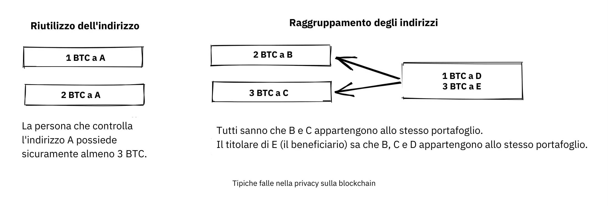
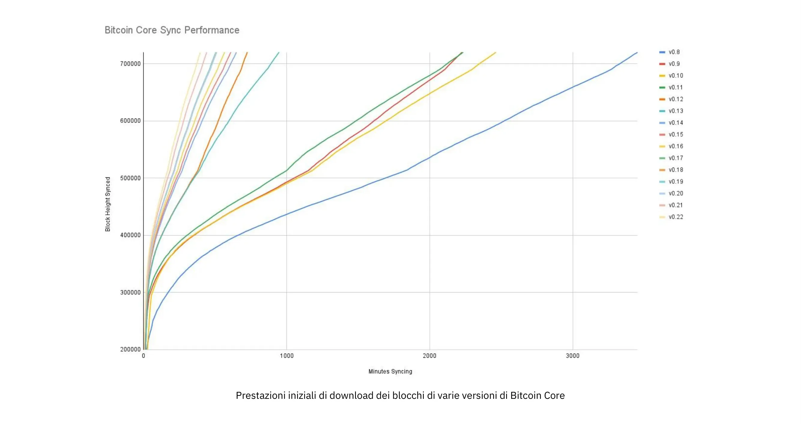
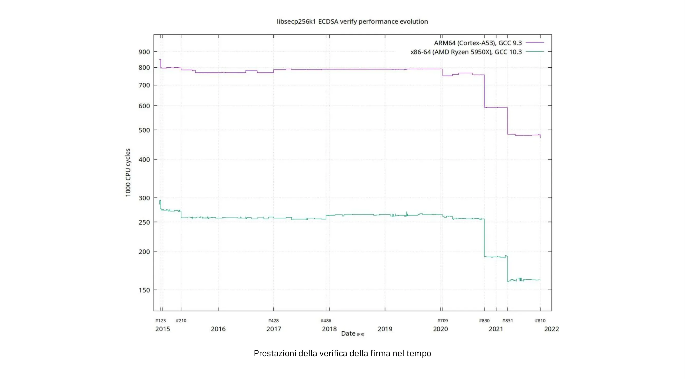
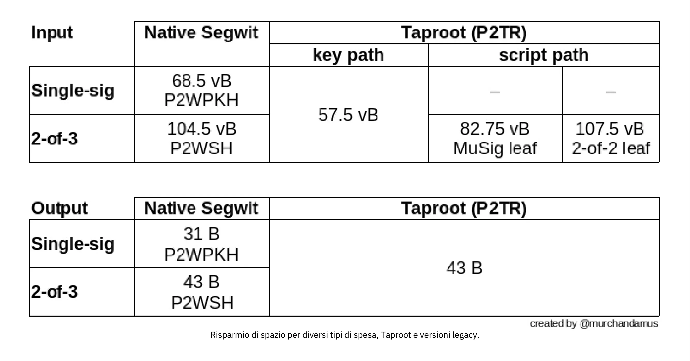
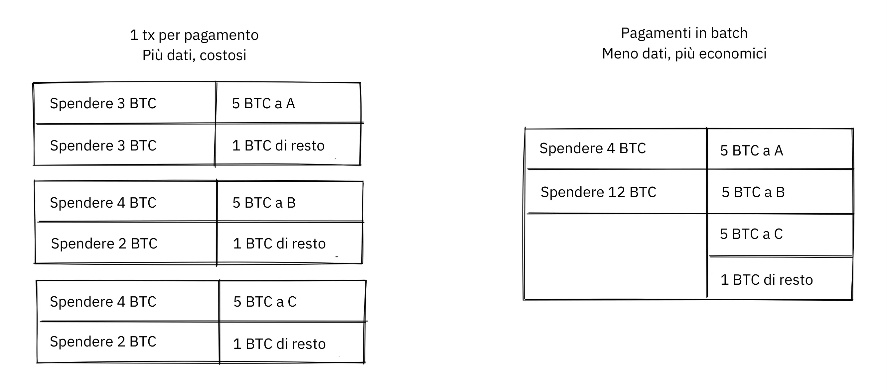
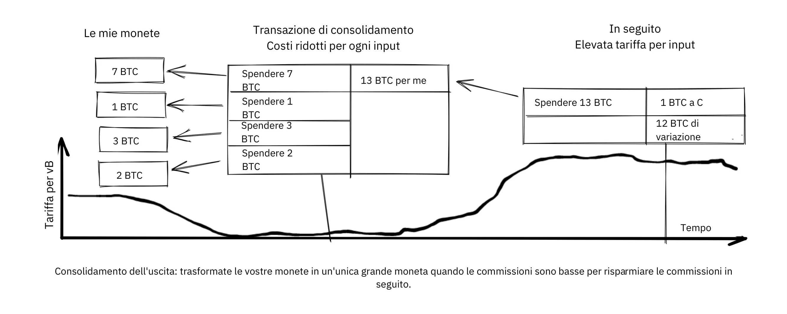
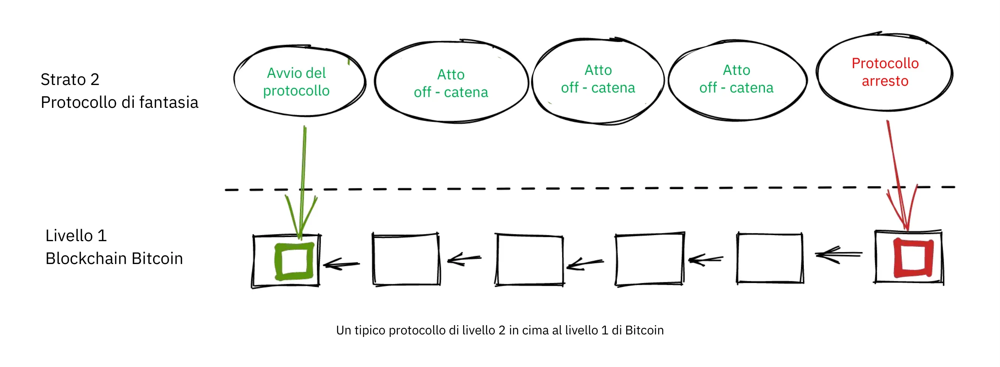
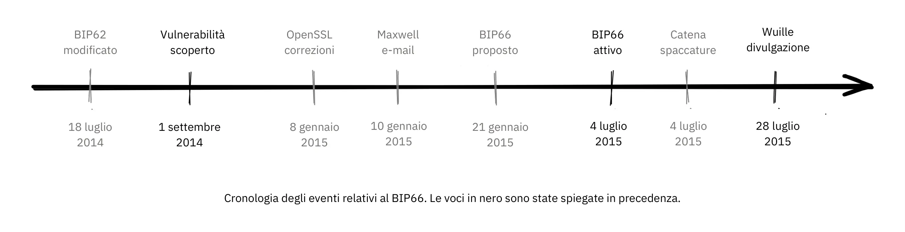
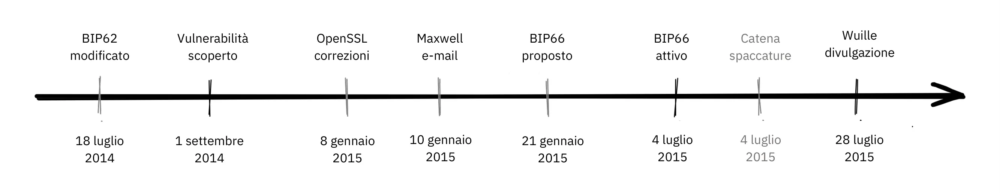
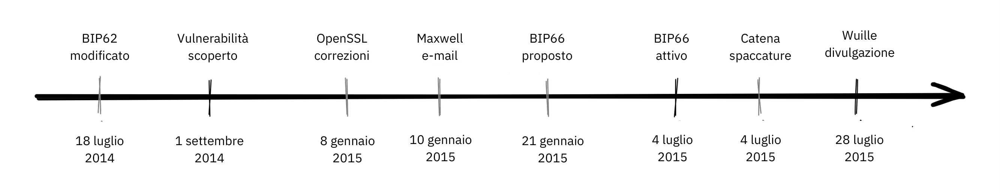

# Un'immersione nella filosofia dello sviluppo di Bitcoin


"Filosofia dello sviluppo di Bitcoin" è un corso per gli sviluppatori Bitcoin che già conoscono le basi di concetti e processi come il Proof-of-Work, la costruzione di blocchi e il ciclo di vita delle transazioni. Questo corso è per chi desidera portare le proprie competenze a un livello superiore acquisendo una comprensione più profonda dei compromessi di progettazione e della filosofia di Bitcoin.
Dovrebbe aiutare i nuovi sviluppatori ad assorbire le lezioni più importanti di oltre un decennio di sviluppo di Bitcoin, e del dibattito pubblico, fornendo loro un contesto utile per valutare le nuove idee (buone e cattive!).

### Cosa aspettarsi?

Come già detto, questa è una guida pratica per gli sviluppatori di Bitcoin. Tuttavia, Bitcoin è un argomento ampio e complesso e non è possibile trattarne tutti gli aspetti in questa sede. In questo corso, ci auguriamo di discutere le caratteristiche necessarie per iniziare la tua attività di sviluppo e per permetterti di approfondire il tema autonomamente.

Ci sono molte persone coinvolte in Bitcoin; poiché alcune di esse hanno opinioni opposte, qui potresti trovare risorse che esprimono idee contraddittorie. Tuttavia, cerchiamo sempre di attenerci al dominio dei fatti, dove le opinioni non contano.

### Chi ha scritto questo?

Questo corso è adattato dal libro omonimo, il cui autore principale è Kalle Rosenbaum e Linnéa Rosenbaum, che ha contribuito come co-autore.
Il libro è stato commissionato e finanziato da[Chaincode Labs](https://learning.chaincode.com/),  un centro di sviluppo che offre programmi educativi rivolti agli sviluppatori interessati allo sviluppo di Bitcoin.

+++


# Introduzione

<partId>58c48e9b-e285-4dc6-8952-6cc5140b1313</partId>


## Panoramica del corso

<chapterId>28b7256b-9cb0-463e-a82d-d732be86c98c</chapterId>


Benvenuti a questo corso BTC 303 sulla filosofia dello sviluppo di Bitcoin.

Bitcoin è molto più di una semplice criptovaluta: incarna una visione filosofica sulla decentralizzazione, la privacy, l'assenza di fiducia e la resilienza. Questo corso è stato progettato specificamente per gli sviluppatori che hanno già familiarità con le basi tecniche di Bitcoin e che ora cercano di approfondire la comprensione dei principi alla base del design e della governance.

Durante questo corso, acquisirai chiarezza sui valori e sulle strategie essenziali che hanno guidato l'evoluzione di Bitcoin per oltre un decennio. Approfondendo questi temi, svilupperai la prospettiva critica necessaria per valutare e contribuire agli sviluppi futuri con consapevolezza e competenza.

### I valori centrali di Bitcoin

Cosa rende Bitcoin unico? Questa sezione rivela i valori fondamentali alla base del progetto di Bitcoin. Esplorerete la **decentralizzazione**, la pietra angolare che garantisce che nessuna singola entità controlli la rete; la **trustlessness** (l'assenza di necessità di fiducia), la chiave per eliminare l'affidamento a terzi; la **privacy**, essenziale sia per la libertà individuale che per l'integrità del sistema; e **supply finita**(offerta totale finita), la garanzia codificata di scarsità che modella l'identità economica di Bitcoin. La padronanza di questi concetti ti consentirà di comprendere appieno i punti di forza e le vulnerabilità di Bitcoin.

### Governance di Bitcoin

Navigare nel complesso panorama della governance di Bitcoin non richiede solo competenze tecniche, ma anche la comprensione dell'approccio unico di Bitcoin al consenso e al processo decisionale. In questa sezione, ti immergerai nei meccanismi e nelle filosofie che stanno alla base di processi critici come gli aggiornamenti dei protocolli, la necessità del contraddittorio, la forza della collaborazione open-source, le sfide continue della scalabilità e le strategie sofisticate necessarie quando, inevitabilmente, le cose vanno male. Grazie a queste conoscenze, sarai pronti non solo a partecipare, ma anche a plasmare il futuro di Bitcoin in modo efficace e responsabile.

Sei pronto a fare il prossimo passo nel tuo viaggio Bitcoin? Cominciamo!


# Valori Fondamentali di Bitcoin

<partId>2d6c683b-54c8-5465-b2ca-4e96a6828834</partId>


## Decentralizzazione

<chapterId>9397c84b-0038-5d0e-88d5-11767ce8182d</chapterId>

Questo capitolo analizza cosa sia la decentralizzazione e perché sia fondamentale per il funzionamento di Bitcoin. Viene fatta una distinzione tra la decentralizzazione dei [miner](https://planb.academy/resources/glossary/mining) e quella dei [full nodes](https://planb.academy/resources/glossary/full-node), e si discute il contributo di ciascuno alla resistenza alla censura, una delle proprietà fondamentali di Bitcoin.

La discussione si sposta poi sulla comprensione della neutralità - o assenza di permessi nei confronti di utenti, miner e sviluppatori - che è una proprietà necessaria di qualsiasi sistema decentralizzato. Infine, ci soffermiamo su quanto possa essere difficile comprendere un sistema decentralizzato come Bitcoin, e presentiamo alcuni modelli mentali che possono aiutare a comprenderlo.

Un sistema senza alcun punto di controllo centrale viene definito *decentralizzato*. Bitcoin è stato progettato per evitare un punto di controllo centrale, o più precisamente un *punto centrale di censura*.

La decentralizzazione è un mezzo per raggiungere la *resistenza alla censura*.

In Bitcoin ci sono due aspetti principali della decentralizzazione: la decentralizzazione dei miner e dei full node.

La decentralizzazione dei miner si riferisce al fatto che l'elaborazione delle [transazioni](https://planb.academy/resources/glossary/transaction-tx) non viene eseguita né coordinata da alcuna entità centrale. La decentralizzazione dei full node si riferisce al fatto che la convalida dei [blocchi](https://planb.academy/resources/glossary/block), cioè dei dati prodotti dai miner, viene effettuata ai margini della rete, in ultima analisi dai suoi utenti, e non da poche autorità fidate.


###  Decentralizzazione dei miner


Prima di Bitcoin c'erano stati tentativi di creare valute digitali, ma la maggior parte di essi era fallita per mancanza di decentralizzazione della governance e resistenza alla censura.

La decentralizzazione dei miner in Bitcoin significa che l'*ordinamento delle transazioni* non è affidato da una singola entità o da un insieme fisso di entità. È eseguito collettivamente da tutti gli attori che vogliono parteciparvi; questo collettivo di miner è un insieme dinamico di utenti. Chiunque può entrare o uscire a seconda delle proprie esigenze. Questa proprietà rende Bitcoin resistente alla censura.

Se Bitcoin fosse centralizzato, sarebbe vulnerabile a chi volesse censurarlo, come i governi. Andrebbe incontro allo stesso destino dei precedenti tentativi di creare denaro digitale. Nell'introduzione di [un documento](https://www.blockstream.com/sidechains.pdf) intitolato "Enabling [Blockchain](https://planb.academy/resources/glossary/blockchain) Innovations with Pegged Sidechains"(Abilitare le innovazioni blockchain con sidechain ancorate), gli autori spiegano come le prime versioni di moneta digitale non fossero attrezzate per un ambiente avverso (vedi anche il capitolo sul Pensiero Avverso).

David Chaum introdusse il denaro digitale come argomento di ricerca nel 1983, in un contesto con un server centrale considerato affidabile per prevenire il [double-spending](https://planb.academy/resources/glossary/double-spending-attack) (doppia spesa). Per mitigare il rischio di privacy per gli individui derivante da questa autorità centrale fidata e per garantire la [fungibilità](https://planb.academy/resources/glossary/fungibility), Chaum introdusse la [firma cieca](https://planb.academy/resources/glossary/blind-signature), che utilizzò per fornire un mezzo crittografico per impedire il collegamento tra firme del server centrale (che rappresentano le monete), pur consentendo al server centrale di effettuare la prevenzione del double-spending.

Il requisito di un server centrale divenne il tallone d'Achille del contante digitale [Gri99]. Sebbene sia possibile distribuire questo singolo punto di fallimento sostituendo la firma del server centrale con una firma a soglia di diversi firmatari, è importante per la verificabilità che i firmatari siano distinti e identificabili. Ciò lascia comunque il sistema vulnerabile al fallimento, poiché ogni firmatario può fallire, o essere indotto a fallire, uno alla volta.

È diventato chiaro che l'utilizzo di un server centrale per ordinare le transazioni non era un'opzione praticabile a causa dell'elevato rischio di censura. Anche se si sostituisse il server centrale con una federazione di un insieme fisso di n server, di cui almeno m devono approvare un ordine, ci sarebbero comunque delle difficoltà. Il problema si sposterebbe infatti su un insieme di n server su cui gli utenti devono trovare un accordo e su come sostituire i server dannosi con quelli buoni senza affidarsi a un'autorità centrale.

Pensiamo a cosa potrebbe accadere se Bitcoin fosse censurabile. Il censore potrebbe fare pressione sugli utenti affinché si identifichino, dichiarino la provenienza del loro denaro o cosa stanno comprando con esso prima di permettere alle loro transazioni di entrare nella blockchain.

Inoltre, la mancanza di resistenza alla censura permetterebbe al censore di costringere gli utenti ad adottare nuove regole del sistema. Ad esempio, potrebbero imporre una modifica che permetta loro di gonfiare l'offerta di denaro, e quindi arricchirsi. In questo caso, un utente che verifica i blocchi avrebbe tre opzioni per gestire le nuove regole:


- Adottare: Accetta le modifiche e le adotta nel proprio full node.
- Rifiutare: Rifiuta di adottare le modifiche; in questo modo l'utente si ritrova con un sistema che non elabora più transazioni, poiché i blocchi del censore sono ora considerati non validi dal full node dell'utente.
- Spostare: nominare un nuovo punto di controllo centrale; tutti gli utenti devono capire come coordinarsi e poi concordare il nuovo punto di controllo centrale.

Se ci riusciranno, molto probabilmente gli stessi problemi riemergeranno in futuro, considerando che il sistema è rimasto censurabile come lo era prima.

Nessuna di queste opzioni è vantaggiosa per l'utente.

La resistenza alla censura attraverso la decentralizzazione è ciò che separa Bitcoin dagli altri sistemi monetari, ma non è una cosa facile da realizzare a causa del *problema del double-spending*. Si tratta del problema di assicurarsi che nessuno possa spendere due volte la stessa moneta, un problema che molti pensavano fosse impossibile da risolvere in modo decentralizzato. Satoshi [Nakamoto](https://planb.academy/resources/glossary/nakamoto-satoshi) ha scritto nel suo [Bitcoin whitepaper](https://planb.academy/bitcoin.pdf) su come risolvere il problema double-spending:

> In questo lavoro, proponiamo una soluzione al problema double-spending utilizzando un server timestamp (marca temporale) distribuito peer-to-peer(pari a pari) per la prova computazionale generata dell'ordine cronologico delle transazioni.

Qui usa l'espressione dal suono particolare, "server timestamp distribuito peer-to-peer". La parola chiave è *distribuito*, che in questo contesto significa che non esiste un punto di controllo centrale. Nakamoto prosegue poi spiegando come il [Proof-of-Work](https://planb.academy/resources/glossary/proof-of-work) sia la soluzione.

Tuttavia, nessuno lo spiega meglio di [Gregory Maxwell su Reddit](https://www.reddit.com/r/Bitcoin/comments/ddddfl/question_on_the_vulnerability_of_bitcoin/f2g9e7b/), dove risponde a chi propone di limitare la [potenza di hash](https://planb.academy/resources/glossary/hashrate) dei miner per evitare potenziali attacchi al 51%:

> Un sistema decentralizzato come Bitcoin utilizza un'elezione pubblica. Ma in un sistema decentralizzato non si può avere semplicemente un voto di "persone", perché ciò richiederebbe una parte centralizzata che autorizzi le persone a votare. Invece, Bitcoin utilizza un voto di potenza di calcolo, perché è possibile verificare la potenza di calcolo senza l'aiuto di terze parti centralizzate.

Il post spiega come il network decentralizzato di Bitcoin possa trovare un accordo sull'ordine delle transazioni attraverso l'uso del proof-of-work.

Conclude poi dicendo che l'attacco del 51% non è particolarmente preoccupante, se paragonato al fatto che le persone non si preoccupano o non capiscono le proprietà di decentralizzazione di Bitcoin:

> Un rischio molto più grande per Bitcoin è che il pubblico che lo utilizza non capisca, non si preoccupi e non protegga le proprietà di decentralizzazione che lo rendono prezioso rispetto alle alternative centralizzate.

La conclusione è importante. Se le persone non proteggono la decentralizzazione di Bitcoin, che è un proxy della sua resistenza alla censura, Bitcoin potrebbe essere vittima di poteri centralizzanti, fino a diventare così centralizzato che la censura diventa reale. A quel punto la maggior parte, se non la totalità, della sua proposta di valore è scomparsa. Questo ci porta alla prossima sezione sulla decentralizzazione del full node.

### Decentralizzazione dei full node


Nei paragrafi precedenti abbiamo parlato soprattutto della decentralizzazione dei miner e di come la centralizzazione dei miner possa consentire la censura. Ma c'è anche un altro aspetto della decentralizzazione, ossia la *decentralizzazione dei full node*.

L'importanza della decentralizzazione del full node è legata alla mancanza di fiducia. Supponiamo che un utente smetta di gestire il proprio full node a causa, ad esempio, di un aumento proibitivo dei costi di gestione. In tal caso, dovrà interagire con il network Bitcoin in qualche altro modo, magari utilizzando web [wallet](https://planb.academy/resources/glossary/wallet) o wallet leggeri(lightweight wallet), il che richiede un certo livello di fiducia nei fornitori di questi servizi.

L'utente passa dal far rispettare direttamente le [regole di consenso](https://planb.academy/resources/glossary/consensus-rules) della rete alla fiducia che qualcun altro lo faccia. Supponiamo ora che la maggior parte degli utenti deleghi l'applicazione del [consenso](https://planb.academy/resources/glossary/consensus) a un'entità fidata. In questo caso, la rete può rapidamente trasformarsi in una spirale di centralizzazione e le regole della rete possono essere modificate da attori malintenzionati che cospirano.

In un [Articolo della rivista Bitcoin](https://bitcoinmagazine.com/technical/decentralist-perspective-Bitcoin-might-need-small-blocks-1442090446), Aaron van Wirdum intervista gli sviluppatori di Bitcoin in merito al loro punto di vista sulla decentralizzazione e ai rischi connessi all'aumento della dimensione massima dei blocchi di Bitcoin. Questa discussione è  stata un argomento caldo durante l'era 2014-2017, quando molti discutevano sull'aumento della dimensione massima dei blocchi per consentire un maggiore flusso di transazioni.

Un potente argomento contro l'aumento della dimensione dei blocchi è che aumenta il costo della verifica. Se il costo della verifica aumenta, spingerà alcuni utenti a smettere di gestire i loro full nodes. Questo, a sua volta, porterà un numero maggiore di persone a non poter utilizzare il sistema in modo trustless.

Pieter Wuille è citato nell'articolo, dove spiega i rischi della centralizzazione dei full node:

> Se molte aziende gestiscono un full node, significa che tutte devono essere convinte a implementare un set di regole diverso. In altre parole: la decentralizzazione della convalida dei blocchi è ciò che dà peso alle regole del consenso.
> Ma se il numero di full node dovesse scendere molto, ad esempio perché tutti utilizzano gli stessi portafogli web, exchange e SPV o portafogli mobili, la regolamentazione potrebbe diventare una realtà. E se le autorità possono regolamentare le regole del consenso, significa che possono cambiare tutto ciò che rende Bitcoin... Bitcoin. Anche il limite di 21 milioni di Bitcoin.

Gli utenti di Bitcoin dovrebbero gestire i propri full nodes per scoraggiare i regolatori e le grandi aziende dal cercare di cambiare le regole del consenso.

### Neutralità


Bitcoin è neutrale, o senza permessi, come si usa dire. Ciò significa che a Bitcoin non interessa chi siete o per cosa lo usate.

Bitcoin è neutrale, il che è una buona cosa e l'unico modo in cui può funzionare. Se fosse controllato da un'organizzazione, sarebbe solo un altro tipo di oggetto virtuale e non mi interesserebbe affatto

Finché si rispettano le regole, si è liberi di usarlo come si vuole, senza chiedere il permesso a nessuno. Questo include *mining*, *transazioni* e *costruzione di protocolli e servizi* sopra Bitcoin:

- Se il *mining* fosse un processo autorizzato, avremmo bisogno di un'autorità centrale che selezioni chi è autorizzato a estrarre. Questo porterebbe molto probabilmente i miner a dover firmare contratti legali in cui accettano di censurare le transazioni in base ai capricci dell'autorità centrale, vanificando così lo scopo stesso del mining.

- Se le persone *transacting* (che effettuano transazioni) in Bitcoin dovessero fornire informazioni personali, dichiarare a cosa servono le loro transazioni o dimostrare in altro modo di essere degni di operare, avremmo anche bisogno di un punto centrale di autorità per approvare gli utenti o le transazioni. Ancora una volta, questo porterebbe alla censura e all'esclusione.

- Se gli sviluppatori dovessero chiedere il permesso di *sviluppare protocolli* sulla base di Bitcoin, verrebbero sviluppati solo i protocolli consentiti dal comitato centrale di concessione degli sviluppatori. Questo, a causa dell'intervento del governo, escluderebbe inevitabilmente tutti i protocolli che preservano la privacy e tutti i tentativi di migliorare la decentralizzazione.

In tutti i casi, cercare di imporre restrizioni su chi può usare Bitcoin e per cosa, danneggerà Bitcoin al punto che non sarà più all'altezza della sua proposta di valore.

Pieter Wuille https://Bitcoin.stackexchange.com/a/92055/69518[risponde a una domanda sullo Stack Exchange] su come la blockchain si rapporta ai normali database. Spiega come l'assenza di permessi sia ottenibile attraverso l'uso del Proof-of-Work in combinazione con incentivi economici.

E conclude:

> L'uso di algoritmi di consenso trustless come PoW(Proof-of-Work) aggiunge qualcosa che nessun'altra costruzione vi dà (partecipazione senza permessi, il che significa che non c'è un gruppo fisso di partecipanti che può censurare le vostre modifiche). L'uso di algoritmi di consenso trustless come PoW aggiunge qualcosa, ma ha un costo elevato e i suoi presupposti economici lo rendono praticamente utile solo per i sistemi che definiscono la propria criptovaluta.
> È probabile che nel mondo ci sia spazio solo per uno, o al massimo per pochi di questi, che vengano effettivamente utilizzati.

Spiega che, per ottenere l'assenza di permessi, il sistema avrà probabilmente bisogno di una propria valuta, "limitando così i casi d'uso alle sole criptovalute". Questo perché la partecipazione senza permesso, o mining, richiede incentivi economici incorporati nel sistema stesso.

### Conoscere la decentralizzazione


Un aspetto affascinante di Bitcoin è quanto sia difficile comprendere che non è controllato da nessuno. In Bitcoin non ci sono comitati o dirigenti. Gregory Maxwell, sempre [sul subreddit Bitcoin](https://www.reddit.com/r/Bitcoin/comments/s82t2n/comment/htdte7w/?utm_source=share&utm_medium=web2x&context=3), paragona questo aspetto alla lingua inglese in modo intrigante:

> Molte persone hanno difficoltà a capire i sistemi autonomi, ce ne sono molti nella loro vita, come la lingua inglese, ma la gente li dà per scontati e non li considera sistemi. Sono bloccati in un modo di pensare centralizzato in cui tutto ciò che considerano una "cosa" ha un'autorità che lo controlla.
>

> Bitcoin non si concentra su nulla. Le varie persone che hanno adottato Bitcoin hanno scelto di loro spontanea volontà di promuoverlo, e il modo in cui scelgono di farlo è affar loro. Le persone fissate con l'autorità possono vedere queste attività e credere che siano un'operazione dell'autorità di Bitcoin, ma tale autorità non esiste.

Il modo in cui Bitcoin funziona attraverso la decentralizzazione assomiglia alla straordinaria intelligenza collettiva che si trova in molte specie in natura. L'informatico Radhika Nagpal parla in un [Ted talk](https://www.ted.com/talks/radhika_nagpal_what_intelligent_machines_can_learn_from_a_school_of_fish) del comportamento collettivo dei banchi di pesci e di come gli scienziati stiano cercando di imitarlo con i robot.

> In secondo luogo, e la cosa che trovo ancora più straordinaria, è che sappiamo che non ci sono leader che supervisionano questo banco di pesci. Al contrario, questo incredibile comportamento mentale collettivo emerge esclusivamente dalle interazioni tra un pesce e l'altro.
> In qualche modo, ci sono queste interazioni o regole di ingaggio tra pesci vicini che fanno funzionare tutto.

L'autrice sottolinea che molti sistemi, naturali o artificiali, possono funzionare e funzionano senza leader, e sono potenti e resistenti. Ogni individuo interagisce solo con l'ambiente circostante, ma insieme formano qualcosa di straordinario.


Indipendentemente da ciò che si pensa di Bitcoin, la sua natura decentralizzata lo rende difficile da controllare. Bitcoin esiste e non si può fare nulla al riguardo. È qualcosa che va studiato, non discusso.

### Conclusioni sulla decentralizzazione

Distinguiamo tra decentralizzazione dei full node e decentralizzazione del mining. La decentralizzazione del mining è un mezzo per ottenere la resistenza alla censura, mentre la decentralizzazione dei full node è ciò che rende le regole di consenso del network difficili da modificare senza un ampio sostegno da parte degli utenti.

La natura decentralizzata di Bitcoin consente la neutralità nei confronti di sviluppatori, utenti e miner. Chiunque è libero di partecipare senza chiedere il permesso.

I sistemi decentralizzati possono essere difficili da capire, ma ci sono alcuni modelli mentali che possono aiutare, ad esempio la lingua inglese o i banchi di pesci.

## Assenza di fiducia

<chapterId>0506ba61-16a3-543c-95fa-3f3e2dd64121</chapterId>


Questo capitolo analizza il concetto di assenza di fiducia necessaria (trustlessness o trustless), il suo significato dal punto di vista informatico e il motivo per cui Bitcoin deve essere trustless per mantenere la sua proposta di valore.

Parliamo poi di cosa significa utilizzare Bitcoin in un maniera trustless e di che tipo di garanzie può o non può dare un full node.

Nell'ultima sezione, esaminiamo l'interazione reale tra Bitcoin e i software e gli utenti reali, e la necessità di fare compromessi tra convenienza e mancanza di fiducia per ottenere qualcosa.

La gente dice spesso cose tipo "Bitcoin è eccezionale perché è trustless".

Cosa si intende per trustless? Pieter Wuille spiega questo termine molto usato su [Stack Exchange](https://Bitcoin.stackexchange.com/a/45674/69518):

> La fiducia di cui si parla nel termine "trustless" è un concetto tecnico astratto. Un sistema distribuito è detto trustless quando non richiede parti fidate per funzionare correttamente.

In breve, il termine *trustless* si riferisce a una proprietà del protocollo Bitcoin in base alla quale può logicamente funzionare senza "alcuna parte fidata". Questo è diverso dalla fiducia che inevitabilmente si deve riporre nel software o nell'hardware che si utilizza. Quest'ultimo aspetto della fiducia sarà discusso più avanti in questo capitolo.

Nei sistemi centralizzati, ci affidiamo alla reputazione di un attore centrale per essere certi che si occuperà della sicurezza o che farà marcia indietro in caso di problemi, così come al sistema legale per sanzionare eventuali violazioni. Questi requisiti di fiducia sono problematici nei sistemi decentralizzati pseudonimi: non c'è possibilità di ricorso e quindi non può esserci fiducia. Nell'introduzione al [whitepaper Bitcoin](https://Bitcoin.org/Bitcoin.pdf), Satoshi Nakamoto descrive questo problema:

> Il commercio su Internet si affida quasi esclusivamente a istituti finanziari che fungono da terze parti fidate per l'elaborazione dei pagamenti elettronici.
> Sebbene il sistema funzioni abbastanza bene per la maggior parte delle transazioni, soffre ancora delle debolezze intrinseche del modello basato sulla fiducia. Le transazioni completamente non reversibili non sono realmente possibili, poiché le istituzioni finanziarie non possono evitare di mediare le controversie. Il costo della mediazione aumenta i costi delle transazioni, limitando la dimensione minima delle transazioni pratiche e tagliando fuori la possibilità di piccole transazioni occasionali; inoltre, vi è un costo più ampio nella perdita della capacità di effettuare pagamenti non reversibili per servizi non reversibili.
> Con la possibilità di un'inversione di tendenza, si diffonde la necessità di fiducia. I commercianti devono diffidare dei loro clienti, chiedendo loro più informazioni di quante ne avrebbero altrimenti bisogno. Una certa percentuale di frodi viene accettata come inevitabile. Questi costi e queste incertezze di pagamento possono essere evitati di persona utilizzando la moneta fisica, ma non esiste alcun meccanismo per effettuare pagamenti su un canale di comunicazione senza una parte fidata.

Sembra che non si possa avere un sistema decentralizzato basato sulla fiducia, questo è il motivo per cui l'assenza di fiducia è importante in Bitcoin.

Per utilizzare Bitcoin in maniera trustless, è necessario gestire un nodo Bitcoin completamente validante. Solo così sarete in grado di verificare che i blocchi che ricevete da altri seguano le regole del consenso; ad esempio, che il programma di emissione delle monete sia rispettato e che non si verifichino doppie spese sulla blockchain. Se non gestite un full node, affidate la verifica dei blocchi Bitcoin a qualcun altro e vi fidate che vi dica la verità, il che significa che non state usando Bitcoin in modo affidabile.

David Harding ha scritto [un articolo sul sito web Bitcoin.org](https://Bitcoin.org/en/Bitcoin-core/features/validation) che spiega come gestire un full node - o usare il Bitcoin senza fiducia - sia effettivamente utile:

> La moneta di Bitcoin funziona solo quando le persone accettano bitcoin in cambio di altre cose di valore. Ciò significa che sono le persone che accettano i bitcoin a dargli valore e a decidere come Bitcoin debba funzionare.
>
> Quando accettate bitcoin, avete il potere di far rispettare le regole di Bitcoin, ad esempio impedendo la confisca dei bitcoin di chiunque non abbia accesso alle chiavi private.
>
> Purtroppo, molti utenti delegano il loro potere di fare rispettare le regole. Ciò indebolisce la decentralizzazione di Bitcoin, poiché una manciata di miner può colludere con una manciata di banche e servizi gratuiti per modificare le regole di Bitcoin per tutti quegli utenti che non verificano autonomamente e che hanno delegato il loro potere.
>
> A differenza di altri wallet, Bitcoin Core fa rispettare le regole, quindi se i miner e le banche cambiano le regole per i loro utenti non verificati, questi ultimi non potranno pagare gli utenti di Bitcoin Core con piena convalida come te.

Harding afferma che l'esecuzione di un full node vi aiuterà a verificare ogni aspetto della blockchain senza fidarti di nessun altro, in modo da garantire che le monete che ricevi da altri siano autentiche. Questo è ottimo, ma c'è una cosa importante in cui full node non può aiutarti: non può prevenire la doppia spesa attraverso la riscrittura della catena:

> Si noti che, sebbene tutti i programmi, compreso Bitcoin Core, siano vulnerabili alle riscritture della catena, Bitcoin fornisce un meccanismo di difesa: più conferme hanno le transazioni, più si è al sicuro. Non esiste una difesa decentralizzata migliore di questa.

Per quanto avanzato sia il vostro software, dovete comunque avere fiducia che i blocchi contenenti le vostre monete non vengano riscritti. Tuttavia, come sottolineato da Harding, è possibile attendere un certo numero di conferme, dopo le quali si ritiene che la probabilità di una riscrittura della catena sia sufficientemente bassa da essere accettabile.

Gli incentivi per l'utilizzo di Bitcoin in un modo Trustless si allineano alla necessità di decentralizzazione del sistema full node. Più persone utilizzano i propri full nodes, maggiore è la decentralizzazione del full node e quindi più forte è la resistenza di Bitcoin a modifiche dannose del protocollo. Purtroppo, però, come spiegato nella sezione sulla decentralizzazione del full node, gli utenti spesso optano per servizi fidati come conseguenza dell'inevitabile compromesso tra mancanza di fiducia e convenienza.

La trustlessness di Bitcoin è assolutamente imperativa dal punto di vista del sistema. Nel 2018, Matt Corallo [ha parlato dell'assenza di fiducia](https://btctranscripts.com/baltic-honeybadger/2018/trustlessness-scalability-and-directions-in-security-models/) alla conferenza Baltic Honeybadger di Riga.


L'essenza del discorso è che non si possono costruire sistemi trustless sopra un sistema che richiede fiducia, ma si possono costruire sistemi basati sulla fiducia - ad esempio, un wallet custodial - sopra un sistema trustless.

Una layer di base trustless consente vari compromessi su livelli più alti.

Questo modello di sicurezza consente al progettista del sistema di selezionare i compromessi che hanno senso per loro, senza imporre ad altri questi compromessi.

### Non fidarti, verifica


Bitcoin funziona in modo affidabile, ma è necessario fidarsi in qualche misura del software e dell'hardware. Questo perché il software o l'hardware potrebbero non essere programmati per fare ciò che è indicato sulla scatola. Ad esempio:

- La CPU potrebbe essere progettata in modo malevolo per rilevare le operazioni crittografiche a chiave privata e far trapelare i dati della chiave privata.
- Il generatore di numeri casuali del sistema operativo potrebbe non essere casuale come dichiara.
- Bitcoin Core potrebbe aver inserito di nascosto del codice che invia le tue chiavi private a qualche malintenzionato.

Quindi, oltre a eseguire un full node, è necessario assicurarsi di eseguire ciò che si intende utilizzare. L'utente di Reddit brianddk [ha scritto un articolo](https://www.reddit.com/r/Bitcoin/comments/smj1ep/bitcoin_v220_and_guix_stronger_defense_against/) sui vari livelli di fiducia che si possono scegliere quando si verifica del software. Nella sezione "Fidarsi degli sviluppatori", parla di reproducible builds (compilazioni riproducibili):


> Le build riproducibili sono un modo per progettare un software in modo che molti sviluppatori della community possano costruirlo e garantire che l'installatore finale sia identico a quello prodotto dagli altri sviluppatori. Con un progetto pubblico e riproducibile come Bitcoin, non è necessario fidarsi completamente di un singolo sviluppatore. Molti sviluppatori possono eseguire la compilazione e attestare di aver prodotto lo stesso file firmato digitalmente dallo sviluppatore originale.

L'articolo definisce 5 livelli di fiducia: fiducia nel sito, negli sviluppatori, nel compilatore, nel kernel e nell'hardware.


Per approfondire ulteriormente l'argomento delle build riproducibili, Carl Dong [ha fatto una presentazione su Guix](https://btctranscripts.com/breaking-Bitcoin/2019/Bitcoin-build-system/) spiegando perché fidarsi del sistema operativo, delle librerie e dei compilatori può essere problematico e come risolverlo con un sistema chiamato Guix, che oggi è usato da Bitcoin Core.

> Quindi, cosa possiamo fare per evitare che la nostra toolchain (insieme di strumenti) possa includere una serie di binari affidabili ma riproducibilmente dannosi? Dobbiamo essere più che semplicemente riproducibili. Dobbiamo essere avviabili autonomamente. Non possiamo avere tanti strumenti binari che dobbiamo scaricare e di cui dobbiamo fidarci da server esterni controllati da altre organizzazioni.
>
> Dovremmo sapere come sono stati costruiti questi strumenti e come possiamo procedere esattamente per costruirli di nuovo, preferibilmente partendo da un insieme molto più piccolo di file binari affidabili. Dobbiamo ridurre il più possibile l'insieme dei file binari affidabili e avere un percorso facilmente verificabile da queste catene di strumenti a quello che usiamo per sviluppare Bitcoin. Questo ci permette di massimizzare la verifica e minimizzare la fiducia.

Dong spiega poi come Guix ci permetta di fidarci solo di un binario minimo di 357 byte che può essere verificato e compreso appieno se si sa come interpretare le istruzioni. Questo è notevole: si verifica che il binario di 357 byte faccia ciò che dovrebbe, poi lo si usa per costruire il sistema di compilazione completo dal codice sorgente, e si finisce con un binario di Bitcoin Core che dovrebbe essere una copia esatta della build di chiunque altro.

C'è un mantra a cui molti bitcoiners si iscrivono, che cattura bene gran parte di quanto detto sopra:

> Non fidarti, verifica.

Questo allude alla frase "[fidati, ma verifica](https://en.wikipedia.org/wiki/Trust,_but_verify)" che l'ex presidente degli Stati Uniti Ronald Reagan usò nel contesto del disarmo nucleare. I [Bitcoiners](https://twitter.com/Truthcoin/status/1491415722123153408?s=20&t=ZyROxZxlBppdRpuuzsiF5w) l'hanno cambiata per sottolineare il rifiuto della fiducia e l'importanza di eseguire un full node.

Spetta agli utenti decidere fino a che punto verificare il software che utilizzano e i dati blockchain che ricevono. Come per molte altre cose in Bitcoin, c'è un compromesso tra convenienza e affidabilità. È quasi sempre più conveniente utilizzare un wallet custodial rispetto all'esecuzione di Bitcoin Core sul proprio hardware. Tuttavia, con la maturazione del software Bitcoin e il miglioramento delle interfacce utente, nel tempo dovrebbe migliorare il supporto agli utenti disposti a lavorare verso l'assenza di fiducia. Inoltre, man mano che gli utenti acquisiscono maggiori conoscenze, dovrebbero essere in grado di eliminare gradualmente la fiducia dall'equazione.

Alcuni utenti pensano in modo avverso e verificano la maggior parte degli aspetti del software che eseguono. Di conseguenza, riducono la necessità di fiducia al minimo indispensabile, in quanto devono fidarsi solo dell'hardware e del sistema operativo del computer. In questo modo, aiutano anche le persone che non verificano il loro hardware in modo così approfondito, alzando la voce in pubblico per avvertire di eventuali problemi che potrebbero trovare. Un buon esempio è un [evento verificatosi nel 2018](https://bitcoincore.org/en/2018/09/20/notice/), quando qualcuno ha scoperto un bug che consentiva ai miner di spendere un output due volte nella stessa transazione:

> La CVE-2018-17144, è la correzione rilasciata il 18 settembre nelle versioni 0.16.3 e 0.17.0rc4 di Bitcoin Core, include sia un componente di Denial of Service (negazione del servizio) che una vulnerabilità critica dell'inflazione. Il 17 settembre, il problema fu segnalato a diversi sviluppatori che lavorano su Bitcoin Core, così come ad altri progetti di criptovalute, tra cui ABC e Unlimited, solo come un bug di Denial of Service. Tuttavia, abbiamo rapidamente determinato che il problema era anche una vulnerabilità di inflazione con la stessa causa e la stessa correzione.

In questo caso, una persona anonima ha segnalato un problema che si è rivelato molto peggiore di quanto il segnalatore avesse previsto. Questo evidenzia il fatto che le persone che verificano il codice spesso segnalano le falle di sicurezza invece di sfruttarle. Ciò è vantaggioso per coloro che non sono in grado di verificare tutto da soli.

Tuttavia, gli utenti non dovrebbero fidarsi di altri per la loro sicurezza, ma dovrebbero piuttosto verificare da soli ogni volta che possono; è così che si rimane il più possibile sovrani, e che Bitcoin prospera. Più occhi sono puntati sul software, meno è probabile che codice maligno e falle nella sicurezza passino inosservati.

### Conclusioni sulla trustlessness

Il protocollo Bitcoin è trustless perché consente agli utenti di interagire con esso senza affidarsi a terzi. In pratica, però, la maggior parte delle persone non è in grado di verificare l'intero stack di software e hardware su cui viene eseguito Bitcoin. Le persone qualificate che verificano il software o l'hardware sono in grado di avvertire altre persone meno qualificate quando trovano codice dannoso o bug.

Senza trustlessness, non possiamo avere la decentralizzazione, perché la fiducia implica inevitabilmente un'autorità centrale. Si può costruire un sistema basato su fiducia sopra un sistema trustless, ma non si può costruire un sistema trustless sopra un sistema basato sulla fiducia.

## La privacy
<chapterId>1b960afe-0008-589b-b2f4-007d60d264c6</chapterId>


Questo capitolo tratta di come tenere private le informazioni finanziarie. Spiega cosa significa privacy nel contesto di Bitcoin, perché è importante e cosa significa dire che Bitcoin è pseudonimo. Inoltre, analizza il modo in cui i dati privati possono trapelare, sia on-chain che in off-chain.

Si parla poi del fatto che i bitcoin dovrebbero essere fungibili, cioè intercambiabili con qualsiasi altro bitcoin, e di come fungibilità e privacy vadano di pari passo. Infine, il capitolo introduce alcune misure che si possono adottare per migliorare la propria privacy e quella degli altri.

Bitcoin può essere descritto come un sistema pseudonimo, in cui gli utenti hanno più pseudonimi sotto forma di chiavi pubbliche. A prima vista, questo sembra un buon modo per proteggere gli utenti dall'identificazione, ma in realtà è molto facile far trapelare involontariamente informazioni finanziarie private.

### Cosa significa privacy?


La privacy può avere significati diversi in contesti diversi. In Bitcoin, in generale, significa che gli utenti non devono rivelare le proprie informazioni finanziarie ad altri, a meno che non lo facciano volontariamente.

Ci sono molti modi in cui è possibile far trapelare le proprie informazioni private ad altri, consapevolmente o meno. I dati possono trapelare dalla blockchain pubblica o attraverso altri mezzi, ad esempio quando attori malintenzionati intercettano le tue comunicazioni via Internet.

### Perché la privacy è importante?

Può sembrare ovvio che la privacy sia importante in Bitcoin, ma ci sono alcuni aspetti a cui non si pensa immediatamente. [Sul forum Bitcoin Talk](https://bitcointalk.org/index.php?topic=334316.msg3588908#msg3588908), Gregory Maxwell ci illustra molte buone ragioni per cui ritiene che la privacy sia importante. Tra questi, il libero mercato, la sicurezza e la dignità umana:

> La privacy finanziaria è un criterio essenziale per il funzionamento efficiente di un mercato libero: se gestisci un'azienda, non puoi fissare efficacemente i prezzi se i tuoi fornitori e clienti possono vedere tutte le tue transazioni contro la tua volontà.
> Non puoi competere in modo efficace se la concorrenza sta tracciando le tue vendite. Se non hai la privacy sui tuoi conti, perderai la tua leva informativa nei rapporti privati: se paghi il tuo padrone di casa in Bitcoin senza una sufficiente privacy, il padrone di casa vedrà quando hai ricevuto un aumento di stipendio e potrà chiederti un aumento dell'affitto.
>
> La privacy finanziaria è essenziale per la sicurezza personale: se i ladri possono vedere le tue spese, il tuo reddito e le tue proprietà, possono usare queste informazioni per prenderti di mira e sfruttarti. Senza privacy i malintenzionati hanno maggiori possibilità di rubare la tua identità, di sottrarti grandi acquisti o di spacciarsi per aziende con cui fai transazioni... possono sapere esattamente quanto tentare di truffarti.
>
> La privacy finanziaria è essenziale per la dignità umana: nessuno vuole che il barista spocchioso o i vicini ficcanaso facciano commenti sul proprio reddito o sulle proprie abitudini di spesa. Nessuno vuole che i suoceri pazzi per i bambini gli chiedano perché compra contraccettivi (o giocattoli sessuali). Il vostro datore di lavoro non deve sapere a quale chiesa fate le vostre donazioni. Solo in un mondo perfettamente illuminato e libero da discriminazioni e in cui nessuno ha un'autorità indebita sugli altri, potremmo mantenere la nostra dignità e fare liberamente le nostre transazioni lecite senza autocensura, qualora mancasse la privacy.

Maxwell si sofferma anche sulla fungibilità, che verrà discussa più avanti in questo capitolo, e su come privacy e applicazione della legge non siano in contraddizione.

### Pseudonimato

Abbiamo detto sopra che il Bitcoin è pseudonimo e che gli pseudonimi sono chiavi pubbliche. Nei media si sente spesso dire che Bitcoin è anonimo, il che non è corretto. Esiste una distinzione tra anonimato e pseudonimato.

Andrew Poelstra [spiega in un post di Bitcoin Stack Exchange](https://Bitcoin.stackexchange.com/a/29473/69518) come sarebbe l'anonimato nelle transazioni:

> L'anonimato totale, nel senso che quando si spende del denaro non c'è traccia della sua provenienza o della sua destinazione, è teoricamente possibile utilizzando la tecnica crittografica delle zero-knowledge proofs (prove a conoscenza zero).

La differenza sembra essere che in una forma di denaro pseudonimo è possibile tracciare i pagamenti tra pseudonimi, mentre in una forma di denaro anonimo non è possibile. Poiché i pagamenti in bitcoin sono tracciabili tra pseudonimi, non si tratta di un sistema anonimo.

Abbiamo anche detto che gli pseudonimi sono chiavi pubbliche, ma in realtà si tratta di indirizzi derivati da chiavi pubbliche. Perché usiamo gli indirizzi come pseudonimi e non qualcos'altro, per esempio qualche nome descrittivo, come "watchme1984"? Questo è stato [spiegato bene](https://Bitcoin.stackexchange.com/a/25175/69518) dall'utente Tim S., anche nel sito di Bitcoin Stack Exchange:

> Affinché l'idea di Bitcoin funzioni, è necessario avere monete che possono essere spese solo dal proprietario di una determinata chiave privata. Ciò significa che qualsiasi cosa si invii deve essere legata, in qualche modo, a una chiave pubblica.
>
> Usare pseudonimi arbitrari (ad esempio nomi di utenti) significherebbe dover collegare in qualche modo lo pseudonimo a una chiave pubblica per abilitare la crittografia a chiave pubblica/privata. Questo eliminerebbe la possibilità di creare in modo sicuro indirizzi/pseudonimi offline (ad esempio, prima che qualcuno possa inviare denaro al nome utente "tdumidu", si dovrebbe annunciare nella blockchain che "tdumidu" è posseduto dalla chiave pubblica "a1c...", e includere una tariffa in modo che gli altri abbiano un motivo per annunciarlo), ridurrebbe l'anonimato (incoraggiando a riutilizzare gli pseudonimi) e gonfierebbe inutilmente le dimensioni della blockchain. Inoltre, creerebbe un falso senso di sicurezza sul fatto che si sta inviando a chi si pensa di essere (se prendo il nome "Linus Torvalds" prima di lui, allora è mio e la gente potrebbe inviare denaro pensando di pagare il creatore di Linux, non me).

Utilizzando gli indirizzi o le chiavi pubbliche, raggiungiamo obiettivi importanti, come l'eliminazione della necessità di registrare in qualche modo uno pseudonimo, la riduzione degli incentivi per il riutilizzo dello pseudonimo, l'eliminazione dell'ingombro della blockchain e la maggiore difficoltà nell'impersonare altre persone.

### Privacy nella Blockchain


La privacy nella blockchain si riferisce alle informazioni che l'utente divulga nel momento in cui effettua delle transazioni. Si applica a tutte le transazioni, sia a quelle inviate che a quelle ricevute.

Satoshi Nakamoto riflette sulla privacy on-chain nella sezione 7 del suo [Bitcoin whitepaper](https://Bitcoin.org/Bitcoin.pdf):

> Come ulteriore firewall, è necessario utilizzare una nuova coppia di chiavi per ogni transazione, per evitare che siano collegate a un proprietario comune. Un certo collegamento è comunque inevitabile con le transazioni a più ingressi, che rivelano necessariamente che i loro ingressi appartengono allo stesso proprietario. Il rischio è che, qualora il proprietario di una chiave venisse rivelato, tale collegamento potrebbe rivelare altre transazioni appartenenti allo stesso proprietario.

L'articolo riassume i principali problemi di privacy della blockchain, ovvero il riutilizzo e l'aggregazione degli indirizzi. Il primo è autoesplicativo, il secondo si riferisce alla possibilità di decidere, con un certo livello di certezza, che un insieme di indirizzi diversi appartiene allo stesso utente.



Chris Belcher [ha scritto in modo molto dettagliato](https://en.Bitcoin.it/Privacy#Blockchain_attacks_on_privacy) sui diversi tipi di falle nella privacy che possono verificarsi sulla blockchain di Bitcoin. Si consiglia di leggere almeno le prime sottosezioni di "Attacchi alla privacy della blockchain"

Il risultato è che la privacy in Bitcoin non è perfetta. Richiede una quantità significativa di lavoro per effettuare transazioni private. La maggior parte delle persone non è disposta ad andare così lontano per la privacy. Sembra esserci un chiaro compromesso tra privacy e usabilità.

Un altro aspetto importante della privacy è che le misure adottate per proteggere la propria privacy si ripercuotono anche su quella degli altri utenti. Se si è negligenti nella protezione della propria privacy, anche gli altri potrebbero subirne le conseguenze. Gregory Maxwell spiega in modo molto chiaro nella stessa discussione su [Bitcoin Talk](https://bitcointalk.org/index.php?topic=334316.msg3589252#msg3589252), e conclude con un esempio:

> Questo funziona anche nella pratica... Un buon whitehat hacker (hacker etico) su IRC(Internet Relay Chat) stava sperimentando con la violazione di brainwallet e ha trovato una seedphrase che dava accesso a ~250 BTC. Siamo riusciti a identificare il proprietario solo dall'indirizzo, perché era stato pagato da un servizio Bitcoin che riutilizzava gli indirizzi. Successivamente, è riuscito a convincerlo a fornire le informazioni di contatto dell'utente. Ha quindi contattato l'utente al telefono, che era scioccato e confuso, ma grato di non aver perso i suoi bitcoin. Un lieto fine in questo caso. (Non è l'unico esempio, ma è uno dei più divertenti).

In questo caso, tutto è andato bene grazie all'hacker filantropo, ma la prossima volta non è detto che vada così.

### Privacy al di fuori della Blockchain

Sebbene la blockchain possa rivelare informazioni che possono compromettere la privacy, esistono molti altri casi di esposizione dei dati che non coinvolgono la blockchain, alcuni più subdoli di altri. Si va dai key-logger all'analisi del traffico di rete. Per approfondire alcuni di questi metodi, si rimanda al pezzo di [Chris Belcher](https://en.Bitcoin.it/Privacy#Non-blockchain_attacks_on_privacy), in particolare alla sezione "Attacchi alla privacy al di fuori della Blockchain".

Tra una pletora di attacchi, Belcher cita la possibilità che qualcuno possa spiare la tua connessione a Internet, ad esempio il tuo ISP(Internet Service Provider):

> Se l'avversario vede una transazione o un blocco in uscita dal tuo nodo che non è stato inserito in precedenza, può sapere con quasi certezza che la transazione è stata effettuata da te o che il blocco è stato estratto da te. Poiché sono coinvolte connessioni Internet, l'avversario sarà in grado di collegare l'indirizzo IP con le informazioni scoperte.

Tuttavia, tra le violazioni della privacy più evidenti ci sono gli exchange. A causa delle leggi, solitamente denominate KYC (Know Your Customer) e AML (Anti-Money Laundering), valide nelle giurisdizioni in cui operano, gli exchange e le società collegate devono spesso raccogliere dati personali sui loro utenti, creando grandi database che collegano gli utenti ai bitcoin di cui sono proprietari. Questi database rappresentano un bersaglio ideale per governi malintenzionati e criminali, sempre alla ricerca di nuove vittime. Esistono veri e propri mercati per questo tipo di dati, in cui gli hacker vendono i dati al miglior offerente.

Come se non bastasse, le aziende che gestiscono questi database hanno spesso poca esperienza nella protezione dei dati finanziari, infatti molte di esse sono start-up, e sappiamo per certo che si sono già verificate diverse fughe di notizie. Alcuni esempi sono:

[MobiQwik, con sede in India](https://bitcoinmagazine.com/business/probably-the-largest-kyc-data-leak-in-history-demonstrates-the-importance-of-Bitcoin-privacy) e [HubSpot](https://bitcoinmagazine.com/business/hubspot-security-breach-leaks-Bitcoin-users-data).

Anche in questo caso, proteggere i dati da una vasta gamma di attacchi è un'impresa difficile, ed è probabile che non si riesca a farlo completamente. Dovrai scegliere il compromesso tra convenienza e privacy più adatto a te.

### Fungibilità


La fungibilità, nel contesto delle valute, significa che una moneta è intercambiabile con qualsiasi altra moneta della stessa valuta. Questa parola è stata accennata all'inizio del capitolo.


Nell'articolo discusso, Gregory Maxwell [ha dichiarato](https://bitcointalk.org/index.php?topic=334316.msg3588908#msg3588908):


> La privacy finanziaria è un elemento essenziale per la fungibilità di Bitcoin: se è possibile distinguere significativamente una moneta da un'altra, allora la fungibilità è debole. Se la fungibilità è debole nella pratica, non possiamo essere decentralizzati: se un soggetto di rilevanza pubblica annuncia una lista di monete rubate che non intende accettare, dovrai controllare attentamente le monete che accetti rispetto a quella lista e restituire quelle non conformi. Tutti saranno costretti a controllare le liste nere emesse da varie autorità, perché in quel contesto non vorremmo essere "trovati" con monete compromesse. Questo aggiunge attrito e costi alle transazioni, rendendo Bitcoin meno valido come moneta.

Maxwell parla dei pericoli derivanti dalla mancanza di fungibilità. Supponiamo di avere un [UTXO](https://planb.academy/resources/glossary/utxo). La storia di quel UTXO può essere normalmente tracciata a ritroso per diversi passaggi, diramandosi verso una moltitudine di output precedenti. Se uno di questi output è stato coinvolto in attività illegali, indesiderate o sospette, alcuni potenziali destinatari della tua moneta potrebbero rifiutarla. Se pensi che i tuoi pagatori verificheranno le tue monete con qualche servizio centralizzato di whitelist o blacklist, potresti iniziare a controllare anche le monete che riceverai, per sicurezza. Il risultato è che una fungibilità debole alimenta una fungibilità ancora peggiore.

Adam Back e Matt Corallo [hanno tenuto una presentazione sulla fungibilità](https://btctranscripts.com/scalingbitcoin/milan-2016/fungibility-overview/) a Scaling Bitcoin a Milano nel 2016. Ragionavano sulla stessa linea:

> Per far funzionare Bitcoin è necessaria la fungibilità. Se ricevi delle monete e non puoi spenderle, inizi a dubitare della loro spendibilità. Se ci sono dubbi sulle monete ricevute, le persone andranno ai servizi di "taint" e controlleranno se quelle monete siano "benedette", e quindi le persone si rifiuteranno di commerciare. Questo fa sì che Bitcoin passi da un sistema decentralizzato senza permessi, a un sistema centralizzato con permessi, in cui si ha un "pagherò" da parte dei fornitori di blacklist.

Sembra che privacy e fungibilità vadano di pari passo. La fungibilità si indebolisce se la privacy è debole, ad esempio perché le monete di persone indesiderate possono finire nella lista nera. Allo stesso modo, la privacy si indebolisce se la fungibilità è debole: se c'è una lista nera, dovrete chiedere ai fornitori della lista nera quali monete accettare, rivelando così eventualmente il vostro indirizzo IP, l'e-mail e altre informazioni sensibili. Queste due caratteristiche sono talmente interconnesse che non è possibile parlare di una delle due in modo isolato.

### Misure per proteggere la privacy


Sono state sviluppate diverse tecniche per aiutare le persone a proteggersi da violazioni della privacy. Tra le più ovvie c'è, come notato da Nakamoto in precedenza, l'utilizzo di un unico indirizzo per ogni transazione, ma ne esistono molti altri. Non ti insegneremo come diventare un ninja della privacy. Tuttavia, Bitcoin Q+A contiene un [rapido riepilogo delle tecnologie che migliorano la privacy](https://bitcoiner.guide/privacytips/), ordinate in base a quanto difficili sono da implementare. Leggendolo, si noterà che la privacy di Bitcoin ha spesso a che fare con cose che esulano da Bitcoin. Ad esempio, non ci si dovrebbe vantare dei propri bitcoin e si dovrebbero usare Tor e VPN.

Il post elenca anche alcune misure direttamente collegate a Bitcoin:
- Full node: se non si utilizza il proprio full node, si possono trasmettere molte informazioni sul proprio wallet ai server su Internet. Eseguire un full node è un ottimo primo passo per preservare i propri dati.
- Lightning Network: Esistono diversi protocolli sviluppati sopra Bitcoin, ad esempio il Lightning Network e Liquid di Blockstream Sidechain.
- CoinJoin: un modo per far confluire le transazioni di più persone in una sola, rendendo più difficile la chain analysis (analisi della blockchain).

In [un intervento](https://btctranscripts.com/breaking-Bitcoin/2019/breaking-Bitcoin-privacy/) alla conferenza Breaking Bitcoin, Chris Belcher ha fornito un interessante esempio pratico di come la privacy sia migliorata:

> Si trattava di un casinò Bitcoin. Il gioco d'azzardo online non è consentito negli Stati Uniti. Tutti i clienti di Coinbase che avessero depositato direttamente su Bustabit si sarebbero visti chiudere i conti perché Coinbase li stava monitorando. Bustabit ha trovato delle soluzioni: hanno adottato una tecnica chiamata "change avoidance" (eliminazione del resto), che consiste nel costruire una transazione senza un output di resto. In questo modo si risparmiano le commissioni ai miner e rende più difficile l'analisi delle transazioni.
>
> Inoltre, hanno importato i loro indirizzi di deposito riutilizzati in joinmarket. A questo punto, i clienti di coinbase.com non sono mai stati bannati. Sembra che il servizio di sorveglianza di Coinbase non sia stato in grado di effettuare l'analisi dopo questo episodio, quindi è possibile violare questi algoritmi.

Ha anche menzionato questo esempio, tra gli altri, nella [pagina sulla privacy](https://en.Bitcoin.it/Privacy) del Bitcoin wiki.

Si noti come sia possibile ottenere una migliore privacy costruendo sistemi in cima a Bitcoin, come nel caso di Lightning Network:


I layer sopra Bitcoin possono aumentare la privacy

Nell'ultimo articolo abbiamo notato che la necessità di fiducia può solo aumentare con l'aggiunta di layer, ma non sembra essere il caso della privacy, questa può essere migliorata o peggiorata arbitrariamente con l'aumento dei livelli. Perché? Qualsiasi layer sopra Bitcoin, come spiegato nel paragrafo "Scalabilità a Strati" del futuro capitolo "Scalabilità", deve usare occasionalmente transazioni on-chain, altrimenti non sarebbe "sopra Bitcoin". I livelli che aumentano la privacy in genere cercano di usare il layer di base il meno possibile per minimizzare la quantità di informazioni rivelate.

Queste sono strategie un po' tecniche per migliorare la tua privacy. Ma ci sono altri modi. All'inizio di questo capitolo abbiamo detto che Bitcoin è un sistema pseudonimo. Ciò significa che gli utenti di Bitcoin non sono conosciuti con il loro vero nome o con altri dati personali, ma con la loro chiave pubblica. Una chiave pubblica è uno pseudonimo per un utente e un utente può avere più pseudonimi. In un mondo ideale, l'identità personale è separata dagli pseudonimi di Bitcoin. Purtroppo, a causa dei problemi di privacy descritti in questo capitolo, questo disaccoppiamento di solito si degrada nel tempo.

Per ridurre il rischio di rivelare dei propri dati personali è necessario non fornirli in primo luogo e non fornirli a servizi centralizzati, i quali creano database che possono perdere informazioni. Un articolo di Bitcoin Q+A [spiega il KYC](https://bitcoiner.guide/nokyconly/) e i pericoli che ne derivano. Suggerisce inoltre alcune misure che si possono adottare per migliorare la propria privacy:

> Fortunatamente esistono alcune opzioni per acquistare Bitcoin senza KYC. Si tratta di scambi P2P (peer to peer) in cui si commercia direttamente con un altro individuo e non con una terza parte centralizzata. Purtroppo alcuni vendono anche altre monete oltre a bitcoin, quindi ti invitiamo a fare attenzione.

L'articolo suggerisce di evitare gli exchange che richiedono il KYC/AML e di fare invece trading privato, oppure di utilizzare exchange decentralizzati come [bisq](https://bisq.network/).

https://planb.academy/en/tutorials/exchange/peer-to-peer/bisq-fe244bfa-dcc4-4522-8ec7-92223373ed04

Per una lettura più approfondita delle contromisure, si rimanda al già citato [articolo wiki sulla privacy](https://en.Bitcoin.it/wiki/Privacy#Methods_for_improving_privacy_.28non-Blockchain.29), a partire da "Metodi per migliorare la privacy (non-Blockchain)".

### Conclusioni sulla privacy


La privacy è molto importante, ma è un obiettivo difficile da raggiungere. Non esiste una soluzione miracolosa per proteggere la privacy.

Per ottenere una privacy decente in Bitcoin, è necessario adottare misure attive, alcune delle quali sono costose e richiedono tempo.

## Supply finita

<chapterId>af125ba2-ef98-5905-8895-41a538fe5ea5</chapterId>


Questo capitolo analizza il limite della supply di Bitcoin a 21 milioni di BTC (bitcoin), o quanto è in realtà? Parliamo di come viene applicato questo limite e di cosa si può fare per verificare che venga rispettato. Inoltre, diamo un'occhiata alla sfera di cristallo e discutiamo le dinamiche che entreranno in gioco quando il [block reward](https://planb.academy/resources/glossary/block-reward) passerà dal sistema a sovvenzioni(subsidy-based) a quello a pagamento(fee-based).

La nota supply finita di 21 milioni di bitcoin è considerata una proprietà fondamentale di Bitcoin. Ma è davvero scolpita nella pietra?

Cominciamo a vedere cosa dicono le attuali regole di consenso sulla supply di Bitcoin, e quanto sarà effettivamente utilizzabile. Pieter Wuille ha scritto un articolo a questo proposito [sul sito di Stack Exchange](https://Bitcoin.stackexchange.com/a/38998/69518), in cui ha contato quanti bitcoin ci saranno una volta che tutte le monete saranno state estratte:

> Sommando tutti questi numeri si ottiene 20999999,9769 BTC.

Ma per una serie di ragioni, come i primi problemi con le [transazioni coinbase](https://planb.academy/resources/glossary/coinbase-transaction), i miner che involontariamente richiedono meno di quanto consentito, e la perdita delle chiavi private - questo limite massimo non sarà mai raggiunto. Wuille conclude:

> Questo ci lascia con 20999817.31308491 BTC (tenendo conto di tutto fino al blocco 528333)

Tuttavia, diversi portafogli sono stati smarriti o rubati, le transazioni sono state inviate a indirizzi sbagliati, le persone hanno dimenticato di possedere bitcoin. Il totale di tutto ciò potrebbe essere di milioni. Le persone hanno cercato di fare il conto delle perdite conosciute [qui](https://bitcointalk.org/index.php?topic=7253.0).

Questo ci lascia con: ??? BTC.


Possiamo quindi essere certi che la supply di Bitcoin sarà 20999817.31308491 bitcoin al massimo. Eventuali monete perse o bruciate in modo non verificabile renderanno questo numero più basso, ma non sappiamo di quanto. La cosa interessante è che non ha molta importanza, o meglio ha un'importanza positiva per chi detiene bitcoin, [come spiegato](https://bitcointalk.org/index.php?topic=198.msg1647#msg1647) da Satoshi Nakamoto:

> Le monete perse fanno solo aumentare leggermente il valore delle monete degli altri. Consideratela come una donazione a tutti.

La supply finita si ridurrà ulteriormente e questo dovrebbe, almeno in teoria, causare una deflazione dei prezzi.

Più importante del numero esatto di monete in circolazione è il modo in cui il limite dell'offerta viene applicato senza alcuna autorità centrale. Un Bitcoiner, noto con l'alias "chytrik" lo spiega bene sul sito di [Stack Exchange](https://Bitcoin.stackexchange.com/a/106830/69518):

> Quindi, la risposta è che non bisogna fidarsi di qualcuno che non aumenti il supply. È sufficiente eseguire del codice che verifichi che non l'abbia fatto.

Anche se alcuni full node dovessero passare al lato oscuro e decidere di accettare blocchi con transazioni coinbase di valore più elevato, tutti i full node rimanenti li ignorerebbero e continuerebbero a operare come al solito. Alcuni full node potrebbero, intenzionalmente o meno, eseguire software malevoli, ma il collettivo proteggerebbe la blockchain in modo solido. In conclusione, è possibile fidarsi del sistema senza doversi fidare di nessuno.

### Block subsidy & Transaction Fees (Ricompensa del Blocco & Commissioni di Transazione)


Un block reward è composto dalla [ricompensa del blocco](https://planb.academy/resources/glossary/block-subsidy) più le [commissioni di transazione](https://planb.academy/resources/glossary/transaction-fees), e deve coprire i costi di sicurezza di Bitcoin. Possiamo affermare con certezza che, nelle condizioni attuali - considerando la ricompensa del blocco, commissioni di transazione, prezzo di bitcoin, la dimensione del [mempool](https://planb.academy/resources/glossary/mempool), hashrate, grado di decentralizzazione, ecc. - gli incentivi per tutti gli attori a rispettare le regole sono sufficientemente elevati da preservare un sistema monetario sicuro.

Cosa succede quando la ricompensa del blocco si avvicina a zero? Per semplicità, supponiamo che sia effettivamente pari a zero. A questo punto, i costi di sicurezza del sistema sono coperti solo dalle commissioni di transazione. Non possiamo sapere cosa ci riservi il futuro quando questo accadrà. I fattori di incertezza sono numerosi e possiamo solo fare delle ipotesi. Ad esempio, il contributo di Paul Sztorc all'argomento [nel suo blog _Truthcoin_](https://www.truthcoin.info/blog/security-budget/) è costituito per lo più da ipotesi, ma ha almeno un punto fermo (si noti che M2, come indicato da Sztorc, è una misura dell'offerta di moneta fiat):

> Sebbene le due componenti confluiscano nello stesso "bilancio di sicurezza", la ricompensa del blocco e le commissioni di transazione sono completamente diversi. Sono tanto diversi l'uno dall'altro quanto "i profitti totali di VISA nel 2017" lo sono dall'"aumento totale di M2 nel 2017".

Oggi sono i detentori a pagare per la sicurezza (tramite l'inflazione monetaria). Domani toccherà a chi spende (chi effettua transazioni su Bitcoin) assumersi in qualche modo questo onere, come illustrato di seguito.

Con il passare del tempo, l'onere dei costi della sicurezza si sposterà dai detentori agli spenditori

Quando le commissioni di transazione sono la motivazione principale per il mining, gli incentivi cambiano. In particolare, se il mempool di un miner non contiene abbastanza commissioni di transazione, potrebbe diventare più redditizio per quel miner riscrivere la storia di Bitcoin piuttosto che estenderla. Bitcoin Optech ha una specifica [sezione su questo comportamento](https://bitcoinops.org/en/topics/fee-sniping/), chiamata *[fee sniping](https://planb.academy/resources/glossary/fee-sniping)*, scritta da David Harding:

> Lo sniping delle commissioni (fee sniping) è un problema che può emergere quando la ricompensa in bitcoin continua a diminuire e le commissioni di transazione iniziano a costituire la componente principale delle ricompense dei blocchi. Se le commissioni diventano l'unico incentivo significativo, un miner con quota `x` per cento del tasso di hash ha un `x` per cento di possibilità di minare il blocco successivo. Di conseguenza il valore atteso per un miner onesto è l' `x` per cento del [miglior insieme di transazioni feerate](https://bitcoinops.org/en/newsletters/2021/06/02/#candidate-set-based-csb-block-template-construction) presente nel loro mempool().
>

> In alternativa, un miner potrebbe tentare disonestamente di ri-minare il blocco precedente, e subito dopo, un blocco completamente nuovo per estendere la catena. Questo comportamento viene definito _fee sniping_ ,e la probabilità che il miner disonesto riesca nell'intento se ogni altro miner è onesto è `(x/(1-x))^2`. 
Anche se il fee sniping ha una probabilità di successo complessivamente inferiore rispetto al mining onesto, il tentativo può risultare economicamente più conveniente se le transazioni incluse nel blocco precedente hanno pagato feerate significativamente più alte rispetto alle transazioni attualmente presenti nel mempool: una bassa probabilità di ottenere un importo elevato può valere più di una probabilità di ottenere un guadagno ridotto.

A gettare un'ombra sulle nostre speranze per il futuro è il fatto che se i miner iniziassero a fare _fee sniping_, questo incentiverà altri a fare lo stesso, riducendo ulteriormente i miner onesti. Questo potrebbe compromettere gravemente la sicurezza complessiva di Bitcoin. Harding prosegue elencando alcune contromisure possibili, come l'uso di _time lock_ sulle transazioni per limitare i punti della blockchain in cui la transazione può apparire.

Quindi, dato che il consenso sulla supply finita rimane, la ricompensa dei blocchi - grazie al [BIP42](https://github.com/Bitcoin/bips/blob/master/bip-0042.mediawiki) che ha risolto un bug di inflazione a lungo termine - arriverà a zero intorno all'anno 2140. Le commissioni delle transazioni saranno quindi sufficienti a garantire la sicurezza della rete?

È impossibile dirlo, ma sappiamo alcune cose:

- Un secolo è un tempo *lungo* dal punto di vista di Bitcoin. Se è ancora in circolazione, probabilmente si sarà evoluto enormemente.
- Se una maggioranza economica schiacciante ritiene necessario cambiare le regole e introdurre, ad esempio, un'inflazione monetaria annuale perpetua dello 0,1% o dell'1%, la supply di Bitcoin non sarà più finita.
- Con zero ricompense per i blocchi e un mempool vuoto o quasi, la situazione può diventare traballante a causa del _fee sniping_.

Poiché la transizione a un block reward composto di sole commissioni è così lontana nel tempo, sarebbe saggio non saltare a conclusioni e cercare di risolvere i potenziali problemi finché siamo in tempo. Ad esempio, Peter Todd pensa che ci sia un rischio effettivo che il budget di sicurezza di Bitcoin non sia sufficiente in futuro e di conseguenza sostiene la necessità di una piccola inflazione perpetua in Bitcoin. Tuttavia, pensa anche che non sia una buona idea discutere di questo problema in questo momento, come [ha detto nel podcast What Bitcoin Did](https://www.whatbitcoindid.com/podcast/peter-todd-on-the-essence-of-Bitcoin):

> Ma si tratta di un rischio che riguarda 10 o 20 anni nel futuro. È un periodo molto lungo. E per allora, chi diavolo sa quali sono i rischi?

Forse potremmo pensare a Bitcoin come a qualcosa di organico. Immagina una piccola pianta di quercia che cresce lentamente. Immagina anche di non aver mai visto un albero completamente cresciuto in vita tua. Non sarebbe allora saggio limitare i tuoi problemi di controllo invece di stabilire in anticipo tutte le regole su come questa pianta dovrebbe essere lasciata evolvere e crescere?

### Conclusione sulla supply finita


Se l'offerta di Bitcoin crescerà oltre i 21 milioni non possiamo dirlo oggi, e probabilmente non è un male. Garantire che il budget per la sicurezza rimanga sufficientemente alto è fondamentale ma non urgente. Discutiamone tra 10-50 anni, quando ne sapremo di più. Se sarà ancora un problema rilevante.

# Bitcoin Governance
<partId>411bf53f-af4b-50f1-b71b-e40fe3ff64b7</partId>

## Aggiornamento
<chapterId>3ffa84d1-adfa-5fbc-9b13-384ea783fcdd</chapterId>


Aggiornare Bitcoin in modo sicuro può essere estremamente difficile. Alcune modifiche richiedono diversi anni per essere implementate. In questo capitolo, impariamo a conoscere il vocabolario comune riguardo all'aggiornamento di Bitcoin ed esploriamo alcuni esempi di aggiornamenti storici del suo protocollo, e le intuizioni che ne abbiamo ricavato. Infine, si parla delle suddivisioni della blockchain, dei rischi e dei costi ad esse correlati.

Per entrare in sintonia con questo capitolo, si consiglia di leggere [il testo di David Harding su armonia e discordia](https://bitcointalk.org/dec/p1.html):

> Gli esperti Bitcoin parlano spesso di consenso, il cui significato è astratto e difficile da definire. Ma la parola consenso si è evoluta dalla parola latina concentus, "un'armonia che canta insieme", quindi non parliamo di consenso di Bitcoin ma armonia di Bitcoin.
>
> L'armonia è ciò che fa funzionare Bitcoin. Migliaia di full node lavorano ciascuno in modo indipendente per verificare che le transazioni che ricevono siano valide, producendo un accordo armonioso sullo stato del Bitcoin ledger (registro di Bitcoin) senza che nessun operatore di nodo debba fidarsi di nessun altro. È simile a un coro in cui ogni membro canta la stessa canzone nello stesso momento per produrre qualcosa di molto più bello di quello che ognuno di loro potrebbe produrre da solo.
>
> Il risultato dell'armonia di Bitcoin è un sistema in cui i bitcoin sono al sicuro non solo dai ladruncoli (a patto di tenere le chiavi al sicuro), ma anche da un'inflazione senza fine, da una confisca di massa o mirata, o semplicemente dal pantano burocratico che è il sistema finanziario tradizionale.

In questo capitolo si discute di come Bitcoin possa essere aggiornato senza causare discordia. Rimanere in armonia, cioè mantenere il consenso, è infatti una delle sfide più grandi nello sviluppo di Bitcoin. Le procedure di aggiornamento presentano molte sfumature, che possono essere comprese al meglio studiando i casi reali di aggiornamenti precedenti. Per questo motivo, il capitolo si concentra sugli esempi storici, iniziando con l'introduzione di un vocabolario utile.

### Vocabolario


Secondo Wikipedia, la [compatibilità futura](https://en.wikipedia.org/wiki/Forward_compatibility) si riferisce alla condizione in cui un vecchio software può elaborare i dati creati da software più recenti, ignorando le parti che non comprende:

Uno standard supporta la compatibilità futura se un prodotto conforme alle versioni precedenti è in grado di elaborare "in modo corretto" input progettati per versioni successive dello standard, ignorando le nuove parti che non è in grado di interpretare.

Viceversa, la [retrocompatibilità](https://en.wikipedia.org/wiki/Backward_compatibility) si riferisce a quando i dati di un vecchio software sono utilizzabili su software più recenti. Si dice che una modifica è pienamente compatibile se è compatibile sia in avanti che all'indietro.

Una modifica alle regole di consenso di Bitcoin è detta *[soft fork](https://planb.academy/resources/glossary/soft-fork)* se è pienamente compatibile. Questo è il modo più comune di aggiornare Bitcoin, per una serie di ragioni che verranno discusse più avanti in questo capitolo. Se una modifica alle regole di consenso di Bitcoin è compatibile con il passato ma non con il futuro, si parla di *[Hard Fork](https://planb.academy/resources/glossary/hard-fork)*.

Per una panoramica tecnica su soft e hard fork, leggi [il capitolo 11 di Grokking Bitcoin](https://rosenbaum.se/book/grokking-Bitcoin-11.html). Questo capitolo spiega termini specifici e si addentra nei meccanismi di aggiornamento. Si consiglia, anche se non è strettamente necessario, di acquisire una buona conoscenza di questo argomento prima di continuare a leggere.

### Aggiornamenti storici


Bitcoin non è più lo stesso di quando è stato creato il blocco genesis. Nel corso degli anni sono stati apportati diversi aggiornamenti. Nel 2018, Eric Lombrozo [ha parlato alla conferenza Breaking Bitcoin](https://btctranscripts.com/breaking-Bitcoin/2017/changing-consensus-rules-without-breaking-Bitcoin/) dei diversi meccanismi di aggiornamento di Bitcoin, sottolineando quanto si siano evoluti nel tempo. Ha persino spiegato come Satoshi Nakamoto una volta abbia aggiornato Bitcoin attraverso un hard fork:

>In realtà, in Bitcoin si è verificato un hard fork introdotto da Satoshi in un modo che oggi non useremmo mai: un approccio decisamente poco elegante. Se si guarda la descrizione del commit su Git [[757f076](https://github.com/bitcoin/bitcoin/commit/757f0769d8360ea043f469f3a35f6ec204740446)], si trova scritto semplicemente “reverted makefile.unix wx-config version 0.3.6”. Nient’altro. Non c’è alcun riferimento al fatto che si tratti di un cambiamento incompatibile (breaking change). Di fatto, la modifica era stata deliberatamente “nascosta” all’interno del commit.
Inoltre Satoshi pubblicò anche un messaggio [su Bitcointalk](https://bitcointalk.org/index.php?topic=626.msg6451#msg6451) invitando tutti ad aggiornare alla 0.3.6 il prima possibile. Spiegava che era stato risolto un bug di implementazione per cui transazioni non valide venissero visualizzate come accettate. Per questo motivo raccomandava di non accettare pagamenti in bitcoin finché non si fosse effettuato l'aggiornamento alla versione 0.3.6. Nel caso non fosse stato possibile aggiornare subito, sarebbe meglio chiudere il proprio nodo Bitcoin. Inoltre, per ragioni non del tutto chiare, ha deciso di aggiungere alcune ottimizzazioni nello stesso codice.

Satoshi sottolinea che, intenzionalmente o meno, questo hard fork ha creato opportunità per futuri soft fork, in particolare gli operatori Script ([opcode](https://planb.academy/resources/glossary/opcodes)) OP_NOP1-OP_NOP10. Approfondiremo questa modifica del codice in cve-2010-5141. Questi opcode sono stati utilizzati finora per due soft fork:

- [BIP65](https://github.com/Bitcoin/bips/blob/master/bip-0065.mediawiki) (OP_CHECKLOCKTIMEVERIFY)
- [BIP113](https://github.com/Bitcoin/bips/blob/master/bip-0112.mediawiki) (OP_SEQUENCEVERIFY).

Lombrozo fornisce anche una panoramica dell'evoluzione dei meccanismi di aggiornamento nel corso degli anni, fino al 2017. Da allora, solo un altro aggiornamento importante è stato implementato: [Taproot](https://planb.academy/resources/glossary/taproot). Il processo lungo e un po' caotico che ha portato alla sua attivazione ci ha aiutato ad acquisire ulteriori conoscenze sui meccanismi di aggiornamento di Bitcoin.

#### Aggiornamento SegWit


Mentre tutti gli aggiornamenti precedenti a [SegWit](https://planb.academy/resources/glossary/segwit) erano stati più o meno indolori, questo è stato diverso. Quando il codice di attivazione di SegWit fu rilasciato, nell'ottobre 2016, sembrava esserci un ampio sostegno tra gli utenti di Bitcoin, ma per qualche motivo i miner non hanno segnalato il supporto a questo aggiornamento, bloccandone l'attivazione senza che si intravedesse alcuna soluzione.

Aaron van Wirdum descrive questa strada tortuosa nell'articolo della rivista Bitcoin [The Long Road To SegWit](https://bitcoinmagazine.com/technical/the-long-road-to-SegWit-how-bitcoins-biggest-protocol-upgrade-became-reality). Inizia spiegando cos'è SegWit e come si inserisce nel dibattito sulle dimensioni dei blocchi. Van Wirdum delinea poi la successione di eventi che ha portato alla sua attivazione finale. Al centro di questo processo c'era un meccanismo di aggiornamento chiamato *user activated soft fork*, o [UASF](https://planb.academy/resources/glossary/uasf) in breve, proposto dall'utente Shaolinfry:

> Shaolinfry propose un'alternativa: un soft fork attivato dall'utente (UASF). Anziché basarsi sulla potenza di calcolo dei miner, un UASF prevede un "flag day activation" (un'attivazione a data prestabilita) in cui i nodi iniziano a far rispettare le regole del soft fork in un momento predeterminato del futuro. Finché tale UASF viene applicato da una maggioranza economica, ciò dovrebbe costringere la maggioranza dei miner a seguire (o attivare) il soft fork.

Tra le altre cose, Aaron cita l'email di Shaolinfry alla mailing list Bitcoin-dev. In quell'occasione Shaolinfry [si è schierato contro i soft fork di miner dai attivati](https://lists.linuxfoundation.org/pipermail/Bitcoin-dev/2017-February/013643.html), elencando una serie di problemi con essi:

> In primo luogo, bisogna contare sul fatto che l'hash power fosse convalidato dopo l'attivazione. Il BIP66 è stato un caso in cui il 95% dell'hashrate segnalava la disponibilità, ma in realtà circa la metà non convalidava le regole aggiornate e per errore estraeva un blocco non valido.
>
> In secondo luogo, la segnalazione di miner ha un veto naturale che consente a una piccola percentuale di hashrate di porre il veto all'attivazione del nodo di aggiornamento per tutti. Finora, i soft fork hanno sfruttato il panorama relativamente centralizzato del mining, dove ci sono relativamente poche mining pool che costruiscono blocchi validi; man mano che ci muoviamo verso una maggiore decentralizzazione dell'hashrate, è probabile che soffriremo sempre più di "inerzia da aggiornamento", che metterà il veto alla maggior parte degli aggiornamenti.

Shaolinfry richiamò l'attenzione su un comune fraintendimento della segnalazione dei miner: in genere si pensava che fosse un mezzo con cui i miner potevano decidere gli aggiornamenti del protocollo, piuttosto che un'azione che aiutava a coordinare gli aggiornamenti. A causa di questo fraintendimento, i miner si sentirono obbligati a proclamare pubblicamente le loro opinioni su un certo soft fork, come se questo desse peso alla proposta.

La proposta dell'UASF consiste, in poche parole, in un "flag day" (un giorno prestabilito) in cui i nodi iniziano a far rispettare nuove regole specifiche. In questo modo, i miner non devono fare uno sforzo collettivo per coordinare l'aggiornamento, ma *possono* procedere all'attivazione prima del flag day se un numero sufficiente di blocchi segnala il supporto:

> Il mio suggerimento è avere il meglio di entrambi i metodi. Poiché un soft fork attivato dagli utenti richiede un preavviso relativamente lungo, possiamo combinarlo con il BIP9, offrendo l'opzione di un'attivazione coordinata tramite potenza di calcolo più rapida, o tramite il _flag day_, a seconda di quale opzione si verifichi per prima.
> In entrambi i casi, possiamo sfruttare i sistemi di avviso di BIP9. La modifica è relativamente semplice e consiste nell'aggiunta di un parametro "activation-time" che farà passare lo stato BIP9 a "LOCKED_IN" prima della fine del timeout di distribuzione di BIP9.

Quest'idea ha suscitato molto interesse, ma non sembra aver raggiunto un sostegno unanime, il che ha causato la preoccupazione di una potenziale divisione della catena. L'articolo di Aaron van Wirdum spiega come questo problema sia stato risolto grazie a [BIP91](https://github.com/Bitcoin/bips/blob/master/bip-0091.mediawiki), scritto da James Hilliard:

> Hilliard ha proposto una soluzione un po' complessa ma intelligente che renderebbe tutto compatibile: L'attivazione di SegWit, come proposto dal team di sviluppo di Bitcoin Core, il BIP148 UASF e il meccanismo di attivazione dell'Accordo di New York. Il suo BIP91 potrebbe mantenere Bitcoin integro - almeno per tutta la durata dell'attivazione di SegWit.

C'erano altri fattori che complicavano la situazione (ad esempio il cosiddetto "Accordo di New York"), che questo BIP ha dovuto prendere in considerazione. Ti invitiamo a leggere integralmente l'articolo di Van Wirdum per conoscere i dettagli interessanti di questa storia.

#### Discussione post-SegWit

Dopo la distribuzione di SegWit, è emersa una discussione sui meccanismi di distribuzione. Come notato da Eric Lombrozo nel [suo intervento alla conferenza Breaking Bitcoin](https://btctranscripts.com/breaking-Bitcoin/2017/changing-consensus-rules-without-breaking-Bitcoin/) e da Shaolinfry, un soft fork attivato dai miner non è il meccanismo di aggiornamento ideale:

> A un certo punto probabilmente vorremo aggiungere altre funzioni al protocollo Bitcoin. Facciamo un UASF per il prossimo? Che ne dite di un approccio ibrido? L'attivazione solo da parte miner è stata esclusa. BIP9 non lo useremo più.

Nel gennaio 2020, Matt Corallo [inviò un'e-mail](https://lists.linuxfoundation.org/pipermail/Bitcoin-dev/2020-January/017547.html) alla mailing list Bitcoin-dev, dove avviò una discussione sui futuri meccanismi di distribuzione dei soft fork. Elencò cinque obiettivi che riteneva essenziali per un aggiornamento. David Harding [li riassume in una newsletter di Bitcoin Optech](https://bitcoinops.org/en/newsletters/2020/01/15/#discussion-of-Soft-Fork-activation-mechanisms) come:

> La possibilità di interrompere l'attività in caso di gravi obiezioni alle modifiche delle regole di consenso proposte. L'assegnazione di tempo sufficiente dopo il rilascio del software aggiornato per garantire che la maggior parte dei nodi economici siano aggiornati per applicare tali regole. L'aspettativa che il tasso di hashrate sia più o meno lo stesso prima e dopo il cambiamento, così come durante qualsiasi transizione. La prevenzione, per quanto possibile, della creazione di blocchi non validi secondo le nuove regole, che potrebbero portare a false conferme nei nodi non aggiornati e nei client SPV. La garanzia che i meccanismi di interruzione non possano essere usati impropriamente da sabotatori o sostenitori di una fazione per impedire un aggiornamento ampiamente desiderato e privo di problemi noti.

Ciò che Corallo propone è una combinazione di un soft fork attivato dal miner e di un soft fork attivato dall'utente:

> Quindi, per proporre qualcosa di più concreto, penso che un metodo di attivazione che stabilisca il giusto precedente e consideri in modo appropriato gli obiettivi sopra elencati, potrebbe essere il seguente:
>
> 1) un'implementazione standard di BIP9 con un orizzonte temporale di un anno per attivazione con il 95% di prontezza dei miner;
> 2) nel caso in cui non si verifichi alcuna attivazione entro un anno, un periodo di sei mesi di calma durante il quale la community può analizzare e discutere i motivi della mancata attivazione;
> 3) nel caso in cui abbia senso, un semplice parametro da linea di comando o da bitcoin.conf, supportato fin dalla versione originale della distribuzione, consentirebbe agli utenti di aderire a un BIP8 con un orizzonte temporale di 24 mesi per l'attivazione tramite _flag day_ (così come a una nuova versione di Bitcoin Core che abilità universalmente il flag).
>
> In questo modo si ottiene un orizzonte temporale molto lungo per un'attivazione standard, garantendo comunque il raggiungimento degli obiettivi al punto #5, anche se, in questi casi, l'orizzonte temporale deve essere esteso in notevolmente per soddisfare gli obiettivi del punto #3. Lo sviluppo di Bitcoin non è una gara. Se necessario, aspettare 42 mesi ci assicura di non creare un precedente negativo di cui ci pentiremo man mano che Bitcoin continua a crescere.

#### Aggiornamento Taproot - Processo rapido


Quando Taproot era pronto per la distribuzione nell'ottobre 2020, implicando che tutti i dettagli tecnici relativi alle sue regole di consenso fossero stati implementati e avessero raggiunto un'ampia approvazione all'interno della community, le discussioni su come distribuirlo effettivamente iniziarono a scaldarsi. Fino a quel momento, le discussioni erano state piuttosto tranquille.

Sono iniziate a circolare molte proposte di meccanismi di attivazione, e David Harding le ha [riassunte nel sito Wiki Bitcoin](https://en.Bitcoin.it/wiki/Taproot_activation_proposals). Nel suo articolo spiegava alcune proprietà del BIP8, che all'epoca aveva subito alcune modifiche recenti per renderlo più flessibile.

> Al momento della stesura di questo documento, [BIP8](https://github.com/Bitcoin/bips/blob/master/bip-0008.mediawiki) fu redatto sulla base delle lezioni apprese nel 2017. Una modifica degna di nota dopo i BIP 9+148 è che l'attivazione forzata è ora basata sull'altezza del blocco piuttosto che sul tempo mediano trascorso; una seconda modifica degna di nota è che l'attivazione forzata è un parametro booleano scelto quando i parametri di attivazione di un soft fork vengono impostati per la distribuzione iniziale o aggiornati in una distribuzione successiva.

BIP8 senza attivazione forzata è molto simile a [BIP9](https://github.com/Bitcoin/bips/blob/master/bip-0009.mediawiki) con version bits, timeout e ritardo, con l'unica differenza significativa che BIP8 utilizza le altezze di blocco mentre BIP9 si basa sul tempo mediano passato. Grazie a questa impostazione, il tentativo può fallire ma è possibile ripeterlo in seguito.

Il BIP8 con attivazione forzata si conclude con un periodo di segnalazione obbligatoria in cui tutti i blocchi prodotti in conformità alle sue regole devono segnalare la disponibilità per il soft fork in modo tale da innescare l'attivazione in una distribuzione precedente dello stesso soft fork senza attivazione obbligatoria. In altre parole, se la versione _x_ del nodo viene rilasciata senza attivazione forzata e, successivamente, viene rilasciata la versione _y_ che obbliga con successo i miner a iniziare a segnalare la disponibilità entro lo stesso periodo di tempo, entrambe le versioni inizieranno a far rispettare le nuove regole di consenso nello stesso momento.

Questa flessibilità della versione aggiornata BIP8 rende possibile esprimere altre idee in termini di come verrebbero implementate utilizzando il BIP8. Ciò fornisce una base comune per classificare molte proposte differenti.

Da questo momento in poi le discussioni divennero molto accese, soprattutto per stabilire se il parametro `lockinontimeout` dovesse essere impostato come `true` (come in un soft fork attivato dagli utenti, definito da David Harding "BIP8 con attivazione forzata") o `false` (come nel caso di un soft fork attivato dai miner, che Harding definisce "BIP8 senza attivazione forzata").

Tra le proposte elencate, una era intitolata "Vediamo cosa succede". Per qualche motivo, questa proposta non ha avuto molto seguito fino a sette mesi dopo.


Durante questi sette mesi, la discussione è andata avanti e sembrava che non ci fosse modo di raggiungere un ampio consenso su quale meccanismo di distribuzione utilizzare. C'erano principalmente due schieramenti: uno che preferiva `lockinontimeout=true` (il gruppo UASF) e l'altro che preferiva `lockinontimeout=false` (il gruppo "prova e se fallisce ripensa"). Poiché non c'era un sostegno schiacciante per nessuna di queste opzioni, il dibattito girava in tondo senza apparentemente trovare una via d'uscita. Alcune di queste discussioni si sono tenute su IRC, in un canale chiamato ##Taproot-activation, ma [il 5 marzo 2021](https://gnusha.org/Taproot-activation/2021-03-05.log), qualcosa è cambiato:


```
06:42 < harding> roconnor: qualcuno sta proponendo BIP8(3m, false)? Ne ho parlato l’altro giorno, ma non ho visto risposte.
[...]
06:43 < willcl_ark_> È divertente che, a confronto, l’attivazione di SegWit fosse in realtà piuttosto lineare: semplicemente LOT=false e, se fallisce, un UASF.
06:43 < maybehuman> è curioso, “vediamo cosa succede” (cioè false, 3m) era una scelta piuttosto popolare proprio all’inizio di questo canale, se ricordo bene
06:44 < roconnor> harding: credo di sì. Non so quanto questo conti, ma penso soprattutto che sarebbe una configurazione ampiamente accettabile, in base alla mia comprensione delle preoccupazioni di tutti.
06:44 < willcl_ark_> maybehuman: perché in realtà tutti vogliono questa cosa; persino i miner ritenevano di poter aggiornare in circa due settimane (o almeno f2pool lo aveva detto)
06:44 < roconnor> harding: BIP8(3m, false) con un periodo di lock-in esteso.
06:45 < harding> roconnor: oh, bene. È stata la mia opzione preferita fin da quando ho riassunto le varie possibilità sul wiki, tipo sette mesi fa.
06:45 <@michaelfolkson> un UASF non rilascerebbe (true, 3m), ma sì, Core potrebbe rilasciare (false, 3m)
06:45 < willcl_ark_> harding: mi sembra decisamente un buon approccio. se dovesse fallire, allora si potrebbe cercare di capirne il motivo senza aver perso troppo tempo
```


L'approccio del "vediamo cosa succede" sembrò finalmente funzionare nella mente delle persone. Questo processo sarebbe stato in seguito etichettato come "Speedy Trial" (processo rapido) a causa del suo breve periodo di segnalazione. David Harding spiega quest'idea alla community in una [email alla mailing list Bitcoin-dev](https://lists.linuxfoundation.org/pipermail/Bitcoin-dev/2021-March/018583.html):

> La versione precedente a questa proposta è stata documentata più di 200 giorni fa e il codice di base di Taproot è stato integrato in Bitcoin Core più di 140 giorni fa. Se avessimo iniziato lo Speedy Trial nel momento in cui Taproot è stato integrato (ipotesi poco irrealistico), saremmo a meno di due mesi dall'attivazione di Taproot, o saremmo passati al prossimo tentativo di attivazione da oltre un mese.
>
> Invece, abbiamo discusso a lungo e non sembriamo essere più vicini a quella che ritengo essere una soluzione ampiamente accettabile rispetto a quando la mailing list ha iniziato a discutere gli schemi di attivazione post-SegWit più di un anno fa. Credo che Speedy Trial sia un modo per progredire rapidamente che porrà fine al dibattito (per ora, se l'attivazione ha successo) o ci darà alcuni dati reali su cui basare le future proposte di attivazione di Taproot.

Questo meccanismo di implementazione è stato perfezionato nel corso di due mesi e poi rilasciato in [Bitcoin Core versione 0.21.1](https://github.com/Bitcoin/Bitcoin/blob/master/doc/release-notes/release-notes-0.21.1.md#Taproot-Soft-Fork). I miner hanno rapidamente iniziato a segnalare questo aggiornamento, portando lo stato di implementazione a `LOCKED_IN`, e dopo un periodo di grazia le regole Taproot sono state attivate a metà novembre 2021 nel blocco [709632](https://Mempool.space/block/0000000000000000000687bca986194dc2c1f949318629b44bb54ec0a94d8244).

#### Meccanismi di distribuzione futuri

Visti i problemi con i recenti soft fork, SegWit e Taproot, non è chiaro come verrà implementato il prossimo aggiornamento. Speedy Trial è stato usato per rilasciare Taproot, ma è stato usato per colmare il divario tra le folle dell'UASF e del MASF, non perché sia emerso come il meccanismo di implementazione più noto.

### Rischi

Durante l'attivazione di qualsiasi fork, che sia hard o soft, attivato dai miner o attivato dagli utenti, c'è il rischio di una scissione della catena di lunga durata. Una scissione che persista per più di qualche blocco può danneggiare gravemente il sentiment intorno a Bitcoin e il suo prezzo. Ma soprattutto causerebbe una grande confusione su cosa sia Bitcoin. Bitcoin è questa catena o quella?

Il rischio di un soft fork attivato dagli utenti (UASF) è che le nuove regole vengano attivate anche se la maggioranza dell'hash power non le supporta. Questo scenario porterebbe a una scissione della catena di lunga durata, che persisterebbe finché la maggioranza dell'hash power non adotterà le nuove regole. Potrebbe essere particolarmente difficile incentivare i miner a passare alla nuova catena se hanno già estratto blocchi dopo la divisione sulla vecchia catena, perché cambiando ramo abbandonerebbero le proprie ricompense di blocco. Tuttavia, vale la pena di citare un episodio degno di nota: nel marzo 2013 una scissione di lunga durata si è verificata a causa di un hard fork non intenzionale e, contrariamente a questo incentivo, due grandi mining pool hanno preso la decisione di abbandonare il proprio ramo della scissione per ripristinare il consenso.

D'altra parte, il rischio di un soft fork attivato dai miner è una conseguenza del fatto che i miner possono impegnarsi in una falsa segnalazione, il che significa che la quota effettiva dell'hash power che supporta il cambiamento potrebbe essere più piccola di quanto sembri. Se il sostegno effettivo non comprende la maggioranza dell'hash power, probabilmente assisteremo a una scissione a catena di lunga durata simile a quella descritta nel paragrafo precedente. Questo, o almeno un problema simile, è accaduto nella realtà quando è stato distribuito il BIP66, ma è stato risolto entro circa 6 blocchi.

#### Costi di una scissione


Jimmy Song [ha parlato dei costi associati alle forcelle Hard](https://btctranscripts.com/breaking-Bitcoin/2017/socialized-costs-of-Hard-forks/) al Breaking Bitcoin di Parigi, ma gran parte di ciò che ha detto si applica anche a una catena spezzata a causa di un soft fork fallito. Ha parlato di *esternalità negative*, definendole come il prezzo che qualcun altro deve pagare per le vostre azioni:

> L'esempio classico di esternalità negativa è una fabbrica. Magari produce - diciamo sia una raffineria di petrolio - un bene che è positivo per l'economia, ma produce anche qualcosa che è un'esternalità negativa, come l'inquinamento. Non è solo qualcosa per cui tutti devono pagare, da ripulire, o di cui tutti soffrono. Ma si tratta anche di effetti di secondo e terzo ordine, come l'aumento del traffico verso la fabbrica dovuto all'aumento dei lavoratori che devono recarvisi. Si potrebbe anche mettere in pericolo la fauna selvatica circostante. Non è detto che tutti debbano pagare per le esternalità negative, ma potrebbero essere persone specifiche, come quelle che prima utilizzavano quella strada o gli animali che si trovavano vicino a quella fabbrica, e anche loro stanno pagando il costo di quella fabbrica.

Nel contesto di Bitcoin, esemplifica le esternalità negative utilizzando Bitcoin Cash (bcash), che è un hard fork di Bitcoin creato poco prima della conferenza del 2017. Song classifica le esternalità negative di un hard fork in costi una tantum e costi permanenti.

Tra i numerosi esempi di costi una tantum, cita quelli sostenuti dagli exchange:

> Abbiamo quindi una serie di exchange che hanno dovuto sostenere molti costi una tantum. Per prima cosa, i depositi e i prelievi sono stati bloccati per un giorno o due perché non sapevano cosa sarebbe successo. Molti di questi exchange hanno dovuto attingere al cold storage perché i loro utenti richiedevano Bcash. Fa parte del loro dovere fiduciario, devono farlo. Bisogna anche sottoporre ad audit il nuovo software. È una cosa che abbiamo dovuto fare anche noi a itBit. Vogliamo spendere i Bcash: come facciamo? Dobbiamo scaricare Electron Cash? Contiene malware? Dobbiamo analizzarlo. Abbiamo avuto circa 10 giorni per capire se fosse sicuro o meno. E poi devi decidere: consentiamo solo un prelievo una tantum o quotiamo (list) questa nuova moneta? Per un exchange, quotare una nuova moneta non è facile: ci sono diverse procedure per il cold storage, la firma, i depositi e i prelievi. Oppure si potrebbe optare per un evento isolato in cui si distribuiscono i Bcash a un certo punto e poi non ci si pensa più. Ma anche questo comporta dei problemi. Infine, in qualunque modo lo si faccia — prelievi o quotazione — avrai bisogno di una nuova infrastruttura per gestire questo token, anche se per un solo prelievo. Serve un modo per consegnare questi token ai vostri utenti. E di nuovo, con scarso preavviso. Giusto? Non c'è tempo, bisogna agire in fretta.

L'autore elenca anche i costi una tantum sostenuti da commercianti, processori di pagamento, wallet, miner e utenti, nonché alcuni costi permanenti, ad esempio la perdita di privacy e il rischio più elevato di riorganizzazioni.

Infatti, quando si verifica una scissione e la catena con le regole più generali diventa più forte di quella con le regole più rigide, si verifica una riorganizzazione. Questo avrà un grave impatto su tutte le transazioni effettuate nel ramo cancellato. Per questi motivi è molto importante cercare di evitare in ogni momento le suddivisioni della catena.

### Conclusioni sull'aggiornamento

Bitcoin cresce e si evolve nel tempo. Nel corso degli anni sono stati utilizzati diversi meccanismi di aggiornamento e la curva di apprendimento è ripida. Vengono inventati metodi sempre più sofisticati e robusti, man mano che impariamo a conoscere meglio le reazioni del network.

Per mantenere Bitcoin in armonia, i soft fork hanno dimostrato di essere la via da seguire, ma la grande domanda non ha ancora trovato una risposta completa: come possiamo distribuire in modo sicuro i soft fork senza causare discordia?

## Mentalità avversariale
<chapterId>d4982f3d-4694-51cc-99be-28f54b03a2a2</chapterId>


Questo capitolo affronta il *pensiero avverso*, una mentalità che si concentra su ciò che potrebbe andare storto e su come gli avversari potrebbero agire. Iniziamo discutendo i presupposti di sicurezza e il modello di sicurezza di Bitcoin, dopodiché spieghiamo come gli utenti comuni possano migliorare la propria sovranità e la decentralizzazione dei full node di Bitcoin adottando una mentalità avversariale. In seguito, esamineremo alcune minacce reali a Bitcoin e la mente dell'attacante. Infine, parleremo dell'*assioma della resistenza*, che può aiutarti a capire perché le persone stanno lavorando a Bitcoin in primo luogo.

Quando si parla di sicurezza all'interno di vari sistemi, è importante capire quali sono i presupposti di sicurezza. Un presupposto di sicurezza tipico di Bitcoin è "il problema del [logaritmo discreto](https://planb.academy/resources/glossary/discrete-logarithm) è difficile da risolvere", il che, in parole povere, significa che è praticamente impossibile trovare una [chiave privata](https://planb.academy/resources/glossary/private-key) che corrisponda a una particolare [chiave pubblica](https://planb.academy/resources/glossary/public-key). Un'altra ipotesi di sicurezza piuttosto forte è che la maggior parte degli utenti del network sia onesta, ovvero che rispetti le regole. Se questi presupposti si rivelano errati, Bitcoin è nei guai.

Nel 2015 Andrew Poelstra [ha tenuto un discorso](https://btctranscripts.com/scalingbitcoin/hong-kong-2015/security-assumptions/) alla conferenza Scaling Bitcoin di Hong Kong, durante il quale ha analizzato i presupposti di sicurezza di Bitcoin. Ha iniziato notando che molti sistemi ignorano in qualche misura gli avversari; ad esempio, è davvero difficile proteggere un edificio da tutti i tipi di eventi avversari. Invece, in genere accettiamo la possibilità che qualcuno possa incendiare l'edificio, e in qualche misura preveniamo questo e altri comportamenti avversari attraverso le forze dell'ordine, ecc.

Vedi l'analogia di Greg Maxwell sull'edificio:


Ma online le cose sono diverse:

> Tuttavia, online non è così. Abbiamo comportamenti pseudonimi e anonimi, chiunque può collegarsi a tutti e danneggiare il sistema. Se è possibile danneggiare il sistema in modo avversariale, qualcuno lo farà. Non possiamo dare per scontato che siano visibili e che vengano scoperti.

La conseguenza è che tutti i punti deboli noti di Bitcoin verranno sfruttati, quindi in qualche modo, bisogna prendersene cura. Dopo tutto, Bitcoin è il più grande honeypot del mondo.

Poelstra continua dicendo che Bitcoin è un nuovo tipo di sistema; è più nebuloso rispetto, ad esempio, a un protocollo di firma che ha presupposti di sicurezza molto chiari.

Sul suo blog personale, l'ingegnere informatico Jameson Lopp [approfondisce l'argomento](https://blog.lopp.net/bitcoins-security-model-a-deep-dive/):

> In realtà, il protocollo Bitcoin è stato e viene costruito senza una specifica, o un modello di sicurezza formalmente definito. Il meglio che possiamo fare è studiare gli incentivi e il comportamento degli attori all'interno del sistema, per comprenderlo meglio e tentare di descriverlo.

Quindi, abbiamo un sistema che, nella pratica, sembra funzionare, ma di cui non possiamo dimostrare formalmente la sicurezza. Una prova non è possibile, probabilmente a causa della complessità del sistema stesso.

### Non solo per gli esperti di Bitcoin


L'importanza del pensiero avversariale si estende in qualche misura anche agli utenti quotidiani di Bitcoin, non solo agli sviluppatori e agli esperti hardcore di Bitcoin. Ragnar Lifthasir menziona in un [tweetstorm](https://bitcoinwords.github.io/tweetstorm-on-adversarial-thinking) come le narrazioni semplicistiche intorno a Bitcoin - per esempio, "solo [HODL](https://planb.academy/resources/glossary/hodl)" - possono essere degradanti per Bitcoin stesso, e conclude dicendo:

> Per rendere Bitcoin, e noi stessi, più forti dobbiamo pensare come gli ingegneri del software che contribuiscono a Bitcoin. Essi fanno peer review, cercando senza pietà i difetti. Ai loro eventi tecnologici parlano di tutti i motivi per cui una proposta può fallire. Pensano in modo contraddittorio. Sono conservatori.

Si riferisce a queste narrazioni semplicistiche come monomania. Con questa definizione intende dire che concentrandosi su un singolo aspetto - ad esempio, "solo l'HODL" - si rischia di trascurare cose probabilmente più importanti, come mantenere Bitcoin sicuro o fare del proprio meglio per usare Bitcoin in maniera trustless.

### Minacce


Ci sono molte debolezze note in Bitcoin e molte di esse vengono attivamente sfruttate. Per averne un'idea, date un'occhiata alla pagina [Weaknesses page](https://en.Bitcoin.it/wiki/Weaknesses) sul wiki di Bitcoin. Vi è menzionata un'ampia varietà di problemi, come ad esempio il furto del wallet e gli attacchi denial-of-service:

> Se un attaccante tenta di riempire la rete con i client che controlla, è molto probabile che ci si connetta solo ai nodi dell'attaccante. Sebbene Bitcoin non utilizzi mai un conteggio dei nodi, isolare completamente un nodo dalla rete onesta può essere utile per l'esecuzione di altri attacchi.

Questo tipo di attacco è chiamato *[Sybil attack](https://planb.academy/resources/glossary/sybil-attack)* e si verifica quando una singola entità controlla più [nodi](https://planb.academy/resources/glossary/node) in una rete e li usa per apparire come entità multiple.

Come si legge nella citazione, l'attacco Sybil non è efficace sulla rete Bitcoin perché non si vota attraverso nodi o altre entità numerabili, ma piuttosto attraverso la potenza di calcolo. Tuttavia, questa struttura piatta rende il sistema suscettibile ad altri attacchi. La pagina di Wiki Bitcoin illustra anche altri possibili attacchi, come l'occultamento delle informazioni (detto *[attacco eclissi](https://planb.academy/resources/glossary/eclipse-attack)*), e il modo in cui [Bitcoin Core](https://planb.academy/resources/glossary/bitcoin-core) implementa alcune contromisure euristiche contro tali attacchi.

Questi sono esempi di minacce reali di cui è necessario occuparsi.

### Campo di sabotaggio semplice


Per capire meglio la mente dell'avversario, può essere utile dare un'occhiata a come opera. Un ente governativo statunitense chiamato Office of Strategic Services, che operava durante la Seconda Guerra Mondiale e aveva tra i suoi scopi quello di condurre spionaggio, eseguire sabotaggi e diffondere propaganda, produsse un [manuale](https://www.gutenberg.org/ebooks/26184) per il proprio personale su come sabotare correttamente il nemico. Il titolo era "Simple Sabotage Field Manual" (Manuale di Sabotaggio Semplice) e conteneva consigli concreti su come infiltrarsi nel campo nemico per rendergli la vita difficile. I consigli spaziano dall'incendio di magazzini al danneggiamento di attrezzature per diminuire il livello di efficienza del nemico.

Ad esempio, c'è una sezione su come un infiltrato può distruggere le organizzazioni. Non è difficile capire come tali tattiche possano essere usate per colpire il processo di sviluppo di Bitcoin, che è aperto a tutti. Un aggressore può continuare a ostacolare i progressi con infinite preoccupazioni su questioni irrilevanti, mercanteggiando su formulazioni precise e tentare di ripetere discussioni che sono già state affrontate in modo esaustivo. L'attaccante può anche assoldare un esercito di troll per moltiplicare la propria efficacia; possiamo chiamare questo attacco *social Sybil*. Utilizzando un attacco Sybil sociale, può far credere che ci sia più resistenza contro un cambiamento proposto di quanta ce ne sia in realtà.

Ciò evidenzia come uno Stato determinato possa e voglia fare tutto ciò che è in suo potere per distruggere il nemico, anche distruggerlo dall'interno. Poiché Bitcoin è una forma di denaro che compete con le valute [fiat](https://planb.academy/resources/glossary/fiat) consolidate, è probabile che gli Stati considerino Bitcoin come un nemico.

### Assioma della resistenza

Eric Voskuil [scrive sulla sua pagina wiki di Criptoeconomia](https://github.com/libbitcoin/libbitcoin-system/wiki/Axiom-of-Resistance) su quello che chiama l'"assioma della resistenza":

> In altre parole, si presuppone che sia possibile per un sistema resistere al controllo dello Stato. Questo non è accettato come un dato di fatto, ma è considerato un presupposto ragionevole, dovuto allo studio empirico del comportamento di sistemi simili, su cui basare il sistema.
>
> Chi non accetta l'assioma della resistenza sta contemplando un sistema completamente diverso da Bitcoin. Se si parte dal presupposto che nessun sistema possa sfuggire ai controlli dello Stato, qualsiasi analisi sul funzionamento di Bitcoin perde senso - proprio come le conclusioni della geometria sferica contraddicono quella euclidea. Senza l'assioma, come potrebbe Bitcoin esistere senza permessi o essere resistente alla censura? Questa contraddizione porta inevitabilmente a commettere errori evidenti nel tentativo di razionalizzare il conflitto.

In sostanza, sta dicendo che solo quando si presume che sia possibile creare un sistema che gli Stati non possono controllare, ha senso provarci.

Ciò significa che per lavorare su Bitcoin è necessario accettare l'assioma della resistenza, altrimenti è meglio dedicare il proprio tempo ad altri progetti. Riconoscere questo assioma aiuta a concentrare gli sforzi di sviluppo sui veri problemi da affrontare: la codifica di avversari di livello statale. In altre parole, pensare in modo avverso.

### Conclusioni sulla mentalità avversariale


Un sistema decentralizzato non può avere responsabilità esterna, quindi Bitcoin deve prevenire comportamenti dannosi con maggior rigore rispetto ai sistemi tradizionali. In questo contesto, è fondamentale adottare una mentalità avversariale.

Per mantenere Bitcoin al sicuro è necessario conoscere i suoi nemici e i loro incentivi. La maggior parte delle minacce sembra ridursi agli Stati nazionali, che hanno un enorme potere economico, attraverso la tassazione e la stampa di denaro. Probabilmente gli Stati non rinunceranno facilmente ai loro privilegi di stampa.

## Open Source
<chapterId>427a160c-f893-5b2c-afba-7b24e71ba899</chapterId>


Bitcoin è costruito utilizzando software open source. In questo capitolo analizziamo cosa significa, come funziona la manutenzione del software e come il software open source in Bitcoin consente uno sviluppo senza permessi. Ci immergiamo nella *selection [cryptography](https://planb.academy/resources/glossary/cryptography)*, che si occupa della selezione e dell'uso delle librerie nei sistemi crittografici. Il capitolo comprende una sezione sul processo di revisione di Bitcoin, seguita da un'altra sui modi in cui gli sviluppatori di Bitcoin vengono finanziati. L'ultima sezione parla di come la cultura open source di Bitcoin possa sembrare molto strana dall'esterno, e del perché questa stranezza sia in realtà un segno positivo.

La maggior parte dei software Bitcoin, e in particolare Bitcoin Core, è open source. Ciò significa che il codice sorgente del software è reso disponibile al pubblico per essere esaminato, modificato e ridistribuito. La definizione di "open source", disponibile all'indirizzo [](https://opensource.org/osd), comprende, tra l'altro, i seguenti punti:

> Libera ridistribuzione: La licenza non limita la possibilità di vendere o regalare il software come componente di una distribuzione aggregata di software contenente programmi provenienti da diverse fonti. La licenza non richiederà royalty o altri compensi per tale vendita.
>
> Codice sorgente: Il programma deve includere il codice sorgente e deve consentire la distribuzione sia in codice sorgente che in forma compilata. Se una forma di prodotto non viene distribuita insieme al codice sorgente, deve esistere un mezzo ben pubblicizzato per ottenere il codice sorgente a un costo di riproduzione non superiore a quello ragionevole, preferibilmente scaricandolo gratuitamente da Internet. Il codice sorgente deve essere la forma preferita in cui un programmatore modificherebbe il programma. Il codice sorgente deliberatamente offuscato non è consentito. Non sono ammesse forme intermedie come l'output di un preprocessore o di un traduttore.
>
> Opere derivate: La licenza deve consentire le modifiche e le opere derivate e deve permettere la loro distribuzione secondo gli stessi termini della licenza del software originale.

Bitcoin Core aderisce a questa definizione essendo distribuito sotto la [MIT License](https://github.com/Bitcoin/Bitcoin/blob/master/COPYING):

```
La Licenza MIT (MIT)

Copyright (c) 2009-2022 Gli sviluppatori di Bitcoin Core
Copyright (c) 2009-2022 Sviluppatori Bitcoin

Con la presente viene concesso il permesso, gratuitamente, a chiunque ottenga una copia di questo software e dei file di documentazione associati (il "Software"), di trattare il Software senza restrizioni, inclusi senza limitazione i diritti di utilizzare, copiare, modificare, unire, pubblicare, distribuire, concedere in sublicenza e/o vendere copie del Software, e di consentire alle persone a cui il Software viene fornito di fare lo stesso, alle seguenti condizioni:

L'avviso di copyright sopra riportato e questo avviso di autorizzazione devono essere inclusi in tutte le copie o porzioni sostanziali del Software.
```

Come indicato nel capitolo "Non fidarti, verifica", è importante che gli utenti siano in grado di verificare che il software Bitcoin che eseguono "funzioni come pubblicizzato". Per farlo, devono avere accesso illimitato al codice sorgente del software che desiderano verificare.

Nelle prossime sezioni approfondiremo altri aspetti interessanti dei software open source in Bitcoin.

### Manutenzione del software


Il codice sorgente di Bitcoin Core è mantenuto in un repository [Git](https://planb.academy/resources/glossary/git) ospitato su [GitHub](https://github.com/Bitcoin/Bitcoin). Chiunque può clonare questo stesso repository senza chiedere alcun permesso e quindi ispezionarlo, compilarlo o apportarvi modifiche a livello locale. Ciò significa che ci sono molte migliaia di copie del repository sparse in tutto il mondo. Sono tutte copie dello stesso repository, quindi cosa rende questo specifico repository GitHub Bitcoin Core così speciale? Tecnicamente non è affatto speciale, ma socialmente è diventato il punto centrale dello sviluppo di Bitcoin.

Jameson Lopp, esperto di Bitcoin e sicurezza, lo spiega molto bene in un [post sul blog](https://blog.lopp.net/who-controls-Bitcoin-core-/) intitolato "Who Controls Bitcoin Core?":

> Bitcoin Core è un punto cruciale per lo sviluppo del protocollo Bitcoin piuttosto che un centro di comando e controllo. Se per qualsiasi motivo cessasse di esistere, emergerebbe un nuovo punto di riferimento principale - la piattaforma di comunicazione tecnica su cui si basa (attualmente il repository GitHub) è una questione di convenienza piuttosto che definisce / o garantisce l'integrità del progetto. In effetti, abbiamo già visto il punto di riferimento dello sviluppo di Bitcoin cambiare piattaforme e persino nomi!

Spiega poi come il software di Bitcoin Core viene mantenuto e protetto da modifiche al codice maligno. L'articolo completo è riassunto alla fine dell'articolo:

> Nessuno controlla il Bitcoin.
>
> Nessuno controlla il punto focale dello sviluppo di Bitcoin.

Lo sviluppatore di Bitcoin Core, Eric Lombrozo, parla ulteriormente del processo di sviluppo nel suo [post su Medium](https://medium.com/@elombrozo/the-Bitcoin-core-merge-process-74687a09d81d) intitolato "The Bitcoin Core Merge Process":

> Chiunque può fare fork del repository di base del codice e apportare modifiche arbitrarie al proprio repository. Può creare un client dal proprio repository ed eseguirlo al suo posto, se lo desidera. Possono anche creare build binarie da far eseguire ad altre persone.
>
> Se qualcuno vuole unire una modifica apportata nel proprio repository a Bitcoin Core, può inviare una _pull request_ (richiesta di aggiornare il codice). Una volta inviata, chiunque può esaminare le modifiche e commentarle, indipendentemente dal fatto che abbia o meno accesso al commit di Bitcoin Core.

Va notato che le _pull request_ possono richiedere molto tempo prima di essere integrate al repository da parte dei manutentori, e questo di solito è dovuto a una mancanza di revisione, a sua volta dovuta alla carenza di *revisori*.

Lombrozo parla anche del processo che circonda le modifiche del consenso, ma questo va un po' oltre lo scopo di questo capitolo. Per maggiori informazioni sulle modalità di aggiornamento del protocollo Bitcoin, rivedi il capitolo "Aggiornamento".

### Sviluppo senza permessi


Abbiamo stabilito che chiunque può scrivere codice per Bitcoin Core senza chiedere alcun permesso, ma non è detto che venga integrato al repository Git principale. Questo vale per qualsiasi tipo di modifica: dal cambiamento degli schemi di colore dell'interfaccia grafica, al modo in cui sono formattati i messaggi peer-to-peer, fino alle regole di consenso, cioè l'insieme di regole che definiscono una blockchain valida.

Altrettanto importante è che gli utenti siano liberi di sviluppare sistemi su Bitcoin, senza chiedere alcun permesso. Abbiamo visto innumerevoli progetti software di successo essere costruiti su Bitcoin, come ad esempio:

- [Lightning Network](https://planb.academy/resources/glossary/lightning-network): Una rete di pagamento che consente di pagare velocemente importi molto piccoli. Richiede pochissime transazioni sulla blockchain di Bitcoin. Ne esistono diverse implementazioni interoperabili, come [Core Lightning](https://github.com/ElementsProject/lightning), [LND](https://github.com/lightningnetwork/LND), [Eclair](https://github.com/ACINQ/eclair) e [Lightning Dev Kit](https://github.com/lightningdevkit).
- [CoinJoin](https://planb.academy/resources/glossary/coinjoin): Quando più individui collaborano per combinare i loro pagamenti in un'unica transazione per rendere più difficile il raggruppamento degli indirizzi. Ne esistono diverse versioni.
- [Sidechains](https://planb.academy/resources/glossary/sidechain)(catene laterali): Questo sistema può bloccare una moneta sulla blockchain di Bitcoin per sbloccarne una corrispondente su un'altra blockchain. Il motivo per cui si può voler utilizzare una sidechain, sono le funzionalità disponibili su tale sidechain. Alcuni esempi sono [Blockstream's Elements](https://github.com/ElementsProject/Elements).
- OpenTimestamps: consente di apporre un [timestamp a un documento](https://opentimestamps.org/) sulla blockchain di Bitcoin in modo privato. È quindi possibile utilizzare quel [Timestamp](https://planb.academy/resources/glossary/timestamp) per dimostrare che un documento deve essere esistito prima di un certo momento.

Se non esistesse lo sviluppo senza permessi, molti di questi progetti non sarebbero stati possibili. Come si è detto nel capitolo sulla neutralità, se gli sviluppatori dovessero chiedere il permesso per costruire protocolli su Bitcoin, verrebbero sviluppati solo quelli consentiti dal comitato centrale che supervisiona gli sviluppatori.

È comune che sistemi come quelli elencati in precedenza adottino una licenza di software open source, che consente a chiunque di contribuire, riutilizzare o esaminare il codice senza chiedere alcun permesso. Anche lo standard delle licenze software di Bitcoin è open source. 

### Sviluppo pseudonimo


Non dover chiedere l'autorizzazione per sviluppare software Bitcoin offre un'opzione interessante e importante: è possibile scrivere e pubblicare codice, in Bitcoin Core o in qualsiasi altro progetto open source, senza rivelare la propria identità.

Molti sviluppatori scelgono questa opzione operando con uno pseudonimo e cercando di tenerlo separato dalla loro vera identità. Le ragioni di questa scelta possono variare da sviluppatore a sviluppatore. Tra gli utenti pseudonimi c'è ZmnSCPxj. Tra gli altri progetti, contribuisce a Bitcoin Core e Core Lightning, una delle diverse implementazioni di Lightning Network. [Scrive](https://zmnscpxj.github.io/about.html) sulla sua pagina web:

> Sono ZmnSCPxj, una persona di Internet generata a caso. I miei pronomi sono maschili.
>
> Capisco che gli esseri umani desiderino istintivamente conoscere la mia identità. Tuttavia, ritengo che la mia identità sia in gran parte immateriale e preferisco essere giudicato in base al mio lavoro.
>
> Se vi state chiedendo se fare una donazione o meno, o vi chiedete quale sia il mio costo della vita o il mio reddito, sappiate che, in termini corretti, dovreste farmi una donazione in base all'utilità che trovate nei miei articoli e nel mio lavoro su Bitcoin e sul Lightning Network.

Nel suo caso, il motivo dell'utilizzo di uno pseudonimo, è di essere giudicato in base ai suoi meriti e non in base a chi sia o siano, le persone dietro lo pseudonimo. È interessante notare che in un [articolo su CoinDesk](https://www.coindesk.com/markets/2020/06/29/many-Bitcoin-developers-are-choosing-to-use-pseudonyms-for-good-reason/) ha rivelato che lo pseudonimo fu creato per un motivo diverso.

> La mia ragione iniziale [per l'uso di uno pseudonimo] era semplice: ero preoccupato di commettere un errore madornale; quindi ZmnSCPxj era originariamente inteso come uno pseudonimo usa e getta, che poteva essere abbandonato in un caso del genere. Tuttavia, sembra che abbia ottenuto una reputazione per lo più positiva, quindi l'ho mantenuto.

L'uso di uno pseudonimo consente infatti di esprimersi più liberamente senza mettere a rischio la propria reputazione personale nel caso in cui si dica qualcosa di stupido o si commetta un grosso errore. Come si è scoperto, il suo pseudonimo ha ottenuto una grande reputazione e nel 2019 [ha persino ottenuto un contributo per lo sviluppo](https://twitter.com/spiralbtc/status/1204815615678177280), il che è di per sé una prova della natura senza permessi di Bitcoin.

Probabilmente, lo pseudonimo più noto di Bitcoin è quello di Satoshi Nakamoto. Non è chiaro perché abbia scelto di essere pseudonimo, ma con il senno di poi è stata probabilmente una buona decisione per diversi motivi:

- Poiché molte persone ipotizzano che Nakamoto possieda molti Bitcoin, è imperativo per la sua sicurezza finanziaria e personale mantenere la sua identità sconosciuta.
- Dal momento che la sua identità è sconosciuta, non c'è la possibilità di perseguire nessuno, il che crea un problema alle varie autorità governative.
- Non c'è una persona autorevole a cui fare riferimento, il che rende Bitcoin più meritocratico e resistente ai ricatti.

Si noti che questi punti non valgono solo per Satoshi Nakamoto, ma per chiunque lavori in Bitcoin o detenga quantità significative della valuta, a vari livelli.

### Crittografia di selezione

Gli sviluppatori open source fanno spesso uso di librerie open source sviluppate da altre persone. Si tratta di una parte naturale e fantastica di qualsiasi ecosistema sano. Ma il software di Bitcoin ha a che fare con denaro reale e, alla luce di ciò, gli sviluppatori devono fare molta attenzione quando scelgono le librerie di terze parti da cui dipendere.

In un [discorso sulla crittografia filosofico](https://btctranscripts.com/greg-maxwell/2015-04-29-gmaxwell-Bitcoin-selection-cryptography/), Gregory Maxwell vuole ridefinire il termine "crittografia", che ritiene troppo ristretto. Spiega che fondamentalmente *l'informazione vuole essere libera* e su questo si basa la sua definizione di crittografia:

> La crittografia è l'arte e la scienza che usiamo per combattere la natura fondamentale dell'informazione, per piegarla alla nostra volontà politica e morale e per indirizzarla verso fini umani contro ogni possibilità e sforzo di opporsi.

Introduce poi il termine *selection cryptography* (crittografia selettiva), definita come l'arte di selezionare gli strumenti crittografici, e spiega perché è una parte importante della crittografia. Si tratta di come selezionare le librerie, gli strumenti e le pratiche crittografiche, o come dice lui "il crittosistema della scelta dei crittosistemi".

Utilizzando esempi concreti, l'autore mostra come la crittografia di selezione possa facilmente andare male e propone un elenco di domande da porsi quando la si pratica. Di seguito riportiamo una versione ridotta di tale elenco:

- Il software è destinato ai vostri scopi?
- Le considerazioni sulla crittografia vengono prese sul serio?
- Qual è il processo di revisione? Esiste?
- Qual è l'esperienza degli autori?
- Il software è documentato?
- Il software è portatile?
- Il software è stato testato?
- Il software adotta le migliori pratiche?

Anche se questa non è la guida definitiva al successo, può essere molto utile passare in rassegna questi punti quando si fa crittografia di selezione.

A causa dei problemi menzionati da Maxwell, Bitcoin Core cerca di [ridurre al minimo l'esposizione a librerie di terze parti](https://github.com/Bitcoin/Bitcoin/blob/master/doc/dependencies.md). Naturalmente, non è possibile eliminare tutte le dipendenze esterne, altrimenti si dovrebbe scrivere tutto da soli, dal rendering (visualizzazione) dei caratteri all'implementazione delle chiamate di sistema.

### Revisione


Questa sezione è denominata "Revisione", anziché "Revisione del codice", perché la sicurezza di Bitcoin si basa molto sulla revisione a più livelli, non solo del codice sorgente. Inoltre, idee diverse richiedono un approfondimento diverso: una modifica delle regole del consenso richiederebbe una revisione più accurata rispetto a una modifica dell'aspetto grafico, o alla correzione di un dettaglio testuale.

Nel percorso verso l'adozione finale, un'idea passa di solito attraverso diverse fasi di discussione e revisione. Alcune di queste fasi sono elencate di seguito:

- Un'idea è stata pubblicata sulla mailing list Bitcoin-dev.
- L'idea è stata formalizzata in una proposta di miglioramento di Bitcoin ([BIP](https://planb.academy/resources/glossary/bip)).
- Il BIP è implementato in una pull request (PR) a Bitcoin Core.
- Vengono discussi i meccanismi di distribuzione.
- Alcuni meccanismi di distribuzione sono stati implementati nelle pull request da Bitcoin Core.
- Le pull request vengono integrate al ramo master.
- Gli utenti scelgono se utilizzare o meno il software.

In ciascuna di queste fasi, persone con punti di vista e competenze diverse esaminano le informazioni disponibili, che si tratti del codice sorgente, di un BIP o di un'idea ancora non ben definita. Le fasi, inoltre, non si susseguono in modo rigido o lineare: possono svolgersi in parallelo e, talvolta, si procede avanti e indietro tra di esse. Chiunque può fornire feedback nel corso delle varie fasi.

Uno dei revisori di codice più prolifici di Bitcoin Core è Jon Atack. Ha scritto [un post sul suo blog](https://jonatack.github.io/articles/how-to-review-pull-requests-in-Bitcoin-core) su come revisionare le pull request in Bitcoin Core. Sottolinea che un buon revisore di codice si concentra sul miglior modo per aggiungere valore.

> Come nuovo arrivato, l'obiettivo è cercare di aggiungere valore, con cordialità e umiltà, imparando il più possibile.
>
> Un buon approccio è non concentrarsi su se stessi, ma chiedersi, "Come posso essere più utile?"

Jon sottolinea il fatto che la revisione è un fattore veramente limitante in Bitcoin Core. Molte buone idee rimangono bloccate in un limbo, in attesa di essere revisionate. Va notato che la revisione non è solo utile a Bitcoin, è anche un ottimo modo per imparare a conoscere il software offrendo al contempo un contributo concreto. La regola empirica di Atack è quella di esaminare 5-15 PR prima di fare un proprio PR. Anche in questo caso, l'attenzione deve essere rivolta a come servire al meglio la community, non a come ottenere l'integrazione del proprio codice. Inoltre, sottolinea l'importanza di fare la revisione al giusto livello: è il momento di fare i conti con i refusi e gli errori di battitura, o lo sviluppatore ha bisogno di una revisione più concettuale? Inoltre Jon aggiunge:

> Una prima domanda utile quando si inizia una revisione può essere: "Qual è la priorità in questo momento?" Rispondere a questa domanda richiede esperienza e un contesto accumulato, ma è una domanda utile per decidere come aggiungere il massimo valore nel minor tempo possibile.

La seconda metà del post consiste in alcune indicazioni utili, tecniche e pratiche su come eseguire effettivamente la revisione. Inoltre fornisce link a importanti documenti per ulteriori letture.

Gloria Zhao, sviluppatrice e revisore del codice di Bitcoin Core, ha scritto [un articolo](https://github.com/glozow/Bitcoin-notes/blob/master/review-checklist.md) con le domande che solitamente si pone durante una revisione. Ha anche indicato una definizione personale di buona revisione:

> Personalmente ritengo che una buona revisione sia quella in cui mi sono posta molte domande precise sulla PR e sono soddisfatta delle risposte. [...] Naturalmente, inizio con le domande concettuali, poi con quelle relative all'approccio e infine con quelle relative all'implementazione. In generale, personalmente ritengo inutile lasciare commenti relativi alla sintassi del C++ su una bozza di PR, e mi sentirei scortese a tornare a "questo ha senso" dopo che l'autore ha risposto ad oltre 20 dei miei suggerimenti sull'organizzazione del codice.

La sua idea che una buona revisione debba concentrarsi su ciò che è più necessario in un momento specifico si allinea bene con i consigli di Jon Atack. Gloria propone un elenco di domande da porsi ai vari livelli del processo di revisione, ma sottolinea che questo elenco non è in alcun modo esaustivo né rappresenta una vera e propria procedura rigida. L'elenco è illustrato con esempi reali tratti da GitHub.

### Finanziamenti

Molte persone lavorano allo sviluppo open source di Bitcoin, sia per Bitcoin Core che per altri progetti. Molti lo fanno nel tempo libero senza ricevere alcun compenso, ma alcuni sviluppatori vengono anche pagati per farlo.

Aziende, gli individui e le associazioni interessati al successo duraturo di Bitcoin possono donare fondi agli sviluppatori, direttamente o attraverso organizzazioni che poi distribuiscono i fondi ai singoli sviluppatori. Esistono anche diverse aziende che si occupano di Bitcoin e assumono sviluppatori qualificati per farli lavorare a tempo pieno su Bitcoin.

### Shock culturale


La gente a volte ha l'impressione che ci siano molte lotte interne e infiniti dibattiti accesi tra gli sviluppatori di Bitcoin, e che siano incapaci di prendere decisioni.

Ad esempio, il meccanismo di distribuzione di Taproot è stato discusso per un lungo periodo di tempo durante il quale si sono formate due "squadre". Una voleva "bocciare" l'aggiornamento se i [miner](https://planb.academy/resources/glossary/miner) non avessero votato in modo schiacciante per le nuove regole dopo un certo momento, mentre l'altra voleva far rispettare le regole dopo quel momento a prescindere da tutto. Michael Folkson riassume le argomentazioni delle due fazioni in una [email](https://lists.linuxfoundation.org/pipermail/Bitcoin-dev/2021-February/018380.html) alla mailing list Bitcoin-dev.

Il dibattito si è protratto apparentemente all'infinito ed è stato davvero difficile vedere un consenso su questo argomento in tempi brevi. Questo ha reso le persone frustrate e di conseguenza il calore si è intensificato. Gregory Maxwell (con alias nullc) si è preoccupato [su Reddit](https://www.reddit.com/r/Bitcoin/comments/hrlpnc/technical_taproot_why_activate/fyqbn8s/?utm_source=share&utm_medium=web2x&context=3) che le lunghe discussioni avrebbero reso l'aggiornamento meno sicuro:

> In questo momento, un'ulteriore attesa non sta aggiungendo ulteriori revisioni e certezze. Al contrario, un ulteriore ritardo sta distruggendo l'inerzia e potenzialmente aumentando il rischio, poiché le persone iniziano a dimenticare i dettagli, a ritardare il lavoro sull'utilizzo a valle (come il supporto per i wallet) e a non investire ulteriori sforzi di revisione come farebbero se si sentissero sicuri dei tempi di attivazione.

Alla fine, questa disputa si è risolta grazie a una nuova proposta di David Harding e Russel O'Connor, chiamata [Speedy Trial](https://planb.academy/resources/glossary/speedy-trial), che prevedeva un periodo di segnalazione relativamente breve per i miner, affinché confermassero l'attivazione di Taproot, o altrimenti falliva. Se l'avessero attivata in quel lasso di tempo, Taproot sarebbe stato implementato circa 6 mesi dopo.

Chi non è abituato al processo di sviluppo di Bitcoin probabilmente penserebbe che questi accesi dibattiti siano terribilmente negativi e addirittura tossici. Ci sono almeno due fattori che li fanno sembrare nocivi, agli occhi di alcune persone:

- Rispetto alle aziende closed source, tutti i dibattiti avvengono alla luce del sole, senza modifiche. Un'azienda di software come Google non permetterebbe mai ai suoi dipendenti di discutere apertamente delle funzionalità proposte, anzi, al massimo pubblicherebbe una dichiarazione sulla posizione dell'azienda in merito. Questo fa sembrare le aziende più armoniche rispetto a Bitcoin.
- Poiché Bitcoin è privo di permessi, chiunque può esprimere le proprie opinioni. Questo è fondamentalmente diverso da un'azienda closed source che ha una manciata di persone con un'opinione rilevante, e di solito sono persone che la pensano allo stesso modo. La moltitudine di opinioni espresse all'interno di Bitcoin è semplicemente sbalorditiva rispetto, ad esempio, a PayPal.

La maggior parte degli sviluppatori di Bitcoin sostiene che questa apertura crea un ambiente buono e sano, e addirittura che è necessaria per produrre il miglior risultato.

Come accennato nel capitolo "Minacce", il secondo punto può essere molto vantaggioso, ma ha un rovescio della medaglia. Un attaccante potrebbe usare tattiche di stallo, come quelle descritte nel [Simple Sabotage Field Manual](https://www.gutenberg.org/ebooks/26184), per distorcere il processo decisionale e di sviluppo.

Un'altra cosa che vale la pena menzionare è che, poiché Bitcoin è denaro e Bitcoin Core assicura quantità insondabili di denaro, la sicurezza in questo contesto non viene presa alla leggera. Ecco perché gli sviluppatori esperti di Bitcoin Core potrebbero apparire molto "testardi", ma questo atteggiamento è di solito giustificato. In effetti, una funzionalità con una motivazione debole al suo sostegno non sarà accettata. Lo stesso accadrebbe se si rompessero le build riproducibili, introducessero nuove dipendenze o se il codice non rispettasse le [best practices] di Bitcoin (https://github.com/Bitcoin/Bitcoin/blob/master/doc/developer-notes.md).

I nuovi sviluppatori (e anche i veterani) possono sentirsi frustrati da questa situazione. Ma, come è consuetudine nel software open source, si può sempre creare un [fork](https://planb.academy/resources/glossary/fork) del repository, unire tutto ciò che si desidera al proprio fork, creare ed eseguire il proprio software.

### Conclusioni sull'Open Source

Bitcoin Core e la maggior parte degli altri software Bitcoin sono open source, il che significa che chiunque è libero di implementare, modificare e utilizzare il software come preferisce. Il repository Bitcoin Core su GitHub è attualmente il punto centrale dello sviluppo di Bitcoin, ma questo status può cambiare se le persone iniziano a non fidarsi dei suoi manutentori o del sito stesso.

La programmazione open source consente uno sviluppo senza permessi all'interno e sopra Bitcoin. Se scrivete codice, revisionate codice o protocolli, l'open source è ciò che vi permette di farlo, in modo pseudonomo o meno.


Il processo di sviluppo di Bitcoin è radicalmente aperto, il che può far sembrare Bitcoin un luogo tossico e inefficiente, ma è ciò che mantiene Bitcoin resiliente contro gli attori malintenzionati.

## Scala

<chapterId>bb3f3924-202c-5cdd-b2e9-e0c1cab0e48e</chapterId>


In questo capitolo esploriamo il modo in cui Bitcoin riesce a sostenere la crescita e dove invece incontra dei limiti. Iniziamo con un'analisi di come si è ragionato in passato sul ridimensionamento. Poi, la maggior parte del capitolo illustra vari approcci al ridimensionamento di Bitcoin, in particolare il ridimensionamento verticale, orizzontale, interno e a strati. Ogni descrizione è seguita da considerazioni sulla possibilità che l'approccio interferisca con la proposta di valore di Bitcoin.

Nello spazio Bitcoin, diverse persone attribuiscono definizioni diverse alla parola "scalare". Alcuni la concepiscono come l'aumento della capacità di transazione della blockchain, altri ritengono che equivalga a un utilizzo più efficiente della blockchain e altri ancora la vedono come lo sviluppo di sistemi sopra Bitcoin.

Nel contesto di Bitcoin, e per gli scopi di questo corso, definiamo "scalare" come *aumento della capacità di utilizzo di Bitcoin senza compromettere la sua resistenza alla censura*. Questa definizione comprende diversi tipi di modifiche, ad esempio:

- Gli input delle transazioni utilizzano meno byte.
- Migliorare le prestazioni della verifica della firma.
- La rete [peer-to-peer](https://planb.academy/resources/glossary/peertopeer-p2p) utilizza meno larghezza di banda.
- Batching delle transazioni.
- Architettura a strati.

Presto approfondiremo i diversi approcci al ridimensionamento, ma iniziamo con una breve panoramica della storia di Bitcoin nel contesto del ridimensionamento.

### Storia del ridimensionamento


La scalabilità è stata un punto fondamentale della discussione fin dal genesis block di Bitcoin. Nella prima sezione della [primissima email](https://www.metzdowd.com/pipermail/cryptography/2008-November/014814.html) in risposta all'annuncio del [whitepaper](https://planb.academy/resources/glossary/white-paper) Bitcoin da parte di Satoshi sulla mailing list Cryptography riguardava proprio il ridimensionamento:

> Satoshi Nakamoto ha scritto:
>
> "Ho lavorato a un nuovo sistema di denaro elettronico completamente peer-to-peer, senza terze parti fidate.  Il documento è disponibile su http://www.Bitcoin.org/Bitcoin.pdf"
>
> Abbiamo molto, molto bisogno di un sistema del genere, ma da come ho capito la vostra proposta, non sembra che sia in grado di raggiungere le dimensioni richieste.

La conversazione in sé potrebbe non essere molto interessante né accurata, ma dimostra che la scalabilità è stata una preoccupazione fin dall'inizio.

Le discussioni sulla scalabilità hanno raggiunto il loro massimo interesse intorno al 2015-2017, quando circolavano molte idee diverse su se e come aumentare il limite massimo di dimensione dei blocchi. Si trattava di una discussione poco interessante sulla modifica di un parametro nel codice sorgente, una modifica che non risolveva fondamentalmente nulla, ma che spingeva il problema della scalabilità più in là nel tempo, accumulando debito tecnico.

Nel 2015 si è tenuta a Montreal la conferenza [Scaling Bitcoin](https://scalingbitcoin.org/), seguita sei mesi dopo da una conferenza a Hong Kong e successivamente da una serie di altre sedi in tutto il mondo. L'attenzione si concentrava proprio su come affrontare il problema della scalabilità. Molti sviluppatori e appassionati di Bitcoin si sono riuniti in queste conferenze per discutere vari problemi e proposte di scalabilità. La maggior parte di queste discussioni non si concentrava sull'aumento delle dimensioni dei blocchi, ma su soluzioni a più lungo termine.

Dopo la conferenza di Hong Kong del dicembre 2015, Gregory Maxwell [ha riassunto il suo punto di vista](https://lists.linuxfoundation.org/pipermail/Bitcoin-dev/2015-December/011865.html) su molte delle questioni che erano state dibattute, iniziando con una filosofia generale della scalabilità:

> Con la tecnologia disponibile, emergono compromessi fondamentali tra scalare e decentralizzare. Se il sistema è troppo costoso da mantenere, le persone saranno costrette a fidarsi di terzi piuttosto che far rispettare autonomamente le regole del sistema. Se l'uso delle risorse della blockchain di Bitcoin, rispetto alla tecnologia disponibile, diventa troppo elevato, Bitcoin perde i suoi vantaggi competitivi rispetto ai sistemi tradizionali perché la convalida delle transazioni sarà troppo costosa (escludendo molti utenti), riportando la fiducia nel sistema verso intermediari esterni. Al contrario, se la capacità della rete – cioè il numero di transazioni che può gestire efficientemente – è troppo bassa e i nostri metodi di transazione troppo inefficienti, l'accesso alla catena per la risoluzione delle controversie sarà troppo costoso, spingendo nuovamente la fiducia nel sistema.

Parla del compromesso tra throughput (capacità della rete) e decentralizzazione. Se si consentono blocchi più grandi, si spingeranno alcune persone fuori dalla rete perché non avranno le risorse necessarie per convalidare i blocchi. D'altra parte, se l'accesso allo spazio dei blocchi diventa più costoso, meno persone potranno permettersi di utilizzarlo come meccanismo di risoluzione delle controversie. In entrambi i casi, gli utenti sono spinti verso servizi di fiducia esterni.

Continua riassumendo i numerosi approcci alla scalabilità presentati alla conferenza. Tra questi vi sono verifiche delle firme più efficienti dal punto di vista computazionale, *segregated witness* (SegWit) che includono una modifica del limite delle dimensioni dei blocchi, un meccanismo di propagazione dei blocchi più efficiente dal punto di vista dello spazio e la costruzione di protocolli a layer sopra Bitcoin. Molti approcci di questo tipo sono stati implementati da allora.

### Approcci di scala


Come accennato in precedenza, per migliorare la scalabilità di Bitcoin non è necessario aumentare la dimensione dei blocchi o altri limiti. Ora esaminiamo alcuni approcci generali al ridimensionamento, alcuni dei quali non soffrono del compromesso throughput-decentralizzazione menzionato nella sezione precedente.

#### Scalabilità verticale


Il vertical scaling è il processo di aumento delle risorse di calcolo dei computer che elaborano i dati. Nel contesto di Bitcoin, questi ultimi sarebbero i full nodes, ossia i dispositivi che convalidano la blockchain per conto dei loro utenti.

La tecnica più discussa per la scalabilità verticale di Bitcoin è l'aumento del limite di dimensione dei blocchi. Ciò richiederebbe che alcuni full nodes aggiornino il loro hardware per tenere il passo con le crescenti richieste di calcolo. Lo svantaggio è che ciò avviene a discapito della centralizzazione.

Oltre agli effetti negativi sulla decentralizzazione del full node, la scalabilità verticale potrebbe incidere negativamente anche sulla decentralizzazione e sulla sicurezza del mining di Bitcoin, in modi meno evidenti. Vediamo come "dovrebbero" operare i miner. Supponiamo che un miner estragga un blocco all'altezza 7 e lo pubblichi sul network di Bitcoin. Ci vorrà un po' di tempo prima che questo blocco venga ampiamente accettato, principalmente per due motivi:
- Il trasferimento del blocco tra i peer richiede tempo a causa delle limitazioni della larghezza di banda.
- La validazione del blocco richiede tempo.

Mentre il blocco 7 viene propagato attraverso il network, molti miner stanno ancora minando sul blocco 6 perché non hanno ancora ricevuto e validato il blocco 7. Durante questo periodo, se uno di questi miner trova un nuovo blocco all'altezza 7, ci saranno due blocchi in competizione a quell'altezza. Ci può essere solo un blocco all'altezza 7 (o a qualsiasi altra altezza), il che significa che uno dei due candidati deve diventare [obsoleto](https://planb.academy/resources/glossary/stale-block).

In breve, i blocchi obsoleti si verificano perché ogni blocco impiega del tempo per propagarsi e più tempo impiega la propagazione, più alta è la probabilità di blocchi obsoleti.

Supponiamo che il limite di dimensione dei blocchi venga eliminato e che la dimensione media dei blocchi aumenti notevolmente. I blocchi si propagheranno più lentamente attraverso il network a causa delle limitazioni della larghezza di banda e del tempo di verifica. Un aumento del tempo di propagazione aumenterà anche le possibilità di blocchi obsoleti.

Ai miner non piace che i loro blocchi vengano bloccati perché perderebbero il loro block reward, quindi faranno tutto il possibile per evitare tale scenario. Le misure che possono adottare comprendono:

- Posticipare la convalida di un blocco in arrivo, noto anche come *validationless mining* (mining senza validazione). I miner possono limitarsi a controllare il proof-of-work dell'intestazione del blocco e minare su di esso, mentre nel frattempo scaricano il blocco completo e lo convalidano.
- Collegarsi a una mining [pool](https://planb.academy/resources/glossary/pool-mining) con maggiore larghezza di banda e connettività.

Il mining senza validazione mina ulteriormente la decentralizzazione del full node, poiché il miner ricorre alla fiducia nei blocchi in arrivo, almeno temporaneamente. Inoltre, questo danneggia in qualche modo la sicurezza, perché una parte della potenza di calcolo della rete si basa potenzialmente su una blockchain non valida, invece che sulla catena più forte e quindi valida.

Collegarsi a pool con maggiore larghezza di banda incide negativamente sulla decentralizzazione del mining, perché di solito le pool con la migliore connettività di rete e larghezza di banda sono anche le più grandi, facendo sì che i miner gravitino verso poche grandi pool.

#### Scalabilità orizzontale


La scalabilità orizzontale si riferisce a tecniche che dividono il carico di lavoro su più macchine. Sebbene si tratti di un approccio di scalabilità prevalente nei siti web e nei database più diffusi, non è facile da realizzare in Bitcoin.

Molti si riferiscono a questo approccio di scalabilità di Bitcoin come *sharding*. In pratica, consiste nel lasciare che ogni full node verifichi solo una parte della blockchain. Peter Todd ha riflettuto molto sul concetto di sharding. Ha scritto un [blog post](https://petertodd.org/2015/why-scaling-Bitcoin-with-sharding-is-very-Hard) che spiega lo sharding in termini generali e presenta anche la sua idea chiamata *treechains*. L'articolo è di difficile lettura, ma Todd espone alcuni punti che sono abbastanza digeribili:

> Nei sistemi che utilizzano _sharding_ la "difesa dei full node" non funziona, almeno non direttamente. Il punto è che non tutti hanno tutti i dati, quindi bisogna decidere cosa succede quando le informazioni non sono disponibili.

Poi presenta varie idee su come affrontare lo sharding, o scaling orizzontale. Verso la fine del post conclude:

> C'è però un grosso problema: santo cielo, quanto è complesso rispetto a Bitcoin! Persino la versione "kiddy" dello sharding - il mio schema di linearizzazione piuttosto che zk-SNARKS - è probabilmente uno o due ordini di grandezza più complessa del protocollo Bitcoin attuale. Eppure, al momento, un'enorme percentuale di aziende in questo spazio sembra aver alzato le mani e usato invece fornitori di API centralizzati. Implementare effettivamente quanto descritto e metterlo nelle mani degli utenti finali non sarà facile.
>
> D'altra parte, la decentralizzazione non è a buon mercato: usare PayPal è uno o due ordini di grandezza più semplice del protocollo Bitcoin.

La conclusione a cui giunge è che lo sharding *potrebbe* essere tecnicamente possibile, ma al costo di un'enorme complessità. Dato che molti utenti trovano già Bitcoin troppo complesso e preferiscono usare servizi centralizzati, sarà difficile convincerli a usare qualcosa di ancora più complesso.

#### Scalabilità verso l'interno


Mentre la scalabilità orizzontale e verticale hanno storicamente funzionato bene in sistemi centralizzati come i database e i server web, non sembrano essere adatti a un network decentralizzato come Bitcoin a causa dei loro effetti di centralizzazione.

Un approccio che viene troppo poco apprezzato è quello che possiamo chiamare *inward scaling*, che si traduce in "fare di più con meno". Si riferisce al lavoro continuo svolto da molti sviluppatori per ottimizzare gli algoritmi già esistenti, in modo da poter fare di più entro i limiti esistenti del sistema.

I miglioramenti ottenuti grazie all'inward scaling sono a dir poco impressionanti. Per dare un'idea generale dei miglioramenti ottenuti nel corso degli anni, Jameson Lopp [ha eseguito dei test di benchmark](https://blog.lopp.net/Bitcoin-core-performance-evolution/) sulla sincronizzazione della blockchain, confrontando molte versioni diverse di Bitcoin Core a partire dalla versione 0.8.



Nel grafico mostrato, puoi vedere le performance iniziali del download dei blocchi, per le varie versioni di Bitcoin Core. Sull'asse Y è riportata l'altezza del blocco sincronizzato e sull'asse X il tempo impiegato per sincronizzarsi a tale altezza.

Le diverse linee rappresentano le diverse versioni di Bitcoin Core. La linea più a sinistra è la più recente, ossia la versione 0.22, che è stata rilasciata nel settembre 2021 e ha richiesto 396 minuti per la sincronizzazione completa. Quella più a destra è la versione 0.8 del novembre 2013, che ha richiesto 3452 minuti. Tutto questo (circa 10 volte meglio) è dovuto all'inward scaling.
I miglioramenti possono essere classificati come risparmio di spazio (RAM, disco, larghezza di banda, ecc.) o risparmio di potenza di calcolo. Entrambe le categorie contribuiscono ai miglioramenti del diagramma precedente.

Un buon esempio di miglioramento computazionale si trova nella libreria [libsecp256k1](https://github.com/Bitcoin-core/secp256k1), che, tra le altre cose, implementa le primitive crittografiche necessarie per realizzare e verificare le [firme digitali](https://planb.academy/resources/glossary/digital-signature). Pieter Wuille è uno dei collaboratori di questa libreria e ha scritto un [thread su Twitter](https://twitter.com/pwuille/status/1450471673321381896) che illustra i miglioramenti delle prestazioni ottenuti grazie a varie PR.



Nel grafico sopra è possibile osservare le prestazioni della verifica delle firme nel tempo, con pull request significative segnate lungo la linea temporale.

Il grafico mostra l'andamento di due diversi tipi di CPU a 64 bit, ovvero ARM e x86. La differenza di prestazioni è dovuta al maggior numero di istruzioni specializzate disponibili su x86 rispetto all'architettura ARM, che ha un numero inferiore di istruzioni generiche. Tuttavia, la tendenza generale è la stessa per entrambe le architetture. Si noti che l'asse delle Y è logaritmico, il che fa sembrare i miglioramenti meno impressionanti di quanto non siano in realtà.

Ci sono anche diversi esempi di miglioramenti per risparmiare spazio che hanno contribuito a migliorare le prestazioni. In un [articolo su Medium](https://murchandamus.medium.com/2-of-3-Multisig-inputs-using-Pay-to-Taproot-d5faf2312ba3) riguardo il contributo di Taproot al risparmio di spazio, l'utente Murch confronta la quantità di spazio di blocco che una firma a soglia 2 su 3 richiederebbe, utilizzando Taproot in vari modi e non utilizzandolo affatto.




Un [Multisig](https://planb.academy/resources/glossary/multisig) 2 su 3 che utilizza SegWit nativo richiederebbe un totale di 104,5+43 vB = 147,5 vB, mentre l'uso più parsimonioso di Taproot richiederebbe solo 57,5+43 vB = 100,5 vB nel caso d'uso standard. Nel peggiore dei casi, e in situazioni rare, come quando un firmatario standard non è disponibile per qualche motivo, Taproot utilizzerebbe 107,5+43 vB = 150,5 vB. Non è necessario comprendere tutti i dettagli, ma questo dovrebbe darvi un'idea di come gli sviluppatori pensano al risparmio di spazio: ogni singolo byte conta.

Oltre all'inward scaling nel software di Bitcoin, ci sono alcuni modi in cui gli utenti possono contribuire all'inward scaling. Possono effettuare le loro transazioni in modo più intelligente per risparmiare sulle spese di transazione e allo stesso tempo ridurre la loro impronta sui requisiti di full node. Due tecniche comunemente utilizzate per raggiungere questo obiettivo sono chiamate batching delle transazioni e consolidamento degli output.

L'idea del batching delle transazioni consiste nel combinare più pagamenti in un'unica transazione, invece di effettuare una transazione per ogni pagamento. In questo modo si possono risparmiare sulle commissioni e allo stesso tempo ridurre il carico di spazio dei blocchi.



Il batching delle transazioni consiste nel combinare più pagamenti in un'unica transazione, e di conseguenza risparmiare sulle commissioni.

Il consolidamento dell'output consiste nello sfruttare i periodi di bassa domanda di spazio nei blocchi per combinare più output in uno solo. Questo permette di ridurre il costo delle commissioni in un secondo momento, quando sarà necessario effettuare un pagamento mentre la domanda di spazio nei blocchi è elevata.



Consolidamento degli output: aggregare frazioni di bitcoin in un'unico grande UTXO quando le commissioni sono basse, in modo da risparmiare le commissioni in seguito.

Potrebbe non essere ovvio come il consolidamento degli output contribuisca all'inward scaling. Dopo tutto, la quantità totale di dati nella blockchain è persino leggermente aumentata con questo metodo. Tuttavia, il set UTXO, cioè il database che tiene traccia di chi possiede quali monete, si riduce perché si spendono più UTXO di quanti se ne creano. Questo alleggerisce l'onere dei full nodes di mantenere i loro set UTXO.

Purtroppo, però, queste due tecniche di *gestione degli UTXO* potrebbero essere dannose per la tua privacy o dei tuoi beneficiari. Nel caso del batching, ogni beneficiario saprà che tutte le uscite del batching provengono da voi e sono destinate ad altri beneficiari (tranne forse la modifica). Nel caso del consolidamento di UTXO, rivelerete che gli output che consolidate appartengono allo stesso wallet. Pertanto, potrebbe essere necessario trovare un compromesso tra l'efficienza dei costi e la privacy.

#### Scalabilità a layer(livelli o strati)


L'approccio più efficace alla scalabilità è probabilmente la stratificazione. L'idea generale che sta alla base della stratificazione è che un protocollo può regolare i pagamenti tra gli utenti senza aggiungere transazioni alla blockchain.

Un protocollo a strati inizia con l'accordo di due o più persone su una transazione iniziale che viene inserita nella blockchain, come illustrato nell'immagine seguente.




Il modo in cui viene creata la transazione di avvio varia a seconda del protocollo, ma un tema comune è che i partecipanti creano una transazione di avvio non firmata e una serie di transazioni di punizione pre-firmate, che spendono l'output della transazione di avvio in vari modi. Successivamente, la transazione iniziale è completamente firmata e pubblicata sulla blockchain, mentre le transazioni di penalizzazione possono essere completamente firmate e pubblicate per punire una parte che si comporta male. Questo incentiva i partecipanti a mantenere le loro promesse, in modo che il protocollo possa funzionare in maniera trustless.

Una volta che la transazione iniziale è sulla blockchain, il protocollo può fare ciò che deve fare. Ad esempio, può effettuare pagamenti superveloci tra i partecipanti, implementare alcune tecniche di miglioramento della privacy o eseguire scripting più avanzati che non sarebbero supportati dalla blockchain di Bitcoin.

Non spiegheremo in dettaglio come funzionano i protocolli specifici, ma come si può vedere nella figura precedente, la blockchain viene usata raramente durante il ciclo di vita del protocollo. Tutte le azioni più interessanti avvengono [off-chain](https://planb.academy/resources/glossary/offchain) (fuori dalla blockchain). Abbiamo visto come questo possa essere un vantaggio per la privacy, se fatto bene, ma anche per la scalabilità.

In un [post su Reddit](https://www.reddit.com/r/Bitcoin/comments/438hx0/a_trip_to_the_moon_requires_a_rocket_with/) intitolato "Un viaggio sulla Luna richiede un razzo con più stadi o altrimenti l'equazione del razzo vi mangerà il pranzo... impacchettare tutti in stile clown-car in un trabucco e sperare nel successo è proprio fuori luogo", Gregory Maxwell spiega perché la stratificazione è la nostra migliore possibilità di far scalare Bitcoin di ordini di grandezza.

Inizia sottolineando l'errore di considerare Visa o Mastercard come i principali concorrenti di Bitcoin e sottolinea come l'aumento della dimensione massima dei blocchi sia un approccio sbagliato per affrontare la concorrenza. Poi parla di come fare la differenza utilizzando i layers:

> Questo significa che Bitcoin non può essere un grande successo come tecnologia di pagamento? No. Ma per raggiungere il tipo di capacità necessaria a soddisfare le esigenze di pagamento del mondo dobbiamo lavorare in modo più intelligente.
>
> Fin dall'inizio Bitcoin è stato progettato per incorporare layers in modo sicuro attraverso la sua capacità di contrattazione intelligente (pensate che sia stato messo lì solo per far parlare di "DAO" senza senso?). In effetti, utilizzeremo il sistema Bitcoin come un giudice robotico altamente accessibile e perfettamente affidabile e condurremo la maggior parte dei nostri affari al di fuori dell'aula di tribunale, ma effettueremo le transazioni in modo tale che, se qualcosa dovesse andare storto, avremo tutte le prove e gli accordi stabiliti e potremo essere certi che il tribunale robotico sistemerà le cose. (Nota per i più tecnici: se questo sembra impossibile, leggete questo vecchio post riguardo le transazioni _cut-through_)
>
> Tutto ciò è possibile proprio grazie alle proprietà fondamentali di Bitcoin. Un sistema di base censurabile o reversibile non è molto adatto per costruirci sopra dei potenti layer superiori di elaborazione delle transazioni... e se il bene sottostante non è solido, non ha senso usarlo come mezzo di scambio.

L'analogia con il giudice è abbastanza esplicativa di come funziona la stratificazione: questo giudice deve essere incorruttibile e non cambiare mai idea, altrimenti gli strati sopra il layer base di Bitcoin non funzioneranno in maniera affidabile.

Continua facendo un'osservazione sui servizi centralizzati. Di solito non c'è alcun problema nell'affidare a un server centrale una quantità banale di Bitcoin per fare le cose: anche questo è scalare a livelli.

Sono passati molti anni da quando Maxwell scrisse il pezzo qui sopra, e le sue parole sono ancora corrette. Il successo del Lightning Network dimostra che la stratificazione è davvero una strada da percorrere per aumentare l'utilità di Bitcoin.


### Conclusioni sulla scalabilità


Abbiamo discusso vari modi in cui si potrebbe voler scalare Bitcoin, aumentando la capacità di utilizzo di Bitcoin. La scalabilità è stata un problema di Bitcoin fin dai primi giorni.

Oggi sappiamo che Bitcoin non scala bene in senso verticale ("comprare hardware più grande") o orizzontale ("verificare solo parti dei dati"), ma piuttosto verso l'interno ("fare di più con meno") e a strati ("costruire protocolli sopra Bitcoin").

## Quando qualcosa va storto

<chapterId>fe39c13c-310f-51fd-84ff-6b92dd01c9e7</chapterId>


Bitcoin è costruito da persone. Le persone scrivono il software e le persone lo eseguono. Quando viene scoperta una vulnerabilità di sicurezza o un bug grave - c'è davvero una distinzione tra i due? - è sempre scoperta da persone in carne e ossa. Questo capitolo esamina ciò che le persone fanno, dovrebbero o non dovrebbero fare quando qualcosa va storto. La prima sezione spiega il termine *divulgazione responsabile*, che si riferisce a come chi scopre una vulnerabilità può agire responsabilmente per contribuire a minimizzare i danni che ne derivano. Il resto del capitolo vi porta a scoprire alcune delle vulnerabilità più gravi scoperte nel corso degli anni e come sono state gestite da sviluppatori, miner e utenti. Nella prima infanzia di Bitcoin le cose non erano così rigorose come lo sono oggi.

### Segnalazione responsabile


Immaginate di aver scoperto un bug in Bitcoin Core, un bug che permette a chiunque di spegnere da remoto un nodo Bitcoin Core utilizzando alcuni messaggi di rete appositamente creati. Immaginate anche di non essere malintenzionati e di volere che questo problema non venga sfruttato. Che cosa fai? Se non ne parli, probabilmente qualcun altro scoprirà il problema e non puoi essere certo che non si tratti di una persona malintenzionata.

Quando viene scoperto un problema di sicurezza, la persona che lo scopre dovrebbe ricorrere alla _divulgazione responsabile_, un termine spesso usato dagli sviluppatori di Bitcoin. Il termine è [spiegato su Wikipedia](https://en.wikipedia.org/wiki/Coordinated_vulnerability_disclosure):

> Gli sviluppatori di hardware e software spesso richiedono tempo e risorse per riparare ai loro errori. Spesso sono gli hacker etici a trovare queste vulnerabilità. Gli hacker e gli scienziati della sicurezza informatica ritengono che sia loro responsabilità sociale rendere il pubblico consapevole delle vulnerabilità. Nascondere i problemi potrebbe causare una sensazione di falsa sicurezza. Per evitare ciò, le parti coinvolte si coordinano e negoziano un periodo di tempo ragionevole per la riparazione della vulnerabilità. A seconda dell'impatto potenziale della vulnerabilità, del tempo previsto per lo sviluppo e l'applicazione di una soluzione di emergenza o di un workaround e di altri fattori, questo periodo può variare da pochi giorni a diversi mesi.

Questo significa che se individui un problema di sicurezza, dovresti segnalarlo al team responsabile del sistema. Ma cosa significa questo nel contesto di Bitcoin? Nessuno controlla Bitcoin, ma attualmente esiste un punto focale per lo sviluppo di Bitcoin, ovvero il [repository Github Bitcoin Core](https://github.com/Bitcoin/Bitcoin). I manteiners di tale repository sono responsabili del codice in esso contenuto, ma non sono responsabili del sistema nel suo complesso. Ciononostante, la prassi migliore è quella di inviare un'email a security@bitcoincore.org.

In un [email thread](https://lists.linuxfoundation.org/pipermail/Bitcoin-dev/2017-September/015002.html) intitolato "Responsible disclosure of bugs" (segnalazione responsabile dei bug) del 2017, Anthony Towns ha cercato di riassumere quelle che ritiene essere le migliori pratiche attuali. Ha raccolto input da diverse fonti e da diverse persone per informare il suo punto di vista sull'argomento.

- Le vulnerabilità devono essere segnalate all'indirizzo security@bitcoincore.org
- Un problema critico (che può essere sfruttato immediatamente o che viene già sfruttato causando danni ingenti) verrà risolto con:
  - una patch rilasciata il prima possibile
  - ampia notifica della necessità di aggiornamento (o di disabilitazione dei sistemi interessati)
  - divulgazione minima del problema reale, per ritardare gli attacchi
- Una vulnerabilità non critica (perché difficile o costosa da sfruttare) sarà gestita da:
  - patch e revisioni intraprese nell'ordinario flusso di sviluppo
  - backport di una correzione o di un workaround da master alla versione correntemente rilasciata
- Gli sviluppatori cercheranno di garantire che la pubblicazione della correzione non riveli la natura della vulnerabilità, fornendo la patch proposta a sviluppatori esperti non informati della vulnerabilità, dicendo loro che risolve un problema e chiedendo di individuarlo.
- Gli sviluppatori possono raccomandare ad altre implementazioni di Bitcoin di adottare le correzioni prima la patch sia rilasciata e ampiamente distribuita, se ciò può avvenire senza rivelare la vulnerabilità; ad esempio, se la correzione ha offre significativi benefici in termini di prestazioni che ne giustificherebbero l'inclusione.
- Prima che una vulnerabilità diventi pubblica, gli sviluppatori generalmente raccomandano agli sviluppatori di [altcoin](https://planb.academy/resources/glossary/altcoin) amici di aggiornarsi con le correzioni. Ma questo avviene solo dopo che le correzioni sono state ampiamente distribuite nella rete Bitcoin .
- Gli sviluppatori generalmente non notificheranno gli sviluppatori di altcoin che si sono comportati in modo ostile (ad esempio, utilizzando le vulnerabilità per attaccare altri o violando gli embargo).
- Gli sviluppatori di Bitcoin non divulgheranno i dettagli della vulnerabilità finché >80% dei nodi Bitcoin non avrà implementato le correzioni. I ricercatori di vulnerabilità sono incoraggiati e invitati a seguire la stessa politica. [1] [6]

Questo elenco mostra la cautela che si deve avere nel pubblicare le patch per Bitcoin, poiché la patch stessa potrebbe rivelare la vulnerabilità. Il quarto punto è particolarmente interessante perché spiega come verificare se una patch è stata mascherata abbastanza bene. Infatti, se alcuni sviluppatori molto esperti non riescono a individuare la vulnerabilità pur sapendo che la patch ne risolve una, probabilmente sarà davvero difficile per altri scoprirla.

Il thread che ha portato a questa e-mail discuteva se, quando e come divulgare le vulnerabilità alle altcoin e ad altre implementazioni di Bitcoin. Non c'è una risposta chiara. "Aiutare i buoni" sembra la cosa più sensata da fare, ma chi decide chi sono i buoni? E dove si traccia il confine? Bryan Bishop [ha sostenuto](https://lists.linuxfoundation.org/pipermail/Bitcoin-dev/2017-September/014983.html) che aiutare le altcoin e persino le scamcoin a difendersi dagli exploit di sicurezza è un dovere morale:

> Non è sufficiente difendere Bitcoin e i suoi utenti dalle minacce attive, c'è una responsabilità più generale nel difendere tutti i tipi di utenti e i diversi software da molti tipi di minacce in qualsiasi forma, anche se la gente usa software stupido e poco sicuro che tu personalmente non manteni, non contribuisci o non sostieni. Gestire la conoscenza di una vulnerabilità è una questione delicata e potresti ricevere conoscenze con un impatto diretto o indiretto più grave di quanto inizialmente descritto.

A precedere l'e-mail di Town è stato un [post](https://lists.linuxfoundation.org/pipermail/Bitcoin-dev/2017-September/014977.html) di Gregory Maxwell, in cui si sostiene che le vulnerabilità della sicurezza potrebbero essere più gravi di quanto sembrino:


> Ho visto più volte un problema difficile da sfruttare rivelarsi banale quando si trova il trucco giusto, o un problema di DoS minore rivelarsi molto più serio.
>
> Semplici bug di prestazione, implementati con perizia, possono essere utilizzati per suddividere la rete: miner A e exchange B vanno in una partizione, tutti gli altri in un'altra... e consentire una doppia spesa.
>
> E così via. Quindi, anche se sono assolutamente d'accordo sul fatto che cose diverse dovrebbero e possono essere gestite in modo diverso, non è sempre così chiaro. È prudente trattare le cose come più gravi di quanto si sappia.

Quindi, anche se una vulnerabilità sembra difficile da sfruttare, è meglio presumere che sia facilmente sfruttabile e che non si sia ancora capito come.

Inoltre, egli afferma che "è alquanto scorretto definire questa discussione come qualcosa che riguarda la segnalazione, questa discussione non riguarda la segnalazione". La segnalazione è quando si parla al venditore.  Questo thread riguarda la pubblicazione, che ha implicazioni molto diverse. La pubblicazione avviene quando si è sicuri di aver informato i potenziali aggressori". Quest'ultima osservazione sulla distinzione tra segnalazione e pubblicazione è importante. La parte facile è la segnalazione responsabile; più complessa è invece la pubblicazione sensata.

### L'infanzia traumatica di Bitcoin


Bitcoin è nato come progetto di un solo uomo (almeno questo è ciò che suggerisce lo pseudonimo del suo creatore) e inizialmente bitcoin aveva poco o addirittura nessun valore. Per questo motivo, le vulnerabilità e le correzioni dei bug non erano gestite in modo così rigoroso come lo sono oggi.

Bitcoin wiki contiene un [elenco di vulnerabilità ed esposizioni](https://en.Bitcoin.it/wiki/Common_Vulnerabilities_and_Exposures) (CVE) che Bitcoin ha attraversato. Questa sezione costituisce una piccola esposizione di alcuni problemi e incidenti di sicurezza dei primi anni di Bitcoin. Non li tratteremo tutti, ma ne abbiamo selezionati alcuni che riteniamo particolarmente interessanti.

#### 2010-07-28: Spendere le monete di chiunque (CVE-2010-5141)


Il 28 luglio 2010, una persona con pseudonimo "ArtForz" ha scoperto un bug nella versione 0.3.4 che consentiva a chiunque di sottrarre monete a chiunque altro. ArtForz lo segnalò *responsabilmente* a Satoshi Nakamoto e a un altro sviluppatore di Bitcoin di nome Gavin Andresen.

Il problema era che l'operatore dello [script](https://planb.academy/resources/glossary/script) `OP_RETURN` terminava semplicemente l'esecuzione del programma, quindi se la scriptPubKey era `<pubkey> OP_CHECKSIG` e se scriptSig era `OP_1 OP_RETURN`, la parte del programma nella scriptPubKey non veniva mai eseguita. L'unica cosa che accadrebbe sarebbe che `1` venisse messo in pila e poi `OP_RETURN` faceva terminare il programma. Qualsiasi valore diverso da zero in cima allo stack dopo l'esecuzione del programma significa che la condizione di spesa è soddisfatta. Poiché l'elemento `1` in cima allo stack è diverso da zero, la spesa veniva considerata valida.

Questo era il codice per la gestione di `OP_RETURN`:

```
case OP_RETURN:
{
pc = pend;
}
break;
```
L'effetto di `pc = pend;` era che il resto del programma veniva saltato, il che significava che qualsiasi script di blocco in scriptPubKey veniva ignorato. La soluzione consisteva nel cambiare il significato di `OP_RETURN` in modo che fallisse immediatamente.

```
case OP_RETURN:
{
return false;
}
break;
```

Satoshi ha apportato questa modifica localmente e ne ha ricavato un binario eseguibile con la versione 0.3.5. Poi ha postato sul forum di Bitcointalk "Allarme" e "Aggiornamento alla versione 0.3.5 il prima possibile", esortando gli utenti a installare questa sua versione binaria, senza presentare il codice sorgente:

> Aggiornare il prima possibile alla versione 0.3.5!  Abbiamo risolto un bug di implementazione che consentiva di accettare transazioni false. Non accettare transazioni Bitcoin come pagamento finché non si aggiorna alla versione 0.3.5!

Il messaggio originale è stato successivamente modificato e non è più disponibile nella sua forma completa. Il frammento di cui sopra proviene da una [risposta citata](https://bitcointalk.org/index.php?topic=626.msg6458#msg6458). Alcuni utenti hanno provato il binario di Satoshi, ma hanno riscontrato dei problemi. Poco dopo, [Satoshi ha scritto](https://bitcointalk.org/index.php?topic=626.msg6469#msg6469):

> Non ho ancora avuto il tempo di aggiornare l'SVN.  Aspettate la 0.3.6, la sto costruendo ora.  Nel frattempo è possibile chiudere il nodo.

E 35 minuti dopo, [ha scritto](https://bitcointalk.org/index.php?topic=626.msg6480#msg6480):

> SVN è aggiornato con la versione 0.3.6.
>
> Sto caricando la versione Windows della 0.3.6 su Sourceforge, poi ricostruirò la versione Linux.

A questo punto sembra che abbia anche aggiornato il post originale per menzionare la 0.3.6 anziché la 0.3.5:

> Aggiornare il prima possibile alla versione 0.3.6!  Abbiamo risolto un bug di implementazione per cui era possibile che transazioni false venissero visualizzate come accettate.  Non accettare transazioni Bitcoin come pagamento finché non si aggiorna alla versione 0.3.6!
>
> Se non è possibile aggiornare subito alla versione 0.3.6, è meglio spegnere il nodo Bitcoin finché non lo si fa.
>
> Anche in 0.3.6, hashing più veloce:
> - ottimizzazione della cache midstate grazie a tcatm
> - Crypto++ ASM SHA-256 grazie a BlackEye
> Velocità di generazione totale 2,4 volte superiore.
>
> Scarica:
>
> http://sourceforge.net/projects/Bitcoin/files/Bitcoin/Bitcoin-0.3.6/
>
> Utenti Windows e Linux: se usate la 0.3.5 dovete ancora aggiornare alla 0.3.6.

Si noti la differenza nella caratterizzazione del problema rispetto al primo messaggio: "potrebbe essere visualizzato come accettato" rispetto a "potrebbe essere accettato". Forse Satoshi ha minimizzato la gravità del bug nella sua comunicazione per non attirare troppo l'attenzione sul problema reale. In ogni caso, la gente ha aggiornato alla 0.3.6 e ha funzionato come previsto. Questo particolare problema è stato risolto, sorprendentemente, senza perdite di bitcoin.

Il messaggio di Satoshi descriveva anche alcune ottimizzazioni delle prestazioni per il mining. Non è chiaro perché questo sia stato incluso in una correzione di sicurezza critica, è possibile che lo scopo fosse quello di offuscare il vero problema. Tuttavia, sembra più probabile che abbia semplicemente rilasciato qualsiasi cosa fosse presente nel ramo di sviluppo del repository Subversion, con l'aggiunta della correzione di sicurezza.

A quel tempo, gli utenti non erano così numerosi come oggi e il valore di Bitcoin era prossimo allo zero. Se la risposta a questo bug fosse stata data oggi, sarebbe stata considerata un vero disastro totale per diversi motivi:

- Satoshi ha rilasciato una versione 0.3.5 solo binaria contenente la correzione. Non è stata fornita alcuna patch o codice, forse come misura per offuscare il problema.
- 0.3.5 [non ha nemmeno funzionato](https://bitcointalk.org/index.php?topic=626.msg6455#msg6455).
- Il fix in 0.3.6 era in realtà un hard fork.

Un altro aspetto discutibile è se sia un bene o un male che agli utenti sia stato chiesto di chiudere i loro nodi. Oggi questo non sarebbe possibile, ma all'epoca molti utenti seguivano attivamente i forum per gli aggiornamenti e di solito erano al corrente della situazione. Dato che era possibile farlo, poteva essere una cosa sensata da fare.

#### 2010-08-15 Overflow dell'output combinato (CVE-2010-5139)


A metà agosto 2010, l'utente del forum Bitcointalk, jgarzik, alias di Jeff Garzik, [ha scoperto che](https://bitcointalk.org/index.php?topic=822.msg9474#msg9474) una specifica transazione all'altezza del blocco 74638 aveva due uscite di valore insolitamente elevato:

```
"out" : [
{
"value" : 92233720368.54277039,
"scriptPubKey" : "OP_DUP OP_HASH160 0xB7A73EB128D7EA3D388DB12418302A1CBAD5E890 OP_EQUALVERIFY OP_CHECKSIG"
},
{
"value" : 92233720368.54277039,
"scriptPubKey" : "OP_DUP OP_HASH160 0x151275508C66F89DEC2C5F43B6F9CBE0B5C4722C OP_EQUALVERIFY OP_CHECKSIG"
}
]
```

> Il "valore in uscita" in questo blocco #74638 è piuttosto strano:
>
> 92233720368.54277039 BTC?  È UINT64_MAX, mi chiedo?

Presumibilmente, c'era un bug che causava l'overflow della somma di due uscite int64 (non uint64, come supponeva Garzik) a un valore negativo -0,00997538 BTC. Qualunque fosse la somma degli ingressi, la "somma" delle uscite sarebbe stata più piccola, rendendo questa transazione valida secondo il codice dell'epoca.co

In questo caso, il bug era stato divulgato e pubblicato attraverso un vero e proprio exploit. Un risultato sfortunato è stato la creazione di circa 2x92 miliardi di Bitcoin, che hanno diluito gravemente la supply di bitcoin di circa 3,7 milioni di monete esistenti all'epoca.

In un thread correlato, [Satoshi ha postato](https://bitcointalk.org/index.php?topic=823.msg9531#msg9531) che apprezzerebbe se la gente smettesse di fare mining (o *generating*, come lo chiamavano allora):

> Sarebbe utile se la gente smettesse di generare. Probabilmente dovremo rifare un ramo attorno a quello attuale, e meno generate, più veloce sarà l'operazione.
>
> Una prima patch sarà presente in SVN rev 132. Non è ancora stata caricata.  Sto prima eliminando alcune modifiche varie, poi caricherò la patch per questo.

Il suo piano era di creare un soft fork per rendere invalide transazioni come quella qui discussa, invalidando così i blocchi (in particolare il blocco 74638) che contenevano tali transazioni. Meno di un'ora dopo, ha inserito una [patch nella revisione 132](https://sourceforge.net/p/Bitcoin/code/132/) del repository Subversion e ha [postato sul forum](https://bitcointalk.org/index.php?topic=823.msg9548#msg9548) descrivendo ciò che pensava gli utenti dovessero fare:

> La patch è stata caricata su SVN rev 132!
>
> Per ora, i passi consigliati:
> 1) Spegnere.
> 2) Scaricare i file blk di knightmb. (sostituite i vostri file blk0001.dat e blkindex.dat)
> 3) Aggiornare.
> 4) Dovrebbe iniziare con meno di 74000 blocchi. Lasciare che riscarichi il resto.
>
> Se non si vogliono usare i file di knightmb, si possono semplicemente cancellare i file blk*.dat, ma il carico sulla rete sarà notevole se tutti scaricano l'intero indice dei blocchi in una volta sola.
>
> Costruirò le versioni a breve.

Satoshi voleva che si scaricassero i dati dei blocchi di un utente specifico, knightmb, che aveva pubblicato la sua blockchain così come appariva sul suo disco, i file blkXXXX.dat e blkindex.dat. Il motivo per scaricare i dati della blockchain in questo modo, invece di sincronizzarli da zero, era di ridurre i colli di bottiglia della larghezza di banda della rete.

C'era un grosso problema: i dati che gli utenti scaricavano da knightmb [non erano verificati dal software di Bitcoin](https://Bitcoin.stackexchange.com/a/113682/69518) all'avvio. Il file blkindex.dat conteneva il set UTXO e il software accettava qualsiasi dato in esso contenuto come se lo avesse già verificato. Quindi, knightmb avrebbe potuto manipolare i dati per dare a se stesso o a chiunque altro dei bitcoin.

Anche in questo caso, la gente sembra essere d'accordo e l'inversione del blocco non valido e dei suoi successori ha avuto successo. I miner hanno iniziato a lavorare su un nuovo successore del blocco [74637](https://Mempool.space/block/0000000000606865e679308edf079991764d88e8122ca9250aef5386962b6e84) e, secondo il timestamp del blocco, un successore è apparso alle 23:53 UTC, circa 6 ore dopo la scoperta del problema. Alle 08:10 del giorno successivo, il 16 agosto, intorno al blocco 74689, la nuova catena ha superato la vecchia catena, quindi tutti i nodi non aggiornati si sono riorganizzati per seguire la nuova catena. Si tratta della riorganizzazione più profonda - 52 blocchi - nella storia di Bitcoin.

Rispetto al problema [OP_RETURN](https://planb.academy/resources/glossary/op-return-0x6a), questo problema è stato gestito in modo un po' più pulito:

- Nessun rilascio di patch solo binarie
- Il software rilasciato ha funzionato come previsto
- Nessun hard fork

Agli utenti è stato chiesto di interrompere il mining anche durante questo problema. Possiamo discutere se questa sia una buona idea o meno, ma immaginate di essere un miner e di essere convinti che tutti i blocchi sopra il blocco cattivo saranno alla fine spazzati via in una profonda riorganizzazione: perché dovreste sprecare risorse di mining su blocchi condannati?

Potreste anche pensare che sia un po' strano fare come suggerito da Nakamoto e scaricare la blockchain, compreso il set UTXO, dall'hard drive di un tizio a caso. Se è così, avete ragione: è sospetto. Ma, date le circostanze, questa risposta di emergenza è stata sensata.

C'è un'importante differenza tra questo caso e il precedente caso OP_RETURN: questo problema è stato sfruttato in natura e quindi la correzione è stata più semplice. Nel caso del OP_RETURN, invece, è stato necessario offuscare la correzione e rilasciare dichiarazioni pubbliche che non rivelavano direttamente quale fosse il problema.

#### 2013-03-11 Problema dei blocchi DB 0.7.2 - 0.8.0 (CVE-2013-3220)


Nel marzo 2013 è emerso un problema molto interessante e di grande valore educativo. Sembrava che la blockchain si fosse divisa (anche se nella citazione sottostante viene usata la parola _fork_) dopo il blocco 225429. I dettagli di questo incidente sono stati [riportati nel BIP50](https://github.com/Bitcoin/bips/blob/master/bip-0050.mediawiki). Il riassunto dice:

> È stato estratto e trasmesso un blocco con un numero di transazioni totali superiore a quello visto in precedenza. I nodi Bitcoin 0.8 sono stati in grado di gestirlo, ma alcuni nodi Bitcoin pre-0.8 lo hanno rifiutato, causando un inaspettato fork della blockchain. La catena pre-0.8-incompatibile (da qui in poi, la catena 0.8) a quel punto aveva circa il 60% della potenza di hashing del mining garantendo che la scissione non si risolvesse automaticamente (come sarebbe accaduto se la catena pre-0.8 avesse superato la catena 0.8 in lavoro totale, costringendo i nodi 0.8 a riorganizzarsi verso la catena pre-0.8).
>
> Al fine di ripristinare una catena canonica il prima possibile, BTCGuild e Slush hanno declassato i loro nodi Bitcoin 0.8 a 0.7 in modo che anche le loro pool rifiutassero il blocco più grande. In questo modo la maggioranza dell'hashpower è stata assegnata alla catena senza il blocco più grande, facendo sì che i nodi 0.8 si riorganizzassero sulla catena precedente alla versione 0.8.

La rapidità dell'azione delle mining pool BTCGuild e Slush è stata fondamentale in questa emergenza. Sono stati in grado di far passare la maggior parte della potenza di hash al ramo del fork precedente alla versione 0.8, contribuendo così a ripristinare il consenso. Questo ha dato agli sviluppatori il tempo di trovare una soluzione sostenibile.

Ciò che è molto interessante in questo problema è che la versione 0.7.2 era incompatibile con se stessa, come accadeva anche con le versioni precedenti. Questo è spiegato nella [Sezione cause del BIP50](https://github.com/Bitcoin/bips/blob/master/bip-0050.mediawiki#root-cause):

> Con una configurazione di blocco BDB non sufficientemente elevata, era implicitamente diventata una regola di consenso di rete che determinava la validità del blocco (anche se una
regola incoerente e non sicura, poiché l'uso dei lock potrebbe variare da nodo a nodo).

In breve, il problema è che il numero di lock del database necessari al software Bitcoin Core per verificare un blocco non è deterministico. Un nodo potrebbe aver bisogno di X lock mentre un altro nodo potrebbe aver bisogno di X+1 lock. I nodi hanno anche un limite al numero di lock che Bitcoin può utilizzare. Se il numero di blocchi necessari supera il limite, il blocco viene considerato non valido. Quindi, se X+1 supera il limite ma non X, i due nodi divideranno la blockchain e non saranno d'accordo su quale ramo sia valido.

La soluzione scelta, oltre alle azioni immediate intraprese dai due pool per ripristinare il consenso, è stata quella di:

- limitare i blocchi in termini di dimensioni e di blocchi necessari sulla versione 0.8.1
- patchare le vecchie versioni (0.7.2 e alcune più vecchie) con le stesse nuove regole e aumentare il limite di blocco globale.

Ad eccezione dell'aumento del limite di blocco globale di cui al secondo punto, queste regole sono state implementate temporaneamente per un periodo di tempo prestabilito. Il piano prevedeva di rimuovere questi limiti una volta che la maggior parte dei nodi si fosse aggiornata.

Questo soft fork ha ridotto drasticamente il rischio di fallimento del consenso e pochi mesi dopo, il 15 maggio, le regole temporanee sono state disattivate contemporaneamente in tutta la rete. Si noti che questa disattivazione è stata a tutti gli effetti un'hard fork, ma non è stata conflittuale. Inoltre, è stata rilasciata insieme alla precedente soft fork, quindi le persone che eseguivano il software soft-forked erano ben consapevoli che un'hard fork l'avrebbe seguita. Pertanto, la stragrande maggioranza dei nodi è rimasta in consenso quando l'hard fork è stata attivata. Purtroppo, però, alcuni nodi che non hanno effettuato l'aggiornamento sono andati persi nel processo.

Ci si potrebbe chiedere se questo sarebbe fattibile oggi. Il panorama del mining è più complesso oggi e, a seconda dell'hashpower di ciascun lato della scissione, potrebbe essere complicato distribuire una patch come quella di BIP50 abbastanza velocemente. Probabilmente sarebbe difficile convincere i miner del ramo "sbagliato" a rinunciare alle ricompense dei blocchi.

#### BIP66


Il BIP66 è interessante perché sottolinea l'importanza di:

- buona selezione della crittografia
- segnalazioni responsabili
- implementazione senza rivelare la vulnerabilità
- mining sopra blocchi verificati

BIP66 era una proposta per rendere più rigide le regole per la codifica delle firme in Bitcoin Script. La [motivazione](https://github.com/Bitcoin/bips/blob/master/bip-0066.mediawiki#motivation) era quella di poter analizzare le firme con software o librerie diverse da OpenSSL e persino da versioni recenti. OpenSSL è una libreria per la crittografia generale che Bitcoin Core utilizzava all'epoca.

Il BIP è stato attivato il 4 luglio 2015. Tuttavia, sebbene quanto sopra sia vero, il BIP66 risolve anche un problema molto più grave non menzionato nel BIP.

##### La vulnerabilità


L'informativa completa su questo tema è stata pubblicata il 28 luglio 2015 da Pieter Wuille in un'email alla [mailing list Bitcoin-dev](https://lists.linuxfoundation.org/pipermail/Bitcoin-dev/2015-July/009697.html):

> Ciao a tutti,
>
> Vorrei rivelare una vulnerabilità che ho scoperto nel settembre 2014 e che è diventata non sfruttabile quando la soglia del 95% di BIP66 è stata raggiunta all'inizio di questo mese.
>
> Breve descrizione:
>
> Una transazione appositamente creata avrebbe potuto effettuare il fork della blockchain tra i nodi:
>
> - usando OpenSSL su sistemi a 32 bit e su sistemi Windows a 64 bit
> - utilizzo di OpenSSL su sistemi non Windows a 64 bit (Linux, OSX, ...)
> - utilizzo di alcune basi di codice non OpenSSL per l'analisi delle firme

L'e-mail illustra ulteriormente i dettagli su come è stato scoperto il problema e, più precisamente, cosa lo ha causato. Alla fine, presenta una cronologia degli eventi, di cui riproporremo qui alcuni dei più importanti. Alcuni di essi, come illustrato dalla figura precedente, sono già stati descritti.



Cronologia degli eventi relativi al BIP66. Le voci in nero sono state spiegate in precedenza.

##### Prima della scoperta


Senza che nessuno ne fosse a conoscenza, il problema avrebbe potuto essere risolto dal BIP62, ormai ampiamente superato, il quale era una proposta per ridurre le possibilità di [malleabilità delle transazioni](https://planb.academy/resources/glossary/malleability-transaction). Tra le modifiche proposte nel BIP62 c'era un irrigidimento delle regole di consenso per la codifica delle firme, o "codifica [DER](https://planb.academy/resources/glossary/der) rigorosa". Pieter Wuille ha proposto alcune modifiche al BIP nel luglio 2014, che avrebbero risolto il problema:

> 2014-Lug-18: Per fare in modo che le regole di codifica delle firme di Bitcoin non dipendano dal parser specifico di OpenSSL, ho modificato la proposta di BIP62 per fare in modo che il suo requisito rigido di firme DER si applichi anche alle transazioni della versione 1. All'epoca non venivano più estratte firme non DER nei blocchi, quindi si è ritenuto che questo non avesse alcun impatto. Vedi https://github.com/Bitcoin/bips/pull/90 e http://lists.linuxfoundation.org/pipermail/Bitcoin-dev/2014-July/006299.html. All'epoca non era noto, ma se fosse stato implementato avrebbe risolto la vulnerabilità.

A causa dell'ampiezza di questo BIP, che copriva molto di più del semplice "strict DER encoding", il documento è stato costantemente modificato e non ha mai raggiunto l'implementazione. In seguito il BIP venne ritirato, perchè Segregated Witness (BIP141) risolse la malleabilità delle transazioni in modo diverso e più completo.

##### Dopo la scoperta


OpenSSL ha rilasciato nuove versioni del proprio software con patch che, se utilizzate in Bitcoin fin dall'inizio, avrebbero risolto il problema. Tuttavia, l'utilizzo di qualsiasi nuova versione di OpenSSL solo in una nuova release di Bitcoin Core avrebbe peggiorato la situazione. Gregory Maxwell lo spiega in un altro [e-mail thread](https://lists.linuxfoundation.org/pipermail/Bitcoin-dev/2015-January/007097.html) del gennaio 2015:

> Mentre per la maggior parte delle applicazioni è generalmente accettabile rifiutare avidamente alcune firme, Bitcoin è un sistema di consenso in cui tutti i partecipanti devono generalmente concordare sull'esatta validità o invalidità dei dati in ingresso. In un certo senso, la coerenza è più importante della "correttezza".
> [...]
> Le patch di cui sopra, tuttavia, risolvono solo un sintomo del problema generale: affidarsi a software non progettato o distribuito per l'uso del consenso (in particolare OpenSSL) per un comportamento conforme alle norme del consenso. Pertanto, come miglioramento incrementale, propongo un soft-fork mirato per imporre presto una stretta conformità al DER, utilizzando un sottoinsieme di BIP62.

Sottolinea che l'uso di codice non destinato ai sistemi di consenso comporta seri rischi e propone che Bitcoin implementi una rigorosa codifica DER. Questo è un esempio molto chiaro dell'importanza di una buona selezione della crittografia.

Questi eventi potrebbero dare l'impressione che Gregory Maxwell fosse a conoscenza della vulnerabilità pubblicata in seguito da Pieter Wuille, ma che volesse contribuire a introdurre una correzione mascherata da misura precauzionale, senza attirare troppo l'attenzione sul problema reale. Potrebbe essere così, ma si tratta di una pura speculazione.

Poi, come proposto da Maxwell, fu creato il BIP66 come sottoinsieme del BIP62 che specificava solo la codifica DER rigorosa. A quanto pare, questo BIP è stato ampiamente accettato e distribuito a luglio, anche se, ironicamente, si sono verificate due scissioni della blockchain a causa del **mining** privo di validazione. Queste scissioni sono discusse nella sezione successiva.



Un punto chiave da cui partire è che i BIP dovrebbero essere più o meno *atomici*, cioè abbastanza completi da fornire qualcosa di utile o risolvere un problema specifico, ma abbastanza piccoli da consentire un ampio supporto tra gli utenti. Più cose si inseriscono in un BIP, minori sono le possibilità di accettazione.

##### Separazioni dovute al mining senza validazione


Purtroppo, la storia di BIP66 non è finita qui. Quando BIP66 è stato attivato, si è rivelato piuttosto disordinato perché alcuni miner non hanno verificato i blocchi che stavano cercando di estendere. Si tratta del cosiddetto mining senza validazione, o SPV Mining (come in Simplified Payment Verification). Ai nodi Bitcoin è stato inviato un messaggio di allerta con un link a [una pagina web che descrive il problema](https://Bitcoin.org/en/alert/2015-07-04-spv-Mining):

> Il 4 luglio 2015, di prima mattina, è stata raggiunta la soglia di 950/1000 (95%). Poco dopo, un piccolo miner (parte del 5% non aggiornato) ha estratto un blocco non valido, come previsto. Sfortunatamente, si è scoperto che circa la metà dell'hashrate della rete era costituita da miner che non convalidavano completamente i blocchi (chiamati SPV Mining) e che costruivano nuovi blocchi sopra il blocco non valido.

La pagina di avviso indicava di attendere 30 conferme in più rispetto al normale, nel caso in cui si utilizzassero versioni precedenti di Bitcoin Core.

La scissione di cui sopra si è verificata il 2015-07-04 alle 02:10 UTC dopo l'altezza del blocco [363730](https://Mempool.space/block/000000000000000006a320d752b46b532ec0f3f815c5dae467aff5715a6e579e). Questo problema è stato risolto alle 03:50 dello stesso giorno, dopo che erano stati estratti 6 blocchi non validi. Sfortunatamente, lo stesso problema si è ripetuto il giorno successivo, ovvero il 2015-07-05 alle 21:50, ma questa volta il ramo non valido è durato solo 3 blocchi.



Gli eventi che hanno portato al BIP66, la sua distribuzione e le conseguenze sono un ottimo caso di studio per dimostrare quanto debbano essere attenti gli sviluppatori di Bitcoin. Alcuni elementi chiave di BIP66:

- L'equilibrio tra apertura e il non rendere pubblica una vulnerabilità è estremamente delicato.
- L'implementazione di correzioni per vulnerabilità non pubblicate è un'operazione complicata.
- Mantenere il consenso è difficile.
- I software non destinati ai sistemi di consenso sono generalmente rischiosi.
- I BIP dovrebbero essere in qualche modo atomici.

### Conclusioni 


Bitcoin presenta dei bug. Le persone che scoprono bug sono incoraggiate a rivelarli responsabilmente agli sviluppatori di Bitcoin, in modo che possano risolverli senza rivelarli pubblicamente. Idealmente, la correzione del bug può essere presentata sotto la veste di un miglioramento delle prestazioni o di un aggiornamento strutturale.

Abbiamo esaminato alcuni dei problemi più gravi emersi nel corso degli anni e come sono stati gestiti. Alcuni sono stati scoperti pubblicamente tramite exploit, mentre altri sono stati divulgati in modo responsabile e hanno potuto essere risolti prima che i malintenzionati avessero la possibilità di sfruttarli.

## Domande di discussione

<chapterId>91462ca7-f09c-55da-a5b9-3e211de31da5</chapterId>

Queste domande di discussione non sono solo un riassunto del contenuto di "Filosofia dello sviluppo Bitcoin", ma hanno lo scopo di incoraggiarti a fare ulteriori ricerche, quindi assicurati di ricercare ed esplorare.

Potete verificare la profondità della vostra comprensione scrivendo un [mini-saggio](https://www.youtube.com/watch?v=N4YjXJVzoZY) di 100-300 parole scegliendo l'argomento in questo gruppo di domande. Se vuoi un feedback sul tuo lavoro puoi inviarlo a mini-essay@planb.network, saremo più che felici di rivederlo.

#### Decentralizzazione


- La decentralizzazione è complicata. Perché dobbiamo affrontare tutti questi problemi per farla funzionare? Potremmo optare per un approccio ibrido, in cui alcune parti sono centralizzate e altre no?
- La decentralizzazione introduce il problema della doppia spesa o il la doppia spesa richiede la decentralizzazione? In che modo Satoshi ha risolto il problema della doppia spesa?
- In quali aspetti Bitcoin è ancora più incline alla censura e perché la censura è una cosa così negativa? Ci sono argomenti a favore della censura?
- Si afferma che Bitcoin è senza autorizzazioni. Ci sono altri metodi di pagamento che si possono considerare senza autorizzazione?

#### Trustless


- La mancanza di fiducia è spesso uno spettro, non binario. Quali aspetti di Bitcoin sono trustless e quali invece comportano un livello di fiducia più elevato? Possono essere attenuati?
- Vuoi eseguire un full node per poter convalidare completamente tutte le transazioni. Scarichi Bitcoin Core da https://Bitcoin.org/en/download. Dove stai riponendo la fiducia e dove sei completamente trustless?
- È possibile costruire un sistema trustless sopra un sistema affidabile?

#### Privacy


- Quali sono i principali vantaggi che un utente ottiene quando mantiene una buona privacy quando interagisce con Bitcoin? Quali sono i vantaggi altruistici per la rete?
- In che modo il riutilizzo degli indirizzi influisce sulla privacy?
- Il Bitcoin utilizza un modello UTXO, mentre alcune criptovalute alternative utilizzano un modello di conto. Quali sono le implicazioni di questa scelta sulla privacy?

#### Supply finita


- Qual è la relazione tra la supply finita di Bitcoin e la sua emissione di monete attraverso la Coinbase Transaction? Qual è la relazione tra l'emissione di monete e il budget di sicurezza, e in che modo sono in contrasto?
- Quali parametri avrebbe potuto modificare Satoshi per cambiare il tetto della supply di Bitcoin? Cosa sarebbe cambiato se avesse deciso di limitare la Supply a 1 milione? E se fosse un trilione?
- Perché alcuni sostengono un aumento della supply di Bitcoin? Pensi che accadrà?

#### Aggiornamento


- Che cos'è lo Speedy Trial e perché è stato necessario attivare Taproot?
- Perché abbiamo bisogno di una percentuale così alta di miner per fare un upgrade di una soft fork? Perché la soglia non è solo il 51%?

#### Pensiero avverso


- Che cos'è un Sybil attack e che cosa rende una rete decentralizzata così incline a subirlo?
- Perché è importante che tutti gli attori del network di Bitcoin - e non solo gli sviluppatori - pensino in modo avversariale?


#### Open Source


- Solo pochi manutentori hanno i permessi necessari su GitHub per fare _merge_(unire) del codice nel repository [Bitcoin Core](https://github.com/Bitcoin/Bitcoin). Questo non è in contrasto con una rete senza permessi?
- Il processo di sviluppo open source è soggetto a un Sybil attack? Se sì, come lo contrastereste?
- Quali sono i vantaggi e gli svantaggi di affidarsi a librerie open source di terze parti e qual è l'approccio adottato con Bitcoin Core?
- In che modo abbiamo bisogno di revisioni che vadano oltre la semplice revisione del codice? Come determinare quanta revisione è sufficiente?
- Come possiamo garantire che ci sia sempre un numero sufficiente di persone esperte che lavorano su Bitcoin? Cosa succede quando non ci sono, e come possiamo valutare la loro integrità e le loro intenzioni?

#### Scalabilità


- Si sostiene che lo sharding offra vantaggi di scalabilità al costo della complessità. Perché dovremmo o non dovremmo adottare miglioramenti tecnologici perché sono difficili da capire, anche se sembrano tecnologicamente validi?
- Quali sono alcuni esempi di metodi di scalabilità verso l'interno introdotti in Bitcoin?
- Perché lo scaling verticale è molto più difficile in un sistema decentralizzato? E per quanto riguarda lo scaling orizzontale?
- Non sembra che siamo vicini ad avere un consenso su come portare il mondo intero su Bitcoin. Satoshi non avrebbe dovuto almeno pensare a un percorso per arrivarci, prima del mining, prima di minare il primo blocco nel 2009?
- Come classifichereste (verticale, orizzontale, verso l'interno, o non è una tecnica di scalatura) ciascuno dei seguenti elementi: sharding, aumento della dimensione dei blocchi, SegWit, nodi SPV, scambi centralizzati, Lightning Network, diminuzione dell'intervallo dei blocchi, Taproot, sidechain?

# Sezione finale

<partId>4b6ff4ef-b9ea-4c48-b05f-62d41a38fbbb</partId>

## Recensioni e valutazioni

<chapterId>d334a837-df46-4989-9cad-8d8779147dbe</chapterId>

<isCourseReview>true</isCourseReview>

## Esame Finale

<chapterId>b2b498c0-a787-11f0-bd09-e3fc5cfa90af</chapterId>

<isCourseExam>true</isCourseExam>
## Conclusione

<chapterId>b77ed55c-b13a-430b-a212-37aab527b9e7</chapterId>

<isCourseConclusion>true</isCourseConclusion>
