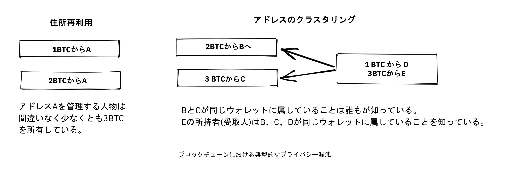
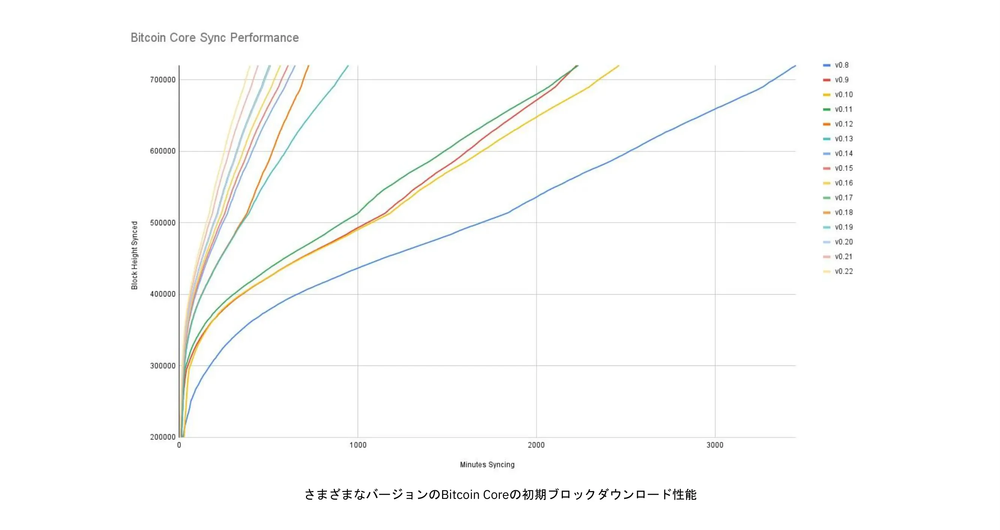
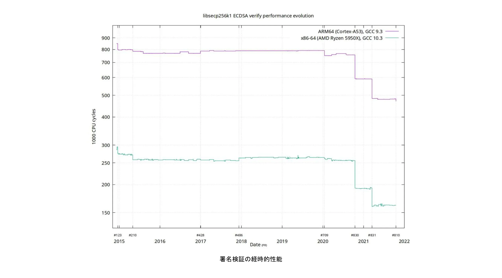
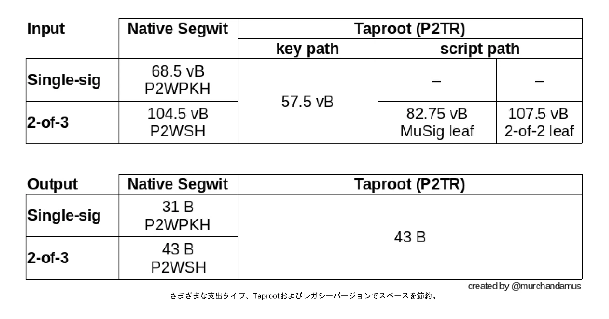
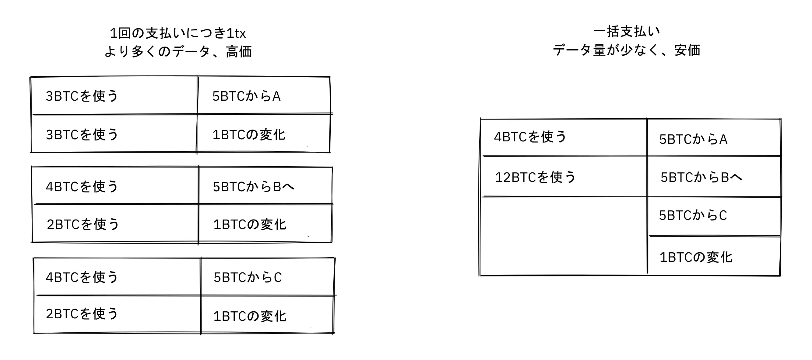
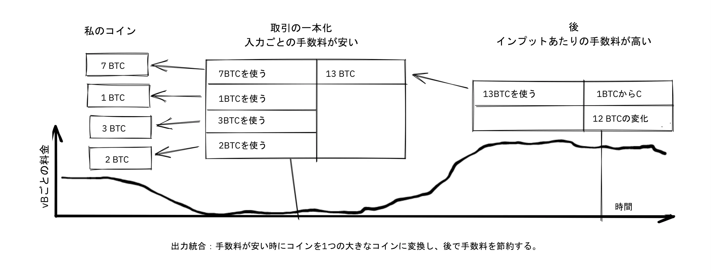
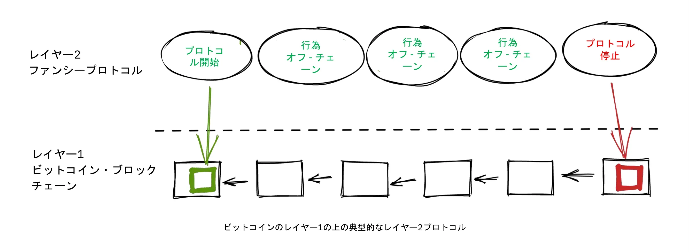
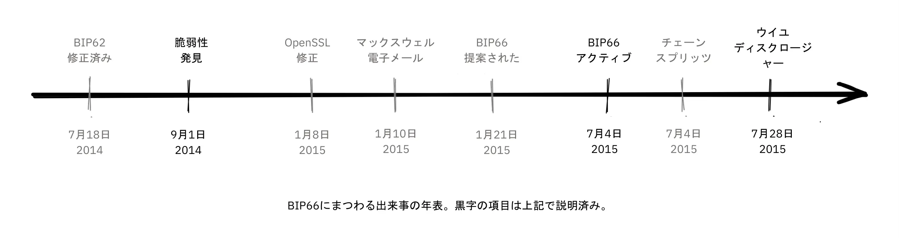
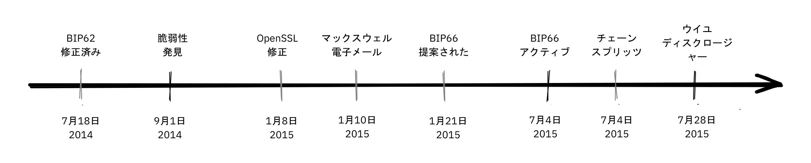

# ビットコイン開発の哲学を深く掘り下げる


ビットコイン開発哲学は、プルーフ・オブ・ワーク（PoW）、ブロック構築、トランザクションライフサイクルなどの概念やプロセスの基本をすでに理解し、ビットコインの設計トレードオフと哲学を深く理解することでレベルアップを望むビットコイン開発者のためのコースです。

この本は、ビットコインの10年以上にわたる開発と公開討論の最も重要な教訓を、新しい開発者が吸収するのを助けると同時に、新しいアイデア（良いアイデアも悪いアイデアも！）を評価するための有益な文脈を提供するものである。


### 何を期待する？


上記の通り、これはビットコイン開発者のための実践的なガイドである。しかし、ビットコインは広範かつ複雑なテーマであり、ここでそのすべてをカバーすることは不可能である。このコースでは、開発活動を始めるために必要な機能を説明するだけでなく、各自でさらに探求できるようにしたいと考えています。


ビットコインには多くの人々が関わっており、その中には反対意見もあるため、ここでは相反する考えを示す資料が見つかるかもしれない。しかし、私たちは常に事実の領域にこだわろうとし、そこでは意見は重要ではありません。


### 誰が書いたんだ？


このコースは、カレ・ローゼンバウムが主執筆者であり、リネア・ローゼンバウムが共著者として寄稿した同名の書籍からの抜粋である。

この本は、ビットコインの開発について学びたい開発者のための教育プログラムを運営する開発センター、[Chaincode Labs](https://learning.chaincode.com/)の委託と資金提供によって出版されました。


+++


# はじめに

<partId>58c48e9b-e285-4dc6-8952-6cc5140b1313</partId>


## コース概要

<chapterId>28b7256b-9cb0-463e-a82d-d732be86c98c</chapterId>


このコースへようこそ！ BTC 303では、ビットコインの開発哲学について学びます。


ビットコインは単なる暗号通貨ではなく、分散化、プライバシー、トラストレス性、そしてレジリエンスに関する哲学的ビジョンを体現しています。このコースは、ビットコインの技術的基盤にすでに精通している開発者が、ビットコインのデザインとガバナンスを支える原則について理解を深めることを目的としています。


このコースを通じて、ビットコインの10年以上にわたる進化の指針となった本質的な価値観と戦略を明確にすることができます。これらのテーマを深く探求することで、将来の発展を自信を持って評価し、貢献するために必要な批判的視点を身につけることができます。


### ビットコインのセントラル・バリュー


ビットコインの特徴とは？このセクションでは、ビットコインの設計の中心にある基本的な価値観を明らかにします。**分散化**は、単一の主体がネットワークを支配しないことを保証する礎石であり、**トラストレス**は、第三者への依存を取り除く鍵であり、**プライバシー**は、個人の自由とシステムの完全性の両方に不可欠であり、**有限供給**は、ビットコインの経済的アイデンティティを形作る希少性のコード化された保証である。これらの概念をマスターすることで、ビットコインの強みと弱みを完全に把握することができる。


### ビットコイン ガバナンス


ビットコインの複雑なガバナンス・ランドスケープをナビゲートするには、技術的な専門知識以上に、コンセンサスと意思決定に対するビットコイン独自のアプローチを理解することが必要です。このセクションでは、プロトコルのアップグレードのような重要なプロセスの背後にあるメカニズムや哲学、敵対的思考の必要性、オープンソースのコラボレーションの強さ、スケーリングの継続的な課題、そして物事がどうしてもうまくいかないときに必要な微妙な戦略について掘り下げていきます。この知識を身につけることで、ビットコインに参加するだけでなく、ビットコインの未来を効果的かつ責任を持って形作る準備ができる。


ビットコインの旅で次のステップに進む準備はできていますか？始めよう！


# ビットコイン セントラル・バリュー

<partId>2d6c683b-54c8-5465-b2ca-4e96a6828834</partId>


## 分散化

<chapterId>9397c84b-0038-5d0e-88d5-11767ce8182d</chapterId>


分散化とは何か、なぜそれがビットコインを機能させるために不可欠なのかを分析する。を区別する。

[マイナー](https://planb.academy/resources/glossary/mining)の非中央集権化と[フルノード](https://planb.academy/resources/glossary/full-node)の非中央集権化、そしてビットコインの最も中心的な特性のひとつである検閲への耐性について議論する。


そして議論は、分散型システムに必要な性質である中立性（ユーザー、マイナー、開発者に対する無許可性）を理解することに移っていく。最後に、ビットコインのような分散型システムを把握することがいかに難しくなり得るかについて触れ、それを理解するのに役立つかもしれないメンタル・モデルをいくつか提示する。


中央制御点のないシステムは、*分散型*と呼ばれる。ビットコインは、コントロールの中心点、より正確には*検閲の中心点*を持たないように設計されています。


分散化は、*検閲への抵抗*を達成するための手段である。


ビットコインにおける分散化には、大きく分けて2つの側面がある：マイナーの分散化とフルノードの分散化である。


マイナーの分散化とは、[トランザクション](https://planb.academy/resources/glossary/transaction-tx)処理がいかなる中央主体によっても実行されず、調整もされないという事実を指す。フルノードの分散化とは、[ブロック](https://planb.academy/resources/glossary/block)の検証、すなわちマイナー（マイナー）が出力するデータが、少数の信頼された主体によってではなく、最終的にはそのユーザーによって、ネットワークのエッジで行われることを指す。


### マイナーの分散化


ビットコイン以前にもデジタル通貨を作ろうとする試みはあったが、ガバナンスの分散化や検閲への抵抗が足りず、そのほとんどが失敗に終わっていた。


ビットコインにおけるマイナーの非中央集権化とは、トランザクションの*注文*が単一の主体や固定された主体のセットによって実行されないことを意味する。このマイナーの集合体は、ユーザーのダイナミックな集合体である。このマイナーの集団は、動的なユーザーの集合である。この性質がビットコインを検閲に強いものにしている。


もしビットコインが中央集権的であれば、政府など検閲を望む人々に対して脆弱になる。デジタルマネーを作ろうとした以前の試みと同じ運命をたどるだろう。『Enabling Blockchain Innovations with Pegged Sidechains』と題された[論文](https://www.blockstream.com/sidechains.pdf)の冒頭で、著者たちは、デジタルマネーの初期バージョンがいかに敵対的な環境に備えていなかったかを説明している（次のパートの「敵対的思考」の章も参照）。


デビッド・チョウムは1983年、[二重支払い](https://planb.academy/resources/glossary/double-spending-attack)を防止するために信頼できる中央サーバーがある設定で、デジタル・キャッシュを研究テーマとして導入した。この中央の信頼された当事者による個人のプライバシー・リスクを軽減し、かつ、[両替性](https://planb.academy/resources/glossary/fungibility)を強制するために、Chaumは[ブラインド署名](https://planb.academy/resources/glossary/blind-signature)を導入した。このブラインド署名は、中央サーバーの署名（コインを表す）のリンクを防止する暗号手段を提供するために使用され、その一方で、中央サーバーは二重支出防止を実行することができる。

中央サーバーの要件は、デジタル・キャッシュのアキレス腱となった[Gri99]。中央サーバーの署名を複数の署名者の閾値署名に置き換えることで、この単一障害点を分散させることは可能であるが、監査可能性のためには、署名者が明確で識別可能であることが重要である。各署名者が一人ずつ失敗したり、失敗させられたりする可能性があるためである。


トランザクションの注文に中央サーバーを使うのは、検閲のリスクが高いため、実行可能な選択肢ではないことが明らかになった。仮に中央サーバーを、固定されたn台のサーバーからなるフェデレーションに置き換えたとしても、少なくともm台は注文を承認しなければならない。問題は、中央の権威に頼らずに、悪意のあるサーバーを善良なサーバーに置き換える方法だけでなく、このn個のサーバーのセットについてもユーザーが合意しなければならないものに移行する。


もしビットコインが検閲可能だったらどうなるか考えてみよう。検閲官は、[ブロックチェーン](https://planb.academy/resources/glossary/blockchain)に入るのを許可する前に、ユーザーが自分自身を特定し、お金の出所やそのお金で何を買うかを宣言するよう圧力をかけることができる。


また、検閲への抵抗がないため、検閲者はユーザーに新しいシステムルールを採用するよう強要することができる。例えば、貨幣供給量を膨張させ、それによって自分たちを富ませるような変更を課すことができる。そのような場合、ブロックを検証するユーザーには、新しいルールに対処するための3つの選択肢がある：


- 採用する：変更を受け入れ、フルノードに採用する。
- 拒否する：この場合、検閲官のブロックはユーザーのフルノードによって無効とみなされるため、ユーザーはトランザクションを処理できなくなる。
- 移動：新しいコントロールの中心点を任命する。すべてのユーザーは、どのように調整するかを考え、新しいコントロールの中心点に合意しなければならない。


もし彼らが成功しても、以前と同じように検閲可能なシステムが残っていることを考えれば、同じ問題が将来的に再浮上する可能性は高い。


これらのオプションはいずれもユーザーにとって有益ではない。


分散化による検閲への耐性が、ビットコインと他の通貨システムとの違いであるが、*二重支払い問題*のために達成するのは容易なことではない。これは、誰も同じコインを2度使えないようにするという問題で、多くの人が分散型では解決不可能だと考えていた問題だ。サトシ・ナカモトは[ビットコインホワイトペーパー](https://planb.academy/bitcoin.pdf)で二重支払い問題を解決する方法について書いている：


> 本論文では、ピアツーピア（P2P）の分散型タイムスタンプサーバーを用いた二重支払い問題の解決策を提案し、トランザクションの時系列順序の計算証明生成を行う。


ここで彼は、「ピアツーピア（P2P）の分散型タイムスタンプサーバー」という独特の響きを持つ言葉を使っている。ここでのキーワードは「分散型」であり、この文脈では中央制御点が存在しないことを意味している。そして[中本](https://planb.academy/resources/glossary/nakamoto-satoshi)は、[プルーフ・オブ・ワーク](https://planb.academy/resources/glossary/proof-of-work)（PoW）がいかに解決策であるかを説明する。

それでも、これほどうまく説明してくれる人はいない。

[Gregory Maxwell on Reddit](https://www.reddit.com/r/Bitcoin/comments/ddddfl/question_on_the_vulnerability_of_bitcoin/f2g9e7b/)では、潜在的な51%攻撃を避けるためにマイナーの[ハッシュパワー](https://planb.academy/resources/glossary/hashrate)を制限しようと提案する人物に反論している：


> ビットコインのような分散型システムでは、公選が用いられる。というのも、中央集権的な組織が人々に投票を許可する必要があるからです。その代わりに、ビットコインではコンピューティング・パワーによる投票を行う。
第三者。


この投稿では、分散型ビットコインネットワークが、プルーフ・オブ・ワーク（PoW）の使用を通じて、どのようにトランザクションの順序について合意に達することができるかを説明している。


そして、51％攻撃は、ビットコインの非中央集権的な特性を気にしない、あるいは理解しない人々に比べれば、特に心配することではないと締めくくっている：


> ビットコインのはるかに大きなリスクは、それを使用する一般市民が、それを理解せず、気にかけず、そもそも中央集権的な代替案よりも価値がある分散化の特性を守らないことだ。

この結論は重要だ。もし人々がビットコインの非中央集権性を守らなければ、それは検閲に対する抵抗力の代用品であり、ビットコインは中央集権化の犠牲になるかもしれない。そうなれば、ビットコインの価値提案は、すべてではないにせよ、ほとんどなくなってしまう。これがフルノードの分散化に関する次のセクションにつながる。


### フルノードの分散化


上の段落では、主にマイナーの分散化と、マイナーの集中化が検閲を可能にすることについて話してきた。しかし、分散化のもう一つの側面、すなわち*フルノードの分散化*もあります。


フルノードの分散化の重要性は、トラストレスに関連している。あるユーザーが、例えば運用コストの法外な増加のために、自分自身のフルノードの運用を止めたとする。その場合、ユーザーは他の方法でビットコインネットワークとやりとりする必要があり、おそらくウェブ・[ウォレット](https://planb.academy/resources/glossary/wallet)や軽量ウォレットを利用することになる。


ユーザーは、ネットワークの[コンセンサスルール](https://planb.academy/resources/glossary/consensus-rules)を直接実施することから、他の誰かが実施することを信頼するようになる。ここで、ほとんどのユーザーが[コンセンサス](https://planb.academy/resources/glossary/consensus)の実施を信頼できる主体に委任したとします。その場合、ネットワークはすぐに中央集権に陥り、悪意のあるアクターによってネットワークのルールが変更される可能性がある。


[ビットコインマガジンの記事](https://bitcoinmagazine.com/technical/decentralist-perspective-Bitcoin-might-need-small-blocks-1442090446)では、Aaron van Wirdum氏がビットコインの開発者たちに、分散化とビットコインの最大ブロックサイズの増加に伴うリスクについての見解をインタビューしている。この議論は2014年から2017年のホットなトピックであり、多くの人々がより多くのトランザクションスループットを可能にするためにブロックサイズの上限を増やすことについて議論していた。


ブロックサイズを大きくすることに反対する有力な論拠は、検証コストが増大することである。検証コストが増大すれば、一部のユーザーはフルノードの稼働を停止せざるを得なくなる。その結果、信頼を前提としない形でシステムを利用できない人が増えることになる。


ピーテル・ウイールは記事の中で、フルノード集中化のリスクについて説明している：


> 多くの企業がフルノードを実行する場合、すべての企業が異なるルールセットを実装するよう説得する必要があることを意味する。言い換えれば、ブロック検証の分散化こそが、コンセンサス・ルールに重みを与えているのである。
> しかし、例えば誰もが同じウェブウォレット、取引所、SPVやモバイルウォレットを使うため、フルノードのカウントが非常に低くなれば、規制が現実になる可能性がある。そして、もし当局がコンセンサスルールを規制できるのであれば、ビットコインをビットコインにするものは何でも変更できるということになる。2100万ビットコインの上限さえも。

そうだ。ビットコインのユーザーは、規制当局や大企業がコンセンサスルールを変えようとするのを阻止するために、自分たちでフルノードを運営すべきだ。


### 中立性


ビットコインは中立、あるいはパーミッションレスと呼ばれます。つまり、ビットコインはあなたが誰であろうと、何に使おうと構わないということです。


ビットコインは中立である。もしビットコインが組織によってコントロールされていたら、それは単なるバーチャル・オブジェクトの一種であり、私はまったく興味を持たないだろう。


ルールを守っている限り、誰に許可を求めることもなく、好きなように自由に使うことができる。これには*マイニング*、*ビットコインでの*トランザクション*、*ビットコインの上での*プロトコルやサービスの構築*が含まれる：


- もし*マイニング*が許可制のプロセスであれば、マイニングを許可する人を選ぶ中央当局が必要になるだろう。そうなると、マイナーは法的な契約を結ばなければならなくなる可能性が高い。

中央当局の気まぐれに従ってトランザクションを検閲することは、そもそもマイニングの目的を逸脱している。


- もしビットコインで*トランザクション*を行う人々が個人情報を提供したり、トランザクションの目的を申告したり、あるいはトランザクションに値する人物であることを証明したりしなければならないとしたら、ユーザーやトランザクションを承認する中央機関が必要になるだろう。繰り返すが、これは検閲や排除につながる。


- もし開発者がビットコインの上にプロトコルを構築する許可を求めなければならないとしたら、中央の開発者許可委員会によって許可されたプロトコルだけが開発されることになるだろう。これは、政府の介入により、必然的にすべてのプライバシー保護プロトコルや分散化を改善するすべての試みを排除することになります。


すべてのレベルにおいて、誰が何のためにビットコインを使うのかに制限を課そうとすることは、ビットコインがその価値提案に沿えなくなってしまうほど、ビットコインを傷つけることになる。


Pieter Wuille https://Bitcoin.stackexchange.com/a/92055/69518 [Stack Exchangeに関する質問に答える] ブロックチェーンと通常のデータベースとの関係について。彼は、プルーフ・オブ・ワーク（PoW）と経済的インセンティブを組み合わせることで、パーミッションレスがどのように実現可能かを説明している。


彼はこう結んでいる：


> プルーフ・オブ・ワーク（PoW）のような信頼を前提としないコンセンサス・アルゴリズムを使うことで、他のコンセンサス・アルゴリズムでは得られないもの（無許可の参加、つまり変更を検閲できる参加者のグループが存在しない）が追加される。
> 実際に使用されているものは、おそらく世界に1台か数台しかないだろう。

同氏は、パーミッションレスを実現するためには、システムが独自の通貨を必要とする可能性が高く、それによって「ユースケースが事実上暗号通貨だけに限定される」と説明する。パーミッションレス参加、つまりマイニングには、システム自体に経済的インセンティブを組み込む必要があるからだ。


### 分散化を理解する


ビットコインの説得力のある点は、誰も支配していないことを理解するのが難しいという点だ。ビットコインには委員会も幹部もいない。グレゴリー・マクスウェルは、またしても[ビットコインのサブレディットで](https://www.reddit.com/r/Bitcoin/comments/s82t2n/comment/htdte7w/?utm_source=share&utm_medium=web2x&context=3)、興味深い方法でこれを英語に例えている：


> 多くの人々は、自律的なシステムを理解するのに時間がかかる。英語のように生活の中にあるものはたくさんあるが、人々はそれを当然のものと考えているだけで、システムだとさえ考えていない。彼らは中央集権的な考え方にとらわれていて、"モノ "として考えているものすべてに、それをコントロールする権威があるのだ。
>

> ビットコインは何も重視していない。ビットコインを採用したさまざまな人々が、自らの自由意志でビットコインを推進することを選んだのであり、どのように推進するかは、それぞれの自由である。権威に固執する人々は、これらの活動を見て、ビットコインの権威による何らかの操作だと思うかもしれないが、そのような権威は存在しない。


ビットコインが分散化によって機能する様子は、自然界の多くの種に見られる並外れた集団的知性に似ている。コンピュータ科学者のラディカ・ナガパルは、魚の群れの集団行動と、科学者がロボットを使ってそれを模倣しようとしている方法について、[Ted talk](https://www.ted.com/talks/radhika_nagpal_what_intelligent_machines_can_learn_from_a_school_of_fish)で話している。


> 第二に、そして私が今でも最も注目に値すると思うのは、この魚群を監督するリーダーは存在しないということだ。その代わりに、この驚くべき集団心理的行動は、純粋に1匹の魚ともう1匹の魚の相互作用から生まれている。
> どういうわけか、隣り合う魚同士の相互作用や交戦のルールがあって、すべてがうまくいく。

彼女は、自然であれ人工であれ、多くのシステムはリーダーがいなくても機能するし、実際に機能している。一人一人は自分の周囲と相互作用しているだけだが、それらが一体となってとてつもないものを形成している。


ビットコインについてどう考えても、その分散型の性質がコントロールを難しくしている。ビットコインが存在する以上、どうすることもできない。ビットコインは研究すべきものであり、議論すべきものではない。


### 分散化についての結論


フルノードの分散化とマイニングの分散化を区別する。マイニングの分散化は検閲耐性を達成するための手段であり、フルノードの分散化は、そのネットワークのコンセンサス・ルールを、利用者の広範な支持なしに変更し続けることを防ぐものである。


ビットコインの分散型の性質は、開発者、ユーザー、マイナーに対する中立性を可能にしている。誰でも自由に参加することができます。


分散型システムを理解するのは難しいかもしれないが、例えば英語や魚の群れのように、助けになるメンタルモデルがいくつかある。


## 信頼性の欠如

<chapterId>0506ba61-16a3-543c-95fa-3f3e2dd64121</chapterId>


この章では、トラストレスの概念、コンピューターサイエンスの観点から見たトラストレスの意味、そしてビットコインがトラストレスの価値を維持するためにトラストレスでなければならない理由について解説する。

そして、ビットコインを信頼を前提としない形で使うとはどういうことか、フルノードがどのような保証ができ、どのような保証ができないのかについて話す。

最後のセクションでは、ビットコインと実際のソフトウェアやユーザーとの現実世界での相互作用、そして、何かを成し遂げるためには利便性と信頼性の間でトレードオフをする必要があることに注目する。


よく「ビットコインはトラストレスだから素晴らしい」などと言う人がいる。


トラストレスとは何を意味するのか？ピーテル・ウイールが[Stack Exchange](https://Bitcoin.stackexchange.com/a/45674/69518)でこの広く使われている用語を解説している：


> トラストレス」で言っている信頼とは、抽象的な技術用語である。分散システムが正しく機能するために信頼された当事者を必要としない場合、トラストレスと呼ばれる。

要するに、*トラストレス*という言葉は、ビットコインプロトコルが「いかなる信頼された当事者」なしでも論理的に機能するという性質を指している。これは、あなたが必然的に実行するソフトウェアやハードウェアに置かなければならない信頼とは異なります。後者の信頼については、この章でさらに詳しく説明する。


中央集権型システムでは、中央のアクターがセキュリティに配慮したり、問題が発生した場合にロールバックしたりすることを確認するために、中央のアクターの評判に依存する。このような信頼の要件は、仮名分散型システムにおいては問題となる。[ビットコインホワイトペーパー](https://Bitcoin.org/Bitcoin.pdf)の序文で、サトシ・ナカモトはこの問題を説明している：


> インターネット上での商取引は、電子決済を処理する信頼できる第三者機関としての金融機関にほぼ全面的に依存するようになった。
> このシステムはほとんどのトランザクションで十分に機能するが、それでもなお、信頼に基づくモデル特有の弱点に悩まされている。  金融機関は紛争の調停を避けることができないため、完全に非可逆的なトランザクションは実際には不可能である。また、非可逆的なサービスに対して非可逆的な支払いを行う能力が失われることで、より広範なコストが発生する。
> 逆転の可能性がある以上、信頼の必要性は広がる。加盟店は顧客を警戒し、必要以上の情報を求めるようになる。  一定の割合の詐欺は避けられないものとして受け入れられている。このようなコストや支払いの不確実性は、現物の通貨を使用することで回避できるが、信頼できる当事者なしに通信チャネル上で支払いを行う仕組みは存在しない。

信頼に基づいた分散型システムはできないようだ。だからこそ、ビットコインではトラストレスが重要なのだ。


信頼を前提としないやり方でビットコインを使うには、完全検証型のビットコインノードを動かす必要があります。そうして初めて、他の人から受け取ったブロックがコンセンサスルールに従っているかどうかを検証することができます。例えば、コインの発行スケジュールが守られているか、ブロックチェーンで二重支出が発生していないかなどです。フルノードを運用しない場合、ビットコインブロックの検証を誰かに委託し、その人が真実を教えてくれると信じていることになり、ビットコインを信頼して使っていないことになります。


デビッド・ハーディングは[Bitcoin.orgのウェブサイト上の記事](https://Bitcoin.org/en/Bitcoin-core/features/validation)を執筆し、フルノードの運営、あるいはビットコインを信頼して使用することが、実際にどのように役立つかを説明している：


> ビットコインの通貨は、人々がビットコインを他の価値あるものと交換して初めて機能する。つまり、ビットコインに価値を与え、ビットコインがどのように機能するかを決めるのは、ビットコインを受け入れる人々なのだ。
>

> ビットコインを受け入れると、その人の秘密鍵にアクセスすることなく、その人のビットコインを没収することを防ぐなど、ビットコインのルールを実施する権限を持つ。
>

> 残念なことに、多くのユーザーはその執行力を外部に委託している。このため、ビットコインの分散化は弱体化し、一握りのマイナーが一握りの銀行や無料サービスと結託して、権力を外注した検証しないすべてのユーザーのためにビットコインのルールを変更することができる。
>

> 他のウォレットとは異なり、ビットコインコアはルールを実施します。そのため、もしマイナーや銀行が非認証ユーザーのためにルールを変更した場合、それらのユーザーはあなたのような完全認証のビットコインコアユーザーに支払うことができなくなります。


フルノードを使えば、他人を信用することなくブロックチェーンのあらゆる側面を検証することができ、他人から受け取ったコインが本物であることを確認することができるという。これは素晴らしいことだが、フルノードにはできない重要なことが一つある：チェーンの書き換えによる二重支出を防ぐことはできない：


> ビットコインコアを含むすべてのプログラムはチェーンの書き換えに対して脆弱であるが、ビットコインは防御メカニズムを提供している。これ以上の分散型防御策は知られていない。

どんなに高度なソフトウェアを使っても、自分のコインを含むブロックが書き換えられないことを信頼しなければならない。しかし、ハーディング氏が指摘したように、何度も確認を待ち、その結果、連鎖が書き換えられる確率は十分に小さいと考えることができる。


ビットコインを信頼を前提としない方法で使用するインセンティブは、フルノードの分散化の必要性と一致している。自分のフルノードを使う人が多ければ多いほど、フルノードの分散化は進み、したがってビットコインはプロトコルへの悪意ある変更に対してより強くなる。しかし残念なことに、フルノードの分散化のセクションで説明したように、利用者はしばしば信頼されたサービスを選びますが、それは信頼性のなさと利便性の間の避けられないトレードオフの結果です。


ビットコインのトラストレスはシステムの観点から絶対に必要だ。2018年、マット・コラロは、リガで開催されたバルト海のハニーバジャー会議で[トラストレスについて語った](https://btctranscripts.com/baltic-honeybadger/2018/trustlessness-scalability-and-directions-in-security-models/)。


その話のエッセンスは、信頼されたシステムの上にトラストレスシステムを構築することはできないが、信頼されたシステム、例えばトラストレスシステムの上にカストーディアルウォレットを構築することはできる、というものだ。


トラストレスベースのレイヤーは、より高いレベルでの様々なトレードオフを可能にする。


このセキュリティモデルは、システム設計者がトレードオフを選択することを可能にする。

そのようなトレードオフを他人に強いることなく、自分にとって理にかなった選択をする。


### 信用するな、検証しろ


ビットコインは信頼に足るものですが、それでもソフトウェアやハードウェアをある程度は信頼しなければなりません。なぜなら、あなたのソフトウェアやハードウェアは、箱に記載されていることを実行するようにプログラムされていないかもしれないからだ。例えば


- CPUは、秘密鍵暗号操作を検知し、秘密鍵データを漏洩させるよう悪意を持って設計されている可能性がある。
- オペレーティング・システムの乱数発生器は、それが主張するほどランダムではないかもしれない。
- ビットコインコアは、あなたの秘密鍵を悪者に送るコードを忍び込ませているかもしれない。


だから、フルノードを実行する以外にも、あなたが意図したものを実行していることを確認する必要がある。Redditユーザーのbrianddk [記事はこちら](https://www.reddit.com/r/Bitcoin/comments/smj1ep/bitcoin_v220_and_guix_stronger_defense_against/)は、ソフトウェアを検証する際に選択できる様々な信頼レベルについて書いています。構築者を信頼する」というセクションで、彼は再現可能なビルドについて語っています：


> 再現可能なビルドとは、多くのコミュニティの開発者がそれぞれソフトウェアをビルドし、ビルドされた最終的なインストーラが他の開発者が作成したものと同一であることを保証できるようにソフトウェアを設計する方法です。ビットコインのような非常にパブリックで再現可能なプロジェクトでは、一人の開発者を完全に信用する必要はありません。多くの開発者がビルドを実行し、オリジナルのビルダーがデジタル署名したものと同じファイルを作成したことを証明することができます。

この記事では、サイト、ビルダー、コンパイラー、カーネル、ハードウェアの5つの信頼レベルを定義している。


再現可能なビルドの話題をさらに深めるために、Carl Dongが[Guixについてのプレゼンテーションを行った](https://btctranscripts.com/breaking-Bitcoin/2019/Bitcoin-build-system/)。オペレーティング・システムやライブラリ、コンパイラを信頼することがなぜ問題になるのか、そしてビットコインコアで現在使われているGuixというシステムでそれを解決する方法を説明した。


> では、ツールチェーンに信頼できるバイナリが大量に存在し、それが再現可能な悪意を持っている可能性があるという事実に対して、私たちはどうすればいいのだろうか？再現可能であること以上のものが必要だ。ブートストラップ可能である必要がある。他の組織が管理する外部サーバーからダウンロードし、信頼する必要のあるバイナリ・ツールをそんなにたくさん持つことはできない。
>

> これらのツールがどのようにビルドされ、どのようにビルドし直すことができるのか、できればもっと少ない信頼できるバイナリのセットからビルドすることができるのか、正確に知っておく必要がある。信頼できるバイナリのセットをできるだけ少なくし、それらのツールチェーンからビットコインのビルドに使うものまで、簡単に監査できるパスを持つ必要がある。これによって、検証を最大化し、信頼を最小化することができる。

そして、Guixがどのようにして357バイトの最小限のバイナリだけを信頼することを可能にしているかを説明する。この357バイトのバイナリがあるべき動作をすることを検証し、それを使ってソースコードから完全なビルドシステムをビルドし、最終的にビットコインコアのバイナリを完成させる。


多くのビットコイナーが支持しているマントラがある：


> 信用するな、検証しろ。

これは、ロナルド・レーガン元米大統領が核軍縮の文脈で使った「[trust, but verify](https://en.wikipedia.org/wiki/Trust,_but_verify)」という言葉を暗示している。[ビットコイナーズ](https://twitter.com/Truthcoin/status/1491415722123153408?s=20&t=ZyROxZxlBppdRpuuzsiF5w)は、信頼の拒絶とフルノードを実行することの重要性を強調するために、これをすり替えた。


使用するソフトや受信するブロックチェーンのデータをどこまで検証するかは、ユーザー次第だ。ビットコインに限らず、利便性と信頼性はトレードオフの関係にある。自分のハードウェアでビットコインコアを動かすのに比べれば、カストディアルのウォレットを使った方が便利な場合がほとんどだ。しかし、ビットコインのソフトウェアが成熟し、ユーザーインターフェイスが改善されるにつれて、時間の経過とともに、トラストレスに取り組むユーザーをサポートすることができるようになるはずだ。また、時間の経過とともに、ユーザーがより多くの知識を得るにつれて、方程式から徐々に信頼を取り除くことができるようになるはずだ。


敵対的に考え、実行するソフトウェアのほとんどの側面を検証するユーザーもいる。その結果、彼らはコンピュータのハードウェアとオペレーティング・システムだけを信頼すればよいので、信頼の必要性を最低限にまで減らしている。そうすることで、ハードウェアを徹底的に検証しない人々も、彼らが発見するかもしれない問題について警告するために、公衆の面前で声を上げることで助けることができる。その良い例の1つが、[2018年に起こった出来事](https://bitcoincore.org/en/2018/09/20/notice/)である。誰かが、マイナーが同じトランザクションで出力を2回使うことを可能にするバグを発見したのだ：


> 9月18日にビットコインコアバージョン0.16.3と0.17.0rc4でリリースされたCVE-2018-17144は、サービス拒否コンポーネントと重大なインフレの脆弱性の両方を含んでいます。この問題は当初、ビットコインコアに従事する複数の開発者、およびABCやUnlimitedを含む他の暗号通貨をサポートするプロジェクトに、サービス拒否のバグのみとして9月17日に報告されましたが、私たちはすぐにこの問題が同じ根本原因を持つインフレの脆弱性でもあると判断し、修正を行いました。

ここでは、匿名の人物が報告した問題が、報告者の認識よりもはるかに悪いものであることが判明した。これは、コードを検証する人々が、セキュリティ上の欠陥を悪用する代わりに報告することが多いという事実を浮き彫りにしている。これは、自分ですべてを検証できない人々にとって有益なことだ。


しかし、ユーザーは自分の安全を他人が守ってくれることを信用するのではなく、できる限りいつでも、どんなことでも自分で確かめるべきである。そうすることで、人は可能な限り主権を保ち、ビットコインは繁栄するのだ。ソフトウェアを監視する目が多ければ多いほど、悪意のあるコードやセキュリティ上の欠陥をすり抜ける可能性は低くなる。


### トラストレスについての結論


ビットコインプロトコルがトラストレスであるのは、ユーザがサードパーティを信頼することなく対話できるようにするためである。しかし実際には、ほとんどの人はビットコインを実行するソフトウェアやハードウェアのフルスタックを検証することはできません。ソフトウェアやハードウェアを検証する熟練した人々は、悪意のあるコードやバグを見つけたとき、熟練していない他の人々に警告することができる。


信頼がなければ、分散化はできない。なぜなら、信頼は必然的に中央の権威を伴うからだ。トラストレスシステムの上に信頼されたシステムを構築することはできるが、信頼されたシステムの上にトラストレスシステムを構築することはできない。


## プライバシー

<chapterId>1b960afe-0008-589b-b2f4-007d60d264c6</chapterId>


この章では、個人的な金融情報をどのように自分のものにするかを扱います。ビットコインにおけるプライバシーとは何か、なぜプライバシーが重要なのか、ビットコインが偽名であることの意味について説明します。また、オンチェーンとオフチェーンの両方において、個人情報がどのように漏れる可能性があるかについても考察する。


そして、ビットコインは他のビットコインと交換可能であるべきであるという事実と、交換可能性とプライバシーがどのように両立するのかについて述べています。最後に、この章では、自分や他人のプライバシーを向上させるためにできる対策を紹介している。


ビットコインは仮名システムであり、ユーザーは公開鍵という形で複数の仮名を持つ。一見すると、これはユーザーを特定されないように保護するためのかなり良い方法のように見えるが、実際には、個人的な金融情報を意図せずに漏らすことは実に簡単である。


### プライバシーとは何か？


プライバシーとは、文脈によって異なる意味を持つことがある。ビットコインでは、一般的に、ユーザーが自発的にそうしない限り、財務情報を他人に明かす必要はないことを意味する。


自分の個人情報が他人に漏れる可能性は、知らずに、あるいは知らずに漏れる可能性がある。データは、ブロックチェーンのような公共の場から漏れることもあれば、悪意ある行為者があなたのインターネット通信を傍受した場合など、他の手段で漏れることもあります。


### なぜプライバシーが重要なのか？


ビットコインでプライバシーがなぜ重要なのか、明白に思えるかもしれないが、すぐには思いつかない側面もある。[ビットコイントーク・フォーラム](https://bitcointalk.org/index.php?topic=334316.msg3588908#msg3588908)で、グレゴリー・マクスウェルは、彼がプライバシーが重要だと考える多くの良い理由を説明してくれている。その中には、自由市場、安全、人間の尊厳などがある：


> 金融のプライバシーは、自由市場を効率的に運営するために不可欠な基準である。ビジネスを運営する場合、サプライヤーや顧客があなたの意思に反してすべての取引を見ることができれば、効果的に価格を設定することはできない。
> 競合他社があなたの売上を追跡していたら、効果的な競争はできません。  十分なプライバシーがないままビットコインで家主に支払いをすれば、家主はあなたがいつ昇給したかを知ることができ、さらに家賃を請求することができる。
>

> もし窃盗団があなたの支出、収入、保有資産を見ることができれば、その情報を使ってあなたを標的にし、搾取することができます。プライバシーがなければ、悪意のある者はあなたの身元を盗んだり、高額な買い物をひったくったり、取引先の企業になりすましてあなたに近づいたりすることができます。
>

> 経済的なプライバシーは人間の尊厳にとって不可欠である。誰もコーヒーショップの鼻水を垂らすバリスタや、おせっかいな隣人に収入や浪費癖についてコメントされたくはない。赤ちゃん狂いの義父母に、避妊具（あるいは性玩具）を買う理由を詮索されることもない。雇用主は、あなたがどの教会に寄付しているかを知る必要はない。誰も他の誰に対しても不当な権限を持たない、完全に啓蒙された差別のない世界においてのみ、私たちは尊厳を保ち、プライバシーがなければ自己検閲することなく、合法的な取引を自由に行うことができる。

マクスウェルはまた、本章で後述するファンジビリティーや、プライバシーと法の執行がいかに矛盾しないかについても触れている。


### 偽名性


ビットコインは仮名であり、仮名は公開鍵であることは前述した。メディアでは、ビットコインは匿名だとよく耳にするが、それは正しくない。匿名と仮名は区別される。


Andrew Poelstra [Bitcoin Stack Exchangeの投稿で説明している](https://Bitcoin.stackexchange.com/a/29473/69518) 匿名性がトランザクションにおいてどのように見えるか：


> 完全な匿名性とは、お金を使ってもその出所や行き先がまったくわからないという意味で、ゼロ知識証明という暗号技術を使えば理論的には可能である。

その違いは、仮名貨幣では仮名間の支払いを追跡できるのに対し、匿名貨幣では追跡できないということのようだ。ビットコインの支払いは仮名間で追跡可能なので、匿名システムではない。


私たちはまた、仮名が公開鍵であると言いましたが、実際には公開鍵から派生したアドレスなのです。なぜ私たちはアドレスを仮名として使い、他の何か、例えば "watchme1984 "のような記述的な名前を使わないのでしょうか?これは、Bitcoin Stack Exchangeでも、ユーザーのTim S.によって[よく説明されている](https://Bitcoin.stackexchange.com/a/25175/69518)：


> ビットコインのアイデアが機能するためには、ある秘密鍵の所有者だけが使えるコインを用意しなければならない。つまり、何を送るにしても、公開鍵と何らかの形で結びついていなければならない。
>

> 任意の仮名（ユーザー名など）を使用すると、公開鍵/秘密鍵暗号を有効にするために、何らかの方法で仮名を公開鍵にリンクさせなければならないことになる。これは、オフラインで安全にアドレス/仮名を作成する機能を削除し（例えば、誰かが "tdumidu "というユーザー名に送金する前に、"tdumidu "が公開鍵 "a1c... "によって所有されていることをブロックチェーンで公表し、他の人が公表する理由があるように手数料を含める必要があります）、匿名性を低下させ（仮名の再利用を奨励することによって）、ブロックチェーンのサイズを不必要に肥大化させます。また、ブロックチェーンのサイズを無駄に肥大化させ、自分が思っている人物に送っているという誤った安心感を与えることになる（もし私が彼より先に "Linus Torvalds "という名前を名乗れば、それは私のものであり、人々は私ではなくLinuxの生みの親にお金を払っていると思って送金するかもしれない）。

アドレスや公開鍵を使うことで、事前に何らかの方法で偽名を登録する必要性をなくし、偽名の再利用のインセンティブを減らし、ブロックチェーンの肥大化を避け、他人になりすますことを難しくするといった重要な目標を達成することができる。


### ブロックチェーン プライバシー


ブロックチェーンのプライバシーとは、ブロックチェーンでのトランザクションによって開示される情報を指します。これは、送信するもの、受信するもの、すべてのトランザクションに適用されます。


サトシ・ナカモト氏は、彼の[ビットコインホワイトペーパー](https://Bitcoin.org/Bitcoin.pdf)の第7節で、オンチェーンプライバシーについて熟考している：


> 追加的なファイアウォールとして、各トランザクションが共通の所有者にリンクされないように、各トランザクショ ンごとに新しいキー・ペアを使用すべきである。多入力トランザクションでは、入力が同じ所有者によって所有されていることが必然的に明らかになるため、リンキングが避けられない場合がある。リスクは、鍵の所有者が明らかになった場合、リンクによって同じ所有者に属する他のトランザクショ ンが明らかになる可能性があることである。

本稿では、ブロックチェーンのプライバシーに関する主な問題、すなわちアドレスの再利用とアドレスのクラスタリングについてまとめる。前者は自明であり、後者は、異なるアドレスの集合が同じユーザーに属することを、ある程度の確実性をもって決定する能力を指す。





クリス・ベルチャーがビットコイン ブロックチェーンで起こりうるさまざまな種類のプライバシー漏洩について[非常に詳しく](https://en.Bitcoin.it/Privacy#Blockchain_attacks_on_privacy)書いています。少なくとも、"ブロックチェーンのプライバシーへの攻撃 "の最初のいくつかのサブセクションを読むことをお勧めします。


ビットコインでのプライバシーは完璧ではないということだ。個人的なトランザクションをするにはかなりの労力を必要とする。ほとんどの人は、プライバシーのためにそこまでする用意はない。プライバシーと使い勝手の間には明確なトレードオフがあるようだ。


プライバシーのもうひとつの重要な側面は、あなたが自分のプライバシーを守るためにとった措置が、他のユーザーにも影響を与えるということです。もしあなたが自分自身のプライバシーに杜撰であれば、他の人々もプライバシーの低下を経験するかもしれません。グレゴリー・マクスウェルは、同じビットコインのトークディスカッション[上でリンクしたもの](https://bitcointalk.org/index.php?topic=334316.msg3589252#msg3589252)で、このことを非常にわかりやすく説明し、例を挙げて締めくくっています：


> これは実際に機能する。IRCでホワイトハットのハッカーがbrainウォレットのクラッキングで遊んでいて、~250BTCが入ったフレーズをヒットした。  彼らはアドレスを再利用するビットコインサービスによって支払われていたので、私たちはアドレスだけから所有者を特定することができました。彼は実際にユーザーに電話をかけ、彼らはショックを受けて困惑していたが、コインを取られずに済んだことに感謝していた。  ハッピーエンドだ。(しかし、彼らはショックを受け、困惑していた。）

今回は、博愛精神にあふれたハッカーのおかげですべてがうまくいった。


### ブロックチェーン以外のプライバシー


ブロックチェーンはプライバシー漏えいの悪名高い原因であることが証明されているが、ブロックチェーンを使わない漏えいは他にもたくさんあり、中にはもっと卑劣なものもある。キーロガーからネットワークトラフィック分析まで、その範囲は多岐にわたります。これらの方法のいくつかについては、[Chris Belcherの記事](https://en.Bitcoin.it/Privacy#Non-blockchain_attacks_on_privacy)、特に「プライバシーに対するブロックチェーン以外の攻撃」のセクションをもう一度参照してください。


数ある攻撃の中でベルチャーは、誰かがあなたのインターネット接続を盗み見る可能性について言及している：


> 敵対者があなたのノードから以前は入ってこなかったトランザクションやブロックが出てくるのを見れば、そのトランザクションがあなたによって行われたこと、あるいはそのブロックがあなたによってマイニングされたことをほぼ確実に知ることができる。インターネット接続が関係しているため、敵対者はIP アドレスと発見されたビットコイン情報を結びつけることができる。

しかし、最も明白なプライバシー漏えいは取引所である。通常、KYC（Know Your Customer）やAML（Anti-Money Laundering）と呼ばれる法律により、取引所や関連企業はユーザーの個人データを収集し、どのユーザーがどのビットコインを所有しているかという大きなデータベースを構築しなければならないことが多い。これらのデータベースは、常に新たな犠牲者を探している悪の政府や犯罪者にとっては格好のハニーポットだ。この種のデータには実際に市場が存在し、ハッカーたちは次のような取引を行っている。

最高入札者にデータを売る。


さらに悪いことに、これらのデータベースを管理する企業は、財務データの保護についてほとんど経験がないことが多く、実際、その多くは若い新興企業である。いくつかの例を挙げよう。

[インドのMobiQwik](https://bitcoinmagazine.com/business/probably-the-largest-kyc-data-leak-in-history-demonstrates-the-importance-of-Bitcoin-privacy)と[HubSpot](https://bitcoinmagazine.com/business/hubspot-security-breach-leaks-Bitcoin-users-data)。


繰り返しになるが、これほど広範な攻撃からデータを守ることは難しく、完全にはできない可能性が高い。利便性とプライバシーのトレードオフで、自分に最適なものを選ぶしかない。


### 真菌性


通貨の文脈における「換金性」とは、あるコインが同じ通貨の他のコインと交換可能であることを意味する。このおかしな

という言葉は、この章の前半で少し触れた。


そこで取り上げた記事の中で、グレゴリー・マクスウェルは［こう述べている］(https://bitcointalk.org/index.php?topic=334316.msg3588908#msg3588908)：


> ビットコインにおいて、金融のプライバシーは両者の融通性に不可欠な要素です。あるコインと別のコインを意味のある形で区別できるのであれば、両者の融通性は弱くなります。もし重要な誰かが、そのコインから派生したコインを受け入れないという盗難コインのリストを発表した場合、そのリストと受け入れるコインを注意深く照合し、不合格のものは返却しなければなりません。  そのような世界では、誰もが悪いコインに引っかかりたくないので、様々な当局が発行したブラックリストをチェックすることになる。これは摩擦と取引コストを増加させ、ビットコインの貨幣としての価値を低下させる。

ここで彼は、ファンジビリティーの欠如から派生する危険性について語っている。未使用トランザクションアウトプット（[UTXO](https://planb.academy/resources/glossary/utxo)）があるとする。その未使用トランザクションアウトプット（UTXO）の履歴は通常、数ホップ遡ることができ、多数の過去の出力に扇状に広がる。それらの出力のいずれかが、違法、不要、または疑わしい活動に関与していた場合、あなたのコインの潜在的な受取人の中には、それを拒否する人がいるかもしれません。もしあなたが、受取人があなたのコインを中央集権的なホワイトリストやブラックリストサービスと照合して確認すると考えているのであれば、念のためにあなたが受け取るコインもチェックし始めるかもしれません。その結果、悪いカンジビリティがさらに悪いカンジビリティを助長することになります。


アダム・バックとマット・コラロは、2016年にミラノで開催されたScaling ビットコインで[ファンジビリティに関するプレゼンテーションを行った](https://btctranscripts.com/scalingbitcoin/milan-2016/fungibility-overview/)。彼らは同じ線で考えていた：


> ビットコインが機能するためには、換金性が必要だ。コインを受け取って使えないと、使えるかどうか疑わしくなります。もし、受け取ったコインに疑問があれば、人々はテイントサービスに行き、「このコインは祝福されているコインなのか」をチェックするようになり、そして人々はトランザクションを拒否するようになる。これにより、ビットコインは分散型の無許可システムから、ブラックリスト・プロバイダーからの「借用書」を持つ中央集権型の許可制システムへと移行する。

プライバシーとファンギビリティは密接な関係にあるようだ。例えば、望まない人のコインはブラックリストに載る可能性があります。ブラックリストがあれば、どのコインを受け入れるかをブラックリスト提供者に尋ねなければならず、それによってIP アドレス、Eメール アドレス、その他の機密情報が明らかになる可能性がある。この2つの機能は非常に密接に絡み合っているため、どちらか一方だけを切り離して語ることは難しい。


### プライバシー対策


プライバシー漏洩から身を守るために、いくつかの技術が開発されてきた。その中でも最も明白なものは、先に中本氏が指摘したように、一意の

アドレスはすべてのトランザクションに使用されるが、他にもいくつか存在する。プライバシー忍者になる方法を教えるつもりはない。しかし、ビットコイン Q+Aには[プライバシーを向上させる技術の簡単な要約](https://bitcoiner.guide/privacytips/)があり、プライバシーをどのように実装するかによって多少順序がつけられています。それを読むと、ビットコイン のプライバシーは、しばしば ビットコイン の外のものと関係していることに気づくだろう。例えば、ビットコインを自慢してはいけないとか、TorやVPNを使うべきだとか。


また、ビットコインに直接関係する施策もいくつか掲載されている：


- フルノード: 自分のフルノードを使わないと、インターネット上のサーバーにウォレットの情報がたくさん漏れてしまいます。フルノードを実行することは、素晴らしい第一歩です。
- ライトニング・ネットワーク：ライトニング・ネットワークやBlockstreamのLiquidサイドチェーンなど、ビットコインの上にいくつかのプロトコルが存在する。
- コインジョイン：複数人のトランザクションを1つに統合する方法で、連鎖分析が難しくなる。


[Breaking Bitcoin Conferenceでの講演](https://btctranscripts.com/breaking-Bitcoin/2019/breaking-Bitcoin-privacy/)で、クリス・ベルチャーは、プライバシーがどのように改善されたかについて興味深い実践例を示した：


> ビットコインのカジノだった。アメリカではオンラインギャンブルは禁止されている。Bustabitに直接入金したCoinbaseの顧客は、Coinbaseがこれを監視していたため、口座が閉鎖されることになった。Bustabitはいくつかのことを行った。小銭回避と呼ばれるものを行い、小銭が出ないようなトランザクションを構築できるか確認した。これによってマイナーの手数料を節約でき、また分析もしやすくなります。
>

> また、再利用の多い入金アドレスをjoinmarketにインポートした。この時点でcoinbase.comの顧客がBANされることはなかった。Coinbaseの監視サービスはこの後分析ができなくなったようなので、これらのアルゴリズムを破ることは可能です。

彼はまた、ビットコインウィキの[プライバシーページ](https://en.Bitcoin.it/Privacy)でも、とりわけこの例について言及している。


ライトニング・ネットワークの場合と同様に、ビットコインの上にシステムを構築することで、より優れたプライバシーが達成できることに注目してほしい：


ビットコインの上にレイヤーを重ねることで、プライバシーを高めることができる


前回、信頼の必要性はレイヤーを重ねることでしか高まらないことを指摘したが、プライバシーの場合はそうではないようで、レイヤーを重ねることで任意に改善したり悪化させたりすることができる。それはなぜか？ビットコインの上にあるレイヤーは、未来の章スケーリングのレイヤースケーリングの段落で説明されているように、オンチェーントランザクションを時々使わなければならない。そうでなければ、「ビットコインの上」ではない。プライバシーを強化するレイヤーは、一般的に、公開される情報の量を最小限にするために、ベースとなるレイヤーをできるだけ使わないようにする。


以上は、プライバシーを向上させるためのやや技術的な方法である。しかし、他にも方法はあります。この章の始めに、ビットコインは仮名システムであると言いました。これは、ビットコインのユーザは、実名やその他の個人データによってではなく、公開鍵によって知られることを意味します。公開鍵はユーザの仮名であり、ユーザは複数の仮名を持つことができる。理想的な世界では、個人のアイデンティティはビットコインのペンネームから切り離されます。残念ながら、本章で説明するプライバシーの問題により、この分離は通常、時間の経過とともに劣化する。


個人情報が漏洩するリスクを軽減するには、そもそも個人情報を提供しないこと、そして漏洩する可能性のある大きなデータベースを構築する中央集権的なサービスに個人情報を提供しないことである。ビットコイン Q+Aの記事[KYCについて解説](https://bitcoiner.guide/nokyconly/)とそこから派生する危険性。また、状況を改善するためにあなたが取ることができるいくつかのステップも提案されている：


> ありがたいことに、KYCなしでビットコインを購入できるオプションがいくつかあります。これらはすべてP2P（ピアツーピア）取引所であり、中央集権的な第三者機関ではなく、他の個人と直接取引することになります。残念ながら、ビットコインと同様に他のコインを販売しているところもありますので、ご注意ください。

この記事では、KYC/AMLを要求する取引所の利用を避け、代わりに非公開で取引するか、[bisq](https://bisq.network/)のような分散型取引所を利用することを勧めている。


https://planb.academy/en/tutorials/exchange/peer-to-peer/bisq-fe244bfa-dcc4-4522-8ec7-92223373ed04

対策については、先に紹介した[プライバシーに関するwiki記事](https://en.Bitcoin.it/wiki/Privacy#Methods_for_improving_privacy_.28non-Blockchain.29)の「プライバシーを向上させるための方法（ブロックチェーン以外）」からを参照されたい。


### プライバシーに関する結論


プライバシーは非常に重要だが、達成するのは難しい。プライバシーに特効薬はない。


ビットコインでまともなプライバシーを得るためには、積極的な対策を講じなければならない。


## 有限供給

<chapterId>af125ba2-ef98-5905-8895-41a538fe5ea5</chapterId>


この章では、2100万BTCというビットコイン供給量の限度額、つまり実際にはいくらなのか？この上限がどのように執行されるのか、また、上限が尊重されていることを確認するために何ができるのかについてお話しします。さらに、水晶玉を覗き、[ブロックリワード](https://planb.academy/resources/glossary/block-reward)が報酬ベースから手数料ベースに移行したときに登場する力学について議論する。


よく知られている2100万BTCという有限の供給量は、ビットコインの基本的な性質とみなされている。しかし、それは本当に決まっているのだろうか？


ビットコインの供給量について、現在のコンセンサスルールが何を言っているのか、そしてそのうちのどれだけが実際に使えるようになるのかを見ることから始めよう。Pieter Wuille氏は、このことについて[Stack Exchangeについて](https://Bitcoin.stackexchange.com/a/38998/69518)という記事を書いています。彼は、すべてのコインがマイニングされた後、どれだけのビットコインが存在するかを数えています：


> これらの数字をすべて合計すると、20999999.9769BTCとなる。

しかし、[コインベース・トランザクション](https://planb.academy/resources/glossary/coinbase-transaction)に関する初期の問題や、意図せずに許容量より少ない額を請求するマイナー、秘密鍵の紛失など、さまざまな理由により、その上限には決して到達しない。ウイールはこう結論づける：


> この結果、20999817.31308491 BTCが残る（ブロック528333までのすべてを考慮に入れる）

しかし、様々なウォレットが紛失したり盗まれたり、間違ったアドレスにトランザクションが送られたり、ビットコインの所有者であることを忘れてしまったりしている。その合計は数百万に上るかもしれない。人々は[ここ](https://bitcointalk.org/index.php?topic=7253.0)で既知の損失を集計しようとしている。


これで残るのは???BTC。


したがって、ビットコインの供給量は最大でも20999817.31308491 BTCであることが確実です。失われたり、検証不可能な形で焼却されたりしたコインは、この数値をさらに少なくしますが、それがどれだけかはわかりません。興味深いのは、それが実際には大した問題ではないということです。むしろ、サトシ・ナカモトが[説明](https://bitcointalk.org/index.php?topic=198.msg1647#msg1647)したように、ビットコイン保有者にとっては良い意味で重要であるということです：


> 紛失したコインは、他のみんなのコインの価値を少し上げるだけだ。  みんなへの寄付だと思ってください。

有限の供給量は縮小し、少なくとも理論的には物価デフレを引き起こすはずだ。


コインの正確な流通枚数よりも重要なのは、供給量の上限が中央機関なしで執行される方法である。Alias chytrikが[Stack Exchange](https://Bitcoin.stackexchange.com/a/106830/69518)でうまく説明している：


> つまり、誰かが供給量を増やさないことを信じる必要はないということだ。供給量を増やさないことを確認するコードを実行すればいいのだ。

一部のフルノードがダークサイドに傾き、より価値の高いコインベース・トランザクションのあるブロックを受け入れることを決めたとしても、残りのすべてのフルノードはそれらを無視し、通常通りビジネスを続けるだけです。一部のフルノードは、意図的であろうとなかろうと、邪悪なソフトウェアを実行するかもしれませんが、それでも集団はブロックチェーンを強固に保護します。結論として、あなたは誰も信用することなくシステムを信用することができる。


### ブロック報酬とトランザクション手数料


ブロックリワードは[ブロック報酬](https://planb.academy/resources/glossary/block-subsidy)と[トランザクション手数料](https://planb.academy/resources/glossary/transaction-fees)で構成される。ブロックリワード は ビットコイン のセキュリティ・コストをカバーする必要がある。ブロック報酬、トランザクション手数料、ビットコインの価格、[メンプール（メモリープール）](https://planb.academy/resources/glossary/mempool)のサイズ、ハッシュのパワー、分散化の度合いなどに関する今日の条件下では、すべてのプレーヤーがルールを守ってプレーするインセンティブは、安全な通貨システムを維持するのに十分高いと断言できる。


ブロック報酬がゼロに近づくとどうなるか？物事をシンプルにするため、実際にゼロに等しいと仮定してみよう。この時点で、システムのセキュリティコストはトランザクション手数料のみでカバーされる。そうなったときに将来何が起こるかはわからない。不確定要素は数多く、推測に頼らざるを得ない。例えば、Paul Sztorc氏のこのテーマへの貢献[彼のTruthcoinブログ](https://www.truthcoin.info/blog/security-budget/)は、ほとんどが推測であるが、少なくとも1つの確かな点がある（Sztorc氏の言うM2は、不換紙幣の供給量の測定値であることに注意）：


> この2つは同じ「セキュリティコスト予算」の中に混在しているが、ブロック報酬とtxn-feeはまったく、まったく別のものである。VISAの2017年の総利益」と「2017年のM2の総増加額」はまるで違う。

今日、セキュリティコストのために（通貨インフレによって）負担しているのは保有者である。明日は、消費者がこの負担をどうにかして肩代わりする番だ。


時が経てば経つほど、セキュリティコストの負担は保有者から支出者に移っていくだろう


トランザクション手数料がマイニングの主な動機となる場合、インセンティブは変化する。最も顕著なのは、マイナーのメンプール（メモリープール）に十分なトランザクション手数料が含まれていない場合、そのマイナーにとっては、ビットコインの歴史を拡張するよりもむしろ書き換える方が利益になるかもしれないということである。Bitcoin Optechには、David Hardingによって書かれた*[fee sniping](https://planb.academy/resources/glossary/fee-sniping)*と呼ばれる特定の[この行動に関するセクション](https://bitcoinops.org/en/topics/fee-sniping/)があります：


> 手数料スナイピングは、ビットコイン の報酬が減り続け、トランザクション手数料が ビットコイン のブロック報酬を支配し始めると発生する可能性のある問題である。もしトランザクション手数料がすべての問題であるならば、ハッシュの割合が`x`パーセントのマイナーは、次のブロックでマイニングを`x`パーセントの確率で獲得することになる。したがって、正直にマイニングを獲得した彼らに期待される価値は、彼らのメンプール（メモリープール）における[最高のトランザクションセット](https://bitcoinops.org/en/newsletters/2021/06/02/#candidate-set-based-csb-block-template-construction)の`x`パーセントである。
>

> あるいは、マイナーは不正に前のブロックと全く新しいブロックを再度マイニングし、チェーンを拡張しようとするかもしれない。この行動はフィー・スナイピングと呼ばれ、他のすべてのマイナーが正直である場合に、不正なマイナーが成功する確率は`(x/(1-x))^2`である。フィー・スナイピングの成功確率が正直なマイニングよりも全体的に低いとはいえ、前のブロックのトランザクションが現在メンプール（メモリープール）にあるトランザクションよりもかなり高いフィーを支払っていた場合、不正なマイニングを試みる方がより有益な選択となる可能性がある。

将来への希望を覆い隠しているのは、もしマイナーが料金スナイピングを行うようになれば、他のマイナーが同じことを行う動機付けとなり、誠実なマイナーがさらに減ってしまうという事実である。これはビットコインの全体的な安全性を著しく損なう可能性がある。Harding氏はさらに、トランザクションがブロックチェーンのどこに現れるかを制限するためにトランザクションタイムロックに頼るなど、取り得る対策をいくつか挙げている。


つまり、有限の供給量に関するコンセンサスが残っていることを考えると、ブロック報酬は-超長期インフレのバグを修正した[BIP42](https://github.com/Bitcoin/bips/blob/master/bip-0042.mediawiki)のおかげで-2140年頃にゼロになる。その後のトランザクション手数料は、ネットワークを保護するのに十分だろうか？


何とも言えないが、いくつかわかっていることがある：


- 100年という時間は、ビットコインの観点からすれば*長い*時間だ。ビットコインがまだ存在しているとすれば、それはおそらく莫大な進化を遂げているはずだ。
- 圧倒的な経済的多数派が、ルールを変更し、例えば年0.1％または1％の貨幣インフレを永久に導入する必要があると判断すれば、ビットコインの供給量はもはや有限ではなくなる。
- ブロック報酬がゼロで、メンプール（メモリープール）が空いているか、ほぼ空いている状態だと、料金の奪い合いによって物事が不安定になる可能性がある。


フィー・オンリーのブロックリワードへの移行は、あまりにも遠い将来のことなので、結論を急がず、可能なうちに潜在的な問題を解決しようとするのが賢明かもしれない。たとえば、ピーター・トッドは、ビットコインのセキュリティ予算が将来的に十分でなくなるリスクが実際にあると考えており、その結果、ビットコインの小さな永久インフレを主張している。しかし、彼は、[What Bitcoin Did podcastで語った](https://www.whatbitcoindid.com/podcast/peter-todd-on-the-essence-of-Bitcoin)ように、現時点でそのような問題を議論するのは得策ではないとも考えている：


> でも、それは10年、20年先のリスクだ。それはとても長い時間だ。そのころには、いったい誰がどんなリスクを知っているんだ？

ビットコインを有機的な何かと考えることができるかもしれない。小さな、ゆっくりと成長するオークの植物を想像してみてほしい。また、成長しきった木を見たことがないとする。それなら、この植物がどのように進化し、成長するべきか、あらかじめすべてのルールを決めてしまうのではなく、コントロールの問題を抑制する方が賢明ではないだろうか？


### 有限供給の結論


ビットコイン供給量が2,100万人を超えて成長するかどうかは現時点ではわからない。安全保障予算を十分に確保することは重要だが、緊急ではない。この議論は、10年後、50年後、もっと多くのことが分かってからしよう。それがまだ適切であれば。


# ビットコイン グーヴェルナンス

<partId>411bf53f-af4b-50f1-b71b-e40fe3ff64b7</partId>


## アップグレード

<chapterId>3ffa84d1-adfa-5fbc-9b13-384ea783fcdd</chapterId>


ビットコインを安全な方法でアップグレードするのは非常に難しい。いくつかの変更は、展開するのに数年かかる。この章では、ビットコインのアップグレードにまつわる一般的な用語について学び、プロトコルの歴史的なアップグレードの例と、そこから得られた知見を探る。最後に、チェーン・スプリットと、それに関するリスクとコストについて話す。


この章のために調子を整えるには、[デイヴィッド・ハーディングの和声と不協和音に関する作品](https://bitcointalk.org/dec/p1.html)を読むといい：


> ビットコインの専門家はしばしばコンセンサスという言葉を口にする。しかし、コンセンサスという言葉は、ラテン語のconcentus「共に歌うハーモニー」から発展したものであり、ビットコインのコンセンサスではなく、ビットコインのハーモニーを語ろう。
>

> 調和こそがビットコインを機能させる。何千もの完全なノードがそれぞれ独立して、受け取ったトランザクションが有効であることを検証し、ビットコイン 台帳の状態に関する調和のとれた合意を生み出す。それは、各メンバーが同じ歌を同時に歌うことで、誰か一人が作るよりもはるかに美しいものを生み出すコーラスに似ている。
>

> ビットコインの調和の結果、ビットコインは（鍵を安全に保管していれば）些細な泥棒からだけでなく、際限のないインフレ、大量または標的を絞った没収、あるいは単にレガシーな金融システムである官僚的な泥沼からも安全なシステムとなる。

この章では、ビットコインを不和を招くことなくアップグレードする方法について論じる。ビットコインの開発において、調和を保つこと、すなわちコンセンサスを維持することは、実に大きな課題の一つである。バージョンアップのメカニズムには様々なニュアンスがあり、それは過去のバージョンアップの実例を研究することで理解できるかもしれない。そのため、この章では歴史的な事例に重点を置き、いくつかの有用な語彙で舞台を整えることから始めている。


### 語彙


ウィキペディアによると、[前方互換性](https://en.wikipedia.org/wiki/Forward_compatibility)とは、古いソフトウェアが、理解できない部分を無視して、新しいソフトウェアが作成したデータを処理できる状態を指す：


規格が前方互換性をサポートするのは、それ以前のバージョンに準拠した製品が、理解できない新しい部分を無視して、それ以降のバージョンの規格用に設計された入力を「優雅に」処理できる場合である。


逆に、[後方互換性](https://en.wikipedia.org/wiki/Backward_compatibility)とは、古いソフトのデータが新しいソフトでも使えることを指す。前方互換性と後方互換性の両方がある場合、その変更は完全な互換性があると言われます。


ビットコイン のコンセンサスルールの変更は、完全な互換性があれば *[ソフトフォーク](https://planb.academy/resources/glossary/soft-fork)* であると言われます。これは ビットコイン をアップグレードする最も一般的な方法である。ビットコインコンセンサス・ルールの変更が後方互換性があるが前方互換性がない場合、それは*[ハードフォーク](https://planb.academy/resources/glossary/hard-fork)*と呼ばれる。


ソフトフォークとハードフォークの技術的な概要については、[Grokking ビットコインの第11章](https://rosenbaum.se/book/grokking-Bitcoin-11.html)をお読みください。これらの用語について説明し、アップグレードのメカニズムにも踏み込んでいます。厳密には必要ではありませんが、読み進める前にこのことを把握しておくことをお勧めします。


### 歴史的アップグレード


ビットコインは、Genesisブロックが作られたときと現在では同じではない。長年にわたっていくつかのアップグレードが行われてきた。2018年、エリック・ロンブロゾは[Breaking Bitcoin Conferenceで講演した](https://btctranscripts.com/breaking-Bitcoin/2017/changing-consensus-rules-without-breaking-Bitcoin/)、ビットコインのさまざまなアップグレードメカニズムについて、それらが時間とともにどれほど進化してきたかを指摘した。彼は、かつてサトシ・ナカモトがハードフォークを通じてビットコインをアップグレードしたことまで説明した：


> 実はビットコインでサトシがやったハードフォークがあったのですが、このやり方は絶対にやらない-かなりまずいやり方です。ここの git commit の説明 [[757f076](https://github.com/Bitcoin/Bitcoin/commit/757f0769d8360ea043f469f3a35f6ec204740446)] を見ると、makefile.unix wx-config version 0.3.6 を元に戻したとか書いてあります。そうです。それだけです。これだけで、変更点があることを全く示していません。彼は基本的にそれをそこに隠していた。彼はまた[Bitcoin Talkに投稿](https://bitcointalk.org/index.php?topic=626.msg6451#msg6451)して、至急0.3.6にアップグレードしてくださいと言いました。私たちは、偽のトランザクションが受け入れられたものとして表示される可能性がある実装のバグを修正しました。0.3.6にアップグレードするまでは、ビットコインの支払いを受け付けないでください。すぐにアップグレードできない場合は、アップグレードするまでビットコインノードをシャットダウンするのが最善でしょう。それに加えて、なぜかわからないが、同じコードにいくつかの最適化を追加することにした。バグを修正し、最適化を加える。

彼は、意図的であろうとなかろうと、このハードフォークが将来のソフトフォーク、すなわちスクリプト演算子（[オペコード](https://planb.academy/resources/glossary/opcodes)）OP_NOP1-OP_NOP10の機会を作り出したと指摘している。このコード変更については、cve-2010-5141 で詳しく調べます。これらのオペコードは、これまでに2つのソフトフォークに使われています：


- [bip65](https://github.com/Bitcoin/bips/blob/master/bip-0065.mediawiki) (op_checklocktimeverify)
- [bip113](https://github.com/Bitcoin/bips/blob/master/bip-0112.mediawiki) (op_sequenceverify)。


ロンブロゾはまた、2017年までのアップグレードメカニズムの進化についても概観している。それ以来、大きなアップグレードは[タップルート](https://planb.academy/resources/glossary/taproot)の1回のみである。その発動に至る長く、やや混沌としたプロセスは、ビットコインにおけるアップグレードメカニズムについてさらなる洞察を得るのに役立った。


#### SegWitアップグレード


[SegWit](https://planb.academy/resources/glossary/segwit)以前のすべてのアップグレードは多かれ少なかれ痛みを伴わなかったが、今回のアップグレードは違った。SegWitのアクティベーションコードが公開された2016年10月、ビットコインユーザーの間では圧倒的な支持があったようだが、なぜかマイナーはこのアップグレードへの支持を表明せず、解決策が見えないままアクティベーションが滞ってしまった。


Aaron van Wirdumはビットコイン Magazineの記事[The Long Road To SegWit](https://bitcoinmagazine.com/technical/the-long-road-to-SegWit-how-bitcoins-biggest-protocol-upgrade-became-reality)でこの曲がりくねった道を説明している。彼はまず、SegWitとは何か、そしてそれがブロック・サイズの議論にどのように絡んでいるかを説明する。そして、ヴァン・ウィルドゥム氏は、SegWitが最終的にアクティブ化されるに至った経緯について概説している。このプロセスの中心にあったのは、ユーザーShaolinfryによって提案された*user activated ソフトフォーク*、略して[UASF](https://planb.academy/resources/glossary/uasf)と呼ばれるアップグレードメカニズムでした：


> Shaolinfryは代替案として、ユーザー起動型ソフトフォーク（UASF）を提案した。ハッシュの電源起動の代わりに、ユーザーが起動したソフトフォークは、"ノードが将来の所定の時刻に強制執行を開始する「フラグ日起動」"を持つことになる。このようなUASFが経済的多数派によって実施される限り、大多数のマイナーがソフトフォークに従う（または起動する）ことを強制されるはずである。

とりわけ、彼はBitcoin-devメーリングリストへのShaolinfryのメールを引用している。その中で、Shaolinfryは[マイナーがソフトフォークを活性化することに反対している](https://lists.linuxfoundation.org/pipermail/Bitcoin-dev/2017-February/013643.html)：


> 第一に、ハッシュのパワーが起動後に有効化されることを信頼する必要がある。  BIP66のソフトフォークは、ハッシュrateの95%が準備完了のサインを出していたが、実際には約半分がアップグレードされたルールを実際に検証しておらず、誤って無効なブロックにマイニングしてしまったケースである。
>

> 第二に、マイナー のシグナリングには自然な拒否権があり、ハッシュrate のごく一部の人が、すべての人のためのアップグレードのノード起動を拒否することができます。これまでのところ、ソフトフォークは、有効なブロックを構築する マイニング プールが比較的少ないという、比較的中央集権的な マイニング の状況を利用してきました。

Shaolinfry氏はまた、マイナーシグナリングの一般的な誤解に注意を促した。一般的に、人々はマイナーシグナリングを、アップグレードの調整を助ける行動ではなく、マイナーがプロトコルのアップグレードを決定するための手段だと考えていた。この誤解のせいで、マイナーはあるソフトフォークに対する自分の意見を公の場で表明することが、あたかもその提案に重みを与えるかのように感じられたかもしれない。


UASFの提案は、一言で言えば、ノードが特定の新しいルールの実施を開始する「旗日」である。そうすることで、マイナーはアップグレードを調整するために集団的な努力をする必要はなく、十分な数のブロックが支持を表明すれば、旗の日よりも早くアクティベーションを開始することができる：


> 私の提案は、両方の長所を併せ持つことである。ユーザーがアクティベートしたソフトフォークは、アクティベートまでに比較的長いリードタイムを必要とするため、BIP9と組み合わせることで、より早いハッシュのパワーコーディネートされたアクティベート、またはフラッグデーによるアクティベートのいずれか早いほうのオプションを与えることができる。
> どちらの場合も、BIP9の警告システムを活用できる。変更は比較的簡単で、BIP9のデプロイメントタイムアウトが終了する前にBIP9の状態をLOCKED_INに遷移させるactivation-timeパラメータを追加する。

このアイデアは多くの関心を集めたが、満場一致に近い支持には至らなかったようで、潜在的な連鎖分裂の懸念を引き起こした。Aaron van Wirdumの記事は、James Hilliardが執筆した[BIP91](https://github.com/Bitcoin/bips/blob/master/bip-0091.mediawiki)のおかげで、最終的にこの問題が解決されたことを説明している：


> ヒリアードは、すべての互換性を持たせるために、少し複雑だが賢い解決策を提案した：ビットコインコアの開発チームが提案したSegregated Witness activation、BIP148のUASF、そしてニューヨーク協定の発動メカニズムである。彼のBIP91は、ビットコインを、少なくともSegWitの発動期間中、完全に維持することができる。

このBIPが考慮しなければならない、より複雑な要因（例えば、いわゆる「ニューヨーク協定」）もあった。ヴァン・ウィルダム氏の記事全文を読んで、このストーリーの多くの興味深い詳細を知ることをお勧めする。


#### SegWit後のディスカッション


SegWitのデプロイメントの後、デプロイメントのメカニズムについての議論が起こった。Eric Lombrozoが[Breaking ビットコインカンファレンスでの講演](https://btctranscripts.com/breaking-Bitcoin/2017/changing-consensus-rules-without-breaking-Bitcoin/)やShaolinfryによって指摘されたように、マイナー activated ソフトフォークは理想的なアップグレードメカニズムではない：


> いずれはビットコインプロトコルにさらなる機能を追加したいと思うだろう。これは大きな哲学的な問いかけだ。次はUASFにするのか？ハイブリッド・アプローチはどうだろう？マイナー単独での活性化は除外された。

2020年1月、Matt Corallo [send an email](https://lists.linuxfoundation.org/pipermail/Bitcoin-dev/2020-January/017547.html) がビットコイン-devメーリングリストに投稿し、将来のソフトフォークのデプロイメントメカニズムに関する議論が始まった。彼はアップグレードに不可欠と思われる5つの目標を挙げた。David Harding [Bitcoin Optech Newsletterでそれらを要約している](https://bitcoinops.org/en/newsletters/2020/01/15/#discussion-of-Soft-Fork-activation-mechanisms)：


> 提案されたコンセンサス・ルールの変更に重大な異議がある場合、中止できること .更新されたソフトウェアがリリースされた後、ほとんどのエコノミーノードがそのルールを実施するためにアップグレードされることを保証するのに十分な時間が割り当てられること .ネットワークハッシュのレートが、変更前と変更後、および移行中とでほぼ同じになることを期待すること .アップグレードされていないノードやSPVクライアントで誤った確認が行われる可能性がある、新しいルールの下では無効なブロックの作成を可能な限り防止すること。中断メカニズムが、グリーファーやパルチザンによって悪用され、既知の問題のない、広く望まれているアップグレードを差し止めることができないという保証。

コーラロが提案するのは、マイナーを活性化させたソフトフォークと、ユーザーが活性化させたソフトフォークの組み合わせである：


> 従って、もう少し具体的なこととして、正しい前例を作り、上記の目標を適切に考慮した活性化の方法があると思う：
>

> 1) 標準的なBIP 9の配備で、1年間の時間軸を持つ。
95%のマイナー準備率で活性化、+。

> 2) 1年以内にアクティベーションが行われなかった場合、6ヶ月の猶予が与えられる。
コミュニティが分析し、議論するための静寂の時間

起動しない理由と

> 3) それが理にかなっている場合、オリジナルのデプロイメントリリースからサポートされていたシンプルなコマンドライン/ビットコイン.confパラメータは、ユーザーがフラグ日のアクティブ化のための24ヶ月の時間地平線を持つBIP 8デプロイメントを選択することを可能にします（同様に、新しいビットコインコアリリースは、普遍的にフラグを有効にする）。
>

> これによって、#5の目標が達成される一方で、より標準的な活性化のための非常に長い時間的見通しが得られる。たとえ、そのような場合、#3の目標を達成するために時間的見通しを大幅に延長する必要があるとしても。ビットコインの開発は競争ではない。もしそうしなければならないのであれば、42カ月待つことで、ビットコインが成長し続ける中で後悔することになるような、ネガティブな前例を作らないようにするのだ。

#### タップルートアップグレード - スピードトライアル


タップルートが2020年10月に配備の準備が整い、コンセンサス・ルールに関する技術的な詳細がすべて実装され、コミュニティ内で大々的な承認が得られたことを意味する。この議論は、それまではかなり控えめなものだった。


活性化メカニズムに関する多くの提案が出回り始めた。

[Bitcoin Wikiにまとめてある](https://en.Bitcoin.it/wiki/Taproot_activation_proposals)。その記事の中で、彼はBIP8のいくつかの特性について説明したが、当時BIP8は、より柔軟にするために最近変更されたところがあった。


> この文書が書かれている時点では、[BIP8](https://github.com/Bitcoin/bips/blob/master/bip-0008.mediawiki)が2017年に学んだ教訓に基づいて草案化されている。BIPs9+148に続く1つの注目すべき変更は、強制起動が過去の中央値時間ではなくブロックの高さに基づくようになったことである。2つ目の注目すべき変更は、強制起動が、ソフトフォークの起動パラメータが最初の配備または後の配備での更新のいずれかに設定されるときに選択されるブール値のパラメータであることである。

強制起動のないBIP8は、タイムアウトと遅延のある[BIP9](https://github.com/Bitcoin/bips/blob/master/bip-0009.mediawiki)バー ジョンビットに非常に似ている。唯一の重要な違いは、BIP9の中央時間経過の使用と比較して、 BIP8がブロック高さを使用することである。この設定は、試行が失敗することを許可する(しかし、後で再試行できる)。


強制起動を伴う BIP8 は、そのルールに従って生成されたすべてのブロックが、強制起動でない同じ ソフトフォーク の以前の展開で起動をトリガーするような方法で、ソフトフォーク の準備完了をシグナリングしなければならない強制的なシグナリング期間で締めくくられる。言い換えれば、バージョン x が強制的にアクティブ化されることなくリリースされ、その後、バージョン y がリリースされ、同じ期間内にマイナーに準備完了のシグナルを送ることに成功した場合、両方のバージョンが同時に新しいコンセンサスルールの実施を開始することになる。


BIP8提案のこのような柔軟性により、BIP8を使用した場合にどのような形になるかという観点から、他のいくつかのアイデアを表現することが可能になる。これは、さまざまな提案を分類するための共通の要素となる。


この時点から議論は非常に白熱し、特に`lockinontimeout`が`true`（ソフトフォークをアクティベートしたユーザーのように、ハーディングは "強制アクティベートありのBIP8 "と呼んだ）であるべきか、`false`（マイナーをアクティベートしたソフトフォークのように、ハーディングは "強制アクティベートなしのBIP8 "と呼んだ）であるべきかが議論された。


挙げられた提案の中に、「どうなるか見てみよう」と題されたものがあった。なぜか、この提案は7ヵ月後まであまり盛り上がらなかった。


その7ヶ月の間、議論は続き、どのデプロイメントメカニズムを使うべきかについて幅広いコンセンサスを得る方法はないように思われた。ひとつは`lockinontimeout=true`を好む陣営（UASF派）、もうひとつは`lockinontimeout=false`を好む陣営（「試してみて失敗したら考え直す」派）である。いずれの選択肢も圧倒的な支持を得られなかったため、議論は堂々巡りとなり、先が見えないような状況だった。これらの議論のいくつかはIRCの##タップルート-activationというチャンネルで行われたが、[2021年3月5日](https://gnusha.org/Taproot-activation/2021-03-05.log)、何かが変わった：


```
06:42 < harding> roconnor: is somebody proposing BIP8(3m, false)?  I mentioned that the other day but I didn't see any responses.
[...]
06:43 < willcl_ark_> Amusingly, I was just thinking to myself that, vs this, the SegWit activation was actually pretty straightforward: simply a LOT=false and if it fails a UASF.
06:43 < maybehuman> it's funny, "let's see what happens" (i.e. false, 3m) was a poular choice right at the beginning of this channel iirc
06:44 < roconnor> harding: I think I am.  I don't know how much that is worth.  Mostly I think it would be a widely acceptable configuration based on my understanding of everyone's concerns.
06:44 < willcl_ark_> maybehuman: becuase everybody actually wants this, even miners reckoned they could upgrade in about two weeks (or at least f2pool said that)
06:44 < roconnor> harding: BIP8(3m,false) with an extended lockin-period.
06:45 < harding> roconnor: oh, good.  It's been my favorite option since I first summarized the options on the wiki like seven months ago.
06:45 <@michaelfolkson> UASF wouldn't release (true,3m) but yeah Core could release (false, 3m)
06:45 < willcl_ark_> harding: It certainly seems like a good approach to me. _if_ that fails, then you can try an understand why, without wasting too much time
```


何が起こるか見てみよう」というアプローチが、ようやく人々の心に浸透したようだ。このプロセスは後に、その信号伝達期間の短さから "スピーディ・トライアル "と呼ばれるようになる。デビッド・ハーディングは、このアイデアをより広いコミュニティーに説明するために、次のような記事を書いている。

[ビットコイン-devメーリングリストへのメール](https://lists.linuxfoundation.org/pipermail/Bitcoin-dev/2021-March/018583.html)：

> もしタップルートがマージされた時点でスピードトライアルを開始していたら（これはちょっと非現実的ですが）、タップルートができるまで2ヶ月を切っていたか、1ヶ月以上前に次のアクティベーションの試みに移っていたでしょう。
>

> その代わりに、私たちは長い間議論してきましたが、1年以上前にメーリングリストがSegWit後の活性化スキームについて議論し始めたときよりも、私が広く受け入れられる解決策だと思うものに近づいていないように見えます。私は、Speedy Trialは、（活性化が成功した場合、今のところ）議論を終わらせるか、将来のタップルート活性化提案の基礎となる実際のデータを私たちに与える、迅速な進展のための方法だと思います。

このデプロイメカニズムは2ヶ月かけて改良され、[ビットコインコア version 0.21.1](https://github.com/Bitcoin/Bitcoin/blob/master/doc/release-notes/release-notes-0.21.1.md#Taproot-Soft-Fork)でリリースされた。マイナーはすぐにこのアップグレードのためにデプロイメント状態を`LOCKED_IN`に移行するシグナリングを開始し、猶予期間の後、タップルートルールは2021年11月中旬にブロック[709632](https://Mempool.space/block/0000000000000000000687bca986194dc2c1f949318629b44bb54ec0a94d8244)でアクティブ化された。


#### 将来の配備メカニズム


最近のソフトフォーク、SegWitとタップルートの問題を考えると、次のアップグレードがどのように展開されるかは明らかではない。スピーディー・トライアルはタップルートのデプロイに使われたが、それはUASFとMASFの群衆の間の溝を埋めるために使われたのであって、それが最もよく知られたデプロイメカニズムとして出現したからではない。


### リスク


ハード、ソフト、マイナー、ユーザー・アクティベートなど、フォークがアクティベートされる際、チェーンが長期にわたって分裂するリスクがある。分裂が数ブロック以上続くと、ビットコインの価格だけでなく、ビットコインをめぐるセンチメントにも深刻なダメージを与えかねない。そして何よりも、ビットコインとは何なのかについて大きな混乱を引き起こすだろう。ビットコインはこのチェーンなのか、それともあのチェーンなのか？


ユーザーがソフトフォークを活性化させた場合のリスクは、ハッシュ勢力の大多数が新ルールをサポートしていなくても、新ルールが活性化されてしまうことである。このシナリオは、ハッシュ勢力の大半が新しいルールを採用するまで続く、長期にわたるチェーンの分裂をもたらすだろう。特にハードフォークでは、旧チェーンでの分裂後にすでにブロックをマイニングしていたマイナーが新チェーンに乗り換えるインセンティブを与えることができる。2013年3月、意図しないハードフォークによって長期にわたる分裂が発生し、このインセンティブに反して、2つの主要なマイニングプールがコンセンサスを回復するために分裂のブランチを放棄する決定を下した。


一方、マイナーがソフトフォークを活性化した場合のリスクは、マイナーが偽のシグナル伝達を行う可能性があるという事実の結果であり、これは変更を支持するハッシュパワーの実際のシェアが見た目よりも小さい可能性があることを意味する。もし実際の支持がハッシュのパワーの過半数を占めなければ、おそらく前項で説明したような長期にわたる連鎖分裂が起こるだろう。この問題、あるいは少なくとも同様の問題は、BIP66が配備されたときに現実に起こったが、6ブロックほどで解決した。


#### 分割の費用


ジミー・ソンは[ハードフォークに関連するコストについて](https://btctranscripts.com/breaking-Bitcoin/2017/socialized-costs-of-Hard-forks/)パリのBreaking ビットコインで話したが、彼の話の多くはソフトフォークの失敗によるチェーン分裂にも当てはまる。彼は、*負の外部性*について話し、それをあなた自身の行動のために他の誰かが支払わなければならない代償と定義した：


> 負の外部性の典型的な例は工場である。例えば石油精製工場で、経済にとって良い製品を生産しているかもしれないが、同時に公害のような負の外部性も生み出している。公害は、誰もがその代償を払い、浄化し、苦しむものであるだけでなく、第2、第3の公害でもある。例えば、工場に行く必要のある労働者が増えた結果、工場に向かう交通量が増えるというようなことです。また、周辺の野生動物が危険にさらされるかもしれない。負の外部性の代償を誰もが払わなければならないわけではなく、特定の人々、例えば以前その道路を利用していた人々や、工場の近くにいた動物たちが、その工場の代償を払うことになるのです。

ビットコインの文脈では、2017年の同会議の直前に作られたビットコインのハードフォークであるビットコインキャッシュ（bcash）を用いて負の外部性を例証している。彼は、ハードフォーク の負の外部性を、一時的なコストと恒久的なコストに分類している。


一時的なコストの多くの例の中で、彼は取引所で発生するコストを挙げている：


> そのため、多くの取引所が一時的な費用を負担することになった。まず、何が起こるかわからないため、これらの取引所では入出金を1日か2日停止しなければならなかった。これらの取引所の多くは、ユーザーがbcashを要求したため、コールドストレージに浸らなければならなかった。それは彼らの忠実義務の一部であり、彼らはそうしなければならない。また、新しいソフトウェアを監査する必要もある。これはイトビットでもやらなければならなかったことです。電子マネーを使いたいのですが、どうすればいいのでしょうか？電子マネーをダウンロードしなければならないのか？マルウェアは入っていませんか？マルウェアがあるのか？これがOKかどうか、10日ほどで判断しなければならなかった。そして、1回限りの引き出しを許可するのか、それともこの新しいコインを上場させるのかを決めなければなりません。取引所に新しいコインを上場するためには、コールドストレージの保管、署名、入金、出金など、さまざまな新しい手続きが必要で簡単ではない。コールドストレージの保管、サイン、入金、出金など、さまざまな新しい手続きが必要になる。しかし、これにも問題がある。そして最後に、どのような方法であれ、出金であれ上場であれ、1回限りの出金であっても、何らかの方法でこのトークンと連携するための新しいインフラが必要になります。トークンをユーザーに渡す何らかの方法が必要だ。繰り返しますが、短期間で。そうだろう？そんな時間はない。

彼はまた、加盟店、決済処理業者、ウォレット、マイナー、ユーザーが被る一時的なコストと、プライバシーの損失や再編成のリスクの増加など、恒久的なコストのいくつかを挙げている。


実際、分裂が起こり、最も一般的なルールを持つチェーンが、より厳格なルールを持つチェーンより強くなると、再編成が起こる。これは、消されたブランチで実行されたすべてのトランザクションに深刻な影響を与える。このような理由から、チェーンの分裂を常に避けるようにすることが本当に重要なのだ。


### アップグレードについての結論


ビットコインは時間とともに成長し、進化する。長年にわたってさまざまなアップグレードメカニズムが使われており、その学習曲線は険しい。ネットワークがどのように反応するかについてより多くを学ぶにつれて、より洗練され、より堅牢な方法が考案され続けている。


ビットコインの調和を保つために、ソフトフォークが進むべき道であることは証明されている。しかし、大きな疑問はまだ完全には解決されていない。どうすれば不和を招くことなく、安全にソフトフォークを展開できるのか？


## 敵対的思考

<chapterId>d4982f3d-4694-51cc-99be-28f54b03a2a2</chapterId>


この章では、*敵対的思考* を取り上げる。敵対的思考とは、何がうまくいかず、敵対者がどのように行動するかに焦点を当てる考え方である。まず、ビットコインのセキュリティの仮定とセキュリティ・モデルについて説明し、次に、一般ユーザが敵対的思考によって、どのように自己主権とビットコインのフル[ノード](https://planb.academy/resources/glossary/node)の分散化を改善できるかを説明する。次に、ビットコインに対する実際の脅威と敵対者の心理を考察する。最後に、そもそもなぜ人々がビットコインに取り組んでいるのかを理解するのに役立つ、*抵抗の軸*について話します。


様々なシステムにおけるセキュリティについて議論する場合、セキュリティの仮定が何であるかを理解することが重要である。ビットコインにおける典型的なセキュリティの仮定は、「[離散対数](https://planb.academy/resources/glossary/discrete-logarithm)問題を解くのは難しい」というもので、簡単に言えば、特定の[公開鍵](https://planb.academy/resources/glossary/public-key)に対応する[秘密鍵](https://planb.academy/resources/glossary/private-key)を見つけるのは実質的に不可能だということだ。もう1つの強力なセキュリティの仮定は、ネットワークのハッシュパワーの大半が正直であること、つまりルールを守ることである。これらの仮定が間違っていることが証明されれば、ビットコインは大変なことになる。


2015年、アンドリュー・ポエルストラ（Andrew Poelstra）は、香港で開催されたビットコインのスケーリング会議（Scaling Bitcoin）で、ビットコインのセキュリティの前提を分析する[講演を行った](https://btctranscripts.com/scalingbitcoin/hong-kong-2015/security-assumptions/)。彼はまず、多くのシステムが敵対者をある程度無視していることに気づくことから始める。例えば、あらゆる種類の敵対的な出来事から建物を守ることは、本当は難しい。その代わりに、私たちは一般的に、誰かがビルを全焼させるかもしれないという可能性を受け入れ、法の執行などを通じて、このような敵対的な行動をある程度防ぐ。


グレッグ・マックスウェルの建物の例えを参照：


しかし、オンラインでは事情が違う：


> しかし、オンラインにはそれがない。私たちには偽名や匿名の行動があり、誰もが誰とでもつながり、システムを傷つけることができる。敵対的にシステムを傷つけることが可能なら、彼らはそうするだろう。私たちは、彼らが目に見え、捕まることを想定することはできない。

その結果、ビットコインの既知の弱点はすべてどうにかして対処しなければならず、そうでなければ悪用されてしまう。結局のところ、ビットコインは世界最大のハニーポットなのだ。


ポエルストラ氏はさらに、ビットコインがいかに新しいタイプのシステムであるかについて言及している。たとえば、非常に明確なセキュリティの前提を持つ署名プロトコルよりも漠然としている。


ソフトウェア・エンジニアのジェームソン・ロップは、個人ブログで[この件に踏み込んでいる](https://blog.lopp.net/bitcoins-security-model-a-deep-dive/)：


> 現実には、ビットコインプロトコルは、正式に定義された仕様やセキュリティ・モデルなしに構築されたし、現在も構築中である。私たちにできることは、システム内のアクターのインセンティブと振る舞いを研究し、よりよく理解し、それを記述しようと試みることである。

つまり、実際には機能しているように見えるが、安全であることを正式に証明できないシステムがあるということだ。証明はおそらく以下の理由で不可能だろう。

システム自体の複雑さ。


### ビットコインのエキスパートだけでなく


敵対的思考の重要性は、筋金入りの ビットコイン 開発者や専門家だけでなく、日常的な ビットコイン ユーザにもある程度は及んでいる。Ragnar Lifthasir は、[tweetstorm](https://bitcoinwords.github.io/tweetstorm-on-adversarial-thinking) の中で、ビットコイン をめぐる単純化された物語、例えば「単なる [HODL](https://planb.academy/resources/glossary/hodl)」が、ビットコイン 自体をいかに貶めるものであるかについて言及し、次のように結んでいる。


> ビットコインと我々自身をより強くするためには、ビットコインに貢献しているソフトウェア・エンジニアのように考える必要がある。彼らはピアレビューを行い、容赦なく欠点を探し求める。彼らの技術イベントでは、提案が失敗する可能性があるあらゆる方法について話す。彼らは敵対的に考える。彼らは保守的だ。

彼はこのような単純化された物語をモノマネと呼んでいる。この定義を通して彼が言っているのは、一つのこと、例えば「HODLだけ」に集中することで、ビットコインを安全に保つとか、ビットコインを信頼を前提としないやり方で使うために最善を尽くすとか、間違いなくもっと重要なことを見落としてしまう危険性があるということだ。


### 脅威


ビットコイン には多くの既知の弱点があり、その多くが活発に悪用されています。その一端を知るには、ビットコイン wiki の [Weaknesses page](https://en.Bitcoin.it/wiki/Weaknesses) を見てください。そこには、以下のような様々な問題が挙げられています。

ウォレットの盗難とサービス拒否攻撃：


> 攻撃者が自分たちのコントロールするクライアントでネットワークを埋め尽くそうとした場合、攻撃者ノードだけに接続する可能性が非常に高くなる。ビットコインは決してノードのカウントを使用しないが、ノードをまっとうなネットワークから完全に隔離することは、他の攻撃の実行に役立つことがある。

この種の攻撃は*[Sybil攻撃](https://planb.academy/resources/glossary/sybil-attack)*と呼ばれ、単一の主体がネットワーク内の複数のノードを制御し、それらを使用して複数の主体として表示されるたびに発生する。


引用文にもあるように、ビットコインネットワークでは、ノードやその他の数値的な主体を介した投票がなく、むしろコンピューティング・パワーを介した投票があるため、シビル攻撃は有効ではない。それにもかかわらず、このフラットな構造により、システムは他の攻撃を受けやすくなっている。ビットコインのwikiページでは、情報隠蔽（しばしば*[eclipse attack](https://planb.academy/resources/glossary/eclipse-attack)*と呼ばれる）のような他の可能性のある攻撃や、[ビットコインコア](https://planb.academy/resources/glossary/bitcoin-core)がそのような攻撃に対するいくつかの発見的な対策を実装する方法についても概説しています。


以上は、実際に対処すべき脅威の例である。


### 簡易妨害フィールド


敵の心理をよりよく理解するためには、彼らがどのように活動しているかを垣間見ることが役に立つかもしれない。第二次世界大戦中に活動し、スパイ活動、破壊工作、プロパガンダの普及を目的のひとつとした戦略サービス局という名のアメリカ政府機関は、その職員向けに、敵を適切に破壊工作する方法についての[マニュアル])https://www.gutenberg.org/ebooks/26184)を作成した。そのタイトルは "Simple Sabotage Field Manual "で、敵に潜入して彼らの生活を困難にするための具体的なヒントが書かれていた。その内容は、倉庫を焼き払うことから、敵の作戦行動を低下させるために訓練に磨耗を生じさせることまで、多岐にわたっている。

効率的だ。


例えば、潜入者がどのように組織を混乱させるかについてのセクションがある。このような戦術が、誰でも参加できるビットコインの開発プロセスを標的にするためにどのように使われるかは、簡単にはわからない。献身的な攻撃者は、無関係な問題を延々と懸念し、正確な表現をめぐって口論し、すでに包括的に対処された議論を再び繰り返そうとすることで、進行を遅らせ続けることができる。攻撃者はまた、トロール軍団を雇い、自らの効果を倍増させることもできる。これをソーシャル・シビル攻撃と呼ぶことができる。これをソーシャル・シビル攻撃と呼ぶこともできる。ソーシャル・シビル攻撃を使えば、提案された変更に対して実際よりも多くの抵抗があるように見せかけることができる。


このことは、決意を固めた国家が、敵を破壊するために、内部からの破壊を含め、あらゆる手段を講じることが可能であり、またそれを行うであろうことを浮き彫りにしている。ビットコインは既成の[不換紙幣](https://planb.academy/resources/glossary/fiat)と競合する貨幣形態であるため、国家はビットコインを敵とみなす可能性がある。


### 抵抗の公理


エリック・ヴォスクイル（Eric Voskuil）が「抵抗の公理」と呼ぶものについて、[彼の暗号経済学のウィキページ](https://github.com/libbitcoin/libbitcoin-system/wiki/Axiom-of-Resistance）に書いている：


> 言い換えれば、システムが状態制御に抵抗することは可能であるという仮定がある。これは事実として認められているわけではなく、類似システムの挙動に関する経験的研究により、システムの基礎となる合理的な仮定とみなされている。
>

> 抵抗の公理を受け入れない人は、ビットコインとはまったく別のシステムを考えていることになる。もしあるシステムが国家統制に抵抗することは不可能だと仮定するならば、ビットコインの文脈では結論は意味をなさない-ちょうど球面幾何学の結論がユークリッド幾何学と矛盾するように。ビットコインは、公理なしに、どのようにして無許可、あるいは検閲に耐えることができるのだろうか？この矛盾は、矛盾を合理化しようとして明らかな誤りを犯すことになる。


彼が本質的に言っているのは、国家がコントロールできないようなシステムを作ることが可能だと仮定して初めて、それを試みることに意味があるということだ。


つまり、ビットコインに取り組むには、抵抗の公理を受け入れるべきであり、そうでなければ他のプロジェクトに時間を費やした方がいいということだ。この公理を認めることは、あなたの開発努力を目下の真の問題、つまり国家レベルの敵対者を回避するコーディングに集中させるのに役立つ。つまり、敵対的に考えるのだ。


### 敵対的思考についての結論


分散型システムはシステム自身の外部に説明責任を持つことができないため、ビットコインは従来のシステムよりも厳格に悪意のある行動を防止しなければならない。このようなシステムでは、敵対的思考が不可欠である。


ビットコインを安全に保つためには、敵とその動機を知る必要がある。脅威のほとんどは、課税と貨幣印刷によって莫大な経済力を持つ国家に集約されるようだ。彼らはおそらく、貨幣印刷の特権を簡単には手放さないだろう。


## オープンソース

<chapterId>427a160c-f893-5b2c-afba-7b24e71ba899</chapterId>


ビットコインはオープンソースソフトウェアを使用して構築されている。この章では、このことが何を意味するのか、ソフトウェアのメンテナンスはどのように行われるのか、ビットコインのオープンソースソフトウェアがどのようにパーミッションレス開発を可能にするのかを分析する。我々は、[暗号](https://planb.academy/resources/glossary/cryptography)システムにおけるライブラリの選択と使用を扱う*選択暗号*に足を踏み入れる。この章には、ビットコインの審査プロセスについてのセクションと、ビットコインの開発者が資金を得る方法についてのセクションがある。最後の章では、ビットコインのオープンソース文化が、外から見るといかに奇妙に見えるか、そして、この奇妙に見えることが、実際には健全であることの証である理由について述べている。


ほとんどのビットコインソフトウェア、特にビットコインコアはオープンソースです。これは、ソフトウェアのソースコードが、精査、改造、変更、再配布のために、一般公衆に公開されていることを意味します。[オープンソースの定義](https://opensource.org/osd)には、特に以下の重要な点が含まれています：


> 無償の再配布：本ライセンスは、いかなる当事者に対しても、複数の異なるソースからのプログラムを含む集合的なソフトウェア・ディストリビューションのコンポーネントとしてソフトウェアを販売または譲渡することを制限しないものとします。本ライセンスは、そのような販売に対してロイヤリティまたはその他の料金を要求してはならない。
>

> ソースコード：プログラムにはソースコードが含まれていなければならず、コンパイルされた形式だけでなくソースコードでの配布も許可されていなければなりません。製品のある形態がソースコードとともに配布されない場合、合理的な複製費用以下でソースコードを入手するための、十分に公表された手段、できればインターネットを通じて無償でダウンロードできる手段がなければなりません。ソースコードは、プログラマがプログラムを改変する際に好ましい形式でなければならない。意図的に難読化されたソースコードは認められません。プリプロセッサやトランスレータの出力のような中間形式は認められません。
>

> 派生作品：派生著作物：ライセンスは、改変や派生著作物を認め、それらを元のソフトウェアのライセンスと同じ条件の下で頒布することを認めなければならない。

ビットコインコアは、[MITライセンス](https://github.com/Bitcoin/Bitcoin/blob/master/COPYING)のもとで配布され、この定義に準拠しています：


```
MITライセンス (MIT)

Copyright (c) 2009-2022 Bitcoin Core開発者
Copyright (c) 2009-2022 Bitcoin開発者

以下に定める条件に従い、本ソフトウェアおよび関連文書ファイル（以下「ソフトウェア」）の複製を取得するすべての人に対し、ソフトウェアを無制限に扱うことを無償で許可します。これには、ソフトウェアの複製を使用、複写、変更、結合、掲載、頒布、サブライセンス、および/または販売する権利、およびソフトウェアを提供する相手に同じことを許可する権利が含まれますが、これらに限定されません。上記の許可は、以下の条件に従うものとします：

上記の著作権表示および本許諾表示を、ソフトウェアのすべての複製または重要な部分に記載するものとします。
```


Don't Trust, Verify（信じるな、検証せよ）"の章で述べたように、ユーザーにとって重要なことは、彼らが実行するビットコインソフトウェアが "宣伝されたとおりに動作する "ことを検証できることです。そのためには、検証したいソフトウェアのソースコードに無制限にアクセスできなければなりません。


これからのセクションでは、ビットコインにおけるオープンソースソフトウェアの他の興味深い側面を掘り下げていく。


### ソフトウェアのメンテナンス


ビットコインコアのソースコードは、[GitHub](https://github.com/Bitcoin/Bitcoin)上の[Git](https://planb.academy/resources/glossary/git)リポジトリで管理されています。誰でも許可を求めることなく、そのリポジトリをクローンし、ローカルで検査、ビルド、変更を加えることができる。これは、世界中に何千ものリポジトリのコピーがあることを意味する。これらはすべて同じリポジトリのコピーです。では、この特定のGitHub ビットコインコアリポジトリの何が特別なのでしょうか？技術的にはまったく特別なものではありませんが、社会的にはビットコイン開発の中心となっています。


ビットコインとセキュリティの専門家であるジェイムソン・ロップは、「誰がビットコインコアをコントロールするのか」と題した[ブログ記事](https://blog.lopp.net/who-controls-Bitcoin-core-/)で、このことを非常にうまく説明している：


> ビットコインコアは、ビットコインプロトコルの開発のための中心点であり、指揮統制のためのものではありません。ビットコインコアが何らかの理由で存在しなくなった場合、新たな中心地が現れるでしょう。ビットコインコアが基づいている技術的なコミュニケーションプラットフォーム（現在はGitHubリポジトリ）は、定義やプロジェクトの整合性の問題ではなく、利便性の問題なのです。実際、私たちはすでにビットコインの開発拠点がプラットフォームを変え、名前さえも変えているのを目にしている！

彼はさらに、ビットコインコアのソフトウェアがどのようにメンテナンスされ、悪意のあるコード変更に対して安全であるかを説明する。この記事全体から得られる一般的なことは、その一番最後に要約されている：


> ビットコインは誰もコントロールできない。
>

> ビットコイン開発の焦点は誰にもコントロールできない。

ビットコインコアの開発者であるエリック・ロンブロゾは、彼の[Medium](https://medium.com/@elombrozo/the-Bitcoin-core-merge-process-74687a09d81d)の「The ビットコインコア Merge Process」で、開発プロセスについてさらに詳しく語っている：


> 誰でもコード・ベース・リポジトリをフォークして、自分のリポジトリに任意の変更を加えることができる。必要であれば、自分のリポジトリからクライアントをビルドし、それを代わりに実行することもできる。また、他の人が実行できるようにバイナリビルドを作成することもできます。
>

> 誰かが自分のリポジトリで行った変更を ビットコインコア にマージしたい場合、プルリクエストを提出することができます。一度提出すれば、ビットコインコア自体へのコミット権限の有無に関わらず、誰でもその変更を確認し、コメントすることができます。

プルリクエストがメンテナによってリポジトリにマージされるまでには、非常に長い時間がかかることがある。


Lombrozoはコンセンサスの変更にまつわるプロセスについても語っているが、それはこの章の範囲を超えている。ビットコインプロトコルがどのようにアップグレードされるかについては、その前の章「アップグレード」を参照のこと。


### 無許可開発


ビットコインコア では、誰でも許可を得ることなくコードを書くことができますが、必ずしもメインの Git リポジトリにマージされるとは限りません。これは、グラフィカル・ユーザー Interface の配色の変更から、ピアツーピア（P2P）・メッセージのフォーマット方法、さらにはコンセンサス・ルール、つまり有効な ブロックチェーン を定義するルールのセットまで、あらゆる変更に影響します。


おそらく同様に重要なことは、ユーザーはビットコインの上で自由にシステムを開発することができるということです。私たちは、ビットコインの上に構築された無数の成功したソフトウェアプロジェクトを見てきました：


- [ライトニング・ネットワーク](https://planb.academy/resources/glossary/lightning-network)：非常に少額の支払いを迅速に行える決済ネットワーク。[オンチェーン](https://planb.academy/resources/glossary/onchain) ビットコイン のトランザクションをほとんど必要としない。[コアライトニング](https://github.com/ElementsProject/lightning), [LND](https://github.com/lightningnetwork/LND), [Eclair](https://github.com/ACINQ/eclair), [Lightning Dev Kit](https://github.com/lightningdevkit) など、相互運用可能な様々な実装が存在する。
- [コインジョイン](https://planb.academy/resources/glossary/coinjoin)：アドレス・クラスタリングを難しくするために、複数の当事者が協力して支払いを1つのトランザクションにまとめる。様々な実装が存在する。
- [サイドチェーン](https://planb.academy/resources/glossary/sidechain)：このシステムは ビットコイン の ブロックチェーン でコインをロックし、他の ブロックチェーン でコインのロックを解除することができる。これにより、ビットコインを他のブロックチェーン、すなわちサイドチェーンに移動させ、そのサイドチェーンで利用可能な機能を利用することができる。例としては、[Blockstream's Elements](https://github.com/ElementsProject/Elements)などがある。
- OpenTimestamps：ビットコインのブロックチェーンにある[文書をタイムスタンプ](https://opentimestamps.org/)をプライベートな方法で利用できる。そして、その[タイムスタンプ](https://planb.academy/resources/glossary/timestamp)を使って、ある文書がある時間以前に存在したはずであることを証明することができます。


無許可開発がなければ、これらのプロジェクトの多くは実現しなかっただろう。中立性の章で述べたように、もし開発者がビットコインの上にプロトコルを構築する許可を求めなければならなかったら、中央の開発者許可委員会によって許可されたプロトコルだけが開発されることになるだろう。


上記のようなシステムは、それ自体がオープンソースソフトウェアとしてライセンスされているのが一般的であり、その結果、人々は許可を求めることなく、そのコードを貢献、再利用、レビューすることができる。オープンソースは、ビットコインソフトウェアライセンシングのゴールドスタンダードとなっている。


### 偽名開発


ビットコインソフトウェアを開発するために許可を得る必要がないことは、興味深く重要な選択肢をもたらします：ビットコインコアやその他のオープンソースプロジェクトで、身元を明かすことなくコードを書いて公開することができます。


多くの開発者は、ペンネームで活動し、本当の自分とは切り離そうとすることで、この選択肢を選ぶ。そうする理由は開発者によってさまざまです。偽名ユーザーの一人にZmnSCPxjがいる。他のプロジェクトの中で、彼はビットコインコアとライトニング・ネットワークの実装の一つであるCore ライトニングに貢献している。[彼は自分のウェブページに](https://zmnscpxj.github.io/about.html)と書いている：


> 僕はZmnSCPxj、ランダムに生成されたインターネット上の人間だ。私の代名詞は彼/彼/彼です。
>

> 人間が本能的に私のアイデンティティを知りたがることは理解している。しかし、私のアイデンティティはほとんど重要ではなく、私の作品によって判断されることを望んでいる。
>

> 寄付をしようかどうしようか迷っている人、私の生活費や収入はいくらなのだろうと思っている人は、正しくは、あなたが私に見出した効用に基づいて私に寄付するべきだと理解してほしい。
の記事とビットコインとライトニング・ネットワークに関する私の仕事。


彼の場合、ペンネームを使用する理由は、彼のメリットで判断されるべきであり、ペンネームの背後にいる人物や人物が誰であるかで判断されるものではない。興味深いことに、彼は[CoinDeskの記事](https://www.coindesk.com/markets/2020/06/29/many-Bitcoin-developers-are-choosing-to-use-pseudonyms-for-good-reason/)で、ペンネームが別の理由で作られたことを明かしている。


> ペンネームを使った）最初の理由は、単に大失敗をするのが心配だったからで、ZmnSCPxjはもともと、そのような場合に捨てられる使い捨てのペンネームのつもりだった。ZmnSCPxjはもともと、そのような場合に捨てられる使い捨てのペンネームのつもりだった。

ペンネームを使うことで、バカなことを言ったり、何か大きなミスをしたりしても、個人的な評判を危険にさらすことなく、より自由に話すことができる。その結果、彼のペンネームは非常に評判が良くなり、2019年には[開発助成金まで獲得した](https://twitter.com/spiralbtc/status/1204815615678177280)。それ自体がビットコインの無許可性を証明している。


ビットコインで最も有名なペンネームはサトシ・ナカモトだろう。なぜ彼がペンネームを選んだのかは不明だが、今にして思えば、複数の理由から良い決断だったのかもしれない：


- 多くの人々がナカモトがビットコインを大量に所有していると推測しているように、ナカモトの身元を明らかにしておくことは、彼の経済的および個人的な安全のために不可欠である。
- 彼の身元が不明であるため、誰も起訴する可能性がなく、各政府当局に十分な時間を与えている。
- ビットコインは、より実力主義的で恐喝に強い。


これらの点は、サトシ・ナカモトだけでなく、ビットコインで働く人、あるいはかなりの額の通貨を保有する人にも、程度の差こそあれ当てはまることに注目してほしい。


### 選択暗号


オープンソースの開発者は、他の人々が開発したオープンソースのライブラリを利用することが多い。これは健全なエコシステムの自然で素晴らしい部分だ。しかし、ビットコインソフトウエアは実際のお金を扱うので、これを考慮すると、開発者はどのサードパーティ・ライブラリに依存すべきかを選択する際に特に注意する必要がある。


グレゴリー・マクスウェルは、哲学的な[暗号についての話](https://btctranscripts.com/greg-maxwell/2015-04-29-gmaxwell-Bitcoin-selection-cryptography/)の中で、狭すぎると考えている「暗号」という言葉を再定義したいと考えている。彼は、基本的に*情報は自由でありたい*と説明し、それに基づいて暗号の定義をしている：


> 暗号技術とは、情報の根本的な性質と闘い、情報を我々の政治的、道徳的な意思に従わせ、あらゆる偶然やそれに逆らう努力に逆らって、情報を人間の目的に導くために我々が用いる芸術であり科学である。

そして、暗号ツールを選択する技術と呼ばれる*選択暗号*という言葉を紹介し、なぜそれが暗号の重要な部分なのかを説明する。これは、暗号ライブラリ、ツール、プラクティスをどのように選択するかということを中心に展開されるもので、「暗号システムを選択する暗号システム」と彼は言う。


彼は具体的な例を用いて、選択暗号がいかに簡単に恐ろしい間違いを犯すかを示し、またそれを実践する際に自問自答できるような質問リストを提案している。以下はそのリストの抜粋版である：


- そのソフトウェアはあなたの目的に合っていますか？
- 暗号への配慮は真剣に行われているのか？
- 審査プロセスとは何ですか？ありますか？
- 著者たちの経験は？
- ソフトウェアは文書化されているか？
- ソフトウェアは移植可能ですか？
- ソフトウェアはテスト済みか？
- そのソフトウェアはベストプラクティスを採用しているか？


これは成功への究極のガイドではないが、選択暗号を行う際にこれらのポイントに目を通すことは非常に役に立つ。


Maxwellが前述した問題のため、ビットコインコアは、可能な限り[サードパーティライブラリへの露出を最小限にする](https://github.com/Bitcoin/Bitcoin/blob/master/doc/dependencies.md)ように努めている。もちろん、すべての外部依存を根絶することはできません。そうでなければ、フォントのレンダリングからシステムコールの実装まで、すべてを自分で書かなければならなくなります。


### レビュー


ビットコインのセキュリティは、ソースコードだけでなく、複数のレベルでのレビューに大きく依存しているためです。さらに、異なるアイデアは異なるレベルでのレビューを必要とします。コンセンサスルールの変更は、配色の変更やタイプミスの修正に比べ、より深いレベルでのレビューを必要とします。


最終的な採用に至るまで、アイデアは通常、議論と検討のいくつかの段階を経る。これらの段階のいくつかを以下に示す：


- あるアイデアがビットコイン-devメーリングリストに投稿された。
- このアイデアは、ビットコイン改善提案（[BIP](https://planb.academy/resources/glossary/bip)）にまとめられる。
- BIPはビットコインコアへのプルリクエスト(PR)で実装されている。
- 配備メカニズムについて
- いくつかの競合するデプロイメント・メカニズムは、ビットコインコアへのプル・リクエストで実装されている。
- プルリクエストはmasterブランチにマージされる
- ユーザーがソフトウェアを使用するかどうかを選択する


これらの各フェーズでは、異なる視点や背景を持つ人々が、ソースコード、BIP、あるいは単に大まかに記述されたアイデアなど、利用可能な情報をレビューする。フェーズは通常、厳密なトップダウン方式で行われるわけではなく、複数のフェーズが同時に行われることもあるし、フェーズ間を行ったり来たりすることもある。また、異なる人が異なるフェーズでフィードバックを提供することもある。


ビットコインコアで最も多くのコード・レビュアーを行っている一人にJon Atackがいる。彼はビットコインコアのプルリクエストのレビュー方法について[ブログ記事](https://jonatack.github.io/articles/how-to-review-pull-requests-in-Bitcoin-core)を書いた。彼は、良いコード・レビュアーは、どうすれば最も良い付加価値を与えられるかに集中することを強調しています。


> 新人の目標は、できるだけ多くのことを学びながら、親しみやすさと謙虚さをもって、付加価値をつけようとすることだ。
>

> 自分のことではなく、"どうすれば一番役に立てるか？"を考えるのが良いアプローチだ。

彼は、ビットコインコアにおいてレビューが真に制限的な要因であるという事実を強調している。たくさんの良いアイディアが、レビューが行われないまま、宙ぶらりんの状態になってしまう。レビューすることはビットコインにとって有益であるだけでなく、ソフトウェアについて学ぶと同時に、ソフトウェアに価値を提供する素晴らしい方法でもあるのだ。Atackの経験則では、自分のPRをする前に5〜15件のPRをレビューすることとしている。繰り返しになるが、自分のコードをマージしてもらうことではなく、コミュニティにどう貢献するかに重点を置くべきだ。そのうえで、彼は適切なレベルでレビューを行うことの重要性を強調している。これは、些細なことや誤字脱字のための時間なのか、それとも開発者はもっと概念的なレビューが必要なのか？ジョン・アタックはこう付け加える：


> レビューを始める際に有効な最初の質問は、"今、ここで何が最も必要とされているか？"である。この問いに答えるには、経験と蓄積された文脈が必要だが、最小の時間で最大の価値を付加するにはどうすればよいかを判断する上で有用な問いである。

投稿の後半は、実際にどのようにレビューを行うかについての有用な実践的技術ガイダンスと、さらに読むための重要な文書へのリンクで構成されている。


ビットコインコアの開発者でありコード・レビュアーのグロリア・ザオは、彼女が普段レビュー中に自分自身に問いかけていることをまとめた[記事](https://github.com/glozow/Bitcoin-notes/blob/master/review-checklist.md)を書いている。また、彼女が考える良いレビューとは何かについても述べています：


> 個人的には、良いレビューとは、PRに関して多くの鋭い質問を自分に投げかけ、その答えに満足したものだと思う
を彼らに投げかける。[中略]当然ながら、私は概念的な質問から始め、次にアプローチ関連の質問、そして実装に関する質問をする。一般的に、個人的にはPR草稿にC++構文関連のコメントを残すのは無駄だと思うし、作者が私のコード構成に関する20以上の提案に対処した後で「これは意味があるのか」に戻るのは失礼だと感じるだろう。


良い見直しは、特定の時点で最も必要とされているものに焦点を当てるべきだという彼女の考えは、ジョン・アタックのアドバイスとよく一致している。彼女は

は、レビュープロセスのさまざまなレベルで自問自答する可能性のある質問のリストを提案しています。しかし、このリストは決して網羅的なものでも、そのままレシピになるものでもないことを強調しています。このリストは、GitHubの実例で説明されています。


### 資金調達


ビットコインコアや他のプロジェクトのために、多くの人々がビットコインオープンソース開発に取り組んでいます。多くは報酬を得ることなく余暇にやっていますが、中には報酬を得ている開発者もいます。


ビットコインの継続的な成功に関心を持つ企業、個人、組織は、開発者に直接、あるいは開発者個人に資金を分配する組織を通じて、資金を寄付することができる。また、ビットコインに特化した企業も数多くあり、熟練した開発者を雇用し、ビットコインにフルタイムで従事させている。


### カルチャーショック


ビットコインの開発者たちの間では、内輪もめが多く、果てしなく激論が続き、意思決定ができないという印象を持たれることがある。


例えば、タップルートの配備メカニズムだが、長い期間にわたって議論され、その間に2つの「陣営」が形成された。一方は、ある時点以降に[マイナー](https://planb.academy/resources/glossary/miner)が圧倒的に新しいルールに賛成しなかった場合、アップグレードを「失敗」させたいと考え、もう一方は、その時点以降は何があってもルールを施行したいと考えた。Michael Folksonは、ビットコイン-devメーリングリストへの[email](https://lists.linuxfoundation.org/pipermail/Bitcoin-dev/2021-February/018380.html)で、2つの陣営の議論をまとめている。


議論は永遠に続くかのようで、この件に関するコンセンサスがすぐに形成されるとはとても思えなかった。このことが人々のフラストレーションを募らせ、その結果、ヒートは激化した。グレゴリー・マクスウェル（ユーザーnullcとして）は[Redditで](https://www.reddit.com/r/Bitcoin/comments/hrlpnc/technical_taproot_why_activate/fyqbn8s/?utm_source=share&utm_medium=web2x&context=3)、長時間の議論はアップグレードの安全性を低下させるだろうと心配した：


> 現時点では、さらに待つことはレビューや確実性を増すことにはならない。それどころか、さらなる遅れは惰性を失わせ、人々が詳細を忘れ始め、（ウォレットのサポートのような）下流の使用法に関する作業を遅らせ、有効化のタイムフレームに確信があれば投資するはずの追加レビューの労力を投資しないため、リスクをいくらか増大させる可能性がある。

最終的にこの論争は、デビッド・ハーディングとラッセル・オコナーによる「[スピーディ・トライアル](https://planb.academy/resources/glossary/speedy-trial)」と呼ばれる新しい提案のおかげで解決された。この期間中にタップルートをアクティブにすれば、約6カ月後にタップルートが配備されることになる。


ビットコインの開発プロセスに慣れていない人は、こうした白熱した議論がひどく悪く、有害にさえ見えると思うだろう。少なくとも2つの要因がある：


- クローズド・ソース企業に比べ、すべての議論は編集されることなくオープンで行われる。グーグルのようなソフトウェア会社は、提案された機能についてオープンな場で社員に議論させることはないだろう。このため、ビットコインに比べると、企業はより調和的に見える。
- ビットコインはパーミッション・レスなので、誰でも意見を言うことができる。これは、クローズド・ソースの企業とは根本的に異なる点である。ビットコインの中で表明される意見の多さは、例えばペイパルと比べると、ただただ驚異的である。


ほとんどのビットコインの開発者は、このオープン性が良好で健全な環境をもたらし、最高の結果を生み出すために必要だとさえ主張するだろう。


脅威」の章でほのめかしたように、上記の2つ目の箇条書きは非常に有益であるが、欠点もある。攻撃者は[Simple Sabotage Field Manual](https://www.gutenberg.org/ebooks/26184)に概説されているような時間稼ぎ戦術を使い、意思決定や開発のプロセスを歪めてしまう可能性がある。


もうひとつ特筆すべきは、ビットコインはお金であり、ビットコインコアは底知れぬ大金を確保しているため、この文脈でのセキュリティは軽視されないということだ。このため、ビットコインコアのベテランは

開発者たちは頑固な頭でっかちに見えるかもしれない。確かに、根拠が希薄な機能は受け入れられないだろう。もしそれが

再現可能なビルド、新しい依存関係の追加、またはコードがビットコインの[ベストプラクティス](https://github.com/Bitcoin/Bitcoin/blob/master/doc/developer-notes.md)に従っていない場合。


新しい（そして古い）開発者は、これに苛立つかもしれない。しかし、オープンソースソフトウェアの慣例として、あなたはいつでもリポジトリを[フォーク](https://planb.academy/resources/glossary/fork)し、好きなものを自分のフォークにマージし、自分のバイナリをビルドして実行することができる。


### オープンソースについての結論


ビットコインコアと他のほとんどのビットコインソフトウェアはオープンソースで、誰でも自由に配布、修正、使用することができます。GitHub 上の ビットコインコア リポジトリは現在 ビットコイン 開発の中心ですが、人々がそのメンテナやウェブサイト自体に不信感を持ち始めたら、その地位は変わる可能性があります。


オープンソースは、ビットコインの中で、そしてビットコインの上で、無許可の開発を可能にする。あなたがコードを書こうが、コードをレビューしようが、プロトコルを書こうが、オープンソースは、あなたが擬似的にであろうとなかろうと、それを可能にするものなのです。


ビットコインをめぐる開発プロセスは根本的にオープンであるため、ビットコインは有害で非効率的な場所に見えるかもしれないが、それこそがビットコインを悪意あるアクターに対して弾力的なものにしているのだ。


## スケーリング

<chapterId>bb3f3924-202c-5cdd-b2e9-e0c1cab0e48e</chapterId>


この章では、ビットコインがどのようにスケールし、またスケールしないのかを探る。まず、人々が過去にどのようにスケーリングを推論してきたかを見ることから始める。そして、この章の大部分では、ビットコインをスケーリングするための様々なアプローチ、特に、垂直、水平、内向き、層状のスケーリングについて説明します。それぞれの説明の後には、そのアプローチがビットコインの価値提案を妨げるかどうかについての考察が続きます。


ビットコイン の領域では、「スケール」という言葉の定義が人によって異なる。ある人はブロックチェーンのトランザクション容量を増やすことだと考え、ある人はブロックチェーンをより効率的に使うことだと考え、ある人はビットコインの上にシステムを開発することだと考える。


ビットコインの文脈で、そして本書の目的のために、我々はスケーリングを「検閲への耐性を損なうことなくビットコインの使用容量を増やすこと」と定義する。この定義には、以下のものが含まれます。

たとえば、こういう変化だ：


- トランザクション入力のバイト数を減らす
- 署名検証のパフォーマンス向上
- [ピアツーピア](https://planb.academy/resources/glossary/peertopeer-p2p)（P2P）ネットワークの帯域幅を小さくする
- トランザクションのバッチ処理
- レイヤード・アーキテクチャー


スケーリングに対するさまざまなアプローチについては、いずれ詳しく説明するつもりだが、まずはスケーリングという観点からビットコインの歴史を簡単に概観してみよう。


### スケーリングの歴史


ビットコインのGenesis以来、スケーリングは議論の焦点となってきた。サトシのビットコイン[ホワイトペーパー](https://planb.academy/resources/glossary/white-paper)のCryptographyメーリングリストでの発表に対する[very first email](https://www.metzdowd.com/pipermail/cryptography/2008-November/014814.html)の一番最初の文章は、まさにスケーリングに関するものでした：


> サトシ・ナカモトが書いた：
>

> "私は、完全に（P2P）で、信頼できる第三者機関を持たない新しい電子キャッシュシステムに取り組んできた。  論文はhttp://www.Bitcoin.org/Bitcoin.pdf"
>

> しかし、私があなたの提案を理解する限りでは、必要な規模に拡張することはできないようだ。

この会話自体はあまり面白くも正確でもないかもしれないが、スケーリングが当初から懸念されていたことを物語っている。


スケーリングをめぐる議論は2015年から2017年頃に関心がピークに達し、最大ブロックサイズの上限を増やすかどうか、またその方法についてさまざまなアイデアが出回った。それは、ソースコードのパラメーターを変更するという、どちらかというと面白みのない議論であり、根本的な解決にはならないが、スケーリングの問題をさらに未来に押しやり、技術的負債を築くような変更だった。


2015年、[Scaling Bitcoin](https://scalingbitcoin.org/)と呼ばれる会議がモントリオールで開催され、半年後には香港でフォローアップ会議が開かれ、その後も世界各地で開催された。この会議の焦点は、まさにアドレスのスケーリングにあった。これらの会議には多くのビットコインの開発者や他の愛好家が集まり、様々なスケーリングの問題や提案について議論した。これらの議論のほとんどは、ブロック・サイズの増加ではなく、より長期的な解決策に焦点を当てたものだった。


2015年12月の香港会議後、グレゴリー・マクスウェルは議論された多くの問題について、まず一般的なスケーリング哲学から[自身の見解をまとめた](https://lists.linuxfoundation.org/pipermail/Bitcoin-dev/2015-December/011865.html)：


> 利用可能な技術では、規模と分散化の間に基本的なトレードオフがある。システムのコストが高すぎる場合、人々はシステムのルールを独自に実施するのではなく、第三者を信頼せざるを得なくなる。もしビットコイン ブロックチェーンのリソース使用量が、利用可能なテクノロジーと比較して大きすぎる場合、ビットコインはレガシー・システムと比較して競争上の優位性を失います。なぜなら、検証にはコストがかかりすぎるため（多くのユーザーを排除するため）、信頼をシステムに戻さざるを得なくなるからです。  キャパシティが低すぎ、トランザクションの方法が非効率的であれば、紛争解決のためのチェーンへのアクセスはコストがかかりすぎ、再び信頼をシステムに押し戻すことになる。

彼はスループットと分散化のトレードオフについて語る。より大きなブロックを許可すれば、ブロックを検証するリソースがなくなるため、一部の人々をネットワークから追い出すことになる。しかし一方で、ブロックスペースへのアクセスがより高価になれば、紛争解決メカニズムとしてブロックを利用する余裕のある人は減るだろう。どちらの場合も、利用者は信頼できるサービスに押し流されることになる。


彼は続けて、会議で発表されたスケーリングへの多くのアプローチを要約した。その中には、より計算効率の高い署名検証、ブロックサイズ制限の変更を含む*分離された証人*、よりスペース効率の高いブロック伝播メカニズム、ビットコインの上にプロトコルを階層的に構築することなどがある。これらの多くは

その後、このアプローチは実施されている。


### スケーリング・アプローチ


上記で示唆したように、ビットコインのスケーリングは必ずしもブロック・サイズ制限やその他の制限を増やすことである必要はない。ここで、スケーリングに対する一般的なアプローチをいくつか見ていくが、そのうちのいくつかは、前のセクションで述べたスループットと分散化のトレードオフに悩まされることはない。


#### 垂直スケーリング


垂直スケーリングとは、データを処理するマシンのコンピューティング・リソースを増やすプロセスである。ビットコインの文脈では、後者はフルノード、すなわちユーザーに代わってブロックチェーンを検証するマシンとなる。


ビットコインの垂直スケーリングで最もよく議論される手法は、ブロックサイズ制限の拡大である。これには、計算需要の増加に対応するために、いくつかのフルノードがハードウェアをアップグレードする必要がある。欠点は、集中化の代償として起こることだ。


フルノードの分散化への悪影響に加えて、垂直スケーリングはビットコインのマイニングの分散化とセキュリティにも、あまり目立たない形で悪影響を与えるかもしれない。マイナーが「どのように」活動すべきかを見てみよう。マイナーが高さ7でブロックをマイニングし、そのブロックをビットコインネットワークに公開したとする。このブロックが広く受け入れられるようになるまでには時間がかかりますが、これは主に2つの要因によるものです：


- ピア間のブロック転送は、帯域幅の制限により時間がかかる。
- ブロックの検証には時間がかかる。


ブロック7がネットワークを通じて伝播している間、多くのマイナーはまだブロック7を受信して検証していないため、ブロック6の上にマイニングを載せている。この間、これらのマイナーの誰かが高さ7で新しいブロックを見つけると、その高さでは2つのブロックが競合することになります。高さ7（または他の高さ）には1つのブロックしか存在できないため、2つの候補のうち1つが[陳腐化](https://planb.academy/resources/glossary/stale-block)しなければなりません。


要するに、各ブロックが伝搬するのに時間がかかり、伝搬に時間がかかればかかるほど、ブロックが陳腐化する確率が高くなるからだ。


ブロック・サイズの制限が解除され、平均ブロック・サイズが大幅に増加したとしよう。その場合、帯域幅の制限と検証時間のために、ブロックがネットワーク上を伝搬する速度は遅くなる。伝播時間が長くなると、ブロックが古くなる可能性も高くなる。


マイナーは、ブロックリワードを失うことになるため、ブロックが滞留することを嫌う。

シナリオがある。その対策には次のようなものがある：


- バリデーションレス**マイニング**としても知られる、受信ブロックのバリデーションを先送りすること。マイナーはブロックヘッダのプルーフ・オブ・ワーク（PoW）をチェックし、その上でマイニングすることができます。
- より広い帯域幅と接続性を持つマイニング[プール](https://planb.academy/resources/glossary/pool-mining)に接続。


バリデーションのないマイニングは、マイナーが少なくとも一時的に入ってくるブロックを信頼することに頼るため、フルノードの分散化をさらに損ないます。また、ネットワークの計算パワーの一部が、最強かつ有効なチェーンの上に構築されるのではなく、無効なブロックチェーンの上に構築される可能性があるため、セキュリティもある程度損なわれます。


2番目の箇条書きは、マイナーの分散化に悪影響を及ぼす。なぜなら、ネットワーク接続と帯域幅が最高のプールは、通常、最大規模でもあり、マイナーが少数の大きなプールに引き寄せられるからである。


#### 水平スケーリング


水平スケーリングとは、ワークロードを複数のマシンに分割するテクニックを指す。これは人気のあるウェブサイトやデータベースでは一般的なスケーリング・アプローチだが、ビットコインでは簡単にはできない。


多くの人は、このビットコインのスケーリング・アプローチを*シャーディング*と呼んでいる。基本的には、各フルノードにブロックチェーンの一部だけを検証させるというものだ。ピーター・トッドは、シャーディングの概念について多くの考察を行った。彼は[ブログ記事](https://petertodd.org/2015/why-scaling-Bitcoin-with-sharding-is-very-Hard)で一般的な用語でシャーディングを説明し、*ツリーチェーン*と呼ばれる彼自身のアイデアも紹介している。この記事は読みにくいが、Toddは非常に消化しやすいポイントをいくつか挙げている：


> シャード化されたシステムでは、少なくとも直接的には "フルノードディフェンス "は機能しない。重要なのは、すべての人がすべてのデータを持っているわけではないので、それが利用できないときにどうするかを決めなければならないということだ。

そして、シャーディング（水平スケーリング）に取り組む方法について、さまざまなアイデアを紹介している。記事の最後に、彼はこう締めくくっている：


> ビットコインと比べると、上記のような複雑な仕組みは、とても"@#$"だ！zk-SNARKSではなく私の線形化スキームという、シャーディングの "こども版 "でさえ、ビットコインプロトコルを使うよりもおそらく1、2桁複雑だ。実際に上記を実装し、エンドユーザーの手に届けるのは容易ではない。
>

> 一方、非中央集権化は安くはない。PayPalを使うのは、ビットコインプロトコルより1桁か2桁簡単だ。

彼が出した結論は、シャーディングは技術的には可能かもしれないが、非常に複雑な代償を払うことになるというものだ。多くのユーザーがすでにビットコインを複雑すぎると感じており、代わりに集中型サービスを使うことを好んでいることを考えると、さらに複雑なものを使うように説得するのは難しくなるだろう。


#### 内向きスケーリング


水平方向や垂直方向のスケーリングは、データベースやウェブ・サーバーのような中央集権的なシステムでは歴史的にうまく機能してきたが、ビットコインのような分散型ネットワークには、中央集権的な効果のために適していないようだ。


あまりに過小評価されているアプローチは、「より少ないものでより多くのことを行う」と訳される*内向きのスケーリング*と呼べるものだ。これは、システムの既存の限界内でより多くのことができるように、すでにあるアルゴリズムを最適化するために多くの開発者が絶えず行っている作業のことを指す。


内向きのスケーリングによって達成された改善は、控えめに言っても印象的です。長年にわたる改良の一般的なアイデアを提供するために、ジェイムソン・ロップはブロックチェーンの同期について、バージョン0.8までさかのぼるビットコインコアの多くの異なるバージョンを比較する[ベンチマークテストを実施した](https://blog.lopp.net/Bitcoin-core-performance-evolution/)。





ビットコインコアの各バージョンの初期ブロックダウンロード性能。Y軸は同期したブロックの高さ、X軸はその高さまで同期するのにかかった時間。


異なる線はビットコインコアの異なるバージョンを表している。一番左の線が最新、つまり2021年9月にリリースされたバージョン0.22で、完全に同期するのに396分かかった。一番右は2013年11月にリリースされたバージョン0.8で、3452分かかった。この約10倍の改善はすべて、内向きのスケーリングによるものだ。


この改善は、スペース（RAM、ディスク、帯域幅など）の節約か、計算パワーの節約のどちらかに分類できる。どちらのカテゴリーも上図の改善に貢献している。


[libsecp256k1](https://github.com/Bitcoin-core/secp256k1)ライブラリは、特に[電子署名](https://planb.academy/resources/glossary/digital-signature)の作成と検証に必要な暗号プリミティブを実装している。Pieter Wuilleはこのライブラリの貢献者の一人であり、様々なプルリクエストによって達成された性能向上を紹介する[Twitterスレッド](https://twitter.com/pwuille/status/1450471673321381896)を書いている。





署名検証のパフォーマンスの経時変化。


グラフは、ARMとx86という2つの異なるタイプの64ビットCPUの傾向を示している。性能の違いは、ARMアーキテクチャーが命令数が少なく汎用的であるのに比べ、x86ではより特殊な命令が利用できることによる。しかし、一般的な傾向はどちらのアーキテクチャでも同じである。Y軸は対数であるため、向上が実際よりも小さく見えることに注意してください。


また、省スペース化がパフォーマンス向上に貢献した好例もいくつかある。例えば

[Mediumブログ記事](https://murchandamus.medium.com/2-of-3-Multisig-inputs-using-Pay-to-Taproot-d5faf2312ba3)で、タップルートのスペース節約への貢献について、ユーザーのMurch氏が、タップルートを様々な方法で使用した場合と全く使用しなかった場合で、2-of-3の閾値署名がどれだけのブロック・スペースを必要とするかを比較している。





異なる支出タイプ、タップルートおよびレガシー・バージョンの省スペース化。


ネイティブのSegWitを使用する2-of-3の[マルチシグ](https://planb.academy/resources/glossary/multisig)は、合計104.5+43 vB = 147.5 vBを必要とするが、タップルートを最もスペース節約的に使用する場合、標準的な使用ケースでは57.5+43 vB = 100.5 vBしか必要としない。最悪の場合、そして稀なケース、例えば標準的な署名者が何らかの理由で利用できない場合、タップルートは107.5+43 vB = 150.5 vBを使用することになる。すべての詳細を理解する必要はないが、これは開発者がどのようにスペースの節約を考えているかを知るためのヒントになるはずだ。


ビットコインソフトウェアにおける内向きのスケーリングとは別に、ユーザーが内向きのスケーリングに貢献できる方法もいくつかある。ユーザーはトランザクションをよりインテリジェントに行うことで、トランザクション手数料を節約すると同時に、フルノードの要件に対するフットプリントを減らすことができる。このような目標を達成するために一般的に使用される2つの技法は、トランザクションのバッ チングとアウトプットの統合と呼ばれる。


トランザクションのバッチ処理とは、支払いごとに1つのトランザクションを行うのではなく、複数の支払いを1つのトランザクションにまとめることです。これにより、手数料を大幅に節約できると同時に、ブロックスペースの負荷を軽減することができます。





トランザクション・バッチは、複数の支払いを1つのトランザクションにまとめ、手数料を節約する。


アウトプットの統合とは、ブロックスペースの需要が低い時期を利用して、複数のアウトプットを1つのアウトプットにまとめることです。これは、ブロックスペースの需要が高い間に支払いを行う必要がある場合、後で料金コストを削減することができます。





出力統合：手数料が安いときにコインを1つの大きなコインに溶かし、後で手数料を節約する。


出力統合が内向きスケーリングにどのように貢献するかは、明白ではないかもしれない。結局のところ、ブロックチェーンのデータ総量はこの方法でわずかに増加する。それにもかかわらず、未使用トランザクションアウトプット（UTXO）セット、つまり誰がどのコインを所有しているかを追跡するデータベースは、作成したコインよりも多くの未使用トランザクションアウトプット（UTXO）を消費するため縮小します。これにより、フルノードが未使用トランザクションアウトプット（UTXO）セットを維持する負担が軽減されます。


しかし、残念なことに、これら2つの*未使用トランザクションアウトプット（UTXO）管理*のテクニックは、あなた自身やあなたの受取人のプライバシーに悪影響を及ぼす可能性があります。バッチ処理の場合、各受取人は、バッチ処理されたアウトプットがすべて、あなたから他の受取人へのものであることを知ることになる（変更の可能性を除く）。未使用トランザクションアウトプット（UTXO）の連結の場合、連結したアウトプットが同じウォレットに属することが分かってしまいます。そのため、コスト効率とプライバシーの間でトレードオフをする必要があるかもしれません。


#### レイヤースケーリング


スケーリングに対する最もインパクトのあるアプローチは、おそらくレイヤリングだろう。レイヤリングの背後にある一般的な考え方は、ブロックチェーンにトランザクションを追加することなく、プロトコルがユーザー間の支払いを決済できるというものだ。


レイヤード・プロトコルは、下図に示すように、2人以上の人がブロックチェーンに載せるスタート・トランザクションに合意することから始まる。





この開始トランザクションがどのように生成されるかはプロトコルによって異なる が、共通するテーマは、参加者が署名されていない開始トランザクションと、開始トランザク ションの出力を様々な方法で使用する、事前に署名されたいくつかの罰トランザクションを 生成することである。その後、開始トランザクションは完全に署名されブロックチェーンに公開され、罰トランザクションは完全に署名され、不品行なパーティを罰するために公開される。これはプロトコルが信頼を前提としない方式で機能するように、参加者に約束を守るよう動機付ける。


いったんスタートトランザクションがブロックチェーン上にあれば、プロトコルはそれが想定していることを行うことができる。例えば、参加者間で超高速の支払いを行ったり、プライバシーを強化する技術を実装したり、ビットコイン ブロックチェーンではサポートされないような高度なスクリプトを実行したりすることができる。


具体的なプロトコルがどのように機能するかは詳しく説明しないが、前の図でわかるように、ブロックチェーンはプロトコルのライフサイクル中ほとんど使われない。すべての魅力的なアクションは*[オフチェーン](https://planb.academy/resources/glossary/offchain)*で起こります。私たちは、これが正しく行われた場合、プライバシーにとってどのように有利になるかを見てきましたが、スケーラビリティにとっても有利になります。


[Redditの投稿](https://www.reddit.com/r/Bitcoin/comments/438hx0/a_trip_to_the_moon_requires_a_rocket_with/)で、グレゴリー・マクスウェルは「月への旅には多段式ロケットが必要で、そうでなければロケットの方程式があなたの昼食を食べてしまう......全員をピエロカーのようなスタイルでトレビュシェットに詰め込み、成功を願うなんてもってのほかだ」と題し、ビットコインを桁違いのスケールで実現するためには、なぜレイヤリングが最善の策なのかを説明している。


彼はまず、ビザやマスターカードをビットコインの主な競争相手と見なすことの誤りを強調し、最大ブロックサイズを大きくすることが、この競争相手に対応するためにいかに悪いアプローチであるかを強調する。そして、レイヤーを利用することで、真の違いを生み出す方法について語る：


> ということは、ビットコインは決済技術として大きな成功を収めることはできないということだろうか？しかし、世界の決済ニーズに対応するために必要な容量を達成するためには、私たちはもっと賢く働かなければなりません。
>

> ビットコインは当初から、スマート・コントラクト機能を通じて、安全な方法でレイヤーを組み込むように設計されていた（なんだ、意味のない "DAO "について人々が戯言を言えるように、それが置かれただけだとでも思っているのか？）事実上、私たちはビットコインシステムを非常にアクセスしやすく、完璧に信頼できるロボット裁判官として使用し、ビジネスのほとんどを法廷の外で行うことになる。(ギークのサイドバー：もしこれが不可能に思えるなら、トランザクションのカットスルーに関するこの古い投稿を読んでほしい。）
>

> これはまさにビットコインの核となる特性のために可能なのである。検閲可能な、あるいは可逆的な基本システムは、その上に強力な上位レイヤートランザクション処理を構築するにはあまり適していない。

裁判官の例えは、レイヤーがどのように機能するかを端的に示している。この裁判官は潔白でなければならず、決して考えを変えない。そうでなければ、ビットコインのベースであるレイヤーの上のレイヤーは確実に機能しない。


彼は集中型サービスについての指摘を続ける。通常、些細な量のビットコインで中央サーバーを信頼して物事を成し遂げることに問題はない。


マクスウェルが上記の文章を書いてから長い年月が経ったが、彼の言葉は今でも正しい。ライトニング・ネットワークの成功は、ビットコインの実用性を高めるために、レイヤリングが確かに前進する道であることを証明している。


### スケーリングについての結論


これまで、ビットコインのスケーリング、ビットコインの利用能力の向上について、様々な角度から議論してきた。ビットコインの初期から、スケーリングは重要な課題でした。


私たちは今日、ビットコインが垂直方向（「より大きなハードウェアを買う」）や水平方向（「データの一部だけを検証する」）にはうまくスケールせず、むしろ内側（「より少ないものでより多くのことをする」）やレイヤー（「ビットコインの上にプロトコルを構築する」）にはうまくスケールすることを知っている。


## クソがファンを打つとき

<chapterId>fe39c13c-310f-51fd-84ff-6b92dd01c9e7</chapterId>


ビットコインは人によって作られている。人がソフトウェアを書き、人がそのソフトウェアを動かす。セキュリティの脆弱性や深刻なバグが発見されたとき、この2つに区別はあるのだろうか？ - セキュリティの脆弱性や深刻なバグが発見されるとき、それは常に生身の人間によって発見される。この章では、クソがファンを直撃したとき、人々は何をし、何をすべきで、何をすべきでないかを考えます。最初の章では、*責任ある情報開示*という用語について説明している。これは、脆弱性を発見した人が、その被害を最小限に抑えるために、どのように責任ある行動をとることができるかを指している。残りの章では、長年にわたって発見された最も深刻な脆弱性のいくつかと、開発者、マイナー、そしてユーザーによるその対処法を紹介する。ビットコインの黎明期は、現在ほど厳密ではなかった。


### 責任ある情報開示


あなたがビットコインコアのバグを発見したとします。このバグは、特別に細工されたネットワークメッセージを使用することで、誰でもビットコインコアノードをリモートでシャットダウンすることができます。また、あなたは悪意がなく、この問題が悪用されないことを望んでいるとします。あなたはどうしますか？あなたが黙っていれば、おそらく誰かがこの問題を発見するでしょう。


セキュリティ問題が発見されたとき、それを発見した人は、ビットコインの開発者の間でよく使われる用語である_responsible disclosure_を採用すべきです。この用語は[ウィキペディアに説明がある](https://en.wikipedia.org/wiki/Coordinated_vulnerability_disclosure)：


> ハードウェアやソフトウェアの開発者は、しばしばミスを修復するために時間とリソースを必要とする。多くの場合、このようなミスを見つけるのは倫理的ハッカーである。
脆弱性ハッカーやコンピューター・セキュリティ科学者は、脆弱性を世間に知らしめることが社会的責任だという意見を持っている。問題を隠すことは、誤った安心感を与える可能性がある。これを避けるために、関係者は脆弱性を修復するための合理的な期間を調整し、交渉する。脆弱性の潜在的な影響、緊急の修正プログラムや回避策が開発され適用されるまでに予想される時間、その他の要因によって、この期間は数日から数ヶ月の間で変動する。


つまり、セキュリティー上の問題を見つけたら、そのシステムの責任チームに報告すべきだということだ。しかし、これはビットコインの文脈では何を意味するのでしょうか？誰もビットコインを管理していませんが、現在ビットコイン開発の中心的な場所、すなわち[ビットコインコア Githubリポジトリ](https://github.com/Bitcoin/Bitcoin)があります。このリポジトリのメンテナはその中のコードに責任がありますが、システム全体に責任があるわけではありません。とはいえ、一般的なベストプラクティスは security@bitcoincore.org にメールを送ることです。


2017年の「バグの責任ある開示」と題された[email thread](https://lists.linuxfoundation.org/pipermail/Bitcoin-dev/2017-September/015002.html)で、アンソニー・タウンズは現在のベストプラクティスと思われるものをまとめようとした。彼は、このテーマに関する彼の見解を伝えるために、複数の情報源やさまざまな人々から情報を集めていた。


- 脆弱性の報告は、bitcoincore.orgのsecurityから行うこと。
- クリティカルな問題（直ちに悪用される可能性がある、あるいはすでに悪用され大きな被害をもたらしている）には、以下の方法で対処する：
  - 早急にリリースされたパッチ
  - アップグレードの必要性（または影響を受けるシステムの無効化）を広く通知する。
  - 攻撃を遅らせるため、実際の問題の開示は最小限にとどめる
- クリティカルでない脆弱性（悪用するのが難しい、あるいはコストがかかるため）は、以下の方法で対処される：
  - 通常の開発の流れの中で行われるパッチとレビュー
  - マスター版から現在のリリース版への修正または回避策のバックポート
- 開発者は、脆弱性を知らされていない経験豊富な開発者に修正案を提供し、それが脆弱性を修正するものであることを伝え、脆弱性を特定するよう求めることで、修正の公表が脆弱性の本質を明らかにしないように努める。
- 例えば、その修正が、それを含めることを正当化するような重要な性能上の利点を持つ場合などです。
- 脆弱性が公開される前に、開発者たちは一般的に、友好的なアルトコインの開発者たちに、修正に追いつくように勧めるだろう。しかしこれは、修正がビットコインネットワークに広く展開された後のことである。
- アルトコインの開発者は、敵対的な振る舞い(例えば、脆弱性を使って他人を攻撃する、あるいは、禁輸措置に違反する)をした開発者には、一般的に通知しません。
- ビットコインの開発者は、ビットコインノードの80%以上が修正を導入するまで、脆弱性の詳細を公開しません。脆弱性の発見者は同じポリシーに従うことが推奨され、また要求されます。[1] [6]


このリストは、ビットコイン用のパッチを公開するときに、いかに注意しなければならないかを示している。特に4番目の箇条書きは、パッチが十分に偽装されているかどうかをテストする方法を説明しており、興味深い。実際、もし数人の本当に経験豊かな開発者が、パッチが脆弱性を修正したことを知っていても、その脆弱性を発見できないのであれば、おそらく他の人が発見するのは本当に難しくなるだろう。


このメールにつながったスレッドは、アルトコインやビットコインの他の実装に対する脆弱性を、いつ、どのように公表するかについて議論していた。ここには明確な答えはない。「善人を助ける」ことは賢明なことのように思えるが、誰が善人を決め、どこで線引きをするのだろうか？ブライアン・ビショップは、アルトコインや詐欺コインでさえもセキュリティの悪用から身を守るのを助けることは道徳的な義務であると[主張](https://lists.linuxfoundation.org/pipermail/Bitcoin-dev/2017-September/014983.html)した：


> ビットコインとそのユーザーを能動的な脅威から守るだけでは不十分で、もっと一般的な責任として、あらゆる種類のユーザーとさまざまなソフトウェアを、どんな形であれ、多くの種類の脅威から守る必要がある。脆弱性の知識を扱うことはデリケートな問題であり、あなたは当初説明されたよりも深刻な直接的または間接的な影響を持つ知識を受け取っているかもしれない。

また、上記のタウンのメールにつながるものとして、グレゴリー・マクスウェルによる[投稿](https://lists.linuxfoundation.org/pipermail/Bitcoin-dev/2017-September/014977.html)があり、その中で彼は、セキュリティの脆弱性は見た目以上に深刻である可能性があると主張している：


> 私は、悪用が難しい問題が、正しいトリックを見つけると些細なことになったり、些細なdosの問題がはるかに深刻になったりするのを何度も見てきた。
>

> マイナー Aと交換者 Bは1つのパーティションに、それ以外は別のパーティションに......そしてダブルスペンドに。
>

> などなど。  だから、物事によって対処を変えるべきだし、変えることができるという点にはまったく同意するが、必ずしもそう単純に割り切れるものでもない。物事は、自分が知っている以上に深刻なものとして扱うのが賢明だ。

だから、脆弱性を悪用するのが難しいように見えても、それは簡単に悪用可能で、まだ方法がわかっていないだけだと考えた方がいいかもしれない。


彼はまた、「このスレッドを情報開示について何かと呼ぶのはいささか間違っている。このスレッドは情報開示についてではない。  このスレッドは公開に関するもので、その意味合いはまったく異なる。公開とは、攻撃者となる可能性のある人たちに伝えたと確信することだ」。開示と公表の区別に関するこの最後の見解は重要なものだ。簡単なのは責任ある情報開示であり、難しい部分は賢明な公表である。


### ビットコインの子供時代のトラウマ


ビットコインは一人（少なくともその作成者のペンネームはそう示している）のプロジェクトとしてスタートし、ビットコインの価値は当初ほとんどなかった。そのため、脆弱性やバグの修正は、今日ほど厳密に扱われていなかった。


ビットコイン wikiには、ビットコインが経験した[list of common vulnerabilities and exposures](https://en.Bitcoin.it/wiki/Common_Vulnerabilities_and_Exposures) (CVEs)があります。このセクションでは、ビットコインの初期の頃のセキュリティ上の問題やインシデントのいくつかを少し紹介します。すべてをカバーするわけではありませんが、特に興味深いと思われるものをいくつか選びました。


#### 2010-07-28:誰のコインでも使ってしまう (CVE-2010-5141)


2010年7月28日、ArtForzという名前の偽名が、バージョン0.3.4に、誰でも他の誰かからコインを奪うことができるバグを発見した。ArtForzはサトシ・ナカモトとGavin Andresenというもう一人のビットコイン開発者にこれを報告した。


問題は、スクリプト演算子`OP_RETURN`が単純にプログラムの実行を終了してしまうことで、もしscriptPubKeyが`<pubkey> OP_CHECKSIG`で、scriptSigが`OP_1 OP_RETURN`だった場合、scriptPubKeyの中のプログラムの部分は決して実行されない。唯一起こることは、スタックに `1` が置かれ、`OP_RETURN`によってプログラムが終了することである。プログラムが実行された後、スタックの一番上に 0 以外の値があれば、それは支出条件が満たされたことを意味する。スタックの一番上の要素 `1` は 0 ではないので、支出は OK である。


これは`OP_RETURN`を処理するためのコードだった：


```
case OP_RETURN:
{
pc = pend;
}
break;
```

つまり、scriptPubKey内のロッキング・スクリプトは無視される。修正方法は、`OP_RETURN`の意味を変更して、代わりに即座に失敗するようにした。


```
case OP_RETURN:
{
return false;
}
break;
```


サトシはローカルでこの変更を行い、そこからバージョン0.3.5の実行可能バイナリをビルドした。その後、彼はビットコインtalkフォーラムに「Upgrade to 0.3.5 ASAP ALERT」を投稿し、ソースコードを提示することなく、ユーザに彼のこのバイナリ・バージョンをインストールするよう促した：


> 至急 0.3.5 にアップグレードしてください！  偽のトランザクションが受け入れられる可能性がある実装バグを修正しました。  バージョン0.3.5にアップグレードするまでは、ビットコイントランザクションを支払いとして受け付けないでください！

元のメッセージは後に編集され、現在では完全な形で入手することはできません。上記のスニペットは[回答の引用](https://bitcointalk.org/index.php?topic=626.msg6458#msg6458)からのものです。何人かのユーザーはサトシのバイナリを試しましたが、問題にぶつかりました。その直後、[サトシはこう書いた](https://bitcointalk.org/index.php?topic=626.msg6469#msg6469)：


> まだSVNを更新する時間がない。  0.3.6を待ってくれ。  その間にノードをシャットダウンしても構わない。

そして35分後、[彼はこう書いている](https://bitcointalk.org/index.php?topic=626.msg6480#msg6480)：


> SVNがバージョン0.3.6に更新されました。
>

> 0.3.6のWindowsビルドをSourceforgeにアップロード中。

この時点で、彼は元の投稿を更新し、0.3.5ではなく0.3.6に言及したようだ：


> 至急 0.3.6 にアップグレードしてください！  偽のトランザクションが受理されたものとして表示される可能性のある実装バグを修正しました。  バージョン0.3.6にアップグレードするまでは、ビットコイントランザクションを支払いとして受け付けないでください！
>

> すぐに0.3.6にアップグレードできない場合は、アップグレードするまでビットコインノードをシャットダウンするのがベストです。
>

> また、0.3.6ではハッシュが高速化された：
> - tcatmによるミッドステート・キャッシュの最適化
> - Crypto++ ASM SHA-256 BlackEyeに感謝する
> 合計生成速度が2.4倍速くなった。
>

> ダウンロード
>

> http://sourceforge.net/projects/Bitcoin/files/Bitcoin/Bitcoin-0.3.6/
>

> WindowsとLinuxユーザー：0.3.5を入手した場合、0.3.6にアップグレードする必要があります。

最初のメッセージとの問題の特徴の違いに注目してほしい：「受理されたと表示される可能性がある」と「受理される可能性がある」である。多分、サトシは実際の問題にあまり注意を引かないように、彼のコミュニケーションでバグの深刻さを軽視したのだろう。ともあれ、人々は0.3.6にアップグレードし、期待通りに機能した。この特別な問題は、驚くべきことに、ビットコインの損失なしに解決された。


サトシのメッセージには、マイニングに向けたパフォーマンスの最適化についても書かれていた。なぜ重要なセキュリティ修正にそのようなことが含まれているのかは不明で、本当の問題を難読化することが目的だった可能性もある。しかし、Subversionリポジトリーの開発ブランチの先頭にあったものを、セキュリティ修正を加えてリリースしただけという可能性の方が高そうだ。


当時は今ほどユーザーも多くなく、ビットコインの価値はゼロに近かった。もし、このバグ対応が現在行われていたら、複数の理由から完全なクソ対応と見なされていただろう：


- サトシは、修正を含むバイナリのみのリリース0.3.5を作成した。パッチもコードも提供されませんでしたが、おそらく問題を難読化するための措置だったのでしょう。
- 0.3.5[機能すらしなかった](https://bitcointalk.org/index.php?topic=626.msg6455#msg6455)。
- 0.3.6の修正は実はハードフォークだった。


もうひとつ議論の余地があるのは、ユーザーにノードのシャットダウンを求めたことが良かったのか悪かったのかということだ。しかし、当時は多くのユーザーが積極的にフォーラムをフォローし、アップデートをチェックしていた。それが可能だったことを考えれば、賢明なことだったのかもしれない。


#### 2010-08-15 複合出力オーバーフロー (CVE-2010-5139)


2010年8月中旬、ビットコインtalkフォーラムのユーザー jgarzik（通称ジェフ・ガージック）が、ブロックの高さ74638のあるトランザクションに、異常に高い値の2つの出力があることを[発見した](https://bitcointalk.org/index.php?topic=822.msg9474#msg9474)：


```
"out" : [
{
"value" : 92233720368.54277039,
"scriptPubKey" : "OP_DUP OP_HASH160 0xB7A73EB128D7EA3D388DB12418302A1CBAD5E890 OP_EQUALVERIFY OP_CHECKSIG"
},
{
"value" : 92233720368.54277039,
"scriptPubKey" : "OP_DUP OP_HASH160 0x151275508C66F89DEC2C5F43B6F9CBE0B5C4722C OP_EQUALVERIFY OP_CHECKSIG"
}
]
```


> このブロック#74638の "value out "は非常に奇妙である：
>

> 92233720368.54277039 BTC？  これはUINT64_MAXだろうか？

おそらく、2つのint64（Garzikが想定していたuint64ではない）出力の合計が負の値-0.00997538 BTCにオーバーフローするバグがあったと思われる。入力の合計がどうであれ、出力の「合計」は小さくなり、当時のコードによればこのトランザクションはOKとなった。


この場合、バグは実際のエクスプロイトを通じて公開され、公表された。この結果、約2×920億枚のビットコインが作成され、当時存在した約370万枚の供給量が著しく希釈されるという残念な結果となった。


関連スレッドで、[サトシ](https://bitcointalk.org/index.php?topic=823.msg9531#msg9531)は、人々がマイニング（当時は*ジェネレート*と呼んでいた）を止めてくれたらありがたいと投稿した：


> もしみんなが生成をやめてくれたら助かる。  私たちはおそらく、現在のブランチを中心にブランチを作り直す必要があるでしょう。
>

> 最初のパッチはSVN rev 132にある。  まだアップロードされていない。  他の雑多な変更を先に片付けてから、このパッチをアップロードするつもりだ。

彼の計画は、ソフトフォークを作成し、ここで議論されているようなトランザクションを無効にすることで、そのようなトランザクションを含むブロック（特にブロック74638）を無効にすることであった。それから1時間も経たないうちに、彼はSubversionリポジトリの[リビジョン132のパッチ](https://sourceforge.net/p/Bitcoin/code/132/)をコミットし、[フォーラムに投稿](https://bitcointalk.org/index.php?topic=823.msg9548#msg9548)して、ユーザーが何をすべきかを説明した：


> パッチを SVN rev 132 にアップロードした！
>

> とりあえず、お勧めのステップ：
> 1) シャットダウンする。
> 2) knightmbのblkファイルをダウンロードする。  (blk0001.datとblkindex.datファイルを置き換える)
> 3) アップグレード
> 4) 最初は74000ブロック以下でスタートする。残りは再ダウンロードさせる。
>

> knightmbのファイルを使いたくなければ、blk*.datファイルを削除すればいいのだが、全員がブロックインデックス全体を一度にダウンロードするとなると、ネットワークへの負荷が大きくなる。
>

> すぐにリリースを作るよ。

彼は、ブロックチェーンを自分のディスクに表示されているblkXXXX.datとblkindex.datというファイルで公開している特定のユーザー、すなわちknightmbのブロックデータをダウンロードしてもらいたいと考えていた。ブロックチェーンのデータをゼロから同期させるのではなく、この方法でダウンロードする理由は、ネットワーク帯域幅のボトルネックを減らすためだった。


これには大きな注意点があった。ユーザーがknightmbからダウンロードするデータは、起動時に[ビットコインソフトウェアによって検証されていなかった](https://Bitcoin.stackexchange.com/a/113682/69518)。blkindex.datファイルには未使用トランザクションアウトプット（UTXO）セットが含まれており、ビットコインソフトウェアはそこにあるデータを検証済みであるかのように受け入れる。


ここでも人々はこれに従ったようで、無効ブロックとその後継ブロックの取り消しは成功した。マイナーはブロック[74637](https://Mempool.space/block/0000000000606865e679308edf079991764d88e8122ca9250aef5386962b6e84)の新しい後継に取り掛かり始め、ブロックのタイムスタンプによると、問題が発見されてから約6時間後の23:53UTCに後継が現れた。翌8月16日午前8時10分（UTC）、ブロック[74689]の頃、新しいチェーンが古いチェーンを追い越したため、アップグレードされていないすべてのノードは新しいチェーンに従うように再整理された。これはビットコインの歴史の中で最も深い再編成であり、52ブロックに及んだ。


[OP_RETURN](https://planb.academy/resources/glossary/op-return-0x6a)の問題に比べれば、この問題は多少すっきりした形で処理された：


- バイナリのみのパッチリリースはなし
- リリースされたソフトウェアは意図したとおりに動作した
- なし ハードフォーク


この問題でも、ユーザーはマイニングを止めるよう求められた。しかし、あなたがマイナーで、不良ブロックの上にあるブロックはいずれディープ・リオルグで一掃されると確信していると想像してみてください：なぜマイニングの運命のブロックにリソースを浪費するのでしょうか？


また、ナカモトが提案したように、ブロックチェーンを、未使用トランザクションアウトプット（UTXO）のセットも含めて、適当な男のハードドライブからダウンロードするのはちょっと怪しいと思うかもしれない。もしそうなら、その通りだ。しかし、状況を考えれば、この緊急対応は賢明なものだった。


このケースと以前のOP_RETURNのケースには重要な違いがある。この問題は野放しで悪用されていたため、修正がもっと簡単にできたのだ。OP_RETURNの場合、彼らは修正を難読化し、問題が何であるかを直接明らかにしない公表をしなければならなかった。


#### 2013-03-11 DB ロックに関する問題 0.7.2 - 0.8.0 (CVE-2013-3220)


2013年3月、非常に興味深く、教育的にも貴重な問題が浮上した。それは、ブロックチェーンがブロック225429の後で分裂したように見えた（以下の引用では「フォーク」という言葉が使われているが）。この事件の詳細は[BIP50で報告されている](https://github.com/Bitcoin/bips/blob/master/bip-0050.mediawiki)。要約にはこうある：


> トランザクションの総投入数が以前より多いブロックがマイニングされ、ブロードキャストされた。ビットコイン 0.8ノードはこれを処理できたが、一部の0.8以前のビットコインノードはこれを拒否し、ブロックチェーンの予期せぬフォークを引き起こした。その時点で0.8以前のチェーン（以降0.8チェーン）はマイニング ハッシュの約60%のパワーを持っていたため、分裂は自動的に解消されなかった（0.8以前のチェーンが0.8チェーンを総作業量で上回った場合、0.8ノードは0.8以前のチェーンに再編成せざるを得なくなる）。
>

> できるだけ早く正規のチェーンを復元するため、BTCGuildとSlushはビットコイン 0.8ノードを0.7にダウングレードし、プールもより大きなブロックを拒否するようにした。これにより、大きなブロックのないチェーンに大多数のハッシュパワーが置かれ、最終的に0.8ノードは0.8以前のチェーンに再編成された。

マイニングプールのBTCGuildとSlushがとった迅速な行動は、この緊急事態において不可欠だった。彼らはハッシュのパワーの大半を0.8以前の分岐に移行させることができ、コンセンサスの回復に貢献した。これによって開発者は持続可能な修正を考える時間を得ることができた。


この問題で非常に興味深いのは、以前のバージョンもそうであったように、バージョン0.7.2もそれ自身と互換性がなかったということです。これは[BIP50の根本原因のセクション](https://github.com/Bitcoin/bips/blob/master/bip-0050.mediawiki#root-cause)で説明されている：


> BDBのロック構成が十分に高くないため、暗黙のうちに、ブロックの有効性を決定するネットワークのコンセンサスルールになっていた（とはいえ
ロックの使い方がノードによって異なる可能性があるため、一貫性のない安全でないルールである）。


要するに、ビットコインコア・ソフトウェアがブロックを検証するために必要とするデータベース・ロックの数が決定論的ではないという問題です。あるノードはX個のロックを必要とするかもしれないが、別のノードはX+1個のロックを必要とするかもしれない。また、ノードにはビットコインが取れるロックの数に制限があります。必要なロックの数が制限を超えると、ブロックは無効とみなされる。つまり、X+1が制限を超えるがXではない場合、2つのノードはブロックチェーンを分割し、どちらのブランチが有効かについて意見が一致しないことになる。


コンセンサスを回復するために2つのプールが即座にとった行動とは別に、選ばれた解決策は次のようなものだった。


- バージョン0.8.1では、ブロックのサイズと必要なロックの両方を制限する。
- 古いバージョン(0.7.2やそれ以前のもの)に同じ新しいルールを適用し、グローバルロックの制限を増やす。


2つ目の箇条書きにあるグローバルロックの制限の増加を除き、これらのルールはあらかじめ決められた期間だけ一時的に実施された。ほとんどのノードがアップグレードしたら、これらの制限を撤廃する予定だった。


このソフトフォークによってコンセンサス不成立のリスクは劇的に減少し、数ヵ月後の5月15日、ネットワーク全体で協調して暫定ルールが解除された。なお、この解除は実質的にはハードフォークであったが、争点にはならなかった。さらに、これは先行するソフトフォークとともにリリースされたので、ソフトフォークされたソフトウェアを実行している人々は、ハードフォークがそれに続くことをよく知っていた。したがって、ハードフォークがアクティブになっても、大半のノードはコンセンサスを維持していた。しかし、残念ながら、アップグレードしなかったいくつかのノードは、その過程で失われました。


このようなことが今日可能なのだろうかと思うかもしれない。今日のマイニングの状況はより複雑であり、分裂の各側におけるハッシュのパワーにもよるが、BIP50のようなパッチを十分に迅速に展開するのは難しいかもしれない。間違った」ブランチのマイナーにブロック報酬を手放すよう説得するのも、おそらく難しいだろう。


#### BIP66


BIP66が興味深いのは、その重要性を強調しているからだ：


- グッドセレクション暗号
- ディスクロージャー
- 脆弱性を明らかにすることなく配備
- 検証済みブロックの上にマイニング


BIP66は、ビットコインスクリプトの署名エンコーディングのルールを厳しくする提案であった。その[動機](https://github.com/Bitcoin/bips/blob/master/bip-0066.mediawiki#motivation)は、OpenSSLや最近のバージョンのOpenSSL以外のソフトウェアやライブラリでも署名を解析できるようにすることでした。OpenSSLは当時ビットコインコアが使用していた汎用暗号ライブラリです。


BIPは2015年7月4日に発動した。しかし、上記は事実であるが、BIP66はBIPに記載されていないもっと深刻な問題も修正している。


##### 脆弱性


この問題の全容は、2015年7月28日にピーテル・ウイールが発表した。

[Bitcoin-devメーリングリストへのメール](https://lists.linuxfoundation.org/pipermail/Bitcoin-dev/2015-July/009697.html)：


> 皆さん、こんにちは、
>

> 2014年9月に私が発見した脆弱性を公表したい。今月初めにBIP66の95％のしきい値に達した時点で、この脆弱性は悪用不可能となった。
>

> 短い説明だ：
>

> 特別に細工されたトランザクションがノード間でブロックチェーンをフォークした可能性がある：
>

> - 32ビットシステムと64ビットWindowsシステムでのOpenSSLの使用
> - Windows以外の64ビットシステム（Linux、OSX、...）でのOpenSSLの使用
> - 署名の解析にOpenSSL以外のコードベースを使用する。

メールにはさらに、問題が発覚した経緯と、その原因について詳しく書かれている。最後に、彼は出来事の年表を提出しており、ここでは最も重要なもののいくつかを再演する。そのうちのいくつかは、上の図が示すように、すでに説明したものである。





BIP66にまつわる出来事の年表。黒字の項目は上記で説明済み。


##### 発見前


誰もこの問題を知らなければ、現在では幅を利かせているBIP62によって解決されたかもしれない。BIP62は、トランザクションの不正操作の可能性を減らすための提案だった。BIP62で提案された変更の中には、署名のエンコーディングに関するコンセンサスルールの厳格化、すなわち「厳格な[DER](https://planb.academy/resources/glossary/der)エンコーディング」があった。Pieter Wuille氏は2014年7月、この問題を解決するためにBIPにいくつかの調整を提案した：


> 2014年7月18日ビットコインの署名エンコーディング規則をOpenSSLの特定のパーサーに依存しないようにするため、私はBIP62提案を修正し、その厳格なDER署名要件がバージョン1のトランザクションにも適用されるようにした。当時、非DER署名がブロックに取り込まれることはもうなかったため、これは何の影響も与えないと仮定された。https://github.com/Bitcoin/bips/pull/90 および http://lists.linuxfoundation.org/pipermail/Bitcoin-dev/2014-July/006299.html を参照。当時は不明であったが、これが導入されれば脆弱性は解決されたであろう。

このBIPは「厳密なDERエンコーディング」以上のものをカバーする広範なものであったため、常に変更され、展開に近づくことはなかった。分離された証人（Segregated Witness）であるBIP141が、より完全な方法でトランザクションの可解性を解決したため、このBIPは後に撤回された。


##### 発見後


OpenSSLは、ビットコインに最初から使用されていれば問題を解決するパッチを含む新しいバージョンをリリースした。しかし、ビットコインコアの新リリースでのみOpenSSLの新バージョンを使用することは、問題を悪化させることになる。グレゴリー・マクスウェルは2015年1月の別の[メールスレッド](https://lists.linuxfoundation.org/pipermail/Bitcoin-dev/2015-January/007097.html)でこのことを説明している：


> ほとんどのアプリケーションでは、いくつかのシグネチャを熱心に拒否することは一般的に受け入れられるが、ビットコインは、すべての参加者が入力データの正確な妥当性または無効性について一般的に同意しなければならないコンセンサスシステムである。  ある意味で、一貫性は "正しさ "よりも重要である。
> [...]
> しかし、上記のパッチは、一般的な問題の一つの症状、つまり、コンセンサス利用のために設計または配布されていないソフトウェア（特にOpenSSL）にコンセンサス規範の動作を依存することを修正するだけである。  したがって、段階的な改善として、私は、BIP62のサブセットを利用して、すぐに厳格なDERコンプライアンスを強制するために、ターゲットを絞ったソフトフォークを提案する。

彼は、コンセンサス・システムでの使用を意図していないコードを使うことは重大なリスクをもたらすと指摘し、ビットコインに厳格なDERエンコーディングを実装することを提案している。これは、優れた選択暗号の重要性を示す非常に明確な例である。


これらの出来事から、グレゴリー・マクスウェルは後にピーテル・ウイールが公表した脆弱性について知っていたが、実際の問題にあまり注意を向けさせずに、予防措置に見せかけた修正プログラムをこっそり入れる手助けをしたかった、という印象を受けるかもしれない。そうかもしれないが、それは単なる憶測にすぎない。


その後、Maxwellによって提案されたように、BIP66はBIP62のサブセットとして作成され、厳密なDERエンコーディングのみが指定された。このBIPは、皮肉にも*検証のないマイニング*のために2つのブロックチェーンの分裂が発生したものの、明らかに広く受け入れられ、7月に配備された。これらの分裂については次のセクションで説明する。


BIPは多かれ少なかれ*アトミック*であるべきだということだ。つまり、有用なものを提供したり、特定の問題を解決したりするのに十分な完成度であるべきだが、ユーザーの間で広く支持されるには十分な規模であるべきだということだ。BIPに多くのものを盛り込めば盛り込むほど、受け入れられる可能性は小さくなる。


##### バリデーションレスによる分裂 マイニング


残念ながら、BIP66の物語はそこで終わらなかった。BIP66が有効化されたとき、一部のマイナーが拡張しようとしているブロックを検証しなかったため、かなり厄介なことになった。これはバリデーションレスマイニング、またはSPV-マイニング（Simplified Payment Verificationの略）と呼ばれる。ビットコインのノードには、[問題を説明するウェブページ](https://Bitcoin.org/en/alert/2015-07-04-spv-マイニング)へのリンクとともにアラートメッセージが送信されました：


> 2015年7月4日早朝、950/1000（95%）の閾値に達した。その直後、小さなマイナー（アップグレードされていない5%の一部）が無効なブロックをマイニングしました。残念なことに、ネットワークのハッシュ率のおよそ半分が、ブロックを完全に検証しないマイニング（SPV マイニングと呼ばれる）であり、その無効なブロックの上に新しいブロックを構築していたことが判明した。

アラートページでは、ビットコインコアの古いバージョンを使用している場合、通常より30回確認が追加されるのを待つよう指示していた。


上記の分裂は2015-07-04 02:10 UTCにブロックの高さ[363730](https://Mempool.space/block/000000000000000006a320d752b46b532ec0f3f815c5dae467aff5715a6e579e)の後に発生した。この問題は、6つの無効なブロックがマイニングされた後、同じ日の03:50に解決された。残念ながら、同じ問題は翌日、つまり2015-07-05 21:50に再び発生したが、このとき無効なブランチは3ブロックしか続かなかった。




BIP66に至るまでの出来事、その展開、そしてその余波は、ビットコインの開発者がいかに注意深くなければならないかを示す非常に良いケーススタディである。BIP66からいくつかの重要な教訓を得た：


- オープンであることと、脆弱性を公表しないことのバランスは微妙なものだ。
- 公表されていない脆弱性の修正プログラムを配布するのは、やっかいなゲームだ。
- 擁立コンセンサスは難しい。
- コンセンサスシステムを意図していないソフトウェアは、一般的にリスクが高い。
- BIPはある程度原子的であるべきだ。


### クソが大暴れしたときの結論


ビットコインにはバグがあります。バグを発見した人は、ビットコインの開発者に責任を持ってバグを公開し、公開せずにバグを修正することを推奨します。理想的なのは、バグフィックスを性能向上やその他の偽装に見せかけることです。


長年にわたって表面化した深刻な問題のいくつかと、その対処法について見てきた。あるものはエクスプロイトによって公に発見され、またあるものは責任を持って公表され、悪意ある行為者に悪用される前に修正された。


## ディスカッションの質問

<chapterId>91462ca7-f09c-55da-a5b9-3e211de31da5</chapterId>


これらのディスカッション・クエスチョンは、『ビットコインの開発哲学』の内容の単なる復習ではなく、さらに研究することを促すものなので、必ず出かけて探求してほしい。


この問題プールの中からトピックを選び、100-300語の[ミニエッセイ](https://www.youtube.com/watch?v=N4YjXJVzoZY)を書くことで、あなたの理解の深さを試すことができます。あなたの作品に対するフィードバックが必要な場合は、mini-essay@planb.network。


#### 分散化


- 分散化は難しい。なぜこんな面倒なことをやってまで、それを機能させるのか？中央集権的な部分とそうでない部分がある、ハイブリッドなアプローチを選ぶことはできないだろうか？
- 分散化は二重支出問題をもたらすのか、それとも二重支出問題は分散化を必要とするのか？サトシは二重支出問題をどのように解決したのか？
- ビットコインはどのような点で検閲を受けやすいのでしょうか？検閲に賛成する論拠はありますか？
- ビットコインはパーミッションレスと書かれています。他にパーミッションレスと考えられる支払い方法はありますか？


#### 信頼性の欠如


- トラストレスは多くの場合、二項対立ではなくスペクトラムである。ビットコインのどの側面がむしろトラストレスであり、どの側面が通常より高いレベルの信頼を伴うのか？それらは軽減できるのか？
- すべてのトランザクションを完全に検証するためにフルノードを実行したい。https://Bitcoin.org/en/download から ビットコインコア をダウンロードします。あなたはどこに信頼を置き、どこに完全に トラストレス を置いていますか？
- 信頼できるシステムの上にトラストレスシステムを構築することはできますか？


#### プライバシー


- ビットコインに参加する際、プライバシーが守られることで得られる重要な利点は何ですか？ネットワークにとって利他的なメリットは何ですか？
- アドレスの再利用がプライバシーに与える影響は？
- ビットコインは未使用トランザクションアウトプット（UTXO）モデルを使用しているが、いくつかの代替暗号通貨はアカウントモデルを使用している。この選択がプライバシーに与える影響は？


#### 有限供給


- ビットコインが有限である供給量と、コインベース（Coinbase）・トランザクションを通じたコイン発行との関係は？コインの発行と安全保障予算との関係、また両者はどのように対立しているのか？
- ビットコインの供給量の上限を変更するために、サトシはどのようなパラメータを微調整できただろうか？もし供給量の上限を100万に決めていたら何が変わっただろうか？1兆はどうだろう？
- ビットコイン供給量の増額を主張する人々がいるのはなぜか？そうなると思いますか？


#### アップグレード


- スピーディー・トライアルとは何か、なぜタップルートを発動する必要があったのか？
- ソフトフォークでアップグレードするのに、なぜこれほど高いマイナーの割合が必要なのか？なぜ閾値は51％ではないのですか？


#### 敵対的思考


- シビル攻撃とは何か、分散型ネットワークがシビル攻撃を受けやすいのはなぜか？
- 開発者だけでなく、ビットコインのネットワークに関わるすべてのプレーヤーが敵対的に考えることがなぜ重要なのか？


#### オープンソース


- [ビットコインコア](https://github.com/Bitcoin/Bitcoin)リポジトリにコードをマージするのに必要なGitHubのパーミッションを持つメンテナーはほんの一握りです。それはパーミッションレスのネットワークとは相反するのでは？
- オープンソースの開発プロセスはシビル攻撃を受けやすい？もしそうなら、どのように対抗しますか？
- サードパーティのオープンソースライブラリに依存することの利点と欠点、そしてビットコインコアで取られたアプローチとは？
- コードレビューだけでなく、どのような点でレビューが必要なのか？どの程度レビューすれば十分なのか？
- ビットコインに従事する専門知識を持った人々が常に十分にいるようにするにはどうすればいいのか？そうでない場合はどうなるのか、彼らの誠実さや意図をどのように評価するのか？


#### スケーリング


- シャーディングは複雑さの代償としてスケーリングの利点を提供すると主張されている。たとえ技術的に問題がないように見えても、理解するのが難しいという理由で、技術的な改良を採用すべきなのか、あるいは採用すべきではないのか。
- ビットコインで導入されたインワード・スケーリング手法にはどのような例がありますか？
- なぜ分散型システムでは垂直的なスケーリングがより難しいのか？水平スケーリングはどうでしょうか？
- ビットコインに全世界を乗せる方法について、コンセンサスが得られているようには見えない。サトシは、少なくとも2009年のマイニングの前に、そこに到達する道筋を考えるべきだったのではないだろうか？
- シャーディング、ブロックサイズの増加、SegWit、SPVノード、集中型取引所、ライトニング・ネットワーク、ブロック間隔の減少、タップルート、サイドチェーン。


# 最終節


<partId>4b6ff4ef-b9ea-4c48-b05f-62d41a38fbbb</partId>


## レビュー＆評価


<chapterId>d334a837-df46-4989-9cad-8d8779147dbe</chapterId>


<isCourseReview>true</isCourseReview>

## 期末試験

<chapterId>b2b498c0-a787-11f0-bd09-e3fc5cfa90af</chapterId>


<isCourseExam>true</isCourseExam>

## 結論


<chapterId>b77ed55c-b13a-430b-a212-37aab527b9e7</chapterId>


<isCourseConclusion>true</isCourseConclusion>
