# Dypdykk i filosofien bak Bitcoin Development


Bitcoin Development Philosophy er et kurs for Bitcoin-utviklere som allerede forstår det grunnleggende om konsepter og prosesser som Proof-of-Work, blokkbygging og transaksjonens livssyklus, og som ønsker å gå et nivå opp ved å få en dypere forståelse av Bitcoins designavveininger og filosofi.

Den skal hjelpe nye utviklere med å ta til seg de viktigste erfaringene fra over et tiår med Bitcoin-utvikling og offentlig debatt, samtidig som den gir dem en nyttig kontekst for å evaluere nye ideer (både gode og dårlige!).


### Hva kan du forvente?


Som nevnt ovenfor er dette en praktisk veiledning for Bitcoin-utviklere. Bitcoin er imidlertid et bredt og komplekst tema, og vi kan umulig dekke alle aspekter her. Med dette kurset håper vi å kunne ta for oss de funksjonene som er nødvendige for å komme i gang med utviklingsaktiviteten, samt gjøre deg i stand til å utforske det videre på egen hånd.


Det er mange som er involvert i Bitcoin, og siden noen av dem har motstridende meninger, kan du her finne ressurser som gir uttrykk for motstridende ideer. Vi forsøker imidlertid alltid å holde oss til fakta, der meninger ikke spiller noen rolle.


### Hvem skrev dette?


Kurset er tilpasset boken av samme navn, der Kalle Rosenbaum er hovedforfatter og Linnéa Rosenbaum har bidratt som medforfatter.

Boken ble bestilt og finansiert av [Chaincode Labs](https://learning.chaincode.com/), et utviklingssenter som driver utdanningsprogrammer for utviklere som ønsker å lære om Bitcoin-utvikling.


+++


# Innledning

<partId>58c48e9b-e285-4dc6-8952-6cc5140b1313</partId>


## Kursoversikt

<chapterId>28b7256b-9cb0-463e-a82d-d732be86c98c</chapterId>


Velkommen til dette kurset BTC 303 om Bitcoin utviklingsfilosofi.


Bitcoin er mer enn bare en kryptovaluta, den representerer en filosofisk visjon om desentralisering, personvern, tillitsløshet og robusthet. Dette kurset er utviklet spesielt for utviklere som allerede er kjent med Bitcoins tekniske grunnlag, og som nå ønsker å utdype sin forståelse av prinsippene som ligger til grunn for Bitcoins design og styring.


Gjennom dette kurset vil du få klarhet i de grunnleggende verdiene og strategiene som har styrt Bitcoins utvikling i over et tiår. Ved å utforske disse temaene i dybden vil du utvikle det kritiske perspektivet som trengs for å evaluere og bidra til fremtidig utvikling med selvtillit.


### Bitcoins sentrale verdier


Hva gjør Bitcoin unikt? Denne delen avslører de grunnleggende verdiene som ligger til grunn for Bitcoins design. Du vil utforske **desentralisering**, hjørnesteinen som sikrer at ingen enkelt enhet kontrollerer nettverket; **tillitsløshet**, nøkkelen til å fjerne tredjepartsavhengighet; **privatliv**, avgjørende for både individuell frihet og systemintegritet; og **endelig Supply**, den kodede garantien for knapphet som former Bitcoins økonomiske identitet. Når du behersker disse konseptene, vil du kunne forstå Bitcoins styrker og sårbarheter fullt ut.


### Bitcoin Styring


Å navigere i det komplekse styringslandskapet til Bitcoin krever mer enn teknisk ekspertise, det krever også en forståelse av Bitcoins unike tilnærming til konsensus og beslutningstaking. I denne delen vil du dykke ned i mekanismene og filosofiene bak kritiske prosesser som protokolloppgraderinger, nødvendigheten av å tenke kontradiktorisk, styrken ved samarbeid med åpen kildekode, de pågående utfordringene med skalering og de nyanserte strategiene som kreves når ting uunngåelig går galt. Med denne kunnskapen vil du ikke bare være forberedt på å delta, men også på å forme Bitcoins fremtid på en effektiv og ansvarlig måte.


Er du klar til å ta neste steg på din Bitcoin-reise? La oss begynne!


# Bitcoin Sentrale verdier

<partId>2d6c683b-54c8-5465-b2ca-4e96a6828834</partId>


## Desentralisering

<chapterId>9397c84b-0038-5d0e-88d5-11767ce8182d</chapterId>


Her analyserer vi hva desentralisering er, og hvorfor det er avgjørende for at Bitcoin skal fungere. Vi skiller mellom

desentralisering av [utvinnere](https://planb.academy/resources/glossary/mining) og [fullstendige noder](https://planb.academy/resources/glossary/full-node), og diskutere hva de kan bidra med når det gjelder sensurmotstand, en av Bitcoins mest sentrale egenskaper.


Deretter går diskusjonen over til å forstå nøytralitet - eller tillatelsesløshet overfor brukere, utvinnere og utviklere - som er en nødvendig egenskap ved ethvert desentralisert system. Til slutt kommer vi inn på hvor Hard det kan være å forstå et desentralisert system som Bitcoin, og presenterer noen mentale modeller som kan hjelpe deg med å forstå det.


Et system uten noe sentralt kontrollpunkt omtales som *desentralisert*. Bitcoin er designet for å unngå å ha et sentralt kontrollpunkt, eller mer presist et *sentralt sensurpunkt*.


Desentralisering er et middel for å oppnå *sensurmotstand*.


Det er to hovedaspekter ved desentralisering i Bitcoin: Desentralisering i Miner og desentralisering i Full node.


Miner desentralisering refererer til det faktum at transaksjonsbehandling ikke utføres eller koordineres av noen sentral enhet. Full node desentralisering refererer til det faktum at validering av [blokkene](https://planb.academy/resources/glossary/block), dvs. dataene som utvinnerne produserer, gjøres i utkanten av nettverket, i siste instans av brukerne, og ikke av noen få betrodde myndigheter.


### Miner desentralisering


Det hadde vært gjort forsøk på å skape digitale valutaer før Bitcoin, men de fleste av dem mislyktes på grunn av manglende desentralisering av styring og sensurmotstand.


Miner desentralisering i Bitcoin betyr at *bestillingen av [transaksjoner](https://planb.academy/resources/glossary/transaction-tx)* ikke utføres av en enkelt enhet eller et fast sett med enheter. Den utføres kollektivt av alle aktører som ønsker å delta i den; dette utvinnerkollektivet er et dynamisk sett med brukere. Hvem som helst kan bli med eller forlate det etter eget ønske. Denne egenskapen gjør Bitcoin sensurresistent.


Hvis Bitcoin var sentralisert, ville det være sårbart for dem som ønsket å sensurere det, for eksempel myndigheter. Det ville møte samme skjebne som tidligere forsøk på å skape digitale penger. I innledningen til [en artikkel](https://www.blockstream.com/sidechains.pdf) med tittelen "Enabling [Blockchain](https://planb.academy/resources/glossary/blockchain) Innovations with Pegged Sidechains" forklarer forfatterne hvordan tidlige versjoner av digitale penger ikke var rustet for et kontradiktorisk miljø (se også kapittelet om kontradiktorisk tenkning i neste del).


David Chaum introduserte digitale kontanter som et forskningstema i 1983, i en setting med en sentral server som er betrodd å forhindre [Double-spending](https://planb.academy/resources/glossary/double-spending-attack). For å redusere personvernsrisikoen for enkeltpersoner som følge av denne sentrale betrodde parten, og for å sikre [fungibilitet](https://planb.academy/resources/glossary/fungibility), introduserte Chaum den [blinde signaturen](https://planb.academy/resources/glossary/blind-signature), som han brukte som et kryptografisk middel for å forhindre sammenkobling av den sentrale serverens signaturer (som representerer mynter), samtidig som den sentrale serveren kunne forhindre dobbeltbruk.

Kravet om en sentral server ble akilleshælen til digitale kontanter [Gri99]. Selv om det er mulig å distribuere dette eneste feilpunktet ved å erstatte den sentrale serverens signatur med en terskelsignatur fra flere underskrivere, er det viktig for etterprøvbarheten at underskriverne er distinkte og identifiserbare. Systemet er likevel sårbart for feil, siden hver enkelt underskriver kan svikte, eller bli gjort til å svikte, én etter én.


Det ble klart at det å bruke en sentral server til å bestille transaksjoner ikke var et levedyktig alternativ på grunn av den høye risikoen for sensur. Selv om man erstattet den sentrale serveren med en føderasjon av et fast sett med n servere, hvorav minst m må godkjenne en bestilling, ville det fortsatt være vanskelig. Problemet ville nemlig forskyve seg til at brukerne må bli enige om dette settet med n servere og om hvordan man skal erstatte ondsinnede servere med gode servere uten å være avhengig av en sentral autoritet.


La oss tenke oss hva som kunne skje hvis Bitcoin kunne sensureres. Sensuren kunne presse brukerne til å identifisere seg, til å oppgi hvor pengene kommer fra eller hva de kjøper med dem før de tillater transaksjonene å komme inn i Blockchain.


Mangelen på sensurmotstand vil også gjøre det mulig for sensuren å tvinge brukerne til å vedta nye systemregler. De kan for eksempel innføre en endring som gjør det mulig for dem å blåse opp pengene Supply, og dermed berike seg selv. I et slikt tilfelle ville en bruker som verifiserer blokkeringer ha tre alternativer for å håndtere de nye reglene:


- Vedta: Godta endringene og innlemme dem i Full node.
- Avvis: Nekter å vedta endringene; dette etterlater brukeren med et system som ikke lenger behandler transaksjoner, ettersom sensurens blokkeringer nå anses som ugyldige av brukerens Full node.
- Flytt: Utnevn et nytt sentralt kontrollpunkt; alle brukerne må finne ut hvordan de skal koordinere og deretter bli enige om det nye sentrale kontrollpunktet.


Hvis de lykkes, vil de samme problemene sannsynligvis dukke opp igjen en gang i fremtiden, med tanke på at systemet fortsatt er like sensurerbart som før.


Ingen av disse alternativene er fordelaktige for brukeren.


Motstand mot sensur gjennom desentralisering er det som skiller Bitcoin fra andre pengesystemer, men det er ikke lett å oppnå på grunn av *Double-spending-problemet*. Dette er problemet med å sørge for at ingen kan bruke den samme mynten to ganger, et problem som mange trodde var umulig å løse på en desentralisert måte. Satoshi [Nakamoto](https://planb.academy/resources/glossary/nakamoto-satoshi) skriver i sin [Bitcoin whitepaper](https://planb.academy/bitcoin.pdf) om hvordan man kan løse Double-spending-problemet:


> I denne artikkelen foreslår vi en løsning på Double-spending-problemet ved å bruke en peer-to-peer-distribuert Timestamp-server for å generate-beregne bevis på den kronologiske rekkefølgen av transaksjoner.


Her bruker han det merkelig klingende uttrykket "peer-to-peer distributed Timestamp server". Nøkkelordet her er *distribuert*, noe som i denne sammenhengen betyr at det ikke finnes noe sentralt kontrollpunkt. Nakamoto fortsetter deretter med å forklare hvordan [Proof-of-Work](https://planb.academy/resources/glossary/proof-of-work) er løsningen.

Likevel er det ingen som forklarer det bedre enn

[Gregory Maxwell på Reddit](https://www.reddit.com/r/Bitcoin/comments/ddddfl/question_on_the_vulnerability_of_bitcoin/f2g9e7b/), der han svarer på noen som foreslår å begrense gruvearbeidernes [Hash-kraft](https://planb.academy/resources/glossary/hashrate) for å unngå potensielle 51 %-angrep:


> Et desentralisert system som Bitcoin bruker et offentlig valg. Men du kan ikke bare ha en avstemning av "folk" i et desentralisert system, fordi det ville kreve en sentralisert part for å autorisere folk til å stemme. I stedet bruker Bitcoin en avstemning av datakraft fordi det er mulig å verifisere datakraft uten hjelp fra noen sentralisert
tredjepart.


Innlegget forklarer hvordan det desentraliserte Bitcoin-nettverket kan komme til enighet om transaksjonsbestilling gjennom bruk av Proof-of-Work.


Han avslutter med å si at angrepet på 51 % ikke er spesielt bekymringsfullt, sammenlignet med at folk ikke bryr seg om eller ikke forstår Bitcoins desentraliseringsegenskaper:


> En langt større risiko for Bitcoin er at publikum som bruker det, ikke vil forstå, ikke vil bry seg om og ikke vil beskytte desentraliseringsegenskapene som gjør det verdifullt fremfor sentraliserte alternativer i utgangspunktet.

Konklusjonen er viktig. Hvis folk ikke beskytter Bitcoins desentralisering, som er en proxy for dens sensurmotstand, kan Bitcoin bli offer for sentraliserende krefter, helt til den er så sentralisert at sensur blir en realitet. Da er det meste, om ikke alt, av dens verdiforslag borte. Dette bringer oss til neste avsnitt om desentralisering av Full node.


### Full node desentralisering


I avsnittene ovenfor har vi for det meste snakket om Miner-desentralisering og hvordan sentralisering av utvinnere kan åpne for sensur. Men det finnes også et annet aspekt ved desentralisering, nemlig *Full node-desentralisering*.


Betydningen av desentralisering av Full node er relatert til tillitsløshet. Anta at en bruker slutter å kjøre sin egen Full node på grunn av for eksempel en uoverkommelig økning i driftskostnadene. I så fall må de samhandle med Bitcoin-nettverket på en annen måte, muligens ved å bruke [nettlommebøker](https://planb.academy/resources/glossary/wallet) eller lettvektslommebøker, noe som krever en viss grad av tillit til leverandørene av disse tjenestene.


Brukeren går fra å håndheve nettverkets [konsensusregler](https://planb.academy/resources/glossary/consensus-rules) direkte til å stole på at noen andre gjør det. Anta nå at de fleste brukerne delegerer håndhevelsen av konsensusreglene til en betrodd enhet. I så fall kan nettverket raskt bli sentralisert, og nettverksreglene kan endres av ondsinnede aktører som konspirerer mot hverandre.


I [a

Bitcoin Magazine-artikkel](https://bitcoinmagazine.com/technical/decentralist-perspective-Bitcoin-might-need-small-blocks-1442090446) intervjuer Aaron van Wirdum Bitcoin-utviklere om deres syn på desentralisering og risikoen forbundet med å øke Bitcoins maksimale blokkstørrelse. Denne diskusjonen var et Hot-tema i perioden 2014-2017, da mange argumenterte for å øke blokkstørrelsesgrensen for å muliggjøre mer transaksjonsgjennomstrømning.


Et tungtveiende argument mot å øke blokkstørrelsen er at det øker verifiseringskostnadene. Hvis verifiseringskostnadene øker, vil det føre til at noen brukere slutter å kjøre sine fulle noder. Dette vil i sin tur føre til at flere ikke kan bruke systemet på en Trustless-måte.


Pieter Wuille er sitert i artikkelen, der han forklarer risikoen ved Full node-sentralisering:


> Hvis mange selskaper kjører en Full node, betyr det at de alle må overbevises om å implementere et annet regelsett. Med andre ord: Desentraliseringen av blokkvalideringen er det som gir konsensusreglene deres tyngde.
> Men hvis antallet Full node blir svært lavt, for eksempel fordi alle bruker de samme nettlommebøkene, børsene og SPV- eller mobillommebøkene, kan regulering bli en realitet. Og hvis myndighetene kan regulere konsensusreglene, betyr det at de kan endre alt som gjør Bitcoin til Bitcoin. Til og med grensen på 21 millioner Bitcoin.

Vær så god. Bitcoin-brukere bør kjøre sine egne fulle noder for å avskrekke regulatorer og store selskaper fra å prøve å endre konsensusreglene.


### Nøytralitet


Bitcoin er nøytralt, eller tillatelsesløst, som folk liker å kalle det. Det betyr at Bitcoin ikke bryr seg om hvem du er eller hva du bruker det til.


Bitcoin er nøytral, noe som er en god ting, og den eneste måten den kan fungere på. Hvis det ble kontrollert av en organisasjon, ville det bare vært nok en virtuell objekttype, og jeg ville ikke hatt noen interesse av det


Så lenge du følger reglene, står du fritt til å bruke den som du vil, uten å spørre noen om tillatelse. Dette inkluderer *Mining*, *transaksjoner* i og *bygging av protokoller og tjenester* på toppen av Bitcoin:


- Hvis *Mining* var en tillatelsesprosess, ville vi trenge en sentral myndighet til å velge hvem som får lov til å drive utvinning. Dette ville mest sannsynlig føre til at gruvearbeidere måtte signere juridiske kontrakter der de godtar

til å sensurere transaksjoner i henhold til sentralmyndighetens luner, noe som motvirker formålet med Mining i utgangspunktet.


- Hvis folk som *handler* i Bitcoin måtte oppgi personlig informasjon, oppgi hva transaksjonene deres var for, eller på annen måte bevise at de var verdige til å handle, ville vi også trenge et sentralt autoritetspunkt for å godkjenne brukere eller transaksjoner. Igjen, dette ville føre til sensur og ekskludering.


- Hvis utviklere måtte be om tillatelse til å *bygge protokoller* på toppen av Bitcoin, ville bare de protokollene som ble tillatt av den sentrale utviklingskomiteen, bli utviklet. Dette ville, på grunn av statlig inngripen, uunngåelig utelukke alle personvernbevarende protokoller og alle forsøk på å forbedre desentralisering.


På alle nivåer vil forsøk på å innføre restriksjoner på hvem som får bruke Bitcoin til hva, skade Bitcoin til et punkt der det ikke lenger lever opp til sitt verdiforslag.


Pieter Wuille https://Bitcoin.stackexchange.com/a/92055/69518[svarer på et spørsmål om Stack Exchange] om hvordan Blockchain forholder seg til normale databaser. Han forklarer hvordan det er mulig å oppnå tillatelsesfrihet gjennom bruk av Proof-of-Work i kombinasjon med økonomiske insentiver.


Avslutter han:


> Bruk av Trustless konsensusalgoritmer som PoW tilfører noe som ingen andre konstruksjoner gir deg (tillatelsesfri deltakelse, noe som betyr at det ikke er noen fast gruppe deltakere som kan sensurere endringene dine), Bruk av Trustless konsensusalgoritmer som PoW tilfører noe, men har en høy kostnad, og de økonomiske forutsetningene gjør at den stort sett bare er nyttig for systemer som definerer sin egen kryptovaluta.
> Det finnes sannsynligvis bare plass i verden for en eller noen få faktisk brukte av disse.

Han forklarer at for å oppnå tillatelsesfrihet trenger systemet mest sannsynlig sin egen valuta, noe som "begrenser bruksområdene til i praksis bare kryptovalutaer". Dette er fordi tillatelsesfri deltakelse, eller Mining, krever økonomiske insentiver innebygd i selve systemet.


### Grokking av desentralisering


Et overbevisende aspekt ved Bitcoin er hvor Hard det er å forstå at ingen kontrollerer det. Det finnes ingen komiteer eller ledere i Bitcoin. Gregory Maxwell, igjen [på Bitcoin subreddit](https://www.reddit.com/r/Bitcoin/comments/s82t2n/comment/htdte7w/?utm_source=share&utm_medium=web2x&context=3), sammenligner dette med det engelske språket på en spennende måte:


> Mange mennesker har Hard vanskelig for å forstå autonome systemer, det er mange i deres liv - ting som det engelske språket - men folk tar dem bare for gitt og tenker ikke engang på dem som systemer. De sitter fast i en sentralisert tenkemåte der alt de tenker på som en "ting", har en autoritet som kontrollerer det.
>

> Bitcoin fokuserer ikke på noe som helst. Ulike mennesker som har adoptert Bitcoin valgte av egen fri vilje å promotere det, og hvordan de velger å gjøre det, er deres egen sak. Autoritetsfikserte mennesker kan se disse aktivitetene og tro at de er en eller annen operasjon fra Bitcoin-autoriteten, men noen slik autoritet eksisterer ikke.


Måten Bitcoin fungerer på gjennom desentralisering, ligner den ekstraordinære kollektive intelligensen som finnes blant mange arter i naturen. Informatikeren Radhika Nagpal snakker i en [Ted talk](https://www.ted.com/talks/radhika_nagpal_what_intelligent_machines_can_learn_from_a_school_of_fish) om den kollektive atferden til fiskestimer og hvordan forskere prøver å etterligne den ved hjelp av roboter.


> For det andre, og det jeg fortsatt synes er mest bemerkelsesverdig, er at vi vet at det ikke finnes noen ledere som overvåker denne fiskestien. I stedet oppstår denne utrolige kollektive atferden utelukkende i samspillet mellom fiskene.
> På en eller annen måte er det et samspill eller spilleregler mellom nabofiskene som gjør at det hele fungerer.

Hun påpeker at mange systemer, både naturlige og kunstige, kan fungere og fungerer uten ledere, og at de er kraftfulle og motstandsdyktige. Hvert enkelt individ samhandler bare med sine umiddelbare omgivelser, men sammen utgjør de noe enormt.


Uansett hva du mener om Bitcoin, er det vanskelig å kontrollere den desentraliserte naturen. Bitcoin eksisterer, og det er ingenting du kan gjøre med det. Det er noe som bør studeres, ikke debatteres.


### Konklusjon om desentralisering


Vi skiller mellom Full node-desentralisering og Mining-desentralisering. Mining-desentralisering er et middel for å oppnå sensurresistens, mens Full node-desentralisering er det som gjør at konsensusreglene i nettverket Hard kan endres uten bred støtte blant brukerne.


Bitcoins desentraliserte natur gjør det mulig å være nøytral overfor utviklere, brukere og utvinnere. Alle kan delta uten å be om tillatelse.


Desentraliserte systemer kan være vanskelig å forstå, men det finnes noen mentale modeller som kan være til hjelp, for eksempel det engelske språket eller fiskeskoler.


## Tillitsløshet

<chapterId>0506ba61-16a3-543c-95fa-3f3e2dd64121</chapterId>


I dette kapittelet dissekerer vi begrepet tillitsløshet, hva det betyr fra et datavitenskapelig perspektiv, og hvorfor Bitcoin må være Trustless for å beholde sitt verdiforslag.

Deretter snakker vi om hva det vil si å bruke Bitcoin på en Trustless-måte, og hva slags garantier en Full node kan og ikke kan gi deg.

I den siste delen ser vi på samspillet mellom Bitcoin og faktiske programvarer eller brukere i den virkelige verden, og behovet for å gjøre avveininger mellom bekvemmelighet og tillit for i det hele tatt å få gjort noe som helst.


Folk sier ofte ting som "Bitcoin er flott fordi det er Trustless".


Hva mener de med Trustless? Pieter Wuille forklarer dette mye brukte begrepet på [Stack Exchange](https://Bitcoin.stackexchange.com/a/45674/69518):


> Tilliten vi snakker om i "Trustless" er et abstrakt teknisk begrep. Et distribuert system kalles Trustless når det ikke krever noen betrodde parter for å fungere korrekt.

Kort sagt refererer ordet *Trustless* til en egenskap ved Bitcoin-protokollen som gjør at den logisk sett kan fungere uten "noen betrodde parter". Dette er noe annet enn den tilliten du uunngåelig må ha til programvaren eller maskinvaren du kjører. Vi kommer tilbake til dette siste aspektet av tillit senere i dette kapittelet.


I sentraliserte systemer er vi avhengige av en sentral aktørs omdømme for å være sikre på at de vil ivareta sikkerheten eller trekke seg tilbake i tilfelle problemer, samt av rettssystemet for å sanksjonere eventuelle brudd. Disse tillitskravene er problematiske i pseudonyme desentraliserte systemer - det finnes ingen mulighet for regress, så det kan egentlig ikke være noen tillit. I innledningen til [Bitcoin whitepaper](https://Bitcoin.org/Bitcoin.pdf) beskriver Satoshi Nakamoto dette problemet:


> Handel på Internett er i dag nesten utelukkende basert på at finansinstitusjoner fungerer som betrodde tredjeparter for å behandle elektroniske betalinger.
> Selv om systemet fungerer godt nok for de fleste transaksjoner, lider det fortsatt av de iboende svakhetene ved den tillitsbaserte modellen.  Det er egentlig ikke mulig å gjennomføre fullstendig ikke-reversible transaksjoner, siden finansinstitusjonene ikke kan unngå å mekle i tvister. Kostnadene ved mekling øker transaksjonskostnadene, noe som begrenser den praktiske minimumsstørrelsen på transaksjoner og fjerner muligheten for små, tilfeldige transaksjoner, og det er en bredere kostnad i form av tap av muligheten til å foreta ikke-reversible betalinger for ikke-reversible tjenester.
> Med muligheten for reversering øker behovet for tillit. Forhandlerne må være på vakt overfor kundene sine, og maser om mer informasjon enn de ellers ville ha trengt.  En viss andel svindel aksepteres som uunngåelig. Disse kostnadene og betalingsusikkerheten kan unngås ved å bruke fysisk valuta, men det finnes ingen mekanisme for å utføre betalinger over en kommunikasjonskanal uten en betrodd part

Det ser ut til at vi ikke kan ha et desentralisert system basert på tillit, og det er derfor tillitsløshet er viktig i Bitcoin.


For å bruke Bitcoin på en Trustless-måte, må du kjøre en fullstendig validerende Bitcoin-node. Bare da vil du kunne verifisere at blokkene du mottar fra andre følger konsensusreglene, for eksempel at tidsplanen for myntutstedelse overholdes og at det ikke forekommer dobbeltbruk på Blockchain. Hvis du ikke kjører en Full node, setter du ut verifiseringen av Bitcoin-blokker til noen andre og stoler på at de forteller deg sannheten, noe som betyr at du ikke bruker Bitcoin på en tillitsløs måte.


David Harding har forfattet [en artikkel på nettstedet Bitcoin.org](https://Bitcoin.org/en/Bitcoin-core/features/validation) som forklarer hvordan det å kjøre en Full node - eller bruke Bitcoin uten å stole på den - faktisk hjelper deg:


> Bitcoin-valutaen fungerer bare når folk aksepterer bitcoins i Exchange for andre verdifulle ting. Det betyr at det er de som aksepterer bitcoins som gir den verdi og som får bestemme hvordan Bitcoin skal fungere.
>

> Når du aksepterer bitcoins, har du makt til å håndheve Bitcoins regler, for eksempel å forhindre konfiskering av en persons bitcoins uten tilgang til personens private nøkler.
>

> Dessverre outsourcer mange brukere håndhevingsmakten sin. Dette gjør at Bitcoins desentralisering er svekket, og en håndfull utvinnere kan samarbeide med en håndfull banker og gratistjenester for å endre Bitcoins regler for alle de ikke-verifiserende brukerne som har utkontraktert makten sin.
>

> I motsetning til andre lommebøker håndhever Bitcoin Core reglene - så hvis utvinnerne og bankene endrer reglene for sine ikke-verifiserende brukere, vil disse brukerne ikke kunne betale fullt validerte Bitcoin Core-brukere som deg.


Han sier at ved å kjøre en Full node kan du verifisere alle aspekter av Blockchain uten å stole på noen andre, for å sikre at myntene du mottar fra andre er ekte. Dette er flott, men det er én viktig ting som en Full node ikke kan hjelpe deg med: Den kan ikke forhindre dobbeltbruk gjennom omskriving av kjeden:


> Merk at selv om alle programmer - inkludert Bitcoin Core - er sårbare for omskriving av kjeden, tilbyr Bitcoin en forsvarsmekanisme: Jo flere bekreftelser transaksjonene dine har, desto tryggere er du. Det finnes ikke noe kjent desentralisert forsvar som er bedre enn det.

Uansett hvor avansert programvaren din er, må du fortsatt stole på at blokkene som inneholder myntene dine ikke blir omskrevet. Men som Harding påpeker, kan du avvente et visst antall bekreftelser, og deretter anser du sannsynligheten for at kjeden blir omskrevet som liten nok til å være akseptabel.


Insentivene for å bruke Bitcoin på en Trustless-måte samsvarer med systemets behov for Full node-desentralisering. Jo flere som bruker sine egne fullstendige noder, jo mer Full node-desentralisering, og dermed jo sterkere står Bitcoin mot ondsinnede endringer i protokollen. Men som forklart i avsnittet om Full node-desentralisering, velger brukerne dessverre ofte betrodde tjenester som en konsekvens av den uunngåelige avveiningen mellom tillitsløshet og bekvemmelighet.


Bitcoins tillitsløshet er helt avgjørende fra et systemperspektiv. I 2018 snakket Matt Corallo (https://btctranscripts.com/baltic-honeybadger/2018/trustlessness-scalability-and-directions-in-security-models/) om tillitsløshet på den baltiske Honeybadger-konferansen i Riga.


Essensen i foredraget er at du ikke kan bygge Trustless-systemer på toppen av et betrodd system, men du kan bygge betrodde systemer - for eksempel et Wallet-system - på toppen av et Trustless-system.


En Trustless-base Layer gir mulighet for ulike avveininger på høyere nivåer


Denne sikkerhetsmodellen gjør det mulig for systemdesigneren å velge avveininger

som gir mening for dem, uten å tvinge disse kompromissene på andre.


### Ikke stol på, bekreft


Bitcoin fungerer uten problemer, men du må likevel til en viss grad stole på programvaren og maskinvaren din. Det er nemlig ikke sikkert at programvaren eller maskinvaren din er programmert til å gjøre det som står på esken. Et eksempel:


- CPU-en kan være ondsinnet utformet for å oppdage kryptografiske operasjoner med privat nøkkel og lekke data om den private nøkkelen.
- Operativsystemets tilfeldighetsgenerator er kanskje ikke så tilfeldig som den hevder.
- Bitcoin Core kan ha sneket inn kode som sender de private nøklene dine til en ondsinnet aktør.


Så i tillegg til å kjøre en Full node, må du også sørge for at du kjører det du har tenkt å gjøre. Reddit-brukeren brianddk [skrev en artikkel](https://www.reddit.com/r/Bitcoin/comments/smj1ep/bitcoin_v220_and_guix_stronger_defense_against/) om de ulike tillitsnivåene du kan velge mellom når du skal verifisere programvaren din. I avsnittet "Trusting the builders" snakker han om reproduserbare builds:


> Reproduserbare builds er en måte å designe programvare på, slik at mange fellesskapsutviklere kan bygge programvaren hver for seg og sikre at det endelige installasjonsprogrammet er identisk med det andre utviklere produserer. Med et veldig offentlig, reproduserbart prosjekt som Bitcoin trenger ingen enkeltutvikler å være helt til å stole på. Mange utviklere kan alle utføre byggingen og bekrefte at de produserte den samme filen som den opprinnelige byggherren signerte digitalt.

Artikkelen definerer fem nivåer av tillit: tillit til nettstedet, byggherrene, kompilatoren, kjernen og maskinvaren.


For å utdype temaet reproduserbare bygg ytterligere, holdt Carl Dong [en presentasjon om Guix](https://btctranscripts.com/breaking-Bitcoin/2019/Bitcoin-build-system/) der han forklarte hvorfor det kan være problematisk å stole på operativsystemet, biblioteker og kompilatorer, og hvordan man kan løse dette med et system som heter Guix, som brukes av Bitcoin Core i dag.


> Så hva kan vi gjøre med det faktum at verktøykjeden vår kan ha en rekke pålitelige binære filer som kan være reproduserbart ondsinnede? Vi må være mer enn reproduserbare. Vi må være oppstartbare. Vi kan ikke ha så mange binære verktøy som vi må laste ned og stole på fra eksterne servere som kontrolleres av andre organisasjoner.
>

> Vi bør vite hvordan disse verktøyene er bygget og nøyaktig hvordan vi kan gå gjennom prosessen med å bygge dem på nytt, helst fra et mye mindre sett med klarerte binære filer. Vi må minimere antallet klarerte binære filer så mye som mulig, og ha en lett kontrollerbar vei fra disse verktøykjedene til det vi bruker til å bygge Bitcoin. Dette gjør at vi kan maksimere verifiseringen og minimere tilliten.

Deretter forklarer han hvordan Guix lar oss stole på en minimal binærfil på 357 byte som kan verifiseres og forstås fullt ut hvis du vet hvordan du skal tolke instruksjonene. Dette er ganske bemerkelsesverdig: Man verifiserer at den 357 byte store binærfilen gjør det den skal, og bruker den deretter til å bygge hele byggesystemet fra kildekoden, og ender opp med en Bitcoin Core-binærfil som skal være en nøyaktig kopi av alle andres bygg.


Det finnes et mantra som mange bitcoinere abonnerer på, og som fanger opp mye av det ovennevnte:


> Ikke stol på, bekreft.

Dette henspiller på uttrykket "[trust, but verify](https://en.wikipedia.org/wiki/Trust,_but_verify)" som USAs tidligere president Ronald Reagan brukte i forbindelse med kjernefysisk nedrustning. [Bitcoiners](https://twitter.com/Truthcoin/status/1491415722123153408?s=20&t=ZyROxZxlBppdRpuuzsiF5w) byttet om på det for å fremheve avvisningen av tillit og viktigheten av å kjøre en Full node.


Det er opp til brukerne å avgjøre i hvilken grad de ønsker å verifisere programvaren de bruker og Blockchain-dataene de mottar. Som med så mange andre ting i Bitcoin, er det en avveining mellom bekvemmelighet og pålitelighet. Det er nesten alltid mer praktisk å bruke en Wallet i depot enn å kjøre Bitcoin Core på egen maskinvare. Etter hvert som Bitcoin-programvaren modnes og brukergrensesnittene forbedres, bør den imidlertid over tid bli bedre til å støtte brukere som er villige til å jobbe mot tillitsløshet. Etter hvert som brukerne får mer kunnskap over tid, bør de også gradvis kunne fjerne tillit fra ligningen.


Noen brukere tenker kontradiktorisk og verifiserer de fleste aspekter ved programvaren de kjører. Dermed reduserer de behovet for tillit til et minimum, ettersom de bare trenger å stole på maskinvaren og operativsystemet. På denne måten hjelper de også folk som ikke verifiserer maskinvaren sin like grundig, ved at de hever stemmen offentlig for å advare om eventuelle problemer de måtte finne. Et godt eksempel på dette er en [hendelse som skjedde i 2018](https://bitcoincore.org/en/2018/09/20/notice/), da noen oppdaget en feil som gjorde det mulig for utvinnere å bruke en utgang to ganger i samme transaksjon:


> CVE-2018-17144, som ble utgitt den 18. september i Bitcoin Core-versjonene 0.16.3 og 0.17.0rc4, inkluderer både en Denial of Service-komponent og en kritisk inflasjonssårbarhet. Det ble opprinnelig rapportert til flere utviklere som jobber med Bitcoin Core, samt prosjekter som støtter andre kryptovalutaer, inkludert ABC og Unlimited, den 17. september som kun en Denial of Service-feil, men vi fant raskt ut at problemet også var en inflasjonssårbarhet med samme rotårsak og løsning.

Her rapporterte en anonym person et problem som viste seg å være mye verre enn rapportøren innså. Dette viser at personer som verifiserer koden, ofte rapporterer sikkerhetshull i stedet for å utnytte dem. Dette er en fordel for dem som ikke har mulighet til å verifisere alt selv.


Brukerne bør imidlertid ikke stole på at andre holder dem trygge, men heller verifisere selv når og hva de kan; det er slik man forblir så suveren som mulig, og slik Bitcoin trives. Jo flere øyne på programvaren, desto mindre sannsynlig er det at ondsinnet kode og sikkerhetshull slipper gjennom.


### Konklusjon om tillitsløshet


Bitcoin-protokollen er Trustless fordi den gjør det mulig for brukere å samhandle med den uten å stole på en tredjepart. I praksis er det imidlertid de færreste som er i stand til å verifisere hele stakken av programvare og maskinvare de kjører Bitcoin på. Dyktige personer som verifiserer programvare eller maskinvare, kan advare andre, mindre dyktige personer når de finner ondsinnet kode eller feil.


Uten tillit kan vi ikke ha desentralisering, fordi tillit uunngåelig innebærer et sentralt autoritetspunkt. Du kan bygge et betrodd system på toppen av et Trustless-system, men du kan ikke bygge et Trustless-system på toppen av et betrodd system.


## Personvern

<chapterId>1b960afe-0008-589b-b2f4-007d60d264c6</chapterId>


Dette kapittelet handler om hvordan du kan holde din private økonomiske informasjon for deg selv. Det forklarer hva personvern står for i forbindelse med Bitcoin, hvorfor det er viktig, og hva det betyr å si at Bitcoin er pseudonymt. Det ser også på hvordan private data kan lekke, både On-Chain og off-chain.


Deretter handler det om at bitcoins bør være fungible, det vil si at de kan byttes ut med andre bitcoins, og hvordan fungibilitet og personvern går hånd i hånd. Til slutt introduserer kapittelet noen tiltak du kan iverksette for å forbedre personvernet ditt og andres.


Bitcoin kan beskrives som et pseudonymt system, der brukerne har flere pseudonymer i form av offentlige nøkler. Ved første øyekast ser dette ut som en ganske god måte å beskytte brukerne mot å bli identifisert på, men det er faktisk veldig lett å lekke privat finansiell informasjon utilsiktet.


### Hva betyr personvern?


Personvern kan bety forskjellige ting i forskjellige sammenhenger. I Bitcoin betyr det generelt at brukerne ikke trenger å avsløre sin økonomiske informasjon til andre, med mindre de gjør det frivillig.


Det finnes mange måter du kan lekke privat informasjon til andre på, med eller uten å vite det. Data kan enten lekke fra det offentlige Blockchain eller på andre måter, for eksempel når ondsinnede aktører avlytter internettkommunikasjonen din.


### Hvorfor er personvern viktig?


Det kan virke åpenbart hvorfor personvern er viktig i Bitcoin, men det er noen aspekter ved det som man kanskje ikke tenker på med en gang. [På Bitcoin Talk-forumet](https://bitcointalk.org/index.php?topic=334316.msg3588908#msg3588908) går Gregory Maxwell gjennom mange gode grunner til hvorfor han mener personvern er viktig. Blant dem er det frie markedet, sikkerhet og menneskeverd:


> Finansielt personvern er et viktig kriterium for at et fritt marked skal fungere effektivt: Hvis du driver en bedrift, kan du ikke sette priser på en effektiv måte hvis leverandørene og kundene dine kan se alle transaksjonene dine mot din vilje.
> Du kan ikke konkurrere effektivt hvis konkurrentene dine sporer salget ditt.  Individuelt mister du informasjonsinnflytelse i dine private forretninger hvis du ikke har personvern over kontoene dine: Hvis du betaler utleieren din i Bitcoin uten tilstrekkelig personvern, vil utleieren din se når du har fått lønnsøkning og kan kreve deg for mer husleie.
>

> Økonomisk personvern er avgjørende for den personlige sikkerheten: Hvis tyver kan se forbruket, inntekten og beholdningen din, kan de bruke denne informasjonen til å målrette og utnytte deg. Uten personvern har ondsinnede aktører større mulighet til å stjele identiteten din, stjele store innkjøp fra deg eller utgi seg for å være forretninger du handler med... de kan vite nøyaktig hvor mye de skal prøve å svindle deg for.
>

> Økonomisk privatliv er avgjørende for menneskeverdet: Ingen ønsker at den snufsete baristaen på kaffebaren eller nysgjerrige naboer skal kommentere inntekten eller forbruksvanene deres. Ingen vil at svigerforeldrene skal spørre hvorfor de kjøper prevensjon (eller sexleketøy). Arbeidsgiveren din har ingen rett til å vite hvilken kirke du donerer til. Bare i en perfekt opplyst, diskrimineringsfri verden der ingen har uberettiget autoritet over andre, kan vi beholde vår verdighet og foreta våre lovlige transaksjoner fritt uten selvsensur hvis vi ikke har et privatliv.

Maxwell berører også fungibilitet, som vil bli diskutert senere i dette kapittelet, samt hvordan personvern og rettshåndhevelse ikke er motstridende.


### Pseudonymitet


Vi nevnte ovenfor at Bitcoin er pseudonymt, og at pseudonymene er offentlige nøkler. I media hører man ofte at Bitcoin er anonym, noe som ikke er riktig. Det er et skille mellom anonymitet og pseudonymitet.


Andrew Poelstra [forklarer i et innlegg i Bitcoin Stack Exchange](https://Bitcoin.stackexchange.com/a/29473/69518) hvordan anonymitet ville sett ut i transaksjoner:


> Total anonymitet, i den forstand at når du bruker penger, finnes det ingen spor av hvor de kommer fra eller hvor de skal, er teoretisk mulig ved hjelp av den kryptografiske teknikken zero-knowledge proofs.

Forskjellen ser ut til å være at i en pseudonym form for penger kan du spore betalinger mellom pseudonymer, mens du ikke kan det i en anonym form for penger. Siden Bitcoin-betalinger kan spores mellom pseudonymer, er det ikke et anonymt system.


Vi har også sagt at pseudonymene er offentlige nøkler, men det er faktisk adresser som er avledet fra offentlige nøkler. Hvorfor bruker vi adresser som pseudonymer og ikke noe annet, for eksempel noen beskrivende navn, som "watchme1984"? Dette har blitt [forklart godt](https://Bitcoin.stackexchange.com/a/25175/69518) av brukeren Tim S., også på Bitcoin Stack Exchange:


> For at Bitcoins idé skal fungere, må du ha mynter som bare kan brukes av eieren av en gitt privat nøkkel. Dette betyr at det du sender til, på en eller annen måte må være knyttet til en offentlig nøkkel.
>

> Bruk av vilkårlige pseudonymer (f.eks. brukernavn) vil bety at du på en eller annen måte må koble pseudonymet til en offentlig nøkkel for å aktivere krypto med offentlig/privat nøkkel. Dette vil fjerne muligheten til å opprette adresser/pseudonymer på en sikker måte offline (f.eks. før noen kan sende penger til brukernavnet "tdumidu", må du kunngjøre i Blockchain at "tdumidu" eies av den offentlige nøkkelen "a1c...", og inkludere et gebyr slik at andre har en grunn til å kunngjøre det), redusere anonymiteten (ved å oppmuntre deg til å gjenbruke pseudonymer) og unødvendig øke størrelsen på Blockchain. Det ville også skape en falsk følelse av sikkerhet for at du sender til den du tror du er (hvis jeg tar navnet "Linus Torvalds" før han gjør det, så er det mitt, og folk kan sende penger i den tro at de betaler skaperen av Linux, ikke meg).

Ved å bruke adresser, eller offentlige nøkler, oppnår vi viktige mål, som å fjerne behovet for å registrere et pseudonym på forhånd, redusere insentivene til gjenbruk av pseudonymer, unngå Blockchain-oppblåsing og gjøre det vanskeligere å utgi seg for å være en annen person.


### Blockchain personvern


Blockchain-personvern refererer til informasjonen du avslører ved å handle på Blockchain. Det gjelder for alle transaksjoner, både de du sender og de du mottar.


Satoshi Nakamoto funderer over On-Chain personvern i avsnitt 7 i [Bitcoin whitepaper](https://Bitcoin.org/Bitcoin.pdf):


> Som en ekstra brannmur bør det brukes et nytt nøkkelpar for hver transaksjon for å forhindre at de kobles til en felles eier. En viss kobling er likevel uunngåelig med transaksjoner med flere inndata, som nødvendigvis avslører at inndataene deres eies av samme eier. Risikoen er at hvis eieren av en nøkkel blir avslørt, kan koblingen avsløre andre transaksjoner som tilhørte samme eier.

Artikkelen oppsummerer hovedproblemene med Blockchain personvern, nemlig Address gjenbruk og Address klyngedannelse. Det første er selvforklarende, mens det siste dreier seg om muligheten til å avgjøre, med en viss grad av sikkerhet, at et sett med forskjellige adresser tilhører samme bruker.


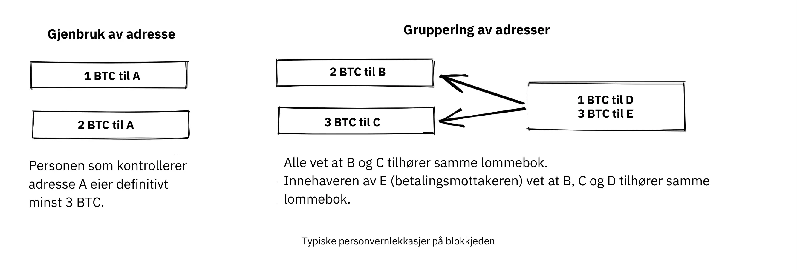


Chris Belcher [skrev svært detaljert](https://en.Bitcoin.it/Privacy#Blockchain_attacks_on_privacy) om de forskjellige typene personvernlekkasjer som kan skje på Bitcoin Blockchain. Vi anbefaler at du i det minste leser de første avsnittene under "Blockchain-angrep på personvernet"


Det vi kan lære av dette er at personvernet i Bitcoin ikke er perfekt. Det krever en betydelig mengde arbeid for å gjennomføre private transaksjoner. De fleste er ikke villige til å gå så langt for personvernet. Det ser ut til å være en klar avveining mellom personvern og brukervennlighet.


Et annet viktig aspekt ved personvern er at de tiltakene du gjør for å beskytte ditt eget personvern, også påvirker andre brukere. Hvis du slurver med ditt eget personvern, kan andre også oppleve redusert personvern. Gregory Maxwell forklarer dette veldig tydelig på den samme Bitcoin Talk-diskusjonen [som vi lenket til ovenfor](https://bitcointalk.org/index.php?topic=334316.msg3589252#msg3589252), og avslutter med et eksempel:


> Dette fungerer faktisk i praksis også... En hyggelig whitehat-hacker på IRC lekte seg med brainwallet cracking og traff en frase med ~ 250 BTC i den.  Vi klarte å identifisere eieren bare ut fra Address alene, fordi de hadde blitt betalt av en Bitcoin-tjeneste som gjenbrukte adresser, og han klarte å overtale dem til å oppgi brukerens kontaktinformasjon. Han fikk faktisk brukeren på telefonen, og de var sjokkerte og forvirret - men takknemlige for å slippe å miste pengene sine.  En lykkelig slutt der. (Dette er langt fra det eneste eksemplet, men det er et av de morsomste).

I dette tilfellet gikk alt bra takket være den filantropisk innstilte hackeren, men ikke regn med det neste gang.


### Ikke-Blockchain personvern


Selv om Blockchain er en beryktet kilde til personvernlekkasjer, finnes det mange andre lekkasjer som ikke bruker Blockchain, og noen er mer snikende enn andre. Disse spenner fra nøkkelloggere til analyse av nettverkstrafikk. For å lese om noen av disse metodene, se [Chris Belchers artikkel](https://en.Bitcoin.it/Privacy#Non-blockchain_attacks_on_privacy), spesielt avsnittet "Ikke-Blockchain-angrep på personvernet".


Belcher nevner blant annet muligheten for at noen snoker på internettforbindelsen din, for eksempel Internett-leverandøren din:


> Hvis motstanderen ser en transaksjon eller blokk som kommer ut av noden din, og som ikke har kommet inn tidligere, kan han eller hun med tilnærmet sikkerhet vite at transaksjonen ble utført av deg, eller at blokken ble utvunnet av deg. Ettersom internettforbindelser er involvert, vil motstanderen kunne koble IP Address med den oppdagede Bitcoin-informasjonen.

Blant de mest åpenbare personvernlekkasjene er imidlertid børser. På grunn av lover, vanligvis omtalt som KYC (Know Your Customer) og AML (Anti-Money Laundering), som gjelder i jurisdiksjonene de opererer i, må børser og relaterte selskaper ofte samle inn personopplysninger om brukerne sine, og bygge opp store databaser om hvilke brukere som eier hvilke bitcoins. Disse databasene er gode honningkrukker for onde myndigheter og kriminelle som alltid er på utkikk etter nye ofre. Det finnes faktiske markeder for denne typen data, der hackere

selge data til høystbydende.


I tillegg har selskapene som forvalter disse databasene, ofte liten erfaring med å beskytte finansielle data. Mange av dem er faktisk nystartede selskaper, og vi vet med sikkerhet at det allerede har forekommet flere lekkasjer. Noen få eksempler er

[India-baserte MobiQwik](https://bitcoinmagazine.com/business/probably-the-largest-kyc-data-leak-in-history-demonstrates-the-importance-of-Bitcoin-privacy) og [HubSpot](https://bitcoinmagazine.com/business/hubspot-security-breach-leaks-Bitcoin-users-data).


Igjen, det er Hard å beskytte data mot dette brede spekteret av angrep, og det er sannsynlig at du ikke vil være i stand til å gjøre det fullt ut. Du må velge den avveiningen mellom bekvemmelighet og personvern som fungerer best for deg.


### Soppbarhet


Soppbarhet betyr i valutasammenheng at en mynt kan byttes ut med en hvilken som helst annen mynt i samme valuta. Dette er morsomt

ordet ble kort berørt tidligere i kapittelet.


I artikkelen som omtales der, uttalte Gregory Maxwell (https://bitcointalk.org/index.php?topic=334316.msg3588908#msg3588908):


> Finansielt personvern er et viktig element for fungibilitet i Bitcoin: Hvis du meningsfullt kan skille en mynt fra en annen, er fungibiliteten deres svak. Hvis fungibiliteten vår er for svak i praksis, kan vi ikke være desentraliserte: Hvis noen viktige kunngjør en liste over stjålne mynter de ikke vil akseptere mynter avledet fra, må du nøye sjekke mynter du aksepterer mot den listen og returnere de som feiler.  Alle må sjekke svartelister utstedt av ulike myndigheter, for i en slik verden vil vi alle unngå å bli sittende fast med dårlige mynter. Dette øker friksjonen og transaksjonskostnadene, og gjør Bitcoin mindre verdifullt som betalingsmiddel.

Her snakker han om farene som følger av manglende fungibilitet. Anta at du har en [UTXO](https://planb.academy/resources/glossary/utxo). UTXOs historikk kan normalt spores flere hopp tilbake, og sprer seg ut til mange tidligere utganger. Hvis noen av disse utgangene var involvert i ulovlig, uønsket eller mistenkelig aktivitet, kan det hende at noen potensielle mottakere av mynten din avviser den. Hvis du tror at betalingsmottakerne dine vil verifisere myntene dine mot en sentralisert hvit- eller svartelistetjeneste, vil du kanskje begynne å sjekke myntene du mottar også, bare for å være på den sikre siden. Resultatet er at dårlig fungibilitet vil styrke enda dårligere fungibilitet.


Adam Back og Matt Corallo [holdt en presentasjon om fungibilitet](https://btctranscripts.com/scalingbitcoin/milan-2016/fungibility-overview/) på Scaling Bitcoin i Milano i 2016. De tenkte i de samme banene:


> Du trenger fungibilitet for at Bitcoin skal fungere. Hvis du mottar mynter og ikke kan bruke dem, begynner du å tvile på om du kan bruke dem. Hvis det er tvil om myntene du mottar, kommer folk til å gå til taint-tjenester og sjekke om "er disse myntene velsignet", og da kommer folk til å nekte å handle. Det dette gjør, er at Bitcoin går fra et desentralisert system uten tillatelse til et sentralisert system med tillatelse, der du har en "IOU" fra svartelisteleverandørene.

Det ser ut til at personvern og fungibilitet går hånd i hånd. Fungibiliteten vil svekkes hvis personvernet er svakt, for eksempel fordi mynter fra uønskede personer kan bli svartelistet. På samme måte vil personvernet svekkes hvis fungibiliteten er svak: Hvis det finnes en svarteliste, må du spørre svartelisteleverandørene om hvilke mynter som skal aksepteres, og dermed muligens avsløre din IP Address, e-post Address og annen sensitiv informasjon. Disse to funksjonene er så sammenvevd at det er Hard å snakke om noen av dem isolert.


### Tiltak for personvern


Det er utviklet flere teknikker for å hjelpe folk med å beskytte seg mot personvernlekkasjer. Blant de mest åpenbare er, som Nakamoto tidligere har nevnt, bruk av unike

adresser for hver transaksjon, men det finnes flere andre. Vi skal ikke lære deg hvordan du blir en personvernninja. Bitcoin Q+A har imidlertid en [rask oppsummering av personvernfremmende teknologier](https://bitcoiner.guide/privacytips/), noe ordnet etter hvor Hard de er å implementere. Når du leser den, vil du legge merke til at Bitcoin-personvern ofte har å gjøre med ting utenfor Bitcoin. Du bør for eksempel ikke skryte av bitcoinsene dine, og du bør bruke Tor og VPN.


Innlegget lister også opp noen tiltak som er direkte relatert til Bitcoin:


- Full node: Hvis du ikke bruker din egen Full node, vil du lekke mye informasjon om din Wallet til servere på internett. Å kjøre en Full node er et godt første skritt.
- Lightning Network: Det finnes flere protokoller på toppen av Bitcoin, for eksempel Lightning Network og Blockstreams Liquid Sidechain.
- CoinJoin: En måte for flere personer å slå sammen transaksjonene sine til én, noe som gjør det vanskeligere å gjøre kjedeanalyser.


I [et foredrag](https://btctranscripts.com/breaking-Bitcoin/2019/breaking-Bitcoin-privacy/) på Breaking Bitcoin-konferansen ga Chris Belcher et interessant praktisk eksempel på hvordan personvernet har blitt forbedret:


> De var et Bitcoin-kasino. Online gambling er ikke tillatt i USA. Alle kunder av Coinbase som satte inn penger direkte til Bustabit ville få kontoene sine stengt fordi Coinbase overvåket dette. Bustabit gjorde et par ting. De gjorde noe som kalles change avoidance, der du går gjennom og ser om du kan konstruere en transaksjon som ikke har noen endringsutgang. Dette sparer Miner-avgifter og hindrer også analyse.
>

> De importerte også sine mye brukte gjenbrukte innskuddsadresser til joinmarket. På dette tidspunktet ble coinbase.com-kunder aldri utestengt. Det ser ut til at Coinbases overvåkningstjeneste ikke var i stand til å gjøre analysen etter dette, så det er mulig å bryte disse algoritmene.

Han nevnte også dette eksemplet, blant andre, på [Privacy page](https://en.Bitcoin.it/Privacy) på Bitcoin-wikien.


Legg merke til hvordan bedre personvern kan oppnås ved å bygge systemer på toppen av Bitcoin, slik tilfellet er med Lightning Network:


Lag på toppen av Bitcoin kan gi økt personvern


I forrige kapittel skrev vi at behovet for tillit bare kan øke med flere lag på toppen, men det ser ikke ut til å være tilfelle for personvernet, som kan forbedres eller forverres vilkårlig i flere lag på toppen. Hvorfor er det slik? Enhver Layer på toppen av Bitcoin, som forklart i avsnittet om lagvis skalering i det fremtidige kapittelet Skalering, må bruke On-Chain-transaksjoner av og til, ellers ville det ikke være "på toppen av Bitcoin". Personvernforbedrende lag prøver generelt å bruke basis Layer så lite som mulig for å minimere mengden informasjon som avsløres.


Ovennevnte er noe tekniske måter å forbedre personvernet ditt på. Men det finnes også andre måter. I begynnelsen av dette kapittelet sa vi at Bitcoin er et pseudonymt system. Det betyr at brukere i Bitcoin ikke er kjent med sine virkelige navn eller andre personlige data, men med sine offentlige nøkler. En offentlig nøkkel er et pseudonym for en bruker, og en bruker kan ha flere pseudonymer. I en ideell verden er den personlige identiteten din frikoblet fra Bitcoin-pseudonymene dine. På grunn av personvernproblemene som er beskrevet i dette kapittelet, vil denne frikoblingen dessverre vanligvis forringes over tid.


For å redusere risikoen for at personopplysningene dine blir avslørt, bør du ikke gi dem fra deg i utgangspunktet, og du bør heller ikke gi dem til sentraliserte tjenester, som bygger opp store databaser som kan lekke. En artikkel av Bitcoin Q+A [forklarer KYC](https://bitcoiner.guide/nokyconly/) og farene som følger av det. Den foreslår også noen tiltak du kan gjøre for å forbedre situasjonen din:


> Heldigvis er det noen alternativer der ute for å kjøpe Bitcoin via ingen KYC-kilder. Disse er alle P2P (peer-to-peer)-børser der du handler direkte med en annen person og ikke en sentralisert tredjepart. Dessverre selger noen andre mynter i tillegg til Bitcoin, så vi oppfordrer deg til å være forsiktig.

Artikkelen foreslår at du unngår å bruke børser som krever KYC/AML, og i stedet handler privat eller bruker desentraliserte børser som [bisq](https://bisq.network/).


https://planb.academy/en/tutorials/exchange/peer-to-peer/bisq-fe244bfa-dcc4-4522-8ec7-92223373ed04

For mer inngående lesning om mottiltak, se den tidligere nevnte [wiki-artikkelen om personvern](https://en.Bitcoin.it/wiki/Privacy#Methods_for_improving_privacy_.28non-Blockchain.29), som starter på "Methods for improving privacy (non-Blockchain)".


### Konklusjon om personvern


Personvern er veldig viktig, men Hard er vanskelig å oppnå. Det finnes ingen mirakelkur for personvern.


For å få et anstendig personvern i Bitcoin må du iverksette aktive tiltak, hvorav noen er kostbare og tidkrevende.


## Endelig Supply

<chapterId>af125ba2-ef98-5905-8895-41a538fe5ea5</chapterId>


Dette kapittelet ser nærmere på Bitcoin Supply-grensen på 21 millioner BTC, eller hvor mye er den egentlig? Vi snakker om hvordan denne grensen håndheves, og hva man kan gjøre for å kontrollere at den respekteres. I tillegg tar vi en titt inn i krystallkulen og diskuterer dynamikken som vil oppstå når [Block reward](https://planb.academy/resources/glossary/block-reward) går fra å være subsidiebasert til å bli avgiftsbasert.


Den velkjente begrensede Supply på 21 millioner BTC anses som en grunnleggende egenskap ved Bitcoin. Men er det virkelig hugget i stein?


La oss begynne med å se på hva de nåværende konsensusreglene sier om Supply av Bitcoin, og hvor mye av den som faktisk vil være brukbar. Pieter Wuille skrev et stykke om dette [på Stack Exchange](https://Bitcoin.stackexchange.com/a/38998/69518), der han regnet ut hvor mange bitcoins det ville være når alle myntene er utvunnet:


> Hvis du summerer alle disse tallene sammen, får du 20999999.9769 BTC.

Men på grunn av en rekke årsaker - som tidlige problemer med [coinbase-transaksjoner](https://planb.academy/resources/glossary/coinbase-transaction), utvinnere som utilsiktet krever mindre enn tillatt, og tap av private nøkler - vil denne øvre grensen aldri bli nådd. Wuille konkluderer:


> Dette gir oss 20999817.31308491 BTC (tar alt opp til blokk 528333 i betraktning)

Imidlertid har ulike lommebøker blitt mistet eller stjålet, transaksjoner har blitt sendt til feil Address, og folk har glemt at de eide Bitcoin. Summen av dette kan godt være millioner. Folk har forsøkt å telle opp kjente tap [her](https://bitcointalk.org/index.php?topic=7253.0).


Da står vi igjen med..: ??? BTC.


Vi kan dermed være sikre på at Bitcoin Supply vil være 20999817.31308491 BTC på det meste. Eventuelle tapte eller uverifiserbart brente mynter vil gjøre dette tallet lavere, men vi vet ikke hvor mye. Det interessante er at det egentlig ikke spiller noen rolle, eller enda bedre, det spiller en positiv rolle for Bitcoin-innehavere,

[som forklart](https://bitcointalk.org/index.php?topic=198.msg1647#msg1647) av Satoshi Nakamoto:


> Tapte mynter gjør bare alle andres mynter litt mer verdt.  Se på det som en donasjon til alle.

Den begrensede Supply vil krympe, og dette bør, i hvert fall i teorien, føre til prisdeflasjon.


Viktigere enn det nøyaktige antallet mynter i omløp er måten Supply-grensen håndheves uten noen sentral myndighet. Alias chytrik uttrykker det godt på [Stack Exchange](https://Bitcoin.stackexchange.com/a/106830/69518):


> Så svaret er at du ikke trenger å stole på at noen ikke øker Supply. Du trenger bare å kjøre en kode som verifiserer at de ikke har gjort det.

Selv om noen fulle noder går over til den mørke siden og bestemmer seg for å akseptere blokker med coinbase-transaksjoner med høyere verdi, vil alle de gjenværende fulle nodene ganske enkelt ignorere dem og fortsette å gjøre forretninger som vanlig. Noen fullstendige noder kan, med eller uten vilje, kjøre onde programmer, men kollektivet vil likevel sikre Blockchain på en robust måte. Avslutningsvis kan du velge å stole på systemet uten å måtte stole på noen.


### Blokktilskudd og transaksjonsgebyrer


En Block reward består av [blokktilskuddet](https://planb.academy/resources/glossary/block-subsidy) pluss [transaksjonsgebyrer](https://planb.academy/resources/glossary/transaction-fees). Block reward må dekke Bitcoins sikkerhetskostnader. Vi kan med sikkerhet si at under dagens forhold med hensyn til blokksubsidier, transaksjonsgebyrer, Bitcoin-pris, [Mempool](https://planb.academy/resources/glossary/mempool)-størrelse, Hash-makt, grad av desentralisering osv. er insentivene for alle aktører til å følge reglene høye nok til å bevare et sikkert pengesystem.


Hva skjer når blokktilskuddet nærmer seg null? For å gjøre det enkelt, la oss anta at den faktisk er lik null. På dette tidspunktet dekkes systemets sikkerhetskostnader kun gjennom transaksjonsgebyrer. Hva fremtiden bringer når dette skjer, kan vi ikke vite. Usikkerhetsfaktorene er mange, og vi er overlatt til spekulasjoner. For eksempel er Paul Sztorcs bidrag til emnet [i hans Truthcoin-blogg](https://www.truthcoin.info/blog/security-budget/) for det meste spekulasjoner, men han har i det minste ett solid poeng (vær oppmerksom på at M2, som Sztorc refererer til, er en måling av fiat-penger Supply):


> Mens de to er blandet inn i det samme "sikkerhetsbudsjettet", er blokktilskuddet og txn-avgiftene helt og holdent forskjellige. De er like forskjellige fra hverandre som "VISAs totale overskudd i 2017" er fra "den totale økningen i M2 i 2017".

I dag er det eierne som betaler for sikkerheten (via pengeinflasjonen). I morgen er det de som bruker penger, som illustrert nedenfor, som på en eller annen måte må bære denne byrden.


Etter hvert som tiden går, vil sikkerhetskostnadene flyttes fra eierne til de som bruker pengene


Når transaksjonsgebyrer er hovedmotivasjonen for Mining, endres insentivene. Spesielt hvis Mempool til en Miner ikke inneholder nok transaksjonsgebyrer, kan det bli mer lønnsomt for den Miner å omskrive Bitcoins historie i stedet for å utvide den. Bitcoin Optech har en spesifikk [seksjon om denne atferden](https://bitcoinops.org/en/topics/fee-sniping/), kalt *[fee sniping](https://planb.academy/resources/glossary/fee-sniping)*, skrevet av David Harding:


> Gebyrsniping er et problem som kan oppstå etter hvert som Bitcoins subsidiering fortsetter å avta og transaksjonsgebyrer begynner å dominere Bitcoins blokkbelønning. Hvis transaksjonsgebyrer er alt som betyr noe, har en Miner med `x` prosent av Hash-raten en `x` prosent sjanse for Mining i neste blokk, så den forventede verdien for dem av ærlig Mining er `x` prosent av [beste mulige transaksjonssett](https://bitcoinops.org/en/newsletters/2021/06/02/#candidate-set-based-csb-block-template-construction) i deres Mempool.
>

> Alternativt kan en Miner på uærlig vis forsøke å re-mine den forrige blokken pluss en helt ny blokk for å forlenge kjeden. Denne atferden kalles fee sniping, og den uærlige Miners sjanse for å lykkes med dette hvis alle andre Miner er ærlige, er `(x/(1-x))^2`. Selv om gebyrsniping har en generelt lavere sannsynlighet for å lykkes enn ærlig Mining, kan det være mer lønnsomt å forsøke uærlig Mining hvis transaksjonene i den forrige blokken betalte betydelig høyere gebyr enn transaksjonene som for øyeblikket er i Mempool - en liten sjanse til et stort beløp kan være mer verdt enn en stor sjanse til et lite beløp.

Det som skygger for fremtidshåpene våre, er det faktum at hvis utvinnere begynner å snipe avgifter, vil dette gi andre insentiver til å gjøre det samme, slik at det blir enda færre ærlige utvinnere igjen. Dette kan svekke den generelle sikkerheten til Bitcoin alvorlig. Harding fortsetter med å liste opp noen få mottiltak som kan iverksettes, for eksempel å bruke transaksjonstidslåser for å begrense hvor i Blockchain transaksjonen kan vises.


Så gitt at konsensus om begrensede Supply opprettholdes, vil blokktilskuddet - takket være [BIP42](https://github.com/Bitcoin/bips/blob/master/bip-0042.mediawiki) som fikset en svært langsiktig inflasjonsfeil - bli null rundt år 2140. Vil transaksjonsgebyrene deretter være nok til å sikre nettverket?


Det er umulig å si, men vi vet et par ting:


- Et århundre er en *lang* tid sett fra Bitcoin-perspektivet. Hvis den fortsatt eksisterer, vil den sannsynligvis ha utviklet seg enormt.
- Hvis et overveldende økonomisk flertall finner det nødvendig å endre reglene og for eksempel innføre en evigvarende årlig inflasjon på 0,1 % eller 1 %, vil Supply av Bitcoin ikke lenger være endelig.
- Med null blokksubsidier og en tom eller nesten tom Mempool, kan det bli usikkert på grunn av avgiftssniping.


Siden overgangen til et Block reward med kun gebyrer ligger så langt frem i tid, kan det være lurt å ikke trekke forhastede konklusjoner og prøve å løse de potensielle problemene mens vi kan. Peter Todd mener for eksempel at det er en reell risiko for at sikkerhetsbudsjettet i Bitcoin ikke vil være tilstrekkelig i fremtiden, og argumenterer derfor for en liten evigvarende inflasjon i Bitcoin. Han mener imidlertid også at det ikke er en god idé å diskutere et slikt spørsmål på nåværende tidspunkt, som [han sa i podcasten What Bitcoin Did](https://www.whatbitcoindid.com/podcast/peter-todd-on-the-essence-of-Bitcoin):


> Men det er en risiko som ligger 10-20 år frem i tid. Det er veldig lang tid. Og hvem vet hva risikoen er da?

Kanskje vi kan tenke på Bitcoin som noe organisk. Forestill deg en liten, saktevoksende eikeplante. Forestill deg også at du aldri har sett et fullvoksent tre i hele ditt liv. Ville det ikke da være klokt å begrense kontrollproblemene dine i stedet for på forhånd å sette alle regler for hvordan denne planten skal få lov til å utvikle seg og vokse?


### Konklusjon om Finite Supply


Hvorvidt Bitcoin Supply vil vokse forbi 21 millioner kan vi ikke si i dag, og det er sannsynligvis ikke så ille. Det er avgjørende, men ikke presserende, å sørge for at sikkerhetsbudsjettet forblir høyt nok. La oss ta denne diskusjonen om 10-50 år, når vi vet mer. Hvis det fortsatt er relevant.


# Bitcoin Gouvernance

<partId>411bf53f-af4b-50f1-b71b-e40fe3ff64b7</partId>


## Oppgradering

<chapterId>3ffa84d1-adfa-5fbc-9b13-384ea783fcdd</chapterId>


Det kan være svært vanskelig å oppgradere Bitcoin på en sikker måte. Noen endringer tar flere år å rulle ut. I dette kapittelet lærer vi om det vanlige vokabularet rundt oppgradering av Bitcoin, og utforsker noen eksempler på historiske oppgraderinger av protokollen samt innsikten vi har fått fra dem. Til slutt snakker vi om kjedesplittinger og risikoen og kostnadene knyttet til dem.


For å komme i stemning til dette kapittelet bør du lese [David Hardings artikkel om harmoni og disharmoni](https://bitcointalk.org/dec/p1.html):


> Bitcoin Eksperter snakker ofte om konsensus, hvis betydning er abstrakt og Hard vanskelig å fastsette. Men ordet konsensus stammer fra det latinske ordet concentus, "en syngende harmoni", så la oss ikke snakke om Bitcoin konsensus, men om Bitcoin harmoni.
>

> Harmoni er det som får Bitcoin til å fungere. Tusenvis av komplette noder arbeider hver for seg for å verifisere at transaksjonene de mottar, er gyldige, noe som skaper en harmonisk enighet om tilstanden til Bitcoin Ledger uten at noen nodeoperatør trenger å stole på noen andre. Det kan sammenlignes med et kor der alle medlemmene synger den samme sangen samtidig og skaper noe langt vakrere enn noen av dem kunne ha gjort alene.
>

> Resultatet av Bitcoin-harmonien er et system der bitcoins ikke bare er trygge mot småtyver (forutsatt at du holder nøklene dine sikre), men også mot endeløs inflasjon, massekonfiskering eller målrettet konfiskering, eller rett og slett det byråkratiske moraset som det gamle finanssystemet er.

I dette kapittelet diskuterer vi hvordan Bitcoin kan oppgraderes uten å skape splid. Å holde seg i harmoni, dvs. å opprettholde konsensus, er faktisk en av de største utfordringene i Bitcoin-utviklingen. Det er mange nyanser i oppgraderingsmekanismene, og disse kan best forstås ved å studere faktiske tilfeller av tidligere oppgraderinger. Derfor fokuserer kapittelet mye på historiske eksempler, og det starter med å sette scenen med et nyttig vokabular.


### Ordforråd


Ifølge Wikipedia refererer [forward compatibility](https://en.wikipedia.org/wiki/Forward_compatibility) til tilstanden der en gammel programvare kan behandle data som er opprettet av nyere programvare, uten å ta hensyn til de delene den ikke forstår:


En standard støtter fremoverkompatibilitet hvis et produkt som overholder tidligere versjoner, kan behandle inndata som er utviklet for senere versjoner av standarden, og ignorere nye deler som det ikke forstår.


Omvendt refererer [bakoverkompatibilitet](https://en.wikipedia.org/wiki/Backward_compatibility) til når data fra en gammel programvare kan brukes på nyere programvare. En endring sies å være fullt kompatibel hvis den er både fremover- og bakoverkompatibel.


En endring av konsensusreglene i Bitcoin sies å være en *[Soft Fork](https://planb.academy/resources/glossary/soft-fork)* hvis den er fullt kompatibel. Dette er den vanligste måten å oppgradere Bitcoin på, av flere grunner som vi vil diskutere videre i dette kapittelet. Hvis en endring av Bitcoin-konsensusreglene er bakoverkompatibel, men ikke fremoverkompatibel, kalles den en *[Hard Fork](https://planb.academy/resources/glossary/hard-fork)*.


For en teknisk oversikt over Soft-gaffler og Hard-gaffler, kan du lese [kapittel 11 i Grokking Bitcoin](https://rosenbaum.se/book/grokking-Bitcoin-11.html). Det forklarer disse begrepene og går også inn på oppgraderingsmekanismene. Det anbefales, selv om det ikke er strengt tatt nødvendig, å sette seg inn i dette før du fortsetter å lese.


### Historiske oppgraderinger


Bitcoin er ikke den samme i dag som den var da Genesis-blokken ble opprettet. Det har blitt gjort flere oppgraderinger opp gjennom årene. I 2018 snakket Eric Lombrozo [på Breaking Bitcoin-konferansen](https://btctranscripts.com/breaking-Bitcoin/2017/changing-consensus-rules-without-breaking-Bitcoin/) om Bitcoins ulike oppgraderingsmekanismer, og påpekte hvor mye de har utviklet seg over tid. Han forklarte til og med hvordan Satoshi Nakamoto en gang oppgraderte Bitcoin gjennom en Hard Fork:


> Det var faktisk en Hard-Fork i Bitcoin som Satoshi gjorde at vi aldri ville gjort det på denne måten - det er en ganske dårlig måte å gjøre det på. Hvis du ser på git commit-beskrivelsen her [[757f076](https://github.com/Bitcoin/Bitcoin/commit/757f0769d8360ea043f469f3a35f6ec204740446)], sier han noe om reverted makefile.unix wx-config versjon 0.3.6. Det stemmer. Det er alt som står der. Det har ingen indikasjon på at den har en breaking change i det hele tatt. Han gjemte den rett og slett der inne. Han postet også [til bitcointalk](https://bitcointalk.org/index.php?topic=626.msg6451#msg6451) og sa: "Vennligst oppgrader til 0.3.6 ASAP. Vi fikset en implementeringsfeil der det er mulig at falske transaksjoner kan vises som akseptert. Ikke godta Bitcoin-betalinger før du oppgraderer til 0.3.6. Hvis du ikke kan oppgradere med en gang, vil det være best å slå av Bitcoin-noden din til du gjør det. Og så på toppen av det, jeg vet ikke hvorfor han bestemte seg for å gjøre dette også, han bestemte seg for å legge til noen optimaliseringer i samme kode. Fikse en feil og legge til noen optimaliseringer.

Han påpeker at denne Hard Fork, enten det var med vilje eller ikke, skapte muligheter for fremtidige Soft-forks, nemlig scriptoperatørene ([opkodene](https://planb.academy/resources/glossary/opcodes)) OP_NOP1-OP_NOP10. Vi skal se nærmere på denne kodeendringen i cve-2010-5141. Disse opkodene har blitt brukt i to Soft-forker så langt:


- [BIP65](https://github.com/Bitcoin/bips/blob/master/bip-0065.mediawiki) (OP_CHECKLOCKTIMEVERIFY)
- [BIP113](https://github.com/Bitcoin/bips/blob/master/bip-0112.mediawiki) (OP_SEQUENCEVERIFY).


Lombrozo gir også en oversikt over hvordan oppgraderingsmekanismene har utviklet seg gjennom årene, frem til 2017. Siden den gang har bare én annen større oppgradering, [Taproot](https://planb.academy/resources/glossary/taproot), blitt tatt i bruk. Den lange og noe kaotiske prosessen som førte til aktiveringen av Bitcoin, har hjulpet oss med å få ytterligere innsikt i oppgraderingsmekanismene i Bitcoin.


#### SegWit-oppgradering


Mens alle oppgraderingene før [SegWit](https://planb.academy/resources/glossary/segwit) hadde vært mer eller mindre smertefrie, var denne annerledes. Da SegWit-aktiveringskoden ble utgitt i oktober 2016, så det ut til å være overveldende støtte for den blant Bitcoin-brukere, men av en eller annen grunn signaliserte ikke gruvearbeiderne støtte for denne oppgraderingen, noe som gjorde at aktiveringen stoppet opp uten at det var noen løsning i sikte.


Aaron van Wirdum beskriver denne kronglete veien i sin artikkel i Bitcoin Magazine [The Long Road To SegWit](https://bitcoinmagazine.com/technical/the-long-road-to-SegWit-how-bitcoins-biggest-protocol-upgrade-became-reality). Han begynner med å forklare hva SegWit er, og hvordan det griper inn i debatten om blokkstørrelse. Deretter skisserer Van Wirdum hendelsesforløpet som førte til den endelige aktiveringen. I sentrum av denne prosessen var en oppgraderingsmekanisme kalt *brukeraktivert Soft Fork*, forkortet [UASF](https://planb.academy/resources/glossary/uasf), som ble foreslått av brukeren Shaolinfry:


> Shaolinfry foreslo et alternativ: en brukeraktivert Soft Fork (UASF). I stedet for Hash-kraftaktivering, ville en brukeraktivert Soft Fork ha en "'flaggdagsaktivering' der noder begynner håndhevelsen på et forhåndsbestemt tidspunkt i fremtiden." Så lenge en slik UASF håndheves av et økonomisk flertall, bør dette tvinge et flertall av utvinnerne til å følge (eller aktivere) Soft Fork.

Han siterer blant annet Shaolinfrys e-post til Bitcoin-dev-postlisten. Der argumenterte Shaolinfry [mot Miner-aktiverte Soft-gaffler](https://lists.linuxfoundation.org/pipermail/Bitcoin-dev/2017-February/013643.html), og listet opp en rekke problemer med dem:


> For det første krever det at man stoler på at Hash-kraften valideres etter aktivering.  BIP66 Soft Fork var et tilfelle der 95 % av Hashrate signaliserte at den var klar, men i virkeligheten validerte omtrent halvparten ikke de oppgraderte reglene og utvunnet en ugyldig blokk ved en feiltakelse.
>

> For det andre har Miner-signalering et naturlig veto som gjør det mulig for en liten prosentandel av Hashrate å nedlegge veto mot nodeaktivering av oppgraderingen for alle. Hittil har Soft-forker utnyttet det relativt sentraliserte Mining-landskapet der det er relativt få Mining-pooler som bygger gyldige blokker; etter hvert som vi beveger oss mot mer desentralisering av Hashrate, er det sannsynlig at vi vil lide mer og mer av "oppgraderingstreghet" som vil nedlegge veto mot de fleste oppgraderinger.

Shaolinfry gjorde også oppmerksom på en vanlig feiltolkning av Miner-signalering: Folk trodde generelt at det var et middel der utvinnere kunne bestemme protokolloppgraderinger, snarere enn en handling som bidro til å koordinere oppgraderinger. På grunn av denne misforståelsen kan utvinnere også ha følt seg forpliktet til å proklamere sitt syn på en bestemt Soft Fork offentlig, som om det ga forslaget tyngde.


UASF-forslaget er, i et nøtteskall, en "flaggdag" der noder begynner å håndheve spesifikke nye regler. På den måten trenger ikke utvinnere å gjøre en kollektiv innsats for å koordinere oppgraderingen, men *kan* utløse aktivering tidligere enn flaggdagen hvis nok blokker signaliserer støtte:


> Mitt forslag er å få det beste fra begge verdener. Siden en brukeraktivert Soft Fork trenger en relativt lang ledetid før aktivering, kan vi kombinere med BIP9 for å gi muligheten til en raskere Hash strømkoordinert aktivering eller aktivering innen flaggdagen, avhengig av hva som kommer først.
> I begge tilfeller kan vi utnytte advarselssystemene i BIP9. Endringen er relativt enkel: Vi legger til en parameter for aktiveringstid som gjør at BIP9-tilstanden går over til LOCKED_IN før utløpet av tidsavbruddet for BIP9-distribusjon.

Denne ideen vakte stor interesse, men det så ikke ut til å være tilnærmet enstemmig støtte, noe som skapte bekymring for en potensiell kjededeling. Artikkelen til Aaron van Wirdum forklarer hvordan dette til slutt ble løst takket være [BIP91](https://github.com/Bitcoin/bips/blob/master/bip-0091.mediawiki), forfattet av James Hilliard:


> Hilliard foreslo en litt kompleks, men smart løsning som ville gjøre alt kompatibelt: Segregert vitneaktivering som foreslått av Bitcoin Core-utviklingsteamet, BIP148 UASF og aktiveringsmekanismen i New York-avtalen. Hans BIP91 kunne holde Bitcoin hel - i det minste gjennom hele SegWit-aktiveringen.

Det var flere kompliserende faktorer involvert (f.eks. den såkalte "New York-avtalen"), som denne BIP måtte ta hensyn til. Vi oppfordrer deg til å lese Van Wirdums artikkel i sin helhet for å lære mer om de mange interessante detaljene i denne historien.


#### Diskusjon etter SegWit


Etter SegWit-distribusjonen oppstod det en diskusjon om distribusjonsmekanismer. Som Eric Lombrozo bemerket i [sitt foredrag på Breaking Bitcoin-konferansen](https://btctranscripts.com/breaking-Bitcoin/2017/changing-consensus-rules-without-breaking-Bitcoin/) og Shaolinfry, er ikke en Miner aktivert Soft Fork den ideelle oppgraderingsmekanismen:


> På et eller annet tidspunkt kommer vi sannsynligvis til å ønske å legge til flere funksjoner i Bitcoin-protokollen. Dette er et stort filosofisk spørsmål vi stiller oss selv. Skal vi lage en UASF for den neste? Hva med en hybrid tilnærming? Miner aktivert i seg selv er utelukket. bip9 kommer vi ikke til å bruke igjen.

I januar 2020 sendte Matt Corallo [en e-post](https://lists.linuxfoundation.org/pipermail/Bitcoin-dev/2020-January/017547.html) til e-postlisten Bitcoin-dev som startet en diskusjon om fremtidige mekanismer for distribusjon av Soft Fork. Han listet opp fem mål som han mente var essensielle i en oppgradering. David Harding [oppsummerer dem i et Bitcoin Optech-nyhetsbrev](https://bitcoinops.org/en/newsletters/2020/01/15/#discussion-of-Soft-Fork-activation-mechanisms) som:


> Muligheten til å avbryte hvis det oppstår alvorlige innvendinger mot de foreslåtte endringene i konsensusreglene . Tildeling av nok tid etter lanseringen av oppdatert programvare til å sikre at de fleste økonomiske noder er oppgradert for å håndheve disse reglene . Forventningen om at Hash-raten i nettverket vil være omtrent den samme før og etter endringen, samt i en eventuell overgangsperiode . Forebygging, så langt det er mulig, av opprettelse av blokker som er ugyldige i henhold til de nye reglene, noe som kan føre til falske bekreftelser i ikke-oppgraderte noder og SPV-klienter . Forsikring om at avbrytelsesmekanismene ikke kan misbrukes av "griefers" eller partisaner til å holde tilbake en allment ønsket oppgradering uten kjente problemer

Det Corallo foreslår, er en kombinasjon av en Miner-aktivert Soft Fork og en brukeraktivert Soft Fork:


> Som noe litt mer konkret tror jeg derfor at en aktiveringsmetode som setter riktig presedens og tar hensyn til de ovennevnte målene, ville være:
>

> 1) en standard BIP 9-distribusjon med en tidshorisont på ett år for
aktivering med 95 % Miner-beredskap, +

> 2) i tilfelle ingen aktivering skjer innen et år, en seks måneders
en stille periode der samfunnet kan analysere og diskutere

årsakene til manglende aktivering og

> 3) i tilfelle det gir mening, vil en enkel kommandolinje/Bitcoin.conf-parameter som har vært støttet siden den opprinnelige distribusjonsutgivelsen, gjøre det mulig for brukere å velge en BIP 8-distribusjon med en 24-måneders tidshorisont for aktivering av flaggdagen (samt en ny Bitcoin Core-utgivelse som aktiverer flagget universelt).
>

> Dette gir en svært lang tidshorisont for mer standard aktivering, samtidig som målene i punkt 5 oppfylles, selv om tidshorisonten i slike tilfeller må forlenges betydelig for å oppfylle målene i punkt 3. Utviklingen av Bitcoin er ikke et kappløp. Hvis vi må vente i 42 måneder, sikrer vi at vi ikke skaper en negativ presedens som vi vil komme til å angre på etter hvert som Bitcoin fortsetter å vokse.

#### Taproot-oppgradering - hurtigprosess


Da Taproot var klar til å tas i bruk i oktober 2020, det vil si at alle de tekniske detaljene rundt konsensusreglene var implementert og hadde fått bred tilslutning i samfunnet, begynte diskusjonene om hvordan den faktisk skulle tas i bruk å ta fart. Disse diskusjonene hadde frem til da vært ganske lavmælte.


Mange forslag til aktiveringsmekanismer begynte å svirre rundt, og David Harding

[oppsummert på Bitcoin Wiki](https://en.Bitcoin.it/wiki/Taproot_activation_proposals). I artikkelen forklarte han noen egenskaper ved BIP8, som på det tidspunktet hadde gjennomgått noen endringer for å gjøre den mer fleksibel.


> Når dette dokumentet skrives, er [BIP8](https://github.com/Bitcoin/bips/blob/master/bip-0008.mediawiki) utarbeidet basert på erfaringene fra 2017. En bemerkelsesverdig endring etter BIP 9+148 er at tvungen aktivering nå er basert på blokkhøyde i stedet for median tid som har gått; en annen bemerkelsesverdig endring er at tvungen aktivering er en boolsk parameter som velges når en Soft Forks aktiveringsparametere settes enten for den første distribusjonen eller oppdateres i en senere distribusjon.

BIP8 uten tvungen aktivering er svært lik [BIP9](https://github.com/Bitcoin/bips/blob/master/bip-0009.mediawiki) versjon bits med tidsavbrudd og forsinkelse, med den eneste vesentlige forskjellen at BIP8 bruker blokkhøyder sammenlignet med BIP9s bruk av median tid som er gått. Denne innstillingen gjør at forsøket mislykkes (men det kan forsøkes på nytt senere).


BIP8 med tvungen aktivering avsluttes med en obligatorisk signaleringsperiode der alle blokker som produseres i samsvar med reglene, må signalisere at de er klare for Soft Fork på en måte som vil utløse aktivering i en tidligere distribusjon av samme Soft Fork med ikke-obligatorisk aktivering. Med andre ord, hvis nodeversjon x lanseres uten tvungen aktivering, og det senere lanseres versjon y som tvinger utvinnere til å begynne å signalisere beredskap innen samme tidsperiode, vil begge versjonene begynne å håndheve de nye konsensusreglene samtidig.


Denne fleksibiliteten i det reviderte BIP8-forslaget gjør det mulig å uttrykke en del andre ideer i form av hvordan de ville sett ut ved hjelp av BIP8. Dette gir en felles faktor som kan brukes til å kategorisere mange ulike forslag.


Fra dette tidspunktet ble diskusjonene svært opphetede, spesielt rundt hvorvidt `lockinontimeout` skulle være `true` (som i en brukeraktivert Soft Fork, omtalt som "BIP8 med tvungen aktivering" av Harding) eller `false` (som i en Miner-aktivert Soft Fork, omtalt som "BIP8 uten tvungen aktivering" av Harding).


Blant forslagene som ble listet opp, var det ett med tittelen "La oss se hva som skjer". Av en eller annen grunn fikk ikke dette forslaget særlig gjennomslag før syv måneder senere.


I løpet av disse syv månedene pågikk diskusjonen, og det virket som om det ikke var mulig å oppnå bred enighet om hvilken distribusjonsmekanisme som skulle brukes. Det var hovedsakelig to leire: en som foretrakk `lockinontimeout=true` (UASF-folket) og en som foretrakk `lockinontimeout=false` ("prøv, og hvis det mislykkes, tenk på nytt"-folket). Siden det ikke var noen overveldende støtte for noen av disse alternativene, gikk debatten i sirkler uten at det så ut til å være noen vei videre. Noen av disse diskusjonene ble holdt på IRC, i en kanal kalt ##Taproot-activation, men [den 5. mars 2021](https://gnusha.org/Taproot-activation/2021-03-05.log), skjedde det noe:


```
06:42 < harding> roconnor: is somebody proposing BIP8(3m, false)?  I mentioned that the other day but I didn't see any responses.
[...]
06:43 < willcl_ark_> Amusingly, I was just thinking to myself that, vs this, the SegWit activation was actually pretty straightforward: simply a LOT=false and if it fails a UASF.
06:43 < maybehuman> it's funny, "let's see what happens" (i.e. false, 3m) was a poular choice right at the beginning of this channel iirc
06:44 < roconnor> harding: I think I am.  I don't know how much that is worth.  Mostly I think it would be a widely acceptable configuration based on my understanding of everyone's concerns.
06:44 < willcl_ark_> maybehuman: becuase everybody actually wants this, even miners reckoned they could upgrade in about two weeks (or at least f2pool said that)
06:44 < roconnor> harding: BIP8(3m,false) with an extended lockin-period.
06:45 < harding> roconnor: oh, good.  It's been my favorite option since I first summarized the options on the wiki like seven months ago.
06:45 <@michaelfolkson> UASF wouldn't release (true,3m) but yeah Core could release (false, 3m)
06:45 < willcl_ark_> harding: It certainly seems like a good approach to me. _if_ that fails, then you can try an understand why, without wasting too much time
```


"La oss se hva som skjer"-tilnærmingen så endelig ut til å slå an i folks bevissthet. Denne prosessen skulle senere få betegnelsen "Speedy Trial" på grunn av den korte signalperioden. David Harding forklarer denne ideen for et bredere publikum i en

[e-post til e-postlisten Bitcoin-dev](https://lists.linuxfoundation.org/pipermail/Bitcoin-dev/2021-March/018583.html):

> Den tidligere versjonen av dette forslaget ble dokumentert for over 200 dager siden, og den underliggende koden til Taproot ble slått sammen med Bitcoin Core for over 140 dager siden. Hvis vi hadde startet Speedy Trial på det tidspunktet Taproot ble slått sammen (noe som er litt urealistisk), ville vi enten ha vært mindre enn to måneder unna å ha Taproot, eller vi ville ha gått videre til neste aktiveringsforsøk for over en måned siden.
>

> I stedet har vi debattert lenge og ser ikke ut til å være noe nærmere det jeg tror er en allment akseptabel løsning enn da e-postlisten begynte å diskutere aktiveringsordninger etter SegWit for over et år siden. Jeg tror Speedy Trial er en måte å generate gjøre raske fremskritt på som enten vil avslutte debatten (for nå, hvis aktiveringen er vellykket) eller gi oss noen faktiske data som vi kan basere fremtidige Taproot aktiveringsforslag på.

Denne distribusjonsmekanismen ble raffinert i løpet av to måneder og deretter utgitt i [Bitcoin Core versjon 0.21.1](https://github.com/Bitcoin/Bitcoin/blob/master/doc/release-notes/release-notes-0.21.1.md#Taproot-Soft-Fork). Utvinnerne begynte raskt å signalisere for denne oppgraderingen ved å flytte distribusjonsstatusen til `LOCKED_IN`, og etter en gratisperiode ble Taproot-reglene aktivert i midten av november 2021 i blokk [709632](https://Mempool.space/block/0000000000000000000687bca986194dc2c1f949318629b44bb54ec0a94d8244).


#### Fremtidige distribusjonsmekanismer


Med tanke på problemene med de siste Soft-gafflene, SegWit og Taproot, er det ikke klart hvordan den neste oppgraderingen vil bli distribuert. Speedy Trial ble brukt til å distribuere Taproot, men det ble brukt for å bygge bro over kløften mellom UASF og MASF-massene, ikke fordi det har vist seg å være den best kjente distribusjonsmekanismen.


### Risikoer


Under aktiveringen av en Fork, enten det er Hard eller Soft, Miner aktivert eller brukeraktivert, er det risiko for en langvarig kjededeling. En splitt som varer i mer enn noen få kvartaler, kan forårsake alvorlig skade på stemningen rundt Bitcoin så vel som på prisen. Men fremfor alt vil det skape stor forvirring om hva Bitcoin er. Er Bitcoin denne kjeden eller den kjeden?


Risikoen med et brukeraktivert Soft Fork er at de nye reglene blir aktivert selv om majoriteten av Hash-kraften ikke støtter dem. Dette scenariet vil resultere i en langvarig kjededeling, som vil vedvare helt til majoriteten av Hash-kraften vedtar de nye reglene. Det kan være spesielt Hard å insentivere utvinnere til å bytte til den nye kjeden hvis de allerede hadde utvunnet blokker etter splittelsen på den gamle kjeden, fordi de ved å bytte gren ville forlate sine egne blokkbelønninger. Det er imidlertid verdt å nevne en bemerkelsesverdig episode: I mars 2013 oppstod det en langvarig splitt på grunn av en utilsiktet Hard Fork, og i strid med dette insentivet bestemte to store Mining-bassenger seg for å forlate sin del av splitten for å gjenopprette konsensus.


På den annen side er risikoen med en Miner aktivert Soft Fork en konsekvens av at utvinnere kan drive med falsk signalering, noe som betyr at den faktiske andelen av Hash-kraften som støtter endringen, kan være mindre enn den ser ut til. Hvis den faktiske støtten ikke utgjør et flertall av Hash-kraften, vil vi sannsynligvis se en langvarig kjededeling som ligner på den som er beskrevet i forrige avsnitt. Dette, eller i det minste et lignende problem, har skjedd i virkeligheten da BIP66 ble utplassert, men det ble løst innen 6 blokker eller så.


#### Kostnader ved en splitt


Jimmy Song [snakket om kostnadene forbundet med Hard-gafler](https://btctranscripts.com/breaking-Bitcoin/2017/socialized-costs-of-Hard-forks/) på Breaking Bitcoin i Paris, men mye av det han sa gjelder også for en kjededeling på grunn av en mislykket Soft Fork. Han snakket om *negative eksternaliteter*, og definerte dem som prisen noen andre må betale for dine egne handlinger:


> Det klassiske eksempelet på en negativ eksternalitet er en fabrikk. Kanskje er det et oljeraffineri som produserer en vare som er bra for økonomien, men de produserer også noe som er en negativ eksternalitet, for eksempel forurensning. Det er ikke bare noe som alle må betale for, rydde opp i eller lide under. Men det er også 2. og 3. ordens effekter, som mer trafikk mot fabrikken som et resultat av at flere arbeidere må dit. Det kan også hende at dyrelivet i området blir truet. Det er ikke slik at alle må betale for de negative eksternalitetene, men det kan være spesifikke personer, som folk som tidligere brukte veien eller dyr som var i nærheten av fabrikken, og de betaler også for kostnadene ved fabrikken.

I forbindelse med Bitcoin eksemplifiserer han negative eksternaliteter ved hjelp av Bitcoin Cash (bcash), som er en Hard Fork av Bitcoin som ble opprettet kort tid før konferansen i 2017. Han kategoriserer de negative eksternalitetene til en Hard Fork i engangskostnader og permanente kostnader.


Blant de mange eksemplene på engangskostnader nevner han de som påløper i forbindelse med børser:


> Så vi har en rekke børser, og de hadde mange engangskostnader som de måtte betale. Det første som skjedde var at innskudd og uttak måtte stoppes i en dag eller to for disse børsene fordi de ikke visste hva som ville skje. Mange av disse børsene måtte ta av Cold-lageret fordi brukerne deres krevde bcash. Det er en del av deres fidicuiary plikt, de må gjøre det. Du må også revidere den nye programvaren. Dette er noe vi måtte gjøre hos Itbit. Vi vil bruke kontanter - hvordan gjør vi det? Må vi laste ned electron cash? Har den skadelig programvare? Vi må gå og revidere det. Vi hadde ti dager på å finne ut om dette var greit eller ikke. Og så må du bestemme deg for om vi bare skal tillate et engangsuttak, eller om vi skal liste denne nye mynten For en Exchange er det ikke lett å liste en ny mynt - det er alle slags nye prosedyrer for lagring, signering, innskudd og uttak av Cold. Eller så kan du bare ha en engangshendelse der du gir dem pengene deres på et tidspunkt, og så tenker du aldri på det igjen. Men det har også sine problemer. Og til slutt, og uansett hvordan du gjør det, uttak eller notering - du kommer til å trenge ny infrastruktur for å jobbe med denne token på en eller annen måte, selv om det er et engangsuttak. Du trenger en måte å gi disse tokens til brukerne dine på. Igjen, med kort varsel. Ikke sant? Ingen tid til å gjøre dette, det må gjøres raskt.

Han lister også opp engangskostnadene som påløper for kjøpmenn, betalingsbehandlere, lommebøker, utvinnere og brukere, samt noen av de permanente kostnadene, for eksempel tap av personvern og høyere risiko for reorgs.


Når en splitt skjer og kjeden med de mest generelle reglene blir sterkere enn kjeden med de strengeste reglene, vil det faktisk skje en reorganisering. Dette vil ha en alvorlig innvirkning på alle transaksjoner som utføres i den utslettede grenen. Av disse grunnene er det veldig viktig å prøve å unngå kjededelinger til enhver tid.


### Konklusjon om oppgradering


Bitcoin vokser og utvikler seg med tiden. Ulike oppgraderingsmekanismer har blitt brukt i årenes løp, og læringskurven er bratt. Etter hvert som vi lærer mer om hvordan nettverket reagerer, utvikles stadig mer sofistikerte og robuste metoder.


For å holde Bitcoin i harmoni har Soft-gaffler vist seg å være veien å gå, men det store spørsmålet er fortsatt ikke helt besvart: Hvordan distribuerer vi Soft-gaffler på en trygg måte uten å skape splid?


## Motstridende tenkning

<chapterId>d4982f3d-4694-51cc-99be-28f54b03a2a2</chapterId>


Dette kapittelet tar for seg *kontradisjonell tenkning*, et tankesett som fokuserer på hva som kan gå galt og hvordan motstandere kan handle. Vi begynner med å diskutere Bitcoins sikkerhetsforutsetninger og sikkerhetsmodell, og deretter forklarer vi hvordan vanlige brukere kan forbedre sin egen suverenitet og Bitcoins Full node-desentralisering ved å tenke kontradiktorisk. Deretter ser vi på noen faktiske trusler mot Bitcoin og på hvordan motstanderen tenker. Til slutt snakker vi om *motstandens aksiom*, som kan hjelpe deg å forstå hvorfor folk jobber med Bitcoin i utgangspunktet.


Når man diskuterer sikkerhet i ulike systemer, er det viktig å forstå hvilke sikkerhetsforutsetninger som ligger til grunn. En typisk sikkerhetsforutsetning i Bitcoin er at "det [diskrete logaritmeproblemet](https://planb.academy/resources/glossary/discrete-logarithm) er Hard umulig å løse", noe som enkelt sagt betyr at det er praktisk talt umulig å finne en [privat nøkkel](https://planb.academy/resources/glossary/private-key) som tilsvarer en bestemt [offentlig nøkkel](https://planb.academy/resources/glossary/public-key). En annen ganske sterk sikkerhetsforutsetning er at et flertall av nettverkets hashpower er ærlige, noe som betyr at de følger reglene. Hvis disse antagelsene viser seg å være feil, er Bitcoin i trøbbel.


I 2015 holdt Andrew Poelstra [et foredrag](https://btctranscripts.com/scalingbitcoin/hong-kong-2015/security-assumptions/) på Scaling Bitcoin-konferansen i Hong Kong, der han analyserte Bitcoins sikkerhetsforutsetninger. Han starter med å legge merke til at mange systemer til en viss grad ser bort fra motstandere; for eksempel er det egentlig Hard å beskytte en bygning mot alle typer uønskede hendelser. I stedet aksepterer vi generelt muligheten for at noen kan brenne ned bygningen, og til en viss grad forhindre dette og annen fiendtlig atferd gjennom rettshåndhevelse osv.


Se Greg Maxwells analogi av bygningen:


Men på nettet er det annerledes:


> Men på nettet har vi ikke dette. Vi har pseudonym og anonym atferd, og hvem som helst kan koble seg til alle og skade systemet. Hvis det er mulig å skade systemet, vil de gjøre det. Vi kan ikke gå ut fra at de vil være synlige og at de vil bli tatt.

Konsekvensen er at alle kjente svakheter i Bitcoin på en eller annen måte må tas hånd om, ellers vil de bli utnyttet. Bitcoin er tross alt den største honningkrukken i verden.


Poelstra fortsetter med å nevne at Bitcoin er en ny type system; det er mer diffust enn for eksempel en signeringsprotokoll, som har veldig klare sikkerhetsforutsetninger.


På sin personlige blogg har programvareingeniøren Jameson Lopp [dykket ned i dette](https://blog.lopp.net/bitcoins-security-model-a-deep-dive/):


> I realiteten ble og blir Bitcoin-protokollen bygget uten en formelt definert spesifikasjon eller sikkerhetsmodell. Det beste vi kan gjøre, er å studere insentivene og atferden til aktørene i systemet for å forstå og forsøke å beskrive det bedre.

Vi har altså et system som ser ut til å fungere i praksis, men som vi ikke formelt kan bevise at er sikkert. Et bevis er sannsynligvis ikke mulig på grunn av

kompleksiteten i selve systemet.


### Ikke bare for Bitcoin-eksperter


Betydningen av kontradiktorisk tenkning strekker seg også til en viss grad til vanlige Bitcoin-brukere, ikke bare til hardcore Bitcoin-utviklere og -eksperter. Ragnar Lifthasir nevner i en [tweetstorm](https://bitcoinwords.github.io/tweetstorm-on-adversarial-thinking) hvordan forenklede narrativer rundt Bitcoin - for eksempel "bare [HODL](https://planb.academy/resources/glossary/hodl)" - kan være nedverdigende for Bitcoin i seg selv, og avslutter med å si


> For å gjøre Bitcoin og oss selv sterkere må vi tenke som programvareingeniørene som bidrar til Bitcoin. De fagfellevurderer og leter nådeløst etter feil. På sine tekniske arrangementer snakker de om alle mulige måter et forslag kan mislykkes på. De tenker kontradiktorisk. De er konservative

Han kaller disse forenklede narrativene for monomanier. Med denne definisjonen sier han at ved å fokusere på én enkelt ting - for eksempel "bare HODL" - risikerer du å overse det som uten tvil er viktigere, for eksempel å holde Bitcoin sikker eller gjøre ditt beste for å bruke Bitcoin på en Trustless-måte.


### Trusler


Det er mange kjente svakheter i Bitcoin, og mange av dem blir aktivt utnyttet. For å få et glimt av det, ta en titt på [Weaknesses page](https://en.Bitcoin.it/wiki/Weaknesses) på Bitcoin wiki. Der nevnes en lang rekke problemer, for eksempel

Wallet tyveri og tjenestenektangrep:


> Hvis en angriper forsøker å fylle nettverket med klienter som de kontrollerer, er det svært sannsynlig at du bare kobler deg til angriperens noder. Selv om Bitcoin aldri bruker antall noder til noe som helst, kan det å isolere en node fullstendig fra det ærlige nettverket være nyttig i utførelsen av andre angrep.

Denne typen angrep kalles *[Sybil-angrep](https://planb.academy/resources/glossary/sybil-attack)*, og det oppstår når en enkelt enhet kontrollerer flere [noder](https://planb.academy/resources/glossary/node) i et nettverk og bruker dem til å fremstå som flere enheter.


Som sitatet også nevner, er Sybil-angrepet ikke effektivt på Bitcoin-nettverket fordi det ikke stemmes gjennom noder eller andre tellbare enheter, men snarere gjennom datakraft. Denne flate strukturen gjør likevel systemet utsatt for andre angrep. Bitcoin-wikisiden beskriver også andre mulige angrep, for eksempel skjuling av informasjon (ofte omtalt som *[eclipse-angrep](https://planb.academy/resources/glossary/eclipse-attack)*), og hvordan [Bitcoin Core](https://planb.academy/resources/glossary/bitcoin-core) implementerer noen heuristiske mottiltak mot slike angrep.


Ovennevnte er eksempler på reelle trusler som må tas hånd om.


### Enkelt sabotasjefelt


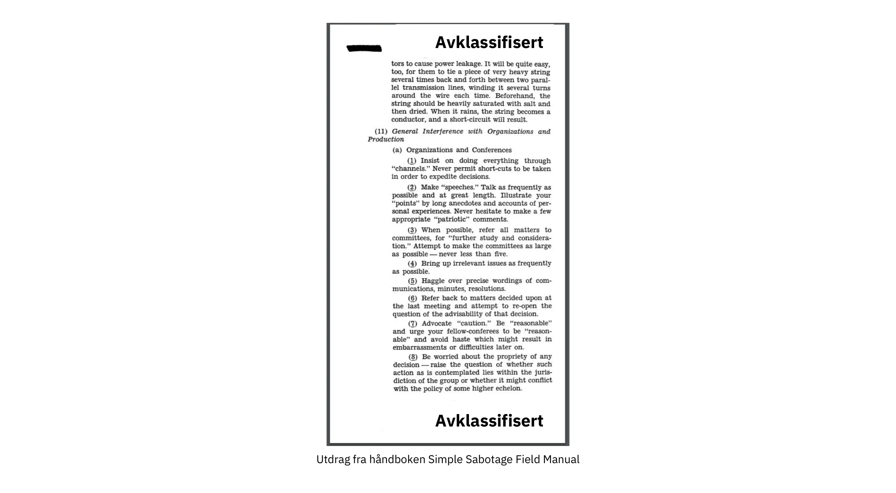


For å bedre forstå hvordan motstanderen tenker, kan det være nyttig å få et innblikk i hvordan de opererer. Et amerikansk regjeringsorgan ved navn Office of Strategic Services, som opererte under andre verdenskrig og blant annet hadde som formål å drive spionasje, utføre sabotasje og spre propaganda, produserte en [manual](https://www.gutenberg.org/ebooks/26184) for sine ansatte om hvordan de skulle sabotere fienden på riktig måte. Tittelen var "Simple Sabotage Field Manual" og inneholdt konkrete tips om hvordan man kunne infiltrere fienden for å gjøre livet deres Hard. Tipsene spenner fra å brenne ned lagerbygninger til å forårsake slitasje på øvelser for å redusere fiendens

effektivitet.


For eksempel er det et avsnitt om hvordan en infiltratør kan forstyrre organisasjoner. Det er ikke Hard vanskelig å se hvordan en slik taktikk kan brukes til å angripe Bitcoin utviklingsprosessen, som er åpen for alle å delta i. En dedikert angriper kan forsinke fremdriften ved å komme med endeløse bekymringer om irrelevante spørsmål, krangle om presise formuleringer og forsøke å gjenta diskusjoner som allerede har blitt grundig behandlet. Angriperen kan også leie inn en trollhær for å mangedoble sin egen effektivitet; vi kan kalle dette et sosialt Sybil-angrep. Ved hjelp av et sosialt Sybil-angrep kan de få det til å se ut som om det er mer motstand mot en foreslått endring enn det faktisk er.


Dette viser hvordan en besluttsom stat kan og vil gjøre alt som står i dens makt for å ødelegge fienden, inkludert å bryte den ned fra innsiden. Siden Bitcoin er en form for penger som konkurrerer med etablerte [fiat-valutaer](https://planb.academy/resources/glossary/fiat), er det stor sjanse for at stater vil se på Bitcoin som en fiende.


### Motstandens aksiom


Eric Voskuil [skriver på wikisiden Cryptoeconomics](https://github.com/libbitcoin/libbitcoin-system/wiki/Axiom-of-Resistance) om det han kaller "motstandens aksiom":


> Med andre ord er det en antakelse om at det er mulig for et system å motstå statlig kontroll. Dette er ikke akseptert som et faktum, men anses som en rimelig antakelse, på grunn av empiriske studier av oppførselen til lignende systemer, som man kan basere systemet på.
>

> Den som ikke aksepterer aksiomet om motstand, betrakter et helt annet system enn Bitcoin. Hvis man antar at det ikke er mulig for et system å motstå statlig kontroll, gir ikke konklusjonene mening i Bitcoin-sammenheng - akkurat som konklusjoner i sfærisk geometri strider mot euklidsk. Hvordan kan Bitcoin være tillatelsesløs eller sensurresistent uten aksiomet? Selvmotsigelsen fører til at man gjør åpenbare feil i et forsøk på å rasjonalisere konflikten.


Det han egentlig sier, er at det bare er når man antar at det er mulig å skape et system som stater ikke kan kontrollere, at det er meningsfylt å prøve.


Dette betyr at for å jobbe med Bitcoin bør du akseptere aksiomet om motstand, ellers bør du heller bruke tiden din på andre prosjekter. Ved å anerkjenne dette aksiomet kan du fokusere utviklingsinnsatsen på de virkelige problemene: koding rundt motstandere på statsnivå. Med andre ord, tenk kontradiktorisk.


### Konklusjon om motstridende tenkning


Et desentralisert system kan ikke ha ansvar utenfor selve systemet, og Bitcoin må derfor forhindre ondsinnet atferd på en strengere måte enn tradisjonelle systemer. I et slikt system er det viktig å tenke kontradiktorisk.


For å beskytte Bitcoin må man kjenne fiendene og deres insentiver. De fleste truslene ser ut til å koker ned til nasjonalstater, som har enorm økonomisk makt gjennom beskatning og pengetrykking. De vil sannsynligvis ikke gi fra seg sine privilegier til å trykke penger uten videre.


## Åpen kildekode

<chapterId>427a160c-f893-5b2c-afba-7b24e71ba899</chapterId>


Bitcoin er bygget ved hjelp av programvare med åpen kildekode. I dette kapittelet analyserer vi hva dette innebærer, hvordan vedlikehold av programvaren fungerer, og hvordan åpen kildekode i Bitcoin muliggjør utvikling uten tillatelse. Vi dypper tærne i *[valgkryptografi](https://planb.academy/resources/glossary/cryptography)*, som handler om valg og bruk av biblioteker i kryptografiske systemer. Kapittelet inneholder et avsnitt om Bitcoins vurderingsprosess, etterfulgt av et annet om hvordan Bitcoin-utviklere får finansiering. Den siste delen handler om hvordan Bitcoins åpen kildekode-kultur kan se veldig rar ut fra utsiden, og hvorfor denne oppfattede rarheten egentlig er et sunnhetstegn.


De fleste Bitcoin-programvarene, og spesielt Bitcoin Core, er åpen kildekode. Dette betyr at kildekoden til programvaren er gjort tilgjengelig for allmennheten, slik at den kan granskes, modifiseres og redistribueres. Definisjonen av åpen kildekode på [](https://opensource.org/osd) inkluderer blant annet følgende viktige punkter:


> Fri videredistribusjon: Lisensen skal ikke begrense noen part fra å selge eller gi bort programvaren som en del av en samlet programvaredistribusjon som inneholder programmer fra flere forskjellige kilder. Lisensen skal ikke kreve royalty eller annen avgift for slikt salg.
>

> Kildekode: Programmet må inneholde kildekode, og må kunne distribueres både i kildekode og i kompilert form. Hvis en eller annen form av et produkt ikke distribueres med kildekode, må det finnes en godt publisert måte å få tak i kildekoden på som ikke koster mer enn en rimelig reproduksjonskostnad, fortrinnsvis gratis nedlasting via Internett. Kildekoden må være den foretrukne formen som en programmerer ville modifisert programmet i. Bevisst tilslørt kildekode er ikke tillatt. Mellomformer, som for eksempel utdata fra en preprosessor eller oversetter, er ikke tillatt.
>

> Avledede verk: Lisensen må tillate modifikasjoner og avledede verk, og må tillate at de distribueres under de samme vilkårene som lisensen for den opprinnelige programvaren.

Bitcoin Core overholder denne definisjonen ved å bli distribuert under [MIT License](https://github.com/Bitcoin/Bitcoin/blob/master/COPYING):


```
MIT-lisensen (MIT)

Copyright (c) 2009-2022 Bitcoin Core-utviklerne
Copyright (c) 2009-2022 Bitcoin-utviklere

Herved gis tillatelse, uten kostnad, til enhver person som får en kopi av denne programvaren og tilhørende dokumentasjonsfiler ("Programvaren"), til å håndtere Programvaren uten begrensning, inkludert uten begrensning rettighetene til å bruke, kopiere, modifisere, slå sammen, publisere, distribuere, underlisensiere og/eller selge kopier av Programvaren, og å tillate personer som Programvaren leveres til å gjøre det samme, under følgende betingelser:

Ovennevnte opphavsrettsvarsel og dette tillatelsesvarsel skal inkluderes i alle kopier eller vesentlige deler av Programvaren.
```


Som nevnt i kapittelet "Ikke stol på, verifiser", er det viktig for brukerne å kunne verifisere at Bitcoin-programvaren de kjører, "fungerer som annonsert". For å kunne gjøre det må de ha ubegrenset tilgang til kildekoden til programvaren de ønsker å verifisere.


I de kommende avsnittene dykker vi ned i noen andre interessante aspekter ved programvare med åpen kildekode i Bitcoin.


### Vedlikehold av programvare


Bitcoin Core-kildekoden vedlikeholdes i et [Git](https://planb.academy/resources/glossary/git)-repository på [GitHub](https://github.com/Bitcoin/Bitcoin). Hvem som helst kan klone dette depotet uten å be om tillatelse, og deretter inspisere, bygge eller gjøre endringer i det lokalt. Dette betyr at det finnes mange tusen kopier av repositoriet spredt over hele verden. Alle disse er kopier av det samme depotet, så hva er det som gjør dette spesifikke GitHub Bitcoin Core-depotet så spesielt? Teknisk sett er det ikke spesielt i det hele tatt, men sosialt sett har det blitt midtpunktet for Bitcoin-utviklingen.


Bitcoin og sikkerhetsekspert Jameson Lopp forklarer dette veldig godt i et [blogginnlegg](https://blog.lopp.net/who-controls-Bitcoin-core-/) med tittelen "Who Controls Bitcoin Core?":


> Bitcoin Core er et samlingspunkt for utvikling av Bitcoin-protokollen snarere enn et punkt for kommando og kontroll. Hvis det av en eller annen grunn opphørte å eksistere, ville et nytt fokuspunkt dukke opp - den tekniske kommunikasjonsplattformen som den er basert på (for øyeblikket GitHub-depotet) er et spørsmål om bekvemmelighet snarere enn om definisjon / prosjektintegritet. Faktisk har vi allerede sett at Bitcoins fokuspunkt for utvikling har skiftet plattform og til og med navn!

Han fortsetter med å forklare hvordan Bitcoin Core-programvaren vedlikeholdes og sikres mot ondsinnede kodeendringer. Den generelle lærdommen fra denne artikkelen er oppsummert helt til slutt:


> Ingen kontrollerer Bitcoin.
>

> Ingen kontrollerer brennpunktet for utviklingen av Bitcoin.

Bitcoin Core-utvikler Eric Lombrozo forteller mer om utviklingsprosessen i sitt [Medium-innlegg](https://medium.com/@elombrozo/the-Bitcoincore-merge-process-74687a09d81d) med tittelen "The Bitcoin Core Merge Process":


> Hvem som helst kan Fork kodebaselageret og gjøre vilkårlige endringer i sitt eget lager. De kan bygge en klient fra sitt eget repositorium og kjøre den i stedet hvis de vil. De kan også lage binære builds som andre kan kjøre.
>

> Hvis noen ønsker å slå sammen en endring de har gjort i sitt eget depot til Bitcoin Core, kan de sende inn en pull-forespørsel. Når den er sendt inn, kan hvem som helst se gjennom endringene og kommentere dem, uavhengig av om de har commit-tilgang til selve Bitcoin Core eller ikke.

Det bør bemerkes at det kan ta svært lang tid før en pull request blir fusjonert inn i depotet av vedlikeholderne, og det skyldes vanligvis mangel på gjennomgang, noe som ofte skyldes mangel på *granskere*.


Lombrozo snakker også om prosessen som omgir konsensusendringer, men det er litt utenfor rammene av dette kapittelet. Se forrige kapittel "Oppgradering" for mer informasjon om hvordan Bitcoin-protokollen blir oppgradert.


### Utvikling uten tillatelse


Vi har etablert at hvem som helst kan skrive kode for Bitcoin Core uten å be om tillatelse, men ikke nødvendigvis få den slått sammen til Git-hovedlageret. Dette påvirker alle modifikasjoner, fra å endre fargeskjemaer for den grafiske brukeren Interface, til måten peer-to-peer-meldinger er formatert på, og til og med konsensusregler, dvs. regelsettet som definerer en gyldig Blockchain.


Sannsynligvis like viktig er det at brukerne står fritt til å utvikle systemer på toppen av Bitcoin, uten å be om tillatelse. Vi har sett utallige vellykkede programvareprosjekter som er bygget på toppen av Bitcoin, som f.eks:


- [Lightning Network](https://planb.academy/resources/glossary/lightning-network): Et betalingsnettverk som muliggjør rask betaling av svært små beløp. Det krever svært få [On-Chain](https://planb.academy/resources/glossary/onchain) Bitcoin transaksjoner. Det finnes flere interoperable implementasjoner, for eksempel [Core Lightning](https://github.com/ElementsProject/lightning), [LND](https://github.com/lightningnetwork/LND), [Eclair](https://github.com/ACINQ/eclair) og [Lightning Dev Kit](https://github.com/lightningdevkit).
- [CoinJoin](https://planb.academy/resources/glossary/coinjoin): Flere parter samarbeider om å kombinere betalingene sine i én enkelt transaksjon for å gjøre Address klyngedannelse vanskeligere. Det finnes ulike implementeringer.
- Sidekjeder: Dette systemet kan låse en mynt på Bitcoins Blockchain for å låse den opp på en annen Blockchain. Dette gjør det mulig å flytte bitcoins til en annen Blockchain, nemlig en [Sidechain](https://planb.academy/resources/glossary/sidechain), for å kunne bruke funksjonene som er tilgjengelige på den Sidechain. Eksempler inkluderer [Blockstreams Elements](https://github.com/ElementsProject/Elements).
- OpenTimestamps: Den lar deg [Timestamp et dokument](https://opentimestamps.org/) på Bitcoins Blockchain på en privat måte. Du kan deretter bruke [Timestamp](https://planb.academy/resources/glossary/timestamp) til å bevise at et dokument må ha eksistert før et bestemt tidspunkt.


Uten tillatelsesfri utvikling ville mange av disse prosjektene ikke ha vært mulige. Som nevnt i kapittelet om nøytralitet, ville bare de protokollene som den sentrale utviklingskomiteen hadde gitt tillatelse til, blitt utviklet hvis utviklere måtte be om tillatelse til å bygge protokoller på toppen av Bitcoin.


Det er vanlig at systemer som de som er nevnt ovenfor, lisensieres som åpen kildekode, noe som i sin tur gjør det mulig for andre å bidra, gjenbruke eller gjennomgå koden uten å be om tillatelse. Åpen kildekode har blitt gullstandarden for lisensiering av Bitcoin-programvare.


### Pseudonym utvikling


Det å slippe å be om tillatelse til å utvikle Bitcoin-programvare gir et interessant og viktig alternativ: Du kan skrive og publisere kode, i Bitcoin Core eller andre åpen kildekode-prosjekter, uten å avsløre identiteten din.


Mange utviklere velger dette alternativet ved å operere under et pseudonym og forsøke å holde det løsrevet fra sin egentlige identitet. Årsakene til dette kan variere fra utvikler til utvikler. En pseudonym bruker er ZmnSCPxj. Han bidrar blant annet til Bitcoin Core og Core Lightning, en av flere implementasjoner av Lightning Network. [Han skriver](https://zmnscpxj.github.io/about.html) på nettsiden sin:


> Jeg er ZmnSCPxj, en tilfeldig generert internettperson. Pronomenene mine er han/hun/hans.
>

> Jeg forstår at mennesker instinktivt ønsker å kjenne min identitet. Men jeg mener at identiteten min i stor grad er uvesentlig, og jeg foretrekker å bli bedømt ut fra arbeidet mitt.
>

> Hvis du lurer på om du skal donere eller ikke, og lurer på hva levekostnadene mine eller inntekten min er, må du forstå at du egentlig bør donere til meg basert på den nytteverdien du finner i min
artikler og arbeidet mitt med Bitcoin og Lightning Network.


I hans tilfelle skal årsaken til at han bruker et pseudonym vurderes ut fra hans meritter og ikke ut fra hvem personen eller personene bak pseudonymet er. Interessant nok avslørte han i en [artikkel på CoinDesk](https://www.coindesk.com/markets/2020/06/29/many-Bitcoin-developers-are-choosing-to-use-pseudonyms-for-good-reason/) at pseudonymet ble opprettet av en annen grunn.


> Min opprinnelige grunn [til å bruke et psevdonym] var rett og slett at jeg var bekymret [for] å gjøre en stor feil, og ZmnSCPxj var opprinnelig ment å være et engangspsevdonym som man kunne droppe i et slikt tilfelle. Det ser imidlertid ut til å ha fått et stort sett positivt rykte, så jeg har beholdt det

Ved å bruke et pseudonym kan du faktisk snakke mer fritt uten å sette ditt personlige rykte i fare hvis du skulle si noe dumt eller gjøre en stor feil. Det viste seg at pseudonymet hans ble svært anerkjent, og i 2019 [fikk han til og med et utviklingsstipend](https://twitter.com/spiralbtc/status/1204815615678177280), noe som i seg selv er et bevis på Bitcoins tillatelsesløse natur.


Det mest kjente pseudonymet i Bitcoin er uten tvil Satoshi Nakamoto. Det er uklart hvorfor han valgte å være pseudonym, men i ettertid var det sannsynligvis en god beslutning av flere grunner:


- Ettersom mange spekulerer i at Nakamoto eier mye Bitcoin, er det viktig for hans økonomiske og personlige sikkerhet å holde identiteten hans ukjent.
- Siden identiteten hans er ukjent, er det ikke mulig å straffeforfølge noen, noe som gir ulike myndigheter en Hard-tid.
- Det finnes ingen autoritetsperson å se opp til, noe som gjør Bitcoin mer meritokratisk og motstandsdyktig mot utpressing.


Legg merke til at disse punktene ikke bare gjelder for Satoshi Nakamoto, men for alle som jobber i Bitcoin eller har betydelige mengder av valutaen, i varierende grad.


### Utvalgskryptografi


Open source-utviklere benytter seg ofte av open source-biblioteker som er utviklet av andre. Dette er en naturlig og fantastisk del av ethvert sunt økosystem. Men Bitcoin-programvare handler om ekte penger, og i lys av dette må utviklere være ekstra forsiktige når de velger hvilke tredjepartsbiblioteker de skal være avhengige av.


I et filosofisk [foredrag om kryptografi](https://btctranscripts.com/greg-maxwell/2015-04-29-gmaxwell-Bitcoin-selection-cryptography/) ønsker Gregory Maxwell å redefinere begrepet "kryptografi", som han mener er for snevert. Han forklarer at *informasjon i bunn og grunn ønsker å være fri*, og legger dette til grunn for sin definisjon av kryptografi:


> Kryptografi er kunsten og vitenskapen vi bruker for å bekjempe informasjonens fundamentale natur, for å tilpasse den til vår politiske og moralske vilje, og for å styre den til menneskelige formål mot alle tilfeldigheter og forsøk på å motarbeide den.

Deretter introduserer han begrepet *seleksjonskryptografi*, som omtales som kunsten å velge kryptografiske verktøy, og forklarer hvorfor det er en viktig del av kryptografien. Det dreier seg om hvordan man velger kryptografiske biblioteker, verktøy og fremgangsmåter, eller som han sier "kryptosystemet for valg av kryptosystemer".


Ved hjelp av konkrete eksempler viser han hvordan seleksjonskryptografi lett kan gå fryktelig galt, og han foreslår også en liste med spørsmål du kan stille deg selv når du praktiserer den. Nedenfor er en destillert versjon av denne listen:


- Er programvaren beregnet for dine formål?
- Blir de kryptografiske hensynene tatt på alvor?
- Hva er vurderingsprosessen? Finnes det noen?
- Hva er forfatternes erfaring?
- Er programvaren dokumentert?
- Er programvaren portabel?
- Er programvaren testet?
- Er programvaren basert på beste praksis?


Selv om dette ikke er den ultimate guiden til suksess, kan det være svært nyttig å gå gjennom disse punktene når man driver med utvalgskryptografi.


På grunn av problemene nevnt ovenfor av Maxwell, prøver Bitcoin Core virkelig Hard å [minimere eksponeringen mot tredjepartsbiblioteker](https://github.com/Bitcoin/Bitcoin/blob/master/doc/dependencies.md). Selvfølgelig kan du ikke fjerne alle eksterne avhengigheter, ellers ville du måtte skrive alt selv, fra skriftgjengivelse til implementering av systemkall.


### Anmeldelse


Denne delen heter "Gjennomgang", i stedet for "Kodegjennomgang", fordi Bitcoins sikkerhet i stor grad er avhengig av gjennomgang på flere nivåer, ikke bare kildekoden. Dessuten krever ulike ideer gjennomgang på ulike nivåer: En endring av en konsensusregel vil kreve en dypere gjennomgang på flere nivåer sammenlignet med en endring av fargeskjemaet eller en rettelse av en skrivefeil.


På veien mot endelig vedtak går en idé vanligvis gjennom flere faser med diskusjon og gjennomgang. Noen av disse fasene er listet opp nedenfor:


- En idé er lagt ut på Bitcoin-dev-postlisten
- Ideen er formalisert i et forslag til forbedring av Bitcoin ([BIP](https://planb.academy/resources/glossary/bip))
- BIP er implementert i en pull request (PR) til Bitcoin Core
- Distribusjonsmekanismer diskuteres
- Noen konkurrerende distribusjonsmekanismer er implementert i pull-forespørsler til Bitcoin Core
- Pull-forespørsler slås sammen til master-grenen
- Brukerne velger selv om de vil bruke programvaren eller ikke


I hver av disse fasene gjennomgår personer med ulike synspunkter og bakgrunner den tilgjengelige informasjonen, enten det er kildekoden, en BIP eller bare en løst beskrevet idé. Fasene utføres vanligvis ikke strengt ovenfra og ned, men flere faser kan foregå samtidig, og noen ganger går man frem og tilbake mellom dem. Forskjellige personer kan også gi tilbakemeldinger i ulike faser.


En av de mest produktive kodeanmelderne på Bitcoin Core er Jon Atack. Han skrev [et blogginnlegg](https://jonatack.github.io/articles/how-to-review-pull-requests-in-Bitcoin-core) om hvordan man går gjennom pull requests i Bitcoin Core. Han understreker at en god kodeanmelder fokuserer på hvordan man best kan tilføre verdi.


> Som nykommer er målet å prøve å tilføre verdi, med vennlighet og ydmykhet, samtidig som man lærer så mye som mulig.
>

> En god tilnærming er å ikke la det handle om deg, men heller "Hvordan kan jeg tjene deg på best mulig måte?"

Han fremhever det faktum at gjennomgang er en virkelig begrensende faktor i Bitcoin Core. Mange gode ideer blir sittende fast i et limbo der ingen gjennomgang skjer, i påvente. Legg merke til at gjennomgang ikke bare er gunstig for Bitcoin, men også en flott måte å lære om programvaren på, samtidig som man tilfører den verdi. Atacks tommelfingerregel er å gjennomgå 5-15 PR-er før du lager din egen PR. Igjen, fokuset ditt bør være på hvordan du best kan tjene fellesskapet, ikke på hvordan du kan få din egen kode slått sammen. I tillegg understreker han viktigheten av å gjøre gjennomgangen på riktig nivå: Er dette tiden for småfeil og skrivefeil, eller trenger utvikleren en mer konseptuelt orientert gjennomgang? Jon Attack legger til:


> Et nyttig første spørsmål når man begynner en gjennomgang, kan være: "Hva er det mest behov for her og nå?" Å svare på dette spørsmålet krever erfaring og akkumulert kontekst, men det er et nyttig spørsmål når man skal avgjøre hvordan man kan tilføre mest mulig verdi på kortest mulig tid.

Den andre halvdelen av innlegget består av nyttig praktisk teknisk veiledning om hvordan du faktisk gjennomfører gjennomgangen, og inneholder lenker til viktig dokumentasjon for videre lesing.


Bitcoin Core-utvikler og kodeanmelder Gloria Zhao har skrevet [en artikkel](https://github.com/glozow/Bitcoin-notes/blob/master/review-checklist.md) som inneholder spørsmål hun vanligvis stiller seg selv under en gjennomgang. Hun sier også hva hun mener er en god gjennomgang:


> Jeg synes personlig at en god anmeldelse er en der jeg har stilt meg selv en rekke spissformulerte spørsmål om PR-arbeidet og er fornøyd med svarene
til dem. [...] Jeg begynner naturligvis med konseptuelle spørsmål, deretter spørsmål om fremgangsmåte og til slutt implementasjonsspørsmål. Generelt synes jeg personlig at det er nytteløst å legge igjen C++-syntaksrelaterte kommentarer på et PR-utkast, og det ville føles uhøflig å gå tilbake til "gir dette mening" etter at forfatteren har adressert mer enn 20 av mine forslag til kodeorganisering.


Hennes idé om at en god gjennomgang bør fokusere på det som er mest nødvendig på et bestemt tidspunkt, stemmer godt overens med Jon Atacks råd. Hun

foreslår en liste med spørsmål som du kan stille deg selv på ulike nivåer i review-prosessen, men understreker at denne listen ikke på noen måte er uttømmende eller en ren oppskrift. Listen er illustrert med eksempler fra virkeligheten på GitHub.


### Finansiering


Mange mennesker jobber med utvikling av åpen kildekode for Bitcoin, enten for Bitcoin Core eller for andre prosjekter. Mange gjør det på fritiden uten å få noen kompensasjon, men noen utviklere får også betalt for å gjøre det.


Bedrifter, enkeltpersoner og organisasjoner som har interesse av Bitcoins fortsatte suksess, kan donere midler til utviklere, enten direkte eller gjennom organisasjoner som i sin tur distribuerer midlene til individuelle utviklere. Det finnes også en rekke Bitcoin-fokuserte selskaper som ansetter dyktige utviklere for å la dem jobbe fulltid med Bitcoin.


### Kultursjokk


Noen ganger får folk inntrykk av at det er mye krangling og endeløse, opphetede debatter blant Bitcoin-utviklerne, og at de ikke er i stand til å ta beslutninger.


Taproot-distribusjonsmekanismen ble for eksempel diskutert over lang tid, og det dannet seg to "leirer". Den ene ville "mislykkes" med oppgraderingen hvis [gruvearbeiderne](https://planb.academy/resources/glossary/miner) ikke hadde stemt overveldende for de nye reglene etter et visst tidspunkt, mens den andre ville håndheve reglene etter dette tidspunktet uansett hva. Michael Folkson oppsummerer argumentene fra de to leirene i en [e-post](https://lists.linuxfoundation.org/pipermail/Bitcoin-dev/2021-February/018380.html) til Bitcoin-dev-postlisten.


Debatten pågikk tilsynelatende i det uendelige, og det var virkelig Hard vanskelig å se noen snarlig konsensus om dette. Dette gjorde folk frustrerte, og som et resultat av dette ble det enda mer opphetet. Gregory Maxwell (som brukeren nullc) bekymret seg [på Reddit](https://www.reddit.com/r/Bitcoin/comments/hrlpnc/technical_taproot_why_activate/fyqbn8s/?utm_source=share&utm_medium=web2x&context=3) for at de lange diskusjonene ville gjøre oppgraderingen mindre trygg:


> På dette tidspunktet bidrar ikke ytterligere ventetid til mer gjennomgang og sikkerhet. I stedet fører ytterligere forsinkelser til at folk begynner å glemme detaljer, utsetter arbeidet med nedstrøms bruk (som støtte for Wallet) og ikke investerer like mye ekstra arbeid i gjennomgangen som de ville ha gjort hvis de følte seg trygge på tidsrammen for aktivering.

Til slutt ble denne tvisten løst takket være et nytt forslag fra David Harding og Russel O'Connor kalt [Speedy Trial](https://planb.academy/resources/glossary/speedy-trial), som innebar en relativt kortere signaleringsperiode for gruvearbeidere for å låse inn aktivering av Taproot, eller fail fast. Hvis de aktiverte den i løpet av dette tidsvinduet, ville Taproot bli utplassert omtrent seks måneder senere.


Noen som ikke er vant til Bitcoins utviklingsprosess, vil sannsynligvis synes at disse opphetede debattene ser fryktelig dårlige og til og med giftige ut. Det er minst to faktorer som får dem til å se dårlige ut, i noens øyne:


- Sammenlignet med selskaper med lukket kildekode foregår alle debatter i det åpne, uredigerte rom. Et programvareselskap som Google ville aldri latt sine ansatte debattere foreslåtte funksjoner i full offentlighet, men ville i beste fall publisert en uttalelse om selskapets holdning til emnet. Dette får selskaper til å se mer harmoniske ut sammenlignet med Bitcoin.
- Siden Bitcoin er tillatelsesfri, har alle lov til å komme med sine meninger. Dette er fundamentalt forskjellig fra et selskap med lukket kildekode som har en håndfull mennesker med en mening, vanligvis likesinnede. Meningsmangfoldet i Bitcoin er rett og slett svimlende sammenlignet med for eksempel PayPal.


De fleste Bitcoin-utviklere vil hevde at denne åpenheten skaper et godt og sunt miljø, og at den til og med er nødvendig for å oppnå det beste resultatet.


Som antydet i kapittelet Trussel, kan det andre punktet ovenfor være svært fordelaktig, men det har også en ulempe. En angriper kan bruke uthalingstaktikker, som de som er beskrevet i [Simple Sabotage Field Manual](https://www.gutenberg.org/ebooks/26184), for å forvrenge beslutnings- og utviklingsprosessen.


En annen ting som er verdt å nevne er at siden Bitcoin er penger, og Bitcoin Core sikrer ufattelige mengder penger, tas det ikke lett på sikkerheten i denne sammenhengen. Dette er grunnen til at erfarne Bitcoin Core

utviklere kan virke veldig Hard-hode, noe som vanligvis er berettiget. En funksjon med en svak begrunnelse vil nemlig ikke bli akseptert. Det samme ville skjedd hvis den brøt med

reproduserbare builds, lagt til nye avhengigheter, eller hvis koden ikke fulgte Bitcoins [beste praksis](https://github.com/Bitcoin/Bitcoin/blob/master/doc/developer-notes.md).


Nye (og gamle) utviklere kan bli frustrerte over dette. Men som vanlig i programvare med åpen kildekode, kan du alltid [Fork](https://planb.academy/resources/glossary/fork) depotet, slå sammen hva du vil til din egen Fork, og bygge og kjøre din egen binærfil.


### Konklusjon om åpen kildekode


Bitcoin Core og de fleste andre Bitcoin-programvarer er åpen kildekode, noe som betyr at alle står fritt til å distribuere, endre og bruke programvaren som de vil. Bitcoin Core-depotet på GitHub er for øyeblikket midtpunktet for Bitcoin-utviklingen, men den statusen kan endre seg hvis folk begynner å mistro vedlikeholderne eller selve nettstedet.


Åpen kildekode gjør det mulig å utvikle i og på toppen av Bitcoin uten tillatelse. Enten du skriver kode, gjennomgår kode eller protokoller; åpen kildekode er det som gjør det mulig for deg å gjøre det, pseudonomt eller ikke.


Utviklingsprosessen rundt Bitcoin er radikalt åpen, noe som kan få Bitcoin til å se ut som et giftig og ineffektivt sted, men det er det som gjør Bitcoin motstandsdyktig mot ondsinnede aktører.


## Skalering

<chapterId>bb3f3924-202c-5cdd-b2e9-e0c1cab0e48e</chapterId>


I dette kapittelet utforsker vi hvordan Bitcoin skalerer og ikke skalerer. Vi begynner med å se på hvordan folk har resonnert rundt skalering tidligere. Deretter forklarer vi ulike tilnærminger til skalering av Bitcoin, nærmere bestemt vertikal, horisontal, innadgående og lagvis skalering. Hver beskrivelse etterfølges av betraktninger om hvorvidt tilnærmingen griper inn i Bitcoins verdiforslag.


I Bitcoin-bransjen legger ulike personer ulike definisjoner i ordet "skala". Noen oppfatter det som en økning av Blockchain-transaksjonskapasiteten, andre mener det er det samme som å bruke Blockchain mer effektivt, og andre igjen ser det som utvikling av systemer på toppen av Bitcoin.


I forbindelse med Bitcoin, og for denne bokens formål, definerer vi skalering som *øking av Bitcoins brukskapasitet uten at det går på bekostning av sensurmotstanden*. Denne definisjonen omfatter flere

typer endringer, for eksempel:


- Få transaksjonsinnganger til å bruke færre byte
- Bedre ytelse ved signaturverifisering
- Gjør [peer-to-peer](https://planb.academy/resources/glossary/peertopeer-p2p)-nettverket mindre båndbreddekrevende
- Batching av transaksjoner
- Lagdelt arkitektur


Vi skal snart dykke ned i ulike tilnærminger til skalering, men la oss starte med en kort oversikt over Bitcoins historie i forbindelse med skalering.


### Skaleringens historie


Skalering har vært et sentralt diskusjonspunkt siden Genesis av Bitcoin. Den aller første setningen i den [aller første e-posten](https://www.metzdowd.com/pipermail/cryptography/2008-November/014814.html) som svar på Satoshis kunngjøring av Bitcoin-[hvitboken](https://planb.academy/resources/glossary/white-paper) på e-postlisten Cryptography handlet faktisk om skalering:


> Satoshi Nakamoto skrev:
>

> "Jeg har jobbet med et nytt elektronisk kontantsystem som er fullstendig peer-to-peer, uten noen betrodd tredjepart.  Artikkelen er tilgjengelig på http://www.Bitcoin.org/Bitcoin.pdf"
>

> Vi trenger i aller høyeste grad et slikt system, men slik jeg forstår forslaget ditt, ser det ikke ut til å kunne skaleres til den nødvendige størrelsen.

Samtalen i seg selv er kanskje ikke veldig interessant eller nøyaktig, men den viser at skalering har vært et problem helt fra begynnelsen.


Diskusjonene om skalering nådde sitt høydepunkt rundt 2015-2017, da det var mange ulike ideer i omløp om hvorvidt og hvordan man skulle øke grensen for maksimal blokkstørrelse. Det var en ganske uinteressant diskusjon om å endre en parameter i kildekoden, en endring som ikke løste noe fundamentalt, men som skjøv problemet med skalering lenger inn i fremtiden og skapte teknisk gjeld.


I 2015 ble konferansen [Scaling Bitcoin](https://scalingbitcoin.org/) avholdt i Montreal, med en oppfølgingskonferanse et halvt år senere i Hongkong og deretter på en rekke andre steder i verden. Fokuset var nettopp på hvordan Address kan skaleres. Mange Bitcoin -utviklere og andre entusiaster samlet seg på disse konferansene for å diskutere ulike skaleringsproblemer og forslag. De fleste av disse diskusjonene dreide seg ikke om å øke blokkstørrelsen, men om mer langsiktige løsninger.


Etter Hongkong-konferansen i desember 2015 oppsummerte Gregory Maxwell [sitt syn](https://lists.linuxfoundation.org/pipermail/Bitcoin-dev/2015-December/011865.html) på mange av spørsmålene som hadde blitt debattert, og begynte med noen generelle skaleringsfilosofiske betraktninger:


> Med den teknologien som er tilgjengelig, er det grunnleggende avveininger mellom skala og desentralisering. Hvis systemet er for kostbart, vil folk bli tvunget til å stole på tredjeparter i stedet for å håndheve systemets regler på egen hånd. Hvis Bitcoin Blockchains ressursbruk, i forhold til tilgjengelig teknologi, er for stor, mister Bitcoin sine konkurransefortrinn sammenlignet med eldre systemer fordi validering blir for kostbart (mange brukere blir utkonkurrert), noe som tvinger tilliten tilbake i systemet.  Hvis kapasiteten er for lav og transaksjonsmetodene våre for ineffektive, blir det for kostbart å få tilgang til kjeden for tvisteløsning, noe som igjen tvinger tilliten tilbake til systemet.

Han snakker om avveiningen mellom gjennomstrømning og desentralisering. Hvis du tillater større blokker, vil du skyve noen ut av nettverket fordi de ikke lenger har ressurser til å validere blokkene. Men på den annen side, hvis tilgangen til blokkplass blir dyrere, vil færre ha råd til å bruke den som en tvisteløsningsmekanisme. I begge tilfeller presses brukerne mot pålitelige tjenester.


Han fortsetter med å oppsummere de mange tilnærmingene til skalering som ble presentert på konferansen. Blant dem er mer beregningseffektive signaturverifikasjoner, *segregerte vitner*, inkludert en endring av blokkstørrelsesgrensen, en mer plasseffektiv mekanisme for blokkutbredelse, og å bygge protokoller på toppen av Bitcoin i lag. Mange av disse

tilnærminger har siden blitt implementert.


### Tilnærminger for skalering


Som antydet ovenfor, trenger ikke skalering av Bitcoin nødvendigvis å handle om å øke blokkstørrelsesgrensen eller andre grenser. Vi går nå gjennom noen generelle tilnærminger til skalering, hvorav noen ikke lider av avveiningen mellom gjennomstrømning og desentralisering som ble nevnt i forrige avsnitt.


#### Vertikal skalering


Vertikal skalering er prosessen med å øke databehandlingsressursene til maskinene som behandler data. I Bitcoin-sammenheng vil disse sistnevnte være de fullstendige nodene, det vil si maskinene som validerer Blockchain på vegne av brukerne.


Den mest omtalte teknikken for vertikal skalering i Bitcoin er å øke grensen for blokkstørrelse. Dette vil kreve at noen fulle noder oppgraderer maskinvaren sin for å holde tritt med de økende beregningskravene. Ulempen er at det skjer på bekostning av sentralisering.


I tillegg til de negative effektene på Full node desentralisering, kan vertikal skalering også ha en negativ innvirkning på Bitcoin desentralisering og sikkerhet på mindre åpenbare måter. La oss ta en titt på hvordan utvinnere "bør" operere. La oss si at en Miner utvinner en blokk på høyde 7 og publiserer den blokken på Bitcoin-nettverket. Det vil ta litt tid før denne blokken blir bredt akseptert, noe som hovedsakelig skyldes to faktorer:


- Overføring av blokken mellom peers tar tid på grunn av båndbreddebegrensninger.
- Validering av blokken tar tid.


Mens blokk 7 spres gjennom nettverket, er det fortsatt mange utvinnere som har Mining på toppen av blokk 6 fordi de ikke har mottatt og validert blokk 7 ennå. Hvis noen av disse utvinnerne finner en ny blokk i høyde 7 i løpet av denne tiden, vil det være to konkurrerende blokker i den høyden. Det kan bare være én blokk på høyde 7 (eller en hvilken som helst annen høyde), noe som betyr at én av de to kandidatene må bli [foreldet](https://planb.academy/resources/glossary/stale-block).


Kort sagt oppstår uaktuelle blokker fordi det tar tid for hver blokk å forplante seg, og jo lenger tid det tar, desto større er sannsynligheten for uaktuelle blokker.


Anta at blokkstørrelsesgrensen oppheves, og at den gjennomsnittlige blokkstørrelsen øker betydelig. Blokkene vil da forplante seg langsommere gjennom nettverket på grunn av båndbreddebegrensninger og verifiseringstid. En økning i forplantningstiden vil også øke sjansen for at blokkene blir foreldet.


Gruvearbeidere liker ikke å få blokkene sine staled fordi de mister Block reward, så de vil gjøre alt de kan for å unngå dette

scenario. Blant tiltakene de kan iverksette, er


- Utsettelse av valideringen av en innkommende blokk, også kjent som *valideringsløs Mining*. Utvinnere kan bare sjekke blokkoverskriftens Proof-of-Work og utvinne på toppen av den, mens de i mellomtiden laster ned hele blokken og validerer den.
- Tilkobling til en [Mining pool](https://planb.academy/resources/glossary/pool-mining) med større båndbredde og tilkoblingsmuligheter.


Mining uten validering undergraver desentraliseringen av Full node ytterligere, ettersom Miner tyr til å stole på innkommende blokker, i det minste midlertidig. Det svekker også sikkerheten til en viss grad fordi en del av nettverkets datakraft potensielt bygger på en ugyldig Blockchain, i stedet for å bygge på den sterkeste og gyldige kjeden.


Det andre kulepunktet har en negativ effekt på desentraliseringen av Miner, fordi bassengene med best nettverkstilkobling og båndbredde vanligvis også er de største, noe som fører til at utvinnerne trekker mot noen få store bassenger.


#### Horisontal skalering


Horisontal skalering refererer til teknikker som fordeler arbeidsmengden på flere maskiner. Selv om dette er en utbredt skaleringsmetode blant populære nettsteder og databaser, er det ikke så lett å gjøre i Bitcoin.


Mange omtaler denne Bitcoin-skaleringsmetoden som *sharding*. I utgangspunktet består den i å la hver Full node verifisere bare en del av Blockchain. Peter Todd har tenkt mye på konseptet med sharding. Han har skrevet et [blogginnlegg](https://petertodd.org/2015/why-scaling-Bitcoin-with-sharding-is-very-Hard) som forklarer sharding i generelle termer, og presenterer også sin egen idé kalt *treechains*. Artikkelen er vanskelig å lese, men Todd har noen poenger som er ganske lettfordøyelige:


> I delte systemer fungerer ikke "Full node-forsvaret", i hvert fall ikke direkte. Hele poenget er at ikke alle har alle dataene, så du må bestemme hva som skal skje når de ikke er tilgjengelige.

Deretter presenterer han ulike ideer om hvordan man kan takle sharding, eller horisontal skalering. Mot slutten av innlegget konkluderer han:


> Det er imidlertid et stort problem: Hellige !@#$ er ovennevnte kompleks sammenlignet med Bitcoin! Selv den "barnslige" versjonen av sharding - min lineariseringsordning i stedet for zk-SNARKS - er sannsynligvis en eller to størrelsesordener mer kompleks enn å bruke Bitcoin-protokollen akkurat nå, men akkurat nå ser det ut til at en stor andel av selskapene i dette området har kastet opp hendene og brukt sentraliserte API-leverandører i stedet. Det blir ikke enkelt å implementere det ovennevnte og få det ut til sluttbrukerne.
>

> På den annen side er desentralisering ikke billig: å bruke PayPal er en eller to størrelsesordener enklere enn Bitcoin-protokollen.

Konklusjonen han trekker er at sharding *kan* være teknisk mulig, men at det vil koste en enorm kompleksitet. Gitt at mange brukere allerede synes Bitcoin er for komplekst og foretrekker å bruke sentraliserte tjenester i stedet, vil det være Hard å overbevise dem om å bruke noe enda mer komplekst.


#### Skalering innover


Mens horisontal og vertikal skalering historisk sett har fungert godt i sentraliserte systemer som databaser og webservere, ser det ikke ut til at de egner seg for et desentralisert nettverk som Bitcoin på grunn av deres sentraliserende effekt.


En tilnærming som blir altfor lite verdsatt, er det vi kan kalle *inward scaling*, som kan oversettes til "gjør mer med mindre". Det refererer til det kontinuerlige arbeidet som gjøres av mange utviklere for å optimalisere algoritmene som allerede er på plass, slik at vi kan gjøre mer innenfor systemets eksisterende grenser.


Forbedringene som har blitt oppnådd gjennom innskalering er mildt sagt imponerende. For å gi deg en generell idé om forbedringene gjennom årene, har Jameson Lopp [kjørt referansetester](https://blog.lopp.net/Bitcoin-core-performance-evolution/) på Blockchain-synkronisering, og sammenlignet mange forskjellige versjoner av Bitcoin Core helt tilbake til versjon 0.8.


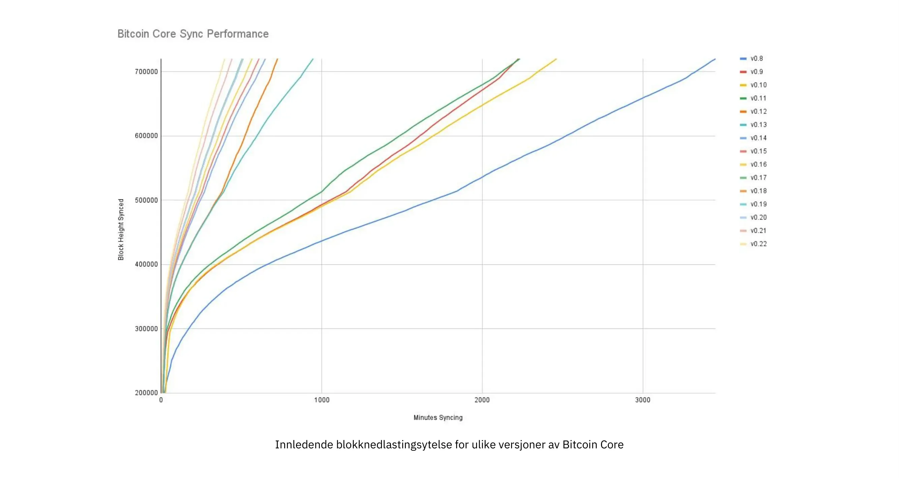


Innledende blokknedlastingsytelse for ulike versjoner av Bitcoin Core. På Y-aksen er blokkhøyden synkronisert, og på X-aksen er tiden det tok å synkronisere til den høyden


De ulike linjene representerer ulike versjoner av Bitcoin Core. Linjen lengst til venstre er den nyeste, dvs. versjon 0.22, som ble utgitt i september 2021 og brukte 396 minutter på å synkronisere fullt ut. Den lengst til høyre er versjon 0.8 fra november 2013, som tok 3452 minutter. Hele denne - omtrent 10 ganger - forbedringen skyldes innadgående skalering.


Forbedringene kan kategoriseres som enten plassbesparelser (RAM, disk, båndbredde osv.) eller besparelser i regnekraft. Begge kategoriene bidrar til forbedringene i diagrammet ovenfor.


Et godt eksempel på beregningsforbedringer finnes i biblioteket [libsecp256k1](https://github.com/Bitcoin-core/secp256k1), som blant annet implementerer de kryptografiske primitivitetene som trengs for å lage og verifisere [digitale signaturer](https://planb.academy/resources/glossary/digital-signature). Pieter Wuille er en av bidragsyterne til dette biblioteket, og han har skrevet en [Twitter-tråd](https://twitter.com/pwuille/status/1450471673321381896) som viser ytelsesforbedringene som er oppnådd gjennom ulike pull-forespørsler.


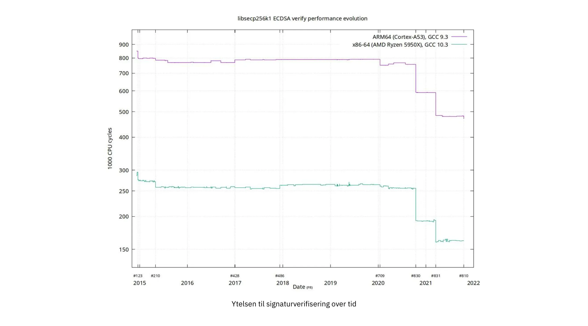


Utførelse av signaturverifisering over tid, med viktige pull-forespørsler markert på tidslinjen


Grafen viser trenden for to ulike 64-biters CPU-typer, nemlig ARM og x86. Forskjellen i ytelse skyldes de mer spesialiserte instruksjonene som er tilgjengelige på x86, sammenlignet med ARM-arkitekturen, som har færre og mer generiske instruksjoner. Den generelle trenden er imidlertid den samme for begge arkitekturene. Merk at Y-aksen er logaritmisk, noe som får forbedringene til å se mindre imponerende ut enn de faktisk er.


Det finnes også flere gode eksempler på plassbesparende forbedringer som har bidratt til økt ytelse. I en

[Medium-blogginnlegg](https://murchandamus.medium.com/2-of-3-Multisig-inputs-using-Pay-to-Taproot-d5faf2312ba3) om Taproots bidrag til å spare plass, sammenligner brukeren Murch hvor mye blokkplass en 2-av-3-terskelsignatur vil kreve, både ved å bruke Taproot på ulike måter og ved å ikke bruke den i det hele tatt.


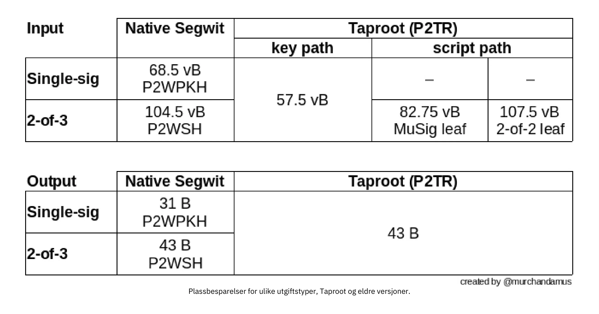


Plassbesparelser for ulike utgiftstyper, Taproot og eldre versjoner.


En 2-av-3 [Multisig](https://planb.academy/resources/glossary/multisig) som bruker opprinnelig SegWit, vil kreve totalt 104,5+43 vB = 147,5 vB, mens den mest plasskonservative bruken av Taproot bare vil kreve 57,5+43 vB = 100,5 vB i standardtilfellet. I verste fall og i sjeldne tilfeller, for eksempel når en standardsigner ikke er tilgjengelig av en eller annen grunn, vil Taproot bruke 107,5+43 vB = 150,5 vB. Du trenger ikke å forstå alle detaljene, men dette bør gi deg en idé om hvordan utviklere tenker på å spare plass - hver eneste lille byte teller.


Bortsett fra innskalering i Bitcoin-programvaren, finnes det også noen måter brukerne kan bidra til innskalering på. De kan gjøre transaksjonene sine mer intelligente for å spare transaksjonsgebyrer samtidig som de reduserer fotavtrykket sitt på Full node kravene. To vanlige teknikker for å oppnå dette kalles transaksjonsbatching og utdatakonsolidering.


Ideen med transaksjonsbatching er å kombinere flere betalinger i én enkelt transaksjon, i stedet for å foreta én transaksjon per betaling. Dette kan spare deg for mange gebyrer, samtidig som det reduserer belastningen på blokkplassen.


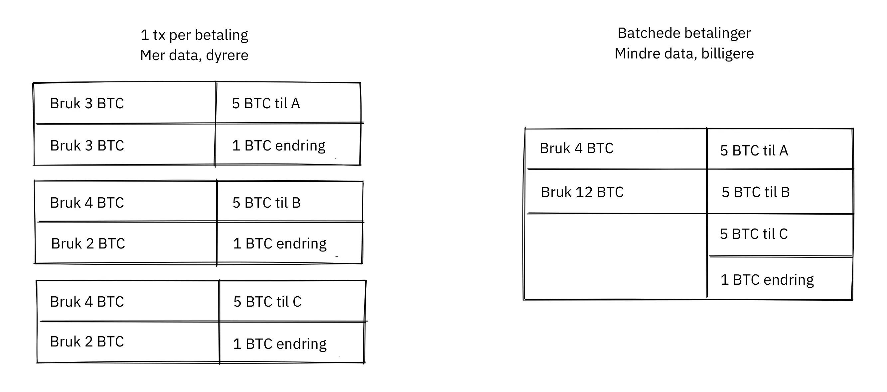


Batching av transaksjoner kombinerer flere betalinger i én enkelt transaksjon for å spare gebyrer.


Konsolidering av utdata betyr at man utnytter perioder med lav etterspørsel etter blokkplass til å slå sammen flere utdata til én enkelt utdata. Dette kan redusere gebyrkostnadene senere, når du må foreta en betaling mens etterspørselen etter blokkplass er høy.


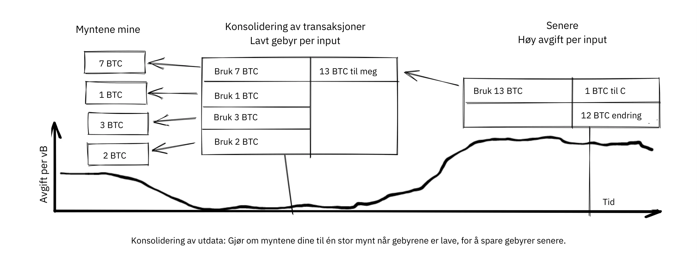


Konsolidering av utdata: Smelt myntene dine sammen til én stor mynt når avgiftene er lave, for å spare avgifter senere.


Det er kanskje ikke åpenbart hvordan konsolidering av utdata bidrar til innadgående skalering. Den totale mengden Blockchain-data øker til og med litt med denne metoden. Likevel krymper UTXO-settet, det vil si databasen som holder oversikt over hvem som eier hvilke mynter, fordi du bruker flere UTXO-er enn du skaper. Dette letter byrden for fulle noder med å vedlikeholde UTXO-settene sine.


Dessverre kan disse to teknikkene for *UTXO-administrasjon* være dårlige for ditt eget eller dine betalingsmottakeres personvern. I batching-tilfellet vil hver betalingsmottaker vite at alle batchede utdata er fra deg til andre betalingsmottakere (bortsett fra muligens endringen). I tilfellet med UTXO-konsolidering vil du avsløre at utdataene du konsoliderer, tilhører samme Wallet. Du må kanskje gjøre en avveining mellom kostnadseffektivitet og personvern.


#### Lagvis skalering


Den mest effektive tilnærmingen til skalering er sannsynligvis lagdeling. Den generelle ideen bak lagdeling er at en protokoll kan gjøre opp betalinger mellom brukere uten å legge til transaksjoner i Blockchain.


En lagdelt protokoll begynner med at to eller flere personer blir enige om en starttransaksjon som legges på Blockchain, som illustrert i figuren nedenfor.


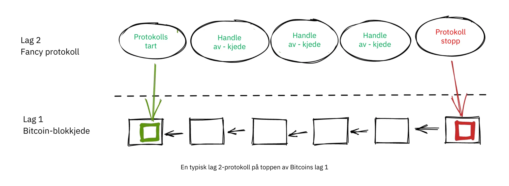


Hvordan denne starttransaksjonen opprettes, varierer fra protokoll til protokoll, men et felles tema er at deltakerne oppretter en usignert starttransaksjon og et antall forhåndssignerte straffetransaksjoner, som bruker utdataene fra starttransaksjonen på ulike måter. Deretter signeres starttransaksjonen fullt ut og publiseres til Blockchain, og straffetransaksjonene kan signeres fullt ut og publiseres for å straffe en part som oppfører seg dårlig. Dette gir deltakerne insentiver til å holde løftene sine, slik at protokollen kan fungere på en Trustless måte.


Når starttransaksjonen er på Blockchain, kan protokollen gjøre det den er ment å gjøre. Den kan for eksempel utføre superraske betalinger mellom deltakere, implementere noen personvernforbedrende teknikker eller utføre mer avansert skripting som ikke støttes av Bitcoin Blockchain.


Vi skal ikke gå i detalj på hvordan spesifikke protokoller fungerer, men som du kan se i forrige figur, brukes Blockchain sjelden i løpet av protokollens livssyklus. All den saftige handlingen skjer *[off-chain](https://planb.academy/resources/glossary/offchain)*. Vi har sett hvordan dette kan være en gevinst for personvernet hvis det gjøres riktig, men det kan også være en fordel for skalerbarheten.


I et [Reddit-innlegg](https://www.reddit.com/r/Bitcoin/comments/438hx0/a_trip_to_the_moon_requires_a_rocket_with/) med tittelen "En tur til månen krever en rakett med flere trinn, ellers vil rakettligningen spise lunsjen din ... å pakke alle i klovnebilstil inn i en trebuchet og håpe på suksess er rett ut.", forklarer Gregory Maxwell hvorfor lagdeling er vår beste sjanse til å få Bitcoin til å skalere med størrelsesordener.


Han starter med å understreke det feilaktige i å se på Visa eller Mastercard som Bitcoins hovedkonkurrenter, og fremhever hvordan det å øke den maksimale blokkstørrelsen er en dårlig tilnærming for å møte nevnte konkurranse. Deretter snakker han om hvordan man kan gjøre en reell forskjell ved å bruke lag:


> Betyr det at Bitcoin ikke kan bli en stor vinner som betalingsteknologi? Nei, men for å oppnå den kapasiteten som kreves for å dekke betalingsbehovene i verden, må vi jobbe mer intelligent.
>

> Helt fra begynnelsen var Bitcoin designet for å inkorporere lag på sikre måter gjennom sin evne til smart kontraktsinngåelse (Hva, tror du det bare ble lagt der slik at folk kunne vokse-filosofere om meningsløse "DAO-er"?). I praksis vil vi bruke Bitcoin-systemet som en svært tilgjengelig og helt pålitelig robotdommer og gjennomføre det meste av virksomheten vår utenfor rettssalen - men på en slik måte at hvis noe går galt, har vi alle bevisene og etablerte avtaler, slik at vi kan være sikre på at robotdomstolen vil gjøre det rette. (Nerd-sideblikk: Hvis dette virker umulig, kan du lese dette gamle innlegget om transaksjonsgjennomskjæring)
>

> Dette er mulig nettopp på grunn av kjerneegenskapene til Bitcoin. Et sensurerbart eller reversibelt basissystem er lite egnet til å bygge kraftig øvre Layer-transaksjonsbehandling på toppen av ... og hvis den underliggende eiendelen ikke er solid, er det liten vits i å handle med den i det hele tatt.

Analogien med dommeren er ganske illustrerende for hvordan lagdelingen fungerer: Denne dommeren må være ubestikkelig og aldri ombestemme seg, ellers vil ikke lagene over Bitcoins basis Layer fungere på en pålitelig måte.


Han fortsetter med et poeng om sentraliserte tjenester. Det er vanligvis ikke noe problem å stole på at en sentral server med trivielle mengder Bitcoin får ting gjort: Det er også lagdelt skalering.


Det har gått mange år siden Maxwell skrev artikkelen ovenfor, og ordene hans står fortsatt ved lag. Suksessen til Lightning Network beviser at lagdeling faktisk er en vei å gå for å øke nytteverdien til Bitcoin.


### Konklusjon om skalering


Vi har diskutert ulike måter å skalere Bitcoin på, for å øke Bitcoins brukskapasitet. Skalering har vært et tema i Bitcoin helt siden den spede begynnelsen.


Vi vet i dag at Bitcoin ikke skalerer godt vertikalt ("kjøp større maskinvare") eller horisontalt ("verifiser bare deler av dataene"), men heller innover ("gjør mer med mindre") og lagvis ("bygg protokoller på toppen av Bitcoin").


## Når dritten treffer viften

<chapterId>fe39c13c-310f-51fd-84ff-6b92dd01c9e7</chapterId>


Bitcoin er bygget av mennesker. Det er mennesker som skriver programvaren, og det er mennesker som kjører den. Når et sikkerhetshull eller en alvorlig feil oppdages - er det egentlig noe skille mellom de to? - er det alltid mennesker av kjøtt og blod som oppdager det. Dette kapittelet tar for seg hva folk gjør, bør og ikke bør gjøre når dritten treffer viften. Den første delen forklarer begrepet *ansvarlig avsløring*, som refererer til hvordan en person som oppdager en sårbarhet, kan opptre ansvarlig for å bidra til å minimere skaden. Resten av kapittelet tar deg med på en omvisning i noen av de mest alvorlige sårbarhetene som er oppdaget opp gjennom årene, og hvordan de ble håndtert av utviklere, utvinnere og brukere. I Bitcoins tidlige barndom var det ikke like strenge regler som det er i dag.


### Ansvarlig offentliggjøring


Tenk deg at du oppdager en feil i Bitcoin Core, en feil som gjør det mulig for hvem som helst å slå av en Bitcoin Core-node eksternt ved hjelp av noen spesielt utformede nettverksmeldinger. Tenk deg også at du ikke er ondsinnet og ønsker at dette problemet skal forbli uutnyttet. Hva gjør du da? Hvis du ikke sier noe om det, vil noen andre sannsynligvis oppdage problemet, og du kan ikke være sikker på at den personen ikke er ondsinnet.


Når et sikkerhetsproblem oppdages, bør personen som oppdager det, benytte seg av _responsible disclosure_, som er et begrep som ofte brukes blant Bitcoin-utviklere. Begrepet er [forklart på Wikipedia](https://en.wikipedia.org/wiki/Coordinated_vulnerability_disclosure):


> Utviklere av maskin- og programvare trenger ofte tid og ressurser til å reparere feilene sine. Ofte er det etiske hackere som finner disse feilene
sårbarheter. Hackere og datasikkerhetsforskere mener at det er deres samfunnsansvar å gjøre offentligheten oppmerksom på sårbarheter. Å skjule problemer kan skape en følelse av falsk trygghet. For å unngå dette må de involverte partene koordinere og forhandle seg frem til en rimelig tidsperiode for utbedring av sårbarheten. Avhengig av sårbarhetens potensielle konsekvenser, hvor lang tid det tar å utvikle og ta i bruk en nødløsning eller en workaround, og andre faktorer, kan denne perioden variere fra noen dager til flere måneder.


Dette betyr at hvis du finner et sikkerhetsproblem, skal du rapportere dette til teamet som er ansvarlig for systemet. Men hva betyr dette i forbindelse med Bitcoin? Ingen kontrollerer Bitcoin, men det finnes for øyeblikket et samlingspunkt for utviklingen av Bitcoin, nemlig [Bitcoin Core Github repository](https://github.com/Bitcoin/Bitcoin). Vedlikeholderne av dette depotet er ansvarlige for koden i det, men de er ikke ansvarlige for systemet som helhet - det er det ingen som er. Den beste fremgangsmåten er likevel å sende en e-post til security@bitcoincore.org.


I en [e-posttråd](https://lists.linuxfoundation.org/pipermail/Bitcoin-dev/2017-September/015002.html) med tittelen "Responsible disclosure of bugs" fra 2017 forsøkte Anthony Towns å oppsummere hva han oppfattet som dagens beste praksis. Han hadde samlet innspill fra flere kilder og ulike personer for å danne seg et bilde av hva han mente om emnet.


- Sårbarheter bør rapporteres via security at bitcoincore.org
- Et kritisk problem (som kan utnyttes umiddelbart eller som allerede utnyttes og forårsaker stor skade) vil bli håndtert ved hjelp av
  - en utgitt oppdatering så snart som mulig
  - bred varsling om behovet for å oppgradere (eller å deaktivere berørte systemer)
  - minimal avsløring av det faktiske problemet, for å forsinke angrep
- En ikke-kritisk sårbarhet (fordi den er vanskelig eller kostbar å utnytte) vil bli håndtert av:
  - oppdatering og gjennomgang i den ordinære utviklingsflyten
  - tilbakeportering av en rettelse eller løsning fra master-versjonen til den nåværende versjonen
- Utviklere vil forsøke å sikre at publisering av løsningen ikke avslører sårbarhetens natur ved å gi den foreslåtte løsningen til erfarne utviklere som ikke har blitt informert om sårbarheten, fortelle dem at den løser en sårbarhet, og be dem om å identifisere sårbarheten.
- Utviklere kan anbefale andre Bitcoin-implementeringer å ta i bruk sårbarhetsrettinger før rettingen blir utgitt og bredt distribuert, hvis de kan gjøre det uten å avsløre sårbarheten, f.eks. hvis rettingen har betydelige ytelsesfordeler som rettferdiggjør at den inkluderes.
- Før en sårbarhet blir offentlig kjent, vil utviklere generelt anbefale vennligsinnede [Altcoin](https://planb.academy/resources/glossary/altcoin) -utviklere at de bør komme i gang med rettelser. Men dette skjer først etter at løsningene er bredt distribuert i Bitcoin-nettverket.
- Utviklere vil generelt ikke varsle Altcoin-utviklere som har oppført seg fiendtlig (f.eks. ved å bruke sårbarheter til å angripe andre, eller som bryter embargoer).
- Bitcoin-utviklerne vil ikke offentliggjøre sårbarhetsdetaljer før >80 % av Bitcoin-nodene har tatt i bruk løsningene. Sårbarhetsoppdagere oppfordres til og anmodes om å følge samme policy. [1] [6]


Denne listen viser hvor forsiktig man må være når man publiserer oppdateringer for Bitcoin, siden oppdateringen i seg selv kan avsløre sårbarheten. Det fjerde punktet er spesielt interessant, fordi det forklarer hvordan man kan teste om en oppdatering er godt nok kamuflert. Hvis noen få, virkelig erfarne utviklere ikke kan oppdage sårbarheten selv om de vet at oppdateringen fikser den, vil det sannsynligvis være veldig Hard vanskelig for andre å oppdage den.


Tråden som førte til denne e-posten, diskuterte hvorvidt, når og hvordan man skal avsløre sårbarheter i altcoins og andre implementeringer av Bitcoin. Det er ikke noe klart svar her. "Å hjelpe de gode" virker som det fornuftige å gjøre, men hvem bestemmer hvem de er, og hvor går grensen? Bryan Bishop [argumenterte](https://lists.linuxfoundation.org/pipermail/Bitcoin-dev/2017-September/014983.html) for at det var en moralsk plikt å hjelpe altcoins og til og med scamcoins med å forsvare seg mot sikkerhetsutnyttelser:


> Det er ikke nok å forsvare Bitcoin og dets brukere mot aktive trusler, det er et mer generelt ansvar å forsvare alle typer brukere og forskjellig programvare mot mange typer trusler i alle former, selv om folk bruker dum og usikker programvare som du personlig ikke vedlikeholder eller bidrar til eller tar til orde for. Håndtering av kunnskap om en sårbarhet er en delikat sak, og det kan hende at du mottar kunnskap med mer alvorlige direkte eller indirekte konsekvenser enn det som opprinnelig ble beskrevet.

I forkant av e-posten fra Town ovenfor ble det også publisert et [innlegg](https://lists.linuxfoundation.org/pipermail/Bitcoin-dev/2017-September/014977.html) av Gregory Maxwell, [der](https://planb.academy/resources/glossary/der) han hevdet at sikkerhetshullene kan være mer alvorlige enn de ser ut til:


> Jeg har flere ganger sett et Hard-problem vise seg å være trivielt når du finner det rette trikset, eller et mindre dos-problem vise seg å være langt mer alvorlig.
>

> Enkle ytelsesfeil, som er utplassert av eksperter, kan potensielt brukes til å dele opp nettverket - Miner A og Exchange B går i én partisjon, alle andre i en annen... og doublepend.
>

> Og så videre.  Så selv om jeg er helt enig i at ulike ting bør og kan håndteres forskjellig, er det ikke alltid så enkelt. Det er klokt å behandle ting som mer alvorlige enn man vet at de er.

Så selv om en sårbarhet ser ut til å være Hard å utnytte, kan det være best å anta at den er lett å utnytte, og at du bare ikke har funnet ut hvordan ennå.


Han nevner også at "det er noe feil å kalle denne tråden for noe som helst om opplysningsplikt, denne tråden handler ikke om opplysningsplikt. Offentliggjøring er når du forteller det til leverandøren.  Denne tråden handler om publisering, og det har helt andre implikasjoner. Publisering er når du er sikker på at du har fortalt det til potensielle angripere." Denne siste observasjonen om skillet mellom avsløring og publisering er viktig. Den enkle delen er ansvarlig avsløring; Hard-delen er fornuftig publisering.


### Bitcoins traumatiske barndom


Bitcoin startet som et enmannsprosjekt (det er i hvert fall det opphavsmannens pseudonym antyder), og Bitcoin hadde i utgangspunktet liten eller ingen verdi. Sårbarheter og feilrettinger ble derfor ikke håndtert like strengt som i dag.


Bitcoin-wikien har en [liste over vanlige sårbarheter og eksponeringer](https://en.Bitcoin.it/wiki/Common_Vulnerabilities_and_Exposures) (CVE-er) som Bitcoin har gått gjennom. Denne delen er en liten gjennomgang av noen av sikkerhetsproblemene og hendelsene fra de første årene med Bitcoin. Vi tar ikke for oss alle, men vi har valgt ut noen få som vi synes er spesielt interessante.


#### 2010-07-28: Bruke noens mynter (CVE-2010-5141)


Den 28. juli 2010 oppdaget en pseudonym person ved navn ArtForz en feil i versjon 0.3.4 som gjorde det mulig for hvem som helst å ta mynter fra hvem som helst andre. ArtForz rapporterte dette til Satoshi Nakamoto og til en annen Bitcoin-utvikler ved navn Gavin Andresen.


Problemet var at skriptoperatoren `OP_RETURN` ganske enkelt ville avslutte programkjøringen, så hvis scriptPubKey var `<pubkey> OP_CHECKSIG` og scriptSig var `OP_1 OP_RETURN`, ville den delen av programmet som lå i scriptPubKey aldri bli kjørt. Det eneste som ville skje, var at `1` ville bli lagt på stakken, og deretter ville `OP_RETURN` føre til at programmet ble avsluttet. Enhver verdi som ikke er null på toppen av stakken etter at programmet har kjørt, betyr at utgiftsbetingelsen er oppfylt. Siden det øverste stabelelementet `1` ikke er null, vil utgiften være OK.


Dette var koden for håndtering av `OP_RETURN`:


```
case OP_RETURN:
{
pc = pend;
}
break;
```

Effekten av `pc = pend;` var at resten av programmet ble hoppet over, noe som betydde at ethvert låseskript i scriptPubKey ville bli ignorert. Løsningen besto i å endre betydningen av `OP_RETURN` slik at den i stedet mislyktes umiddelbart.


```
case OP_RETURN:
{
return false;
}
break;
```


Satoshi gjorde denne endringen lokalt og bygget en kjørbar binær med versjon 0.3.5 fra den. Deretter la han ut på Bitcointalk-forumet "*** ALERT \ *** Oppgrader til 0.3.5 ASAP", og oppfordret brukerne til å installere denne binære versjonen av ham, uten å presentere kildekoden for den:


> Vennligst oppgrader til 0.3.5 så snart som mulig!  Vi har rettet en implementeringsfeil som gjorde det mulig å godta falske transaksjoner.  Ikke godta Bitcoin-transaksjoner som betaling før du har oppgradert til versjon 0.3.5!

Den opprinnelige meldingen ble senere redigert og er ikke lenger tilgjengelig i sin fulle form. Utdraget ovenfor er fra et [siterer svar](https://bitcointalk.org/index.php?topic=626.msg6458#msg6458). Noen brukere prøvde Satoshis binærfil, men fikk problemer med den. Kort tid etter skrev [Satoshi](https://bitcointalk.org/index.php?topic=626.msg6469#msg6469):


> Har ikke hatt tid til å oppdatere SVN ennå.  Vent på 0.3.6, jeg bygger den nå.  Du kan stenge noden din i mellomtiden.

Og 35 minutter senere skrev han (https://bitcointalk.org/index.php?topic=626.msg6480#msg6480):


> SVN er oppdatert med versjon 0.3.6.
>

> Laster opp Windows-versjon av 0.3.6 til Sourceforge nå, og vil deretter gjenoppbygge linux.

På dette tidspunktet så det også ut til at han hadde oppdatert det opprinnelige innlegget til å nevne 0.3.6 i stedet for 0.3.5:


> Vennligst oppgrader til 0.3.6 så snart som mulig!  Vi har rettet en implementeringsfeil som gjorde det mulig at falske transaksjoner kunne vises som akseptert.  Ikke godta Bitcoin-transaksjoner som betaling før du har oppgradert til versjon 0.3.6!
>

> Hvis du ikke kan oppgradere til 0.3.6 med en gang, er det best å stenge ned Bitcoin-noden til du gjør det.
>

> Også i 0.3.6, raskere hashing:
> - optimalisering av mellomlageret takket være tcatm
> - Crypto++ ASM SHA-256 takket være BlackEye
> Totalt 2,4 ganger raskere generering.
>

> Last ned:
>

> http://sourceforge.net/projects/Bitcoin/files/Bitcoin/Bitcoin-0.3.6/
>

> Windows- og Linux-brukere: Hvis du har 0.3.5, må du fortsatt oppgradere til 0.3.6.

Legg merke til forskjellen i beskrivelsen av problemet fra den første meldingen: "kan vises som akseptert" vs. "kan bli akseptert". Kanskje Satoshi bagatelliserte alvorlighetsgraden av feilen i sin kommunikasjon for ikke å trekke for mye oppmerksomhet til det faktiske problemet. Uansett, folk oppgraderte til 0.3.6, og det fungerte som forventet. Dette spesielle problemet ble utrolig nok løst uten tap av Bitcoin.


Satoshi-meldingen beskrev også noen ytelsesoptimaliseringer for Mining. Det er uklart hvorfor det ble inkludert i en kritisk sikkerhetsrettelse, det er mulig at formålet var å tilsløre det virkelige problemet. Det virker imidlertid mer sannsynlig at han bare ga ut det som var på toppen av utviklingsgrenen i Subversion-arkivet, med sikkerhetsoppdateringen lagt til.


På den tiden var det ikke på langt nær så mange brukere som det er i dag, og Bitcoins verdi var nær null. Hvis denne feilsvaret ble spilt ut i dag, ville det blitt ansett som et komplett dritt-show av flere grunner:


- Satoshi lagde en binær utgivelse av 0.3.5 som inneholdt løsningen. Ingen patch eller kode ble gitt, kanskje som et tiltak for å skjule problemet.
- 0.3,5 [fungerte ikke engang](https://bitcointalk.org/index.php?topic=626.msg6455#msg6455).
- Løsningen i 0.3.6 var faktisk en Hard Fork.


En annen ting som kan diskuteres, er om det er bra eller dårlig at brukerne ble bedt om å stenge ned nodene sine. Dette ville ikke vært mulig i dag, men på den tiden var det mange brukere som fulgte aktivt med på forumet for oppdateringer, og som vanligvis hadde full oversikt. Gitt at det var mulig å gjøre dette, kan det ha vært en fornuftig ting å gjøre.


#### 2010-08-15 Kombinert utdataoverløp (CVE-2010-5139)


I midten av august 2010 ble Bitcointalk-forumbrukeren jgarzik, også kjent som Jeff Garzik,

[oppdaget at](https://bitcointalk.org/index.php?topic=822.msg9474#msg9474) en bestemt transaksjon på blokkhøyde 74638 hadde to utganger med uvanlig høy verdi:


```
"out" : [
{
"value" : 92233720368.54277039,
"scriptPubKey" : "OP_DUP OP_HASH160 0xB7A73EB128D7EA3D388DB12418302A1CBAD5E890 OP_EQUALVERIFY OP_CHECKSIG"
},
{
"value" : 92233720368.54277039,
"scriptPubKey" : "OP_DUP OP_HASH160 0x151275508C66F89DEC2C5F43B6F9CBE0B5C4722C OP_EQUALVERIFY OP_CHECKSIG"
}
]
```


> "Verdien ut" i denne blokken #74638 er ganske merkelig:
>

> 92233720368.54277039 BTC?  Er det UINT64_MAX, lurer jeg på?

Antagelig var det en feil som førte til at summen av to int64 (ikke uint64, som Garzik antok) utganger overløp til en negativ verdi -0,00997538 BTC. Uansett summen av inngangene, ville "summen" av utgangene være mindre, noe som gjorde denne transaksjonen OK i henhold til koden på den tiden.


I dette tilfellet hadde feilen blitt avslørt og publisert gjennom et faktisk exploit. Et uheldig resultat av dette var at det ble opprettet omtrent 2x92 milliarder Bitcoin, noe som sterkt utvannet pengene Supply på rundt 3,7 millioner mynter som eksisterte på det tidspunktet.


I en relatert tråd skrev [Satoshi](https://bitcointalk.org/index.php?topic=823.msg9531#msg9531) at han ville sette pris på om folk sluttet å Mining (eller *generere*, som de kalte det den gangen):


> Det ville hjelpe hvis folk slutter å generere.  Vi må sannsynligvis lage en ny gren rundt den nåværende, og jo mindre du generate, desto raskere vil det gå.
>

> En første oppdatering vil være i SVN rev 132.  Den er ikke lastet opp ennå.  Jeg skal få unna noen andre endringer først, og så laster jeg opp oppdateringen for denne.

Planen hans var å lage en Soft Fork for å gjøre transaksjoner som den som diskuteres her ugyldige, og dermed ugyldiggjøre blokkene (spesielt blokk 74638) som inneholdt slike transaksjoner. Mindre enn en time senere publiserte han en [patch i revisjon 132](https://sourceforge.net/p/Bitcoin/code/132/) i Subversion-repositoriet og [postet på forumet](https://bitcointalk.org/index.php?topic=823.msg9548#msg9548) med en beskrivelse av hva han mente brukerne burde gjøre:


> Oppdateringen er lastet opp til SVN rev 132!
>

> Foreløpig anbefalte trinn:
> 1) Slå av.
> 2) Last ned knightmbs blk-filer.  (erstatt blk0001.dat- og blkindex.dat-filene dine)
> 3) Oppgradering.
> 4) Den bør starte med mindre enn 74000 blokker. La den laste ned resten på nytt.
>

> Hvis du ikke vil bruke knightmbs filer, kan du bare slette blk*.dat-filene dine, men det kommer til å bli en stor belastning på nettverket hvis alle laster ned hele blokkindeksen samtidig.
>

> Jeg skal bygge utgivelser snart.

Han ønsket at folk skulle laste ned blokkdata fra en bestemt bruker, nemlig knightmb, som hadde publisert Blockchain slik den lå på disken hans, filene blkXXXXXX.dat og blkindex.dat. Grunnen til at Blockchain-dataene skulle lastes ned på denne måten, i stedet for å synkroniseres fra bunnen av, var å redusere flaskehalser i nettverksbåndbredden.


Det var et stort forbehold med dette: dataene brukerne lastet ned fra knightmb [ble ikke verifisert av Bitcoin-programvaren](https://Bitcoin.stackexchange.com/a/113682/69518) ved oppstart. Filen blkindex.dat inneholdt UTXO-settet, og programvaren ville akseptere alle data der som om den allerede hadde verifisert dem. knightmb kunne ha manipulert dataene for å gi seg selv eller noen andre noen bitcoins.


Igjen så det ut til at folk gikk med på dette, og reverseringen av den ugyldige blokken og dens etterfølgere var vellykket. Utvinnere begynte å jobbe med en ny etterfølger til blokk [74637](https://Mempool.space/block/0000000000606865e679308edf079991764d88e8122ca9250aef5386962b6e84), og ifølge blokkens Timestamp dukket det opp en etterfølger kl. 23:53 UTC, omtrent seks timer etter at problemet ble oppdaget. Klokken 08:10 dagen etter, den 16. august, rundt blokk 74689, hadde den nye kjeden overtatt den gamle kjeden, og alle ikke-oppgraderte noder reorganiserte seg derfor for å følge den nye kjeden. Dette er den dypeste omorganiseringen - 52 blokker - i Bitcoins historie.


Sammenlignet med [OP_RETURN](https://planb.academy/resources/glossary/op-return-0x6a)-problemet ble dette problemet håndtert på en noe renere måte:


- Ingen binær oppdatering
- Den lanserte programvaren fungerte etter hensikten
- Nei Hard Fork


Brukerne ble også bedt om å stoppe Mining under denne utgaven. Vi kan diskutere om dette er en god idé eller ikke, men tenk deg at du er en Miner og du er overbevist om at alle blokker på toppen av den dårlige blokken til slutt vil bli utslettet i en dyp reorganisering: hvorfor skulle du kaste bort ressurser på Mining-dømte blokker?


Du synes kanskje også at det er litt fishy å gjøre som Nakamoto foreslår og laste ned Blockchain, inkludert UTXO-settet, fra en tilfeldig fyrs Hard-stasjon. I så fall har du rett: det er mistenkelig. Men gitt omstendighetene var denne nødreaksjonen fornuftig.


Det er en viktig forskjell mellom denne saken og den forrige OP_RETURN-saken: Dette problemet ble utnyttet i naturen, og dermed kunne en løsning gjøres enklere. I tilfellet med OP_RETURN måtte de tilsløre løsningen og komme med offentlige uttalelser som ikke direkte avslørte hva problemet var.


#### 2013-03-11 Problem med DB-låser 0.7.2 - 0.8.0 (CVE-2013-3220)


I mars 2013 dukket det opp en svært interessant og pedagogisk verdifull problemstilling. Det viste seg at Blockchain hadde delt seg (selv om ordet "Fork" er brukt i sitatet nedenfor) etter blokk 225429. Detaljene i denne hendelsen ble [rapportert i BIP50](https://github.com/Bitcoin/bips/blob/master/bip-0050.mediawiki). I sammendraget står det


> En blokk som hadde et større antall totale transaksjonsinput enn tidligere sett, ble utvunnet og kringkastet. Bitcoin 0.8-noder var i stand til å håndtere dette, men noen pre-0.8 Bitcoin-noder avviste det, noe som forårsaket en uventet Fork av Blockchain. Den pre-0.8-inkompatible kjeden (fra nå av 0.8-kjeden) hadde på det tidspunktet rundt 60 % av Mining Hash-kraften, noe som sørget for at splitten ikke ble løst automatisk (som ville ha skjedd hvis pre-0.8-kjeden overgikk 0.8-kjeden i totalt arbeid, noe som ville ha tvunget 0.8-noder til å reorganisere seg til pre-0.8-kjeden).
>

> For å gjenopprette en kanonisk kjede så snart som mulig, nedgraderte BTCGuild og Slush sine Bitcoin 0.8-noder til 0.7, slik at bassengene deres også ville avvise den større blokken. Dette plasserte majoriteten av hashpower på kjeden uten den større blokken, noe som til slutt fikk 0.8-nodene til å reorganisere seg til kjeden fra før 0.8.

Den raske handlingen som Mining-poolene BTCGuild og Slush tok, var avgjørende i denne nødsituasjonen. De var i stand til å tippe majoriteten av Hash-kraften over til pre-0.8-grenen av splitten, og dermed bidra til å gjenopprette konsensus. Dette ga utviklerne tid til å finne en bærekraftig løsning.


Det som også er veldig interessant i dette problemet er at versjon 0.7.2 var inkompatibel med seg selv, noe som også var tilfelle med tidligere versjoner. Dette er forklart i [Root cause section of BIP50](https://github.com/Bitcoin/bips/blob/master/bip-0050.mediawiki#root-cause):


> Med den utilstrekkelig høye BDB-låskonfigurasjonen var det implisitt blitt en konsensusregel i nettverket som bestemte blokkens gyldighet (om enn en
inkonsekvent og usikker regel, siden låsebruken kan variere fra node til node).


Kort fortalt er problemet at antallet databaselåser Bitcoin Core-programvaren trenger for å verifisere en blokk, ikke er deterministisk. Én node kan trenge X låser, mens en annen node kan trenge X+1 låser. Nodene har også en grense for hvor mange låser Bitcoin kan ta. Hvis antallet låser som trengs, overskrider grensen, blir blokken ansett som ugyldig. Så hvis X+1 overstiger grensen, men ikke X, vil de to nodene dele Blockchain og være uenige om hvilken gren som er gyldig.


Løsningen som ble valgt, i tillegg til de umiddelbare tiltakene som ble iverksatt av de to poolene for å gjenopprette konsensus, var å


- begrense blokkene både når det gjelder størrelse og låsing i versjon 0.8.1
- lappe gamle versjoner (0.7.2 og noen eldre) med de samme nye reglene, og øke den globale låsegrensen.


Med unntak av den økte globale låsegrensen i andre kulepunkt, ble disse reglene innført midlertidig i en forhåndsbestemt periode. Planen var å fjerne disse begrensningene når de fleste nodene hadde oppgradert.


Denne Soft Fork reduserte risikoen for konsensusfeil dramatisk, og noen måneder senere, den 15. mai, ble de midlertidige reglene deaktivert i fellesskap i hele nettverket. Merk at denne deaktiveringen i realiteten var en Hard Fork, men den var ikke omstridt. Dessuten ble den utgitt sammen med den foregående Soft Fork, så folk som kjørte Soft-forket programvare, var godt klar over at en Hard Fork ville følge etter den. Derfor forble de aller fleste nodene i konsensus da Hard Fork ble aktivert. Dessverre var det imidlertid noen få noder som ikke oppgraderte, som gikk tapt i prosessen.


Man kan lure på om dette ville vært gjennomførbart i dag. Mining-landskapet er mer komplekst i dag, og avhengig av Hash-kraften på hver side av splitten, kan det være Hard å rulle ut en patch som den i BIP50 raskt nok. Det vil sannsynligvis være Hard å overbevise utvinnere på "feil" gren om å gi slipp på blokkbelønningene sine.


#### BIP66


BIP66 er interessant fordi den fremhever viktigheten av:


- godt utvalg kryptografi
- ansvarlig offentliggjøring
- utplassering uten å avsløre sårbarheten
- Mining på toppen av verifiserte blokker


BIP66 var et forslag om å stramme inn reglene for signaturkoding i Bitcoin [Script](https://planb.academy/resources/glossary/script). Motivasjonen](https://github.com/Bitcoin/bips/blob/master/bip-0066.mediawiki#motivation) var å kunne analysere signaturer med annen programvare eller andre biblioteker enn OpenSSL og til og med nyere versjoner av OpenSSL. OpenSSL er et bibliotek for generell kryptografi som Bitcoin Core brukte på den tiden.


BIP-en ble aktivert 4. juli 2015. Selv om det ovennevnte er sant, løser BIP66 også et mye mer alvorlig problem som ikke er nevnt i BIP-en.


##### Sårbarheten


Den fullstendige avsløringen av dette problemet ble publisert 28. juli 2015 av Pieter Wuille i en

[e-post til e-postlisten Bitcoin-dev](https://lists.linuxfoundation.org/pipermail/Bitcoin-dev/2015-July/009697.html):


> Hei, alle sammen,
>

> Jeg vil gjerne informere om en sårbarhet jeg oppdaget i september 2014, som ble uutnyttbar da BIP66s 95 %-grense ble nådd tidligere denne måneden.
>

> Kort beskrivelse:
>

> En spesiallaget transaksjon kan ha delt Blockchain mellom noder:
>

> - bruke OpenSSL på 32-biters systemer og på 64-biters Windows-systemer
> - bruke OpenSSL på ikke-Windows 64-biters systemer (Linux, OSX, ...)
> - bruke noen ikke-OpenSSL-kodebaser for parsing av signaturer

I e-posten redegjør han for detaljene rundt hvordan problemet ble oppdaget, og mer nøyaktig hva som forårsaket det. Til slutt legger han frem en tidslinje over hendelsene, og vi vil gjengi noen av de viktigste her. Noen av dem har, som illustrert i figuren over, allerede blitt beskrevet.


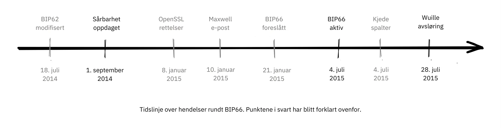


Tidslinje over hendelser rundt BIP66. Punktene i svart har blitt forklart ovenfor.


##### Før oppdagelsen


Uten at noen visste om problemet, kunne det ha blitt løst av den nå tilbaketrukne BIP62, som var et forslag om å redusere mulighetene for transaksjonsmisbruk. Blant de foreslåtte endringene i BIP62 var en innstramming av konsensusreglene for koding av signaturer, eller "streng DER-koding". Pieter Wuille foreslo i juli 2014 noen justeringer av BIP som ville ha løst problemet:


> 2014-jul-18: For at Bitcoins regler for signaturkoding ikke skulle avhenge av OpenSSLs spesifikke parser, endret jeg BIP62-forslaget slik at det strenge kravet om DER-signaturer også skulle gjelde for versjon 1-transaksjoner. Ingen ikke-DER-signaturer ble lenger utvunnet i blokker på den tiden, så det ble antatt at dette ikke ville ha noen innvirkning. Se https://github.com/Bitcoin/bips/pull/90 og http://lists.linuxfoundation.org/pipermail/Bitcoin-dev/2014-July/006299.html. Ukjent på det tidspunktet, men hvis dette hadde blitt implementert, ville det ha løst sårbarheten.

På grunn av bredden i denne BIP-en, som dekket vesentlig mer enn bare "streng DER-koding", ble den stadig endret og kom aldri i nærheten av å bli tatt i bruk. BIP-en ble senere trukket tilbake fordi Segregated Witness, BIP141, løste problemet med transaksjonsfeilbarhet på en annen og mer fullstendig måte.


##### Etter oppdagelsen


OpenSSL ga ut nye versjoner av programvaren sin med oppdateringer som, hvis de hadde blitt brukt i Bitcoin fra begynnelsen av, ville ha løst problemet. Men å bruke en ny versjon av OpenSSL bare i en ny versjon av Bitcoin Core ville gjort saken verre. Gregory Maxwell forklarer dette i en annen [e-posttråd](https://lists.linuxfoundation.org/pipermail/Bitcoin-dev/2015-January/007097.html) i januar 2015:


> Selv om det for de fleste bruksområder er akseptabelt å avvise noen signaturer, er Bitcoin et konsensussystem der alle deltakerne generelt må være enige om den nøyaktige gyldigheten eller ugyldigheten til inndataene.  På en måte er konsistens viktigere enn "korrekthet".
> [...]
> Oppdateringene ovenfor løser imidlertid bare ett symptom på det generelle problemet: å stole på programvare som ikke er designet eller distribuert for konsensusbruk (spesielt OpenSSL) for konsensusnormativ oppførsel.  Derfor foreslår jeg, som en inkrementell forbedring, en målrettet Soft-Fork for å håndheve streng DER-samsvar snart, ved å bruke en delmengde av BIP62.

Han påpeker at det er en alvorlig risiko å bruke kode som ikke er beregnet for bruk i konsensussystemer, og foreslår at Bitcoin implementerer streng DER-koding. Dette er et veldig tydelig eksempel på hvor viktig det er med god utvalgskryptografi.


Disse hendelsene kan gi deg inntrykk av at Gregory Maxwell visste om sårbarheten Pieter Wuille senere publiserte, men ønsket å snike inn en løsning forkledd som et forebyggende tiltak, uten å trekke for mye oppmerksomhet til det faktiske problemet. Det kan være slik, men det er ren spekulasjon.


Deretter ble BIP66, som foreslått av Maxwell, opprettet som en delmengde av BIP62 som bare spesifiserte streng DER-koding. Denne BIP-en ble tilsynelatende bredt akseptert og tatt i bruk i juli, selv om det ironisk nok oppstod to Blockchain-splittinger på grunn av *valideringsløse Mining*. Disse splittelsene blir diskutert i neste avsnitt.


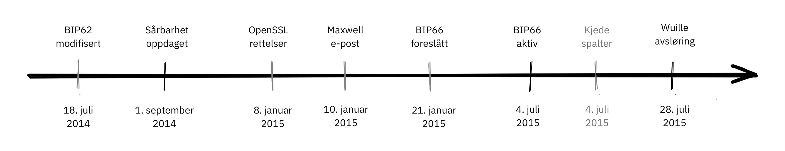


En viktig lærdom av dette er at BIP-er bør være mer eller mindre *atomiske*, noe som betyr at de bør være komplette nok til å gi noe nyttig eller løse et spesifikt problem, men små nok til at de kan få bred støtte blant brukerne. Jo mer du putter inn i en BIP, desto mindre er sjansen for at den blir akseptert.


##### Spaltninger på grunn av valideringsfri Mining


Dessverre endte ikke historien om BIP66 der. Da BIP66 ble aktivert, viste det seg å bli ganske rotete fordi noen utvinnere ikke verifiserte blokkene de prøvde å utvide. Dette kalles valideringsløs Mining, eller SPV-Mining (som i Simplified Payment Verification). En varselmelding ble sendt ut til Bitcoin-noder med en lenke til [en nettside som beskriver problemet](https://Bitcoin.org/en/alert/2015-07-04-spv-Mining):


> Tidlig om morgenen den 4. juli 2015 ble terskelen på 950/1000 (95 %) nådd. Kort tid etter utvunnet en liten Miner (en del av de ikke-oppgraderte 5 %) en ugyldig blokk - noe som var en forventet hendelse. Dessverre viste det seg at omtrent halvparten av nettverkets Hash-rate var Mining uten fullstendig validering av blokker (kalt SPV Mining), og bygget nye blokker på toppen av den ugyldige blokken.

På varslingssiden ble folk bedt om å vente på 30 ekstra bekreftelser enn de normalt ville gjort, i tilfelle de brukte eldre versjoner av Bitcoin Core.


Splitten nevnt ovenfor skjedde 2015-07-04 kl. 02:10 UTC etter blokkhøyde [363730](https://Mempool.space/block/000000000000000006a320d752b46b532ec0f3f815c5dae467aff5715a6e579e). Dette problemet ble løst kl. 03:50 samme dag, etter at 6 ugyldige blokker hadde blitt utvunnet. Dessverre skjedde det samme problemet igjen dagen etter, dvs. den 2015-07-05 kl. 21:50, men denne gangen varte den ugyldige grenen bare i 3 blokker.


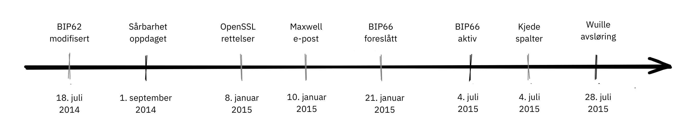

Hendelsene som ledet opp til BIP66, utplasseringen og ettervirkningene er et godt eksempel på hvor forsiktige Bitcoin-utviklere må være. Noen viktige lærdommer fra BIP66:


- Balansen mellom åpenhet og det å ikke offentliggjøre en sårbarhet er hårfin.
- Det er vanskelig å distribuere rettelser for sårbarheter som ikke er publisert.
- Konsensus om bevaring er Hard.
- Programvare som ikke er beregnet for konsensussystemer, er generelt risikable.
- BIP-er bør være noe atomiske.


### Konklusjon om When Shit Hits The Fan


Bitcoin har feil. Personer som oppdager feil, oppfordres til å rapportere dem ansvarlig til Bitcoin-utviklerne, slik at de kan fikse feilen uten å avsløre den offentlig. Ideelt sett kan feilrettingen kamufleres som en ytelsesforbedring, eller en annen form for røykteppe.


Vi har sett på noen av de mest alvorlige problemene som har dukket opp opp gjennom årene, og hvordan de ble håndtert. Noen ble oppdaget offentlig gjennom utnyttelser, mens andre ble avslørt på en ansvarlig måte og kunne fikses før ondsinnede aktører fikk sjansen til å utnytte dem.


## Diskusjonsspørsmål

<chapterId>91462ca7-f09c-55da-a5b9-3e211de31da5</chapterId>


Disse diskusjonsspørsmålene er ikke bare en oppsummering av innholdet i "Bitcoin utviklingsfilosofi", de er ment å oppmuntre deg til å forske videre, så sørg for å gå ut og utforske.


Du kan teste dybden av din forståelse ved å skrive [mini-essay](https://www.youtube.com/watch?v=N4YjXJVzoZY) på 100-300 ord ved å velge et tema i denne spørsmålsbunken. Hvis du vil ha tilbakemelding på arbeidet ditt, kan du sende det til mini-essay@planb.network, og vi vil mer enn gjerne se gjennom det.


#### Desentralisering


- Desentralisering er Hard. Hvorfor går vi gjennom alt dette bryderiet for å få det til å fungere? Kan vi velge en hybridtilnærming, der noen deler er sentralisert og andre ikke?
- Innfører desentralisering problemet med dobbeltutgifter, eller krever problemet med dobbeltutgifter desentralisering? Hvordan løste Satoshi problemet med dobbeltutgifter?
- På hvilke områder er Bitcoin fortsatt mest utsatt for sensur, og hvorfor er sensur en så dårlig ting? Finnes det noen argumenter som taler for sensur?
- Det står at Bitcoin er tillatelsesfri. Finnes det andre betalingsmetoder du kan vurdere som tillatelsesfrie?


#### Tillitsløshet


- Tillitsløshet er ofte et spekter, ikke binært. Hvilke aspekter ved Bitcoin er snarere Trustless, og hvilke innebærer typisk et høyere nivå av tillit? Kan de reduseres?
- Du ønsker å kjøre en Full node for å kunne validere alle transaksjoner fullt ut. Du laster ned Bitcoin Core fra https://Bitcoin.org/en/download. Hvor har du plassert tillit, og hvor er du helt Trustless?
- Kan du bygge et Trustless-system på toppen av et betrodd system?


#### Personvern


- Hva er noen viktige fordeler en bruker oppnår ved å opprettholde et godt personvern når han samhandler med Bitcoin? Hva er noen altruistiske fordeler for nettverket?
- Hvordan påvirker gjenbruk av adresser personvernet ditt?
- Bitcoin bruker en UTXO-modell, mens noen alternative kryptovalutaer bruker en kontomodell. Hvilke konsekvenser har dette valget for personvernet?


#### Endelig Supply


- Hva er forholdet mellom Bitcoins begrensede Supply og dens myntutstedelse gjennom Coinbase Transaction? Hva er forholdet mellom myntutstedelse og sikkerhetsbudsjett, og hvordan står de i motsetning til hverandre?
- Hvilke parametere kunne Satoshi ha justert for å endre Bitcoins Supply-tak? Hva ville endret seg hvis han hadde bestemt seg for å begrense Supply til 1 million? Hva med 1 billion?
- Hvorfor er det noen som tar til orde for en økning i Bitcoin Supply? Tror du dette vil skje?


#### Oppgradering


- Hva er Speedy Trial, og hvorfor var det nødvendig å aktivere Taproot?
- Hvorfor trenger vi en så høy prosentandel av utvinnere for å oppgradere i en softfork? Hvorfor er ikke terskelen bare 51%?


#### Motstridende tenkning


- Hva er et sybil-angrep, og hva gjør desentraliserte nettverk så utsatt for det?
- Hvorfor er det viktig at alle aktørene i Bitcoin-nettverket - og ikke bare utviklerne - tenker kontradiktorisk?


#### Åpen kildekode


- Bare en håndfull vedlikeholdere har de nødvendige GitHub-tillatelsene til å flette kode inn i [Bitcoin Core](https://github.com/Bitcoin/Bitcoin) -depotet. Er ikke det i strid med et nettverk uten tillatelser?
- Er utviklingsprosessen med åpen kildekode utsatt for sybil-angrep? Hvis ja, hvordan vil du i så fall motvirke det?
- Hva er fordelene og ulempene med å basere seg på tredjepartsbiblioteker med åpen kildekode, og hva er tilnærmingen med Bitcoin Core?
- På hvilke måter trenger vi gjennomgang utover bare kodegjennomgang? Hvordan kan man avgjøre hvor mye gjennomgang som er nok?
- Hvordan sikrer vi at det alltid vil være tilstrekkelig med folk med kompetanse som jobber med Bitcoin? Hva skjer når det ikke er det, og hvordan vurderer vi deres integritet og intensjoner?


#### Skalering


- Det hevdes at sharding gir skaleringsfordeler på bekostning av kompleksitet. Hvorfor bør vi ta i bruk teknologiske forbedringer fordi de er vanskelige å forstå, selv om de virker teknologisk fornuftige?
- Hva er noen eksempler på metoder for innskalering som ble introdusert i Bitcoin?
- Hvorfor er vertikal skalering mye vanskeligere i et desentralisert system? Hva med horisontal skalering?
- Vi ser ikke ut til å være i nærheten av å ha konsensus om hvordan vi kan få hele verden om bord på Bitcoin. Burde ikke Satoshi i det minste ha tenkt på en vei dit, før Mining den første blokken i 2009?
- Hvordan vil du klassifisere (vertikal, horisontal, innover eller ikke en skaleringsteknikk) hvert av følgende: sharding, økning av blokkstørrelse, SegWit, SPV-noder, sentraliserte børser, Lightning Network, reduksjon av blokkintervall, Taproot, sidekjeder


# Siste del


<partId>4b6ff4ef-b9ea-4c48-b05f-62d41a38fbbb</partId>


## Anmeldelser og rangeringer


<chapterId>d334a837-df46-4989-9cad-8d8779147dbe</chapterId>


<isCourseReview>true</isCourseReview>

## Avsluttende prøve

<chapterId>b2b498c0-a787-11f0-bd09-e3fc5cfa90af</chapterId>


<isCourseExam>true</isCourseExam>


## Konklusjon


<chapterId>b77ed55c-b13a-430b-a212-37aab527b9e7</chapterId>


<isCourseConclusion>true</isCourseConclusion>
