# Kwisuka cane mu vy'ubuhinga bwa filozofiya y'iterambere rya Bitcoin


Filozofiya y’iterambere rya Bitcoin ni inyigisho y’abategura Bitcoin bamaze gutahura ivy’ishimikiro vy’ivyiyumviro n’imigenderanire nka Proof-of-Work, inyubako y’amabuye, n’ingendo y’ubuzima bw’ibikorwa, kandi bashaka gutera imbere mu kuronka ugutahura kwimbitse kw’ubudandaji bw’imiterere ya Bitcoin n’ubuhinga bwa filozofiya.

Bikwiye gufasha abahinga bashasha gufata ivyigwa bihambaye cane vy’imyaka irenga cumi y’iterambere rya Bitcoin n’impaka za bose, mu gihe bibaha ikibanza ngirakamaro co gusuzuma ivyiyumviro bishasha (vyiza n’ibibi!).


### Ni igiki co kwitega?


Nk’uko vyavuzwe haruguru, iyi ni ubuyobozi ngirakamaro ku bategura Bitcoin. Ariko rero, Bitcoin ni ikiganiro cagutse kandi gikomeye kandi ntitwoshobora gusobanura imice yaco yose hano. Muri iri shure, twizigiye ko tuzoganira ku bintu bikenewe kugira ngo igikorwa cawe co guteza imbere gitangure hamwe no kugira ngo ushobore kurushiriza kugitohoza wewe nyene.


Hari abantu benshi cane bari muri Bitcoin; nk’uko bamwe muri bo bafise ivyiyumviro bivuguruzanya, aha woshobora gusanga ibikoresho biserura ivyiyumviro bivuguruzanya. Ariko rero, twama tugerageza kwizirika ku bijanye n’ibintu vy’ukuri, aho ivyiyumviro bitagira akamaro.


### None ivyo vyanditswe na nde?


Iryo shure ryakuwe mu gitabu c’amazina nyene umwanditsi mukuru waco ni Kalle Rosenbaum, na Linnéa Rosenbaum yatanze intererano nk’umwanditsi mugenziwe.

Ico gitabu cashinzwe kandi giterwa inkunga na [Chaincode Labs](https://learning.chaincode.com/), ikigo c’iterambere gikora porogarama z’inyigisho ku bahinga bashaka kwiga ivyerekeye iterambere rya Bitcoin.


+++


# Imenyekanisha

<partId>58c48e9b-e285-4dc6-8952-6cc5140b1313</partId>


## Incamake y'amashure

<chapterId>28b7256b-9cb0-463e-a82d-d732be86c98c</chapterId>


Murakaze muri iri shure PHI 301 ryerekeye filozofiya y'iterambere rya Bitcoin.


Bitcoin ni ikintu kirenze amafaranga y’ibanga gusa, irimwo iyerekwa rya filozofiya ku bijanye n’ugusenyura ubutegetsi, ubuzima bwite, ukutagira icizigiro, n’ukwitanga. Iryo shure ryagenewe cane cane abahinguzi bamaze kumenya imishinge y’ubuhinga bwa Bitcoin ubu barondera gutahura cane ingingo ngenderwako zishingiye ku guhingura n’uburongozi bwa Bitcoin.


Muri iri shure ryose, uzoronka ugusobanukirwa ku bijanye n’agaciro n’ingene ingamba zayoboye iterambere rya Bitcoin mu myaka irenga cumi. Mu gutohoza izo nsanganyamatsiko mu buryo bwimbitse, uzotsimbataza uburyo bwo kubona ibintu mu buryo buhambaye bukenewe kugira ngo usuzume kandi ushiremwo umusanzu mu bijanye n’iterambere ry’imbere ufise ukwizigira.


### Ivyiza nyamukuru vya Bitcoin


Ni igiki gituma Bitcoin iba iyidasanzwe? Iki gice kirahishura ingingo ngenderwako z’ishimikiro ziri mu mutima w’umugambi wa Bitcoin. Uzotohoza **ugusenyura ubutegetsi**, ibuye ry’imfuruka rituma ata kigo na kimwe kigenzura urubuga; **ukutagira icizigiro**, urufunguruzo rwo gukuraho ukwizigira uwundi muntu; **ubuzima bwite**, ni ngirakamaro ku mwidegemvyo w’umuntu ku giti ciwe no ku butungane bw’urutonde; na **finite Supply**, ikimenyetso c’ubukene gihingura akaranga k’ubutunzi ka Bitcoin. Kumenya neza ivyo vyiyumviro bizokuronsa ubushobozi bwo gutahura neza inkomezi n’intege nke za Bitcoin.


### Bitcoin Ubutegetsi


Kugendera mu nzira igoye y’ubutegetsi bwa Bitcoin bisaba ibirenze ubuhinga bw’ubuhinga, bisaba gutahura uburyo bwihariye bwa Bitcoin bwo guhurizako no gufata ingingo. Muri iki gice, uzokwinjira mu buryo n’ubuhinga buri inyuma y’imigenderanire ihambaye nk’ugusubiramwo amategeko, ivy’uko bikenewe kwiyumvira, inkomezi z’ugukorana n’abandi, ingorane ziguma zitera imbere, n’ingene ibintu bigenda nabi. Ufise ubwo bumenyi, uzoba witeguriye kutagira uruhara gusa ariko no guhingura kazoza ka Bitcoin mu buryo bwiza kandi bufise inshingano.


Ni mwiteguye gutera intambwe ikurikira mu rugendo rwanyu rwa Bitcoin? Reka dutangure!


***N.B.**: Niwahura n’amajambo utamenyereye yerekeye Bitcoin mu gihe c’amashure, urashobora kuraba [urutonde rw’amajambo](https://planb.academy/ibikoresho/urutonde rw’amajambo) kugira uronke insobanuro.*


# Bitcoin Agaciro ka mbere

<partId>2d6c683b-54c8-5465-b2ca-4e96a6828834</partId>


## Kwegera ubutegetsi

<chapterId>9397c84b-0038-5d0e-88d5-11767ce8182d</chapterId>


Ivyo bica bisuzuma ico kwegereza ubutegetsi abaturage ari co n’igituma ari ngombwa ko Bitcoin ikora. Turatandukanya hagati y’ivyo .

decentralisation y’abacukuzi b’amabuye y’agaciro n’iy’ama node yuzuye, no kuganira ku vyo bazana ku meza ku bijanye no kurwanya ugucengera, kimwe mu bintu nyamukuru vya Bitcoin.


Ikiganiro gica gihindukira kigatahura ukutagira aho bahengamiye - canke ukutagira uruhusha ku bakoresha, abacukuzi, n’abategura - ari co kintu gikenewe c’uburyo bwose bwegerejwe. Ubwa nyuma, turakora ku kuntu Hard ishobora kuba gufata uburyo bwegerejwe nka Bitcoin, no gutanga ivyitegererezo bimwebimwe vyo mu mutwe bishobora kugufasha kuvyiyumvamwo.


Uburyo butagira ahantu hagati h’ubugenzuzi bwitwa *decentralized*. Bitcoin igenewe kwirinda kugira ikibanza nyamukuru co kugenzura, canke neza na neza *ikibanza nyamukuru co gucengera*.


Kwegereza ubutegetsi abaturage ni uburyo bwo gushika ku *kurwanya ubugenzuzi*.


Hariho imice ibiri ikomeye y’ukwegereza ubutegetsi mu Bitcoin: Ukwegereza ubutegetsi Miner n’ukwegereza ubutegetsi Full node.


Miner decentralisation yerekeza ku kuba ugutunganya amafaranga bidakorwa canke ngo bihuzwe n’ikigo na kimwe co hagati. Full node decentralization yerekeza ku kuba kwemeza ama block, ni ukuvuga amakuru abacukuzi basohora, bikorwa ku mpera y’urubuga, amaherezo n’abarukoresha, atari n’ubutegetsi bukeyi bwizigiwe.


### Miner kwegereza ubutegetsi


Hariho ukugerageza guhingura amafaranga y’ubuhinga bwa none imbere ya Bitcoin, ariko menshi muri yo yarananiwe kubera ukubura kwegereza ubutegetsi n’ukurwanya ubugenzuzi.


Miner decentralization muri Bitcoin bisigura ko *ugutegeka ibikorwa* bidakorwa n'ikigo kimwe canke ibigo bihoraho. Birakorwa hamwe n’abakinyi bose bashaka kubigiramwo uruhara; iki kigo c'abacukuzi ni umugwi w'abakoresha. Umuntu wese arashobora kwinjira canke akavayo uko yipfuza. Ivyo bituma Bitcoin idashobora gucengera.


Iyo Bitcoin ishirwa ahantu hamwe, yoshobora gushikirwa n’abashaka kuyicengera, nk’intwaro. Vyohura n’ivyo vyashikiye mbere mu kugerageza kurema amahera y’ubuhinga bwa none. Mu ntangamarara y'igitabu (https://www.blockstream.com/sidechains.pdf) citwa "Gushoboza ubuhinga bushasha bwa Blockchain n'ibikoresho vy'inyuma", abanditsi barasigura ingene amaverisiyo ya kera y'amahera y'ubuhinga bwa none atagira ibikoresho vyo gukoresha mu bidukikije vy'abansi (raba kandi igice gikurikira c'Itangazo).


David Chaum yashizeho amafaranga y'ubuhinga bwa none nk'insanganyamatsiko y'ubushakashatsi mu 1983, mu kibanza gifise server nyamukuru yizigirwa ko ishobora gukingira Double-spending. Kugira ngo umuntu agabanye ingorane z’ubuzima bwite ku bantu bo muri uwo mugwi wizigirwa, no gushitsa uburyo bwo guhindura, Chaum yashizeho umukono w’impumyi, uwo yakoresheje kugira ngo atange uburyo bwo gukingira guhuza imikono ya server nyamukuru (igereranya ibiceri), mu gihe yari agishobora kwemerera server nyamukuru gukora uburinzi bwo gukoresha amahera kabiri.

Igisabwa kugira ngo umuntu abe umukozi wa mbere vyacitse igitsintsiri ca Achille c’amahera y’ubuhinga bwa none [Gri99]. Naho bishoboka gukwiragiza iyo ngingo imwe gusa y’ukunanirwa mu gusubirira umukono wa server nyamukuru n’umukono w’abashizeko umukono benshi, birahambaye kugira ngo abashizeko umukono bashobore gusuzumwa ko batandukanye kandi bamenyekana. Ivyo biracasiga iyo nzira ishobora kunanirwa, kubera ko uwusinye wese ashobora kunanirwa, canke agatuma ananirwa, umwe umwe.


Vyaragaragaye ko gukoresha server central kugira ngo umuntu asabe amafaranga atari uburyo bushoboka kubera ingorane nyinshi zo gucengera. Naho umuntu yosubiriza umukozi wa hagati n’ubumwe bw’abakozi n, muri bo n’imiburiburi m ategerezwa kwemera ko haba ugutegeka, vyoba bikiriho ingorane. Ikibazo coba vy’ukuri gihindukiye kikaja aho abakoresha bategerezwa kwemeranya kuri iyo nkuru y’ama server be n’ingene bosubirira ama server mabi n’ayiza ata kwizigira ubukuru bukuru.


Reka twiyumvire ivyoshobora kuba iyo Bitcoin iba ishobora gucengera. Uwo mugenzuzi yoshobora guhatira abakoresha kwimenyekanisha, kumenyesha aho amahera yabo ava canke ivyo bagurana imbere y'uko bemera ko amafaranga yabo yinjira muri Blockchain.


Kandi, ukubura uburyo bwo kurwanya ugucengera vyotuma uwugenzura ashobora guhatira abakoresha kwemera amategeko mashasha y’urutonde. Nk’akarorero, boshobora gutegeka ihinduka ryotuma bashobora gutera imbere amahera Supply, gutyo bakitunga. Mu gihe nk'ico, umukoresha asuzuma amabuye yogira uburyo butatu bwo gukorana n'amategeko mashasha:


- Kwemera: Kwemera amahinduka maze uyashire mu gitabu cabo ca Full node.
- Kwanka: Kwanka kwemera amahinduka; ivyo bisiga umukoresha afise uburyo butagikora amafaranga, kuko amabuye y'umugenzuzi ubu abonwa ko ataco amaze na Full node y'umukoresha.
- Kwimura: Gushinga ikibanza gishasha co kugenzura; abakoresha bose bategerezwa kumenya ingene bohuza hanyuma bakemeranya ku kibanza gishasha co kugenzura.


Iyo bashoboye, ivyo bibazo nyene birashoboka cane ko bizosubira kuvyuka mu gihe kanaka muri kazoza, turavye ko iyo nzira yagumye ishobora gucengera nk’uko yari mbere.


Nta n’imwe muri izo nzira ifise akamaro ku wuyikoresha.


Uguhangana n’ugucengera biciye mu kwegereza ubutegetsi abaturage nivyo bitandukanya Bitcoin n’izindi nzira z’amahera, ariko si ikintu coroshe gushikako kubera *ingorane ya Double-spending*. Ico ni ikibazo co kumenya neza ko ata n’umwe ashobora gukoresha Coin imwe incuro zibiri, ikibazo abantu benshi biyumvira ko kidashoboka gutorera umuti mu buryo bwegerejwe. Satoshi Nakamoto yanditse mu [gitabo ciwe c’umweru ca Bitcoin] ku bijanye n’ingene yotorera umuti ingorane ya Double-spending:


> Muri iki gitabu, turatanga umuti w’ingorane ya Double-spending dukoresheje umukozi wa Timestamp atangazwa n’abandi ku kimenyamenya c’ubuhinga bwa generate c’urutonde rw’ibihe vy’ibikorwa.


Aha akoresha ijambo ridasanzwe "server ya Timestamp itangazwa n'abandi". Ijambo ry’ingenzi aha ni *gukwiragizwa*, ivyo muri iki kiganiro bisigura ko ata ntumbero nyamukuru y’ubugenzuzi. Nakamoto aca abandanya asigura ingene Proof-of-Work ari umuti.

Naho ari ukwo, nta n’umwe abisigura neza kuruta .

[Gregory Maxwell kuri Reddit](Ikibazo_ku_bushobozi_bwa_bitcoin/f2g9e7b/), aho yishura ku muntu asaba guhagarika ibitero vy’abacukuzi b’amabuye y’agaciro Hash kugira ngo yirinde ubushobozi bwo gutera 51%:


> Uburyo bwo kwegereza ubutegetsi nk’ubwa Bitcoin bukoresha amatora ya bose. Ariko ntushobora gusa kugira amatora y’‘abantu’ mu nzira yegerejwe kuko ivyo vyosaba umugambwe wegerejwe kugira ngo uha abantu uburenganzira bwo gutora. Ahubwo, Bitcoin ikoresha amatora y’ububasha bwo gukoresha ubuhinga bwa none kuko birashoboka gusuzuma ububasha bwo gukoresha ubuhinga bwa none ata mfashanyo y’ububasha bwo gukoresha ubuhinga bwa none
uwugira gatatu.


Iryo kete risobanura ingene urubuga rwa Bitcoin rushobora gushika ku masezerano ku bijanye no gusaba amafaranga biciye mu gukoresha Proof-of-Work.


Araheza asozera avuga ko igitero ca 51% kitari giteye amakenga cane, ugereranyije n’abantu batitaho canke badatahura imitungo ya Bitcoin yo kwegereza ubutegetsi abaturage:


> Icoba ari ikibazo kinini cane kuri Bitcoin ni uko abantu bose bayikoresha batazotahura, batazovyitaho, kandi ntibazokingira imitungo y’ugusenyura ubutegetsi ituma igira agaciro kuruta ubundi buryo bwo kwegereza ubutegetsi mu kibanza ca mbere.

Insozero ni ikintu gihambaye. Iyo abantu batakingiye ukwegereza ubutegetsi kwa Bitcoin, ari kwo guserukira ubutegetsi bwayo bwo kurwanya ubugenzuzi, Bitcoin yoshobora kugwa mu kaga k’ububasha bwo kwegereza ubutegetsi hamwe, gushika aho bushizwe hamwe cane ku buryo ugucengera guhinduka ikintu. Hanyuma vyinshi, nimba atari vyose, mu vyiyumviro vyayo vy’agaciro birahera. Ivyo bituma tuja ku gice gikurikira kivuga ku kwegereza ubutegetsi Full node.


### Full node kwegereza ubutegetsi


Mu ngingo ziri hejuru, twavuze cane cane ku bijanye no kwegereza ubutegetsi Miner n’ingene kwegereza ubutegetsi abacukuzi bishobora kwemera ko haba ugucengera. Ariko hariho n'ikindi kintu co kwegereza ubutegetsi, ni ukuvuga *kwegereza ubutegetsi Full node*.


Akamaro ko kwegereza ubutegetsi Full node gafitaniye isano n’ukutagira icizigiro. Twibaze ko uwukoresha ahagaritse gukoresha Full node yiwe bwite kubera, nk’akarorero, ukwiyongera kw’ibiciro vy’ibikorwa bibujijwe. Muri ivyo, bategerezwa gukorana n’urubuga rwa Bitcoin mu bundi buryo, bishoboka ko bakoresheje amasakoshi yo ku rubuga canke amasakoshi yoroshe, ivyo bikaba bisaba urugero runaka rw’ukwizigira abatanga izo nsiguro.


Uwukoresha ava ku gushitsa ata guca ku ruhande amategeko y’uguhuriza ku rubuga aja ku kwizigira ko uwundi azobikora. Ubu rero, dufate ko benshi mu bakoresha bashinga ububasha bwo gukurikiza amategeko y’ubumwe ku kigo cizigirwa. Iyo bimeze gutyo, urubuga rurashobora kwihuta gutera imbere mu gushiramwo ibintu vyose, kandi amategeko y’urubuga arashobora guhindurwa n’abakozi b’ububisha bagira umugambi mubisha.


Mu [a .

Ingingo y'ikinyamakuru Bitcoin](https://bitcoinmagazine.com/ubuhinga/ubutegetsi-bw'abanyagihugu-Bitcoin-yoshobora-gukenera-utuzu-tuto-1442090446), Aaron van Wirdum yabajije abahinguzi b'ikinyamakuru Bitcoin ku bijanye n'ingorane zo kwegereza ubutegetsi mu9 ubunini bw’ibarabara burengeye. Iki kiganiro cari ikiganiro ca Hot mu kiringo ca 2014-2017, aho abantu benshi baharira ku bijanye no kwongera umupaka w’ubunini bw’amabuye kugira ngo bishobore gutuma habaho ugucuruza kwinshi.


Iciyumviro gikomeye co kurwanya kwongera ubunini bw’ibarabara ni uko vyongera igiciro co kugenzura Iyo igiciro co kugenzura kiduze, bizotuma abakoresha bamwebamwe bahagarika gukoresha amanode yabo yuzuye. Ivyo navyo bizotuma abantu benshi badashobora gukoresha iyo nzira mu buryo bwa Trustless.


Pieter Wuille niwe asubirwamwo muri iyo nkuru, aho asigura ingorane zo gushiramwo Full node:


> Iyo amashirahamwe y’amatongo akoresha Full node, bisigura ko bose bakeneye kwemezwa kugira ngo bashire mu ngiro itegeko ritandukanye. Mu yandi majambo: kwegereza ubutegetsi ivyemezo vy’amabara ni vyo biha amategeko y’uguhurizako uburemere bwayo.
> Ariko iyo igitigiri ca Full node kigabanuka cane, nk’akarorero kubera ko bose bakoresha ama-wallets amwe, ama-exchanges na SPV canke ama-wallets y’amatelefone ngendanwa, amategeko yoshobora kuba ukuri. Kandi nimba abategetsi bashobora gutunganya amategeko y’uguhurizako, bisigura ko bashobora guhindura ikintu cose gituma Bitcoin iba Bitcoin. Mbere n’umupaka w’imiliyoni 21 za Bitcoin.

Ni ho uzoja. Abakoresha Bitcoin bakwiye gukoresha ama node yabo yuzuye kugira ngo babuze abagenzuzi n’amashirahamwe manini manini kugerageza guhindura amategeko y’uguhurizako.


### Ukutagira aho twehamiye


Bitcoin nta ho ihuriye, canke nta ruhusha ifise, nk’uko abantu bakunda kuvyita. Ivyo bisigura ko Bitcoin itavyitaho uwo uriwe canke ico uyikoresha.


Bitcoin ntaco ivuga, ivyo ni vyiza, kandi ni bwo buryo bwonyene ishobora gukora. Iyo igenzurwa n'ishirahamwe vyoba ari ubundi bwoko bw'ikintu c'ukuri kandi ntaco noba mfisemwo inyungu


Igihe cose uzoba ukina ukurikije amategeko, urafise umwidegemvyo wo kuyikoresha uko ushaka, ata n’umwe usavye uruhusha. Ivyo birimwo *Mining*, *gukora* muri, na *amasezerano y'inyubako n'ibikorwa* hejuru ya Bitcoin:


- Iyo *Mining* iba ari uburyo bwemewe, twokenera ubuyobozi bukuru bwo guhitamwo uwurekuriwe gucukura. Ivyo vyoshobora gutuma abacukuzi b’amabuye y’agaciro bategerezwa gusinyana amasezerano yemewe n’amategeko bokwemeranya .

gucengera ibikorwa vy’ubudandaji hakurikijwe ivyipfuzo vy’ubutegetsi bwa mbere, ivyo bikaba bitsinda intumbero ya Mining mu ntango.


- Iyo abantu *bakora* muri Bitcoin bategerezwa gutanga amakuru y’ibanga, bagatangaza ico bakora, canke mu buryo bundi bagaragaza ko bakwiye gukora, twokenera kandi ikibanza nyamukuru c’ububasha co kwemeza abakoresha canke ibikorwa. Na none, ivyo vyotuma haba ugucengera no gukurwako.


- Iyo abahinguzi bategerezwa gusaba uruhusha rwo *kwubaka ama protocoles* hejuru ya Bitcoin, ama protocoles yemerewe na komite nkuru y’abahinguzi gusa ni yo yoshobora gutegurwa. Ivyo vyotuma, kubera ubufasha bwa Leta, bikuraho ata kabuza amategeko yose yo kuzigama ubuzima bwite n’ukugerageza kwose kwo gutuma ubutegetsi butera imbere.


Ku nzego zose, kugerageza gushinga amategeko ku bashobora gukoresha Bitcoin ku vyo bizobabaza Bitcoin ku buryo itagishobora kubaho mu buryo bujanye n’agaciro kayo.


Pieter Wuille [asubiza ikibazo ku kirundo Exchange] ku bijanye n’ingene Blockchain ifitaniye isano n’ibiharuro bisanzwe. Asigura ingene ukutagira uruhusha bishoboka biciye mu gukoresha Proof-of-Work ifatanijwe n’inzego z’ubutunzi.


Aca asozera ati:


> Gukoresha Trustless consensus algorithms nka PoW ntivyongerako ikintu ata yindi nyubakwa iguha (ukwifatanya ata ruhusha, bisobanura ko ata mugwi w’abaje mu nama ushobora gusuzuma amahinduka yawe), Gukoresha Trustless consensus algorithms nka PoW ntivyongerako ikintu ntaco ariko biza kugiciro kinini, kandi ivyiyumviro vyayo vy’ubutunzi bikoresha uburyo bwabo bwite.
> Kumbure kw’isi hariho ikibanza gusa c’imwe canke nkeyi muri izo zikoreshwa vy’ukuri.

Asigura ko, kugira ngo umuntu ashike ku kutagira uruhusha, iyo sisitemu ikeneye cane amafaranga yiwe bwite, gutyo "igatuma ikoreshwa ry'amafaranga y'ibanga gusa". Ivyo ni kubera ko ukugira uruhara ata ruhusha, canke Mining, bisaba inkurikizi z’ubutunzi zubatswe muri iyo nzira ubwayo.


### Ukwegereza ubutegetsi


Ikintu gikomeye cane kuri Bitcoin ni ingene Hard ari ugutahura ko ata n’umwe ayigenzura. Nta komite canke abarongozi bari muri Bitcoin. Gregory Maxwell, na we nyene [ku rubuga rwa Bitcoin], agereranya ivyo n’ururimi rw’icongereza mu buryo bwa:


> Abantu benshi barafise igihe ca Hard co gutahura uburyo bwigenga, hari vyinshi mu buzima bwabo ibintu nk’ururimi rw’icongereza-- ariko abantu babifata nk’ibintu bitagira akamaro mbere ntibavyiyumvira nk’uburyo. Bafatanye mu buryo bwo kwiyumvira buhurikiye hamwe aho ikintu cose biyumvira ko ari ‘ikintu’ gifise ububasha bukigenzura.
>

> Bitcoin ntaco yibandako. Abantu batandukanye bafashe Bitcoin bahisemwo ku bushake bwabo kuyiteza imbere, kandi ingene bahisemwo kubigira ni ivyabo bwite. Abantu bafise ububasha bashobora kubona ivyo bikorwa bakemera ko ari ibikorwa bimwe bimwe vy'ubutegetsi bwa Bitcoin, ariko nta bubasha nk'ubwo buriho.


Uko Bitcoin ikora biciye mu kwegereza ubutegetsi ubusa n’ubwenge budasanzwe bw’abantu bose buboneka mu bwoko bwinshi bwo mu kamere. Umuhinga mu vya mudasobwa Radhika Nagpal avuga mu [kiganiro ca Ted](https://www.ted.com/talks/radhika_nagpal_ico_amashini_y’ubwenge_ashobora_kwigira_mw’ishure_ry’amafi) ku bijanye n’inyifato rusangi y’amashure y’amafi be n’ingene abahinga bariko baragerageza gukoresha amaroboti.


> Ica kabiri, kandi ikintu nkibona gitangaje cane, ni uko tuzi ko ata barongozi bagenzura iri shure ry’amafi. Ahubwo, iyo nyifato y’ubwenge rusangi idasanzwe iriko irasohoka gusa mu gukorana kw’ifi imwe n’iyindi.
> Hari ukuntu, hariho ivyo bihuza canke amategeko y’ugukorana hagati y’amafi ababanyi atuma vyose bigenda neza.

Avuga ko uburyo bwinshi, bwaba ubw’akameremere canke ubw’abantu, bushobora kandi bukora ata barongozi, kandi bufise ububasha kandi bushobora guhangana n’ingorane. Umuntu wese akorana gusa n’ibimukikuje, ariko bose hamwe barahingura ikintu gikomeye cane.


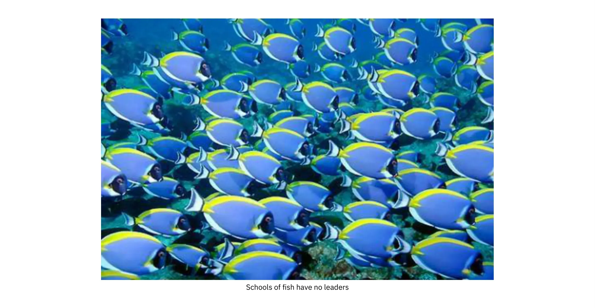

*Amashure y'amafi nta barongozi afise*


Uko wovyiyumvira kwose kuri Bitcoin, ukuntu iteye ahantu hamwe bituma igorana kuyigenzura. Bitcoin irahari, kandi ntaco woyikorako. Ni ikintu co kwiga, si co guharirako.


### Insozero ku bijanye no kwegereza ubutegetsi abaturage


Turatandukanya hagati y’ugusenyura ubutegetsi kwa Full node n’ugusenyura ubutegetsi kwa Mining. Mining kwegereza ubutegetsi abaturage ni uburyo bwo gushika ku kurwanya ubugenzuzi, mu gihe Full node kwegereza ubutegetsi abaturage ni co kituma amategeko y’uguhurizako y’urubuga Hard aguma ahinduka ata nkunga yagutse mu bakoresha.


Uko Bitcoin yegerejwe ahantu hamwe bituma habaho ukutagira aho bahengamiye ku bategura, abakoresha, n’abacukuzi. Umuntu wese arafise umwidegemvyo wo kuvyitabira ataco asavye.


Uburyo bwegerejwe bushobora kuba Hard kugira ngo uzingure umutwe wawe, ariko hariho ivyitegererezo bimwe bimwe vyo mu mutwe bishobora gufasha, nk’akarorero ururimi rw’icongereza, canke amashure y’amafi.


## Ukwizigira

<chapterId>0506ba61-16a3-543c-95fa-3f3e2dd64121</chapterId>


Iki gice kiracapura iciyumviro c’ukutagira icizigiro, ico bisobanura mu bijanye n’ubuhinga bwa mudasobwa, n’igituma Bitcoin itegerezwa kuba Trustless kugira ngo igumye ifise agaciro.

Turaheza tukavuga ico bisobanura gukoresha Bitcoin mu buryo bwa Trustless, n’ubwoko bw’ingwati Full node ishobora kuguha n’idashobora kuguha.

Mu gice ca nyuma, turaba ukuntu Bitcoin ikorana n’amaporogarama canke abakoresha vy’ukuri, be n’uko bikenewe gukorana hagati y’ugukoresha neza n’ukutagira icizigiro kugira ngo ikintu cose gikorwe na gato.


Abantu kenshi bavuga ibintu nk'ibi ngo "Bitcoin ni nziza cane kuko ni Trustless".


None Trustless bashaka kuvuga iki? Pieter Wuille asigura iri jambo rikoreshwa cane kuri [Ikirundo ca Exchange] (Ikirundo ca Bitcoin.


> Icizigiro turiko turavuga muri "Trustless" ni ijambo ry'ubuhinga ritaboneka. Uburyo busanzwe bwitwa Trustless iyo butasaba ko umuntu wese yizigirwa akora neza.

Muri make, ijambo *Trustless* ryerekeza ku mutungo w'amasezerano ya Bitcoin aho rishobora gukora ata "bamwe bizigira". Ivyo bitandukanye n’ukwizigira ata kabuza utegerezwa gushiramwo muri porogarama canke mu bikoresho ukoresha. Ibindi ku bijanye n’uwo muce wa nyuma w’ukwizigirana bizokwihwezwa cane muri iki kigabane.


Mu mice ihurikiye hamwe, twizigira izina ry’umukinyi wo hagati kugira ngo twiyemeze neza ko azokwitwararika umutekano canke azosubira inyuma iyo habaye ibibazo, hamwe n’imirongo y’amategeko kugira ngo ahane ukurenga ku mategeko kwose. Ivyo bisabwa vyo kwizigirana biratera ingorane mu mice y’ubutegetsi bw’amazina y’ibinyoma - nta bushobozi bwo kwisubirako rero mu vy’ukuri nta kwizigirana gushobora kubaho. Mu ntangamarara y’[igitabu cera ca Bitcoin](Bitcoin), Satoshi Nakamoto adondora iyo ngorane:


> Ubudandaji bwo kuri Internet bwaje kwizigira hafi gusa ibigo vy’ivy’imari bikora nk’abantu bizigira kugira ngo bashobore kwishura biciye ku buhinga bwa none.
> Naho iyo sisitemu ikora neza bihagije ku bikorwa vyinshi, iracariko irashikirwa n’intege nke zisanzwe z’akarorero gashingiye ku kwizigira.  Ivy’ugucuruza bidashobora gusubirwamwo rwose ntibishoboka vy’ukuri, kubera ko ibigo vy’ivy’imari bidashobora kwirinda guhuza amatati. Igiciro c’ubuhuza kirongereza igiciro c’ibikorwa, kigagabanya ubunini bukeyi bw’ibikorwa kandi kigaca ubushobozi bwo gukora ibikorwa bitobito vy’ubusa, kandi hariho igiciro cagutse mu gutakaza ubushobozi bwo gutanga amahera adashobora gusubirwamwo ku bikorwa bitasubirwamwo.
> Kubera ko hariho ubushobozi bwo guhindura, ivy’ukwizigirana birakwiragira. Abacuruzi bategerezwa kwirinda abakiriya babo, bakabatera ubwoba kugira ngo baronke amakuru menshi kuruta ayo boba bakeneye.  Ijana ry’ubuhendanyi ryemerwa ko ata co rishobora gukora. Ivyo bihembo n’ukudakeka kw’ukwishura birashobora kwirindwa umuntu ku giti ciwe hakoreshejwe amahera y’umubiri, ariko nta buryo buriho bwo kwishura biciye ku nzira y’itumanaho ata muntu yizigirwa .

Bisa n'uko tutashobora kugira uburyo bwegerejwe bushingiye ku kwizigirana, ni co gituma ukutagira icizigiro ari ikintu gihambaye muri Bitcoin.


Kugira ngo ukoreshe Bitcoin mu buryo bwa Trustless, utegerezwa gukoresha urudodo rwa Bitcoin rwemeza vyose. Niho gusa uzoshobora kugenzura ko ama blocks uronka ku bandi akurikiza amategeko y’uguhurizako; nk’akarorero, ko urutonde rwo gutanga Coin rugumaho kandi ko ata n’umwe akoresha amahera kabiri kuri Blockchain. Iyo udakoresha Full node, utanga outsource y’ugusuzuma ama blocks ya Bitcoin ku wundi muntu kandi ukamwizigira ngo akubwire ukuri, ivyo bisigura ko udakoresha Bitcoin ata kwizigira.


David Harding yanditse [ingingo iri ku rubuga rwa Bitcoin.org) asigura ingene gukoresha Full node - canke gukoresha Bitcoin ata kwizigira - mu vy’ukuri bigufasha:


> Ifaranga rya Bitcoin rikora gusa iyo abantu bemeye bitcoins muri Exchange ku bindi bintu vy’agaciro. Ivyo bisigura ko ari abantu bemera bitcoins bayiha agaciro kandi ni bo bafata ingingo y’ingene Bitcoin ikwiye gukora.
>

> Iyo wemeye bitcoins, urafise ububasha bwo gushitsa amategeko ya Bitcoin, nk’ukubuza gufata bitcoins z’umuntu uwo ari we wese ata n’umwe ashobora gushika ku mfunguruzo z’ibanga z’uwo muntu.
>

> Ikibabaje, abakoresha benshi baratanga ububasha bwabo bwo gukurikiza amategeko. Ivyo bisiga ukwegereza ubutegetsi Bitcoin mu gihe c’intege nke aho abacukuzi bakeyi bashobora gukorana n’amabanki makeyi n’ibikorwa vy’ubuntu kugira ngo bahindure amategeko ya Bitcoin ku bakoresha bose batagenzura bakoresheje ububasha bwabo ku bandi.
>

> Udakunze ibindi bikoresho, Bitcoin core irashira mu ngiro amategeko—rero iyo abacukuzi n’amabanki bahinduye amategeko ku bakoresha babo batagenzura, abo bakoresha ntibazoshobora kwishura abakoresha ba Bitcoin core buzuye nkawe.


Avuga ko gukoresha Full node bizokugirira akamaro mu kugenzura ikintu cose kiri muri Blockchain ata wundi wizigira, kugira ngo umenye neza ko ibiceri uronka ku bandi ari ivy’ukuri. Ivyo ni vyiza cane, ariko hari ikintu kimwe gihambaye Full node idashobora kugufasha: ntishobora kubuza gukoresha amahera kabiri biciye mu kwandika uruhererekane:


> Zirikana ko naho porogarama zose—harimwo na Bitcoin core—zishobora gusubirwamwo n’uruzitiro, Bitcoin itanga uburyo bwo kwikingira: uko amafaranga yawe agira ivyemezo vyinshi, ni ko urushiriza kugira umutekano. Nta n’iyindi nzira izwi yo kwikingira yegerejwe abantu iruta iyo.

Naho porogarama yawe yoba iteye imbere gute, uracari ukwiye kwizigira ko amabuye arimwo ibiceri vyawe atazosubira kwandikwa. Ariko rero, nk’uko Harding yabivuze, urashobora kurindira ivyemezo bitari bike, hanyuma ukabona ko ubushobozi bwo gusubira kwandika uruzitiro ari buto cane ku buryo bwokwemerwa.


Ivyo bitera intege gukoresha Bitcoin mu buryo bwa Trustless bihuye n’ivyo ubuhinga bukeneye bwo kwegereza ubutegetsi Full node. Uko abantu benshi bakoresha amanode yabo bwite yuzuye, ni ko Full node ikomeza gusenyuka, gutyo Bitcoin ikomeye cane ihagarara ku mahinduka mabi yo mu masezerano. Ariko ikibabaje, nk’uko vyasiguwe mu gice ca Full node co kwegereza ubutegetsi abaturage, abakoresha kenshi bahitamwo ibikorwa vyizigirwa nk’ingaruka y’uguhuza ataco bimaze hagati y’ukutagira icizigiro n’ukuntu umuntu abona ibintu.


Ukwizigirwa kwa Bitcoin ni ngombwa cane umuntu abona ibintu mu buryo bw’urutonde. Mu mwaka w’2018, Matt Corallo, [yavuze ku bijanye n’ukutagira icizigiro] (ukutagira icizigiro-n’amabwirizwa-mu-bigereranyo-vy’umutekano/) mu nama y’aba Baltic Honeybadger i Riga.


Ishingiro ry’iyo nsiguro ni uko udashobora kwubaka ubuhinga bwa Trustless hejuru y’ubuhinga bwo kwizigirwa, ariko ushobora kwubaka ubuhinga bwo kwizigirwa - nk’akarorero, ubuhinga bwa Wallet bwo kubungabunga - hejuru y’ubuhinga bwa Trustless.


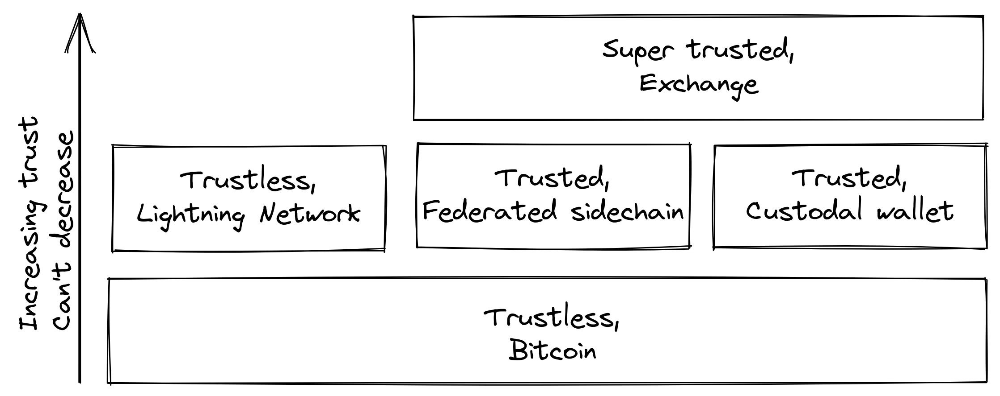


Igikoresho ca Trustless Layer kiremesha gucuruza ibintu bitandukanye ku rwego rwo hejuru .


Iyi nzira y'umutekano iremesha uwuhingura sisitemu guhitamwo ivyo yohindura

ivyo bikaba bifise insiguro kuri bo ata guhatira abandi gukora ivyo bintu.


### Ntukizere, suzuma


Bitcoin ikora ata kwizigira, ariko uracariho ubwirizwa kwizigira porogarama yawe n’ibikoresho vyawe ku rugero runaka. Ivyo ni kubera ko porogarama yawe canke ibikoresho vyawe bishobora kuba bitateguwe kugira ngo bikore ivyo bivugwa ku gasandugu. Nk'akarorero:


- CPU ishobora kuba yakozwe mu buryo bubi kugira ngo imenye ibikorwa vy’urufunguzo rw’ibanga maze ivuze amakuru y’urufunguzo rw’ibanga.
- Igikoresho co gukoresha umubare w’ibintu bishobora kuba bitari nk’uko kivyivugira.
- Bitcoin core yoba yari yinyegeje muri code izorungika imfunguruzo zawe z’ibanga ku mukinyi mubi.


Rero, uretse gukoresha Full node, urakeneye kandi kumenya neza ko uriko ukoresha ivyo wipfuza. Umukoresha wa Reddit brianddk [yanditse ingingo](https://www.reddit.com/r/Bitcoin/ibitekerezo/) ku bijanye n’ingero zitandukanye z’ukwizigira ushobora guhitamwo, igihe ugenzura porogarama yawe. Mu gice ca "Kwizigira abubatsi", avuga ku nyubakwa zishobora gusubirwamwo:


> Reproducible builds ni uburyo bwo guhingura porogaramu kugira ngo abahinguzi benshi bo mu kibano bashobore umwe wese kwubaka porogaramu no kumenya neza ko umuhinguzi wa nyuma yubatswe asa n’ivyo abandi bahinguzi bakora. Kubera umugambi wa bose cane, ushobora gusubirwamwo nka Bitcoin, nta muhinguzi n’umwe akeneye kwizigirwa bimwe bishitse. Abahinguzi benshi bose barashobora gukora iyo nyubakwa no kwemeza ko bakoze dosiye imwe n’iyo umwubatsi w’intango yashizeko umukono.

Iyo ngingo isobanura ingero 5 zo kwizigira: kwizigira urubuga, abubaka, uwukoranya, kernel, n’ibikoresho.


Kugira ngo Carl Dong [yashikirije ikiganiro ku vyerekeye Guix] (https://btctranscripts.com/ ni ryo rikoreshwa na Bitcoin core muri iki gihe.


> None twokora iki ku bijanye n’uko uruzitiro rwacu rw’ibikoresho rushobora kugira umugwi w’ibikoresho vyizigirwa bishobora kuba bibi bishobora gusubirwamwo? Turakeneye kuba abantu bashobora kuvyara kuruta. Turakeneye kuba abashobora gutera imbere. Ntidushobora kugira ibikoresho vyinshi nk’ivyo vy’ubuhinga bwa binaire dukeneye gukura no kwizigira ku ma server yo hanze agenzurwa n’ayandi mashirahamwe.
>

> Turakwiye kumenya ingene ivyo bikoresho vyubatswe n’ingene nyavyo dushobora guca mu nzira yo kubisubira kwubaka, vyiza ni ukubiva ku rutonde ruto cane rw’ibice bibiri vyizigiwe. Turakeneye kugabanya ivyizigiro vyacu vy'ibiharuro bibiri uko bishoboka kwose, kandi tukagira inzira yoroshe yo gusuzuma kuva kuri izo nzira z'ibikoresho gushika ku co dukoresha ingene twubaka Bitcoin. Ivyo bituma dushobora kugenzura cane no kugabanya ukwizigira.

Araheza asigura ingene Guix ituma twizigira gusa binaire ntoyi cane y’ama bytes 357 ishobora kugenzurwa no gutahurwa neza iyo uzi gusobanura amabwirizwa. Ivyo biratangaje cane: umuntu asuzuma ko iyo binary y’amabayiti 357 ikora ivyo ikwiye gukora, hanyuma akayikoresha mu kwubaka uburyo bwo kwubaka bushitse akoresheje kode y’inkomoko, maze agaheza akagira iyo binary ya Bitcoin core ikwiye kuba kopi nyayo y’ubwubatsi bw’uwundi muntu wese.


Hariho mantra benshi mu ba bitcoiners bafata, ifata neza vyinshi muri ivyo bivugwa haruguru:


> Ntukizere, suzuma.

Ivyo vyerekeye ijambo ngo "[wizere, ariko ugenzure]" uwahoze ari umukuru w'igihugu ca Amerika Ronald Reagan yakoresheje mu bijanye no gukuraho ibirwanisho vya kirimbuzi. [Abanya Bitcoin) barayihinduye kugira ngo bagaragaze ukwanka ukwizigirana n’akamaro ko gukoresha G-1.


Ni abakoresha ari bo bafata ingingo y’urugero bashaka kugenzuramwo porogarama bakoresha n’amakuru ya Blockchain baronka. Nk'uko biri ku bindi bintu vyinshi muri Bitcoin, hariho uguhuza hagati y'ukuryoherwa n'ukutagira icizigiro. Ni hafi y’igihe cose bimeze neza gukoresha Wallet y’ububiko ugereranyije no gukoresha Bitcoin core ku bikoresho vyawe bwite. Ariko rero, uko porogarama ya Bitcoin iriko irakura kandi n’imirongo y’abakoresha iriko iratera imbere, uko igihe kigenda kirarenga, ikwiye gutera imbere mu gufasha abakoresha biteguye gukora kugira ngo ntibavyizigire. Vyongeye, uko abakoresha baronka ubumenyi bwinshi uko igihe kigenda kirarenga, bakwiye kuba bashoboye gukuraho buhoro buhoro ukwizigira mu nsiguro.


Abakoresha bamwebamwe biyumvira mu buryo butari bwo kandi bagasuzuma imice myinshi ya porogarama bakoresha. Ivyo bituma bagabanya ivyipfuzo vyo kwizigirwa, kuko bakeneye gusa kwizigira ibikoresho vya orodinateri yabo be n’uburyo ikoresha. Mu kubigira, barafasha kandi abantu batagenzura neza ibikoresho vyabo nk’uko bimeze mu gushiramwo amajwi yabo mu ruhame kugira ngo baburishe ku bibazo vyose boshobora gusanga. Akarorero kamwe keza k’ivyo ni [ikintu cabaye mu 2018](https://bitcoincore.org/ru/2018/09/20/notice/), igihe umuntu yavumbura ikibazo cotuma abacukuzi bakoresha umusaruro incuro zibiri mu gikorwa kimwe:


> CVE-2018-17144, igisubizo casohotse ku wa 18 Nzero muri Bitcoin core verisiyo 0.16.3 na 0.17.0rc4, kirimwo igice co Kwanka Ibikorwa be n’uguhungabana kw’ibiciro. Mu ntango vyamenyeshejwe abahinguzi benshi bakora kuri Bitcoin core, hamwe n’imigambi ishigikira izindi cryptocurrencies, harimwo ABC na Unlimited ku wa 17 Nzero nk’ikibazo co kwanka gukoresha gusa, yamara rero twaciye twihuta kumenya ko ikibazo cari kandi ubugoyagoye bw’ugutera imbere kw’ibiciro bufise imvo n’imvano imwe n’ugukosora.

Aha, umuntu atamenyekanye yaratangaje ikibazo cahindutse kibi cane kuruta uko uwo munyamakuru yari abizi. Ivyo birerekana ko abantu bagenzura iyo kode akenshi bavuga amakosa yo mu mutekano aho kuyakoresha nabi. Ivyo ni vyiza ku bantu badashobora kugenzura vyose bonyene.


Ariko rero, abakoresha ntibakwiye kwizigira abandi ngo babazigame, ahubwo bakwiye kwisuzuma bonyene igihe cose n’ico bashoboye cose; niko umuntu aguma ari umusegaba uko bishoboka kwose, kandi niko Bitcoin itera imbere. Uko amaso arushiriza kuraba iyo porogarama, ni ko bishoboka ko amakode mabi be n’amakosa y’umutekano agenda aragabanuka.


### Insozero ku vyerekeye ukutagira icizigiro .


Iryo tegeko rya Bitcoin ni Trustless kuko rituma abarikoresha bashobora gukorana naryo batizigiye uwundi muntu. Ariko mu bikorwa, abantu benshi ntibashobora kugenzura urutonde rw’ibikoresho vyose bakoresha Bitcoin. Abantu b’abahinga bagenzura porogarama canke ibikoresho barashobora kugabisha abandi bantu batagira ubuhinga bwinshi iyo babonye kode canke ibikoko bibi.


Hatariho ukwizigira, ntidushobora kugira decentralisation, kuko ukwizigira ata kabuza kurimwo ingingo nyamukuru y’ubukuru. Ushobora kwubaka ubuhinga bwo kwizigirwa hejuru y’ubuhinga bwa Trustless, ariko ntushobora kwubaka ubuhinga bwa Trustless hejuru y’ubuhinga bwo kwizigirwa.


## Ubuzima bwite

<chapterId>1b960afe-0008-589b-b2f4-007d60d264c6</chapterId>


Iki gice kivuga ingene wozigama amakuru yawe y’ivy’amahera y’ibanga. Irasigura ico ubuzima bwite buhagaze mu bijanye na Bitcoin, igituma buhambaye, n’ico bisobanura kuvuga ko Bitcoin ari izina ry’uruyeri. Iraba kandi ingene amakuru y'ibanga ashobora gusohoka, On-Chain na off-chain.


Hanyuma, ivuga ku vy’uko bitcoins zikwiye kuba fungible, bisobanura ko zishobora guhindurwa n’izindi bitcoins zose, n’ingene fungibility n’ubuzima bwite bijana. Ubwa nyuma, ico kigabane kiratanga ingero zimwezimwe ushobora gufata kugira ngo urushirize kugira ubuzima bwite bwawe n’ubw’abandi.


Bitcoin ishobora kudondorwa nk’uburyo bw’amazina y’uruyeri, aho abakoresha bafise amazina y’uruyeri menshi mu buryo bw’imfunguruzo za bose. Umuntu aravye neza, ivyo bisa n’uburyo bwiza bwo kurinda abakoresha ngo ntibamenyekane, ariko mu vy’ukuri biroroshe cane gusohora amakuru y’ivy’ubutunzi bwite ataco bigamije.


### None ukwiherera bisobanura iki?


Ubuzima bwite burashobora gusobanura ibintu bitandukanye mu bihe bitandukanye. Muri Bitcoin, muri rusangi bisigura ko abakoresha badategerezwa guhishurira abandi amakuru yabo y’ivy’ubutunzi, kiretse babikoze ku bushake.


Hari uburyo bwinshi ushobora gutangaza amakuru yawe bwite ku bandi, ubizi canke utabizi. Amakuru ashobora gusohoka avuye kuri Blockchain ya bose canke biciye mu bundi buryo, nk’akarorero igihe abakozi b’ububisha bafata amakuru yawe yo kuri internet.


### Ni kubera iki kwiherera bihambaye?


Bishobora gusa n’ibigaragara igituma ubuzima bwite buhambaye muri Bitcoin, ariko hariho imice imwimwe umuntu yoshobora kudaca yiyumvira. [Ku rubuga rwa Bitcoin Talk], Gregory Maxwell araduca mu mpamvu nyinshi nziza zituma abona ko ubuzima bwite ari ngirakamaro. Muri ivyo harimwo isoko ry’uburenganzira, umutekano, n’uburenganzira bwa muntu:


> Ubuzima bwite bw’amahera ni ikintu nyamukuru gifasha isoko ry’uburenganzira rikore neza: iyo ukora ubucuruzi, ntushobora gushinga neza ibiciro iyo abaguha n’abaguzi bawe bashobora kubona ivyo ukora vyose ataco ushaka.
> Ntushobora guhiganwa neza iyo abaguhiganwa bariko barakurikirana ivyo ugurisha.  Ku muntu ku giti ciwe, amakuru yawe arazimangana mu bikorwa vyawe vy’ibanga iyo udafise ubuzima bwite ku makonti yawe: iyo urishe nyen’inzu yawe mu Bitcoin ata bwite buhagije buriho, nyen’inzu azobona igihe uzoba wararonse inyungu y’umushahara kandi ashobora kugutera kugira ngo ukoreshe amahera menshi y’ubukode.
>

> Ugukingira amahera ni ngombwa kugira ngo umuntu agire umutekano: nimba abasuma bashobora kubona amahera ukoresha, amahera winjiza be n’ivyo ufise, barashobora gukoresha ayo makuru kugira ngo bagufate kandi bagukoreshe nabi. Ata buzima bwite, abagira ububisha barafise ubushobozi bwinshi bwo kwiba akaranga kawe, gukunyaga ivyo ugura vyinshi ku muryango wawe, canke kwigira nk’abacuruzi ukorana na bo bakakubwira... barashobora kuvuga neza ingene bogerageza kukubesha.
>

> Ugukingira amahera ni ngirakamaro kugira ngo umuntu agire icubahiro: nta n’umwe ashaka ko umu barista w’umunyaruyeri wo mu kafe canke ababanyi babo b’abanyaruyeri bavuga ku bijanye n’amahera baronka canke ingeso zabo zo gukoresha amahera. Nta n’umwe ashaka ko abavyeyi biwe b’abasazi b’abana babaza igituma bagura uburyo bwo kwirinda gutwara inda (canke ibikinisho vyo gutera akabariro). Umukoresha wawe nta bucuruzi afise bwo kumenya ishengero utanga. Mu isi idafise ivangura ry’umuco utunganye aho ata n’umwe afise ububasha burengeje urugero ku wundi, ni ho gusa twoshobora kuguma dufise icubahiro cacu no gukora ibikorwa vyacu vyemewe n’amategeko mu mwidegemvyo ata kwigenzura iyo tutagira ubuzima bwite.

Maxwell kandi akora ku bijanye n’uguhinduranya, ivyo tuzobivugako mu nyuma muri iki kigabane, be n’ingene ubuzima bwite n’ugukurikiza amategeko bitavuguruzanya.


### Izina ry'uruyeri


Twaravuze haruguru ko Bitcoin ari izina ry’uruyeri, kandi ko ayo mazina y’uruyeri ari imfunguruzo za bose. Mu binyamakuru kenshi wumva ko Bitcoin atazwi, ivyo bikaba bitari ukuri. Hariho itandukaniro hagati y’ukutamenyekana n’ukutamenyekana.


Andrew Poelstra [asigura mu kiganiro ca Bitcoin Stack Exchange] ingene ukutamenyekana vyosa mu bikorwa vy’ubudandaji:


> Total anonymity, mu buryo bw’uko iyo ukoresheje amahera ata n’akarongo k’aho yava canke aho aja, birashoboka mu buryo bw’ivyiyumviro hakoreshejwe ubuhinga bwa cryptography bw’ibimenyamenya vy’ubumenyi butagira ico buvuze.

Itandukaniro risa n’iry’uko mu buryo bw’amahera y’uruyeri ushobora gukurikirana amahera yishurwa hagati y’amazina y’uruyeri, mu gihe mu buryo bw’amahera y’uruyeri udashobora. Kubera ko amahera ya Bitcoin ashobora gukurikirana hagati y’amazina y’uruyeri, si uburyo butazwi.


Twaravuze kandi ko amazina y’uruyeri ari imfunguruzo za bose, ariko mu vy’ukuri ni amaderesi akomoka ku mfunguruzo za bose. Ni kuki dukoresha amaderesi nk'amazina y'uruyeri atari ikindi kintu, nk'akarorero amazina amwe amwe adondora, nka "watchme1984"? Ivyo vyarasiguwe neza n’umukoresha Tim S., na we nyene ari kuri Bitcoin Stack Exchange:


> Kugira ngo iciyumviro ca Bitcoin gikore, utegerezwa kuba ufise ibiceri bishobora gukoreshwa gusa na nyen’urufunguzo rw’ibanga rwatanzwe. Ivyo bisigura ko ivyo woherereje vyose bitegerezwa kuba biboshe, mu buryo bumwe, ku rufunguzo rwa bose.
>

> Gukoresha amazina y'uruyeri (nk'amazina y'abakoresha) vyoba bisobanura ko ubwirizwa guhuza iryo zina ry'uruyeri n'urufunguzo rwa bose kugira ngo ushobore gukoresha urufunguzo rwa bose/rwihariye. Ivyo vyokuraho ubushobozi bwo gukora aderesi/amazina y'uruyeri ata murongo (nk'akarorero imbere y'uko umuntu yohereza amahera kw'izina ry'ukoresha "tdumidu", ubwirizwa kumenyesha muri Blockchain ko "tdumidu" ari iy'urufunguzo rwa bose "a1c...", kandi ugashiramwo amahera kugira ngo abandi ntibagire izina ry'uruyeri). kugira ngo wongere ukoreshe amazina y’uruyeri), kandi ushiremwo ubunini bwa Blockchain ata co bimaze. Vyoshobora kandi gutuma umuntu agira umutekano w'ikinyoma uriko urungikira uwo wiyumvira ko uri (nifata izina "Linus Torvalds" imbere y'uko arifata, rero ni iryanje kandi abantu boshobora kohereza amahera biyumvira ko bariko bariha uwaremye Linux, atari jewe).

Dukoresheje amaderesi, canke imfunguruzo za bose, turashika ku ntego zihambaye, nk’ugukuraho ivy’uko mu buryo bumwe canke bundi umuntu yokwandika izina ry’uruyeri imbere y’igihe, kugabanya ibintu bituma umuntu asubira gukoresha izina ry’uruyeri, kwirinda gutera ivyatsi Blockchain, no gutuma bigorana kwigira abandi bantu.


### Blockchain ubuzima bwite


Ubuzima bwite bwa Blockchain buvuga amakuru utangaza mu gukoresha kuri Blockchain. Birakora ku bikorwa vyose, ivyo wohereje hamwe n’ivyo uronka.


Satoshi Nakamoto azirikana ku bijanye n’ubuzima bwite bwa On-Chain mu gice ca 7 c’igitabu ciwe c’ubuzima bwite.


> Nk’uruhome rw’umuriro rw’inyongera, urufunguzo rushasha rukwiye gukoreshwa ku bijanye n’ugucuruza kwose kugira ngo ntiruhuzwe n’uwundi muntu. Hariho uguhuza n’ubu nyene bidashobora kwirindwa n’ibikorwa vy’ubudandaji vy’ibintu vyinshi, ivyo bikaba vyerekana ko ibintu vyabo vyari vy’uwubifise. Icoba ari ikibazo ni uko iyo nyen’urufunguzo amenyekanye, guhuza vyoshobora guhishura ibindi bikorwa vyari vy’uwo nyen’urufunguzo nyene.

Ico cegeranyo kiraca irya n’ino ingorane nyamukuru z’ubuzima bwite bwa Blockchain, ni ukuvuga gusubira gukoresha Address no gukoranya Address. Irya mbere ni iryo kwisigura, irya nyuma ryerekeza ku bushobozi bwo gufata ingingo, n’urugero runaka rw’ukudakeka, ko umugwi w’amaderesi atandukanye ari uw’uwukoresha umwe.


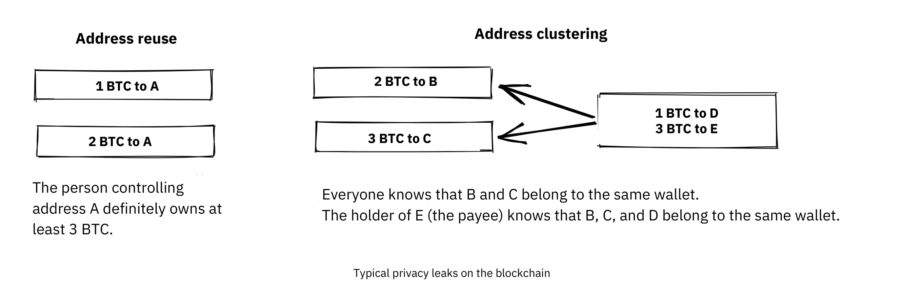


Ivyerekeye ubuzima bwite busanzwe kuri Blockchain


Chris Belcher [yanditse mu buryo burambuye cane] (Ibanga#Ibitero_vy'ubuzima bwite) ku bwoko butandukanye bw'ubuzima bwite bushobora gushika kuri Bitcoin Blockchain. Turagusavye gusoma n'imiburiburi ibice bikeyi vya mbere biri munsi ya "Ibitero vya Blockchain ku buzima bwite."


Ico twofata ni uko ubuzima bwite muri Bitcoin butatunganye. Bisaba igikorwa kinini cane kugira ngo umuntu ashobore gukorana n’abandi mu bwiherero. Abantu benshi ntibateguye kuja kure gutyo kubera ubuzima bwite. Bisa n’uko hariho uguhuza gutomoye hagati y’ubuzima bwite n’ugukoreshwa.


Ikindi kintu gihambaye mu bijanye n’ubuzima bwite ni uko ingingo ufata kugira ngo ukinge ubuzima bwite bwawe bwite zigira ico zikoze ku bandi bakoresha na bo nyene. Iyo uri umunyaruyeri n’ubuzima bwawe bwite, abandi bantu na bo nyene boshobora kugabanya ubuzima bwiwe bwite. Gregory Maxwell arabisigura neza cane kuri ico kiganiro nyene ca Bitcoin Talk [twahuje haruguru], maze agasozera n’akarorero:


> Ivyo mu vy’ukuri birakora mu bikorwa, na vyo nyene... Umunyaruyeri mwiza w’inkofero yera kuri IRC yariko arakina n’ugucapura ubwonko maze akubita ijambo ririmwo ~250 BTC.  Twarashoboye kumenya nyen'iyo modoka dukoresheje Address gusa, kuko bari barishe n'ishirahamwe rya Bitcoin ryasubira gukoresha amaderesi kandi yarashoboye kubabwira ngo bahebe amakuru y'abakoresha. Mu vy'ukuri yararonse uwo muntu kuri telefone, baratangaye cane kandi barazazanirwa—ariko barakenguruka kuba batasohotse Coin yabo.  Iherezo ryiza ng’aho. (Iki si co kigereranyo conyene caco, ku buryo ... ariko ni kimwe mu biteye umunezero kuruta).

Muri iki gihe, vyose vyagenze neza kubera uwo munyaruyeri afise umutima w’ubugiraneza, ariko ntimuvyizigire mu gihe kizoza.


### Ubuzima bwite butari Blockchain


Naho Blockchain yerekana ko ari isoko izwi cane y’ugusohoka kw’ubuzima bwite, hariho n’ibindi vyinshi bisohoka bidakoresha Blockchain, bimwe bikaba ari ivy’ubuhendanyi kuruta ibindi. Ivyo biva ku bafata amakuru y’urufunguzo gushika ku gusesangura uruja n’uruza rw’urubuga. Kugira usome kuri bumwe muri ubu buryo, usabwe gusubira kuraba [igice ca Chris Belcher](https://ru.Bitcoin.it/Ibanga#Ibitero_bitari_ku_blockchain_ku_banga), cane cane igice "Ibitero bitari_vya Blockchain ku buzima bwite".


Mu bitero vyinshi, Belcher avuga ko umuntu yoshobora guca ku rubuga rwawe rwa internet, nk’akarorero, ISP yawe:


> Iyo umwansi abonye igikorwa canke igice kiva mu nzira yawe kitari bwinjiye mbere, rero arashobora kumenya ata gukeka ko ico gikorwa cakozwe nawe canke ko igice cacukuwe nawe. Uko amahuzu ya internet azoba ariko arakora, umwansi azoshobora guhuza IP Address n’amakuru ya Bitcoin yavumbuwe.

Ariko rero, mu bintu bigaragara cane biva mu vy’ubuzima bwite harimwo n’uguhanahana amakuru. Kubera amategeko, akenshi yitwa KYC (Know Your Customer) na AML (Anti-Money Laundering), afise akamaro mu bihugu bakoreramwo, amashirahamwe n’amashirahamwe afitaniye isano n’ivyo akenshi ategerezwa gukusanya amakuru yerekeye abakoresha bayo, yubaka amakuru manini manini yerekeye abakoresha bafise ama bitcoins ayahe. Izo nzira z’amakuru ni ibibanza bikomeye vy’ubuki ku ntwaro mbi n’abagizi ba nabi bama barondera abashasha bashobora gushikirwa n’ingorane. Hariho amasoko nyayo y’ubwo bwoko bw’amakuru, aho abasuma

kugurisha amakuru ku wutanga amahera menshi.


Ikibi kuruta, amashirahamwe acungera izo nzira z’amakuru akenshi nta bumenyi bwinshi afise mu bijanye no kurinda amakuru y’ivy’ubutunzi, mu vy’ukuri benshi muri bo ni amashirahamwe akiri bato atanguye, kandi turazi neza ko hariho amakuru menshi amaze gusohoka. Ingero nkeyi ni .

[Ikinyamakuru MobiQwik co mu Buhindi](https://bitcoinmagazine.com/ubucuruzi/kumbure-amakuru-manini-ya-kyc-yasohotse-mu-mateka-yerekana-akamaro-k’ubuzima bwite-bwa-Bitcoin) na [Ikibanza](ikinyamakuru ca Bitcoin.com/ubucuruzi/ikinyamakuru-cy’umutekano-guca-gusohoka-amakuru-y’abakoresha-Bitcoin).


Na none, gukingira amakuru ivyo bitero vyinshi ni Hard, kandi birashoboka ko utazoshobora kubikora bimwe bishitse. Uzobwirizwa guhitamwo uguhuza hagati y’ukuryoherwa n’ubuzima bwite bigufasha cane.


### Uguhinduka


Fungibility, mu bijanye n’amafaranga, bisigura ko Coin imwe ishobora guhindurwa n’iyindi Coin iyo ari yo yose y’ayo mafaranga nyene. Ibi biratwenza

ijambo ryakozweko muri make mu ntango z’ikigabane.


Mu kiganiro cavuzwe ng’aho, Gregory Maxwell [yavuze]:


> Ubuzima bwite bw’amahera ni ikintu gihambaye ku bijanye n’uguhinduka muri Bitcoin: nimba ushobora gutandukanya Coin imwe n’iyindi mu buryo bufise insiguro, rero uguhinduka kwabo ni ugugoyagoya. Iyo fungibilité yacu ari intege nke cane mu bikorwa, rero ntidushobora kwegereza abantu: iyo umuntu ahambaye amenyesheje urutonde rw’ibiceri vyibwe batazokwemera ibiceri bivako, utegerezwa gusuzuma neza ibiceri wemera ugereranije n’urwo rutonde maze ugasubiza ivyo bitashoboye.  Abantu bose barafatwa n’ugusuzuma ama blacklists yasohowe n’ubutegetsi butandukanye kuko muri iyo si twese ntitwoshima gufatwa n’ibiceri bibi. Ivyo birongereza ugushihana n’ibiciro vy’ugucuruza kandi bituma Bitcoin idafise agaciro nk’amahera.

Aha, avuga ibijanye n’akaga gaterwa n’ukubura ubushobozi bwo guhindura ibintu. Twibaze ko ufise UTXO. Amateka ya UTXO ashobora gusubirwamwo mu bisanzwe, akaja mu bihe vyinshi vy’imbere. Nimba kimwe muri ivyo bimenyetso cari gifise uruhara mu gikorwa ico ari co cose kitemewe n’amategeko, kidakenewe canke giteye amakenga, rero bamwe mu bashobora kwakira Coin yawe boshobora kuvyanka. Niba wiyumvira ko abahembwa bazogenzura ibiceri vyawe ku rutonde rw’ibintu vyera canke vy’umwirabura, woshobora gutangura kugenzura ibiceri uronka na vyo nyene, kugira ngo ube ku ruhande rw’umutekano. Ico bivamwo ni uko uguhinduka nabi kuzokomeza mbere uguhinduka nabi kuruta.


Adam Back na Matt Corallo [batanze ikiganiro ku bijanye n’uguhindura ibintu] mu gihe c’ugupima Bitcoin i Milan mu 2016. Bariko bariyumvira ku mirongo imwe:


> Ukeneye ubuhinga bwo guhindura ibintu kugira ngo Bitcoin ikore. Iyo uronse ibiceri ntushobora kubikoresha, niho rero utangura gukekeranya nimba ushobora kubikoresha. Niba hariho amakenga ku biceri uronka, rero abantu baja mu bikorwa vy'uguhumanya bagasuzuma nimba "ivyo biceri bihezagiwe" hanyuma abantu baja kwanka gucuruza. Ivyo bikora ni uko bihindura Bitcoin kuva ku nzira itagira uruhusha yegerejwe gushika ku nzira yemerewe aho ufise "IOU" ivuye ku batanga uruhusha rwo ku rutonde rw'ibara ry'agahama.

Bisa n’uko ubuzima bwite n’uguhinduka bijana. Fungibility izogoyagoya iyo ubuzima bwite bugoyagoya, nk’akarorero nk’uko ibiceri biva ku bantu badakenewe bishobora gushirwa ku rutonde rw’abanyagihugu. Mu buryo nk’ubwo, ubuzima bwite buzogoyagoya iyo fungibility igoyagoya: iyo hari urutonde rw’ibintu vyirabura, uzobwirizwa kubaza abatanga urutonde rw’ibintu vyirabura ku bijanye n’ibiceri wokwemera, gutyo bishoboka ko uhishura IP yawe Address, email Address, n’ayandi makuru y’agaciro. Ivyo bintu bibiri birafatanye cane ku buryo ari Hard kuvuga kuri kimwe muri vyo kimwe.


### Ingingo z'ubuzima bwite


Hari ubuhinga bwinshi bwateguwe bwo gufasha abantu kwikingira amakuru y’ibanga. Mu bigaragara cane ni nk’uko Nakamoto yabivuze imbere y’aho, gukoresha ubuhinga budasanzwe .

aderesi z’ugucuruza kwose, ariko hariho n’izindi nyinshi. Ntituzokwigisha ingene woba ninja y’ubuzima bwite. Ariko rero, Bitcoin Q+A ifise [incamake yihuta y’ubuhinga bwo kwongereza ubuzima bwite](https://bitcoiner.guide/privacytips/), mu buryo bumwe butegekanijwe n’ingene Hard izoshirwa mu ngiro. Iyo uyisomye, uzobona ko ubuzima bwite bwa Bitcoin akenshi bufitaniye isano n'ibintu biri hanze ya Bitcoin. Nk’akarorero, ntukwiye kwirata ama bitcoins yawe, kandi ukwiye gukoresha Tor na VPN.


Ivyo bimenyetso kandi biratanga urutonde rw’ingero zimwe zimwe zijanye n’ivyo Bitcoin:


- Full node: Niwaba udakoresha Full node yawe, uzosohora amakuru menshi yerekeye Wallet yawe ku ba serveri bo kuri internet. Gukoresha Full node ni intambwe ya mbere ikomeye cane.
- Lightning Network: Hariho amategeko menshi hejuru ya Bitcoin, nk'akarorero Lightning Network na Liquid ya Blockstream.
- CoinJoin: Uburyo abantu benshi bashobora gufatanya amafaranga yabo bakayagira kimwe, bikaba bigoye gukora isesengura ry’uruzitiro.


Mu [kiganiro](https://btctranscripts.com/gusenyura-Bitcoin/2019/gusenyura-Bitcoin-ubuzima bwite/) mu nama Breaking Bitcoin, Chris Belcher yatanze akarorero gashimishije k’ingene ubuzima bwite bwateye imbere:


> Bari ikibanza c’ugukiniramwo Bitcoin. Urusimbi rwo kuri internet ntirwemerewe muri Amerika. Abakiriya bose ba Coinbase bashize amahera kuri Bustabit boba baciye bafunga amakonti yabo kuko Coinbase yariko irabikurikirana. Bustabit yakoze ibintu bikeyi. Bakoze ikintu citwa kwirinda guhindura aho unyura– maze ukabona nimba ushobora kwubaka igikorwa kitagira igisubizo c’ihinduka. Ivyo bizigama amahera ya Miner kandi bikabuza n’ugusesangura.
>

> Vyongeye, barazana amaderesi yabo y’ibizigamirwa yakoreshejwe cane mu isoko ry’ubudandaji. Muri iki gihe, abakiriya ba coinbase.com ntibaciye babuzwa. Bisa n’uko igikorwa co gucungera Coinbase kitashoboye gukora isesengura inyuma y’ivyo, rero birashoboka guca izo nzira.

Yaravuze kandi ako karorero, mu bindi, kuri [Urupapuro rw’Ibanga](https://ru.Bitcoin.it/Ibanga) kuri wiki ya Bitcoin.


Raba ingene ubuzima bwite bushobora gushikwako mu kwubaka ubuhinga hejuru ya Bitcoin, nk’uko biri kuri Lightning Network:


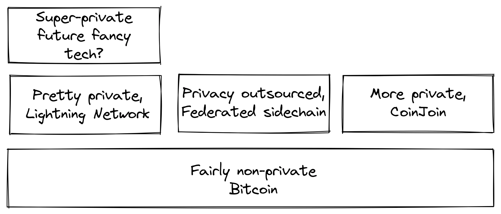


Ivyumba biri hejuru ya Bitcoin birashobora kwongera ubuzima bwite


Twarabonye mu kigabane ca nyuma ko ivy’ukwizigirana bishobora kwongerekana gusa iyo hariho ibice biri hejuru, ariko ivyo ntibisa n’uko biri ku bijanye n’ubuzima bwite, bushobora guterwa imbere canke gukomera cane ataco buvuze mu bice biri hejuru. Kubera iki ari ukwo? Layer yose iri hejuru ya Bitcoin, nk'uko vyasiguwe mu gice c'Igipimo c'Imirongo mu gice kizoza, itegerezwa gukoresha amafaranga On-Chain rimwe na rimwe, ahandi ho ntizoba "hejuru ya Bitcoin". Ivyumba vy’ubuzima bwite muri rusangi biragerageza gukoresha Layer y’ishimikiro bikeyi uko bishoboka kwose kugira ngo bigabanye amakuru ahishurirwa.


Ivyo bivugwa haruguru ni uburyo bumwe bumwe bw’ubuhinga bwo gutuma ubuzima bwite bwawe bugenda neza. Ariko hariho ubundi buryo. Mu ntango y’iki gice, twavuze ko Bitcoin ari ubuhinga bw’amazina y’uruyeri. Ivyo bisigura ko abakoresha muri Bitcoin batamenyekana n’amazina yabo nyayo canke ayandi makuru y’ibanga, ahubwo bamenyekana n’imfunguruzo zabo za bose. Urufunguzo rwa bose ni izina ry'uruyeri ry'ukoresha, kandi umukoresha ashobora kugira amazina y'uruyeri menshi. Mu isi nziza, akaranga kawe k’umuntu karatandukanywa n’amazina yawe y’uruyeri Bitcoin. Ikibabaje, kubera ingorane z’ubuzima bwite zivugwa muri iki kigabane, iyo decoupling akenshi irasenyuka uko igihe kigenda kirarenga.


Kugira ngo ugabanye ingorane zo gutuma amakuru yawe bwite ahishurirwa ni ukutayatanga mu kibanza ca mbere canke ngo uyahe ibikorwa vy’ubuhinga bumwe, vyubaka amakuru manini manini ashobora gusohoka. Ingingo ya Bitcoin Q+A [isigura KYC] n’akaga kava muri yo. Iratanga kandi intambwe zimwe zimwe ushobora gutera kugira ngo utere imbere:


> Turakenguruka ko hariho uburyo bumwe bumwe bwo kugura Bitcoin biciye ku masoko ya KYC. Ivyo vyose ni P2P (peer to peer) exchanges aho uriko uracuruza ataco uhinduye n’uwundi muntu atari uwundi muntu. Ikibabaje bamwe bagurisha ibindi biceri hamwe na Bitcoin rero turabahimiriza ngo mwitwararike.

Iyo nkuru iragusaba kwirinda gukoresha amafaranga asaba KYC/AML ahubwo ugacuruza mu bwiherero, canke ukoreshe amafaranga yegerejwe nka [bisq](https://bisq.network/).


https://planb.academy/en/tutorials/exchange/peer-to-peer/bisq-fe244bfa-dcc4-4522-8ec7-92223373ed04

Kugira ngo usome mu buryo bwimbitse ku bijanye n'ingene wovyifatamwo, raba [ingingo ya wiki ku bijanye n'ubuzima bwite](https://ru.Bitcoin.it/wiki/Ubuzima bwite#Uburyo_bwo_gutegura_ubuzima bwite_.28non-Blockchain.29), guhera kuri " (atari Blockchain)".


### Insozero ku vyerekeye ubuzima bwite


Ubuzima bwite burahambaye cane ariko Hard kugira ngo ubishikeko. Nta masasu y’ifeza y’ubuzima bwite.


Kugira ngo ubone ubuzima bwite bubereye muri Bitcoin, utegerezwa gufata ingingo zikomeye, zimwe muri zo zikaba zitwara amahera menshi kandi zitwara umwanya.


## Iherezo Supply

<chapterId>af125ba2-ef98-5905-8895-41a538fe5ea5</chapterId>


Iki gice kiraba mu gipimo ca Bitcoin Supply c’amamiliyoni 21 ya BTC, canke ni angahe mu vy’ukuri? Turavuga ingene uwo mupaka ushirwa mu ngiro n’ico umuntu yokora kugira ngo asuzume ko uriko urubahirizwa. Ikindi kandi, turafata akajisho mu mupira w’amabuye y’agaciro maze tukaganira ku bijanye n’inguvu zizoza mu rukino igihe Block reward izova ku bijanye n’infashanyo ikaja ku bijanye n’amahera.


Igikoresho kizwi cane c’iherezo ca Supply c’ama BTC miliyoni 21 kibonwa ko ari umutungo w’ishimikiro wa Bitcoin. Ariko none, vy’ukuri vyoba vyashizwe mw’ibuye?


Reka dutangure turabe ivyo amategeko y’uguhurizako ubu avuga ku bijanye na Supply ya Bitcoin, n’ingene mu vy’ukuri izokoreshwa. Pieter Wuille yanditse igice ku bijanye n’ivyo [ku kirundo ca Exchange], aho yaharuye ingene ama bitcoins yoba ariho iyo amafaranga yose azoba amaze gucukurwa:


> Iyo ushize hamwe ivyo biharuro vyose, ubona 20999999.9769 BTC.

Ariko kubera imvo zitari nke -- nk'ingorane za kera z'ugucuruza amafaranga, abacukuzi b'amabuye y'agaciro bavuga ataco bashaka, n'ugutakaza imfunguruzo z'ibanga -- uwo mupaka wo hejuru ntuzokwigera ushika. Wuille asozera ati:


> Ivyo bidusiga 20999817.31308491 BTC (dufashe vyose gushika ku 528333)

Ariko rero, ama wallet atandukanye yarazimiye canke yibwe, amafaranga yoherezwa kuri Address idakwiriye, abantu baribagiwe ko bafise Bitcoin. Ivyo vyose hamwe bishobora kuba ari amamiliyoni. Abantu baragerageje guharura ibihombo bizwi [hano] (insiguro=7253.0).


Ivyo bidusiga dufise: ??? BTC.


Turashobora rero kwemera tudakeka ko Bitcoin Supply izoba ari 20999817,31308491 BTC n’ibindi. Ibiceri vyose vyazimiye canke bituritse bitagenzurwa bizotuma uwo mubare ugabanuka, ariko ntituzi ku rugero rungana iki. Ikintu gishimishije ni uko ataco bimaze vy’ukuri, canke ikiruta vyose bifise akamaro mu buryo bwiza ku bafise Bitcoin,

[nk'uko vyasiguwe] na Satoshi Nakamoto:


> Ibiceri vyazimiye bituma gusa ibiceri vy’abandi bose bigira agaciro gatoyi.  Wiyumvire ko ari intererano ku muntu wese.

Supply ifise impera izogabanuka kandi ivyo bikwiye, n’imiburiburi mu vyiyumviro, gutuma ibiciro bigabanuka.


Igihambaye kuruta igitigiri nyaco c’ibiceri biriko birakoreshwa ni uburyo umupaka wa Supply ushirwa mu ngiro ata butegetsi bwo hagati buhari. Izina ry'izina ry'ikirundi chytrik ribishira neza kuri [Ikirundo Exchange] (Ikirundo Bitcoin.


> Inyishu rero ni uko udategerezwa kwizigira umuntu kugira ngo ntuzongere Supply. Ubwirizwa gusa gukoresha code imwe imwe izogenzura ko batayikoze.

Naho ama node amwe amwe yuzuye yohindukira akaja ku ruhande rw’umwiza maze agafata ingingo yo kwemera ama blocks afise amafaranga menshi y’amahera, ama node yose asigaye yuzuye azoyarengagiza gusa maze abandanye akora nk’uko bisanzwe. Hariho ama node yuzuye ashobora, abigiranye ubushake canke ata bushake, akoresha porogarama mbi, yamara bose bazokingira neza Blockchain. Mu gusozera, urashobora guhitamwo kwizigira urutonde ata n’umwe wizigira.


### Infashanyo y'ububiko n'amafaranga y'ugucuruza


Block reward igizwe n’infashanyo y’ibarabara hamwe n’amahera y’ugucuruza. Block reward ikeneye kwishura amafaranga y’umutekano wa Bitcoin. Turashobora kuvuga ata gukeka ko mu bihe vy’ubu ku bijanye n’infashanyo y’amabuye, amafaranga y’ugucuruza, igiciro ca Bitcoin, ubunini bwa Mempool, ububasha bwa Hash, urugero rw’ugusenyura ubutegetsi n’ibindi, inguvu zituma umukinyi wese akina akurikije amategeko ni nyinshi cane kugira ngo hazigame uburyo bw’amahera butekanye.


None bigenda gute iyo infashanyo y’amabuye yegereye zero? Kugira ngo ibintu bibe vyoroshe, reka twiyumvire ko mu vy’ukuri bingana na zero. Muri iki gihe, igiciro c’umutekano wa sisitemu gifatwa biciye ku mahera y’ugucuruza gusa. Ivyo kazoza kazodufitiye iyo ivyo bishitse, ntidushobora kubimenya. Ibintu bidatomoye ni vyinshi kandi dusigaye tuvyiyumvira. Nk’akarorero, intererano ya Paul Sztorc ku bijanye n’ico kibazo [mu rubuga rwiwe rwa Truthcoin](https://www.truthcoin.info/blog/security-budget/) ahanini ni ugutekereza ku bintu, ariko afise n’imiburiburi iciyumviro kimwe gikomeye (ndabinginze mumenye ko M2, nk’uko Sztorc abivuga, ari ingero y’umubare w’amafaranga):-W2.


> Naho ivyo bibiri bivanze mu "ngengo y'imari y'umutekano" imwe, infashanyo y'amabarabara n'amafaranga ya txn biratandukanye cane kandi rwose. Bitandukanye cane, nk'uko "inyungu yose ya VISA mu 2017" iva ku "kwiyongera kwose kwa M2 mu 2017".

Ubu, abafise ni bo bariha umutekano (biciye mu gutera imbere kw’amahera). Ejo ni ho abakoresha amahera bazokwikorera mu buryo bumwe canke ubundi uwo muzigo, nk’uko vyerekanwa aha hepfo.


Uko igihe kigenda kirarenga, ukwikorera amafaranga y’umutekano bizova ku bafise bije ku bakoresha .


Iyo amafaranga y’ugucuruza ari yo atuma Mining ikora, ivyo bitera intege birahinduka. Ikiruta vyose, iyo Mempool ya Miner idafise amahera ahagije yo gukoresha, vyoshobora gutuma iyo Miner isubira kwandika amateka ya Bitcoin aho kuyagura. Bitcoin Optech ifise [igice kivuga kuri iyo nyifato] kidasanzwe, citwa *gutera amahera*, canditswe na David Harding:


> Gufata amafaranga ni ingorane ishobora gushika uko infashanyo ya Bitcoin iguma igabanuka kandi amafaranga y’ugucuruza agatangura kuganza ingororano za Bitcoin. Nimba amafaranga y’ugucuruza ari vyo vyose bihambaye, rero Miner ifise `x` kw’ijana y’igipimo ca Hash irafise amahirwe `x` kw’ijana ya Mining igice gikurikira, rero agaciro bitezwe kuri bo k’ukuri Mining ni `x` kw’ijana ry’igipimo ciza ca Mining c’ ibikorwa](2021/06/02/#abashaka-gutora-bashingiye-ku-buhinga-bw'inyubako) muri Mempool yabo.
>

> Canke rero, indege Miner yoshobora kugerageza mu buryo butagororotse gusubira gucukura igice ca kera congereyeko ikindi gice gishasha cose kugira ngo yongere uruzitiro. Iyi nyifato yitwa gufata amahera, kandi amahirwe y’uko Miner y’ubuhemu yo kuyiroranirwa iyo uwundi Miner wese ari inzirabugunge ni `(x/(1-x))^2`. Naho amafaranga y’ugutera imbere afise amahirwe make yo kuroranirwa kuruta Mining y’ukuri, kugerageza Mining y’ukuri vyoshobora kuba ari vyo bizotuma umuntu agira inyungu iyo amafaranga yo mu gice c’imbere yishuye amafaranga menshi cane kuruta ayo muri Mempool ubu—amahirwe make ashobora kuba afise agaciro kanini kuruta amafaranga menshi.

Gutera uburengeti butose ku vyizigiro vyacu vyo muri kazoza ni ukuri kw’uko abacukuzi b’amabuye y’agaciro iyo batanguye gukora igikorwa co gutera amabuye y’agaciro, ivyo bizotuma abandi na bo nyene babigira, bigatuma n’abacukuzi b’amabuye y’agaciro b’inzirabugunge baguma ari bake. Ivyo vyoshobora gutuma umutekano wose wa Bitcoin uhungabana cane. Harding abandanya atanga urutonde rw’ingingo nkeyi zishobora gufatwa, nk’ukwizigira igihe co gucuruza kugira ngo umuntu ahagarike aho muri Blockchain ugucuruza gushobora kuboneka.


Rero, kubera ko amasezerano ku bijanye n’iherezo rya Supply asigaye, infashanyo y’ibarabara izo - gushimira [BIP42](https://github.com/Bitcoin/BIPs/blob/master/BIP-0042.mediawiki) yashizeho ugutera imbere kw’ibiciro kw’igihe kirekire cane. amafaranga y’ugucuruza inyuma y’aho abe ahagije kugira ngo urubuga rukingirwe?


Ntibishoboka kubivuga, ariko turazi ibintu bikeyi:


- Ijana ni igihe *kirekire* uhereye ku mbonerahamwe ya Bitcoin. Nimba kikiriho, birashoboka ko kizoba carateye imbere cane.
- Iyo abantu benshi cane mu vy’ubutunzi basanze bikenewe guhindura amategeko no gushiramwo nk’akarorero ugutera imbere kw’amahera ku mwaka ku rugero rwa 0,1% canke 1%, Supply ya Bitcoin ntizosubira kuba ifise iherezo.
- Kubera infashanyo ya zero block n’i Mempool iri ubusa canke hafi y’ubusa, ibintu birashobora guhungabana kubera amafaranga y’ugutera imbere.


Kubera ko uguhindukira tuja ku Block reward y’amahera gusa ari kure cane muri kazoza, vyoshobora kuba vyiza tutasimbukiye ku nsozero maze tukagerageza gutorera umuti ingorane zishobora kubaho mu gihe tukiriho. Nk'akarorero, Peter Todd yiyumvira ko hariho ingorane nyayo y'uko ingengo y'imari y'umutekano ya Bitcoin itazohagije muri kazoza, kandi ivyo bikaba ari vyo bituma habaho ugutera imbere gutoya kw'ibiciro muri Bitcoin. Ariko kandi, abona ko atari iciyumviro ciza co kuganira ku kibazo nk’ico muri iki gihe, nk’uko [yabivuze ku kiganiro What Bitcoin Did podcast](https://www.


> Ariko, ivyo ni ingorane nk’imyaka 10, 20 muri kazoza. Ico ni igihe kirekire cane. Kandi, ico gihe, ni nde azi ingorane ziriho?

Kumbure twokwiyumvira ko Bitcoin ari ikintu c’ibinyabuzima. Iyumvire igiterwa gitoyi, gikura buhoro buhoro. Iyumvire kandi ko utigeze ubona igiti gikuze neza mu buzima bwawe. None ntivyoba ari vyiza rero uhagaritse ibibazo vyawe vyo kugenzura aho gushinga imbere y’igihe amategeko yose yerekeye ingene ico giterwa cokwemererwa gutera imbere no gukura?


### Insozero ku bijanye n'Iherezo Supply


Nimba Bitcoin Supply izokura ikarenga miliyoni 21 ntidushobora kuvuga uno musi, kandi ivyo birashoboka ko atari bibi cane. Kumenya ko ingengo y’imari y’umutekano iguma ari hejuru bihagije ni ikintu gihambaye cane ariko si ikintu gihambaye cane. Reka tugire iki kiganiro mu myaka 10-50, nitwamenya vyinshi. Nimba bikiriho.


# Bitcoin Ubutegetsi

<partId>411bf53f-af4b-50f1-b71b-e40fe3ff64b7</partId>


## Kuvugurura

<chapterId>3ffa84d1-adfa-5fbc-9b13-384ea783fcdd</chapterId>


Guhindura Bitcoin mu buryo butekanye birashobora kuba bigoye cane. Hari amahinduka afata imyaka myinshi kugira ngo ashike. Muri iki gice, turiga ku majambo asanzwe akikuje guhindura Bitcoin, no gutohoza ingero zimwe zimwe z’uguhindura amateka ku bijanye n’imirongo ngenderwako yayo hamwe n’ubumenyi twaronse muri vyo. Ubwa nyuma, turavuga ibijanye n’ugucapura uruzitiro be n’ingaruka n’ibiciro biva kuri vyo.


Kugira ngo umenye neza iki gice, ushobora gusoma [igice ca David Harding ku bijanye n’uguhuza n’ugutahura](https://bitcointalk.org/dec/p1.html):


> Abahinga mu vy’ubuhinga bwa Bitcoin bavuga kenshi ivy’uguhurizako, insobanuro yavyo ikaba ari iyo gutahura kandi Hard ni iyo gushiramwo. Ariko ijambo consensus ryavuye mw'ijambo ry'ikilatini concentus, "uguhuza kuririmba hamwe" rero reka ntituvuge uguhuza kwa Bitcoin ahubwo tuvuge uguhuza kwa Bitcoin.
>

> Uguhuza ni kwo gutuma Bitcoin ikora. Ibihumbi vy’ibihimba vy’umubiri vyuzuye umwe wese akora yigenga kugira ngo asuzume ko amafaranga abona ko ari ay’ukuri, ivyo bikaba bituma haba amasezerano ahuye ku bijanye n’ingene Bitcoin Ledger imeze ata n’umwe akoresha ibihimba vy’umubiri akeneye kwizigira uwundi muntu. Ni nk’umugwi w’abaririmvyi aho umunyamuryango wese aririmba indirimbo imwe igihe kimwe kugira ngo akore ikintu ciza cane kuruta ico uwo ari we wese muri bo yoshobora gukora wenyene.
>

> Inyishu y’uguhuza kwa Bitcoin ni uburyo aho bitcoins zitekanye atari ku basuma batobato gusa (igihe cose uzoba uzigamye imfunguruzo zawe) ariko kandi no ku gutera imbere kw’ibiciro kutagira iherezo, ku gufata ibintu vyinshi canke ku ntumbero, canke gusa ku nzira y’ubutegetsi ari yo nzira y’ivy’ubutunzi y’iragi.

Iki gice kiravuga ingene Bitcoin ishobora gusubirwamwo ata n’umwe ateza amahane. Gukomeza guhuza, ni ukuvuga kuguma mu kwumvikana, ni kimwe mu bibazo bikomeye cane mu guteza imbere Bitcoin. Hariho ibintu vyinshi bitari vyo vyo guhindura uburyo, bishobora gutahurwa neza mu kwiga ivy’ukuri vy’ugusubiramwo vya kera. Kubera iyo mvo, ico kigabane kishimika cane ku ngero z’akahise, kandi gitangura mu gushiramwo amajambo amwamwe y’ingirakamaro.


### Amajambo


Dushingiye kuri Wikipedia, [uguhuza imbere](https://ru.wikipedia.org/wiki/Uguhuza_imbere) yerekeza ku kuntu porogaramu ya kera ishobora gukora amakuru yaremwe na porogaramu nshasha, yirengagiza ibice idatahura:


Itegeko rishigikira uguhuza imbere iyo igicuruzwa gihuye n'ivya kera gishobora "gukora neza" ivyinjijwe vyagenewe verisiyo za nyuma z'itegeko, kikirengagiza ibice bishasha kidatahura.


Ibihushanye n’ivyo, [uguhuza inyuma](https://ru.wikipedia.org/wiki/uguhuza_inyuma) vyerekeye igihe amakuru ava muri porogarama ya kera ashobora gukoreshwa kuri porogarama nshasha. Ihinduka rivugwa ko rihuye neza iyo rihuye n’imbere n’inyuma.


Ihinduka ry’amategeko y’ubumwe bwa Bitcoin rivugwa ko ari *Soft Fork* iyo rihuye neza. Ubu ni bwo buryo busanzwe bwo guhindura Bitcoin, kubera imvo zitari nke tuzovugako muri iki kigabane. Iyo ihinduka ry'amategeko y'ubumwe bwa Bitcoin rihuye n'inyuma ariko ridahuye n'imbere, ryitwa *Hard Fork*.


Kugira ngo ubone insiguro y’ubuhinga bw’amaforogo Soft n’amaforogo Hard, usabwe gusoma [igice ca 11 c’igitabu Grokking Bitcoin]( Irasigura ayo majambo kandi ikaja mu buryo bwo kuvyura. Ni vyiza, naho bitari ngombwa cane, ko ufata neza ivyo imbere y’uko ubandanya gusoma.


### Ivyahinduwe mu mateka


Bitcoin ntabwo ari imwe uno musi nk’uko yari igihe igice ca Genesis caremwa. Hariho ibintu vyinshi vyahinduwe mu myaka yose iheze. Mu mwaka w’2018, Eric Lombrozo [yavuze mw’ikoraniro ry’uguca Bitcoin] (guhindura-amategeko-yo-gwiyumvira-ata-guca-Bitcoin/) ku bijanye n’uburyo bwo guhindura Bitcoin butandukanye cane, uko igihe kigenda kirarenga. Yarasiguye mbere ingene Satoshi Nakamoto yigeze guhindura Bitcoin biciye ku ndege Hard Fork:


> Hariho mu vy’ukuri Hard-Fork muri Bitcoin Satoshi yakoze ko tutazokwigera tubikora muri ubu buryo- ni uburyo bubi cane bwo kubikora. Niwaraba insobanuro y’ibikorwa vya git hano [[757f076]], avuga ikintu ku vyerekeye refixg reunixle-ver. 0.3.6 Ni vyo. Ivyo ni vyo vyose bivuga. Nta kimenyetso kigaragaza ko gifise ihinduka ry’uguca na gato. Mu bisanzwe yariko aravyihisha ng’aho. Na we nyene [yashize kuri bitcointalk]( https://bitcointalk.org/index.php?topic=626.msg6451#msg6451) aca avuga ati, ndasavye ngo mushire ku 0.3.6 ASAP. Twarakosoye ikibazo co gushirwa mu ngiro aho bishoboka ko amafaranga y’ibinyoma ashobora kwerekanwa nk’uko yemewe. Ntukemere amahera ya Bitcoin gushika ushize ku 0.3.6. Niba udashobora gusubiramwo ubwo nyene, rero vyoba vyiza uhagaze node yawe ya Bitcoin gushika ubikoze. Kandi rero hejuru y’ivyo, sinzi igituma yahisemwo gukora ivyo navyo, yahisemwo kwongerako ibintu bimwe bimwe vyo gutuma umuntu agira ico akora muri iyo code nyene. Kosora ikibazo wongereko ivyiza.

Avuga ko, haba ku bushake canke atarivyo, iyi Hard Fork yaremye amahirwe y'amaforogo ya Soft azoza, ni ukuvuga abakoresha inyandiko (opcodes) OP_NOP1-OP_NOP10. Tuzorabira cane muri iri hinduka rya kode muri cve-2010-5141. Izo opcodes zakoreshejwe ku maforogo abiri ya Soft gushika ubu:


- [BIP65](Ubutumwa bw'Igihugu) (OP_GUSUZUMA IGIHE C'ISAHA)
- [BIP113] (UBURYO BWO GUSUZUMA).


Lombrozo kandi aratanga icegeranyo c’ingene uburyo bwo guhindura ibintu bwagiye buratera imbere mu myaka yose, gushika mu 2017. Kuva ico gihe, hari uwundi muvuduko munini umwe gusa, Taproot, washizweho. Inzira ndende kandi y'akaduruvayo yatumye ikora yaradufashije kuronka ubundi bumenyi ku bijanye no guhindura uburyo bwo gukoresha Bitcoin.


#### SegWit kuvugurura


Naho ivyo guhindura vyose vyabanjirije SegWit vyari bifise ububabare buke canke buke, iki cari gitandukanye. Igihe kode yo gukoresha SegWit yasohoka, mu kwezi kwa Gitugutu 2016, vyasa n’uko hariho abayishigikiye cane mu bakoresha Bitcoin, ariko kubera imvo zimwe zimwe abacukuzi ntibamenyesheje ko bashigikiye iyo nzira yo guhindura, ivyo vyatumye iyo nzira ihagarara ata n’umwe yoyitorera umuti.


Aaron van Wirdum adondora iyo nzira izunguruka mu kiganiro ciwe co mu kinyamakuru Bitcoin [Inzira ndende ija kuri SegWit] Atangura asigura ico SegWit ari co n’ingene ivyo bifatanya n’impaka z’ubunini bw’amabuye. Van Wirdum aca avuga ingene ibintu vyahindutse vyatumye itangura gukora ubwa nyuma. Muri iyo nzira hari uburyo bwo guhindura ibintu bwitwa *user activated Soft Fork*, canke UASF muri make, bwashikirijwe n’umukoresha Shaolinfry:


> Shaolinfry yasavye ubundi buryo: umuntu akoresha Soft Fork (UASF). Aho gukoresha ubushobozi bwa Hash, uwukoresha Soft Fork yogira “‘ugukoresha umusi w’ibendera’ aho amanode atangura gushirwa mu ngiro ku gihe categekanijwe muri kazoza.” Igihe cose iyo UASF izoshirwa mu ngiro n'ubutunzi bwinshi, ivyo vyotuma benshi mu bacukuzi bakurikiza (canke bakoresha) Soft Fork.

Mu bindi, avuga imeli ya Shaolinfry ku rutonde rw’abarungika ubutumwa rwa Bitcoin-dev. Muri ico gihe Shaolinfry [yaburanishije amaforogo ya Soft yakoreshejwe na Miner], avuga ingorane zitari nke ziri muri yo:


> Ica mbere, bisaba kwizigira ko ububasha bwa Hash buzokwemezwa inyuma yo gukora.  BIP66 Soft Fork yari ikibazo aho 95% vya Hashrate vyari vyerekana ko vyiteguye ariko mu vy’ukuri nk’igice ntivyari vyemeza amategeko yavuguruwe kandi vyacukuwe ku gipande kitagira akamaro ku makosa.
>

> Ica kabiri, Miner signaling irafise veto kavukire ishobora gutuma igice gitoyi ca Hashrate gishobora guhagarika node activation y’ugusubiramwo ku muntu wese. Kugeza ubu, amaforogo ya Soft yarakoresheje akaryo k’ubutaka bwa Mining buri hagati aho hari ibidengeri bike cane vya Mining vyubaka amabuye y’agaciro; uko tugenda tuja mu kwegereza ubutegetsi Hashrate, birashoboka ko tuzorushiriza kubabara kubera "upgrade inertia" izotuma habaho veto ku guhindura vyinshi.

Shaolinfry kandi yashize umutima ku nsobanuro mbi isanzwe y’ibimenyetso vya Miner: abantu muri rusangi biyumvira ko ari uburyo abacukuzi bashobora gufata ingingo ku bijanye no guhindura amasezerano, aho kuba igikorwa co gufasha guhuza ivyo guhindura. Kubera ukwo kutamenya neza, abacukuzi b’amabuye y’agaciro na bo nyene boshobora kwumva ko bategerezwa gutangaza mu ruhame ivyiyumviro vyabo ku bijanye n’igikoresho kinaka citwa Soft Fork, nk’aho ivyo ari vyo vyatuma ico ciyumviro gigira uburemere.


Iciyumviro ca UASF ni, muri make, "umusi w'ibendera" aho ama node atangura gushitsa amategeko mashasha yihariye. Uko niko, abacukuzi ntibategerezwa gukora utwigoro twose kugira ngo bahuze ivyiza, ariko *bishobora* gutuma bikora imbere y'umusi w'ibendera iyo bihagije bibujije gushigikira ikimenyetso:


> Iciyumviro canje ni ukugira ivyiza kuruta ibindi vyose. Kubera ko umukoresha akoresheje Soft Fork akeneye igihe kirekire imbere y’uko akora, turashobora gufatanya na BIP9 kugira ngo dutange uburyo bwo gukoresha Hash buhuye n’ububasha bwihuta canke gukoresha ku musi w’ibendera, ico ari co cose kizokwihuta.
> Muri ivyo bihe vyose, turashobora gukoresha uburyo bwo kugabisha buri muri BIP9. Ihinduka ryoroshe cane, kwongerako igihe co gukoresha kizohindura BIP9 ku LOCKED_IN imbere y'uko igihe co gukoresha BIP9 gihera.

Ico ciyumviro carateye umunezero mwinshi, ariko nticashitse hafi ku gushigikirwa n’abantu bose, ivyo bikaba vyatumye habaho uguhagarika umutima ku bijanye n’uguca ibice kw’uruzitiro. Ingingo yanditswe na Aaron van Wirdum isigura ingene ivyo vyaciye bitorwa umuti biciye ku [BIP91], yanditswe na James Hilliard:


> Hilliard yatanze umuti ugoranye gatoyi ariko w’ubwenge wotuma vyose bihuza: Gukoresha Ivyabona bitandukanye nk’uko vyasabwe n’umugwi w’iterambere rya Bitcoin core, BIP148 UASF n’uburyo bwo gukoresha amasezerano ya New York. BIP91 yiwe yari gushobora kugumiza Bitcoin yose — n’imiburiburi mu kiringo cose SegWit ikora.

Hariho n'ibindi bintu bigoranye vyari muri ivyo (nk'akarorero ivyo bita "Isezerano rya New York"), ivyo iyo BIP yategerezwa kwitwararika. Turaguhimiriza gusoma ingingo ya Van Wirdum yose kugira ngo umenye ibintu vyinshi bishimishije biri muri iyi nkuru.


#### Ikiganiro c'inyuma ya SegWit


Inyuma y’aho SegWit irungitswe, haradutse ikiganiro ku buryo bwo kuyikoresha. Nk’uko vyavuzwe na Eric Lombrozo muri [insiguro yiwe mu nama y’uguca Bitcoin] (guhindura-amategeko-y’ugusezerana-ata-guca-Bitcoin/) kandi na Shaolinfry the GW5t-activated, a GW53. uburyo bwo kuvugurura:


> Hari igihe kumbure tuzoshaka kwongerako ibindi bintu ku masezerano ya Bitcoin. Iki ni ikibazo kinini ca filozofiya turiko turibaza. Twoba dukora UASF ku yindi ikurikira? Bimeze gute ivyerekeye uburyo bwo gukorana n’ibindi bihugu? Miner ikoreshwa ubwayo yarakuweho. bip9 ntituzosubira kuyikoresha.

Muri Mukakaro 2020, Matt Corallo [yarungitse ubutumwa kuri email] ku rutonde rw'abarungika ubutumwa rwa Bitcoin-dev rwatanguye ikiganiro ku bijanye n'ubuhinga bwo gukoresha GW63 muri kazoza. Yarashize ahabona intumbero zitanu yiyumvira ko ari ngirakamaro mu gutera imbere. David Harding [arabivuga mu ncamake mu kinyamakuru ca Bitcoin Optech] (ibiganiro-vy’uburyo- bwo-gukoresha-Soft-Fork) nk’uko:


> Ubushobozi bwo gukura inda iyo habayeho ukurwanya gukomeye amategeko y'ubumwe ahindutse . Gutanga umwanya uhagije inyuma y'ugusohoka kwa porogaramu nshasha kugira ngo ubutunzi bwinshi buvugururwe kugira ngo ayo mategeko akurikizwe . Ivyizigiro vy'uko igipimo c'urubuga Hash kizoba kimwe imbere n'inyuma y'ihinduka, no mu gihe c'ihinduka iryo ari ryo ryose. Gukingira, uko bishoboka kwose, uguhingura amabuye atagira akamaro hakurikijwe amategeko mashasha, bishobora gutuma habaho ivyemezo vy'ibinyoma mu bice bitavuguruwe n'abaguzi ba SPV . Ivyemezo vy’uko uburyo bwo gukura inda butashobora gukoreshwa nabi n’abababaye canke abashigikiye kugira ngo ntihagire ivyiza vyipfuzwa cane ata ngorane zizwi

Ico Corallo asaba ni uguhuza Miner ikoreshwa Soft Fork n’ukoresha ikoreshwa Soft Fork:


> Rero, nk’ikintu gikomeye cane, nibwira ko uburyo bwo gukora bushiraho akarorero keza kandi bukazirikana neza izo ntumbero zivugwa haruguru, bwoba ari:
>

> 1) indege BIP 9 isanzwe ikoreshwa n’igihe c’umwaka umwe ku bijanye n’
gukoresha n'ukwitegura kwa 95% kwa Miner, +

> 2) mu gihe ata gukora kuba mu mwaka, ukwezi kutandatu
igihe co guceceka aho abarundi bashobora gusuzuma no kuganira

impamvu zituma ata gukora na, +

> 3) mu gihe bifise insiguro, umurongo woroshe w'itegeko/Bitcoin.conf parameter yashigikiwe kuva mu gusohoka kw'intango kwoshoboza abakoresha guhitamwo gusohoka kwa BIP 8 n'igihe c'amezi 24 co gukoresha umusi w'ibendera (nk'uko nyene gusohora G3 nshasha).
>

> Ivyo bitanga igihe kirekire cane co gukora cane, mu gihe nyene biguma bishoboka ko intumbero ziri muri #5 zishikwako, naho, muri ivyo bihe, igihe gikeneye kwagurwa cane kugira ngo hashikwe ku ntego ziri muri #3. Gutegura Bitcoin si isiganwa. Niba dutegerezwa, kurindira amezi 42 biratuma tutariko turashiraho akarorero kabi tuzokwicuza uko Bitcoin iguma ikura.

#### Taproot kuvugurura - Igerageza ryihuta


Igihe Taproot yari yiteguye gukoreshwa mu kwezi kwa Gitugutu 2020, bisobanura ko amakuru yose y’ubuhinga akikuje amategeko yayo y’uguhurizako yari yarashizwe mu ngiro kandi yari ashitse ku kwemerwa kwagutse mu kibano, ibiganiro ku buryo yokoreshwa vy’ukuri vyatanguye gushuha. Ivyo biganiro vyari vyiza cane gushika aho.


Ivyiyumviro vyinshi vy’uburyo bwo gukoresha vyatanguye kureremba, na David Harding

[yabivuze mu ncamake kuri Wiki ya Bitcoin](Ivyiyumviro vyo gukoresha Taproot). Mu kiganiro ciwe yarasiguye imiterere imwe imwe ya BIP8, ico gihe yari ifise amahinduka aherutse gukorwa kugira ngo ishobore guhinduka.


> Igihe iyi nyandiko yandikwa, [BIP8](BIP8](Https://github.com/377/BIPs/blob/master/BIP-0008.mediawiki) yarateguwe ishingiye ku vyigwa vyigishijwe mu 2017. uburebure bw’ibarabara aho igihe c’imbere c’igihe ca kera; ihinduka rya kabiri rigaragara ni uko gukoresha ku nguvu ari umurongo wa boolean watowe igihe umurongo wo gukoresha wa Soft Fork ushizweho haba ku bijanye n’ugukoreshwa kwa mbere canke ugahindurwa mu gukoreshwa kwa nyuma.

BIP8 ata gukoresha ku nguvu isa cane na [BIP9](https://github.com/Bitcoin/BIPs/blob/master/BIP-0009.mediawiki) verisiyo y’ibice bifise igihe co guhera n’ugucererwa, n’itandukaniro rikomeye ryonyene ni uko BIP8 ikoresha igihe c’uburebure bw’ibinyamakuru BIP. Iyi nzira ituma ikigeragezo kidashobora (ariko gishobora gusubira kugeragezwa mu nyuma).


BIP8 n’ugukoreshwa ku nguvu isozera n’igihe c’ugutanga ikimenyetso c’ingorane aho amabuye yose akozwe hakurikijwe amategeko yayo ategerezwa gutanga ikimenyetso c’ukwitegurira Soft Fork mu buryo buzotuma ikoreshwa mu gukoresha mbere y’igihe iyo Soft Fork nyene n’ugukoreshwa ata ngombwa. Mu yandi majambo, iyo verisiyo ya node x isohotse ata gukoresha ku nguvu, mu nyuma, verisiyo y isohotse ishobora gutuma abacukuzi batangura gutanga ikimenyetso c’ukwitegura mu kiringo kimwe, izo verisiyo zompi zizotangura gushitsa amategeko mashasha y’uguhurizako igihe kimwe.


Ukwo guhinduranya umugambi wa BIP8 wasubiwemwo gutuma bishoboka guserura ibindi vyiyumviro ku bijanye n’ingene vyosa hakoreshejwe BIP8. Ivyo bitanga ikintu gisanzwe co gukoresha mu gushiramwo mu migwi ivyiyumviro vyinshi bitandukanye.


Kuva kuri iyi nkuru ibiganiro vyaciye bishuha cane, cane cane ku bijanye n'uko `lockinontimeout` ikwiye kuba `ukuri` (nk'uko biri mu mukoresha yakoresheje Soft Fork, vyerekanwa ko ari "BIP8 n'ugukoresha ku nguvu" na Harding) canke `ikinyoma` (nk'uko biri mu Miner yakoresheje "IP48 yakoreshejwe GW-3". na Harding).


Mu vyiyumviro vyari vyashizwe ku rutonde, kimwe muri vyo cari citwa "Reka turabe ibizoshika". Kubera imvo zimwe zimwe, ico ciyumviro nticaronse inkomezi nyinshi gushika haciye amezi indwi.


Muri iyo mezi indwi, ikiganiro carabandanije kandi vyasa n’uko ata buryo bwo gushika ku masezerano yagutse ku bijanye n’uburyo bwo gukoresha. Ahanini hariho amakambi abiri: imwe yahisemwo `lockinontimeout=true` (ishengero rya UASF) iyindi yahisemwo `lockinontimeout=ikinyoma` (isinzi ry'abantu "gerageza kandi nivyananirwa usubire kwiyumvira"). Kubera ko ata n’imwe muri izo nzira zari zishigikiye cane, iyo mpari yaragiye mu mizingi ata n’inzira yo gutera imbere. Bimwe muri ivyo biganiro vyabereye kuri IRC, mu muhora witwa ##Taproot-activation, ariko [ku wa 5 Ntwarante 2021](Taproot-activation/2021-03-05.log), hari ikintu cahindutse:


```
06:42 < harding> roconnor: is somebody proposing BIP8(3m, false)?  I mentioned that the other day but I didn't see any responses.
[...]
06:43 < willcl_ark_> Amusingly, I was just thinking to myself that, vs this, the SegWit activation was actually pretty straightforward: simply a LOT=false and if it fails a UASF.
06:43 < maybehuman> it's funny, "let's see what happens" (i.e. false, 3m) was a poular choice right at the beginning of this channel iirc
06:44 < roconnor> harding: I think I am.  I don't know how much that is worth.  Mostly I think it would be a widely acceptable configuration based on my understanding of everyone's concerns.
06:44 < willcl_ark_> maybehuman: becuase everybody actually wants this, even miners reckoned they could upgrade in about two weeks (or at least f2pool said that)
06:44 < roconnor> harding: BIP8(3m,false) with an extended lockin-period.
06:45 < harding> roconnor: oh, good.  It's been my favorite option since I first summarized the options on the wiki like seven months ago.
06:45 <@michaelfolkson> UASF wouldn't release (true,3m) but yeah Core could release (false, 3m)
06:45 < willcl_ark_> harding: It certainly seems like a good approach to me. _if_ that fails, then you can try an understand why, without wasting too much time
```


Uburyo bwo "reka turabe ibizoshika" bwasa n'ubwaciye mu vyiyumviro vy'abantu. Iyi nzira izoca yitwa "Speedy Trial" kubera igihe gitoyi yo gutanga ikimenyetso. David Harding asigurira ico ciyumviro abantu bose mu kiganiro .

[imeli ku rutonde rw'abarungika ubutumwa kuri Bitcoin-dev](https://urutonde.

> Verisiyo ya mbere y’iki ciyumviro yari yanditswe mu misi irenga 200 iheze kandi kode y’ishimikiro ya Taproot yari yashizwe muri Bitcoin core imisi irenga 140 iheze. yari guca ku kigeragezo gikurikira co gukora haciye ukwezi kurenga.
>

> Ahubwo, twagiranye impaka nyinshi kandi ntituboneka ko turi hafi y’ico niyumvira ko ari umuti wemewe cane kuruta igihe urutonde rw’abarungika ubutumwa rwatangura kuganira ku migambi y’inyuma y’ugukora kwa SegWit mu mwaka uheze niyumvira ko Speedy Trial ari uburyo bwo gutera imbere vyihuta generate bizotuma habaho ukuroranirwa nimba ata n’umwe afise ( defor the) amakuru nyayo yo gushingirako ivyiyumviro vyo gukoresha Taproot muri kazoza.

Ubwo buryo bwo gukoresha bwaratunganijwe mu kiringo c’amezi abiri hanyuma burasohoka mu [Bitcoin core version 1]. 0.21.1](inyandiko/inyandiko-isohoka/inyandiko-isohoka-0.21.1.md#Isohoka-396-Soft-Fork). Abacukuzi b’amabuye y’agaciro baciye batangura gutanga ikimenyetso c’uko ivyo bizosubirwamwo, bimurira igihugu co gukoresha kuri `LOCKED_IN`, hanyuma inyuma y’igihe c’ubuntu amategeko ya Taproot yarakoreshejwe hagati mu kwezi kwa 11 2021 mu gice bca986194dc2c1f949318629b44bb54ec0a94d8244).


#### Uburyo bwo gukoresha muri kazoza


Kubera ingorane ziri mu maforogo ya Soft aherutse gusohoka, SegWit na Taproot, ntibisobanutse neza ingene iyo nzira ikurikira izokoreshwa. Speedy Trial yakoreshejwe mu gukoresha Taproot, ariko yakoreshejwe mu gukuraho ikinogo hagati y’abantu benshi ba UASF n’aba MASF, si kubera ko yaserutse nk’uburyo buzwi cane bwo gukoresha.


### Ivyago


Mu gihe c'ugukoresha Fork iyo ari yo yose, yaba Hard canke Soft, Miner ikoreshwa canke umukoresha akoreshwa, hariho ingorane yo gucapura uruzitiro ruramba. Igice kimwe kigumaho amabarabara arenga makeyi gishobora kwonona cane inyiyumvo zikikuje Bitcoin be n’igiciro cayo. Ariko ikiruta vyose, vyotuma haba urujijo rwinshi ku bijanye n’ico Bitcoin ari co. Bitcoin ni uru rudodo canke urwo rudodo?


Icoba ari ikibazo iyo umukoresha akoresheje Soft Fork ni uko amategeko mashasha akora naho ububasha bwinshi bwa Hash butayashigikira. Ivyo vyotuma haba uguca ibice kw’uruzitiro kumara igihe kirekire, ivyo bikaba vyobandanya gushika igice kinini c’ububasha bwa Hash cemeye ayo mategeko mashasha. Bishobora cane cane Hard gutera intege abacukuzi guhindukira bakaja ku ruhererekane rushasha iyo baba bamaze gucukura amabuye y’agaciro inyuma y’ugucapura ku ruhererekane rwa kera, kuko mu guhindura ishami boba bariko baraheba ingororano zabo bwite z’amabuye y’agaciro. Ariko rero, birabereye kuvuga ikintu gitangaje: muri Ntwarante 2013, habaye uguca ibice kwamaze igihe kirekire, kubera Hard Fork itagamijwe kandi, bitandukanye n’ivyo, amashirahamwe abiri akomeye ya Mining yafashe ingingo yo guheba ishami ryayo ry’uguca ibice kugira ngo asubire kwumvikana.


Ku rundi ruhande, ingorane ziri ku Miner ikoreshwa Soft Fork ni ingaruka y’uko abacukuzi bashobora kwifatanya n’ibimenyetso vy’ibinyoma, ivyo bikaba bisobanura ko umugabane nyawo w’ububasha bwa Hash bushigikira ihinduka woshobora kuba muto kuruta uko usa. Iyo infashanyo nyayo idafise igice kinini c’ububasha bwa Hash, kumbure twobona uruzitiro ruramba rusa n’urwo rwavuzwe mu gice c’imbere. Ivyo, canke n’imiburiburi ikibazo nk’ico, vyabaye mu vy’ukuri igihe BIP66 yashirwaho, ariko vyaratorewe umuti mu bice 6 canke nk’ivyo.


#### Ibiciro vy'ugucapura


Jimmy Song [yavuze ku bijanye n’ibiciro bijanye n’amaforogo ya Hard] (ibiciro-vy’amaforogo ya Hard/) ku kiganiro ca Breaking Bitcoin i Paris, ariko vyinshi mu vyo yavuze ntibijanye n’ivyo. Yavuze ivyerekeye *ibintu bibi vyo hanze*, kandi abisobanura nk'igiciro uwundi muntu ategerezwa kwishura ku bikorwa vyawe bwite:


> Akarorero ka kera k’ibintu bibi vyo hanze ni uruganda. Kumbure bariko baratanga– kumbure ni uruganda rwo gutunganya amavuta kandi bagatanga ivyiza vyiza ku bukungu ariko kandi bagatanga ikintu kibi co hanze, nk’uguhumana. Si ikintu gusa umuntu wese ategerezwa kwishura, gusukura canke kubabara. Ariko kandi ni ingaruka z’urutonde rwa 2 n’urwa 3, nk’imiduga myinshi ija mw’ihinguriro kubera abakozi benshi bakeneye kujayo. Ushobora kandi kugira- ushobora gutera ingorane ibikoko bimwe bimwe vyo mw’ishamba biri aho hantu. Si uko umuntu wese ategerezwa kwishura ibintu bibi biva hanze, bishobora kuba abantu b’umwihariko, nk’abantu bari bakoresha iyo nzira canke ibikoko vyari hafi y’iryo shirahamwe, kandi na bo nyene bariko bariha igiciro c’iryo shirahamwe.

Mu bijanye na Bitcoin, atanga akarorero k’ibintu bibi vyo hanze akoresheje Bitcoin Cash (bcash), ari yo Hard Fork ya Bitcoin yaremwe gatoyi imbere y’iyo nama mu 2017. Ashira mu migwi ibintu bibi vyo hanze vy’igiciro c’igihe kimwe.


Mu ngero nyinshi z’amahera akoreshwa rimwe gusa, aravuga ayo umuntu ashobora gukoresha mu guhinduranya:


> Rero dufise umugwi w’abahinduranya kandi bari bafise amafaranga menshi y’igihe kimwe bategerezwa kwishura. Ica mbere cabaye ni uko amafaranga yo gushiramwo n’ayo gukura yategerezwa guhagarara umusi umwe canke ibiri kubera ayo mahinduka kuko batazi ibizoshika. Benshi muri abo bacuruza bategerezwa kwibika mu bubiko bwa Cold kuko abakoresha bariko basaba bcash. Ni igice c’igikorwa cabo c’ubwizigirwa, ivyo bategerezwa kubikora. Ubwirizwa kandi gusuzuma iyo porogarama nshasha. Ivyo ni ikintu twabwirizwa gukora kuri itbit. Turashaka gukoresha bcash- tubikore gute? Tubwirizwa gukuraho amahera y’ubuhinga bwa none? Mbega irafise porogaramu mbi? Tubwirizwa kugenda tukabigenzura. Twari dufise nk’imisi 10 kugira ngo tumenye nimba ivyo ari vyiza canke atarivyo. Kandi rero mubwirizwa gufata ingingo, twoba tuzokwemera gusa gukuraho amahera rimwe, canke twoba tuzoshira ku rutonde iyi Coin nshasha? Kugira ngo Exchange ibone Coin nshasha, ntivyoroshe- hariho uburyo bushasha bwo kubika Cold, gusinya, gushiramwo, gukura. Canke woshobora gusa kugira iki gikorwa kimwe aho ubaha bcash yabo mu gihe kanaka hanyuma ntusubire kuvyiyumvira. Ariko ivyo na vyo nyene birafise ingorane zavyo. Kandi mu nyuma, n’uburyo bwose ubikora, gukura canke gushira ku rutonde– uzokenera ibikorwa remezo bishasha kugira ngo ukore n’iyi token mu buryo bumwe, naho yoba ari ugukura rimwe. Ukeneye uburyo bwo guha ivyo bimenyetso abakoresha bawe. Na none, n’igihe gito. Ni vyo? Nta mwanya wo gukora ivyo, utegerezwa gukorwa vyihuse.

Aratanga kandi urutonde rw’ibiciro vy’igihe kimwe abacuruzi, abakora ivy’ugutanga amahera, amasakoshi, abacukuzi b’amabuye y’agaciro, n’abakoresha, hamwe n’ibiciro bimwebimwe bihoraho, nk’akarorero gutakaza ubuzima bwite n’ingorane nyinshi zo gusubira gukora.


Nkako, iyo habaye uguca ibice kandi uruzitiro rufise amategeko rusangi cane rukaba rukomeye kuruta uruzitiro rufise amategeko akomeye cane, hazoba ugusubira gutunganya ibintu. Ivyo bizogira ingaruka zikomeye ku bikorwa vyose bikorerwa mw’ishami ryazimanganywe. Kubera izo mpamvu ni ngombwa cane kugerageza kwirinda guca ibice kw’uruzitiro ibihe vyose.


### Insozero ku bijanye no kuvugurura


Bitcoin irakura kandi igatera imbere uko igihe kigenda kirarenga. Uburyo butandukanye bwo gutera imbere bwakoreshejwe mu myaka kandi inyigisho zirateye imbere cane. Uburyo buteye imbere kandi bukomeye buraguma buvumburwa, uko tumenya vyinshi ku bijanye n’ingene iyo nzira ikora.


Kugira ngo Bitcoin igume ihuye, amaforogo ya Soft yerekanye ko ari yo nzira y’imbere, ariko ikibazo gikomeye n’ubu ntikirasubirwamwo neza: twokoresha gute amaforogo ya Soft ata nkomanzi ataco bitera amacakubiri?


## Ivyiyumviro vy'abansi

<chapterId>d4982f3d-4694-51cc-99be-28f54b03a2a2</chapterId>


Iki gice kivuga ku *vyiyumviro vy’abansi*, ivyiyumviro vyibanda ku vyoshobora gutera imbere n’ingene abansi boshobora gukora. Turatangura mu kuganira ku vyiyumviro vy’umutekano vya Bitcoin n’akarorero k’umutekano, hanyuma tugasigura ingene abakoresha basanzwe bashobora gutera imbere mu kwigenga kwabo no kwegereza ubutegetsi Bitcoin Full node mu kwiyumvira mu buryo bw’abansi. Hanyuma, turaba mu bintu bimwebimwe vy’ukuri bishobora gutera ubwoba Bitcoin be no mu muzirikanyi w’umwansi. Ubwa nyuma, turavuga ku *axiom of resistance* ishobora kugufasha gutahura igituma abantu bakora kuri Bitcoin mu kibanza ca mbere.


Igihe tuganira ku mutekano mu mirongo itandukanye, birahambaye gutahura ivyo ivyiyumviro vy’umutekano ari vyo. Iciyumviro c'umutekano gisanzwe muri Bitcoin ni "ikibazo c'ubuhinga bwa logarithme ni Hard co gutorera umuti", ivyo, mu mvugo yoroshe, bisigura ko bidashoboka kuronka urufunguzo rw'ibanga rujanye n'urufunguzo rwa bose. Ikindi ciyumviro gikomeye c’umutekano ni uko igice kinini c’ububasha bw’urubuga ari ukuri, bisobanura ko bakina bisunze amategeko. Iyo ivyo vyiyumviro vyemejwe ko ari ukuri, rero Bitcoin iri mu kaga.


Mu mwaka w’2015, Andrew Poelstra [yatanze insiguro] mu nama y’ugupima Bitcoin yabereye i Hong Kong, aho yasuzumye umutekano wa Bitcoin. Atangura abona ko intwaro nyinshi zisuzugura abansi ku rugero runaka; nk’akarorero, ni Hard vy’ukuri yo kurinda inyubakwa ubwoko bwose bw’ibintu vy’abansi. Ahubwo muri rusangi twemera ko umuntu yoshobora guturira iyo nyubakwa, kandi ku rugero runaka akabuza iyo nyifato n’izindi nyifato z’abansi biciye mu gukurikiza amategeko n’ibindi.


Raba ikigereranyo ca greg maxwell ku nyubakwa:


Ariko ibintu vyo kuri Internet biratandukanye:


> Ariko rero, kuri internet ivyo ntavyo dufise. Turafise inyifato y’ubuhendanyi n’iy’ububeshi, umuntu wese arashobora kwifatanya na bose maze akababaza system. Niba bishoboka ko umuntu ababaza urutonde, niho bazobikora. Ntidushobora kwiyumvira ko bazoboneka kandi ko bazofatwa.

Inkurikizi ni uko intege nke zose zizwi muri Bitcoin zitegerezwa kwitwararikwa mu buryo bumwe canke ubundi, ahandi ho zizokoreshwa nabi. Nakare, Bitcoin ni yo nkono y’ubuki nini kuruta izindi zose kw’isi.


Poelstra abandanya avuga ingene Bitcoin ari ubwoko bushasha bw’urutonde; ni nebulous kuruta, nk'akarorero, amasezerano yo gusinyana afise ivyiyumviro vy'umutekano bitomoye cane.


Ku rubuga rwiwe bwite, umuhinga mu vy’amaporogarama Jameson Lopp, [arisuka muri ivyo]


> Mu vy’ukuri, umurongo wa Bitcoin wari kandi uriko urakorwa ata n’imwe isobanuwe neza canke umurongo w’umutekano. Iciza dushobora gukora ni ukwiga inkurikizi n’inyifato y’abakora muri iyo nzira kugira ngo tuyitahure neza kandi tugerageze kuyidondora.

Rero, dufise uburyo busa n’uburiko burakora mu bikorwa, ariko ntidushobora kwemeza mu buryo butegekanijwe ko butekanye. Ikimenyamenya kumbure ntigishoboka kubera

ukuntu urutonde ubwarwo ruteye akaga.


### Si ku bahinga ba Bitcoin gusa .


Akamaro k’ivyiyumviro vy’abansi karagera no ku bakoresha Bitcoin ku musi ku musi ku rugero runaka, atari ku bategura Bitcoin n’abahinga gusa. Ragnar Lifthasir avuga mu gitabu ciwe ingene inkuru zoroshe zikikuje Bitcoin - nk’akarorero, “HODL gusa” - zishobora gutera isoni Bitcoin ubwayo,


> Kugira ngo Bitcoin natwe ubwacu dukomeze turakeneye kwiyumvira nk'abahinga mu vy'amaporogarama batanga umusanzu muri Bitcoin. Basubiramwo abo mu runganwe rwabo, barondera amakosa ata mbabazi. Ku birori vyabo vy’ubuhinga bavuga uburyo bwose igitekerezo gishobora kunanirwa. Biyumvira mu buryo bw’abansi. Ni abagumya

Izo nkuru zoroheje azita monomanies. Biciye muri iyi nsobanuro ariko aravuga ko mu kwibanda ku kintu kimwe - nk'akarorero, "HODL gusa"- ushobora kwirengagiza ibintu bihambaye cane, nko kubungabunga Bitcoin yawe canke gukora uko ushoboye kwose kugira ngo ukoreshe Bitcoin mu buryo bwa Trustless.


### Iterabwoba


Hariho intege nke nyinshi zizwi muri Bitcoin, kandi nyinshi muri zo ziriko zirakoreshwa n’umwete. Kugira ngo ubone ivyo, raba kuri [Urupapuro rw’Intege nke](https://ru.Bitcoin.it/wiki/Intege nke) kuri wiki ya Bitcoin. Hariho ingorane zitandukanye cane zivugwa, nk’akarorero .

Wallet ubusuma n’ibitero vyo kwanka gukora:


> Iyo umuterabwoba agerageje kwuzuza urubuga n’abaguzi bagenzura, rero woshobora gufatanya n’ibihimba vy’umuterabwoba gusa. Naho Bitcoin itigera ikoresha igiharuro c’ibihimba ku kintu na kimwe, gutandukanya burundu ibihimba ku rubuga rw’ukuri birashobora gufasha mu gukora ibindi bitero.

Ubwo bwoko bw’igitero bwitwa *Sybil Attack*, kandi bushika igihe cose ikintu kimwe kigenzura ama node menshi mu rubuga maze kikagikoresha kugira ngo kigaragare nk’ibintu vyinshi.


Nk’uko iyo nkuru na yo ibivuga, Sybil Attack ntikora neza ku rubuga rwa Bitcoin kubera ko ata gutora biciye ku nzira canke ibindi bihimba bishobora kubarwa, ahubwo biciye ku bushobozi bwo guharura. Naho ari ukwo, iyo nzira y’uburinganire isiga iyo nzira ishobora guterwa n’ibindi bitero. Paje ya wiki ya Bitcoin iradondora kandi ibindi bitero bishoboka, nk’uguhisha amakuru (kenshi vyitwa *igitero c’ukwigaragaza*), n’ingene Bitcoin core ishira mu ngiro ingingo zimwe zimwe z’ubuhinga bwo guhangana n’ivyo bitero.


Ivyo bivugwa haruguru ni ingero z’ibintu vy’ukuri bishobora gutera ubwoba bikwiye kwitwararikwa.


### Umurima woroshe wo gusenya


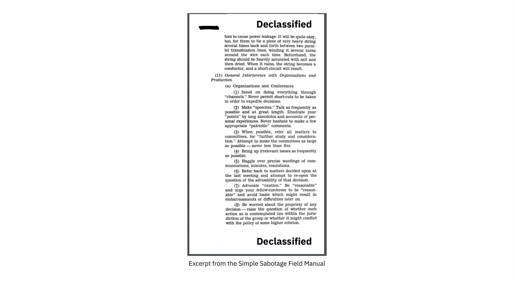


Igice kivuye mu gitabu c'itongo ryoroshe ry'ugusambura


Kugira ngo umuntu arushirize gutahura ivyiyumviro vy’umwansi, vyoshobora kuba vyiza abonye ingene zikora. Ishirahamwe rya Leta Zunze Ubumwe za Amerika ryitwa Office of Strategic Services, ryakora mu gihe c’Intambara ya Kabiri y’Isi Yose kandi ryari rifise mu ntumbero zaryo zo gukora ubutasi, gukora ibikorwa vy’ugusambura no gukwiragiza amakuru y’ibinyoma, ryasohoye [igitabu](https://www.gutenberg.org/ebooks/26184) c’abakozi baryo ku buryo bwo gukora ibikorwa vy’ubutasi mu buryo bubereye. Umutwe waco wari "Igitabo c'Igihugu c'Igihugu c'Igihugu c'Ivyago" kandi carimwo impanuro zitomoye zo kwinjira mu mwansi kugira ngo ubuzima bwabo bube Hard. Impanuro zitangura kuva ku guturira ububiko gushika ku gutuma imyimenyerezo ishaza kugira ngo umwansi agabanye .

umwimbu.


Nk’akarorero, hariho igice kivuga ingene umuntu yinjiye mu gihugu ashobora guhungabanya amashirahamwe. Si Hard kubona ingene ayo mayeri yoshobora gukoreshwa mu gutera imbere mu bijanye n’iterambere rya Bitcoin, ryugururiye umuntu wese kugira uruharamwo. Umuterabwoba yiyemeje ashobora kuguma ahagaritse iterambere kubera ivyiyumviro bitagira iherezo vy’ibibazo bitagira akamaro, guhanahana amakuru ku majambo nyayo, no kugerageza gusubiramwo ivyo vyavuzwe. Uwutera arashobora kandi gukoresha ingabo z’aba troll kugira ngo zigwize ubushobozi bwazo bwite; ivyo turashobora kuvyita Sybil Attack y’imibano. Bakoresheje Sybil Attack y'imibano, barashobora gutuma bisa n'uko hariho ukurwanya ihinduka ritegekanijwe kuruta uko biri mu vy'ukuri.


Ivyo birerekana ingene Leta yiyemeje ishobora kandi izokora vyose ishoboye kugira ngo isimbure umwansi, harimwo no kumumenagura imbere. Kubera ko Bitcoin ari uburyo bw’amahera buhanganye n’amahera ya fiat yashinzwe, birashoboka ko Leta zizobona Bitcoin nk’umwansi.


### Iciyumviro c'Ukurwanya


Eric Voskuil [yanditse kuri wiki yiwe y'ubutunzi bw'amabanga](https://github.com/libbitcoin/libbitcoin-system/wiki/Axiom-y'Ukurwanya) ku bijanye n'ico yita "axiom y'Ukurwanya":


> Mu yandi majambo hariho iciyumviro c’uko bishoboka ko urutonde rushobora kurwanya ubugenzuzi bwa Leta. Ivyo ntivyemerwa nk’ukuri ariko bifatwa nk’ivyiyumviro bibereye, bivuye ku nyigisho y’ivyashikiye abantu ku nyifato y’imirongo isa n’iyo, iyo mirongo yoshingirako.
>

> Umuntu atemera ivyiyumviro vy’ukurwanya ariko ariyumvira uburyo butandukanye rwose n’ubwo Bitcoin. Iyo umuntu yiyumviriye ko bidashoboka ko urutonde rushobora kurwanya ubugenzuzi bwa Leta, imyanzuro ntigira ico ivuze mu bijanye na Bitcoin - nk’uko nyene imyanzuro mu bijanye n’ubuhinga bw’imibumbe ivuguruza Euclide. Ni gute Bitcoin ishobora kuba idafise uruhusha canke idashobora gucengera ata n’ivyo bivugwa? Ukwo kuvuguruzanya gutuma umuntu akora amakosa agaragara mu kugerageza gushingira intahe iyo ntambara.


Ico ariko aravuga ni uko iyo umuntu yiyumvira ko bishoboka kurema uburyo Leta zidashobora kugenzura, niho gusa bifise insiguro kugerageza.


Ivyo bisigura ko kugira ukore kuri Bitcoin ukwiye kwemera axiom y’ukurwanya, ahandi ho vyoba vyiza ukoresheje umwanya wawe ku yindi migambi. Kwemera iyo nzira y’ukuri biragufasha kwibanda ku nguvu zawe zo guteza imbere ingorane nyazo ziriho: gukora amakode akikuje abansi bo ku rwego rwa Leta. Mu yandi majambo, niwiyumvire mu buryo bw’abansi.


### Insozero ku vyerekeye ivyiyumviro vy'abansi


Uburyo bwegerejwe ntibushobora kugira uruhara hanze y’uburyo ubwabwo, rero Bitcoin itegerezwa gukingira inyifato mbi bikomeye kuruta uburyo bwa kera. Ivyiyumviro vy’abansi ni ngombwa cane muri urwo rutonde.


Kugira ngo Bitcoin igume itekanye ukeneye kumenya abansi bayo n’ivyo bayitera intege. Ivyinshi mu bitera ubwoba bisa n’ibiva ku bihugu vy’amahanga, bifise ububasha bwinshi cane mu vy’ubutunzi, biciye mu gutanga imisoro no gucapura amahera. Kumbure ntibazoheba uduteka twabo two gucapura amahera mu buryo bworoshe.


## Inkomoko yuguruye

<chapterId>427a160c-f893-5b2c-afba-7b24e71ba899</chapterId>


Bitcoin yubatswe hakoreshejwe porogarama zifunguye. Muri iki gice turasuzuma ico ivyo bisobanura, ingene ugucungera porogarama bikora, n’ingene porogarama y’inkomoko yuguruye muri Bitcoin yemerera gutegura ata ruhusha. Twibika amano yacu muri *selection cryptography*, ivuga ku guhitamwo no gukoresha amasomero mu mice y'ubuhinga bwo guhitamwo. Ico gice kirimwo igice kivuga ku buryo Bitcoin isubiramwo, hanyuma hakaza ikindi kivuga ku buryo abakora Bitcoin baronka amahera. Igice ca nyuma kivuga ingene umuco wa Bitcoin wo gufungura ushobora gusa n’uwudasanzwe vy’ukuri uvuye hanze, n’igituma ivyo bitangaje vy’ukuri bibonwa ari ikimenyetso c’amagara meza.


Ivyinshi mu bikoresho vya Bitcoin, na cane cane Bitcoin core, ni ivy’inkomoko yuguruye. Ivyo bisigura ko kode y’inkomoko y’iyo porogarama ishobora gushikirizwa abantu bose kugira ngo bayisuzume, bayihindure, bayihindure kandi bayisubire gukwiragiza. Insobanuro y’inkomoko yuguruye kuri [](https://opensource.org/osd) irimwo, mu bindi, ingingo zihambaye zikurikira:


> Gusubira gutanga ku buntu: Uruhusha ntiruzobuza umuntu uwo ari we wese kugurisha canke gutanga porogarama nk’igice c’ugutanga porogarama zihuriweko zirimwo porogarama zivuye mu bibanza bitandukanye. Uruhusha ntiruzosaba amahera y’ubutunzi canke ayandi mafaranga y’ugucuruza.
>

> Kode y’inkomoko: Porogarama itegerezwa kubamwo kode y’inkomoko, kandi itegerezwa kwemera gukwiragizwa mu kode y’inkomoko hamwe n’uburyo bukoranijwe. Aho uburyo bumwebumwe bw’ikintu butakwiragizwa bufise kode y’inkomoko, hategerezwa kubaho uburyo bumenyeshwa neza bwo kuronka kode y’inkomoko ku giciro kitarenze igiciro gisanzwe co gusubiramwo, vyiza ni ukubikura kuri Internet ata co urishe. Kode y’inkomoko itegerezwa kuba ari yo nzira umuntu akunda gukoresha mu guhindura porogarama. Kode y’inkomoko ipfutse n’ibigirankana ntiyemerewe. Amafomu yo hagati nk’isohoka ry’umuhinga w’imbere canke umuhinduzi ntivyemewe.
>

> Ibikorwa Bikomokako: Uruhusha rutegerezwa kwemera guhindura n’ibikorwa bikomokako, kandi rutegerezwa kwemera ko bishobora gukwiragizwa hakurikijwe amabwirizwa amwe n’uruhusha rwa porogarama y’intango.

Bitcoin core yubahiriza iyi nsobanuro mu gukwiragizwa hakurikijwe [Uruhusha rwa MIT](Https.


```
The MIT License (MIT)

Copyright (c) 2009-2022 The Bitcoin Core developers
Copyright (c) 2009-2022 Bitcoin Developers

Permission is hereby granted, free of charge, to any person obtaining a copy of this software and associated documentation files (the "Software"), to deal in the Software without restriction, including without limitation the rights to use, copy, modify, merge, publish, distribute, sublicense, and/or sell copies of the Software, and to permit persons to whom the Software is furnished to do so, subject to the following conditions:

The above copyright notice and this permission notice shall be included in all copies or substantial portions of the Software.
```


Nk'uko vyavuzwe mu gice ca "Ntukizere, Suzuma", birahambaye ko abakoresha bashobora kugenzura ko porogaramu ya Bitcoin bakoresha "ikora nk'uko yamamajwe". Kugira ngo babikore, bategerezwa kuba bafise uburenganzira bwo gukoresha kode y’inkomoko ya porogarama bipfuza kugenzura ata n’umwe abujijwe.


Mu bice bizoza tuzokwinjira mu bindi bintu bishimishije vyerekeye porogarama zifunguye muri Bitcoin.


### Gucungera porogaramu


Kode y'inkomoko ya Bitcoin core igumye mu bubiko bwa Git bushizwe kuri [GitHub] (https://github.com/Bitcoin/Bitcoin). Umuntu wese arashobora gukora clone y’ubwo bubiko nyene ata ruhusha asavye, hanyuma akabusuzuma, akabukora canke akabuhindura aho hantu. Ivyo bisigura ko hariho ibihumbi vyinshi vy’ibitabu vy’ububiko bikwiragiye kw’isi yose. Ivyo vyose ni kopi z’ububiko bumwe, none ni igiki gituma ubu bubiko bwihariye bwa GitHub Bitcoin core budasanzwe? Mu vy’ubuhinga ntaco bimaze na gato, ariko mu vy’imibano vyacitse ikintu nyamukuru c’iterambere rya Bitcoin.


Bitcoin n’umuhinga mu vy’umutekano Jameson Lopp arabisigura neza cane mu kiganiro ciwe citwa “Ni nde agenzura Bitcoin core?”:


> Bitcoin core ni ikibanza co gutegura umurongo wa Bitcoin aho kuba ikibanza co gutegeka no kugenzura. Iyo ihagarika kubaho kubera imvo iyo ari yo yose, ikintu gishasha cobayeho — urubuga rw’ivy’itumanaho rw’ubuhinga rushingiyeko (ubu ni ububiko bwa GitHub) ni ikibazo c’ugusobanura neza aho kuba ikibazo c’insobanuro / ubutungane bw’umugambi. Nkako, twamaze kubona Bitcoin’s focal point ku bijanye n’iterambere ry’uguhindura ama platforms mbere n’amazina!

Abandanya asigura ingene porogarama ya Bitcoin core ibungabungwa kandi igakingirwa amahinduka mabi yo mu kode. Ivyiyumviro rusangi vyo muri iyi ngingo yuzuye biravugwa mu ncamake ku mpera yayo nyene:


> Nta n’umwe agenzura Bitcoin.
>

> Nta n’umwe agenzura ikibanza nyamukuru co gutegura Bitcoin.

Umuhinga mu bijanye n'iterambere rya Bitcoin core Eric Lombrozo aravuga vyinshi ku bijanye n'ingene Bitcoin core itegurwa mu gitabu ciwe citwa "Igikorwa co gukoranya Bitcoin core":


> Umuntu wese arashobora Fork ububiko bw'ishimikiro rya kode maze agahindura ububiko bwiwe bwite. Bashobora kwubaka umukiriya bavuye mu bubiko bwabo maze bagakoresha ivyo aho kubikoresha iyo bashaka. Bashobora kandi gukora binary builds kugira abandi bantu bakore.
>

> Niba umuntu ashaka gufatanya ihinduka yakoze mu bubiko bwiwe bwite muri Bitcoin core, arashobora gutanga ubusabe bwo gukura. Iyo umuntu wese amaze gutanga, arashobora gusubiramwo ivyo vyahinduwe no kubivugako ataco yitayeho nimba afise uburenganzira bwo gukoresha Bitcoin core ubwayo canke atari yo.

Birakenewe kumenya ko ibisabwa vyo gukurura bishobora gutwara igihe kirekire cane imbere y'uko bihurizwa hamwe mu bubiko n'ababicungera, kandi ivyo akenshi biterwa n'ukubura isubiramwo, ivyo bikaba akenshi biterwa n'ukubura *abasubiramwo*.


Lombrozo na we aravuga ku bijanye n’ingendo ikikuje amahinduka y’uguhurizako, ariko ivyo birarengeye gatoyi urugero rw’iki kigabane. Raba igice c'imbere "Guhindura" kugira ngo umenye vyinshi ku buryo porotokole ya Bitcoin ivugururwa.


### Iterambere ritagira uruhusha


Twarashizeho ko umuntu wese ashobora kwandika kode ya Bitcoin core ata ruhusha asavye, ariko si ngombwa ko ihurizwa hamwe n'ububiko nyamukuru bwa Git. Ivyo bigira ico bikoze ku mpinduka iyo ari yo yose, kuva ku guhindura ibara ry'umukoresha w'igishushanyo Interface, ku buryo ubutumwa bw'urunganwe bushirwaho, mbere n'amategeko y'uguhurizako, ni ukuvuga amategeko asobanura Blockchain ibereye.


Kumbure ikintu gihambaye conyene ni uko abakoresha bafise umwidegemvyo wo gukora ubuhinga buri hejuru ya Bitcoin, batasavye uruhusha urwo ari rwo rwose. Twarabonye imigambi myinshi cane y’ubuhinga bwa none yubatswe hejuru ya Bitcoin, nk’iyi:


- Lightning Network: Urubuga rwo kwishura rutuma umuntu ashobora kwishura ningoga amahera make cane. Bisaba amafaranga make cane y’ama On-Chain Bitcoin. Hariho uburyo butandukanye bwo gushirwa mu ngiro bukorana, nka [Umuravyo w’Ishingiro] (Umugambi w’Ibintu/Umuravyo), [LND] (LND), [Eclair] (Dev. Igikoresho] (urubuga rwa github.com/igikoresho c'umuravyo).
- CoinJoin: Abanyamuryango benshi barakorana kugira ngo bahurize hamwe amahera yabo mu gikorwa kimwe kugira ngo gukoranya Address bibe bikomeye. Hariho uburyo butandukanye bwo gushirwa mu ngiro.
- Sidechains: Iyi sisitemu ishobora gufunga Coin kuri Bitcoin ya Blockchain kugira ngo ifungurwe ku yindi Blockchain. Ivyo bituma ama bitcoins yimurirwa ku yindi Blockchain, ni ukuvuga Sidechain, kugira ngo akoreshe ibintu biri kuri iyo Sidechain. Ingero ni nk’ivyo [Elements ya Blockstream] (Elements).
- Igihe co gufungura: Bigufasha [Timestamp inyandiko](https://igihe co gufungura.org/) kuri Bitcoin ya Blockchain mu buryo bwihariye. Ushobora rero gukoresha iyo Timestamp kugira ngo werekane ko inyandiko itegerezwa kuba yariho imbere y’igihe kinaka.


Iyo hataba iterambere ritagira uruhusha, benshi muri iyo migambi ntiyari gushoboka. Nk’uko vyavuzwe mu kigabane kivuga ku kutagira aho twehamiye, iyo abahinguzi bategerezwa gusaba uruhusha rwo kwubaka amategeko hejuru ya Bitcoin, amategeko yemerewe na komite nkuru y’abahinguzi ni yo gusa yotegurwa.


Birasanzwe ko ubuhinga nk’ubwo twavuze haruguru ubwabwo bufise uruhusha rwo gukoresha porogarama zifunguye, ivyo na vyo bikaba bituma abantu bashobora gutanga, gusubira gukoresha canke gusubiramwo kode yabo ata ruhusha basavye. Inkomoko yuguruye yacitse ikigereranyo c’inzahabu c’uruhusha rwa porogarama Bitcoin.


### Iterambere ry'amazina y'uruyeri


Kudasaba uruhusha rwo gukora porogarama ya Bitcoin bizana uburyo bushimishije kandi buhambaye ku meza: urashobora kwandika no gutangaza kode, muri Bitcoin core canke uwundi mugambi wose w’inkomoko yuguruye, utamenyesheje akaranga kawe.


Abahinguzi benshi bahitamwo iyo nzira mu gukoresha izina ry’uruyeri no kugerageza kurigumya ritandukanye n’akaranga kabo nyakuri. Impamvu zo gukora ivyo zishobora gutandukanywa ku muntu akora ivyo. Umwe mu bakoresha izina ry’uruyeri ni ZmnSCPxj. Mu yindi migambi, aratanga umusanzu kuri Bitcoin core na Core Lightning, imwe mu nzira nyinshi zo gushirwa mu ngiro za Lightning Network. [Andika](https://zmnscpxj.github.io/ivyerekeye


> Ndi ZmnSCPxj, ​​umuntu w’Internet yavutse ataco akora. Insiguro yanje ni we/we/yiwe.
>

> Ndatahura ko abantu bipfuza kumenya akaranga kanje mu kameremere kanje. Ariko rero, mbona ko akaranga kanje ahanini ataco kamaze, kandi nkunda gucirwa urubanza n’igikorwa canje.
>

> Niba uriko uribaza nimba wotanga canke utatanga, kandi wibaza ingene ubuzima bwanje canke amahera nkora, ndagusavye utahure ko mu kuvuga neza, ukwiye kumpa amahera ushingiye ku ntumbero usanga .
ingingo n’igikorwa canje ku bijanye na Bitcoin na Lightning Network.


Ku bijanye na we, imvo yo gukoresha izina ry’uruyeri ni iyo gucirwa urubanza ku vyo akora atari ku vyo uwo muntu canke abantu bari inyuma y’iryo zina ry’uruyeri ari bo canke ari bo. Ikintu gitangaje, ni uko yahishuye mu [ngingo iri kuri CoinDesk](https://www.coindesk.com/markets/2020/06/29/benshi-abahinguzi-ba-Bitcoin-bariko-bahitamwo-gukoresha-amazina-y’uruyeri-kubera-imvo-nziza/) ko iryo zina ry’uruyeri ryari imvo itandukanye.


> Imvo yanje ya mbere [yo gukoresha izina ry’uruyeri] yari iyo gusa ko nari nshavuye [ku] gukora ikosa rikomeye cane; rero ZmnSCPxj mu ntango yari igenewe kuba izina ry’uruyeri ryo gukoreshwa rimwe gusa ryoshobora guhebwa mu gihe nk’ico. Ariko rero bisa n’uko vyaronse izina ryiza cane, ni co gituma nabigumye .

Gukoresha izina ry’uruyeri biratuma vy’ukuri ushobora kuvuga ata co ushizeko mu kaga iyo uvuze ikintu c’ubujuju canke ukoze ikosa rikomeye. Nk’uko vyagenze, izina ryiwe ry’uruyeri ryararonse izina ryiza cane kandi mu 2019 [yaronse mbere n’infashanyo y’iterambere](https://twitter.com/spiralbtc/status/1204815615678177280), ivyo ubwavyo bikaba ari igihe c’uko Bitcoin idafise uruhusha.


Birashoboka ko izina ry’uruyeri rizwi cane muri Bitcoin ari Satoshi Nakamoto. Ntibisobanutse neza igituma yahisemwo kwitwa izina ry’uruyeri, ariko iyo umuntu yihweje inyuma, birashoboka ko yari ingingo nziza kubera imvo nyinshi:


- Nk’uko abantu benshi biyumvira ko Nakamoto afise Bitcoin nyinshi, ni ngombwa cane ko umutekano wiwe w’amahera n’uw’umuntu ku giti ciwe utamenyekana.
- Kubera ko uwo ari we atamenyekana, nta n’umwe yoshobora gukurikiranwa, ivyo bikaba bituma inzego zitandukanye za Leta zigira umwanya wa Hard.
- Nta muntu afise ububasha bwo kwitegereza, ivyo bikaba bituma Bitcoin igira uburenganzira bwo gukora kandi ikaba ishobora kwihanganira ugutera ubwoba.


Urabona ko izo ngingo zitari ukuri gusa kuri Satoshi Nakamoto, ariko no ku muntu wese akora muri Bitcoin canke afise amafaranga menshi cane, ku rugero rutandukanye.


### Guhitamwo ububiko bw'ibanga


Abahinguzi b’inkomoko yuguruye akenshi bakoresha amasomero y’inkomoko yuguruye yateguwe n’abandi bantu. Ico ni igice c’ibidukikije kandi giteye ubwoba c’ibidukikije vyose bifise amagara meza. Ariko porogarama ya Bitcoin ikorana n’amahera nyayo kandi, kubera ivyo, abayikora barakeneye kwiyubara cane igihe bahitamwo amasomero y’abandi bakwiye kwizigira.


Mu kiganiro ca filozofiya [kiganiro ku bijanye n'ubuhinga bwo gukingira amakuru]), Gregory Maxwell ashaka gusubira gusobanura ijambo "ubuhinga bwo gukingira amakuru" abona ko ari ryinshi cane. Asigura ko mu ntango *amakuru ashaka kuba ubuntu*, kandi insobanuro yiwe y’ubuhinga bwo gukingira amakuru ashingiye kuri ivyo:


> Cryptography ni ubuhinga n’ubuhinga dukoresha mu kurwanya kamere y’ishimikiro y’amakuru, kuyapfukamira ku bushake bwacu bwa politike n’ubw’inyifato runtu, no kuyayobora ku ntumbero z’abantu turwanya amahirwe yose n’utwigoro twose two kuyarwanya.

Araheza azana ijambo *selection cryptography*, ryitwa ubuhinga bwo guhitamwo ibikoresho vy’uguhitamwo, agasigura igituma ari igice gihambaye c’ubuhinga bwo guhitamwo. Bizikuje ingene wohitamwo amasomero, ibikoresho, n'imigenzo, canke nk'uko avuga "ubuhinga bwo gutora ubuhinga".


Akoresheje ingero zitomoye, yerekana ingene ubuhinga bwo guhitamwo bushobora gukora nabi bitagoranye, kandi agatanga urutonde rw’ibibazo woshobora kwibaza igihe uriko urabimenyereza. Aha hepfo hariho verisiyo y’urwo rutonde:


- Mbega iyo porogarama yoba igenewe intumbero zawe?
- Mbega ivyo kwiyumvira ivy’ubuhinga bwa cryptography biriko birafatwa nk’ibihambaye?
- None inzira yo gusubiramwo ni iyihe? Mbega hariho n’umwe?
- None abo banditsi baciyemwo iki?
- Mbega iyo porogarama irafise inyandiko?
- Mbega iyo porogarama yoba ishobora gutwara?
- Mbega iyo porogarama irageragezwa?
- Mbega iyo porogarama yoba yemera ingendo nziza?


Naho ivyo atari vyo bifasha umuntu kuroranirwa, birashobora gufasha cane guca muri izo ngingo igihe ukora ubuhinga bwo guhitamwo.


Kubera ibibazo vyavuzwe haruguru na Maxwell, Bitcoin core iragerageza vy’ukuri Hard [kugabanya ukuntu ishobora guhura n’amasomero y’abandi]. Ego cane, ntushobora gukuraho ibintu vyose biva hanze, ahandi ho wobwirizwa kwandika vyose wewe nyene, kuva ku guhindura imyandikire gushika ku gushirwa mu ngiro kw’amahamagara ya sisitemu.


### Isubiramwo


Iki gice citwa "Isubiramwo", aho kwitwa "Isubiramwo ry'Itegeko", kuko umutekano wa Bitcoin wizigira cane isubiramwo ku rwego rwinshi, atari kode y'inkomoko gusa. Ikindi kandi, ivyiyumviro bitandukanye bisaba gusubirwamwo ku rwego rutandukanye: guhindura itegeko ry’uguhurizako vyosaba gusubirwamwo bimwe bikomeye ku rwego rwinshi ugereranyije n’uguhindura ibara canke gukosora amakosa yo kwandika.


Mu nzira y’ukwemerwa kwa nyuma, iciyumviro akenshi gica mu bice vyinshi vy’ibiganiro n’isubiramwo. Bimwe muri ivyo bice biri aha hepfo:


- Iciyumviro kirashizwe kuri list y'ubutumwa bwa Bitcoin-dev
- Ico ciyumviro gishirwa mu ngiro mu gitabu ca Bitcoin co gutera imbere (BIP)
- BIP ishirwa mu ngiro mu gusaba gukurura (PR) kuri Bitcoin core
- Uburyo bwo kubirungika buraganirwako
- Uburyo bumwe bumwe bwo gukoresha bushirwa mu ngiro mu gusaba gukurura kuri Bitcoin core
- Ibisabwa vyo gukurura bihurizwa hamwe n'ishami ry'umukuru
- Abakoresha bahitamwo gukoresha porogaramu canke kutayikoresha


Muri buri ntambwe abantu bafise ivyiyumviro bitandukanye n’imico kama itandukanye barasubiramwo amakuru ariho, yaba kode y’inkomoko, BIP, canke iciyumviro gusa gisobanuwe mu buryo butari bwo. Ivyiyumviro akenshi ntibikorwa mu buryo ubwo ari bwo bwose bukomeye buva hejuru buja hasi, vy’ukuri ivyiyumviro vyinshi birashobora kuba icarimwe, kandi rimwe na rimwe uragenda ugaruka hagati yavyo. Abantu batandukanye na bo nyene barashobora gutanga inyishu mu bice bitandukanye.


Umwe mu basubiramwo amakode menshi cane kuri Bitcoin core ni Jon Atack. Yanditse [ikiganiro co ku rubuga](https://jonatack.github.io/ingingo/ingene-wosubiramwo-ibisabwa-mu-Bitcoin-core) ku buryo bwo gusubiramwo ibisabwa mu Bitcoin core. Ashimika ku vy’uko umusubiramwo mwiza w’amategeko yibanda ku buryo bwiza bwo kwongera agaciro.


> Nk’umuntu mushasha, intumbero ni ukugerageza kwongerako agaciro, n’ubugenzi n’ukwicisha bugufi, mu gihe wiga vyinshi bishoboka.
>

> Uburyo bwiza ni ukugira ngo ntibibe ivyerekeye wewe, ahubwo ngo "Noshobora gute gukorera neza?"

Ashimika ku vy’uko gusubiramwo ari co kintu vy’ukuri gihagarika Bitcoin core. Ivyiyumviro vyiza vyinshi birafata mu nzira aho ata nsubiramwo iba, irindiriye. Urabona ko gusubiramwo atari ngirakamaro gusa kuri Bitcoin, ariko kandi ni uburyo bwiza bwo kwiga ivyerekeye porogarama mu gihe utanga agaciro kuri yo, muri ico gihe nyene. Itegeko rya Atack ni ugusubiramwo PR 5-15 imbere yo gukora PR iyo ari yo yose yawe bwite. Na none, ivyiyumviro vyawe bikwiye kuba ingene wokorera neza abantu, atari ingene wotuma kode yawe bwite ihurizwa hamwe. Hejuru y’ivyo, ashimika ku kamaro ko gukora isubiramwo ku rugero rukwiye: mbega iki ni co gihe c’amakosa n’amakosa yo kwandika, canke uwukora iyo porogarama arakeneye isubiramwo ry’ivyiyumviro ryinshi? Jon Attack yongerako ati:


> Ikibazo ca mbere c’ingirakamaro igihe utanguye gusubiramwo gishobora kuba iki: «Ni igiki gikenewe cane hano muri iki gihe?» Kwishura iki kibazo bisaba ubumenyi n’ibintu vyirundanijwe, ariko ni ikibazo c’ingirakamaro mu gufata ingingo y’ingene woshobora kwongerako agaciro kanini mu mwanya mutoyi.

Igice ca kabiri c’ivyo biganiro gifise ubuyobozi ngirakamaro bw’ubuhinga bujanye n’ingene umuntu yosubiramwo, kandi kigatanga amahuza ku nyandiko zihambaye zo gusoma.


Umuhinga mu bijanye n’ugukora Bitcoin core akaba n’umusubiramwo amakode Gloria Zhao yanditse [ingingo] irimwo ibibazo akunda kwibaza mu gihe c’isubiramwo. Aravuga kandi ivyo abona ko ari isubiramwo ryiza:


> Jewe ubwanje mbona ko isubiramwo ryiza ari iryo nibajije ibibazo vyinshi bitomoye ku bijanye na PR nkanyurwa n’inyishu .
kuri bo. [...] Birumvikana ko ntangura n’ibibazo vy’ivyiyumviro, hanyuma n’ibibazo bijanye n’uburyo bwo kubikora, hanyuma n’ibibazo bijanye n’ugushira mu ngiro. Muri rusangi, jewe ubwanje mbona ko ata co bimaze gusiga ibivugwa bijanye n'inyuguti ya C++ ku mugambi wa PR, kandi noba numva ari ubujuju gusubira ku "mbega ivyo birafise insiguro" inyuma y'aho umwanditsi avugiye 20+ y'ivyifuzo vyanje vyo gutunganya kode.


Iciyumviro ciwe c’uko isubiramwo ryiza rikwiye kwibanda ku vyo bikenewe cane mu gihe kinaka kijanye n’impanuro ya Jon Atack. We

iratanga urutonde rw’ibibazo woshobora kwibaza ku nzego zitandukanye z’urugendo rwo gusubiramwo, ariko igashimika ku vy’uko urwo rutonde rudashobora guheza canke ngo rube uburyo bwo gutegura ibintu bugororotse. Urutonde rwerekanwa n’ingero z’ubuzima nyakuri zivuye kuri GitHub.


### Infashanyo


Abantu benshi bakorana n'iterambere ry'inkomoko yuguruye rya Bitcoin, haba ku Bitcoin core canke ku yindi migambi. Benshi babikora mu gihe c’akaruhuko ata n’indishi baronka, ariko hari n’abahinguzi bariko barahembwa kugira babikore.


Amashirahamwe, abantu ku giti cabo, n’imiryango ifise inyungu mu kubandanya gutera imbere kwa Bitcoin, barashobora gutanga amahera ku bategura, haba ataco baciye canke biciye ku mashirahamwe na yo agatanga ayo mahera ku bategura ku giti cabo. Hariho kandi amashirahamwe menshi yibanda kuri Bitcoin akoresha abahinga mu bijanye n’ugutegura kugira ngo babareke bakore igihe cose kuri Bitcoin.


### Umuco uteye ubwoba


Abantu rimwe na rimwe barabona ko hariho intambara nyinshi n’impaka zitagira iherezo hagati y’abahinguzi ba Bitcoin, kandi ko badashobora gufata ingingo.


Nk'akarorero, uburyo bwo gukoresha Taproot, bwaravuzweko mu kiringo kirekire aho "amakambi" abiri yashinzwe. Umwe yashaka "kunanirwa" gusubiramwo iyo abacukuzi batatoye cane amategeko mashasha inyuma y'umwanya kanaka, mu gihe uwundi yashaka gushitsa amategeko inyuma y'uwo mwanya naho vyogenda gute. Michael Folkson avuga mu ncamake imvo n’imvano zivuye muri izo nkambi zibiri mu [email] (imeyili] ku rutonde rw’abarungika ubutumwa rwa Bitcoin-dev.


Ivyo biganiro vyarabandanije bisa n’ibihe bidahera, kandi vy’ukuri vyari Hard kubona ko hariho ukuntu umuntu yemeranya kuri ivyo bizoshika vuba. Ivyo vyatumye abantu bacika intege kandi ivyo vyatumye ubushuhe bukomera. Gregory Maxwell (nk’umukoresha nullc) yari ahagaze [ku Reddit] (ivyo vyotuma uburebure bw’ivyo biganiro bugabanuka.


> Muri iki gihe, kurindira kwongerako si kwongera isubiramwo n’ukudakeka. Ahubwo, ugucererwa kw’inyongera ni ugugabanya ubugoyagoye kandi bishobora kwongerera ingorane uko abantu batangura kwibagirwa ido n’ido, gutevya igikorwa co gukoresha (nk’ugushigikira Wallet), no kudashiramwo inguvu nyinshi zo gusubiramwo nk’uko boba bariko barashiramwo iyo bumva ko bizigiye igihe co gukoresha.

Amaherezo, iyo ntambara yarakemutse biciye ku ciyumviro gishasha ca David Harding na Russel O’Connor citwa Speedy Trial, kikaba cari gifise igihe gitoyi cane co gutanga ikimenyetso kugira ngo abacukuzi bashobore gufunga igikorwa ca Taproot, canke ngo bacike intege ningoga. Iyo bayikoresha muri iryo dirisha ry’igihe, rero Taproot yoca irungikwa haciye nk’amezi 6.


Umuntu atamenyereye ingene Bitcoin ikora, yoshobora kwiyumvira ko izo mpaka zishushe zisa n’izibi cane mbere zikaba ari ubumara. Hariho n’imiburiburi ibintu bibiri bituma basa nabi, mu maso y’abantu bamwebamwe:


- Ugereranije n’amashirahamwe afise ubuhinga bufunze, impaka zose zibera ku mugaragaro, zitahinduwe. Ishirahamwe ry’amaporogarama nka Google ntirizokwigera rireka abakozi baryo bagaharira ku bintu bishasha, vy’ukuri ryoshobora gutangaza itangazo ryerekeye ivyiyumviro vy’iryo shirahamwe ku bijanye n’ico kibazo. Ivyo bituma amashirahamwe asa n’ayahuye cane ugereranije na Bitcoin.
- Kubera ko Bitcoin ata ruhusha ifise, umuntu wese arashobora gutanga ivyiyumviro vyiwe. Ivyo bitandukanye cane n’ishirahamwe ry’abantu bakeyi bafise iciyumviro, akenshi bakaba ari abantu bafise ivyiyumviro nk’ivyawe. Ivyiyumviro vyinshi bivugwa muri Bitcoin biratangaje gusa ugereranije n’akarorero, PayPal.


Benshi mu bategura Bitcoin bovuga ko ukwo gufunguka kuzana ibidukikije vyiza kandi bifise amagara meza, eka mbere ko ari ngombwa kugira ngo umuntu agire ingaruka nziza.


Nk’uko vyavuzwe mu kigabane kivuga ngo Iterabwoba, isasu rya kabiri riri hejuru rirashobora kuba ngirakamaro cane ariko rizanana n’ingaruka mbi. Umuntu atera yoshobora gukoresha ubuhinga bwo guhagarika, nk’ubwo buvugwa mu [Igitabo c’Ivy’Iterabwoba](https://www.gutenberg.org/ebooks/26184), kugira ngo agoramye inzira yo gufata ingingo n’iterambere.


Ikindi kintu gikwiriye kuvugwa ni uko, kubera ko Bitcoin ari amahera kandi Bitcoin core ishobora gucungera amahera atagira uko angana, umutekano muri ivyo ntufatwa nk’ikintu gisanzwe. Ni co gituma Bitcoin core

abahinguzi boshobora gusa n’abafise umutwe Hard cane, iyo nyifato akenshi ibereye. Nkako, ikintu gifise imvo n’imvano y’intege nke ntikizokwemerwa. Ivyo nyene vyobaye iyo imenagura .

ivyubatswe bishobora gusubirwamwo, vyongeyeko ibishasha bishingiyeko, canke iyo kode itakurikiye [ibikorwa vyiza] vya Bitcoin (https://github.com/Bitcoin/Bitcoin/blob/master/doc/developer-notes.md).


Abahinguzi bashasha (n’aba kera) barashobora gushavura n’ivyo. Ariko, nk'uko bisanzwe muri porogaramu zifunguye, urashobora kwama Fork ububiko, ugafatanya ivyo ushaka vyose na Fork yawe, maze wubake kandi ukoreshe binary yawe.


### Insozero ku vyerekeye Inkomoko Yuguruye


Bitcoin core n’izindi porogarama nyinshi za Bitcoin ni open source, bisobanura ko umuntu wese afise umwidegemvyo wo gukwiragiza, guhindura no gukoresha iyo porogarama uko ashaka. Ububiko bwa Bitcoin core kuri GitHub ubu ni bwo buhambaye mu gutegura Bitcoin, ariko iyo nzira ishobora guhinduka iyo abantu batanguye kutizigira abayibungabunga, canke urubuga ubwarwo.


Inkomoko yuguruye iremeza gutera imbere ata ruhusha muri, no hejuru ya Bitcoin. Waba wandika kode, usubiramwo kode canke ama protocoles; open source ni co kigushoboza kubikora, mu buryo bw’ikinyoma canke atarivyo.


Inzira y’iterambere ikikuje Bitcoin irafunguye cane, bishobora gutuma Bitcoin isa n’ahantu h’ubumara kandi hatagira akamaro, ariko ivyo nivyo bituma Bitcoin iguma ishobora guhangana n’abakora ivy’ububisha.


## Gupima

<chapterId>bb3f3924-202c-5cdd-b2e9-e0c1cab0e48e</chapterId>


Muri iki gice, turatohoza ingene Bitcoin ikora n’ingene idakora. Turatangura turavye ingene abantu bazirikana ku bijanye n’ugutera imbere mu bihe vya kera. Hanyuma, igice kinini c’iki kigabane kirasigura uburyo butandukanye bwo gupima Bitcoin, cane cane gupima mu buryo buhagaze, mu buryo buringaniye, mu buryo bw’imbere, no mu buryo bw’ibice. Insobanuro yose ikurikirwa n’ivyiyumviro ku bijanye n’uko iyo nzira ibangamira iciyumviro c’agaciro ca Bitcoin.


Mu kibanza ca Bitcoin, abantu batandukanye batanga insobanuro zitandukanye kw'ijambo "urugero". Bamwe babona ko ari ukwongerekana kw’ubushobozi bwo gucuruza Blockchain, abandi bemera ko bingana no gukoresha neza Blockchain, abandi babona ko ari uguteza imbere uburyo bwo gukoresha Bitcoin.


Mu bijanye na Bitcoin, no ku ntumbero z'iki gitabu, dusobanura ugupima nk'ukwongera ubushobozi bwa Bitcoin bwo gukoresha ataco buhinduye ku bushobozi bwayo bwo gucengera. Iyi nsobanuro irimwo ibintu vyinshi.

ubwoko bw'amahinduka, nk'akarorero:


- Gukora ibikorwa vy'ubucuruzi bikoresha bytes nke
- Kunoza ibikorwa vyo kugenzura umukono
- Gutuma urubuga rw'urunganwe rukoresha ubwaguke buke
- Gukoranya ibikorwa
- Ubwubatsi bw'ibice


Tuzokwinjira vuba mu buryo butandukanye bwo gupima, ariko reka dutangure n’insiguro ngufi y’amateka ya Bitcoin mu bijanye no gupima.


### Amateka y'ugupima


Gupima vyabaye ikintu nyamukuru c'ibiganiro kuva Genesis ya Bitcoin. Invugo ya mbere y’iyi [imeli ya mbere] (https://www.metzdowd.com/pipermail/cryptography/2008-Ugushyingo/014814.html) mu kwishura ku itangazo rya Satoshi ry’urupapuro rwera rwa Bitcoin ku rutonde rw’ivyoherezwa rwa Cryptography ryari:


> Nakamoto yanditse ati:
>

> "Nariko ndakora uburyo bushasha bwo gukoresha amafaranga y'ubuhinga bwa none bushingiye ku buhinga bwa none, ata wundi muntu yizigirwa. Ico cegeranyo kiraboneka kuri http://www.Bitcoin.org/Bitcoin.pdf".
>

> Turakeneye cane cane mwene iyo nzira, ariko uko ntahura iciyumviro cawe, bisa n’ibidashika ku rugero rukenewe.

Ico kiyago ubwaco coshobora kutaba gishimishije cane canke ngo kibe kitagiramwo uburyarya, ariko kirerekana ko ugupima kwabaye ikintu gihangayikishije kuva mu ntango.


Ibiganiro ku bijanye no gutera imbere vyashitse ku rwego rwo hejuru nko mu mwaka w’2015-2017, igihe hari ivyiyumviro vyinshi bitandukanye vyariko biragendagenda ku bijanye n’uko twokwongerera ubunini bw’amabuye n’ingene bwokwongerwa. Ico cari ikiganiro kitari gishimishije ku bijanye no guhindura umurongo mu kode y’inkomoko, ihinduka ritagira ico ritorera umuti ahubwo ryasunikiye ingorane yo gutera imbere cane muri kazoza, ryubaka umwenda w’ubuhinga.


Mu mwaka w’2015, inama yitwa [Scaling Bitcoin](https://scalingbitcoin.org/) yarabereye i Montreal, haciye amezi atandatu inama yakurikiye i Hong Kong, hanyuma ibera mu bindi bibanza bitari bike kw’isi yose. Ivyo vyari vyibanze canecane ku buryo bwo gutera Address. Abahinguzi benshi ba Bitcoin n’abandi bayikunda cane barakoraniye muri izo nama kugira ngo baganire ku bibazo bitandukanye vyo gutera imbere n’ivyifuzo. Vyinshi muri ivyo biganiro ntivyari vyerekeye kwongerera ubunini bw’amabuye ahubwo vyari vyerekeye inyishu z’igihe kirekire.


Inyuma y’inama yabereye i Hong Kong mu kwezi kwa kigarama 2015, Gregory Maxwell [yaciye avuga mu ncamake ivyiyumviro vyiwe] ku bibazo vyinshi vyari vyarashikirijwe n’ubuhinga bwa filozofiya rusangi, atangura ku bijanye n’ubuhinga bwa filozofiya rusangi:


> Kubera ubuhinga buriho, hariho uguhuza kw’ishimikiro hagati y’urugero n’ugusenyura ubutegetsi. Iyo iyo nzira izimvye cane abantu bazobwirizwa kwizigira abandi bantu aho kwigenga mu gukurikiza amategeko y’iyo nzira. Iyo Bitcoin Blockchain’s ikoreshwa ry’ibikoresho, ugereranije n’ubuhinga buriho, ari ryinshi cane, Bitcoin iratakaza inyungu zayo zo guhiganwa ugereranyije n’imirongo y’iragi kubera ko kwemeza bizoba bizimvye cane (gutanga igiciro c’abakoresha benshi), bigatuma ukwizigira gusubira muri iyo mirongo.  Iyo ubushobozi buri hasi cane kandi uburyo bwacu bwo gukorana butagira akamaro cane, gushika ku ruhererekane rwo gutorera umuti amatati bizotwara amahera menshi cane, bisubire gusunika ukwizigira muri iyo nzira.

Avuga ku bijanye n’uguhuza hagati y’ugutanga ibikorwa n’ugusenyura ubutegetsi. Iyo wemereye ama blocks manini, uzosunika abantu bamwe bamwe bave ku rubuga kuko ntibazosubira kugira uburyo bwo kwemeza ama blocks. Ariko ku rundi ruhande, iyo gushika ku kibanza c’amabuye bizimvye, abantu bakeyi ni bo bazoshobora kugikoresha nk’uburyo bwo gutorera umuti amatati. Muri ivyo bihe vyose, abakoresha barasunikwa ku bikorwa vyizigirwa.


Abandanya avuga mu ncamake uburyo bwinshi bwo gutera imbere bwashikirijwe muri iyo nama. Muri vyo harimwo ugusuzuma umukono gukoreshwa neza cane, *icabona gitandukanye* harimwo uguhindura urugero rw’ubunini bw’amabuye, uburyo bwo gukwiragiza amabuye bukoresha neza umwanya, n’amasezerano yo kwubaka hejuru ya Bitcoin mu bice. Benshi muri abo .

uburyo bwo gukora ivyo vyarashizwe mu ngiro kuva ico gihe.


### Uburyo bwo gupima


Nk’uko vyavuzwe haruguru, gupima Bitcoin ntibitegerezwa kuba ari vyo kwongera umupaka w’ubunini bw’ibarabara canke ibindi bipimo. Ubu turiko turaca mu buryo rusangi bwo gutera imbere, bumwe muri bwo ntibubabazwa n’uguhinduranya ubushobozi n’ugusenyura ubutegetsi nk’uko vyavuzwe mu gice ca mbere.


#### Gupima mu buryo buhagaze


Gupima mu buryo buhagaze ni uburyo bwo kwongerera ubushobozi bwo gukoresha amakuru y’amamashini. Mu bijanye na Bitcoin, ivyo vya nyuma vyoba ari vyo bihimba vyuzuye, ni ukuvuga imashini zemeza Blockchain mu izina ry’abazikoresha.


Uburyo buvugwa cane bwo gupima mu buryo buhagaze muri Bitcoin ni ukwongerera urugero rw’ubunini bw’ibarabara. Ivyo vyosaba ko ama node amwe amwe yuzuye asubiramwo ibikoresho vyayo kugira ngo ashobore kujana n’ivyo ubuhinga bwo gukoresha ubuhinga bwa none bugenda buragwira. Ikibi ni uko bishika kubera ugushira hamwe.


Uretse ingaruka mbi ku kwegereza ubutegetsi Full node, ugupima mu buryo buhagaze bishobora kandi kugira ingaruka mbi ku kwegereza ubutegetsi Bitcoin n’umutekano mu buryo butagaragara cane. Reka turabe ingene abacukuzi "bakwiye" gukora. Vuga ko Miner icukura ivyuma ku burebure bwa 7 maze ikabitangaza ku rubuga rwa Bitcoin. Bizofata igihe kugira ngo iyo block yemerwe na benshi, ivyo bikaba biterwa ahanini n’ibintu bibiri:


- Kwimurira igice hagati y’urunganwe bifata umwanya kubera uburebure bw’uruja n’uruza.
- Kwemeza ivy’ibarabara bifata umwanya.


Mugihe block 7 iriko irakwiragizwa biciye ku nzira, abacukuzi benshi baracari Mining hejuru ya block 6 kuko ntibararonka no kwemeza block 7. Muri ico gihe, iyo umwe muri abo bacukuzi aronse ibuye rishasha ku burebure bwa 7, hazoba amabuye abiri ariko arahiganwa kuri ubwo burebure. Hashobora kubaho gusa ibaraza rimwe ku burebure bwa 7 (canke ubundi burebure bwose), ivyo bisigura ko umwe muri abo babiri ategerezwa kuba uwushaje.


Muri make, amabuye y’agaciro araba kubera ko bifata igihe kugira ngo igice cose gikwiragire, kandi uko ukwiragira gufata igihe kirekire ni ko n’ibishoboka ko amabuye y’agaciro agira.


Twibaze ko umupaka w’ubunini bw’ibuye ushizwe hejuru kandi ko ubunini bw’ibuye busanzwe bugenda buragwira cane. Amabuye yoca akwiragizwa buhoro buhoro ku rubuga rwose kubera uburebure bw’uruja n’uruza n’igihe co kugenzura. Ukwongerekana kw’igihe co gukwiragiza na kwo nyene kuzokwongerera amahirwe y’amabuye y’agaciro.


Abacukuzi b’amabuye y’agaciro ntibakunda ko amabuye yabo aguma apfutse kuko bazotakaza Block reward yabo, rero bazokora ivyo bashoboye vyose kugira ngo ivyo ntibibe

ivyabaye. Ingingo bashobora gufata ni nk’izi:


- Gusubiramwo kwemeza igice kije, kizwi kandi nka *Mining itagira icemezo*. Abacukuzi bashobora gusa gusuzuma Proof-of-Work y’umutwe w’ibarabara bagacukura hejuru yaryo, mu gihe muri ico gihe bashobora gukuraho ibarabara ryose bakaryemeza.
- Gufatanya na Mining pool ifise uburebure bw’uruja n’uruza n’ubushobozi bwo gufatanya.


Mining idafise icemezo irarushirizaho guhungabanya ugusenyura ubutegetsi kwa Full node, kuko Miner ikoresha kwizigira amabuye yinjira, n’imiburiburi mu gihe gito. Birababaza kandi umutekano ku rugero runaka kubera ko igice c’ububasha bwo gukoresha ubuhinga bwa none gishobora kuba cubatswe ku Blockchain idakora, aho kwubaka ku ruzitiro rukomeye kandi rufise akamaro.


Iciyumviro ca kabiri c’amasasu gifise ingaruka mbi ku kwegereza ubutegetsi Miner, kuko kenshi na kenshi ibidengeri bifise ubuhinga bwiza bwo gukorana n’urubuga n’uburebure bw’uruja n’uruza na vyo nyene ni vyo binini kuruta ibindi vyose, bikaba bituma abacukuzi bakwegeranya ibidengeri binini bikeyi.


#### Gupima uburinganire


Gupima mu buryo buringaniye vyerekeye ubuhinga bugabanya umuzigo w’akazi ku mashini nyinshi. Naho ubu ari uburyo bwo gupima mu mbuga zizwi cane no mu makuru, ntivyoroshe gukorwa muri Bitcoin.


Abantu benshi bavuga ko iyo nzira yo gupima Bitcoin ari *sharding*. Mu bisanzwe, bishingiye ku kureka Full node yose ikagenzura igice gusa ca Blockchain. Peter Todd yarashizeho ivyiyumviro vyinshi ku ciyumviro co guca ibice. Yanditse [ikiganiro co ku rubuga](https://petertodd.org/2015/kubera iki-gupima-Bitcoin-n’ugucapura-ari-Hard cane) asigura ugucapura mu majambo rusangi, kandi atanga n’iciyumviro ciwe bwite citwa *iminyororo y’ibiti*. Iyo ngingo iragoye gusoma, ariko Todd aratanga ingingo zimwezimwe zishobora gufatwa neza:


> Mu bikoresho vy’ubuhinga bwa none “uburinzi bwa Full node” ntibukora, n’imiburiburi butaziguye. Iciyumviro cose ni uko atari bose bafise amakuru yose, rero ubwirizwa gufata ingingo y’ibizoshika iyo ataboneka.

Hanyuma agatanga ivyiyumviro bitandukanye ku bijanye n’ingene umuntu yovyifatamwo mu bijanye n’uguca ibice, canke uguca ibice mu buryo buringaniye. Mu mpera z’iyi post asozera ati:


> Hariho ingorane nini naho: mweranda !@#$ ni co gice kiri hejuru ugereranyije na Bitcoin! Mbere n’uburyo bwa “kiddy” bwo gucapura - umugambi wanje wo gucapura aho gukoresha zk-SNARKS - birashoboka ko ari urutonde rumwe canke zibiri z’ubunini rutoroshe kuruta gukoresha umurongo wa Bitcoin ni ubu, yamara ubu nyene % nini y’amashirahamwe muri iki kibanza asa n’ayateye amaboko yabo hejuru maze agatanga APIrs zishizwe hagati. Mu vy’ukuri gushitsa ivyo bivugwa haruguru no kubishira mu minwe y’abakoresha ntibizoba vyoroshe.
>

> Ku rundi ruhande, kwegereza ubutegetsi abaturage ntibihenda: gukoresha PayPal ni urutonde rumwe canke zibiri z’ubunini rworoshe kuruta umurongo wa Bitcoin.

Umwanzuro ashikako ni uko sharding *bishobora* gushoboka mu buryo bw’ubuhinga, ariko vyoza kubera ugusobanuka gukomeye cane. Kubera ko abakoresha benshi bamaze kubona ko Bitcoin igoye cane kandi bagahitamwo gukoresha ibikorwa vy’ubuhinga bwa none, izoba ari Hard kugira ngo ibemeze gukoresha ikintu gikomeye kuruta.


#### Gupima imbere


Naho ugupima mu buryo buringaniye n’uburinganire bwakoze neza mu mateka mu mirongo y’amakuru n’amaserveri y’urubuga, ntibisa n’ibibereye ku rubuga rwo mu rwego rwo hejuru nka Bitcoin kubera ingaruka zavyo zo gushiramwo amakuru.


Uburyo bushimwa cane ni ubwo twokwita *inward scaling*, bisobanura "kora vyinshi ukoresheje bike". Bivuga igikorwa gikomeza gikorwa n’abahinguzi benshi kugira ngo bashobore gutuma ubuhinga busanzwe buriho bugenda neza, kugira ngo dushobore gukora vyinshi mu mipaka iriho y’urwo rutonde.


Ivyo vyateye imbere vyashitsweko biciye mu gutera imbere mu mutima biratangaje, kuvuga gusa. Kugira ngo mubone iciyumviro rusangi c’ivyo vyateye imbere mu myaka iheze, Jameson Lopp [yakoze ivyigwa vy’ingero] ku bijanye n’uguhuza Blockchain, agereranya verisiyo nyinshi zitandukanye za Bitcoin core zisubira ku verisiyo 0.8.


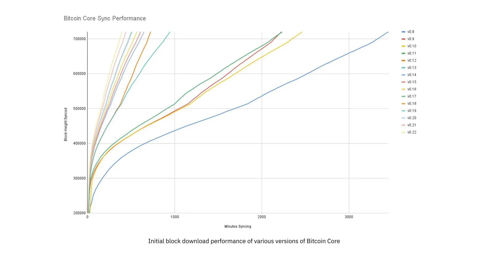


Igikoresho ca mbere co gukuraho ubuhinga bwa verisiyo zitandukanye za Bitcoin core. Ku nzira ya Y niho uburebure bw'ibuye bwahujwe kandi ku nzira ya X ni igihe vyatwaye kugira ngo buhuzwe n'ubwo burebure


Imirongo itandukanye igereranya verisiyo zitandukanye za Bitcoin core. Umurongo uri ibubamfu cane ni wo uheruka, ni ukuvuga verisiyo 0.22, yasohotse muri Nzero 2021 kandi yatwaye iminota 396 kugira ngo ihurire hamwe. Iryo riri iburyo ni verisiyo 0.8 yo mu kwezi kwa 11/2013, yatwaye iminota 3452. Ivyo vyose - nk’incuro 10 - iterambere riterwa n’ugutera imbere imbere.


Ivyo bishobora gushirwa mu rwego rwo kuzigama umwanya (RAM, disk, bandwidth, n’ibindi) canke kuzigama ubushobozi bwo gukoresha ubuhinga bwa none. Ivyo bice vyose bibiri biratuma habaho iterambere riri mu kigereranyo kiri hejuru.


Akarorero keza k’ugutera imbere mu vy’ubuhinga bw’ibarabara karaboneka mu bubiko bw’ibitabu [libsecp256k1](https://github.com/Bitcoin-core/secp256k1), mu bindi, bushira mu ngiro ibintu vya kera vy’ubuhinga bwa none bikenewe kugira ngo umuntu ashobore gukora no kugenzura imikono y’ubuhinga bwa none. Pieter Wuille ni umwe mu bafashije muri iri soko ry’ibitabu, kandi yanditse [urudodo rwa Twitter](https://twitter.com/pwuille/status/1450471673321381896) yerekana iterambere ry’ibikorwa ryashitsweko biciye mu bisabwa bitandukanye vyo gukurura.


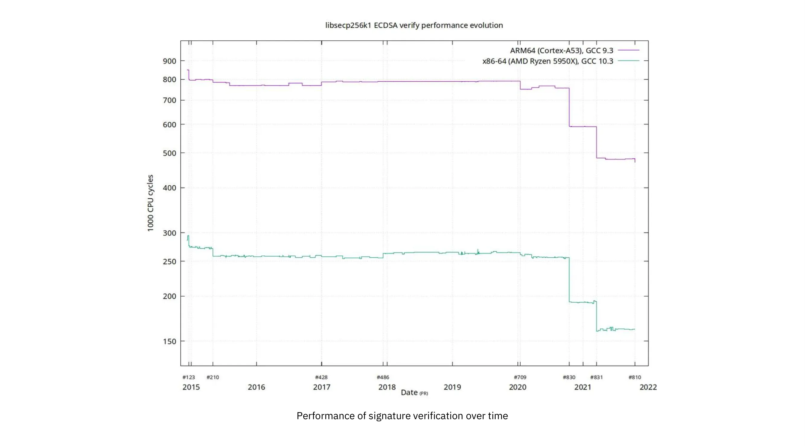


Ibikorwa vyo kugenzura umukono mu gihe, n'ibisabwa bihambaye vy'ugukwegakwega vyashizweko ikimenyetso ku rutonde rw'igihe


Ico gishushanyo kirerekana ingene ubwoko bubiri butandukanye bwa CPU bufise amabit 64, ari bwo ARM na x86. Itandukaniro ry’imikorere riterwa n’amabwirizwa yihariye cane aboneka kuri x86 ugereranyije n’ubwubatsi bwa ARM, bufise amabwirizwa make kandi rusangi. Ariko rero, umurongo rusangi ni umwe ku nyubakwa zompi. Zirikana ko umurongo wa Y ari logarithme, ivyo bikaba bituma ivyo bintu vyahinduwe bisa n’ibidatangaje cane nk’uko biri mu vy’ukuri.


Hariho kandi ingero nziza zitari nke z’ugutera imbere mu bijanye no kuzigama umwanya vyatumye habaho iterambere ry’ibikorwa. Mu

[Ivyanditswe ku rubuga rwa interineti] (2-of-3-Multisig-inputs-using-Pay-to-Taproot-d5faf2312ba3) ku bijanye n'uruhara rwa Taproot mu kuzigama umwanya, umukoresha Murch agereranya ingene umwanya w'ububiko ukoresha ikimenyetso ca GW-of-3 cosaba, inzira nk’uko nyene kutayikoresha na gato.


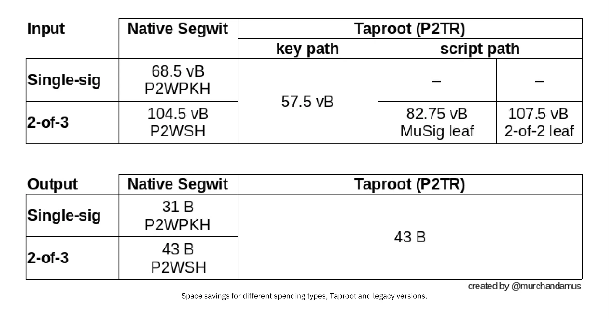


Uguzigama umwanya ku bwoko butandukanye bwo gukoresha amahera, Taproot n’ibindi bikoresho vya kera.


2-of-3 Multisig ikoresha SegWit y’akavukire yosaba umubare wose hamwe 104.5+43 vB = 147.5 vB, mu gihe gukoresha Taproot bikoresha cane ikibanza vyosaba gusa 57.5+43 vB = 100.5 vB mu gihe c’ikoreshwa ry’ibintu. Mu bihe bibi cane kandi bidasanzwe, nk’igihe umusinyi asanzwe ataboneka kubera imvo zimwe zimwe, Taproot yokoresha 107.5+43 vB = 150.5 vB. Ntubwirizwa gutahura ibintu vyose, ariko ivyo bikwiye kuguha iciyumviro c'ingene abahinguzi biyumvira ku bijanye no kuzigama umwanya - buri byte ntoyi iraharura.


Uretse ugupima imbere muri porogarama ya Bitcoin, hari uburyo bumwe bumwe abakoresha bashobora gutanga umusanzu mu gupima imbere, na bo nyene. Bashobora gukora ibikorwa vyabo vy’ubwenge kugira ngo bazigame amahera y’ibikorwa mu gihe nyene bagabanya ibirenge vyabo ku bisabwa vya Full node. Uburyo bubiri bukoreshwa cane kugira ngo umuntu ashike kuri iyo ntumbero bwitwa gukoranya ibikorwa vy’ubudandaji n’ugushiramwo ibintu vyinshi.


Iciyumviro kiri mu gukorana n’abandi ni ugufatanya amahera menshi mu kwishura kumwe, aho gukora amahera imwe ku kwishura. Ivyo bishobora kugukiza amahera menshi, kandi mu gihe nyene bikagabanya umuzigo w’ahantu h’amabuye.


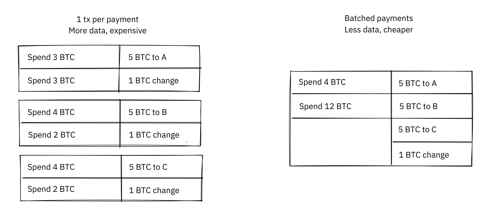


Transaction batching ihuza amahera menshi mu gucuruza kumwe kugira ngo umuntu azigame amahera.


Gushiramwo umusaruro vyerekeye gukoresha neza ibihe vy’ugusaba guke kw’ahantu h’amabuye kugira ngo umusaruro mwinshi ushire hamwe mu musaruro umwe. Ivyo bishobora kugabanya amafaranga yawe mu nyuma, igihe uzokenera kwishura mu gihe ivyipfuzo vy’ahantu h’amabarabara ari vyinshi.


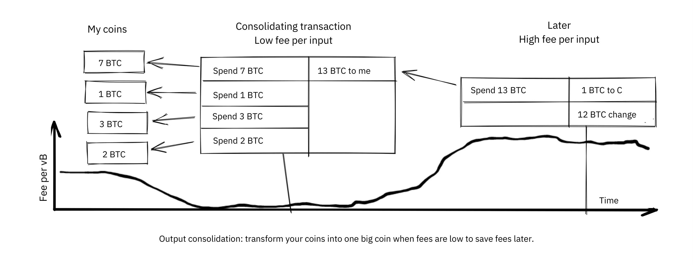


Gushiramwo umusaruro: Funga ibiceri vyawe mu Coin imwe nini igihe amafaranga ari make kugira ngo uzigame amafaranga mu nyuma.


Bishobora kutagaragara ingene ugushiramwo umusaruro bifasha mu gutera imbere imbere. Nakare, umubare wose w’amakuru ya Blockchain mbere uragwizwa gatoyi n’ubwo buryo. Naho biri ukwo, umugwi wa UTXO, ni ukuvuga urutonde rw’amakuru rukurikirana uwufise ibiceri, ruragabanuka kubera ko ukoresha UTXO nyinshi kuruta uko urema. Ivyo bigabanya umuzigo w’ibihimba vyuzuye vyo kubungabunga amaseti yabo ya UTXO.


Ariko ikibabaje, ubu buhinga bubiri bwo gucunga *UTXO* bushobora kuba bubi ku buzima bwite bwawe canke bw'abahembwa. Mu bijanye n’ugukoranya, uwuhembwa wese azomenya ko ibisohoka vyose biva kuri wewe bikaja ku bandi barihembwa (kiretse bishoboka ko ari uguhinduka). Mu gihe c'ugushiramwo UTXO, uzohishura ko ibisohoka ushiramwo ari ivy'iyo Wallet nyene. Woshobora rero gutegerezwa guhindura ibintu hagati yo gukoresha amahera menshi be n’ukuntu udashobora kwiherera.


#### Gupima ibice


Uburyo bugira ingaruka cane ku bijanye no gupima kumbure ni uguteranya. Iciyumviro rusangi kiri inyuma y'ugushiramwo ni uko umurongo ushobora gutorera umuti amahera hagati y'abakoresha ata kwongera amafaranga kuri Blockchain.


Ivyagezwe vy'imirongo bitangura n'abantu babiri canke barenga bemeranya ku bijanye n'ugutangura gucuruza bishizwe kuri Blockchain, nk'uko vyerekanwa ku gishushanyo kiri musi.


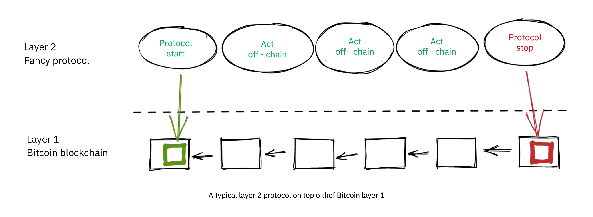

Itegeko risanzwe rya Layer 2 hejuru ya Bitcoin, Layer 1.


Uko iyo nzira yo gutangura iremeshwa biratandukanye hagati y’amasezerano, ariko insiguro rusangi ni uko abayigize barema iyo nzira yo gutangura itashizweko umukono n’umubare w’ibikorwa vy’igihano vyashizweko umukono imbere y’igihe, bikoresha umusaruro w’iyo nzira yo gutangura mu buryo butandukanye. Hanyuma, amasezerano y’intango arashirwako umukono ku buryo bushitse kandi akamenyeshwa kuri Blockchain, kandi amasezerano y’igihano arashobora gushirwako umukono ku buryo bushitse kandi agatangazwa kugira ngo ahane uwugira inyifato mbi. Ivyo bitera intege abaje mu nama gushitsa ivyo basezeranye kugira ngo iyo porotokole ikore mu buryo bwa Trustless.


Igihe igikorwa co gutangura kiri kuri Blockchain, iyo porotokole ishobora gukora ivyo itegekanijwe gukora. Nk'akarorero, vyoshobora gukora amahera yihuta cane hagati y'abaje mu nama, gushiramwo ubuhinga bumwe bumwe bwo kwongereza ubuzima bwite, canke gukora inyandiko ziteye imbere zidashobora gushigikirwa na Bitcoin Blockchain.


Ntituzodondora neza ingene amategeko yihariye akora, ariko nk’uko mushobora kubibona ku gishushanyo c’imbere, Blockchain ikoreshwa gake cane mu kiringo c’ubuzima bw’amasezerano. Ivyo bikorwa vyose vy’umutobe bishika *off-chain*. Twarabonye ingene ivyo bishobora kuba intsinzi ku bwite iyo bikozwe neza, ariko kandi bishobora kuba akarusho ku bijanye n’ugutera imbere.


Mu [Reddit post](https://www.reddit.com/r/Bitcoin/comments/438hx0/urugendo_ku_ku_kwezi_rusaba_igisasu_gifise/) citwa "Urugendo rwo kuja ku kwezi rusaba igisasu gifise inzira nyinshi canke ubundi urugendo rwo kuja ku kwezi rusaba igisasu gifise inzira nyinshi canke ubundi urugendo rwo kuja ku kwezi ruzoja mu... trebuchet kandi kwizigira ko tuzororanirwa ni ukuri.", Gregory Maxwell asigura igituma gutera ivyatsi ari co kintu ciza kuruta ibindi vyose dushobora gutuma Bitcoin igera ku rugero rw'ubunini.


Atangura ashimika ku makosa yo kubona Visa canke Mastercard nk’abahiganwa bakuru ba Bitcoin no kugaragaza ingene kwongerera ubunini bw’ibarabara ari uburyo bubi bwo guhura n’abo bahiganwa. Hanyuma akavuga ingene yogira itandukaniro nyaryo akoresheje ibice:


> None-- Mbega ivyo bisigura ko Bitcoin idashobora kuba umutsinzi munini nk’ubuhinga bwo kwishura? Oya Ariko kugira ngo dushike ku bwoko bw’ubushobozi busabwa kugira ngo dushobore gukora ivyo isi ikeneye mu vy’amahera dutegerezwa gukorana ubwenge kuruta.
>

> Kuva mu ntango zayo nyene Bitcoin yari igenewe gushiramwo ibice mu buryo butekanye biciye ku bushobozi bwayo bwo gukora amasezerano (Iki, wibaza ko ivyo vyashizweho gusa kugira ngo abantu bashobore gukora ivy'ubuhinga bwa filozofiya ku "DAOs" zitagira insiguro?). Mu vy’ukuri tuzokoresha ubuhinga bwa Bitcoin nk’umucamanza w’ururobo ashobora gushikirwa cane kandi yizigirwa kandi tuzokora ibikorwa vyacu vyinshi hanze y’icumba c’urubanza-- ariko dukore mu buryo bw’uko iyo hari ikintu kigenda nabi tuba dufise ibimenyamenya vyose n’amasezerano ashizweho kugira ngo dushobore kwizigira ko urukiko rw’ururobo ruzokora neza. (Geek sidebar: Nimba ivyo bisa n’ibidashoboka, genda usome iyi nkuru ya kera ku bijanye n’ugucapura amafaranga)
>

> Ivyo birashoboka cane kubera imiterere nyamukuru ya Bitcoin. Uburyo bw’ishimikiro bushobora gucengera canke gusubirwamwo ntibubereye cane kwubaka ubuhinga bukomeye bwo gukora ibikorwa vy’ubudandaji bwa Layer hejuru ya... kandi iyo umutungo w’ishimikiro udakomeye, nta co bimaze gukorana na wo na gato.

Ico kigereranyo n’umucamanza ni ikigereranyo ciza c’ingene gutera ivyatsi bikora: uwo mucamanza ategerezwa kuba adashobora kubora kandi ntazokwigera ahindura ivyiyumviro vyiwe, ahandi ho ivyicaro biri hejuru y’ishimikiro rya Bitcoin Layer ntibizokora neza.


Abandanya avuga iciyumviro ku bijanye n’ibikorwa bihurikiye hamwe. Kenshi nta ngorane iriho mu kwizigira umukozi wa mbere afise amahera makeyi ya Bitcoin kugira ngo ibintu bikorwe: ivyo navyo ni ugupima mu bice.


Haciye imyaka myinshi Maxwell yanditse ico gice kiri hejuru, kandi amajambo yiwe aracariho. Ukuroranirwa kwa Lightning Network kwerekana ko gutera ivyatsi ari inzira yo kwongerera akamaro Bitcoin.


### Insozero ku bijanye no gupima


Twaraganiriye uburyo butandukanye umuntu yoshobora gukoresha mu gupima Bitcoin, kwongera ubushobozi bwo gukoresha Bitcoin. Gutera imbere ni ikintu gihangayikishije muri Bitcoin kuva mu misi yayo ya mbere cane.


Turazi uno musi ko Bitcoin idashobora gupima neza mu buryo buhagaze ("ugura ibikoresho binini") canke mu buryo buringaniye ("genzura ibice gusa vy'amakuru"), ahubwo ikora imbere ("kora vyinshi ukoresheje bike") no mu bice ("wubaka amasezerano hejuru ya Bitcoin").


## Igihe umucafu utera umuyaga

<chapterId>fe39c13c-310f-51fd-84ff-6b92dd01c9e7</chapterId>


Bitcoin yubatswe n’abantu. Abantu barandika iyo porogarama, abantu na bo bagaca bayikoresha. Iyo havumbuwe ubugoyagoye bw’umutekano canke ikibazo gikomeye - vy’ukuri hariho itandukaniro hagati y’ivyo bibiri? - ryama rivumburwa n’abantu, inyama n’amaraso. Iki gice kirazirikana ivyo abantu bakora, ivyo bakwiye gukora n’ivyo badakwiye gukora iyo umucafu uteye umuyaga. Igice ca mbere gisigura ijambo *ugutangaza mu buryo buranga inshingano*, ryerekeza ku kuntu umuntu abonye ubugoyagoye ashobora gukora mu buryo buranga inshingano kugira ngo afashe mu kugabanya ingorane zishobora guterwa n’ubwo bugoyagoye. Igice gisigaye c’ikigabane kigutwara mu rugendo rwo guca mu bibazo bimwebimwe bikomeye cane vyavumbuwe mu myaka, n’ingene vyafashwe n’abahinguzi, abacukuzi b’amabuye y’agaciro n’ababikoresha. Ibintu ntivyari bikomeye cane mu bwana bwa Bitcoin nk’uko biri muri iki gihe.


### Guhishura bifise inshingano


Ibaze ko ubonye ikibazo muri Bitcoin core, ikibazo gituma umuntu wese ashobora gufunga kure urudodo rwa Bitcoin core akoresheje ubutumwa bumwe bumwe bw’urubuga bwakozwe mu buryo budasanzwe. Iyumvire kandi ko utagira ububisha kandi woshima ko iki kibazo kiguma kitakoreshwa. Ukora iki? Niwabiceceka, birashoboka ko uwundi muntu azomenya ico kibazo, kandi ntushobora kwemera neza ko uwo muntu atazoba afise ububisha.


Iyo ikibazo c'umutekano kivumbuwe, uwukivumbura akwiye gukoresha _ugutangaza mu buryo bubereye_ ari ryo jambo rikoreshwa kenshi mu bategura Bitcoin. Ijambo ni [ryasiguwe kuri Wikipedia](https://ru.wikipedia.org/wiki/Ugutangaza_ubugoyagoye_buhujwe):


> Abahinguzi b’ibikoresho n’amaporogarama akenshi basaba umwanya n’ubutunzi kugira ngo bashobore gusanura amakosa yabo. Akenshi, abasuma b’abanyaruyeri ni bo basanga ivyo .
ubugoyagoye. Abanyaruyeri n’abahinga mu vy’umutekano wa mudasobwa barafise iciyumviro c’uko ari inshingano yabo mu kibano kumenyesha abantu bose aho abantu bashobora gushikirwa n’ingorane. Guhisha ingorane vyoshobora gutuma umuntu yumva ko afise umutekano w’ikinyoma. Kugira ngo ivyo ntibibeho, ababigiramwo uruhara barahuza kandi bagahanahana igihe gikwiriye co gusanura iyo nzira y’ubugoyagoye. Bivanye n’ingaruka zishobora guterwa n’ico kibazo, igihe citezwe gikenewe kugira ngo haboneke uburyo bwo gutorera umuti canke gutorera umuti ibibazo vyihutirwa no gukoreshwa n’ibindi, ico kiringo gishobora guhinduka hagati y’imisi mikeyi n’amezi menshi.


Ivyo bisigura ko iyo ubonye ikibazo c’umutekano, ukwiye kubimenyesha umugwi ujejwe iyo sisitemu. Ariko none ivyo bisobanura iki mu bijanye n’igitabu ca Bitcoin? Nta n'umwe agenzura Bitcoin, ariko ubu hariho ikibanza nyamukuru co guteza imbere Bitcoin, ni co [ububiko bwa Github bwa Bitcoin core](https://github.com/Bitcoin/Bitcoin). Ababungabunga ubwo bubiko ni bo bajejwe kode iri muri bwo, ariko ntibajejwe sisitemu yose uko ingana - nta n'umwe abifise. Naho biri ukwo, uburyo bwiza muri rusangi ni ukwohereza ubutumwa kuri security@bitcoincore.org.


Mu kiganiro co muri 2017, Anthony Towns yaragerageje gucapura mu ncamake ivyo abona. Yari yarakoranije inyishu zivuye mu bibanza bitandukanye no mu bantu batandukanye kugira ngo amenyeshe iciyumviro ciwe ku bijanye n’ico kibazo.


- Ivyago bishobora kumenyeshwa biciye ku mutekano kuri bitcoincore.org
- Ikibazo gikomeye (gishobora gukoreshwa nabi ubwo nyene canke kiriko kirakoreshwa nabi kigatera ingorane nyinshi) kizotorwa na:
  - igipande casohotse ASAP
  - itangazo ryagutse ry'uko bikenewe gusubiramwo (canke guhagarika sisitemu zafashwe)
  - gutangaza bikeyi ingorane nyayo, kugira ngo ibitero bicerezwe
- Ingorane zidakomeye (kubera ko zigoye canke zizimvye gukoreshwa) zizotorwa na:
  - n'isubiramwo ryakozwe mu nzira isanzwe y'iterambere
  - backport y'ugukosora canke umuti kuva kuri master gushika kuri verisiyo isohotse ubu
- Abahinguzi bazogerageza kumenya neza ko gutangaza iyo nzira y’ugukosora bitagaragaza kamere y’ingorane mu gutanga iyo nzira y’ugukosora ku ba devs bazi utuntu n’utundi batamenyeshejwe ivy’ingorane, bakababwira ko ikosora ingorane, no kubasaba kumenya iyo nzira y’ubugoyagoye.
- Devs bashobora gusaba izindi Bitcoin implementations kwemera gukosora ubugoyagoye imbere y’uko uko gukosora gusohoka no gukoreshwa cane, nimba bashobora kubikora batamenyesheje ubugoyagoye; nk’akarorero, nimba iyo fix ifise inyungu zikomeye z’ibikorwa vyotuma ishirwamwo.
- Imbere y’uko ubugoyagoye bumenyekana, abahinguzi bazosaba abahinguzi b’abagenzi ba Altcoin ko bakwiye gukurikirana ivyo bashobora gukosora. Ariko ivyo bishika gusa inyuma y’aho ivyo bikosora bishikirijwe cane mu rubuga rwa Bitcoin.
- Devs muri rusangi ntizomenyesha abahinguzi ba Altcoin bigenjeje mu buryo bw’urwanko (nk’akarorero, gukoresha ubugoyagoye kugira ngo batere abandi, canke barenga ku mategeko).
- Bitcoin devs ntibazotangaza amakuru y'ubugoyagoye gushika >80% vy'ibihimba vya Bitcoin bishizeho ivyo gukosora. Abavumbura ubugoyagoye bararemeshwa kandi bagasabwa gukurikiza iyo ngingo nyene. [1] [6]


Iryo lisiti ryerekana ingene umuntu ategerezwa kwiyubara igihe asohora ama patch ya Bitcoin, kuko iyo patch ubwayo yoshobora gutanga ubugoyagoye. Isasu rya kane riraryoshe cane kuko risobanura ingene umuntu yogerageza nimba igipande cari carahishijwe neza bihagije. Nkako, nimba abahinga bakeyi vy’ukuri badashobora kubona ubugoyagoye mbere bazi ko iyo patch ikosora imwe, birashoboka ko yoba vy’ukuri Hard kugira ngo abandi bayivumbure.


Urudodo rwatumye iyi email yariko iraganira ku vyerekeye nimba, ryari, n’ingene twomenyesha ubugoyagoye ku ma altcoins n’ibindi bikoresho vya Bitcoin. Nta n’inyishu itomoye iri aha. "Gufasha abahungu beza" bisa n'ikintu gifise ubwenge, ariko ni nde afata ingingo y'uko ari bo kandi umuntu afata umurongo hehe? Bryan Bishop [yavuze] ko gufasha altcoins mbere n’ama scamcoins kwikingira ubusuma bw’umutekano vyari igikorwa co mu vy’inyifato runtu:


> Ntibihagije kurwanira Bitcoin n’abayikoresha ku bitero bikora, hariho inshingano rusangi yo kurwanira ubwoko bwose bw’abakoresha n’amaporogarama atandukanye ku bwoko bwinshi bw’iterabwoba mu buryo ubwo ari bwo bwose, naho abantu boba bariko barakoresha porogarama z’ubujuju kandi zidatekanye wewe ubwawe udacungera canke ngo utanga umusanzu kuri canke. Gufata ubumenyi bw’aho umuntu ashobora guhungabana ni ikintu gikomeye kandi ushobora kuba uriko uraronka ubumenyi bufise ingaruka zikomeye cane zitaziguye canke zitaziguye kuruta uko vyavuzwe mu ntango.

Ikindi catumye Town igira imeyili iri hejuru yari [ivyo yanditse] vyanditswe na Gregory Maxwell, aho yavuze ko ubugoyagoye bwo mu mutekano bushobora kuba bukomeye kuruta:


> Nabonye kenshi ikibazo ca Hard co gukoresha nabi gihinduka ikintu kitagira akamaro iyo ubonye ubuhinga bubereye, canke ikibazo gitoyi ca dos gihinduka icacu kikaba ikintu gikomeye cane.
>

> Ivyiyumviro vyoroshe, bikoreshwa n'abahinga, birashobora gukoreshwa mu gucapura urubuga--- Miner A na Exchange B baja mu gice kimwe, abandi bose mu kindi.. kandi bagakoresha kabiri.
>

> N’ibindi.  Rero naho nemera ata gukeka ko ibintu bitandukanye bikwiye kandi bishobora gufatwa mu buryo butandukanye, ntivyama bigaragara neza. Ni vyiza gufata ibintu nk’ibikomeye kuruta uko ubizi.

Rero, naho ubugoyagoye busa n’ubwa Hard bwo gukoresha, vyoshobora kuba vyiza wiyumvira ko bushobora gukoreshwa bitagoranye kandi utaramenya ingene bwokoreshwa.


Avuga kandi ingene "bitari vyiza kwita iyi nkuru ikintu cose kijanye n'ugutangaza, iyi nkuru si iyo gutangaza. Gutangaza ni iyo ubwira uwugurisha. Iyi nkuru ni iyo gutangaza kandi ivyo bifise ingaruka zitandukanye cane. Gutangaza ni igihe uzi neza ko wabwiye abazogutera". Ico ciyumviro ca nyuma ku bijanye n’itandukaniro riri hagati yo gutangaza n’ugutangaza ni ikintu gihambaye. Igice coroshe ni uguhishura umuntu afise inshingano; igice ca Hard ni ugusohora ibitabu bifise ubwenge.


### Ubwana bubabaje bwa Bitcoin


Bitcoin yatanguye nk’umugambi w’umuntu umwe (nibura ivyo ni vyo izina ry’uruyeri ry’umuremyi wayo rivuga), kandi Bitcoin mu ntango yari ifise agaciro gatoyi canke nta gaciro. Kubera ivyo, ubugoyagoye n’ugukosora ibibazo ntivyafatwa mu buryo bukomeye nk’uko biri muri iki gihe.


Wiki ya Bitcoin ifise [urutonde rw’ibintu bishobora gutuma umuntu agira ingorane n’ibintu bishobora gutuma umuntu agira ingorane](https://ru.Bitcoin.it/wiki/Ibintu_bishobora gutuma umuntu agira ingorane) (CVEs) Bitcoin yaciyemwo. Iki gice kivuga gatoyi bimwe mu bibazo vy'umutekano n'ibintu vyabaye kuva mu myaka ya mbere ya Bitcoin. Ntituzobivuga vyose, ariko twahisemwo bikeyi dusanga bishimishije cane.


#### 28/07/2010: Gukoresha ibiceri vy'umuntu wese (CVE-2010-5141)


Ku wa 28 Nyakanga 2010, umuntu yitwa ArtForz yasanze hariho ikibazo kiri muri verisiyo 0.3.4 cotuma umuntu wese afata ibiceri ku wundi wese. ArtForz *n’inshingano* yabimenyesheje Satoshi Nakamoto n’uwundi muhinga mu bijanye n’uguhingura Bitcoin yitwa Gavin Andresen.


Ikibazo cari uko umukoresha w'inyandiko `OP_RETURN` yosohoka gusa mu gushirwa mu ngiro kwa porogarama, rero iyo inyandikoPubKey iba `<pubkey> OP_CHECKSIG` na scriptSig iba `OP_1 OP_RETURN`, igice ca porogarama kiri muri scriptPubKey nticari kwigera gikora. Ikintu conyene cobaye ni uko `1` yoshirwa ku rutonde hanyuma `OP_RETURN` igatuma porogarama isohoka. Agaciro kose katari zero kari hejuru y'ikirundo inyuma y'aho porogarama irangiriye bisigura ko ivyangombwa vyo gukoresha amahera vyuzuye. Kubera ko ikintu co hejuru `1` kitari zero, amafaranga yoba ari meza.


Iyi yari kode yo gukoresha `OP_RETURN`:


```
case OP_RETURN:
{
pc = pend;
}
break;
```

Ingaruka ya `pc = pend;` yari iyo porogaramu isigaye gusimbuka, bisobanura ko inyandiko yose yo gufunga muri scriptPubKey yokwirengagizwa. Ico gikosora cari uguhindura insobanuro ya `OP_RETURN` kugira ngo ihite inanirwa, ahubwo.


```
case OP_RETURN:
{
return false;
}
break;
```


Satoshi yakoze iryo hinduka mu karere maze yubaka binaire ishobora gukorwa n’uburyo 0.3.5 buva kuri yo. Hanyuma ashira ku rubuga rwa Bitcointalk `\\*** ALERT \*** Guhindura 0.3.5 ASAP`, asaba abakoresha gushiramwo iyi verisiyo yiwe y’ibice bibiri, ataco yerekana ku bijanye n’inkomoko yayo:


> Ndagusavye ushire ku 0.3.5 ASAP!  Twarakosoye ikibazo co gushirwa mu ngiro aho vyari bishoboka ko amafaranga y’ibinyoma yemerwa.  Ntukemere amafaranga y’i Bitcoin nk’ukwishura gushika ushize kuri verisiyo 0.3.5!

Ubutumwa bw’intango bwarahinduwe mu nyuma kandi ntibukiriho mu buryo bwabwo bwose. Ico gice kiri hejuru kivuye mu [nyishu yo gusubiramwo] (insanganyamatsiko=626.msg6458#msg6458). Bamwe mu bakoresha baragerageje binary ya Satoshi, ariko barahura n'ingorane. Haciye igihe gito, [Satoshi yanditse]:


> Nta mwanya ufise wo guhindura SVN.  Rindira 0.3.6, ndiko ndayubaka ubu.  Ushobora gufunga node yawe muri ico gihe.

Kandi haciye iminota 35, [yanditse]:


> SVN yahinduwe na verisiyo 0.3.6.
>

> Gushira Windows yubatswe ya 0.3.6 kuri Sourceforge ubu, hanyuma bizosubira kwubaka linux.

Muri iki gihe na we nyene asa n’uwahinduye ivyanditswe vy’intango kugira ngo avuge 0.3.6 aho kuvuga 0.3.5:


> Ndagusavye ushire ku 0.3.6 ASAP!  Twarakosoye ikibazo co gushirwa mu ngiro aho vyari bishoboka ko amafaranga y’ibinyoma yerekanwa nk’uko yemewe.  Ntukemere amafaranga Bitcoin nk’ukwishura gushika ushize kuri verisiyo 0.3.6!
>

> Niba udashobora gusubira ku 0.3.6 ubwo nyene, ni vyiza ko ufunga node yawe ya Bitcoin gushika ubikoze.
>

> Kandi muri 0.3.6, gutera vuba:
> - Ububiko bwo hagati mu gihugu bushimira tcatm
> - Ivy'ibanga ++ ASM SHA-256 bishimira BlackEye
> Igitigiri cose c’ivyo bitanga umuvuduko 2.4x vyihuta.
>

> Gukurura:
>

> Imigambi/Bitcoin/amadosiye/Bitcoin/Bitcoin-0.3.6/
>

> Abakoresha Windows na Linux: niwaba ufise 0.3.5 uracari ukeneye kuvyura ukaja kuri 0.3.6.

Raba itandukaniro riri hagati y'ikibazo n'ubutumwa bwa mbere: "bishobora kwerekanwa nk'ivyemewe" vs "bishobora kwemerwa". Kumbure Satoshi yaragabanyije uburemere bw’ico gikoko mu guhanahana amakuru kwiwe kugira ngo ntiyitwararike cane ikibazo nyaco. Uko biri kwose, abantu baravyuriye kuri 0.3.6 biragenda nk’uko vyari bitezwe. Ico kibazo c’umwihariko caratowe umuti, bitangaje, ata Bitcoin yatakaje.


Ubutumwa bwa Satoshi bwadondora kandi ukuntu Mining ikora neza. Ntibisobanutse neza igituma ivyo vyashizwe mu vyo gukosora umutekano, birashoboka ko intumbero yari iyo gupfukiranya ikibazo nyaco. Ariko bisa n’uko gusa yasohoye ivyo vyose vyari ku mutwe w’ishami ry’iterambere ry’ububiko bwa Subversion, n’ivyo gukosora umutekano vyongeweko.


Iciyo gihe, nta bantu benshi bari hafi nk’uko bari muri iki gihe, kandi agaciro ka Bitcoin kari hafi y’ubusa. Iyo iyi nyishu y'ikinyoma ikinwa uno musi, vyofatwa nk'ikiganiro c'ubujuju kubera imvo nyinshi:


- Satoshi yakoze isohoka ry’ibice bibiri gusa rya 0.3.5 ririmwo ivyo gukosora. Nta n’igipande canke kode vyatanzwe, kumbure nk’ingero yo gupfukiranya ikibazo.
- 0.3.5 [ntiyakoze mbere] (insiguro=626.ubutumwa6455#ubutumwa6455).
- Ico gikosorwa muri 0.3.6 mu vy'ukuri cari Hard Fork.


Ikindi kintu co guharira ni uko ari vyiza canke ari bibi ko abakoresha basabwe gufunga ama node yabo. Ivyo ntivyoshoboka uno musi, ariko ico gihe abakoresha benshi bariko barakurikirana n’umwete amahuriro kugira ngo bamenye amakuru mashasha kandi akenshi bari hejuru y’ibintu. Kubera ko ivyo vyari bishoboka, vyoshobora kuba ari ikintu ciza co gukora.


#### 2010-08-15 Ugusesagura umusaruro wose (CVE-2010-5139)


Mu mpera z’ukwezi kwa munani 2010, umukoresha w’ihuriro ry’ivy’ubuhinga bwa none yitwa jgarzik, yitwa Jeff Garzik,

[yavumbuwe ko](https://bitcointalk.org/index.php?topic=822.msg9474#msg9474) igikorwa kinaka co ku burebure bw’ibarabara 74638 cari gifise ibisohoka bibiri vy’agaciro kanini cane bidasanzwe:


```
"out" : [
{
"value" : 92233720368.54277039,
"scriptPubKey" : "OP_DUP OP_HASH160 0xB7A73EB128D7EA3D388DB12418302A1CBAD5E890 OP_EQUALVERIFY OP_CHECKSIG"
},
{
"value" : 92233720368.54277039,
"scriptPubKey" : "OP_DUP OP_HASH160 0x151275508C66F89DEC2C5F43B6F9CBE0B5C4722C OP_EQUALVERIFY OP_CHECKSIG"
}
]
```


> "Agaciro" muri iyi block #74638 ni ikintu kidasanzwe:
>

> 92233720368,54277039 BTC?  Mbega iyo ni UINT64_MAX, ndabaza?

Birashoboka ko hariho ikibazo catumye umubare w’ibisohoka bibiri int64 (atari uint64, nk’uko Garzik yiyumvira) useseka ukaja ku gaciro kabi -0.00997538 BTC. Uko umubare w'ibintu vyinjijwe woba uri kwose, "umubare" w'ibisohoka woba muto, bigatuma iyo nzira igenda neza hakurikijwe kode y'ico gihe.


Muri iki gihe, iyo bug yari yaramenyekanye kandi iratangazwa biciye mu gukoresha nabi nyavyo. Iciyumviro kibi cavuye muri ivyo ni uko hari haremwe amafaranga agera ku miliyari 2x92 za Bitcoin, ivyo bikaba vyatumye amafaranga Supply y’ibiceri nka miliyoni 3,7 yariho ico gihe agenda aragabanuka cane.


Mu nkuru ijana n’ivyo, [Satoshi yashizeho] ko yovyishimira iyo abantu bahagarika Mining (canke *gutanga*, nk’uko bayita ico gihe):


> Vyofasha iyo abantu bahagarika gutanga.  Kumbure tuzokenera gusubira gukora ishami rikikuje iryo ririho ubu, kandi uko uzoba generate nke niko bizogenda vyihuta.
>

> Igipande ca mbere kizoba kiri muri SVN rev 132. Ntikirashirwako.  Ndiko ndasunika ibindi bihinduka misc mu nzira mbere, hanyuma nzoshirako patch y'ibi.

Umugambi wiwe wari uwo gukora Soft Fork kugira ngo amafaranga nk’ayo tuvuga ngaha abe ataco amaze, gutyo amabuye (na cane cane amabuye 74638) yarimwo ayo mafaranga abe ataco amaze. Haciye isaha imwe gusa, yarakoze [igice co gusubiramwo 132] (https://sourceforge.net/p/Bitcoin/code/132/) c’ububiko bwa Subversion maze [ashira ku rubuga]. abakoresha bakwiye gukora:


> Igipande cashizwe kuri SVN rev 132!
>

> Ubu, intambwe zishimikijwe:
> 1) Gufunga.
> 2) Gukuraho ama dosiye ya blk ya knightmb.  (subirizaho amadosiye yawe blk0001.dat na blkindex.dat)
> 3) Gutera imbere.
> 4) Ikwiye gutangura n’ama blocks atarenga 74000. Reka isubire gukuraho ibindi.
>

> Niba udashaka gukoresha amadosiye ya knightmb, woshobora gusa gukuraho amadosiye yawe ya blk*.dat, ariko bizoba ari umuzigo mwinshi ku rubuga nimba bose bariko barakuraho urutonde rw’amabuye yose icarimwe.
>

> Nzokwubaka ibisohoka vuba.

Yashaka ko abantu bakura amakuru y’ibibujijwe ku muntu yihariye, ari we knightmb, yari yarasohoye Blockchain yiwe nk’uko igaragara kuri disiki yiwe, amadosiye blkXXXX.dat na blkindex.dat. Impamvu yo gukura amakuru ya Blockchain muri ubwo buryo, bitandukanye n’uguhuza amakuru kuva mu ntango, yari iyo kugabanya ingorane z’uruja n’uruza rw’urubuga.


Hariho ikintu kinini co kwirinda kuri ivyo: abakoresha amakuru boshobora gukura kuri knightmb [ntibagenzuwe na porogarama ya Bitcoin] igihe batangura. Dosiye blkindex.dat yarimwo urutonde rwa UTXO, kandi iyo porogarama yokwemera amakuru yose ari muri yo nk’aho yoba yaramaze kuyagenzura. knightmb yari gushobora gukoresha amakuru kugira ngo yihe canke uwundi muntu wese ama bitcoins.


Na none, abantu basa n’abajana n’ivyo, kandi uguhindura iyo block itagira akamaro n’abayikurikiye vyarabaye vyiza. Abacukuzi b’amabuye y’agaciro batanguye gukora ku bijanye n’uguhagarika [74637] Timestamp, uwuzomukurikira yabonetse isaha 23:53 UTC, amasaha nk’6 inyuma y’aho ico kibazo kivumbuwe. Ku isaha ya 08h10 ku musi ukurikira, ku wa 16 Myandagaro, nko ku nzu 74689, uruzitiro rushasha rwari rwarengeye uruzitiro rwa kera, rero ama node yose atavuguruwe yarasubiye gukora kugira ngo akurikire uruzitiro rushasha. Iyi ni yo reorg - amabuye 52 - mu mateka ya Bitcoin.


Ugereranije n’ikibazo ca OP_RETURN, iki kibazo carafashwe mu buryo bumwe bumwe busukuye:


- Nta gice ca kabiri gusa gisohotse
- Porogaramu yasohotse yakoze nk'uko vyari biteguwe
- Oya Hard Fork


Abakoresha basabwe guhagarika Mining muri iki kinyamakuru na co nyene. Turashobora kuganira nimba iki ari iciyumviro ciza canke atarivyo, ariko wiyumvire ko uri Miner kandi wemera neza ko amabuye yose ari hejuru y’ibuye ribi azoheza azimanganywe mu gusubira gukora neza: kuki wotakaza ubutunzi ku mabuye ya Mining yacitse intege?


Ushobora kandi kwiyumvira ko ari ikintu giteye ubwoba gukora nk’uko Nakamoto yabivuze maze ugakuraho Blockchain, harimwo n’ivyo UTXO, ku muduga wa Hard w’umuntu w’umunyaruyeri. Nimba ari ukwo biri, uravuga ukuri: ivyo ni ifi. Ariko, kubera uko ibintu vyari vyifashe, iyo nyishu y’ivyihutirwa yari ibereye.


Hariho itandukaniro rikomeye hagati y'iki kibazo n'ikibazo ca OP_RETURN ca kera: iki kibazo carakoreshejwe nabi mu mashamba, kandi rero gukosora vyoshobora gukorwa bigororotse. Ku bijanye na OP_RETURN, bategerezwa gupfukamira ivyo gukosora no gutanga amajambo ku mugaragaro atagaragaza ata guca ku ruhande ikibazo cari ikihe.


#### DB ifunga ikibazo 0.7.2 - 0.8.0 (CVE-2013-3220)


Ikibazo gishimishije cane kandi gifise agaciro mu vy'inyigisho carasohotse muri Ntwarante 2013. Vyasa n'uko Blockchain yari yacitsemwo ibice (naho ijambo "Fork" rikoreshwa mu majambo avugwa aha hepfo) inyuma y'ibarabara 225429. Ivyerekeye ivyo bintu vyabaye [vyavuzwe mu 2013). BIP50] (ubutumwa bw'ikirundi). Incamake ivuga ngo:


> Igipande cari gifise umubare munini w’ibintu vyose vyinjizwa mu bikorwa vy’ubudandaji kuruta uko vyari vyabonetse mbere, caracukuwe maze kiratangazwa. Bitcoin 0.8 nodes zari zishoboye gukora ivyo, ariko nodes zimwe zimwe zari imbere ya 0.8 Bitcoin zaravyanka, bituma haba Fork ya Blockchain itari yitezwe. Uruzitiro rw'imbere y'0.8 (kuva ng'aha, uruzitiro rwa 0.8) muri ico gihe rwari rufise nk'ibice 60% vy'ububasha bwa Mining Hash bituma ugucapura kutavyikurako (nk'uko vyari kubaye iyo uruzitiro rw'imbere y'0.8 rurengera uruzitiro rwa 0.8 mu gikorwa cose c'umubiri. uruzitiro).
>

> Kugira ngo basubire kuronka uruzitiro rw’ivyagezwe vuba bishoboka, BTCGuild na Slush baragabanyije urugero rwabo rwa Bitcoin 0.8 nodes ku 0.7 kugira ngo ibidengeri vyabo na vyo nyene vyonka igice kinini. Ivyo vyashize hashpower nyinshi ku ruzitiro ata block nini, gutyo amaherezo bituma 0.8 nodes zisubira gutunganya uruzitiro rw’imbere ya 0.8.

Ico gikorwa cihuta cakozwe n’ibidengeri vya Mining BTCGuild na Slush cari gihambaye cane muri iki gihe c’ivyihutirwa. Bashoboye gutuma ububasha bwinshi bwa Hash buja ku ishami ry’imbere y’i 0.8 ry’uguca ibice, gutyo bagafasha kugarukana ukwiyumvikana. Ivyo vyahaye abahinguzi umwanya wo guca irya n’ino uburyo buramba bwo gutorera umuti iyo ngorane.


Ikindi gishimishije cane muri iki kibazo ni uko verisiyo 0.7.2 yari idahuye na yo nyene, nk’uko vyari vyifashe ku verisiyo za kera na zo nyene. Ivyo birasigurwa mu [Igice c'Impamvu y'Imizi ya BIP50] (Impamvu y'Imizi):


> Kubera ko BDB lock configuration idahagije, yari yaracitse itegeko ry’uguhuriza ku rubuga rigena ukuri kw’ifunguro (naho ari
itegeko ridahuye kandi ridatekanye, kuko ikoreshwa ry’urufunguzo ryoshobora gutandukanywa ku nzira ku yindi).


Muri make, ikibazo ni uko umubare w’ibifungurwa vy’urutonde rw’amakuru porogarama ya Bitcoin core ikeneye kugira ngo isuzume ububiko ataco bimaze. Node imwe yoshobora gukenera X locks mu gihe iyindi node ishobora gukenera X+1 locks. Ivyo bihimba navyo birafise urugero rw’ingene Bitcoin ishobora gufata amafunguro. Iyo umubare w’ingufu zikenewe urenze urugero, iyo nzira izofatwa nk’iyitagira akamaro. Rero iyo X+1 irenze urugero ariko itarenze X, rero izo node zibiri zizocapura Blockchain ntizihuze ku bijanye n’ishami rifise akamaro.


Umuti watowe, uretse ibikorwa vyihuse vyakozwe n’ivyo bidengeri bibiri kugira ngo bisubire kwumvikana, wari uwo .


- guhagarika amabuye mu buryo bw'ubunini n'ingufu zikenewe kuri verisiyo 0.8.1
- n’ushireko verisiyo za kera (0.7.2 n’izindi za kera) n’amategeko mashasha amwe, kandi wongere umupaka w’ugufunga kw’isi yose.


Uretse ko umupaka w’ugufunga kw’isi yose wongerewe mu masasu ya kabiri, ayo mategeko yarashizwe mu ngiro mu gihe gitoyi mu kiringo cari carategekanijwe imbere y’igihe. Ico gikorwa cari co gukuraho iyo mipaka igihe ama node menshi amaze gutera imbere.


Iyi Soft Fork yaragabanyije cane ingorane zo kutagira aho umuntu yemeranya, haciye amezi make, ku wa 15 Rusama, ayo mategeko y’igihe gito yarazimye mu buryo bumwe ku rubuga rwose. Zirikana ko iyo deactivation yari mu vy’ukuri Hard Fork, ariko ntiyari iyo gutera amahane. Vyongeye, yasohotse hamwe n’indege Soft Fork yari imbere yayo, rero abantu bakoresha iyo porogarama y’amabarabara ya Soft bari bazi neza ko hari Hard Fork izoyikurikira. Ku bw’ivyo, igice kinini c’ibihimba vyagumye bihuriyeko igihe Hard Fork yatangura gukora. Ariko ikibabaje ni uko ama node makeyi atavuguruwe yatakaye muri iyo nzira.


Umuntu yokwibaza nimba ivyo vyoshoboka muri iki gihe. Igishushanyo ca Mining kiragoye cane muri iki gihe, kandi, bivanye n’ububasha bwa Hash ku ruhande rumwe rumwe rw’igice, coshobora kuba Hard kugira ngo ushireho igipande nk’ico muri BIP50 vyihuta bihagije. Birashoboka ko ari Hard kugira ngo yemeze abacukuzi b'amabuye y'agaciro ku ishami "ritari ryo" ngo bareke ingororano zabo z'amabuye.


#### BIP66


BIP66 iraryoshe cane kuko yerekana akamaro ka:


- guhitamwo neza
- guhishura bifise inshingano
- gushirwaho ata guhishura ubugoyagoye
- Mining hejuru y'amabuye yagenzuwe


BIP66 yari iciyumviro co gukomeza amategeko agenga ivy’ugushiramwo amajambo y’umukono mu nyandiko ya Bitcoin. Ico [gituma] cari ugushobora gusesangura imikono n’amaporogarama canke amasomero atari OpenSSL mbere n’amaverisiyo ya OpenSSL aherutse gusohoka. OpenSSL ni ububiko bw’ibitabo bw’intumbero rusangi Bitcoin core yakoresha ico gihe.


BIP yatanguye gukora ku wa 4 Nyakanga 2015. Ariko naho ivyo bivugwa haruguru ari ukuri, BIP66 iratorera umuti ikibazo gikomeye cane kitavuzwe muri BIP.


##### Ubugoyagoye


Ivyerekeye iki kinyamakuru vyose vyasohowe ku wa 28 Nyakanga 2015 na Pieter Wuille mu kinyamakuru .

[imeli ku rutonde rw'abarungika ubutumwa kuri Bitcoin-dev](https://urutonde.


> Muraho mwese,
>

> Ndashaka gutangaza ubugoyagoye nabonye muri Nzero 2014, bwacitse ubugoyagoye igihe BIP66 yashika ku 95% mu ntango z’uku kwezi.
>

> Insobanuro ngufi:
>

> Igikorwa kidasanzwe co gucuruza cari gushobora gutuma Blockchain igabanywa hagati y’ibice:
>

> - gukoresha OpenSSL ku bikoresho vy'ibice 32 no ku bikoresho vya Windows vy'ibice 64
> - gukoresha OpenSSL ku bikoresho bitagira amadirisha 64 (Linux, OSX, ...)
> - gukoresha amakode amwe atari OpenSSL yo gusesangura imikono

Iyo email iratanga kandi ido n’ido ry’ingene ico kibazo camenyekanye be n’icatumye kiba. Mu mpera, aratanga urutonde rw’ibintu vyabaye, maze tuzosubira gukina bimwe mu bihambaye cane ngaha. Bamwe muri bo, nk’uko vyerekanywe n’igishushanyo kiri hejuru, baramaze kudondorwa.


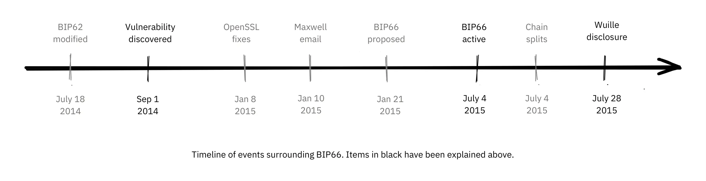


Urutonde rw'ibintu vyabaye bikikuje BIP66. Ibintu biri mu mwijima vyarasiguwe haruguru.


##### Imbere y'uko bivumburwa


Ata n’umwe azi ico kibazo, cari gushobora gutorwa n’itegeko rya BIP62 ubu ryaragutse, ryari igitekerezo co kugabanya ubushobozi bwo guhindura ibikorwa vy’ubudandaji. Mu mahinduka yasabwe muri BIP62 harimwo gukomeza amategeko y'ubumwe y'ugushiramwo amajambo y'imikono, canke "ugushiramwo amajambo y'amajambo akomeye". Pieter Wuille yasavye ko hagira ivyo guhindura BIP muri Nyakanga 2014, ivyo vyari gutorera umuti ico kibazo:


> 2014-Jul-18: Kugira ngo amategeko yo gushiramwo umukono wa Bitcoin ntavane n’umuhinga yihariye wa OpenSSL, narahinduye iciyumviro ca BIP62 kugira ngo igisabwa cayo gikomeye c’imikono ya DER na co nyene gikoreshwe ku bikorwa vya verisiyo 1. Nta mikono itari iya DER yariko iracukurwa mu mabuye ico gihe, ivyo rero vyari vyitezwe ko ata ngaruka bifise. Raba urubuga rwa interineti: 90 no ku rubuga rwa interineti. Ntivyari bizwi ico gihe, ariko iyo bikoreshwa ivyo vyari gutorera umuti iyo ngorane.

Kubera ubwaguke bw'iyi BIP, yari ipfutse vyinshi kuruta "gushiramwo amajambo akomeye" gusa, yaguma ihinduka kandi ntiyigeze yegera gukoreshwa. BIP yarakuweho mu nyuma kubera ko Segregated Witness, BIP141, yatorera umuti ingorane zo gukorana n’abandi mu buryo butandukanye kandi bushitse.


##### Inyuma y'aho bivumbuwe


OpenSSL yasohoye verisiyo nshasha za porogarama zabo zifise ibice, iyo zikoreshwa muri Bitcoin kuva mu ntango, zari gutorera umuti ico kibazo. Ariko rero, gukoresha verisiyo nshasha iyo ari yo yose ya OpenSSL gusa mu gusohoka gushasha kwa Bitcoin core vyotuma ibintu bikomera kuruta. Ivyo Gregory Maxwell arabisigura mu kindi kiganiro co muri Mukakaro 2015:


> Naho ku bikorwa vyinshi vyemewe muri rusangi kwanka n’umwete imikono imwe imwe, Bitcoin ni uburyo bwo kwumvikana aho abaje mu nama bose bategerezwa kwemeranya muri rusangi ku bijanye n’uko amakuru yinjijwe ari ay’ukuri canke atagira akamaro.  Mu buryo bumwe, ugushikama ni ngirakamaro kuruta "ugukosora".
> [...]
> Ivyo bipande biri hejuru, ariko, bikosora gusa ikimenyetso kimwe c’ingorane rusangi: kwizigira porogarama zitagenewe canke zitakwiragijwe kugira ngo zikoreshwe mu guhuza (na cane cane OpenSSL) ku nyifato y’uguhuza.  Rero, nk'iterambere ry'inyongera, ndasaba ko Soft-Fork igenewe gukurikiza DER vuba, ikoresheje igice ca BIP62.

Avuga ko gukoresha kode idagenewe gukoreshwa mu mice y'uguhurizako bitera ingorane zikomeye, kandi asaba ko Bitcoin ishira mu ngiro kode zikomeye za DER. Ico ni akarorero gatomoye cane k’akamaro k’uguhitamwo neza ubuhinga bwo gukingira amakuru.


Ivyo bintu vyabaye vyoshobora kuguha iciyumviro c’uko Gregory Maxwell yari azi ivyerekeye ubugoyagoye Pieter Wuille yasohoye mu nyuma, ariko ashaka gufasha kwinyegeza mu gutorera umuti yiyoberanije nk’ingero yo kwirinda, ataco yitaho cane ingorane nyayo. Bishobora kuba ari uko, ariko ni ugutekereza ku bintu gusa.


Hanyuma, nk’uko vyasabwe na Maxwell, BIP66 yararemwe nk’igice ca BIP62 kigaragaza gusa ugushiramwo amakuru akomeye ya DER. Iyi BIP iboneka ko yemewe cane kandi ikoreshwa muri Nyakanga, naho nyene Blockchain zibiri zacitsemwo ibice kubera *Mining itagira icemezo*. Ivyo bice bica bivugwa mu kigabane gikurikira.


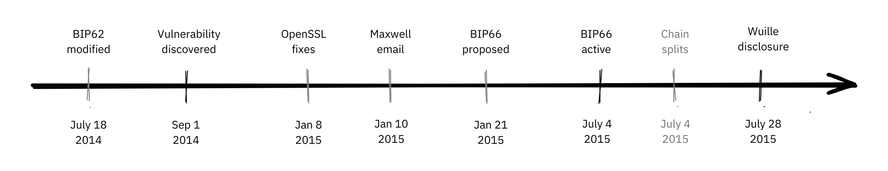


Iciyumviro nyamukuru co gukura muri ivyo ni uko BIPs ikwiye kuba *atomic* nyinshi canke nke, bisobanura ko zikwiye kuba zitunganye bihagije kugira ngo zitange ikintu c’ingirakamaro canke zitorere umuti ingorane yihariye, ariko zikaba ntoyi bihagije kugira ngo zishobore gushigikirwa n’abazikoresha benshi. Uko ushiramwo ibintu vyinshi muri BIP niko n’amahirwe yo kwemerwa aba make.


##### Ivyiyumviro bivuye ku kwemeza Mining


Ikibabaje ni uko inkuru ya BIP66 itarangiriye aho. Igihe BIP66 yakora, vyaciye bihinduka biteye akaga cane kuko abacukuzi bamwebamwe batagenzura ama blocks bariko baragerageza kwagura. Ivyo vyitwa Mining itagira icemezo, canke SPV-Mining (nk’uko biri mu Kugenzura Ukwishyura Kworoshe). Ubutumwa bwo kugabisha bwarungitswe ku bice vya Bitcoin bifise uruja n’uruza ku [rupapuro rw’urubuga rudondora ikibazo]


> Mu gitondo ca kare ku wa 4 Nyakanga 2015, hashitse ku rugero rwa 950/1000 (95%). Haciye igihe gito, indege ntoyi Miner (igice c’ibice 5%) bitavuguruwe yaracukuye ibuye ritagira akamaro–nk’uko vyari bitezwe. Ikibabaje, vyabonetse ko nk’igice c’igipimo c’urubuga Hash cari Mining ata mabuye yemeza neza (yitwa SPV Mining), maze bubaka amabuye mashasha hejuru y’iryo buye ritagira akamaro.

Iryo paji ry'imburi ryategetse abantu kurindira ibindi vyemezo 30 kuruta uko bobigira iyo bakoresha verisiyo za kera za Bitcoin core.


Ivyo bice vyavuzwe haruguru vyabaye ku wa 2015-07-04 isaha zibiri n’igice UTC inyuma y’uburebure bw’ibarabara 320d752b46b532ec0f3f815c5dae467aff5715a6e579e). Ico kibazo caratowe umuti isaha zitatu n’igice z’ijoro uwo musi nyene, inyuma y’aho amabuye 6 atagira akamaro amaze gucukurwa. Ikibabaje ni uko ico kibazo nyene carasubiye kuba ku musi ukurikira, ni ukuvuga ku wa 2015-07-05 isaha zibiri n’igice, ariko kuri iyi nshuro ishami ritagira akamaro ryaramaze amabarabara 3 gusa.


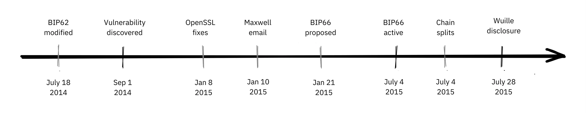

Ivyabaye vyatumye BIP66 ibaho, gukoreshwa kwayo, n’ivyo vyakurikiye ni inyigisho nziza cane y’ingene abahinguzi ba Bitcoin bategerezwa kwitwararika. Ivyiza bikeyi vyo gukura muri BIP66:


- Uburinganire hagati yo gufungura no kudatangaza ikintu gishobora gutuma umuntu agira ingorane ni ikintu gikomeye cane.
- Gushiraho ibikosorwa ku bibazo bitasohowe ni urukino rutoroshe gukina.
- Gukomeza kwumvikana ni Hard.
- Porogaramu zitagenewe uburyo bwo kwumvikana muri rusangi zirashobora gutera ingorane.
- BIPs ikwiye kuba ari atome ku rugero runaka.


### Insozero ku vyerekeye Igihe Shit Itera Umufana


Bitcoin irafise ibikoko. Abantu bavumbura ibikoko bararemeshwa kubimenyesha abahinguzi ba Bitcoin mu buryo bubereye, kugira ngo bashobore gukosora ibikoko batabimenyesheje ku mugaragaro. Ivyiza, igikosorwa c’ibikoko gishobora kwiyoberanya nk’ugutera imbere kw’ibikorwa, canke ikindi gikoresho co gukingira umwotsi.


Twaravye bimwe mu bibazo bikomeye cane vyaje mu myaka, n’ingene vyatowe umuti. Bimwe vyavumbuwe ku mugaragaro biciye mu gukoresha nabi mu gihe ibindi vyamenyekanye mu buryo bubereye kandi bishobora gukosorwa imbere y’uko ababikora bagira akaryo ko kubikoresha nabi.


## Ibibazo vyo kuganirako

<chapterId>91462ca7-f09c-55da-a5b9-3e211de31da5</chapterId>


Ibi bibazo vy'ibiganiro si ugusubiramwo gusa ibirimwo muri "Bitcoin development philosophy", bigamije kugutera intege zo gukora ubushakashatsi bwinshi rero urabe ko usohoka ukaja gutohoza.


Ushobora kugerageza uburebure bw’ugutahura kwawe mu kwandika [inkuru ntoyi](https://www.youtube.com/watch?v=N4YjXJVzoZY) y’amajambo 100-300 mu guhitamwo iciyumviro kiri muri iki kinogo c’ibibazo. Niba ushaka inyishu zivuye mu bikorwa vyawe ushobora kuzirungika kuri mini-essay@planb.network, tuzonezerwa cane no kuzisubiramwo.


#### Kwegera ubutegetsi


- Ukwegereza ubutegetsi abaturage ni Hard. Ni kuki tunyura muri ivyo bibazo vyose kugira ngo bigende neza? Twoba twohitamwo uburyo bwo gukorana n’abandi, aho ibice bimwebimwe bihurizwa hamwe ibindi bitari hagati?
- Mbega kwegereza ubutegetsi abaturage bizana ingorane yo gukoresha amahera kabiri, canke ingorane yo gukoresha amafaranga kabiri isaba kwegereza ubutegetsi abaturage? None Satoshi yatorera umuti gute ingorane yo gukoresha amahera kabiri?
- Ni mu mice iyihe Bitcoin iguma ikunda gucengera cane, kandi ni kuki gucengera ari ikintu kibi cane? Hariho imvo zishigikira ugucengera?
- Bivugwa ko Bitcoin ata ruhusha afise. Hari ubundi buryo bwo kwishura woshobora kubona ko ata ruhusha?


#### Ukwizigira


- Ukwizigirana kenshi ni ikintu giteye ubwoba, si ikintu kibiri. Ni ibihe bintu vyo muri Bitcoin ari vyo Trustless, kandi ni ibihe bikunze gusaba ko umuntu yizigira cane? None vyoshobora kugabanywa?
- Ushaka gukoresha Full node kugira ngo ushobore kwemeza neza amafaranga yose. Ushobora gukura Bitcoin core kuri https://Bitcoin.org/ru/gukuraho. Ni hehe mwashize icizigiro, kandi ni hehe muri Trustless yuzuye?
- Woba ushobora kwubaka ubuhinga bwa Trustless hejuru y’ubuhinga bwo kwizigirwa?


#### Ubuzima bwite


- Ni ivyiza ibihe bihambaye uwukoresha aronka iyo aguma afise ubuzima bwiwe bwite igihe akorana na Bitcoin? Ni ivyiza ibihe bimwebimwe vy’ubugwaneza ku bijanye n’urubuga?
- Gusubira gukoresha amaderesi bigira ico bikoze gute ku buzima bwawe bw’ibanga?
- Bitcoin ikoresha uburyo bwa UTXO, mu gihe amafaranga amwe amwe y’ubuhinga bwa none akoresha uburyo bwa konti. Ni ingaruka izihe iyo ngingo ifise ku bijanye n’ubuzima bwite?


#### Supply y'iherezo


- Ni isano irihe riri hagati ya Bitcoin ifise impera Supply n’ugusohoka kwayo Coin biciye ku Coinbase Transaction? Ni isano irihe riri hagati y’ugutanga Coin n’ingengo y’imari y’umutekano, kandi bihushanye gute?
- Ni ibihe bintu Satoshi yari gushobora guhindura kugira ngo ihindure igipfukisho ca Bitcoin ca Supply? Ni igiki cohinduka iyo afata ingingo yo guhagarika indege Supply ku miliyoni 1? None 1 trillion?
- Ni kuki abantu bamwebamwe bariko barasaba ko Bitcoin Supply yokwongerwa? None wibaza ko ivyo bizoshika?


#### Kuvugurura


- Speedy Trial ni iki kandi ni kuki vyari ngombwa ko Taproot ikora?
- Ni kuki dukeneye abacukuzi benshi cane kugira ngo bavugurure mu softfork? Ni kuki umurongo w’imbere atari 51% gusa?


#### Ivyiyumviro vy'abansi


- Sybil Attack ni iki, kandi ni igiki gituma urubuga rwigenga rushobora kuyigira?
- Ni kuki bihambaye ko abakinyi bose bo mu muhora wa Bitcoin - atari abahinguzi gusa - biyumvira mu buryo bw’abansi?


#### Inkomoko yuguruye


- Abacungezi bakeyi gusa ni bo bafise uruhusha rwa GitHub rwo gushiramwo kode mu bubiko bwa [Bitcoin core](https://github.com/Bitcoin/Bitcoin). None ivyo ntibihushanye n’urubuga rudafise uruhusha?
- Mbega uburyo bwo gutegura inkomoko yuguruye burakunda Sybil Attack? Nimba ari ukwo biri, ivyo wobirwanya gute?
- Ni ivyiza ibihe n’ibibi ibihe vyo kwizigira amasomero y’abandi, kandi ni ubuhe buryo bukoreshwa kuri Bitcoin core?
- Ni mu buryo ubuhe dukeneye gusubiramwo birenze gusa gusubiramwo kode? Ni gute womenya ingene isubiramwo rihagije?
- Ni gute twomenya ko hazokwama hariho abantu bihagije bafise ubuhinga bakora kuri Bitcoin? Ni igiki kiba iyo ataco bariho, kandi dusuzuma gute ubunyankamugayo bwabo n’imigambi yabo?


#### Gupima


- Bivugwa ko gucapura bitanga inyungu zo gutera imbere ku giciro c’ugusobanuka. Ni kubera iki dukwiye canke tutakwiye kwemera ivyiza vy’ubuhinga bwa none kubera ko bigoye gutahura, naho vyoba bisa n’ibibereye mu vy’ubuhinga?
- Ni ingero izihe z’uburyo bwo gupima imbere bwashizwe muri Bitcoin?
- Ni kuki ugupima mu buryo buhagaze bigoye cane mu buryo bushingiye ku rwego rwo hejuru? Bimeze gute ivyerekeye ugupima mu buryo buringaniye?
- Ntidusa n'aho turi hafi y'uguhuriza ku kuntu twoshobora gushiramwo isi yose kuri Bitcoin. Mbega Satoshi ntiyari akwiye n’imiburiburi kwiyumvira inzira yo gushikayo, imbere ya Mining ibara rya mbere mu 2009?
- Woshiramwo gute (ubuhagaze, uburinganire, imbere, canke atari ubuhinga bwo gupima) kimwe cose muri ibi bikurikira: guca ibice, kwongerera ubunini bw’ibice, SegWit, uturongo twa SPV, uguhanahana amakuru hagati, Lightning Network, kugabanya igihe c’ibice, Taproot, imirongo y’inyuma


# Igice ca nyuma


<partId>4b6ff4ef-b9ea-4c48-b05f-62d41a38fbbb</partId>


## Amasuzuma n'Ibipimo


<chapterId>d334a837-df46-4989-9cad-8d8779147dbe</chapterId>


<isCourseReview>true</isCourseReview>

## Ikizamini Cya nyuma

<chapterId>b2b498c0-a787-11f0-bd09-e3fc5cfa90af</chapterId>


<isCourseExam>true</isCourseExam>


## Iciyumviro


<chapterId>b77ed55c-b13a-430b-a212-37aab527b9e7</chapterId>


<isCourseConclusion>true</isCourseConclusion>
