# Detaljno proučavanje filozofije razvoja Bitcoina


Filozofija razvoja Bitcoina je kurs za Bitcoin programere koji već razumeju osnovne koncepte i procese kao što su Proof-of-Work, formiranje blokova i životni ciklus transakcija, i koji žele da unaprede svoje znanje sticanjem dubljeg razumevanja kompromisa u dizajnu Bitcoina i njegove filozofije.

Treba da pomogne novim programerima da usvoje najvažnije lekcije iz više od decenije razvoja i javne rasprave o Bitcoinu, dok im pruža koristan kontekst za evaluaciju novih ideja (dobrih i loših!).


### Šta možete očekivati?


Kao što je gore navedeno, ovo je praktičan vodič za Bitcoin programere. Međutim, Bitcoin je široka i složena tema i ne možemo pokriti sve njene aspekte ovde. Sa ovim kursom, nadamo se da ćemo diskutovati o neophodnim karakteristikama kako biste započeli svoju razvojnu aktivnost, kao i da vam omogućimo da je dalje istražujete samostalno.


U Bitcoin je uključeno mnogo ljudi; pošto neki od njih imaju suprotna mišljenja, ovde možete pronaći izvore koji izražavaju kontradiktorne ideje. Međutim, uvek pokušavamo da se držimo domena činjenica, gde mišljenja nisu bitna.


### Ko je ovo napisao?


Ovaj kurs je prilagođen iz istoimene knjige čiji je glavni autor Kalle Rosenbaum, a Linnéa Rosenbaum je doprinela kao koautor.

Knjigu je naručio i finansirao [Chaincode Labs](https://learning.chaincode.com/), razvojni centar koji vodi obrazovne programe za programere koji žele da nauče o razvoju Bitcoin.


+++

# Uvod

<partId>58c48e9b-e285-4dc6-8952-6cc5140b1313</partId>

## Pregled kursa

<chapterId>28b7256b-9cb0-463e-a82d-d732be86c98c</chapterId>

Dobrodošli na kurs PHI 301 o filozofiji razvoja Bitcoina.

Bitcoin je više od same kriptovalute; on predstavlja filozofsku viziju decentralizacije, privatnosti, nepovredivog poverenja i otpornosti. Ovaj kurs je posebno osmišljen za developere koji su već upoznati sa tehničkim osnovama Bitcoina, a sada žele da prodube svoje razumevanje principa na kojima počiva Bitcoinov dizajn i upravljanje.

Tokom ovog kursa steći ćete jasno razumevanje osnovnih vrednosti i strategija koje su više od decenije oblikovale razvoj Bitcoina. Dubinskim proučavanjem ovih tema razvijaćete kritičku perspektivu potrebnu da sa samopouzdanjem ocenjujete i doprinosite budućim razvojnim inicijativama.

### Ključne vrednosti Bitcoina

Šta čini Bitcoin jedinstvenim? Ova sekcija otkriva temeljne vrednosti u samom srcu Bitcoinovog dizajna. Istražićete **decentralizaciju**, kamen-temeljac koji obezbeđuje da nijedan entitet ne kontroliše mrežu; **odsustvo potrebe za poverenjem** (eng. trustlessness), ključno za uklanjanje oslanjanja na treće strane; **privatnost**, neophodnu kako za individualnu slobodu tako i za integritet sistema; kao i **ograničenu ponudu bitcoina**, kodiranu garanciju oskudnosti koja oblikuje ekonomsku prirodu Bitcoina. Ovladavanje ovim konceptima omogućiće vam da u potpunosti razumete snage i slabosti Bitcoina.

### Proces donošenja odluka u Bitcoin mreži - decentralizovano upravljanje (eng. Bitcoin Governance)

Snalaženje u složenom upravljačkom pejzažu Bitcoina zahteva više od tehničke stručnosti; potrebno je razumevanje jedinstvenog pristupa Bitkoina postizanju konsenzusa i donošenju odluka. U ovom delu kursa detaljno ćete proučiti mehanizme i filozofije koje stoje iza ključnih procesa kao što su nadogradnje protokola, značaj razmišljanje u uslovima protivnika (eng. adversarial thinking), snaga saradnje u open-source zajednici, stalni izazovi skalabilnosti, kao i nijansirane strategije potrebne kada stvari neizbežno krenu po zlu. Opremljeni ovim znanjem, bićete spremni ne samo da učestvujete, već i da efikasno i odgovorno oblikujete budućnost Bitcoina.

Spremni da napravite sledeći korak na svom Bitcoin putovanju? Hajde da počnemo!


# Ključne vrednosti Bitcoina

<partId>2d6c683b-54c8-5465-b2ca-4e96a6828834</partId>


## Decentralizacija

<chapterId>9397c84b-0038-5d0e-88d5-11767ce8182d</chapterId>


Ovo poglavlje analizira šta je decentralizacija i zašto je ključna za funkcionisanje Bitcoina. Pravimo razliku između decentralizacija [rudara](https://planb.academy/resources/glossary/mining) i [full node-ova](https://planb.academy/resources/glossary/full-node) (puni čvor – računar koji čuva kompletnu kopiju [blockchaina](https://planb.academy/resources/glossary/blockchain) i validira sve [transakcije](https://planb.academy/resources/glossary/transaction-tx) i [blokove](https://planb.academy/resources/glossary/block) prema pravilima Bitcoina), i diskutujemo šta oni donose za otpornost na cenzuru, jedna od najvažnijih osobina Bitkoina.


Diskusija se zatim prebacuje na razumevanje neutralnosti - ili nepostojanja ograničenja prema korisnicima, rudarima i programerima - što je neophodno svojstvo svakog decentralizovanog sistema. Na kraju, dotičemo se koliko može biti teško shvatiti decentralizovani sistem kao što je Bitcoin, i predstavljamo neke mentalne modele koji vam mogu pomoći da ga razumete.


Sistem bez bilo kakve centralne tačke kontrole naziva se *decentralizovanim*. Bitcoin je dizajniran da izbegne postojanje centralne tačke kontrole, ili preciznije *centralne tačke cenzure*.


Decentralizacija je sredstvo za postizanje *otpornosti na cenzuru*.


Postoje dva glavna aspekta decentralizacije u Bitcoinu: decentralizacija rudara i decentralizacija full node-ova.


Decentralizacija rudara odnosi se na činjenicu da obrada transakcija nije izvršena niti koordinisana od strane bilo kojeg centralnog entiteta. Full node decentralizacija odnosi se na činjenicu da se validacija blokova, tj. podataka koje rudari proizvode, obavlja na krajevima mreže (eng. edge of the network), od strane samih korisnika, a ne od strane nekolicine centralnih ili pouzdanih autoriteta.


### Decentralizacija rudara


Postojali su pokušaji stvaranja digitalnih valuta pre Bitcoina, ali većina njih je propala zbog nedostatka decentralizovanog upravljanja i otpornosti na cenzuru.


Decentralizacija rudara u Bitcoinu znači da *redosled transakcija* ne sprovodi nijedan pojedinačni entitet ili fiksni skup entiteta. To se obavlja kolektivno od strane svih aktera koji žele da učestvuju u tome; ovaj kolektiv rudara je dinamičan skup korisnika. Svako može da se pridruži ili napusti po želji. Ovo svojstvo čini Bitcoin otpornim na cenzuru.


Ako bi Bitcoin bio centralizovan, bio bi ranjiv na one koji bi želeli da ga cenzurišu, kao što su vlade. Doživeo bi istu sudbinu kao raniji pokušaji stvaranja digitalnog novca. U uvodu [rada](https://www.blockstream.com/sidechains.pdf) pod nazivom "Omogućavanje Blockchain inovacija sa Pegged Sidechains (povezani sporedni lancovi)", autori objašnjavaju kako rane verzije digitalnog novca nisu bile opremljene za neprijateljsko okruženje (pogledajte i poglavlje o neprijateljskom razmišljanju u sledećem delu).


David Chaum je uveo digitalni novac kao istraživačku temu 1983. godine, u okruženju sa centralnim serverom kojem se veruje da sprečava [dvostruko trošenje](https://planb.academy/resources/glossary/double-spending-attack) (eng. double spending). Da bi ublažio rizik po privatnost pojedinaca od ove centralne pouzdane strane i da bi osigurao [zamenjivost](https://planb.academy/resources/glossary/fungibility), Chaum je uveo [slepi potpis](https://planb.academy/resources/glossary/blind-signature) (eng. blind signature), koji je koristio da obezbedi kriptografski način za sprečavanje povezivanja potpisa centralnog servera (koji predstavljaju novčiće), dok je i dalje omogućavao centralnom serveru da izvrši prevenciju dvostrukog trošenja.

Zahtev za centralnim serverom postao je Ahilova peta digitalnog novca[Gri99]. Iako je moguće distribuirati ovu jedinstvenu tačku otkaza zamenom potpisa centralnog servera prag-potpisom (eng. threshold signature) više potpisnika, važno je za reviziju da potpisnici budu različiti i prepoznatljivi. Ovo i dalje ostavlja sistem ranjivim na otkazivanje, jer svaki potpisnik može otkazati, ili biti primoran da otkaže, jedan po jedan.


Postalo je jasno da korišćenje centralnog servera za redosled transakcija nije bila održiva opcija zbog visokog rizika od cenzure. Čak i ako bi se centralni server zamenio federacijom fiksnog skupa od n servera, od kojih najmanje m mora odobriti redosled, i dalje bi postojale poteškoće. Problem bi se zapravo pomerio na onaj gde korisnici moraju da se slože oko ovog skupa od n servera, kao i oko toga kako zameniti zlonamerne servere dobrim bez oslanjanja na centralni autoritet.


Hajde da razmislimo šta bi se desilo ako bi Bitcoin mogao biti cenzurisan. Cenzor bi mogao vršiti pritisak na korisnike da se identifikuju, da izjavljuju odakle dolazi njihov novac ili šta kupuju s njim pre nego što dozvoli njihovim transakcijama da uđu u blockchain.


Takođe, nedostatak otpornosti na cenzuru omogućio bi cenzoru da primora korisnike da usvoje nova pravila sistema. Na primer, mogli bi nametnuti promenu koja bi im omogućila da povećaju količinu novca, obogaćujući se na taj način. U takvom slučaju, korisnik koji verifikuje blokove imao bi tri opcije za postupanje sa novim pravilima:


- usvojiti: prihvatiti promene i usvojiti ih u njihov full node.
- odbiti: odbiti usvajanje promena; ovo ostavlja korisnika sa sistemom koji više ne obrađuje transakcije, jer su blokovi cenzora sada proglašeni nevažećim od strane korisnikovog full node-a.
- potez: imenovati novu centralnu tačku kontrole; svi korisnici moraju shvatiti kako da se koordiniraju i zatim se dogovore o novoj centralnoj tački kontrole.


Ako uspeju, isti problemi će se najverovatnije ponovo pojaviti u nekom trenutku u budućnosti, s obzirom na to da je sistem ostao jednako podložan cenzuri kao i ranije.


Nijedna od ovih opcija nije korisna za korisnika.


Otpornost na cenzuru kroz decentralizaciju je ono što odvaja Bitcoin od drugih monetarnih sistema, ali to nije lako postići zbog *problema dvostrukog trošenja*. Ovaj problem se odnosi na to kako osigurati da niko ne može da potroši isti novčić dva puta, što je pitanje za koje su mnogi smatrali da je nemoguće rešiti na decentralizovan način. Satoshi [Nakamoto](https://planb.academy/resources/glossary/nakamoto-satoshi) piše u svom [Bitcoin white paper-u](https://planb.academy/bitcoin.pdf) o tome kako rešiti problem dvostrukog trošenja:


> U ovom radu predlažemo rešenje za problem dvostrukog trošenja koristeći distribuiranog peer-to-peer servera sa vremenskim pečatom, koji generiše računarski dokaz hronološkog redosleda transakcija.

Ovde koristi specifičan izraz „peer-to-peer distribuirani server sa vremenskim pečatom“. Ključna reč ovde je *distribuiran*, što u ovom kontekstu znači da ne postoji centralna tačka kontrole. Nakamoto zatim objašnjava kako je [Proof-of-Work](https://planb.academy/resources/glossary/proof-of-work) rešenje.

Ipak, niko to ne objašnjava bolje od

[Gregory Maxwell na Redditu](https://www.reddit.com/r/Bitcoin/comments/ddddfl/question_on_the_vulnerability_of_bitcoin/f2g9e7b/), gde odgovara nekome ko predlaže ograničavanje [heš snage](https://planb.academy/resources/glossary/hashrate) rudara kako bi se izbegli potencijalni 51% napadi:


> Decentralizovani sistem kao što je Bitcoin koristi javne izbore. Ali ne možete jednostavno imati glasanje 'ljudi' u decentralizovanom sistemu jer bi to zahtevalo centralizovanu stranku da ovlasti ljude za glasanje. Umesto toga, Bitcoin koristi glasanje računarske snage jer je moguće verifikovati računarsku snagu bez pomoći bilo kakve centralizovane treća strana.


Post objašnjava kako decentralizovana Bitcoin mreža može postići dogovor o redosledu transakcija korišćenjem Proof-of-Work-a.


Zatim zaključuje rekavši da napad od 51% nije posebno zabrinjavajući, u poređenju sa ljudima koji ne mare ili ne razumeju decentralizacione osobine Bitcoina:


> Mnogo veći rizik za Bitcoin je da javnost koja ga koristi neće razumeti, neće mariti i neće štititi svojstva decentralizacije koja ga čine vrednim u poređenju sa centralizovanim alternativama.

Zaključak je važan. Ako ljudi ne zaštite decentralizaciju Bitcoina, koja služi kao posredni pokazatelj njegove otpornosti na cenzuru, Bitcoin bi mogao postati žrtva centralizovanih sila, sve dok ne postane toliko centralizovan da cenzura postane stvarnost. Tada većina, ako ne i sva, njegova vrednost nestaje. Ovo nas dovodi do sledećeg odeljka o decentralizaciji full node-ova.


### Full node decentralizacija


U prethodnim pasusima, uglavnom smo govorili o decentralizaciji rudarenja i kako centralizacija rudara može omogućiti cenzuru. Ali postoji još jedan aspekt decentralizacije, naime *full node decentralizacija*.


Značaj decentralizacije punih čvorova povezan je s tim da sistem ne zahteva poverenje.Pretpostavimo da korisnik obustavi pokretanje sopstvenog punog čvora, recimo usled prohibitivnog rasta operativnih troškova. U tom slučaju, moraće da komunicira sa Bitcoin mrežom na neki drugi način, moguće korišćenjem web [novčanika](https://planb.academy/resources/glossary/wallet) ili laganih novčanika (eng. leightweight wallets), što zahteva određeni nivo poverenja u pružaoce ovih usluga.


Korisnik prelazi sa direktnog sprovođenja [pravila konsenzusa](https://planb.academy/resources/glossary/consensus-rules) mreže na poverenje da će to neko drugi učiniti. Sada pretpostavimo da većina korisnika delegira sprovođenje [konsenzusa](https://planb.academy/resources/glossary/consensus) pouzdanom entitetu. U tom slučaju, mreža može brzo skliznuti u centralizaciju, a pravila mreže mogu biti promenjena od strane zlonamernih aktera koji se udruže.


U [članku Bitcoin Magazine-a](https://bitcoinmagazine.com/technical/decentralist-perspective-Bitcoin-might-need-small-blocks-1442090446), Aaron van Wirdum intervjuiše Bitcoin developere o njihovim pogledima na decentralizaciju i rizicima povezanim sa povećanjem maksimalne veličine Bitcoin bloka. Ova diskusija bila je vruća tema tokom perioda 2014-2017, kada su se mnogi ljudi raspravljali o povećanju limita veličine bloka kako bi se omogućio veći protok transakcija.


Snažan argument protiv povećanja veličine bloka je da to povećava troškove verifikacije. Ako troškovi verifikacije porastu, to će naterati neke korisnike da prestanu sa pokretanjem svojih punih čvorova. Ovo će, zauzvrat, dovesti do toga da više ljudi neće moći da koristi sistem na način koji ne zahteva poverenje od nijedne treće strane.


Pieter Wuille je citiran u članku, gde objašnjava rizike centralizacije full node-ova:


> Ako mnoge kompanije koriste full node, to znači da sve one treba da budu uverene da implementiraju drugačiji skup pravila. Drugim rečima: decentralizacija validacije blokova je ono što daje težinu pravilima konsenzusa.
> Ali ako bi broj full node-ova drastično opao, na primer zato što svi koriste iste web-novčanike, kripto-menjačnice i SPV ili mobilne novčanike, regulacija bi mogla postati stvarnost. A ako vlasti mogu da regulišu pravila konsenzusa, to znači da mogu promeniti bilo šta što čini Bitcoin Bitcoin-om. Čak i limit od 21 milion bitcoina.

Eto ga. Bitcoin korisnici treba da pokreću svoje sopstvene pune čvorove kako bi odvratili regulatore i velike korporacije od pokušaja promene pravila konsenzusa.


### Neutralnost


Bitcoin je neutralan, ili bez dozvole, kako ljudi vole da kažu. To znači da Bitcoin ne mari ko ste ili za šta ga koristite.


Bitcoin je neutralan, što je dobra stvar, i jedini način na koji može funkcionisati. Da je kontrolisan od strane neke organizacije, bio bi samo još jedan tip virtuelnog objekta i ne bih imao nikakvo interesovanje za njega.


Sve dok se pridržavate pravila, slobodni ste da ga koristite kako želite, bez traženja dozvole od bilo koga. Ovo uključuje *rudarenje*, *obavljanje transakcija*, i *izgradnju protokola i usluga* povrh Bitcoina::


- Ako bi *rudarenje* bio proces sa dozvolama, trebala bi nam centralna vlast da odabere ko sme da rudari. To bi najverovatnije dovelo do toga da rudari moraju da potpišu pravne ugovore u kojima bi se složili da cenzurišu transakcije prema hirovima centralne vlasti, čime se u potpunosti poništava osnovna svrha rudarenja.


- Ako bi ljudi *koji obavljaju transakcije* u Bitcoinu morali da pruže lične informacije, da izjavljuju za šta su njihove transakcije ili na drugi način dokazuju da su vredni obavljanja transakcija, takođe bismo trebali centralnu tačku autoriteta za odobravanje korisnika ili transakcija. Opet, to bi dovelo do cenzure i isključenja.


- Ako bi programeri morali da traže dozvolu za *izgradnju protokola* na Bitcoinu, samo bi protokoli koje odobri centralni odbor za dodelu dozvola bili razvijeni. Ovo bi, zbog intervencije vlade, neizbežno isključilo sve protokole koji čuvaju privatnost i sve pokušaje poboljšanja decentralizacije.


Na svim nivoima, nastojanja da se ograniči ko može da koristi Bitcoin i za šta, štetiće Bitcoinu do tačke u kojoj on više ne opravdava svoju osnovnu vrednost.


Pieter Wuille https://Bitcoin.stackexchange.com/a/92055/69518[odgovara na pitanje na Stack Exchange] o odnosu između blokčejna i običnih baza podataka. On objašnjava kako je nepostojanje dozvola ostvarivo kroz korišćenje Proof-of-Work-a u kombinaciji sa ekonomskim podsticajima.


Zaključuje:


> Korišćenje algoritama konsenzusa bez potrebe za poverenjem, poput PoW, zaista dodaje nešto što nijedna druga konstrukcija ne pruža (učešće bez dozvole, što znači da ne postoji unapred određena grupa učesnika koja može cenzurisati vaše promene), ali dolazi uz visoku cenu, a njegove ekonomske pretpostavke ga čine prilično korisnim samo za sisteme koji definišu sopstvenu kriptovalutu.
> Verovatno postoji samo jedno ili nekoliko ovih sistema koji se zaista koriste u svetu.

On objašnjava da, kako bi se postiglo nemanje potrebe za poverenjem, sistem najverovatnije treba svoju valutu, čime se "ograničavaju slučajevi upotrebe na efektivno samo kriptovalute". Ovo je zato što učešće bez potrebe za poverenjem, ili rudarenje, zahteva ekonomske podsticaje ugrađene u sam sistem.


### Razumevanje decentralizacije


Zanimljiv aspekt Bitcoina je kako je teško shvatiti da ga niko ne kontroliše. U Bitcoinu nema odbora niti izvršnih direktora. Gregory Maxwell, ponovo [na Bitcoin subredditu](https://www.reddit.com/r/Bitcoin/comments/s82t2n/comment/htdte7w/?utm_source=share&utm_medium=web2x&context=3), upoređuje ovo sa engleskim jezikom na intrigantan način:


> Mnogim ljudima je teško da razumeju autonomne sisteme; u njihovim životima ih ima mnogo, poput engleskog jezika — ali ljudi ih uzimaju zdravo za gotovo i čak ne razmišljaju o njima kao o sistemima. Zaglavljeni su u centralizovanom načinu razmišljanja, gde sve što smatraju ‘stvarima’ ima autoritet koji to kontroliše.
>

> Bitcoin se ne fokusira na ništa. Različiti ljudi koji su usvojili Bitcoin odlučili su svojom slobodnom voljom da ga promovišu, i kako to odluče da urade je njihova stvar. Ljudi fiksirani na autoritet mogu videti ove aktivnosti i verovati da su to neke operacije od strane Bitcoin autoriteta, ali takav autoritet ne postoji.


Način na koji Bitcoin funkcioniše kroz decentralizaciju podseća na izvanrednu kolektivnu inteligenciju koja se nalazi među mnogim vrstama u prirodi. Računarska naučnica Radhika Nagpal govori u [Ted govoru](https://www.ted.com/talks/radhika_nagpal_what_intelligent_machines_can_learn_from_a_school_of_fish) o kolektivnom ponašanju jata riba i kako naučnici pokušavaju da ga imitiraju koristeći robote.


> Drugo, i ono što i dalje smatram najzapanjujućim, jeste da znamo da nema vođa koji nadgledaju ovo jato riba. Umesto toga, ovo neverovatno ponašanje kolektivnog uma proizlazi isključivo iz interakcija jedne ribe s drugom.
> Nekako, postoje te interakcije ili pravila angažovanja između susednih riba koja čine da sve funkcioniše.

Ona ističe da mnogi sistemi, bilo prirodni ili veštački, mogu i funkcionišu bez vođa, i da su moćni i otporni. Svaki pojedinac komunicira samo sa svojom neposrednom okolinom, ali zajedno formiraju nešto ogromno.


Bez obzira šta mislite o Bitcoinu, njegova decentralizovana priroda otežava kontrolu. Bitcoin postoji, i ništa ne možete učiniti povodom toga. To je nešto što treba proučavati, a ne raspravljati.


### Zaključak o decentralizaciji


Pravimo razliku između decentralizacije full node-ova i decentralizacije rudarenja. Decentralizacija rudarenja je sredstvo za postizanje otpornosti na cenzuru, dok je decentralizacija full node-ova ono što otežava menjanje konsenzusnih pravila mreže bez široke podrške korisnika.


Decentralizovana priroda Bitcoina omogućava neutralnost prema developerima, korisnicima i rudarima. Svako može slobodno učestvovati bez traženja dozvole.


Decentralizovani sistemi mogu biti teški za razumeti, ali postoje neki mentalni modeli koji mogu pomoći, na primer engleski jezik ili jata riba.


## Odsustvo potrebe za poverenjem (eng. trustlessness)

<chapterId>0506ba61-16a3-543c-95fa-3f3e2dd64121</chapterId>


Ovo poglavlje analizira koncept odsustva potrebe za poverenjem, šta znači iz perspektive računarskih nauka i zašto Bitcoin mora biti bez potrebe za poverenjem da bi zadržao svoju vrednosnu ponudu.

Zatim razgovaramo o tome šta znači koristiti Bitcoin na način koji ne zahteva potrebu za poverenjem, i kakve garancije full node može i ne može da vam pruži.

U poslednjem delu, razmatramo interakciju u stvarnom svetu između Bitcoina i stvarnih softvera ili korisnika, i potrebu za pravljenjem kompromisa između praktičnosti i odsustva potrebe za poverenjem da bi se uopšte ostvario bilo kakav rezultat.

Ljudi često kažu stvari poput "Bitcoin je sjajan jer je ne zahteva poverenje u bilo koju treću stranu".


Šta se misli pod odsustvom poverenja? Pieter Wuille objašnjava ovaj široko korišćen termin na [Stack Exchange](https://Bitcoin.stackexchange.com/a/45674/69518):


> Poverenje o kojem govorimo u izrazu ‘trustless’ jeste apstraktan tehnički pojam.. Sistem se naziva trustless (bez poverenja) kada može pravilno da funkcioniše bez oslanjanja na bilo koga kome bi trebalo verovati.

Ukratko, reč *trustless* odnosi se na svojstvo Bitcoin protokola prema kojem može logički funkcionisati bez "bilo kakvih pouzdanih strana". Ovo je drugačije od poverenja koje neizbežno morate imati u softver ili hardver koji koristite. Više o ovom poslednjem aspektu poverenja biće diskutovano dalje u ovom poglavlju.


U centralizovanim sistemima, oslanjamo se na reputaciju centralnog aktera kako bismo bili sigurni da će se pobrinuti za bezbednost ili povratiti stanje u slučaju problema, kao i na pravni sistem da sankcioniše bilo kakve prekršaje. Ovi zahtevi za poverenjem su problematični u pseudonimnim decentralizovanim sistemima - ne postoji mogućnost pravnog leka, tako da zapravo ne može biti poverenja. U uvodu [Bitcoin whitepaper-a](https://Bitcoin.org/Bitcoin.pdf), Satoshi Nakamoto opisuje ovaj problem:


> Trgovina na internetu se gotovo isključivo oslanja na finansijske institucije koje služe kao pouzdane treće strane za obradu elektronskih plaćanja.
> Iako sistem funkcioniše dovoljno dobro za većinu transakcija, i dalje pati od inherentnih slabosti modela zasnovanog na poverenju. Potpuno nepovratne transakcije nisu zaista moguće, jer finansijske institucije ne mogu izbeći posredovanje u sporovima. Trošak posredovanja povećava troškove transakcija, ograničavajući minimalnu praktičnu veličinu transakcije i isključujući mogućnost za male povremene transakcije, a postoji i širi trošak u gubitku sposobnosti za obavljanje nepovratnih plaćanja za nepovratne usluge.
> Sa mogućnošću poništavanja, potreba za poverenjem se širi. Trgovci moraju biti oprezni sa svojim kupcima, tražeći od njih više informacija nego što bi inače bilo potrebno. Određeni procenat prevara se prihvata kao neizbežan. Ovi troškovi i neizvesnosti u vezi sa plaćanjem mogu se izbeći lično korišćenjem fizičke valute, ali ne postoji mehanizam za plaćanje putem komunikacionog kanala bez pouzdane strane.

Čini se da ne možemo imati decentralizovani sistem zasnovan na poverenju, i zato je odsustvo potrebe za poverenjem važno u Bitcoinu.


Da biste koristili Bitcoin na trustless način, morate pokrenuti Bitcoin čvor koji u potpunosti validira sve blokove. Tek tada ćete moći da verifikujete da blokovi koje primate od drugih prate pravila konsenzusa; na primer, da se raspored izdavanja novčića poštuje i da ne dolazi do dvostrukog trošenja na blockchainu. Ako ne pokrenete full node, prepuštate verifikaciju Bitcoin blokova nekome drugom i verujete im da vam kažu istinu, Bitcoin tada ne koristite na način koji ne zahteva poverenje.


David Harding je autor [članka na veb-sajtu Bitcoin.org](https://Bitcoin.org/en/Bitcoin-core/features/validation) koji objašnjava kako pokretanje full node-a - ili korišćenje Bitcoina na način na koji ne zahteva poverenje - zapravo pomaže vama:


> Bitcoin valuta funkcioniše samo kada ljudi prihvataju bitkoine u razmenu za druge vredne stvari. To znači da su ljudi koji prihvataju bitkoine ti koji joj daju vrednost i koji odlučuju kako Bitcoin treba da funkcioniše.
>

> Kada prihvatite bitkoine, imate moć da sprovedete Bitcoin pravila, kao što je sprečavanje konfiskacije bitkoina bilo koje osobe bez pristupa privatnim ključevima te osobe.
>

> Nažalost, mnogi korisnici prepuštaju svoju moć sprovođenja. Ovo ostavlja Bitcoin decentralizaciju u oslabljenom stanju gde se nekolicina rudara može udružiti sa nekolicinom banaka i besplatnih usluga (_kao što su provajderi SPV novčanika_) kako bi promenili Bitcoin pravila za sve one korisnike koji ne verifikuju i koji su prepustili svoju moć.
>

> Za razliku od drugih novčanika, Bitcoin Core sprovodi pravila—tako da ako rudari i banke promene pravila za svoje korisnike koji ne vrše verifikaciju, ti korisnici neće moći da plaćaju korisnicima Bitcoin Core-a koji pokreću nodove sa punom validacijom kao što ste vi.


Kaže da pokretanje full node-a pomaže da proverite svaki aspekt blockchain-a bez potrebe za poverenjem u bilo koga drugog, kako biste osigurali da su novčići koje primate od drugih autentični. Ovo je sjajno, ali postoji jedna važna stvar sa kojom full node ne može da vam pomogne: ne može sprečiti dvostruko trošenje kroz reorganizovanje lanca:


> Imajte na umu da su svi programi—uključujući Bitcoin Core—podložni promenama u lancu, Bitcoin pruža mehanizam odbrane: što više potvrda imaju vaše transakcije, to ste sigurniji. Ne postoji poznata decentralizovana odbrana bolja od toga.

Bez obzira na to koliko je vaš softver napredan, i dalje morate verovati da blokovi koji sadrže vaše kovanice neće biti menjani. Međutim, kako je istakao Harding, može se sačekati određeni broj potvrda, posle čega se verovatnoća reorganizovanja lanca smatra dovoljno niskom da se može prihvatiti.


Podsticaji za korišćenje Bitcoina na način koji ne zahteva poverenje usklađeni su sa potrebom sistema za decentralizacijom full node-ova. Što više ljudi koristi svoje sopstvene full čvorove, to je veća decentralizacija full node-ova, i samim tim Bitcoin je jači protiv zlonamernih promena u protokolu. Ali nažalost, kao što je objašnjeno u odeljku o decentralizaciji full node-ova, korisnici često koriste pouzdane servise kao rezultat neizbežnog kompromisa između odsustva potrebe za poverenjem i praktičnosti.


Bitcoin-ova sposobnost rada bez potrebe za poverenjem je apsolutno ključna iz perspektive sistema. Godine 2018, Matt Corallo, [govorio je o odsustvu potrebe za poverenjem](https://btctranscripts.com/baltic-honeybadger/2018/trustlessness-scalability-and-directions-in-security-models/) na konferenciji Baltic Honeybadger u Rigi.


Ključna poruka tog izlaganja je da se sistemi koji ne zahtevaju poverenje ne mogu razvijati na osnovi koju predstavljaju poverljivi sistemi, dok se sistemi kojima je potrebno poverenje – na primer depozitarski novčanici (eng. custodial wallets) – mogu razvijati na osnovi sistema koji je bez potrebe za poverenjem.


Osnovni sloj koji funkcioniše bez potrebe za poverenjem pruža mogućnost različitih kompromisa u slojevima iznad njega.


Ovaj bezbednosni model omogućava dizajneru sistema da odabere kompromise koji imaju smisla za njih bez nametanja tih kompromisa drugima.


### Ne veruj, proveri


Bitcoin radi bez poverenja, ali i dalje morate u određenoj meri verovati svom softveru i hardveru. To je zato što vaš softver ili hardver možda nije programiran da radi ono što je navedeno na kutiji. Na primer:


- CPU bi mogao biti zlonamerno dizajniran da detektuje kriptografske operacije sa privatnim ključem i otkrije podatke privatnog ključa.
- Generator slučajnih brojeva operativnog sistema možda nije toliko slučajan kao što tvrdi.
- Bitcoin Core možda je ubacio kod koji će poslati vaše privatne ključeve nekom zlonamernom akteru.


Dakle, pored pokretanja full node-a, takođe treba da se uverite da pokrećete ono što nameravate. Reddit korisnik brianddk [napisao je članak](https://www.reddit.com/r/Bitcoin/comments/smj1ep/bitcoin_v220_and_guix_stronger_defense_against/) o različitim nivoima poverenja koje možete izabrati prilikom verifikacije vašeg softvera. U odeljku "Poverenje u developere" – izlaganje se odnosi na reproducibilne build-ove (softverske pakete):

> Reproducibilni build-ovi su način dizajniranja softvera tako da mnogi programeri iz zajednice mogu svaki kompajlirati softver i osigurati da je konačni instalacioni paket identičan onome što drugi programeri kreiraju. Sa vrlo javnim, reproducibilnim projektom kao što je Bitcoin, nijedan pojedinačni programer ne mora biti potpuno pouzdan. Mnogi programeri mogu svi izvršiti kompletan proces pravljenja izvršnog softvera i potvrditi da su proizveli isti fajl kao onaj koji je originalni programer digitalno potpisao.

Članak definiše 5 nivoa poverenja: poverenje u sajt, programere, kompajler, kernel i hardver.


Da bi se dodatno produbila tema reproduktivnih build-ova, Carl Dong [održao je prezentaciju o Guix-u](https://btctranscripts.com/breaking-Bitcoin/2019/Bitcoin-build-system/) objašnjavajući zašto poverenje u operativni sistem, biblioteke i kompajlere može biti problematično, i kako to rešiti sa sistemom zvanim Guix, koji danas koristi Bitcoin Core.


> Dakle, šta možemo učiniti povodom činjenice da skup alata za izradu softvera može imati gomilu pouzdanih binarnih datoteka koje mogu biti reproduktivno zlonamerne? Potrebno je da budemo više od pukog reproduciranja. Moramo omogućiti samostalno pokretanje sistema od nule (eng. bootstrappable). Ne možemo imati toliki broj binarnih alata koje moramo da preuzimamo i u koje moramo da imamo poverenje, a koji dolaze sa eksternih servera pod kontrolom drugih organizacija.
>

> Trebalo bi da znamo kako su ovi alati izgrađeni i tačno kako možemo ponovo proći kroz proces njihove izgradnje, po mogućstvu iz mnogo manjeg skupa pouzdanih binarnih datoteka. Moramo minimizirati naš pouzdani skup binarnih datoteka koliko god je to moguće, i imati lako proverljiv put od tih alata do onoga što koristimo za izgradnju Bitcoina. Ovo nam omogućava da maksimiziramo verifikaciju i minimiziramo poverenje.

Zatim objašnjava kako nam Guix omogućava da verujemo samo minimalnom binarnom fajlu od 357 bajtova koji se može verifikovati i potpuno razumeti ako znate kako da interpretirate instrukcije. Ovo je prilično izvanredno: prvo se verifikuje da binarni fajl od 357 bajtova radi ono što bi trebalo, zatim se njime iz izvornog koda izgradi kompletan build sistem, i na kraju se dobija Bitcoin Core binarni fajl koji bi trebalo da bude tačna kopija bilo čije druge izgradnje.


Postoji mantra kojoj mnogi bitkoineri pribegavaju, a koja dobro obuhvata mnogo od navedenog:


> Ne veruj, proveri.

Ovo aludira na frazu "[veruj, ali proveri](https://en.wikipedia.org/wiki/Trust,_but_verify)" koju je bivši predsednik SAD Ronald Regan koristio u kontekstu nuklearnog razoružanja. [Bitcoin entuzijasti](https://twitter.com/Truthcoin/status/1491415722123153408?s=20&t=ZyROxZxlBppdRpuuzsiF5w) su je preokrenuli kako bi istakli odbacivanje poverenja i važnost pokretanja full node-a.


Na korisnicima je da odluče u kojoj meri žele da verifikuju softver koji koriste i blockchain podatke koje primaju. Kao i kod mnogih drugih stvari u Bitcoinu, postoji kompromis između pogodnosti i nivoa nezavisnog proveravanja/trustless korišćenja. Gotovo uvek je pogodnije koristiti kustodijalni/depozitni novčanik u poređenju sa pokretanjem Bitcoin Core-a na sopstvenom hardveru. Međutim, kako Bitcoin softver sazreva i korisnički interfejsi se poboljšavaju, vremenom bi trebalo da postane bolji u podršci korisnicima koji su voljni da doprinesu implementaciji sistema koji nema potrebu za poverenjem. Takođe, kako korisnici stiču više znanja tokom vremena, trebalo bi da budu u mogućnosti da postepeno uklone poverenje iz jednačine.


Neki korisnici razmišljaju uzimajući u obzir moguće protivnike i proveravaju skoro sve aspekte softvera koji pokreću. Kao posledica toga, smanjuju potrebu za poverenjem na minimum, jer im je potrebno da veruju samo svom računarskom hardveru i operativnom sistemu. Time takođe pomažu ljudima koji ne proveravaju svoj hardver tako temeljno, podižući svoj glas u javnosti kako bi upozorili na bilo kakve probleme koje mogu pronaći. Jedan dobar primer za to je [događaj koji se desio 2018. godine](https://bitcoincore.org/en/2018/09/20/notice/), kada je neko otkrio grešku koja bi omogućila rudarima da potroše izlaz dvaput u istoj transakciji:


> CVE-2018-17144, čija je ispravka objavljena 18. septembra u Bitcoin Core verzijama 0.16.3 i 0.17.0rc4, uključuje i komponentu uskraćivanja usluge (eng. Denial of Service)  i kritičnu inflacionu ranjivost. Prvobitno je ova informacija prosleđena nekim programerima koji rade na Bitcoin Core-u, kao i projektima koji podržavaju druge kriptovalute, uključujući ABC i Unlimited, 17. septembra samo kao DoS greška, međutim brzo smo utvrdili da je problem takođe inflaciona ranjivost sa istim osnovnim uzrokom i ispravkom.

Ovde je anonimna osoba prijavila problem koji se ispostavio mnogo gorim nego što je prijavilac shvatio. Ovo naglašava činjenicu da ljudi koji verifikuju kod često prijavljuju sigurnosne propuste umesto da ih eksploatišu. Ovo je korisno za one koji nisu u mogućnosti da sami provere sve.


Međutim, korisnici ne bi trebalo da veruju drugima da će ih zaštititi, već bi trebalo sami da provere kad god i šta god mogu; tako se ostaje što je moguće suvereniji, i tako Bitcoin napreduje. Što više očiju gleda softver, manja je verovatnoća da će zlonamerni kod i sigurnosni propusti proći neprimećeno.


### Zaključak o odsustvu potrebe za poverenjem


Bitcoin protokol je zasnovan na odsustvu potrebe za poverenjem, jer korisnicima omogućava interakciju bez oslanjanja na treće strane. U praksi, međutim, većina ljudi nije u stanju da verifikuje ceo niz softvera i hardvera na kojem pokreću Bitcoin. Vešti ljudi koji verifikuju softver ili hardver mogu upozoriti druge, manje vešte, ljude kada pronađu zlonamerni kod ili greške.


Bez odsustva potrebe za poverenjem ne može postojati decentralizacija, jer poverenje neminovno podrazumeva neku centralnu tačku autoriteta. Možete graditi pouzdan sistem povrh trustless sistema (sistem koji nije zasnovan na poverenju), ali ne možete graditi trustless sistem povrh pouzdanog sistema (sistema zasnovanom na poverenju).


## Privatnost

<chapterId>1b960afe-0008-589b-b2f4-007d60d264c6</chapterId>


Ovo poglavlje se bavi time kako da zadržite svoje privatne finansijske informacije za sebe. Objašnjava šta privatnost znači u Bitcoin kontekstu, zašto je važna i šta znači kada se kaže da je Bitcoin pseudoniman. Pored toga, analizira kako može doći do curenja privatnih podataka, kako na samom blokčejnu (on-chain), tako i izvan njega (off-chain).


Zatim se govori o tome da bitkoini treba da mogu da se međusobno zamenjuju za bilo koje druge bitkoine (eng. fungible) i o tome kako takva mogućnost i privatnost idu ruku pod ruku. Na kraju, poglavlje uvodi neke mere koje možete preduzeti da poboljšate svoju privatnost i privatnost drugih.


Bitcoin se može opisati kao pseudonimni sistem, gde korisnici imaju više pseudonima u obliku javnih ključeva. Na prvi pogled, ovo izgleda kao prilično dobar način da se korisnici zaštite od identifikacije, ali je zapravo veoma lako nenamerno otkriti privatne finansijske informacije.


### Šta znači privatnost?


Privatnost može značiti različite stvari u različitim kontekstima. U Bitcoinu, to generalno znači da korisnici ne moraju otkrivati svoje finansijske informacije drugima, osim ako to ne učine dobrovoljno.


Postoji mnogo načina na koje možete otkriti svoje privatne informacije drugima, sa ili bez vašeg znanja. Podaci mogu procuriti iz javnog blockchain-a ili na druge načine, na primer kada zlonamerni akteri presretnu vaše internet komunikacije.


### Zašto je privatnost važna?


Možda se čini očiglednim zašto je privatnost važna u Bitcoin-u, ali postoje neki aspekti o kojima se možda ne razmišlja odmah. [Na Bitcoin Talk forumu](https://bitcointalk.org/index.php?topic=334316.msg3588908#msg3588908), Gregory Maxwell nas vodi kroz mnogo dobrih razloga zašto smatra da je privatnost bitna. Među njima su slobodno tržište, sigurnost i ljudsko dostojanstvo:


> Finansijska privatnost je suštinski kriterijum za efikasno funkcionisanje slobodnog tržišta: ako vodite posao, ne možete efikasno postavljati cene ako vaši dobavljači i kupci mogu videti sve vaše transakcije protiv vaše volje.
> Ne možete se efikasno takmičiti ako vaša konkurencija prati vašu prodaju. Pojedinačno, vaša informativna prednost je izgubljena u vašim privatnim poslovima ako nemate privatnost nad svojim računima: ako plaćate stanodavcu u bitcoinu bez dovoljno privatnosti, vaš stanodavac će videti kada ste dobili povišicu i može vam tražiti povećanje kirije.
>

> Finansijska privatnost je ključna za ličnu sigurnost: ako lopovi mogu videti vaše troškove, prihode i imovinu, mogu iskoristiti te informacije da vas ciljaju i eksploatišu. Bez privatnosti, zlonamerne strane imaju veću mogućnost da ukradu vaš identitet, zgrabe vaše velike kupovine sa vašeg praga, ili se predstavljaju kao preduzeća sa kojima poslujete... oni mogu tačno proceniti koliko mogu da vas prevarе.
>

> Finansijska privatnost je ključna za ljudsko dostojanstvo: niko ne želi da nadmeni barista u kafiću ili njihovi radoznali susedi komentarišu njihov prihod ili navike trošenja. Niko ne želi da ih rodbina opsednuta bebama pita zašto kupuju kontracepciju (ili seksualne igračke). Vaš poslodavac nema pravo da zna kojoj crkvi donirate. Samo u potpuno prosvećenom svetu bez diskriminacije, gde niko nema nezasluženi autoritet nad drugima, mogli bismo očuvati dostojanstvo i slobodno obavljati zakonite transakcije bez samocenzure, čak i bez privatnosti.

Maxwell takođe dotiče zamenjivost (eng. fungibility), o kojoj će biti reči kasnije u ovom poglavlju, kao i o tome kako privatnost i sprovođenje zakona nisu kontradiktorni.


### Pseudonimnost


Gore smo pomenuli da je Bitcoin pseudoniman, i da su pseudonimi javni ključevi. U medijima često čujete da je Bitcoin anoniman, što nije tačno. Postoji razlika između anonimnosti i pseudonimnosti.


Andrew Poelstra [objašnjava u Bitcoin Stack Exchange postu](https://Bitcoin.stackexchange.com/a/29473/69518) kako bi anonimnost izgledala u transakcijama:


> Potpuna anonimnost, u smislu da kada trošite novac nema traga odakle je došao ili kuda ide, teoretski je moguća korišćenjem kriptografske tehnike dokaza bez znanja (eng. zero-knowledge proofs).

Razlika izgleda je u tome što u pseudonimnom obliku novca možete pratiti uplate između pseudonima, dok u anonimnom obliku novca ne možete. Pošto Bitcoin uplate je moguće pratiti između pseudonima, to nije anoniman sistem.


Takođe smo rekli da su pseudonimi javni ključevi, ali to su zapravo adrese izvedene iz javnih ključeva. Zašto koristimo adrese kao pseudonime, a ne nešto drugo, na primer neke opisne nazive, kao što je "watchme1984"? Ovo je [dobro objašnjeno](https://Bitcoin.stackexchange.com/a/25175/69518) od strane korisnika Tim S., takođe na Bitcoin Stack Exchange:


> Da bi ideja Bitcoin funkcionisala, morate imati novčiće koje može potrošiti samo vlasnik datog privatnog ključa. To znači da sve što pošaljete mora biti povezano, na neki način, sa javnim ključem.
>

> Korišćenje proizvoljnih pseudonima (npr. korisničkih imena) značilo bi da biste morali nekako povezati pseudonim sa javnim ključem kako biste omogućili kriptografiju javnog/privatnog ključa. Ovo bi uklonilo mogućnost sigurnog kreiranja adresa/pseudonima van mreže (npr. pre nego što neko može poslati novac korisničkom imenu "tdumidu", morali biste objaviti u blockchain-u da "tdumidu" pripada javnom ključu "a1c...", i uključiti naknadu kako bi drugi imali razlog da to objave), smanjilo anonimnost (podsticanjem ponovnog korišćenja pseudonima), i nepotrebno naduvalo veličinu blockchain-a. Takođe bi stvorilo lažni osećaj sigurnosti da šaljete onome kome mislite da šaljete (ako ja uzmem ime "Linus Torvalds" pre njega, onda je to moje i ljudi bi mogli poslati novac misleći da plaćaju kreatoru Linuxa, a ne meni).

Korišćenjem adresa, ili javnih ključeva, postižemo važne ciljeve, kao što su uklanjanje potrebe za prethodnom registracijom pseudonima, smanjenje podsticaja za ponovnu upotrebu pseudonima, izbegavanje blockchain naduvavanja, i otežavanje lažnog predstavljanja drugih ljudi.


### Blockchain privatnost


Blockchain privatnost odnosi se na informacije koje otkrivate prilikom transakcija na blockchain-u. Primjenjuje se na sve transakcije, one koje šaljete kao i one koje primate.


Satoshi Nakamoto promišlja o on-chain privatnosti u sedmom odeljku svog rada [Bitcoin white paper-a](https://Bitcoin.org/Bitcoin.pdf):


> Kao dodatni firewall, novi par ključeva treba koristiti za svaku transakciju kako bi se sprečilo njihovo povezivanje sa zajedničkim vlasnikom. Neko povezivanje je i dalje neizbežno kod transakcija sa više ulaza, koje nužno otkrivaju da su njihovi ulazi pripadali istom vlasniku. Rizik je da, ako se otkrije vlasnik ključa, povezivanje može otkriti druge transakcije koje su pripadale istom vlasniku.

Rad opisuje glavne probleme blockchain privatnosti, naime ponovna upotreba adresa i klasterizacija adresa. Prvi je samorazumljiv, dok se drugi odnosi na sposobnost da se, sa određenim nivoom sigurnosti, odluči da skup različitih adresa pripada istom korisniku.


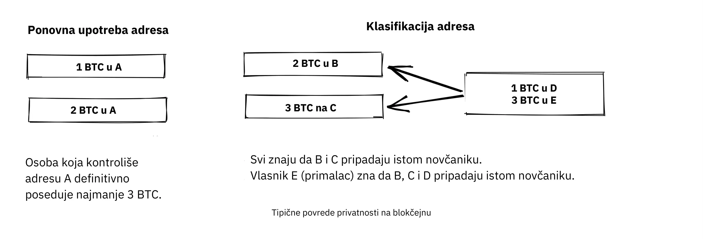


Chris Belcher [pisao je prilično detaljno u ](https://en.Bitcoin.it/Privacy#Blockchain_attacks_on_privacy) o različitim vrstama curenja privatnosti koja se mogu dogoditi na Bitcoin blockchain-u. Preporučujemo da pročitate barem prvih nekoliko pododeljaka pod nazivom "Blockchain attacks on privacy" u prevodu "Blockchain napadi na privatnost."


Zaključak je da privatnost u Bitcoin-u nije savršena. Potrebno je značajno raditi kako bi se transakcije obavljale privatno. Većina ljudi nije spremna da ide tako daleko zbog privatnosti. Čini se da postoji jasan kompromis između privatnosti i upotrebljivosti.


Još jedan važan aspekt privatnosti je da mere koje preduzimate da zaštitite sopstvenu privatnost utiču i na druge korisnike. Ako ste nemarni sa svojom privatnošću, i drugi ljudi mogu iskusiti smanjenu privatnost. Gregory Maxwell to vrlo jasno objašnjava u istoj Bitcoin Talk diskusiji [za koju smo dali link gore](https://bitcointalk.org/index.php?topic=334316.msg3589252#msg3589252), i zaključuje primerom:


> Ovo zapravo funkcioniše i u praksi... Jedan ljubazan whitehat haker na IRC-u se igrao sa razbijanjem brainwallet-a i naišao na frazu sa ~250 BTC u njoj. Uspeli smo da identifikujemo vlasnika samo na osnovu adrese, jer su bili plaćeni putem Bitcoin servisa koji je ponovo koristio adrese, i uspeo je da ih nagovori da daju kontakt informacije korisnika. Zapravo je stupio u kontakt sa korisnikom telefonom, bili su šokirani i zbunjeni— ali zahvalni što nisu izgubili svoj novac. Srećan kraj. (Ovo nije jedini primer, daleko od toga... ali je jedan od zabavnijih).

U ovom slučaju, sve je prošlo dobro zahvaljujući hakeru filantropskog duha, ali nemojte računati na to sledeći put.


### Privatnost koja nije vezana za blockchain


Dok blockchain dokazuje da je ozloglašeni izvor curenja privatnosti, postoji mnogo drugih izvora curenja koja ne koriste blockchain, neka su lukavija od drugih. Ona se kreću od key-loggera do analize mrežnog saobraćaja. Da biste pročitali više o nekim od ovih metoda, molimo vas da se ponovo vratite na [tekst Chrisa Belchera](https://en.Bitcoin.it/Privacy#Non-blockchain_attacks_on_privacy), posebno na deo "Non-Blockchain attacks on privacy".


Među mnoštvom napada, Belcher pominje mogućnost da neko prisluškuje vašu internet konekciju, na primer, vaš ISP:


> Ako protivnik vidi transakciju ili blok koji izlazi iz vašeg čvora, a koji prethodno nije ušao, onda može sa skoro sigurnošću znati da ste vi napravili transakciju ili da ste vi iskopali blok. Budući da je prisutna upotreba internet konekcija, protivnik će moći povezati IP adresu sa otkrivenim Bitcoin informacijama.

Međutim, među najočiglednijim curenjima privatnosti su kripto-menjačnice. Zbog zakona, obično nazivanih KYC (Upoznaj Svog Kupca) i AML (Sprečavanje Pranja Novca), koji su važeći u jurisdikcijama u kojima posluju, kripto-menjačnice i povezane kompanije često moraju prikupljati lične podatke o svojim korisnicima, stvarajući velike baze podataka o tome koji korisnici poseduju koje bitkoine. Ove baze podataka su odlični mamci za zle vlade i kriminalce koji su uvek u potrazi za novim žrtvama. Postoje stvarna tržišta za ovu vrstu podataka, gde hakeri prodaju podatke ponuđaču koji najviše plati.


Da stvar bude još gora, kompanije koje upravljaju ovim bazama podataka često imaju malo iskustva sa zaštitom finansijskih podataka, zapravo mnoge od njih su mladi start-upovi, i znamo sa sigurnošću da je već došlo do nekoliko curenja podataka. Nekoliko primera su

[India-based MobiQwik](https://bitcoinmagazine.com/business/probably-the-largest-kyc-data-leak-in-history-demonstrates-the-importance-of-Bitcoin-privacy) i [HubSpot](https://bitcoinmagazine.com/business/hubspot-security-breach-leaks-Bitcoin-users-data).


Štaviše, zaštita podataka od ovako širokog spektra napada predstavlja značajan izazov, i verovatno neće biti moguće ostvariti je u potpunosti. Moraćete da se odlučite za kompromis između pogodnosti i privatnosti koji vam najbolje odgovara.


### Zamenljivost (fungibilnost)


Fungibilnost, u kontekstu valuta, znači da je jedan novčić zamenljiv za bilo koji drugi novčić iste valute. Ova smešna reč je bila ukratko pomenuta ranije u poglavlju.


U članku koji je dat, Gregory Maxwell [navodi](https://bitcointalk.org/index.php?topic=334316.msg3588908#msg3588908):


> Finansijska privatnost je suštinski element fungibilnosti u Bitcoin-u: ako možete značajno razlikovati jedan novčić od drugog, tada je njihova fungibilnost slaba. Ako je naša fungibilnost u praksi previše slaba, onda ne možemo biti decentralizovani: ako neko važan objavi listu ukradenih novčića koje neće prihvatiti, morate pažljivo proveriti novčiće koje prihvatate u odnosu na tu listu i vratiti one koji ne prođu. Svi su zaglavljeni proveravajući crne liste koje izdaju razne vlasti jer u tom svetu niko od nas ne bi želeo da ostane sa lošim novčićima. Ovo dodaje trenje i transakcione troškove i čini Bitcoin manje vrednim kao novac.

Ovde, on govori o opasnostima koje proizlaze iz nedostatka fungibilnosti. Pretpostavimo da imate [UTXO](https://planb.academy/resources/glossary/utxo). Istorija tog UTXO se obično može pratiti unazad kroz nekoliko koraka, šireći se na mnoštvo prethodnih izlaza. Ako je bilo koji od tih izlaza bio uključen u bilo kakvu ilegalnu, nepoželjnu ili sumnjivu aktivnost, neki potencijalni primaoci vašeg novčića mogu ga odbiti. Ukoliko smatrate da će vaši primaoci potvrđivati validnost vaših novčića putem centralizovanog servisa sa belom ili crnom listom, možda će biti potrebno da i sami proveravate primljene novčiće, kako biste osigurali sigurnost transakcija. Rezultat je da će loša fungibilnost podržati još lošiju fungibilnost.


Adam Back i Matt Corallo [održali su prezentaciju o fungibilnosti](https://btctranscripts.com/scalingbitcoin/milan-2016/fungibility-overview/) na Scaling Bitcoin u Milanu 2016. Razmišljali su u istom pravcu:


> Treba vam fungibilnost da bi Bitcoin funkcionisao. Ako primite novčiće i ne možete ih potrošiti, onda počinjete da sumnjate da li ih možete potrošiti. Ako postoje sumnje u vezi sa novčićima koje primate, ljudi će početi da koriste usluge za proveru i da se pitaju "da li su ovi novčići blagosloveni" i onda će ljudi odbijati da trguju. Ono što se dešava je da Bitcoin prelazi iz decentralizovanog sistema bez dozvola u centralizovani sistem sa dozvolama gde imate "IOU" od pružalaca crnih lista.

Čini se da privatnost i fungibilnost idu ruku pod ruku. Fungibilnost će oslabiti ako je privatnost slaba, na primer, ako novčići od neželjenih osoba postanu stavljeni na crnu listu. Na isti način, privatnost će oslabiti ako je fungibilnost slaba: ako postoji crna lista, moraćete da pitate pružaoce crne liste koje novčiće da prihvatite, čime možda otkrivate svoju IP adresu, email adresu, i druge osetljive informacije. Ove dve karakteristike su toliko isprepletene da je teško govoriti o bilo kojoj od njih izolovano.


### Mere privatnosti


Nekoliko tehnika je razvijeno kako bi se pomoglo ljudima da se zaštite od curenja privatnosti. Među najočiglednijima je, kako je ranije primetio Nakamoto, korišćenje jedinstvenih adrese za svaku transakciju, ali postoji još nekoliko drugih. Nećemo vas naučiti kako da postanete majstor privatnosti. Međutim, Bitcoin Pitanja i Odgovori imaju [brz pregled tehnologija za poboljšanje privatnosti](https://bitcoiner.guide/privacytips/), donekle poređanih po tome koliko ih je teško implementirati. Kada to pročitate, primetićete da Bitcoin privatnost često ima veze sa stvarima van Bitcoina. Na primer, ne bi trebalo da se hvalite svojim bitkoinima i trebalo bi da koristite Tor i VPN.


Objava takođe navodi neke mere direktno povezane sa Bitcoinom:


- Full node: Ako ne koristite svoj full node, procureće mnogo informacija o vašem novčaniku na servere na internetu. Pokretanje full node-a je odličan prvi korak.
- Lightning mreža: Nekoliko protokola postoji povrh Bitcoina, na primer Lightning mreža i Blockstreamov Liquid Sidechain.
- CoinJoin: Način za više ljudi da spoje svoje transakcije u jednu, otežavajući analizu lanca.


Na [govoru](https://btctranscripts.com/breaking-Bitcoin/2019/breaking-Bitcoin-privacy/) na Breaking Bitcoin konferenciji, Chris Belcher je dao zanimljiv praktičan primer kako je privatnost poboljšana:


> Bili su Bitcoin kazino. Online kockanje nije dozvoljeno u SAD-u. Svaki korisnik Coinbase-a koji je direktno uplatio na Bustabit imao bi svoj nalog zatvoren jer je Coinbase to nadgledao. Bustabit je uradio nekoliko stvari. Uradili su nešto što se zove izbegavanje kusura gde prolazite kroz i vidite da li možete konstruisati transakciju koja nema kusur izlaz. Ovo štedi u rudarskim naknadama i takođe otežava analizu.
>

> Takođe, uvezli su svoje često korišćene, ponovo upotrebljavane depozitne adrese u JoinMarket. U ovom trenutku, korisnici coinbase.com nikada nisu bili isključeni. Čini se da Coinbase-ova služba za nadzor nije bila u mogućnosti da izvrši analizu nakon ovoga, tako da je moguće razbiti ove algoritme.

Takođe je pomenuo ovaj primer, između ostalih, na [stranici o privatnosti](https://en.Bitcoin.it/Privacy) na Bitcoin vikiju.


Imajte na umu kako se bolja privatnost može postići izgradnjom sistema povrh Bitcoina, kao što je slučaj sa Lightning mrežom:

Slojevi povrh Bitcoina mogu dodati privatnost


U poslednjem poglavlju smo zabeležili da se potreba za poverenjem neizbežno povećava sa dodatnim slojevima, dok se privatnost u slojevima iznad može proizvoljno unaprediti ili umanjiti. Zašto je to tako? Bilo koji sloj koji se gradi iznad Bitcoina, prema objašnjenju u odeljku ‘Layered Scaling’ u budućem poglavlju ‘Scaling’, mora povremeno koristiti on-chain transakcije; u suprotnom ne bi se mogao smatrati slojem iznad Bitcoina. Slojevi usmereni na povećanje privatnosti nastoje da minimalizuju upotrebu osnovnog sloja kako bi se smanjila količina otkrivenih informacija.


Gore navedeni su donekle tehnički načini za poboljšanje vaše privatnosti. Ali postoje i drugi načini. Na početku ovog poglavlja, rekli smo da je Bitcoin pseudonimni sistem. To znači da korisnici u Bitcoinu nisu poznati po svojim pravim imenima ili drugim ličnim podacima, već po svojim javnim ključevima. Javni ključ je pseudonim za korisnika, a korisnik može imati više pseudonima. U idealnom svetu, vaš lični identitet je odvojen od vaših Bitcoin pseudonima. Nažalost, zbog problema privatnosti opisanih u ovom poglavlju, ovo razdvajanje obično se vremenom pogoršava.


Da biste umanjili rizike od otkrivanja vaših ličnih podataka, najbolje je da ih ne delite uopšte ili da ih ne dajete centralizovanim servisima, koji prave velike baze podataka koje mogu procureti. Članak od strane Bitcoin Q+A [objašnjava KYC](https://bitcoiner.guide/nokyconly/) i opasnosti koje iz toga proizlaze. Takođe predlaže neke korake koje možete preduzeti da poboljšate svoju situaciju:


> Na sreću, postoje neke opcije za kupovinu bitcoina putem izvora bez KYC-a. Sve su to P2P (peer to peer) berze/kripto-menjačnice gde trgujete direktno sa drugim pojedincem, a ne sa centralizovanom trećom stranom. Nažalost, neki prodaju i druge novčiće pored bitcoina, pa vas pozivamo da budete oprezni.

Članak predlaže da izbegavate korišćenje kripto-menjačnica koje zahtevaju KYC/AML i umesto toga trgujete privatno, ili koristite decentralizovane kripto-menjačnice kao što je [bisq](https://bisq.network/).


https://planb.academy/en/tutorials/exchange/peer-to-peer/bisq-fe244bfa-dcc4-4522-8ec7-92223373ed04

Za detaljnije čitanje o protivmerama, pogledajte prethodno pomenuti [wiki članak o privatnosti](https://en.Bitcoin.it/wiki/Privacy#Methods_for_improving_privacy_.28non-Blockchain.29), počevši od "Methods for improving privacy (non-Blockchain)".


### Zaključak o privatnosti


Privatnost je veoma važna, ali teška za postizanje. Ne postoji čarobno rešenje za privatnost.


Da biste dobili pristojnu privatnost u Bitcoinu, morate preduzeti aktivne mere, od kojih su neke skupe i oduzimaju mnogo vremena.


## Ograničena (konačna) ponuda Bitcoina

<chapterId>af125ba2-ef98-5905-8895-41a538fe5ea5</chapterId>


Ovo poglavlje istražuje ograničenje ponude Bitcoina sa limitom od 21 milion BTC, ili koliko je to zapravo? Govorimo o tome kako se ovaj limit sprovodi i šta neko može učiniti da potvrdi da se poštuje. Štaviše, zavirujemo u kristalnu kuglu i diskutujemo o dinamici koja će stupiti na scenu kada se [nagrada za blok](https://planb.academy/resources/glossary/block-reward) prebaci sa modela zasnovanog na subvenciji na model zasnovan na naknadama.


Dobro poznata konačna ponuda od 21 milion BTC smatra se osnovnom osobinom Bitcoina. Ali da li je zaista uklesana u kamenu?


Hajde da počnemo tako što ćemo pogledati šta trenutna pravila konsenzusa kažu o ponudi Bitcoina, i koliko će od toga zapravo biti upotrebljivo. Pieter Wuille je napisao članak o tome [na Stack Exchange](https://Bitcoin.stackexchange.com/a/38998/69518), u kojem je izračunao koliko će bitkoina biti kada svi novčići budu iskopani:


> Ako saberete sve ove brojeve zajedno, dobijate 20999999.9769 BTC.

Ali zbog brojnih razloga -- kao što su rani problemi sa [coinbase transakcijama](https://planb.academy/resources/glossary/coinbase-transaction), rudari koji nenamerno potražuju manje nego što je dozvoljeno, i gubitak privatnih ključeva -- ta gornja granica nikada neće biti dostignuta. Wuille zaključuje:


> Ovo nam ostavlja 20999817.31308491 BTC (uzimajući u obzir sve do bloka 528333)

Međutim, razni novčanici su izgubljeni ili ukradeni, transakcije su poslate pogrešnoj adresi, ljudi su zaboravili da poseduju bitkoine. Ukupni iznosi ovoga mogu biti milioni. Ljudi su pokušali da saberu poznate gubitke [ovde](https://bitcointalk.org/index.php?topic=7253.0).


Ovo nas ostavlja sa: ??? BTC.


Možemo biti sigurni da će Bitcoin ponuds biti najviše 20999817.31308491 BTC. Bilo koji izgubljeni ili neproverljivo spaljeni novčići će smanjiti ovaj broj, ali ne znamo za koliko. Zanimljivo je da to zapravo nije važno, ili još bolje, važno je na pozitivan način za vlasnike bitkoina, [kako je objašnjeno](https://bitcointalk.org/index.php?topic=198.msg1647#msg1647) od strane Satoshi Nakamoto-a:

> Izgubljeni novčići samo čine da novčići svih ostalih vrede malo više. Smatrajte to donacijom svima.

Ograničena ponuda će se smanjiti i to bi, barem u teoriji, trebalo izazvati deflaciju cena.


Više od tačnog broja novčića u opticaju, važniji je način na koji se limit sprovodi bez ikakvog centralnog autoriteta. Pseudonim chytrik to dobro objašnjava na [Stack Exchange](https://Bitcoin.stackexchange.com/a/106830/69518):


> Dakle, odgovor je da ne morate verovati nekome da neće povećati ponudu. Samo treba da pokrenete neki kod koji će potvrditi da to nisu uradili.

Čak i ako neki full čvorovi pređu na tamnu stranu i odluče da prihvate blokove sa transakcijama veće vrednosti u coinbase-u, svi preostali full čvorovi će ih jednostavno zanemariti i nastaviti sa poslovanjem kao i obično. Neki full čvorovi mogu, namerno ili nenamerno, pokrenuti zlonamerne softvere, ali kolektiv će snažno osigurati blockchain. Zaključno, možete odlučiti da verujete sistemu bez potrebe da verujete bilo kome.


### Subvencija bloka i naknade za transakcije


Nagrada za blok se sastoji od [blok subvencije](https://planb.academy/resources/glossary/block-subsidy) plus [naknada za transakcije](https://planb.academy/resources/glossary/transaction-fees). Blok nagrada treba da pokrije troškove bezbednosti Bitcoina. Možemo sa sigurnošću reći da pod današnjim uslovima u vezi sa blok subvencijom, naknadama za transakcije, cenom bitkoina, veličinom [mempool-a](https://planb.academy/resources/glossary/mempool), snagom heša, stepenom decentralizacije itd., podsticaji za svakog igrača da igra po pravilima su dovoljno visoki da očuvaju siguran monetarni sistem.


Šta se dešava kada se subvencija za blok približi nuli? Da pojednostavimo, pretpostavimo da zapravo iznosi nula. U tom trenutku, troškovi sigurnosti sistema pokrivaju se isključivo kroz naknade za transakcije. Šta nas čeka u budućnosti kada se to desi, ne možemo znati. Faktori nesigurnosti su brojni i ostajemo prepušteni spekulacijama. Na primer, doprinos Paula Sztorca na ovu temu [u njegovom Truthcoin blogu](https://www.truthcoin.info/blog/security-budget/) je uglavnom spekulacija, ali on ima barem jednu čvrstu tačku (imajte na umu da je M2, kako ga Sztorc pominje, mera ponude fiat novca):


> Iako su dva spojena u isti "budžet za sigurnost", subvencija bloka i naknade za transakcije su potpuno različite stvari. One su različite jedna od druge, kao što su "ukupni profiti VISA-e u 2017." različiti od "ukupnog povećanja M2 u 2017.".

Danas, vlasnici snose troškove za sigurnost (putem monetarne inflacije). Sutra će doći red na potrošače da na neki način preuzmu ovaj teret, kao što je prikazano ispod.


Kako vreme prolazi, teret troškova bezbednosti će se prebaciti sa vlasnika na potrošače.


Kada su naknade za transakcije glavna motivacija za rudarenje, podsticaji se menjaju. Najznačajnije, ako mempool nekog rudara ne sadrži dovoljno naknada za transakcije, moglo bi postati isplativije za tog rudara da prepravi istoriju Bitcoina umesto da je produži. Bitcoin Optech ima poseban [deo o ovom ponašanju](https://bitcoinops.org/en/topics/fee-sniping/), nazvan *[fee sniping](https://planb.academy/resources/glossary/fee-sniping)*, koji je napisao David Harding:


> Fee sniping je problem koji može nastati kako se Bitcoin subvencija nastavlja smanjivati, a transakcione naknade počinju dominirati nagradama za Bitcoin blokove. Ako su transakcione naknade sve što je važno, onda rudari sa `x` procentom heš stope imaju `x` procenata šanse za rudarenje sledećeg bloka, tako da je očekivana vrednost za njih od poštenog rudarenja `x` procenata od [najbolje kombinacije transakcija po visini naknade](https://bitcoinops.org/en/newsletters/2021/06/02/#candidate-set-based-csb-block-template-construction) u njihovom mempool-u.
>

> Alternativno, rudar bi mogao nepošteno pokušati da ponovo rudari prethodni blok plus potpuno novi blok kako bi produžio lanac. Ovo ponašanje se naziva fee sniping, a šansa nepoštenog rudara da u tome uspe ako su svi drugi rudari pošteni je `(x/(1-x))^2`. Iako fee sniping ima ukupno manju verovatnoću uspeha od poštenog rudarenja, pokušaj nepoštenog rudara mogao bi biti isplativiji izbor ako su transakcije u prethodnom bloku platile znatno veće naknade nego transakcije trenutno u mempool-u — mala šansa za veliku sumu može vredeti više nego velika šansa za malu sumu.

Hladan tuš za naše nade u budućnost predstavlja činjenica da, ukoliko rudari počnu da sprovode fee sniping, to će podstaći i druge da rade isto, ostavljajući još manje poštenih rudara. Ovo bi moglo ozbiljno ugroziti ukupnu sigurnost Bitcoina. Harding nastavlja sa nabrajanjem nekoliko protivmera koje se mogu preduzeti, kao što je oslanjanje na transakcione vremenske brave kako bi se ograničilo gde u blokchainu transakcija može da se pojavi.


Dakle, s obzirom na to da konsenzus o konačnoj ponudi ostaje, subvencija bloka će - zahvaljujući [BIP42](https://github.com/Bitcoin/bips/blob/master/bip-0042.mediawiki) koji je popravio dugoročni problem inflacije - dostići nulu oko 2140.godine. Da li će naknade za transakcije nakon toga biti dovoljne da osiguraju mrežu?


Nemoguće je reći, ali znamo nekoliko stvari:


- Vek je *dugo* vreme iz perspektive Bitcoina. Ako još uvek bude postojao, verovatno će se enormno razviti.
- Ako ogromna ekonomska većina smatra da je potrebno promeniti pravila i uvesti, na primer, stalnu godišnju inflaciju od 0,1% ili 1%, Ponuda Bitcoina više neće biti konačna.
- Sa nultom subvencijom za blok i praznim ili skoro praznim mempool-om, stvari mogu postati nestabilne zbog fee snipinga.


S obzirom na to da je prelazak na blokove nagrađivane samo transakcionim naknadama još uvek daleko u budućnosti, možda je pametnije ne donositi brzoplete zaključke i pokušati da se pozabavimo mogućim problemima dok još možemo. Na primer, Peter Todd smatra da postoji stvarni rizik da budžet za bezbednost Bitcoina neće biti dovoljan u budućnosti, te stoga zagovara malu stalnu Bitcoin inflaciju. Međutim, on takođe misli da nije dobra ideja raspravljati o takvom pitanju u ovom trenutku, kao što je rekao u [podcastu What Bitcoin Did](https://www.whatbitcoindid.com/podcast/peter-todd-on-the-essence-of-Bitcoin):


> Ali, to je rizik za 10, 20 godina u budućnosti. To je veoma dug period. I, do tada, ko zna kakvi će rizici biti?

Možda bismo mogli da posmatramo Bitcoin kao nešto organsko. Zamislite malu, polako rastuću biljku hrasta. Zamislite takođe da nikada u životu niste videli potpuno odraslo drvo. Zar ne bi bilo mudro onda obuzdati svoje potrebe za kontrolom umesto da unapred postavite sva pravila o tome kako bi ovoj biljci trebalo dozvoliti da se razvija i raste?


### Zaključak o ograničenoj ponudi


Da li će ponuda bitkoina prerasti 21 milion ne možemo reći danas, i to verovatno nije tako loše. Osiguranje da budžet za bezbednost ostane dovoljno visok je ključno, ali ne i hitno. Hajde da vodimo ovu diskusiju za 10-50 godina, kada budemo znali više. Ako bude još uvek relevantno.


# Decentralizovano upravljanje Bitcoin-om (eng, Bitcoin Gouvernance)

<partId>411bf53f-af4b-50f1-b71b-e40fe3ff64b7</partId>


## Nadogradnja

<chapterId>3ffa84d1-adfa-5fbc-9b13-384ea783fcdd</chapterId>


Nadogradnja Bitcoina na siguran način može biti izuzetno teška. Neke promene zahtevaju nekoliko godina da se sprovedu. U ovom poglavlju učimo o uobičajenoj terminologiji vezanoj za nadogradnju Bitcoina, i istražujemo neke primere istorijskih nadogradnji njegovog protokola kao i uvide koje smo iz njih stekli. Na kraju, govorimo o podelama lanca i rizicima i troškovima povezanim sa njima.


Da biste se uskladili za ovo poglavlje, trebali biste pročitati [tekst Davida Hardinga o harmoniji i neskladu](https://bitcointalk.org/dec/p1.html):


> Stručnjaci za Bitcoin često govore o konsenzusu, čije je značenje apstraktno i teško ga je precizno odrediti. Ali reč konsenzus je evoluirala iz latinske reči concentus, "zajedničko pevanje harmonije", pa hajde da ne govorimo o Bitcoin konsenzusu već o Bitcoin harmoniji.
>

> Harmonija je ono što čini da Bitcoin funkcioniše. Hiljade punih čvorova rade nezavisno kako bi proverili da su transakcije koje primaju validne, stvarajući skladan dogovor o stanju Bitcoin dnevnika bez potrebe da bilo koji operater čvora veruje bilo kome drugom. To je slično horu gde svaki član peva istu pesmu u isto vreme kako bi proizveli nešto daleko lepše nego što bi bilo ko od njih mogao proizvesti sam.
>

> Rezultat Bitcoin harmonije je sistem u kojem su bitcoini sigurni ne samo od sitnih lopova (pod uslovom da čuvate svoje ključeve bezbedno) već i od beskonačne inflacije, masovne ili ciljane konfiskacije, ili jednostavno birokratskog haosa koji je nasleđeni finansijski sistem.

Ovo poglavlje raspravlja o tome kako se Bitcoin može unaprediti bez izazivanja nesloge. Održavanje harmonije, tj. održavanje konsenzusa, zaista je jedan od najvećih izazova u razvoju Bitcoina. Postoji mnogo nijansi u mehanizmima nadogradnje, koje bi se najbolje mogle razumeti proučavanjem stvarnih slučajeva prethodnih nadogradnji. Iz tog razloga, poglavlje stavlja veliki fokus na istorijske primere, i počinje postavljanjem osnove sa nekim korisnim rečnikom.


### Rečnik


Prema Wikipediji, [kompatibilnost unapred](https://en.wikipedia.org/wiki/Forward_compatibility) odnosi se na stanje u kojem stari softver može obraditi podatke kreirane od strane novijih softvera, ignorišući delove koje ne razume:


Standard podržava kompatibilnost unapred ako proizvod koji je u skladu sa ranijim verzijama može "graciozno" obraditi unos dizajniran za kasnije verzije standarda, ignorišući nove delove koje ne razume.


Obrnuto, [kompatibilnost unazad](https://en.wikipedia.org/wiki/Backward_compatibility) odnosi se na situaciju kada se podaci iz starog softvera mogu koristiti na novijim softverima. Promena se smatra potpuno kompatibilnom ako je i unapred i unazad kompatibilna.


Promena pravila Bitcoin konsenzusa naziva se *[Soft Fork](https://planb.academy/resources/glossary/soft-fork)* ako je potpuno kompatibilna. Ovo je najčešći način za Bitcoin nadogradnju, iz više razloga koje ćemo dalje razmotriti u ovom poglavlju. Ako je promena pravila Bitcoin konsenzusa kompatibilna unazad, ali nije kompatibilna unapred, naziva se *[Hard Fork](https://planb.academy/resources/glossary/hard-fork)*.


Za tehnički pregled soft forkova i hard forkova, molimo pročitajte [poglavlje 11 Grokking Bitcoin](https://rosenbaum.se/book/grokking-Bitcoin-11.html). Poglavlje objašnjava ove pojmove i takođe ulazi u mehanizme nadogradnje. Preporučuje se, iako nije strogo neophodno, da se upoznate sa ovim pre nego što nastavite sa čitanjem.


### Istorijske nadogradnje


Bitcoin nije isti danas kao što je bio kada je Genesis blok kreiran. Tokom godina napravljeno je nekoliko nadogradnji. U 2018. godini, Eric Lombrozo [govorio je na Breaking Bitcoin konferenciji](https://btctranscripts.com/breaking-Bitcoin/2017/changing-consensus-rules-without-breaking-Bitcoin/) o različitim mehanizmima Bitcoin nadogradnje, ističući koliko su se razvili tokom vremena. Čak je objasnio kako je Satoshi Nakamoto jednom Bitcoin nadogradio kroz hard fork:


> Zapravo je postojao hard-fork u Bitcoin koji je Satoshi uradio na način na koji mi to nikada ne bismo uradili - to je prilično loš način da se to uradi. Ako pogledate opis git commit-a ovde [[757f076](https://github.com/Bitcoin/Bitcoin/commit/757f0769d8360ea043f469f3a35f6ec204740446)], on kaže nešto o vraćanju makefile.unix wx-config verzije 0.3.6. Tačno. To je sve što piše. Nema nikakvih naznaka da ima bilo kakvu promenu koja može da izazove probleme. U suštini je to sakrio tamo. Takođe je [objavio na bitcointalk](https://bitcointalk.org/index.php?topic=626.msg6451#msg6451) i rekao, molim vas, nadogradite na 0.3.6 što pre. Ispravili smo grešku u implementaciji gde je moguće da se lažne transakcije prikažu kao prihvaćene. Ne prihvatajte Bitcoin uplate dok ne nadogradite na 0.3.6. Ako ne možete odmah da nadogradite, najbolje bi bilo da ugasite vaš Bitcoin čvor dok to ne uradite. I povrh svega toga, ne znam zašto je odlučio da to uradi, odlučio je da doda neke optimizacije u istom kodu. Ispraviti grešku i dodati neke optimizacije.

Ističe da je, bilo namerno ili ne, ovaj hard fork stvorio prilike za buduće soft forkove, naime Script operatore ([opcodes](https://planb.academy/resources/glossary/opcodes)) OP_NOP1-OP_NOP10. Više ćemo pogledati ovu promenu koda u cve-2010-5141. Ovi opkodi su do sada korišćeni za dva soft forka:


- [BIP65](https://github.com/Bitcoin/bips/blob/master/bip-0065.mediawiki) (OP_CHECKLOCKTIMEVERIFY)
- [BIP113](https://github.com/Bitcoin/bips/blob/master/bip-0112.mediawiki) (OP_SEQUENCEVERIFY).


Lombrozo takođe pruža pregled načina na koji su mehanizmi nadogradnje evoluirali tokom godina, sve do 2017. Od tada je implementirana samo još jedna velika nadogradnja, [Taproot](https://planb.academy/resources/glossary/taproot). Dug i donekle haotičan proces koji je doveo do njene aktivacije pomogao nam je da steknemo dodatne uvide o mehanizmima nadogradnje u Bitcoinu.


#### SegWit nadogradnja


Iako su sva unapređenja pre [SegWit](https://planb.academy/resources/glossary/segwit)-a bila manje-više bezbolna, ovo je bilo drugačije. Kada je aktivacioni kod za SegWit objavljen, u oktobru 2016, činilo se da postoji ogromna podrška među Bitcoin korisnicima, ali iz nekog razloga rudari nisu signalizirali podršku za ovo unapređenje, što je zaustavilo aktivaciju bez rešenja na vidiku.


Aaron van Wirdum opisuje ovaj vijugavi put u svom članku u Bitcoin časopisu [The Long Road To SegWit](https://bitcoinmagazine.com/technical/the-long-road-to-SegWit-how-bitcoins-biggest-protocol-upgrade-became-reality). Počinje objašnjavajući šta je SegWit i kako se to odnosi na debatu o veličini bloka. Van Wirdum zatim iznosi tok događaja koji su doveli do njegove konačne aktivacije. U središtu ovog procesa bio je mehanizam nadogradnje nazvan *user activated soft fork*, ili skraćeno [UASF](https://planb.academy/resources/glossary/uasf), koji je predložio korisnik Shaolinfry:


> Shaolinfry je predložio alternativu: korisnički aktiviran soft fork (UASF). Umesto heš aktivacije putem snage, korisnički aktiviran soft fork bi imao "'flag day activation', u prevodu 'aktivacija po datumu', gde čvorovi počinju sprovođenje u unapred određenom vremenu u budućnosti." Sve dok je takav UASF sproveden od strane ekonomske većine, to bi trebalo da primora većinu rudara da prate (ili aktiviraju) soft fork.

Između ostalog, on navodi Shaolinfryjev email Bitcoin-dev mailing listi. Tom prilikom je Shaolinfry [izneo argumente protiv aktiviranih soft forkova od strane rudara](https://lists.linuxfoundation.org/pipermail/Bitcoin-dev/2017-February/013643.html), navodeći niz problema s njima:


> Prvo, ovo podrazumeva poverenje da će rudari sa svojom hash snagom nastaviti da vrše validaciju nakon aktivacije. BIP66 soft fork je bio slučaj gde je 95% hashrate signaliziralo spremnost, ali u stvarnosti oko polovine njih nije zapravo validiralo unapređena pravila i greškom je rudarila na nevažećem bloku.
>

> Drugo, signalizacija od strane rudara ima prirodni veto koji omogućava malom procentu hashrate da vetira aktivaciju čvora nadogradnje za sve. Do sada su soft forkovi koristili prednost relativno centralizovanog rudarenja, gde samo nekoliko rudarskih bazena kreira validne blokove; kako se krećemo ka većoj hashrate decentralizaciji, verovatno ćemo sve više patiti od "inercije nadogradnje" koja će vetirati većinu nadogradnji.

Shaolinfry je takođe istakao čestu pogrešnu percepciju signalizacije rudara: većina je smatrala da rudari tim signalom odlučuju o nadogradnjama protokola, dok je u stvari reč o mehanizmu koji pomaže koordinaciji nadogradnji. Zbog ovog nesporazuma, rudari su možda osećali obavezu da javno iznesu svoje stavove o određenom soft fork-u, kao da time daju težinu predlogu.


UASF predlog je, ukratko, "dan zastave" (eng. "flag day") na koji čvorovi počinju primenjivati specifična nova pravila. Na taj način, rudari ne moraju kolektivno da se usklađuju za nadogradnju, ali *mogu* pokrenuti aktivaciju pre dana zastave ako dovoljan broj blokova signalizira podršku:


> Moj predlog je da imamo najbolje iz oba sveta. Budući da soft fork aktiviran od strane korisnika zahteva relativno dug period pripreme pre aktivacije, možemo ga kombinovati sa BIP9 kako bismo pružili mogućnost brže aktivacije koordinacijom hash snage ili aktivacije po fiksnom datumu, u zavisnosti koja se dogodi pre.
> U oba slučaja, možemo iskoristiti sisteme upozorenja u BIP9. Promena je relativno jednostavna: dodaje se parametar vremena aktivacije koji će pre kraja BIP9 vremenskog ograničenja prebaciti BIP9 stanje u LOCKED_IN.

Ova ideja je privukla mnogo interesovanja, ali nije izgledalo da je dobila skoro jednoglasnu podršku, što je izazvalo zabrinutost zbog potencijalnog cepanja lanca. Članak Aarona van Wirduma objašnjava kako je ovo konačno rešeno zahvaljujući [BIP91](https://github.com/Bitcoin/bips/blob/master/bip-0091.mediawiki), čiji je autor James Hilliard:


> Hilliard je predložio pomalo složeno, ali pametno rešenje koje bi učinilo sve kompatibilnim: aktivaciju Segregated Witness kako je predložio Bitcoin Core razvojni tim, BIP148 UASF i mehanizam aktivacije po New York sporazumu. Njegov BIP91 bi mogao zadržati Bitcoin celim — barem tokom SegWit aktivacije.

Bilo je još nekih komplikovanih faktora uključenih (npr. takozvani "New York sporazum"), koje je ovaj BIP morao uzeti u obzir. Ohrabrujemo vas da pročitate članak Van Wirduma u celosti kako biste saznali mnoge zanimljive detalje ove priče.


#### Diskusija nakon SegWit-a


Nakon SegWit implementacije, pojavila se diskusija o mehanizmima implementacije. Kao što je primetio Eric Lombrozo u [svom govoru na Breaking Bitcoin konferenciji](https://btctranscripts.com/breaking-Bitcoin/2017/changing-consensus-rules-without-breaking-Bitcoin/) i Shaolinfry, soft fork aktiviran od strane rudara nije idealan mehanizam za nadogradnju:


> U nekom trenutku verovatno ćemo želeti da dodamo više funkcija u Bitcoin protokol. Ovo je veliko filozofsko pitanje koje postavljamo sebi. Da li da uradimo UASF za sledeći? Šta je sa hibridnim pristupom? Samostalna aktivacija od strane rudara je isključena. BIP9 nećemo ponovo koristiti.

U januaru 2020. godine, Matt Corallo [poslao je email](https://lists.linuxfoundation.org/pipermail/Bitcoin-dev/2020-January/017547.html) na Bitcoin-dev mejling listu kojim je započeo diskusiju o budućim mehanizmima implementacije soft forka. Naveo je pet ciljeva za koje je smatrao da su ključni u nadogradnji. David Harding ih [sumira u Bitcoin Optech biltenu](https://bitcoinops.org/en/newsletters/2020/01/15/#discussion-of-Soft-Fork-activation-mechanisms) kao:


> Mogućnost prekida ako se naiđe na ozbiljan prigovor na predložene promene pravila konsenzusa. Dodeljivanje dovoljno vremena nakon objavljivanja ažuriranog softvera kako bi se osiguralo da većina ekonomskih čvorova bude nadograđena za sprovođenje tih pravila. Pretpostavka da će hash stopa mreže ostati približno ista pre i posle promene, kao i tokom same tranzicije. Sprečavanje, koliko je to moguće, stvaranja blokova koji su nevažeći prema novim pravilima, što bi moglo dovesti do lažnih potvrda u nenadograđenim čvorovima i SPV klijentima. Garancija da mehanizmi za prekid (abort) ne mogu biti zloupotrebljeni od strane zlonamernih učesnika ili pristrasnih aktera da bi se sprečila široko željena nadogradnja koja nema poznatih problema.

Ono što Corallo predlaže je kombinacija soft forka aktiviranog od strane rudara i korisnički aktiviranog soft forka:


> Dakle, kao nešto malo konkretnije, mislim da bi metoda aktivacije koja postavlja pravi presedan i na odgovarajući način razmatra gore navedene ciljeve bila:
>

> 1) standardna BIP 9 implementacija sa jednogodišnjim vremenskim horizontom za aktivaciju, uz postizanje 95% rudarske podrške (tj. 95% rudara signalizuje spremnost za promenu) +

> 2) u slučaju da ne dođe do aktivacije u roku od godinu dana, šest meseci period tišine tokom kojeg zajednica može analizirati i diskutovati razloge za neaktivaciju i, +

> 3) u slučaju da ima smisla, jednostavan parametar komandne linije/Bitcoin.conf, koji je podržan od originalnog izdanja, omogućio bi korisnicima da se opredele za BIP 8 implementaciju sa vremenskim horizontom od 24 meseca za aktivaciju po datumu (flag day) (kao i novu verziju Bitcoin Core-a koja omogućava ovu aktivaciju svima.).
>

> Ovo pruža veoma dug vremenski horizont za standardniju aktivaciju, dok se i dalje osigurava da ciljevi iz tačke #5 budu ispunjeni, čak i ako, u tim slučajevima, vremenski horizont treba značajno produžiti kako bi se ispunili ciljevi iz tačke #3. Razvoj Bitcoina nije trka. Ako moramo, čekanje od 42 meseca osigurava da ne postavljamo negativan presedan zbog kojeg ćemo zažaliti dok Bitcoin nastavlja da raste.

#### Taproot nadogradnja - Speedy Trial (brzi probni period aktivacije)


Kada je Taproot bio spreman za implementaciju u oktobru 2020. godine, što znači da su svi tehnički detalji oko njegovih pravila konsenzusa bili implementirani i dobili široko odobrenje unutar zajednice, diskusije o tome kako ga zapravo implementirati počele su da se zahuktavaju. Te diskusije su do tog trenutka bile prilično tihe.


Puno predloga za mehanizme aktivacije počelo je kružiti, a David Harding [sumirao ih je na Bitcoin Wiki](https://en.Bitcoin.it/wiki/Taproot_activation_proposals). U svom članku objasnio je neka svojstva BIP8, koji je u to vreme imao neke nedavne promene kako bi bio fleksibilniji.


> U vreme kada se ovaj dokument piše, [BIP8](https://github.com/Bitcoin/bips/blob/master/bip-0008.mediawiki) je izrađen na osnovu lekcija naučenih 2017. godine. Jedna od važnijih promena nakon BIP-ova 9 i 148 jeste da se prisilna aktivacija sada određuje prema visini bloka, a ne prema medijani prethodnog vremena. Druga važna promena je da se prisilna aktivacija definiše kao logički (boolean) parametar, koji se bira prilikom postavljanja parametara aktivacije soft fork-a, bilo za inicijalnu implementaciju, bilo za kasnije ažuriranje.

BIP8 bez prisilne aktivacije je veoma sličan [BIP9](https://github.com/Bitcoin/bips/blob/master/bip-0009.mediawiki) verzijskim bitovima sa istekom i odlaganjem, pri čemu je jedina suštinska razlika u tome što BIP 8 određuje aktivaciju prema visini bloka, dok BIP 9 koristi medijanu prošlih vremena (MTP). Ovo podešavanje omogućava pokušaju da ne uspe (ali se može ponovo pokušati kasnije).


BIP8 sa prinudnom aktivacijom završava obaveznim periodom signalizacije gde svi blokovi proizvedeni u skladu sa njegovim pravilima moraju signalizirati spremnost za soft fork na način koji će pokrenuti aktivaciju u ranijem uvođenju istog soft fork-a sa neobaveznom aktivacijom. Drugim rečima, ako je verzija čvora x objavljena bez prinudne aktivacije, a kasnije je objavljena verzija y koja uspešno primorava rudare da počnu signalizaciju spremnosti u istom vremenskom periodu, obe verzije će početi sprovođenje novih pravila konsenzusa u isto vreme.


Ova fleksibilnost revidiranog BIP8 predloga omogućava izražavanje nekih drugih ideja u smislu kako bi izgledale koristeći BIP8. Ovo pruža zajednički faktor za korišćenje pri kategorizaciji mnogih različitih predloga.


Od ovog trenutka diskusije su postale veoma žustre, posebno oko toga da li `lockinontimeout` treba da bude `true` (kao u slučaju kada korisnik aktivira soft fork, što Harding naziva "BIP8 sa prisilnom aktivacijom") ili `false` (kao u slučaju kada rudar aktivira soft fork, što Harding naziva "BIP8 bez prisilne aktivacije").


Među navedenim predlozima, jedan od njih nosio je naslov "Da vidimo šta će se desiti". Iz nekog razloga, ovaj predlog nije privukao mnogo pažnje sve do sedam meseci kasnije.


Tokom tih sedam meseci, diskusija je trajala i činilo se da nema načina da se postigne široki konsenzus o tome koji mehanizam implementacije koristiti. Postojala su uglavnom dva tabora: jedan koji je preferirao `lockinontimeout=true` (UASF grupa) i drugi koji je preferirao `lockinontimeout=false` (grupa "probaj i ako ne uspe, razmisli ponovo"). Pošto nije bilo preovlađujuće podrške ni za jednu od ovih opcija, debata se vrtela u krugovima bez očiglednog puta napred. Neke od ovih diskusija su vođene na IRC-u, u kanalu pod nazivom ##Taproot-activation, ali [5. marta 2021](https://gnusha.org/Taproot-activation/2021-03-05.log), nešto se promenilo:


```
06:42 < harding> roconnor: da li neko predlaže BIP8 (3m, false)? Pomenuo sam to pre neki dan, ali nisam video nikakav odgovor.
[...]
06:43 < willcl_ark_> Zanimljivo, baš sam pomislio da je, u poređenju s ovim, aktivacija SegWit-a zapravo bila prilično jednostavna: jednostavno LOT=false, a ako to ne uspe — UASF.
06:43 < maybehuman> Zanimljivo je da je ‘hajde da vidimo šta će se desiti’ (odnosno false, 3m) bilo dosta popularno na početku ovog kanala, koliko se sećam.
06:44 < roconnor> harding: Mislim da jesam. Ne znam koliko to vredi. Uglavnom mislim da bi to bila široko prihvatljiva konfiguracija, na osnovu mog razumevanja briga svih uključenih.
06:44 < willcl_ark_> maybehuman: Zato što ovo zapravo svi žele; čak su i rudari procenjivali da bi mogli da izvrše nadogradnju za oko dve nedelje (ili je bar f2pool to rekao).
06:44 < roconnor> harding: BIP8(3m, false) sa produženim periodom zaključavanja (lock-in periodom).
06:45 < harding> roconnor: Ah, odlično. To mi je omiljena opcija još otkako sam prvi put sumirao opcije na vikiju, pre nekih sedam meseci.
06:45 <@michaelfolkson> UASF ne bi išao sa (true, 3m), ali Core bi mogao sa (false, 3m).
06:45 < willcl_ark_> harding: Svakako mi deluje kao dobar pristup. Ako to ne uspe, onda možeš da pokušaš da razumeš zašto, bez gubljenja previše vremena.
```


Pristup "hajde da vidimo šta će se desiti" konačno je počeo da se uklapa u umove ljudi. Ovaj proces će kasnije biti označen kao "Speedy Trial" zbog svog kratkog perioda signalizacije. David Harding objašnjava ovu ideju široj zajednici u [emailu Bitcoin-dev mailing list](https://lists.linuxfoundation.org/pipermail/Bitcoin-dev/2021-March/018583.html):

> Ranija verzija ovog predloga je dokumentovana pre više od 200 dana, a osnovni Taproot kod je spojen u Bitcoin Core pre više od 140 dana. Da smo započeli Speedy Trial u vreme kada je Taproot spojen (što je pomalo nerealno), bili bismo ili manje od dva meseca udaljeni od implementacije Taproot ili bismo prešli na sledeći pokušaj aktivacije pre više od mesec dana.
>

> Umesto toga, dugo smo raspravljali i ne izgleda da smo bliže rešenju koje je široko prihvatljivo nego kada je mejling lista počela da diskutuje o šemama aktivacije posle SegWit-a pre više od godinu dana. Mislim da je Speedy Trial način da se postigne brz napredak koji će ili okončati raspravu (barem za sada, ako aktivacija uspe), ili nam dati konkretne podatke na osnovu kojih možemo zasnivati buduće predloge za aktivaciju Taproot-a.

Ovaj mehanizam za implementaciju je usavršen tokom dva meseca i zatim objavljen u [Bitcoin Core verziji 0.21.1](https://github.com/Bitcoin/Bitcoin/blob/master/doc/release-notes/release-notes-0.21.1.md#Taproot-Soft-Fork). Rudari su brzo počeli da signaliziraju za ovo unapređenje, pomerajući stanje implementacije na `LOCKED_IN`, a nakon perioda prilagođavanja Taproot pravila su aktivirana sredinom novembra 2021. u bloku [709632](https://Mempool.space/block/0000000000000000000687bca986194dc2c1f949318629b44bb54ec0a94d8244).


#### Budući mehanizmi implementacije


S obzirom na probleme sa nedavnim soft forkovima, SegWit-a i Taproot-a, nije jasno kako će sledeće unapređenje biti implementirano. Speedy Trial je korišćen za implementaciju Taproot-a, ali je korišćen da premosti jaz između UASF i MASF grupa, a ne zato što se pojavio kao najbolji poznati mehanizam implementacije.


### Rizici


Tokom aktivacije bilo kog forka, bilo da je to hard ili soft, aktiviran od strane rudara ili korisnika, postoji rizik od dugotrajnog razdvajanja lanca. Razdvajanje koje traje duže od nekoliko blokova može izazvati ozbiljnu štetu sentimentu oko Bitcoina kao i njegovoj ceni. Ali iznad svega, izazvalo bi veliku konfuziju oko toga šta je Bitcoin. Da li je Bitcoin ovaj lanac ili onaj lanac?


Rizik sa soft forkom aktiviranim od strane korisnika je da se nova pravila aktiviraju čak i ako većina heš snage ne podržava ta pravila. Ovaj scenario bi rezultirao dugotrajnim razdvajanjem lanca, koje bi trajalo sve dok većina heš snage ne usvoji nova pravila. Moglo bi biti posebno teško da se podstaknu rudari da pređu na novi lanac ako su već iskopali blokove nakon razdvajanja na starom lancu, jer bi prelaskom na drugu granu napustili svoje nagrade za blokove. Međutim, vredno je pomenuti izuzetan događaj: u martu 2013. dogodilo se dugotrajno razdvajanje zbog nenamernog hard forka i, suprotno ovom podsticaju, dva velika rudarska bazena (eng. mining pool) donela su odluku da napuste svoju granu razdvajanja kako bi obnovili konsenzus.


S druge strane, rizik sa soft forkom aktiviranim od strane korisnika je posledica činjenice da rudari mogu da se uključe u lažno signaliziranje, što znači da stvarni udeo heš snage koja podržava promenu može biti manji nego što izgleda. Ako stvarna podrška ne obuhvata većinu heš snage, verovatno bismo videli dugotrajan lančani raskol sličan onom opisanom u prethodnom pasusu. Ovo, ili barem sličan problem, se dogodio u stvarnosti kada je BIP66 bio implementiran, ali je rešen unutar otprilike 6 blokova.


#### Troškovi razdvajanja


Jimmy Song [govorio je o troškovima povezanim sa hard forkovima](https://btctranscripts.com/breaking-Bitcoin/2017/socialized-costs-of-Hard-forks/) na Breaking Bitcoin u Parizu, ali mnogo toga što je rekao odnosi se i na podelu lanca zbog neuspelog soft forka. Govorio je o *negativnim eksternalijama* i definisao ih kao cenu koju neko drugi mora da plati za vaše sopstvene postupke:


> Klasičan primer negativne eksternalije je fabrika. Možda proizvode — na primer, ako je to rafinerija nafte — dobro koje koristi ekonomiji, ali takođe proizvode i nešto što je negativna eksternalija, kao što je zagađenje. To nije samo nešto što svi moraju da plate, da očiste, ili da trpe. Ali to su takođe efekti drugog i trećeg reda, kao što je veći saobraćaj prema fabrici kao rezultat većeg broja radnika koji moraju da idu tamo. Možda ćete takođe- možda ugroziti neku divljač u blizini. Nije da svi moraju da plate za negativne eksternalije, to mogu biti specifične osobe, kao ljudi koji su prethodno koristili taj put ili životinje koje su bile blizu te fabrike, i oni takođe plaćaju cenu te fabrike.

U kontekstu Bitcoina, on ilustruje negativne eksternalije koristeći Bitcoin Cash (bcash), koji je hard fork od Bitcoina kreiran neposredno pre te konferencije 2017. godine. On kategorizuje negativne eksternalije hard forka na jednokratne troškove i trajne troškove.


Među mnogim primerima jednokratnih troškova, on pominje one koje su imale kripto-menjačnice:


> Dakle, imamo gomilu kripto-menjačnica i one su imale mnogo jednokratnih troškova koje su morale da plate. Prva stvar koja se desila je da su depoziti i povlačenja morali biti zaustavljeni na dan ili dva za ove kripto-menjačnice jer nisu znali šta će se desiti. Mnoge od ovih berzi su morale da posegnu u Cold storage (_(hladno skladište)- označava način čuvanja kriptovaluta pri kojem su privatni ključevi potpuno van mreže (offline)_) jer su njihovi korisnici zahtevali bcash. To je deo njihove fiducijarne dužnosti, moraju to da urade. Takođe morate da izvršite reviziju novog softvera. Ovo je nešto što smo morali da uradimo u itbit-u. Želimo da potrošimo bcash - kako to da uradimo? Moramo da preuzmemo electron cash? Da li ima malver? Moramo da ga pregledamo. Imali smo oko 10 dana da utvrdimo da li je ovo u redu ili ne. I onda morate da odlučite, da li ćemo samo dozvoliti jednokratno povlačenje, ili ćemo uvrstiti ovu novu valutu? Za kripto-menjačnice da uvrsti novu valutu, nije lako - postoje sve vrste novih procedura za hladno skladište, potpisivanje, depozite, povlačenja. Ili možete jednostavno imati ovaj jednokratni događaj gde im date njihov bcash u nekom trenutku i onda više nikada ne razmišljate o tome. Ali i to ima svoje probleme. I na kraju, i na koji god način to uradite, povlačenja ili uvrštavanje - trebat će vam nova infrastruktura da radite sa ovim token na neki način, čak i ako je to jednokratno povlačenje. Trebate neki način da date ove tokene svojim korisnicima. Opet, kratki rok. Zar ne? Nema vremena za ovo, mora se brzo uraditi.

On takođe navodi jednokratne troškove koje snose trgovci, procesori plaćanja, novčanici, rudari i korisnici, kao i neke od stalnih troškova, na primer gubitak privatnosti i veći rizik od reorganizacija.


Zaista, kada dođe do razdvajanja i lanac sa opštijim pravilima postane jači od lanca sa strožijim pravilima, doći će do reorganizacije. Ovo će imati ozbiljan uticaj na sve transakcije izvršene u izbrisanoj grani. Iz ovih razloga je zaista važno pokušati izbeći razdvajanje lanaca u svakom trenutku.


### Zaključak o nadogradnji


Bitcoin raste i evoluira s vremenom. Različiti mehanizmi nadogradnje su korišćeni tokom godina i kriva učenja je strma. Sve sofisticiranije i robusnije metode se stalno izmišljaju, kako učimo više o tome kako mreža reaguje.


Da bi Bitcoin ostao u harmoniji, soft forkovi su se pokazali kao put napred, ali veliko pitanje još uvek nije u potpunosti odgovoreno: kako bezbedno primeniti soft forkove bez izazivanja nesloge?


## Adverzarno razmišljanje (razmišljanje u neprijateljskom okruženju)

<chapterId>d4982f3d-4694-51cc-99be-28f54b03a2a2</chapterId>


Ovo poglavlje razmatra razmišljanje u neprijateljskom okruženju, odnosno analitički pristup koji se fokusira na potencijalne neuspehe sistema i načine na koje bi protivnici mogli da deluju. Poglavlje započinjemo razmatranjem bezbednosnih pretpostavki i bezbednosnog modela Bitcoina, nakon čega objašnjavamo kako obični korisnici mogu unaprediti svoju samosuverenost i decentralizaciju punih [čvorova](https://planb.academy/resources/glossary/node) u Bitcoinu kroz razmišljanje u neprijateljskom okruženju. Zatim se bavimo konkretnim pretnjama Bitcoinu, kao i načinom razmišljanja protivnika. Na kraju govorimo o *aksiomu otpora*, koji može pomoći da se razume zašto se ljudi uopšte bave razvojem Bitcoina.


Kada se diskutuje o bezbednosti unutar različitih sistema, važno je razumeti koje su bezbednosne pretpostavke. Tipična bezbednosna pretpostavka u Bitcoinu je "problem [diskretnog logaritma](https://planb.academy/resources/glossary/discrete-logarithm) je teško za rešavanje", što, jednostavno rečeno, znači da je praktično nemoguće pronaći [privatni ključ](https://planb.academy/resources/glossary/private-key) koji odgovara određenom [javnom ključu](https://planb.academy/resources/glossary/public-key). Još jedna prilično jaka bezbednosna pretpostavka je da je većina mrežnog hashpower-a poštena, što znači da igraju po pravilima. Ako se ove pretpostavke pokažu pogrešnim, onda je Bitcoin u nevolji.


2015. godine Andrew Poelstra je [održao govor](https://btctranscripts.com/scalingbitcoin/hong-kong-2015/security-assumptions/) na konferenciji Scaling Bitcoin u Hong Kongu, tokom kojeg je analizirao sigurnosne pretpostavke Bitcoina. Počinje primećujući da mnogi sistemi do neke mere zanemaruju protivnike; na primer, zaista je teško zaštititi zgradu od svih vrsta neprijateljskih događaja. Umesto toga, generalno prihvatamo mogućnost da neko može zapaliti zgradu i do neke mere sprečavamo ovo i druga neprijateljska ponašanja kroz sprovođenje zakona itd.


Pogledajte analogiju zgrade Grega Maxwella:


Ali na internetu stvari su drugačije:


> Međutim, online nemamo ovo. Imamo pseudonimno i anonimno ponašanje, svako može da se poveže sa svima i naškodi sistemu. Ako je moguće naškoditi sistemu na neprijateljski način, onda će to i uraditi. Ne možemo pretpostaviti da će biti vidljivi i da će biti uhvaćeni.

Posledica je da se sve poznate slabosti u Bitcoinu moraju nekako rešiti, inače će biti iskorišćene. Na kraju krajeva, Bitcoin je najveći mamac na svetu.


Poelstra zatim nastavlja da objašnjava kako je Bitcoin nova vrsta sistema; on je znatno neodređeniji (maglovitiji) nego, na primer, protokol za potpisivanje, koji ima vrlo jasno definisane bezbednosne pretpostavke.


Na svom ličnom blogu, softverski inženjer Jameson Lopp, [dublje istražuje ovo](https://blog.lopp.net/bitcoins-security-model-a-deep-dive/):


> U stvarnosti, Bitcoin protokol je bio i još uvek se gradi bez formalno definisane specifikacije ili bezbednosnog modela. Najbolje što možemo da uradimo je da proučimo podsticaje i ponašanje aktera unutar sistema kako bismo ga bolje razumeli i pokušali da ga opišemo.

Dakle, imamo sistem koji izgleda funkcioniše u praksi, ali koji ne možemo formalno dokazati kao siguran. Dokaz verovatno nije moguć zbog složenost samog sistema.


### Ne samo za Bitcoin stručnjake


Razmišljanje u neprijateljskom okruženju važno je, u određenoj meri, i za obične korisnike Bitcoina, ne samo za iskusne programere i eksperte. Ragnar Lifthasir pominje u [tweetstormu](https://bitcoinwords.github.io/tweetstorm-on-adversarial-thinking) kako pojednostavljeni narativi oko Bitcoina - na primer, "samo [HODL](https://planb.academy/resources/glossary/hodl)" - mogu biti degradirajući za sam Bitcoin, i zaključuje


> Da bismo ojačali Bitcoin i nas same, moramo razmišljati kao softverski inženjeri koji doprinose Bitcoinu. Oni vrše međusobne recenzije, nemilosrdno tražeći nedostatke. Na svojim tehnološkim događajima razgovaraju o svim mogućim načinima na koje predlog može propasti. Razmišljaju suparnički. Oni su konzervativni.

On ove jednostavne narative naziva monomanijama. Kroz ovu definiciju on kaže da fokusiranjem na jednu stvar - na primer, "samo HODL" - rizikujete da previdite verovatno važnije stvari, kao što su održavanje sigurnosti vašeg bitkoina ili davanje svog maksimuma da koristite Bitcoin bez potrebe za poverenjem u bilo koju treću stranu.


### Pretnje


Postoji mnogo poznatih slabosti u Bitcoinu, i mnoge od njih se aktivno eksploatišu. Da biste dobili uvid u to, pogledajte [stranicu o slabostima](https://en.Bitcoin.it/wiki/Weaknesses) na Bitcoin vikiju. Tamo su navedeni razni problemi, kao što su krađa novčanika i DoS napadi:


> Ako napadač pokuša da popuni mrežu klijentima koje kontroliše, vrlo je verovatno da ćete se povezati samo sa napadačevim čvorovima. Iako Bitcoin nikada ne koristi brojanje čvorova za bilo šta, potpuno izolovanje čvora od poštene mreže može biti korisno u izvođenju drugih napada.

Ova vrsta napada se naziva *[Sybil napad](https://planb.academy/resources/glossary/sybil-attack)*, i dešava se kada jedan entitet kontroliše više čvorova u mreži i koristi ih da se prikaže kao više entiteta.


Kao što citat takođe pominje, Sybil napad nije efikasan na Bitcoin mreži jer ne postoji glasanje putem čvorova ili drugih brojivih entiteta, već putem računarske snage. Ipak, ova ravna struktura ostavlja sistem podložnim drugim napadima. Bitcoin wiki stranica takođe opisuje druge moguće napade, kao što je skrivanje informacija (često se naziva *[eclipse napad](https://planb.academy/resources/glossary/eclipse-attack)*), i način na koji [Bitcoin Core](https://planb.academy/resources/glossary/bitcoin-core) implementira neke heurističke protivmere protiv takvih napada.


Gore navedeni su primeri stvarnih pretnji koje treba rešiti.


### Terenski priručnik za jednostavnu sabotažu (eng. Simple Sabotage Field Manual)


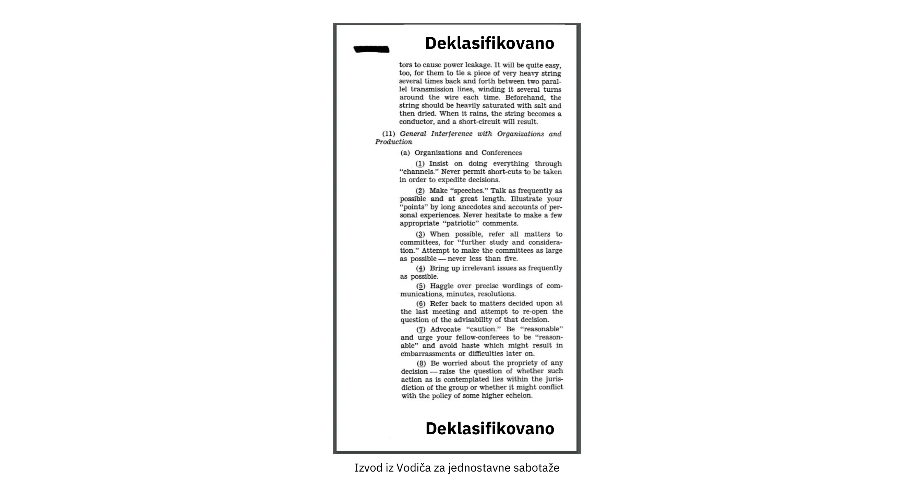


Da biste bolje razumeli um protivnika, moglo bi biti korisno da zavirite u način na koji oni deluju. Američka vladina organizacija pod nazivom Office of Strategic Services, koja je delovala tokom Drugog svetskog rata i imala među svojim ciljevima sprovođenje špijunaže, izvođenje sabotaža i širenje propagande, proizvela je [priručnik](https://www.gutenberg.org/ebooks/26184) za svoje osoblje o tome kako pravilno sabotirati neprijatelja. Njegov naslov je bio "Simple Sabotage Field Manual" i sadržao je konkretne savete o infiltriranju neprijatelja kako bi im se život učinio teškim. Saveti se kreću od spaljivanja skladišta do izazivanja habanja bušilica kako bi se smanjila efikasnost neprijatelja.


Na primer, postoji deo o tome kako infiltrator može da poremeti organizacije. Nije teško videti kako bi se takve taktike mogle koristiti za ciljanje procesa Bitcoin razvoja, koji je otvoren za učešće bilo koga. Posvećeni napadač može stalno odlagati napredak beskrajnim brigama o nebitnim pitanjima, cenjkati se oko preciznih formulacija i pokušavati da ponovo pokrene diskusije koje su već sveobuhvatno rešene. Napadač takođe može unajmiti vojsku trolova da umnoži sopstvenu efikasnost; ovo možemo nazvati društvenim Sybil napadom. Koristeći društveni Sybil napad, mogu učiniti da izgleda kao da postoji veći otpor protiv predložene promene nego što zapravo postoji.


Ovo naglašava kako odlučna država može i hoće učiniti sve što je u njenoj moći da uništi neprijatelja, uključujući njegovo razbijanje iznutra. Pošto je Bitcoin oblik novca koji se takmiči sa uspostavljenim [fiat valutama](https://planb.academy/resources/glossary/fiat), postoji verovatnoća da će države smatrati Bitcoin neprijateljem.


### Aksiome otpora


Eric Voskuil [piše na svojoj Cryptoeconomics wiki stranici](https://github.com/libbitcoin/libbitcoin-system/wiki/Axiom-of-Resistance) o onome što naziva "aksiom otpora":


> Drugim rečima, postoji pretpostavka da je moguće da sistem odoli državnoj kontroli. Ovo se ne prihvata kao činjenica, već se smatra razumnom pretpostavkom, zbog empirijske studije ponašanja sličnih sistema, na kojoj se zasniva sistem.
>

> Onaj ko ne prihvata aksiom otpora razmatra potpuno drugačiji sistem od Bitcoina. Ako se pretpostavi da sistem ne može da se odupre državnim kontrolama, zaključci nemaju smisla u kontekstu Bitcoina - baš kao što zaključci u sfernoj geometriji protivreče Euklidskoj. Kako Bitcoin može biti bez dozvole ili otporan na cenzuru bez aksioma? Kontradikcija vodi ka očiglednim greškama u pokušaju da se racionalizuje sukob.


Ono što on suštinski kaže je da je smisleno pokušati samo kada se pretpostavi da je moguće stvoriti sistem koji države ne mogu kontrolisati.


To znači da biste radili na Bitcoinu, treba da prihvatite aksiom otpora, inače bi bilo bolje da svoje vreme posvetite drugim projektima. Priznavanje tog aksioma pomaže vam da usmerite svoje razvojne napore na stvarne probleme: kodiranje u kontekstu protivnika na nivou države. Drugim rečima, razmišljajte imajući u obzir protivnike.


### Zaključak o razmišljanju u neprijateljskom okruženju


Decentralizovani sistem ne može imati odgovornost izvan samog sistema, stoga Bitcoin mora sprečiti zlonamerno ponašanje rigoroznije nego tradicionalni sistemi. Razmišljanje u neprijateljskom okruženju je u takvom sistemu imperativ.


Da biste održali Bitcoin sigurnim, morate znati njegove neprijatelje i njihove motive. Čini se da se većina pretnji svodi na nacionalne države, koje imaju ogromnu ekonomsku moć, kroz oporezivanje i štampanje novca. Verovatno neće lako odustati od svojih privilegija štampanja novca.


## Otvoreni kod

<chapterId>427a160c-f893-5b2c-afba-7b24e71ba899</chapterId>


Bitcoin je izgrađen koristeći softver otvorenog koda. U ovom poglavlju analiziramo šta to znači, kako funkcioniše održavanje softvera i kako softver otvorenog koda u Bitcoinu omogućava razvoj bez dozvola. Zaranjamo u *selektivnu [kriptografiju](https://planb.academy/resources/glossary/cryptography)*, koja se bavi izborom i korišćenjem biblioteka u kriptografskim sistemima. Poglavlje uključuje deo o procesu pregleda izmena u Bitcoinu, nakon čega sledi deo o načinima na koje programeri Bitcoin dobijaju finansiranje. Poslednji deo govori o tome kako kultura otvorenog koda Bitcoina može izgledati zaista čudno spolja, i zašto je ta percipirana čudnost zapravo znak dobrog zdravlja.


Većina Bitcoin softvera, a posebno Bitcoin Core, je otvorenog koda. To znači da je izvorni kod softvera dostupan široj javnosti za pregled, eksperimentisanje, modifikaciju i redistribuciju. Definicija otvorenog koda na [](https://opensource.org/osd) uključuje, između ostalog, sledeće važne tačke:


> Besplatna redistribucija: Licenca ne sme ograničiti bilo koju stranu da prodaje ili poklanja softver kao komponentu agregirane distribucije softvera koja sadrži programe iz nekoliko različitih izvora. Licenca ne sme zahtevati tantijeme ili drugu naknadu za takvu prodaju.
>

> Izvorni kod: Program mora uključivati izvorni kod i mora omogućiti distribuciju u izvornom kodu kao i u kompajliranom obliku. Gde neki oblik proizvoda nije distribuiran sa izvornim kodom, mora postojati dobro objavljen način za dobijanje izvornog koda za ne više od razumnih troškova reprodukcije, po mogućstvu preuzimanjem putem interneta bez naknade. Izvorni kod mora biti preferirani oblik u kojem bi programer modifikovao program. Namerno zamagljen izvorni kod nije dozvoljen. Srednji oblici kao što je izlaz preprocesora ili prevodioca nisu dozvoljeni.
>

> Izvedena dela: Licenca mora dozvoliti izmene i izvedena dela, i mora dozvoliti njihovu distribuciju pod istim uslovima kao licenca originalnog softvera.

Bitcoin Core se pridržava ove definicije tako što je distribuiran pod [MIT licencom](https://github.com/Bitcoin/Bitcoin/blob/master/COPYING):


```
MIT Licenca (MIT)

Copyright (c) 2009-2022 Bitcoin Core programeri
Copyright (c) 2009-2022 Bitcoin programeri

Ovim se besplatno daje dozvola svakom licu koje dobije kopiju ovog softvera i povezanih datoteka dokumentacije ("Softver"), da koristi Softver bez ograničenja, uključujući bez ograničenja prava na korišćenje, kopiranje, modifikovanje, spajanje, objavljivanje, distribuciju, podlicenciranje i/ili prodaju kopija Softvera, i da dozvoli licima kojima je Softver obezbeđen da čine isto, pod sledećim uslovima:

Gorenavedeno obaveštenje o autorskim pravima i ovo obaveštenje o dozvoli moraju biti uključeni u sve kopije ili značajne delove Softvera.
```


Kao što je navedeno u poglavlju "Ne veruj, proveri", važno je da korisnici mogu da verifikuju da Bitcoin softver koji koriste "radi kako je reklamirano". Da bi to uradili, moraju imati neograničen pristup izvornom kodu softvera koji žele da verifikuju.


U narednim odeljcima istražujemo neke druge zanimljive aspekte softvera otvorenog koda u Bitcoinu.


### Održavanje softvera


Izvorni kod Bitcoin Core-a se održava u [Git](https://planb.academy/resources/glossary/git) repozitorijumu koji je hostovan na [GitHub-u](https://github.com/Bitcoin/Bitcoin). Svako može klonirati taj repozitorijum bez traženja dozvole, a zatim ga pregledati, izgraditi ili napraviti izmene lokalno. To znači da postoje hiljade kopija repozitorijuma širom sveta. Sve su to kopije istog repozitorijuma, pa šta čini ovaj specifični GitHub Bitcoin Core repozitorijum tako posebnim? Tehnički gledano, nije uopšte poseban, ali društveno je postao žarište razvoja Bitcoina.


Bitcoin i stručnjak za bezbednost Jameson Lopp to vrlo dobro objašnjava u [blog postu](https://blog.lopp.net/who-controls-Bitcoin-core-/) pod nazivom "Ko kontroliše Bitcoin Core?":


> Bitcoin Core je žarišna tačka za razvoj Bitcoin protokola, a ne tačka komandovanja i kontrole. Ako bi iz bilo kog razloga prestala da postoji, pojavila bi se nova žarišna tačka — tehnička komunikaciona platforma na kojoj se zasniva (trenutno GitHub repozitorijum) je stvar pogodnosti, a ne definicije / integriteta projekta. Zapravo, već smo videli da se žarišna tačka za razvoj Bitcoina promenila u pogledu platformi, pa čak i imena!

On dalje objašnjava kako se Bitcoin Core softver održava i osigurava protiv zlonamernih promena koda. Opšti zaključak iz ovog celog članka je sažet na samom kraju:


> Niko ne kontroliše Bitcoin.
>

> Niko ne kontroliše fokalnu tačku za razvoj Bitcoina.

Bitcoin Core programer Eric Lombrozo dalje govori o procesu razvoja u svom [Medium postu](https://medium.com/@elombrozo/the-Bitcoin-core-merge-process-74687a09d81d) pod nazivom "The Bitcoin Core Merge Process":


> Bilo ko može forkovati bazu koda repozitorijuma i napraviti proizvoljne izmene u svom repozitorijumu. Oni mogu napraviti klijenta iz svog repozitorijuma i pokrenuti ga umesto toga ako žele. Takođe mogu napraviti binarne verzije za druge ljude da ih pokrenu.
>

> Ako neko želi da spoji izmenu koju je napravio u svom repozitorijumu u Bitcoin Core, može podneti pull request. Kada je podnet, bilo ko može pregledati izmene i komentarisati ih bez obzira na to da li ima pristup za commit u sam Bitcoin Core.

Treba napomenuti da pull zahtevi mogu potrajati veoma dugo pre nego što ih održavaoci spoje u repozitorijum, a to je obično zbog nedostatka pregleda, što je često posledica nedostatka *pregledalača*.


Lombrozo takođe govori o procesu koji se odnosi na promene konsenzusa, ali to je malo izvan okvira ovog poglavlja. Pogledajte prethodno poglavlje "Nadogradnja" za više informacija o tome kako se Bitcoin protokol nadograđuje.


### Razvoj bez dozvole


Utvrdili smo da svako može pisati kod za Bitcoin Core bez traženja bilo kakve dozvole, ali to ne znači nužno da će biti spojen u glavni Git repozitorijum. Ovo utiče na bilo kakvu modifikaciju, od promene šema boja grafičkog korisničkog interfejsa, do načina na koji su formatirane peer-to-peer poruke, pa čak i pravila konsenzusa, tj. skup pravila koja definišu važeći blockchain.


Verovatno podjednako važno je da korisnici mogu slobodno razvijati sisteme na Bitcoin osnovi, bez traženja bilo kakve dozvole. Videli smo bezbroj uspešnih softverskih projekata koji su izgrađeni na osnovu Bitcoina, kao što su:


- [Lightning Network](https://planb.academy/resources/glossary/lightning-network): Mreža plaćanja koja omogućava brzo plaćanje vrlo malih iznosa. Zahteva vrlo malo [on-chain](https://planb.academy/resources/glossary/onchain) Bitcoin transakcija. Postoje razne interoperabilne implementacije, kao što su [Core Lightning](https://github.com/ElementsProject/lightning), [LND](https://github.com/lightningnetwork/LND), [Eclair](https://github.com/ACINQ/eclair), i [Lightning Dev Kit](https://github.com/lightningdevkit).
- [CoinJoin](https://planb.academy/resources/glossary/coinjoin): Više strana sarađuje kako bi kombinovale svoje uplate u jednu transakciju, čime se otežava grupisanje adresa. Postoje različite implementacije.
- [Sidechains](https://planb.academy/resources/glossary/sidechain): Ovaj sistem može da zaključa novčić na Bitcoin blokčejnu kako bi ga otključao na nekom drugom blokčejnu. To omogućava da se bitcoini prebace na neki drugi blokčejn, odnosno na bočni lanac (sidechain), kako bi se koristile funkcionalnosti dostupne na tom bočnom lancu. Primeri uključuju [Blockstream's Elements](https://github.com/ElementsProject/Elements).
- OpenTimestamps: Omogućava vam da [vremenski pečetirate dokument](https://opentimestamps.org/) na Bitcoin-ovom blockchain-u na privatan način. Zatim možete koristiti taj vremenski pečat da dokažete da je dokument morao postojati pre određenog vremena.


Da nema razvoja bez dozvole, mnogi od ovih projekata ne bi bili mogući. Kao što je navedeno u poglavlju o neutralnosti, ako bi programeri morali tražiti dozvolu za izgradnju protokola na Bitcoinu, razvijali bi se samo protokoli koje bi odobravao centralni odbor za odobravanje razvoja.


Uobičajeno je da sistemi poput gore navedenih budu licencirani kao softver otvorenog koda, što omogućava ljudima da doprinose, ponovo koriste ili pregledaju njihov kod bez traženja dozvole. Otvoreni kod je postao zlatni standard Bitcoin licenciranja softvera.


### Pseudonimni razvoj


Ne morate tražiti dozvolu za razvoj Bitcoin softvera, što donosi zanimljivu i važnu opciju: možete pisati i objavljivati kod, u Bitcoin Core ili bilo kojem drugom projektu otvorenog koda, bez otkrivanja svog identiteta.


Mnogi programeri biraju ovu opciju radeći pod pseudonimom i pokušavajući da ga odvoje od svog pravog identiteta. Razlozi za to mogu se razlikovati od programera do programera. Jedan pseudonimni korisnik je ZmnSCPxj. Pored ostalih projekata, doprinosi Bitcoin Core i Core Lightning, jednoj od nekoliko implementacija Lightning mreže. [Piše](https://zmnscpxj.github.io/about.html) na svojoj veb stranici:


> Ja sam ZmnSCPxj, nasumično generisana osoba na internetu. Moji zamenice su on/njegov/njegov.
>

> Razumem da ljudi instinktivno žele da znaju moj identitet. Međutim, mislim da je moj identitet uglavnom nebitan i više volim da budem ocenjen na osnovu svog rada.
>

> Ako se pitate da li da donirate ili ne, i pitate se koliki su moji troškovi života ili moj prihod, molim vas da razumete da, pravilno govoreći, treba da donirate meni na osnovu korisnosti koju pronalazite u mojim člancima i mom radu na Bitcoinu i Lightning mreži.


U njegovom slučaju, razlog za korišćenje pseudonima je da bude ocenjen na osnovu svojih zasluga, a ne na osnovu toga ko je osoba ili osobe iza pseudonima. Zanimljivo je da je otkrio u [članku na CoinDesk-u](https://www.coindesk.com/markets/2020/06/29/many-Bitcoin-developers-are-choosing-to-use-pseudonyms-for-good-reason/) da je pseudonim stvoren iz drugačijeg razloga.


> Moj početni razlog [za korišćenje pseudonima] bio je jednostavno to što sam bio zabrinut [zbog] pravljenja ogromne greške; stoga je ZmnSCPxj prvobitno bio zamišljen kao jednokratni pseudonim koji bi mogao biti napušten u takvom slučaju. Međutim, čini se da je stekao uglavnom pozitivnu reputaciju, pa sam ga zadržao.

Korišćenje pseudonima zaista vam omogućava da govorite slobodnije, bez rizika po vašu ličnu reputaciju u slučaju da kažete nešto glupo ili napravite veliku grešku. Kako se ispostavilo, njegov pseudonim je postao veoma ugledan i 2019. godine [čak je dobio grant za razvoj (https://twitter.com/spiralbtc/status/1204815615678177280), što je samo po sebi dokaz Bitcoin-ove prirode bez dozvole.


Verovatno, najpoznatiji pseudonim u Bitcoinu je Satoshi Nakamoto. Nije jasno zašto je odlučio da bude pod pseudonimom, ali sa stanovišta retrospektive, verovatno je to bila dobra odluka iz više razloga:


- Kako mnogi ljudi spekulišu da Nakamoto poseduje mnogo Bitcoina, imperativno je za njegovu finansijsku i ličnu sigurnost da njegov identitet ostane nepoznat.
- Pošto je njegov identitet nepoznat, ne postoji mogućnost gonjenja bilo koga, što predstavlja problem različitim državnim institucijama.
- Ne postoji autoritativna osoba na koju bi se moglo ugledati, što čini Bitcoin meritokratskijim i otpornijim na ucene.


Primetite da ovi stavovi ne važe samo za Satoshija Nakamota, već, u različitoj meri, i za svakoga ko radi sa Bitcoinom ili drži znatne količine ove valute.

### Selektivna kriptografija


Open source developeri često koriste open source biblioteke koje su razvili drugi ljudi. Ovo je prirodan i sjajan deo svakog zdravog ekosistema. Ali Bitcoin softver se bavi pravim novcem i, u svetlu toga, developeri moraju biti posebno pažljivi pri odabiru trećih biblioteka na koje bi trebalo da se oslanjaju.


U filozofskoj [diskusiji o kriptografiji](https://btctranscripts.com/greg-maxwell/2015-04-29-gmaxwell-Bitcoin-selection-cryptography/), Gregory Maxwell želi da redefiniše termin "kriptografija" za koji smatra da je previše sužen. On objašnjava da fundamentalno *informacije žele biti slobodne*, i na osnovu toga daje svoju definiciju kriptografije:


> Kriptografija je umetnost i nauka koju koristimo da bismo se borili protiv fundamentalne prirode informacija, da bismo ih savili prema našoj političkoj i moralnoj volji, i da bismo ih usmerili ka ljudskim ciljevima uprkos svemu što tome stoji na putu.

Zatim uvodi termin *selektivna kriptografija*, koji se odnosi na umetnost odabira kriptografskih alata, i objašnjava zašto je to važan deo kriptografije. To se vrti oko toga kako odabrati kriptografske biblioteke, alate i prakse, ili kako on kaže "kriptosistem biranja kriptosistema".


Koristeći konkretne primere, on pokazuje kako selekcija kriptografije može lako poći po zlu, a takođe predlaže listu pitanja koja biste mogli postaviti sebi kada je praktikujete. Ispod je destilovana verzija te liste:


- Da li je softver namenjen vašim potrebama?
- Da li se kriptografski aspekti uzimaju ozbiljno?
- Kakav je proces pregleda koda? Da li postoji?
- Kakvo je iskustvo autora?
- Da li je softver dokumentovan?
- Da li je softver prenosiv?
- Da li je softver testiran?
- Da li softver usvaja najbolje prakse?


Iako ovo nije ultimativni vodič za uspeh, može biti veoma korisno proći kroz ove tačke prilikom odabira kriptografije.


Zbog problema koje je gore naveo Maxwell, Bitcoin Core zaista pokušava da [minimizira svoju izloženost bibliotekama trećih strana](https://github.com/Bitcoin/Bitcoin/blob/master/doc/dependencies.md). Naravno, ne možete eliminisati sve spoljne zavisnosti, inače biste morali sami da pišete sve, od renderovanja fontova do implementacije sistemskih poziva.


### Pregled


Ovaj odeljak se zove "Pregled", a ne "Pregled koda", jer se bezbednost Bitcoina u velikoj meri oslanja na pregledu na više nivoa, ne samo izvornog koda. Štaviše, različite ideje zahtevaju pregled na različitim nivoima: promena pravila konsenzusa zahtevala bi dublji pregled na više nivoa u poređenju sa promenom šeme boja ili ispravkom tipografske greške.


Na putu ka konačnom usvajanju, ideja obično prolazi kroz nekoliko faza diskusije i pregleda. Neke od tih faza su navedene u nastavku:


- Ideja je postavljena na Bitcoin-dev mailing listu
- Ideja je formalizovana u Bitcoin Predlog za poboljšanje ([BIP](https://planb.academy/resources/glossary/bip))
- BIP je implementiran u pull request-u (PR) za Bitcoin Core
- Raspravlja se o mehanizmima implementacije
- Neki konkurentni mehanizmi za implementaciju su implementirani u pull zahtevima za Bitcoin Core
- Zahtevi za povlačenje se spajaju na master granu
- Korisnici biraju da li će koristiti softver ili ne


U svakoj od ovih faza ljudi sa različitim tačkama gledišta i pozadinama pregledaju dostupne informacije, bilo da je to izvorni kod, BIP, ili samo labavo opisana ideja. Faze se obično ne izvode na strogo hijerarhijski način, zapravo, više faza može se odvijati istovremeno, a ponekad se krećete napred-nazad između njih. Različiti ljudi takođe mogu davati povratne informacije tokom različitih faza.


Jedan od najplodnijih pregledalaca koda na Bitcoin Core je Jon Atack. Napisao je [blog post](https://jonatack.github.io/articles/how-to-review-pull-requests-in-Bitcoin-core) o tome kako pregledati pull zahteve u Bitcoin Core. On naglašava da se dobar pregledalac koda fokusira na to kako najbolje dodati vrednost.


> Kao novajlija, cilj je pokušati dodati vrednost, sa prijateljstvom i skromnošću, dok učite što je više moguće.
>

> Dobar pristup je da ne bude o vama, već "Kako mogu najbolje služiti?"

Ističe činjenicu da je pregled koda zaista ograničavajući faktor u Bitcoin Core-u. Mnoge dobre ideje zaglave u limbu gde se ne dešava pregled koda, čekajući. Primetite da pregled nije samo koristan za Bitcoin, već je i odličan način da naučite o softveru dok istovremeno pružate vrednost njemu. Atackovo pravilo je da pregledate 5-15 PR-ova pre nego što napravite bilo koji svoj PR. Ponovo, vaš fokus treba da bude na tome kako najbolje služiti zajednici, a ne na tome kako da vaš kod bude prihvaćen. Uz to, on ističe koliko je važno raditi pregled na odgovarajućem nivou: da li je u ovom trenutku fokus na sitnim detaljima i slovnim greškama, ili je programeru potrebniji pregled koji se bavi širim, konceptualnim pitanjima? Jon Attack dodaje:


> Korisno prvo pitanje kada započinjete pregled može biti: "šta je najpotrebnije ovde u ovom trenutku?" Odgovaranje na ovo pitanje zahteva iskustvo i akumulirani kontekst, ali je korisno pitanje u odlučivanju kako možete dodati najviše vrednosti u najmanje vremena.

Druga polovina posta sastoji se od korisnih praktičnih tehničkih uputstava o tome kako zapravo obaviti pregled, i pruža linkove ka važnoj dokumentaciji za dalje čitanje.


Bitcoin Core programer i recenzent koda Gloria Zhao napisala je [članak](https://github.com/glozow/Bitcoin-notes/blob/master/review-checklist.md) koji sadrži pitanja koja obično postavlja sebi tokom pregleda. Takođe navodi šta smatra dobrim pregledom:


> Lično smatram da je dobar pregled onaj u kome sam sebi postavila mnogo preciznih (ciljanih) pitanja o PR-u i bila zadovoljna odgovorima na njih. [...] Prirodno, počinjem sa konceptualnim pitanjima, zatim pitanjima vezanim za pristup, a potom pitanjima implementacije. Generalno, lično mislim da je beskorisno ostavljati komentare vezane za sintaksu C++ na nacrt PR-a, i osećala bih se nepristojno vraćajući se na "da li ovo ima smisla" nakon što je autor rešio 20+ mojih sugestija o organizaciji koda.


Njena ideja da bi dobra recenzija trebalo da se fokusira na ono što je najpotrebnije u određenom trenutku slaže se dobro sa savetima Jona Atacka. Ona predlaže listu pitanja koja možete postaviti sebi na različitim nivoima procesa pregleda, ali naglašava da ova lista ni na koji način nije iscrpna niti direktan recept. Lista je ilustrovana stvarnim primerima sa GitHub-a.


### Finansiranje


Mnogi ljudi rade na razvoju Bitcoin otvorenog koda, bilo za Bitcoin Core ili za druge projekte. Mnogi to rade u svoje slobodno vreme bez ikakve naknade, ali neki programeri takođe dobijaju platu za to.


Kompanije, pojedinci i organizacije koji su zainteresovani za nastavak Bitcoin uspeha mogu donirati sredstva programerima, bilo direktno ili preko organizacija koje zatim distribuiraju sredstva pojedinačnim programerima. Postoji i niz kompanija fokusiranih na Bitcoin koje zapošljavaju vešte programere kako bi im omogućile da rade puno radno vreme na Bitcoinu.


### Kulturni šok


Ljudi ponekad stiču utisak da među razvojnim programerima Bitcoina ima mnogo unutrašnjih sukoba i beskrajnih žustrih rasprava, te da nisu sposobni donositi odluke.


Na primer, mehanizam implementacije Taproot-a, o njemu se diskutovalo tokom dužeg vremenskog perioda tokom kojeg su se formirala dva "tabora". Jedan je želeo da "ne uspe" nadogradnja ako rudari nisu pretežno glasali za nova pravila nakon određenog trenutka, dok je drugi želeo da sprovede pravila nakon tog trenutka bez obzira na sve. Michael Folkson sumira argumente iz dva tabora u [emailu](https://lists.linuxfoundation.org/pipermail/Bitcoin-dev/2021-February/018380.html) na Bitcoin-dev mejling listi.


Debata je trajala naizgled zauvek, i bilo je stvarno teško videti bilo kakav konsenzus koji bi se formirao uskoro. To je ljude frustriralo i kao rezultat toga, tenzije su se pojačale. Gregory Maxwell (kao korisnik nullc) je zabrinut [na Redditu](https://www.reddit.com/r/Bitcoin/comments/hrlpnc/technical_taproot_why_activate/fyqbn8s/?utm_source=share&utm_medium=web2x&context=3) da bi duge diskusije mogle učiniti nadogradnju manje sigurnom:


> U ovom trenutku, dodatno čekanje ne doprinosi većoj reviziji i sigurnosti. Umesto toga, dodatno odlaganje iscrpljuje inerciju i potencijalno povećava rizik jer ljudi počinju da zaboravljaju detalje, odlažu rad na daljoj upotrebi (kao što je podrška za novčanik) i ne ulažu toliko dodatnog napora u reviziju koliko bi ulagali da su sigurni u vremenski okvir aktivacije.

Na kraju, ovaj spor je rešen zahvaljujući novom predlogu Davida Hardinga i Russela O'Connora nazvanom [Speedy Trial](https://planb.academy/resources/glossary/speedy-trial), koji je podrazumevao relativno kraći period signalizacije za [rudare](https://planb.academy/resources/glossary/miner) da zaključe aktivaciju Taproot-a, ili brzo utvrdili neuspeh.. Ako bi ga aktivirali tokom tog vremenskog okvira, tada bi Taproot bio implementiran otprilike 6 meseci kasnije.


Neko ko nije navikao na razvojni proces Bitcoina verovatno bi pomislio da ove žustre rasprave izgledaju užasno loše, pa čak i toksično. Postoje najmanje dva faktora koja ih čine lošim u očima nekih ljudi:


- U poređenju sa kompanijama zatvorenog koda, sve debate se odvijaju javno, neizmenjene. Softverska kompanija poput Google-a nikada ne bi dozvolila svojim zaposlenima da javno raspravljaju o predloženim funkcijama, zapravo bi u najboljem slučaju objavila izjavu o stavu kompanije po tom pitanju. Ovo čini da kompanije izgledaju harmoničnije u poređenju sa Bitcoinom.
- Pošto je Bitcoin bez dozvole, svako može da izrazi svoje mišljenje. Ovo je suštinski drugačije od kompanije sa zatvorenim kodom koja ima nekolicinu ljudi sa mišljenjem, obično istomišljenika. Mnoštvo mišljenja izraženih unutar Bitcoina je jednostavno zapanjujuće u poređenju sa, na primer, PayPal-om.


Većina Bitcoin developera bi tvrdila da ova otvorenost donosi dobro i zdravo okruženje, pa čak i da je neophodna za postizanje najboljeg ishoda.


Kao što je nagovešteno u poglavlju Pretnja, druga tačka iznad može biti veoma korisna, ali dolazi sa nedostatkom. Napadač bi mogao koristiti taktike odugovlačenja, poput onih opisanih u [Priručniku za jednostavnu sabotažu](https://www.gutenberg.org/ebooks/26184), kako bi iskrivio proces donošenja odluka i razvoja.


Još jedna stvar koju vredi pomenuti je da, pošto je Bitcoin novac i Bitcoin Core obezbeđuje nesagledivu količinu novca, bezbednost u ovom kontekstu se ne shvata olako. Zbog toga iskusni Bitcoin Core programeri mogu delovati veoma strogo u stavovima, što je najčešće opravdano. Zaista, funkcionalnost iza koje stoji slabo obrazloženje neće biti prihvaćena. Isto važi i ako bi se time narušili reproducibilni buildovi, dodale nove zavisnosti ili ako kod ne bi bio u skladu sa [najboljim praksama](https://github.com/Bitcoin/Bitcoin/blob/master/doc/developer-notes.md).


Novi (i stari) programeri mogu biti frustrirani ovim. Ali, kao što je uobičajeno u softveru otvorenog koda, uvek možete [forkovati](https://planb.academy/resources/glossary/fork) repozitorijum, spojiti šta god želite u svoj fork, i izgraditi i pokrenuti svoj sopstveni binarni fajl.


### Zaključak o otvorenom kodu


Bitcoin Core i većina drugog Bitcoin softvera su otvorenog koda, što znači da svako može slobodno distribuirati, menjati i koristiti softver kako želi. Bitcoin Core repozitorijum na GitHub-u je trenutno žarište Bitcoin razvoja, ali taj status može da se promeni ako ljudi počnu da gube poverenje u njegove održavaoce ili u sam sajt.


Otvoreni kod omogućava razvoj bez potrebe za dozvolom u okviru Bitcoina i na njegovoj nadgradnji. Bilo da pišete kod, pregledate kod ili protokole; open source je ono što vam omogućava da to radite, pseudonimno ili ne.


Razvojni proces oko Bitcoina je radikalno otvoren, što može učiniti da Bitcoin izgleda kao toksično i neefikasno mesto, ali to je ono što održava Bitcoin otpornim protiv zlonamernih aktera.


## Skaliranje

<chapterId>bb3f3924-202c-5cdd-b2e9-e0c1cab0e48e</chapterId>


U ovom poglavlju istražujemo kako Bitcoin skalira i ne skalira. Počinjemo tako što razmatramo kako su ljudi u prošlosti razmišljali o skaliranju. Zatim, glavni deo ovog poglavlja objašnjava različite pristupe skaliranju Bitcoina, konkretno vertikalno, horizontalno, unutrašnje i slojevito skaliranje. Svaki opis prati razmatranje da li pristup ugrožava Bitcoinovu vrednosnu propoziciju.


U Bitcoin prostoru, različiti ljudi pripisuju različite definicije reči "skaliranje". Neki je zamišljaju kao povećanje kapaciteta blockchain transakcija, drugi veruju da je to jednako efikasnijem korišćenju blockchaina, a treći je vidi kao razvoj sistema povrh Bitcoina.


U Bitcoin kontekstu, i za potrebe ove knjige, skaliranje definišemo kao *povećanje kapaciteta korišćenja Bitcoina bez ugrožavanja njegove otpornosti na cenzuru*. Ova definicija obuhvata nekoliko vrste promena, na primer:


- Smanjivanje broja bajtova koje koriste ulazi transakcije
- Poboljšanje performansi verifikacije potpisa
- Optimizacija [peer-to-peer](https://planb.academy/resources/glossary/peertopeer-p2p) mreže za manju potrošnju mrežnog saobraćaja
- Grupisanje transakcija
- Slojevita arhitektura


Uskoro ćemo se upustiti u različite pristupe skaliranju, ali hajde da počnemo sa kratkim pregledom istorije Bitcoina u kontekstu skaliranja.


### Istorija Skaliranja


Skaliranje je bilo centralna tema diskusija od samog nastanka Bitcoina. Prva rečenica [prvog emaila](https://www.metzdowd.com/pipermail/cryptography/2008-November/014814.html) kao odgovor na Satoshi-jevo objavljivanje Bitcoin [whitepaper-a](https://planb.academy/resources/glossary/white-paper) na Cryptography mailing listi zaista je bila o skaliranju:

> Satoshi Nakamoto je napisao:
>

> "Radio sam na novom elektronskom sistemu gotovine koji je potpuno peer-to-peer, bez pouzdane treće strane. Rad je dostupan na http://www.Bitcoin.org/Bitcoin.pdf"
>

> Veoma, veoma nam je potreban takav sistem, ali kako ja razumem vaš predlog, čini se da ne može da se skalira na potrebnu veličinu.

Sama konverzacija možda nije ni naročito zanimljiva niti tačna, ali pokazuje da je skaliranje bilo pitanje od samog početka.

Diskusije o skaliranju dostigle su vrhunac interesovanja oko 2015-2017, kada je bilo mnogo različitih ideja o tome da li i kako povećati maksimalno ograničenje veličine bloka. To je bila prilično neinteresantna diskusija o promeni parametra u izvornom kodu, promena koja suštinski nije rešavala ništa već je problem skaliranja pomerala dalje u budućnost, stvarajući tehnički dug.


Godine 2015, konferencija pod nazivom [Scaling Bitcoin](https://scalingbitcoin.org/) održana je u Montrealu, sa naknadnom konferencijom šest meseci kasnije u Hong Kongu, a potom i na brojnim drugim lokacijama širom sveta. Pažnja je bila usmerena tačno na to kako rešiti problem skaliranja. Mnogi Bitcoin developeri i drugi entuzijasti okupili su se na ovim konferencijama kako bi diskutovali o raznim pitanjima skaliranja i predlozima. Većina ovih diskusija nije se vrtela oko povećanja veličine blokova, već oko dugoročnijih rešenja.


Nakon konferencije u Hong Kongu u decembru 2015, Gregory Maxwell je [sumirao svoje viđenje](https://lists.linuxfoundation.org/pipermail/Bitcoin-dev/2015-December/011865.html) o mnogim pitanjima koja su bila predmet rasprave, počevši sa opštom filozofijom skaliranja:


> Sa dostupnom tehnologijom, postoje osnovni kompromisi između skaliranja i decentralizacije. Ako je sistem previše skup, ljudi će biti primorani da veruju trećim stranama umesto da samostalno sprovodu pravila sistema. Ako je potrošnja resursa Bitcoin blockchaina, u odnosu na dostupnu tehnologiju, prevelika, Bitcoin gubi svoje konkurentske prednosti u poređenju sa starim sistemima jer će validacija biti preskupa (isključujući mnoge korisnike), primoravajući povratak poverenja u sistem. Ako kapacitet bude nedovoljan i metode transakcija neefikasne, pristup blockchainu radi rešavanja sporova biće previše skup, što opet gura poverenje nazad u sistem.

Govori o kompromisu između propusnosti i decentralizacije. Ako dozvolite veće blokove, neki ljudi će biti isključeni iz mreže jer više neće imati resurse za validaciju blokova. Ali s druge strane, ako pristup prostoru blokova postane skuplji, manje ljudi će moći priuštiti njegovo korišćenje kao mehanizam za rešavanje sporova. U oba slučaja, korisnici su usmereni ka pouzdanim uslugama.


Nastavlja tako što rezimira mnoge pristupe skaliranju predstavljene na konferenciji. Među njima su računski efikasnije provere potpisa, *segregated witness* uključujući promenu ograničenja veličine bloka, mehanizam za efikasniju propagaciju blokova, i izgradnja protokola na vrhu Bitcoina u slojevima. Mnogi od ovih
pristupa su od tada implementirani.


### Pristupi skaliranju


Kao što je nagovešteno gore, Bitcoin skaliranje ne mora nužno da se odnosi na povećanje limita veličine bloka ili drugih ograničenja. Sada ćemo proći kroz neke opšte pristupe skaliranju, od kojih neki ne podležu kompromisu između propusnog opsega i decentralizacije pomenutom u prethodnom odeljku.

#### Vertikalno skaliranje


Vertikalno skaliranje je proces povećanja računarskih resursa mašina koje obrađuju podatke. U Bitcoin kontekstu, ovi potonji bi bile puni čvorovi, odnosno mašine koje validiraju blockchain u ime svojih korisnika.


Najčešće diskutovana tehnika za vertikalno skaliranje u Bitcoinu je povećanje limita veličine bloka. Ovo bi zahtevalo da neki puni čvorovi unaprede svoj hardver kako bi pratili rastuće računarske zahteve. Nedostatak je što se to dešava na račun centralizacije.


Pored negativnih efekata na decentralizaciju full node-a, vertikalno skaliranje može takođe negativno uticati na decentralizaciju i sigurnost Bitcoina na manje očigledne načine. Pogledajmo kako bi rudari "trebalo" da rade. Recimo da rudar iskopa blok na visini 7 i objavi taj blok na Bitcoin mreži. Biće potrebno neko vreme da ovaj blok postigne široko prihvatanje, što je uglavnom zbog dva faktora:


- Prenos bloka unutar mreže traje zbog ograničenja propusnog opsega.
- Validacija bloka zahteva vreme.


Dok se blok 7 propagira kroz mrežu, mnogi rudari će još uvek rudariti na vrhu bloka 6 jer još nisu primili i validirali blok 7. Tokom ovog vremena, ako bilo koji od ovih rudara pronađe novi blok na visini 7, postojaće dva konkurentna bloka na toj visini. Može postojati samo jedan blok na visini 7 (ili bilo kojoj drugoj visini), što znači da jedan od dva kandidata mora postati [zastareo](https://planb.academy/resources/glossary/stale-block).


Ukratko, zastareli blokovi se dešavaju zato što je potrebno vreme da se svaki blok propagira, a što duže traje propagacija, veća je verovatnoća za zastarele blokove.


Pretpostavimo da je ograničenje veličine bloka ukinuto i da se prosečna veličina bloka značajno poveća. Blokovi bi se tada sporije širili mrežom zbog ograničenja propusnog opsega i vremena verifikacije. Povećanje vremena propagacije će takođe povećati šanse za zastarele blokove.


Rudari ne vole da im blokovi postanu zastareli jer će izgubiti svoj nagradu za blok, pa će učiniti sve što mogu da to izbegnu taj scenarijo. Mere koje mogu preduzeti uključuju:


- Odlaganje validacije dolaznog bloka, takođe poznato kao *validationless mining*. Rudari mogu jednostavno da provere dokaz rada (proof-of-work) u zaglavlju bloka i nastaviti sa rudarenjem na njemu, dok u međuvremenu preuzimaju ceo blok i validiraju ga.
- Povezivanje sa [rudarskim bazenom](https://planb.academy/resources/glossary/pool-mining) koji ima veći protok i povezanost.


Rudarenje bez validacije dodatno podriva decentralizaciju full node-a, jer se rudar oslanja na poverenje u dolazne blokove, barem privremeno. Takođe, to donekle narušava bezbednost jer deo računarske snage mreže potencijalno gradi na nevažećem blockchainu, umesto da gradi na najjačem i važećem lancu.


Druga tačka ima negativan efekat na decentralizaciju rudarenja, jer su obično rudarski bazeni sa najboljom mrežnom povezanošću i propusnim opsegom takođe i najveći, što uzrokuje da rudari gravitiraju ka nekoliko velikih bazena.


#### Horizontalno skaliranje


Horizontalno skaliranje odnosi se na tehnike koje dele radno opterećenje na više mašina. Iako je ovo rasprostranjen pristup skaliranju među popularnim vebsajtovima i bazama podataka, nije lako izvodljivo u Bitcoinu.


Mnogi ljudi nazivaju ovaj Bitcoin pristup skaliranju *sharding*. U suštini, sastoji se u tome da svaki full node verifikuje samo deo blockchaina. Peter Todd je mnogo razmišljao o konceptu shardinga. Napisao je [blog post](https://petertodd.org/2015/why-scaling-Bitcoin-with-sharding-is-very-Hard) objašnjavajući sharding u opštim terminima, a takođe je predstavio svoju ideju nazvanu *treechains*. Članak je težak za čitanje, ali Todd iznosi neke tačke koje su prilično razumljive:


> U šardovanim sistemima “full node odbrana” ne funkcioniše, barem ne direktno. Cela poenta je da ne poseduje svako sve podatke, tako da morate odlučiti šta se dešava kada nisu dostupni.

Zatim iznosi različite ideje o tome kako pristupiti sharding-u, ili horizontalnom skaliranju. Pred kraj objave zaključuje:


> Ipak postoji veliki problem: sveti !@#$ gore navedeno je složenije u poređenju sa Bitcoinom! Čak je i "dečija" verzija šardinga - moja linearizacija umesto zk-SNARKS - verovatno je jedan ili dva reda veličine složenija nego što je trenutno korišćenje Bitcoin protokola, a ipak se čini da je veliki % kompanija u ovom prostoru digao ruke i umesto toga koristio centralizovane API provajdere. Stvarno implementiranje gore navedenog i dostavljanje krajnjim korisnicima neće biti lako.
>

> S druge strane, decentralizacija nije jeftina: korišćenje PayPal-a je jedan ili dva reda veličine jednostavnije od Bitcoin protokola.

Zaključak koji donosi je da šardovanje *možda* tehnički može biti moguće, ali bi došlo uz cenu ogromne složenosti. S obzirom na to da mnogi korisnici već sada smatraju da je Bitcoin previše složen i radije koriste centralizovane usluge, biće teško ih ubediti da koriste nešto još složenije.


#### Unutrašnje skaliranje


Iako su horizontalno i vertikalno skaliranje istorijski dobro funkcionisali u centralizovanim sistemima kao što su baze podataka i veb serveri, čini se da nisu pogodni za decentralizovanu mrežu kao što je Bitcoin zbog njihovih centralizujućih efekata.


Pristup koji dobija premalo priznanja je ono što možemo nazvati *unutrašnje skaliranje*, što se prevodi kao "uradi više sa manje". Odnosi se na stalni rad koji mnogi programeri obavljaju kako bi optimizovali već postojeće algoritme, tako da možemo postići više unutar postojećih granica sistema.


Poboljšanja koja su postignuta kroz unutrašnje skaliranje su impresivna, blago rečeno. Da bismo vam dali opštu ideju o poboljšanjima tokom godina, Jameson Lopp [je sproveo testove performansi](https://blog.lopp.net/Bitcoin-core-performance-evolution/) (benchmark) sinhronizacije blockchaina, upoređujući mnoge različite verzije Bitcoin Core unazad do verzije 0.8.


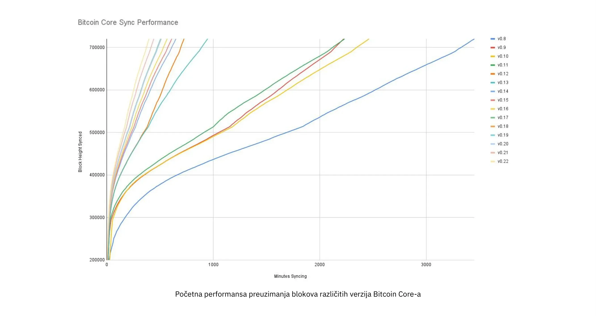


Na gornjem grafikonu možete videti performanse inicijalnog preuzimanja blokova (initial block download) različitih verzija Bitcoin Core-a. Na Y-osi je visina bloka koja je sinhronizovana, a na X-osi je vreme potrebno za sinhronizaciju do te visine.


Različite linije predstavljaju različite verzije Bitcoin Core-a. Krajnja leva linija je najnovija, tj. verzija 0.22, koja je objavljena u septembru 2021. i kojoj je bilo potrebno 396 minuta za potpuno sinhronizovanje. Krajnja desna je verzija 0.8 iz novembra 2013, kojoj je bilo potrebno 3452 minuta. Sve ovo - otprilike 10x - poboljšanje je zbog unutrašnjeg skaliranja.


Poboljšanja se mogu kategorizovati kao ušteda prostora (RAM, disk, propusni opseg, itd.) ili ušteda računarske snage. Obe kategorije doprinose poboljšanjima u dijagramu iznad.


Dobar primer računarskog poboljšanja može se pronaći u biblioteci [libsecp256k1](https://github.com/Bitcoin-core/secp256k1), koja, između ostalog, implementira kriptografske primitive potrebne za kreiranje i verifikaciju [digitalnih potpisa](https://planb.academy/resources/glossary/digital-signature). Pieter Wuille je jedan od saradnika na ovoj biblioteci, i napisao je [Twitter niz](https://twitter.com/pwuille/status/1450471673321381896) koja prikazuje poboljšanja performansi postignuta kroz različite pull zahteve.


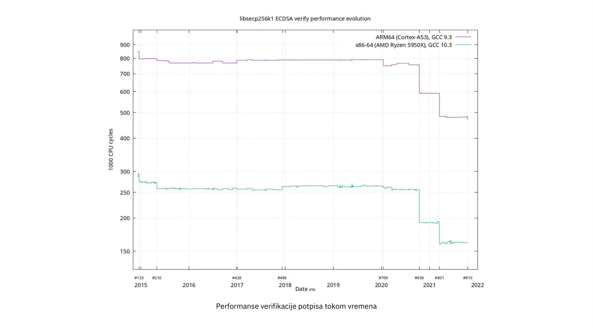


Na gornjem grafikonu možete videti performanse verifikacije potpisa tokom vremena, pri čemu su značajni pull request-ovi označeni na vremenskoj liniji.


Grafikon prikazuje trend za dve različite vrste 64-bitnih CPU-a, naime ARM i x86. Razlika u performansama je zbog specijalizovanijih instrukcija dostupnih na x86 u poređenju sa ARM arhitekturom, koja ima manje i generičnije instrukcije. Međutim, opšti trend je isti za obe arhitekture. Napomena: Y-os je logaritamska, što čini da poboljšanja izgledaju manje impresivno nego što zapravo jesu.


Postoji i nekoliko dobrih primera poboljšanja uštede prostora koja su doprinela poboljšanju performansi. U [Medium blog post](https://murchandamus.medium.com/2-of-3-Multisig-inputs-using-Pay-to-Taproot-d5faf2312ba3) o doprinosu Taproot-a u uštedi prostora, korisnik Murch poredi koliko prostora u bloku bi zahtevala prag-potpis 2-od-3, koristeći Taproot na različite načine kao i bez njegovog korišćenja.


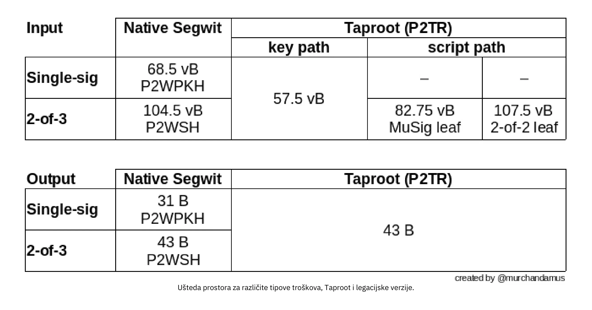


Ušteda prostora za različite tipove potrošnje, Taproot i nasleđene verzije.


Prag-potpis 2-od-3 koristeći native SegWit zahtevao bi ukupno 104.5+43 vB = 147.5 vB, dok bi najprostornije korišćenje Taproot zahtevalo samo 57.5+43 vB = 100.5 vB u standardnom slučaju upotrebe. U najgorem i retkim slučajevima, kao kada standardni potpisnik nije dostupan iz nekog razloga, Taproot bi koristio 107.5+43 vB = 150.5 vB. Ne morate razumeti sve detalje, ali ovo bi vam trebalo dati ideju o tome kako programeri razmišljaju o uštedi prostora - svaki bajt je bitan.


Osim unutrašnjeg skaliranja u Bitcoin softveru, postoje neki načini na koje korisnici mogu doprineti unutrašnjem skaliranju. Oni mogu obavljati svoje transakcije inteligentnije kako bi uštedeli na naknadama za transakcije, istovremeno smanjujući svoj uticaj na zahteve full node-a. Dve uobičajene tehnike za postizanje ovog cilja nazivaju se grupisanje transakcija i konsolidacija izlaza.


Ideja sa grupisanjem transakcija je da se više uplata kombinuje u jednu jedinu transakciju, umesto da se pravi jedna transakcija po uplati. Ovo može uštedeti mnogo na naknadama, a istovremeno smanjiti opterećenje prostora u bloku.


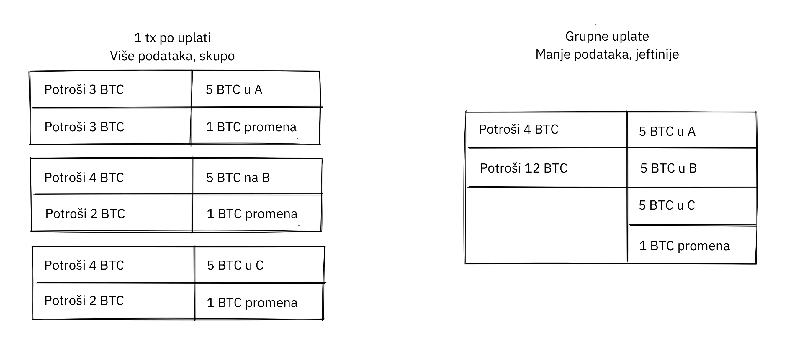


Grupisanje transakcija kombinuje više uplata u jednu transakciju kako bi se uštedelo na naknadama.


Konsolidacija izlaza odnosi se na iskorišćavanje perioda niske potražnje za blok prostorom kako bi se kombinovalo više izlaza u jedan izlaz. Ovo može smanjiti vaše troškove naknade kasnije, kada budete morali da izvršite uplatu dok je potražnja za blok prostorom visoka.


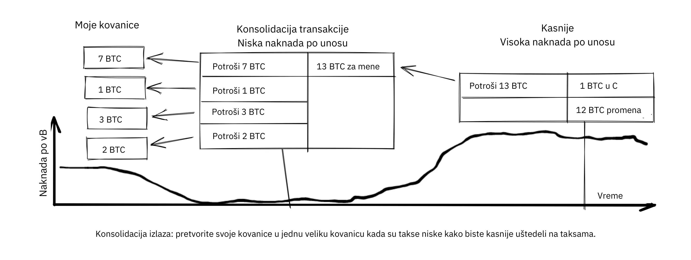


Konsolidacija izlaza: istopite svoje kovanice u jednu veliku kovanicu kada su naknade niske da biste kasnije uštedeli na naknadama.


Možda nije očigledno kako konsolidacija izlaza doprinosi unutrašnjem skaliranju. Uostalom, ukupna količina blockchain podataka je čak malo povećana ovom metodom. Ipak, UTXO set, tj. baza podataka koja prati ko poseduje koje kovanice, se smanjuje jer trošite više UTXO-a nego što kreirate. Ovo olakšava teret za full čvorove da održavaju svoje UTXO setove.


Nažalost, međutim, ove dve tehnike *UTXO upravljanja* mogu biti loše za vašu ili privatnost vaših primalaca. U slučaju grupisanja, svaki primalac će znati da su svi grupisani izlazi od vas ka drugim primaocima (osim možda kusura). U slučaju UTXO konsolidacije, otkrićete da izlazi koje konsolidujete pripadaju istom novčaniku. Dakle, možda ćete morati da napravite kompromis između efikasnosti troškova i privatnosti.


#### Slojevito skaliranje


Najuticajniji pristup skaliranju je verovatno slojevitost. Opšta ideja iza slojevitosti je da protokol može da reguliše plaćanja između korisnika bez dodavanja transakcija na blockchain.


Slojeviti protokol počinje sa dvoje ili više ljudi koji se dogovaraju o početnoj transakciji koja se stavlja na blockchain, kao što je prikazano na slici ispod.


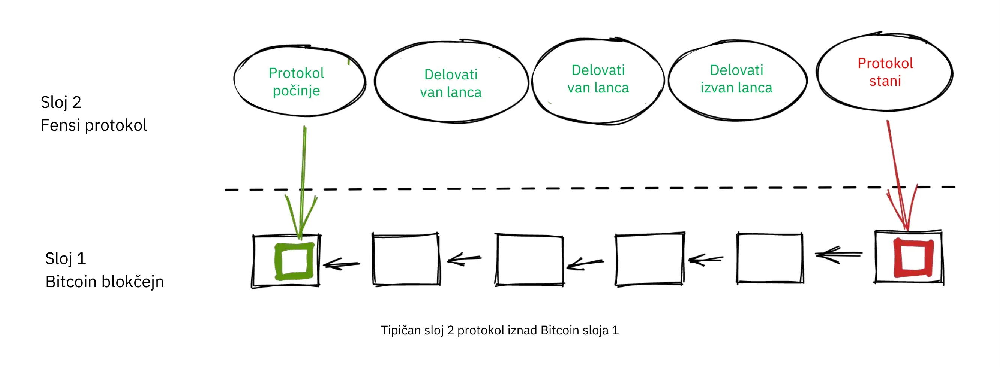


Kako se ova početna transakcija kreira varira između protokola, ali zajednička tema je da učesnici kreiraju nepotpisanu početnu transakciju i broj unapred potpisanih kaznenih transakcija, koje troše izlaz početne transakcije na različite načine. Nakon toga, početna transakcija je u potpunosti potpisana i objavljena na blockchain-u, a kaznene transakcije mogu biti u potpunosti potpisane i objavljene kako bi se kaznila strana koja se ne ponaša ispravno. Ovo motiviše učesnike da održe svoja obećanja kako bi protokol mogao raditi na način na koji se ne zahteva poverenje.


Jednom kada transakcija započne na blockchain-u, protokol može raditi ono što treba. Na primer, mogao bi omogućiti super brza plaćanja između učesnika, implementirati neke tehnike za poboljšanje privatnosti ili izvršiti naprednije skriptovanje koje ne bi bilo podržano od strane Bitcoin blockchain-a.


Nećemo ulaziti u detalje kako tačno funkcionišu protokoli, ali kao što možete videti na prethodnoj slici, blockchain se retko koristi tokom životnog ciklusa protokola. Sva uzbudljiva akcija dešava se *[off-chain](https://planb.academy/resources/glossary/offchain)*. Videli smo kako ovo može biti korisno za privatnost ako se pravilno uradi, ali takođe može biti prednost za skalabilnost.


U [Reddit postu](https://www.reddit.com/r/Bitcoin/comments/438hx0/a_trip_to_the_moon_requires_a_rocket_with/) pod naslovom "Putovanje na Mesec zahteva raketu sa više faza, inače će vas jednačina rakete 'pojesti za ručak'... nagurati sve kao klovnove u mali auto i ubaciti ih u trebušet i nadajući se uspehu je potpuno pogrešno.", Gregory Maxwell objašnjava zašto je slojevitost naša najbolja šansa da Bitcoin skaliramo za redove veličine.


Počinje naglašavanjem zablude u posmatranju Vise ili Mastercarda kao glavnih konkurenata Bitcoina i ističe kako je povećanje maksimalne veličine bloka loš pristup za suočavanje s navedenom konkurencijom. Zatim govori o tome kako napraviti stvarnu razliku korišćenjem slojeva:


> Dakle-- Da li to znači da Bitcoin ne može biti veliki pobednik kao tehnologija plaćanja? Ne. Ali da bismo dostigli kapacitet potreban za zadovoljenje potreba plaćanja u svetu, moramo raditi inteligentnije.
>

> Od samog početka Bitcoin je dizajniran da inkorporira slojeve na siguran način kroz svoju sposobnost pametnog ugovaranja (šta, mislite da je to tamo stavljeno samo da bi ljudi mogli filozofirati o besmislenim "DAO-ima"?). U suštini, koristićemo Bitcoin sistem kao visoko pristupačnog i savršeno pouzdanog robotičkog sudiju i obavljati većinu našeg poslovanja van sudnice -- ali transaktovati na takav način da, ako nešto pođe po zlu, imamo sve dokaze i uspostavljene sporazume kako bismo bili sigurni da će robotički sud to ispraviti. (Geek dodatak: Ako vam ovo deluje nemoguće, pročitajte ovaj stari post o transaction cut-through (cut-through transakcija))
>

> Ovo je moguće upravo zbog osnovnih Bitcoin svojstava. Sistem baze koji se može cenzurisati ili je reverzibilan nije baš pogodan za izgradnju snažnog gornjeg sloja sistema za obradu transakcija na njemu... a ako osnovna imovina nije pouzdana, malo je smisla uopšte transaktovati s njom.

Analogija sa sudijom je prilično ilustrativna za način na koji slojevi funkcionišu: ova sutkinja mora biti neiskvarljiva i nikada ne sme promeniti mišljenje, inače slojevi iznad osnovnog Bitcoin sloja neće raditi pouzdano.


Nastavlja tako što ističe poentu o centralizovanim uslugama. Obično nema problema sa poverenjem centralnom serveru sa trivijalnim količinama Bitcoina da bi se stvari obavile: to je takođe slojevito skaliranje.


Prošlo je mnogo godina otkako je Maxwell napisao gornji tekst, i njegove reči su i dalje tačne. Uspeh Lightning mreže dokazuje da je slojevitost zaista put napred za povećanje Bitcoin korisnosti.


### Zaključak o skaliranju


Razgovarali smo o različitim načinima na koje bi neko mogao želeti da skalira Bitcoin, poveća kapacitet korišćenja Bitcoina. Skaliranje je bilo zabrinutost u Bitcoinu od njegovih najranijih dana.


Danas znamo da Bitcoin ne skalira dobro vertikalno ("kupiti veći hardver") ili horizontalno ("verifikovati samo delove podataka"), već radije unutra ("uraditi više sa manje") i u slojevima ("izgraditi protokole povrh Bitcoina").


## Kad sranje pogodi ventilator

<chapterId>fe39c13c-310f-51fd-84ff-6b92dd01c9e7</chapterId>


Bitcoin je napravljen od strane ljudi. Ljudi pišu softver, i ljudi zatim pokreću taj softver. Kada se otkrije sigurnosna ranjivost ili ozbiljna greška - da li zaista postoji razlika između ta dva? - uvek ih otkriju ljudi, od krvi i mesa. Ovo poglavlje razmatra šta ljudi rade, šta bi trebalo da rade, i šta ne bi trebalo da rade kada stvari krenu po zlu. Prvi deo objašnjava termin *odgovorno otkrivanje*, koji se odnosi na to kako neko ko otkrije ranjivost može odgovorno da postupi kako bi pomogao u minimiziranju štete od nje. Ostatak poglavlja vodi vas kroz neke od najozbiljnijih ranjivosti otkrivenih tokom godina, i kako su se sa njima nosili programeri, rudari i korisnici. Stvari nisu bile tako rigorozne u ranom detinjstvu Bitcoina kao što su danas.


### Odgovorno otkrivanje


Zamislite da otkrijete grešku u Bitcoin Core-u, grešku koja omogućava bilo kome da daljinski isključi Bitcoin Core čvor koristeći posebno kreirane mrežne poruke. Zamislite takođe da niste zlonamerni i želite da se ova ranjivost ne zloupotrebi. Šta radite? Ako ostanete tihi o tome, verovatno će neko drugi otkriti problem, a ne možete biti sigurni da ta osoba neće biti zlonamerna.


Kada se otkrije sigurnosni problem, osoba koja ga otkrije treba da primeni _odgovorno otkrivanje_ što je termin koji se često koristi među Bitcoin programerima. Termin je [objašnjen na Wikipediji](https://en.wikipedia.org/wiki/Coordinated_vulnerability_disclosure):


> Programeri hardvera i softvera često zahtevaju vreme i resurse da isprave svoje greške. Često su etički hakeri ti koji pronalaze ove
ranjivosti. Hakeri i naučnici za računarsku bezbednost smatraju da je njihova društvena odgovornost da obaveste javnost o ranjivostima. Sakrivanje problema može izazvati osećaj lažne sigurnosti. Da bi se to izbeglo, uključene strane koordiniraju i pregovaraju o razumnom vremenskom periodu za popravku ranjivosti. U zavisnosti od potencijalnog uticaja ranjivosti, očekivanog vremena potrebnog za razvoj i primenu hitne popravke ili zaobilaznog rešenja i drugih faktora, ovaj period može varirati između nekoliko dana i nekoliko meseci.


To znači da ako pronađete sigurnosni problem, trebali biste ga prijaviti timu odgovornom za sistem. Ali šta to znači u Bitcoin kontekstu? Niko ne kontroliše Bitcoin, ali trenutno postoji fokusna tačka za razvoj Bitcoina, naime [Bitcoin Core Github repozitorijum](https://github.com/Bitcoin/Bitcoin). Održavaoci navedenog repozitorijuma su odgovorni za kod u njemu, ali nisu odgovorni za sistem u celini - niko nije. Ipak, opšta najbolja praksa je poslati email na security@bitcoincore.org.


U [email prepisci](https://lists.linuxfoundation.org/pipermail/Bitcoin-dev/2017-September/015002.html) pod naslovom "Odgovorno otkrivanje grešaka" iz 2017. godine, Anthony Towns je pokušao da sumira ono što je smatrao trenutnim najboljim praksama. Prikupio je informacije iz nekoliko izvora i od različitih ljudi kako bi oblikovao svoje mišljenje o toj temi.


- Ranljivosti treba prijaviti putem security at bitcoincore.org
- Kritičan problem (koje se može odmah iskoristiti ili se već iskorišćava i izaziva veliku štetu) biće rešen:
  - objavljivanjem zakrpa što pre (ASAP)
  - širokim obaveštenjem o potrebi za nadogradnjom (ili onemogućavanjem pogođenih sistema)
  - minimalnim otkrivanje stvarnog problema, kako bi se odložili napadi
- Nekritična ranjivost (zato što je teško ili skupo iskoristiti) će biti rešena:
  - zakrpom i pregledom obavljenim u uobičajenom toku razvoja
  - backport rešenja ili zaobilazno rešenje sa mastera na trenutno objavljenu verziju
- Programeri će pokušati da osiguraju da objavljivanje ispravke ne otkrije prirodu ranjivosti tako što će predloženu ispravku dati iskusnim programerima koji nisu informisani o ranjivosti, reći im da ispravka rešava ranjivost i zamoliti ih da identifikuju ranjivost.
- Devs mogu preporučiti da druge Bitcoin implementacije usvoje ispravke ranjivosti pre nego što ispravka bude objavljena i široko primenjena, ako to mogu učiniti bez otkrivanja ranjivosti; npr, ako ispravka ima značajne performanse koje bi opravdale njeno uključivanje.
- Pre nego što ranjivost postane javna, programeri će generalno preporučiti prijateljskim [altcoin](https://planb.academy/resources/glossary/altcoin) programerima da bi trebalo da se ažuriraju sa ispravkama. Ali to je tek nakon što su ispravke široko primenjene u Bitcoin mreži.
- Programeri obično neće obavestiti altcoin programere koji su se ponašali na neprijateljski način (npr. koristeći ranjivosti za napad na druge, ili koji krše embarga).
- Bitcoin developeri neće otkriti detalje o ranjivosti dok >80% Bitcoin čvorova ne primeni ispravke. Otkrivači ranjivosti se ohrabruju i traži se da slede istu politiku. [1] [6]


Ova lista prikazuje koliko pažljiv neko mora biti prilikom objavljivanja zakrpa za Bitcoin, jer sama zakrpa može otkriti ranjivost. Četvrta stavka je posebno zanimljiva jer objašnjava kako testirati da li je zakrpa dovoljno dobro prikrivena. Zaista, ako nekoliko zaista iskusnih programera ne može uočiti ranjivost čak i znajući da zakrpa ispravlja jednu, verovatno će biti zaista teško za druge da je otkriju.


Nit koja je dovela do ovog emaila raspravljala je o tome da li, kada i kako otkriti ranjivosti altcoin-ima i drugim implementacijama Bitcoina. Ovde nema jasnog odgovora. "Pomoći dobrim momcima" deluje kao razumna stvar, ali ko odlučuje ko su oni i gde se povlači granica? Bryan Bishop [je tvrdio](https://lists.linuxfoundation.org/pipermail/Bitcoin-dev/2017-September/014983.html) da je pomaganje altcoin-ima, pa čak i scamcoin-ima, da se odbrane od sigurnosnih eksploatacija moralna dužnost:


> Nije dovoljno braniti Bitcoin i njegove korisnike od aktivnih pretnji, postoji opštija odgovornost da se brane sve vrste korisnika i različiti softveri od mnogih vrsta pretnji u bilo kojim oblicima, čak i ako ljudi koriste glup i nesiguran softver koji lično ne održavate, ne doprinosite mu ili ga ne zagovarate. Rukovanje znanjem o ranjivosti je delikatna stvar i možda ćete primiti znanje sa ozbiljnijim direktnim ili indirektnim uticajem nego što je prvobitno opisano.

Takođe, pre Town-ovog gorenavedenog email-a bio je [post](https://lists.linuxfoundation.org/pipermail/Bitcoin-dev/2017-September/014977.html) od Gregory Maxwell-a, u kojem je tvrdio da bezbednosni propusti mogu biti ozbiljniji nego što izgledaju:


> Više puta sam video da se težak problem sa eksploatacijom ispostavi trivijalnim kada pronađete pravi trik, ili da se manji DoS problem ispostavi mnogo ozbiljnijim.
>

> Jednostavne greške u performansama, stručno primenjene, mogu potencijalno biti korišćene za razdvajanje mreže--- rudar A i kripto-menjačnica B idu u jednu particiju, svi ostali u drugu.. i dvostruko trošenje.
>

> I tako dalje. Dakle, iako se apsolutno slažem da različite stvari treba i mogu biti tretirane drugačije, nije uvek tako jasno. Pametno je tretirati stvari kao ozbiljnije nego što znate da jesu.

Dakle, čak i ako se ranjivost čini teškom za eksploataciju, možda je najbolje pretpostaviti da je lako iskoristiva i da još niste shvatili kako.


On takođe pominje kako je "donekle netačno nazvati ovu temu bilo čim u vezi sa objavljivanjem, ova tema nije o objavljivanju. Objavljivanje je kada obavestite dobavljača. Ova tema je o publikaciji i to ima veoma različite implikacije. Publikacija je kada ste sigurni da ste obavestili potencijalne napadače". Ova poslednja opservacija u vezi sa razlikom između objavljivanja i publikacije je važna. Laka stvar je odgovorno objavljivanje; težak deo je razumna publikacija.


### Bitcoinovo traumatično detinjstvo


Bitcoin je započeo kao projekat jednog čoveka (barem tako sugeriše pseudonim njegovog tvorca), i Bitcoin je u početku imao malu ili nikakvu vrednost. Kao takav, ranjivosti i ispravke grešaka nisu bile rešavane tako rigorozno kao danas.


Bitcoin viki ima [listu uobičajenih ranjivosti i izloženosti](https://en.Bitcoin.it/wiki/Common_Vulnerabilities_and_Exposures) (CVE) kroz koje je Bitcoin prošao. Ovaj deo predstavlja mali prikaz nekih bezbednosnih problema i incidenata iz ranih godina Bitcoina. Nećemo pokriti sve, ali smo odabrali nekoliko koje smatramo posebno zanimljivim.


#### 2010-07-28: Mogućnost trošenja tuđih novčića (CVE-2010-5141)


Dana 28. jula 2010. godine, pseudonimna osoba po imenu ArtForz otkrila je grešku u verziji 0.3.4 koja bi omogućila bilo kome da uzme novčiće od bilo koga drugog. ArtForz je *odgovorno* prijavio ovo Satoshi Nakamotu i drugom Bitcoin programeru po imenu Gavin Andresen.


Problem je bio u tome što bi skript operater `OP_RETURN` jednostavno prekinuo izvršavanje programa, tako da ako je scriptPubKey bio `<pubkey> OP_CHECKSIG` a scriptSig bio `OP_1 OP_RETURN`, deo programa u scriptPubKey nikada ne bi bio izvršen. Jedina stvar koja bi se desila bila bi da se `1` stavi na stek, a zatim bi `OP_RETURN` izazvao prekid programa. Bilo koja nenulta vrednost na vrhu steka nakon izvršenja programa znači da je uslov za trošenje ispunjen. Pošto je element na vrhu steka `1` nenulti, trošenje bi bilo u redu.


Ovo je bio kod za rukovanje `OP_RETURN`:


```
case OP_RETURN:
{
pc = pend;
}
break;
```

Efekat `pc = pend;` je bio da se ostatak programa preskoči, što znači da bi bilo koji locking [script](https://planb.academy/resources/glossary/script) u scriptPubKey bio ignorisan. Popravka je podrazumevala promenu značenja `OP_RETURN`-a, tako da se izvršavanje odmah prekida neuspehom.


```
case OP_RETURN:
{
return false;
}
break;
```


Satoshi je napravio ovu promenu lokalno i napravio izvršni binarni fajl sa verzijom 0.3.5 iz toga. Zatim je postavio na Bitcointalk forum `\\*** ALERT \*** Upgrade to 0.3.5 ASAP`, pozivajući korisnike da instaliraju ovu binarnu verziju njegovog, bez predstavljanja izvornog koda za to:


> Molimo vas da što pre nadogradite na verziju 0.3.5! Ispravili smo grešku u implementaciji gde je bilo moguće da se prihvate lažne transakcije. Nemojte prihvatati Bitcoin transakcije kao plaćanje dok ne nadogradite na verziju 0.3.5!

Originalna poruka je kasnije izmenjena i više nije dostupna u svom punom obliku. Gornji isječak je iz [citiranog odgovora](https://bitcointalk.org/index.php?topic=626.msg6458#msg6458). Neki korisnici su probali Satoshi-ovu binarnu datoteku, ali su naišli na probleme s njom. Ubrzo nakon toga, [Satoshi je napisao](https://bitcointalk.org/index.php?topic=626.msg6469#msg6469):


> Nisam imao vremena da ažuriram SVN još. Sačekaj verziju 0.3.6, trenutno je pravim. Možeš ugasiti svoj čvor u međuvremenu.

A 35 minuta kasnije, [napisao je](https://bitcointalk.org/index.php?topic=626.msg6480#msg6480):


> SVN je ažuriran na verziju 0.3.6.
>

> Otpremam Windows verziju 0.3.6 na Sourceforge sada, zatim ću ponovo izgraditi linux.

U ovom trenutku je takođe izgleda ažurirao originalni post da spomene 0.3.6 umesto 0.3.5:


> Molimo vas da što pre nadogradite na verziju 0.3.6! Ispravili smo grešku u implementaciji gde je bilo moguće da se lažne transakcije prikažu kao prihvaćene. Nemojte prihvatati Bitcoin transakcije kao plaćanje dok ne nadogradite na verziju 0.3.6!
>

> Ako ne možete odmah da nadogradite na 0.3.6, najbolje je da isključite vaš Bitcoin čvor dok to ne uradite.
>

> Takođe u 0.3.6, brže heširanje:
> - optimizacija keša srednjeg stanja zahvaljujući tcatm
> - Crypto++ ASM SHA-256 zahvaljujući BlackEye
> Ukupno ubrzanje generisanja 2.4x brže.
>

> Preuzimanje:
>

> http://sourceforge.net/projects/Bitcoin/files/Bitcoin/Bitcoin-0.3.6/
>

> Windows i Linux korisnici: ako imate 0.3.5 i dalje treba da nadogradite na 0.3.6.

Imajte na umu razliku u karakterizaciji problema iz prve poruke: "moglo bi biti prikazano kao prihvaćeno" naspram "moglo bi biti prihvaćeno". Možda je Satoshi umanjio ozbiljnost greške u svojoj komunikaciji kako ne bi privukao previše pažnje na stvarni problem. U svakom slučaju, ljudi su nadogradili na 0.3.6 i radilo je kako se očekivalo. Ovaj konkretan problem je rešen, neverovatno, bez gubitaka Bitcoina.


Poruka Satoshija takođe je opisala neka poboljšanja performansi za rudarenje. Nije jasno zašto je to uključeno u kritičnu bezbednosnu ispravku, moguće je da je svrha bila da se zamagli pravi problem. Međutim, čini se verovatnijim da je jednostavno objavio sve što je bilo na čelu razvojne grane Subversion repozitorijuma, sa dodatom bezbednosnom ispravkom.


U to vreme, nije bilo ni približno toliko korisnika kao danas, a vrednost Bitcoina bila je blizu nule. Ako bi se danas ovako reagovalo na grešku, smatralo bi se potpunim haosom iz više razloga:


- Satoshi je napravio binarno-izdanje verzije 0.3.5 koje sadrži ispravku. Nije obezbeđen nikakav patch ili kod, možda kao mera da se problem zamagli.
- 0.3.5 [nije ni radila](https://bitcointalk.org/index.php?topic=626.msg6455#msg6455).
- Popravka u 0.3.6 je zapravo bila hard fork.


Još jedna stvar o kojoj se može raspravljati je da li je dobro ili loše što su korisnici bili zamoljeni da isključe svoje čvorove. Danas to ne bi bilo izvodljivo, ali u to vreme mnogi korisnici su aktivno pratili forume za ažuriranja i obično su bili u toku sa stvarima. S obzirom na to da je to bilo moguće uraditi, možda je to bila razumna stvar za učiniti.


#### 2010-08-15 Combined output overflow (prelivanje kombinovanog izlaza) (CVE-2010-5139)


Sredinom avgusta 2010. godine, korisnik Bitcointalk foruma jgarzik, poznat i kao Jeff Garzik, [otkrio je da](https://bitcointalk.org/index.php?topic=822.msg9474#msg9474) određena transakcija na visini bloka 74638 ima dva izlaza neobično visoke vrednosti:


```
"out" : [
{
"value" : 92233720368.54277039,
"scriptPubKey" : "OP_DUP OP_HASH160 0xB7A73EB128D7EA3D388DB12418302A1CBAD5E890 OP_EQUALVERIFY OP_CHECKSIG"
},
{
"value" : 92233720368.54277039,
"scriptPubKey" : "OP_DUP OP_HASH160 0x151275508C66F89DEC2C5F43B6F9CBE0B5C4722C OP_EQUALVERIFY OP_CHECKSIG"
}
]
```


> "Value out" u ovom bloku #74638 je prilično čudan:
>

> 92233720368.54277039 BTC?  Da li je to UINT64_MAX, pitam se?

Pretpostavlja se da je postojala greška koja je uzrokovala da zbir dva int64 (ne uint64, kako je Garzik pretpostavio) izlaza pređe u negativnu vrednost -0.00997538 BTC. Bez obzira na zbir ulaza, "zbir" izlaza bi bio manji, čineći ovu transakciju ispravnom prema tadašnjem kodu.


U ovom slučaju, greška je bila otkrivena i objavljena putem stvarnog eksploita. Nesrećna posledica ovoga bila je da je oko 2x92 milijarde bitcoina bilo kreirano, što je ozbiljno razvodnilo ponudu novca od oko 3.7 miliona novčića koji su postojali u to vreme.


U povezanoj temi, [Satoshi je objavio](https://bitcointalk.org/index.php?topic=823.msg9531#msg9531) da bi cenio kada bi ljudi prestali sa rudarenjem (ili *generisanjem*, kako su to tada zvali):


> Bilo bi od pomoći kada bi ljudi prestali generisati. Verovatno ćemo morati ponovo napraviti granu oko trenutne, i što manje generišete to će biti brže.
>

> Prva zakrpa će biti u SVN rev 132. Još nije postavljena. Prvo ću pomeriti neke druge razne izmene, a zatim ću postaviti zakrpu za ovo.

Njegov plan je bio da napravi soft fork kako bi transakcije poput one o kojoj se ovde diskutuje bile nevažeće, čime bi se poništili blokovi (posebno blok 74638) koji su sadržali takve transakcije. Manje od sat vremena kasnije, on je primenio [zakrpu u reviziji 132](https://sourceforge.net/p/Bitcoin/code/132/) Subversion repozitorijuma i [objavio na forumu](https://bitcointalk.org/index.php?topic=823.msg9548#msg9548) opisujući šta misli da korisnici treba da urade:


> Patch je otpremljen na SVN rev 132!
>

> Za sada, preporučeni koraci:
> 1) Isključi.
> 2) Preuzmi knightmb-ove blk fajlove.  (zameni svoje blk0001.dat i blkindex.dat fajlove)
> 3) Nadogradnja.
> 4) Trebalo bi da počne sa manje od 74000 blokova. Neka ponovo preuzme ostatak.
>

> Ako ne želite da koristite knightmb-ove fajlove, možete jednostavno obrisati vaše blk*.dat fajlove, ali će to biti veliko opterećenje za mrežu ako svi budu preuzimali ceo indeks blokova odjednom.
>

> Izgradiću release uskoro.

Želeo je da ljudi preuzmu podatke o blokovima od određenog korisnika, naime knightmb, koji je objavio svoj blockchain kako se pojavio na njegovom disku, datoteke blkXXXX.dat i blkindex.dat. Razlog za preuzimanje blockchain podataka na ovaj način, umesto sinhronizacije od početka, bio je smanjenje zagušenja mrežnog protoka.


Postojao je veliki uslov uz ovo: podaci koje bi korisnici preuzeli od knightmb [nisu bili verifikovani od strane Bitcoin softvera](https://Bitcoin.stackexchange.com/a/113682/69518) pri pokretanju. Datoteka blkindex.dat sadržala je UTXO set, i softver bi prihvatio bilo koje podatke u njoj kao da ih je već verifikovao. knightmb je mogao manipulisati podacima kako bi sebi ili bilo kome drugom dao neke bitkoine.


Ponovo, činilo se da su se ljudi složili s tim, i poništavanje nevažećeg bloka i njegovih naslednika bilo je uspešno. Rudari su počeli da rade na novom nasledniku bloka [74637](https://Mempool.space/block/0000000000606865e679308edf079991764d88e8122ca9250aef5386962b6e84) i, prema vremenskom pečetu bloka, naslednik se pojavio u 23:53 UTC, oko 6 sati nakon što je problem otkriven. U 08:10 narednog dana, 16. avgusta, oko bloka 74689, novi lanac je pretekao stari lanac, te su svi neažurirani čvorovi reorganizovani da prate novi lanac. Ovo je najdublja reorganizacija - 52 bloka - u istoriji Bitcoina.


U poređenju sa [OP_RETURN](https://planb.academy/resources/glossary/op-return-0x6a) problemo , ovaj problem je rešen na nešto čistiji način:


- Nema izdanja zakrpe samo u binarnom obliku
- Objavljeni softver je radio kako je zamišljeno
- Nije bio hard fork


Korisnicima je takođe zatraženo da zaustave sa rudarenjem tokom ovog problema. Možemo diskutovati o tome da li je to dobra ideja ili ne, ali zamislite da ste rudar i uvereni ste da će svi blokovi iznad lošeg bloka na kraju biti izbrisani u dubokom reorganizovanju: zašto biste trošili resurse na rudarenje blokova osuđene na propast?


Možda ćete takođe misliti da je pomalo sumnjivo postupiti kako je Nakamoto predložio i preuzeti blockchain, uključujući UTXO set, sa hard drajva nekog nasumičnog tipa. Ako je tako, u pravu ste: to jeste sumnjivo. Ali, s obzirom na okolnosti, ovaj hitni odgovor je bio razuman.


Postoji važna razlika između ovog slučaja i prethodnog OP_RETURN slučaja: ovaj problem je zloupotrebljen u praksi, i stoga je ispravka mogla biti izvedena jednostavnije. U slučaju OP_RETURN, morali su da zamagle rešenje i daju javne izjave koje nisu direktno otkrivale u čemu je problem.


#### 2013-03-11 Problem sa zaključavanjem baze podataka (DB locks) 0.7.2 - 0.8.0 (CVE-2013-3220)


Vrlo zanimljivo i obrazovno vredno pitanje pojavilo se u martu 2013. Činilo se da se blockchain podelio (iako se u citatu ispod koristi reč "fork") nakon bloka 225429. Detalji ovog incidenta su [prijavljeni u BIP50](https://github.com/Bitcoin/bips/blob/master/bip-0050.mediawiki). Rezime kaže:


> Blok koji je imao veći broj ukupnih ulaza transakcija nego što je ranije viđeno je iskopan i emitovan. Bitcoin 0.8 čvorovi su mogli da se nose sa tim, ali neki pre-0.8 Bitcoin čvorovi su ga odbacili, što je izazvalo neočekivani fork (razdvajanje) blockchaina. Lanac nekompatibilan sa pre-0.8 (od sada, 0.8 lanac) u tom trenutku je imao oko 60% rudarske heš snage, osiguravajući da se podela nije automatski rešila (kao što bi se desilo da je pre-0.8 lanac nadmašio 0.8 lanac u ukupnom radu, primoravajući 0.8 čvorove da se reorganizuju na pre-0.8 lanac).
>

> Kako bi što pre obnovili kanonski lanac, BTCGuild i Slush su degradirali svoje Bitcoin 0.8 čvorove na 0.7 kako bi njihovi bazeni takođe odbacili veći blok. Ovo je postavilo većinsku heš moć na lanac bez većeg bloka, što je na kraju uzrokovalo da se 0.8 čvorovi reorganizuju na lanac pre-0.8.

Brza akcija koju su rudarski bazeni BTCGuild i Slush preduzeli bila je imperativna u ovoj vanrednoj situaciji. Uspeli su da preusmere većinu heš snage na pre-0.8 granu podele, i tako pomognu u vraćanju konsenzusa. Ovo je dalo programerima vreme da pronađu održivo rešenje.


Šta je takođe veoma interesantno u ovom izdanju je da verzija 0.7.2 nije bila kompatibilna sama sa sobom, kao što je bio slučaj i sa prethodnim verzijama. Ovo je objašnjeno u [Root cause section of BIP50](https://github.com/Bitcoin/bips/blob/master/bip-0050.mediawiki#root-cause):


> Sa nedovoljno visokom BDB konfiguracijom zaključavanja, implicitno je postalo pravilo konsenzusa mreže koje određuje validnost bloka (iako je
nedosledno i nesigurno pravilo, jer upotreba zaključavanja može varirati od čvora do čvora).


Ukratko, problem je u tome što broj zaključavanja baze podataka koji Bitcoin Core softver treba da verifikuje blok nije deterministički. Jednom čvoru može biti potrebno X zaključavanja, dok drugom može biti potrebno X+1 zaključavanja. Čvorovi takođe imaju ograničenje na broj zaključavanja koje Bitcoin može preuzeti. Ako broj potrebnih zaključavanja premaši ograničenje, blok će se smatrati nevažećim. Dakle, ako X+1 premašuje ograničenje, ali ne i X, tada će se dva čvora podeliti na blockchainu i neće se složiti oko toga koja je grana važeća.


Rešenje koje je izabrano, osim trenutnih akcija koje su preduzeli oba bazena da bi povratili konsenzus, bilo je da


- ograniče blokove u smislu veličine i potrebnih zaključavanja na verziju 0.8.1
- zakrpe stare verzije (0.7.2 i neke starije) sa istim novim pravilima i povećaju globalni limit zaključavanja.


Osim povećanog globalnog ograničenja zaključavanja u drugoj tački, ova pravila su privremeno implementirana na unapred određeno vreme. Plan je bio da se ova ograničenja uklone kada većina čvorova bude nadograđena.


Ovaj soft fork je dramatično smanjio rizik od neuspeha konsenzusa, a nekoliko meseci kasnije, 15. maja, privremena pravila su deaktivirana u skladu sa mrežom. Imajte na umu da je ova deaktivacija u stvari bila hard fork, ali nije bila sporna. Štaviše, objavljena je zajedno sa prethodnim soft forkom, tako da su ljudi koji su koristili softver sa soft forkom bili dobro svesni da će hard fork uslediti. Stoga je velika većina čvorova ostala u konsenzusu kada je hard fork aktiviran. Nažalost, međutim, nekoliko čvorova koji nisu nadograđeni izgubljeni su u procesu.


Čovek bi se mogao zapitati da li bi ovo bilo izvodljivo danas. Ekosistem rudarenja je danas složeniji, i, zavisno od količine hash moći na svakoj strani razdvajanja, moglo bi biti teško da se brzo izda zakrpa kao što je ona u BIP50. Verovatno bi bilo teško ubediti rudare na "pogrešnoj" grani da se odreknu svojih nagrada za blokove.


#### BIP66


BIP66 je zanimljiv jer ističe važnost:


- dobrog izbora kriptografija
- odgovornog otkrivanja
- deploy bez javnog otkrivanja ranjivosti
- rudarenja na vrhu verifikovanih blokova


BIP66 je bio predlog za pooštravanje pravila za kodiranje potpisa u Bitcoin Script-i. [Motivacija](https://github.com/Bitcoin/bips/blob/master/bip-0066.mediawiki#motivation) je bila mogućnost parsiranja potpisa pomoću softvera ili biblioteka osim OpenSSL-a, pa čak i novijih verzija OpenSSL-a. OpenSSL je biblioteka za kriptografiju opšte namene koju je Bitcoin Core koristio u to vreme.


BIP je aktiviran 4. jula 2015. Međutim, iako je gore navedeno tačno, BIP66 takođe rešava mnogo ozbiljniji problem koji nije pomenut u BIP-u.


##### Ranjivost


Potpuno otkrivanje ovog problema objavio je Pieter Wuille 28. jula 2015. u [email Bitcoin-dev mailing list](https://lists.linuxfoundation.org/pipermail/Bitcoin-dev/2015-July/009697.html):


> Zdravo svima,
>

> Želeo bih da otkrijem ranjivost koju sam otkrio u septembru 2014. godine, koja je postala neiskoristiva kada je prag od 95% za BIP66 dostignut ranije ovog meseca.
>

> Kratak opis:
>

> Posebno izrađena transakcija mogla je da razdvoji blockchain između čvorova:
>

> - korišćenje OpenSSL na 32-bitnim sistemima i na 64-bitnim Windows sistemima
> - korišćenje OpenSSL-a na ne-Windows 64-bitnim sistemima (Linux, OSX, ...)
> - korišćenje nekih kodnih baza koje nisu OpenSSL za parsiranje potpisa

E-mail dalje iznosi detalje o tome kako je problem otkriven i tačnije šta ga je izazvalo. Na kraju, on podnosi vremenski sled događaja, a mi ćemo ovde ponovo prikazati neke od najvažnijih. Neki od njih su, kao što je prikazano na slici iznad, već opisani.


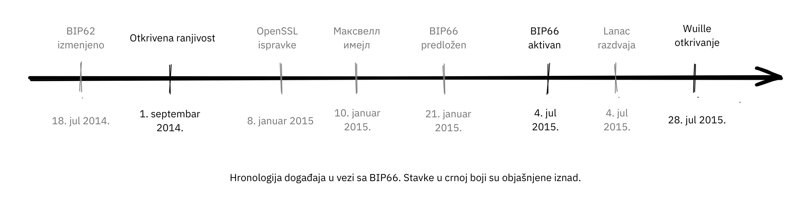


Vremenska linija događaja oko BIP66. Stavke u crnom su objašnjene iznad.


##### Pre otkrića


Bez da iko zna za problem, mogao je biti rešen povučenim BIP62, koji je bio predlog za smanjenje mogućnosti transakcione [malleabilnosti](https://planb.academy/resources/glossary/malleability-transaction) (izmenjivost transakcije). Među predloženim promenama u BIP62 bilo je pooštravanje konsenzusnih pravila za kodiranje potpisa, ili "strogo [DER](https://planb.academy/resources/glossary/der) kodiranje". Pieter Wuille je predložio neke izmene BIP-a u julu 2014. godine, koje bi rešile problem:


> 2014-Jul-18: Kako bi pravila za kodiranje Bitcoin potpisa bila nezavisna od specifičnog parsera OpenSSL-a, izmenio sam BIP62 predlog tako da zahtev za striktne DER potpise važi i za transakcije verzije 1. U to vreme, nijedan ne-DER potpis više nije bio rudaren u blokove, pa se pretpostavljalo da to neće imati nikakav uticaj. Pogledajte https://github.com/Bitcoin/bips/pull/90 i http://lists.linuxfoundation.org/pipermail/Bitcoin-dev/2014-July/006299.html. U to vreme nije bilo poznato, ali ako bi se primenilo, ovo bi rešilo ranjivost.

Zbog širine ovog BIP-a, koji je pokrivao znatno više od samo "strogo DER kodiranje", stalno se menjao i nikada nije bio blizu implementacije. BIP je kasnije povučen jer je Segregated Witness, BIP141, rešio malleability transakcija na drugačiji i potpuniji način.


##### Nakon otkrića


OpenSSL je objavio nove verzije svog softvera sa zakrpama koje bi, da su korišćene u Bitcoin-u od početka, rešile problem. Međutim, korišćenje bilo koje nove verzije OpenSSL-a samo u novom izdanju Bitcoin Core bi pogoršalo stvari. Gregory Maxwell to objašnjava u drugoj [email diskusiji](https://lists.linuxfoundation.org/pipermail/Bitcoin-dev/2015-January/007097.html) u januaru 2015:


> Iako je za većinu aplikacija generalno prihvatljivo da se unapred odbace neki potpisi, Bitcoin je konsenzusni sistem gde svi učesnici moraju generalno da se slože oko tačne validnosti ili nevalidnosti ulaznih podataka. U izvesnom smislu, doslednost je važnija od "ispravnosti".
> [...]
> Zakrpe iznad, međutim, rešavaju samo jedan simptom opšteg problema: oslanjanje na softver koji nije dizajniran ili distribuiran za konsenzusnu upotrebu (posebno OpenSSL) za konsenzusno-normativno ponašanje. Stoga, kao inkrementalno poboljšanje, predlažem ciljani soft fork kako bi se uskoro nametnulo striktno poštovanje DER standarda, koristeći podskup BIP-62.

Ističe da korišćenje koda koji nije namenjen za upotrebu u konsenzus sistemima predstavlja ozbiljne rizike, i predlaže da Bitcoin implementira striktno DER kodiranje. Ovo je veoma jasan primer važnosti dobre selekcije kriptografije.


Ovi događaji mogu vam dati utisak da je Gregory Maxwell znao za ranjivost koju je Pieter Wuille kasnije objavio, ali je želeo da pomogne u ubacivanju ispravke prikrivene kao mera predostrožnosti, bez privlačenja previše pažnje na stvarni problem. Možda je tako, ali to je čista spekulacija.


Zatim, kako je predložio Maxwell, BIP66 je kreiran kao podskup BIP62 koji je specificirao samo striktno DER kodiranje. Ovaj BIP je očigledno široko prihvaćen i implementiran u julu, iako su se ironično dogodile dve blockchain podele zbog *validacionog rudarenja*. Ove podele su diskutovane u sledećem odeljku.


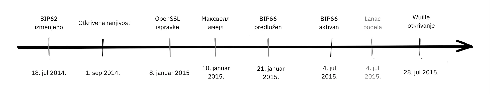


Ključna pouka iz ovoga je da BIP-ovi treba da budu više ili manje *atomski*, što znači da treba da budu dovoljno kompletni da pruže nešto korisno ili reše specifičan problem, ali dovoljno mali da omoguće široku podršku među korisnicima. Što više stvari stavite u BIP, manja je šansa za prihvatanje.


##### Podele usled rudarenja bez validacije


Nažalost, priča o BIP66 se tu nije završila. Kada je BIP66 aktiviran, ispostavilo se da je prilično neuredno jer neki rudari nisu verifikovali blokove koje su pokušavali da prošire. Ovo se naziva rudarenje bez validacije, ili SPV-rudarenje (kao u Simplified Payment Verification). Poruka upozorenja je poslata na Bitcoin čvorove sa linkom ka [web stranici koja opisuje problem](https://Bitcoin.org/en/alert/2015-07-04-spv-Mining):


> Rano ujutru 4. jula 2015, prag od 950/1000 (95%) je dostignut. Nedugo zatim, mali procenat rudara (deo neažuriranih 5%) je iskopao nevažeći blok – što je bilo očekivano. Nažalost, ispostavilo se da je otprilike polovina mrežnog heš protoka bila rudarenje bez potpune validacije blokova (nazvana SPV rudarenje), i gradila je nove blokove na vrhu tog nevažećeg bloka.

Stranica sa upozorenjem je uputila ljude da sačekaju 30 dodatnih potvrda nego što bi to inače činili u slučaju da koriste starije verzije Bitcoin Core.


Podela pomenuta gore dogodila se 2015-07-04 u 02:10 UTC nakon visine bloka [363730 (https://Mempool.space/block/000000000000000006a320d752b46b532ec0f3f815c5dae467aff5715a6e579e). Ovaj problem je rešen u 03:50 istog dana, nakon što je iskopano 6 nevažećih blokova. Nažalost, isti problem se ponovo dogodio sledećeg dana, tj. 2015-07-05 u 21:50, ali ovaj put nevažeća grana je trajala samo 3 bloka.


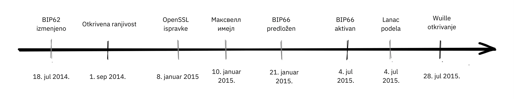

Događaji koji su doveli do BIP66, njegovo uvođenje i posledice predstavljaju veoma dobru studiju slučaja o tome koliko pažljivi Bitcoin programeri moraju biti. Nekoliko ključnih zaključaka iz BIP66:


- Ravnoteža između otvorenosti i neobjavljivanja ranjivosti je delikatna.
- Implementacija popravki za neobjavljene ranjivosti je složena igra.
- Zadržavanje konsenzusa je teško.
- Softver koji nije namenjen za konsenzusne sisteme je generalno rizičan.
- BIP-ovi bi trebalo da budu relativno samostalne celine.


### Zaključak o ponašanju sistema u kriznim situacijama


Bitcoin ima greške. Ljudi koji otkriju greške se podstiču da ih odgovorno prijave Bitcoin developerima, kako bi mogli da isprave grešku bez njenog javnog otkrivanja. Idealno bi bilo da se ispravka greške prikaže kao poboljšanje performansi ili neka druga dimna zavesa.


Pregledali smo neke od ozbiljnijih problema koji su se pojavili tokom godina i kako su rešeni. Neki su otkriveni javno putem eksploatacija, dok su drugi odgovorno prijavljeni i mogli su biti popravljeni pre nego što su zlonamerni akteri imali priliku da ih iskoriste.


## Pitanja za diskusiju

<chapterId>91462ca7-f09c-55da-a5b9-3e211de31da5</chapterId>


Ova pitanja za diskusiju nisu samo rekapitulacija sadržaja u kursu "Filozofija razvoja Bitcoina", već su namenjena da vas podstaknu na dalje istraživanje, zato obavezno istražujte dalje.


Možete proveriti koliko dobro razumete pisanjem [mini-eseja](https://www.youtube.com/watch?v=N4YjXJVzoZY) od 100-300 reči birajući temu iz ovog skupa pitanja. Ako želite povratne informacije o svom radu, možete ga poslati na mini-essay@planb.network, bićemo više nego srećni da ga pregledamo.


#### Decentralizacija


- Decentralizacija je teška. Zašto prolazimo kroz sve ove poteškoće da bi to funkcionisalo? Da li bismo mogli da se odlučimo za hibridni pristup, gde su neki delovi centralizovani, a drugi nisu?
- Da li decentralizacija uvodi problem dvostrukog trošenja, ili problem dvostrukog trošenja zahteva decentralizaciju? Kako je Satoshi rešio problem dvostrukog trošenja?
- U kojim aspektima je Bitcoin i dalje najpodložniji cenzuri, i zašto je cenzura tako loša stvar? Postoje li neki argumenti u korist cenzure?
- Navodi se da je Bitcoin bez dozvole. Da li postoje neki drugi načini plaćanja koje biste mogli smatrati bez dozvole?


#### Odsustvo potrebe za poverenjem


- Odsustvo potrebe za poverenjem je često spektar, a ne binarna. Koji aspekti Bitcoina su više bez potrebe za poverenjem, a koji obično uključuju viši nivo poverenja? Mogu li se ublažiti?
- Želite da pokrenete full node kako biste mogli u potpunosti da validirate sve transakcije. Preuzimate Bitcoin Core sa https://Bitcoin.org/en/download. Gde se oslanjate na poverenje, a gde to uopšte nije potrebno??
- Možete li izgraditi sistem bez potrebe za poverenjem na vrhu pouzdanog sistema?


#### Privatnost


- Koje su neke važne koristi koje korisnik stiče kada održava dobru privatnost prilikom interakcije sa Bitcoinom? Koje su neke altruističke koristi za mrežu?
- Kako ponovno korišćenje adresa utiče na vašu privatnost?
- Bitcoin koristi UTXO model, dok neke alternativne kriptovalute koriste account model. Koje su implikacije ovog izbora na privatnost?


#### Ograničena ponuda


- Kakva je veza između konačne Bitcoin ponude i izdavanja Bitcoin novčića putem coinbase transakcije? Kakva je veza između izdavanja novčića i budžeta za bezbednost, i kako su oni u sukobu?
- Koje parametre je Satoshi mogao da promeni da bi izmenio Bitcoin-vu limitiranost ponude? Šta bi se promenilo da je odlučio da ograniči ponudu na 1 milion? Šta ako bi bilo 1 trilion?
- Zašto neki ljudi zagovaraju povećanje Bitcoin ponude? Mislite li da će se to dogoditi?


#### Nadogradnja


- Šta je Speedy Trial i zašto je bilo potrebno aktivirati Taproot?
- Zašto nam je potreban tako visok procenat rudara za nadogradnju u soft forku? Zašto prag nije samo 51%?


#### Razmišljanje iz ugla protivnika


- Šta je sybil napad i zašto je decentralizovana mreža tako podložna njemu?
- Zašto je važno da svi igrači u Bitcoin mreži - a ne samo programeri - razmišljaju iz ugla protivnika?


#### Otvoreni kod


- Samo nekolicina održavatelja ima potrebne GitHub dozvole za spajanje koda u [Bitcoin Core](https://github.com/Bitcoin/Bitcoin) repozitorijum. Zar to nije u suprotnosti sa mrežom bez dozvola?
- Da li je proces razvoja otvorenog koda podložan Sybil napadu? Ako jeste, kako biste to sprečili?
- Koje su prednosti i nedostaci oslanjanja na open source biblioteke trećih strana, i koji pristup je primenjen sa Bitcoin Core?
- Na koje načine nam je potrebno pregleda osim samog pregleda koda? Kako odrediti koliko pregleda je dovoljno?
- Kako osigurati da uvek ima dovoljno ljudi sa stručnim znanjem koji rade na Bitcoin-u? Šta se dešava kada ih nema, i kako procenjujemo njihov integritet i namere?


#### Skaliranje


- Tvrdnja je da šardovanje nudi prednosti skaliranja po cenu složenosti. Zašto bismo ili ne bismo trebali usvojiti tehnološka poboljšanja samo zato što su teška za razumevanje, čak i ako deluju tehnološki ispravno?
- Koje su neke od metoda unutrašnjeg skaliranja uvedene u Bitcoin-u?
- Zašto je vertikalno skaliranje mnogo teže u decentralizovanom sistemu? Šta je sa horizontalnim skaliranjem?
- Čini se da nismo ni blizu postizanja konsenzusa o tome kako bismo mogli uključiti ceo svet na Bitcoin. Zar Satoshi nije trebalo barem da razmisli o putu ka tome, pre nego što je izrudario prvi blok 2009?
- Kako biste klasifikovali (vertikalna, horizontalna, unutrašnja, ili nije tehnika skaliranja) svaku od sledećih: sharding, povećanje veličine bloka, SegWit, SPV čvorovi, centralizovane berze, Lightning mreža, smanjenje intervala bloka, Taproot, bočni lanci?


# Završni deo

<partId>4b6ff4ef-b9ea-4c48-b05f-62d41a38fbbb</partId>

## Recenzije i ocene

<chapterId>d334a837-df46-4989-9cad-8d8779147dbe</chapterId>

<isCourseReview>true</isCourseReview>

## Završni ispit

<chapterId>b2b498c0-a787-11f0-bd09-e3fc5cfa90af</chapterId>

<isCourseExam>true</isCourseExam>

## Zaključak

<chapterId>b77ed55c-b13a-430b-a212-37aab527b9e7</chapterId>

<isCourseConclusion>true</isCourseConclusion>

