# Djupdykning i filosofin bakom Bitcoin Development


Bitcoin Development Philosophy är en kurs för Bitcoin-utvecklare som redan förstår grunderna i begrepp och processer som Proof-of-Work, blockbyggande och transaktionslivscykeln, och som vill höja nivån genom att få en djupare förståelse för Bitcoin:s designavvägningar och filosofi.

Den ska hjälpa nya utvecklare att ta till sig de viktigaste lärdomarna från över ett decennium av Bitcoin-utveckling och offentlig debatt, samtidigt som den ger dem ett användbart sammanhang för att utvärdera nya idéer (bra och dåliga!).


### Vad kan du förvänta dig?


Som nämnts ovan är detta en praktisk guide för Bitcoin-utvecklare. Bitcoin är dock ett brett och komplext ämne och vi kan omöjligen täcka alla dess aspekter här. Med den här kursen hoppas vi kunna diskutera de nödvändiga funktionerna för att få igång din utvecklingsaktivitet samt göra det möjligt för dig att utforska den ytterligare på egen hand.


Det finns många människor som är involverade i Bitcoin; eftersom vissa av dem har motsatta åsikter, kan du här hitta resurser som uttrycker motsägelsefulla idéer. Vi försöker dock alltid hålla oss till faktaområdet, där åsikter inte spelar någon roll.


### Vem skrev det här?


Denna kurs är anpassad från boken med samma namn vars huvudförfattare är Kalle Rosenbaum, och Linnéa Rosenbaum har bidragit som medförfattare.

Boken beställdes och finansierades av [Chaincode Labs](https://learning.chaincode.com/), ett utvecklingscenter som driver utbildningsprogram för utvecklare som vill lära sig mer om Bitcoin-utveckling.


+++


# Inledning

<partId>58c48e9b-e285-4dc6-8952-6cc5140b1313</partId>


## Kursöversikt

<chapterId>28b7256b-9cb0-463e-a82d-d732be86c98c</chapterId>


Välkommen till denna kurs BTC 303 om Bitcoin:s utvecklingsfilosofi.


Bitcoin är mer än bara en kryptovaluta, den förkroppsligar en filosofisk vision om decentralisering, integritet, pålitlighet och motståndskraft. Den här kursen är utformad speciellt för utvecklare som redan är bekanta med Bitcoin:s tekniska grunder och som nu vill fördjupa sin förståelse för de principer som ligger till grund för Bitcoin:s design och styrning.


Under den här kursen kommer du att få klarhet i de grundläggande värderingar och strategier som har styrt Bitcoin:s utveckling i över ett decennium. Genom att utforska dessa teman på djupet kommer du att utveckla det kritiska perspektiv som behövs för att utvärdera och bidra till framtida utveckling med tillförsikt.


### Bitcoin:s centrala värden


Vad gör Bitcoin unik? Detta avsnitt avslöjar de grundläggande värdena i hjärtat av Bitcoin:s design. Du kommer att utforska **decentralisering**, hörnstenen som säkerställer att ingen enskild enhet kontrollerar nätverket; **trolöshet**, nyckeln till att ta bort tredjepartsberoende; **privatliv**, avgörande för både individuell frihet och systemintegritet; och **finite Supply**, den kodade garantin för knapphet som formar Bitcoin:s ekonomiska identitet. Att behärska dessa begrepp gör att du fullt ut kan förstå Bitcoin:s styrkor och sårbarheter.


### Bitcoin Styrning


Att navigera i det komplexa styrningslandskapet i Bitcoin kräver mer än teknisk expertis, det kräver en förståelse för Bitcoin:s unika inställning till konsensus och beslutsfattande. I det här avsnittet kommer du att dyka in i mekanismerna och filosofierna bakom kritiska processer som protokolluppgraderingar, nödvändigheten av kontroversiellt tänkande, styrkan i samarbete med öppen källkod, de pågående utmaningarna med skalning och de nyanserade strategier som krävs när saker oundvikligen går fel. Utrustad med denna kunskap kommer du att vara beredd att inte bara delta utan även forma Bitcoin:s framtid på ett effektivt och ansvarsfullt sätt.


Är du redo att ta nästa steg i din Bitcoin-resa? Låt oss börja!


***N.B.**: Om du stöter på några obekanta termer relaterade till Bitcoin under kursen, vänligen se [ordlistan](https://planb.academy/resources/glossary) för att hitta definitioner.*


# Bitcoin Centrala värden

<partId>2d6c683b-54c8-5465-b2ca-4e96a6828834</partId>


## Decentralisering

<chapterId>9397c84b-0038-5d0e-88d5-11767ce8182d</chapterId>


Här analyseras vad decentralisering är och varför det är viktigt för att Bitcoin ska fungera. Vi skiljer mellan

decentralisering av miners och decentralisering av fulla noder, och diskutera vad de tillför för censurresistens, en av Bitcoin:s mest centrala egenskaper.


Diskussionen övergår sedan till att förstå neutralitet - eller tillståndslöshet gentemot användare, miners och utvecklare - vilket är en nödvändig egenskap för alla decentraliserade system. Slutligen tar vi upp hur Hard det kan vara att förstå ett decentraliserat system som Bitcoin, och presenterar några mentala modeller som kan hjälpa dig att förstå det.


Ett system utan någon central kontrollpunkt kallas för att vara *decentraliserat*. Bitcoin är utformat för att undvika att ha en central kontrollpunkt, eller mer exakt en *central censurpunkt*.


Decentralisering är ett sätt att uppnå *censurmotstånd*.


Det finns två huvudsakliga aspekter av decentralisering i Bitcoin: Decentralisering av Miner och decentralisering av Full node.


Miner Decentralisering avser det faktum att transaktionsbehandling inte utförs eller samordnas av någon central enhet. Full node Decentralisering avser det faktum att validering av blocken, dvs. de data som miners producerar, görs i utkanten av nätverket, i slutändan av dess användare, och inte av ett fåtal betrodda myndigheter.


### Miner decentralisering


Det hade gjorts försök att skapa digitala valutor före Bitcoin, men de flesta av dem misslyckades på grund av bristande decentralisering av styrningen och censurmotstånd.


Miner decentralisering i Bitcoin innebär att *beställningen av transaktioner* inte utförs av någon enskild enhet eller fast uppsättning enheter. Det utförs kollektivt av alla de aktörer som vill delta i det; detta gruvarbetarkollektiv är en dynamisk uppsättning användare. Vem som helst kan ansluta sig eller lämna som de vill. Denna egenskap gör Bitcoin censurresistent.


Om Bitcoin var centraliserad skulle den vara sårbar för dem som ville censurera den, till exempel regeringar. Det skulle gå samma öde till mötes som tidigare försök att skapa digitala pengar. I inledningen av [a paper](https://www.blockstream.com/sidechains.pdf) med titeln "Enabling Blockchain Innovations with Pegged Sidechains" förklarar författarna hur tidiga versioner av digitala pengar inte var utrustade för en kontradiktorisk miljö (se även kapitlet om kontradiktoriskt tänkande i nästa del).


David Chaum introducerade digitala kontanter som ett forskningsämne 1983, i en miljö med en central server som är betrodd att förhindra Double-spending. För att minska integritetsrisken för enskilda personer från denna centrala betrodda part och för att upprätthålla fungibilitet introducerade Chaum den blinda signaturen, som han använde för att tillhandahålla ett kryptografiskt medel för att förhindra länkning av den centrala serverns signaturer (som representerar mynt), samtidigt som den centrala servern fortfarande kan förhindra dubbelspendering.

Kravet på en central server blev akilleshälen för digitala kontanter [Gri99]. Även om det är möjligt att distribuera denna enda felpunkt genom att ersätta den centrala serverns signatur med en tröskelsignatur från flera undertecknare, är det viktigt för granskningsbarheten att undertecknarna är distinkta och identifierbara. Detta gör fortfarande systemet sårbart för fel, eftersom varje undertecknare kan misslyckas, eller fås att misslyckas, en efter en.


Det stod klart att det inte var ett hållbart alternativ att använda en central server för att beställa transaktioner på grund av den stora risken för censur. Även om man ersatte den centrala servern med en federation av en fast uppsättning av n servrar, av vilka minst m måste godkänna en beställning, skulle det fortfarande finnas svårigheter. Problemet skulle nämligen förskjutas till att användarna måste komma överens om denna uppsättning av n servrar samt om hur man ska ersätta skadliga servrar med bra utan att förlita sig på en central myndighet.


Låt oss fundera över vad som skulle kunna hända om Bitcoin var censurerbart. Censorn skulle kunna pressa användare att identifiera sig, att deklarera var deras pengar kommer ifrån eller vad de köper med dem innan de låter sina transaktioner komma in i Blockchain.


Avsaknaden av censurmotstånd skulle också göra det möjligt för censorn att tvinga användarna att anta nya systemregler. De skulle till exempel kunna införa en förändring som gjorde det möjligt för dem att blåsa upp pengarna Supply och därigenom berika sig själva. I ett sådant fall skulle en användare som verifierar block ha tre alternativ för att hantera de nya reglerna:


- Anta: Acceptera ändringarna och inför dem i sin Full node.
- Avvisa: Vägrar att anta ändringarna; detta lämnar användaren med ett system som inte längre behandlar transaktioner, eftersom censurens blockeringar nu anses ogiltiga av användarens Full node.
- Flytta: Utse en ny central kontrollpunkt; alla användare måste ta reda på hur de ska samordna sig och sedan komma överens om den nya centrala kontrollpunkten.


Om de lyckas kommer samma problem troligen att dyka upp igen någon gång i framtiden, med tanke på att systemet fortfarande är lika censurerbart som tidigare.


Inget av dessa alternativ är till nytta för användaren.


Censurmotstånd genom decentralisering är det som skiljer Bitcoin från andra penningsystem, men det är inte lätt att åstadkomma på grund av *Double-spending-problemet*. Detta är problemet med att se till att ingen kan spendera samma mynt två gånger, en fråga som många trodde var omöjlig att lösa på ett decentraliserat sätt. Satoshi Nakamoto skriver i sin [Bitcoin whitepaper](https://planb.academy/bitcoin.pdf) om hur man löser Double-spending-problemet:


> I det här dokumentet föreslår vi en lösning på Double-spending-problemet genom att använda en peer-to-peer-distribuerad Timestamp-server för att generate beräkna bevis för den kronologiska ordningen på transaktioner.


Här använder han den märkligt klingande frasen "peer-to-peer distributed Timestamp server". Nyckelordet här är *distribuerad*, vilket i detta sammanhang betyder att det inte finns någon central kontrollpunkt. Nakamoto fortsätter sedan med att förklara hur Proof-of-Work är lösningen.

Ändå förklarar ingen det bättre än

[Gregory Maxwell on Reddit](https://www.reddit.com/r/Bitcoin/comments/ddddfl/question_on_the_vulnerability_of_bitcoin/f2g9e7b/), där han svarar på någon som föreslår att begränsa gruvarbetarnas Hash-kraft för att undvika potentiella 51%-attacker:


> Ett decentraliserat system som Bitcoin använder ett offentligt val. Men du kan inte bara ha en omröstning av "människor" i ett decentraliserat system eftersom det skulle kräva en centraliserad part för att auktorisera människor att rösta. Istället använder Bitcoin en omröstning om datorkraft eftersom det är möjligt att verifiera datorkraft utan hjälp av någon centraliserad
tredje part.


Inlägget förklarar hur det decentraliserade Bitcoin-nätverket kan komma överens om transaktionsbeställning genom användning av Proof-of-Work.


Han avslutar sedan med att säga att 51%-attacken inte är särskilt oroande jämfört med att människor inte bryr sig om eller inte förstår Bitcoin:s decentraliseringsegenskaper:


> En mycket större risk för Bitcoin är att allmänheten som använder den inte förstår, inte bryr sig om och inte skyddar de decentraliseringsegenskaper som gör den värdefull jämfört med centraliserade alternativ i första hand.

Slutsatsen är viktig. Om människor inte skyddar Bitcoin:s decentralisering, som är en proxy för dess censurmotstånd, kan Bitcoin falla offer för centraliserande krafter, tills den är så centraliserad att censur blir en sak. Då är det mesta, om inte allt, av dess värdeproposition borta. Detta leder oss till nästa avsnitt om Full node:s decentralisering.


### Full node Decentralisering


I styckena ovan har vi mest talat om Miner-decentralisering och hur centralisering av gruvarbetare kan möjliggöra censur. Men det finns också en annan aspekt av decentralisering, nämligen *Full node decentralisering*.


Vikten av Full node-decentralisering är relaterad till förtroende. Anta att en användare slutar köra sin egen Full node på grund av, till exempel, en oöverkomlig ökning av driftskostnaden. I så fall måste de interagera med Bitcoin-nätverket på något annat sätt, eventuellt genom att använda webbplånböcker eller lättviktsplånböcker, vilket kräver en viss nivå av förtroende för leverantörerna av dessa tjänster.


Användaren går från att direkt tillämpa nätverkets konsensusregler till att lita på att någon annan gör det. Anta nu att de flesta användare delegerar verkställandet av konsensus till en betrodd enhet. I så fall kan nätverket snabbt bli centraliserat och nätverksreglerna kan ändras av illvilliga aktörer som konspirerar.


I [a

Bitcoin Magazine article](https://bitcoinmagazine.com/technical/decentralist-perspective-Bitcoin-might-need-small-blocks-1442090446) intervjuar Aaron van Wirdum Bitcoin-utvecklare om deras syn på decentralisering och riskerna med att öka Bitcoin:s maximala blockstorlek. Denna diskussion var ett Hot-ämne under perioden 2014-2017, då många människor argumenterade för att öka blockstorleksgränsen för att möjliggöra mer transaktionsgenomströmning.


Ett starkt argument mot att öka blockstorleken är att det ökar kostnaden för verifiering Om verifieringskostnaden ökar kommer det att få vissa användare att sluta köra sina fulla noder. Detta kommer i sin tur att leda till att fler människor inte kan använda systemet på ett Trustless-sätt.


Pieter Wuille citeras i artikeln, där han förklarar riskerna med Full node-centralisering:


> Om många företag kör en Full node betyder det att de alla måste övertygas om att implementera en annan regeluppsättning. Med andra ord: decentraliseringen av blockvalideringen är det som ger konsensusreglerna deras vikt.
> Men om Full node-antalet skulle sjunka mycket lågt, till exempel för att alla använder samma webbplånböcker, börser och SPV eller mobila plånböcker, kan reglering bli verklighet. Och om myndigheterna kan reglera konsensusreglerna betyder det att de kan ändra allt som gör Bitcoin till Bitcoin. Till och med 21 miljoner Bitcoin-gränsen.

Så där, ja. Bitcoin-användare bör köra sina egna fullständiga noder för att avskräcka tillsynsmyndigheter och stora företag från att försöka ändra konsensusreglerna.


### Neutralitet


Bitcoin är neutral, eller tillståndslös, som folk vill kalla det. Det innebär att Bitcoin inte bryr sig om vem du är eller vad du använder den till.


Bitcoin är neutralt, vilket är bra och det enda sättet det kan fungera på. Om det kontrollerades av en organisation skulle det bara vara en annan virtuell objekttyp och jag skulle ha noll intresse för det


Så länge du följer reglerna är du fri att använda den som du vill, utan att be någon om lov. Detta inkluderar *Mining*, *transaktioner* i, och *bygga protokoll och tjänster* ovanpå Bitcoin:


- Om *Mining* var en tillståndsprocess skulle vi behöva en central myndighet för att välja vem som får bryta. Detta skulle troligen leda till att gruvarbetare måste underteckna juridiska kontrakt där de skulle komma överens om

att censurera transaktioner i enlighet med den centrala myndighetens nycker, vilket motverkar syftet med Mining i första hand.


- Om människor som *transagerar* i Bitcoin måste tillhandahålla personlig information, förklara vad deras transaktioner är till för eller på annat sätt bevisa att de är värda att transagera, skulle vi också behöva en central myndighet för att godkänna användare eller transaktioner. Återigen skulle detta leda till censur och uteslutning.


- Om utvecklare var tvungna att be om tillstånd för att *bygga protokoll* ovanpå Bitcoin skulle endast de protokoll som tillåts av den centrala kommittén för beviljande av utvecklare utvecklas. Detta skulle, på grund av statlig intervention, oundvikligen utesluta alla integritetsskyddande protokoll och alla försök att förbättra decentraliseringen.


På alla nivåer kommer försök att införa begränsningar för vem som får använda Bitcoin för vad att skada Bitcoin till den punkt där det inte längre lever upp till sitt värdeförslag.


Pieter Wuille https://Bitcoin.stackexchange.com/a/92055/69518[svarar på en fråga om Stack Exchange] om hur Blockchain förhåller sig till vanliga databaser. Han förklarar hur tillståndslöshet kan uppnås genom användning av Proof-of-Work i kombination med ekonomiska incitament.


Han avslutar:


> Att använda Trustless konsensusalgoritmer som PoW lägger till något som ingen annan konstruktion ger dig (tillståndslöst deltagande, vilket innebär att det inte finns någon fastställd grupp av deltagare som kan censurera dina ändringar), Att använda Trustless konsensusalgoritmer som PoW lägger till något nej men kommer till en hög kostnad, och dess ekonomiska antaganden gör det i stort sett bara användbart för system som definierar sin egen kryptovaluta.
> Det finns förmodligen bara en plats i världen för en eller ett fåtal faktiskt begagnade sådana här.

Han förklarar att systemet troligen behöver en egen valuta för att uppnå tillståndslöshet, vilket "begränsar användningsfallen till att i praktiken bara omfatta kryptovalutor". Detta beror på att tillståndslöst deltagande, eller Mining, kräver ekonomiska incitament som är inbyggda i själva systemet.


### Decentralisering av groddar


En övertygande aspekt av Bitcoin är hur Hard det är att förstå att ingen kontrollerar det. Det finns inga kommittéer eller chefer i Bitcoin. Gregory Maxwell, återigen [på Bitcoin subreddit](https://www.reddit.com/r/Bitcoin/comments/s82t2n/comment/htdte7w/?utm_source=share&utm_medium=web2x&context=3), jämför detta med det engelska språket på ett spännande sätt:


> Många människor har en Hard tid att förstå autonoma system, det finns många i deras liv saker som det engelska språket - men människor tar dem bara för givet och tänker inte ens på dem som system. De är fast i ett centraliserat sätt att tänka där allt de tänker på som en "sak" har en myndighet som kontrollerar det.
>

> Bitcoin fokuserar inte på någonting. Olika personer som har antagit Bitcoin valde av egen fri vilja att marknadsföra det, och hur de väljer att göra det är deras egen sak. Myndighetsfixerade människor kan se dessa aktiviteter och tro att de är någon operation av Bitcoin-myndigheten, men ingen sådan myndighet existerar.


Bitcoin:s sätt att fungera genom decentralisering liknar den extraordinära kollektiva intelligens som finns hos många arter i naturen. Datavetaren Radhika Nagpal talar i ett [Ted talk](https://www.ted.com/talks/radhika_nagpal_what_intelligent_machines_can_learn_from_a_school_of_fish) om det kollektiva beteendet hos fiskstim och hur forskare försöker efterlikna det med hjälp av robotar.


> För det andra, och det som jag fortfarande tycker är mest anmärkningsvärt, är att vi vet att det inte finns några ledare som övervakar detta fiskstim. I stället uppstår detta otroliga kollektiva beteende enbart genom interaktionen mellan fiskarna.
> På något sätt finns det dessa interaktioner eller regler för engagemang mellan grannfiskar som gör att allt fungerar.

Hon påpekar att många system, både naturliga och artificiella, kan fungera utan ledare och att de är kraftfulla och motståndskraftiga. Varje individ interagerar bara med sin omedelbara omgivning, men tillsammans bildar de något enormt.


Oavsett vad du tycker om Bitcoin gör dess decentraliserade natur det svårt att kontrollera. Bitcoin existerar, och det finns inget du kan göra åt det. Det är något som ska studeras, inte debatteras.


### Slutsats om decentralisering


Vi skiljer mellan Full node-decentralisering och Mining-decentralisering. Mining-decentralisering är ett sätt att uppnå censurmotstånd, medan Full node-decentralisering är det som gör att nätverkets konsensusregler Hard inte ändras utan brett stöd bland användarna.


Den decentraliserade karaktären hos Bitcoin möjliggör neutralitet gentemot utvecklare, användare och miners. Vem som helst kan delta utan att be om tillstånd.


Decentraliserade system kan vara svåra att förstå sig på, men det finns vissa mentala modeller som kan vara till hjälp, till exempel det engelska språket eller fiskskolor.


## Otillförlitlighet

<chapterId>0506ba61-16a3-543c-95fa-3f3e2dd64121</chapterId>


I det här kapitlet analyseras begreppet "trustlessness", vad det innebär ur ett datavetenskapligt perspektiv och varför Bitcoin måste vara Trustless för att behålla sitt värdeerbjudande.

Vi pratar sedan om vad det innebär att använda Bitcoin på ett Trustless-sätt, och vilka slags garantier en Full node kan och inte kan ge dig.

I det sista avsnittet tittar vi på den verkliga interaktionen mellan Bitcoin och faktiska programvaror eller användare, och behovet av att göra avvägningar mellan bekvämlighet och tillförlitlighet för att få något gjort överhuvudtaget.


Folk säger ofta saker som "Bitcoin är bra för att det är Trustless".


Vad menar de med Trustless? Pieter Wuille förklarar denna allmänt använda term på [Stack Exchange](https://Bitcoin.stackexchange.com/a/45674/69518):


> Den tillit vi talar om i "Trustless" är en abstrakt teknisk term. Ett distribuerat system kallas Trustless när det inte kräver några betrodda parter för att fungera korrekt.

I korthet hänvisar ordet *Trustless* till en egenskap hos Bitcoin-protokollet varigenom det logiskt kan fungera utan "några betrodda parter". Detta skiljer sig från det förtroende som du oundvikligen måste sätta till den programvara eller maskinvara du kör. Mer om denna senare aspekt av förtroende kommer att diskuteras längre fram i detta kapitel.


I centraliserade system förlitar vi oss på en central aktörs rykte för att försäkra oss om att denne kommer att ta hand om säkerheten eller backa tillbaka vid problem, samt på rättssystemet för att sanktionera eventuella överträdelser. Dessa förtroendekrav är problematiska i pseudonyma decentraliserade system - det finns ingen möjlighet till regress så det kan egentligen inte finnas något förtroende. I introduktionen till [Bitcoin whitepaper](https://Bitcoin.org/Bitcoin.pdf) beskriver Satoshi Nakamoto detta problem:


> Handeln på Internet har kommit att förlita sig nästan uteslutande på finansiella institutioner som fungerar som betrodda tredje parter för att hantera elektroniska betalningar.
> Även om systemet fungerar tillräckligt bra för de flesta transaktioner lider det fortfarande av de inneboende svagheterna i den förtroendebaserade modellen.  Helt icke-reversibla transaktioner är egentligen inte möjliga, eftersom finansinstituten inte kan undvika att medla i tvister. Kostnaden för medling ökar transaktionskostnaderna, vilket begränsar den minsta praktiska transaktionsstorleken och utesluter små tillfälliga transaktioner, och det finns en bredare kostnad i förlusten av möjligheten att göra icke-reversibla betalningar för icke-reversibla tjänster.
> Med möjlighet till reversering ökar behovet av förtroende. Handlarna måste vara försiktiga med sina kunder och kräva mer information av dem än vad de annars skulle behöva.  En viss andel bedrägerier accepteras som oundvikliga. Dessa kostnader och osäkerheten kring betalningen kan undvikas genom att man använder fysisk valuta, men det finns ingen mekanism för att göra betalningar via en kommunikationskanal utan en betrodd part

Det verkar som om vi inte kan ha ett decentraliserat system baserat på förtroende, och det är därför förtroende är viktigt i Bitcoin.


För att använda Bitcoin på ett Trustless-sätt måste du köra en fullt validerande Bitcoin-nod. Först då kan du verifiera att de block du får från andra följer konsensusreglerna, till exempel att schemat för myntutgivning hålls och att inga dubbla utgifter sker på Blockchain. Om du inte kör en Full node lägger du ut verifieringen av Bitcoin-block på någon annan och litar på att de säger sanningen, vilket innebär att du inte använder Bitcoin på ett tillförlitligt sätt.


David Harding har skrivit [en artikel på webbplatsen Bitcoin.org](https://Bitcoin.org/en/Bitcoin-core/features/validation) som förklarar hur det faktiskt hjälper dig att köra en Full node - eller att använda Bitcoin utan att lita på den:


> Bitcoin-valutan fungerar bara när människor accepterar bitcoins i Exchange för andra värdefulla saker. Det betyder att det är de personer som accepterar bitcoins som ger den värde och som får bestämma hur Bitcoin ska fungera.
>

> När du accepterar bitcoins har du befogenhet att genomdriva Bitcoin:s regler, till exempel att förhindra konfiskering av en persons bitcoins utan tillgång till den personens privata nycklar.
>

> Tyvärr lägger många användare ut sin verkställighetskraft på entreprenad. Detta lämnar Bitcoin:s decentralisering i ett försvagat tillstånd där en handfull gruvarbetare kan samarbeta med en handfull banker och gratistjänster för att ändra Bitcoin:s regler för alla de icke-verifierande användare som outsourcat sin makt.
>

> Till skillnad från andra plånböcker upprätthåller Bitcoin Core reglerna - så om gruvarbetarna och bankerna ändrar reglerna för sina icke-verifierande användare kommer dessa användare inte att kunna betala Bitcoin Core-användare med full validering som du.


Han säger att om du kör en Full node kan du verifiera alla aspekter av Blockchain utan att lita på någon annan, för att säkerställa att de mynt du får från andra är äkta. Det här är bra, men det finns en viktig sak som en Full node inte kan hjälpa dig med: den kan inte förhindra dubbla utgifter genom kedjeomskrivningar:


> Observera att även om alla program - inklusive Bitcoin Core - är sårbara för kedjeomskrivningar, tillhandahåller Bitcoin en försvarsmekanism: ju fler bekräftelser dina transaktioner har, desto säkrare är du. Det finns inget känt decentraliserat försvar som är bättre än det.

Oavsett hur avancerad din programvara är måste du ändå lita på att de block som innehåller dina mynt inte skrivs om. Som Harding påpekar kan man dock invänta ett antal bekräftelser, varefter man anser att sannolikheten för att en kedja skrivs om är tillräckligt liten för att vara acceptabel.


Incitamenten för att använda Bitcoin på ett Trustless-sätt stämmer överens med systemets behov av Full node-decentralisering. Ju fler som använder sina egna fullständiga noder, desto mer Full node decentraliseras och desto starkare står Bitcoin mot illvilliga ändringar av protokollet. Men tyvärr, som förklaras i avsnittet om Full node-decentralisering, väljer användare ofta betrodda tjänster som en följd av den oundvikliga avvägningen mellan tillitslöshet och bekvämlighet.


Bitcoin:s pålitlighet är absolut nödvändig ur ett systemperspektiv. Under 2018 talade Matt Corallo, [om trustlessness](https://btctranscripts.com/baltic-honeybadger/2018/trustlessness-scalability-and-directions-in-security-models/) på den baltiska Honeybadger-konferensen i Riga.


Kärnan i det samtalet är att man inte kan bygga Trustless-system ovanpå ett betrott system, men man kan bygga betrodda system - till exempel ett Wallet-system för vårdnadshavare - ovanpå ett Trustless-system.


En Trustless-bas Layer möjliggör olika avvägningar på högre nivåer


Denna säkerhetsmodell gör det möjligt för systemkonstruktören att välja mellan olika avvägningar

som är rimliga för dem utan att tvinga dessa kompromisser på andra.


### Lita inte på någon, verifiera


Bitcoin fungerar pålitligt, men du måste fortfarande lita på din programvara och maskinvara i viss utsträckning. Det beror på att din programvara eller maskinvara kanske inte är programmerad att göra det som står på förpackningen. Ett exempel:


- CPU:n kan vara skadligt utformad för att upptäcka kryptografiska operationer med privata nycklar och läcka data om privata nycklar.
- Operativsystemets slumptalsgenerator kanske inte är så slumpmässig som den påstår.
- Bitcoin Core kan ha smugit in kod som skickar dina privata nycklar till någon dålig aktör.


Så förutom att köra en Full node måste du också se till att du kör det du avser att köra. Reddit-användaren brianddk [skrev en artikel](https://www.reddit.com/r/Bitcoin/comments/smj1ep/bitcoin_v220_and_guix_stronger_defense_against/) om de olika tillitsnivåer du kan välja mellan när du verifierar din programvara. I avsnittet "Trusting the builders" talar han om reproducerbara builds:


> Reproducerbara byggen är ett sätt att utforma programvara så att många community-utvecklare var och en kan bygga programvaran och se till att det slutliga installationsprogrammet som byggs är identiskt med det som andra utvecklare producerar. Med ett mycket offentligt, reproducerbart projekt som Bitcoin behöver ingen enskild utvecklare vara helt betrodd. Många utvecklare kan alla utföra byggandet och intyga att de producerade samma fil som den som den ursprungliga byggaren signerade digitalt.

I artikeln definieras 5 nivåer av förtroende: förtroende för webbplatsen, byggarna, kompilatorn, kärnan och hårdvaran.


För att ytterligare fördjupa ämnet reproducerbara byggen gjorde Carl Dong [en presentation om Guix](https://btctranscripts.com/breaking-Bitcoin/2019/Bitcoin-build-system/) där han förklarade varför det kan vara problematiskt att lita på operativsystem, bibliotek och kompilatorer och hur man löser det med ett system som heter Guix, som används av Bitcoin Core idag.


> Så vad kan vi göra åt det faktum att vår verktygskedja kan ha en massa betrodda binära filer som kan vara reproducerbart skadliga? Vi måste vara mer än reproducerbara. Vi måste vara bootstrappable. Vi kan inte ha så många binära verktyg som vi måste ladda ner och lita på från externa servrar som kontrolleras av andra organisationer.
>

> Vi bör veta hur dessa verktyg är byggda och exakt hur vi kan gå igenom processen för att bygga dem igen, helst från en mycket mindre uppsättning betrodda binärer. Vi måste minimera vår betrodda uppsättning binärer så mycket som möjligt och ha en lätt granskningsbar väg från dessa verktygskedjor till vad vi använder för att bygga Bitcoin. Detta gör att vi kan maximera verifieringen och minimera förtroendet.

Han förklarar sedan hur Guix gör att vi bara kan lita på en minimal binärfil på 357 byte som kan verifieras och förstås fullt ut om man vet hur instruktionerna ska tolkas. Detta är ganska anmärkningsvärt: man verifierar att 357-byte binärfilen gör vad den ska, använder den sedan för att bygga hela byggsystemet från källkod och slutar med en Bitcoin Core binärfil som borde vara en exakt kopia av någon annans byggsystem.


Det finns ett mantra som många bitcoinare skriver under på och som väl fångar mycket av det ovanstående:


> Lita inte, verifiera.

Detta anspelar på frasen "[trust, but verify](https://en.wikipedia.org/wiki/Trust,_but_verify)" som USA:s tidigare president Ronald Reagan använde i samband med kärnvapennedrustning. [Bitcoiners](https://twitter.com/Truthcoin/status/1491415722123153408?s=20&t=ZyROxZxlBppdRpuuzsiF5w) bytte ut det för att belysa avvisandet av förtroende och vikten av att köra en Full node.


Det är upp till användarna att bestämma i vilken grad de vill verifiera den programvara de använder och de Blockchain-data de får. Som med så många andra saker i Bitcoin finns det en avvägning mellan bekvämlighet och tillförlitlighet. Det är nästan alltid bekvämare att använda en depå Wallet jämfört med att köra Bitcoin Core på din egen maskinvara. Men eftersom Bitcoin-programvaran mognar och användargränssnitten förbättras, bör den med tiden bli bättre på att stödja användare som är villiga att arbeta mot tillförlitlighet. När användarna får mer kunskap över tid bör de också gradvis kunna ta bort förtroende från ekvationen.


Vissa användare tänker kontradiktoriskt och verifierar de flesta aspekter av den programvara de kör. Som en följd av detta minskar de behovet av tillit till ett minimum, eftersom de bara behöver lita på sin datorhårdvara och sitt operativsystem. På så sätt hjälper de också människor som inte verifierar sin hårdvara lika noggrant genom att höja sina röster offentligt för att varna för eventuella problem som de kan hitta. Ett bra exempel på detta är en [händelse som inträffade 2018](https://bitcoincore.org/en/2018/09/20/notice/), då någon upptäckte en bugg som gjorde det möjligt för miners att spendera en output två gånger i samma transaktion:


> CVE-2018-17144, en fix för vilken släpptes den 18 september i Bitcoin Core version 0.16.3 och 0.17.0rc4, innehåller både en Denial of Service-komponent och en kritisk inflationssårbarhet. Det rapporterades ursprungligen till flera utvecklare som arbetar med Bitcoin Core, liksom projekt som stöder andra kryptovalutor, inklusive ABC och Unlimited den 17 september som en Denial of Service-fel, men vi fastställde snabbt att problemet också var en inflationssårbarhet med samma grundorsak och fix.

Här rapporterade en anonym person ett problem som visade sig vara mycket värre än rapportören insåg. Detta belyser det faktum att personer som verifierar koden ofta rapporterar säkerhetsbrister istället för att utnyttja dem. Detta är fördelaktigt för dem som inte kan verifiera allt själva.


Användare bör dock inte lita på att andra håller dem säkra, utan bör snarare verifiera själva när och vad de kan; det är så man förblir så suverän som möjligt och hur Bitcoin blomstrar. Ju fler ögon på programvaran, desto mindre sannolikt är det att skadlig kod och säkerhetsbrister slinker igenom.


### Slutsats om förtroendelöshet


Bitcoin-protokollet är Trustless eftersom det gör det möjligt för användare att interagera med det utan att lita på en tredje part. I praktiken kan dock de flesta människor inte verifiera hela stacken av programvara och maskinvara som de kör Bitcoin på. Kvalificerade personer som verifierar programvara eller maskinvara kan varna andra, mindre kvalificerade personer när de hittar skadlig kod eller buggar.


Utan tillitslöshet kan vi inte ha decentralisering, eftersom tillit oundvikligen innebär någon central auktoritetspunkt. Du kan bygga ett betrott system ovanpå ett Trustless-system, men du kan inte bygga ett Trustless-system ovanpå ett betrott system.


## Integritet

<chapterId>1b960afe-0008-589b-b2f4-007d60d264c6</chapterId>


Detta kapitel handlar om hur du håller din privata ekonomiska information för dig själv. Det förklarar vad integritet står för i samband med Bitcoin, varför det är viktigt och vad det innebär att säga att Bitcoin är pseudonymt. Det tar också upp hur privata uppgifter kan läcka, både On-Chain och off-chain.


Därefter behandlas det faktum att bitcoins ska vara fungibla, dvs. utbytbara mot andra bitcoins, och hur fungibilitet och integritet går hand i hand. Slutligen introducerar kapitlet några åtgärder som du kan vidta för att förbättra din och andras integritet.


Bitcoin kan beskrivas som ett pseudonymt system, där användarna har flera pseudonymer i form av publika nycklar. Vid första anblicken ser detta ut som ett ganska bra sätt att skydda användare från att bli identifierade, men det är faktiskt väldigt lätt att oavsiktligt läcka privat finansiell information.


### Vad innebär integritet?


Sekretess kan betyda olika saker i olika sammanhang. I Bitcoin betyder det i allmänhet att användare inte behöver avslöja sin finansiella information för andra, såvida de inte gör det frivilligt.


Det finns många sätt på vilka du kan läcka din privata information till andra, med eller utan att veta om det. Data kan antingen läcka från allmänheten Blockchain eller på andra sätt, till exempel när illvilliga aktörer avlyssnar din internetkommunikation.


### Varför är det viktigt med integritet?


Det kan tyckas uppenbart varför integritet är viktigt i Bitcoin, men det finns vissa aspekter av det som man kanske inte omedelbart tänker på. [På Bitcoin Talk forum](https://bitcointalk.org/index.php?topic=334316.msg3588908#msg3588908) går Gregory Maxwell igenom många bra anledningar till varför han tycker att integritet är viktigt. Bland dem finns fri marknad, säkerhet och mänsklig värdighet:


> Ekonomisk integritet är ett viktigt kriterium för att en fri marknad ska fungera effektivt: om du driver ett företag kan du inte sätta priser på ett effektivt sätt om dina leverantörer och kunder kan se alla dina transaktioner mot din vilja.
> Du kan inte konkurrera effektivt om din konkurrent spårar din försäljning.  Individuellt går ditt informationsövertag förlorat i dina privata affärer om du inte har sekretess över dina konton: om du betalar din hyresvärd i Bitcoin utan tillräcklig sekretess, kommer din hyresvärd att se när du har fått en löneförhöjning och kan kräva dig på mer hyra.
>

> Ekonomisk integritet är avgörande för den personliga säkerheten: om tjuvar kan se dina utgifter, inkomster och innehav kan de använda den informationen för att rikta in sig på och utnyttja dig. Utan integritet har illvilliga parter större möjlighet att stjäla din identitet, sno dina stora inköp från dig eller utge sig för att vara företag som du gör affärer med... de kan se exakt hur mycket de ska försöka lura dig på.
>

> Ekonomisk integritet är avgörande för mänsklig värdighet: ingen vill att den snorkiga baristan på kaféet eller de nyfikna grannarna ska kommentera deras inkomster eller utgiftsvanor. Ingen vill att svärföräldrarna som är galna i barn ska fråga varför man köper preventivmedel (eller sexleksaker). Din arbetsgivare har inget att göra med att veta vilken kyrka du donerar till. Endast i en perfekt upplyst diskrimineringsfri värld där ingen har otillbörlig auktoritet över någon annan kan vi behålla vår värdighet och göra våra lagliga transaktioner fritt utan självcensur om vi inte har integritet.

Maxwell berör också fungibilitet, som kommer att diskuteras senare i detta kapitel, samt hur integritet och brottsbekämpning inte är motsägelsefulla.


### Pseudonymitet


Vi nämnde ovan att Bitcoin är pseudonymt och att pseudonymerna är publika nycklar. I media hör man ofta att Bitcoin är anonymt, vilket inte är korrekt. Det finns en skillnad mellan anonymitet och pseudonymitet.


Andrew Poelstra [förklarar i ett Bitcoin Stack Exchange inlägg](https://Bitcoin.stackexchange.com/a/29473/69518) hur anonymitet skulle se ut i transaktioner:


> Total anonymitet, i den meningen att när du spenderar pengar finns det inga spår av var de kom ifrån eller vart de går, är teoretiskt möjligt genom att använda den kryptografiska tekniken nollkunskapsbevis.

Skillnaden verkar vara att i en pseudonym form av pengar kan du spåra betalningar mellan pseudonymer, medan du inte kan det i en anonym form av pengar. Eftersom Bitcoin-betalningar är spårbara mellan pseudonymer är det inte ett anonymt system.


Vi har också sagt att pseudonymerna är publika nycklar, men det är faktiskt adresser som härrör från publika nycklar. Varför använder vi adresser som pseudonymer och inte något annat, till exempel några beskrivande namn, som "watchme1984"? Detta har [förklarats väl](https://Bitcoin.stackexchange.com/a/25175/69518) av användaren Tim S., även på Bitcoin Stack Exchange:


> För att Bitcoin:s idé ska fungera måste du ha mynt som bara kan spenderas av ägaren till en viss privat nyckel. Det innebär att det du skickar till måste vara knutet till en publik nyckel på något sätt.
>

> Att använda godtyckliga pseudonymer (t.ex. användarnamn) skulle innebära att man på något sätt måste koppla pseudonymen till en publik nyckel för att möjliggöra krypto med publik/privat nyckel. Detta skulle ta bort möjligheten att på ett säkert sätt skapa adresser/pseudonymer offline (t.ex. innan någon kan skicka pengar till användarnamnet "tdumidu" måste du meddela i Blockchain att "tdumidu" ägs av den publika nyckeln "a1c..." och inkludera en avgift så att andra har en anledning att meddela det), minska anonymiteten (genom att uppmuntra dig att återanvända pseudonymer) och i onödan öka storleken på Blockchain. Det skulle också skapa en falsk känsla av säkerhet att du skickar till den du tror att du är (om jag tar namnet "Linus Torvalds" innan han gör det, så är det mitt och folk kan skicka pengar i tron att de betalar skaparen av Linux, inte mig).

Genom att använda adresser eller publika nycklar uppnår vi viktiga mål, till exempel att ta bort behovet av att på något sätt registrera en pseudonym i förväg, minska incitamenten för återanvändning av pseudonymer, undvika Blockchain-uppblåsning och göra det svårare att utge sig för att vara andra personer.


### Blockchain integritet


Blockchain-sekretess avser den information du avslöjar genom att handla på Blockchain. Det gäller för alla transaktioner, de du skickar såväl som de du tar emot.


Satoshi Nakamoto funderar över On-Chain integritet i avsnitt 7 i sin [Bitcoin whitepaper](https://Bitcoin.org/Bitcoin.pdf):


> Som en extra brandvägg bör ett nytt nyckelpar användas för varje transaktion för att förhindra att de länkas till en gemensam ägare. Viss länkning är fortfarande oundviklig med transaktioner med flera inmatningar, som med nödvändighet avslöjar att deras inmatningar ägdes av samma ägare. Risken är att om ägaren till en nyckel avslöjas, kan länkningen avslöja andra transaktioner som tillhörde samma ägare.

I rapporten sammanfattas de huvudsakliga problemen med Blockchain-sekretess, nämligen Address-återanvändning och Address-klustring. Det första är självförklarande, det senare avser möjligheten att med viss säkerhet avgöra att en uppsättning olika adresser tillhör samma användare.


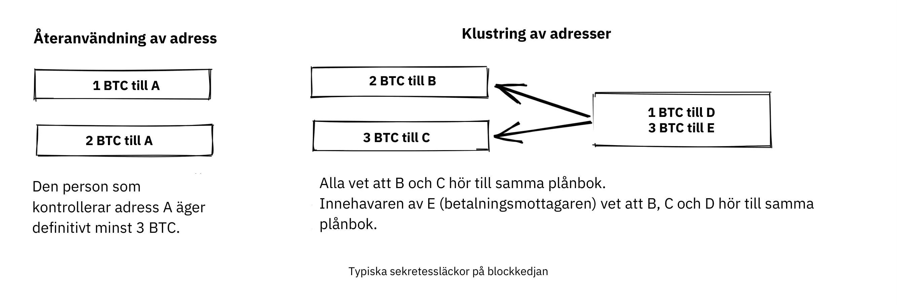


Chris Belcher [skrev mycket detaljerat](https://en.Bitcoin.it/Privacy#Blockchain_attacks_on_privacy) om de olika typerna av integritetsläckor som kan hända på Bitcoin Blockchain. Vi rekommenderar att du läser åtminstone de första underavsnitten under "Blockchain attacker på integritet."


Slutsatsen är att integriteten i Bitcoin inte är perfekt. Det krävs en betydande mängd arbete för att genomföra privata transaktioner. De flesta människor är inte beredda att gå så långt för integritet. Det verkar finnas en tydlig avvägning mellan integritet och användbarhet.


En annan viktig aspekt av integritetsskyddet är att de åtgärder du vidtar för att skydda din egen integritet även påverkar andra användare. Om du är slarvig med din egen integritet kan andra människor också uppleva minskad integritet. Gregory Maxwell förklarar detta mycket tydligt i samma Bitcoin Talk-diskussion [som vi länkade till ovan](https://bitcointalk.org/index.php?topic=334316.msg3589252#msg3589252) och avslutar med ett exempel:


> Detta fungerar faktiskt också i praktiken ... En trevlig whitehat-hacker på IRC lekte med hjärnplånbokssprickning och slog en fras med ~ 250 BTC i den.  Vi kunde identifiera ägaren från bara Address ensam, eftersom de hade betalats av en Bitcoin-tjänst som återanvände adresser och han kunde prata dem till att ge upp användarnas kontaktinformation. Han fick faktiskt användaren på telefon, de var chockade och förvirrade - men tacksamma för att inte bli av med sitt mynt.  Ett lyckligt slut där. (Det här är inte det enda exemplet på det, långt ifrån ... men det är ett av de roligare).

I det här fallet gick allt bra tack vare den filantropiskt sinnade hackern, men räkna inte med det nästa gång.


### Icke-Blockchain sekretess


Medan Blockchain visar sig vara en ökänd källa till integritetsläckor finns det gott om andra läckor som inte använder Blockchain, vissa lömskare än andra. Dessa sträcker sig från nyckelloggare till analys av nätverkstrafik. För att läsa om några av dessa metoder, se [Chris Belchers artikel](https://en.Bitcoin.it/Privacy#Non-blockchain_attacks_on_privacy), särskilt avsnittet "Icke-Blockchain-attacker på integritet".


Bland en uppsjö av attacker nämner Belcher möjligheten att någon snokar på din internetanslutning, till exempel din internetleverantör:


> Om motståndaren ser en transaktion eller ett block komma ut från din nod som inte tidigare har kommit in, kan den med nästan säkerhet veta att transaktionen gjordes av dig eller att blocket minades av dig. Eftersom internetanslutningar är inblandade kommer motståndaren att kunna länka IP Address med den upptäckta Bitcoin-informationen.

Bland de mest uppenbara integritetsläckorna finns dock börser. På grund av lagar, vanligtvis kallade KYC (Know Your Customer) och AML (Anti-Money Laundering), som gäller i de jurisdiktioner de verkar i, måste börser och relaterade företag ofta samla in personuppgifter om sina användare och bygga upp stora databaser om vilka användare som äger vilka bitcoins. Dessa databaser är utmärkta honeypots för onda regeringar och brottslingar som alltid är på jakt efter nya offer. Det finns faktiska marknader för den här typen av data, där hackare

sälja data till högstbjudande.


För att göra saken ännu värre har de företag som hanterar dessa databaser ofta liten erfarenhet av att skydda finansiella data, många av dem är faktiskt unga nystartade företag, och vi vet med säkerhet att flera läckor redan har inträffat. Några exempel är

[Indienbaserade MobiQwik](https://bitcoinmagazine.com/business/probably-the-largest-kyc-data-leak-in-history-demonstrates-the-importance-of-Bitcoin-privacy) och [HubSpot](https://bitcoinmagazine.com/business/hubspot-security-breach-leaks-Bitcoin-users-data).


Återigen, att skydda data mot detta breda spektrum av attacker är Hard, och det är troligt att du inte kommer att kunna göra det fullt ut. Du måste välja den avvägning mellan bekvämlighet och integritet som fungerar bäst för dig.


### Fungibilitet


Fungibilitet, i samband med valutor, innebär att ett mynt är utbytbart mot vilket annat mynt som helst i samma valuta. Detta roliga

ordet berördes kortfattat tidigare i kapitlet.


I den artikel som diskuteras där, Gregory Maxwell [uttalade](https://bitcointalk.org/index.php?topic=334316.msg3588908#msg3588908):


> Finansiell integritet är en väsentlig del av fungibiliteten i Bitcoin: om du på ett meningsfullt sätt kan skilja ett mynt från ett annat är deras fungibilitet svag. Om vår fungibilitet är för svag i praktiken kan vi inte vara decentraliserade: om någon viktig person tillkännager en lista över stulna mynt som de inte accepterar mynt som härrör från, måste du noggrant kontrollera mynt du accepterar mot den listan och returnera de som misslyckas.  Alla fastnar i att kontrollera svarta listor som utfärdats av olika myndigheter eftersom vi i den världen alla inte skulle vilja fastna med dåliga mynt. Detta ökar friktionen och transaktionskostnaderna och gör Bitcoin mindre värdefullt som pengar.

Här talar han om de faror som följer av bristande fungibilitet. Anta att du har en UTXO. Den UTXO:ans historia kan normalt spåras flera hopp bakåt, och sprider sig till mängder av tidigare utgångar. Om någon av dessa utgångar var inblandad i någon olaglig, oönskad eller misstänkt aktivitet kan vissa potentiella mottagare av ditt mynt avvisa det. Om du tror att dina betalningsmottagare kommer att verifiera dina mynt mot någon centraliserad vit- eller svartlistetjänst kanske du börjar kontrollera de mynt du får också, bara för att vara på den säkra sidan. Resultatet är att dålig fungibilitet kommer att förstärka ännu sämre fungibilitet.


Adam Back och Matt Corallo [höll en presentation om fungibilitet](https://btctranscripts.com/scalingbitcoin/milan-2016/fungibility-overview/) på Scaling Bitcoin i Milano 2016. De tänkte i samma banor:


> Du behöver fungibilitet för att Bitcoin ska fungera. Om du får mynt och inte kan spendera dem, börjar du tvivla på om du kan spendera dem. Om det finns tvivel om mynt du får, kommer människor att gå till taint-tjänster och kontrollera om "är dessa mynt välsignade" och då kommer människor att vägra att handla. Vad detta gör är att det övergår Bitcoin från ett decentraliserat system utan tillstånd till ett centraliserat system med tillstånd där du har en "IOU" från svartlisteleverantörerna.

Det verkar som om integritet och fungibilitet går hand i hand. Fungibiliteten försvagas om integriteten är svag, t.ex. eftersom mynt från oönskade personer kan bli svartlistade. På samma sätt kommer integriteten att försvagas om fungibiliteten är svag: om det finns en svart lista måste du fråga leverantörerna av den svarta listan om vilka mynt som ska accepteras, och därmed eventuellt avslöja din IP Address, e-post Address och annan känslig information. Dessa två funktioner är så sammanflätade att det är Hard att tala om någon av dem isolerat.


### Åtgärder för skydd av personuppgifter


Flera tekniker har utvecklats för att hjälpa människor att skydda sig mot integritetsläckor. Bland de mest uppenbara är, som Nakamoto tidigare nämnt, att använda unika

adresser för varje transaktion, men det finns flera andra. Vi kommer inte att lära dig hur du blir en integritetsninja. Bitcoin Q+A har dock en [snabb sammanfattning av integritetsförbättrande tekniker](https://bitcoiner.guide/privacytips/), något ordnad efter hur Hard de ska implementeras. När du läser den kommer du att märka att Bitcoin-sekretess ofta har att göra med saker utanför Bitcoin. Till exempel bör du inte skryta om dina bitcoins, och du bör använda Tor och VPN.


I inlägget listas också några åtgärder som är direkt relaterade till Bitcoin:


- Full node: Om du inte använder din egen Full node kommer du att läcka massor av information om din Wallet till servrar på internet. Att köra en Full node är ett bra första steg.
- Lightning Network: Flera protokoll finns ovanpå Bitcoin, t.ex. Lightning Network och Blockstreams Liquid Sidechain.
- CoinJoin: Ett sätt för flera personer att slå samman sina transaktioner till en, vilket gör det svårare att göra kedjeanalyser.


I [a talk](https://btctranscripts.com/breaking-Bitcoin/2019/breaking-Bitcoin-privacy/) på konferensen Breaking Bitcoin gav Chris Belcher ett intressant praktiskt exempel på hur integriteten har förbättrats:


> De var ett Bitcoin kasino. Onlinespel är inte tillåtet i USA. Alla kunder hos Coinbase som deponerade direkt till Bustabit skulle få sina konton avstängda eftersom Coinbase övervakade detta. Bustabit gjorde några saker. De gjorde något som kallas förändringsundvikande där du går igenom - och du ser om du kan konstruera en transaktion som inte har någon förändringsutgång. Detta sparar Miner-avgifter och hindrar också analys.
>

> De importerade också sina mycket använda återanvända insättningsadresser till joinmarket. Vid denna tidpunkt blev coinbase.com-kunder aldrig förbjudna. Det verkar som om Coinbases övervakningstjänst inte kunde göra analysen efter detta, så det är möjligt att bryta dessa algoritmer.

Han nämnde också detta exempel, bland andra, på [Privacy page](https://en.Bitcoin.it/Privacy) på Bitcoin wiki.


Observera hur bättre integritet kan uppnås genom att bygga system ovanpå Bitcoin, vilket är fallet med Lightning Network:


Skikt ovanpå Bitcoin kan öka integriteten


Vi noterade i det senaste chaper att behovet av förtroende bara kan öka med lager på lager, men det verkar inte vara fallet för integritet, som kan förbättras eller försämras godtyckligt i lager på lager. Varför är det så? Alla Layer som ligger ovanpå Bitcoin, vilket förklaras i stycket om skalning i lager i det framtida kapitlet Skalning, måste använda On-Chain-transaktioner ibland, annars skulle de inte vara "ovanpå Bitcoin". Sekretesshöjande lager försöker i allmänhet att använda basen Layer så lite som möjligt för att minimera mängden information som avslöjas.


Ovanstående är något tekniska sätt att förbättra din integritet. Men det finns andra sätt. I början av det här kapitlet sa vi att Bitcoin är ett pseudonymt system. Detta innebär att användare i Bitcoin inte är kända genom sina riktiga namn eller andra personuppgifter, utan genom sina publika nycklar. En publik nyckel är en pseudonym för en användare, och en användare kan ha flera pseudonymer. I en idealisk värld är din personliga identitet frikopplad från dina Bitcoin-pseudonymer. På grund av de integritetsproblem som beskrivs i detta kapitel försämras tyvärr denna frikoppling vanligtvis med tiden.


För att minska riskerna för att dina personuppgifter avslöjas är det bäst att inte lämna ut dem från första början eller att ge dem till centraliserade tjänster, som bygger upp stora databaser som kan läcka. En artikel av Bitcoin Q+A [förklarar KYC](https://bitcoiner.guide/nokyconly/) och de faror som härrör från den. Den föreslår också några steg som du kan ta för att förbättra din situation:


> Tack och lov finns det några alternativ där ute för att köpa Bitcoin via inga KYC-källor. Dessa är alla P2P (peer to peer) utbyten där du handlar direkt med en annan individ och inte en centraliserad tredje part. Tyvärr säljer vissa andra mynt såväl som Bitcoin så vi uppmanar dig att vara försiktig.

Artikeln föreslår att du undviker att använda börser som kräver KYC/AML och istället handlar privat, eller använder decentraliserade börser som [bisq](https://bisq.network/).


https://planb.academy/en/tutorials/exchange/peer-to-peer/bisq-fe244bfa-dcc4-4522-8ec7-92223373ed04

För mer ingående läsning om motåtgärder, se den tidigare nämnda [wiki-artikeln om integritet](https://en.Bitcoin.it/wiki/Privacy#Methods_for_improving_privacy_.28non-Blockchain.29), med början på "Metoder för att förbättra integriteten (ej Blockchain)".


### Slutsats om integritet


Sekretess är mycket viktigt, men Hard är svårt att uppnå. Det finns ingen silverkula för integritet.


För att få anständig integritet i Bitcoin måste du vidta aktiva åtgärder, varav några är kostsamma och tidskrävande.


## Finita Supply

<chapterId>af125ba2-ef98-5905-8895-41a538fe5ea5</chapterId>


Detta kapitel tittar på Bitcoin Supply-gränsen på 21 miljoner BTC, eller hur mycket är det egentligen? Vi pratar om hur denna gräns upprätthålls och vad man kan göra för att verifiera att den respekteras. Dessutom tar vi en titt in i kristallkulan och diskuterar den dynamik som kommer att spela in när Block reward skiftar från subventionsbaserad till avgiftsbaserad.


Den välkända ändliga Supply på 21 miljoner BTC betraktas som en grundläggande egenskap hos Bitcoin. Men är det verkligen hugget i sten?


Låt oss börja med att titta på vad de nuvarande konsensusreglerna säger om Supply av Bitcoin, och hur mycket av det som faktiskt kommer att vara användbart. Pieter Wuille skrev ett stycke om detta [på Stack Exchange](https://Bitcoin.stackexchange.com/a/38998/69518), där han räknade hur många bitcoins det skulle finnas när alla mynt har utvunnits:


> Om du summerar alla dessa siffror tillsammans får du 20999999.9769 BTC.

Men på grund av ett antal orsaker - till exempel tidiga problem med coinbase-transaktioner, gruvarbetare som oavsiktligt gör anspråk på mindre än tillåtet och förlust av privata nycklar - kommer den övre gränsen aldrig att nås. Wuille avslutar:


> Detta ger oss 20999817.31308491 BTC (med hänsyn till allt upp till block 528333)

Olika plånböcker har dock försvunnit eller stulits, transaktioner har skickats till fel Address, folk har glömt att de ägde Bitcoin. Totalsumman för detta kan mycket väl vara miljoner. Människor har försökt att räkna kända förluster [här](https://bitcointalk.org/index.php?topic=7253.0).


Detta lämnar oss med: ??? BTC.


Vi kan därför vara säkra på att Bitcoin Supply kommer att vara 20999817.31308491 BTC som mest. Eventuella förlorade eller obestridligt brända mynt kommer att göra detta antal lägre, men vi vet inte hur mycket. Det intressanta är att det egentligen inte spelar någon roll, eller ännu bättre att det spelar roll på ett positivt sätt för Bitcoin-innehavare,

[enligt förklaring](https://bitcointalk.org/index.php?topic=198.msg1647#msg1647) av Satoshi Nakamoto:


> Förlorade mynt gör bara att alla andras mynt blir lite mer värda.  Se det som en donation till alla.

Den ändliga Supply kommer att krympa och detta bör, åtminstone i teorin, leda till prisdeflation.


Viktigare än det exakta antalet mynt i omlopp är hur Supply-gränsen upprätthålls utan någon central myndighet. Alias chytrik uttrycker det väl på [Stack Exchange](https://Bitcoin.stackexchange.com/a/106830/69518):


> Så svaret är att du inte behöver lita på att någon inte ökar Supply. Du behöver bara köra lite kod som verifierar att de inte har gjort det.

Även om vissa fullständiga noder vänder sig till den mörka sidan och beslutar att acceptera block med coinbase-transaktioner med högre värde, kommer alla återstående fullständiga noder helt enkelt att försumma dem och fortsätta att göra affärer som vanligt. Vissa fulla noder kan, avsiktligt eller oavsiktligt, köra onda programvaror, men kollektivet kommer ändå att robust säkra Blockchain. Sammanfattningsvis kan du välja att lita på systemet utan att behöva lita på någon.


### Blocksubvention och transaktionsavgifter


En Block reward består av blocksubventionen plus transaktionsavgifter. Block reward måste täcka Bitcoin:s säkerhetskostnader. Vi kan med säkerhet säga att under dagens förhållanden med avseende på blocksubvention, transaktionsavgifter, Bitcoin-pris, Mempool-storlek, Hash-kraft, grad av decentralisering etc., är incitamenten för varje spelare att spela enligt reglerna tillräckligt höga för att bevara ett säkert monetärt system.


Vad händer när blockbidraget närmar sig noll? För enkelhetens skull antar vi att den faktiskt är lika med noll. Vid denna tidpunkt täcks systemets säkerhetskostnad endast genom transaktionsavgifter. Vad framtiden har att erbjuda oss när detta händer kan vi inte veta. Osäkerhetsfaktorerna är många och vi är hänvisade till spekulationer. Till exempel är Paul Sztorcs bidrag till ämnet [i hans Truthcoin-blogg](https://www.truthcoin.info/blog/security-budget/) mestadels spekulationer, men han har åtminstone en solid punkt (observera att M2, som Sztorc hänvisar till, är en mätning av en fiatpeng Supply):


> Medan de två blandas i samma "säkerhetsbudget", är blockbidraget och txn-avgifterna helt och hållet olika. De skiljer sig lika mycket från varandra som "VISA:s totala vinst 2017" skiljer sig från "den totala ökningen av M2 2017".

Idag är det innehavarna som betalar för säkerheten (via den monetära inflationen). I morgon är det spenderarnas tur att på något sätt axla denna börda, vilket illustreras nedan.


Med tiden kommer bärandet av säkerhetskostnaderna att flyttas från innehavarna till utgivarna


När transaktionsavgifter är det huvudsakliga motivet för Mining förändras incitamenten. Framför allt, om Mempool för en Miner inte innehåller tillräckligt med transaktionsavgifter, kan det bli mer lönsamt för den Miner att skriva om Bitcoin:s historia snarare än att förlänga den. Bitcoin Optech har ett specifikt [avsnitt om detta beteende](https://bitcoinops.org/en/topics/fee-sniping/), kallat *fee sniping*, skrivet av David Harding:


> Avgiftssnipning är ett problem som kan uppstå när Bitcoin:s subvention fortsätter att minska och transaktionsavgifter börjar dominera Bitcoin:s blockbelöningar. Om transaktionsavgifter är allt som betyder något, då har en Miner med `x` procent av Hash-frekvensen en `x` procent chans att Mining nästa block, så det förväntade värdet för dem av ärlig Mining är `x` procent av [bästa möjliga uppsättning transaktioner](https://bitcoinops.org/en/newsletters/2021/06/02/#candidate-set-based-csb-block-template-construction) i deras Mempool.
>

> Alternativt kan en Miner på ett oärligt sätt försöka återvinna det tidigare blocket plus ett helt nytt block för att förlänga kedjan. Detta beteende kallas fee sniping, och den oärliga Miner:s chans att lyckas med det om alla andra Miner är ärliga är `(x/(1-x))^2`. Även om fee sniping har en totalt sett lägre sannolikhet att lyckas än ärlig Mining, kan försök med oärlig Mining vara det mer lönsamma valet om transaktioner i det föregående blocket betalade betydligt högre feerates än de transaktioner som för närvarande finns i Mempool - en liten chans till ett stort belopp kan vara värt mer än en stor chans till ett litet belopp.

En våt filt som kastar över våra förhoppningar för framtiden är det faktum att om gruvarbetare börjar genomföra avgiftssnipning kommer detta att stimulera andra att göra detsamma, vilket lämnar ännu färre ärliga gruvarbetare. Detta kan allvarligt försämra den övergripande säkerheten för Bitcoin. Harding fortsätter med att lista några motåtgärder som kan vidtas, till exempel att förlita sig på transaktionstidslås för att begränsa var i Blockchain transaktionen kan visas.


Så, givet att konsensus om den ändliga Supply kvarstår, kommer blocksubventionen - tack vare [BIP42](https://github.com/Bitcoin/bips/blob/master/bip-0042.mediawiki) som åtgärdade en mycket långsiktig inflationsbugg - att nå noll runt år 2140. Kommer transaktionsavgifterna därefter att vara tillräckliga för att säkra nätverket?


Det är omöjligt att säga, men vi vet några saker:


- Ett sekel är en *lång* tid ur Bitcoin-perspektivet. Om det fortfarande finns kvar kommer det förmodligen att ha utvecklats enormt.
- Om en överväldigande ekonomisk majoritet finner det nödvändigt att ändra reglerna och till exempel införa en evig årlig monetär inflation på 0,1 eller 1 procent, kommer Supply av Bitcoin inte längre att vara ändlig.
- Med noll blockbidrag och en tom eller nästan tom Mempool kan saker och ting bli skakiga på grund av avgiftssnipning.


Eftersom övergången till ett avgiftsfritt Block reward ligger så långt fram i tiden kan det vara klokt att inte dra förhastade slutsatser utan försöka åtgärda de potentiella problemen medan vi kan. Peter Todd tror till exempel att det finns en faktisk risk för att Bitcoin:s säkerhetsbudget inte kommer att räcka till i framtiden, och argumenterar därför för en liten evig inflation i Bitcoin. Men han tycker också att det inte är en bra idé att diskutera en sådan fråga just nu, som [han sa i What Bitcoin Did podcast](https://www.whatbitcoindid.com/podcast/peter-todd-on-the-essence-of-Bitcoin):


> Men det är en risk som ligger 10, 20 år framåt i tiden. Det är en mycket lång tid. Och vem fan vet då vilka riskerna är?

Kanske kan vi tänka på Bitcoin som något organiskt. Föreställ dig en liten, långsamt växande ekplanta. Föreställ dig också att du aldrig har sett ett fullvuxet träd i hela ditt liv. Vore det då inte klokt att hålla tillbaka dina kontrollproblem istället för att i förväg sätta upp alla regler för hur denna planta ska få utvecklas och växa?


### Slutsats om Finite Supply


Huruvida Bitcoin Supply kommer att växa förbi 21 miljoner kan vi inte säga idag, och det är förmodligen inte så illa. Att se till att säkerhetsbudgeten förblir tillräckligt hög är avgörande men inte brådskande. Låt oss ta den här diskussionen om 10-50 år, när vi vet mer. Om det fortfarande är relevant.


# Bitcoin Regering

<partId>411bf53f-af4b-50f1-b71b-e40fe3ff64b7</partId>


## Uppgradering

<chapterId>3ffa84d1-adfa-5fbc-9b13-384ea783fcdd</chapterId>


Att uppgradera Bitcoin på ett säkert sätt kan vara extremt svårt. Vissa förändringar tar flera år att genomföra. I det här kapitlet lär vi oss om den vanliga vokabulären kring uppgradering av Bitcoin och utforskar några exempel på historiska uppgraderingar av dess protokoll samt de insikter som vi fick från dem. Slutligen talar vi om kedjesplittringar och de risker och kostnader som är förknippade med dem.


För att komma i stämning inför det här kapitlet bör du läsa [David Hardings stycke om harmoni och disharmoni](https://bitcointalk.org/dec/p1.html):


> Bitcoin experter talar ofta om konsensus, vars innebörd är abstrakt och Hard svår att fastställa. Men ordet konsensus utvecklades från det latinska ordet concentus, "en sång tillsammans harmoni" så låt oss inte tala om Bitcoin konsensus utan om Bitcoin harmoni.
>

> Harmoni är vad som får Bitcoin att fungera. Tusentals fullständiga noder arbetar var och en för sig för att verifiera att de transaktioner de tar emot är giltiga, vilket ger en harmonisk överenskommelse om tillståndet i Bitcoin Ledger utan att någon nodoperatör behöver lita på någon annan. Det liknar en kör där varje medlem sjunger samma sång samtidigt för att producera något mycket vackrare än någon av dem skulle kunna producera ensam.
>

> Resultatet av Bitcoin-harmonin är ett system där bitcoins är säkra inte bara från småtjuvar (förutsatt att du håller dina nycklar säkra) utan också från oändlig inflation, mass- eller riktad konfiskering, eller helt enkelt det byråkratiska moras som är det äldre finansiella systemet.

I detta kapitel diskuteras hur Bitcoin kan uppgraderas utan att orsaka oenighet. Att hålla sig i harmoni, dvs. upprätthålla samförstånd, är verkligen en av de största utmaningarna i Bitcoin-utvecklingen. Det finns många nyanser i uppgraderingsmekanismerna, som kanske bäst förstås genom att studera faktiska fall av tidigare uppgraderingar. Av denna anledning lägger kapitlet mycket fokus på historiska exempel och börjar med att sätta scenen med en del användbar vokabulär.


### Ordförråd


Enligt Wikipedia avses med [forward compatibility](https://en.wikipedia.org/wiki/Forward_compatibility) det tillstånd då en gammal programvara kan bearbeta data som skapats av nyare programvaror och ignorera de delar som den inte förstår:


En standard stöder framåtkompatibilitet om en produkt som uppfyller tidigare versioner "elegant" kan bearbeta indata som är utformade för senare versioner av standarden och ignorera nya delar som den inte förstår.


Omvänt avser [bakåtkompatibilitet](https://en.wikipedia.org/wiki/Backward_compatibility) när data från en gammal programvara kan användas i nyare programvaror. En förändring sägs vara helt kompatibel om den är både framåt- och bakåtkompatibel.


En ändring av Bitcoin:s konsensusregler sägs vara en *Soft Fork* om den är helt kompatibel. Detta är det vanligaste sättet att uppgradera Bitcoin, av ett antal skäl som vi kommer att diskutera längre fram i detta kapitel. Om en ändring av konsensusreglerna för Bitcoin är bakåtkompatibel men inte framåtkompatibel kallas den för en *Hard Fork*.


För en teknisk översikt över Soft-gafflar och Hard-gafflar, läs [kapitel 11 i Grokking Bitcoin](https://rosenbaum.se/book/grokking-Bitcoin-11.html). Det förklarar dessa termer och går även in på uppgraderingsmekanismerna. Det rekommenderas, även om det inte är absolut nödvändigt, att få grepp om detta innan du fortsätter att läsa.


### Historiska uppgraderingar


Bitcoin är inte detsamma idag som det var när Genesis-blocket skapades. Flera uppgraderingar har gjorts genom åren. År 2018 talade Eric Lombrozo [på konferensen Breaking Bitcoin](https://btctranscripts.com/breaking-Bitcoin/2017/changing-consensus-rules-without-breaking-Bitcoin/) om Bitcoin:s olika uppgraderingsmekanismer och påpekade hur mycket de har utvecklats över tid. Han förklarade till och med hur Satoshi Nakamoto en gång uppgraderade Bitcoin genom en Hard Fork:


> Det fanns faktiskt en Hard-Fork i Bitcoin som Satoshi gjorde att vi aldrig skulle göra det på det här sättet - det är ett ganska dåligt sätt att göra det på. Om du tittar på git commit-beskrivningen här [[757f076](https://github.com/Bitcoin/Bitcoin/commit/757f0769d8360ea043f469f3a35f6ec204740446)], säger han något om reverted makefile.unix wx-config version 0.3.6. Det stämmer. Det är allt som står där. Det har ingen indikation på att det har en brytande förändring alls. Han gömde den i princip där inne. Han [postade också till bitcointalk](https://bitcointalk.org/index.php?topic=626.msg6451#msg6451) och sa, vänligen uppgradera till 0.3.6 ASAP. Vi fixade en implementeringsbugg där det är möjligt att falska transaktioner kan visas som accepterade. Acceptera inte Bitcoin-betalningar förrän du uppgraderar till 0.3.6. Om du inte kan uppgradera direkt skulle det vara bäst att stänga av din Bitcoin-nod tills du gör det. Och sedan ovanpå det, jag vet inte varför han bestämde sig för att göra det också, han bestämde sig för att lägga till några optimeringar i samma kod. Fixa en bugg och lägg till några optimeringar.

Han påpekar att denna Hard Fork, vare sig det var avsiktligt eller inte, skapade möjligheter för framtida Soft-forks, nämligen Script-operatörerna (opkoderna) OP_NOP1-OP_NOP10. Vi kommer att titta mer på denna kodändring i cve-2010-5141. Dessa opkoder har hittills använts för två Soft-forkar:


- [BIP65](https://github.com/Bitcoin/bips/blob/master/bip-0065.mediawiki) (OP_CHECKLOCKTIMEVERIFY)
- [BIP113](https://github.com/Bitcoin/bips/blob/master/bip-0112.mediawiki) (OP_SEQUENCEVERIFY).


Lombrozo ger också en översikt över hur uppgraderingsmekanismerna har utvecklats genom åren, fram till 2017. Sedan dess har endast en annan större uppgradering, Taproot, använts. Den långa och något kaotiska process som ledde fram till dess aktivering har hjälpt oss att få ytterligare insikter om uppgraderingsmekanismerna i Bitcoin.


#### SegWit uppgradering


Medan alla uppgraderingar som föregick SegWit hade varit mer eller mindre smärtfria, var den här annorlunda. När SegWit-aktiveringskoden släpptes i oktober 2016 verkade det finnas ett överväldigande stöd för den bland Bitcoin-användare, men av någon anledning signalerade gruvarbetare inte stöd för den här uppgraderingen, vilket stoppade aktiveringen utan någon lösning i sikte.


Aaron van Wirdum beskriver denna slingrande väg i sin artikel i Bitcoin Magazine [The Long Road To SegWit](https://bitcoinmagazine.com/technical/the-long-road-to-SegWit-how-bitcoins-biggest-protocol-upgrade-became-reality). Han börjar med att förklara vad SegWit är och hur det knyter an till blockstorleksdebatten. Van Wirdum beskriver sedan händelseförloppet som ledde fram till den slutliga aktiveringen. I centrum för denna process stod en uppgraderingsmekanism som kallas *user activated Soft Fork*, eller kort och gott UASF, som föreslogs av användaren Shaolinfry:


> Shaolinfry föreslog ett alternativ: en användaraktiverad Soft Fork (UASF). Istället för Hash-kraftaktivering skulle en användaraktiverad Soft Fork ha en "'flaggdagsaktivering' där noder påbörjar verkställighet vid en förutbestämd tidpunkt i framtiden." Så länge som en sådan UASF verkställs av en ekonomisk majoritet bör detta tvinga en majoritet av gruvarbetarna att följa (eller aktivera) Soft Fork.

Han citerar bland annat Shaolinfrys e-postmeddelande till e-postlistan Bitcoin-dev. Vid det tillfället argumenterade Shaolinfry [mot Miner-aktiverade Soft-gafflar](https://lists.linuxfoundation.org/pipermail/Bitcoin-dev/2017-February/013643.html) och listade ett antal problem med dem:


> För det första kräver det att man litar på att Hash-kraften kommer att valideras efter aktivering.  BIP66 Soft Fork var ett fall där 95 % av Hashrate signalerade beredskap, men i själva verket validerade ungefär hälften inte de uppgraderade reglerna och minade ett ogiltigt block av misstag.
>

> För det andra har Miner-signalering ett naturligt veto som gör det möjligt för en liten andel Hashrate att lägga in veto mot nodaktivering av uppgraderingen för alla. Hittills har Soft-forkar dragit nytta av det relativt centraliserade Mining-landskapet där det finns relativt få Mining-pooler som bygger giltiga block; när vi går mot mer Hashrate-decentralisering är det troligt att vi kommer att drabbas mer och mer av "uppgraderingströghet" som kommer att lägga in veto mot de flesta uppgraderingar.

Shaolinfry uppmärksammade också en vanlig feltolkning av Miner-signalering: folk trodde i allmänhet att det var ett sätt för gruvarbetare att besluta om protokolluppgraderingar, snarare än en åtgärd som hjälpte till att samordna uppgraderingar. På grund av detta missförstånd kan miners också ha känt sig tvungna att offentligt tillkännage sina åsikter om en viss Soft Fork, som om det gav tyngd åt förslaget.


UASF-förslaget är, i ett nötskal, en "flaggdag" där noder börjar tillämpa specifika nya regler. På så sätt behöver gruvarbetare inte göra en kollektiv ansträngning för att samordna uppgraderingen, men *kan* utlösa aktivering tidigare än flaggdagen om tillräckligt många block signalerar stöd:


> Mitt förslag är att ha det bästa av två världar. Eftersom en användaraktiverad Soft Fork behöver en relativt lång ledtid innan aktivering kan vi kombinera med BIP9 för att ge möjlighet till en snabbare Hash kraftkoordinerad aktivering eller aktivering med flaggdag, beroende på vilket som inträffar först.
> I båda fallen kan vi utnyttja varningssystemen i BIP9. Ändringen är relativt enkel, vi lägger till en parameter för aktiveringstid som gör att BIP9-läget övergår till LOCKED_IN före utgången av BIP9:s timeout för driftsättning.

Denna idé fångade mycket intresse, men verkade inte nå nära enhälligt stöd, vilket orsakade oro för en potentiell kedjesplit. Artikeln av Aaron van Wirdum förklarar hur detta slutligen löstes tack vare [BIP91](https://github.com/Bitcoin/bips/blob/master/bip-0091.mediawiki), författad av James Hilliard:


> Hilliard föreslog en något komplex men smart lösning som skulle göra allt kompatibelt: Aktivering av segregerade vittnen enligt förslaget från utvecklingsteamet för Bitcoin Core, BIP148 UASF och aktiveringsmekanismen för New York-avtalet. Hans BIP91 skulle kunna hålla Bitcoin hel - åtminstone under hela aktiveringen av SegWit.

Det fanns ytterligare komplicerande faktorer (t.ex. det s.k. "New York-avtalet") som detta bindande förfarande måste ta hänsyn till. Vi uppmuntrar dig att läsa Van Wirdums artikel i sin helhet för att ta del av de många intressanta detaljerna i denna historia.


#### Diskussion efter SegWit


Efter SegWit-driftsättningen uppstod en diskussion om driftsättningsmekanismer. Som Eric Lombrozo noterade i [sitt föredrag på konferensen Breaking Bitcoin](https://btctranscripts.com/breaking-Bitcoin/2017/changing-consensus-rules-without-breaking-Bitcoin/) och Shaolinfry är en Miner aktiverad Soft Fork inte den perfekta uppgraderingsmekanismen:


> Vid någon tidpunkt kommer vi förmodligen att vilja lägga till fler funktioner i Bitcoin-protokollet. Det här är en stor filosofisk fråga som vi ställer oss själva. Ska vi göra en UASF för nästa? Vad sägs om en hybridstrategi? Miner aktiverad i sig har uteslutits. bip9 kommer vi inte att använda igen.

I januari 2020 skickade Matt Corallo [ett e-postmeddelande](https://lists.linuxfoundation.org/pipermail/Bitcoin-dev/2020-January/017547.html) till e-postlistan Bitcoin-dev som startade en diskussion om framtida Soft Fork-distributionsmekanismer. Han listade fem mål som han tyckte var väsentliga i en uppgradering. David Harding [sammanfattar dem i ett nyhetsbrev från Bitcoin Optech](https://bitcoinops.org/en/newsletters/2020/01/15/#discussion-of-Soft-Fork-activation-mechanisms) som:


> Möjligheten att avbryta om det finns allvarliga invändningar mot de föreslagna ändringarna av samförståndsreglerna . Tilldelning av tillräckligt med tid efter lanseringen av uppdaterad programvara för att säkerställa att de flesta ekonomiska noder uppgraderas för att genomdriva dessa regler . Förväntningen att nätverkets Hash-frekvens kommer att vara ungefär densamma före och efter förändringen, liksom under en eventuell övergång . Att så långt som möjligt förhindra att block skapas som är ogiltiga enligt de nya reglerna, vilket skulle kunna leda till falska bekräftelser i icke uppgraderade noder och SPV-klienter . Försäkran om att avbrytandemekanismerna inte kan missbrukas av "griefers" eller "partisaner" för att hålla inne en allmänt önskad uppgradering utan kända problem

Det Corallo föreslår är en kombination av en Miner-aktiverad Soft Fork och en användaraktiverad Soft Fork:


> Som något lite mer konkret tror jag därför att en aktiveringsmetod som skapar rätt prejudikat och på lämpligt sätt beaktar ovanstående mål skulle vara:
>

> 1) en standard BIP 9-driftsättning med en tidshorisont på ett år för
aktivering med 95% Miner-beredskap, +

> 2) för det fall att ingen aktivering sker inom ett år, en sexmånaders
lugnande period under vilken samhället kan analysera och diskutera

skälen till att ingen aktivering sker och, +

> 3) I det fall det är meningsfullt skulle en enkel kommandorads-/Bitcoin.conf-parameter som stöds sedan den ursprungliga driftsättningsversionen göra det möjligt för användare att välja en BIP 8-distribution med en 24-månaders tidshorisont för aktivering av flaggdag (samt en ny Bitcoin Core-version som möjliggör flaggan universellt).
>

> Detta ger en mycket lång tidshorisont för mer standardiserad aktivering, samtidigt som det säkerställer att målen i #5 uppfylls, även om tidshorisonten i dessa fall måste förlängas avsevärt för att uppfylla målen i #3. Att utveckla Bitcoin är ingen kapplöpning. Om vi måste väntar vi i 42 månader för att säkerställa att vi inte skapar ett negativt prejudikat som vi kommer att ångra när Bitcoin fortsätter att växa.

#### Taproot uppgradering - snabb rättegång


När Taproot var redo för driftsättning i oktober 2020, vilket innebar att alla tekniska detaljer kring dess konsensusregler hade implementerats och hade nått brett godkännande inom samhället, började diskussionerna om hur den faktiskt skulle driftsättas att hetta till. Dessa diskussioner hade varit ganska lågmälda fram till dess.


Många förslag på aktiveringsmekanismer började flöda runt och David Harding

[sammanfattade dem på Bitcoin Wiki](https://en.Bitcoin.it/wiki/Taproot_activation_proposals). I sin artikel förklarade han några egenskaper hos BIP8, som vid den tiden hade några nyligen gjorda ändringar för att göra den mer flexibel.


> När detta dokument skrivs har [BIP8](https://github.com/Bitcoin/bips/blob/master/bip-0008.mediawiki) utarbetats baserat på de lärdomar som dragits under 2017. En anmärkningsvärd förändring efter BIP 9+148 är att tvångsaktivering nu baseras på blockhöjd snarare än mediantid; en annan anmärkningsvärd förändring är att tvångsaktivering är en boolesk parameter som väljs när en Soft Fork:s aktiveringsparametrar ställs in antingen för den första driftsättningen eller uppdateras i en senare driftsättning.

BIP8 utan tvångsaktivering är mycket lik [BIP9](https://github.com/Bitcoin/bips/blob/master/bip-0009.mediawiki) version bits med timeout och fördröjning, med den enda betydande skillnaden att BIP8 använder blockhöjder jämfört med BIP9 som använder mediantid. Den här inställningen gör att försöket kan misslyckas (men det kan göras om senare).


BIP8 med påtvingad aktivering avslutas med en obligatorisk signaleringsperiod där alla block som produceras i enlighet med dess regler måste signalera beredskap för Soft Fork på ett sätt som kommer att utlösa aktivering i en tidigare utplacering av samma Soft Fork med icke-tvingande aktivering. Med andra ord, om nodversion x släpps utan tvingande aktivering och senare version y släpps som framgångsrikt tvingar miners att börja signalera beredskap inom samma tidsperiod, kommer båda versionerna att börja tillämpa de nya konsensusreglerna samtidigt.


Denna flexibilitet i det reviderade BIP8-förslaget gör det möjligt att uttrycka en del andra idéer i termer av hur de skulle se ut med hjälp av BIP8. Detta ger en gemensam faktor att använda för att kategorisera många olika förslag.


Från och med nu blev diskussionerna mycket hetsiga, särskilt kring huruvida `lockinontimeout` skulle vara `true` (som i en användaraktiverad Soft Fork, kallad "BIP8 med tvångsaktivering" av Harding) eller `false` (som i en Miner aktiverad Soft Fork, kallad "BIP8 utan tvångsaktivering" av Harding).


Bland de förslag som listades hade ett av dem rubriken "Låt oss se vad som händer". Av någon anledning fick detta förslag inte mycket gehör förrän sju månader senare.


Under dessa sju månader pågick diskussionen och det verkade som om det inte fanns något sätt att nå bred enighet om vilken implementeringsmekanism som skulle användas. Det fanns huvudsakligen två läger: ett som föredrog `lockinontimeout=true` (UASF-folket) och det andra som föredrog `lockinontimeout=false` ("försök och om det misslyckas tänk om" -folket). Eftersom det inte fanns något överväldigande stöd för något av dessa alternativ, gick debatten i cirklar utan att det verkade finnas någon väg framåt. Några av dessa diskussioner hölls på IRC, i en kanal som heter ##Taproot-activation, men [den 5 mars 2021](https://gnusha.org/Taproot-activation/2021-03-05.log) förändrades något:


```
06:42 < harding> roconnor: is somebody proposing BIP8(3m, false)?  I mentioned that the other day but I didn't see any responses.
[...]
06:43 < willcl_ark_> Amusingly, I was just thinking to myself that, vs this, the SegWit activation was actually pretty straightforward: simply a LOT=false and if it fails a UASF.
06:43 < maybehuman> it's funny, "let's see what happens" (i.e. false, 3m) was a poular choice right at the beginning of this channel iirc
06:44 < roconnor> harding: I think I am.  I don't know how much that is worth.  Mostly I think it would be a widely acceptable configuration based on my understanding of everyone's concerns.
06:44 < willcl_ark_> maybehuman: becuase everybody actually wants this, even miners reckoned they could upgrade in about two weeks (or at least f2pool said that)
06:44 < roconnor> harding: BIP8(3m,false) with an extended lockin-period.
06:45 < harding> roconnor: oh, good.  It's been my favorite option since I first summarized the options on the wiki like seven months ago.
06:45 <@michaelfolkson> UASF wouldn't release (true,3m) but yeah Core could release (false, 3m)
06:45 < willcl_ark_> harding: It certainly seems like a good approach to me. _if_ that fails, then you can try an understand why, without wasting too much time
```


Tillvägagångssättet "låt oss se vad som händer" verkade äntligen klicka i människors sinnen. Denna process skulle senare komma att kallas "Speedy Trial" på grund av sin korta signaleringsperiod. David Harding förklarar denna idé för den bredare allmänheten i en

[e-post till e-postlistan Bitcoin-dev](https://lists.linuxfoundation.org/pipermail/Bitcoin-dev/2021-March/018583.html):

> Den tidigare versionen av detta förslag dokumenterades för över 200 dagar sedan och Taproot:s underliggande kod slogs samman till Bitcoin Core för över 140 dagar sedan Om vi hade startat Speedy Trial vid den tidpunkt då Taproot slogs samman (vilket är lite orealistiskt), skulle vi antingen ha varit mindre än två månader från att ha Taproot eller så skulle vi ha gått vidare till nästa aktiveringsförsök för över en månad sedan.
>

> Istället har vi debatterat länge och verkar inte vara närmare vad jag tycker är en allmänt godtagbar lösning än när e-postlistan började diskutera aktiveringssystem efter SegWit för över ett år sedan Jag tror att Speedy Trial är ett sätt att generate snabba framsteg som antingen kommer att avsluta debatten (för tillfället, om aktiveringen lyckas) eller ge oss några faktiska uppgifter som vi kan basera framtida Taproot aktiveringsförslag på.

Denna utplaceringsmekanism förfinades under två månader och släpptes sedan i [Bitcoin Core version 0.21.1](https://github.com/Bitcoin/Bitcoin/blob/master/doc/release-notes/release-notes-0.21.1.md#Taproot-Soft-Fork). Gruvarbetarna började snabbt signalera för denna uppgradering och flyttade driftsättningsstatus till `LOCKED_IN`, och efter en respitperiod aktiverades Taproot-reglerna i mitten av november 2021 i block [709632](https://Mempool.space/block/0000000000000000000687bca986194dc2c1f949318629b44bb54ec0a94d8244).


#### Framtida mekanismer för utbyggnad


Med tanke på problemen med de senaste Soft gafflarna, SegWit och Taproot, är det inte klart hur nästa uppgradering kommer att distribueras. Speedy Trial användes för att distribuera Taproot, men det användes för att överbrygga klyftan mellan UASF och MASF-folket, inte för att det har framstått som den mest kända distributionsmekanismen.


### Risker


Under aktiveringen av en Fork, vare sig det är Hard eller Soft, Miner aktiverad eller användaraktiverad, finns det risk för en långvarig kedjesplit. En splittring som dröjer sig kvar i mer än några kvarter kan orsaka allvarlig skada på sentimentet kring Bitcoin såväl som på dess pris. Men framför allt skulle det orsaka stor förvirring över vad Bitcoin är. Är Bitcoin den här kedjan eller den kedjan?


Risken med en användaraktiverad Soft Fork är att de nya reglerna aktiveras även om majoriteten av Hash-makten inte stöder dem. Detta scenario skulle resultera i en långvarig kedjesplit, som skulle bestå tills majoriteten av Hash-kraften antar de nya reglerna. Det skulle kunna vara särskilt Hard att ge gruvarbetare incitament att byta till den nya kedjan om de redan hade brutit block efter splittringen på den gamla kedjan, eftersom de genom att byta gren skulle överge sina egna blockbelöningar. Det är dock värt att nämna en anmärkningsvärd episod: i mars 2013 uppstod en långvarig splittring på grund av en oavsiktlig Hard Fork och i motsats till detta incitament fattade två stora Mining-pooler beslutet att överge sin gren av splittringen för att återställa konsensus.


Å andra sidan är risken med en aktiverad Miner Soft Fork en följd av att utvinnare kan ägna sig åt falsk signalering, vilket innebär att den faktiska andelen av Hash-kraften som stöder förändringen kan vara mindre än den ser ut. Om det faktiska stödet inte utgör en majoritet av Hash-kraften skulle vi förmodligen se en långvarig kedjesplit liknande den som beskrivs i föregående stycke. Detta, eller åtminstone en liknande fråga, har hänt i verkligheten när BIP66 distribuerades, men det löstes inom 6 block eller så.


#### Kostnader för en split


Jimmy Song [talade om kostnaderna i samband med Hard gafflar](https://btctranscripts.com/breaking-Bitcoin/2017/socialized-costs-of-Hard-forks/) vid Breaking Bitcoin i Paris, men mycket av det han sa gäller även för en kedja som splittras på grund av en misslyckad Soft Fork. Han talade om *negativa externaliteter* och definierade dem som det pris som någon annan måste betala för dina egna handlingar:


> Det klassiska exemplet på en negativ externalitet är en fabrik. De kanske producerar - det kanske är ett oljeraffinaderi - och de producerar en vara som är bra för ekonomin, men de producerar också något som är en negativ externalitet, som föroreningar. Det är inte bara något som alla måste betala för, städa upp eller lida av. Men det är också effekter av andra och tredje ordningen, som att mer trafik går mot fabriken till följd av att fler arbetare behöver åka dit. Det kan också hända att man hotar djurlivet i området. Det är inte så att alla måste betala för de negativa externa effekterna, det kan vara specifika personer, som personer som tidigare använde den vägen eller djur som fanns nära fabriken, och de betalar också för kostnaden för den fabriken.

I samband med Bitcoin exemplifierar han negativa externa effekter med Bitcoin Cash (bcash), som är en Hard Fork av Bitcoin som skapades strax före den konferensen 2017. Han kategoriserar de negativa externa effekterna av en Hard Fork i engångskostnader och permanenta kostnader.


Bland de många exemplen på engångskostnader nämner han de kostnader som börserna ger upphov till:


> Så vi har ett gäng börser och de hade en hel del engångskostnader som de var tvungna att betala. Det första som hände var att insättningar och uttag måste stoppas under en dag eller två för dessa börser eftersom de inte visste vad som skulle hända. Många av dessa börser var tvungna att dyka in i Cold-lagring eftersom deras användare krävde bcash. Det är en del av deras fidicuiary plikt, de måste göra det. Du måste också granska den nya programvaran. Detta är något som vi var tvungna att göra på Itbit. Vi vill spendera bcash- hur gör vi det? Måste vi ladda ner electron cash? Har den skadlig kod? Vi måste gå och granska det. Vi hade tio dagar på oss att ta reda på om det var okej eller inte. Och sedan måste du bestämma dig, ska vi bara tillåta ett engångsuttag, eller ska vi lista det här nya myntet? För en Exchange att lista ett nytt mynt är det inte lätt - det finns alla möjliga nya förfaranden för Cold-lagring, signering, insättningar, uttag. Eller så kan du bara ha en engångshändelse där du ger dem deras bcash vid något tillfälle och sedan tänker du aldrig mer på det igen. Men det har också sina problem. Och slutligen, och oavsett hur du gör det, uttag eller notering - du kommer att behöva ny infrastruktur för att arbeta med denna token på något sätt, även om det är ett engångsuttag. Du behöver något sätt att ge dessa tokens till dina användare. Återigen, kort varsel. Eller hur? Ingen tid att göra det här, det måste göras snabbt.

Han listar också de engångskostnader som uppstår för handlare, betalningsbehandlare, plånböcker, miners och användare, liksom några av de permanenta kostnaderna, till exempel förlust av integritet och en högre risk för reorgs.


När en uppdelning sker och den kedja som har de mest generella reglerna blir starkare än den kedja som har de striktaste reglerna, kommer en omorganisation att ske. Detta kommer att ha en allvarlig inverkan på alla transaktioner som utförs i den utplånade grenen. Av dessa skäl är det mycket viktigt att alltid försöka undvika kedjeuppdelningar.


### Slutsats om uppgradering


Bitcoin växer och utvecklas med tiden. Olika uppgraderingsmekanismer har använts genom åren och inlärningskurvan är brant. Fler och mer sofistikerade och robusta metoder uppfinns hela tiden, i takt med att vi lär oss mer om hur nätverket reagerar.


För att hålla Bitcoin i harmoni har Soft-forks visat sig vara vägen framåt, men den stora frågan är fortfarande inte helt besvarad: hur distribuerar vi Soft-forks på ett säkert sätt utan att orsaka oenighet?


## Motstridigt tänkande

<chapterId>d4982f3d-4694-51cc-99be-28f54b03a2a2</chapterId>


Det här kapitlet handlar om *adversarial thinking*, ett tankesätt som fokuserar på vad som kan gå fel och hur motståndare kan agera. Vi börjar med att diskutera Bitcoin:s säkerhetsantaganden och säkerhetsmodell, varefter vi förklarar hur vanliga användare kan förbättra sin självsuveränitet och Bitcoin:s Full node decentralisering genom att tänka kontradiktoriskt. Sedan tittar vi på några faktiska hot mot Bitcoin samt på hur en motståndare tänker. Slutligen pratar vi om *motståndets axiom* som kan hjälpa dig att förstå varför människor arbetar med Bitcoin i första hand.


När man diskuterar säkerhet inom olika system är det viktigt att förstå vilka säkerhetsantaganden som görs. Ett typiskt säkerhetsantagande i Bitcoin är "det diskreta logaritmproblemet är Hard att lösa", vilket enkelt uttryckt innebär att det är praktiskt taget omöjligt att hitta en privat nyckel som motsvarar en viss publik nyckel. Ett annat ganska starkt säkerhetsantagande är att en majoritet av nätverkets hashpower är ärlig, vilket innebär att de spelar enligt reglerna. Om dessa antaganden visar sig vara felaktiga är Bitcoin i trubbel.


År 2015 höll Andrew Poelstra [ett föredrag](https://btctranscripts.com/scalingbitcoin/hong-kong-2015/security-assumptions/) på konferensen Scaling Bitcoin i Hong Kong, där han analyserade Bitcoin:s säkerhetsantaganden. Han börjar med att notera att många system bortser från motståndare i viss utsträckning; till exempel är det verkligen Hard att skydda en byggnad mot alla typer av motståndarhändelser. Istället accepterar vi i allmänhet möjligheten att någon kan bränna ner byggnaden, och i viss utsträckning förhindra detta och andra fientliga beteenden genom brottsbekämpning etc.


Se Greg Maxwells analogi av byggnaden:


Men på nätet är det annorlunda:


> Men online har vi inte detta. Vi har pseudonymt och anonymt beteende, vem som helst kan ansluta sig till vem som helst och skada systemet. Om det är möjligt att skada systemet på ett kontradiktoriskt sätt kommer de att göra det. Vi kan inte anta att de kommer att vara synliga och att de kommer att fångas.

Konsekvensen är att alla kända svagheter i Bitcoin på något sätt måste tas om hand, annars kommer de att utnyttjas. Bitcoin är trots allt den största honungspotten i världen.


Poelstra fortsätter med att nämna hur Bitcoin är en ny typ av system; det är mer nebulöst än till exempel ett signeringsprotokoll som har mycket tydliga säkerhetsantaganden.


På sin personliga blogg gör mjukvaruingenjören Jameson Lopp en djupdykning i detta (https://blog.lopp.net/bitcoins-security-model-a-deep-dive/):


> I själva verket byggdes och byggs Bitcoin-protokollet utan en formellt definierad specifikation eller säkerhetsmodell. Det bästa vi kan göra är att studera incitamenten och beteendet hos aktörerna i systemet för att bättre förstå och försöka beskriva det.

Vi har alltså ett system som verkar fungera i praktiken, men som vi inte formellt kan bevisa att det är säkert. Ett bevis är förmodligen inte möjligt på grund av

komplexiteten i själva systemet.


### Inte bara för Bitcoin-experter


Vikten av ett kontradiktoriskt tänkande sträcker sig också till vardagliga Bitcoin-användare i viss utsträckning, inte bara till hardcore Bitcoin-utvecklare och experter. Ragnar Lifthasir nämner i en [tweetstorm](https://bitcoinwords.github.io/tweetstorm-on-adversarial-thinking) hur förenklade berättelser kring Bitcoin - till exempel "bara HODL" - kan vara förnedrande för Bitcoin själv, och avslutar med att säga


> För att göra Bitcoin och oss själva starkare måste vi tänka som de programvaruingenjörer som bidrar till Bitcoin. De granskar varandra och söker skoningslöst efter brister. På sina teknikevenemang pratar de om alla sätt ett förslag kan misslyckas på. De tänker kontradiktoriskt. De är konservativa

Han kallar dessa förenklade berättelser för monomanier. Genom denna definition säger han att genom att fokusera på en enda sak - till exempel "bara HODL" - riskerar du att förbise de utan tvekan viktigare sakerna, till exempel att hålla din Bitcoin säker eller göra ditt bästa för att använda Bitcoin på ett Trustless-sätt.


### Hot


Det finns en hel del kända svagheter i Bitcoin, och många av dem utnyttjas aktivt. För att få en glimt av det, ta en titt på [Weaknesses page](https://en.Bitcoin.it/wiki/Weaknesses) på Bitcoin wiki. Där nämns en mängd olika problem, till exempel

Wallet stöld och överbelastningsattacker:


> Om en angripare försöker fylla nätverket med klienter som de kontrollerar, är det mycket troligt att du bara ansluter till angriparnoder. Även om Bitcoin aldrig använder ett antal noder för någonting, kan det vara till hjälp att helt isolera en nod från det ärliga nätverket vid utförandet av andra attacker.

Den här typen av attack kallas *Sybil-attack* och inträffar när en enda enhet kontrollerar flera noder i ett nätverk och använder dem för att framstå som flera enheter.


Som citatet också nämner är Sybil-attacken inte effektiv på Bitcoin-nätverket eftersom det inte sker någon röstning genom noder eller andra numeriska enheter, utan snarare genom datorkraft. Trots detta gör den platta strukturen systemet mottagligt för andra attacker. Bitcoin:s wikisida beskriver också andra möjliga attacker, såsom att dölja information (ofta kallad *eclipse attack*), och hur Bitcoin Core implementerar vissa heuristiska motåtgärder mot sådana attacker.


Ovanstående är exempel på verkliga hot som måste tas om hand.


### Enkelt sabotagefält


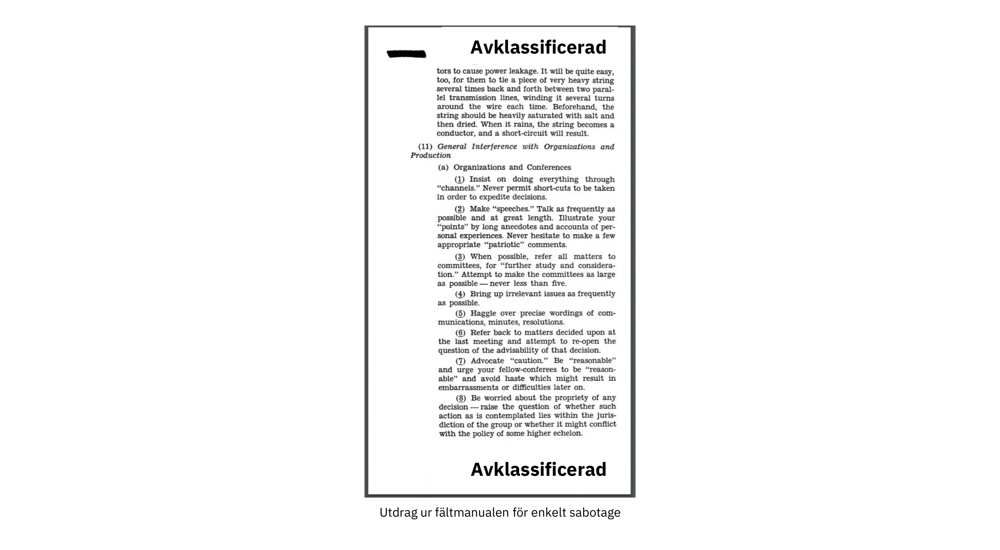


För att bättre förstå hur motståndaren tänker kan det vara bra att få en inblick i hur de arbetar. Ett amerikanskt statligt organ vid namn Office of Strategic Services, som verkade under andra världskriget och bland annat hade till uppgift att bedriva spionage, utföra sabotage och sprida propaganda, tog fram en [manual](https://www.gutenberg.org/ebooks/26184) för sin personal om hur man på rätt sätt saboterar fienden. Titeln var "Simple Sabotage Field Manual" och innehöll konkreta tips om hur man infiltrerar fienden för att göra deras liv Hard. Tipsen sträcker sig från att bränna ner lager till att orsaka slitage på övningar för att minska fiendens

effektivitet.


Det finns till exempel ett avsnitt om hur en infiltratör kan störa organisationer. Det är inte Hard att se hur en sådan taktik skulle kunna användas för att rikta in sig på Bitcoin-utvecklingsprocessen, som är öppen för alla att delta i. En dedikerad angripare kan fortsätta att fördröja utvecklingen genom oändliga frågor om irrelevanta frågor, köpslå om exakta formuleringar och försöka upprepa diskussioner som redan har behandlats utförligt. Angriparen kan också anlita en trollarmé för att mångdubbla sin egen effektivitet; vi kan kalla detta en social Sybil-attack. Med hjälp av en social Sybil-attack kan de få det att se ut som om det finns mer motstånd mot en föreslagen förändring än vad det faktiskt gör.


Detta belyser hur en beslutsam stat kan och kommer att göra allt som står i dess makt för att förstöra fienden, inklusive att bryta ner den från insidan. Eftersom Bitcoin är en form av pengar som konkurrerar med etablerade fiatvalutor är chansen stor att stater kommer att betrakta Bitcoin som en fiende.


### Axiom av motstånd


Eric Voskuil [skriver på sin wikisida Cryptoeconomics](https://github.com/libbitcoin/libbitcoin-system/wiki/Axiom-of-Resistance) om vad han kallar "motståndsaxiomet":


> Med andra ord finns det ett antagande om att det är möjligt för ett system att motstå statlig kontroll. Detta accepteras inte som ett faktum utan anses vara ett rimligt antagande, på grund av empiriska studier av beteendet hos liknande system, som man kan basera systemet på.
>

> Den som inte accepterar axiomet om motstånd överväger ett helt annat system än Bitcoin. Om man antar att det inte är möjligt för ett system att motstå statliga kontroller, är slutsatserna inte meningsfulla i samband med Bitcoin - precis som slutsatser i sfärisk geometri motsäger Euklidiska. Hur kan Bitcoin vara tillståndslöst eller censurresistent utan axiomet? Motsägelsen leder till att man gör uppenbara fel i ett försök att rationalisera konflikten.


Vad han i huvudsak säger är att det bara är när man antar att det är möjligt att skapa ett system som stater inte kan kontrollera, som det är meningsfullt att försöka.


Detta innebär att för att arbeta med Bitcoin måste du acceptera motståndsaxiomet, annars är det bättre att du lägger din tid på andra projekt. Att erkänna detta axiom hjälper dig att fokusera dina utvecklingsinsatser på de verkliga problemen: att koda runt motståndare på statsnivå. Med andra ord, tänk adversariellt.


### Slutsats om kontroversiellt tänkande


Ett decentraliserat system kan inte ha ansvar utanför själva systemet, och därför måste Bitcoin förhindra skadligt beteende på ett mer rigoröst sätt än traditionella system. Motståndartänkande är absolut nödvändigt i ett sådant system.


För att hålla Bitcoin säkert måste du känna till dess fiender och deras incitament. De flesta hoten verkar handla om nationalstater, som har en enorm ekonomisk makt genom beskattning och pengatryckning. De kommer förmodligen inte att ge upp sina privilegier för pengatryckning lätt.


## Öppen källkod

<chapterId>427a160c-f893-5b2c-afba-7b24e71ba899</chapterId>


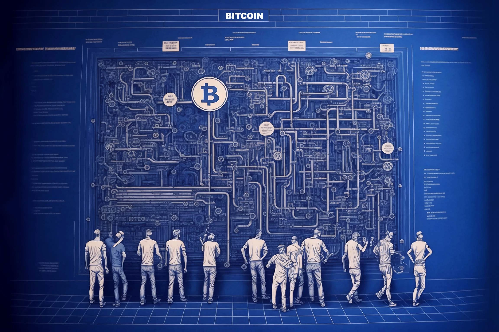


Bitcoin är byggd med hjälp av programvara med öppen källkod. I det här kapitlet analyserar vi vad detta innebär, hur underhåll av programvaran fungerar och hur programvara med öppen källkod i Bitcoin möjliggör utveckling utan tillstånd. Vi doppar tårna i *valkryptografi*, som handlar om val och användning av bibliotek i kryptografiska system. Kapitlet innehåller ett avsnitt om Bitcoin:s granskningsprocess, följt av ett annat om hur Bitcoin-utvecklare får finansiering. Det sista avsnittet handlar om hur Bitcoin:s öppen källkodskultur kan se riktigt konstig ut från utsidan, och varför denna upplevda konstighet egentligen är ett tecken på god hälsa.


De flesta Bitcoin-programvaror, och särskilt Bitcoin Core, är öppen källkod. Detta innebär att programvarans källkod görs tillgänglig för allmänheten för granskning, modifiering och vidaredistribution. Definitionen av öppen källkod på [](https://opensource.org/osd) omfattar bland annat följande viktiga punkter:


> Fri vidaredistribution: Licensen skall inte hindra någon part från att sälja eller ge bort programvaran som en del av en samlad programvarudistribution som innehåller program från flera olika källor. Licensen får inte kräva royalty eller annan avgift för sådan försäljning.
>

> Källkod: Programmet måste innehålla källkod och måste tillåta distribution i källkod såväl som i kompilerad form. Om någon form av produkt inte distribueras med källkod måste det finnas ett väl publicerat sätt att erhålla källkoden för högst en rimlig reproduktionskostnad, helst nedladdning via Internet utan kostnad. Källkoden måste vara den föredragna formen i vilken en programmerare skulle modifiera programmet. Avsiktligt fördunklad källkod är inte tillåten. Mellanformer som t.ex. utdata från en preprocessor eller översättare är inte tillåtna.
>

> Härledda verk: Licensen måste tillåta modifieringar och härledda verk, och måste tillåta att de distribueras under samma villkor som licensen för den ursprungliga programvaran.

Bitcoin Core följer denna definition genom att distribueras under [MIT-licensen](https://github.com/Bitcoin/Bitcoin/blob/master/COPYING):


```
MIT-licensen (MIT)

Copyright (c) 2009-2022 Bitcoin Core-utvecklarna
Copyright (c) 2009-2022 Bitcoin-utvecklare

Härmed ges tillstånd, utan kostnad, till varje person som erhåller en kopia av denna programvara och tillhörande dokumentationsfiler ("Programvaran"), att hantera Programvaran utan begränsning, inklusive utan begränsning rättigheterna att använda, kopiera, modifiera, slå samman, publicera, distribuera, underlicensiera och/eller sälja kopior av Programvaran, och att tillåta personer som Programvaran tillhandahålls att göra detsamma, under följande villkor:

Ovanstående upphovsrättsmeddelande och detta tillståndsmeddelande ska inkluderas i alla kopior eller väsentliga delar av Programvaran.
```


Som nämnts i kapitlet "Lita inte på, verifiera" är det viktigt att användarna kan verifiera att Bitcoin-programvaran de kör "fungerar som annonserat". För att kunna göra det måste de ha obegränsad tillgång till källkoden för den programvara som de vill verifiera.


I de kommande avsnitten dyker vi ner i några andra intressanta aspekter av programvara med öppen källkod i Bitcoin.


### Underhåll av programvara


Bitcoin Core's källkod underhålls i ett Git-arkiv som finns på [GitHub](https://github.com/Bitcoin/Bitcoin). Vem som helst kan klona just det förvaret utan att be om tillstånd och sedan inspektera, bygga eller göra ändringar i det lokalt. Detta innebär att det finns många tusen kopior av arkivet spridda över hela världen. Dessa är alla kopior av samma arkiv, så vad gör det här specifika GitHub Bitcoin Core-arkivet så speciellt? Tekniskt sett är det inte speciellt alls, men socialt sett har det blivit kontaktpunkten för Bitcoin-utvecklingen.


Bitcoin- och säkerhetsexperten Jameson Lopp förklarar detta mycket bra i ett [blogginlägg](https://blog.lopp.net/who-controls-Bitcoin-core-/) med titeln "Vem kontrollerar Bitcoin Core?":


> Bitcoin Core är en kontaktpunkt för utveckling av Bitcoin-protokollet snarare än en punkt för kommando och kontroll. Om den upphörde att existera av någon anledning skulle en ny kontaktpunkt dyka upp - den tekniska kommunikationsplattformen som den bygger på (för närvarande GitHub-arkivet) är en fråga om bekvämlighet snarare än en definition / projektintegritet. Faktum är att vi redan har sett Bitcoin:s fokuspunkt för utveckling byta plattform och till och med namn!

Han fortsätter med att förklara hur Bitcoin Core's programvara underhålls och säkras mot skadliga kodändringar. Den allmänna takeawayen från hela denna artikel sammanfattas i slutet:


> Ingen kontrollerar Bitcoin.
>

> Ingen kontrollerar fokuspunkten för Bitcoin-utvecklingen.

Bitcoin Core-utvecklaren Eric Lombrozo talar vidare om utvecklingsprocessen i sitt [Medium-inlägg](https://medium.com/@elombrozo/the-Bitcoin-core-merge-process-74687a09d81d) med titeln "The Bitcoin Core Merge Process":


> Vem som helst kan Fork kodbasförvaret och göra godtyckliga ändringar i sitt eget förvar. De kan bygga en klient från sitt eget arkiv och köra det istället om de vill. De kan också göra binära builds för andra människor att köra.
>

> Om någon vill sammanfoga en ändring som de har gjort i sitt eget arkiv till Bitcoin Core, kan de skicka in en pull request. När den har skickats in kan vem som helst granska ändringarna och kommentera dem oavsett om de har commit-åtkomst till Bitcoin Core själv eller inte.

Det bör noteras att pull requests kan ta mycket lång tid innan de sammanfogas till förvaret av underhållare, och det beror vanligtvis på brist på granskning, vilket ofta beror på brist på *granskare*.


Lombrozo talar också om processen som omger konsensusändringar, men det är lite utanför ramen för detta kapitel. Se det föregående kapitlet "Uppgradering" för mer information om hur Bitcoin-protokollet uppgraderas.


### Utveckling utan tillstånd


Vi har fastställt att vem som helst kan skriva kod för Bitcoin Core utan att be om tillstånd, men inte nödvändigtvis få den sammanfogad till det huvudsakliga Git-arkivet. Detta påverkar alla ändringar, från att ändra färgscheman för den grafiska användaren Interface, till hur peer-to-peer-meddelanden formateras och till och med konsensusregler, dvs. den uppsättning regler som definierar en giltig Blockchain.


Förmodligen lika viktigt är att användare är fria att utveckla system ovanpå Bitcoin, utan att be om tillstånd. Vi har sett otaliga framgångsrika programvaruprojekt som byggdes ovanpå Bitcoin, t.ex:


- Lightning Network: Ett betalningsnätverk som möjliggör snabb betalning av mycket små belopp. Det kräver mycket få On-Chain Bitcoin transaktioner. Det finns olika interoperabla implementeringar, till exempel [Core Lightning](https://github.com/ElementsProject/lightning), [LND](https://github.com/lightningnetwork/LND), [Eclair](https://github.com/ACINQ/eclair) och [Lightning Dev Kit](https://github.com/lightningdevkit).
- CoinJoin: Flera parter samarbetar för att kombinera sina betalningar till en enda transaktion för att göra Address klustring svårare. Det finns olika implementeringar.
- Sidokedjor: Detta system kan låsa ett mynt på Bitcoin:s Blockchain för att låsa upp det på någon annan Blockchain. Detta gör det möjligt att flytta bitcoins till någon annan Blockchain, nämligen en Sidechain, för att använda de funktioner som finns tillgängliga på den Sidechain. Exempel inkluderar [Blockstreams Elements](https://github.com/ElementsProject/Elements).
- OpenTimestamps: Det gör att du kan [Timestamp ett dokument](https://opentimestamps.org/) på Bitcoin:s Blockchain på ett privat sätt. Du kan sedan använda den Timestamp för att bevisa att ett dokument måste ha existerat före en viss tidpunkt.


Utan tillståndslös utveckling hade många av dessa projekt inte varit möjliga. Som nämndes i kapitlet om neutralitet, om utvecklare var tvungna att be om tillstånd för att bygga protokoll ovanpå Bitcoin, skulle endast de protokoll som tillåts av den centrala kommittén för beviljande av utvecklare utvecklas.


Det är vanligt att system som de som anges ovan själva är licensierade som programvara med öppen källkod, vilket i sin tur gör det möjligt för människor att bidra, återanvända eller granska deras kod utan att be om tillstånd. Öppen källkod har blivit guldstandarden för Bitcoin-licensiering av programvara.


### Pseudonym utveckling


Att inte behöva be om tillstånd för att utveckla Bitcoin-programvara innebär ett intressant och viktigt alternativ: du kan skriva och publicera kod, i Bitcoin Core eller något annat open source-projekt, utan att avslöja din identitet.


Många utvecklare väljer det här alternativet genom att arbeta under en pseudonym och försöka hålla den avskild från sin verkliga identitet. Skälen till att göra detta kan variera från utvecklare till utvecklare. En pseudonym användare är ZmnSCPxj. Bland andra projekt bidrar han till Bitcoin Core och Core Lightning, en av flera implementeringar av Lightning Network. [Han skriver](https://zmnscpxj.github.io/about.html) på sin webbsida:


> Jag är ZmnSCPxj, en slumpmässigt genererad Internetperson. Mina pronomen är han/hon/hennes.
>

> Jag förstår att människor instinktivt vill veta min identitet. Jag tycker dock att min identitet till stor del är oväsentlig och jag föredrar att bli bedömd utifrån mitt arbete.
>

> Om du undrar om du ska donera eller inte, och undrar vad min levnadskostnad eller min inkomst är, ska du förstå att du egentligen ska donera till mig baserat på den nytta du tycker att min
artiklar och mitt arbete med Bitcoin och Lightning Network.


I hans fall ska skälet till att han använder en pseudonym bedömas utifrån hans meriter och inte utifrån vem eller vilka personen eller personerna bakom pseudonymen är. Intressant nog avslöjade han i en [artikel på CoinDesk](https://www.coindesk.com/markets/2020/06/29/many-Bitcoin-developers-are-choosing-to-use-pseudonyms-for-good-reason/) att pseudonymen skapades av en annan anledning.


> Min ursprungliga anledning [till att använda en pseudonym] var helt enkelt att jag var orolig [för] att göra ett stort misstag; därför var ZmnSCPxj ursprungligen avsedd att vara en engångspseudonym som kunde överges i ett sådant fall. Men den verkar ha fått ett mestadels positivt rykte, så jag har behållit den

Genom att använda en pseudonym kan du verkligen tala mer fritt utan att riskera ditt personliga rykte om du skulle säga något dumt eller göra något stort misstag. Det visade sig att hans pseudonym blev mycket välrenommerad och 2019 [fick han till och med ett utvecklingsbidrag](https://twitter.com/spiralbtc/status/1204815615678177280), vilket i sig är ett bevis på Bitcoin:s tillståndslösa natur.


Den mest välkända pseudonymen i Bitcoin är utan tvekan Satoshi Nakamoto. Det är oklart varför han valde att vara pseudonym, men så här i efterhand var det förmodligen ett bra beslut av flera skäl:


- Eftersom många människor spekulerar i att Nakamoto äger en hel del Bitcoin är det absolut nödvändigt för hans ekonomiska och personliga säkerhet att hålla hans identitet okänd.
- Eftersom hans identitet är okänd finns det ingen möjlighet att åtala någon, vilket ger olika statliga myndigheter en Hard-tid.
- Det finns ingen auktoritär person att se upp till, vilket gör Bitcoin mer meritokratiskt och motståndskraftigt mot utpressning.


Observera att dessa punkter inte bara gäller för Satoshi Nakamoto, utan för alla som arbetar i Bitcoin eller innehar betydande mängder av valutan, i varierande grad.


### Kryptografi för urval


Utvecklare av öppen källkod använder ofta bibliotek med öppen källkod som utvecklats av andra. Detta är en naturlig och fantastisk del av alla hälsosamma ekosystem. Men Bitcoin-programvara hanterar riktiga pengar och mot bakgrund av detta måste utvecklare vara extra försiktiga när de väljer vilka tredjepartsbibliotek de ska vara beroende av.


I en filosofisk [talk about cryptography](https://btctranscripts.com/greg-maxwell/2015-04-29-gmaxwell-Bitcoin-selection-cryptography/) vill Gregory Maxwell omdefiniera begreppet "kryptografi" som han anser vara för snävt. Han förklarar att *information i grund och botten vill vara fri* och bygger sin definition av kryptografi på detta:


> Kryptografi är den konst och vetenskap som vi använder för att bekämpa informationens grundläggande natur, för att anpassa den till vår politiska och moraliska vilja och för att styra den mot mänskliga syften mot alla odds och försök att motarbeta den.

Han introducerar sedan termen *valkryptografi*, som kallas konsten att välja kryptografiska verktyg, och förklarar varför det är en viktig del av kryptografin. Det handlar om hur man väljer kryptografiska bibliotek, verktyg och metoder, eller som han säger "kryptosystemet för att välja kryptosystem".


Med hjälp av konkreta exempel visar han hur urvalskryptografi lätt kan gå fruktansvärt fel, och föreslår också en lista med frågor som du kan ställa dig själv när du utövar den. Nedan följer en destillerad version av den listan:


- Är programvaran avsedd för dina ändamål?
- Tas de kryptografiska aspekterna på allvar?
- Hur ser granskningsprocessen ut? Finns det någon sådan?
- Vad är författarnas erfarenhet?
- Är programvaran dokumenterad?
- Är programvaran portabel?
- Är programvaran testad?
- Använder programvaran bästa praxis?


Även om detta inte är den ultimata guiden till framgång kan det vara till stor hjälp att gå igenom dessa punkter när man gör urvalskryptografi.


På grund av de problem som Maxwell nämnde ovan försöker Bitcoin Core verkligen Hard att [minimera sin exponering för tredjepartsbibliotek](https://github.com/Bitcoin/Bitcoin/blob/master/doc/dependencies.md). Naturligtvis kan du inte utrota alla externa beroenden, annars skulle du behöva skriva allt själv, från fontrendering till implementering av systemanrop.


### Granskning


Detta avsnitt heter "Granskning", snarare än "Kodgranskning", eftersom Bitcoin:s säkerhet är starkt beroende av granskning på flera nivåer, inte bara källkoden. Dessutom kräver olika idéer granskning på olika nivåer: en ändring av en konsensusregel skulle kräva en djupare granskning på fler nivåer jämfört med en ändring av färgschema eller en typfelkorrigering.


På sin väg mot ett slutligt antagande genomgår en idé vanligtvis flera faser av diskussion och granskning. Några av dessa faser listas nedan:


- En idé läggs upp på Bitcoin-dev mailinglista
- Idén formaliseras till ett Bitcoin förbättringsförslag (BIP)
- BIP implementeras i en pull request (PR) till Bitcoin Core
- Driftsättningsmekanismer diskuteras
- Några konkurrerande distributionsmekanismer implementeras i pull requests till Bitcoin Core
- Pull requests slås samman till master-grenen
- Användarna väljer själva om de vill använda programvaran eller inte


I var och en av dessa faser granskar personer med olika synsätt och bakgrund den tillgängliga informationen, oavsett om det är källkoden, en BIP eller bara en löst beskriven idé. Faserna utförs vanligtvis inte på något strikt uppifrån-och-ned-sätt, utan flera faser kan pågå samtidigt och ibland går man fram och tillbaka mellan dem. Olika personer kan också ge feedback under olika faser.


En av de mest produktiva kodgranskarna på Bitcoin Core är Jon Atack. Han skrev [ett blogginlägg](https://jonatack.github.io/articles/how-to-review-pull-requests-in-Bitcoin-core) om hur man granskar pull requests i Bitcoin Core. Han betonar att en bra kodgranskare fokuserar på hur man bäst kan tillföra värde.


> Som nykomling är målet att försöka tillföra värde, med vänlighet och ödmjukhet, samtidigt som man lär sig så mycket som möjligt.
>

> Ett bra sätt är att inte låta det handla om dig, utan snarare om "Hur kan jag hjälpa till på bästa sätt?"

Han belyser det faktum att granskning är en verkligt begränsande faktor i Bitcoin Core. Många bra idéer fastnar i ett limbo där ingen granskning sker, i väntan på. Observera att granskning inte bara är till nytta för Bitcoin, utan också ett bra sätt att lära sig om programvaran samtidigt som man ger värde till den. Atacks tumregel är att granska 5-15 PR innan du gör någon egen PR. Återigen bör ditt fokus ligga på hur du bäst kan tjäna samhället, inte på hur du får din egen kod sammanslagen. Utöver detta betonar han vikten av att göra granskningen på rätt nivå: är det dags för småsaker och stavfel, eller behöver utvecklaren en mer konceptuellt orienterad granskning? Jon Attack tillägger:


> En bra första fråga när man påbörjar en granskning kan vara: "Vad behövs mest här just nu?" För att svara på den frågan krävs erfarenhet och ett samlat sammanhang, men det är en användbar fråga för att avgöra hur du kan tillföra mest värde på kortast möjliga tid.

Den andra halvan av inlägget består av en del användbar praktisk teknisk vägledning om hur man faktiskt gör granskningen, och innehåller länkar till viktig dokumentation för vidare läsning.


Bitcoin Core-utvecklaren och kodgranskaren Gloria Zhao har skrivit [en artikel](https://github.com/glozow/Bitcoin-notes/blob/master/review-checklist.md) som innehåller frågor som hon brukar ställa sig själv under en granskning. Hon anger också vad hon anser vara en bra granskning:


> Jag tycker personligen att en bra recension är en där jag har ställt mig själv en massa spetsiga frågor om PR och varit nöjd med svaren
till dem. [...] Naturligtvis börjar jag med konceptuella frågor, sedan tillvägagångssättrelaterade frågor och sedan implementeringsfrågor. I allmänhet tycker jag personligen att det är värdelöst att lämna C ++ syntaxrelaterade kommentarer på ett utkast till PR, och skulle känna mig oförskämd att gå tillbaka till "är det här vettigt" efter att författaren har tagit upp 20+ av mina kodorganisationsförslag.


Hennes idé om att en bra granskning bör fokusera på vad som behövs mest vid en viss tidpunkt stämmer väl överens med Jon Atacks råd. Hon

föreslår en lista med frågor som du kan ställa dig själv på olika nivåer i granskningsprocessen, men betonar att denna lista inte på något sätt är uttömmande eller ett direkt recept. Listan illustreras med verkliga exempel från GitHub.


### Finansiering


Många människor arbetar med Bitcoin open source-utveckling, antingen för Bitcoin Core eller för andra projekt. Många gör det på sin fritid utan att få någon ersättning, men vissa utvecklare får också betalt för att göra det.


Företag, privatpersoner och organisationer som har ett intresse av Bitcoin:s fortsatta framgång kan donera medel till utvecklare, antingen direkt eller genom organisationer som i sin tur distribuerar medlen till enskilda utvecklare. Det finns också ett antal Bitcoin-fokuserade företag som anställer skickliga utvecklare för att låta dem arbeta heltid med Bitcoin.


### Kulturell chock


Människor får ibland intrycket att det finns mycket stridigheter och oändliga hetsiga debatter bland Bitcoin-utvecklare, och att de inte kan fatta beslut.


Till exempel diskuterades Taproot:s utplaceringsmekanism under en lång tidsperiod under vilken två "läger" bildades. Det ena ville "misslyckas" med uppgraderingen om gruvarbetarna inte hade röstat för de nya reglerna med överväldigande majoritet efter en viss tidpunkt, medan det andra ville tillämpa reglerna efter den tidpunkten oavsett vad som hände. Michael Folkson sammanfattar argumenten från de två lägren i ett [email](https://lists.linuxfoundation.org/pipermail/Bitcoin-dev/2021-February/018380.html) till Bitcoin-dev mailing list.


Debatten pågick till synes i all evighet, och det var verkligen Hard att se något samförstånd om detta bildas någon gång snart. Detta gjorde folk frustrerade och som ett resultat intensifierades hettan. Gregory Maxwell (som användaren nullc) oroade sig [på Reddit](https://www.reddit.com/r/Bitcoin/comments/hrlpnc/technical_taproot_why_activate/fyqbn8s/?utm_source=share&utm_medium=web2x&context=3) för att de långa diskussionerna skulle göra uppgraderingen mindre säker:


> I det här läget innebär ytterligare väntan inte mer granskning och säkerhet. Istället minskar ytterligare förseningar trögheten och ökar potentiellt risken något när människor börjar glömma detaljer, försenar arbetet med nedströmsanvändning (som Wallet-stöd) och inte investerar lika mycket ytterligare granskningsinsatser som de skulle investera om de kände sig säkra på tidsramen för aktivering.

Så småningom löstes denna tvist tack vare ett nytt förslag från David Harding och Russel O'Connor kallat Speedy Trial, som innebar en jämförelsevis kortare signaleringsperiod för miners att låsa in aktivering av Taproot, eller fail fast. Om de aktiverade den under det tidsfönstret skulle Taproot distribueras cirka 6 månader senare.


Någon som inte är van vid Bitcoin:s utvecklingsprocess skulle förmodligen tycka att dessa hetsiga debatter ser fruktansvärt dåliga och till och med giftiga ut. Det finns åtminstone två faktorer som gör att de ser dåliga ut, i vissa människors ögon:


- Jämfört med företag med sluten källkod sker alla debatter öppet och oredigerat. Ett programvaruföretag som Google skulle aldrig låta sina anställda debattera föreslagna funktioner öppet, utan skulle på sin höjd publicera ett uttalande om företagets inställning i frågan. Detta gör att företag ser mer harmoniska ut jämfört med Bitcoin.
- Eftersom Bitcoin är tillståndslöst får vem som helst uttrycka sina åsikter. Detta skiljer sig fundamentalt från ett företag med sluten källkod som har en handfull personer med en åsikt, vanligtvis likasinnade människor. Den uppsjö av åsikter som uttrycks inom Bitcoin är helt enkelt häpnadsväckande jämfört med till exempel PayPal.


De flesta Bitcoin-utvecklare skulle hävda att denna öppenhet skapar en bra och hälsosam miljö, och till och med att den är nödvändig för att uppnå bästa resultat.


Som antyddes i kapitlet Hot kan den andra punkten ovan vara mycket fördelaktig, men den har en nackdel. En angripare kan använda förhalningstaktik, som den som beskrivs i [Simple Sabotage Field Manual](https://www.gutenberg.org/ebooks/26184), för att snedvrida besluts- och utvecklingsprocessen.


En annan sak som är värt att nämna är att eftersom Bitcoin är pengar och Bitcoin Core säkrar ofattbara mängder pengar, tas säkerhet i detta sammanhang inte lätt. Det är därför kryddat Bitcoin Core

utvecklare kan verka väldigt Hard-tokiga, och den attityden är oftast befogad. En funktion med en svag grund bakom sig kommer faktiskt inte att accepteras. Detsamma skulle hända om den bröt mot

reproducerbara byggnationer, lagt till nya beroenden eller om koden inte följde Bitcoin:s [bästa praxis](https://github.com/Bitcoin/Bitcoin/blob/master/doc/developer-notes.md).


Nya (och gamla) utvecklare kan bli frustrerade av detta. Men som vanligt i programvara med öppen källkod kan du alltid Fork förvaret, slå samman vad du vill till din egen Fork och bygga och köra din egen binär.


### Slutsats om öppen källkod


Bitcoin Core och de flesta andra Bitcoin-programvaror är öppen källkod, vilket innebär att vem som helst är fri att distribuera, modifiera och använda programvaran som de vill. Bitcoin Core-arkivet på GitHub är för närvarande fokuspunkten för Bitcoin-utvecklingen, men den statusen kan förändras om människor börjar misstro dess underhållare eller själva webbplatsen.


Öppen källkod möjliggör tillståndslös utveckling i och ovanpå Bitcoin. Oavsett om du skriver kod, granskar kod eller protokoll; öppen källkod är det som gör det möjligt för dig att göra det, pseudonomt eller inte.


Utvecklingsprocessen kring Bitcoin är radikalt öppen, vilket kan få Bitcoin att se ut som en giftig och ineffektiv plats, men det är det som gör Bitcoin motståndskraftigt mot skadliga aktörer.


## Skalning

<chapterId>bb3f3924-202c-5cdd-b2e9-e0c1cab0e48e</chapterId>


I det här kapitlet undersöker vi hur Bitcoin skalar och inte skalar. Vi börjar med att titta på hur människor har resonerat om skalning tidigare. Sedan förklarar huvuddelen av det här kapitlet olika sätt att skala Bitcoin, särskilt vertikal, horisontell, inåtriktad och skiktad skalning. Varje beskrivning följs av överväganden om huruvida tillvägagångssättet stör Bitcoin:s värdeproposition.


Inom Bitcoin-området ger olika personer olika definitioner till ordet "skala". Vissa uppfattar det som en ökning av Blockchain:s transaktionskapacitet, andra anser att det är detsamma som att använda Blockchain mer effektivt, och andra ser det som utveckling av system ovanpå Bitcoin.


I samband med Bitcoin, och för denna boks syften, definierar vi skalning som *öka Bitcoin:s användningskapacitet utan att kompromissa med dess censurmotstånd*. Denna definition omfattar flera

olika typer av förändringar, till exempel:


- Transaktionsingångar använder färre byte
- Förbättrad prestanda för signaturverifiering
- Gör att peer-to-peer-nätverket använder mindre bandbredd
- Transaktionsbatchning
- Skiktad arkitektur


Vi kommer snart att dyka in i olika metoder för skalning, men låt oss börja med en kort översikt över Bitcoin:s historia i samband med skalning.


### Skalningens historia


Skalning har varit en central punkt i diskussionen sedan Genesis av Bitcoin. Den allra första meningen i [det allra första e-postmeddelandet](https://www.metzdowd.com/pipermail/cryptography/2008-November/014814.html) som svar på Satoshi:s tillkännagivande av Bitcoin:s vitbok på e-postlistan Cryptography handlade faktiskt om skalning:


> Satoshi Nakamoto skrev:
>

> "Jag har arbetat med ett nytt system för elektroniska kontanter som är helt peer-to-peer, utan någon betrodd tredje part.  Artikeln finns tillgänglig på http://www.Bitcoin.org/Bitcoin.pdf"
>

> Vi behöver verkligen, verkligen ett sådant system, men som jag förstår ert förslag verkar det inte kunna skalas till den storlek som krävs.

Samtalet i sig kanske inte är särskilt intressant eller korrekt, men det visar att skalning har varit ett problem från allra första början.


Diskussionerna om skalning nådde sitt högsta intresse runt 2015-2017, då det cirkulerade många olika idéer om huruvida och hur man skulle öka gränsen för maximal blockstorlek. Det var en ganska ointressant diskussion om att ändra en parameter i källkoden, en ändring som inte löste något i grunden men som sköt problemet med skalning längre in i framtiden och byggde upp en teknisk skuld.


År 2015 hölls en konferens kallad [Scaling Bitcoin](https://scalingbitcoin.org/) i Montreal, med en uppföljningskonferens sex månader senare i Hong Kong och därefter på ett antal andra platser runt om i världen. Fokus låg just på hur man Address skalar. Många Bitcoin-utvecklare och andra entusiaster samlades på dessa konferenser för att diskutera olika skalningsfrågor och förslag. De flesta av dessa diskussioner kretsade inte kring ökningar av blockstorleken utan om mer långsiktiga lösningar.


Efter Hongkongkonferensen i december 2015 sammanfattade Gregory Maxwell [sin syn](https://lists.linuxfoundation.org/pipermail/Bitcoin-dev/2015-December/011865.html) på många av de frågor som hade debatterats, och inledde med en allmän filosofi kring skalning:


> Med den teknik som finns tillgänglig finns det grundläggande avvägningar mellan skala och decentralisering. Om systemet är för kostsamt kommer människor att tvingas lita på tredje part snarare än att självständigt upprätthålla systemets regler. Om Bitcoin Blockchain:s resursanvändning, i förhållande till den tillgängliga tekniken, är för stor, förlorar Bitcoin sina konkurrensfördelar jämfört med äldre system eftersom valideringen blir för kostsam (vilket utestänger många användare), vilket tvingar tillbaka förtroendet för systemet.  Om kapaciteten är för låg och våra transaktionsmetoder för ineffektiva kommer tillgången till kedjan för tvistlösning att vara för kostsam, vilket återigen tvingar tillbaka förtroendet i systemet.

Han talar om avvägningen mellan genomströmning och decentralisering. Om du tillåter större block kommer du att knuffa bort vissa personer från nätverket eftersom de inte längre har resurser att validera blocken. Men å andra sidan, om tillgången till blockutrymme blir dyrare, kommer färre människor att ha råd att använda det som en tvistlösningsmekanism. I båda fallen pressas användarna mot betrodda tjänster.


Han fortsätter med att sammanfatta de många metoder för skalning som presenterades på konferensen. Bland dem finns mer beräkningseffektiva signaturverifieringar, *segregerade vittnen* inklusive en ändring av blockstorleksgränsen, en mer utrymmeseffektiv blockutbredningsmekanism och att bygga protokoll ovanpå Bitcoin i lager. Många av dessa

strategier har sedan dess implementerats.


### Metoder för skalning


Som antytts ovan behöver skalning av Bitcoin inte nödvändigtvis handla om att öka blockstorleksgränsen eller andra gränser. Vi går nu igenom några allmänna metoder för skalning, varav några inte lider av den avvägning mellan genomströmning och decentralisering som nämndes i föregående avsnitt.


#### Vertikal skalning


Vertikal skalning är processen att öka datorresurserna för de maskiner som bearbetar data. I samband med Bitcoin skulle de senare vara de fullständiga noderna, dvs. de maskiner som validerar Blockchain på uppdrag av sina användare.


Den mest diskuterade tekniken för vertikal skalning i Bitcoin är att öka blockstorleksgränsen. Detta skulle kräva att vissa fulla noder uppgraderar sin hårdvara för att hålla jämna steg med de ökande beräkningskraven. Nackdelen är att det sker på bekostnad av centralisering.


Förutom de negativa effekterna på Full node decentralisering kan vertikal skalning också påverka Bitcoin:s Mining decentralisering och säkerhet negativt på mindre uppenbara sätt. Låt oss ta en titt på hur gruvarbetare "borde" fungera. Säg att en Miner bryter ett block på höjd 7 och publicerar det blocket i Bitcoin-nätverket. Det kommer att ta lite tid för det här blocket att nå bred acceptans, vilket främst beror på två faktorer:


- Överföringen av blocket mellan peers tar tid på grund av bandbreddsbegränsningar.
- Validering av blocket tar tid.


Medan block 7 sprids genom nätverket är det många miners som fortfarande har Mining ovanpå block 6 eftersom de inte har tagit emot och validerat block 7 ännu. Om någon av dessa miners hittar ett nytt block på höjd 7 under den här tiden kommer det att finnas två konkurrerande block på den höjden. Det kan bara finnas ett block på höjd 7 (eller någon annan höjd), vilket innebär att en av de två kandidaterna måste bli inaktuell.


Kort sagt, inaktuella block uppstår eftersom det tar tid för varje block att spridas, och ju längre tid spridningen tar, desto större är sannolikheten för inaktuella block.


Anta att blockstorleksgränsen tas bort och att den genomsnittliga blockstorleken ökar avsevärt. Blocken skulle då spridas långsammare över nätverket på grund av bandbreddsbegränsningar och verifieringstid. En ökad spridningstid kommer också att öka risken för inaktuella block.


Gruvarbetare gillar inte att ha sina block stallade eftersom de förlorar sin Block reward, så de kommer att göra vad de kan för att undvika detta

scenario. De åtgärder de kan vidta är bland annat:


- Skjuter upp valideringen av ett inkommande block, även känt som *valideringsfri Mining*. Utvinnare kan bara kontrollera blockhuvudets Proof-of-Work och utvinna ovanpå det, medan de under tiden laddar ner hela blocket och validerar det.
- Anslutning till en Mining pool med större bandbredd och anslutningsmöjligheter.


Valideringsfri Mining underminerar Full node decentralisering ytterligare, eftersom Miner åtminstone tillfälligt måste lita på inkommande block. Det skadar också säkerheten i viss utsträckning eftersom en del av nätverkets datorkraft potentiellt bygger på en ogiltig Blockchain, istället för att bygga på den starkaste och giltiga kedjan.


Den andra punkten har en negativ effekt på Miner:s decentralisering, eftersom de pooler som har bäst nätverksanslutning och bandbredd vanligtvis också är de största, vilket gör att miners söker sig till ett fåtal stora pooler.


#### Horisontell skalning


Horisontell skalning avser tekniker som delar upp arbetsbelastningen på flera maskiner. Även om detta är en vanlig skalningsmetod bland populära webbplatser och databaser, är det inte lätt att göra i Bitcoin.


Många människor hänvisar till denna Bitcoin-skalningsmetod som *sharding*. I grund och botten består det av att låta varje Full node verifiera bara en del av Blockchain. Peter Todd har lagt ner mycket tankearbete på konceptet sharding. Han skrev ett [blogginlägg](https://petertodd.org/2015/why-scaling-Bitcoin-with-sharding-is-very-Hard) där han förklarade sharding i allmänna termer och även presenterade sin egen idé som kallas *treechains*. Artikeln är svårläst, men Todd gör några poäng som är ganska smältbara:


> I sharded-system fungerar inte "Full node-försvaret", åtminstone inte direkt. Hela poängen är att alla inte har all data, så du måste bestämma vad som händer när den inte är tillgänglig.

Sedan presenterar han olika idéer om hur man kan hantera sharding, eller horisontell skalning. Mot slutet av inlägget avslutar han:


> Det finns dock ett stort problem: heliga !@#$ är ovanstående komplex jämfört med Bitcoin! Även den "barnsliga" versionen av sharding - mitt linjäriseringsschema snarare än zk-SNARKS - är förmodligen en eller två storleksordningar mer komplex än att använda Bitcoin-protokollet är just nu, men just nu verkar en enorm% av företagen i detta utrymme ha kastat upp händerna och använt centraliserade API-leverantörer istället. Att faktiskt implementera ovanstående och få det i händerna på slutanvändare kommer inte att vara lätt.
>

> Å andra sidan är decentralisering inte billigt: att använda PayPal är en eller två storleksordningar enklare än Bitcoin-protokollet.

Slutsatsen han drar är att sharding *måhända* är tekniskt möjligt, men det skulle ske till priset av en enorm komplexitet. Med tanke på att många användare redan tycker att Bitcoin är för komplext och föredrar att använda centraliserade tjänster istället, kommer det att bli Hard att övertyga dem om att använda något ännu mer komplext.


#### Skalning inåt


Medan horisontell och vertikal skalning historiskt sett har fungerat bra i centraliserade system som databaser och webbservrar, verkar de inte vara lämpliga för ett decentraliserat nätverk som Bitcoin på grund av deras centraliserande effekter.


Ett tillvägagångssätt som får alldeles för lite uppskattning är vad vi kan kalla *inward scaling*, vilket översätts till "gör mer med mindre". Det handlar om det pågående arbete som många utvecklare ständigt utför för att optimera de algoritmer som redan finns på plats, så att vi kan göra mer inom systemets befintliga gränser.


De förbättringar som har uppnåtts genom inåtskalning är minst sagt imponerande. För att ge dig en allmän uppfattning om förbättringarna genom åren har Jameson Lopp [kört benchmarktester](https://blog.lopp.net/Bitcoin-core-performance-evolution/) på Blockchain-synkronisering och jämfört många olika versioner av Bitcoin Core tillbaka till version 0.8.


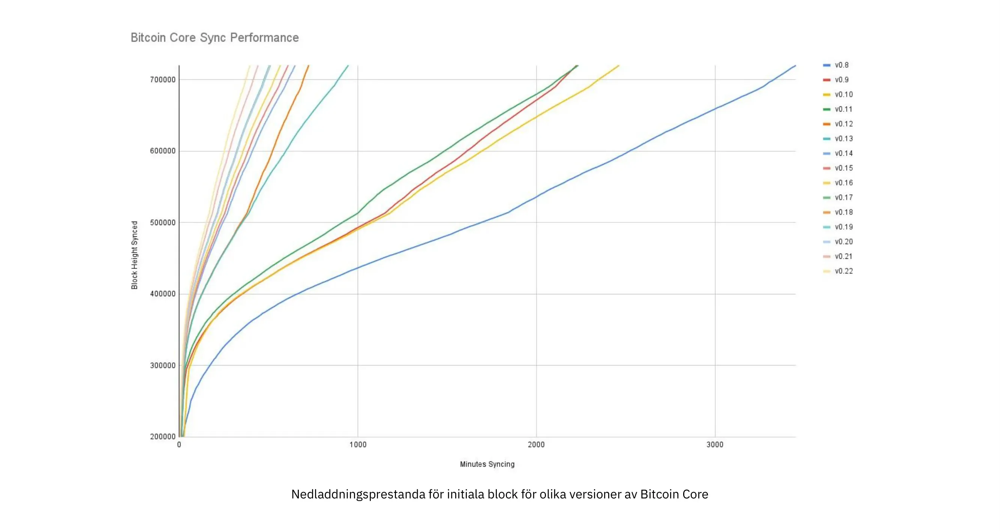


Initial blocknedladdningsprestanda för olika versioner av Bitcoin Core. På Y-axeln visas blockhöjden som synkroniserats och på X-axeln visas den tid det tog att synkronisera till den höjden


De olika linjerna representerar olika versioner av Bitcoin Core. Linjen längst till vänster är den senaste, dvs. version 0.22, som släpptes i september 2021 och tog 396 minuter att synkronisera helt. Den längst till höger är version 0.8 från november 2013, som tog 3452 minuter. Hela denna - ungefär 10x - förbättring beror på inåtriktad skalning.


Förbättringarna kan kategoriseras som antingen utrymmesbesparing (RAM, disk, bandbredd etc.) eller besparing av beräkningskraft. Båda kategorierna bidrar till förbättringarna i diagrammet ovan.


Ett bra exempel på beräkningsmässiga förbättringar finns i biblioteket [libsecp256k1](https://github.com/Bitcoin-core/secp256k1), som bland annat implementerar de kryptografiska primitiver som behövs för att skapa och verifiera digitala signaturer. Pieter Wuille är en av bidragsgivarna till detta bibliotek, och han skrev en [Twitter-tråd](https://twitter.com/pwuille/status/1450471673321381896) som visar de prestandaförbättringar som uppnåtts genom olika pull requests.


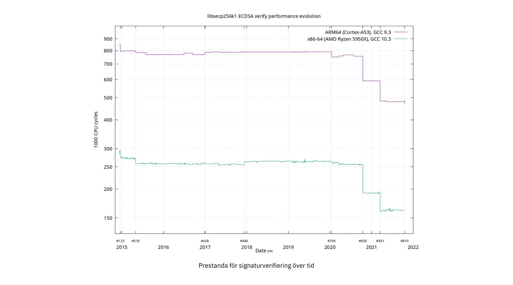


Prestanda för signaturverifiering över tid, med betydande pull requests markerade på tidslinjen


Grafen visar trenden för två olika 64-bitars processortyper, nämligen ARM och x86. Skillnaden i prestanda beror på de mer specialiserade instruktioner som finns tillgängliga på x86 jämfört med ARM-arkitekturen, som har färre och mer generiska instruktioner. Den allmänna trenden är dock densamma för båda arkitekturerna. Observera att Y-axeln är logaritmisk, vilket gör att förbättringarna ser mindre imponerande ut än de faktiskt är.


Det finns också flera goda exempel på utrymmesbesparande förbättringar som bidragit till prestandaförbättringar. I en

[Medium blog post](https://murchandamus.medium.com/2-of-3-Multisig-inputs-using-Pay-to-Taproot-d5faf2312ba3) om Taproot:s bidrag till att spara utrymme jämför användaren Murch hur mycket blockutrymme en 2-av-3 tröskelsignatur skulle kräva, med Taproot på olika sätt samt utan att använda den alls.


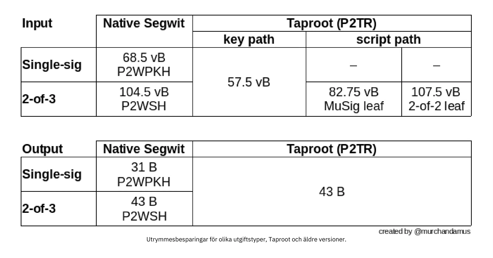


Utrymmesbesparingar för olika typer av utgifter, Taproot och äldre versioner.


En 2-av-3 Multisig som använder den ursprungliga SegWit skulle kräva totalt 104,5+43 vB = 147,5 vB, medan den mest utrymmeskonservativa användningen av Taproot endast skulle kräva 57,5+43 vB = 100,5 vB i standardanvändningsfallet. I värsta fall och i sällsynta fall, som när en standardsignatur inte är tillgänglig av någon anledning, skulle Taproot använda 107,5+43 vB = 150,5 vB. Du behöver inte förstå alla detaljer, men det här bör ge dig en uppfattning om hur utvecklare tänker på att spara utrymme - varje liten byte räknas.


Bortsett från inåtskalning i Bitcoin-programvaran finns det några sätt på vilka användare också kan bidra till inåtskalning. De kan göra sina transaktioner mer intelligent för att spara på transaktionsavgifter samtidigt som de minskar sina fotavtryck på Full node-kraven. Två vanligt förekommande tekniker för att uppnå detta mål kallas transaktionsbatchning och utdatakonsolidering.


Tanken med transaktionsbatchning är att kombinera flera betalningar till en enda transaktion, istället för att göra en transaktion per betalning. Detta kan spara dig en hel del avgifter och samtidigt minska belastningen på blockutrymmet.


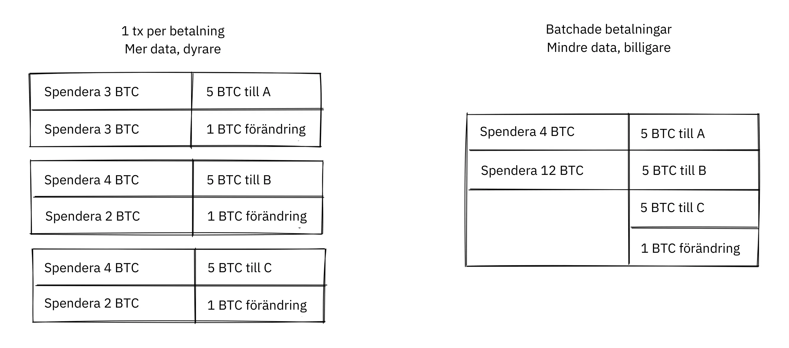


Transaktionsbatchning kombinerar flera betalningar i en enda transaktion för att spara avgifter.


Med konsolidering av utdata avses att man utnyttjar perioder med låg efterfrågan på blockutrymme för att kombinera flera utdata till en enda utdata. Detta kan minska din avgiftskostnad senare, när du måste göra en betalning medan efterfrågan på blockutrymme är hög.


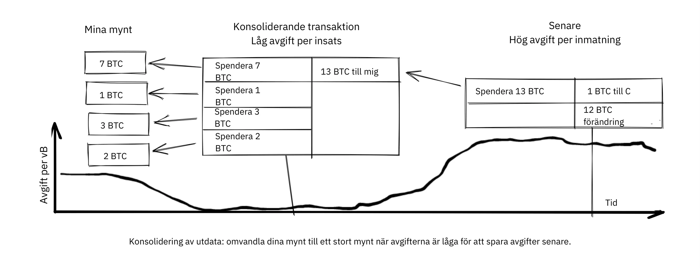


Konsolidering av utdata: Smält dina mynt till ett stort mynt när avgifterna är låga för att spara avgifter senare.


Det kanske inte är uppenbart hur konsolidering av utdata bidrar till inåtskalning. När allt kommer omkring ökar den totala mängden Blockchain-data till och med något med den här metoden. Ändå krymper UTXO-uppsättningen, dvs. databasen som håller reda på vem som äger vilka mynt, eftersom du spenderar fler UTXO än du skapar. Detta lättar bördan för fullständiga noder att underhålla sina UTXO-uppsättningar.


Tyvärr kan dock dessa två tekniker för *UTXO-hantering* vara dåliga för din egen eller dina betalningsmottagares integritet. I fallet med batchning kommer varje betalningsmottagare att veta att alla batchade utdata är från dig till andra betalningsmottagare (utom möjligen ändringen). I fallet med konsolidering av UTXO kommer du att avslöja att de utdata du konsoliderar tillhör samma Wallet. Så du kan behöva göra en avvägning mellan kostnadseffektivitet och integritet.


#### Skiktad skalning


Den mest effektiva metoden för skalning är förmodligen skiktning. Den allmänna tanken bakom skiktning är att ett protokoll kan reglera betalningar mellan användare utan att lägga till transaktioner i Blockchain.


Ett skiktat protokoll börjar med att två eller flera personer kommer överens om en starttransaktion som läggs in på Blockchain, vilket illustreras i bilden nedan.


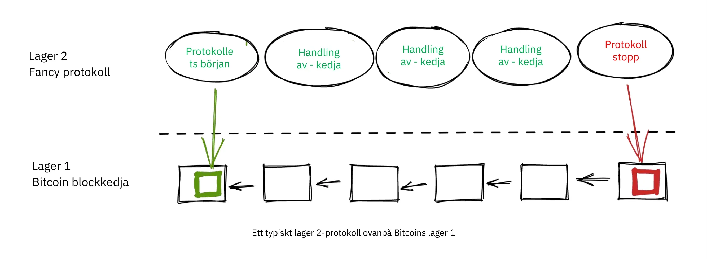


Hur denna starttransaktion skapas varierar mellan olika protokoll, men ett vanligt tema är att deltagarna skapar en osignerad starttransaktion och ett antal för-signerade bestraffningstransaktioner, som på olika sätt använder starttransaktionens output. Därefter signeras starttransaktionen fullständigt och publiceras till Blockchain, och bestraffningstransaktionerna kan signeras fullständigt och publiceras för att bestraffa en part som missköter sig. Detta ger deltagarna incitament att hålla sina löften så att protokollet kan fungera på ett Trustless sätt.


När starttransaktionen är på Blockchain kan protokollet göra det som det är tänkt att göra. Det kan till exempel göra supersnabba betalningar mellan deltagare, implementera vissa integritetsförbättrande tekniker eller göra mer avancerade skript som inte stöds av Bitcoin Blockchain.


Vi ska inte gå in i detalj på hur specifika protokoll fungerar, men som du kan se i föregående figur används Blockchain sällan under protokollets livscykel. All saftig action sker *off-chain*. Vi har sett hur detta kan vara en vinst för integriteten om det görs på rätt sätt, men det kan också vara en fördel för skalbarheten.


I ett [Reddit-inlägg](https://www.reddit.com/r/Bitcoin/comments/438hx0/a_trip_to_the_moon_requires_a_rocket_with/) med titeln "En resa till månen kräver en raket med flera steg, annars kommer raketekvationen att äta upp din lunch ... att packa in alla i clownbilsstil i en trebuchet och hoppas på framgång är helt ute." förklarar Gregory Maxwell varför skiktning är vår bästa chans att få Bitcoin att skala med storleksordningar.


Han börjar med att betona det felaktiga i att betrakta Visa eller Mastercard som Bitcoin:s huvudkonkurrenter och belyser hur en ökning av den maximala blockstorleken är en dålig metod för att möta denna konkurrens. Sedan talar han om hur man kan göra verklig skillnad genom att använda lager:


> Betyder det att Bitcoin inte kan bli en stor vinnare som betalningsteknik? Nej, men för att nå den typ av kapacitet som krävs för att tillgodose världens betalningsbehov måste vi arbeta mer intelligent.
>

> Från början var Bitcoin designad för att införliva lager på säkra sätt genom sin smarta kontraktskapacitet (Vad, tror du att det bara sattes där så att människor kunde växa filosofiska om meningslösa "DAO"?). I själva verket kommer vi att använda Bitcoin-systemet som en mycket tillgänglig och helt pålitlig robotdomare och bedriva de flesta av våra affärer utanför rättssalen - men göra transaktioner på ett sådant sätt att om något går fel har vi alla bevis och etablerade avtal så att vi kan vara säkra på att robotdomstolen kommer att göra det rätt. (Geek sidebar: Om detta verkar omöjligt, läs det här gamla inlägget om transaktionsgenomskärning)
>

> Detta är möjligt just på grund av Bitcoin:s kärnegenskaper. Ett censurerbart eller reversibelt bassystem är inte särskilt lämpligt att bygga kraftfull övre Layer-transaktionsbehandling ovanpå ... och om den underliggande tillgången inte är sund är det ingen mening att göra transaktioner med den alls.

Analogin med domaren är ganska illustrativ för hur skiktning fungerar: denna domare måste vara oförvitlig och aldrig ändra sig, annars kommer skikten ovanför Bitcoin:s bas Layer inte att fungera på ett tillförlitligt sätt.


Han fortsätter med att göra en poäng om centraliserade tjänster. Det är vanligtvis inget problem att lita på att en central server med triviala mängder Bitcoin får saker gjorda: det är också skiktad skalning.


Många år har gått sedan Maxwell skrev stycket ovan, och hans ord står fortfarande korrekta. Framgången för Lightning Network bevisar att skiktning verkligen är en väg framåt för att öka användbarheten för Bitcoin.


### Slutsats om skalning


Vi har diskuterat olika sätt genom vilka man kan vilja skala Bitcoin, öka Bitcoin:s användningskapacitet. Skalning har varit ett problem i Bitcoin sedan dess tidiga dagar.


Vi vet idag att Bitcoin inte skalar bra vertikalt ("köp större hårdvara") eller horisontellt ("verifiera endast delar av datan"), utan snarare inåt ("gör mer med mindre") och i lager ("bygg protokoll ovanpå Bitcoin").


## När skiten träffar fläkten

<chapterId>fe39c13c-310f-51fd-84ff-6b92dd01c9e7</chapterId>


Bitcoin är byggd av människor. Människor skriver programvaran, och människor kör sedan denna programvara. När en säkerhetsbrist eller en allvarlig bugg upptäcks - finns det verkligen någon skillnad mellan de två? - upptäcks den alltid av människor av kött och blod. Det här kapitlet handlar om vad människor gör, bör göra och inte bör göra när skiten träffar fläkten. I det första avsnittet förklaras termen *ansvarigt avslöjande*, som hänvisar till hur någon som upptäcker en sårbarhet kan agera ansvarsfullt för att minimera skadan från den. Resten av kapitlet tar dig på en rundtur genom några av de allvarligaste sårbarheterna som upptäckts genom åren och hur de hanterades av utvecklare, miners och användare. Saker och ting var inte lika rigorösa i Bitcoin:s tidiga barndom som de är idag.


### Ansvarsfullt offentliggörande


Tänk dig att du upptäcker en bugg i Bitcoin Core, en bugg som gör det möjligt för vem som helst att stänga av en Bitcoin Core-nod på distans genom att använda några speciellt utformade nätverksmeddelanden. Föreställ dig också att du inte är skadlig och vill att det här problemet ska förbli outnyttjat. Vad gör du då? Om du håller tyst om det kommer någon annan förmodligen att upptäcka problemet, och du kan inte vara säker på att den personen inte är skadlig.


När ett säkerhetsproblem upptäcks bör den person som upptäcker det använda _responsible disclosure_ som är en term som ofta används bland Bitcoin-utvecklare. Termen är [förklarad på Wikipedia](https://en.wikipedia.org/wiki/Coordinated_vulnerability_disclosure):


> Utvecklare av hård- och mjukvara behöver ofta tid och resurser för att reparera sina misstag. Ofta är det etiska hackare som hittar dessa
sårbarheter. Hackare och datasäkerhetsforskare anser att det är deras sociala ansvar att göra allmänheten medveten om sårbarheter. Att dölja problem kan skapa en känsla av falsk säkerhet. För att undvika detta samordnar och förhandlar de inblandade parterna om en rimlig tidsperiod för att åtgärda sårbarheten. Beroende på hur stor inverkan sårbarheten kan ha, hur lång tid det tar att utveckla och tillämpa en nödlösning eller en kringgående lösning och andra faktorer, kan denna tidsperiod variera mellan några dagar och flera månader.


Det innebär att om du hittar ett säkerhetsproblem ska du rapportera det till det team som ansvarar för systemet. Men vad betyder detta i samband med Bitcoin? Ingen kontrollerar Bitcoin, men det finns för närvarande en samlingspunkt för Bitcoin-utveckling, nämligen [Bitcoin Core Github repository](https://github.com/Bitcoin/Bitcoin). Underhållarna av detta arkiv är ansvariga för koden i det, men de är inte ansvariga för systemet som helhet - det är det ingen som är. Ändå är den allmänna bästa metoden att skicka ett e-postmeddelande till security@bitcoincore.org.


I en [e-posttråd](https://lists.linuxfoundation.org/pipermail/Bitcoin-dev/2017-September/015002.html) med titeln "Responsible disclosure of bugs" från 2017 försökte Anthony Towns sammanfatta vad han uppfattade som bästa praxis för närvarande. Han hade samlat in information från flera källor och olika personer för att få fram sin syn på ämnet.


- Sårbarheter ska rapporteras via security at bitcoincore.org
- En kritisk fråga (som kan utnyttjas omedelbart eller som redan utnyttjas och orsakar stor skada) kommer att hanteras av:
  - en släppt patch så snart som möjligt
  - omfattande information om behovet av att uppgradera (eller att stänga av berörda system)
  - minimalt avslöjande av det faktiska problemet, för att fördröja attacker
- En icke-kritisk sårbarhet (eftersom den är svår eller dyr att utnyttja) kommer att hanteras av:
  - patch och granskning som utförs i det ordinarie utvecklingsflödet
  - backport av en fix eller workaround från master till den aktuella utgivna versionen
- Utvecklare kommer att försöka säkerställa att publicering av korrigeringen inte avslöjar sårbarhetens natur genom att tillhandahålla den föreslagna korrigeringen till erfarna utvecklare som inte har informerats om sårbarheten, berätta för dem att den åtgärdar en sårbarhet och be dem att identifiera sårbarheten.
- Utvecklare kan rekommendera andra Bitcoin-implementeringar att anta sårbarhetsrättelser innan rättelsen släpps och distribueras allmänt, om de kan göra det utan att avslöja sårbarheten; t.ex. om rättelsen har betydande prestandafördelar som skulle motivera att den inkluderas.
- Innan en sårbarhet blir offentlig kommer utvecklare i allmänhet att rekommendera till vänliga Altcoin-utvecklare att de ska komma ikapp med korrigeringar. Men detta sker först efter att korrigeringarna har distribuerats i stor utsträckning i Bitcoin-nätverket.
- Utvecklare kommer i allmänhet inte att meddela Altcoin-utvecklare som har betett sig på ett fientligt sätt (t.ex. genom att använda sårbarheter för att attackera andra eller som bryter mot embargon).
- Bitcoin-utvecklare kommer inte att avslöja sårbarhetsdetaljer förrän >80% av Bitcoin-noderna har distribuerat korrigeringarna. Sårbarhetsupptäckare uppmuntras och ombeds att följa samma policy. [1] [6]


Den här listan visar hur försiktig man måste vara när man publicerar korrigeringar för Bitcoin, eftersom korrigeringen i sig kan avslöja sårbarheten. Den fjärde punkten är särskilt intressant eftersom den förklarar hur man testar om en patch har förklätts tillräckligt bra. Om några riktigt erfarna utvecklare inte kan upptäcka sårbarheten även om de vet att korrigeringen åtgärdar den, kommer det förmodligen att vara riktigt Hard för andra att upptäcka den.


Tråden som ledde till detta e-postmeddelande diskuterade om, när och hur man ska avslöja sårbarheter i altcoins och andra implementeringar av Bitcoin. Det finns inget tydligt svar här. "Att hjälpa de goda killarna" verkar vara det förnuftiga att göra, men vem bestämmer vilka de är och var drar man gränsen? Bryan Bishop [argumenterade](https://lists.linuxfoundation.org/pipermail/Bitcoin-dev/2017-September/014983.html) att det var en moralisk plikt att hjälpa altcoins och till och med scamcoins att försvara sig mot säkerhetsexploateringar:


> Det räcker inte att försvara Bitcoin och dess användare från aktiva hot, det finns ett mer allmänt ansvar att försvara alla typer av användare och olika programvaror från många typer av hot i alla former, även om folk använder dumma och osäkra programvaror som du personligen inte underhåller eller bidrar till eller förespråkar. Att hantera kunskap om en sårbarhet är en känslig fråga och du kanske får kunskap med allvarligare direkt eller indirekt påverkan än vad som ursprungligen beskrevs.

I anslutning till Town's e-postmeddelande ovan publicerades också ett [inlägg](https://lists.linuxfoundation.org/pipermail/Bitcoin-dev/2017-September/014977.html) av Gregory Maxwell, där han hävdade att säkerhetsproblem kan vara allvarligare än de verkar:


> Jag har flera gånger sett att ett Hard-problem som går att utnyttja visar sig vara trivialt när du hittar rätt trick, eller att ett mindre dosproblem visar sig vara mycket allvarligare.
>

> Enkla prestandabuggar, som används på ett skickligt sätt, kan potentiellt användas för att dela upp nätverket - Miner A och Exchange B hamnar i en partition, alla andra i en annan... och dubbelspel.
>

> Och så vidare.  Så även om jag absolut håller med om att olika saker bör och kan hanteras på olika sätt, är det inte alltid så enkelt. Det är klokt att behandla saker som allvarligare än vad man vet att de är.

Så även om en sårbarhet verkar Hard att utnyttja, kan det vara bäst att anta att den är lätt att utnyttja och att du bara inte har räknat ut hur ännu.


Han nämner också hur "det är något felaktigt att kalla den här tråden något om avslöjande, den här tråden handlar inte om avslöjande. Avslöjande är när du berättar för säljaren.  Den här tråden handlar om publicering och det har helt andra implikationer. Publicering är när du är säker på att du har berättat för de potentiella angriparna". Denna sista observation om skillnaden mellan avslöjande och publicering är viktig. Den enkla delen är ansvarsfullt avslöjande; Hard-delen är förnuftig publicering.


### Bitcoin:s traumatiska barndom


Bitcoin började som ett enmansprojekt (åtminstone är det vad skaparens pseudonym antyder), och Bitcoin hade initialt litet eller inget värde. Därför hanterades sårbarheter och buggfixar inte lika rigoröst som de gör idag.


Bitcoin wikin har en [lista över vanliga sårbarheter och exponeringar](https://en.Bitcoin.it/wiki/Common_Vulnerabilities_and_Exposures) (CVEs) som Bitcoin har gått igenom. Detta avsnitt utgör en liten exposé över några av säkerhetsfrågorna och incidenterna från de första åren med Bitcoin. Vi kommer inte att täcka dem alla, men vi har valt ut några som vi tycker är särskilt intressanta.


#### 2010-07-28: Spendera någons mynt (CVE-2010-5141)


Den 28 juli 2010 upptäckte en pseudonym vid namn ArtForz en bugg i version 0.3.4 som gjorde att vem som helst kunde ta mynt från vem som helst. ArtForz rapporterade *ansvarigt* detta till Satoshi Nakamoto och till en annan Bitcoin-utvecklare vid namn Gavin Andresen.


Problemet var att skriptoperatorn `OP_RETURN` helt enkelt skulle avsluta programkörningen, så om scriptPubKey var `<pubkey> OP_CHECKSIG` och scriptSig var `OP_1 OP_RETURN`, skulle den del av programmet som fanns i scriptPubKey aldrig köras. Det enda som skulle hända är att `1` läggs på stacken och sedan skulle `OP_RETURN` få programmet att avslutas. Varje värde som inte är noll på toppen av stacken efter att programmet har exekverats innebär att utgiftsvillkoret är uppfyllt. Eftersom det översta stapelelementet `1` inte är noll, skulle utgifterna vara OK.


Detta var koden för hantering av `OP_RETURN`:


```
case OP_RETURN:
{
pc = pend;
}
break;
```

Effekten av `pc = pend;` var att resten av programmet hoppades över, vilket innebar att alla låsningsskript i scriptPubKey skulle ignoreras. Lösningen bestod i att ändra betydelsen av `OP_RETURN` så att det omedelbart misslyckades istället.


```
case OP_RETURN:
{
return false;
}
break;
```


Satoshi gjorde denna ändring lokalt och byggde en körbar binär med version 0.3.5 från den. Sedan publicerade han på Bitcointalk-forumet "\\\*** ALERT \*** Upgrade to 0.3.5 ASAP`" och uppmanade användare att installera den här binära versionen av hans, utan att presentera källkoden för den:


> Vänligen uppgradera till 0.3.5 så snart som möjligt!  Vi har åtgärdat ett implementeringsfel som gjorde det möjligt att acceptera falska transaktioner.  Acceptera inte Bitcoin-transaktioner som betalning förrän du har uppgraderat till version 0.3.5!

Det ursprungliga meddelandet redigerades senare och är inte längre tillgängligt i sin fullständiga form. Ovanstående utdrag är från ett [citerande svar](https://bitcointalk.org/index.php?topic=626.msg6458#msg6458). Vissa användare provade Satoshi:s binärfil, men stötte på problem med den. Strax därefter skrev [Satoshi](https://bitcointalk.org/index.php?topic=626.msg6469#msg6469):


> Har inte haft tid att uppdatera SVN än.  Vänta på 0.3.6, jag håller på att bygga den nu.  Du kan stänga ner din nod under tiden.

Och 35 minuter senare [skrev han](https://bitcointalk.org/index.php?topic=626.msg6480#msg6480):


> SVN har uppdaterats med version 0.3.6.
>

> Laddar upp Windows-byggnad av 0.3.6 till Sourceforge nu, sedan kommer att bygga om linux.

Vid denna tidpunkt verkade han också ha uppdaterat det ursprungliga inlägget för att nämna 0.3.6 istället för 0.3.5:


> Vänligen uppgradera till 0.3.6 så snart som möjligt!  Vi har åtgärdat en implementeringsbugg som gjorde att falska transaktioner kunde visas som accepterade.  Acceptera inte Bitcoin-transaktioner som betalning förrän du har uppgraderat till version 0.3.6!
>

> Om du inte kan uppgradera till 0.3.6 direkt är det bäst att stänga av din Bitcoin-nod tills du kan göra det.
>

> Även i 0.3.6, snabbare hashing:
> - optimering av midstate cache tack vare tcatm
> - Crypto++ ASM SHA-256 tack vare BlackEye
> Total genereringshastighet 2,4x snabbare.
>

> Ladda ner:
>

> http://sourceforge.net/projects/Bitcoin/files/Bitcoin/Bitcoin-0.3.6/
>

> Windows- och Linux-användare: om du har 0.3.5 behöver du fortfarande uppgradera till 0.3.6.

Notera skillnaden i beskrivningen av problemet i det första meddelandet: "kunde visas som accepterat" jämfört med "kunde accepteras". Kanske bagatelliserade Satoshi allvaret i buggen i sin kommunikation för att inte dra för mycket uppmärksamhet till det faktiska problemet. Hur som helst, folk uppgraderade till 0.3.6 och det fungerade som förväntat. Denna speciella fråga löstes, otroligt nog, utan några Bitcoin-förluster.


Satoshi:s meddelande beskrev också viss prestandaoptimering för Mining. Det är oklart varför det inkluderades i en kritisk säkerhetsfix, det är möjligt att syftet var att dölja det verkliga problemet. Det verkar dock mer troligt att han bara släppte vad som fanns på huvudet av utvecklingsgrenen i Subversion-arkivet, med säkerhetsfixen tillagd.


På den tiden fanns det inte alls lika många användare som det finns idag, och Bitcoin:s värde var nära noll. Om detta buggsvar spelades ut idag skulle det betraktas som en fullständig skit-show av flera skäl:


- Satoshi gjorde en binär release av 0.3.5 som innehöll fixen. Ingen patch eller kod tillhandahölls, kanske som en åtgärd för att fördunkla problemet.
- 0.3,5 [fungerade inte ens](https://bitcointalk.org/index.php?topic=626.msg6455#msg6455).
- Fixen i 0.3.6 var faktiskt en Hard Fork.


En annan diskutabel sak är om det är bra eller dåligt att användarna ombads att stänga av sina noder. Det skulle inte vara möjligt idag, men på den tiden var det många användare som aktivt följde forumen för uppdateringar och som vanligtvis hade koll på läget. Med tanke på att det var möjligt att göra detta kan det ha varit en förnuftig sak att göra.


#### 2010-08-15 Överströmning av kombinerad utdata (CVE-2010-5139)


I mitten av augusti 2010 fick Bitcointalk-forumanvändaren jgarzik, alias Jeff Garzik,

[upptäckte att](https://bitcointalk.org/index.php?topic=822.msg9474#msg9474) en viss transaktion på blockhöjd 74638 hade två utgångar med ovanligt högt värde:


```
"out" : [
{
"value" : 92233720368.54277039,
"scriptPubKey" : "OP_DUP OP_HASH160 0xB7A73EB128D7EA3D388DB12418302A1CBAD5E890 OP_EQUALVERIFY OP_CHECKSIG"
},
{
"value" : 92233720368.54277039,
"scriptPubKey" : "OP_DUP OP_HASH160 0x151275508C66F89DEC2C5F43B6F9CBE0B5C4722C OP_EQUALVERIFY OP_CHECKSIG"
}
]
```


> "Värdet ut" i detta block #74638 är ganska konstigt:
>

> 92233720368.54277039 BTC?  Är det UINT64_MAX, undrar jag?

Förmodligen fanns det en bugg som orsakade att två int64 (inte uint64, som Garzik antog) utmatningssumma övergick till ett negativt värde -0.00997538 BTC. Oavsett summan av ingångarna skulle "summan" av utgångarna vara mindre, vilket gjorde denna transaktion OK enligt koden vid den tiden.


I det här fallet hade buggen avslöjats och publicerats genom en faktisk exploatering. Ett olyckligt resultat av detta var att cirka 2x92 miljarder Bitcoin hade skapats, vilket kraftigt spädde ut de pengar Supply på cirka 3,7 miljoner mynt som fanns vid den tiden.


I en relaterad tråd skrev [Satoshi](https://bitcointalk.org/index.php?topic=823.msg9531#msg9531) att han skulle uppskatta om folk slutade med Mining (eller *generating*, som det hette på den tiden):


> Det skulle hjälpa om folk slutade generera.  Vi kommer förmodligen att behöva göra om en gren runt den nuvarande, och ju mindre du generate desto snabbare kommer det att gå.
>

> En första patch kommer att finnas i SVN rev 132.  Den är inte uppladdad ännu.  Jag ska först få några andra ändringar ur vägen, sedan ska jag ladda upp patchen för detta.

Hans plan var att göra en Soft Fork för att göra transaktioner som den som diskuteras här ogiltiga, och därmed ogiltigförklara blocken (särskilt block 74638) som innehöll sådana transaktioner. Mindre än en timme senare gjorde han en [patch i revision 132](https://sourceforge.net/p/Bitcoin/code/132/) i Subversion-arkivet och [postade till forumet](https://bitcointalk.org/index.php?topic=823.msg9548#msg9548) där han beskrev vad han tyckte att användarna skulle göra:


> Patchen är uppladdad till SVN rev 132!
>

> Tills vidare rekommenderas följande steg:
> 1) Stäng av.
> 2) Ladda ner knightmb:s blk-filer.  (ersätt dina blk0001.dat- och blkindex.dat-filer)
> 3) Uppgradering.
> 4) Den bör börja med mindre än 74000 block. Låt den ladda ner resten på nytt.
>

> Om du inte vill använda knightmbs filer kan du bara radera dina blk*.dat-filer, men det kommer att bli en stor belastning på nätverket om alla laddar ner hela blockindexet på en gång.
>

> Jag kommer att bygga releaser inom kort.

Han ville att folk skulle ladda ner blockdata från en specifik användare, nämligen knightmb, som hade publicerat sin Blockchain som den såg ut på hans disk, filerna blkXXXX.dat och blkindex.dat. Anledningen till att Blockchain-data laddades ned på detta sätt, i stället för att synkroniseras från början, var att minska flaskhalsarna i nätverkets bandbredd.


Det fanns en stor varning med detta: de data som användare skulle ladda ner från knightmb [verifierades inte av Bitcoin-programvaran](https://Bitcoin.stackexchange.com/a/113682/69518) vid start. Filen blkindex.dat innehöll UTXO-uppsättningen, och programvaran skulle acceptera all data där som om den redan hade verifierat den. knightmb kunde ha manipulerat data för att ge sig själv eller någon annan några bitcoins.


Återigen verkade folk gå med på detta, och återföringen av det ogiltiga blocket och dess efterföljare lyckades. Utvinnare började arbeta på en ny efterföljare till block [74637](https://Mempool.space/block/0000000000606865e679308edf079991764d88e8122ca9250aef5386962b6e84) och enligt blockets Timestamp dök en efterföljare upp kl. 23:53 UTC, cirka 6 timmar efter att problemet upptäcktes. Klockan 08:10 dagen därpå, den 16 augusti, runt block 74689, hade den nya kedjan tagit över den gamla kedjan, och därför omorganiserades alla icke uppgraderade noder för att följa den nya kedjan. Detta är den djupaste reorg - 52 block - i Bitcoin:s historia.


Jämfört med frågan om OP_RETURN hanterades denna fråga på ett något renare sätt:


- Ingen patchrelease för enbart binära system
- Den utgivna programvaran fungerade som avsett
- Nej Hard Fork


Användare ombads också att stoppa Mining under den här utgåvan. Vi kan diskutera om detta är en bra idé eller inte, men tänk dig att du är en Miner och du är övertygad om att alla block ovanpå det dåliga blocket så småningom kommer att utplånas i en djup reorg: varför skulle du slösa resurser på Mining-dömda block?


Du kanske också tycker att det är lite skumt att göra som Nakamoto föreslår och ladda ner Blockchain, inklusive UTXO-uppsättningen, från en slumpmässig killes Hard-enhet. I så fall har du rätt: det är skumt. Men med tanke på omständigheterna var denna nödåtgärd en förnuftig sådan.


Det finns en viktig skillnad mellan det här fallet och det tidigare OP_RETURN-fallet: det här problemet utnyttjades i naturen, och därmed kunde en fix göras mer okomplicerad. I fallet med OP_RETURN var de tvungna att dölja lösningen och göra offentliga uttalanden som inte direkt avslöjade vad problemet var.


#### 2013-03-11 Problem med DB-lås 0.7.2 - 0.8.0 (CVE-2013-3220)


En mycket intressant och utbildningsmässigt värdefull fråga dök upp i mars 2013. Det verkade som om Blockchain hade delats (även om ordet "Fork" används i citatet nedan) efter block 225429. Detaljerna kring denna incident [rapporterades i BIP50](https://github.com/Bitcoin/bips/blob/master/bip-0050.mediawiki). Sammanfattningen säger:


> Ett block som hade ett större antal totala transaktionsinmatningar än vad som tidigare setts utvanns och sändes ut. Bitcoin 0,8-noder kunde hantera detta, men vissa pre-0,8 Bitcoin-noder avvisade det, vilket orsakade en oväntad Fork av Blockchain. Den pre-0,8-inkompatibla kedjan (hädanefter 0,8-kedjan) hade vid den tidpunkten cirka 60 % av Mining Hash-kraften, vilket säkerställde att splittringen inte löstes automatiskt (vilket skulle ha skett om pre-0,8-kedjan överträffade 0,8-kedjan i totalt arbete och tvingade 0,8-noderna att omorganisera till pre-0,8-kedjan).
>

> För att återställa en kanonisk kedja så snart som möjligt nedgraderade BTCGuild och Slush sina Bitcoin 0,8-noder till 0,7 så att deras pooler också skulle avvisa det större blocket. Detta placerade majoritetshashpower på kedjan utan det större blocket, vilket så småningom fick 0,8-noderna att omorganisera sig till kedjan före 0,8.

Den snabba åtgärd som Mining-poolerna BTCGuild och Slush vidtog var absolut nödvändig i denna nödsituation. De kunde tippa majoriteten av Hash-kraften över till splitens pre-0.8-gren och därmed hjälpa till att återställa konsensus. Detta gav utvecklare tid att räkna ut en hållbar fix.


Vad som också är mycket intressant i det här problemet är att version 0.7.2 var inkompatibel med sig själv, vilket också var fallet med tidigare versioner. Detta förklaras i [Root cause section of BIP50](https://github.com/Bitcoin/bips/blob/master/bip-0050.mediawiki#root-cause):


> Med den otillräckligt höga BDB-låskonfigurationen hade det implicit blivit en nätverkskonsensusregel som bestämde blockets giltighet (om än en
inkonsekvent och osäker regel, eftersom låsanvändningen kan variera från nod till nod).


Kort sagt är problemet att antalet databaslås som Bitcoin Core-programvaran behöver för att verifiera ett block inte är deterministiskt. En nod kan behöva X lås medan en annan nod kan behöva X+1 lås. Noderna har också en gräns för hur många lås Bitcoin kan ta. Om antalet lås som behövs överskrider gränsen kommer blocket att betraktas som ogiltigt. Så om X+1 överskrider gränsen men inte X, kommer de två noderna att dela Blockchain och vara oense om vilken gren som är giltig.


Den lösning som valdes, förutom de omedelbara åtgärder som vidtogs av de två poolerna för att återställa samförståndet, var att


- begränsa blocken både när det gäller storlek och lås som behövs i version 0.8.1
- patcha gamla versioner (0.7.2 och några äldre) med samma nya regler och öka den globala låsgränsen.


Med undantag för den ökade globala låsgränsen i den andra punkten infördes dessa regler tillfälligt under en förutbestämd tidsperiod. Planen var att ta bort dessa begränsningar när de flesta noder hade uppgraderats.


Detta Soft Fork minskade dramatiskt risken för att konsensus skulle misslyckas och några månader senare, den 15 maj, avaktiverades de tillfälliga reglerna i samförstånd i hela nätverket. Observera att denna inaktivering i själva verket var en Hard Fork, men den var inte omtvistad. Dessutom släpptes den tillsammans med den föregående Soft Fork, så personer som körde den Soft-forkade programvaran var väl medvetna om att en Hard Fork skulle följa på den. Därför förblev de allra flesta noder i konsensus när Hard Fork aktiverades. Tyvärr försvann dock några noder som inte uppgraderade i processen.


Man kan undra om detta skulle vara genomförbart idag. Mining-landskapet är mer komplext idag, och beroende på Hash-kraften på varje sida av splittringen kan det vara Hard att rulla ut en patch som den i BIP50 tillräckligt snabbt. Det skulle förmodligen vara Hard att övertyga gruvarbetare på den "felaktiga" grenen att släppa taget om sina blockbelöningar.


#### BIP66


BIP66 är intressant eftersom det belyser vikten av:


- bra urval kryptografi
- ansvarsfullt avslöjande
- utplacering utan att avslöja sårbarheten
- Mining på toppen av verifierade block


BIP66 var ett förslag om att skärpa reglerna för signaturkodning i Bitcoin Script. Motiveringen](https://github.com/Bitcoin/bips/blob/master/bip-0066.mediawiki#motivation) var att kunna analysera signaturer med annan programvara eller andra bibliotek än OpenSSL och till och med nyare versioner av OpenSSL. OpenSSL är ett bibliotek för kryptografi för allmänna ändamål som Bitcoin Core använde vid den tidpunkten.


BIP aktiverades den 4 juli 2015. Även om ovanstående är sant, åtgärdar dock BIP66 också ett mycket allvarligare problem som inte nämns i BIP.


##### Sårbarheten


Den fullständiga redogörelsen för denna fråga publicerades den 28 juli 2015 av Pieter Wuille i en

[e-post till Bitcoin-dev mailing list](https://lists.linuxfoundation.org/pipermail/Bitcoin-dev/2015-July/009697.html):


> Hej på er alla,
>

> Jag skulle vilja avslöja en sårbarhet som jag upptäckte i september 2014 och som blev oanvändbar när BIP66:s 95%-gräns nåddes tidigare denna månad.
>

> Kort beskrivning:
>

> En speciellt utformad transaktion kan ha förgrenat Blockchain mellan noder:
>

> - använda OpenSSL på ett 32-bitars system och på 64-bitars Windows-system
> - använda OpenSSL på icke-Windows 64-bitars system (Linux, OSX, ...)
> - använda vissa icke-OpenSSL-kodbaser för att tolka signaturer

I mejlet redogörs vidare för detaljerna kring hur problemet upptäcktes och mer exakt vad som orsakade det. I slutet lämnar han in en tidslinje över händelserna, och vi kommer att återge några av de viktigaste här. Vissa av dem har, som illustreras av figuren ovan, redan beskrivits.


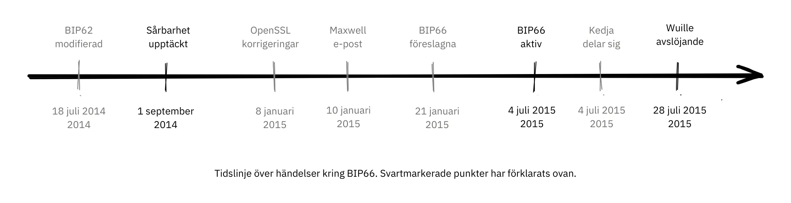


Tidslinje över händelser kring BIP66. Svartmarkerade punkter har förklarats ovan.


##### Före upptäckten


Utan att någon kände till problemet kunde det ha lösts genom den nu borttagna BIP62, som var ett förslag för att minska möjligheterna till transaktionsmissbruk. Bland de föreslagna ändringarna i BIP62 fanns en skärpning av konsensusreglerna för kodning av signaturer, eller "strikt DER-kodning". Pieter Wuille föreslog i juli 2014 några justeringar av BIP som skulle ha löst problemet:


> 2014-Jul-18: För att Bitcoin:s regler för signaturkodning inte skulle vara beroende av OpenSSL:s specifika parser, modifierade jag BIP62-förslaget så att dess strikta krav på DER-signaturer även skulle gälla för transaktioner i version 1. Inga icke-DER-signaturer bryts ut i block längre vid den tidpunkten, så detta antogs inte ha någon inverkan. Se https://github.com/Bitcoin/bips/pull/90 och http://lists.linuxfoundation.org/pipermail/Bitcoin-dev/2014-July/006299.html. Okänt vid den tidpunkten, men om det hade implementerats skulle det ha löst sårbarheten.

På grund av bredden i denna BIP, som omfattade betydligt mer än bara "strikt DER-kodning", förändrades den ständigt och kom aldrig i närheten av utplacering. BIP:en drogs senare tillbaka eftersom Segregated Witness, BIP141, löste problemet med transaktioners formbarhet på ett annat och mer komplett sätt.


##### Efter upptäckten


OpenSSL släppte nya versioner av sin programvara med korrigeringar som, om de hade använts i Bitcoin sedan början, skulle ha löst problemet. Men att använda någon ny version av OpenSSL endast i en ny version av Bitcoin Core skulle göra saken värre. Gregory Maxwell förklarar detta i en annan [e-posttråd](https://lists.linuxfoundation.org/pipermail/Bitcoin-dev/2015-January/007097.html) i januari 2015:


> För de flesta tillämpningar är det i allmänhet acceptabelt att ivrigt förkasta vissa signaturer, men Bitcoin är ett konsensussystem där alla deltagare i allmänhet måste vara överens om den exakta giltigheten eller ogiltigheten hos indata.  På sätt och vis är konsekvens viktigare än "korrekthet".
> [...]
> Patcherna ovan åtgärdar dock bara ett symptom på det allmänna problemet: att förlita sig på programvara som inte är utformad eller distribuerad för konsensusanvändning (i synnerhet OpenSSL) för konsensusnormativt beteende.  Som en stegvis förbättring föreslår jag därför en riktad Soft-Fork för att genomdriva strikt DER-efterlevnad snart, med hjälp av en delmängd av BIP62.

Han påpekar att det innebär allvarliga risker att använda kod som inte är avsedd att användas i konsensussystem och föreslår att Bitcoin implementerar strikt DER-kodning. Detta är ett mycket tydligt exempel på vikten av god urvalskryptografi.


Dessa händelser kan ge dig intrycket att Gregory Maxwell visste om sårbarheten som Pieter Wuille senare publicerade, men ville hjälpa till att smyga in en fix förklädd som en försiktighetsåtgärd utan att dra för mycket uppmärksamhet åt det faktiska problemet. Det kan vara så, men det är rent spekulation.


Sedan, som föreslagits av Maxwell, skapades BIP66 som en delmängd av BIP62 som endast specificerade strikt DER-kodning. Denna BIP var uppenbarligen allmänt accepterad och distribuerades i juli, även om två Blockchain-splittringar ironiskt nog inträffade på grund av *valideringslösa Mining*. Dessa splittringar diskuteras i nästa avsnitt.


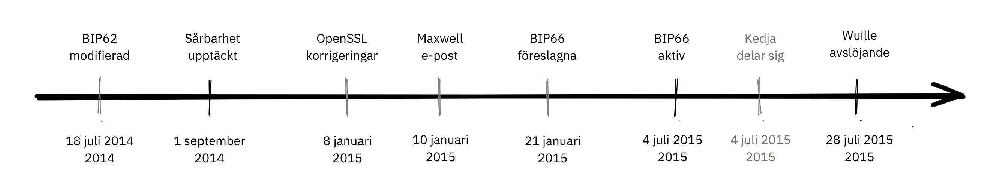


En viktig lärdom av detta är att BIP:er bör vara mer eller mindre *atomiska*, vilket innebär att de bör vara tillräckligt kompletta för att ge något användbart eller lösa ett specifikt problem, men tillräckligt små för att möjliggöra ett brett stöd bland användarna. Ju mer saker du lägger in i en BIP, desto mindre är chansen att den accepteras.


##### Splittras på grund av valideringsfri Mining


Tyvärr slutade inte historien om BIP66 där. När BIP66 aktiverades blev det ganska rörigt eftersom vissa miners inte verifierade de block som de försökte förlänga. Detta kallas valideringslös Mining, eller SPV-Mining (som i Simplified Payment Verification). Ett varningsmeddelande skickades ut till Bitcoin-noderna med en länk till [en webbsida som beskriver problemet](https://Bitcoin.org/en/alert/2015-07-04-spv-Mining):


> Tidigt på morgonen den 4 juli 2015 nåddes tröskelvärdet 950/1000 (95%). Strax därefter utvann en liten Miner (en del av de icke uppgraderade 5 %) ett ogiltigt block - vilket var en förväntad händelse. Tyvärr visade det sig att ungefär hälften av nätverkets Hash-frekvens var Mining utan fullständig validering av block (kallad SPV Mining), och byggde nya block ovanpå det ogiltiga blocket.

Varningssidan instruerade människor att vänta på 30 ytterligare bekräftelser än de normalt skulle göra om de använde äldre versioner av Bitcoin Core.


Den split som nämns ovan inträffade 2015-07-04 kl. 02:10 UTC efter blockhöjden [363730](https://Mempool.space/block/000000000000000006a320d752b46b532ec0f3f815c5dae467aff5715a6e579e). Detta problem löstes kl. 03:50 samma dag, efter att 6 ogiltiga block hade utvunnits. Tyvärr inträffade samma problem igen nästa dag, dvs. den 2015-07-05 kl. 21:50, men den här gången varade den ogiltiga grenen bara i 3 block.


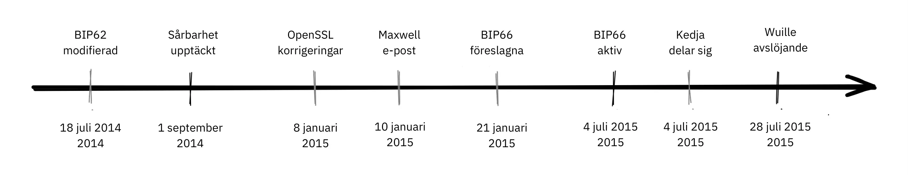

Händelserna som ledde fram till BIP66, dess utplacering och efterspelet är en mycket bra fallstudie för hur försiktiga Bitcoin-utvecklare måste vara. Några viktiga saker att ta med sig från BIP66:


- Balansen mellan öppenhet och att inte offentliggöra en sårbarhet är hårfin.
- Att distribuera korrigeringar för icke-publicerade sårbarheter är ett knepigt spel att spela.
- Behållande konsensus är Hard.
- Programvara som inte är avsedd för konsensussystem är i allmänhet riskfylld.
- BIP:erna bör vara något atomiska.


### Slutsats om När skiten träffar fläkten


Bitcoin har buggar. Personer som upptäcker buggar uppmuntras att ansvarsfullt avslöja dem för Bitcoin-utvecklare, så att de kan åtgärda felet utan att avslöja det offentligt. Helst kan buggfixen döljas som en prestandaförbättring eller någon annan rökridå.


Vi har tittat på några av de allvarligare problemen som har dykt upp genom åren och hur de hanterades. Vissa upptäcktes offentligt genom exploateringar medan andra avslöjades på ett ansvarsfullt sätt och kunde åtgärdas innan illasinnade aktörer fick en chans att utnyttja dem.


## Diskussionsfrågor

<chapterId>91462ca7-f09c-55da-a5b9-3e211de31da5</chapterId>


Dessa diskussionsfrågor är inte bara en sammanfattning av innehållet i "Bitcoin utvecklingsfilosofi", de är menade att uppmuntra dig att forska vidare så se till att gå ut och utforska.


Du kan testa din förståelse genom att skriva en [mini-essä](https://www.youtube.com/watch?v=N4YjXJVzoZY) på 100-300 ord genom att välja ett ämne i den här frågepoolen. Om du vill ha feedback på ditt arbete kan du skicka det till mini-essay@planb.network, så granskar vi det mer än gärna.


#### Decentralisering


- Decentralisering är Hard. Varför går vi igenom allt detta krångel för att få det att fungera? Kan vi välja en hybridstrategi, där vissa delar är centraliserade och andra inte?
- Introducerar decentralisering problemet med dubbla utgifter, eller kräver problemet med dubbla utgifter decentralisering? Hur löste Satoshi problemet med dubbla utgifter?
- I vilka avseenden är Bitcoin fortfarande mest utsatt för censur, och varför är censur en så dålig sak? Finns det några argument som talar för censur?
- Det anges att Bitcoin är tillståndslös. Finns det några andra betalningsmetoder som du skulle kunna betrakta som tillståndslösa?


#### Otillförlitlighet


- Förtroendelöshet är ofta ett spektrum, inte binärt. Vilka aspekter av Bitcoin är snarare Trustless, och vilka innebär typiskt sett en högre nivå av förtroende? Kan de mildras?
- Du vill köra en Full node för att kunna validera alla transaktioner fullt ut. Du laddar ner Bitcoin Core från https://Bitcoin.org/en/download. Var litade du på och var är du helt Trustless?
- Kan man bygga ett Trustless-system ovanpå ett betrott system?


#### Integritet


- Vilka är de viktigaste fördelarna som en användare får när han upprätthåller god integritet när han interagerar med Bitcoin? Vilka är några altruistiska fördelar för nätverket?
- Hur påverkar återanvändning av adresser din integritet?
- Bitcoin använder en UTXO-modell, medan vissa alternativa kryptovalutor använder en kontomodell. Vilka är konsekvenserna av detta val för integriteten?


#### Finita Supply


- Vad är förhållandet mellan Bitcoin:s ändliga Supply och dess myntutgivning genom Coinbase Transaction? Vad är förhållandet mellan myntutgivning och säkerhetsbudget, och hur står de i motsatsförhållande till varandra?
- Vilka parametrar kunde Satoshi ha justerat för att ändra Bitcoin:s Supply-tak? Vad skulle förändras om han hade bestämt sig för att begränsa Supply till 1 miljon? Vad sägs om 1 biljon?
- Varför förespråkar vissa personer en ökning av Bitcoin Supply? Tror du att detta kommer att ske?


#### Uppgradering


- Vad är Speedy Trial och varför var det nödvändigt att aktivera Taproot?
- Varför behöver vi en så hög andel gruvarbetare för att uppgradera i en softfork? Varför är tröskeln inte bara 51%?


#### Motstridigt tänkande


- Vad är en sybil-attack och vad gör ett decentraliserat nätverk så utsatt för den?
- Varför är det viktigt att alla aktörer i Bitcoin-nätverket - och inte bara utvecklare - tänker kontradiktoriskt?


#### Öppen källkod


- Endast en handfull underhållare har de nödvändiga GitHub-behörigheterna för att slå samman kod till [Bitcoin Core](https://github.com/Bitcoin/Bitcoin) -förvaret. Är inte det i strid med ett tillståndlöst nätverk?
- Är utvecklingsprocessen med öppen källkod utsatt för en sybil-attack? Om så är fallet, hur skulle du motverka det?
- Vilka är fördelarna och nackdelarna med att förlita sig på tredjepartsbibliotek med öppen källkod, och vad är tillvägagångssättet med Bitcoin Core?
- På vilka sätt behöver vi granskning utöver bara kodgranskning? Hur avgör man hur mycket granskning som är tillräckligt?
- Hur säkerställer vi att det alltid finns tillräckligt många personer med expertis som arbetar med Bitcoin? Vad händer när de inte gör det, och hur bedömer vi deras integritet och avsikter?


#### Skalning


- Det hävdas att sharding erbjuder skalningsfördelar på bekostnad av komplexitet. Varför ska vi eller ska vi inte anta tekniska förbättringar för att de är svåra att förstå, även om de verkar tekniskt sunda?
- Vilka är några exempel på metoder för inward scaling som introducerades i Bitcoin?
- Varför är vertikal skalning mycket svårare i ett decentraliserat system? Hur är det med horisontell skalning?
- Vi verkar inte vara i närheten av att ha konsensus om hur vi skulle kunna ta ombord hela världen på Bitcoin. Borde inte Satoshi åtminstone ha tänkt ut en väg dit, innan Mining det första blocket 2009?
- Hur skulle du klassificera (vertikalt, horisontellt, inåt eller inte en skalningsteknik) var och en av följande: sharding, blockstorleksökning, SegWit, SPV-noder, centraliserade börser, Lightning Network, blockintervallminskning, Taproot, sidokedjor


# Sista avsnittet


<partId>4b6ff4ef-b9ea-4c48-b05f-62d41a38fbbb</partId>


## Recensioner & betyg


<chapterId>d334a837-df46-4989-9cad-8d8779147dbe</chapterId>


<isCourseReview>true</isCourseReview>

## Slutprov

<chapterId>b2b498c0-a787-11f0-bd09-e3fc5cfa90af</chapterId>

<isCourseExam>true</isCourseExam>

## Slutsats


<chapterId>b77ed55c-b13a-430b-a212-37aab527b9e7</chapterId>


<isCourseConclusion>true</isCourseConclusion>
