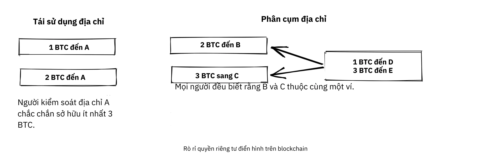
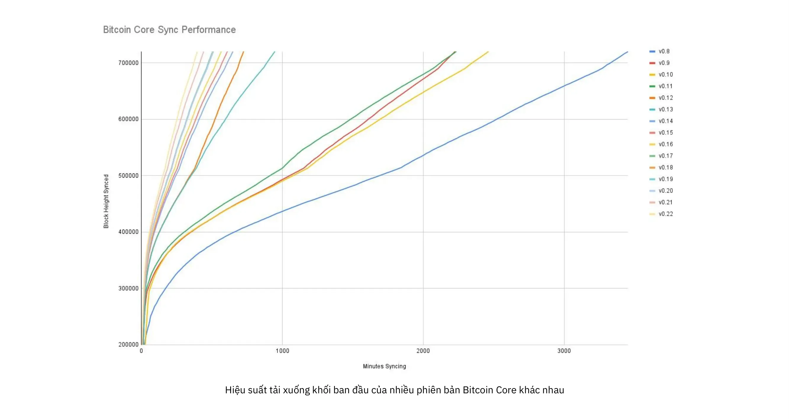
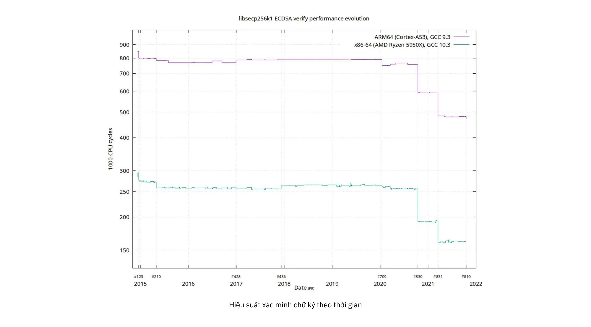
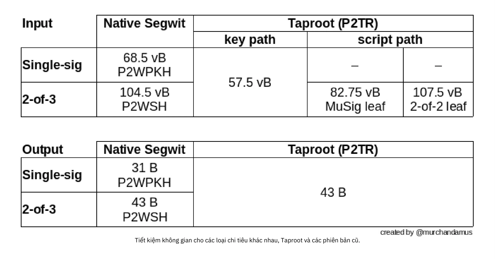
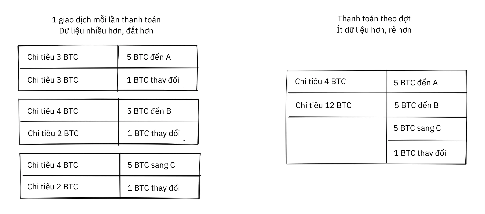
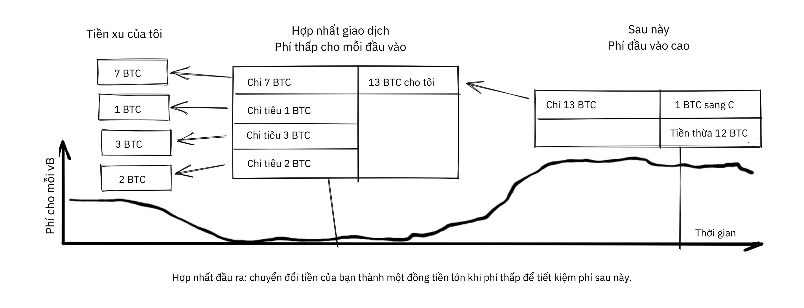
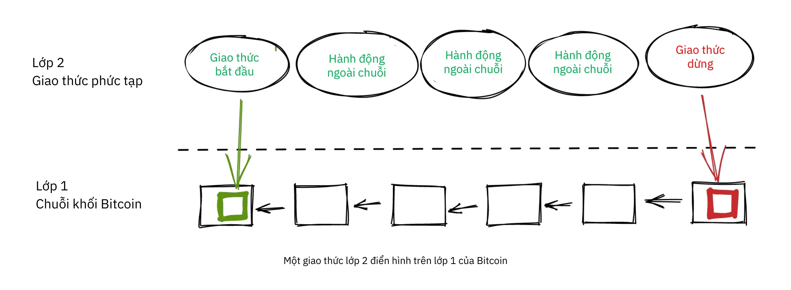
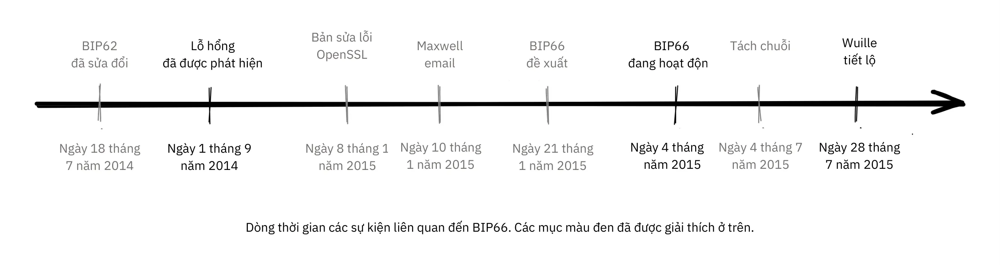
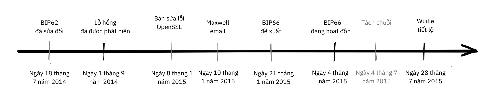
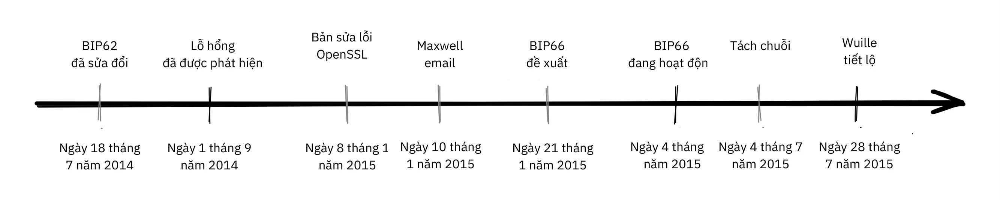

# Đi sâu vào Triết lý Phát triển Bitcoin


Triết lý phát triển Bitcoin là khóa học dành cho các nhà phát triển Bitcoin đã hiểu những khái niệm và quy trình cơ bản như Proof-of-Work, xây dựng khối và vòng đời giao dịch, và muốn nâng cao trình độ bằng cách hiểu sâu hơn về triết lý và sự đánh đổi trong thiết kế của Bitcoin.

Nó sẽ giúp các nhà phát triển mới tiếp thu những bài học quan trọng nhất trong hơn một thập kỷ phát triển Bitcoin và tranh luận công khai, đồng thời cung cấp cho họ bối cảnh hữu ích để đánh giá những ý tưởng mới (cả ý tưởng tốt và ý tưởng xấu!).


### Có thể mong đợi điều gì?


Như đã nêu ở trên, đây là hướng dẫn thực tế dành cho các nhà phát triển Bitcoin. Tuy nhiên, Bitcoin là một chủ đề rộng và phức tạp và chúng tôi không thể đề cập đến tất cả các khía cạnh của nó ở đây. Với khóa học này, chúng tôi hy vọng sẽ thảo luận về các tính năng cần thiết để bắt đầu hoạt động phát triển của bạn cũng như cho phép bạn tự mình khám phá thêm.


Có rất nhiều người tham gia Bitcoin; vì một số người trong số họ có quan điểm đối lập, ở đây bạn có thể tìm thấy các nguồn tài nguyên thể hiện những ý tưởng trái ngược nhau. Tuy nhiên, chúng tôi luôn cố gắng bám sát vào phạm vi sự thật, nơi mà quan điểm không quan trọng.


### Ai đã viết bài này?


Khóa học này được chuyển thể từ cuốn sách cùng tên có tác giả chính là Kalle Rosenbaum và Linnéa Rosenbaum đóng góp với tư cách là đồng tác giả.

Cuốn sách được ủy quyền và tài trợ bởi [Chaincode Labs](https://learning.chaincode.com/), một trung tâm phát triển điều hành các chương trình giáo dục dành cho các nhà phát triển muốn tìm hiểu về phát triển Bitcoin.


+++

# Bitcoin Giá trị trung tâm

<partId>2d6c683b-54c8-5465-b2ca-4e96a6828834</partId>


## Phân cấp

<chapterId>9397c84b-0038-5d0e-88d5-11767ce8182d</chapterId>


Bài viết này phân tích phân cấp là gì và tại sao nó lại cần thiết để Bitcoin hoạt động. Chúng tôi phân biệt giữa

sự phân cấp của [thợ đào](https://planb.academy/resources/glossary/mining) và các [nút đầy đủ](https://planb.academy/resources/glossary/full-node), và thảo luận về những gì họ mang lại để chống kiểm duyệt, một trong những đặc tính cốt lõi nhất của Bitcoin.


Sau đó, cuộc thảo luận chuyển sang tìm hiểu tính trung lập - hoặc không cần xin phép đối với người dùng, thợ đào và nhà phát triển - đây là một đặc tính cần thiết của bất kỳ hệ thống phi tập trung nào. Cuối cùng, chúng tôi đề cập đến cách Hard có thể nắm bắt một hệ thống phi tập trung như Bitcoin và trình bày một số mô hình tinh thần có thể giúp bạn hiểu rõ.


Một hệ thống không có điểm kiểm soát trung tâm nào được gọi là *phi tập trung*. Bitcoin được thiết kế để tránh việc có một điểm kiểm soát trung tâm, hay chính xác hơn là một *điểm kiểm duyệt trung tâm*.


Phân quyền là một phương tiện để đạt được *khả năng chống kiểm duyệt*.


Có hai khía cạnh chính của sự phân quyền trong Bitcoin: phân quyền Miner và phân quyền Full node.


Phân quyền Miner đề cập đến thực tế là việc xử lý [giao dịch](https://planb.academy/resources/glossary/transaction-tx) không được thực hiện hoặc phối hợp bởi bất kỳ thực thể trung tâm nào. Phân quyền Full node đề cập đến thực tế là việc xác thực các [khối](https://planb.academy/resources/glossary/block), tức là dữ liệu mà thợ đào đưa ra, được thực hiện ở rìa mạng, cuối cùng là bởi người dùng của mạng, chứ không phải bởi một số ít cơ quan đáng tin cậy.


### Phân cấp Miner


Đã có nhiều nỗ lực tạo ra tiền kỹ thuật số trước Bitcoin, nhưng hầu hết đều thất bại do thiếu sự phân cấp quản lý và khả năng chống kiểm duyệt.


Phân quyền Miner trong Bitcoin có nghĩa là *việc sắp xếp các giao dịch* không được thực hiện bởi bất kỳ thực thể đơn lẻ hoặc tập hợp các thực thể cố định nào. Nó được thực hiện tập thể bởi tất cả các tác nhân muốn tham gia vào nó; tập thể thợ đào này là một tập hợp người dùng năng động. Bất kỳ ai cũng có thể tham gia hoặc rời đi tùy ý. Thuộc tính này làm cho Bitcoin chống kiểm duyệt.


Nếu Bitcoin được tập trung hóa, nó sẽ dễ bị tổn thương bởi những người muốn kiểm duyệt nó, chẳng hạn như chính phủ. Nó sẽ gặp phải số phận tương tự như những nỗ lực trước đó nhằm tạo ra tiền kỹ thuật số. Trong phần giới thiệu của [một bài báo](https://www.blockstream.com/sidechains.pdf) có tiêu đề "Cho phép đổi mới [Blockchain](https://planb.academy/resources/glossary/blockchain) bằng chuỗi bên được gắn chặt", các tác giả giải thích cách các phiên bản tiền kỹ thuật số ban đầu không được trang bị cho môi trường đối đầu (xem thêm chương về Tư duy đối đầu trong phần tiếp theo).


David Chaum đã giới thiệu tiền kỹ thuật số như một chủ đề nghiên cứu vào năm 1983, trong bối cảnh có một máy chủ trung tâm được tin cậy để ngăn chặn [Double-spending](https://planb.academy/resources/glossary/double-spending-attack). Để giảm thiểu rủi ro về quyền riêng tư đối với cá nhân từ bên trung tâm đáng tin cậy này và để thực thi [khả năng thay thế](https://planb.academy/resources/glossary/fungibility), Chaum đã giới thiệu [chữ ký mù](https://planb.academy/resources/glossary/blind-signature), mà ông đã sử dụng để cung cấp một phương tiện mật mã để ngăn chặn việc liên kết các chữ ký của máy chủ trung tâm (đại diện cho tiền xu), trong khi vẫn cho phép máy chủ trung tâm thực hiện việc ngăn chặn chi tiêu gấp đôi.

Yêu cầu về một máy chủ trung tâm đã trở thành gót chân Achilles của tiền kỹ thuật số[Gri99]. Mặc dù có thể phân phối điểm lỗi duy nhất này bằng cách thay thế chữ ký của máy chủ trung tâm bằng chữ ký ngưỡng của một số người ký, nhưng điều quan trọng đối với khả năng kiểm toán là những người ký phải khác biệt và có thể nhận dạng được. Điều này vẫn khiến hệ thống dễ bị lỗi, vì từng người ký có thể lỗi hoặc bị lỗi, từng người một.


Rõ ràng là việc sử dụng máy chủ trung tâm để sắp xếp các giao dịch không phải là một lựa chọn khả thi do rủi ro kiểm duyệt cao. Ngay cả khi người ta thay thế máy chủ trung tâm bằng một liên bang gồm một tập hợp cố định gồm n máy chủ, trong đó ít nhất m phải chấp thuận việc sắp xếp, thì vẫn còn nhiều khó khăn. Vấn đề thực sự sẽ chuyển sang vấn đề mà người dùng phải đồng ý về tập hợp n máy chủ này cũng như về cách thay thế các máy chủ độc hại bằng các máy chủ tốt mà không cần dựa vào một cơ quan trung ương.


Hãy cùng xem xét điều gì có thể xảy ra nếu Bitcoin bị kiểm duyệt. Người kiểm duyệt có thể gây áp lực buộc người dùng phải xác định danh tính, khai báo nguồn gốc tiền của họ hoặc họ mua gì bằng tiền đó trước khi cho phép giao dịch của họ vào Blockchain.


Ngoài ra, việc thiếu khả năng chống kiểm duyệt sẽ cho phép kiểm duyệt viên ép buộc người dùng áp dụng các quy tắc hệ thống mới. [Ví](https://planb.academy/resources/glossary/wallet) dụ, họ có thể áp đặt một thay đổi cho phép họ thổi phồng tiền Supply, do đó làm giàu cho chính họ. Trong trường hợp như vậy, người dùng xác minh các khối sẽ có ba tùy chọn để xử lý các quy tắc mới:


- Áp dụng: Chấp nhận những thay đổi và áp dụng chúng vào Full node của họ.
- Từ chối: Từ chối áp dụng các thay đổi; điều này khiến hệ thống của người dùng không còn xử lý được giao dịch nữa vì các khối kiểm duyệt hiện bị Full node của người dùng coi là không hợp lệ.
- Di chuyển: Chỉ định một điểm kiểm soát trung tâm mới; tất cả người dùng phải tìm ra cách phối hợp và sau đó thống nhất về điểm kiểm soát trung tâm mới.


Nếu họ thành công, những vấn đề tương tự rất có thể sẽ tái diễn vào một thời điểm nào đó trong tương lai, vì hệ thống vẫn có thể kiểm duyệt như trước.


Không có tùy chọn nào trong số này có lợi cho người dùng.


Khả năng chống kiểm duyệt thông qua phi tập trung là điều khiến Bitcoin khác biệt với các hệ thống tiền tệ khác, nhưng đây không phải là điều dễ dàng thực hiện do *vấn đề Double-spending*. Đây là vấn đề đảm bảo không ai có thể chi tiêu cùng một đồng tiền hai lần, một vấn đề mà nhiều người nghĩ là không thể giải quyết theo cách phi tập trung. Satoshi [Nakamoto](https://planb.academy/resources/glossary/nakamoto-satoshi) viết trong [sách trắng Bitcoin](https://planb.academy/bitcoin.pdf) của mình về cách giải quyết vấn đề Double-spending:


> Trong bài báo này, chúng tôi đề xuất một giải pháp cho vấn đề Double-spending bằng cách sử dụng máy chủ Timestamp phân tán ngang hàng để chứng minh tính toán thứ tự thời gian của các giao dịch trên generate.


Ở đây, ông sử dụng cụm từ nghe có vẻ kỳ lạ "máy chủ Timestamp phân tán ngang hàng". Từ khóa ở đây là *phân tán*, trong ngữ cảnh này có nghĩa là không có điểm kiểm soát trung tâm. Sau đó, Nakamoto tiếp tục giải thích cách [Proof-of-Work](https://planb.academy/resources/glossary/proof-of-work) là giải pháp.

Tuy nhiên, không ai giải thích nó tốt hơn

[Gregory Maxwell trên Reddit](https://www.reddit.com/r/Bitcoin/comments/ddddfl/question_on_the_vulnerability_of_bitcoin/f2g9e7b/), nơi ông trả lời một người đề xuất hạn chế [công suất Hash](https://planb.academy/resources/glossary/hashrate) của thợ đào để tránh các cuộc tấn công 51% tiềm ẩn:


> Một hệ thống phi tập trung như Bitcoin sử dụng một cuộc bầu cử công khai. Nhưng bạn không thể chỉ có một cuộc bỏ phiếu của 'mọi người' trong một hệ thống phi tập trung vì điều đó sẽ yêu cầu một đảng tập trung cho phép mọi người bỏ phiếu. Thay vào đó, Bitcoin sử dụng một cuộc bỏ phiếu của sức mạnh tính toán vì có thể xác minh sức mạnh tính toán mà không cần sự trợ giúp của bất kỳ hệ thống tập trung nào
bên thứ ba.


Bài đăng giải thích cách mạng lưới phi tập trung Bitcoin có thể đạt được thỏa thuận về thứ tự giao dịch thông qua việc sử dụng Proof-of-Work.


Sau đó, ông kết luận rằng cuộc tấn công 51% không thực sự đáng lo ngại, so với những người không quan tâm hoặc không hiểu về đặc tính phi tập trung của Bitcoin:


> Một rủi ro lớn hơn nhiều đối với Bitcoin là công chúng sử dụng nó sẽ không hiểu, không quan tâm và không bảo vệ các đặc tính phi tập trung khiến nó có giá trị hơn các giải pháp thay thế tập trung ngay từ đầu.

Kết luận là một kết luận quan trọng. Nếu mọi người không bảo vệ sự phi tập trung của Bitcoin, một đại diện cho khả năng chống kiểm duyệt của nó, Bitcoin có thể trở thành nạn nhân của quyền lực tập trung, cho đến khi nó tập trung đến mức kiểm duyệt trở thành một thứ gì đó. Khi đó hầu hết, nếu không muốn nói là tất cả, giá trị của nó sẽ biến mất. Điều này đưa chúng ta đến phần tiếp theo về sự phi tập trung của Full node.


### Phân cấp Full node


Trong các đoạn văn trên, chúng ta chủ yếu nói về sự phi tập trung Miner và cách thức các thợ đào tập trung có thể cho phép kiểm duyệt. Nhưng cũng có một khía cạnh khác của sự phi tập trung, cụ thể là *sự phi tập trung Full node*.


Tầm quan trọng của việc phân quyền Full node liên quan đến sự không tin cậy. Giả sử người dùng ngừng chạy Full node của riêng họ do, ví dụ, chi phí vận hành tăng cao. Trong trường hợp đó, họ phải tương tác với mạng Bitcoin theo một cách khác, có thể bằng cách sử dụng ví web hoặc ví nhẹ, đòi hỏi một mức độ tin cậy nhất định vào các nhà cung cấp dịch vụ này.


Người dùng chuyển từ việc trực tiếp thực thi các [quy tắc đồng thuận](https://planb.academy/resources/glossary/consensus-rules) của mạng sang tin tưởng rằng người khác sẽ thực hiện. Bây giờ giả sử rằng hầu hết người dùng ủy quyền thực thi [đồng thuận](https://planb.academy/resources/glossary/consensus) cho một thực thể đáng tin cậy. Trong trường hợp đó, mạng có thể nhanh chóng chuyển sang tập trung hóa và các quy tắc mạng có thể bị thay đổi bởi các tác nhân độc hại thông đồng.


Trong [một

Bài viết trên Tạp chí Bitcoin](https://bitcoinmagazine.com/technical/decentralist-perspective-Bitcoin-might-need-small-blocks-1442090446), Aaron van Wirdum phỏng vấn các nhà phát triển Bitcoin về quan điểm của họ về phi tập trung và những rủi ro liên quan đến việc tăng kích thước khối tối đa của Bitcoin. Cuộc thảo luận này là chủ đề của Hot trong giai đoạn 2014-2017, khi nhiều người tranh luận về việc tăng giới hạn kích thước khối để cho phép thông lượng giao dịch nhiều hơn.


Một lập luận mạnh mẽ chống lại việc tăng kích thước khối là nó làm tăng chi phí xác minh. Nếu chi phí xác minh tăng, nó sẽ đẩy một số người dùng ngừng chạy full node của họ. Điều này, đến lượt nó, sẽ dẫn đến nhiều người không thể sử dụng hệ thống theo cách Trustless.


Bài viết trích dẫn lời Pieter Wuille, trong đó ông giải thích những rủi ro của việc tập trung hóa Full node:


> Nếu nhiều công ty chạy Full node, điều đó có nghĩa là tất cả họ đều cần được thuyết phục để triển khai một bộ quy tắc khác. Nói cách khác: tính phi tập trung của xác thực khối là yếu tố tạo nên sức nặng cho các quy tắc đồng thuận.
> Nhưng nếu số lượng Full node giảm xuống rất thấp, ví dụ như vì mọi người đều sử dụng cùng một ví web, sàn giao dịch và SPV hoặc ví di động, thì quy định có thể trở thành hiện thực. Và nếu các cơ quan có thẩm quyền có thể điều chỉnh các quy tắc đồng thuận, điều đó có nghĩa là họ có thể thay đổi bất kỳ điều gì khiến Bitcoin trở thành Bitcoin. Ngay cả giới hạn 21 triệu Bitcoin.

Vậy là xong. Người dùng Bitcoin nên chạy các nút đầy đủ của riêng họ để ngăn chặn các cơ quan quản lý và các tập đoàn lớn cố gắng thay đổi các quy tắc đồng thuận.


### Trung lập


Bitcoin là trung lập, hay không cần xin phép, như mọi người vẫn gọi. Điều này có nghĩa là Bitcoin không quan tâm bạn là ai hay bạn sử dụng nó vào mục đích gì.


Bitcoin là trung lập, đó là điều tốt và là cách duy nhất nó có thể hoạt động. Nếu nó được kiểm soát bởi một tổ chức thì nó chỉ là một loại đối tượng ảo khác và tôi sẽ không quan tâm đến nó


Miễn là bạn chơi theo luật, bạn được tự do sử dụng nó theo ý muốn, mà không cần xin phép bất kỳ ai. Điều này bao gồm *Mining*, *giao dịch* trong, và *xây dựng các giao thức và dịch vụ* trên Bitcoin:


- Nếu *Mining* là một quy trình được cấp phép, chúng ta sẽ cần một cơ quan trung ương để lựa chọn những người được phép khai thác. Điều này rất có thể dẫn đến việc thợ mỏ phải ký các hợp đồng pháp lý mà họ sẽ đồng ý

để kiểm duyệt các giao dịch theo ý muốn của chính quyền trung ương, điều này đi ngược lại mục đích ban đầu của Mining.


- Nếu những người *giao dịch* trong Bitcoin phải cung cấp thông tin cá nhân, khai báo mục đích giao dịch của họ hoặc chứng minh rằng họ xứng đáng được giao dịch, chúng ta cũng cần một điểm thẩm quyền trung tâm để phê duyệt người dùng hoặc giao dịch. Một lần nữa, điều này sẽ dẫn đến kiểm duyệt và loại trừ.


- Nếu các nhà phát triển phải xin phép để *xây dựng giao thức* trên Bitcoin, chỉ những giao thức được ủy ban cấp phép phát triển trung tâm cho phép mới được phát triển. Điều này, do sự can thiệp của chính phủ, chắc chắn sẽ loại trừ mọi giao thức bảo vệ quyền riêng tư và mọi nỗ lực cải thiện tính phi tập trung.


Ở mọi cấp độ, việc cố gắng áp đặt các hạn chế đối với những người được sử dụng Bitcoin vào mục đích gì sẽ gây tổn hại đến Bitcoin đến mức nó không còn đáp ứng được giá trị đề xuất của mình nữa.


Pieter Wuille https://Bitcoin.stackexchange.com/a/92055/69518[trả lời câu hỏi về Stack Exchange] về cách Blockchain liên quan đến cơ sở dữ liệu thông thường. Ông giải thích cách thức không cần cấp phép có thể đạt được thông qua việc sử dụng Proof-of-Work kết hợp với các ưu đãi kinh tế.


Ông kết luận:


> Việc sử dụng các thuật toán đồng thuận Trustless như PoW sẽ bổ sung thêm một thứ mà không có cấu trúc nào khác có thể cung cấp cho bạn (sự tham gia không cần xin phép, nghĩa là không có nhóm người tham gia nào được thiết lập có thể kiểm duyệt các thay đổi của bạn). Việc sử dụng các thuật toán đồng thuận Trustless như PoW sẽ không bổ sung thêm một thứ gì nhưng lại phải trả giá cao và các giả định về kinh tế của nó khiến nó chỉ hữu ích cho các hệ thống tự xác định loại tiền điện tử của riêng mình.
> Có lẽ trên thế giới chỉ còn một hoặc một vài chiếc thực sự được sử dụng như thế này.

Ông giải thích rằng, để đạt được sự không cần xin phép, hệ thống rất có thể cần có loại tiền tệ riêng, do đó "giới hạn các trường hợp sử dụng chỉ hiệu quả đối với tiền điện tử". Điều này là do sự tham gia không cần xin phép, hay Mining, đòi hỏi các động lực kinh tế được tích hợp vào chính hệ thống.


### Phân cấp Grokking


Một khía cạnh hấp dẫn của Bitcoin là cách Hard nắm bắt rằng không ai kiểm soát nó. Không có ủy ban hoặc giám đốc điều hành nào trong Bitcoin. Gregory Maxwell, một lần nữa [trên subreddit Bitcoin](https://www.reddit.com/r/Bitcoin/comments/s82t2n/comment/htdte7w/?utm_source=share&utm_medium=web2x&context=3), so sánh điều này với tiếng Anh theo một cách hấp dẫn:


> Nhiều người có thời gian Hard để hiểu các hệ thống tự động, có nhiều thứ trong cuộc sống của họ như tiếng Anh - nhưng mọi người chỉ coi chúng là điều hiển nhiên và thậm chí không nghĩ chúng là hệ thống. Họ bị mắc kẹt trong cách suy nghĩ tập trung, nơi mọi thứ họ nghĩ là 'vật' đều có thẩm quyền kiểm soát nó.
>

> Bitcoin không tập trung vào bất cứ điều gì. Nhiều người đã áp dụng Bitcoin đã tự nguyện lựa chọn quảng bá nó, và cách họ chọn làm như vậy là việc của họ. Những người bị ám ảnh bởi thẩm quyền có thể thấy những hoạt động này và tin rằng chúng là một hoạt động nào đó của thẩm quyền Bitcoin, nhưng không có thẩm quyền nào như vậy tồn tại.


Cách Bitcoin hoạt động thông qua phân cấp giống với trí thông minh tập thể phi thường được tìm thấy ở nhiều loài trong tự nhiên. Nhà khoa học máy tính Radhika Nagpal phát biểu trong một [bài nói chuyện Ted](https://www.ted.com/talks/radhika_nagpal_what_intelligent_machines_can_learn_from_a_school_of_fish) về hành vi tập thể của đàn cá và cách các nhà khoa học đang cố gắng mô phỏng nó bằng cách sử dụng robot.


> Thứ hai, và điều mà tôi vẫn thấy đáng chú ý nhất, là chúng ta biết rằng không có người lãnh đạo nào giám sát đàn cá này. Thay vào đó, hành vi tâm trí tập thể đáng kinh ngạc này xuất hiện hoàn toàn từ sự tương tác giữa một con cá với một con cá khác.
> Bằng cách nào đó, có những tương tác hoặc quy tắc giao tranh giữa những con cá lân cận khiến mọi thứ diễn ra suôn sẻ.

Bà chỉ ra rằng nhiều hệ thống, dù là tự nhiên hay nhân tạo, có thể và hoạt động mà không cần người lãnh đạo, và chúng mạnh mẽ và bền bỉ. Mỗi cá nhân chỉ tương tác với môi trường xung quanh trực tiếp của họ, nhưng khi kết hợp lại, họ tạo nên một thứ gì đó to lớn.


Bất kể bạn nghĩ gì về Bitcoin, bản chất phi tập trung của nó khiến nó khó kiểm soát. Bitcoin tồn tại và bạn không thể làm gì về nó. Đó là thứ cần được nghiên cứu, không phải để tranh luận.


### Kết luận về Phân quyền


Chúng tôi phân biệt giữa phân quyền Full node và phân quyền Mining. Phân quyền Mining là phương tiện để đạt được khả năng chống kiểm duyệt, trong khi phân quyền Full node là thứ duy trì các quy tắc đồng thuận của mạng Hard thay đổi mà không có sự hỗ trợ rộng rãi giữa những người dùng.


Bản chất phi tập trung của Bitcoin cho phép tính trung lập đối với các nhà phát triển, người dùng và thợ đào. Bất kỳ ai cũng có thể tự do tham gia mà không cần xin phép.


Hệ thống phi tập trung có thể khó hiểu đối với bạn, nhưng có một số mô hình tinh thần có thể giúp ích, ví dụ như tiếng Anh hoặc đàn cá.


## Sự thiếu tin tưởng

<chapterId>0506ba61-16a3-543c-95fa-3f3e2dd64121</chapterId>


Chương này phân tích khái niệm về sự không tin cậy, ý nghĩa của nó theo quan điểm khoa học máy tính và lý do tại sao Bitcoin phải là Trustless để giữ được giá trị đề xuất của nó.

Sau đó, chúng ta sẽ nói về việc sử dụng Bitcoin theo cách của Trustless có ý nghĩa gì và Full node có thể và không thể đảm bảo những gì cho bạn.

Trong phần cuối, chúng ta sẽ xem xét sự tương tác thực tế giữa Bitcoin và các phần mềm hoặc người dùng thực tế, cũng như nhu cầu đánh đổi giữa sự tiện lợi và sự thiếu tin cậy để hoàn thành mọi việc.


Mọi người thường nói những điều như "Bitcoin tuyệt vời vì nó là Trustless".


Họ muốn nói gì khi nhắc đến Trustless? Pieter Wuille giải thích thuật ngữ được sử dụng rộng rãi này trên [Stack Exchange](https://Bitcoin.stackexchange.com/a/45674/69518):


> Niềm tin mà chúng ta đang nói đến trong "Trustless" là một thuật ngữ kỹ thuật trừu tượng. Một hệ thống phân tán được gọi là Trustless khi nó không yêu cầu bất kỳ bên đáng tin cậy nào hoạt động chính xác.

Tóm lại, từ *Trustless* ám chỉ một thuộc tính của giao thức Bitcoin mà theo đó nó có thể hoạt động hợp lý mà không cần "bất kỳ bên đáng tin cậy nào". Điều này khác với sự tin tưởng mà bạn chắc chắn phải đặt vào phần mềm hoặc phần cứng mà bạn chạy. Chúng ta sẽ thảo luận thêm về khía cạnh sau này của sự tin tưởng trong chương này.


Trong các hệ thống tập trung, chúng ta dựa vào danh tiếng của một tác nhân trung tâm để đảm bảo rằng họ sẽ xử lý vấn đề bảo mật hoặc khôi phục trong trường hợp có vấn đề, cũng như dựa vào hệ thống pháp lý để xử phạt bất kỳ hành vi vi phạm nào. Các yêu cầu về lòng tin này là vấn đề trong các hệ thống phi tập trung ẩn danh - không có khả năng khắc phục nên thực sự không thể có bất kỳ lòng tin nào. Trong phần giới thiệu của [sách trắng Bitcoin](https://Bitcoin.org/Bitcoin.pdf), Satoshi Nakamoto mô tả vấn đề này:


> Thương mại trên Internet gần như hoàn toàn phụ thuộc vào các tổ chức tài chính đóng vai trò là bên thứ ba đáng tin cậy để xử lý các khoản thanh toán điện tử.
> Mặc dù hệ thống hoạt động đủ tốt cho hầu hết các giao dịch, nhưng nó vẫn mắc phải những điểm yếu cố hữu của mô hình dựa trên sự tin cậy. Các giao dịch hoàn toàn không thể đảo ngược thực sự không khả thi, vì các tổ chức tài chính không thể tránh khỏi việc hòa giải tranh chấp. Chi phí hòa giải làm tăng chi phí giao dịch, hạn chế quy mô giao dịch thực tế tối thiểu và cắt đứt khả năng thực hiện các giao dịch nhỏ thông thường, và có chi phí lớn hơn trong việc mất khả năng thực hiện các khoản thanh toán không thể đảo ngược cho các dịch vụ không thể đảo ngược.
> Với khả năng đảo ngược, nhu cầu về lòng tin lan rộng. Các thương gia phải cảnh giác với khách hàng của mình, làm phiền họ để có thêm thông tin hơn mức họ cần. Một tỷ lệ gian lận nhất định được chấp nhận là không thể tránh khỏi. Những chi phí và sự không chắc chắn về thanh toán này có thể tránh được khi trực tiếp sử dụng tiền tệ vật lý, nhưng không có cơ chế nào để thực hiện thanh toán qua kênh truyền thông mà không có bên đáng tin cậy

Có vẻ như chúng ta không thể có một hệ thống phi tập trung dựa trên sự tin tưởng, và đó là lý do tại sao tính không tin tưởng lại quan trọng trong Bitcoin.


Để sử dụng Bitcoin theo cách của Trustless, bạn phải chạy một nút Bitcoin xác thực đầy đủ. Chỉ khi đó, bạn mới có thể xác minh rằng các khối bạn nhận được từ những người khác đang tuân theo các quy tắc đồng thuận; ví dụ, lịch phát hành tiền xu được giữ nguyên và không có chi tiêu gấp đôi nào xảy ra trên Blockchain. Nếu bạn không chạy Full node, bạn sẽ thuê ngoài việc xác minh các khối Bitcoin cho người khác và tin tưởng họ sẽ nói sự thật với bạn, điều đó có nghĩa là bạn không sử dụng Bitcoin một cách không đáng tin cậy.


David Harding là tác giả của [một bài viết trên trang web Bitcoin.org](https://Bitcoin.org/en/Bitcoin-core/features/validation) giải thích cách chạy Full node - hoặc sử dụng Bitcoin mà không cần tin cậy - thực sự giúp ích cho bạn như thế nào:


> Tiền tệ Bitcoin chỉ hoạt động khi mọi người chấp nhận bitcoin trong Exchange cho những thứ có giá trị khác. Điều đó có nghĩa là những người chấp nhận bitcoin sẽ mang lại giá trị cho nó và quyết định cách thức hoạt động của Bitcoin.
>

> Khi bạn chấp nhận bitcoin, bạn có quyền thực thi các quy tắc của Bitcoin, chẳng hạn như ngăn chặn việc tịch thu bitcoin của bất kỳ ai mà không có quyền truy cập vào khóa riêng của người đó.
>

> Thật không may, nhiều người dùng thuê ngoài quyền thực thi của họ. Điều này khiến sự phân quyền của Bitcoin ở trạng thái yếu đi, nơi một số ít thợ đào có thể thông đồng với một số ít ngân hàng và các dịch vụ miễn phí để thay đổi các quy tắc của Bitcoin đối với tất cả những người dùng không xác minh đã thuê ngoài quyền lực của họ.
>

> Không giống như các ví khác, Bitcoin Core thực thi các quy tắc—do đó, nếu thợ đào và ngân hàng thay đổi các quy tắc đối với người dùng không xác minh, những người dùng đó sẽ không thể thanh toán đầy đủ cho người dùng Bitcoin Core xác thực như bạn.


Ông ấy nói rằng việc chạy Full node sẽ giúp bạn xác minh mọi khía cạnh của Blockchain mà không cần tin tưởng bất kỳ ai khác, để đảm bảo rằng các đồng tiền bạn nhận được từ người khác là chính hãng. Điều này thật tuyệt, nhưng có một điều quan trọng mà Full node không thể giúp bạn: nó không thể ngăn chặn việc chi tiêu gấp đôi thông qua việc viết lại chuỗi:


> Lưu ý rằng mặc dù tất cả các chương trình—bao gồm cả Bitcoin Core—đều dễ bị ghi đè chuỗi, Bitcoin cung cấp một cơ chế phòng thủ: giao dịch của bạn càng có nhiều xác nhận thì bạn càng an toàn. Không có biện pháp phòng thủ phi tập trung nào được biết đến tốt hơn thế.

Cho dù phần mềm của bạn tiên tiến đến đâu, bạn vẫn phải tin rằng các khối chứa tiền của bạn sẽ không bị viết lại. Tuy nhiên, như Harding đã chỉ ra, bạn có thể chờ một số xác nhận, sau đó bạn xem xét khả năng viết lại chuỗi đủ nhỏ để có thể chấp nhận được.


Các động cơ sử dụng Bitcoin theo cách của Trustless phù hợp với nhu cầu phân quyền Full node của hệ thống. Càng nhiều người sử dụng full node của riêng họ, thì Full node phân quyền càng nhiều, và do đó Bitcoin càng mạnh mẽ hơn khi chống lại các thay đổi có hại cho giao thức. Nhưng thật không may, như đã giải thích trong phần phân quyền Full node, người dùng thường lựa chọn các dịch vụ đáng tin cậy do hậu quả của sự đánh đổi không thể tránh khỏi giữa sự không tin cậy và sự tiện lợi.


Tính không tin cậy của Bitcoin là hoàn toàn bắt buộc theo quan điểm hệ thống. Năm 2018, Matt Corallo, [đã nói về tính không tin cậy](https://btctranscripts.com/baltic-honeybadger/2018/trustlessness-scalability-and-directions-in-security-models/) tại hội nghị Baltic Honeybadger ở Riga.


Bản chất của bài nói chuyện đó là bạn không thể xây dựng các hệ thống Trustless trên một hệ thống đáng tin cậy, nhưng bạn có thể xây dựng các hệ thống đáng tin cậy - ví dụ, hệ thống giám sát Wallet - trên một hệ thống Trustless.


Trustless cơ sở Layer cho phép nhiều sự đánh đổi khác nhau ở các cấp độ cao hơn


Mô hình bảo mật này cho phép nhà thiết kế hệ thống lựa chọn các sự đánh đổi

có ý nghĩa với họ mà không buộc người khác phải đánh đổi.


### Đừng tin tưởng, hãy xác minh


Bitcoin hoạt động không cần tin cậy, nhưng bạn vẫn phải tin tưởng phần mềm và phần cứng của mình ở một mức độ nào đó. Đó là vì phần mềm hoặc phần cứng của bạn có thể không được lập trình để thực hiện những gì được nêu trên hộp. Ví dụ:


- CPU có thể được thiết kế độc hại để phát hiện các hoạt động mã hóa khóa riêng tư và làm rò rỉ dữ liệu khóa riêng tư.
- Trình tạo số ngẫu nhiên của hệ điều hành có thể không ngẫu nhiên như tuyên bố.
- Lõi Bitcoin có thể đã lén đưa vào mã sẽ gửi khóa riêng của bạn cho một số kẻ xấu.


Vì vậy, ngoài việc chạy Full node, bạn cũng cần đảm bảo rằng bạn đang chạy đúng mục đích. Người dùng Reddit brianddk [đã viết một bài viết](https://www.reddit.com/r/Bitcoin/comments/smj1ep/bitcoin_v220_and_guix_stronger_defense_against/) về các mức độ tin cậy khác nhau mà bạn có thể lựa chọn khi xác minh phần mềm của mình. Trong phần "Tin tưởng người xây dựng", anh ấy nói về các bản dựng có thể tái tạo:


> Bản dựng có thể tái tạo là một cách để thiết kế phần mềm sao cho nhiều nhà phát triển cộng đồng có thể cùng xây dựng phần mềm và đảm bảo rằng trình cài đặt cuối cùng được xây dựng giống hệt với những gì các nhà phát triển khác tạo ra. Với một dự án có thể tái tạo và công khai như Bitcoin, không cần phải hoàn toàn tin tưởng vào một nhà phát triển nào. Nhiều nhà phát triển đều có thể thực hiện bản dựng và chứng thực rằng họ đã tạo ra cùng một tệp như tệp mà nhà xây dựng ban đầu đã ký kỹ thuật số.

Bài viết định nghĩa 5 cấp độ tin cậy: tin tưởng vào trang web, người xây dựng, trình biên dịch, hạt nhân và phần cứng.


Để đào sâu hơn nữa chủ đề về bản dựng có thể tái tạo, Carl Dong [đã có bài thuyết trình về Guix](https://btctranscripts.com/breaking-Bitcoin/2019/Bitcoin-build-system/) giải thích lý do tại sao việc tin tưởng vào hệ điều hành, thư viện và trình biên dịch có thể gây ra vấn đề và cách khắc phục điều đó bằng hệ thống có tên là Guix, hiện đang được Bitcoin Core sử dụng.


> Vậy chúng ta có thể làm gì về thực tế là chuỗi công cụ của chúng ta có thể có một loạt các tệp nhị phân đáng tin cậy có thể gây hại một cách tái tạo? Chúng ta cần phải có khả năng tái tạo nhiều hơn. Chúng ta cần phải có khả năng tự khởi động. Chúng ta không thể có nhiều công cụ nhị phân mà chúng ta cần tải xuống và tin cậy từ các máy chủ bên ngoài do các tổ chức khác kiểm soát.
>

> Chúng ta cần biết cách các công cụ này được xây dựng và chính xác cách chúng ta có thể thực hiện quy trình xây dựng lại chúng, tốt nhất là từ một tập hợp các tệp nhị phân đáng tin cậy nhỏ hơn nhiều. Chúng ta cần giảm thiểu tập hợp các tệp nhị phân đáng tin cậy của mình càng nhiều càng tốt và có một đường dẫn dễ kiểm tra từ các chuỗi công cụ đó đến những gì chúng ta sử dụng để xây dựng Bitcoin. Điều này cho phép chúng ta tối đa hóa xác minh và giảm thiểu sự tin cậy.

Sau đó, ông giải thích cách Guix cho phép chúng ta chỉ tin tưởng vào một nhị phân tối thiểu 357 byte có thể được xác minh và hiểu đầy đủ nếu bạn biết cách diễn giải các hướng dẫn. Điều này khá đáng chú ý: người ta xác minh rằng nhị phân 357 byte thực hiện những gì nó cần, sau đó sử dụng nó để xây dựng toàn bộ hệ thống xây dựng từ mã nguồn và kết thúc bằng một nhị phân Bitcoin Core phải là bản sao chính xác của bản dựng của bất kỳ ai khác.


Có một câu thần chú mà nhiều người chơi bitcoin tin theo, câu này mô tả khá đầy đủ phần lớn nội dung trên:


> Đừng tin, hãy xác minh.

Điều này ám chỉ đến cụm từ "[tin tưởng, nhưng xác minh](https://en.wikipedia.org/wiki/Trust,_but_verify)" mà cựu tổng thống Hoa Kỳ Ronald Reagan đã sử dụng trong bối cảnh giải trừ vũ khí hạt nhân. [Những người dùng Bitcoin](https://twitter.com/Truthcoin/status/1491415722123153408?s=20&t=ZyROxZxlBppdRpuuzsiF5w) đã đảo ngược cụm từ này để nhấn mạnh sự từ chối tin tưởng và tầm quan trọng của việc chạy Full node.


Người dùng có quyền quyết định mức độ họ muốn xác minh phần mềm họ sử dụng và dữ liệu Blockchain họ nhận được. Cũng như nhiều thứ khác trong Bitcoin, có sự đánh đổi giữa tính tiện lợi và tính không tin cậy. Sử dụng Wallet giám sát hầu như luôn tiện lợi hơn so với chạy Bitcoin Core trên phần cứng của riêng bạn. Tuy nhiên, khi phần mềm Bitcoin ngày càng hoàn thiện và giao diện người dùng được cải thiện, theo thời gian, phần mềm này sẽ hỗ trợ tốt hơn cho những người dùng sẵn sàng hướng tới tính không tin cậy. Ngoài ra, khi người dùng có thêm nhiều kiến thức hơn theo thời gian, họ sẽ có thể dần dần loại bỏ tính tin cậy khỏi phương trình.


Một số người dùng suy nghĩ theo hướng đối đầu và xác minh hầu hết các khía cạnh của phần mềm họ chạy. Do đó, họ giảm nhu cầu tin tưởng xuống mức tối thiểu, vì họ chỉ cần tin tưởng phần cứng máy tính và hệ điều hành của mình. Khi làm như vậy, họ cũng giúp những người không xác minh phần cứng của mình một cách kỹ lưỡng bằng cách lên tiếng trước công chúng để cảnh báo về bất kỳ vấn đề nào họ có thể tìm thấy. Một ví dụ điển hình về điều này là [sự kiện xảy ra vào năm 2018](https://bitcoincore.org/en/2018/09/20/notice/), khi ai đó phát hiện ra một lỗi cho phép thợ đào chi tiêu một đầu ra hai lần trong cùng một giao dịch:


> CVE-2018-17144, bản sửa lỗi được phát hành vào ngày 18 tháng 9 trong Bitcoin Core phiên bản 0.16.3 và 0.17.0rc4, bao gồm cả thành phần Từ chối dịch vụ và lỗ hổng lạm phát nghiêm trọng. Ban đầu, nó được báo cáo cho một số nhà phát triển đang làm việc trên Bitcoin Core, cũng như các dự án hỗ trợ các loại tiền điện tử khác, bao gồm ABC và Unlimited vào ngày 17 tháng 9 như một lỗi Từ chối dịch vụ, tuy nhiên chúng tôi nhanh chóng xác định rằng sự cố này cũng là lỗ hổng lạm phát với cùng nguyên nhân gốc rễ và bản sửa lỗi.

Ở đây, một người ẩn danh đã báo cáo một vấn đề tệ hơn nhiều so với những gì người báo cáo nhận ra. Điều này làm nổi bật thực tế là những người xác minh mã thường báo cáo các lỗi bảo mật thay vì khai thác chúng. Điều này có lợi cho những người không thể tự mình xác minh mọi thứ.


Tuy nhiên, người dùng không nên tin tưởng người khác để giữ an toàn cho họ, mà nên tự mình xác minh bất cứ khi nào và bất cứ điều gì họ có thể; đó là cách duy trì chủ quyền tối đa có thể và là cách Bitcoin phát triển. Càng có nhiều người chú ý đến phần mềm, thì khả năng mã độc và lỗ hổng bảo mật lọt qua càng thấp.


### Kết luận về sự không tin cậy


Giao thức Bitcoin là Trustless vì nó cho phép người dùng tương tác với nó mà không cần tin tưởng bên thứ ba. Tuy nhiên, trên thực tế, hầu hết mọi người không thể xác minh toàn bộ ngăn xếp phần mềm và phần cứng mà họ chạy Bitcoin. Những người có kỹ năng xác minh phần mềm hoặc phần cứng có thể cảnh báo những người khác, ít kỹ năng hơn, khi họ tìm thấy mã độc hại hoặc lỗi.


Nếu không có sự tin tưởng, chúng ta không thể có sự phân cấp, vì sự tin tưởng chắc chắn liên quan đến một số điểm trung tâm của thẩm quyền. Bạn có thể xây dựng một hệ thống đáng tin cậy trên một hệ thống Trustless, nhưng bạn không thể xây dựng một hệ thống Trustless trên một hệ thống đáng tin cậy.


## Sự riêng tư

<chapterId>1b960afe-0008-589b-b2f4-007d60d264c6</chapterId>


Chương này đề cập đến cách giữ thông tin tài chính riêng tư của bạn cho riêng bạn. Chương này giải thích quyền riêng tư có nghĩa là gì trong bối cảnh của Bitcoin, tại sao nó quan trọng và ý nghĩa của việc nói rằng Bitcoin là ẩn danh. Chương này cũng xem xét cách dữ liệu riêng tư có thể bị rò rỉ, cả On-Chain và off-chain.


Sau đó, nó nói về thực tế là bitcoin nên có thể thay thế được, nghĩa là có thể hoán đổi cho bất kỳ bitcoin nào khác và cách thay thế và quyền riêng tư song hành với nhau. Cuối cùng, chương này giới thiệu một số biện pháp bạn có thể thực hiện để cải thiện quyền riêng tư của bạn và của người khác.


Bitcoin có thể được mô tả như một hệ thống ẩn danh, trong đó người dùng có nhiều ẩn danh dưới dạng khóa công khai. Thoạt nhìn, đây có vẻ là một cách khá tốt để bảo vệ người dùng khỏi bị nhận dạng, nhưng thực tế rất dễ bị rò rỉ thông tin tài chính cá nhân một cách vô tình.


### Quyền riêng tư có nghĩa là gì?


Quyền riêng tư có thể có nghĩa khác nhau trong các bối cảnh khác nhau. Trong Bitcoin, nói chung có nghĩa là người dùng không phải tiết lộ thông tin tài chính của mình cho người khác, trừ khi họ tự nguyện làm như vậy.


Có nhiều cách mà bạn có thể làm rò rỉ thông tin cá nhân của mình cho người khác, có hoặc không biết. Dữ liệu có thể bị rò rỉ từ Blockchain công khai hoặc thông qua các phương tiện khác, ví dụ như khi những kẻ xấu chặn thông tin liên lạc internet của bạn.


### Tại sao quyền riêng tư lại quan trọng?


Có vẻ như rất rõ ràng tại sao quyền riêng tư lại quan trọng trong Bitcoin, nhưng có một số khía cạnh mà người ta có thể không nghĩ đến ngay. [Trên diễn đàn Bitcoin Talk](https://bitcointalk.org/index.php?topic=334316.msg3588908#msg3588908), Gregory Maxwell đưa ra cho chúng ta rất nhiều lý do chính đáng tại sao ông cho rằng quyền riêng tư là quan trọng. Trong số đó có thị trường tự do, an toàn và phẩm giá con người:


> Quyền riêng tư về tài chính là tiêu chí thiết yếu để thị trường tự do hoạt động hiệu quả: nếu bạn điều hành một doanh nghiệp, bạn không thể đặt giá hiệu quả nếu nhà cung cấp và khách hàng có thể xem mọi giao dịch của bạn mà bạn không muốn.
> Bạn không thể cạnh tranh hiệu quả nếu đối thủ cạnh tranh theo dõi doanh số bán hàng của bạn. Về mặt cá nhân, đòn bẩy thông tin của bạn sẽ bị mất trong các giao dịch riêng tư nếu bạn không có quyền riêng tư đối với tài khoản của mình: nếu bạn trả tiền cho chủ nhà theo Bitcoin mà không có đủ quyền riêng tư, chủ nhà sẽ biết khi nào bạn được tăng lương và có thể yêu cầu bạn trả thêm tiền thuê nhà.
>

> Quyền riêng tư về tài chính là điều cần thiết cho sự an toàn cá nhân: nếu kẻ trộm có thể nhìn thấy chi tiêu, thu nhập và tài sản của bạn, chúng có thể sử dụng thông tin đó để nhắm mục tiêu và khai thác bạn. Nếu không có quyền riêng tư, những kẻ xấu có nhiều khả năng đánh cắp danh tính của bạn, giật những món hàng lớn của bạn ngay trước cửa nhà bạn hoặc mạo danh các doanh nghiệp mà bạn giao dịch với bạn... chúng có thể biết chính xác số tiền cần lừa đảo bạn.
>

> Quyền riêng tư về tài chính là điều cần thiết cho phẩm giá con người: không ai muốn nhân viên pha chế cà phê hay những người hàng xóm tọc mạch bình luận về thu nhập hoặc thói quen chi tiêu của họ. Không ai muốn những người thân thích con cái của mình hỏi tại sao họ lại mua thuốc tránh thai (hoặc đồ chơi tình dục). Chủ lao động của bạn không có quyền biết bạn quyên góp cho nhà thờ nào. Chỉ trong một thế giới hoàn toàn khai sáng không phân biệt đối xử, nơi không ai có thẩm quyền quá đáng đối với bất kỳ ai khác, chúng ta mới có thể giữ được phẩm giá của mình và thực hiện các giao dịch hợp pháp một cách tự do mà không bị tự kiểm duyệt nếu chúng ta không có quyền riêng tư.

Maxwell cũng đề cập đến tính có thể thay thế, vấn đề này sẽ được thảo luận sau trong chương này, cũng như về việc quyền riêng tư và việc thực thi pháp luật không mâu thuẫn với nhau như thế nào.


### Bí danh


Chúng tôi đã đề cập ở trên rằng Bitcoin là ẩn danh và các ẩn danh là khóa công khai. Trong phương tiện truyền thông, bạn thường nghe nói rằng Bitcoin là ẩn danh, điều này không đúng. Có sự khác biệt giữa ẩn danh và ẩn danh.


Andrew Poelstra [giải thích trong bài đăng Bitcoin Stack Exchange](https://Bitcoin.stackexchange.com/a/29473/69518) về tính ẩn danh trong các giao dịch:


> Về mặt lý thuyết, tính ẩn danh hoàn toàn, theo nghĩa là khi bạn chi tiền, bạn sẽ không biết tiền đến từ đâu hoặc đi đâu, là điều có thể thực hiện được bằng cách sử dụng kỹ thuật mật mã bằng chứng không kiến thức.

Sự khác biệt có vẻ là ở dạng tiền ẩn danh, bạn có thể theo dõi các khoản thanh toán giữa các bút danh, trong khi ở dạng tiền ẩn danh thì không. Vì các khoản thanh toán Bitcoin có thể theo dõi giữa các bút danh, nên đây không phải là hệ thống ẩn danh.


Chúng tôi cũng đã nói rằng các bí danh là khóa công khai, nhưng thực ra đó là các địa chỉ có nguồn gốc từ khóa công khai. Tại sao chúng tôi sử dụng địa chỉ làm bí danh chứ không phải thứ gì khác, ví dụ như một số tên mô tả, như "watchme1984"? Điều này đã được [giải thích rõ](https://Bitcoin.stackexchange.com/a/25175/69518) bởi người dùng Tim S., cũng trên Bitcoin Stack Exchange:


> Để ý tưởng của Bitcoin có thể hoạt động, bạn phải có những đồng tiền mà chỉ chủ sở hữu của một khóa riêng tư nhất định mới có thể chi tiêu. Điều này có nghĩa là bất cứ thứ gì bạn gửi đến phải được liên kết, theo một cách nào đó, với một khóa công khai.
>

> Sử dụng các bút danh tùy ý (ví dụ: tên người dùng) có nghĩa là sau đó bạn phải liên kết bút danh với khóa công khai để kích hoạt mã hóa khóa công khai/riêng tư. Điều này sẽ loại bỏ khả năng tạo địa chỉ/bút danh an toàn ngoại tuyến (ví dụ: trước khi ai đó có thể gửi tiền cho tên người dùng "tdumidu", bạn sẽ phải thông báo trong Blockchain rằng "tdumidu" thuộc sở hữu của khóa công khai "a1c..." và bao gồm một khoản phí để những người khác có lý do để thông báo), giảm tính ẩn danh (bằng cách khuyến khích bạn sử dụng lại bút danh) và làm tăng kích thước của Blockchain một cách không cần thiết. Nó cũng sẽ tạo ra cảm giác an toàn giả tạo rằng bạn đang gửi cho người mà bạn nghĩ mình là (nếu tôi lấy tên "Linus Torvalds" trước khi anh ấy làm vậy, thì đó là tên của tôi và mọi người có thể gửi tiền vì nghĩ rằng họ đang trả tiền cho người tạo ra Linux chứ không phải tôi).

Bằng cách sử dụng địa chỉ hoặc khóa công khai, chúng tôi đạt được các mục tiêu quan trọng, chẳng hạn như loại bỏ nhu cầu phải đăng ký bút danh trước, giảm động cơ sử dụng lại bút danh, tránh tình trạng phình to Blockchain và khiến việc mạo danh người khác trở nên khó khăn hơn.


### Blockchain quyền riêng tư


Quyền riêng tư của Blockchain đề cập đến thông tin bạn tiết lộ khi giao dịch trên Blockchain. Nó áp dụng cho tất cả các giao dịch, cả giao dịch bạn gửi và giao dịch bạn nhận.


Satoshi Nakamoto suy ngẫm về quyền riêng tư của On-Chain trong phần 7 của [sách trắng Bitcoin](https://Bitcoin.org/Bitcoin.pdf):


> Là một tường lửa bổ sung, một cặp khóa mới nên được sử dụng cho mỗi giao dịch để ngăn chúng được liên kết với một chủ sở hữu chung. Một số liên kết vẫn không thể tránh khỏi với các giao dịch nhiều đầu vào, điều này nhất thiết phải tiết lộ rằng đầu vào của chúng thuộc sở hữu của cùng một chủ sở hữu. Rủi ro là nếu chủ sở hữu của một khóa bị tiết lộ, việc liên kết có thể tiết lộ các giao dịch khác thuộc về cùng một chủ sở hữu.

Bài báo tóm tắt các vấn đề chính của quyền riêng tư Blockchain, cụ thể là tái sử dụng Address và phân cụm Address. Vấn đề đầu tiên là tự giải thích, vấn đề sau đề cập đến khả năng quyết định, với một mức độ chắc chắn nào đó, rằng một tập hợp các địa chỉ khác nhau thuộc về cùng một người dùng.





Chris Belcher [đã viết rất chi tiết](https://en.Bitcoin.it/Privacy#Blockchain_attacks_on_privacy) về các loại rò rỉ quyền riêng tư khác nhau có thể xảy ra trên Bitcoin Blockchain. Chúng tôi khuyên bạn nên đọc ít nhất một vài tiểu mục đầu tiên trong phần "Các cuộc tấn công vào quyền riêng tư của Blockchain".


Điểm mấu chốt là quyền riêng tư trong Bitcoin không hoàn hảo. Cần phải bỏ ra rất nhiều công sức để giao dịch riêng tư. Hầu hết mọi người không sẵn sàng đi xa đến vậy để có được quyền riêng tư. Có vẻ như có sự đánh đổi rõ ràng giữa quyền riêng tư và khả năng sử dụng.


Một khía cạnh quan trọng khác của quyền riêng tư là các biện pháp bạn thực hiện để bảo vệ quyền riêng tư của mình cũng ảnh hưởng đến những người dùng khác. Nếu bạn cẩu thả với quyền riêng tư của mình, những người khác cũng có thể bị giảm quyền riêng tư. Gregory Maxwell giải thích điều này rất rõ ràng trong cùng một cuộc thảo luận Bitcoin Talk [mà chúng tôi đã liên kết ở trên](https://bitcointalk.org/index.php?topic=334316.msg3589252#msg3589252), và kết luận bằng một ví dụ:


> Điều này thực sự cũng hiệu quả trong thực tế... Một hacker mũ trắng giỏi trên IRC đã thử nghiệm với brainwallet cracking và đã tìm ra một cụm từ có khoảng 250 BTC. Chúng tôi có thể xác định được chủ sở hữu chỉ từ Address, vì họ đã được trả tiền bởi một dịch vụ Bitcoin sử dụng lại các địa chỉ và anh ta có thể thuyết phục họ cung cấp thông tin liên lạc của người dùng. Anh ta thực sự đã gọi điện cho người dùng, họ đã bị sốc và bối rối— nhưng biết ơn vì không mất tiền. Một kết thúc có hậu ở đó. (Đây không phải là ví dụ duy nhất về điều này, cho đến nay ... nhưng là một trong những ví dụ thú vị hơn).

Trong trường hợp này, mọi việc đều diễn ra tốt đẹp nhờ vào lòng hảo tâm của tin tặc, nhưng đừng trông chờ vào điều đó vào lần tới.


### Quyền riêng tư không thuộc Blockchain


Trong khi Blockchain chứng tỏ là nguồn rò rỉ quyền riêng tư khét tiếng, thì vẫn còn rất nhiều vụ rò rỉ khác không sử dụng Blockchain, một số vụ còn lén lút hơn những vụ khác. Chúng bao gồm từ key-logger đến phân tích lưu lượng mạng. Để tìm hiểu thêm về một số phương pháp này, vui lòng tham khảo lại [bài viết của Chris Belcher](https://en.Bitcoin.it/Privacy#Non-blockchain_attacks_on_privacy), cụ thể là phần "Các cuộc tấn công không phải của Blockchain vào quyền riêng tư".


Trong số vô số các cuộc tấn công, Belcher đề cập đến khả năng ai đó có thể theo dõi kết nối internet của bạn, ví dụ như ISP của bạn:


> Nếu kẻ thù thấy một giao dịch hoặc khối thoát ra khỏi nút của bạn mà trước đó không nhập vào, thì kẻ thù có thể biết gần như chắc chắn rằng giao dịch đó do bạn thực hiện hoặc khối đó do bạn khai thác. Vì có kết nối internet, kẻ thù sẽ có thể liên kết IP Address với thông tin Bitcoin đã phát hiện.

Tuy nhiên, trong số những vụ rò rỉ quyền riêng tư rõ ràng nhất là các sàn giao dịch. Do luật pháp, thường được gọi là KYC (Biết khách hàng của bạn) và AML (Chống rửa tiền), có hiệu lực tại các khu vực pháp lý mà họ hoạt động, các sàn giao dịch và các công ty liên quan thường phải thu thập dữ liệu cá nhân về người dùng của họ, xây dựng các cơ sở dữ liệu lớn về người dùng nào sở hữu bitcoin nào. Các cơ sở dữ liệu này là những cái bẫy tuyệt vời cho các chính phủ độc ác và tội phạm luôn tìm kiếm nạn nhân mới. Có những thị trường thực sự cho loại dữ liệu này, nơi tin tặc

bán dữ liệu cho người trả giá cao nhất.


Tệ hơn nữa, các công ty quản lý các cơ sở dữ liệu này thường có ít kinh nghiệm trong việc bảo vệ dữ liệu tài chính, trên thực tế, nhiều công ty trong số đó là các công ty khởi nghiệp trẻ và chúng tôi biết chắc rằng đã có một số vụ rò rỉ xảy ra. Một số ví dụ là

[MobiQwik có trụ sở tại Ấn Độ](https://bitcoinmagazine.com/business/probably-the-largest-kyc-data-leak-in-history-demonstrates-the-importance-of-Bitcoin-privacy) và [HubSpot](https://bitcoinmagazine.com/business/hubspot-security-breach-leaks-Bitcoin-users-data).


Một lần nữa, bảo vệ dữ liệu chống lại nhiều loại tấn công này là Hard, và có khả năng là bạn sẽ không thể thực hiện được hoàn toàn. Bạn sẽ phải lựa chọn sự đánh đổi giữa sự tiện lợi và quyền riêng tư phù hợp nhất với mình.


### Khả năng thay thế


Tính có thể thay thế, trong bối cảnh tiền tệ, có nghĩa là một đồng tiền có thể hoán đổi cho bất kỳ đồng tiền nào khác cùng loại. Điều này thật buồn cười

từ này đã được đề cập ngắn gọn ở đầu chương.


Trong bài viết được thảo luận ở đó, Gregory Maxwell [đã phát biểu](https://bitcointalk.org/index.php?topic=334316.msg3588908#msg3588908):


> Quyền riêng tư về tài chính là một yếu tố thiết yếu đối với tính thay thế trong Bitcoin: nếu bạn có thể phân biệt một đồng tiền này với một đồng tiền khác một cách có ý nghĩa, thì tính thay thế của chúng là yếu. Nếu tính thay thế của chúng ta quá yếu trong thực tế, thì chúng ta không thể phi tập trung: nếu một người quan trọng nào đó công bố danh sách các đồng tiền bị đánh cắp mà họ sẽ không chấp nhận các đồng tiền bắt nguồn từ đó, bạn phải cẩn thận kiểm tra các đồng tiền mà bạn chấp nhận so với danh sách đó và trả lại những đồng tiền không đạt. Mọi người đều bị mắc kẹt khi kiểm tra danh sách đen do nhiều cơ quan khác nhau ban hành vì trong thế giới đó, tất cả chúng ta đều không muốn bị mắc kẹt với những đồng tiền xấu. Điều này làm tăng thêm sự cản trở và chi phí giao dịch, đồng thời khiến Bitcoin kém giá trị hơn như một loại tiền.

Ở đây, ông ấy nói về những nguy hiểm phát sinh từ việc thiếu khả năng thay thế. Giả sử bạn có một [UTXO](https://planb.academy/resources/glossary/utxo). Lịch sử của UTXO đó thường có thể được truy ngược lại nhiều lần, lan tỏa ra vô số đầu ra trước đó. Nếu bất kỳ đầu ra nào trong số đó liên quan đến bất kỳ hoạt động bất hợp pháp, không mong muốn hoặc đáng ngờ nào, thì một số người nhận tiềm năng của đồng tiền của bạn có thể từ chối nó. Nếu bạn nghĩ rằng người nhận tiền của bạn sẽ xác minh đồng tiền của bạn với một số dịch vụ danh sách trắng hoặc danh sách đen tập trung, bạn có thể bắt đầu kiểm tra cả những đồng tiền bạn nhận được, chỉ để đảm bảo an toàn. Kết quả là khả năng thay thế kém sẽ củng cố khả năng thay thế thậm chí còn tệ hơn.


Adam Back và Matt Corallo [đã có bài thuyết trình về khả năng thay thế](https://btctranscripts.com/scalingbitcoin/milan-2016/fungibility-overview/) tại Scaling Bitcoin ở Milan năm 2016. Họ đã suy nghĩ theo hướng tương tự:


> Bạn cần tính thay thế để Bitcoin hoạt động. Nếu bạn nhận được coin và không thể chi tiêu chúng, thì bạn bắt đầu nghi ngờ liệu mình có thể chi tiêu chúng hay không. Nếu có nghi ngờ về coin bạn nhận được, thì mọi người sẽ đến các dịch vụ taint và kiểm tra xem "những coin này có được ban phước không" và sau đó mọi người sẽ từ chối giao dịch. Điều này sẽ chuyển đổi Bitcoin từ một hệ thống phi tập trung không cần cấp phép thành một hệ thống tập trung có cấp phép, nơi bạn có "IOU" từ các nhà cung cấp danh sách đen.

Có vẻ như quyền riêng tư và khả năng thay thế song hành với nhau. Khả năng thay thế sẽ yếu đi nếu quyền riêng tư yếu, ví dụ như tiền xu từ những người không mong muốn có thể bị đưa vào danh sách đen. Tương tự như vậy, quyền riêng tư sẽ yếu đi nếu khả năng thay thế yếu: nếu có danh sách đen, bạn sẽ phải hỏi nhà cung cấp danh sách đen về loại tiền xu nào để chấp nhận, do đó có thể tiết lộ IP Address, email Address và các thông tin nhạy cảm khác của bạn. Hai tính năng này đan xen chặt chẽ đến mức việc nói về một trong hai tính năng này một cách riêng lẻ là Hard.


### Biện pháp bảo mật


Một số kỹ thuật đã được phát triển để giúp mọi người bảo vệ bản thân khỏi rò rỉ quyền riêng tư. Trong số những kỹ thuật rõ ràng nhất, như Nakamoto đã lưu ý trước đó, là sử dụng

địa chỉ cho mọi giao dịch, nhưng có một số địa chỉ khác. Chúng tôi sẽ không dạy bạn cách trở thành ninja bảo mật. Tuy nhiên, Bitcoin Q+A có [tóm tắt nhanh về các công nghệ tăng cường quyền riêng tư](https://bitcoiner.guide/privacytips/), được sắp xếp theo cách Hard triển khai chúng. Khi bạn đọc, bạn sẽ nhận thấy rằng quyền riêng tư của Bitcoin thường liên quan đến những thứ nằm ngoài Bitcoin. Ví dụ, bạn không nên khoe khoang về bitcoin của mình và bạn nên sử dụng Tor và VPN.


Bài đăng cũng liệt kê một số biện pháp liên quan trực tiếp đến Bitcoin:


- Full node: Nếu bạn không sử dụng Full node của riêng mình, bạn sẽ làm rò rỉ rất nhiều thông tin về Wallet của mình tới các máy chủ trên internet. Chạy Full node là bước đầu tiên tuyệt vời.
- Lightning Network: Có một số giao thức dựa trên Bitcoin, ví dụ như Lightning Network và Liquid Sidechain của Blockstream.
- CoinJoin: Một cách để nhiều người hợp nhất các giao dịch của họ thành một, khiến việc phân tích chuỗi trở nên khó khăn hơn.


Trong [bài phát biểu](https://btctranscripts.com/breaking-Bitcoin/2019/breaking-Bitcoin-privacy/) tại hội nghị Breaking Bitcoin, Chris Belcher đã đưa ra một ví dụ thực tế thú vị về cách quyền riêng tư được cải thiện:


> Họ là sòng bạc Bitcoin. Cờ bạc trực tuyến không được phép ở Hoa Kỳ. Bất kỳ khách hàng nào của Coinbase gửi tiền trực tiếp vào Bustabit sẽ bị đóng tài khoản vì Coinbase đang theo dõi việc này. Bustabit đã thực hiện một số điều. Họ đã thực hiện một việc gọi là tránh thay đổi khi bạn thực hiện– và bạn xem liệu bạn có thể xây dựng một giao dịch không có đầu ra thay đổi hay không. Điều này giúp tiết kiệm phí Miner và cũng cản trở việc phân tích.
>

> Ngoài ra, họ đã nhập các địa chỉ tiền gửi được sử dụng lại nhiều của mình vào joinmarket. Tại thời điểm này, khách hàng của coinbase.com không bao giờ bị cấm. Có vẻ như dịch vụ giám sát của Coinbase không thể thực hiện phân tích sau đó, vì vậy có thể phá vỡ các thuật toán này.

Ông cũng đã đề cập đến ví dụ này cùng với những ví dụ khác trên [Trang quyền riêng tư](https://en.Bitcoin.it/Privacy) trên wiki Bitcoin.


Lưu ý cách bảo mật tốt hơn có thể đạt được bằng cách xây dựng các hệ thống trên Bitcoin, như trường hợp của Lightning Network:


Các lớp trên cùng của Bitcoin có thể tăng thêm sự riêng tư


Chúng tôi đã lưu ý trong chương trước rằng nhu cầu về sự tin tưởng chỉ có thể tăng lên với các lớp trên cùng, nhưng điều đó có vẻ không đúng đối với quyền riêng tư, quyền này có thể được cải thiện hoặc làm tệ hơn một cách tùy ý trong các lớp trên cùng. Tại sao vậy? Bất kỳ Layer nào trên Bitcoin, như đã giải thích trong đoạn Layered Scaling trong chương Scaling sau, phải thỉnh thoảng sử dụng các giao dịch On-Chain, nếu không thì nó sẽ không "trên Bitcoin". Các lớp tăng cường quyền riêng tư thường cố gắng sử dụng Layer cơ sở càng ít càng tốt để giảm thiểu lượng thông tin được tiết lộ.


Những cách trên đây là một số cách kỹ thuật để cải thiện quyền riêng tư của bạn. Nhưng vẫn còn những cách khác. Ở phần đầu của chương này, chúng tôi đã nói rằng Bitcoin là một hệ thống ẩn danh. Điều này có nghĩa là người dùng trong Bitcoin không được biết đến bằng tên thật hoặc dữ liệu cá nhân khác của họ, mà bằng khóa công khai của họ. Khóa công khai là một bí danh cho một người dùng và một người dùng có thể có nhiều bí danh. Trong một thế giới lý tưởng, danh tính trực tiếp của bạn được tách khỏi các bí danh Bitcoin của bạn. Thật không may, do các vấn đề về quyền riêng tư được mô tả trong chương này, sự tách biệt này thường giảm dần theo thời gian.


Để giảm thiểu rủi ro khi dữ liệu cá nhân của bạn bị tiết lộ là không cung cấp dữ liệu ngay từ đầu cũng như không cung cấp dữ liệu cho các dịch vụ tập trung, nơi xây dựng các cơ sở dữ liệu lớn có thể bị rò rỉ. Một bài viết của Bitcoin Q+A [giải thích về KYC](https://bitcoiner.guide/nokyconly/) và những nguy cơ phát sinh từ nó. Bài viết cũng gợi ý một số bước bạn có thể thực hiện để cải thiện tình hình của mình:


> Rất may là có một số lựa chọn để mua Bitcoin mà không cần nguồn KYC. Tất cả đều là sàn giao dịch P2P (ngang hàng) nơi bạn giao dịch trực tiếp với một cá nhân khác chứ không phải bên thứ ba tập trung. Thật không may, một số sàn giao dịch bán các đồng tiền khác cũng như Bitcoin nên chúng tôi khuyên bạn nên cẩn thận.

Bài viết khuyên bạn nên tránh sử dụng các sàn giao dịch yêu cầu KYC/AML và thay vào đó giao dịch riêng tư hoặc sử dụng các sàn giao dịch phi tập trung như [bisq](https://bisq.network/).


https://planb.academy/en/tutorials/exchange/peer-to-peer/bisq-fe244bfa-dcc4-4522-8ec7-92223373ed04

Để biết thêm thông tin chi tiết về các biện pháp đối phó, hãy tham khảo [bài viết wiki về quyền riêng tư](https://en.Bitcoin.it/wiki/Privacy#Methods_for_improving_privacy_.28non-Blockchain.29) đã đề cập trước đó, bắt đầu từ "Các phương pháp cải thiện quyền riêng tư (không phải Blockchain)".


### Kết luận về Quyền riêng tư


Quyền riêng tư rất quan trọng nhưng Hard phải đạt được. Không có giải pháp toàn diện nào cho quyền riêng tư.


Để có được sự riêng tư hợp lý ở Bitcoin, bạn phải thực hiện các biện pháp chủ động, một số trong đó tốn kém và mất thời gian.


## Supply hữu hạn

<chapterId>af125ba2-ef98-5905-8895-41a538fe5ea5</chapterId>


Chương này sẽ xem xét giới hạn 21 triệu BTC của Bitcoin Supply, hay thực tế là bao nhiêu? Chúng tôi sẽ nói về cách giới hạn này được thực thi và những gì người ta có thể làm để xác minh rằng nó đang được tôn trọng. Hơn nữa, chúng tôi sẽ xem xét quả cầu pha lê và thảo luận về động lực sẽ phát huy tác dụng khi [Block reward](https://planb.academy/resources/glossary/block-reward) chuyển từ dựa trên trợ cấp sang dựa trên phí.


Supply hữu hạn nổi tiếng với 21 triệu BTC được coi là một đặc tính cơ bản của Bitcoin. Nhưng liệu nó có thực sự được xác định chắc chắn không?


Chúng ta hãy bắt đầu bằng cách xem các quy tắc đồng thuận hiện tại nói gì về Supply của Bitcoin và bao nhiêu trong số đó thực sự có thể sử dụng được. Pieter Wuille đã viết một bài về điều này [trên Stack Exchange](https://Bitcoin.stackexchange.com/a/38998/69518), trong đó ông đã đếm số lượng bitcoin sẽ có sau khi tất cả các đồng tiền được khai thác:


> Nếu bạn cộng tất cả những con số này lại với nhau, bạn sẽ nhận được 20999999,9769 BTC.

Nhưng do một số lý do -- chẳng hạn như các vấn đề ban đầu với [giao dịch coinbase](https://planb.academy/resources/glossary/coinbase-transaction), thợ đào vô tình khai thác ít hơn mức cho phép và mất khóa riêng -- giới hạn trên sẽ không bao giờ đạt được. Wuille kết luận:


> Điều này giúp chúng ta có 20999817.31308491 BTC (tính đến mọi thứ cho đến khối 528333)

Tuy nhiên, nhiều ví đã bị mất hoặc bị đánh cắp, các giao dịch đã được gửi đến Address sai, mọi người quên rằng họ sở hữu Bitcoin. Tổng số tiền này có thể lên tới hàng triệu. Mọi người đã cố gắng tính tổng số tiền thua lỗ đã biết [tại đây](https://bitcointalk.org/index.php?topic=7253.0).


Điều này cho chúng ta kết quả là: ??? BTC.


Do đó, chúng ta có thể chắc chắn rằng Bitcoin Supply sẽ là 20999817.31308491 BTC nhiều nhất. Bất kỳ đồng tiền nào bị mất hoặc bị đốt không thể xác minh được sẽ làm cho con số này thấp hơn, nhưng chúng ta không biết là thấp hơn bao nhiêu. Điều thú vị là nó không thực sự quan trọng, hoặc tốt hơn nữa là nó quan trọng theo hướng tích cực đối với những người nắm giữ Bitcoin,

[như đã giải thích](https://bitcointalk.org/index.php?topic=198.msg1647#msg1647) của Satoshi Nakamoto:


> Những đồng tiền bị mất chỉ làm cho đồng tiền của mọi người khác có giá trị hơn một chút. Hãy coi đó là một khoản quyên góp cho mọi người.

Supply hữu hạn sẽ co lại và điều này, ít nhất là trên lý thuyết, sẽ gây ra tình trạng giảm phát giá.


Quan trọng hơn số lượng chính xác của đồng tiền đang lưu hành là cách giới hạn Supply được thực thi mà không có bất kỳ cơ quan trung ương nào. Alias chytrik đã nói rất hay về [Stack Exchange](https://Bitcoin.stackexchange.com/a/106830/69518):


> Vì vậy, câu trả lời là bạn không cần phải tin tưởng ai đó để không tăng Supply. Bạn chỉ cần chạy một số mã để xác minh rằng họ không làm vậy.

Ngay cả khi một số full node chuyển sang phía tối và quyết định chấp nhận các khối có giao dịch coinbase có giá trị cao hơn, tất cả các full node còn lại sẽ chỉ đơn giản là bỏ qua chúng và tiếp tục hoạt động như bình thường. Một số full node có thể, cố ý hoặc vô ý, chạy phần mềm độc hại, nhưng tập thể sẽ bảo mật Blockchain một cách mạnh mẽ. Tóm lại, bạn có thể chọn tin tưởng hệ thống mà không cần phải tin tưởng bất kỳ ai.


### Khối trợ cấp và phí giao dịch


Block reward bao gồm [trợ cấp khối](https://planb.academy/resources/glossary/block-subsidy) cộng với [phí giao dịch](https://planb.academy/resources/glossary/transaction-fees). Block reward cần trang trải chi phí bảo mật của Bitcoin. Chúng ta có thể chắc chắn rằng trong điều kiện hiện tại liên quan đến trợ cấp khối, phí giao dịch, giá Bitcoin, quy mô [Mempool](https://planb.academy/resources/glossary/mempool), sức mạnh Hash, mức độ phi tập trung, v.v., động lực để mọi người chơi tuân thủ luật lệ là đủ cao để duy trì một hệ thống tiền tệ an toàn.


Điều gì xảy ra khi trợ cấp khối tiến gần đến số không? Để đơn giản, chúng ta hãy giả sử nó thực sự bằng số không. Tại thời điểm này, chi phí bảo mật của hệ thống chỉ được chi trả thông qua phí giao dịch. Tương lai sẽ ra sao khi điều này xảy ra, chúng ta không thể biết. Các yếu tố không chắc chắn rất nhiều và chúng ta chỉ còn biết suy đoán. Ví dụ, đóng góp của Paul Sztorc cho chủ đề này [trong blog Truthcoin của ông](https://www.truthcoin.info/blog/security-budget/) chủ yếu là suy đoán, nhưng ông ấy có ít nhất một điểm chắc chắn (xin lưu ý rằng M2, theo cách gọi của Sztorc, là phép đo của tiền pháp định Supply):


> Trong khi cả hai được trộn lẫn vào cùng một "ngân sách an ninh", thì trợ cấp khối và phí giao dịch hoàn toàn khác nhau. Chúng khác nhau như "tổng lợi nhuận của VISA năm 2017" so với "tổng mức tăng của M2 năm 2017".

Ngày nay, người nắm giữ là người trả tiền cho sự an toàn (thông qua lạm phát tiền tệ). Ngày mai, đến lượt người chi tiêu phải gánh vác gánh nặng này, như minh họa bên dưới.


Theo thời gian, gánh nặng chi phí an ninh sẽ chuyển từ người nắm giữ sang người chi tiêu


Khi phí giao dịch là động lực chính của Mining, các động cơ sẽ thay đổi. Đáng chú ý nhất là nếu Mempool của Miner không chứa đủ phí giao dịch, thì việc Miner đó viết lại lịch sử của Bitcoin có thể có lợi hơn thay vì mở rộng nó. Bitcoin Optech có một [phần cụ thể về hành vi này](https://bitcoinops.org/en/topics/fee-sniping/), được gọi là *[fee sniping](https://planb.academy/resources/glossary/fee-sniping)*, do David Harding viết:


> Phí cắt xén là một vấn đề có thể xảy ra khi trợ cấp của Bitcoin tiếp tục giảm và phí giao dịch bắt đầu chi phối phần thưởng khối của Bitcoin. Nếu phí giao dịch là tất cả những gì quan trọng, thì Miner với `x` phần trăm tỷ lệ Hash có `x` phần trăm cơ hội Mining khối tiếp theo, vì vậy giá trị mong đợi đối với họ của Mining một cách trung thực là `x` phần trăm của [tập hợp giao dịch có tỷ lệ phí tốt nhất](https://bitcoinops.org/en/newsletters/2021/06/02/#candidate-set-based-csb-block-template-construction) trong Mempool của họ.
>

> Ngoài ra, một Miner có thể gian dối cố gắng khai thác lại khối trước đó cộng với một khối hoàn toàn mới để mở rộng chuỗi. Hành vi này được gọi là fee sniping, và cơ hội thành công của Miner gian dối nếu mọi Miner khác đều trung thực là `(x/(1-x))^2`. Mặc dù fee sniping có xác suất thành công thấp hơn so với Mining trung thực, nhưng việc cố gắng khai thác Mining gian dối có thể là lựa chọn có lợi hơn nếu các giao dịch trong khối trước đó trả mức phí cao hơn đáng kể so với các giao dịch hiện tại trong Mempool—một cơ hội nhỏ để kiếm được một số tiền lớn có thể có giá trị hơn một cơ hội lớn để kiếm được một số tiền nhỏ.

Ném một tấm chăn ướt lên hy vọng của chúng ta về tương lai là thực tế rằng nếu thợ đào bắt đầu thực hiện cắt phí, điều này sẽ khuyến khích những người khác làm như vậy, khiến số lượng thợ đào trung thực thậm chí còn ít hơn. Điều này có thể làm suy yếu nghiêm trọng tính bảo mật tổng thể của Bitcoin. Harding tiếp tục liệt kê một số biện pháp đối phó có thể được thực hiện, chẳng hạn như dựa vào khóa thời gian giao dịch để hạn chế nơi giao dịch có thể xuất hiện trong Blockchain.


Vì vậy, với điều kiện là sự đồng thuận về Supply hữu hạn vẫn còn, trợ cấp khối sẽ - nhờ [BIP42](https://github.com/Bitcoin/bips/blob/master/bip-0042.mediawiki) đã sửa lỗi lạm phát rất dài hạn - đạt mức 0 vào khoảng năm 2140. Liệu phí giao dịch sau đó có đủ để bảo mật mạng không?


Không thể nói chắc được, nhưng chúng ta biết một vài điều:


- Một thế kỷ là một khoảng thời gian *dài* theo quan điểm của Bitcoin. Nếu nó vẫn còn tồn tại, nó có thể đã tiến hóa rất nhiều.
- Nếu phần lớn nền kinh tế thấy cần phải thay đổi các quy tắc và đưa ra ví dụ như mức lạm phát tiền tệ cố định hàng năm là 0,1% hoặc 1% thì Supply của Bitcoin sẽ không còn hữu hạn nữa.
- Với trợ cấp khối bằng không và Mempool trống hoặc gần trống, mọi thứ có thể trở nên bất ổn do tình trạng chặt chém phí.


Vì quá trình chuyển đổi sang Block reward chỉ tính phí vẫn còn rất xa trong tương lai, nên có lẽ khôn ngoan hơn là không nên vội kết luận và cố gắng khắc phục các vấn đề tiềm ẩn trong khi chúng ta có thể. Ví dụ, Peter Todd cho rằng có nguy cơ thực sự là ngân sách an ninh của Bitcoin sẽ không đủ trong tương lai, và do đó lập luận cho một mức lạm phát nhỏ liên tục trong Bitcoin. Tuy nhiên, ông cũng cho rằng không nên thảo luận về vấn đề như vậy vào thời điểm này, như [ông đã nói trên podcast What Bitcoin Did](https://www.whatbitcoindid.com/podcast/peter-todd-on-the-essence-of-Bitcoin):


> Nhưng, đó là một rủi ro như 10, 20 năm trong tương lai. Đó là một thời gian rất dài. Và, đến lúc đó, ai biết được rủi ro là gì?

Có lẽ chúng ta có thể nghĩ về Bitcoin như một thứ hữu cơ. Hãy tưởng tượng một cây sồi nhỏ, phát triển chậm. Hãy tưởng tượng rằng bạn chưa bao giờ nhìn thấy một cây trưởng thành hoàn toàn trong đời. Vậy thì sẽ khôn ngoan hơn nếu kiềm chế các vấn đề kiểm soát của bạn thay vì đặt ra trước tất cả các quy tắc về cách cây này nên được phép tiến hóa và phát triển?


### Kết luận về Finite Supply


Liệu Bitcoin Supply có tăng trưởng vượt quá 21 triệu hay không thì chúng ta không thể nói ngày hôm nay, và điều đó có lẽ không tệ đến vậy. Đảm bảo rằng ngân sách an ninh vẫn đủ cao là điều quan trọng nhưng không cấp bách. Chúng ta hãy thảo luận về vấn đề này trong 10-50 năm nữa, khi chúng ta biết nhiều hơn. Nếu nó vẫn còn phù hợp.


# Bitcoin Quản lý

<partId>411bf53f-af4b-50f1-b71b-e40fe3ff64b7</partId>


## Nâng cấp

<chapterId>3ffa84d1-adfa-5fbc-9b13-384ea783fcdd</chapterId>


Việc nâng cấp Bitcoin theo cách an toàn có thể cực kỳ khó khăn. Một số thay đổi mất vài năm để triển khai. Trong chương này, chúng ta sẽ tìm hiểu về thuật ngữ chung xung quanh việc nâng cấp Bitcoin và khám phá một số ví dụ về các bản nâng cấp lịch sử cho giao thức của nó cũng như những hiểu biết mà chúng ta có được từ chúng. Cuối cùng, chúng ta sẽ nói về việc chia tách chuỗi và các rủi ro và chi phí liên quan đến chúng.


Để hiểu rõ hơn về chương này, bạn nên đọc [bài viết của David Harding về sự hòa hợp và bất hòa](https://bitcointalk.org/dec/p1.html):


> Các chuyên gia Bitcoin thường nói về sự đồng thuận, có nghĩa trừu tượng và Hard để xác định. Nhưng từ đồng thuận phát triển từ tiếng Latin concentus, "một sự hòa hợp cùng nhau hát" vì vậy chúng ta hãy nói không phải về sự đồng thuận Bitcoin mà là về sự hòa hợp Bitcoin.
>

> Sự hài hòa là điều khiến Bitcoin hoạt động. Hàng ngàn full node hoạt động độc lập để xác minh các giao dịch mà chúng nhận được là hợp lệ, tạo ra một thỏa thuận hài hòa về trạng thái của Bitcoin Ledger mà không cần bất kỳ người vận hành node nào phải tin tưởng bất kỳ ai khác. Nó giống như một điệp khúc mà mỗi thành viên hát cùng một bài hát cùng một lúc để tạo ra thứ gì đó đẹp hơn nhiều so với bất kỳ ai trong số họ có thể tạo ra một mình.
>

> Kết quả của Bitcoin harmony là một hệ thống mà bitcoin không chỉ an toàn trước những tên trộm vặt (với điều kiện bạn giữ an toàn cho chìa khóa của mình) mà còn khỏi lạm phát vô tận, tịch thu hàng loạt hoặc có mục tiêu, hoặc đơn giản là tình trạng quan liêu của hệ thống tài chính cũ.

Chương này thảo luận về cách Bitcoin có thể được nâng cấp mà không gây ra bất hòa. Duy trì sự hài hòa, tức là duy trì sự đồng thuận, thực sự là một trong những thách thức lớn nhất trong quá trình phát triển Bitcoin. Có rất nhiều sắc thái đối với các cơ chế nâng cấp, có thể được hiểu rõ nhất bằng cách nghiên cứu các trường hợp thực tế của các lần nâng cấp trước đó. Vì lý do này, chương này tập trung nhiều vào các ví dụ lịch sử và bắt đầu bằng cách thiết lập bối cảnh với một số từ vựng hữu ích.


### Từ vựng


Theo Wikipedia, [tương thích hướng tới tương lai](https://en.wikipedia.org/wiki/Forward_compatibility) đề cập đến tình trạng mà phần mềm cũ có thể xử lý dữ liệu do phần mềm mới hơn tạo ra, bỏ qua những phần mà nó không hiểu:


Một tiêu chuẩn hỗ trợ khả năng tương thích ngược nếu sản phẩm tuân thủ các phiên bản trước đó có thể xử lý "nhẹ nhàng" dữ liệu đầu vào được thiết kế cho các phiên bản sau của tiêu chuẩn, bỏ qua các phần mới mà nó không hiểu.


Ngược lại, [tương thích ngược](https://en.wikipedia.org/wiki/Backward_compatibility) đề cập đến thời điểm dữ liệu từ phần mềm cũ có thể sử dụng được trên phần mềm mới hơn. Một thay đổi được cho là hoàn toàn tương thích nếu nó tương thích cả về phía trước và phía sau.


Một thay đổi đối với các quy tắc đồng thuận Bitcoin được gọi là *[Soft Fork](https://planb.academy/resources/glossary/soft-fork)* nếu nó hoàn toàn tương thích. Đây là cách phổ biến nhất để nâng cấp Bitcoin, vì một số lý do mà chúng ta sẽ thảo luận thêm trong chương này. Nếu một thay đổi đối với các quy tắc đồng thuận Bitcoin tương thích ngược nhưng không tương thích xuôi, thì nó được gọi là *[Hard Fork](https://planb.academy/resources/glossary/hard-fork)*.


Để biết tổng quan kỹ thuật về phuộc Soft và phuộc Hard, vui lòng đọc [chương 11 của Grokking Bitcoin](https://rosenbaum.se/book/grokking-Bitcoin-11.html). Chương này giải thích các thuật ngữ này và cũng đi sâu vào các cơ chế nâng cấp. Bạn nên nắm rõ điều này, mặc dù không thực sự cần thiết, trước khi tiếp tục đọc.


### Nâng cấp lịch sử


Bitcoin ngày nay không còn giống như khi khối Genesis được tạo ra. Một số bản nâng cấp đã được thực hiện trong suốt những năm qua. Năm 2018, Eric Lombrozo [đã phát biểu tại hội nghị Breaking Bitcoin](https://btctranscripts.com/breaking-Bitcoin/2017/changing-consensus-rules-without-breaking-Bitcoin/) về các cơ chế nâng cấp khác nhau của Bitcoin, chỉ ra mức độ chúng đã phát triển theo thời gian. Ông thậm chí còn giải thích cách Satoshi Nakamoto đã từng nâng cấp Bitcoin thông qua Hard Fork:


> Trên thực tế, có một Hard-Fork trong Bitcoin mà Satoshi đã thực hiện mà chúng tôi sẽ không bao giờ thực hiện theo cách này - đó là một cách thực hiện khá tệ. Nếu bạn xem mô tả git commit tại đây [[757f076](https://github.com/Bitcoin/Bitcoin/commit/757f0769d8360ea043f469f3a35f6ec204740446)], anh ấy nói gì đó về makefile.unix wx-config phiên bản 0.3.6 đã hoàn nguyên. Đúng vậy. Đó là tất cả những gì nó nói. Nó không có dấu hiệu nào cho thấy nó có bất kỳ thay đổi đột ngột nào cả. Về cơ bản, anh ấy đã ẩn nó ở đó. Anh ấy cũng [đã đăng lên bitcointalk](https://bitcointalk.org/index.php?topic=626.msg6451#msg6451) và nói rằng, hãy nâng cấp lên 0.3.6 càng sớm càng tốt. Chúng tôi đã sửa lỗi triển khai khiến các giao dịch giả mạo có thể được hiển thị là đã chấp nhận. Không chấp nhận thanh toán Bitcoin cho đến khi bạn nâng cấp lên 0.3.6. Nếu bạn không thể nâng cấp ngay lập tức, thì tốt nhất là tắt nút Bitcoin của bạn cho đến khi bạn thực hiện. Và sau đó, tôi không biết tại sao anh ấy lại quyết định làm điều này nữa, anh ấy quyết định thêm một số tối ưu hóa vào cùng một mã. Sửa lỗi và thêm một số tối ưu hóa.

Ông chỉ ra rằng, dù cố ý hay không, Hard Fork này đã tạo ra cơ hội cho các nhánh Soft trong tương lai, cụ thể là các toán tử Script ([mã lệnh](https://planb.academy/resources/glossary/opcodes)) OP_NOP1-OP_NOP10. Chúng ta sẽ xem xét kỹ hơn về thay đổi mã này trong cve-2010-5141. Các mã lệnh này đã được sử dụng cho hai nhánh Soft cho đến nay:


- [BIP65](https://github.com/Bitcoin/bips/blob/master/bip-0065.mediawiki) (OP_CHECKLOCKTIMEVERIFY)
- [BIP113](https://github.com/Bitcoin/bips/blob/master/bip-0112.mediawiki) (OP_SEQUENCEVERIFY).


Lombrozo cũng cung cấp tổng quan về cách các cơ chế nâng cấp đã phát triển qua nhiều năm, cho đến năm 2017. Kể từ đó, chỉ có một bản nâng cấp lớn khác, [Taproot](https://planb.academy/resources/glossary/taproot), được triển khai. Quá trình dài và có phần hỗn loạn dẫn đến việc kích hoạt nó đã giúp chúng tôi có thêm hiểu biết sâu sắc về các cơ chế nâng cấp trong Bitcoin.


#### Nâng cấp SegWit


Trong khi tất cả các bản nâng cấp trước [SegWit](https://planb.academy/resources/glossary/segwit) đều ít nhiều dễ dàng, thì bản nâng cấp này lại khác. Khi mã kích hoạt SegWit được phát hành vào tháng 10 năm 2016, có vẻ như có sự ủng hộ áp đảo đối với mã này trong số những người dùng Bitcoin, nhưng vì một lý do nào đó, thợ đào không phát tín hiệu ủng hộ bản nâng cấp này, khiến quá trình kích hoạt bị đình trệ mà không thấy có giải pháp nào khả thi.


Aaron van Wirdum mô tả con đường quanh co này trong bài viết trên Tạp chí Bitcoin của ông [Con đường dài đến SegWit](https://bitcoinmagazine.com/technical/the-long-road-to-SegWit-how-bitcoins-biggest-protocol-upgrade-became-reality). Ông bắt đầu bằng cách giải thích SegWit là gì và cách nó khai thác cuộc tranh luận về kích thước khối. Sau đó, Van Wirdum phác thảo diễn biến sự kiện dẫn đến việc kích hoạt cuối cùng của nó. Trung tâm của quá trình này là một cơ chế nâng cấp có tên là *user enabled Soft Fork*, hay viết tắt là [UASF](https://planb.academy/resources/glossary/uasf), được người dùng Shaolinfry đề xuất:


> Shaolinfry đề xuất một giải pháp thay thế: một Soft Fork do người dùng kích hoạt (UASF). Thay vì kích hoạt nguồn Hash, một Soft Fork do người dùng kích hoạt sẽ có “‘kích hoạt ngày cờ’ khi các nút bắt đầu thực thi tại một thời điểm được xác định trước trong tương lai”. Miễn là một UASF như vậy được thực thi bởi đa số kinh tế, điều này sẽ buộc phần lớn thợ đào phải tuân theo (hoặc kích hoạt) Soft Fork.

Trong số những thứ khác, ông trích dẫn email của Shaolinfry gửi đến danh sách gửi thư Bitcoin-dev. Trong dịp đó, Shaolinfry [đã phản đối Miner kích hoạt các nhánh Soft](https://lists.linuxfoundation.org/pipermail/Bitcoin-dev/2017-February/013643.html), liệt kê một số vấn đề với chúng:


> Đầu tiên, nó đòi hỏi phải tin tưởng vào sức mạnh của Hash sẽ xác thực sau khi kích hoạt. BIP66 Soft Fork là trường hợp mà 95% Hashrate đang báo hiệu sự sẵn sàng nhưng thực tế khoảng một nửa không thực sự xác thực các quy tắc đã nâng cấp và được khai thác trên một khối không hợp lệ do nhầm lẫn.
>

> Thứ hai, tín hiệu Miner có quyền phủ quyết tự nhiên cho phép một tỷ lệ nhỏ Hashrate phủ quyết việc kích hoạt nút nâng cấp cho mọi người. Cho đến nay, các nhánh Soft đã tận dụng lợi thế của bối cảnh Mining tương đối tập trung, nơi có tương đối ít nhóm Mining xây dựng các khối hợp lệ; khi chúng ta tiến tới phi tập trung hóa Hashrate hơn, có khả năng chúng ta sẽ ngày càng chịu nhiều "quán tính nâng cấp" hơn, điều này sẽ phủ quyết hầu hết các bản nâng cấp.

Shaolinfry cũng lưu ý đến một sự hiểu lầm phổ biến về tín hiệu Miner: mọi người thường nghĩ rằng đó là một phương tiện mà thợ mỏ có thể quyết định nâng cấp giao thức, chứ không phải là một hành động giúp phối hợp nâng cấp. Do sự hiểu lầm này, thợ mỏ cũng có thể cảm thấy có nghĩa vụ phải công khai quan điểm của họ về một Soft Fork nào đó, như thể điều đó làm tăng sức nặng cho đề xuất.


Tóm lại, đề xuất của UASF là "ngày cờ" mà các nút bắt đầu thực thi các quy tắc mới cụ thể. Theo cách đó, thợ đào không phải nỗ lực chung để phối hợp nâng cấp, nhưng *có thể* kích hoạt sớm hơn ngày cờ nếu đủ khối tín hiệu hỗ trợ:


> Đề xuất của tôi là có được cả hai điều tốt nhất. Vì người dùng kích hoạt Soft Fork cần thời gian chuẩn bị tương đối dài trước khi kích hoạt, chúng tôi có thể kết hợp với BIP9 để cung cấp tùy chọn kích hoạt phối hợp nguồn điện Hash nhanh hơn hoặc kích hoạt theo ngày cờ, tùy theo điều kiện nào đến trước.
> Trong cả hai trường hợp, chúng ta có thể tận dụng các hệ thống cảnh báo trong BIP9. Thay đổi này tương đối đơn giản, thêm tham số thời gian kích hoạt sẽ chuyển trạng thái BIP9 sang LOCKED_IN trước khi kết thúc thời gian chờ triển khai BIP9.

Ý tưởng này thu hút được nhiều sự quan tâm, nhưng dường như không nhận được sự ủng hộ nhất trí, điều này gây ra mối lo ngại về khả năng chia tách chuỗi. Bài viết của Aaron van Wirdum giải thích cách thức vấn đề này cuối cùng đã được giải quyết nhờ [BIP91](https://github.com/Bitcoin/bips/blob/master/bip-0091.mediawiki), do James Hilliard biên soạn:


> Hilliard đề xuất một giải pháp hơi phức tạp nhưng thông minh sẽ làm cho mọi thứ tương thích: Kích hoạt Segregated Witness theo đề xuất của nhóm phát triển Bitcoin Core, BIP148 UASF và cơ chế kích hoạt Thỏa thuận New York. BIP91 của ông có thể giữ nguyên Bitcoin — ít nhất là trong suốt quá trình kích hoạt SegWit.

Có một số yếu tố phức tạp hơn liên quan (ví dụ như cái gọi là "Thỏa thuận New York"), mà BIP này phải cân nhắc. Chúng tôi khuyến khích bạn đọc toàn bộ bài viết của Van Wirdum để tìm hiểu về nhiều chi tiết thú vị trong câu chuyện này.


#### Thảo luận sau SegWit


Sau khi triển khai SegWit, một cuộc thảo luận về cơ chế triển khai đã xuất hiện. Như Eric Lombrozo đã lưu ý trong [bài phát biểu của ông tại hội nghị Breaking Bitcoin](https://btctranscripts.com/breaking-Bitcoin/2017/changing-consensus-rules-without-breaking-Bitcoin/) và Shaolinfry, một Miner được kích hoạt Soft Fork không phải là cơ chế nâng cấp lý tưởng:


> Vào một thời điểm nào đó, chúng tôi có thể sẽ muốn thêm nhiều tính năng hơn vào giao thức Bitcoin. Đây là một câu hỏi triết học lớn mà chúng tôi tự hỏi. Chúng tôi có thực hiện UASF cho lần tiếp theo không? Còn phương pháp kết hợp thì sao? Miner tự kích hoạt đã bị loại trừ. bip9 chúng tôi sẽ không sử dụng lại.

Vào tháng 1 năm 2020, Matt Corallo [đã gửi một email](https://lists.linuxfoundation.org/pipermail/Bitcoin-dev/2020-January/017547.html) đến danh sách gửi thư Bitcoin-dev để bắt đầu thảo luận về các cơ chế triển khai Soft Fork trong tương lai. Ông đã liệt kê năm mục tiêu mà ông cho là cần thiết trong quá trình nâng cấp. David Harding [tóm tắt chúng trong bản tin Bitcoin Optech](https://bitcoinops.org/en/newsletters/2020/01/15/#discussion-of-Soft-Fork-activation-mechanisms) như sau:


> Khả năng hủy bỏ nếu gặp phải sự phản đối nghiêm trọng đối với các thay đổi về quy tắc đồng thuận được đề xuất. Việc phân bổ đủ thời gian sau khi phát hành phần mềm cập nhật để đảm bảo rằng hầu hết các nút kinh tế được nâng cấp để thực thi các quy tắc đó. Kỳ vọng rằng tỷ lệ Hash của mạng sẽ gần như giống nhau trước và sau khi thay đổi, cũng như trong bất kỳ quá trình chuyển đổi nào. Việc ngăn ngừa, càng nhiều càng tốt, việc tạo ra các khối không hợp lệ theo các quy tắc mới, có thể dẫn đến xác nhận sai trong các nút không được nâng cấp và máy khách SPV. Đảm bảo rằng các cơ chế hủy bỏ không thể bị những kẻ phá hoại hoặc những người theo đảng phái lợi dụng để giữ lại một bản nâng cấp mong muốn rộng rãi mà không có vấn đề nào được biết đến

Corallo đề xuất sự kết hợp giữa Miner được kích hoạt bởi Soft Fork và Soft được kích hoạt bởi người dùng:


> Vì vậy, cụ thể hơn, tôi nghĩ một phương pháp kích hoạt tạo ra tiền lệ phù hợp và xem xét phù hợp các mục tiêu trên sẽ là:
>

> 1) triển khai BIP 9 tiêu chuẩn với thời hạn một năm cho
kích hoạt với mức độ sẵn sàng Miner là 95%, +

> 2) trong trường hợp không có sự kích hoạt nào xảy ra trong vòng một năm, sáu tháng
thời gian yên tĩnh trong đó cộng đồng có thể phân tích và thảo luận

lý do không kích hoạt và, +

> 3) Trong trường hợp hợp lý, một tham số dòng lệnh/Bitcoin.conf đơn giản được hỗ trợ kể từ bản phát hành triển khai ban đầu sẽ cho phép người dùng lựa chọn triển khai BIP 8 với khoảng thời gian 24 tháng để kích hoạt ngày cờ (cũng như bản phát hành Bitcoin Core mới cho phép cờ phổ biến).
>

> Điều này cung cấp một khoảng thời gian rất dài để kích hoạt chuẩn hơn, trong khi vẫn đảm bảo các mục tiêu trong #5 được đáp ứng, ngay cả khi, trong những trường hợp đó, khoảng thời gian cần được kéo dài đáng kể để đáp ứng các mục tiêu của #3. Phát triển Bitcoin không phải là một cuộc đua. Nếu chúng ta phải làm vậy, việc chờ đợi 42 tháng đảm bảo rằng chúng ta không tạo ra tiền lệ tiêu cực mà chúng ta sẽ phải hối tiếc khi Bitcoin tiếp tục phát triển.

#### Nâng cấp Taproot - Dùng thử nhanh


Khi Taproot sẵn sàng triển khai vào tháng 10 năm 2020, nghĩa là mọi chi tiết kỹ thuật xung quanh các quy tắc đồng thuận của nó đã được triển khai và đã đạt được sự chấp thuận rộng rãi trong cộng đồng, các cuộc thảo luận về cách thực sự triển khai nó bắt đầu nóng lên. Những cuộc thảo luận này khá kín tiếng cho đến thời điểm đó.


Rất nhiều đề xuất về cơ chế kích hoạt bắt đầu xuất hiện và David Harding

[tóm tắt chúng trên Bitcoin Wiki](https://en.Bitcoin.it/wiki/Taproot_activation_proposals). Trong bài viết của mình, ông đã giải thích một số đặc tính của BIP8, vào thời điểm đó đã có một số thay đổi gần đây để làm cho nó linh hoạt hơn.


> Vào thời điểm tài liệu này được viết, [BIP8](https://github.com/Bitcoin/bips/blob/master/bip-0008.mediawiki) đã được soạn thảo dựa trên những bài học kinh nghiệm rút ra trong năm 2017. Một thay đổi đáng chú ý sau BIP 9+148 là kích hoạt bắt buộc hiện dựa trên chiều cao khối thay vì thời gian trung bình đã qua; một thay đổi đáng chú ý thứ hai là kích hoạt bắt buộc là một tham số boolean được chọn khi các tham số kích hoạt của Soft Fork được đặt cho lần triển khai ban đầu hoặc được cập nhật trong lần triển khai sau.

BIP8 không có kích hoạt bắt buộc rất giống với [BIP9](https://github.com/Bitcoin/bips/blob/master/bip-0009.mediawiki) phiên bản bit có thời gian chờ và độ trễ, với sự khác biệt đáng kể duy nhất là BIP8 sử dụng chiều cao khối so với BIP9 sử dụng thời gian trung bình đã qua. Thiết lập này cho phép nỗ lực thất bại (nhưng có thể thử lại sau).


BIP8 với kích hoạt bắt buộc kết thúc bằng một giai đoạn báo hiệu bắt buộc, trong đó tất cả các khối được tạo ra tuân thủ các quy tắc của nó phải báo hiệu sự sẵn sàng cho Soft Fork theo cách sẽ kích hoạt kích hoạt trong lần triển khai trước đó của cùng Soft Fork với kích hoạt không bắt buộc. Nói cách khác, nếu phiên bản nút x được phát hành mà không có kích hoạt bắt buộc và sau đó, phiên bản y được phát hành thành công buộc thợ đào bắt đầu báo hiệu sự sẵn sàng trong cùng một khoảng thời gian, thì cả hai phiên bản sẽ bắt đầu thực thi các quy tắc đồng thuận mới cùng một lúc.


Tính linh hoạt của đề xuất BIP8 đã sửa đổi này giúp có thể diễn đạt một số ý tưởng khác theo cách chúng sẽ trông như thế nào khi sử dụng BIP8. Điều này cung cấp một yếu tố chung để sử dụng cho việc phân loại nhiều đề xuất khác nhau.


Từ thời điểm này trở đi, các cuộc thảo luận trở nên rất sôi nổi, đặc biệt là xung quanh việc liệu `lockinontimeout` có nên là `true` (như trong trường hợp người dùng kích hoạt Soft Fork, được Harding gọi là "BIP8 với kích hoạt bắt buộc") hay `false` (như trong trường hợp Miner kích hoạt Soft Fork, được Harding gọi là "BIP8 không kích hoạt bắt buộc").


Trong số các đề xuất được liệt kê, có một đề xuất có tiêu đề "Hãy xem điều gì sẽ xảy ra". Vì một lý do nào đó, đề xuất này không nhận được nhiều sự chú ý cho đến bảy tháng sau đó.


Trong bảy tháng đó, cuộc thảo luận vẫn tiếp diễn và có vẻ như không có cách nào để đạt được sự đồng thuận rộng rãi về việc nên sử dụng cơ chế triển khai nào. Chủ yếu có hai phe: một phe thích `lockinontimeout=true` (đám đông UASF) và phe còn lại thích `lockinontimeout=false` (đám đông "thử và nếu thất bại thì hãy suy nghĩ lại"). Vì không có sự ủng hộ áp đảo nào cho bất kỳ tùy chọn nào trong số này, nên cuộc tranh luận đã đi vào bế tắc mà dường như không có cách nào để tiến lên. Một số cuộc thảo luận này đã được tổ chức trên IRC, trong một kênh có tên là ##Taproot-activation, nhưng [vào ngày 5 tháng 3 năm 2021](https://gnusha.org/Taproot-activation/2021-03-05.log), một điều gì đó đã thay đổi:


```
06:42 < harding> roconnor: is somebody proposing BIP8(3m, false)?  I mentioned that the other day but I didn't see any responses.
[...]
06:43 < willcl_ark_> Amusingly, I was just thinking to myself that, vs this, the SegWit activation was actually pretty straightforward: simply a LOT=false and if it fails a UASF.
06:43 < maybehuman> it's funny, "let's see what happens" (i.e. false, 3m) was a poular choice right at the beginning of this channel iirc
06:44 < roconnor> harding: I think I am.  I don't know how much that is worth.  Mostly I think it would be a widely acceptable configuration based on my understanding of everyone's concerns.
06:44 < willcl_ark_> maybehuman: becuase everybody actually wants this, even miners reckoned they could upgrade in about two weeks (or at least f2pool said that)
06:44 < roconnor> harding: BIP8(3m,false) with an extended lockin-period.
06:45 < harding> roconnor: oh, good.  It's been my favorite option since I first summarized the options on the wiki like seven months ago.
06:45 <@michaelfolkson> UASF wouldn't release (true,3m) but yeah Core could release (false, 3m)
06:45 < willcl_ark_> harding: It certainly seems like a good approach to me. _if_ that fails, then you can try an understand why, without wasting too much time
```


Cuối cùng, cách tiếp cận "hãy xem điều gì xảy ra" dường như đã ăn sâu vào tâm trí mọi người. Quá trình này sau đó được gọi là "Thử nghiệm nhanh" do thời gian báo hiệu ngắn. David Harding giải thích ý tưởng này cho cộng đồng rộng lớn hơn trong

[gửi email đến danh sách gửi thư Bitcoin-dev](https://lists.linuxfoundation.org/pipermail/Bitcoin-dev/2021-March/018583.html):

> Phiên bản trước đó của đề xuất này đã được ghi lại cách đây hơn 200 ngày và mã cơ bản của Taproot đã được hợp nhất vào Bitcoin Core cách đây hơn 140 ngày. Nếu chúng tôi bắt đầu Speedy Trial vào thời điểm Taproot được hợp nhất (điều này hơi không thực tế), thì chúng tôi sẽ phải chờ chưa đầy hai tháng nữa mới có Taproot hoặc chúng tôi sẽ chuyển sang nỗ lực kích hoạt tiếp theo cách đây hơn một tháng.
>

> Thay vào đó, chúng ta đã tranh luận rất lâu và có vẻ như không tiến gần hơn đến giải pháp mà tôi nghĩ là có thể chấp nhận rộng rãi so với thời điểm danh sách gửi thư bắt đầu thảo luận về các chương trình kích hoạt sau SegWit cách đây hơn một năm. Tôi nghĩ Speedy Trial là một cách để generate tiến triển nhanh chóng, có thể chấm dứt cuộc tranh luận (hiện tại, nếu quá trình kích hoạt thành công) hoặc cung cấp cho chúng ta một số dữ liệu thực tế để làm cơ sở cho các đề xuất kích hoạt Taproot trong tương lai.

Cơ chế triển khai này đã được tinh chỉnh trong suốt hai tháng và sau đó được phát hành trong [Bitcoin Core phiên bản 0.21.1](https://github.com/Bitcoin/Bitcoin/blob/master/doc/release-notes/release-notes-0.21.1.md#Taproot-Soft-Fork). Các thợ đào nhanh chóng bắt đầu phát tín hiệu cho bản nâng cấp này bằng cách chuyển trạng thái triển khai thành `LOCKED_IN` và sau thời gian gia hạn, các quy tắc Taproot đã được kích hoạt vào giữa tháng 11 năm 2021 trong khối [709632](https://Mempool.space/block/00000000000000000000687bca986194dc2c1f949318629b44bb54ec0a94d8244).


#### Cơ chế triển khai trong tương lai


Với những vấn đề với các nhánh Soft, SegWit và Taproot gần đây, không rõ bản nâng cấp tiếp theo sẽ được triển khai như thế nào. Speedy Trial đã được sử dụng để triển khai Taproot, nhưng nó được sử dụng để thu hẹp khoảng cách giữa đám đông UASF và MASF, không phải vì nó nổi lên như cơ chế triển khai được biết đến nhiều nhất.


### Rủi ro


Trong quá trình kích hoạt bất kỳ Fork nào, dù là Hard hay Soft, Miner được kích hoạt hay người dùng kích hoạt, đều có nguy cơ xảy ra tình trạng chia tách chuỗi dài hạn. Một tình trạng chia tách kéo dài hơn một vài khối có thể gây ra thiệt hại nghiêm trọng cho tình cảm xung quanh Bitcoin cũng như giá của nó. Nhưng trên hết, nó sẽ gây ra sự nhầm lẫn lớn về Bitcoin là gì. Bitcoin là chuỗi này hay chuỗi kia?


Rủi ro với Soft Fork do người dùng kích hoạt là các quy tắc mới được kích hoạt ngay cả khi phần lớn sức mạnh của Hash không hỗ trợ chúng. Kịch bản này sẽ dẫn đến sự chia tách chuỗi kéo dài, sẽ tồn tại cho đến khi phần lớn sức mạnh của Hash áp dụng các quy tắc mới. Nó có thể đặc biệt là Hard để khuyến khích thợ đào chuyển sang chuỗi mới nếu họ đã khai thác các khối sau khi chia tách trên chuỗi cũ, bởi vì bằng cách chuyển nhánh, họ sẽ từ bỏ phần thưởng khối của chính mình. Tuy nhiên, điều đáng nói đến là một sự kiện đáng chú ý: vào tháng 3 năm 2013, một sự chia tách kéo dài đã xảy ra do Hard Fork không cố ý và trái ngược với sự khuyến khích này, hai nhóm Mining lớn đã đưa ra quyết định từ bỏ nhánh chia tách của họ để khôi phục sự đồng thuận.


Mặt khác, rủi ro với Miner được kích hoạt Soft Fork là hậu quả của thực tế là thợ đào có thể tham gia vào tín hiệu sai, điều này có nghĩa là phần thực tế của công suất Hash hỗ trợ thay đổi có thể nhỏ hơn vẻ bề ngoài. Nếu hỗ trợ thực tế không bao gồm phần lớn công suất Hash, chúng ta có thể sẽ thấy một chuỗi chia tách lâu dài tương tự như chuỗi được mô tả trong đoạn trước. Vấn đề này, hoặc ít nhất là một vấn đề tương tự, đã xảy ra trong thực tế khi BIP66 được triển khai, nhưng nó đã được giải quyết trong vòng 6 khối hoặc lâu hơn.


#### Chi phí chia tách


Jimmy Song [nói về chi phí liên quan đến nhánh Hard](https://btctranscripts.com/breaking-Bitcoin/2017/socialized-costs-of-Hard-forks/) tại Breaking Bitcoin ở Paris, nhưng phần lớn những gì ông ấy nói cũng áp dụng cho việc chia tách chuỗi do Soft Fork bị lỗi. Ông ấy nói về *tác động bên ngoài tiêu cực* và định nghĩa chúng là cái giá mà người khác phải trả cho hành động của chính bạn:


> Ví dụ kinh điển về tác động bên ngoài tiêu cực là một nhà máy. Có thể họ đang sản xuất - có thể đó là một nhà máy lọc dầu và họ sản xuất ra một loại hàng hóa có lợi cho nền kinh tế nhưng họ cũng sản xuất ra thứ gì đó là tác động bên ngoài tiêu cực, như ô nhiễm. Đó không chỉ là thứ mà mọi người phải trả tiền, phải dọn dẹp hoặc phải chịu đựng. Nhưng đó cũng là những tác động bậc 2 và bậc 3, như nhiều phương tiện giao thông đi về phía nhà máy hơn do có nhiều công nhân cần đến đó hơn. Bạn cũng có thể có - bạn có thể gây nguy hiểm cho một số động vật hoang dã xung quanh đó. Không phải mọi người đều phải trả tiền cho các tác động bên ngoài tiêu cực, mà có thể là những người cụ thể, như những người trước đây đã sử dụng con đường đó hoặc động vật ở gần nhà máy đó, và họ cũng phải trả chi phí cho nhà máy đó.

Trong bối cảnh của Bitcoin, ông minh họa các tác động bên ngoài tiêu cực bằng cách sử dụng Bitcoin Cash (bcash), đây là Hard Fork của Bitcoin được tạo ra ngay trước hội nghị đó vào năm 2017. Ông phân loại các tác động bên ngoài tiêu cực của Hard Fork thành chi phí một lần và chi phí vĩnh viễn.


Trong số nhiều ví dụ về chi phí một lần, ông đề cập đến những chi phí phát sinh do trao đổi:


> Vì vậy, chúng tôi có một loạt các sàn giao dịch và họ phải trả rất nhiều chi phí một lần. Điều đầu tiên xảy ra là việc gửi và rút tiền phải dừng lại trong một hoặc hai ngày đối với các sàn giao dịch này vì họ không biết điều gì sẽ xảy ra. Nhiều sàn giao dịch trong số này đã phải sử dụng kho lưu trữ Cold vì người dùng của họ yêu cầu bcash. Đó là một phần trong nghĩa vụ ủy thác của họ, họ phải làm như vậy. Bạn cũng phải kiểm toán phần mềm mới. Đây là điều chúng tôi phải làm tại itbit. Chúng tôi muốn chi bcash - chúng tôi phải làm như thế nào? Chúng tôi phải tải xuống tiền điện tử? Nó có phần mềm độc hại không? Chúng tôi phải đi và kiểm toán nó. Chúng tôi có khoảng 10 ngày để tìm ra xem điều này có ổn hay không. Và sau đó bạn phải quyết định, chúng tôi sẽ chỉ cho phép rút tiền một lần hay chúng tôi sẽ niêm yết đồng tiền mới này? Để một Exchange niêm yết một đồng tiền mới, thì không dễ dàng - có đủ loại thủ tục mới để lưu trữ, ký, gửi, rút tiền Cold. Hoặc bạn có thể chỉ có sự kiện một lần này, nơi bạn cung cấp cho họ bcash của họ tại một thời điểm nào đó và sau đó bạn không bao giờ nghĩ về điều đó nữa. Nhưng điều đó cũng có vấn đề của nó. Và cuối cùng, và bất kể bạn thực hiện theo cách nào, rút tiền hay niêm yết - bạn sẽ cần cơ sở hạ tầng mới để hoạt động với token này theo một cách nào đó, ngay cả khi đó là rút tiền một lần. Bạn cần một số cách để cung cấp các mã thông báo này cho người dùng của mình. Một lần nữa, thông báo ngắn. Đúng không? Không có thời gian để làm điều này, phải được thực hiện nhanh chóng.

Ông cũng liệt kê các chi phí một lần mà các thương gia, bộ xử lý thanh toán, ví, thợ đào và người dùng phải chịu, cũng như một số chi phí cố định, ví dụ như mất quyền riêng tư và rủi ro tổ chức lại cao hơn.


Thật vậy, khi một sự chia tách xảy ra và chuỗi có các quy tắc chung nhất trở nên mạnh hơn chuỗi có các quy tắc chặt chẽ hơn, một sự tái tổ chức sẽ xảy ra. Điều này sẽ có tác động nghiêm trọng đến tất cả các giao dịch được thực hiện trong nhánh bị xóa sổ. Vì những lý do này, điều thực sự quan trọng là phải cố gắng tránh chia tách chuỗi mọi lúc.


### Kết luận về việc nâng cấp


Bitcoin phát triển và tiến hóa theo thời gian. Nhiều cơ chế nâng cấp khác nhau đã được sử dụng trong nhiều năm và đường cong học tập rất dốc. Ngày càng có nhiều phương pháp tinh vi và mạnh mẽ hơn được phát minh khi chúng ta tìm hiểu thêm về cách mạng phản ứng.


Để duy trì sự hài hòa của Bitcoin, phuộc Soft đã chứng minh là giải pháp hữu hiệu, nhưng câu hỏi lớn vẫn chưa có lời giải đáp đầy đủ: làm thế nào để triển khai phuộc Soft một cách an toàn mà không gây ra sự bất hòa?


## Suy nghĩ đối nghịch

<chapterId>d4982f3d-4694-51cc-99be-28f54b03a2a2</chapterId>


Chương này đề cập đến *tư duy đối kháng*, một tư duy tập trung vào những gì có thể xảy ra sai và cách kẻ thù có thể hành động. Chúng tôi bắt đầu bằng cách thảo luận về các giả định bảo mật và mô hình bảo mật của Bitcoin, sau đó chúng tôi giải thích cách người dùng thông thường có thể cải thiện quyền tự chủ của họ và sự phân cấp Full node của Bitcoin bằng cách suy nghĩ đối kháng. Sau đó, chúng tôi xem xét một số mối đe dọa thực sự đối với Bitcoin cũng như vào tâm trí của kẻ thù. Cuối cùng, chúng tôi nói về *tiên đề kháng cự* có thể giúp bạn hiểu lý do tại sao mọi người lại làm việc trên Bitcoin ngay từ đầu.


Khi thảo luận về bảo mật trong nhiều hệ thống khác nhau, điều quan trọng là phải hiểu các giả định bảo mật là gì. Một giả định bảo mật điển hình trong Bitcoin là "bài toán [logarit rời rạc](https://planb.academy/resources/glossary/discrete-logarithm) là Hard để giải quyết", nói một cách đơn giản, có nghĩa là hầu như không thể tìm thấy [khóa riêng](https://planb.academy/resources/glossary/private-key) tương ứng với [khóa công khai](https://planb.academy/resources/glossary/public-key) cụ thể. Một giả định bảo mật khá mạnh khác là phần lớn sức mạnh băm của mạng là trung thực, nghĩa là chúng tuân theo các quy tắc. Nếu những giả định này được chứng minh là sai, thì Bitcoin sẽ gặp rắc rối.


Năm 2015, Andrew Poelstra [đã có bài phát biểu](https://btctranscripts.com/scalingbitcoin/hong-kong-2015/security-assumptions/) tại hội nghị Scaling Bitcoin ở Hồng Kông, trong đó ông đã phân tích các giả định về bảo mật của Bitcoin. Ông bắt đầu bằng cách nhận thấy rằng nhiều hệ thống bỏ qua đối thủ ở một mức độ nào đó; ví dụ, thực sự là Hard để bảo vệ một tòa nhà chống lại mọi loại sự kiện đối đầu. Thay vào đó, chúng ta thường chấp nhận khả năng rằng ai đó có thể đốt cháy tòa nhà và ở một mức độ nào đó ngăn chặn hành vi này và các hành vi đối đầu khác thông qua việc thực thi pháp luật, v.v.


Xem phép so sánh của Greg Maxwell về tòa nhà:


Nhưng mọi thứ trực tuyến thì khác:


> Tuy nhiên, trực tuyến chúng ta không có điều này. Chúng ta có hành vi ẩn danh và ẩn danh, bất kỳ ai cũng có thể kết nối với mọi người và làm tổn hại đến hệ thống. Nếu có thể làm tổn hại đến hệ thống một cách thù địch, thì họ sẽ làm điều đó. Chúng ta không thể cho rằng họ sẽ bị phát hiện và bị bắt.

Hậu quả là tất cả các điểm yếu đã biết trong Bitcoin phải được xử lý bằng cách nào đó, nếu không chúng sẽ bị khai thác. Xét cho cùng, Bitcoin là cái bẫy mật ong lớn nhất thế giới.


Poelstra tiếp tục đề cập đến việc Bitcoin là một loại hệ thống mới; nó mơ hồ hơn, ví dụ, so với một giao thức ký có các giả định bảo mật rất rõ ràng.


Trên blog cá nhân của mình, kỹ sư phần mềm Jameson Lopp, [đi sâu vào vấn đề này](https://blog.lopp.net/bitcoins-security-model-a-deep-dive/):


> Trên thực tế, giao thức Bitcoin đã và đang được xây dựng mà không có thông số kỹ thuật hoặc mô hình bảo mật được xác định chính thức. Điều tốt nhất chúng ta có thể làm là nghiên cứu các động cơ và hành vi của các tác nhân trong hệ thống để hiểu rõ hơn và cố gắng mô tả nó.

Vì vậy, chúng ta có một hệ thống dường như đang hoạt động trong thực tế, nhưng chúng ta không thể chính thức chứng minh là an toàn. Có lẽ không thể chứng minh được vì

độ phức tạp của chính hệ thống.


### Không chỉ dành cho các chuyên gia Bitcoin


Tầm quan trọng của tư duy đối nghịch cũng mở rộng đến người dùng Bitcoin hàng ngày ở một mức độ nào đó, không chỉ đối với các nhà phát triển và chuyên gia Bitcoin chuyên nghiệp. Ragnar Lifthasir đề cập trong một [tweetstorm](https://bitcoinwords.github.io/tweetstorm-on-adversarial-thinking) cách các câu chuyện đơn giản xung quanh Bitcoin - ví dụ, "chỉ [HODL](https://planb.academy/resources/glossary/hodl)" - có thể làm giảm giá trị của chính Bitcoin, và kết luận bằng cách nói


> Để làm cho Bitcoin và bản thân chúng ta mạnh mẽ hơn, chúng ta cần suy nghĩ như các kỹ sư phần mềm đóng góp cho Bitcoin. Họ đánh giá ngang hàng, không thương tiếc tìm kiếm lỗi. Tại các sự kiện công nghệ của họ, họ nói về mọi cách mà một đề xuất có thể thất bại. Họ suy nghĩ theo hướng đối đầu. Họ bảo thủ

Ông gọi những câu chuyện đơn giản này là monomania. Qua định nghĩa này, ông muốn nói rằng khi tập trung vào một điều duy nhất - ví dụ, "chỉ HODL" - bạn có nguy cơ bỏ qua những thứ quan trọng hơn, chẳng hạn như giữ cho Bitcoin của bạn an toàn hoặc cố gắng hết sức để sử dụng Bitcoin theo cách của Trustless.


### Mối đe dọa


Có rất nhiều điểm yếu đã biết trong Bitcoin và nhiều điểm yếu trong số đó đang bị khai thác tích cực. Để có cái nhìn thoáng qua về điều đó, hãy xem [Trang điểm yếu](https://en.Bitcoin.it/wiki/Điểm yếu) trên wiki Bitcoin. Có đề cập đến nhiều vấn đề khác nhau, chẳng hạn như

Trộm cắp Wallet và tấn công từ chối dịch vụ:


> Nếu kẻ tấn công cố gắng lấp đầy mạng bằng các máy khách mà chúng kiểm soát, thì rất có thể bạn chỉ kết nối với các nút của kẻ tấn công. Mặc dù Bitcoin không bao giờ sử dụng số lượng nút cho bất kỳ mục đích nào, việc cô lập hoàn toàn một nút khỏi mạng trung thực có thể hữu ích trong việc thực hiện các cuộc tấn công khác.

Loại tấn công này được gọi là *[tấn công Sybil](https://planb.academy/resources/glossary/sybil-attack)* và xảy ra bất cứ khi nào một thực thể duy nhất kiểm soát nhiều [nút](https://planb.academy/resources/glossary/node) trong mạng và sử dụng chúng để xuất hiện dưới dạng nhiều thực thể.


Như trích dẫn cũng đề cập, cuộc tấn công Sybil không hiệu quả trên mạng Bitcoin vì không có bỏ phiếu thông qua các nút hoặc các thực thể có thể đếm được khác, mà thông qua sức mạnh tính toán. Tuy nhiên, cấu trúc phẳng này khiến hệ thống dễ bị tấn công khác. Trang wiki Bitcoin cũng phác thảo các cuộc tấn công có thể khác, chẳng hạn như ẩn thông tin (thường được gọi là *[tấn công nhật thực](https://planb.academy/resources/glossary/eclipse-attack)*), và cách [Bitcoin Core](https://planb.academy/resources/glossary/bitcoin-core) triển khai một số biện pháp đối phó theo phương pháp heuristic chống lại các cuộc tấn công như vậy.


Trên đây là những ví dụ về các mối đe dọa thực sự cần được giải quyết.


### Trường Phá hoại đơn giản


Để hiểu rõ hơn về tâm trí của kẻ thù, có thể hữu ích khi xem qua cách chúng hoạt động. Một cơ quan chính phủ Hoa Kỳ có tên là Văn phòng Dịch vụ Chiến lược, hoạt động trong Thế chiến II và có một trong những mục đích là tiến hành hoạt động gián điệp, thực hiện phá hoại và phát tán tuyên truyền, đã biên soạn một [sổ tay](https://www.gutenberg.org/ebooks/26184) cho nhân viên của mình về cách phá hoại kẻ thù một cách đúng đắn. Tựa đề của nó là "Sổ tay thực địa phá hoại đơn giản" và chứa các mẹo cụ thể về cách xâm nhập vào kẻ thù để khiến mạng sống của chúng trở nên Hard. Các mẹo bao gồm từ việc đốt cháy nhà kho đến làm mòn máy khoan để giảm

hiệu quả.


Ví dụ, có một phần về cách một kẻ xâm nhập có thể phá vỡ các tổ chức. Không phải Hard để xem cách các chiến thuật như vậy có thể được sử dụng để nhắm vào quy trình phát triển Bitcoin, quy trình này mở cho bất kỳ ai tham gia. Một kẻ tấn công chuyên dụng có thể tiếp tục trì hoãn tiến độ bằng những mối quan tâm vô tận về các vấn đề không liên quan, mặc cả về cách diễn đạt chính xác và cố gắng nhắc lại các cuộc thảo luận đã được giải quyết toàn diện. Kẻ tấn công cũng có thể thuê một đội quân troll để nhân lên hiệu quả của chính chúng; chúng ta có thể gọi đây là một cuộc tấn công Sybil xã hội. Sử dụng một cuộc tấn công Sybil xã hội, chúng có thể khiến cho có vẻ như có nhiều sự phản kháng hơn đối với một thay đổi được đề xuất so với thực tế.


Điều này nhấn mạnh cách một quốc gia quyết tâm có thể và sẽ làm mọi thứ trong khả năng của mình để tiêu diệt kẻ thù, bao gồm cả việc phá vỡ nó từ bên trong. Vì Bitcoin là một hình thức tiền tệ cạnh tranh với các loại [tiền tệ fiat](https://planb.academy/resources/glossary/fiat) đã được thiết lập, nên có khả năng các quốc gia sẽ coi Bitcoin là kẻ thù.


### Tiên đề của sự kháng cự


Eric Voskuil [viết trên trang wiki Cryptoeconomics của mình](https://github.com/libbitcoin/libbitcoin-system/wiki/Axiom-of-Resistance) về cái mà ông gọi là "tiên đề kháng cự":


> Nói cách khác, có một giả định rằng một hệ thống có thể chống lại sự kiểm soát của nhà nước. Điều này không được chấp nhận là một sự thật nhưng được coi là một giả định hợp lý, do nghiên cứu thực nghiệm về hành vi của các hệ thống tương tự, mà hệ thống dựa trên đó.
>

> Người không chấp nhận tiên đề kháng cự đang suy ngẫm về một hệ thống hoàn toàn khác với Bitcoin. Nếu một người cho rằng hệ thống không thể kháng cự lại sự kiểm soát của nhà nước, thì các kết luận không có ý nghĩa trong bối cảnh của Bitcoin - giống như các kết luận trong hình học cầu mâu thuẫn với Euclid. Làm sao Bitcoin có thể không cần xin phép hoặc chống kiểm duyệt mà không có tiên đề? Mâu thuẫn này dẫn đến việc người ta mắc phải những lỗi rõ ràng trong nỗ lực hợp lý hóa xung đột.


Về cơ bản, điều ông ấy muốn nói là chỉ khi một người cho rằng có thể tạo ra một hệ thống mà các quốc gia không thể kiểm soát thì việc thử mới có ý nghĩa.


Điều này có nghĩa là để làm việc trên Bitcoin, bạn nên chấp nhận tiên đề kháng cự, nếu không, bạn nên dành thời gian cho các dự án khác. Việc thừa nhận tiên đề này giúp bạn tập trung nỗ lực phát triển vào các vấn đề thực tế đang gặp phải: mã hóa xung quanh các đối thủ cấp nhà nước. Nói cách khác, hãy suy nghĩ theo hướng đối đầu.


### Kết luận về Tư duy đối kháng


Một hệ thống phi tập trung không thể có trách nhiệm giải trình bên ngoài hệ thống, do đó Bitcoin phải ngăn chặn hành vi độc hại nghiêm ngặt hơn các hệ thống truyền thống. Tư duy đối đầu là điều bắt buộc trong một hệ thống như vậy.


Để giữ Bitcoin an toàn, bạn cần biết kẻ thù của nó và động cơ của chúng. Hầu hết các mối đe dọa dường như đều quy về các quốc gia dân tộc, những quốc gia có sức mạnh kinh tế to lớn, thông qua thuế và in tiền. Họ có lẽ sẽ không dễ dàng từ bỏ đặc quyền in tiền của mình.


## Nguồn mở

<chapterId>427a160c-f893-5b2c-afba-7b24e71ba899</chapterId>


Bitcoin được xây dựng bằng phần mềm nguồn mở. Trong chương này, chúng tôi phân tích ý nghĩa của điều này, cách bảo trì phần mềm hoạt động và cách phần mềm nguồn mở trong Bitcoin cho phép phát triển không cần cấp phép. Chúng tôi thử nghiệm *[mật mã](https://planb.academy/resources/glossary/cryptography) lựa chọn*, liên quan đến việc lựa chọn và sử dụng thư viện trong các hệ thống mật mã. Chương này bao gồm một phần về quy trình đánh giá của Bitcoin, tiếp theo là một phần khác về cách các nhà phát triển Bitcoin nhận được tài trợ. Phần cuối cùng nói về cách văn hóa nguồn mở của Bitcoin có thể trông thực sự kỳ lạ từ bên ngoài và lý do tại sao sự kỳ lạ được nhận thức này thực sự là dấu hiệu của sức khỏe tốt.


Hầu hết các phần mềm Bitcoin, và đặc biệt là Bitcoin Core, đều là mã nguồn mở. Điều này có nghĩa là mã nguồn của phần mềm được cung cấp cho công chúng để xem xét, chỉnh sửa, sửa đổi và phân phối lại. Định nghĩa về mã nguồn mở tại [](https://opensource.org/osd) bao gồm, trong số những điểm quan trọng khác, các điểm sau:


> Phân phối lại miễn phí: Giấy phép không hạn chế bất kỳ bên nào bán hoặc tặng phần mềm như một thành phần của bản phân phối phần mềm tổng hợp có chứa các chương trình từ nhiều nguồn khác nhau. Giấy phép không yêu cầu tiền bản quyền hoặc phí khác cho việc bán như vậy.
>

> Mã nguồn: Chương trình phải bao gồm mã nguồn và phải cho phép phân phối dưới dạng mã nguồn cũng như dạng biên dịch. Khi một số dạng sản phẩm không được phân phối cùng với mã nguồn, phải có phương tiện được công bố rộng rãi để có được mã nguồn với chi phí không quá chi phí tái tạo hợp lý, tốt nhất là tải xuống qua Internet mà không mất phí. Mã nguồn phải là dạng được lập trình viên ưa thích để sửa đổi chương trình. Không được phép cố tình làm tối nghĩa mã nguồn. Không được phép sử dụng các dạng trung gian như đầu ra của bộ tiền xử lý hoặc bộ dịch.
>

> Tác phẩm phái sinh: Giấy phép phải cho phép sửa đổi và tác phẩm phái sinh, đồng thời phải cho phép phân phối chúng theo các điều khoản giống như giấy phép của phần mềm gốc.

Bitcoin Core tuân thủ định nghĩa này bằng cách được phân phối theo [Giấy phép MIT](https://github.com/Bitcoin/Bitcoin/blob/master/COPYING):


```
Giấy phép MIT (MIT)

Copyright (c) 2009-2022 Các nhà phát triển Bitcoin Core
Copyright (c) 2009-2022 Các nhà phát triển Bitcoin

Theo đây, quyền được cấp miễn phí cho bất kỳ ai có được bản sao của phần mềm này và các tệp tài liệu liên quan ("Phần mềm"), để xử lý Phần mềm mà không có hạn chế, bao gồm nhưng không giới hạn các quyền sử dụng, sao chép, sửa đổi, hợp nhất, xuất bản, phân phối, cấp phép lại và/hoặc bán các bản sao của Phần mềm, và cho phép những người được cung cấp Phần mềm làm như vậy, theo các điều kiện sau:

Thông báo bản quyền trên và thông báo cấp phép này phải được bao gồm trong tất cả các bản sao hoặc các phần quan trọng của Phần mềm.
```


Như đã lưu ý trong Chương "Đừng tin tưởng, hãy xác minh", điều quan trọng là người dùng phải có khả năng xác minh rằng phần mềm Bitcoin mà họ chạy "hoạt động như quảng cáo". Để làm được điều đó, họ phải có quyền truy cập không hạn chế vào mã nguồn của phần mềm mà họ muốn xác minh.


Trong các phần tiếp theo, chúng ta sẽ đi sâu vào một số khía cạnh thú vị khác của phần mềm nguồn mở trong Bitcoin.


### Bảo trì phần mềm


Mã nguồn của Bitcoin Core được lưu trữ trong kho lưu trữ [Git](https://planb.academy/resources/glossary/git) được lưu trữ trên [GitHub](https://github.com/Bitcoin/Bitcoin). Bất kỳ ai cũng có thể sao chép kho lưu trữ đó mà không cần xin bất kỳ quyền nào, sau đó kiểm tra, xây dựng hoặc thực hiện thay đổi cục bộ cho kho lưu trữ đó. Điều này có nghĩa là có hàng nghìn bản sao của kho lưu trữ được phân bổ trên toàn cầu. Tất cả đều là bản sao của cùng một kho lưu trữ, vậy điều gì làm cho kho lưu trữ GitHub Bitcoin Core cụ thể này trở nên đặc biệt? Về mặt kỹ thuật, nó không đặc biệt chút nào, nhưng về mặt xã hội, nó đã trở thành trọng tâm của quá trình phát triển Bitcoin.


Bitcoin và chuyên gia bảo mật Jameson Lopp đã giải thích rất rõ điều này trong một [bài đăng trên blog](https://blog.lopp.net/who-controls-Bitcoin-core-/) có tiêu đề "Ai kiểm soát Bitcoin Core?":


> Bitcoin Core là trọng tâm phát triển giao thức Bitcoin chứ không phải là điểm chỉ huy và kiểm soát. Nếu nó không còn tồn tại vì bất kỳ lý do gì, một trọng tâm mới sẽ xuất hiện — nền tảng truyền thông kỹ thuật mà nó dựa trên (hiện tại là kho lưu trữ GitHub) là vấn đề tiện lợi hơn là vấn đề định nghĩa/tính toàn vẹn của dự án. Trên thực tế, chúng ta đã thấy trọng tâm phát triển của Bitcoin thay đổi nền tảng và thậm chí cả tên!

Ông tiếp tục giải thích cách phần mềm Bitcoin Core được duy trì và bảo mật chống lại các thay đổi mã độc hại. Nội dung chung rút ra từ toàn bộ bài viết này được tóm tắt ở phần cuối:


> Không ai kiểm soát Bitcoin.
>

> Không ai kiểm soát được trọng tâm phát triển của Bitcoin.

Nhà phát triển cốt lõi của Bitcoin, Eric Lombrozo, nói thêm về quy trình phát triển trong [bài đăng trên Medium](https://medium.com/@elombrozo/the-Bitcoin-core-merge-process-74687a09d81d) có tiêu đề "Quy trình hợp nhất cốt lõi của Bitcoin":


> Bất kỳ ai cũng có thể Fork kho lưu trữ cơ sở mã và thực hiện các thay đổi tùy ý cho kho lưu trữ của riêng họ. Họ có thể xây dựng một máy khách từ kho lưu trữ của riêng họ và chạy thay thế nếu họ muốn. Họ cũng có thể tạo bản dựng nhị phân để người khác chạy.
>

> Nếu ai đó muốn hợp nhất một thay đổi mà họ đã thực hiện trong kho lưu trữ của riêng họ vào Bitcoin Core, họ có thể gửi yêu cầu kéo. Sau khi gửi, bất kỳ ai cũng có thể xem xét các thay đổi và bình luận về chúng bất kể họ có quyền truy cập cam kết vào Bitcoin Core hay không.

Cần lưu ý rằng các yêu cầu kéo có thể mất rất nhiều thời gian trước khi được người bảo trì hợp nhất vào kho lưu trữ và điều này thường là do thiếu quá trình xem xét, mà thường là do thiếu *người xem xét*.


Lombrozo cũng nói về quá trình bao quanh những thay đổi đồng thuận, nhưng điều đó hơi vượt quá phạm vi của chương này. Xem Chương trước "Nâng cấp" để biết thêm thông tin về cách giao thức Bitcoin được nâng cấp.


### Phát triển không cần xin phép


Chúng tôi đã xác định rằng bất kỳ ai cũng có thể viết mã cho Bitcoin Core mà không cần xin phép, nhưng không nhất thiết phải hợp nhất với kho lưu trữ Git chính. Điều này ảnh hưởng đến mọi sửa đổi, từ việc thay đổi lược đồ màu của người dùng đồ họa Interface, đến cách định dạng tin nhắn ngang hàng và thậm chí cả các quy tắc đồng thuận, tức là tập hợp các quy tắc xác định Blockchain hợp lệ.


Có lẽ cũng quan trọng không kém là người dùng được tự do phát triển các hệ thống trên Bitcoin mà không cần xin phép. Chúng tôi đã thấy vô số dự án phần mềm thành công được xây dựng trên Bitcoin, chẳng hạn như:


- [Lightning Network](https://planb.academy/resources/glossary/lightning-network): Một mạng lưới thanh toán cho phép thanh toán nhanh các khoản tiền rất nhỏ. Nó yêu cầu rất ít giao dịch [On-Chain](https://planb.academy/resources/glossary/onchain) Bitcoin. Có nhiều triển khai có thể tương tác, chẳng hạn như [Core Lightning](https://github.com/ElementsProject/lightning), [LND](https://github.com/lightningnetwork/LND), [Eclair](https://github.com/ACINQ/eclair) và [Lightning Dev Kit](https://github.com/lightningdevkit).
- [CoinJoin](https://planb.academy/resources/glossary/coinjoin): Nhiều bên hợp tác để kết hợp các khoản thanh toán của họ thành một giao dịch duy nhất để làm cho việc nhóm Address trở nên khó khăn hơn. Có nhiều cách triển khai khác nhau.
- [Sidechains](https://planb.academy/resources/glossary/sidechain): Hệ thống này có thể khóa một đồng tiền trên Blockchain của Bitcoin để mở khóa nó trên một số Blockchain khác. Điều này cho phép bitcoin được chuyển đến một số Blockchain khác, cụ thể là Sidechain, để sử dụng các tính năng có sẵn trên Sidechain đó. Ví dụ bao gồm [Elements của Blockstream](https://github.com/ElementsProject/Elements).
- OpenTimestamps: Cho phép bạn [Timestamp một tài liệu](https://opentimestamps.org/) trên Bitcoin's Blockchain theo cách riêng tư. Sau đó, bạn có thể sử dụng [Timestamp](https://planb.academy/resources/glossary/timestamp) đó để chứng minh rằng một tài liệu phải tồn tại trước một thời điểm nhất định.


Nếu không có sự phát triển không cần xin phép, nhiều dự án trong số này sẽ không thể thực hiện được. Như đã nêu trong chương về Trung lập, nếu các nhà phát triển phải xin phép để xây dựng các giao thức trên Bitcoin, thì chỉ những giao thức được ủy ban cấp phép cho nhà phát triển trung tâm cho phép mới được phát triển.


Các hệ thống như được liệt kê ở trên thường được cấp phép là phần mềm nguồn mở, cho phép mọi người đóng góp, tái sử dụng hoặc xem xét mã của họ mà không cần xin phép. Nguồn mở đã trở thành tiêu chuẩn vàng của cấp phép phần mềm Bitcoin.


### Phát triển bí danh


Việc không phải xin phép để phát triển phần mềm Bitcoin mang đến một lựa chọn thú vị và quan trọng: bạn có thể viết và xuất bản mã trong Bitcoin Core hoặc bất kỳ dự án nguồn mở nào khác mà không cần tiết lộ danh tính của mình.


Nhiều nhà phát triển chọn tùy chọn này bằng cách hoạt động dưới một bút danh và cố gắng tách biệt nó khỏi danh tính thực sự của họ. Lý do để làm như vậy có thể khác nhau tùy theo từng nhà phát triển. Một người dùng bút danh là ZmnSCPxj. Trong số các dự án khác, anh ấy đóng góp cho Bitcoin Core và Core Lightning, một trong số nhiều bản triển khai của Lightning Network. [Anh ấy viết](https://zmnscpxj.github.io/about.html) trên trang web của mình:


> Tôi là ZmnSCPxj, một người dùng Internet được tạo ngẫu nhiên. Đại từ của tôi là he/him/his.
>

> Tôi hiểu rằng con người theo bản năng muốn biết danh tính của tôi. Tuy nhiên, tôi nghĩ danh tính của tôi phần lớn không quan trọng và thích được đánh giá qua công việc của tôi.
>

> Nếu bạn đang băn khoăn không biết có nên quyên góp hay không, và băn khoăn về chi phí sinh hoạt hoặc thu nhập của tôi, xin hãy hiểu rằng nói một cách đúng đắn, bạn nên quyên góp cho tôi dựa trên tiện ích mà bạn thấy ở tôi.
các bài viết và công trình của tôi về Bitcoin và Lightning Network.


Trong trường hợp của anh ấy, lý do sử dụng bút danh là để đánh giá dựa trên công trạng của anh ấy chứ không phải dựa trên người hoặc những người đứng sau bút danh đó là ai. Điều thú vị là anh ấy đã tiết lộ trong một [bài viết trên CoinDesk](https://www.coindesk.com/markets/2020/06/29/many-Bitcoin-developers-are-choosing-to-use-pseudonyms-for-good-reason/) rằng bút danh đó được tạo ra vì một lý do khác.


> Lý do ban đầu của tôi [khi sử dụng bút danh] chỉ đơn giản là tôi lo ngại [về việc] mắc phải một sai lầm lớn; do đó, ZmnSCPxj ban đầu được dự định là một bút danh dùng một lần có thể bị loại bỏ trong trường hợp như vậy. Tuy nhiên, có vẻ như nó đã tạo dựng được danh tiếng chủ yếu là tích cực, vì vậy tôi đã giữ lại nó

Sử dụng bút danh thực sự cho phép bạn nói chuyện thoải mái hơn mà không gây nguy hiểm cho danh tiếng cá nhân của bạn nếu bạn nói điều gì đó ngu ngốc hoặc mắc phải một số lỗi lớn. Hóa ra, bút danh của anh ấy đã trở nên rất có uy tín và vào năm 2019 [anh ấy thậm chí còn nhận được một khoản tài trợ phát triển](https://twitter.com/spiralbtc/status/1204815615678177280), bản thân điều này đã chứng minh bản chất không cần xin phép của Bitcoin.


Có thể nói, bút danh nổi tiếng nhất trong Bitcoin là Satoshi Nakamoto. Không rõ tại sao ông lại chọn bút danh, nhưng khi nhìn lại thì có lẽ đó là một quyết định đúng đắn vì nhiều lý do:


- Vì nhiều người suy đoán rằng Nakamoto sở hữu rất nhiều Bitcoin nên việc giữ kín danh tính là rất cần thiết vì sự an toàn về tài chính và cá nhân của ông.
- Vì danh tính của anh ta không được xác định nên không thể truy tố bất kỳ ai, điều này khiến nhiều cơ quan chính phủ phải đưa ra quyết định Hard.
- Không có người có thẩm quyền nào để ngưỡng mộ, khiến Bitcoin trở nên có tính trọng dụng hơn và kiên cường hơn trước nạn tống tiền.


Lưu ý rằng những điểm này không chỉ đúng với Satoshi Nakamoto mà còn đúng với bất kỳ ai làm việc tại Bitcoin hoặc nắm giữ một lượng lớn loại tiền này ở các mức độ khác nhau.


### Mật mã lựa chọn


Các nhà phát triển mã nguồn mở thường sử dụng các thư viện mã nguồn mở do người khác phát triển. Đây là một phần tự nhiên và tuyệt vời của bất kỳ hệ sinh thái lành mạnh nào. Nhưng phần mềm Bitcoin liên quan đến tiền thật và, xét theo khía cạnh này, các nhà phát triển cần phải hết sức cẩn thận khi lựa chọn thư viện của bên thứ ba mà họ nên phụ thuộc vào.


Trong một bài nói chuyện triết học về mật mã (https://btctranscripts.com/greg-maxwell/2015-04-29-gmaxwell-Bitcoin-selection-cryptography/), Gregory Maxwell muốn định nghĩa lại thuật ngữ "mật mã" mà ông tin là quá hẹp. Ông giải thích rằng về cơ bản *thông tin muốn được tự do*, và đưa ra định nghĩa của mình về mật mã dựa trên điều đó:


> Mật mã học là nghệ thuật và khoa học mà chúng ta sử dụng để chống lại bản chất cơ bản của thông tin, để uốn nắn nó theo ý chí chính trị và đạo đức của chúng ta, và hướng nó tới mục đích của con người chống lại mọi cơ hội và nỗ lực chống lại nó.

Sau đó, ông giới thiệu thuật ngữ *mật mã lựa chọn*, được gọi là nghệ thuật lựa chọn công cụ mật mã, và giải thích tại sao nó là một phần quan trọng của mật mã. Nó xoay quanh cách lựa chọn thư viện, công cụ và thực hành mật mã, hoặc như ông nói "hệ thống mật mã của việc lựa chọn hệ thống mật mã".


Sử dụng các ví dụ cụ thể, ông cho thấy cách mã hóa lựa chọn có thể dễ dàng trở nên tồi tệ khủng khiếp như thế nào và cũng đề xuất một danh sách các câu hỏi bạn có thể tự hỏi khi thực hành. Dưới đây là phiên bản rút gọn của danh sách đó:


- Phần mềm này có phù hợp với mục đích của bạn không?
- Những cân nhắc về mật mã có được xem xét nghiêm túc không?
- Quy trình đánh giá là gì? Có quy trình nào không?
- Kinh nghiệm của tác giả như thế nào?
- Phần mềm có được ghi chép lại không?
- Phần mềm này có thể di động được không?
- Phần mềm đã được kiểm tra chưa?
- Phần mềm có áp dụng các biện pháp tốt nhất không?


Mặc dù đây không phải là hướng dẫn tối ưu để thành công, nhưng việc xem xét những điểm này có thể rất hữu ích khi thực hiện mật mã lựa chọn.


Do các vấn đề được Maxwell đề cập ở trên, Bitcoin Core thực sự cố gắng Hard [giảm thiểu việc tiếp xúc với các thư viện của bên thứ ba](https://github.com/Bitcoin/Bitcoin/blob/master/doc/dependencies.md). Tất nhiên, bạn không thể xóa bỏ tất cả các phụ thuộc bên ngoài, nếu không, bạn sẽ phải tự mình viết mọi thứ, từ việc hiển thị phông chữ đến việc triển khai các lệnh gọi hệ thống.


### Ôn tập


Phần này được đặt tên là "Đánh giá", thay vì "Đánh giá mã", vì tính bảo mật của Bitcoin phụ thuộc rất nhiều vào việc đánh giá ở nhiều cấp độ, không chỉ mã nguồn. Hơn nữa, các ý tưởng khác nhau đòi hỏi phải đánh giá ở các cấp độ khác nhau: thay đổi quy tắc đồng thuận sẽ yêu cầu đánh giá sâu hơn ở nhiều cấp độ hơn so với thay đổi bảng màu hoặc sửa lỗi đánh máy.


Trên con đường đi đến sự chấp nhận cuối cùng, một ý tưởng thường trải qua nhiều giai đoạn thảo luận và xem xét. Một số giai đoạn này được liệt kê dưới đây:


- Một ý tưởng được đăng trên danh sách gửi thư Bitcoin-dev
- Ý tưởng này được chính thức hóa thành Đề xuất cải tiến Bitcoin ([BIP](https://planb.academy/resources/glossary/bip))
- BIP được triển khai trong yêu cầu kéo (PR) tới Bitcoin Core
- Cơ chế triển khai được thảo luận
- Một số cơ chế triển khai cạnh tranh được triển khai trong các yêu cầu kéo tới Bitcoin Core
- Các yêu cầu kéo được hợp nhất vào nhánh chính
- Người dùng có thể lựa chọn sử dụng phần mềm hay không


Ở mỗi giai đoạn này, những người có quan điểm và bối cảnh khác nhau sẽ xem xét thông tin có sẵn, có thể là mã nguồn, BIP hoặc chỉ là một ý tưởng được mô tả sơ lược. Các giai đoạn thường không được thực hiện theo bất kỳ cách thức nghiêm ngặt nào từ trên xuống, thực tế là nhiều giai đoạn có thể diễn ra đồng thời và đôi khi bạn sẽ đi đi lại lại giữa chúng. Những người khác nhau cũng có thể cung cấp phản hồi trong các giai đoạn khác nhau.


Một trong những người đánh giá mã hiệu quả nhất trên Bitcoin Core là Jon Atack. Anh ấy đã viết [một bài đăng trên blog](https://jonatack.github.io/articles/how-to-review-pull-requests-in-Bitcoin-core) về cách đánh giá các yêu cầu kéo trong Bitcoin Core. Anh ấy nhấn mạnh rằng một người đánh giá mã tốt tập trung vào cách tạo ra giá trị tốt nhất.


> Với tư cách là người mới, mục tiêu là cố gắng tạo ra giá trị bằng sự thân thiện và khiêm tốn, đồng thời học hỏi càng nhiều càng tốt.
>

> Một cách tiếp cận tốt là không nói về bạn mà là "Làm thế nào tôi có thể phục vụ tốt nhất?"

Ông nhấn mạnh thực tế rằng việc xem xét là một yếu tố thực sự hạn chế trong Bitcoin Core. Rất nhiều ý tưởng hay bị kẹt trong tình trạng lấp lửng, không có quá trình xem xét nào diễn ra, đang chờ xử lý. Lưu ý rằng việc xem xét không chỉ có lợi cho Bitcoin mà còn là một cách tuyệt vời để tìm hiểu về phần mềm trong khi vẫn cung cấp giá trị cho phần mềm. Nguyên tắc chung của Atack là xem xét 5-15 PR trước khi tạo bất kỳ PR nào của riêng bạn. Một lần nữa, bạn nên tập trung vào cách phục vụ cộng đồng tốt nhất, chứ không phải cách hợp nhất mã của riêng bạn. Trên hết, ông nhấn mạnh tầm quan trọng của việc thực hiện xem xét ở đúng cấp độ: đây có phải là lúc để chỉ trích và lỗi đánh máy, hay nhà phát triển cần nhiều hơn một bản xem xét theo định hướng khái niệm? Jon Attack nói thêm:


> Một câu hỏi hữu ích đầu tiên khi bắt đầu đánh giá có thể là "Điều gì cần thiết nhất ở thời điểm này?" Trả lời câu hỏi này đòi hỏi kinh nghiệm và bối cảnh tích lũy, nhưng đây là câu hỏi hữu ích để quyết định cách bạn có thể tạo ra nhiều giá trị nhất trong thời gian ngắn nhất.

Nửa sau của bài đăng bao gồm một số hướng dẫn kỹ thuật thực tế hữu ích về cách thực hiện việc đánh giá và cung cấp liên kết đến các tài liệu quan trọng để đọc thêm.


Nhà phát triển cốt lõi và người đánh giá mã Bitcoin Gloria Zhao đã viết [một bài viết](https://github.com/glozow/Bitcoin-notes/blob/master/review-checklist.md) bao gồm các câu hỏi mà cô ấy thường tự hỏi mình trong quá trình đánh giá. Cô ấy cũng nêu ra những gì cô ấy coi là một đánh giá tốt:


> Cá nhân tôi nghĩ rằng một bài đánh giá tốt là bài mà tôi đã tự hỏi mình rất nhiều câu hỏi nhọn về PR và hài lòng với câu trả lời.
với họ. [...] Đương nhiên, tôi bắt đầu bằng các câu hỏi khái niệm, sau đó là các câu hỏi liên quan đến cách tiếp cận, và sau đó là các câu hỏi về triển khai. Nhìn chung, cá nhân tôi nghĩ rằng việc để lại các bình luận liên quan đến cú pháp C++ trên bản thảo PR là vô ích và sẽ cảm thấy thô lỗ nếu quay lại với câu hỏi "điều này có hợp lý không" sau khi tác giả đã giải quyết hơn 20 đề xuất về tổ chức mã của tôi.


Ý tưởng của cô ấy rằng một bài đánh giá tốt nên tập trung vào những gì cần thiết nhất tại một thời điểm cụ thể phù hợp với lời khuyên của Jon Atack. Cô ấy

đề xuất một danh sách các câu hỏi mà bạn có thể tự hỏi mình ở nhiều cấp độ khác nhau của quá trình đánh giá, nhưng nhấn mạnh rằng danh sách này không phải là danh sách đầy đủ hay là công thức trực tiếp. Danh sách được minh họa bằng các ví dụ thực tế từ GitHub.


### Tài trợ


Rất nhiều người làm việc với Bitcoin mã nguồn mở phát triển, cho Bitcoin Core hoặc cho các dự án khác. Nhiều người làm việc này trong thời gian rảnh rỗi mà không được trả bất kỳ khoản thù lao nào, nhưng một số nhà phát triển cũng được trả tiền để làm việc này.


Các công ty, cá nhân và tổ chức quan tâm đến sự thành công liên tục của Bitcoin có thể quyên góp tiền cho các nhà phát triển, trực tiếp hoặc thông qua các tổ chức phân phối tiền cho từng nhà phát triển. Ngoài ra còn có một số công ty tập trung vào Bitcoin thuê các nhà phát triển có tay nghề để họ làm việc toàn thời gian cho Bitcoin.


### Sốc văn hóa


Mọi người đôi khi có ấn tượng rằng có rất nhiều cuộc đấu đá nội bộ và tranh luận nảy lửa bất tận giữa các nhà phát triển Bitcoin, và rằng họ không có khả năng đưa ra quyết định.


Ví dụ, cơ chế triển khai Taproot, đã được thảo luận trong một thời gian dài trong đó hai "phe" đã hình thành. Một phe muốn "làm hỏng" quá trình nâng cấp nếu [thợ đào](https://planb.academy/resources/glossary/miner) không bỏ phiếu áp đảo cho các quy tắc mới sau một thời điểm nhất định, trong khi phe kia muốn thực thi các quy tắc sau thời điểm đó bất kể thế nào. Michael Folkson tóm tắt các lập luận từ hai phe trong một [email](https://lists.linuxfoundation.org/pipermail/Bitcoin-dev/2021-February/018380.html) gửi đến danh sách gửi thư Bitcoin-dev.


Cuộc tranh luận dường như kéo dài mãi mãi, và thực sự là Hard để thấy bất kỳ sự đồng thuận nào về vấn đề này hình thành trong thời gian sớm. Điều này khiến mọi người thất vọng và kết quả là nhiệt độ tăng cao. Gregory Maxwell (với tư cách là người dùng nullc) lo lắng [trên Reddit](https://www.reddit.com/r/Bitcoin/comments/hrlpnc/technical_taproot_why_activate/fyqbn8s/?utm_source=share&utm_medium=web2x&context=3) rằng các cuộc thảo luận dài dòng sẽ khiến việc nâng cấp kém an toàn hơn:


> Vào thời điểm này, việc chờ đợi thêm không phải là thêm đánh giá và sự chắc chắn. Thay vào đó, sự chậm trễ thêm đang làm giảm quán tính và có khả năng làm tăng rủi ro phần nào khi mọi người bắt đầu quên chi tiết, trì hoãn công việc sử dụng hạ nguồn (như hỗ trợ Wallet) và không đầu tư nhiều nỗ lực đánh giá thêm như họ sẽ đầu tư nếu họ cảm thấy tự tin về khung thời gian kích hoạt.

Cuối cùng, tranh chấp này đã được giải quyết nhờ một đề xuất mới của David Harding và Russel O'Connor có tên là [Speedy Trial](https://planb.academy/resources/glossary/speedy-trial), đòi hỏi một khoảng thời gian báo hiệu ngắn hơn tương đối để thợ đào khóa kích hoạt Taproot hoặc thất bại nhanh chóng. Nếu họ kích hoạt nó trong khoảng thời gian đó, thì Taproot sẽ được triển khai sau khoảng 6 tháng.


Một người không quen với quá trình phát triển của Bitcoin có thể nghĩ rằng những cuộc tranh luận gay gắt này trông thật tệ và thậm chí là độc hại. Có ít nhất hai yếu tố khiến chúng trông tệ, theo quan điểm của một số người:


- So với các công ty nguồn đóng, tất cả các cuộc tranh luận đều diễn ra công khai, không chỉnh sửa. Một công ty phần mềm như Google sẽ không bao giờ để nhân viên của mình tranh luận về các tính năng được đề xuất một cách công khai, thực tế là họ sẽ chỉ công bố một tuyên bố về lập trường của công ty về vấn đề này. Điều này khiến các công ty trông có vẻ hài hòa hơn so với Bitcoin.
- Vì Bitcoin không cần xin phép, nên bất kỳ ai cũng được phép nêu ý kiến của mình. Điều này về cơ bản khác với một công ty nguồn đóng có một số ít người có ý kiến, thường là những người có cùng chí hướng. Sự phong phú của các ý kiến được nêu trong Bitcoin chỉ đơn giản là đáng kinh ngạc khi so sánh với, ví dụ, PayPal.


Hầu hết các nhà phát triển Bitcoin đều cho rằng sự cởi mở này mang lại một môi trường tốt và lành mạnh, thậm chí là cần thiết để tạo ra kết quả tốt nhất.


Như đã gợi ý trong chương Mối đe dọa, mục thứ hai ở trên có thể rất có lợi nhưng đi kèm với một nhược điểm. Kẻ tấn công có thể sử dụng các chiến thuật trì hoãn, như các chiến thuật được nêu trong [Sổ tay thực địa phá hoại đơn giản](https://www.gutenberg.org/ebooks/26184), để bóp méo quá trình ra quyết định và phát triển.


Một điều đáng nói nữa là, vì Bitcoin là tiền và Bitcoin Core bảo vệ số tiền không thể đo đếm được, nên bảo mật trong bối cảnh này không được coi nhẹ. Đây là lý do tại sao Bitcoin Core dày dạn kinh nghiệm

các nhà phát triển có thể có vẻ rất Hard, thái độ này thường được bảo đảm. Thật vậy, một tính năng có lý do yếu kém đằng sau nó sẽ không được chấp nhận. Điều tương tự sẽ xảy ra nếu nó phá vỡ

bản dựng có thể tái tạo, thêm các phụ thuộc mới hoặc nếu mã không tuân theo [thực hành tốt nhất] của Bitcoin (https://github.com/Bitcoin/Bitcoin/blob/master/doc/developer-notes.md).


Các nhà phát triển mới (và cũ) có thể cảm thấy bực bội vì điều này. Nhưng, như thông lệ trong phần mềm nguồn mở, bạn luôn có thể [Fork](https://planb.academy/resources/glossary/fork) kho lưu trữ, hợp nhất bất cứ thứ gì bạn muốn vào Fork của riêng bạn và xây dựng và chạy nhị phân của riêng bạn.


### Kết luận về mã nguồn mở


Bitcoin Core và hầu hết các phần mềm Bitcoin khác đều là mã nguồn mở, nghĩa là bất kỳ ai cũng có thể tự do phân phối, sửa đổi và sử dụng phần mềm theo ý muốn. Kho lưu trữ Bitcoin Core trên GitHub hiện là trọng tâm phát triển của Bitcoin, nhưng tình trạng đó có thể thay đổi nếu mọi người bắt đầu không tin tưởng những người bảo trì hoặc chính trang web.


Mã nguồn mở cho phép phát triển không cần xin phép trong và trên Bitcoin. Cho dù bạn viết mã, xem xét mã hay giao thức; mã nguồn mở là thứ cho phép bạn thực hiện, có thể là bí danh hoặc không.


Quá trình phát triển xung quanh Bitcoin hoàn toàn mở, điều này có thể khiến Bitcoin trông giống như một nơi độc hại và kém hiệu quả, nhưng đó chính là điều giúp Bitcoin có khả năng chống chịu trước các tác nhân độc hại.


## Tỷ lệ

<chapterId>bb3f3924-202c-5cdd-b2e9-e0c1cab0e48e</chapterId>


Trong chương này, chúng ta sẽ khám phá cách Bitcoin mở rộng quy mô và không mở rộng quy mô. Chúng ta bắt đầu bằng cách xem xét cách mọi người lý luận về việc mở rộng quy mô trong quá khứ. Sau đó, phần lớn chương này sẽ giải thích các cách tiếp cận khác nhau để mở rộng quy mô Bitcoin, cụ thể là mở rộng theo chiều dọc, chiều ngang, hướng vào trong và theo lớp. Mỗi mô tả đều được theo sau bởi các cân nhắc về việc liệu cách tiếp cận đó có can thiệp vào đề xuất giá trị của Bitcoin hay không.


Trong không gian Bitcoin, nhiều người khác nhau đưa ra các định nghĩa khác nhau cho từ "quy mô". Một số người coi đó là sự gia tăng năng lực giao dịch của Blockchain, những người khác cho rằng nó tương đương với việc sử dụng Blockchain hiệu quả hơn, và những người khác coi đó là sự phát triển của các hệ thống trên Bitcoin.


Trong bối cảnh của Bitcoin và cho mục đích của cuốn sách này, chúng tôi định nghĩa việc mở rộng quy mô là *tăng khả năng sử dụng của Bitcoin mà không làm giảm khả năng chống kiểm duyệt của nó*. Định nghĩa này bao gồm một số

các loại thay đổi, ví dụ:


- Làm cho các đầu vào giao dịch sử dụng ít byte hơn
- Cải thiện hiệu suất xác minh chữ ký
- Làm cho mạng [ngang hàng](https://planb.academy/resources/glossary/peertopeer-p2p) sử dụng ít băng thông hơn
- Phân lô giao dịch
- Kiến trúc phân lớp


Chúng ta sẽ sớm tìm hiểu sâu hơn về các phương pháp mở rộng quy mô khác nhau, nhưng trước tiên hãy cùng tìm hiểu sơ lược về lịch sử của Bitcoin trong bối cảnh mở rộng quy mô.


### Lịch sử của việc mở rộng quy mô


Việc mở rộng quy mô đã trở thành trọng tâm thảo luận kể từ Genesis của Bitcoin. Câu đầu tiên của [email đầu tiên](https://www.metzdowd.com/pipermail/cryptography/2008-November/014814.html) để phản hồi thông báo của Satoshi về [sách trắng](https://planb.academy/resources/glossary/white-paper) Bitcoin trên danh sách gửi thư Cryptography thực sự là về việc mở rộng quy mô:


> Satoshi Nakamoto đã viết:
>

> "Tôi đang nghiên cứu một hệ thống tiền điện tử mới hoàn toàn ngang hàng, không có bên thứ ba đáng tin cậy. Bài báo có tại http://www.Bitcoin.org/Bitcoin.pdf"
>

> Chúng tôi thực sự rất cần một hệ thống như vậy, nhưng theo tôi hiểu thì đề xuất của bạn có vẻ như không thể mở rộng đến quy mô cần thiết.

Bản thân cuộc trò chuyện có thể không thú vị hoặc chính xác lắm, nhưng nó cho thấy việc mở rộng quy mô đã được quan tâm ngay từ đầu.


Các cuộc thảo luận về việc mở rộng quy mô đạt đến đỉnh điểm vào khoảng năm 2015-2017, khi có nhiều ý tưởng khác nhau được đưa ra về việc có nên tăng giới hạn kích thước khối tối đa hay không và làm thế nào. Đó là một cuộc thảo luận khá nhàm chán về việc thay đổi một tham số trong mã nguồn, một thay đổi về cơ bản không giải quyết được bất cứ điều gì nhưng lại đẩy vấn đề mở rộng quy mô xa hơn trong tương lai, tạo ra nợ kỹ thuật.


Năm 2015, một hội nghị có tên [Scaling Bitcoin](https://scalingbitcoin.org/) đã được tổ chức tại Montreal, với một hội nghị tiếp theo diễn ra sáu tháng sau đó tại Hồng Kông và sau đó tại một số địa điểm khác trên khắp thế giới. Trọng tâm chính xác là cách mở rộng Address. Nhiều nhà phát triển Bitcoin và những người đam mê khác đã tập trung tại các hội nghị này để thảo luận về các vấn đề và đề xuất mở rộng khác nhau. Hầu hết các cuộc thảo luận này không xoay quanh việc tăng kích thước khối mà là các giải pháp dài hạn hơn.


Sau hội nghị Hồng Kông vào tháng 12 năm 2015, Gregory Maxwell [đã tóm tắt quan điểm của mình](https://lists.linuxfoundation.org/pipermail/Bitcoin-dev/2015-December/011865.html) về nhiều vấn đề đã được tranh luận, bắt đầu với một số triết lý chung về quy mô:


> Với công nghệ hiện có, có những sự đánh đổi cơ bản giữa quy mô và phi tập trung. Nếu hệ thống quá tốn kém, mọi người sẽ buộc phải tin tưởng vào bên thứ ba thay vì tự mình thực thi các quy tắc của hệ thống. Nếu mức sử dụng tài nguyên của Bitcoin Blockchain, so với công nghệ hiện có, quá lớn, Bitcoin sẽ mất đi lợi thế cạnh tranh so với các hệ thống cũ vì việc xác thực sẽ quá tốn kém (làm mất giá nhiều người dùng), buộc phải đưa lòng tin trở lại hệ thống. Nếu năng lực quá thấp và phương pháp giao dịch của chúng ta quá kém hiệu quả, việc tiếp cận chuỗi để giải quyết tranh chấp sẽ quá tốn kém, một lần nữa đẩy lòng tin trở lại hệ thống.

Ông ấy nói về sự đánh đổi giữa thông lượng và phi tập trung. Nếu bạn cho phép các khối lớn hơn, bạn sẽ đẩy một số người ra khỏi mạng vì họ sẽ không còn đủ nguồn lực để xác thực các khối nữa. Nhưng mặt khác, nếu quyền truy cập vào không gian khối trở nên đắt đỏ hơn, ít người có khả năng sử dụng nó như một cơ chế giải quyết tranh chấp. Trong cả hai trường hợp, người dùng đều bị đẩy về phía các dịch vụ đáng tin cậy.


Ông tiếp tục tóm tắt nhiều cách tiếp cận để mở rộng quy mô được trình bày tại hội nghị. Trong số đó có các xác minh chữ ký hiệu quả hơn về mặt tính toán, *chứng nhân tách biệt* bao gồm thay đổi giới hạn kích thước khối, cơ chế truyền khối hiệu quả hơn về không gian và xây dựng các giao thức trên Bitcoin theo từng lớp. Nhiều trong số này

các biện pháp đã được thực hiện kể từ đó.


### Phương pháp tiếp cận mở rộng


Như đã gợi ý ở trên, việc mở rộng Bitcoin không nhất thiết phải liên quan đến việc tăng giới hạn kích thước khối hoặc các giới hạn khác. Bây giờ chúng ta sẽ xem xét một số cách tiếp cận chung để mở rộng quy mô, một số trong đó không bị ảnh hưởng bởi sự đánh đổi thông lượng-phân quyền đã đề cập ở phần trước.


#### Tỷ lệ theo chiều dọc


Mở rộng theo chiều dọc là quá trình tăng tài nguyên tính toán của các máy xử lý dữ liệu. Trong bối cảnh của Bitcoin, những cái sau sẽ là các nút đầy đủ, cụ thể là các máy xác thực Blockchain thay mặt cho người dùng của chúng.


Kỹ thuật được thảo luận phổ biến nhất để mở rộng theo chiều dọc trong Bitcoin là tăng giới hạn kích thước khối. Điều này sẽ yêu cầu một số nút đầy đủ nâng cấp phần cứng của chúng để theo kịp nhu cầu tính toán ngày càng tăng. Nhược điểm là nó xảy ra với cái giá phải trả là sự tập trung hóa.


Bên cạnh những tác động tiêu cực đến sự phân quyền của Full node, việc mở rộng theo chiều dọc cũng có thể tác động tiêu cực đến sự phân quyền và bảo mật của Bitcoin theo những cách ít rõ ràng hơn. Chúng ta hãy cùng xem cách thợ đào "nên" hoạt động. Giả sử một Miner đào một khối ở độ cao 7 và công bố khối đó trên mạng Bitcoin. Sẽ mất một thời gian để khối này đạt được sự chấp nhận rộng rãi, chủ yếu là do hai yếu tố:


- Việc chuyển khối giữa các đối tác mất thời gian do giới hạn băng thông.
- Việc xác thực khối mất thời gian.


Trong khi khối 7 đang được truyền qua mạng, nhiều thợ đào vẫn đang ở Mining trên khối 6 vì họ chưa nhận được và xác thực khối 7. Trong thời gian này, nếu bất kỳ thợ đào nào trong số này tìm thấy một khối mới ở độ cao 7, sẽ có hai khối cạnh tranh ở độ cao đó. Chỉ có thể có một khối ở độ cao 7 (hoặc bất kỳ độ cao nào khác), điều đó có nghĩa là một trong hai ứng cử viên phải trở nên [cũ](https://planb.academy/resources/glossary/stale-block).


Nói tóm lại, các khối cũ xảy ra vì mỗi khối cần thời gian để lan truyền và thời gian lan truyền càng lâu thì khả năng xuất hiện các khối cũ càng cao.


Giả sử giới hạn kích thước khối được dỡ bỏ và kích thước khối trung bình tăng đáng kể. Khi đó, các khối sẽ lan truyền chậm hơn trên mạng do giới hạn băng thông và thời gian xác minh. Việc tăng thời gian lan truyền cũng sẽ làm tăng khả năng các khối cũ.


Những người khai thác không thích các khối của họ bị cũ vì họ sẽ mất Block reward, vì vậy họ sẽ làm mọi cách có thể để tránh điều này

kịch bản. Các biện pháp họ có thể thực hiện bao gồm:


- Hoãn việc xác thực khối đến, còn được gọi là *validationless Mining*. Người khai thác có thể chỉ cần kiểm tra Proof-of-Work của tiêu đề khối và khai thác trên đó, trong khi chờ đợi họ tải xuống toàn bộ khối và xác thực nó.
- Kết nối với [Mining pool](https://planb.academy/resources/glossary/pool-mining) với băng thông và khả năng kết nối lớn hơn.


Mining không xác thực làm suy yếu thêm tính phi tập trung của Full node, vì Miner phải tin tưởng các khối đến, ít nhất là tạm thời. Nó cũng gây tổn hại đến tính bảo mật ở một mức độ nào đó vì một phần sức mạnh tính toán của mạng có khả năng được xây dựng trên Blockchain không hợp lệ, thay vì xây dựng trên chuỗi mạnh nhất và hợp lệ.


Điểm thứ hai có tác động tiêu cực đến sự phân quyền của Miner, vì thông thường các nhóm có kết nối mạng và băng thông tốt nhất cũng là những nhóm lớn nhất, khiến thợ đào tập trung vào một số nhóm lớn.


#### Tỷ lệ ngang


Mở rộng theo chiều ngang đề cập đến các kỹ thuật phân chia khối lượng công việc trên nhiều máy. Mặc dù đây là phương pháp mở rộng phổ biến trong các trang web và cơ sở dữ liệu phổ biến, nhưng không dễ thực hiện trong Bitcoin.


Nhiều người gọi cách tiếp cận mở rộng Bitcoin này là *sharding*. Về cơ bản, nó bao gồm việc để mỗi Full node chỉ xác minh một phần của Blockchain. Peter Todd đã dành nhiều suy nghĩ cho khái niệm sharding. Ông đã viết một [bài đăng trên blog](https://petertodd.org/2015/why-scaling-Bitcoin-with-sharding-is-very-Hard) giải thích về sharding theo nghĩa chung và cũng trình bày ý tưởng của riêng ông có tên là *treechains*. Bài viết này khá khó đọc, nhưng Todd đưa ra một số điểm khá dễ hiểu:


> Trong các hệ thống phân mảnh, "phòng thủ Full node" không có tác dụng, ít nhất là trực tiếp. Vấn đề là không phải ai cũng có tất cả dữ liệu, vì vậy bạn phải quyết định điều gì sẽ xảy ra khi dữ liệu không khả dụng.

Sau đó, ông trình bày nhiều ý tưởng khác nhau về cách giải quyết phân mảnh hoặc mở rộng theo chiều ngang. Về cuối bài đăng, ông kết luận:


> Tuy nhiên, có một vấn đề lớn: trời ơi !@#$ là sự phức tạp ở trên so với Bitcoin! Ngay cả phiên bản "trẻ con" của sharding - sơ đồ tuyến tính hóa của tôi chứ không phải zk-SNARKS - có lẽ phức tạp hơn một hoặc hai cấp độ so với việc sử dụng giao thức Bitcoin ngay bây giờ, nhưng ngay bây giờ, một tỷ lệ lớn các công ty trong không gian này dường như đã giơ tay đầu hàng và sử dụng các nhà cung cấp API tập trung thay thế. Trên thực tế, việc triển khai những điều trên và đưa chúng vào tay người dùng cuối sẽ không dễ dàng.
>

> Mặt khác, phân quyền không hề rẻ: sử dụng PayPal đơn giản hơn giao thức Bitcoin gấp một hoặc hai lần.

Kết luận mà ông đưa ra là phân mảnh *có thể* khả thi về mặt kỹ thuật, nhưng nó sẽ phải trả giá bằng sự phức tạp khủng khiếp. Vì nhiều người dùng đã thấy Bitcoin quá phức tạp và thích sử dụng các dịch vụ tập trung hơn, nên Hard sẽ thuyết phục họ sử dụng thứ gì đó thậm chí còn phức tạp hơn.


#### Quy mô hướng vào trong


Trong khi việc mở rộng theo chiều ngang và chiều dọc trước đây thường hoạt động tốt trong các hệ thống tập trung như cơ sở dữ liệu và máy chủ web, thì chúng dường như không phù hợp với mạng phi tập trung như Bitcoin do tác động tập trung của chúng.


Một cách tiếp cận ít được đánh giá cao là cái mà chúng ta có thể gọi là *inward scaling*, có nghĩa là "làm nhiều hơn với ít hơn". Nó đề cập đến công việc liên tục được nhiều nhà phát triển thực hiện để tối ưu hóa các thuật toán đã có sẵn, để chúng ta có thể làm nhiều hơn trong giới hạn hiện tại của hệ thống.


Những cải tiến đạt được thông qua việc mở rộng hướng vào bên trong là rất ấn tượng, ít nhất là như vậy. Để cung cấp cho bạn ý tưởng chung về những cải tiến trong những năm qua, Jameson Lopp [đã chạy thử nghiệm chuẩn](https://blog.lopp.net/Bitcoin-core-performance-evolution/) về đồng bộ hóa Blockchain, so sánh nhiều phiên bản khác nhau của Bitcoin Core từ phiên bản 0.8.





Hiệu suất tải xuống khối ban đầu của nhiều phiên bản khác nhau của Bitcoin Core. Trên trục Y là chiều cao khối được đồng bộ hóa và trên trục X là thời gian cần thiết để đồng bộ hóa với chiều cao đó


Các dòng khác nhau biểu thị các phiên bản khác nhau của Bitcoin Core. Dòng ngoài cùng bên trái là phiên bản mới nhất, tức là phiên bản 0.22, được phát hành vào tháng 9 năm 2021 và mất 396 phút để đồng bộ hóa hoàn toàn. Dòng ngoài cùng bên phải là phiên bản 0.8 từ tháng 11 năm 2013, mất 3452 phút. Tất cả những điều này - khoảng 10 lần - cải tiến là do quy mô hướng vào.


Những cải tiến có thể được phân loại là tiết kiệm không gian (RAM, đĩa, băng thông, v.v.) hoặc tiết kiệm năng lượng tính toán. Cả hai loại đều góp phần vào những cải tiến trong sơ đồ trên.


Một ví dụ hay về cải tiến tính toán có thể được tìm thấy trong thư viện [libsecp256k1](https://github.com/Bitcoin-core/secp256k1), trong đó, cùng với những thứ khác, triển khai các nguyên hàm mật mã cần thiết để tạo và xác minh [chữ ký số](https://planb.academy/resources/glossary/digital-signature). Pieter Wuille là một trong những người đóng góp cho thư viện này và anh ấy đã viết một [chuỗi Twitter](https://twitter.com/pwuille/status/1450471673321381896) giới thiệu những cải tiến về hiệu suất đạt được thông qua nhiều yêu cầu kéo khác nhau.





Hiệu suất xác minh chữ ký theo thời gian, với các yêu cầu kéo quan trọng được đánh dấu trên dòng thời gian


Biểu đồ cho thấy xu hướng của hai loại CPU 64-bit khác nhau, cụ thể là ARM và x86. Sự khác biệt về hiệu suất là do các lệnh chuyên biệt hơn có sẵn trên x86 so với kiến trúc ARM, có ít lệnh chung hơn. Tuy nhiên, xu hướng chung là giống nhau đối với cả hai kiến trúc. Lưu ý rằng trục Y là logarit, khiến các cải tiến trông kém ấn tượng hơn so với thực tế.


Ngoài ra còn có một số ví dụ tốt về cải tiến tiết kiệm không gian góp phần nâng cao hiệu suất. Trong một

[Bài đăng trên blog Medium](https://murchandamus.medium.com/2-of-3-Multisig-inputs-using-Pay-to-Taproot-d5faf2312ba3) về đóng góp của Taproot trong việc tiết kiệm không gian, người dùng Murch so sánh lượng không gian khối mà chữ ký ngưỡng 2 trong 3 yêu cầu, sử dụng Taproot theo nhiều cách khác nhau cũng như không sử dụng Taproot.





Tiết kiệm không gian cho nhiều loại chi tiêu khác nhau, Taproot và các phiên bản cũ.


[Multisig](https://planb.academy/resources/glossary/multisig) 2 trong 3 sử dụng SegWit gốc sẽ yêu cầu tổng cộng 104,5+43 vB = 147,5 vB, trong khi việc sử dụng Taproot tiết kiệm không gian nhất sẽ chỉ yêu cầu 57,5+43 vB = 100,5 vB trong trường hợp sử dụng tiêu chuẩn. Trong trường hợp xấu nhất và hiếm gặp, chẳng hạn như khi không có người ký chuẩn vì lý do nào đó, Taproot sẽ sử dụng 107,5+43 vB = 150,5 vB. Bạn không cần phải hiểu tất cả các chi tiết, nhưng điều này sẽ giúp bạn hình dung được cách các nhà phát triển nghĩ về việc tiết kiệm không gian - mỗi byte nhỏ đều có giá trị.


Ngoài việc mở rộng theo chiều hướng vào trong phần mềm Bitcoin, còn có một số cách mà người dùng có thể đóng góp vào việc mở rộng theo chiều hướng vào trong. Họ có thể thực hiện giao dịch của mình một cách thông minh hơn để tiết kiệm phí giao dịch đồng thời giảm dấu chân của họ trên các yêu cầu của Full node. Hai kỹ thuật thường được sử dụng hướng tới mục tiêu đó là phân lô giao dịch và hợp nhất đầu ra.


Ý tưởng với việc xử lý hàng loạt giao dịch là kết hợp nhiều khoản thanh toán thành một giao dịch duy nhất, thay vì thực hiện một giao dịch cho mỗi khoản thanh toán. Điều này có thể giúp bạn tiết kiệm rất nhiều phí và đồng thời giảm tải không gian khối.





Xử lý giao dịch theo lô kết hợp nhiều khoản thanh toán thành một giao dịch duy nhất để tiết kiệm phí.


Hợp nhất đầu ra đề cập đến việc tận dụng các giai đoạn nhu cầu về không gian khối thấp để kết hợp nhiều đầu ra thành một đầu ra duy nhất. Điều này có thể giảm chi phí phí của bạn sau này, khi bạn cần thanh toán trong khi nhu cầu về không gian khối cao.





Hợp nhất đầu ra: Nung chảy các đồng tiền của bạn thành một đồng tiền lớn khi phí thấp để tiết kiệm phí sau này.


Có thể không rõ ràng về cách hợp nhất đầu ra góp phần vào việc mở rộng quy mô hướng vào. Sau cùng, tổng lượng dữ liệu Blockchain thậm chí còn tăng nhẹ với phương pháp này. Tuy nhiên, bộ UTXO, tức là cơ sở dữ liệu theo dõi ai sở hữu đồng tiền nào, sẽ bị thu hẹp vì bạn chi nhiều UTXO hơn số bạn tạo ra. Điều này làm giảm gánh nặng cho các nút đầy đủ để duy trì bộ UTXO của chúng.


Tuy nhiên, thật không may, hai kỹ thuật quản lý *UTXO* này có thể không tốt cho quyền riêng tư của bạn hoặc người nhận tiền của bạn. Trong trường hợp xử lý hàng loạt, mỗi người nhận tiền sẽ biết rằng tất cả các đầu ra được xử lý hàng loạt là từ bạn đến những người nhận tiền khác (trừ trường hợp có thể thay đổi). Trong trường hợp hợp nhất UTXO, bạn sẽ tiết lộ rằng các đầu ra mà bạn hợp nhất thuộc về cùng một Wallet. Vì vậy, bạn có thể phải đánh đổi giữa hiệu quả chi phí và quyền riêng tư.


#### Tỷ lệ theo lớp


Cách tiếp cận có tác động lớn nhất đến việc mở rộng quy mô có lẽ là phân lớp. Ý tưởng chung đằng sau phân lớp là một giao thức có thể giải quyết các khoản thanh toán giữa những người dùng mà không cần thêm giao dịch vào Blockchain.


Giao thức nhiều lớp bắt đầu bằng việc có hai hoặc nhiều người đồng ý về giao dịch bắt đầu được đưa vào Blockchain, như minh họa trong hình bên dưới.





Cách thức tạo ra giao dịch khởi đầu này khác nhau giữa các giao thức, nhưng một chủ đề chung là những người tham gia tạo ra một giao dịch khởi đầu chưa ký và một số giao dịch trừng phạt đã ký trước, sử dụng đầu ra của giao dịch khởi đầu theo nhiều cách khác nhau. Sau đó, giao dịch khởi đầu được ký đầy đủ và công bố lên Blockchain, và các giao dịch trừng phạt có thể được ký đầy đủ và công bố để trừng phạt một bên có hành vi sai trái. Điều này khuyến khích những người tham gia giữ lời hứa của họ để giao thức có thể hoạt động theo cách của Trustless.


Khi giao dịch bắt đầu trên Blockchain, giao thức có thể thực hiện những gì nó được cho là phải làm. Ví dụ, nó có thể thực hiện thanh toán siêu nhanh giữa những người tham gia, triển khai một số kỹ thuật tăng cường quyền riêng tư hoặc thực hiện các tập lệnh nâng cao hơn mà Bitcoin Blockchain không hỗ trợ.


Chúng tôi sẽ không nêu chi tiết cách thức hoạt động của các giao thức cụ thể, nhưng như bạn có thể thấy trong hình trước, Blockchain hiếm khi được sử dụng trong suốt vòng đời của giao thức. Tất cả các hành động hấp dẫn đều diễn ra *[off-chain](https://planb.academy/resources/glossary/offchain)*. Chúng tôi đã thấy cách thức này có thể mang lại chiến thắng cho quyền riêng tư nếu thực hiện đúng, nhưng nó cũng có thể là lợi thế cho khả năng mở rộng.


Trong một bài đăng trên Reddit (https://www.reddit.com/r/Bitcoin/comments/438hx0/a_trip_to_the_moon_requires_a_rocket_with/) có tiêu đề "Chuyến đi tới mặt trăng đòi hỏi một tên lửa có nhiều tầng, nếu không phương trình tên lửa sẽ nuốt trọn bữa trưa của bạn... nhồi nhét mọi người vào một máy bắn đá theo kiểu xe hề và hy vọng thành công là điều hoàn toàn sai lầm.", Gregory Maxwell giải thích tại sao việc xếp lớp là cách tốt nhất để đưa Bitcoin lên quy mô lớn hơn nhiều lần.


Ông bắt đầu bằng cách nhấn mạnh sự sai lầm khi coi Visa hoặc Mastercard là đối thủ cạnh tranh chính của Bitcoin và nêu bật cách tăng kích thước khối tối đa là một cách tiếp cận tồi để đáp ứng đối thủ cạnh tranh nói trên. Sau đó, ông nói về cách tạo ra sự khác biệt thực sự bằng cách sử dụng các lớp:


> Vậy thì-- Điều đó có nghĩa là Bitcoin không thể là người chiến thắng lớn như một công nghệ thanh toán? Không. Nhưng để đạt được loại năng lực cần thiết để phục vụ nhu cầu thanh toán của thế giới, chúng ta phải làm việc thông minh hơn.
>

> Ngay từ đầu, Bitcoin đã được thiết kế để kết hợp các lớp theo cách an toàn thông qua khả năng hợp đồng thông minh của nó (Cái gì, bạn nghĩ rằng nó chỉ được đưa vào đó để mọi người có thể nói triết lý về "DAO" vô nghĩa?). Trên thực tế, chúng ta sẽ sử dụng hệ thống Bitcoin như một thẩm phán robot có thể truy cập cao và hoàn toàn đáng tin cậy và tiến hành hầu hết các công việc kinh doanh của mình bên ngoài phòng xử án - nhưng giao dịch theo cách mà nếu có sự cố xảy ra, chúng ta có tất cả bằng chứng và các thỏa thuận đã thiết lập để chúng ta có thể tự tin rằng tòa án robot sẽ giải quyết đúng đắn. (Thanh bên dành cho dân ghiền công nghệ: Nếu điều này có vẻ không thể, hãy đọc bài đăng cũ này về việc cắt giao dịch)
>

> Điều này có thể thực hiện được chính xác là nhờ các đặc tính cốt lõi của Bitcoin. Một hệ thống cơ sở có thể kiểm duyệt hoặc đảo ngược không thực sự phù hợp để xây dựng quá trình xử lý giao dịch Layer mạnh mẽ trên... và nếu tài sản cơ sở không lành mạnh, thì việc giao dịch với nó cũng chẳng có ý nghĩa gì.

Phép loại suy với thẩm phán khá minh họa cho cách thức hoạt động của lớp: thẩm phán này phải là người trong sạch và không bao giờ thay đổi quyết định, nếu không các lớp phía trên lớp cơ sở Bitcoin là Layer sẽ không hoạt động đáng tin cậy.


Ông tiếp tục nêu quan điểm về các dịch vụ tập trung. Thường thì không có vấn đề gì khi tin tưởng một máy chủ trung tâm với lượng Bitcoin nhỏ để hoàn thành công việc: đó cũng là khả năng mở rộng theo lớp.


Nhiều năm đã trôi qua kể từ khi Maxwell viết bài viết trên, và những lời của ông vẫn đúng. Sự thành công của Lightning Network chứng minh rằng việc xếp lớp thực sự là một cách để tăng tiện ích của Bitcoin.


### Kết luận về việc mở rộng quy mô


Chúng tôi đã thảo luận về nhiều cách khác nhau mà người ta có thể muốn mở rộng Bitcoin, tăng khả năng sử dụng của Bitcoin. Mở rộng quy mô đã là mối quan tâm của Bitcoin ngay từ những ngày đầu.


Ngày nay chúng ta biết rằng Bitcoin không mở rộng tốt theo chiều dọc ("mua phần cứng lớn hơn") hay chiều ngang ("chỉ xác minh một phần dữ liệu"), mà mở rộng theo hướng vào bên trong ("làm nhiều hơn với ít hơn") và theo từng lớp ("xây dựng giao thức trên Bitcoin").


## Khi mọi chuyện trở nên tồi tệ

<chapterId>fe39c13c-310f-51fd-84ff-6b92dd01c9e7</chapterId>


Bitcoin được xây dựng bởi con người. Con người viết phần mềm, và sau đó con người chạy phần mềm này. Khi một lỗ hổng bảo mật hoặc một lỗi nghiêm trọng được phát hiện - có thực sự có sự khác biệt giữa hai điều này không? - thì nó luôn được phát hiện bởi con người, bằng xương bằng thịt. Chương này suy ngẫm về những gì mọi người làm, nên và không nên làm khi mọi thứ trở nên tồi tệ. Phần đầu tiên giải thích thuật ngữ *tiết lộ có trách nhiệm*, ám chỉ cách một người phát hiện ra lỗ hổng có thể hành động có trách nhiệm để giúp giảm thiểu thiệt hại từ lỗ hổng đó. Phần còn lại của chương sẽ đưa bạn đi tham quan một số lỗ hổng nghiêm trọng nhất được phát hiện trong những năm qua và cách các nhà phát triển, thợ đào và người dùng xử lý chúng. Mọi thứ không nghiêm ngặt như thời thơ ấu của Bitcoin như ngày nay.


### Tiết lộ có trách nhiệm


Hãy tưởng tượng bạn phát hiện ra một lỗi trong Bitcoin Core, một lỗi cho phép bất kỳ ai từ xa tắt một nút Bitcoin Core bằng cách sử dụng một số thông báo mạng được tạo đặc biệt. Hãy tưởng tượng bạn không phải là người có ác ý và muốn vấn đề này không bị khai thác. Bạn sẽ làm gì? Nếu bạn im lặng về vấn đề này, có thể người khác sẽ phát hiện ra vấn đề và bạn không thể chắc chắn rằng người đó không có ác ý.


Khi phát hiện ra vấn đề bảo mật, người phát hiện ra vấn đề đó phải sử dụng _tiết lộ có trách nhiệm_, đây là thuật ngữ thường được các nhà phát triển Bitcoin sử dụng. Thuật ngữ này là [được giải thích trên Wikipedia](https://en.wikipedia.org/wiki/Coordinated_vulnerability_disclosure):


> Các nhà phát triển phần cứng và phần mềm thường cần thời gian và nguồn lực để sửa chữa lỗi của họ. Thông thường, chính những hacker đạo đức là người tìm ra những lỗi này
lỗ hổng. Các hacker và nhà khoa học bảo mật máy tính cho rằng trách nhiệm xã hội của họ là phải làm cho công chúng nhận thức được các lỗ hổng. Việc che giấu các vấn đề có thể gây ra cảm giác an toàn giả tạo. Để tránh điều này, các bên liên quan sẽ phối hợp và thương lượng một khoảng thời gian hợp lý để sửa chữa lỗ hổng. Tùy thuộc vào tác động tiềm ẩn của lỗ hổng, thời gian dự kiến cần thiết để phát triển và áp dụng bản sửa lỗi khẩn cấp hoặc giải pháp thay thế và các yếu tố khác, khoảng thời gian này có thể thay đổi từ vài ngày đến vài tháng.


Điều này có nghĩa là nếu bạn tìm thấy vấn đề bảo mật, bạn nên báo cáo vấn đề này cho nhóm chịu trách nhiệm về hệ thống. Nhưng điều này có nghĩa gì trong bối cảnh của Bitcoin? Không ai kiểm soát Bitcoin, nhưng hiện tại có một điểm tập trung cho quá trình phát triển Bitcoin, cụ thể là [kho lưu trữ Github Core của Bitcoin](https://github.com/Bitcoin/Bitcoin). Những người bảo trì kho lưu trữ nói trên chịu trách nhiệm về mã trong đó, nhưng họ không chịu trách nhiệm về toàn bộ hệ thống - không ai chịu trách nhiệm cả. Tuy nhiên, cách làm tốt nhất chung là gửi email đến security@bitcoincore.org.


Trong [chuỗi email](https://lists.linuxfoundation.org/pipermail/Bitcoin-dev/2017-September/015002.html) có tiêu đề "Tiết lộ lỗi có trách nhiệm" từ năm 2017, Anthony Towns đã cố gắng tóm tắt những gì ông cho là các biện pháp thực hành tốt nhất hiện tại. Ông đã thu thập thông tin đầu vào từ nhiều nguồn và nhiều người khác nhau để đưa ra quan điểm của mình về chủ đề này.


- Các lỗ hổng nên được báo cáo thông qua bảo mật tại bitcoincore.org
- Một vấn đề quan trọng (có thể bị khai thác ngay lập tức hoặc đang bị khai thác gây ra tác hại lớn) sẽ được giải quyết bằng cách:
  - một bản vá được phát hành sớm nhất có thể
  - thông báo rộng rãi về nhu cầu nâng cấp (hoặc vô hiệu hóa các hệ thống bị ảnh hưởng)
  - tiết lộ tối thiểu vấn đề thực tế, để trì hoãn các cuộc tấn công
- Một lỗ hổng không nghiêm trọng (vì khó hoặc tốn kém để khai thác) sẽ được xử lý bằng cách:
  - bản vá và đánh giá được thực hiện trong luồng phát triển thông thường
  - backport bản sửa lỗi hoặc giải pháp thay thế từ bản gốc sang phiên bản hiện tại đã phát hành
- Các nhà phát triển sẽ cố gắng đảm bảo rằng việc công bố bản sửa lỗi không tiết lộ bản chất của lỗ hổng bảo mật bằng cách cung cấp bản sửa lỗi được đề xuất cho các nhà phát triển có kinh nghiệm chưa được thông báo về lỗ hổng bảo mật, thông báo với họ rằng bản sửa lỗi đã khắc phục được lỗ hổng bảo mật và yêu cầu họ xác định lỗ hổng bảo mật.
- Các nhà phát triển có thể đề xuất các triển khai Bitcoin khác áp dụng bản sửa lỗi lỗ hổng trước khi bản sửa lỗi được phát hành và triển khai rộng rãi, nếu họ có thể làm như vậy mà không tiết lộ lỗ hổng; ví dụ: nếu bản sửa lỗi mang lại lợi ích đáng kể về hiệu suất thì việc đưa bản sửa lỗi vào là hợp lý.
- Trước khi lỗ hổng được công khai, các nhà phát triển thường sẽ khuyến nghị các nhà phát triển [Altcoin](https://planb.academy/resources/glossary/altcoin) thân thiện rằng họ nên bắt kịp các bản sửa lỗi. Nhưng điều này chỉ xảy ra sau khi các bản sửa lỗi được triển khai rộng rãi trong mạng Bitcoin.
- Các nhà phát triển thường sẽ không thông báo cho các nhà phát triển Altcoin nếu họ có hành vi thù địch (ví dụ: sử dụng lỗ hổng để tấn công người khác hoặc vi phạm lệnh cấm vận).
- Các nhà phát triển Bitcoin sẽ không tiết lộ chi tiết về lỗ hổng cho đến khi >80% các nút Bitcoin triển khai bản sửa lỗi. Việc phát hiện lỗ hổng được khuyến khích và yêu cầu tuân theo cùng một chính sách. [1] [6]


Danh sách này cho thấy mức độ cẩn thận mà người ta phải có khi phát hành bản vá cho Bitcoin, vì bản vá có thể tiết lộ lỗ hổng. Điểm thứ tư đặc biệt thú vị vì nó giải thích cách kiểm tra xem bản vá đã được ngụy trang đủ tốt hay chưa. Thật vậy, nếu một số nhà phát triển thực sự có kinh nghiệm không thể phát hiện ra lỗ hổng ngay cả khi biết rằng bản vá đã sửa một lỗ hổng, thì có lẽ sẽ thực sự là Hard đối với những người khác khi phát hiện ra nó.


Chuỗi dẫn đến email này đang thảo luận về việc có nên tiết lộ lỗ hổng cho altcoin và các triển khai khác của Bitcoin hay không, khi nào và làm thế nào. Không có câu trả lời rõ ràng nào ở đây. "Giúp đỡ những người tốt" có vẻ là điều hợp lý, nhưng ai quyết định họ là ai và người ta sẽ vạch ra ranh giới ở đâu? Bryan Bishop [đã tranh luận](https://lists.linuxfoundation.org/pipermail/Bitcoin-dev/2017-September/014983.html) rằng việc giúp altcoin và thậm chí là scamcoin tự bảo vệ mình trước các khai thác bảo mật là một nghĩa vụ đạo đức:


> Không đủ để bảo vệ Bitcoin và người dùng khỏi các mối đe dọa đang hoạt động, cần có trách nhiệm chung hơn là bảo vệ mọi loại người dùng và phần mềm khác nhau khỏi nhiều loại mối đe dọa dưới mọi hình thức, ngay cả khi mọi người đang sử dụng phần mềm ngu ngốc và không an toàn mà cá nhân bạn không duy trì hoặc đóng góp hoặc ủng hộ. Xử lý kiến thức về lỗ hổng là vấn đề tế nhị và bạn có thể nhận được kiến thức có tác động trực tiếp hoặc gián tiếp nghiêm trọng hơn so với mô tả ban đầu.

Ngoài ra, dẫn đến email của Town ở trên còn có một [bài đăng](https://lists.linuxfoundation.org/pipermail/Bitcoin-dev/2017-September/014977.html) của Gregory Maxwell, trong đó ông lập luận rằng các lỗ hổng bảo mật có thể nghiêm trọng hơn vẻ bề ngoài:


> Tôi đã nhiều lần chứng kiến sự cố khai thác Hard trở nên đơn giản khi bạn tìm đúng mẹo, hoặc một sự cố nhỏ biến thành sự cố nghiêm trọng hơn nhiều.
>

> Các lỗi hiệu suất đơn giản, được triển khai một cách chuyên nghiệp, có khả năng được sử dụng để phân chia mạng --- Miner A và Exchange B sẽ nằm trong một phân vùng, những người khác sẽ nằm trong một phân vùng khác... và chi tiêu gấp đôi.
>

> Và vân vân. Vì vậy, mặc dù tôi hoàn toàn đồng ý rằng những thứ khác nhau nên và có thể được xử lý khác nhau, nhưng không phải lúc nào cũng rõ ràng như vậy. Thật thận trọng khi xử lý mọi thứ nghiêm trọng hơn mức bạn biết.

Vì vậy, ngay cả khi lỗ hổng có vẻ dễ khai thác, tốt nhất bạn nên cho rằng nó dễ khai thác và bạn chỉ chưa tìm ra cách khai thác.


Ông cũng đề cập đến cách "gọi chủ đề này là bất cứ điều gì về việc tiết lộ là không đúng, chủ đề này không phải về việc tiết lộ. Tiết lộ là khi bạn nói với nhà cung cấp. Chủ đề này là về việc công bố và điều đó có ý nghĩa rất khác. Công bố là khi bạn chắc chắn rằng mình đã nói với những kẻ tấn công tiềm năng". Nhận xét cuối cùng này liên quan đến sự khác biệt giữa tiết lộ và công bố là một nhận xét quan trọng. Phần dễ là tiết lộ có trách nhiệm; phần Hard là việc công bố hợp lý.


### Tuổi thơ đau thương của Bitcoin


Bitcoin ban đầu là một dự án một người (ít nhất là theo như bút danh của người sáng tạo ra nó) và Bitcoin ban đầu hầu như không có giá trị gì. Do đó, các lỗ hổng và bản sửa lỗi không được xử lý chặt chẽ như hiện nay.


Wiki Bitcoin có [danh sách các lỗ hổng và sự cố phổ biến](https://en.Bitcoin.it/wiki/Common_Vulnerabilities_and_Exposures) (CVE) mà Bitcoin đã trải qua. Phần này là một bài viết nhỏ về một số vấn đề và sự cố bảo mật từ những năm đầu của Bitcoin. Chúng tôi sẽ không đề cập đến tất cả, nhưng chúng tôi đã chọn một số mà chúng tôi thấy đặc biệt thú vị.


#### 28-07-2010: Chi tiêu tiền xu của bất kỳ ai (CVE-2010-5141)


Vào ngày 28 tháng 7 năm 2010, một người dùng ẩn danh có tên ArtForz đã phát hiện ra một lỗi trong phiên bản 0.3.4 cho phép bất kỳ ai lấy tiền từ bất kỳ ai khác. ArtForz đã *có trách nhiệm* báo cáo lỗi này cho Satoshi Nakamoto và một nhà phát triển Bitcoin khác có tên là Gavin Andresen.


Vấn đề là toán tử tập lệnh `OP_RETURN` sẽ chỉ đơn giản là thoát khỏi quá trình thực thi chương trình, vì vậy nếu scriptPubKey là `<pubkey> OP_CHECKSIG` và scriptSig là `OP_1 OP_RETURN`, phần chương trình trong scriptPubKey sẽ không bao giờ được thực thi. Điều duy nhất xảy ra là `1` được đưa vào ngăn xếp và sau đó `OP_RETURN` sẽ khiến chương trình thoát. Bất kỳ giá trị khác không nào ở trên cùng của ngăn xếp sau khi chương trình đã thực thi có nghĩa là điều kiện chi tiêu đã được đáp ứng. Vì phần tử ngăn xếp trên cùng `1` khác không, nên việc chi tiêu sẽ ổn.


Đây là mã để xử lý `OP_RETURN`:


```
case OP_RETURN:
{
pc = pend;
}
break;
```

Hiệu ứng của `pc = pend;` là phần còn lại của chương trình sẽ bị bỏ qua, nghĩa là bất kỳ tập lệnh khóa nào trong scriptPubKey sẽ bị bỏ qua. Bản sửa lỗi bao gồm việc thay đổi ý nghĩa của `OP_RETURN` để nó ngay lập tức bị lỗi.


```
case OP_RETURN:
{
return false;
}
break;
```


Satoshi đã thực hiện thay đổi này tại địa phương và xây dựng một tệp nhị phân có thể thực thi với phiên bản 0.3.5 từ đó. Sau đó, anh ấy đã đăng trên diễn đàn Bitcointalk `\\*** ALERT \*** Nâng cấp lên 0.3.5 ASAP`, thúc giục người dùng cài đặt phiên bản nhị phân này của anh ấy mà không cần trình bày mã nguồn cho nó:


> Vui lòng nâng cấp lên 0.3.5 càng sớm càng tốt! Chúng tôi đã sửa lỗi triển khai khiến giao dịch giả mạo có thể được chấp nhận. Không chấp nhận giao dịch Bitcoin làm phương thức thanh toán cho đến khi bạn nâng cấp lên phiên bản 0.3.5!

Tin nhắn gốc sau đó đã được chỉnh sửa và không còn khả dụng ở dạng đầy đủ nữa. Đoạn trích trên là từ một [trích dẫn câu trả lời](https://bitcointalk.org/index.php?topic=626.msg6458#msg6458). Một số người dùng đã thử tệp nhị phân của Satoshi nhưng gặp phải sự cố với nó. Ngay sau đó, [Satoshi đã viết](https://bitcointalk.org/index.php?topic=626.msg6469#msg6469):


> Chưa có thời gian cập nhật SVN. Đợi 0.3.6, tôi đang xây dựng nó ngay bây giờ. Bạn có thể tắt nút của mình trong thời gian chờ đợi.

Và 35 phút sau, [anh ấy đã viết](https://bitcointalk.org/index.php?topic=626.msg6480#msg6480):


> SVN được cập nhật lên phiên bản 0.3.6.
>

> Đang tải bản dựng Windows 0.3.6 lên Sourceforge ngay bây giờ, sau đó sẽ xây dựng lại Linux.

Vào thời điểm này, anh ấy dường như cũng đã cập nhật bài đăng gốc để đề cập đến 0.3.6 thay vì 0.3.5:


> Vui lòng nâng cấp lên 0.3.6 càng sớm càng tốt! Chúng tôi đã sửa lỗi triển khai khiến các giao dịch giả mạo có thể được hiển thị là đã chấp nhận. Không chấp nhận giao dịch Bitcoin làm phương thức thanh toán cho đến khi bạn nâng cấp lên phiên bản 0.3.6!
>

> Nếu bạn không thể nâng cấp lên phiên bản 0.3.6 ngay lập tức, tốt nhất là tắt nút Bitcoin cho đến khi nâng cấp.
>

> Ngoài ra trong phiên bản 0.3.6, băm nhanh hơn:
> - Tối ưu hóa bộ nhớ đệm trạng thái trung gian nhờ tcatm
> - Crypto++ ASM SHA-256 cảm ơn BlackEye
> Tăng tốc độ tạo tổng thể nhanh hơn 2,4 lần.
>

> Tải xuống:
>

> http://sourceforge.net/projects/Bitcoin/files/Bitcoin/Bitcoin-0.3.6/
>

> Người dùng Windows và Linux: nếu bạn đang sử dụng phiên bản 0.3.5, bạn vẫn cần nâng cấp lên phiên bản 0.3.6.

Lưu ý sự khác biệt trong đặc điểm của vấn đề từ thông báo đầu tiên: "có thể hiển thị là đã chấp nhận" so với "có thể chấp nhận". Có thể Satoshi đã hạ thấp mức độ nghiêm trọng của lỗi trong thông báo của mình để không thu hút quá nhiều sự chú ý vào vấn đề thực tế. Dù sao thì mọi người đã nâng cấp lên 0.3.6 và nó hoạt động như mong đợi. Vấn đề cụ thể này đã được giải quyết, thật đáng kinh ngạc, mà không có tổn thất nào đối với Bitcoin.


Tin nhắn của Satoshi cũng mô tả một số tối ưu hóa hiệu suất cho Mining. Không rõ tại sao điều đó lại được đưa vào bản sửa lỗi bảo mật quan trọng, có thể mục đích là để che giấu vấn đề thực sự. Tuy nhiên, có vẻ như anh ta chỉ phát hành bất cứ thứ gì nằm trên đầu nhánh phát triển của kho lưu trữ Subversion, với bản sửa lỗi bảo mật được thêm vào.


Vào thời điểm đó, không có nhiều người dùng như ngày nay và giá trị của Bitcoin gần như bằng không. Nếu phản hồi lỗi này được thực hiện vào thời điểm hiện tại, nó sẽ được coi là một trò hề hoàn toàn vì nhiều lý do:


- Satoshi đã tạo ra bản phát hành nhị phân duy nhất 0.3.5 có chứa bản sửa lỗi. Không có bản vá hoặc mã nào được cung cấp, có thể là một biện pháp để che giấu vấn đề.
- 0.3.5 [thậm chí không hoạt động](https://bitcointalk.org/index.php?topic=626.msg6455#msg6455).
- Bản sửa lỗi trong phiên bản 0.3.6 thực chất là Hard Fork.


Một điều đáng tranh luận nữa là liệu việc người dùng được yêu cầu tắt các nút của họ là tốt hay xấu. Điều này sẽ không thể thực hiện được ngày nay, nhưng vào thời điểm đó, rất nhiều người dùng đang tích cực theo dõi các diễn đàn để cập nhật và thường nắm bắt mọi thứ. Với điều kiện là có thể thực hiện được điều này, thì đây có thể là một điều hợp lý.


#### 2010-08-15 Tràn đầu ra kết hợp (CVE-2010-5139)


Vào giữa tháng 8 năm 2010, người dùng diễn đàn Bitcointalk jgarzik, còn được gọi là Jeff Garzik,

[phát hiện ra rằng](https://bitcointalk.org/index.php?topic=822.msg9474#msg9474) một giao dịch nhất định ở độ cao khối 74638 có hai đầu ra có giá trị cao bất thường:


```
"out" : [
{
"value" : 92233720368.54277039,
"scriptPubKey" : "OP_DUP OP_HASH160 0xB7A73EB128D7EA3D388DB12418302A1CBAD5E890 OP_EQUALVERIFY OP_CHECKSIG"
},
{
"value" : 92233720368.54277039,
"scriptPubKey" : "OP_DUP OP_HASH160 0x151275508C66F89DEC2C5F43B6F9CBE0B5C4722C OP_EQUALVERIFY OP_CHECKSIG"
}
]
```


> "Giá trị ra" trong khối #74638 này khá lạ:
>

> 92233720368.54277039 BTC? Tôi tự hỏi đó có phải là UINT64_MAX không?

Có lẽ, đã có một lỗi khiến tổng của hai đầu ra int64 (không phải uint64, như Garzik cho là) tràn sang giá trị âm -0,00997538 BTC. Bất kể tổng của các đầu vào là bao nhiêu, "tổng" của các đầu ra sẽ nhỏ hơn, khiến giao dịch này ổn theo mã tại thời điểm đó.


Trong trường hợp này, lỗi đã được tiết lộ và công bố thông qua một khai thác thực tế. Một kết quả không may của việc này là khoảng 2x92 tỷ Bitcoin đã được tạo ra, làm loãng nghiêm trọng số tiền Supply trong khoảng 3,7 triệu đồng tiền tồn tại tại thời điểm đó.


Trong một chủ đề liên quan, [Satoshi đã đăng](https://bitcointalk.org/index.php?topic=823.msg9531#msg9531) rằng anh ấy sẽ rất cảm kích nếu mọi người ngừng Mining (hoặc *tạo ra*, như họ gọi vào thời điểm đó):


> Sẽ hữu ích nếu mọi người ngừng tạo. Có lẽ chúng ta sẽ cần phải tạo lại một nhánh xung quanh nhánh hiện tại và bạn càng ít generate thì càng nhanh.
>

> Bản vá đầu tiên sẽ có trong SVN rev 132. Nó vẫn chưa được tải lên. Tôi đang đẩy một số thay đổi khác ra trước, sau đó tôi sẽ tải bản vá cho bản này.

Kế hoạch của anh ta là tạo ra Soft Fork để làm cho các giao dịch như giao dịch được thảo luận ở đây trở nên vô hiệu, do đó vô hiệu hóa các khối (đặc biệt là khối 74638) chứa các giao dịch như vậy. Chưa đầy một giờ sau, anh ta đã cam kết một [bản vá trong bản sửa đổi 132](https://sourceforge.net/p/Bitcoin/code/132/) của kho lưu trữ Subversion và [đăng lên diễn đàn](https://bitcointalk.org/index.php?topic=823.msg9548#msg9548) mô tả những gì anh ta nghĩ người dùng nên làm:


> Bản vá đã được tải lên SVN rev 132!
>

> Hiện tại, các bước được đề xuất:
> 1) Tắt máy.
> 2) Tải xuống các tệp blk của knightmb. (thay thế các tệp blk0001.dat và blkindex.dat của bạn)
> 3) Nâng cấp.
> 4) Nó sẽ bắt đầu với ít hơn 74000 khối. Hãy để nó tải lại phần còn lại.
>

> Nếu bạn không muốn sử dụng các tệp của knightmb, bạn có thể xóa các tệp blk*.dat, nhưng sẽ rất tốn dung lượng cho mạng nếu mọi người tải xuống toàn bộ chỉ mục khối cùng một lúc.
>

> Tôi sẽ sớm phát hành bản phát hành.

Ông muốn mọi người tải xuống dữ liệu khối từ một người dùng cụ thể, cụ thể là knightmb, người đã xuất bản Blockchain của mình khi nó xuất hiện trên đĩa của ông, các tệp blkXXXX.dat và blkindex.dat. Lý do tải xuống dữ liệu Blockchain theo cách này, trái ngược với việc đồng bộ hóa từ đầu, là để giảm tình trạng tắc nghẽn băng thông mạng.


Có một cảnh báo lớn với điều này: dữ liệu mà người dùng sẽ tải xuống từ knightmb [không được phần mềm Bitcoin xác minh](https://Bitcoin.stackexchange.com/a/113682/69518) khi khởi động. Tệp blkindex.dat chứa bộ UTXO và phần mềm sẽ chấp nhận bất kỳ dữ liệu nào trong đó như thể nó đã xác minh dữ liệu đó. knightmb có thể đã thao túng dữ liệu để tự mình hoặc bất kỳ ai khác nhận được một số bitcoin.


Một lần nữa, mọi người dường như đồng tình với điều này và việc đảo ngược khối không hợp lệ và các khối kế thừa của nó đã thành công. Các thợ đào bắt đầu làm việc trên một khối kế thừa mới cho khối [74637](https://Mempool.space/block/0000000000606865e679308edf079991764d88e8122ca9250aef5386962b6e84) và theo Timestamp của khối, một khối kế thừa đã xuất hiện lúc 23:53 UTC, khoảng 6 giờ sau khi phát hiện ra sự cố. Vào lúc 08:10 ngày hôm sau, vào ngày 16 tháng 8, xung quanh khối 74689, chuỗi mới đã vượt qua chuỗi cũ, do đó tất cả các nút không được nâng cấp đã tổ chức lại để theo chuỗi mới. Đây là lần tổ chức lại sâu nhất - 52 khối - trong lịch sử của Bitcoin.


So với sự cố [OP_RETURN](https://planb.academy/resources/glossary/op-return-0x6a), sự cố này đã được xử lý theo cách sạch hơn một chút:


- Không có bản vá chỉ có nhị phân
- Phần mềm đã phát hành hoạt động như mong đợi
- Không có Hard Fork


Người dùng cũng được yêu cầu dừng Mining trong vấn đề này. Chúng ta có thể thảo luận xem đây có phải là một ý tưởng hay hay không, nhưng hãy tưởng tượng bạn là Miner và bạn tin rằng bất kỳ khối nào trên khối xấu cuối cùng sẽ bị xóa sổ trong một cuộc tái tổ chức sâu: tại sao bạn lại lãng phí tài nguyên vào các khối Mining bị diệt vong?


Bạn cũng có thể nghĩ rằng hơi đáng ngờ khi làm theo gợi ý của Nakamoto và tải xuống Blockchain, bao gồm cả bộ UTXO, từ ổ đĩa Hard của một anh chàng ngẫu nhiên. Nếu vậy, bạn đúng: điều đó thật đáng ngờ. Nhưng, xét đến hoàn cảnh, phản ứng khẩn cấp này là một phản ứng hợp lý.


Có một sự khác biệt quan trọng giữa trường hợp này và trường hợp OP_RETURN trước đó: vấn đề này đã bị khai thác trong thực tế, do đó, việc sửa lỗi có thể dễ dàng hơn. Trong trường hợp OP_RETURN, họ phải che giấu bản sửa lỗi và đưa ra tuyên bố công khai mà không tiết lộ trực tiếp vấn đề là gì.


#### 2013-03-11 Vấn đề khóa DB 0.7.2 - 0.8.0 (CVE-2013-3220)


Một vấn đề rất thú vị và có giá trị giáo dục đã xuất hiện vào tháng 3 năm 2013. Có vẻ như Blockchain đã tách ra (mặc dù từ "Fork" được sử dụng trong trích dẫn bên dưới) sau khối 225429. Chi tiết về sự cố này đã được [báo cáo trong BIP50](https://github.com/Bitcoin/bips/blob/master/bip-0050.mediawiki). Tóm tắt như sau:


> Một khối có số lượng đầu vào giao dịch tổng cộng lớn hơn so với trước đây đã được khai thác và phát sóng. Các nút Bitcoin 0.8 có thể xử lý việc này, nhưng một số nút Bitcoin trước 0.8 đã từ chối nó, gây ra một Fork bất ngờ của Blockchain. Chuỗi không tương thích trước 0.8 (từ đây trở đi, chuỗi 0.8) tại thời điểm đó có khoảng 60% công suất Mining Hash đảm bảo rằng sự phân tách không tự động được giải quyết (như đã xảy ra nếu chuỗi trước 0.8 vượt qua chuỗi 0.8 về tổng công việc, buộc các nút 0.8 phải tổ chức lại thành chuỗi trước 0.8).
>

> Để khôi phục chuỗi chuẩn càng sớm càng tốt, BTCGuild và Slush đã hạ cấp các nút Bitcoin 0.8 xuống 0.7 để các nhóm của họ cũng từ chối khối lớn hơn. Điều này đặt phần lớn sức mạnh băm vào chuỗi mà không có khối lớn hơn, do đó cuối cùng khiến các nút 0.8 tổ chức lại thành chuỗi trước 0.8.

Hành động nhanh chóng mà các nhóm Mining BTCGuild và Slush thực hiện là bắt buộc trong trường hợp khẩn cấp này. Họ đã có thể chuyển phần lớn sức mạnh của Hash sang nhánh trước 0.8 của sự chia tách và do đó giúp khôi phục sự đồng thuận. Điều này giúp các nhà phát triển có thời gian để tìm ra cách khắc phục bền vững.


Điều cũng rất thú vị trong vấn đề này là phiên bản 0.7.2 không tương thích với chính nó, giống như trường hợp của các phiên bản trước đó. Điều này được giải thích trong [Phần nguyên nhân gốc rễ của BIP50](https://github.com/Bitcoin/bips/blob/master/bip-0050.mediawiki#root-cause):


> Với cấu hình khóa BDB không đủ cao, nó đã ngầm trở thành một quy tắc đồng thuận mạng xác định tính hợp lệ của khối (mặc dù
quy tắc không nhất quán và không an toàn, vì cách sử dụng khóa có thể khác nhau tùy theo từng nút).


Tóm lại, vấn đề là số lượng khóa cơ sở dữ liệu mà phần mềm Bitcoin Core cần để xác minh một khối không phải là xác định. Một nút có thể cần X khóa trong khi một nút khác có thể cần X+1 khóa. Các nút cũng có giới hạn về số lượng khóa mà Bitcoin có thể tiếp nhận. Nếu số lượng khóa cần thiết vượt quá giới hạn, khối sẽ được coi là không hợp lệ. Vì vậy, nếu X+1 vượt quá giới hạn nhưng không vượt quá X, thì hai nút sẽ chia tách Blockchain và không thống nhất về nhánh nào là hợp lệ.


Giải pháp được lựa chọn, ngoài các hành động ngay lập tức được thực hiện bởi hai nhóm để khôi phục sự đồng thuận, là


- giới hạn các khối về cả kích thước và khóa cần thiết trên phiên bản 0.8.1
- vá các phiên bản cũ (0.7.2 và một số phiên bản cũ hơn) bằng các quy tắc mới tương tự và tăng giới hạn khóa toàn cục.


Ngoại trừ giới hạn khóa toàn cục tăng lên trong viên đạn thứ hai, các quy tắc này được triển khai tạm thời trong một khoảng thời gian được xác định trước. Kế hoạch là xóa các giới hạn này sau khi hầu hết các nút đã nâng cấp.


Soft Fork này đã giảm đáng kể nguy cơ thất bại đồng thuận và vài tháng sau, vào ngày 15 tháng 5, các quy tắc tạm thời đã bị vô hiệu hóa đồng loạt trên toàn mạng. Lưu ý rằng việc vô hiệu hóa này thực chất là Hard Fork, nhưng không gây tranh cãi. Hơn nữa, nó được phát hành cùng với Soft Fork trước đó, vì vậy những người chạy phần mềm phân nhánh Soft đều biết rằng Hard Fork sẽ theo sau nó. Do đó, phần lớn các nút vẫn duy trì sự đồng thuận khi Hard Fork được kích hoạt. Tuy nhiên, thật không may, một số nút không nâng cấp đã bị mất trong quá trình này.


Người ta có thể tự hỏi liệu điều này có khả thi ngày nay không. Bối cảnh Mining ngày nay phức tạp hơn và tùy thuộc vào sức mạnh của Hash ở mỗi bên của sự chia tách, có thể là Hard để tung ra một bản vá như bản vá trong BIP50 đủ nhanh. Có lẽ là Hard để thuyết phục thợ đào ở nhánh "sai" từ bỏ phần thưởng khối của họ.


#### BIP66


BIP66 rất thú vị vì nó làm nổi bật tầm quan trọng của:


- lựa chọn tốt mật mã
- tiết lộ có trách nhiệm
- triển khai mà không tiết lộ lỗ hổng
- Mining trên đầu các khối đã được xác minh


BIP66 là một đề xuất nhằm thắt chặt các quy tắc mã hóa chữ ký trong Bitcoin [Script](https://planb.academy/resources/glossary/script). [Động lực](https://github.com/Bitcoin/bips/blob/master/bip-0066.mediawiki#motivation) là có thể phân tích chữ ký bằng phần mềm hoặc thư viện khác ngoài OpenSSL và thậm chí là các phiên bản OpenSSL gần đây. OpenSSL là một thư viện cho mật mã mục đích chung mà Bitcoin Core sử dụng vào thời điểm đó.


BIP được kích hoạt vào ngày 4 tháng 7 năm 2015. Tuy nhiên, mặc dù điều trên là đúng, BIP66 cũng khắc phục một sự cố nghiêm trọng hơn nhiều không được đề cập trong BIP.


##### Sự dễ bị tổn thương


Bản tiết lộ đầy đủ về vấn đề này đã được Pieter Wuille công bố vào ngày 28 tháng 7 năm 2015 trong một

[gửi email đến danh sách gửi thư Bitcoin-dev](https://lists.linuxfoundation.org/pipermail/Bitcoin-dev/2015-July/009697.html):


> Xin chào tất cả mọi người,
>

> Tôi muốn tiết lộ một lỗ hổng mà tôi phát hiện vào tháng 9 năm 2014, lỗ hổng này không thể khai thác được khi ngưỡng 95% của BIP66 đạt đến đầu tháng này.
>

> Mô tả ngắn gọn:
>

> Một giao dịch được thiết kế đặc biệt có thể phân nhánh Blockchain giữa các nút:
>

> - sử dụng OpenSSL trên hệ thống 32-bit và trên hệ thống Windows 64-bit
> - sử dụng OpenSSL trên các hệ thống 64-bit không phải Windows (Linux, OSX, ...)
> - sử dụng một số cơ sở mã không phải OpenSSL để phân tích chữ ký

Email này còn nêu chi tiết về cách phát hiện ra sự cố và nguyên nhân chính xác hơn. Cuối cùng, anh ấy gửi một dòng thời gian về các sự kiện và chúng tôi sẽ phát lại một số sự kiện quan trọng nhất tại đây. Một số sự kiện trong số đó, như minh họa bằng hình trên, đã được mô tả.





Dòng thời gian các sự kiện xung quanh BIP66. Các mục màu đen đã được giải thích ở trên.


##### Trước khi khám phá


Nếu không ai biết về vấn đề này, nó có thể được giải quyết bằng BIP62 hiện đã được mở rộng, đây là đề xuất nhằm giảm khả năng thay đổi giao dịch. Trong số những thay đổi được đề xuất trong BIP62 có việc thắt chặt các quy tắc đồng thuận để mã hóa chữ ký hoặc "mã hóa [DER](https://planb.academy/resources/glossary/der) nghiêm ngặt". Pieter Wuille đã đề xuất một số điều chỉnh đối với BIP vào tháng 7 năm 2014, điều này sẽ giải quyết được vấn đề:


> 2014-07-18: Để các quy tắc mã hóa chữ ký của Bitcoin không phụ thuộc vào trình phân tích cú pháp cụ thể của OpenSSL, tôi đã sửa đổi đề xuất BIP62 để yêu cầu nghiêm ngặt về chữ ký DER của nó cũng áp dụng cho các giao dịch phiên bản 1. Không có chữ ký không phải DER nào được khai thác thành các khối nữa tại thời điểm đó, vì vậy điều này được cho là không có bất kỳ tác động nào. Xem https://github.com/Bitcoin/bips/pull/90 và http://lists.linuxfoundation.org/pipermail/Bitcoin-dev/2014-July/006299.html. Không rõ tại thời điểm đó, nhưng nếu triển khai thì điều này sẽ giải quyết được lỗ hổng.

Do phạm vi của BIP này, bao gồm nhiều thứ hơn là chỉ "mã hóa DER nghiêm ngặt", nên nó liên tục thay đổi và không bao giờ được triển khai. BIP sau đó đã bị thu hồi vì Segregated Witness, BIP141, đã giải quyết [tính dễ uốn nắn của giao dịch](https://planb.academy/resources/glossary/malleability-transaction) theo một cách khác và hoàn thiện hơn.


##### Sau khi khám phá


OpenSSL đã phát hành phiên bản mới của phần mềm với các bản vá lỗi, nếu được sử dụng trong Bitcoin ngay từ đầu, sẽ giải quyết được vấn đề. Tuy nhiên, chỉ sử dụng bất kỳ phiên bản mới nào của OpenSSL trong bản phát hành mới của Bitcoin Core sẽ khiến vấn đề trở nên tồi tệ hơn. Gregory Maxwell giải thích điều này trong một [chuỗi email](https://lists.linuxfoundation.org/pipermail/Bitcoin-dev/2015-January/007097.html) khác vào tháng 1 năm 2015:


> Trong khi đối với hầu hết các ứng dụng, việc từ chối một số chữ ký là điều có thể chấp nhận được, Bitcoin là một hệ thống đồng thuận trong đó tất cả những người tham gia thường phải đồng ý về tính hợp lệ hoặc không hợp lệ chính xác của dữ liệu đầu vào. Theo một nghĩa nào đó, tính nhất quán quan trọng hơn "tính chính xác".
> [...]
> Tuy nhiên, các bản vá lỗi ở trên chỉ khắc phục được một triệu chứng của vấn đề chung: dựa vào phần mềm không được thiết kế hoặc phân phối để sử dụng theo sự đồng thuận (đặc biệt là OpenSSL) để có hành vi chuẩn mực theo sự đồng thuận. Do đó, như một cải tiến gia tăng, tôi đề xuất Soft-Fork có mục tiêu để sớm thực thi tuân thủ DER nghiêm ngặt, sử dụng một tập hợp con của BIP62.

Ông chỉ ra rằng việc sử dụng mã không dành cho hệ thống đồng thuận gây ra rủi ro nghiêm trọng và đề xuất rằng Bitcoin triển khai mã hóa DER nghiêm ngặt. Đây là một ví dụ rất rõ ràng về tầm quan trọng của mật mã lựa chọn tốt.


Những sự kiện này có thể khiến bạn có ấn tượng rằng Gregory Maxwell biết về lỗ hổng mà Pieter Wuille sau đó đã công bố, nhưng muốn giúp đưa ra bản sửa lỗi được ngụy trang như một biện pháp phòng ngừa, mà không thu hút quá nhiều sự chú ý vào vấn đề thực tế. Có thể là như vậy, nhưng đó hoàn toàn chỉ là suy đoán.


Sau đó, theo đề xuất của Maxwell, BIP66 được tạo ra như một tập hợp con của BIP62 chỉ định mã hóa DER nghiêm ngặt. BIP này rõ ràng đã được chấp nhận rộng rãi và triển khai vào tháng 7, mặc dù hai lần chia tách Blockchain trớ trêu thay đã xảy ra do *Mining không xác thực*. Những lần chia tách này được thảo luận trong phần tiếp theo.





Một điểm chính rút ra từ đây là BIP ít nhiều phải *nguyên tử*, nghĩa là chúng phải đủ hoàn chỉnh để cung cấp thứ gì đó hữu ích hoặc giải quyết một vấn đề cụ thể, nhưng đủ nhỏ để cho phép hỗ trợ rộng rãi giữa những người dùng. Càng đưa nhiều thứ vào BIP, cơ hội được chấp nhận càng nhỏ.


##### Chia tách do Mining không xác thực


Thật không may, câu chuyện về BIP66 không dừng lại ở đó. Khi BIP66 được kích hoạt, mọi chuyện trở nên khá lộn xộn vì một số thợ đào không xác minh các khối mà họ đang cố gắng mở rộng. Điều này được gọi là Mining không xác thực hoặc SPV-Mining (như trong Xác minh thanh toán đơn giản). Một thông báo cảnh báo đã được gửi đến các nút Bitcoin với liên kết đến [trang web mô tả sự cố](https://Bitcoin.org/en/alert/2015-07-04-spv-Mining):


> Sáng sớm ngày 4 tháng 7 năm 2015, ngưỡng 950/1000 (95%) đã đạt được. Ngay sau đó, một Miner nhỏ (một phần của 5%) không được nâng cấp đã khai thác một khối không hợp lệ - như một sự kiện dự kiến. Thật không may, hóa ra là gần một nửa tỷ lệ Hash của mạng là Mining mà không có khối xác thực đầy đủ (gọi là SPV Mining) và xây dựng các khối mới trên khối không hợp lệ đó.

Trang cảnh báo hướng dẫn mọi người đợi thêm 30 xác nhận so với bình thường trong trường hợp họ sử dụng phiên bản Bitcoin Core cũ hơn.


Sự chia tách được đề cập ở trên xảy ra vào ngày 04-07-2015 lúc 02:10 UTC sau độ cao khối [363730](https://Mempool.space/block/000000000000000006a320d752b46b532ec0f3f815c5dae467aff5715a6e579e). Sự cố này đã được giải quyết vào lúc 03:50 cùng ngày, sau khi 6 khối không hợp lệ đã được khai thác. Thật không may, sự cố tương tự lại xảy ra vào ngày hôm sau, tức là vào ngày 05-07-2015 lúc 21:50, nhưng lần này nhánh không hợp lệ chỉ tồn tại trong 3 khối.




Các sự kiện dẫn đến BIP66, việc triển khai và hậu quả của nó là một nghiên cứu điển hình rất tốt về mức độ cẩn thận mà các nhà phát triển Bitcoin phải có. Một số điểm chính rút ra từ BIP66:


- Sự cân bằng giữa tính cởi mở và không công bố lỗ hổng là một vấn đề khó khăn.
- Việc triển khai bản sửa lỗi cho các lỗ hổng chưa được công bố là một việc khá khó khăn.
- Sự đồng thuận vẫn là Hard.
- Phần mềm không dành cho hệ thống đồng thuận thường có rủi ro.
- BIP phải có tính nguyên tử ở một mức độ nào đó.


### Kết luận về When Shit Hits The Fan


Bitcoin có lỗi. Những người phát hiện ra lỗi được khuyến khích tiết lộ lỗi một cách có trách nhiệm với các nhà phát triển Bitcoin, để họ có thể sửa lỗi mà không tiết lộ công khai. Lý tưởng nhất là bản sửa lỗi có thể được ngụy trang thành cải tiến hiệu suất hoặc một số màn khói khác.


Chúng tôi đã xem xét một số vấn đề nghiêm trọng hơn đã nổi lên trong những năm qua và cách chúng được xử lý. Một số được phát hiện công khai thông qua các khai thác trong khi một số khác được tiết lộ một cách có trách nhiệm và có thể được khắc phục trước khi những kẻ xấu có cơ hội khai thác chúng.


## Câu hỏi thảo luận

<chapterId>91462ca7-f09c-55da-a5b9-3e211de31da5</chapterId>


Những câu hỏi thảo luận này không chỉ tóm tắt lại nội dung trong "Triết lý phát triển Bitcoin" mà còn nhằm khuyến khích bạn nghiên cứu sâu hơn nữa, vì vậy hãy chắc chắn rằng bạn sẽ tìm hiểu và khám phá.


Bạn có thể kiểm tra độ sâu hiểu biết của mình bằng cách viết [mini-essay](https://www.youtube.com/watch?v=N4YjXJVzoZY) dài 100-300 từ bằng cách chọn chủ đề trong nhóm câu hỏi này. Nếu bạn muốn nhận phản hồi về bài làm của mình, bạn có thể gửi đến mini-essay@planb.network, chúng tôi sẽ rất vui lòng xem xét.


#### Phân cấp


- Phân quyền là Hard. Tại sao chúng ta phải trải qua tất cả những rắc rối này để làm cho nó hoạt động? Chúng ta có thể lựa chọn một cách tiếp cận kết hợp, trong đó một số bộ phận được tập trung và một số khác thì không?
- Liệu sự phân quyền có dẫn đến vấn đề chi tiêu gấp đôi hay vấn đề chi tiêu gấp đôi đòi hỏi sự phân quyền? Satoshi đã giải quyết vấn đề chi tiêu gấp đôi như thế nào?
- Trong những khía cạnh nào Bitcoin vẫn dễ bị kiểm duyệt nhất và tại sao kiểm duyệt lại là điều tồi tệ như vậy? Có bất kỳ lập luận nào ủng hộ kiểm duyệt không?
- Người ta nói rằng Bitcoin là phương thức thanh toán không cần xin phép. Có phương thức thanh toán nào khác mà bạn có thể cân nhắc là không cần xin phép không?


#### Sự thiếu tin tưởng


- Sự thiếu tin tưởng thường là một phổ, không phải nhị phân. Những khía cạnh nào của Bitcoin giống Trustless hơn và những khía cạnh nào thường liên quan đến mức độ tin tưởng cao hơn? Chúng có thể được giảm thiểu không?
- Bạn muốn chạy Full node để có thể xác thực đầy đủ tất cả các giao dịch. Bạn tải xuống Bitcoin Core từ https://Bitcoin.org/en/download. Bạn đã đặt niềm tin ở đâu và bạn đang ở đâu trong Trustless?
- Bạn có thể xây dựng hệ thống Trustless trên một hệ thống đáng tin cậy không?


#### Sự riêng tư


- Một số lợi ích quan trọng mà người dùng đạt được khi duy trì quyền riêng tư tốt khi tương tác với Bitcoin là gì? Một số lợi ích vị tha cho mạng là gì?
- Việc sử dụng lại địa chỉ ảnh hưởng đến quyền riêng tư của bạn như thế nào?
- Bitcoin sử dụng mô hình UTXO, trong khi một số loại tiền điện tử thay thế sử dụng mô hình tài khoản. Ý nghĩa của lựa chọn này đối với quyền riêng tư là gì?


#### Supply hữu hạn


- Mối quan hệ giữa Supply hữu hạn của Bitcoin và việc phát hành tiền xu của nó thông qua Coinbase Transaction là gì? Mối quan hệ giữa việc phát hành tiền xu và ngân sách bảo mật là gì và chúng mâu thuẫn với nhau như thế nào?
- Satoshi có thể điều chỉnh những thông số nào để thay đổi giới hạn Supply của Bitcoin? Điều gì sẽ thay đổi nếu ông quyết định giới hạn Supply ở mức 1 triệu? Còn 1 nghìn tỷ thì sao?
- Tại sao một số người lại ủng hộ việc tăng Bitcoin Supply? Bạn có nghĩ điều này sẽ xảy ra không?


#### Nâng cấp


- Speedy Trial là gì và tại sao cần phải kích hoạt Taproot?
- Tại sao chúng ta cần tỷ lệ thợ đào cao như vậy để nâng cấp trong softfork? Tại sao ngưỡng không chỉ là 51%?


#### Suy nghĩ đối nghịch


- Tấn công sybil là gì và điều gì khiến mạng lưới phi tập trung dễ bị tấn công như vậy?
- Tại sao điều quan trọng là tất cả những người tham gia mạng Bitcoin - chứ không chỉ riêng các nhà phát triển - phải suy nghĩ theo hướng đối đầu?


#### Nguồn mở


- Chỉ một số ít người bảo trì có quyền GitHub cần thiết để hợp nhất mã vào kho lưu trữ [Bitcoin Core](https://github.com/Bitcoin/Bitcoin). Điều đó không trái ngược với mạng không có quyền sao?
- Quá trình phát triển mã nguồn mở có dễ bị tấn công sybil không? Nếu có, bạn sẽ chống lại điều đó như thế nào?
- Lợi ích và nhược điểm của việc dựa vào thư viện nguồn mở của bên thứ ba là gì và phương pháp áp dụng với Bitcoin Core là gì?
- Chúng ta cần xem xét theo những cách nào ngoài việc chỉ xem xét mã? Làm thế nào để xác định xem xét bao nhiêu là đủ?
- Làm sao chúng ta đảm bảo luôn có đủ người có chuyên môn làm việc trên Bitcoin? Điều gì xảy ra khi không có người, và làm sao chúng ta đánh giá được tính chính trực và ý định của họ?


#### Tỷ lệ


- Người ta cho rằng phân mảnh mang lại lợi ích mở rộng quy mô với cái giá phải trả là sự phức tạp. Tại sao chúng ta nên hoặc không nên áp dụng những cải tiến công nghệ vì chúng khó hiểu, ngay cả khi chúng có vẻ hợp lý về mặt công nghệ?
- Một số ví dụ về phương pháp mở rộng hướng vào được giới thiệu trong Bitcoin là gì?
- Tại sao việc mở rộng theo chiều dọc lại khó khăn hơn nhiều trong một hệ thống phi tập trung? Còn việc mở rộng theo chiều ngang thì sao?
- Có vẻ như chúng ta vẫn chưa đạt được sự đồng thuận về cách đưa toàn bộ thế giới lên Bitcoin. Satoshi không nên nghĩ đến ít nhất một con đường để đến đó trước Mining, khối đầu tiên vào năm 2009 sao?
- Bạn sẽ phân loại (theo chiều dọc, chiều ngang, hướng vào trong hoặc không phải là kỹ thuật mở rộng quy mô) từng kỹ thuật sau đây như thế nào: phân mảnh, tăng kích thước khối, SegWit, các nút SPV, các sàn giao dịch tập trung, Lightning Network, giảm khoảng thời gian khối, Taproot, chuỗi bên


# Phần Cuối
<partId>4b6ff4ef-b9ea-4c48-b05f-62d41a38fbbb</partId>

## Đánh giá & Xếp hạng
<chapterId>d334a837-df46-4989-9cad-8d8779147dbe</chapterId>
<isCourseReview>true</isCourseReview>

## Kỳ thi Cuối kỳ
<chapterId>b2b498c0-a787-11f0-bd09-e3fc5cfa90af</chapterId>
<isCourseExam>true</isCourseExam>

## Kết luận
<chapterId>b77ed55c-b13a-430b-a212-37aab527b9e7</chapterId>
<isCourseConclusion>true</isCourseConclusion>
