# 深入探究比特币开发的理念


《比特币开发的理念》课程是为那些已了解工作证明（Proof-of-Work）、区块构建和交易生命周期等概念和流程的基础知识的比特币开发者设计的。这门课程适合希望进一步提升、深入理解比特币设计权衡与核心理念的学习者。

课程旨在帮助新开发者吸收过去十多年比特币开发与公开讨论中最重要的经验与教训，同时为他们提供一个有用的思维框架，以便在面对新的想法（无论好坏）时能进行理性评估。


### 课程内容预期


如上所述，这是一本面向比特币开发者的实用指南。然而，比特币是一个广泛而复杂的主题，我们不可能在此涵盖其所有方面。在本课程中，我们希望能讨论必要的功能，以便您开始开发活动，并能够进一步自行探索。


比特币的参与者众多，由于其中一些人持反对意见，您可能会在这里找到表达相互矛盾观点的资源。不过，我们始终努力坚持以事实为依据知道您，而个人观点并不重要。


### 作者介绍


本课程改编自 Kalle Rosenbaum 和 Linnéa Rosenbaum 合著的同名书籍。

本书由 [Chaincode Labs](https://learning.chaincode.com/) 委托并资助，该开发中心为希望学习比特币开发的开发者提供教育项目。


+++


# 导言

<partId>58c48e9b-e285-4dc6-8952-6cc5140b1313</partId>


## 课程概述

<chapterId>28b7256b-9cb0-463e-a82d-d732be86c98c</chapterId>


欢迎来到关于比特币发展理念的 PHI 301 课程。


比特币不仅仅是一种加密货币，它还体现了关于去中心化、隐私、无信任性和弹性的哲学理念。本课程专为那些已熟悉比特币技术基础并希望加深对比特币设计和管理原则的理解的开发者设计的。


通过本课程，您将清楚地了解十多年来指导比特币发展的基本价值观和战略。通过对这些主题的深入探讨，您将培养出评估和促进未来发展所需的批判性视角。


### 比特币的核心价值


比特币的独特之处是什么？本节将揭示比特币设计核心的基本价值。您将了解**去中心化**方面，其确保没有单一实体控制网络的基石；**无信任性**，这是消除对第三方依赖的关键；**隐私**，这是个人自由和系统真实性的关键；**有限供应量**，这是形成比特币经济特性的稀缺性编码保证。掌握了这些概念之后，您就能完全理解比特币的优势和弱点。


### 比特币治理


在比特币复杂的治理结构中前行，不仅需要技术能力，更需要理解其独特的共识与决策方式。在本节中，您将深入了解协议升级等关键流程背后的机制和理念、对抗性思维的必要性、开源合作的重要性、扩展过程中的持续挑战，以及在不可避免地出现问题时需要采取的微妙策略。学会这些知识之后，您不仅可以参与，也还可以有效、负责任地塑造比特币的未来。


准备好在比特币之旅中迈出下一步了吗？让我们开始吧！


***请注意**：如果您在课程中遇到任何与比特币相关的陌生术语，请参阅[词汇表](https://planb.academy/resources/glossary)以查找术语的定义*。


# 比特币的核心价值

<partId>2d6c683b-54c8-5465-b2ca-4e96a6828834</partId>


## 去中心化

<chapterId>9397c84b-0038-5d0e-88d5-11767ce8182d</chapterId>


本文分析了去中心化的意义，以及为什么其对比特币的运作至关重要。我们区分了矿工的去中心化和全节点的去中心化，并讨论它们为比特币最核心的特性之一，抗审查性，带来的好处。


然后，我们将转向对中立性的理解--或者说对用户、矿工和开发者的无许可性--这是任何去中心化系统的必要属性。最后，我们将讨论实现像比特币这样的去中心化系统的难度，并介绍一些可帮助您理解它的思维模型。


去中心化指的是系统中不存在单一的控制中心。比特币的设计正是为了防止出现这样的中央控制或审查节点。


去中心化是实现*审查抵抗*的一种手段。


比特币中的去中心化有两个主要方面：矿工和全节点的去中心化。


矿工去中心化指的是交易处理不是由任何中央实体执行或协调。全节点去中心化指的是，区块验证（即矿工输出的数据）在网络边缘完成，最终由用户完成，而不是由少数受信任的机构完成。


### 矿工去中心化


在比特币出现之前，也有人尝试过创建数字货币，但大多数都失败了，因为它们在治理上不够去中心化，也无法抵御审查。


比特币中的矿工去中心化意味着*交易处理*不是由任何单一实体或固定的实体集合执行的。它是由所有想要参与其中的参与者集体进行的；这个矿工集体是一组动态的用户。任何人都可以随意加入或退出。这一特性使得比特币能够实现其抗审查性。


如果比特币是中心化的，它就容易受到想要审查它的势力的影响，比如各国政府。它会和过去的数字货币实验一样未能成功。在[一篇论文](https://www.blockstream.com/sidechains.pdf)，其题为 《Enabling Blockchain Innovations with Pegged Sidechains》（翻译为通过锚定侧链推动区块链创新）的引言中，作者解释了早期版本的数字货币如何无法适应对抗性环境（见下一部分中的对抗性思维章节）。


David Chaum 于 1983 年将数字现金作为一个研究课题提出，当时的环境有一个受信任的中央服务器，可防止双重支出。为了降低个人隐私受到来自中央受信方的威胁，并实现可替代性，Chaum 引入了盲签名（Blind Signature），使得中央服务器看不到签名对应的具体信息，同时仍允许中央服务器执行防止双重支付的功能。

数字现金的致命弱点在于对中央服务器的依赖[Gri99]。虽然可以用几个签名者的阈值签名来代替中央服务器的签名，从而消除单点故障，但为了便于审计，签名者必须是独立且可识别的。但这仍然使系统容易出错，因为每个签名者都可能失败，或者被逐一迫使失败。


由于审查的风险很高，使用中央服务器来选择要处理的交易是不可行的。即使将中央服务器替换为一个由固定 n 个服务器组成的联合体，并要求至少 m 个服务器批准排序，仍然会存在问题。事实上，其问题在于用户必须同题信任该 n 个服务器，并制定如何在不依赖中央实体的情况下取代恶意的服务器。


让我们设想一下，如果比特币可被审查，会发生什么情况。尝试审查比特币的人们可以向用户施压，在允许交易进入区块之前，要求他们表明自己的身份，声明钱的来源或交易的目的。


此外，由于缺乏审查阻力，用户可被压迫采用新的系统规则。例如，他们可以强行修改规则，提高货币的供应量上限，时攻击者变得更富有。在这种情况下，验证区块的用户有三种选择来处理新规则：


- 接受：接受规则更改并将其纳入全节点中。
- 拒绝：拒绝采用更改；这将使用户的系统不再处理交易，因为用户的全节点已将审查员的阻止视为无效。
- 迁移：设立一个新的中央控制点；所有用户必须想办法协调，然后达成对新中央控制点的共识。


即便他们成功，由于系统依然容易被审查，相同的问题很可能在未来某个时刻再次出现。


这些选项都不利于用户。


通过去中心化抵制审查是比特币与其他货币系统的不同之处，但要做到这一点并不容易，因为存在双重支付问题。这个问题就是确保没有人能把同一笔比特币花两次，很多人都认为这个问题不可能用去中心化的方式来解决。中本聪在其 [比特币白皮书](https://planb.academy/bitcoin.pdf) 中写道，如何解决双重支付问题：


> 在这篇论文中，我们提出一种使用点对点分布式时间戳服务器为基于时间的交易序列生成计算上的证据来解决双重支付问题的方案。

在这里，他使用了 "点对点分布式时间戳服务器" 这个神奇的短语。这里的关键词是 "分布式"，在这里的意思是没有中央控制点。中本聪接着解释了工作证明（Proof-of-Work）是如何解决这个问题的。尽管如此，没有人比 [Gregory Maxwell 在 Reddit 上](https://www.reddit.com/r/Bitcoin/comments/ddddfl/question_on_the_vulnerability_of_bitcoin/f2g9e7b/)解释得更易于理解，他回应了有人提出限制矿工哈希率以避免潜在 51% 攻击的建议：


> 像比特币的去中心化系统采用了“公开选举”。但在去中心化系统中，您不能只为某一个人投票，因为这需要中心化的一方授权人们进行投票。相反，比特币使用的是计算能力投票，因为无需任何中心化第三方机构的帮助，就可以验证计算能力。


该帖子讲述了去中心化的比特币网络如何通过使用工作证明来达成交易处理过程的共识。


他最后总结道，51% 攻击并不算特别值得担心，真正令人忧虑的是人们对比特币的去中心化特性漠不关心，或根本不了解：


> 对比特币来说，更大的风险在于，它的用户不会理解、不会关心、也不会保护它的去中心化特性，而正是这些特性使它比中心化方案更有价值。

这个结论很重要。如果人们不保护比特币的去中心化特性（即其抵制审查的能力），比特币可能会逐渐被中心化势力控制，直到它变得如此中心化，使审查重新出现。到那时候，比特币会失掉其价值。接下来，我们将在下一部分讨论全节点去中心化的主题。


### 全节点去中心化


在上面的段落中，我们主要讨论了矿工去中心化以及矿工们的去中心化如何能带来审查风险。但去中心化还有另一个方面，即*全节点去中心化*。


全节点去中心化的重要性与无信任性有关。假设用户由于运营成本过高等原因停止运行自己的全节点。在这种情况下，他们必须以其他方式与比特币网络互动，可能是使用网络钱包或轻钱包，其需要对这些服务的提供者有一定程度的信任。


这会使用户从亲自执行网络共识规则，变成信任他人来执行这些规则。假设，一位用户因等运营费用高等原因而不再运行自己的全节点。在这种情况下，网络可能会迅速陷入中心化状态，网络规则可能会被合谋的恶意行为者改变。


在[一篇 Bitcoin Magazine 文章中](https://bitcoinmagazine.com/technical/decentralist-perspective-Bitcoin-might-need-small-blocks-1442090446)，Aaron van Wirdum 采访了比特币开发者，了解他们对去中心化的看法以及增加比特币最大区块大小所涉及的风险。这一讨论是 2014-2017 年期间的热门话题，当时很多人都在争论增加区块大小限制以提高交易吞吐量的问题。


反对增加区块大小的一个有力论据是，这会增加验证成本。这反过来又会导致更多的人无法以无信任的方式使用系统。


文中引用了 Pieter Wuille 的观点，他解释了全节点中心化的风险：


> 如果很多公司都在运行全节点，就意味着每个人都需要说服他们都执行不同的规则。换句话说：区块验证的去中心化正是共识规则的重要性所在。
> 但是，如果全节点的数量降得很低，例如因为每个人都使用相同的网络钱包、交易所和简单支付验证（SPV）或移动钱包，那么可能会需要监管。如果当局能够干预共识规则，那就意味着他们可以改动任何构成比特币本质的方面——甚至是那 2100 万枚比特币的发行上限。

所以，比特币用户应该运行自己的全节点，以阻止监管机构和防止大公司试图改变共识规则。


### 中立性


比特币是中立的，也就是人们常说的 "无许可的"。这意味着比特币不关心您是谁，也不关心您使用比特币的目的。


比特币是中立的，这是一个好处，也是它发挥作用的唯一途径。如果它由某个组织控制，那就只是另一种虚拟对象类型，而且我对它毫无兴趣。


只要您遵守规则，您就可以随意使用它，无需征得任何人的同意。这包括*进行挖矿*、*在比特币上*交易、*在比特币网络上*构建协议和服务：


- 如果*挖矿*是一个经过许可的过程，我们就需要一个中央机构来选择谁有资格挖矿。这很可能导致矿工必须签署法律合同并同意根据中央机构的一时兴起来审查交易，这首先就违背了挖矿的初衷。


- 如果用户必须在使用比特币进行交易时提供个人信息、声明交易目的或以其他方式证明他们可以进行交易，那么我们还需要一个中央权力机构来批准用户或交易。同样，这会导致审查和排斥。


- 如果开发者必须获得许可才能在比特币之上构建协议，那么只有得到中央开发审核委员会批准的协议才能被开发出来。由于政府的干预，这将不可避免地排除所有保护隐私的协议，以及所有改善去中心化的尝试。


在所有层面上，试图对比特币用户施加限制，都会对比特币本身造成伤害，以至于它不再符合其价值主张。


Pieter Wuille [回答了在 Stack Exchange 上的问题](https://Bitcoin.stackexchange.com/a/92055/69518)，介绍区块链与普通数据库的关系。他解释了如何通过使用工作证明并结合经济激励措施来实现无权限。


他总结道：


> 使用工作证明的无信任共识算法，确实能增加一些其他构造无法提供的方面（无许可参与，即没有一组参与者可以审查您的更改），使用工作证明的无信任共识算法，确实能增加一些好处，但代价很高，其经济假设使它几乎只对定义自己的加密货币的系统有用。
> 世界上真正能被广泛使用的此类系统，恐怕也只能有一两个。

他解释说，为了实现无许可，系统很可能需要自己的货币，从而除了加密货币，它没有其他的用途。这是因为无许可参与（即挖矿）需要系统本身内置经济激励机制。


### 了解去中心化


比特币令人信服的一点是，很难理解无人控制它的概念。在比特币中，没有委员会或行政人员。Gregory Maxwell 再次[在 Bitcoin subreddit 上](https://www.reddit.com/r/Bitcoin/comments/s82t2n/comment/htdte7w/?utm_source=share&utm_medium=web2x&context=3)用一个有趣的方式将其比作英语语言：


> 很多人都很难理解自主系统，在他们的生活中有很多自主系统，比如英语语言--但人们往往习以为常，根本不会把它们当作系统来看待。他们停留在一种中央集权的思维方式中，认为所有 "事物" 都有一个控制它的权威机构。

> 比特币并不关注任何事情。各种采用比特币的人出于自己的自由意志选择推广比特币，而如何推广是他们自己的选择。执着于权威的人可能会看到这些活动，并认为它们是由比特币权威机构控制的，但这样的权威机构并不存在。


比特币通过去中心化发挥作用的方式类似于自然界中许多物种的非凡集体智慧。一位名叫 Radhika Nagpal 的计算机科学家在[Ted talk](https://www.ted.com/talks/radhika_nagpal_what_intelligent_machines_can_learn_from_a_school_of_fish)中讲述了鱼群的集体行为，以及科学家如何试图用机器人来模仿这种行为。


> 其次，也是我至今仍觉得最了不起的一点是，我们知道这个鱼群并没有领导者。相反，这种令人难以置信的集体思维行为完全是由一条鱼和另一条鱼之间的互动产生的。
> 不知何故，相邻鱼类之间的互动或交战规则让一切都很顺利。

她指出，许多系统，无论是自然系统还是人工系统，都可以，甚至确实在没有领导者的情况下运作，而且这些系统具有强大的生命力和韧性。每个个体只与周围的环境互动，但他们共同构成了巨大的事物。


无论您对比特币有什么看法，它的去中心化特性都使其难以控制。比特币已经存在，您对此无能为力。我们应该研究它，而不是对抗它。


### 关于去中心化的结论


我们将全节点去中心化和矿工去中心化区分开来。挖矿去中心化是实现抵制审查的一种手段，而全节点去中心化则使得网络共识规则在没有广泛用户支持的情况下难以改变。

比特币的去中心化特性允许开发者、用户和矿工保持中立。任何人都可以自由参与，无需征得许可。


去中心化系统可能会让您头疼不已，但有一些思维模式可能会帮助您理解之一概念，例如英语语言或鱼群行为。


## 无信任性（Trustlessness）

<chapterId>0506ba61-16a3-543c-95fa-3f3e2dd64121</chapterId>


本章将分析 "无信任性" 的概念、从计算机科学角度看它的含义，以及为什么比特币必须具有无信任性才能保持其价值主张。

然后，我们将讨论以无信任的方式使用比特币的意义，以及全节点能够和不能为您提供什么样的保证。

在最后一节中，我们将探讨比特币与实际软件或用户之间的真实互动，以及为了完成任何操作而在便利性与无信任性之间必须做出的权衡。


人们常说 "比特币非常好，因为它无需信任"。


无信任是什么意思？Pieter Wuille 在 [Stack Exchange](https://Bitcoin.stackexchange.com/a/45674/69518) 上解释了这个被广泛使用的术语：


> 我们在 "无信任" 中所说的信任是一个抽象的技术术语。当一个分布式系统不需要任何受信任方就能正常运行时，它就被称为无信任的。

简而言之，*Trustless* 这一词指的是比特币协议的一个特性，即它在逻辑上可以在没有 "任何受信任方" 的情况下运行。这与用户在运行的软件或硬件上不可避免地需要投入的信任是不同的。本章将进一步讨论信任的后一个方面。


在中心化系统中，我们依赖于中心行为者的声誉，以确保他们会注意安全或在出现问题时回退，并依靠法律系统来制裁任何违规行为。在假名去中心化系统中，这些信任要求是有问题的--没有追索的可能性，因此确实不可能有任何信任。在[比特币白皮书](https://bitcoin.org/bitcoin.pdf)的导言中，中本聪描述了这个问题：


> 互联网贸易已经变得几乎完全依赖金融机构作为可信任的第三方来处理电子支付。尽管对于大部分交易这种系统运行得足够好，但仍需忍受基于信任模型这个固有缺点。由于金融机构不可避免的需要仲裁纠纷，完全不可撤销的交易实际是做不到的。仲裁成本增加了交易成本，限制了最小实际交易额度从而杜绝了日常小额交易的可能性，而且由于不支持不可撤销支付，对不可撤销服务进行支付将需要更大的成本。由于存在交易被撤销的可能性，对于信任的需求将更广泛。商家必须警惕他们的客户，麻烦他们提供更多他本不需要的信息。一定比例的欺诈被认为是不可避免的。虽可通过当面使用实物货币来避免这些成本及支付的不确定性，但不存在一个无可信任方而能在通信通道上进行支付的机制。 

我们似乎无法实现一个基于信任的去中心化系统，这就是为什么无信任性在比特币中非常重要。


为了以无信任的方式使用比特币，您必须运行一个完全验证的比特币节点。这样，您才能验证您从其他人那里收到的区块是否遵循了共识规则；例如，保证比特币遵守所制定的发行时间表，以及区块链上是否存在双重支付。如果您不运行自己的全节点，您就需要依靠别人来验证比特币区块，并相信他们会确认区块的真实性，这意味着您并不在无信任的方式使用比特币。


David Harding 撰写了 [bitcoin.org 网站上的一篇文章](https://bitcoin.org/en/bitcoin-core/features/validation)，解释了运行全节点（也是无信任地使用比特币）如何真正帮助您：


> 比特币之所以能流通，是因为有人愿意用比特币交换其他有价值的东西。也就是说，正是接受比特币的人赋予了它价值，同时也决定了比特币应该如何运作。
>

> 当您接受比特币时，您就有权力执行比特币的规则，比如防止在无法获取个人私钥的情况下没收任何人的比特币。
> 

> 不幸的是，许多用户依靠外方执行比特币规则。这就使得比特币的去中心化处于削弱的状态，少数矿工可以与少数银行和免费服务机构勾结，改变比特币的规则，从而影响到没有自行验证的用户的比特币规则。
>

> 与其他钱包不同的是，Bitcoin Core 会严格执行规则，因此如果矿工和银行为那些不自行验证的用户改变规则，这些用户将无法向像您这样的完全验证 Bitcoin Core 节点用户付款。


他说，运行全节点可以帮助您验证区块链的方方面面，而无需相信其他人，从而确保您从其他人那里收到的比特币是真实的。这很好，但有一件重要的事全节点却帮不了您：它无法防止通过区块链改写进行双重支付：


> 请注意，尽管包括 Bitcoin Core 在内的所有程序都容易受到链改写的影响，但比特币提供了一种防御机制：交易确认次数越多，就越安全。没有比这更好的去中心化防御机制了。

无论您的软件有多先进，您仍然必须相信包含您的比特币的区块不会被改写。不过，正如 Harding 所指出的，您可以等待若干次确认，然后被改写的概率已经达到可接受的程度。


以无信任的方式使用比特币的激励机制与系统对全节点去中心化的需求是一致的。使用自己全节点的人越多，全节点的去中心化程度就越高，因此比特币就越能抵御对协议的恶意修改。但遗憾的是，正如全节点去中心化部分所述，用户通常会选择可信服务，因为不可避免地要在不可信和便利性之间做出权衡。


从系统角度来看，比特币的无信任性绝对是必要的。2018 年，Matt Corallo 在里加举行的 Baltic Honeybadger 大会上[谈到了无信任性](https://btctranscripts.com/baltic-honeybadger/2018/trustlessness-scalability-and-directions-in-security-models/)。


该讲座的精髓在于，您不能在受信任系统之上构建无信任系统，但您可以在无信任系统之上构建受信任系统，例如托管钱包。


无信任的基础层面允许在更高水平上进行各种权衡


这种安全模型让系统设计者可以根据自己的需要做出适合的权衡，而不必让其他人也被迫接受同样的选择。


### 不要相信，要验证


比特币以无信任的方式运作，但您仍然必须在一定程度上信任您的软件和硬件。这是因为你使用的软件或硬件，可能并没有按照包装上所宣称的那样运作。例如：


- 中央处理器可能被恶意设计，以检测私钥加密操作并泄漏私钥数据。
- 操作系统的随机数生成器可能并不像它声称的那样随机。
- Bitcoin Core 可能偷偷植入了会把您的私钥发送给坏人的代码。


因此，除了运行全节点之外，您还需要确保您运行的是您打算运行的软件。Reddit 用户 brianddk [撰写了一篇文章](https://www.reddit.com/r/Bitcoin/comments/smj1ep/bitcoin_v220_and_guix_stronger_defense_against/) 介绍了在验证软件时可以选择的各种信任级别。在 "信任构建者" 一节中，他谈到了可重现构建：


> 可重复性构建是一种设计软件的方法，这样许多社区开发者就可以各自构建软件，并确保最终构建的安装程序与其他开发者生成的安装程序完全相同。对于像比特币这样非常公开的可重现项目，不需要完全信任单一个开发者。许多开发者都可以执行构建，并证明他们生成的文件与原始构建者数字签名的文件相同。

文章定义了 5 个信任级别：信任网站、信任构建者、信任编译器、信任内核、信任硬件。


为了进一步深化可重现性构建的话题，Carl Dong [做了一个关于 Guix 的演讲](https://btctranscripts.com/breaking-bitcoin/2019/bitcoin-build-system/) 解释了为什么信任操作系统、库和编译器会有问题，以及如何通过一个名为 Guix 的系统来解决这个问题，Bitcoin Core 目前使用的就是这个系统。


> 那么，对于我们的工具链中可能存在大量可重现的恶意可信二进制文件这一事实，我们能做些什么呢？我们需要的不仅仅是可重现性，我们还需要可引导性。我们不能依赖太多必须从其它组织控制的外部服务器下载并信任的二进制工具。
>

> 我们应该知道这些工具是如何构建的，以及我们到底该如何重新构建它们，最好是从更小的可信二进制文件集开始。我们需要尽可能减少受信任的二进制文件集，从这些工具链到我们用来构建比特币的工具链之间要有一条易于审计的路径。这样我们就能最大限度地提高验证效率，减少信任度。

然后，他解释了 Guix 如何让我们只信任一个 357 字节的最小二进制文件，如果您知道如何解释指令，那么这个二进制文件是可以被验证和完全理解的。这一点非常了不起：我们可以验证 357 字节的二进制文件是否符合要求，然后用它从源代码构建完整的构建系统，最后得到的 Bitcoin Core 二进制文件应该与其他人的构建文件完全相同。


许多比特币支持者都信奉一句 “口头禅”，它很好地概括了上述大部分内容：


> 不要相信，要验证。

这暗指美国前总统 Ronald Reagan 在核裁军问题上使用的短语 [要信任，但要验证](https://en.wikipedia.org/wiki/Trust,_but_verify)"。[比特币支持者](https://twitter.com/Truthcoin/status/1491415722123153408?s=20&t=ZyROxZxlBppdRpuuzsiF5w)把这句话换了个说法，以强调拒绝信任和运行全节点的重要性。


用户可以自行决定在多大程度上验证他们使用的软件和收到的区块链数据。与比特币中的许多其他功能一样，用户需要在方便性和可信度之间做出权衡。与在自己的硬件上运行 Bitcoin Core 相比，使用托管的钱包几乎总是更为方便。不过，随着比特币软件的不断成熟和用户界面的不断改进，随着时间的推移，它应该能更好地为愿意努力实现无信任的用户提供支持。此外，随着时间的推移，用户获得的知识会越来越多，他们应该能够逐渐消除信任。


有些用户的思维是对抗性的，他们会验证所运行软件的大部分方面。因此，他们只需信任计算机硬件和操作系统，从而将信任需求降至最低。这样一来，他们还能帮助那些没有彻底验证硬件的人，在公开场合大声警告他们可能发现的任何问题。一个很好的例子就是 [2018 年发生的事件](https://bitcoincore.org/en/2018/09/20/notice/)，当时有人发现了一个漏洞，可以让矿工在同一笔交易中花费两次输出：


> CVE-2018-17144 的修复程序已于 9 月 18 日在 Bitcoin Core 0.16.3 和 0.17.0rc4 版本中发布，其中包括一个拒绝服务组件和一个关键的通货膨胀漏洞。9 月 17 日，Bitcoin Core 以及支持其他加密货币（包括 ABC 和 Unlimited）的项目的几位开发者最初仅将其作为一个拒绝服务漏洞报告给了我们，但我们很快确定该问题也是一个通货膨胀漏洞，其根本原因和修复方法相同。

在这里，一个匿名者报告了一个问题，结果比报告者意识到的要严重得多。这凸显了一个事实：验证代码的人通常会报告安全漏洞，而不是利用它们。这对那些无法亲自验证一切的人来说是有益的。


但是，用户不应该相信别人会保证自己的安全，而应该随时随地亲自验证；这样才能尽可能地保持主权，也是比特币的繁荣之道。软件上的眼睛越多，恶意代码和安全漏洞就越不可能溜走。


### 关于无信任性的结论


比特币协议之所以是无信任的协议，是因为它允许用户在不信任第三方的情况下与之交互。但实际上，大多数人都无法验证运行比特币的整个软件和硬件栈。验证软件或硬件的技术人员能够在发现恶意代码或漏洞时向其他技术水平较低的人员发出警告。


如果没有无信任性，就不可能实现去中心化，因为信任不可避免地涉及到一些中心权威。您可以在无信任的系统之上建立一个受信任系统，但您无法在受信任系统之上建立一个无信任系统。


## 隐私

<chapterId>1b960afe-0008-589b-b2f4-007d60d264c6</chapterId>


本章介绍如何保护自己的私人财务信息。它解释了隐私在比特币世界中的含义、其重要性以及比特币假名的含义。本章还将探讨链上和链下如何泄露私人数据。


然后，我们将谈到比特币应该是可替换的，即可以与任何其他比特币互换，以及可替换性和隐私是如何相辅相成的。最后，本章介绍了一些您可以采取的措施，以改善您和他人的隐私。


可以说，比特币是一个假名系统，用户以公共密钥的形式拥有多个假名。乍一看，这似乎是保护用户不被识别的好办法，但事实上，无意中泄露私人财务信息确实很容易。


### 隐私意味着什么？


隐私在不同的环境下有不同的含义。在比特币中，隐私一般指用户不必向他人透露自己的财务信息，除非用户自愿这样做。


您可以通过多种方式将自己的私人信息泄露给他人，无论是否知情。数据既可以从公共区块链中泄露，也可以通过其他途径泄露，例如恶意行为者拦截您的互联网通信。


### 隐私为何重要？


隐私在比特币中的重要性似乎显而易见，但有些方面人们可能不会立即想到。[在 Bitcoin Talk 论坛上](https://bitcointalk.org/index.php?topic=334316.msg3588908#msg3588908)，Gregory Maxwell 向我们阐述了他认为隐私很重要的诸多理由。其中包括自由市场、安全和人类尊严：


> 财务隐私是自由市场有效运作的一个基本标准：如果您经营一家企业，当您的供应商和客户在未经你同意的情况下就能看到您所有的交易记录时，，您就无法有效地制定价格。
> 如果您的竞争对手在跟踪您的销售情况，您就无法进行有效的竞争。就个人而言，如果您对自己的账户没有隐私保护，您在私人交易中就会失去信息杠杆：如果您在没有足够隐私保护的情况下用比特币向房东支付房租，您的房东就会看到您何时加薪，并向您索要更多房租。
>

> 财务隐私对个人安全至关重要：如果盗贼可以看到您的支出、收入和财产，他们就可以利用这些信息锁定并剥削您。没有隐私，恶意方就更有能力盗用您的身份，从您家门口抢走您的大额购物款，或冒充与您交易的商家与您交易。他们可以准确地知道要骗您多少钱。
>

> 财务隐私对人的尊严至关重要：没有人希望咖啡店里高傲的咖啡师，或者多嘴的邻居，对自己的收入或消费习惯指手画脚。没有人希望他们的 "婴儿狂" 姻亲问他们为什么要买避孕药（或性玩具）。您的雇主无权知道您向哪个教堂捐款。只有在一个完全开明的、没有歧视的世界里，任何人都没有凌驾于他人之上的不当权力，我们才能保有自己的尊严，才能在没有隐私的情况下自由地进行合法交易，而不会受到自我审查。

Maxwell 还谈到了本章稍后将讨论的可替代性问题，以及隐私与执法如何并不矛盾的问题。


### 假名性（Pseudonymity）


我们在上文提到，比特币是假名的，其假名是公钥。在媒体上，您经常会听到人们比特币是匿名的，这是不对的。匿名和假名是有区别的。


Andrew Poelstra [在 Bitcoin Stack Exchange 帖子中解释](https://Bitcoin.stackexchange.com/a/29473/69518) 匿名在交易中会是什么样子：


> 理论上，我们可以通过零知识证明的加密技术实现完全匿名性，也就是说，当您花钱的时候，钱从哪里来，到哪里去，都没有任何痕迹。

区别似乎在于，在假名形式的货币中，您可以追踪假名之间的支付，而在匿名形式的货币中则无法追踪。由于比特币可以追踪假名之间的支付，因此它不是一个匿名的系统。


我们也说过比特币中的假名是其公钥，但实际上是由公钥衍生出来的地址。为什么我们用地址作为假名，而不用其他元素，例如一些描述性的名字，如 "watchme1984"？用户 Tim S. 也在 Bitcoin Stack Exchange 中对此作了 [详细解释](https://Bitcoin.stackexchange.com/a/25175/69518)：


> 为了让比特币的想法行得通，您必须拥有只能由特定私钥所有者使用的比特币。这意味着，无论您发送给谁，都必须以某种方式与公钥绑定。
>

> 使用任意假名（如用户名）意味着必须以某种方式将假名与公钥关联起来，以启用公钥/私钥加密。这样就无法安全地离线创建地址/假名（例如，在有人向用户名 "tdumidu" 汇款之前，您必须在区块链中宣布 "tdumidu" 是属于 "a1c...... " 公钥的，并包含一笔费用，以激励他人处理），降低了匿名性（鼓励您重复使用假名），并不必要地增加了区块链的大小。这也会带来一种虚假的安全感，让你误以为钱款是打给你想打的人（如果我在他之前使用了 "Linus Torvalds" 这个名字，那么这个名字就是属于我的，人们可能会误以为自己在支付给 Linux 的创始人，而实际上是在付给我）。

通过使用地址或公开密钥，我们实现了一些重要目标，如不再需要事先以某种方式注册假名，减少了假名重复使用的动机，避免了比特币的臃肿，并增加了假冒他人的难度。


### 区块链隐私


区块链隐私是指您在区块链上进行交易时披露的信息。它适用于所有交易，包括您发送和接收的交易。


中本聪在其[比特币白皮书](https://bitcoin.org/bitcoin.pdf) 第 7 节中思考了链上的隐私问题：


> 作为额外的防火墙，对每笔交易使用新密钥对可以防止他们被关联到一个共同的拥有者。由于多输入值交易存在，有些关联仍不可避免，因为多输入值交易必然暴露其多个输入是属于同一个拥有者的。风险就在于如果一个密钥的拥有者被暴露，关联性将暴露属于同一个拥有者的其他交易。

本文总结了区块链隐私的主要问题，即地址重用和地址聚类。前者不言自明，后者指的是在一定程度上确定一组不同地址属于同一用户的能力。


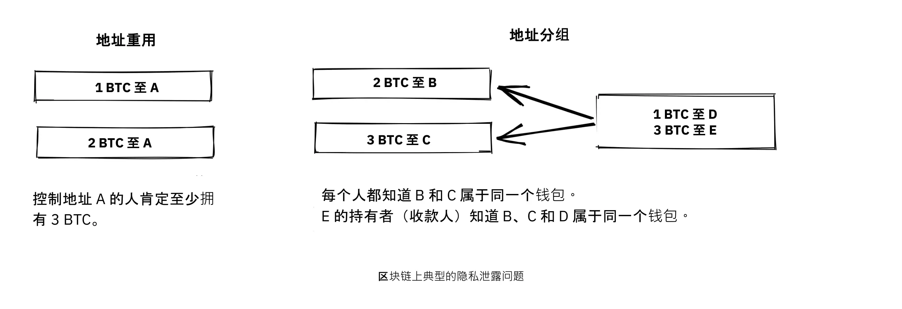


Chris Belcher [写得非常详细](https://en.bitcoin.it/Privacy#Blockchain_attacks_on_privacy)，介绍了在比特币区块链上可能发生的各种隐私泄露。我们建议您至少阅读 "区块链对隐私的攻击" 下的前几个小节。


比特币的隐私保护功能并不完美。私下交易需要大量的工作。大多数人并不愿意为隐私那么付出。隐私和可用性之间似乎存在着明显的权衡。


隐私的另一个重要方面是，您为保护自己隐私而采取的措施也会影响到其他用户。如果您对自己的隐私保护不力，其他人的隐私也会受到影响。Gregory Maxwell 在[我们在上面链接的](https://bitcointalk.org/index.php?topic=334316.msg3589252#msg3589252) Bitcoin Talk 讨论中非常清楚地解释了这一点，并以一个例子作为总结：


> 这在实践中也行得通。IRC 上有个不错的白帽黑客在玩儿脑钱包破解时，发现了一个包含 ~250 BTC 的短语。我们仅从地址就能确定所有者的身份，因为他们是由重复使用地址的比特币服务支付的，而他能够说服他们提供用户的联系信息。他通过电话联系到了用户，他们很震惊，也很困惑--但很庆幸没有损失他们的比特币。这是一个圆满的结局。(到目前为止，这还不是唯一的例子。但这是比较有趣的例子之一）。

在这种情况下，多亏了那位怀有慈善心的黑客，一切才顺利，但下次可别指望会这么幸运。

### 非区块链隐私


虽然区块链被证明是一个臭名昭著的隐私泄露源，但还有很多其他泄露源没有使用区块链，其中一些比其他泄露源更隐蔽。这些方法包括密钥记录器和网络流量分析。为了了解其中一些方法，请再次参阅 [Chris Belcher 的文章](https://en.Bitcoin.it/Privacy#Non-blockchain_attacks_on_privacy)，特别是 ”Non-blockchain attacks on privacy”（非区块链隐私攻击）部分。


在众多攻击中，Belcher 提到有人可能会窥探您的互联网连接，例如您的互联网服务供应商：


> 如果对手看到一笔交易或一个区块从您的节点中流出，而这之前并没有进入过您的节点，那么它就可以近乎肯定地知道这笔交易是由您进行的，或者这个区块是由您挖掘的。由于涉及互联网连接，对手就能将 IP 地址与发现的比特币信息联系起来。

然而，隐私泄露最明显的是交易所。由于交易所和相关公司运营所在地区的法律（通常被称为 KYC（了解你的客户）和 AML（反洗钱）），它们通常必须收集用户的个人数据，建立关于哪些用户拥有哪些比特币的大型数据库。这些数据库是邪恶政府和犯罪分子的大蜜罐，他们总是在寻找新的受害者。实际上，这类数据是有真正市场的，黑客会把数据卖给出价最高的人。


更糟糕的是，管理这些数据库的公司往往缺乏保护金融数据的经验，事实上，其中许多公司都是年轻的初创公司，而我们知道的事实是，已经发生了几起泄密事件。

例如，[总部位于印度的 MobiQwik](https://bitcoinmagazine.com/business/probably-the-largest-kyc-data-leak-in-history-demonstrates-the-importance-of-bitcoin-privacy)和[HubSpot](https://bitcoinmagazine.com/business/hubspot-security-breach-leaks-Bitcoin-users-data)。


再次说，保护数据免受如此广泛的攻击是很难做到的任务，而且您很可能无法完全做到这一点。您必须在方便性和隐私性之间做出最适合您的权衡。


### 可替换性（Fungibility）


就货币而言，"可替换性" 是指一种硬币可以与同种货币的任何其他硬币互换。本章前半部分简要已经提到了这个词。


在讨论的文章中，Gregory Maxwell [指出](https://bitcointalk.org/index.php?topic=334316.msg3588908#msg3588908)：


> 在比特币中，金融隐私是可替代性的一个基本要素：如果你能明显区分一枚币和另一枚币，那么它们的可替代性就很弱。如果我们的可替代性在实践中太弱，那么我们就无法实现去中心化：如果某个重要人物公布了一份他们不会接受衍生币的被盗币清单，那么您就必须对照该清单仔细检查您所接受的币，并退回不合格的币。每个人都会被困在检查不同机构发布的黑名单中，因为在那个世界里，我们都不想被坏币困住。这增加了摩擦和交易成本，使比特币作为货币的价值降低。

在这里，他谈到了缺乏可替代性所带来的危险。假设您拥有一个 UTXO（比特币的未花费交易输出）。这个 UTXO 的历史通常可以追溯到数次跳转，延伸到之前的众多输出。如果其中任何一个输出涉及任何非法、不受欢迎或可疑的活动，那么您的比特币的一些潜在收款人可能会拒绝接受它。如果您认为您的收款人会根据一些集中的白名单或黑名单服务来验证您的比特币，为了安全起见，您可能也会开始检查您收到的比特币。结果就是，糟糕的可替代性会助长更糟糕的可替代性。


Adam Back 和 Matt Corallo 在 2016 年米兰市的 Scaling Bitcoin 大会上[发表了关于可替代性的演讲](https://btctranscripts.com/scalingbitcoin/milan-2016/fungibility-overview/)。他们的想法如出一辙：


> 比特币的运作需要可替代性。如果您收到金币却无法使用，那么您就会开始怀疑自己是否能使用它们。如果您对收到的比特币有所怀疑，那么人们就会去 "污点服务" 检查 "这笔比特币是否被祝福过"，然后人们就会拒绝交易。这样一来，比特币就从一个去中心化的无权限系统变成了一个中心化的有权限系统，在这个系统中，您会收到来自黑名单提供方的 "欠条"。

隐私和可替代性似乎是相辅相成的。如果隐私性弱，可替代性就会减弱，例如，来自不受欢迎的人的比特币可能会被列入黑名单。同样，如果可替代性弱，隐私性也会减弱：如果有黑名单，您就必须询问黑名单提供商接受哪些比特币，从而可能泄露您的 IP 地址、电子邮件地址和其他敏感信息。这两个特性相互关联，难以将它们分开讨论。


### 隐私保护措施

目前已开发出多种技术，以帮助人们保护自己的隐私不被泄露。其中最明显的就是，正如中本聪在前面提到的，为每笔交易使用独一无二的地址，但也存在其他几种方法。我们不会教您如何成为隐私忍者。不过，Bitcoin Q+A 中有一份[隐私增强技术快速摘要](https://bitcoiner.guide/privacytips/)，按照实施难度排序。阅读时，您会发现比特币的隐私往往与比特币以外的方面有关。例如，您不应该炫耀您的比特币，您应该使用 Tor 和 VPN。


帖子还列出了一些与比特币直接相关的措施：


- 全节点： 如果不使用自己的全节点，就会向互联网上的服务器泄漏有关钱包的大量信息。运行全节点是很好的第一步。
- 闪电网路：在比特币的基础上存在多个协议，例如闪电网络和 Blockstream 的 Liquid 侧链。
- CoinJoin：一种将多人交易合并为一人交易的方法，使连锁分析更加困难。


在打破比特币大会的 [演讲](https://btctranscripts.com/breaking-bitcoin/2019/breaking-bitcoin-privacy/)中，Chris Belcher 举了一个有趣的实际例子，说明隐私是如何得到改善的：


> 他们是一家比特币赌场。美国不允许在线赌博。任何直接向 Bustabit 存款的 Coinbase 客户的账户都会被关闭，因为 Coinbase 正在对此进行监控。Bustabit 做了几件事。他们做了一件叫做 "避免找零 "的事，即通过查看是否可以构建一个没有找零输出的交易。这样既节省了挖矿费用，又阻碍了链分析。
>

> 此外，他们还将大量重复使用的存款地址导入 “joinmarket”。在这一点上，coinbase.com 的客户从未被禁止。在此之后，Coinbase 的监控服务似乎无法进行分析，因此有可能破解这些算法。

他还在比特币维基百科的[隐私页面](https://en.Bitcoin.it/Privacy) 中提到了这个例子。


请注意，与闪电网络一样，在比特币的基础上构建系统可以实现更好的隐私保护：


在比特币上加层可增加私密性


我们在上一份报告中指出，信任的需求只会随着层层叠加而增加，但隐私似乎并非如此，它可以在层层叠加中任意改善或恶化。为什么会这样呢？在比特币上的任何层面都必须偶尔使用链上交易，否则它就不是 "在比特币上"，这一点在 "Scaling"（扩展）一章的 "分层扩展" 段落中已有解释。隐私增强层一般会尽量少使用基础层，以减少泄露的信息量。


以上是改善隐私的一些技术性方法。但还有其他方法。在本章开头，我们说过比特币是一个假名系统。这意味着，比特币中的用户并不是通过真实姓名或其他个人数据为人所知，而是通过他们的公钥为人所知。公钥是用户的假名，一个用户可以有多个假名。在理想情况下，您的个人身份与您的比特币假名是分离的。但遗憾的是，由于本章描述的隐私问题，这种脱钩通常会随着时间而逐渐减弱。


为了降低个人数据被泄露的风险，首先就是不要提供个人数据，也不要将其提供给中心化服务提供商，因为这些服务会建立可能泄露的大型数据库。Bitcoin Q+A 的一篇文章[解释了 KYC](https://bitcoiner.guide/nokyconly/)及其可能带来的危险。文章还提出了一些改进措施：


> 值得庆幸的是，现在有一些通过无 KYC 来源购买比特币的选择。这些都是 P2P（点对点）交易所，您可以直接与他人而非中央第三方进行交易。不幸的是，有些交易所除了出售比特币之外，还出售其他货币，因此我们建议您小心谨慎。

文章建议您避免使用需要 KYC/AML 的交易所，而是进行私下交易，或者使用 [bisq](https://bisq.network/) 这样的去中心化交易所。


https://planb.academy/en/tutorials/exchange/peer-to-peer/bisq-fe244bfa-dcc4-4522-8ec7-92223373ed04

关于对策的更深入阅读，请参阅前面提到的[维基隐私文章](https://en.Bitcoin.it/wiki/Privacy#Methods_for_improving_privacy_.28non-Blockchain.29)，从 "Methods for improving privacy（non-blockchain）"（改善隐私的方法（非区块链）开始。


### 关于隐私的结论

隐私非常重要，但难以实现。没有隐私保护的灵丹妙药。

为了在比特币获得够好的隐私，您必须采取积极措施，其中有些措施既费钱又费时。


## 有限供应量

<chapterId>af125ba2-ef98-5905-8895-41a538fe5ea5</chapterId>


本章将探讨比特币供应量的 2100 万 BTC 限额，或者说它到底有多少？我们将讨论这一限额是如何执行的，以及如何验证这一限额是否得到了遵守。此外，我们还将讨论比特币的未来，讨论当区块奖励从基于补贴转向基于收费时将会出现的动态。


众所周知，2100 万 BTC 的有限供应量被视为比特币的基本属性。但这真的是一成不变的吗？


我们先来看看当前的共识规则是如何规定比特币的供应量的，以及其中有多少是真正可用的。Pieter Wuille 曾就此写过一篇[在 Stack Exchange 上的文章](https://Bitcoin.stackexchange.com/a/38998/69518)，其中他计算了所有比特币挖完之后的总量：


> 如果将所有这些数字相加，就会有 20999999.9769 枚比特币。

但是，由于多种原因，如早期的 Coinbase 交易问题、矿工无意中申领低于允许额度的奖励，以及私钥丢失等，就永远无法达到那个上限。Wuille 总结道：


> 这样，我们就有 20999817.31308491 BTC（考虑到 528333 区块之前的所有比特币）

然而，各种钱包丢失或被盗，交易被发送到错误的地址中，人们忘记了自己拥有比特币。这些损失的总数可能高达数百万。人们试图统计已知的[损失](https://bitcointalk.org/index.php?topic=7253.0)。


所以，现在只剩下???枚比特币.


因此，我们可以确定比特币供应量的上限最多为 20999817.31308491 枚比特币。任何丢失或未经证实的烧毁的比特币都会使这个数字降低，但我们不知道会降低多少。有趣的是，这其实并不重要，或者说对比特币的持有者来说，这反而是件好事，[如中本聪所解释](https://bitcointalk.org/index.php?topic=198.msg1647#msg1647)：


> 丢失的比特币只会让其他人的比特币更有价值。就当作给大家的捐赠吧。

有限的供应量将缩小，这至少在理论上会导致价格通缩。


比流通比特币的确切数量更重要的是，供应量限制是在没有任何中央机构的情况下执行的。Alias Chytrik 在 [Stack Exchange](https://Bitcoin.stackexchange.com/a/106830/69518) 上说得很好：


> 所以答案是，你不必相信某人不会增加比特币供应量。你只需要运行一些代码来验证他们没有增加。

即使一些全节点变坏，决定接受 Coinbase 交易价值更高的区块，所有剩余的全节点也会忽略它们，继续照常营业。一些全节点可能会有意或无意地运行邪恶的软件，但集体将确保区块链的稳健安全。总之，您可以选择信任系统，而不必信任任何人。


### 区块补贴和交易费


区块奖励由区块补贴和交易费组成。区块奖励需要覆盖比特币的安全成本。我们可以肯定地说，在目前的区块补贴、交易费用、比特币价格、Mempool 规模、哈希率、去中心化程度等条件下，每个参与者遵守规则的积极性都足以维护一个安全的货币体系。


当区块补贴趋近于零时会发生什么？为了简单起见，假设补贴实际上等于零。此时，系统的安全成本只能通过交易费来支付。当这种情况发生时，未来会发生什么，我们无从知晓。不确定的因素很多，我们只能靠猜测。例如，Paul Sztorc [在他的 Truthcoin 博客](https://www.truthcoin.info/blog/security-budget/) 中对这一主题的贡献主要是猜测，但他至少有一个可靠的观点（请注意，Sztorc 所指的 M2 是对法定货币供应量的测量）：


> 虽然两者是 "安全预算" 的元素，但区块补贴和交易费用却完全不同。它们之间的区别，就像 "VISA 2017 年利润总额" 与 "2017 年 M2 增长总额" 之间的区别一样。

今天，安全成本是持有者承担的（通过货币通胀实现）。未来，这一负担将以某种方式转移到用户身上，如下图所示。


现在成本是由持有者承担的，但随着时间的推移，网络安全的成本最终会由那些实际进行交易、花费比特币的人来支付。


当交易费成为主要激励时，激励机制就会发生变化。最值得注意的是，如果一个矿工的 Mempool 没有包含足够的交易费用，那么对该矿工来说，改写比特币的历史记录可能比继续延长区块链更有利可图。Bitcoin Optech 有一个专门的[关于这种行为的章节](https://bitcoinops.org/en/topics/fee-sniping/)，叫做*fee sniping*（费用狙击），由 David Harding 撰写：


> 随着比特币的区块补贴不断减少，交易费用开始主导比特币的区块奖励，可能会出现费用狙击的问题。如果交易费是最重要的，那么拥有 `x`% 哈希率的矿工有 `x`% 的机会挖出下一个区块。因此对他们来说，诚实挖矿的期望收益就是其内存池中按照最高交易费率排列的交易集合中，[收益的 `x`%](https://bitcoinops.org/en/newsletters/2021/06/02/#candidate-set-based-csb-block-template-construction)。
>

> 另外，一个矿工可以不诚实地尝试重新挖掘上一个区块，再加上一个全新的区块，以延长链条。这种行为被称为 "费用狙击"（Fee Sniping），如果其他矿工都是诚实的，那么不诚实的矿工成功的概率为 `(x/(1-x))^2`。尽管 "费用狙击" 的总体成功概率低于诚实的挖矿，但如果前一个区块中的交易支付的费用明显高于当前 Mempool 中的交易，那么尝试不诚实挖矿的矿工可能是更有利可图的选择--小机会获得大金额可能比大机会获得小金额更有价值。

打击我们对未来希望的现实是：如果矿工开始进行费用狙击，这将激励其他人也这样做，从而使诚实的矿工人数更少。这会严重损害比特币的整体安全性。Harding 继续列举了一些可以采取的应对措施，比如依靠交易时间锁来限制交易可能出现在区块链的哪个位置。


因此，鉴于对有限供应量的共识依然存在，区块补贴将在 2140 年左右归零--这要归功于修复了一个长期通货膨胀错误的 [BIP42](https://github.com/Bitcoin/bips/blob/master/bip-0042.mediawiki)。此后的交易费用是否足以确保网络的安全？


这很难说，但我们确实知道一些事情：


- 从比特币的角度来看，一个世纪是很长的一段时间。如果它还在，可能已经发生了巨大的演变。
- 如果压倒性的经济多数认为有必要改变规则，例如引入每年 0.1% 或 1% 的永久性货币通胀，比特币的供应量将不再是有限的。
- 如果区块补贴为零，而 Mempool 又是空的或几乎是空的，费用狙击会使情况变得不稳定。


由于向只有交易费用的区块奖励过渡还遥遥无期，我们最好不要匆忙下结论，而是要趁早解决可能出现的问题。例如，Peter Todd 认为比特币的安全预算将来可能会不够用，因此主张在比特币中实行小规模的永久性通货膨胀。不过，他也认为现在讨论这个问题并不是一个好主意，正如[他在《What Bitcoin Did》播客中所说](https://www.whatbitcoindid.com/podcast/peter-todd-on-the-essence-of-bitcoin)：


> 但这是未来 10 年、20 年后的风险。那是一段很长的时间。到那时，谁知道会有什么风险呢？

也许我们可以把比特币视为成一种有机物。想象一株缓慢生长的小橡树。再想象一下，您一生中从未见过一棵完全长成的树。那么，克制自己的控制问题，而不是事先制定所有规则，让这棵植物如何进化和生长，难道不是明智之举吗？


### 关于有限供应量的结论


比特币供应量是否会超过 2100 万，我们今天无法确定，但这可能也不算坏事。确保网络安全预算保持在足够高的水平固然重要，但并不紧迫。我们可以把这个讨论留到 10 到 50 年后，再根据当时的情况做判断——如果那时这个问题仍然有意义的话。


# 比特币治理

<partId>411bf53f-af4b-50f1-b71b-e40fe3ff64b7</partId>


## 升级

<chapterId>3ffa84d1-adfa-5fbc-9b13-384ea783fcdd</chapterId>


以安全的方式升级比特币极其困难。有些更改需要数年时间才能推出。在本章中，我们将了解有关的比特币升级的常用术语，并探讨一些历史上对其协议进行升级的例子以及我们从中获得的启示。最后，我们将讨论链分离以及与之相关的风险和成本。


为了进一步理解本届的内容，您应该阅读 [David Harding 关于和谐与不和谐的文章](https://bitcointalk.org/dec/p1.html)：


> 比特币专家们经常谈论共识，而共识的含义是抽象的，难以确定。但是，"共识"（concensus）这一词是由拉丁语中的 "concentus "演变而来的，意为 "共同唱和"，因此，我们先不谈比特币共识，只谈比特币和谐。
>

> 和谐是比特币工作原理的核心。数以千计的全节点各自独立工作，验证它们收到的交易是否有效，从而就比特币账本的状态达成一致，任何节点操作员都无需信任其他人。这就好比一个合唱团，每个成员在同一时间唱同一首歌，所产生的效果远比任何一个人单独唱出的效果要美妙得多。
>

> 比特币和谐的结果是，比特币在这个系统中不仅不会受到小偷的偷窃（只要您保管好您的钥匙），也不会受到无休止的通货膨胀、大规模或有针对性的没收，或者仅仅是传统金融系统的官僚主义泥潭的侵袭。

本章将讨论如何在不造成不和谐的情况下升级比特币。保持和谐，即维持共识，确实是比特币开发过程中最大的挑战之一。升级机制有很多细微差别，研究以往升级的实际案例可能最能理解这些细微差别。因此，本章将重点放在历史案例上，并首先介绍了一些有用的词汇。


### 词汇


根据维基百科的解释，[向钱兼容性](https://en.wikipedia.org/wiki/Forward_compatibility) 是指旧软件可以处理新软件创建的数据，而忽略其不理解的部分：


如果符合早期版本的产品能够 "优雅地" 处理为后续版本标准设计的输入，而忽略其不理解的新部分，那么该标准就支持向前兼容性。


反之亦然，[向后兼容性](https://en.wikipedia.org/wiki/Backward_compatibility) 是指旧软件中的数据可以在新软件中使用。如果一项变更既能向前兼容，又能向后兼容，那么它就被称为完全兼容。


对比特币共识规则的修改，如果是完全兼容的，则称为 “软分叉”。这是最常见的比特币升级方式，原因有很多，我们将在本章进一步讨论。如果对比特币共识规则的修改向后兼容，但向前不兼容，则称为 “硬分叉”。


如果您想要理解关于软分叉和硬分叉的技术概述，请阅读[Grokking Bitcoin 第 11 章](https://rosenbaum.se/book/grokking-bitcoin-11.html)。它解释了这些术语，并深入介绍了升级机制。在继续阅读之前，建议您先了解一下这些内容，尽管这并非绝对必要。


### 历史性升级


今天的比特币与创建创世区块时的情况不同。这些年来，比特币已经经过了多次升级。2018 年，Eric Lombrozo [在 Breaking Bitcoin 大会上发言](https://btctranscripts.com/breaking-bitcoin/2017/changing-consensus-rules-without-breaking-bitcoin/) 讲述了比特币的不同升级机制，指出它们随着时间的推移发生了很大的演变。他甚至解释了中本聪曾经如何通过硬分叉升级比特币：


> 实际上，比特币曾经有一次由中本聪执行的硬分叉，而我们绝不会采用那种方式——那是一种相当糟糕的做法。如果您看一下这里的 git 提交描述 [[757f076](https://github.com/Bitcoin/Bitcoin/commit/757f0769d8360ea043f469f3a35f6ec204740446)] ，他说了一些关于还原 makefile.unix wx-config 0.3.6 版本的内容。没错。就这么多。没有任何迹象表明它有任何破坏性改动。基本上，他把它藏在内。他还 [发布到 bitcointalk](https://bitcointalk.org/index.php?topic=626.msg6451#msg6451) 说，请尽快升级到 0.3.6 版本。我们修复了一个执行错误，在这个错误中，假交易有可能被显示为已接受。在升级到 0.3.6 之前，请不要接受比特币付款。如果您不能立即升级，那么最好在升级之前关闭您的比特币节点。除此之外，我不知道他为什么还决定这样做，他决定在相同的代码中添加一些优化和修复一个错误。

他指出，不管是有意还是无意，这次硬分叉为未来的软分叉创造了机会，即脚本操作符（操作码）OP_NOP1-OP_NOP10。我们将在 cve-2010-5141 中详细介绍这一代码变更。到目前为止，已有两个软分叉使用了这些操作码：


- [BIP65](https://github.com/Bitcoin/bips/blob/master/bip-0065.mediawiki) (OP_CHECKLOCKTIMEVERIFY)
- [BIP113](https://github.com/Bitcoin/bips/blob/master/bip-0112.mediawiki) (OP_SEQUENCEVERIFY).


Lombrozo 还概述了截至 2017 年这些年来升级机制的演变方式。从那时起，只部署了另一个重大升级--Taproot 升级。导致其启动的漫长而略显混乱的过程，有助于我们进一步了解比特币的升级机制。


#### SegWit 升级


虽然 SegWit 之前的所有升级或多或少都比较顺利，但这次却不同。2016 年 10 月，当 SegWit 激活代码发布时，比特币用户似乎对其表示了压倒性的支持，但由于某些原因，矿工们并没有发出支持此次升级的信号，这使得激活工作停滞不前，看不到任何解决的办法。


Aaron van Wirdum 在他的 Bitcoin Magazine 题为 [The Long Road To SegWit](https://bitcoinmagazine.com/technical/the-long-road-to-SegWit-how-bitcoins-biggest-protocol-upgrade-became-reality) 的文章中描述了这条曲折的道路。他首先解释了什么是 SegWit，以及 SegWit 如何引发区块大小的争论。然后，Van Wirdum 概述了导致其最终启动的事件转折。这一过程的核心是 Shaolinfry 提出的一种名为*用户激活的软分叉* 的升级机制，（即 User Activated Soft Fork，简称 UASF：


> Shaolinfry 提出了一种替代方案：UASF。UASF 将有一个 '标志日激活'，节点在未来某个预定时间开始执行，而不是按照哈希力激活的。"只要这种 UASF 由经济上的多数人执行，就会迫使大多数矿工遵循（或激活）其软分叉。

其中，他引用了 Shaolinfry 发送给 Bitcoin-dev 邮件列表的电子邮件。在那封邮件中，Shaolinfry [反对矿工激活的软分叉](https://lists.linuxfoundation.org/pipermail/Bitcoin-dev/2017-February/013643.html)，并列举了其中存在的一系列问题：


> 首先，这需要相信 Hash 的能量在激活后会生效。  在 BIP66 Soft Fork 事件中，95% 的 Hashrate 发出了准备就绪的信号，但实际上约有一半的 Hashrate 并未真正验证升级后的规则，而是错误地在无效区块上进行了挖掘。
>

> 其次，Miner 信号具有天然的否决权，允许一小部分 Hashrate 为所有人否决节点激活升级。迄今为止，Soft 的分叉都是利用了相对集中的 Mining 环境，在这种环境中，构建有效区块的 Mining 池相对较少；随着我们向更分散的 Hashrate 发展，"升级惯性 "很可能会使我们遭受越来越多的损失，它将否决大多数升级。

Shaolinfry 还提请大家注意对 Miner 信号的一种常见误读：人们普遍认为这是矿工决定协议升级的一种手段，而不是帮助协调升级的一种行动。由于这种误解，矿工们可能还觉得有义务公开宣布他们对某个 Soft Fork 的看法，似乎这样就能给提议增加分量。


简而言之，UASF 的建议就是设定一个 "标志日"，节点在这一天开始执行特定的新规则。这样一来，矿工们就不必集体努力协调升级，只要有足够多的区块发出支持信号，就可以**早于 "旗帜日" 启动升级**：


> 我的建议是两全其美。由于用户激活 Soft Fork 之前需要相对较长的准备时间，因此我们可以结合 BIP9，让用户选择更快的 Hash 电源协调激活或在国旗日之前激活（以较早者为准）。
> 在这两种情况下，我们都可以利用 BIP9 中的警告系统。更改相对简单，只需添加一个激活时间参数，就能在 BIP9 部署超时结束前将 BIP9 状态转换为 LOCKED_IN。

这个想法引起了很多人的兴趣，但似乎并没有得到近乎一致的支持，这引起了人们对潜在链分裂的担忧。亚伦-范-维尔杜姆（Aaron van Wirdum）在文章中解释了这一问题最终是如何通过詹姆斯-希利亚德（James Hilliard）撰写的[BIP91](https://github.com/Bitcoin/bips/blob/master/bip-0091.mediawiki)得到解决的：


> 希利亚德提出了一个略显复杂但却巧妙的解决方案，它将使一切兼容：由 Bitcoin 核心开发团队、BIP148 UASF 和《纽约协议》激活机制提出的隔离见证激活。他的 BIP91 可以使 Bitcoin 保持完整--至少在整个 SegWit 激活期间。

这其中还涉及一些更复杂的因素（如所谓的 "纽约协议"），BIP 必须考虑到这些因素。我们建议您全文阅读 Van Wirdum 的文章，了解这个故事中许多有趣的细节。


#### SegWit 后的讨论


SegWit 部署之后，出现了关于部署机制的讨论。正如 Eric Lombrozo 在[他在 Breaking Bitcoin 大会上的演讲](https://btctranscripts.com/breaking-Bitcoin/2017/changing-consensus-rules-without-breaking-Bitcoin/) 和 Shaolinfry 所指出的，矿工激活软分叉并不是理想的升级机制：


> 在某个阶段，我们可能会想要为比特币协议加入更多功能。这其实是一个重大的哲学性问题：下一次升级，我们要用 UASF（用户激活软分叉）吗？还是采用一种混合方式？至于仅由矿工激活的方案，已经被否决了。BIP9 我们也不会再使用。

2020 年 1 月，Matt Corallo [向 Bitcoin-dev 邮件列表发送了一封电子邮件](https://lists.linuxfoundation.org/pipermail/bitcoin-dev/2020-January/017547.html)，开始讨论未来的软分叉部署机制。他列出了他认为在升级中必不可少的五个目标。David Harding [在 Bitcoin Optech 时事通讯中将其总结为](https://bitcoinops.org/en/newsletters/2020/01/15/#discussion-of-Soft-Fork-activation-mechanisms)：


> 在遇到对拟议共识规则变更的严重反对时，系统必须具备中止升级的能力。在发布更新后的软件后，需要预留充足的时间，以确保大多数经济节点都已升级并开始执行这些新规则。人们预期网络的哈希率在变更前后，以及整个过渡期间，应保持大致相同。应尽可能防止生成在新规则下无效的区块，因为这些区块可能会导致未升级节点或 SPV 客户端出现虚假的确认。同时，还必须确保中止机制不会被滥用，以防某些人出于破坏或派系目的，在没有任何已知问题的情况下阻挠一次广受支持的升级。

Corallo 提议将矿工激活软分叉和用户激活软分叉结合起来：


> 因此，更具体一点来说，我认为一种既能树立正确先例、又能恰当地兼顾上述目标的激活方式，应当是这样的：
>

> 1) 标准的 BIP 9 部署，时间跨度为一年，当矿工支持率达到 95% 时即可激活 +

> 2) 如果在这一年内未能激活，则进入一个为期 六个月的冷静期，让社区有时间分析并讨论未激活的原因 +

> 3) 在合理的情况下，一个简单的命令行/Bitcoin.conf 参数（从最初的部署版本开始就受支持）将使用户能够选择 BIP 8 部署，并在 24 个月的时间范围内激活制定日期（以及在新的 Bitcoin Core 版本中普遍启用定日激活）。
>

> 这就为更多的标准激活提供了很长的时间，同时还能确保实现第 5 号的目标，即使在这些情况下，时间跨度需要大幅延长才能实现第 3 号目标。开发比特币不是一场竞赛。如果我们不得不这样做，那么等待 42 个月就能确保我们不会开创一个负面先例，从而在比特币继续发展时后悔莫及。

#### Taproot 升级 - 快速试行


2020 年 10 月，Taproot 已做好部署准备，这意味着围绕其共识规则的所有技术细节都已落实，并得到了社区的广泛认可。在此之前，这些讨论一直非常低调。


许多关于激活机制的建议开始流传开来，David Harding [在 Bitcoin Wiki 上对其进行了总结](https://en.Bitcoin.it/wiki/Taproot_activation_proposals)。他在文章中解释了 BIP8 的一些特性，当时为了使其更加灵活，BIP8 最近做了一些修改。


> 在撰写本文件时，[BIP8](https://github.com/Bitcoin/bips/blob/master/bip-0008.mediawiki) 已根据 2017 年的经验教训起草完毕。BIP9 和 BIP148 之后的一个显著变化是，强制激活现在基于区块高度，而不是过去时间的中位数；第二个显著变化是，强制激活是在软分叉的激活参数设置时选择的一个布尔参数，无论是初始部署还是在以后的部署中更新。

不强制激活的 BIP8 与带超时和延迟的 [BIP9](https://github.com/Bitcoin/bips/blob/master/bip-0009.mediawiki) 版本比特非常相似，唯一的显著区别是 BIP8 使用了区块高度，而 BIP9 使用了过去时间中位数。这种设定允许升级尝试在未达成共识时自然失败，但之后仍可重新尝试。


强制激活的 BIP8 以一个强制信号期结束，在这个强制信号期内，所有按照其规则生产的区块都必须发出软分叉准备就绪的信号，其方式将触发非强制激活的同一软分叉的早期部署的激活。换句话说，如果发布的节点版本 x 没有强制激活，而后来发布的版本 y 成功地强制矿工在同一时间段内开始发出准备就绪信号，那么这两个版本将同时开始执行新的共识规则。


修改后的 BIP8 建议的这种灵活性，使我们有可能用 BIP8 来表达其他一些想法。这为许多不同的提案提供了一个共同的分类因素。


从这时起，讨论变得非常激烈，主要围绕着参数 `lockinontimeout` 是否应设为 `true` 展开。若设为 `true`，即相当于用户激活软分叉（UASF），Harding 称之为 “强制激活的 BIP8“；若设为 `false`，则对应矿工激活软分叉（MASF），Harding 称之为 “不强制激活的 BIP8”。


在列出的提案中，有一个标题为 《Let's see what happens》（让我们拭目以待）的提案。不知什么原因，直到七个月后，这个提案才引起了人们的注意。


在这七个月中，讨论一直在进行，似乎无法就使用哪种部署机制达成广泛共识。当时主要分成两派：一个倾向于 `lockinontimeout=true`（UASF 派），另一个倾向于 `lockinontimeout=false`（"试试看，如果失败再考虑" 派）。由于没有任何一方获得压倒性的支持，辩论陷入了循环，似乎毫无进展。其中一些讨论是在 IRC 上进行的，频道名为 ##Taproot-activation，但 [2021 年 3 月 5 日](https://gnusha.org/taproot-activation/2021-03-05.log) 发生了一些变化：


```
06:42 < harding> roconnor: is somebody proposing BIP8(3m, false)?  I mentioned that the other day but I didn't see any responses.
[...]
06:43 < willcl_ark_> Amusingly, I was just thinking to myself that, vs this, the SegWit activation was actually pretty straightforward: simply a LOT=false and if it fails a UASF.
06:43 < maybehuman> it's funny, "let's see what happens" (i.e. false, 3m) was a poular choice right at the beginning of this channel iirc
06:44 < roconnor> harding: I think I am.  I don't know how much that is worth.  Mostly I think it would be a widely acceptable configuration based on my understanding of everyone's concerns.
06:44 < willcl_ark_> maybehuman: becuase everybody actually wants this, even miners reckoned they could upgrade in about two weeks (or at least f2pool said that)
06:44 < roconnor> harding: BIP8(3m,false) with an extended lockin-period.
06:45 < harding> roconnor: oh, good.  It's been my favorite option since I first summarized the options on the wiki like seven months ago.
06:45 <@michaelfolkson> UASF wouldn't release (true,3m) but yeah Core could release (false, 3m)
06:45 < willcl_ark_> harding: It certainly seems like a good approach to me. _if_ that fails, then you can try an understand why, without wasting too much time
```

翻译版：

```
06:42 < harding> roconnor：有人提议使用 BIP8(3m, false) 吗？我前几天提过，但没看到回应。
[...]
06:43 < willcl_ark_> 有趣的是，相比之下，SegWit 的激活其实相当简单：只要 LOT=false，如果失败再用 UASF 就行。
06:43 < maybehuman> 有意思的是，一开始在这个频道里，“就看看会发生什么”（即 false, 3m）是很受欢迎的选择，如果我没记错的话。
06:44 < roconnor> harding：我觉得是我提议的。不过具体价值如何不清楚。我主要认为，根据我对大家关切的理解，这会是一个广泛可接受的配置。
06:44 < willcl_ark_> maybehuman：因为大家实际上都希望如此，连矿工也觉得大概两周就能升级（至少 f2pool 是这么说的）。
06:44 < roconnor> harding：BIP8(3m, false) 配合延长的锁定期。
06:45 < harding> roconnor：哦，太好了。这是我自七个月前在维基总结选项以来最喜欢的方案。
06:45 <@michaelfolkson> UASF 不会发布（true, 3m），但 Core 可以发布（false, 3m）。
06:45 < willcl_ark_> harding：在我看来，这确实是一个不错的方法。如果失败了，你还能分析原因，而不会浪费太多时间。
```

“试后再看” 的方法似乎终于在人们的脑海中留下了深刻印象。由于信号传递时间短，这一过程后来被称为 "快速试行"。David Harding 在一篇文章中向更多人解释了这一理念。

[发送电子邮件至 Bitcoin-dev 邮件列表](https://lists.linuxfoundation.org/pipermail/bitcoin-dev/2021-March/018583.html)：

> 这个提案的早期版本在 200 多天前就已有记录，而 Taproot 的底层代码在 140 多天前就已合并进 Bitcoin Core。如果我们在 Taproot 合并时就开始快速试行（这有点不现实），那么我们要么在不到两个月的时间内就会拥有 Taproot，要么在一个多月前就会开始下一次激活尝试。
>

> 然而，我们花了大量时间讨论，却似乎离找到一个广泛可接受的解决方案并没有比一年多前邮件列表开始讨论 SegWit 后续激活方案时更近。我认为快速试行是一种能够快速推动进展的方法：如果激活成功，它能暂时结束争论；如果未成功，它能提供一些实际数据，为未来 Taproot 激活提案提供依据。

这一部署机制经过两个月的改进，然后在 [Bitcoin Core 0.21.1 版本](https://github.com/Bitcoin/Bitcoin/blob/master/doc/release-notes/release-notes-0.21.1.md#Taproot-Soft-Fork) 中发布。矿工们很快开始发出信号，要求将部署状态升级为 `LOCKED_IN`，经过一段宽限期后，Taproot 规则于 2021 年 11 月中旬在第 [709632](https://Mempool.space/block/0000000000000000000687bca986194dc2c1f949318629b44bb54ec0a94d8244) 区块中被激活。


#### 未来的部署机制


鉴于最近的软分叉、SegWit 和 Taproot 所出现的问题，目前下一次升级部署机制还不清楚。Taproot 的部署采用了 "快速试行" 机制，但这是为了弥合 UASF 和 MASF 人群之间的鸿沟，而不是因为它已成为最知名的部署机制。


### 风险


在任何分叉激活过程中，无论是硬分叉还是软分叉，无论是矿工激活的还是用户激活的，都有可能出现持久的链式分裂。如果分裂持续时间超过几个区块，就会严重损害围绕比特币的情绪及其价格。但最重要的是，这会让人们对比特币到底是什么产生极大的困惑。比特币是这条区块链还是那条区块链？


用户激活软分叉的风险在于，即使大多数哈希率不支持新规则，新规则也仍然会被激活。这种情况会导致长期的链分裂，一直持续到大多数哈希力量采用新规则为止。如果矿工在分叉后已经在旧链上挖了区块，那么要让他们切换到新链可能尤其困难，因为切换分支意味着放弃自己已获得的区块奖励。然而，值得一提的还有一个引人注目的插曲：2013 年 3 月，由于无意的硬分叉导致了一次长期分裂，与这一激励措施相反，两个主要的矿池做出了放弃其分裂分支的决定，以恢复共识。


另一方面，矿工激活软分叉的风险在于矿工可能会发出虚假信号，这意味着支持这一变化的哈希力的实际份额可能比看上去的要小。如果实际支持者并不占大多数的哈希力，我们很可能会看到类似上一段所述的长期链分裂。现实中，当 BIP66 部署时，就曾出现过这种或类似的问题，但大约在 6 个区块内 就得到了处理。

#### 链分裂的代价


Jimmy Song [在巴黎的 "Breaking Bitcoin" 大会上谈到了与硬分叉相关的成本](https://btctranscripts.com/breaking-bitcoin/2017/socialized-costs-of-hard-forks/)，但他所说的大部分内容也适用于因软分叉故障而导致的链条分裂。他谈到了 “Negative externalities”（负外部性），并将其定义为他人必须为自己的行为付出的代价：


> 负外部性的典型例子是一家工厂。也许他们正在生产--也许是炼油厂，他们生产一种对经济有利的产品，但他们也生产一些负外部性的东西，比如污染。这不仅仅是每个人都要为之付出代价、清理或承受的东西。但它也会产生二阶和三阶效应，比如由于更多的工人需要前往工厂，导致前往工厂的交通流量增加。此外，还可能危及周围的野生动物。需要注意的是，并非所有人都为这些负外部性承担成本，可能只是特定群体，例如之前使用那条道路的人，或者生活在工厂附近的动物，他们也因此承担了这家工厂带来的代价。

在比特币的背景下，他用 Bitcoin Cash（bcash）举例说明了负外部性，这是 2017 年该大会前不久创建的比特币硬分叉。他将硬分叉的负外部性分为一次性成本和永久性成本。


在众多一次性成本的例子中，他提到了交易所产生的成本：


> 因此，我们有许多交易所，它们必须支付许多一次性费用。发生的第一件事是，这些交易所不得不停止存取款一两天，因为他们不知道会发生什么。许多交易所不得不动用冷存储空间，因为他们的用户需要 bcash。这是他们信托责任的一部分，他们必须这样做。您还必须对新软件进行审计。这也是我们 itbit 不得不做的事情。我们想使用电子现金，该怎么做？我们必须下载电子现金吗？它有恶意软件吗？我们有 10 天的时间来确定这是否可行然后你还得决定，我们只允许一次性提现，还是把这个新币挂牌上市？对于一个交易所来说，上市新币并不容易，冷的存储、签署、存款、取款都有各种新的程序。或者您也可以搞个一次性的活动，在某个时候把现金给他们，然后就再也不考虑这个问题了。但这样的做法也有问题。最后，不管您用什么方式，取款还是挂牌，您都需要新的基础设施，以某种方式与相关的钱币互动，即使是一次性取款。你需要某种方式将这些钱币交给你的用户。同样，也要在短时间内完成。几乎没有时间做到，必须尽快完成。

他还列举了商家、支付处理商、钱包、矿工和用户产生的一次性成本，以及一些永久性成本，例如隐私损失和更高的重整风险。


事实上，当分裂发生时，规则最一般的链比规则最严格的链更强大，就会发生重组。这将严重影响在被剔除分支中执行的所有交易。因此，在任何情况尽量避免链分裂是非常重要的。


### 关于升级的结论


比特币与时俱进，不断发展。多年来，我们使用了不同的升级机制，学习曲线非常陡峭。随着我们对网络反应的了解越来越多，越来越复杂和强大的方法也不断被发明出来。


为了保持比特币的和谐，软分叉已被证明是前进的方向，但最大的问题仍未完全解决：我们如何安全地部署软分叉而不引起不混乱？


## 对抗性思维（Adversial Thinking）

<chapterId>d4982f3d-4694-51cc-99be-28f54b03a2a2</chapterId>


本章将讨论 "对抗性思维"，即关注可能出现的问题和对手可能采取的行动的思维方式。我们将先讨论比特币的安全假设和安全模型，然后解释普通用户如何通过逆向思维提高自我主权和比特币的全节点去中心化。然后，我们将探讨比特币所面临的一些实际威胁以及对手的想法。最后，我们将讨论 "抵抗公理"（*axiom of resistance*），它可以帮助您理解为什么人们需要研究比特币的基本原因。


在讨论各种系统的安全性时，了解安全假设是什么很重要。比特币中一个典型的安全假设是 "离散对数问题是难以解决的"，简单地说，就是几乎不可能找到与特定公钥相对应的私钥。另一个相当有力的安全假设是，网络中的大多数人都是诚实的，也就是说，他们都遵守规则。如果这些假设被证明是错误的，那么比特币会陷入困境。


2015 年，Andrew Poelstra 在香港举行的 "Scaling Bitcoin" 大会上[发表演讲](https://btctranscripts.com/scalingbitcoin/hong-kong-2015/security-assumptions/)，分析了比特币的安全假设。他首先指出，许多系统在某种程度上都忽略了对手；例如，保护一栋建筑免受所有类型的对抗性事件的影响，这确实是难以做到的目标。相反，我们通常会接受有人烧毁大楼的可能性，并通过执法等手段在一定程度上防止这种行为和其他敌对行为。


请参阅 Greg Maxwell 对大楼的比喻：


但在网上情况就不同了：


> 然而，在网络上我们没有这些大建筑。我们有假名和匿名行为，任何人都可以连接到每个人并破坏系统。如果有可能对系统造成负面伤害，那么他们就会这么做。我们不能假定他们会被发现，也不能假定他们会被抓住。

因此，比特币中所有已知的弱点都必须以某种方式加以处理，否则就会被利用。毕竟，比特币是世界上最大的蜜罐。


Poelstra 接着提到，Bitcoin 是一种新型系统；它比签名协议更模糊，因为签名协议有非常明确的安全假设。


一位名叫 Jameson Lopp 的软件工程师在其个人博客上[深入探讨了这一问题](https://blog.lopp.net/bitcoins-security-model-a-deep-dive/)：


> 实际上，比特币协议过去和现在都没有正式定义的规范或安全模型。我们所能做的就是研究系统内参与者的动机和行为，以便更好地理解并尝试描述它。

因此，我们有一个在实践中似乎行之有效的系统，但我们无法正式证明它是安全的。无法证明的原因可能是系统本身的复杂性。


### 拥有对抗性思维的人不应只是比特币专家


对抗性思维的重要性在某种程度上也延伸到了比特币的日常用户，而不仅仅是比特币的热烈开发者和专家。Ragnar Lifthasir 在[tweetstorm](https://bitcoinwords.github.io/tweetstorm-on-adversarial-thinking)中提到，围绕比特币的简单化叙述--例如，"只要继续 HODL"--会贬低比特币本身，并总结道：


> 为了让比特币和我们自己变得更强大，我们需要像那些为比特币做出贡献的软件工程师一样思考。他们进行同行评审，毫不留情地寻找缺陷。在他们的技术活动中，他们谈论提案失败的各种可能性。他们的思维是对抗性的。他们是保守的。

他把这些简单化的叙述称为 "单一狂热者"。通过这个定义，他是说，如果只关注一件事，比如 "只要继续 HODL"，您就有可能忽略更重要的事情，比如保证比特币的安全，或者尽最大努力以无信任的方式使用比特币。


### 威胁


比特币中有许多已知的弱点，其中许多正被攻击者利用。要想一窥究竟，请查看比特币维基上的[弱点页面](https://en.Bitcoin.it/wiki/Weaknesses)。其中提到了各种各样的问题，例如钱包窃取和拒绝服务攻击（DoS）：


> 如果攻击者试图在网络中布满他们控制的客户端，那么您就很可能只能连接到攻击者的节点。虽然比特币从不使用节点计数，但将节点与真实网络完全隔离有助于实施其他攻击。

这种攻击被称为 "女巫攻击"（*Sybil attack*），当一个实体控制网络中的多个节点，并利用这些节点以多个实体的身份出现时，就会发生这种攻击。


引文还提到，女巫攻击对比特币网络无效，因为没有通过节点或其他可计算实体进行投票，而是通过计算能力进行投票。尽管如此，这种扁平化结构使系统容易受到其他攻击。比特币维基页面还概述了其他可能的攻击，如信息隐藏（通常称为 "eclipse attack"，中文翻译为日蚀攻击），以及 Bitcoin Core 针对此类攻击实施的一些启发式对策。


以上是需要应对的真实威胁的例子。


### 简单破坏场


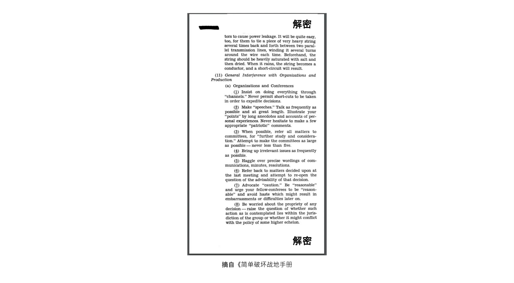


为了更好地了解对手的想法，了解一下他们的运作方式可能会有所帮助。二战期间，一个名为 "战略服务办公室"（Office of Strategic Services）的美国政府机构以开展间谍活动、破坏活动和宣传活动为宗旨，为其工作人员编写了一本[手册](https://www.gutenberg.org/ebooks/26184)，教导他们如何正确地破坏敌人。手册的标题是《Simple Sabotage Field Manual》，其中包含了潜入敌人内部使其陷入困境的具体诀窍。这些诀窍包括烧毁仓库、造成演习磨损以减少敌人的效率。


例如，有一节是关于渗透者如何破坏组织的。需要注意的是，比特币的开发过程是开放的，任何人都可以参与。专门的攻击者可以通过无休止地关注不相关的问题、在精确的措辞上讨价还价、试图重申已经全面讨论过的问题来不断拖延进展。攻击者还可以雇佣一支巨魔军队来提高自己的效率；我们可以把这称为社交女巫攻击（social sybil attack）。通过社交女巫攻击，他们可以让反对变革建议的阻力显得比实际阻力更大。


这强调了一个意志坚定的国家如何能够并将竭尽全力摧毁敌人，包括从内部瓦解敌人。由于比特币是一种与既有法定货币竞争的货币形式，各国很可能会将比特币视为敌人。


### 抵抗公理（Axiome of Resistance）


Eric Voskuil [在他的 Cryptoeconomics 维基页面上写道](https://github.com/libbitcoin/libbitcoin-system/wiki/Axiom-of-Resistance) 他称之为 "抵抗公理"：


> 换句话说，这里有一个假设，即系统有可能抵制国家控制。这并不是一个公认的事实，而是根据对类似系统行为的经验研究，认为这是一个合理的假设，并以此作为系统的基础。
>

> 不接受抵抗公理的人所考虑的是一个与比特币完全不同的系统。如果假定一个系统不可能抵制国家控制，那么结论在比特币的背景下就没有意义--就像球面几何的结论与欧几里得的结论相矛盾一样。没有公理，比特币又怎么可能是无许可或可抵制审查的呢？这种矛盾导致人们在试图将冲突合理化的过程中犯下明显的错误。


他的核心意思是：只有当我们假设有可能创造出一个国家无法控制的系统时，尝试这件事才有意义。


这意味着，要开发比特币就必须接受 "抵抗公理" 的存在，否则您最好把时间花在其他项目上。接受这一公理有助于把开发工作的重点放在手头的真正问题上：围绕国家级对手进行编码。换句话说，要有对抗性思维。


### 关于对抗性思维的结论


去中心化系统不可能在系统本身之外承担责任，因此比特币必须比传统系统更严格地防止恶意行为。在这样的系统中，对抗思维势是必不可少的。


为了保证比特币的安全，就必须了解它的敌人及其动机。大多数威胁似乎可以归结为民族国家，它们通过税收和印钞机拥有巨大的经济实力。他们可能不会轻易放弃印钞特权。


## 开源

<chapterId>427a160c-f893-5b2c-afba-7b24e71ba899</chapterId>


比特币采用了开源软件构建。在本章中，我们将分析其意思、软件的维护是如何进行的，以及比特币中的开源软件是如何实现无许可开发的。我们将涉足 *密码学选择*，这涉及密码系统中库的选择和使用。本章包括一节关于比特币审查过程的内容，接下来是另一节关于比特币开发者如何获得资金的内容。最后一节讲述了比特币的开源文化如何从外部看起来非常怪异，以及为什么这种怪异感实际上是健康的标志。


大多数比特币软件，尤其是 Bitcoin Core，都是开源的。这意味着该软件的源代码向公众开放，供其审查、修补、修改和重新分发。[](https://opensource.org/osd)中的开放源代码定义包括以下要点：


> 自我公布：本许可不限制任何一方将本软件作为包含多个不同来源程序的集合软件发行版的组成部分进行销售或赠送。许可证不得要求对此类销售收取版税或其他费用。
>

> 源代码：程序必须包括源代码，必须允许以源代码和编译形式发布。如果产品的某些形式没有与源代码一起分发，则必须有一个广为宣传的获取源代码的途径，但费用不得超过合理的复制成本，最好是通过互联网免费下载。源代码必须是程序员修改程序的首选形式。不允许故意混淆源代码。不允许使用预处理器或翻译器输出的中间形式。
>

> 衍生作品：许可证必须允许修改和衍生作品，并且必须允许它们根据与原始软件许可证相同的条款进行分发。

Bitcoin Core 采用了[MIT 许可](https://github.com/Bitcoin/Bitcoin/blob/master/COPYING)发布，从而遵守了这一定义：


```
The MIT License (MIT)

Copyright (c) 2009-2022 The Bitcoin Core developers
Copyright (c) 2009-2022 Bitcoin Developers

Permission is hereby granted, free of charge, to any person obtaining a copy of this software and associated documentation files (the "Software"), to deal in the Software without restriction, including without limitation the rights to use, copy, modify, merge, publish, distribute, sublicense, and/or sell copies of the Software, and to permit persons to whom the Software is furnished to do so, subject to the following conditions:

The above copyright notice and this permission notice shall be included in all copies or substantial portions of the Software.
```

翻译版：
```
The MIT License (MIT)

Copyright (c) 2009-2022 The Bitcoin Core developers
Copyright (c) 2009-2022 Bitcoin Developers

特此免费授权，允许任何获得本软件及相关文档文件（以下简称“软件”）副本的人，
在不受限制的情况下处理本软件，包括但不限于使用、复制、修改、合并、发布、分发、再授权和/或销售本软件副本的权利，
并允许被提供本软件的人也可如此操作，但须满足以下条件：

上述版权声明及本许可声明，必须包含在本软件的所有副本或重要部分中。

```


正如 "不要相信，要验证 "一章所述，用户必须能够验证他们运行的比特币软件是否 "如广告宣传的那样运行"。为此，用户必须能够不受限制地访问所要验证软件的源代码。


在接下来的章节中，我们将深入探讨比特币中开源软件的其他一些有趣方面。


### 软件维护


Bitcoin Core 的源代码保存在 [GitHub](https://github.com/Bitcoin/Bitcoin) 上的 Git 代码库中。任何人都可以克隆该版本库，而无需请求任何许可，然后在本地对其进行检查、构建或修改。这意味着，全球各地有成千上万个版本库副本。这些都是同一个版本库的副本，那么 Bitcoin Core 的 GitHub 版本库的特别之处是什么呢？从技术上讲，它一点也不特别，但在社会上，它已成为比特币开发的焦点。


比特币和安全专家 Jameson Lopp 在一篇题为 "谁控制着 Bitcoin Core？"的 [博文](https://blog.lopp.net/who-controls-Bitcoin-core-/) 中对此做了很好的解释：


> Bitcoin Core 是开发比特币协议的重点，而不是指挥和控制中心。如果它因任何原因不复存在，就会出现一个新的重点--它所基于的技术交流平台（目前是 GitHub 存储库）是一个便利性问题，而不是定义/项目真实性问题。事实上，我们已经看到，比特币的开发起点改变了平台，甚至改变了名称！

他接着解释了 Bitcoin Core 的软件是如何维护和防止恶意代码更改的。全文的最后总结了这篇文章的总体启示：


> 没人能控制比特币。
>

> 没有人可以控制比特币开发的重点。

Bitcoin Core 开发人员 Eric Lombrozo 在他的 [Medium post](https://medium.com/@elombrozo/the-bitcoin-core-merge-process-74687a09d81d) 中以 "The Bitcoin Core Merge Process "为题进一步介绍了开发过程：


> 任何人都可以创造代码库的分叉，并对自己的代码库进行任意修改。如果愿意，他们可以从自己的版本库中构建一个客户端并运行。他们还可以创建二进制版本，供其他人运行。
>

> 如果有人想把自己仓库中的修改合并到 Bitcoin Core 中，可以提交拉取请求。一旦提交，无论是否拥有 Bitcoin Core 本身的提交权限，任何人都可以查看更改并发表评论。

需要注意的是，拉取请求可能需要很长时间才能被维护者合并到版本库中，这通常是因为缺乏代码审查，而缺乏审查往往又是由于审查人员不足导致的。


Lombrozo 还谈到了共识更改的过程，但这已经超出了本章的讨论范围。有关比特币协议如何升级的更多信息，请参阅前一章 "升级"。


### 无许可开发（Permissionless development）


我们规定，任何人都可以为 Bitcoin Core 编写代码，无需申请任何许可，但不一定要将其合并到主 Git 仓库。这影响到任何修改，从改变图形用户页面的配色方案，到点对点消息的格式化方式，甚至是共识规则，即定义有效区块链的规则集。


一样重要的是，用户可以自由地在比特币的基础上开发系统，而无需征得任何许可。我们已经看到无数基于比特币的成功软件项目，例如：


- 闪电网路：可快速支付小额款项的支付网络。它只需要很少的链上比特币交易。目前有多种可互操作的实现方式，如[Core Lightning](https://github.com/ElementsProject/lightning)、[LND](https://github.com/lightningnetwork/LND)、[Eclair](https://github.com/ACINQ/eclair)和[Lightning Dev Kit](https://github.com/lightningdevkit)。
- CoinJoin：多方合作将其付款合并为单笔交易，以增加地址集群的难度。目前有多种实现方法。
- 侧链：该系统可将比特币锁定在比特币的区块链上，以便在其他区块链上解锁。这样，比特币就可以转移到其他区块链上，即侧链，从而可使用该侧链上的功能。例如[Blockstream 的 Elements](https://github.com/ElementsProject/Elements)。
- OpenTimestamps：它允许您以非公开方式在比特币的区块链上[给一个文档时间戳](https://opentimestamps.org/)。然后，您就可以使用该时间戳来证明某个文档在某个时间之前就已存在。


如果没有无许可开发的机会，许多项目都不可能实现。正如 "中立性" 一章所述，如果开发者必须获得许可才能在比特币基础上构建协议，那么只有中央开发者许可委员会允许的协议才能被开发出来。


像上面列出的这些系统通常都获得了开放源代码软件的许可，这反过来又允许人们在不征求任何许可的情况下贡献、重复使用或审查其代码。开放源码已成为比特币软件许可的黄金标准。


### 假名开发


开发比特币软件无需征得许可，这给我们带来了一个有趣而重要的选择：您可以在 Bitcoin Core 或任何其他开源项目中编写和发布代码，而无需透露您的身份。


许多开发者都选择使用一个化名，并尽量使其与真实身份保持分离。他们这样做的原因因开发者而异。ZmnSCPxj 就是一位化名用户。除其他项目外，他还为 Bitcoin Core 和 Core Lightning（Lightning Network 的几个实现之一）做出了贡献。[他在自己的网页上写道](https://zmnscpxj.github.io/about.html)：


> 我是 ZmnSCPxj，一个随机生成的互联网人。我的代词是他/他/他。
>

> 我知道人类本能地渴望知道我的身份。不过，我认为我的身份在很大程度上并不重要，我更愿意通过我的作品来判断我的身份。
>

> 严格来说，您应该根据自己从我的文章以及我在比特币和闪电网络上的工作中获得的价值来决定是否捐赠。


在他的案例中，使用化名的原因应根据他的优点来判断，而不是根据化名背后的人的身份。有趣的是，他在［CoinDesk 上的一篇文章](https://www.coindesk.com/markets/2020/06/29/many-Bitcoin-developers-are-choosing-to-use-pseudonyms-for-good-reason/) 中透露，使用化名另有原因。


> 我最初[使用化名]的原因只是担心[会]犯下大错；因此，ZmnSCPxj 原本是一个一次性化名，在这种情况下可以放弃。不过，这个化名似乎赢得了大多数人的好感，因此我保留了它。

使用化名确实可以让您更自由地发表言论，而不会在您说了蠢话或犯了大错时危及您的个人名誉。结果，他的化名得到了很高的声誉，在 2019 年[他甚至得到了一笔开发基金](https://twitter.com/spiralbtc/status/1204815615678177280)，这本身就证明了比特币的无许可性。


可以说，比特币中最著名的化名是中本聪。目前还不清楚他为什么选择使用化名，但事后看来，出于多种原因，这可能是个不错的决定：


- 由于很多人猜测中本聪拥有大量的比特币，为了他的财务和人身安全，必须保持身份的保密性。
- 由于他的身份不明，不可能起诉任何人，这让各类政府机构很难干预。
- 没有权威人士可以仰视，这使得比特币更具功利性和抵御勒索的能力。


请注意，这些观点不仅适用于中本聪，而且在不同程度上适用于在为比特币工作或持有大量货币的任何人。


### 密码学选择（Selection cryptography）


开源开发者经常使用其他人开发的开源库。这是任何健康生态系统中自然而然的一部分。但是，比特币软件涉及的是真金白银，有鉴于此，开发者在选择依赖哪些第三方库时需要格外谨慎。


在一篇关于密码学的哲学[谈话](https://btctranscripts.com/greg-maxwell/2015-04-29-gmaxwell-bitcoin-selection-cryptography/)中，Gregory Maxwell 希望重新定义 "密码学" 这个他认为过于狭隘的术语。他解释说，从根本上说，*信息天生希望被自由传播*，并据此对密码学下了定义：


> 密码学是一门艺术，也是一门科学，我们用它来对抗信息的基本性质，使其符合我们的政治和道德意愿，并将其引向人类的目的，对抗一切机会和反对它的努力。

然后，他介绍了 "密码学选择" 一词，即选择密码工具的艺术，并解释了为什么它是密码学的重要组成部分。它围绕着如何选择密码库、工具和实践，或者正如他所说的 "密码系统选择的密码系统"。


他用具体的例子说明了选择加密法如何容易出现大错，还提出了一份在练习时可以问自己的问题清单。以下是该问题清单的简要版本：


- 软件是为您的目的设计的吗？
- 加密方面的考虑是否得到了重视？
- 审查程序是什么？有审查程序吗？
- 作者的经验是什么？
- 软件是否有文档记录？
- 软件是否便于携带？
- 软件是否经过测试？
- 软件是否采用了最佳实践？


虽然这并不是成功的终极指南，但在进行选择加密时，了解这些要点很有帮助。


由于 Maxwell 提到的上述问题，Bitcoin Core 尝试真正 [尽量减少与第三方代码库的接触](https://github.com/Bitcoin/Bitcoin/blob/master/doc/dependencies.md)。当然，您不可能根除所有外部依赖，否则您就必须自己编写从字体渲染到系统调用实现的所有内容。


### 审查


本节之所以命名为 "审查"，而不是 "代码审查"，是因为比特币的安全性在很大程度上依赖于多层次的审查，而不仅仅是其源代码。此外，不同的想法需要在不同的层面进行审查：与更改配色方案或修改错别字相比，修改共识规则需要在更多层面进行更深入的审查。


在最终被采纳之前，一个想法通常会经历若干讨论和审查阶段，其中包括：


- 在 Bitcoin-dev 邮件列表中发布了一个想法
- 将想法正式化为比特币改进提案 (BIP)
- BIP 在 Bitcoin Core 的拉取请求 (PR) 中实施。
- 讨论部署机制
- 在 Bitcoin Core 中针对不同部署机制提交竞争性的拉取请求
- 拉取请求被合并到主分支
- 用户可选择是否使用该软件


在每个阶段，不同观点和背景的人都会审查可用的信息，无论是源代码、BIP 还是简单描述的想法。这些阶段通常不是以严格的自上而下的方式进行的，事实上，多个阶段可能同时进行，有时还会在这些阶段之间来回切换。不同的人也可能在不同的阶段提供反馈。


Jon Atack 是 Bitcoin Core 上最活跃的代码审查员之一。他撰写了一篇博文](https://jonatack.github.io/articles/how-to-review-pull-requests-in-Bitcoin-core)，介绍如何审核 Bitcoin Core 中的拉取请求。他强调，一个好的代码审查员要关注如何最好地增加价值。


> 作为新人，我们的目标是在尽可能多学知识的同时，以友好和谦逊的态度努力增加价值。
>

> 一个好的方法是，不要以自己为中心，而是 "我怎样才能做出最好的贡献？

他强调，审查是 Bitcoin Core 的一个真正限制因素。很多好的想法都被卡在了没有审核的边缘，悬而未决。请注意，审核不仅对比特币有好处，而且还是了解软件、同时为软件提供价值的好方法。Atack 的经验法则是，在做出任何自己的拉取请求之前，先审查 5-15 个拉取请求。同样，你的重点应该是如何为社区提供最好的服务，而不是如何让自己的代码被合并。除此以外，他还强调了在正确的层面上进行审核的重要性：现在是审核小毛病和错别字的时候，还是开发者需要更多注重概念的审核？Jon Attack 还说道：


> 在开始审查时，第一个有用的问题可能是："此时此刻，这里最需要修改的方面是什么？回答这个问题需要经验和背景积累，但这是一个有用的问题，有助于决定如何用最少的时间创造最大的价值。

帖子的后半部分包括一些有用的实践技术指导，介绍如何实际进行审核，并提供了重要文件的链接供进一步阅读。


Bitcoin Core 开发者兼代码审查员 Gloria Zhao 撰写了[一篇文章](https://github.com/glozow/Bitcoin-notes/blob/master/review-checklist.md)，其中包含她在审查过程中通常会问自己的问题。她还阐述了她视为好审查的要求：


> 我个人认为，一篇好的审查应该是我向自己提出了很多关于公关的尖锐问题，并且对这些问题的答案感到满意的情况。...自然地说，我会先从概念问题开始，然后解决方法相关的问题，最后是实现问题。一般来说，我个人认为在拉取请求草案上留下与 C++ 语法相关的评论是没有用的，而且在作者解决了我提出的 20 多条代码组织建议后，我再回到 "这样做是否合理" 的问题上会觉得很不礼貌。


她认为，好的审查应该关注特定时间点最需要的方面，这与 Jon Atack 的建议不谋而合。她提出了一份问题清单，您可以在审查流程的不同阶段向自己提出问题，但强调这份清单绝不是详尽无遗的，也不是直接的秘诀。该列表以 GitHub 上的真实案例为例作了说明。


### 资金支持


很多人都在从事比特币的开源开发工作，有的是为 Bitcoin Core 发展工作，有的是为了其他项目。许多人利用业余时间从事这项工作，没有得到任何报酬，但也有一些开发者从中获得报酬。


对比特币的持续成功感兴趣的公司、个人和组织可以直接或通过组织向开发者捐赠资金，然后再由组织将资金分配给个人开发者。也有一些专注于比特币公司雇用技术熟练的开发者，让他们全职开发比特币。


### 文化冲击


人们有时会觉得，比特币开发者之间内讧不断，争论不休，无法做出决定。


例如，Taproot 部署机制就经过了长时间的讨论，期间形成了两个派。一个派希望，如果矿工在某一时刻后没有以压倒性多数投票支持新规则，升级就会 "失败"；而另一个派则希望，无论如何都要在那一时刻后执行规则。Michael Folkson 在给 Bitcoin-dev 邮件列表的[电子邮件](https://lists.linuxfoundation.org/pipermail/bitcoin-dev/2021-February/018380.html) 中总结了两方的论点。


争论似乎永远不会停止，真的很难在短期内就此达成共识。这让人们感到沮丧，结果导致热度加剧。Gregory Maxwell（以用户名为 nullc 的身份）在 Reddit](https://www.reddit.com/r/Bitcoin/comments/hrlpnc/technical_taproot_why_activate/fyqbn8s/?utm_source=share&utm_medium=web2x&context=3)上担心，冗长的讨论会降低升级的安全性：


> 在这个阶段，继续等待并不会带来更多审查或更高确定性。相反，由于人们开始忘记细节、推迟下游使用（如支持钱包）的工作，以及没有像对激活时间框架有信心时那样投入更多的额外审核精力，因此额外的延迟会削弱惰性，并可能在一定程度上增加风险。

最终，David Harding 和 Russel O'Connor 提出了一项名为 "快速试行"（Speedy Trial）的新提案，解决了这一争议。如果他们在该时间窗口内激活，那么 Taproot 将在大约 6 个月后部署。


不熟悉比特币开发流程的人可能会认为，这些激烈的辩论看起来非常糟糕，甚至有害。有些人认为，这些争论之所以显得那么激烈，至少有两个原因：


- 与封闭源代码公司相比，所有的辩论都是公开进行的，未经“编辑”。谷歌等软件公司永远不会让员工公开辩论所提出的功能，事实上，它最多只会发表一份声明，表明公司对这一问题的立场。与比特币相比，这让公司看起来更加和谐。
- 由于比特币是无许可的，任何人都可以发表自己的意见。这与封闭源代码公司有本质区别，后者只有少数人发表意见，通常是志同道合的人。与 PayPal 等公司相比，比特币内部表达的意见之多简直令人咋舌。


大多数比特币的开发者都会认为，这种开放性会带来一个良好而健康的环境，甚至是产生最佳结果的必要条件。


正如 "威胁" 一章所描述的，上述第二项可能非常有益，但也有其弊端。攻击者可能会使用拖延战术，如《Simple Sabotage Field Manual》(https://www.gutenberg.org/ebooks/26184) 中概述的战术，来扭曲决策和开发过程。


另外值得一提的是，由于比特币就是一种金钱，而 Bitcoin Core 又能确保数额深不可测的金钱，因此在这种情况下，安全问题是不能掉以轻心的。因此，经验丰富的 Bitcoin Core 开发者可能会显得很固执，但这种态度通常是有道理的。事实上，缺乏合理性的功能不会被接受的。如果它破坏了可重现的构建、添加新的依赖项，或者代码没有遵循比特币的 [最佳实践](https://github.com/Bitcoin/Bitcoin/blob/master/doc/developer-notes.md)。


无论是新手还是多经验的，开发者可能会对此感到沮丧。不过，按照开源软件的惯例，您可以随时创建自己的代码仓库分叉，将您的更改合并到自己的分叉，并构建和运行您自己的二进制文件。


### 关于开源的结论


Bitcoin Core 和大多数其他比特币软件都是开源的，这意味着任何人都可以随意分发、修改和使用该软件。GitHub 上的 Bitcoin Core 存储库目前是比特币开发的重点，但如果人们开始不信任其维护者或网站本身，这一地位就会改变。


开放源代码允许在比特币内和比特币上进行无许可开发。无论您是编写代码、审查代码或检查协议规则，开放源代码都能让您做到这一点，无论您是否以假名的方式开发。


围绕比特币的开发过程是完全开放的，这可能会让比特币看起来像一个有害和低效的地方，但这正是比特币能够抵御恶意行为者的原因。


## 扩展

<chapterId>bb3f3924-202c-5cdd-b2e9-e0c1cab0e48e</chapterId>


在本章中，我们将探讨比特币在可扩展性方面的表现，包括它能够扩展的部分，以及无法扩展的限制。首先，我们首先回顾人们过去对于比特币扩展性的思考方式。然后，本章的大部分内容将解释比特币扩展的各种方法，特别是纵向扩展（vertical scaling）、横向扩展（horizontal scaling）、向内扩展（inward scaling）以及分层扩展（layered scaling）。每种方法说明之后都会考虑是否会影响比特币的价值主张。


在比特币领域，不同的人对 "扩展" 一词有不同的定义。有些人认为它是指区块链交易能力的提高，有些人认为它等同于更有效地使用区块链，还有些人认为它是指在比特币基础上的系统开发。


就比特币而言，为了本课程的目的，我们将扩展定义为*在不影响其抗审查能力的情况下提高比特币的使用能力*。这个定义包括以下几个方面。例如，在某些情况下，我们需要进行一些调整：


- 让交易输入使用更少的字节
- 提高签名验证性能
- 让点对点网络使用更少的带宽
- 交易的批处理
- 分层架构


我们很快就会深入探讨不同的扩展方法，但首先让我们简要回顾一下比特币在扩展方面的历史。


### 比特币扩展的历史


自比特币的创造以来，它的扩展一直是讨论的重点。针对中本聪在密码学邮件列表上公布的比特币白皮书，[第一封邮件](https://www.metzdowd.com/pipermail/cryptography/2008-November/014814.html) 的第一句话就是关于扩展的：


> 中本聪写道：
>

> "我一直在研究一种新的电子现金系统，这种系统完全是点对点的，没有可信的第三方。本文可在 http://www.Bitcoin.org/Bitcoin.pdf 上查阅"
>

> 我们非常、非常需要这样一个系统，但根据我对你的建议的理解，它似乎无法达到所需的扩展规模。

这段对话本身可能并不十分有趣，也不准确，但它表明，扩展问题从一开始就令人担忧。


关于扩展的讨论在 2015-2017 年间达到了顶峰，当时流传着许多关于是否以及如何增加最大区块大小限制的不同想法。那是一次相当无趣的讨论，讨论的是更改源代码中的一个参数，这一更改并没有从根本上解决任何问题，而是将扩展问题进一步推向了未来，造成了技术债务。


2015 年，一个名为[Scaling Bitcoin](https://scalingbitcoin.org/)的大会在蒙特利尔举行，6 个月后在香港举行了后续大会，此后又在世界其他一些地方举行了大会。大会的重点正是如何扩展比特币地址。许多比特币开发者和其他爱好者聚集在这些大会上，讨论各种扩展问题和建议。这些讨论大多不是围绕区块大小的增加，而是更长期的解决方案。


2015 年 12 月香港大会结束后，Gregory Maxwell [总结了他的观点](https://lists.linuxfoundation.org/pipermail/bitcoin-dev/2015-December/011865.html)，就许多争论过的问题，首先提出了一些一般性的缩放理念：


> 在现有技术条件下，扩展与去中心化之间存在着根本性的权衡。如果系统成本过高，人们将被迫信任第三方，而不是独立执行系统规则。如果相对于现有技术而言，比特币区块链的大小过大，那么比特币与传统系统相比就会失去竞争优势，因为验证的成本过高（许多用户被拒之门外），从而迫使人们重新信任系统。如果容量太小，我们的交易方法效率太低，那么进入链条解决争议的成本就会太高，从而再次迫使信任回归系统。

他谈到了吞吐量和去中心化之间的权衡。如果允许更大的区块，就会把一些人挤出网络，因为他们不再有资源来验证区块。但另一方面，如果获取区块空间的成本越来越高，那么就会有越来越少的人有能力使用区块空间作为争端解决机制。在这两种情况下，用户都会被迫使用受信任的服务。


他接着总结了大会上提出的许多扩展方法。其中包括计算效率更高的签名验证、*隔离见证*（Segwit）（包括改变区块大小限制）、空间效率更高的区块传播机制，以及在比特币基础上分层构建协议。其中许多从那时起，这些方法已经开始实施。


### 扩展方法


如上所述，比特币的扩展并不一定要增加区块大小限制或其他限制。现在，我们将介绍一些通用的扩展方法，其中一些方法不会出现上一节提到的吞吐量-去中心化权衡问题。


#### 纵向扩展（Vertical Scaling）


纵向扩展是增加数据处理机器计算资源的过程。在比特币中，他们会成为所谓的全节点，即代表用户验证区块链的机器。


在比特币中，最常讨论的纵向扩展技术是增加区块大小上限。这需要一些全节点升级硬件，以满足不断增长的计算需求。该做法的缺点是要以中心化为代价。


除了对全节点去中心化的负面影响，纵向扩展还可能以不那么明显的方式对比特币的挖矿去中心化和安全性产生负面影响。让我们来看看矿工 "应该" 如何运作。假设一个矿工挖出了高度为 7 的区块，并在比特币网络上发布了该区块。这个区块需要一段时间才能被广泛接受，这主要是由两个因素造成的：


- 由于带宽限制，在同行之间传输数据块需要一定的时间。
- 区块验证需要时间。


当区块 7 在网络中传播时，许多矿工仍在区块 6 上进行挖矿，因为他们还没有收到并验证区块 7。在此期间，如果其中任何一个矿工在高度为 7 挖出了一个新区块，那么在该高度就会出现两个相互竞争的区块。在高度 7（或任何其他高度）上只能有一个区块，这意味着两个候选区块中必须有一个变得陈旧。


简而言之，出现陈旧区块是的原因是每个区块的传播都需要时间，传播时间越长，出现陈旧区块的概率就越高。


假设取消了区块大小限制，平均区块大小大幅增加。由于带宽和验证时间的限制，区块在网络中的传播速度会变慢。传播时间的增加也会增加出现陈旧区块的几率。


矿工不希望自己的区块变成 “孤块”，因为这样他们就会失去区块奖励，所以他们会想尽一切办法避免这种情况。他们可以采取的措施包括：


- 推迟验证收到的区块，也称为*无验证挖矿*（validationless mining）。矿工只需检查区块头的工作证明并在其上挖矿，同时下载完整区块并验证。
- 通过更大的带宽和连接性连接到矿池。


无验证挖矿进一步削弱了全节点的去中心化，因为挖矿不得不信任收到的区块，至少是暂时的。这也在一定程度上损害了安全性，因为网络的部分计算能力有可能建立在无效的区块链上，而不是建立在最强的有效链上。


第二点对挖矿的去中心化有负面影响，因为通常网络连接和带宽最好的矿池也是最大的，导致矿工倾向于几个大矿池。


#### 横向扩展（Horizontal Scaling）


横向扩展指的是将工作负载划分到多台机器上的技术。虽然这是流行网站和数据库普遍采用的扩展方法，但在比特币中却不容易实现。


许多人将这种比特币扩展方法称为*分片*（sharding）。基本上，它包括让每个全节点只验证区块链的一部分。Peter Todd 对分片的概念进行了深入思考。他撰写了一篇[博文](https://petertodd.org/2015/why-scaling-bitcoin-with-sharding-is-very-hard)，从总体上解释了分片的概念，并提出了自己的想法，即*树链*（treechains）。这篇文章读起来相当艰深，但其中有几处观点是比较容易理解的：


> 在分片式系统中，"全节点防御" 不起作用，或者说不能直接不起作用。问题的关键在于，并不是每个人都拥有所有数据，所以您必须决定在无法获得数据时该怎么办。

然后，他就如何处理分片或横向扩展提出了各种想法。在文章的最后，他总结道：

> 但有一个大问题：与比特币相比，上述分片协议实在是太复杂了！即使是分片的 "儿童版"--我的线性化方案而不是zk-SNARKS--也可能比现在使用的比特币协议复杂一两个数量级，但现在这个领域的大部分公司似乎都举起了双手，转而使用集中式 API 提供商。真正实现上述目标并让最终用户掌握它并不容易。
>

> 另一方面，去中心化并不便宜：使用 PayPal 比使用比特币协议要简单一两个数量级。

他得出的结论是，分片方案在技术上可能是可行的，但代价是极大的复杂性。鉴于许多用户已经觉得比特币太复杂，而更愿意使用集中式服务，就很难说服他们使用更加复杂的系统。


#### 向内扩展（Inward Scaling）


虽然横向和纵向扩展在数据库和网络服务器等集中式系统中历来行之有效，但由于其中心化效应，它们似乎并不适合像比特币这样的去中心化网络。


有一种很少受到重视的方法，我们称之为 "向内扩展"（inward scaling），翻译过来就是 "以最小代价实现最大成效"。它指的是许多开发者持续不断地优化现有算法，以便我们能在系统现有的限制范围内做得更多。


可以说，通过向内扩展实现的改进令人印象深刻。Jameson Lopp [对区块链同步进行了基准测试](https://blog.lopp.net/Bitcoin-core-performance-evolution/)，比较了许多不同版本的 Bitcoin Core（最早可追溯到 0.8 版），从而大致了解了这些年来的改进情况。


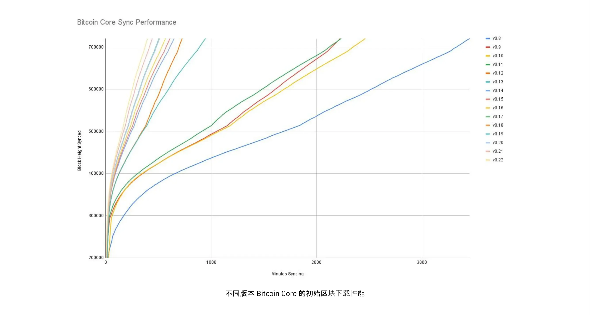


在上图中，您可以看到不同版本的 Bitcoin Core 的初始区块下载的性能。Y 轴上是同步的区块高度，X 轴上是同步到该高度所需的时间


不同的线条代表 Bitcoin Core 的不同版本。最左边的一行是最新版本，即 0.22 版，于 2021 年 9 月发布，完全同步耗时为 396 分钟。最右边的是 2013 年 11 月发布的 0.8 版，耗时为 3452 分钟。这个大约 10 倍的改进都归功于向内扩展。


这些改进可归类为节省空间（内存、磁盘、带宽等）或节省计算能力。这两类都有助于实现上图中的改进。


[libsecp256k1](https://github.com/Bitcoin-core/secp256k1) 库就是一个很好的计算改进例子，它实现了制作和验证数字签名所需的加密原语。Pieter Wuille 是这个库的贡献者之一，他写了一篇[Twitter 线程](https://twitter.com/pwuille/status/1450471673321381896)，展示了通过各种拉取请求实现的性能改进。


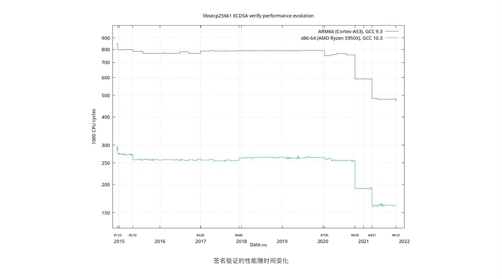


随时间推移的签名验证性能，并在时间轴上标注重要的拉取请求


该图显示了两种不同的 64 位 CPU（即 ARM 和 x86）的趋势。性能上的差异是由于 x86 提供了更多专用指令，而 ARM 架构则拥有更少和更通用的指令。不过，两种架构的总体趋势是相同的。请注意，Y 轴是对数轴，这使得性能的提高显得没有实际那么显著。


还有一些节省空间的改进措施也有助于提高性能。在一个[Medium博文](https://murchandamus.medium.com/2-of-3-Multisig-inputs-using-Pay-to-Taproot-d5faf2312ba3)介绍了 Taproot 在节省空间方面的贡献，Murch 分析了在不同情况下——使用 Taproot 的不同方式以及完全不使用 Taproot——一个 2-of-3 门限签名（threshold signature） 方案各自需要占用多少区块空间。


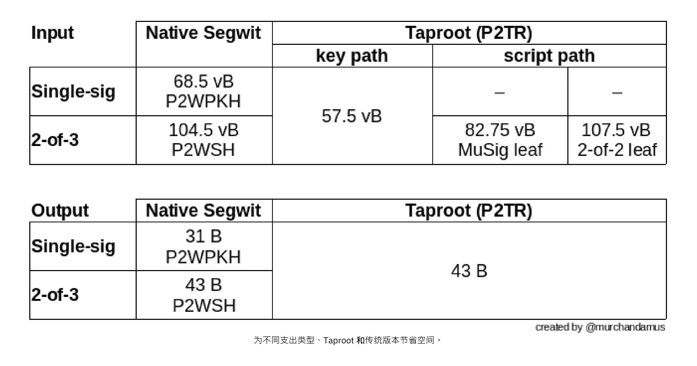


为不同支出类型、Taproot 和传统版本节省空间。


使用 native SegWit 的 2-of-3 多签名总共需要 104.5 + 43 vB = 147.5 vB，而在标准使用情况下，最节省空间的 Taproot 只需要 57.5 + 43 vB = 100.5 vB。在最极端和罕见的情况下，比如由于某种原因无法使用标准签名者时，Taproot 将使用 107.5 + 43 vB = 150.5 vB。您不必了解所有细节，但这应该能让您了解开发者是如何考虑节省空间的--每一个小字节都很重要。


除了比特币软件的向内扩展外，用户也可以通过一些方式促进向内扩展。他们可以更智能地进行交易，以节省交易费用，同时减少对全节点需求的影响。实现这一目标的两种常用技术是交易批处理和输出合并。


交易批处理的原理是将多笔付款合并为一笔交易，而不是每笔付款进行一次交易。这样可以节省大量费用，同时减少区块空间负荷。


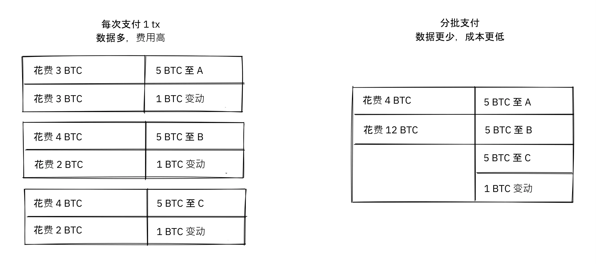


交易批处理将多笔付款合并为单笔交易，以节省费用。


输出合并是指利用区块空间需求较低的时期，将多个输出合并为一个输出。这样可以减少日后的费用成本，因为在区块空间需求量大的时候，您需要支付费用。


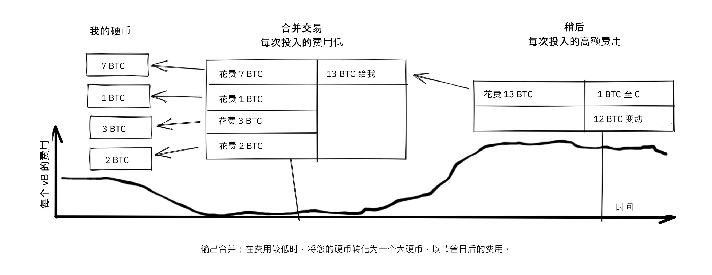


输出合并：在费用较低时，将比特币“分片”融为一体，以节省日后的费用。


输出合并对向内扩展的贡献可能并不明显。毕竟，使用这种方法，区块链数据的总量甚至会略有增加。不过，UTXO 数据集（即记录比特币所有者的数据）会缩小，因为您花费的 UTXO 比您创造的多。这减轻了全节点维护 UTXO 数据集的负担。


但不幸的是，这两种*UTXO 管理*技术可能会损害您自己或收款人的隐私。在批处理的情况下，每个受款人都会知道所有批处理的输出都是从您这里发送给其他受款人的（可能除了更改）。在 UTXO 合并情况下，您会发现您合并的输出是属于同一个钱包的。因此，您可能必须在成本效益和隐私之间做出权衡。


#### 分层扩展（Layered Scaling）


最有影响力的扩展方法可能是分层扩展。分层背后的一般理念是，协议可以在不增加区块链交易的情况下结算用户之间的付款。


如下图所示，分层协议首先由两个或两个以上的人就开始交易达成一致意见，然后将其放到区块链上。


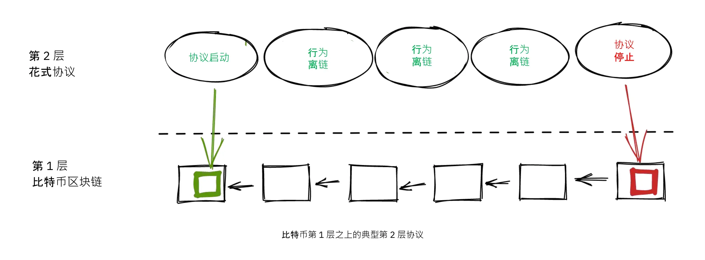


不同协议创建启动交易的方式各不相同，但一个共同的主题是，参与者创建一个未签名的启动交易和若干个预先签名的惩罚交易，以各种方式使用启动交易的输出。随后，所启动交易被完全签署并发布到区块链上，惩罚交易也可以被完全签署并发布，以惩罚行为不端的一方。这个做法可以激励参与者信守承诺，使协议以无信任的方式运行。


一旦在区块链上开始交易，协议就可以做它应该做的事情。例如，它可以在参与者之间进行超快支付，实施一些隐私增强技术，或编写比特币区块链不支持的更高级脚本。


我们不会详细介绍具体协议的工作原理，但从上图可见，在协议的生命周期中，区块链很少被使用。所有重要的操作都不在链上发生。我们已经看到，如果操作得当，这不仅能保护隐私，还能提高可扩展性。


在一篇题为 "登月需要多级火箭，否则火箭方程会吃掉你的午餐......把每个人都装进小丑车式的火箭里，然后寄希望于成功是不可能的 "的[Reddit 帖子](https://www.reddit.com/r/Bitcoin/comments/438hx0/a_trip_to_the_moon_requires_a_rocket_with/)中，Gregory Maxwell 解释了为什么分层扩展是让比特币实现数量级扩展的最佳途径。


他首先强调了将 Visa 卡或 Mastercard 视为比特币主要竞争对手的谬误，并强调了增加最大区块大小是应对上述竞争的不良方法。然后，他谈到了如何通过分层方案真正带来显著改进：


> 那么，这是否意味着比特币不能成为支付技术的大赢家呢？不，但要达到满足全球支付需求所需的能力，我们必须更加智慧地工作。
>

> 从一开始，比特币就被设计为通过其智能合约功能，以安全的方式将各层次结合在一起（什么，你认为这只是为了让人们可以对毫无意义的 "DAO" 进行哲学思考？）实际上，我们将把比特币系统当作一个高度易用、完全值得信赖的机器人法官，在法庭之外处理我们的大部分交易--但在交易方式上，如果出了问题，我们拥有所有证据和既定协议，因此我们可以相信机器人法庭会纠正错误。(技术旁注：如果你觉得这听起来不可能，可以阅读这篇关于交易剪裁的旧帖子）
>

> 我们之所以能做到这一点，正是因为比特币的核心特性。可审查或可逆的基础系统不太适合在其上建立强大的上层交易处理系统。如果基础资产不健全，与之进行交易就没有什么意义。

法官的比喻很好地说明了分层的作用：这位法官不可能是腐败的，绝不能改变主意，否则，比特币的基础层上面的各层就不能可靠地发挥作用。


他继续提出了关于中心化服务的观点。通常情况下，信任一个拥有微不足道的比特币的中央服务器是没有问题的：这也是分层扩展的关键。


Maxwell 写下上述文章以来，许多年过去了，他的话依然正确。闪电网络的成功证明，分层确实是提高比特币实用性的一条出路。


### 关于扩展的结论


我们已经讨论过各种方法来扩展比特币，提高比特币的使用能力。从比特币诞生之初，扩展就是一个值得关注的问题。


我们现在知道，比特币在纵向扩展（“买更大更强的硬件”）或横向扩展（“只验证部分数据”）方面表现并不理想，而更适合通过向内扩展（“以更少达成更多”）和分层扩展（“在比特币之上构建协议”）来提升性能。


## 当大祸临头时

<chapterId>fe39c13c-310f-51fd-84ff-6b92dd01c9e7</chapterId>


比特币是由人类建造的。人们编写软件，然后运行这些软件。当发现安全漏洞或严重漏洞时--这两者真的有区别吗？ - 它们总是由有血有肉的人发现的。本章将探讨当出现问题时，人们该做什么、应该做什么、不应该做什么。第一节解释了 "负责任的披露"（*responsible disclosure*）这一概念，指的是发现漏洞的人如何采取负责任的行动，帮助尽可能降低漏洞造成的损失。本章的其余部分将带您参观多年来发现的一些最严重的漏洞，以及开发者、矿工和用户是如何处理这些漏洞的。在比特币早期，这些处理方式远没有今天这么严格。


### 负责任的披露


假设您发现了 Bitcoin Core 中的一个漏洞，该漏洞允许任何人通过使用一些特制的网络信息远程关闭 Bitcoin Core 节点。还假设您没有恶意，希望这个问题不要被攻击者利用。您会怎么做？如果您对此保持沉默，其他人很可能会发现这个问题，而且不确定那个人是否有恶意。


当发现安全问题时，发现者应采用 "负责任的披露"，这是比特币开发者经常使用的一个术语。该术语的解释[可见于维基百科](https://en.wikipedia.org/wiki/Coordinated_vulnerability_disclosure)：


> 硬件和软件的开发者往往需要时间和资源来修复他们的错误。通常，有道德黑客会发现了这些漏洞。黑客和计算机安全科学家认为，让公众了解漏洞是他们的社会责任。隐藏问题会造成虚假的安全感。为避免出现这种情况，有关各方要进行协调，协商出修复漏洞的合理期限。根据漏洞的潜在影响、开发和应用紧急修复或变通方法所需的预期时间以及其他因素，所需时间可达到几天，甚至几个月。


这意味着，如果您发现了安全问题，您应该向负责该系统的团队报告。但就比特币而言，这意味着什么呢？没有人控制比特币，但目前有一个比特币开发的协调中心，即 [Bitcoin Core Github 代码库](https://github.com/Bitcoin/Bitcoin)。该资源库的维护者对其中的代码负责，但他们并不对整个系统负责--没有人负责。不过，一般的最佳做法是向 security@bitcoincore.org 发送电子邮件。


在 2017 年题为 "负责任地披露漏洞"（Responsible disclosure of bugs）的[电子邮件主题](https://lists.linuxfoundation.org/pipermail/bitcoin-dev/2017-September/015002.html)中，Anthony Towns 试图总结他所认为的当前最佳实践。他从多个来源和不同的人收集了意见，为他在这个问题上的观点提供了参考。


- 应通过 security at bitcoincore.org 报告漏洞。
- 对于严重漏洞（可立即被利用或已被利用造成巨大危害）将通过以下方式处理：
  - 尽快发布补丁
  - 广泛通知用户升级（或禁用受影响的系统）
  - 尽量少披露实际问题，以延缓潜在攻击
- 对于非严重漏洞（即难以或代价高昂才能被利用的漏洞）将通过以下方式处理：
  - 在正常发展过程中进行修补和审查
  - 将修复或变通方法从主版本回传至当前发布版本
- 开发者会向未被告知该漏洞的有经验的开发者提供建议的修复程序，告诉他们该程序修复了一个漏洞，并要求他们识别该漏洞，以确保修复程序的发布不会暴露漏洞的性质。
- 开发者可以建议其他比特币实现在发布和广泛部署漏洞修复程序之前采用漏洞修复程序，前提是他们可以在不暴露漏洞的情况下这样做；例如，如果修复程序具有显著的性能优势，可以证明采用该程序是合理的。
- 在漏洞公开之前，开发者通常会向友好的山赛币开发者建议，他们应该抓紧时间修复漏洞。但这只是在修复程序在比特币网络中广泛部署之后。
- 如果山赛币开发者有敌对行为（如利用漏洞攻击他人或违反禁运），开发者一般不会通知他们。
- 在超过 80% 的比特币节点部署了修复程序之前，比特币开发者不会披露漏洞详情。我们鼓励并要求漏洞发现者遵循相同的政策。[1] [6]


该列表显示了发布比特币补丁时必须多么小心谨慎，因为补丁本身就可能泄露漏洞。第四项尤其有趣，因为它解释了如何测试补丁是否伪装得足够好。事实上，如果几个真正有经验的开发者即使知道补丁修复了一个漏洞，也无法发现这个漏洞，那么对于其他人来说要发现该漏洞也很可能会非常困难。


导致这封邮件的主题是讨论是否、何时以及如何披露山赛币和比特币的其他实现方式的漏洞。这里没有明确的答案。"帮助好人" 似乎是明智之举，但谁来决定谁是好人？Bryan Bishop [认为](https://lists.linuxfoundation.org/pipermail/Bitcoin-dev/2017-September/014983.html)，帮助山赛币甚至诈骗币抵御安全漏洞是一种道德责任：


> 仅仅保护比特币及其用户免受主动威胁是不够的，保护所有类型的用户和不同的软件免受各种形式的威胁才是更普遍的责任，即使人们使用的是连你个人也并不维护、贡献或倡导的愚蠢而不安全的软件。处理漏洞知识是一件很微妙的事情，您可能会收到比最初描述的更严重的直接或间接影响的知识。

在 Town 发出上述电子邮件之前，Gregory Maxwell 还发表了一篇[帖子](https://lists.linuxfoundation.org/pipermail/bitcoin-dev/2017-September/014977.html)文章，认为安全漏洞可能比表面显得更加严重：


> 我曾多次看到：看似难以利用的问题，一旦找到合适的诀窍就变得微不足道；看似小的拒绝服务（DoS）问题，结果可能演变成严重得多的漏洞。
>

> 简单的性能缺陷，如果被专家级地部署利用，可能被用来撕裂网络——比如把矿工 A 和交易所 B 分到一个分区，把其他人分到另一个分区，从而实现双重支付（double-spend）。
>

> 所以虽然我完全同意不同的问题应当并且可以采取不同的处理方式，但现实往往并非泾渭分明。审慎的做法是把问题当作可能比你当前所知更严重来对待。

因此，即使一个漏洞看起来很难被利用，最好的办法可能是把它视为可容易被利用的漏洞，只是您还没有想出利用的方法。


他还提到，"把这个主题称为关于信息披露的主题有点不当，这个主题不是关于信息披露的。披露是指你告诉供应商的情况。这个主题是关于公布的，其含义截然不同。公布是指您确定已经告诉了潜在的攻击者"。关于披露与公布之间区别的最后一点意见非常重要。容易的部分是负责任的披露；很难做到的部分是明智的公布。


### 比特币的创伤童年


比特币最初只是一个人开发和维护（至少创建者的化名是这么说的）的项目，比特币最初几乎没有任何价值。因此，对漏洞和错误的修复不像今天这样严格。


比特币维基上有一份比特币经历过的[常见漏洞和暴露列表](https://en.Bitcoin.it/wiki/Common_Vulnerabilities_and_Exposures) (CVE)。本节是对比特币早期的一些安全问题和事件的小结。我们不会涵盖所有这些问题和事件，但我们选择了一些我们认为特别有趣的问题和事件。


#### 2010-07-28: 能花费任何人的比特币（CVE-2010-5141）


2010 年 7 月 28 日，一个化名叫 ArtForz 的人发现了 0.3.4 版本中的一个漏洞，这个漏洞可以让任何人抢走别人的比特币。ArtForz *负责*地向中本聪和另一位名为 Gavin Andresen 的比特币开发者报告了这一情况。


问题在于脚本操作符 `OP_RETURN` 会直接退出程序的执行，因此若 scriptPubKey 为 `<pubkey> OP_CHECKSIG`，而 scriptSig 为 `OP_1 OP_RETURN`，则 scriptPubKey 中的程序部分将永远不会执行。唯一会发生的情况是 `1` 被放入堆栈，然后 `OP_RETURN` 会导致程序退出。程序执行后，堆栈顶部任何非零值都意味着支出条件已满足。由于栈顶元素 `1` 为非零，因此支出将是确定的。


这是处理 `OP_RETURN` 的代码：


```
case OP_RETURN:
{
pc = pend;
}
break;
```

`pc = pend;`的作用是跳过程序的其余部分，这意味着 scriptPubKey 中的任何锁定脚本都将被忽略。修复方法是更改 `OP_RETURN` 的含义，使其立即失效。


```
case OP_RETURN:
{
return false;
}
break;
```


中本聪在本地进行了这一修改，并从中创建了一个 0.3.5 版本的可执行二进制文件。然后，他在 Bitcointalk 论坛上发布了 "尽快升级到 0.3.5 版本" 的帖子，敦促用户安装他的二进制版本，但没有提供源代码：


> 请尽快升级到 0.3.5 版本！我们修正了一个执行错误，该错误可能导致接受虚假交易。在升级到 0.3.5 版之前，请勿接受比特币交易付款！

原信息后经编辑，不再提供全文。以上片段来自[引用回答](https://bitcointalk.org/index.php?topic=626.msg6458#msg6458)。一些用户试用了中本聪的二进制文件，但遇到了一些问题。不久之后，[中本聪写道](https://bitcointalk.org/index.php?topic=626.msg6469#msg6469)：


> 目前没有时间更新 SVN。请等待 0.3.6 版公布，我正在构建它。在此期间，你可以关闭节点。

35 分钟后，[他写道](https://bitcointalk.org/index.php?topic=626.msg6480#msg6480)：


> SVN 已更新至 0.3.6 版。
>

> 现已将 0.3.6 版的 Windows 版本上传到 Sourceforge，然后将重建 Linux 版本。

此时，他似乎还更新了原帖，提到了 0.3.6 版，而不是 0.3.5 版：

> 请尽快升级到 0.3.6 版！我们修正了一个执行错误，该错误可能导致假交易被显示为已接受。在升级到 0.3.6 版之前，请勿接受比特币交易付款！
>

> 如果无法立即升级到 0.3.6 版，最好在升级之前关闭比特币节点。
>

> 在 0.3.6 中，哈希处理速度更快：
> - 由于 Tcatm 的贡献，优化了中间状态缓存。
> - 由于 BlackEye 的贡献，采用了 Crypto++ ASM SHA-256。
> 总生成速度已提高 2.4 倍。
>

> 请下载：
>

> http://sourceforge.net/projects/Bitcoin/files/Bitcoin/Bitcoin-0.3.6/
>

> Windows 和 Linux 用户：如果您还使用 0.3.5 版本，则仍需升级到 0.3.6 版。

请注意第一条信息对问题描述的不同之处："可显示为已接受" 与 "可被接受"。也许中本聪在交流中淡化了错误的严重性，以免引起人们对实际问题的过多关注。总之，大家升级到 0.3.6 版后，问题如期解决。令人惊讶的是，这个特殊问题在比特币没有损失的情况下得到了解决。


中本聪的信息还描述了挖矿的一些性能优化。目前还不清楚为何要在重要的安全修复中加入这些内容，有可能是为了掩盖真正的问题。不过，更有可能的是，他只是发布了 Subversion 代码库开发分支中的任何内容，并在其中添加了安全修复。


当时的用户数量远不及今天，比特币的价值也接近于零。如果这个错误的回复在今天上演，出于多种原因，它将被认为是一场彻头彻尾的灾难：


- 中本聪只发布了包含修复程序的 0.3.5 版。没有提供补丁或代码，也许是为了混淆视听。
- 0.3.5 版[根本不起作用](https://bitcointalk.org/index.php?topic=626.msg6455#msg6455)。
- 0.3.6 中的修复实际上是一个硬分叉。


另一个值得讨论的问题是，要求用户关闭节点是否合理。这在今天是做不到的，但当时，很多用户都在积极关注论坛上的更新，通常都能及时了解情况。既然在那种环境下确实有可能协调用户临时关闭节点，那或许这确实是一个合理且务实的选择。


#### 2010-08-15 合并输出溢出 (CVE-2010-5139)


2010 年 8 月中旬，Bitcointalk 论坛用户 jgarzik，又名 Jeff Garzik，[发现](https://bitcointalk.org/index.php?topic=822.msg9474#msg9474) 在区块高度 74638 上的某个交易有两个异常高的输出值：


```
"out" : [
{
"value" : 92233720368.54277039,
"scriptPubKey" : "OP_DUP OP_HASH160 0xB7A73EB128D7EA3D388DB12418302A1CBAD5E890 OP_EQUALVERIFY OP_CHECKSIG"
},
{
"value" : 92233720368.54277039,
"scriptPubKey" : "OP_DUP OP_HASH160 0x151275508C66F89DEC2C5F43B6F9CBE0B5C4722C OP_EQUALVERIFY OP_CHECKSIG"
}
]
```


> 这个高度为 74638 的区块中的 "value out" 非常奇怪：
>

> 92233720368.54277039 BTC？这是 UINT64_MAX 吗？

也许出现了一个错误，导致两个 int64（而不是 Garzik 认为的 uint64）输出的总和溢出到负值 -0.00997538 BTC。无论输入的总和是多少，输出的 "总和" 都会变小，因此根据当时的代码，这笔交易是没有问题的。


在这种情况下，该漏洞是通过一个实际的漏洞被披露和公布的。一个不幸的结果是，大约 2x92 亿枚比特币被制造出来，这严重稀释了当时存在的大约 370 万枚的比特币供应量。


在一个相关的主题中，[中本聪发表了一个帖子](https://bitcointalk.org/index.php?topic=823.msg9531#msg9531) ，说如果人们停止挖矿（或**生成比特币**，当时人们称之为**生成**），他会非常感激：


> 如果人们停止生成，这将有所帮助。我们可能需要在当前分支的基础上重新做一个分支，而所生成的数量越少，速度就越快。
>

> 第一个补丁将在 SVN rev 132 中发布。目前尚未上传。我正在先推送一些其他的杂项修改，然后再上传这个补丁。

他的计划是制作一个软分叉，使这里讨论的交易无效，从而使包含此类交易的区块（尤其是区块 74638）无效。不到一小时后，他在 Subversion 代码库中提交了一个[修订版 132 中的补丁](https://sourceforge.net/p/bitcoin/code/132/)，并[在论坛上发帖](https://bitcointalk.org/index.php?topic=823.msg9548#msg9548)描述了他认为用户应该做的事情：


> 补丁已上传至 SVN rev 132！
>

> 目前，以下是建议采取的步骤：
> 1) 先关闭程序。
> 2) 下载 knightmb 提供的区块文件（将你的 blk0001.dat 和 blkindex.dat 替换掉）。
> 3) 升级程序。
> 4) 启动后区块数应少于 74000 个，让它重新下载剩下的部分。
>

> 如果不想使用 knightmb 的文件，可以直接删除 blk*.dat 文件，但如果每个人都同时下载整个区块索引，网络负荷会很大。
>

> 我很快就会制作发布版本。

他希望人们能下载某个特定用户（即 knightmb）的区块数据，该用户已将其区块链文件（即 blkXXXX.dat 和 blkindex.dat 文件）原封不动地发布在自己的磁盘上。之所以采用这种方式下载区块链数据，而不是从头开始同步，是为了减少网络带宽瓶颈。


这其中有一个很大的注意事项：用户从 knightmb 处下载的数据[未经比特币软件验证](https://Bitcoin.stackexchange.com/a/113682/69518)。blkindex.dat 文件包含 UTXO 数据集，软件会接受其中的任何数据，就好像已通过验证一样。


人们似乎又一次同意采取这个做法，无效区块及其后续区块的逆转取得了成功。矿工们开始为区块[74637](https://Mempool.space/block/0000000000606865e679308edf079991764d88e8122ca9250aef5386962b6e84)创建新的后继区块，根据该区块的时间戳，后继区块在 23:53 UTC（世界协调时）出现，大约在发现问题 6 小时后。第二天（8 月 16 日）8:10，在区块 74689 左右，新链超过了旧链，因此所有未升级的节点都重新锻造以跟随新区块链。这是比特币历史上最严重的一次重组（52 个区块）。


与 OP_RETURN 问题相比，这个问题的处理方式更为简洁：


- 不发布纯二进制补丁
- 发布的软件按预期能正常运行
- 没有硬分叉


在这个问题出现时，用户也被要求停止进行挖矿。我们可以讨论这是否是个好主意，但想象一下，您是一个矿工，您确信坏区块上面的任何区块最终都会在深度重组中被清除：您为什么要在注定会被清除的区块上浪费资源进行挖矿呢？


您可能也会认为，按照中本聪的建议，从随便一个人的硬盘上下载区块链（包括 UTXO 集）有点不妥。如是如此，您说得没错：这是有猫腻。但是，在当时的情况下，这种应急措施是明智的。


这个案例与之前的 OP_RETURN 案例有一个重要的区别：此次问题已在实际环境中被利用过，因此修复可以更直接明了。而在 OP_RETURN 案例中，他们不得不混淆修复方法，发表公开声明，不直接揭示问题所在。


#### 2013-03-11 DB 锁问题 0.7.2 - 0.8.0 (CVE-2013-3220)


2013 年 3 月，一个非常有趣且具有教育价值的问题浮出水面。在第 225429 号区块之后，区块链似乎发生了分裂（下面的引文中使用了 "分叉" 这一词）。[BIP50](https://github.com/Bitcoin/bips/blob/master/bip-0050.mediawiki) 报道了这一事件的细节。摘要中写道：


> 一个交易输入总量比以前更大的区块被挖掘和广播。0.8 版的比特币节点能够处理，但一些 0.8 版之前的比特币节点拒绝接受，导致区块链出现意外的分叉。此时，0.8 版前不兼容链（从这里开始，0.8 版链）拥有约 60% 的挖矿哈希率，确保分裂不会自动受到解决（如果 0.8 版前链在总工作量上超过 0.8 版链，就会出现这种情况，迫使 0.8 版节点重组成 0.8 版前的链）。
>

> 为了尽快恢复规范的链，BTCGuild 和 Slush 将它们的比特币 0.8 版节点降级为 0.7 版，这样它们的矿池也会拒绝较大的区块。这就将大部分的哈希率放在没有较大区块的链上，从而最终导致 0.8 版节点重组到 0.8 版之前的链上。

在这次紧急情况中，矿池 BTCGuild 和 Slush 所采取的快速行动势在必行。它们将大部分哈希率转移到了分裂前的 0.8 分支，从而帮助恢复了共识。这为开发者提供了时间来找出可持续的解决方案。


这个问题还有一个非常有趣的地方，那就是 0.7.2 版本与自身不兼容，之前的版本也是如此。BIP50 的[根本原因]部分对此有解释（https://github.com/Bitcoin/bips/blob/master/bip-0050.mediawiki#root-cause）：


> 由于 BDB 锁配置不够高，它隐含地成为了决定区块有效性的网络共识规则（尽管是一个
不一致和不安全的规则，因为锁的使用可能因节点而异）。


简而言之，问题在于 Bitcoin Core 软件验证一个数据块所需的数据库锁的数量不是确定的。一个节点可能需要 X 个锁，而另一个节点可能需要 X+1 个锁。节点对比特币可以使用的锁数量也有限制。如果所需锁的数量超过该限制，区块将被视为无效。因此，如果 X+1 超过了限制，但没有超过 X，那么两个节点就会有自己的区块链版本，并对哪个分支有效产生分歧。


除了两个矿池为恢复共识采取的即时措施外，所选解决方案还包括：


- 在 0.8.1 版本中，对区块的大小和所需锁定数量进行限制；
- 对旧版本（0.7.2 及更早版本）打上相同的新规则补丁，并提高全局锁定数量上限。


除了第二项中增加的全局锁限制外，这些规则都是在预先确定的时间内临时实施的。计划是在大多数节点升级后取消这些限制。


这一软分叉大幅降低了共识失败的风险，几个月后的 5 月 15 日，整个网络一致停用了临时规则。请注意，这次停用实际上是一次硬分叉，但并没有引起争议。此外，它是与之前的软分叉一起发布的，因此运行软分叉软件的人都很清楚硬分叉会紧随其后。因此，当硬分叉激活时，绝大多数节点都保持了共识。但不幸的是，少数没有升级的节点在此过程中丢失了。


也许有人会问，这在今天是否可行。如今，挖矿的情况更加复杂，根据分裂双方的哈希率，要想快速推出类似 BIP50 的补丁，可能不容易实现。说服 "错误" 分支的矿工放弃他们的区块奖励可能很难。


#### BIP66


BIP66 很有意思，因为它强调了以下方面的重要性：


- 良好的密码学选择
- 负责任的披露
- 在不暴露漏洞的情况下进行部署
- 在已验证区块上挖矿


BIP66 是一项收紧比特币脚本中签名编码规则的提案。其[动机](https://github.com/Bitcoin/bips/blob/master/bip-0066.mediawiki#motivation)是为了能够使用 OpenSSL 甚至 OpenSSL 最新版本以外的软件或代码库来解析签名。OpenSSL 是 Bitcoin Core 当时使用的通用加密库。


该 BIP 于 2015 年 7 月 4 日激活。然而，虽然上述情况属实，但 BIP66 还修复了 BIP 中未提及的一个更为严重的问题。


##### 脆弱所在


这一问题的完整披露由 Pieter Wuille 于 2015 年 7 月 28 日通过 [电子邮件发送至 Bitcoin-dev 邮件列表发布](https://lists.linuxfoundation.org/pipermail/Bitcoin-dev/2015-July/009697.html)：


> 大家好
>

> 我想要披露一个我在 2014 年 9 月发现的漏洞，该漏洞在本月早些时候 BIP66 达到 95% 激活阈值后已无法被利用。
>

> 简要说明：
>

> 一个经过特殊构造的交易可能会在以下节点之间导致区块链分叉：
>

> - 在 32 位系统和 64 位 Windows 系统上使用 OpenSSL
> - 在非 Windows 64 位系统（Linux、OSX 等）上使用 OpenSSL
> - 使用某些非 OpenSSL 代码库解析签名

这封邮件进一步详细说明了问题是如何被发现的，以及更确切的原因。最后，他提交了一份事件发生的时间表，我们将在此重放一些最重要的事件。如上图所示，其中一些事件已经被描述过了。


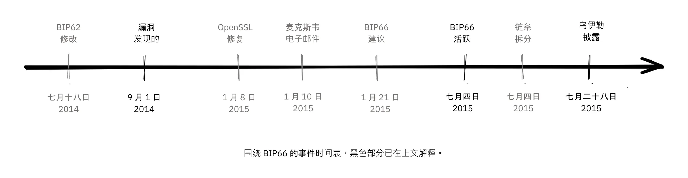


上图显示了围绕 BIP66 的事件时间表。黑色部分已在上文解释。


##### 发现问题之前


在没有人知道这个问题的情况下，这个问题本可以通过现已被广泛删除的 BIP62 来解决，该提案旨在减少交易可篡改性的可能性。BIP62 提议的修改包括收紧签名编码的共识规则，即 "严格 DER 编码"。Pieter Wuille 于 2014 年 7 月提议对 BIP 进行一些调整，从而解决了这一问题：


> 2014 年 7 月 18 日：为了使比特币的签名编码规则不依赖于 OpenSSL 的特定解析器，我修改了 BIP62 提案，使其严格的 DER 签名要求也适用于第一版本的交易。当时已经没有非 DER 签名被挖掘到区块中，因此被视为不会产生任何影响。请参见 [bitcoin/bips#90](https://github.com/Bitcoin/bips/pull/90) 和 [http://lists.linuxfoundation.org/pipermail/bitcoin-dev/2014-July/006299.html](http://lists.linuxfoundation.org/pipermail/bitcoin-dev/2014-July/006299.html)。当时尚不清楚，但如果部署了，就会解决漏洞问题。

由于该 BIP 的范围很广，涵盖的内容远不止 "严格 DER 编码" 这么简单，因此它一直在不断变化，从未接近部署阶段。该 BIP 后来被撤销，因为隔离见证（BIP141）以另一种更完整的方式解决了交易可篡改性问题。


##### 发现问题之后


OpenSSL 发布了带有补丁的新版软件，如果从一开始就在比特币中使用这些补丁，就可以解决这个问题。但是，仅在 Bitcoin Core 的新版本中使用任何新版本的 OpenSSL 都会使问题变得更加复杂。Gregory Maxwell 在 2015 年 1 月的另一个[邮件线程](https://lists.linuxfoundation.org/pipermail/bitcoin-dev/2015-January/007097.html) 中解释了这一点：


> 虽然对于大多数应用来说，急于拒绝某些签名一般是可以接受的，但比特币是一个共识系统，所有参与者必须就输入数据的确切有效性或无效性达成共识。从某种意义上说，”一致性” 比 "正确性" 更重要。
> [...]
> 然而，上述修补程序只能解决普遍问题的一个后果：依赖并非为共识使用而设计或发布的软件（尤其是 OpenSSL）来实现共识规范行为。因此，作为一种渐进式改进，我建议使用 BIP62 的子集，有针对性地安装软分叉，以尽快执行严格的 DER 合规性。

他指出，使用并非用于共识系统的代码会带来严重风险，并建议比特币实施严格的 DER 编码。这充分说明了良好选择加密技术的重要性。


这些事件可能会让您产生这样的印象：Gregory Maxwell 知道 Pieter Wuille 后来公布的漏洞，但想帮忙偷偷修复，伪装成预防措施，而不引起人们对实际问题的过多关注。也许是这样，但这纯属猜测。


随后，按照 Maxwell 的提议，BIP66 被创建为 BIP62 的一个子集，仅规定严格的 DER 编码。这个 BIP 显然得到了广泛接受，并在 7 月份投入部署，尽管讽刺的是，由于未验证的挖矿，区块链还是发生了两次分叉。这些分叉将在下一节中讨论。

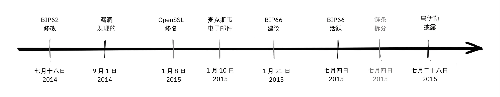


从中一个关键的启示是：BIP 应该尽可能保持“原子性”，也就是说，它们应该足够完整，以提供有用功能或解决具体问题，同时又要足够精简，以便获得用户的广泛支持。BIP 内容越多，被接受的可能性就越小。


##### 由于无验证挖矿的分裂


不幸的是，BIP66 的故事并未就此结束。当 BIP66 被激活后，情况变得相当混乱，因为一些矿工没有验证他们试图扩展的区块。这就是所谓的无验证挖矿，或 SPV-挖矿（简化支付验证）。我们向比特币节点发送了一条警报信息，并提供了一个指向[描述该问题的网页](https://Bitcoin.org/en/alert/2015-07-04-spv-Mining) 的链接：


> 2015 年 7 月 4 日清晨，达到了 950/1000（95%）阈值。此后不久，一个小型挖矿（属于未升级的 5%）挖出了一个无效区块--这是预料之中的事情。不幸的是，事实证明，大约一半的网络哈希率是没有完全验证区块的（称为 SPV 挖矿），并在该无效区块的基础上构建了新区块。

警报页面指示用户，如果他们使用的是旧版本的 Bitcoin Core 节点，则要比正常情况下多等待 30 次确认。


上述分裂发生在 2015-07-04 02:10 UTC，第 [363730](https://Mempool.space/block/000000000000000006a320d752b46b532ec0f3f815c5dae467aff5715a6e579e) 区块之后。在挖出 6 个无效区块后，该问题于当日 03:50 得到解决。不幸的是，同样的问题在第二天，即 2015-07-05 21:50 再次发生，但这次无效分支只持续了 3 个区块。


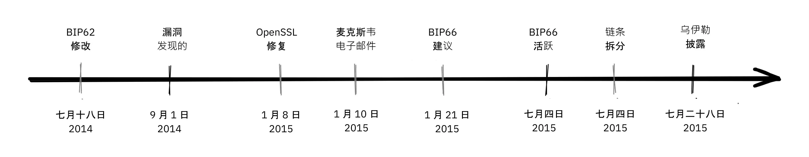

BIP66 事件的前因后果、部署过程和后果是一个很好的案例，说明 Bitcoin 开发人员必须非常谨慎。从 BIP66 中获得的几个重要启示：


- 开放性与不公开漏洞之间的平衡非常微妙。
- 部署未发布漏洞的修复程序是一个棘手的问题。
- 保留共识非常困难。
- 非共识系统软件一般都有风险。
- 双年度实施计划应具有一定的原子性。


### 关于 "当大祸临头时" 的结论


比特币系统中存在漏洞。我们鼓励发现漏洞的用户负责任地向比特币开发者披露这些漏洞，以便他们在不公开漏洞的情况下修复漏洞。在理想的情况下，漏洞修复最好被包装成性能提升，或者其他不引人注意的调整。


我们讨论了多年来出现的一些更严重的问题，以及处理这些问题的方式。一些问题是通过漏洞被公开发现的，而另一些问题则是在恶意行为者有机会利用这些问题之前就被披露并得到修复的。


## 讨论问题

<chapterId>91462ca7-f09c-55da-a5b9-3e211de31da5</chapterId>


这些讨论问题并不只是对 "比特币的开发理念" 中内容的复述，而是为了鼓励大家进一步研究，因此一定要去探索。


您可以在本题库中选择题目，撰写 100-300 字的 [小论文](https://www.youtube.com/watch?v=N4YjXJVzoZY)，测试自己的理解深度。如果您希望得到反馈意见，可以将您的作品发送到 mini-essay@planb.network，我们将非常乐意对您的作品进行审阅。


#### 去中心化


- 去中心化是很难实现的。我们为什么要如此努力使其能够发挥作用？我们能不能选择一种混合方法，让部分环节中心化，而其他部分保持去中心化？
- 去中心化是否引入了“双重支付”问题，还是说“双重支付”问题本身需要去中心化来解决？中本聪是如何解决双重支付问题的？
- 比特币在哪些方面仍然最容易受到审查，为什么审查是一件坏事？有没有支持审查制度的论据？
- 据说比特币是无许可的。那么，还有其他付款方式视为无许可的吗？


#### 无信任性


- 无信任性往往是一个范围，而不是二元对立的。比特币的哪些部分相对来说是无需信任的？哪些部分又需要较高程度的信任？这些信任依赖能否被减轻或消除？
- 假设您想要运行一个全节点以全面验证所有交易。您从 https://bitcoin.org/en/download 下载了 Bitcoin Core。在这个过程中，您在哪些环节依赖了信任？又在哪些环节实现了真正的无信任性？
- 您可以在受信任系统的基础上构建无信任系统吗？


#### 隐私


- 用户在与比特币交互时，如果能保持良好的隐私，会获得哪些重要好处？网络有哪些利他好处？
- 地址重用对您的隐私有什么影响？
- 比特币使用的是 UTXO 模型，而一些替代加密货币使用的是账户模型。这种选择对隐私有什么影响？


#### 有限供应量


- 比特币的有限供应量与通过 Coinbase 交易发行比特币之间的关系是什么？比特币发行与安全预算之间的关系是什么？
- 中本聪可以调整哪些参数来改变比特币的供应量上限？如果他决定将供应量的上限设定为 100 万，会有什么变化？接着，如果该限制被调整成 1 万亿，会发生什么呢？
- 为什么有人主张增加比特币供应量？您认为这种情况会发生吗？


#### 升级


- 什么是快速试行？为什么启动 Taproot 时需要快速试行？
- 为什么我们需要如此高比例的矿工才能实现软叉中升级？为什么不将门槛设定为 51%？


#### 对抗性思维


- 什么是女巫攻击（Sybil Attack）？为什么去中心化网络如此容易受到这种攻击？
- 为什么比特币网络中的所有参与者（而不仅仅是开发者）都必须具备对抗性思考？


#### 开源


- 只有少数维护者拥有必要的 GitHub 权限，可以将代码合并到 [Bitcoin Core](https://github.com/Bitcoin/Bitcoin) 仓库中。这与无许可网络不符吗？
- 开源代码开发过程是否容易受到女巫攻击？如果会，您将如何应对？
- 依赖第三方开放源代码库有哪些好处和坏处，Bitcoin Core 采用了什么方法？
- 除了代码审查，我们还需要哪些方面的审查？如何确定审核的数量是否足够？
- 我们如何确保有足够具备专业知识的人参与比特币的开发与维护？如果没有，又该如何评估他们的诚信和意图？


#### 扩展


- 有人认为，"分片"（sharding）技术在提供扩展优势的同时，也付出了复杂性的代价。我们是否应该因为某项技术难以理解而拒绝或接受它？即使它在技术上看似合理？
- 比特币中引入了哪些向内扩展（inward scaling）方法？
- 为什么在去中心化系统中纵向扩展的实现更加困难？那么横向扩展呢？
- 目前我们似乎仍未就“如何让全世界都能使用比特币”达成共识。难道中本聪在 2009 年挖出第一个区块之前，不应该至少思考过实现这一目标的路径吗？
- 请为下列方案分类（纵向扩展、横向扩展、向内扩展或不属于扩展技术）：分片（sharding）、区块大小增加、SegWit、SPV 节点、中心化交易所、闪电网络、区块间隔减少、Taproot、侧链。


# 最后部分


<partId>4b6ff4ef-b9ea-4c48-b05f-62d41a38fbbb</partId>


## 评论与评级


<chapterId>d334a837-df46-4989-9cad-8d8779147dbe</chapterId>


<isCourseReview>true</isCourseReview>

## 最终考试
<chapterId>b2b498c0-a787-11f0-bd09-e3fc5cfa90af</chapterId>
<isCourseExam>true</isCourseExam>

## 结论


<chapterId>b77ed55c-b13a-430b-a212-37aab527b9e7</chapterId>


<isCourseConclusion>true</isCourseConclusion>


