# 深入探究 Bitcoin 開發的理念


Bitcoin 開發哲學是針對已瞭解 Proof-of-Work、區塊建構和交易生命週期等基本概念和流程，並希望透過深入瞭解 Bitcoin 的設計取舍和哲學來提升層級的 Bitcoin 開發人員所設計的課程。

它應該可以幫助新開發人員吸收十多年來 Bitcoin 開發和公開辯論中最重要的經驗教訓，同時為他們提供評估新構想 (好構想和壞構想！) 的有用背景。


### 要期待什麼？


如前所述，這是一份給 Bitcoin 開發人員的實用指南。然而，Bitcoin 是一個廣泛而複雜的主題，我們不可能在此涵蓋其所有的層面。透過本課程，我們希望能討論必要的功能，讓您開始開發活動，也讓您能自行進一步探索。


參與 Bitcoin 的人很多；由於其中有些人有相反的意見，因此您可能會在這裡找到表達相反觀點的資源。然而，我們始終嘗試堅持事實的領域，在這裡意見並不重要。


### 這是誰寫的？


本課程改編自 Kalle Rosenbaum 與 Linnéa Rosenbaum 合著的同名著作。

這本書是由 [Chaincode Labs](https://learning.chaincode.com/) 委託並資助的，Chaincode Labs 是一個開發中心，專門為想要學習 Bitcoin 開發的開發者開辦教育計畫。


+++


# 簡介

<partId>58c48e9b-e285-4dc6-8952-6cc5140b1313</partId>


## 課程總覽

<chapterId>28b7256b-9cb0-463e-a82d-d732be86c98c</chapterId>


歡迎來到 BTC 303 這門關於 Bitcoin 發展哲學的課程。


Bitcoin 不僅是一種加密貨幣，它還體現了一種關於去中心化、隱私、不可信和彈性的哲學遠見。本課程專為已熟悉 Bitcoin 技術基礎的開發人員所設計，這些開發人員希望加深對 Bitcoin 設計與治理原則的瞭解。


在本課程中，您將清楚了解十多年來引導 Bitcoin 演變的基本價值與策略。透過深入探討這些主題，您將發展所需的批判性觀點，以便有信心地評估未來發展並為其做出貢獻。


### Bitcoin 的核心價值


是什麼讓 Bitcoin 獨一無二？本節將揭示 Bitcoin 設計的核心價值。您將探討**去中心化**，這是確保沒有單一實體控制網路的基石；**無信任**，這是消除第三方依賴的關鍵；**隱私**，這是個人自由和系統完整性的必要條件；以及**無限 Supply**，這是塑造 Bitcoin 經濟特性的稀缺性編碼保證。掌握這些概念將可讓您完全掌握 Bitcoin 的優勢與弱點。


### Bitcoin 治理


要在 Bitcoin 複雜的治理環境中遊刃有餘，需要的不只是技術專業知識，還要瞭解 Bitcoin 獨特的共識與決策方式。在本節中，您將深入瞭解協議升級等關鍵流程背後的機制與理念、對抗式思考的必要性、開放源碼協作的優勢、擴大規模的持續挑戰，以及當事情不可避免地出錯時所需的微妙策略。掌握這些知識後，您不僅能參與其中，還能有效且負責任地塑造 Bitcoin 的未來。


準備好在您的 Bitcoin 之旅中踏出下一步了嗎？讓我們開始吧


**註**：如果您在課程中遇到任何與 Bitcoin 相關的陌生詞彙，請參閱 [詞彙表](https://planb.academy/resources/glossary)以尋找定義。


# Bitcoin 中央值

<partId>2d6c683b-54c8-5465-b2ca-4e96a6828834</partId>


## 權力下放

<chapterId>9397c84b-0038-5d0e-88d5-11767ce8182d</chapterId>


這篇文章分析了什麼是分散化，以及為什麼分散化對 Bitcoin 的運作至關重要。我們區分了

礦工的去中心化和完整節點的去中心化，並討論它們為 Bitcoin 最核心的特性之一 - 抗檢查帶來了什麼。


接下來的討論將轉移到對中立性的理解，也就是對使用者、礦工和開發者的無允許性，這是任何分散式系統的必要屬性。最後，我們會談到要掌握像 Bitcoin 這種分散式系統有多困難，並提出一些心智模式來幫助您了解它。


沒有任何中央控制點的系統被稱為*分散*。Bitcoin 的設計就是要避免有中央控制點，或更確切地說是*中央審查點*。


分權是達成*檢查抵抗*的手段。


Bitcoin 分權有兩個主要方面：Miner 分權和 Full node 分權。


Miner 分散是指交易處理並非由任何中央實體執行或協調。Full node 去中心化是指區塊（即礦工輸出的資料）的驗證在網路邊緣進行，最終由使用者完成，而不是由少數可信賴的機構完成。


### Miner 分散化


在 Bitcoin 之前，也曾有人嘗試創造數位貨幣，但大多數都因為缺乏治理分散性和審查阻力而失敗。


Bitcoin 中的 Miner 去中心化意味著交易的*排序*不是由任何單一實體或固定的實體集體進行的。它是由所有想要參與其中的行動者集體執行；這個礦工集體是一組動態的使用者。任何人都可以隨意加入或退出。此特性使得 Bitcoin 具有抗檢查性。


如果 Bitcoin 是集中式的，就很容易受到那些想要審查它的人的攻擊，例如政府。它的命運將與早期嘗試創造數位貨幣的命運相同。在一篇題為「Enabling Blockchain Innovations with Pegged Sidechains」的[論文](https://www.blockstream.com/sidechains.pdf)引言中，作者解釋了早期版本的數位貨幣如何無法適應敵對環境（請參閱下一部分的「敵對思維」章節）。


David Chaum 於 1983 年提出數位現金的研究課題，在中央伺服器被信任以防止 Double-spending 的情況下。為了降低這個中央可信託方對個人隱私造成的風險，以及強制執行可替代性，Chaum 引入了盲簽名，他用盲簽名提供了一種加密手段，防止中央伺服器的簽名（代表硬幣）被連結，同時仍允許中央伺服器執行防止雙重花費。

對中央伺服器的要求成為數位現金的致命傷[Gri99]。雖然可以用幾個簽名者的臨界簽名來取代中央伺服器的簽名，從而分散這個單點失效，但對於可稽核性而言，簽名者必須是獨特且可辨識的。這仍會使系統容易發生故障，因為每個簽章者都可能逐一失敗，或被逐一製造失敗。


由於審查的風險很高，使用中央伺服器來訂購交易顯然不是一個可行的選擇。即使以固定的 n 台伺服器組成的聯盟取代中央伺服器，其中至少有 m 台伺服器必須同意訂單，仍然會有困難。事實上，問題會轉移到使用者必須同意這 n 組伺服器，以及如何在不依賴中央機關的情況下，以好的伺服器取代惡意的伺服器。


讓我們想一想，如果 Bitcoin 是可審查的，會發生什麼事。審查員可以向使用者施壓，要求他們在允許交易進入 Blockchain 之前表明自己的身份、申報他們的錢是從哪裡來的或用錢買了什麼。


此外，缺乏審查阻力會讓審查員強迫使用者採用新的系統規則。舉例來說，他們可以強加一項變更，讓他們可以誇大 Supply 的金錢，從而中飽私囊。在這種情況下，驗證區塊的使用者將有三種選擇來處理新規則：


- 採納：接受變更並將其納入 Full node。
- 拒絕：拒絕採用變更；這會讓使用者的系統不再處理交易，因為審查員的封鎖現在被使用者的 Full node 視為無效。
- 移動：指定一個新的中央控制點；所有使用者都必須想辦法協調，然後就新的中央控制點達成一致。


如果他們成功了，考慮到該系統仍然和以前一樣可以審查，同樣的問題很可能會在未來的某個時候再次出现。


這些選項對使用者都沒有好處。


透過去中心化來抵抗審查是 Bitcoin 與其他貨幣系統的區別，但由於 *Double-spending 問題*，要完成這件事並不容易。這是確保沒有人可以花相同的錢幣兩次的問題，許多人認為這個問題不可能以分散的方式解決。Satoshi 中本在他的 [Bitcoin 白皮書](https://planb.academy/bitcoin.pdf) 中寫到如何解決 Double-spending 問題：


> 在本文中，我們提出一個解決 Double-spending 問題的方案，使用點對點分散式 Timestamp 伺服器來 generate 計算交易的時間順序證明。


在這裡，他使用了「點對點分散式 Timestamp 伺服器」這個聽起來很奇特的詞彙。這裡的關鍵字是 *分散式*，在此上下文中表示沒有中央控制點。Nakamoto 接著解釋 Proof-of-Work 是如何解決問題的。

不過，沒有人比

[Gregory Maxwell 在 Reddit 上](https://www.reddit.com/r/Bitcoin/comments/ddddfl/question_on_the_vulnerability_of_bitcoin/f2g9e7b/)，他回應有人提議限制礦工 Hash 的功率，以避免潛在的 51% 攻擊：


> 像 Bitcoin 這樣的分散式系統使用的是公開選舉。但在分散式系統中，您不能只進行「人民」投票，因為那需要一個集中式的單位來授權人民投票。相反，Bitcoin 使用的是計算能力投票，因為不需要任何集中式的幫助，就可以驗證計算能力。
第三方。


該文章解釋了分散式 Bitcoin 網路如何透過使用 Proof-of-Work 就交易排序達成協議。


然後，他總結說，相較於人們不關心或不瞭解 Bitcoin 的去中心化屬性，51% 的攻擊並不特別令人擔心：


> 對 Bitcoin 來說，更大的風險在於使用 Bitcoin 的大眾不了解、不關心，也不會保護分散的特性，而這些特性讓 Bitcoin 比集中式的替代方案更有價值。

這個結論很重要。如果人們不保護 Bitcoin 的去中心化 (也就是抵抗審查)，Bitcoin 可能會成為中心化勢力的犧牲品，直到中心化到審查成為一件事。那麼，它的價值主張即使不是全部，也會消失大半。這帶給我們關於 Full node 去中心化的下一節。


### Full node 分散化


在上面的段落中，我們主要討論的是 Miner 的去中心化，以及集中化的礦工如何允許審查。但去中心化還有另一個面向，也就是 *Full node 去中心化*。


Full node 分散的重要性與不可信任有關。假設用戶停止運行自己的 Full node，原因包括運行成本過度增加。在這種情況下，他們必須以其他方式與 Bitcoin 網路互動，可能是使用網路錢包或輕量級錢包，這就需要對這些服務的提供者有一定程度的信任。


使用者從直接執行網路共識規則，轉變為相信其他人會執行。現在假設大多數使用者將共識執行委託給可信賴的實體。在這種情況下，網路可能會迅速陷入集中化，而網路規則也可能會被串通好的惡意行動者所改變。


在 [a

Bitcoin 雜誌文章](https://bitcoinmagazine.com/technical/decentralist-perspective-Bitcoin-might-need-small-blocks-1442090446)，Aaron van Wirdum 訪問了 Bitcoin 開發人員，討論他們對去中心化的看法，以及增加 Bitcoin 最大區塊大小所涉及的風險。這個討論在 2014-2017 年間曾是 Hot 的話題，當時許多人為了增加區塊大小限制以允許更多的交易吞吐量而爭論不休。


反對增加區塊大小的一個有力論據是，它會增加驗證成本 如果驗證成本上升，就會促使一些用戶停止運行他們的完整節點。反過來，這將導致更多人無法以 Trustless 的方式使用系統。


文中引用 Pieter Wuille 的話，解釋 Full node 集中化的風險：


> 如果很多公司都運行 Full node，這意味著他們都需要被說服來實施不同的規則集。換句話說：區塊驗證的分散性讓共識規則更有份量。
> 但如果 Full node 的數量下降得很低，例如因為每個人都使用相同的網路錢包、交易所和 SPV 或行動錢包，那麼監管就可能成為現實。如果當局可以監管共識規則，這意味著他們可以改變任何使 Bitcoin 成為 Bitcoin 的東西。甚至是 2,100 萬 Bitcoin 上限。

給你。Bitcoin 使用者應該運行自己的完整節點，以阻止監管機構和大公司試圖改變共識規則。


### 中立性


Bitcoin 是中性的，或者人們喜歡稱之為無允許。這表示 Bitcoin 不在乎您是誰或您使用它的目的。


Bitcoin 是中立的，這是一件好事，也是它能運作的唯一方式。如果它是由某個組織所控制，那它只是另一種虛擬物件類型，我對它毫無興趣。


只要您遵守規則，您就可以隨心所欲地使用它，無需徵求任何人的同意。這包括*Mining*、*交易*中，以及*在 Bitcoin 之上建立通訊協定和服務*：


- 如果 *Mining* 是一個經過許可的程序，我們就需要一個中央機關來選擇誰可以挖礦。這很有可能導致礦工必須簽署法律合約，在合約中同意

根據中央機關的喜好來審查交易，這違反了 Mining 的初衷。


- 如果在 Bitcoin 進行交易的人必須提供個人資訊、申報交易目的，或以其他方式證明他們值得進行交易，我們也需要一個中央權限來核准使用者或交易。同樣地，這也會導致審查和排斥。


- 如果開發者必須申請許可才能在 Bitcoin 上建立協定，那麼只有中央開發者許可委員會允許的協定才能被開發。由於政府的介入，這將不可避免地排除所有保護隱私的協定，以及所有改善分散性的嘗試。


在所有層面上，試圖對誰能使用 Bitcoin 做什麼施加限制，都會傷害 Bitcoin，使其不再符合其價值主張。


Pieter Wuille https://Bitcoin.stackexchange.com/a/92055/69518[回答有關 Stack Exchange 的問題] 關於 Blockchain 與一般資料庫的關係。他解釋了如何透過使用 Proof-of-Work 結合經濟誘因來實現無權限。


他總結說：


> 使用像 PoW 之類的 Trustless 共識演算法，確實增加了一些其他建構無法提供的東西 (無權參與，意指沒有固定的參與者群組可以審查您的變更)，使用像 PoW 之類的 Trustless 共識演算法，確實增加了一些東西，但成本很高，而且其經濟假設使得它幾乎只對定義了自己的加密貨幣的系統有用。
> 世界上可能只有一個或幾個真正用過的地方。

他解釋說，為了實現無允許參與，系統很可能需要自己的貨幣，從而 「將用例限制為實際上只有加密貨幣」。這是因為無允許參與（或稱 Mining）需要系統本身內建的經濟誘因。


### 了解分散化


Bitcoin 的一個引人注目之處是它是如何 Hard 地讓人了解到沒有人控制它。Bitcoin 中沒有委員會或主管。Gregory Maxwell 又 [在 Bitcoin subreddit](https://www.reddit.com/r/Bitcoin/comments/s82t2n/comment/htdte7w/?utm_source=share&utm_medium=web2x&context=3) 上，將此與英語作了耐人尋味的比較：


> 很多人都很難理解自主系統，在他們的生活中有很多自主系統，例如英語，但是人們只是將它們視為理所當然，甚至沒有將它們視為系統。他們停留在一種中央集权的思考方式，他們認為所有的「東西」都有一個權威來控制它。
>

> Bitcoin 並沒有專注於任何事情。採用 Bitcoin 的各個人都是依據自己的自由意志來選擇推廣 Bitcoin，而他們選擇如何推廣是他們自己的事。權威固著的人可能會看到這些活動，並認為這是 Bitcoin 權威的一些運作，但這樣的權威並不存在。


Bitcoin 透過分散化的方式運作，類似於自然界中許多物種的非凡集體智慧。電腦科學家 Radhika Nagpal 在 [Ted talk](https://www.ted.com/talks/radhika_nagpal_what_intelligent_machines_can_learn_from_a_school_of_fish) 講述魚群的集體行為，以及科學家如何嘗試使用機器人模仿這種行為。


> 其次，也是我至今仍覺得最了不起的是，我們知道這個魚群並沒有領導者在監督。相反地，這種令人難以置信的集體意識行為，完全是由一條魚和另一條魚的互動所產生的。
> 不知何故，鄰近魚類之間的互動或接觸規則，讓一切順利進行。

她指出，許多系統，無論是自然系統或人工系統，都能且確實能在沒有領導者的情況下運作，而且這些系統是強大且有彈性的。每個人只與周遭的環境互動，但他們共同組成了巨大的東西。


無論您對 Bitcoin 有什麼看法，它的分散性使它難以控制。Bitcoin 已經存在，你對它無能為力。這是需要研究的東西，而不是辯論。


### 關於權力下放的結論


我們區分了 Full node 去中心化和 Mining 去中心化。Mining 去中心化是達成抵制檢查的一種手段，而 Full node 去中心化則是讓網路 Hard 的共識規則在沒有使用者廣泛支持的情況下保持不變。


Bitcoin 的分散性允許開發人員、使用者和礦工保持中立。任何人都可以自由參與，無需徵求許可。


分散式系統可能會讓人頭大如斗，但有些心智模式可能會有所幫助，例如英語或魚群。


## 不信任

<chapterId>0506ba61-16a3-543c-95fa-3f3e2dd64121</chapterId>


本章將剖析無信任的概念、從電腦科學的角度來看它的意義，以及為什麼 Bitcoin 必須是 Trustless 才能保有其價值主張。

接下來，我們會討論以 Trustless 的方式使用 Bitcoin 的意義，以及 Full node 能夠和無法提供您什麼樣的保證。

在最後一節中，我們將探討 Bitcoin 與實際軟體或使用者之間的真實互動，以及需要在便利性與不可信任之間做出取捨，才能完成任何事情。


人們常說「Bitcoin 很棒，因為它是 Trustless」這樣的話。


Trustless 是什麼意思？Pieter Wuille 在 [Stack Exchange](https://Bitcoin.stackexchange.com/a/45674/69518)上解釋這個被廣泛使用的術語：


> 我們在 "Trustless "中所說的信任是一個抽象的技術術語。當分散式系統不需要任何受信任的各方就能正常運作時，就稱為 Trustless。

簡而言之，*Trustless* 一詞是指 Bitcoin 通訊協定的一項特性，根據這項特性，Bitcoin 通訊協定在邏輯上可以在沒有「任何受信任方」的情況下運作。這與您在運行軟體或硬體時不可避免地需要信任的情況不同。本章將進一步討論後者的信任問題。


在集中式系統中，我們仰賴中央參與者的聲譽，以確保他們會負責安全或在發生問題時回退，同時也仰賴法律系統來制裁任何違法行為。在假名的分散式系統中，這些信任需求是有問題的 - 因為沒有追索的可能性，所以真的不可能有任何信任。在 [Bitcoin 白皮書](https://Bitcoin.org/Bitcoin.pdf) 的引言中，Satoshi Nakamoto 描述了這個問題：


> 網際網路商務幾乎完全依賴金融機構作為可信賴的第三方來處理電子付款。
> 儘管這個系統對於大多數交易來說已經很好用了，但它仍然受制於以信任為基礎的模式所固有的弱點。  由於金融機構無法避免調解糾紛，完全不可逆轉的交易實際上並不可能。調解的成本增加了交易成本，限制了實際交易的最小規模，也斷絕了小額隨意交易的可能性，而更廣泛的成本則是喪失了為不可逆轉的服務進行不可逆轉支付的能力。
> 有了逆轉的可能性，信任的需求也隨之擴大。商家必須對客戶保持警惕，向他們索取比他們需要的更多資訊。  一定比例的詐欺是無法避免的。這些成本和付款的不確定性可以透過使用實體貨幣來避免，但在沒有可信賴的一方的情況下，沒有任何機制可以透過通訊渠道進行付款。

看來我們無法擁有一個以信任為基礎的分散式系統，這也是無信任在 Bitcoin 中很重要的原因。


要以 Trustless 的方式使用 Bitcoin，您必須執行一個完全驗證的 Bitcoin 節點。只有這樣，您才能驗證您從他人處收到的區塊是否遵循共識規則；例如，是否遵守了發幣時間表，以及 Blockchain 上是否沒有出現雙重花費的情況。如果您沒有運行 Full node，您就將驗證 Bitcoin 區塊的工作外包給別人，並相信他們會告訴您真相，這表示您並非無信任地使用 Bitcoin。


David Harding 撰寫了 [Bitcoin.org 網站上的一篇文章](https://Bitcoin.org/en/Bitcoin-core/features/validation) 解釋運行 Full node - 或無信賴地使用 Bitcoin - 實際上如何幫助您：


> 只有當人們接受 Exchange 中的比特幣來換取其他有價值的東西時，Bitcoin 才會運作。也就是說，是接受比特幣的人賦予了它價值，也是他們決定了 Bitcoin 應該如何運作。
>

> 當您接受 bitcoins 時，您就有權力執行 Bitcoin 的規則，例如防止沒收任何人的 bitcoins 而無法取得該人的私人金鑰。
>

> 不幸的是，許多使用者將執行權力外包。這使得 Bitcoin 的去中心化處於弱化狀態，一小撮礦工可以勾結一小撮銀行和免費服務，為所有那些將權力外判的非驗證使用者更改 Bitcoin 的規則。
>

> 與其他錢包不同的是，Bitcoin Core 會強制執行規則，因此如果礦工和銀行為他們的非驗證用戶更改規則，這些用戶將無法向像您這樣的完全驗證 Bitcoin Core 用戶付款。


他說，運行 Full node 可以幫助您驗證 Blockchain 的各個方面，而不需要相信其他人，從而確保您從他人處收到的硬幣是真幣。這很好，但有一件重要的事情 Full node 無法幫助您：它無法防止透過鏈重寫進行的雙重消費：


> 請注意，雖然包括 Bitcoin Core 在內的所有程式都容易受到鏈重寫（chain rewrites）的影響，但 Bitcoin 提供了一種防禦機制：您的交易確認越多，您就越安全。沒有任何已知的分散式防禦機制比這更好。

無論您的軟體有多先進，您還是必須相信包含您的錢幣的區塊不會被重寫。然而，正如 Harding 所指出的，您可以等待多次確認，之後您就會認為鏈重寫的概率小到足以接受。


以 Trustless 的方式使用 Bitcoin 的誘因與系統對 Full node 去中心化的需求一致。使用自己完整節點的人越多，Full node 的去中心化程度就越高，因此 Bitcoin 抵禦惡意修改協定的能力就越強。但不幸的是，正如 Full node 去中心化部分所解釋的，用戶通常會選擇可信賴的服務，這是無可信賴性和便利性之間不可避免的權衡結果。


從系統的角度來看，Bitcoin 的無信賴性是絕對必要的。2018 年，Matt Corallo 在里加舉行的波羅的海 Honeybadger 會議上，[談到無信賴性](https://btctranscripts.com/baltic-honeybadger/2018/trustlessness-scalability-and-directions-in-security-models/)。


該談話的精髓在於，您無法在可信系統之上建立 Trustless 系統，但您可以在 Trustless 系統之上建立可信系統 - 例如保管 Wallet。


A Trustless 基座 Layer 允許在更高層次上進行各種取捨


此安全模型允許系統設計者選擇權衡

這對他們來說是合理的，而不會強迫其他人做出這些取捨。


### 不要相信，請驗證


Bitcoin 無須信任即可運作，但您仍必須在某種程度上信任您的軟體和硬體。這是因為您的軟體或硬體可能未經編程，無法執行包裝盒上的說明。舉例來說


- CPU 可能會被惡意設計來偵測私密金鑰加密作業，並洩漏私密金鑰資料。
- 作業系統的隨機數字產生器可能不像它宣稱的那麼隨機。
- Bitcoin Core 可能已偷偷加入程式碼，將您的私密金鑰傳送給某些壞人。


因此，除了執行 Full node 之外，您還需要確定您正在執行您打算執行的軟體。Reddit 使用者 brianddk [寫了一篇文章](https://www.reddit.com/r/Bitcoin/comments/smj1ep/bitcoin_v220_and_guix_stronger_defense_against/) 談到在驗證軟體時可以選擇的各種信任層級。在「信任建置者」一節中，他談到了可重複建置：


> 可重複建置是設計軟體的一種方式，讓許多社群開發人員可以各自建置軟體，並確保最終建置的安裝程式與其他開發人員所產生的完全相同。對於像 Bitcoin 這種非常公開、可複製的專案，不需要完全信任單一開發人員。許多開發者都可以執行建立，並證明他們所建立的檔案與原始建立者數位簽章的檔案相同。

文章定義了 5 個信任層級：信任網站、建置者、編譯器、核心和硬體。


為了進一步深化可重複建置的主題，Carl Dong [做了一個關於 Guix 的簡報](https://btctranscripts.com/breaking-Bitcoin/2019/Bitcoin-build-system/)，解釋為什麼信任作業系統、程式庫和編譯器會有問題，以及如何用一個叫做 Guix 的系統來解決這個問題，Bitcoin Core 今天使用的就是這個系統。


> 因此，我們的工具鏈可能有一堆可重複惡意的可信二進碼，我們該如何處理這個事實？我們需要的不只是可重複性。我們需要可開機啟用。我們不能有那麼多需要從其他組織控制的外部伺服器下載和信任的二進位工具。
>

> 我們應該知道這些工具是如何建立的，以及我們到底該如何重新建立這些工具，最好是從更小的可信二進位檔集來建立。我們需要儘可能減少可信的二進位檔集，並且從這些工具鏈到我們用來建立 Bitcoin 的工具鏈，有一個容易稽核的路徑。這可讓我們最大化驗證並最小化信任。

然後，他解釋了 Guix 如何讓我們只信任 357 位元組的最小二進位檔，只要您知道如何解讀指令，就可以驗證並完全理解這個二進位檔。這是相當了不起的：一個人先驗證 357 位元組的二進位檔做了它應該做的事，然後用它從原始碼建立完整的建立系統，最後就得到一個 Bitcoin Core 的二進位檔，它應該是其他人建立系統的一模一樣的複本。


很多比特幣玩家都信奉的一句咒語，很好地概括了上述的大部分內容：


> 不要相信，要驗證。

這暗指美國前總統羅納德-里根在核裁軍時使用的短語「[信任，但要驗證](https://en.wikipedia.org/wiki/Trust,_but_verify)」。[Bitcoiners](https://twitter.com/Truthcoin/status/1491415722123153408?s=20&t=ZyROxZxlBppdRpuuzsiF5w)把它調換了一下，強調拒絕信任和運行Full node的重要性。


使用者可自行決定要在何種程度上驗證他們所使用的軟體以及所接收的 Blockchain 資料。就像 Bitcoin 中的許多其他東西一樣，在便利性和可信度之間需要權衡取捨。相較於在自己的硬體上執行 Bitcoin Core，使用託管的 Wallet 幾乎總是比較方便。不過，隨著 Bitcoin 軟體日趨成熟，使用者介面也不斷改善，隨著時間的推移，它應該可以更好地支援願意朝無信賴方向努力的使用者。此外，隨著時間的推移，使用者會獲得更多的知識，他們應該可以逐漸從等式中移除信任。


有些使用者會以逆向思考的方式來驗證他們所執行軟體的大部分內容。因此，他們將對信任的需求降到最低，因為他們只需要信任自己的電腦硬體和作業系統。這樣一來，他們也可以幫助那些沒有徹底驗證硬體的人，讓他們在大庭廣眾之下對任何可能發現的問題提出警告。一個很好的例子就是 [2018 年發生的事件](https://bitcoincore.org/en/2018/09/20/notice/)，有人發現了一個 Bug，可以讓礦工在同一筆交易中花費兩次輸出：


> CVE-2018-17144 已於 9 月 18 日在 Bitcoin Core 版本 0.16.3 和 0.17.0rc4 中發佈修補程式，其中包含拒絕服務元件和重要的膨脹漏洞。這個問題最初是在 9 月 17 日以拒絕服務 bug 的形式，向幾位在 Bitcoin Core 以及支援其他加密貨幣（包括 ABC 和 Unlimited）的專案中工作的開發人員報告，然而我們很快就確定這個問題也是一個通貨膨脹漏洞，其根本原因和修復方法都是一樣的。

在這裡，一位匿名人士報告了一個問題，結果比報告人所意識到的更糟。這突顯了驗證程式碼的人通常會報告安全漏洞，而不是利用這些漏洞。這對那些無法親自驗證所有事情的人來說是有益的。


但是，使用者不應該相信他人會保護自己的安全，而是應該隨時隨地自行驗證；這才是一個人盡可能保持主權的方式，也是 Bitcoin 繁榮的方式。軟體上的眼睛越多，惡意程式碼和安全漏洞就越不可能溜走。


### 結論


Bitcoin 協定之所以是 Trustless，是因為它允許使用者在不信任第三方的情況下與之互動。但實際上，大多數人都無法驗證他們執行 Bitcoin 的軟體和硬體的完整堆疊。驗證軟體或硬體的熟練人員在發現惡意程式碼或錯誤時，能夠警告其他技術較不熟練的人員。


如果沒有可信賴性，我們就無法實現去中心化，因為可信賴不可避免地涉及到一些中心權威。您可以在 Trustless 系統之上建立可信賴的系統，但您無法在可信賴的系統之上建立 Trustless 系統。


## 隱私權

<chapterId>1b960afe-0008-589b-b2f4-007d60d264c6</chapterId>


本章講述如何不洩露您的私人財務資訊。本章將解釋在 Bitcoin 的情況下，隱私權代表什麼、為什麼它很重要，以及說 Bitcoin 是假名是什麼意思。它還探討了私人資料如何洩漏，包括 On-Chain 和 off-chain。


接著，它會談到比特幣應該是可替代的，意思是可以與其他任何比特幣互換，以及可替代性和隱私權是如何相輔相成的。最後，本章介紹了一些您可以採取的措施，以改善您和他人的隱私。


Bitcoin 可以說是一個假名系統，使用者以公開金鑰的形式擁有多個假名。驟眼看來，這似乎是保護使用者不被識別的相當好的方法，但事實上真的很容易在無意間洩漏私人財務資訊。


### 隱私權是什麼意思？


隱私權在不同的情況下有不同的含義。在 Bitcoin 中，一般是指使用者不必向他人透露自己的財務資訊，除非他們自願這樣做。


您可以透過許多方式將私人資訊洩露給他人，無論您是否知情。資料可以從公開的 Blockchain 洩漏，也可以透過其他方式洩漏，例如惡意使用者截取您的網際網路通訊。


### 為什麼隱私權很重要？


隱私權在 Bitcoin 中的重要性看起來似乎很明顯，但有些方面我們可能無法立即想到。[在 Bitcoin Talk 論壇](https://bitcointalk.org/index.php?topic=334316.msg3588908#msg3588908) 上，Gregory Maxwell 向我們闡述了許多他認為隱私很重要的理由。其中包括自由市場、安全和人類尊嚴：


> 財務隱私是自由市場有效運作的基本標準：如果您經營一間公司，如果您的供應商和客戶可以違背您的意願看到您所有的交易，您就無法有效地訂定價格。
> 如果您的競爭對手追蹤您的銷售情況，您就無法有效競爭。  就個人而言，如果您對自己的帳戶沒有隱私權，您在私人交易中就會失去資訊上的優勢：如果您在沒有足夠隱私權的情況下用 Bitcoin 付費給房東，您的房東就會看到您何時加薪，並可以向您索取更多房租。
>

> 財務隱私權對個人安全至關重要：如果竊賊可以看到您的支出、收入和持有的財產，他們就可以利用這些資訊來鎖定和剝削您。如果沒有隱私權，惡意的人就有更大的能力竊取您的身份、從您的門口搶走您的大額購物，或冒充與您交易的商家......他們可以準確地知道要騙您多少錢。
>

> 財務隱私對於人類尊嚴而言是不可或缺的：沒有人想要咖啡店裡流鼻涕的咖啡師或多事的鄰居評論他們的收入或消費習慣。沒有人希望他們的丈母娘問他們為什麼要買避孕用品（或性玩具）。您的雇主無權知道您捐贈給哪個教會。只有在一個完全開明、沒有歧視的自由世界裡，沒有人對其他人擁有不當的權力，我們才能保有自己的尊嚴，在沒有隱私權的情況下，自由地進行合法交易，而不需要自我審查。

Maxwell 也觸及本章稍後將討論的可替代性，以及隱私權與執法如何互不矛盾。


### 假名


我們在上文提到 Bitcoin 是假名，假名是公開金鑰。在媒體上經常聽到 Bitcoin 是匿名的，這並不對。匿名和假名是有區別的。


Andrew Poelstra [在 Bitcoin Stack Exchange 帖子中解釋](https://Bitcoin.stackexchange.com/a/29473/69518) 匿名在交易中會是什麼樣子：


> 理論上，使用零知識證明的加密技術可以實現完全匿名，也就是說，當您花錢時，錢的來源和去向都無跡可尋。

差別似乎在於假名形式的貨幣，您可以追蹤假名之間的付款，而匿名形式的貨幣則無法追蹤。因為 Bitcoin 的付款可以在假名之間追蹤，所以它不是匿名系統。


我們也說過假名是公開金鑰，但它實際上是從公開金鑰衍生出來的地址。為什麼我們使用地址作為假名，而不是其他東西，例如一些描述性的名字，像是「watchme1984」？使用者 Tim S. 已經 [解釋清楚](https://Bitcoin.stackexchange.com/a/25175/69518)，也在 Bitcoin Stack Exchange 上解釋過：


> 為了讓 Bitcoin 的想法可行，你必須擁有只能由特定私鑰擁有者使用的硬幣。這表示您傳送的任何東西都必須以某種方式與公開金鑰掛鉤。
>

> 使用任意的假名（例如使用者名稱）意味著您必須以某種方式將假名與公開金鑰連結，才能啟用公開/私人金鑰加密。這將會消除離線安全建立地址/假名的能力 (例如，在有人可以寄錢給使用者名「tdumidu」之前，您必須在 Blockchain 中公佈「tdumidu」是由公開金鑰「a1c...」所擁有，並且包含費用，讓其他人有理由公佈)、降低匿名性 (因為鼓勵您重複使用假名)，以及不必要地增加 Blockchain 的大小。這也會造成一種錯誤的安全感，讓人誤以為您寄錢給的是您認為的那個人（如果我比他先使用「Linus Torvalds」這個名字，那麼這個名字就是我的，人們可能會以為他們寄錢給的是 Linux 的創造者，而不是我）。

透過使用位址或公開金鑰，我們達成了重要的目標，例如不再需要事先以某種方式註冊假名、減少假名重複使用的誘因、避免 Blockchain 的臃腫，以及增加假冒他人的難度。


### Blockchain 隱私權


Blockchain 隱私權是指您在 Blockchain 上進行交易時所披露的資訊。它適用於所有交易，包括您發送和接收的交易。


Satoshi 中本在他的 [Bitcoin 白皮書](https://Bitcoin.org/Bitcoin.pdf) 第 7 節中思考了 On-Chain 隱私權的問題：


> 作為額外的防火牆，每個交易都應該使用新的金鑰對，以防止它們連結到共同的擁有者。多輸入交易仍無法避免某些連結，因為這些交易必然會揭露其輸入是由同一擁有者所擁有。風險在於如果鑰匙的擁有者被揭露，連結可能會揭露屬於同一擁有者的其他交易。

本文總結了 Blockchain 隱私權的主要問題，即 Address 重複使用和 Address 聚類。前者可自行解釋，後者則是指能夠在某種程度上確定一組不同的位址屬於同一使用者。


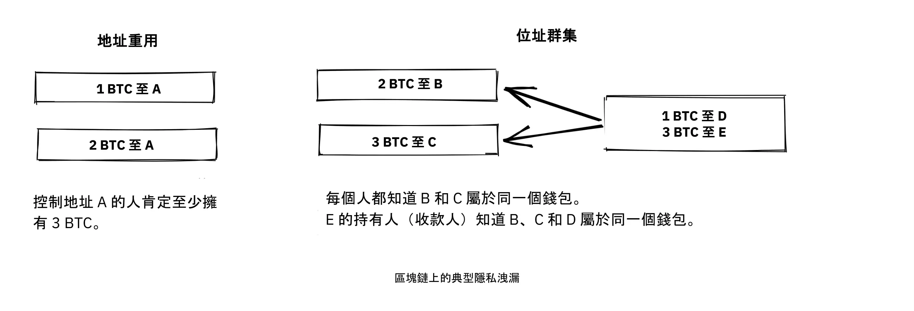


Chris Belcher [寫得非常詳細](https://en.Bitcoin.it/Privacy#Blockchain_attacks_on_privacy) 關於 Bitcoin Blockchain 上可能發生的各種隱私洩漏。我們建議您至少閱讀 「Blockchain 攻擊隱私」 下的前幾個小節。


Bitcoin 的隱私權並非完美無瑕。它需要大量的工作才能私下交易。大多數人都不願意為了隱私做那麼多事。隱私權與可用性之間似乎有明顯的權衡。


隱私權的另一個重要方面是，您為保護自己隱私所採取的措施也會影響其他使用者。如果您對自己的隱私馬虎不理，其他人的隱私可能也會減少。Gregory Maxwell 在同一個 Bitcoin Talk 討論[我們在上面所連結的](https://bitcointalk.org/index.php?topic=334316.msg3589252#msg3589252) 中非常清楚地解釋了這一點，並且以一個例子做為結論：


> 這在實際中也行得通...IRC 上有個不錯的白帽黑客在玩腦袋錢包破解時，發現了一個包含 ~250 BTC 的詞組。  我們可以單從 Address 識別出所有者，因為他們是由一個重複使用地址的 Bitcoin 服務支付的，他可以說服他們交出使用者的聯絡資訊。他真的打通了用戶的電話，用戶很驚訝，也很困惑，但很高興沒有損失他們的硬幣。  這是一個美滿的結局。(到目前為止，這並不是唯一的例子......但卻是比較有趣的例子之一）。

在這次的事件中，多虧了這位有慈善心的黑客，一切都很順利，但下次就別指望了。


### 非 Blockchain 隱私


雖然 Blockchain 被證明是臭名遠播的隱私洩漏來源，但還有很多其他洩漏不使用 Blockchain，有些比其他更偷偷摸摸。這些方法包括鍵盤記錄器和網路流量分析。若要閱讀其中一些方法，請再次參閱 [Chris Belcher 的文章](https://en.Bitcoin.it/Privacy#Non-blockchain_attacks_on_privacy)，特別是「非 Blockchain 攻擊隱私」一節。


在眾多攻擊中，Belcher 提到有人可能會窺探您的網際網路連線，例如您的 ISP：


> 如果敵人看到交易或區塊從您的節點流出，而之前並沒有進入，那麼它就可以幾乎肯定地知道交易是由您進行的，或區塊是由您挖出的。由於涉及網際網路連線，敵人將可將 IP Address 與已發現的 Bitcoin 資訊連結起來。

然而，其中最明顯的隱私洩漏是交易所。由於法律（通常稱為 KYC（認識您的客戶）和 AML（反洗錢））在其營運的司法管轄區內有效，交易所和相關公司通常必須收集用戶的個人資料，建立起關於哪些用戶擁有哪些比特幣的大型資料庫。這些資料庫對於邪惡的政府和犯罪分子來說是一個很好的蜜罐，他們總是在尋找新的受害者。這種資料有實際的市場，駭客

將資料賣給出價最高的人。


更糟糕的是，管理這些資料庫的公司通常在保護財務資料方面缺乏經驗，事實上，其中許多公司都是年輕的新創公司，而我們知道的事實是，已經發生了數起資料外洩事件。以下是幾個例子

[印度的 MobiQwik](https://bitcoinmagazine.com/business/probably-the-largest-kyc-data-leak-in-history-demonstrates-the-importance-of-Bitcoin-privacy) 和 [HubSpot](https://bitcoinmagazine.com/business/hubspot-security-breach-leaks-Bitcoin-users-data).


同樣地，保護資料免受如此廣泛的攻擊是 Hard，而且您很可能無法完全做到這一點。您必須在便利性與隱私權之間，選擇最適合您的權衡方式。


### 抗菌性


就貨幣而言，可替代性是指一種硬幣可與相同貨幣的任何其他硬幣互換。這個有趣的

這個詞在本章前半部分已經略為提及。


在該處討論的文章中，Gregory Maxwell [表示](https://bitcointalk.org/index.php?topic=334316.msg3588908#msg3588908)：


> 在 Bitcoin 中，金融隱私是可替代性的一個基本要素：如果你能有意義地區分一個幣和另一個幣，那麼它們的可替代性就很弱。如果我們的可替代性在實踐中太弱，那麼我們就無法實現去中心化：如果某個重要人物公佈了一份他們不接受衍生幣的被盜錢幣清單，你就必須仔細檢查你所接受的錢幣是否與該清單相符，並退回不合格的錢幣。  每個人都會被困在檢查由不同機構發布的黑名單中，因為在那個世界裡，我們都不想被壞幣困住。這增加了摩擦和交易成本，使Bitcoin作為貨幣的價值降低。

在此，他談到缺乏可替代性所衍生的危險。假設您有一個 UTXO。這個 UTXO 的歷史通常可以追溯到幾次跳躍，擴展到許多以前的輸出。如果任何這些輸出涉及任何非法、不想要或可疑的活動，那麼您的錢幣的某些潛在收款人可能會拒絕接受您的錢幣。如果您認為您的收款人會根據某些集中式白名單或黑名單服務驗證您的代幣，為了安全起見，您可能也會開始檢查您收到的代幣。結果就是，糟糕的可替代性會助長更糟糕的可替代性。


Adam Back 和 Matt Corallo [在 2016 年米蘭的 Scaling Bitcoin 上發表了關於可替代性的演講](https://btctranscripts.com/scalingbitcoin/milan-2016/fungibility-overview/)。他們的想法如出一轍：


> Bitcoin 的運作需要可替代性。如果你收到硬幣卻無法使用，那麼你就會開始懷疑你是否可以使用它們。如果你收到的硬幣有疑慮，那麼人們就會去污點服務，檢查「這些硬幣是否受祝福」，然後人們就會拒絕交易。這會讓 Bitcoin 從一個分散的無權限系統轉換成一個集中的有權限系統，在這個系統中，您會收到來自黑名單提供者的「欠條」。

隱私和可替代性似乎是相輔相成的。如果隱私性弱，可替代性就會減弱，例如，來自不想要的人的錢幣可能會被列入黑名單。同樣地，如果可替代性弱，隱私也會減弱：如果有黑名單，您就必須詢問黑名單提供者哪些錢幣可以接受，從而可能洩露您的 IP Address、電子郵件 Address，以及其他敏感資訊。這兩個特點相互交织，孤立地談論其中任何一個都是 Hard。


### 隱私權措施


已有多種技術可幫助人們保護自己的隱私不被洩露。其中最明顯的就是中本剛才提到的，使用獨特的

每個交易的地址，但也有其他幾個地址存在。我們不會教您如何成為隱私忍者。不過，Bitcoin Q+A 有一個 [加強隱私權技術的快速摘要](https://bitcoiner.guide/privacytips/)，多少是依據它們要如何實作的 Hard 排序。當您閱讀它時，您會注意到 Bitcoin 隱私權經常與 Bitcoin 以外的東西有關。例如，您不應該炫耀您的 bitcoins，您應該使用 Tor 和 VPN。


本帖還列出了一些與 Bitcoin 直接相關的措施：


- Full node：如果您不使用自己的 Full node，就會洩漏許多關於 Wallet 的資訊給網際網路上的伺服器。執行 Full node 是很好的第一步。
- Lightning Network：Bitcoin 之上存在數個通訊協定，例如 Lightning Network 和 Blockstream 的 Liquid Sidechain。
- CoinJoin：多人合併交易的方式，使得連鎖分析變得更困難。


Chris Belcher 在 Breaking Bitcoin 會議的 [演講](https://btctranscripts.com/breaking-Bitcoin/2019/breaking-Bitcoin-privacy/)中，舉了一個有趣的實例來說明如何改善隱私權：


> 他們是 Bitcoin 的賭場。美國不允許網上賭博。任何直接存入 Bustabit 的 Coinbase 客戶的帳戶都會被關閉，因為 Coinbase 正在監控這一情況。Bustabit 做了幾件事。他們做了一些稱為零錢避免的事情，您可以通過-看看您是否可以構建一個沒有零錢輸出的交易。這可以節省 Miner 費用，同時也妨礙了分析。
>

> 同時，他們將大量重複使用的存款地址匯入 joinmarket。在這一點上，coinbase.com 的客戶從來沒有被封禁。看來 Coinbase 的監控服務在此之後無法進行分析，因此有可能破解這些演算法。

他也在 Bitcoin wiki 的 [Privacy page](https://en.Bitcoin.it/Privacy) 上提到這個例子，以及其他的例子。


請注意在 Bitcoin 的基礎上建立系統，可以達到更好的隱私性，就像 Lightning Network 的情況一樣：


Bitcoin 上的層次可增加隱私性


我們在上一份報告中指出，信任的需求只能隨著上面的層次增加而增加，但隱私權似乎不是這樣，它可以在上面的層次中任意地改善或惡化。為什麼呢？任何在 Bitcoin 之上的 Layer，正如在未來章節 Scaling 的 Layered Scaling 段落中解釋的，必須偶爾使用 On-Chain 交易，否則它就不是「在 Bitcoin 之上」。隱私強化層一般會盡量減少使用基礎 Layer，以減少揭露的資訊量。


以上是一些技術性的方法來改善您的隱私。但還有其他方法。在本章開頭，我們說 Bitcoin 是一個假名系統。這意味著 Bitcoin 中的用戶不是以他們的真實姓名或其他個人資料為人所知，而是以他們的公開密碼匙為人所知。公開密碼匙是使用者的假名，而且一個使用者可以有多個假名。在理想的情況下，您的個人身分與您的 Bitcoin 偽名是分開的。不幸的是，由於本章所述的隱私權問題，這種解耦通常會隨著時間退化。


要降低個人資料被洩露的風險，一開始就不要提供個人資料，也不要提供給集中式服務，因為集中式服務會建立可能洩漏資料的大型資料庫。Bitcoin Q+A 的一篇文章 [解釋了 KYC](https://bitcoiner.guide/nokyconly/) 及其衍生的危險。它也建議您可以採取一些步驟來改善您的情況：


> 值得慶幸的是，有一些選擇可以通過無 KYC 來源購買 Bitcoin。這些都是P2P（點對點）交易所，您直接與其他個人而不是集中的第三方進行交易。不幸的是，有些交易所除了銷售 Bitcoin 外，還銷售其他硬幣，因此我們敦促您要小心。

文章建議您避免使用需要 KYC/AML 的交易所，改以私人方式交易，或使用分散式交易所，如 [bisq](https://bisq.network/)。


https://planb.academy/en/tutorials/exchange/peer-to-peer/bisq-fe244bfa-dcc4-4522-8ec7-92223373ed04

若要深入閱讀有關對策，請參閱之前提到的 [wiki 關於隱私權的文章](https://en.Bitcoin.it/wiki/Privacy#Methods_for_improving_privacy_.28non-Blockchain.29)，從「改善隱私權的方法 (非 Blockchain)」開始。


### 關於隱私權的結論


隱私權非常重要，但 Hard 卻無法實現。沒有隱私權的靈丹妙藥。


要在 Bitcoin 獲得像樣的隱私權，您必須採取積極的措施，其中有些措施既昂貴又費時。


## 有限 Supply

<chapterId>af125ba2-ef98-5905-8895-41a538fe5ea5</chapterId>


本章將探討 Bitcoin Supply 的 2,100 萬 BTC 限額，或實際上有多少？我們會談談這個限制是如何執行的，以及如何驗證這個限制是否被遵守。此外，我們將窺探水晶球，並討論當 Block reward 從以補貼為基礎轉變為以收費為基礎時，將會出現的動態。


眾所皆知的 2100 萬 BTC 的有限 Supply 被視為 Bitcoin 的基本屬性。但它真的是一成不變的嗎？


讓我們先來看看目前的共識規則是怎麼說的，Bitcoin 的 Supply，究竟有多少是可以使用的。Pieter Wuille 寫過一篇關於這方面的文章 [關於 Stack Exchange](https://Bitcoin.stackexchange.com/a/38998/69518)，他在文章中計算了一旦所有的錢幣都被挖出來之後，會有多少比特幣：


> 如果將所有這些數字相加，您會得到 20999999.9769 BTC。

但由於種種原因 - 例如早期的 coinbase 交易問題、礦工無意中領取的金鑰少於允許的數量，以及私鑰遺失 - 這個上限將永遠無法達到。Wuille 總結道：


> 這樣我們就有 20999817.31308491 BTC（將區塊 528333 之前的所有資料都計算在內）。

然而，許多錢包遺失或被盜，交易被發送到錯誤的 Address，人們忘記了自己擁有 Bitcoin。這類事件的總數可能數以百萬計。人們嘗試統計已知的損失 [這裡](https://bitcointalk.org/index.php?topic=7253.0)。


這讓我們???BTC.


因此，我們可以確定 Bitcoin Supply 最多為 20999817.31308491 BTC。任何遺失或無法驗證的燒幣都會使這個數字降低，但我們不知道會降低多少。有趣的是，這並不重要，或者更好的是，這對 Bitcoin 持有者來說是正面的、

[as explained](https://bitcointalk.org/index.php?topic=198.msg1647#msg1647) by Satoshi Nakamoto：


> 遺失的硬幣只會讓其他人的硬幣稍微值錢一點。  就當是捐贈給大家吧。

有限的 Supply 將會縮減，這至少在理論上會造成價格通縮。


比流通中硬幣的確實數量更重要的是 Supply 限制在沒有任何中央機構的情況下執行的方式。Alias chytrik 在 [Stack Exchange](https://Bitcoin.stackexchange.com/a/106830/69518) 上說得很好：


> 所以答案是您不必相信某人沒有增加 Supply。您只需要執行一些程式碼來驗證他們沒有增加。

即使某些完整節點轉向黑暗面並決定接受具有較高 Coinbase 交易價值的區塊，所有剩餘的完整節點都會忽略它們，並繼續照常營業。一些完整節點可能會有意或無意地運行邪惡的軟件，然而集體會堅定地保護 Blockchain 的安全。總之，您可以選擇信任系統，而不必信任任何人。


### 區塊補貼和交易費用


Block reward 由區塊補貼加上交易費用組成。Block reward 需要支付 Bitcoin 的安全成本。我們可以肯定的說，在目前的區塊補貼、交易費用、Bitcoin 價格、Mempool 規模、Hash 力量、去中心化程度等條件下，每個參與者遵守規則的誘因足以維持一個安全的貨幣系統。


當整體補貼接近零時會發生什麼？為了簡單起見，我們假設它實際上等於零。這時候，系統的安全成本只能透過交易費用來支付。當這種情況發生時，未來會發生什麼，我們無從得知。不確定因素眾多，我們只能靠猜測。例如，Paul Sztorc 對這個主題的貢獻 [在他的 Truthcoin 部落格中](https://www.truthcoin.info/blog/security-budget/)，大部分都是猜測，但他至少有一個確實的觀點（請注意，Sztorc 所指的 M2，是指法定貨幣 Supply 的量度）：


> 雖然兩者混在同一個「安全預算」中，但整體補貼和 txn-fees 卻完全不同。它們彼此不同，就像 「VISA 在 2017 年的總利潤 」與 「M2 在 2017 年的總增幅 」一樣。

今天，是持有者（透過貨幣通膨）為安全付費。明天就輪到花費者以某種方式來承擔這個負擔了，如下圖所示。


隨著時間的推移，安全成本的承擔將會從持有者轉移至支出者。


當交易費成為 Mining 的主要動機時，誘因就會轉變。最值得注意的是，如果Miner的Mempool沒有包含足夠的交易費用，對於該Miner來說，改寫Bitcoin的歷史可能比延續Bitcoin的歷史更有利可圖。Bitcoin Optech 有一個特定的 [關於此行為的部分](https://bitcoinops.org/en/topics/fee-sniping/)，稱為 *fee sniping*，由 David Harding 撰寫：


> 當 Bitcoin 的補貼持續減少，交易費用開始主導 Bitcoin 的區塊獎勵時，費用狙擊是可能發生的問題。如果交易費是最重要的，那麼 Miner 的 Hash 率為 `x`% 的人有 `x`% 的機會在下一個區塊 Mining，所以對他們來說，老老實實 Mining 的預期價值是他們 Mempool 中 [best feerate set of transactions](https://bitcoinops.org/en/newsletters/2021/06/02/#candidate-set-based-csb-block-template-construction) 的 `x`%。
>

> 另外，Miner 可以不誠實地嘗試重新挖掘前一個區塊，再加上一個全新的區塊，以延長鏈條。這種行為被稱為費用狙擊，如果其他 Miner 都是誠實的，則不誠實的 Miner 成功的機率為 `(x/(1-x))^2`。儘管費用狙擊的整體成功機率比誠實的 Mining 低，但如果前一個區塊中的交易支付的費率遠高於目前 Mempool 中的交易，嘗試不誠實的 Mining 可能是更有利可圖的選擇 - 賺大錢的小機率可能比賺小錢的大機率更有價值。

如果礦工開始進行收費狙擊，這將會激勵其他人也這樣做，從而使誠實的礦工更少，這對我們未來的希望來說是一個陰影。這可能會嚴重損害 Bitcoin 的整體安全性。Harding 接著列出了一些可以採取的對策，例如依靠交易時間鎖來限制交易可能出現在 Blockchain 中的位置。


因此，鑑於有限 Supply 的共識仍然存在，區塊補助將 - 感謝 [BIP42](https://github.com/Bitcoin/bips/blob/master/bip-0042.mediawiki) 修復了一個非常長期的通貨膨脹錯誤 - 在 2140 年左右變為零。之後的交易費用是否足以保障網路安全？


這無法確定，但我們確實知道一些事情：


- 從 Bitcoin 的角度來看，一個世紀是一段*很長*的時間。如果它仍然存在，很可能已經有了巨大的進化。
- 如果壓倒性的經濟大多數認為有必要改變規則，並引進例如每年 0.1% 或 1% 的永久性貨幣通貨膨脹，Bitcoin 的 Supply 將不再是有限的。
- 由於區塊補貼為零，而 Mempool 又是空的或幾乎是空的，事情可能會因為費用狙擊而變得不穩。


由於過渡到只收取費用的 Block reward 是如此遙遠的未來，明智的做法或許是不要貿然下結論，並嘗試趁我們還能解決潛在的問題。舉例來說，Peter Todd 認為 Bitcoin 的安全預算在未來實際上有可能不夠用，因此他主張在 Bitcoin 採用小額永續通膨的方式。不過，他也認為目前討論這樣的問題並不是個好主意，就像 [他在 What Bitcoin Did Podcast 中所說的](https://www.whatbitcoindid.com/podcast/peter-todd-on-the-essence-of-Bitcoin)：


> 但是，那是未來 10 年、20 年之後的風險。那是一段非常長的時間。到那時候，誰知道風險會有多大呢？

也許我們可以將 Bitcoin 視為有機物。想像一棵慢慢生長的小橡樹。再想像您從未見過一棵完全成長的樹。那麼，克制您的控制問題，而不是事先設定所有規則，讓這棵植物如何進化與成長，不是很明智的做法嗎？


### 關於有限 Supply 的結論


Bitcoin Supply 是否會增長超過 2,100 萬，我們今天還無法確定，而這也許不算太糟。確保安全預算維持在足夠高的水平是至關重要的，但並不迫切。讓我們在 10-50 年後，當我們知道更多的時候，再來討論這個問題。如果它仍然相關的話。


# Bitcoin Gouvernance

<partId>411bf53f-af4b-50f1-b71b-e40fe3ff64b7</partId>


## 升級

<chapterId>3ffa84d1-adfa-5fbc-9b13-384ea783fcdd</chapterId>


以安全的方式升級 Bitcoin 可能非常困難。有些變更需要數年時間才能推出。在本章中，我們將學習有關升級 Bitcoin 的常用詞彙，並探討其通訊協定歷史升級的一些範例，以及我們從中獲得的啟發。最後，我們會談談鏈分裂以及與其相關的風險和成本。


為了讓本章更合拍，您應該閱讀 [David Harding 關於和諧與不和諧的文章](https://bitcointalk.org/dec/p1.html)：


> Bitcoin 專家們經常談到共識，共識的意義是抽象的，Hard 是無法確定的。但是，共識這個詞是由拉丁文的 concentus 演變而來，意思是「一起唱和聲」，所以讓我們不要談 Bitcoin 共識，而是談 Bitcoin 和諧。
>

> 和諧是 Bitcoin 運作的基礎。數以千計的完整節點各自獨立工作，以驗證它們所收到的交易是否有效，從而對 Bitcoin Ledger 的狀態產生和諧協議，而無需任何節點操作員信任其他任何人。這類似於合唱團，每個成員在同一時間唱同一首歌，所產生的美麗效果遠超過任何一個人單獨創作的效果。
>

> Bitcoin 和諧的結果是一個比特幣安全的系統，比特幣不僅可以遠離小偷（只要您妥善保管鑰匙），也可以遠離無止盡的通貨膨脹、大規模或有目標的沒收，或只是傳統金融體系的官僚混亂。

本章將討論如何在不造成不和的情況下升級 Bitcoin。保持和諧，也就是維持共識，確實是 Bitcoin 發展過程中最大的挑戰之一。升級機制有許多細微的差異，研究過往升級的實際案例可能最能了解這些差異。因此，本章著重於歷史性的範例，並以一些有用的詞彙作為開端。


### 詞彙


根據 Wikipedia，[前向相容性](https://en.wikipedia.org/wiki/Forward_compatibility) 是指舊的軟體可以處理較新的軟體所建立的資料，而忽略它不了解的部分：


如果符合早期版本的產品能夠「優雅地」處理為較後版本標準所設計的輸入，而忽略其不理解的新部分，則標準就能支援前向相容性。


反之亦然，[向後相容](https://en.wikipedia.org/wiki/Backward_compatibility) 是指舊軟體的資料可以在新軟體上使用。如果一項變更既向前又向後相容，則稱為完全相容。


對 Bitcoin 共識規則的變更，如果完全相容，就稱為 *Soft Fork*。這是升級 Bitcoin 最常見的方式，原因有很多，我們會在本章進一步討論。如果 Bitcoin 共識規則的變更向後相容，但向前不相容，則稱為 *Hard Fork*。


有關 Soft fork 和 Hard fork 的技術概述，請閱讀 [Grokking Bitcoin 的第 11 章](https://rosenbaum.se/book/grokking-Bitcoin-11.html)。它解釋了這些名詞，也深入介紹了升級機制。建議您在繼續閱讀之前先掌握這方面的知識，儘管並非絕對必要。


### 歷史性升級


今天的 Bitcoin 與 Genesis 區塊創建時的情況不同。這些年來進行了多次升級。2018 年，Eric Lombrozo [在 Breaking Bitcoin 會議上發言](https://btctranscripts.com/breaking-Bitcoin/2017/changing-consensus-rules-without-breaking-Bitcoin/) 談到 Bitcoin 不同的升級機制，指出這些機制隨著時間的推移而演變。他甚至解釋了 Satoshi Nakamoto 曾如何透過 Hard Fork 升級 Bitcoin：


> 其實在 Bitcoin 中有一個 Hard-Fork 是 Satoshi 所做的，我們絕對不會這樣做--這是一個相當糟糕的方式。如果你看看這裡的 git commit description [[757f076](https://github.com/Bitcoin/Bitcoin/commit/757f0769d8360ea043f469f3a35f6ec204740446)], 他說了一些關於 reverted makefile.unix wx-config version 0.3.6 的事情。沒錯。就這麼多。它完全沒有顯示它有任何破壞性變更。他基本上是把它藏在裡面。他也 [張貼到 bitcointalk](https://bitcointalk.org/index.php?topic=626.msg6451#msg6451) 並說，請盡快升級到 0.3.6。我們修正了一個執行錯誤，在這個錯誤中，虛假交易有可能被顯示為已接受。在升級到 0.3.6 之前，請勿接受 Bitcoin 付款。如果您無法立即升級，那麼在升級之前最好關閉您的 Bitcoin 節點。然後除此之外，我不知道為什麼他也決定這麼做，他決定在相同的程式碼中加入一些優化。修正一個錯誤並加一些優化。

他指出，不論是有意或無意，這個 Hard Fork 為未來的 Soft fork 製造了機會，也就是 Script 運算符號 (opcodes) OP_NOP1-OP_NOP10。我們會在 cve-2010-5141 詳細研究這個程式碼變更。到目前為止，已有兩個 Soft forks 使用這些操作碼：


- [bip65](https://github.com/Bitcoin/bips/blob/master/bip-0065.mediawiki) (op_checklocktimeverify)
- [bip113](https://github.com/Bitcoin/bips/blob/master/bip-0112.mediawiki) (op_sequenceverify).


Lombrozo 還概述了直到 2017 年為止，這些年來升級機制的演變方式。自此之後，只部署了另外一個主要升級機制 Taproot。導致其啟動的過程漫長且有些混亂，這有助於我們進一步瞭解 Bitcoin 的升級機制。


#### SegWit 升級


雖然 SegWit 之前的所有升級或多或少都不太痛苦，但這一次不同。當 SegWit 啟動碼在 2016 年 10 月發佈時，Bitcoin 使用者似乎對它有壓倒性的支持，但不知何故，礦工並沒有發出支持這次升級的訊號，這使得啟動工作停滯不前，看不到任何解決方案。


Aaron van Wirdum 在他的 Bitcoin 雜誌文章 [The Long Road To SegWit](https://bitcoinmagazine.com/technical/the-long-road-to-SegWit-how-bitcoins-biggest-protocol-upgrade-became-reality) 中描述了這條曲折的道路。他首先解釋什麼是 SegWit，以及如何引發區塊大小的爭論。Van Wirdum 接著概述了導致其最終啟動的事件轉折。這個過程的核心是使用者 Shaolinfry 提出的升級機制，稱為 *user activated Soft Fork*，簡稱 UASF：


> Shaolinfry 提出了一個替代方案：使用者啟動 Soft Fork (UASF)。用戶啟動的 Soft Fork 將有一個 "「旗日啟動」，節點在未來預定的時間開始執行"，而不是 Hash 權限啟動。只要這樣的 UASF 是由經濟上的大多數人執行，這應該會迫使大多數的礦工遵循 (或啟動) Soft Fork。

其中，他引用了 Shaolinfry 寄給 Bitcoin-dev 郵件列表的電子郵件。在那封信中，Shaolinfry [反對 Miner 啟用 Soft forks](https://lists.linuxfoundation.org/pipermail/Bitcoin-dev/2017-February/013643.html)，並列舉了許多問題：


> 首先，它需要相信 Hash 電源會在啟動後驗證。  在 BIP66 Soft Fork 的案例中，有 95% 的 Hashrate 發出準備就緒的訊號，但實際上約有一半的 Hashrate 並未真正驗證升級後的規則，而錯誤地在無效區塊上開採。
>

> 其次，Miner 訊號具有天然的否決權，允許 Hashrate 的一小部分否決每個人的升級節點啟動。到目前為止，Soft 的分叉都是利用相對集中的 Mining 架構，因為 Mining 建立有效區塊的池子相對較少；當我們邁向更多 Hashrate 分散化時，很可能我們會越來越受到「升級慣性」的影響，這會否決大部分的升級。

Shaolinfry 也提醒大家注意對 Miner 訊號的一個常見誤解：一般人認為這是礦工決定通訊協定升級的一種方式，而不是協助協調升級的動作。由於這種誤解，礦工可能也覺得有義務公開宣示他們對某個 Soft Fork 的看法，彷彿這樣就能增加提案的分量。


一言以蔽之，UASF 的提案是一個「旗幟日」，節點在這一天開始執行特定的新規則。如此一來，礦工就不需要集體努力協調升級，只要有足夠的區塊發出支持信號，就可以**在升級日之前啟動升級**：


> 我的建議是兩全其美。由於使用者啟動 Soft Fork 前需要相對較長的準備時間，我們可以與 BIP9 結合，讓 Hash 電源協調啟動或旗日啟動（以較早者為準）的選擇更快。
> 在這兩種情況下，我們都可以利用 BIP9 中的警告系統。這個變更相對簡單，只需加入一個 activation-time 參數，就能在 BIP9 部署超時結束前將 BIP9 狀態轉換為 LOCKED_IN。

這個想法引起了許多人的興趣，但似乎並未獲得一致的支持，這引起了人們對可能發生的鏈分裂的憂慮。Aaron van Wirdum 在文章中解釋了這個問題最終如何因為 James Hilliard 撰寫的 [BIP91](https://github.com/Bitcoin/bips/blob/master/bip-0091.mediawiki)而得到解決：


> Hilliard 提出了一個略為複雜但巧妙的解決方案，讓一切都能相容：Bitcoin 核心開發團隊、BIP148 UASF 和紐約協議啟動機制所提出的分離見證啟動。他的 BIP91 可以讓 Bitcoin 保持完整 - 至少在整個 SegWit 啟動期間。

其中牽涉到一些更複雜的因素（例如所謂的「紐約協議」），這是 BIP 必須考慮的。我們鼓勵您閱讀 Van Wirdum 的文章全文，瞭解這個故事中許多有趣的細節。


#### SegWit 後的討論


在 SegWit 部署之後，出現了關於部署機制的討論。正如 Eric Lombrozo 在 [他在 Breaking Bitcoin 會議上的演講](https://btctranscripts.com/breaking-Bitcoin/2017/changing-consensus-rules-without-breaking-Bitcoin/) 以及 Shaolinfry 所指出的，Miner 啟動 Soft Fork 並不是理想的升級機制：


> 在某些時候，我們可能會想要在 Bitcoin 通訊協定中加入更多功能。這是我們自問的一個重大哲學問題。我們要為下一個做 UASF 嗎？混合方法如何？Miner 本身已被排除，我們不會再使用 bip9。

2020 年 1 月，Matt Corallo [寄了一封電子郵件](https://lists.linuxfoundation.org/pipermail/Bitcoin-dev/2020-January/017547.html) 到 Bitcoin-dev 郵件列表，開始討論未來的 Soft Fork 部署機制。他列出了五個他認為在升級中不可或缺的目標。David Harding [在 Bitcoin Optech 通訊中將其總結](https://bitcoinops.org/en/newsletters/2020/01/15/#discussion-of-Soft-Fork-activation-mechanisms) 為：


> 如果遇到嚴重反對所建議的共識規則變更的情況，能夠中止該變更 .在更新軟體發佈之後分配足夠的時間，以確保大多數的經濟節點都能升級以執行這些規則 .預期網路 Hash 率在變更之前和變更之後，以及在任何過渡期間，都會大致相同 .盡可能防止創建在新規則下無效的區塊，這可能會導致未升級節點和 SPV 客戶端的錯誤確認 .保證中止機制不會被悲傷者或游擊者濫用，以阻止沒有已知問題的廣泛期望的升級。

Corallo 提出的是 Miner 啟用 Soft Fork 與使用者啟用 Soft Fork 的組合：


> 因此，我認為一個較為具體的啟動方法，可以開創正確的先例，並適當地考慮上述目標：
>

> 1) 標準 BIP 9 部署，時間範圍為一年，用於
以 95% 的 Miner 準備率啟動，+

> 2) 若在一年內未啟動，則需要六個月的時間。
靜默期，讓社群進行分析與討論

沒有啟動的原因，以及 +

> 3) 在合理的情況下，簡單的命令列/Bitcoin.conf 參數（自原始部署版本起即受支援）可讓使用者選擇以 24 個月的時間範圍啟用旗日的 BIP 8 部署（以及全面啟用旗日的新 Bitcoin Core 版本）。
>

> 這為更多的標準啟動提供了非常長的時間範圍，同時仍能確保達到 #5 的目標，即使在這些情況下，時間範圍需要大幅延長才能達到 #3 的目標。開發 Bitcoin 並不是一場競賽。如果我們不得不這樣做，等待 42 個月可以確保我們不會開創一個負面的先例，讓我們在 Bitcoin 繼續成長時後悔。

#### Taproot 升級 - 快速審判


當 Taproot 在 2020 年 10 月準備好部署時，也就是說所有關於共識規則的技術細節都已實施，並獲得社群的廣泛認可，有關如何實際部署的討論也開始升溫。在此之前，這些討論一直相當低調。


許多關於啟動機制的提案開始流傳，而 David Harding

[在 Bitcoin Wiki 上做了總結](https://en.Bitcoin.it/wiki/Taproot_activation_proposals)。在他的文章中，他解釋了 BIP8 的一些屬性，當時 BIP8 有一些最新的變更，以使其更具彈性。


> 在撰寫本文件時，[BIP8](https://github.com/Bitcoin/bips/blob/master/bip-0008.mediawiki) 已經根據 2017 年的經驗教訓起草完成。BIP 9+148 之後的一個顯著變化是，強制啟動現在是基於區塊高度，而非過去時間的中值；第二個顯著變化是，強制啟動是在 Soft Fork 的啟動參數設定時選擇的一個布林參數，無論是初始部署還是在之後的部署中更新。

沒有強制啟動的 BIP8 與有超時和延遲的 [BIP9](https://github.com/Bitcoin/bips/blob/master/bip-0009.mediawiki) 版本 bits 非常相似，唯一的顯著差異是 BIP8 使用區塊高度，而 BIP9 則使用中位時間過去。此設定允許嘗試失敗（但稍後可以重試）。


強制啟動的 BIP8 結束時會有一個強制訊號發放期，所有遵照其規則生產的區塊都必須對 Soft Fork 發出準備就緒的訊號，其方式會在較早部署的相同 Soft Fork 中觸發非強制啟動的啟動。換句話說，如果節點版本 x 在未強制啟動的情況下釋出，而之後版本 y 釋出，成功強制礦工在同一時間段內開始發出就緒訊號，則兩個版本將同時開始執行新的共識規則。


經修訂的 BIP8 建議的這種靈活性使我們有可能用 BIP8 來表達其他一些想法。這提供了一個共同的因素，可用來將許多不同的提案分類。


從這一點開始，討論變得非常激烈，尤其是圍繞著 `lockinontimeout` 應該是 `true` (就像使用者啟動的 Soft Fork，Harding 稱之為 "BIP8 with forced activation「) 還是 `false` (就像 Miner 啟動的 Soft Fork，Harding 稱之為 」BIP8 without forced activation")。


在列出的提案中，其中一項的標題是 「讓我們拭目以待」。不知道為什麼，這個提案直到七個月後才受到重視。


在這七個月中，討論持續不斷，似乎無法就使用哪種部署機制達成廣泛共識。主要有兩個陣營：一個陣營傾向於 `lockinontimeout=true` (UASF 人群)，另一個陣營傾向於 `lockinontimeout=false` (「先試試，失敗了再反思」的人群)。由於這些選項都沒有壓倒性的支持，因此爭論一直在繞圈子，似乎沒有前進的方向。其中有些討論是在 IRC 上進行的，在一個名為 ##Taproot-activation 的頻道中，但是 [在 2021 年 3 月 5 日](https://gnusha.org/Taproot-activation/2021-03-05.log)，有些事情改變了：


```
06:42 < harding> roconnor: is somebody proposing BIP8(3m, false)?  I mentioned that the other day but I didn't see any responses.
[...]
06:43 < willcl_ark_> Amusingly, I was just thinking to myself that, vs this, the SegWit activation was actually pretty straightforward: simply a LOT=false and if it fails a UASF.
06:43 < maybehuman> it's funny, "let's see what happens" (i.e. false, 3m) was a poular choice right at the beginning of this channel iirc
06:44 < roconnor> harding: I think I am.  I don't know how much that is worth.  Mostly I think it would be a widely acceptable configuration based on my understanding of everyone's concerns.
06:44 < willcl_ark_> maybehuman: becuase everybody actually wants this, even miners reckoned they could upgrade in about two weeks (or at least f2pool said that)
06:44 < roconnor> harding: BIP8(3m,false) with an extended lockin-period.
06:45 < harding> roconnor: oh, good.  It's been my favorite option since I first summarized the options on the wiki like seven months ago.
06:45 <@michaelfolkson> UASF wouldn't release (true,3m) but yeah Core could release (false, 3m)
06:45 < willcl_ark_> harding: It certainly seems like a good approach to me. _if_ that fails, then you can try an understand why, without wasting too much time
```


讓我們拭目以待 "的方法終於在人們的腦海中出現了。由於信號傳達時間很短，這個過程後來被稱為 「快速審判」。David Harding 在一篇文章中向更多人解釋了這個想法。

[email 至 Bitcoin-dev 郵件列表](https://lists.linuxfoundation.org/pipermail/Bitcoin-dev/2021-March/018583.html)：

> 如果我們在 Taproot 合併時就開始快速試用 (這有點不現實)，我們就會在不到兩個月前就有 Taproot，或是在一個多月前就開始下一次的啟用嘗試。
>

> 我認為快速測試是 generate 快速進展的一種方式，它可以結束爭論 (目前，如果啟動成功)，或是提供我們一些實際的資料，作為未來 Taproot 啟動提案的基礎。

這個部署機制經過兩個月的改進，然後在 [Bitcoin Core version 0.21.1](https://github.com/Bitcoin/Bitcoin/blob/master/doc/release-notes/release-notes-0.21.1.md#Taproot-Soft-Fork) 中發佈。礦工們很快就開始為這次升級發出信號，將部署狀態移至 `LOCKED_IN`，經過一段寬限期後，Taproot 規則於 2021 年 11 月中旬在區塊 [709632](https://Mempool.space/block/0000000000000000000687bca986194dc2c1f949318629b44bb54ec0a94d8244) 中啟用。


#### 未來部署機制


鑑於最近的 Soft 分叉、SegWit 和 Taproot 所出現的問題，目前還不清楚下一次升級將如何部署。Speedy Trial 用來部署 Taproot，但它是用來彌補 UASF 和 MASF 人群之間的鴻溝，而不是因為它已經成為最知名的部署機制。


### 風險


在任何 Fork 啟動期間，無論是 Hard 或 Soft、Miner 啟動或使用者啟動，都有可能發生長期的連鎖分裂。持續超過幾個區塊的分裂會嚴重損害 Bitcoin 周邊的情緒以及其價格。但最重要的是，這會對 Bitcoin 的定位造成極大的混淆。Bitcoin 是這條鏈還是那條鏈？


使用者啟用 Soft Fork 的風險是，即使大多數的 Hash 力量不支持新規則，新規則也會被啟用。這種情況會造成長期的鏈分裂，一直持續到大多數 Hash 力量採用新規則為止。如果礦工在舊鏈分裂後已經開採到區塊，可能會特別 Hard 激勵他們轉換到新鏈，因為轉換分支就等於放棄自己的區塊獎勵。然而，值得一提的是一個顯著的插曲：在 2013 年 3 月，由於無意的 Hard Fork 而發生了長期分裂，與此誘因相反，兩個主要的 Mining 池決定放棄他們的分裂分支，以恢復共識。


另一方面，Miner 啟動 Soft Fork 的風險是由於礦工可以進行虛假訊號造成的，這意味著實際支持變更的 Hash 力量所佔的比例可能比看起來的要小。如果實際支持者並未佔 Hash 力量的大多數，我們很可能會看到類似上一段所述的長期鏈分裂。這種情況，或至少類似的問題，在實際部署 BIP66 時曾發生過，但在 6 個區塊左右就解決了。


#### 分割的成本


Jimmy Song [在巴黎的 Breaking Bitcoin 中談到與 Hard 分叉相關的成本](https://btctranscripts.com/breaking-Bitcoin/2017/socialized-costs-of-Hard-forks/)，但他所說的大部分內容也適用於因 Soft Fork 失敗而造成的連鎖分裂。他談到 * 負外部性*，並將其定義為他人必須為您自己的行為付出的代價：


> 負外部性的典型例子是工廠。也許他們正在生產--也許是一家煉油廠，他們生產的產品對經濟有利，但他們也產生了一些負外部性的東西，比如污染。這不僅是每個人都要付出代價、清潔或承受的東西。但它也會產生第二和第三階層的效應，例如更多工人需要前往工廠，導致更多車輛駛向工廠。你也可能會危及周圍的野生動物。並不是每個人都要為負面外部性付出代價，可能是特定的人，例如之前使用該道路的人或該工廠附近的動物，他們也要為該工廠的成本付出代價。

在 Bitcoin 的背景下，他使用 Bitcoin Cash (bcash) 來舉例說明負面外部性，Bitcoin Cash 是在 2017 年該會議前不久創建的 Hard Fork of Bitcoin。他將 Hard Fork 的負面外部性分為一次性成本和永久性成本。


在一次性成本的眾多例子中，他提到了交易所產生的成本：


> 所以我們有一堆交易所，他們有很多一次性的成本需要支付。首先發生的是，這些交易所的存款和取款不得不停止一兩天，因為他們不知道會發生什麼。這些交易所中有許多不得不動用 Cold 儲存，因為他們的用戶要求使用 bcash。這是他們 fidicuiary 職責的一部分，他們必須這麼做。您也必須稽核新軟體。這是我們 itbit 必須做的事。我們想使用電子現金，該怎麼做？我們必須下載電子現金嗎？它有惡意軟體嗎？我們必須去審核它。我們有大概 10 天的時間來弄清楚這是否可行。然後，你必須決定，我們是只允許一次性提款，還是要將這種新的錢幣上市？對於一個Exchange來說，上市新的硬幣並不容易，有各種新的Cold存儲，簽名，存款，取款的程序。或者您可以只進行一次性的活動，在某個時候把錢給他們，然後您就再也不考慮這個問題了。但這也有它的問題。最後，無論您用什麼方式，提款或上市，您都需要新的基礎架構，以某種方式與 token 合作，即使是一次性提款。您需要以某種方式將這些代幣交給您的使用者。同樣地，短時間通知。對嗎？沒時間了，必須盡快完成。

他還列舉了商家、支付處理商、錢包、礦商和使用者所產生的一次性成本，以及一些永久性成本，例如隱私權損失和更高的重新篡改風險。


事實上，當分裂發生時，具有最一般規則的鏈會比具有較嚴格規則的鏈更強，這時就會發生重新組織。這將會嚴重影響在被刪除的分支中執行的所有交易。基於這些原因，在任何時候都盡量避免鏈分裂是非常重要的。


### 關於升級的結論


Bitcoin 隨著時間成長與演進。多年來，我們使用了不同的升級機制，學習曲線非常陡峭。隨著我們對網路反應的了解愈來愈多，愈來愈複雜、愈來愈穩健的方法也不斷被發明出來。


為了讓 Bitcoin 保持和諧，Soft 分叉已被證明是未來的方向，但最大的問題仍未完全解答：我們該如何安全地部署 Soft 分叉，而不會造成不和諧？


## 對抗性思維

<chapterId>d4982f3d-4694-51cc-99be-28f54b03a2a2</chapterId>


本章將討論 * 敵對思維 *，這種思維著重於可能出錯的地方以及對手可能採取的行動。我們首先討論 Bitcoin 的安全假設和安全模型，接著解釋一般使用者如何透過逆向思考來改善自我主權和 Bitcoin 的 Full node 分散性。接著，我們將探討一些對 Bitcoin 的實際威脅，以及敵人的想法。最後，我們會談談*axiom of resistance*，這可以幫助您了解為什麼人們一開始就在研究 Bitcoin。


當討論各種系統內的安全性時，了解安全假設是什麼是很重要的。Bitcoin 中一個典型的安全假設是 「離散對數問題是 Hard 所能解決的」，簡單來說，這表示實際上不可能找到與特定公開金鑰對應的私密金鑰。另一個相當強烈的安全假設是，大部分的網路擁有者都是誠實的，也就是說，他們都遵守遊戲規則。如果這些假設被證實是錯誤的，那麼 Bitcoin 就有麻煩了。


2015 年，Andrew Poelstra [在香港的 Scaling Bitcoin 會議中發表講話](https://btctranscripts.com/scalingbitcoin/hong-kong-2015/security-assumptions/)，其間他分析了 Bitcoin 的安全假設。他一開始就注意到許多系統在某種程度上都忽略了敵人；例如，要保護一棟建築物免受所有類型的敵人事件，這真的是 Hard。相反地，我們一般接受有人可能會燒毀大樓的可能性，並在某種程度上透過執法等方式防止此類及其他對抗性行為。


請參閱 greg maxwell 的建築類比：


但線上的情況就不同了：


> 然而，在網路上我們沒有這些。我們有假名和匿名行為，任何人都可以連線到每個人，傷害系統。如果可以逆向傷害系統，那麼他們就會這麼做。我們不能假設他們會被看到，也不能假設他們會被抓到。

結果就是 Bitcoin 中所有已知的弱點都必須以某種方式加以處理，否則就會被利用。畢竟，Bitcoin 是世界上最大的蜜罐。


Poelstra 繼續提到 Bitcoin 是一種全新的系統；與簽署協定相比，Bitcoin 更為模糊，因為簽署協定有非常明確的安全性假設。


軟體工程師 Jameson Lopp 在他的個人部落格中，[深入探討](https://blog.lopp.net/bitcoins-security-model-a-deep-dive/)：


> 實際上，Bitcoin 通訊協定在建立時並沒有正式定義的規格或安全模型。我們能做的最好的方法就是研究系統內的動機和行動者的行為，以便更好地了解並嘗試描述它。

因此，我們有一個看起來在實務上可行的系統，但我們無法正式證明它是安全的。由於

系統本身的複雜性。


### 不僅適用於 Bitcoin 專家


敵對思維的重要性在某種程度上也延伸至 Bitcoin 的日常使用者，而不僅僅是 Bitcoin 的鐵桿開發者和專家。Ragnar Lifthasir 在一則 [推特風暴](https://bitcoinwords.github.io/tweetstorm-on-adversarial-thinking) 中提到，圍繞 Bitcoin 的簡單化敘述 - 例如「只是 HODL」 - 可能會貶低 Bitcoin 本身，他最後說道


> 為了讓 Bitcoin 和我們自己變得更強，我們需要像為 Bitcoin 做出貢獻的軟體工程師一樣思考。他們會進行同儕審查，毫不留情地找出缺點。在他們的技術活動中，他們談論提案可能失敗的各種方式。他們的思考方式是敵對的。他們是保守的

他將這些簡單化的敘述稱為單一性。透過這個定義，他是說如果只專注於單一事物，例如「只是 HODL」，就有可能忽略更重要的事情，例如保持 Bitcoin 的安全，或是盡力以 Trustless 的方式使用 Bitcoin。


### 威脅


Bitcoin 有許多已知的弱點，而且許多弱點正被積極利用。要一窺究竟，請看看 Bitcoin wiki 上的 [Weaknesses page](https://en.Bitcoin.it/wiki/Weaknesses)。其中提到了各種各樣的問題，例如

Wallet 竊取和拒絕服務攻擊：


> 如果攻擊者試圖用他們控制的用戶端填滿網路，那麼您就很有可能只連線到攻擊者節點。雖然 Bitcoin 從不使用節點的計數來做任何事，但將節點與誠實的網路完全隔離，對執行其他攻擊會有幫助。

此類攻擊稱為 *Sybil 攻擊*，只要單一實體控制網路中的多個節點，並利用這些節點顯現為多個實體，就會發生此類攻擊。


引文中也提到，Sybil 攻擊對 Bitcoin 網路無效，因為沒有透過節點或其他可計數的實體進行投票，而是透過計算能力進行投票。儘管如此，這種扁平結構仍讓系統容易受到其他攻擊。Bitcoin wiki 頁面還介紹了其他可能的攻擊，例如資訊隱藏（通常稱為 *eclipse攻擊*），以及 Bitcoin Core 實作一些啟發式防禦攻擊的方法。


以上是需要注意的真實威脅範例。


### 簡單破壞領域


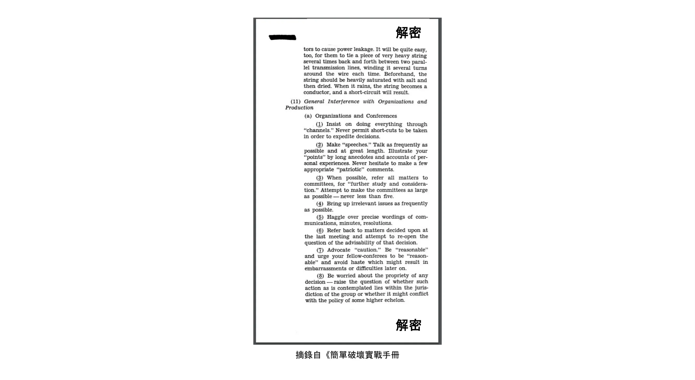


為了更好地瞭解對手的想法，瞭解一下他們的運作方式可能會有所幫助。在第二次世界大戰期間，一個名為戰略服務辦公室（Office of Strategic Services）的美國政府機構，以進行間諜活動、破壞行動和傳播宣傳為目標，為他們的人員製作了一本[手冊](https://www.gutenberg.org/ebooks/26184)，教導他們如何正確地破壞敵人。它的標題是 「簡易破壞現場手冊」，包含了滲透敵人使其生活在 Hard 中的具體訣竅。這些訣竅的範圍從燒毀倉庫到造成操練的磨損，以減少敵人的

效率。


例如，有一節是關於滲透者如何瓦解組織。這不是 Hard 可以看到的，這種策略可以用來針對 Bitcoin 開發過程，而這個過程是開放給任何人參與的。專門的攻擊者可以透過無休止地關注不相干的問題、在精確的措辭上斤斤計較，以及試圖重申已經全面解決的討論，不斷拖延進度。攻擊者也可以雇用一支巨魔軍隊來倍增自己的效能；我們可以稱之為社交 Sybil 攻擊。使用社交 Sybil 攻擊，他們可以讓人覺得反對變革提案的阻力比實際上更大。


這突顯了一個決心堅定的國家可以也會盡一切力量摧毀敵人，包括從內部瓦解敵人。由於 Bitcoin 是一種與既有法定貨幣競爭的貨幣形式，因此各國有可能會將 Bitcoin 視為敵人。


### 抵抗的公理


Eric Voskuil [在他的 Cryptoeconomics wiki 頁面上寫道](https://github.com/libbitcoin/libbitcoin-system/wiki/Axiom-of-Resistance) 他稱之為「抵抗公理」：


> 換句話說，有一種假設是系統有可能抗拒狀態控制。這並非事實，而是根據類似系統行為的經驗研究，將其視為合理的假設，並以此作為系統的基礎。
>

> 不接受抵抗公理的人所思考的是一個與 Bitcoin 完全不同的系統。如果假設一個系統不可能抵抗國家的控制，結論在Bitcoin的背景下就說不通了--就像球面幾何的結論與歐幾里得相矛盾一樣。沒有公理，Bitcoin 又怎麼可能是無允許或抗檢查的呢？這個矛盾導致人們犯了明顯的錯誤，試圖將矛盾合理化。


他基本上是在說，只有當人們假設有可能創造一個國家無法控制的系統時，嘗試才有意義。


這表示若要在 Bitcoin 上工作，您應該接受阻力公理，否則您最好把時間花在其他專案上。承認這個公理有助於您將開發工作的重點放在手邊真正的問題上：針對國家級別的對手編碼。換句話說，要從敵對的角度思考。


### 對抗性思考的結論


分散式系統無法在系統本身之外負起責任，因此 Bitcoin 必須比傳統系統更嚴格地防止惡意行為。在這樣的系統中，逆向思維是必須的。


要確保 Bitcoin 的安全，您必須瞭解敵人及其動機。大部分的威脅似乎都歸結於民族國家，這些國家透過徵稅和印鈔機，擁有龐大的經濟力量。他們可能不會輕易放棄印鈔的特權。


## 開放原始碼

<chapterId>427a160c-f893-5b2c-afba-7b24e71ba899</chapterId>


Bitcoin 是使用開放原始碼軟體建立的。在本章中，我們會分析這意味著什麼、軟體的維護如何運作，以及 Bitcoin 的開放原始碼軟體如何允許無權限的開發。我們涉獵了*選擇加密學*，這涉及到加密系統中庫的選擇和使用。本章包括一個關於 Bitcoin 審核程序的章節，接著是另一個關於 Bitcoin 開發人員獲得資金方式的章節。最後一節談到 Bitcoin 的開放原始碼文化從外面看起來非常怪異，以及為什麼這種被認為的怪異其實是健康的象徵。


大多數 Bitcoin 軟體，尤其是 Bitcoin Core，都是開放原始碼的。這表示軟體的原始碼可供大眾檢視、修補、修改和再散佈。在 [](https://opensource.org/osd)，開放原始碼的定義主要包括以下幾點：


> 自由再散布：本授權不應限制任何一方將軟體作為包含來自多個不同來源的程式的集合軟體發行版的元件來銷售或贈送。許可證不得要求此類銷售收取版稅或其他費用。
>

> 原始碼：程式必須包含原始碼，而且必須允許以原始碼及編譯形式散佈。如果某種形式的產品沒有附帶原始碼，則必須有一個廣為宣傳的方式，以合理的複製成本取得原始碼，最好是透過網際網路免費下載。原始碼必須是程式設計師修改程式的首選形式。不允許故意混淆原始碼。不允許使用中間形式，例如預處理器或翻譯器的輸出。
>

> 衍生作品：許可證必須允許修改和衍生作品，並且必須允許它們以與原始軟體許可證相同的條款散佈。

Bitcoin Core 遵循此定義，以 [MIT License](https://github.com/Bitcoin/Bitcoin/blob/master/COPYING) 發行：


```
MIT授權條款 (MIT)

Copyright (c) 2009-2022 Bitcoin Core開發者
Copyright (c) 2009-2022 Bitcoin開發者

特此免費授予任何取得本軟體及相關文件檔案（「軟體」）副本的人不受限制地處理本軟體的權限，包括但不限於使用、複製、修改、合併、發布、分發、再授權和/或銷售本軟體副本的權利，以及允許取得本軟體的人這樣做，但須符合以下條件：

上述版權聲明和本授權聲明應包含在本軟體的所有副本或重要部分中。
```


如「不要相信，請驗證」一章所述，使用者必須能夠驗證他們所執行的 Bitcoin 軟體是否「如宣傳般有效」。要做到這一點，他們必須能夠不受限制地存取他們想要驗證的軟體的原始碼。


在接下來的章節中，我們會深入探討 Bitcoin 開放原始碼軟體的其他一些有趣面向。


### 軟體維護


Bitcoin Core 的原始碼維護在 [GitHub](https://github.com/Bitcoin/Bitcoin) 上的 Git 套件庫中。任何人都可以克隆該儲存庫，而無需取得任何許可，然後在本機檢視、建立或變更該儲存庫。這表示全球各地有數以千計的套件庫副本。這些都是相同版本庫的複本，那麼是什麼讓這個特定的 GitHub Bitcoin Core 版本庫如此特別呢？嚴格來說，它一點也不特別，但在社會上，它已經成為 Bitcoin 開發的焦點。


Bitcoin 和安全專家 Jameson Lopp 在一篇題為「誰控制 Bitcoin 核心？」的 [部落格文章](https://blog.lopp.net/who-controls-Bitcoin-core-/) 中很好地解釋了這一點：


> Bitcoin Core 是 Bitcoin 通訊協定的發展重心，而非指揮與控制點。如果它因為任何原因不復存在，就會有新的焦點出現 - 它所依據的技術通訊平台 (目前是 GitHub 儲存庫) 是方便性的問題，而不是定義/專案完整性的問題。事實上，我們已經看到 Bitcoin 的開發焦點改變了平台甚至名稱！

他接著解釋了 Bitcoin Core 的軟體如何維護與防範惡意程式碼變更。這篇文章的最後，總結了全文的一般心得：


> 沒有人能控制 Bitcoin。
>

> 沒有人能控制 Bitcoin 發展的焦點。

Bitcoin Core 開發人員 Eric Lombrozo 在他的 [Medium 帖文](https://medium.com/@elombrozo/the-Bitcoin-core-merge-process-74687a09d81d) 中，以「The Bitcoin Core Merge Process」為題，進一步談到開發流程：


> 任何人都可以 Fork 程式碼庫，並任意變更他們自己的程式碼庫。如果他們願意，也可以從自己的套件庫建立用戶端並執行。他們也可以製作二進制版本供其他人執行。
>

> 如果有人想要將他們在自己倉庫中的變更合併到 Bitcoin Core 中，他們可以提交一個 pull request。一旦提交後，任何人都可以檢視這些變更並發表評論，無論他們是否有 Bitcoin Core 本身的提交權限。

需要注意的是，拉取請求可能需要很長的時間才會被維護人員合併到儲存庫中，而這通常是由於審閱不足所造成的，而審閱不足通常是由於缺乏*審閱人員*所造成的。


Lombrozo 也談到共識變更的過程，但這已經超過本章的範圍。有關 Bitcoin 通訊協定如何升級的詳細資訊，請參閱前一章「升級」。


### 免許可開發


我們已經確立任何人都可以為 Bitcoin Core 寫程式碼，而不需要徵求任何許可，但不一定會合併到主 Git 倉庫。這會影響到任何修改，從改變圖形使用者 Interface 的顏色方案，到點對點訊息的格式化方式，甚至是共識規則，也就是定義有效 Blockchain 的一系列規則。


同樣重要的是，使用者可以自由地在 Bitcoin 之上開發系統，而無需徵求任何許可。我們已經看到無數建立在 Bitcoin 之上的成功軟體專案，例如：


- Lightning Network：可快速支付極小額金額的付款網路。它只需要很少的 On-Chain Bitcoin 交易。目前有多種互通的實作，例如 [Core Lightning](https://github.com/ElementsProject/lightning)、[LND](https://github.com/lightningnetwork/LND)、[Eclair](https://github.com/ACINQ/eclair) 和 [Lightning Dev Kit](https://github.com/lightningdevkit)。
- CoinJoin：多方合作將其付款合併為單一交易，以增加 Address 集群的難度。目前已有各種實作。
- 側鏈：這個系統可以在 Bitcoin 的 Blockchain 上鎖定一個硬幣，以便在其他 Blockchain 上解鎖。這允許比特幣被移動到其他一些 Blockchain，即 Sidechain，以便使用該 Sidechain 上可用的功能。例子包括 [Blockstream 的 Elements](https://github.com/ElementsProject/Elements)。
- OpenTimestamps: 它允許您以隱私的方式在 Bitcoin 的 Blockchain 上 [Timestamp 一個文件](https://opentimestamps.org/)。然後，您可以使用該 Timestamp 來證明某個文件一定是在某個時間之前就存在的。


如果沒有無許可開發，許多這些專案都不可能實現。如中立性一章所述，如果開發人員必須申請許可才能在 Bitcoin 上建立通訊協定，那麼只有中央開發人員許可委員會允許的協定才會被開發。


類似上述的系統通常會以開放原始碼軟體的方式授權，進而允許人們在不要求任何許可的情況下貢獻、重複使用或檢閱其程式碼。開放原始碼已成為 Bitcoin 軟體授權的黃金標準。


### 假名發展


開發 Bitcoin 軟體無需徵求許可，這帶來了一個有趣且重要的選擇：您可以在 Bitcoin Core 或任何其他開放原始碼專案中撰寫並發佈程式碼，而無需透露您的身份。


許多開發人員選擇這種方式，他們使用假名運作，並試圖讓假名與他們的真實身分脫離。這樣做的原因可能因開發者而異。ZmnSCPxj 就是一位化名使用者。在其他專案中，他對 Bitcoin Core 和 Core Lightning（Lightning Network 的數個實作之一）有貢獻。[He writes](https://zmnscpxj.github.io/about.html) on his web page：


> 我是 ZmnSCPxj，一個隨機生成的網路人。我的代名詞是 he/him/his。
>

> 我了解人類本能地渴望知道我的身份。然而，我認為我的身份在很大程度上並不重要，我寧願以我的作品來評斷我的身份。
>

> 如果您想知道是否要捐款，想知道我的生活費或收入是多少，請您了解，正確來說，您應該根據您覺得我的公用事業捐款給我
文章以及我在 Bitcoin 和 Lightning Network 上的工作。


在他的案例中，使用假名的原因應該根據他的優點來判斷，而不是根據假名背後的人是誰。有趣的是，他在【CoinDesk 上的一篇文章】(https://www.coindesk.com/markets/2020/06/29/many-Bitcoin-developers-are-choosing-to-use-pseudonyms-for-good-reason/) 中透露，創建筆名的原因與此不同。


> 我最初[使用假名]的原因很簡單，因為我擔心[會]犯下大錯；因此 ZmnSCPxj 原本打算是一個一次性的假名，在這種情況下可以放棄。然而，它似乎獲得了大多數正面的聲譽，因此我保留了它。

使用假名確實可以讓您更自由地發表意見，而不會因為說了蠢話或犯了大錯而危及個人聲譽。結果，他的假名得到了非常好的聲譽，在 2019 年 [他甚至得到了發展基金](https://twitter.com/spiralbtc/status/1204815615678177280)，這本身就證明了 Bitcoin 的無允許性質。


可以說，Bitcoin 中最知名的假名是 Satoshi Nakamoto。目前還不清楚他為何選擇化名，但事後看來，基於多種原因，這可能是個不錯的決定：


- 由於許多人猜測中本擁有大量 Bitcoin，為了他的財務和人身安全，必須保持身份不明。
- 由於他的身份不明，因此不可能起訴任何人，這就給了各政府機關一個 Hard 的時間。
- 沒有權威人士可以仰賴，這使得 Bitcoin 更為任人唯才，也更能抵擋勒索。


請注意，這些觀點不只對 Satoshi Nakamoto 適用，對任何在 Bitcoin 工作或持有大量貨幣的人來說，都在不同程度上適用。


### 選擇加密


開放原始碼開發人員經常會使用其他人所開發的開放原始碼程式庫。這是任何健康生態系統中自然且令人讚嘆的一部分。但 Bitcoin 軟體處理的是真金白銀，有鑒於此，開發人員在選擇應該依賴哪些第三方函式庫時需要格外謹慎。


在一則哲學性的 [關於密碼學的談話](https://btctranscripts.com/greg-maxwell/2015-04-29-gmaxwell-Bitcoin-selection-cryptography/)中，Gregory Maxwell 想要重新定義「密碼學」一詞，他認為這個詞太過狹隘。他解釋說，從根本來說，*資訊希望是自由的*，並據此對密碼學下了定義：


> 密碼學是我們用來對抗資訊基本性質的藝術與科學，使它屈服於我們的政治與道德意志，並將它引導至人類的目的，而不畏任何機會與反對它的努力。

接著他介紹了*選擇密碼學*一詞，也就是選擇密碼工具的藝術，並解釋為何此為密碼學的重要部分。它圍繞著如何選擇密碼庫、工具和實務，或如他所說的「選擇密碼系統的密碼系統」。


他使用具體的範例，說明選擇密碼學如何容易出大錯，並提出一張您在練習時可以問自己的問題清單。以下是該清單的精簡版本：


- 該軟體是為您的目的而設計嗎？
- 加密方面的考量是否受到重視？
- 審核程序是什麼？有嗎？
- 作者有什麼經驗？
- 軟體是否有文件記錄？
- 軟體是否可攜式？
- 軟體是否經過測試？
- 軟體是否採用最佳實作？


雖然這不是成功的終極指南，但在做選擇密碼學時，通過這些要點可以很有幫助。


由於 Maxwell 上面提到的問題，Bitcoin Core 真的嘗試 Hard [盡量減少接觸第三方函式庫](https://github.com/Bitcoin/Bitcoin/blob/master/doc/dependencies.md)。當然，您不可能根除所有的外部依賴，否則您就得自己寫所有的東西，從字型渲染到系統呼叫的實作。


### 回顧


本節命名為「檢閱」，而非「程式碼檢閱」，因為 Bitcoin 的安全性非常依賴多層次的檢閱，而不只是源代碼。此外，不同的構想需要不同層級的審查：相較於顏色設計變更或錯誤修正，共識規則變更需要在更多層級進行更深入的審查。


在最終採納的過程中，一個想法通常會經過幾個階段的討論和審查。以下列出了其中一些階段：


- 一個想法張貼在 Bitcoin-dev 郵件列表上
- 此構想正式成為 Bitcoin 改善提案 (BIP)
- BIP 在 Bitcoin Core 的拉取請求 (PR) 中實作。
- 討論部署機制
- Bitcoin Core 的拉取請求中實作了一些相互競爭的部署機制
- 拉取請求會合併到主分支
- 使用者可選擇是否使用軟體


在每個階段中，具有不同觀點和背景的人會檢閱可用的資訊，不論是原始程式碼、BIP 或僅是粗略描述的想法。這些階段通常不會以任何嚴格的自上而下的方式進行，事實上，多個階段可能會同時發生，有時您會在這些階段之間來回。不同的人也可能在不同的階段提供回饋。


Jon Atack 是 Bitcoin Core 上最多的程式碼審閱者之一。他寫了一篇 [部落格文章](https://jonatack.github.io/articles/how-to-review-pull-requests-in-Bitcoin-core) 關於如何審閱 Bitcoin Core 的 pull request。他強調一個好的程式碼審閱者會專注於如何最好地增加價值。


> 身為新人，我們的目標是以友善、謙虛的態度，在盡可能學習的同時，努力增加價值。
>

> 一個好的方法是，不要以自己為中心，而是「我如何才能提供最好的服務？

他強調審查是 Bitcoin Core 的真正限制因素。很多好的點子都被擱置在沒有審查的地方，等待著。請注意，審查不僅對 Bitcoin 有好處，也是學習軟體的好方法，同時還能為軟體提供價值。Atack 的經驗法則是，在進行任何自己的 PR 之前，先審閱 5-15 個 PR。同樣地，您的重點應該是如何為社群提供最好的服務，而不是如何讓您自己的程式碼被合併。除此之外，他強調在正確的層級上進行檢閱的重要性：現在是檢閱小毛病和錯字的時候，還是開發人員需要更多概念導向的檢閱？Jon Attack 補充說：


> 在開始檢討時，一個有用的第一個問題可以是：「目前這裡最需要的是什麼？回答這個問題需要經驗和累積的背景，但這個問題對於決定如何在最少的時間內增加最大的價值非常有用。

文章的後半部分包含一些有用的實作技術指導，說明如何實際進行檢閱，並提供重要文件的連結以供進一步閱讀。


Bitcoin Core 開發人員兼程式碼檢閱人員 Gloria Zhao 寫了一篇 [文章](https://github.com/glozow/Bitcoin-notes/blob/master/review-checklist.md)，包含她在檢閱時通常會問自己的問題。她還說明了她認為什麼是好的審查：


> 我個人認為，一份好的評論應該是我已經問過自己許多關於 PR 的尖銳問題，並且對答案感到滿意的評論。
給他們。[...]自然地，我會先從概念性的問題開始，然後是方法相關的問題，最後是實作問題。一般來說，我個人認為在 PR 草擬稿上留下 C++ 語法相關的意見是沒有用的，而且在作者解決了我提出的 20 多項程式碼組織建議之後，再回到「這樣做有沒有意義」的問題上，會讓我覺得很不禮貌。


她認為好的評論應該著重於特定時間點最需要的東西，這與 Jon Atack 的建議不謀而合。她

提出了一份問題清單，您可以在審核流程的各個層級詢問自己，但強調這份清單並非詳盡無遺，也不是直接的秘訣。本清單以 GitHub 上的真實範例說明。


### 撥款


有很多人參與 Bitcoin 的開放原始碼開發，有的是為了 Bitcoin Core，有的是為了其他專案。許多人都是利用閒暇時間來做這些工作，卻沒有獲得任何報酬，但也有一些開發人員因此獲得報酬。


對 Bitcoin 的持續成功有興趣的公司、個人和組織，可以直接或透過組織捐贈款項給開發者，再由組織將款項分發給個別開發者。也有許多以Bitcoin為重心的公司，雇用技術熟練的開發人員，讓他們全職投入Bitcoin的工作。


### 文化衝擊


人們有時會覺得 Bitcoin 開發人員之間有很多內訌和沒完沒了的激烈辯論，而且他們沒有能力做決定。


舉例來說，Taproot 的部署機制，經過長時間的討論，期間形成了兩個「陣營」。其中一個陣營希望在某個時刻之後，如果礦工沒有以壓倒性的票數支持新規則，就讓升級「失敗」；另一個陣營則希望在那個時刻之後，無論如何都要強制執行規則。Michael Folkson 在 Bitcoin-dev 郵件列表的 [email](https://lists.linuxfoundation.org/pipermail/Bitcoin-dev/2021-February/018380.html) 中總結了兩個陣營的論點。


爭論似乎永無止境地持續著，而且 Hard 真的無法在短時間內就此形成任何共識。這讓人們感到沮喪，結果熱度加劇。Gregory Maxwell (使用者 nullc) [在 Reddit](https://www.reddit.com/r/Bitcoin/comments/hrlpnc/technical_taproot_why_activate/fyqbn8s/?utm_source=share&utm_medium=web2x&context=3) 擔心冗長的討論會降低升級的安全性：


> 在這個關頭，額外的等待並沒有增加更多的審核和確定性。相反地，額外的延遲會削弱人們的慣性，並可能在某程度上增加風險，因為人們會開始遺忘細節、延遲下游使用（例如 Wallet 支援）的工作，並且不會像對啟用時程有信心時那樣投入額外的審核工作。

最後，由於 David Harding 和 Russel O'Connor 提出了一項名為「快速測試」的新提案，這項爭議才得以解決。如果他們在這段時間內啟動，Taproot 就會在大約 6 個月後部署。


不熟悉 Bitcoin 開發過程的人可能會認為這些激烈的辯論看起來非常糟糕，甚至是有毒的。在某些人眼中，至少有兩個因素會讓這些辯論看起來很糟糕：


- 相較於封閉原始碼的公司，所有的辯論都是在開放的環境下進行，沒有經過編輯。像 Google 這樣的軟體公司，絕不會讓員工在公開場合辯論建議的功能，事實上，它最多只會發表一份聲明，說明公司對這個議題的立場。這讓公司看起來比 Bitcoin 更和諧。
- 由於 Bitcoin 是無允許的，因此任何人都可以發表自己的意見。這與封閉原始碼的公司有根本的不同，封閉原始碼的公司只有少數有主見的人，通常都是志同道合的人。與 PayPal 等公司相比，Bitcoin 內表達的意見之多簡直令人咋舌。


大多數的 Bitcoin 開發人員都會認為，這種開放性會帶來良好且健康的環境，甚至是產生最佳結果的必要條件。


正如「威脅」一章所暗示的，上述第二項可能非常有利，但也有其缺點。攻擊者可以使用拖延戰術，就像 [簡易破壞實戰手冊](https://www.gutenberg.org/ebooks/26184) 中概述的戰術一樣，來扭曲決策和開發流程。


另一件值得一提的事是，由於 Bitcoin 是金錢，而 Bitcoin Core 則是為了確保深不可測的金額，因此在此背景下的安全性不容忽視。這就是為什麼經驗豐富的 Bitcoin Core

開發人員可能會顯得非常 Hard-headed，這種態度通常是有道理的。事實上，背後理據薄弱的功能是不會被接受的。如果它破壞了

可重複的建立、增加新的相依性，或是程式碼沒有遵循 Bitcoin 的 [best practices](https://github.com/Bitcoin/Bitcoin/blob/master/doc/developer-notes.md)。


新（和舊）開發者可能會因此而感到挫折。但是，依照開放原始碼軟體的慣例，您總是可以 Fork 儲存庫，將任何您想要的東西合併到您自己的 Fork，然後建構並執行您自己的二進位檔。


### 關於開放源碼的結論


Bitcoin Core 和其他大多數的 Bitcoin 軟體都是開放原始碼的，這表示任何人都可以隨意散布、修改和使用軟體。GitHub 上的 Bitcoin Core 儲存庫目前是 Bitcoin 開發的焦點，但如果人們開始不信任其維護者或網站本身，這個地位可能會改變。


開放原始碼允許在 Bitcoin 內或其上進行無許可的開發。無論您是撰寫程式碼、檢閱程式碼或協定；開放原始碼都能讓您無論是否偽自主地進行開發。


圍繞 Bitcoin 的開發流程是完全開放的，這會讓 Bitcoin 看起來像是一個有毒且低效的地方，但這也是讓 Bitcoin 能夠對抗惡意行為者的原因。


## 縮放

<chapterId>bb3f3924-202c-5cdd-b2e9-e0c1cab0e48e</chapterId>


在本章中，我們將探討 Bitcoin 如何擴充與不擴充。我們先看看過去人們是如何推理縮放的。接著，本章的大部分內容會說明各種縮放 Bitcoin 的方法，特別是垂直、水平、向內和分層縮放。每項說明之後，都會考慮該方法是否會影響 Bitcoin 的價值主張。


在Bitcoin領域，不同的人對 「規模 」一詞有不同的定義。有些人將其視為 Blockchain 交易容量的增加，其他人則認為它等同於更有效率地使用 Blockchain，而其他人則將其視為在 Bitcoin 之上開發系統。


就 Bitcoin 而言，為了本書的目的，我們將擴充定義為 * 增加 Bitcoin 的使用容量，但不影響其抗審查能力*。這個定義包含以下幾點

種類的變更，例如


- 讓交易輸入使用較少的位元組
- 改善簽名驗證效能
- 使點對點網路使用較少的頻寬
- 交易批次處理
- 分層架構


我們很快就會深入探討不同的擴充方式，但讓我們先在擴充的背景下，簡單介紹一下 Bitcoin 的歷史。


### 縮放歷史


自 Bitcoin 的 Genesis 以來，縮放一直是討論的焦點。回應 Satoshi 在 Cryptography 郵件列表上公佈 Bitcoin 白皮書的 [very first email](https://www.metzdowd.com/pipermail/cryptography/2008-November/014814.html)，第一句話的確是關於縮放的問題：


> Satoshi Nakamoto 寫道：
>

> "我一直在研究一個新的電子現金系統，它是完全點對點的，沒有可信賴的第三方。  論文請見 http://www.Bitcoin.org/Bitcoin.pdf"
>

> 我們非常、非常需要這樣的系統，但依我的理解，您的提案似乎無法達到所需的規模。

這段對話本身可能不是很有趣，也不是很準確，但它顯示出擴充規模從一開始就受到關注。


關於擴充規模的討論在 2015-2017 年左右達到興趣高峰，當時流傳著許多不同的想法，討論是否以及如何增加最大區塊大小限制。那是一個相當無趣的討論，關於變更原始碼中的一個參數，這個變更沒有從根本解決任何問題，反而將擴充性的問題推到更遠的未來，建立技術債務。


2015 年，一個名為 [Scaling Bitcoin](https://scalingbitcoin.org/)的會議在蒙特婁舉行，六個月後在香港舉行了一場後續會議，之後又在全球其他一些地方舉行了會議。會議的重點正是如何擴充 Address。許多 Bitcoin 開發人員和其他熱心人士聚集在這些會議上，討論各種擴充問題和提案。這些討論大多不是圍繞區塊大小的增加，而是更長期的解決方案。


在 2015 年 12 月的香港會議之後，Gregory Maxwell [總結了他的觀點](https://lists.linuxfoundation.org/pipermail/Bitcoin-dev/2015-December/011865.html)，對於許多辯論過的問題，他首先提出了一些一般的 Scaling 哲學：


> 在現有的技術下，規模與分散之間存在著根本性的取捨。如果系統成本過高，人們就會被迫信任第三方，而不是獨立執行系統的規則。如果 Bitcoin Blockchain 相對於可用技術的資源使用量太大，Bitcoin 相較於傳統系統就會失去競爭優勢，因為驗證的成本太高（將許多使用者擯諸門外），迫使信任回到系統中。  如果容量太低，而我們的交易方法效率又太低，則進入連鎖體系解決爭議的成本就會過高，再次將信任推回系統中。

他談到吞吐量和去中心化之間的權衡。如果允許更大的區塊，就會把一些人擠出網路，因為他們不再有資源來驗證這些區塊。但另一方面，如果存取區塊空間的費用變得更高，就會有更少的人有能力使用區塊空間作為爭議解決機制。在這兩種情況下，使用者都會被推向可信賴的服務。


他接著總結了會議中提出的許多擴充方法。其中包括計算效率更高的簽章驗證、*分離式見證*，包括區塊大小限制變更、空間效率更高的區塊傳播機制，以及在 Bitcoin 之上分層建立通訊協定。其中許多

自此之後，這些方法都已實施。


### 縮放方法


如上文所暗示，擴充 Bitcoin 不一定要增加區塊大小限制或其他限制。現在我們將介紹一些擴充規模的一般方法，其中有些方法不會受到上一節提到的吞吐量-分散權衡的影響。


#### 垂直縮放


垂直擴充是增加處理資料的機器計算資源的過程。就 Bitcoin 而言，後者就是完整節點，也就是代表使用者驗證 Blockchain 的機器。


在 Bitcoin 中，最常討論的垂直擴充技術是增加區塊大小限制。這將需要某些完整節點升級硬體，以跟上不斷增加的計算需求。其缺點是以集中化為代價。


除了對 Full node 分散性的負面影響之外，垂直擴張也可能會以較不明顯的方式，對 Bitcoin 的 Mining 分散性和安全性造成負面影響。讓我們來看看礦工「應該」如何運作。假設 Miner 在高度 7 挖出一個區塊，並在 Bitcoin 網路上發佈該區塊。這個區塊需要一些時間才能被廣泛接受，這主要是由兩個因素造成的：


- 由於頻寬的限制，在對等體之間傳輸區塊需要時間。
- 驗證區塊需要時間。


當區塊 7 在網路中傳播時，許多礦工仍在區塊 6 的頂部進行 Mining，因為他們尚未收到並驗證區塊 7。在這段期間，如果其中任何一位礦工在高度 7 發現新區塊，那麼在該高度就會有兩個競爭區塊。在高度 7 (或任何其他高度) 只能有一個區塊，這表示兩個候選區塊中必須有一個變成陳舊區塊。


簡而言之，陳舊區塊之所以會發生，是因為每個區塊的傳播都需要時間，而傳播時間越長，陳舊區塊發生的機率就越高。


假設取消區塊大小限制，且平均區塊大小大幅增加。由於頻寬限制和驗證時間，區塊在網路上的傳播速度會變慢。傳播時間的增加也會增加出現陳舊區塊的機會。


礦工不喜歡他們的區塊被凍結，因為他們會失去 Block reward，所以他們會盡一切可能避免這種情況

情景。他們可以採取的措施包括：


- 延遲驗證進入的區塊，也稱為 * 無驗證 Mining*。礦工只需檢查區塊標頭的 Proof-of-Work 並在其上挖礦，同時下載完整區塊並驗證。
- 以更大的頻寬和連線能力連接至 Mining pool。


無驗證的 Mining 進一步削弱了 Full node 的分散性，因為 Miner 不得不信任傳入的區塊，至少暫時如此。這也會在某種程度上損害安全性，因為網路的部分運算能力可能會建立在無效的 Blockchain 上，而不是建立在最強大且有效的鏈上。


第二點對 Miner 的分散性有負面影響，因為通常擁有最佳網路連線性和頻寬的池也是最大的，導致礦工傾向於幾個大池。


#### 水平縮放


橫向擴充是指將工作負載分割到多台機器上的技術。雖然這是流行網站和資料庫普遍採用的擴充方式，但在 Bitcoin 中卻不易實現。


許多人將這種 Bitcoin 擴充方法稱為 *sharding*。基本上，它包括讓每個 Full node 只驗證 Blockchain 的一部分。Peter Todd 對分片的概念花了不少心思。他寫了一篇[部落格文章](https://petertodd.org/2015/why-scaling-Bitcoin-with-sharding-is-very-Hard)，概括性地解釋了分片，也提出了他自己的想法，稱為*樹鏈*。這篇文章很難閱讀，但 Todd 提出的一些觀點相當容易消化：


> 在分片系統中，「Full node 防禦 」並不管用，至少是直接不管用。問題的重點在於不是每個人都有所有的資料，所以您必須決定在沒有資料時該怎麼辦。

接著，他提出各種解決分片或水平擴充的想法。在文章的最後，他做了總結：


> 但有個大問題：我的天啊！與 Bitcoin 比起來，上面的東西真是太複雜了！即使是分片的「兒童」版本 - 我的線性化方案而不是 zk-SNARKS，也可能比現在使用 Bitcoin 通訊協定複雜一到兩個數量級，但現在這個領域的大部分公司似乎都舉手投降，改用集中式 API 供應商。要真正實現上述功能並讓終端使用者使用並不容易。
>

> 另一方面，去中心化並不便宜：使用 PayPal 比 Bitcoin 通訊協定簡單一到兩個數量級。

他的結論是，分片在技術上可能是可行的，但其代價是極大的複雜性。鑑於許多使用者已覺得 Bitcoin 太過複雜，而寧願使用集中式服務，因此要說服他們使用更複雜的東西就得靠 Hard。


#### 向內縮放


儘管橫向和垂直擴充在資料庫和網頁伺服器等集中式系統中一直運作良好，但由於其集中化效應，似乎並不適合像 Bitcoin 這樣的分散式網路。


我們可以稱之為「內向擴展」（inward scaling），也就是「以更少的資源做更多的事」。它指的是許多開發人員持續不斷地優化已有的演算法，讓我們可以在系統現有的限制下做更多的事。


至少可以說，透過內向擴充所獲得的改進令人印象深刻。為了讓您大致瞭解這些年來的改進，Jameson Lopp [已針對 Blockchain 同步執行基準測試](https://blog.lopp.net/Bitcoin-core-performance-evolution/)，比較許多不同版本的 Bitcoin Core，可以追溯到 0.8 版。


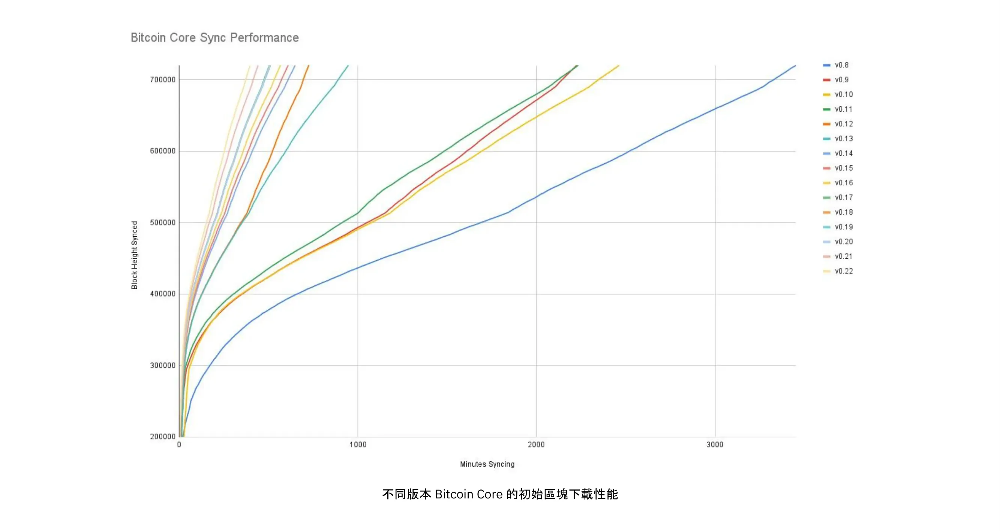


不同版本 Bitcoin Core 的初始區塊下載效能。Y 軸上是同步的區塊高度，X 軸上是同步到該高度所花的時間。


不同的線代表 Bitcoin Core 的不同版本。最左邊的一行是最新的版本，即 0.22 版，於 2021 年 9 月發行，花了 396 分鐘才完全同步。最右邊的是 2013 年 11 月的 0.8 版，花了 3452 分鐘。所有這些 - 約 10 倍 - 的改進都是由於向內縮放所致。


這些改進可歸類為節省空間 (RAM、磁碟、頻寬等) 或節省計算能力。這兩種類別都有助於上圖中的改進。


計算改進的一個好例子可以在 [libsecp256k1](https://github.com/Bitcoin-core/secp256k1) 函式庫中找到，該函式庫除其他功能外，還實現了制作和驗證數位簽名所需的加密基元。Pieter Wuille 是這個函式庫的貢獻者之一，他寫了一篇 [Twitter thread](https://twitter.com/pwuille/status/1450471673321381896) 來展示透過各種 pull request 所達到的效能改善。


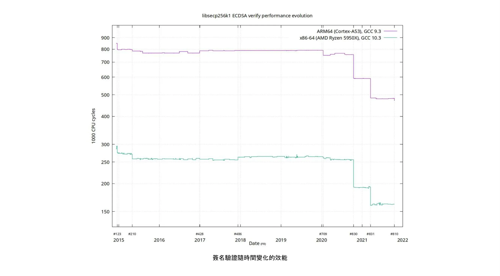


隨著時間的推移，簽名驗證的效能，並在時間線上標示重要的拉取要求


此圖顯示兩種不同 64 位元 CPU 類型 (即 ARM 和 x86) 的趨勢。效能上的差異是由於 x86 提供較多的專門指令，而 ARM 架構則只有較少且較通用的指令。然而，兩種架構的一般趨勢是相同的。請注意 Y 軸是對數軸，這使得效能的提升看起來沒有實際那麼令人印象深刻。


此外，也有數個節省空間的改進有助於效能提升的好例子。在一個

[Medium部落格文章](https://murchandamus.medium.com/2-of-3-Multisig-inputs-using-Pay-to-Taproot-d5faf2312ba3) 關於 Taproot 對於節省空間的貢獻，使用者 Murch 比較了 2-of-3 門檻簽章需要多少區塊空間，以各種方式使用 Taproot 以及完全不使用 Taproot。


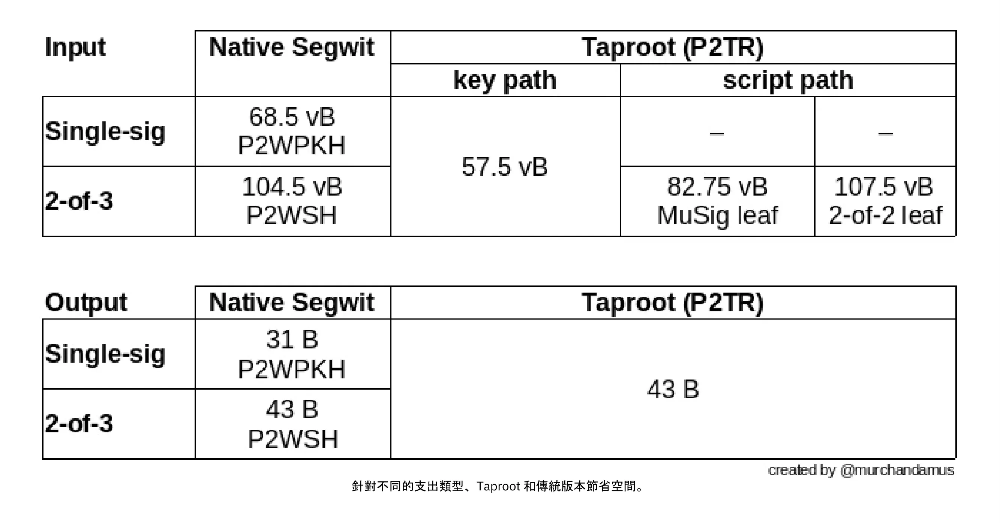


不同支出類型、Taproot 和舊版本可節省空間。


使用原生 SegWit 的 2-of-3 Multisig 總共需要 104.5+43 vB = 147.5 vB，而在標準使用情況下，最節省空間的 Taproot 只需要 57.5+43 vB = 100.5 vB。在最壞的情況和罕見的情況下，例如因為某些原因無法使用標準簽章者時，Taproot 會使用 107.5+43 vB = 150.5 vB。您不需要瞭解所有細節，但這應該可以讓您瞭解開發人員如何考慮節省空間 - 每一小個位元組都很重要。


除了 Bitcoin 軟體的內向擴充之外，使用者也可以透過一些方式為內向擴充做出貢獻。他們可以更聰明地進行交易，以節省交易費用，同時減少對 Full node 需求的影響。實現此目標的兩個常用技術稱為交易批次和輸出整合。


交易批次的概念是將多筆付款合併為一筆交易，而不是每筆付款做一筆交易。這樣可以為您節省很多費用，同時也可以減少區塊空間負載。


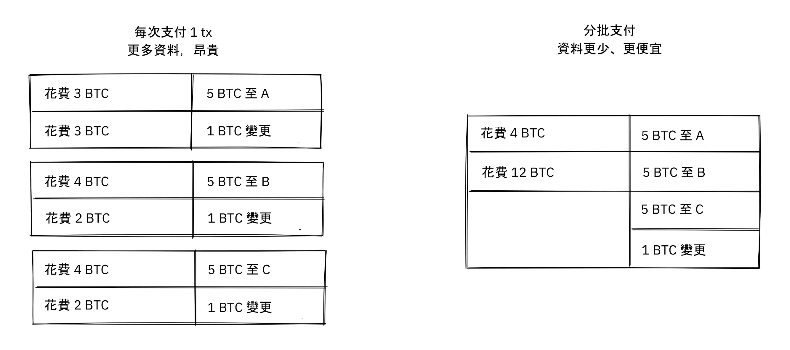


交易批次將多筆付款結合為單一交易，以節省費用。


輸出合併是指利用區塊空間需求低的時期，將多個輸出合併為單一輸出。這可以降低您日後的費用成本，因為您需要在區塊空間需求高漲時付款。


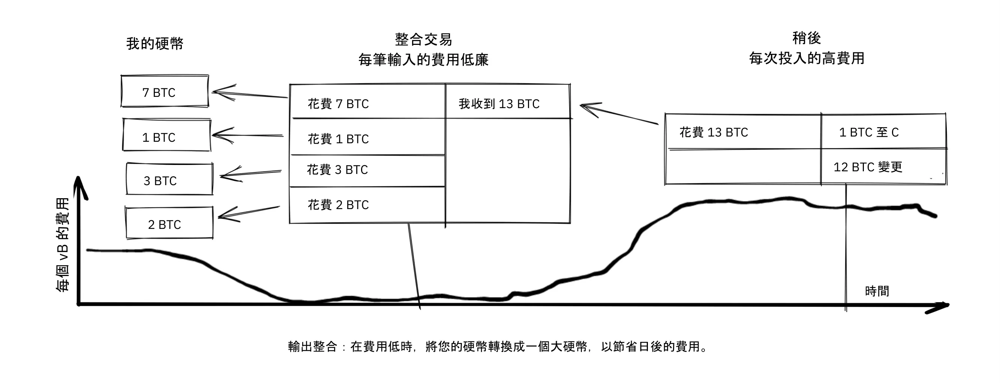


輸出整合：在費用低廉時，將您的硬幣融成一個大硬幣，以節省日後的費用。


輸出整合如何有助於向內縮放可能並不顯著。畢竟，使用這種方法，Blockchain 資料的總量甚至略有增加。儘管如此，UTXO 集（即記錄誰擁有哪些硬幣的資料庫）會縮小，因為您花費的 UTXO 比您創造的多。這可減輕完整節點維護 UTXO 資料集的負擔。


但不幸的是，這兩種 *UTXO 管理*技術可能會對您自己或收款人的隱私造成損害。在批次的情況下，每個收款人都會知道所有批次的輸出都是由您傳送給其他收款人的（可能除了變更）。在 UTXO 整合的情況下，您會發現您整合的輸出是屬於同一個 Wallet。因此，您可能必須在成本效益和隱私之間做出權衡。


#### 分層縮放


最有影響力的擴充方式可能是分層。分層背後的一般想法是，協定可以在不增加 Blockchain 交易的情況下，結算使用者之間的付款。


如下圖所示，分層通訊協定是由兩個或更多人同意一個放在 Blockchain 上的開始交易開始。


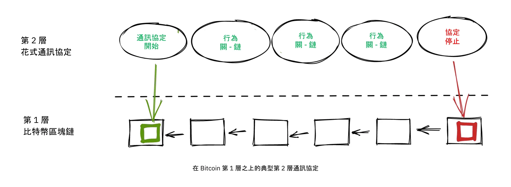


啟動交易的建立方式因不同的通訊協定而異，但有一個共同的主題，就是參與者會建立一個未簽署的啟動交易和一些預先簽署的懲罰交易，這些懲罰交易會以各種方式使用啟動交易的輸出。之後，開始交易會被完全簽署並發佈到 Blockchain，而懲罰交易也可以被完全簽署並發佈以懲罰行為不當的一方。這會激勵參與者信守承諾，讓協定能以 Trustless 的方式運作。


一旦開始交易在 Blockchain 上，協定就可以做它應該做的事。例如，它可以在參與者之間進行超快速的付款、實作一些加強隱私權的技術，或是進行 Bitcoin Blockchain 所不支援的更進階的腳本。


我們不會詳細說明特定通訊協定的運作方式，但您可以從前面的圖中看到，Blockchain 在通訊協定的生命週期中很少被使用。所有多汁的動作都發生在 *off-chain*。我們已經看到，如果處理得當，這對隱私權而言是贏家，但對可擴充性而言也是一項優勢。


Gregory Maxwell 在 [Reddit post](https://www.reddit.com/r/Bitcoin/comments/438hx0/a_trip_to_the_moon_requires_a_rocket_with/) 一篇題為「登月之旅需要多級火箭，否則火箭方程式會吃掉你的午餐......把每個人都以小丑車的方式裝進三輪火箭，並期待成功是不可能的」的文章中，解釋了為什麼分層是我們讓 Bitcoin 以數量級擴展的最佳方法。


他首先強調將 Visa 或 Mastercard 視為 Bitcoin 主要競爭對手的謬誤，並強調增加最大區塊大小是應對上述競爭的糟糕方法。接著，他談到如何透過使用層級產生一些真正的差異：


> 這是否意味著 Bitcoin 不能成為支付技術的大贏家？不，但要達到滿足全球支付需求的能力，我們必須更智慧地工作。
>

> 從一開始，Bitcoin 的設計就是要透過其智慧契約功能，以安全的方式結合各層次（什麼，你認為這只是為了讓人們可以對毫無意義的「DAOs」發表哲學意見而放上去的嗎？）實際上，我們將把 Bitcoin 系統當成一個高度易用且完全值得信賴的機器人法官，並在法庭之外進行大部分的交易，但交易的方式是，如果出了問題，我們有所有的證據和既定的協議，因此我們可以確信機器人法庭會糾正錯誤。(極客話題：如果這似乎是不可能的，請去閱讀這篇有關交易切割的舊文章)
>

> 正因為 Bitcoin 的核心屬性，這才成為可能。可檢查或可逆轉的基礎系統不太適合在其上建立強大的上層 Layer 交易處理......而且如果基礎資產不健全，根本就沒有什麼交易意義。

與法官的類比很能說明分層的運作方式：這位法官必須是廉潔的，而且永遠不會改變她的想法，否則 Bitcoin 的基礎 Layer 上面的層級就無法可靠地運作。


他繼續提出一個關於集中式服務的觀點。信任一個擁有微不足道的 Bitcoin 的中央伺服器來完成事情通常是沒有問題的：這也是分層擴充。


Maxwell 寫上面這篇文章已經過了很多年，他的話仍然正確無誤。Lightning Network 的成功證明了分層確實是增加 Bitcoin 實用性的出路。


### 關於擴充的結論


我們已經討論過各種可能想要擴充 Bitcoin、增加 Bitcoin 使用容量的方式。Bitcoin 從一開始就很重視擴充。


今天我們知道 Bitcoin 並不能很好地垂直擴展 (「購買更大的硬體」) 或水平擴展 (「僅驗證部分資料」)，而是向內擴展 (「以更少的資料做更多的事」) 和分層擴展 (「在 Bitcoin 之上建立通訊協定」)。


## 當大難臨頭

<chapterId>fe39c13c-310f-51fd-84ff-6b92dd01c9e7</chapterId>


Bitcoin 是由人建立的。人們撰寫軟體，然後由人們執行此軟體。當安全漏洞或嚴重的錯誤被發現時 - 兩者真的有區別嗎？ - 它總是由有血有肉的人發現的。本章將探討當安全漏洞被發現時，人們會做什麼、應該做什麼、以及不該做什麼。第一節解釋了 「負責任的揭露」(*responsible disclosure*)一詞，指的是發現弱點的人如何負責任地行事，以幫助將弱點造成的損害降到最低。本章的其餘部分將帶您參觀這些年來發現的一些最嚴重的漏洞，以及開發人員、礦工和使用者是如何處理這些漏洞的。在 Bitcoin 的幼年時期，事情不像現在這麼嚴謹。


### 負責任的披露


假設您在 Bitcoin Core 中發現一個 Bug，這個 Bug 允許任何人使用一些特別製作的網路訊息遠端關閉 Bitcoin Core 節點。再假設您不是惡意的，而且希望這個問題不會被利用。您會怎麼做？如果您對此保持沉默，其他人很可能會發現這個問題，而且您無法確定那個人不會是惡意的。


當發現安全問題時，發現者應該使用 _responsible disclosure_，這是 Bitcoin 開發人員常使用的術語。這個詞[在 Wikipedia 上有解釋](https://en.wikipedia.org/wiki/Coordinated_vulnerability_disclosure)：


> 硬體和軟體的開發者通常需要時間和資源來修復他們的錯誤。通常，是道德駭客發現這些
弱點。駭客與電腦安全科學家認為，讓大眾意識到弱點是他們的社會責任。隱藏問題可能會造成錯誤的安全感。為了避免這種情況，參與各方會協調並議定修復弱點的合理期限。根據弱點的潛在影響、開發及應用緊急修復或變通所需的預期時間及其他因素，這段時間可能會在幾天到幾個月之間。


這表示如果您發現安全問題，應該向負責系統的團隊報告。但在 Bitcoin 的情況下，這代表什麼？沒有人控制 Bitcoin，但目前有一個 Bitcoin 開發的焦點，也就是 [Bitcoin Core Github 資源庫](https://github.com/Bitcoin/Bitcoin)。上述資源庫的維護者負責其中的程式碼，但他們並不負責整個系統 - 沒有人負責。儘管如此，一般的最佳做法是傳送電子郵件到 security@bitcoincore.org。


在 2017 年一篇題為「負責任地揭露 Bug」的 [email thread](https://lists.linuxfoundation.org/pipermail/Bitcoin-dev/2017-September/015002.html)，Anthony Towns 嘗試總結他認為目前的最佳實作。他收集了來自多個來源和不同人士的意見，以提供他對此主題的看法。


- 漏洞應透過 bitcoincore.org 的安全性回報。
- 關鍵問題 (可立即被利用或已被利用造成重大傷害) 將以下列方式處理：
  - 盡快釋出修補程式
  - 廣泛通知需要升級 (或停用受影響的系統)
  - 盡量減少實際問題的揭露，以延緩攻擊
- 非關鍵性的弱點 (因為它很難被利用或利用成本很高) 會透過以下方式處理：
  - 在正常開發流程中進行修補和審查
  - 將主版本中的修正或解決方案回傳到目前已發行的版本中
- 開發人員會嘗試將建議的修補程式提供給未獲知漏洞的資深開發人員，告訴他們該修補程式修復了漏洞，並要求他們找出漏洞，以確保發布修補程式不會揭露漏洞的性質。
- 開發人員可以建議其他 Bitcoin 實作在修補程式被釋出與廣泛部署之前，採用漏洞修補程式，如果他們可以在不揭露漏洞的情況下這麼做；例如，如果修補程式有顯著的效能優勢，可以證明其納入是合理的。
- 在漏洞公開之前，開發人員通常會建議友善的 Altcoin 開發人員應該趕快修復漏洞。但這只是在修補程式廣泛部署於 Bitcoin 網路之後。
- 開發人員通常不會通知有敵意行為的 Altcoin 開發人員 (例如，利用漏洞攻擊他人，或違反禁運規定)。
- 在 >80% 的 Bitcoin 節點部署修補程式之前，Bitcoin 開發人員不會揭露弱點的詳細資訊。我們鼓勵並要求漏洞發現者遵循相同的政策。[1] [6]


此清單顯示在發佈 Bitcoin 的修補程式時必須非常小心，因為修補程式本身可能會洩露漏洞。第四項特別有趣，它說明了如何測試修補程式是否偽裝得足夠好。事實上，如果幾個真正有經驗的開發人員即使知道修補程式修復了一個漏洞，也無法發現這個漏洞，那麼其他人要發現這個漏洞可能就真的是Hard了。


導致這封電子郵件的主題是討論是否、何時、以及如何揭露 Bitcoin 的altcoins 和其他實作的漏洞。這裡沒有明確的答案。"幫助好人」似乎是明智之舉，但誰來決定誰是好人？Bryan Bishop [辯稱](https://lists.linuxfoundation.org/pipermail/Bitcoin-dev/2017-September/014983.html)，幫助altcoins甚至是詐騙幣抵禦安全漏洞是一種道德責任：


> 僅保護 Bitcoin 及其使用者免於主動威脅是不夠的，還有一個更普遍的責任，就是保護所有類型的使用者和不同的軟體免於各種形式的威脅，即使人們使用的是您個人沒有維護、沒有貢獻或沒有提倡的愚蠢且不安全的軟體。處理有關漏洞的知識是一件很微妙的事情，您可能會接收到比原先描述更嚴重的直接或間接影響的知識。

在 Town 發送上述電子郵件之前，Gregory Maxwell 還發表了一篇 [post](https://lists.linuxfoundation.org/pipermail/Bitcoin-dev/2017-September/014977.html)，其中他認為安全漏洞可能比表面上看起來更嚴重：


> 我曾多次見過 Hard 要利用的問題，但當您找到正確的訣竅後，問題就變得微不足道，或是一個小小的 dos 問題變得嚴重得多。
>

> 經過專業部署的簡單效能錯誤，有可能被用來分割網路--Miner A 和 Exchange B 分到一個區域，其他人則分到另一個區域。
>

> 等等。  因此，儘管我絕對同意不同的事情應該也可以有不同的處理方式，但也不總是那麼一目了然。審慎的做法是把事情當成比你所知道的更嚴重。

因此，即使漏洞看起來是 Hard 漏洞，最好還是假設它很容易被攻擊，只是您還沒想出如何攻擊而已。


他也提到「將這個主題稱為任何關於公開的事情都是不對的，這個主題不是關於公開。披露是指您告訴廠商。  這個主題是關於公開，這有非常不同的含意。公開是指您確定您已經告訴了潛在的攻擊者。最後關於揭露與公開之間區別的觀點非常重要。容易的部分是負責任的揭露；Hard 的部分是明智的公布。


### Bitcoin 的創傷童年


Bitcoin 一開始只是一個人 (至少它的創造者化名是這麼說的) 的專案，Bitcoin 一開始幾乎沒有任何價值。因此，漏洞和錯誤修復並沒有像今天一樣嚴格處理。


Bitcoin wiki 上有 Bitcoin 經歷過的 [常見弱點與暴露清單](https://en.Bitcoin.it/wiki/Common_Vulnerabilities_and_Exposures) (CVE)。本節將介紹 Bitcoin 早期的一些安全問題和事件。我們不會涵蓋所有的問題，但我們挑選了幾個我們認為特別有趣的問題。


#### 2010-07-28:花掉任何人的硬幣 (CVE-2010-5141)


2010 年 7 月 28 日，一位名叫 ArtForz 的化名者在 0.3.4 版本中發現了一個 Bug，可以讓任何人從其他人手中拿走硬幣。ArtForz *負責*地向 Satoshi Nakamoto 和另一位名叫 Gavin Andresen 的 Bitcoin 開發人員報告了此事。


問題是 script 運算符號 `OP_RETURN` 會直接退出程式的執行，所以如果 scriptPubKey 是 `<pubkey> OP_CHECKSIG`，而 scriptSig 是 `OP_1 OP_RETURN`，scriptPubKey 中的程式部分就不會執行。唯一會發生的事情是 `1` 被放到堆疊上，然後 `OP_RETURN` 會導致程式退出。程序執行後，堆疊頂端的任何非零值都表示支出條件已達成。由於堆疊頂端的元素 `1` 非零，所以支出是確定的。


這是處理 `OP_RETURN`的程式碼：


```
case OP_RETURN:
{
pc = pend;
}
break;
```

`pc = pend;` 的效果是跳過程式的其他部分，這表示 scriptPubKey 中任何鎖定的腳本都會被忽略。修正的方法是改變 `OP_RETURN` 的意義，使它立即失敗。


```
case OP_RETURN:
{
return false;
}
break;
```


Satoshi 在本機做了這個變更，並從中建立了一個 0.3.5 版本的可執行二進位檔。然後，他在 Bitcointalk 論壇上發佈了 `\\*** ALERT \*** Upgrade to 0.3.5 ASAP` 的帖子，敦促用戶安裝他的這個二進制版本，但沒有提供它的源代碼：


> 請盡快升級至 0.3.5！  我們修正了一個執行上的錯誤，這錯誤導致可能會接受偽造的交易。  在您升級到 0.3.5 版之前，請勿接受 Bitcoin 交易付款！

原始訊息後來經過編輯，已無法取得完整內容。以上片段來自 [引述答案](https://bitcointalk.org/index.php?topic=626.msg6458#msg6458)。有些使用者嘗試了 Satoshi 的二進位檔，但在使用上遇到了問題。不久之後，[Satoshi 寫道](https://bitcointalk.org/index.php?topic=626.msg6469#msg6469)：


> 還沒有時間更新 SVN。  請等待 0.3.6，我正在建置中。  在此期間，您可以關閉您的節點。

而 35 分鐘後，[他寫道](https://bitcointalk.org/index.php?topic=626.msg6480#msg6480)：


> SVN 已更新至版本 0.3.6。
>

> 現在上傳 Windows 版本的 0.3.6 到 Sourceforge，之後會重建 linux 版本。

此時他似乎也更新了原始貼文，提到 0.3.6 而非 0.3.5：


> 請盡快升級至 0.3.6！  我們修正了一個執行上的錯誤，這錯誤導致偽造的交易有可能被顯示為已接受。  在您升級到 0.3.6 版之前，請勿接受 Bitcoin 交易付款！
>

> 如果您無法立即升級到 0.3.6，最好先關閉您的 Bitcoin 節點，直到升級為止。
>

> 在 0.3.6 中，散列速度更快：
> - 感謝 Tcatm 的中間狀態快取最佳化
> - Crypto++ ASM SHA-256 感謝 BlackEye
> 總生成速度提升 2.4 倍。
>

> 下載：
>

> http://sourceforge.net/projects/Bitcoin/files/Bitcoin/Bitcoin-0.3.6/
>

> Windows 和 Linux 使用者：如果您已獲得 0.3.5，您仍需升級至 0.3.6。

請注意與第一條訊息在問題描述上的差異："could be displayed as accepted" vs "could be accepted"。也許 Satoshi 在他的溝通中淡化了錯誤的嚴重性，以免引起太多人對實際問題的注意。無論如何，大家都升級到 0.3.6 並且如預期般運作。令人驚訝的是，這個特殊的問題在沒有 Bitcoin 損失的情況下解決了。


Satoshi 的訊息也描述了 Mining 的一些效能最佳化。目前還不清楚為何要在重要的安全修補中加入這些內容，有可能是為了混淆真正的問題。不過，看起來更有可能的是，他只是發佈了 Subversion 套件庫開發分支頭上的東西，並在其中加入了安全修補。


當時的使用者還不像現在這麼多，Bitcoin 的價值也接近零。如果這個 Bug 回應在今天上演，一定會被認為是一場徹頭徹尾的大便秀，原因有很多：


- Satoshi 發佈了包含修正的 0.3.5 版本。沒有提供修補程式或程式碼，也許是為了混淆問題。
- 0.3.5 [根本沒用](https://bitcointalk.org/index.php?topic=626.msg6455#msg6455)。
- 0.3.6 中的修正實際上是 Hard Fork。


另一個值得商榷的問題是，要求使用者關閉他們的節點是好是壞。這在今天是做不到的，但在當時，許多使用者都很積極地在論壇上追蹤更新，而且通常都能掌握最新情況。鑑於這樣做是可能的，所以這可能是明智的做法。


#### 2010-08-15 合併輸出溢出 (CVE-2010-5139)


2010 年 8 月中旬，Bitcointalk 論壇使用者 jgarzik，又名 Jeff Garzik、

[發現](https://bitcointalk.org/index.php?topic=822.msg9474#msg9474) 區塊高度 74638 上的某筆交易有兩個異常高值的輸出：


```
"out" : [
{
"value" : 92233720368.54277039,
"scriptPubKey" : "OP_DUP OP_HASH160 0xB7A73EB128D7EA3D388DB12418302A1CBAD5E890 OP_EQUALVERIFY OP_CHECKSIG"
},
{
"value" : 92233720368.54277039,
"scriptPubKey" : "OP_DUP OP_HASH160 0x151275508C66F89DEC2C5F43B6F9CBE0B5C4722C OP_EQUALVERIFY OP_CHECKSIG"
}
]
```


> 這個區塊 #74638 中的「value out」非常奇怪：
>

> 92233720368.54277039 BTC？  我想知道那是 UINT64_MAX 嗎？

據推測，有一個錯誤導致兩個 int64（不是 Garzik 所說的 uint64）輸出的總和溢出為負值 -0.00997538 BTC。無論輸入的總和是多少，輸出的 「總和 」都會比較小，因此根據當時的程式碼，這筆交易是沒問題的。


在這種情況下，該 bug 已經透過實際的漏洞被揭露並發布。不幸的結果是，約有 2x92 億個 Bitcoin 被創造出來，嚴重稀釋了當時存在的約 370 萬個錢幣 Supply。


在一個相關的主題中，[Satoshi 發表](https://bitcointalk.org/index.php?topic=823.msg9531#msg9531) 說如果人們停止 Mining（或*產生*，他們當時稱之為 Mining），他會非常感激：


> 如果大家停止產生，將會有所幫助。  我們可能需要圍繞目前的分支重新做一個分支，您的 generate 越少，速度就越快。
>

> 第一個修補程式將在 SVN rev 132 中。  還沒上傳。  我正在先推送一些其他的雜項變更，然後再上傳這個修補程式。

他的計劃是製作一個 Soft Fork，使類似這裡討論的交易無效，從而使包含此類交易的區塊（特別是區塊 74638）無效。不到一小時之後，他提交了一個 Subversion 倉庫的 [修補版本 132](https://sourceforge.net/p/Bitcoin/code/132/) 並 [張貼到論壇](https://bitcointalk.org/index.php?topic=823.msg9548#msg9548) 描述他認為使用者應該做的事：


> 補丁已上傳至 SVN rev 132！
>

> 目前，建議的步驟：
> 1) 關機。
> 2) 下載 knightmb 的 blk 檔案。  (取代您的 blk0001.dat 和 blkindex.dat 檔案）
> 3) 升級。
> 4) 一開始應該只有少於 74000 個區塊。讓它重新下載其餘的區塊。
>

> 如果您不想使用 knightmb 的檔案，您可以直接刪除您的 blk*.dat 檔案，但如果每個人都要一次下載整個區塊索引，那會對網路造成很大的負載。
>

> 我很快就會製作發行版本。

他希望人們下載特定使用者（即 knightmb）的區塊資料，knightmb 已將他的 Blockchain 發佈在他的磁碟上，即 blkXXXX.dat 和 blkindex.dat 檔案。之所以要以這種方式下載 Blockchain 資料，而不是從頭同步，是為了減少網路頻寬的瓶頸。


這有一個很大的注意事項：使用者在啟動時從 knightmb 下載的資料 [未經 Bitcoin 軟體驗證](https://Bitcoin.stackexchange.com/a/113682/69518)。blkindex.dat 檔案包含 UTXO 套件，軟體會接受其中的任何資料，就像它已經驗證一樣。


同樣地，人們似乎也順從了這一點，無效區塊及其繼承區塊的逆轉成功了。礦工們開始為區塊 [74637](https://Mempool.space/block/0000000000606865e679308edf079991764d88e8122ca9250aef5386962b6e84) 進行新的繼承工作，根據該區塊的 Timestamp，繼承區塊出現在 23:53 UTC，也就是發現問題後約 6 小時。在第二天，8 月 16 日 08:10 左右，在區塊 74689 前後，新的鏈已經超越了舊的鏈，因此所有未升級的節點都重新交換以跟隨新的鏈。這是 Bitcoin 歷史上最深的一次重組 - 52 個區塊。


與 OP_RETURN 問題相比，這個問題的處理方式略為乾淨：


- 無僅二進制修補程式釋出
- 已釋放的軟體如預期般運作
- 無 Hard Fork


在這個問題中，使用者也被要求停止 Mining。我們可以討論這是否是個好主意，但想像您是 Miner，而且您深信壞區塊上面的任何區塊最終會在深度重組中被抹除：您為什麼要浪費資源在 Mining 注定會被抹除的區塊上？


您也許會認為，按照中本的建議，從隨便一個傢伙的 Hard 磁碟機下載 Blockchain，包括 UTXO 套件，是有點蹊蹺。如果是這樣，你說得對，那就是有問題。但是，考慮到當時的情況，這個緊急應變措施是明智的。


這個案例與之前的 OP_RETURN 案例有一個重要的差異：這個問題是在野外被利用的，因此可以更直接地進行修復。在 OP_RETURN 的案例中，他們必須混淆修復方法，並發表公開聲明，但卻沒有直接揭露問題所在。


#### 2013-03-11 0.7.2 - 0.8.0 的 DB 鎖問題 (CVE-2013-3220)


2013 年 3 月出現了一個非常有趣且具有教育意義的問題。Blockchain 似乎在區塊 225429 之後分裂了（雖然在下面的引文中使用了「Fork」一詞）。此事件的詳細資訊 [在 BIP50 中報告](https://github.com/Bitcoin/bips/blob/master/bip-0050.mediawiki)。摘要中說：


> 一個交易輸入總數大於先前所見的區塊被挖出並廣播。Bitcoin 0.8 節點能夠處理，但一些 0.8 前的 Bitcoin 節點拒絕了，導致 Blockchain 意外 Fork。0.8 前不相容的鏈（從此以後稱為 0.8 鏈）在此時擁有約 60% 的 Mining Hash 力量，確保分裂不會自動解決（如果 0.8 前鏈的總工作量超過 0.8 鏈，就會出現這種情況，迫使 0.8 節點重組到 0.8 前鏈）。
>

> 為了盡快恢復規範鏈，BTCGuild 和 Slush 將其 Bitcoin 0.8 節點降級為 0.7，這樣他們的池也會拒絕更大的區塊。這將大多數hashpower放在沒有較大區塊的鏈上，因此最終導致0.8節點重組到0.8之前的鏈。

Mining 池 BTCGuild 和 Slush 所採取的快速行動在這次緊急情況中至關重要。他們能將 Hash 的大多數權力轉移到分裂前的 0.8 分支，進而幫助恢復共識。這讓開發人員有時間找出可持續的解決方案。


在這個問題中，非常有趣的是 0.7.2 版本與本身不相容，先前的版本也是如此。這在 [BIP50 的根源部分](https://github.com/Bitcoin/bips/blob/master/bip-0050.mediawiki#root-cause) 有說明：


> 由於 BDB 鎖配置不夠高，它隱含地成為了決定區塊有效性的網路共識規則（雖然是一個
不一致且不安全的規則，因為鎖的使用可能因節點而異）。


簡而言之，問題在於 Bitcoin Core 軟體驗證區塊所需的資料庫鎖數不是確定的。一個節點可能需要 X 個鎖，而另一個節點可能需要 X+1 個鎖。節點對於 Bitcoin 可以使用的鎖數也有限制。如果需要的鎖數超過限制，區塊就會被視為無效。因此，如果 X+1 超過限制，但不超過 X，那麼兩個節點就會分割 Blockchain，並就哪個分支有效發生分歧。


除了兩個池立即採取行動恢復共識外，選擇的解決方案是


- 在版本 0.8.1 上限制區塊的大小和所需的鎖數
- 以相同的新規則修補舊版本 (0.7.2 及一些較舊的版本)，並增加全局鎖限制。


除了第二項中增加的全局鎖限制外，這些規則都是在預定的時間內暫時實施的。計劃是在大部分節點升級後移除這些限制。


這個 Soft Fork 大幅降低了共識失敗的風險，幾個月後的 5 月 15 日，全網一致停用了臨時規則。請注意，這次停用實際上是 Hard Fork，但並沒有引起爭議。此外，它是與之前的 Soft Fork 一同釋出的，因此執行 Soft 分叉軟體的人很清楚 Hard Fork 會跟著釋出。因此，當 Hard Fork 啟動時，絕大多數的節點仍維持共識。但不幸的是，有一些沒有升級的節點在升級過程中遺失了。


有人可能會問，這在今天是否可行。今天的 Mining 環境更加複雜，而且依分裂雙方的 Hash 力量而定，要快速推出類似 BIP50 的修補程式，可能需要 Hard 的時間。要說服「錯誤」分支的礦工放棄他們的區塊獎勵，可能需要 Hard。


#### BIP66


BIP66 很有意思，因為它強調了以下方面的重要性：


- 良好的選擇加密
- 負責任的披露
- 在不揭露漏洞的情況下進行部署
- Mining 在已驗證的區塊之上


BIP66 是一項收緊 Bitcoin Script 中簽章編碼規則的提案。其 [動機](https://github.com/Bitcoin/bips/blob/master/bip-0066.mediawiki#motivation) 是希望能夠使用 OpenSSL 以外的軟體或函式庫，甚至是 OpenSSL 的最新版本來解析簽章。OpenSSL 是 Bitcoin Core 當時使用的通用加密函式庫。


BIP 於 2015 年 7 月 4 日啟用。然而，雖然上述情況屬實，但 BIP66 還修復了 BIP 中未提及的一個更嚴重的問題。


##### 弱點


此問題的完整揭露於 2015 年 7 月 28 日由 Pieter Wuille 發表的一篇

[email 至 Bitcoin-dev 郵件列表](https://lists.linuxfoundation.org/pipermail/Bitcoin-dev/2015-July/009697.html)：


> 大家好
>

> 我想披露我在 2014 年 9 月發現的一個漏洞，當本月初達到 BIP66 的 95% 臨界值時，這個漏洞就變得無法利用了。
>

> 簡短說明：
>

> 特製的交易可能會在節點間分叉 Blockchain：
>

> - 在 32 位元系統及 64 位元 Windows 系統上使用 OpenSSL
> - 在非 Windows 64 位元系統 (Linux、OSX...) 上使用 OpenSSL
> - 使用某些非 OpenSSL 程式碼來解析簽章

這封電子郵件進一步詳述了問題是如何被發現的，以及更確切的原因。最後，他提交了一份事件時間表，我們將在此重播一些最重要的事件。如上圖所示，其中有些事件已經描述過了。


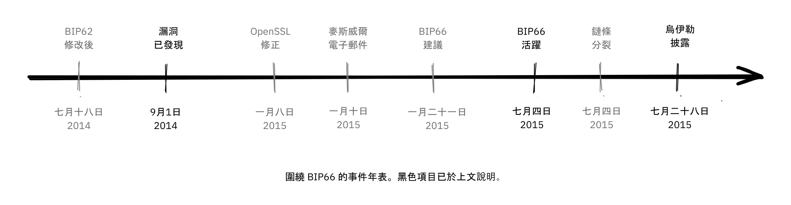


圍繞 BIP66 的事件年表。黑色項目已於上文說明。


##### 發現之前


在沒有人知道這個問題的情況下，這個問題本來可以由現在已被寬度刪除的 BIP62 來解決，而 BIP62 是一項減少交易可變性可能性的提案。BIP62 建議的變更包括收緊簽章編碼的共識規則，或稱為「嚴格 DER 編碼」。Pieter Wuille 在 2014 年 7 月提出了對 BIP 的一些調整，這將會解決這個問題：


> 2014 年 7 月 18 日：為了讓 Bitcoin 的簽章編碼規則不依賴 OpenSSL 的特定解析器，我修改了 BIP62 提案，讓其嚴格的 DER 簽章要求也適用於版本 1 交易。當時已沒有非 DER 簽署被挖到區塊中，所以假設這不會有任何影響。請參閱 https://github.com/Bitcoin/bips/pull/90 和 http://lists.linuxfoundation.org/pipermail/Bitcoin-dev/2014-July/006299.html。當時還不清楚，但如果部署的話，這將會解決漏洞。

由於此 BIP 涵蓋的範圍非常廣泛，遠遠超過「嚴格 DER 編碼」的範圍，因此一直在變更，從未接近部署的階段。該 BIP 後來被撤銷，因為 BIP141「分離見證」以另一種更完整的方式解決了交易延展性的問題。


##### 發現後


OpenSSL 發佈了其軟體的新版本，並附上修補程式，如果從一開始就在 Bitcoin 中使用這些修補程式，就能解決問題。然而，只在新版的 Bitcoin Core 中使用任何新版的 OpenSSL 都會讓事情變得更糟。Gregory Maxwell 在 2015 年 1 月的另一個 [email thread](https://lists.linuxfoundation.org/pipermail/Bitcoin-dev/2015-January/007097.html) 中解釋了這個問題：


> 雖然對於大多數應用而言，急切地拒絕某些簽章一般是可以接受的，但 Bitcoin 是一個共識系統，所有參與者一般都必須同意輸入資料的確切有效性或無效性。  在某種意義上，一致性比「正確性」更重要。
> [...]
> 然而，上述修補程式只能解決一般問題的一個症狀：依賴非為共識使用而設計或散佈的軟體 (尤其是 OpenSSL) 來達成共識規範行為。  因此，作為一項遞增的改進，我建議使用 BIP62 的子集，有針對性地使用 Soft-Fork 來強制執行嚴格的 DER 規範。

他指出，使用並非用於共識系統的程式碼會帶來嚴重的風險，並建議 Bitcoin 實作嚴格的 DER 編碼。這是一個非常明顯的例子，說明良好的選擇加密技術的重要性。


這些事件可能會讓您覺得 Gregory Maxwell 知道 Pieter Wuille 稍後發布的漏洞，但卻想幫忙偷偷修復，偽裝成預防措施，而不引起太多人對實際問題的注意。也許如此，但這純屬猜測。


之後，依照 Maxwell 的建議，BIP66 被建立為 BIP62 的子集，只指定嚴格的 DER 編碼。這個 BIP 在七月顯然被廣泛接受和部署，儘管由於 * 無驗證的 Mining*，發生了兩次具有諷刺意味的 Blockchain 分裂。這些分裂將在下一節中討論。


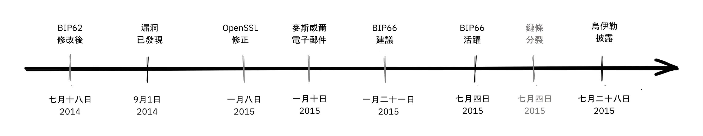


從中得到的一個重要啟示是，BIP 應該或多或少是 *原子 *，也就是說，BIP 應該完整到足以提供有用的東西或解決特定的問題，但又小到足以讓使用者廣泛支持。在 BIP 中加入的東西越多，被接受的機會就越小。


##### 因無效 Mining 而分裂


不幸的是，BIP66 的故事並沒有就此結束。當 BIP66 啟動時，結果相當混亂，因為有些礦工沒有驗證他們試圖擴展的區塊。這就是所謂的無驗證 Mining，或 SPV-Mining（Simplified Payment Verification 的簡稱）。已向 Bitcoin 節點發出警示訊息，並附上 [說明問題的網頁](https://Bitcoin.org/en/alert/2015-07-04-spv-Mining) 連結：


> 2015 年 7 月 4 日清晨，達到 950/1000 (95%) 閾值。此後不久，一個小的 Miner（非升級 5% 的一部分）挖出了一個無效區塊 - 這是預期會發生的情況。不幸的是，結果發現大約一半的網路 Hash 率是 Mining 沒有完全驗證區塊（稱為 SPV Mining），並在該無效區塊之上建立新區塊。

警示頁面指示人們在使用舊版 Bitcoin Core 的情況下，要比平常多等待 30 次確認。


上述分裂發生於 2015-07-04 02:10 UTC，在區塊高度 [363730](https://Mempool.space/block/000000000000000006a320d752b46b532ec0f3f815c5dae467aff5715a6e579e) 之後。在挖出 6 個無效區塊後，此問題於當天 03:50 獲得解決。不幸的是，同樣的問題在第二天，也就是 2015-07-05 的 21:50 再次發生，但這次的無效分支只持續了 3 個區塊。


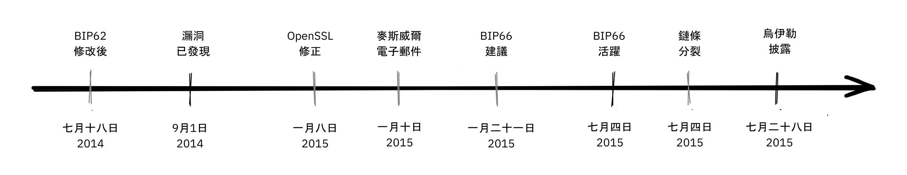

導致 BIP66 發生的事件、其部署及後果是一個很好的案例研究，說明 Bitcoin 開發人員必須多麼謹慎。BIP66 的幾個主要啟示：


- 開放性與不公開漏洞之間的平衡非常微妙。
- 部署未公佈漏洞的修補程式是一場棘手的遊戲。
- 保留共識為 Hard。
- 非用於共識系統的軟體一般都有風險。
- BIP 應該具有一定的原子性。


### 結論


Bitcoin 有錯誤。我們鼓勵發現 Bug 的人負責任地向 Bitcoin 開發人員揭露這些 Bug，以便他們在不公開 Bug 的情況下進行修復。理想的情況是，錯誤修正可以偽裝成效能改善或其他煙幕。


我們檢視過這些年來浮現的一些較嚴重問題，以及處理方式。有些是透過攻擊公開發現的，有些則是負責任地公開，並在惡意使用者有機會利用這些問題之前進行修復。


## 討論問題

<chapterId>91462ca7-f09c-55da-a5b9-3e211de31da5</chapterId>


這些討論問題不只是「Bitcoin 開發哲學」中內容的重溫，而是要鼓勵您進一步研究，所以請務必出去探索。


您可以在本題庫中選擇主題，撰寫 100-300 字的 [小論文](https://www.youtube.com/watch?v=N4YjXJVzoZY)，以測試您的理解深度。如果您希望得到作品的反饋意見，可以將作品發送到 mini-essay@planb.network，我們非常樂意為您審閱。


#### 權力下放


- 分散化就是 Hard。為什麼我們要大費周章地讓它運作起來？我們是否可以選擇一種混合方式，即某些部分集中，其他部分不集中？
- 分權引入了雙重花費問題，還是雙重花費問題需要分權？Satoshi 如何解決雙重支出問題？
- Bitcoin 在哪些方面仍然最容易受到審查，為什麼審查是一件壞事？有任何支持審查的論點嗎？
- 據說 Bitcoin 是無允許的。是否有其他付款方式可視為無允許？


#### 不信任


- 不信任通常是一個範圍，而不是二元對立的。Bitcoin 的哪些方面相當於 Trustless，哪些方面通常涉及較高程度的信任？它們可以減輕嗎？
- 您希望執行 Full node 以能完全驗證所有交易。您從 https://Bitcoin.org/en/download 下載 Bitcoin Core。您在哪裡放置信任，在哪裡完全 Trustless？
- 您可以在可信賴的系統上建立 Trustless 系統嗎？


#### 隱私權


- 當使用者與 Bitcoin 互動時保持良好的隱私權，可以獲得哪些重要的好處？網路有哪些利他的好處？
- 重複使用地址對您的隱私有什麼影響？
- Bitcoin 使用 UTXO 模型，而一些替代加密貨幣則使用帳戶模型。這種選擇對隱私有什麼影響？


#### 有限 Supply


- Bitcoin 的有限 Supply 與其透過 Coinbase Transaction 發行的硬幣有何關係？硬幣發行與安全預算之間有什麼關係？
- Satoshi 可以調整哪些參數來改變 Bitcoin 的 Supply 上限？如果他決定將 Supply 的上限設為 1 百萬，會有什麼變化？1 兆呢？
- 為什麼有些人主張增加 Bitcoin Supply？您認為這會發生嗎？


#### 升級


- 什麼是快速審判，為什麼必須啟動 Taproot？
- 為什麼我們需要這麼高比例的礦工才能在軟硬碟升級？為什麼門檻不只是 51%？


#### 對抗性思維


- 什麼是 sybil 攻擊？是什麼讓分散式網路如此容易受到這種攻擊？
- 為什麼 Bitcoin 網路中的所有參與者（而不只是開發人員）都要有敵對性的思考方式？


#### 開放原始碼


- 只有少數維護者擁有必要的 GitHub 權限，才能將程式碼合併到 [Bitcoin Core](https://github.com/Bitcoin/Bitcoin) 套件庫中。這不是與無權限網路相違背嗎？
- 開放原始碼開發程序是否容易受到 sybil 攻擊？如果是，您會如何對抗？
- 依賴第三方開放原始碼程式庫有哪些好處和缺點，Bitcoin Core 採用的是什麼方法？
- 除了程式碼檢閱之外，我們還在哪些方面需要檢閱？如何決定審查的程度是否足夠？
- 我們如何確保 Bitcoin 總是有足夠的專業人士在工作？如果沒有，又該如何評估他們的誠信和意圖？


#### 縮放


- 有論者認為，分片提供了擴充的優勢，但也付出了複雜性的代價。為什麼我們應該或不應該採用技術改進，因為它們難以理解，即使它們看起來在技術上是合理的？
- Bitcoin 中引入的內向擴展方法有哪些範例？
- 為什麼在分散式系統中，縱向擴展要困難得多？橫向擴充又如何？
- 我們似乎還沒有就如何讓全世界都搭乘 Bitcoin 達成共識。難道 Satoshi 不該在 2009 年的第一個區塊 Mining 之前，至少想出一條通往那裡的路嗎？
- 您會如何將下列各項分類 (垂直、水平、向內或不屬於擴充技術)：分片、區塊大小增加、SegWit、SPV 節點、集中式交易所、Lightning Network、區塊間隔減少、Taproot、側鏈


# 最後部分


<partId>4b6ff4ef-b9ea-4c48-b05f-62d41a38fbbb</partId>


## 評論與評分


<chapterId>d334a837-df46-4989-9cad-8d8779147dbe</chapterId>


<isCourseReview>true</isCourseReview>

## 期末考試
<chapterId>b2b498c0-a787-11f0-bd09-e3fc5cfa90af</chapterId>
<isCourseExam>true</isCourseExam>


## 總結


<chapterId>b77ed55c-b13a-430b-a212-37aab527b9e7</chapterId>


<isCourseConclusion>true</isCourseConclusion>
