# Първата стъпка към приемането на Bitcoin

Днес всеки може да научи за Bitcoin онлайн, но често липсва възможността да се срещнем, да обменим идеи и да строим заедно. За да запълнят тази празнина, много биткойнери създават местни общности, където срещите предизвикват семинари, презентации и смислени дискусии.

В BTC304 ще разгледаме защо изграждането на общност е важно, ще разгледаме инструменти за създаване на силна визуална и цифрова идентичност и ще споделим прости проекти с отворен код, които можете да стартирате. Ще разгледаме и как местните инициативи се превръщат в национални общности, които могат да помогнат за развитието на хипербиткоизираното бъдеще.

+++
# Въведение

<partId>81318b8f-d316-5787-aa4c-4ec8370ba668</partId>

## Преглед на курса

<chapterId>e8991b82-4966-5e04-8f05-7cae46eacbaa</chapterId>

Добре дошли в BTC 304!

От 2009 г. насам Bitcoin се разраства неуморно. Този растеж се изразява в нови предложения за подобрение на Bitcoin (BIP), създаване на допълнителни слоеве, които да направят мрежата мащабируема (Lightning Network и др.), и развитие на множество компании и стартиращи предприятия.

Нейното развитие е видно и в On-Chain, където броят на транзакциите непрекъснато нараства.

Например, между 1 януари 2018 г. и 1 януари 2024 г. броят на трансакциите в основния слой на Bitcoin се очаква да се [увеличи с 66,2 %](https://dune.com/queries/3375917/5663935). Същевременно между август 2021 г. и август 2023 г. броят на публичните трансакции на Lightning Network [се е увеличил с 1212%](https://river.com/learn/files/river-lightning-report-2023.pdf).

Този значителен растеж, разбира се, е тясно свързан с:

- [нарастващия интерес на хората по света към използването на Bitcoin](https://profedustream.substack.com/p/21-raisons-dutiliser-Bitcoin), за да се освободят от банковата система и/или да използват по-малко волатилна или по-малко обезценена валута, какъвто е случаят с населението в Ливан, Сирия, Египет, Аржентина и др;
- поскъпването му с течение на времето, утвърждавайки го като средство за съхранение на стойност и дългосрочна инвестиция, което се дължи на фиксираната парична политика;
- последователния растеж на пазара на спекулативни криптовалути, особено през 2017-2018 г. и 2020-2021 г;
- Нарастващото присъствие на Bitcoin в основните медии.

Въпреки че Bitcoin е все още в начален стадий на развитие, тази реалност, която вероятно вече осъзнавате, ни подтиква да разгледаме два ключови въпроса:

**Как можем да насърчим биткойнърите да продължат обучението и проектите си, за да използват напълно потенциала на Bitcoin?**

*Как можем да помогнем на новодошлите, които често са привлечени от краткосрочни спекулации, да не губят пари от последната мания по memecoin и вместо това да се съсредоточат върху **изучаването на основите на Bitcoin**?

Най-доброто решение и на двете предизвикателства е просто: **присъствайте в реалния свят и обучавайте**.

Целта на този курс е да ви предостави всичко необходимо, за да създадете и ефективно да организирате общност или среща на Bitcoin. Независимо дали искате да изградите местна инициатива или да развиете онлайн група, този курс ще ви води стъпка по стъпка: от създаването на визуална идентичност до организирането на редовни събития и управлението на каналите за комуникация.

**Раздел 1: Въведение**

Ще започнем, като подчертаем значението на обединяването на хората около Bitcoin, независимо дали чрез онлайн общности или местни срещи. Ще разберете защо и къде да стартирате своя собствена общност, както и как да си поставите ясни цели, за да насърчите нейния растеж и дългосрочна устойчивост.

**Раздел 2: Създаване на уникална идентичност за вашата общност Bitcoin**

За да привлечете нови членове и да насърчите чувството за принадлежност, е важно да изградите уникална идентичност. В този раздел ще научите как да проектирате лога, плакати и банери, които да въплъщават духа на вашата общност Bitcoin.

**Раздел 3: Създаване на канали за комуникация за вашата Bitcoin общност**

Комуникацията е в основата на всяка общност. В този раздел ще разгледаме най-добрите канали, които да използвате, и ще ви напътстваме как да създадете ефективно група в Telegram или сървър в Discord. Ще научите също как да интегрирате многофункционални ботове, за да оптимизирате управлението на общността.

**Раздел 4: Стартиране на вашите социални мрежи** (на френски език)

Видимостта е от ключово значение за разрастването на вашата общност. В този раздел ще научите как да създадете специален профил в Twitter, да се свържете с местни срещи и да използвате платформи като btcmap.org, за да увеличите видимостта си и да привлечете нови членове.

**Раздел 5: Организиране на среща на Bitcoin**

В този раздел е описано как се организират срещи: от избора на подходящо място до провеждането на самото събитие. Ще разгледаме и стратегии за изграждане на лоялност на участниците и осигуряване на дългосрочна устойчивост на вашата общност.

**Раздел 6: Примери за проекти и инициативи** (на френски език)

За да надхвърли рамките на обикновените срещи, в този раздел се представят конкретни и оригинални проекти: от тематични събития и семинари до създаване на образователно съдържание и местни сътрудничества. Също така ще научите как да проектирате физически и цифрови материали за популяризиране на вашата общност.

**Раздел 7: Предвиждане на бъдещето**

Тук ще разгледаме естествената еволюция на вашата общност: какво да правите, ако тя се разраства твърде бързо, как да децентрализирате организацията си и как да реагирате на враждебната регулаторна среда. Този раздел ще ви помогне да предвидите и преодолеете тези предизвикателства.

**Раздел 8: Обединяване на биткойнистите**

Последният раздел е посветен на същността на вашия проект: обединяване на ентусиастите на Bitcoin около обща визия. Ще научите как да структурирате подхода си, за да привлечете и задържите членове, да делегирате ефективно задачи и да развивате устойчиво общността си.

Готови ли сте да научите как да изградите силна, жизнена общност Bitcoin? Нека се потопим!

## Защо да създадете общност или среща на Bitcoin?

<chapterId>893ea248-7d5a-5b8e-948c-7031497b1031</chapterId>

### Каква е разликата между общност и среща?

Въпреки че в екосистемата на Bitcoin няма строга дефиниция на тези термини, под общност най-добре се разбира група от хора, които споделят обща страст и общуват редовно.

Срещата, от друга страна, е събитие, организирано от и за тази общност, с конкретна цел. Срещите обикновено се провеждат, когато общността вече е създадена.

За този курс предполагаме, че преди да стартирате среща на Bitcoin, вече сте се свързали с няколко души, които се интересуват от провеждането на такова събитие, с други думи, **общността вече съществува**.

### Защо да създавате общност Bitcoin?

Съществуват няколко причини за създаването на общност Bitcoin:

**Споделяне на знания и сътрудничество:** Общностите предоставят на членовете пространство за обмен на идеи и споделяне на знания. Взаимната подкрепа е ключов стълб за растеж, който дава възможност на всеки да ускори обучението си, което е особено важно за Bitcoin, като се има предвид колко много има да се открива.

**Създаване на партньорски общности:** Много инициативи и проекти се замислят, създават и развиват в рамките на тези общности.

Общностите Bitcoin често преследват по-широки цели, особено в областта на общественото образование:

1. Какво представлява Bitcoin;

2. Как работи;

3. Приносът му към обществото;

4. Развенчаване на подвеждащи или необосновани твърдения, направени от някои публични личности и медии;

5. Основни разлики между Bitcoin и други криптовалути;

Като изграждат първите "цитадели" на утрешния ден, общностите на **ГВ-33 по света служат като защитна стена срещу дезинформацията и цензурата, като същевременно осигуряват благоприятна почва за изучаване на основите на ГВ-33**. Те предлагат на новодошлите, дори на скептиците, ресурсите и връзките, необходими за изследване на истинския потенциал на Bitcoin.

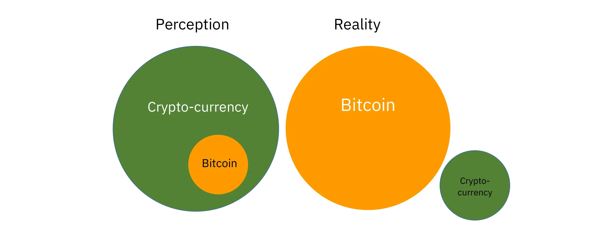

Струва си също да се отбележи, че **общността може да съществува изцяло онлайн**, независимо дали става дума за група в Telegram ("Bitcoin Лондон"), група във Facebook ("Bitcoin Берлин"), сървър в Discord ("Bitcoin Мадрид") или дори списък с имейли ("Bitcoin Франция").

С други думи, **общността не се нуждае от физически срещи, за да процъфтява или да стартира проекти. Нейната основна цел остава същата: да споделя, изгражда и обучава**.

### Защо да организирате среща?

Както беше споменато по-рано, **срещите обикновено се провеждат след създаването на общността и служат за нейното допълване**.

С развитието на пътуването на един биткойнър често се появява желание или дори необходимост **да се срещне и да взаимодейства лично с други** от същата екосистема. Това може да идва от усещането за изолация или просто от липсата на някой, с когото да се говори за Bitcoin в ежедневието.

Срещите предлагат по-лично и приветливо преживяване, отколкото онлайн аудио или видео разговорите. Независимо дали става дума за **напитка или храна**, те създават неформално, приятелско пространство, където хората могат да обменят идеи открито и директно.

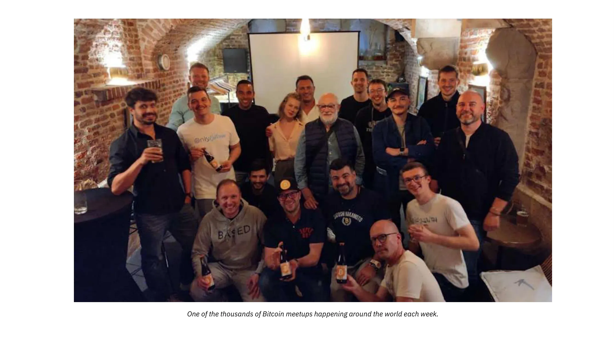

Срещите на Bitcoin могат да служат за много цели:

*Обсъждане на технически теми или текущи проекти*

*Подпомагане на новите биткойнисти за постепенно навлизане в света на Bitcoin*

*Обявяване на нови проекти или инициативи*

*Размяна на материали или книги*

*Прожектиране на документални филми в предварителна прожекция*

*Организиране на конференции или семинари по конкретни теми*

Много от тези възможности ще разгледаме подробно в част 6/8 от този курс, озаглавена "[Примери за проекти и инициативи](https://planb.academy/courses/1c643dc9-a15f-4f9e-93b6-cb3c58b4ee35/3213d87a-1998-5972-ab93-97a5769ba279).

Макар че всяка общност е свободна да формира собствени мнения, да стартира проекти и да експериментира по свой собствен начин, срещите се оказват все по-**основни за развитието на Bitcoin и за растежа на биткойнърите**. **Организирането им изисква време и усилия**, поради което този курс споделя комбинирания опит на [около шестдесет общности на Bitcoin във Франция и Белгия](https://btcmap.org/communities/map#2/5.24949/0.20000) **за да ви помогне да изградите и развиете собствена общност и срещи възможно най-гладко**.

## Къде трябва да създадете своята общност?

<chapterId>72da5285-5395-592d-ab62-303a0aef3d6d</chapterId>

Първият въпрос, който трябва да си зададете, е: къде трябва да се намира вашата общност?

Това решение е от решаващо значение, ако искате да запазите възможността за организиране на срещи по-късно.

Ако членовете трябва да пътуват два часа, за да посетят дадено събитие, посещаемостта вероятно ще бъде ниска. Ето защо изборът на подходящо **място за вашата общност, а следователно и за бъдещите ви срещи, оказва голямо влияние върху нейния растеж**.

Няколко съвета, които ще ви помогнат да вземете решение:

1/ **Създайте и развийте своя общност в среден или голям град**. Това ще ви улесни да:

    - Намерете приятни места за срещи и проекти (презентации, семинари, популяризиране на осиновяването на Bitcoin и т.н.);
    - Повишаване на чувството за ангажираност и принадлежност сред по-голям брой хора;
    - Подобряване на достъпността на събитията (обществен транспорт, паркинг и др.). Изборът на място в близост до обществен транспорт и паркинг е силно препоръчителен.

2/ **Изберете име, свързано с вашия град**. Това улеснява хората да се идентифицират с вашата общност. Примери: Bitcoin Париж, Einundzwanzig Берлин, Satoshi Spritz Милано и др.

3/ **Проверете дали в близост до вас вече има среща**.

Можете да проверите [btcmap.org](https://btcmap.org/communities/map#0/0/0/), където са изброени повечето Bitcoin общности и срещи по света.

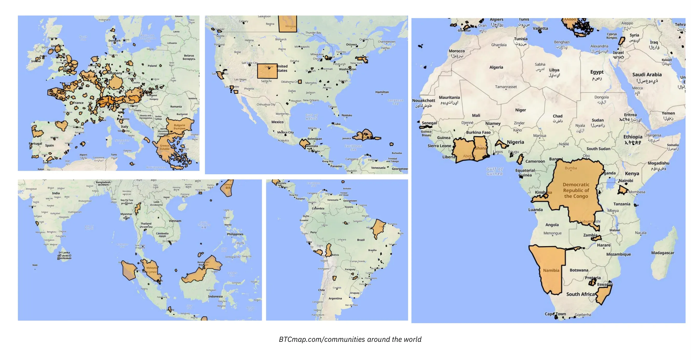

След известно проучване може да откриете съществуваща среща или общност във вашия град.

Bitcoin е децентрализирана, така че естествено всеки може да прави каквото пожелае.

Въпреки това **обединяването на силите често е по-разумно, отколкото разделянето на близките общности и намаляването на въздействието на всяка една от тях**. Създаването на чисто нова общност там, където вече съществува такава, може неволно да създаде конкуренция.

В този смисъл може да ви помогне едно просто "правило на палеца": ако в рамките на 30-45 минути от мястото, където живеете, няма активна общност Bitcoin, може би си струва да създадете нова. При това винаги сте свободни да правите каквото пожелаете.

Разбира се, ако някоя по-стара общност е "еволюирала" в посока, която вече не съответства на вашите ценности, и нямате време или мотивация да я "оранжево-филтрирате", тогава създаването на собствена fork винаги е опция.

## Какви цели трябва да ръководи вашата общност?

<chapterId>0aae1aa8-93ec-544a-ad88-22d32c619595</chapterId>

След като сте определили града (или географската област) за вашата общност, е време да **определите какво искате да постигнете**.

Тези цели могат да бъдат поставени още при стартирането на групата или да бъдат уточнени по-късно, след като няколко членове се присъединят към нея и тя започне да работи активно.

Ето някои моменти, които да насочат мисленето ви:

1/ **Защо създавам тази общност като биткойнър?** Дали за да споделям знания? Да образовам другите? Да се уча от по-опитни колеги? Да срещна съмишленици? Да се включа в екосистемата Bitcoin? Да се свържа с професионалисти? Или просто да изпиете по едно питие и да намерите нови приятели?

Отговорите ви ще определят вашето позициониране и мотивация.

Ако целта ви е да **споделяте знания и да образовате хората за Bitcoin**, съсредоточете се върху **създаването на образователно съдържание** (статии, подкастове, видеоклипове, презентации, листовки и т.н.), като спестите на другите безброй часове проучване. Можете дори да отидете по-далеч, като **организирате семинари, презентации и конференции**.

Ако целта ви е просто да се запознаете с други биткойнисти и да обмените опит, можете да изберете по-спокоен подход, например да се срещнете на по питие.

По този начин ще създадете по-лесно социални връзки. Винаги обаче помнете, че **пиенето на бира не е правилният път за изграждане на утрешния свят**.

Ето защо **определянето на конкретни цели и проекти е от съществено значение**.

2/ Трябва ли да дам на моята общност **физическо измерение**? Ако да, какъв вид събития трябва да организирате?

Първото ви събитие вероятно ще бъде среща. Неговата основна цел е да събере биткойнистите във вашия район.

Въпреки това, както ще видим по-нататък в [Примери за проекти и инициативи](https://planb.academy/courses/1c643dc9-a15f-4f9e-93b6-cb3c58b4ee35/3213d87a-1998-5972-ab93-97a5769ba279), **среща може да бъде изградена по много начини и с много цели:**

- Съчетайте работата в мрежа с образователна презентация на концепция Bitcoin;
- Организирайте професионална демонстрация на решенията на Bitcoin;

Редът вече е правилно форматиран. В него се използва единична звездичка (*) за точка, което е правилният синтаксис на Markdown. Няма небалансирани, несъвпадащи или вложени маркери за ударение, които да се поправят.

- Стратегии за дебатиране на местни търговци, които използват оранжеви фактури;

и т.н.

В зависимост от темите (технически разговори или практически семинари) може дори да има смисъл да **организирате допълнителни събития** извън редовната среща.

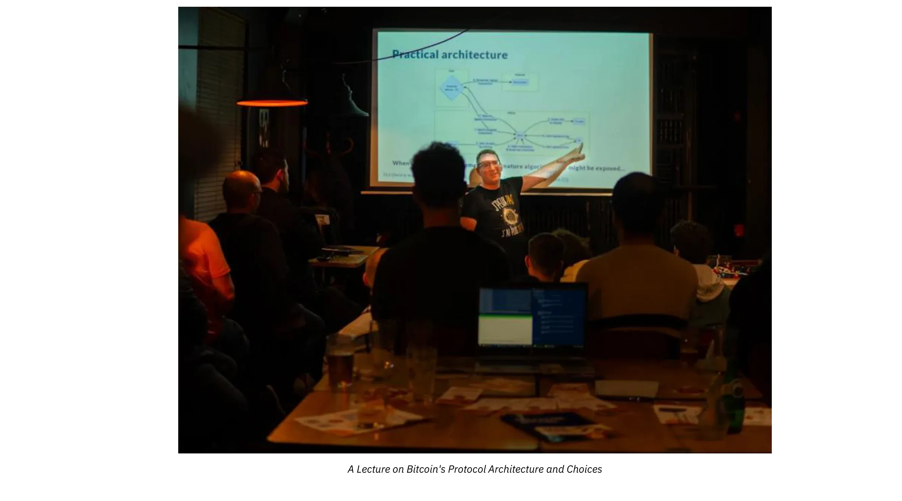

3/ Как искам моята общност да допринесе за екосистемата на Bitcoin?

Това е по-сложен въпрос, но си заслужава да го обмислите още в началото.

Ако визията ви е да **създадете сплотена, мотивирана общност**, насочена към оранжевото пилене на възможно най-много хора, тогава:

- Сътрудничете си със съществуващите общности, за да получите достъп до по-широка информация, ресурси с отворен код и ценна подкрепа, когато е необходимо.
- Организирайте и делегирайте задачи в рамките на групата си, за да разширите и увеличите ефективно усилията си.

**Поставяне на краткосрочни, средносрочни и дългосрочни цели**

Практичен начин за планиране е да се определят цели за всеки период от време:

- Краткосрочно: изградете присъствие в социалните медии и създайте канали за комуникация с общността.
- Средносрочна перспектива: създаване на образователни ресурси (статии, брошури, видеоклипове).
- Дългосрочно: стартиране на редовни физически срещи.

След като се установят срещи, можете да се насочите към:

- Краткосрочно: провеждане на семинари или презентации по конкретни теми

**Средносрочен период:** провеждане на кампании за повишаване на осведомеността или образованието за Bitcoin

**Дългосрочно:** създайте официална асоциация или партньорство с бар, който приема Bitcoin като плащане.

Бъдете подготвени: **изграждането на общност изисква усилия**

Създаването на общност не става за един ден. То изисква време, мотивация и организация.

Понякога дори може да се почувствате обезсърчени, особено когато никой не се появи и се чувствате като единствения, който носи тази мисия на раменете си.

Ето защо ** този курс има за цел да сподели ценни ресурси и съвети, които да помогнат на общностите да се развиват ефективно и в крайна сметка да станат самостоятелни.**.

# Проектиране на идентичност на общността Bitcoin

<partId>da6673ad-bf49-5979-80a6-3f69cfb28046</partId>

## Защо и как можете да създадете своя собствена идентичност?

<chapterId>b48a18cc-afdf-5216-802c-32647b5cd8a3</chapterId>

На този етап предполагаме, че:

- Вече знаете къде ще се намира вашата общност (или бъдеща редовна среща).
- Поставили сте цели за различни времеви хоризонти, дори ако те все още не са окончателни.

Следващата стъпка в изграждането на вашата общност е да **определите нейната идентичност** - както името, така и визуалния ѝ стил.

В този раздел са предоставени уроци и софтуерни решения за начинаещи, които ще ви помогнат да създадете визуалната идентичност на вашата общност, дори и с начални умения.

**Защо идентичността има значение?**

Хората се чувстват по-ангажирани и ангажирани, когато могат да се идентифицират с дадена група. Силната идентичност помага на вашата общност да се отличи и насърчава чувството за принадлежност.

Всичко започва с избора на име, а всяка страна често има свои собствени тенденции:

**Франция:** Повечето от над 60-те местни общности използват имена като "Bitcoin [CITY]" или "[CITY] Bitcoin". Техните Telegram групи често следват този модел: "Bitcoin [CITY] meetup".

**Германия:** Инициативата Einundzwanzig (означаваща "21") вдъхновява имена като "Einundzwanzig [CITY]".

**Италия:** Мрежата Satoshi Spritz използва имена като Satoshi "Spritz [CITY]".

**Всяка общност има своя собствена идентичност, свързана с родния град, но и с по-широката идентичност на страната**.

Визуалната ви идентичност: лого, цветове, банери, е това, което хората ще запомнят и ще свързват с вашата група.

Когато създавате акаунти в социалните медии и канали за комуникация, наличието на лого и банер е голямо предимство. Не се притеснявайте, не се нуждаете от професионални дизайнерски умения - на разположение са безплатни и лесни за използване инструменти.

Чудесна отправна точка е да включите забележителност или символ от вашия град. В Париж това може да е Айфеловата кула. В Лил - камбанарията или цитаделата. В Ню Йорк - Статуята на свободата. В Лондон - Биг Бен и т.н.

След това можете да създадете просто или по-подробно лого в зависимост от предпочитанията си.

За да ви дадем някои идеи, ето няколко примера за лога на френски общности:

- В Марсилия логото представлява базиликата Notre-Dame-de-la-Garde, която се извисява над града:

- В Монако това е скалата на Монако:

- В Лил елегантното лого представлява цитаделата на Вобан и нейния парк:

- В Сен Мало е подчертан ерминът - емблемата на града:

**Ако искате, продължете**

Ако ви обземе вдъхновение, можете да отидете още по-далеч: да създадете герб, девиз или дори песен за вашата общност. Творчеството ви е единственото ограничение!

## Създаване на лого, плакат и банер

<chapterId>3470a31f-0190-5e87-8af0-6a00e79267ef</chapterId>

### Използване на Canva

Можете да използвате [Canva](https://www.canva.com/), за да създадете различни визуални материали за вашата общност.

Тази безплатна и лесна за използване платформа е популярна с голямата си библиотека от предварително разработени шаблони, които можете да дублирате и персонализирате само с няколко кликвания.

**Създаване на вашето лого**

В началната страница на Canva потърсете предварително проектирани лога. Изберете едно или няколко, които ви вдъхновяват, дублирайте ги и след това ги персонализирайте, за да съответстват на вашата общност.

Можете да добавите местна забележителност или емблема на фона (импортирайте снимка или потърсете "Илюстрации" или "Изображения" в менюто Elements), след което да наложите логото на Bitcoin или ₿, като коригирате цвета му, ако е необходимо.

**Създаване на банери и плакати**

За да създадете банер или плакат, потърсете в библиотеката на Canva предварително разработени шаблони. След като дублирате един от тях, променете текста и шрифтовете, добавете логото на общността и импортирайте всички снимки, като използвате рамки (търсете "рамка" в менюто Elements).

Можете също така да използвате менюто "Дизайни", за да разгледате допълнителни модели, които отговарят на вашите нужди.

За миниатюри или банери в YouTube просто потърсете тези шаблони, дублирайте ги и ги персонализирайте по желание.

Накратко, **възможностите са безкрайни и се определят не само от вашите нужди, но и от визуалния стил, който искате да създадете** за вашата общност и вашите срещи/събития!

За да ви дадем по-ясна представа, сме включили неизчерпателен видео урок, в който са показани някои от тези възможности:

:::video id=d11ae0ed-eacd-4924-afd3-75aff95d2899:::

**Примери на шаблони от Bitcoin Lille**

Ето готови шаблони от Canva, които можете да копирате и адаптирате за вашата общност:

- Плакат за обявяване на срещата** (за социалните медии и за отпечатване във формат A4/A3): [линк](https://www.canva.com/design/DAGBvBXFJ8A/92-j_toeLU8QbVAD0NwoAA/edit?utm_content=DAGBvBXFJ8A&utm_campaign=designshare&utm_medium=link2&utm_source=sharebutton)

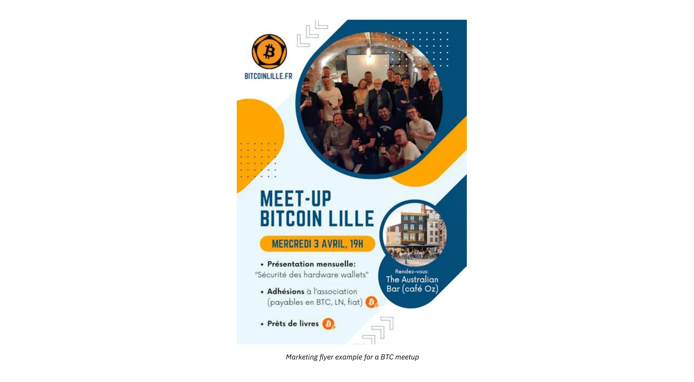

- Плакат на събитието** (за социалните медии и печат на формат A4/A3): [линк](https://www.canva.com/design/DAGBvG3rNCc/oXtNR9pduRs22AqclG4O2g/edit?utm_content=DAGBvG3rNCc&utm_campaign=designshare&utm_medium=link2&utm_source=sharebutton)

- банери за социални медии**: [линк](https://www.canva.com/design/DAGBvOXyNqw/iSJG9PbIQHgGWHz5PhlXSQ/edit?utm_content=DAGBvOXyNqw&utm_campaign=designshare&utm_medium=link2&utm_source=sharebutton)

- Съобщение за конкурса**: [линк](https://www.canva.com/design/DAGBvIjuA_w/YzSUXzOmbNV9oCma9mluOw/edit?utm_content=DAGBvIjuA_w&utm_campaign=designshare&utm_medium=link2&utm_source=sharebutton)

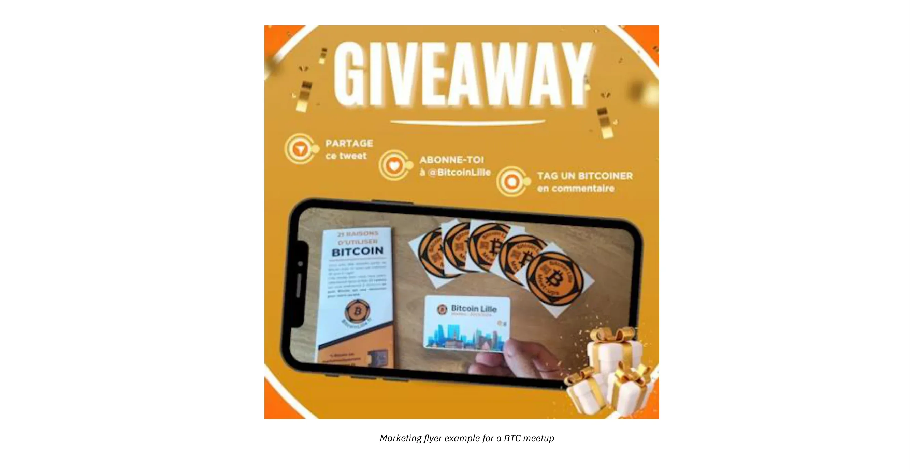

- насоки за марката** на нашата библиотека, изложени на A4 на срещите: [линк](https://www.canva.com/design/DAGBvPqL7N4/LmUItfsysypRLSOFOzBXcQ/edit?utm_content=DAGBvPqL7N4&utm_campaign=designshare&utm_medium=link2&utm_source=sharebutton)

- Презентация на PowerPoint** "Chapter 2 - Understanding Bitcoin transactions", автор @ProfEduStream: [link](https://www.canva.com/design/DAFsEcnOro8/Mz9FYdTGhsvozZOe0Y9jtw/edit?utm_content=DAFsEcnOro8&utm_campaign=designshare&utm_medium=link2&utm_source=sharebutton)

- листовка** "21 причини да използвате Bitcoin", написана от @ProfEduStream: [линк](https://www.canva.com/design/DAFtAR1NauQ/ZDwl2CchIJ9Gpb36N6-7iw/edit?utm_content=DAFtAR1NauQ&utm_campaign=designshare&utm_medium=link2&utm_source=sharebutton)

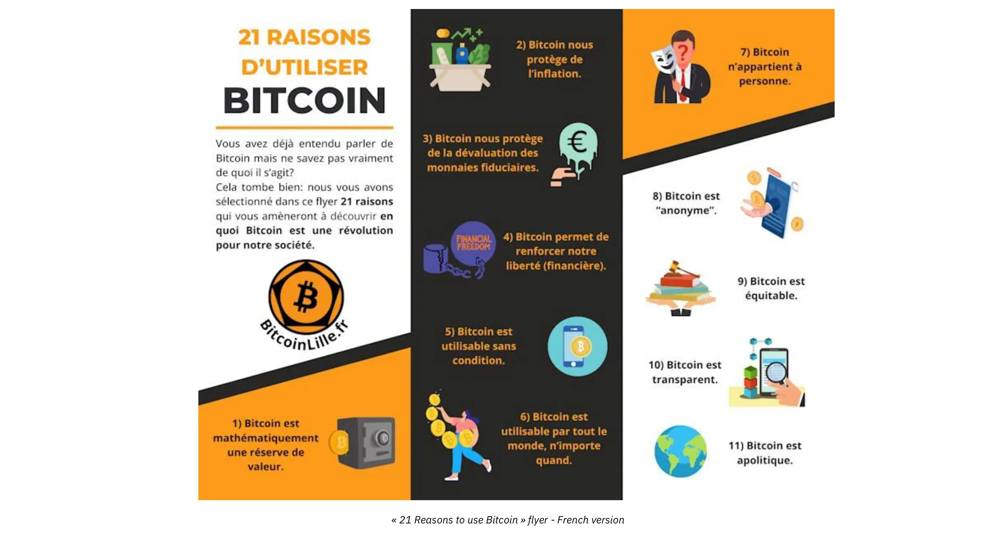

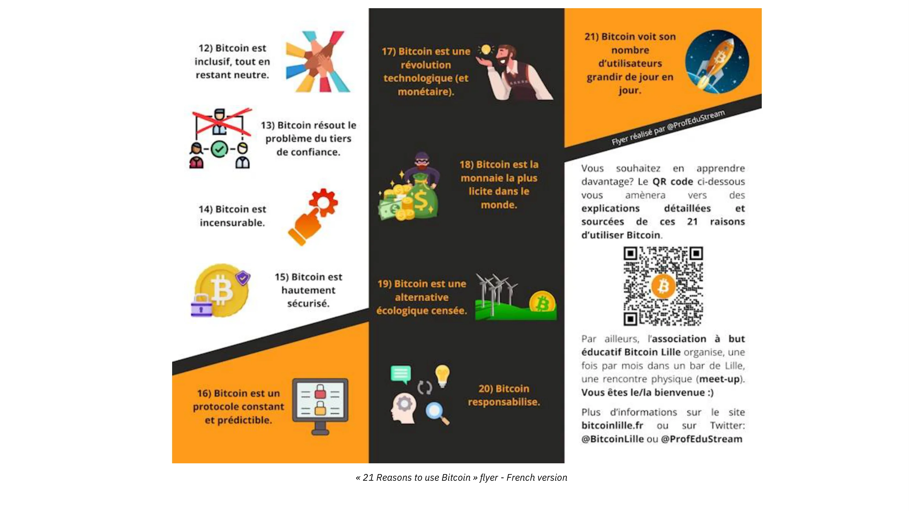

**Споделете творенията си**

Възможностите са безкрайни, а дизайнът ви ще зависи от вашите цели и визуална идентичност. Помислете за споделяне на вашите шаблони с отворен код, това спестява време на други общности на Bitcoin, които неизбежно ще се сблъскат със същите предизвикателства като вас. Споделяйки, вие помагате за ускоряване на растежа на общностите на Bitcoin навсякъде по света.

**Препоръчителни размери**

Когато създавате визуализации, винаги проверявайте изискванията за размер за всяка платформа:

| Platform | Logo | Banner | Poster / Image
| -------- | -------- | -------- | -------- |
| Telegram     | 512 x 512     | N/A     | N/A     |
| Signal     | N/A     | N/A     | N/A     |
| Twitter     | 400 x 400     | 1500 x 500     | 1200 x 628     |
| Meet-up     | N/A     | N/A     | N/A     |
| Discord     | 512 x 512     | 960 x 540     | N/A     |
| Facebook     | 512 x 512     | 851 x 315     | 960 x 720     |

Обикновено подходящи размери:

Логос: 512 x 512 пиксела

Банери: Различни в зависимост от приложението или сайта

Плакати: А4 е стандартният формат за печат

### Използване на изкуствен интелект

Въпреки че Canva предлага широк набор от инструменти за създаване на лога, плакати, банери и флаери, тя не е единствената възможност. Ако ви е по-удобно да работите с друг софтуер (като Photoshop или Illustrator), не се колебайте да използвате това, което работи най-добре за вас.

Независимо дали създавате лого на общността или подобрявате плакати, презентации или листовки, **изкуственият интелект може да бъде мощен съюзник за създаване на уникални и привлекателни визуални материали**.

За тази цел са налични редица изкуствени интелекти. Те включват

- [midjourney](https://docs.midjourney.com/docs/quick-start) (платено);
- [leonardo](https://leonardo.ai/) (безплатно, с ограничен брой акаунти);
- [copilot](https://copilot.microsoft.com/) (безплатно, с ограничен брой акаунти);
- [DALL-E](https://www.dall-efree.com/) (платен).

Наскоро се появиха много други инструменти за изкуствен интелект, така че този списък далеч не е изчерпателен.

**Пример: Създаване на футуристично лого на Bitcoin Лондон**

Ако искате да изработите футуристично лого за среща на "Bitcoin Лондон", можете да се обърнете към Copilot:

- [ ] *Промоция: Създайте лого на Bitcoin с Лондонския мост и Биг Бен на заден план. Футуристично* - [Връзка](https://copilot.microsoft.com/images/create/un-logo-Bitcoin-futuriste-avec-en-arric3a8re-plan-le-/1-6612ba1758df4384bc33c4bca00ab45b?FORM=SYDBIC)

Ако първите четири резултата не са достатъчно реалистични, прецизирайте заявката си:

- [ ] *Промоция: Направете четвъртата част много по-реалистична* - [Връзка](https://copilot.microsoft.com/images/create/un-logo-Bitcoin-futuriste-avec-en-arric3a8re-plan-le-/1-6612ba64b72d4cea9830ab7eb844f785?FORM=SYDBIC)

Последният резултат се оказа страхотен!

**Пример: Създаване на просто лого в британски стил**

За по-изчистен вид, например за стикер:

- [ ] *Промоция: Създайте логото на "London Bitcoin Meetup" в британски и изчистен стил* - [Link](https://copilot.microsoft.com/images/create/logo-for-27londres-Bitcoin-meetup27-with-a-british-a/1-6612bb9451924859a6c34b350b3a6ebc?FORM=SYDBIC)

Резултатът изглежда наистина страхотно!

**Съвети за работа с AI**

**Бъдете търпеливи:** Възможно е изкуственият интелект да не произведе точно това, което си представяте, от първия опит.

**Използвайте точни указания:** Колкото по-ясни и подробни са инструкциите ви, толкова по-добри са резултатите.

*Помолете за помощ: Ако не сте доволни, обърнете се към някой опитен в областта на графичния дизайн или инструментите за изкуствен интелект - много биткойнери с радост ще ви помогнат, понякога дори безплатно или срещу няколко sats.*

# Създаване на канали за комуникация за вашата общност Bitcoin

<partId>fc588298-6876-554c-bd57-55d182464878</partId>

## Кои канали за комуникация трябва да изберете?

<chapterId>b4f4eef6-1035-5290-848a-2b7f9391c77a</chapterId>

Както беше споменато по-горе, комуникационните канали на общността могат да се различават в зависимост от мотивацията и навиците.

Например **във Франция, Германия и Италия Telegram и Twitter са доминиращите платформи** и са се превърнали в "стандарт" за общностите Bitcoin.

За разлика от тях, в Чешката република много общности използват **Matrix**, защитен протокол за незабавни съобщения, вместо Telegram.

Съвет: Преди да изберете каналите си, **проучете какво правят близките общности**. Използвайте картата [btcmap.org](https://btcmap.org/communities/map#0/0/0/), за да видите кои платформи са най-популярни във вашия регион.

Например швейцарските общности използват предимно Telegram, Twitter и собствен уебсайт:

**Препоръчани канали за френскоговорящите общности**

**Телеграма: Инструмент №1 за комуникация, над 90% от френските срещи го използват.**

**Twitter (X)**: Основната социална мрежа, използвана от потребителите на биткойни по целия свят. Тя се използва от ~70% от френските срещи. Тя е идеална за достигане до биткойнъри.

**Meetup.com:** Платен, но широко използван (от ~30% от френските и почти всички канадски срещи) за увеличаване на видимостта извън екосистемата на Bitcoin.

**Други възможности:** ~30% имат и уебсайт; ~10% поддържат Discord сървъри или NOSTR акаунти.

Могат да се използват и други платформи като Matrix, Keet, Signal, Facebook, Instagram и LinkedIn. Внимавайте, колкото повече канали управлявате, толкова повече време ще отделяте за модериране, публикуване и поддържане на активността им.

Затова всеки, който желае да създаде общност във Франция, би трябвало да започне със създаването ѝ:

- група в Telegram;
- акаунт в Twitter.

С разрастването на общността можете да добавите още платформи и да делегирате модерацията на доверени членове.

## Създаване и конфигуриране на канал, група или супергрупа в Telegram

<chapterId>d13714ce-8f08-53e9-bedd-b6a3aaac5dad</chapterId>

Преди да създадете пространство за комуникация на вашата общност в Telegram, е важно да знаете каква е разликата между:

- канал в Telegram;
- група в Telegram;
- супергрупа на Telegram.

Силно препоръчително е да започнете с група в Telegram.

Ако е необходимо, по-късно можете да я преобразувате в супергрупа.

За уроците по-долу първоначално използвахме пакета "Telegram+" APK, който позволява по-усъвършенствана конфигурация. Не е задължително обаче да се нуждаете от него, тъй като официалното приложение Telegram е достатъчно за създаване и управление на групи, дори и чрез телефона ви:

:::video id=b1da7cb4-5fb1-4a41-a1d4-bd90686826a9:::

### Създаване на канал в Telegram

Ако искате да създадете място, където членовете ви могат да разговарят директно помежду си, да си отговарят и т.н., може би трябва да създадете група в Telegram, а не канал в Telegram!

Преминете директно към следващия раздел, озаглавен [Създаване на група в Telegram](https://planb.academy/courses/1c643dc9-a15f-4f9e-93b6-cb3c58b4ee35/d13714ce-8f08-53e9-bedd-b6a3aaac5dad).

Всъщност **каналът в Telegram е по-скоро инструмент за еднопосочно излъчване за администраторите**. Членовете не могат да разговарят свободно, могат да реагират само с емотикони (или да оставят коментари в отделни теми, което фрагментира разговорите).

**Защото общностите се нуждаят от взаимодействие и сътрудничество, канал в Telegram не се препоръчва**, ако целта ви е да изграждате взаимоотношения и да споделяте знания.

Урок за създаване на канал в Telegram:

:::video id=98be4709-d221-4030-8c31-e10113482515:::

### Създаване на група в Telegram

От друга страна, **групата Telegram е идеална за общности**: Подобно на приложенията за съобщения, като Messenger или WhatsApp, членовете могат да разговарят и да си отговарят един на друг в един общ разговор.

Какво можете да направите като администратор:

- Публикувайте и закачайте важни съобщения.
- Създайте **анкети** (полезни за определяне на дати за срещи, когато общността е нова).
- създаване на **обичайна връзка за покана** (Само ако групата е "публична", а не "частна", което е определено в настройките. Също така е удобно да имате собствена връзка за покана в Telegram, например: t.me/Bitcoin[CITY]);
- Управлявайте разрешенията, ролите и модерацията на членовете.
- Добавете профилна снимка (логото на общността) и актуализирайте името на групата.

Урок за създаване на група в Telegram:

:::video id=3d4792a7-1345-475b-93b1-b3a3945fb567:::

Забележка: Този урок е направен с помощта на Telegram+, но можете да направите всичко директно от стандартното мобилно приложение Telegram.

### Създаване на супергрупа в Telegram

Защо супергрупа?

Когато групата ви в Telegram нарасне до стотици членове, разговорите могат да станат хаотични. Това често води до пропускане на важни съобщения от членовете, като например датата на следващата среща.

Налични са няколко решения:

1. **Пиннете важни съобщения**, така че всички членове да получат известие (натиснете веднъж с пръст върху съответното съобщение, след което изберете "Pin");

2. Обмислете използването на **Discord** за множество канали за комуникация, всеки от които потребителите могат да заглушават при необходимост.

3. **Преобразувайте групата си в Telegram в супергрупа**.

Какво е супергрупа на Telegram?

Супергрупата по същество е група в Telegram с теми (подканали) в нея.

Примерни теми:

- "Важна информация": само ключови актуализации и съобщения за събития.
- "Общи": за всички дискусии на членовете.
- Специфични теми: например mining, разработване на проекти, предстоящи конференции.

Съвет: Адаптирайте темите си към нуждите на вашата общност. Пример: Абиджан Bitcoin Meet-up успешно използва този формат.

Имайте предвид, че **Супергрупите в телеграмата могат да бъдат малко трудни за използване от някои членове**. Например, не всички знаят **как да получат достъп до различните теми** (те просто трябва да докоснат логото на групата в главното меню на Telegram, за да видят пълния списък с теми). Изпращането на бърза снимка на екрана може да помогне за изясняване на всяко объркване.

Няма строго правило кога да преминете от обикновена група в Telegram към супергрупа - това зависи от нуждите на членовете ви. Добрата новина е, че можете лесно да превключвате напред-назад: просто създайте тема, за да се превърнете в супергрупа, или изтрийте всички теми с изключение на "Общи", за да се върнете към обикновена група.

Наръчник за създаване на супергрупа в Telegram:

:::video id=f78800ae-d8ca-479a-b913-99abd9916bff:::

Бърза бележка: както беше споменато по-рано, урокът по-горе беше направен на компютър с помощта на "Telegram+" APK. Днес обаче създаването на супергрупа в Telegram на телефона ви е лесно.

Просто създайте група в Telegram, отидете в нейните настройки и докоснете бутона "Теми", за да добавите теми. След като ги запазите, ще видите списък с теми, които можете да редактирате, както желаете.

Така че вече не е необходимо да изтегляте "Telegram+", освен ако не искате да имате достъп до по-усъвършенствани настройки за поверителност за вашата супергрупа.

## Създаване на група или супергрупа в Telegram

<chapterId>35e674b3-5924-50b0-98f1-83a56c9a186d</chapterId>

След като вашата група (или супергрупа) в Telegram е готова и работи, е време да **конфигурирате разрешенията и да настроите модерирането**.

Всяка общност е свободна да избере свой собствен подход, но опитът показва, че е **добре да се ограничат някои права на членовете**:

- Изпращане на проучване;
- Изпращане на файлове (за да избегнете потенциални вируси);
- Изпращане на гласови съобщения;
- Добавяне на потребители (помага за предотвратяване на нахлуването на ботове);
- Прикрепване на съобщения;
- Редактиране на информация за група.

Силно препоръчително е да **напишете ясно описание на вашата среща**, когато създавате група или супергрупа в Telegram, тъй като това е първото нещо, което потенциалните членове ще видят. Например:

> Добре дошли в телеграмата на @Bitcoin [CITY] 🔥
>

> Организираме срещи всяка първа сряда от месеца в бар [BAR_NAME], в [CITY] 🍻
>

> Вижте и другите ни социални мрежи: [LINK] 🌐

В този пример администраторите на Bitcoin Lille са персонализирали публичната си връзка в Telegram за по-лесно споделяне.

В "Настройки на групата" може да е разумно да **заповядате "Одобряване на нови членове "**.

Някои групи на Bitcoin в Telegram са станали обект на хиляди фалшиви акаунти, които имат за цел да изпращат спам или да нарушават работата на общността.

**Активирането на одобрението на членовете може да спаси групата ви от спам атака.**

В раздела за администратори можете също така да активирате функцията "Агресивен антиспам" за автоматично изтриване на подозрителни съобщения.

Това не винаги е необходимо, но може да добави допълнителен слой защита.

## Добавяне на мултифункционален бот към вашата група в Telegram

<chapterId>c61f69cc-15ec-53f1-8c02-1cea55def09e</chapterId>

**Друга възможност за конфигуриране и защита на вашата група или супергрупа в Telegram е да добавите многофункционален бот**. Това ви позволява значително да разширите функциите и възможностите за модериране на вашата група.

Използвайки **бота [@GroupHelpBot](https://telegram.me/grouphelpbot)**, най-полезните опции са:

- Команда **правила** (/rules) за показване на правилата на общността;
- Антиспам** защита за филтриране на подозрителни съобщения и акаунти;
- Персонализирани автоматични съобщения за добре дошли** за нови членове (с опция за автоматично изтриване след няколко минути)
- Защита срещу наводнения** за предотвратяване на спам съобщения
- Команда **@administrator** за бърз достъп до администраторите на групи
- Правила за блокиране** на нежелано съдържание
- Команда за свързване на групи** (/link)
- Команда **управление на разрешенията**
- Автоматично изтриване** на определени типове съобщения
- Блокиране на ботове** и **блокиране на влизане/излизане**, за да бъде групата ви защитена
- Списък на социалните мрежи на вашата **общност** (/networks)
- И много други...

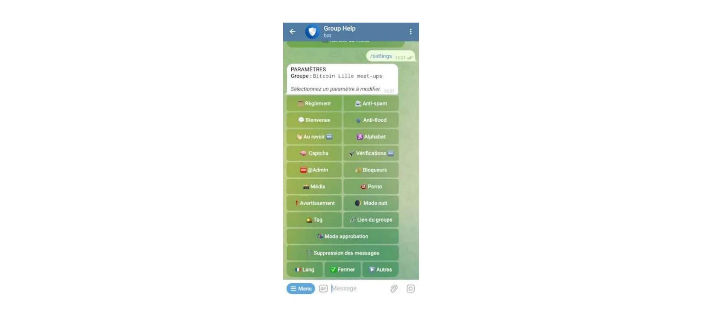

Предлагат се безброй допълнителни функции.

Професионален съвет: **Не ограничавайте прекалено разговора**.

Урок за добавяне на многофункционален бот към група или супергрупа в Telegram:

:::video id=cdbf82d6-3530-45c4-90de-593f100863bb:::

(Забележка: Целият този процес вече може да се извърши директно от телефона. Вече не е необходимо да използвате приложението Telegram+.)

## Създаване на сървър Discord

<chapterId>eef2a965-4c24-5f3a-8013-72cc7d315314</chapterId>

Когато групата ви в Telegram стане твърде голяма, трансформирането ѝ в супергрупа в Telegram може да ви помогне да организирате дискусиите.

Въпреки това, както беше споменато по-рано, **допълнителната сложност и увеличаването на броя на темите и съобщенията може да накара някои активни членове да загубят интерес**.

Защо да разгледаме Discord?

**Discord е алтернатива** на супергрупа в Telegram, тъй като позволява на потребителите да **създават конкретни стаи за текстови и гласови чатове** и да позволяват на членовете да заглушават каналите, които не ги интересуват.

Разбира се, управлението на Telegram и Discord изисква малко повече време, особено по време на конфигурирането и стартирането.

За да ви улесним, **споделяме [Discord сървър, който можете да дублирате и персонализирате](https://discord.com/template/bDY4eXXJk2C8)**:

:::video id=e647458a-a21e-44e0-bd03-20b82a871777:::

Когато е добре проектиран, сървърът на Discord може да бъде истинско предимство за вашата общност. Много биткойнисти вече използват **Discord** ежедневно, а възможността да се следят разговорите в Telegram директно в Discord (и обратно) може да спести на всички много време.

За синхронизиране на двете платформи има бот с отворен код, наречен [TediCross](https://github.com/TediCross/TediCross). Целта му е проста: автоматично препращане на съобщения от текстов канал на Discord към група в Telegram (или тема в супергрупа) и обратно.

Имайте предвид обаче, че инсталирането му не е най-лесното. За да работи ботът, трябва да поддържате команден ред (CMD) на компютъра си и понякога могат да възникнат грешки. За щастие, отстраняването им е лесно: просто рестартирайте бота и в повечето случаи всичко се връща към нормалното си състояние.

За да ви спестим време, предлагаме ви урок как да добавите този многофункционален бот към група или супергрупа в Telegram:

:::video id=6a0283f6-6d6c-4e81-8b2f-644b33c52fe6:::

## Разглеждане на алтернативни, частни и по-сигурни канали за комуникация

<chapterId>29d0aad6-0612-5dd0-bcef-7337eaf4fefc</chapterId>

Както беше обсъдено по-рано, Twitter и Telegram са най-широко използваните инструменти за комуникация за общностите на Bitcoin в Европа (ако не и в целия свят).

Въпреки това Telegram не е точно известен като най-сигурното или фокусирано върху неприкосновеността на личния живот приложение за изпращане на съобщения, а Twitter, сега X, е собственост на една от най-свободно движещите се корпорации на планетата.

Ето защо, след като основните ви канали са изградени и работата върви гладко, може да си струва да отделите време за проучване на други възможности.

През следващите месеци този курс и платформата planb.network ще предлагат уроци за използване на алтернативни протоколи като **Simplex и Element**: децентрализирани, криптирани и силно персонализирани инструменти за комуникация.

**Защо да се занимаваме с тези възможности?

Защото, също като социалната мрежа NOSTR, те осигуряват не само по-голяма неприкосновеност на личния живот, но и защита срещу цензура или произволно затваряне на вашата група в Telegram.

И наистина, какво може да бъде по-съвместимо с духа на Bitcoin от това да бъде устойчив на цензура и да бъде издръжлив по дизайн?

# Стартирайте социалните си мрежи

<partId>8ebf8cd7-9248-543f-bc27-4ec4cc03f9cf</partId>

## Значението на видимостта за разрастване на общността на Bitcoin

<chapterId>b20f12e4-c5de-5f02-80c7-b7fc6cadd3ac</chapterId>

Вашата общност е създадена и работи. Създали сте своето пространство в Telegram или Matrix... но засега сте единствените там. **Време е да съобщите на хората, че съществувате!**

Това е просто: ако никой не може да получи достъп до групата ви и да види кога ще се проведе следващата среща, вие просто ще публикувате в празнота. Ето защо социалните медии и няколко конкретни платформи, които ще разгледаме по-късно, са толкова важни за изграждането на вашата общност.

Twitter (X) се превърна в почти синоним на онлайн разговорите за Bitcoin. Той не е съвършен, далеч от това, но в момента там се събира голяма част от общността. Създаването на акаунт там е силно препоръчително.

За да се предпазят от евентуална цензура или ограничения, някои общности откриват и профил в NOSTR.

Това направи колективът FREE Madeira.

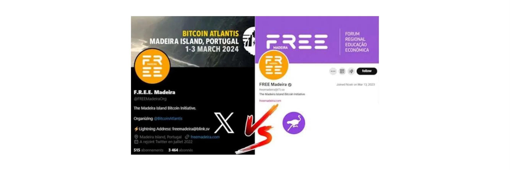

Разбира се, други платформи също могат да бъдат полезни. Facebook (с група или страница) или дори LinkedIn.

Въпреки това имайте предвид, че **колкото повече канали за комуникация и социални мрежи управлявате, толкова повече време изисква това**. Често е по-добре да се съсредоточите **на най-подходящите**, като Twitter (и NOSTR) са чудесни възможности за начало.

## Създаване на профил в Twitter

<chapterId>c8d73097-8eba-5530-918c-221002954110</chapterId>

Twitter е много лесен за използване, а за да подобрите поверителността си, трябва да коригирате няколко настройки.

**При създаването на нов акаунт в Twitter трябва да въведете четири основни елемента информация:**:

1/ ** @ в Twitter**, който определя самоличността ви и ви прави лесно откриваеми. Ако името на вашата общност е "Bitcoin [CITY]", подходящо е да изберете "@Bitcoin[CITY]";

2/ **логото и банера**, които сте създали за вашата общност или среща (вж. раздел [Създаване на лого, плакат и банер](https://planb.academy/courses/1c643dc9-a15f-4f9e-93b6-cb3c58b4ee35/3470a31f-0190-5e87-8af0-6a00e79267ef));

3/ **описанието**, което ви позволява да споделите ключова информация за вашата общност в рамките на няколкостотин знака. Например:

> Официален акаунт на общността на Bitcoin [CITY] #BTC | Срещи всяка първа сряда от месеца в [BAR_NAME] в [CITY] 🍻 | Присъединете се към нас в Telegram 🔽

4/ Под това описание е възможно да поставите **връзка**. Това може да доведе потребителите до страница "социални медии" на уебсайта на вашата общност или до канала ви в Telegram. От вас зависи да решите какво искате да подчертаете.

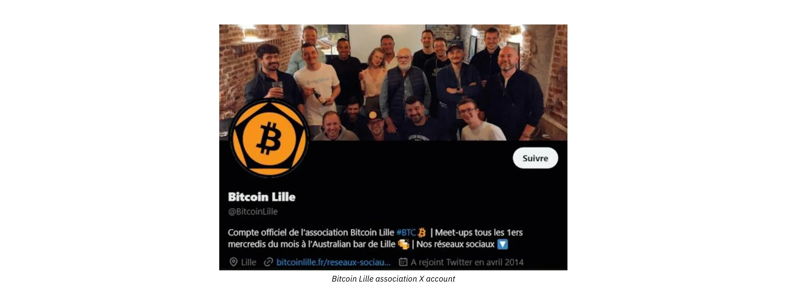

Освен това си струва да коригирате **няколко настройки за поверителност**:

- да оставите акаунта си в Twitter в режим "публичен" (публикациите са видими за всеки);
- позволи на всеки да ви намери;
- деактивирате проследяването на местоположението и споделянето на данни с други организации (в настройките за поверителност).

За всяко събитие вероятно ще използвате Twitter, за да споделяте полезна информация. Но както при повечето социални мрежи, **видимостта е всичко**.

За да ви спестим доста време, отделихме време да проучим [алгоритъма за класиране с отворен код на Twitter](https://github.com/twitter).

Ето **основните неща, върху които трябва да се съсредоточите, за да подобрите видимостта си**:

- Общи съвети:
    - Пишете туитове на езика, на който е създаден профилът ви, или на английски: писането на туитове на други езици може да намали значително видимостта ви;
    - Придържайте се към нишата си, споделяйте само съдържание, свързано с фокуса на профила ви; туитовете извън темата се наказват от алгоритъма;
    - Стремете се към 1 до 2 туита на ден;
    - Публикувайте по време на пиковите часове: Четвъртък или петък между 8 и 10 ч. сутринта обикновено са най-ефективни (проверете в профила си: Twitter Analytics).

- Когато пишете туит:
    - да добавите снимка (или дори видеоклип);
    - Използвайте само един хаштаг (обикновено най-подходящият е #Bitcoin). Ако е уместно, можете да добавите тренди хаштаг, свързан с областта на профила ви);
    - Насърчавайте общността си да взаимодейства:
        - Подобно = тегло 0,5
        - Retweet = тегло 1
        - Отговор = тегло 27 (!!)**
    - Отговаряйте на хората, които отговарят на туитовете ви** (тегло 75!!);
    - Избягвайте да поставяте връзки в основния туит: вместо това ги добавете в първия коментар;
    - Изписвайте думите изцяло, избягвайте съкращенията.

- Други съвети:
    - Пишете в Туитър за актуални теми, стига те да са в съответствие с областта на компетентност на вашия акаунт;
    - Публикувайте отново най-успешните си туитове;
    - От време на време провеждайте анкети;
    - Пишете нишки, когато е възможно;
    - Насърчавайте общността си да посещава профила ви и да ви следва.

Нещо повече, **можете да прикачите туит или тема към профила си в Twitter, за да й осигурите максимална видимост**, точно както прави общността Bitcoin Witsand в Южна Африка.

Също така имайте предвид, че е възможно да останете вписани в два акаунта в Twitter едновременно, както на телефона, така и на компютъра. Това е изключително удобно, ако искате лесно да превключвате между личните си акаунти и акаунтите на общността.

Само бъдете внимателни... случайното публикуване на снимка от акаунта на общността може да се случи по-бързо, отколкото си мислите!

И накрая, въпреки че потребителското ви име "@Bitcoin[CITY]" е уникално и вече ваше, е разумно да очаквате фалшиви или имитиращи акаунти. Обмислете също така да се регистрирате:

- @Bitcoin_[CITY]
- @[CITY]Bitcoin
- @[CITY]_Bitcoin

По този начин значително ще намалите вероятността някой да се представи за вашата общност.

Урок за създаване на акаунт в Twitter:

:::video id=4648976f-41ec-499a-b7ec-a53e796f71b4:::

## Приближаване до съседните срещи

<chapterId>12a21c3b-235a-5292-8209-67bf60f61e49</chapterId>

След като каналите ви за комуникация и социалните мрежи са създадени и отразяват визуалната идентичност на общността ви, е време да започнете да следвате правилните хора.

В Twitter започнете да следвате ключови акаунти, които популяризират Bitcoin в световен мащаб, като [@Bitcoin](https://twitter.com/Bitcoin) и [@planb_network](https://twitter.com/planb_network), както и инициативи като [@FBCEglobal](https://twitter.com/FBCEglobal). Можете също така да ретуитнете известния туит на [@halfin](https://twitter.com/halfin) "Running Bitcoin" от 11 януари 2009 г. И което е по-важно, **следвайте акаунтите на общностите и срещите на Bitcoin в собствената си страна**.

Това създава **възможности да се следвате взаимно, да се отбелязвате взаимно и да подобрявате общата видимост**. Това вече е обичайна практика сред ~50-те общности Bitcoin във Франция, инициативите "Satoshi Spritz" в Италия и групите "Einundzwanzig" в Германия.

Макар да изглежда тривиално за някои, **следването на профилите на местните общности и инициативи може да доведе до сътрудничество или дори партньорство**. Например общностите Bitcoin Лиеж и Bitcoin Лил (а също и Bitcoin Екс и Bitcoin Марсилия) се свързаха по този начин, което доведе до съвместното им организиране на годишна среща.

Друг добър пример са ястията на **Cercle du Coin**.

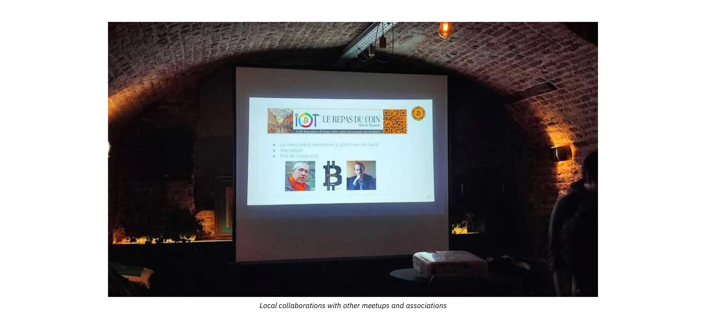

Във Франция може да е уместно да **следвате инициативи като [@KonsensusFR](https://twitter.com/KonsensusFR), [@bitcoinpointfr](https://twitter.com/bitcoinpointfr), [@DecouvreBitcoin](https://twitter.com/DecouvreBitcoin) и [@btcmap](https://twitter.com/btcmap)**. Това, разбира се, са само предложения и всяка общност е свободна да прави каквото желае, при пълна децентрализация и автономност.

Както беше споменато по-горе, целта на взаимното следване е да се изгради взаимна видимост. Колкото повече популяризирате вашата общност и тези от вашия регион/страна в социалните мрежи, толкова повече хора ще говорят за вас. Колкото повече хора ще говорят за вас, толкова по-вероятно е те да посетят вашите събития.

Затова харесването и ретуитването на публикации от други общности може значително да подпомогне тяхното развитие... и вашето.

Можете също така да предложите на организаторите на **срещи и на биткойнерите, които управляват общности, да се срещат два или три пъти годишно чрез видеоконференция, за да прегледат напредъка на националните проекти и свързаните с тях общности. Това може да се случва и по време на лични събития.**

Целта е проста: да се събере обратна връзка от всички, да се обсъди как се развиват общностите, да се споделят успешни идеи и проекти и да се предлагат решения, когато е необходимо. Писмено резюме на срещата може да бъде споделено след това с организаторите на общности във вашата страна, които не са могли да присъстват.

## Btcmap.org

<chapterId>365f43d4-7b2c-5961-a184-157b8c1a0116</chapterId>

На този етап вашата общност вече е създадена и функционира. Остава само да посрещнете още заинтересовани хора и да й помогнете да се разрасне.

Но не можете да продължите напред, без да знаете, че **има платформи, в които биткойнерите могат да намерят общности и срещи близо до тях**. Ето защо е важно да отделите няколко минути, за да поискате включване в тези сайтове.

Те включват:

- [Btcmap.org](https://btcmap.org/)** - уебсайт с две карти, които се актуализират ежедневно: **[световна карта на предприятията, приемащи Bitcoin](https://btcmap.org/map)** и **[карта на световните общности](https://btcmap.org/communities/map)**. Много биткойнисти редовно проверяват тези карти, независимо дали пътуват или се занимават с ежедневието си, за да се запознаят с нови хора или да намерят места, където да похарчат своите sats. Btcmap е глобалната референция и включването на вашата общност в нея е от съществено значение за видимостта**
- [BitcoinerEvents](https://www.bitcoinerevents.com/) - уебсайт, създаден от биткойнери за биткойнери. **Той ви позволява да публикувате предстоящите събития на вашата общност**. Във Франция обаче той все още не се използва широко.
- в зависимост от вашата страна може да има и други местни инициативи. Във Франция, например, има [Bitcoin.fr](https://Bitcoin.fr/events/categories/evenements/), където всеки месец се публикуват десетки събития, свързани с Bitcoin**. Така че, ако все още не сте ги последвали в Twitter или не сте се свързали с тях, за да споделите информация за вашата общност и събития, сега е моментът! **За да помогнете за поддържането на френския календар на събитията в актуално състояние, би било чудесно, ако всички френски общности на Bitcoin придобият навика да:**
    - споменаване на @bitcoinpointfr в Twitter за всяко ново събитие на общността
    - прикрепяне на нови съобщения за събития в тяхната група в Telegram.

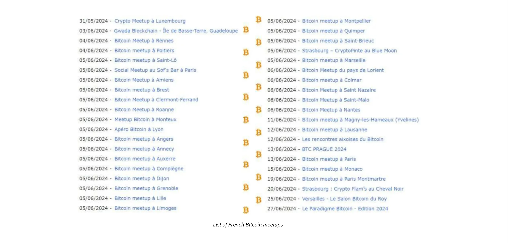

Други платформи също могат да повишат видимостта ви. *една от тях е *[Meetup](https://www.meetup.com/)** - уебсайт (и приложение за телефон), в който можете да създадете събитие и да намерите други хора наблизо.

Тя струва около 8 евро на месец (или около 90 евро на година), което може да е скъпо за малка, неструктурирана общност. Въпреки това Meetup се използва широко в някои страни, особено в Канада и САЩ, и е полезен за управление на регистрациите.

По подобен начин **[Orangepillapp](https://www.orangepillapp.com/)** е платено мобилно приложение (50 000 sats/година или 200 000 sats за доживотен достъп), което помага на биткойнистите да се срещат.

Въпреки че последните две платформи могат да помогнат за увеличаване на видимостта, те не се препоръчват при стартиране на общност, просто защото не са безплатни.

**Начинайте с вписване в [btcmap.org](https://btcmap.org/), [BitcoinerEvents](https://www.bitcoinerevents.com/), а за френските общности - в [Bitcoin.fr](https://Bitcoin.fr), което е повече от достатъчно**.

Поздравления! Вашата **общност е създадена**, вашите **визуални материали са готови**, вашите **цели са поставени**, вашите **канали за комуникация са създадени**, вашите **социални мрежи са пуснати** и вашата **стратегия за видимост е определена**.

След като към вас се присъедини малка група биткойнери, е време за следващата стъпка: да организирате първата си среща на Bitcoin.

# Организиране на среща на Bitcoin

<partId>c009d2a6-40ce-583b-bd24-fdfd1fea262e</partId>

## Защо да стартирате редовна среща с вашата общност?

<chapterId>ed8e471c-3b99-57e2-a042-2d4e8a40b137</chapterId>

След като социалните мрежи и каналите за комуникация на общността ви са стартирани, е време да заявите присъствието си в тези платформи. Насърчавайте новите членове да се представят и постепенно да се включат в разговора.

Това ще ви освободи време, което можете да използвате, за да помислите за създаване на някаква среща. Това ще стане още по-подходящо, когато започнете да усещате истинско вълнение в общността си.

Както беше споменато по-рано, **срещата на Bitcoin може да се разглежда като следващото "ниво" за дадена общност**. От една страна, тя позволява на **членовете да се срещнат лично**, а от друга, помага за **обучението на новодошлите, които се интересуват от тази екосистема**.

Събитие като това ви позволява да **създадете шум около Bitcoin** във вашия град, който може да се разраства с времето, когато вашата общност се заеме с проекти.

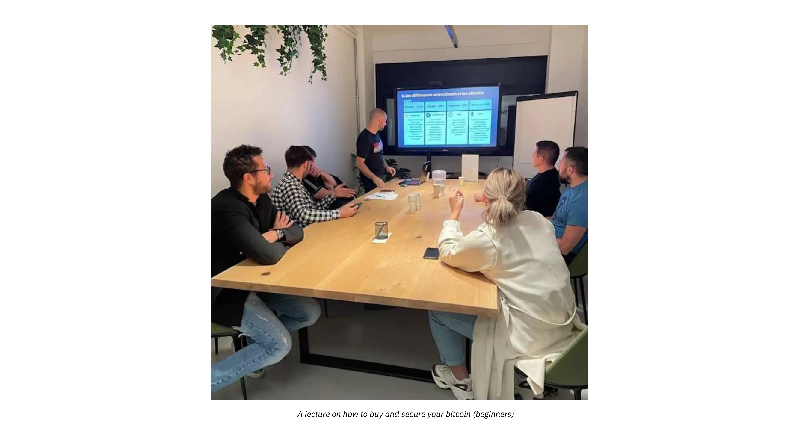

Разбира се, колкото по-големи са целите ви за развитие на общността, толкова повече време ще трябва да инвестирате вие и вашите членове.

Ето защо е важно да **започнете с поставянето на постижими цели за вашата среща**.

## Първата среща: кога и защо?

<chapterId>f3f8a614-cfb4-5994-a2e8-d56e6f8e3347</chapterId>

Можете да стартирате среща само няколко седмици след създаването на общността си.

На този етап обаче групата ви вероятно все още ще е малка, което означава, че има вероятност никой да не се появи.

По-добре е да организирате среща, след като имате поне няколко активни членове във вашите канали за комуникация, например няколко десетки. Това може да се случи бързо, но зависи и от личността на хората.

След като усетите тази искра, предложете лична среща. Ако другите проявят интерес, остава само да **определите дата за първата ви среща**.

Вместо да избирате датата сами, обикновено е най-добре да **създадете анкета около десет дни предварително с няколко възможни дни и часове**. По този начин можете да използвате гласовете, за да увеличите посещаемостта, да предизвикате вълнение и да използвате времето си по най-добрия начин.

Най-добре е да не се впускате в срещата с определени очаквания за това как ще протече тя, колко души ще дойдат или какви теми ще се обсъждат. Така се избягва разочарованието и се предотвратява усещането на участниците за натиск.

Оставете нещата да текат естествено, може би на чаша питие. Разговорите трябва да се случват лесно и ако е необходимо, можете внимателно да насочите дискусията обратно към Bitcoin, ако тя започне да се отклонява.

Ако искате да се подготвите за по-тихите моменти, можете да планирате няколко дейности или точки за разговор, като например:

- показване на **[Mempool](https://Mempool.space/)** на компютър или смартфон;
- носене на книга;
- да донесете **Nerdminer**, Bitaxe, FPGA или дори ASIC;
- с листовка **Bitcoin**;
- разработване на визуален проект или лого на Bitcoin за вашата общност;
- играете **[Bitcoin игра с карти](https://www.Maximalist.ovh/accueil/20-game-le-coin-de-table.html)**;
- показваща **[btcmap.org](https://btcmap.org/)** картата на общностите и търговците;
- изпращане или получаване на Bitcoin с помощта на **Мълния**.

Когато срещата ви е в самото начало, често не е подходящ момент за официална презентация. Ако присъстващите са малко, обикновено най-добре работи открита и непринудена дискусия.

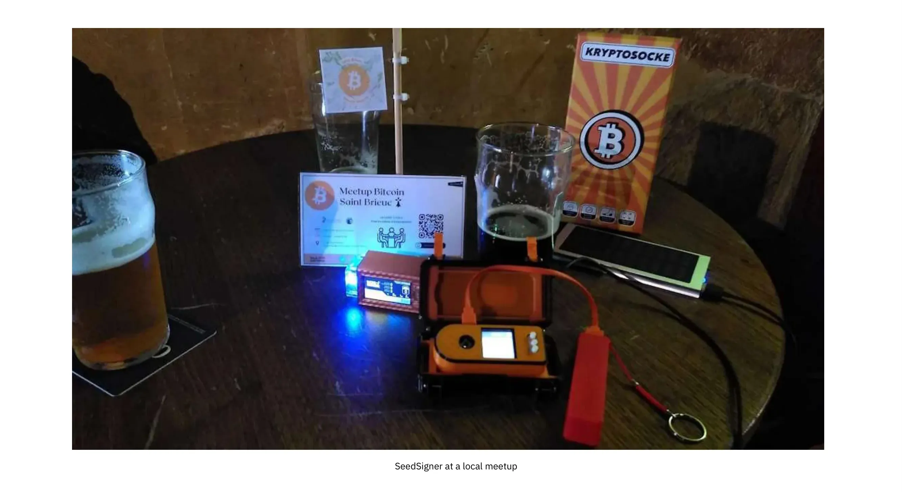

След първата среща вероятно ще искате да планирате още една. Докато общността ви е все още малка, най-добре е да продължите да избирате дати чрез анкети, например веднъж месечно или на всеки два месеца. Можете да обсъдите това в каналите си за комуникация.

Ако се сформира редовна група от биткойнери и заинтересовани участници, има смисъл да се определи повтарящ се график по две причини:

1) това улеснява всички да планират предварително;

2) помага за **утвърждаване на "навик "**. Дори ако някой спре да проверява редовно каналите ви, той ще знае кога се провежда срещата и ще може да се отбие както обикновено.

Тази втора точка е една от причините **във Франция повечето срещи да се провеждат в първата сряда на всеки месец** (вж. инициативата "посланици", стартирана от [DecouvreBitcoin](https://decouvrebitcoin.fr/) през 2022 г.).

В Германия и Италия няма фиксиран национален ден.

Провеждането на всички срещи в цялата страна в един и същи ден обаче създава проблем с централизацията: това пречи на биткойнерите да посещават събития в близките общности и може да породи опасения за сигурността. Разговорите с организаторите на съседни срещи могат да ви помогнат да се споразумеете за добра организация.

С разрастването на общността ви и привличането на повече хора за срещи можете да:

- поставяте конкретна цел за всяка среща;
- или дори **да добавите второ събитие всеки месец**.

В първия случай, като се имат предвид предпочитанията на всички, ясната цел може да гарантира, че участниците ще си тръгнат, след като са научили нещо ново, и да поддържа разговорите фокусирани върху Bitcoin.

Във втория случай второто месечно събитие може да бъде посветено на конкретна тема, като например сесии за начинаещи или семинари (mining, Lightning, инсталиране на възли и др.).

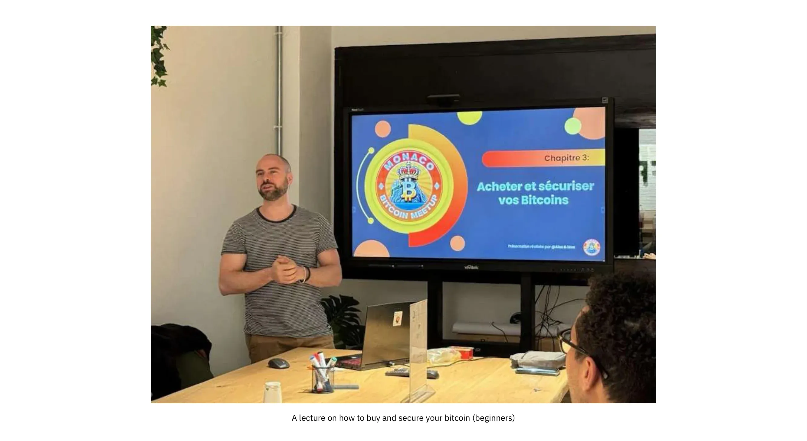

Имайте предвид, че **това изисква повече организация и повече време**. За щастие, в [част 6/8 от този курс](https://planb.academy/courses/1c643dc9-a15f-4f9e-93b6-cb3c58b4ee35/3213d87a-1998-5972-ab93-97a5769ba279) ще намерите редица ресурси с отворен код за многократно използване, които ще ви помогнат.

Във всеки случай всичко зависи от краткосрочния, средносрочния и дългосрочния план за действие, който вие или вашата общност сте си поставили.

## Търсене на местоположение

<chapterId>405d389e-6a32-5777-af8d-293380d2e8fd</chapterId>

Намирането на място за провеждане на събития често не е лесна задача. На всичкото отгоре е от съществено значение това място да бъде **разположено в града на вашата общност**.

Има няколко критерия, които трябва да се вземат предвид, включително:

1) **Разположение**: лесно ли се стига до него с обществен транспорт? С кола? Има ли възможност за паркиране?

2) Приятно ли е мястото на провеждане на събитието и не е ли твърде шумно? Търсите ли официална обстановка (място за съвместна работа, заседателна зала) или нещо по-неформално (бар, ресторант)?

3) Има ли достатъчен капацитет да ви приеме, дори в нощта на мач от ръгбито или Шампионската лига?

4) Разполага ли с видеопроектор и тихо място за презентации?

5) И накрая, ако това е бар или ресторант, предлага ли менюто по нещо за всеки?

В допълнение, ето три важни точки, които трябва да имате предвид:

- Ако планирате да разделите вечерта на две части: първо презентация на официално място, за да помогнете на всички да се съсредоточат, а след това да се преместите в бар или ресторант, за да продължите в по-спокойна атмосфера, опитът показва, че смяната на местата по средата на вечерта често кара някои участници да напуснат по време на почивката. Затова този подход не се препоръчва.
- На първите ви срещи присъстващите вероятно ще бъдат малко и вероятно няма да провеждате официални презентации. В този случай не е необходимо да се представяте на собственика или да обяснявате целите си. Въпреки това, **когато срещите станат редовни и добре посещавани, си струва да го направите, за да покажете професионализъм и да изразите желанието си да се връщате всеки месец**. Това може да доведе до много дискусии (автоматични месечни резервации, безплатни напитки и/или табла с храна, отстъпки, разговори за Bitcoin, приемане на плащания от Bitcoin и т.н.). Очевидно е, че ако специално търсите място с видеопроектор, за да правите презентации, изглежда необходимо да поискате среща (лице в лице или дори по телефона) със собственика и/или управителя, за да представите проекта и целите си.

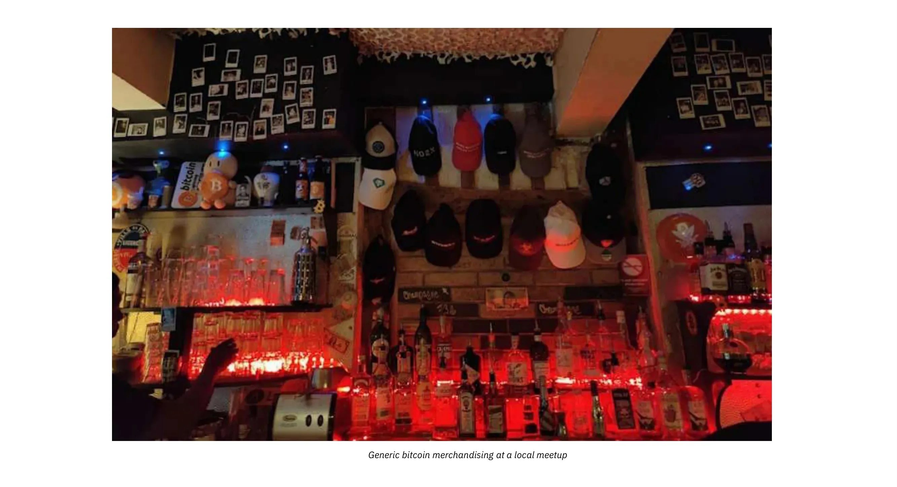

- накрая, някои общности **искат да провеждат събитията си само на места, които приемат плащания по Bitcoin**, което е разбираемо. В този случай е добре да **започнете с търсене на предприятия, приемащи Bitcoin, във вашия град** (на [btcmap.org](https://btcmap.org/map/)и да се свържете с тях, за да видите дали отговарят на вашите критерии. Ако няма нищо подходящо, можете да опитате да приемете нови търговци, но очаквайте много откази, което може да бъде обезкуражаващо. Ето защо често е най-добре да не си поставяте тази цел от самото начало, а да я обмислите, след като общността ви е добре установена и имате достатъчно "огнева мощ"

Освен това, когато стартирате срещата си, не се колебайте да **сменяте местата на провеждане през първите няколко месеца**. Това ще ви помогне да **изградите взаимоотношения с различни мениджъри**, да проучите различни атмосфери и да съберете информация за потенциални бъдещи домакини.

По-късно, когато групата ви се разрасне, можете дори да отделите един следобед, за да посетите няколко предприятия и барове и да попитате дали разполагат с помещение, подходящо за провеждане на месечните ви събития и срещи.

## Преди срещата

<chapterId>c5218943-580d-5efc-89ed-6b5d728816d6</chapterId>

Планирате да организирате среща през следващите седмици?

Предлагаме ви контролен списък, който ще ви помогне да се подготвите:

1/ **Потвърждаване на мястото на провеждане**

Свържете се с мястото, където ще се проведе събитието, и го резервирайте за очаквания брой участници.

2/ **Оповестяване на събитието**:

    - Споделете датата, часа и местоположението в социалните мрежи и други канали за комуникация. Ако е необходимо, включете връзка за регистрация.
    - Създайте специален визуален материал (например плакат в Canva, вж. част 2/8 "[Проектиране на идентичност за вашата общност Bitcoin](https://planb.academy/courses/1c643dc9-a15f-4f9e-93b6-cb3c58b4ee35/b48a18cc-afdf-5216-802c-32647b5cd8a3)").
    - Увеличете максимално видимостта, като прикачите съобщението в Telegram и Twitter и използвате споменаване "@everyone" в Discord.
    - Публикувайте съобщения 7 до 10 дни преди събитието, за да могат участниците да планират предварително.

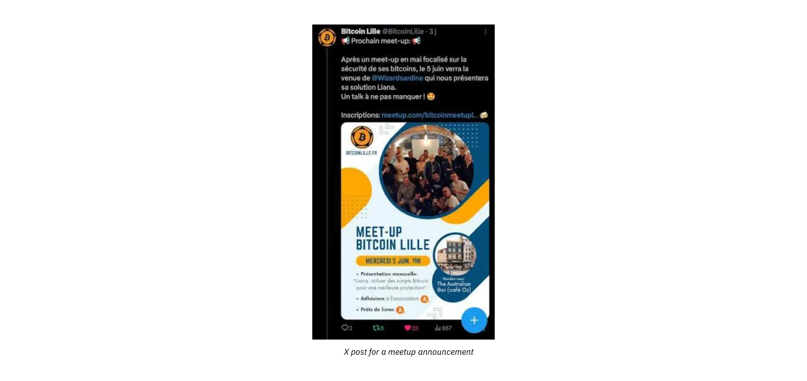

3/ **Припомнете на аудиторията си**

Два-три дни преди събитието споделете и препратете съобщенията си в Twitter, за да увеличите видимостта.

4/ **Актуализиране на мястото на провеждане**

В деня преди събитието (или два дни преди него) проверете регистрациите си и уведомете мястото на провеждане на събитието за очаквания окончателен брой участници.

Допълнителни стъпки, за да се отличи събитието ви:

- Отпечатване на листовки и/или плакати
- Изготвяне на презентация по конкретна тема
- Организиране на дейност или семинар

## Денят на срещата

<chapterId>cf60067b-591f-5fdf-9b9e-d442aad0e8f9</chapterId>

Големият ден е тук! Един-два часа преди началото на събитието изпратете напомняне по каналите за комуникация на вашата общност. Потвърдете отново началния час и уведомете участниците как да ви разпознаят, например като споменете, че ще носите тениска и шапка на Bitcoin.

С разрастването на срещите ви и с посрещането на повече от 20 души подготовката на мястото ще става все по-важна.

Ето какво да направите:

1) **Пристигнете по-рано**, за да подготвите нещата.

2) **Определете пространството** според вашите нужди и възможностите на мястото. Ако сте само шестима души, не е необходима голяма подготовка. Но щом достигнете 10-20 участници, изцяло седящата подредба може да ограничи взаимодействието. В такъв случай изберете стояща подредба с добре разположени високи маси, ако има такива, като все пак осигурите няколко (за предпочитане високи) стола. Ако е планирана презентация, запазете стоящата подредба през по-голямата част от вечерта и донесете столове непосредствено преди началото на разговора.

3) Добавете малки персонализирани елементи:

    - Поставете плакат на входа, за да посочите местоположението си (използвайте Patafix и първо получете разрешение от мястото на събитието).
    - Поставете вътре плакати на тема Bitcoin (бяла книга на Bitcoin, харта на общността, текущи проекти и др.).
    - Поставете на масите стикери, листовки или материали за разговори, например: Nerdminer, хардуер wallet, лаптоп, показващ своя миньор Mempool, ASIC или метална резервна плоча за частни ключове.

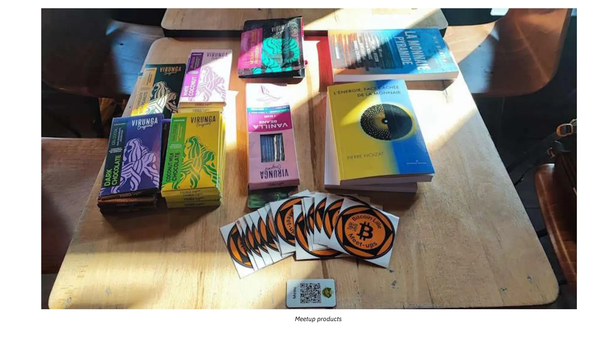

Ако очаквате само няколко участници и все още не сте изградили отношения с управителите на мястото на събитието, избягвайте да донасяте и показвате цялото си оборудване веднага. След като установите доверие, ще имате по-голяма свобода да подредите пространството по свое желание.

Накрая вземете питие и изчакайте хората да дойдат. И помнете: не се обезкуражавайте, ако никой не дойде от първия път. За всеки случай си носете книга или видео, което да гледате.

## След срещата

<chapterId>3e881af9-9c09-5721-81ee-c5cda3b109c5</chapterId>

Когато срещата приключи, персоналът на мястото на събитието трябва да почисти. Преди да си тръгнете, предложете да помогнете на сервитьорите или управителите. Това може да е толкова просто, колкото да съберете всички чаши на една маса или, ако сте близо до бара, да ги върнете преди да си тръгнете.

След като се приберете у дома, вероятно още дни наред ще мислите за Bitcoin. Това е идеалният момент да прецените пулса на вашата общност и да съберете обратна информация от участниците. Можете да:

- Публикувайте благодарствено съобщение в каналите си за комуникация и споделете всички връзки или ресурси, споменати по време на събитието.
- Поканете присъстващите да предложат подобрения за следващата среща.
- Започнете да планирате следващото си събитие.

След това ще имате на разположение няколко седмици, за да разработите нови идеи, визуализации или проекти, с които да направите следващата среща още по-добра.

## Значението на включването и задържането на участниците

<chapterId>f5355e35-4b07-527c-88a3-8535cba7592c</chapterId>

Рим не е построен за един ден, както и вашата общност. Инерцията около Bitcoin се дължи на редовните срещи и събития.

За да се случи това, е необходимо едно нещо: **поддържайте участниците ангажирани**.

Може да се започне с малка група от запалени биткойнери, чиято цел е да се събират редовно и да говорят за Bitcoin. С течение на времето, в зависимост от наличността и интересите на всеки човек, можете да **споделите определени организационни задачи с групата** или да поканите основните **членове да поемат конкретни проекти**. Те могат да бъдат уникални за вашата общност, за вашите срещи или за вашия град или дори да бъдат вдъхновени от многото инициативи, предложени в [част 6/8 от този курс](https://planb.academy/courses/1c643dc9-a15f-4f9e-93b6-cb3c58b4ee35/3213d87a-1998-5972-ab93-97a5769ba279). **Това не само насърчава ангажираността на основните ви членове, но и помага на общността ви да расте и процъфтява**.

С напредването на срещите ви ще се появят нови лица: хора, които са купували BTC и/или алткойни в предишни цикли, технологични ентусиасти, които искат да задълбочат познанията си, или напълно начинаещи, които се интересуват от тази нецензурируема, децентрализирана, прозрачна и справедлива платежна система, която работи без условия и без доверени трети страни.

За да сте сигурни, че всички се чувстват включени във вашите събития, се съсредоточете върху два основни аспекта:

- Социално включване**: Всеки, който присъства, трябва да се чувства добре дошъл. Положете усилия да поздравите новодошлите, да ги попитате защо са дошли и да ги запознаете с другите. Когато хората се чувстват включени, е по-вероятно да се върнат и може би дори да помогнат за организирането на бъдещи събития.
- Търпение и откритост**: Това изисква време и мотивация. Ако разговаряте с ангажиран shitcoiner (или още по-лошо, с максималист в XRP), може да се изкушите да го отхвърлите. Но като се включите в разговора, може да изясните недоразуменията или погрешните разсъждения. Ако те са готови да слушат, може би ще са готови наистина да разберат Bitcoin.

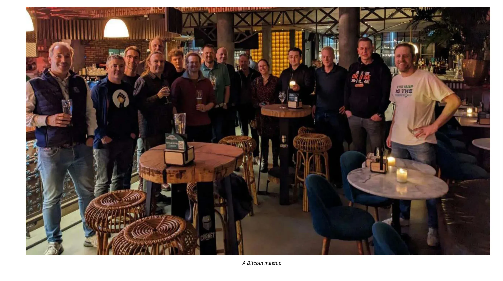

От практическа гледна точка помислете за цялостното преживяване на събитието:

- Беше ли приятна **пътеката**?
- Беше ли **лесен за достъп?**
- Защо някои хора се регистрираха, но не се появиха?
- Какви дискусии бяха проведени? Бяха ли дискусиите твърде технически за начинаещите?
- Бяха ли дискусиите твърде алкохолни?

Всеки участник има собствена индивидуалност, цели и интереси, така че преживяванията му ще бъдат различни. Но когато мястото е подходящо, публиката е отворена и намеренията са искрени, има всички основания срещата да бъде успешна.

Изграждането на среща изисква време, но преди всичко изисква организация. Това е човешки проект и той ще работи и ще се развива в дългосрочен план само ако е добре планиран, отворен и приобщаващ.

В крайна сметка вие решавате докъде трябва да стигне понятието "отворен и приобщаващ". Само не забравяйте: един shitcoiner често е просто един bitcoiner в процес на създаване.

# Примери за проекти и инициативи

<partId>45b3bc40-1c31-583e-8411-2662e6efd765</partId>

## Защо да отидете по-далеч от това да пиете бира?

<chapterId>3213d87a-1998-5972-ab93-97a5769ba279</chapterId>

С напредването на блоковете вашата общност ще се развива. Нови лица ще се присъединяват, други ще се отдалечават, но водещият принцип трябва да остане същият: развивайте екосистемата Bitcoin и укрепвайте връзките между членовете.

Съществуват много проекти и инициативи, които могат да бъдат реализирани. Тази глава предлага неизчерпателен списък с идеи, които могат да бъдат осъществени в рамките на дадена общност или по време на среща. Чувствайте се свободни да изберете тези, които ви вдъхновяват, и дори да допринесете със свои собствени идеи за този курс [като направите "Pull Request" в GitHub](https://github.com/PlanB-Network/Bitcoin-educational-content).

Преди да се потопим в темата, нека да се върнем към един въпрос, споменат по-рано.

Когато организирате среща на Bitcoin, се запознавате с нови хора. Социалното взаимодействие е от съществено значение, а бирата (или алкохолът като цяло) може да помогне за създаването на празнична атмосфера. Но си струва да имате предвид, че:

- Алкохолът влошава когнитивните способности, като мислене и разбиране, което може да затрудни участниците да следят сериозни дискусии или презентации.
- Алкохолът може да се превърне и в ритуал за утеха: всеки месец споделяте своя "момент Bitcoin" с приятели на чаша питие. Макар че това е чудесен начин да се свържете, наистина ли пиенето на бира е основната цел на вашата среща? Или предпочитате да обменяте изследвания, да се учите от другите и да помагате на новодошлите да открият Bitcoin?

Всеки има свои предпочитания, убеждения и характер. Тук не става въпрос за оценяване на една среща спрямо друга. И все пак, макар че често на по бира говорим за промяна на света, революциите не започват и не се развиват по този начин.

Важното е просто да го осъзнаете.

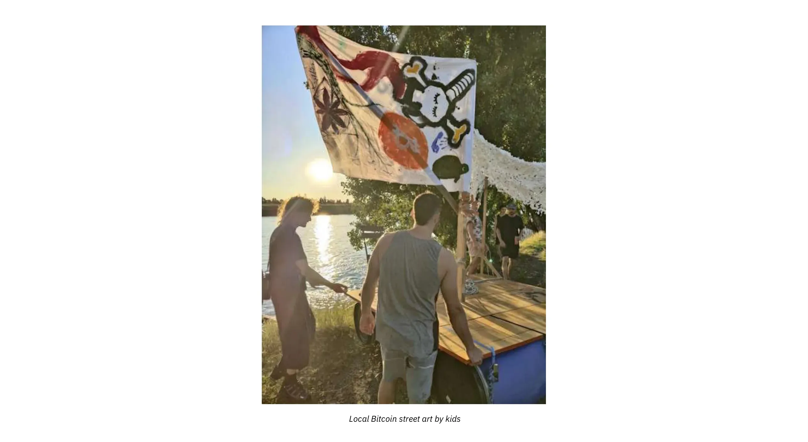

## Организиране на тематични срещи с годишна прогресия

<chapterId>46afdbcc-a775-5c16-b20a-34956690d58f</chapterId>

След като създадете основна група от около десет души, можете да започнете да добавяте презентации за всяко събитие. Те могат да следват предварително обявена тема или да бъдат напълно независими една от друга.

Когато планирате презентации или семинари, е полезно да създадете ясна, добре структурирана последователност. Целта е **поетапно** да се обхванат основните концепции на Bitcoin, като се даде на участниците пълна представа за темата от различни гледни точки.

През лятото на 2023 г. във Франция организаторите на срещи работиха по **годишна прогресия**.

Освен голямата си образователна стойност, този подход дава възможност за споделяне на документи с отворен код и диапозитиви между групите, като постепенно се изгражда обща библиотека с ресурси. Инициативата е добре приета и се очаква да се разрасне през следващите години.

По-долу е представен графикът на френските срещи за периода 2023-2024 г. За всяка тема са налични презентация с отворен код и видеоклип, които могат да ви дадат идеи за теми, които бихте могли да включите в собствените си събития.

Допълнителни материали, които могат да се редактират, могат да бъдат намерени и в [Bitcoin Teaching Toolbox](https://planb.academy/fr/resources/bet)!

| Month | Theme | Video | Editable Resource |
| -------- | -------- | -------- | --- |
| September     | Chapter 1: What is Bitcoin?     | [	YouTube link](https://www.youtube.com/watch?v=CSjuBqrl4t8)     | [Editable PowerPoint](https://www.canva.com/design/DAFu0d5Jd7M/9gAWDAOSS6LDkWENuZjYgw/edit) |
| October & November| Chapter 2: Understanding Bitcoin Transactions     | [YouTube link](https://www.youtube.com/watch?v=inFnR-3NsdM)     | [Editable PowerPoint](https://www.canva.com/design/DAFsEcnOro8/Mz9FYdTGhsvozZOe0Y9jtw/edit) |
| December     | Chapter 3: Understanding the Lightning Network     | [YouTube link](https://www.youtube.com/watch?v=hHz-ALx8D9w)     | [Editable PowerPoint](https://www.canva.com/design/DAF4YPSNnR8/HKp4Vmcno8eMtVWnZmFtcw/edit) |
| January     | Chapter 4: What is Mining?     | [YouTube link](https://www.youtube.com/watch?v=QyHZ3CVI_OI)     | [Editable PowerPoint](https://www.canva.com/design/DAF5DE6iBEM/tsy8E3oBebUnsR0kj53vvQ/edit) |
| February     | 	Chapter 5: Running a Bitcoin and Lightning Node    | [YouTube link](https://www.youtube.com/watch?v=RRYK-usg-OY)     | [Editable PowerPoint](https://www.canva.com/design/DAF55FU6HI0/sQ0lacRJblqrhn_9Xk1yDg/edit) |
| March     | 	Chapter 6: Using the Lightning Network in Daily Life    | [YouTube link](https://www.youtube.com/watch?v=o2BS4xjei8M)    | [Editable PowerPoint](https://www.canva.com/design/DAGAcJMw7lw/-haMNnHnwj5vpDAy8MDowA/edit) |
| April & May    | Chapter 7: Securing Your Bitcoins      | [YouTube link](https://www.youtube.com/watch?v=fHExPbhM0Hg)    | [Editable PowerPoint](https://www.canva.com/design/DAGDz3Nq4e0/D3uG-4w9FN6OhUq-VXzhfg/edit) |
| June     | 	Chapter 8: What is Multi-Sig?     | [YouTube link](https://www.youtube.com/watch?v=Me5489mpoxA)     | [Editable PowerPoint](https://www.canva.com/design/DAGLMtQT6sg/rYIxr4ldUJ0jTelNf-Pj8Q/edit) |
| July     | 	Chapter 9: Understanding the Bull Run and How to Prepare    | [YouTube link](https://www.youtube.com/watch?v=7RA-gnCJWyM)     | [Editable PowerPoint](https://www.canva.com/design/DAGJQkiZ_YA/9lUluP9RZ0eeA_e61mk9Hw/edit) |
| August     | Chapter 10: The Taxman is Never Far Away   | [YouTube link](https://www.youtube.com/watch?v=oY4NwonGDm0)     | [Editable PowerPoint](https://www.canva.com/design/DAGQhx7Yc_c/7mRhb_vlgnhSgxd1FtjK8w/edit) |

Глави 2 и 7 могат да бъдат разделени на две по-кратки презентации, за да не се претоварват участниците. Провеждането им в една сесия обаче освобождава място в календара за специални дейности, като например съвместни срещи със съседни групи, викторини или семинари.

**Свободно можете да използвате, адаптирате и споделяте тези ресурси, като не забравяте да посочите оригиналните автори, ако използвате отново техните произведения.**

Тъй като не всички ще присъстват на всяка среща, добра идея е да записвате презентациите и да ги качвате в платформа за стрийминг или на своя уебсайт. Това позволява на отсъстващите да наваксат, а на участниците да се върнат към материала по-късно.

Успоредно с това можете да провеждате други тематични срещи, като например:

- Викторина за познаване на Bitcoin (с награда хардуерен wallet)
- Предизвикателство за включване в системата, при което изпращате безплатни сатоши на хора без монети на улицата
- Покана за участие на експерт или компания, която да представи продукт, свързан с Bitcoin
- Нощна обиколка на барове и магазини, които приемат Bitcoin

И още много други неща - единственото ограничение е вашето въображение!

## Създаване на съпътстващи събития и семинари

<chapterId>9dbd651a-8712-5630-90b3-b9525dcc1385</chapterId>

В зависимост от вашите възможности и степента на ангажираност на вашата общност можете да планирате допълнителни събития през годината, като например:

- Вечер в ресторанта за **Деня на пицата** на 22 май
- Вечер или уикенд за отбелязване на следващия **Halving**
- Семейна вечер на **игрите** за Bitcoin и как работи, като се използват игри като [Le Coin de Table](https://www.Maximalist.ovh/) или [SHAmory](https://shamory.com/)
- Работилница **mining**, представяща различни видове хардуер (CPU, GPU, FPGA, ASIC, Nerdminer, Bitaxe)
- Следобед или вечер за начинаещи** с тематични семинари
- **съвместна среща със съседни общности**

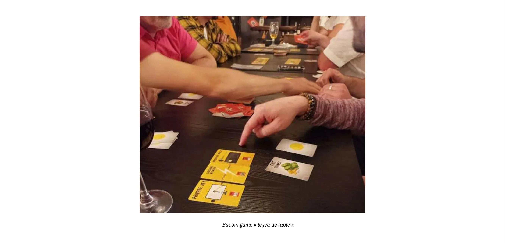

Само внимавайте да не претоварите календара. Прекалено многото събития в рамките на един месец могат да доведат до прегаряне на организаторите и намаляване на посещаемостта с течение на времето.

## Създаване на стикери

<chapterId>d605f3b3-130e-513d-85e6-06bc5ea13e99</chapterId>

Стикерите са забавен начин за популяризиране на Bitcoin и на вашата общност, като същевременно укрепват вашата идентичност.

Преди да поръчате, имайте предвид тези съвети:

- За употреба на открито се уверете, че стикерите са водоустойчиви.
- Поддържайте логото си малко по-малко от зоната за рязане, за да избегнете проблеми с изрязването му по време на лазерното рязане.
- Използвайте векторен файл вместо растерно изображение за по-високо качество на печат.
- Изберете правилния размер: диаметърът от 8 см (с размер на дланта на възрастен човек) е добре видим, докато диаметърът от 4 см е по-дискретен. Търсите видимост или дискретност?
- За наситено черен печат ("четирицветно черно") използвайте 30% циан, 30% магента, 30% жълто и 100% черно. Използването само на 100% черно може да доведе до сивкав тон. Принтерите често проверяват това, но си струва да се знае.

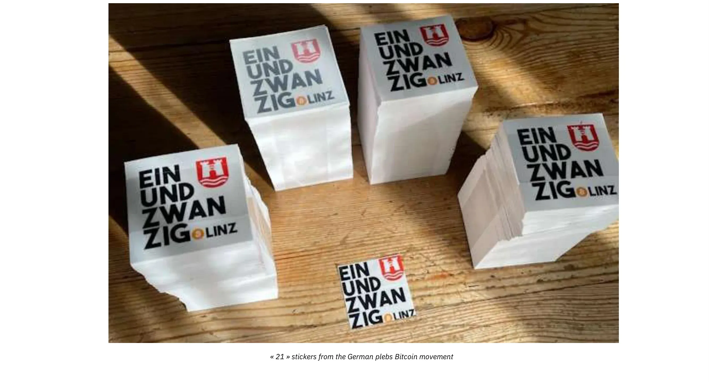

В зависимост от нуждите и доставчика ви 1000 стикера могат да струват между 100 и 250 евро. Можете да се свържете с [@Mill3sim3 в Twitter](https://x.com/Mill3sim3), френски биткойнър, специализиран в областта на маркетинга, който понякога може да осигури цени до 30% по-ниски от тези на стандартните онлайн доставчици.

Въпреки това 1000 стикера са много. Обикновено е по-добре да започнете с около 100, за да сте сигурни, че можете да ги разпространите всички.

Важно: **Проверете местните разпоредби, преди да поставяте стикери на обществени места**.

Във Франция стикери могат да се поставят само на официални обществени табла за обяви. Поставянето им на друго място (например на знак "Стоп") вероятно ще доведе до премахването им и евентуално до глоба, ако могат да бъдат свързани с вас или с вашата среща. Информирайте членовете си за това.

На частни места като концерти, барове или стадиони проверете дали вече има стикери, преди да добавите своите. Ако не, попитайте персонала за разрешение. Не искате първото впечатление на собственика на бизнеса за вашата общност да бъде, че сте вандализирали пространството му.

## Създаване на библиотека

<chapterId>acc94093-f8b3-51b8-9359-348e9e075d38</chapterId>

Друг проект, който можете лесно да създадете, е **създаване на библиотека на вашите срещи**.

Можете да поканите участниците, които желаят да споделят своите материали за четене, да донесат книга, свързана с Bitcoin. Ако някой друг участник в срещата иска да я вземе назаем, може да се уговори заем със собственика срещу депозит, например 21 000 сатоши чрез "Светкавица".

Този депозит помага на собственика да покрие евентуална загуба или кражба. За кредитополучателя това е стимул да се върне на бъдеща среща, за да си получи депозита.

Ако управлявате асоциация и искате да инвестирате част от средствата си в образователни ресурси, можете също така да закупите няколко книги, които да предложите във вашата **Bitcoin библиотека**, достъпна на всяка среща.

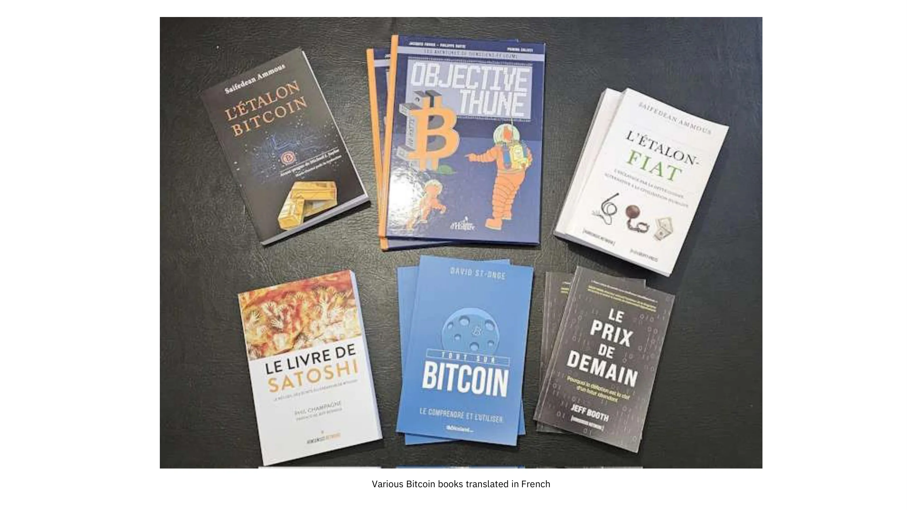

За да подкрепи екосистемата, **[издателство Konsensus Network](https://konsensus.network/) предлага на международните срещи и общности на Bitcoin от края на 2023 г. отстъпка от 15% до 35% от всички свои книги при поръчки на три или повече книги**.

За да се възползвате от тази отстъпка, просто **се свържете с [издателство Konsensus](https://twitter.com/KonsensusFR) в Twitter**.

Ако не разполагате с пари в брой, можете да предоставите отстъпката на членовете на вашата общност.

Ако не разполагате с необходимите средства, можете да предоставите отстъпката на своите членове. Например един от организаторите може да събере поръчки от членовете, да направи обща поръчка на намалена цена и да разпространи книгите на следващата среща, като плащането се събира светкавично по това време.

Може също така да изложите харта за заемане на книги на срещите си, за да обясните ясно правилата за заемане на книги на новодошлите.

Ето един пример с отворен код, който можете да използвате и адаптирате:

[Харта за заемане на книги](https://www.canva.com/design/DAF7u1b5kRM/r2gEAlibe_jTIXIX-O9PMA/edit)

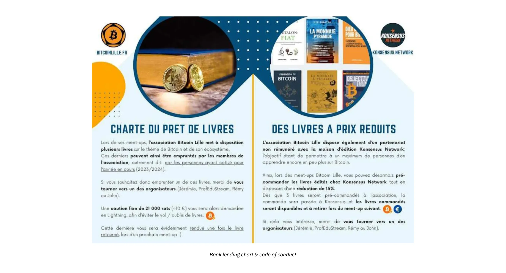

И накрая, за да насърчите четенето на книги, свързани с Bitcoin, бихте могли да посетите **местните общински библиотеки** и да проверите дали в тях има книги за Bitcoin.

Ако това е така, попитайте библиотекарите дали има планирани **кръгли маси** по темата и им предложете данните за контакт на вашата среща.

Ако не, предложете им да си купят няколко книги от предварително избран списък. Мрежата на [издателството Konsensus Network](https://konsensus.network/) може да бъде източник на вдъхновение.

## Създаване и разпространение на персонализирани листовки

<chapterId>62ad5430-c698-51b3-89ac-090f31c88953</chapterId>

Разработването и писането на листовки отнема време, но си заслужава, защото те ви дават материален ресурс, който да раздавате, когато говорите за Bitcoin, което винаги се оценява.

Тези листовки могат да бъдат насочени към:

- Търговци, ако искате да въведете Bitcoin като метод за плащане;
- Участници в събитието с листовка, в която се обяснява как да се използва и плаща с Bitcoin/Lightning;
- Начинаещите, независимо дали са срещнати на улицата, на работното място или по време на семейно събиране, с листовка, в която се изтъкват основните предимства на Bitcoin.

Можете също така да разработите листовка, специфична за вашата общност или среща, в която да представите дейностите си, целите си, връзките към социалните медии, каналите за комуникация и предстоящите събития.

Няколко листовки вече са **достъпни като отворен код в [Bitcoin Teaching Toolbox](https://planb.academy/fr/resources/bet)** в planB.network и с течение на времето ще бъдат добавени още.

Пример за това е [пълна листовка](https://profedustream.substack.com/p/21-raisons-dutiliser-Bitcoin) с 21 причини да използвате Bitcoin. Нейният дизайн също е [достъпен в отворен код](https://www.canva.com/design/DAFtAR1NauQ/ZDwl2CchIJ9Gpb36N6-7iw/edit?utm_content=DAFtAR1NauQ&utm_campaign=designshare&utm_medium=link2&utm_source=sharebutton), за да можете да го променяте, адаптирате и споделяте. Само не забравяйте да посочите източниците си.

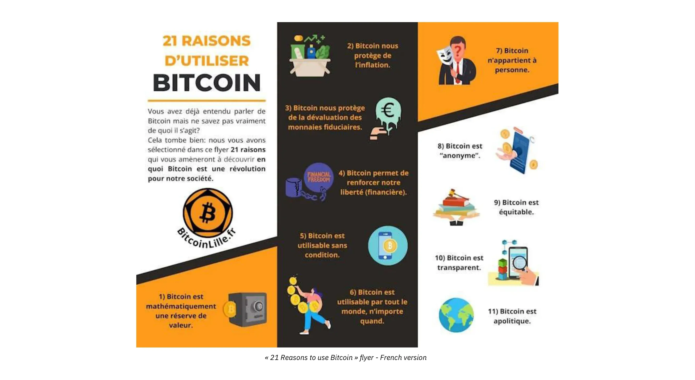

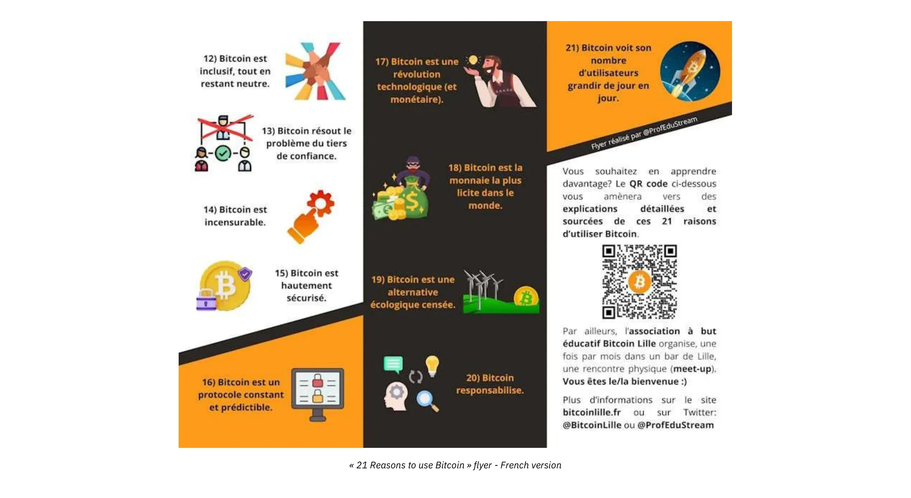

Както вече споменахме, можете да оставите тези листовки почти навсякъде: на общо бюро в работата, на семейната маса, в обществена библиотека и т.н.

Във Франция и някои други страни има и "кутии за книги" - малки дървени кутии, в които хората могат свободно да даряват или заемат книги. Можете да оставите там листовка или още по-добре - книга.

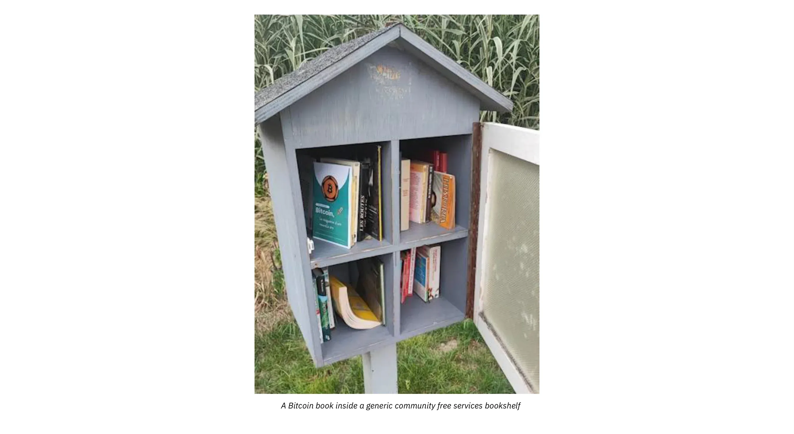

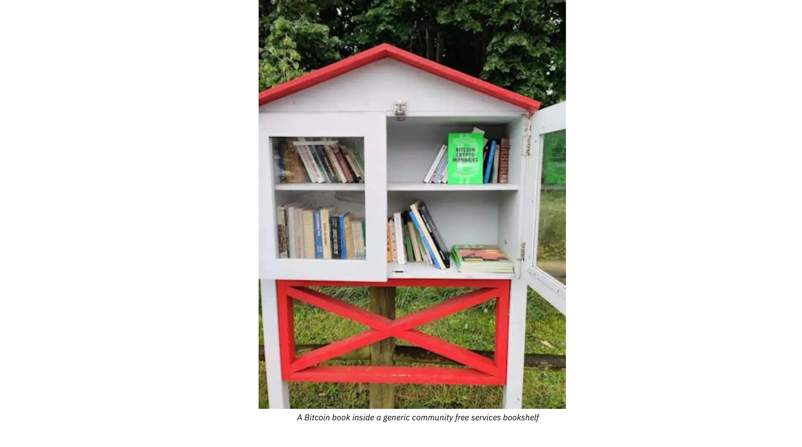

През 2023 г. стартира инициативата **"Бяла книга Bitcoin в книжните кутии на Франция**".

За да осъществят този проект, участниците първо трябваше да съберат географските координати на всички книжни кутии в страната. За тази цел съществуват няколко бази данни:

- [boite.a.livres.zonelivre.fr](https://boite.a.livres.zonelivre.fr/);
- [boites-a-livres.fr](https://www.boites-a-livres.fr/carte-de-france);
- [delivrez.fr](https://delivrez.fr/maps/fr_FR/);
- плюс статии в местната преса

Въпреки че напускането на бялата книга Bitcoin е символично, тя често е твърде сложна за разбиране от новодошлите. Вместо това идеята беше да се създаде малка книжка, която да съдържа:

- достъпно и добре обосновано въведение в Bitcoin, неговите приложения и проблемите, които решава;
- бялата книга на Bitcoin, преведена на френски език.

Ето [споделената сред френските биткойнери](https://profedustream.substack.com/p/Bitcoin-la-naissance-dune-nouvelle) брошура, която е поставена в десетки книжарници в цялата страна. Нейният дизайн също е [достъпен като отворен код](https://www.canva.com/design/DAFs18FSoVM/Sy0QsfUkycTgXveeGgutBg/edit?utm_content=DAFs18FSoVM&utm_campaign=designshare&utm_medium=link2&utm_source=sharebutton).

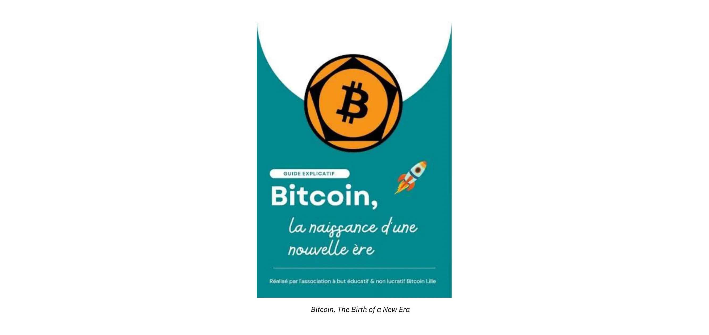

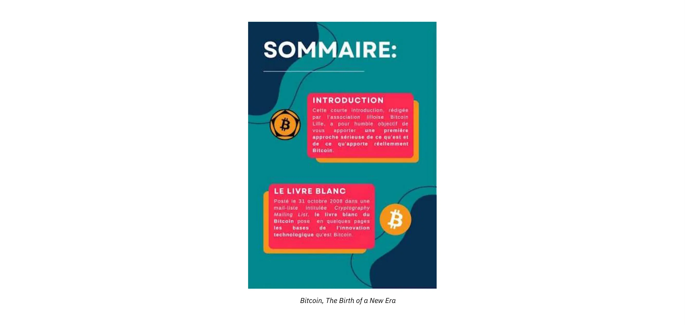

## Изработване на видеопрожекция

<chapterId>892b248a-b837-5df6-aac9-4b3261ff0390</chapterId>

Почти всеки биткойнър вероятно е виждал завладяващата междинна серия на [Rémi Forte](https://twitter.com/forteremi) "Le mystère Satoshi, aux origines du Bitcoin" (Мистерията Satoshi: произходът на Bitcoin).

Издаден през 2021 г., той е гледан [няколко милиона пъти в YouTube](https://www.youtube.com/watch?v=0ETcLj5jBy4).

Една от идеите е да организирате прожекция на "Мистерията Satoshi" за вашата общност, може би като допълнително месечно събитие.

Предупреждение: въпреки че ARTE France потвърди, че публичните прожекции са разрешени, трябва да заплатите правата за прожектиране, за да направите това законно. През 2023 г. тази цена е била около 250 евро на прожекция или 120 евро на прожекция, ако поне пет срещи са я прожектирали през годината.

За повечето общности тази цена е непосилна, особено след като документалният филм вече е достъпен безплатно в канала на ARTE в YouTube.

Разбира се, възможни са и други прогнози.

Например във Франция **режисьорката [Алана Медиавила](https://twitter.com/AlanaMediavilla) е предоставила на местните срещи правото да покажат предварително документалния ѝ филм "Stranded "**, който включва кадри от предстоящия през 2024 г. филм [филм "Dirty Coin"](https://www.dirtycointhemovie.com/).

Някои биткойнери дори поеха инициативата да преведат изцяло "Stranded" на френски, да добавят субтитри и да го споделят на срещи в цялата страна. През седмицата на 4 март 2024 г. филмът беше прожектиран едновременно на около дузина срещи в цялата страна.

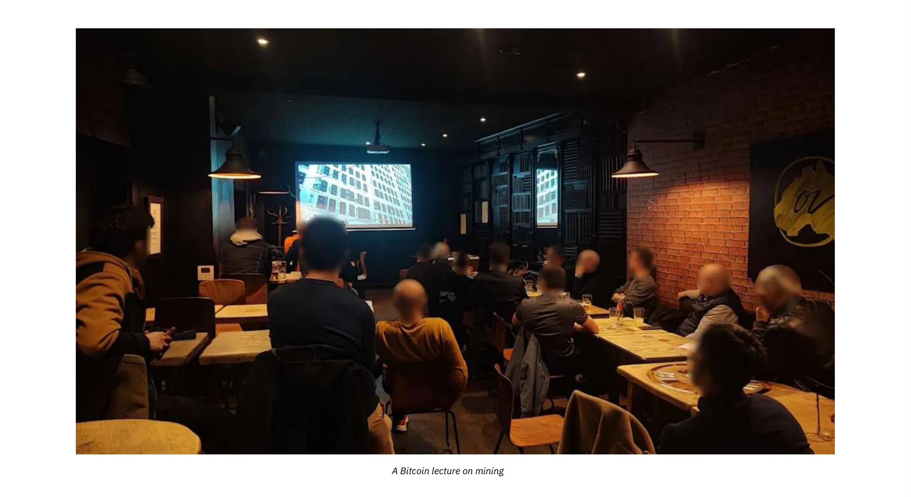

Събитието предизвика оживени дискусии относно Bitcoin mining, нейното потребление на енергия и по-широкото ѝ въздействие върху околната среда.

## Разлепване на плакати във вашия град

<chapterId>6565e8a0-d535-5be0-9764-273584c675bd</chapterId>

В няколко европейски държави (включително Германия, Испания и Франция) биткойнъри поеха инициативата да разлепят плакати из градовете си.

Някои проекти преработват изкуството на Банкси, за да включат логото на Bitcoin.

Пример за това е [StreetCyberArt](https://twitter.com/streetcyber_art), германски биткойнер, който от няколко години създава колажи и улично изкуство.

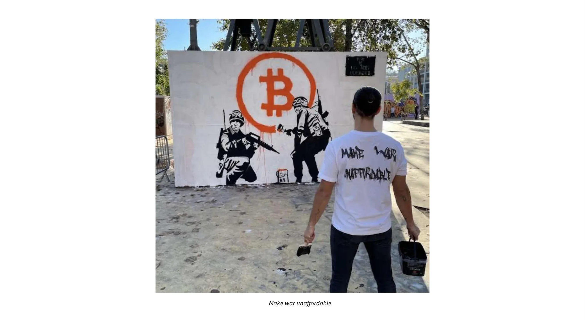

Ако искате да се занимавате с улична реклама, се уверете, че познавате законите на вашата страна. Във Франция например плакати могат да се поставят само на обществени билбордове. На други места това е напълно забранено и се наказва с глоба.

Ако решите да прекрачите границите и се надявате да не бъдете хванати "на местопрестъплението", избягвайте да включвате каквато и да било идентифицираща информация (като например името на срещата или @Twitter) на плакатите.

Също така имайте предвид, че отпечатването на тези плакати на личен принтер обикновено води до изтичане на мастило и бързо влошаване на качеството им на открито. Най-добрият подход е да работите с професионален принтер, който може да ги изработи на специална самозалепваща се хартия, предназначена за употреба на открито, като гарантира едновременно качество и дълготрайност.

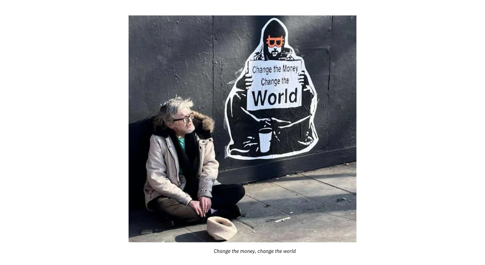

Тази инициатива може да струва над 0,40 евро на плакат (около 40 евро за сто плаката), а цените онлайн могат да варират от два до пет пъти повече. Добрите контакти са от съществено значение.

Както беше споменато по-горе, френският биткойнър [@Mill3sim3](https://twitter.com/Mill3sim3) разполага с подходящото професионално оборудване и с него може да се свържете за подробности.

Алтернативен вариант е да си направите шаблон от голямо парче картон и да използвате спрей, за да маркирате дизайна на избрани места в града си.

## Персонализирана NFC карта

<chapterId>8ad65d4e-a68a-59c2-a812-85f4907ed9f3</chapterId>

Друга оригинална идея на проекта е да се създадат персонализирани NFC карти за светкавични плащания (съвместими със стандарта BoltCard). За тази цел швейцарската Bitcoin Pay е чудесен партньор.

[Техният уебсайт](https://swiss-Bitcoin-pay.ch/cards) понастоящем предлага четири стандартни дизайна.

Ако искате да поръчате повече от 50 NFC карти, можете да се свържете с компанията чрез официалния ѝ уебсайт или [Twitter](https://twitter.com/SwissBitcoinPay), за да предложите персонализиран дизайн за предната част на картата. Обратната страна ще остане стандартизирана.

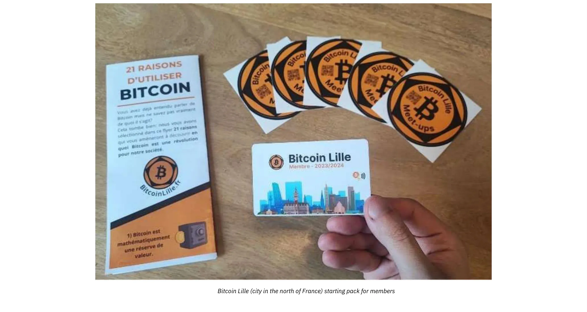

Например през 2023 г. френската асоциация [Bitcoin Lille](https://twitter.com/BitcoinLille) поръча партида NFC карти с персонализиран дизайн. Всеки нов член получи по една в пакета за добре дошли през годината. Тази идея може лесно да бъде адаптирана и персонализирана за вашата собствена общност.

Единичната цена за тези карти обикновено варира от 2,50 до 5 евро в зависимост от размера на поръчката и пазарните условия, като при по-големи количества цените са по-ниски.

## Създаване на уебсайт

<chapterId>9a2a1b9b-0633-544a-b331-c06187d23d7f</chapterId>

На определен етап от развитието на вашата общност може да е ценно да имате уебсайт, който да служи като витрина на вашата група, срещи, събития и образователно съдържание.

Изграждането на уебсайт отнема време, но урокът по-долу ви показва как да създадете безплатен сайт в WordPress само за 30 минути. Ще можете да настроите начална страница с възможност за персонализиране, да публикувате статии и да вграждате мултимедийни файлове, като например видеоклипове от YouTube, изображения или PDF файлове.

По-късно можете да закупите собствено име на домейн или дори да хоствате сайта на собствен сървър.

:::video id=a1b25c18-5fc1-4b97-baef-816d819c9382:::

Макар че съществуват и други платформи за CMS, някои от които с по-прости и удобни за начинаещите интерфейси, те обикновено са с много по-малко възможности за персонализиране. Ето защо WordPress обикновено е най-добрата отправна точка.

WordPress поддържа и широк набор от приставки (някои от тях платени, но с високо качество), които могат значително да разширят възможностите на сайта ви, без да изискват умения за програмиране. Един пример за това е [премиум темата "Uncode"](https://undsgn.com/uncode/)

## Създаване на видеоканал (Youtube или Odyssee)

<chapterId>076286db-1627-57ec-a410-c44b1666e1cd</chapterId>

Някои членове на вашата общност може да искат да създават мултимедийно съдържание, например видеоклипове с уроци.

Можете също така да изнасяте презентации на срещи или дори в университети.

**Когато това време настъпи, специален канал за видеоклипове ще ви позволи да публикувате и централизирате цялото си съдържание на едно място.**

Популярните платформи включват:

- [**YouTube**](https://www.youtube.com/), широко използван, но не и устойчив на цензура.
- [**Odyssee**](https://odysee.com/), по-малко популярен, но децентрализиран чрез технология peer-to-peer.
- [**peertube**](https://joinpeertube.org/fr_FR) ви позволява да хоствате своя собствена платформа за видеоклипове, въпреки че настройката ѝ е по-сложна.

Независимо от това кой вариант ще изберете, създайте визуални материали, съобразени с платформата, за да направите канала си привлекателен. Canva, спомената в [част 2/8](https://planb.academy/courses/1c643dc9-a15f-4f9e-93b6-cb3c58b4ee35/3470a31f-0190-5e87-8af0-6a00e79267ef), предлага категория "Миниатюра на YouTube" с предварително създадени дизайни, които могат да се персонализират.

За **запис** от вашия компютър [Streamlabs](https://streamlabs.com/fr-fr) е безплатен, с много функции и поддържа преходи между сцените.

За **редактиране на видео**, [Wondershare Filmora](https://filmora.wondershare.fr/) (около 45 €/година) е лесен за използване и бързо дава професионални резултати.

За интрото и аутрото на вашия **видеоклип** можете лесно да намерите подходящи шаблони в Canva. Персонализирайте дизайна по свой вкус, изтеглете го и го добавете в софтуера си за редактиране.

Съвет: Ако Bitcoin някога бъде забранен или цензуриран, винаги пазете локално резервно копие на видеоклиповете си на твърд диск.

## Създаване на аудио подкаст

<chapterId>12e96b45-1c33-5687-a753-80d0114d487a</chapterId>

Аудио подкастът е друг чудесен начин за споделяне на идеи. Подобно на видеоканалите, изграждането на аудитория отнема време.

Популярните платформи за подкаст включват:

- [**Fountain**](https://www.fountain.fm/), подкрепя даренията за светкавица.
- [**Soundcloud**](https://soundcloud.com/);
- [**Deezer**](https://www.deezer.com/fr/);
- [**Spotify**](https://open.spotify.com/);
- [**Google podcast**](https://podcasts.google.com/).

Всяка платформа има своя собствена аудитория, така че присъствието в няколко от тях ще разшири обхвата ви. **[Spotify за подкастъри](https://podcasters.spotify.com/) улеснява това, като ви позволява да качвате подкаста си веднъж и generate RSS канал за други платформи**.

След като свършите работата в "Spotify за подкастъри", остава само да форматирате съдържанието си за другите платформи - процес, който е сравнително бърз.

За запис [Audacity](https://www.audacityteam.org/) е безплатен и ви позволява да регулирате нивата на звука, да добавяте ефекти, като например затихване, и да подобрявате яснотата по време на редактиране. Лесно е да запишете гласа си и да създадете подкаст с професионално качество.

Това е кратък 10-минутен урок, който обхваща най-важното за създаването на подкаст с Audacity:

:::video id=67d80ac7-253f-40a5-b621-fef2fb7174bd:::

Съвет: Както и при видеоклиповете, запазете локално резервно копие на всички подкасти в случай на бъдеща цензура.

## Създаване на бадж за вашите събития

<chapterId>0cccef8d-a765-5844-8921-c40f0ce653e4</chapterId>

По време на срещи и събития може да се въведе малък стимул: значки за събития. Идеята е да **създадете значка, която може да се получи само на конкретното събитие**. Тази концепция съществува в други блокчейн вериги под името "POAP" ("Proof Of Attendance Protocol"). Понастоящем обаче не съществува свободен начин за прилагането ѝ в Bitcoin.

Такава система може да се използва и за награждаване на най-активните членове на общността. Например можете да организирате годишна томбола, в която всяка събрана значка се равнява на един билет за участие. Член, който посещава всички 12 срещи за годината, ще има 12 билета за томболата.

При друг, по-традиционен подход, можете просто да помолите участниците във всяко събитие да напишат първото си име или прякор на значка, както и причината, поради която са дошли.

Макар и малко формално, това може да помогне на членовете да намерят по-лесно общи интереси и теми за разговор, а също така улеснява новодошлите да открият организаторите (или официалните членове на общността/асоциацията).

Няколко шаблона за значки, използвани от асоциацията Bitcoin Lille, са [достъпни с отворен код в Canva](https://www.canva.com/design/DAGHAsT15MU/AIA7-L_xBjNdsuxdD4-h-Q/edit?utm_content=DAGHAsT15MU&utm_campaign=designshare&utm_medium=link2&utm_source=sharebutton).

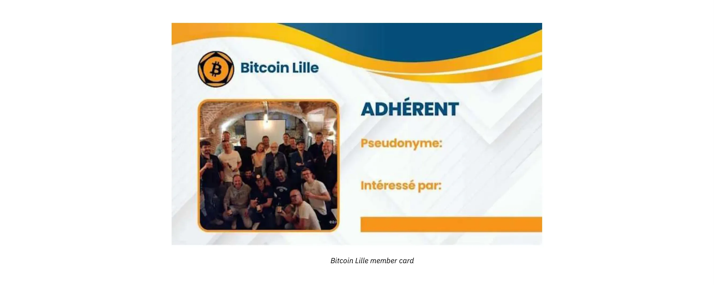

## Планиране на предаването в случай на смърт

<chapterId>c5febf18-235c-51bc-8fbb-9467dabe4cb0</chapterId>

В съвсем друг план, нека засегнем една чувствителна тема: кончината на член на вашата общност Bitcoin.

Един ден с вас може да се свърже семейството на бивш член на организацията и да ви съобщи за неговата смърт. Те може да обяснят, че починалият е оставил инструкции, включително да се свържете с вашата общност, среща или асоциация.

В някои случаи семейството може да потърси помощ и за възстановяване на средства като бенефициенти на наследството.

Разумно е да работите с общността си, за да установите предварително ясна процедура за такива ситуации, като гарантирате, че:

- Починалият вече е посъветвал семейството си **никога да не споделят частни ключове или да носят физически портфейли на среща**.
- Семейството разбира, че целта на посещението им е образователна: да научат как работи Bitcoin, за да могат по-късно да поемат суверенен контрол над фондовете.
- Семейството е запознато със съответните закони в своята страна относно подаръци, наследяване и конвертиране на Bitcoin във фиат.

Наличието на стандартен протокол също така не позволява на никого - член или гост - да се възползва от ситуацията, за да открадне средства.

Можете да създадете специална работна група, която да определи този процес. Асоциацията Bitcoin Lille вече работи по такъв [документ](https://docs.google.com/document/d/1TDfLZjuictC5s3PEM2Z7WmkxIDSJ8Q1E4xevm52pVgU/edit?usp=sharing), който планира да публикува като отворен код през следващите месеци.

## Изнасяне на лекции в училища и университети

<chapterId>65efdb44-e3d4-567c-aedf-972765753d73</chapterId>

Списъкът на проектите, описани по-горе, разбира се, не е изчерпателен. Като цяло е по-вероятно това да са вътрешни проекти за тяхната общност или срещи, които могат да бъдат доста лесно реализирани в хода на тяхното развитие.

Сега нека се обърнем към обучението.

Както знаете, един от най-добрите начини **да достигнете до голяма аудитория наведнъж е да проведете безплатна лекция**. Това може да се направи в колежи и университети, като се запознаят както младите хора (така и не толкова младите) с Bitcoin, независимо дали са напълно нови или искат да задълбочат познанията си.

Изнасянето на лекция пред десетки или дори стотици хора изисква не само технически познания. Необходими са ви:

- Увереност в публичното говорене
- Добро управление на стреса
- Ясна артикулация
- Силно управление на времето
- Добре проучена, висококачествена презентация или семинар, съобразени с нивото на уменията на аудиторията ви

Също толкова важно е **да запазите отвореното си съзнание и да знаете кога да опростите понятията**, особено по време на сесията с въпроси и отговори или на панелна дискусия. Не става дума за отказ от принципите ви, а просто за признаване, че другите може да виждат нещата по различен начин. Понякога е най-добре да отговорите по-късно или да оставите въпроса да отшуми, за да може дискусията да продължи. Ако гледните ви точки са подкрепени със солидни, добре обосновани аргументи, хората ще го признаят.

Ако се чувствате готови, действайте! Светът отчаяно се нуждае от по-добро обучение за Bitcoin.

Въпреки това това не е леко начинание: изисква мотивация, усилия и подходящи връзки.

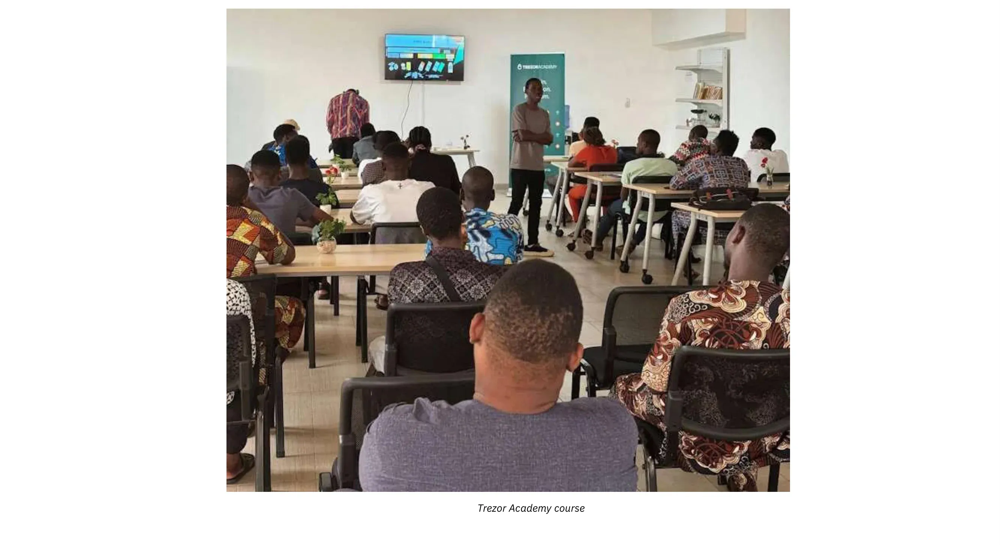

Организирането на лекция или семинар в училище или университет започва с намирането на правилния контакт. Това може да бъде:

- Лично познанство
- Студентски съюз
- Студентска асоциация, която организира поредици от лекции или събития
- Бивши преподаватели от вашето инженерно училище или университет
- Координаторът на академичната програма, ако се свържете директно

Първата стъпка обикновено е да представите инициативата или сдружението си и да поискате среща. В най-добрия случай това ще доведе до представяне на Bitcoin пред ученици няколко седмици по-късно.

За съжаление Bitcoin все още се демонизира от голяма част от медиите и много политици, което кара някои да смятат, че той няма място в класните стаи. Отхвърлянето е често срещано явление, особено в академичните среди, където теми като proof of work и потреблението на енергия остават спорни.

Все пак си струва да опитате, особено при студентските съюзи и асоциации. И кой знае? Дори ако първият ви опит получи "не", може да откриете имейл в пощенската си кутия по време на следващия бичи тираж, който ви кани да говорите, да речем, с 280 студенти!

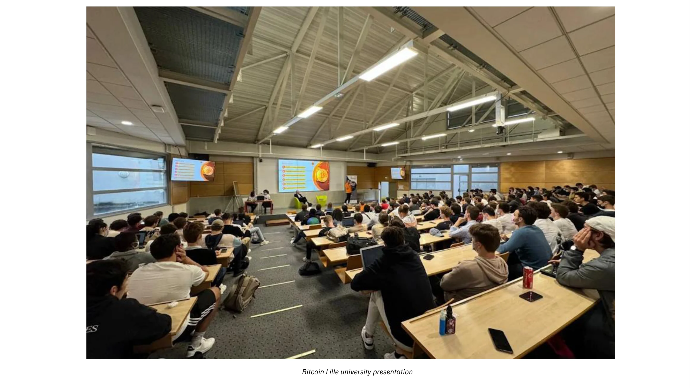

## Подход към предприятията

<chapterId>b730462b-7928-5d28-a14f-9ceaa773d3d2</chapterId>

За много биткойнисти да накарат даден бизнес да приема Bitcoin е нещо като отключване на рядко постижение в Pokédex.

Всеки търговец е различен и въвеждането му в експлоатация е свързано със собствен набор от предизвикателства:

- Те все още се нуждаят от фиатна валута, за да плащат на доставчиците.
- Те се нуждаят от ясни и готови за счетоводно отчитане финансови отчети.
- Платежните им системи трябва да са надеждни, лесни за използване и защитени от кражби.
- Възможно е те да имат погрешни или негативни предубеждения за Bitcoin.
- Намирането на безупречно софтуерно решение може да е трудно.
- Да накарате търговеца да разбере защо си струва да приеме Bitcoin като плащане.

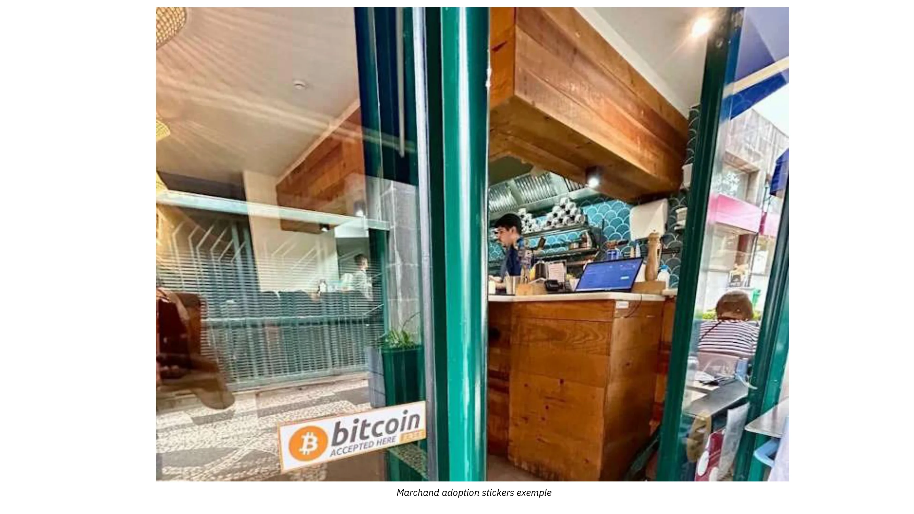

Привличането на местни предприятия е един от най-добрите начини да развиете екосистемата Bitcoin в града си. Ключът е да се действа стъпка по стъпка:

1/ **Поискайте да плащате с Bitcoin всеки път, когато пазарувате**

В повечето случаи ще получите "не" и може би озадачен или дори леко осъдителен поглед, но самото питане засажда идеята, че Bitcoin е нещо, което "обикновените хора" могат да използват, и че става все по-популярно като начин на плащане. Можете дори да се съюзите с няколко приятели и да се отбиете в един и същи магазин в различни дни, като всеки път поискате да платите с Bitcoin. Рано или късно това ще събуди любопитството на собственика.

2/ **Предложете просто и ясно обяснение**

Ако ви попитат какво представлява Bitcoin, отговорете кратко и без жаргонни изрази. Например:

*"Bitcoin са пари, които не се контролират от банките, работят без посредници, не могат да бъдат цензурирани, не подлежат на инфлация и имат по-ниски такси от традиционното банкиране. "*

След това им връчете листовка, като например "21 причини да използвате Bitcoin" или "10 причини да приемете Bitcoin в бизнеса си", с вашата информация за контакт или подробности за срещата ви. По този начин, когато са готови за демонстрация, ще знаят къде да ви намерят.

3/ **Откриване на демонстрация**

Когато проявят интерес, определете време, за да им покажете решение за плащане.

Чудесен вариант е **[Swiss Bitcoin Pay](https://swiss-Bitcoin-pay.ch/)**, защото:

    - Позволява на търговеца автоматично да конвертира BTC във фиат ежедневно, за да може да плаща на доставчиците.
    - Позволява им да запазят процент в BTC, ако желаят.
    - Генерира счетоводни отчети, които могат да бъдат експортирани за техните счетоводители.
    - Има просто табло за управление за мениджърите.
    - Предоставя на служителите интуитивен интерфейс за приемане на плащания, без да докосват касата.
    - Цената е по-ниска от таксите от 2-3%, начислявани от традиционните платежни мрежи.

4/ **Подкрепете ги, щом започнат да приемат Bitcoin**

След като се качат на борда:

    - Посещавайте редовно и правете покупки.
    - Проверете дали всичко върви гладко.
    - Ако е необходимо, споделете отново информацията си за контакт.
    - Поканете ги на срещите си.
    - Добавете ги към картата [btcmap.org](https://btcmap.org/) и съобщете на [Swiss Bitcoin Pay](https://x.com/swissbitcoinpay) в Twitter, за да увеличите видимостта.
    - Помислете за провеждане на семинари или срещи на тяхно място.

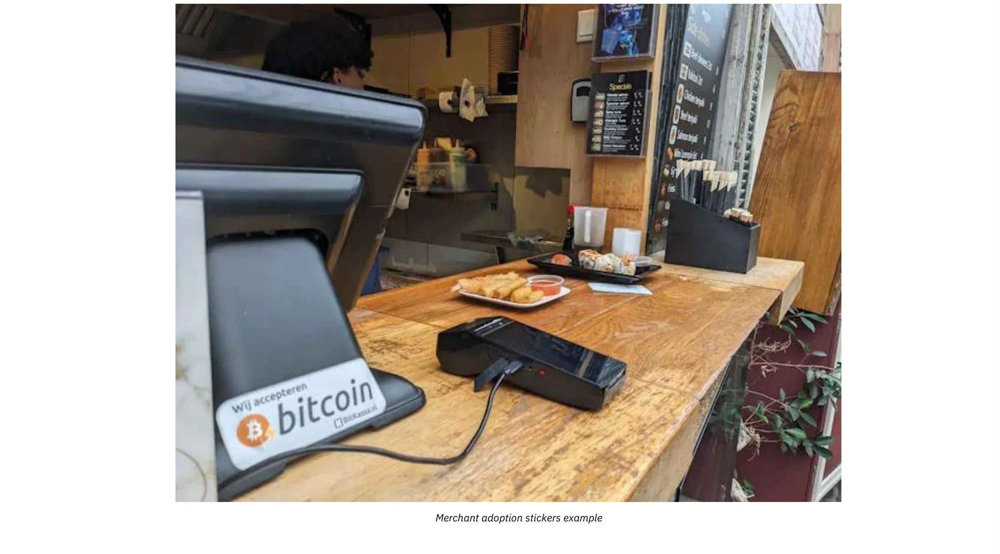

5/ **Свържете се с местните търговци**

След като вече имате няколко предприятия, които са приятелски настроени към Bitcoin, предложете да създадете група в Telegram само за търговци. Тя може да:

- Позволете им да споделят опит и да се включат в нови фирми.
- Служи като бърз канал за техническа поддръжка.
- Укрепване на местната мрежа Bitcoin.

Агитацията е дългосрочна игра. Тя изисква търпение, упоритост и стратегия. Но ако вашата общност е готова, можете да започнете да полагате основите на истинска кръгова икономика Bitcoin, точно както [Арнем в Нидерландия](https://www.arnhembitcoinstad.nl/) в Нидерландия.

## Свържете се с местната преса и радио

<chapterId>435bfbc1-22dd-59bb-b737-a32ea995b238</chapterId>

Биткойнистите често се фокусират върху социалните медии и онлайн платформите за популяризиране, но това е само част от картината. Местната преса и радиото могат да бъдат мощни съюзници.

Някои общности, като [Breizh Bitcoin](https://breizhbitcoin.com/) във Франция, **редовно се свързват с местните медии**, за да:

- Обявяване на предстоящи събития (срещи, презентации, семинари, партита Halving и др.).
- Поканете журналисти да посетят приятелски настроени към Bitcoin предприятия и да пишат за тях.
- Споделяйте датите и местата на събитията, за да ги включите в местните списъци.

В много вестници все още има рубрика "Какво се случва", често скрита на последните страници, в която се изброяват предстоящите местни събития. Breizh Bitcoin е установил, че този подход работи: новодошлите са се появявали на срещи само защото са забелязали списъка във вестника.

Тази стратегия може да работи по-добре в някои области, но си струва да опитате. Можете да започнете, като се обърнете към регионални новинарски издания, Франция има примери като:

- [acpm.fr](https://www.acpm.fr/Les-chiffres/Diffusion-Presse/Presse-Payante/Presse-Quotidienne-Regionale);
- [voxpublic.org](https://www.voxpublic.org/spip.php?page=annuaire&cat=medias&type_media=Presse%20quotidienne%20r%C3%A9gionale).

и като се свържете с местни радиостанции, за да предложите интервю или поява в подкаст.

Имайте предвид, че интервютата с медиите могат да бъдат трудни. Думите могат да бъдат извадени от контекста или погрешно представени. Подготовката е от съществено значение.

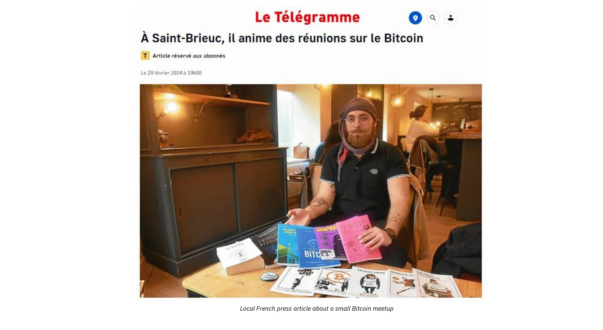

Очевидно е, че освен всички предложени в този раздел, могат да бъдат осъществени **много други проекти**. Всичко зависи от вашето време и мотивация, но също така и от трудността на въпросния проект.

Заключителни съвети за всеки проект за популяризиране:

1) **Планирайте предварително**: определете целите си, необходимите стъпки и кой какво ще прави.

2) **Поетапно**: избягвайте прегарянето, като разпределяте усилията си.

3) **Поискайте помощ**: потърсете подкрепа от членовете си и съседните общности.

Не забравяйте, че всяка общност Bitcoin е била там, където сте сега. Не се колебайте да се поучите от техния опит и съвети.

# Предвиждане на бъдещето

<partId>6ea07445-9369-54bc-9aa0-d260db026e0b</partId>

## Планиране за увеличаване на броя на участниците

<chapterId>8af722d4-3a9f-548c-9001-424f2142de12</chapterId>

Когато Bitcoin навлезе в четвъртата си ера при блок 840 000, все повече хора започнаха да го разпознават като технологична, финансова и социална революция.

Подобно на възхода на интернет, тази революция ще отнеме време, което всъщност е предимство. То дава възможност на хората да **усвоят основите на Bitcoin**, да разберат как да го използват и позволява на разработчиците и компаниите да **изграждат протоколите и приложенията**, които ще отключат пълния му потенциал.

Никой не може да предвиди бъдещето, но можем да **очакваме рязко увеличаване на броя на потребителите на Bitcoin**. Това означава **да бъдем готови за всички сценарии**, дори за екстремни, като например срив на традиционната финансова система или пълна забрана на Bitcoin.

В тази седма и предпоследна част на курса ще разгледаме ключови моменти, които да имате предвид, когато общността и срещите ви се разрастват.

Първата и най-лесна за предвиждане причина е увеличаването на броя на хората, които се присъединяват към вашата общност. Това ще ви се отрази по два основни начина:

1/ **Каналите ви за комуникация (Telegram, Signal, Matrix и др.) в крайна сметка ще се препълнят**, което ще затрудни воденето на разговори. Има две неща, които трябва да имате предвид.

Първо, ако в един чат има 500 души, които обсъждат най-различни теми, самият обем на съобщенията и известията неминуемо ще накара много членове да се отдръпнат. Това е добър момент да преосмислите настройката си, например като преминете към супергрупи в Telegram или към сървър на Discord - и двата варианта позволяват лесно организиране на дискусиите по теми.

Второ, повече хора в каналите ви означават повече ботове, повече измами и повече модерация. Подгответе се за това, като създадете ясен набор от правила, на които можете да се позовавате при модериране на съобщенията. Според нашия опит това допринася много за избягване на конфликти, особено ако правилата са лесно достъпни в каналите ви.

Добър пример за това е **[Bitcoin Lille's open-source rulebook](https://bitcoinlille.fr/reglement/)**, написан преди няколко години за нейната Telegram група и Discord сървър. Той се основава на прости, универсални принципи и дори можете да вземете [персонализирана версия на дизайна тук](https://www.canva.com/design/DAGHI692AD4/rjT4sqEnhajc5FiPA6GFZQ/edit?utm_content=DAGHI692AD4&utm_campaign=designshare&utm_medium=link2&utm_source=sharebutton).

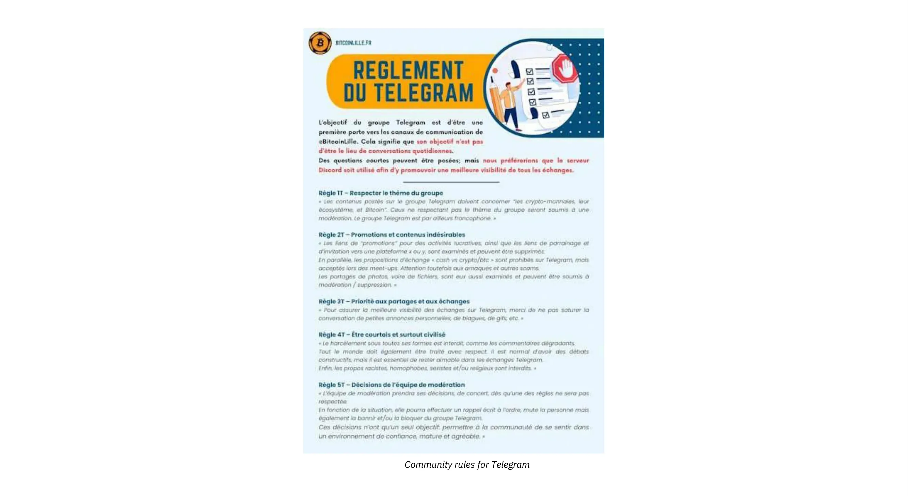

2/ **Вашите срещи и събития ще започнат да привличат многобройни хора с много нови лица, които ще се появят, за да се свържат**.

При този скок на посещаемостта:

    - може би си струва да **намерите по-голямо място за вашите срещи и събития**, особено ако в миналото сте били в състояние да приемете само около двадесет души.
    - ако установите, че броят на участниците е прекалено голям, можете за бъдещи срещи или да **задължите участниците да се регистрират** (чрез приложението Meetup или чрез обикновен формуляр), или **да организирате няколко срещи всеки месец** (например: среща за начинаещи, среща за средно напреднали и среща за напреднали).
    - В същото време очаквайте много нови участници в екосистемата, често с основна цел да печелят пари. За да **поддържате разговорите фокусирани върху Bitcoin** в тези бързоразвиващи се срещи, е добре да:

а) Включете презентация на тема **Bitcoin** по време на тези събития, тъй като това естествено ще насочи голяма част от разговора към тази тема (и далеч от последния уж "революционен" проект за shitcoin);

б) **Избягвайте да се свързвате само с други биткойнери**. Вместо това се стремете да **приближавате новодошлите**, дори ако това означава да се отбиете в задната част на стаята, за да ги поздравите. Оттам можете да поговорите за това защо са дошли, какво търсят, за целите (или дори за основните принципи) на вашата общност и т.н.

И накрая, въпреки че е жалко да го кажа, на срещите могат да се появят измамници. Тяхната цел може да бъде да говорят безкрайно за своята Понци схема, МЛМ или за някаква "блокчейн революция, задвижвана от изкуствен интелект" Също така е напълно възможно някой ден някой с лоши намерения да присъства специално, за да изпере пари или да се опита да купи BTC с фалшиви банкноти.

В подобни сложни ситуации най-лесният подход е учтиво да обясните, че срещата не е подходящо място за това, като го подкрепите с каквито аргументи решите (например като споменете, че може да има полицаи в цивилно облекло).

Ако, за съжаление, те откажат да напуснат или да се държат уважително (да, случвало се е), можете да се обърнете директно към групата по време на срещата, за да уведомите всички, че дадено лице или лица се опитват да извършат някаква злонамерена дейност.

За щастие тези ситуации са редки и често са по-скоро абсурдни, отколкото застрашаващи, но все пак е добре да сте подготвени.

За да сте спокойни: докато не нарушавате закона лично или не улеснявате пряко незаконни транзакции, не носите правна отговорност за действията на другите по време на събитието си (поне според френското законодателство).

В един идеален свят бихте разполагали с **пространство, достатъчно голямо, за да приеме няколко десетки души**, докато общността ви расте, и бихте изградили **силни връзки между биткойнистите** и бъдещите биткойнисти по време на мечия пазар, така че когато дойде възходът, да имате възможно най-много хора, готови да дадат оранжево хапче на другите.

## Децентрализиране на организацията на общността

<chapterId>bedfc110-e099-58f4-a5b7-fb50f3b19a49</chapterId>

Представете си следното: от години провеждате своята среща Bitcoin и един ден решавате да напуснете работата си, може би за да отглеждате лами в Перу или да преследвате перфектните вълни в Ел Салвадор. Какво се случва с вашата общност, когато напуснете?

Моля, планирайте предварително прехвърлянето на вашата общност чрез:

1) **Дайте права за администриране (или собственост)** на вашите канали за комуникация на доверени членове. Ролите винаги могат да се сменят по-късно.

2) **Споделяйте данните за профилите си** (потребителски имена, пароли, свързани имейли) в социалните медии и каналите за видимост с поне един доверен човек.

Без този достъп е почти невъзможно някой друг да поеме ефективно управлението. Започването от нулата чрез създаване на "разклонени" групи и възстановяване на мрежата е бавно, изтощително и често деморализиращо.

Ако нямате доверен контакт в рамките на вашата среща, винаги можете да се свържете с @ProfEduStream, @copinmalin или @gabtribe в Telegram. Те могат да помогнат за намирането на мотивиран наследник и да координират прехвърлянето на акаунти и администраторски права.

**Защо децентрализацията е важна?**

Ако сте единственият участник и държите целия контрол, какво ще стане, ако изчезнете? Отговорът е прост: вашата общност също ще изчезне.

Решението: децентрализирайте задачите, ролите и достъпа, така че групата да може да продължи да работи, дори ако някой от организаторите отпадне, независимо дали това се дължи на ограничения във времето, или, в по-мрачен сценарий, защото е арестуван за притежание на Bitcoin, който не отговаря на изискванията на КYC.

**Как да продължим децентрализацията?**

Приемете **свободен софтуер с отворен код**, като например [пакета framasoft](https://framasoft.org/fr/), за да намалите зависимостта от централизирани платформи и да увеличите устойчивостта срещу потенциална държавна цензура или забрани по Bitcoin.

Използвайте **криптирани или анонимни инструменти за комуникация**, за да защитите личните данни на членовете си и дейностите на общността.

## Какво ще стане, ако Bitcoin се превърне в обществен враг № 1?

<chapterId>c739651f-cd13-51e0-a36e-85023749b15b</chapterId>

На 5 април 1933 г. Франклин Рузвелт, 32-рият президент на Съединените американски щати, подписва **Изпълнителна заповед 6102**, с която се забранява на частни лица да притежават златни монети, кюлчета или сертификати където и да било в страната.

Разбира се, Голямата депресия (сривът на фондовата борса през 1929 г.) не е нашата настояща реалност. Но може ли един ден правителството да направи същото с Bitcoin: **да забрани изцяло частната собственост?

Истината е, че подобна оруелска мярка всъщност няма да спре някого да притежава BTC, защото никой закон не може да попречи на човек да запомни поредица от думи.

И все пак, какво би станало, ако световните лидери най-накрая осъзнаят потенциала на Bitcoin да промени глобалния ред дори на държавно ниво? Дали тогава ще бъде обявен за "обществен враг № 1"?

Не е нужно да изпадаме в конспиративно мислене. Но нищо не ни пречи да предвиждаме, децентрализираме и образоваме, като започнем сега.

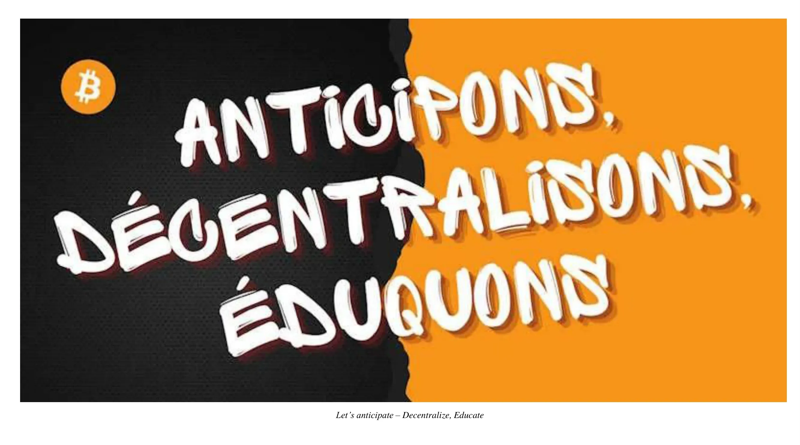

# Обединяване на биткойнъри

<partId>62bc2138-c0be-5d39-a341-594690863257</partId>

## Бърз план за действие за изграждане на вашата общност Bitcoin

<chapterId>1f463ec2-3f64-5641-8d60-e02a47c94f27</chapterId>

Satoshi Накамото създаде революционен инструмент, който вече променя света ни. Но от нас, биткойн потребителите, зависи как ще оформим бъдещето.

Bitcoin е обширна заешка дупка, която засяга история, икономика, литература, математика, компютърни науки и криптография. Никой не може да я изследва цялата и това е част от нейната красота.

Тъй като времето ни е ограничено, ключът е да останем смирени, да продължаваме да учим и да обменяме знания с другите. По този начин всеки от нас може да достигне нивото на разбиране, към което се стреми.

**Глобалните общности на Bitcoin следователно играят основна роля в изграждането на утрешния свят**: пространства, в които биткойнистите могат да **обменят, изграждат и споделят**. **Заедно**.

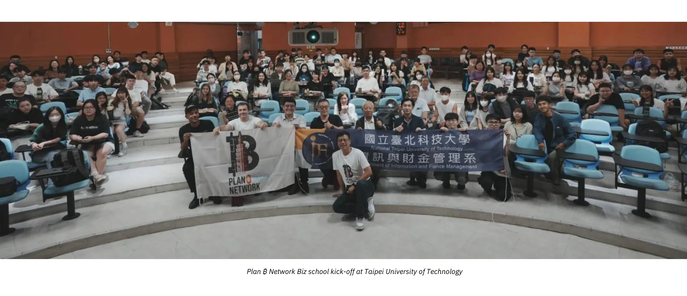

Както видяхте по време на този курс, **изграждането на общност на Bitcoin и организирането на срещи** изисква както планиране, така и мотивация. В зависимост от целите си и времето, което можете да отделите, може да се заемете с по-амбициозни проекти или да оставите нещата прости.

И в двата случая целта е една и съща: **да предизвикате интерес и да помогнете на Bitcoin да се разрасне във вашия град**.

В заключение на многобройните глави и подглави, които разгледахме, ето един **сбит "план за действие "** за създаване на вашата общност Bitcoin:

1) Предварително решете защо искате да създадете общност Bitcoin, какви са целите ви и в кой град или населено място ще действате.

2) Свържете се със съществуващите наблизо общности и не се колебайте да ги помолите за съвет, когато имате нужда от него;

3) Създайте ясна идентичност за вашата общност, която да отразява вашата общност и местоположение (лого, плакат, банер, листовка и др.)

4) Създайте канали за комуникация и социални мрежи като Telegram, Twitter, NOSTR, Discord или Simplex. Обмислете и децентрализирани и/или устойчиви на цензура канали.

5) Следете други местни срещи и общности онлайн и включете групата си в различни карти и платформи, за да увеличите видимостта.

След като каналите за комуникация на вашата общност са активни:

6) Стартирайте проучване, за да предложите първата си среща, след като почувствате достатъчен интерес.

7) Определете целите, които искате да постигнете с това лично събитие.

8) Изберете добре разположено и приветливо място, което отговаря на целите ви, и резервирайте маса или зала.

9) Популяризирайте събитието в каналите си една седмица преди него, а след това отново два-три дни преди датата.

10) Регистрирайте събитието си в съответните уебсайтове и платформи.

11) В деня на събитието оставете събитието да тече естествено и се ангажирайте с участниците, като внимателно насочвате дискусиите, ако е необходимо.

След това:

12) Фокусирайте се върху задържането и включването на участниците, така че те да се върнат отново.

13) Предложете прости проекти или инициативи и започнете тези, които лично ви вълнуват. Ако някой друг иска да ръководи друг проект, подкрепете го, когато можете.

Накрая:

14) Предвиждайте бъдещето, като помислите за по-голямо място за срещи, правила за каналите за комуникация, уебсайт и т.н;

15) Насърчавайте местните предприятия да приемат Bitcoin, дори и само като питате всеки път, когато пазарувате там.

16) Делегирайте задачи и права за администриране на канали/мрежи на доверени членове.

17) Популяризирайте широко общността си, за да се присъединят повече хора, и включете тези, които проявяват интерес.

18) Отидете още по-далеч с проекти, които ви харесват и са важни за вас.

За по-бърз преглед този 21-минутен видеоклип обобщава тези стъпки:

:::video id=a59956da-f554-4b54-89dd-5ca55b722686:::

Не забравяйте: **Не сте сами, съществуващите общности са тук, за да ви подкрепят**.

## Да се грижиш за себе си

<chapterId>cf1631cb-ddbe-55c7-be8c-26a5652979a0</chapterId>

Когато попаднете в заешката дупка на Bitcoin, перспективата ви за живота се променя.

Дълбоко в себе си усещате желание да продължите напред, да се срещнете с други хора, които преминават през същото душевно пътуване.

Тази енергия ви подтиква да дадете своя принос към пъзела, като споделите откритието си: Bitcoin. Тя също така ви вдъхновява да помислите за утрешния свят, за този, който искате да помогнете да се изгради, и за общностите, които работят за него.

Изграждането на общност е дълъг път, който изисква мотивация, стратегия, отдаденост и време. Това може да бъде неблагодарна задача, затова е важно да предприемате нещата стъпка по стъпка, за да избегнете прегаряне.

**Помислете за себе си, за своите граници**. И въпреки че Bitcoin може да ви води ден и нощ, **не се опитвайте да правите всичко сами, защото ще изгорите**.

Вместо това потърсете помощ от биткойнъри, които вече са минали по същия тунел, изследвали са същите пътища и са създали същите инструменти**. Това ще ви спести много време.

**Поканете тези, които ви следват в това приключение, да ви помогнат**, дори ако делегирането на определени задачи отнема повече време. В дългосрочен план вашата общност ще бъде по-силна и по-устойчива.

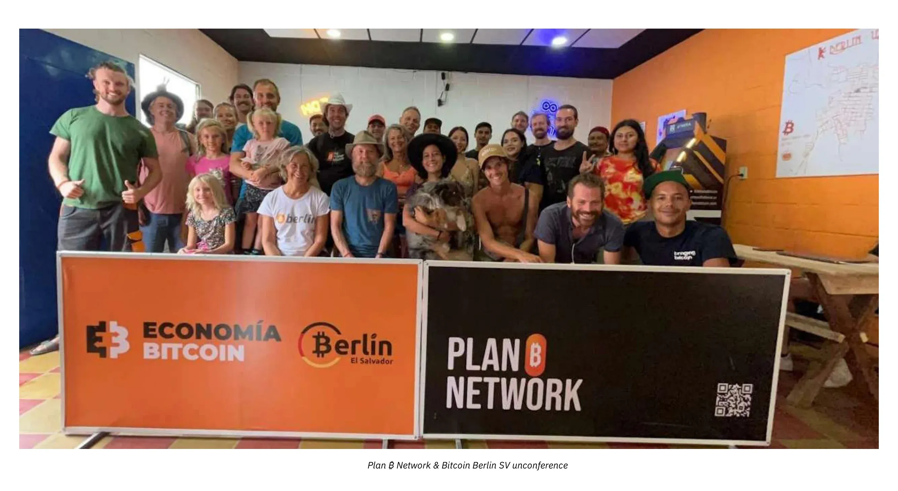

Самостоятелно можете бързо да изследвате един от многото тунели в заешката дупка на Bitcoin. Но не забравяйте,че има безброй други посоки за изследване.

**Създавайки и/или присъединявайки се към общност от биткойнисти и споделяйки и обменяйки редовно с тях, ще се движите едновременно във всички посоки по заешката дупка.**

## BTC 304, Какво следва

<chapterId>8bf10b77-80ee-5d50-87bc-0ef32574a675</chapterId>

В този курс на BTC 304 разгледахме подробно как да създадете общност или среща, както и как да стартирате различни проекти.

Когато вашата общност е готова да направи следващата стъпка, **можете да създадете официална асоциация**.

Във Франция например от около 60 общности и срещи почти една дузина имат статут на асоциация.

Ползите са две:

- Официално признаване**: можете да откриете банкова сметка на асоциацията, да получите внимание от пресата/медиите и дори да кандидатствате за субсидии.
- Структурирана организация**: можете да определите ясни роли, което улеснява управлението на общността и изпълнението на проекти.

С цел да помогнем на вашата общност да процъфти още повече, **не е изключено през следващите месеци да бъде пуснато продължение на това обучение в [Plan ₿ Academy](https://planb.academy/)**.

На следващата сесия могат да бъдат разгледани теми за напреднали, като например:

- Проектиране на презентации или семинари за вашите срещи и определяне на ясни цели.
- Организиране на мащабно събитие с около 100 участници.

За тази цел ще използваме опита на общности, които вече са създали свои собствени събития и презентации.

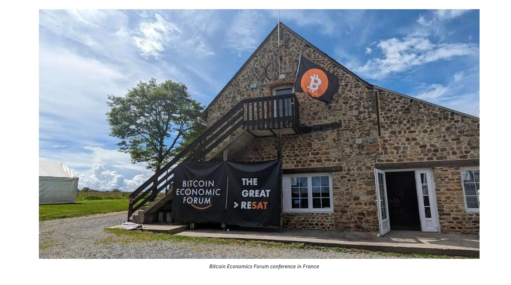

# Финален раздел

<partId>e9bdddf4-54c9-4de9-bbce-c3eade8c32e5</partId>

## Отзиви и оценки

<chapterId>08a35d2a-204b-519a-9bb1-588665a037fa</chapterId>

<isCourseReview>true</isCourseReview>

## Заключение

<chapterId>d74606a5-cb14-4117-acb2-2bf5920de092</chapterId>

<isCourseConclusion>true</isCourseConclusion>