# První krok k adopci Bitcoinu

Dnes se může kdokoli dozvědět o Bitcoinu online, ale často chybí příležitost se setkat, vyměnit si nápady a společně budovat. K vyplnění této mezery mnoho bitcoinerů vytváří lokální komunity, kde setkání vedou k workshopům, prezentacím a smysluplným diskusím.

V BTC304 se podíváme na to, proč je budování komunity důležité, prozkoumáme nástroje pro vytvoření silné vizuální a digitální identity a podělíme se o jednoduché open-source projekty, které můžete spustit. Budeme také zvažovat, jak se lokální iniciativy rozšiřují do národních komunit, které mohou pomoci řídit hyperbitcoinizovanou budoucnost.
+++
# Úvod

<partId>81318b8f-d316-5787-aa4c-4ec8370ba668</partId>

## Přehled kurzů

<chapterId>e8991b82-4966-5e04-8f05-7cae46eacbaa</chapterId>

Vítejte v BTC 304!

Od roku 2009 společnost Bitcoin neúnavně roste. Tento růst se projevil prostřednictvím nových návrhů na zlepšení Bitcoin (BIP), vytvořením dalších vrstev, aby byla síť škálovatelná (mimo jiné Lightning Network), a rozvojem mnoha společností a začínajících podniků.

Jeho vývoj je patrný i v On-Chain, kde počet transakcí neustále roste.

Odhaduje se například, že mezi 1. lednem 2018 a 1. lednem 2024 se počet transakcí na hlavní lince Bitcoin Layer [zvýší o 66,2 %](https://dune.com/queries/3375917/5663935). Mezitím se mezi srpnem 2021 a srpnem 2023 počet veřejných transakcí na Lightning Network [zvýšil o 1212 %](https://river.com/learn/files/river-lightning-report-2023.pdf).

Tento výrazný růst samozřejmě úzce souvisí s:

- [rostoucí zájem lidí na celém světě o používání Bitcoin](https://profedustream.substack.com/p/21-raisons-dutiliser-Bitcoin), aby se osvobodili od bankovního systému a/nebo používali méně volatilní nebo méně znehodnocenou měnu, jako je tomu v případě obyvatel Libanonu, Sýrie, Egypta, Argentiny a dalších zemí;
- jejího zhodnocování v čase, čímž se etabluje jako uchovatel hodnoty a dlouhodobá investice, k čemuž přispívá její pevná měnová politika;
- postupný růst spekulativního trhu s kryptoměnami, zejména v letech 2017-2018 a 2020-2021;
- Rostoucí přítomnost Bitcoin v hlavních médiích.

Ačkoli je Bitcoin stále v počáteční fázi, tato skutečnost, kterou si již pravděpodobně uvědomujete, nás nutí zamyslet se nad dvěma klíčovými otázkami:

- Jak můžeme bitcoináře povzbudit, aby se ve svém vzdělávání a projektech posunuli dál a **plně využili potenciál Bitcoin**?

- Jak můžeme pomoci nováčkům, které často lákají krátkodobé spekulace, aby nepřišli o peníze na nejnovějším memecoinovém šílenství a místo toho se zaměřili na **poznání základů Bitcoin**?

Nejlepší řešení obou problémů je jednoduché: **buďte přítomni v reálném světě a vzdělávejte se**.

Cílem tohoto kurzu je poskytnout vám vše, co potřebujete k vytvoření a efektivní organizaci komunity Bitcoin nebo setkání. Ať už chcete vybudovat místní iniciativu nebo rozvíjet online skupinu, tento kurz vás provede krok za krokem: od vytvoření vizuální identity až po založení pravidelných akcí a správu komunikačních kanálů.

**Oddíl 1: Úvod**

Na začátku zdůrazníme význam sdružování lidí kolem Bitcoin, ať už prostřednictvím online komunit nebo místních setkání. Dozvíte se, proč a kde založit vlastní komunitu a jak si stanovit jasné cíle, které podpoří její růst a dlouhodobou udržitelnost.

**Část 2: Vytvoření jedinečné identity pro vaši komunitu Bitcoin**

Pro přilákání nových členů a posílení pocitu sounáležitosti je nezbytné vybudovat jedinečnou identitu. V této části se dozvíte, jak navrhovat loga, plakáty a bannery, které ztělesňují ducha vaší komunity Bitcoin.

**Část 3: Vytvoření komunikačních kanálů pro vaši komunitu Bitcoin**

Komunikace je základem každé komunity. V této části prozkoumáme nejlepší kanály, které můžete použít, a provedeme vás efektivním nastavením skupiny Telegram nebo serveru Discord. Dozvíte se také, jak integrovat multifunkční roboty, abyste zefektivnili správu komunity.

**Část 4: Spuštění sociálních sítí** (ve francouzštině)

Viditelnost je klíčem k růstu vaší komunity. V této části se dozvíte, jak si vytvořit speciální profil na Twitteru, jak se spojit s místními setkáními a jak využít platformy, jako je btcmap.org, abyste zvýšili svou viditelnost a přilákali nové členy.

**Odddíl 5: Organizace setkání Bitcoin**

V této části se dozvíte, jak organizovat setkání: od výběru vhodného místa až po samotný průběh akce. Prozkoumáme také strategie pro budování loajality účastníků a zajištění dlouhodobé udržitelnosti vaší komunity.

**Odddíl 6: Příklady projektů a iniciativ** (ve francouzštině)

Tato sekce se zaměřuje na konkrétní a originální projekty: od tematických akcí a workshopů až po tvorbu vzdělávacího obsahu a místní spolupráci. Dozvíte se také, jak navrhovat fyzické i digitální materiály na propagaci vaší komunity.

**Odddíl 7: Předvídání budoucnosti**

Zde se budeme zabývat přirozeným vývojem vaší komunity: co dělat, když se příliš rychle rozroste, jak decentralizovat organizaci a jak reagovat na nepřátelské regulační prostředí. Tato část vám pomůže tyto výzvy předvídat a překonat.

**Odddíl 8: Sdružování bitcoinářů**

Závěrečná část se zaměřuje na podstatu vašeho projektu: sjednocení nadšenců Bitcoin kolem společné vize. Dozvíte se, jak strukturovat svůj přístup, abyste přilákali a udrželi členy, efektivně delegovali úkoly a udržitelně rozvíjeli svou komunitu.

Jste připraveni naučit se, jak vybudovat silnou a živou komunitu Bitcoin? Pojďme se do toho ponořit!

## Proč založit komunitu nebo setkání Bitcoin?

<chapterId>893ea248-7d5a-5b8e-948c-7031497b1031</chapterId>

### Jaký je rozdíl mezi komunitou a setkáním?

Ačkoli v ekosystému Bitcoin neexistuje žádná striktní definice těchto pojmů, komunita je nejlépe chápána jako skupina lidí, kteří sdílejí společnou vášeň a pravidelně spolu komunikují.

Setkání je naopak událost organizovaná touto komunitou a pro tuto komunitu s konkrétním cílem. Setkání se obvykle konají, jakmile je komunita již vytvořena.

V tomto kurzu předpokládáme, že před zahájením setkání Bitcoin jste se již spojili s několika lidmi, kteří mají zájem o pořádání takové akce, jinými slovy, **komunita již existuje**.

### Proč vytvářet komunitu Bitcoin?

Důvodů pro vytvoření komunity Bitcoin je několik:

- Sdílení znalostí a spolupráce: Komunity poskytují členům prostor pro Exchange nápady a sdílení znalostí. Vzájemná podpora je klíčovým pilířem růstu a umožňuje všem urychlit své učení, což je zvláště důležité pro Bitcoin vzhledem k tomu, kolik je toho k objevování.

- Peer-to-peer building: Mnoho iniciativ a projektů vzniká a rozvíjí se v rámci těchto komunit.

Společenství Bitcoin často sledují širší cíle, zejména v oblasti vzdělávání veřejnosti:

1. Co je Bitcoin;

2. Jak to funguje;

3. Její přínos pro společnost;

4. Vyvracení zavádějících nebo nepodložených tvrzení některých veřejných činitelů a médií;

5. Základní rozdíly mezi Bitcoin a ostatními kryptoměnami;

Budováním prvních "citadel" zítřka slouží **komunity Bitcoin po celém světě jako hráz proti dezinformacím a cenzuře a zároveň poskytují živnou půdu pro učení se základům Bitcoin**. Nabízejí nováčkům, dokonce i skeptikům, zdroje a kontakty potřebné k prozkoumání skutečného potenciálu Bitcoin.

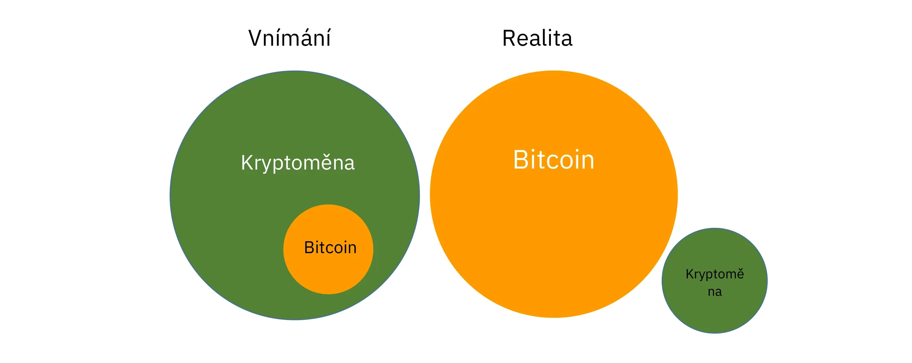

Za zmínku také stojí, že **komunita může existovat výhradně online**, ať už se jedná o skupinu na Telegramu ("Bitcoin Londýn"), skupinu na Facebooku ("Bitcoin Berlín"), server Discord ("Bitcoin Madrid"), nebo dokonce e-mailovou konferenci ("Bitcoin Francie").

Jinými slovy, **komunita nepotřebuje fyzická setkání, aby se jí dařilo nebo aby mohla zahájit projekty. Její hlavní účel zůstává stejný: sdílet, budovat a vzdělávat**.

### Proč vytvářet setkání?

Jak již bylo zmíněno, **setkání obvykle přicházejí až po založení komunity a slouží jako její doplněk**.

Jak se cesta bitcoinera vyvíjí, často se objevuje touha nebo dokonce potřeba **se osobně setkávat a komunikovat s ostatními** ze stejného ekosystému. To může pramenit z pocitu izolace nebo z toho, že si v každodenním životě nemáte s kým promluvit o Bitcoin.

Setkání nabízejí osobnější a příjemnější zážitek než online audio nebo video hovory. Ať už **při drinku nebo jídle**, vytvářejí neformální, přátelský prostor, kde mohou lidé otevřeně a přímo Exchange nápady.

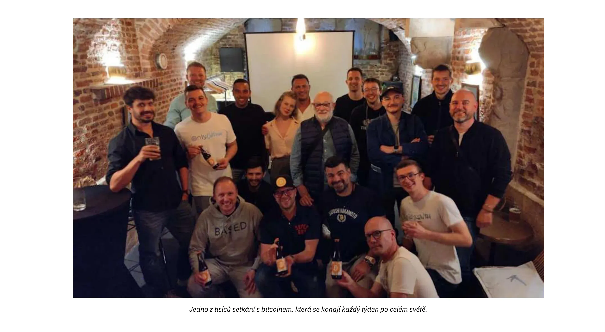

Setkání Bitcoin mohou sloužit k mnoha účelům:

- Diskuse o technických tématech nebo probíhajících projektech
- Pomáháme novým uživatelům bitcoinů postupně pronikat hlouběji do světa Bitcoin
- Oznamování nových projektů nebo iniciativ
- Výměna materiálů nebo knih
- Promítání dokumentárních filmů v předpremiéře
- Pořádání konferencí nebo workshopů na konkrétní témata

Mnohými z těchto možností se budeme podrobně zabývat v části 6/8 tohoto kurzu s názvem "[Příklady projektů a iniciativ](https://planb.academy/courses/1c643dc9-a15f-4f9e-93b6-cb3c58b4ee35/3213d87a-1998-5972-ab93-97a5769ba279).

Ačkoli si každá komunita může vytvářet vlastní názory, spouštět projekty a experimentovat po svém, setkání se ukazují jako stále **důležitější pro rozvoj Bitcoin a růst bitcoinářů**. **Jejich organizace však vyžaduje čas a úsilí**, a proto se v tomto kurzu podělíme o společné zkušenosti [přibližně šedesáti komunit Bitcoin ve Francii a Belgii](https://btcmap.org/communities/map#2/5.24949/0.20000) **aby vám pomohly co nejhladčeji vybudovat a rozvíjet vlastní komunitu a meetupy**.

## Kde byste měli vytvořit svou komunitu?

<chapterId>72da5285-5395-592d-ab62-303a0aef3d6d</chapterId>

První otázka, kterou je třeba si položit, zní: kde by měla vaše komunita sídlit?

Toto rozhodnutí je zásadní, pokud si chcete zachovat možnost pozdějšího pořádání setkání.

Pokud musí členové na akci dojíždět dvě hodiny, bude účast pravděpodobně nízká. Proto má výběr správného **místa pro vaši komunitu, a tedy i pro vaše budoucí setkání, zásadní vliv na její růst**.

Několik tipů, které vám pomohou při rozhodování:

1/ **Vytvořte a rozvíjejte svou komunitu ve středně velkém nebo velkém městě**. To vám usnadní:

    - Najděte příjemná místa pro setkání a projekty (prezentace, workshopy, propagace přijetí Bitcoin atd.);
    - Zvýšit pocit zapojení a sounáležitosti většího počtu lidí;
    - Zlepšit dostupnost akce (veřejná doprava, parkování atd.). Doporučujeme zvolit místo v blízkosti veřejné dopravy a parkoviště.

2/ **Vyberte si název spojený s vaším městem**. Lidé se tak mohou s vaší komunitou snadno ztotožnit. Příklady: Příklady: Bitcoin Paříž, Einundzwanzig Berlín, Satoshi Spritz Milano atd.

3/ **Zjistěte, zda ve vašem okolí již existuje setkání**.

Můžete se podívat na [btcmap.org](https://btcmap.org/communities/map#0/0/0/), kde je uvedena většina komunit a setkání Bitcoin po celém světě.

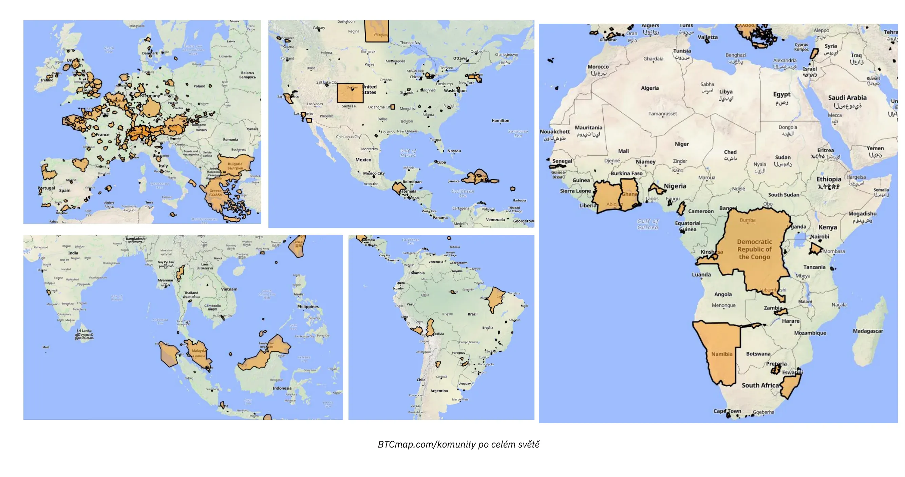

Po chvíli pátrání můžete najít existující setkání nebo komunitu ve vašem městě.

Bitcoin je decentralizovaný, takže si s ním přirozeně každý může dělat, co chce.

**Spojení sil je však často smysluplnější než rozdělení blízkých komunit a snížení dopadu každé z nich**. Založení zcela nového společenství tam, kde již jedno existuje, může neúmyslně vytvořit konkurenci.

V tomto smyslu může pomoci jednoduché "pravidlo": pokud v okruhu 30-45 minut od vašeho bydliště není žádná aktivní komunita Bitcoin, možná by stálo za to založit novou. Přesto si vždy můžete dělat, co chcete.

A samozřejmě, pokud se starší komunita "vyvinula" směrem, který již není v souladu s vašimi hodnotami, a vy nemáte čas nebo motivaci ji "oranžově obohatit", pak je vždy možné vytvořit si vlastní Fork.

## Jakými cíli by se měla vaše komunita řídit?

<chapterId>0aae1aa8-93ec-544a-ad88-22d32c619595</chapterId>

Jakmile jste určili město (nebo zeměpisnou oblast) pro svou komunitu, je čas **definovat, čeho chcete dosáhnout**.

Tyto cíle lze nastavit hned při spuštění nebo je upřesnit později, až se k vám připojí několik členů a vaše skupina se bude aktivně zapojovat.

Zde je několik bodů, kterými se můžete řídit:

1/ **Proč jako bitcoiner zakládám tuto komunitu?** Je to kvůli sdílení znalostí? Vzdělávat ostatní? Učit se od zkušenějších kolegů? Setkat se s podobně smýšlejícími lidmi? Zapojit se do ekosystému Bitcoin? Spojit se s profesionály? Nebo si prostě jen dát skleničku a poznat nové přátele?

Vaše odpovědi budou určovat vaši pozici a motivaci.

Pokud je vaším cílem **sdílet znalosti a vzdělávat lidi o Bitcoin**, zaměřte se na **tvorbu vzdělávacího obsahu** (články, podcasty, videa, prezentace, letáky atd.) a ušetřete ostatním nespočet hodin hledání. Můžete jít ještě dál a **organizovat workshopy, prezentace a konference**.

Pokud je vaším cílem jednoduše se seznámit s ostatními bitcoinery a sdílet zkušenosti, můžete zvolit klidnější přístup, například se sejít na skleničku.

Tímto způsobem si snáze vytvoříte sociální vazby. Vždy však mějte na paměti, že **pití piva není tou správnou cestou k budování světa zítřka**.

Proto je důležité **stanovit si konkrétní cíle a projekty**.

2/ Mám dát své komunitě **fyzický rozměr**? Pokud ano, jaké akce byste měli pořádat?

Vaší první akcí bude pravděpodobně setkání. Jejím hlavním účelem je sdružovat bitcoináře ve vašem okolí.

Jak si však ukážeme později v části [Příklady projektů a iniciativ](https://planb.academy/courses/1c643dc9-a15f-4f9e-93b6-cb3c58b4ee35/3213d87a-1998-5972-ab93-97a5769ba279), **setkání lze vytvořit mnoha způsoby a s mnoha cíli:**

- Spojte navazování kontaktů se vzdělávací prezentací konceptu Bitcoin;
- Uspořádejte profesionální ukázku řešení Bitcoin;
- Diskuse o strategiích pro místní obchodníky s oranžovou nálepkou;

a tak dále.

V závislosti na tématech (technické přednášky nebo praktické workshopy) může mít dokonce smysl **organizovat další akce** mimo pravidelné setkání.

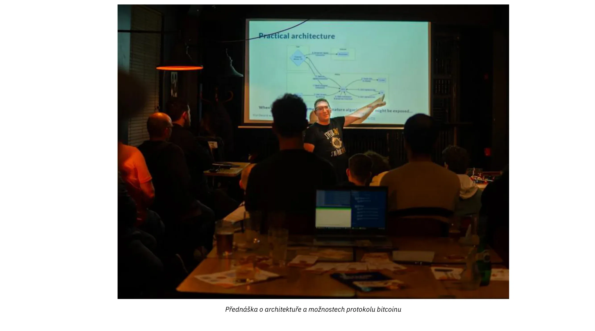

3/ Jak chci, aby moje komunita přispěla k ekosystému Bitcoin?

Tato otázka je pokročilejší, ale stojí za to se nad ní zamyslet hned na začátku.

Pokud je vaší vizí **vytvořit semknutou, motivovanou komunitu** zaměřenou na oranžové oblékání co největšího počtu lidí, pak:

- Spolupracujte se stávajícími komunitami, abyste měli přístup k širším informacím, zdrojům s otevřeným zdrojovým kódem a v případě potřeby k cenné podpoře.
- Organizujte a delegujte úkoly v rámci své skupiny, abyste mohli efektivně rozšířit a rozšířit své úsilí.

**Stanovení krátkodobých, střednědobých a dlouhodobých cílů**

Praktickým způsobem plánování je stanovení cílů pro každý časový rámec:

- Krátkodobě: vybudujte přítomnost na sociálních sítích a vytvořte komunikační kanály pro komunitu.
- Střednědobé: vytvoření vzdělávacích zdrojů (články, letáky, videa).
- Dlouhodobě: zahájení pravidelných fyzických setkání.

Jakmile budou schůzky zavedeny, můžete se zaměřit na:

- Krátkodobě: pořádání seminářů nebo prezentací na konkrétní témata
- Střednědobý horizont: realizace osvětových nebo vzdělávacích kampaní Bitcoin
- Dlouhodobě: vytvořte formální sdružení nebo partnerství s barem, který přijímá Bitcoin jako platbu.

Buďte připraveni: **budování komunity vyžaduje úsilí**

Vytvoření komunity se nestane přes noc. Vyžaduje to čas, motivaci a organizaci.

Někdy to může působit i skličujícím dojmem, zejména když se nikdo neukáže a vy se cítíte jako jediný, kdo nese tuto misi na svých bedrech.

Proto je **tento kurz určen ke sdílení cenných zdrojů a tipů, které pomáhají komunitám efektivně růst a nakonec se stát soběstačnými**.

# Navrhování identity komunity Bitcoin

<partId>da6673ad-bf49-5979-80a6-3f69cfb28046</partId>

## Proč a jak si můžete vytvořit vlastní identitu?

<chapterId>b48a18cc-afdf-5216-802c-32647b5cd8a3</chapterId>

V této fázi předpokládáme, že:

- Už víte, kde bude vaše komunita (nebo budoucí pravidelné setkání) sídlit.
- Stanovili jste si cíle pro různé časové horizonty, i když ještě nejsou konečné.

Dalším krokem při budování komunity je **určení její identity**, a to jak jejího názvu, tak vizuálního stylu.

V této sekci najdete návody a softwarová řešení pro začátečníky, která vám pomohou navrhnout vizuální identitu vaší komunity i se začátečnickými dovednostmi.

**Proč záleží na identitě?**

Lidé se cítí angažovanější a oddanější, když se mohou ztotožnit se skupinou. Silná identita pomáhá vaší komunitě vyniknout a posiluje pocit sounáležitosti.

Vše začíná výběrem jména a každá země má často své vlastní trendy:

- Francie: Většina z více než 60 místních komunit používá názvy jako "Bitcoin [CITY]" nebo "[CITY] Bitcoin". Jejich skupiny na Telegramu se často řídí tímto vzorem: "Bitcoin [CITY] meetup".
- Německo: Iniciativa Einundzwanzig (což znamená "21") inspirovala názvy jako "Einundzwanzig [CITY]".
- Itálie: V síti Satoshi Spritz se používají názvy jako Satoshi "Spritz [CITY]".

**Každá komunita má svou vlastní identitu, která je spojena s rodným městem, ale zároveň s širší identitou své země**.

Vaše vizuální identita: logo, barvy, bannery - to je to, co si lidé zapamatují a spojí s vaší skupinou.

Při vytváření účtů na sociálních sítích a komunikačních kanálů je logo a banner velkou výhodou. Nebojte se, nepotřebujete profesionální návrhářské dovednosti, k dispozici jsou bezplatné a snadno použitelné nástroje.

Skvělým výchozím bodem je začlenění pamětihodnosti nebo symbolu vašeho města. V Paříži to může být Eiffelova věž. V Lille je to zvonice nebo citadela. V New Yorku je to Socha Svobody. V Londýně Big Ben atd.

Podle svých preferencí můžete navrhnout jednoduché nebo podrobnější logo.

Pro představu uvádíme několik příkladů log francouzských komunit:

- V Marseille logo představuje baziliku Notre-Dame-de-la-Garde, která se tyčí nad městem:

- V Monaku se jedná o monackou skálu:

- V Lille představuje elegantní logo Vaubanovu citadelu a její park:

- V Saint-Malo je zvýrazněn ermin - znak města:

**Pokračujte, pokud chcete**

Pokud se vám dostane inspirace, můžete jít ještě dál: vytvořit znak, motto nebo dokonce píseň pro svou komunitu. Jediným limitem je vaše kreativita!

## Vytvoření loga, plakátu a banneru

<chapterId>3470a31f-0190-5e87-8af0-6a00e79267ef</chapterId>

### Používání aplikace Canva

K vytvoření různých vizuálních prvků pro vaši komunitu můžete použít aplikaci [Canva](https://www.canva.com/).

Tato bezplatná a snadno použitelná platforma je oblíbená pro svou rozsáhlou knihovnu předpřipravených šablon, které můžete duplikovat a přizpůsobit několika kliknutími.

**Tvorba loga**

Na domovské stránce aplikace Canva vyhledejte předpřipravená loga. Vyberte si jedno nebo několik, která vás inspirují, zkopírujte je a poté je upravte tak, aby odpovídala vaší komunitě.

Na pozadí můžete přidat místní pamětihodnost nebo emblém (importujte fotografii nebo v nabídce Elements vyhledejte "Ilustrace" nebo "Obrázky") a poté překryjte logo Bitcoin nebo ₿ a v případě potřeby upravte jeho barvu.

**Vytváření bannerů a plakátů**

Chcete-li vytvořit banner nebo plakát, vyhledejte v knihovně Canva předpřipravené šablony. Po zkopírování jedné z nich upravte text a písmo, přidejte logo své komunity a importujte případné fotografie pomocí rámečků (v nabídce Elements vyhledejte "frame").

Pomocí nabídky Designs můžete také prozkoumat další modely, které odpovídají vašim potřebám.

Pro miniatury nebo bannery YouTube stačí vyhledat tyto šablony, duplikovat je a upravit podle potřeby.

Stručně řečeno, **možnosti jsou neomezené a formují se nejen podle vašich potřeb, ale také podle vizuálního stylu, který chcete vytvořit** pro vaši komunitu a vaše setkání / události!

Pro lepší představu jsme přiložili nevyčerpávající videonávod, který ukazuje některé z těchto možností:

:::video id=d11ae0ed-eacd-4924-afd3-75aff95d2899:::

**Vzorové šablony z Bitcoin Lille**

Zde jsou připravené šablony Canva, které můžete zkopírovat a upravit pro svou komunitu:

- **Plakát s oznámením o setkání** (pro sociální média a tisk ve formátu A4/A3): [odkaz](https://www.canva.com/design/DAGBvBXFJ8A/92-j_toeLU8QbVAD0NwoAA/edit?utm_content=DAGBvBXFJ8A&utm_campaign=designshare&utm_medium=link2&utm_source=sharebutton)

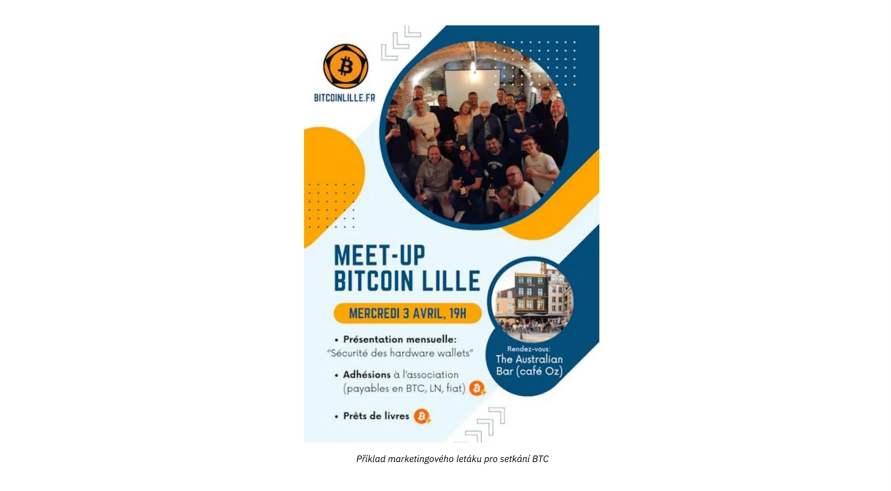

- **Plakát události** (pro sociální média a tisk A4/A3): [odkaz](https://www.canva.com/design/DAGBvG3rNCc/oXtNR9pduRs22AqclG4O2g/edit?utm_content=DAGBvG3rNCc&utm_campaign=designshare&utm_medium=link2&utm_source=sharebutton)

- **bannery na sociálních sítích**: [odkaz](https://www.canva.com/design/DAGBvOXyNqw/iSJG9PbIQHgGWHz5PhlXSQ/edit?utm_content=DAGBvOXyNqw&utm_campaign=designshare&utm_medium=link2&utm_source=sharebutton)

- **Oznámení o soutěži**: [odkaz](https://www.canva.com/design/DAGBvIjuA_w/YzSUXzOmbNV9oCma9mluOw/edit?utm_content=DAGBvIjuA_w&utm_campaign=designshare&utm_medium=link2&utm_source=sharebutton)

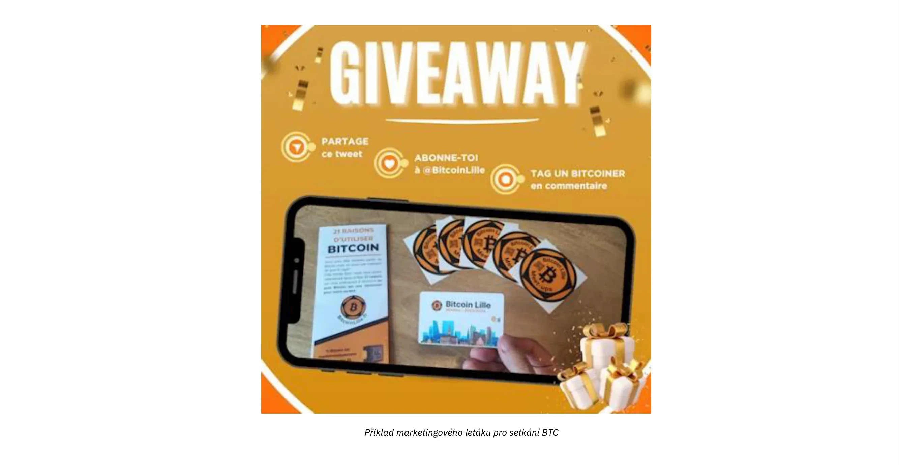

- směrnice **značky naší knihovny**, vystavené na formátu A4 při setkáních: [odkaz](https://www.canva.com/design/DAGBvPqL7N4/LmUItfsysypRLSOFOzBXcQ/edit?utm_content=DAGBvPqL7N4&utm_campaign=designshare&utm_medium=link2&utm_source=sharebutton)

- Prezentace **PowerPoint** "Chapter 2 - Understanding Bitcoin transactions", autor: @ProfEduStream: [odkaz](https://www.canva.com/design/DAFsEcnOro8/Mz9FYdTGhsvozZOe0Y9jtw/edit?utm_content=DAFsEcnOro8&utm_campaign=designshare&utm_medium=link2&utm_source=sharebutton)

- **leták** "21 důvodů, proč používat Bitcoin", napsal @ProfEduStream: [odkaz](https://www.canva.com/design/DAFtAR1NauQ/ZDwl2CchIJ9Gpb36N6-7iw/edit?utm_content=DAFtAR1NauQ&utm_campaign=designshare&utm_medium=link2&utm_source=sharebutton)

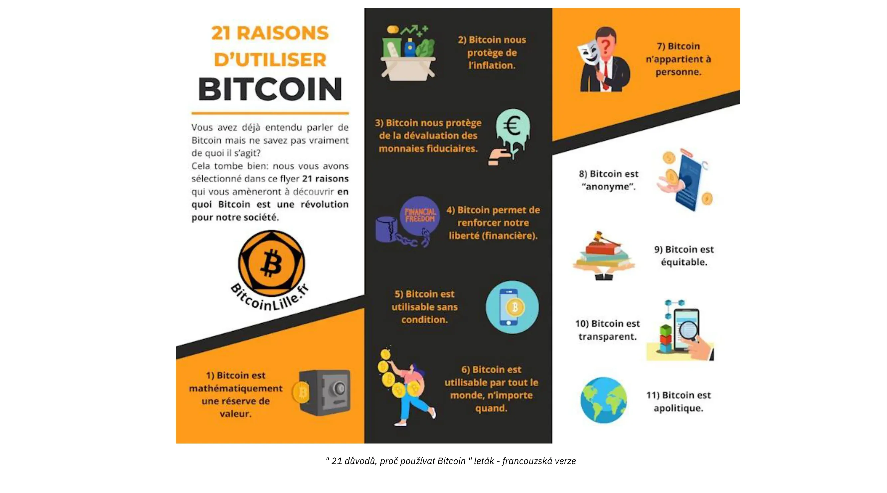

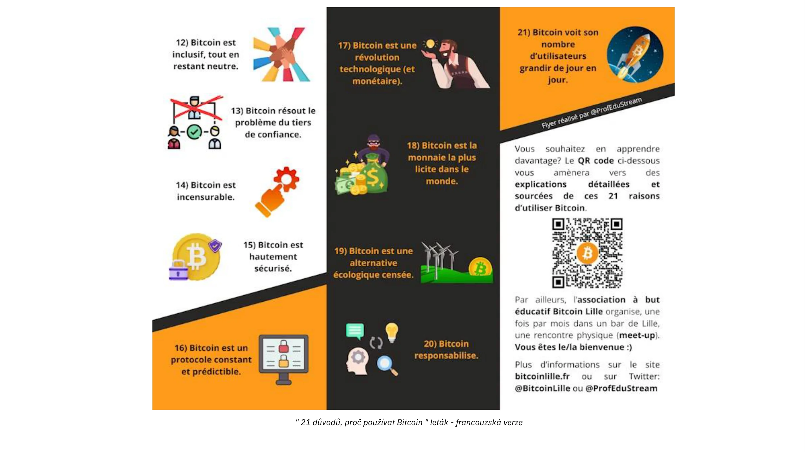

**Sdílejte své výtvory**

Možnosti jsou neomezené a vaše návrhy budou záviset na vašich cílech a vizuální identitě. Zvažte sdílení svých šablon s otevřeným zdrojovým kódem, ušetříte tím čas dalším komunitám Bitcoin, které budou nevyhnutelně čelit stejným výzvám jako vy. Sdílením pomáháte urychlit růst komunit Bitcoin po celém světě.

**Doporučené rozměry**

Při vytváření vizuálů vždy zkontrolujte požadavky na velikost pro jednotlivé platformy:

| Platform | Logo | Banner | Poster / Image
| -------- | -------- | -------- | -------- |
| Telegram     | 512 x 512     | N/A     | N/A     |
| Signal     | N/A     | N/A     | N/A     |
| Twitter     | 400 x 400     | 1500 x 500     | 1200 x 628     |
| Meet-up     | N/A     | N/A     | N/A     |
| Discord     | 512 x 512     | 960 x 540     | N/A     |
| Facebook     | 512 x 512     | 851 x 315     | 960 x 720     |

Obvykle vhodné velikosti:

Loga: 512 x 512 pixelů

Bannery: Různé v závislosti na aplikaci nebo webu

Plakáty: A4 je standardní formát pro tisk

### Využití umělé inteligence

I když Canva nabízí širokou škálu nástrojů pro tvorbu log, plakátů, bannerů a letáků, není to jediná možnost. Pokud vám více vyhovuje jiný software (například Photoshop nebo Illustrator), neváhejte použít to, co vám nejlépe vyhovuje.

Ať už navrhujete logo komunity nebo vylepšujete plakáty, prezentace či letáky, **umělá inteligence může být mocným spojencem při vytváření jedinečných a atraktivních vizuálů**.

K tomuto účelu je k dispozici řada umělých inteligencí. Patří mezi ně

- [midjourney](https://docs.midjourney.com/docs/quick-start) (placené);
- [leonardo](https://leonardo.ai/) (zdarma, s omezeným počtem účtů);
- [copilot](https://copilot.microsoft.com/) (zdarma, s omezeným počtem účtů);
- [DALL-E](https://www.dall-efree.com/) (placený).

V poslední době se objevilo mnoho dalších nástrojů umělé inteligence, takže tento seznam není zdaleka úplný.

**Příklad: Vytvoření futuristického loga Bitcoin London**

Pokud chcete navrhnout futuristické logo pro setkání "Bitcoin London", můžete požádat Copilota:

- [ ] *Prompt: Vytvořte logo Bitcoin s Londýnským mostem a Big Benem v pozadí. Futuristické* - [Odkaz](https://copilot.microsoft.com/images/create/un-logo-Bitcoin-futuriste-avec-en-arric3a8re-plan-le-/1-6612ba1758df4384bc33c4bca00ab45b?FORM=SYDBIC)

Pokud první čtyři výsledky nejsou dostatečně realistické, upřesněte svůj požadavek:

- [ ] *Prompt: Udělejte čtvrtý mnohem realističtější* - [Odkaz](https://copilot.microsoft.com/images/create/un-logo-Bitcoin-futuriste-avec-en-arric3a8re-plan-le-/1-6612ba64b72d4cea9830ab7eb844f785?FORM=SYDBIC)

Poslední výsledek dopadl skvěle!

**Příklad: Vytvoření jednoduchého loga v britském stylu**

Pro čistší vzhled, například pro nálepku:

- [ ] *Prompt: Vytvořte logo "London Bitcoin Meetup" v britském a čistém stylu* - [Odkaz](https://copilot.microsoft.com/images/create/logo-for-27londres-Bitcoin-meetup27-with-a-british-a/1-6612bb9451924859a6c34b350b3a6ebc?FORM=SYDBIC)

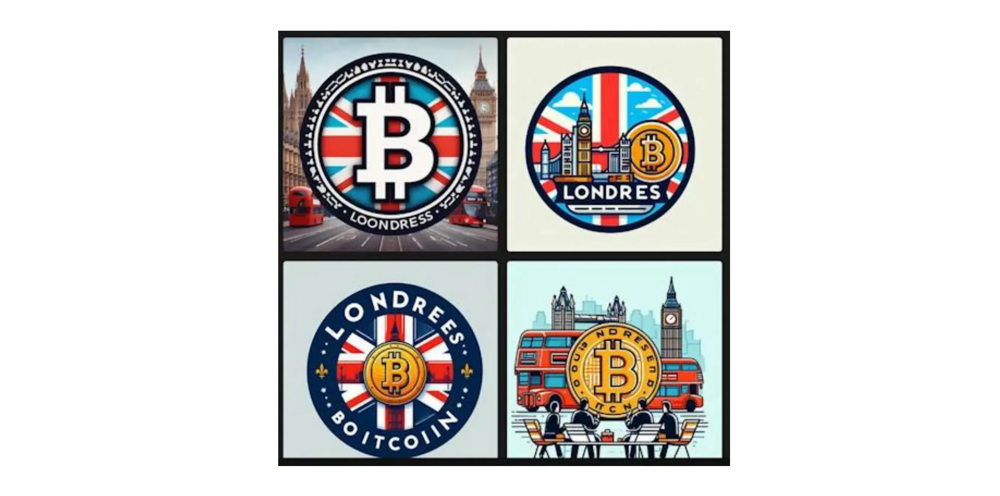

Výsledek vypadá opravdu skvěle!

**Tipy pro práci s umělou inteligencí**

- Buďte trpěliví: Umělá inteligence nemusí na první pokus vytvořit přesně to, co si představujete.

- Používejte přesné výzvy: Čím jasnější a podrobnější jsou vaše pokyny, tím lepší jsou výsledky.

- Požádejte o pomoc: Pokud nejste spokojeni, obraťte se na někoho, kdo má zkušenosti s grafickým designem nebo nástroji umělé inteligence, mnoho bitcoinářů vám ochotně pomůže, někdy dokonce zdarma nebo za pár Sats.

# Vytvoření komunikačních kanálů pro vaši komunitu Bitcoin

<partId>fc588298-6876-554c-bd57-55d182464878</partId>

## Jaké komunikační kanály byste měli zvolit?

<chapterId>b4f4eef6-1035-5290-848a-2b7f9391c77a</chapterId>

Jak bylo uvedeno výše, komunikační kanály komunity se mohou lišit v závislosti na motivaci a zvyklostech.

Například **ve Francii, Německu a Itálii jsou dominantními platformami** Telegram a Twitter, které se staly "standardem" pro komunity Bitcoin.

Naproti tomu v České republice mnoho komunit používá místo Telegramu **Matrix**, zabezpečený protokol pro zasílání rychlých zpráv.

Tip: Před výběrem kanálů se **podívejte, co dělají okolní komunity**. Pomocí mapy [btcmap.org](https://btcmap.org/communities/map#0/0/0/) zjistíte, které platformy jsou ve vašem regionu nejoblíbenější.

Například švýcarské komunity používají především Telegram, Twitter a vlastní webové stránky:

**Doporučené kanály pro francouzsky mluvící komunity**

- Telegram: Používá ho více než 90 % francouzských schůzek.

- Twitter (X): Hlavní sociální síť používaná uživateli bitcoinů po celém světě. Používá ji ~ 70 % francouzských setkávačů. Je ideální pro oslovení bitcoinářů.

- Meetup.com: Placené, ale hojně využívané (~30 % francouzských a téměř všechny kanadské meet-upy) ke zviditelnění mimo ekosystém Bitcoin.

- Další možnosti: ~30 % má také webové stránky; ~10 % provozuje servery Discord nebo účty NOSTR.

Lze použít i další platformy, jako je Matrix, Keet, Signal, Facebook, Instagram a LinkedIn. Pozor, čím více kanálů budete spravovat, tím více času strávíte jejich moderováním, zveřejňováním a udržováním jejich aktivity.

Kdo chce ve Francii založit komunitu, měl by proto začít s jejím vytvářením:

- skupina Telegramu;
- účet na Twitteru.

Jak se vaše komunita rozrůstá, můžete přidávat další platformy a delegovat moderování na důvěryhodné členy.

## Vytvoření a konfigurace kanálu, skupiny nebo nadskupiny Telegramu

<chapterId>d13714ce-8f08-53e9-bedd-b6a3aaac5dad</chapterId>

Před vytvořením komunikačního prostoru vaší komunity na Telegramu je důležité znát rozdíl mezi:

- kanál Telegramu;
- skupina Telegramu;
- superskupina Telegramu.

Důrazně doporučujeme začít se skupinou Telegram.

V případě potřeby ji můžete později převést na nadskupinu.

Pro níže uvedené výukové programy jsme původně použili balíček "Telegram+" APK, který umožňuje pokročilejší konfiguraci. Nemusíte ji však nutně potřebovat, protože k vytváření a správě skupin postačí oficiální aplikace Telegram, a to i prostřednictvím telefonu:

:::video id=b1da7cb4-5fb1-4a41-a1d4-bd90686826a9:::

### Vytvoření kanálu Telegram

Pokud chcete vytvořit místo, kde spolu členové mohou přímo komunikovat, odpovídat si atd., pak byste možná měli vytvořit skupinu Telegramu, a ne kanál Telegramu!

Přejděte přímo na další část s názvem [Vytvořit skupinu Telegram](https://planb.academy/courses/1c643dc9-a15f-4f9e-93b6-cb3c58b4ee35/d13714ce-8f08-53e9-bedd-b6a3aaac5dad).

Vskutku, **kanál Telegramu je spíše jednosměrný vysílací nástroj pro správce**. Členové nemohou volně chatovat, mohou pouze reagovat pomocí emotikonů (nebo zanechávat komentáře v samostatných vláknech, což roztříští konverzaci).

**Protože komunity potřebují interakci a spolupráci, kanál Telegramu se nedoporučuje**, pokud je vaším cílem budování vztahů a sdílení znalostí.

Výukový program pro vytvoření kanálu Telegram:

:::video id=98be4709-d221-4030-8c31-e10113482515:::

### Vytvoření skupiny Telegram

Na druhou stranu **skupina Telegram je ideální pro komunity**: Stejně jako v aplikacích pro zasílání zpráv, jako je Messenger nebo WhatsApp, mohou členové chatovat a odpovídat si navzájem v rámci jedné sdílené konverzace.

Co můžete dělat jako správce:

- Zveřejněte a připněte důležité zprávy.
- Vytvoření **ankety** (užitečné pro rozhodování o termínech setkání, pokud je vaše komunita nová).
- vytvořit **vlastní odkaz na pozvánku** (Pouze pokud je skupina "veřejná" a ne "soukromá", což je definováno v nastavení. Je také vhodné mít vlastní odkaz na pozvánku na Telegram, například: t.me/Bitcoin[CITY]);
- Správa oprávnění, rolí a moderování členů.
- Přidejte profilový obrázek (logo komunity) a aktualizujte název skupiny.

Výukový program pro vytvoření skupiny Telegram:

:::video id=3d4792a7-1345-475b-93b1-b3a3945fb567:::

Poznámka: Tento návod byl vytvořen pomocí aplikace Telegram+, ale vše můžete provést přímo ze standardní mobilní aplikace Telegram.

### Vytvoření superskupiny Telegram

Proč superskupina?

Když se vaše skupina na Telegramu rozroste na stovky členů, konverzace se mohou stát chaotickými. To často vede k tomu, že členové zmeškají důležitá oznámení, například datum příštího setkání.

K dispozici je několik řešení:

1. **Připnout důležité zprávy**, aby všichni členové obdrželi upozornění (stiskněte jednou prstem danou zprávu a vyberte možnost "Připnout");

2. Zvažte možnost použít **Discord** pro více komunikačních kanálů, z nichž každý mohou uživatelé v případě potřeby ztlumit.

3. **Přeměňte svou skupinu Telegramu na superskupinu**.

Co je to superskupina Telegram?

Superskupina je v podstatě skupina Telegramu s tématy (podkanály) uvnitř.

Příklad témat:

- "Důležité informace": pouze klíčové aktualizace a oznámení o událostech.
- "Obecné": pro všechny členské diskuse.
- Specifická témata: např. Mining, vývoj projektů, nadcházející konference.

Tip: Přizpůsobte témata potřebám své komunity. Příklad: Abidjan Bitcoin Meet-up úspěšně používá tento formát.

Mějte na paměti, že **používání superskupin Telegrafu může být pro některé členy poněkud obtížné**. Ne všichni například vědí, **jak se dostat k jednotlivým tématům** (stačí klepnout na logo skupiny v hlavní nabídce Telegramu a zobrazí se úplný seznam témat). Zaslání rychlého snímku obrazovky může pomoci vyjasnit případné nejasnosti.

Neexistuje žádné striktní pravidlo, kdy přejít z běžné skupiny Telegramu na superskupinu, záleží na potřebách vašich členů. Dobrou zprávou je, že můžete snadno přepínat tam a zpět: jednoduše vytvořte téma, které převedete na superskupinu, nebo odstraňte všechna témata kromě "Obecných" a vraťte se do běžné skupiny.

Výukový program pro vytvoření superskupiny Telegram:

:::video id=f78800ae-d8ca-479a-b913-99abd9916bff:::

Rychlá poznámka: jak již bylo zmíněno, výše uvedený návod byl vytvořen na počítači pomocí aplikace "Telegram+" APK. Dnes je však vytvoření superskupiny Telegram v telefonu jednoduché.

Stačí vytvořit skupinu Telegramu, přejít do jejího nastavení a klepnutím na tlačítko "Témata" přidat témata. Po uložení se zobrazí seznam témat, která můžete libovolně upravovat.

Pokud tedy nechcete mít přístup k pokročilejším nastavením soukromí pro svou superskupinu, není již nutné stahovat aplikaci Telegram+.

## Nastavení skupiny nebo superskupiny Telegramu

<chapterId>35e674b3-5924-50b0-98f1-83a56c9a186d</chapterId>

Nyní, když je vaše skupina (nebo nadskupina) Telegramu zprovozněna, je čas **konfigurovat oprávnění a nastavit moderování**.

Každá komunita si může zvolit vlastní přístup, ale zkušenosti ukazují, že je **nejlepší omezit některá oprávnění členů**:

- Odeslání průzkumu;
- Odesílání souborů (aby se předešlo případným virům);
- Odesílání hlasových zpráv;
- Přidávání uživatelů (pomáhá zabránit invazi botů);
- Připínání zpráv;
- Úprava informací o skupině.

Při vytváření skupiny nebo superskupiny na Telegramu doporučujeme **napsat jasný popis setkání**, protože je to první věc, kterou potenciální členové uvidí. Například:

> Vítejte na telegramu @Bitcoin [CITY] 🔥
>

> Každou první středu v měsíci pořádáme setkání v baru [BAR_NAME] v [CITY] 🍻
>

> Podívejte se na naše další sociální sítě: [LINK] 🌐

V tomto příkladu správci Bitcoin Lille upravili svůj veřejný odkaz na Telegram pro snadnější sdílení.

V "Nastavení skupiny" může být vhodné **povolit "Schvalovat nové členy "**.

Některé skupiny Bitcoin na Telegramu se staly terčem tisíců falešných účtů, které mají za cíl rozesílat spam nebo narušovat komunitu.

**Aktivací schvalování členů můžete zachránit svou skupinu před spamovým útokem.**

V sekci Správci můžete také povolit funkci "Agresivní antispam", která automaticky odstraní podezřelé zprávy.

Není to vždy nutné, ale může to zvýšit ochranu Layer.

## Přidání multifunkčního bota do skupiny Telegramu

<chapterId>c61f69cc-15ec-53f1-8c02-1cea55def09e</chapterId>

**Další možností konfigurace a zabezpečení skupiny nebo nadskupiny Telegramu je přidání multifunkčního bota**. Ten vám umožní výrazně rozšířit funkce a možnosti moderování vaší skupiny.

Pomocí **bota [@GroupHelpBot](https://telegram.me/grouphelpbot)** jsou nejužitečnější tyto možnosti:

- Příkaz **rules** (/rules), který zobrazí pravidla komunity;
- **Ochrana proti spamu**, která filtruje podezřelé zprávy a účty;
- **Přizpůsobitelné automatické uvítací zprávy** pro nové členy (s volitelným automatickým smazáním po několika minutách)
- **Ochrana proti záplavám**, která zabraňuje zasílání nevyžádaných zpráv
- Příkaz **@administrator** pro rychlé oslovení správců skupin
- **Pravidla blokování** nežádoucího obsahu
- Příkaz **propojení skupiny** (/link)
- Příkaz **řízení povolení**
- **Automatické mazání** určitých typů zpráv
- **Blokování botů** a **blokování vstupu a výstupu** pro zajištění bezpečnosti skupiny
- Seznam sociálních sítí **komunity** (/networks)
- A mnoho dalšího...

K dispozici je nespočet dalších funkcí.

Profesionální rada: **Nepřehánějte konverzaci**.

Návod na přidání multifunkčního bota do skupiny nebo nadskupiny Telegramu:

:::video id=cdbf82d6-3530-45c4-90de-593f100863bb:::

(Poznámka: Celý tento proces lze nyní provést přímo z telefonu. Aplikace Telegram+ již není potřeba.)

## Vytvoření serveru Discord

<chapterId>eef2a965-4c24-5f3a-8013-72cc7d315314</chapterId>

Když se vaše skupina na Telegramu příliš rozroste, pomůže vám její přeměna na superskupinu Telegramu uspořádat diskuse.

Jak však bylo zmíněno dříve, **přidaná složitost a nárůst témat a zpráv může způsobit, že někteří aktivní členové ztratí zájem**.

Proč uvažovat o službě Discord?

**Discord je alternativou** k superskupině Telegramu, protože umožňuje uživatelům **vytvářet specifické textové a hlasové chatovací místnosti** a umožňuje členům ztlumit všechny kanály, o které nemají zájem.

Správa Telegramu i Discordu samozřejmě vyžaduje trochu více času, zejména při konfiguraci a spuštění.

Abychom vám to usnadnili, **sdílíme [Discord server, který můžete duplikovat a přizpůsobit](https://discord.com/template/bDY4eXXJk2C8)**:

:::video id=e647458a-a21e-44e0-bd03-20b82a871777:::

Dobře navržený server Discord může být pro vaši komunitu skutečným přínosem. Mnoho bitcoinářů již denně používá **Discord** a možnost sledovat konverzace na Telegramu přímo v rámci Discordu (a naopak) může všem ušetřit spoustu času.

K synchronizaci obou platforem slouží bot s otevřeným zdrojovým kódem s názvem [TediCross](https://github.com/TediCross/TediCross). Jeho účel je jednoduchý: automaticky přeposílat zprávy z textového kanálu Discord do skupiny Telegram (nebo tématu v nadskupině) a naopak.

Mějte však na paměti, že jeho instalace není nejjednodušší. Aby bot fungoval, musíte mít v počítači spuštěný příkazový řádek (CMD) a občas se mohou vyskytnout chyby. Naštěstí je oprava jednoduchá: stačí bota restartovat a většinou se vše vrátí do normálu.

Abychom vám ušetřili čas, přinášíme návod, jak přidat tohoto multifunkčního bota do skupiny nebo nadskupiny Telegramu:

:::video id=6a0283f6-6d6c-4e81-8b2f-644b33c52fe6:::

## Zvážit alternativní, soukromé a bezpečnější komunikační kanály

<chapterId>29d0aad6-0612-5dd0-bcef-7337eaf4fefc</chapterId>

Jak již bylo uvedeno dříve, Twitter a Telegram jsou nejpoužívanějšími komunikačními nástroji pro komunity Bitcoin v Evropě (ne-li na celém světě).

Telegram však není zrovna známý jako nejbezpečnější aplikace pro zasílání zpráv nebo aplikace zaměřená na ochranu soukromí a Twitter, nyní X, vlastní jedna z nejsvobodomyslnějších korporací na světě.

Proto se po zavedení hlavních kanálů a bezproblémovém fungování vyplatí věnovat čas prozkoumání dalších možností.

V nadcházejících měsících bude tento kurz a platforma planb.network nabízet výukové kurzy o používání alternativních protokolů, jako jsou **Simplex a Element**: decentralizované, šifrované a vysoce přizpůsobitelné komunikační nástroje.

**Proč se zabývat těmito možnostmi?**

Stejně jako sociální síť NOSTR totiž poskytují nejen větší soukromí, ale také ochranu před cenzurou nebo svévolným uzavřením skupiny Telegram.

A opravdu, co může být více v souladu s duchem Bitcoin než odolnost vůči cenzuře a odolnost podle návrhu?

# Spusťte své sociální sítě

<partId>8ebf8cd7-9248-543f-bc27-4ec4cc03f9cf</partId>

## Význam viditelnosti pro růst komunity Bitcoin

<chapterId>b20f12e4-c5de-5f02-80c7-b7fc6cadd3ac</chapterId>

Vaše komunita je tedy spuštěna a funguje. Založili jste si prostor na Telegramu nebo v Matrixu... ale zatím jste tam jen vy. **Čas dát lidem vědět, že existujete!**

Je to jednoduché: pokud nikdo nemá přístup k vaší skupině a nemůže zjistit, kdy se koná další setkání, budete jen posílat příspěvky do prázdna. Proto jsou sociální média a několik konkrétních platforem, kterým se budeme věnovat později, tak důležité pro budování vaší komunity.

Twitter (X) se stal téměř synonymem pro online konverzaci Bitcoin. Není dokonalý, zdaleka ne, ale v současné době se na něm shromažďuje velká část komunity. Vytvořit si tam účet se důrazně doporučuje.

Některé komunity si také otevírají profil NOSTR, aby se vyhnuly případné cenzuře nebo omezením.

To je to, co kolektiv FREE Madeira udělal.

Užitečné mohou být samozřejmě i jiné platformy. Facebook (buď se skupinou, nebo stránkou), nebo dokonce LinkedIn.

Mějte na paměti, že **čím více komunikačních kanálů a sociálních sítí spravujete, tím více času to vyžaduje**. Často je lepší zaměřit se **na ty nejdůležitější**, Twitter (a NOSTR) jsou pro začátek skvělé možnosti.

## Vytvoření profilu na Twitteru

<chapterId>c8d73097-8eba-5530-918c-221002954110</chapterId>

Používání Twitteru je velmi snadné a pro zlepšení soukromí je třeba upravit několik nastavení.

**Při vytváření nového účtu na Twitteru je třeba zadat čtyři základní údaje:**:

1/ **the @ Twitter**, který definuje vaši identitu a umožňuje vás snadno najít. Pokud je název vaší komunity "Bitcoin [MĚSTO]", je vhodné zvolit "@Bitcoin[MĚSTO]";

2/ **logo a banner**, které jste vytvořili pro svou komunitu nebo setkání (viz část [Vytvoření loga, plakátu a banneru](https://planb.academy/courses/1c643dc9-a15f-4f9e-93b6-cb3c58b4ee35/3470a31f-0190-5e87-8af0-6a00e79267ef));

3/ **popis**, který vám umožní sdílet klíčové informace o vaší komunitě v několika stech znacích. Například:

> Oficiální účet komunity Bitcoin [MĚSTO] #BTC | Setkání každou 1. středu v měsíci v [BAR_NAME] v [MĚSTO] 🍻 | Přidejte se k nám na Telegramu 🔽

4/ Pod tímto popisem je možné **vložit odkaz**. Ten může uživatele vést na stránku "sociální sítě" na webových stránkách vaší komunity nebo na váš kanál Telegram. Záleží na vašem rozhodnutí, na co chcete upozornit.

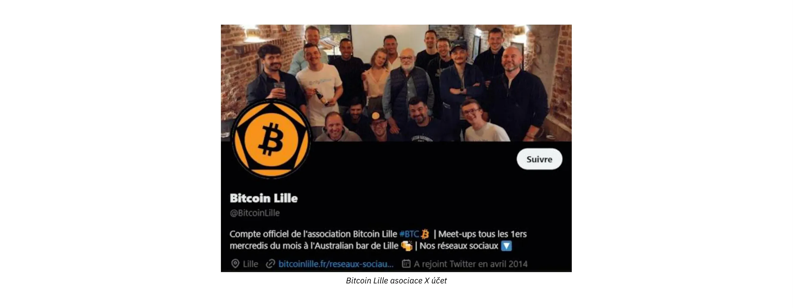

Kromě toho je vhodné upravit **několik nastavení ochrany osobních údajů**:

- ponechat účet Twitter v režimu "veřejný" (příspěvky viditelné pro kohokoli);
- aby vás každý našel;
- zakázat sledování polohy a sdílení dat s jinými subjekty (v nastavení ochrany osobních údajů).

Při každé události budete pravděpodobně používat Twitter ke sdílení užitečných informací. Ale stejně jako u většiny sociálních sítí platí, že **viditelnost je vše**.

Abychom vám ušetřili spoustu času, věnovali jsme čas studiu [open-source algoritmu hodnocení Twitteru](https://github.com/twitter).

Zde jsou **klíčové věci, na které se zaměřte, abyste zvýšili svou viditelnost**:

- Obecné tipy:
    - Tweetujte v nastaveném jazyce účtu nebo v angličtině: tweetování v jiných jazycích může značně snížit vaši viditelnost;
    - Držte se svého výklenku a sdílejte pouze obsah související se zaměřením vašeho účtu; tweety mimo téma jsou algoritmem penalizovány;
    - Snažte se o 1 až 2 tweety denně;
    - Vysílání v době špičky: (zkontrolujte si to na svém účtu: Twitter Analytics).

- Při psaní tweetu:
    - přidat fotografii (nebo dokonce video);
    - Použijte pouze jeden hashtag (obvykle je nejvhodnější #Bitcoin. Pokud je to vhodné, můžete přidat trendový hashtag související s oblastí vašeho účtu);
    - Povzbuzujte svou komunitu k interakci:
        - Like = hmotnost 0,5
        - Retweet = váha 1
- Odpověď = hmotnost 27 (!!)
- Odpovězte lidem, kteří reagují na vaše **tweety** (váha 75!!);
    - Vyhněte se umisťování odkazů do hlavního tweetu: přidejte je raději do prvního komentáře;
    - Pište slova celá, vyhněte se zkratkám.

- Další tipy:
    - Tweetujte o trendových tématech, pokud jsou v souladu s oblastí vašeho účtu;
    - Přeposílejte své nejúspěšnější tweety;
    - Příležitostně provádějte průzkumy veřejného mínění;
    - Pokud je to možné, napište vlákna;
    - Povzbuďte svou komunitu, aby navštívila váš profil a sledovala vás.

Navíc **můžete tweet nebo vlákno připnout na svůj profil na Twitteru, abyste je maximálně zviditelnili**, stejně jako to dělá komunita Bitcoin Witsand v Jihoafrické republice.

Všimněte si také, že je možné zůstat přihlášený ke dvěma účtům Twitteru současně, a to jak v telefonu, tak v počítači. To je velmi praktické, pokud chcete snadno přepínat mezi osobním a komunitním účtem.

Jen buďte opatrní... náhodné zveřejnění fotografie z komunitního účtu se může stát rychleji, než si myslíte!

A konečně, i když je vaše uživatelské jméno "@Bitcoin[CITY]" jedinečné a nyní vaše, je chytré předvídat falešné nebo napodobující účty. Zvažte také registraci:

- @Bitcoin_[CITY]
- @[CITY]Bitcoin
- @[CITY]_Bitcoin

Tímto způsobem výrazně snížíte pravděpodobnost, že se někdo bude vydávat za vaši komunitu.

Výukový program pro vytvoření účtu na Twitteru:

:::video id=4648976f-41ec-499a-b7ec-a53e796f71b4:::

## Přiblížení se k sousedním setkáním

<chapterId>12a21c3b-235a-5292-8209-67bf60f61e49</chapterId>

Nyní, když jsou vaše komunikační kanály a sociální sítě nastaveny a odrážejí vizuální identitu vaší komunity, je čas začít sledovat ty správné lidi.

Na Twitteru začněte sledovat klíčové účty, které celosvětově propagují Bitcoin, jako jsou [@Bitcoin](https://twitter.com/Bitcoin) a [@planb_network](https://twitter.com/planb_network), a také iniciativy jako [@FBCEglobal](https://twitter.com/FBCEglobal). Můžete také retweetnout slavný tweet [@halfin](https://twitter.com/halfin) "Running Bitcoin" z 11. ledna 2009. A hlavně **sledujte účty komunit a setkání Bitcoin ve své zemi**.

To vytváří **příležitost ke vzájemnému sledování, označování se navzájem a ke společnému zviditelnění**. Je to již běžná praxe mezi ~50 komunitami Bitcoin ve Francii, iniciativami "Satoshi Spritz" v Itálii a skupinami "Einundzwanzig" v Německu.

I když se to někomu může zdát banální, **sledování účtů místních komunit a iniciativ může vést ke spolupráci nebo dokonce partnerství**. Například komunity Bitcoin Liège a Bitcoin Lille (a podobně Bitcoin Aix a Bitcoin Marseille) se tímto způsobem propojily, což vedlo ke společnému pořádání každoročních setkání.

Dalším dobrým příkladem jsou jídla **Cercle du Coin**.

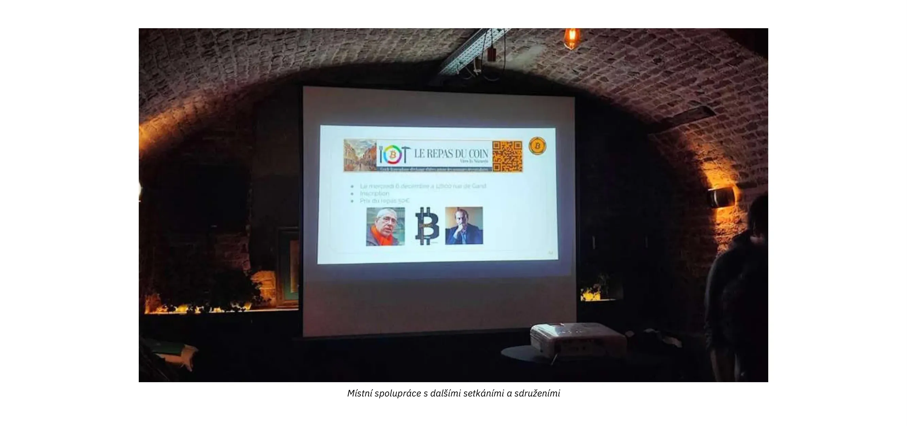

Ve Francii může být také důležité **sledovat iniciativy, jako jsou [@KonsensusFR](https://twitter.com/KonsensusFR), [@bitcoinpointfr](https://twitter.com/bitcoinpointfr), [@DecouvreBitcoin](https://twitter.com/DecouvreBitcoin) a [@btcmap](https://twitter.com/btcmap)**. Jedná se samozřejmě pouze o návrhy a každá komunita si může v rámci úplné decentralizace a autonomie dělat, co chce.

Jak bylo uvedeno výše, cílem vzájemného sledování je vzájemné zviditelnění. Čím více budete na sociálních sítích propagovat svou komunitu a komunitu svého regionu/země, tím více se o vás bude mluvit. Čím více lidí o vás bude mluvit, tím větší je pravděpodobnost, že se zúčastní vašich akcí.

Lajkování a retweetování příspěvků z jiných komunit tak může výrazně pomoci jejich rozvoji... i vašemu.

Mohli byste také navrhnout, aby se organizátoři **meetupů a bitcoináři, kteří vedou komunity, setkávali dvakrát nebo třikrát ročně prostřednictvím videokonference, aby zhodnotili pokrok národních projektů a souvisejících komunit. To se může uskutečnit i během osobních akcí**

Cíl je jednoduchý: shromáždit zpětnou vazbu všech zúčastněných, diskutovat o vývoji komunit, sdílet úspěšné nápady a projekty a v případě potřeby navrhovat řešení. Písemné shrnutí setkání lze po jeho skončení sdílet s organizátory komunit ve vaší zemi, kteří se nemohli zúčastnit.

## Btcmap.org

<chapterId>365f43d4-7b2c-5961-a184-157b8c1a0116</chapterId>

V této fázi je vaše komunita již v provozu. Zbývá jen přivítat další zájemce a pomoci jí růst.

Nemůžete se však pohnout kupředu, aniž byste věděli, že **existují platformy, kde mohou bitcoináři najít komunity a setkání ve svém okolí**. Proto je důležité věnovat několik minut žádosti o zařazení na tyto stránky.

Patří mezi ně:

- [Btcmap.org](https://btcmap.org/)**, webové stránky se dvěma denně aktualizovanými mapami: **[světová mapa podniků přijímajících Bitcoin](https://btcmap.org/map)** a **[mapa světových komunit](https://btcmap.org/communities/map)**. Mnoho uživatelů bitcoinů tyto mapy pravidelně kontroluje, ať už cestují nebo se věnují každodennímu životu, aby se seznámili s novými lidmi nebo našli místa, kde mohou utratit své Sats. Btcmap je celosvětovou referencí a uvedení vaší komunity na ní je pro její zviditelnění nezbytné**
- [BitcoinerEvents](https://www.bitcoinerevents.com/), webové stránky vytvořené bitcoinery pro bitcoinery. ** Umožňuje zveřejňovat nadcházející události vaší komunity**. Ve Francii však stále není příliš rozšířená.
- v závislosti na vaší zemi mohou existovat další místní iniciativy. Například ve Francii existuje stránka [Bitcoin.fr](https://Bitcoin.fr/events/categories/evenements/), která každý měsíc **seznamuje desítky akcí Bitcoin**. Pokud jste je tedy ještě nesledovali na Twitteru nebo je nekontaktovali a nesdíleli s nimi informace o vaší komunitě a akcích, je nejvyšší čas! **Abyste pomohli udržovat francouzský kalendář akcí aktuální, bylo by skvělé, kdyby si všechny francouzské komunity Bitcoin zvykly:**
    - zmínka @bitcoinpointfr na Twitteru pro každou novou událost komunity
    - připínání nových oznámení o událostech ve skupině Telegram.

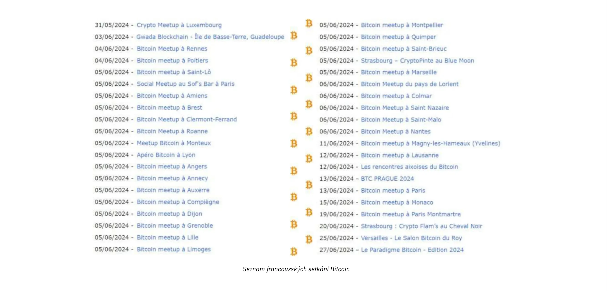

Zviditelnit se můžete i na jiných platformách. *Jednou z nich je* **[Meetup](https://www.meetup.com/)**, což je webová stránka (a aplikace pro telefony), kde můžete vytvořit událost a najít ostatní v okolí.

Stojí přibližně 8 EUR měsíčně (nebo asi 90 EUR ročně), což může být pro malou nestrukturovanou komunitu drahé. Přesto je Meetup v některých zemích, zejména v Kanadě a Spojených státech, hojně využíván a je užitečný pro správu registrací.

Podobně **[Orangepillapp](https://www.orangepillapp.com/)** je placená mobilní aplikace (50 000 Sats/rok nebo 200 000 Sats za doživotní přístup), která pomáhá bitcoinářům se setkávat.

Poslední dvě jmenované platformy sice mohou pomoci zvýšit viditelnost, ale při zakládání komunity se nedoporučují, a to jednoduše proto, že nejsou zdarma.

**Začínáme s výpisem na [btcmap.org](https://btcmap.org/), [BitcoinerEvents](https://www.bitcoinerevents.com/) a pro francouzské komunity na [Bitcoin.fr](https://Bitcoin.fr) je více než dostačující**.

Gratulujeme! Vaše **komunita je vytvořena**, vaše **vizuály jsou připraveny**, vaše **cíle jsou stanoveny**, vaše **komunikační kanály jsou zavedeny**, vaše **sociální sítě jsou spuštěny** a vaše **strategie zviditelnění je rozhodnuta**.

Jakmile se k vám přidá malá skupina bitcoinářů, je čas na další krok: uspořádat první setkání Bitcoin.

# Uspořádání setkání Bitcoin

<partId>c009d2a6-40ce-583b-bd24-fdfd1fea262e</partId>

## Proč zahájit pravidelné setkávání se svou komunitou?

<chapterId>ed8e471c-3b99-57e2-a042-2d4e8a40b137</chapterId>

Po spuštění sociálních sítí a komunikačních kanálů vaší komunity je na čase, abyste se na těchto platformách zviditelnili. Vyzvěte nové členy, aby se představili a postupně se zapojili do konverzace.

Uvolníte si tak čas, který můžete využít k tomu, abyste přemýšleli o vytvoření nějakého setkání. To bude ještě důležitější, jakmile začnete ve své komunitě pociťovat skutečné vzrušení.

Jak již bylo zmíněno, **setkání Bitcoin lze považovat za další "úroveň" komunity**. Na jedné straně umožňuje **členům osobně se setkat** a na druhé straně pomáhá **vzdělávat nové zájemce o tento ekosystém**.

Takováto akce vám umožní ve vašem městě **vytvořit kolem Bitcoin** rozruch, který se může časem rozrůst, jak se vaše komunita bude věnovat projektům.

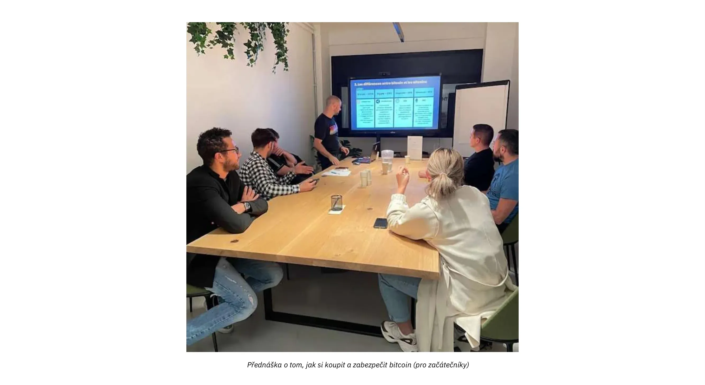

Čím větší jsou vaše cíle v oblasti rozvoje komunity, tím více času budete muset vy i vaši členové investovat.

Proto je důležité **začít stanovením dosažitelných cílů setkání**.

## První setkání: kdy a proč?

<chapterId>f3f8a614-cfb4-5994-a2e8-d56e6f8e3347</chapterId>

Setkání můžete zahájit již několik týdnů po vytvoření komunity.

V této fázi však bude vaše skupina pravděpodobně stále malá, což znamená, že je možné, že se nikdo nedostaví.

Setkání je lepší uspořádat, až budete mít v komunikačních kanálech alespoň několik aktivních členů, například několik desítek. To se může stát rychle, ale záleží také na osobnostech lidí.

Jakmile ucítíte jiskru, navrhněte osobní setkání. Pokud ostatní projeví zájem, zbývá už jen **určit datum prvního setkání**.

Místo toho, abyste si datum vybírali sami, je obvykle nejlepší **vytvořit anketu přibližně deset dní předem s několika možnými dny a časy**. Tímto způsobem můžete využít hlasy k maximalizaci účasti, budování nadšení a co nejlepšímu využití času.

Nejlepší je nevstupovat do setkání s pevnými očekáváními, jak bude probíhat, kolik lidí přijde nebo o jakých tématech se bude diskutovat. Předejdete tak zklamání a účastníci se nebudou cítit pod tlakem.

Nechte věci přirozeně plynout, třeba u skleničky. Konverzace by měla probíhat snadno, a pokud je třeba, můžete diskusi jemně nasměrovat zpět ke Bitcoin, pokud se začne odvíjet.

Pokud se chcete připravit na klidnější chvíle, můžete si naplánovat několik aktivit nebo bodů k rozhovoru, např.:

- zobrazení **[Mempool](https://Mempool.space/)** na počítači nebo chytrém telefonu;
- přináší knihu;
- přináší **Nerdminer**, Bitaxe, FPGA nebo dokonce ASIC;
- má leták **Bitcoin**;
- vymýšlení vizuálu nebo loga Bitcoin pro vaši komunitu;
- hraní **[karetní hry Bitcoin](https://www.Maximalist.ovh/accueil/20-game-le-Coin-de-table.html)**;
- zobrazuje **[btcmap.org](https://btcmap.org/)** mapu komunit a obchodníků;
- odesílání nebo přijímání Bitcoin pomocí **Lightning**.

Když setkání teprve začíná, často není vhodná doba na formální prezentaci. Pokud je účast malá, obvykle nejlépe funguje otevřená a neformální diskuse.

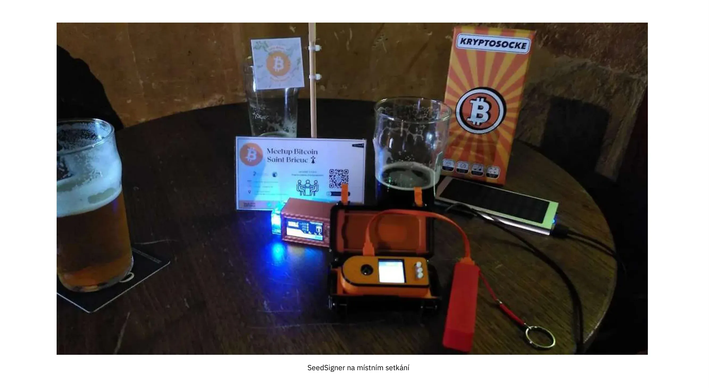

Po prvním setkání budete pravděpodobně chtít naplánovat další. Dokud je vaše komunita ještě malá, je nejlepší vybírat termíny pomocí anket, například jednou za měsíc nebo jednou za dva měsíce. Můžete o tom diskutovat ve svých komunikačních kanálech.

Pokud se vytvoří pravidelná skupina bitcoinářů a zainteresovaných účastníků, má smysl stanovit opakující se harmonogram ze dvou důvodů:

1) usnadňuje všem plánování dopředu;

2) pomáhá **vytvořit "zvyk "**. I když někdo přestane pravidelně kontrolovat vaše kanály, bude stále vědět, kdy se setkání koná, a může se zastavit jako obvykle.

Tento druhý bod je jedním z důvodů, proč se **ve Francii většina setkání koná každou první středu v měsíci** (viz iniciativa "ambasadorů", kterou v roce 2022 zahájila společnost [DecouvreBitcoin](https://decouvrebitcoin.fr/)).

V Německu a Itálii není žádný pevně stanovený státní svátek.

Konání všech celostátních setkání ve stejný den však vytváří problém s centralizací: brání bitcoinářům v účasti na akcích v okolních komunitách a může také vyvolat obavy o bezpečnost. Domluvit se s organizátory sousedních meet-upů vám může pomoci dohodnout se na vhodném uspořádání.

Jakmile se vaše komunita rozroste a setkání přilákají více lidí, můžete:

- stanovit si konkrétní cíl pro každé setkání;
- nebo dokonce **přidat každý měsíc druhou akci**.

V prvním případě je třeba mít na paměti preference všech účastníků, ale jasný cíl může zajistit, že účastníci odejdou s novým poznatkem a konverzace se zaměří na Bitcoin.

V druhém případě by se druhá měsíční akce mohla věnovat určitému tématu, například začátečnickým sezením nebo workshopům (Mining, Lightning, instalace uzlů atd.).

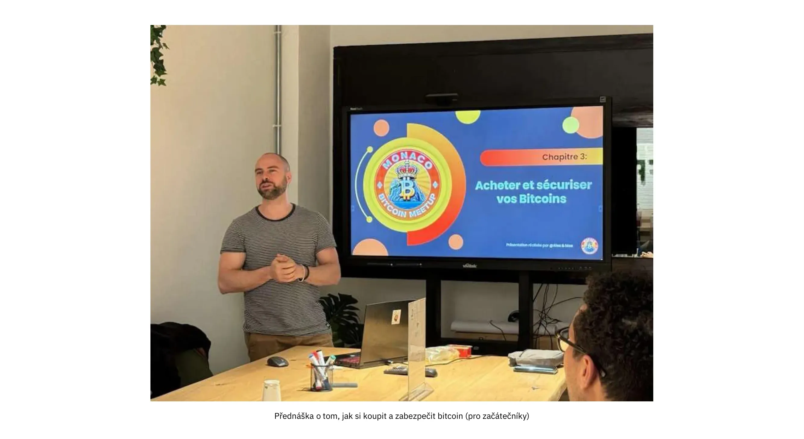

Mějte na paměti, že **to vyžaduje více organizace a času**. Naštěstí v [části 6/8 tohoto kurzu](https://planb.academy/courses/1c643dc9-a15f-4f9e-93b6-cb3c58b4ee35/3213d87a-1998-5972-ab93-97a5769ba279) najdete řadu opakovaně použitelných zdrojů s otevřeným zdrojovým kódem, které vám pomohou.

V každém případě záleží na krátkodobém, střednědobém a dlouhodobém akčním plánu, který si vy nebo vaše komunita stanovíte.

## Hledání místa

<chapterId>405d389e-6a32-5777-af8d-293380d2e8fd</chapterId>

Najít místo pro pořádání akcí často není snadné. Navíc je nezbytné, aby se toto místo **nacházelo ve městě vaší obce**.

Je třeba zvážit několik kritérií, včetně:

1) **Lokalita**: je snadno dostupná veřejnou dopravou? Autem? Je k dispozici parkoviště?

2) Je místo konání příjemné a není příliš **hlučné**? Hledáte formální prostředí (co-workingový prostor, zasedací místnost), nebo něco neformálnějšího (bar, restaurace)?

3) Má dostatečnou kapacitu, aby vás mohl hostit i v noci, kdy se hraje rugby nebo Liga mistrů?

4) Má videoprojektor a klidný prostor pro prezentace?

5) A konečně, pokud se jedná o bar nebo restauraci, nabízí jídelní lístek pro každého něco k jídlu a pití?

Dále uvádíme tři důležité body, které je třeba mít na paměti:

- Pokud plánujete rozdělit večer na dvě části: nejprve prezentace ve formálním prostoru, aby se všichni mohli soustředit, a poté přesun do baru nebo restaurace, kde se bude pokračovat v uvolněnější atmosféře, zkušenosti ukazují, že změna místa uprostřed večera často vede k tomu, že někteří účastníci během přestávky odejdou. Tento přístup se proto nedoporučuje.
- Na prvních setkáních bude pravděpodobně malá účast a pravděpodobně nebudete pořádat formální prezentace. V takovém případě není třeba se majiteli představovat ani vysvětlovat své cíle. Jakmile se však **setkání stanou pravidelnými a hojně navštěvovanými, stojí za to tak učinit, abyste prokázali profesionalitu a vyjádřili své přání vracet se na ně každý měsíc**. To může vést k mnoha diskusím (automatické měsíční rezervace, bezplatné nápoje a/nebo stravovací tabule, slevy, rozhovory o Bitcoin, přijímání plateb Bitcoin atd.) Je zřejmé, že pokud konkrétně hledáte místo s videoprojektorem pro prezentaci, jeví se jako nezbytné požádat o schůzku (osobní, případně i telefonickou) s majitelem a/nebo manažerem a představit mu svůj projekt a cíle.

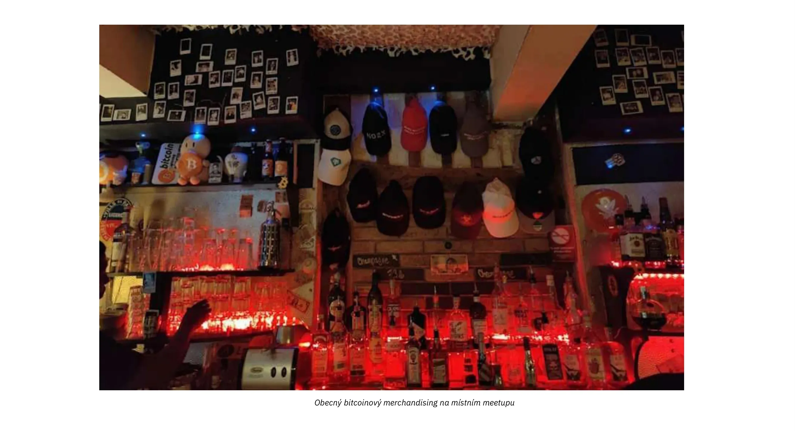

- a konečně, některé komunity **chtějí pořádat své akce pouze na místech, která přijímají platby Bitcoin**, což je pochopitelné. V takovém případě je dobré **začít vyhledáváním podniků akceptujících platby Bitcoin ve vašem městě** (na [btcmap.org](https://btcmap.org/map/)a kontaktovat je, zda splňují vaše kritéria. Pokud nic vhodného nenajdete, můžete zkusit onboarding nových obchodníků, ale počítejte s mnoha odmítnutími, což může být odrazující. Proto je často lepší nestanovovat si to jako cíl hned od začátku a raději o tom uvažovat, až bude vaše komunita dobře zavedená a budete mít dostatečnou "palebnou sílu"

Při zahájení setkávání také neváhejte prvních několik měsíců **měnit místa konání**. To vám pomůže **vybudovat si vztahy s různými manažery**, prozkoumat různé atmosféry a získat informace o potenciálních budoucích hostitelích.

Později, až se vaše skupina rozroste, si můžete udělat odpoledne a navštívit několik podniků a barů a zeptat se, zda mají prostory vhodné pro pořádání vašich měsíčních akcí a setkání.

## Před setkáním

<chapterId>c5218943-580d-5efc-89ed-6b5d728816d6</chapterId>

Plánujete v nadcházejících týdnech uspořádat setkání?

Zde je kontrolní seznam, který vám pomůže s přípravou:

1/ **Potvrzení místa konání**

Kontaktujte místo, kde budete akci pořádat, a rezervujte si ho pro předpokládaný počet účastníků.

2/ **Oznamte událost**:

    - Sdílejte datum, čas a místo na sociálních sítích a dalších komunikačních kanálech. V případě potřeby uveďte odkaz na registraci.
    - Vytvořte si speciální vizuál (například plakát v aplikaci Canva, viz část 2/8 "[Návrh identity pro vaši komunitu Bitcoin](https://planb.academy/courses/1c643dc9-a15f-4f9e-93b6-cb3c58b4ee35/b48a18cc-afdf-5216-802c-32647b5cd8a3)").
    - Maximalizujte viditelnost připnutím oznámení na Telegram a Twitter a použitím zmínky "@everyone" na Discordu.
    - Zveřejněte oznámení 7 až 10 dní před akcí, aby si účastníci mohli akci naplánovat dopředu.

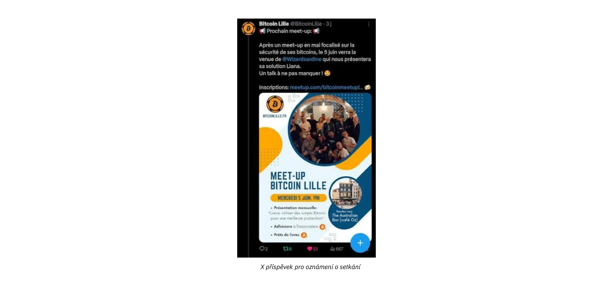

3/ **Připomeňte si své publikum**

Dva až tři dny před událostí znovu sdílejte a retweetujte svá oznámení, abyste je zviditelnili.

4/ **Aktualizace místa konání**

Den před konáním (nebo dva dny před konáním) zkontrolujte registrace a informujte místo konání o konečném předpokládaném počtu účastníků.

Dodatečné kroky k tomu, aby vaše akce vynikla:

- Tisk letáků a/nebo plakátů
- Příprava prezentace na konkrétní téma
- Uspořádat aktivitu nebo workshop

## Den setkání

<chapterId>cf60067b-591f-5fdf-9b9e-d442aad0e8f9</chapterId>

Velký den je tady! Jednu nebo dvě hodiny před začátkem akce pošlete připomínku prostřednictvím komunikačních kanálů vaší komunity. Znovu potvrďte čas začátku a informujte účastníky, jak vás mají poznat, například tím, že zmíníte, že budete mít na sobě tričko a čepici Bitcoin.

Jakmile se počet vašich setkání rozroste a začnete přijímat více než 20 lidí, bude příprava místa konání stále důležitější.

Zde je návod, jak postupovat:

1) **Přijďte včas**, abyste vše připravili.

2) **Uspořádejte prostor** podle svých potřeb a možností místa konání. Pokud je vás jen šest, je potřeba jen málo příprav. Jakmile však dosáhnete počtu 10-20 účastníků, může plně sedící uspořádání omezit interakci. V takovém případě zvolte uspořádání na stání s dobře rozmístěnými vysokými stoly, pokud jsou k dispozici, a zároveň zajistěte několik (nejlépe vysokých) židlí. Pokud je plánována prezentace, ponechte po většinu večera uspořádání na stání a židle přineste až těsně před přednáškou.

3) Přidejte drobné vlastní úpravy:

    - Vyvěste u vchodu plakát s informací o svém umístění (použijte Patafix a nejprve si vyžádejte povolení místa konání).
    - Uvnitř vystavte plakáty s tématikou Bitcoin (bílá kniha Bitcoin, charta vaší komunity, aktuální projekty atd.).
    - Umístěte na stoly samolepky, letáky nebo podněty ke konverzaci, například: Nerdminer, Hardware Wallet, notebook zobrazující Mempool, ASIC Miner nebo kovovou záložní desku pro soukromé klíče.

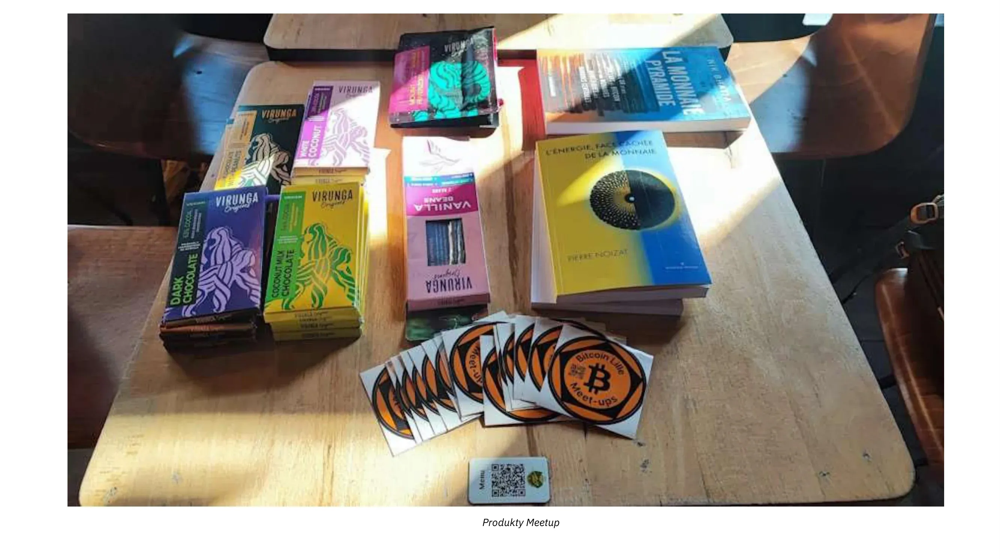

Pokud očekáváte jen několik účastníků a ještě jste si nevybudovali vztah se správci místa konání, vyhněte se okamžitému přivezení a vystavení veškerého vybavení. Jakmile bude důvěra navázána, budete mít větší volnost při uspořádání prostoru podle svých představ.

Nakonec si vezměte pití a počkejte na příchozí. A nezapomeňte: nenechte se odradit, když nikdo nepřijde napoprvé. Pro jistotu si s sebou vezměte knihu nebo video ke sledování.

## Po setkání

<chapterId>3e881af9-9c09-5721-81ee-c5cda3b109c5</chapterId>

Po skončení setkání je čas na úklid pro personál místa konání. Než odejdete, nabídněte pomocnou ruku číšníkům nebo manažerům. Může jít o tak jednoduchou věc, jako je shromáždění všech sklenic na jeden stůl nebo, pokud jste poblíž baru, jejich vrácení před vaším odchodem.

Po návratu domů budete na Bitcoin pravděpodobně myslet ještě několik dní. To je ideální čas na to, abyste změřili puls své komunity a získali zpětnou vazbu od účastníků. Můžete:

- Zveřejněte děkovnou zprávu na svých komunikačních kanálech a sdílejte odkazy nebo zdroje, které byly během akce zmíněny.
- Vyzvěte účastníky, aby navrhli zlepšení pro příští setkání.
- Začněte plánovat další akci.

Pak budete mít několik týdnů na to, abyste připravili nové nápady, vizualizace nebo projekty, které by příští setkání ještě vylepšily.

## Význam zapojení a udržení účastníků

<chapterId>f5355e35-4b07-527c-88a3-8535cba7592c</chapterId>

Řím nebyl postaven za den a ani vaše komunita nebude. Momentum kolem Bitcoin vzniká díky pravidelným setkáním a událostem.

Aby se tak stalo, je nezbytná jedna věc: **zajistit účastníkům účast**.

Mohlo by to začít malou skupinou nadšených bitcoinářů, jejichž cílem by bylo pravidelně se scházet a mluvit o Bitcoin. Postupem času, v závislosti na dostupnosti a zájmech jednotlivých osob, můžete **sdílet určité organizační úkoly se skupinou** nebo přizvat základní **členy, aby se ujali konkrétních projektů**. Ty mohou být jedinečné pro vaši komunitu, vaše setkání nebo vaše město, nebo dokonce inspirované mnoha iniciativami navrženými v [části 6/8 tohoto kurzu](https://planb.academy/courses/1c643dc9-a15f-4f9e-93b6-cb3c58b4ee35/3213d87a-1998-5972-ab93-97a5769ba279). **To nejen podporuje Commitment vašich základních členů, ale také pomáhá vaší komunitě růst a vzkvétat**.

Jak budou vaše setkání postupovat, budou se objevovat nové tváře: lidé, kteří si v předchozích cyklech koupili BTC a/nebo altcoiny, technologičtí nadšenci, kteří si chtějí prohloubit své znalosti, nebo úplní začátečníci, kteří se zajímají o tento necenzurovatelný, decentralizovaný, transparentní a spravedlivý platební systém, který funguje bez podmínek a bez důvěryhodných třetích stran.

Abyste zajistili, že se na vašich akcích budou cítit všichni, zaměřte se na dva klíčové aspekty:

- **Sociální začlenění**: Všichni účastníci by se měli cítit vítáni. Snažte se přivítat nově příchozí, zeptejte se jich, proč přišli, a představte je ostatním. Když se lidé cítí začleněni, je pravděpodobnější, že se vrátí a možná dokonce pomohou s organizací budoucích akcí.
- **Trpělivost a otevřenost**: To vyžaduje čas a motivaci. Pokud mluvíte s odhodlaným sráčem (nebo ještě hůř, s XRP Maximalist), může být lákavé ho odmítnout. Zapojením se do rozhovoru však můžete objasnit nedorozumění nebo chybné uvažování. Pokud jsou ochotni naslouchat, mohou být připraveni Bitcoin skutečně pochopit.

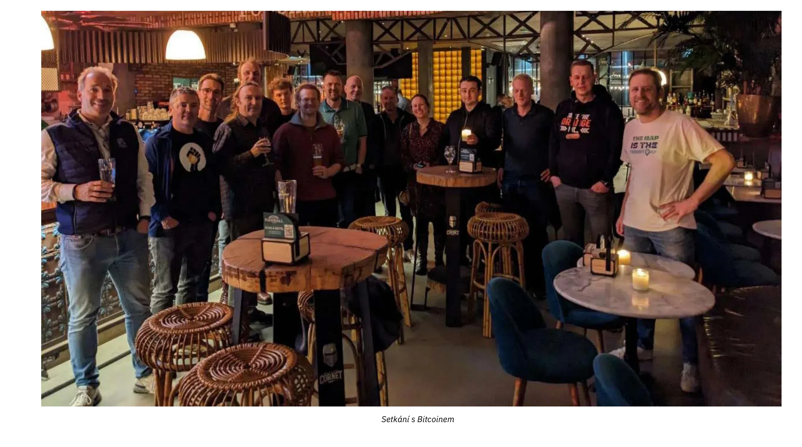

Z praktického hlediska se zamyslete nad celkovým zážitkem z akce:

- Byla **alea příjemná**?
- Byl **snadno přístupný?**
- Proč se někteří lidé přihlásili, ale nedostavili se?
- Jaké diskuse proběhly? Byly diskuse pro začátečníky příliš odborné?
- Byly diskuse příliš alkoholické?

Každý účastník má svou vlastní osobnost, cíle a zájmy, takže zkušenosti se budou lišit. Pokud je však místo konání vhodné, publikum otevřené a záměry upřímné, je každý důvod, aby setkání uspělo.

Vytvoření meetupu vyžaduje čas, ale především organizaci. Je to lidský projekt, který bude dlouhodobě fungovat a růst pouze tehdy, pokud bude dobře naplánovaný, otevřený a inkluzivní.

Nakonec je na vás, abyste rozhodli, jak daleko by "otevřenost a inkluzivita" měly zajít. Jen nezapomeňte, že shitcoiner je často jen vznikající bitcoiner.

# Příklady projektů a iniciativ

<partId>45b3bc40-1c31-583e-8411-2662e6efd765</partId>

## Proč jít dál než k pití piva?

<chapterId>3213d87a-1998-5972-ab93-97a5769ba279</chapterId>

S přibývajícími bloky se vaše komunita bude vyvíjet. Nové tváře se budou přidávat, jiné se budou vzdalovat, ale hlavní zásada by měla zůstat stejná: rozvíjet ekosystém Bitcoin a posilovat vazby mezi členy.

Existuje mnoho projektů a iniciativ, které lze realizovat. Tato kapitola nabízí neúplný seznam nápadů, které lze realizovat v rámci komunity nebo během setkání. Neváhejte si vybrat ty, které vás inspirují, a dokonce přispět vlastními nápady do tohoto kurzu [vytvořením "Pull Request" na GitHubu](https://github.com/PlanB-Network/Bitcoin-educational-content).

Než se do toho ponoříme, zopakujme si již dříve zmíněný bod.

Když pořádáte setkání Bitcoin, poznáváte nové lidi. Sociální interakce je nezbytná a pivo (nebo alkohol obecně) může pomoci vytvořit slavnostní atmosféru. Je však třeba mít na paměti:

- Alkohol zhoršuje kognitivní schopnosti, jako je myšlení a porozumění, což může účastníkům ztížit sledování vážných diskusí nebo prezentací.
- Alkohol se také může stát útěšným rituálem: každý měsíc se s přáteli podělíte o svůj "okamžik Bitcoin" u skleničky. To je sice skvělý způsob, jak se sblížit, ale je pití piva opravdu hlavním cílem vašeho setkání? Nebo byste raději Exchange zkoumali, učili se od ostatních a pomáhali nováčkům objevit Bitcoin?

Každý má své vlastní preference, přesvědčení a osobnost. Nejde o to, abyste odsuzovali jedno setkání oproti druhému. Přesto, i když se často u piva mluví o změně světa, revoluce nezačínají ani nerostou tímto způsobem.

Klíčové je jednoduše si to uvědomit.

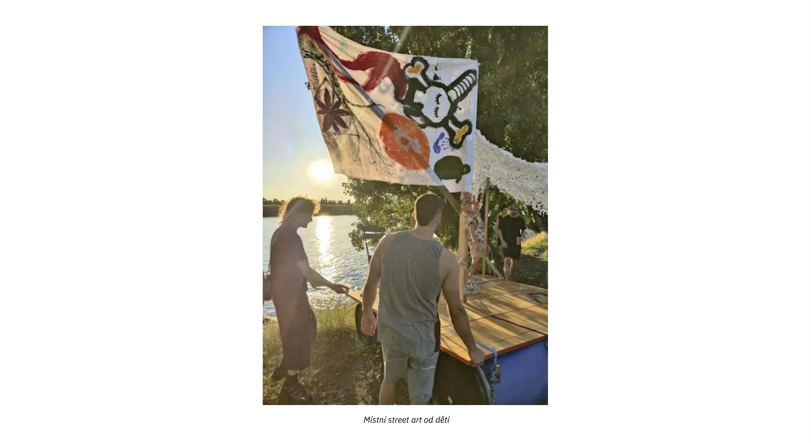

## Pořádání tematických setkání s ročním postupem

<chapterId>46afdbcc-a775-5c16-b20a-34956690d58f</chapterId>

Jakmile vytvoříte základní skupinu přibližně deseti lidí, můžete začít přidávat prezentace na jednotlivé akce. Ty mohou navazovat na předem oznámené téma nebo být na sobě zcela nezávislé.

Při plánování prezentací nebo seminářů pomáhá vytvořit jasný, dobře strukturovaný postup. Cílem je **pokrýt základní koncepty Bitcoin krok za krokem** a poskytnout účastníkům ucelený pohled na téma z více úhlů pohledu.

Ve Francii v létě 2023 organizátoři setkání pracovali na **ročním postupu**.

Kromě velké vzdělávací hodnoty umožňuje tento přístup sdílet mezi skupinami dokumenty a prezentace s otevřeným zdrojovým kódem a postupně tak vytvářet sdílenou knihovnu zdrojů. Tato iniciativa se setkala s příznivým ohlasem a v příštích letech se bude dále rozvíjet.

Níže je uveden postup setkání ve Francii v letech 2023-2024. Ke každému tématu je k dispozici prezentace s otevřeným zdrojovým kódem a video, které vám mohou poskytnout nápady na témata, jimiž byste se mohli zabývat na svých vlastních akcích.

Další upravitelné materiály naleznete také v [Bitcoin Teaching Toolbox](https://planb.academy/fr/resources/bet)!

| Month | Theme | Video | Editable Resource |
| -------- | -------- | -------- | --- |
| September     | Chapter 1: What is Bitcoin?     | [	YouTube link](https://www.youtube.com/watch?v=CSjuBqrl4t8)     | [Editable PowerPoint](https://www.canva.com/design/DAFu0d5Jd7M/9gAWDAOSS6LDkWENuZjYgw/edit) |
| October & November| Chapter 2: Understanding Bitcoin Transactions     | [YouTube link](https://www.youtube.com/watch?v=inFnR-3NsdM)     | [Editable PowerPoint](https://www.canva.com/design/DAFsEcnOro8/Mz9FYdTGhsvozZOe0Y9jtw/edit) |
| December     | Chapter 3: Understanding the Lightning Network     | [YouTube link](https://www.youtube.com/watch?v=hHz-ALx8D9w)     | [Editable PowerPoint](https://www.canva.com/design/DAF4YPSNnR8/HKp4Vmcno8eMtVWnZmFtcw/edit) |
| January     | Chapter 4: What is Mining?     | [YouTube link](https://www.youtube.com/watch?v=QyHZ3CVI_OI)     | [Editable PowerPoint](https://www.canva.com/design/DAF5DE6iBEM/tsy8E3oBebUnsR0kj53vvQ/edit) |
| February     | 	Chapter 5: Running a Bitcoin and Lightning Node    | [YouTube link](https://www.youtube.com/watch?v=RRYK-usg-OY)     | [Editable PowerPoint](https://www.canva.com/design/DAF55FU6HI0/sQ0lacRJblqrhn_9Xk1yDg/edit) |
| March     | 	Chapter 6: Using the Lightning Network in Daily Life    | [YouTube link](https://www.youtube.com/watch?v=o2BS4xjei8M)    | [Editable PowerPoint](https://www.canva.com/design/DAGAcJMw7lw/-haMNnHnwj5vpDAy8MDowA/edit) |
| April & May    | Chapter 7: Securing Your Bitcoins      | [YouTube link](https://www.youtube.com/watch?v=fHExPbhM0Hg)    | [Editable PowerPoint](https://www.canva.com/design/DAGDz3Nq4e0/D3uG-4w9FN6OhUq-VXzhfg/edit) |
| June     | 	Chapter 8: What is Multi-Sig?     | [YouTube link](https://www.youtube.com/watch?v=Me5489mpoxA)     | [Editable PowerPoint](https://www.canva.com/design/DAGLMtQT6sg/rYIxr4ldUJ0jTelNf-Pj8Q/edit) |
| July     | 	Chapter 9: Understanding the Bull Run and How to Prepare    | [YouTube link](https://www.youtube.com/watch?v=7RA-gnCJWyM)     | [Editable PowerPoint](https://www.canva.com/design/DAGJQkiZ_YA/9lUluP9RZ0eeA_e61mk9Hw/edit) |
| August     | Chapter 10: The Taxman is Never Far Away   | [YouTube link](https://www.youtube.com/watch?v=oY4NwonGDm0)     | [Editable PowerPoint](https://www.canva.com/design/DAGQhx7Yc_c/7mRhb_vlgnhSgxd1FtjK8w/edit) |

Kapitoly 2 a 7 lze rozdělit do dvou kratších prezentací, aby účastníci nebyli zahlceni. Jejich uspořádání v rámci jednoho sezení však uvolní místo v kalendáři pro speciální aktivity, jako jsou společná setkání se sousedními skupinami, kvízy nebo workshopy.

**Tyto zdroje můžete volně používat, upravovat a sdílet, jen nezapomeňte uvést původní autory, pokud jejich práci znovu použijete.**

Vzhledem k tomu, že ne každý se zúčastní každého setkání, je dobré prezentace nahrávat a nahrávat je na streamovací platformu nebo na své webové stránky. To umožní nepřítomným dohnat zameškané a účastníkům se k materiálu vrátit později.

Souběžně můžete pořádat další tematická setkání, jako např.:

- Vědomostní kvíz o Bitcoin (s odměnou v podobě Hardware Wallet)
- Výzva k nalodění, při které posíláte zdarma satoši lidem bez mincí na ulici
- Pozvání odborného řečníka nebo společnosti, která představí produkt související s Bitcoin
- Noční prohlídka barů a obchodů, které přijímají Bitcoin

A mnoho dalšího, vaše fantazie je jediným limitem!

## Vytváření doprovodných akcí a workshopů

<chapterId>9dbd651a-8712-5630-90b3-b9525dcc1385</chapterId>

V závislosti na vašich možnostech a míře zapojení ve vaší komunitě můžete v průběhu roku naplánovat další akce, jako např.:

- Večer v restauraci na **Den pizzy** 22. května
- Večer nebo víkend na oslavu dalšího **Halving**
- Rodinný **herní večer** o Bitcoin a jeho fungování s využitím her jako [Le Coin de Table](https://www.Maximalist.ovh/) nebo [SHAmory](https://shamory.com/)
- Workshop **Mining** představující různé typy hardwaru (CPU, GPU, FPGA, ASIC, Nerdminer, Bitaxe)
- **odpoledne nebo večer pro začátečníky** s tematickými workshopy
- **společné setkání se sousedními komunitami**

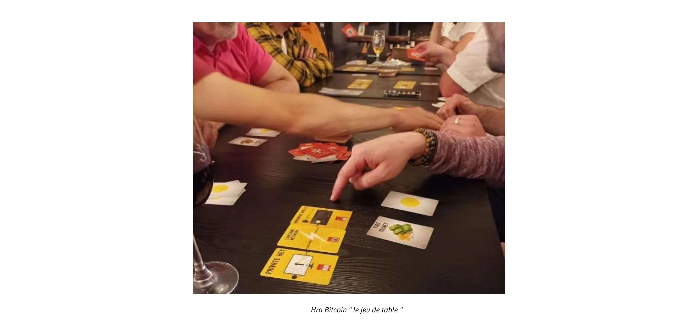

Jen si dejte pozor, abyste kalendář nepřetížili. Příliš mnoho akcí v jednom měsíci může vést k vyhoření organizátorů a časem ke snížení návštěvnosti.

## Vytváření samolepek

<chapterId>d605f3b3-130e-513d-85e6-06bc5ea13e99</chapterId>

Samolepky představují zábavný způsob, jak propagovat společnost Bitcoin i vaši komunitu a zároveň posílit vaši identitu.

Před objednáním mějte na paměti tyto tipy:

- Při venkovním použití se ujistěte, že jsou samolepky vodotěsné.
- Logo nechte o něco menší než řeznou plochu, abyste se vyhnuli problémům s ořezem při laserovém řezání.
- Pro vyšší kvalitu tisku použijte místo rastrového obrázku vektorový soubor.
- Zvolte správnou velikost: průměr 8 cm (přibližně velikost dlaně dospělého člověka) je dobře viditelný, zatímco průměr 4 cm je nenápadnější. Hledáte viditelnost nebo diskrétnost ?
- Pro sytě černý tisk ("quad black") použijte 30 % azurové, 30 % purpurové, 30 % žluté a 100 % černé. Použití pouze 100% černé může mít za následek šedivý tón. Tiskárny to často kontrolují, ale vyplatí se to vědět.

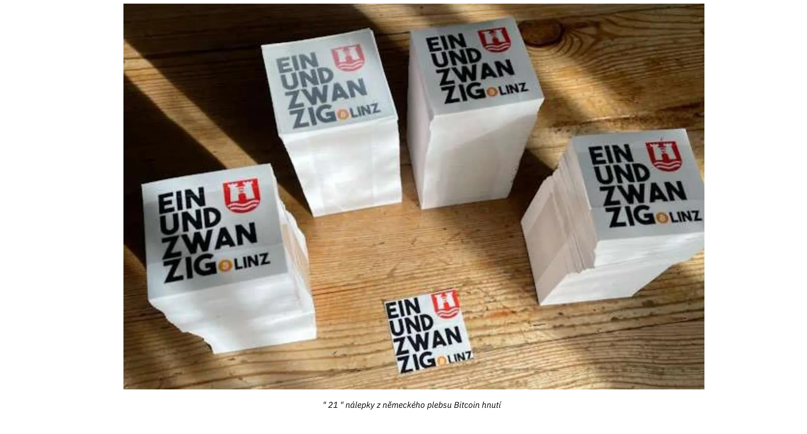

V závislosti na vašich potřebách a dodavateli může 1 000 samolepek stát od 100 do 250 EUR. Můžete se obrátit na [@Mill3sim3 na Twitteru](https://x.com/Mill3sim3), francouzského Bitcoinaře specializujícího se na marketing, který někdy dokáže zajistit ceny až o 30 % nižší než standardní online prodejci.

Přesto je 1 000 samolepek hodně. Obvykle je lepší začít s přibližně 100 kusy, abyste měli jistotu, že je dokážete všechny distribuovat.

Důležité: **Před umístěním samolepek na veřejná prostranství** si ověřte místní předpisy.

Ve Francii lze samolepky umisťovat pouze na úřední veřejné tabule. Pokud je umístíte jinam (např. na značku zastávky), pravděpodobně budou odstraněny a případně pokutovány, pokud je lze spojit s vámi nebo s vaší schůzkou. Informujte o tom své členy.

Na soukromých místech, jako jsou koncerty, bary nebo stadiony, si před přidáním nálepek ověřte, zda již nejsou přítomny. Pokud ne, požádejte personál o povolení. Nechcete, aby první dojem majitele podniku z vaší komunity byl, že jste mu poničili prostor.

## Vytvoření knihovny

<chapterId>acc94093-f8b3-51b8-9359-348e9e075d38</chapterId>

Dalším projektem, který můžete snadno vytvořit, je **vytvoření knihovny na setkáních**.

Můžete vyzvat účastníky, kteří se chtějí podělit o svou četbu, aby přinesli knihu související s Bitcoin. Pokud by si ji chtěl půjčit někdo jiný z účastníků setkání, bylo by možné s majitelem v Exchange domluvit výpůjčku za zálohu, například 21 000 satošů prostřednictvím Blesku.

Pro majitele je tato záloha pomocníkem při krytí případné ztráty nebo krádeže. Pro vypůjčitele je to pobídka, aby se vrátil na budoucí setkání a vyzvedl si zálohu.

Pokud vedete sdružení a chcete investovat část svých prostředků do vzdělávacích zdrojů, můžete si také zakoupit několik knih, které nabídnete ve své **Bitcoin knihovně**, která je k dispozici na každém setkání.

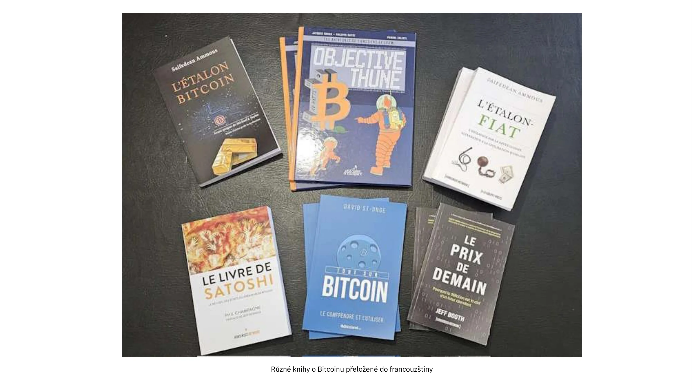

Na podporu ekosystému nabízí **[nakladatelství Konsensus Network](https://konsensus.network/) od konce roku 2023 mezinárodním setkáním a komunitám Bitcoin slevu 15 až 35 % na všechny své knihy při objednávce tří a více knih**.

Chcete-li tuto slevu využít, stačí **kontaktovat [nakladatelství Konsensus](https://twitter.com/KonsensusFR) na Twitteru**.

Pokud nemáte hotovost, můžete slevu předat členům své komunity.

Pokud sami nemáte finanční prostředky, můžete slevu předat svým členům. Jeden z organizátorů by například mohl shromáždit objednávky od členů, udělat hromadnou objednávku za sníženou cenu a knihy rozdat na příštím setkání, přičemž platbu by tehdy vybral v Blesku.

Na schůzkách můžete také vystavit listinu o půjčování knih, abyste nováčkům jasně vysvětlili pravidla půjčování.

Zde je příklad s otevřeným zdrojovým kódem, který můžete použít a upravit:

[Listina o půjčování knih](https://www.canva.com/design/DAF7u1b5kRM/r2gEAlibe_jTIXIX-O9PMA/edit)

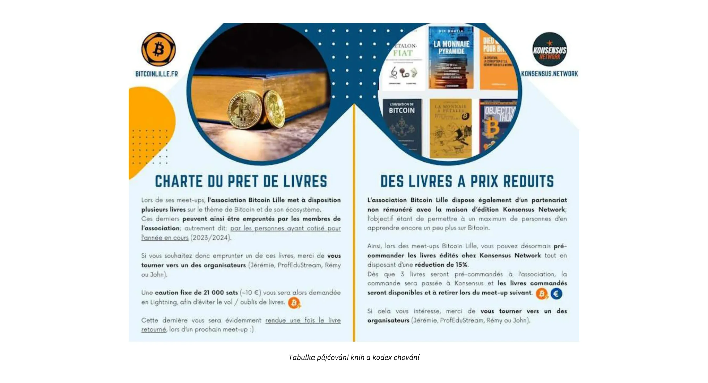

A konečně, abyste podpořili četbu týkající se Bitcoin, můžete navštívit **místní obecní knihovny** a zjistit, zda mají knihy o Bitcoin.

Pokud ano, zeptejte se knihovníků, zda se na dané téma plánují nějaké **kulaté stoly**, a nabídněte jim kontaktní údaje na vaše setkání.

Pokud ne, navrhněte jim, aby si pořídili několik knih z předem vybraného seznamu. Zdrojem inspirace může být [nakladatelství Konsensus Network](https://konsensus.network/).

## Vytváření a distribuce personalizovaných letáků

<chapterId>62ad5430-c698-51b3-89ac-090f31c88953</chapterId>

Navrhování a psaní letáků zabere čas, ale stojí to za to, protože vám poskytnou hmatatelný zdroj informací, který můžete rozdávat, když mluvíte o Bitcoin, což se vždy cení.

Tyto letáky mohou být určeny pro:

- Obchodníci, pokud chcete zavést Bitcoin jako platební metodu;
- Účastníci akce s letákem vysvětlujícím, jak používat a platit pomocí Bitcoin/Lightning;
- Začátečníci, ať už je potkáte na ulici, v práci nebo při rodinné oslavě, s letákem, který zdůrazňuje hlavní výhody Bitcoin.

Můžete také navrhnout leták specifický pro vaši komunitu nebo setkání, který bude prezentovat vaše aktivity, cíle, odkazy na sociální média, komunikační kanály a nadcházející akce.

Několik letáků je již **k dispozici jako otevřený zdrojový kód v [Bitcoin Teaching Toolbox](https://planb.academy/fr/resources/bet)** na webu planB.network a časem budou přidány další.

Jedním z příkladů je [kompletní leták](https://profedustream.substack.com/p/21-raisons-dutiliser-Bitcoin) s 21 důvody, proč používat Bitcoin. Jeho návrh je také [k dispozici v otevřeném zdrojovém kódu](https://www.canva.com/design/DAFtAR1NauQ/ZDwl2CchIJ9Gpb36N6-7iw/edit?utm_content=DAFtAR1NauQ&utm_campaign=designshare&utm_medium=link2&utm_source=sharebutton), který můžete upravit, přizpůsobit a sdílet. Jen nezapomeňte uvést své zdroje.

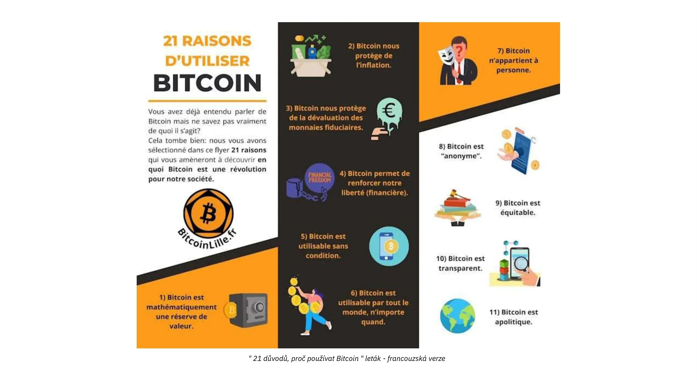

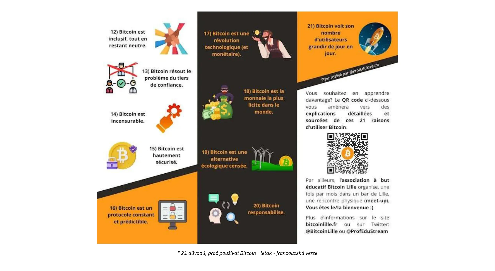

Jak již bylo zmíněno, tyto letáky můžete nechat téměř kdekoli: na společném stole v práci, u rodinného stolu, ve veřejné knihovně atd.

Ve Francii a několika dalších zemích existují také "knihobudky", malé dřevěné krabice, kam mohou lidé volně darovat nebo si vypůjčit knihy. Můžete tam nechat leták nebo ještě lépe knihu.

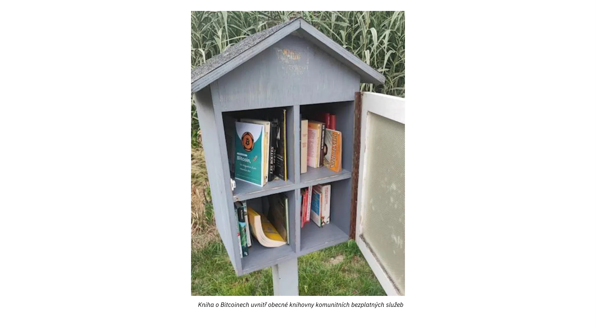

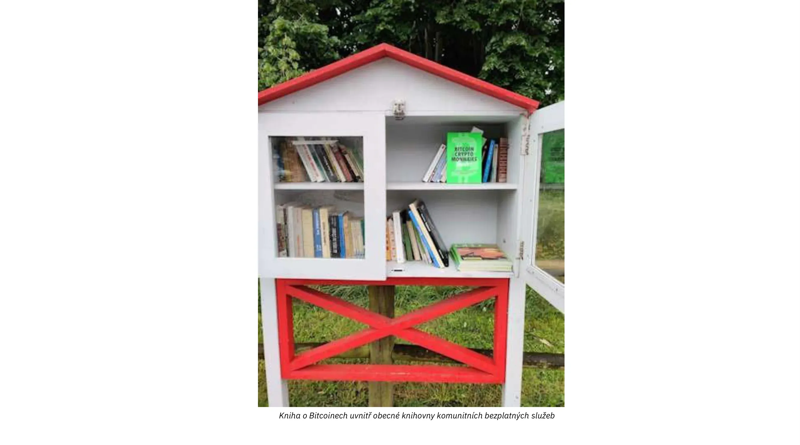

V roce 2023 byla zahájena iniciativa **"Bitcoin White Paper in France's Book Boxes**".

Pro realizaci tohoto projektu museli účastníci nejprve shromáždit zeměpisnou polohu všech knihobudek v zemi. K tomuto účelu existuje několik databází:

- [boite.a.livres.zonelivre.fr](https://boite.a.livres.zonelivre.fr/);
- [boites-a-livres.fr](https://www.boites-a-livres.fr/carte-de-france);
- [delivrez.fr](https://delivrez.fr/maps/fr_FR/);
- plus články v místním tisku

Opuštění bílé knihy Bitcoin je sice symbolické, ale pro nováčky je často příliš složité na pochopení. Místo toho vznikla myšlenka vytvořit malou brožurku obsahující:

- přístupný a dobře podložený úvod do Bitcoin, jeho použití a problémů, které řeší;
- bílá kniha Bitcoin přeložená do francouzštiny.

Zde je [brožura, kterou sdílejí francouzští bitcoináři](https://profedustream.substack.com/p/Bitcoin-la-naissance-dune-nouvelle), která byla umístěna v desítkách knihobudek po celé zemi. Její design je také [k dispozici jako open-source](https://www.canva.com/design/DAFs18FSoVM/Sy0QsfUkycTgXveeGgutBg/edit?utm_content=DAFs18FSoVM&utm_campaign=designshare&utm_medium=link2&utm_source=sharebutton).

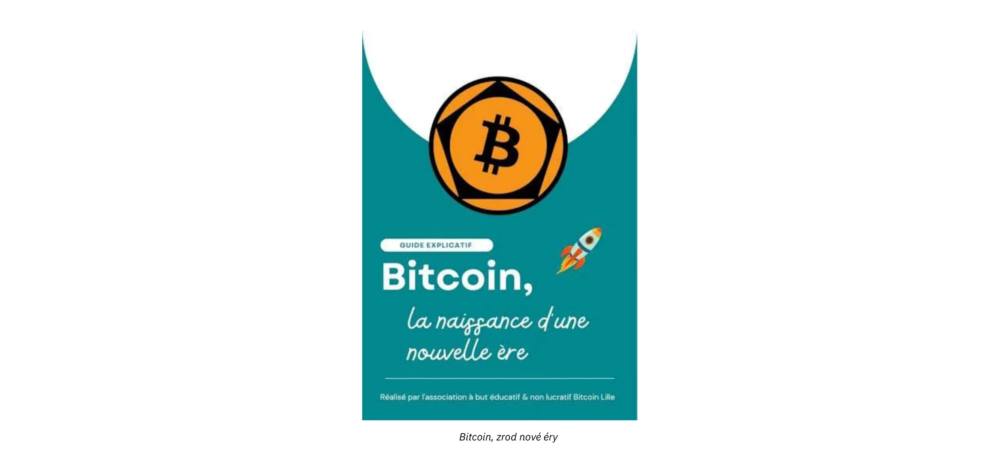

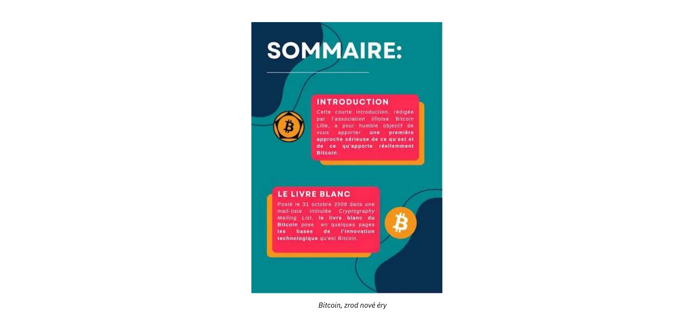

## Výroba videoprojekce

<chapterId>892b248a-b837-5df6-aac9-4b3261ff0390</chapterId>

Téměř každý bitcoiner pravděpodobně viděl fascinující středometrážní seriál [Rémi Forte](https://twitter.com/forteremi) "Le mystère Satoshi, aux origines du Bitcoin" (Záhada Satoshi: původ Bitcoin).

Byl vydán v roce 2021 a na YouTube byl zhlédnut [několik milionkrát](https://www.youtube.com/watch?v=0ETcLj5jBy4).

Jedním z nápadů by mohlo být uspořádání promítání filmu Záhada Satoshi pro vaši komunitu, třeba jako další měsíční akce.

Upozornění: Ačkoli ARTE France potvrdila, že veřejné promítání je povoleno, musíte si zaplatit promítací práva, abyste tak mohli učinit legálně. V roce 2023 činily tyto náklady přibližně 250 eur za projekci, resp. 120 eur za projekci, pokud se během roku promítalo alespoň na pěti setkáních.

Pro většinu komunit je tato cena neúnosná, zejména proto, že dokument je již k dispozici zdarma na kanálu ARTE na YouTube.

Samozřejmě jsou možné i jiné projekce.

Například ve Francii **režisérka [Alana Mediavilla](https://twitter.com/AlanaMediavilla) poskytla místním setkáním právo na předpremiéru svého dokumentu "Stranded "**, který obsahuje záběry z připravovaného filmu 2024 [film "Dirty Coin"](https://www.dirtycointhemovie.com/).

Někteří bitcoinisté se dokonce chopili iniciativy a film "Stranded" kompletně přeložili do francouzštiny, přidali titulky a sdíleli ho na setkáních po celé zemi. V týdnu od 4. března 2024 byl film promítán současně na zhruba tuctu meetupů po celé zemi.

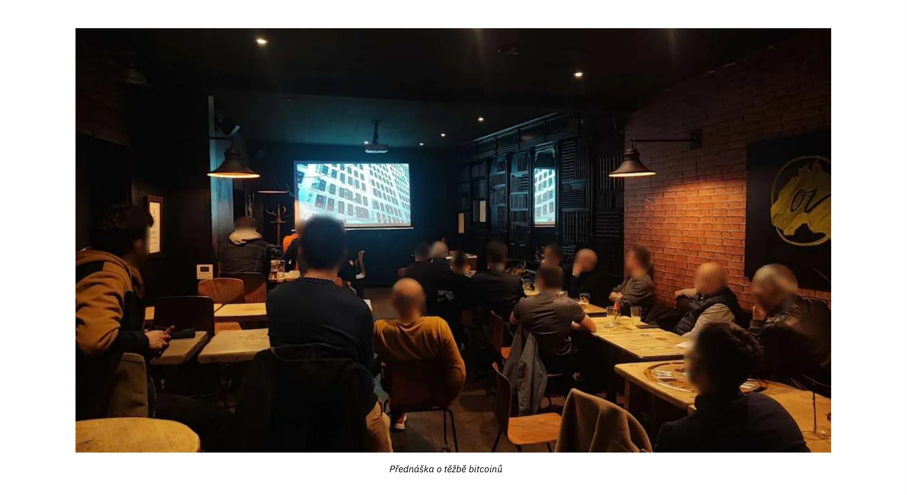

Akce vyvolala živou diskusi o Bitcoin Mining, její spotřebě energie a širším dopadu na životní prostředí.

## Vylepování plakátů ve vašem městě

<chapterId>6565e8a0-d535-5be0-9764-273584c675bd</chapterId>

Vněkolika evropských zemích (včetně Německa, Španělska aFrancie) se bitcoinisté chopili iniciativy a vylepili po městech plakáty.

Některé návrhy přepracovávají Banksyho dílo tak, aby obsahovalo logo Bitcoin.

Příkladem je [StreetCyberArt](https://twitter.com/streetcyber_art), německý bitcoiner, který již několik let vytváří koláže a street art.

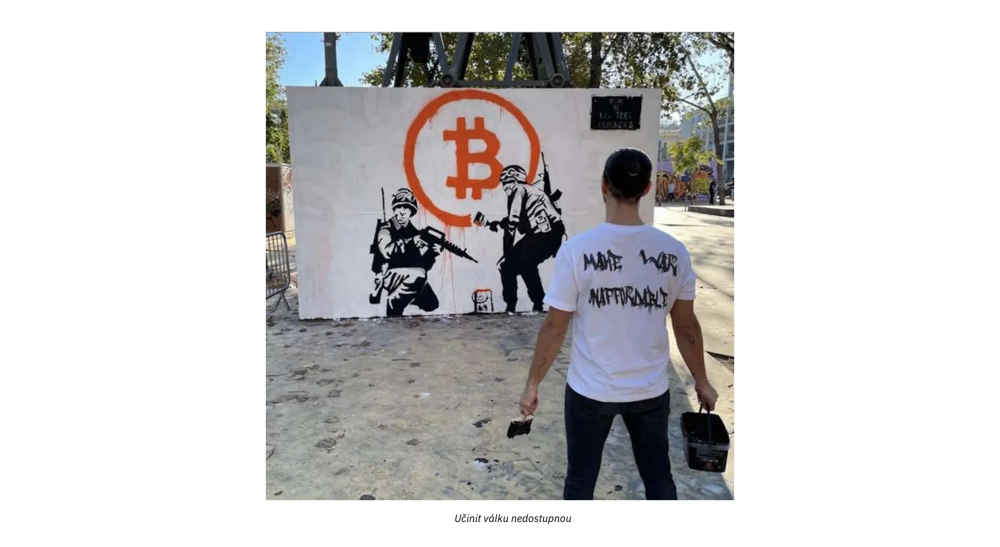

Pokud se chcete pustit do pouličního plakátu, ujistěte se, že znáte zákony své země. Například ve Francii lze plakáty umisťovat pouze na veřejné reklamní tabule. Na jiných místech je to zcela zakázáno a trestá se to pokutou.

Pokud se rozhodnete překročit hranice a doufáte, že nebudete přistiženi "při činu", vyvarujte se uvádění jakýchkoli identifikačních údajů (jako je jméno vaší schůzky nebo @Twitter) na plakátech.

Vezměte také na vědomí, že tisk těchto plakátů na osobní tiskárně obvykle vede k prosakování inkoustu a rychlému znehodnocení venkovního tisku. Nejlepší je spolupracovat s profesionální tiskárnou, která je může vyrobit na speciálním samolepicím papíře určeném pro venkovní použití, což zajistí kvalitu i trvanlivost.

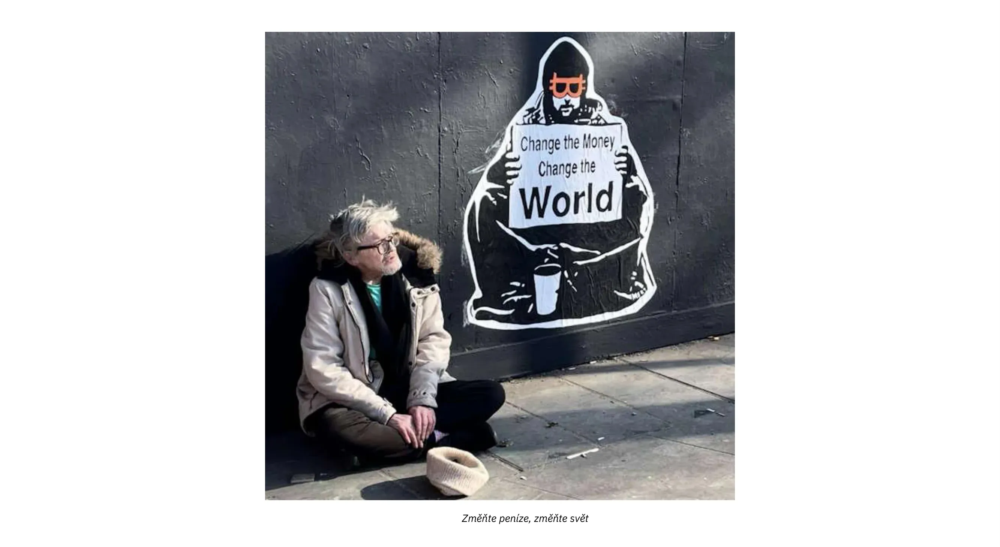

Tato iniciativa může být nákladná více než 0,40 EUR za plakát (přibližně 40 EUR za sto plakátů) a ceny online se mohou pohybovat od dvojnásobku až po pětinásobek této částky. Dobré kontakty jsou nezbytné.

Jak bylo uvedeno výše, francouzský bitcoiner [@Mill3sim3](https://twitter.com/Mill3sim3) má správné profesionální vybavení a lze jej kontaktovat pro podrobnosti.

Alternativou pro kutily je vyrobit si šablonu z velkého kusu kartonu a pomocí barvy ve spreji označit design na vybraných místech ve vašem městě.

## Personalizovaná karta NFC

<chapterId>8ad65d4e-a68a-59c2-a812-85f4907ed9f3</chapterId>

Dalším originálním nápadem projektu je vytvoření personalizovaných karet NFC pro platby Lightning (kompatibilní se standardem BoltCard). K tomu je skvělým partnerem švýcarská společnost Bitcoin Pay.

[Jejich webové stránky](https://swiss-Bitcoin-pay.ch/cards) v současné době nabízí čtyři standardní provedení.

Pokud si chcete objednat více než 50 karet NFC, můžete společnost kontaktovat prostřednictvím jejích oficiálních webových stránek nebo [Twitter](https://twitter.com/SwissBitcoinPay) a navrhnout vlastní design přední strany karty. Zadní strana zůstane standardizovaná.

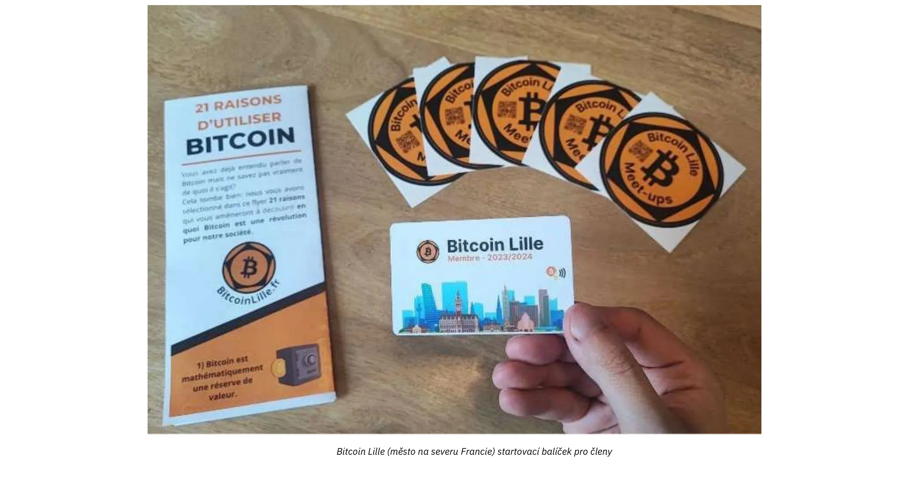

Například v roce 2023 si francouzská asociace [Bitcoin Lille](https://twitter.com/BitcoinLille) objednala sérii karet NFC s vlastním designem. Každý nový člen obdržel v průběhu roku jednu v uvítacím balíčku. Tento nápad lze snadno přizpůsobit a personalizovat pro vaše vlastní společenství.

Jednotková cena těchto karet se obvykle pohybuje od 2,50 € do 5 € v závislosti na velikosti objednávky a podmínkách na trhu, přičemž při větším množství jsou ceny nižší.

## Vytvoření webové stránky

<chapterId>9a2a1b9b-0633-544a-b331-c06187d23d7f</chapterId>

V určité fázi růstu vaší komunity může být cenné mít webové stránky, které slouží jako prezentace vaší skupiny, setkání, akcí a vzdělávacího obsahu.

Vytvoření webových stránek vyžaduje čas, ale v následujícím návodu se dozvíte, jak vytvořit bezplatnou stránku WordPress za pouhých 30 minut. Budete moci nastavit přizpůsobitelnou domovskou stránku, publikovat články a vkládat média, jako jsou videa YouTube, obrázky nebo soubory PDF.

Později si můžete zakoupit vlastní doménu nebo dokonce hostovat stránky na vlastním serveru.

:::video id=a1b25c18-5fc1-4b97-baef-816d819c9382:::

Existují sice i jiné platformy CMS, některé s jednodušším a pro začátečníky přívětivějším rozhraním, ale obvykle jsou mnohem hůře přizpůsobitelné. Proto je WordPress obecně nejlepším výchozím bodem.

WordPress také podporuje širokou škálu pluginů (některé placené, ale vysoce kvalitní), které mohou výrazně rozšířit možnosti vašeho webu, aniž by vyžadovaly znalosti kódování. Jedním z příkladů je [prémiové téma "Uncode"](https://undsgn.com/uncode/)

## Vytvoření video kanálu (Youtube nebo Odyssee)

<chapterId>076286db-1627-57ec-a410-c44b1666e1cd</chapterId>

Někteří členové vaší komunity mohou chtít vytvářet multimediální obsah, například výuková videa.

Můžete také přednášet na setkáních nebo dokonce na univerzitách.

**Když přijde ten čas, specializovaný videokanál vám umožní publikovat a centralizovat veškerý obsah na jednom místě.**

Mezi oblíbené platformy patří:

- [**YouTube**](https://www.youtube.com/), který je široce používaný, ale není odolný vůči cenzuře.
- [**Odyssee**](https://odysee.com/), méně populární, ale decentralizovaná prostřednictvím technologie peer-to-peer.
- [**peertube**](https://joinpeertube.org/fr_FR) umožňuje hostovat vlastní platformu pro videa, její nastavení je však složitější.

Ať už se rozhodnete pro kteroukoli z nich, navrhněte vizuální prvky specifické pro danou platformu, aby byl váš kanál atraktivní. Aplikace Canva, zmíněná v [části 2/8](https://planb.academy/courses/1c643dc9-a15f-4f9e-93b6-cb3c58b4ee35/3470a31f-0190-5e87-8af0-6a00e79267ef), nabízí kategorii "Miniatury YouTube" s předpřipravenými, přizpůsobitelnými návrhy.

Pro **nahrávání** z počítače je zdarma k dispozici [Streamlabs](https://streamlabs.com/fr-fr), který má mnoho funkcí a podporuje přechody mezi scénami.

Pro **střih videa** je [Wondershare Filmora](https://filmora.wondershare.fr/) (cca 45 €/rok) jednoduchý na používání a rychle vytváří profesionální výsledky.

Pro úvod a závěr **videa** můžete snadno najít vhodné šablony na webu Canva. Přizpůsobte si návrh podle svého vkusu, stáhněte si jej a přidejte do svého střihového softwaru.

Tip: Pokud bude služba Bitcoin někdy zakázána nebo cenzurována, mějte vždy místní zálohu svých videí na disku Hard.

## Vytvoření zvukového podcastu

<chapterId>12e96b45-1c33-5687-a753-80d0114d487a</chapterId>

Dalším skvělým způsobem sdílení nápadů je audio podcast. Stejně jako u videokanálů trvá nějakou dobu, než si vybudujete publikum.

Mezi oblíbené platformy podcastů patří:

- [**Fountain**](https://www.fountain.fm/), podporuje dárcovství Blesku.
- [**Soundcloud**](https://soundcloud.com/);
- [**Deezer**](https://www.deezer.com/fr/);
- [**Spotify**](https://open.spotify.com/);
- [**Google podcast**](https://podcasts.google.com/).

Každá platforma má své vlastní publikum, takže přítomnost na více platformách rozšíří váš dosah. **[Spotify pro podcastery](https://podcasters.spotify.com/) to usnadňuje tím, že umožňuje jednou nahrát podcast a generate kanál RSS pro ostatní platformy**.

Po dokončení práce na Spotify pro podcastery zbývá jen naformátovat obsah pro ostatní platformy, což je poměrně rychlý proces.

Pro nahrávání je k dispozici bezplatný program [Audacity](https://www.audacityteam.org/), který umožňuje upravovat úrovně zvuku, přidávat efekty, jako jsou například prolínačky, a zlepšovat čistotu zvuku při úpravách. Je to jednoduchý nástroj pro nahrávání hlasu a vytváření podcastů v profesionální kvalitě.

Zde je krátký desetiminutový výukový program, který obsahuje základní informace o tvorbě podcastů pomocí programu Audacity:

:::video id=67d80ac7-253f-40a5-b621-fef2fb7174bd:::

Tip: Stejně jako u videí si pro případ budoucí cenzury uložte místní zálohu všech podcastů.

## Vytvoření odznaku pro vaše události

<chapterId>0cccef8d-a765-5844-8921-c40f0ce653e4</chapterId>

Na vašich setkáních a akcích můžete zavést malý stimul: odznaky události. Jde o to **vytvořit odznak, který lze získat pouze na dané akci**. Tento koncept existuje na jiných blockchainech pod názvem "POAP" ("Proof Of Attendance Protocol"). V současné době však neexistuje žádný volný způsob, jak jej implementovat na Bitcoin.

Takový systém lze použít i k odměňování nejaktivnějších členů komunity. Můžete například uspořádat každoroční tombolu, ve které se každý nasbíraný odznak rovná jednomu vstupnímu lístku. Člen, který se zúčastní všech 12 setkání za rok, by měl 12 vstupenek do tomboly.

Jiným, tradičnějším přístupem je požádat účastníky každé akce, aby na odznak napsali své křestní jméno nebo přezdívku a důvod své účasti.

Je to sice trochu formální, ale členům to může pomoci snáze najít společné zájmy a témata ke konverzaci a nováčkům to také usnadní rozpoznat organizátory (nebo oficiální členy komunity/asociace).

Několik šablon odznaků používaných sdružením Bitcoin Lille je [k dispozici jako open-source na Canva](https://www.canva.com/design/DAGHAsT15MU/AIA7-L_xBjNdsuxdD4-h-Q/edit?utm_content=DAGHAsT15MU&utm_campaign=designshare&utm_medium=link2&utm_source=sharebutton).

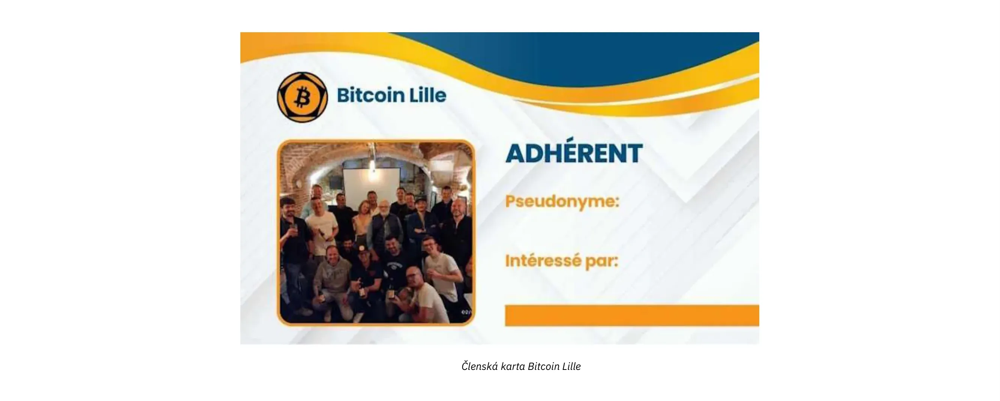

## Plánování předání v případě úmrtí

<chapterId>c5febf18-235c-51bc-8fbb-9467dabe4cb0</chapterId>

Na zcela jiném místě se věnujme citlivému tématu Address: odchodu člena vaší komunity Bitcoin.

Jednoho dne vás může kontaktovat rodina bývalého člena a informovat vás o jeho úmrtí. Mohou vám vysvětlit, že vám zesnulý zanechal instrukce, včetně kontaktování vaší komunity, setkání nebo sdružení.

V některých případech může rodina také požádat o pomoc při vymáhání finančních prostředků jako příjemci dědictví.

Je rozumné spolupracovat se svou komunitou a předem stanovit jasný postup pro takové situace, který zajistí, že:

- Zesnulý již své rodině doporučil **nikdy nesdílet soukromé klíče ani si na setkání nebrat fyzické peněženky**.
- Rodina chápe, že účel jejich návštěvy je vzdělávací: dozvědět se, jak Bitcoin funguje, aby mohli později převzít svrchovanou kontrolu nad fondy.
- Rodina zná příslušné zákony své země týkající se darů, dědictví a převodu Bitcoin na fiat.

Zavedení standardního protokolu také zabrání tomu, aby kdokoli, ať už člen nebo host, využil situace k odcizení finančních prostředků.

Mohli byste vytvořit zvláštní pracovní skupinu, která by tento proces definovala. Sdružení Bitcoin Lille již na takovém [dokumentu](https://docs.google.com/document/d/1TDfLZjuictC5s3PEM2Z7WmkxIDSJ8Q1E4xevm52pVgU/edit?usp=sharing) pracuje a v příštích měsících jej plánuje vydat jako otevřený zdrojový kód.

## Přednášet na školách a univerzitách

<chapterId>65efdb44-e3d4-567c-aedf-972765753d73</chapterId>

Výše uvedený seznam projektů samozřejmě není úplný. Obecně se jedná spíše o interní projekty pro jejich komunitu nebo setkání, které lze poměrně snadno realizovat v průběhu jejich vývoje.

Nyní se zaměříme na onboarding.

Jak víte, jedním z nejlepších způsobů, **jak najednou oslovit velké množství posluchačů, je uspořádat bezplatnou přednášku**. Tu lze uskutečnit na vysokých školách a univerzitách a seznámit s Bitcoin mladé lidi (i ty ne tak mladé), ať už jsou v ní úplně noví, nebo si chtějí prohloubit znalosti.

Přednáška pro desítky nebo dokonce stovky lidí vyžaduje více než jen technické znalosti. Budete potřebovat:

- Sebevědomí při veřejném vystupování
- Dobré zvládání stresu
- Jasná artikulace
- Dobrý time management
- Kvalitní a dobře zpracovaná prezentace nebo workshop přizpůsobený úrovni dovedností posluchačů

Stejně důležité je **zachovat si otevřenou mysl a vědět, kdy je třeba pojmy zjednodušit**, zejména během otázek a odpovědí nebo panelové diskuse. Nejde o to vzdát se svých zásad, jen uznat, že ostatní mohou vidět věci jinak. Někdy je lepší odpovědět později nebo to nechat plavat, aby diskuse mohla pokračovat. Pokud jsou vaše body podloženy pádnými a dobře podloženými argumenty, lidé to uznají.

Pokud se cítíte připraveni, jděte do toho! Svět zoufale potřebuje lepší osvětu o Bitcoin.

Přesto se nejedná o lehký úkol: vyžaduje motivaci, úsilí a správné kontakty.

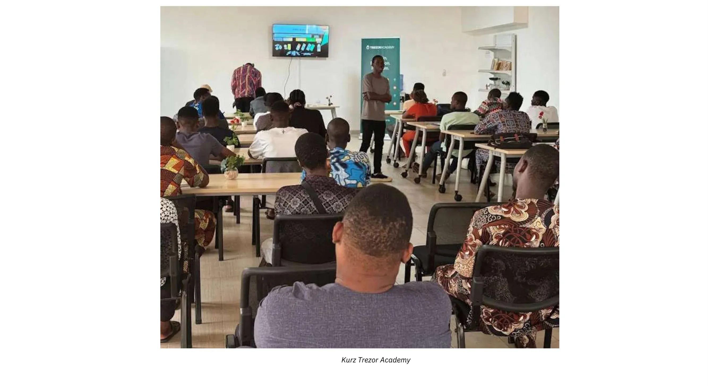

Organizace přednášky nebo workshopu ve škole nebo na univerzitě začíná nalezením správného kontaktu. Tím může být:

- Osobní známost
- Studentská unie
- Studentské sdružení, které pořádá přednáškové cykly nebo akce
- Bývalí profesoři z vaší technické školy nebo univerzity
- Koordinátor akademického programu, pokud se na něj obrátíte přímo

Prvním krokem je obvykle představení iniciativy nebo sdružení a žádost o schůzku. V nejlepším případě to povede k prezentaci na Bitcoin před studenty o několik týdnů později.

Bohužel je Bitcoin stále démonizován většinou médií a mnoha politiky, což vede některé k přesvědčení, že nemá ve třídách co dělat. Odmítání je běžné, zejména v akademických kruzích, kde témata jako Proof of Work a spotřeba energie zůstávají kontroverzní.

Přesto stojí za to to zkusit, zejména u studentských svazů a sdružení. A kdo ví? I když váš první pokus dostane odpověď "ne", možná se vám během příští kampaně objeví ve schránce e-mail s pozvánkou, abyste promluvili například k 280 studentům!

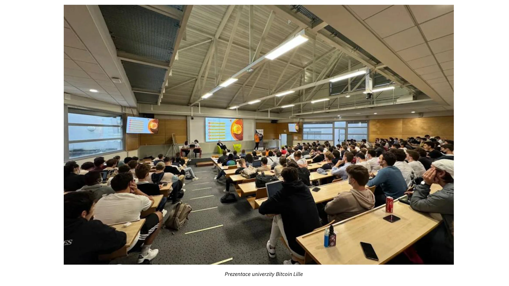

## Oslovení podniků

<chapterId>b730462b-7928-5d28-a14f-9ceaa773d3d2</chapterId>

Získat podnik, který přijímá Bitcoin, je pro mnoho bitcoinových uživatelů něco jako odemknout vzácný úspěch v Pokédexu.

Každý obchodník je jiný a jejich zavádění do systému s sebou nese řadu problémů:

- K placení dodavatelům stále potřebují fiat měnu.
- Vyžadují přehledné finanční výkazy připravené pro účetnictví.
- Jejich platební systémy musí být spolehlivé, snadno použitelné a odolné proti krádeži.
- Mohou mít o Bitcoin mylné představy nebo negativní předsudky.
- Najít bezchybné softwarové řešení může být složité.
- Přimět obchodníka, aby pochopil, proč se vyplatí přijmout platbu Bitcoin.

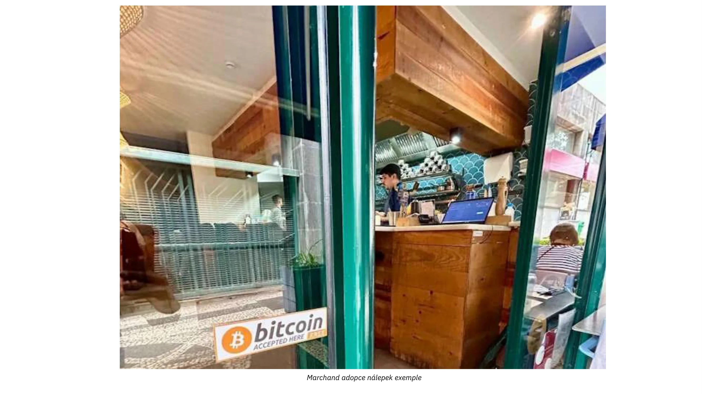

Zapojení místních podniků je jedním z nejlepších způsobů, jak rozvíjet ekosystém Bitcoin ve vašem městě. Klíčem je postupovat krok za krokem:

1/ **Při každém nákupu požádejte o platbu v Bitcoin**

Většinou se setkáte s odmítavým nebo dokonce mírně odsuzujícím pohledem, ale už jen dotazem dáváte najevo, že Bitcoin je něco, co mohou používat i "obyčejní lidé" a že je to stále populárnější způsob placení. Můžete se dokonce spojit s několika přáteli a zastavit se v různých dnech ve stejném obchodě a pokaždé požádat o platbu v Bitcoin. Dříve nebo později to vzbudí zvědavost majitele.

2/ **Nabídněte jednoduché a jasné vysvětlení**

Pokud se vás zeptají, co je Bitcoin, odpovězte stručně a bez žargonu. Například:

*"Bitcoin jsou peníze, které nejsou pod kontrolou bank, fungují bez zprostředkovatelů, nelze je cenzurovat, nepodléhají inflaci a mají nižší poplatky než tradiční bankovnictví. "*

Pak jim předejte leták, například "21 důvodů, proč používat Bitcoin" nebo "10 důvodů, proč přijmout Bitcoin do svého podnikání", s kontaktními údaji nebo údaji o schůzce. Až budou připraveni na předváděcí akci, budou tak vědět, kde vás najdou.

3/ **Zorganizujte ukázku**

Když projeví zájem, domluvte si termín, kdy jim ukážete platební řešení.

Skvělou volbou je **[Swiss Bitcoin Pay](https://swiss-Bitcoin-pay.ch/)**, protože:

    - Umožňuje obchodníkovi denně automaticky převádět BTC na fiat, aby mohl platit dodavatelům.
    - Umožňuje jim ponechat si procento v BTC, pokud si to přejí.
    - Generuje exportovatelné účetní sestavy pro své účetní.
    - Má jednoduchý řídicí panel pro manažery.
    - Zaměstnanci mohou pomocí intuitivní aplikace Interface přijímat platby, aniž by se museli dotknout pokladny.
    - Stojí méně než 2-3% poplatky účtované tradičními platebními sítěmi.

4/ **Podpořte je, jakmile začnou přijímat Bitcoin**

Až budou na palubě:

    - Pravidelně je navštěvujte a nakupujte.
    - Zkontrolujte, zda vše běží hladce.
    - V případě potřeby znovu sdílejte své kontaktní údaje.
    - Pozvěte je na schůzky.
    - Přidejte je do mapy [btcmap.org](https://btcmap.org/) a dejte o nich vědět na Twitteru [Swiss Bitcoin Pay](https://x.com/swissbitcoinpay), abyste je zviditelnili.
    - Zvažte pořádání seminářů nebo setkání v jejich prostorách.

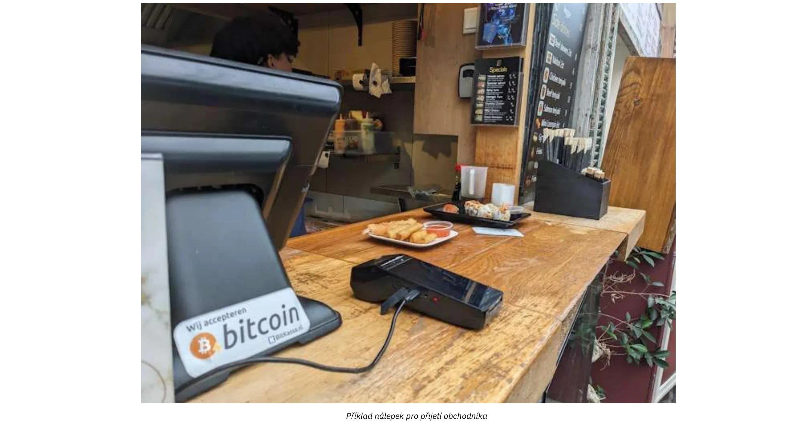

5/ **Propojení místních obchodníků**

Jakmile budete mít několik podniků, které jsou přátelské ke Bitcoin, navrhněte vytvoření skupiny Telegramu určené pouze pro obchodníky. Ta může:

- Nechte je sdílet zkušenosti a přijímat nové firmy.
- Slouží jako kanál rychlé technické podpory.
- Posílení místní sítě Bitcoin.

Agitace je dlouhodobá hra. Vyžaduje trpělivost, vytrvalost a strategii. Pokud je však vaše komunita připravena, můžete začít pokládat základy skutečné oběhové ekonomiky Bitcoin, podobně jako [Arnhem v Nizozemsku](https://www.arnhembitcoinstad.nl/) v Nizozemsku.

## Kontaktování místního tisku a rozhlasu

<chapterId>435bfbc1-22dd-59bb-b737-a32ea995b238</chapterId>

Bitcoineři se často zaměřují na sociální média a online platformy, ale to je jen část obrazu. Místní tisk a rozhlas mohou být mocnými spojenci.

Některé komunity, jako například [Breizh Bitcoin](https://breizhbitcoin.com/) ve Francii, se **pravidelně obracejí na místní média**, aby:

- Oznamujte nadcházející akce (setkání, prezentace, workshopy, večírky Halving atd.).
- Pozvěte novináře, aby navštívili podniky přátelské ke Bitcoin a napsali o nich.
- Sdílejte data a místa konání akcí, abyste je mohli zařadit do místních seznamů.

V mnoha novinách stále vychází rubrika "Co se děje", často na posledních stránkách, kde jsou uvedeny nadcházející místní události. Breizh Bitcoin zjistil, že tento přístup funguje: nově příchozí se objevili na setkání jen proto, že si všimli seznamu v novinách.

Tato strategie může v některých oblastech fungovat lépe než v jiných, ale stojí za to ji vyzkoušet. Můžete začít tím, že oslovíte regionální zpravodaje, Francie má příklady jako např:

- [acpm.fr](https://www.acpm.fr/Les-chiffres/Diffusion-Presse/Presse-Payante/Presse-Quotidienne-Regionale);
- [voxpublic.org](https://www.voxpublic.org/spip.php?page=annuaire&cat=medias&type_media=Presse%20quotidienne%20r%C3%A9gionale).

a kontaktováním místních rozhlasových stanic s návrhem rozhovoru nebo vystoupení v podcastu.

Pozor na to, že rozhovory s médii mohou být ošemetné. Slova mohou být vytržena z kontextu nebo zkreslena. Příprava je nezbytná.

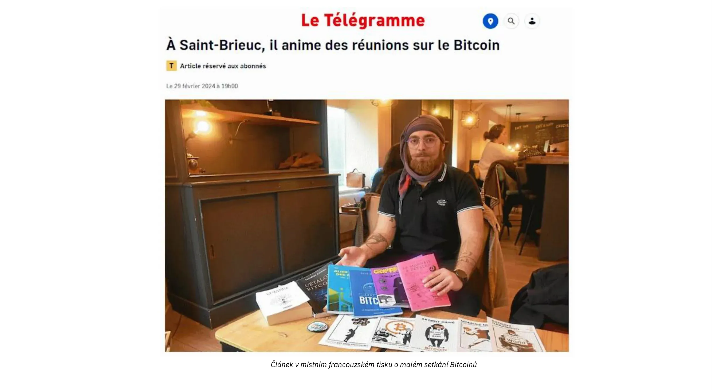

Kromě všech projektů navržených v této části lze samozřejmě realizovat **mnoho dalších projektů**. Vše závisí na vašem čase a motivaci, ale také na náročnosti daného projektu.

Závěrečné tipy pro jakýkoli osvětový projekt:

1) **Plánujte dopředu**: definujte své cíle, potřebné kroky a kdo bude co dělat.

2) **Postupujte krok za krokem**: vyhněte se vyhoření tím, že budete své úsilí rozvrhovat.

3) **Požádejte o pomoc**: požádejte o podporu své členy a sousední komunity.

Nezapomeňte, že každá komunita Bitcoin byla tam, kde jste nyní vy. Neváhejte se poučit z jejich zkušeností a rad.

# Předvídání budoucnosti

<partId>6ea07445-9369-54bc-9aa0-d260db026e0b</partId>

## Plánování nárůstu počtu účastníků

<chapterId>8af722d4-3a9f-548c-9001-424f2142de12</chapterId>

Když Bitcoin vstoupil do své čtvrté éry na bloku 840 000, stále více lidí začalo uznávat, že jde o technologickou, finanční a sociální revoluci.

Stejně jako v případě internetu bude tato revoluce trvat dlouho, což je vlastně výhoda. Dává lidem šanci **naučit se základy Bitcoin**, pochopit, jak jej používat, a umožňuje vývojářům a společnostem **vytvořit protokoly a aplikace**, které uvolní jeho plný potenciál.

Budoucnost nikdo nedokáže předpovědět, ale můžeme **očekávat prudký nárůst používání Bitcoin**. To znamená **být připraven na všechny scénáře**, dokonce i na ty extrémní, jako je zhroucení tradičního finančního systému nebo úplný zákaz Bitcoin.

V této sedmé a předposlední části kurzu se podíváme na klíčové body, které je třeba mít na paměti při růstu vaší komunity a setkávání.

První a nejsnadněji očekávatelný je nárůst počtu lidí, kteří se připojí k vaší komunitě. To vás ovlivní dvěma hlavními způsoby:

1/ **Vaše komunikační kanály (Telegram, Signal, Matrix atd.) budou časem přeplněné**, takže bude těžší udržet krok s konverzací. Je třeba mít na paměti dvě věci.

Zaprvé, pokud v jednom chatu diskutuje 500 lidí na nejrůznější témata, samotný objem zpráv a oznámení nevyhnutelně povede k tomu, že se mnoho členů odhlásí. To je vhodný čas na to, abyste přehodnotili své nastavení a přešli například na superskupiny Telegramu nebo server Discord, které umožňují snadnou organizaci diskusí podle témat.

Za druhé, více lidí v kanálech znamená více botů, více podvodů, a tedy i více moderování. Připravte se na to vytvořením jasného souboru pravidel, na která se můžete při moderování zpráv odvolávat. Podle našich zkušeností se tak dá předejít konfliktům, zejména pokud jsou pravidla ve vašich kanálech snadno dostupná.

Dobrým příkladem je **[Bitcoin Lille's open-source rulebook](https://bitcoinlille.fr/reglement/)** napsaný před několika lety pro skupinu Telegram a server Discord. Je založen na jednoduchých, univerzálních principech a můžete si dokonce vzít [upravitelnou verzi návrhu zde](https://www.canva.com/design/DAGHI692AD4/rjT4sqEnhajc5FiPA6GFZQ/edit?utm_content=DAGHI692AD4&utm_campaign=designshare&utm_medium=link2&utm_source=sharebutton).

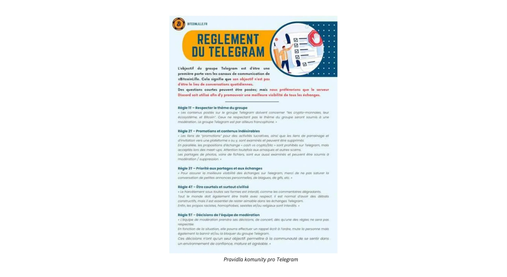

2/ **Vaše setkání a akce začnou přitahovat velké davy lidí a spoustu nových tváří, které se budou chtít spojit**.

S tímto nárůstem návštěvnosti:

    - možná by stálo za to **najít větší prostory pro vaše setkání a akce**, zejména pokud jste v minulosti mohli hostit pouze kolem dvaceti lidí.
    - pokud zjistíte, že počet účastníků je ohromující, můžete pro příští setkání buď **vyžadovat registraci účastníků** (prostřednictvím aplikace Meetup nebo jednoduchého formuláře), nebo **pořádat každý měsíc více setkání** (například setkání pro začátečníky, středně pokročilé a pokročilé).
    - Zároveň očekávejte, že do ekosystému vstoupí mnoho nových uživatelů, jejichž hlavním cílem je vydělat peníze. Chcete-li **udržet konverzaci zaměřenou na Bitcoin** na těchto rychle se rozvíjejících setkáních, je dobré:

a) Zařaďte během těchto akcí prezentaci** na téma **Bitcoin, protože to přirozeně nasměruje většinu konverzace k tomuto tématu (a odvede pozornost od nejnovějšího údajně "revolučního" projektu shitcoin);

b) **Vyhněte se setkávání pouze s ostatními bitcoinery**. Místo toho se snažte **přiblížit k nováčkům**, i kdyby to mělo znamenat, že se budete zdržovat v zadní části místnosti, abyste je pozdravili. Odtud si můžete promluvit o tom, proč přišli, co hledají, o cílech (nebo dokonce základních principech) vaší komunity atd.

A konečně, ačkoli je škoda, že to musím říct, na setkáních se mohou objevit podvodníci. Jejich cílem může být nekonečné povídání o jejich Ponziho schématu, MLM nebo nějaké "revoluci Blockchain poháněné umělou inteligencí" Je také docela dobře možné, že se jednoho dne někdo se špatnými úmysly zúčastní setkání speciálně proto, aby vypral peníze nebo se pokusil koupit BTC za falešné bankovky.

V takovýchto ošemetných situacích je nejjednodušší zdvořile vysvětlit, že setkání není vhodné, a podpořit to jakýmikoliv argumenty (například zmínkou o tom, že by mohla být přítomna policie v civilu).

Pokud bohužel odmítnou odejít nebo se chovat slušně (ano, stalo se to), můžete skupinu Address přímo během setkání upozornit, že se osoba , nebo osoby, pokoušejí o nějakou záškodnickou činnost.

Naštěstí jsou tyto situace vzácné a často spíše absurdní než hrozivé, ale i tak je lepší být připraven.

Pro klid duše: pokud vy osobně neporušujete zákon nebo přímo neumožňujete nelegální transakce, nejste právně odpovědní za jednání ostatních na vaší akci (alespoň podle francouzského práva).

V ideálním světě byste měli **prostor dostatečně velký na to, abyste mohli hostit několik desítek lidí**, jak se vaše komunita rozrůstá, a také byste budovali **silné vztahy mezi bitcoinery** a budoucími bitcoinery během medvědího trhu, takže až přijde býčí období, budete mít co nejvíce lidí připravených k oranžové pilulce pro ostatní.

## Decentralizace organizace komunity

<chapterId>bedfc110-e099-58f4-a5b7-fb50f3b19a49</chapterId>

Představte si následující: léta vedete setkání Bitcoin a jednoho dne se rozhodnete, že s touto prací skončíte, třeba abyste chovali lamy v Peru nebo se honili za dokonalými vlnami v Salvadoru. Co se stane s vaší komunitou, když odejdete?

Naplánujte si prosím převod své komunity dopředu tak, že:

1) **Udělte důvěryhodným členům práva správce (nebo Ownership)** pro vaše komunikační kanály. Role se mohou vždy později změnit.

2) **Sdílejte údaje o účtech** (uživatelská jména, hesla, přidružené e-maily) pro svá sociální média a kanály pro zviditelnění alespoň s jednou důvěryhodnou osobou.

Bez tohoto přístupu je téměř nemožné, aby ho někdo jiný efektivně převzal. Začínat od nuly vytvářením "rozvětvených" skupin a obnovou sítě je pomalé, vyčerpávající a často demoralizující.

Pokud nemáte důvěryhodný kontakt v rámci meet-upu, můžete se vždy obrátit na @ProfEduStream, @copinmalin nebo @gabtribe na Telegramu. Mohou vám pomoci najít motivovaného nástupce a koordinovat předání účtů a administrátorských práv.

**Proč je decentralizace důležitá ?**

Pokud jste jediným účastníkem a máte veškerou kontrolu, co se stane, když zmizíte? Odpověď je jednoduchá: zmizí i vaše komunita.

Řešení: decentralizujte úkoly, role a přístupy, aby skupina mohla fungovat i v případě, že jeden z organizátorů vypadne, ať už z časových důvodů, nebo v horším případě kvůli zatčení za držení karty Bitcoin, která neodpovídá standardu KYC.

**Jak dále prosazovat decentralizaci ?**

Přijměte **svobodný software s otevřeným zdrojovým kódem**, jako je [sada framasoft](https://framasoft.org/fr/), abyste snížili závislost na centralizovaných platformách a zvýšili odolnost proti případné státní cenzuře nebo zákazům Bitcoin.

Používejte **šifrované nebo anonymní komunikační nástroje** k ochraně soukromí členů a aktivit vaší komunity.

## Co kdyby se Bitcoin stal veřejným nepřítelem č. 1?

<chapterId>c739651f-cd13-51e0-a36e-85023749b15b</chapterId>

5. dubna 1933 podepsal 32. prezident Spojených států amerických Franklin Roosevelt **Executive Order 6102**, kterým zakázal soukromým osobám vlastnit zlaté mince, slitky nebo certifikáty kdekoli v zemi.

Velká hospodářská krize (krach na burze v roce 1929) samozřejmě není naší současnou realitou. Mohla by však vláda jednoho dne udělat totéž s Bitcoin: **zakázat soukromý Ownership přímo?**

Pravdou je, že takové orwellovské opatření by ve skutečnosti nikomu nezabránilo v tom, aby skutečně vlastnil BTC, protože žádný zákon nemůže člověku zabránit v tom, aby si zapamatoval posloupnost slov.

Přesto, co kdyby si světoví lídři konečně uvědomili potenciál Bitcoin změnit globální řád, a to i na úrovni států? Byl by pak označen za "veřejného nepřítele č. 1"?

Nemusíme propadat konspiračnímu myšlení. Nic nám však nebrání v tom, abychom předvídali, decentralizovali a vzdělávali se, a to již nyní.

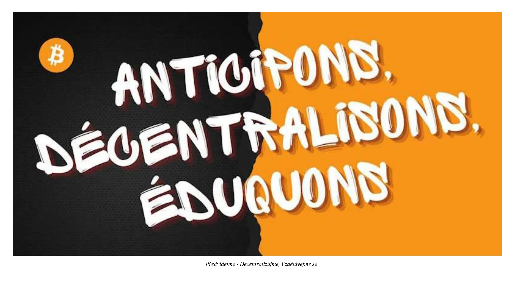

# Sdružování bitcoinářů

<partId>62bc2138-c0be-5d39-a341-594690863257</partId>

## Rychlý akční plán pro budování komunity Bitcoin

<chapterId>1f463ec2-3f64-5641-8d60-e02a47c94f27</chapterId>

Satoshi Nakamoto vytvořil revoluční nástroj, který již mění náš svět. Je však na nás, bitcoinech, abychom rozhodli, jak budeme utvářet budoucnost.

Bitcoin je rozsáhlá králičí nora, která se dotýká historie, ekonomie, literatury, matematiky, informatiky a kryptografie. Nikdo ji nemůže prozkoumat celou, a v tom je její krása.

Protože náš čas je omezený, je klíčové zůstat pokorný, neustále se učit a předávat znalosti Exchange ostatním. Tímto způsobem může každý z nás dosáhnout úrovně porozumění, o kterou usiluje.

**Globální Bitcoin komunity proto hrají zásadní roli při budování světa zítřka**: jsou to prostory, kde mohou bitcoináři **Exchange, budovat a sdílet**. **Společně**.

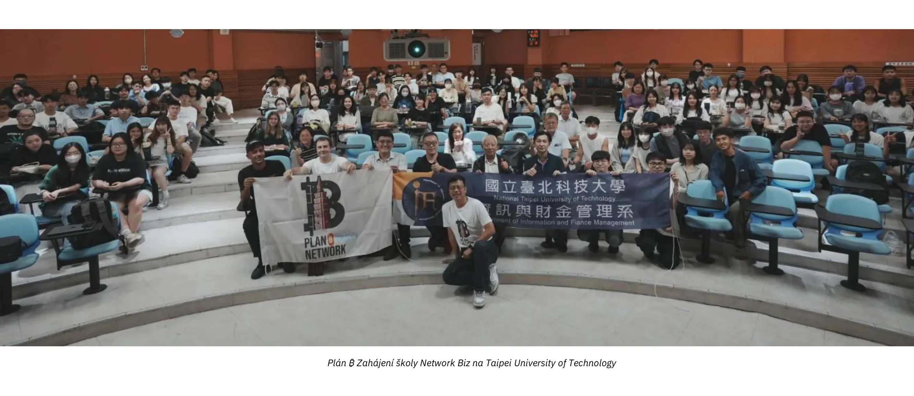

Jak jste viděli v průběhu tohoto kurzu, **vytváření komunity Bitcoin a organizování setkání** vyžaduje jak plánování, tak motivaci. V závislosti na vašich cílech a čase, který jim můžete věnovat, se můžete pustit do ambicióznějších projektů, nebo si věci zjednodušit.

V obou případech je cíl stejný: **vzbudit zájem a pomoci Bitcoin růst ve vašem městě**.

Na závěr mnoha kapitol a podkapitol, kterými jsme se zabývali, vám přinášíme **konkrétní "akční plán "** pro vytvoření vaší komunity Bitcoin:

1) Předem se rozhodněte, proč chcete vytvořit komunitu Bitcoin, jaké jsou vaše cíle a ve kterém městě nebo lokalitě budete působit.

2) Navažte kontakt se stávajícími komunitami v okolí a neváhejte je požádat o radu, když ji budete potřebovat;

3) Vytvořte jasnou identitu vaší komunity, která bude odrážet vaši komunitu a místo (logo, plakát, banner, leták atd.)

4) Vytvořte komunikační kanály a sociální sítě, jako je Telegram, Twitter, NOSTR, Discord nebo Simplex. Zvažte také decentralizované kanály a/nebo kanály odolné vůči cenzuře.

5) Sledujte další místní setkání a komunity online a nechte svou skupinu uvést na různých mapách a platformách, abyste ji zviditelnili.

Jakmile jsou komunikační kanály vaší komunity aktivní:

6) Jakmile pocítíte dostatečný zájem, spusťte průzkum a navrhněte první setkání.

7) Definujte cíle, kterých chcete na této osobní akci dosáhnout.

8) Vyberte si příjemné místo, které odpovídá vašim cílům, a rezervujte si stůl nebo místnost.

9) Propagujte událost na svých kanálech týden předem a pak znovu dva až tři dny před datem konání.

10) Uveďte svou událost na příslušných webových stránkách a platformách.

11) V den konání nechte událost přirozeně plynout, zapojte se do diskuse s účastníky a v případě potřeby ji jemně usměrňujte.

Poté:

12) Zaměřte se na udržení a zapojení účastníků, aby se vraceli.

13) Navrhujte jednoduché projekty nebo iniciativy a zahajte ty, na kterých vám osobně záleží. Pokud chce někdo jiný vést jiný projekt, podpořte ho, kde můžete.

Nakonec:

14) Předvídejte budoucnost a přemýšlejte o větším prostoru pro setkávání, pravidlech pro komunikační kanály, webových stránkách atd;

15) Povzbuzujte místní podniky, aby přijímaly Bitcoin, a to i pouhým dotazem při každém nákupu.

16) Delegování úkolů a práv správce kanálu/sítě na důvěryhodné členy.

17) Široce propagujte svou komunitu, aby se do ní zapojilo více lidí, a zapojte ty, kteří projeví zájem.

18) Jděte ještě dál s projekty, které vás baví a které jsou pro vás důležité.

Pro rychlejší přehled je k dispozici toto 21minutové video, které tyto kroky shrnuje:

:::video id=a59956da-f554-4b54-89dd-5ca55b722686:::

Nezapomeňte: *pamatujte si: nejste sami, existující komunity jsou tu pro vás*.

## Péče o sebe

<chapterId>cf1631cb-ddbe-55c7-be8c-26a5652979a0</chapterId>

Když spadnete do králičí nory Bitcoin, změní se váš pohled na život.

Hluboko uvnitř cítíte touhu jít dál, setkat se s ostatními, kteří procházejí stejnou duševní cestou.

Tato energie vás pohání k tomu, abyste přispěli svým dílem do skládačky tím, že se podělíte o svůj objev: Bitcoin. Inspiruje vás také k přemýšlení o světě zítřka, který chcete pomoci vybudovat, a o komunitách, které na něm pracují.

Budování komunity je dlouhý tunel, který vyžaduje motivaci, strategii, odhodlání a čas. Může to být nevděčný úkol, proto je důležité postupovat krok za krokem, abyste nevyhořeli.

**Myslete na sebe, na své limity**. A i když vás Bitcoin může hnát dnem i nocí, **nesnažte se dělat všechno sami, jinak vyhoříte**.

Místo toho **hledejte pomoc u bitcoinářů, kteří již prošli stejným tunelem, prozkoumali stejné cesty a vytvořili stejné nástroje**. Ušetří vám to spoustu času.

**Vyzvěte ty, kteří vás v tomto dobrodružství následují, aby vám přiložili ruku k dílu**, i když delegování některých úkolů zabere více času. Z dlouhodobého hlediska bude vaše komunita silnější a odolnější.

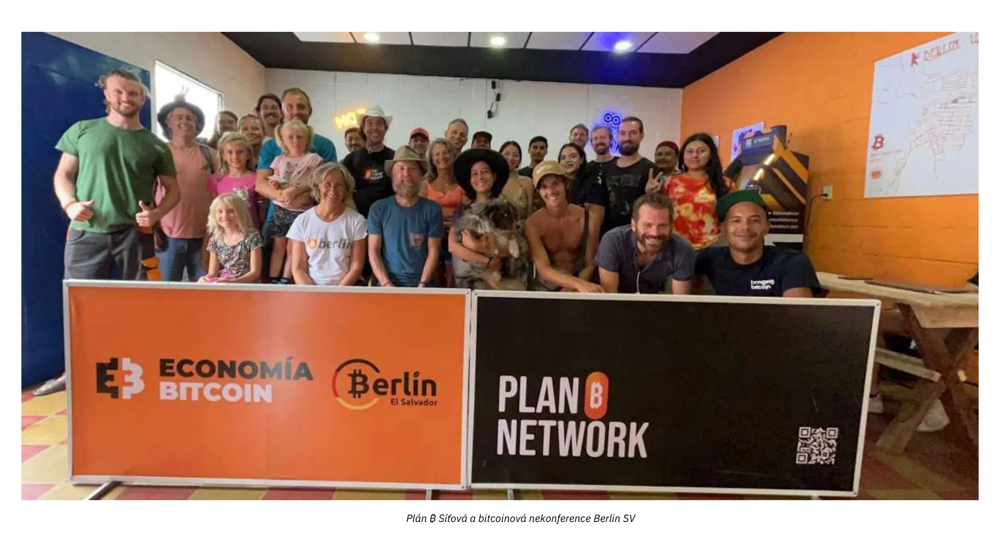

Sami můžete rychle prozkoumat jeden z mnoha tunelů v králičí noře Bitcoin. Nezapomeňte však,že existuje nespočet dalších směrů k prozkoumání.

**Vytvořením a/nebo připojením se ke komunitě bitcoinářů a pravidelným sdílením a výměnou s nimi se budete pohybovat všemi směry králičí nory současně.**

## BTC 304, Co bude dál

<chapterId>8bf10b77-80ee-5d50-87bc-0ef32574a675</chapterId>

V tomto kurzu BTC 304 jsme se podrobně věnovali tomu, jak založit komunitu nebo meet-up a jak spustit různé projekty.

Až bude vaše komunita připravena učinit další krok, můžete **založit formální sdružení**.

Například ve Francii má ze zhruba šedesáti komunit a setkání téměř tucet status sdružení.

Výhody jsou dvojí:

- **Oficiální uznání**: můžete si otevřít bankovní účet sdružení, získat pozornost tisku/médií a dokonce požádat o dotace.
- **Strukturovaná organizace**: můžete definovat jasné role, což usnadňuje řízení komunity a realizaci projektů.

S cílem podpořit další rozkvět vaší komunity **nelze vyloučit, že v nadcházejících měsících vyjde pokračování tohoto školení na [Plan ₿ Academy](https://planb.academy/)**.

Další zasedání by se mohlo zabývat pokročilými tématy, jako jsou:

- Navrhování prezentací nebo workshopů pro vaše setkání a stanovení jasných cílů.
- Organizace rozsáhlé akce s přibližně 100 účastníky.

Při tom budeme vycházet ze zkušeností komunit, které již vytvořily své vlastní akce a prezentace.

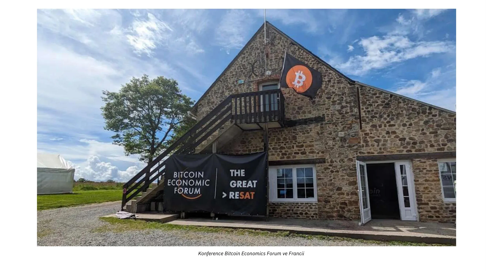

# Závěrečná část

<partId>e9bdddf4-54c9-4de9-bbce-c3eade8c32e5</partId>

## Recenze a hodnocení

<chapterId>08a35d2a-204b-519a-9bb1-588665a037fa</chapterId>

<isCourseReview>true</isCourseReview>

## Závěr

<chapterId>d74606a5-cb14-4117-acb2-2bf5920de092</chapterId>

<isCourseConclusion>true</isCourseConclusion>