# Der erste Schritt zur Bitcoin-Adoption

Heute kann jeder online etwas über Bitcoin lernen, aber was oft fehlt, ist die Möglichkeit, sich zu treffen, Ideen auszutauschen und gemeinsam aufzubauen. Um diese Lücke zu schließen, bilden viele Bitcoiner lokale Gemeinschaften, in denen Treffen Workshops, Präsentationen und bedeutungsvolle Diskussionen anstoßen.

In BTC304 werden wir uns ansehen, warum Community-Building wichtig ist, Werkzeuge zur Schaffung einer starken visuellen und digitalen Identität erkunden und einfache Open-Source-Projekte teilen, die Sie starten können. Wir werden auch betrachten, wie lokale Initiativen zu nationalen Gemeinschaften skalieren, die dazu beitragen können, eine hyperbitcoinisierte Zukunft voranzutreiben.
+++
# Einführung

<partId>81318b8f-d316-5787-aa4c-4ec8370ba668</partId>

## Überblick über den Kurs

<chapterId>e8991b82-4966-5e04-8f05-7cae46eacbaa</chapterId>

Willkommen bei BTC302!

Seit 2009 ist Bitcoin unaufhaltsam gewachsen. Dieses Wachstum hat durch neue Bitcoin Improvement Proposals (BIP) (z.D. Verbessungsvorschläge), die Schaffung zusätzlicher Schichten, um das Netz skalierbar zu machen (u. a. Lightning Network), und die Entwicklung mehrerer Unternehmen und Start-ups Gestalt angenommen.

Diese Entwicklung ist auch On-Chain zu beobachten, wo die Zahl der Transaktionen stetig zunimmt.

Zwischen dem 1. Januar 2018 und dem 1. Januar 2024 wird die Zahl der Transaktionen auf Bitcoin's Main-Layer schätzungsweise [um 66,2% gestiegen sein](https://dune.com/queries/3375917/5663935). Zwischen August 2021 und August 2023 ist die Zahl der öffentlichen Transaktionen auf Lightning Network [um 1.212 % gestiegen](https://river.com/learn/files/river-lightning-report-2023.pdf).

Dieses beträchtliche Wachstum steht natürlich in engem Zusammenhang mit:

- das [wachsende Interesse der Menschen auf der ganzen Welt an der Verwendung von Bitcoin](https://profedustream.substack.com/p/21-raisons-dutiliser-Bitcoin), um sich vom Bankensystem zu befreien und/oder eine weniger volatile oder weniger abgewertete Währung zu verwenden, wie es bei der Bevölkerung im Libanon, in Syrien, Ägypten, Argentinien und anderen der Fall ist;
- sein Kursanstieg im Laufe der Zeit, wodurch er sich als Wertaufbewahrungsmittel und langfristige Anlage etabliert, was durch seine feste Geldpolitik gefördert wird;
- das sukzessive Wachstum des spekulativen Kryptowährungsmarktes, insbesondere in den Jahren 2017-2018 und 2020-2021;
- Die wachsende Präsenz von Bitcoin in den Mainstream-Medien.
- 

Obwohl Bitcoin noch in den Kinderschuhen steckt, veranlasst uns diese Realität, der du dir wahrscheinlich bereits bewusst sind, dazu, zwei wichtige Fragen zu stellen:

- Wie können wir Bitcoiner dazu ermutigen, in ihrem Lernen und in ihren Projekten weiterzugehen, um das Potenzial von Bitcoin **voll auszuschöpfen**?

- Wie können wir Neulingen, die sich oft zu kurzfristigen Spekulationen hinreißen lassen, dabei helfen, kein Geld mit dem neuesten Memecoin-Wahn zu verlieren und sich stattdessen auf das **Erlernen der Grundlagen von Bitcoin** zu konzentrieren?

Die beste Lösung für beide Herausforderungen ist einfach: **sei in der realen Welt präsent und bilde dich weiter**.

Ziel dieses Kurses ist es, dir alles zur Verfügung zu stellen, was du brauchst, um eine Bitcoin-Gemeinschaft oder ein Treffen effektiv zu organisieren. Ganz gleich, ob du eine lokale Initiative aufbauen oder eine Online-Gruppe vergrößern willst, dieser Kurs wird dich Schritt für Schritt anleiten: von der Erstellung deiner visuellen Identität bis hin zur Organisation regelmäßiger Veranstaltungen und der Verwaltung deiner Kommunikationskanäle.

**Abschnitt 1: Einleitung**

Wir beginnen damit, die Bedeutung des Zusammenschlusses von Menschen rund um Bitcoin hervorzuheben, sei es durch Online-Gemeinschaften oder lokale Treffen. Du wirst erfahren, warum und wo du deine eigene Gemeinschaft gründen sollst und wie du klare Ziele setzen kannst, um dein Wachstum und deine langfristige Nachhaltigkeit zu fördern.

**Abschnitt 2: Entwurf einer einzigartigen Identität für deine Bitcoin-Gemeinschaft**

Um neue Mitglieder zu gewinnen und ein Gefühl der Zugehörigkeit zu fördern, ist es wichtig, eine einzigartige Identität zu schaffen. In diesem Abschnitt erfährst du, wie du Logos, Poster und Banner entwirfst, die den Geist deiner Bitcoin-Gemeinschaft verkörpern.

**Abschnitt 3: Kommunikationskanäle für deine Bitcoin-Gemeinschaft schaffen**

Kommunikation ist das Rückgrat einer jeden Community. In diesem Abschnitt stellen wir dir die besten Kanäle vor und zeigen dir, wie du eine Telegram-Gruppe oder einen Discord-Server effizient einrichtest. Außerdem erfährst du, wie du multifunktionale Bots integrieren kannst, um das Community-Management zu optimieren.

**Kapitel 4: Starte deine sozialen Netzwerke** (auf Französisch)

Sichtbarkeit ist der Schlüssel zum Wachstum deiner Community. In diesem Abschnitt erfährst du, wie du ein eigenes Twitter-Profil erstellst, dich mit lokalen Treffen verbindest und Plattformen wie btcmap.org nutzen kannst, um deine Sichtbarkeit zu erhöhen und neue Mitglieder zu gewinnen.

**Abschnitt 5: Organisation eines Bitcoin-Treffens**

In diesem Abschnitt geht es um die Organisation von Meetings: von der Wahl des richtigen Veranstaltungsortes bis zur Durchführung der Veranstaltung selbst. Wir werden auch Strategien erkunden, um Teilnehmer zu binden und die langfristige Nachhaltigkeit deiner Community zu gewährleisten.

**Abschnitt 6: Beispiele für Projekte und Initiativen** (auf Französisch)

Um über einfache Treffen hinauszugehen, werden in diesem Abschnitt konkrete und originelle Projekte vorgestellt: von thematischen Veranstaltungen und Workshops bis hin zur Erstellung von Bildungsinhalten und lokalen Kooperationen. Außerdem erfährst du, wie du sowohl physische als auch digitale Materialien zur Förderung deiner Gemeinschaft gestalten kannst.

**Abschnitt 7: Die Zukunft vorwegnehmen**

Hier werden wir die natürliche Entwicklung deiner Gemeinschaft untersuchen: Was tun, wenn sie zu schnell wächst, wie du Ihre Organisation dezentralisieren und wie du auf ein feindliches regulatorisches Umfeld reagieren kannst. Dieser Abschnitt wird dir helfen, diese Herausforderungen zu antizipieren und zu bewältigen.

**Abschnitt 8: Bitcoiner zusammenbringen**

Der letzte Abschnitt konzentriert sich auf das Wesentliche deines Projekts: Bitcoin-Enthusiasten um eine gemeinsame Vision zu vereinen. Du wirst lernen, wie du deinen Ansatz strukturierst, um Mitglieder zu gewinnen und zu halten, Aufgaben effektiv zu delegierst und deine Gemeinschaft nachhaltig vergrößerst.

Bist du bereit zu lernen, wie du eine starke, lebendige Bitcoin Gemeinschaft aufbauen kannst? Lass uns eintauchen!

## Warum eine Bitcoin-Gemeinschaft oder ein Treffen gründen?

<chapterId>893ea248-7d5a-5b8e-948c-7031497b1031</chapterId>

### Was ist der Unterschied zwischen einer Gemeinschaft und einem Treffen?

Es gibt zwar keine strenge Definition dieser Begriffe im Bitcoin-Ökosystem, aber eine Gemeinschaft wird am besten als eine Gruppe von Menschen verstanden, die eine gemeinsame Leidenschaft teilen und regelmäßig kommunizieren.

Ein Treffen hingegen ist eine Veranstaltung, die von und für diese Gemeinschaft zu einem bestimmten Zweck organisiert wird. Meetups finden in der Regel statt, wenn eine Gemeinschaft bereits etabliert ist.

In diesem Kurs gehen wir davon aus, dass du vor dem Start eines Bitcoin-Treffens bereits mit einigen Personen in Kontakt getreten bist, die an einer solchen Veranstaltung interessiert sind, mit anderen Worten, die **Gemeinschaft existiert bereits**.

### Warum eine Bitcoin-Gemeinschaft gründen?

Es gibt mehrere Gründe für die Gründung einer Bitcoin-Gemeinschaft:

- Wissensaustausch und Zusammenarbeit: Gemeinschaften bieten den Mitgliedern einen Raum für den Austausch von Ideen und Wissen. Gegenseitige Unterstützung ist eine wichtige Säule für Wachstum, die es jedem ermöglicht, sein Lernen zu beschleunigen, was für Bitcoin besonders wichtig ist, da es so viel zu entdecken gibt.
- Peer-to-Peer-Aufbau: Viele Initiativen und Projekte werden innerhalb dieser Gemeinschaften konzipiert, aufgebaut und entwickelt.

Bitcoin-Gemeinschaften verfolgen oft umfassendere Ziele, insbesondere im Bereich der öffentlichen Bildung:

1. Was Bitcoin ist;
2. Wie es funktioniert;
3. Sein Beitrag zur Gesellschaft;
4. Entlarvung irreführender oder unbegründeter Behauptungen, die von einigen Persönlichkeiten des öffentlichen Lebens und den Medien aufgestellt werden;
5. Die grundlegenden Unterschiede zwischen Bitcoin und anderen Kryptowährungen;

Durch den Aufbau der ersten "Zitadellen" von morgen dienen **Bitcoin-Gemeinschaften weltweit als Bollwerk gegen Desinformation und Zensur und bieten gleichzeitig einen fruchtbaren Boden für das Erlernen der Grundlagen von Bitcoin**. Sie bieten Neulingen, selbst Skeptikern, die Ressourcen und Verbindungen, die sie benötigen, um das wahre Potenzial von Bitcoin zu erkunden.

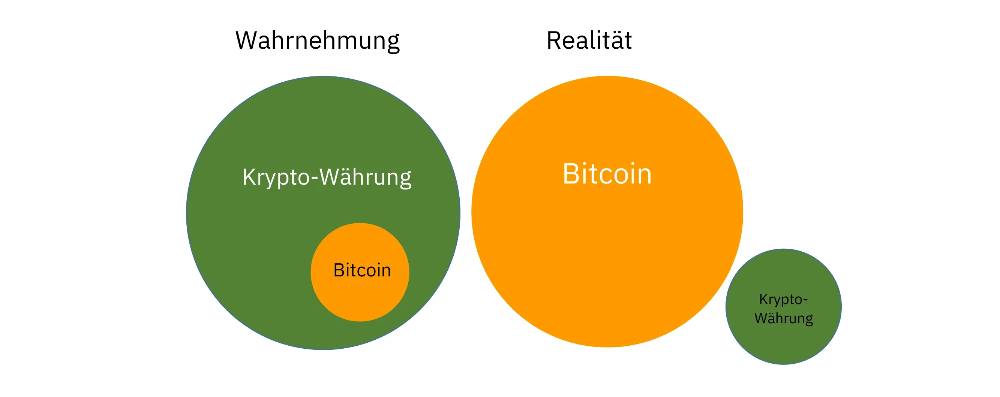

Es ist auch erwähnenswert, dass **eine Gemeinschaft vollständig online** existieren kann, sei es eine Telegram-Gruppe ("Bitcoin London"), eine Facebook-Gruppe ("Bitcoin Berlin"), ein Discord-Server ("Bitcoin Madrid") oder sogar eine E-Mail-Liste ("Bitcoin Frankreich").

Mit anderen Worten: **Eine Gemeinschaft braucht keine physischen Treffen, um zu gedeihen oder Projekte zu starten. Ihr Hauptzweck bleibt derselbe: Austausch, Aufbau und Bildung**.

### Warum ein Treffen einrichten?

Wie bereits erwähnt, kommen **Treffen in der Regel nach der Gründung einer Gemeinschaft zustande und dienen der Ergänzung**.

Wenn sich die Reise eines Bitcoiners weiterentwickelt, entsteht oft der Wunsch oder sogar das Bedürfnis, **andere** aus dem gleichen Ökosystem persönlich zu treffen und mit ihnen zu interagieren. Dies kann daher kommen, dass man sich isoliert fühlt oder einfach niemanden hat, mit dem man im täglichen Leben über Bitcoin sprechen kann.

Meetups bieten eine persönlichere und einladendere Erfahrung als Online-Audio- oder Videoanrufe. Ob **bei einem Getränk oder einer Mahlzeit**, sie schaffen informelle, freundliche Räume, in denen Menschen ihre Ideen offen und direkt austauschen können.

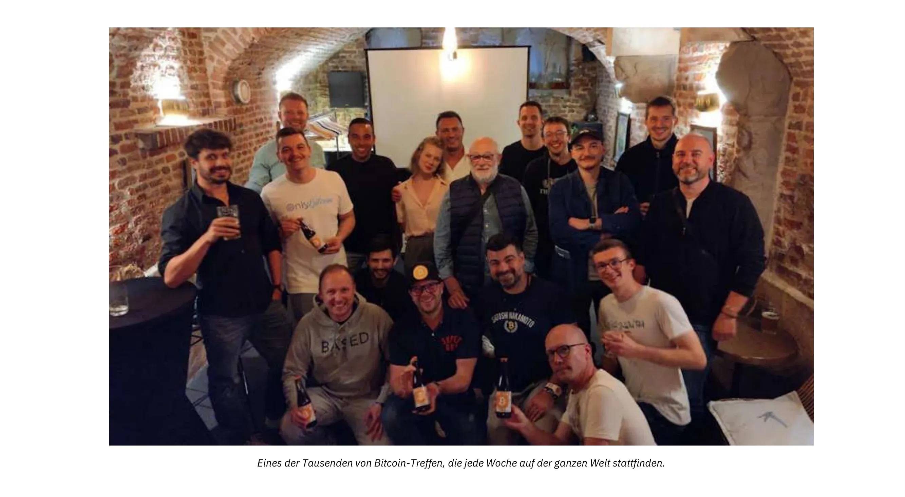

Bitcoin-Treffen können vielen Zwecken dienen:

- Erörterung technischer Themen oder laufender Projekte
- Neuen Bitcoinern dabei helfen, schrittweise tiefer in die Bitcoin-Welt einzutauchen
- Ankündigung neuer Projekte oder Initiativen
- Ausausch von Materialien oder Büchern
- Preview-Vorführungen von Dokumentarfilmen
- Veranstaltung von Konferenzen oder Workshops zu bestimmten Themen

Wir werden viele dieser Möglichkeiten in Teil 6/8 dieses Kurses mit dem Titel "[Beispiele für Projekte und Initiativen](https://planb.academy/courses/1c643dc9-a15f-4f9e-93b6-cb3c58b4ee35/3213d87a-1998-5972-ab93-97a5769ba279)" im Detail behandeln.

Während es jeder Gemeinschaft freisteht, sich ihre eigenen Meinungen zu bilden, Projekte zu starten und auf ihre eigene Weise zu experimentieren, erweisen sich Treffen zunehmend als **wesentlich für die Entwicklung von Bitcoin und das Wachstum von Bitcoinern. Sie zu organisieren erfordert Zeit und Mühe**, weshalb dieser Kurs die kombinierte Erfahrung von [etwa sechzig Bitcoin-Gemeinschaften in Frankreich und Belgien](https://btcmap.org/communities/map#2/5.24949/0.20000) weitergibt, **um dir zu helfen, deine eigene Gemeinschaft und Treffen so reibungslos wie möglich aufzubauen und wachsen zu lassen**.

## Wo solltest du deine Gemeinschaft aufbauen?

<chapterId>72da5285-5395-592d-ab62-303a0aef3d6d</chapterId>

Die erste Frage, die man sich stellen muss, lautet: Wo soll deine Gemeinschaft ihren Sitz haben?
Diese Entscheidung ist von hoher Bedeutung, wenn du dir die Möglichkeit offen halten willst, später Treffen zu organisieren.

Wenn die Mitglieder zwei Stunden fahren müssen, um an einer Veranstaltung teilzunehmen, ist die Teilnehmerzahl wahrscheinlich gering. Deshalb hat die Wahl des richtigen **Ortes für deine Community und damit für deine zukünftigen Treffen einen großen Einfluss auf ihr Wachstum**.

Ein paar Tipps für Ihre Entscheidung:

1. **Gründe und erweitere deine Gemeinschaft in einer mittelgroßen oder großen Stadt**. Dies wird es einfacher machen,:

    - Angenehme Orte für Begegnungen und Projekte (Präsentationen, Workshops, Förderung der Bitcoin-Einführung usw.) zu finden;
    - Das Gefühl der Beteiligung und Zugehörigkeit einer größeren Anzahl von Menschen zu stärken;
    - Die Erreichbarkeit der Veranstaltung (öffentliche Verkehrsmittel, Parkplätze usw.) zu verbessern. Die Wahl eines Standorts in der Nähe von öffentlichen Verkehrsmitteln und Parkplätzen wird dringend empfohlen.

2. **Wähle einen Namen, der mit deiner Stadt verbunden ist**. So können sich die Menschen leicht mit deiner Gemeinschaft identifizieren. Beispiele: Bitcoin Paris, Einundzwanzig Berlin, Satoshi Spritz Mailand, usw.

3. **Prüfe, ob es in deiner Nähe bereits ein Treffen gibt**.

Du kannst auf [btcmap.org](https://btcmap.org/communities/map#0/0/0/) nachsehen, wo die meisten Bitcoin-Gemeinschaften und Treffen weltweit aufgelistet sind.

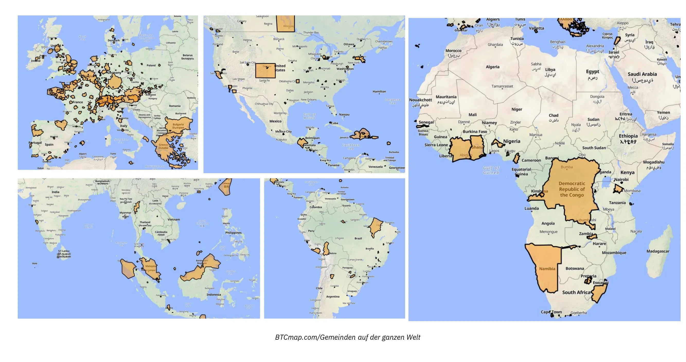

Nach einigen Recherchen findest du vielleicht ein bestehendes Treffen oder eine Gemeinschaft in deiner Stadt.
Bitcoin ist dezentralisiert, so dass es natürlich jedem freisteht, zu tun, was er will.
Es ist jedoch **oft sinnvoller, die Kräfte zu bündeln, als benachbarte Gemeinschaften aufzuteilen und die Auswirkungen jeder einzelnen zu verringern**. Eine neue Gemeinschaft zu gründen, wo es bereits eine gibt, kann ungewollt Konkurrenz schaffen.

In diesem Sinne kann eine einfache "Faustregel" helfen: Wenn es in einem Umkreis von 30-45 Minuten um deinen Wohnort keine aktive Bitcoin-Gemeinschaft gibt, kann es sich lohnen, eine neue zu gründen. Es steht dir jedoch immer frei, zu tun, was du willst.
Und wenn sich eine ältere Gemeinschaft in eine Richtung "entwickelt" hat, die nicht mehr mit deinen Werten übereinstimmt, und du nicht die Zeit oder die Motivation hast, sie zu "Orange-Pillen", dann ist die Schaffung einer eigenen Fork natürlich immer eine Option.

## Welche Ziele sollte deine Gemeinschaft verfolgen?

<chapterId>0aae1aa8-93ec-544a-ad88-22d32c619595</chapterId>

Sobald du die Stadt (oder das geografische Gebiet) für deine Gemeinschaft bestimmt hast, ist es an der Zeit, **zu definieren, was du erreichen willst**.
Diese Ziele können gleich zu Beginn festgelegt oder später verfeinert werden, wenn mehrere Mitglieder beigetreten sind und sich deine Gruppe aktiv engagiert.

Hier sind einige Punkte, die dir bei deinen Überlegungen helfen können:

1 - **Warum gründe ich diese Gemeinschaft als Bitcoiner?** Ist es, um Wissen zu teilen? Andere zu unterrichten? Von erfahreneren Kollegen zu lernen? Gleichgesinnte zu treffen? In das Bitcoin-Ökosystem eingebunden zu werden? Mit Fachleuten in Kontakt zu treten? Oder einfach nur einen Drink nehmen und neue Freunde finden?

Deine Antworten werden deine Positionierung und Motivation bestimmen.
Wenn es dein Ziel ist, **Wissen weiterzugeben und Menschen über Bitcoin** aufzuklären, konzentriere dich auf die **Erstellung von Bildungsinhalten** (Artikel, Podcasts, Videos, Präsentationen, Flyer usw.) und erspare anderen unzählige Stunden der Recherche. Du kannst sogar noch weiter gehen, indem du **Workshops, Präsentationen und Konferenzen** veranstaltest.

Wenn du einfach nur andere Bitcoiner kennenlernen und Erfahrungen austauschen möchtest, kannst du einen entspannteren Ansatz wählen und dich zum Beispiel auf einen Drink treffen.
Auf diese Weise kannst du leichter soziale Bindungen aufbauen. Denke aber immer daran, dass **Biertrinken nicht der richtige Weg ist, um die Welt von morgen aufzubauen**.

Aus diesem Grund ist es wichtig, **konkrete Ziele und Projekte festzulegen**.

2 - Soll ich meiner Gemeinschaft eine **physische Dimension** geben? Wenn ja, welche Art von Veranstaltungen solltest du organisieren?

Deine erste Veranstaltung wird wahrscheinlich ein Treffen sein. Sein Hauptzweck: Bitcoiner in deiner Gegend zusammenzubringen.
Wie wir jedoch später in [Beispiele für Projekte und Initiativen](https://planb.academy/courses/1c643dc9-a15f-4f9e-93b6-cb3c58b4ee35/3213d87a-1998-5972-ab93-97a5769ba279) sehen werden, kann **ein Treffen auf viele Arten und mit vielen Zielen aufgebaut werden:**

- Kombinieren von Networking mit einer pädagogischen Präsentation über ein Bitcoin-Konzept;
- Veranstaltung eine professionellen Demonstration von Bitcoin-Lösungen;
- Erörterung von Strategien für das "Orange-Pilling" von lokalen Händlern;

und so weiter.

Je nach Thema (Fachvorträge oder praktische Workshops) kann es sogar sinnvoll sein, **zusätzliche Veranstaltungen** außerhalb des regulären Treffens zu organisieren.

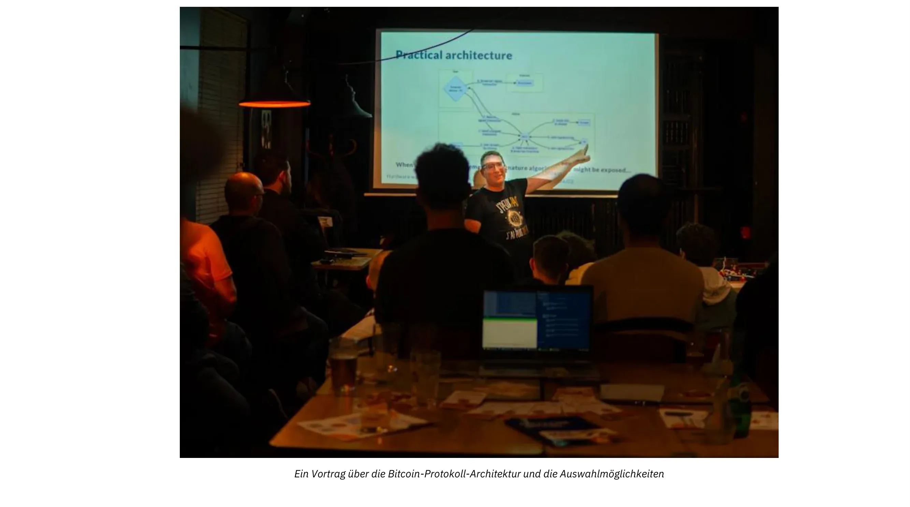

3 - Wie möchte ich, dass meine Gemeinschaft zum Bitcoin-Ökosystem beiträgt?

Dies ist eine Frage für Fortgeschrittene, aber es lohnt sich, frühzeitig darüber nachzudenken.
Wenn deine Vision darin besteht, **eine eng verbundene, motivierte Gemeinschaft** zu schaffen, die sich darauf konzentriert, so viele Menschen wie möglich zu Orange-Pillen, dann:

- Arbeite mit bestehenden Gemeinschaften zusammen, um bei Bedarf Zugang zu umfassenderen Informationen, Open-Source-Ressourcen und wertvoller Unterstützung zu erhalten.
- Organisiere und delegiere Aufgaben innerhalb deiner Gruppe, um Ihre Bemühungen effektiv zu erweitern und zu skalieren.

**Kurz-, mittel- und langfristige Ziele setzen**

Eine praktische Art der Planung ist die Festlegung von Zielen für jeden Zeitrahmen:

- Kurzfristig: Aufbau einer Präsenz in den sozialen Medien und Einrichtung von Kommunikationskanälen in der Gemeinschaft.
- Mittelfristig: Erstellung von Bildungsressourcen (Artikel, Flugblätter, Videos).
- Langfristig: Einführung regelmäßiger physischer Treffen.

Sobald die Treffen etabliert sind, könntest du dir ein Ziel setzen:

- Kurzfristig: Veranstaltung von Workshops oder Präsentationen zu bestimmten Themen
- Mittelfristig: Durchführung von Bitcoin-Sensibilisierungs- oder Aufklärungskampagnen
- Langfristig: Gründung einer formellen Vereinigung oder Partnerschaft mit einer Bar, die Bitcoin als Zahlungsmittel akzeptiert.

Halte dir aber immer im Hinterkopf: **Der Aufbau einer Gemeinschaft ist mühsam**

Der Aufbau einer Gemeinschaft geschieht nicht über Nacht. Es braucht Zeit, Motivation und Organisation.
Manchmal kann es sich sogar entmutigend anfühlen, vor allem, wenn niemand auftaucht und man sich wie der Einzige fühlt, der diese Aufgabe auf seinen Schultern trägt.

Deshalb ist **dieser Kurs darauf ausgerichtet, wertvolle Ressourcen und Tipps weiterzugeben, um Gemeinschaften dabei zu helfen, effektiv zu wachsen und sich schließlich selbst zu versorgen**.

# Gestaltung einer Identität für die Bitcoin-Community

<partId>da6673ad-bf49-5979-80a6-3f69cfb28046</partId>

## Warum und wie kannst du deine eigene Identität schaffen?

<chapterId>b48a18cc-afdf-5216-802c-32647b5cd8a3</chapterId>

In diesem Stadium gehen wir davon aus, dass:

- Du bereits weißt, wo deine Gemeinschaft (oder dein zukünftiges regelmäßiges Treffen) angesiedelt sein wird.
- Du dir Ziele für verschiedene Zeithorizonte gesetzt hast, auch wenn diese noch nicht endgültig sind.

Der nächste Schritt beim Aufbau deiner Community ist die **Definition ihrer Identität**, sowohl ihres Namens als auch ihres visuellen Stils.
In diesem Abschnitt findest du Anleitungen und einsteigerfreundliche Softwarelösungen, die dir dabei helfen, die visuelle Identität deiner Gemeinschaft zu gestalten, auch wenn du noch keine Vorkenntnisse hast.

**Warum ist Identität wichtig?**
Menschen fühlen sich mehr einbezogen und verstanden, wenn sie sich mit einer Gruppe identifizieren können. Eine starke Identität trägt dazu bei, dass sich deine Gemeinschaft von anderen abhebt und das Gefühl der Zugehörigkeit fördert.

Alles beginnt mit der Wahl eines Namens, und jedes Land hat oft seine eigenen Trends:
- Frankreich: Die meisten der über 60 lokalen Gemeinschaften verwenden Namen wie "Bitcoin [STADT]" oder "[STADT] Bitcoin". Ihre Telegram-Gruppen folgen oft diesem Muster: "Bitcoin [STADT] Meetup".
- Deutschland: Die Initiative "Einundzwanzig" inspirierte zu Namen wie "Einundzwanzig [STADT]".
- Italien: Das Satoshi Spritz Netzwerk verwendet Namen wie Satoshi "Spritz [CITY]".

**Jede Gemeinschaft hat ihre eigene Identität, die mit ihrer Heimatstadt verbunden ist, aber auch mit der umfassenderen Identität ihres Landes**.

Deine visuelle Identität: Logo, Farben, Banner, ist das, was die Menschen in Erinnerung behalten und mit deiner Gruppe in Verbindung bringen werden.
Bei der Einrichtung von Konten und Kommunikationskanälen in sozialen Medien sind ein Logo und ein Banner von großem Vorteil. Keine Sorge, du brauchst keine professionellen Designfähigkeiten; es gibt kostenlose und einfach zu verwendende Tools.
Ein guter Ausgangspunkt ist die Einbeziehung eines Wahrzeichens oder Symbols aus deiner Stadt. In Paris könnte dies der Eiffelturm sein. In Lille der Glockenturm oder die Zitadelle. In New York, die Freiheitsstatue. In London der Big Ben, und so weiter.

Von dort aus kannst du je nach Wunsch ein einfaches oder ein detaillierteres Logo entwerfen.
Um dir einige Ideen zu geben, findest du hier einige Beispiele für französische Gemeinschaftslogos:

- In Marseille stellt das Logo die Basilika Notre-Dame-de-la-Garde dar, die die Stadt überragt:

- In Monaco bezieht er sich auf den monegassischen Felsen:

- In Lille stellt das schlichte Logo die Zitadelle von Vauban und ihren Park dar:

- In Saint-Malo ist das Hermelin, das Wahrzeichen der Stadt, besonders hervorgehoben:

Wenn du dich inspirieren lässt, kannst du sogar noch weiter gehen: Entwirf ein Wappen, ein Motto oder sogar ein Lied für deine Gemeinschaft. Deiner Kreativität sind keine Grenzen gesetzt!

## Erstellung eines Logos, eines Posters und eines Banners

<chapterId>3470a31f-0190-5e87-8af0-6a00e79267ef</chapterId>

### Canva verwenden

Du kannst [Canva](https://www.canva.com/) verwenden, um die verschiedenen visuellen Elemente für deine Gemeinschaft zu erstellen.
Diese kostenlose und benutzerfreundliche Plattform ist beliebt für ihre große Bibliothek an vorgefertigten Vorlagen, die du mit nur wenigen Klicks duplizieren und anpassen kannst.

**Erstellung deines Logos:**
Suche auf der Canva-Startseite nach vordefinierten Logos. Wähle eines oder mehrere aus, die dich inspirieren, kopieren sie und passe sie dann an deine Gemeinschaft an.

Du kannst ein lokales Wahrzeichen oder Emblem in den Hintergrund einfügen (importiere ein Foto oder suche im Elements-Menü nach "Illustrationen" oder "Bilder") und dann das Bitcoin-Logo oder ₿ überlagern, wobei du bei Bedarf die Farbe anpassen kannst.

**Erstellung von Bannern und Postern:**
Um ein Banner oder Poster zu erstellen, suche in der Canva-Bibliothek nach vorgefertigten Vorlagen. Sobald du eine kopiert hast, ändere den Text und die Schriftarten, füge dein Gemeindelogo hinzu und importiere Fotos mithilfe von Rahmen (suche im Elements-Menü nach "Rahmen").

Du kannst auch das Design-Menü verwenden, um weitere Modelle zu finden, die deinen Anforderungen entsprechen.
Für YouTube-Thumbnails oder Banner suche einfach nach diesen Vorlagen, dupliziere und passe sie nach Belieben an.

Kurz gesagt, **die Möglichkeiten sind endlos und werden nicht nur durch deine Bedürfnisse, sondern auch durch den visuellen Stil, den du für deine Community und deine Treffen/Events kreieren willst, bestimmt**!

Um dir eine bessere Vorstellung davon zu geben, haben wir ein Video-Tutorial (Französisch) beigefügt, in dem einige dieser Möglichkeiten vorgestellt werden:

:::video id=d11ae0ed-eacd-4924-afd3-75aff95d2899:::

**Beispielvorlagen von Bitcoin Lille:**

Hier findest du fertige Canva-Vorlagen, die du kopieren und für deine Community anpassen kannst:

- **Plakat zur Ankündigung des Treffens** (für soziale Medien und A4/A3-Druck): [Link](https://www.canva.com/design/DAGBvBXFJ8A/92-j_toeLU8QbVAD0NwoAA/edit?utm_content=DAGBvBXFJ8A&utm_campaign=designshare&utm_medium=link2&utm_source=sharebutton)

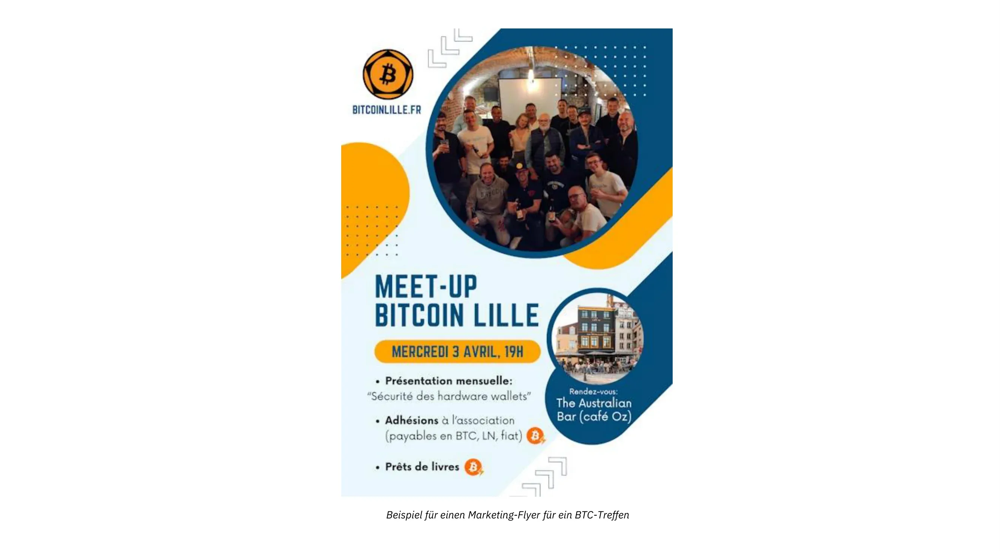

- **Veranstaltungsplakat** (für soziale Medien und A4/A3-Druck): [Link](https://www.canva.com/design/DAGBvG3rNCc/oXtNR9pduRs22AqclG4O2g/edit?utm_content=DAGBvG3rNCc&utm_campaign=designshare&utm_medium=link2&utm_source=sharebutton)

- **banner für soziale Medien**: [Link](https://www.canva.com/design/DAGBvOXyNqw/iSJG9PbIQHgGWHz5PhlXSQ/edit?utm_content=DAGBvOXyNqw&utm_campaign=designshare&utm_medium=link2&utm_source=sharebutton)

- **Ausschreibung des Wettbewerbs**: [Link](https://www.canva.com/design/DAGBvIjuA_w/YzSUXzOmbNV9oCma9mluOw/edit?utm_content=DAGBvIjuA_w&utm_campaign=designshare&utm_medium=link2&utm_source=sharebutton)

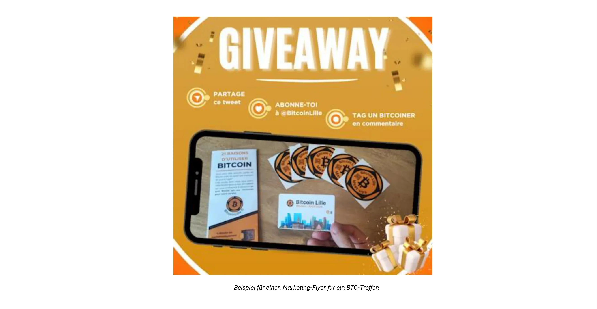

- **Markenrichtlinien** unserer Bibliothek, die bei Treffen auf A4 aushängen: [Link](https://www.canva.com/design/DAGBvPqL7N4/LmUItfsysypRLSOFOzBXcQ/edit?utm_content=DAGBvPqL7N4&utm_campaign=designshare&utm_medium=link2&utm_source=sharebutton)

- **PowerPoint Präsentation** "Chapter 2 - Understanding Bitcoin transactions", by @ProfEduStream: [link](https://www.canva.com/design/DAFsEcnOro8/Mz9FYdTGhsvozZOe0Y9jtw/edit?utm_content=DAFsEcnOro8&utm_campaign=designshare&utm_medium=link2&utm_source=sharebutton)

- **flyer** "21 Gründe, Bitcoin zu nutzen", verfasst von @ProfEduStream: [link](https://www.canva.com/design/DAFtAR1NauQ/ZDwl2CchIJ9Gpb36N6-7iw/edit?utm_content=DAFtAR1NauQ&utm_campaign=designshare&utm_medium=link2&utm_source=sharebutton)

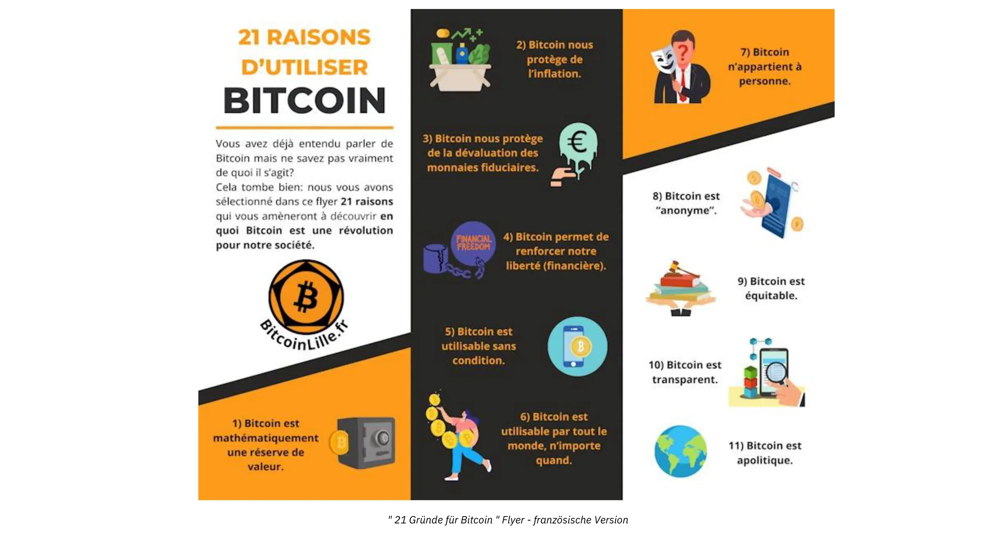

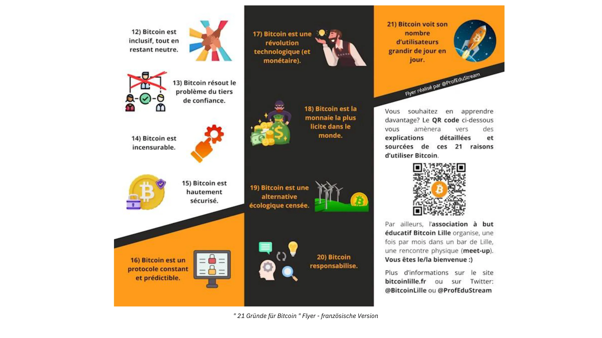

Die Möglichkeiten sind endlos, und deine Entwürfe werden von deinen Zielen und deiner visuellen Identität abhängen. Ziehe in Erwägung, deine Vorlagen als Open Source zur Verfügung zu stellen. Das spart Zeit für andere Bitcoin-Gemeinschaften, die unweigerlich vor denselben Herausforderungen stehen wie du. Durch die gemeinsame Nutzung hilfst du, das Wachstum von Bitcoin-Gemeinschaften überall zu beschleunigen.

**Empfohlene Abmessungen:**
Prüfe bei der Erstellung von Bildmaterial immer die Größenanforderungen für jede Plattform:

| Platform | Logo | Banner | Poster / Image
| -------- | -------- | -------- | -------- |
| Telegram     | 512 x 512     | N/A     | N/A     |
| Signal     | N/A     | N/A     | N/A     |
| Twitter     | 400 x 400     | 1500 x 500     | 1200 x 628     |
| Meet-up     | N/A     | N/A     | N/A     |
| Discord     | 512 x 512     | 960 x 540     | N/A     |
| Facebook     | 512 x 512     | 851 x 315     | 960 x 720     |

In der Regel geeignete Größen:
- Logos: 512 x 512 Pixel
- Banner: Variieren je nach App oder Website
- Plakate: A4 ist das Standarddruckformat

### Einsatz künstlicher Intelligenz

Canva bietet zwar eine breite Palette von Tools für die Erstellung von Logos, Postern, Bannern und Flyern, ist aber nicht die einzige Option. Wenn du mit anderer Software (wie Photoshop oder Illustrator) besser zurechtkommst, kannst du das verwenden, was für dich am besten geeignet ist.

Ganz gleich, ob du ein Gemeindelogo entwirfst oder Plakate, Präsentationen oder Flyer verbessern willst, **künstliche Intelligenz kann ein mächtiger Verbündeter sein, wenn es darum geht, einzigartiges und ansprechendes Bildmaterial zu erstellen**.

Zu diesem Zweck gibt es eine Reihe von KI-Tools. Dazu gehören
- [midjourney](https://docs.midjourney.com/docs/quick-start) (bezahlt);
- [leonardo](https://leonardo.ai/) (kostenlos, kontobeschränkt);
- [copilot](https://copilot.microsoft.com/) (kostenlos, kontobeschränkt);
- [DALL-E](https://www.dall-efree.com/) (bezahlt).

In letzter Zeit sind viele weitere KI-Tools aufgetaucht, so dass diese Liste bei weitem nicht vollständig ist.

**Beispiel: Erstellung eines futuristischen Bitcoin London Logos**
Wenn du ein futuristisches Logo für ein "Bitcoin London"-Treffen entwerfen willst, könnest du Copilot fragen:

- [ ] *Aufforderung: Entwerfe ein Bitcoin-Logo mit der London Bridge und Big Ben im Hintergrund. Futuristisch*

Wenn die ersten vier Ergebnisse nicht realistisch genug sind, verfeinere deine Anfrage:

- [ ] *Aufforderung: Mach die 4. viel realistischer* 

Das letzte Ergebnis ist großartig!

**Beispiel: Erstellung eines einfachen Logos im britischen Stil**
Für ein saubereres Aussehen, wie bei einem Aufkleber:

- [ ] *Aufforderung: Erstelle das Logo des "London Bitcoin Meetup" mit einem britischen und sauberen Stil*

Das Ergebnis sieht wirklich cool aus!

**Tipps für die Arbeit mit AI:**
- Habe Geduld: Es kann sein, dass die KI nicht gleich beim ersten Versuch genau das produziert, was du dir vorstellst.
- Verwende präzise Aufforderungen: Je klarer und detaillierter deine Anweisungen sind, desto besser sind die Ergebnisse.
- Bitte um Hilfe: Wenn du nicht zufrieden bist, wende dich an jemanden, der Erfahrung mit Grafikdesign oder KI-Tools hat. Viele Bitcoiner helfen gerne, manchmal sogar kostenlos oder für ein paar Sats.

# Schaffung von Kommunikationskanälen für deine Bitcoin-Community

<partId>fc588298-6876-554c-bd57-55d182464878</partId>

## Welche Kommunikationskanäle sollten Sie wählen?

<chapterId>b4f4eef6-1035-5290-848a-2b7f9391c77a</chapterId>

Wie bereits erwähnt, können die Kommunikationskanäle einer Gemeinschaft je nach Motivation und Gewohnheiten unterschiedlich sein.

So sind zum Beispiel **in Frankreich, Deutschland und Italien Telegram und Twitter die vorherrschenden Plattformen**, die zum "Standard" für Bitcoin-Gemeinschaften geworden sind. In der Tschechischen Republik hingegen verwenden viele Gemeinschaften **Matrix**, ein sicheres Instant-Messaging-Protokoll, anstelle von Telegram.

Tipp: Bevor du deine Kanäle auswählst, **schau dir an, was die umliegenden Gemeinden verwenden**. Verwende die Karte [btcmap.org](https://btcmap.org/communities/map#0/0/0/), um zu sehen, welche Plattformen in deiner Region am beliebtesten sind.

So nutzen die Schweizer Communities vor allem Telegram, Twitter und ihre eigene Website:

**Empfohlene Kanäle für französischsprachige Gemeinschaften**

- **Telegramm:** Die Nummer 1 der Kommunikationstools, über 90 % der französischen Treffen nutzen es.
- **Twitter (X):** Das wichtigste soziale Netzwerk, das von Bitcoinern auf der ganzen Welt genutzt wird. Es wird von ~70% der französischen Treffen genutzt. Es ist ideal, um Bitcoiner zu erreichen.
- **Meetup.com:** Kostenpflichtig, aber weit verbreitet (von ~30% der französischen und fast allen kanadischen Meetups), um die Sichtbarkeit außerhalb des Bitcoin-Ökosystems zu erhöhen.
- **Andere Optionen:** ~30% haben auch eine Website; ~10% betreiben Discord-Server oder NOSTR Accounts.

Andere Plattformen wie Matrix, Keet, Signal, Facebook, Instagram und LinkedIn können ebenfalls genutzt werden. Aber Vorsicht: Je mehr Kanäle du verwaltest, desto mehr Zeit musst du für die Moderation, das Posten und das Aktivhalten aufwenden.

Jeder, der in Frankreich eine Gemeinschaft gründen möchte, ist daher gut beraten, mit folgender Einrichtung zu beginnen:
- eine Telegram-Gruppe;
- ein Twitter Account.

Wenn deine Community wächst, kannst du weitere Plattformen hinzufügen und die Moderation an vertrauenswürdige Mitglieder delegieren.

## Erstellen und Konfigurieren eines Telegram-Kanals, einer Gruppe oder Supergruppe

<chapterId>d13714ce-8f08-53e9-bedd-b6a3aaac5dad</chapterId>

Bevor du den Kommunikationsbereich deiner Community auf Telegram erstellst, ist es wichtig, den Unterschied zu kennen:
- einen Telegram-Kanal;
- eine Telegram-Gruppe;
- eine Telegramm-Supergruppe.

Es wird dringend empfohlen, mit einer Telegram-Gruppe zu beginnen. Falls erforderlich, kannst du sie später in eine Supergruppe umwandeln.

Für die folgenden Anleitungen haben wir ursprünglich die APK "Telegram+" verwendet, die eine erweiterte Konfiguration ermöglicht. Du brauchst sie jedoch nicht unbedingt, da die offizielle Telegram-App zum Erstellen und Verwalten von Gruppen ausreicht, sogar über dein Telefon:

:::video id=b1da7cb4-5fb1-4a41-a1d4-bd90686826a9:::

### Einen Telegram-Kanal erstellen

Wenn du einen Ort schaffen willst, an dem deine Mitglieder direkt miteinander sprechen, sich gegenseitig antworten können, usw., dann solltest du eine Telegram-Gruppe und keinen Telegram-Kanal erstellen!

Gehe direkt zum nächsten Abschnitt mit dem Titel [Eine Telegram-Gruppe erstellen](https://planb.academy/courses/1c643dc9-a15f-4f9e-93b6-cb3c58b4ee35/d13714ce-8f08-53e9-bedd-b6a3aaac5dad).

In der Tat ist **ein Telegram-Kanal eher ein einseitiges Sendetool für Administratoren**. Die Mitglieder können nicht frei chatten, sie können nur mit Emojis reagieren (oder Kommentare in separaten Threads hinterlassen, was die Gespräche fragmentiert).

**Da Communities Interaktion und Zusammenarbeit brauchen, ist ein Telegram-Kanal nicht zu empfehlen**, wenn dein Ziel der Aufbau von Beziehungen und der Austausch von Wissen ist.

Anleitung zum Erstellen eines Telegram-Kanals:

:::video id=98be4709-d221-4030-8c31-e10113482515:::

### Eine Telegram-Gruppe erstellen

Auf der anderen Seite ist **eine Telegram-Gruppe ideal für Gemeinschaften**: Genau wie bei Messaging-Anwendungen wie Messenger oder WhatsApp können die Mitglieder in einer einzigen gemeinsamen Konversation miteinander chatten und sich gegenseitig antworten.

Was du als Administrator tun kannst:
- Posten und pinnen von wichtigen Nachrichten.
- Erstellen von **Umfragen** (nützlich für die Festlegung von Terminen für Treffen, wenn deine Gemeinschaft neu ist).
- Erstellen von **Benutzerdefinierten Einladungslinks** (Nur wenn die Gruppe "öffentlich" und nicht "privat" ist, was in den Einstellungen festgelegt ist. Es ist auch praktisch, einen eigenen Telegram-Einladungslink zu haben, z. B.: t.me/Bitcoin[STADT]);
- Verwaltung der Berechtigungen, Rollen und die Moderation der Mitglieder.
- Einfügen eines Profilbilds (Euer Gemeinschaftslogo) und Aktualisierung des Namen der Gruppe.

Anleitung zum Erstellen einer Telegram-Gruppe:

:::video id=3d4792a7-1345-475b-93b1-b3a3945fb567:::

Hinweis: Dieses Tutorial wurde mit Telegram+ erstellt, aber du kannst alles auch direkt über die Standard-Telegram-App machen.

### Eine Telegram-Supergruppe erstellen

Warum eine Supergruppe?

Wenn deine Telegram-Gruppe auf Hunderte von Mitgliedern anwächst, können die Unterhaltungen chaotisch werden. Das führt oft dazu, dass Mitglieder wichtige Ankündigungen, wie das Datum des nächsten Treffens, verpassen.

Es sind mehrere Lösungen verfügbar:

1. **Wichtige Nachrichten anheften**, damit alle Mitglieder eine Benachrichtigung erhalten (einmal mit dem Finger auf die betreffende Nachricht drücken, dann "Anheften" wählen);
2. Erwäge die Verwendung von **Discord** für mehrere Kommunikationskanäle, von denen jeder einzelne bei Bedarf stumm geschaltet werden kann.
3. **Konvertiere dein Telegram-Gruppe in eine Supergruppe**.

Was ist eine Telegramm-Supergruppe?

Eine Supergruppe ist im Wesentlichen eine Telegram-Gruppe mit Themen (Unterkanälen) innerhalb dieser Gruppe.

Beispielthemen:
- "Wichtige Informationen": nur wichtige Aktualisierungen und Veranstaltungsankündigungen.
- "Allgemein": für alle Diskussionen der Mitglieder.
- Spezifische Themen: z.B. Mining, Projektentwicklung, bevorstehende Konferenzen.

Tipp: Passe deine Themen an die Bedürfnisse deiner Gemeinschaft an. Beispiel: Das Abidjan Bitcoin-Treffen verwendet erfolgreich dieses Format.

Denke daran, dass **Telegram-Supergruppen für einige Mitglieder etwas schwierig zu bedienen sein können**. Zum Beispiel weiß nicht jeder, **wie man auf die verschiedenen Themen** zugreift (musst nur auf das Gruppenlogo im Hauptmenü von Telegram tippen, um die vollständige Liste der Themen zu sehen). Ein kurzer Screenshot kann helfen, die Unklarheiten zu beseitigen.

Es gibt keine strikte Regel, wann man von einer regulären Telegram-Gruppe zu einer Supergruppe wechseln sollte, es hängt wirklich von den Bedürfnissen deiner Mitglieder ab. Die gute Nachricht ist, dass du leicht hin- und herwechseln kannst: Erstelle einfach ein Thema, um in eine Supergruppe umzuwandeln oder lösche alle Themen außer "Allgemein", um zu einer regulären Gruppe zurückzukehren.

Anleitung zum Erstellen einer Telegram-Supergruppe:

:::video id=f78800ae-d8ca-479a-b913-99abd9916bff:::

Kurzer Hinweis: Wie bereits erwähnt, wurde die obige Anleitung auf einem Computer mit der APK "Telegram+" erstellt. Heute ist es jedoch einfach, eine Telegram-Supergruppe auf deinem Telefon zu erstellen.

Erstelle einfach eine Telegram-Gruppe, gehe zu deren Einstellungen und tippe auf die Schaltfläche "Themen", um Themen hinzuzufügen. Nach dem Speichern siehst du eine Liste von Themen, die du nach Belieben bearbeiten kannst.
Es gibt also keinen Grund mehr, "Telegram+" herunterzuladen, es sei denn, du möchtest Zugang zu erweiterten Datenschutzeinstellungen für deine Supergruppe.

## Einrichten Ihrer Telegram-Gruppe oder Supergruppe

<chapterId>35e674b3-5924-50b0-98f1-83a56c9a186d</chapterId>

Nun, da deine Telegram-Gruppe (oder Supergruppe) eingerichtet ist, ist es an der Zeit, **Berechtigungen zu konfigurieren und die Moderation** einzurichten.
Es steht jeder Gemeinschaft frei, ihren eigenen Ansatz zu wählen, aber die Erfahrung zeigt, dass es **am besten ist, bestimmte Mitgliederrechte zu beschränken**:

- Versenden einer Umfrage;
- Versenden von Dateien (um mögliche Viren zu vermeiden);
- Versenden von Sprachnachrichten;
- Hinzufügen von Benutzern (hilft, Bot-Invasionen zu verhindern);
- Anheften von Nachrichten;
- Bearbeitung von Gruppeninformationen.

Es wird dringend empfohlen, **eine klare Beschreibung deines Treffens** zu verfassen, wenn du deine Telegram-Gruppe oder Supergruppe erstellst, da dies das Erste ist, was potenzielle Mitglieder sehen werden. Zum Beispiel:

> Willkommen bei @Bitcoin's Telegram [STADT] 🔥
>

> Wir organisieren jeden ersten Mittwoch im Monat ein Treffen in der Bar [BAR_NAME], in [STADT] 🍻
>

> Besuche auch unsere anderen sozialen Netzwerke: [LINK] 🌐

In diesem Beispiel haben die Administratoren des Bitcoin Lille ihren öffentlichen Telegram-Link angepasst, um das Teilen zu erleichtern.

In den "Gruppeneinstellungen" kann es ratsam sein, **die Option "Neue Mitglieder genehmigen "** zu aktivieren.
Einige Bitcoin-Telegram-Gruppen wurden von Tausenden von gefälschten Konten angegriffen, die darauf abzielen, die Gemeinschaft zu spammen oder zu stören.
**Das Aktivieren der Mitgliederfreigabe kann deine Gruppe vor einem Spam-Angriff schützen**

Im Bereich Administratoren kannst du auch eine "Aggressive Anti-Spam"-Funktion aktivieren, um verdächtige Nachrichten automatisch zu löschen.
Dies ist nicht immer notwendig, kann aber einen zusätzlichen Layer Schutz bieten.

## Hinzufügen eines Multifunktions-Bots zu Ihrer Telegram-Gruppe

<chapterId>c61f69cc-15ec-53f1-8c02-1cea55def09e</chapterId>

**Eine weitere Möglichkeit, deine Telegram-Gruppe oder Supergruppe zu konfigurieren und zu sichern, ist das Hinzufügen eines Multi-Funktions-Bots**. Damit kannst du die Funktionen und Moderationsmöglichkeiten deiner Gruppe erheblich erweitern.

Mit **dem Bot [@GroupHelpBot](https://telegram.me/grouphelpbot)** sind die nützlichsten Optionen:

- Ein **Regel-Befehl** (/rules), um Ihre Gemeinschaftsrichtlinien anzuzeigen;
- **Anti-Spam**-Schutz zum Filtern verdächtiger Nachrichten und Konten;
- **Anpassbare automatische Willkommensnachrichten** für neue Mitglieder (mit optionaler automatischer Löschung nach ein paar Minuten)
- **Schutz vor Überschwemmungen** zur Verhinderung von Spam-Nachrichten
- Ein **@administrator-Befehl** zum schnellen Erreichen von Gruppenadministratoren
- **Blockierregeln** für unerwünschte Inhalte
- Ein **Gruppenverknüpfungsbefehl** (/link)
- Befehl **Zulassungsmanagement**
- **Automatische Löschung** von bestimmten Nachrichtentypen
- **Bot-Blockierung** und **Eintritts-/Ausgangssperre** für die Sicherheit deiner Gruppe
- Liste der sozialen Netzwerke deiner **Gemeinschaft** (/networks)
- Und vieles mehr...

Unzählige zusätzliche Funktionen sind verfügbar.

Profi-Tipp: **Schränke Gespräche nicht zu sehr ein**.

Anleitung zum Hinzufügen eines Multifunktions-Bots zu einer Telegram-Gruppe oder Supergruppe:

:::video id=cdbf82d6-3530-45c4-90de-593f100863bb:::

Hinweis: Dieser gesamte Vorgang kann jetzt direkt von deinem Telefon aus durchgeführt werden. Die Telegram+ App wird nicht mehr benötigt

## Einen Discord-Server einrichten

<chapterId>eef2a965-4c24-5f3a-8013-72cc7d315314</chapterId>

Wenn deine Telegram-Gruppe zu groß wird, kannst du sie in eine Telegram-Supergruppe umwandeln, um die Diskussionen zu organisieren.
Wie bereits erwähnt, können jedoch die **zusätzliche Komplexität und die Zunahme der Themen und Nachrichten dazu führen, dass einige aktive Mitglieder das Interesse verlieren**.

Warum sollte man Discord in Betracht ziehen? **Discord ist eine Alternative** zu einer Telegram-Supergruppe, da es den Nutzern erlaubt, **bestimmte Text- und Sprach-Chaträume** zu erstellen und den Mitgliedern die Möglichkeit zu geben, Kanäle stumm zu schalten, an denen sie nicht interessiert sind.

Natürlich erfordert die Verwaltung von Telegram und Discord gleichzeitig etwas mehr Zeit, insbesondere bei der Konfiguration und dem Start.

Um die Dinge für dich einfacher zu machen, **teilen wir einen [Discord-Server, den du duplizieren und anpassen kannst](https://discord.com/template/bDY4eXXJk2C8)**:

:::video id=e647458a-a21e-44e0-bd03-20b82a871777:::

Wenn er gut konzipiert ist, kann ein Discord-Server ein echter Gewinn für deine Gemeinschaft sein. Viele Bitcoiner nutzen **Discord** bereits täglich, und die Möglichkeit, Telegram-Unterhaltungen direkt in Discord zu verfolgen (und umgekehrt), kann allen eine Menge Zeit sparen.

Um beide Plattformen zu synchronisieren, gibt es einen Open-Source-Bot namens [TediCross](https://github.com/TediCross/TediCross). Sein Zweck ist einfach: Er leitet automatisch Nachrichten aus einem Discord-Textkanal an eine Telegram-Gruppe (oder ein Thema in einer Supergruppe) weiter und umgekehrt.

Denk jedoch daran, dass die Installation nicht ganz einfach ist. Du musst eine Eingabeaufforderung (CMD) auf deinem Computer laufen lassen, damit der Bot funktioniert, und gelegentlich können Fehler auftreten. Glücklicherweise ist die Fehlerbehebung einfach: Starte den Bot einfach neu, und in den meisten Fällen läuft alles wieder normal ab.

Um Ihnen Zeit zu sparen, findest du hier eine Anleitung, wie du diesen Multifunktions-Bot zu einer Telegram-Gruppe oder Supergruppe hinzufügen kannst:

:::video id=6a0283f6-6d6c-4e81-8b2f-644b33c52fe6:::

## Erwäge alternative, private und sicherere Kommunikationskanäle

<chapterId>29d0aad6-0612-5dd0-bcef-7337eaf4fefc</chapterId>

Wie bereits erwähnt, sind Twitter und Telegram die meistgenutzten Kommunikationsmittel für Bitcoin-Gemeinschaften in Europa (wenn nicht sogar weltweit).

Allerdings ist Telegram nicht gerade dafür bekannt, die sicherste oder datenschutzfreundlichste Messaging-App zu sein, und Twitter, jetzt X, ist im Besitz eines der freizügigsten Unternehmen der Welt.

Deshalb kann es sich lohnen, sobald deine Hauptkanäle eingerichtet sind und die Dinge reibungslos laufen, sich die Zeit zu nehmen, andere Optionen zu prüfen.
In den kommenden Monaten werden in diesem Kurs und auf der planb.network-Plattform Anleitungen zur Verwendung alternativer Protokolle wie **Simplex und Element** angeboten: dezentrale, verschlüsselte und hochgradig anpassbare Kommunikationsmittel.

**Warum sollte man sich mit diesen Optionen befassen?** Denn genau wie das soziale Netzwerk NOSTR bieten sie nicht nur mehr Privatsphäre, sondern auch einen Schutz vor Zensur oder der willkürlichen Schließung deiner Telegram-Gruppe.

Und was könnte dem Geist von Bitcoin besser entsprechen als zensurresistente und widerstandsfähige Produkte?

# Starte deine sozialen Netzwerke

<partId>8ebf8cd7-9248-543f-bc27-4ec4cc03f9cf</partId>

## Die Bedeutung der Sichtbarkeit für das Wachstum deiner Bitcoin-Gemeinschaft

<chapterId>b20f12e4-c5de-5f02-80c7-b7fc6cadd3ac</chapterId>

Deine Community ist also eingerichtet und läuft. Du hast deine Telegram- oder Matrix-Bereich eingerichtet... aber im Moment bist du der Einzige, der dort ist. **Es ist Zeit, die Leute wissen zu lassen, dass es dich gibt!**

Es ist ganz einfach: Wenn niemand auf deine Gruppe zugreifen und sehen kann, wann das nächste Treffen stattfindet, postest du nur ins Leere. Deshalb sind soziale Medien und einige spezielle Plattformen, auf die wir später eingehen werden, so wichtig für den Aufbau deiner Gemeinschaft.

Twitter (X) ist fast zum Synonym für Bitcoin-Gespräche im Internet geworden. Es ist nicht perfekt, bei weitem nicht, aber es ist derzeit der Ort, an dem sich ein großer Teil der Gemeinschaft versammelt. Es wird dringend empfohlen, dort ein Konto einzurichten.

Um einer möglichen Zensur oder Beschränkung zuvorzukommen, eröffnen einige Gemeinschaften auch ein NOSTR-Profil. Das ist es, was das FREE Madeira Kollektiv getan hat.

Natürlich können auch andere Plattformen nützlich sein. Facebook (entweder mit einer Gruppe oder einer Seite) oder auch LinkedIn.

Denk jedoch daran, dass **je mehr Kommunikationskanäle und soziale Netzwerke du verwaltest, desto mehr Zeit benötigst du**. Es ist oft besser, sich **auf die wichtigsten** zu konzentrieren. Twitter (und NOSTR) sind gute Optionen für den Anfang.

## Ein Twitter-Profil erstellen

<chapterId>c8d73097-8eba-5530-918c-221002954110</chapterId>

Twitter ist sehr einfach zu bedienen, und um deine Privatsphäre zu verbessern, musst ein paar Einstellungen vornehmen.

**Bei der Erstellung eines neuen Twitter-Kontos müssen vier wichtige Informationen eingegeben werden:**

1) **das @ Twitter**, das deine Identität definiert und dich leicht zu finden macht. Wenn der Name deiner Gemeinschaft "Bitcoin [STADT]" lautet, ist es angemessen, "@Bitcoin[STADT]" zu wählen;

2) **das Logo und das Banner**, die du für deine Gemeinschaft oder dein Treffen erstellst hast (siehe Abschnitt [Erstellen eines Logos, Posters und Banners](https://planb.academy/courses/1c643dc9-a15f-4f9e-93b6-cb3c58b4ee35/3470a31f-0190-5e87-8af0-6a00e79267ef));

3) **die Beschreibung**, mit der du in wenigen hundert Zeichen die wichtigsten Informationen über deine Gemeinschaft mitteilen kannst. Zum Beispiel:

> Offizieller Account der Bitcoin [STADT] Gemeinschaft #BTC | Treffen jeden 1. Mittwoch im Monat in [BAR_NAME] in [STADT] 🍻 | Tritt uns auf Telegram bei 🔽

4) Unter dieser Beschreibung ist es möglich, **einen Link** einzufügen. Dieser kann die Nutzer zu einer "Social Media"-Seite auf der Website Ihrer Gemeinschaft oder zu Ihrem Telegram-Kanal führen. Es liegt an Ihnen zu entscheiden, was Sie hervorheben möchten.

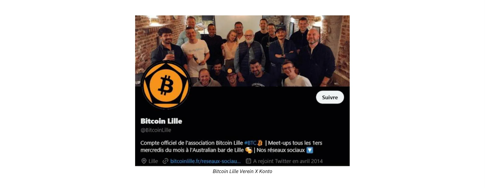

Außerdem lohnt es sich, **ein paar Datenschutzeinstellungen anzupassen**:

- lasse dein X-Konto im "öffentlichen" Modus (Beiträge sind für jeden sichtbar);
- ermögliche es jedem, dich zu finden;
- Deaktiviere die Standortverfolgung und die gemeinsame Nutzung von Daten mit anderen Einrichtungen (in den Datenschutzeinstellungen).

Für jede Veranstaltung wirst du wahrscheinlich X (Twitter)   nutzen, um nützliche Informationen zu teilen. Aber wie bei den meisten sozialen Netzwerken gilt auch hier: **Sichtbarkeit ist alles**.

Um dir viel Zeit zu ersparen, haben wir uns die Zeit genommen, [Twitters Open-Source-Ranking-Algorithmus](https://github.com/twitter) zu studieren.

Hier sind die **Schlüsselpunkte, auf die du dich konzentrieren solltest,  um deine Sichtbarkeit zu erhöhen**:

- Allgemeine Tipps:
    - Tweete in der eingestellten Sprache deines Kontos oder auf Englisch: Tweets in anderen Sprachen können deine Sichtbarkeit stark verringern;
    - Bleibe bei deiner Nische und teile nur Inhalte, die mit dem Schwerpunkt deines Kontos zu tun haben; themenfremde Tweets werden vom Algorithmus abgestraft;
    - Strebe 1 bis 2 Tweets pro Tag an;
    - Poste während der Spitzenzeiten: Donnerstags oder freitags zwischen 8 und 10 Uhr ist die Performance am besten (siehe in deinem Konto: Twitter Analytics).
      
- Beim Schreiben eines Tweets:
    - Füge ein Foto (oder sogar ein Video) hinzu;
    - Verwende nur einen Hashtag (normalerweise ist #Bitcoin der relevanteste. Gegebenenfalls kannst du einen Trend-Hashtag hinzufügen, der sich auf deinen Kontobereich bezieht);
    - Ermutige deine Gemeinschaft zur Interaktion:
        - Like = Gewicht 0,5
        - Retweet = Gewicht 1
        - **Antwort = Gewicht 27 (!!)**
    - **Antworte auf Personen, die auf Ihre Tweets antworten (Gewicht von 75!!);**
    - Vermeide es, Links im Haupt-Tweet zu platzieren: Füge sie stattdessen im ersten Kommentar ein;
    - Schreibe die Wörter vollständig und vermeide Abkürzungen.

- Weitere Tipps:
    - Tweete über aktuelle Themen, sofern diese mit dem Fachgebiet deines Kontos übereinstimmen;
    - Veröffentliche deine erfolgreichsten Tweets erneut;
    - Führe gelegentlich Umfragen durch;
    - Schreibe, wenn möglich, Threads;
    - Ermutige deine Community, dein Profil zu besuchen und dir zu folgen.

Darüber hinaus kannst **du einen Tweet oder ein Thema an dein Twitter-Profil anheften, um ihm maximale Sichtbarkeit zu verleihen**, so wie es die Bitcoin Witsand-Gemeinschaft in Südafrika tut.

Beachte auch, dass es möglich ist, bei zwei Twitter-Konten gleichzeitig angemeldet zu bleiben, sowohl auf dem Telefon als auch auf dem Computer. Das ist sehr praktisch, wenn du einfach zwischen deinem persönlichen und deinem Community-Konto wechseln möchtest.
Sei nur vorsichtig... ein versehentliches Posten eines Partyfotos vom Gemeinschaftskonto kann schneller passieren, als denkst!

Auch wenn dein Benutzername "@Bitcoin[CITY]" einzigartig ist und dir gehört, solltest du dich vor gefälschten oder nachahmten Accounts in Acht nehmen. Beispiele für Nachahmungen: 

- @Bitcoin_[CITY]
- @[STADT]Bitcoin
- @[STADT]_Bitcoin

Ziehe auch eine Registrierung in Betracht. Auf diese Weise verringerst du die Wahrscheinlichkeit, dass sich jemand als deine Gemeinschaft ausgibt.

Anleitung zum Erstellen eines Twitter-Kontos:

:::video id=4648976f-41ec-499a-b7ec-a53e796f71b4:::

## Annäherung an benachbarte Treffen

<chapterId>12a21c3b-235a-5292-8209-67bf60f61e49</chapterId>

Nun, da deine Kommunikationskanäle und sozialen Netzwerke eingerichtet sind und die visuelle Identität deienr Gemeinschaft widerspiegeln, ist es an der Zeit, den richtigen Personen zu folgen.

Beginne auf Twitter, indem du wichtigen Accounts folgst, die Bitcoin weltweit fördern, wie [@Bitcoin](https://twitter.com/Bitcoin) und [@planb_network](https://twitter.com/planb_network), sowie Initiativen wie [@FBCEglobal](https://twitter.com/FBCEglobal). Du kannst auch [@halfin](https://twitter.com/halfin)'s berühmten "Running Bitcoin"-Tweet vom 11. Januar 2009 retweeten. Und was noch wichtiger ist: **Folge den Accounts von Bitcoin-Gemeinschaften und -Treffen in deinem eigenen Land**.

Dies schafft **Gelegenheiten, einander zu folgen, sich gegenseitig zu markieren und die kollektive Sichtbarkeit zu erhöhen**. Dies ist bereits gängige Praxis bei den ~50 Bitcoin-Gemeinschaften in Frankreich, den "Satoshi Spritz"-Initiativen in Italien und den "Einundzwanzig"-Gruppen in Deutschland.

Auch wenn es für manche trivial erscheinen mag, **kann das Verfolgen der Berichte lokaler Gemeinschaften und Initiativen zu Kooperationen oder sogar Partnerschaften** führen. Die Gemeinschaften Bitcoin Lüttich und Bitcoin Lille (und ebenso Bitcoin Aix und Bitcoin Marseille) haben sich auf diese Weise zusammengeschlossen und veranstalten nun gemeinsam ein jährliches Treffen.Die Mahlzeiten des **Cercle du Coin** sind ein weiteres gutes Beispiel.

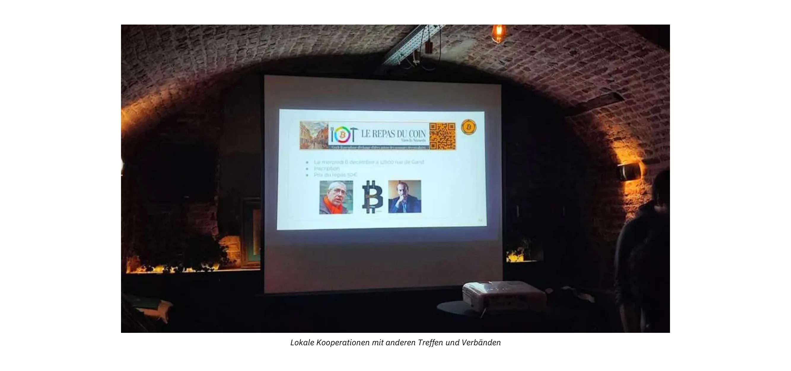

In Frankreich kann es auch wichtig sein, **die Initiativen wie [@KonsensusFR](https://twitter.com/KonsensusFR), [@bitcoinpointfr](https://twitter.com/bitcoinpointfr), [@DecouvreBitcoin](https://twitter.com/DecouvreBitcoin) und [@btcmap](https://twitter.com/btcmap)** zu verfolgen. Dies sind natürlich nur Vorschläge, und es steht jeder Gemeinschaft frei, in völliger Dezentralisierung und Autonomie zu tun, was sie will.

Wie bereits erwähnt, besteht das Ziel des gegenseitigen Folgens darin, die gegenseitige Sichtbarkeit zu erhöhen. Je mehr du für deine Gemeinschaft und die deiner Region/deines Landes in den sozialen Netzwerken wirbst, desto mehr Menschen werden über dich sprechen. Je mehr Menschen über dich sprechen, desto wahrscheinlicher ist es, dass sie deine Veranstaltungen besuchen.

Das Liken und Retweeten von Beiträgen aus anderen Communities kann daher deren Entwicklung erheblich fördern... und deine.
Du kannst auch vorschlagen, dass **Meetup-Organisatoren und Bitcoiner, die Communities leiten, sich zwei- oder dreimal im Jahr per Videokonferenz treffen, um die Fortschritte nationaler Projekte und verwandter Communities zu überprüfen. Dies kann auch während persönlicher Veranstaltungen stattfinden.**

Das Ziel ist einfach: das Feedback aller einholen, die Entwicklung der Gemeinschaften diskutieren, erfolgreiche Ideen und Projekte austauschen und bei Bedarf Lösungen vorschlagen. Eine schriftliche Zusammenfassung des Treffens kann im Anschluss an die Organisatoren der Gemeinschaft in deinem Land weitergegeben werden, die nicht teilnehmen konnten.

## Btcmap.org

<chapterId>365f43d4-7b2c-5961-a184-157b8c1a0116</chapterId>

In diesem Stadium ist deine Gemeinschaft bereits aufgebaut und in Betrieb. Jetzt müssen nur noch weitere Interessierte aufgenommen werden, damit sie wachsen kann.

Aber du kannst nicht vorankommen, ohne zu wissen, dass **es Plattformen gibt, auf denen Bitcoiner Gemeinschaften und Treffen in ihrer Nähe finden können**. Deshalb ist es wichtig, dass du dir ein paar Minuten Zeit nimmst, um einen Eintrag auf diesen Seiten zu beantragen.

Dazu gehören:

- [Btcmap.org](https://btcmap.org/), eine Website mit zwei täglich aktualisierten Karten: **[die Weltkarte der Unternehmen, die Bitcoin akzeptieren](https://btcmap.org/map)** und **[die Weltkarte der Gemeinden](https://btcmap.org/communities/map)**. Viele Bitcoiner überprüfen diese Karten regelmäßig, egal ob sie auf Reisen sind oder ihrem täglichen Leben nachgehen, um neue Leute kennenzulernen oder Orte zu finden, an denen sie ihre Sats ausgeben können. Btcmap ist die globale Referenz, und die Auflistung Ihrer Gemeinschaft dort ist für die Sichtbarkeit unerlässlich.
- [BitcoinerEvents](https://www.bitcoinerevents.com/), eine Website, die von Bitcoinern für Bitcoiner erstellt wurde. **Sie ermöglicht es dir, die anstehenden Veranstaltungen deiner Gemeinschaft zu veröffentlichen**. In Frankreich ist sie jedoch noch nicht weit verbreitet.
- Je nach Land gibt es vielleicht andere lokale Initiativen. In Frankreich gibt es zum Beispiel [Bitcoin.fr](https://Bitcoin.fr/events/categories/evenements/), die **jeden Monat Dutzende von Bitcoin-Veranstaltungen auflistet**. Wenn du ihnen also noch nicht auf Twitter gefolgt bist oder sich mit ihnen in Verbindung gesetzt hast, um Informationen über Ihre Gemeinde und Veranstaltungen auszutauschen, dann ist jetzt der richtige Zeitpunkt dafür! **Um den französischen Veranstaltungskalender auf dem neuesten Stand zu halten, wäre es toll, wenn alle französischen Bitcoin-Gemeinschaften sich angewöhnen würden:**
    - erwähnung von @bitcoinpointfr auf Twitter für jedes neue Community-Event
    - neue Veranstaltungsankündigungen in ihrer Telegram-Gruppe anpinnen.

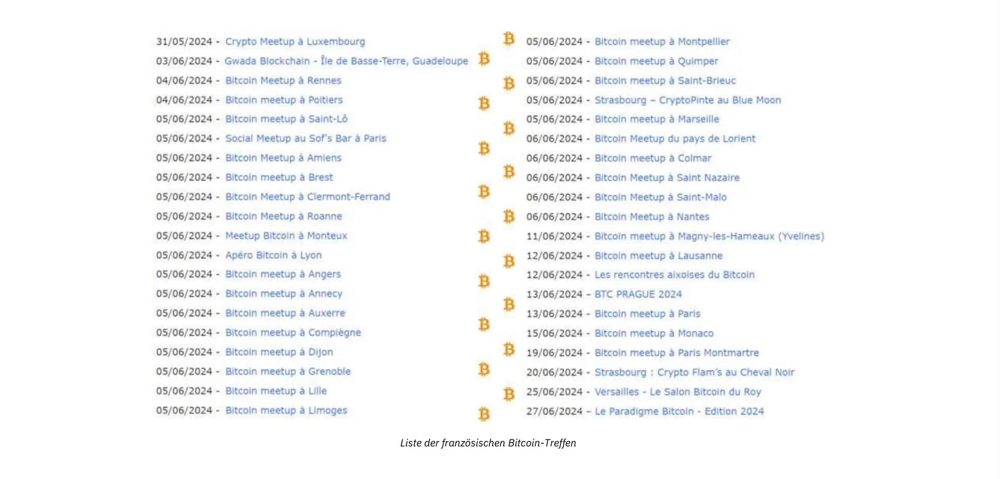

Auch andere Plattformen können deine Sichtbarkeit erhöhen. **[Meetup](https://www.meetup.com/)** ist eine dieser Plattformen. Es handelt sich um eine Website (und eine Telefon-App), auf der du eine Veranstaltung erstellen und andere in deiner Nähe finden kannst. Die Kosten belaufen sich auf etwa 8 € pro Monat (oder etwa 90 € pro Jahr), was für eine kleine, unstrukturierte Gemeinschaft teuer sein kann. Dennoch ist Meetup in einigen Ländern weit verbreitet, vor allem in Kanada und den Vereinigten Staaten, und eignet sich gut für die Verwaltung von Anmeldungen.

In ähnlicher Weise ist [Orangepillapp](https://www.orangepillapp.com/) eine kostenpflichtige mobile App (50.000 Sats/Jahr oder 200.000 Sats für lebenslangen Zugang), die Bitcoinern hilft, sich zu treffen.

Die beiden letztgenannten Plattformen können zwar die Sichtbarkeit erhöhen, werden aber für den Start einer Community nicht empfohlen, weil sie nicht kostenlos sind.
**Eine Auflistung auf [btcmap.org](https://btcmap.org/), [BitcoinerEvents](https://www.bitcoinerevents.com/) und für französische Gemeinschaften auf [Bitcoin.fr](https://Bitcoin.fr) ist mehr als genug**.

Herzlichen Glückwunsch! Deine **Community ist gegründet**, deine **Visuals sind fertig**, deine **Ziele sind festgelegt**, deine **Kommunikationskanäle sind eingerichtet**, deine **sozialen Netzwerke sind gestartet** und deine **Sichtbarkeitsstrategie ist beschlossen**.
Sobald eine kleine Gruppe von Bitcoinern sich dir angeschlossen hat, ist es Zeit für den nächsten Schritt: die Organisation deines ersten Bitcoin-Treffens.

# Organisiere ein Bitcoin-Treffen

<partId>c009d2a6-40ce-583b-bd24-fdfd1fea262e</partId>

## Warum solltest du ein regelmäßiges Treffen mit deiner Gemeinschaft veranstalten?

<chapterId>ed8e471c-3b99-57e2-a042-2d4e8a40b137</chapterId>

Jetzt, da die sozialen Netzwerke und Kommunikationskanäle deiner Gemeinschaft eingerichtet sind, ist es an der Zeit, sich auf diesen Plattformen zu präsentieren. Ermutige neue Mitglieder, sich vorzustellen und sich nach und nach an der Konversation zu beteiligen.

Dadurch gewinnst du Zeit, die du nutzen kannst, um über die Einrichtung einer Art von Treffen nachzudenken. Dies wird sogar noch wichtiger, wenn du anfängst, echte Begeisterung innerhalb deiner Gemeinschaft zu spüren.

Wie bereits erwähnt, kann **ein Bitcoin-Treffen als die nächste "Ebene" für eine Gemeinschaft** angesehen werden. Einerseits ermöglicht es **Mitgliedern, sich persönlich zu treffen**, und andererseits hilft es **Neulingen, die sich für dieses Ökosystem interessieren, bei der Aufklärung**.
Eine Veranstaltung wie diese ermöglicht es dir, in deinem eigenen Maßstab **eine Begeisterung für Bitcoin** in deiner Stadt zu wecken, die mit der Zeit wachsen kann, wenn deine Gemeinschaft Projekte in Angriff nimmt.

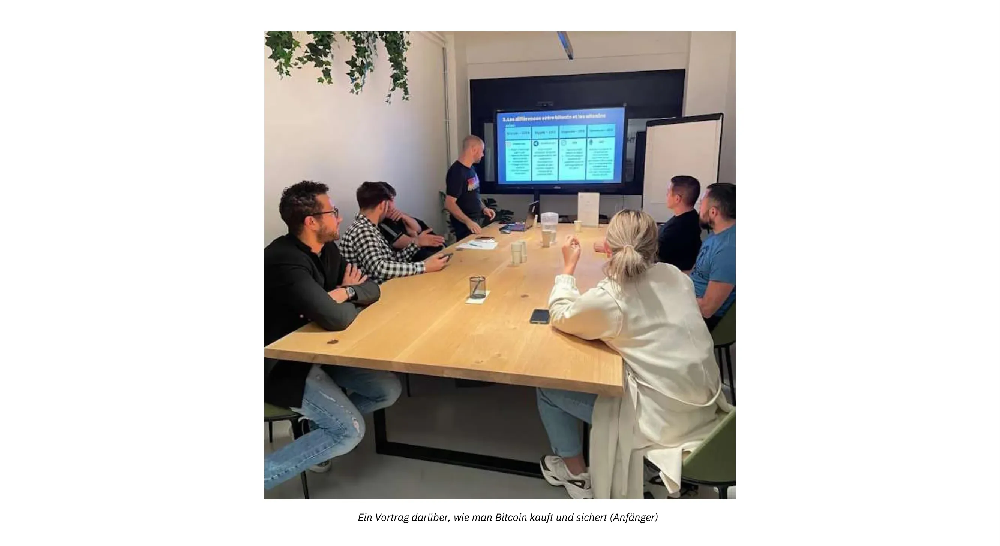

Je größer die Ziele sind, die du dir für die Entwicklung Ihrer Gemeinde gesetzt hast, desto mehr Zeit musst du und deine Mitglieder natürlich investieren.
Deshalb ist es wichtig, **sich zu Beginn erreichbare Ziele für dein Treffen** zu setzen.

## Das erste Treffen: Wann und warum?

<chapterId>f3f8a614-cfb4-5994-a2e8-d56e6f8e3347</chapterId>

Schon wenige Wochen nach der Gründung deiner Community kannst du ein Treffen veranstalten.
Allerdings wird deine Gruppe zu diesem Zeitpunkt wahrscheinlich noch klein sein, d. h. es besteht die Möglichkeit, dass sich niemand meldet.

Es ist besser, ein Treffen zu organisieren, wenn du mindestens ein paar aktive Mitglieder in deinem Kommunikationskanälen hast, zum Beispiel ein paar Dutzend. Das kann schnell gehen, aber es hängt auch von den Persönlichkeiten der Menschen ab.
Sobald du den Funken spürst, schlage ein persönliches Treffen vor. Wenn andere interessiert sind, musst du nur noch **einen Termin für dein erstes Treffen** festlegen.

Anstatt das Datum selbst auszuwählen, ist es in der Regel am besten, **eine Umfrage etwa zehn Tage im Voraus mit mehreren möglichen Tagen und Uhrzeiten** zu erstellen. Auf diese Weise kannst du die Stimmen nutzen, um die Teilnehmerzahl zu maximieren, die Spannung zu erhöhen und deine Zeit optimal zu nutzen.

Am besten geht man nicht mit festen Erwartungen an den Ablauf des Treffens, die Anzahl der Teilnehmer oder die zu behandelnden Themen heran. So werden Enttäuschungen vermieden und die Teilnehmer fühlen sich nicht unter Druck gesetzt.

Lasse den Dingen ihren natürlichen Lauf, vielleicht bei einem Getränk. Gespräche sollten leicht von der Hand gehen, und wenn nötig, kannst du die Diskussion sanft auf Bitcoin zurücklenken, wenn sie abzuschweifen beginnt.

Wenn du dich auf ruhigere Momente vorbereiten möchtest, kannst du einige Aktivitäten oder Gesprächsthemen planen, wie zum Beispiel:

- anzeige des [Mempool](https://Mempool.space/) auf einem Computer oder Smartphone;
- ein Buch mitbringen;
- einen Nerdminer, Bitaxe, FPGA oder sogar ASIC mitbringen;
- mit einem **Bitcoin-Flyer**;
- brainstorming für ein Bitcoin-Bild oder -Logo für deine Gemeinde;
- ein [Bitcoin Kartenspiel](https://www.Maximalist.ovh/accueil/20-game-le-Coin-de-table.html) spielen;
- Die [btcmap.org](https://btcmap.org/) Karte von Gemeinden und Händlern zeigen;
- senden oder Empfangen von Bitcoin unter Verwendung von **Lightning**.

Wenn dein Treffen erst am Anfang steht, ist es oft nicht der richtige Zeitpunkt für eine formelle Präsentation. Wenn die Teilnehmerzahl gering ist, ist eine offene und zwanglose Diskussion in der Regel am besten geeignet.

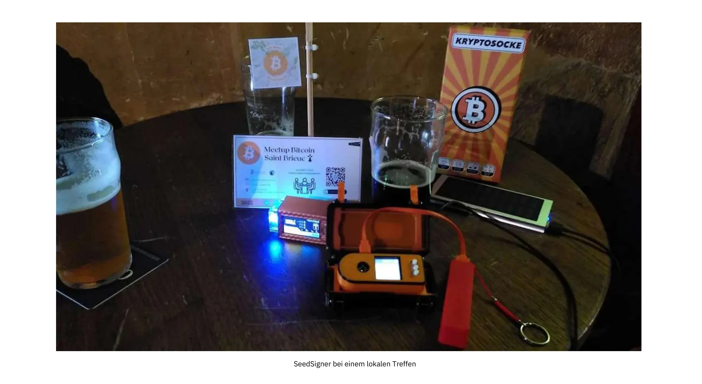

Nach deinem ersten Treffen wirst du wahrscheinlich ein weiteres planen wollen. Solange deine Gemeinschaft noch klein ist, ist es am besten, die Termine durch Umfragen festzulegen, zum Beispiel einmal im Monat oder alle zwei Monate. Du kannst dies in Ihren Kommunikationskanälen besprechen.

Wenn sich eine regelmäßige Gruppe von Bitcoinern und interessierten Teilnehmern bildet, ist es aus zwei Gründen sinnvoll, einen wiederkehrenden Termin festzulegen:

1) Es macht es für alle einfacher, im Voraus zu planen;

2) Es hilft dabei, **eine "Gewohnheit "** zu etablieren. Selbst wenn jemand deine Kanäle nicht mehr regelmäßig besucht, weiß er, wann das Treffen stattfindet und kann wie gewohnt vorbeikommen.

Dieser zweite Punkt ist einer der Gründe, warum **in Frankreich die meisten Treffen am ersten Mittwoch eines jeden Monats** stattfinden (siehe die von [DecouvreBitcoin](https://decouvrebitcoin.fr/) im Jahr 2022 ins Leben gerufene Initiative "Ambassadors"). In Deutschland und Italien gibt es keinen festen Nationalfeiertag.

Wenn jedoch alle Treffen landesweit am selben Tag stattfinden, entsteht ein Zentralisierungsproblem: Es hindert Bitcoiner daran, Veranstaltungen in nahegelegenen Gemeinden zu besuchen, und kann auch Sicherheitsbedenken aufwerfen. Gespräche mit benachbarten Organisatoren von Treffen können dir helfen, eine gute Vereinbarung zu treffen.

Wenn deine Gemeinschaft wächst und die Treffen mehr Menschen anziehen, kannst du folgendes tun:

- setze dir für jedes Treffen ein bestimmtes Ziel;
- oder füge sogar **jeden Monat eine zweite Veranstaltung** hinzu.

Im ersten Fall kann ein klares Ziel sicherstellen, dass die Teilnehmer etwas Neues gelernt haben und sich die Gespräche auf Bitcoin konzentrieren, wobei die Präferenzen aller Teilnehmer berücksichtigt werden.
Im zweiten Fall könnte eine zweite monatliche Veranstaltung einem bestimmten Thema gewidmet sein, z. B. Einsteigersitzungen oder Workshops (Mining, Lightning, Node Installation usw.).

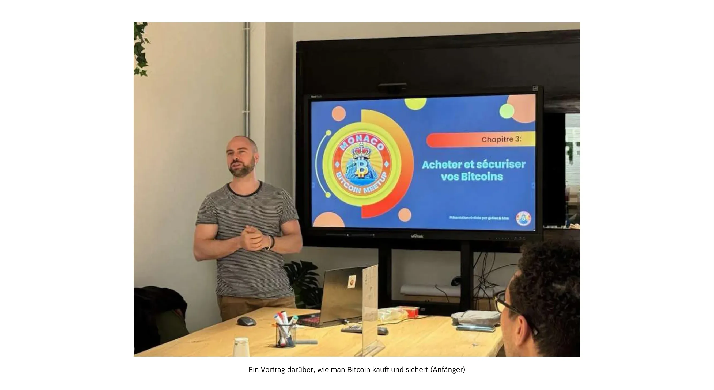

Denke daran, dass **das mehr Organisation und mehr Zeit erfordert**. Zum Glück findest du in [Teil 6/8 dieses Kurses](https://planb.academy/courses/1c643dc9-a15f-4f9e-93b6-cb3c58b4ee35/3213d87a-1998-5972-ab93-97a5769ba279) eine Reihe von wiederverwendbaren Open-Source-Ressourcen, die dir dabei helfen.

In jedem Fall hängt alles von dem kurz-, mittel- und langfristigen Aktionsplan ab, den du bzw. deine Gemeinschaft für sich selbst aufgestellt haben.

## Die Suche nach einem Standort

<chapterId>405d389e-6a32-5777-af8d-293380d2e8fd</chapterId>

Einen Veranstaltungsort für deine Events zu finden, ist oft keine leichte Aufgabe. Darüber hinaus ist es wichtig, dass dieser Ort **in der Stadt deiner Gemeinde** liegt.

Es gibt mehrere Kriterien, die zu berücksichtigen sind, darunter:

1) **Standort**: Ist er mit öffentlichen Verkehrsmitteln gut erreichbar? Mit dem Auto? Ist ein Parkplatz vorhanden?

2) Ist der Veranstaltungsort angenehm und nicht zu **Laut**? Suchst du einen formellen Rahmen (Co-Working Space, Tagungsraum) oder etwas Informelleres (Bar, Restaurant)?

3) Reicht die Kapazität aus, um euer Treffen zu empfangen, selbst an einem Rugby- oder Champions-League-Spielabend?

4) Verfügt er über einen Videoprojektor und einen ruhigen Bereich für Präsentationen?

5) Und schließlich, falls es sich um eine Bar oder ein Restaurant handelt: Bietet die Speisekarte für jeden etwas zu essen und zu trinken?

Darüber hinaus gibt es drei wichtige Punkte, die du beachten solltest:

- Wenn du planst, den Abend in zwei Teile aufzuteilen: Zunächst eine Präsentation in einem formellen Raum, um die Konzentration aller zu fördern, und dann in eine Bar oder ein Restaurant zu gehen, um in einer entspannteren Atmosphäre fortzufahren, zeigt die Erfahrung, dass ein Wechsel des Veranstaltungsortes mitten am Abend oft dazu führt, dass einige Teilnehmer in der Pause gehen. Dieser Ansatz ist daher nicht zu empfehlen.

- Bei deinem ersten Treffen werden wahrscheinlich nur wenige Teilnehmer anwesend sein, und du wirst wahrscheinlich keine formellen Präsentationen halten. In diesem Fall besteht keine Notwendigkeit, sich dem Eigentümer vorzustellen oder deine Ziele zu erläutern. Sobald die Treffen jedoch regelmäßig und gut besucht sind, lohnt es sich, dies zu tun, um Professionalität zu zeigen und deinen Wunsch zu äußern, monatlich wiederzukommen. Dies kann zu vielen Gesprächen führen (automatische monatliche Reservierungen, kostenlose Getränke und/oder Essenstafeln, Rabatte, Gespräche über Bitcoin, Annahme von Bitcoin-Zahlungen usw.). Wenn du speziell einen Veranstaltungsort mit einem Videoprojektor für Präsentationen suchen, solltest du unbedingt um ein Treffen (von Angesicht zu Angesicht oder sogar telefonisch) mit dem Eigentümer und/oder Manager bitten, um dein Projekt und deine Ziele vorzustellen.

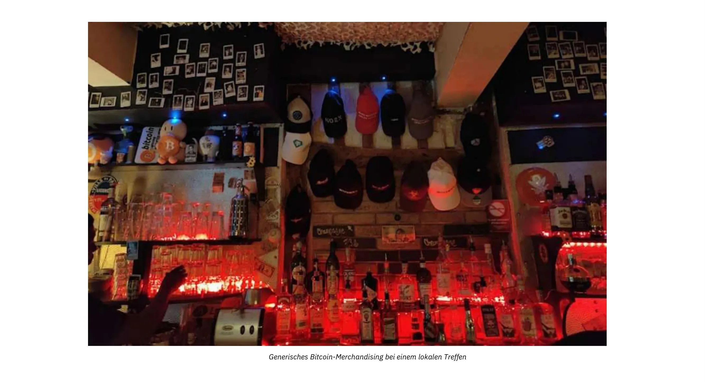

- Und schließlich möchten einige Gemeinden **ihre Veranstaltungen nur an Orten abhalten, die Bitcoin-Zahlungen akzeptieren**, was verständlich ist. In diesem Fall ist es eine gute Idee, **zunächst nach Bitcoin-akzeptierenden Geschäften in deiner Stadt** zu suchen (auf [btcmap.org](https://btcmap.org/map/) und sie zu kontaktieren, um zu sehen, ob sie deinen Kriterien entsprechen. Wenn nichts Geeignetes verfügbar ist, kannst du versuchen, neue Händler aufzunehmen, aber rechne immer mit viele Ablehnungen, was entmutigend sein kann. Deshalb ist es oft am besten, dies nicht von Anfang an als Ziel zu setzen, sondern erst dann, wenn deine Community gut etabliert ist und du über genügend "Feuerkraft" verfügst.

Zögere auch nicht, in den ersten Monaten **den Veranstaltungsort zu wechseln**, wenn du dein Meet-up startest. So kannst du **Beziehungen zu verschiedenen Managern** aufbauen, verschiedene Atmosphären erkunden und Informationen über potenzielle zukünftige Gastgeber sammeln.
Später, wenn deine Gruppe gewachsen ist, kannst du dir sogar einen Nachmittag Zeit nehmen, um verschiedene Geschäfte und Bars zu besuchen und zu fragen, ob sie einen geeigneten Raum für deine monatlichen Veranstaltungen und Treffen haben.

## Vor dem Treffen

<chapterId>c5218943-580d-5efc-89ed-6b5d728816d6</chapterId>

Planst du, in den kommenden Wochen ein Treffen zu organisieren?

Hier ist eine Checkliste, die dir bei der Vorbereitung hilft:

1) **Bestätige den Veranstaltungsort**: Setze dich mit dem Veranstaltungsort in Verbindung und reserviere ihn für die geschätzte Teilnehmerzahl.

2) **Ankündigung der Veranstaltung**:
   
    - Gebe das Datum, die Uhrzeit und den Ort in deinen sozialen Netzwerken und anderen Kommunikationskanälen bekannt. Füge bei Bedarf einen Link zur Anmeldung hinzu;
    - Erstelle ein spezielles Bildmaterial (z. B. ein Canva-Poster, siehe Teil 2/8 "[Gestaltung einer Identität für Ihre Bitcoin-Gemeinschaft](https://planb.academy/courses/1c643dc9-a15f-4f9e-93b6-cb3c58b4ee35/b48a18cc-afdf-5216-802c-32647b5cd8a3)");
    - Maximiere die Sichtbarkeit, indem du die Ankündigung auf Telegram und Twitter pinnst und eine "@jeder"-Erwähnung auf Discord verwenden;
    - Veröffentliche die Ankündigungen 7 bis 10 Tage vor der Veranstaltung, damit die Teilnehmer im Voraus planen können;

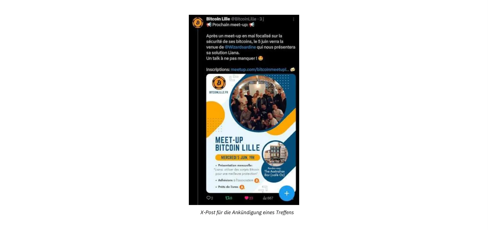

3) **Erinnere dein Publikum**: Teile und retweete deine Ankündigungen zwei bis drei Tage vor der Veranstaltung erneut, um die Sichtbarkeit zu erhöhen.

4) **Aktualisierung des Veranstaltungsortes**: Überprüfe am Vortag (oder zwei Tage vorher) deine Anmeldung und teile dem Veranstaltungsort die endgültige voraussichtliche Teilnehmerzahl mit.

Zusätzliche Maßnahmen, um deine Veranstaltung hervorzuheben:

- Druck von Flyern und/oder Plakaten
- Eine Präsentation zu einem bestimmten Thema vorbereiten
- Organisiere eine Aktivität oder einen Workshop

## Der Tag des Treffens

<chapterId>cf60067b-591f-5fdf-9b9e-d442aad0e8f9</chapterId>

Der große Tag ist da! Sende ein oder zwei Stunden vor Beginn der Veranstaltung eine Erinnerung über die Kommunikationskanäle deiner Gemeinschaft. Bestätige die Startzeit und teile den Teilnehmern mit, wie sie dich erkennen können, z. B. indem du erwähnst, dass du ein Bitcoin-T-Shirt und eine Kappe tragen wirst.

Wenn deine Treffen wachsen und du mehr als 20 Personen begrüßst, wird die Vorbereitung des Veranstaltungsortes immer wichtiger.

Das ist zu tun:

1) **Frühzeitiges Erscheinen**, um alles vorzubereiten.

2) **Richte den Raum** nach deinen Bedürfnissen und den Möglichkeiten des Veranstaltungsortes ein. Wenn ihr nur sechs Personen seid, ist nur wenig Platz erforderlich. Sobald du jedoch 10-20 Teilnehmer hast, kann eine vollständig sitzende Anordnung die Interaktionen einschränken. Wähle in diesem Fall eine Stehplatzvariante mit Stehtischen, falls vorhanden, und stelle einige (vorzugsweise hohe) Stühle bereit. Wenn eine Präsentation geplant ist, solltest du den größten Teil des Abends im Stehen verbringen und erst kurz vor dem Vortrag Stühle aufstellen.

3) Kleine individuelle Akzente setzen:

    - Hänge ein Plakat am Eingang auf, um auf deinen Standort hinzuweisen (verwende Patafix und hole vorher die Genehmigung des Veranstaltungsorts ein).
    - Hänge im Inneren Plakate zu Bitcoin-Themen aus (Bitcoin Whitepaper, eure Leitbild der Gemeinschaft, aktuelle Projekte usw.).
    - Lege Aufkleber, Flyer oder Gesprächsanregungen auf die Tische, z. B. einen Nerdminer, Hardware Wallet, einen Laptop mit seinem Mempool, ASIC, Miner oder eine Metallplatte für private Schlüssel.

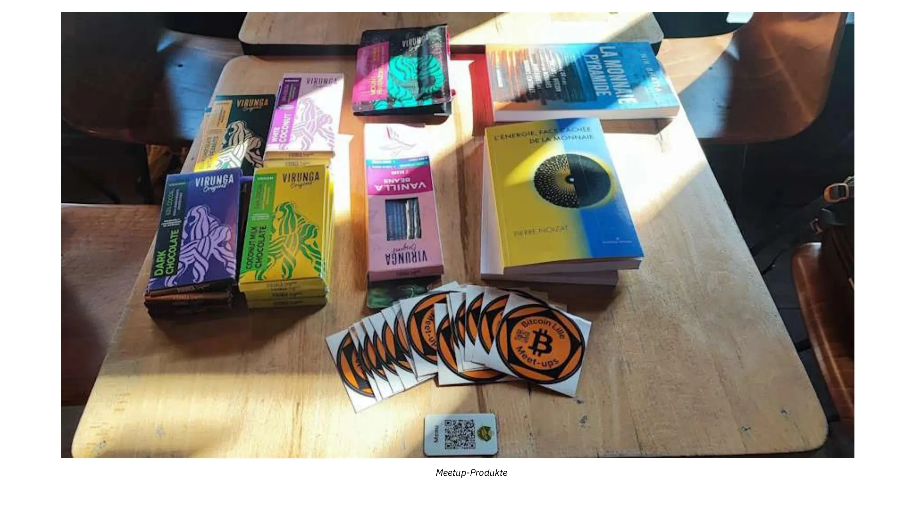

Wenn du nur wenige Teilnehmer erwartest und noch keine Beziehung zu den Veranstaltern aufgebaut hast, solltest du nicht gleich deine gesamte Ausrüstung mitbringen und ausstellen. Wenn das Vertrauen erst einmal hergestellt ist, hast du mehr Freiheit, den Raum nach deinen Wünschen einzurichten.

Nehme dir schließlich ein Getränk und warten, bis die Leute kommen. Und denke daran: Lasse sich nicht entmutigen, wenn beim ersten Mal niemand kommt. Bringe für den Fall der Fälle ein Buch oder ein Video zum Anschauen mit.

## Nach dem Treffen

<chapterId>3e881af9-9c09-5721-81ee-c5cda3b109c5</chapterId>

Wenn das Treffen zu Ende ist, müssen die Mitarbeiter des Veranstaltungsorts aufräumen. Biete den Kellnern oder Managern an, ihnen zu helfen, bevor du gehst. Das kann so einfach sein wie das Einsammeln aller Gläser auf einem Tisch oder, wenn du in der Nähe der Bar sind, das Zurückbringen der Gläser, bevor du gehst.

Wenn du wieder zu Hause bist, wirst du wahrscheinlich noch tagelang über Bitcoin nachdenken. Das ist der perfekte Zeitpunkt, um den Puls deiner Gemeinschaft zu fühlen und Feedback von den Teilnehmern zu sammeln. Du kannst:

- Veröffentliche eine Dankesnachricht auf deinen Kommunikationskanälen und teile  alle Links oder Ressourcen, die während der Veranstaltung erwähnt wurden.
- Fordere die Teilnehmer auf, Verbesserungsvorschläge für das nächste Treffen zu machen.
- Beginne mit der Planung deiner nächsten Veranstaltung.

Du hast dann ein paar Wochen Zeit, neue Ideen, Bilder oder Projekte zu entwickeln, um das nächste Treffen noch besser zu gestalten.

## Die Bedeutung der Einbeziehung und Bindung von Teilnehmern

<chapterId>f5355e35-4b07-527c-88a3-8535cba7592c</chapterId>

Rom wurde nicht an einem Tag erbaut, und deine Gemeinschaft wird es auch nicht. Die Dynamik von Bitcoin entsteht durch regelmäßige Treffen und Veranstaltungen.
Um dies zu erreichen, ist eines von entscheidender Bedeutung: **die Teilnehmer bei der Stange halten**.

Es könnte mit einer kleinen Gruppe von leidenschaftlichen Bitcoinern beginnen, deren Ziel es ist, sich regelmäßig zu treffen und über Bitcoin zu sprechen. Im Laufe der Zeit kannst, je nach Verfügbarkeit und Interessen jedes Einzelnen, **bestimmte organisatorische Aufgaben mit der Gruppe teilen** oder Kernmitglieder einladen, **bestimmte Projekte zu übernehmen**. Diese können speziell auf deine Gemeinschaft, deine Treffen oder deine Stadt zugeschnitten sein oder sogar von den vielen Initiativen inspiriert werden, die in [Teil 6/8 dieses Kurses](https://planb.academy/courses/1c643dc9-a15f-4f9e-93b6-cb3c58b4ee35/3213d87a-1998-5972-ab93-97a5769ba279) vorgeschlagen werden. **Dies fördert nicht nur das Commitment von deinen Kernmitgliedern, sondern hilft auch deiner Gemeinschaft zu wachsen und zu gedeihen**.

Im Laufe der Treffen werden neue Gesichter auftauchen: Leute, die in früheren Zyklen BTC und/oder Altcoins gekauft haben, Technik-Enthusiasten, die ihr Wissen vertiefen wollen, oder völlige Neulinge, die neugierig auf dieses unzensierbare, dezentrale, transparente und faire Zahlungssystem sind, das ohne Bedingungen und ohne vertrauenswürdige Dritte funktioniert.

Um sicherzustellen, dass sich jeder bei deinen Veranstaltungen einbezogen fühlt, solltest du dich auf zwei wichtige Aspekte konzentrieren:

- **Soziale Eingliederung**: Jeder, der an der Veranstaltung teilnimmt, sollte sich willkommen fühlen. Mache dir die Mühe, Neuankömmlinge zu begrüßen, sie zu fragen, warum sie gekommen sind, und sie den anderen vorzustellen. Wenn die Leute sich einbezogen fühlen, kommen sie eher wieder und helfen vielleicht sogar bei der Organisation künftiger Veranstaltungen.
- **Geduld und Offenheit**: Dies erfordert Zeit und Motivation. Wenn du mit einem engagierten Shitcoiner (oder schlimmer noch, einem XRP Maximalist) sprichst, kann es verlockend sein, ihn abzutun. Aber wenn du dich auf ein Gespräch einlässt, kannst du Missverständnisse oder fehlerhafte Argumente ausräumen. Wenn du bereit bist, zuzuhören, sind sie vielleicht bereit, Bitcoin wirklich zu verstehen.

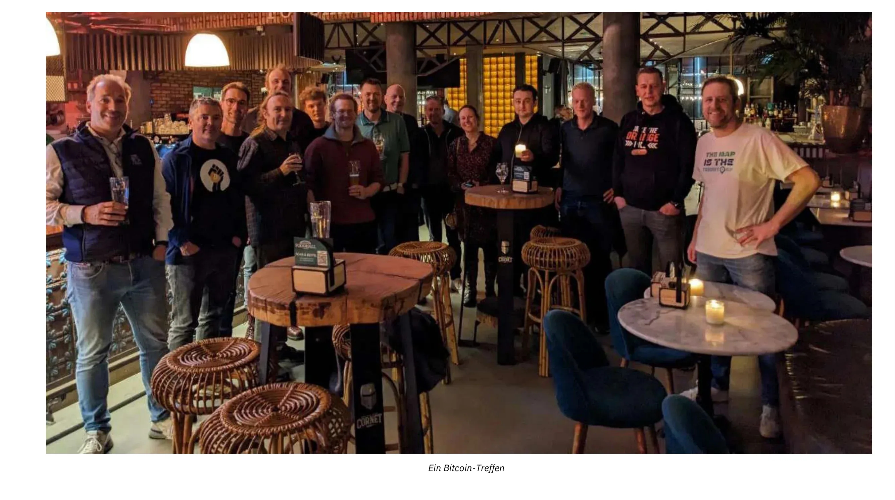

Denke vom praktischen Standpunkt aus an das Gesamterlebnis der Veranstaltung:

- War der **Ort angenehm**?
- War es **einfach zugänglich?**
- Warum haben sich einige Leute angemeldet, sind aber nicht erschienen?
- Welche Diskussionen wurden geführt? Waren die Diskussionen zu technisch für Anfänger?
- Waren die Diskussionen zu alkoholisch?

Jeder Teilnehmer hat seine eigene Persönlichkeit, seine eigenen Ziele und Interessen, so dass die Erfahrungen unterschiedlich sein werden. Aber wenn der Veranstaltungsort stimmt, das Publikum aufgeschlossen ist und die Absichten aufrichtig sind, gibt es allen Grund für den Erfolg eines Treffens.

Der Aufbau eines Treffens erfordert Zeit und vor allem Organisation. Es ist ein menschliches Projekt, und es wird nur dann funktionieren und langfristig wachsen, wenn es gut geplant, offen und inklusiv ist.

Letztendlich liegt es an dir zu entscheiden, wie weit "offen und integrativ" gehen soll. Denke nur daran: Ein Shitcoiner ist oft nur ein Bitcoiner im Entstehen.

# Beispiele für Projekte und Initiativen

<partId>45b3bc40-1c31-583e-8411-2662e6efd765</partId>

## Warum sollte man mehr tun als nur Bier trinken?

<chapterId>3213d87a-1998-5972-ab93-97a5769ba279</chapterId>

Im Laufe der Blöcke wird sich deine Gemeinschaft weiterentwickeln. Neue Gesichter werden hinzukommen, andere werden abwandern, aber der Leitgedanke sollte derselbe bleiben: das Bitcoin-Ökosystem zu entwickeln und die Bindungen zwischen den Mitgliedern zu stärken.

Es gibt viele Projekte und Initiativen, die umgesetzt werden können. Dieses Kapitel bietet eine nicht erschöpfende Liste von Ideen, die innerhalb einer Gemeinschaft oder während eines Treffens umgesetzt werden können. Fühle dich frei, diejenigen auszuwählen, die dich inspirieren und trage sogar deine eigenen Ideen zu diesem Kurs bei [indem du einen "Pull Request" auf GitHub stellen](https://github.com/PlanB-Network/Bitcoin-educational-content).

Bevor wir uns damit befassen, sollten wir noch einmal auf einen bereits erwähnten Punkt zurückkommen.

Wenn du ein Bitcoin-Treffen organisierst, lernst du neue Leute kennen. Soziale Interaktion ist wichtig, und Bier (oder Alkohol im Allgemeinen) kann dazu beitragen, eine festliche Atmosphäre zu schaffen. Aber es lohnt sich, das im Hinterkopf zu behalten:

- Alkohol beeinträchtigt die kognitiven Fähigkeiten wie Denken und Verstehen, was es für die Teilnehmer schwieriger machen kann, ernsthaften Diskussionen oder Präsentationen zu folgen.
- Alkohol kann auch zu einem bequemen Ritual werden: Jeden Monat teilst du deinen "Bitcoin-Moment" mit Freunden bei einem Getränk. Das ist zwar eine tolle Möglichkeit, Kontakte zu knüpfen, aber ist das Biertrinken wirklich das Hauptziel deines Treffens? Oder würdest du lieber Neuigkeiten austauschen, von anderen lernen und Neulingen helfen, Bitcoin zu entdecken?

Jeder hat seine eigenen Vorlieben, Überzeugungen und seine eigene Persönlichkeit. Hier geht es nicht darum, ein Treffen gegenüber einem anderen zu beurteilen. Auch wenn wir oft bei einem Bier darüber reden, wie wir die Welt verändern können, beginnen oder entwickeln sich Revolutionen nicht auf diese Weise.

Das Wichtigste ist, sich dessen bewusst zu sein.

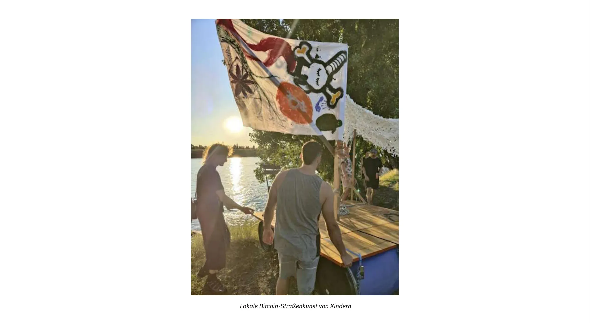

## Organisieren Sie thematische Treffen mit einem jährlichen Rhythmus

<chapterId>46afdbcc-a775-5c16-b20a-34956690d58f</chapterId>

Sobald du eine Kerngruppe von etwa zehn Personen gebildet hast, kannst du damit beginnen, Präsentationen zu jeder Veranstaltung hinzuzufügen. Diese können einem im Voraus angekündigten Thema folgen oder völlig unabhängig voneinander sein.

Bei der Planung von Präsentationen oder Workshops ist es hilfreich, einen klaren, gut strukturierten Ablauf zu schaffen. Ziel ist es, **die Kernkonzepte von Bitcoin Schritt für Schritt** abzudecken und den Teilnehmern einen vollständigen Überblick über das Thema aus verschiedenen Blickwinkeln zu geben.

In Frankreich arbeiteten die Organisatoren des Treffens im Sommer 2023 an einem **Jahresablauf**.
Abgesehen von seinem hohen pädagogischen Wert ermöglicht dieser Ansatz die gemeinsame Nutzung von Open-Source-Dokumenten und Foliendokumenten durch die Gruppen und den schrittweisen Aufbau einer gemeinsamen Bibliothek von Ressourcen. Die Initiative wurde gut aufgenommen und soll in den kommenden Jahren weiter ausgebaut werden.

Nachstehend findest du den Ablauf der französischen Treffen 2023-2024. Zu jedem Thema sind eine Open-Source-Präsentation und ein Video verfügbar, die dir Ideen für Themen geben können, die du bei deinen eigenen Veranstaltungen behandeln könntest.

Zusätzliche editierbare Materialien findest du auch in der [Bitcoin Teaching Toolbox](https://planb.academy/fr/resources/bet)!

| Month | Theme | Video | Bearbeitbare Datei |
| -------- | -------- | -------- | --- |
| September     | Kapitel 1: Was ist Bitcoin?     | [	YouTube link](https://www.youtube.com/watch?v=CSjuBqrl4t8)     | [Bearbeitbare PowerPoint](https://www.canva.com/design/DAFu0d5Jd7M/9gAWDAOSS6LDkWENuZjYgw/edit) |
| Oktober & November| Kapitel 2: Bitcoin Transaktionen verstehen     | [YouTube link](https://www.youtube.com/watch?v=inFnR-3NsdM)     | [Bearbeitbare PowerPoint](https://www.canva.com/design/DAFsEcnOro8/Mz9FYdTGhsvozZOe0Y9jtw/edit) |
| Dezember     | Kapitel 3: Das Lightning Netzwerk verstehen     | [YouTube link](https://www.youtube.com/watch?v=hHz-ALx8D9w)     | [Bearbeitbare PowerPoint](https://www.canva.com/design/DAF4YPSNnR8/HKp4Vmcno8eMtVWnZmFtcw/edit) |
| Januar     | Kapitel 4: Was ist Mining?     | [YouTube link](https://www.youtube.com/watch?v=QyHZ3CVI_OI)     | [Bearbeitbare PowerPoint](https://www.canva.com/design/DAF5DE6iBEM/tsy8E3oBebUnsR0kj53vvQ/edit) |
| Februar     | 	Kapitel 5: Eine Bitcoin und Lightning Node betreiben    | [YouTube link](https://www.youtube.com/watch?v=RRYK-usg-OY)     | [Bearbeitbare PowerPoint](https://www.canva.com/design/DAF55FU6HI0/sQ0lacRJblqrhn_9Xk1yDg/edit) |
| März     | 	Kapitel 6: Das Lightning Netzwerk im Alltag benutzen    | [YouTube link](https://www.youtube.com/watch?v=o2BS4xjei8M)    | [Bearbeitbare PowerPoint](https://www.canva.com/design/DAGAcJMw7lw/-haMNnHnwj5vpDAy8MDowA/edit) |
| April & Mai    | Kapitel 7: Deine Bitcoins sicher verwahren      | [YouTube link](https://www.youtube.com/watch?v=fHExPbhM0Hg)    | [Bearbeitbare PowerPoint](https://www.canva.com/design/DAGDz3Nq4e0/D3uG-4w9FN6OhUq-VXzhfg/edit) |
| Juni     | 	Kapitel 8: Was ist Multi-Sig?     | [YouTube link](https://www.youtube.com/watch?v=Me5489mpoxA)     | [Bearbeitbare PowerPoint](https://www.canva.com/design/DAGLMtQT6sg/rYIxr4ldUJ0jTelNf-Pj8Q/edit) |
| Juli     | 	Kapitel 9: Den Bull Run verstehen und sich darauf vorbereiten    | [YouTube link](https://www.youtube.com/watch?v=7RA-gnCJWyM)     | [Bearbeitbare PowerPoint](https://www.canva.com/design/DAGJQkiZ_YA/9lUluP9RZ0eeA_e61mk9Hw/edit) |
| August     | Kapitel 10: Der Steuereintreiber ist nie weit Weg   | [YouTube link](https://www.youtube.com/watch?v=oY4NwonGDm0)     | [Bearbeitbare PowerPoint](https://www.canva.com/design/DAGQhx7Yc_c/7mRhb_vlgnhSgxd1FtjK8w/edit) |

Die Kapitel 2 und 7 können in zwei kürzere Präsentationen aufgeteilt werden, um die Teilnehmer nicht zu überfordern. Die Durchführung in einer Sitzung schafft jedoch Platz im Kalender für besondere Aktivitäten, wie z. B. gemeinsame Treffen mit benachbarten Gruppen, Quizspiele oder Workshops.

**Es steht dir frei, diese Ressourcen zu verwenden, anzupassen und weiterzugeben, achte nur darauf, die Originalautoren zu nennen, wenn du ihre Arbeit weiterverwendest**

Da nicht jeder an jedem Treffen teilnehmen wird, ist es eine gute Idee, Präsentationen aufzuzeichnen und sie auf eine Streaming-Plattform oder Ihre Website hochzuladen. Auf diese Weise können Abwesende das Gelernte nachholen und die Teilnehmer können sich das Material später noch einmal ansehen.

Parallel dazu kannst du andere thematische Treffen veranstalten, z. B:

- Ein Bitcoin-Wissensquiz (mit einem Hardware Wallet als Preis)
- Eine Onboarding-Herausforderung, bei der du kostenlose Satoshis an No-Coiner (Personen die noch nicht mit Bitcoin vertraut sind) auf der Straße schickst
- Einladung eines Fachreferenten oder eines Unternehmens zur Präsentation eines Bitcoin-bezogenen Produkts
- Eine nächtliche Tour durch Bars und Geschäfte, die Bitcoin akzeptieren

Und noch viel mehr, deine Fantasie ist die einzige Grenze!

## Schaffung von Nebenveranstaltungen und Workshops

<chapterId>9dbd651a-8712-5630-90b3-b9525dcc1385</chapterId>

Je nach deiner Verfügbarkeit und dem Grad der Beteiligung in deiner Gemeinde kannst du im Laufe des Jahres zusätzliche Veranstaltungen planen, z. B:

- Ein Restaurantabend zum **Pizzatag** am 22. Mai
- Ein Abend oder ein Wochenende, um das nächste **Halving** zu feiern
- Ein **Spieleabend** für die ganze Familie über Bitcoin und wie es funktioniert, mit Spielen wie [SHAmory](https://shamory.com/)
- Ein **Mining Workshop**, in dem verschiedene Arten von Hardware vorgestellt werden (CPU, GPU, FPGA, ASIC, Nerdminer, Bitaxe)
- Ein **Nachmittag oder Abend für Anfänger**, mit thematischen Workshops
- Ein **Gemeinsames Treffen mit benachbarten Gemeinden**
- 
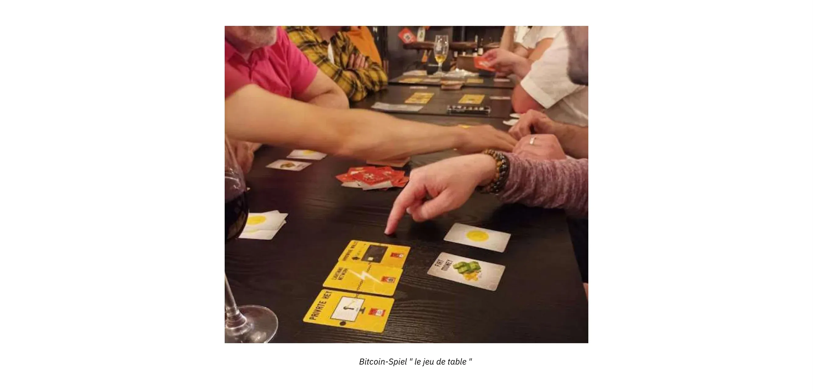

Achte nur darauf, den Kalender nicht zu überfrachten. Zu viele Veranstaltungen in einem einzigen Monat können bei den Organisatoren zu einem Burnout führen und mit der Zeit die Teilnehmerzahlen verringern.

## Aufkleber erstellen

<chapterId>d605f3b3-130e-513d-85e6-06bc5ea13e99</chapterId>

Aufkleber sind eine unterhaltsame Möglichkeit, sowohl für Bitcoin als auch für deine Gemeinschaft zu werben und gleichzeitig deine Identität zu stärken.

Bevor du eine Bestellung aufgibst, solltest du diese Tipps beachten:

- Bei der Verwendung im Freien müssen die Aufkleber wasserfest sein.
- Halte dein Logo etwas kleiner als den Schneidbereich, um Beschneidungsprobleme beim Laserschneiden zu vermeiden.
- Verwende eine Vektordatei anstelle eines Rasterbildes, um eine bessere Druckqualität zu erzielen.
- Wähle die richtige Größe: 8 cm Durchmesser (etwa so groß wie die Handfläche eines Erwachsenen) sind gut sichtbar, während 4 cm eher diskret sind. Legst Wert auf Sichtbarkeit oder Diskretion?
- Für den Druck in sattem Schwarz ("Vierfach-Schwarz") verwende 30% Cyan, 30% Magenta, 30% Gelb und 100% Schwarz. Wenn du nur 100 % Schwarz verwendest, kann dies zu einem gräulichen Ton führen. Die Drucker überprüfen dies oft, aber es ist wichtig zu wissen.

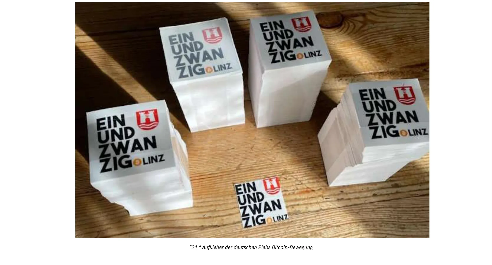

Je nach Bedarf und Anbieter können 1.000 Aufkleber zwischen 100€ und 250€ kosten. Du kannst sich an [@Mill3sim3 auf Twitter](https://x.com/Mill3sim3) wenden, einen französischen Bitcoiner, der sich auf Marketing spezialisiert hat und manchmal Preise erzielen kann, die bis zu 30 % unter denen der üblichen Online-Händler liegen.

Allerdings sind 1.000 Aufkleber eine Menge. In der Regel ist es besser, mit etwa 100 zu beginnen, um sicherzustellen, dass man sie alle verteilen kann.

Wichtig! **Prüfe  die örtlichen Vorschriften, bevor du Aufkleber an öffentlichen Orten anbringst**.

In Frankreich dürfen Aufkleber nur an offiziellen öffentlichen Anschlagtafeln angebracht werden. Wenn du sie anderswo anbringst (z. B. an einem Stoppschild), werden sie wahrscheinlich entfernt und möglicherweise mit einer Geldstrafe belegt, wenn sie mit dir oder deinem Treffen in Verbindung gebracht werden können. Informiere deine Mitglieder hierüber.

Prüfe an privaten Veranstaltungsorten wie Konzerten, Bars oder Stadien, ob bereits Aufkleber vorhanden sind, bevor du deinen hinzufügst. Wenn nicht, frage das Personal um Erlaubnis. Du möchtest nicht, dass der erste Eindruck eines Geschäftsinhabers von deiner Gemeinschaft der ist, dass sie seine Räumlichkeiten vandalisiert hat.

## Eine Bibliothek erstellen

<chapterId>acc94093-f8b3-51b8-9359-348e9e075d38</chapterId>

Ein weiteres Projekt, das du leicht einrichten kannst, ist **die Einrichtung einer Bibliothek bei deinen Treffen**.

Du kannst Teilnehmer, die ihren Lesestoff mit anderen teilen möchten, dazu einladen, ein Buch mit Bezug zu Bitcoin mitzubringen. Wenn jemand anderes auf dem Treffen das Buch ausleihen möchte, könnte mit dem Eigentümer eine Ausleihe gegen eine Kaution von z. B. 21.000 Satoshis über Lightning vereinbart werden.

Für den Eigentümer ist diese Kaution eine Absicherung bei Verlust oder Diebstahl. Für den Entleiher ist es ein Anreiz, zu einem zukünftigen Treffen zu kommen, um seine Kaution zurückzuholen.

Wenn du eine Vereinigung leitest und einen Teil deiner Mittel in Bildungsressourcen investieren möchtest, kannst du auch mehrere Bücher kaufen, um sie in deiner **Bitcoin-Bibliothek** anzubieten, die bei jedem Treffen erhältlich ist.

Um das Ökosystem zu unterstützen, bietet der **[Verlag Konsensus Network](https://konsensus.network/) seit Ende 2023 internationalen Bitcoin-Treffen und -Gemeinschaften einen Rabatt von 15 % bis 35 % auf alle seine Bücher bei einer Bestellung von drei Büchern oder mehr**.

Um diesen Rabatt in Anspruch zu nehmen, wende dich einfach **auf Twitter** an den [Konsensus-Verlag](https://twitter.com/KonsensusFR).
Wenn du nicht über das nötige Geld verfügst, kannst du den Rabatt trotzdem an Mitglieder deiner Gemeinschaft weitergeben.
Zum Beispiel könnte ein Organisator Bestellungen von Mitgliedern sammeln, eine Großbestellung zum reduzierten Preis aufgeben und die Bücher beim nächsten Treffen verteilen, wobei die Bezahlung dann per Lightning erfolgt.

Du könntest auch eine 'Ausleihordnung' für die Buchausleihe bei deinen Treffen auslegen, um Neulingen die Ausleihregeln klar zu erklären.

Hier ist ein Open-Source-Beispiel, das du verwenden und anpassen kannst:
[Charta der Buchausleihe](https://www.canva.com/design/DAF7u1b5kRM/r2gEAlibe_jTIXIX-O9PMA/edit)

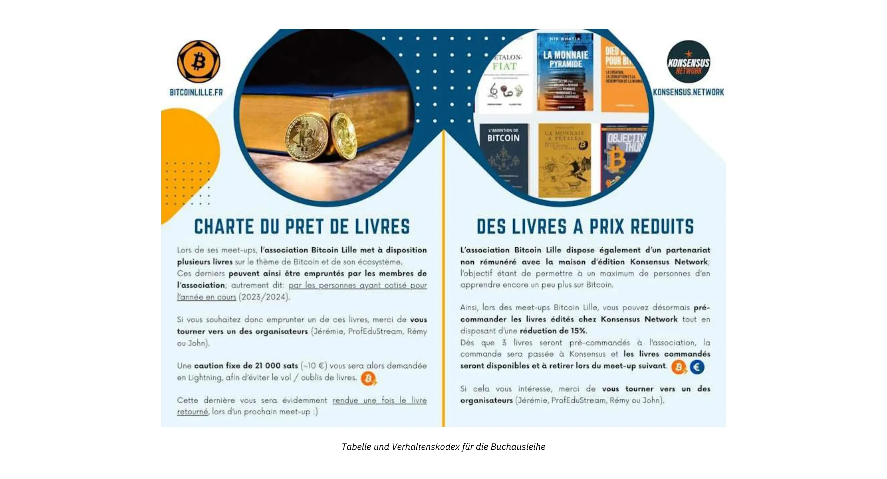

Um die Lektüre von Bitcoin zu fördern, könntest du in den **örtlichen Stadtbibliotheken** nachsehen, ob sie Bücher über Bitcoin haben.
Wenn dies der Fall ist, frage die Bibliothekare, ob ein **runder Tisch** zu diesem Thema geplant ist, und biete ihnen die Kontaktdaten deines Treffens an.
Wenn nicht, schlage ihnen vor, einige Bücher aus einer vorausgewählten Liste zu erwerben. Das [publisher Konsensus Network](https://konsensus.network/) kann eine Quelle der Inspiration sein.

## Erstellen und Verteilen von personalisierten Flyern

<chapterId>62ad5430-c698-51b3-89ac-090f31c88953</chapterId>

Das Entwerfen und Schreiben von Flyern nimmt Zeit in Anspruch, aber das ist es wert. Sie geben dir ein greifbares Hilfsmittel an die Hand, wenn du über Bitcoin sprichst, was immer geschätzt wird.

Diese Flugblätter können gezielt eingesetzt werden:

- Händler, wenn du Bitcoin als Zahlungsmittel einführen willst;
- Veranstaltungsteilnehmer mit einem Flugblatt, das erklärt, wie man mit Bitcoin/Lightning bezahlt und benutzt;
- Anfänger, egal ob sie auf der Straße, am Arbeitsplatz oder bei einem Familientreffen getroffen werden, mit einem Flugblatt, das die wichtigsten Vorteile des Bitcoin hervorhebt.

Du könntest auch einen Flyer speziell für deine Gemeinschaft oder dein Treff entwerfen, in dem du deine Aktivitäten, Ziele, Links zu sozialen Medien, Kommunikationskanäle und bevorstehende Veranstaltungen vorstellst.

Mehrere Flugblätter sind bereits **als Open-Source in der [Bitcoin Teaching Toolbox](https://planb.academy/fr/resources/bet)** auf planB.network verfügbar und weitere werden im Laufe der Zeit hinzugefügt.

Ein Beispiel ist ein [vollständiges Flugblatt](https://profedustream.substack.com/p/21-raisons-dutiliser-Bitcoin) mit 21 Gründen für die Verwendung von Bitcoin. Das Design ist auch [als Open-Source-Datei](https://www.canva.com/design/DAFtAR1NauQ/ZDwl2CchIJ9Gpb36N6-7iw/edit?utm_content=DAFtAR1NauQ&utm_campaign=designshare&utm_medium=link2&utm_source=sharebutton) verfügbar, damit du es ändern, anpassen und weitergeben kannst. Denke einfach daran, deine Quellen anzugeben.

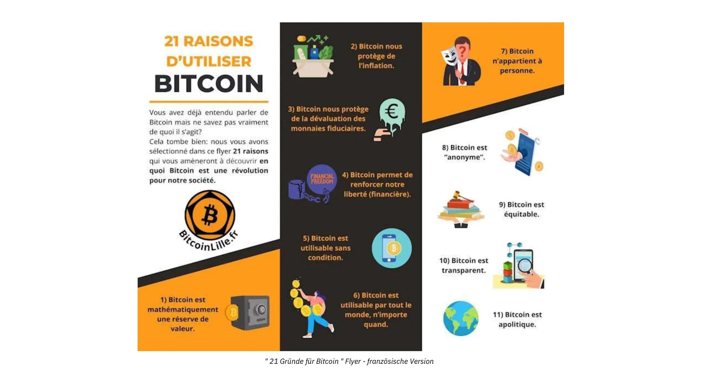

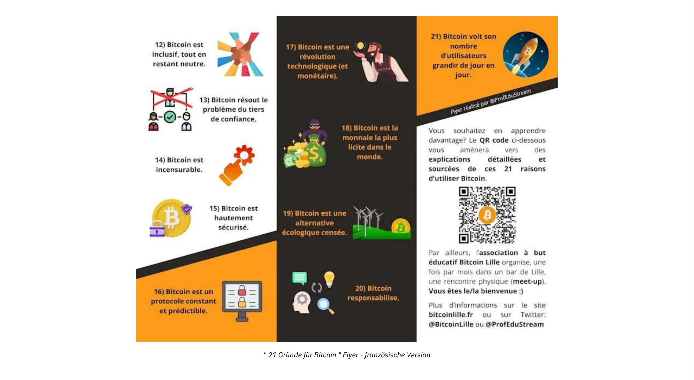

Wie bereits erwähnt, kannst du diese Flugblätter fast überall ablegen: auf einem gemeinsamen Schreibtisch am Arbeitsplatz, am Esstisch der Familie, in einer öffentlichen Bibliothek usw.

In Frankreich und einigen anderen Ländern gibt es auch "Bücherkisten", kleine Holzkisten, in denen die Menschen kostenlos Bücher spenden oder ausleihen können. Du könntest dort ein Flugblatt oder noch besser ein Buch hinterlassen.

Im Jahr 2023 wurde die Initiative **"Bitcoin Whitepaper in Frankreichs Bücherkisten**" gestartet.

Um dieses Projekt durchzuführen, mussten die Teilnehmer zunächst die geografische Lage aller Bücherkisten im Land erfassen. Zu diesem Zweck gibt es mehrere Datenbanken:

- [boite.a.livres.zonelivre.fr](https://boite.a.livres.zonelivre.fr/);
- [boites-a-livres.fr](https://www.boites-a-livres.fr/carte-de-france);
- [delivrez.fr](https://delivrez.fr/maps/fr_FR/);
- sowie Artikel der lokalen Presse

Das Whitepaper Bitcoin hat zwar Symbolcharakter, ist aber für Neueinsteiger oft zu komplex. Stattdessen war die Idee, eine kleine Broschüre zu erstellen, die Folgendes enthält:

- eine leicht zugängliche, gut recherchierte Einführung in Bitcoin, seine Anwendungen und die Probleme, die es löst;
- das Whitepaper Bitcoin, übersetzt ins Französische.

Die von französischen Bitcoinern gemeinsam genutzte Broschüre, die in Dutzenden von Bücherkästen im ganzen Land ausgelegt wurde ist auch [als Open-Source verfügbar](https://www.canva.com/design/DAFs18FSoVM/Sy0QsfUkycTgXveeGgutBg/edit?utm_content=DAFs18FSoVM&utm_campaign=designshare&utm_medium=link2&utm_source=sharebutton).

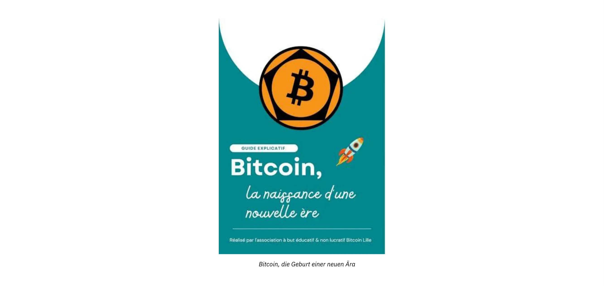

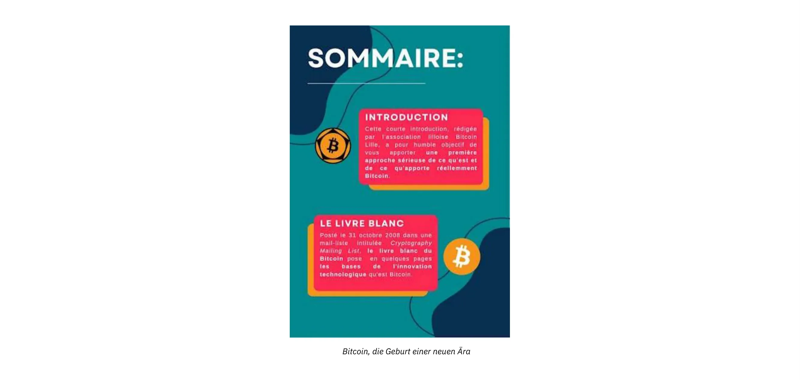

## Herstellung einer Videoprojektion

<chapterId>892b248a-b837-5df6-aac9-4b3261ff0390</chapterId>

Fast jeder Bitcoiner hat wahrscheinlich [Rémi Forte](https://twitter.com/forteremi)'s faszinierende Zwischenserie "Le mystère Satoshi, aux origines du Bitcoin" ([Mysterium Satoshi - Bitcoin wie alles begann](https://www.youtube.com/watch?v=ojCrZbO2wJE) gesehen.

Er wurde 2021 veröffentlicht und wurde mehrere Millionen Mal auf YouTube angesehen.

Eine Idee könnte sein, eine Vorführung von Mysterium Satoshi für Ihre Gemeinde zu organisieren, vielleicht als zusätzliche monatliche Veranstaltung.

Ein Wort der Warnung: Obwohl ARTE France bestätigt hat, dass öffentliche Vorführungen erlaubt sind, müssen Sie für die Projektionsrechte bezahlen, um dies legal zu tun. Im Jahr 2023 betrugen diese Kosten etwa 250 € pro Vorführung bzw. 120 € pro Vorführung, wenn der Film im Laufe des Jahres bei mindestens fünf Treffen vorgeführt wurde.
Für die meisten Gemeinden ist dieser Preis unerschwinglich, zumal die Dokumentation bereits kostenlos auf dem YouTube-Kanal von ARTE verfügbar ist.

Natürlich sind auch andere Projektionen möglich.

In Frankreich beispielsweise gewährte die **Regisseurin [Alana Mediavilla](https://twitter.com/AlanaMediavilla) lokalen Treffen das Recht, ihren Dokumentarfilm "Stranded "** vorzuführen, der Ausschnitte aus dem kommenden Film 2024 [Film "Dirty Coin"](https://www.dirtycointhemovie.com/) enthält.

Einige Bitcoiner ergriffen sogar die Initiative, "Stranded" vollständig ins Französische zu übersetzen, mit Untertiteln zu versehen und bei Treffen im ganzen Land vorzuführen. In der Woche vom 4. März 2024 wurde der Film gleichzeitig bei rund einem Dutzend Treffen im ganzen Land gezeigt.

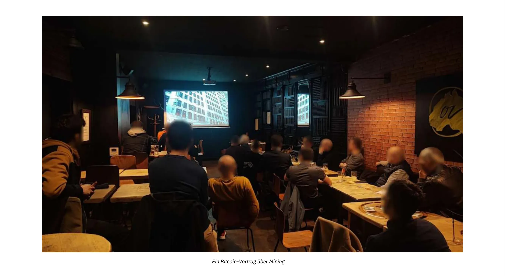

Die Veranstaltung löste lebhafte Diskussionen über Bitcoin Mining, seinen Energieverbrauch und seine weiteren Umweltauswirkungen aus.

## Aufhängen von Plakaten in deiner Stadt

<chapterId>6565e8a0-d535-5be0-9764-273584c675bd</chapterId>

In mehreren europäischen Ländern (darunter Deutschland, Spanien und Frankreich) haben Bitcoiner die Initiative ergriffen und Plakate in ihren Städten aufgehängt.
Einige Entwürfe überarbeiten Banksys Kunst, um das Bitcoin-Logo einzubeziehen.

Ein Beispiel ist [StreetCyberArt](https://twitter.com/streetcyber_art), ein deutscher Bitcoiner, der seit einigen Jahren Collagen und Street Art macht.

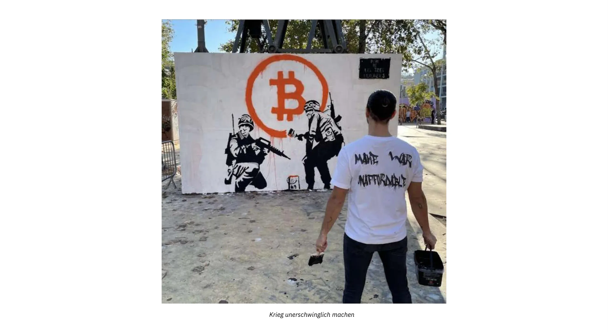

Wenn du in die Straßenplakatierung einsteigen willst, solltest du dich über die Gesetze deines Landes informieren. In Frankreich zum Beispiel dürfen Plakate nur auf öffentlichen Plakatwänden angebracht werden. In anderen Ländern ist es gänzlich verboten und wird mit einer Geldstrafe geahndet.

Wenn du dich dazu entschließt, die Grenzen zu überschreiten, und hoffst, nicht "auf frischer Tat" ertappt zu werden, vermeide es, auf den Plakaten irgendwelche identifizierenden Informationen (wie den Namen deines Treffens oder @Twitter) anzugeben.

Beachte auch, dass der Druck dieser Plakate auf einem Privatdrucker in der Regel zum Ausbluten der Tinte und zu einer raschen Verschlechterung der Qualität im Außenbereich führt. Am besten ist es, mit einer professionellen Druckerei zusammenzuarbeiten, die die Plakate auf speziellem, selbstklebendem Papier für den Außenbereich drucken kann, das sowohl Qualität als auch Haltbarkeit gewährleistet.

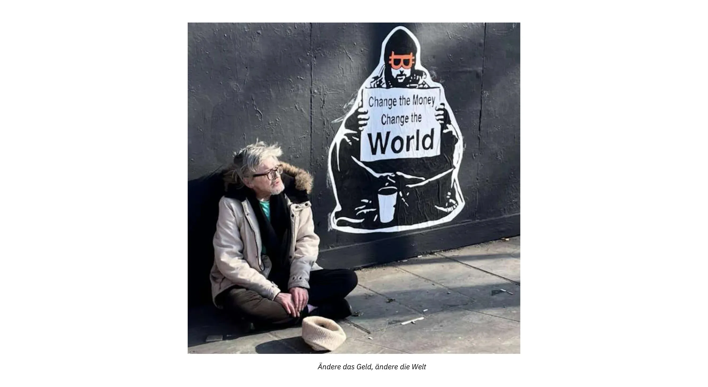

Diese Initiative kann mehr als 0,40 € pro Plakat kosten (etwa 40 € für hundert Plakate), und die Online-Preise können zwischen dem Doppelten und dem Fünffachen dieses Betrags liegen. Gute Kontakte sind unerlässlich.

Wie oben erwähnt, hat der französische Bitcoiner [@Mill3sim3](https://twitter.com/Mill3sim3) die richtige professionelle Ausrüstung und kann für Details kontaktiert werden.

Alternativ dazu kannst du auch eine Schablone aus einem großen Stück Pappe anfertigen und dein Motiv mit Sprühfarbe an ausgewählten Stellen in Ihrer Stadt anbringen.

## Eine personalisierte NFC-Karte

<chapterId>8ad65d4e-a68a-59c2-a812-85f4907ed9f3</chapterId>

Eine weitere originelle Projektidee ist die Erstellung von personalisierten NFC-Karten für Lightning-Zahlungen (kompatibel mit dem BoltCard-Standard). Hierfür ist Schweizer Bitcoin Pay ein großartiger Partner.

[Ihre Website](https://swiss-Bitcoin-pay.ch/cards) bietet derzeit vier Standarddesigns an.

Wenn du mehr als 50 NFC-Karten bestellen möchtest, kannst du dich über die offizielle Website des Unternehmens oder über [Twitter](https://twitter.com/SwissBitcoinPay) an das Unternehmen wenden und ein individuelles Design für die Vorderseite der Karte vorschlagen. Die Rückseite wird standardisiert bleiben.

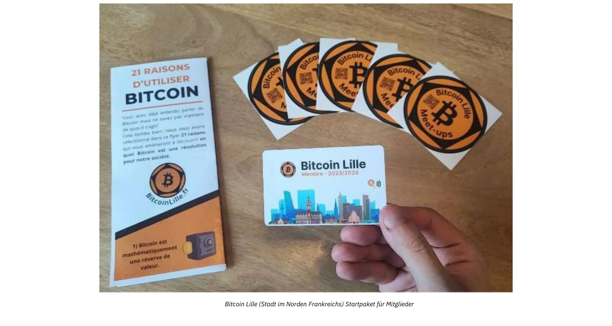

So hat beispielsweise die französische Gemeinschaft [Bitcoin Lille](https://twitter.com/BitcoinLille) im Jahr 2023 eine Reihe von NFC-Karten mit einem individuellen Design bestellt. Jedes neue Mitglied erhielt im Laufe des Jahres eine in seinem Willkommenspaket. Diese Idee kann leicht für deine eigene Gemeinschaft angepasst und personalisiert werden.

Der Stückpreis für diese Karten liegt in der Regel zwischen 2,50 € und 5 €, je nach Auftragsgröße und Marktbedingungen, wobei die Preise für größere Mengen niedriger sind.

## Eine Website erstellen

<chapterId>9a2a1b9b-0633-544a-b331-c06187d23d7f</chapterId>

In einem bestimmten Stadium des Wachstums deiner Gemeinschaft kann eine Website nützlich sein, die als Schaufenster für deine Gruppe, Treffen, Veranstaltungen und Bildungsinhalte dient.

Der Aufbau einer Website braucht Zeit, aber die folgende Anleitung zeigt dir, wie du in nur 30 Minuten eine kostenlose WordPress-Website erstellen kannst. Du wirst in der Lage sein, eine anpassbare Homepage einzurichten, Artikel zu veröffentlichen und Medien wie YouTube-Videos, Bilder oder PDFs einzubetten.

Später kannst du einen eigenen Domainnamen erwerben oder die Website sogar auf deinem eigenen Server hosten.

:::video id=a1b25c18-5fc1-4b97-baef-816d819c9382:::

Es gibt zwar auch andere CMS-Plattformen, einige mit einfacheren, einsteigerfreundlicheren Oberflächen, aber sie sind in der Regel weit weniger anpassbar. Deshalb ist WordPress in der Regel die beste Ausgangsbasis.

WordPress unterstützt auch eine breite Palette von Plug-ins (einige davon kostenpflichtig, aber von hoher Qualität), die die Möglichkeiten deiner Website erheblich erweitern können, ohne dass Programmierkenntnisse benötigst. Ein Beispiel ist das [Premium-Theme "Uncode"](https://undsgn.com/uncode/)

## Erstellen Sie einen Videokanal (Youtube oder Odyssee)

<chapterId>076286db-1627-57ec-a410-c44b1666e1cd</chapterId>

Einige Mitglieder deiner Gemeinschaft möchten vielleicht multimediale Inhalte erstellen, z. B. Videos mit Anleitungen.

Du kannst auch Vorträge bei Treffen oder sogar an Universitäten halten.

**Wenn es soweit ist, kannst du mit einem speziellen Videokanal alle deine Inhalte an einem Ort veröffentlichen und zentralisieren**

Beliebte Plattformen sind:

- [**YouTube**](https://www.youtube.com/), weit verbreitet, aber nicht zensurresistent.
- [**Odyssee**](https://odysee.com/), weniger populär, aber dezentralisiert durch Peer-to-Peer-Technologie.
- [**peertube**](https://joinpeertube.org/de), ermöglicht es dir, deine eigene Videoplattform zu hosten, auch wenn die Einrichtung etwas komplizierter ist.

Egal wofür du dich entscheidest, entwerfe plattformspezifisches Bildmaterial, um deinen Kanal ansprechend zu gestalten. Canva, erwähnt in [Teil 2/8](https://planb.academy/courses/1c643dc9-a15f-4f9e-93b6-cb3c58b4ee35/3470a31f-0190-5e87-8af0-6a00e79267ef), bietet eine Kategorie "YouTube Thumbnail" mit vorgefertigten, anpassbaren Designs.

Für **Aufnahmen** von deinem Computer aus ist [Streamlabs](https://streamlabs.com/de-de) kostenlos, bietet viele Funktionen und unterstützt Szenenübergänge.

Für die **Videobearbeitung** ist [Wondershare Filmora](https://filmora.wondershare.de/) (ca. 45€/Jahr) einfach zu bedienen und liefert schnell professionelle Ergebnisse.

Für das Intro und Outro deines **Videos** findest du auf Canva ganz einfach passende Vorlagen. Passe das Design nach Geschmack an, lade es herunter und füge es zu deiner Bearbeitungssoftware hinzu.

Tipp: Falls Bitcoin jemals verboten oder zensiert wird, solltest immer eine lokale Sicherungskopie deiner Videos auf einem Hard-Laufwerk aufbewahren.

## Einen Audio-Podcast erstellen

<chapterId>12e96b45-1c33-5687-a753-80d0114d487a</chapterId>

Ein Audio-Podcast ist eine weitere gute Möglichkeit, Ideen zu verbreiten. Wie bei Videokanälen braucht es Zeit, um ein Publikum aufzubauen.

Beliebte Podcast-Plattformen sind:

- [**Brunnen**](https://www.fountain.fm/), unterstützt Lightning-Spenden.
- [**Soundcloud**](https://soundcloud.com/);
- [**Deezer**](https://www.deezer.com/de/);
- [**Spotify**](https://open.spotify.com/);
- [**Google podcast**](https://podcasts.google.com/).

Jede Plattform hat ihr eigenes Publikum. Wenn du also auf mehreren Plattformen präsent bist, kannst du deine Reichweite erhöhen. **[Spotify für Podcaster](https://podcasters.spotify.com/) macht dies einfach, indem es dir erlaubt, deinen Podcast einmal hochzuladen und einen RSS-Feed für andere Plattformen zu generieren**.

Wenn die Arbeit an "Spotify für Podcaster" also erledigt ist, musst du deine Inhalte nur noch für die anderen Plattformen formatieren - ein relativ schneller Prozess.

Für die Aufnahme ist [Audacity](https://www.audacityteam.org/) kostenlos und ermöglicht es dir, Audiopegel anzupassen, Effekte wie Überblendungen hinzuzufügen und die Klarheit während der Bearbeitung zu verbessern. Es ist ganz einfach, deine Stimme aufzunehmen und einen Podcast in professioneller Qualität zu erstellen.

Hier ist ein kurzes 10-Minuten-Tutorial, das die Grundlagen der Podcast-Erstellung mit Audacity behandelt:

:::video id=67d80ac7-253f-40a5-b621-fef2fb7174bd:::

Tipp: Genau wie bei Videos solltest du eine lokale Sicherungskopie aller Podcasts für den Fall einer zukünftigen Zensur anlegen.

## Erstelle ein Abzeichen für deine Veranstaltungen

<chapterId>0cccef8d-a765-5844-8921-c40f0ce653e4</chapterId>

Bei deinen Treffen und Veranstaltungen kannst du einen kleinen Anreiz einführen: Veranstaltungsabzeichen. Die Idee ist, **ein Abzeichen zu erstellen, das man nur bei dieser bestimmten Veranstaltung erhalten kann**. Dieses Konzept existiert auf anderen Blockchains unter dem Namen "POAP" ("Proof Of Attendance Protocol"). Allerdings gibt es derzeit keine freie Möglichkeit, dies auf Bitcoin zu implementieren.

Ein solches System könnte auch dazu verwendet werden, die aktivsten Mitglieder Ihrer Gemeinschaft zu belohnen. Du könntest zum Beispiel eine jährliche Tombola veranstalten, bei der jedes gesammelte Abzeichen einem Los entspricht. Ein Mitglied, das an allen 12 Treffen in einem Jahr teilnimmt, hätte 12 Lose für die Verlosung.

Ein anderer, traditionellerer Ansatz wäre, die Teilnehmer bei jeder Veranstaltung zu bitten, ihren Vornamen oder Spitznamen und den Grund ihrer Teilnahme auf ein Schild zu schreiben.
Dies ist zwar etwas förmlich, aber es kann den Mitgliedern helfen, gemeinsame Interessen und Gesprächsthemen zu finden, und es macht es auch für Neulinge einfacher, die Organisatoren (oder offizielle Mitglieder der Gemeinschaft/Vereinigung) zu erkennen.

Mehrere vom Verein Bitcoin Lille verwendete Abzeichenvorlagen sind [als Open-Source auf Canva verfügbar](https://www.canva.com/design/DAGHAsT15MU/AIA7-L_xBjNdsuxdD4-h-Q/edit?utm_content=DAGHAsT15MU&utm_campaign=designshare&utm_medium=link2&utm_source=sharebutton).

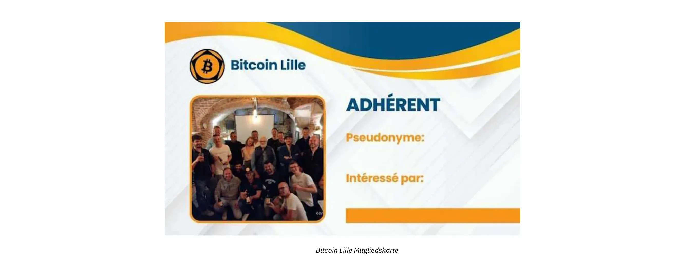

## Planung der Übergabe im Todesfall

<chapterId>c5febf18-235c-51bc-8fbb-9467dabe4cb0</chapterId>

Zu einem ganz anderen Thema: Das Ableben eines Mitglieds deiner Bitcoin Gemeinschaft.

Vielleicht wirst du eines Tages von der Familie eines ehemaligen Mitglieds kontaktiert, um dich über dessen Tod zu informieren. Du könntest Ihnen erklären, dass der Verstorbene Anweisungen hinterlassen hat, unter anderem, dass sie sich mit deiner Gemeinschaft, deinem Treffen oder deinem Verband in Verbindung setzen sollen.

In einigen Fällen kann die Familie auch Hilfe bei der Rückforderung von Geldern als Begünstigte des Erbes suchen.

Es ist ratsam, mit deiner Gemeinschaft zusammenzuarbeiten, um im Voraus ein klares Verfahren für solche Situationen festzulegen und sicherzustellen, dass:

- Der Verstorbene hat seiner Familie bereits geraten, **niemals private Schlüssel auszutauschen oder physische Wallets zu einem Treffen mitzubringen**.
- Der Familie ist klar, dass ihr Besuch einen lehrenden Zweck hat: Sie soll lernen, wie Bitcoin funktioniert, damit sie später die Kontrolle über die Gelder übernehmen kann.
- Die Familie kennt die in ihrem Land geltenden Gesetze über Schenkungen, Erbschaften und die Umwandlung von Bitcoin in Fiat.

Ein Standardprotokoll verhindert auch, dass jemand, ob Mitglied oder Gast, die Situation ausnutzt, um Geld zu stehlen.

Du könntest eine spezielle Arbeitsgruppe bilden, um diesen Prozess zu definieren. Der Verein Bitcoin Lille arbeitet bereits an einem solchen [Dokument](https://docs.google.com/document/d/1TDfLZjuictC5s3PEM2Z7WmkxIDSJ8Q1E4xevm52pVgU/edit?usp=sharing), das in den kommenden Monaten als Open-Source veröffentlicht werden soll.

## Vorträge an Schulen und Universitäten halten

<chapterId>65efdb44-e3d4-567c-aedf-972765753d73</chapterId>

Die Liste der oben beschriebenen Projekte ist natürlich nicht erschöpfend. Im Allgemeinen handelt es sich dabei eher um interne Projekte für die Gemeinschaft oder für Treffen, die im Laufe deiner Entwicklung relativ einfach umgesetzt werden können.

Wenden wir uns nun dem Onboarding zu.

Wie du weißt, ist eine der besten Möglichkeiten **ein großes Publikum auf einmal zu erreichen, eine kostenlose Vorlesung** zu halten. Dies kann an Hochschulen und Universitäten geschehen, um sowohl junge Menschen (als auch nicht mehr ganz so junge) mit Bitcoin vertraut zu machen, unabhängig davon, ob sie ganz neu dabei sind oder ihr Verständnis vertiefen wollen.

Einen Vortrag vor Dutzenden oder gar Hunderten von Zuhörern zu halten, erfordert mehr als nur technisches Know-how. Du wirst brauchen:

- Sicheres Auftreten in der Öffentlichkeit
- Gute Stressbewältigung
- Deutliche Artikulation
- Gutes Zeitmanagement
- Eine gut recherchierte, qualitativ hochwertige Präsentation oder ein Workshop, der auf das Qualifikationsniveau deines Publikums zugeschnitten ist

Ebenso wichtig ist es, **offen zu bleiben und zu wissen, wann man Konzepte vereinfachen sollte**, insbesondere während der Fragerunde oder einer Podiumsdiskussion. Es geht nicht darum, seine Prinzipien aufzugeben, sondern anzuerkennen, dass andere die Dinge anders sehen könnten. Manchmal ist es am besten, später zu antworten oder es sein zu lassen, damit die Diskussion weitergehen kann. Wenn deine Argumente stichhaltig und gut belegt sind, werden die Teilnehmer dies erkennen.

Wenn du dich bereit fühlst, dann tue es! Die Welt braucht dringend eine bessere Aufklärung über Bitcoin.
Dies ist jedoch kein leichtes Unterfangen: Es erfordert Motivation, Anstrengung und die richtigen Verbindungen.

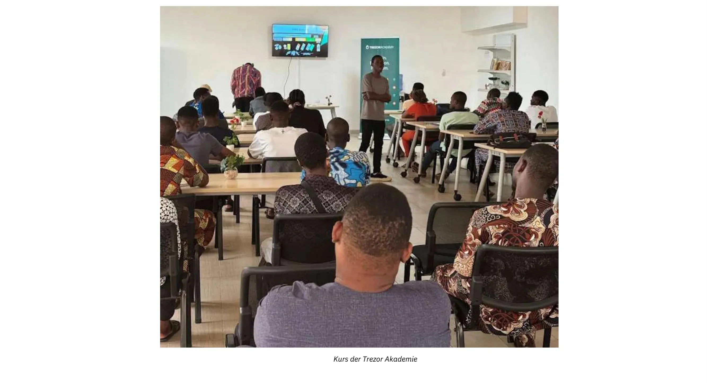

Die Organisation eines Vortrags oder Workshops in einer Schule oder Universität beginnt damit, den richtigen Ansprechpartner zu finden. Das könnte sein:

- Eine persönliche Bekanntschaft
- Ein Studentennetzwerk
- Eine Studentenvereinigung, die Vortragsreihen oder Veranstaltungen organisiert
- Ehemalige Professoren Ihrer Ingenieursschule oder Universität
- Der Studiengangskoordinator, wenn er direkt Kontakt aufnimmt

Der erste Schritt besteht in der Regel darin, deine Initiative oder deinen Verein vorzustellen und um ein Treffen zu bitten. Im besten Fall führt dies ein paar Wochen später zu einer Präsentation über Bitcoin vor Studenten.

Leider wird Bitcoin von einem Großteil der Medien und vielen Politikern immer noch verteufelt, was einige zu der Ansicht veranlasst, dass es keinen Platz in den Klassenzimmern hat. Ablehnungen sind üblich, insbesondere in akademischen Kreisen, wo Themen wie Proof of Work und Energieverbrauch nach wie vor umstritten sind.

Dennoch ist es einen Versuch wert, vor allem bei Studentenvereinigungen und -verbänden. Und wer weiß? Selbst wenn dein erster Versuch mit einem "Nein" quittiert wird, könnte es sein, dass du beim nächsten Bullenmarkt eine E-Mail in Ihrem Posteingang findest, in der du eingeladen wirst, mit, sagen wir, 280 Studenten zu sprechen!

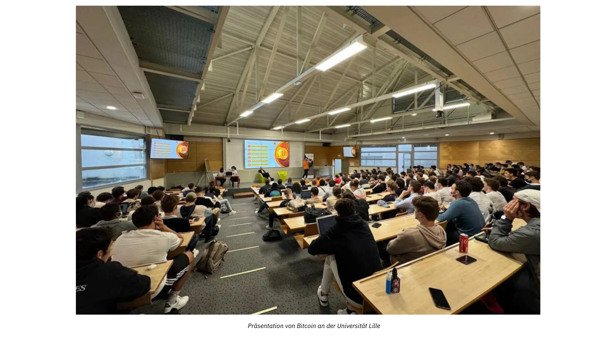

## Ansprechen von Unternehmen

<chapterId>b730462b-7928-5d28-a14f-9ceaa773d3d2</chapterId>

Ein Unternehmen dazu zu bringen, Bitcoin zu akzeptieren, ist für viele Bitcoiner ein bisschen wie das Freischalten einer seltenen Errungenschaft in Ihrem Pokédex.

Jeder Händler ist anders, und das Onboarding bringt seine eigenen Herausforderungen mit sich:

- Sie brauchen immer noch Fiat-Währung, um ihre Lieferanten zu bezahlen.
- Sie benötigen klare, buchhaltungsreife Finanzberichte.
- Ihre Zahlungssysteme müssen zuverlässig, einfach zu bedienen und diebstahlsicher sein.
- Sie haben vielleicht falsche Vorstellungen oder negative Vorurteile über Bitcoin.
- Die Suche nach einer einwandfreien Softwarelösung kann schwierig sein.
- Dem Händler verständlich machen, warum es sich lohnt, Bitcoin als Zahlung zu akzeptieren.

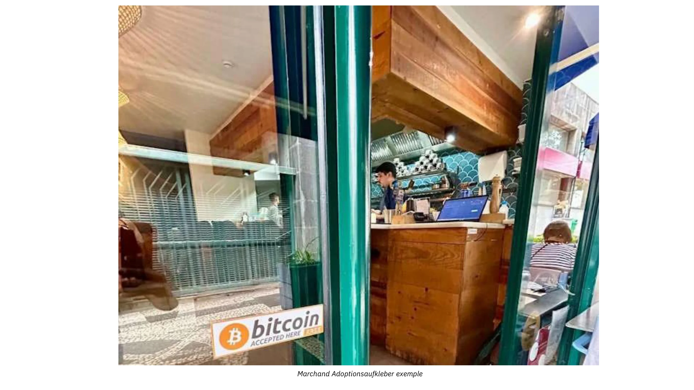

Die Einbindung lokaler Unternehmen ist eine der besten Möglichkeiten, das Bitcoin-Ökosystem deiner Stadt auszubauen. Der Schlüssel ist, Schritt für Schritt vorzugehen:

1) **Bitte zahle bei jedem Einkauf in Bitcoin:** Meistens wirst du ein "Nein" und vielleicht einen verwunderten oder sogar leicht abschätzigen Blick ernten, aber allein die Frage zeigt, dass Bitcoin etwas ist, das "normale Leute" benutzen können, und dass es als Zahlungsmittel immer beliebter wird. Du könntest dich sogar mit ein paar Freunden zusammentun und an verschiedenen Tagen im selben Geschäft vorbeischauen und jedes Mal darum bitten, mit Bitcoin zu bezahlen. Früher oder später wird der Besitzer neugierig werden.

2) **Eine einfache, klare Erklärung anbieten:** Wenn sie fragen, was Bitcoin ist, fasse dich kurz und ohne Jargon. Zum Beispiel:
*"Bitcoin ist Geld, das nicht von Banken kontrolliert wird, ohne Vermittler funktioniert, nicht zensiert werden kann, nicht der Inflation unterworfen ist und niedrigere Gebühren als das traditionelle Bankwesen hat"*
Gebe ihnen dann einen Flyer wie "21 Gründe für den Einsatz von Bitcoin" oder "10 Gründe für die Übernahme von Bitcoin in Ihrem Unternehmen" mit deinen Kontaktinformationen oder den Angaben zu deinem Treffen. Auf diese Weise wissen sie, wo sie dich finden können, wenn sie für eine Demo bereit sind.

3) **Veranstalten Sie eine Vorführung:** Wenn sie Interesse bekunden, vereinbare einen Termin, um ihnen eine Zahlungslösung vorzustellen.
Eine gute Option ist **[Swiss Bitcoin Pay](https://swiss-Bitcoin-pay.ch/)**, weil es:

  - Ermöglicht Händlern, täglich automatisch BTC in Fiat umzuwandeln, damit sie ihre Lieferanten bezahlen können.
  - Sie können einen bestimmten Prozentsatz in BTC behalten, wenn sie dies wünschen.
  - Generiert exportierbare Buchhaltungsberichte für ihre Buchhalter.
  - Verfügt über ein einfaches Dashboard für Manager.
  - Gibt den Mitarbeitern ein intuitives Interface, um Zahlungen anzunehmen, ohne die Kasse zu berühren.
  - Die Kosten sind geringer als die 2-3%igen Gebühren, die von traditionellen Zahlungsnetzen erhoben werden.

4) **Unterstütze sie, sobald sie anfangen, Bitcoin zu akzeptieren:** Nachdem sie an Bord sind:

  - Besuche sie regelmäßig und kaufe ein.
  - Siehe nach, ob alles reibungslos läuft.
  - Gebe deine Kontaktdaten bei Bedarf erneut bekannt.
  - Lade sie zu Treffen ein.
  - Füge sie zur [btcmap.org map](https://btcmap.org/) hinzu und informiere [Swiss Bitcoin Pay](https://x.com/swissbitcoinpay) auf Twitter, um die Sichtbarkeit zu erhöhen.
  - Erwäge, Workshops oder Treffen an ihrem Standort zu veranstalten.

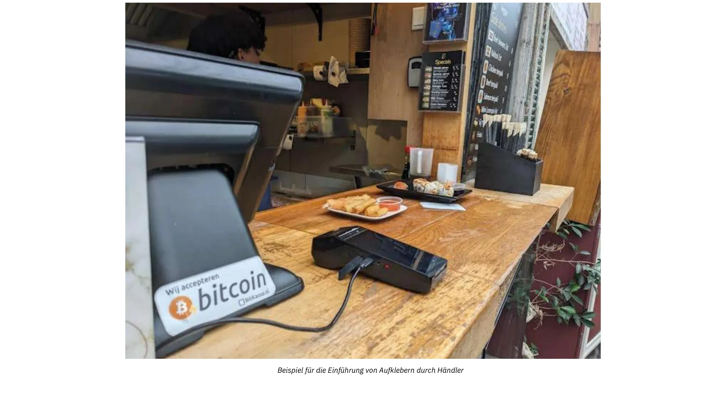

5) **Kontakt zu lokalen Händlern:** Sobald du einige Bitcoin-freundliche Unternehmen hast, schlage vor, eine Telegram-Gruppe nur für Händler zu gründen. Dies kann:

- Lasse sie Erfahrungen austauschen und neue Unternehmen an Bord holen.
- Diene als schneller Kanal für den technischen Support.
- Stärkung des lokalen Bitcoin-Netzes.

Akquise ist ein langfristiges Unterfangen. Sie erfordert Geduld, Ausdauer und Strategie. Aber wenn deine Gemeinschaft bereit ist, könntest du damit beginnen, den Grundstein für eine echte Bitcoin-Kreislaufwirtschaft zu legen, genau wie [Arnheim in den Niederlanden](https://www.arnhembitcoinstad.nl/) in den Niederlanden.

## Kontaktieren Sie die lokale Presse und das Radio

<chapterId>435bfbc1-22dd-59bb-b737-a32ea995b238</chapterId>

Bitcoiner konzentrieren sich oft auf die sozialen Medien und Online-Plattformen, um auf sich aufmerksam zu machen, aber das ist nur ein Teil des Bildes. Lokale Presse und Radio können mächtige Verbündete sein.

Einige Gemeinschaften, wie [Breizh Bitcoin](https://breizhbitcoin.com/) in Frankreich, wenden sich **regelmäßig an ihre lokalen Medien** um:

- Anstehender Veranstaltungen anzukündigen (Treffen, Präsentationen, Workshops, Halving-Partys usw.).
- Journalisten einzuladen, Bitcoin-freundliche Unternehmen zu besuchen und über sie zu schreiben.
- Veranstaltungstermine und -orte mitzuteilen, um sie in lokale Listen aufzunehmen.

In vielen Zeitungen gibt es immer noch eine Rubrik "Aktuelles", oft versteckt auf den letzten Seiten, in der anstehende lokale Veranstaltungen aufgeführt werden. Breizh Bitcoin hat festgestellt, dass dieser Ansatz funktioniert: Neulinge sind zu Treffen gekommen, nur weil sie den Eintrag in der Zeitung gesehen haben.

Diese Strategie mag in bestimmten Gebieten besser funktionieren als in anderen, aber es ist einen Versuch wert. Du könnest damit beginnen, dich an regionale Nachrichtensender zu wenden um ein Interview oder einen Podcast-Auftritt vorzuschlagen. Frankreich hat Beispiele wie:

- [acpm.fr](https://www.acpm.fr/Les-chiffres/Diffusion-Presse/Presse-Payante/Presse-Quotidienne-Regionale)
- [voxpublic.org](https://www.voxpublic.org/spip.php?page=annuaire&cat=medias&type_media=Presse%20quotidienne%20r%C3%A9gionale)

Sei dir bewusst, dass Medieninterviews heikel sein können. Worte können aus dem Zusammenhang gerissen oder falsch wiedergegeben werden. Vorbereitung ist wichtig.

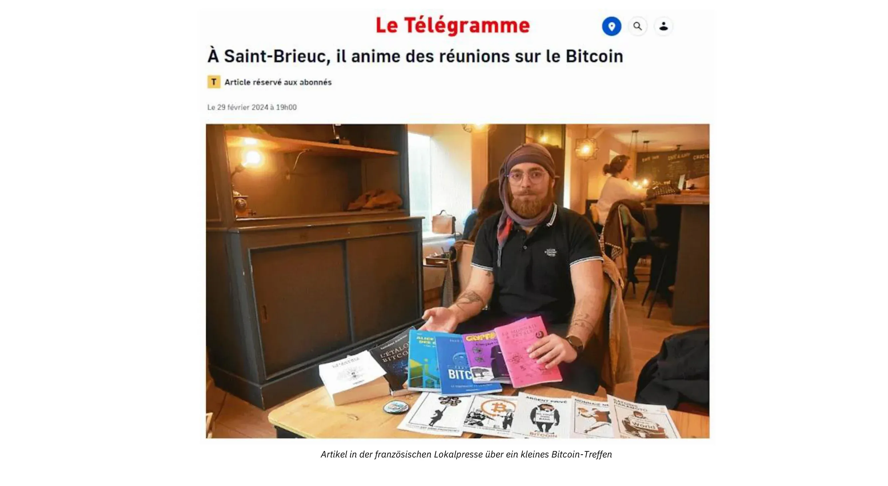

Neben den in diesem Abschnitt vorgeschlagenen Projekten können natürlich **viele weitere Projekte durchgeführt werden**. Alles hängt von deiner Zeit und deiner Motivation ab, aber auch von der Schwierigkeit des jeweiligen Projekts.

Abschließende Tipps für jedes Öffentlichkeits-Projekt:

1) **Plane im Voraus**: Definiere deine Ziele, die erforderlichen Schritte und wer was tun wird.

2) **Schritt für Schritt**: Vermeide ein Ausbrennen, indem du deine Anstrengungen einteilst.

3) **Bitte um Hilfe**: Bitte deine Mitglieder und benachbarte Gemeinschaften um Unterstützung.

Denke daran: Jede Bitcoin-Gemeinschaft war schon einmal dort, wo du jetzt bist. Zögere nicht, von deinen Erfahrungen und Ratschlägen zu lernen.

# Die Zukunft vorwegnehmen

<partId>6ea07445-9369-54bc-9aa0-d260db026e0b</partId>

## Planung für einen Anstieg der Teilnehmerzahl

<chapterId>8af722d4-3a9f-548c-9001-424f2142de12</chapterId>

Als Bitcoin bei Block 840.000 in seine vierte Ära eintrat, begannen immer mehr Menschen zu erkennen, dass es sich um eine technologische, finanzielle und soziale Revolution handelt.

Wie der Aufstieg des Internets wird auch diese Revolution Zeit brauchen, was eigentlich ein Vorteil ist. Das gibt den Menschen die Möglichkeit, **die Grundlagen von Bitcoin zu erlernen**, zu verstehen, wie man es nutzt, und ermöglicht es Entwicklern und Unternehmen, **die Protokolle und Anwendungen** zu entwickeln, die sein volles Potenzial erschließen werden.

Niemand kann die Zukunft vorhersagen, aber wir können **einen starken Anstieg der Bitcoin-Adaption** erwarten. Das bedeutet, **auf alle Szenarien** vorbereitet zu sein, auch auf extreme, wie einen Zusammenbruch des traditionellen Finanzsystems oder ein völliges Verbot von Bitcoin.

In diesem siebten und vorletzten Teil des Kurses geht es um die wichtigsten Punkte, die du beachten solltest, wenn deine Community und dein Treffen wachsen.

Die erste und am leichtesten zu erwartende Entwicklung ist die Zunahme der Zahl der Mitglieder deiner Gemeinschaft. Dies wird sich in zweierlei Hinsicht auf Sie auswirken:

1) **Ihre Kommunikationskanäle (Telegram, Signal, Matrix usw.) werden mit der Zeit überfüllt**, wodurch es schwieriger wird, bei Gesprächen auf dem Laufenden zu bleiben. Es gibt zwei Dinge, die du im Auge behalten solltest.

- Erstens: Wenn 500 Personen in einem einzigen Chat über alle möglichen Themen diskutieren, wird die schiere Menge an Nachrichten und Benachrichtigungen unweigerlich dazu führen, dass viele Mitglieder abschalten. Das ist ein guter Zeitpunkt, um deine Einrichtung zu überdenken, z. B. indem du zu Telegram-Supergruppen oder einem Discord-Server wechselst, die es beide einfach machen, Diskussionen nach Themen zu organisieren.

- Zweitens: Mehr Menschen in deinen Kanälen bedeuten mehr Bots, mehr Betrug und damit mehr Moderationsaufwand. Bereite dich darauf vor, indem du ein klares Regelwerk erstellst, auf das du dich bei der Moderation von Nachrichten beziehen kannst. Unserer Erfahrung nach lassen sich so Konflikte vermeiden, insbesondere wenn die Regeln in deinen Kanälen leicht zugänglich sind.
Ein gutes Beispiel ist das **[Bitcoin Lille's open-source rulebook](https://bitcoinlille.fr/reglement/)**, das vor ein paar Jahren für die Telegram-Gruppe und den Discord-Server geschrieben wurde. Es basiert auf einfachen, allgemeingültigen Prinzipien, und du kannst sogar [eine anpassbare Version des Designs hier](https://www.canva.com/design/DAGHI692AD4/rjT4sqEnhajc5FiPA6GFZQ/edit?utm_content=DAGHI692AD4&utm_campaign=designshare&utm_medium=link2&utm_source=sharebutton) herunterladen.

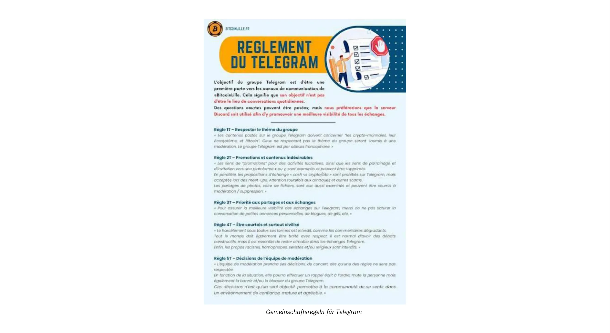

2) **Deine Treffen und Veranstaltungen werden gut besucht sein, mit vielen neuen Gesichtern, die Kontakte knüpfen wollen**.
Mit diesem Anstieg der Besucherzahlen:

  - Könnte  es sich lohnen, **einen größeren Ort für deine Treffen und Veranstaltungen zu finden**, vor allem, wenn du in der Vergangenheit nur etwa zwanzig Personen aufnehmen konntest.
  - Wenn du feststellst, dass die Teilnehmerzahl zu groß wird, kannst du für künftige Treffen entweder **eine Anmeldung der Teilnehmer verlangen** (über die Meetup-App oder ein einfaches Formular) oder **mehrere Treffen pro Monat** veranstalten (z. B. ein Treffen für Anfänger, ein Treffen für Fortgeschrittene und ein Treffen für Profis).
  - Gleichzeitig ist mit vielen Neueinsteigern in das Ökosystem zu rechnen, deren Hauptziel oft darin besteht, Geld zu verdienen. Um **die Gespräche bei diesen schnell wachsenden Treffen auf Bitcoin** zu konzentrieren, ist es eine gute Idee:

a) Eine **Bitcoin-Präsentation** während dieser Veranstaltungen einbauen, da dies natürlich einen Großteil der Gespräche auf dieses Thema lenken wird (und weg von dem neuesten, angeblich "revolutionären" Shitcoin-Projekt);

b) **Vermeide es, sich nur mit anderen Bitcoinern** zu treffen. Gehe stattdessen auf **Neulinge** zu, auch wenn das bedeutet, dass du dich zur Begrüßung in den hinteren Teil des Raumes stellst. Von dort aus könnest du darüber sprechen, warum sie gekommen sind, wonach sie suchst, die Ziele (oder sogar die Grundprinzipien) deiner Gemeinschaft und so weiter.

Und schließlich, auch wenn es bedauerlich ist, dies sagen zu müssen, können Betrüger bei Treffen auftauchen. Dein Ziel könnte es sein, endlos über dein Schneeballsystem, MLM oder eine "Blockchain Revolution powered by AI" zu reden Es ist auch durchaus möglich, dass eines Tages jemand mit schlechten Absichten teilnimmt, um Geld zu waschen oder zu versuchen, BTC mit gefälschten Scheinen zu kaufen.

In heiklen Situationen wie diesen ist es am einfachsten, höflich zu erklären, dass das Treffen nicht der richtige Ort dafür ist, und dies mit beliebigen Argumenten zu untermauern (zum Beispiel mit dem Hinweis, dass die Polizei in Zivil anwesend sein könnte).

Wenn sie sich leider weigern zu gehen oder sich respektvoll zu verhalten (ja, das ist schon vorgekommen), kannst du die Gruppe direkt während des Treffens informieren, dass eine Person oder mehrere Personen versuchen, bösartige Aktivitäten durchzuführen.

Zum Glück sind solche Situationen selten und oft eher absurd als bedrohlich, aber man sollte trotzdem vorbereitet sein.

Für den Seelenfrieden: Solange du nicht persönlich gegen das Gesetz verstößst oder direkt illegale Transaktionen ermöglichst, bist du rechtlich nicht für die Handlungen anderer bei deiner Veranstaltung verantwortlich (zumindest nach französischem Recht).

In einer idealen Welt hättest du einen **Raum, der groß genug ist, um mehrere Dutzend Leute** aufzunehmen, während deine Gemeinschaft wächst, und du würdest auch **starke Beziehungen zwischen Bitcoinern** und zukünftigen Bitcoinern während der Baisse aufbauen, damit du, wenn die Hausse kommt, so viele Leute wie möglich hast, die bereit sind, andere zu Orange Pillen.

## Dezentralisierung der Gemeindeorganisation

<chapterId>bedfc110-e099-58f4-a5b7-fb50f3b19a49</chapterId>

Stelle dir Folgendes vor: Du leitest seit Jahren dein Bitcoin-Treffen, und eines Tages beschließst, deinen Job aufzugeben, um vielleicht Lamas in Peru zu züchten oder in El Salvador den perfekten Wellen nachzujagen. Was passiert mit deiner Gemeinschaft, wenn du gehst?

Bitte plane die Übertragung deiner Gemeinschaft im Voraus:

1) **Vergebe Admin- (oder Ownership-) Rechte** für deine Kommunikationskanäle an vertrauenswürdige Mitglieder. Die Rollen können später jederzeit gewechselt werden.

2) **Teile die Kontodaten** (Benutzernamen, Passwörter, zugehörige E-Mails) für deine sozialen Medien und Sichtbarkeitskanäle mit mindestens einer vertrauenswürdigen Person.

Ohne diesen Zugang ist es für andere fast unmöglich, die Arbeit effektiv zu übernehmen. Bei Null anzufangen, indem man "abgezweigte" Gruppen erstellt und das Netzwerk neu aufbaut, ist langsam, anstrengend und oft demoralisierend.

Wenn du keinen vertrauenswürdigen Kontakt innerhalb deines Treffens hast, könnest du sich jederzeit an @ProfEduStream, @copinmalin oder @gabtribe auf Telegram wenden. Sie können dabei helfen, einen motivierten Nachfolger zu finden und die Übertragung von Konten und Administratorrechten zu koordinieren.

**Warum Dezentralisierung wichtig ist?**

Wenn du der einzige Beteiligte bist und die ganze Kontrolle hast, was passiert, wenn du verschwindest? Die Antwort ist einfach: Deine Gemeinschaft wird ebenfalls verschwinden.

Die Lösung: Aufgaben, Rollen und Zugriff dezentralisieren, damit die Gruppe auch dann weiterarbeiten kann, wenn ein Organisator ausfällt, sei es aus Zeitgründen oder, in einem düsteren Szenario, weil er wegen Besitzes von Bitcoin ohne KYC verhaftet wird.

**Wie kann man die Dezentralisierung weiter vorantreiben?**

Führe **freie und quelloffene Software** wie [die framasoft suite](https://framasoft.org/fr/) ein, um die Abhängigkeit von zentralisierten Plattformen zu verringern und die Widerstandsfähigkeit gegen mögliche staatliche Zensur oder Bitcoin-Verbote zu erhöhen.
Verwende **verschlüsselte oder anonyme Kommunikationsmittel**, um die Privatsphäre deiner Mitglieder und die Aktivitäten deiner Gemeinschaft zu schützen.

## Was wäre, wenn Bitcoin zum Staatsfeind Nr. 1 würde?

<chapterId>c739651f-cd13-51e0-a36e-85023749b15b</chapterId>

Am 5. April 1933 unterzeichnete Franklin Roosevelt, der 32. Präsident der Vereinigten Staaten von Amerika, die **Executive Order 6102**, die den Besitz von Goldmünzen, Goldbarren oder Goldzertifikaten durch Privatpersonen im ganzen Land illegal machte.

Natürlich ist die Große Depression (Börsencrash von 1929) nicht unsere heutige Realität. Aber könnte eine Regierung eines Tages dasselbe mit Bitcoin tun: **privates Halten vollständig verbieten?**

Die Wahrheit ist, dass eine solche orwellsche Maßnahme niemanden daran hindern würde, BTC wirklich zu besitzen, denn kein Gesetz kann jemanden daran hindern, sich eine Wortfolge zu merken.

Doch was wäre, wenn die Staats- und Regierungschefs der Welt endlich das Potenzial von Bitcoin erkennen würden, die globale Ordnung umzugestalten, sogar auf staatlicher Ebene? Würde man es dann als "Staatsfeind Nr. 1" bezeichnen?

Wir müssen nicht in Verschwörungsdenken verfallen. Aber nichts hindert uns daran, vorausschauend zu handeln, zu dezentralisieren und aufzuklären, und zwar ab sofort.

# Bitcoiner zusammenbringen
<partId>62bc2138-c0be-5d39-a341-594690863257</partId>

## Ein schneller Aktionsplan zum Aufbau deiner Bitcoin-Gemeinschaft

<chapterId>1f463ec2-3f64-5641-8d60-e02a47c94f27</chapterId>

Satoshi Nakamoto hat ein revolutionäres Werkzeug geschaffen, das unsere Welt bereits verändert. Aber es liegt an uns, den Bitcoinern, zu entscheiden, wie wir die Zukunft gestalten.

Bitcoin ist ein riesiges Kaninchenloch, das Geschichte, Wirtschaft, Literatur, Mathematik, Informatik und Kryptographie berührt. Niemand kann sie alle erforschen, und das ist Teil ihrer Schönheit.

Da unsere Zeit begrenzt ist, liegt der Schlüssel darin, bescheiden zu bleiben, weiter zu lernen und Wissen mit anderen zu teilen. Auf diese Weise kann jeder von uns die Ebene des Verständnisses erreichen, die wir anstreben.

**Globale Bitcoin-Gemeinschaften spielen daher eine grundlegende Rolle beim Aufbau der Welt von morgen**: Räume, in denen Bitcoiner sich **austauschen, bauen und teilen** können. **Zusammen**.

Wie du in diesem Kurs gesehen hast, erfordert der **Aufbau einer Bitcoin-Community und die Organisation von Treffen** sowohl Planung als auch Motivation. Je nach deinen Zielen und der Zeit, die du aufbringen kannst, kannst du ehrgeizigere Projekte in Angriff nehmen oder die Dinge einfach halten.

Wie auch immer, das Ziel ist das gleiche: **Interesse zu wecken und Bitcoin zu helfen, in deiner Stadt zu wachsen**.

Zum Abschluss der vielen Kapitel und Unterkapitel, die wir behandelt haben, hier ein **Kurzer "Aktionsplan "** für den Aufbau deiner Bitcoin-Gemeinschaft:

1) Entscheide im Voraus, warum du eine Bitcoin-Gemeinschaft gründen willst, welche Ziele du verfolgst und in welcher Stadt oder an welchem Ort du tätig sein wirst.

2) Nehme Kontakt zu den bestehenden Gemeinschaften in deiner Nähe auf, und zögere nicht, sie um Rat zu fragen, wenn du ihn brauchst.

3) Schaffe eine klare Identität für deine Gemeinschaft, die deine Gemeinschaft und deinen Standort widerspiegelt (Logo, Poster, Banner, Flyer usw.)

4) Erstelle Kommunikationskanäle und soziale Netzwerke wie Telegram, Twitter, NOSTR, Discord oder Simplex. Ziehe auch dezentralisierte und/oder zensurresistente Kanäle in Betracht.

5) Verfolge andere lokale Treffen und Gemeinschaften online und lasse deine Gruppe auf verschiedenen Karten und Plattformen eintragen, um die Sichtbarkeit zu erhöhen.

Sobald die Kommunikationskanäle deiner Gemeinschaft aktiv sind:

6) Starte eine Umfrage, um dein erstes Treffen vorzuschlagen, sobald du merkst, dass genügend Interesse vorhanden ist.

7) Lege die Ziele fest, die du mit dieser persönlichen Veranstaltung erreichen willst.

8) Wähle einen gut gelegenen, einladenden Veranstaltungsort, der zu deinen Zielen passt, und reserviere einen Tisch oder Raum.

9) Bewerbe die Veranstaltung auf deinen Kanälen eine Woche vorher und dann noch einmal zwei bis drei Tage vor dem Termin.

10) Veröffentliche deine Veranstaltung auf einschlägigen Websites und Plattformen.

11) Lasse die Veranstaltung natürlich ablaufen und gehe auf die Teilnehmer ein, indem du die Diskussionen bei Bedarf sanft lenkst.

Nachher:

12) Konzentriere dich auf die Bindung und Einbeziehung der Teilnehmer, damit sie wiederkommen.

13) Schlage einfache Projekte oder Initiativen vor und starte solche, die dir persönlich am Herzen liegen. Wenn jemand anderes ein anderes Projekt leiten möchte, unterstütze ihn, wo du kannst.

Endlich:

14) Nimm die Zukunft vorweg, indem du über einen größeren Veranstaltungsort für Treffen, Regeln für Kommunikationskanäle, eine Website usw. nachdenkst;

15) Ermutige örtliche Geschäfte, Bitcoin zu akzeptieren, auch wenn du bei jedem Einkauf einfach danach fragst.

16) Delegiere Aufgaben und Kanal-/Netzwerkverwaltungsrechte an vertrauenswürdige Mitglieder.

17) Bewerbe deine Gemeinschaft auf breiter Basis, damit mehr Menschen beitreten, und beziehe diejenigen ein, die Interesse zeigen.

18) Gehe noch weiter mit Projekten, die dir Spaß machen und die dir wichtig sind.

Für einen schnelleren Überblick fasst dieses 21-minütige Video diese Schritte zusammen:

:::video id=a59956da-f554-4b54-89dd-5ca55b722686:::

Denke daran: **Du bist nicht allein, die bestehenden Gemeinschaften sind da, um dich zu unterstützen**.

## Auf sich selbst aufpassen

<chapterId>cf1631cb-ddbe-55c7-be8c-26a5652979a0</chapterId>

Wenn man in den Bitcoin-Kaninchenbau fällt, verändert sich die Perspektive auf das Leben.

Tief in deinem Inneren spürst du den Drang, weiter zu gehen und andere zu treffen, die dieselbe geistige Reise durchmachen.

Diese Energie treibt dich an, deinen Teil zum Puzzle beizutragen, indem du deine Entdeckung teilst: **Bitcoin**. Sie regt dich auch dazu an, über die Welt von morgen nachzudenken, die Welt, die du mitgestalten willst, und die Gemeinschaften, die darauf hinarbeiten.

Der Aufbau einer Gemeinschaft ist ein langer Weg, der Motivation, Strategie, Hingabe und Zeit erfordert. Es kann eine undankbare Aufgabe sein, daher ist es wichtig, die Dinge Schritt für Schritt anzugehen, um nicht auszubrennen.

**Denke an dich selbst, an Ihre Grenzen**. Und auch wenn Bitcoin dich Tag und Nacht antreibt, **versuche nicht, alles allein zu machen, sonst brennst du aus**.

Suche stattdessen **Hilfe von Bitcoinern, die bereits denselben Weg gegangen sind, dieselben Pfade erforscht und dieselben Werkzeuge gebaut haben**. Das wird dir eine Menge Zeit ersparen.

**Bitte diejenigen, die dir bei diesem Abenteuer folgen, um Hilfe**, auch wenn das Delegieren bestimmter Aufgaben mehr Zeit in Anspruch nimmt. Auf lange Sicht wird deine Gemeinschaft stärker und widerstandsfähiger sein.

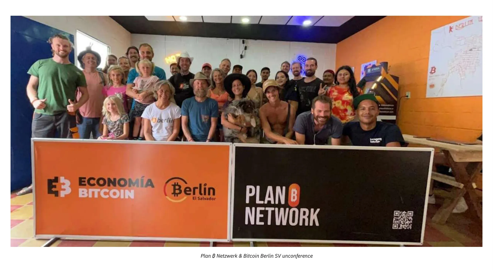

Alleine kannst du schnell einen der vielen Tunnel im Bitcoin Kaninchenbau erkunden. Aber denke daran, dass es unzählige andere Richtungen zu erkunden gibt.

**Indem du eine Gemeinschaft von Bitcoinern gründest und dich regelmäßig mit ihnen austauschst, bewegst du dich gleichzeitig in alle Richtungen des Kaninchenbaus.**

## BTC302, Was kommt als Nächstes?

<chapterId>8bf10b77-80ee-5d50-87bc-0ef32574a675</chapterId>

In diesem BTC302-Kurs haben wir uns eingehend damit beschäftigt, wie man eine Community oder ein Treffen einrichtet und wie man eine Reihe von Projekten startet.

Wenn deine Gemeinschaft bereit ist, den nächsten Schritt zu tun, **könnest du eine formelle Vereinigung** gründen.

In Frankreich zum Beispiel haben von den rund sechzig Gemeinschaften und Treffpunkten fast ein Dutzend den Status eines Vereins.

Die Vorteile sind zweifach:

- **Offizielle Anerkennung**: Du kannst ein Verbandskonto eröffnen, Presse- und Medienaufmerksamkeit erhalten und sogar Zuschüsse beantragen.
- **Strukturierte Organisation**: Du kannst klare Rollen definieren, was die Verwaltung deiner Gemeinschaft und die Durchführung von Projekten erleichtert.

Damit deine Gemeinschaft weiter wachsen kann, wird vielleicht in den kommenden Monaten **ein Folgekurs zum Kurs COMMU302** auf [planb.network](https://planb.academy/) veröffentlicht werden.

Dieser nächste Kurs könnte sich mit fortgeschrittenen Themen befassen, wie z. B.:

- Gestaltung von Präsentationen oder Workshops für deine Meetings und Festlegung klarer Ziele.
- Organisation einer groß angelegten Veranstaltung mit rund 100 Teilnehmern.

Dabei werden wir uns auf die Erfahrungen von Gemeinschaften stützen, die bereits eigene Veranstaltungen und Präsentationen entwickelt haben.

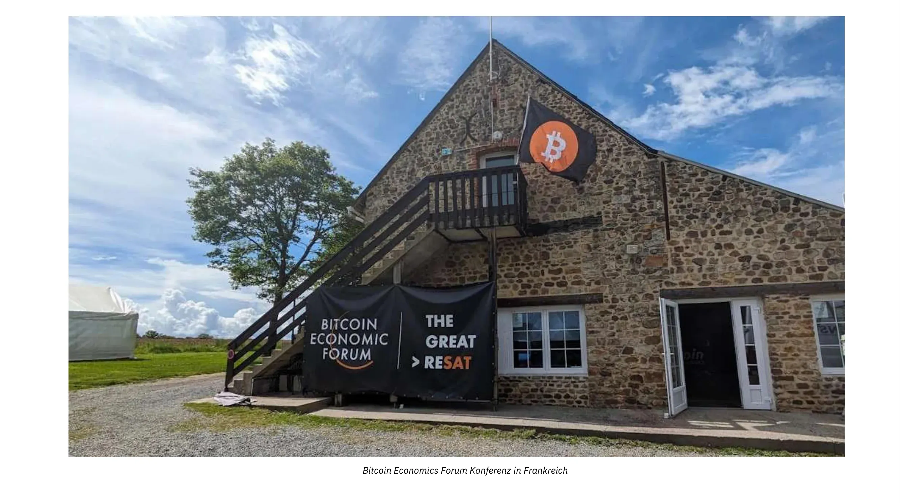

# Letzter Abschnitt

<partId>e9bdddf4-54c9-4de9-bbce-c3eade8c32e5</partId>

## Rezensionen und Bewertungen

<chapterId>08a35d2a-204b-519a-9bb1-588665a037fa</chapterId>

<isCourseReview>true</isCourseReview>

## Schlussfolgerung

<chapterId>d74606a5-cb14-4117-acb2-2bf5920de092</chapterId>

<isCourseConclusion>true</isCourseConclusion>
