# El primer paso hacia la adopción de Bitcoin

Hoy en día, cualquiera puede aprender sobre Bitcoin en línea, pero lo que a menudo falta es la oportunidad de reunirse, intercambiar ideas y construir juntos. Para llenar este vacío, muchos bitcoiners forman comunidades locales, donde los encuentros generan talleres, presentaciones y discusiones significativas.

En BTC304, veremos por qué es importante la construcción de comunidades, exploraremos herramientas para crear una identidad visual y digital sólida, y compartiremos proyectos simples de código abierto que puedes lanzar. También consideraremos cómo las iniciativas locales escalan hacia comunidades nacionales que pueden ayudar a impulsar un futuro hiperbitcoinizado.
+++
# Introducción

<partId>81318b8f-d316-5787-aa4c-4ec8370ba668</partId>

## Resumen del curso

<chapterId>e8991b82-4966-5e04-8f05-7cae46eacbaa</chapterId>

¡Bienvenido a BTC302!

Desde 2009, Bitcoin ha crecido sin descanso. Este crecimiento ha tomado forma a través de nuevas Propuestas de Mejora de Bitcoin (BIP), la creación de capas adicionales para hacer escalable la red (Lightning Network entre otras) y el desarrollo de múltiples empresas y start-ups.

Su desarrollo también es evidente en la On-Chain, con un número de transacciones en constante aumento.

Por ejemplo, entre el 1 de enero de 2018 y el 1 de enero de 2024, se estima que el número de transacciones en Layer, la principal de Bitcoin, [aumentó un 66,2%](https://dune.com/queries/3375917/5663935). Mientras tanto, entre agosto de 2021 y agosto de 2023, el número de transacciones públicas en Lightning Network [aumentó un 1.212%](https://river.com/learn/files/river-lightning-report-2023.pdf).

Este importante crecimiento está, por supuesto, estrechamente relacionado:

- el [creciente interés de la población de todo el mundo por utilizar la Bitcoin](https://profedustream.substack.com/p/21-raisons-dutiliser-Bitcoin), para liberarse del sistema bancario y/o utilizar una moneda menos volátil o menos devaluada, como es el caso de las poblaciones de Líbano, Siria, Egipto, Argentina y otros países;
- la apreciación de su precio a lo largo del tiempo, estableciéndolo como depósito de valor e inversión a largo plazo, impulsado por su política monetaria fija;
- el crecimiento sucesivo del mercado especulativo de criptodivisas, en particular durante 2017-2018 y 2020-2021;
- La creciente presencia de la Bitcoin en los principales medios de comunicación.

Aunque la Bitcoin está aún en sus primeras fases, esta realidad, que probablemente ya conozca, nos lleva a plantearnos dos cuestiones clave:

- ¿Cómo podemos animar a los Bitcoiners a ir más allá en su aprendizaje y en sus proyectos para **aprovechar al máximo el potencial de Bitcoin**?

- ¿Cómo podemos ayudar a los recién llegados, a menudo atraídos por la especulación a corto plazo, a evitar perder dinero en la última moda del memecoin y centrarse en cambio en **aprender los fundamentos del Bitcoin**?

La mejor solución a ambos retos es sencilla: **estar presente en el mundo real y educar**.

El objetivo de este curso es proporcionarte todo lo que necesitas para crear y organizar eficazmente una comunidad o meet-up de Bitcoin. Tanto si quieres crear una iniciativa local como hacer crecer un grupo en línea, este curso te guiará paso a paso: desde la creación de tu identidad visual hasta la organización de eventos periódicos y la gestión de tus canales de comunicación.

**Sección 1: Introducción**

Empezaremos destacando la importancia de unir a la gente en torno a la Bitcoin, ya sea a través de comunidades en línea o de encuentros locales. Descubrirás por qué y dónde crear tu propia comunidad, además de cómo establecer objetivos claros para fomentar su crecimiento y sostenibilidad a largo plazo.

**Sección 2: Diseñar una identidad única para su comunidad Bitcoin**

Para atraer a nuevos miembros y fomentar un sentimiento de pertenencia, es esencial construir una identidad única. En esta sección aprenderás a diseñar logotipos, carteles y pancartas que encarnen el espíritu de tu comunidad Bitcoin.

**Sección 3: Creación de canales de comunicación para su comunidad Bitcoin**

La comunicación es la columna vertebral de cualquier comunidad. En esta sección, exploraremos los mejores canales a utilizar y te guiaremos en la configuración eficiente de un grupo de Telegram o un servidor de Discord. También aprenderás a integrar bots multifuncionales para agilizar la gestión de la comunidad.

**Sección 4: Puesta en marcha de sus redes sociales** (en francés)

La visibilidad es clave para hacer crecer tu comunidad. En esta sección aprenderás a crear un perfil específico en Twitter, conectar con reuniones locales y aprovechar plataformas como btcmap.org para aumentar tu visibilidad y atraer a nuevos miembros.

**Sección 5: Organización de un encuentro Bitcoin**

En esta sección se explica cómo organizar encuentros: desde la elección del lugar adecuado hasta la organización del propio evento. También exploraremos estrategias para fidelizar a los participantes y garantizar la sostenibilidad de tu comunidad a largo plazo.

**Sección 6: Ejemplos de proyectos e iniciativas** (en francés)

Para ir más allá de los simples encuentros, esta sección presenta proyectos concretos y originales: desde eventos y talleres temáticos hasta creación de contenidos educativos y colaboraciones locales. También aprenderás a diseñar materiales físicos y digitales para promocionar tu comunidad.

**Sección 7: Anticipar el futuro**

Aquí examinaremos la evolución natural de su comunidad: qué hacer si crece demasiado deprisa, cómo descentralizar su organización y cómo responder a un entorno normativo hostil. Esta sección le ayudará a anticipar y superar estos retos.

**Sección 8: Unir a los bitcoiners**

La última sección se centra en la esencia de su proyecto: unir a los entusiastas del Bitcoin en torno a una visión compartida. Aprenderás a estructurar tu enfoque para atraer y retener miembros, delegar tareas con eficacia y hacer crecer tu comunidad de forma sostenible.

¿Listo para aprender a construir una comunidad Bitcoin fuerte y dinámica? ¡Vamos a sumergirnos!

## ¿Por qué crear una comunidad o meetup Bitcoin?

<chapterId>893ea248-7d5a-5b8e-948c-7031497b1031</chapterId>

### ¿Cuál es la diferencia entre una comunidad y un encuentro?

Aunque no existe una definición estricta de estos términos en el ecosistema de Bitcoin, la mejor manera de entender una comunidad es como un grupo de personas que comparten una pasión común y se comunican con regularidad.

Una reunión, por el contrario, es un acto organizado por y para esta comunidad, con un propósito específico. Los encuentros suelen celebrarse cuando la comunidad ya está establecida.

Para este curso, partimos de la base de que, antes de lanzar un meetup Bitcoin, ya has conectado con algunas personas interesadas en celebrar un evento de este tipo, es decir, que la **comunidad ya existe**.

### ¿Por qué crear una comunidad Bitcoin?

Hay varias razones para crear una comunidad Bitcoin:

- Intercambio de conocimientos y colaboración: Las comunidades ofrecen a sus miembros un espacio para Exchange ideas y compartir conocimientos. El apoyo mutuo es un pilar clave para el crecimiento, que permite a todos acelerar su aprendizaje, especialmente relevante para Bitcoin, dado lo mucho que hay por descubrir.

- Construcción entre iguales: Muchas iniciativas y proyectos se conciben, construyen y desarrollan en el seno de estas comunidades.

Las comunidades Bitcoin suelen perseguir objetivos más amplios, especialmente en materia de educación pública:

1. Qué es Bitcoin;

2. Cómo funciona;

3. Sus aportaciones a la sociedad;

4. Desacreditar las afirmaciones engañosas o infundadas de algunos personajes públicos y medios de comunicación;

5. Las diferencias fundamentales entre el Bitcoin y otras criptomonedas;

Al construir las primeras "ciudadelas" del mañana, **las comunidades Bitcoin de todo el mundo sirven de baluarte contra la desinformación y la censura, al tiempo que proporcionan un terreno fértil para aprender los fundamentos de Bitcoin**. Ofrecen a los recién llegados, incluso a los escépticos, los recursos y conexiones necesarios para explorar el verdadero potencial de Bitcoin.

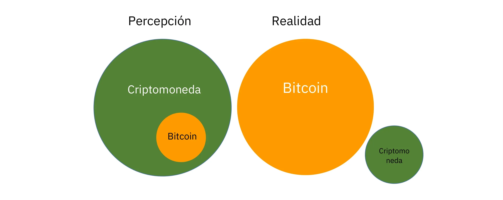

También cabe señalar que **una comunidad puede existir totalmente en línea**, ya sea un grupo de Telegram ("Bitcoin Londres"), un grupo de Facebook ("Bitcoin Berlín"), un servidor de Discord ("Bitcoin Madrid"), o incluso una lista de correo electrónico ("Bitcoin Francia").

En otras palabras, **una comunidad no necesita reuniones físicas para prosperar o lanzar proyectos. Su objetivo principal sigue siendo el mismo: compartir, construir y educar**.

### ¿Por qué crear un encuentro?

Como ya se ha dicho, **los encuentros suelen producirse una vez establecida la comunidad y sirven para complementarla**.

A medida que evoluciona el viaje de un bitcoiner, a menudo surge el deseo, o incluso la necesidad, de **conocer e interactuar en persona con otras personas** del mismo ecosistema. Esto puede venir de sentirse aislado o simplemente de no tener a nadie con quien hablar sobre Bitcoin en la vida cotidiana.

Los encuentros ofrecen una experiencia más personal y acogedora que las llamadas de audio o vídeo en línea. Ya sea **tomando una copa o comiendo**, crean espacios informales y acogedores donde la gente puede Exchange ideas de forma abierta y directa.

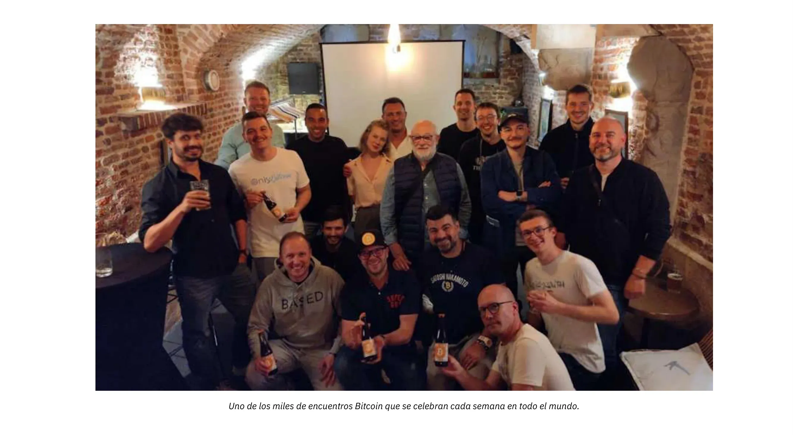

Los encuentros Bitcoin pueden servir para muchas cosas:

- Debatir temas técnicos o proyectos en curso
- Ayudar a los nuevos bitcoiners a sumergirse poco a poco en el mundo Bitcoin
- Anunciar nuevos proyectos o iniciativas
- Intercambio de materiales o libros
- Proyección de documentales en preestreno
- Organizar conferencias o talleres sobre temas específicos

Trataremos en detalle muchas de estas posibilidades en la parte 6/8 de este curso, titulada "[Ejemplos de proyectos e iniciativas](https://planb.academy/courses/1c643dc9-a15f-4f9e-93b6-cb3c58b4ee35/3213d87a-1998-5972-ab93-97a5769ba279)".

Aunque cada comunidad es libre de formarse sus propias opiniones, lanzar proyectos y experimentar a su manera, los encuentros resultan cada vez más **esenciales para el desarrollo de Bitcoin y para el crecimiento de los bitcoiners**. **Organizarlos requiere tiempo y esfuerzo**, por lo que este curso comparte la experiencia combinada de [unas sesenta comunidades de Bitcoin en Francia y Bélgica](https://btcmap.org/communities/map#2/5.24949/0.20000) **para ayudarte a construir y hacer crecer tu propia comunidad y tus propios encuentros de la mejor manera posible**.

## ¿Dónde debe crear su comunidad?

<chapterId>72da5285-5395-592d-ab62-303a0aef3d6d</chapterId>

La primera pregunta que hay que hacerse es: ¿dónde debe tener su comunidad su sede?

Esta decisión es crucial si quieres conservar la opción de organizar encuentros más adelante.

Si los miembros tienen que conducir dos horas para asistir a un evento, lo más probable es que la asistencia sea escasa. Por eso, elegir la **ubicación adecuada para tu comunidad y, por tanto, para tus futuras reuniones, tiene un gran impacto en su crecimiento**.

Algunos consejos para orientar su decisión:

1/ **Crea y haz crecer tu comunidad en una ciudad mediana o grande**. Esto hará que sea más fácil:

    - Encontrar lugares agradables para reuniones y proyectos (presentaciones, talleres, promoción de la adopción de Bitcoin, etc.);
    - Aumentar el sentimiento de implicación y pertenencia entre un mayor número de personas;
    - Mejore la accesibilidad al evento (transporte público, aparcamiento, etc.). Es muy recomendable elegir un lugar cercano al transporte público y al aparcamiento.

2/ **Elija un nombre relacionado con su ciudad**. Esto facilita que la gente se identifique con su comunidad. Ejemplos: Bitcoin París, Einundzwanzig Berlín, Satoshi Spritz Milán, etc.

3/ **Comprueba si ya existe un encuentro cerca de ti**.

Puedes consultar [btcmap.org](https://btcmap.org/communities/map#0/0/0/), que enumera la mayoría de comunidades y encuentros Bitcoin de todo el mundo.

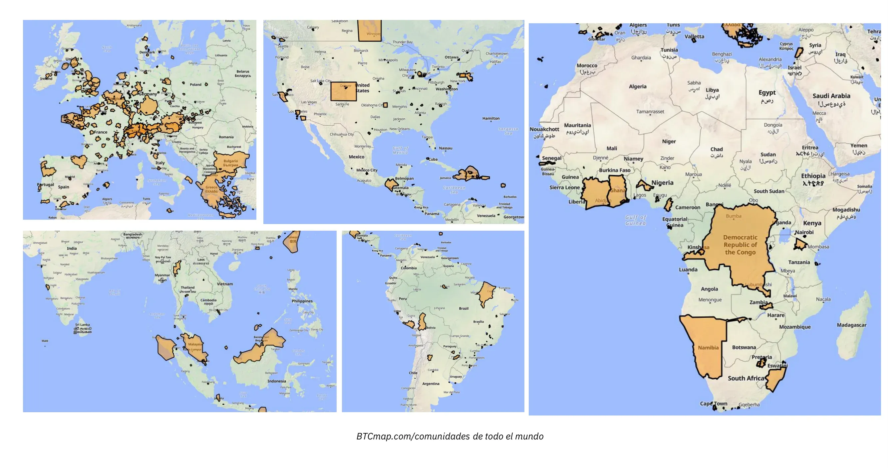

Después de investigar un poco, es posible que encuentres un grupo de encuentro o una comunidad en tu ciudad.

Bitcoin está descentralizado, por lo que, naturalmente, cualquiera es libre de hacer lo que quiera.

Sin embargo, **unir fuerzas suele tener más sentido que dividir comunidades cercanas y reducir el impacto de cada una**. Crear una nueva comunidad donde ya existe otra puede crear competencia sin querer.

En este sentido, una simple "regla empírica" puede ayudar: si no hay ninguna comunidad activa de Bitcoin a 30-45 minutos de donde vives, puede valer la pena empezar una nueva. Dicho esto, siempre eres libre de hacer lo que quieras.

Y, por supuesto, si una comunidad más antigua ha "evolucionado" en una dirección que ya no se ajusta a tus valores y no tienes tiempo ni motivación para "ponerles la píldora naranja", crear tu propia Fork siempre es una opción.

## ¿Qué objetivos deben guiar a su comunidad?

<chapterId>0aae1aa8-93ec-544a-ad88-22d32c619595</chapterId>

Una vez identificada la ciudad (o zona geográfica) de su comunidad, es hora de **definir lo que quiere conseguir**.

Estos objetivos pueden fijarse en el momento del lanzamiento o perfeccionarse más adelante, una vez que se hayan unido varios miembros y el grupo participe activamente.

He aquí algunos puntos para orientar su reflexión:

1/ **¿Por qué estoy creando esta comunidad como bitcoiner?** ¿Es para compartir conocimientos? ¿Educar a otros? ¿Aprender de compañeros con más experiencia? ¿Conocer gente con ideas afines? ¿Participar en el ecosistema Bitcoin? ¿Conectar con profesionales? ¿O simplemente tomar algo y hacer nuevos amigos?

Sus respuestas determinarán su posicionamiento y motivación.

Si su objetivo es **compartir conocimientos y educar a la gente sobre Bitcoin**, céntrese en **crear contenidos educativos** (artículos, podcasts, vídeos, presentaciones, folletos, etc.), ahorrando a otros incontables horas de investigación. Incluso puedes ir más allá **organizando talleres, presentaciones y conferencias**.

Si tu objetivo es simplemente conocer a otros bitcoiners y compartir experiencias, puedes adoptar un enfoque más relajado, como quedar para tomar algo.

De este modo, crearás vínculos sociales más fácilmente. Sin embargo, recuerda siempre que **beber cerveza no es el camino adecuado para construir el mundo del mañana**.

Por eso es esencial **establecer objetivos y proyectos concretos**.

2/ ¿Debo dar a mi comunidad una **dimensión física**? En caso afirmativo, ¿qué tipo de eventos debería organizar?

Tu primer evento será probablemente un meet-up. Su principal objetivo: reunir a los bitcoiners de tu zona.

Sin embargo, como veremos más adelante en [Ejemplos de proyectos e iniciativas](https://planb.academy/courses/1c643dc9-a15f-4f9e-93b6-cb3c58b4ee35/3213d87a-1998-5972-ab93-97a5769ba279), **un encuentro puede construirse de muchas maneras, con muchos objetivos:**

- Combine el trabajo en red con una presentación educativa sobre un concepto de Bitcoin;
- Organice una demostración profesional de las soluciones Bitcoin;
- Estrategias de debate para los comerciantes locales de naranjas;

etc.

Dependiendo de los temas (charlas técnicas o talleres prácticos), puede incluso tener sentido **organizar eventos adicionales** fuera de su reunión habitual.

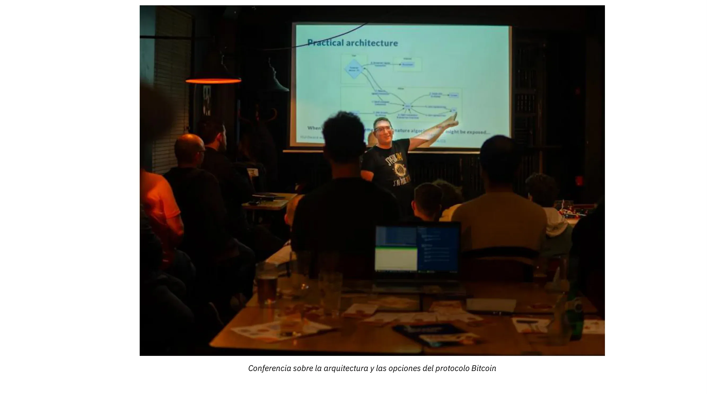

3/ ¿Cómo quiero que mi comunidad contribuya al ecosistema Bitcoin?

Esta es una pregunta más avanzada, pero merece la pena planteársela desde el principio.

Si tu visión es **crear una comunidad unida y motivada** centrada en llenar de naranja al mayor número de personas posible, entonces:

- Colabore con las comunidades existentes para acceder a información más amplia, recursos de código abierto y un valioso apoyo cuando sea necesario.
- Organice y delegue tareas dentro de su grupo para ampliar y escalar sus esfuerzos con eficacia.

**Fijar objetivos a corto, medio y largo plazo**

Una forma práctica de planificar es fijando objetivos para cada plazo:

- A corto plazo: crear una presencia en los medios sociales y establecer canales de comunicación con la comunidad.
- A medio plazo: crear recursos educativos (artículos, folletos, vídeos).
- A largo plazo: organizar reuniones físicas periódicas.

Una vez establecidos los encuentros, podrías aspirar a:

- A corto plazo: organizar talleres o presentaciones sobre temas específicos
- A medio plazo: realizar campañas de sensibilización o educación sobre Bitcoin
- A largo plazo: crear una asociación o colaboración formal con un bar que acepte Bitcoin como forma de pago.

Prepárate: **Construir una comunidad requiere esfuerzo**

Crear una comunidad no se hace de la noche a la mañana. Requiere tiempo, motivación y organización.

A veces, incluso puede resultar desalentador, sobre todo cuando no aparece nadie y te sientes el único que lleva esta misión sobre sus hombros.

Por eso **este curso está diseñado para compartir valiosos recursos y consejos, ayudando a las comunidades a crecer de forma eficaz y, con el tiempo, a ser autosuficientes.**.

# Diseñar una identidad comunitaria Bitcoin

<partId>da6673ad-bf49-5979-80a6-3f69cfb28046</partId>

## ¿Por qué y cómo crear su propia identidad?

<chapterId>b48a18cc-afdf-5216-802c-32647b5cd8a3</chapterId>

En esta fase, suponemos que:

- Ya sabes dónde se ubicará tu comunidad (o tu futura reunión periódica).
- Has fijado objetivos para distintos horizontes temporales, aunque aún no sean definitivos.

El siguiente paso en la construcción de su comunidad es **definir su identidad**, tanto su nombre como su estilo visual.

Esta sección ofrece tutoriales y soluciones de software para principiantes que le ayudarán a diseñar la identidad visual de su comunidad, incluso con conocimientos básicos.

**¿Por qué importa la identidad?**

La gente se siente más implicada y comprometida cuando puede identificarse con un grupo. Una identidad fuerte ayuda a su comunidad a destacar y fomenta el sentimiento de pertenencia.

Todo empieza por elegir un nombre, y cada país suele tener sus propias tendencias:

- Francia: La mayoría de las más de 60 comunidades locales utilizan nombres como "Bitcoin [CIUDAD]" o "[CIUDAD] Bitcoin". Sus grupos de Telegram suelen seguir este patrón "Bitcoin [CIUDAD] meetup".
- Alemania: La iniciativa Einundzwanzig (que significa "21") inspiró nombres como "Einundzwanzig [CIUDAD]".
- Italia: La red Satoshi Spritz utiliza nombres como Satoshi "Spritz [CIUDAD]".

**Cada comunidad tiene su propia identidad, vinculada a su ciudad natal, pero conectada a la identidad más amplia de su país**.

Su identidad visual: logotipo, colores, pancartas, es lo que la gente recordará y asociará con su grupo.

A la hora de crear cuentas en redes sociales y canales de comunicación, contar con un logotipo y un banner es una gran ventaja. No te preocupes, no necesitas conocimientos profesionales de diseño; existen herramientas gratuitas y fáciles de usar.

Un buen punto de partida es incorporar un punto de referencia o un símbolo de tu ciudad. En París, podría ser la Torre Eiffel. En Lille, el campanario o la ciudadela. En Nueva York, la Estatua de la Libertad. En Londres, el Big Ben, etc.

A partir de ahí, puede diseñar un logotipo sencillo o más detallado, según sus preferencias.

Para darle algunas ideas, he aquí algunos ejemplos de logotipos comunitarios franceses:

- En Marsella, el logotipo representa la basílica de Notre-Dame-de-la-Garde, que domina la ciudad:

- En Mónaco, se refiere a la roca monegasca:

- En Lille, el elegante logotipo representa la ciudadela de Vauban y su parque:

- En Saint-Malo destaca el armiño, emblema de la ciudad:

**Id más lejos si queréis**

Si te llega la inspiración, puedes ir más allá: crea un escudo, un lema o incluso una canción para tu comunidad. ¡Tu creatividad es el único límite!

## Crear un logotipo, un cartel y una pancarta

<chapterId>3470a31f-0190-5e87-8af0-6a00e79267ef</chapterId>

### Utilizar Canva

Puedes utilizar [Canva](https://www.canva.com/) para crear los distintos elementos visuales de tu comunidad.

Esta plataforma gratuita y fácil de usar es popular por su gran biblioteca de plantillas prediseñadas que puedes duplicar y personalizar en unos pocos clics.

**Creación de su logotipo**

En la página de inicio de Canva, busca logotipos prediseñados. Selecciona uno o varios que te inspiren, duplícalos y personalízalos para adaptarlos a tu comunidad.

Puede añadir un punto de referencia o emblema local al fondo (importe una foto o busque "Ilustraciones" o "Imágenes" en el menú de Elements) y, a continuación, superponer el logotipo o ₿ de Bitcoin, ajustando su color si es necesario.

**Creación de pancartas y carteles**

Para crear una pancarta o un cartel, busca en la biblioteca de Canva plantillas prediseñadas. Una vez que hayas duplicado una, modifica el texto y las fuentes, añade el logotipo de tu comunidad e importa cualquier foto utilizando marcos (busca "marco" en el menú Elements).

También puede utilizar el menú Diseños para explorar otros modelos que se ajusten a sus necesidades.

Para las miniaturas o banners de YouTube, basta con buscar esas plantillas, duplicarlas y personalizarlas como se desee.

En resumen, **las posibilidades son infinitas y están determinadas no sólo por sus necesidades, sino también por el estilo visual que desee crear** para su comunidad y sus reuniones/eventos

Para que te hagas una idea más clara, hemos incluido un videotutorial no exhaustivo que muestra algunas de estas posibilidades:

:::video id=d11ae0ed-eacd-4924-afd3-75aff95d2899:::

**Plantillas de ejemplo de Bitcoin Lille**

Aquí tienes plantillas de Canva listas para usar que puedes duplicar y adaptar a tu comunidad:

- **Cartel anunciador del encuentro** (para redes sociales e impresión en A4/A3): [enlace](https://www.canva.com/design/DAGBvBXFJ8A/92-j_toeLU8QbVAD0NwoAA/edit?utm_content=DAGBvBXFJ8A&utm_campaign=designshare&utm_medium=link2&utm_source=sharebutton)

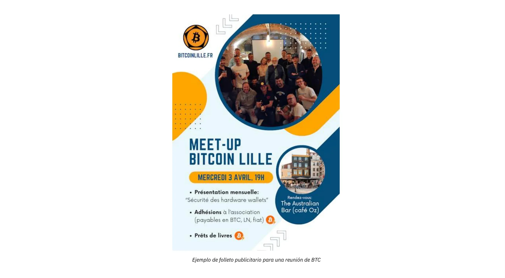

- **Cartel del evento** (para redes sociales e impresión A4/A3): [enlace](https://www.canva.com/design/DAGBvG3rNCc/oXtNR9pduRs22AqclG4O2g/edit?utm_content=DAGBvG3rNCc&utm_campaign=designshare&utm_medium=link2&utm_source=sharebutton)

- **banners para redes sociales**: [enlace](https://www.canva.com/design/DAGBvOXyNqw/iSJG9PbIQHgGWHz5PhlXSQ/edit?utm_content=DAGBvOXyNqw&utm_campaign=designshare&utm_medium=link2&utm_source=sharebutton)

- **Anuncio de concurso**: [enlace](https://www.canva.com/design/DAGBvIjuA_w/YzSUXzOmbNV9oCma9mluOw/edit?utm_content=DAGBvIjuA_w&utm_campaign=designshare&utm_medium=link2&utm_source=sharebutton)

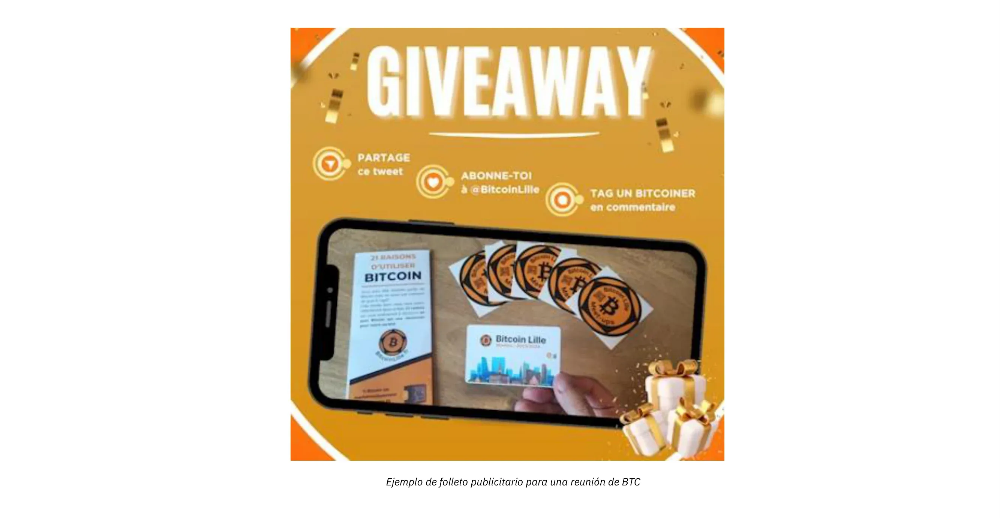

- **directrices de marca** de nuestra biblioteca, expuestas en A4 en los encuentros: [enlace](https://www.canva.com/design/DAGBvPqL7N4/LmUItfsysypRLSOFOzBXcQ/edit?utm_content=DAGBvPqL7N4&utm_campaign=designshare&utm_medium=link2&utm_source=sharebutton)

- **Presentación en PowerPoint** "Capítulo 2 - Entender las transacciones Bitcoin", por @ProfEduStream: [enlace](https://www.canva.com/design/DAFsEcnOro8/Mz9FYdTGhsvozZOe0Y9jtw/edit?utm_content=DAFsEcnOro8&utm_campaign=designshare&utm_medium=link2&utm_source=sharebutton)

- **folleto** "21 razones para utilizar Bitcoin", escrito por @ProfEduStream: [enlace](https://www.canva.com/design/DAFtAR1NauQ/ZDwl2CchIJ9Gpb36N6-7iw/edit?utm_content=DAFtAR1NauQ&utm_campaign=designshare&utm_medium=link2&utm_source=sharebutton)

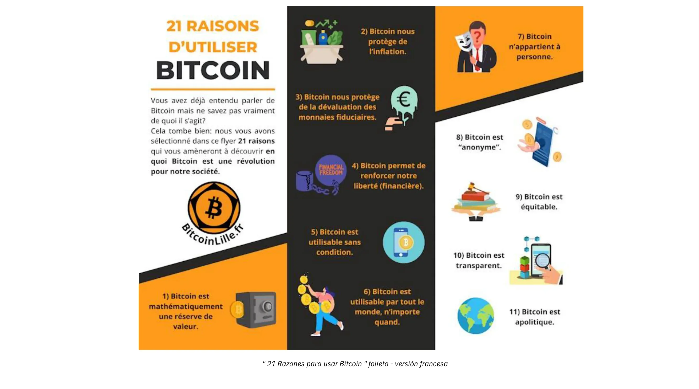

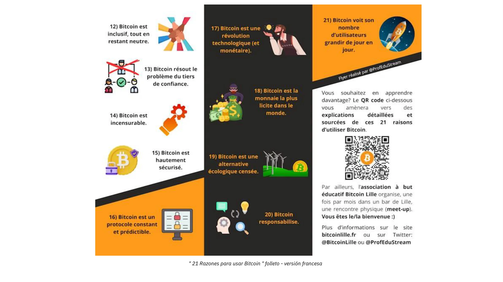

**Comparte tus creaciones**

Las posibilidades son infinitas, y tus diseños dependerán de tus objetivos e identidad visual. Considera compartir tus plantillas en código abierto, ahorra tiempo a otras comunidades Bitcoin que inevitablemente se enfrentarán a los mismos retos que tú. Al compartir, ayudas a acelerar el crecimiento de las comunidades Bitcoin en todas partes.

**Dimensiones recomendadas**

Cuando cree elementos visuales, compruebe siempre los requisitos de tamaño de cada plataforma:

| Platform | Logo | Banner | Poster / Image
| -------- | -------- | -------- | -------- |
| Telegram     | 512 x 512     | N/A     | N/A     |
| Signal     | N/A     | N/A     | N/A     |
| Twitter     | 400 x 400     | 1500 x 500     | 1200 x 628     |
| Meet-up     | N/A     | N/A     | N/A     |
| Discord     | 512 x 512     | 960 x 540     | N/A     |
| Facebook     | 512 x 512     | 851 x 315     | 960 x 720     |

Suelen ser tallas adecuadas:

Logotipos: 512 x 512 píxeles

Banners: Varían en función de la aplicación o el sitio

Carteles: A4 es el formato de impresión estándar

### Utilizar la inteligencia artificial

Aunque Canva ofrece una amplia gama de herramientas para crear logotipos, carteles, pancartas y folletos, no es la única opción. Si te sientes más cómodo con otro software (como Photoshop o Illustrator), no dudes en usar lo que mejor te funcione.

Dicho esto, tanto si se trata de diseñar el logotipo de una comunidad como de mejorar carteles, presentaciones o folletos, **la inteligencia artificial puede ser un poderoso aliado para crear elementos visuales únicos y atractivos**.

Para ello existen varias IA. Por ejemplo

- [midjourney](https://docs.midjourney.com/docs/quick-start) (de pago);
- [leonardo](https://leonardo.ai/) (gratuito, cuenta limitada);
- [copilot](https://copilot.microsoft.com/) (gratis, cuenta limitada);
- [DALL-E](https://www.dall-efree.com/) (de pago).

Recientemente han aparecido muchas otras herramientas de IA, por lo que esta lista dista mucho de ser exhaustiva.

**Ejemplo: Creación de un logotipo futurista para la Bitcoin de Londres**

Si quieres diseñar un logotipo futurista para una reunión de "Bitcoin Londres", puedes pedírselo a Copilot:

- [ ] *Prompt: Crea un logotipo de Bitcoin con el Puente de Londres y el Big Ben de fondo. Futurista* - [Enlace](https://copilot.microsoft.com/images/create/un-logo-Bitcoin-futuriste-avec-en-arric3a8re-plan-le-/1-6612ba1758df4384bc33c4bca00ab45b?FORM=SYDBIC)

Si los cuatro primeros resultados no son suficientemente realistas, afine su petición:

- [ ] *Prompt: Hacer la 4ª mucho más realista* - [Link](https://copilot.microsoft.com/images/create/un-logo-Bitcoin-futuriste-avec-en-arric3a8re-plan-le-/1-6612ba64b72d4cea9830ab7eb844f785?FORM=SYDBIC)

El último resultado ha sido estupendo

**Ejemplo: Creación de un logotipo sencillo de estilo británico**

Para un aspecto más limpio, como para una pegatina:

- [ ] *Prompt: Crear el logo del "London Bitcoin Meetup" con un estilo británico y limpio* - [Link](https://copilot.microsoft.com/images/create/logo-for-27londres-Bitcoin-meetup27-with-a-british-a/1-6612bb9451924859a6c34b350b3a6ebc?FORM=SYDBIC)

El resultado es genial

**Consejos para trabajar con AI**

- Tenga paciencia: Puede que la IA no produzca exactamente lo que imaginas al primer intento.

- Utilice indicaciones precisas: Cuanto más claras y detalladas sean las instrucciones, mejores serán los resultados.

- Pide ayuda: Si no estás satisfecho, acude a alguien con experiencia en diseño gráfico o herramientas de IA, muchos Bitcoiners te ayudarán encantados, a veces incluso gratis o por unos pocos Sats.

# Creación de canales de comunicación para su comunidad Bitcoin

<partId>fc588298-6876-554c-bd57-55d182464878</partId>

## ¿Qué canales de comunicación elegir?

<chapterId>b4f4eef6-1035-5290-848a-2b7f9391c77a</chapterId>

Como ya se ha dicho, los canales de comunicación de una comunidad pueden variar en función de sus motivaciones y hábitos.

Por ejemplo, **en Francia, Alemania e Italia, Telegram y Twitter son las plataformas dominantes**, y se han convertido en el "estándar" para las comunidades Bitcoin.

En cambio, en la República Checa, muchas comunidades utilizan **Matrix**, un protocolo seguro de mensajería instantánea, en lugar de Telegram.

Consejo: Antes de elegir tus canales, **mira lo que hacen las comunidades cercanas**. Utiliza el mapa [btcmap.org](https://btcmap.org/communities/map#0/0/0/) para ver qué plataformas son más populares en tu región.

Por ejemplo, las comunidades suizas utilizan principalmente Telegram, Twitter y su propio sitio web:

**Canales recomendados para las comunidades francófonas**

- Telegram: La herramienta de comunicación número 1, más del 90% de los encuentros franceses la utilizan.

- Twitter (X): La principal red social utilizada por los bitcoiners de todo el mundo. Se utiliza en el 70% de los encuentros franceses. Es ideal para llegar a los bitcoiners.

- Meetup.com: De pago pero muy utilizado (por ~30% de los meet-ups franceses y casi todos los canadienses) para aumentar la visibilidad fuera del ecosistema Bitcoin.

- Otras opciones: el ~30% también tiene un sitio web; el ~10% gestiona servidores Discord o cuentas NOSTR.

También se pueden utilizar otras plataformas como Matrix, Keet, Signal, Facebook, Instagram y LinkedIn. Ten cuidado, cuantos más canales gestiones, más tiempo dedicarás a moderarlos, publicarlos y mantenerlos activos.

Por tanto, quien desee lanzar una comunidad en Francia haría bien en empezar por crear:

- un grupo de Telegram;
- una cuenta de Twitter.

A medida que tu comunidad crezca, puedes añadir más plataformas y delegar la moderación en miembros de confianza.

## Crear y configurar un canal, grupo o supergrupo de Telegram

<chapterId>d13714ce-8f08-53e9-bedd-b6a3aaac5dad</chapterId>

Antes de crear el espacio de comunicación de tu comunidad en Telegram, es importante conocer la diferencia entre:

- un canal de Telegram;
- un grupo de Telegram;
- un supergrupo de Telegram.

Se recomienda encarecidamente empezar con un grupo de Telegram.

Si es necesario, puedes convertirlo posteriormente en un Supergrupo.

Para los tutoriales a continuación, originalmente utilizamos el APK "Telegram+", que permite una configuración más avanzada. Sin embargo, no la necesitas necesariamente, ya que la app oficial de Telegram es suficiente para crear y gestionar grupos, incluso a través del teléfono:

:::video id=b1da7cb4-5fb1-4a41-a1d4-bd90686826a9:::

### Crear un canal de Telegram

Si quieres crear un lugar en el que tus miembros puedan hablar entre ellos directamente, responderse, etc., entonces quizás quieras crear un grupo de Telegram, ¡y no un canal de Telegram!

Vaya directamente a la siguiente sección, titulada [Crear un grupo de Telegram](https://planb.academy/courses/1c643dc9-a15f-4f9e-93b6-cb3c58b4ee35/d13714ce-8f08-53e9-bedd-b6a3aaac5dad).

De hecho, **un canal de Telegram es más bien una herramienta de transmisión unidireccional para los administradores**. Los miembros no pueden chatear libremente, solo pueden reaccionar con emojis (o dejar comentarios en hilos separados, lo que fragmenta las conversaciones).

**Dado que las comunidades necesitan interacción y colaboración, no se recomienda un canal de Telegram** si tu objetivo es crear relaciones y compartir conocimientos.

Tutorial para crear un canal de Telegram:

:::video id=98be4709-d221-4030-8c31-e10113482515:::

### Crear un grupo de Telegram

Por otro lado, **un Grupo de Telegram es ideal para comunidades**: Al igual que las aplicaciones de mensajería como Messenger o WhatsApp, los miembros pueden chatear y responderse en una única conversación compartida.

Qué puedes hacer como administrador:

- Publica y fija mensajes importantes.
- Crea **encuestas** (útiles para decidir las fechas de reunión cuando tu comunidad es nueva).
- crear **enlace de invitación personalizado** (Sólo si el grupo es "público" y no "privado", que se define en la configuración. También es útil tener tu propio enlace de invitación de Telegram, como: t.me/Bitcoin[CITY]);
- Gestione los permisos, las funciones y la moderación de los miembros.
- Añade una foto de perfil (el logotipo de tu comunidad) y actualiza el nombre del grupo.

Tutorial para crear un grupo de Telegram:

:::video id=3d4792a7-1345-475b-93b1-b3a3945fb567:::

Nota: Este tutorial se hizo usando Telegram+, pero puedes hacerlo todo directamente desde la app móvil estándar de Telegram.

### Crear un supergrupo de Telegram

¿Por qué un supergrupo?

A medida que tu grupo de Telegram crece hasta tener cientos de miembros, las conversaciones pueden volverse caóticas. Esto a menudo hace que los miembros se pierdan anuncios importantes, como la fecha de la próxima reunión.

Existen varias soluciones:

1. **Ancle los mensajes importantes** para que todos los miembros reciban una notificación (pulse una vez con el dedo sobre el mensaje en cuestión y, a continuación, seleccione "Anclar");

2. Considere la posibilidad de utilizar **Discord** para múltiples canales de comunicación, cada uno de los cuales los usuarios pueden silenciar si es necesario.

3. **Convierte tu grupo de Telegram en un Supergrupo**.

¿Qué es un supergrupo de Telegram?

Un Supergrupo es esencialmente un grupo de Telegram con temas (subcanales) dentro de él.

Ejemplos de temas:

- "Información importante": sólo actualizaciones clave y anuncios de eventos.
- "General": para todos los debates de los miembros.
- Temas específicos: por ejemplo, Mining, desarrollo de proyectos, próximas conferencias.

Consejo: Adapte los temas a las necesidades de su comunidad. Ejemplo: El Bitcoin Meet-up de Abiyán utiliza con éxito este formato.

Ten en cuenta que **los supergrupos de Telegram pueden ser un poco complicados de usar para algunos miembros**. Por ejemplo, no todo el mundo sabe **cómo acceder a los diferentes temas** (sólo tienen que tocar el logo del grupo en el menú principal de Telegram para ver la lista completa de temas). Enviar una rápida captura de pantalla puede ayudar a aclarar cualquier confusión.

No hay una regla estricta sobre cuándo cambiar de un grupo regular de Telegram a un supergrupo, realmente depende de las necesidades de tus miembros. La buena noticia es que puedes cambiar fácilmente de un grupo a otro: simplemente crea un tema para convertirlo en un supergrupo o elimina todos los temas excepto "General" para volver a un grupo normal.

Tutorial para crear un supergrupo de Telegram:

:::video id=f78800ae-d8ca-479a-b913-99abd9916bff:::

Nota rápida: como se mencionó anteriormente, el tutorial anterior se hizo en un ordenador utilizando el APK de "Telegram+". Hoy, sin embargo, crear un supergrupo de Telegram en tu teléfono es sencillo.

Sólo tienes que crear un grupo de Telegram, ir a su configuración y pulsar el botón "Temas" para añadir temas. Una vez guardados, verás una lista de temas que podrás editar a tu gusto.

Por lo tanto, ya no hay necesidad de descargar "Telegram+", a menos que quieras acceder a una configuración de privacidad más avanzada para tu supergrupo.

## Crear tu grupo o supergrupo de Telegram

<chapterId>35e674b3-5924-50b0-98f1-83a56c9a186d</chapterId>

Ahora que tu grupo (o supergrupo) de Telegram está en marcha, es hora de **configurar los permisos y configurar la moderación**.

Cada comunidad es libre de elegir su propio enfoque, pero la experiencia demuestra que es **mejor limitar ciertos permisos de los miembros**:

- Enviar una encuesta;
- Envío de archivos (para evitar posibles virus);
- Envío de mensajes de voz;
- Añadir usuarios (ayuda a prevenir invasiones de bots);
- Fijación de mensajes;
- Editar la información del grupo.

Es muy recomendable **escribir una descripción clara de tu quedada** cuando crees tu grupo o supergrupo de Telegram, ya que es lo primero que verán los miembros potenciales. Por ejemplo:

> Bienvenido al Telegram de @Bitcoin [CIUDAD] 🔥
>

> Organizamos una quedada todos los primeros miércoles de mes en el bar [BAR_NAME], en [CITY] 🍻
>

> Echa un vistazo a nuestras otras redes sociales: [LINK] 🌐

En este ejemplo, los administradores de Bitcoin Lille han personalizado su enlace público de Telegram para compartirlo más fácilmente.

En "Configuración del grupo", puede ser conveniente **activar "Aprobar nuevos miembros "**.

Algunos grupos de Telegram de la Bitcoin han sido blanco de miles de cuentas falsas diseñadas para enviar spam o perturbar a la comunidad.

**Activar la aprobación de los miembros puede salvar a tu grupo de un ataque de spam.**

En la sección Administradores, también puede activar una función "Antispam agresivo" para eliminar automáticamente los mensajes sospechosos.

No siempre es necesario, pero puede añadir un Layer adicional de protección.

## Cómo añadir un bot multifunción a tu grupo de Telegram

<chapterId>c61f69cc-15ec-53f1-8c02-1cea55def09e</chapterId>

**Otra opción para configurar y asegurar tu grupo o supergrupo de Telegram es añadir un bot multifunción**. Esto te permite ampliar significativamente las funciones y capacidades de moderación de tu grupo.

Utilizando **el bot [@GroupHelpBot](https://telegram.me/grouphelpbot)**, las opciones más útiles son:

- Un comando **rules** (/rules) para mostrar las directrices de tu comunidad;
- **Protección antispam** para filtrar mensajes y cuentas sospechosas;
- **Mensajes automáticos de bienvenida** personalizables para los nuevos miembros (con borrado automático opcional transcurridos unos minutos)
- **Protección anti-inundación** para evitar el spam en los mensajes
- Un comando **@administrador** para llegar rápidamente a los administradores de grupo
- **Normas de bloqueo** de contenidos no deseados
- Un **comando de enlace de grupo** (/link)
- Comando **gestión de permisos**
- **Eliminación automática** de determinados tipos de mensajes
- **Bloqueo de bots** y **bloqueo de entradas y salidas** para mantener la seguridad de su grupo
- Enumera las **redes sociales de tu comunidad** (/redes)
- Y mucho más...

Hay disponibles innumerables funciones adicionales.

Consejo profesional: **No restrinjas demasiado la conversación**.

Tutorial para añadir un bot multifunción a un grupo o supergrupo de Telegram:

:::video id=cdbf82d6-3530-45c4-90de-593f100863bb:::

(Nota: Todo este proceso se puede hacer ahora directamente desde tu teléfono. Ya no es necesaria la app Telegram+)

## Crear un servidor Discord

<chapterId>eef2a965-4c24-5f3a-8013-72cc7d315314</chapterId>

Cuando tu grupo de Telegram crece demasiado, transformarlo en un supergrupo de Telegram puede ayudar a organizar las discusiones.

Sin embargo, como ya se ha mencionado, la **complejidad añadida y el aumento de temas y mensajes pueden hacer que algunos miembros activos pierdan interés**.

¿Por qué discordia?

**Discord es una alternativa** a un supergrupo de Telegram, ya que permite a los usuarios **crear salas específicas de chat de texto y voz** y permite a los miembros silenciar los canales que no les interesen.

Por supuesto, gestionar tanto Telegram como Discord requiere un poco más de tiempo, especialmente durante la configuración y el lanzamiento.

Para facilitarte las cosas, **compartimos un [servidor Discord que puedes duplicar y personalizar](https://discord.com/template/bDY4eXXJk2C8)**:

:::video id=e647458a-a21e-44e0-bd03-20b82a871777:::

Cuando está bien diseñado, un servidor Discord puede ser un activo real para tu comunidad. Muchos Bitcoiners ya usan **Discord** a diario, y poder seguir conversaciones de Telegram directamente dentro de Discord (y viceversa) puede ahorrar mucho tiempo a todo el mundo.

Para sincronizar ambas plataformas, existe un bot de código abierto llamado [TediCross](https://github.com/TediCross/TediCross). Su propósito es simple: reenviar automáticamente mensajes de un canal de texto de Discord a un grupo de Telegram (o tema en un supergrupo), y viceversa.

Sin embargo, ten en cuenta que no es el más fácil de instalar. Tendrás que mantener un símbolo del sistema (CMD) ejecutándose en tu ordenador para que el bot funcione, y pueden producirse errores ocasionales. Afortunadamente, solucionarlo es sencillo: basta con reiniciar el bot y, la mayoría de las veces, todo vuelve a la normalidad.

Para ahorrarte tiempo, aquí tienes un tutorial sobre cómo añadir este bot multifunción a un grupo o supergrupo de Telegram:

:::video id=6a0283f6-6d6c-4e81-8b2f-644b33c52fe6:::

## Considerar canales de comunicación alternativos, privados y más seguros

<chapterId>29d0aad6-0612-5dd0-bcef-7337eaf4fefc</chapterId>

Como ya se ha comentado, Twitter y Telegram son las herramientas de comunicación más utilizadas por las comunidades de Bitcoin en Europa (si no en todo el mundo).

Sin embargo, Telegram no es precisamente conocida por ser la app de mensajería más segura o centrada en la privacidad, y Twitter, ahora X, es propiedad de una de las corporaciones más libres del planeta.

Por eso, una vez que se han establecido los canales principales y las cosas funcionan bien, puede merecer la pena dedicar tiempo a explorar otras opciones.

En los próximos meses, este curso y la plataforma planb.network ofrecerán tutoriales sobre cómo utilizar protocolos alternativos como **Simplex y Element**: herramientas de comunicación descentralizadas, cifradas y altamente personalizables.

**¿Por qué molestarse en buscar estas opciones?**

Porque, al igual que la red social NOSTR, no sólo proporcionan una mayor privacidad, sino también una salvaguarda contra la censura o el cierre arbitrario de tu grupo de Telegram.

Y realmente, ¿qué podría estar más en línea con el espíritu de Bitcoin que ser resistente a la censura y resistente por diseño?

# Lanza tus redes sociales

<partId>8ebf8cd7-9248-543f-bc27-4ec4cc03f9cf</partId>

## La importancia de la visibilidad para hacer crecer su comunidad Bitcoin

<chapterId>b20f12e4-c5de-5f02-80c7-b7fc6cadd3ac</chapterId>

Así que tu comunidad está en marcha. Has creado tu espacio en Telegram o Matrix... pero por ahora, eres el único que está allí. **¡Es hora de que la gente sepa que existes!**

Es muy sencillo: si nadie puede acceder a tu grupo y ver cuándo se celebra la próxima reunión, no harás más que publicar en el vacío. Por eso las redes sociales, y algunas plataformas específicas que veremos más adelante, son tan importantes para construir tu comunidad.

Twitter (X) se ha convertido casi en sinónimo de conversación sobre Bitcoin en Internet. No es perfecto, ni mucho menos, pero actualmente es donde se reúne gran parte de la comunidad. Se recomienda encarecidamente crear una cuenta allí.

Para adelantarse a posibles censuras o restricciones, algunas comunidades abren también un perfil NOSTR.

Eso es lo que ha hecho el colectivo FREE Madeira.

Por supuesto, otras plataformas también pueden ser útiles. Facebook (ya sea con un grupo o una página), o incluso LinkedIn.

Dicho esto, ten en cuenta que **cuantos más canales de comunicación y redes sociales gestiones, más tiempo requerirá**. A menudo es mejor centrarse **en las más relevantes**, Twitter (y NOSTR) son grandes opciones para empezar.

## Crear un perfil de Twitter

<chapterId>c8d73097-8eba-5530-918c-221002954110</chapterId>

Twitter es muy fácil de usar y, para mejorar tu privacidad, tendrás que ajustar algunas opciones.

**Al crear una nueva cuenta de Twitter, hay que introducir cuatro datos esenciales:**:

1/ **la @ de Twitter**, que define tu identidad y facilita que te encuentren. Si el nombre de tu comunidad es "Bitcoin[CIUDAD]", lo apropiado es elegir "@Bitcoin[CIUDAD]";

2/ **el logotipo y la pancarta** que hayas creado para tu comunidad o reunión (consulta la sección [Crear un logotipo, un cartel y una pancarta](https://planb.academy/courses/1c643dc9-a15f-4f9e-93b6-cb3c58b4ee35/3470a31f-0190-5e87-8af0-6a00e79267ef));

3/ **la descripción**, que le permite compartir información clave sobre su comunidad en unos cientos de caracteres. Por ejemplo:

> Cuenta oficial de la comunidad Bitcoin [CIUDAD] #BTC | Meet-ups cada 1er miércoles de mes en [BAR_NAME] en [CIUDAD] 🍻 | Únete a nosotros en Telegram 🔽

4/ Debajo de esta descripción, es posible **insertar un enlace**. Esto puede llevar a los usuarios a una página de "medios sociales" en el sitio web de tu comunidad, o a tu canal de Telegram. Tú decides qué quieres destacar.

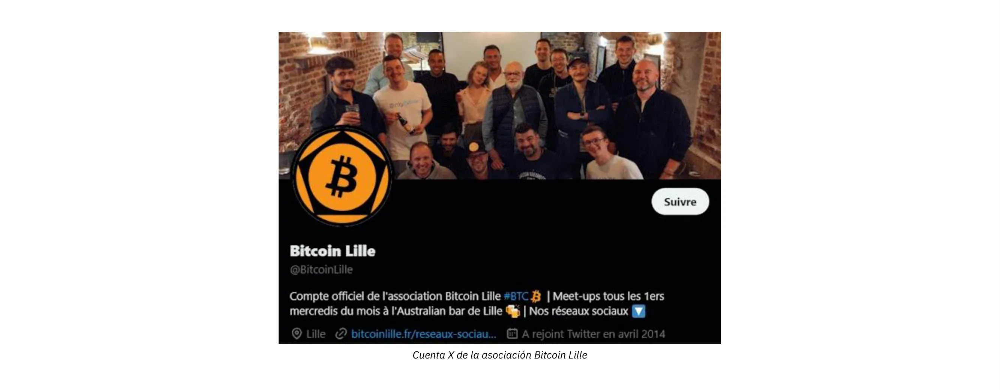

Además, **vale la pena ajustar algunos parámetros de privacidad**:

- deja tu cuenta de Twitter en modo "público" (publicaciones visibles para cualquiera);
- permite que todo el mundo te encuentre;
- desactivar el seguimiento de la ubicación y el intercambio de datos con otras entidades (en la configuración de privacidad).

Para cada evento, es probable que utilices Twitter para compartir información útil. Pero, como en la mayoría de las redes sociales, **la visibilidad lo es todo**.

Para ahorrarle un tiempo considerable, nos hemos tomado la molestia de estudiar [el algoritmo de clasificación de código abierto de Twitter](https://github.com/twitter).

Estos son los **aspectos clave en los que debe centrarse para aumentar su visibilidad**:

- Consejos generales:
    - Tuitea en el idioma de tu cuenta o en inglés: tuitear en otros idiomas puede reducir mucho tu visibilidad;
    - Cíñete a tu nicho, comparte sólo contenido relacionado con el enfoque de tu cuenta; los tweets fuera de tema son penalizados por el algoritmo;
    - Intenta tuitear de 1 a 2 veces al día;
    - Publica en horas punta: Los jueves o viernes entre las 8 y las 10 de la mañana suelen dar mejores resultados (compruébalo en tu cuenta: Twitter Analytics).

- Al escribir un tweet:
    - añade una foto (o incluso un vídeo);
    - Utilice sólo un hashtag (normalmente #Bitcoin es el más relevante. Si lo considera oportuno, puede añadir un hashtag de tendencia relacionado con el área de su cuenta);
    - Anime a su comunidad a interactuar:
        - Como = peso 0,5
        - Retweet = peso 1
- Respuesta = peso 27 (!!)
- Responde a las personas que responden a tus tweets (¡¡peso de 75!!);
    - Evita colocar enlaces en el tuit principal: en su lugar, añádelos en el primer comentario.;
    - Escriba las palabras completas, evite las abreviaturas.

- Otros consejos:
    - Tuitea sobre los temas de moda, siempre que coincidan con el área de especialización de tu cuenta;
    - Vuelve a publicar los tweets que mejor funcionan;
    - Realiza encuestas ocasionalmente;
    - Escriba hilos cuando sea posible;
    - Anima a tu comunidad a visitar tu perfil y a seguirte.

Además, **puedes anclar un tuit o hilo a tu perfil de Twitter para darle la máxima visibilidad**, como hace la comunidad Bitcoin Witsand de Sudáfrica.

Ten en cuenta también que es posible permanecer conectado a dos cuentas de Twitter al mismo tiempo, tanto en el teléfono como en el ordenador. Esto es muy útil si quieres cambiar fácilmente entre tu cuenta personal y la de la comunidad.

Sólo ten cuidado... ¡publicar accidentalmente una foto de la fiesta desde la cuenta de la comunidad puede ocurrir más rápido de lo que crees!

Por último, aunque tu nombre de usuario "@Bitcoin[CITY]" sea único y ahora tuyo, es inteligente anticiparse a las cuentas falsas o de imitadores. Considera también la posibilidad de registrarte:

- @Bitcoin_[CIUDAD]
- @[CIUDAD]Bitcoin
- @[CIUDAD]_Bitcoin

De este modo, reducirás en gran medida las posibilidades de que alguien suplante la identidad de tu comunidad.

Tutorial para crear una cuenta de Twitter:

:::video id=4648976f-41ec-499a-b7ec-a53e796f71b4:::

## Cada vez más cerca de las reuniones vecinas

<chapterId>12a21c3b-235a-5292-8209-67bf60f61e49</chapterId>

Ahora que sus canales de comunicación y redes sociales están configurados y reflejan la identidad visual de su comunidad, es hora de empezar a seguir a las personas adecuadas.

En Twitter, empieza por seguir las cuentas clave que promueven la Bitcoin en todo el mundo, como [@Bitcoin](https://twitter.com/Bitcoin) y [@planb_network](https://twitter.com/planb_network), así como iniciativas como [@FBCEglobal](https://twitter.com/FBCEglobal). También puedes retuitear el famoso tuit de [@halfin](https://twitter.com/halfin) "Running Bitcoin" del 11 de enero de 2009. Y lo que es más importante, **sigue las cuentas de las comunidades y encuentros Bitcoin de tu propio país**.

Esto crea **oportunidades para seguirse unos a otros, etiquetarse mutuamente y aumentar la visibilidad colectiva**. Ya es una práctica común entre las ~50 comunidades Bitcoin de Francia, las iniciativas "Satoshi Spritz" de Italia y los grupos "Einundzwanzig" de Alemania.

Aunque a algunos les parezca trivial, **seguir las cuentas de las comunidades e iniciativas locales puede dar lugar a colaboraciones o incluso asociaciones**. Por ejemplo, las comunidades Bitcoin de Lieja y Bitcoin de Lille (y también Bitcoin de Aix y Bitcoin de Marsella) conectaron de este modo, lo que les llevó a organizar conjuntamente un encuentro anual.

Las comidas del **Círculo del Coin** son otro buen ejemplo.

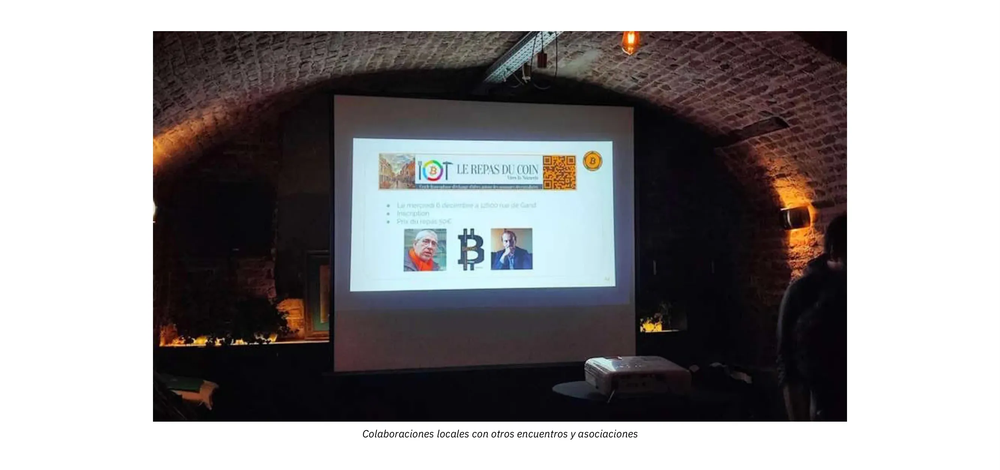

En Francia, también puede ser pertinente **seguir las iniciativas como [@KonsensusFR](https://twitter.com/KonsensusFR), [@bitcoinpointfr](https://twitter.com/bitcoinpointfr), [@DecouvreBitcoin](https://twitter.com/DecouvreBitcoin) y [@btcmap](https://twitter.com/btcmap)**. Por supuesto, se trata sólo de sugerencias, y cada comunidad es libre de hacer lo que desee, en total descentralización y autonomía.

Como ya se ha dicho, el objetivo de seguirse unos a otros es construir una visibilidad mutua. Cuanto más promuevas tu comunidad y las de tu región/país en las redes sociales, más hablará la gente de ti. Cuanta más gente hable de ti, más probabilidades habrá de que asistan a tus actos.

Por tanto, hacer "me gusta" y retuitear publicaciones de otras comunidades puede ayudar mucho a su desarrollo... y al tuyo.

También podrías sugerir que **los organizadores de encuentros y los bitcoiners que dirigen comunidades se reúnan dos o tres veces al año por videoconferencia para revisar el progreso de los proyectos nacionales y las comunidades relacionadas. Esto también puede tener lugar durante eventos presenciales.**

El objetivo es sencillo: recabar la opinión de todos, debatir la evolución de las comunidades, compartir ideas y proyectos de éxito y proponer soluciones cuando sea necesario. Después se puede compartir un resumen escrito de la reunión con los organizadores comunitarios de tu país que no hayan podido asistir.

## Btcmap.org

<chapterId>365f43d4-7b2c-5961-a184-157b8c1a0116</chapterId>

En esta fase, tu comunidad ya está en marcha. Sólo queda acoger a más personas interesadas y ayudarla a crecer.

Pero no puedes avanzar sin saber que **existen plataformas donde los bitcoiners pueden encontrar comunidades y meetups cerca de ellos**. Por eso es importante dedicar unos minutos a solicitar un listado en estos sitios.

Entre ellas figuran:

- [Btcmap.org](https://btcmap.org/)**, un sitio web con dos mapas actualizados diariamente: **[el mapa mundial de negocios que aceptan Bitcoin](https://btcmap.org/map)** y **[el mapa mundial de comunidades](https://btcmap.org/communities/map)**. Muchos bitcoiners consultan estos mapas con regularidad, tanto si viajan como si hacen su vida cotidiana, para conocer gente nueva o encontrar lugares donde gastar su Sats. Btcmap es la referencia mundial, y listar tu comunidad allí es esencial para la visibilidad.**
- [BitcoinerEvents](https://www.bitcoinerevents.com/), un sitio web creado por bitcoiners, para bitcoiners. **Te permite publicar los próximos eventos de tu comunidad**. En Francia, sin embargo, todavía no se utiliza mucho.
- según el país, puede haber otras iniciativas locales. En Francia, por ejemplo, existe [Bitcoin.fr](https://Bitcoin.fr/events/categories/evenements/), que **enumera docenas de eventos de la Bitcoin cada mes**. Así que si aún no les has seguido en Twitter o no te has puesto en contacto con ellos para compartir información sobre tu comunidad y eventos, ¡ahora es el momento! **Para ayudar a mantener actualizado el calendario francés de eventos, sería estupendo que todas las comunidades francesas de Bitcoin adquirieran el hábito de:**
    - mencionando @bitcoinpointfr en Twitter para cada nuevo evento comunitario
    - fijando nuevos anuncios de eventos en su grupo de Telegram.

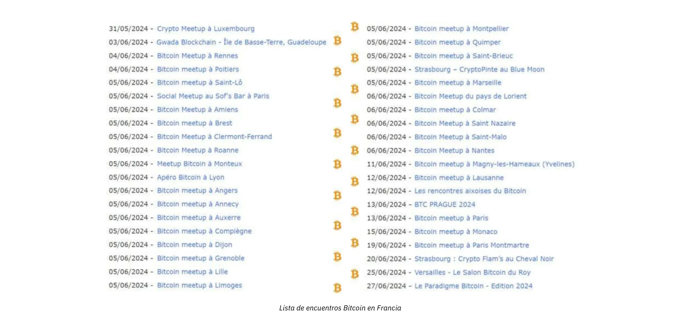

Otras plataformas también pueden aumentar tu visibilidad. **[Meetup](https://www.meetup.com/)** es una de ellas, y se trata de un sitio web (y una aplicación para el teléfono) donde puedes crear un evento y encontrar a otras personas cerca.

Cuesta unos 8 euros al mes (o unos 90 euros al año), lo que puede resultar caro para una comunidad pequeña y desestructurada. Dicho esto, Meetup se utiliza mucho en algunos países, especialmente en Canadá y Estados Unidos, y es útil para gestionar las inscripciones.

Del mismo modo, **[Orangepillapp](https://www.orangepillapp.com/)** es una aplicación móvil de pago (50.000 Sats/año o 200.000 Sats para acceso de por vida) que ayuda a los bitcoiners a conocerse.

Aunque estas dos últimas plataformas pueden ayudar a aumentar la visibilidad, no se recomiendan a la hora de lanzar una comunidad, simplemente porque no son gratuitas.

**Empezar con un listado en [btcmap.org](https://btcmap.org/), [BitcoinerEvents](https://www.bitcoinerevents.com/) y para las comunidades francesas, en [Bitcoin.fr](https://Bitcoin.fr) es más que suficiente**.

¡Enhorabuena! Tu **comunidad está creada**, tus **visuales están listos**, tus **objetivos fijados**, tus **canales de comunicación en marcha**, tus **redes sociales lanzadas** y tu **estrategia de visibilidad decidida**.

Una vez que un pequeño grupo de bitcoiners se haya unido a ti, es hora de dar el siguiente paso: organizar tu primer encuentro Bitcoin.

# Organizar un encuentro Bitcoin

<partId>c009d2a6-40ce-583b-bd24-fdfd1fea262e</partId>

## ¿Por qué organizar reuniones periódicas con su comunidad?

<chapterId>ed8e471c-3b99-57e2-a042-2d4e8a40b137</chapterId>

Ahora que ya se han puesto en marcha las redes sociales y los canales de comunicación de su comunidad, es el momento de hacer sentir su presencia en estas plataformas. Anima a los nuevos miembros a presentarse y a unirse poco a poco a la conversación.

Esto te liberará tiempo, que podrías utilizar para pensar en crear algún tipo de reunión. Esto será aún más relevante cuando empieces a sentir un verdadero entusiasmo dentro de tu comunidad.

Como ya se ha dicho, **una reunión de Bitcoin puede considerarse el siguiente "nivel" de una comunidad**. Por un lado, permite que los miembros se conozcan en persona y, por otro, ayuda a educar a los recién llegados interesados en este ecosistema.

Un acontecimiento de este tipo te permite, a tu propia escala, **crear un murmullo en torno a Bitcoin** en tu ciudad, que puede crecer con el tiempo a medida que tu comunidad emprenda proyectos.

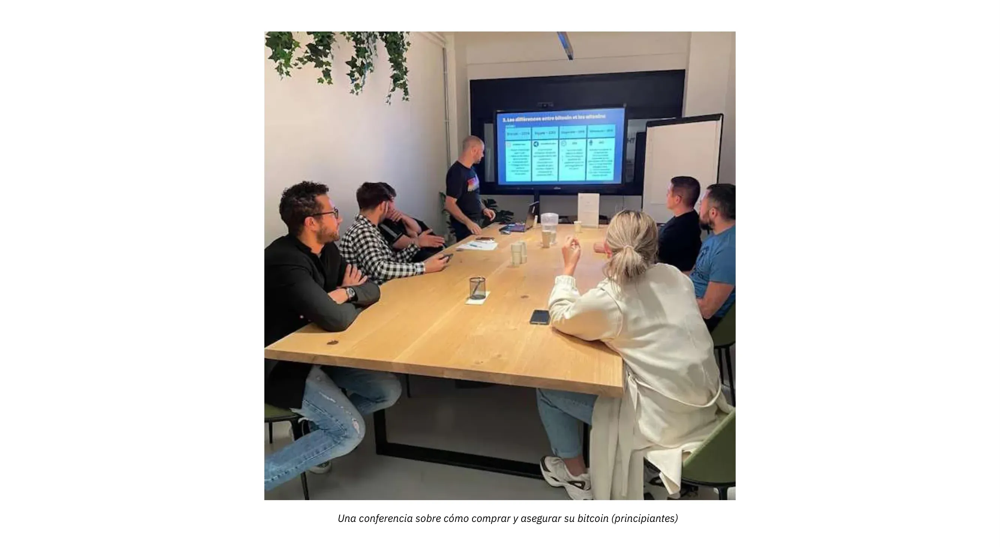

Por supuesto, cuanto mayores sean sus objetivos de desarrollo comunitario, más tiempo tendrán que invertir usted y sus miembros.

Por eso es importante **empezar estableciendo objetivos alcanzables para tu reunión**.

## El primer encuentro: ¿cuándo y por qué?

<chapterId>f3f8a614-cfb4-5994-a2e8-d56e6f8e3347</chapterId>

Puedes poner en marcha un encuentro pocas semanas después de crear tu comunidad.

Sin embargo, es probable que a esas alturas tu grupo siga siendo pequeño, lo que significa que existe la posibilidad de que no se presente nadie.

Es mejor organizar un encuentro una vez que tengas al menos unos cuantos miembros activos en tus canales de comunicación, por ejemplo, unas cuantas docenas. Esto puede ocurrir rápidamente, pero también depende de la personalidad de la gente.

Una vez que sientas esa chispa, propón quedar en persona. Si los demás están interesados, solo queda **fijar una fecha para vuestro primer encuentro**.

En lugar de elegir tú mismo la fecha, suele ser mejor **crear una encuesta unos diez días antes con varios días y horas posibles**. De este modo, puedes utilizar los votos para maximizar la asistencia, crear expectación y aprovechar al máximo tu tiempo.

Es mejor no ir con expectativas fijas sobre cómo se desarrollará la reunión, cuánta gente vendrá o qué temas se debatirán. Así evitarás decepciones y que los participantes se sientan presionados.

Deje que las cosas fluyan con naturalidad, quizá tomando una copa. Las conversaciones deberían desarrollarse con facilidad y, si es necesario, puedes reconducir suavemente el debate hacia la Bitcoin si empieza a desviarse.

Si quieres prepararte para los momentos más tranquilos, puedes planificar algunas actividades o temas de conversación, como:

- mostrando el **[Mempool](https://Mempool.space/)** en un ordenador o smartphone;
- trayendo un libro;
- trayendo un **Nerdminer**, Bitaxe, FPGA o incluso ASIC;
- teniendo un **volante Bitcoin**;
- idear un elemento visual o logotipo de la Bitcoin para su comunidad;
- jugando a un **[juego de cartas Bitcoin](https://www.Maximalist.ovh/accueil/20-game-le-Coin-de-table.html)**;
- mostrando el mapa **[btcmap.org](https://btcmap.org/)** de comunidades y comerciantes;
- enviando o recibiendo Bitcoin utilizando **Lightning**.

Cuando la reunión está empezando, no suele ser el momento de hacer una presentación formal. Si la asistencia es reducida, lo mejor suele ser un debate abierto y distendido.

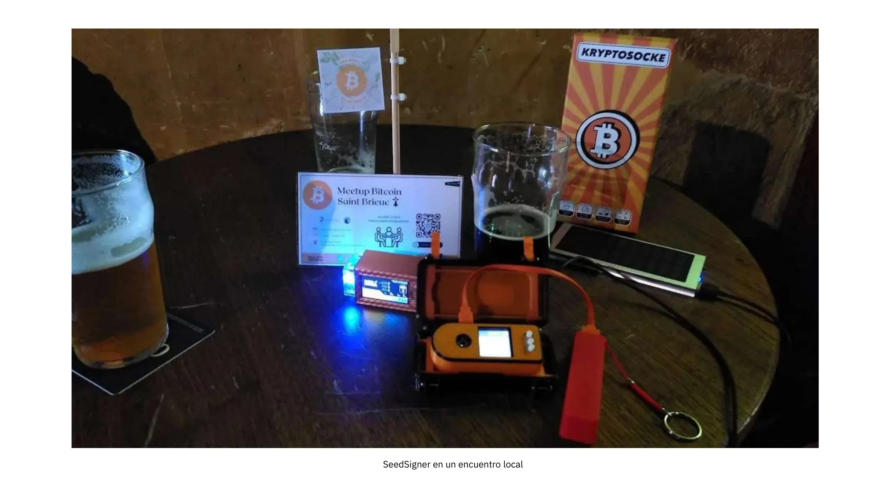

Después de tu primera reunión, probablemente querrás planificar otra. Mientras tu comunidad sea aún pequeña, lo mejor es ir eligiendo fechas mediante sondeos, por ejemplo, una vez al mes o cada dos meses. Puedes hablar de ello en tus canales de comunicación.

Si se forma un grupo regular de bitcoiners y participantes interesados, tiene sentido establecer un calendario recurrente por dos razones:

1) facilita a todos la planificación previa;

2) ayuda a **establecer un "hábito "**. Aunque alguien deje de ver tus canales con regularidad, sabrá cuándo se celebra el encuentro y podrá pasarse por allí como de costumbre.

Este segundo punto es una de las razones por las que, **en Francia, la mayoría de los encuentros tienen lugar el primer miércoles de cada mes** (véase la iniciativa "embajadores", lanzada por [DecouvreBitcoin](https://decouvrebitcoin.fr/) en 2022).

En Alemania e Italia no hay un día nacional fijo.

Sin embargo, que todos los encuentros se celebren el mismo día en todo el país crea un problema de centralización: impide a los bitcoiners asistir a eventos en comunidades cercanas y también puede plantear problemas de seguridad. Hablar con los organizadores de otros encuentros puede ayudarte a llegar a un buen acuerdo.

A medida que tu comunidad crezca y los encuentros atraigan a más gente, podrías:

- establecer un objetivo específico para cada reunión;
- o incluso **añadir un segundo evento cada mes**.

En el primer caso, sin perder de vista las preferencias de cada cual, un objetivo claro puede garantizar que los asistentes se vayan habiendo aprendido algo nuevo y mantener las conversaciones centradas en la Bitcoin.

En el segundo caso, se podría dedicar un segundo evento mensual a un tema específico, como sesiones para principiantes o talleres (Mining, Lightning, instalación de nodos, etc.).

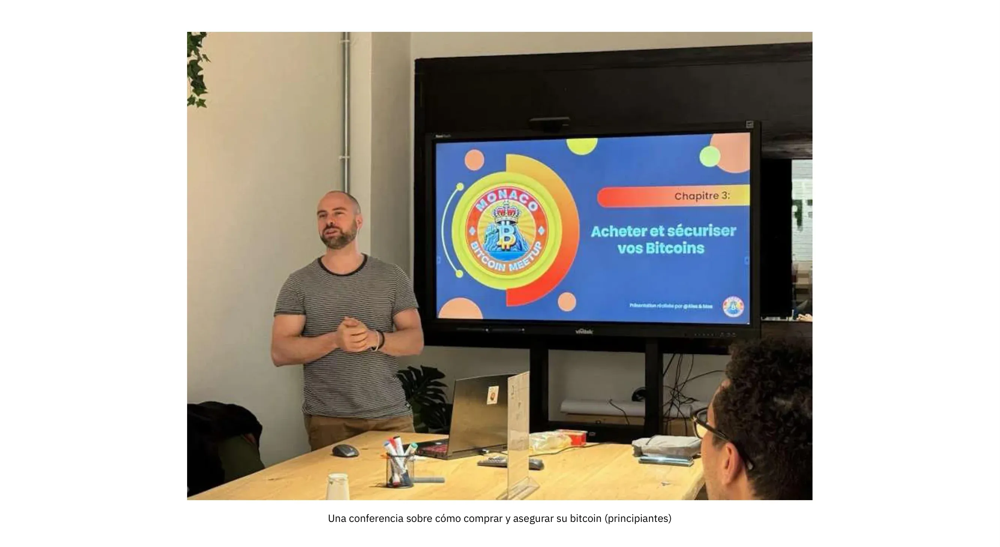

Ten en cuenta que **esto requiere más organización y más de tu tiempo**. Afortunadamente, en [parte 6/8 de este curso](https://planb.academy/courses/1c643dc9-a15f-4f9e-93b6-cb3c58b4ee35/3213d87a-1998-5972-ab93-97a5769ba279), encontrarás una serie de recursos reutilizables de código abierto que te ayudarán.

En cualquier caso, todo depende del plan de acción a corto, medio y largo plazo que usted, o su comunidad, se marquen.

## La búsqueda de una ubicación

<chapterId>405d389e-6a32-5777-af8d-293380d2e8fd</chapterId>

Encontrar un lugar para sus eventos no suele ser tarea fácil. Además, es esencial que ese lugar esté **ubicado en la ciudad de tu comunidad**.

Hay varios criterios a tener en cuenta, entre ellos

1) **Ubicación**: ¿es fácilmente accesible en transporte público? ¿En coche? ¿Hay aparcamiento?

2) ¿Es un lugar agradable y no demasiado ruidoso? ¿Busca un lugar formal (espacio de trabajo, sala de reuniones) o algo más informal (bar, restaurante)?

3) ¿Tiene capacidad suficiente para acogerle, incluso en una noche de partido de rugby o de la Liga de Campeones?

4) ¿Dispone de proyector de vídeo y de una zona tranquila para las presentaciones?

5) Y por último, si se trata de un bar o restaurante, ¿ofrece el menú algo de comer y beber para todos?

Además, hay tres puntos importantes a tener en cuenta:

- Si tiene previsto dividir la velada en dos partes: primero, una presentación en un espacio formal para ayudar a todos a concentrarse y, después, trasladarse a un bar o restaurante para continuar en un ambiente más relajado, la experiencia demuestra que cambiar de lugar a mitad de la velada suele provocar que algunos participantes se marchen durante el descanso. Por tanto, no se recomienda este enfoque.
- En tus primeras reuniones, es probable que la asistencia sea escasa y que no hagas presentaciones formales. En ese caso, no es necesario que te presentes al propietario ni le expliques tus objetivos. Sin embargo, **cuando las reuniones se vuelvan periódicas y concurridas, vale la pena hacerlo para mostrar profesionalidad y expresar tu deseo de volver mensualmente**. Esto puede dar lugar a muchas conversaciones (reservas mensuales automáticas, tablas de bebidas y/o comidas gratuitas, descuentos, conversaciones sobre Bitcoin, aceptación de pagos de Bitcoin, etc.). Evidentemente, si busca específicamente un local con proyector de vídeo para hacer presentaciones, parece esencial solicitar una reunión (cara a cara, o incluso por teléfono) con el propietario y/o el gerente para presentarles su proyecto y sus objetivos.

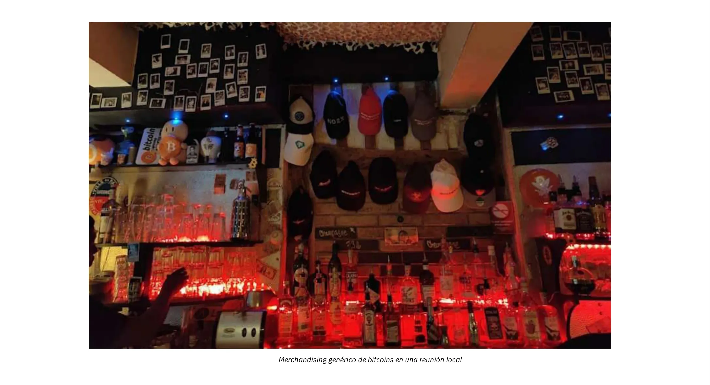

- por último, algunas comunidades **sólo quieren celebrar sus eventos en lugares que acepten pagos con Bitcoin**, lo cual es comprensible. En este caso, es una buena idea **empezar buscando comercios que acepten Bitcoin en tu ciudad** (en [btcmap.org](https://btcmap.org/map/)y contactar con ellos para ver si cumplen tus criterios. Si no hay nada adecuado disponible, puede intentar incorporar nuevos comerciantes, pero espere muchas negativas, lo que puede ser desalentador. Por eso suele ser mejor no fijarse este objetivo desde el principio, y considerarlo una vez que tu comunidad esté bien establecida y tengas suficiente "potencia de fuego"

Además, cuando pongas en marcha tu reunión, no dudes en **cambiar de local durante los primeros meses**. Esto te ayudará a **entablar relaciones con distintos gerentes**, explorar distintos ambientes y recabar información sobre posibles futuros anfitriones.

Más adelante, cuando tu grupo haya crecido, podrías incluso dedicar una tarde a visitar varios negocios y bares, preguntando si disponen de un espacio adecuado para acoger vuestros eventos y reuniones mensuales.

## Antes de la reunión

<chapterId>c5218943-580d-5efc-89ed-6b5d728816d6</chapterId>

¿Piensa organizar una reunión en las próximas semanas?

Aquí tienes una lista de control que te ayudará a prepararte:

1/ **Confirmar el lugar de celebración**

Póngase en contacto con el lugar donde va a celebrar el acto y resérvelo para el número estimado de asistentes.

2/ **Anunciar el acontecimiento**:

    - Comparta la fecha, hora y lugar en sus redes sociales y otros canales de comunicación. Incluya un enlace de inscripción si es necesario.
    - Cree un elemento visual específico (póster de Canva, por ejemplo; véase la parte 2/8 "[Diseño de una identidad para su comunidad Bitcoin](https://planb.academy/courses/1c643dc9-a15f-4f9e-93b6-cb3c58b4ee35/b48a18cc-afdf-5216-802c-32647b5cd8a3)").
    - Maximiza la visibilidad fijando el anuncio en Telegram y Twitter, y utilizando una mención "@todos" en Discord.
    - Publique anuncios de 7 a 10 días antes del acto para que los asistentes puedan planificarse.

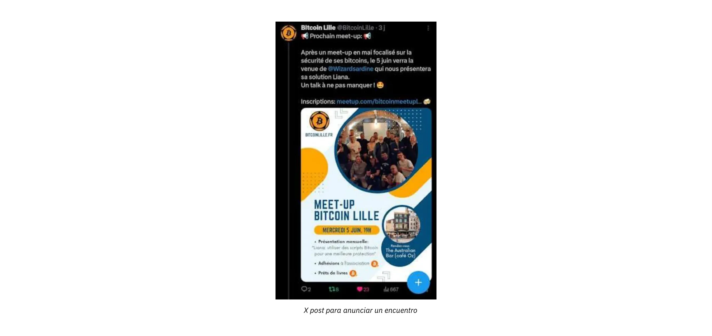

3/ **Recuerde a su público**

Dos o tres días antes del evento, comparta y retuitee sus anuncios para aumentar la visibilidad.

4/ **Actualización del lugar de celebración**

La víspera (o dos días antes), compruebe las inscripciones y comunique al lugar de celebración el número final previsto de participantes.

Medidas adicionales para que su evento destaque:

- Imprimir folletos y/o carteles
- Preparar una presentación sobre un tema específico
- Organizar una actividad o taller

## El día del encuentro

<chapterId>cf60067b-591f-5fdf-9b9e-d442aad0e8f9</chapterId>

¡El gran día ya está aquí! Una o dos horas antes de que empiece el acto, envía un recordatorio a través de los canales de comunicación de tu comunidad. Vuelva a confirmar la hora de inicio e indique a los participantes cómo reconocerle, por ejemplo, mencionando que llevará una camiseta y una gorra de la Bitcoin.

A medida que tus reuniones crezcan y empieces a acoger a más de 20 personas, la preparación del lugar será cada vez más importante.

Esto es lo que hay que hacer:

1) **Llega pronto** para preparar todo.

2) **Organiza el espacio** en función de tus necesidades y de las posibilidades del local. Si sólo sois seis personas, se necesita poca disposición. Pero cuando haya entre 10 y 20 asistentes, una disposición totalmente sentada puede limitar las interacciones. En ese caso, elige un montaje de pie con mesas altas bien espaciadas, si las hay, pero con algunas sillas (preferiblemente altas). Si está prevista una presentación, mantén la disposición de pie durante la mayor parte de la velada y coloca las sillas justo antes de la charla.

3) Añade pequeños toques personalizados:

    - Coloca un cartel en la entrada para indicar tu ubicación (utiliza Patafix y obtén antes el permiso del local).
    - Exponga en el interior carteles con temas relacionados con Bitcoin (el libro blanco de Bitcoin, los estatutos de su comunidad, los proyectos en curso, etc.).
    - Coloque pegatinas, folletos o iniciadores de conversación en las mesas, por ejemplo: un Nerdminer, Hardware Wallet, un ordenador portátil mostrando su Mempool, ASIC Miner, o una placa metálica de respaldo para llaves privadas.

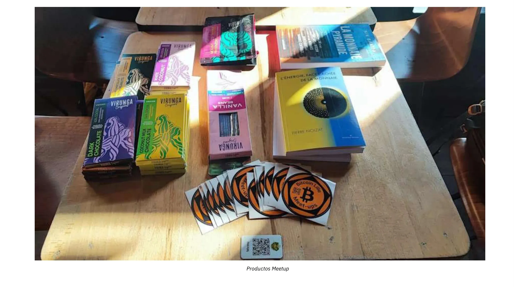

Si esperas pocos participantes y aún no has entablado relación con los responsables del local, evita llevar y exponer todo tu equipo de inmediato. Una vez establecida la confianza, tendrás más libertad para organizar el espacio como desees.

Por último, tómate algo y espera a que llegue la gente. Y recuerda: no te desanimes si no viene nadie la primera vez. Trae un libro o un vídeo para ver, por si acaso.

## Después de la reunión

<chapterId>3e881af9-9c09-5721-81ee-c5cda3b109c5</chapterId>

Cuando termine la reunión, será el momento de limpiar para el personal del local. Antes de irte, ofrécete a echar una mano a los camareros o encargados. Puede ser algo tan sencillo como recoger todos los vasos en una mesa o, si estás cerca de la barra, devolverlos antes de irte.

Una vez de vuelta en casa, es probable que la Bitcoin le ronde por la cabeza durante días. Es el momento perfecto para tomar el pulso a su comunidad y recabar la opinión de los participantes. Puede hacerlo:

- Publique un mensaje de agradecimiento en sus canales de comunicación y comparta los enlaces o recursos mencionados durante el acto.
- Invite a los asistentes a sugerir mejoras para la próxima reunión.
- Empiece a planificar su próximo evento.

Tendrás unas semanas para desarrollar nuevas ideas, imágenes o proyectos que mejoren aún más la próxima reunión.

## La importancia de implicar y retener a los participantes

<chapterId>f5355e35-4b07-527c-88a3-8535cba7592c</chapterId>

Roma no se construyó en un día, y tu comunidad tampoco. El impulso en torno a la Bitcoin se consigue celebrando reuniones y eventos con regularidad.

Para conseguirlo, hay algo esencial: **mantener el compromiso de los participantes**.

Podría empezar con un pequeño grupo de bitcoiners apasionados, cuyo objetivo sea reunirse regularmente y hablar sobre la Bitcoin. Con el tiempo, en función de la disponibilidad y los intereses de cada uno, puedes **repartir ciertas tareas organizativas con el grupo**, o invitar a los **miembros principales a encargarse de proyectos específicos**. Éstos pueden ser propios de tu comunidad, de tus encuentros o de tu ciudad, o incluso inspirarse en las numerosas iniciativas propuestas en [la parte 6/8 de este curso](https://planb.academy/courses/1c643dc9-a15f-4f9e-93b6-cb3c58b4ee35/3213d87a-1998-5972-ab93-97a5769ba279). **Esto no sólo fomenta la Commitment de tus miembros principales, sino que también ayuda a que tu comunidad crezca y prospere.**

A medida que avancen los encuentros, aparecerán caras nuevas: personas que compraron BTC y/o altcoins en ciclos anteriores, entusiastas de la tecnología que quieran profundizar sus conocimientos o completos principiantes curiosos por este sistema de pago no censurable, descentralizado, transparente y justo que funciona sin condiciones y sin terceros de confianza.

Para que todos se sientan incluidos en sus actos, céntrese en dos aspectos clave:

- **Inclusión social**: Todos los asistentes deben sentirse bienvenidos. Haga el esfuerzo de saludar a los recién llegados, pregúnteles por qué han venido y presénteles a los demás. Cuando la gente se siente incluida, es más probable que vuelva e incluso que ayude a organizar eventos futuros.
- **Paciencia y apertura**: Esto requiere tiempo y motivación. Si estás hablando con un "shitcoiner" comprometido (o peor aún, con un XRP Maximalist), puede ser tentador descartarlo. Pero si entablas una conversación, puedes aclarar malentendidos o razonamientos erróneos. Si están dispuestos a escuchar, puede que estén preparados para entender de verdad la Bitcoin.

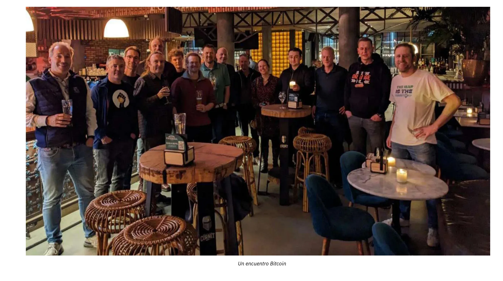

Desde un punto de vista práctico, piense en la experiencia global del evento:

- ¿Era agradable la **venida**?
- ¿Era **fácil de acceder?**
- ¿Por qué algunas personas se inscribieron pero no se presentaron?
- ¿Qué debates se celebraron? ¿Fueron los debates demasiado técnicos para los principiantes?
- ¿Eran las discusiones demasiado alcohólicas?

Cada participante tiene su propia personalidad, objetivos e intereses, por lo que las experiencias variarán. Pero cuando el lugar es el adecuado, el público tiene una mentalidad abierta y las intenciones son auténticas, hay muchas razones para que el encuentro tenga éxito.

Crear un meetup lleva tiempo pero, sobre todo, requiere organización. Es un proyecto humano, y sólo funcionará y crecerá a largo plazo si está bien planificado, es abierto e integrador.

En última instancia, eres tú quien decide hasta dónde debe llegar el concepto de "abierto e inclusivo". Pero recuerda: un shitcoiner es a menudo un bitcoiner en ciernes.

# Ejemplos de proyectos e iniciativas

<partId>45b3bc40-1c31-583e-8411-2662e6efd765</partId>

## ¿Por qué ir más allá de beber cerveza?

<chapterId>3213d87a-1998-5972-ab93-97a5769ba279</chapterId>

A medida que avancen los bloques, tu comunidad evolucionará. Se unirán caras nuevas, otras se alejarán, pero el principio rector debe seguir siendo el mismo: desarrollar el ecosistema de Bitcoin y reforzar los lazos entre sus miembros.

Hay muchos proyectos e iniciativas que pueden llevarse a cabo. Este capítulo ofrece una lista no exhaustiva de ideas que pueden llevarse a cabo dentro de una comunidad o durante un meetup. Siéntete libre de elegir las que te inspiren e incluso de aportar tus propias ideas a este curso [haciendo un "Pull Request" en GitHub](https://github.com/PlanB-Network/Bitcoin-educational-content).

Antes de entrar en materia, repasemos un punto mencionado anteriormente.

Cuando organizas un encuentro Bitcoin, conoces a gente nueva. La interacción social es esencial y la cerveza (o el alcohol en general) puede ayudar a crear un ambiente festivo. Pero conviene tenerlo en cuenta:

- El alcohol merma las capacidades cognitivas, como el pensamiento y la comprensión, lo que puede dificultar que los participantes sigan debates o presentaciones serias.
- El alcohol también puede convertirse en un ritual reconfortante: cada mes, compartes tu "momento Bitcoin" con tus amigos tomando una copa. Aunque es una forma estupenda de conectar, ¿es realmente beber cerveza el objetivo principal de tu reunión? ¿O prefieres investigar sobre la Exchange, aprender de los demás y ayudar a los recién llegados a descubrir la Bitcoin?

Cada cual tiene sus preferencias, convicciones y personalidad. No se trata de juzgar una reunión por encima de otra. Aunque a menudo hablamos de cambiar el mundo mientras tomamos una cerveza, las revoluciones no empiezan ni crecen así.

La clave es simplemente ser consciente de ello.

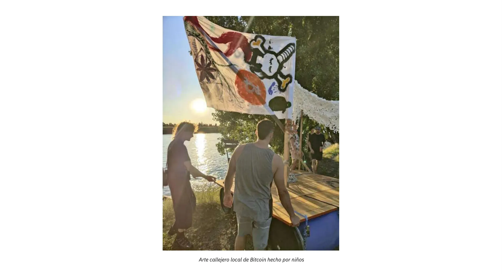

## Organizar encuentros temáticos, con una progresión anual

<chapterId>46afdbcc-a775-5c16-b20a-34956690d58f</chapterId>

Una vez que hayas creado un grupo de unas diez personas, puedes empezar a añadir presentaciones a cada acto. Pueden seguir un tema anunciado de antemano o ser completamente independientes unas de otras.

A la hora de planificar presentaciones o talleres, resulta útil crear una progresión clara y bien estructurada. El objetivo es **cubrir los conceptos básicos de Bitcoin paso a paso**, ofreciendo a los asistentes una visión completa del tema desde múltiples ángulos.

En Francia, durante el verano de 2023, los organizadores del encuentro trabajaron en **una progresión anual**.

Más allá de su gran valor pedagógico, este enfoque permite compartir documentos y presentaciones de diapositivas de código abierto entre grupos, construyendo gradualmente una biblioteca compartida de recursos. La iniciativa ha sido bien acogida y está llamada a crecer en los próximos años.

A continuación se presenta la progresión de meetups franceses 2023-2024. Para cada tema hay disponibles una presentación de código abierto y un vídeo, que pueden darte ideas sobre temas que podrías tratar en tus propios eventos.

También puede encontrar material adicional editable en la [Bitcoin Teaching Toolbox](https://planb.academy/fr/resources/bet)

| Month | Theme | Video | Editable Resource |
| -------- | -------- | -------- | --- |
| September     | Chapter 1: What is Bitcoin?     | [	YouTube link](https://www.youtube.com/watch?v=CSjuBqrl4t8)     | [Editable PowerPoint](https://www.canva.com/design/DAFu0d5Jd7M/9gAWDAOSS6LDkWENuZjYgw/edit) |
| October & November| Chapter 2: Understanding Bitcoin Transactions     | [YouTube link](https://www.youtube.com/watch?v=inFnR-3NsdM)     | [Editable PowerPoint](https://www.canva.com/design/DAFsEcnOro8/Mz9FYdTGhsvozZOe0Y9jtw/edit) |
| December     | Chapter 3: Understanding the Lightning Network     | [YouTube link](https://www.youtube.com/watch?v=hHz-ALx8D9w)     | [Editable PowerPoint](https://www.canva.com/design/DAF4YPSNnR8/HKp4Vmcno8eMtVWnZmFtcw/edit) |
| January     | Chapter 4: What is Mining?     | [YouTube link](https://www.youtube.com/watch?v=QyHZ3CVI_OI)     | [Editable PowerPoint](https://www.canva.com/design/DAF5DE6iBEM/tsy8E3oBebUnsR0kj53vvQ/edit) |
| February     | 	Chapter 5: Running a Bitcoin and Lightning Node    | [YouTube link](https://www.youtube.com/watch?v=RRYK-usg-OY)     | [Editable PowerPoint](https://www.canva.com/design/DAF55FU6HI0/sQ0lacRJblqrhn_9Xk1yDg/edit) |
| March     | 	Chapter 6: Using the Lightning Network in Daily Life    | [YouTube link](https://www.youtube.com/watch?v=o2BS4xjei8M)    | [Editable PowerPoint](https://www.canva.com/design/DAGAcJMw7lw/-haMNnHnwj5vpDAy8MDowA/edit) |
| April & May    | Chapter 7: Securing Your Bitcoins      | [YouTube link](https://www.youtube.com/watch?v=fHExPbhM0Hg)    | [Editable PowerPoint](https://www.canva.com/design/DAGDz3Nq4e0/D3uG-4w9FN6OhUq-VXzhfg/edit) |
| June     | 	Chapter 8: What is Multi-Sig?     | [YouTube link](https://www.youtube.com/watch?v=Me5489mpoxA)     | [Editable PowerPoint](https://www.canva.com/design/DAGLMtQT6sg/rYIxr4ldUJ0jTelNf-Pj8Q/edit) |
| July     | 	Chapter 9: Understanding the Bull Run and How to Prepare    | [YouTube link](https://www.youtube.com/watch?v=7RA-gnCJWyM)     | [Editable PowerPoint](https://www.canva.com/design/DAGJQkiZ_YA/9lUluP9RZ0eeA_e61mk9Hw/edit) |
| August     | Chapter 10: The Taxman is Never Far Away   | [YouTube link](https://www.youtube.com/watch?v=oY4NwonGDm0)     | [Editable PowerPoint](https://www.canva.com/design/DAGQhx7Yc_c/7mRhb_vlgnhSgxd1FtjK8w/edit) |

Los capítulos 2 y 7 pueden dividirse en dos presentaciones más breves para no abrumar a los participantes. Sin embargo, si se realizan en una sola sesión, se libera espacio en el calendario para actividades especiales, como reuniones conjuntas con grupos vecinos, concursos o talleres.

**Puedes utilizar, adaptar y compartir estos recursos, pero asegúrate de citar a los autores originales si reutilizas su trabajo**

Como no todo el mundo va a asistir a todas las reuniones, es buena idea grabar las presentaciones y subirlas a una plataforma de streaming o a tu sitio web. Esto permite a los ausentes ponerse al día y a los participantes repasar el material más tarde.

Paralelamente, puedes organizar otros encuentros temáticos, como:

- Un concurso de conocimientos sobre la Bitcoin (con una Hardware Wallet como premio)
- Un reto de incorporación en el que envías satoshis gratis a los que no tienen monedas en la calle
- Invitar a un ponente experto o a una empresa para que presente un producto relacionado con la Bitcoin
- Recorrido nocturno por bares y tiendas que aceptan la Bitcoin

Y mucho más, ¡su imaginación es el único límite!

## Crear actos paralelos y talleres

<chapterId>9dbd651a-8712-5630-90b3-b9525dcc1385</chapterId>

Dependiendo de su disponibilidad y del nivel de implicación en su comunidad, puede planificar actos adicionales a lo largo del año, como por ejemplo

- Noche de restaurantes para el **Día de la Pizza** el 22 de mayo
- Una noche o un fin de semana para celebrar el próximo **Halving**
- Una **noche de juegos** en familia sobre el Bitcoin y su funcionamiento, utilizando juegos como [Le Coin de Table](https://www.Maximalist.ovh/) o [SHAmory](https://shamory.com/)
- Un **taller Mining** que presenta diferentes tipos de hardware (CPU, GPU, FPGA, ASIC, Nerdminer, Bitaxe)
- Una **tarde o noche para principiantes**, con talleres temáticos
- Un **encuentro conjunto con las comunidades vecinas**

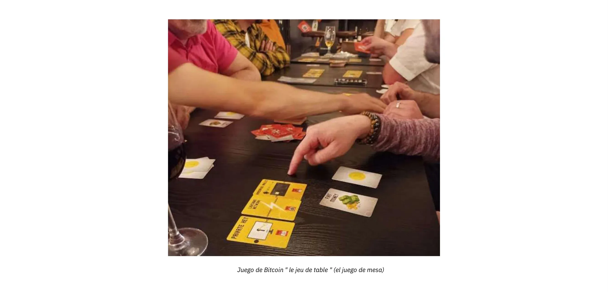

Sólo hay que tener cuidado de no sobrecargar el calendario. Demasiados actos en un solo mes pueden agotar a los organizadores y reducir la asistencia con el tiempo.

## Crear pegatinas

<chapterId>d605f3b3-130e-513d-85e6-06bc5ea13e99</chapterId>

Las pegatinas son una forma divertida de promocionar tanto la Bitcoin como tu comunidad, al tiempo que refuerzan tu identidad.

Antes de hacer un pedido, tenga en cuenta estos consejos:

- Para uso en exteriores, asegúrese de que las pegatinas sean resistentes al agua.
- Mantenga su logotipo ligeramente más pequeño que el área de corte para evitar problemas de recorte durante el corte por láser.
- Utilice un archivo vectorial en lugar de una imagen rasterizada para obtener una mayor calidad de impresión.
- Elija el tamaño adecuado: 8 cm de diámetro (aproximadamente el tamaño de la palma de la mano de un adulto) es muy visible, mientras que 4 cm es más discreto. Buscas visibilidad o discreción?
- Para una impresión en negro intenso ("negro cuádruple"), utilice un 30% de cian, un 30% de magenta, un 30% de amarillo y un 100% de negro. Utilizar sólo el 100% de negro puede dar como resultado un tono grisáceo. Las impresoras suelen comprobarlo, pero conviene saberlo.

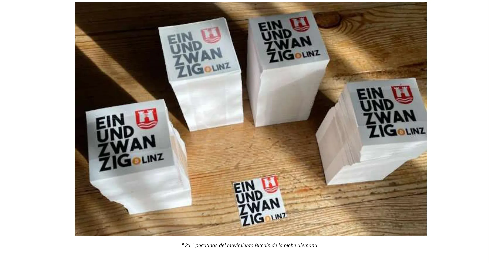

Dependiendo de sus necesidades y de su proveedor, 1.000 pegatinas pueden costar entre 100 y 250 euros. Puedes ponerte en contacto con [@Mill3sim3 en Twitter](https://x.com/Mill3sim3), un Bitcoiner francés especializado en marketing, que a veces puede conseguir precios hasta un 30% más bajos que los de los vendedores online habituales.

Dicho esto, 1.000 pegatinas son muchas. Suele ser mejor empezar con unas 100 para asegurarse de poder distribuirlas todas.

Importante: **Compruebe la normativa local antes de colocar pegatinas en espacios públicos**.

En Francia, las pegatinas sólo pueden colocarse en tablones de anuncios públicos oficiales. Si se colocan en otro lugar (por ejemplo, una señal de stop), es probable que se retiren y que se imponga una multa si se pueden relacionar contigo o con tu grupo de encuentro. Informa de ello a tus miembros.

En lugares privados como conciertos, bares o estadios, comprueba si ya hay pegatinas antes de añadir las tuyas. Si no es así, pide permiso al personal. No querrás que la primera impresión que se lleve el propietario de un negocio de tu comunidad sea que has destrozado su espacio.

## Crear una biblioteca

<chapterId>acc94093-f8b3-51b8-9359-348e9e075d38</chapterId>

Otro proyecto que puedes poner en marcha fácilmente es **crear una biblioteca en tus reuniones**.

Se podría invitar a los participantes que deseen compartir su material de lectura a traer un libro relacionado con Bitcoin. Si alguien más en la reunión quiere tomarlo prestado, se podría acordar un préstamo con el propietario en Exchange por un depósito, por ejemplo, 21.000 satoshis a través de Lightning.

Para el propietario, este depósito le ayuda a cubrir posibles pérdidas o robos. Para el prestatario, es un incentivo para volver a un futuro encuentro y recuperar su depósito.

Si diriges una asociación y quieres invertir parte de tus fondos en recursos educativos, también puedes adquirir varios libros para ofrecerlos en tu **biblioteca Bitcoin**, disponible en cada encuentro.

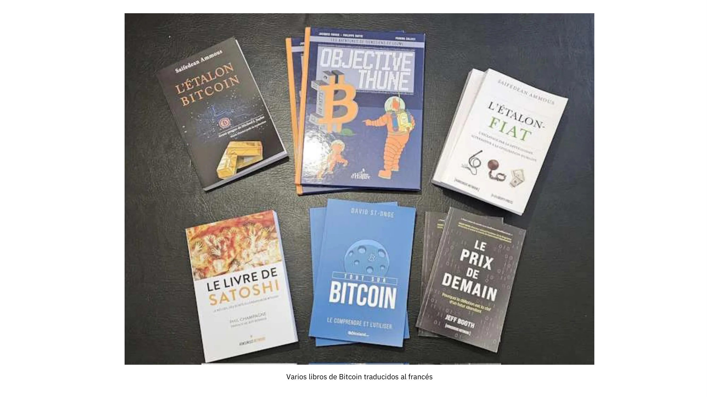

Para apoyar el ecosistema, **[la editorial Konsensus Network](https://konsensus.network/) ofrece desde finales de 2023 a los encuentros y comunidades internacionales Bitcoin un descuento de entre el 15% y el 35% en todos sus libros, para pedidos de tres libros o más**.

Para beneficiarse de este descuento, sólo tiene que **contactar con [editorial Konsensus](https://twitter.com/KonsensusFR) en Twitter**.

Si no dispone de efectivo, puede hacer llegar el descuento a los miembros de su comunidad.

Si no dispones de los fondos, puedes repercutir el descuento a tus socios. Por ejemplo, un organizador podría recoger pedidos de los socios, hacer un pedido al precio reducido y distribuir los libros en la siguiente reunión, con el pago en Lightning en ese momento.

También puedes exponer una carta de préstamo de libros en tus reuniones para explicar claramente las normas de préstamo a los recién llegados.

Aquí tienes un ejemplo de código abierto que puedes utilizar y adaptar:

[Carta de préstamo de libros](https://www.canva.com/design/DAF7u1b5kRM/r2gEAlibe_jTIXIX-O9PMA/edit)

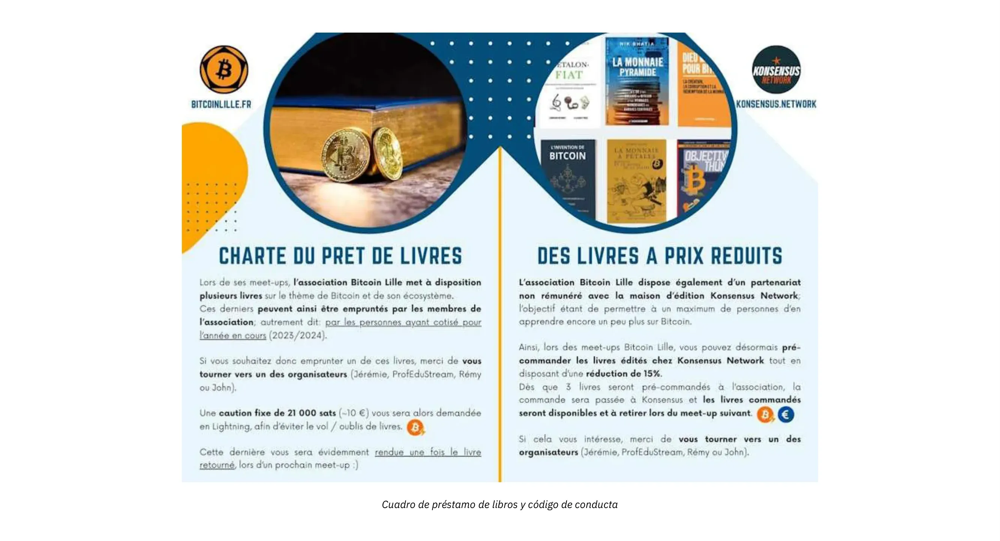

Por último, para fomentar la lectura relacionada con la Bitcoin, podría visitar las **bibliotecas municipales locales** para ver si tienen libros sobre la Bitcoin.

Si es así, pregunte a los bibliotecarios si hay previstas **mesas redondas** sobre el tema y ofrézcales los datos de contacto de su reunión.

Si no, sugiérales que adquieran algunos libros de una lista preseleccionada. La [red de editores Konsensus Network](https://konsensus.network/) puede ser una fuente de inspiración.

## Crear y distribuir folletos personalizados

<chapterId>62ad5430-c698-51b3-89ac-090f31c88953</chapterId>

Diseñar y redactar folletos lleva su tiempo, pero merece la pena, ya que te proporcionan un recurso tangible para repartir cuando hables de la Bitcoin, lo que siempre es de agradecer.

Estos folletos pueden dirigirse a:

- Comerciantes, si quieren introducir Bitcoin como método de pago;
- Asistentes al acto, con un folleto en el que se explica cómo utilizar y pagar con Bitcoin/Lightning;
- Los principiantes, ya se encuentren en la calle, en el trabajo o durante una reunión familiar, con un folleto en el que se destacan las principales ventajas de la Bitcoin.

También puedes diseñar un folleto específico para tu comunidad o reunión, en el que presentes tus actividades, objetivos, enlaces a redes sociales, canales de comunicación y próximos eventos.

Ya hay varios folletos **disponibles como código abierto en la [Bitcoin Teaching Toolbox](https://planb.academy/fr/resources/bet)** en planB.network y con el tiempo se irán añadiendo más.

Un ejemplo es un [folleto completo de fuentes](https://profedustream.substack.com/p/21-raisons-dutiliser-Bitcoin) con 21 razones para utilizar Bitcoin. Su diseño también está [disponible en código abierto](https://www.canva.com/design/DAFtAR1NauQ/ZDwl2CchIJ9Gpb36N6-7iw/edit?utm_content=DAFtAR1NauQ&utm_campaign=designshare&utm_medium=link2&utm_source=sharebutton) para que lo modifiques, adaptes y compartas. No olvides citar las fuentes.

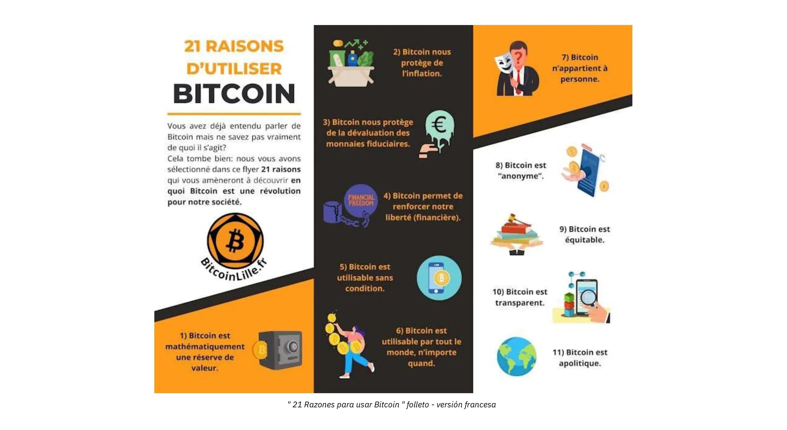

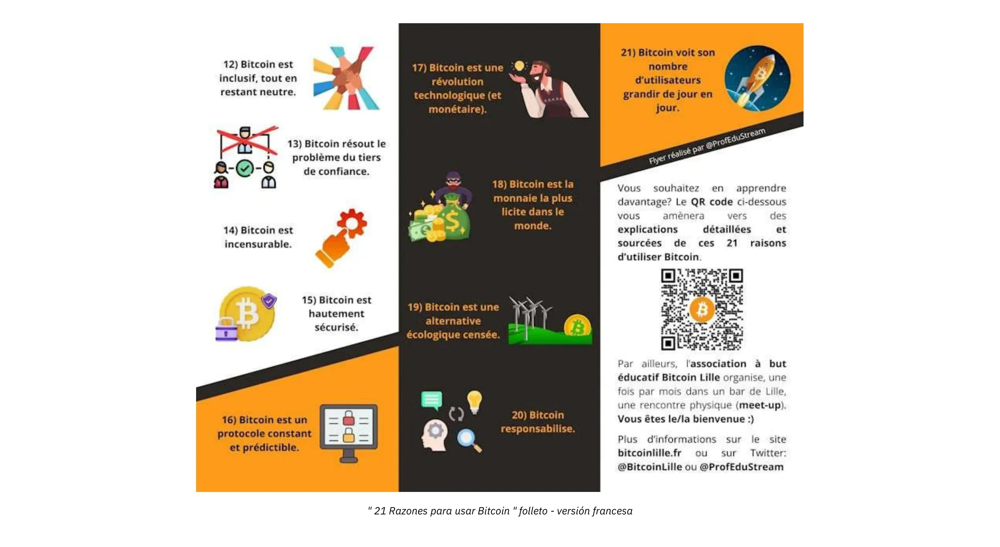

Como ya se ha dicho, puede dejar estos folletos casi en cualquier sitio: en un escritorio compartido en el trabajo, en la mesa de una cena familiar, en una biblioteca pública, etc.

En Francia y algunos otros países también hay "cajas de libros", pequeñas cajas de madera donde la gente puede donar o tomar prestados libros libremente. Puedes dejar allí un folleto o, mejor aún, un libro.

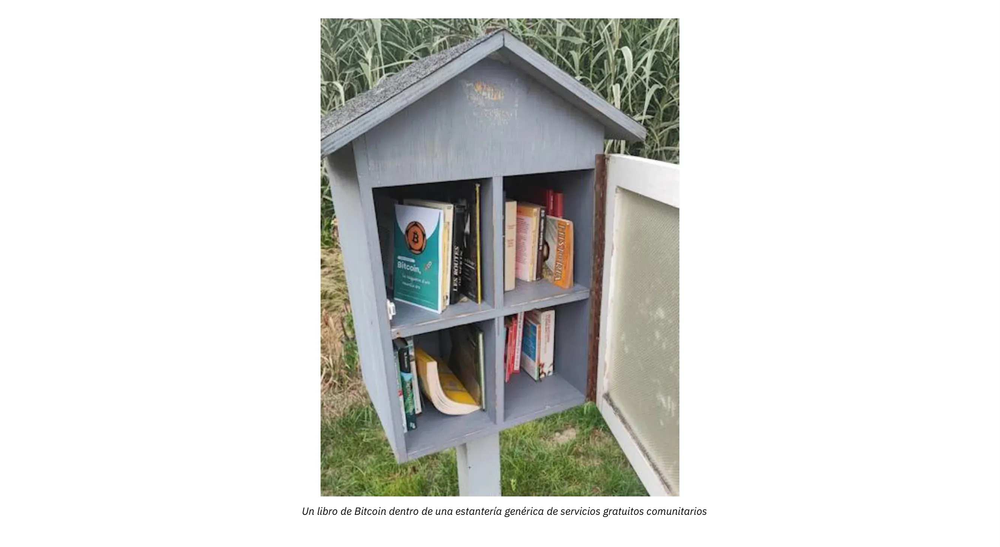

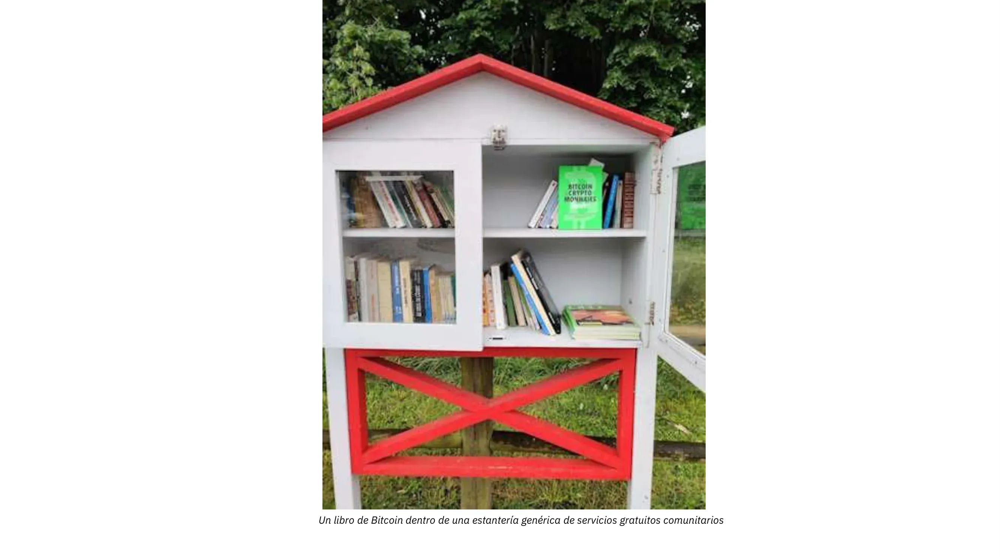

En 2023 se puso en marcha la iniciativa **"Bitcoin Libro Blanco en las Cajas de Libros de Francia**".

Para llevar a cabo este proyecto, los participantes tuvieron primero que recopilar la geolocalización de todas las cajas de libros del país. Para ello existen varias bases de datos:

- [boite.a.livres.zonelivre.fr](https://boite.a.livres.zonelivre.fr/);
- [boites-a-livres.fr](https://www.boites-a-livres.fr/carte-de-france);
- [delivrez.fr](https://delivrez.fr/maps/fr_FR/);
- y artículos en la prensa local

Aunque dejar el libro blanco de la Bitcoin es simbólico, suele ser demasiado complejo para que lo entiendan los recién llegados. En su lugar, la idea era crear un pequeño folleto que contuviera:

- una introducción accesible y bien documentada al Bitcoin, sus usos y los problemas que resuelve;
- el libro blanco Bitcoin, traducido al francés.

Aquí está [el folleto compartido entre los bitcoiners franceses](https://profedustream.substack.com/p/Bitcoin-la-naissance-dune-nouvelle) que se ha colocado en decenas de librerías de todo el país. Su diseño también está [disponible como código abierto](https://www.canva.com/design/DAFs18FSoVM/Sy0QsfUkycTgXveeGgutBg/edit?utm_content=DAFs18FSoVM&utm_campaign=designshare&utm_medium=link2&utm_source=sharebutton).

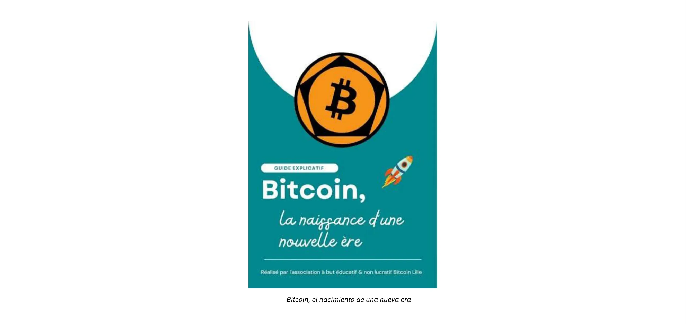

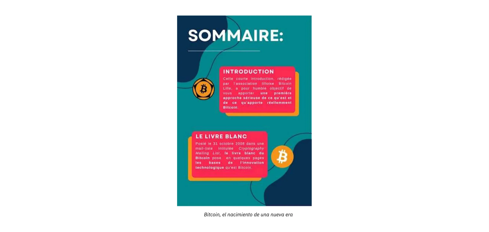

## Realización de una proyección de vídeo

<chapterId>892b248a-b837-5df6-aac9-4b3261ff0390</chapterId>

Es probable que casi todos los bitcoiners hayan visto la fascinante serie intermedia de [Rémi Forte](https://twitter.com/forteremi) "Le mystère Satoshi, aux origines du Bitcoin" (El misterio Satoshi: los orígenes de Bitcoin).

Publicado en 2021, ha sido visto [varios millones de veces en YouTube](https://www.youtube.com/watch?v=0ETcLj5jBy4).

Una idea podría ser organizar una proyección de El misterio de Satoshi para su comunidad, quizá como un acto mensual más.

Una advertencia: aunque ARTE France ha confirmado que las proyecciones públicas están permitidas, hay que pagar los derechos de proyección para hacerlo legalmente. En 2023, este coste era de unos 250 euros por proyección, o de 120 euros si al menos cinco encuentros la proyectaban durante el año.

Para la mayoría de las comunidades, este precio es prohibitivo, sobre todo porque el documental ya está disponible gratuitamente en el canal YouTube de ARTE.

Por supuesto, son posibles otras proyecciones.

Por ejemplo, en Francia, la **directora [Alana Mediavilla](https://twitter.com/AlanaMediavilla) concedió a los encuentros locales el derecho a preestrenar su documental "Stranded "**, que incluye imágenes de la próxima película de 2024 [película "Dirty Coin"](https://www.dirtycointhemovie.com/).

Algunos bitcoiners incluso tomaron la iniciativa de traducir "Stranded" al francés, añadirle subtítulos y compartirla con meetups de todo el país. Durante la semana del 4 de marzo de 2024, se proyectó simultáneamente en una docena de meetups de todo el país.

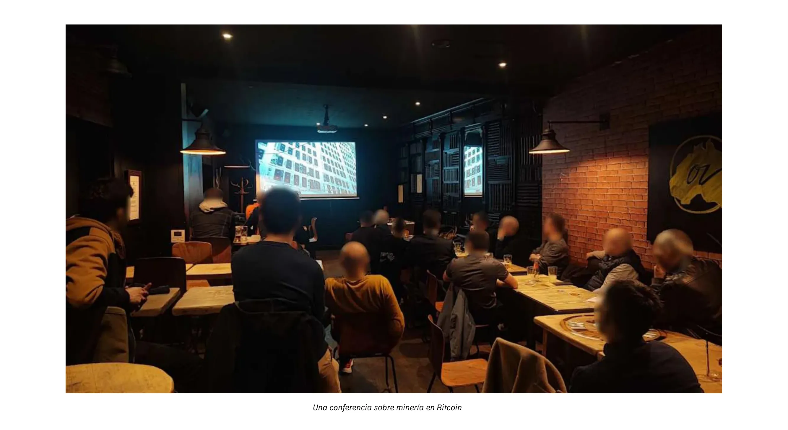

El acto suscitó animados debates sobre la Bitcoin Mining, su consumo de energía y su impacto medioambiental en general.

## Colocar carteles en su ciudad

<chapterId>6565e8a0-d535-5be0-9764-273584c675bd</chapterId>

En varios países europeos (entre ellos Alemania, España y Francia), los bitcoiners han tomado la iniciativa de pegar carteles por sus ciudades.

Algunos diseños reelaboran el arte de Banksy para incluir el logotipo de Bitcoin.

Un ejemplo es [StreetCyberArt](https://twitter.com/streetcyber_art), un bitcoiner alemán que lleva varios años creando collages y arte callejero.

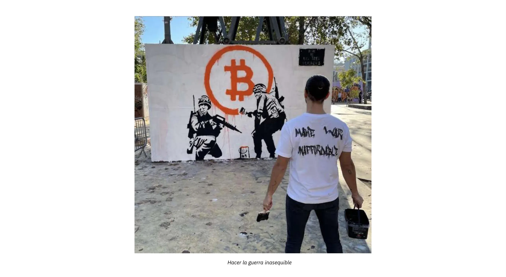

Si quieres dedicarte a la cartelería callejera, asegúrate de que conoces la legislación de tu país. En Francia, por ejemplo, sólo se pueden colocar carteles en vallas públicas. En otros lugares, está totalmente prohibido y se castiga con multa.

Si decide sobrepasar los límites y espera que no le pillen "in fraganti", evite incluir en los carteles cualquier dato que le identifique (como el nombre de su reunión o @Twitter).

Tenga también en cuenta que la impresión de estos carteles en una impresora personal suele provocar sangrados de tinta y un rápido deterioro en exteriores. Lo mejor es trabajar con una imprenta profesional que pueda producirlos en papel autoadhesivo especial diseñado para exteriores, garantizando tanto la calidad como la durabilidad.

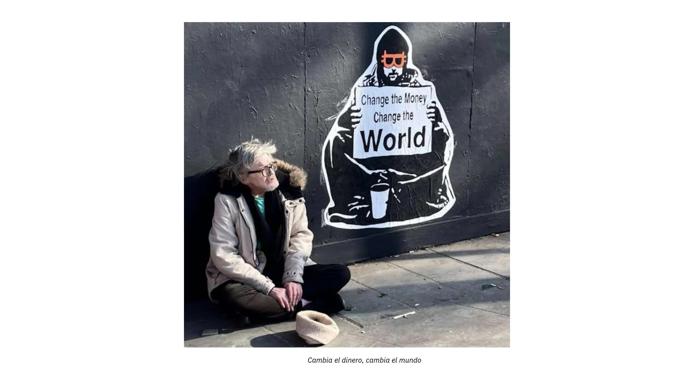

Esta iniciativa puede costar más de 0,40 euros por cartel (unos 40 euros por cien carteles) y los precios en línea pueden variar del doble al quíntuple de esa cantidad. Los buenos contactos son esenciales.

Como ya se ha mencionado, el bitcoiner francés [@Mill3sim3](https://twitter.com/Mill3sim3) dispone del equipo profesional adecuado y puede ponerse en contacto con él para obtener más detalles.

Otra opción más DIY es hacer una plantilla con un trozo grande de cartón y utilizar pintura en aerosol para etiquetar tu diseño en lugares selectos de tu ciudad.

## Una tarjeta NFC personalizada

<chapterId>8ad65d4e-a68a-59c2-a812-85f4907ed9f3</chapterId>

Otra idea original del proyecto es crear tarjetas NFC personalizadas para pagos Lightning (compatibles con el estándar BoltCard). Para ello, Swiss Bitcoin Pay es un gran aliado.

[Su sitio web](https://swiss-Bitcoin-pay.ch/cards) ofrece actualmente cuatro diseños estándar.

Si quiere pedir más de 50 tarjetas NFC, puede ponerse en contacto con la empresa a través de su sitio web oficial o [Twitter](https://twitter.com/SwissBitcoinPay) para proponer un diseño personalizado para el anverso de la tarjeta. El reverso seguirá siendo estándar.

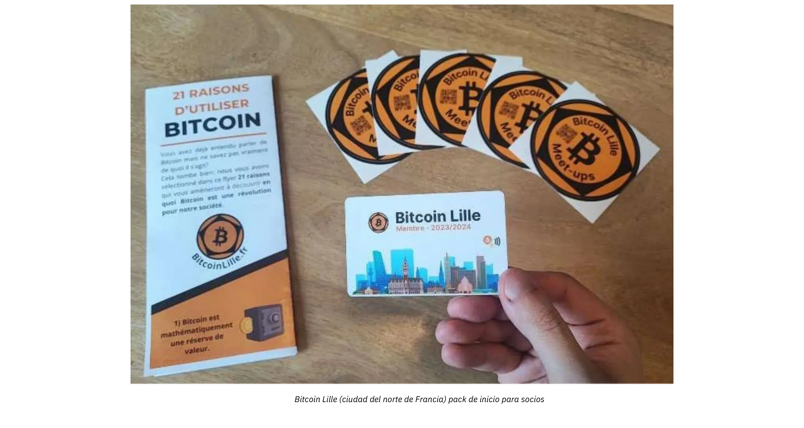

Por ejemplo, en 2023, la asociación francesa [Bitcoin Lille](https://twitter.com/BitcoinLille) encargó un lote de tarjetas NFC con un diseño personalizado. Cada nuevo miembro recibió una en su paquete de bienvenida durante el año. Esta idea puede adaptarse y personalizarse fácilmente para su propia comunidad.

El precio unitario de estas tarjetas suele oscilar entre 2,50 y 5 euros, dependiendo del tamaño del pedido y de las condiciones del mercado, con precios más bajos para cantidades mayores.

## Crear un sitio web

<chapterId>9a2a1b9b-0633-544a-b331-c06187d23d7f</chapterId>

En una determinada etapa del crecimiento de su comunidad, puede ser valioso tener un sitio web que sirva de escaparate para su grupo, reuniones, eventos y contenido educativo.

Crear un sitio web lleva tiempo, pero el siguiente tutorial te muestra cómo crear un sitio WordPress gratuito en sólo 30 minutos. Podrás configurar una página de inicio personalizable, publicar artículos e incrustar medios como vídeos de YouTube, imágenes o PDF.

Más adelante, puede adquirir su propio nombre de dominio o incluso alojar el sitio en su propio servidor.

:::video id=a1b25c18-5fc1-4b97-baef-816d819c9382:::

Aunque existen otras plataformas CMS, algunas con interfaces más sencillas y fáciles de usar para principiantes, suelen ser mucho menos personalizables. Por eso WordPress suele ser el mejor punto de partida.

WordPress también admite una amplia gama de plug-ins (algunos de pago, pero de gran calidad) que pueden ampliar considerablemente las posibilidades de tu sitio sin necesidad de conocimientos de programación. Un ejemplo es el tema [premium "Uncode"](https://undsgn.com/uncode/)

## Crear un canal de vídeo (Youtube u Odyssee)

<chapterId>076286db-1627-57ec-a410-c44b1666e1cd</chapterId>

Es posible que algunos miembros de su comunidad deseen crear contenidos multimedia, como vídeos tutoriales.

También puedes hacer presentaciones en reuniones o incluso en universidades.

**Cuando llegue ese momento, un canal de vídeo dedicado te permitirá publicar y centralizar todo tu contenido en un solo lugar.**

Las plataformas más populares son:

- [**YouTube**](https://www.youtube.com/), muy utilizado pero no resistente a la censura.
- [**Odyssee**](https://odysee.com/), menos popular pero descentralizado a través de la tecnología peer-to-peer.
- [**peertube**](https://joinpeertube.org/fr_FR), te permite alojar tu propia plataforma de vídeo, aunque es más compleja de configurar.

Elijas la que elijas, diseña elementos visuales específicos de la plataforma para que tu canal resulte atractivo. Canva, mencionada en [parte 2/8](https://planb.academy/courses/1c643dc9-a15f-4f9e-93b6-cb3c58b4ee35/3470a31f-0190-5e87-8af0-6a00e79267ef) ofrece una categoría de "Miniaturas de YouTube" con diseños prediseñados y personalizables.

Para **grabar** desde el ordenador, [Streamlabs](https://streamlabs.com/fr-fr) es gratuito, tiene muchas funciones y admite transiciones de escenas.

Para **edición de vídeo**, [Wondershare Filmora](https://filmora.wondershare.fr/) (unos 45 euros/año) es fácil de usar y produce resultados profesionales rápidamente.

Para la introducción y la conclusión de tu vídeo, puedes encontrar fácilmente plantillas adecuadas en Canva. Personaliza el diseño a tu gusto, descárgalo y añádelo a tu programa de edición.

Consejo: Si alguna vez se prohíbe o censura Bitcoin, guarda siempre una copia de seguridad local de tus vídeos en una unidad Hard.

## Crear un podcast de audio

<chapterId>12e96b45-1c33-5687-a753-80d0114d487a</chapterId>

Un podcast de audio es otra forma estupenda de compartir ideas. Al igual que los canales de vídeo, lleva tiempo crear una audiencia.

Las plataformas de podcast más populares son:

- [**Fuente**](https://www.fountain.fm/), apoya las donaciones relámpago.
- [**Soundcloud**](https://soundcloud.com/);
- [**Deezer**](https://www.deezer.com/fr/);
- [**Spotify**](https://open.spotify.com/);
- [**Podcast de Google**](https://podcasts.google.com/).

Cada plataforma tiene su propia audiencia, así que estar presente en varias ampliará tu alcance. **[Spotify para podcasters](https://podcasters.spotify.com/) te lo pone fácil al permitirte subir tu podcast una vez y generate un canal RSS para otras plataformas**.

Así que, una vez hecho el trabajo en "Spotify para podcasters", lo único que queda es formatear tu contenido para las demás plataformas, un proceso relativamente rápido.

Para grabar, [Audacity](https://www.audacityteam.org/) es gratuito y te permite ajustar los niveles de audio, añadir efectos como fundidos y mejorar la claridad durante la edición. Es muy sencillo grabar tu voz y crear un podcast de calidad profesional.

Aquí tienes un breve tutorial de 10 minutos que cubre lo esencial para la creación de podcasts con Audacity:

:::video id=67d80ac7-253f-40a5-b621-fef2fb7174bd:::

Consejo: Al igual que con los vídeos, guarda una copia de seguridad local de todos los podcasts en caso de censura en el futuro.

## Cree una insignia para sus eventos

<chapterId>0cccef8d-a765-5844-8921-c40f0ce653e4</chapterId>

En tus reuniones y eventos, puedes introducir un pequeño incentivo: las insignias de eventos. La idea es **crear una insignia que sólo pueda obtenerse en ese evento específico**. Este concepto existe en otras blockchains bajo el nombre de "POAP" ("Proof Of Attendance Protocol"). Sin embargo, actualmente no existe una forma libre de implementarlo en Bitcoin.

Este sistema también puede utilizarse para premiar a los miembros más activos de la comunidad. Por ejemplo, podría organizar un sorteo anual en el que cada insignia recogida equivalga a un boleto de entrada. Un miembro que asista a las 12 reuniones del año tendría 12 entradas para el sorteo.

Otra opción, más tradicional, es pedir a los participantes de cada acto que escriban su nombre o apodo en una chapa, junto con el motivo de su asistencia.

Aunque un poco formal, esto puede ayudar a los miembros a encontrar intereses comunes y temas de conversación más fácilmente, y también hace que sea más fácil para los recién llegados detectar a los organizadores (o miembros oficiales de la comunidad/asociación).

Varias plantillas de insignias utilizadas por la asociación Bitcoin Lille están [disponibles en código abierto en Canva](https://www.canva.com/design/DAGHAsT15MU/AIA7-L_xBjNdsuxdD4-h-Q/edit?utm_content=DAGHAsT15MU&utm_campaign=designshare&utm_medium=link2&utm_source=sharebutton).

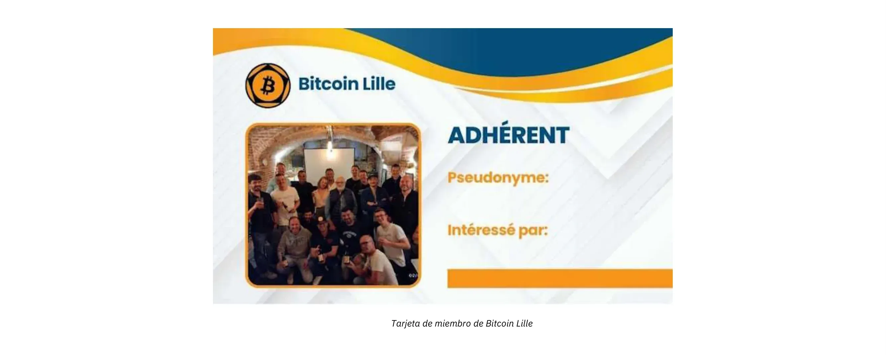

## Planificación del traspaso en caso de fallecimiento

<chapterId>c5febf18-235c-51bc-8fbb-9467dabe4cb0</chapterId>

En otro orden de cosas, vamos a Address un tema delicado: el fallecimiento de un miembro de su comunidad Bitcoin.

Puede que un día la familia de un antiguo miembro se ponga en contacto con usted para informarle de su fallecimiento. Puede que le expliquen que el fallecido dejó instrucciones, entre ellas ponerse en contacto con su comunidad, reunión o asociación.

En algunos casos, la familia también puede solicitar ayuda para recuperar fondos como beneficiarios de la herencia.

Es aconsejable trabajar con su comunidad para establecer de antemano un procedimiento claro para tales situaciones, asegurándose de que:

- El fallecido ya ha aconsejado a su familia que **nunca compartan claves privadas ni lleven carteras físicas a un encuentro**.
- La familia entiende que el propósito de su visita es educativo: aprender cómo funciona el Bitcoin, para poder tomar más tarde el control soberano de los fondos.
- La familia conoce las leyes vigentes en su país en materia de donaciones, herencias y conversión de Bitcoin en dinero fiduciario.

Contar con un protocolo estándar también evita que alguien, miembro o invitado, se aproveche de la situación para robar fondos.

Se podría crear un grupo de trabajo específico para definir este proceso. La asociación Bitcoin de Lille ya está trabajando en un [documento] de este tipo (https://docs.google.com/document/d/1TDfLZjuictC5s3PEM2Z7WmkxIDSJ8Q1E4xevm52pVgU/edit?usp=sharing), que tiene previsto publicar como código abierto en los próximos meses.

## Dar conferencias en escuelas y universidades

<chapterId>65efdb44-e3d4-567c-aedf-972765753d73</chapterId>

La lista de proyectos descrita anteriormente no es, por supuesto, exhaustiva. En general, es más probable que se trate de proyectos internos para su comunidad o encuentros, que pueden ponerse en marcha con bastante facilidad a medida que se desarrollan.

Ahora pasemos a la incorporación.

Como sabe, una de las mejores formas de llegar a un gran público de una sola vez es organizar una **conferencia gratuita**. Esto puede hacerse en institutos y universidades, introduciendo a los jóvenes (y a los no tan jóvenes) en la Bitcoin, tanto si son completamente nuevos en ella como si buscan profundizar sus conocimientos.

Dar una conferencia ante decenas o incluso cientos de personas requiere algo más que conocimientos técnicos. Lo necesitarás:

- Confianza para hablar en público
- Buena gestión del estrés
- Articulación clara
- Buena gestión del tiempo
- Una presentación o taller bien documentado y de alta calidad, adaptado al nivel de conocimientos de su público

Igualmente importante es **mantener la mente abierta y saber cuándo simplificar los conceptos**, sobre todo durante la sesión de preguntas y respuestas o una mesa redonda. No se trata de renunciar a tus principios, sólo de reconocer que los demás pueden ver las cosas de otra manera. A veces es mejor contestar más tarde o dejarlo pasar para que el debate siga avanzando. Si tus argumentos son sólidos y están bien fundamentados, la gente lo reconocerá.

Si te sientes preparado, ¡adelante! El mundo necesita desesperadamente una mejor educación sobre el Bitcoin.

Dicho esto, no se trata de una empresa ligera: exige motivación, esfuerzo y las conexiones adecuadas.

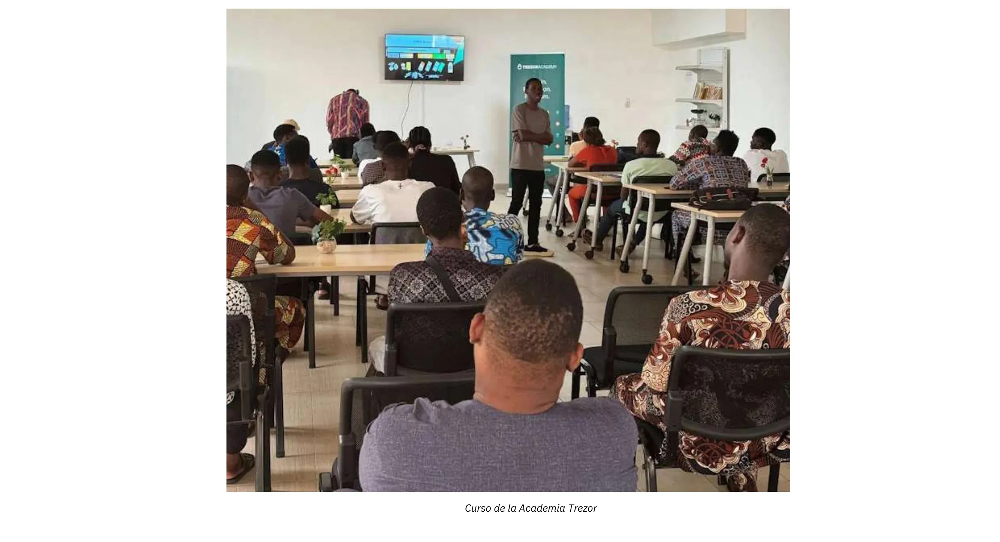

Organizar una conferencia o un taller en una escuela o universidad empieza por encontrar el contacto adecuado. Puede ser:

- Un conocido personal
- Un sindicato de estudiantes
- Una asociación de estudiantes que organiza ciclos de conferencias o actos
- Antiguos profesores de su escuela de ingeniería o universidad
- El coordinador del programa académico, si se pone en contacto directamente

El primer paso suele ser presentar su iniciativa o asociación y solicitar una reunión. En el mejor de los casos, esto conducirá a una presentación sobre la Bitcoin ante los estudiantes unas semanas más tarde.

Por desgracia, el Bitcoin sigue siendo demonizado por gran parte de los medios de comunicación y muchos políticos, lo que lleva a algunos a creer que no tiene cabida en las aulas. Los rechazos son habituales, sobre todo en los círculos académicos, donde temas como el Proof of Work y el consumo de energía siguen siendo controvertidos.

Aun así, merece la pena intentarlo, sobre todo con los sindicatos y asociaciones de estudiantes. ¿Y quién sabe? Aunque en tu primer intento te digan que no, puede que en el próximo encierro recibas un correo electrónico invitándote a hablar, por ejemplo, con 280 estudiantes

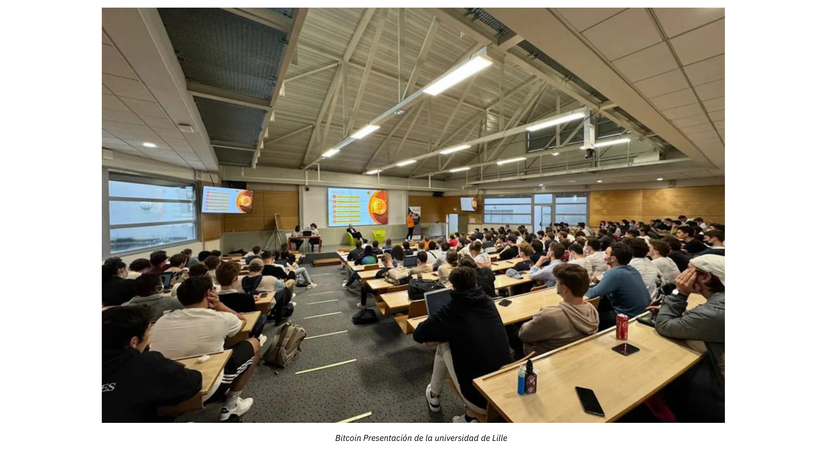

## Acercarse a las empresas

<chapterId>b730462b-7928-5d28-a14f-9ceaa773d3d2</chapterId>

Conseguir que una empresa acepte el Bitcoin es, para muchos bitcoiners, un poco como desbloquear un logro raro en su Pokédex.

Cada comerciante es diferente y su incorporación conlleva sus propios retos:

- Siguen necesitando moneda fiduciaria para pagar a los proveedores.
- Exigen informes financieros claros y listos para la contabilidad.
- Sus sistemas de pago deben ser fiables, fáciles de usar y a prueba de robos.
- Pueden tener ideas equivocadas o preconceptos negativos sobre Bitcoin.
- Encontrar una solución de software perfecta puede ser complicado.
- Hacer que el comerciante entienda por qué merece la pena aceptar Bitcoin como pago.

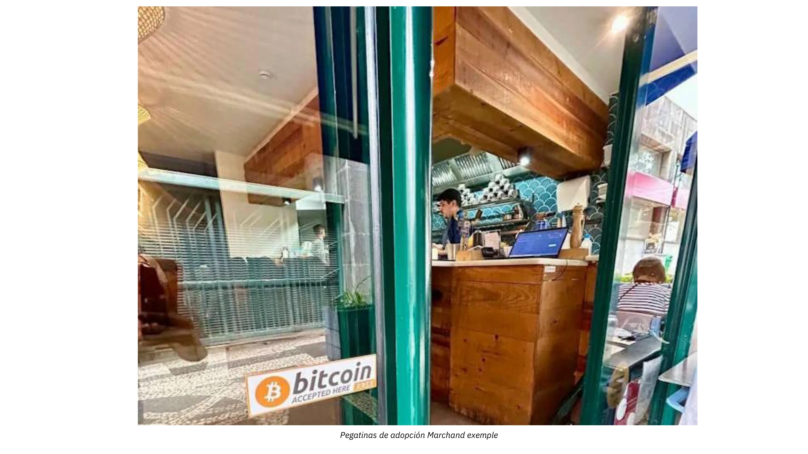

Incorporar a las empresas locales es una de las mejores formas de hacer crecer el ecosistema Bitcoin de tu ciudad. La clave está en ir paso a paso:

1/ **Pida pagar en Bitcoin, cada vez que compre**

La mayoría de las veces recibirás un "no" y quizá una mirada de desconcierto, o incluso un poco crítica, pero el mero hecho de preguntar transmite la idea de que el Bitcoin es algo que la "gente corriente" puede utilizar y que cada vez es más popular como forma de pago. Incluso puedes formar equipo con un par de amigos y pasar por la misma tienda en días diferentes, cada vez pidiendo pagar en Bitcoin. Tarde o temprano, despertará la curiosidad del dueño.

2/ **Ofrecer una explicación sencilla y clara**

Si le preguntan qué es Bitcoin, sea breve y sin jerga. Por ejemplo:

*"Bitcoin es dinero que no está controlado por los bancos, funciona sin intermediarios, no puede ser censurado, no está sujeto a la inflación y tiene comisiones más bajas que la banca tradicional "*

Luego entrégales un folleto, como "21 razones para usar Bitcoin" o "10 razones para aceptar Bitcoin en tu negocio", con tu información de contacto o los detalles de tu reunión. Así, cuando estén listos para una demostración, sabrán dónde encontrarte.

3/ **Organizar una demostración**

Cuando manifiesten interés, fije una hora para mostrarles una solución de pago.

Una gran opción es **[Swiss Bitcoin Pay](https://swiss-Bitcoin-pay.ch/)**, porque:

    - Permite al comerciante convertir automáticamente BTC a fiat todos los días, para poder pagar a los proveedores.
    - Les permite mantener un porcentaje en BTC si lo desean.
    - Genera informes contables exportables para sus contables.
    - Dispone de un sencillo cuadro de mandos para los gestores.
    - Ofrece a los empleados una Interface intuitiva para aceptar pagos sin tocar la caja.
    - Cuesta menos que las comisiones del 2-3% que cobran las redes de pago tradicionales.

4/ **Apoyarles cuando empiecen a aceptar Bitcoin**

Después de que estén a bordo:

    - Visítenos con regularidad y realice compras.
    - Comprueba si todo va bien.
    - Vuelva a compartir su información de contacto si es necesario.
    - Invítelos a sus reuniones.
    - Añádelos a [btcmap.org map](https://btcmap.org/) y comunícalo a [Swiss Bitcoin Pay](https://x.com/swissbitcoinpay) en Twitter para aumentar su visibilidad.
    - Considere la posibilidad de organizar talleres o reuniones en su sede.

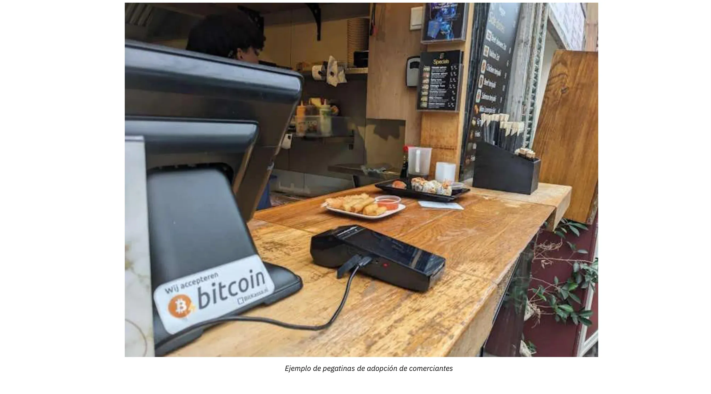

5/ **Conectar a los comerciantes locales**

Una vez que tengas unos cuantos negocios amigos de Bitcoin, sugiere crear un grupo de Telegram exclusivo para comerciantes. Esto puede:

- Permítales que compartan experiencias y que incorporen nuevas empresas.
- Servir de canal rápido de asistencia técnica.
- Reforzar la red local de Bitcoin.

La prospección es un juego a largo plazo. Requiere paciencia, persistencia y estrategia. Pero si tu comunidad está preparada, podrías empezar a sentar las bases de una verdadera economía circular Bitcoin, como [Arnhem en los Países Bajos](https://www.arnhembitcoinstad.nl/) en los Países Bajos.

## Póngase en contacto con la prensa y la radio locales

<chapterId>435bfbc1-22dd-59bb-b737-a32ea995b238</chapterId>

Los bitcoiners suelen centrarse en las redes sociales y las plataformas online para llegar a la gente, pero eso es sólo una parte del cuadro. La prensa local y la radio pueden ser poderosos aliados.

Algunas comunidades, como [Breizh Bitcoin](https://breizhbitcoin.com/) en Francia, **se ponen regularmente en contacto con sus medios de comunicación locales** para:

- Anunciar los próximos eventos (reuniones, presentaciones, talleres, fiestas Halving, etc.).
- Invite a los periodistas a visitar las empresas favorables a la Bitcoin y a escribir sobre ellas.
- Comparta las fechas y lugares de los eventos para incluirlos en los listados locales.

Muchos periódicos siguen publicando una sección "Qué pasa", a menudo escondida en las últimas páginas, donde se enumeran los próximos eventos locales. Breizh Bitcoin ha comprobado que este método funciona: algunos recién llegados han acudido a reuniones simplemente porque han visto el anuncio en el periódico.

Esta estrategia puede funcionar mejor en unas zonas que en otras, pero merece la pena intentarlo. Puede empezar por ponerse en contacto con los medios de comunicación regionales:

- [acpm.fr](https://www.acpm.fr/Les-chiffres/Diffusion-Presse/Presse-Payante/Presse-Quotidienne-Regionale);
- [voxpublic.org](https://www.voxpublic.org/spip.php?page=annuaire&cat=medias&type_media=Presse%20quotidienne%20r%C3%A9gionale).

y poniéndose en contacto con las emisoras de radio locales para proponerles una entrevista o una aparición en un podcast.

Tenga en cuenta que las entrevistas con los medios de comunicación pueden ser delicadas. Las palabras pueden sacarse de contexto o tergiversarse. La preparación es esencial.

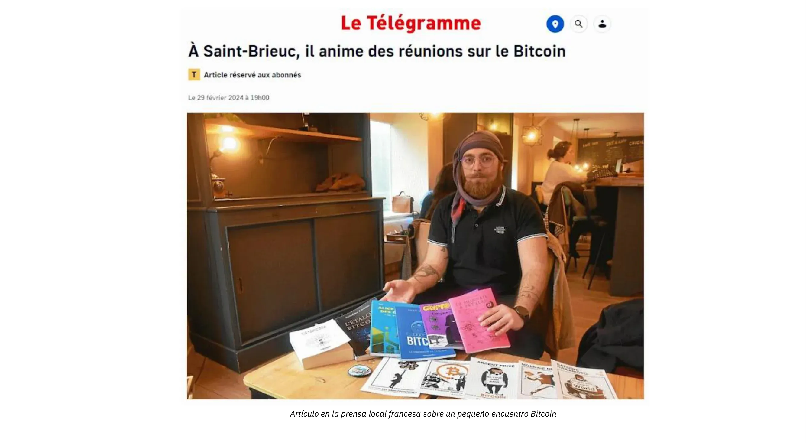

Evidentemente, además de todos los propuestos en esta sección, **se pueden llevar a cabo muchos otros proyectos**. Todo depende de tu tiempo y motivación, pero también de la dificultad del proyecto en cuestión.

Consejos finales para cualquier proyecto de divulgación:

1) **Planifica con antelación**: define tus objetivos, los pasos necesarios y quién hará qué.

2) **Ve paso a paso**: evita el agotamiento moderando tus esfuerzos.

3) **Pida ayuda**: pida apoyo a sus miembros y a las comunidades vecinas.

Recuerda: todos los miembros de la comunidad Bitcoin han estado donde tú estás ahora. No dudes en aprender de sus experiencias y consejos.

# Anticipar el futuro

<partId>6ea07445-9369-54bc-9aa0-d260db026e0b</partId>

## Planificar el aumento de participantes

<chapterId>8af722d4-3a9f-548c-9001-424f2142de12</chapterId>

Cuando la Bitcoin entró en su cuarta era en el bloque 840.000, cada vez más gente empezó a reconocerla como una revolución tecnológica, financiera y social.

Al igual que el auge de Internet, esta revolución llevará tiempo, lo que en realidad es una ventaja. Esto da a la gente la oportunidad de **aprender los fundamentos de Bitcoin**, entender cómo utilizarla y permite a los desarrolladores y empresas **construir los protocolos y aplicaciones** que liberarán todo su potencial.

Nadie puede predecir el futuro, pero podemos **esperar un fuerte aumento de la adopción de la Bitcoin**. Eso significa **estar preparados para todos los escenarios**, incluso los extremos, como un colapso del sistema financiero tradicional o una prohibición total de la Bitcoin.

En esta séptima y penúltima parte del curso, veremos los puntos clave que hay que tener en cuenta a medida que crecen tu comunidad y tus encuentros.

La primera, y la más fácil de prever, es un aumento del número de personas que se unen a su comunidad. Esto le afectará de dos maneras principales:

1/ **Tus canales de comunicación (Telegram, Signal, Matrix, etc.) acabarán saturándose**, lo que dificultará el seguimiento de las conversaciones. Hay que tener en cuenta dos cosas.

En primer lugar, si tienes a 500 personas discutiendo sobre todo tipo de temas en un solo chat, el volumen de mensajes y notificaciones hará que muchos miembros se desconecten inevitablemente. Es un buen momento para replantearse la configuración, por ejemplo, pasando a supergrupos de Telegram o a un servidor de Discord, ya que ambos facilitan la organización de los debates por temas.

En segundo lugar, más gente en tus canales significa más bots, más estafas y, por tanto, más moderación que gestionar. Prepárate para ello creando un conjunto de normas claras a las que puedas remitirte al moderar los mensajes. Según nuestra experiencia, esto ayuda mucho a evitar conflictos, sobre todo si las normas son fácilmente accesibles en tus canales.

Un buen ejemplo es **[el reglamento de código abierto de Bitcoin Lille](https://bitcoinlille.fr/reglement/)** escrito hace unos años para su grupo de Telegram y su servidor de Discord. Se basa en principios sencillos y universales, e incluso puedes hacerte con [una versión personalizable del diseño aquí](https://www.canva.com/design/DAGHI692AD4/rjT4sqEnhajc5FiPA6GFZQ/edit?utm_content=DAGHI692AD4&utm_campaign=designshare&utm_medium=link2&utm_source=sharebutton).

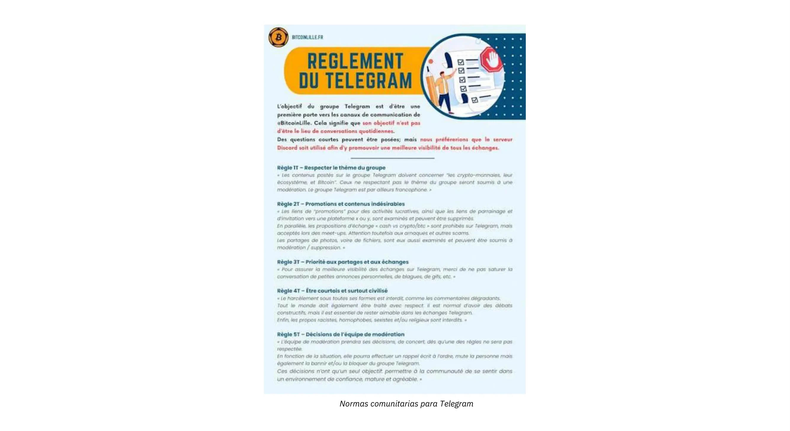

2/ **Tus reuniones y eventos empezarán a atraer a grandes multitudes, con un montón de caras nuevas que aparecerán para conectar**.

Con este aumento de la asistencia:

    - puede que merezca la pena **encontrar un lugar más grande para tus reuniones y eventos**, especialmente si en el pasado sólo has podido acoger a unas veinte personas.
    - si ves que el número de asistentes se vuelve abrumador, puedes, para futuros meetups, **exigir a los participantes que se inscriban** (a través de la aplicación Meetup o de un sencillo formulario) o **celebrar varios meetups cada mes** (por ejemplo: un meetup para principiantes, otro para intermedios y otro para avanzados).
    - Al mismo tiempo, es de esperar que haya muchos recién llegados al ecosistema, a menudo con el objetivo principal de ganar dinero. Para **mantener las conversaciones centradas en Bitcoin** en estos encuentros de rápido crecimiento, es una buena idea:

a) Incluir una **presentación temática de Bitcoin** durante estos eventos, ya que esto naturalmente dirigirá gran parte de la conversación hacia ese tema (y la alejará del último proyecto supuestamente "revolucionario" de shitcoin);

b) **Evita juntarte sólo con otros bitcoiners**. En lugar de eso, **acércate a los recién llegados**, aunque sea al fondo de la sala para saludarles. A partir de ahí, puedes hablarles de por qué han venido, qué buscan, los objetivos (o incluso los principios básicos) de tu comunidad, etc.

Por último, aunque es lamentable tener que decirlo, los estafadores pueden aparecer en los encuentros. Su objetivo puede ser hablar sin parar sobre su esquema Ponzi, MLM o alguna "revolución Blockchain impulsada por IA" También es muy posible que un día, alguien con malas intenciones asista específicamente para blanquear dinero o intentar comprar BTC con billetes falsos.

En situaciones delicadas como ésta, lo más fácil es explicar educadamente que la reunión no es el lugar adecuado para ello, respaldándolo con los argumentos que elijas (por ejemplo, mencionando que podría haber policías de paisano presentes).

Si, por desgracia, se niegan a irse o a comportarse respetuosamente (sí, ha ocurrido), puedes Address el grupo directamente durante el meetup para que todos sepan que una persona , o personas, están intentando algún tipo de actividad maliciosa.

Afortunadamente, estas situaciones son poco frecuentes y a menudo más absurdas que amenazadoras, pero aun así es mejor estar preparado.

Para su tranquilidad: mientras no infrinja personalmente la ley ni facilite directamente transacciones ilegales, no será legalmente responsable de las acciones de los demás en su evento (al menos según la legislación francesa).

En un mundo ideal, tendrías un **espacio lo suficientemente grande como para alojar a varias docenas de personas** a medida que crece tu comunidad y también construirías **fuertes relaciones entre bitcoiners** y futuros bitcoiners durante el mercado bajista, de modo que cuando llegue la carrera alcista, tengas el mayor número posible de personas dispuestas a dar la píldora naranja a los demás.

## Descentralizar la organización comunitaria

<chapterId>bedfc110-e099-58f4-a5b7-fb50f3b19a49</chapterId>

Imagínate lo siguiente: llevas años organizando tu reunión Bitcoin y un día decides dejar ese trabajo, quizá para criar llamas en Perú o perseguir olas perfectas en El Salvador. ¿Qué pasa con tu comunidad cuando te vas?

Planifique con antelación el traslado de su comunidad:

1) **Concede derechos de administrador (o Ownership)** para tus canales de comunicación a miembros de confianza. Los roles siempre pueden cambiar de manos más adelante.

2) **Comparte los datos de las cuentas** (nombres de usuario, contraseñas, correos electrónicos asociados) de tus redes sociales y canales de visibilidad con al menos una persona de confianza.

Sin este acceso, es casi imposible que alguien más tome el relevo de forma efectiva. Empezar de cero, creando grupos "bifurcados" y reconstruyendo la red, es lento, agotador y a menudo desmoralizador.

Si no tienes un contacto de confianza en tu reunión, siempre puedes ponerte en contacto con @ProfEduStream, @copinmalin o @gabtribe en Telegram. Pueden ayudarte a encontrar un sucesor motivado y coordinar la transferencia de cuentas y derechos de administrador.

**¿Por qué es importante la descentralización?**

Si eres el único implicado y tienes todo el control, ¿qué pasa si desapareces? La respuesta es sencilla: tu comunidad también desaparecerá.

La solución: descentralizar las tareas, las funciones y el acceso para que el grupo pueda seguir funcionando incluso si uno de los organizadores abandona, ya sea por falta de tiempo o, en el peor de los casos, porque le detienen por tener un Bitcoin que no cumple los requisitos de identificación.

**¿Cómo impulsar más la descentralización?**

Adoptar **software libre y de código abierto** como [la suite framasoft](https://framasoft.org/fr/) para reducir la dependencia de plataformas centralizadas y añadir resistencia frente a posibles censuras estatales o prohibiciones de la Bitcoin.

Utiliza **herramientas de comunicación cifradas o anónimas** para proteger la privacidad de tus miembros y las actividades de tu comunidad.

## ¿Y si la Bitcoin se convirtiera en el enemigo público nº 1?

<chapterId>c739651f-cd13-51e0-a36e-85023749b15b</chapterId>

El 5 de abril de 1933, Franklin Roosevelt, 32º Presidente de los Estados Unidos de América, firmó la **Orden Ejecutiva 6102**, por la que se declaraba ilegal que los particulares poseyeran monedas, lingotes o certificados de oro en cualquier lugar del país.

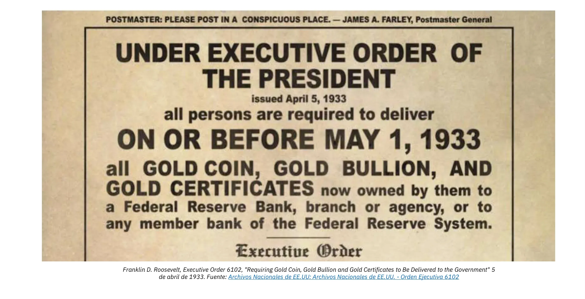

Por supuesto, la Gran Depresión (crack bursátil de 1929) no es nuestra realidad actual. Pero ¿podría algún día un gobierno hacer lo mismo con la Bitcoin: **prohibir rotundamente la Ownership privada?**

La verdad es que una medida tan orwelliana no impediría realmente que alguien poseyera BTC, porque ninguna ley puede impedir que una persona memorice una secuencia de palabras.

Pero, ¿y si los líderes mundiales se dieran cuenta por fin del potencial de la Bitcoin para remodelar el orden mundial, incluso a nivel estatal? ¿Se le llamaría entonces "Enemigo Público nº 1"?

No necesitamos caer en el pensamiento conspirativo. Pero nada nos impide anticiparnos, descentralizar y educar, desde ahora.

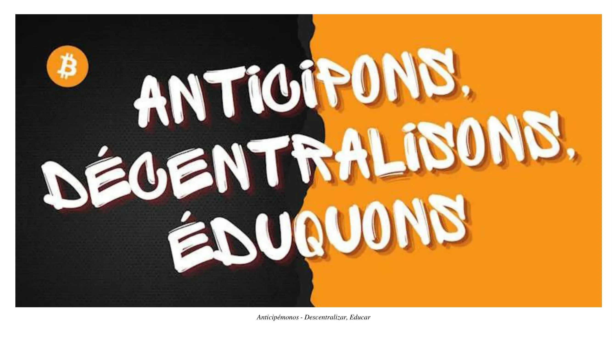

# Reunir a los bitcoiners

<partId>62bc2138-c0be-5d39-a341-594690863257</partId>

## Plan de acción rápido para construir su comunidad Bitcoin

<chapterId>1f463ec2-3f64-5641-8d60-e02a47c94f27</chapterId>

Satoshi Nakamoto creó una herramienta revolucionaria que ya está cambiando nuestro mundo. Pero depende de nosotros, los bitcoiners, decidir cómo modelamos el futuro.

La Bitcoin es una inmensa madriguera de conejos que toca la historia, la economía, la literatura, las matemáticas, la informática y la criptografía. Nadie puede explorarlo todo, y eso es parte de su belleza.

Dado que nuestro tiempo es limitado, la clave está en mantenernos humildes, seguir aprendiendo y compartir nuestros conocimientos con los demás. Así, cada uno de nosotros podrá alcanzar el nivel de comprensión que busca.

**Las comunidades Bitcoin globales desempeñan, por tanto, un papel fundamental en la construcción del mundo del mañana**: espacios donde los bitcoiners pueden **Exchange, construir y compartir**. **Juntos**.

Como has visto a lo largo de este curso, **crear una comunidad Bitcoin y organizar encuentros** requiere planificación y motivación. Dependiendo de tus objetivos y del tiempo que puedas dedicar, puedes emprender proyectos más ambiciosos o simplificar las cosas.

En cualquier caso, el objetivo es el mismo: **despertar interés y ayudar a que Bitcoin crezca en tu ciudad**.

Para concluir los numerosos capítulos y subcapítulos que hemos tratado, he aquí un **conciso "plan de acción "** para crear su comunidad Bitcoin:

1) Decida de antemano por qué quiere crear una comunidad Bitcoin, cuáles son sus objetivos y en qué ciudad o localidad va a operar.

2) Ponte en contacto con las comunidades cercanas y no dudes en pedirles consejo cuando lo necesites;

3) Cree una identidad clara para su comunidad que refleje su comunidad y ubicación (logotipo, cartel, pancarta, folleto, etc.)

4) Crear canales de comunicación y redes sociales como Telegram, Twitter, NOSTR, Discord o Simplex. Considera también canales descentralizados y/o resistentes a la censura.

5) Siga en línea a otros grupos y comunidades locales, y consiga que su grupo aparezca en varios mapas y plataformas para aumentar su visibilidad.

Una vez que los canales de comunicación de tu comunidad estén activos:

6) Lanza una encuesta para proponer tu primer encuentro una vez que sientas que se está creando suficiente interés.

7) Defina los objetivos que desea alcanzar con este evento presencial.

8) Elija un lugar acogedor y bien situado que se ajuste a sus objetivos y reserve una mesa o una sala.

9) Promocione el evento en sus canales una semana antes y, de nuevo, dos o tres días antes de la fecha.

10) Publique su evento en sitios web y plataformas relevantes.

11) El día del evento, deja que fluya con naturalidad y dialoga con los participantes, dirigiendo suavemente los debates si es necesario.

Después:

12) Centrarse en retener e implicar a los participantes para que vuelvan.

13) Proponga proyectos o iniciativas sencillos y ponga en marcha aquellos que le interesen personalmente. Si otra persona quiere liderar un proyecto diferente, apóyala en lo que puedas.

Por fin:

14) Anticipar el futuro pensando en un lugar más amplio para las reuniones, normas para los canales de comunicación, un sitio web, etc;

15) Anima a los comercios locales a aceptar el Bitcoin, aunque sólo sea preguntando cada vez que compres allí.

16) Delegue tareas y derechos de administrador de canal/red a miembros de confianza.

17) Promociona ampliamente tu comunidad para que se una más gente, e implica a quienes muestren interés.

18) Ve más allá con proyectos que te gusten y sean importantes para ti.

Para una visión más rápida, este vídeo de 21 minutos resume estos pasos:

:::video id=a59956da-f554-4b54-89dd-5ca55b722686:::

Recuerda: **no estás solo, las comunidades existentes están aquí para apoyarte**.

## Cuidarse

<chapterId>cf1631cb-ddbe-55c7-be8c-26a5652979a0</chapterId>

Cuando caes en la madriguera de Bitcoin, tu perspectiva de la vida cambia.

En el fondo, sientes la necesidad de ir más allá, de conocer a otras personas que están atravesando el mismo viaje mental.

Esa energía te impulsa a aportar tu pieza al rompecabezas compartiendo tu descubrimiento: Bitcoin. También te inspira a pensar en el mundo del mañana, el que quieres ayudar a construir, y en las comunidades que trabajan para conseguirlo.

Construir una comunidad es un largo túnel que requiere motivación, estrategia, dedicación y tiempo. Puede ser una tarea ingrata, así que es importante ir paso a paso para evitar quemarse.

**Piensa en ti mismo, en tus límites**. Y aunque Bitcoin te lleve noche y día, **no intentes hacerlo todo tú solo, o te quemarás**.

En su lugar, **busca ayuda de bitcoiners que ya hayan recorrido el mismo túnel, explorado los mismos caminos y construido las mismas herramientas**. Te ahorrará mucho tiempo.

**Invita a los que te siguen en esta aventura a echar una mano**, aunque delegar haga que ciertas tareas lleven más tiempo. A la larga, tu comunidad será más fuerte y resistente.

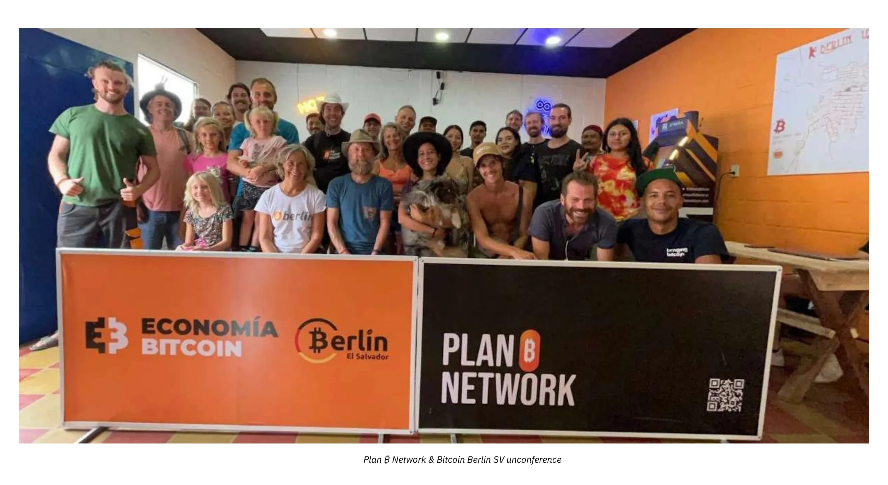

Solo, puedes explorar rápidamente uno de los muchos túneles de la madriguera de la Bitcoin. Pero recuerda que hay otras innumerables direcciones que explorar.

**Creando y/o uniéndote a una comunidad de bitcoiners, y compartiendo e intercambiando con ellos regularmente, te moverás en todas direcciones por la madriguera del conejo al mismo tiempo.**

## BTC302, Lo que viene

<chapterId>8bf10b77-80ee-5d50-87bc-0ef32574a675</chapterId>

En este curso BTC302, hemos entrado en detalle sobre cómo crear una comunidad o meet-up, así como la forma de poner en marcha una variedad de proyectos.

Cuando tu comunidad esté preparada para dar el siguiente paso, **puedes crear una asociación formal**.

En Francia, por ejemplo, de las cerca de sesenta comunidades y encuentros, casi una docena tienen estatuto de asociación.

Los beneficios son dobles:

- **Reconocimiento oficial**: puede abrir una cuenta bancaria de la asociación, recibir atención de la prensa y los medios de comunicación e incluso solicitar subvenciones.
- **Organización estructurada**: puedes definir funciones claras, lo que facilita la gestión de tu comunidad y la realización de proyectos.

Para que tu comunidad crezca aún más, **un seguimiento del curso COMMU302** 

podría publicarse en [planb.network](https://planb.academy/) en los próximos meses.

Esta próxima sesión podría explorar temas avanzados como:

- Diseñar presentaciones o talleres para sus reuniones y fijar objetivos claros.
- Organizar un acto a gran escala con unos 100 participantes.

Para ello, nos basaremos en las experiencias de comunidades que ya han creado sus propios actos y presentaciones.

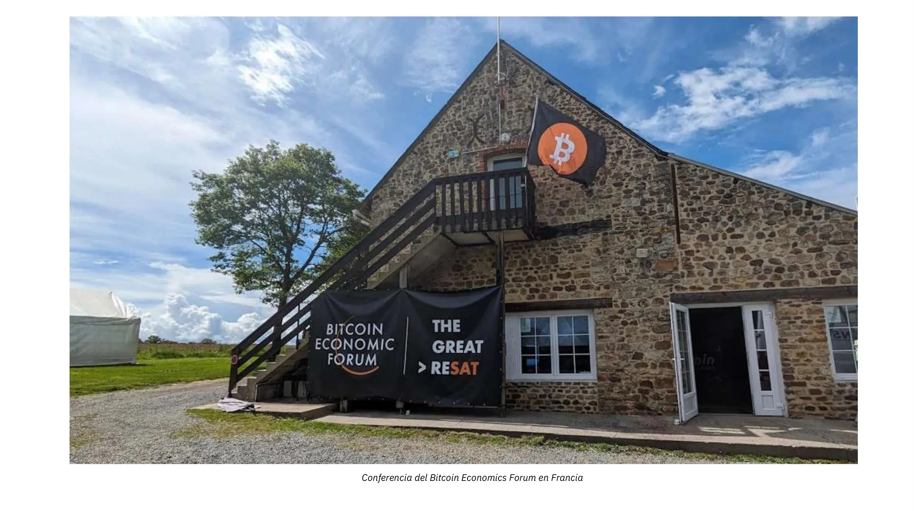

# Sección final

<partId>e9bdddf4-54c9-4de9-bbce-c3eade8c32e5</partId>

## Opiniones y valoraciones

<chapterId>08a35d2a-204b-519a-9bb1-588665a037fa</chapterId>

<isCourseReview>true</isCourseReview>

## Conclusión

<chapterId>d74606a5-cb14-4117-acb2-2bf5920de092</chapterId>

<isCourseConclusion>true</isCourseConclusion>