# Esimene samm Bitcoini omaksvõtu suunas

Tänapäeval saab igaüks Bitcoinist internetis õppida, kuid sageli puudub võimalus kohtuda, ideid vahetada ja koos ehitada. Selle lünga täitmiseks moodustavad paljud bitcoinerid kohalikke kogukondi, kus kohtumised käivitavad töötube, ettekandeid ja sisukaid arutelusid.

BTC304 kursusel vaatame, miks kogukonna loomine on oluline, uurime tööriistu tugeva visuaalse ja digitaalse identiteedi loomiseks ning jagame lihtsaid avatud lähtekoodiga projekte, mida saate käivitada. Samuti kaalume, kuidas kohalikud algatused laienevad riiklikeks kogukondadeks, mis võivad aidata juhtida hüperbitcoiniseeritud tulevikku.
+++
# Sissejuhatus

<partId>81318b8f-d316-5787-aa4c-4ec8370ba668</partId>

## Kursuse ülevaade

<chapterId>e8991b82-4966-5e04-8f05-7cae46eacbaa</chapterId>

Tere tulemast BTC302!

Alates 2009. aastast on Bitcoin pidevalt kasvanud. See kasv on võtnud kuju uute Bitcoin parendusettepanekute (BIP), täiendavate kihtide loomise kaudu, et muuta võrk skaleeritavaks (muu hulgas Lightning Network), ning mitmete ettevõtete ja alustavate ettevõtete arendamise kaudu.

Selle areng on ilmne ka On-Chain puhul, kus tehingute arv kasvab pidevalt.

Näiteks ajavahemikul 1. jaanuarist 2018 kuni 1. jaanuarini 2024 on tehingute arv Bitcoin peamisel Layer-l hinnanguliselt [kasvanud 66,2%] (https://dune.com/queries/3375917/5663935). Vahepeal, 2021. aasta augusti ja 2023. aasta augusti vahel, on Lightning Network avalike tehingute arv [tõusnud 1212%](https://river.com/learn/files/river-lightning-report-2023.pdf).

See märkimisväärne kasv on muidugi tihedalt seotud:

- [inimeste kasvav huvi kogu maailmas Bitcoin kasutamise vastu](https://profedustream.substack.com/p/21-raisons-dutiliser-Bitcoin), et vabaneda pangandussüsteemist ja/või kasutada vähem volatiilset või vähem devalveeritud valuutat, nagu seda teevad Liibanoni, Süüria, Egiptuse, Argentina ja teiste riikide elanikud;
- selle hinna tõusu aja jooksul, kehtestades selle kui väärtuse säilitaja ja pikaajalise investeeringu, mis on tingitud fikseeritud rahapoliitikast;
- spekulatiivse krüptovaluutaturu järjestikune kasv, eriti aastatel 2017-2018 ja 2020-2021;
- Bitcoin kasvav kohalolek peavoolumeedias.

Kuigi Bitcoin on alles algusjärgus, sunnib see reaalsus, mida te tõenäoliselt juba teate, meid kaaluma kahte põhiküsimust:

- Kuidas me saame julgustada bitcoinereid oma õppimises ja projektides edasi minema, et **täielikult kasutada Bitcoin potentsiaali**?

- Kuidas saame aidata uustulnukatel, keda sageli tõmbab lühiajaline spekuleerimine, vältida raha kaotamist viimases memecoini hulluses ja selle asemel keskenduda ** Bitcoin põhialuste tundmaõppimisele**?

Parim lahendus mõlemale väljakutsele on lihtne: **Ole kohal reaalses maailmas ja anna haridust**.

Selle kursuse eesmärk on anda teile kõik, mida vajate Bitcoin kogukonna või kohtumise loomiseks ja tõhusaks korraldamiseks. Olenemata sellest, kas soovite luua kohaliku algatuse või kasvatada veebirühma, juhendab see kursus teid samm-sammult: alates visuaalse identiteedi loomisest kuni korrapäraste ürituste korraldamise ja suhtluskanalite haldamiseni.

**1. jagu: Sissejuhatus**

Alustame sellega, et rõhutame, kui oluline on ühendada inimesi Bitcoin ümber, olgu selleks siis veebikogukonnad või kohalikud kohtumised. Saate teada, miks ja kus oma kogukonna käivitada ning kuidas seada selged eesmärgid, et edendada selle kasvu ja pikaajalist jätkusuutlikkust.

** 2. jagu: Bitcoin kogukonna unikaalse identiteedi kujundamine**

Uute liikmete ligimeelitamiseks ja ühtekuuluvustunde edendamiseks on oluline luua ainulaadne identiteet. Selles jaotises saate teada, kuidas kujundada logosid, plakateid ja bännereid, mis kehastavad teie Bitcoin kogukonna vaimu.

**Jagu 3: Kommunikatsioonikanalite loomine teie Bitcoin kogukonnale**

Kommunikatsioon on iga kogukonna selgroog. Selles jaotises uurime, milliseid kanaleid on kõige parem kasutada, ja juhatame teid Telegrami grupi või Discordi serveri tõhusaks loomiseks. Samuti saate teada, kuidas integreerida multifunktsionaalseid botte, et lihtsustada kogukonna haldamist.

**Lõik 4: Sotsiaalvõrgustike käivitamine** (prantsuse keeles)

Nähtavus on kogukonna kasvatamise võti. Selles jaotises saate teada, kuidas luua spetsiaalne Twitteri profiil, luua ühendust kohalike kohtumistega ja kasutada selliseid platvorme nagu btcmap.org, et suurendada oma nähtavust ja meelitada uusi liikmeid.

**Lõik 5: Bitcoin kohtumise korraldamine**

Selles jaotises käsitletakse kohtumiste korraldamist: alates õige toimumiskoha valikust kuni ürituse korraldamiseni. Samuti uurime strateegiaid osalejate lojaalsuse suurendamiseks ja kogukonna pikaajalise jätkusuutlikkuse tagamiseks.

**Jagu 6: Projektide ja algatuste näited** (prantsuse keeles)

Et minna kaugemale lihtsatest kohtumistest, tutvustab see osa konkreetseid ja originaalseid projekte: alates temaatilistest üritustest ja töötubadest kuni haridusliku sisu loomise ja kohaliku koostöödeni. Samuti saate teada, kuidas kujundada nii füüsilisi kui ka digitaalseid materjale oma kogukonna edendamiseks.

**7. jagu: Tuleviku prognoosimine**

Siinkohal uurime teie kogukonna loomulikku arengut: mida teha, kui kogukond kasvab liiga kiiresti, kuidas detsentraliseerida oma organisatsiooni ja kuidas reageerida vaenulikule regulatiivsele keskkonnale. See osa aitab teil neid probleeme ette näha ja ületada.

** 8. jagu: Bitcoinerite ühendamine**

Viimane osa keskendub teie projekti põhiolemusele: Bitcoin entusiastide ühendamine ühise visiooni ümber. Saate teada, kuidas struktureerida oma lähenemisviisi, et meelitada ja hoida liikmeid, delegeerida ülesandeid tõhusalt ja kasvatada oma kogukonda jätkusuutlikult.

Kas olete valmis õppima, kuidas ehitada tugevat, elujõulist Bitcoin kogukonda? Sukeldume!

## Miks alustada Bitcoin kogukonda või kokkusaamist?

<chapterId>893ea248-7d5a-5b8e-948c-7031497b1031</chapterId>

### Mis vahe on kogukonnal ja kokkusaamisel?

Kuigi Bitcoin ökosüsteemis ei ole nende mõistete kohta ranget määratlust, on kogukonna all kõige parem mõista inimeste rühma, kes jagavad ühist kirge ja suhtlevad regulaarselt.

Meetup on aga üritus, mida korraldab see kogukond ja mis on selle kogukonna jaoks korraldatud ja millel on konkreetne eesmärk. Meetupid toimuvad tavaliselt siis, kui kogukond on juba loodud.

Selle kursuse puhul eeldame, et enne Bitcoin kokkusaamise käivitamist olete juba suhelnud mõne inimesega, kes on huvitatud sellise ürituse korraldamisest, ehk teisisõnu, **ühendus on juba olemas**.

### Miks luua Bitcoin kogukond?

Bitcoin kogukonna loomisel on mitu põhjust:

- Teadmiste jagamine ja koostöö: Kogukonnad annavad liikmetele ruumi Exchange ideede ja teadmiste jagamiseks. Vastastikune tugi on kasvu võtmesammas, mis võimaldab kõigil kiirendada oma õppimist, mis on eriti oluline Bitcoin puhul, arvestades, kui palju on veel avastamist.

- Peer-to-peer ehitamine: Paljud algatused ja projektid on kavandatud, üles ehitatud ja arendatud nendes kogukondades.

Bitcoin kogukonnad taotlevad sageli laiemaid eesmärke, eriti avalikku haridust:

1. Mis on Bitcoin;

2. Kuidas see toimib;

3. Selle panus ühiskonda;

4. Mõnede avaliku elu tegelaste ja meedia poolt esitatud eksitavate või alusetute väidete ümberlükkamine;

5. Põhilised erinevused Bitcoin ja teiste krüptovaluutade vahel;

Ehitades esimesed homsed "linnakud", **Bitcoin kogukonnad üle maailma on kaitsevalliks desinformatsiooni ja tsensuuri vastu, pakkudes samal ajal viljakat pinnast Bitcoin põhialuste õppimiseks**. Nad pakuvad uustulnukatele, isegi skeptikutele, ressursse ja ühendusi, mis on vajalikud Bitcoin tõelise potentsiaali uurimiseks.

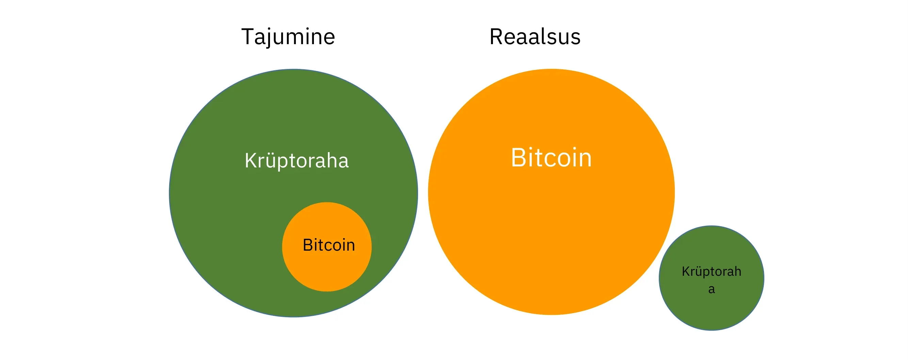

Samuti tasub märkida, et **kogukond võib eksisteerida täielikult internetis**, olgu see siis Telegrami grupp ("Bitcoin London"), Facebooki grupp ("Bitcoin Berlin"), Discordi server ("Bitcoin Madrid") või isegi meililist ("Bitcoin Prantsusmaa").

Teisisõnu, **kogukond ei vaja füüsilisi kohtumisi, et areneda või projekte käivitada. Selle põhieesmärk jääb samaks: jagada, ehitada ja harida**.

### Miks luua kokkusaamine?

Nagu eespool mainitud, **kohtumised toimuvad tavaliselt pärast kogukonna loomist ja täiendavad seda**.

Kui bitcoineri teekond areneb, tekib sageli soov või isegi vajadus **sellega kohtuda ja suhelda isiklikult teistega** samast ökosüsteemist. See võib tuleneda sellest, et tunneb end isoleerituna või lihtsalt ei ole kedagi, kellega Bitcoin kohta igapäevaelus rääkida.

Kohtumised pakuvad isiklikumat ja külalislahkemat kogemust kui veebipõhised audio- või videokõned. Kas **jookide või söögi** juures, need loovad mitteametlikud, sõbralikud ruumid, kus inimesed saavad Exchange ideed avalikult ja otse esitada.

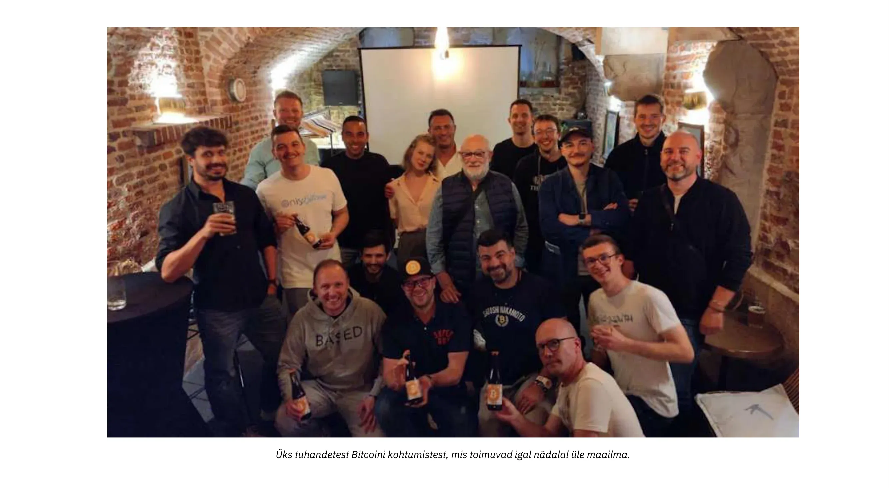

Bitcoin kohtumised võivad teenida mitmeid eesmärke:

- Tehniliste teemade või käimasolevate projektide arutamine
- Aidates uutel bitcoin'i kasutajatel järk-järgult sügavamale Bitcoin maailma sukelduda
- Uute projektide või algatuste väljakuulutamine
- Materjalide või raamatute vahetamine
- Dokumentaalfilmide esilinastus
- Konverentside või töötubade korraldamine konkreetsetel teemadel

Paljusid neist võimalustest käsitleme üksikasjalikult käesoleva kursuse 6/8. osas pealkirjaga "[Projektide ja algatuste näited](https://planb.network/courses/1c643dc9-a15f-4f9e-93b6-cb3c58b4ee35/3213d87a-1998-5972-ab93-97a5769ba279).

Kuigi iga kogukond võib vabalt kujundada oma arvamusi, käivitada projekte ja katsetada omal moel, osutuvad kohtumised üha enam **oluliseks Bitcoin arenguks ja bitcoin'i kasutajate kasvuks**. **Korraldamine nõuab siiski aega ja vaeva**, mistõttu jagab see kursus [umbes kuuekümne Bitcoin kogukonna Prantsusmaal ja Belgias](https://btcmap.org/communities/map#2/5.24949/0.20000) ühendatud kogemust, et aidata teil oma kogukonda ja kokkusaamisi võimalikult sujuvalt luua ja kasvatada.

## Kuhu peaksite oma kogukonna looma?

<chapterId>72da5285-5395-592d-ab62-303a0aef3d6d</chapterId>

Esimene küsimus, mida tuleb küsida, on: kus peaks teie kogukond asuma?

See otsus on oluline, kui soovite säilitada võimaluse korraldada kohtumisi hiljem.

Kui liikmed peavad üritusel osalemiseks sõitma kaks tundi, on osavõtjate arv tõenäoliselt väike. Seepärast on õige **paiga valimine teie kogukonnale ja seega ka tulevastele kohtumistele väga oluline selle kasvule**.

Mõned näpunäited, mis aitavad teil otsustada:

1/ **Loo ja kasvata oma kogukonda keskmise suurusega või suures linnas**. See muudab lihtsamaks:

    - Leidke meeldivad kohtumispaigad kohtumiste ja projektide jaoks (esitlused, õpitoad, Bitcoin kasutuselevõtu edendamine jne);
    - Suurendada suurema hulga inimeste kaasatuse ja kuuluvuse tunnet;
    - Parandada ürituste kättesaadavust (ühistransport, parkimine jne). Väga soovitatav on valida koht, mis asub ühistranspordi ja parkimise lähedal.

2/ **Valige oma linnaga seotud nimi**. Nii on inimestel lihtne teie kogukonnaga samastuda. Näiteid: Bitcoin Paris, Einundzwanzig Berlin, Satoshi Spritz Milano jne.

3/ **Kontrollige, kas teie lähedal on juba olemas kokkusaamine**.

Võite vaadata [btcmap.org](https://btcmap.org/communities/map#0/0/0/), kus on loetletud enamik Bitcoin kogukondi ja kohtumisi üle maailma.

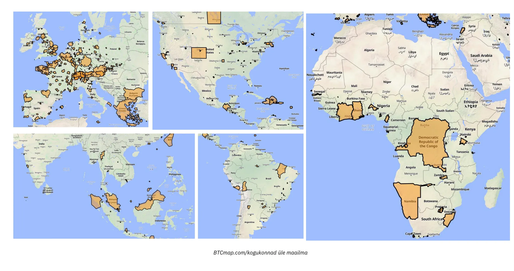

Pärast mõningaid uuringuid võite leida oma linnas olemasoleva kokkusaamise või kogukonna.

Bitcoin on detsentraliseeritud, nii et loomulikult võib igaüks teha, mida ta soovib.

Kuid **jõudude ühendamine on sageli mõistlikum kui lähedaste kogukondade jagamine ja igaühe mõju vähendamine**. Täiesti uue kogukonna loomine seal, kus juba on üks olemas, võib tahtmatult tekitada konkurentsi.

Selles mõttes võib aidata lihtne "rusikareegel": kui 30-45 minuti raadiuses teie elukohast ei ole aktiivset Bitcoin kogukonda, võib tasub alustada uut kogukonda. See tähendab, et te võite alati teha, mida soovite.

Ja muidugi, kui vanem kogukond on "arenenud" suunas, mis ei vasta enam teie väärtustele, ja teil ei ole aega või motivatsiooni neid "oranžida", siis on alati võimalus luua oma Fork.

## Millistest eesmärkidest peaks teie kogukond juhinduma?

<chapterId>0aae1aa8-93ec-544a-ad88-22d32c619595</chapterId>

Kui olete oma kogukonna linna (või geograafilise piirkonna) kindlaks määranud, on aeg **määratleda, mida soovite saavutada**.

Neid eesmärke võib seada kohe käivitamisel või täpsustada hiljem, kui mitu liiget on liitunud ja teie rühm on aktiivselt kaasatud.

Siin on mõned punktid, mis aitavad teie mõtlemist suunata:

1/ **Milleks ma bitcoinerina seda kogukonda loodan?** Kas selleks, et jagada teadmisi? Harida teisi? Õppida kogenumatelt eakaaslastelt? Kohtuda mõttekaaslastega? Saada osa Bitcoin ökosüsteemist? Ühenduda spetsialistidega? Või lihtsalt juua ja leida uusi sõpru?

Teie vastused kujundavad teie positsiooni ja motivatsiooni.

Kui teie eesmärk on **jagada teadmisi ja harida inimesi Bitcoin kohta**, keskenduge **hariva sisu loomisele** (artiklid, podcastid, videod, esitlused, flaierid jne), säästes teistele lugematuid tundide kaupa uurimistööd. Võite minna veelgi kaugemale, **korraldades seminare, ettekandeid ja konverentse**.

Kui teie eesmärk on lihtsalt kohtuda teiste bitcoin'i kasutajatega ja jagada kogemusi, võite võtta rahulikuma lähenemisviisi, näiteks kohtuda ühe joogi jaoks.

Nii saate kergemini luua sotsiaalseid sidemeid. Kuid pidage alati meeles, et **õlle joomine ei ole õige tee homse maailma ehitamiseks**.

Seepärast on **konkreetsete eesmärkide ja projektide seadmine väga oluline**.

2/ Kas ma peaksin oma kogukonnale andma **füüsilise mõõtme**? Kui jah, siis milliseid üritusi peaksite korraldama?

Teie esimene üritus on tõenäoliselt kohtumine. Selle peamine eesmärk on tuua kokku bitcoini kasutajad teie piirkonnas.

Kuid nagu me hiljem näeme [Projektide ja algatuste näited](https://planb.network/courses/1c643dc9-a15f-4f9e-93b6-cb3c58b4ee35/3213d87a-1998-5972-ab93-97a5769ba279), **kohtumine võib olla üles ehitatud mitmel viisil ja paljude eesmärkidega:**

- Ühendage võrgustike loomine Bitcoin kontseptsiooni haridusliku ettekandega;
- Korraldage Bitcoin lahenduste professionaalne esitlus;
- Arutelu strateegiate üle oranžide pillide kohalike kaupmeeste jaoks;

ja nii edasi.

Sõltuvalt teemadest (tehnilised loengud või praktilised töötoad) võib olla isegi mõistlik **organiseerida täiendavaid üritusi** väljaspool teie tavapärast kohtumist.

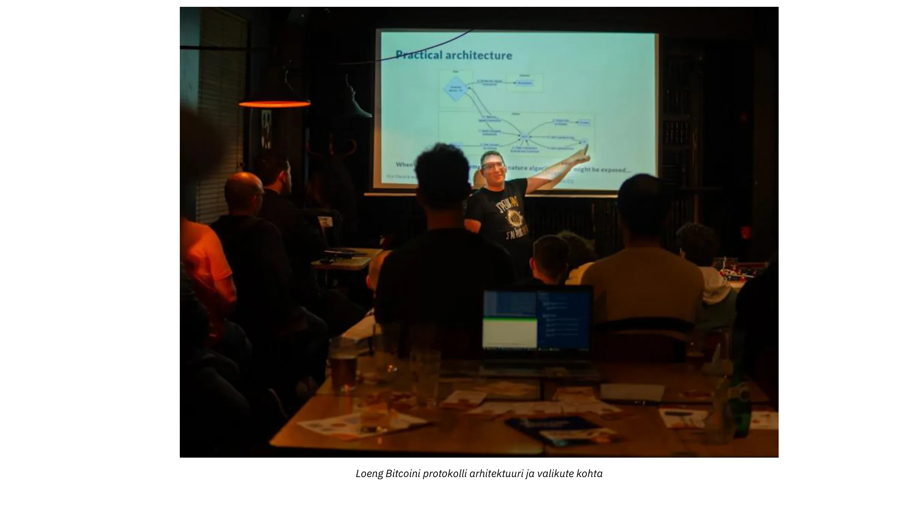

3/ Kuidas ma tahan, et minu kogukond panustaks Bitcoin ökosüsteemi?

See on keerulisem küsimus, kuid selle üle tasub varakult järele mõelda.

Kui teie visiooniks on **loome tihedalt seotud, motiveeritud kogukonna**, mis keskendub võimalikult paljude inimeste oranžile pilliroogile, siis:

- Tehke koostööd olemasolevate kogukondadega, et saada vajaduse korral juurdepääs laiemale teabele, avatud lähtekoodiga ressurssidele ja väärtuslikule toetusele.
- Korraldage ja delegeerige ülesandeid oma rühmas, et oma jõupingutusi tõhusalt laiendada ja laiendada.

**Seadke lühi-, kesk- ja pikaajalised eesmärgid**

Praktiline viis planeerimiseks on seada igaks ajaperioodiks eesmärgid:

- Lühiajaline: luua sotsiaalmeedia kohalolek ja luua kogukonna suhtluskanalid.
- Keskmise tähtajaga: haridusressursside loomine (artiklid, flaierid, videod).
- Pikemas perspektiivis: käivitada korrapärased füüsilised kohtumised.

Kui kohtumised on loodud, võiksite eesmärgiks võtta:

- Lühiajaline: korraldame töötubasid või esitlusi konkreetsetel teemadel
- Keskmise tähtajaga: Bitcoin teadlikkuse tõstmise või koolituskampaaniate läbiviimine
- Pikaajaline: luua ametlik ühendus või partnerlus baariga, mis võtab Bitcoin maksetena vastu.

Olge valmis: **Kogukonna loomine nõuab pingutust**

Kogukonna loomine ei toimu üleöö. Selleks on vaja aega, motivatsiooni ja organiseerimist.

Mõnikord võib see tunduda isegi masendav, eriti kui keegi ei tule kohale ja sa tunned, et oled ainus, kes seda missiooni oma õlgadel kannab.

Seepärast ongi **see kursus loodud selleks, et jagada väärtuslikke ressursse ja näpunäiteid, mis aitavad kogukondadel tõhusalt kasvada ja lõpuks iseseisvaks saada**.

# Ühenduse identiteedi kujundamine Bitcoin

<partId>da6673ad-bf49-5979-80a6-3f69cfb28046</partId>

## Miks ja kuidas saate luua oma identiteedi?

<chapterId>b48a18cc-afdf-5216-802c-32647b5cd8a3</chapterId>

Selles etapis eeldame, et:

- Te juba teate, kus teie kogukond (või tulevane regulaarne kohtumine) asub.
- Olete seadnud eesmärgid erinevateks ajaperioodideks, isegi kui need ei ole veel lõplikud.

Järgmine samm kogukonna loomisel on **määratleda selle identiteet**, nii nimi kui ka visuaalne stiil.

Selles jaotises leiate õpetusi ja algajaile sobivaid tarkvaralahendusi, mis aitavad teil kujundada oma kogukonna visuaalset identiteeti isegi algajate oskustega.

**Miks on identiteet oluline?**

Inimesed tunnevad end rohkem kaasatud ja pühendunumana, kui nad saavad end rühmaga samastada. Tugev identiteet aitab teie kogukonnal eristuda ja soodustab ühtekuuluvustunnet.

Kõik algab nime valimisega ja igal riigil on sageli oma suundumused:

- Prantsusmaa: Bitcoin [CITY]" või "[CITY] Bitcoin". Nende Telegram-grupid järgivad sageli seda mustrit: "Bitcoin [CITY] meetup".
- Saksamaa: Einundzwanzig (mis tähendab "21") algatus inspireeris selliseid nimesid nagu "Einundzwanzig [CITY]".
- Itaalia: Satoshi Spritz võrk kasutab selliseid nimesid nagu Satoshi "Spritz [CITY]".

**Ja igal kogukonnal on oma identiteet, mis on seotud kodulinnaga, kuid samas ka riigi laiema identiteediga**.

Teie visuaalne identiteet: logo, värvid, bännerid on see, mida inimesed mäletavad ja seostavad teie rühmaga.

Sotsiaalmeedia kontode ja suhtluskanalite loomisel on logo ja bänneri olemasolu tugev pluss. Ärge muretsege, te ei vaja professionaalseid disainioskusi; saadaval on tasuta ja lihtsasti kasutatavad tööriistad.

Suurepärane lähtepunkt on lisada oma linna maamärk või sümbol. Pariisi puhul võib selleks olla Eiffeli torn. Lille'is kellatorn või tsitadell. New Yorgis Vabadussammas. Londonis Big Ben jne.

Sealt edasi saate kujundada kas lihtsa või üksikasjalikuma logo, sõltuvalt teie eelistustest.

Siin on mõned näited Prantsuse kogukonna logodest, et anda teile ideid:

- Marseille's kujutab logo Notre-Dame-de-la-Garde'i basiilikat, mis vaatab üle linna:

- Monacos viitab see monegasside kaljule:

- Lille'is esindab see elegantne logo Vaubani tsitadelli ja selle parki:

- Saint-Malos on esile tõstetud linna embleem - ermin:

**Minge edasi, kui soovite**

Kui teil tekib inspiratsioon, võite minna veelgi kaugemale: luua oma kogukonnale vapi, moto või isegi laulu. Teie loovus on ainus piir!

## Logo, plakati ja bänneri loomine

<chapterId>3470a31f-0190-5e87-8af0-6a00e79267ef</chapterId>

### Canva kasutamine

Võite kasutada [Canva](https://www.canva.com/), et luua oma kogukonna jaoks erinevaid visuaalseid kujundusi.

See tasuta ja hõlpsasti kasutatav platvorm on populaarne oma suure hulga eelnevalt kujundatud mallide raamatukogu tõttu, mida saab vaid paari klikiga dubleerida ja kohandada.

**Loogika loomine**

Otsige Canva avalehel eelnevalt kujundatud logosid. Vali üks või mitu, mis sind inspireerivad, dubleeri need ja kohandage need oma kogukonnale sobivaks.

Taustaks saate lisada kohaliku maamärgi või embleemi (importige foto või otsige Elements menüüst "Illustratsioonid" või "Pildid"), seejärel asetage peale Bitcoin logo või ₿, reguleerides vajadusel selle värvi.

**Bännerite ja plakatite loomine**

Bänneri või plakati loomiseks otsige Canva raamatukogust eelnevalt kujundatud malle. Kui olete ühe dubleerinud, muutke teksti ja kirjatüüpe, lisage oma kogukonna logo ja importige raamide abil mis tahes fotod (otsige Elements menüüst "frame").

Võite kasutada ka menüüd "Disainid", et uurida täiendavaid mudeleid, mis vastavad teie vajadustele.

YouTube'i pisipiltide või bännerite jaoks otsige lihtsalt need mallid, dubleerige need ja kohandage neid vastavalt soovile.

Ühesõnaga, **võimalused on lõputud ja neid ei kujunda mitte ainult teie vajadused, vaid ka visuaalne stiil, mida soovite luua** oma kogukonnale ja kohtumistele/üritustele!

Et anda teile selgem ettekujutus, oleme lisanud mittetäieliku videoõpetuse, mis tutvustab mõningaid neist võimalustest:

:::video id=d11ae0ed-eacd-4924-afd3-75aff95d2899:::

**Esitavad mallid Bitcoin Lillest**

Siin on valmis Canva mallid, mida saate kopeerida ja kohandada oma kogukonna jaoks:

- **Kokkutuleku teadaande plakat** (sotsiaalmeedia ja A4/A3 trükkimise jaoks): [link](https://www.canva.com/design/DAGBvBXFJ8A/92-j_toeLU8QbVAD0NwoAA/edit?utm_content=DAGBvBXFJ8A&utm_campaign=designshare&utm_medium=link2&utm_source=sharebutton)

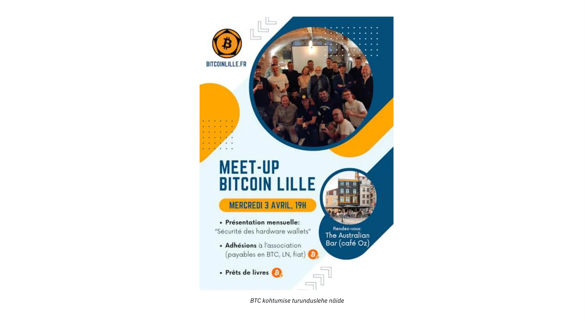

- **Ürituse plakat** (sotsiaalmeedia ja A4/A3 trükkimiseks): [link](https://www.canva.com/design/DAGBvG3rNCc/oXtNR9pduRs22AqclG4O2g/edit?utm_content=DAGBvG3rNCc&utm_campaign=designshare&utm_medium=link2&utm_source=sharebutton)

- **sotsiaalmeedia bännerid**: [link](https://www.canva.com/design/DAGBvOXyNqw/iSJG9PbIQHgGWHz5PhlXSQ/edit?utm_content=DAGBvOXyNqw&utm_campaign=designshare&utm_medium=link2&utm_source=sharebutton)

- **Võistluse väljakuulutamine**: [link](https://www.canva.com/design/DAGBvIjuA_w/YzSUXzOmbNV9oCma9mluOw/edit?utm_content=DAGBvIjuA_w&utm_campaign=designshare&utm_medium=link2&utm_source=sharebutton)

- meie raamatukogu brändi suunised, mis kuvatakse A4-formaadis kohtumistel: [link](https://www.canva.com/design/DAGBvPqL7N4/LmUItfsysypRLSOFOzBXcQ/edit?utm_content=DAGBvPqL7N4&utm_campaign=designshare&utm_medium=link2&utm_source=sharebutton)

- **PowerPoint esitlus** "Chapter 2 - Understanding Bitcoin transactions", autor @ProfEduStream: [link](https://www.canva.com/design/DAFsEcnOro8/Mz9FYdTGhsvozZOe0Y9jtw/edit?utm_content=DAFsEcnOro8&utm_campaign=designshare&utm_medium=link2&utm_source=sharebutton)

- **flaier** "21 põhjust, miks kasutada Bitcoin", mille on kirjutanud @ProfEduStream: [link](https://www.canva.com/design/DAFtAR1NauQ/ZDwl2CchIJ9Gpb36N6-7iw/edit?utm_content=DAFtAR1NauQ&utm_campaign=designshare&utm_medium=link2&utm_source=sharebutton)

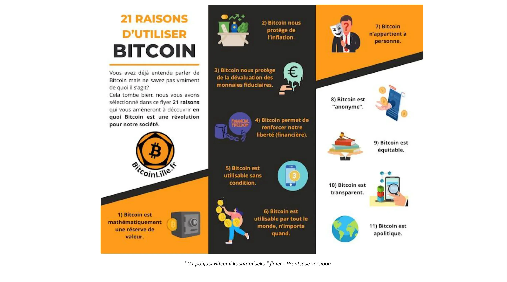

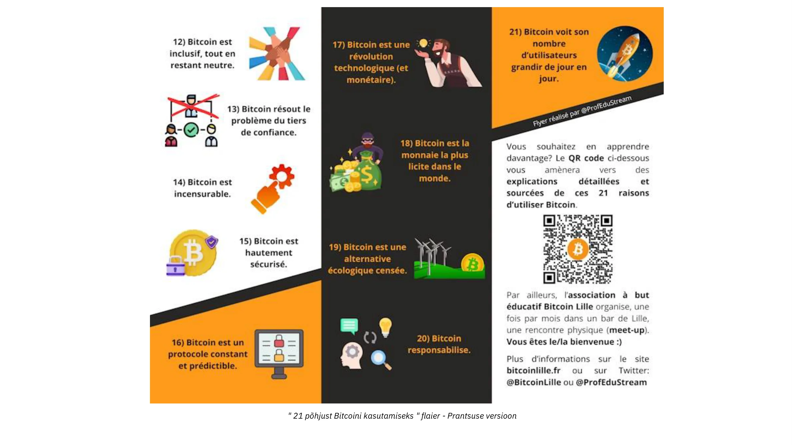

**Jagage oma loomingut**

Võimalused on lõputud ja teie kujundus sõltub teie eesmärkidest ja visuaalsest identiteedist. Kaaluge oma mallide jagamist avatud lähtekoodiga, see säästab aega teistele Bitcoin kogukondadele, kes paratamatult seisavad silmitsi samade väljakutsetega kui teie. Jagamisega aitate kiirendada Bitcoin kogukondade kasvu kõikjal.

**Soovitatavad mõõtmed**

Visuaalsete kujunduste loomisel kontrollige alati iga platvormi suurusnõudeid:

| Platform | Logo | Banner | Poster / Image
| -------- | -------- | -------- | -------- |
| Telegram     | 512 x 512     | N/A     | N/A     |
| Signal     | N/A     | N/A     | N/A     |
| Twitter     | 400 x 400     | 1500 x 500     | 1200 x 628     |
| Meet-up     | N/A     | N/A     | N/A     |
| Discord     | 512 x 512     | 960 x 540     | N/A     |
| Facebook     | 512 x 512     | 851 x 315     | 960 x 720     |

Tavaliselt sobivad suurused:

Logod: 512 x 512 pikslit

Bännerid: Sõltuvalt rakendusest või saidist

Plakatid: A4 on standardne trükivorming

### Tehisintellekti kasutamine

Kuigi Canva pakub mitmesuguseid vahendeid logode, plakatite, bännerite ja flaierite loomiseks, ei ole see ainus võimalus. Kui teil on mugavam kasutada muud tarkvara (nt Photoshop või Illustrator), kasutage julgelt seda, mis teile kõige paremini sobib.

See tähendab, et olenemata sellest, kas kujundate kogukonna logo või täiustate plakateid, esitlusi või flaiereid, **tehniline intelligentsus võib olla võimas liitlane unikaalse ja atraktiivse visuaalse kujunduse loomisel**.

Selleks on saadaval mitu tehisintellekti. Nende hulka kuuluvad

- [midjourney](https://docs.midjourney.com/docs/quick-start) (tasuline);
- [leonardo](https://leonardo.ai/) (tasuta, piiratud kasutajakontoga);
- [copilot](https://copilot.microsoft.com/) (tasuta, piiratud kasutajakontoga);
- [DALL-E] (https://www.dall-efree.com/) (tasuline).

Viimasel ajal on tekkinud palju muid tehisintellekti vahendeid, nii et see loetelu ei ole kaugeltki ammendav.

**Näide: Futuristliku Bitcoin Londoni logo loomine**

Kui soovite kujundada futuristliku logo "Bitcoin London" kokkusaamise jaoks, võite küsida Copiloti käest:

- [ ] *Prompt: Loo Bitcoin logo, mille taustal on Londoni sild ja Big Ben. Futuristlik* - [Link](https://copilot.microsoft.com/images/create/un-logo-Bitcoin-futuriste-avec-en-arric3a8re-plan-le-/1-6612ba1758df4384bc33c4bca00ab45b?FORM=SYDBIC)

Kui esimesed neli tulemust ei ole piisavalt realistlikud, täpsustage oma taotlust:

- [ ] *Prompt: Tee 4. palju realistlikum* - [Link](https://copilot.microsoft.com/images/create/un-logo-Bitcoin-futuriste-avec-en-arric3a8re-plan-le-/1-6612ba64b72d4cea9830ab7eb844f785?FORM=SYDBIC)

Viimane tulemus tuli suurepärane!

**Näide: Lihtsa Briti stiilis logo loomine**

Puhtama väljanägemise jaoks, näiteks kleebise jaoks:

- [ ] *Prompt: Loo "London Bitcoin Meetup" logo, mis on briti ja puhta stiiliga* - [Link](https://copilot.microsoft.com/images/create/logo-for-27londres-Bitcoin-meetup27-with-a-british-a/1-6612bb9451924859a6c34b350b3a6ebc?FORM=SYDBIC)

Tulemus näeb tõesti lahe välja!

**Nipid AI-ga töötamiseks**

- Olge kannatlik: AI ei pruugi esimesel katsel toota täpselt seda, mida te ette kujutate.

- Kasutage täpseid vihjeid: Mida selgemad ja üksikasjalikumad on teie juhised, seda paremad on tulemused.

- Paluge abi: Paljud bitcoinerid aitavad rõõmuga, mõnikord isegi tasuta või mõne Sats eest.

# Kommunikatsioonikanalite loomine Bitcoin kogukonna jaoks

<partId>fc588298-6876-554c-bd57-55d182464878</partId>

## Milliseid suhtluskanaleid peaksite valima?

<chapterId>b4f4eef6-1035-5290-848a-2b7f9391c77a</chapterId>

Nagu eespool mainitud, võivad kogukonna suhtluskanalid erineda vastavalt motivatsioonile ja harjumustele.

Näiteks **Prantsusmaal, Saksamaal ja Itaalias on Telegram ja Twitter domineerivad platvormid** ning neist on saanud Bitcoin kogukondade "standard".

Seevastu Tšehhi Vabariigis kasutavad paljud kogukonnad Telegrami asemel **Matrixi**, turvalist kiirsõnumiprotokolli.

Vihje: Enne kanalite valimist **vaadake, mida lähedalasuvad kogukonnad teevad**. Kasutage kaarti [btcmap.org](https://btcmap.org/communities/map#0/0/0/), et näha, millised platvormid on teie piirkonnas kõige populaarsemad.

Näiteks Šveitsi kogukonnad kasutavad peamiselt Telegrami, Twitterit ja oma veebisaiti:

**Soovitatavad kanalid prantsuskeelsetele kogukondadele**

- Telegramm: Üle 90% prantsuse kohtumistest kasutab seda.

- Twitter (X): Peamine sotsiaalne võrgustik, mida bitcoin'i kasutajad üle maailma kasutavad. Seda kasutab ~70% Prantsuse kohtumistest. See on ideaalne bitcoin'idega jõudmiseks.

- Meetup.com: Tasuline, kuid laialdaselt kasutatav (~30% Prantsuse ja peaaegu kõik Kanada kohtumised), et suurendada nähtavust väljaspool Bitcoin ökosüsteemi.

- Muud võimalused: ~30% omab ka veebisaiti; ~10% omab Discordi servereid või NOSTR kontosid.

Kasutada saab ka teisi platvorme, nagu Matrix, Keet, Signal, Facebook, Instagram ja LinkedIn. Olge ettevaatlik, mida rohkem kanaleid haldate, seda rohkem aega kulub modereerimisele, postitamisele ja nende aktiivsena hoidmisele.

Kõigil, kes soovivad Prantsusmaal kogukonda luua, on seega soovitav alustada selle loomisega:

- telegrammi grupp;
- twitteri konto.

Kui teie kogukond kasvab, saate lisada rohkem platvorme ja delegeerida modereerimise usaldusväärsetele liikmetele.

## Telegrami kanali, grupi või supergrupi loomine ja seadistamine

<chapterId>d13714ce-8f08-53e9-bedd-b6a3aaac5dad</chapterId>

Enne oma kogukonna suhtlusruumi loomist Telegramis on oluline teada, mis on erinevus:

- telegrami kanal;
- telegrammi grupp;
- telegrammi supergrupp.

On tungivalt soovitatav alustada Telegrami grupiga.

Vajaduse korral saate selle hiljem teisendada supergrupiks.

Järgnevate õpetuste jaoks kasutasime algselt "Telegram+" APK-d, mis võimaldab edasijõudnumat konfigureerimist. Siiski ei ole seda tingimata vaja, sest ametlikust Telegrami rakendusest piisab gruppide loomiseks ja haldamiseks ka telefoni kaudu:

:::video id=b1da7cb4-5fb1-4a41-a1d4-bd90686826a9:::

### Loo Telegram kanal

Kui soovite luua koha, kus teie liikmed saavad üksteisega otse rääkida, üksteisele vastata jne, siis võiksite luua Telegrami grupi, mitte Telegrami kanali!

Minge otse järgmisesse jaotisse pealkirjaga [Telegrami grupi loomine](https://planb.network/courses/1c643dc9-a15f-4f9e-93b6-cb3c58b4ee35/d13714ce-8f08-53e9-bedd-b6a3aaac5dad).

Tõepoolest, **Telegrami kanal on rohkem nagu ühepoolne ülekandevahend administraatorite jaoks**. Liikmed ei saa vabalt vestelda, nad saavad reageerida ainult emotikonidega (või jätta kommentaare eraldi teemades, mis killustab vestlusi).

**Kui kogukonnad vajavad suhtlemist ja koostööd, ei ole Telegrami kanal soovitatav**, kui teie eesmärk on suhete loomine ja teadmiste jagamine.

Telegrami kanali loomise õpetus:

:::video id=98be4709-d221-4030-8c31-e10113482515:::

### Loo Telegram grupp

Teisest küljest on **Telegrammi grupp ideaalne kogukondade jaoks**: Nii nagu sõnumirakendustes, näiteks Messengeris või WhatsAppis, saavad liikmed omavahel vestelda ja üksteisele vastata ühes ühises vestluses.

Mida saate teha administraatorina:

- Postitage ja kinnitage olulised sõnumid.
- Loo **küsitlused** (kasulik kohtumiste kuupäevade määramiseks, kui teie kogukond on uus).
- luua **tahtlik kutselink** (Ainult siis, kui grupp on "avalik" ja mitte "privaatne", mis on määratud seadetes. Samuti on mugav omada oma Telegrami kutselinki, näiteks: t.me/Bitcoin[CITY]);
- Halda liikmete õigusi, rolle ja modereerimist.
- Lisage profiilipilt (teie kogukonna logo) ja ajakohastage rühma nime.

Telegrami grupi loomise õpetus:

:::video id=3d4792a7-1345-475b-93b1-b3a3945fb567:::

Märkus: See õpetus on tehtud Telegram+ abil, kuid kõike saab teha ka otse Telegrami tavalisest mobiilirakendusest.

### Loo Telegram supergrupp

Miks supergrupp?

Kui teie Telegram-grupp kasvab sadade liikmetega, võivad vestlused muutuda kaootiliseks. See viib sageli selleni, et liikmed jätavad vahele olulised teadaanded, näiteks järgmise kohtumise kuupäeva.

Saadaval on mitu lahendust:

1. **Pinnitage olulised sõnumid**, et kõik liikmed saaksid teate (vajutage kord sõrmega kõnealusele sõnumile, seejärel valige "Pin");

2. Kaaluge **Discordi** kasutamist mitme suhtluskanali jaoks, millest igaühe saavad kasutajad vajadusel vaigistada.

3. **Muutke oma Telegrami grupp supergrupiks**.

Mis on Telegrami supergrupp?

Supergrupp on sisuliselt Telegrami grupp, mille sees on teemad (alamkanalid).

Näidisteemad:

- "Oluline teave": ainult olulised uuendused ja sündmuste teadaanded.
- "Üldine": kõigi liikmete arutelude jaoks.
- Konkreetsed teemad: nt Mining, projektide arendamine, eelseisvad konverentsid.

Vihje: Kohandage oma teemad vastavalt oma kogukonna vajadustele. Näide: Abidjan Bitcoin Meet-up kasutab edukalt seda formaati.

Pidage meeles, et **Telegrammi supergruppide kasutamine võib mõnele liikmele olla veidi keeruline**. Näiteks ei tea kõik, **kuidas pääseda erinevatele teemadele** (nad peavad lihtsalt puudutama Telegrami peamenüüs grupi logo, et näha teemade täielikku nimekirja). Kiire ekraanipildi saatmine võib aidata segadust hajutada.

Ei ole mingit ranget reeglit, millal tavalisest Telegrami grupist üle minna supergruppi, see sõltub tõesti teie liikmete vajadustest. Hea uudis on see, et saate hõlpsasti edasi-tagasi lülituda: lihtsalt looge teema, et muuta see supergrupiks, või kustutage kõik teemad peale "Üldise", et naasta tavalisse gruppi.

Telegrami supergrupi loomise õpetus:

:::video id=f78800ae-d8ca-479a-b913-99abd9916bff:::

Kiire märkus: nagu varem mainitud, on ülaltoodud õpetus tehtud arvutis, kasutades "Telegram+" APK-d. Tänapäeval on Telegrami supergrupi loomine telefonis aga lihtne.

Lihtsalt looge Telegrami grupp, minge selle seadistustesse ja vajutage teemade lisamiseks nupule "Teemad". Pärast salvestamist näete teemade nimekirja, mida saate soovi korral muuta.

Seega ei ole vaja enam "Telegram+" alla laadida, kui te ei soovi juurdepääsu oma supergrupi täiustatud privaatsusseadetele.

## Telegrami grupi või supergrupi loomine

<chapterId>35e674b3-5924-50b0-98f1-83a56c9a186d</chapterId>

Nüüd, kui teie Telegrami grupp (või supergrupp) on loodud ja töötab, on aeg **konfigureerida õigused ja seadistada modereerimine**.

Iga kogukond võib ise valida oma lähenemisviisi, kuid kogemused näitavad, et **parem on piirata teatud liikmete õigusi**:

- Uuringu saatmine;
- Failide saatmine (võimalike viiruste vältimiseks);
- Häälsõnumite saatmine;
- Kasutajate lisamine (aitab vältida bottide sissetungi);
- Sõnumite kinnitamine;
- Rühmaandmete redigeerimine.

Telegrami grupi või supergrupi loomisel on väga soovitatav **kirjutada selge kirjeldus oma kokkusaamise kohta**, sest see on esimene asi, mida potentsiaalsed liikmed näevad. Näiteks:

> Tere tulemast @Bitcoin's Telegram [CITY] 🔥
>

> Korraldame kohtumisi iga kuu esimesel kolmapäeval baaris [BAR_NIMI], [LINNAKU] 🍻
>

> Vaadake meie teisi sotsiaalseid võrgustikke: [LINK] 🌐

Selles näites on Bitcoin Lille administraatorid kohandanud oma avaliku Telegrami lingi lihtsamaks jagamiseks.

Rühma seadetes võiks olla mõistlik **lülitada sisse "Uute liikmete kinnitamine "**.

Mõne Bitcoin Telegrami grupi sihtmärgiks on olnud tuhanded võltsitud kontod, mille eesmärk on rämpsposti saatmine või kogukonna häirimine.

**liikmete heakskiitmise aktiveerimine võib päästa teie grupi rämpsposti rünnaku eest.**

Administraatorite sektsioonis saate lubada ka funktsiooni "Agressiivne spamivastane võitlus", et automaatselt kustutada kahtlased sõnumid.

See ei ole alati vajalik, kuid võib lisada täiendava Layer kaitse.

## Multifunktsionaalse bot'i lisamine teie Telegrami gruppi

<chapterId>c61f69cc-15ec-53f1-8c02-1cea55def09e</chapterId>

**Teine võimalus Telegrami grupi või supergrupi konfigureerimiseks ja turvamiseks on lisada multifunktsionaalne bot**. See võimaldab teil oluliselt laiendada oma rühma funktsioone ja modereerimisvõimalusi.

Kasutades **roboti [@GroupHelpBot](https://telegram.me/grouphelpbot)**, on kõige kasulikumad valikud järgmised:

- **reeglite käsk** (/rules), et kuvada oma kogukonna suuniseid;
- **Spamivastane** kaitse, et filtreerida kahtlased sõnumid ja kontod;
- **Kohandatavad automaatsed tervitussõnumid** uutele liikmetele (valikuline automaatne kustutamine mõne minuti pärast)
- **Üleujutuste vastane kaitse** sõnumite rämpsposti vältimiseks
- **@administrator käsk**, et kiiresti jõuda grupiadministraatoriteni
- **Blokeerimisreeglid** soovimatu sisu jaoks
- **rühma linkimise käsk** (/link)
- Käskkiri **lubade haldamine**
- **Teatud sõnumitüüpide automaatne kustutamine**
- **Botide blokeerimine** ja **sisenemise/väljumise blokeerimine**, et hoida oma grupp turvaliselt
- Loetlege oma **ühenduse sotsiaalsed võrgustikud** (/networks)
- Ja palju muud...

Saadaval on arvukalt lisafunktsioone.

Pro nõuanne: **Mitte piirake vestlust liialt**.

Juhend mitmefunktsioonilise roboti lisamiseks Telegrami gruppi või supergruppi:

:::video id=cdbf82d6-3530-45c4-90de-593f100863bb:::

(Märkus: Kogu seda protsessi saab nüüd teha otse telefonist. Telegram+ rakendust pole enam vaja)

## Loo Discord server

<chapterId>eef2a965-4c24-5f3a-8013-72cc7d315314</chapterId>

Kui teie Telegrami grupp kasvab liiga suureks, võib selle muutmine Telegrami supergrupiks aidata arutelusid korraldada.

Kuid nagu eespool mainitud, võib **lisanenud keerukus ning teemade ja sõnumite arvu suurenemine põhjustada mõne aktiivse liikme huvi kadumist**.

Miks kaaluda Discord?

**Discord on alternatiiv** Telegrami supergrupile, kuna see võimaldab kasutajatel **looma konkreetseid teksti- ja häälevestlusruume** ning võimaldab liikmetel summutada kõik kanalid, mis neid ei huvita.

Loomulikult nõuab nii Telegrami kui ka Discordi haldamine veidi rohkem aega, eriti seadistamise ja käivitamise ajal.

Et asju lihtsamaks teha, **jagame [Discordi serverit, mida saate dubleerida ja kohandada](https://discord.com/template/bDY4eXXJk2C8)**:

:::video id=e647458a-a21e-44e0-bd03-20b82a871777:::

Kui Discordi server on hästi kavandatud, võib see olla teie kogukonna jaoks tõeline väärtus. Paljud bitcoinlased kasutavad juba praegu **Discordit** igapäevaselt ning võimalus jälgida Telegrami vestlusi otse Discordis (ja vastupidi) võib kõigile palju aega säästa.

Mõlema platvormi sünkroniseerimiseks on olemas avatud lähtekoodiga bot nimega [TediCross](https://github.com/TediCross/TediCross). Selle eesmärk on lihtne: edastada automaatselt sõnumeid Discordi tekstikanalist Telegrami gruppi (või supergrupi teemasse) ja vastupidi.

Kuid pidage meeles, et seda ei ole kõige lihtsam paigaldada. Selleks, et bott töötaks, peate oma arvutis käsurea (CMD) käimas hoidma ja aeg-ajalt võivad tekkida vead. Õnneks on parandamine lihtne: lihtsalt taaskäivitage bott ja enamasti läheb kõik jälle normaalseks.

Et säästa aega, on siin õpetus, kuidas lisada see multifunktsionaalne bot Telegrami gruppi või supergruppi:

:::video id=6a0283f6-6d6c-4e81-8b2f-644b33c52fe6:::

## Kaaluge alternatiivseid, privaatseid ja turvalisemaid sidekanaleid

<chapterId>29d0aad6-0612-5dd0-bcef-7337eaf4fefc</chapterId>

Nagu eespool mainitud, on Twitter ja Telegram Euroopas (kui mitte kogu maailmas) Bitcoin kogukondade jaoks kõige laialdasemalt kasutatavad kommunikatsioonivahendid.

Telegram ei ole aga just kõige turvalisema või privaatsusele keskendunud sõnumirakenduse poolest tuntud ja Twitter, nüüd X, kuulub ühele maailma kõige vabamalt liikuvatest korporatsioonidest.

Seepärast tasub pärast seda, kui teie põhikanalid on paigas ja asjad toimivad sujuvalt, võtta aega teiste võimaluste uurimiseks.

Lähikuudel pakuvad see kursus ja planb.network platvorm õpetusi alternatiivsete protokollide, nagu **Simplex ja Element**, kasutamise kohta: detsentraliseeritud, krüpteeritud ja väga hästi kohandatavad kommunikatsioonivahendid.

**Miks vaevuda neid võimalusi uurima?**

Sest nagu sotsiaalvõrgustik NOSTR, pakuvad nad mitte ainult suuremat privaatsust, vaid ka kaitset tsensuuri või teie Telegrami grupi meelevaldse sulgemise eest.

Ja tõesti, mis võiks olla rohkem kooskõlas Bitcoin vaimuga kui tsensuurikindel ja disainilt vastupidav?

# Käivitage oma sotsiaalsed võrgustikud

<partId>8ebf8cd7-9248-543f-bc27-4ec4cc03f9cf</partId>

## Nähtavuse tähtsus Bitcoin kogukonna kasvatamisel

<chapterId>b20f12e4-c5de-5f02-80c7-b7fc6cadd3ac</chapterId>

Niisiis, teie kogukond on käivitatud ja töötab. Olete seadistanud oma Telegrami või Matrixi ruumi... kuid praegu olete seal ainuke. **Aeg anda inimestele teada, et sa oled olemas!**

See on lihtne: kui keegi ei pääse teie gruppi ja ei näe, millal järgmine kohtumine toimub, siis postitate lihtsalt tühja. Seepärast on sotsiaalmeedia ja mõned konkreetsed platvormid, mida käsitleme hiljem, kogukonna loomisel nii olulised.

Twitter (X) on muutunud peaaegu Bitcoin vestluse sünonüümiks internetis. See ei ole täiuslik, kaugel sellest, kuid praegu koguneb sinna suur osa kogukonnast. Seal konto loomine on tungivalt soovitatav.

Et jääda võimaliku tsensuuri või piirangute ette, avavad mõned kogukonnad ka NOSTR-profiili.

Seda on teinud FREE Madeira kollektiiv.

Loomulikult võivad ka muud platvormid olla kasulikud. Facebook (kas grupi või lehega) või isegi LinkedIn.

See tähendab, et pidage meeles, et ** mida rohkem suhtluskanaleid ja sotsiaalvõrgustikke te haldate, seda rohkem aega see nõuab**. Sageli on parem keskenduda ** kõige olulisematele**, Twitter (ja NOSTR) on suurepärased võimalused alustamiseks.

## Looge Twitteri profiil

<chapterId>c8d73097-8eba-5530-918c-221002954110</chapterId>

Twitterit on väga lihtne kasutada ja oma privaatsuse parandamiseks peate kohandama mõningaid seadeid.

**Uue Twitteri konto loomisel tuleb sisestada neli olulist teavet:**:

1/ **Twitter @, mis määratleb teie identiteedi ja teeb teid kergesti leitavaks.** Kui teie kogukonna nimi on "Bitcoin [CITY]", on asjakohane valida "@Bitcoin[CITY]";

2/ **logo ja bänner**, mille olete loonud oma kogukonna või kohtumise jaoks (vt jaotist [Logo, plakati ja bänneri loomine](https://planb.network/courses/1c643dc9-a15f-4f9e-93b6-cb3c58b4ee35/3470a31f-0190-5e87-8af0-6a00e79267ef));

3/ **kirjeldus**, mis võimaldab teil mõnesaja tähemärgiga jagada põhiteavet oma kogukonna kohta. Näiteks:

> Bitcoin [CITY] kogukonna ametlik konto #BTC | Kohtumised iga kuu esimesel kolmapäeval [BAR_NAME] [CITY] 🍻 | Liitu meiega Telegram'is 🔽

4/ Selle kirjelduse all on võimalik **lisada link**. See võib viia kasutajad teie kogukonna veebisaidi "sotsiaalmeedia" lehele või teie Telegrami kanalile. See on teie otsustada, mida soovite esile tõsta.

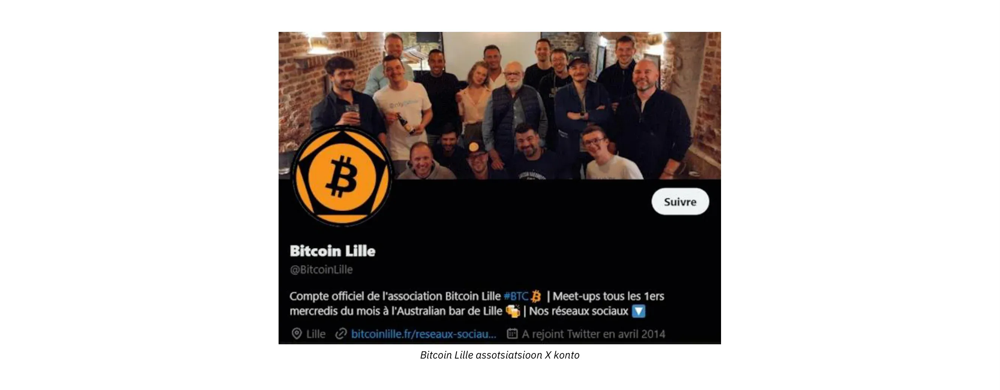

Lisaks sellele tasub kohandada **mõningaid privaatsusseadeid**:

- jätke oma Twitteri konto "avalikku" režiimi (postitused on kõigile nähtavad);
- võimaldavad kõigil teid leida;
- keelata asukoha jälgimine ja andmete jagamine teiste üksustega (privaatsusseadetes).

Iga sündmuse puhul kasutate Twitterit tõenäoliselt kasuliku teabe jagamiseks. Kuid nagu enamiku sotsiaalvõrgustike puhul, on ka siin **nähtus on kõik**.

Et säästa teie aega, võtsime aega, et uurida [Twitteri avatud lähtekoodiga reitingualgoritmi](https://github.com/twitter).

Siin on **võtmeküsimused, millele keskenduda, et suurendada oma nähtavust**:

- Üldised nõuanded:
    - Säutsu oma konto määratud keeles või inglise keeles: teistes keeltes säutsumine võib sinu nähtavust oluliselt vähendada;
    - Jääge oma nišši juurde, jagage ainult oma konto fookusega seotud sisu; algoritm karistab teemaväliseid säutsusid;
    - Püüdke saavutada 1-2 säutsu päevas;
    - Postitus tipptunnil: Neljapäev või reede kell 8-10 hommikul kipub kõige paremini toimima (kontrollige oma kontolt: Twitter Analytics).

- Kui kirjutad säutsu:
    - lisada foto (või isegi video);
    - Kasutage ainult ühte hashtag'i (tavaliselt on #Bitcoin kõige asjakohasem. Vajaduse korral võite lisada oma kontovaldkonnaga seotud trending hashtagi);
    - Julgustage oma kogukonda suhtlema:
        - Nagu = kaal 0,5
        - Retweet = kaal 1
- Vastus = kaal 27 (!!)
- Vastake inimestele, kes vastavad teie säutsudele (kaal 75!!);
    - Vältige linkide paigutamist peamisesse säutsu: lisage need hoopis esimesse kommentaari.;
    - Kirjutage sõnad täismahus, vältige lühendeid.

- Muud näpunäited:
    - Säutsu trendikate teemade kohta, kui need on kooskõlas sinu konto erialaga;
    - Repostige oma kõige edukamad säutsud;
    - Viige aeg-ajalt läbi küsitlusi;
    - Võimaluse korral kirjutage niidid;
    - Julgustage oma kogukonda oma profiili külastama ja teid jälgima.

Veelgi enam, **saate säutsu või teemat oma Twitteri profiilile kinnitada, et anda sellele maksimaalne nähtavus**, nagu seda teeb Bitcoin Witsandi kogukond Lõuna-Aafrikas.

Pange tähele ka seda, et on võimalik jääda samaaegselt sisse logida kahele Twitteri kontole, nii telefonis kui ka arvutis. See on väga mugav, kui soovite hõlpsasti vahetada oma isikliku ja ühenduse konto vahel.

Olge lihtsalt ettevaatlik... juhuslikult kogukonnakontolt peopildi postitamine võib juhtuda kiiremini, kui te arvate!

Lõpuks, kuigi teie kasutajanimi "@Bitcoin[CITY]" on ainulaadne ja nüüdseks teie oma, on arukas ennetada võltsitud või jäljendatud kontosid. Kaaluge ka registreerimist:

- @Bitcoin_[CITY]
- @[CITY]Bitcoin
- @[CITY]_Bitcoin

Nii vähendate oluliselt tõenäosust, et keegi teie kogukonda jäljendab.

Twitteri konto loomise õpetus:

:::video id=4648976f-41ec-499a-b7ec-a53e796f71b4:::

## Naabrite kohtumistele lähemale jõudmine

<chapterId>12a21c3b-235a-5292-8209-67bf60f61e49</chapterId>

Nüüd, kui teie suhtluskanalid ja sotsiaalvõrgustikud on loodud ja peegeldavad teie kogukonna visuaalset identiteeti, on aeg alustada õigete inimeste jälgimist.

Alustage Twitteris Bitcoin ülemaailmselt propageerivate võtmekontode, nagu [@Bitcoin] (https://twitter.com/Bitcoin) ja [@planb_network] (https://twitter.com/planb_network), samuti selliste algatuste nagu [@FBCEglobal] (https://twitter.com/FBCEglobal) jälgimisest. Võite ka retweetida [@halfin](https://twitter.com/halfin) kuulsat "Running Bitcoin" säutsu 11. jaanuarist 2009. Ja mis veelgi tähtsam, **jälgige Bitcoin kogukondade ja kohtumiste kontosid oma riigis**.

See loob **võimalusi üksteise jälgimiseks, üksteise märgistamiseks ja kollektiivse nähtavuse suurendamiseks**. See on juba tavaline tava ~50 Bitcoin kogukonna seas Prantsusmaal, "Satoshi Spritz" algatuste seas Itaalias ja "Einundzwanzig" gruppide seas Saksamaal.

Kuigi mõnele võib tunduda triviaalne, võib **kohalike kogukondade ja algatuste jälgimine viia koostöö või isegi partnerluseni**. Näiteks Bitcoin Liège'i ja Bitcoin Lille'i kogukonnad (ja samamoodi Bitcoin Aix ja Bitcoin Marseille) on sel moel omavahel seotud, mis viis neid iga-aastase kohtumise korraldamiseni.

Veel üks hea näide on **Cercle du Coin** söögid.

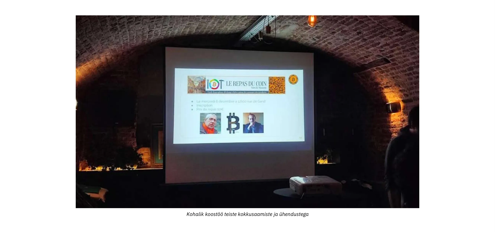

Prantsusmaal võib olla oluline ka **jälgida selliseid algatusi nagu [@KonsensusFR](https://twitter.com/KonsensusFR), [@bitcoinpointfr](https://twitter.com/bitcoinpointfr), [@DecouvreBitcoin](https://twitter.com/DecouvreBitcoin) ja [@btcmap](https://twitter.com/btcmap)**. Need on muidugi ainult soovitused ja iga kogukond võib teha, mida ta soovib, täiesti detsentraliseeritult ja autonoomselt.

Nagu eespool mainitud, on üksteise jälgimise eesmärk vastastikune nähtavus. Mida rohkem te oma kogukonda ja oma piirkonna/riigi kogukondi sotsiaalvõrgustikes tutvustate, seda rohkem räägitakse teist. Mida rohkem inimesed sinust räägivad, seda tõenäolisemalt osalevad nad sinu üritustel.

Teiste kogukondade postituste meeldetuletamine ja retweetimine võib seega oluliselt aidata nende arengut... ja sinu arengut.

Samuti võiksite teha ettepaneku, et **kohtumiste korraldajad ja bitcoin'i kogukondi haldavad bitcoin'id kohtuvad kaks või kolm korda aastas videokonverentsi teel, et vaadata üle riiklike projektide ja nendega seotud kogukondade edusammud. See võib toimuda ka isiklike ürituste ajal**

Eesmärk on lihtne: koguda kõigilt tagasisidet, arutada kogukondade arengut, jagada edukaid ideid ja projekte ning vajadusel pakkuda välja lahendusi. Koosoleku kirjalikku kokkuvõtet saab pärast seda jagada oma riigi kogukondade korraldajatega, kes ei saanud osaleda.

## Btcmap.org

<chapterId>365f43d4-7b2c-5961-a184-157b8c1a0116</chapterId>

Selles etapis on teie kogukond juba käivitatud. Nüüd on vaja vaid võtta vastu uusi huvilisi ja aidata sellel kasvada.

Kuid te ei saa edasi liikuda ilma teadmiseta, et **on olemas platvormid, kus bitcoin'i kasutajad saavad leida kogukondi ja kohtumisi enda lähedal**. Seepärast on oluline võtta paar minutit, et taotleda nende saitide nimekirjas olemist.

Nende hulka kuuluvad:

- [Btcmap.org](https://btcmap.org/)**, veebisait, kus on kaks kaarti, mida uuendatakse iga päev: **[maailma kaart ettevõtetest, mis aktsepteerivad Bitcoin](https://btcmap.org/map)** ja **[maailma kogukondade kaart](https://btcmap.org/communities/map)**. Paljud bitcoin'i kasutajad vaatavad neid kaarte regulaarselt, kas nad reisivad või elavad oma igapäevaelu, et kohtuda uute inimestega või leida kohti, kus oma Sats kulutada. Btcmap on ülemaailmne viide ja oma kogukonna loetellu kandmine seal on nähtavuse jaoks väga oluline.**
- [BitcoinerEvents](https://www.bitcoinerevents.com/), veebisait, mille on loonud bitcoiners, bitcoiners. **See võimaldab teil postitada oma kogukonna eelseisvaid üritusi**. Prantsusmaal ei kasutata seda siiski veel laialdaselt.
- sõltuvalt teie riigist võivad olla ka muud kohalikud algatused. Prantsusmaal on näiteks [Bitcoin.fr](https://Bitcoin.fr/events/categories/evenements/), kus **kuulub iga kuu kümneid Bitcoin üritusi**. Nii et kui te ei ole neile veel Twitteris järgnenud või nendega ühendust võtnud, et jagada teavet oma kogukonna ja ürituste kohta, on nüüd õige aeg! **Kui aitaksite hoida Prantsuse sündmuste kalendrit ajakohasena, oleks tore, kui kõik Prantsuse Bitcoin kogukonnad võtaksid harjumuseks:**
    - mainides @bitcoinpointfr Twitteris iga uue kogukonna sündmuse puhul
    - uute sündmuste väljakuulutuste kinnitamine oma Telegram-gruppi.

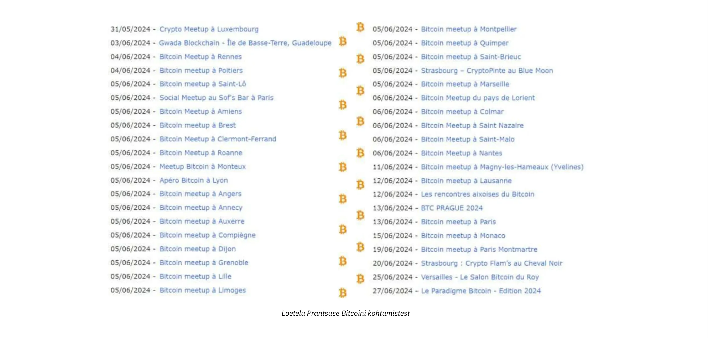

Ka muud platvormid võivad teie nähtavust suurendada. **[Meetup](https://www.meetup.com/)** on üks neist ja see on veebisait (ja telefonirakendus), kus saate luua sündmuse ja leida teisi läheduses olevaid inimesi.

See maksab umbes 8€ kuus (või umbes 90€ aastas), mis võib olla väikese, struktureerimata kogukonna jaoks väga kallis. Sellest hoolimata on Meetup mõnes riigis, eriti Kanadas ja Ameerika Ühendriikides, laialdaselt kasutusel ning see on kasulik registreerimiste haldamiseks.

Samuti on **[Orangepillapp](https://www.orangepillapp.com/)** tasuline mobiilirakendus (50 000 Sats/aastas või 200 000 Sats eluaegse juurdepääsu eest), mis aitab bitcoin'idel kohtuda.

Kuigi need kaks viimast platvormi võivad aidata suurendada nähtavust, ei soovitata neid kogukonna loomisel kasutada lihtsalt seetõttu, et need ei ole tasuta.

**Alustades nimekirjaga [btcmap.org](https://btcmap.org/), [BitcoinerEvents](https://www.bitcoinerevents.com/) ja prantsuse kogukondade jaoks [Bitcoin.fr](https://Bitcoin.fr) on enam kui piisav**.

Palju õnne! Teie **kogukond on loodud**, teie **visuaalid on valmis**, teie **eesmärgid on seatud**, teie **kommunikatsioonikanalid on paigas**, teie **sotsiaalvõrgustikud on käivitatud** ja teie **nähtusstrateegia on otsustatud**.

Kui väike rühm bitcoin'i kasutajaid on sinuga liitunud, on aeg astuda järgmine samm: korraldada oma esimene Bitcoin kohtumine.

# Bitcoin kohtumise korraldamine

<partId>c009d2a6-40ce-583b-bd24-fdfd1fea262e</partId>

## Miks käivitada oma kogukonnaga regulaarseid kohtumisi?

<chapterId>ed8e471c-3b99-57e2-a042-2d4e8a40b137</chapterId>

Nüüd, kui teie kogukonna sotsiaalsed võrgustikud ja suhtluskanalid on käivitatud, on aeg teha oma kohalolekut nendel platvormidel tuntavaks. Julgustage uusi liikmeid end tutvustama ja järk-järgult vestlusega liituma.

See vabastab teie aega, mida võiksite kasutada, et mõelda mingi kokkusaamise loomisele. See muutub veelgi asjakohasemaks, kui hakkate oma kogukonnas tõelist elevust tundma.

Nagu varem mainitud, ** Bitcoin kohtumist võib pidada kogukonna järgmiseks "tasandiks "**. Ühest küljest võimaldab see **liikmetel isiklikult kohtuda** ja teisest küljest aitab see **harida uustulnukaid, kes on sellest ökosüsteemist huvitatud**.

Selline üritus võimaldab teil oma linnas **luua Bitcoin ümber suminat**, mis võib aja jooksul kasvada, kui teie kogukond projektidega alustab.

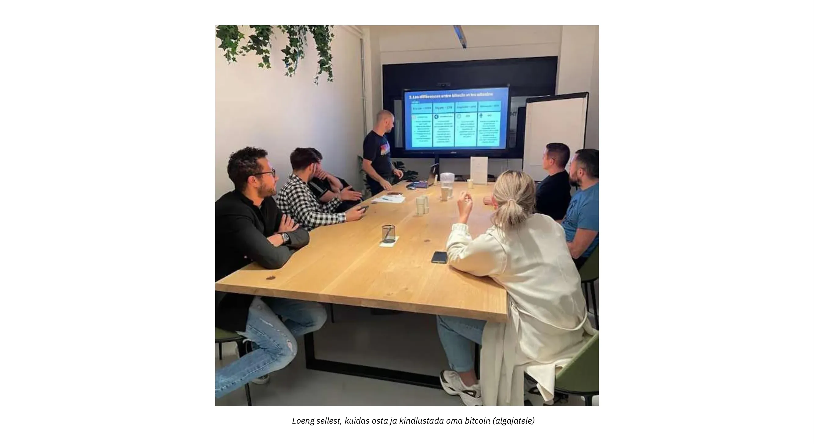

Loomulikult, mida suuremad on teie kogukonna arendamise eesmärgid, seda rohkem aega on teil ja teie liikmetel vaja investeerida.

Seepärast on oluline **alustada oma kohtumise jaoks saavutatavate eesmärkide seadmisega**.

## Esimene kohtumine: millal ja miks?

<chapterId>f3f8a614-cfb4-5994-a2e8-d56e6f8e3347</chapterId>

Võite käivitada kohtumise vaid paar nädalat pärast kogukonna loomist.

Kuid sel etapil on teie grupp tõenäoliselt veel väike, mis tähendab, et on võimalus, et keegi ei tule kohale.

Parem on korraldada kokkusaamine siis, kui teil on vähemalt paar aktiivset liiget oma suhtluskanalites, näiteks paarikümne ringis. See võib juhtuda kiiresti, kuid see sõltub ka inimeste isiksusest.

Kui tunnete seda sädet, soovitage kohtuda isiklikult. Kui teised on huvitatud, jääb üle vaid **määrata kuupäev esimeseks kohtumiseks**.

Selle asemel, et ise kuupäeva valida, on tavaliselt kõige parem **luua umbes kümme päeva ette küsitlus, kus on mitu võimalikku päeva ja kellaaega**. Nii saate kasutada hääli, et maksimeerida osavõttu, tekitada põnevust ja kasutada oma aega parimal viisil.

Parem on mitte minna kohtumisele kindla ootusega, kuidas kohtumine kulgeb, kui palju inimesi tuleb või milliseid teemasid arutatakse. Nii välditakse pettumust ja välditakse seda, et osalejad ei tunneks end survestatuna.

Laske asjadel loomulikult voolata, võib-olla joogi ajal. Vestlus peaks toimuma kergesti ja kui vaja, saate arutelu õrnalt tagasi Bitcoin juurde juhtida, kui see hakkab kõrvale kalduma.

Kui soovite valmistuda vaiksemateks hetkedeks, võite planeerida mõned tegevused või jututeemad, näiteks:

- näitab **[Mempool](https://Mempool.space/)** arvutis või nutitelefonis;
- raamatu toomine;
- tuua **Nerdminer**, Bitaxe, FPGA või isegi ASIC;
- millel on **Bitcoin flaier**;
- gW-112 visuaalse kujunduse või logo väljatöötamine teie kogukonna jaoks;
- mängides **[Bitcoin kaardimängu](https://www.Maximalist.ovh/accueil/20-game-le-Coin-de-table.html)**;
- näitab **[btcmap.org](https://btcmap.org/)** kogukondade ja kaupmeeste kaarti;
- gW-116 saatmine või vastuvõtmine, kasutades **Valguse**.

Kui teie kohtumine on alles algamas, ei ole sageli õige aeg ametlikuks esitluseks. Kui osavõtjate arv on väike, sobib tavaliselt kõige paremini avatud ja juhuslik arutelu.

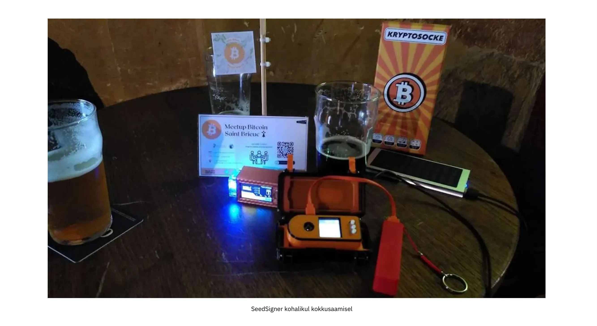

Pärast esimest kohtumist soovite tõenäoliselt planeerida veel üht. Kuni teie kogukond on veel väike, on kõige parem valida kuupäevi küsitluste kaudu, näiteks kord kuus või iga kahe kuu tagant. Seda saate arutada oma suhtluskanalites.

Kui moodustub regulaarne rühm bitcoin'idest ja huvitatud osalejatest, on mõistlik kehtestada korduv ajakava kahel põhjusel:

1) see lihtsustab kõigi planeerimist ettepoole;

2) see aitab **loomata "harjumuse "**. Isegi kui keegi lõpetab teie kanalite regulaarse vaatamise, teab ta ikkagi, millal kohtumine toimub, ja võib nagu tavaliselt kohale tulla.

See teine punkt on üks põhjus, miks **Prantsusmaal toimub enamik kohtumisi iga kuu esimesel kolmapäeval** (vt [DecouvreBitcoin](https://decouvrebitcoin.fr/) poolt 2022. aastal käivitatud algatust "suursaadikud").

Saksamaal ja Itaalias ei ole kindlat rahvuspäeva.

Kui aga kõik kohtumised toimuvad üleriigiliselt samal päeval, tekitab see tsentraliseerimisprobleemi: see takistab bitcoin'i kasutajatel osaleda lähedalasuvate kogukondade üritustel ja võib tekitada ka julgeolekuprobleeme. Naaberriikide kokkutuleku korraldajatega rääkimine võib aidata kokku leppida heas korralduses.

Kui teie kogukond kasvab ja kohtumised meelitavad rohkem inimesi, võite:

- seada iga kohtumise jaoks konkreetne eesmärk;
- või isegi **lisada iga kuu teine üritus**.

Esimesel juhul võib selge eesmärk tagada, et osalejad lahkuvad midagi uut õppides ja et vestlused keskenduksid Bitcoin-le, pidades samal ajal silmas igaühe eelistusi.

Teisel juhul võiks teine igakuine üritus olla pühendatud konkreetsele teemale, näiteks algajate seansid või töötoad (Mining, Lightning, sõlme paigaldamine jne).

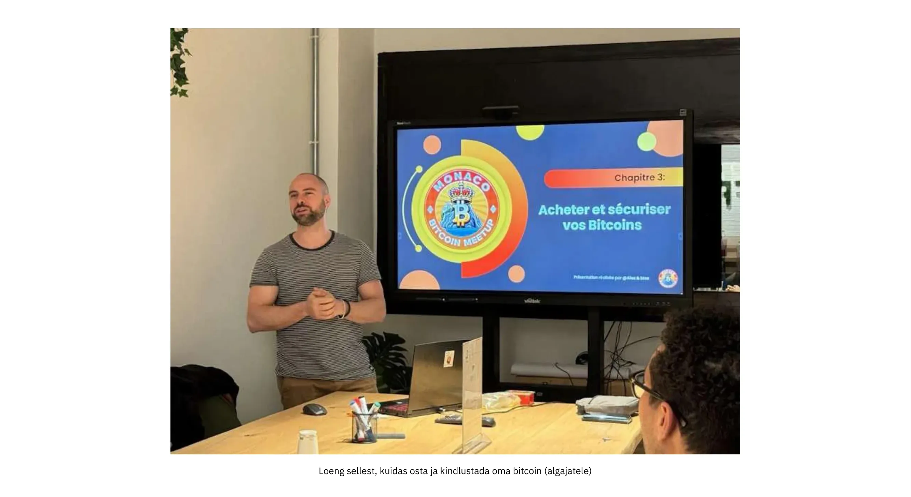

Pidage meeles, et **see nõuab rohkem organiseerimist ja rohkem teie aega**. Õnneks leiate [selle kursuse 6/8. osast] (https://planb.network/courses/1c643dc9-a15f-4f9e-93b6-cb3c58b4ee35/3213d87a-1998-5972-ab93-97a5769ba279) hulga taaskasutatavaid avatud lähtekoodiga ressursse, mis aitavad.

Igal juhul sõltub kõik sellest, millise lühi-, keskpika ja pikaajalise tegevuskava te või teie kogukond endale seadsite.

## Asukoha otsimine

<chapterId>405d389e-6a32-5777-af8d-293380d2e8fd</chapterId>

Ürituste toimumiskoha leidmine ei ole sageli lihtne ülesanne. Pealegi on oluline, et see toimumiskoht asuks **suhteliselt teie kogukonna linnas**.

Arvesse tuleb võtta mitmeid kriteeriume, sealhulgas:

1) ** Asukoht**: kas see on ühistranspordiga kergesti ligipääsetav? Autoga? Kas parkimine on võimalik?

2) Kas saal on meeldiv ja mitte liiga **mürarikas**? Kas otsite ametlikku keskkonda (tööruum, koosolekuruum) või midagi mitteametlikumat (baar, restoran)?

3) Kas see on piisavalt suur, et teid vastu võtta, isegi ragbi- või Meistrite Liiga mänguõhtul?

4) Kas seal on videoprojektor ja vaikne ala esitluste jaoks?

5) Ja lõpuks, kui tegemist on baari või restoraniga, kas menüü pakub kõigile midagi süüa ja juua?

Lisaks sellele on siin kolm olulist punkti, mida silmas pidada:

- Kui plaanite jagada õhtu kaheks osaks: kõigepealt esitlus ametlikus ruumis, et aidata kõigil keskenduda, ja seejärel liikumine baari või restorani, et jätkata lõdusamas õhkkonnas, näitab kogemus, et koha vahetamine keset õhtut viib sageli selleni, et mõned osalejad lahkuvad vaheajal. Seetõttu ei ole selline lähenemine soovitatav.
- Esimestel kohtumistel on osavõtjate arv tõenäoliselt väike ja te ei pea tõenäoliselt ametlikke ettekandeid. Sellisel juhul ei ole vaja ennast omanikule tutvustada ega oma eesmärke selgitada. Kuid **kui kohtumised muutuvad regulaarseks ja külastatavaks, tasub seda teha, et näidata professionaalsust ja väljendada oma soovi igakuiselt tagasi tulla**. See võib viia paljude aruteludeni (automaatsed igakuised broneeringud, tasuta joogid ja/või toidulaud, allahindlused, vestlused Bitcoin kohta, Bitcoin maksete vastuvõtmine jne). Ilmselt, kui otsite konkreetselt videoprojektoriga saali, et teha ettekandeid, tundub oluline paluda kohtumist (silmast silma või isegi telefoni teel) omaniku ja/või juhatajaga, et tutvustada oma projekti ja eesmärke.

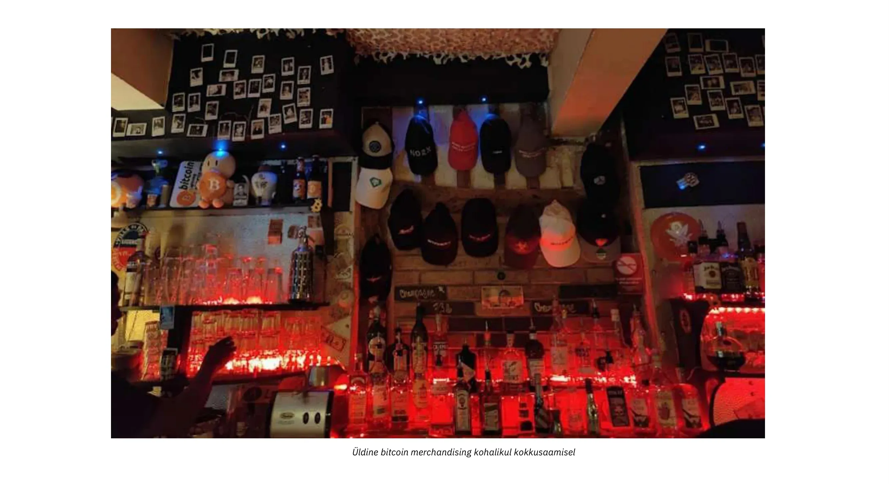

- lõpuks, mõned kogukonnad **soovivad oma üritusi korraldada ainult kohtades, mis aktsepteerivad Bitcoin makseid**, mis on arusaadav. Sellisel juhul on hea mõte **alustada oma linna Bitcoin makseid aktsepteerivate ettevõtete otsimisega** (aadressil [btcmap.org](https://btcmap.org/map/)ja võtta nendega ühendust, et näha, kas nad vastavad teie kriteeriumidele. Kui midagi sobivat ei ole saadaval, võite proovida uute kaupmeeste vastuvõtmist, kuid arvestage paljude keeldumistega, mis võib olla heidutav. Seepärast on sageli parem seda mitte kohe alguses eesmärgiks seada, vaid kaaluda seda siis, kui teie kogukond on juba hästi välja kujunenud ja teil on piisavalt "tulejõudu"

Samuti ärge kartke oma kokkusaamise käivitamisel esimestel kuudel **vahetada toimumiskohta**. See aitab teil **loome suhteid erinevate juhtidega**, uurida erinevaid atmosfääre ja koguda teavet võimalike tulevaste võõrustajate kohta.

Hiljem, kui teie rühm on kasvanud, võiksite isegi ühe pärastlõuna jooksul külastada mitmeid ettevõtteid ja baare, küsides, kas neil on ruumi, mis sobib teie igakuiste ürituste ja kohtumiste korraldamiseks.

## Enne kohtumist

<chapterId>c5218943-580d-5efc-89ed-6b5d728816d6</chapterId>

Kas plaanite lähinädalatel korraldada kohtumise?

Siin on kontrollnimekiri, mis aitab teil valmistuda:

1/ **Kinnitage koht**

Võtke ühendust sündmuse toimumiskohaga ja reserveerige see eeldatava osalejate arvu jaoks.

2/ **Esitusest teatamine**:

    - Jagage kuupäeva, kellaaega ja asukohta oma sotsiaalvõrgustikes ja muudes suhtluskanalites. Vajaduse korral lisage registreerimislink.
    - Looge spetsiaalne visuaal (näiteks Canva plakat, vt osa 2/8 "[Bitcoin kogukonna identiteedi kujundamine](https://planb.network/courses/1c643dc9-a15f-4f9e-93b6-cb3c58b4ee35/b48a18cc-afdf-5216-802c-32647b5cd8a3)").
    - Maksimeerige nähtavust, pannes teate Telegrami ja Twitteri ning kasutades "@everyone" mainimist Discordis.
    - Postitage kuulutused 7-10 päeva enne ürituse toimumist, et osalejad saaksid ette planeerida.

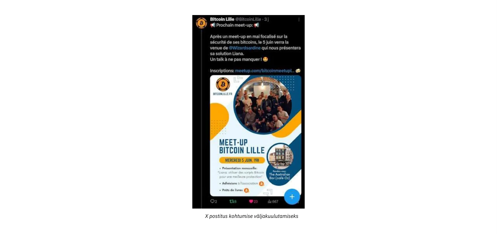

3/ **Mäletage oma publikut**

Kaks kuni kolm päeva enne üritust jagage ja retweetige oma teadaandeid uuesti, et suurendada nähtavust.

4/ **Ajakohastatud koht**

Eelmisel päeval (või kaks päeva enne) kontrollige oma registreeringuid ja andke toimumiskohale teada lõplik eeldatav osalejate arv.

Täiendavad sammud, et teie üritus paistaks silma:

- Trükkida flaierid ja/või plakatid
- Valmistage ette esitlus konkreetsel teemal
- Korraldage tegevus või töötuba

## Kohtumise päev

<chapterId>cf60067b-591f-5fdf-9b9e-d442aad0e8f9</chapterId>

Suur päev on käes! Üks või kaks tundi enne ürituse algust saatke meeldetuletus oma kogukonna kommunikatsioonikanalite kaudu. Kinnitage uuesti algusaeg ja andke osalejatele teada, kuidas teid ära tunda, näiteks mainides, et teil on seljas Bitcoin T-särk ja müts.

Kui teie kohtumised kasvavad ja te hakkate vastu võtma rohkem kui 20 inimest, muutub kohtumispaiga ettevalmistamine üha olulisemaks.

Siin on, mida teha:

1) **Tule varakult kohale**, et asjad valmis panna.

2) **Korraldage ruumi** vastavalt oma vajadustele ja saali võimalustele. Kui teid on ainult kuus inimest, on vaja vähe seadistusi. Kui aga osalejaid on 10-20, võib täielikult istuv paigutus piirata suhtlemist. Sellisel juhul valige seisev korraldus koos hästi eraldatud kõrgete laudadega, kui need on olemas, kuid tagage siiski mõned (eelistatavalt kõrged) toolid. Kui on kavas pidada ettekanne, hoidke enamiku õhtu jooksul paigutust püsti ja tooge toolid sisse vahetult enne ettekannet.

3) Lisage väikesed kohandatud puudutused:

    - Pane sissepääsu juurde üles plakat, et näidata oma asukohta (kasuta Patafixi ja küsi kõigepealt saalilt luba).
    - Pange sees välja Bitcoin-teemalised plakatid (Bitcoin valge paber, teie kogukonna põhikiri, jooksvad projektid jne).
    - Asetage laudadele kleebised, flaierid või vestluse alustajad, näiteks: Nerdminer, Hardware Wallet, sülearvuti, mis näitab oma Mempool, ASIC Miner või metallist varuplaat eravõtmete jaoks.

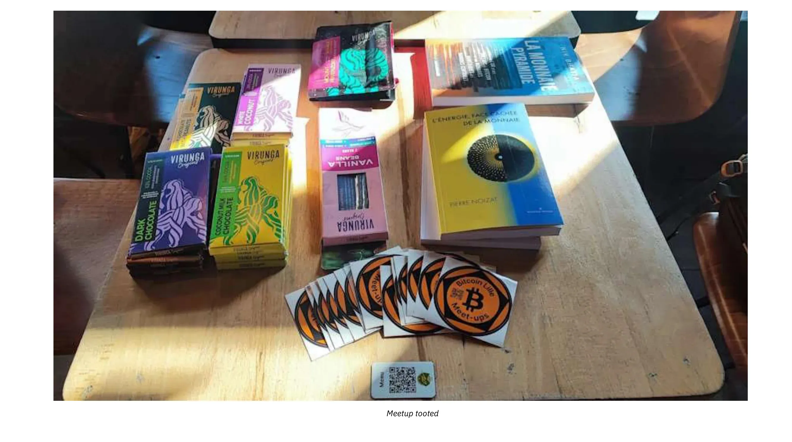

Kui te ootate vaid paari osalejat ja ei ole veel suhteid saali haldajatega üles ehitanud, siis vältige kogu oma varustuse koheselt kaasa võtmist ja esitlemist. Kui usaldus on saavutatud, on teil rohkem vabadust ruumi kujundada nii, nagu soovite.

Lõpuks võtke jook ja oodake, kuni inimesed saabuvad. Ja pidage meeles: ärge laske end heidutada, kui keegi ei tule esimesel korral. Võta igaks juhuks kaasa raamat või video, mida vaadata.

## Pärast kohtumist

<chapterId>3e881af9-9c09-5721-81ee-c5cda3b109c5</chapterId>

Kui kohtumine lõpeb, on kohtumispaiga töötajate jaoks aeg koristustöödeks. Enne lahkumist pakkuge teenindajatele või juhatajatele abikätt. See võib olla nii lihtne, nagu kõikide klaaside kogumine ühele lauale või, kui olete baari lähedal, nende tagastamine enne lahkumist.

Kui olete koju tagasi jõudnud, on Bitcoin tõenäoliselt veel mitu päeva meeles. See on ideaalne aeg, et mõõta oma kogukonna pulssi ja koguda osalejatelt tagasisidet. Saate:

- Postitage tänusõnum oma suhtluskanalites ja jagage kõiki sündmuse käigus mainitud linke või ressursse.
- Kutsuge osalejaid üles tegema ettepanekuid järgmise kokkusaamise parandamiseks.
- Alustage oma järgmise ürituse planeerimist.

Seejärel on teil paar nädalat aega, et töötada välja uusi ideid, visuaale või projekte, et muuta järgmine kohtumine veelgi paremaks.

## Osalejate kaasamise ja hoidmise tähtsus

<chapterId>f5355e35-4b07-527c-88a3-8535cba7592c</chapterId>

Rooma ei ole ehitatud ühe päevaga ja teie kogukond samuti mitte. Hoogu Bitcoin ümber annab regulaarsete kohtumiste ja ürituste korraldamine.

Selleks on üks asi väga oluline: **hoidke osalejad kaasatuna**.

See võib alata väikese rühma kirglikest bitcoin'idest, kelle eesmärk on regulaarselt kokku saada ja rääkida Bitcoin-st. Aja jooksul, sõltuvalt iga inimese kättesaadavusest ja huvidest, võite **jagada grupiga teatud korralduslikke ülesandeid** või kutsuda põhilisi **liikmeid võtma konkreetseid projekte**. Need võivad olla ainulaadsed teie kogukonnale, teie kohtumistele või teie linnale või isegi inspireeritud paljudest algatustest, mis on välja pakutud [käesoleva kursuse 6/8. osas](https://planb.network/courses/1c643dc9-a15f-4f9e-93b6-cb3c58b4ee35/3213d87a-1998-5972-ab93-97a5769ba279). **See mitte ainult ei soodusta Commitment teie tuumikliikmetelt, vaid aitab ka teie kogukonnal kasvada ja areneda**.

Koosolekute edenedes ilmuvad uued näod: inimesed, kes ostsid BTC ja/või altcoine eelmistes tsüklites, tehnoloogiahuvilised, kes soovivad süvendada oma arusaamist, või täiesti algajad, kes on uudishimulikud selle tsenseerimata, detsentraliseeritud, läbipaistva ja õiglase maksesüsteemi suhtes, mis töötab ilma tingimuste ja usaldusväärsete kolmandate osapoolteta.

Selleks, et kõik tunneksid end oma üritustel kaasatuna, keskendu kahele peamisele aspektile:

- **Sotsiaalne kaasatus**: Kõik osalejad peaksid end teretulnud tundma. Tehke jõupingutusi, et tervitada uustulnukaid, küsida, miks nad tulid, ja tutvustada neid teistele. Kui inimesed tunnevad end kaasatuna, tulevad nad suurema tõenäosusega tagasi ja võib-olla isegi aitavad edaspidiseid üritusi korraldada.
- **Kannatlikkus ja avatus**: See nõuab aega ja motivatsiooni. Kui räägite pühendunud shitcoineriga (või veel hullem, XRP Maximalist), võib olla kiusatus neid kõrvale jätta. Kuid vestlusse astudes võite selgitada arusaamatusi või vigaseid põhjendusi. Kui nad on valmis kuulama, võivad nad olla valmis Bitcoin tõeliselt mõistma.

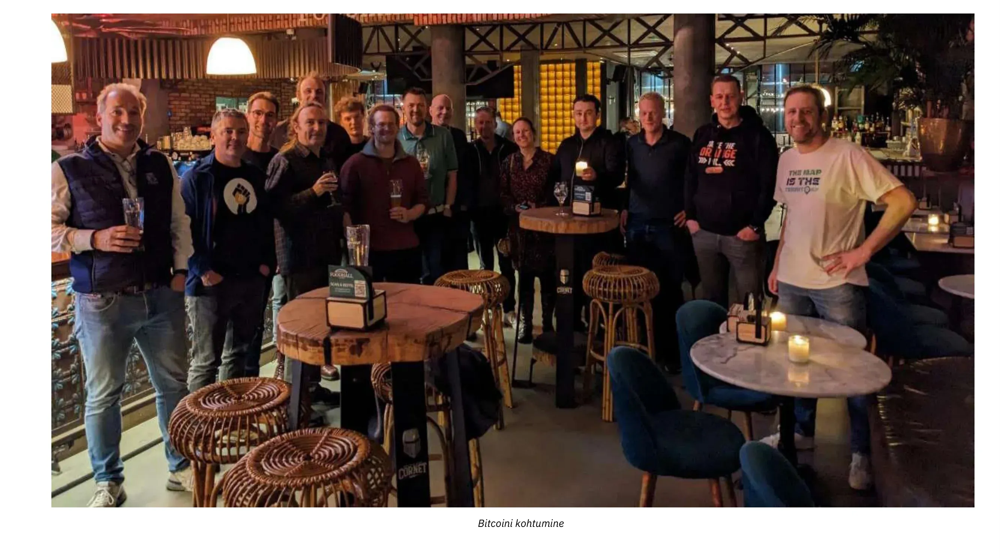

Praktilisest vaatenurgast mõelge üldisele üritusel toimuvale kogemusele:

- Kas **sõidupaik oli meeldiv**?
- Kas see oli **lihtne kasutada?**
- Miks mõned inimesed registreerusid, kuid ei tulnud kohale?
- Milliseid arutelusid peeti? Kas arutelud olid algajate jaoks liiga tehnilised?
- Kas arutelud olid liiga alkohoolsed?

Igal osalejal on oma isikupära, eesmärgid ja huvid, seega on kogemused erinevad. Aga kui koht on õige, rahvas on avatud ja kavatsused on siirad, on kõik põhjused, miks kokkusaamine õnnestub.

Meetupi loomine võtab aega, kuid eelkõige nõuab see organiseerimist. See on inimlik projekt, mis toimib ja kasvab pikemas perspektiivis ainult siis, kui see on hästi planeeritud, avatud ja kaasav.

Lõppkokkuvõttes on teie otsustada, kui kaugele "avatud ja kaasav" peaks minema. Pea lihtsalt meeles: shitcoiner on tihtipeale lihtsalt bitcoiner, mis on alles loomisel.

# Projektide ja algatuste näited

<partId>45b3bc40-1c31-583e-8411-2662e6efd765</partId>

## Miks minna kaugemale kui lihtsalt õlle joomine?

<chapterId>3213d87a-1998-5972-ab93-97a5769ba279</chapterId>

Kui plokid veerevad edasi, areneb teie kogukond. Uued näod liituvad, teised eemalduvad, kuid juhtpõhimõte peaks jääma samaks: arendada Bitcoin ökosüsteemi ja tugevdada liikmetevahelisi sidemeid.

On palju projekte ja algatusi, mida saab rakendada. Selles peatükis on esitatud mittetäielik nimekiri ideedest, mida saab ellu viia kogukonna raames või kohtumise ajal. Võite vabalt valida need, mis teid inspireerivad, ja isegi anda oma ideid sellesse kursusesse [tehes "Pull Request" GitHubis](https://github.com/PlanB-Network/Bitcoin-educational-content).

Enne kui sukeldume sellesse, vaatame veelkord üle ühe varem mainitud punkti.

Kui korraldate Bitcoin kohtumise, kohtute uute inimestega. Sotsiaalne suhtlemine on oluline ja õlu (või alkohol üldiselt) aitab luua pidulikku õhkkonda. Kuid tasub meeles pidada:

- Alkohol kahjustab kognitiivseid võimeid, näiteks mõtlemist ja arusaamist, mis võib raskendada osalejate jaoks tõsiste arutelude või ettekannete jälgimist.
- Alkohol võib muutuda ka mugavusrituaaliks: iga kuu jagate sõpradega oma "Bitcoin hetke" ühe joogi juures. Kuigi see on suurepärane viis kontakti loomiseks, kas õlle joomine on tõesti teie kokkusaamise peamine eesmärk? Või tahaksite pigem Exchange uurida, teistelt õppida ja aidata uustulnukatel Bitcoin avastada?

Igaühel on oma eelistused, veendumused ja isiksus. See ei tähenda ühe kohtumise üle otsustamist. Kuigi me räägime sageli õlle juures maailma muutmisest, ei alga ega kasva revolutsioonid niimoodi.

Oluline on lihtsalt olla sellest teadlik.

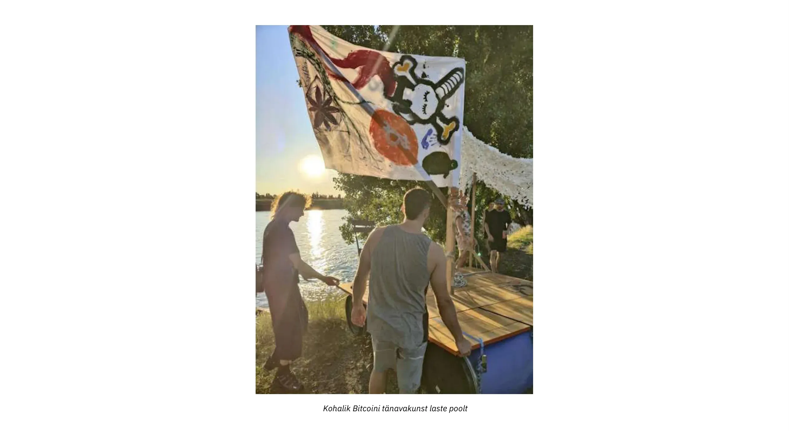

## Korraldada igal aastal toimuvaid teemakohaseid kohtumisi

<chapterId>46afdbcc-a775-5c16-b20a-34956690d58f</chapterId>

Kui olete moodustanud umbes kümnest inimesest koosneva tuumikrühma, võite hakata igale üritusele ettekandeid lisama. Need võivad järgida eelnevalt teatatud teemat või olla üksteisest täiesti sõltumatud.

Ettekannete või töötubade kavandamisel aitab luua selge, hästi struktureeritud kulgemine. Eesmärk on **katta Bitcoin põhimõisteid samm-sammult**, andes osalejatele tervikliku ülevaate teemast mitmest vaatenurgast.

Prantsusmaal töötasid kohtumiste korraldajad 2023. aasta suvel **aastakäigu** kallal.

Lisaks tugevale hariduslikule väärtusele võimaldab selline lähenemisviis jagada avatud lähtekoodiga dokumente ja slaidiplaate rühmade vahel, luues järk-järgult ühise ressursside raamatukogu. See algatus on saanud hea vastuvõtu ja see peaks lähiaastatel kasvama.

Allpool on esitatud 2023-2024. aasta prantsuse kohtumiste kulg. Iga teema kohta on saadaval avatud esitlus ja video, mis võivad anda teile ideid teemade kohta, mida võiksite oma ürituste puhul käsitleda.

Täiendavad redigeeritavad materjalid leiate ka [Bitcoin Teaching Toolbox](https://planb.network/fr/resources/bet)!

| Month | Theme | Video | Editable Resource |
| -------- | -------- | -------- | --- |
| September     | Chapter 1: What is Bitcoin?     | [	YouTube link](https://www.youtube.com/watch?v=CSjuBqrl4t8)     | [Editable PowerPoint](https://www.canva.com/design/DAFu0d5Jd7M/9gAWDAOSS6LDkWENuZjYgw/edit) |
| October & November| Chapter 2: Understanding Bitcoin Transactions     | [YouTube link](https://www.youtube.com/watch?v=inFnR-3NsdM)     | [Editable PowerPoint](https://www.canva.com/design/DAFsEcnOro8/Mz9FYdTGhsvozZOe0Y9jtw/edit) |
| December     | Chapter 3: Understanding the Lightning Network     | [YouTube link](https://www.youtube.com/watch?v=hHz-ALx8D9w)     | [Editable PowerPoint](https://www.canva.com/design/DAF4YPSNnR8/HKp4Vmcno8eMtVWnZmFtcw/edit) |
| January     | Chapter 4: What is Mining?     | [YouTube link](https://www.youtube.com/watch?v=QyHZ3CVI_OI)     | [Editable PowerPoint](https://www.canva.com/design/DAF5DE6iBEM/tsy8E3oBebUnsR0kj53vvQ/edit) |
| February     | 	Chapter 5: Running a Bitcoin and Lightning Node    | [YouTube link](https://www.youtube.com/watch?v=RRYK-usg-OY)     | [Editable PowerPoint](https://www.canva.com/design/DAF55FU6HI0/sQ0lacRJblqrhn_9Xk1yDg/edit) |
| March     | 	Chapter 6: Using the Lightning Network in Daily Life    | [YouTube link](https://www.youtube.com/watch?v=o2BS4xjei8M)    | [Editable PowerPoint](https://www.canva.com/design/DAGAcJMw7lw/-haMNnHnwj5vpDAy8MDowA/edit) |
| April & May    | Chapter 7: Securing Your Bitcoins      | [YouTube link](https://www.youtube.com/watch?v=fHExPbhM0Hg)    | [Editable PowerPoint](https://www.canva.com/design/DAGDz3Nq4e0/D3uG-4w9FN6OhUq-VXzhfg/edit) |
| June     | 	Chapter 8: What is Multi-Sig?     | [YouTube link](https://www.youtube.com/watch?v=Me5489mpoxA)     | [Editable PowerPoint](https://www.canva.com/design/DAGLMtQT6sg/rYIxr4ldUJ0jTelNf-Pj8Q/edit) |
| July     | 	Chapter 9: Understanding the Bull Run and How to Prepare    | [YouTube link](https://www.youtube.com/watch?v=7RA-gnCJWyM)     | [Editable PowerPoint](https://www.canva.com/design/DAGJQkiZ_YA/9lUluP9RZ0eeA_e61mk9Hw/edit) |
| August     | Chapter 10: The Taxman is Never Far Away   | [YouTube link](https://www.youtube.com/watch?v=oY4NwonGDm0)     | [Editable PowerPoint](https://www.canva.com/design/DAGQhx7Yc_c/7mRhb_vlgnhSgxd1FtjK8w/edit) |

Peatükid 2 ja 7 võib jagada kaheks lühemaks ettekandeks, et vältida osalejate ülekoormamist. Kui need toimuvad ühe istungi raames, vabaneb kalendris ruumi eriliste tegevuste jaoks, näiteks ühiste kohtumiste korraldamiseks naaberrühmadega, viktoriinide või töötubade korraldamiseks.

**Sina võid neid ressursse vabalt kasutada, kohandada ja jagada, kuid kui kasutad nende tööd uuesti, siis maini kindlasti nende algseid autoreid.**

Kuna kõik ei osale igal kohtumisel, on hea mõte salvestada ettekanded ja laadida need üles voogedastusplatvormile või oma veebisaidile. See võimaldab eemalviibijatel järele jõuda ja osalejatel materjali hiljem uuesti üle vaadata.

Paralleelselt saate korraldada ka teisi temaatilisi kohtumisi, näiteks:

- Bitcoin teadmiste viktoriin (auhinnaks Hardware Wallet)
- Sissetuleku väljakutse, kus sa saadad tasuta satoshisid tänaval olevatele no-coiners'idele
- Eksperdiesineja või ettevõtte kutsumine Bitcoin-ga seotud toote tutvustamiseks
- Öine ekskursioon baaridesse ja poodidesse, mis aktsepteerivad Bitcoin

Ja palju muud, teie kujutlusvõime on ainus piir!

## Looge kõrvalüritusi ja töötubasid

<chapterId>9dbd651a-8712-5630-90b3-b9525dcc1385</chapterId>

Sõltuvalt teie kättesaadavusest ja kaasatuse tasemest teie kogukonnas, võite planeerida aasta jooksul täiendavaid üritusi, näiteks:

- Restoranide õhtu **Pitsapäeva** puhul 22. mail
- Õhtu või nädalavahetus, et tähistada järgmist **Halving**
- Perekondlik **mänguõhtu** Bitcoin ja selle toimimise kohta, kasutades selliseid mänge nagu [Le Coin de Table](https://www.Maximalist.ovh/) või [SHAmory](https://shamory.com/)
- **Mining töötuba**, kus tutvustatakse eri tüüpi riistvara (CPU, GPU, FPGA, ASIC, Nerdminer, Bitaxe)
- **lõuna- või õhtupoolik algajatele**, kus toimuvad teemakohased töötoad
- **ühine kohtumine naaberkogukondadega**

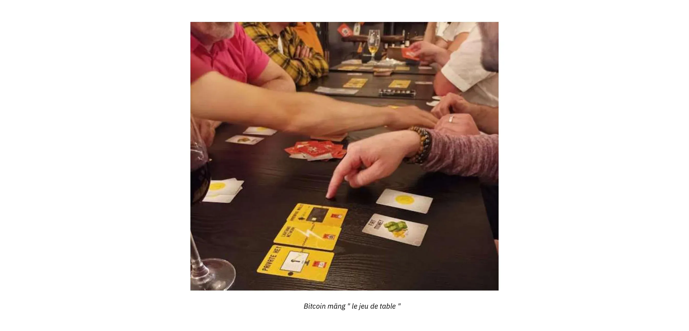

Olge lihtsalt ettevaatlik, et kalendrit mitte üle koormata. Liiga palju üritusi ühe kuu jooksul võib viia korraldajate läbipõlemiseni ja aja jooksul võib osavõtjate arv väheneda.

## Loo kleebised

<chapterId>d605f3b3-130e-513d-85e6-06bc5ea13e99</chapterId>

Kleebised on lõbus viis reklaamida nii Bitcoin kui ka teie kogukonda, tugevdades samal ajal teie identiteeti.

Enne tellimist pidage meeles järgmisi nõuandeid:

- Välitingimustes kasutamiseks veenduge, et kleebised on veekindlad.
- Hoidke oma logo veidi väiksem kui lõikepind, et vältida laserlõikamise käigus tekkivaid kärpimisprobleeme.
- Kasutage rasterpildi asemel vektorfaili, et saavutada parem trükikvaliteet.
- Valige õige suurus: 8 cm läbimõõt (umbes täiskasvanu peopesa suurus) on hästi nähtav, samas kui 4 cm on diskreetsem. Kas otsite nähtavust või diskreetsust ?
- Rikkaliku musta trükkimiseks ("quad black") kasutage 30% tsüaani, 30% magenta, 30% kollast ja 100% musta. Ainult 100% musta kasutamine võib põhjustada halli tooni. Printerid kontrollivad seda sageli, kuid seda tasub teada.

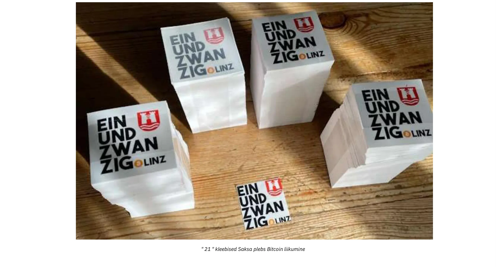

Sõltuvalt teie vajadustest ja tarnijast võib 1000 kleebist maksta 100-250 eurot. Võite võtta ühendust [@Mill3sim3 on Twitter](https://x.com/Mill3sim3), Prantsuse Bitcoiner spetsialiseerunud turundus, kes võib mõnikord tagada hinnad kuni 30% madalamad kui tavalised online-müüjad.

See tähendab, et 1000 kleebist on palju. Tavaliselt on parem alustada umbes 100-st, et tagada, et saate neid kõiki levitada.

Oluline: **Kontrollige kohalikke eeskirju enne kleebiste paigutamist avalikku ruumi**.

Prantsusmaal võib kleebiseid panna ainult ametlikele avalikele teadetetahvlitele. Kui need pannakse mujale (nt stoppmärgile), siis tõenäoliselt eemaldatakse need ja võidakse määrata trahv, kui neid saab seostada teie või teie kokkusaamisega. Teavitage sellest oma liikmeid.

Erakondlikes kohtades, nagu kontserdid, baarid või staadionid, kontrollige enne oma kleebiste lisamist, kas need on juba olemas. Kui mitte, küsige töötajatelt luba. Te ei taha, et äriomaniku esimene mulje teie kogukonnast oleks, et te vandaalitsete nende ruumi.

## Luua raamatukogu

<chapterId>acc94093-f8b3-51b8-9359-348e9e075d38</chapterId>

Teine projekt, mille saate hõlpsasti luua, on **raamatukogu loomine teie kohtumistel**.

Võiksite kutsuda osalejaid, kes soovivad jagada oma lugemismaterjali, tooma Bitcoin-ga seotud raamatu. Kui keegi teine kokkusaamisel soovib seda laenata, võiks Exchange omanikuga kokku leppida laenamise tagatisraha eest, näiteks 21 000 satošit välklambi kaudu.

Omaniku jaoks aitab see tagatisraha katta võimalikku kaotust või vargust. Laenuvõtja jaoks on see stiimul, et tulla tulevikus tagasi kohtumisele, et oma tagatisraha kätte saada.

Kui te juhite ühingut ja soovite investeerida osa oma vahenditest haridusressurssidesse, võite osta ka mitmeid raamatuid, mida saate pakkuda oma **Bitcoin raamatukogus**, mis on saadaval igal kohtumisel.

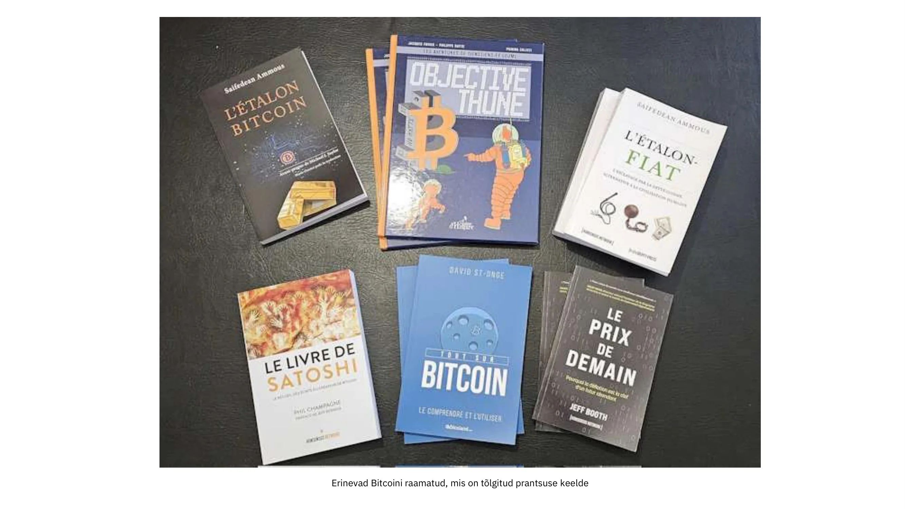

Ökosüsteemi toetamiseks pakub **[kirjastaja Konsensus Network](https://konsensus.network/) alates 2023. aasta lõpust rahvusvahelistele Bitcoin kohtumistele ja kogukondadele 15% kuni 35% allahindlust kõikidest oma raamatutest, kui tellida kolm või enam raamatut**.

Selle soodustuse saamiseks võtke lihtsalt **kontakti [kirjastus Konsensus](https://twitter.com/KonsensusFR) Twitteris**.

Kui teil ei ole sularaha, võite siiski anda allahindlust edasi oma kogukonna liikmetele.

Kui teil endal ei ole vahendeid, saate allahindlust siiski oma liikmetele edasi anda. Näiteks võiks üks korraldaja koguda liikmetelt tellimusi, teha kogutellimuse soodushinnaga ja jagada raamatuid järgmisel kokkusaamisel, kusjuures makse kogutakse sel ajal välkkiirelt.

Samuti võiksite oma kohtumistel välja panna raamatute laenutamise põhikirja, et selgitada uutele tulijatele selgelt laenutamise reegleid.

Siin on avatud lähtekoodiga näide, mida saate kasutada ja kohandada:

[Raamatulaenutuse harta](https://www.canva.com/design/DAF7u1b5kRM/r2gEAlibe_jTIXIX-O9PMA/edit)

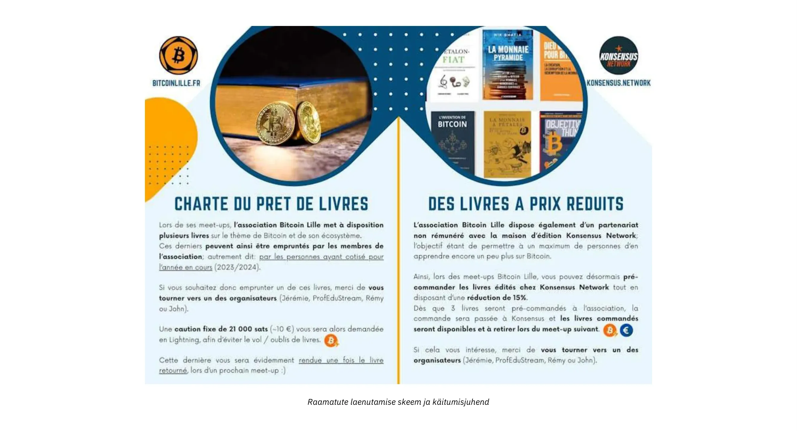

Lõpuks, et julgustada Bitcoin-ga seotud lugemist, võiksite külastada **kohalikke munitsipaalraamatukogusid**, et vaadata, kas neil on Bitcoin-teemalisi raamatuid.

Kui nad seda teevad, küsige raamatukoguhoidjatelt, kas sellel teemal on plaanis mõni **ümarlaud**, ja pakkuge neile oma kohtumise kontaktandmeid.

Kui mitte, siis soovitage neil hankida mõned raamatud eelnevalt valitud nimekirjast. [kirjastaja Konsensus Network](https://konsensus.network/) võib olla inspiratsiooniallikaks.

## Luua ja levitada isikupärastatud flaiereid

<chapterId>62ad5430-c698-51b3-89ac-090f31c88953</chapterId>

Flaierite kujundamine ja kirjutamine võtab aega, kuid see on seda väärt, sest need annavad teile käegakatsutava abivahendi, mida jagada Bitcoin-st rääkides, mida alati hinnatakse.

Need flaierid võivad olla suunatud:

- Kaupmehed, kui soovite Bitcoin makseviisina kasutusele võtta;
- Üritusel osalejad koos flaieriga, mis selgitab, kuidas kasutada ja maksta Bitcoin/Lightning'iga;
- Algajaile, olgu neid siis tänaval, tööl või perekondlikul koosviibimisel kohatud, Bitcoin peamisi eeliseid tutvustava infolehega.

Samuti võiksite kujundada oma kogukonnale või kokkusaamisele omase infolehe, milles esitlete oma tegevusi, eesmärke, sotsiaalmeedia linke, suhtluskanaleid ja eelseisvaid üritusi.

Mitmed flaierid on juba **saadavaks avatud lähtekoodiga [Bitcoin Teaching Toolbox](https://planb.network/fr/resources/bet)** planB.network'is ja aja jooksul lisandub veel rohkem.

Üks näide on [täielik infoleht] (https://profedustream.substack.com/p/21-raisons-dutiliser-Bitcoin), milles on 21 põhjust Bitcoin kasutamiseks. Selle kujundus on samuti [avatud lähtekoodiga](https://www.canva.com/design/DAFtAR1NauQ/ZDwl2CchIJ9Gpb36N6-7iw/edit?utm_content=DAFtAR1NauQ&utm_campaign=designshare&utm_medium=link2&utm_source=sharebutton), mida saate muuta, kohandada ja jagada. Lihtsalt ärge unustage, et viitaksite oma allikatele.

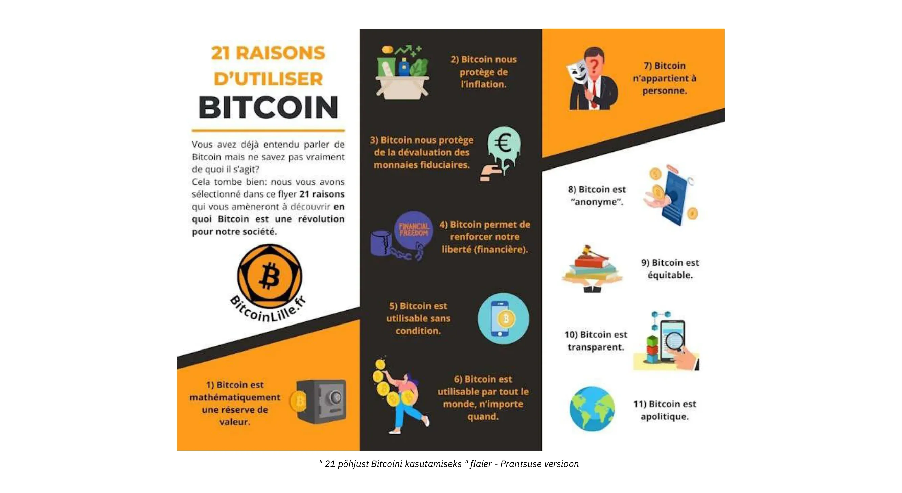

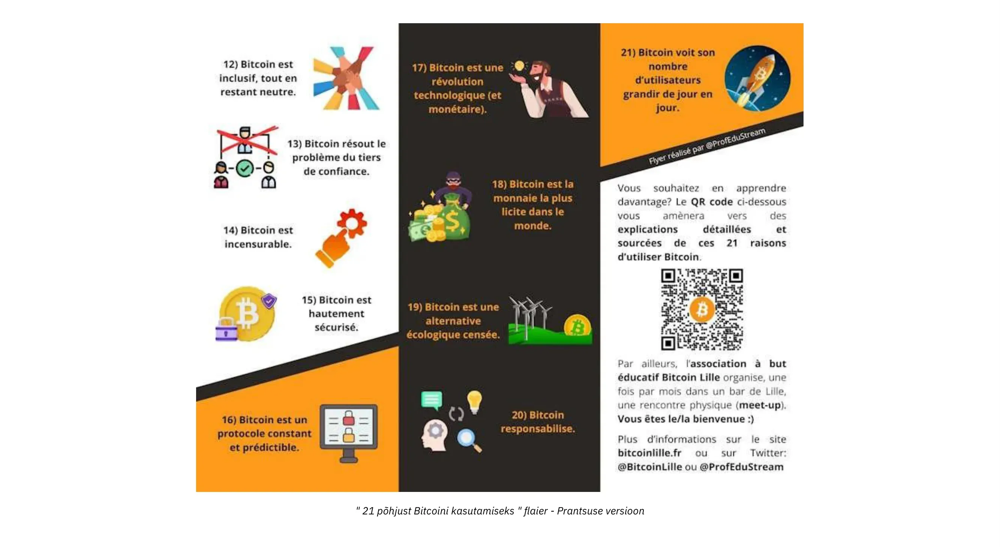

Nagu eespool mainitud, võite need flaierid jätta peaaegu kõikjale: ühisele töölauale, perekonna õhtusöögilauale, avalikku raamatukokku jne.

Prantsusmaal ja mõnes teises riigis on olemas ka "raamatukastid", väikesed puidust kastid, kuhu inimesed saavad vabalt raamatuid annetada või laenutada. Sinna võiksite jätta lendlehe või veel parem - raamatu.

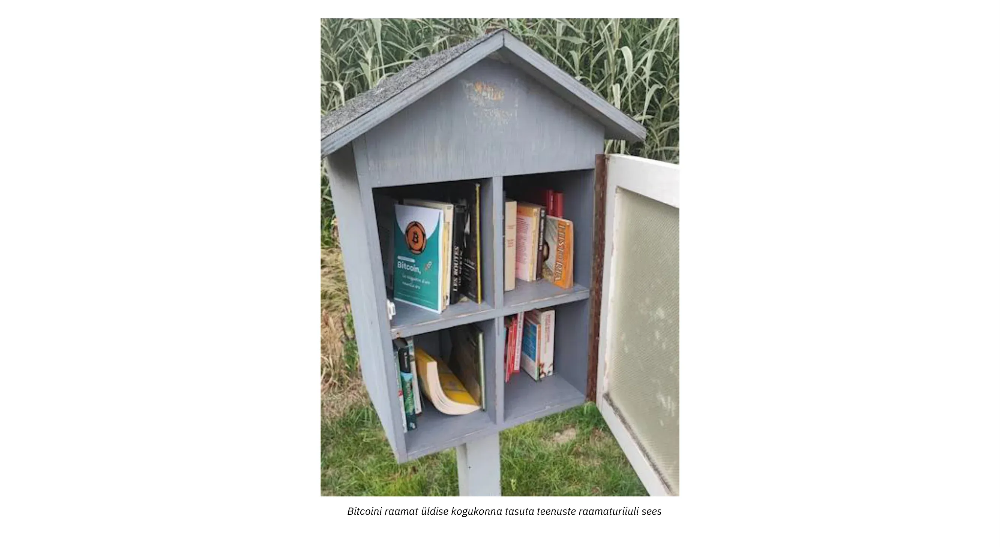

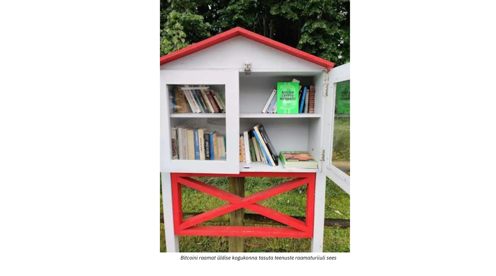

2023. aastal käivitati algatus **"Bitcoin valge raamat Prantsusmaa raamatukastides**".

Selle projekti läbiviimiseks pidid osalejad kõigepealt koguma kõigi riigis asuvate raamatukastide geograafilise asukoha. Selleks on olemas mitu andmebaasi:

- [boite.a.livres.zonelivre.fr](https://boite.a.livres.zonelivre.fr/);
- [boites-a-livres.fr](https://www.boites-a-livres.fr/carte-de-france);
- [delivrez.fr](https://delivrez.fr/maps/fr_FR/);
- pluss artiklid kohalikust ajakirjandusest

Kuigi Bitcoin valge raamatu lahkumine on sümboolne, on see sageli liiga keeruline, et uustulnukad sellest aru saaksid. Selle asemel oli mõte luua väike vihik, mis sisaldab:

- arusaadav ja hästi põhjendatud sissejuhatus Bitcoin, selle kasutusvõimaluste ja lahendatavate probleemide kohta;
- gW-166 valge raamat, mis on tõlgitud prantsuse keelde.

Siin on [Prantsuse bitcoin'i kasutajate seas jagatud vihik](https://profedustream.substack.com/p/Bitcoin-la-naissance-dune-nouvelle), mis on paigutatud kümnetesse raamatukastidesse üle kogu riigi. Selle kujundus on ka [avatud lähtekoodiga](https://www.canva.com/design/DAFs18FSoVM/Sy0QsfUkycTgXveeGgutBg/edit?utm_content=DAFs18FSoVM&utm_campaign=designshare&utm_medium=link2&utm_source=sharebutton).

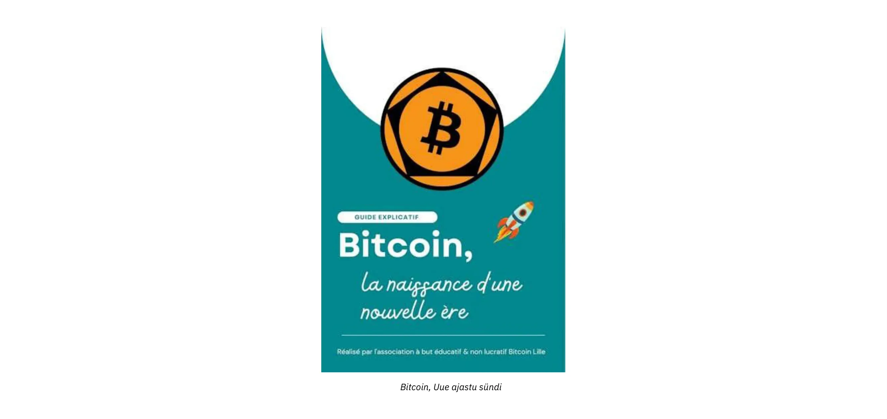

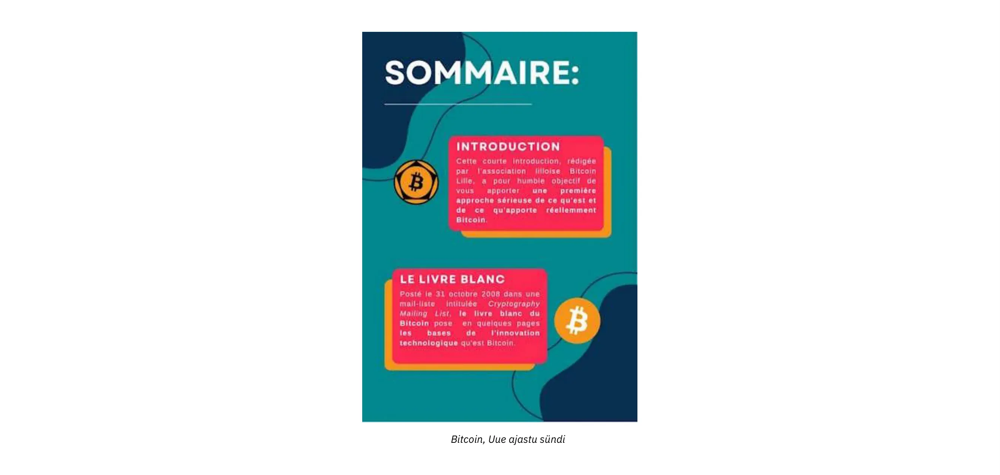

## Videoprojektsiooni tootmine

<chapterId>892b248a-b837-5df6-aac9-4b3261ff0390</chapterId>

Peaaegu iga bitcoiner on ilmselt näinud [Rémi Forte](https://twitter.com/forteremi) põnevat vahekokkuvõtet "Le mystère Satoshi, aux origines du Bitcoin" (The Satoshi Mystery: The Origins of Bitcoin).

2021. aastal ilmunud filmi on vaadatud [mitu miljonit korda YouTube'is](https://www.youtube.com/watch?v=0ETcLj5jBy4).

Üks idee võiks olla korraldada oma kogukonnale "Satoshi saladuse" linastus, võib-olla igakuise lisaüritusena.

Üks hoiatus: kuigi ARTE France on kinnitanud, et avalikud linastused on lubatud, tuleb seaduslikuks linastuseks maksta projektsiooniõiguste eest. Aastal 2023 maksis see umbes 250 eurot ühe linastuse kohta või 120 eurot ühe linastuse kohta, kui aasta jooksul linastas seda vähemalt viis kohtumist.

Enamiku kogukondade jaoks on see hind vastuvõetamatu, eriti kuna dokumentaalfilm on juba praegu tasuta kättesaadav ARTE YouTube'i kanalil.

Loomulikult on võimalikud ka muud prognoosid.

Näiteks Prantsusmaal andis **režissöör [Alana Mediavilla](https://twitter.com/AlanaMediavilla) kohalikele kohtumistele õiguse vaadata eelvaateid oma dokumentaalfilmist "Stranded "**, mis sisaldab materjali tulevasest 2024. aasta filmist [film "Dirty Coin"](https://www.dirtycointhemovie.com/).

Mõned bitcoinlased võtsid isegi initsiatiivi, et tõlkida "Stranded" täielikult prantsuse keelde, lisada subtiitrid ja jagada seda kohtumistega üle kogu riigi. 4. märtsi 2024. aasta nädalal näidati seda samaaegselt umbes tosinal kokkusaamisel üleriigiliselt.

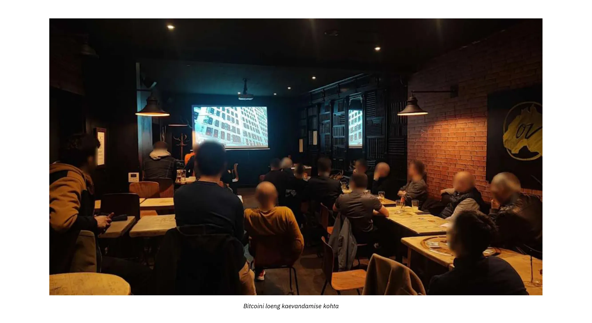

Üritus tekitas elavat arutelu Bitcoin Mining, selle energiatarbimise ja laiema keskkonnamõju üle.

## Plakatite ülespanek oma linnas

<chapterId>6565e8a0-d535-5be0-9764-273584c675bd</chapterId>

Mitmes Euroopa riigis (sealhulgas Saksamaal, Hispaanias ja Prantsusmaal) on bitcoin'i kasutajad võtnud initsiatiivi, et panna oma linnades plakateid üles.

Mõned kujundused töötlevad Banksy kunsti ümber, et lisada Bitcoin logo.

Üks näide on [StreetCyberArt](https://twitter.com/streetcyber_art), saksa bitcoiner, kes on juba mitu aastat loonud kollaaže ja tänavakunsti.

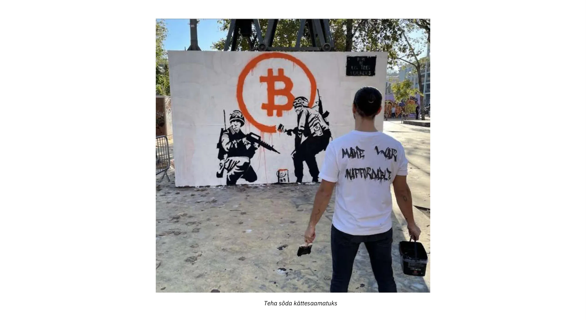

Kui soovite hakata tegelema tänavapostitamisega, siis veenduge, et olete kursis oma riigi seadustega. Näiteks Prantsusmaal võib plakateid paigutada ainult avalikel reklaamtahvlitel. Teistes kohtades on see täielikult keelatud ja karistatakse trahviga.

Kui otsustate siiski piire ületada ja loodate, et teid ei tabata, vältige plakatitel igasuguse identifitseeriva teabe (näiteks oma kohtumise nimi või @Twitter) lisamist.

Pange ka tähele, et nende plakatite trükkimine isiklikul printeril põhjustab tavaliselt tindiverejooksu ja kiiret riknemist välitingimustes. Kõige parem on teha koostööd professionaalse trükkaliga, kes suudab neid toota spetsiaalsele isekleepuvale paberile, mis on mõeldud välitingimustes kasutamiseks, tagades nii kvaliteedi kui ka vastupidavuse.

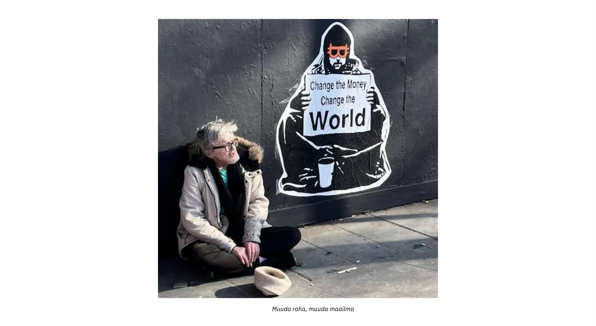

See algatus võib olla kulukas üle 0,40 euro plakati kohta (umbes 40 eurot saja plakati eest) ja veebipõhised hinnad võivad varieeruda kahekordsest kuni viiekordsest summast. Head kontaktid on hädavajalikud.

Nagu eespool mainitud, on prantsuse bitcoiner [@Mill3sim3](https://twitter.com/Mill3sim3) õige professionaalne varustus ja temaga saab üksikasjade saamiseks ühendust võtta.

Teine võimalus on teha suurest papist šabloon ja kasutada spreivärvi, et märgistada oma kujundus valitud kohtades linnas.

## Isikupärastatud NFC-kaart

<chapterId>8ad65d4e-a68a-59c2-a812-85f4907ed9f3</chapterId>

Teine originaalne projektiidee on luua personaalsed NFC-kaardid Lightning-makseteks (ühilduvad BoltCard standardiga). Selleks on Swiss Bitcoin Pay suurepärane partner.

[Nende veebisait](https://swiss-Bitcoin-pay.ch/cards) pakub praegu nelja standardmudelit.

Kui soovite tellida rohkem kui 50 NFC-kaarti, võite võtta ettevõttega ühendust selle ametliku veebisaidi või [Twitter](https://twitter.com/SwissBitcoinPay) kaudu, et pakkuda välja kohandatud kujundus kaardi esiküljele. Tagakülg jääb standardiseeritud.

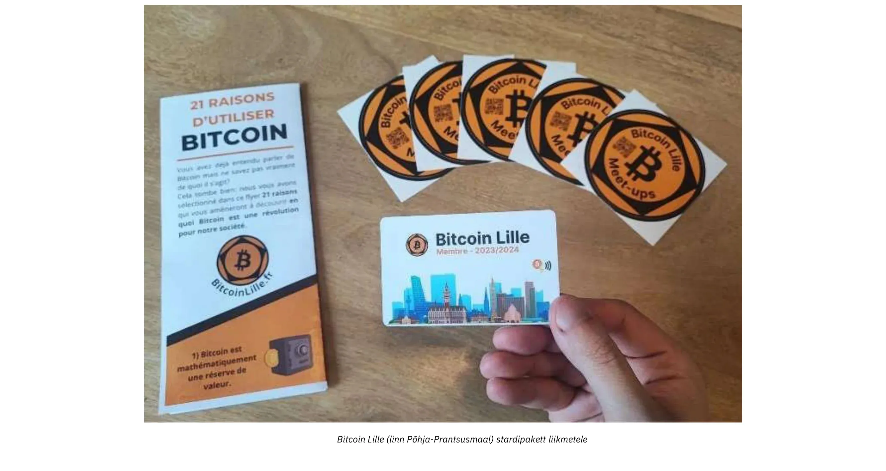

Näiteks 2023. aastal tellis Prantsuse ühing [Bitcoin Lille] (https://twitter.com/BitcoinLille) partii NFC-kaarte, mille disain oli kohandatud. Iga uus liige sai aasta jooksul ühe oma tervituspakendis. Seda ideed saab hõlpsasti kohandada ja isikupärastada oma kogukonna jaoks.

Nende kaartide ühikuhind jääb tavaliselt vahemikku 2,50-5 eurot, sõltuvalt tellimuse suurusest ja turutingimustest, kusjuures suuremate koguste puhul on hind madalam.

## Looge veebisait

<chapterId>9a2a1b9b-0633-544a-b331-c06187d23d7f</chapterId>

Ühiskonna kasvu teatud etapis võib olla väärtuslik omada veebisaiti, mis on teie rühma, kohtumiste, ürituste ja haridusliku sisu väljapanekuks.

Veebilehe loomine võtab aega, kuid alljärgnevas õpetuses näidatakse, kuidas luua tasuta WordPressi sait vaid 30 minutiga. Saate luua kohandatava kodulehe, avaldada artikleid ja manustada meediat, näiteks YouTube'i videod, pilte või PDF-faile.

Hiljem saate osta oma domeeninime või isegi hallata saiti oma serveris.

:::video id=a1b25c18-5fc1-4b97-baef-816d819c9382:::

Kuigi on olemas ka teisi CMS-platvorme, millest mõned on lihtsama ja algaja-sõbralikuma kasutajaliidesega, on need tavaliselt palju vähem kohandatavad. Seetõttu on WordPress üldiselt parim lähtepunkt.

WordPress toetab ka suurt hulka lisaseadmeid (mõned neist on tasulised, kuid kvaliteetsed), mis võivad oluliselt laiendada teie saidi võimalusi, ilma et oleks vaja kodeerimisoskusi. Üks näide on [lisatasu "Uncode" teema](https://undsgn.com/uncode/)

## Loo videokanal (Youtube või Odyssee)

<chapterId>076286db-1627-57ec-a410-c44b1666e1cd</chapterId>

Mõned teie kogukonna liikmed võivad soovida luua multimeediasisu, näiteks õppevideod.

Võite pidada ettekandeid ka kohtumistel või isegi ülikoolides.

**Kui see aeg saabub, võimaldab spetsiaalne videokanal teil kogu oma sisu avaldada ja koondada see ühte kohta.**

Populaarsed platvormid on järgmised:

- [**YouTube**](https://www.youtube.com/), mida kasutatakse laialdaselt, kuid mis ei ole tsensuurikindel.
- [**Odyssee**] (https://odysee.com/), mis on vähem populaarne, kuid detsentraliseeritud peer-to-peer-tehnoloogia abil.
- [**peertube**](https://joinpeertube.org/fr_FR), võimaldab teil oma videoplatvormi hallata, kuigi selle seadistamine on keerulisem.

Olenemata sellest, millise platvormi te valite, kujundage oma kanali atraktiivseks muutmiseks platvormipõhine visuaalne kujundus. Canva, mida mainiti [osa 2/8] (https://planb.network/courses/1c643dc9-a15f-4f9e-93b6-cb3c58b4ee35/3470a31f-0190-5e87-8af0-6a00e79267ef), pakub kategooriat "YouTube'i pisipilt", kus on eelnevalt valmistatud ja kohandatavad kujundused.

Arvutist **salvestamiseks** on [Streamlabs](https://streamlabs.com/fr-fr) tasuta, rikkalik ja toetab stseeniülekandeid.

**videotöötluseks** on [Wondershare Filmora](https://filmora.wondershare.fr/) (umbes 45€/aasta) lihtne kasutada ja annab kiiresti professionaalse tulemuse.

Oma **videote intro ja outro** jaoks leiad Canva'st hõlpsasti sobivad mallid. Kohandage kujundus oma maitse järgi, laadige see alla ja lisage see oma redigeerimisprogrammi.

Vihje: Kui Bitcoin kunagi keelatakse või tsenseeritakse, hoidke alati oma videodest kohalik varukoopia Hard kettal.

## Loo audio-podcast

<chapterId>12e96b45-1c33-5687-a753-80d0114d487a</chapterId>

Audio-podcast on veel üks suurepärane viis ideede jagamiseks. Nagu videokanalite puhul, võtab ka siin kuulajaskonna loomine aega.

Populaarsed podcast-platvormid on järgmised:

- [**Fountain**](https://www.fountain.fm/), toetab Lightning annetusi.
- [**Soundcloud**](https://soundcloud.com/);
- [**Deezer**](https://www.deezer.com/fr/);
- [**Spotify**](https://open.spotify.com/);
- [**Google podcast**](https://podcasts.google.com/).

Igal platvormil on oma sihtrühm, nii et mitmel platvormil osalemine laiendab teie haardeulatust. **[Spotify for podcasters] (https://podcasters.spotify.com/) teeb selle lihtsaks, võimaldades teil oma podcasti üks kord üles laadida ja generate RSS-voo teistele platvormidele**.

Seega, kui töö on "Spotify for Podcasters" jaoks tehtud, jääb vaid sisu vormindamine teiste platvormide jaoks, mis on suhteliselt kiire protsess.

Salvestamiseks on [Audacity] (https://www.audacityteam.org/) tasuta ja võimaldab teil reguleerida helitaset, lisada efekte, näiteks fade, ja suurendada selgust redigeerimise ajal. Sellega on lihtne oma häält salvestada ja luua professionaalse kvaliteediga podcast.

Siin on lühike 10-minutiline õpetus, mis hõlmab Audacityga podcasti loomise põhitõdesid:

:::video id=67d80ac7-253f-40a5-b621-fef2fb7174bd:::

Vihje: Nii nagu videote puhul, hoia kõigi podcastide kohta kohalikku varukoopiat, juhuks kui tulevikus peaks toimuma tsensuur.

## Looge oma ürituste jaoks märk

<chapterId>0cccef8d-a765-5844-8921-c40f0ce653e4</chapterId>

Teie kohtumistel ja üritustel võib kasutusele võtta väikese stiimuli: ürituste märgid. Idee on **luua märk, mida saab saada ainult sellel konkreetsel üritusel**. See kontseptsioon eksisteerib teistes plokiahelates nime all "POAP" ("Proof Of Attendance Protocol"). Praegu ei ole aga Bitcoins selle rakendamiseks ühtegi vaba võimalust.

Sellist süsteemi võiks kasutada ka teie kogukonna kõige aktiivsemate liikmete premeerimiseks. Näiteks võiksite korraldada iga-aastase loosimise, kus iga kogutud märk võrdub ühe osavõtupiletiga. Liikmel, kes osaleb kõigil 12 kohtumisel aastas, oleks 12 loosimispiletit.

Teise, traditsioonilisema lähenemisviisi puhul võiksite lihtsalt paluda osalejatel igal üritusel kirjutada oma eesnimi või hüüdnimi märkidele koos osalemise põhjusega.

Kuigi see on veidi formaalne, aitab see liikmetel kergemini leida ühiseid huvisid ja vestlusteemasid ning teeb ka uustulnukatele korraldajate (või ametlike kogukonna/ühingu liikmete) märkamise lihtsamaks.

Mitmed Lille'i ühingu Bitcoin poolt kasutatud märkide mallid on [saadaval avatud lähtekoodiga Canva's](https://www.canva.com/design/DAGHAsT15MU/AIA7-L_xBjNdsuxdD4-h-Q/edit?utm_content=DAGHAsT15MU&utm_campaign=designshare&utm_medium=link2&utm_source=sharebutton).

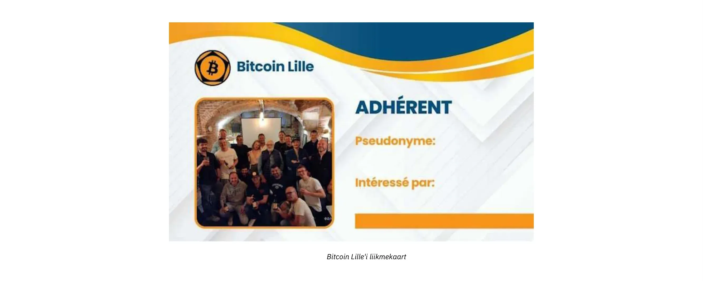

## Surma korral üleandmise planeerimine

<chapterId>c5febf18-235c-51bc-8fbb-9467dabe4cb0</chapterId>

Täiesti teistsuguse märkusega, olgu Address tundlik teema: teie Bitcoin kogukonna liikme lahkumine.

Ühel päeval võib teiega ühendust võtta endise liikme perekond, kes teatab teile tema surmast. Nad võivad selgitada, et surnu jättis juhised, sealhulgas võtta ühendust teie kogukonna, kohtumise või ühinguga.

Mõnel juhul võib perekond otsida abi ka pärandi saajatena vahendite tagasinõudmisel.

On mõistlik teha oma kogukonnaga koostööd, et kehtestada eelnevalt selge kord selliste olukordade jaoks, mis tagab, et:

- Lahkunu on juba soovitanud oma perekonnale **ei tohi kunagi jagada privaatseid võtmeid ega tuua füüsilisi rahakotte kokkusaamisele**.
- Perekond mõistab, et nende visiidi eesmärk on hariduslik: õppida, kuidas Bitcoin töötab, et nad saaksid hiljem vahendite üle suveräänse kontrolli teostada.
- Perekond on teadlik oma riigi asjaomastest seadustest, mis käsitlevad kingitusi, pärimist ja Bitcoin konverteerimist fiatiks.

Standardprotokolli olemasolu takistab ka seda, et keegi, nii liige kui ka külaline, ei kasutaks olukorda ära vahendite varastamiseks.

Selle protsessi määratlemiseks võiksite moodustada spetsiaalse töörühma. Lille'i ühing Bitcoin töötab juba sellise [dokumendi](https://docs.google.com/document/d/1TDfLZjuictC5s3PEM2Z7WmkxIDSJ8Q1E4xevm52pVgU/edit?usp=sharing) kallal, mille nad kavatsevad lähikuudel avaldada avatud lähtekoodina.

## Loengute pidamine koolides ja ülikoolides

<chapterId>65efdb44-e3d4-567c-aedf-972765753d73</chapterId>

Eespool kirjeldatud projektide loetelu ei ole loomulikult ammendav. Üldiselt on need pigem oma kogukonna või kohtumiste sisemised projektid, mida saab üsna lihtsalt rakendada nende arenedes.

Nüüd pöördume töölevõtmise juurde.

Nagu te teate, on üks parimaid viise **suure publikuni korraga jõudmiseks tasuta loengute korraldamine**. Seda saab teha kolledžites ja ülikoolides, tutvustades nii noortele (kui ka mitte nii noortele) Bitcoin, olgu nad siis täiesti uued või soovivad oma arusaamist süvendada.

Loengu pidamine kümnetele või isegi sadadele inimestele nõuab enamat kui lihtsalt tehnilisi teadmisi. Teil on vaja:

- Enesekindlus avalikul esinemisel
- Hea stressijuhtimine
- Selge artikulatsioon
- Tugev ajajuhtimine
- Hästi uuritud, kvaliteetne esitlus või töötuba, mis on kohandatud teie kuulajate oskuste tasemele

Sama oluline on **täiesti avatud meel ja teadmine, millal mõisteid lihtsustada**, eriti küsimuste ja vastuste esitamise või paneeldiskussiooni ajal. See ei tähenda oma põhimõtetest loobumist, vaid lihtsalt selle tunnistamist, et teised võivad asju teisiti näha. Mõnikord on kõige parem vastata hiljem või jätta asi sinnapaika, et arutelu saaks edasi liikuda. Kui teie seisukohti toetavad kindlad, hästi põhjendatud argumendid, siis inimesed tunnistavad seda.

Kui tunnete end valmis, siis tehke seda! Maailm vajab hädasti paremat haridust Bitcoin kohta.

See ei ole kerge ettevõtmine: see nõuab motivatsiooni, pingutust ja õigeid sidemeid.

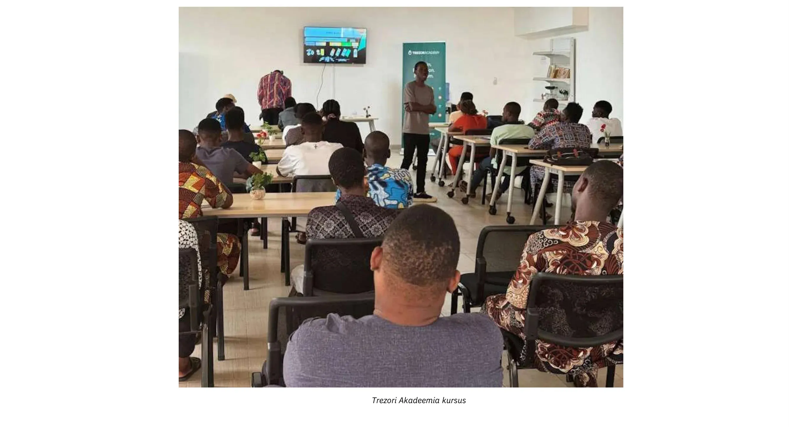

Loengu või seminari korraldamine koolis või ülikoolis algab õige kontaktisiku leidmisega. See võib olla:

- Isiklik tuttav
- Üliõpilaskond
- Üliõpilasühing, mis korraldab loengusarju või üritusi
- Teie insenerikooli või ülikooli endised professorid
- Akadeemilise programmi koordinaator, kui ta võtab otse ühendust

Esimene samm on tavaliselt oma algatuse või ühingu tutvustamine ja kohtumise taotlemine. Parimal juhul viib see mõne nädala pärast Bitcoin esitluseni õpilaste ees.

Kahjuks on Bitcoin ikka veel suure osa meedia ja paljude poliitikute poolt demoniseeritud, mistõttu mõned usuvad, et sellel ei ole kohta klassiruumides. Tagasilükkamine on tavaline, eriti akadeemilistes ringkondades, kus sellised teemad nagu Proof of Work ja energiatarbimine on endiselt vastuolulised.

Siiski tasub proovida, eriti üliõpilasliitude ja -ühenduste puhul. Ja kes teab? Isegi kui teie esimene katse saab "ei", võib juhtuda, et järgmise pulli ajal leiate oma postkastist e-kirja, mis kutsub teid rääkima näiteks 280 tudengiga!

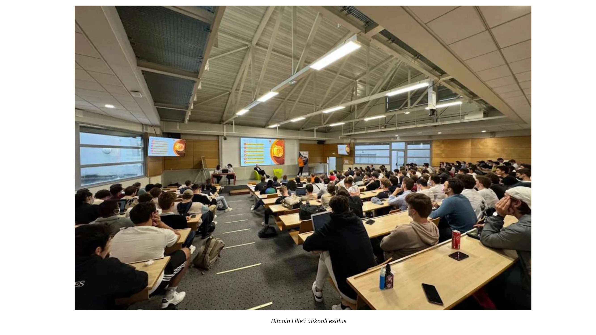

## Lähenemine ettevõtetele

<chapterId>b730462b-7928-5d28-a14f-9ceaa773d3d2</chapterId>

Bitcoin aktsepteerimine on paljude bitcoin'i kasutajate jaoks nagu haruldase saavutuse avamine Pokédexis.

Iga kaupmees on erinev ja nende sisseelamisega kaasnevad omaette väljakutsed:

- Nad vajavad tarnijatele maksmiseks endiselt fiatvaluutat.
- Nad vajavad selgeid, raamatupidamist võimaldavaid finantsaruandeid.
- Nende maksesüsteemid peavad olema usaldusväärsed, hõlpsasti kasutatavad ja varguskindlad.
- Neil võivad olla Bitcoin kohta väärarusaamad või negatiivsed eelarvamused.
- Veatu tarkvaralahenduse leidmine võib olla keeruline.
- Kaupmehe arusaamine, miks tasub Bitcoin maksmiseks vastu võtta.

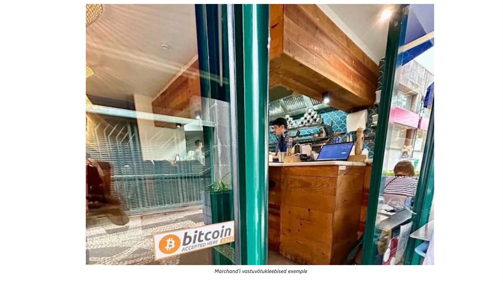

Kohalike ettevõtete kaasamine on üks parimaid viise, kuidas kasvatada oma linna Bitcoin ökosüsteemi. Oluline on toimida samm-sammult:

1/ **Makske iga kord Bitcoin-ga, kui teete ostu**

Enamasti saate vastuseks "ei" ja võib-olla mõistatusliku või isegi veidi eelarvamusliku pilgu, kuid lihtsalt küsimine annab mõista, et Bitcoin on midagi, mida "tavalised inimesed" saavad kasutada, ja et see on muutumas üha populaarsemaks viisiks maksta. Võite isegi paari sõbraga koos käia eri päevadel ühes ja samas poes, paludes iga kord Bitcoin-ga maksta. Varem või hiljem äratab see omaniku uudishimu.

2/ **Paljundage lihtne ja selge selgitus**

Kui nad küsivad, mis on Bitcoin, hoidke see lühike ja žargoonivaba. Näiteks:

*"Bitcoin on raha, mida pangad ei kontrolli, mis töötab ilma vahendajateta, mida ei saa tsenseerida, mis ei allu inflatsioonile ja mille tasud on madalamad kui traditsioonilise panganduse tasud. "*

Seejärel ulatage neile infoleht, näiteks "21 põhjust kasutada Bitcoin" või "10 põhjust, miks peaksite Bitcoin oma ettevõttes kasutusele võtma", koos oma kontaktandmete või kohtumise üksikasjadega. Nii teavad nad, kui nad on valmis tutvustuseks, kust teid leida.

3/ **Korraldage demonstratsioon**

Kui nad väljendavad huvi, leppige kokku aeg, mil saate neile makselahendust näidata.

Suurepärane valik on **[Swiss Bitcoin Pay](https://swiss-Bitcoin-pay.ch/)**, sest see:

    - Võimaldab kaupmehel automaatselt iga päev BTC-d fiatiks konverteerida, et nad saaksid tarnijatele maksta.
    - Võimaldab neil soovi korral hoida protsentuaalselt BTC-des.
    - Koostab eksporditavaid raamatupidamisaruandeid oma raamatupidajatele.
    - Omab lihtsat armatuurlauda juhtide jaoks.
    - Annab töötajatele intuitiivse Interface, et võtta makseid vastu ilma kassat puudutamata.
    - Kulud on väiksemad kui traditsiooniliste maksevõrkude poolt nõutavad 2-3% tasud.

4/ **Toetage neid, kui nad hakkavad Bitcoin vastu võtma**

Pärast seda, kui nad on pardal:

    - Külastage regulaarselt ja tehke oste.
    - Kontrollige, kas kõik toimib tõrgeteta.
    - Vajaduse korral jagage oma kontaktandmed uuesti.
    - Kutsuge neid oma kohtumistele.
    - Lisage need [btcmap.org kaardile](https://btcmap.org/) ja andke [Swiss Bitcoin Pay](https://x.com/swissbitcoinpay) Twitteris teada, et suurendada nähtavust.
    - Kaaluge võimalust korraldada nende asukohas töötubasid või kohtumisi.

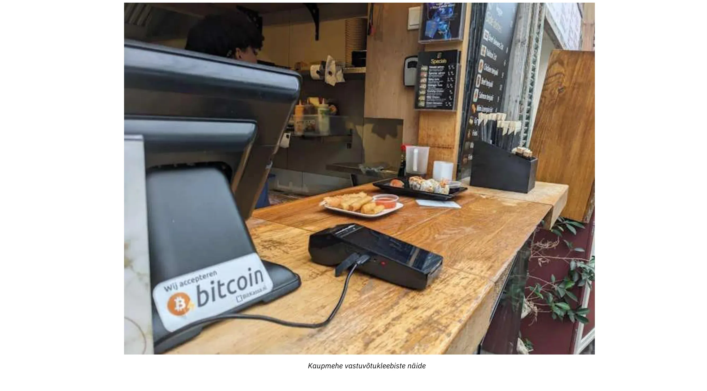

5/ **Ühendage kohalikke kaupmehi**

Kui teil on paar Bitcoin-sõbralikku ettevõtet, soovitage luua ainult kaupmeeste Telegrami grupp. See võib:

- Las nad jagavad kogemusi ja võtavad tööle uusi ettevõtteid.
- Toimida kiire tehnilise toe kanalina.
- Tugevdada kohalikku Bitcoin võrgustikku.

Küsitlus on pikaajaline mäng. See nõuab kannatlikkust, püsivust ja strateegiat. Aga kui teie kogukond on valmis, võite alustada tõelise Bitcoin ringmajanduse aluse panemist, nagu [Arnhem Madalmaades](https://www.arnhembitcoinstad.nl/) Madalmaades.

## Võtke ühendust kohaliku ajakirjanduse ja raadioga

<chapterId>435bfbc1-22dd-59bb-b737-a32ea995b238</chapterId>

Bitcoini kasutajad keskenduvad sageli sotsiaalmeediale ja veebiplatvormidele, kuid see on vaid osa pildist. Kohalik ajakirjandus ja raadio võivad olla võimsad liitlased.

Mõned kogukonnad, nagu [Breizh Bitcoin](https://breizhbitcoin.com/) Prantsusmaal, **suhtlevad regulaarselt oma kohaliku meediaga**, et:

- Teatage eelseisvatest üritustest (kohtumised, esitlused, õpitoad, Halving peod jne).
- Kutsuge ajakirjanikke külastama Bitcoin-sõbralikke ettevõtteid ja kirjutama neist.
- Jagage sündmuste kuupäevi ja asukohti, et need saaksite lisada kohalikku nimekirja.

Paljudes ajalehtedes on ikka veel rubriik "Mis toimub", mis on sageli peidetud viimastele lehekülgedele ja kus on loetletud eelseisvad kohalikud üritused. Breizh Bitcoin on leidnud, et see lähenemisviis toimib: uued tulijad on tulnud kohtumistele lihtsalt sellepärast, et nad märkasid ajalehes kirjutatut.

See strateegia võib teatud valdkondades toimida paremini kui teistes, kuid see on väärt proovimist. Võite alustada sellest, et pöördute piirkondlike uudisteagentuuride poole, Prantsusmaal on selliseid näiteid nagu:

- [acpm.fr](https://www.acpm.fr/Les-chiffres/Diffusion-Presse/Presse-Payante/Presse-Quotidienne-Regionale);
- [voxpublic.org](https://www.voxpublic.org/spip.php?page=annuaire&cat=medias&type_media=Presse%20quotidienne%20r%C3%A9gionale).

ja võttes ühendust kohalike raadiojaamadega, et teha ettepanek intervjuu või podcasti esinemise kohta.

Olge teadlik, et meediaintervjuud võivad olla keerulised. Sõnu võidakse kontekstist välja rebida või valesti esitada. Ettevalmistus on oluline.

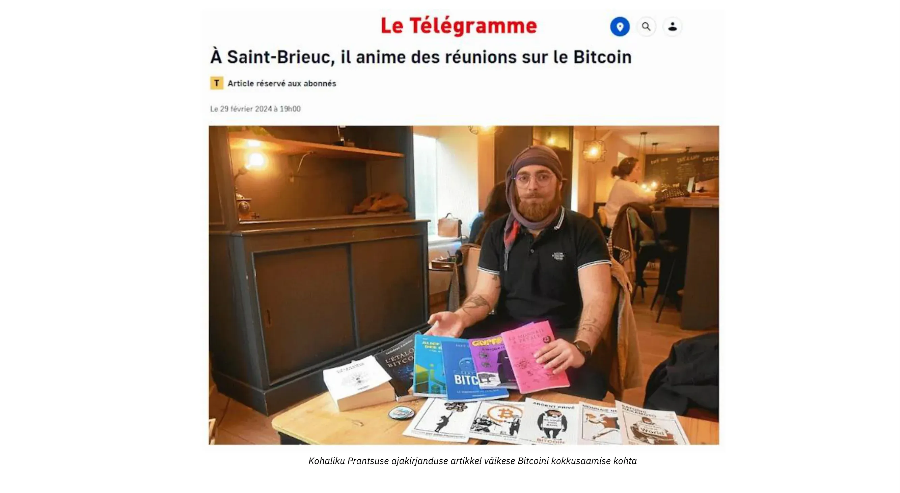

Loomulikult saab lisaks kõigile käesolevas punktis soovitatud projektidele **mitmeid teisi projekte teostada**. Kõik sõltub teie ajast ja motivatsioonist, aga ka kõnealuse projekti raskusastmest.

Viimased näpunäited mis tahes teavitamisprojekti jaoks:

1) **Plaanige ette**: määratlege oma eesmärgid, vajalikud sammud ja see, kes mida teeb.

2) **Võtke see samm-sammult**: vältige läbipõlemist, jagades oma pingutusi.

3) **Paluge abi**: pöörduge oma liikmete ja naaberkogukondade poole toetuse saamiseks.

Pidage meeles: iga Bitcoin kogukond on olnud seal, kus te praegu olete. Ärge kartke õppida nende kogemustest ja nõuannetest.

# Tuleviku prognoosimine

<partId>6ea07445-9369-54bc-9aa0-d260db026e0b</partId>

## Planeerimine osalejate arvu suurendamiseks

<chapterId>8af722d4-3a9f-548c-9001-424f2142de12</chapterId>

Kui Bitcoin sisenes oma neljandasse ajastusse plokis 840,000, hakkasid üha enam inimesi seda tunnustama kui tehnoloogilist, rahalist ja sotsiaalset revolutsiooni.

Sarnaselt interneti arengule võtab ka see revolutsioon aega, mis on tegelikult eelis. See annab inimestele võimaluse **õppida Bitcoin põhialuseid**, mõista, kuidas seda kasutada, ning võimaldab arendajatel ja ettevõtetel **loomata protokollid ja rakendused**, mis avavad selle täieliku potentsiaali.

Keegi ei oska tulevikku ennustada, kuid me võime **oodata Bitcoin kasutuselevõtu järsku suurenemist**. See tähendab, et peame olema valmis kõigiks stsenaariumideks, isegi äärmuslikeks, nagu traditsioonilise finantssüsteemi kokkuvarisemine või Bitcoin otsene keelustamine.

Selles kursuse seitsmendas ja eelviimases osas vaatleme põhipunkte, mida oma kogukonna ja kokkusaamiste kasvades meeles pidada.

Esimene ja kõige lihtsamini prognoositav on teie kogukonnaga liituvate inimeste arvu suurenemine. See mõjutab teid peamiselt kahel viisil:

1/ **Sinu suhtluskanalid (Telegram, Signal, Matrix jne.) muutuvad lõpuks ülerahvastatud**, mis muudab vestlustega sammu pidamise keerulisemaks. Tuleb silmas pidada kahte asja.

Esiteks, kui 500 inimest arutavad ühes vestluses kõikvõimalikke teemasid, viib sõnumite ja teadete hulk paratamatult selleni, et paljud liikmed lülituvad välja. See on hea aeg oma ülesehitust ümber mõtestada, näiteks Telegrami supergruppide või Discordi serveri kasutamise teel, mis mõlemad võimaldavad arutelusid teemade kaupa hõlpsasti korraldada.

Teiseks, rohkem inimesi teie kanalites tähendab rohkem botte, rohkem petuskeeme ja seega rohkem modereerimist. Olge selleks valmis, luues selged reeglid, millele saate sõnumeid modereerides viidata. Meie kogemuse kohaselt aitab see palju kaasa konfliktide vältimisele, eriti kui reeglid on teie kanalites kergesti kättesaadavad.

Hea näide on **[Bitcoin Lille'i avatud lähtekoodiga reeglistik](https://bitcoinlille.fr/reglement/)**, mis kirjutati mõned aastad tagasi selle Telegrami grupi ja Discord-serveri jaoks. See põhineb lihtsatel ja universaalsetel põhimõtetel ning siit saab isegi [kujunduse kohandatav versioon](https://www.canva.com/design/DAGHI692AD4/rjT4sqEnhajc5FiPA6GFZQ/edit?utm_content=DAGHI692AD4&utm_campaign=designshare&utm_medium=link2&utm_source=sharebutton) kätte.

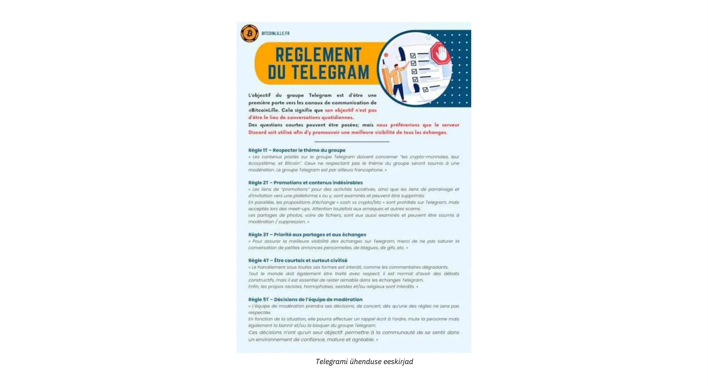

2/ **Sinu kokkusaamised ja üritused hakkavad tõmbama suuri rahvahulki, kus on palju uusi nägusid, kes tulevad kohale, et suhelda**.

Selle osavõtu suurenemisega:

    - võib olla kasulik **saavutada suurem kohtumispaik oma kohtumiste ja ürituste jaoks**, eriti kui olete varem suutnud võõrustada vaid paarkümmend inimest.
    - kui leiate, et osalejate arv muutub üle jõu käivaks, võite tulevaste kokkusaamiste puhul kas **nõuda osalejatelt registreerimist** (Meetupi rakenduse või lihtsa vormi kaudu) või **pidada iga kuu mitu kokkusaamist** (näiteks: algajate kokkusaamine, keskastme kokkusaamine ja edasijõudnute kokkusaamine).
    - Samal ajal on oodata ökosüsteemi palju uusi tulijaid, kelle peamine eesmärk on sageli raha teenimine. Selleks, et **suhtlused keskenduksid Bitcoin-le** nendel kiiresti kasvavatel kohtumistel, on hea mõte:

a) kaasata nende ürituste ajal **Bitcoin-teemaline esitlus**, sest see suunab loomulikult suure osa vestlusest sellele teemale (ja eemale viimasest väidetavalt "revolutsioonilisest" shitcoin-projektist);

b) **Vältige ainult bitcoin'idega**. Selle asemel tehke endale eesmärgiks **läheneda uutele tulijatele**, isegi kui see tähendab, et peate neid tervitama ruumi tagumises otsas. Sealt saate rääkida sellest, miks nad tulid, mida nad otsivad, millised on teie kogukonna eesmärgid (või isegi põhiprintsiibid) jne.

Lõpuks, kuigi on kahetsusväärne, et pean seda ütlema, võivad kohtumistel ilmuda petturid. Nende eesmärk võib olla rääkida lõputult oma Ponzi-skeemist, MLM-ist või mõnest "Blockchain revolutsioonist, mida juhib AI" Samuti on täiesti võimalik, et ühel päeval võib keegi halbade kavatsustega osaleda spetsiaalselt selleks, et raha pesta või proovida võltsitud rahatähtedega BTC-d osta.

Sellistes keerulistes olukordades on kõige lihtsam viisakalt selgitada, et kokkusaamine ei ole selleks koht, ja toetada seda mis tahes argumentidega (näiteks mainides, et kohal võib olla politsei tsiviilriietes).

Kui nad kahjuks keelduvad lahkumast või käituvad lugupidavalt (jah, seda on juhtunud), võite Address grupi otse kokkusaamise ajal anda kõigile teada, et inimene või inimesed üritavad mingit pahatahtlikku tegevust.

Õnneks on sellised olukorrad haruldased ja sageli pigem absurdsed kui ähvardavad, kuid siiski on parem olla valmis.

Meelerahu tagamiseks: seni, kuni te isiklikult ei riku seadust ega hõlbusta otseselt ebaseaduslikke tehinguid, ei ole te õiguslikult vastutav teiste isikute tegevuse eest teie üritusel (vähemalt Prantsusmaa seaduste kohaselt).

Ideaalses maailmas oleks teil **suur ruum, mis oleks piisavalt suur, et majutada mitukümmend inimest**, kui teie kogukond kasvab, ja te ehitaksite ka **tugevaid suhteid bitcoin'i kasutajate** ja tulevaste bitcoin'i kasutajate vahel karuturu ajal, nii et kui pullihooaeg tuleb, oleks teil võimalikult palju inimesi, kes on valmis teisi oranži pillide jaoks.

## Ühenduse detsentraliseeritud korraldus

<chapterId>bedfc110-e099-58f4-a5b7-fb50f3b19a49</chapterId>

Kujutage ette järgmist: olete aastaid juhtinud oma Bitcoin kohtumist ja ühel päeval otsustate selle töö lõpetada, et kasvatada Peruus laamasid või jahtida täiuslikke laineid El Salvadoris. Mis juhtub teie kogukonnaga, kui te lahkute?

Palun planeerige oma kogukonna üleviimist ette:

1) **Või Ownership admin-õigused** oma sidekanalite jaoks usaldusväärsetele liikmetele. Rollid võivad hiljem alati vahetada omanikke.

2) **Jagage oma sotsiaalmeedia ja nähtavuskanalite kontoandmeid** (kasutajanimed, paroolid, seotud e-posti aadressid) vähemalt ühe usaldusväärse inimesega.

Ilma sellise juurdepääsuta on kellelgi teisel peaaegu võimatu tõhusalt üle võtta. Alustada nullist, luues "hargnenud" gruppe ja ehitades võrku uuesti üles, on aeglane, kurnav ja sageli demoraliseeriv.

Kui teil ei ole oma kohtumisgrupis usaldusväärset kontakti, võite alati pöörduda Telegramis @ProfEduStream, @copinmalin või @gabtribe poole. Nad võivad aidata leida motiveeritud järeltulija ning koordineerida kontode ja administraatoriõiguste üleandmist.

**Miks detsentraliseerimine on oluline?**

Kui sa oled ainus asjaosaline ja sul on kogu kontroll, mis juhtub siis, kui sa kaob? Vastus on lihtne: ka teie kogukond kaob.

Lahendus: detsentraliseerida ülesanded, rollid ja juurdepääs, et rühm saaks jätkata tööd isegi siis, kui üks korraldaja langeb välja, olgu see siis ajapuuduse tõttu või, tumedama stsenaariumi korral, kuna ta on arreteeritud Bitcoin, mis ei ole KYC.

**Kuidas detsentraliseerimist edasi arendada? **

Võtta kasutusele **vaba ja avatud lähtekoodiga tarkvara** nagu [framasoft suite](https://framasoft.org/fr/), et vähendada sõltuvust tsentraliseeritud platvormidest ja suurendada vastupidavust võimaliku riikliku tsensuuri või Bitcoin keelustamise vastu.

Kasutage **krüpteeritud või anonüümseid suhtlusvahendeid**, et kaitsta oma liikmete privaatsust ja kogukonna tegevust.

## Mis siis, kui Bitcoin-st saaks avalik vaenlane nr 1?

<chapterId>c739651f-cd13-51e0-a36e-85023749b15b</chapterId>

5. aprillil 1933 allkirjastas Ameerika Ühendriikide 32. president Franklin Roosevelt **Täitevkorraldus 6102**, millega eraisikutele keelati kullast müntide, kuldkangaste või sertifikaatide omamine kõikjal riigis.

Loomulikult ei ole Suur Depressioon (1929. aasta börsikrahh) meie praegune reaalsus. Aga kas valitsus võiks ühel päeval teha sama Bitcoin: **privaatne Ownership otsene keelustamine?**

Tõsi on see, et selline orwellilik meede ei takistaks tegelikult kedagi BTC tõeliselt omamast, sest ükski seadus ei saa takistada inimest sõnajärje meeldejätmist.

Mis siis, kui maailma liidrid lõpuks ometi mõistaksid Bitcoin potentsiaali globaalse korra ümberkujundamiseks, isegi riigi tasandil? Kas siis nimetataks seda "avalikuks vaenlaseks nr 1"?

Me ei pea langema vandenõu mõtlemisse. Kuid miski ei takista meid ennetamast, detsentraliseerimast ja harimast, alustades kohe.

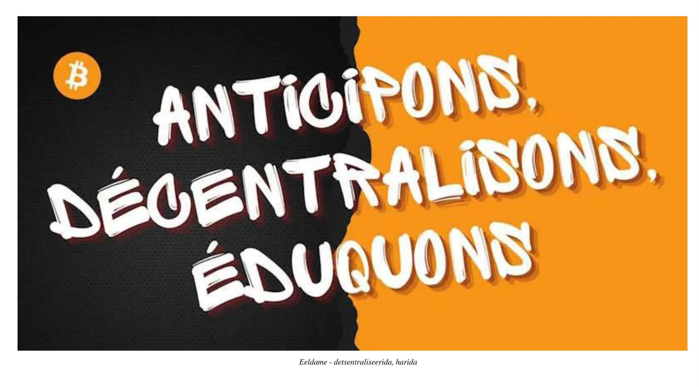

# Bitcoini kasutajate ühendamine

<partId>62bc2138-c0be-5d39-a341-594690863257</partId>

## Kiire tegevuskava Bitcoin kogukonna loomiseks

<chapterId>1f463ec2-3f64-5641-8d60-e02a47c94f27</chapterId>

Satoshi Nakamoto lõi revolutsioonilise vahendi, mis juba muudab meie maailma. Kuid meie, bitcoin'i kasutajad, peame otsustama, kuidas me tulevikku kujundame.

Bitcoin on tohutu küülikutee, mis puudutab ajalugu, majandust, kirjandust, matemaatikat, arvutiteadust ja krüptograafiat. Keegi ei saa seda kõike uurida, ja see on osa selle ilust.

Kuna meie aeg on piiratud, on võtmeks jääda alandlikuks, jätkata õppimist ja Exchange teadmisi koos teistega. Nii saab igaüks meist jõuda arusaamise tasemeni, mida me otsime.

**Globaalsed Bitcoin kogukonnad mängivad seega olulist rolli homse maailma ehitamisel**: ruumid, kus bitcoin'id saavad **Exchange, ehitada ja jagada**. **Koos**.

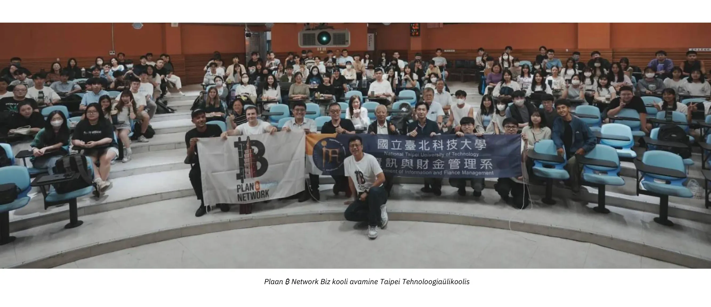

Nagu te olete kogu kursuse jooksul näinud, nõuab ** Bitcoin kogukonna loomine ja kohtumiste korraldamine** nii planeerimist kui ka motivatsiooni. Sõltuvalt teie eesmärkidest ja ajakulust võite võtta ette ambitsioonikamaid projekte või hoida asjad lihtsad.

Eesmärk on igal juhul sama: **tekitada huvi ja aidata Bitcoin-l teie linnas kasvada**.

Lõpetuseks paljude käsitletud peatükkide ja alapeatükkide kohta on siin **konkreetne "tegevuskava "** Bitcoin kogukonna loomiseks:

1) Otsustage eelnevalt, miks te soovite luua Bitcoin kogukonna, millised on teie eesmärgid ja millises linnas või kohas te tegutsete.

2) Võtke ühendust olemasolevate kogukondadega läheduses ja ärge kartke neilt nõu küsida, kui seda vajate;

3) Looge oma kogukonnale selge identiteet, mis kajastab teie kogukonda ja asukohta (logo, plakat, bänner, flaier jne)

4) Looge suhtluskanaleid ja sotsiaalvõrgustikke, nagu Telegram, Twitter, NOSTR, Discord või Simplex. Kaaluge ka detsentraliseeritud ja/või tsensuurikindlaid kanaleid.

5) Jälgige teisi kohalikke kohtumisi ja kogukondi internetis ning lisage oma rühm erinevatele kaartidele ja platvormidele, et suurendada nähtavust.

Kui teie kogukonna suhtluskanalid on aktiivsed:

6) Käivitage küsitlus, et teha ettepanek oma esimeseks kokkusaamiseks, kui tunnete, et huvi on piisavalt suur.

7) Määratlege eesmärgid, mida soovite selle isikliku ürituse abil saavutada.

8) Valige hea asukohaga, külalislahke koht, mis vastab teie eesmärkidele, ja reserveerige laud või ruum.

9) Reklaamige üritust oma kanalites nädal enne seda, seejärel uuesti kaks kuni kolm päeva enne kuupäeva.

10) Lisage oma üritus asjakohastel veebisaitidel ja platvormidel.

11) Laske üritusel loomulikult kulgeda ja suhelda osalejatega, vajadusel suunake arutelusid ettevaatlikult.

Pärast seda:

12) Keskenduge osalejate hoidmisele ja kaasamisele, et nad tagasi tuleksid.

13) Paku välja lihtsaid projekte või algatusi ja alusta neid, mis sind isiklikult huvitavad. Kui keegi teine tahab juhtida mõnda muud projekti, toeta teda, kus saad.

Lõpuks:

14) Oodake tulevikku, mõeldes suurema kohtumispaiga, suhtluskanalite reeglite, veebisaidi jne. peale;

15) Julgustage kohalikke ettevõtteid Bitcoin vastu võtma, isegi kui te lihtsalt küsite seda iga kord, kui te seal ostate.

16) Delegeerige ülesanded ja kanali/võrgu haldusõigused usaldusväärsetele liikmetele.

17) Propageerige oma kogukonda laialdaselt, et rohkem inimesi liituks ja kaasake need, kes huvi näitavad.

18) Mine veelgi kaugemale projektidega, mis sulle meeldivad ja mis on sulle olulised.

Kiirema ülevaate saamiseks võtab see 21-minutiline video need sammud kokku:

:::video id=a59956da-f554-4b54-89dd-5ca55b722686:::

Pea meeles: **Te ei ole üksi, olemasolevad kogukonnad on siin, et teid toetada**.

## Enda eest hoolitsemine

<chapterId>cf1631cb-ddbe-55c7-be8c-26a5652979a0</chapterId>

Kui te satute Bitcoin jänesepauku, muutub teie vaatenurk elule.

Sügaval sisimas tunned sa tõmmet, et minna edasi, et kohtuda teiste inimestega, kes läbivad sama vaimset teekonda.

See energia ajendab teid panustama oma osa mõistatusse, jagades oma avastust: Bitcoin. Samuti inspireerib see teid mõtlema homsele maailmale, mida soovite aidata ehitada, ja selle nimel töötavatele kogukondadele.

Kogukonna loomine on pikk tunnel, mis nõuab motivatsiooni, strateegiat, pühendumist ja aega. See võib olla tänamatu ülesanne, seega on oluline võtta asju samm-sammult, et vältida läbipõlemist.

**Mõtle endast, oma piiridest**. Ja kuigi Bitcoin võib teid ajada öö ja päev, **ei püüa teha kõike üksi, sest muidu põletate end läbi**.

Selle asemel **otsige abi bitcoini kasutajatelt, kes on juba käinud sama tunneli, uurinud samu teid ja ehitanud samu vahendeid**. See säästab teile palju aega.

**Kutsuge neid, kes teid selles seikluses jälgivad, appi**, isegi kui delegeerimine muudab teatud ülesanded kauem kestvaks. Pikemas perspektiivis on teie kogukond tugevam ja vastupidavam.

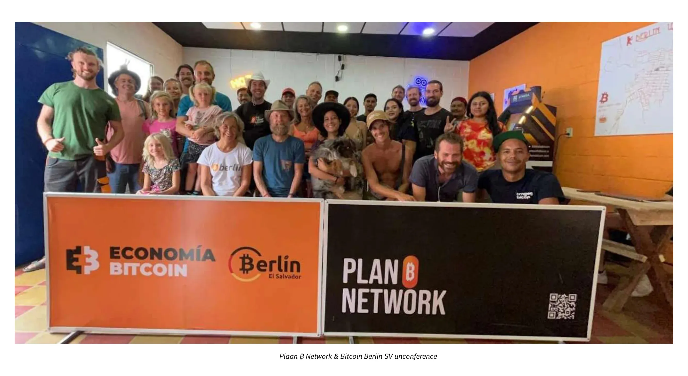

Üksinda saate kiiresti uurida ühte Bitcoin küülikuaugu paljudest tunnelitest. Kuid pidage meeles,et on veel lugematul hulgal teisi suundi, mida uurida.

**Loomine ja/või liitumine bitcoinerite kogukonnaga ning nendega regulaarselt jagades ja vahetades, liigute samaaegselt kõikides suundades mööda jänesekuure.**

## BTC302, mis saab edasi

<chapterId>8bf10b77-80ee-5d50-87bc-0ef32574a675</chapterId>

Selles BTC302 kursuses oleme lähemalt käsitlenud, kuidas luua kogukond või kohtumine ning kuidas käivitada erinevaid projekte.

Kui teie kogukond on valmis astuma järgmise sammu, **võite luua ametliku ühingu**.

Näiteks Prantsusmaal on umbes kuuekümnest kogukonnast ja kokkusaamisest peaaegu tosinal ühingu staatus.

Kasu on kahekordne:

- **Ametlik tunnustus**: saate avada ühingu pangakonto, saada ajakirjanduse/meedia tähelepanu ja isegi taotleda toetusi.
- **Struktureeritud organisatsioon**: saate määratleda selged rollid, mis lihtsustab kogukonna juhtimist ja projektide elluviimist.

Et aidata oma kogukonnal veelgi kasvada, **selline jätkukursus COMMU302**

võidakse avaldada [planb.network](https://planb.network/) lähikuudel.

Järgmisel istungil võiks uurida selliseid edasijõudnute teemasid nagu:

- Esitluste või töötubade kavandamine oma koosolekute jaoks ja selgete eesmärkide seadmine.
- Suurürituse korraldamine umbes 100 osalejaga.

Selleks kasutame nende kogukondade kogemusi, kes on juba oma üritusi ja esitlusi korraldanud.

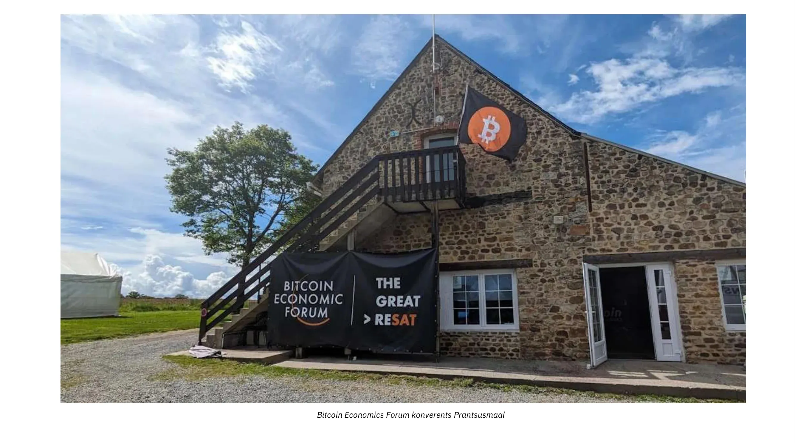

# Lõpposa

<partId>e9bdddf4-54c9-4de9-bbce-c3eade8c32e5</partId>

## Arvamused ja hinnangud

<chapterId>08a35d2a-204b-519a-9bb1-588665a037fa</chapterId>

<isCourseReview>true</isCourseReview>

## Kokkuvõte

<chapterId>d74606a5-cb14-4117-acb2-2bf5920de092</chapterId>

<isCourseConclusion>true</isCourseConclusion>